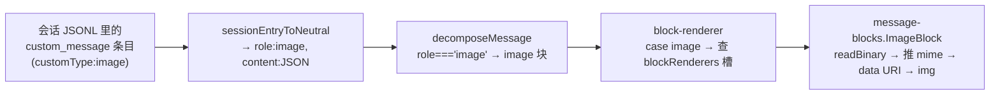
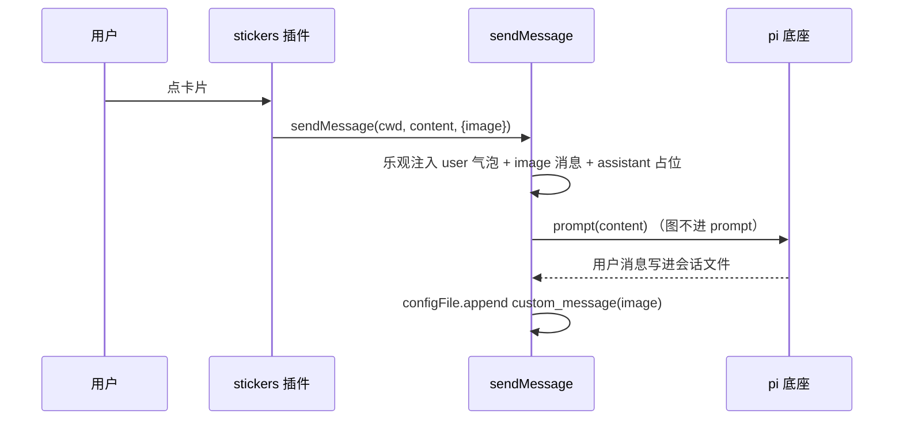

# 表情包插件设计：常用语升级为带 banner 的贴纸

> 术语先对齐：本文里"常用语"指 notes 的旧形态，"贴纸"指单个条目，"表情包"指整个插件（贴纸的合集）；banner 指卡片顶部那张配图（借表情包"封面图"的说法），和"展示图"是同一个东西。"会话流""时间线""timeline"也同指一物——会话消息流那片界面，timeline 是它的插件名。

## 1 升级与定位

### 1.1 升级了什么

notes 插件现在是一列可点击的文本卡片——点击把 content 当用户消息发进会话，数据分全局/项目两层，支持拖拽排序和层间迁移（设计 `docs/design/note-plugin.md`）。这次把它从"常用语卡片"升级成"表情包"：每条卡片多一张可选的 banner 图，输入框（即 composer）底部多一个表情包快速入口，会话流里能把这张图展示出来。

三处变化各补一块：

- 卡片多一张 banner 图，给纯文本常用语一个视觉身份——"这条指令长什么样"一眼可辨，不必一行行读文字。
- composer 底部多一个快速入口，点按钮弹网格选择器，方向键挑、回车发，不必切到右面板（sidePanel 槽，notes 插件现在挂在那里）。
- 会话流展示图，发出去的那条消息在时间线里带出这张图，回顾会话时知道"我当时发的是这张图"。

### 1.2 统一抽象：贴纸 = 文本 + 展示图

数据实体只有一种，形状是 `{ id, title?, content, banner?, order, createdAt, updatedAt }`。`content` 是发给 AI 的文本；`banner` 是一张可选的展示图。标题可选、图也可选，四条组合（有标题有图、有标题无图、无标题有图、都没有）是同一抽象的四个参数化形态，不引入 `kind` 字段去区分"这是贴纸还是常用语"——发送、编辑、排序、拖拽的行为对它们完全同构。

图的定位是设计里最该钉死的一句：**图是交流机制，不是 AI 输入**。banner 图不发给模型——AI 不识别这张图，图对它也没用；图只给人看，是发送者"用这张图配这句话"的表达。所以整条设计里，图永远走展示路径，文本才走 prompt 路径，两者在发送那一刻就分开（§4）。

### 1.3 与现有机制的关系

先交代三个底层概念，后面反复用到：pi 底座是独立的 AI coding agent 进程，会话是它写的一个 JSONL 文件（每行一条 entry）；`custom_message` 是这种文件里的一类 entry，桌面端用它往会话里追加自定义展示内容；"槽"是内核预定的挂载点，插件往槽上挂内容（本文涉及的 sidePanel/settings/messageRenderers/blockRenderers/composerActions 都是槽）。

这次几乎没有新发明，几块都是复用和顺延：

- 会话流里"展示一张图"被设计成**通用能力**，不叫 sticker 专属渲染——图是交流机制，跟谁发的无关。落点是 `custom_message` 条目 + 会话流的通用图片块（§3），stickers 只是第一个用它。
- banner 文件的本地存储复用 `configFile` 通道的路径白名单，只补两个二进制原语（§2.2）。
- 发送复用 `sendMessage` 受管写口（§4.1），"加入输入框"复用现有 fillComposer 通道（随插件改名 `stickers:fillComposer`，§4.3）。
- 输入框快速入口需要内核新开一个 `composerActions` 槽（§5.1），这是唯一真正新增的槽。

sub-agent（子 agent 编排）插件已经走通了"往会话文件 append 一条 `custom_message` 条目、再靠 messageRenderers 槽渲染成卡片"这条路：它在 `spawn-subagent.ts` 里 append `customType:"subagent_spawned"` 的条目，在 `plugin.json` 里贡献 `role:"subagent_spawned"` 的 SpawnCard。本设计沿用同一条 append 通道，只是把渲染从"某个插件自己的卡片"换成"会话流通用的图片展示"（§3.2 解释为什么）。

## 2 数据模型与存储

### 2.1 条目形状

沿用 note-plugin 的条目，加一个字段：

```typescript
interface StickerItem {
  id: string;          // crypto.randomUUID()，全局唯一，跨两层不撞
  title?: string;      // 可选；缺省时 UI 回退显示 content 摘要
  content: string;     // 发送时作为 prompt 文本，原样发给模型
  banner?: string;     // 可选；展示图的逻辑路径，见 §2.2
  order: number;       // 排序键，跟随条目迁移
  createdAt: number;
  updatedAt: number;
}
```

`banner` 存**逻辑路径**（如 `~/.my-harness-desktop/stickers/banners/<id>.png`），不是 URL、不是 data URI。为什么不用 URL 在 §2.2 展开；为什么不用 data URI 存进 config，是因为 data URI 就是把 base64 塞进 JSON，banner 图可以到兆级，塞进去会让 `stickers.json` 变成几 MB 的大文件，每次读写都拖慢。路径只有几十字节，文件本体留在磁盘上。注意这是说**存储**不用 data URI；渲染时临时把 base64 拼成 data URI 给 `` 用，是另一回事（§2.2）。

### 2.2 banner 落本地文件

banner 图存 `~/.my-harness-desktop/stickers/banners/`（文件名取贴纸自身的 id，即 StickerItem.id，桌面数据根下的专属目录），config 里只记逻辑路径。`~/.my-harness-desktop` 是逻辑前缀，经 `expandDesktopPath`（`client/paths.ts`）运行时映射到真实数据根——打包态 `~/.my-harness-desktop`、dev 态 `~/.my-harness-desktop-dev`，稳定版和迭代版的图自动隔离，跟其它配置数据同一套分流。

为什么不用 URL：应用在开发态从 `http://localhost` 加载页面（vite dev server），Electron 的 `webSecurity` 默认开启，`` 会被拦；打包态从 `loadFile`（file 协议）加载页面，反而能显示。两个环境行为不一致，所以放弃 file://。自定义协议（`pi-asset://`）能让 `` 直接用，但要加协议注册一套内核面，为一张图不值。最终走项目里现成的做法：**读文件 → base64 → data URI → ``**——file-preview 和 message-blocks 工具卡里的图片都是这条路。

为此 `configFile` 通道补两个二进制原语，与既有 `get/set/append` 并列，同样走 `~/.my-harness-desktop/` 和 `~/.pi/agent/` 白名单 + 逻辑前缀展开：

- `readBinary(path): Promise<string | null>`——读白名单内文件为 base64，不存在返回 null。
- `writeBinary(path, base64): Promise<void>`——base64 解码后写盘（盘上存的是原始二进制，不是 base64 文本），目录不存在递归创建，走同一把目录锁（`withDirLock`）。

这里和已有的 `readFileBase64`（`client/fs/fs-ops.ts`，项目目录只读能力）不是一回事：那个圈禁在项目根，够不到 `~/.my-harness-desktop/`；`readBinary` 是 `configFile` 通道的新原语，白名单是桌面数据根和底座目录。同一个"base64 传输"的手法，两个不同的可达范围。插件经 `ctx.configFile.readBinary` / `ctx.configFile.writeBinary` 调用（configFile 是核心默认能力，不需要权限声明）。

图片的 mime 类型不用单独存：banner 文件名带着扩展名（`.png`/`.jpg`/`.jpeg`/`.gif`/`.webp`），渲染时从扩展名推 mime 再拼 data URI，和 file-preview 的 `IMAGE_MIME` 映射同款。上传入口用现有 `ctx.dialog.openImages()`（返回 `{name, data, mimeType}`，单张 10MB 上限），插件把 base64 交给 `writeBinary` 写盘（落盘是解码后的原始二进制），再把逻辑路径存进条目。

### 2.3 两层 config 并集（沿用 note-plugin）

两层文件的语义原样继承 note-plugin §2.2：全局层 `~/.my-harness-desktop/config/stickers.json`、项目层 `<cwd>/.my-harness-desktop/config/stickers.json`，展示时简单并集按 `order` 升序，没有同 id 遮蔽；层间迁移原样搬运条目（含 order 和时间戳）。这次改名一共四处：插件目录 `notes/` → `stickers/`、插件 id、config 里的 key、fillComposer 通道名（§4.3）。没有内测用户，不做旧数据迁移。

一个有意为之的不对称：**banner 图文件恒存全局数据根，不跟项目层走**。图是交流机制、天然跨项目复用（同一张图可以在多个项目里配不同文本），而项目层文件会随仓库走、删项目就连图一起没。图文件放全局、文本条目分层，两者解耦——删了某个项目的项目层条目，图文件还在，别处照样能用。

### 2.4 第三层：随壳内置（只读）

贴纸除了用户能建的两层，还有一层**内置层**：随壳分发一批系统自带的贴纸，所有项目可见、谁都能发，但不能编辑、迁移、拖拽，但**可以删除**（删除是持久的，记墓碑，下次启动不回来）——它是"应用自带"，不是"用户数据"。

内置贴纸是**随壳资产，不是首启种子**。两者的差别在生命周期：种子是"第一次启动时复制一份进用户目录，之后用户随便改"——改完、删完种子就没了，老用户升级壳也拿不到新内置贴纸。受管目录相反：壳每次启动把内置资产强制镜像（覆盖）到数据根下的受管目录 `~/.my-harness-desktop/stickers/bundled/`（`bundled-skills` 同款机制，源资产随壳分发），里面一份 `stickers.json` manifest 加 `banners/` 下的图文件。壳更新了内置贴纸，老用户下次启动自动拿到新版——常驻、受管、随壳走，而不是一次性的种子。

**删除是持久的**：内置贴纸可以删，删除不碰受管目录里的资产文件（它们下次启动仍被镜像回完整态），而是把贴纸 id 记进**墓碑**（tombstone）——全局层 config 的 `removedBuiltin` key（与 `stickers` key 同文件 `~/.my-harness-desktop/config/stickers.json`）。`loadStickers` 读 builtin 时过滤墓碑里的 id，所以删掉的下次启动仍不回来；升级壳新增的内置贴纸不在墓碑里，照常显示。编辑/迁移/拖拽仍禁止（没有持久落点、会被镜像覆盖），只有删除走墓碑这条用户可控通道。

manifest 形状比用户层更瘦——没有 `order`、没有时间戳，壳不用维护排序键：

```json
{
  "stickers": [
    { "id": "<uuid>", "title": "可选标题", "content": "发送给模型的文本", "banner": "~/.my-harness-desktop/stickers/bundled/banners/<uuid>.gif" }
  ]
}
```

插件消费这条链路，复用现有的两条通道，零新增 IPC：

- 读 manifest：`ctx.configFile.get(BUILTIN_MANIFEST)`（`~/.my-harness-desktop/stickers/bundled/stickers.json` 逻辑前缀，走 configFile 白名单，壳没镜像时文件缺失返回 `{}`，插件按空层处理，不崩）。
- 读 banner 图：`ctx.configFile.readBinary`，和用户贴纸同一链路（`useBannerDataUri` 直接喂逻辑路径），图文件就在 `bundled/banners/` 下。

展示语义：内置条目在 `loadStickers` 里追加在 global+project 并集**排序结果末尾**（文件序），用户内容优先、系统默认垫后；设置页 section 序 project → global → builtin。`order` 由数组下标临时赋、`createdAt/updatedAt` 赋 0，反正不落盘。

写操作对 builtin 的守卫：`createSticker` 收到 `layer:"builtin"` 直接抛错；`updateSticker`/`moveLayer`/`moveToLayer` 命中 builtin 直接 return（静默 no-op，和"查无此条"同款语义）；`removeSticker` 命中 builtin **记墓碑**（把 id 并入 `removedBuiltin` 写全局层，下次启动过滤）而不是 no-op；`reorderStickers` 先把 builtin id 从拖拽的 `orderedIds` 里剔除再重编号——builtin 条目本就不写回任何层，但它的 `order` 值不能被拖拽污染。导出（`exportStickers`/`exportStickersZip`）**包含** builtin（整体打包语义，manifest 的 `layer` 字段写 `"builtin"`）；导入侧不动——既有 `o.layer === "global" ? "global" : "project"` 映射天然把导出的 builtin 落回 project 层，符合"导出的内置贴纸回来就是用户贴纸"的直觉。

事件同步链不用动：内置文件只在壳启动时变，renderer 挂载时读一次即可，`system:settingsChanged` 重读链路天然兼容。

## 3 会话流通用图片展示

### 3.1 custom_message 条目

会话流里展示一张图，用 pi 底座既有的 `custom_message` 条目类型——sub-agent 的 spawn 卡同款。发送时往会话文件末尾 append 一条：

```json
{
  "id": "<新生成的 uuid>",
  "type": "custom_message",
  "customType": "image",
  "display": true,
  "content": "{\"src\":\"~/.my-harness-desktop/stickers/banners/<id>.png\",\"title\":\"<可选标题>\"}",
  "timestamp": "2026-01-01T00:00:00.000Z"
}
```

注意这条 entry 的 `id` 是**发送时新生成的 uuid**，和 `StickerItem.id`（§2.1）是两个东西——后者是贴纸在 config 里的身份，前者是这条消息在会话文件里的身份，一条贴纸发十次就是十个不同的 entry id。

`customType` 用 `image` 而不是 `sticker`，这是刻意的：图是交流机制，任何来源（未来别的插件、甚至底座扩展）都能往会话流 append 一条 `customType:"image"` 的条目来展示一张图，渲染层不认识也不关心发图的是谁。stickers 只是第一个构造这种条目的插件。

落盘走 `configFile.append`（`api/ipc/config.ts` 的 `config-file:append` handler → `appendJsonlLine`），这是 sub-agent 已经用过的框架能力，白名单零改动。`sessionEntryToNeutral`（`core/domain/events/session-state.ts`）把 `custom_message` 映射成 `{role:"image", content:"{\"src\":...}", display:true, id, timestamp}`——role 取 customType，content 是 JSON 字符串原样透传，映射这层一行不用改。

### 3.2 通用渲染：会话流的 image 块

先分清两层：`sessionEntryToNeutral` 在**映射层**（会话文件条目 → 中性消息），`decomposeMessage` 在**块分解层**（中性消息 → 块序列）。前者透传 custom_message 条目、一行不用改（§3.1）；后者才需要认 `role === "image"` 这个角色，是这次要动的地方。两层职责不同，别混。

渲染不走 messageRenderers 槽，进块管线。两个槽的分工是：messageRenderers 按 role 把**整条消息**交给某个插件自定义——sub-agent 的 spawn 卡用它，因为 spawn 卡是 sub-agent 自己的业务形状（任务文本、状态、打开/对话按钮），别的插件不关心，也没必要复用。blockRenderers 按块类型分发**消息内部的块**，块词汇（thinking/toolCall/text/userText/divider/auxBlock，非穷举）是会话流对一条消息的通用分解。图该走后者，判断的依据是结构性特征而非标签：image 是**纯展示、无交互、无业务状态**（就是一张图，最多带个标题），和 divider（分隔线）、bashExecution（bash 执行条目）同类；subagent_spawned 带业务按钮和运行时状态，是插件的私有形状。把图塞进 messageRenderers，意味着某个插件要认领 `role:"image"` 的整条消息渲染；而"显示一张图"不该是任何一个插件的私有业务，是会话流自己该认得的内容类型。

落到三个改动：

- `blocks.ts` 的 `decomposeMessage` 加一个 `role === "image"` 分支，把 content 的 JSON 解析成 `{type:"image", src, title}` 块。这和它已经硬编码的 `divider`、`bashExecution` 是同一类"通用消息类型归一"，不是"如果消息是 image 就画成图"这种业务分支。
- `block-renderer.tsx` 加一个 `case "image"`，按 blockRenderers 槽把块分派给贡献组件（props 契约 `{src, title}`），和 thinking/toolCall/text 走同一套查槽逻辑。
- 贡献组件落在 message-blocks（会话流块级渲染的通用插件，已贡献工具卡/思考链/用户气泡/分隔线），加一条 `{ "id": "image", "block": "image", "component": "ImageBlock" }`，`ImageBlock` 读 `src` → `readBinary` → 从扩展名推 mime → data URI → ``，title 有就挂在图下当说明行。

这样图展示是会话流的通用能力：timeline 的块词汇里多一个 `image`，message-blocks 提供通用渲染，任何发图方（现在只有 stickers）一行渲染代码都不用写。


**图 1 — 图从会话文件到屏幕的完整链路：条目 → 中性消息 → image 块 → 通用渲染器**

### 3.3 乐观回显与落盘一致

发送那一刻，图要立刻出现在时间线上，不能等文件读回。做法和用户消息的乐观回显同构：`sendMessage` 在 append 用户消息之后、assistant 占位（发送时同步塞进时间线的空 assistant 气泡，等 AI 回复顶掉它）之前，同步往 renderer 的 `messages` 里塞一条 `{role:"image", content:JSON.stringify({src,title}), display:true, id}`，用的 id 和稍后落盘的 entry id 相同（都是发送时新生成的 uuid，§3.1）。

同 id 是这条链路一致性的关键：落盘的 `configFile.append` 不广播任何 renderer 事件（`session-jsonl-append.md` §5.3 明确"原语只写，不通知"），所以活会话里显示的就是这条乐观消息；重开/切会话时 `readSession` 从文件读出同 id 的条目，`sessionEntryToNeutral` 再映射成同一条——两条路径拿到同一个 id、同一份 content，不重复、不漂移。

顺序上，乐观消息必须插在用户消息之后、assistant 占位之前，这样时间线里是 [用户气泡 → 图 → assistant 回复]，而不是图被占位顶到后面去。文件里的顺序天然一致：`prompt` 的 RPC 返回时底座已把用户消息写进文件，随后 `configFile.append` 追加图条目，落在用户消息之后。

## 4 发送：一个机制，两个入口

### 4.1 sendMessage 的中性扩展

发送只有一个机制——`sendMessage`（`api/renderer/stores/session-store.ts`，框架的受管写口，note-plugin §3.2 已把 composer/notes 的发送序列收敛到它）。这次给它加一个可选参数：

```typescript
sendMessage(cwd, text, { image?: { src: string; title?: string } })
```

框架不认识 sticker，只认识"这条消息带一张展示图"。`image` 在场时，`sendMessage` 做两件事：乐观注入 `role:"image"` 消息（§3.3），并在 `prompt` 之后 `configFile.append` 落盘 custom 条目。`text` 照旧只进 prompt，图一个字都不进模型。

新会话首发有个竞态要处理：会话文件路径不是马上有。`sendMessage` 先 `startNewChat(cwd)` 再 `prompt`，路径由 main 侧 `prompt` 里 dispatch 的 `sessionStart` 事件带回，水合到 renderer 的 `useUiStore.currentSessionPath`。活会话路径早就到手，直接 append；新会话若此刻读到的还是 null，就订阅一次 `useUiStore`，等 `currentSessionPath` 非空再补 append——事件驱动，不轮询不 sleep。乐观注入不依赖路径，所以图总是立刻显示，最坏只是落盘晚一拍。


**图 2 — 直接点：文本进 prompt、图走展示，一条 sendMessage 串起两个路径**

### 4.2 入口一：直接点

"直接点"是一个行为——点了就发，没有中间态。它落在两个 UI 面上：右面板的卡片点击（notes 的老行为，多了图），以及选择器的回车（§5.2 的新入口）。两者的调用完全一样：`sendMessage(cwd, sticker.content, { image: { src: sticker.banner, title: sticker.title } })`。`sticker.banner` 为空（无图贴纸）时 `image` 参数省略，退化成现有 notes 的纯文本发送，行为零变化。

沿用 note-plugin 的两条交互语义：流式回复中卡片点击禁用（点不了，而不是静默排队）；双击发两条等价于 composer 连发两次，不做去抖特例。

### 4.3 入口二：加入输入框

现有 notes 的"加入输入框"（fillComposer 通道）保留——hover 浮钮触发该通道（现有 payload 是 `{ text }`），timeline 把文本追加进 composer。这次只扩 payload 为 `{ text, image?: { src, title } }`，通道名随插件改名 `notes:fillComposer` → `stickers:fillComposer`。

timeline 收到后做两件事：文本照旧追加进输入框（不覆盖草稿，空一行衔接）；`image` 在场则把图挂到 composer 上方展示（带一个移除按钮），用户改/补文本后点发送，`sendMessage` 带上这张图。这给用户一个"先看看图、改改文本再发"的中间态，和直接点是同一机制的两个入口，不是两套发送逻辑。

## 5 输入框快速入口

### 5.1 composerActions 槽

composer 底部工具栏现在有三段：左 `[+]`（空占位）、中（模型 + 思考强度）、右（语音 + 发送）。`Composer` 组件在 `[+]` 后面已经留了一个 `{children}` 渲染点，但没有任何插件往里塞东西。这次内核新开一个 `composerActions` 槽（机械镜像 `titlebar` 槽）：`{ id, component, order? }`，timeline 查槽、按 `getPluginComponent` 匹配组件、渲染进 `children`。

机械镜像的意思是这套槽的改动全部照抄 titlebar 槽的既有注册/桥接模式，落在七个文件：

- `core/domain/contributions.ts`——加 `ComposerActionContribution` 类型，`SlotName` 联合加 `"composerActions"`，`PluginContributes` 加 `composerActions?` 字段。
- `core/application/loader/registry.ts`——加 `composerActions` 的 ArraySlot 字段，`arraySlots` 映射加一行，加 `composerActionItems()` 查询方法。
- `api/ipc/slots-dialog.ts`——加 `IPC.slots.composerActions` 的 handler。
- `api/preload/ipc-channels.ts`——加通道名 `composerActions: "slots:composerActions"`。
- `api/preload/preload.ts`——加 `slots.composerActions` 桥接。
- `packages/react/src/composer-actions.ts`——新建 `useComposerActions()` hook（hook 形态照抄 useComposerAttachments，因为它是离得最近的查询 hook 先例）。
- `packages/react/src/index.ts`——`PiApi.slots` 加 composerActions 类型，导出 hook。

这七处是槽的注册/查询管线，没有任何新抽象——ArraySlot 注册、槽清单 IPC、preload 桥、renderer 查询 hook 都是既有模式，只是多一个名字。另有一处**消费侧**改动在 timeline 插件（不在内核七处之内）：timeline 的 Composer 调用点里调 `useComposerActions()`、按 `getPluginComponent` 匹配组件、把按钮渲染进 Composer 的 `{children}`。stickers 贡献一个按钮组件，点击弹选择器。

### 5.2 选择器

选择器是一个 portal 弹层，锚在 composer 上方：网格铺贴纸，每格展示 banner 图（无图则显示标题或 content 摘要），这是"标准表情包"的样子。键盘导航：↑↓←→ 在网格里移动选中，Enter 直接发（走 §4.2），Esc 关。每格 hover 出一个"加入输入框"小按钮，点击走 §4.3——不把"加入输入框"藏进 Shift+Enter 这类没人知道的隐藏键位，可见性优先。

数据来自贴纸存储的读函数 `loadStickers`，和右面板（sidePanel 槽）、设置页（settings 槽）共用同一份数据。选择器打开时读一次，贴纸增删改经 main 侧广播的 `settings:changed`、renderer 侧转成 `system:settingsChanged` 事件后重读，与面板/设置页同一条同步链。

## 6 QA

**Q1：banner 图能多大、什么格式？**

复用 `dialog.openImages()` 的既有限制：png/jpg/jpeg/gif/webp 五种格式，单张 10MB 上限，超限跳过。盘上存的是解码后的原始二进制（约等于原图大小），base64 只在读写的传输过程里短暂存在（10MB 图 base64 后约 13MB 内存占用）；会话文件里只存路径（几十字节），重开会话不受图大小拖累，只有显示时读一次文件。极端大的图显示慢是用户自选的代价，本设计不加压缩。

**Q2：新会话首发第一条就是贴纸，落盘会丢吗？**

不会。乐观注入立刻显示（不依赖路径），落盘的 append 在 `currentSessionPath` 非空时执行；新会话读不到路径就订阅一次 `useUiStore` 等 sessionStart 水合后补 append（§4.1）。唯一极端是"发了图、进程立刻崩、sessionStart 还没水合"——图随会话一起丢，但文本 prompt 也丢，两者同生共死，不是额外损失。

**Q3：删了贴纸，历史会话里的图还在吗？**

在。会话文件里存的是条目（`{src, title}`），图文件存 `~/.my-harness-desktop/stickers/banners/`。删贴纸只删 config 里的条目引用，图文件和会话条目都不动——历史消息的图照常显示。反过来，用户手动删了图文件（`banners/` 目录下），历史消息的 `readBinary` 返回 null，渲染层降级为"图已丢失"占位，不崩。

**Q4：手改会话文件，src 塞一个越界路径，能读到别的文件吗？**

读不到敏感文件。`readBinary` 走 `configFile` 通道的 `resolveConfigFilePath` 白名单（`~/.my-harness-desktop/` + `~/.pi/agent/` 前缀），越界直接抛错。白名单内塞个 `~/.pi/agent/models.json` 这种能被读出来、但 base64 当图片显示是乱码——这是白名单既有的边界（`config-file:get` 同理），不是本设计新增的攻击面。写侧同理：`writeBinary` 和 `set` 共用同一道 `resolveConfigFilePath` 门，越界写同样被挡。

**Q5：fork / 复制会话，图跟着走吗？**

跟。图展示是 `custom_message` 条目，条目在会话 JSONL 文件里，fork/复制/书签走的都是文件，条目自然带上。图文件在全局数据根，不随会话生灭，fork 出来的新会话重开时反查同一条路径照样显示。

**Q6：流式回复中发贴纸，时间线顺序会乱吗？**

不会乱。乐观注入固定插在"用户消息之后、assistant 占位之前"（§3.3），文件里也是 prompt 落用户消息、随后 append 图条目。流式中发送本就由 composer 的入队语义处理（贴纸走直接点照旧禁用，走加入输入框和普通文本一样进队列），图跟着那条消息走，不单独排队。

**Q7：同一张贴纸在不同项目里用，banner 路径会冲突吗？**

不会。图文件存全局数据根、路径全局唯一（id 是 UUID），文本条目分层。项目 A 和项目 B 可以各自有项目层条目引用同一张图，也可以全局层一条条目处处可用——图是交流机制、跨项目复用，这正是它不放项目层的原因（§2.3）。

**Q8：为什么图展示不进 messageRenderers 槽，而是新开一个 image 块？**

因为 messageRenderers 是"整条消息交给某插件自定义"的槽，sub-agent 的 spawn 卡用它是因为卡片形状是 sub-agent 的业务。图是通用展示——任何来源发一张图都该是同一个渲染，不该由每个发图方各写一个卡片组件。放进块管线（image 块 + message-blocks 通用渲染器）后，第三个想发图的插件一行渲染代码都不用写，只 append 一条 `customType:"image"` 条目。更根本的理由在 §3.2：image 是纯展示、无交互、无业务状态，该在 `decomposeMessage` 里和 divider、bashExecution 一起归一，而不是被某个插件整条接管。
