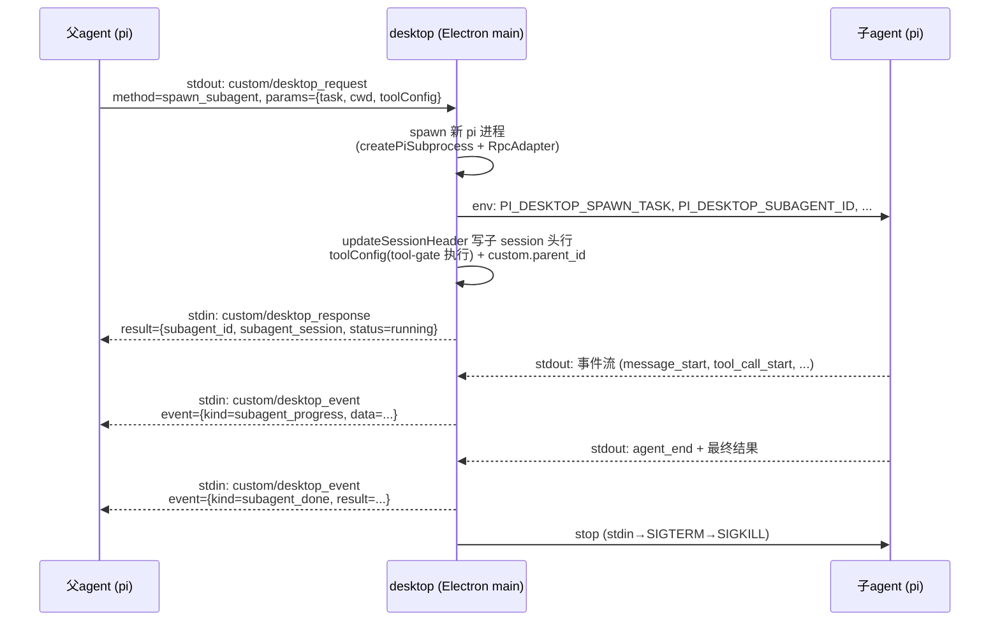
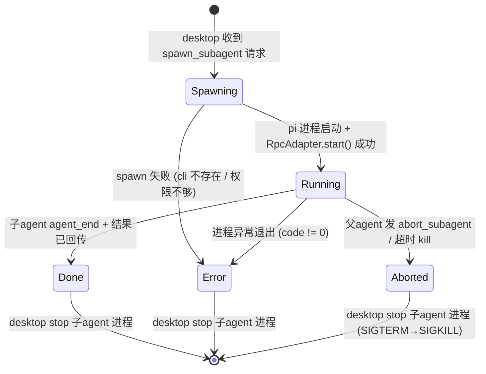
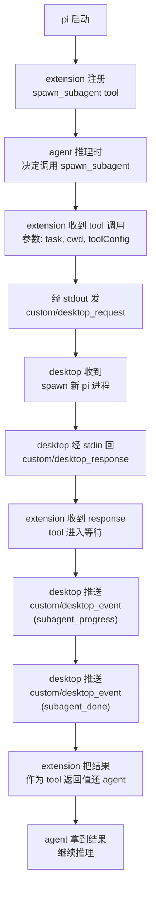

# 子agent 进程调度设计

> **修订记录（2026-08-02）**：本文首版成文后，框架自身演进把 §7 审查出的六个缺口填平了一个（缺口二）、并为另外两个（缺口一/三）提供了比原文设想更顺的补法方向。本次修订按当前代码逐条核对后更新：
>
> 1. **缺口二（timeline entry 渲染 hook）已被 `messageRenderers` 槽填平**——role 键注册表 + manifest 自动注册 + timeline 查表消费（`packages/react/src/index.ts:251`、`plugins-host.ts:29`、`timeline/renderer/index.tsx:521`）。spawn 卡片不再需要新机制，但条目类型要从 `custom` 换成 `custom_message`（§5.4、§6.2 已改）。
> 2. **pi extension 交付通道已打通**——`client/pi/toolgate-installer.ts` 在 app 启动时把 `packages/toolgate/index.ts` 同步到 `~/.pi/agent/extensions/`（`bootstrap/index.ts:239` 接线）。§5 的 spawn_subagent extension 照此模式交付，原文"extension 代码怎么到底座手里"的悬空问题消失。
> 3. **toolConfig 注入改走头行 + tool-gate 硬过滤**（§4.2 已改）——原文的 `PI_DESKTOP_TOOL_CONFIG` 环境变量方案废弃，复用 tool-manager 已验证的"desktop 写头行 → extension `turn_start` 重读 → `setActiveTools`"回路。
> 4. **缺口一/三的补法方向从命令式 hook 改为声明式贡献**（§7.2、§7.3 已改）——`fileActions` 槽证明了"贡献方 manifest 声明、消费方查槽、invoke 路由回贡献者"的三段式范式，sessions-list 分组与 composer 条件渲染照此范式补，不再发明 `registerSessionFilter` 式命令 hook。
>
> 未变的设计根基：custom 信封协议（§2）、进程模型（§3）、三块积木（§1.3）、session 元数据双向关联（§6.1）、纯插件落地的纪律（§1.4）。缺口五（HeaderPatch.custom）、缺口六（appendJsonlLine）、缺口四（desktop→pi 主动推送）原样未补，补法不变（§7.4–§7.6）。

当前 pi-desktop 管的 pi 进程是"一个会话一个进程"——每个进程独立、平等，但彼此隔离。一个 agent 遇到复杂任务时，它只能自己硬扛：串行执行、上下文膨胀、一个工具卡住整个会话阻塞。它没有能力说"这块活我外包出去，让别人帮我干，干完了把结果给我"。

这件事的本质不是"给 agent 加个子agent 功能"，而是换一个进程模型：子agent 应该是独立进程——有自己的 session 文件、自己的 tool 配置、自己的崩溃边界。有了 desktop 之后，desktop 天然就是那个能看见所有进程、能 spawn 新进程、能在进程间路由消息的角色。所以 desktop 来做调度器，完成 agent 和子agent 的协作。

但这要求两件事：agent 得能主动调用 desktop 的能力（"帮我起个子agent"），还得有通信能力（子agent 的进度和结果得能传回来）。这两条路现在都不存在——pi 和 desktop 之间的 JSONL 通道只有 desktop→pi 的命令和 pi→desktop 的事件，没有 pi 主动向 desktop 请求能力再拿到响应的回路。本文设计的就是这条回路，以及建立在这条回路上的子agent 进程调度、会话展示和落地路径。

## 1. 问题：agent 怎么把活外包出去

### 1.1 现状：多进程调度器已经在了，但只管平级会话

pi-desktop 的 `session-store.ts` 已经是一个多进程调度器。它持有 `procs = Map<string, SessionProc>`，每个 `SessionProc` 包含一个 `RpcAdapter`（绑着一条 pi 子进程的 stdin/stdout）、一个 `cwd`、一个 `sessionPath`。多个会话可以同时活着——用户在会话 A 发消息不会杀掉会话 B 的 pi 进程。

但这个调度器管的是**平级会话**。会话 A 和会话 B 之间没有关系——A 不知道 B 存在，B 不关心 A 在干什么。它们共享的只有"都在同一个 cwd 桶里"这件事。没有人能说"B 是 A 的子任务，B 的结果要传回给 A"。

通信层面，pi 和 desktop 之间的 JSONL 通道有四条消息流：

- **desktop → pi（stdin）**：命令（`prompt`、`abort`、`fork` 等），pi 收到后执行并回 response
- **pi → desktop（stdout）**：response，配对 command 的 id
- **pi → desktop（stdout）**：事件（`agent_start`、`message_start`、`tool_execution_start` 等），fire-and-forget，无 response
- **pi → desktop（stdout）**：`extension_ui_request`，有 response（desktop 经 stdin 回 `extension_ui_response`）

这四条里，**唯一能让 pi 主动向 desktop 请求并拿到响应的是 `extension_ui_request`**。但它是为 UI 交互设计的——method 固定 9 种（`select` / `confirm` / `input` / `editor` / `notify` / `setStatus` / `setWidget` / `setTitle` / `set_editor_text`），而且语义是"底座需要用户在 UI 上做选择"，不是"agent 请求 desktop 执行一个能力"。

所以缺口很具体：**没有一条"pi 主动向 desktop 请求能力执行、desktop 处理后回响应"的通用通道。**

### 1.2 为什么子agent 是独立进程而非进程内线程

把子agent 做成独立进程，不是为了"架构好看"，是四条实打实的工程理由：

- **崩溃隔离**：子agent 挂了（OOM、panic、死循环）不拖死父agent。父agent 收到"子agent 退出 code=1"的通知，决定重试还是换方案。进程内线程做不到——一个线程 panic 整个进程退出。
- **独立 session 文件**：子agent 有自己的 JSONL 会话文件，自己的上下文、自己的消息历史。父agent 的上下文不被子agent 的消息膨胀——父agent 只在 timeline 里放一张 spawn entry 卡片，子agent 的几百条消息在它自己的 session 文件里。
- **独立 tool 配置**：子agent 的 pi 进程可以配不同的 tool 集——有 bash 没 spawn_subagent 的子agent 只能跑命令不能再拆。tool 配置差异是"玩花"的操控面，进程内线程做不到干净的 tool 隔离（共享进程内的 tool 注册表）。
- **独立生命周期**：子agent 可以被 abort、被超时 kill、被父agent 等待——这些操作对应进程级的 stop（已有的 stdin→SIGTERM→SIGKILL 策略），不需要在进程内造一套 task cancel 机制。

进程内线程方案在隔离性、生命周期管理、tool 配置上都做不干净，而 pi-desktop 已经有完整的进程管理基础设施——不利用它才是浪费。

### 1.3 设计原则：三条积木

这个设计的根基是三条原则，后面的协议、进程模型、展示都从这三条延伸：

**积木一：协议平等。** 每个 pi 进程在协议层完全平等——不管是"主 agent"还是"子agent"，都用同一种方式发 `custom` 请求、收 `custom` 响应、推 `custom` 事件。协议里没有 `role: "main" | "sub"` 这种字段——加了就是引擎拿它做 if-else 的外挂戳，和"内容驱动、别 switch"背道而驰。谁是父谁是子，不是协议说的，是 session 文件里 `custom.parent_id` 记的。

**积木二：tool 差异。** agent 之间的差异不在协议层，在 tool 配置层。`spawn_subagent` 是一个 tool——由 pi extension 注册、agent 像调 `bash` 一样调它。父agent 的 pi 进程装了这个 extension，有这个 tool，能起子agent；子agent 的 pi 进程不装，没这个 tool，不能再 spawn，到底了。子agent 装了就能再 spawn 孙agent——递归自然成立，不需要协议层做递归检测。

**积木三：单层是基础形态。** parent→child 一层是所有调度模式的基础。并行 fan-out 是一层上起多个子agent；pipeline 链式是子agent 装了 spawn_subagent tool 再起下一层；受限委托是子agent 的 tool 集只给读不给写。这些都是单层的组合和参数化，不是新概念。文档先把这个基础形态写透，递归树是协议的自然外推。

三条合在一起的含义是：**协议不限制你能做什么，tool 配置决定你能做什么，单层组合产生复杂调度。** 这是"玩花"的三块积木——拿走任何一块，后面的花样就玩不出来。

### 1.4 一个插件的框架压力测试

子agent 这个功能不是普通功能——它同时触及了左侧栏（子agent 缩进嵌套）、会话流（spawn entry 卡片 + 灰色输入框）、配置管理（插件自己的 settings）、pi 通信（custom 协议 + 进度回传）。如果它能作为一个**纯插件**实现——不改内核、不改其他插件——那说明框架的机制足够强。如果不能，缺口在哪就是框架要补的东西。

为什么要求纯插件？因为子agent 是内容，不是机制。它是一种具体的调度功能，不是"让功能能挂上来"的基础设施。按照"机制与内容分离"这条纪律——内核只管机制（加载器、槽位契约、权限沙箱、生命周期），内容全部外挂——子agent 应该完全走插件机制。如果实现它需要改内核代码，说明内核不够薄，机制不够强。VSCode 的语言支持、调试器、主题全是扩展，不是硬编码在内核里。pi-desktop 要走同样的路。

但子agent 和普通插件不一样的地方在于：**它不能自给自足**。一个 theme 插件贡献配色，不依赖别的插件——它往 themes 槽挂一个 `ThemeContribution` 就完了。一个 git-review 插件贡献右面板 Tab，也不依赖别的插件——它往 sidePanel 槽挂一个组件、调 `git.status` IPC 就完了。这些插件是"自封闭"的——自己的数据、自己的渲染、自己的槽位。

子agent 不是。它需要 **sessions-list 帮它缩进渲染子agent 会话**（否则子agent 会话在左侧栏里和父会话平级铺开，乱成一锅粥）；需要 **timeline 帮它渲染 spawn entry 卡片**（否则 spawn 记录在会话流里显示为一条不可读的 raw JSON）；需要 **timeline 帮它在子agent 会话视图里灰色输入框**（否则用户能给子agent 发消息，但子agent 的生命周期由父agent 控制，用户直接输入会产生冲突）。

这三件事都不是 sub-agent 插件自己能做的——它们是 sessions-list 和 timeline 这两个"host 插件"的渲染行为。sub-agent 插件需要 **让别的插件配合自己**——注入过滤逻辑、注入渲染逻辑、注入条件渲染逻辑。本文首版成文时框架没有"插件 A 影响插件 B 渲染"的协作模型；此后框架演化出了答案：**声明式贡献 + 消费方查槽**（`fileActions` 槽三段式、`messageRenderers` 槽渲染时查表），timeline 那条（spawn 卡片渲染）已被填平。这就是全文的分水岭：§2–§6 讲"怎么设计"（完整且自洽），§7 讲"框架够不够格让这个设计作为插件落地"（首版答案是 5 个缺口要补；2026-08 核对后：1 个已填平、2 个补法方向随范式演进更新、3 个原样待补）。

## 2. 通信协议：custom 信封

### 2.1 为什么不发明新顶层类型

pi 和 desktop 之间的 JSONL 协议已经有四个顶层 `type`：`response`、`extension_ui_request`、`extension_ui_response`、以及"其余当 event 转发"的兜底分支（rpc-adapter 的 `handleLine` 方法）。给子agent 调度新发明 `desktop_request` / `desktop_response` / `desktop_event` 三个顶层类型能做，但有两个问题：

- **pi 侧改动大**：每加一个顶层 type，pi 的消息分发器要加一个分支。pi 是独立项目，每改一次协议核心都要协调版本。
- **协议膨胀**：后续每加一个 desktop 能力（不只是 spawn_subagent），是不是又要加新 type？顶层 type 应该是稳定的——它表达"消息的大类"，不应该随能力增长而膨胀。

`type: "custom"` 是一个通用信封：顶层 type 只有一个 `custom`，具体的消息种类用 `sub_type` 鉴别。pi 侧只需在 stdout 上多写一种 `type: "custom"` 的行——rpc-adapter 的 `handleLine` 加一个分支拦截 `custom`，其余逻辑全在分支内部。后续加新能力只加 `sub_type`，不动顶层 type。

这和 `extension_ui_request` 的设计思路一致——它也是一个信封（`type: "extension_ui_request"`），具体的 UI 交互种类用 `method` 鉴别。`custom` 只是把这个思路推广到"desktop 能力调用"这个更大的域。

### 2.2 消息格式

三种 `sub_type` 覆盖请求-响应和异步推送：

```
# pi → desktop (stdout): 请求
{"type": "custom", "sub_type": "desktop_request", "id": "req-1",
 "method": "spawn_subagent", "params": {"task": "...", "cwd": "...", "toolConfig": {...}}}

# desktop → pi (stdin): 响应（spawn 确认，tool 调用仍在 pending）
{"type": "custom", "sub_type": "desktop_response", "id": "req-1",
 "result": {"subagent_id": "sub-1", "status": "running", "subagent_session": "~/.pi/agent/sessions/xxx/sub-1.jsonl", "spawn_entry_id": "entry-42"}}

# desktop → pi (stdin): 异步事件推送（fire-and-forget，无 id）
{"type": "custom", "sub_type": "desktop_event",
 "event": {"kind": "subagent_progress", "subagent_id": "sub-1", "data": {...}}}
{"type": "custom", "sub_type": "desktop_event",
 "event": {"kind": "subagent_done", "subagent_id": "sub-1", "result": "..."}}
```

`desktop_request` 带 `id`，`desktop_response` 用同一个 `id` 配对——沿用 rpc-adapter 已有的 id 配对模式（handler 读 request 的 id，处理后写回同名 id 的 response），但不走 `RequestCorrelator`（correlator 是 command→response 的超时管理机制，custom 通道的 id 配对是 handler 手动回写，和 `sendExtensionUIResponse` 同一模式）。`desktop_event` 不带 `id`，是 fire-and-forget 推送，用于子agent 进度的流式回传。

`desktop_response` 的 `result` 里携带 `subagent_session`（子agent session 文件路径）和 `spawn_entry_id`（desktop 生成的 UUID，用于双向关联父 session 的 spawn entry 和子 session 的 header，见 §6.1）——extension 拿到这些值后写进父agent session 的 spawn entry（见 §5.4），timeline 读 spawn entry 时用 `subagent_session` 打开子agent 会话视图（见 §6.4）。这是向前关联链路的关键一环。

`method` 字段是具体能力的名字（`spawn_subagent`、`query_subagent`、`abort_subagent` 等），`params` 是该能力的参数。这和 `extension_ui_request` 的 `method` + 动态字段是同一套模式——信封固定，内容按 `method` 变化。

### 2.3 rpc-adapter 怎么处理

`handleLine` 当前四个分支的顺序是：`extension_ui_request` → `response`（配对 id）→ `extension_ui_response`（忽略）→ 其余当 event 转发。加 `custom` 分支插在 `extension_ui_request` 之后、`response` 之前：

```typescript
// 新增分支（插在 extension_ui_request 之后）
if (data.type === "custom") {
  const subType = data.sub_type as string;
  if (subType === "desktop_request") {
    // 有 id 的请求 → 走 custom request handler（注入）
    this.customRequestHandler?.(data);
  } else {
    // desktop_response / desktop_event 是 desktop → pi 方向，
    // pi 不会从 stdout 收到这些（它们走 stdin），不会进这条分支
    // 但兜底：未知 sub_type 当 event 转发
    for (const cb of this.eventListeners) cb(data as unknown as AgentSessionEvent);
  }
  return;
}
```

注意方向：`desktop_request` 是 pi → desktop（走 stdout），desktop 处理后经 stdin 回 `desktop_response`。`desktop_event` 是 desktop → pi（走 stdin）。pi 的 stdin 侧需要能收 `custom` 消息——这由 spawn_subagent extension 处理（见 §5）。

desktop 侧回 `desktop_response` 和 `desktop_event` 不是走 `rpc-adapter.send()`（那是发 command 的），而是直接写 stdin：

```typescript
// 回 response（配对 id）
handle.stdin.write(JSON.stringify({
  type: "custom", sub_type: "desktop_response", id: "req-1",
  result: { subagent_id: "sub-1", status: "running" }
}) + "\n");

// 推 event（fire-and-forget）
handle.stdin.write(JSON.stringify({
  type: "custom", sub_type: "desktop_event",
  event: { kind: "subagent_progress", subagent_id: "sub-1", data: {...} }
}) + "\n");
```

这复用了 `sendExtensionUIResponse` 同样的"直接写 stdin、不走 correlator"模式。但这条路径当前只用于回 pi 的请求——**desktop 主动推送 `desktop_event` 需要一个新的 IPC**，让 plugin 告诉 desktop"往这个 session 的 pi stdin 写一行 custom JSON"。这是框架缺口之一，详见 §7.4。

### 2.4 与 extension_ui_request 并存

`extension_ui_request` 和 `custom` 是两条独立的 pi→desktop 请求-响应通道，不合并：

- **`extension_ui_request`**：UI 交互——select/confirm/input/editor 等，desktop 收到后转发到 renderer（经 IPC `session:extensionUI`），renderer 渲染 UI、用户操作、回 IPC `session:replyExtensionUI`，desktop 再经 stdin 写回 `extension_ui_response`。整条链路经过 renderer，因为需要用户交互。
- **`custom`**：能力调用——spawn_subagent/query_subagent/abort_subagent 等，desktop 收到后在 **main 进程直接处理**（spawn 新 pi 进程、路由事件），不经过 renderer。response 经 stdin 直接写回 pi。

两条通道的判据是"需不需要 renderer 参与"：需要的就是 `extension_ui_request`，不需要的就是 `custom`。把它们合并成一条通道不会更简单——反而让 main 进程要判断"这个 request 是走 renderer 还是走自己"，多一层 if-else，违反"别 switch"原则。

## 3. 进程模型：每个 agent 都是平等的 pi 进程

### 3.1 spawn 全链路时序

从 agent 调 spawn_subagent tool 到子agent 结果回传，完整链路：



agent 调 spawn_subagent tool 后，extension 发 `desktop_request` 给 desktop。desktop 收到后用 `createPiSubprocess` spawn 一个新 pi 进程，给它绑一个 `RpcAdapter`，分配 `subagent_id`，通过环境变量注入 task 和 parent 信息（见 §6.1）。desktop 回 `desktop_response`（status=running + subagent_session 路径），但 **tool 调用不在这里 resolve**——spawn_subagent tool 的语义和 `bash` 一致：调了就等结果，子agent 的进度像 bash stdout 一样流式推送（`desktop_event` / `subagent_progress`），子agent 完成后 `desktop_event` / `subagent_done` 携带最终结果，extension 此时才 resolve tool 调用，把结果作为 tool 返回值还给 agent。

子agent 运行期间，它的事件流（`message_start`、`tool_execution_start` 等）经自己的 `RpcAdapter.onEvent()` 到 desktop。desktop 把这些事件包成 `desktop_event`（`kind: subagent_progress`），写到父agent 的 stdin。这些进度事件作为 tool 调用的中间输出——agent 在等待 tool 返回值时能看到子agent 的实时进度，和看 bash stdout 是同一套机制。

子agent 完成后（`agent_end` 事件），desktop 发 `desktop_event`（`kind: subagent_done`），包含最终结果。extension 把结果作为 tool 的返回值还给 agent。

### 3.2 复用现有基础设施

子agent 进程的 spawn、kill、JSONL 读写全部复用现有机制，不新造：

- **`createPiSubprocess`**：spawn `pi --mode rpc`，返回 `SubprocessHandle`。子agent 和普通会话进程走同一个函数，同一套 spawn 参数（`cwd`、`args`、`env`）。
- **`RpcAdapter`**：消费 `SubprocessHandle` 的 stdin/stdout 做 JSONL 读写 + id 配对 + event 分发。子agent 的 adapter 和父agent 的 adapter 是同一个类。
- **`RpcAdapterFactory`**：application 层持有的依赖倒置接口，shell 注入实现。子agent store 也持这个接口，同一个 factory 造出来的 adapter 既能管会话进程也能管子agent 进程。
- **stop 策略**：stdin.end → 1s 等 → SIGTERM → 2s 等 → SIGKILL。子agent abort 走同一套。

复用的前提是：子agent 和会话进程在进程层面是同一个东西——都是 `pi --mode rpc`，都有 stdin/stdout JSONL，都有 `RpcAdapter` 绑着。区别只在"谁 spawn 的"（desktop 直接受父agent 请求 spawn vs 用户开新会话时 spawn）和"session 文件里有没有 parent_id"。这个区别不进进程管理层，只进 session 元数据和路由逻辑。

### 3.3 生命周期状态机



五个状态：`spawning`（desktop 正在 spawn）、`running`（子agent 活着、事件在流转）、`done`（子agent 正常完成、结果已回传父agent）、`error`（子agent 异常退出）、`aborted`（被父agent 或超时主动 kill）。

状态转移的触发者分三类：

- **desktop 内部触发**：spawning→running（spawn 成功）、spawning→error（spawn 失败）。desktop 自己管。
- **子agent 事件触发**：running→done（收到 `agent_end`）、running→error（进程退出 code≠0）。desktop 经子agent 的 `RpcAdapter.onProcessExit` 感知。
- **父agent 请求触发**：running→aborted（父agent 发 `abort_subagent` 或子agent 超时）。desktop 收到后调子agent adapter 的 `stop()`。

状态存哪：进程池持一个 `Map<subagentId, SubAgentProc>`，每个 `SubAgentProc` 记录 `adapter`、`parentSessionKey`、`subagentId`、`status`、`spawnTime`、`toolConfig`。

### 3.4 资源限制

四道闸：

- **并发上限**：一个父agent 同时活着的子agent 数量有上限（配置项，默认 5）。超过上限的 spawn 请求直接回 `desktop_response` 带 `status=rejected, reason=max_concurrent`，extension 把这个结果还给 agent，agent 决定排队还是放弃。
- **超时**：每个子agent 有最大执行时间（配置项，默认 10 分钟）。超时后 desktop 自动 abort（走 stop 策略），发 `desktop_event` 带 `kind=subagent_done, status=timeout`。
- **递归深度**：不靠协议层检测递归——靠 tool 配置。子agent 的 `toolConfig` 不包含 `spawn_subagent` group，它就没这个 tool，不能再 spawn。要允许递归（子agent 能再 spawn 孙agent），给子agent 配上 `spawn_subagent` tool 即可。递归深度 = tool 配置的层数，是部署决策不是协议限制。
- **父进程崩溃 → 孤儿清理**：desktop 通过父agent 的 `RpcAdapter.onProcessExit` 感知父agent pi 进程退出。如果退出是非预期的（非 desktop 主动 stop），遍历该父 session 下所有 `status=running` 的子agent，逐个调 `stop()`（stdin→SIGTERM→SIGKILL），并在子agent session 文件里记一条 `custom_message`（`customType: "subagent_aborted"`，content 携带 `reason: "parent_crashed"`）。子agent 的结果不再尝试路由到父agent stdin（父已死，stdin 不可达）。这和 desktop 整体关闭（`app.on("before-quit")` → `stopAll()`）不同——整体关闭时 desktop 自己也死了，没有进程来清理；父进程崩溃时 desktop 还活着，能主动清理。

第三道闸是"tool 差异"原则的直接体现——不靠 `depth` 字段让引擎 if-else，靠 tool 可用性涌现。第四道闸是"崩溃隔离"的反面——§1.2 说子agent 崩溃不拖死父agent，这里补上父agent 崩溃不留下孤儿子agent。

## 4. tools 驱动的差异控制

### 4.1 spawn_subagent 是 tool 不是协议角色

agent 调 spawn_subagent 的方式和它调 `bash`、`read_file` 完全一样——pi 的 tool 系统注册了一个叫 `spawn_subagent` 的 tool，agent 在推理过程中决定"这个子任务我外包出去"，调了这个 tool，tool 的实现（一个 pi extension）经 stdout 发 `custom/desktop_request` 给 desktop，desktop spawn 新 pi 进程，结果经 stdin 回 `custom/desktop_response` 和 `custom/desktop_event`，extension 把最终结果作为 tool 的返回值还给 agent。

agent 不知道 desktop 存在。它的视角是："我调了一个 tool，tool 帮我起了一个子agent，子agent 的结果回来了"。这和调 `bash`——"我调了一个 tool，tool 帮我跑了个命令，命令的输出来了"——是同一个心智模型。

这个设计的关键是：**层级控制不在协议层，在 tool 可用性层**。没有 `role: "main" | "sub"` 字段让引擎 switch——加了就是声明式类型标签，和"内容驱动、别 switch"背道而驰。谁是父谁是子，是 session 文件里 `custom.parent_id` 记的，是数据，不是引擎分支的依据。

### 4.2 tool 配置决定 agent 能力

pi 已有 tool 配置机制：session header 里的 `toolConfig`（`{ mode: "all" | "custom", enabledGroupIds?: string[], enabledToolIds?: string[] }`），`session:readToolConfig` IPC 已经能读，`session:updateHeader` IPC 已经能改。

spawn 子agent 时，desktop 在 spawn 后把子agent 的 `toolConfig` 经 `updateSessionHeader` 写进子 session 头行。**这是 2026-08 修订改的**：原文设计是"desktop 把 toolConfig 序列化进环境变量 `PI_DESKTOP_TOOL_CONFIG`，子agent 的 extension 启动时读出来写进 session header"——此后 tool-manager 场景把一条更顺的回路跑通了：随壳分发的 tool-gate 底座 extension（`packages/toolgate/index.ts`，经 `client/pi/toolgate-installer.ts` 同步到 `~/.pi/agent/extensions/`）挂 `session_start` + `turn_start` 两个事件，自己读 session 文件头行拿最新 `toolConfig.enabledToolIds`，调底座的 `setActiveTools` 硬过滤。desktop 写头行（`updateSessionHeader`，读-改-写整体进目录锁）、extension 下个 turn 自动生效——子agent 的 tool 限制直接复用这条已验证回路，不需要环境变量中转。环境变量只保留 parent 信息的一次性注入（§6.1 的 `PI_DESKTOP_PARENT_SESSION` 等，那是 spawn 时一次性确定、无时效问题）。头行写 `toolConfig` 后，tool-gate 限制可用 tool：

- `mode: "custom"` + `enabledGroupIds` 不含 `spawn_subagent` group → 子agent 不能再 spawn
- `mode: "custom"` + `enabledGroupIds` 含 `spawn_subagent` group → 子agent 能再 spawn 孙agent
- `mode: "all"` → 子agent 有全部 tool，包括 spawn_subagent（默认全开，用于不限制的场景）
- `enabledGroupIds` 不含 `bash` → 子agent 不能跑命令，只能纯推理
- `enabledGroupIds` 不含 `write_file` → 子agent 只能读不能写

不同的 tool 组合产生不同的 agent 角色——"只读分析型"（有 read 没 write）、"受限执行型"（有 bash 没 spawn）、"全权委托型"（全开）。这些角色不是枚举出来的 `kind`，是 tool 配置的参数化结果。

### 4.3 "玩花"的三块积木

回到 §1.3 的三条原则，这里是它们怎么产生调度模式：

- **单层 + 并行 fan-out**：父agent 同时调 3 次 spawn_subagent，传不同的 task 和 toolConfig。desktop 并行起 3 个 pi 进程，各自跑各自的，结果分别回传。父agent 在 timeline 里看到 3 张 spawn entry 卡片。
- **单层 + 受限委托**：父agent 调 spawn_subagent，toolConfig 只给 `read_file` + `bash`（不给 `write_file`、不给 `spawn_subagent`）。子agent 能分析、能跑命令，但不能改文件、不能再拆。父agent 信任度低时用。
- **递归 + pipeline 链式**：子agent 的 toolConfig 含 `spawn_subagent`，它跑了一半发现需要再拆，调 spawn_subagent 起 孙agent。孙agent 的结果回给子agent，子agent 把自己的结果回给父agent。三层 pipeline 自然成立——协议层每层都是平等的 pi 进程，每层的 extension 都是一样的代码。
- **递归 + 分治**：父agent 把大任务拆成 2 个子agent，每个子agent 再拆 2 个孙agent，4 个孙agent 并行跑。结果逐级合并回传。tool 配置控制每层能拆几层、能做什么。

这些模式不需要协议层或 desktop 专门支持——都是"单层 spawn + tool 配置"的组合。desktop 只管"收到 spawn 请求 → 起进程 → 路由事件"，不关心调用方是父agent 还是子agent，不关心是并行还是串行。调度模式是 tool 配置涌现的，不是 desktop 编排的。

## 5. spawn_subagent extension 设计

### 5.1 extension 的职责边界

spawn_subagent tool 由一个 **pi extension** 提供。pi extension 是 pi 的扩展机制——在 pi 进程内运行、能注册 tool 和 slash command；交付走 desktop installer 同步（§5.5，tool-gate 先例），不经 `pi install`。这个 extension 的职责是：

- 向 pi 注册一个 tool（`spawn_subagent`），让 agent 能在推理时调它
- tool 被调时，经 pi 的 stdout 发 `custom/desktop_request` 给 desktop
- 在 pi 的 stdin 上监听 `custom/desktop_response` 和 `custom/desktop_event`
- 子agent 完成后，把结果作为 tool 的返回值还给 pi 的 tool 系统
- 在 session 文件里写 spawn 记录 entry（`custom_message`，`customType: "subagent_spawned"`，§5.4）

extension **不**负责：spawn 进程（desktop 的事）、路由事件（desktop 的事）、渲染 UI（timeline 插件的事）。它是 pi 和 desktop 之间的桥——一侧接 pi 的 tool 系统，另一侧接 JSONL 的 custom 通道。

### 5.2 tool 注册与调用流程



extension 注册 tool 时声明它的参数 schema（`task: string`, `cwd?: string`, `toolConfig?: object`），pi 的 tool 系统据此让 agent 知道"有一个叫 spawn_subagent 的 tool 可以用，参数长这样"。agent 在推理时如果决定用它，pi 的 tool 系统调 extension 的 handler，handler 拿到参数后发 custom 请求。

### 5.3 stdin 监听与消息分发

extension 需要在 pi 的 stdin 上监听 `custom` 消息。pi 的 stdin 当前收两类消息：command（`type: "prompt"` 等）和 `extension_ui_response`。extension 要让 pi 的 stdin 分发器多识别一种 `type: "custom"`：

```
pi stdin 收到一行 JSON
  ├── type === "prompt" / "abort" / ... → command 分发器
  ├── type === "extension_ui_response" → extension UI 回复分发器
  └── type === "custom" → extension 的 custom 分发器
        ├── sub_type === "desktop_response" → 配对 id，把 resolve 从第一级迁移到第二级（key 换成 subagentId），不在此处 resolve
        └── sub_type === "desktop_event"  → 按 event.kind 分发
              ├── kind === "subagent_progress" → 存进度（可选透传给 agent）
              └── kind === "subagent_done" → 取 result，调 resolve（此时才 resolve tool 调用）
```

extension 内部维护**两级映射**，处理从 spawn 到完成的完整生命周期：

**第一级**：`pendingRequests: Map<requestId, { resolve: (result) => void, task: string }>`——每次发 `desktop_request` 时分配一个 `requestId`（自增计数器或 UUID），把 Promise 的 resolve 函数和 task 存进去。收到 `desktop_response` 时按 `requestId` 取出，response 里的 `subagent_id` 和 `subagent_session` 转存到第二级。

**第二级**：`activeSubAgents: Map<subagentId, { resolve: (result) => void, task: string, progress: unknown[] }>`——`desktop_response` 到达后，把 resolve 函数从第一级迁移到第二级（key 从 `requestId` 换成 `subagentId`）。后续收到 `desktop_event`（`subagent_progress`）时按 `subagent_id` 查第二级，把进度追加到 `progress` 数组（作为 tool 的中间输出，agent 在等待时能看到）。收到 `subagent_done` 时按 `subagent_id` 取出 resolve，把 `result` 作为 tool 返回值调 resolve，然后从第二级删除。

**竞态处理**：如果 `desktop_event`（`subagent_progress`）比 `desktop_response` 先到达（子agent 起得太快、事件路由比 response 回写快），extension 暂存这些 event 到一个 `pendingEvents: Map<subagentId, event[]>` 队列。`desktop_response` 到达、第二级映射建好后，把队列里的 event flush 进去。这样即使事件早于 response 到达，也不会丢失。

### 5.4 session 文件写入

extension 在两个时机写 session 文件。**条目类型是 `custom_message` 不是 `custom`**（2026-08 修订改的）：圆心 `sessionEntryToNeutral`（`core/domain/events/session-state.ts`）对 `type: "custom"` 条目直接 `return null`——那是扩展私有状态的隐藏通道（plan-mode-state 动辄上百条，显示即刷屏）；`custom_message` 才是"扩展要显示的内容"的公开通道，被提升为 `role = customType` 的 NeutralMessage 进时间线。这是底座上游在用的官方条目类型（`claude-md-context` 等），字段形状以真实 session 文件为准：`{ type, customType, content: string, display, id, parentId, timestamp }`。

**spawn 时**，写一条 spawn 记录 entry 到父agent 的 session 文件。entry 里的 `subagent_session` 路径来自 `desktop_response` 的 `result.subagent_session`（见 §2.2），extension 从 response 里拿到后写进 entry。结构化载荷 JSON 序列化进 `content` 字符串（`custom_message` 提升时只保留 `role/content/display/id/timestamp`，没有一等公民的结构化字段——渲染器自行 parse；若以后 spawn 卡片要的数据量大到难受，再考虑圆心透传 `data` 字段）：

```json
{
  "id": "entry-42",
  "type": "custom_message",
  "customType": "subagent_spawned",
  "display": true,
  "content": "{\"subagent_id\":\"sub-1\",\"subagent_session\":\"~/.pi/agent/sessions/xxx/sub-1.jsonl\",\"task\":\"把 auth.ts 拆成 3 个文件\",\"tool_config\":{\"mode\":\"custom\",\"enabledGroupIds\":[\"read_file\",\"bash\"]}}",
  "timestamp": "2026-08-02T12:00:00.000Z"
}
```

**子agent 完成时**，追加一条 done entry 到父agent 的 session 文件（JSONL 不支持原地修改，只追加）：

```json
{
  "id": "entry-43",
  "type": "custom_message",
  "customType": "subagent_done",
  "display": true,
  "content": "{\"subagent_id\":\"sub-1\",\"result\":\"拆成 auth-login.ts, auth-token.ts, auth-session.ts\"}",
  "timestamp": "2026-08-02T12:03:00.000Z"
}
```

这些 entry 经 `sessionEntryToNeutral` 提升为 `role: "subagent_spawned"` / `role: "subagent_done"` 的 NeutralMessage，timeline 渲染时查 `messageRenderers` 注册表命中 sub-agent 插件贡献的渲染器（§6.2）——注册、提升、查表三段都是既有机制，不需要 timeline 加新分支。

session 文件写操作由 desktop 经框架的 JSONL 追加能力完成（`~/.pi/agent/` 在路径白名单内），extension 经 IPC 请求 desktop 追加——不是 extension 直接写文件。详见 §7.6。

子agent 的 session 文件由 pi 自己写（和普通会话一样），session header 里的 `custom.parent_id` 等字段由 desktop 在 spawn 后经 `updateSessionHeader` 写入（走缺口五补完的通道，见 §6.1）；环境变量注入（`PI_DESKTOP_PARENT_SESSION` 等）只供子agent 的 extension 感知自身身份（§5.5），不承担头行写入。

### 5.5 extension 的交付与配置

**交付（2026-08 修订补充）**：extension 源码作为壳资产放 `packages/subagent/index.ts`，照 tool-gate 先例由 installer 在 app 启动时内容 diff 同步到 `~/.pi/agent/extensions/sub-agent/index.ts`（`client/pi/toolgate-installer.ts` 的模式：失败静默降级、pi 的 loader 在 spawn 时扫目录自动加载、`kernel.*Available` IPC 探测）。本文首版时"extension 代码怎么到底座手里"是悬空问题，现在照抄即可，不需要新基础设施。

extension 自身需要知道几件事：

- **desktop 的 custom 通道是否可用**：extension 启动时可以发一个 `desktop_request`（`method: "ping"`），如果收到 `desktop_response` 说明跑在 pi-desktop 里、custom 通道活着；超时没回说明没跑在 desktop 里（比如用户直接命令行用 pi），extension 退化为"spawn_subagent tool 不可用"——agent 调时直接返回"此环境不支持子agent"。

- **自身作为子agent 运行时的 parent 信息**：desktop spawn 子agent 时通过环境变量注入（如 `PI_DESKTOP_PARENT_SESSION=/path/to/parent.jsonl`、`PI_DESKTOP_SUBAGENT_ID=sub-1`）。extension 读到这些变量就知道"我是子agent"——行为差异只此一处（比如选择不注册 `spawn_subagent` tool，见 §3.4 递归深度由 tool 配置控制的备选实现）。session 头行的 `custom.parent_id` 不由 extension 写——由 desktop 在 spawn 后经 `updateSessionHeader` 写入（走缺口五补完的 `HeaderPatch.custom` 通道，和 toolConfig 同一条已验证写路径；extension 写头行是未探明的底座能力，不走）。

这个设计让 extension 在"有 desktop"和"没 desktop"两种环境都能跑——有 desktop 时提供 spawn_subagent tool，没 desktop 时静默退化为不可用。pi 核心不需要知道 desktop 存不存在。

## 6. session 元数据与会话展示

### 6.1 子agent session header 的 custom 字段

子agent 的 session 文件第一行（header）加 `custom` 字段，记录它的归属：

```json
{
  "type": "session_header",
  "sessionId": "sub-1",
  "sessionName": "拆分 auth.ts",
  "custom": {
    "parent_id": "agent-main",
    "parent_session": "~/.pi/agent/sessions/xxx/parent.jsonl",
    "subagent_id": "sub-1",
    "spawn_task": "把 auth.ts 拆成 3 个文件",
    "spawn_entry_id": "entry-42"
  }
}
```

desktop spawn 子agent 时，通过环境变量注入这些值（`PI_DESKTOP_PARENT_SESSION`、`PI_DESKTOP_SUBAGENT_ID`、`PI_DESKTOP_SPAWN_TASK`、`PI_DESKTOP_SPAWN_ENTRY_ID`）供子agent 的 extension 感知自身身份（§5.5）。`spawn_entry_id` 由 desktop 在 spawn 时生成（UUID），同时放进 `desktop_response` 回给父agent 的 extension（extension 用它写 spawn entry 的 `id` 字段）和子 session 头行的 `custom.spawn_entry_id`。这样父 session 的 spawn entry 和子 session 的 header 通过同一个 id 双向关联。**头行 `custom` 字段由 desktop 写**（2026-08 修订改的）：spawn 完成后 desktop 经 `updateSessionHeader(sessionPath, { custom: {...} })` 写入——这是缺口五（§7.5）补完后的通道，和 toolConfig 同一条已验证的写路径（读-改-写整体进目录锁）。原文"子agent 的 extension 读环境变量写 session header"依赖底座未探明的头行写能力，废弃。

timeline 读到 header 有 `custom.parent_id` 就知道这是子agent 会话，渲染时加"← 返回父会话"导航和灰色输入框。

### 6.2 父agent session 的 spawn 记录

父agent 的 session 文件里，spawn 这步落盘为一条 `type: "custom_message"` 的 entry（见 §5.4），经 `sessionEntryToNeutral` 提升为 `role = customType` 的 NeutralMessage 进时间线。timeline 渲染管线遇到非内置 role 时查 `messageRenderers` 注册表：

- `subagent_spawned` → sub-agent 插件注册的渲染器画 spawn entry 卡片（见 §6.4）
- `subagent_done` → 同一渲染体系更新对应卡片的 status 和结果

> **已填平（2026-08 修订）**：本节首版在此标注"框架缺口之二——`registerCustomEntryRenderer` 不存在"。此后框架长出了 `messageRenderers` 槽，机制等价且更顺：`packages/react` 提供 `registerMessageRenderer(role, comp)` / `getMessageRenderer(role)` 的 Map 注册表，manifest `contributes.messageRenderers`（形状 `{ role, component }`）由 plugins-host 在模块加载时自动注册、卸载时反注册（和 settings/sidePanel 同一套组件自动匹配）；timeline 渲染消息时"内置 role → 查注册表 → 兜底 ToolCard"（`timeline/renderer/index.tsx:521`）。sub-agent 插件只需在 manifest 声明两条 `{ role: "subagent_spawned", component: "SpawnCard" }` 式贡献并 export 组件，零命令式注册代码。首版设想的 `registerCustomEntryRenderer(subType, renderer)` 不需要了——role 就是 customType，注册键天然一致。详见 §7.3。

### 6.3 左侧栏：子agent 缩进嵌套在父会话下

sessions-list 插件读 session 列表时，对每个 session 检查 header 的 `custom.parent_id`。有 `parent_id` 的不作为顶层会话列出，而是缩进在父会话下面：

```
┌─────────────────────────────────────────────┐
│  对话                                [+ 新建] │
│  ┌─────────────────────────────────────┐    │
│  │ 💬 重构认证模块             14:32     │    │
│  │  ▸ 🔹 拆分 auth.ts          14:33     │    │
│  │  ▸ 🔹 为 auth 写测试        14:33     │    │
│  │  ▸ 🔹 集成测试              14:35     │    │
│  │ 💬 上周的 bug 修复          10:15     │    │
│  │ 💬 数据库迁移脚本          昨天       │    │
│  └─────────────────────────────────────┘    │
└─────────────────────────────────────────────┘
```

父会话默认收起子agent 列表（▸），点展开（▾）才看到子agent。子agent 的 icon 用 🔹 区分于普通会话的 💬。点击子agent 切到它的会话视图。

渲染逻辑：sessions-list 读到 session 的 `custom.parent_id` 时，把它归到 parent 下面。parent 没在当前列表里（比如父会话被归档了）的子agent 退化为顶层显示，加"🔹 └ [父会话名]"标记。

> **框架缺口**：这里有两个问题。第一，`SessionInfo` 类型没有 `custom` 字段——`listSessions` 解析了 header 但只提取已知字段，`custom` 被丢弃（缺口五，§7.5）。第二，sessions-list 是另一个插件的封闭组件，sub-agent 插件无法注入自己的渲染逻辑。这是框架缺口之一，详见 §7.2——补法方向已从首版设想的命令式 hook 演进为声明式贡献（`fileActions` 范式）。

### 6.4 父会话 timeline 的 spawn entry 卡片

父会话的 timeline 里，spawn 记录渲染为一张卡片——不是一条消息气泡，视觉上和普通消息有区分：

```
┌─────────────────────────────────────────────────────────┐
│  🤖 Assistant                                           │
│  这个任务我拆成两路并行处理：                            │
│                                                         │
│  ┌───────────────────────────────────────────────┐      │
│  │ 🔹 拆分 auth.ts              ✅               │      │
│  │ 把 auth.ts 拆成 3 个文件       [打开 ↗]        │      │
│  └───────────────────────────────────────────────┘      │
│                                                         │
│  ┌───────────────────────────────────────────────┐      │
│  │ 🔹 为 auth 模块写测试        ● 运行中          │      │
│  │ 给 3 个文件写单元测试         [打开 ↗]        │      │
│  └───────────────────────────────────────────────┘      │
│                                                         │
│  🤖 Assistant (等待子agent完成...)                      │
└─────────────────────────────────────────────────────────┘
```

卡片三行：任务名 + 状态指示灯（● 运行中 / ✅ 完成 / ❌ 失败）+ 任务描述。"打开"按钮或点卡片本身切到子agent 的会话视图。**不在父 timeline 里展开子agent 的消息**——子agent 的完整消息流在它自己的 session 视图里。

并行子agent 多了（5 个以上）时，聚合为一个批次卡片：

```
┌───────────────────────────────────────────────┐
│ ▸ 🔹 子agent 批次 (3/5 完成)                   │
│   ✅ 拆分 auth.ts                              │
│   ✅ 写 auth-login 测试                        │
│   ✅ 写 auth-token 测试                        │
│   ● 写 auth-session 测试                      │
│   ⏳ 写集成测试                                │
└───────────────────────────────────────────────┘
```

### 6.5 子agent 会话视图：完整 timeline + 灰色输入框

点 spawn entry 卡片切到子agent 的会话视图——和普通会话的 timeline 一模一样的渲染，完整消息流，只是两处不同：

```
┌─────────────────────────────────────────────────────────┐
│ ← 返回 "重构认证模块"    🔹 拆分 auth.ts        ✅ 完成 │
├─────────────────────────────────────────────────────────┤
│                                                         │
│  🤖 子agent 开始                                        │
│  分析 auth.ts 结构，文件 420 行...                      │
│                                                         │
│  🔧 read_file auth.ts                                   │
│  🔧 write_file auth-login.ts                            │
│  🔧 write_file auth-token.ts                           │
│  🔧 write_file auth-session.ts                         │
│                                                         │
│  🤖 完成                                                │
│  拆成: auth-login (登录) / auth-token (token) / session │
│                                                         │
├─────────────────────────────────────────────────────────┤
│  ┌───────────────────────────────────────────────┐      │
│  │  子agent 已完成，输入不可用                    │      │
│  └───────────────────────────────────────────────┘      │
└─────────────────────────────────────────────────────────┘
```

两处不同：

- **标题栏左侧加"← 返回"导航**：点击切回父会话视图。标题显示"🔹 任务名"和状态。
- **输入框灰色不可输入**：子agent 的生命周期由父agent 控制——用户不能直接给子agent 发消息。运行中显示"子agent 运行中，输入不可用"，完成后显示"子agent 已完成，输入不可用"。

灰色输入框的实现：timeline 插件渲染时检查 session header 的 `custom.parent_id`，有就把输入框组件替换为一个只读提示条。这是纯渲染层逻辑，不碰通信——session header 有没有 `parent_id` 是数据，不是权限检查。

> **框架缺口**：timeline 不暴露 composer 条件渲染能力——`Composer` 在 `timeline/renderer/index.tsx:329` 硬编码挂载，渲染管线没有"查一下当前 session 该不该禁用输入"的判断点。sub-agent 插件无法让 timeline 在检测到 `parent_id` 时换灰色输入框。注意这和 §6.2 的 entry 渲染缺口不是同一个命运——后者已被 `messageRenderers` 槽填平，此缺口（缺口之三）仍在，补法方向见 §7.3（声明式策略贡献，不是命令式 hook）。前提依赖缺口五：`SessionInfo` 先得有 `custom` 字段，判定才有数据可依。

### 6.6 回看与持久化

session 文件是 agent 层级的单一真相源。重启 pi-desktop 后：

- 父agent session 里的 spawn entry 仍在 → timeline 仍显示 spawn 卡片
- 子agent session 文件仍在 → 点击卡片仍能打开完整会话视图
- 左侧栏仍能按 `custom.parent_id` 缩进嵌套 → 层级关系完整保留

这比"关系只存在 desktop 内存"的方案多一个持久化维度——desktop 进程重启不丢 agent 树，任何时刻打开都能看到完整的层级和全部历史。

## 7. 框架能力审查：首版六个缺口，2026-08 复核一平五待补

子agent 作为纯插件需要触碰 10 个框架接入点。首版审查：5 个有缺口，4 个框架已具备。**2026-08 按代码复核：缺口二已被 `messageRenderers` 槽填平，新增第 10 项（pi extension 交付）随 tool-gate 落地转为已具备**——6 个已具备，4 个有缺口（一/三/四/五/六中的五个里，二已平）。这一节是全文的分水岭——§2–§6 的设计完整且自洽，但"设计完整"不等于"框架够格让这个设计作为插件落地"。缺口按严重度排列，从最大的开始。

### 7.1 接入点全景

| # | 接入点 | 首版 | 2026-08 复核 | 缺口类型 |
|---|--------|:-----------:|:-----------:|----------|
| 1 | 左侧栏缩进嵌套 | ❌ | ❌（补法方向改：声明式贡献） | 插件 inter-plugin 扩展机制缺失 |
| 2 | timeline spawn 卡片渲染 | ❌ | ✅（`messageRenderers` 槽填平，§7.3） | — |
| 3 | 子agent 灰色输入框 | ❌ | ❌（补法方向改：声明式策略贡献） | timeline 不暴露 composer 条件渲染 |
| 4 | 子agent 进度回传到父agent | ❌ | ❌ | 缺 desktop→pi 主动推送 IPC |
| 5 | spawn pi 带自定义配置 | ❌ | ❌ | HeaderPatch 缺 custom 字段 |
| 6 | session 写 custom_message entry | ❌ | ❌ | 缺 appendJsonlLine 操作原语 |
| 7 | 插件配置 | ✅ | ✅ | 框架自动管 |
| 8 | sidebar/sidePanel/settings 槽位贡献 | ✅ | ✅ | 完整支持 |
| 9 | pi 通信（extension_ui_request 回路） | ✅ | ✅ | 已有 request-response 通道 |
| 10 | pi extension 交付 | —（首版悬空） | ✅（tool-gate installer 先例，§5.5） | — |

### 7.2 缺口一：插件 inter-plugin 扩展机制缺失（大缺口）

#### 问题的本质：插件是"自封闭"的，没有协作模型

pi-desktop 的插件体系在首版成文时只有一种协作模式：**槽位并列**。sidebar 槽允许多个插件各贡献一个组件，`Sidebar` 组件按 `slots:sidebar()` 遍历渲染——每个组件在自己的 Panel 里各画各的。sidePanel 槽同理——多个插件各贡献一个 Tab，`RightPanel` 按 `slots:sidePanel()` 遍历渲染。

"并列"够用的场景是：插件的数据自己拉、渲染自己做、不依赖别的插件。git-review 插件调 `git.status` 拿数据、自己画 diff 视图——不碰 sessions-list、不碰 timeline。token-stats 插件调 `session.getStats` 拿数据、自己画统计图——也不碰别人。这些插件是"自封闭"的：自己管数据、自己管渲染、自己占一个槽位。

子agent 打破了这个前提。它需要的三件事全是**改别的插件的渲染行为**：

- **sessions-list 帮它缩进渲染子agent 会话**——子agent 的 session 文件和父agent 在同一个 cwd 桶里，`listSessions` 按 mtime 排序返回。如果不改 sessions-list 的渲染逻辑，子agent 会话会作为顶层会话平级铺开，用户看到一堆"拆分 auth.ts""为 auth 写测试"混在正常会话列表里，不知道哪个是谁的子任务。sub-agent 插件需要让 sessions-list "遇到有 `custom.parent_id` 的 session，就缩进在父会话下面渲染"——这是 sessions-list 的渲染行为，sub-agent 插件自己画不了。

- **timeline 帮它渲染 spawn entry 卡片**——spawn 记录要在会话流里显示为一张卡片，不能消失、也不能是一坨不可读的 raw JSON。sub-agent 插件需要让 timeline "遇到我这类消息，用我注册的渲染器画"——这是 timeline 的消息渲染行为。**（2026-08：此条已被 `messageRenderers` 槽解决——`custom_message` 条目提升为 `role = customType`，timeline 查注册表命中插件渲染器，见 §7.3。）**

- **timeline 帮它在子agent 会话视图里灰色输入框**——子agent 会话视图就是正常 timeline 渲染子agent 的 session 文件。但子agent 的生命周期由父agent 控制，用户不能直接给子agent 发消息——输入框必须是灰色只读的。timeline 渲染输入框时不检查 session header 的 `custom.parent_id`，sub-agent 插件无法让它"在特定条件下换组件"。

三件事的首版核心都是同一个问题：**插件 A 需要改变插件 B 的渲染行为，但框架没有提供这个能力。** 2026-08 复核：框架用"声明式贡献 + 消费方查槽"回答了第二条（messageRenderers），剩下第一条（sessions-list 分组）和第三条（composer 条件渲染）待补——补法照同一范式，见下。

#### 当前框架的插件协作方式：两种老办法的局限，和一种新范式（2026-08 修订）

首版成文时框架有两种让插件"配合"的方式，都不够：

**第一种：槽位并列。** sidebar 槽允许多个插件各贡献一个组件。但这是"并列"不是"协作"——sub-agent 插件可以往 sidebar 槽贡献一个自己的列表组件，但 sessions-list 还在那里照常平铺。结果是同一个会话出现两次：sessions-list 里一份（平级顶层），sub-agent 插件里一份（缩进嵌套）。用户看到两份列表，重复且混乱。

**第二种：共享状态。** 插件间通过 zustand store 间接通信——插件 A 改了某个状态（如 `currentSessionPath`），订阅这个状态的插件 B 被通知。但这是"数据共享"不是"渲染控制"——sessions-list 可以从 store 读到 `custom.parent_id`（如果 SessionInfo 带了这个字段），但它自己的渲染代码不根据这个字段分组。共享状态让"数据可见"，不解决"渲染可控"。

**第三种（首版后演化出来，已跑通两轮）：声明式贡献 + 消费方查槽。** `fileActions` 槽是完整样板（`packages/react/src/file-actions.ts` 头注释钉的三段式契约）：①贡献方在 manifest 静态声明 `{id, labelKey, icon?, when?}`；②消费方（文件树）经 `useFileActions()` 查槽渲染菜单，`pluginsNonce` 失效重拉；③用户触发时经 `eventBus.invoke` 路由到贡献者的 `<pluginId>:fileActionInvoke` 约定频道，并自动浮出贡献者 sidePanel。双向解耦——消费方不认识贡献方（清单来自内核注册表），贡献方不认识消费方（只收 invoke）。`messageRenderers` 槽是同一范式的渲染变体（贡献方声明 role→组件，timeline 渲染时查表）。**缺口一的补法应照这个范式做，不再走首版设想的命令式 hook**——首版文本保留在下方"缺口的形状"作对照，但实施时以声明式为准。

#### 缺口的形状：sessions-list 从"封闭渲染"升级为"host + extension"

缺口不是"框架缺一个 API"——是 sessions-list 需要从"自己 for 循环渲染所有 session"升级为"渲染管线关键位置查注册表"的 host 模式。参照 `fileActions` 三段式，补法形状（2026-08 修订，替代首版的命令式 hook 方案）：

**贡献侧**：新增一个贡献点（如 `sessionGroupings`），插件在 manifest 声明分组策略——sub-agent 插件声明"按 `custom.parent_id` 归组、子会话缩进在父会话下、父会话可折叠"，附分组组件名。

**消费侧**：sessions-list 在三个位置查注册表——过滤（哪些 session 进顶层列表）、分组（`buildGroups` 之外允许贡献方提供分组结果）、行渲染（缩进/折叠样式）。当前 `buildGroups`（pinned/时间桶/归档）是封闭内部函数，从数据到像素没有一处查外部注册表；升级后内置分组逻辑退为默认贡献，与插件贡献同权。

**首版设想的命令式方案（保留作对照，不采用）**：`registerSessionFilter(filter)` + `registerSessionGroupRenderer(renderer)` 两个命令式 hook。放弃的原因：框架此后两次选择都站在声明式一边（fileActions、messageRenderers），manifest 声明能被加载器校验、能被 plugin-manager 展示、卸载时反注册由框架统一完成；命令式 hook 把这些责任推回给插件。

#### 为什么这是最大的缺口

这不是"加一个 API 就行"的事。它改变的是插件的架构前提——从"插件是封闭组件，自己管自己的渲染"变成"host 插件是可扩展的渲染平台，extension 插件往上面挂贡献"。这个转变影响的不只是子agent——sessions-list 以后可能要支持自定义分组（如按项目分组、按标签分组），这些场景都撞上同一堵墙。

首版成文时 timeline 和 sessions-list 的代码都是"自己读数据、自己 for 循环渲染所有 entry/session、不暴露任何扩展点"。**2026-08 复核：timeline 已经完成这个形态升级**——消息渲染管线关键位置插入了"查注册表"的分支（messageRenderers），从"自己渲染"变成"先查有没有人注册了渲染器，有就用它，没有走默认"。sessions-list 是最后一个封闭渲染的 host。

先例也更多了（2026-08 修订）：壳组件（`Sidebar`、`RightPanel`、`SettingsPage`、`MainViewHost`）按槽位查注册表选渲染器，fileActions 的消费方（文件树）查槽渲染菜单，timeline 按 role 查渲染器。sessions-list 只需要把同一个模式推广到"列表分组级"——同一个设计原则的深化，不是发明新东西。

#### 临时方案与长期方案（2026-08 修订）

首版建议的临时方案是"timeline 加 `registerEntryRenderer` + `shouldHideInput`、sessions-list 加 `registerSessionFilter`，各 host 插件自己暴露扩展点，不进公共 API"。**timeline 那一半已被 `messageRenderers` 槽以通用机制的形态直接兑现**——不是临时方案，是长期方案一步到位。剩下的 sessions-list 分组（缺口一）和 composer 条件渲染（缺口三）也建议直接照声明式范式做：范式已被 fileActions/messageRenderers 跑通两轮，注册表就是 Map、消费查询已有 `useFileActions` 的 nonce 失效重拉模式可镜像，"先硬编码 hook 跑通再抽象"的省劲理由已不成立——照范式做的边际成本和硬编码 hook 几乎相同，还省了二次抽象。

### 7.3 缺口二（已填平）+ 缺口三（待补）：timeline 的两个扩展点

缺口一的结构性问题，落到 timeline 上是两个扩展点。首版时两个都缺；**2026-08 复核：entry 渲染（缺口二）已被 `messageRenderers` 槽填平，composer 条件渲染（缺口三）仍在**。

#### 缺口二：entry 渲染 —— ✅ 已被 messageRenderers 槽填平

首版设想的是 `registerEntryRenderer(entryType, renderer)` 命令式 hook。框架实际长出的更顺：**`messageRenderers` 槽**——

- **注册表**：`packages/react/src/index.ts:251` 的 `Map<string, ComponentType<MessageRendererProps>>`，props 契约 `{ message: NeutralMessage, streaming: boolean }`。
- **manifest 声明**：`contributes.messageRenderers`（形状 `{ role, component }`），plugins-host 模块加载时自动注册、卸载时反注册（`plugins-host.ts:29/42/91`）——和 settings/sidePanel 同一套组件自动匹配，插件零命令式注册代码。
- **消费点**：timeline 渲染管线"内置 role（user/assistant/bashExecution）→ `getMessageRenderer(message.role)` 查注册表 → `display === false` 隐藏 → 兜底 ToolCard"（`timeline/renderer/index.tsx:521-530`）。正是首版要的"先查注册表，有就用它，没有走默认"。
- **数据通路**：`custom_message` 条目经圆心 `sessionEntryToNeutral` 提升为 `role = customType` 的 NeutralMessage（`session-state.ts:254`），文件读与 RPC 事件流两路共用（`:340` 的过滤只挡 `display: false`）。

sub-agent 插件要做的事收敛为：manifest 声明 `{ role: "subagent_spawned", component: "SpawnCard" }` + export `SpawnCard` 组件。注册键从首版设想的 `custom.sub_type` 变成 role——而 `customType` 提升为 role 后，两者天然一致。

timeline 的架构心态转变（首版要求的"我画默认的，别人可注册覆盖"）已经随这个槽完成——和壳组件按槽位查注册表是同一模式，只是从"槽位级"推广到了"消息 role 级"。

#### 缺口三：composer 条件渲染（灰色输入框）—— ❌ 仍在

timeline 渲染子agent 的会话视图时，需要把输入框换为灰色只读。但 `Composer` 在 `timeline/renderer/index.tsx:329` 硬编码挂载，属性全量传死，渲染管线没有任何"当前 session 该不该禁用输入"的判断点。sub-agent 插件需要让 timeline "检测到 `parent_id` 时隐藏输入框"。

补法方向（2026-08 修订，照声明式范式而非首版的命令式 hook）：贡献点声明 composer 策略（如"满足什么条件时输入框只读 + 只读时的提示内容"），timeline 渲染 composer 前查一圈注册的策略，命中则换只读提示条。判定数据依赖缺口五（`SessionInfo.custom`）——先有数据，策略才有得判。

首版设想的两个命令式方向（保留作对照）：`shouldHideInput(sessionHeader) => boolean`（简单直接）和 `renderInputArea(sessionHeader) => Component | null`（完全委托）。当时推荐前者；现在推荐声明式策略贡献，理由同 §7.2——manifest 声明可被加载器校验、卸载反注册由框架统一完成。

改动量小——一个贡献点契约 + timeline 渲染管线一个查表分支，不影响框架其他部分。

### 7.4 缺口四：desktop→pi 主动推送缺失（小缺口）

sub-agent 运行期间，子agent 的事件经 desktop 路由到父agent pi 的 stdin。transport 层不是问题——`handle.stdin.write()` 本身能用（`sendExtensionUIResponse` 就是直接写 stdin，不走 correlator，fire-and-forget；`rpc-adapter.ts:154`）。缺的是一个 IPC 让 plugin 说"往这个 session 的 pi stdin 写一行 custom JSON"。

当前 desktop→pi 的 stdin 只有两条路：command（`session-store.send()`，发 prompt/abort 等）和 `extension_ui_response`（配对 extension_ui_request 的 id）。没有"desktop 主动 push 任意 custom 数据到 pi stdin"的通用机制。

补法：加一个 `sessions.pushCustomMessage(sessionPath, message)` IPC。plugin 调它把 `desktop_event` 推给父agent 的 pi。

**2026-08 复核补充——接收侧还差半个**：custom 通道是双向的，此缺口只管 desktop→pi 的推；pi→desktop 的 `desktop_request` 要能被 desktop 收到，rpc-adapter 的 `handleLine` 还得加 §2.3 设计的 `custom` 分支——当前 `handleLine`（`rpc-adapter.ts:177`）仍是四分支（`extension_ui_request` 带 60s 超时兜底 → `response` 配 id → `extension_ui_response` 忽略 → 其余当 event 转发），`type: "custom"` 的行会掉进兜底分支被当普通 event 转发，进不了请求-响应回路。两半合起来才是完整的 custom 通道，都是小改动：`sendExtensionUIResponse` 的模式（直写、不走 correlator、handler 手动配对 id）已趟平所有坑。

改动量小——一个 IPC handler + 一个 preload 暴露 + handleLine 一个分支。但它是通信层的缺口，没有它整个进度推送链路断在"desktop 收到子agent 事件但推不出去"这一步。

### 7.5 缺口五：HeaderPatch 缺 custom 字段（极小缺口）

plugin 用 `window.pi.sessions.start(cwd, sessionPath)` 起一个 pi 进程，然后用 `window.pi.sessions.updateHeader(sessionPath, patch)` 设 tool 配置和 parent 关系。但 `HeaderPatch` 只有 `name`、`pinned`、`archived`、`toolConfig`（`domain/sessions.ts:113`）——**没有 `custom` 字段**。plugin 没法通过 `updateHeader` 往 session header 写 `custom.parent_id` 等子agent 标记。读出侧同样断着：session-scanner 解析头行只提取已知字段（`session-scanner.ts:99-111` 和 `:327-360` 两处），`SessionInfo`（`sessions.ts:26-40`）没有 `custom`，`listSessions` 把 `custom` 丢弃。

补法：domain 层的 `HeaderPatch` 加 `custom?: Record<string, unknown> | null`（null=删字段，对齐 toolConfig 语义）；`updateSessionHeader` 加 `if ("custom" in patch)` 分支（它的读-改-写整体进 `withDirLock`，新分支天然享受并发保护）；scanner 两处解析透传 `custom` 到 `SessionInfo`。三处改动，都是加一个可选字段，不影响现有逻辑。

这是缺口里最小的——一个类型定义加一个字段。**但有一个设计决策要在 domain 注释里钉死**：pinned/archived/toolConfig 是"枚举的已知私有字段"，`custom` 是开放命名空间——这是头行从"枚举私有字段"到"开放扩展字段"的第一次，语义要写明：desktop 私有、底座不感知、插件间约定 key 前缀防撞车（如 `subagent.*`）。

这个缺口也是 §6.1 头行写入和 §7.3 缺口三判定的共同前提——它在依赖链上的位置比它的体积重要。

### 7.6 缺口六：缺 appendJsonlLine 操作原语（小缺口）

extension 需要往 session 文件追加 `custom_message` entry（§5.4）。session 文件在 `~/.pi/agent/sessions/` 下——`~/.pi/agent/` 在 `configFile` 路径白名单内（`resolveConfigFilePath` 检查 `PI_AGENT_DIR` 前缀）。路径权限没问题。

但 `configFile.set` 写的是 JSON（`writeJsonFile`，整份覆盖或深合并），不是 JSONL 追加。session 文件是 JSONL——每行一个 JSON 对象，追加写不锁全文件。要追加一行 entry，需要的是 `appendJsonlLine(path, entry)` 而不是 `writeJsonFile(path, data, mergeMode)`。**2026-08 复核确认**：`config-file.ts` 全文 54 行，只有 `withDirLock` / `readJsonFile` / `writeJsonFile` 三个原语，preload 的 `configFile` 面（get/set/getLayered/getProject/setProject/clearProject）没有 append——缺口原样。

补法：`config-file.ts` 加第四个原语 `appendJsonlLine(absPath, entry)`——`withDirLock` + `JSON.stringify(entry) + "\n"` 追加写。`updateSessionHeader` 里已有现成的 JSONL 追加手法可参照（处理 `rest.endsWith("\n")` 边界）。entry 参数类型是 `Record<string, unknown>` 开放形状——原语保持中性，entry 形状是内容层的事。加完后暴露为 `configFile.append` IPC，plugin 就能往 session 文件追加 entry。

改动量小——一个操作原语 + 一个 IPC。和缺口四一样是"基础设施在，差最后一环"。

### 7.7 已具备的能力：六项框架已完整支持（2026-08 修订：四项 → 六项）

不是所有接入点都有缺口。这些框架已完整支持，sub-agent 插件直接用就行：

**槽位贡献——不需要改。** `registerSidePanelComponent`、`registerSidebarComponent`、`registerSettingsComponent` 都存在。壳组件（`Sidebar`、`RightPanel`、`SettingsPage`、`MainViewHost`）按槽位查注册表选渲染器，不自己渲染内容——这就是"host + extension"模式。sub-agent 插件可以贡献自己的 sidePanel（运行中的子agent 状态面板）和 settings（配置页：并发上限、超时、tool 预设），走标准槽位流程，和 git-review 贡献 Review Tab、pi-manager 贡献 Pi 管理页是同一套机制。

**插件配置管理——不需要改。** 插件在 `plugin.json` 声明 `configFile` + `contributes.settings`，框架自动管读/写/dirty/save/reset/拦截/刷新。sub-agent 插件的配置完全走这套：声明一个 `configFile` 指向 `~/.pi-desktop/plugins-data/sub-agent/config.json`，声明 `configMerge: "deep"`，框架就自动管起来了。插件只管渲染配置 UI 和调 `onChange` 报告改动——和所有其他 settings 插件一样。

**session 读写——部分可用。** `sessions.list`（列会话列表）、`sessions.openSession`（打开会话读全部消息）、`sessions.updateHeader`（改 session header）都在。sub-agent 插件用 `list` 拿会话列表（但需要缺口五补上 `custom` 字段才能知道哪个是子agent）、用 `openSession` 打开子agent 的 session 文件渲染完整 timeline 视图。`updateHeader` 能改 `toolConfig`（已有字段），但不能改 `custom`（缺口五）。`sessions.start` 能起 pi 进程，但不能传 `custom` 配置。

**pi 通信回路——最终结果能传回，缺的只是进度推送。** `extension_ui_request` / `extension_ui_response` 是完整的 pi→desktop request-response 通道。pi extension 发 spawn 请求（`extension_ui_request` 或 `custom/desktop_request`）、plugin 处理后回响应、最终结果传回——这条链路通。缺的只是进度流式推送（缺口四），那是"子agent 跑到一半的实时进度"——最终结果（`subagent_done`）可以作为 response 的内容传回，不需要主动 push。

**messageRenderers 槽（新增，填平缺口二）。** role 键渲染器注册表 + manifest 自动注册 + timeline 查表消费，配套 `custom_message` 条目提升为 `role = customType` 的 NeutralMessage。spawn 卡片的整条渲染链路已通，详见 §7.3。

**pi extension 交付通道（新增）。** `client/pi/toolgate-installer.ts` 模式：extension 源码随壳放 `packages/`，app 启动时内容 diff 同步到 `~/.pi/agent/extensions/`，失败静默降级，`kernel.*Available` IPC 探测。连同 tool-gate 验证的"desktop 写头行 → extension `turn_start` 重读 → `setActiveTools` 硬过滤"回路——子agent 的 tool 限制和 spawn_subagent extension 的交付都复用这套，见 §4.2、§5.5。

这些说明框架的"机制底座"是够的——加载器、槽位契约、配置管理、IPC 回路、消息渲染扩展、底座扩展交付都在。剩下的缺口收敛为三处：sessions-list 的 host 化（缺口一，唯一有架构分量的）、composer 条件渲染（缺口三，小）、三个原语级增量（缺口四/五/六）。这恰好是 §1.4 说的"子agent 不能自给自足，需要别的插件配合"的那个点的残余——框架让你能挂上来（槽位）、能配置（configFile）、能通信（IPC 回路）、能往会话流里挂卡片（messageRenderers），只剩"改列表分组"和"改输入框状态"两处还不让改。

## 8. 落地路径：先补框架再写插件

### 8.1 第零阶段：补框架缺口（2026-08 修订：缺口二已平，移出清单）

目标：让框架具备纯插件实现子agent 的能力。

- **缺口五（极小）**：`HeaderPatch` 加 `custom?: Record<string, unknown> | null` 字段（null=删字段）；`updateSessionHeader` 加写分支；`SessionInfo` 加 `custom` 字段；scanner 两处解析透传。domain 注释钉死开放命名空间语义（§7.5）。
- **缺口六（小）**：`config-file.ts` 加 `appendJsonlLine` 原语（entry 为开放形状）；preload 暴露 `configFile.append` IPC。
- **缺口四（小）**：electron-main 加 `sessions.pushCustomMessage` IPC handler + preload 暴露；rpc-adapter `handleLine` 加 `custom` 分支（§2.3 的设计，`sendExtensionUIResponse` 模式直写 stdin 不走 correlator）。
- **缺口三（小）**：timeline 加 composer 条件渲染——声明式策略贡献点 + 渲染管线一个查表分支（§7.3）。
- **缺口一（大）**：sessions-list 从"封闭渲染"升级为"host + extension"——声明式分组贡献点，过滤/分组/行渲染三处查注册表，内置 buildGroups 退为默认贡献（§7.2）。照 `fileActions`/`messageRenderers` 范式做，不走命令式 hook。

~~缺口二~~（已被 `messageRenderers` 槽填平，sub-agent 插件直接贡献 `{ role: "subagent_spawned", component }` 即可）。pi extension 交付不再是风险项——照 `toolgate-installer` 模式写 `packages/subagent/index.ts` + installer（§5.5）。

验收：sessions-list 能根据 `custom.parent_id` 缩进显示（由测试贡献驱动）；timeline 对某类 session 把 composer 换为只读提示条；`configFile.append` 能往 JSONL 文件追加一行；`sessions.pushCustomMessage` 能把一行 JSON 写到 pi 的 stdin；pi 发来的 `type: "custom"` 行进 `handleLine` 的 custom 分支而非兜底 event。

### 8.2 第一阶段：custom 协议 + 单层子agent 全链路

目标：agent 能 spawn 一个子agent，子agent 跑完结果回传，timeline 和左侧栏正确展示。

- pi extension（`packages/subagent/index.ts`，toolgate-installer 模式交付）：注册 `spawn_subagent` tool + 发/收 custom 消息 + 写 `custom_message` session entry（§5.4）
- plugin renderer：manifest 贡献 `messageRenderers`（`subagent_spawned`/`subagent_done` 两个 role 的卡片组件）；贡献 composer 只读策略（缺口三补完后）；贡献 sessions-list 分组（缺口一补完后）
- rpc-adapter：`handleLine` 加 `custom` 分支（第零阶段已含）
- SubAgentStore（或复用 session-store 的多进程能力）：spawn + 事件路由 + 生命周期；spawn 后 `updateSessionHeader` 写子 session 的 `custom.parent_id` 与 `toolConfig`（tool-gate 执行硬过滤）

验收：agent 在推理时调 spawn_subagent，desktop 起子agent pi 进程，子agent 跑完结果回传给 agent，父会话 timeline 显示 spawn 卡片，左侧栏子agent 缩进在父会话下，点卡片打开子agent 完整会话视图（灰色输入框）。

### 8.3 第二阶段：tool 配置化 + 多种调度模式

目标：通过 toolConfig 参数控制子agent 能力，实现并行 fan-out 和受限委托。

- spawn 参数加 `toolConfig`，desktop spawn 子agent 后经 `updateSessionHeader` 写进子 session 头行
- tool-gate 在子agent 的 `turn_start` 重读头行、`setActiveTools` 硬过滤（已验证回路，无需 extension 新代码）
- timeline 支持多张 spawn 卡片并行显示 + 批次折叠
- 并发上限和超时机制落地

验收：agent 能同时 spawn 多个子agent 并行跑；子agent 的 tool 集受限（如只读、无 bash）；超过并发上限被拒绝。

### 8.4 第三阶段：递归树 + 能力开放注册

目标：子agent 能再 spawn 孙agent（递归），第三方插件能贡献 desktop 能力。

- toolConfig 含 `spawn_subagent` group 的子agent 能再 spawn
- timeline 支持嵌套层级展示
- capability-registry 开放给插件注册
- 资源调度（递归深度限制、全局并发池）

验收：子agent spawn 孙agent，三层 pipeline 跑通；第三方插件注册了一个新 desktop 能力，agent 能调它。

## QA

**Q1：agent 没装 spawn_subagent extension，调 spawn_subagent 会怎样？**

agent 调不存在的 tool 会被 pi 的 tool 系统拒绝（tool 没注册，agent 不知道它存在）。agent 的推理过程中不会主动调一个不在 tool 列表里的 tool——pi 的 tool 系统只展示已注册的 tool 给 agent。所以没装 extension = agent 根本不知道 spawn_subagent 这个 tool 存在 = 不会尝试调它。不存在"调了但失败"的情况。

**Q2：desktop 没在跑（用户直接命令行用 pi），extension 怎么办？**

extension 启动时发一个 `desktop_request`（`method: "ping"`），1 秒内没收到 `desktop_response` 就认为没跑在 desktop 里。此时 extension 不注册 `spawn_subagent` tool——agent 看不到这个 tool，不会尝试调。extension 退化为静默无操作，不报错、不影响 pi 正常使用。

**Q3：子agent 跑到一半 pi-desktop 被关了怎么办？**

desktop 关闭时走 `app.on("before-quit")` → `sessionStore.stopAll()`。子agent 进程池也挂在这里——关闭时遍历所有子agent 进程调 `stop()`（stdin→SIGTERM→SIGKILL）。子agent 的 session 文件已经在磁盘上（pi 边跑边追加写 JSONL），不会被删。下次打开 pi-desktop，timeline 读 session 文件照常显示 spawn 卡片，点开能看子agent 的部分历史（跑到哪里算哪里）。但子agent 不会被自动恢复——它已经停了。

**Q4：两个子agent 的 session 文件在同一个 cwd 桶里，会冲突吗？**

不会。session 文件名用 UUID 生成（`randomUUID()`），不依赖 cwd。同一个 cwd 下可以有多个 session 文件，session-scanner 的 `listSessions` 按目录列全部。子agent 的 session 文件和父agent 的 session 文件在同一个桶里，靠 `custom.parent_id` 区分关系，不靠文件名。

**Q5：父agent 调 spawn_subagent 时，会阻塞到子agent 完成吗？**

会。spawn_subagent tool 的语义和 `bash` 一致——调了就等结果（见 §3.1）。tool 调用在子agent 完成（`desktop_event` / `subagent_done`）后才 resolve，结果作为 tool 返回值还给 agent。等待期间，子agent 的进度通过 `desktop_event`（`subagent_progress`）流式推送，作为 tool 的中间输出——agent 在等待 tool 返回值时能看到子agent 的实时进度，和看 bash stdout 是同一套机制。

如果 agent 需要并行跑多个子agent，在同一轮推理中多次调 spawn_subagent 即可——每个 tool 调用独立 pending，各自等各自的子agent 完成。父agent 的 pi 进程不被子agent 阻塞（进程独立），但 agent 的推理流程在等 tool 返回值——这是 tool 调用的正常行为，不是子agent 造成的额外阻塞。

**Q6：子agent 用了不同的 model 怎么配？**

spawn 参数里可以传 `model`（provider + modelId），desktop spawn 子agent 时在 pi 的启动参数里注入（`--model` 或环境变量），子agent 启动后用该 model。不传则继承父agent 的 model。这是 `SpawnOpts` 的一个参数，不是协议层的角色字段——和 `toolConfig` 一样是 spawn 的参数化。

**Q7：session header 没有 custom 字段的旧 session 文件，timeline 怎么处理？**

当普通会话处理。timeline 检查 `header.custom?.parent_id`——`undefined` 就是没有 parent 的顶层会话，正常渲染、输入框可输入。旧 session 文件完全兼容，不需要迁移。这是"内容驱动"的好处：有 `parent_id` 就渲染子agent 样式，没有就渲染普通样式，不靠 version 字段 switch。

**Q8：capability-registry 里注册的能力和 `window.pi` 上的 IPC 能力是什么关系？**

不同层、不同消费者。`window.pi` 上的 IPC（`config.get`、`fs.listDir`、`git.status` 等）是 **renderer 插件** 调 desktop 的通道——消费者是 React 组件。`capability-registry` 是 **pi 进程**（agent）调 desktop 的通道——消费者是 pi extension 经 custom 协议。两套能力各自注册、各自分发，不共用 registry。后续如果出现"同一个能力既要给插件用又要给 agent 用"的情况，可以在两个 registry 各注册一份、共享底层实现——但这是优化不是架构约束，现阶段不预设计。

**Q9：extension 写 session 文件的机制是什么？desktop 能写吗？**

能。`~/.pi/agent/` 在 `configFile` 路径白名单内（`resolveConfigFilePath` 检查 `PI_AGENT_DIR` 前缀）。desktop 有写权限。但当前框架只有 `configFile.set`（写 JSON，整份覆盖或深合并），没有"往 JSONL 文件追加一行"的操作原语。session 文件是 JSONL——每行一个 JSON 对象，要追加一条 entry 需要的是 `appendJsonlLine(path, entry)` 而不是 `writeJsonFile(path, data, mergeMode)`。

补法：`config-file.ts` 加一个 `appendJsonlLine` 原语，暴露为 `configFile.append` IPC。extension（或 plugin renderer）经这个 IPC 请求 desktop 追加。这是框架缺口六（§7.6），补了就能写。

**Q10：`desktop_event`（`subagent_progress`）会不会比 `desktop_response` 先到达？**

理论上是可能的——如果子agent 启动极快、在 desktop 写 response 到父agent stdin 的同时已经产生事件。§5.3 的 `pendingEvents` 队列是防御性设计：即使这种情况发生，extension 也能正确处理（暂存 event、等 response 到后再 flush）。§3.1 的时序图画的是正常路径（response 先于 event），不代表协议保证严格有序——实际取决于事件路由和 stdin 写入的时序，两者是独立的异步操作。

**Q11：父agent 的 pi 进程崩溃后，desktop 往已死的 stdin 写 `desktop_event` 会报错吗？**

不会立即报错——管道缓冲区会吸收写入，`stdin.write()` 返回 true。但数据永远不会被消费（父进程已死）。desktop 通过 `RpcAdapter.onProcessExit` 感知父退出后设置"已死"标记，后续路由逻辑检查这个标记、跳过写入。在 `onProcessExit` 触发之前的时间窗口里，可能有少量 event 被写入死管道——这些 event 会丢失，但不影响正确性（父进程已死，没人消费它们）。

**Q12：父进程崩溃清理时，谁往子agent session 文件写 `subagent_aborted` 记录？**

§3.4 说孤儿清理时"在子agent session 文件里记一条 `subagent_aborted`"。但 session 文件正常由 pi 进程写——子agent 被 `stop()` 强杀后来不及自己写。这种情况下 desktop 直接追加写 JSONL 文件——这是一个例外：正常路径 session 文件只由 pi 写，崩溃清理路径 desktop 写。desktop 只追加一行、不修改已有行，原子追加写 JSONL 在文件系统层面是安全的（`appendFileSync`）。如果 desktop 写入时子agent 恰好也在写（竞态），最坏情况是两行交叉损坏——但子agent 已被 SIGTERM/SIGKILL，不会再写，所以实际不会发生。

**Q13：spawn 被拒绝（`status=rejected`）时 extension 怎么处理？**

extension 收到 `desktop_response` 的 `status=rejected` 后直接 reject tool 调用——tool 返回一个错误给 agent（如"子agent 并发上限已达，spawn 被拒绝"）。agent 拿到错误后自行决策：等一会重试、换一种方案、或放弃。不写 spawn entry（子agent 没起来，没有东西可记）。两级映射的第一级 `pendingRequests` 里的 entry 直接 reject + 删除，不迁移到第二级。

**Q14：spawn 失败（进程起不来）时 desktop 发什么？**

desktop 回 `desktop_response` 带 `status=error, reason=spawn_failed`（附错误信息）。extension 收到后同样直接 reject tool 调用。agent 拿到错误信息后决策。不写 spawn entry。状态机里对应 `spawning → error` 转移。

**Q15：用户能不能从子agent 会话视图的 UI 上 abort 子agent？**

可以——灰色输入框区域可以放一个"中止"按钮，点击后经 `window.pi` 的 IPC 到 main 进程调 `SubAgentStore.abort(subagentId)`。这走的是和"父agent 程序化 abort"同一条路径，只是触发方从"父agent 的 extension 发 custom 请求"变成"用户点按钮经 IPC"。具体 UI 设计（按钮放哪、长什么样）是 timeline 插件的实现细节，不在本文设计范围。

**Q16：为什么要求纯插件实现？改内核不行吗？**

子agent 这个功能同时触及了左侧栏、会话流、配置、pi 通信全部接入点——它是框架的终极压力测试。如果需要改内核才能实现，说明内核不够薄——"机制与内容分离"这条纪律就没守住。子agent 是内容（一种具体功能），它应该全部走插件机制。如果机制不够用，补机制（§8.1 第零阶段），而不是把功能焊死在内核里。

这不是教条——VSCode 的语言支持、调试器、主题全是扩展，不是硬编码在内核里。pi-desktop 要走同样的路：内核只管机制，功能全部外挂。子agent 是验证这条路能不能走通的最佳试金石。

**Q17：框架缺口的修复顺序是什么？为什么？（2026-08 按新缺口结构更新）**

先 transport 层（缺口四、六），再 domain 层（缺口五），再展示层（缺口三），最后最大的（缺口一）。理由是依赖链：

- 缺口四（push IPC + handleLine custom 分支）和缺口六（appendJsonlLine）是通信和持久化的基础——没有它们，子agent 的进度推不出去、spawn entry 落不了盘。后面什么都做不了。
- 缺口五（HeaderPatch.custom）可以和四、六并行——它们之间没有依赖。但它是 §6.1 头行写入和缺口三判定的共同前提，排第三位不如并进第一批。
- 缺口三（composer 条件渲染）依赖缺口五（`SessionInfo.custom` 提供判定数据），且依赖通信层通了之后才能验证渲染效果。
- 缺口一（sessions-list 分组贡献）最大、最复杂，放最后。它影响的不只子agent，是整个插件体系的结构性升级——但 `fileActions`/`messageRenderers` 已把声明式范式跑通两轮，它从"方向不明"降为"工作量中等偏大"。

~~缺口二~~已不在清单——`messageRenderers` 槽把它填平了（§7.3）。

**Q18：spawn 记录为什么写 `custom_message` 条目而不是 `custom`？（2026-08 新增）**

圆心 `sessionEntryToNeutral`（`core/domain/events/session-state.ts`）对 `type: "custom"` 条目直接 `return null`——`custom` 是扩展私有状态的隐藏通道（plan-mode-state 动辄上百条，显示即刷屏），永不进时间线。`custom_message` 是底座官方"扩展要显示的内容"通道（`claude-md-context` 等在用），被提升为 `role = customType` 的 NeutralMessage，`display: true` 时文件读与 RPC 事件流两路都放行。配合作息：`messageRenderers` 槽按 role 查渲染器——`customType: "subagent_spawned"` 的条目恰好命中 sub-agent 插件的渲染器贡献。首版选 `custom` 是因为当时把它当"通用扩展容器"理解，实际它是"隐藏容器"；要显示就得走 `custom_message`。
