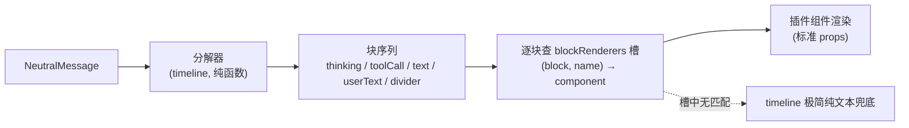
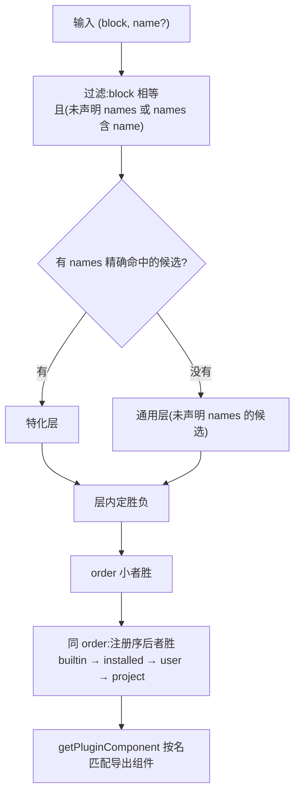

# 会话流薄壳化：blockRenderers 块级渲染槽

> **术语约定**：本文用到的几个概念，先一次性交代：
>
> - **块（block）**：一条中性消息分解后的最小渲染单元。一条 assistant 消息不是一整坨，而是"思考块 × N + 工具调用块 × N + 文本块 × 0..1"的有序序列；user 消息是一个用户文本块；divider 消息是一个分隔线块。
> - **中性消息（NeutralMessage）**：圆心定义的会话消息类型——`role` + `content` 数组 + 时间戳等元数据，不依赖任何框架。本文一切分解和渲染的输入。
> - **块分解**：把 `NeutralMessage` 拆成块序列的纯函数过程——读 content 数组里的 `thinking` / `tool_use` / `text` 形状，产出带类型的块。分解的是数据形状知识，不含任何"怎么画"。
> - **消费方 / 贡献方**：消费方是查槽渲染的一方（本文里是 timeline），贡献方是往槽里挂渲染器的一方（任何插件）。双方互不认识，只靠槽契约通话。
> - **三段式**：本项目所有声明式槽的同一条落地路径——三段管线（domain 契约定义贡献形状 → registry 注册收编 → renderer hook 查询）加消费方查槽使用。fileActions、messageActions、composerPolicies、settingsGroups 都走这条路。
> - **兜底项**：贡献声明里不带 `names` 的渲染器，对该块类型的所有输入生效；带 `names` 的只在名字命中时生效。解析时精确命中优先于兜底项。

## 1 问题：timeline 是胖插件

### 1.1 机制与内容焊在一个插件里

timeline 是会话流的宿主，但它的 renderer 目录里装的远不止"宿主"。5574 行渲染代码拆开看，是两类性质完全不同的东西缝在一起：

- **机制**——滚动容器（`react-virtuoso` 虚拟列表、scroll-bridge、回到底部按钮）、消息列表装配（`collapseRetryFailures` 折叠重试失败链）、Composer（输入框）宿主、MessageActions 动作行宿主、待发消息队列篮（QueueBasket）。这些回答的是"消息流怎么滚动、怎么进来、怎么发出去"，一年后也不会换。
- **内容**——`tool-cards.tsx`（504 行，Bash/Edit/Read/Default 四种工具卡）、`thinking-chain-block.tsx`（思考链）、`user-bubble.tsx`（用户气泡）、`markdown.tsx`（Markdown 渲染）、`stream-text-reveal.tsx`（流式光标）、外加 `index.tsx` 里的 `EntryDivider`（分隔线）。约一千行，回答的全是"这一块画成什么样"——这正是会被想改、该被改的东西。

缝点最典型的是 `tool-cards.tsx` 末尾的 `ToolCardRenderer`：一串工具名 if-else——`bash`/`execute_bash`/`run_tests` 走 `BashCard`，`edit`/`write`/`multi_edit`/`edit_file`/`write_file` 走 `EditCard`，`read`/`read_file`/`grep`/`find`/`ls`/`glob` 走 `ReadCard`，其余落 `DefaultCard`。项目根 CLAUDE.md 的 §1.2（机制与内容分离）把"如果工具名是 bash 就渲染成终端"列为内核里的违规分支形态——内核里清干净了，在插件层原样复现了一份。同样的写死还有 `index.tsx` 里的 `DIVIDER_ICONS`：一张 `Record<kind, 图标>` 字面量表，而 divider 的 kind 是协议来的开放字符串（model/thinking/compaction/branch/info/label/entry/retry 已是八种），表里没有的 kind 就没有图标。

### 1.2 现有槽的粒度缺口

块级渲染无槽，不等于会话流没有扩展点。现有三个槽各管一层，唯独缺块这一层：

- **`messageRenderers`**：整消息覆盖，按 role 匹配。sub-agent 用它把子 agent 消息整条接管成作战室视图。粒度是"一整条消息"。
- **`messageActions`**：消息行上的动作按钮（复制/收藏/重试），组件拿 `{message, text}` 自渲自处理。粒度是"消息上的动作"，不碰消息体本身的渲染。
- **`composerPolicies`**：输入框策略，`session.custom[customKey]` 存在就把输入框换只读条。粒度是"输入框"，与消息体无关。

想改一张工具卡、换思考链的呈现、给某种 divider 换个样子——粒度都在"块"，这三个槽一个都接不住。今天唯一的路是 fork timeline 改源码，改完就和上游永远分叉。

### 1.3 修改需求落在块级

块级是修改需求的真实落点，这不是推测，是看需求的来源就知道的事：

- **新工具不断出现**。MCP 工具、自定义工具、底座发版自带的工具，每个新工具名在会话流里都是一张 `DefaultCard`——能看，但原始。想给 `mcp__weather` 画张像样的卡，不该动 timeline。
- **内置卡的呈现会被想调**。Bash 卡的配色、Edit 卡的 diff 样式、思考链的折叠交互、用户气泡的行数限制行为——这些都是内容判断，不同用户/团队有不同答案。
- **divider 的 kind 是开放的**。协议侧加一种 kind，`DIVIDER_ICONS` 这张写死的表就跟不上，现在是没有图标裸奔，以后应该是插件能补。

三类需求有一个共同形状：**"当输入是 X（某工具名/某 kind/某块类型）时，用我的组件画"**。这是一个键到渲染器的映射——槽问题，不是 fork 问题。

## 2 抽象：消息是有序块序列

### 2.1 五种块类型

timeline 当前的渲染分派（`index.tsx` 的 `MessageRow`）按 role 分支，映射到块语言后全部归一：

| 消息来源 | 分解产出 |
|---|---|
| `role === "user"` | 一个 userText 块 |
| `role === "assistant"` | thinking 块 × N + toolCall 块 × N + text 块 × 0..1（组序保持现行：思考 → 工具 → 文本，组内保 content 原序） |
| `role === "divider"` | 一个 divider 块（带 kind） |
| `role === "bashExecution"`（用户在会话里直接执行的 bash 命令） | 合成一个 toolCall 块（name 为 `bash`，args 由 command/cwd 拼出） |
| 未知 role（无整消息渲染器） | 合成一个 toolCall 块（name 取 role，args 为整条消息）——与今天落 `DefaultCard` 的行为一致 |

五种块类型——`thinking` / `toolCall` / `text` / `userText` / `divider`——就是分解器的全部输出词汇。这个词汇表与中性消息的 content blocks 同词同源：`thinkingBlocksOf`、`toolCallsOf`、`textOf` 这三个纯函数今天就在 timeline 里干分解这件事，只是分解完直接把渲染组件也写死了。

后两行"合成 toolCall 块"值得单独说透：它们不是特殊分支，是**归一**。`bashExecution` 和未知 role 今天就是伪装成工具调用走 `DefaultCard` 的，块抽象只是把这件事实摆到明面上——分解器负责合成，渲染侧完全不感知它们和普通工具调用的差别。未知 role 的渲染能力还因此白捡了一层：今天落 `DefaultCard` 是写死的，以后任何插件可以按名字认领某个 role 的渲染。

块类型的词汇是开放的——契约里 `block` 字段是 string 而非枚举，五种只是分解器今天的输出集合。协议将来加新的 content block 形状时，先经"未知形状合成 toolCall"落到兜底卡，分解器后续版本认领为新块类型，槽契约一行不用改。

### 2.2 分解是机制，渲染是内容

块抽象把"一条消息怎么变成屏幕上的像素"劈成两半，劈缝就是机制与内容的分界线：

- **分解是机制，留 timeline**。分解器读的是 `NeutralMessage` 的数据形状——content 数组里 `type: "thinking"` / `type: "tool_use"` / `type: "text"` 的组织方式。这是圆心中性契约的形状知识，和"会话文件是 JSONL"同级稳定：渲染器一年换三茬，消息形状不会换。分解器是纯函数（输入消息，输出块数组），留 timeline 可裸单测，不走槽。
- **渲染是内容，全走槽**。拿到一个块"怎么画"——卡片还是终端、折叠还是展开、什么图标什么色——全是内容判断。内容判断的全部归宿是槽：内置件给默认实现，任何插件可覆盖，timeline 只查槽不持有一个渲染组件。



用"一年后会不会换"逐块过一遍，分界没有冤枉谁：滚动容器不换（机制）、分解逻辑不换（机制）、设置项读取不换（机制）；Bash 卡会换、思考链呈现会换、Markdown 引擎会换、气泡样式会换、divider 图标表已经跟不上协议——全推出去。

### 2.3 与 messageRenderers 并存不替代

新槽和既有 `messageRenderers` 是两级粒度，不是新旧替代。解析顺序：整消息渲染器先查（`getMessageRenderer(role)` 命中即整条交给插件），未命中才进块管线。sub-agent 的作战室视图照常工作，一行不改。

为什么不把整消息覆盖收编进块管线——让 sub-agent 也改成逐块渲染？因为整消息接管是行为级差异，不是参数级差异。CLAUDE.md §3.3 的收敛判据是这么说的：多个调用方的逻辑相同、差异只在参数，才收敛进统一机制；处理逻辑本身不同，就不收敛。sub-agent 拿到整条 `NeutralMessage` 自己决定内部结构，块管线的标准 props 对它不是帮助是约束。两级各管各的——整消息覆盖管"这条消息我来"，块管线管"这条消息的每一块谁来"。

`messageRenderers` 自身的实现形态（packages/react 里的本地 Map、模块加载期注册、无 source 优先级语义）是早期范式，和新槽的三段式不同。本文不动它——它不是本次要解决的问题，顺手收编是范围蔓延。这个已知边界收进 §7 QA。

## 3 槽契约：blockRenderers

### 3.1 贡献项形状

契约仿 `messageActions`：声明静态走 manifest，组件经框架自动匹配——框架加载插件 module 后，按 manifest 的 `component` 名在 module exports 里找同名组件完成注册（CLAUDE.md §7.4），插件运行时不注册不调 API。这条匹配规则对所有插件生效，内置与第三方同一待遇。

```ts
export interface BlockRendererContribution {
  /** 贡献 id(插件内唯一);同 id 被高优先级 source 整项替换。 */
  id: string;
  /** 块类型。五种内置词汇 + 开放字符串(未来块类型不挡)。 */
  block: "thinking" | "toolCall" | "text" | "userText" | "divider" | (string & {});
  /** 名字清单,仅 toolCall/divider 有意义:toolCall 比工具名(小写),divider 比 kind。
   *  缺省 = 该块类型通用项(兜底);声明 = 只在名字命中时生效。 */
  names?: string[];
  /** renderer 侧组件名,框架从插件 exports 自动匹配。 */
  component: string;
  /** 同层多项时小者胜;缺省 100。 */
  order?: number;
}
```

两个设计决策记在这里：

- **不启用预留名 `cardRenderers`**。`SlotName` 里有一个预留的 `cardRenderers`（无贡献接口实现），字面语义是"卡片渲染器"。但本槽覆盖的五种块里思考链、文本、气泡、分隔线都不是"卡片"，块（block）才是与中性消息同词的准确抽象。预留名没有已实现的语义，保留不删，本文不启用的理由仅此一条。
- **不设 `"*"` 通配**。`names` 缺省即通用项，语义和 `"*"` 完全等价，少一个魔法字符串。`DefaultCard` 的声明就是 `{block: "toolCall"}`——没有 names，所以接住一切未被精确认领的工具名。
- **无名字的块类型声明 `names` 是死贡献**。`thinking`/`text`/`userText` 没有名字可匹配，给它们声明 `names` 的项永远不会命中——解析时静默跳过，不报错。契约不在类型层禁掉这种无效声明，留一份宽容。

每种块类型对应一份标准 props（仿 `MessageActionProps = {message, text}` 的先例），timeline 作为消费方统一组装：

| block | props |
|---|---|
| `thinking` | `{content: ThinkingContent; streaming; startedAt?; completedAt?; collapseDefault}` |
| `toolCall` | `{toolCall: ToolCallBlock; collapseDefault}` |
| `text` | `{text: string; streaming}` |
| `userText` | `{text: string; maxLines}` |
| `divider` | `{kind; i18nKey; i18nArgs?; detail?; tone?}` |

props 里的负载类型以圆心定义为唯一源，本槽不重新定义。`ToolCallBlock`（`core/domain/events/session-state.ts`）就六个字段：`name`（工具名）、`args?`（调用参数，原始 JSON）、`result?`（执行结果）、`state?`（`pending`/`running`/完成）、`isError?`、`id?`。`ThinkingContent` 同文件相邻定义（`thinking` 文本、`redacted` 标记、`thinkingSignature?` 签名），`thinkingBlocksOf` 提取器与 `toolCallsOf` 同一份收敛纪律。timeline 分解器此前各写了一份本地 `textOf`/`thinkingBlocksOf`——本次搬家顺手收敛：文本提取用圆心既有 `messageContentText`（domain/sessions.ts，注释里就写着"各抄一份已收敛"），thinking 提取器迁进圆心，timeline 本地两份重复删除。divider 块的 props 字段是 divider 消息的既有字段，分解器直取直传，不加工。

`collapseDefault`、`maxLines` 这类设置值由 timeline 从通用设置读出来经 props 传入——**渲染件不自己读配置**。两个值的语义与来源先交代清楚：`collapseDefault`（boolean）控制卡片/思考链的初始折叠，来自"会话流"设置组的 `timelineCollapseDefault` 键；`maxLines`（int）控制用户气泡的最大行数，来自 `userBubbleMaxLines` 键。理由有两层：设置组是 timeline 的 settingsGroups 贡献，配置读写是它的机制职责；渲染件只拿 props 就是纯渲染，覆盖者不用关心配置来源，内置件与第三方件在同一份 props 契约下完全平等。收编成 props 的只有"会话流显示设置"这一类值——渲染件需要 i18n、事件通信或读写自己插件的配置时，照常经 `usePluginContext()` 拿插件标准能力，与本槽正交。

### 3.2 解析规则

输入是二元组 `(block, name?)`——`text`/`userText`/`thinking` 没有 name，`toolCall` 的 name 是工具名，`divider` 的 name 是 kind。下图是**查询时**解析（同 id 整项替换发生在更早的注册时，见下文第三条），四步全部确定论，无随机行为：



- **特化层优先于通用层**。`names: ["bash"]` 的贡献永远赢不带 names 的 `DefaultCard`——否则兜底项会吞掉一切精确认领。
- **层内 order 小者胜，同 order 注册序后者胜**。插件按来源目录分四级：builtin（随壳内置目录）→ installed（`~/.my-harness-desktop/installed/`，插件管理器安装落点）→ user（`~/.my-harness-desktop/plugins/`，手动放置）→ project（`<cwd>/.my-harness-desktop/plugins/`，项目级）。加载器按此序注册，数组天然升序——同 order 时后注册者=高优先级 source，胜出。order 是显式调节旋钮：第三方想让自声明压过同级其他贡献，设更小的 order 即可。与既有槽（fileIcons/messageActions 等全部 ArraySlot 槽）同一套"order 升序稳定排 + 同 order 保注册序"语义，零新机制。
- **同 id 整项替换是 registry 既有语义**（注册时 `removeById` 先清同 id 旧项再 push），新槽零新代码——把内置贡献的 id 在自己插件里重声明一遍即整项覆盖。注意它与"新 id 共存"是两条不同的覆盖路径：同 id 替换是批发，内置将来更新这条贡献（比如给 names 清单加新工具名）也被你的声明整体顶替；新 id 共存是零售，你只赢你声明的 names，内置清单扩容仍接住其余名字。怎么选见 §7 QA。
- **平手兜底**。同层、同 order、同插件还分不出胜负时（同一插件同 id 之外的多项），由注册序收尾：后注册者胜。规则链到此闭合，全程确定论，无随机分支。
- **组件缺失不崩**。`getPluginComponent` 拿不到组件（贡献声明了 component 但 exports 里没有）视为无此候选，继续向下一候选/兜底解析。

### 3.3 三段式落地

七个落点，每一个都有现成先例可对照，不发明新机制：

1. **`core/domain/contributions.ts`**：`BlockRendererContribution` 接口 + `SlotName` 加 `"blockRenderers"` + `Contributes` 加字段。
2. **`core/application/loader/registry.ts`**：加一个 `ArraySlot<BlockRendererContribution>` 字段 + `arraySlots` 映射加一行 + `blockRendererItems()` 查询方法。注册/注销走 arraySlots 通用遍历，一行循环不改——`ArraySlot` 注释里"加新数组类槽只需加字段 + SlotName + 查询方法"的开闭承诺，本槽是它的现实检验。
3. **`api/preload/ipc-channels.ts`**：`slots.blockRenderers = "slots:blockRenderers"` 通道名。
4. **`api/ipc/slots-dialog.ts`**：`ipcMain.handle(IPC.slots.blockRenderers, () => registry.blockRendererItems())`，与 messageActions 同一行式。
5. **`api/preload/preload.ts`**：`window.pi.slots.blockRenderers()` 暴露。
6. **`packages/react`**：`useBlockRenderers()` hook——按 `pluginsNonce`（插件清单版本号，插件增删启停时自增）缓存贡献清单，nonce 一变失效重拉，实现照抄 `packages/react/src/message-actions.ts` 的同款 hook；`resolveBlockRenderer(items, block, name?)` 实现 §3.2 解析 + `getPluginComponent` 组件匹配。
7. **timeline 消费**：`BlockRenderer` 分派组件（约 30 行）——输入块，查 hook 缓存的贡献清单，解析出组件，按 §3.1 的 props 契约渲染，解析不到走 §5.3 兜底。

## 4 内置件搬家：message-blocks 插件

### 4.1 搬什么

六个内容体从 timeline 迁出，进新内置插件 `plugins/sessions/message-blocks`。代码不改渲染形状，只改两件事：props 入口对齐 §3.1 契约、配置读取删掉（值从 props 来）。

| 迁移物 | 来源 | 贡献声明 |
|---|---|---|
| `BashCard` | tool-cards.tsx | `{id:"bash", block:"toolCall", names:["bash","execute_bash","run_tests"], component:"BashCard"}` |
| `EditCard` | tool-cards.tsx | `{id:"edit", block:"toolCall", names:["edit","write","multi_edit","edit_file","write_file"], component:"EditCard"}` |
| `ReadCard` | tool-cards.tsx | `{id:"read", block:"toolCall", names:["read","read_file","grep","find","ls","glob"], component:"ReadCard"}` |
| `DefaultCard` | tool-cards.tsx | `{id:"default", block:"toolCall", component:"DefaultCard", order:100}` |
| `ThinkingChainBlock` | thinking-chain-block.tsx | `{id:"thinking", block:"thinking", component:"ThinkingChainBlock"}` |
| `Markdown` | markdown.tsx | `{id:"text", block:"text", component:"MarkdownText"}` |
| `UserBubble` | user-bubble.tsx | `{id:"userText", block:"userText", component:"UserBubble"}` |
| `EntryDivider`（含 DIVIDER_ICONS） | index.tsx 抽出 | `{id:"divider", block:"divider", component:"EntryDivider"}` |

共享渲染件随行：`CardHeader`、`wrapAnywhere`、`StreamingCaret`（stream-text-reveal.tsx）、`fmtArgs`/`fmtResult`/`toolIcon`/`toolSummary`。它们只被这些卡消费，是内容件的内聚依赖，不是机制。

`DIVIDER_ICONS` 随 `EntryDivider` 搬走，但**保持写死**——这不是疏漏。它已经从事关机制的位置（timeline 里的唯一入口）降级为一个内容插件内部的兜底呈现，写死一张表在内容插件里是合法内容。新 kind 的空窗期（协议加了 kind、还没人认领）行为和今天相同：表里没图标就没图标。差别是现在任何插件声明 `names: ["新kind"]` 就能立即补上，不用等内置发版；内置表也随 message-blocks 发版继续维护，两条路不互斥。

### 4.2 一个插件装全部内置渲染件

备选是按块族拆五个插件（tool-cards / thinking / bubble / markdown / divider 各一）。否决的理由：

- **共享件无处可去**。`CardHeader`、`StreamingCaret`、`fmtArgs` 被四类卡共用，拆开要么五份复制（同一逻辑多处各写一遍，正是要消灭的气味），要么造一个内置共享包（为 200 行工具件造包，间接层比内容还重）。
- **拆细买不到东西**。第三方覆盖的粒度是 `names` 级的——想换掉 Bash 卡不需要禁用整个内置插件，声明一条同 `names` 的高优先级贡献即单点覆盖。拆成五个插件唯一的收益是"能整体禁用某一族"，而禁用一族的诉求至今不存在。
- **无特权差异不受损**。一个插件还是五个插件，走的都是同一个槽、同一份解析规则，内置身份没有任何代码路径特殊对待。

### 4.3 manifest 贡献声明

`message-blocks/plugin.json` 的关键片段（renderer 入口 + 贡献 + 语言资源）：

```jsonc
{
  "id": "message-blocks",
  "tier": "official",
  "protected": true,
  "renderer": "./renderer/index.tsx",
  "contributes": {
    "blockRenderers": [
      { "id": "bash",    "block": "toolCall", "names": ["bash","execute_bash","run_tests"], "component": "BashCard" },
      { "id": "edit",    "block": "toolCall", "names": ["edit","write","multi_edit","edit_file","write_file"], "component": "EditCard" },
      { "id": "read",    "block": "toolCall", "names": ["read","read_file","grep","find","ls","glob"], "component": "ReadCard" },
      { "id": "default", "block": "toolCall", "component": "DefaultCard", "order": 100 },
      { "id": "thinking","block": "thinking", "component": "ThinkingChainBlock" },
      { "id": "text",    "block": "text",     "component": "MarkdownText" },
      { "id": "userText","block": "userText", "component": "UserBubble" },
      { "id": "divider", "block": "divider",  "component": "EntryDivider" }
    ]
  }
}
```

renderer 入口只做一件事：export 这八个组件。框架加载 module 后按 manifest 的 `component` 名自动匹配注册，插件代码里没有一个注册调用、没有一个字符串字面量（零硬编码纪律）。

### 4.4 i18n 随行

组件搬，组件消费的文案 key 跟着搬。判定归属的尺子只有一把：key 的消费者在哪个插件，key 就在哪个插件的 locales 里。

- **搬到 message-blocks**：`shell.toolParams` / `shell.toolResult`（DefaultCard 的参数/结果标题）、思考链相关 key、divider 相关 key——它们的消费者全部迁出了。四语言（zh-CN/zh-TW/en/de）同步搬，语言资源文件走 message-blocks 自己的 languages 贡献。
- **留在 timeline**：`shell.emptyMessage` / `shell.stopped` / `shell.error` 等消息行 chrome 文案、Composer 全部 key、"会话流"设置组六键的标题/描述——消费者（消息行宿主、Composer、设置组声明）都还在 timeline。

### 4.5 生命周期护栏

message-blocks 不在时，timeline 会退化成纯文本流（§5.3）——能活，但等于会话流裸奔。两道既成机制合起来把这条路挡住：

- **`protected: true`** 挡卸载：message-blocks 不能被从注册表移除。
- **timeline 声明 `dependsOn: ["message-blocks"]`** 挡停用：`protected` 只挡卸载挡不住禁用（CLAUDE.md 语义），dependsOn 是生命周期护栏——timeline 在线时 message-blocks 不能被停用/卸载。

代价要认账：想整体废掉内置渲染件的人做不到，只能连 timeline 一起停。但设计路径本来就是逐块覆盖（§3.2），不是整体禁用；dependsOn 保的是"主视图永远有基线渲染能力"这条底。这个取舍进 §7 QA 继续交代。

## 5 瘦身后的 timeline

### 5.1 留下什么

搬完之后 timeline 剩下的全是机制，逐项过：

- **滚动**：Virtuoso 虚拟列表、scroll-bridge、回到底部按钮、流式 follow 逻辑。
- **装配**：`collapseRetryFailures` 重试链折叠、块分解器（`thinkingBlocksOf`/`toolCallsOf`/`textOf` 三个纯函数，集中到一处，可裸测）。
- **分派**：`BlockRenderer` 组件——查槽、解析、按 props 契约渲染、兜底，约 30 行，是本文唯一新写的机制代码。
- **消息行 chrome**：MessageActions 动作行宿主、echo 徽章（发送时挂在乐观消息上的附件预览）、评论内联编辑宿主、empty/stopped/error 提示（i18n key 驱动，无写死文案）。
- **Composer 与 QueueBasket**：输入框宿主（composerPolicies 查询已在）、待发队列篮。
- **自己的槽贡献**：copy/bookmark/rewind 三个 messageActions 贡献、`timeline:scrollTo` 等 channels export、"会话流"设置组。这些已是槽贡献形态——timeline 既消费槽又往槽挂自己的首批内容，和 file-tree 自贡献 fileIcons 首批又自消费完全同构，不动。

### 5.2 删掉什么

- 五个内容文件整体迁出：tool-cards.tsx、thinking-chain-block.tsx、user-bubble.tsx、markdown.tsx、stream-text-reveal.tsx。
- `index.tsx` 里的 `EntryDivider` 组件和 `DIVIDER_ICONS` 写死表。
- `ToolCardRenderer` 的工具名 if-else——本文要消灭的那个分支本身。
- index.tsx 从 1111 行缩到约 900 行：四个 role 分支的渲染 JSX 全部换成"分解 → `<BlockRenderer>`"两行，整消息渲染器优先判断保留。

瘦身数字（约一千行内容出清）只是结果，不是目标。目标是质的那条：**timeline 里不再存在任何一个针对具体工具名、具体 kind、具体消息形态的分支**。改配色、换卡片、加工具，从此是插件的事。

### 5.3 无渲染器的兜底

槽里解析不到组件时（message-blocks 缺席的极端路径、组件缺失），timeline 渲染一个内联的极简纯文本兜底：toolCall 显示工具名加一行摘要，text/userText 显示原文，thinking/divider 显示一行灰字。约 15 行，零依赖，无样式追求。

这个兜底不是内容复活——它不试图"画得还行"，只保证"不崩、可读、可滚"。它是无特权差异的另一半：铁律二不只说"内置件可被覆盖"，还说"删掉内置件系统照常启动"。会话流退化成纯文本依然能读会话，这就是照常启动的底线形态。

## 6 检验方式

### 6.1 删掉 message-blocks，系统照常启动

把 `plugins/sessions/message-blocks` 整个移出内置目录（开发态——未打包的运行模式——里禁用等价于移除，但 dependsOn 会拦禁用，所以检验时用物理移出），重启：timeline 照常挂载、会话照常加载，消息流退化为 §5.3 的纯文本兜底，控制台无报错。这对应 CLAUDE.md 铁律二（内置与第三方无特权差异）的检验方式一：删掉任何一个内置件，系统照常启动，只是少了那块功能。

### 6.2 第三方一张卡上线，两处声明

第三方插件给自家 MCP 工具 `mcp__weather` 画卡，全部工作是：插件目录（用户级 `~/.my-harness-desktop/plugins/<插件名>/`，项目级 `<cwd>/.my-harness-desktop/plugins/<插件名>/`）里，`plugin.json` 的 `contributes.blockRenderers` 写一条 `{id:"weather", block:"toolCall", names:["mcp__weather"], component:"WeatherCard"}`，renderer 入口 export 一个 `WeatherCard` 组件收 `{toolCall, collapseDefault}` props。框架的组件自动匹配对第三方同样生效，没有第二条注册路径。timeline 零改动，message-blocks 零改动，不需要发版等任何人。对应"消费方/贡献方双向解耦"。

### 6.3 单点覆盖不影响其他块

用户级插件声明 `{id:"my-bash", block:"toolCall", names:["bash"], component:"MyBashCard"}`：Bash 卡换成自己的，Edit/Read/思考链/气泡/分隔线全部保持内置。再声明 `{id:"bash", ...}`（同 id）则走 `removeById` 整项替换语义。divider 同构：协议新增 kind `checkpoint` 后，任何插件声明 `{id:"cp-divider", block:"divider", names:["checkpoint"], component:"CheckpointDivider"}` 即可为它补上专属呈现，内置 EntryDivider 继续兜底其余 kind。两条路径都不碰其他块的渲染——覆盖粒度是块级的，与 §1.3 的需求粒度对齐。

## 7 QA

**Q：我不想逐块覆盖，想整体换掉内置渲染件（比如全套换一套皮肤），怎么做？**

dependsOn 挡住了单独停用 message-blocks（§4.5），所以"禁用内置再装我的"这条路是有意堵死的。两条设计内的路：一，逐块全量覆盖——你的插件把五种块类型各贡献一遍通用项，高优先级 source 全部胜出，效果等同整体替换，但每一块都可被更高优先级的后来者再覆盖；二，连 timeline 一起停用，另写一个 mainView 插件接管中区。dependsOn 保的是"主视图永远有基线渲染能力"这条底，代价就是整体替换必须走覆盖而非禁用。

**Q：覆盖内置贡献时，同 id 替换和新 id 覆盖选哪个？**

默认选新 id。新 id 是零售：你只赢你声明的 names，内置贡献继续存在、继续演进——内置给 BashCard 的 names 清单加新工具名时，你没声明的名字仍被内置接住。同 id 是批发：内置那条贡献被你的声明整体顶替，它未来的更新与你无关，相当于你冻结了那条贡献的演进。只有当你明确要"这条贡献从此归我管"时才用同 id。

**Q：协议新增一种 divider kind，空窗期（还没有任何插件认领）用户看到什么？**

落内置 `EntryDivider` 兜底渲染：分隔线本体照出，`DIVIDER_ICONS` 表里没有这个 kind 就没有图标——与今天的行为完全相同，没有退步。差别在补救路径：今天只能等 timeline 发版加图标，现在任何插件声明 `names: ["新kind"]` 立即补上，内置表也随 message-blocks 发版继续维护（§4.1）。

**Q：`messageRenderers` 的本地 Map 老范式（无 source 优先级、覆盖由模块加载序决定）什么时候收编进三段式？**

本文不动。它是整消息级的既有机制，sub-agent 在用它整条接管消息，收编意味着给整消息覆盖也引入 source 优先级仲裁——那是一个独立的行为变更，该有自己的设计和回归，塞进本文是范围蔓延。方向明确：迁到 registry + IPC 查询的同一三段式骨架上。在此之前它是已知边界：两个插件给同一 role 挂整消息渲染器时，后加载的赢，这个顺序不受 source 优先级保护。

**Q：第三方能发明新块类型吗（比如自定义一个 "diff" 块）？**

不能从外部发明。分解器输出的块类型是封闭的五种，`block` 字段声明为开放字符串（`string & {}`）是为两件事留空间：分解器未来版本认领新 content 形状时槽契约不用改；整消息渲染器（messageRenderers）插件内部要表达自有结构时的自由。协议出现新 content 形状时，它先经"未知形状合成 toolCall"落兜底卡（§2.1），等分解器认领——在那之前第三方可以用 messageRenderers 按 role 整条接管，或用 toolCall 的 names 认领合成块的名字。

**Q：想换掉思考链的呈现，但 thinking 块没有 names 概念，怎么覆盖？**

直接贡献 `{block:"thinking"}` 的通用项（不带 names），高优先级 source 胜出即整类型替换。无名字的块类型没有"部分覆盖"的语义——一种消息只有一种思考链呈现，整换就是正确粒度。text、userText 同理。

**Q：渲染件能读自己的配置、用自己的 i18n、发事件吗？**

能，`usePluginContext()` 照常用，与本槽正交（§3.1）。收编成 props 的只有"会话流显示设置"（`collapseDefault`/`maxLines` 这类），因为那组值的设置组归 timeline 声明和读写，渲染件各自再读一遍就是同一逻辑多处各写。渲染件自己的配置、文案、事件通信不在收编范围。

**Q：§5.3 的纯文本兜底和 DefaultCard 都是"兜底"，什么关系？**

两个不同层。DefaultCard 是 toolCall 块的兜底**渲染器**——槽正常工作时，未被精确认领的工具名由它画出像样的卡片，它是内容。§5.3 兜底是槽本身解析不到任何组件时的降级——message-blocks 缺席的极端路径，只保证消息流不崩可读，它是机制保险丝。前者天天上班，后者最好永远不被用户看到。
