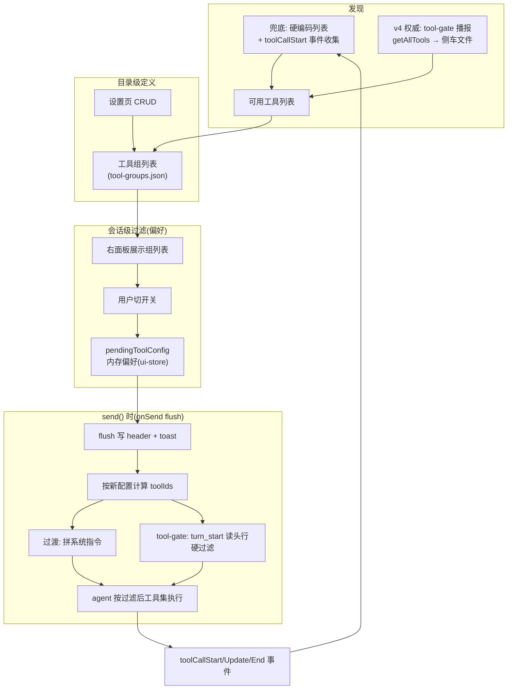
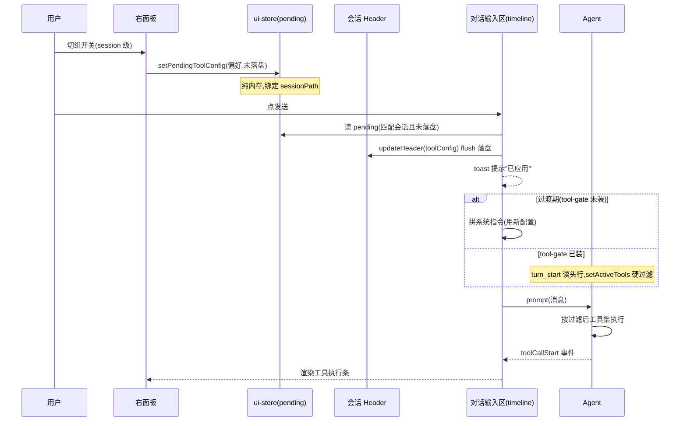

# 工具动态管理：会话级工具过滤

> **v7 修订（去 mode + 组默认态）**：砍掉"全部工具/自定义"模式切换——右面板永远显示组开关列表，开关即 session 级配置；`__all__`"全部"虚拟组曾短暂作为主开关存在，随即删除——成员由定义决定、不可编辑、开关语义与其他组不等价，它不是组；"全开"由各组默认开自然表达。`SessionToolConfig.mode` 字段废弃：头行有 `enabledToolIds` 即过滤，显式空数组 = 全禁（无任何兜底回落）；无 session 配置时各组开关取 `ToolGroup.defaultEnabled`（四预设开、"默认组"开），UI 以"默认开/默认关"徽标常显，所有组（含内置）的默认态用户可改——reconcile 换新时结构归框架、defaultEnabled 覆盖归用户。旧 header 的 mode/custom 数据向后兼容（enabledToolIds 在场即被消费）；`enabledGroupIds` 全部指向已退役组时视为配置失效，回落组默认并挂起 pending 自愈（遗存 `__all__` id 同此路径处理）。预设组同轮重构为只读/只写/bus/subagent（真实注册名对齐 bus-extension 6 个、subagent-extension 5 个工具），旧预设 files/exec 经 reconcile 退役。
>
> **v5 修订（toolConfig 落点迁移）**：`toolConfig` 从头行顶层字段迁入 `custom-pi-desktop.toolConfig` 保留键——desktop 私有数据统一收敛进头行 `custom-pi-desktop` 命名空间（见 `session-header-custom.md` 2026-08-06 修订）。契约不变：写侧仍经 `updateHeader({ toolConfig })`，读侧 `readToolConfig`/timeline 软注入语义不变；tool-gate 扩展读路径同步改读 `custom-pi-desktop.toolConfig`。本文 §4.2/§5.3 描述的"头行 toolConfig 字段"落点以此为准，未发布、无存量兼容。
>
> **v4 修订（工具发现最终期落地）**：§4.1 规划的 `get_tools` RPC 被取代——实测当前安装态底座（`~/.pi-desktop/pi/node_modules/@earendil-works/pi-coding-agent`，其 `dist/modes/rpc/rpc-types.d.ts` 共 35 个消息类型）没有 `get_tools` 命令，桌面单方面加不了，继续等是被上游卡脖子。工具发现改走 **tool-gate 扩展播报 + 侧车文件**：tool-gate 在 `turn_start` 把 `pi.getAllTools()`（底座扩展 API 现成，`ToolInfo` 带 `sourceInfo` 来源元数据）写入 `~/.pi/agent/desktop-known-tools.json`（不挂 session_start——桌面扩展的工具注册门控在与 desktop 的握手之后，session_start 时集合未全，播报会把好桶回写成残缺集，见 §4.4.3），桌面经 `kernel:knownTools` IPC 读取，取代事件收集成为权威来源。这与 v3 用扩展 API `setActiveTools` 替代 `set_tool_filter` RPC 是同一思路：扩展沙箱里已有的能力，不等 RPC。另订正 §2.3 对过渡期缺口的估计：实际不是"没跑过的工具发现不了"一句——事件收集是纯直播订阅（无回放、仅激活会话、组件挂载才订阅、基线不重放、内存态重启清零），且有功能后果：custom 模式硬白名单会把从未被发现的扩展工具静默挡在门外。机制见新节 §4.4。
>
> **v3 修订（现状对齐）**：硬过滤已落地，但走的不是本文 §4 规划的 `set_tool_filter` RPC——而是 **tool-gate 底座扩展**（`packages/toolgate/index.ts`，启动时由 `client/pi/toolgate-installer.ts` 同步到 `~/.pi/agent/extensions/tool-gate/`，挂 `session_start`/`turn_start` 读会话头行 `toolConfig.enabledToolIds`，调 `pi.setActiveTools` 硬过滤）。timeline 的 prompt 软注入保留为 tool-gate 未装时的降级路径。§4 的 RPC 方案被取代，仅 `get_tools`（工具发现）仍作演进项保留。另：工具名已对齐底座注册名（`read`/`write`/`edit`/`find`/`grep`/`ls`，本文旧名 `read_file`/`glob`/`list_dir` 等已更正）；预设组删掉了 web 组（底座核心无 `web_search`/`web_fetch`）；`SessionToolConfig` 增加 `enabledToolIds` 字段（组展开在写偏好时完成，消费方不回退展开）；§3.3 的路径白名单约束已由 `configFile` 分层配置（`getLayered`/`setProject`，见 `layered-config.md`）解决。
>
> **v2 修订（onSend flush）**：右面板开关不再立即写 header，改"内存偏好 + 发送时落盘"两态（见 §5.3），与 `composer-apply-timing.md` 的模型/思考强度同语义。

pi-desktop 当前对 pi 底座的工具一无所知——不知道有哪些、不能控制用哪些、只在工具执行时被动渲染一下事件。这个设计要解决的问题是：让用户在会话级别灵活控制 agent 能用哪些工具，通过"工具组"这个抽象实现一键开关一组工具，配置跟随会话文件走，默认全开，需要时才过滤。

方案分两阶段落地。过渡期不依赖 pi 底座的新 RPC，用 prompt 注入做软过滤——LLM 可能不遵守，但作为 MVP 能用。最终期 pi 底座补 `get_tools` 和 `set_tool_filter` 两个 RPC 后，切换到硬过滤——agent 级强制，LLM 拿不到未列出的工具。两阶段的配置结构不变，只是过滤的强制力从软变硬。（v3：硬过滤实际由 tool-gate 底座扩展落地，未经 RPC；软注入降级保留。）

## 1. 问题与目标

### 1.1 现状：pi-desktop 不感知工具

pi 底座有工具——bash、read、write、edit、find、grep、ls 等等，来自底座内置和已启用的 extension。这些工具在 agent 会话中被自动加载，LLM 按需调用。但 pi-desktop 对这些工具的感知仅限于"工具执行时渲染一下"。

具体缺什么：

- pi-desktop 不知道当前 agent 有哪些可用工具。RPC 命令集（`rpc-types.ts`）里没有"查询工具列表"的命令，`get_commands` 返回的是斜杠命令（来源 extension/prompt/skill），和工具是两个概念。

- pi-desktop 不能控制某个会话能用哪些工具。唯一间接影响工具集的方式是 extension enable/disable + restart——粒度是 extension 级的（一个 extension 可能贡献多个工具），而且需要等会话空闲后重启 pi 进程才生效。

- 工具事件（`toolCallStart`/`toolCallUpdate`/`toolCallEnd`）从底座 stdout 推过来，经 `event-translator.ts` 翻译成中性事件，最终在 timeline 插件的 `ToolExecBar` 里渲染成可折叠的工具执行条。这条链是纯观察性的——你看到工具在跑，但不能干预它能不能跑。

### 1.2 目标：会话级工具过滤

用户要能做这件事：打开一个会话，在右面板切几个开关，下次发消息时 agent 就只能用勾选的工具。换个会话，另一套配置，互不干扰。

- **默认全开**。不碰设置时，行为和现在一样——所有可用工具都能用（v7：由各组 `defaultEnabled` 表达，四预设 + 默认组默认开）。只有用户主动在右面板关组时，过滤才生效。

- **工具组**。工具按组组织，一组里放几个相关工具（如"只读"组放 read/find/grep/ls），用户开关一个组就等于开关一组工具，不用逐个勾。

- **配置跟会话走**。会话 A 只开只读组，会话 B 按组默认全开，两个会话的配置互不影响。配置写在会话文件 header 里，换台机器打开同一会话也带着配置。

### 1.3 约束：两阶段落地（v3：硬过滤已由 tool-gate 落地）

pi 底座目前没有工具管理的 RPC。要想在协议层面真正禁用某个工具，原计划需要底座新增两个命令：`get_tools`（返回可用工具列表）和 `set_tool_filter`（设置工具过滤）。这两个命令什么时候补、补不补，不取决于 pi-desktop。

所以方案分两阶段：

- **过渡期**：pi-desktop 侧自己解决。工具发现靠硬编码已知工具 + 运行时从 `toolCallStart` 事件收集。过滤靠 prompt 前注入系统指令——"你只能使用以下工具: [list]"，LLM 可能不遵守，但作为 MVP 够用。

- **最终期**：~~pi 底座补了 `get_tools` + `set_tool_filter` 后~~（v3）硬过滤不由 RPC 实现——**tool-gate 底座扩展**在 `turn_start` 读会话头行 `enabledToolIds`，调底座扩展 API `pi.setActiveTools` 强制过滤。desktop 启动时 installer 把扩展同步进底座目录，renderer 经 `kernel.toolgateAvailable` IPC 探测可用性，未装则回退软注入并在 UI 明示。配置结构不变，只是应用机制变强。工具发现的 RPC（`get_tools`）仍是演进项。

文档两条路都展开，讲清楚每个阶段做什么、怎么切换。

## 2. 概念模型

### 2.1 三个核心概念

**Tool** — agent 可用工具的元数据。一个 Tool 有 id（如 `"bash"`）、name（显示名）、source（`"builtin"` 或 `"extension"`）、可选的 extensionId（来源 extension）。Tool 的清单不是静态的——extension 启用/禁用后，它贡献的工具会从清单中增减。Tool 本身不存任何东西，它只是"agent 当前能调什么"的投影。

**ToolGroup** — 工具的命名集合。一个 ToolGroup 有 id、name、description、toolIds（包含的工具 id 列表）、builtIn（是否内置预设）、defaultEnabled（无 session 配置时的默认开关）。ToolGroup 存在目录级（`./.pi-desktop/config/tool-groups.json`），同一个项目目录共享一套组定义。pi-desktop 内置四组落盘预设（只读 readonly、只写 writeonly、bus、subagent）作为初始内容写入这个文件。内置组不可删除，但可以编辑工具列表（增删 toolIds）和修改名称/描述/默认态；自定义组可以删除、编辑。用户可以加自己的组。（v6 起内置组随代码换新：加载时 stored 里的 builtIn 组被当前 PRESET_GROUPS 整体替换——旧预设 files/exec 即由此退役——自定义组原样保留；纯函数 reconcile 不写盘，落盘等用户下次 save 顺带完成。v7 订正：reconcile 保留同 id 内置组的 defaultEnabled 用户覆盖——结构归框架、状态归用户。"全部"曾是 `__all__` 虚拟组，v7 末删除——成员由定义决定、不可编辑、开关语义与其他组不等价，不是组；"全开"由各组默认开自然表达。）

**SessionToolConfig** — 会话级的过滤配置。两个字段：`enabledGroupIds`（生效的组 id 列表）、`enabledToolIds`（v2 起：写偏好时由组展开好的工具 id 清单——消费方 timeline 软注入、tool-gate 硬过滤只认该字段，不回退组展开，消费方不必各自再展开一遍；显式空数组 = 全禁）。存在会话文件 JSONL header 的 `toolConfig` 字段里，和 `pinned`/`archived` 同层。（v7 起废弃 `mode` 字段：字段存在即过滤生效，无"全部/自定义"模式切换；无 session 配置时各组开关由 `ToolGroup.defaultEnabled` 决定——四预设与"默认组"默认开；旧 header 的 mode/custom 数据天然向后兼容——enabledToolIds 在场即被消费，mode 字段被忽略。）

三者关系：

```
Tool（agent 可用工具清单，动态变化）
  └─ 归入 ToolGroup（目录级定义，用户可编辑）
       └─ SessionToolConfig 引用 ToolGroup（会话级，决定哪些组生效）
```

### 2.2 两层存储

| 数据 | 存储位置 | 格式 | 生命周期 |
|------|---------|------|---------|
| 工具组定义 | `./.pi-desktop/config/tool-groups.json` | JSON | 目录级，同目录共享 |
| 会话级配置 | 会话文件 JSONL header `toolConfig` 字段 | JSON 对象 | 跟会话文件走 |

（v4 订正：工具组的实际落盘经统一插件配置通道 `ctx.config.get/set("groups")`，物理文件是 `<cwd>/.pi-desktop/config/tool-manager.json`（项目级，`~/.pi-desktop/config/tool-manager.json` 全局兜底）——本文其余 `tool-groups.json` 字样是 v3 分层配置方案的旧投影。两者语义等价：都是目录级、项目层覆盖全局层，只是物理文件不同。）

工具组定义存在目录级意味着不同项目可以有不同的组划分。一个前端项目可能定义"样式工具组"（含 css 相关工具），一个后端项目不需要——它们各自维护自己的 `tool-groups.json`。

会话级配置存在 header 里，不另起文件。`updateSessionHeader`（`session-scanner.ts`）的 `toolConfig` 字段，写入逻辑和 `pinned`/`archived` 一样——读首行 JSON、改字段、写回。header 里存 `enabledGroupIds` + `enabledToolIds`（组展开后的工具 id 清单，偏好 flush 时由 ToolPanelTab 展开落盘——tool-gate 底座扩展只认该字段，不回退组展开，消费方不必各自再展开一遍；v7 起不再写 `mode`）。

**新工具的归宿**：当 agent 的可用工具列表变化（比如 enable 了一个新 extension，多了 2 个工具），新工具自动归入"默认组"。默认组是一个特殊的 ToolGroup，id 为 `"__default__"`，它包含所有未被其他组收录的工具。默认组不可删除、不可手动增删 toolIds——它的 toolIds 是运行时动态计算的：`全部可用工具 - 已被其他组收录的工具`。"不可手动编辑"不意味着内容不变，而是说它的内容由系统自动维护，用户不能往里加或从里删某个工具。

~~**mode=all 的确切含义**~~（v7 作废）：mode 概念已删。语义等价物：头行无 `toolConfig` = 不过滤（agent 照常使用加载的所有工具，不管工具列表认不认识）；`enabledToolIds` 在场 = 按清单过滤，显式空数组 = 全禁。

~~**custom 模式的初始状态**~~（v7 作废）：无 session 配置时开关初始值 = 各组 `defaultEnabled`（内置四预设开、"默认组"开，即等价全开）——用户做减法；"默认全开"原则由组默认值表达，不再靠 mode。组的默认状态在 UI 上以"默认开/默认关"徽标常显（无 session 配置时是什么权限一目了然），内置组的 defaultEnabled 用户可改——reconcile 换新时结构（name/toolIds）归框架、defaultEnabled 覆盖归用户。

### 2.3 工具发现：两阶段（v4：最终期第三形态见 §4.4）

**过渡期**：pi-desktop 不知道 agent 有哪些工具，两个来源拼凑：

- **硬编码已知工具列表**。在插件内维护一份 pi 底座内置工具的列表（bash、read、write、edit、find、grep、ls——以底座注册名为准，`setActiveTools` 对未注册名静默忽略），标注 source=builtin。这份列表会随 pi 底座版本变化而过时，但作为 MVP 足够起步。
- **运行时从 `toolCallStart` 事件收集**。每次 agent 执行工具时推的 `toolCallStart` 事件里有 `toolName`，监听这些事件把没见过的工具名记下来。这个来源是事后补全——你不知道你没见过的工具，但至少已经跑过的工具不会漏。

两者合并：硬编码列表打底 + 事件收集增量补全。局限是没有"未使用过的工具"——如果某个工具从来没在当前会话里被调用过，它不会出现在事件流里，也就不在列表里。最终期的 `get_tools` RPC 能彻底解决这个问题。

**最终期**：`get_tools` RPC 返回 agent 当前加载的可用工具完整清单，一次性替代硬编码 + 事件收集。清单随 extension 启用/禁用变化——extension 禁了，它贡献的工具从清单消失。这个变化在下次 resync 时反映到 UI。resync 是 pi-desktop 在会话启动或切换时的一次性数据同步——并行发 5 条 RPC（`get_state`/`get_entries`/`get_tree`/`get_commands`/`get_messages`）拉取会话全量基线，组装成 `SyncSnapshot`（会话快照，包含 state/entries/messages/tree/commands 等字段）推给 renderer。`get_tools` 并入这组并行拉取，结果作为 `SyncSnapshot.tools` 字段带过来。（v4：本段 RPC 形态由 tool-gate 播报取代——底座至今无 `get_tools` 命令，扩展沙箱里的 `getAllTools` 经侧车文件递达桌面，见 §4.4。"一次性替代硬编码 + 事件收集"的语义不变，只是通道从 RPC 换成文件，并入 resync 改为读取时机挂载/`sessionChanged`/cwd 变化。）

### 2.4 过滤应用：两阶段

**过渡期——prompt 注入软过滤**：用户切到自定义模式后，在 `session.prompt()` 发送消息前，自动在消息前拼一段系统指令：

```
[System] 本次会话已限制可用工具。
可用工具: read, write, edit, find, grep, ls。
请勿使用未在列表中的工具。
```

这是软过滤——LLM 收到指令后会尽量遵守，但不是强制的。如果 LLM 仍尝试调用未列出的工具，底座不会拦截，工具照常执行。这对用户来说有"假安全感"风险：以为关了某个工具，实际上 LLM 照用。所以过渡期 UI 上要标注"软过滤"提示，不给人"已禁用"的错觉。

**最终期——硬过滤**（v3 实际形态）：不由 `set_tool_filter` RPC 实现，而是 **tool-gate 底座扩展**：desktop 启动时 `client/pi/toolgate-installer.ts` 把 `packages/toolgate/index.ts` 同步到 `~/.pi/agent/extensions/tool-gate/`（按内容 diff，首次 spawn pi 之前完成），扩展挂 `session_start` + `turn_start`，自己读会话文件头行的 `custom-pi-desktop.toolConfig.enabledToolIds`（故意不走 sessionManager 缓存——desktop 运行中改头行，缓存是 spawn 时的旧值），过滤掉未注册名后调 `pi.setActiveTools`。排序指纹防抖，无变化不重复调用；任何异常静默——扩展不该炸掉底座会话。LLM 试图调用未列出的工具时底座直接拒绝，这是真过滤。tool-gate 在 extension-store 是受保护扩展（`PROTECTED`），不允许用户禁用——禁用会被下次启动静默重装，语义自相矛盾。

切换时机：renderer 经 `kernel.toolgateAvailable` IPC 探测扩展是否在底座目录里。已装则 timeline 发送逻辑跳过 prompt 注入（注入文本会持久化进会话历史，能免则免）；未装则回退拼指令并在右面板显示"过滤不会真正生效"降级提示。配置结构不变——`SessionToolConfig` 还是 enabledGroupIds + enabledToolIds（v7 起无 mode），只是从配置到"可用工具列表"的应用结果，从"拼指令"变成"扩展强制"。用户不感知切换。（v7 订正：降级警告只在"有过滤动作且 gate 缺席"时显示——全量可用时无过滤可降级，硬过滤在场时无"LLM 不遵守"问题，常驻警告是误报。）

## 3. 过渡期方案

### 3.1 工具发现：硬编码 + 事件收集

在 `tool-manager` 插件内维护一份已知工具列表，作为过渡期的工具发现来源：

```typescript
// tool-manager/core/types.ts(v3:实际落点在插件 core 层,纯 TS 可裸单测)
export interface KnownTool {
  id: string;
  name: string;
  description: string;
  source: "builtin" | "extension";
  extensionId?: string;
}

export const BUILTIN_TOOLS: KnownTool[] = [
  { id: "bash", name: "bash", description: "执行 shell 命令", source: "builtin" },
  { id: "read", name: "read", description: "读取文件内容", source: "builtin" },
  { id: "write", name: "write", description: "写入新文件", source: "builtin" },
  { id: "edit", name: "edit", description: "编辑文件", source: "builtin" },
  { id: "find", name: "find", description: "按模式搜索文件路径", source: "builtin" },
  { id: "grep", name: "grep", description: "搜索文件内容", source: "builtin" },
  { id: "ls", name: "ls", description: "列出目录内容", source: "builtin" },
  // ... 随 pi 底座更新补充
];
```

事件收集是一个运行时 Map：监听 `session.onEvent`，当事件 type 为 `toolCallStart` 时取 `toolName`，如果不在已知列表里就加进去，source 标为 `"extension"`（v4 订正：能进收集器的名字按构造就不在内置清单里，标 extension 才是实话，实现如此；早期稿标 `"builtin"` 是"过渡期无法区分来源"的保守写法，与实现漂移）。这份收集存在插件内存态，不落盘——它只是补全硬编码列表的缺口，下次启动从空开始重新收集。

```typescript
const discoveredTools = new Map<string, KnownTool>();

sessions.onEvent((event) => {
  if (event.type === "toolCallStart" && event.toolName) {
    if (!discoveredTools.has(event.toolName) && !BUILTIN_TOOLS.some(t => t.id === event.toolName)) {
      discoveredTools.set(event.toolName, {
        id: event.toolName,
        name: event.toolName,
        description: "",
        source: "extension",  // v4 订正:按构造即非内置(不在 BUILTIN_TOOLS 才会进这),与实现对齐
      });
    }
  }
});

// 最终工具列表 = BUILTIN_TOOLS + discoveredTools
```

合并后的工具列表用于工具组管理页的"包含工具"勾选列表。局限：只有跑过的工具才会被发现，没跑过的工具不在列表里。最终期 `get_tools` 一次性解决。

### 3.2 软过滤机制

软过滤的核心是：在用户发消息时，如果当前会话头行有工具过滤配置（`enabledToolIds` 在场），在消息前拼一段系统指令告诉 LLM 可用工具范围。

**谁来做这件事？** 不是 tool-manager 插件拦截 `prompt()`——一个 sidePanel 插件没有机制插入到对话输入区的发送逻辑中间。真正做这件事的是对话输入区自己。

pi-desktop 的对话输入区在 timeline 插件的 renderer 里（`plugins/timeline/renderer/`），它调 `sessions.prompt(text)` 发消息。软过滤的做法是：对话输入区在调 `prompt()` 之前，先检查当前会话 header 的 `toolConfig`——（v7）`enabledToolIds` 在场即过滤（显式空数组 = 全禁，拼"可用工具： 无"），拼系统指令前置到用户消息前，再发拼好的消息。

tool-manager 插件的责任到此为止：写配置（会话 header 的 `toolConfig` + 目录级的 `tool-groups.json`）。执行过滤是发送路径的责任，不是插件的责任。这和 settings 槽的"框架驱动"模式同理——插件只管报告改动，框架管保存和执行。

具体来说，对话输入区的发送逻辑加一步前置处理：

```typescript
// plugins/timeline/renderer/ 对话输入区发送逻辑（v7 实际形态,伪码）
async function handleSend(text: string) {
  const config = await readSessionToolConfig(currentSessionPath);
  if (config && Array.isArray(config.enabledToolIds)) {
    // 只认 enabledToolIds——与 tool-gate 同一契约,不回退读 tool-groups.json 展开组
    // (组展开在 tool-manager 写偏好时完成;显式空数组 = 全禁,注入"可用工具: 无")
    const gateInstalled = await kernel.toolgateAvailable();
    if (!gateInstalled) {
      text = buildToolLimitNote(config.enabledToolIds) + "\n\n" + text;
    }
  }
  await sessions.prompt(text);
}
```

`readSessionToolConfig` 读会话 header 的 `toolConfig` 字段（经 IPC）；`enabledToolIds` 是写偏好时由组展开好的清单（v3：timeline 不再读 `tool-groups.json` 回退展开——回退逻辑曾与 tool-gate "只认 enabledToolIds" 的契约不一致，且跨插件读路径字面量造成契约漂移，已删）。`buildToolLimitNote` 拼接：

```
[System] 本次会话已限制可用工具。
可用工具: {toolId 列表，逗号分隔}
请勿使用未在列表中的工具。
```

这段指令拼在用户消息前面，作为同一条消息发到底座。底座把它当普通 user message 处理，LLM 看到后会尽量遵守。

**为什么不在 session-store 层做**：session-store（application 层）不该读 cwd 级配置文件（违反依赖方向——application 不依赖项目级文件路径）。对话输入区在 timeline 插件的 renderer 里，renderer 侧已经持有 cwd 和 sessionPath（经 `useUiStore`），读 header 和读 tool-groups.json 都是 renderer 侧自然能做的事。过滤逻辑放在发送路径上，所有发送入口（手动发送、快捷键、retry）都走这条路，不会漏。

**局限显式标注**：右面板自定义模式下显示"软过滤"提示——"当前为软过滤，LLM 可能不遵守限制。升级 pi 底座后可启用强制过滤。" 不给用户"已禁用"的假安全感。（v3 订正：硬过滤不依赖底座升级——desktop 启动时 installer 同步 tool-gate 扩展即启用，见 §2.4；现行降级文案为"tool-gate 底座扩展未安装，过滤不会真正生效"。）

### 3.3 配置读写

**工具组读写**（目录级）：

~~插件从 `useUiStore` 拿 `currentCwd`，拼成绝对路径 `${currentCwd}/.pi-desktop/config/tool-groups.json`，调 `window.pi.configFile.get/set(absolutePath, data, mergeMode)` 读写。~~（v3：已由 `configFile` 分层配置取代——插件调 `ctx.configFile.getLayered(cwd, relPath)` 读、`setProject(cwd, relPath, data, mode)` 写，relPath 即 `config/tool-groups.json`，框架管项目级/全局级两层对齐，见 `layered-config.md`。路径字面量在插件内单源为 `TOOL_GROUPS_REL_PATH` 常量。）~~（v4 订正：实际落地走统一插件配置通道 `ctx.config`，key 为 `groups`，见 §2.2 末注。）写入用 `"replace"`（整份覆盖，因为工具组是列表型数据，深合并会导致删不掉条目）。

~~⚠ 路径白名单约束：`configFile` API 的路径白名单只允许 `~/.pi-desktop/` 和 `~/.pi/agent/` 前缀。`<cwd>/.pi-desktop/config/tool-groups.json` 不在白名单内。~~（v3：已解决——分层配置 API 的项目级路径由框架圈禁到 `<cwd>/.pi-desktop/` 前缀，不再是调用方拼绝对路径撞白名单。）

`currentCwd` 为空时（用户还没打开项目目录），设置页的工具组管理区域显示空态提示"请先打开项目目录"。工具组配置是目录级的，没有 cwd 就没有配置文件可读写。右面板同样显示空态。

首次打开一个有 cwd 但没有 `tool-groups.json` 的目录时，插件写入内置预设组作为初始内容（v6 版预设——工具名以底座/扩展注册名为准，写未注册名会被 setActiveTools 静默忽略）：

```typescript
const PRESET_GROUPS: ToolGroup[] = [
  { id: "readonly", name: "只读", toolIds: ["read", "find", "grep", "ls"], builtIn: true, defaultEnabled: true },
  { id: "writeonly", name: "只写", toolIds: ["write", "edit", "bash"], builtIn: true, defaultEnabled: true },
  { id: "bus", name: "bus", toolIds: ["bus_status", "session_create", "session_abort", "channel_member", "tap_start", "tap_stop"], builtIn: true, defaultEnabled: true },
  { id: "subagent", name: "subagent", toolIds: ["spawn_subagent", "send_to_subagent", "wait_subagent", "list_subagents", "abort_subagent"], builtIn: true, defaultEnabled: true },
];
```

**会话级配置读写**：

会话文件是 JSONL 格式——第一行是 header（一个 JSON 对象，含 `type:"session"`、`id`、`cwd`、`timestamp` 等字段），后面每行是一条消息。现有的 `updateSessionHeader`（`session-scanner.ts`）已经支持 `name`/`pinned`/`archived` 字段的读写，方式是读首行 JSON、改字段、写回（文件锁串行化）。扩展它加 `toolConfig` 字段（v5 起落 `custom-pi-desktop.toolConfig` 保留键）：

```typescript
export async function updateSessionHeader(
  path: string,
  patch: { name?: string; pinned?: boolean; archived?: boolean; toolConfig?: SessionToolConfig | null },
): Promise<void> {
  // ...读首行 JSON
  if ("toolConfig" in patch) {
    if (patch.toolConfig) custom.toolConfig = patch.toolConfig;  // custom = header["custom-pi-desktop"]
    else delete custom.toolConfig;  // null = 清除过滤配置
  }
  // ...写回
}
```

patch 语义是浅合并——只改传入的字段，不碰 header 里其他字段。传 `{ toolConfig: { enabledGroupIds: [...], enabledToolIds: [...] } }` 只写 `custom-pi-desktop.toolConfig`，不覆盖 `pinned`/`archived`/`name`。

IPC 通道复用现有的 `session:updateHeader`——preload 已暴露 `window.pi.sessions.updateHeader(path, patch)`，patch 加一个字段即可，不需要新 IPC 通道。

读取时机：右面板通过 `window.pi.sessions.readToolConfig(sessionPath)`（新增 IPC，读会话 JSONL 首行 `custom-pi-desktop.toolConfig` 保留键）直接读当前会话的配置。切会话时 `currentSessionPath` 变化触发重读。不需要等 resync 或 onSnapshot——`readToolConfig` 是纯文件读，不依赖 pi 进程启动。

## 4. 最终期方案

> **v3 取代标注**：本节规划的是"底座补 RPC"路径。实际落地时硬过滤改由 **tool-gate 底座扩展**完成（见 §2.4 v3 段）——底座扩展 API 已有 `setActiveTools`/`getAllTools`/`on(turn_start)`，不需要等 `set_tool_filter` RPC。§4.2/§4.3 的 RPC 接线与探测切换因此作废，保留作设计历史。§4.1 `get_tools`（工具发现）在 v4 也由 tool-gate 播报取代（见 §4.4）——底座至今无此 RPC，扩展沙箱里的 `getAllTools` 经侧车文件递达桌面，与硬过滤同一交付通道。

### 4.1 get_tools RPC

> **v4 作废**：本节路径已由 §4.4（tool-gate 播报 + 侧车文件）取代，保留作设计历史。

新增一个 RPC 命令，返回 agent 当前加载的可用工具清单：

```typescript
// gateway/protocol/rpc-types.ts 新增
| { id?: string; type: "get_tools" }

// 响应数据
interface ToolsResponse {
  tools: ToolInfo[];
}
```

`ToolInfo` 是圆心中性类型，定义在 `domain/sessions.ts`：

```typescript
export interface ToolInfo {
  id: string;
  name: string;
  description?: string;
  source: "builtin" | "extension";
  extensionId?: string;
}
```

接线路径：

1. `rpc-types.ts` 加 `get_tools` 命令类型
2. `commands.ts` 加 `buildGetToolsCommand()`
3. `session-store.ts` 加 `getTools(): Promise<ToolInfo[]>` 方法
4. `domain/sessions.ts` 加 `ToolApi` 接口 extends `RpcOps`
5. `resync.ts` 并入 `get_tools` 到并行拉取，结果进 `SyncSnapshot`（会话同步快照，renderer 的基线数据）
6. `preload.ts` 暴露 `window.pi.sessions.getTools()`
7. `packages/react/src/plugin-context.ts` 绑定到 `PluginContext`

`get_tools` 的语义是"当前 agent 会话加载的可用工具"，类似 `get_available_models` 返回当前可选模型。清单随 extension 启用/禁用变化——extension 禁了，它贡献的工具从清单消失。这个变化在下次 resync 时反映到 UI。

### 4.2 set_tool_filter RPC

新增一个 RPC 命令，告诉底座"这个会话只允许以下工具"：

```typescript
// gateway/protocol/rpc-types.ts 新增
| { id?: string; type: "set_tool_filter"; toolIds: string[] }
```

语义约定：

- `toolIds` 为空数组 `[]` = 禁用所有工具（agent 只能对话，不能调工具）
- `toolIds` 不传或 `null` = 清除过滤，全部可用（等价于 mode=all）
- `toolIds` 非空 = 只允许列出的工具

调用时机：用户在右面板切到自定义模式并点"应用到当前会话"后，两件事按顺序发生——先写会话 header 的 `toolConfig`（持久化配置），再调 `set_tool_filter` RPC（让底座立即生效）。如果 header 写成功但 RPC 失败，配置已持久化但当前会话未生效——下次 prompt 时对话输入区读 header 拼系统指令作为兜底（过渡期逻辑仍在），右面板显示"配置已保存，但底座未响应过滤请求，当前使用软过滤兜底"。如果 header 写失败（磁盘问题），不调 RPC，右面板显示"保存失败"错误，用户可重试。

切回"全部工具"模式时，先清 header 的 `toolConfig`（写 null），再调 `setToolFilter(null)` 清除过滤。

接线路径同 4.1：rpc-types → commands → session-store → domain → preload → plugin-context。

### 4.3 从过渡到最终的切换

切换不是一次性开关，而是逐能力探测：

```typescript
// session-store.ts 或 plugin 内
async function supportsGetTools(adapter: RpcAdapter): Promise<boolean> {
  try {
    await adapter.send({ type: "get_tools" });
    return true;
  } catch {
    return false;  // 底座不认识这个命令
  }
}
```

- `get_tools` 可用 → 替换硬编码列表 + 事件收集，改用 RPC 查询
- `set_tool_filter` 可用 → 替换 prompt 注入，改用 RPC 强制
- 两个能力独立探测，可能一个有一个没有（比如先补 `get_tools`，后补 `set_tool_filter`）

切换是自动的：探测到 `set_tool_filter` 可用后，对话输入区的发送逻辑自动从"拼系统指令"切到"调 RPC"，不需要用户重新操作。下次 prompt 时自然走新路径。反之，如果探测到不支持，自动回退到拼指令。用户不感知切换。

过渡期的代码不删——硬编码列表作为 `get_tools` 失败时的兜底，事件收集作为 `get_tools` 增量补全的补充。prompt 注入作为 `set_tool_filter` 不可用时的回退。这样底座版本不对的时候系统不会崩，只是降级到软过滤。

## 4.4 工具发现最终期：tool-gate 播报 + 侧车文件（v4）

§4.1 等底座补 `get_tools` RPC 的路径作废——实测当前底座 RPC 命令集没有该命令，桌面单方面加不了。但底座扩展 API 里 `pi.getAllTools()` 是现成的，返回 `ToolInfo[]`（name/description/parameters/promptGuidelines，外加 `sourceInfo` 来源元数据）。v3 已经用扩展 API `setActiveTools` 替代了 `set_tool_filter` RPC，v4 用同一思路替代 `get_tools`：能力在扩展沙箱里就有，缺的只是把它递回桌面的通道。

过渡期事件收集的缺口也值得先说透——它不止"没跑过的发现不了"一句：main 侧 dispatch 的视图流只转激活会话（`core/application/sessions/session-store.ts` 按 activeProcKey 过滤，子代理/后台会话里的工具调用根本到不了 renderer）；`onEvent` 是纯直播无回放（订阅发生之前的事件永久错过）；订阅挂在组件挂载上（从没打开过工具 tab 就没有订阅存在）；历史会话走 snapshot 基线（resync 拉 entries 组装消息），不重放 `toolCallStart` 事件；收集结果在 `useRef` 内存态，app 重启清零。五层筛子叠加，扩展工具被发现才是偶然。

### 4.4.1 通道选择：为什么是侧车文件

候选通道四个，逐个过：

- **新 RPC `get_tools`**（§4.1 原案）：底座没有，上游节奏不可控，否。

- **`appendEntry` 写会话文件**：扩展 API 的 `appendEntry(customType, data)` 往会话 JSONL 追加自定义条目。会话文件是用户数据，每个会话开头塞一条工具清单是污染；条目还经 `entry_appended` 事件进桌面事件流，徒增时间线处理负担。否。

- **`extension_ui_request`**：扩展→桌面的交互 UI 请求通道（select/confirm/input/notify），语义是"问用户一件事"，不是"播报一份数据"。否。

- **侧车文件**：扩展写 `~/.pi/agent/desktop-known-tools.json`，桌面读。tool-gate 本来就在做同级 fs 操作（`fs.readSync` 读会话头行 8KB 窗口）；`~/.pi/agent` 是底座标准目录，稳定版与 dev 版桌面共享（数据根分流只分 `~/.pi-desktop` / `~/.pi-desktop-dev`）——工具清单跟着底座与扩展配置走，本来就该放在共享处。中。

侧车文件同时也是 v3 已确立交付通道的自然延伸：installer 管把扩展同步进底座目录（桌面→底座），播报文件管把工具清单递回来（底座→桌面），一去一回都是文件，不新增通道类型。

### 4.4.2 文件契约

```json
{
  "version": 1,
  "byCwd": {
    "/abs/project": {
      "tools": [
        { "name": "read", "description": "…", "source": "builtin" },
        { "name": "spawn_agent", "description": "…", "source": "extension", "extensionPath": "/Users/x/.pi/agent/extensions/subagent-extension/index.ts" }
      ],
      "updatedAt": 1730000000000
    }
  }
}
```

- **`byCwd` 分桶**：项目级扩展使工具集随项目目录变；工具组定义本来也是目录级（§2.2），桶粒度与组定义对齐。pi 进程的 cwd 即项目目录（桌面 spawn 时注入，`client/pi/subprocess-lifecycle.ts`），扩展里 `process.cwd()` 直接拿。

- **sourceInfo 映射在扩展侧完成**：`sourceInfo.source === "builtin"` 映射为 `source: "builtin"`，其余映射为 `extension` 并记 `extensionPath`。底座内部结构（SourceInfo 的 scope/origin 等字段）不泄漏给桌面——扩展是底座细节的翻译点，桌面读到的已是中性形状。这与 event-translator 把协议翻译收敛在 gateway 是同一纪律：翻译贴着边界做，内层不见外层结构。

- **写法是读-改-写**：保留其他 cwd 的桶，只更新自己 cwd 那份。并发覆盖与自愈见 §4.4.5。

### 4.4.3 播报时机与防抖

挂 `turn_start`（v4 落地后修正：原设计 session_start + turn_start 双挂点，实测 session_start 是坏时机——bus/subagent 这类桌面扩展把 `registerTool` 门控在与 desktop 的握手之后：session_start 时扩展先 ping desktop，应答到达才注册工具，`getAllTools()` 在握手完成前只返回核心 7 个。此时播报会把 byCwd 里已有的好桶回写成残缺集，而热进程每次 spawn 都触发 session_start——每次 app 重启 bucket 就被退化一次，直到下一个 turn 才自愈。turn_start 时握手早已完成（桌面即时应答，毫秒级），集合才是权威）。turn_start 单挂点同时覆盖 `refreshTools` 运行中注册的工具——下一 turn 自然带上。

防抖不纯靠内存指纹：`turn_start` 时读文件比对**自有桶**的工具指纹（名称排序 join），与当前 `getAllTools()` 指纹相同则不写。比纯内存指纹多一次小文件读，但换来被并发覆盖后的自愈——下一 turn 发现自有桶丢失或过期就重写。gate 每 turn 已在读会话头行 8KB 窗口，同量级开销可忽略。

异常纪律与过滤一致：任何异常静默吞掉，本轮维持现状，下一 turn 重试——播报失败不该影响会话。

### 4.4.4 桌面消费链

- **main 侧**：`client/pi/` 加 known-tools 读取——纯文件读 + JSON.parse，失败返回 null（半截 JSON、文件缺失同一路径）走兜底。读不引锁：写方是低频小文件，parse 失败即兜底，为读取加锁原语不值。IPC 加 `kernel:knownTools`，与 `kernel:toolgateAvailable` 同一注册文件同一模式；preload 暴露 `window.pi.kernel.knownTools(cwd)`；PluginContext 绑 `ctx.kernel.knownTools`。

- **renderer 侧**：`useDiscoveredTools` 从两源合并改三源合并——`BUILTIN_TOOLS`（播报缺席时的兜底底版）∪ `kernel.knownTools(cwd)`（权威，带 description 与 source）∪ 事件收集 Map（tool-gate 未装或文件未写时的增量补全）。同名冲突以播报文件为准（它有真描述和真来源）。§4.3 的降级纪律原样延续：过渡期代码不删，每一层是上一层缺席时的兜底。

- **读取时机**：组件挂载时读一次 + `system:sessionChanged` 重读 + cwd 变化重读。不挂 chokidar 文件监听——工具清单不是秒级时效数据，新 spawn 必然伴随一次 setContext/sessionChanged，三个读点足够；为低频数据常开一个 watcher 不值。

- **两视图自然收敛**：ToolManagerPage 与 ToolPanelTab 各自的内存事件 Map 仍独立，但权威来源是同一份文件同一个 cwd 桶——设置页和右面板看到的列表首次保持一致，不再依赖"两个组件都碰巧订阅到同一次工具调用"。

### 4.4.5 兼容与降级

- **新桌面 + 旧 tool-gate**：文件不存在 → 落回 BUILTIN_TOOLS + 事件收集，与 v3 行为一致。

- **旧桌面 + 新 tool-gate**：文件被写但无人读，无害。

- **文件损坏**（半截 JSON）：parse 失败 → null → 兜底链，下一轮 turn_start 播报自愈。

- **多进程并发写**：多个 pi 进程（多会话并存、子代理会话）可能并发读-改-写同一文件，理论丢失他 cwd 的桶。无锁是显式取舍：同 cwd 的桶内容相同（同一份底座 + 扩展配置），覆盖无感；异 cwd 丢桶由被覆盖方下一 turn_start 的指纹比对自愈重写。为低频小文件引入锁原语是过度设计。

- **时效语义与过滤同频**：扩展启用/禁用要 respawn 才生效（pi loader 只在 spawn 时扫扩展目录），新进程首个 turn_start 播报新集合——桌面读到的永远是"最近一次 turn 的真相"，这与 tool-gate 过滤本身的生效粒度完全一致，不产生"列表说有但过滤不认"的错位。

## 5. 插件设计

### 5.1 plugin.json 声明

```json
{
  "id": "tool-manager",
  "version": "0.4.9",
  "displayName": "工具管理",
  "renderer": "./renderer/index.tsx",
  "contributes": {
    "settings": [{
      "id": "tools",
      "title": "工具",
      "component": "ToolManagerPage",
      "saveMode": "manual",
      "order": 2
    }],
    "sidePanel": [{
      "id": "tools",
      "label": "工具",
      "icon": "wrench",
      "component": "ToolPanelTab",
      "order": 15
    }]
  }
}
```

两个贡献点：设置页管工具组定义（CRUD），右面板管会话级过滤（切开关 + 应用）。

`saveMode: "manual"`——实时生效，无 dirty/浮层/拦截。工具组增删改和会话级开关切换都是即时写入，不需要"保存"按钮。和 plugin-manager / i18n 的 saveMode 一致。

不需要新权限声明——工具组读写走 `configFile` 分层配置 API（框架级），会话级配置走 `updateHeader` API（核心默认能力），工具列表发现走 `onEvent` 订阅（核心默认能力），tool-gate 探测走 `kernel.toolgateAvailable`（核心默认能力）。

### 5.2 设置页：工具组管理

设置页有两个视图，通过左列表切换：

**"工具组"视图**：

- 上方是工具组卡片列表（v6 起两列网格）。每个卡片显示组名、内置/自定义 badge、"默认开/关"徽标、工具数量、工具 chip 列表。内置预设组有"系统"标记不可删除，但可以编辑工具列表（增删工具）与默认态。自定义组可以删除、编辑。
- 下方是"新建工具组"表单：组名输入、描述输入、工具勾选列表（从当前可用工具列表中选）。
- 工具组的数据来源：读 `tool-groups.json`（configFile API）。写入也是 configFile API，深合并模式。

**"全部工具"视图**：
- 工具清单（v6 起两列网格）：每行工具名、来源（builtin/extension）、所属组标签；点击展开查看完整描述。无显式组的工具标"默认组"。
- 数据来源：过渡期用硬编码 + 事件收集合并后的列表；最终期用 `get_tools` RPC 返回的列表。
- 这页的价值是让用户看到"agent 当前到底有哪些工具"，在编辑工具组时知道可选什么。

### 5.3 右面板：会话级工具快切

右面板 Tab 展示当前激活会话的工具配置，交互流程：

```
┌─────────────────────────────┐
│ 🔧 工具                      │
│ 当前会话: refactor-auth.ts   │
├─────────────────────────────┤
│ ⏱ 变更将在下次发送时生效     │  ← pending 提示(有未落盘偏好时)
│                              │
│ ☑ 👁 只读    默认开  4       │  ← 组开关(session 级) + 默认态徽标
│ ☑ ✏️ 只写    默认开  3       │
│ ☐ 📡 bus     默认关  6       │
│ ☐ 🤖 subagent 默认关 5       │
│ ☑ 🔧 默认组  默认开  0       │
│                              │
│ 7 个可用 / 11 个禁用         │  ← 统计(按偏好值实时算)
│                              │
│ ⚠ tool-gate 未安装+软过滤    │  ← 仅"有过滤动作且 gate 缺席"时显示
└─────────────────────────────┘
```

（v7：砍掉"全部工具/自定义"模式切换——面板永远显示组开关列表，开关即 session 级配置。无 session 配置时开关取各组 `defaultEnabled`，徽标常显"默认开/默认关"。"全部"不做成组——它由"各组默认开"自然表达。）

**应用时机：onSend flush（v2 修订）**。右面板的组开关不立即写 header，也没有"应用"按钮——每次切换只写 ui-store 的 `pendingToolConfig`（内存偏好，绑定 sessionPath）。timeline 的 `send()` 在发送前检查：pending 匹配当前会话且未落盘时，先 `updateHeader(toolConfig)` 落盘、再按新配置完成本次发送（tool-gate 硬过滤在 turn_start 读到新头行；软注入用新值拼指令），落盘后 composer 上方浮出 toast（"工具过滤已应用：N 个工具可用"），3 秒自动消失。这与 `composer-apply-timing.md` 的模型/思考强度"偏好/落盘"两态完全同构：切换=纯内存偏好，发送=落盘。

pending 不落 prefs——重启 desktop 丢失未发送的修改，语义同"未发送的修改"，可接受。pending 绑定 sessionPath：A 会话的偏好不会被 B 会话的发送误 flush；切走再切回，偏好仍在内存等 flush。flushed 的 pending 保留作显示值（等于最新落盘值），避免 ToolPanelTab 回跳。

~~**"全部工具"模式**：切到全部 = 写 `config: null` 的偏好，flush 时清 `custom-pi-desktop.toolConfig`，agent 正常使用所有工具。~~（v7 作废：mode 切换已删，面板不再产生 `config: null` 的偏好；"全开"由各组默认开表达，不设主开关组。）

**"自定义"生效语义（v7）**：组开关每动一下就更新偏好（`enabledGroupIds` + 展开好的 `enabledToolIds`——tool-gate 只认该字段，不回退组展开）。所有组全关 = `enabledToolIds: []` = 零工具，无任何兜底回落——tool-gate `setActiveTools([])` 硬禁全部；gate 缺席时软注入"可用工具： 无"。头行 `enabledGroupIds` 全部指向已退役组（旧预设遗存）时视为配置失效：面板回落组默认并挂起 pending，下次发送把新展开写回头行，显示与执行自愈对齐。

**默认组**始终显示在列表末尾。它包含未被其他组收录的工具，`defaultEnabled` 为开（新工具开箱可用）。如果用户取消默认组，那些"没被分组"的工具就被禁用了——这是一个高级用法，适合想严格控制的用户。

### 5.4 能力注入

tool-manager 插件需要以下能力：

- `ctx.configFile.getLayered(cwd, relPath)` / `setProject(cwd, relPath, data, mode)` — 读写工具组配置文件（v3：分层配置，项目级路径由框架圈禁，见 `layered-config.md`；v4 订正：实际经统一插件配置通道 `ctx.config` 读写，key 为 `groups`，物理落盘见 §2.2）
- `window.pi.sessions.readToolConfig(sessionPath)` — 读会话 `custom-pi-desktop.toolConfig` 保留键
- `window.pi.sessions.updateHeader(path, patch)` — 写会话级 toolConfig（落 `custom-pi-desktop.toolConfig`）
- `window.pi.sessions.onEvent(cb)` — 监听 toolCallStart 事件收集工具
- `ctx.kernel.toolgateAvailable()` — 探测 tool-gate 底座扩展是否已装（v3：硬过滤可用性，据此刻降级提示）
- ~~`window.pi.sessions.getTools()`~~ — v4 作废：工具发现由 tool-gate 播报承担（§4.4），不经 RPC
- `ctx.kernel.knownTools(cwd)` — 读 tool-gate 播报的工具清单（v4：权威发现来源；播报缺席时落回硬编码 + 事件收集兜底链，核心默认能力）
- ~~`window.pi.sessions.setToolFilter(toolIds)`~~ — v3 作废：硬过滤由 tool-gate 底座扩展承担，不经 RPC
- `useUiStore` — 拿 `currentCwd`（工具组配置的分层键）和 `currentSessionPath`（读/写会话配置），存 `pendingToolConfig` 内存偏好

所有能力都是核心默认，不需要 `permissions` 声明。

## 6. 数据流

### 6.1 完整链路



**图 1 — 从工具发现到过滤应用的完整数据流**

### 6.2 时序



**图 2 — 用户从切开关到 agent 执行的时序（v2：onSend flush）**

### 6.3 工具列表变化时的传播

当 extension 启用/禁用导致可用工具变化时：

1. `get_tools`（最终期）或事件收集（过渡期）感知到新工具/消失的工具（v4：由 tool-gate 播报感知——新进程首个 turn_start 写入新集合，桌面按 §4.4.4 的读取时机拿到）
2. 新工具自动归入默认组
3. 右面板下次渲染时，组列表中默认组的工具数更新
4. 如果新工具在某个已有组的 toolIds 里，它自动出现在该组（组存的是 toolId 列表，工具是否"可用"取决于 agent 是否加载了它）
5. 消失的工具从组列表中消失（灰显或隐藏，取决于 UI 决策——推荐隐藏，因为灰显一个不存在的工具没意义）

这个传播不需要主动通知——它依赖现有的 resync 或事件流，右面板在 cwd/sessionPath 变化时重新渲染，自然读到最新状态。

## 7. QA

**Q: 过渡期的软过滤不靠谱，为什么还要做？**

因为"能用"和"等到底座补 RPC 再做"之间有一个时间差。软过滤不是最终方案，是让用户现在就能用起来的 MVP。UI 上显式标注"软过滤"，不给人强制禁用的错觉。（v3：硬过滤已由 tool-gate 底座扩展落地——装了 tool-gate 的底座自动切硬过滤，软注入降级保留，用户不需要改配置。）

**Q: 用户在会话 A 配了组开关，切到会话 B，再切回来，配置还在吗？**

在。配置写在会话 A 的 JSONL header 里，切走再切回来时 `setContext` 读 header，右面板展示的就是 A 的配置。会话 B 有自己的 header，可能是默认态也可能是另一套自定义——两个会话独立。

**Q: 新会话的工具配置是什么？**

（v7）新会话的 header 没有 `toolConfig` 字段，右面板按各组 `defaultEnabled` 显示开关（内置四预设 + 默认组开，即等价全开）。不继承上一个会话的配置——每个会话独立，不传配置。组默认态本身就是"目录级默认工具配置"——改组的 `defaultEnabled` 即改新会话的初始开关。

**Q: 工具组配置在目录级，换了一个项目目录，组定义会变吗？**

会。工具组存在 `<cwd>/.pi-desktop/config/tool-groups.json`，不同项目目录有各自的组定义。切到新项目目录时，右面板读的是新目录的 `tool-groups.json`——可能组不一样、内置预设一样但自定义组不同。首次打开没有 `tool-groups.json` 的目录时，写入内置预设组作为初始内容。

**Q: 如果 agent 的可用工具列表和工具组的 toolIds 对不上怎么办？**

三种情况：工具组里有但 agent 没加载的工具（extension 禁了）——该工具在 UI 上隐藏，组里其他工具正常；agent 有但没被任何组收录的工具——自动进默认组；工具组里有一个工具 id 在 agent 列表里不存在（拼写错误或底座改了工具名）——该工具在 UI 上灰显或隐藏，不影响其他工具。工具组的 toolIds 是"期望包含"的列表，不是"一定可用"的保证——实际可用取决于 agent 当前加载了什么。

**Q: 默认组能不能关掉？**

能。默认组和其他组一样可以关。关掉后，所有没被其他组收录的工具都被禁用。这是一个高级用法——适合想严格控制 agent 只能用特定工具的场景。大部分用户不需要碰默认组的开关。

**Q: 会话 header 里的 `enabledGroupIds` 引用了已退役的组 id，怎么办？**

（v7 修订）分两种情况：部分 id 仍有效——按有效 id 展示，失效引用自然跳过；**全部 id 都已退役**（如旧预设 files/exec 遗存）——视为配置失效，面板回落到各组 `defaultEnabled` 并挂起 pending，下次发送把新展开写回头行，显示与执行自愈对齐（不回退的话，显示全关但 tool-gate 仍按旧的 enabledToolIds 执行，显示≠实际）。

**Q: tool-gate 底座扩展装没装，怎么探测？**

（v3）不走 RPC 探测。desktop 启动时 installer 已在首次 spawn pi 之前把扩展同步进 `~/.pi/agent/extensions/tool-gate/`（按内容 diff，相同跳过）；renderer 调 `kernel.toolgateAvailable` IPC，main 侧检查扩展文件是否存在。timeline 发送时探一次：已装则跳过 prompt 注入（扩展硬过滤），未装则回退拼指令。pi 的 loader 只在 spawn 时扫一次扩展目录——扩展升级有时差，重启 desktop 才生效（installer 注释已标注演进）。

**Q: 没有打开项目目录（currentCwd 为空）时，设置页和右面板怎么表现？**

设置页的工具组管理区域显示空态提示"请先打开项目目录"——工具组配置是目录级的，没有 cwd 就没有配置文件。右面板同样显示空态。这和 sessions-list 在没有 cwd 时显示"请先打开文件夹"是一致的行为。用户打开项目目录后，插件检测到 `currentCwd` 变化，首次写入内置预设组并展示。

**Q: 为什么改成"发送时才生效"（onSend），而不是点"应用"立即写 header？**

与 `composer-apply-timing.md` 的模型/思考强度同一语义：切换=纯内存偏好，发送=落盘。点开关那一刻不改会话状态，当前轮生成不受干扰；配置永远贴着"为它而切的那条消息"生效，而不是悬空在切换动作那一刻。flushed 的 pending 保留作显示值，右面板不会因基线滞后而回跳。

**Q: header 写成功但 tool-gate 没生效（半成功状态），怎么办？**

（v3）配置已持久化到 header（下次打开会话还在），但当前 turn 的底座没应用过滤——比如扩展未装、或扩展读到头行时发生异常（扩展异常静默，不炸会话）。此时 timeline 发送路径是兜底：它探 `toolgateAvailable` 发现未装，回退"拼系统指令"软注入，右面板显示"tool-gate 底座扩展未安装，过滤不会真正生效"。扩展已装但某轮异常时，下一 `turn_start` 会重读头行自动恢复——tool-gate 每个 turn 都重新应用，无状态残留。

反过来如果 header 写失败（磁盘问题），onSend flush 失败即发送失败，用户看到发送错误可重试。pending 偏好仍在内存，不会因为一次失败丢配置。

**Q: 从没跑过会话的项目目录，设置页看到的工具列表是哪来的？**

（v4）落回兜底链：播报文件里没有该 cwd 的桶，三源合并只剩 `BUILTIN_TOOLS` + 事件收集（此时为空）。该目录第一个会话的首个 turn 后才有权威清单（播报挂 turn_start，见 §4.4.3）。与"首次打开目录写入预设工具组"同节奏——都是第一次使用时才初始化。

**Q: 多个 pi 进程同时写 desktop-known-tools.json，会写坏或丢数据吗？**

写坏（半截 JSON）理论存在但未做防护：写是低频（指纹变化才写）、文件小（几 KB）、单调用写，实际撞不上；真撞上，桌面 parse 失败走兜底，下一 turn 播报重写自愈。丢桶（并发读-改-写互相覆盖他 cwd 桶）由被覆盖方下一 turn_start 的指纹比对发现自有桶缺失、自愈重写。显式不上锁——为低频小文件引锁原语不值。

**Q: 工具清单会不会过期——比如扩展禁用后，文件里还留着它的工具？**

不会久留。扩展禁用要 respawn 才生效（pi loader 只在 spawn 时扫扩展目录），新进程首个 turn_start 播报的就是缩减后的集合，文件被更新。桌面读到的与底座实际加载的始终差不超过一个 spawn 周期——这个粒度和 tool-gate 过滤的生效粒度相同，列表与过滤不会错位。

**Q: 为什么桌面不监听播报文件变化实时推给 renderer？**

工具清单不是秒级时效数据。读取点有三个：组件挂载、`system:sessionChanged`、cwd 变化——新 spawn 必然伴随其中之一。为低频数据常开一个 chokidar watcher，收益抵不上常驻开销。
