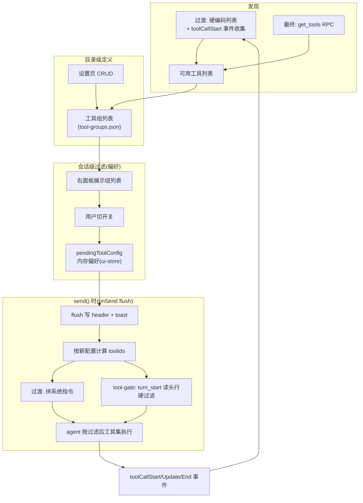
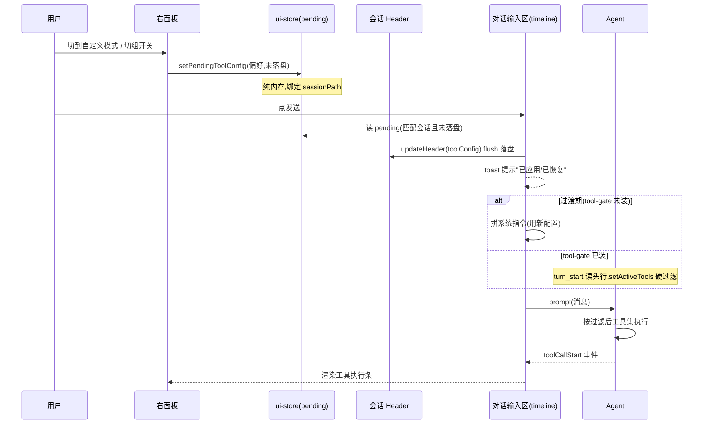

# 工具动态管理：会话级工具过滤

pi-desktop 当前对 pi 底座的工具一无所知——不知道有哪些、不能控制用哪些、只在工具执行时被动渲染一下事件。这个设计要解决的问题是：让用户在会话级别灵活控制 agent 能用哪些工具，通过"工具组"这个抽象实现一键开关一组工具，配置跟随会话文件走，默认全开，需要时才过滤。

方案分两阶段落地。过渡期不依赖 pi 底座的新 RPC，用 prompt 注入做软过滤——LLM 可能不遵守，但作为 MVP 能用。最终期 pi 底座补 `get_tools` 和 `set_tool_filter` 两个 RPC 后，切换到硬过滤——agent 级强制，LLM 拿不到未列出的工具。两阶段的配置结构不变，只是过滤的强制力从软变硬。

## 1. 问题与目标

### 1.1 现状：pi-desktop 不感知工具

pi 底座有工具——bash、read_file、edit_file、glob、grep 等等，来自底座内置和已启用的 extension。这些工具在 agent 会话中被自动加载，LLM 按需调用。但 pi-desktop 对这些工具的感知仅限于"工具执行时渲染一下"。

具体缺什么：

- pi-desktop 不知道当前 agent 有哪些可用工具。RPC 命令集（`rpc-types.ts` 中定义的 31 个命令）里没有"查询工具列表"的命令，`get_commands` 返回的是斜杠命令（来源 extension/prompt/skill），和工具是两个概念。

- pi-desktop 不能控制某个会话能用哪些工具。唯一间接影响工具集的方式是 extension enable/disable + restart——粒度是 extension 级的（一个 extension 可能贡献多个工具），而且需要等会话空闲后重启 pi 进程才生效。

- 工具事件（`toolCallStart`/`toolCallUpdate`/`toolCallEnd`）从底座 stdout 推过来，经 `event-translator.ts` 翻译成中性事件，最终在 timeline 插件的 `ToolExecBar` 里渲染成可折叠的工具执行条。这条链是纯观察性的——你看到工具在跑，但不能干预它能不能跑。

### 1.2 目标：会话级工具过滤

用户要能做这件事：打开一个会话，在右面板切几个开关，下次发消息时 agent 就只能用勾选的工具。换个会话，另一套配置，互不干扰。

- **默认全开**。不碰设置时，行为和现在一样——所有可用工具都能用。只有用户主动切到"自定义模式"并勾选工具组时，过滤才生效。

- **工具组**。工具按组组织，一组里放几个相关工具（如"文件操作"组放 read_file/edit_file/write_file/glob），用户开关一个组就等于开关一组工具，不用逐个勾。

- **配置跟会话走**。会话 A 开了自定义模式只放文件操作组，会话 B 全开，两个会话的配置互不影响。配置写在会话文件 header 里，换台机器打开同一会话也带着配置。

### 1.3 约束：两阶段落地

pi 底座目前没有工具管理的 RPC。要想在协议层面真正禁用某个工具，需要底座新增两个命令：`get_tools`（返回可用工具列表）和 `set_tool_filter`（设置工具过滤）。这两个命令什么时候补、补不补，不取决于 pi-desktop。

所以方案分两阶段：

- **过渡期**：pi-desktop 侧自己解决。工具发现靠硬编码已知工具 + 运行时从 `toolCallStart` 事件收集。过滤靠 prompt 前注入系统指令——"你只能使用以下工具: [list]"，LLM 可能不遵守，但作为 MVP 够用。

- **最终期**：pi 底座补了 `get_tools` + `set_tool_filter` 后，工具发现替换为 RPC 查询，过滤替换为 RPC 强制。配置结构不变，只是应用机制变强。

文档两条路都展开，讲清楚每个阶段做什么、怎么切换。

## 2. 概念模型

### 2.1 三个核心概念

**Tool** — agent 可用工具的元数据。一个 Tool 有 id（如 `"bash"`）、name（显示名）、source（`"builtin"` 或 `"extension"`）、可选的 extensionId（来源 extension）。Tool 的清单不是静态的——extension 启用/禁用后，它贡献的工具会从清单中增减。Tool 本身不存任何东西，它只是"agent 当前能调什么"的投影。

**ToolGroup** — 工具的命名集合。一个 ToolGroup 有 id、name、description、toolIds（包含的工具 id 列表）、builtIn（是否内置预设）。ToolGroup 存在目录级（`./.pi-desktop/config/tool-groups.json`），同一个项目目录共享一套组定义。pi-desktop 内置几组预设（文件操作、命令执行、网络访问等）作为初始内容写入这个文件。内置组不可删除，但可以编辑工具列表（增删 toolIds）和修改名称/描述；自定义组可以删除、编辑。用户可以加自己的组。

**SessionToolConfig** — 会话级的过滤配置。只有两个字段：`mode`（`"all"` 或 `"custom"`）和 `enabledGroupIds`（mode=custom 时生效，存的工具组 id 列表）。存在会话文件 JSONL header 的 `toolConfig` 字段里，和 `pinned`/`archived` 同层。

三者关系：

```
Tool（agent 可用工具清单，动态变化）
  └─ 归入 ToolGroup（目录级定义，用户可编辑）
       └─ SessionToolConfig 引用 ToolGroup（会话级，决定哪些组生效）
```

### 2.2 两层存储

| 数据 | 存储位置 | 格式 | 生命周期 |
|------|---------|------|---------|
| 工具组定义 | `./.pi-desktop/config/tool-groups.json` | JSON | 目录级，同目录共享 |
| 会话级配置 | 会话文件 JSONL header `toolConfig` 字段 | JSON 对象 | 跟会话文件走 |

工具组定义存在目录级意味着不同项目可以有不同的组划分。一个前端项目可能定义"样式工具组"（含 css 相关工具），一个后端项目不需要——它们各自维护自己的 `tool-groups.json`。

会话级配置存在 header 里，不另起文件。`updateSessionHeader`（`session-scanner.ts`）的 `toolConfig` 字段，写入逻辑和 `pinned`/`archived` 一样——读首行 JSON、改字段、写回。header 里存 `mode` + `enabledGroupIds` + `enabledToolIds`（组展开后的工具 id 清单，偏好 flush 时由 ToolPanelTab 展开落盘——tool-gate 底座扩展只认该字段，不回退组展开，消费方不必各自再展开一遍）。

**新工具的归宿**：当 agent 的可用工具列表变化（比如 enable 了一个新 extension，多了 2 个工具），新工具自动归入"默认组"。默认组是一个特殊的 ToolGroup，id 为 `"__default__"`，它包含所有未被其他组收录的工具。默认组不可删除、不可手动增删 toolIds——它的 toolIds 是运行时动态计算的：`全部可用工具 - 已被其他组收录的工具`。"不可手动编辑"不意味着内容不变，而是说它的内容由系统自动维护，用户不能往里加或从里删某个工具。

**mode=all 的确切含义**：mode=all 不是"过滤到已知工具列表"，而是"不施加任何过滤"——agent 照常使用它加载的所有工具，不管 pi-desktop 的工具列表认不认识它们。这意味着过渡期工具列表不完整不影响 mode=all 的行为：列表里有 7 个工具，agent 实际有 12 个，mode=all 下 12 个都能用。工具列表只影响"自定义模式下能勾选什么"和"系统指令里列出什么"，不影响 mode=all。

**custom 模式的初始状态**：用户首次从 mode=all 切到 custom 时，所有组默认勾选（包括默认组）——等价于全开，用户取消勾选某个组才生效。不是"只开默认组"，是"全开，用户做减法"。这符合"默认全开"的原则：切到 custom 不是缩窄，是"我要开始缩窄了"。

### 2.3 工具发现：两阶段

**过渡期**：pi-desktop 不知道 agent 有哪些工具，两个来源拼凑：

- **硬编码已知工具列表**。在插件内维护一份 pi 底座常见工具的列表（bash、read_file、edit_file、write_file、glob、grep、list_dir 等），标注 source=builtin。这份列表会随 pi 底座版本变化而过时，但作为 MVP 足够起步。
- **运行时从 `toolCallStart` 事件收集**。每次 agent 执行工具时推的 `toolCallStart` 事件里有 `toolName`，监听这些事件把没见过的工具名记下来。这个来源是事后补全——你不知道你没见过的工具，但至少已经跑过的工具不会漏。

两者合并：硬编码列表打底 + 事件收集增量补全。局限是没有"未使用过的工具"——如果某个工具从来没在当前会话里被调用过，它不会出现在事件流里，也就不在列表里。最终期的 `get_tools` RPC 能彻底解决这个问题。

**最终期**：`get_tools` RPC 返回 agent 当前加载的可用工具完整清单，一次性替代硬编码 + 事件收集。清单随 extension 启用/禁用变化——extension 禁了，它贡献的工具从清单消失。这个变化在下次 resync 时反映到 UI。resync 是 pi-desktop 在会话启动或切换时的一次性数据同步——并行发 5 条 RPC（`get_state`/`get_entries`/`get_tree`/`get_commands`/`get_messages`）拉取会话全量基线，组装成 `SyncSnapshot`（会话快照，包含 state/entries/messages/tree/commands 等字段）推给 renderer。`get_tools` 并入这组并行拉取，结果作为 `SyncSnapshot.tools` 字段带过来。

### 2.4 过滤应用：两阶段

**过渡期——prompt 注入软过滤**：用户切到自定义模式后，在 `session.prompt()` 发送消息前，自动在消息前拼一段系统指令：

```
[System] 本次会话工具已限制为以下工具组: 文件操作, 代码搜索。
可用工具: read_file, edit_file, write_file, glob, grep, code_search, ast_grep。
请勿使用未列出的工具。
```

这是软过滤——LLM 收到指令后会尽量遵守，但不是强制的。如果 LLM 仍尝试调用未列出的工具，底座不会拦截，工具照常执行。这对用户来说有"假安全感"风险：以为关了某个工具，实际上 LLM 照用。所以过渡期 UI 上要标注"软过滤"提示，不给人"已禁用"的错觉。

**最终期——`set_tool_filter` RPC 硬过滤**：`set_tool_filter` 命令告诉底座"这个会话只允许以下工具"，底座在工具调用层强制拦截——LLM 试图调用未列出的工具时，底座直接拒绝，工具不会执行。这是真过滤，LLM 拿不到未列出的工具。

切换时机：pi 进程启动后探测一次 `set_tool_filter` 是否可用（发命令看底座认不认识）。可用则对话输入区的发送逻辑自动调 RPC 代替拼指令；不可用则回退到拼指令。配置结构不变——`SessionToolConfig` 还是 mode + enabledGroupIds，只是从配置到"可用工具列表"的转换结果，从"拼指令"变成"发 RPC"。用户不感知切换。

## 3. 过渡期方案

### 3.1 工具发现：硬编码 + 事件收集

在 `tool-manager` 插件内维护一份已知工具列表，作为过渡期的工具发现来源：

```typescript
// tool-manager/renderer/known-tools.ts
export interface KnownTool {
  id: string;
  name: string;
  description: string;
  source: "builtin" | "extension";
  extensionId?: string;
}

export const BUILTIN_TOOLS: KnownTool[] = [
  { id: "bash", name: "bash", description: "执行 shell 命令", source: "builtin" },
  { id: "read_file", name: "read_file", description: "读取文件内容", source: "builtin" },
  { id: "edit_file", name: "edit_file", description: "编辑文件", source: "builtin" },
  { id: "write_file", name: "write_file", description: "写入新文件", source: "builtin" },
  { id: "glob", name: "glob", description: "按模式搜索文件路径", source: "builtin" },
  { id: "grep", name: "grep", description: "搜索文件内容", source: "builtin" },
  { id: "list_dir", name: "list_dir", description: "列出目录内容", source: "builtin" },
  // ... 随 pi 底座更新补充
];
```

事件收集是一个运行时 Map：监听 `session.onEvent`，当事件 type 为 `toolCallStart` 时取 `toolName`，如果不在已知列表里就加进去，source 标为 `"builtin"`（过渡期无法区分来源）。这份收集存在插件内存态，不落盘——它只是补全硬编码列表的缺口，下次启动从空开始重新收集。

```typescript
const discoveredTools = new Map<string, KnownTool>();

sessions.onEvent((event) => {
  if (event.type === "toolCallStart" && event.toolName) {
    if (!discoveredTools.has(event.toolName) && !BUILTIN_TOOLS.some(t => t.id === event.toolName)) {
      discoveredTools.set(event.toolName, {
        id: event.toolName,
        name: event.toolName,
        description: "",
        source: "builtin",
      });
    }
  }
});

// 最终工具列表 = BUILTIN_TOOLS + discoveredTools
```

合并后的工具列表用于工具组管理页的"包含工具"勾选列表。局限：只有跑过的工具才会被发现，没跑过的工具不在列表里。最终期 `get_tools` 一次性解决。

### 3.2 软过滤机制

软过滤的核心是：在用户发消息时，如果当前会话处于自定义模式，在消息前拼一段系统指令告诉 LLM 可用工具范围。

**谁来做这件事？** 不是 tool-manager 插件拦截 `prompt()`——一个 sidePanel 插件没有机制插入到对话输入区的发送逻辑中间。真正做这件事的是对话输入区自己。

pi-desktop 的对话输入区在 timeline 插件的 renderer 里（`plugins/timeline/renderer/`），它调 `sessions.prompt(text)` 发消息。软过滤的做法是：对话输入区在调 `prompt()` 之前，先检查当前会话 header 的 `toolConfig`——如果 `mode === "custom"`，读 `tool-groups.json` 计算 enabledGroupIds 对应的 toolIds，拼系统指令前置到用户消息前，再发拼好的消息。

tool-manager 插件的责任到此为止：写配置（会话 header 的 `toolConfig` + 目录级的 `tool-groups.json`）。执行过滤是发送路径的责任，不是插件的责任。这和 settings 槽的"框架驱动"模式同理——插件只管报告改动，框架管保存和执行。

具体来说，对话输入区的发送逻辑加一步前置处理：

```typescript
// plugins/timeline/renderer/ 对话输入区发送逻辑（伪码）
async function handleSend(text: string) {
  const config = await readSessionToolConfig(currentSessionPath);
  if (config?.mode === "custom") {
    const toolIds = await computeEnabledToolIds(config.enabledGroupIds);
    const instruction = buildToolFilterInstruction(toolIds);
    text = instruction + "\n\n" + text;
  }
  await sessions.prompt(text);
}
```

`readSessionToolConfig` 读会话 header 的 `toolConfig` 字段（经 IPC），`computeEnabledToolIds` 读 `tool-groups.json` 把 groupIds 展开成 toolIds 集合。`buildToolFilterInstruction` 拼接：

```
[System] 本次会话已限制可用工具。
可用工具: {toolId 列表，逗号分隔}
请勿使用未在列表中的工具。
```

这段指令拼在用户消息前面，作为同一条消息发到底座。底座把它当普通 user message 处理，LLM 看到后会尽量遵守。

**为什么不在 session-store 层做**：session-store（application 层）不该读 cwd 级配置文件（违反依赖方向——application 不依赖项目级文件路径）。对话输入区在 timeline 插件的 renderer 里，renderer 侧已经持有 cwd 和 sessionPath（经 `useUiStore`），读 header 和读 tool-groups.json 都是 renderer 侧自然能做的事。过滤逻辑放在发送路径上，所有发送入口（手动发送、快捷键、retry）都走这条路，不会漏。

**局限显式标注**：右面板自定义模式下显示"软过滤"提示——"当前为软过滤，LLM 可能不遵守限制。升级 pi 底座后可启用强制过滤。" 不给用户"已禁用"的假安全感。

### 3.3 配置读写

**工具组读写**（目录级）：

插件从 `useUiStore`（renderer 侧 zustand 状态管理，持有当前工作目录 `currentCwd` 等桌面 UI 状态）拿 `currentCwd`，拼成绝对路径 `${currentCwd}/.pi-desktop/config/tool-groups.json`，调 `window.pi.configFile.get/set(absolutePath, data, mergeMode)` 读写。`configFile` API 是框架级通用 JSON 读写，支持 `"deep"` 深合并和 `"replace"` 整份覆盖两种模式。工具组写入用 `"replace"`（整份覆盖，因为工具组是列表型数据，深合并会导致删不掉条目）。

⚠ 路径白名单约束：`configFile` API 的路径白名单只允许 `~/.pi-desktop/` 和 `~/.pi/agent/` 前缀（安全门控，防任意路径读写）。`<cwd>/.pi-desktop/config/tool-groups.json` 不在白名单内。实现时工具组配置应存到 `~/.pi-desktop/config/tool-groups/<cwd-hash>.json`（白名单内，按 cwd hash 分文件保持"跟随项目"语义），或用 `config` API（`window.pi.config.get/set(pluginId, key)` 存到 `~/.pi-desktop/plugins-data/tool-manager/config.json`，按 cwd 作 key 区分）。

`currentCwd` 为空时（用户还没打开项目目录），设置页的工具组管理区域显示空态提示"请先打开项目目录"。工具组配置是目录级的，没有 cwd 就没有配置文件可读写。右面板同样显示空态。

首次打开一个有 cwd 但没有 `tool-groups.json` 的目录时，插件写入内置预设组作为初始内容：

```typescript
const PRESET_GROUPS: ToolGroup[] = [
  { id: "files", name: "文件操作", description: "文件读写、目录列表", toolIds: ["read_file", "edit_file", "write_file", "glob", "list_dir", "read_file_lines"], builtIn: true },
  { id: "exec", name: "命令执行", description: "执行 shell 命令", toolIds: ["bash"], builtIn: true },
  { id: "web", name: "网络访问", description: "网页搜索、URL 抓取", toolIds: ["web_search", "web_fetch"], builtIn: true },
];
```

**会话级配置读写**：

会话文件是 JSONL 格式——第一行是 header（一个 JSON 对象，含 `type:"session"`、`id`、`cwd`、`timestamp` 等字段），后面每行是一条消息。现有的 `updateSessionHeader`（`session-scanner.ts`）已经支持 `name`/`pinned`/`archived` 字段的读写，方式是读首行 JSON、改字段、写回（文件锁串行化）。扩展它加 `toolConfig` 字段：

```typescript
export async function updateSessionHeader(
  path: string,
  patch: { name?: string; pinned?: boolean; archived?: boolean; toolConfig?: SessionToolConfig | null },
): Promise<void> {
  // ...读首行 JSON
  if ("toolConfig" in patch) {
    if (patch.toolConfig) header.toolConfig = patch.toolConfig;
    else delete header.toolConfig;  // null = 清除过滤配置
  }
  // ...写回
}
```

patch 语义是浅合并——只改传入的字段，不碰 header 里其他字段。传 `{ toolConfig: { mode: "custom", enabledGroupIds: [...] } }` 只写 `toolConfig`，不覆盖 `pinned`/`archived`/`name`。

IPC 通道复用现有的 `session:updateHeader`——preload 已暴露 `window.pi.sessions.updateHeader(path, patch)`，patch 加一个字段即可，不需要新 IPC 通道。

读取时机：右面板通过 `window.pi.sessions.readToolConfig(sessionPath)`（新增 IPC，读会话 JSONL 首行 header 的 `toolConfig` 字段）直接读当前会话的配置。切会话时 `currentSessionPath` 变化触发重读。不需要等 resync 或 onSnapshot——`readToolConfig` 是纯文件读，不依赖 pi 进程启动。

## 4. 最终期方案

### 4.1 get_tools RPC

新增一个 RPC 命令，返回 agent 当前加载的可用工具清单：

```typescript
// gateway/protocol/rpc-types.ts 新增
| { id?: string; type: "get_tools" }

// 响应数据
interface ToolsResponse {
  tools: ToolInfo[];
}
```

`ToolInfo` 是圆心中性类型，定义在 `domain/sessions.ts`：

```typescript
export interface ToolInfo {
  id: string;
  name: string;
  description?: string;
  source: "builtin" | "extension";
  extensionId?: string;
}
```

接线路径：

1. `rpc-types.ts` 加 `get_tools` 命令类型
2. `commands.ts` 加 `buildGetToolsCommand()`
3. `session-store.ts` 加 `getTools(): Promise<ToolInfo[]>` 方法
4. `domain/sessions.ts` 加 `ToolApi` 接口 extends `RpcOps`
5. `resync.ts` 并入 `get_tools` 到并行拉取，结果进 `SyncSnapshot`（会话同步快照，renderer 的基线数据）
6. `preload.ts` 暴露 `window.pi.sessions.getTools()`
7. `packages/react/src/plugin-context.ts` 绑定到 `PluginContext`

`get_tools` 的语义是"当前 agent 会话加载的可用工具"，类似 `get_available_models` 返回当前可选模型。清单随 extension 启用/禁用变化——extension 禁了，它贡献的工具从清单消失。这个变化在下次 resync 时反映到 UI。

### 4.2 set_tool_filter RPC

新增一个 RPC 命令，告诉底座"这个会话只允许以下工具"：

```typescript
// gateway/protocol/rpc-types.ts 新增
| { id?: string; type: "set_tool_filter"; toolIds: string[] }
```

语义约定：

- `toolIds` 为空数组 `[]` = 禁用所有工具（agent 只能对话，不能调工具）
- `toolIds` 不传或 `null` = 清除过滤，全部可用（等价于 mode=all）
- `toolIds` 非空 = 只允许列出的工具

调用时机：用户在右面板切到自定义模式并点"应用到当前会话"后，两件事按顺序发生——先写会话 header 的 `toolConfig`（持久化配置），再调 `set_tool_filter` RPC（让底座立即生效）。如果 header 写成功但 RPC 失败，配置已持久化但当前会话未生效——下次 prompt 时对话输入区读 header 拼系统指令作为兜底（过渡期逻辑仍在），右面板显示"配置已保存，但底座未响应过滤请求，当前使用软过滤兜底"。如果 header 写失败（磁盘问题），不调 RPC，右面板显示"保存失败"错误，用户可重试。

切回"全部工具"模式时，先清 header 的 `toolConfig`（写 null），再调 `setToolFilter(null)` 清除过滤。

接线路径同 4.1：rpc-types → commands → session-store → domain → preload → plugin-context。

### 4.3 从过渡到最终的切换

切换不是一次性开关，而是逐能力探测：

```typescript
// session-store.ts 或 plugin 内
async function supportsGetTools(adapter: RpcAdapter): Promise<boolean> {
  try {
    await adapter.send({ type: "get_tools" });
    return true;
  } catch {
    return false;  // 底座不认识这个命令
  }
}
```

- `get_tools` 可用 → 替换硬编码列表 + 事件收集，改用 RPC 查询
- `set_tool_filter` 可用 → 替换 prompt 注入，改用 RPC 强制
- 两个能力独立探测，可能一个有一个没有（比如先补 `get_tools`，后补 `set_tool_filter`）

切换是自动的：探测到 `set_tool_filter` 可用后，对话输入区的发送逻辑自动从"拼系统指令"切到"调 RPC"，不需要用户重新操作。下次 prompt 时自然走新路径。反之，如果探测到不支持，自动回退到拼指令。用户不感知切换。

过渡期的代码不删——硬编码列表作为 `get_tools` 失败时的兜底，事件收集作为 `get_tools` 增量补全的补充。prompt 注入作为 `set_tool_filter` 不可用时的回退。这样底座版本不对的时候系统不会崩，只是降级到软过滤。

## 5. 插件设计

### 5.1 plugin.json 声明

```json
{
  "id": "tool-manager",
  "version": "0.1.0",
  "displayName": "工具管理",
  "renderer": "./renderer/index.tsx",
  "contributes": {
    "settings": [{
      "id": "tools",
      "title": "工具",
      "component": "ToolManagerPage",
      "saveMode": "manual",
      "order": 2
    }],
    "sidePanel": [{
      "id": "tools",
      "label": "工具",
      "icon": "wrench",
      "component": "ToolPanelTab",
      "order": 15
    }]
  }
}
```

两个贡献点：设置页管工具组定义（CRUD），右面板管会话级过滤（切开关 + 应用）。

`saveMode: "manual"`——实时生效，无 dirty/浮层/拦截。工具组增删改和会话级开关切换都是即时写入，不需要"保存"按钮。和 plugin-manager / i18n 的 saveMode 一致。

不需要新权限声明——工具组读写走 `configFile` API（框架级），会话级配置走 `updateHeader` API（核心默认能力），工具列表发现走 `onEvent` 订阅（核心默认能力）。如果最终期要调 `set_tool_filter`，需要评估是否加权限——但这属于 session 能力的扩展，大概率归入核心默认。

### 5.2 设置页：工具组管理

设置页有两个视图，通过左列表切换：

**"工具组"视图**：

- 上方是工具组卡片列表。每个卡片显示组名、内置/自定义 badge、工具数量、工具 chip 列表。内置预设组有"系统"标记不可删除，但可以编辑工具列表（增删工具）。自定义组可以删除、编辑。
- 下方是"新建工具组"表单：组名输入、描述输入、工具勾选列表（从当前可用工具列表中选）。
- 工具组的数据来源：读 `tool-groups.json`（configFile API）。写入也是 configFile API，深合并模式。

**"全部工具"视图**：
- 只读表格：工具名、描述、来源（builtin/extension）、所属组。
- 数据来源：过渡期用硬编码 + 事件收集合并后的列表；最终期用 `get_tools` RPC 返回的列表。
- 这页的价值是让用户看到"agent 当前到底有哪些工具"，在编辑工具组时知道可选什么。

### 5.3 右面板：会话级工具快切

右面板 Tab 展示当前激活会话的工具配置，交互流程：

```
┌─────────────────────────────┐
│ 🔧 工具                      │
│ 当前会话: refactor-auth.ts   │
├─────────────────────────────┤
│ [⚡ 全部工具] [⚙️ 自定义]    │  ← 模式切换
├─────────────────────────────┤
│ ⏱ 变更将在下次发送时生效     │  ← pending 提示(有未落盘偏好时)
│                              │
│ mode=all 时：                │
│   "所有可用工具均可使用"      │
│   工具组列表只读展示          │
│                              │
│ mode=custom 时：              │
│   ☑ 📁 文件操作    6 个工具   │  ← 组开关
│   ☐ ⚡ 命令执行    1 个工具   │
│   ☑ 🔍 代码搜索    3 个工具   │
│   ☑ 🔧 默认组      2 个工具   │
│                              │
│ 9 个可用 / 1 个禁用           │  ← 统计(按偏好值实时算)
│                              │
│ ⚠ 软过滤：LLM 可能不遵守     │  ← tool-gate 未装时提示
└─────────────────────────────┘
```

**应用时机：onSend flush（v2 修订）**。右面板的模式切换和组开关不再立即写 header，也没有"应用"按钮——每次切换只写 ui-store 的 `pendingToolConfig`（内存偏好，绑定 sessionPath）。timeline 的 `send()` 在发送前检查：pending 匹配当前会话且未落盘时，先 `updateHeader(toolConfig)` 落盘、再按新配置完成本次发送（tool-gate 硬过滤在 turn_start 读到新头行；软注入用新值拼指令），落盘后 composer 上方浮出 toast（"工具过滤已应用：N 个工具可用" / "已恢复全部工具"），3 秒自动消失。这与 `composer-apply-timing.md` 的模型/思考强度"偏好/落盘"两态完全同构：切换=纯内存偏好，发送=落盘。

pending 不落 prefs——重启 desktop 丢失未发送的修改，语义同"未发送的修改"，可接受。pending 绑定 sessionPath：A 会话的偏好不会被 B 会话的发送误 flush；切走再切回，偏好仍在内存等 flush。flushed 的 pending 保留作显示值（等于最新落盘值），避免 ToolPanelTab 回跳。

**"全部工具"模式**：切到全部 = 写 `config: null` 的偏好，flush 时清头行 `toolConfig`，agent 正常使用所有工具。

**"自定义"模式**：勾选要启用的组。组开关每动一下就更新偏好（`enabledGroupIds` + 展开好的 `enabledToolIds`——tool-gate 只认该字段，不回退组展开）。

**默认组**始终显示在列表末尾。它包含未被其他组收录的工具，默认勾选。如果用户取消默认组，那些"没被分组"的工具就被禁用了——这是一个高级用法，适合想严格控制的用户。

### 5.4 能力注入

tool-manager 插件需要以下能力：

- `window.pi.configFile.get/set(path, data, mergeMode)` — 读写工具组配置文件（路径须在 `~/.pi-desktop/` 或 `~/.pi/agent/` 白名单内）
- `window.pi.config.get/set(pluginId, key, value)` — 读写插件自身配置（工具组按 cwd 分 key 存，走 `~/.pi-desktop/plugins-data/tool-manager/config.json`）
- `window.pi.sessions.readToolConfig(sessionPath)` — 读会话 header 的 toolConfig 字段
- `window.pi.sessions.updateHeader(path, patch)` — 写会话级 toolConfig
- `window.pi.sessions.onEvent(cb)` — 监听 toolCallStart 事件收集工具
- `window.pi.sessions.getTools()` — 最终期工具发现（RPC 可用后）
- `window.pi.sessions.setToolFilter(toolIds)` — 最终期硬过滤（RPC 可用后）
- `useUiStore` — 拿 `currentCwd`（拼工具组配置路径）和 `currentSessionPath`（读/写会话配置）

所有能力都是核心默认，不需要 `permissions` 声明。

## 6. 数据流

### 6.1 完整链路



**图 1 — 从工具发现到过滤应用的完整数据流**

### 6.2 时序



**图 2 — 用户从切开关到 agent 执行的时序（v2：onSend flush）**

### 6.3 工具列表变化时的传播

当 extension 启用/禁用导致可用工具变化时：

1. `get_tools`（最终期）或事件收集（过渡期）感知到新工具/消失的工具
2. 新工具自动归入默认组
3. 右面板下次渲染时，组列表中默认组的工具数更新
4. 如果新工具在某个已有组的 toolIds 里，它自动出现在该组（组存的是 toolId 列表，工具是否"可用"取决于 agent 是否加载了它）
5. 消失的工具从组列表中消失（灰显或隐藏，取决于 UI 决策——推荐隐藏，因为灰显一个不存在的工具没意义）

这个传播不需要主动通知——它依赖现有的 resync 或事件流，右面板在 cwd/sessionPath 变化时重新渲染，自然读到最新状态。

## 7. QA

**Q: 过渡期的软过滤不靠谱，为什么还要做？**

因为"能用"和"等到底座补 RPC 再做"之间有一个时间差。软过滤不是最终方案，是让用户现在就能用起来的 MVP。UI 上显式标注"软过滤"，不给人强制禁用的错觉。底座补 `set_tool_filter` 后自动切硬过滤，用户不需要改配置。

**Q: 用户在会话 A 配了自定义模式，切到会话 B，再切回来，配置还在吗？**

在。配置写在会话 A 的 JSONL header 里，切走再切回来时 `setContext` 读 header，右面板展示的就是 A 的配置。会话 B 有自己的 header，可能是全开也可能是另一套自定义——两个会话独立。

**Q: 新会话的工具配置是什么？**

默认全开（`mode: "all"`）。新会话的 header 没有 `toolConfig` 字段，右面板读到空就显示"全部工具"模式。不继承上一个会话的配置——每个会话独立，不传配置。如果用户觉得"每个新会话都要重新配"太麻烦，未来可以加一个"目录级默认工具配置"，但当前不做。

**Q: 工具组配置在目录级，换了一个项目目录，组定义会变吗？**

会。工具组存在 `<cwd>/.pi-desktop/config/tool-groups.json`，不同项目目录有各自的组定义。切到新项目目录时，右面板读的是新目录的 `tool-groups.json`——可能组不一样、内置预设一样但自定义组不同。首次打开没有 `tool-groups.json` 的目录时，写入内置预设组作为初始内容。

**Q: 如果 agent 的可用工具列表和工具组的 toolIds 对不上怎么办？**

三种情况：工具组里有但 agent 没加载的工具（extension 禁了）——该工具在 UI 上隐藏，组里其他工具正常；agent 有但没被任何组收录的工具——自动进默认组；工具组里有一个工具 id 在 agent 列表里不存在（拼写错误或底座改了工具名）——该工具在 UI 上灰显或隐藏，不影响其他工具。工具组的 toolIds 是"期望包含"的列表，不是"一定可用"的保证——实际可用取决于 agent 当前加载了什么。

**Q: 默认组能不能取消勾选？**

能。默认组和其他组一样可以在自定义模式下取消勾选。取消后，所有没被其他组收录的工具都被禁用。这是一个高级用法——适合想严格控制 agent 只能用特定工具的场景。大部分用户不需要碰默认组的开关。

**Q: 会话 header 里的 `enabledGroupIds` 引用了一个已经被删的组，怎么办？**

该引用失效，对应的工具不启用。右面板渲染时，如果 `enabledGroupIds` 里有不存在于当前 `tool-groups.json` 的组 id，跳过它（不展示、不报错）。用户看到的是实际存在的组列表，失效引用不影响渲染。用户重新勾选并应用后，header 里的 `enabledGroupIds` 会被覆盖为当前有效的组 id 列表，失效引用自然清理。

**Q: 底座不支持 `get_tools` 和 `set_tool_filter` 时，怎么探测？**

发一次 RPC 命令，如果底座返回 error（命令未识别），标记为不支持，走过渡期方案。探测结果缓存，不每次 prompt 都探——只在 pi 进程启动后探一次（可以并入 `waitReady` 后的探测）。底座升级后重启 pi 进程时重新探测。

**Q: 没有打开项目目录（currentCwd 为空）时，设置页和右面板怎么表现？**

设置页的工具组管理区域显示空态提示"请先打开项目目录"——工具组配置是目录级的，没有 cwd 就没有配置文件。右面板同样显示空态。这和 sessions-list 在没有 cwd 时显示"请先打开文件夹"是一致的行为。用户打开项目目录后，插件检测到 `currentCwd` 变化，首次写入内置预设组并展示。

**Q: 为什么改成"发送时才生效"（onSend），而不是点"应用"立即写 header？**

与 `composer-apply-timing.md` 的模型/思考强度同一语义：切换=纯内存偏好，发送=落盘。点开关那一刻不改会话状态，当前轮生成不受干扰；配置永远贴着"为它而切的那条消息"生效，而不是悬空在切换动作那一刻。flushed 的 pending 保留作显示值，右面板不会因基线滞后而回跳。

**Q: header 写成功但 set_tool_filter RPC 失败（半成功状态），怎么办？**

配置已持久化到 header（下次打开会话还在），但当前会话的底座没有收到过滤指令。此时对话输入区的发送逻辑作为兜底：它读 header 发现 mode=custom，走过渡期的"拼系统指令"路径。右面板显示"配置已保存，底座未响应，当前软过滤兜底"。用户下次发消息时软过滤生效，底座重启后重新探测 `set_tool_filter` 支持度，支持则自动切硬过滤。

反过来如果 header 写失败（磁盘问题），不调 RPC，右面板显示"保存失败"，用户可重试。不会出现"header 没写但 RPC 发了"的情况——写 header 是调 RPC 的前置条件。
