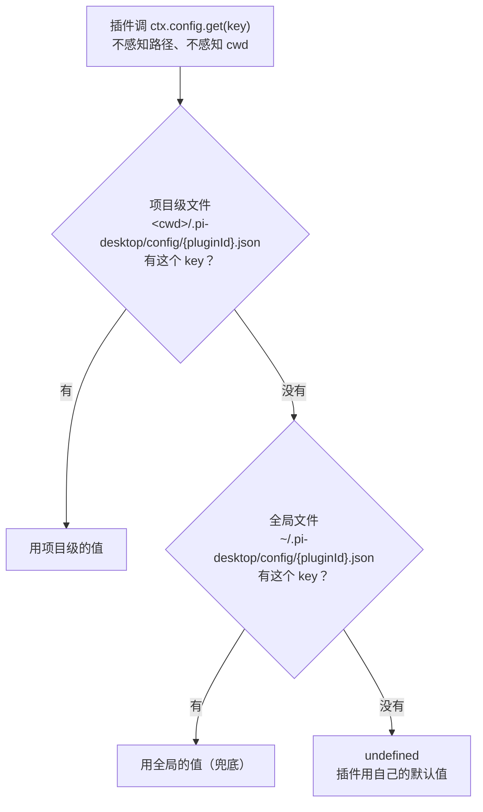

# 统一项目级配置通道：项目级默认，全局兜底

插件配置今天有四条通道并存，每条都要插件自己拼路径、自己管分层、自己做安全假设。本文把四条通道收敛成一条：**所有插件配置默认读写 `<cwd>/.pi-desktop/config/{pluginId}.json`，全局 `~/.pi-desktop/config/{pluginId}.json` 自动兜底**。写语义的完整表述只有三条：有项目时默认写项目级；没有打开项目时全局层是唯一的家，`set` 自然落全局；有项目时想写全局，只有两个显式入口——设置页框架提供的"设为全局"按钮（面向用户），和 `set` 的 `scope: "global"` 参数（面向天然全局的数据）。插件不拼路径、不感知 cwd、不选通道，`ctx.config.get/set` 就是全部 API。

这是一次默认姿态的翻转：`docs/design/layered-config.md` 已经造出了"安全地写到项目目录"的机制（getLayered/setProject/clearProject 三件套），但它定位是可选 API——插件要知道它存在、要手动传 cwd、要自己管 fallback。本文不动那个机制的内核，动的是它的地位：从"插件可以选择调用"升格为"框架默认行为，插件无法绕过"。

## 1. 问题：配置通道没有默认姿态

### 1.1 四条通道并存，插件各自找路

今天一个插件想读写配置，面前有四条通道，每条的路径构造方式和分层语义都不同：

- `ctx.config.get/set`（ConfigStore，`src/core/application/config/config-store.ts`）——按 pluginId 隔离的 KV，落在 `~/.pi-desktop/config/plugins-data/{id}/config.json`。代码里写好了"项目级覆盖用户级"的浅合并语义（`all()` 返回 `{...entry.user, ...entry.project}`——`user` 就是本文说的全局层，`project` 就是项目级），但 bootstrap 注入的 `projectDir` 恒为 `null`（`src/bootstrap/index.ts:65`，代码注释里标注为后续演进预留），项目级从激活那天起就是死代码。
- `configFile.get/set`——挂在 `window.pi.configFile` 上的 IPC 命名空间，自由 JSON 读写，插件传完整路径，main 校验白名单只放行 `~/.pi-desktop/` 和 `~/.pi/agent/` 两个前缀（`src/api/ipc/config.ts:37`）。没有分层的概念。
- `configFile.getLayered/setProject/clearProject`——layered-config.md 加的分层 API，项目级 `<cwd>/.pi-desktop/<relPath>` 覆盖全局 `~/.pi-desktop/<relPath>`。但 cwd 和 relPath 都要插件自己传，fallback 语义要插件自己理解，用不用全看插件自觉。
- `prefs.get/set`——桌面偏好的 API 面，持久化实现是 electron-store（一个把 KV 落成本地 JSON 文件的 Electron 常用库）。纯全局，不分层。

四条通道不是四个功能，是同一件事——"插件配置读写"——在"路径怎么构造 × 分不分层"这个二维空间里的四个散落点。散落不是丰富，是缺失：框架没有告诉插件"默认该用哪个"，每个插件都得自己回答一遍"我的配置该住哪、怎么分层、怎么过安全门"。

### 1.2 项目级数据住进了全局

没有默认姿态的直接后果，是天然属于项目的数据被各种理由搬进了全局目录，而且每个插件搬法不同：

- **session-bookmarks 被安全评估逼走。** 它的书签本来存在项目目录 `<cwd>/.pi-desktop/bookmarks/`，一轮安全评估发现它经当时还没有路径白名单门控的 configFile 通道写项目目录、绕过了 `fs:project` 沙箱（`fs:project` 是插件在 manifest 里声明的文件系统权限，获得项目目录内访问、路径圈禁到项目根；缺陷编号 P1-D1：那轮评估的全文未入库，这条结论的摘要留在 `src/plugins/sessions/session-bookmarks/renderer/index.tsx:29` 的注释里），于是迁到 `~/.pi-desktop/plugins-data/session-bookmarks/<cwd-hash>/`。安全问题是堵住了，代价是书签和项目物理分离——git 追踪不到，换机器带不走，团队共享不了。cwd-hash 的本质是把"项目级配置"降级成"全局存储 + cwd 隐式映射"。
- **session-colors 的图钉混存。** 图钉是给"某个项目的某条会话消息"钉的标注，天然项目级，但 `ctx.config` 只有全局层（`projectDir` 是 `null`），所有项目的 pins 混在同一个 `plugins-data/session-colors/config.json` 里。打开 A 项目能看到 B 项目的 pin 数据——只是 UI 按 sessionPath 过滤了，数据本身是混的。
- **notes 自己造了两层。** 它等不及框架，自己实现了 global/project 两个存储层，用户在 UI 上手动切换（`src/plugins/project/notes/client/notes-store.ts:61`）。路径约定还和谁都不统一：全局 `~/.pi-desktop/notes.json`，项目级 `<cwd>/.pi-desktop/notes.json`，都不在 `config/` 子目录下。fallback 语义也不是"项目级没有读全局"，而是"用户选哪层读哪层"——两层互不兜底。
- **tool-manager 和 timeline 撞过墙。** 它们最早直接拼 `${cwd}/.pi-desktop/config/tool-groups.json` 传给 configFile，被白名单拒绝、IPC 抛错（layered-config.md §1.1 记录的就是这个报错）。后来迁到 getLayered 手动分层——行为对了，但 fallback 逻辑、null 判断、首次写入预设组，全是插件代码里手写的。

### 1.3 根因：框架把"配置放哪"推给了每个插件

四个插件，四种路径策略，四种安全假设，四种 fallback 语义。这不是插件做错了什么——每个插件在自己那一步的选择都能讲出理由——而是框架缺了一个默认姿态，逼着每个插件自己发明轮子。这正是"依赖只向内"纪律里的一条判别气味：同一逻辑在多个外部入口各写一遍，说明它该收进框架统一承担。

layered-config.md 已经诊断过同一个根因，并造出了机制（getLayered 三件套 + relPath 安全校验）。但它把机制定位成"插件可选的 API"，于是机制造出来之后，该有的混乱一样没少：notes 继续在自造两层，pins 继续在全局混存，bookmarks 继续在 cwd-hash 里回不了家。**机制存在和机制被默认使用，是两回事。** 本文要补的就是这个默认姿态。

## 2. 定位：项目级默认，全局兜底

### 2.1 通用抽象：一切插件配置 = 项目级 diff + 全局兜底

统一之后的模型只有一句话：插件配置住在一个按插件命名的 JSON 文件里，这个文件有两层——项目级和全局级；项目级文件只存这个项目覆盖过的 key，读的时候两层按 key 合并，项目级没有的 key 由全局兜底。



这个抽象把§1.1 的四个散落点收敛成一个默认点：路径构造收进框架（按 pluginId 推导，插件不碰路径），分层语义固定下来（项目级 diff + 全局兜底，插件不碰 fallback）。插件侧的 API 表面没有任何新东西要学——`ctx.config.get/set/all`，就是今天已有的那三个方法。

### 2.2 与既有四通道的关系：统一替代，不并列新增

新设计不是第五条通道，是对既有四条通道的收编，每条的去路都明确：

| 既有通道 | 去路 |
| --- | --- |
| `ctx.config`（ConfigStore） | **升格为唯一默认通道**。路径约定从 `plugins-data/{id}/config.json` 改为 `config/{pluginId}.json`；`projectDir` 从静态注入（恒 `null`）改为动态 getter，随当前项目切换 |
| `configFile.getLayered/setProject/clearProject` | **收编为 ConfigStore 的内部实现**，不再作为 IPC 面暴露给插件。tool-manager、blind-review、notes 迁回 `ctx.config`，删掉手动的分层调用 |
| `configFile.get/set`（白名单自由读写） | **降级为框架级文件专用**（pi 底座的 settings/models、general.json 这类非插件配置——pi 底座是桌面壳 spawn 并经 JSONL RPC 驱动的独立 agent 进程，§2.3 详述），lint 规则拦截插件引用 |
| `prefs`（electron-store） | **不动**。主题、字体、字号、窗口宽度这类纯桌面偏好天然全局，和项目无关 |

收编之后插件侧只剩一个选择：`ctx.config`。已有的 `ctx.config` 调用方（session-colors、projects、plugin-manager、theme-manager）**一行代码不用改**，自动获得项目级分层——它们的 IPC 签名不变，变的是 main 进程里 ConfigStore 的落盘位置。

### 2.3 设计边界：底座自留地与纯桌面偏好不动

两类东西明确不进入这个模型：

- **底座配置（`~/.pi/agent/`）**。settings.json、models.json、sessions/ 会话文件是底座进程自己读写的标准路径，桌面壳只是代管界面。底座文件没有、也不该有"项目级覆盖"的桌面语义——底座进程 spawn 时 cwd 就是项目目录，底座自己若有项目级配置机制，那是底座的事。pi-manager、pi-model-manager 这两个管理底座文件的插件，继续走 `configFile.get/set` 白名单通道，行为不变。
- **纯桌面偏好（prefs）**。主题 id、字体、字号、侧栏宽度这些和"在哪个项目工作"无关，用户换台机器都希望跟着走。它们留在 electron-store，不分层。

边界划法的判据和 layered-config.md 的"一年后会不会换"同源：**这份配置的意义是否依附于某个项目**。依附（书签、图钉、工具组、提示词、模型选择），进统一通道；不依附（主题、字体、窗口布局），留全局；不属于桌面壳（底座文件），不动。

## 3. 统一通道设计

### 3.1 路径约定：一个插件一个 `config/{pluginId}.json`

两层用同一个文件名，按 pluginId 命名，放在各自的 `config/` 子目录下：

- 项目级：`<cwd>/.pi-desktop/config/{pluginId}.json`
- 全局级：`~/.pi-desktop/config/{pluginId}.json`

废弃 `plugins-data/{id}/config.json` 这个旧约定。旧约定有两个问题：目录嵌套（`plugins-data/{id}/config.json` 两层）让"看看这个插件配了什么"要多点两级；`plugins-data` 这个名字暗示"插件的数据"，语义过宽——这个通道管的是**配置**，不是插件的任意数据。新约定把"配置"二字钉在路径里，一个插件一个文件，项目目录下 `.pi-desktop/config/` 一打开，这个项目覆盖了哪些插件的配置一目了然。

pluginId 的白名单校验（`config-store.ts:21` 的 `PLUGIN_ID_RE`，只允许字母数字连字符下划线点、禁 `..`）原样保留——现在它防的是路径逃逸，新模型里它顺带保证了文件名合法。layered-config.md §4.2 的 relPath 三禁（禁绝对路径、禁 `~`、禁 `..`）也保留，但收进 ConfigStore 内部，不再是一条需要插件配合的契约。

### 3.2 读语义：顶层 key 浅合并，项目级只存 diff

读一个插件的配置，就是把两层文件各自读出来，做顶层 key 的浅合并：`{...全局, ...项目级}`。这个语义 ConfigStore 的 `all()` 今天就是这么写的（`config-store.ts:63`），一行不用改——改的只是项目级那层从"永远不存在"变成"动态解析"。

选 key 级浅合并而不是 layered-config.md 的"文件级整份覆盖"，理由是这个模型消解了文件级覆盖的一个结构性的坑。文件级覆盖下，项目级文件是整份配置的副本：用户想改一个字段，得把全局整份拷到项目级再改；之后全局层更新任何其他字段，这个项目都享受不到——它的项目级副本把整份配置冻结在了拷贝的那一刻。key 级浅合并没有这个坑：

- 项目级文件**只存 diff**。`set("groups", x)` 就只有 `groups` 这一个 key 进项目级文件，其他 key 项目级一个字节都没有。
- 全局层后续更新了项目级没碰过的 key，项目自动享受到新值——它本来就没有覆盖那个 key。
- 项目级覆盖过的 key 不受全局更新影响——override 语义完整保住。
- 列表型数据（tool-groups 的 `groups` 数组、bookmarks 的列表）作为**一个 key 的值**整体替换。数组整替在 key 级天然成立：项目级写 `groups` 就是整个数组换掉，不需要 deepmerge 的数组合并策略，也没有 layered-config.md 时代"项目级删不掉全局条目"的问题——项目级的 `groups` 数组里有没有某个条目，就是完整的答案。

至于比顶层 key 更深的嵌套对象（比如 `ui: { width, height }` 里只想覆盖 `width`），浅合并会整个换掉 `ui`。这是有意的取舍：深合并引入 deepmerge 的全部边界复杂度（数组、null、undefined 各有微妙行为），收益却只是省了插件一次"先读再改再写"。约定很朴素：**嵌套对象的覆盖粒度就是这个对象本身**，想改嵌套就先 `get` 再整体 `set`。这和 ConfigStore 今天的语义完全一致，不是新增约束。

项目级文件损坏（JSON parse 失败）时，该层按 `{}` 处理并 `console.warn`——沿用 ConfigStore 内部同步读方法的既有行为，下文统称 `readSync`（`config-store.ts` 里的私有方法，读不到或解析失败都返回 `{}`）——该插件的项目级等于没有任何覆盖，所有 key 落回全局。注意这和 layered-config.md §3.2 的"文件级损坏不 fallback"不同：文件级模型里"损坏"和"存在"绑在一起没法拆，key 级模型里 `{}` 的语义是明确的（"这层没有任何覆盖"），回退全局是唯一可预测的行为；问题不静默，`warn` 日志和设置页的来源徽标（§4.2）承担提醒职责。

### 3.3 写语义：默认写项目级

`set(key, value)` 的行为分两种情形，都不需要插件操心：

- **有当前项目**：写进项目级文件。只写 `key` 这一个条目——项目级文件随插件的 `set` 调用逐 key 累积，天然就是 diff。
- **没有当前项目**（用户还没打开目录）：写进全局文件。这不是"绕过默认"的例外，而是全局层此时是唯一的家；等用户打开了项目，这些 key 自然成为新项目的全局兜底。

有当前项目时，插件代码写全局层只剩一个出口——`set` 的显式参数 `scope: "global"`，专门服务天然全局的数据（recentCwds 这类），§4.3 详述。除这个参数和设置页的"设为全局"按钮（§4.1）之外，没有任何代码路径能把数据写进全局文件——"写全局必须显式"就是这条写语义的全部强制。

和读对称，写也是顶层 key 粒度。删除一个 key 的语义：`set(key, undefined)` 从项目级文件里移除该 key（该 key 回落全局值），不表达"删除全局的 key"——key 级合并模型里项目级无法表达"删掉全局已有的 key"，只能覆盖它的值。需要"删 key"语义的配置，应该设计为整 key 替换的结构（比如列表），而不是一堆平铺 key 再指望逐个删除。这条作为已知边界收进 §6 QA。

### 3.4 cwd 动态解析：projectDir 从静态注入到 getter

ConfigStore 今天的 `projectDir` 是构造参数，bootstrap 在启动时注入一次，所以只能是 `null`——启动时根本没有"当前项目"。统一通道把它改成动态 getter：

```typescript
new ConfigStore({
  userDir: "~/.pi-desktop/config",           // 全局层根目录
  getProjectDir: () => string | null,        // 项目层根目录，随当前项目切换
});
```

`getProjectDir` 由 bootstrap 注入，实现是从 SessionStore 读当前 cwd 再拼 `<cwd>/.pi-desktop/config`。选 SessionStore 做 cwd 的事实源，因为它是 main 进程里唯一持有"当前项目"的地方——`session.setContext`（`src/api/ipc/sessions.ts:19`）是 renderer 每次切换项目时必经的 IPC，cwd 天然在那里落脚。ConfigStore 不自己维护 cwd 状态，每次读写时向 getter 要一次，永远是当前值。

动态 getter 带来两个派生设计：

- **缓存按 cwd 隔离**。ConfigStore 今天有一个 `pluginId → entry` 的内存缓存（`config-store.ts:43`），缓存的 key 要加上 projectDir 维度——切到项目 A 读的缓存不能带进项目 B。实现就是 cache key 从 `pluginId` 变成 `${projectDir ?? "<global>"}:${pluginId}`，切项目不用清缓存，不同项目的 entry 自然各住各的。
- **写队列按目标目录隔离**。今天的 per-pluginId 写队列（防 proper-lockfile ELOCKED）key 也要带上目标目录——同插件的项目级写和全局级写不互斥，同插件同层级的写才串行。

renderer 侧的体验不变：插件调 `ctx.config.get("key")` 不带 cwd，IPC 到 main，main 里的 ConfigStore 向 getter 要当前项目目录。cwd 从头到尾不出现在插件的代码里——这是"默认姿态"最直接的意思：**默认路径上的插件连"有项目这回事"都不需要知道**。唯一的例外在 §4.3：数据天然全局的插件要在 `set` 时显式传 `scope: "global"`——它们需要知道两层存在，才能声明自己的数据属于全局层。

cwd 切换时插件 UI 怎么刷新？分两类：设置页框架托管的插件（`saveMode=framework`，定义见 §4.1），框架订阅 `system:cwdChanged` 后自动重读配置、重置 dirty，插件无感知；自管 UI 的插件（如 session-colors 的侧栏 overlay），本来就已经在订阅 `currentCwd` 变化重拉数据（它们要按项目过滤内容），重读配置搭同一趟车。不为配置刷新发明新机制——cwd 变化时该重载什么，是插件已有的义务，配置只是其中之一。

### 3.5 安全模型：路径框架构造，插件不碰路径

统一通道的安全前提和 layered-config.md §4.1 一致，而且更彻底：layered 三件套里插件还要传 relPath（攻击面是 relPath 逃逸），统一通道里插件连 relPath 都不传——路径完全由框架按 pluginId 推导。插件侧没有任何字符串能影响落盘位置，路径逃逸的攻击面整个消失。

写范围被结构性地限定在两个地方：`<cwd>/.pi-desktop/config/` 和 `~/.pi-desktop/config/`。当年把 bookmarks 逼出项目目录的 P1-D1 顾虑——插件经无门控通道写项目目录任意位置——在这个模型里不成立：能写的只有 `.pi-desktop/config/` 下的一个按插件名固定的 JSON 文件，碰不到项目的源码、构建产物和其他任何文件。`fs:project` 沙箱不被绕过，因为这个通道根本不声明、也不需要文件系统权限。

## 4. "设为全局"：框架按钮，不是代码路径

默认写项目级解决之后，还剩一个正当需求：有些配置用户就是想让它对所有项目生效——比如精心调好的一组工具组、一份盲审提示词。这个需求不该由插件代码开出口子，该由用户在设置页显式触发。

### 4.1 设置页工具条的两个新按钮

设置页的框架托管（`src/api/renderer/components/settings-page.tsx`）已经管了读、dirty、保存浮层、取消恢复、切 tab 拦截、刷新、打开配置。这里说的"框架托管"指插件在 manifest（即插件的 `plugin.json`）的 settings 贡献里声明了 `configFile`，且 `saveMode` 为 `framework`——`saveMode` 是这个贡献项的可选字段，两个取值：`framework`（默认，框架接管该配置页的读写生命周期）和 `manual`（插件自管读写，框架不介入）。声明 `manual` 或没有设置页贡献的插件自管 UI，不在本节范围——但注意 `saveMode` 管的只是设置页 UI 的生命周期，不影响配置走哪条通道：自管插件的配置照样走统一通道，只是它们的用户界面上不会出现下面这两个框架按钮。统一通道模式下，工具条加两个按钮，框架托管的插件自动获得，插件不写一行代码：

- **设为全局**——把当前生效的整份配置（即两层合并后的结果）写入全局文件。项目级文件保留不动：项目级覆盖过的 key 继续覆盖，没覆盖的 key 从此用刚写入全局的新值。用户如果想彻底回到全局状态，用下面那个按钮。
- **移除项目覆盖**——仅当项目级文件存在时出现。删除项目级文件，该插件在这个项目的配置整体回退到全局默认。这就是 layered-config.md 里 `clearProject` 的语义，只是触发者从插件代码变成了用户。

两个按钮的职责刻意单一，不做"设为全局并清除项目覆盖"这种复合按钮——组合动作用户自己点两下，按钮语义保持可预测。

### 4.2 来源徽标：当前配置来自项目还是全局

工具条上同时显示一个来源徽标：**项目**（存在项目级文件）或**全局默认**（只有全局文件）。它回答的是用户改配置时最自然会问的问题："我改的这东西，是只影响这个项目，还是所有项目？"徽标加上按钮，把分层模型的全部状态压缩到一眼可见——分层机制藏在框架里，但分层的存在不藏。

### 4.3 唯一显式出口：全局性质数据写 `scope: "global"`

有一类数据天然全局，跟项目无关：projects 插件的 `recentCwds`（最近打开的项目列表）、plugin-manager 的 `customOrder`（插件排序）。这些数据走默认写项目级就错了——每个项目各存一份"最近项目列表"，语义荒谬。

唯一出口是 `set` 的显式参数：`ctx.config.set("recentCwds", v, { scope: "global" })`。有当前项目时，这是插件代码写全局层的唯一方式。读不用对称的参数——读的 fallback 链（项目级 → 全局）对全局性质数据天然正确：项目级永远不会有这个 key，自然每次读到全局的值。

`scope` 参数不是声明式类型标签。它不是插件在 manifest 里声明"我是全局型插件"然后引擎按标签分支——而是每次写入时调用方对这一个 key 的目标选择。同一个插件可以既有项目级 key（pins）又有全局 key（pinsVisible 的默认值），粒度在 key、决策在调用点。

## 5. 收敛与迁移

### 5.1 ConfigStore 改造点

统一通道的全部内核改动集中在 ConfigStore 一个类里，清单封闭：

1. 构造签名从 `{ userDir, projectDir }` 改为 `{ userDir, getProjectDir }`——静态注入改动态 getter（§3.4）。
2. 落盘路径从 `{dir}/{pluginId}/config.json` 改为 `{dir}/{pluginId}.json`——新路径约定（§3.1）。
3. 缓存 key 加 projectDir 维度——切项目隔离（§3.4）。
4. 写队列 key 加目标目录维度——同层串行、跨层并行（§3.4）。
5. `set` 增加可选 `scope: "global"`——全局唯一显式出口（§4.3）。
6. `clearProject` 语义收编为内部方法——支撑"移除项目覆盖"按钮（§4.1）。

读路径（`get/all` 的浅合并）、损坏容错（`readSync` 的 `{}` 兜底 + warn）、pluginId 白名单校验、withDirLock 锁——这四样原样保留，是今天已经写对的部分。

### 5.2 插件迁移地图

六个已在用配置的插件，按"现在住哪 → 迁到哪 → 代码怎么变"逐一过（blind-review 随 tool-manager 一并处理，共七处改动）：

| 插件 | 现在 | 迁后 | 代码变化 |
| --- | --- | --- | --- |
| session-colors | `plugins-data/session-colors/config.json`（全局混存 pins） | 项目级 `config/session-colors.json` | **零改动**。`ctx.config` 调用不变，落盘位置自动跟着通道走；pins 天然按项目分开 |
| projects | `plugins-data/projects/config.json` | 全局层（数据天然全局） | `set` 加 `{ scope: "global" }`（recentCwds、sectionCollapsed 两处） |
| plugin-manager | `plugins-data/plugin-manager/config.json` | 全局层（排序/过滤是桌面偏好） | `set` 加 `{ scope: "global" }`（customOrder、tagFilter 两处） |
| notes | 自造两层 + 手动切换（`~/.pi-desktop/notes.json` / `<cwd>/.pi-desktop/notes.json`） | 统一通道 | **删掉自造的两层和 layer 切换 UI**，改回 `ctx.config`；fallback 由框架自动做，行为从"用户选层"升级为"项目级兜底全局" |
| tool-manager | 手动 `getLayered`/`setProject`（`config/tool-groups.json`） | 统一通道 | 删掉 getLayered/setProject 调用和 null 判断，改回 `ctx.config`；timeline 里读工具组的那处 `configFile.get` 同步删掉 |
| blind-review | 手动 `getLayered` + 一条全局 `configFile.get` 尾巴（`config/blind-review.json`） | 统一通道 | 删掉两处手动分层调用，改回 `ctx.config`；项目级定制提示词的能力不变 |
| session-bookmarks | `plugins-data/session-bookmarks/<cwd-hash>/` | 项目级 `config/session-bookmarks.json` | 删掉 cwd-hash 分桶逻辑，index 走 `ctx.config`；fork（从书签复制会话、开新分支）用的会话 JSONL 副本不是配置，移到项目级数据目录 `<cwd>/.pi-desktop/session-bookmarks/`，继续走 `fs:project` |

bookmarks 值得多讲一句：这次迁移是它当年被 P1-D1 逼出项目目录之后的**回家**。安全顾虑已由 §3.5 的"插件不碰路径"解决，cwd-hash 的代价（git 追踪不到、换机器带不走、团队共享不了）随之消解——书签文件回到 `<cwd>/.pi-desktop/config/` 下，可以跟着项目进 git，团队共享一份书签成为默认能力。

### 5.3 旧数据懒迁移

`plugins-data/` 下的旧数据不丢。ConfigStore 首次读某插件时做一次懒迁移：发现旧路径 `plugins-data/{id}/config.json` 存在而新路径 `config/{id}.json` 不存在，就把旧文件整体搬到全局层新位置（旧数据本来就是全局语义），然后按新路径继续。搬迁失败（旧文件损坏、权限不足）不阻塞启动——保留旧文件不动，记 `warn`，按空配置继续，用户的下次 `set` 会在新位置重建。

bookmarks 的迁移特殊一点：旧数据在 `plugins-data/session-bookmarks/<cwd-hash>/` 下按 hash 分桶，要搬回项目目录就得从桶名反解 cwd。桶名由 `cwdToBucketName` 生成——它把 cwd 编码成文件系统安全的名字，实现迁移时先核实这个编码是否可逆：可逆的桶直接按项目搬回各自的 `<cwd>/.pi-desktop/config/session-bookmarks.json`；不可逆的桶保留原样、记 `warn`，等用户打开对应项目时，按桶内书签元数据里的 `sessionPath` 字段（每条书签都记录了它指向的会话文件绝对路径，路径里含所属项目的 cwd）二次定位再搬。这是一次性代码，跑完即删，不进长期机制。

### 5.4 灰色字段：general.json 分层与 currentModelId

有两个字段住在全局、却有明显的项目性质，顺带收进分层：

- **`general.json` 的 `defaultThinkingLevel`**（`~/.pi-desktop/config/general.json`，bootstrap 在应用首次启动时创建默认值）。重构项目想要 high、小工具项目想要 low，这是项目性质。处置：general.json 走与统一通道相同的 fallback——框架读它时先查 `<cwd>/.pi-desktop/config/general.json`，没有再读全局。timeline 现在读它的那处 `configFile.get(GENERAL_CONFIG_PATH)`（`src/plugins/sessions/timeline/renderer/index.tsx:231`）改为调框架暴露的分层读取入口——这个入口不是 `ctx.config`（general.json 不属于任何插件），而是框架自用的一个读取函数，内部复用 ConfigStore 的同一套两层 fallback 原语。
- **prefs 的 `currentModelId`**（electron-store）。不同项目用不同模型是日常。处置：从 prefs 迁出，并入 general.json——模型选择和思考级别是同一类东西（"这个项目想怎么跑模型"），住同一个分层文件。prefs 里剩下的字段（主题、字体、宽度、lastCwd）都是纯桌面偏好，不动。

这两处不需要新机制：general.json 的分层读取复用 ConfigStore 的 fallback 原语，只是读取方从插件变成了框架自己——构造与执行分开，原语共用。

## 6. QA

**Q1：没有打开任何项目时，`ctx.config.set` 写到哪里？**

写全局层。此时全局层是唯一的家，`getProjectDir` 返回 `null`，ConfigStore 自动落到全局文件。等用户之后打开某个项目，这些 key 自然成为该项目的全局兜底——项目级随时可以覆盖它们。不需要任何"暂存区"或"待迁移"状态。

**Q2：插件原来用 `ctx.config` 的代码要改吗？**

不改。IPC 签名、`get/set/all` 三个方法、Promise 包装全部不变，变的是 main 进程里 ConfigStore 的落盘位置和 `projectDir` 的来源。session-colors 这类已在用 `ctx.config` 的插件零改动获得项目级分层——唯一的例外是数据天然全局的插件（projects、plugin-manager），要在 `set` 里补一个 `{ scope: "global" }`，否则它们的"最近项目列表"会被错存到项目级。

**Q3：项目级文件损坏时会掩盖问题吗？**

不会静默。损坏的项目级文件按 `{}` 处理（该层视为无覆盖，全部 key 回落全局），同时 `console.warn` 记录路径和错误；设置页的来源徽标此时显示"全局默认"，和用户的预期（"我明明改过这个项目的配置"）不一致，肉眼可见。这和 layered-config.md §3.2 的"文件级损坏不 fallback"是有意的不同：key 级合并模型里 `{}` 的语义是明确的（"这层没有任何覆盖"），回落全局是唯一可预测的行为。

**Q4：项目级能删掉全局层已有的某个 key 吗？**

不能，这是 key 级浅合并的已知边界。项目级只能覆盖一个 key 的值，不能表达"这个 key 在我这个项目里不存在"。需要"删条目"语义的配置，正确设计是把条目集合放进一个 key（比如 `groups` 数组），项目级整体替换这个 key——数组里有没有某个条目就是完整答案。平铺成一堆独立 key 再指望项目级逐个删除，在这个模型里走不通，插件设计配置结构时要避开。

**Q5：pi-manager 管的是 `~/.pi/agent/settings.json`，它的设置页会怎样？**

不变。底座文件走 `configFile.get/set` 白名单通道，不进统一通道——路径前缀（`~/.pi/agent/`）决定语义，不需要任何声明字段。设置页框架托管对这类 configFile 保持今天的读写行为，"设为全局/移除项目覆盖"按钮和来源徽标只对统一通道的配置出现，底座文件没有这两样 UI。底座进程自己的配置层级（如果底座支持项目级 settings）是底座的事，桌面壳不代劳。

**Q6：切换项目时，设置页上还有未保存的编辑怎么办？**

沿用已有的 dirty 拦截。设置页今天对"切 tab / 返回对话"会弹"保存/丢弃/取消"，cwd 切换走同一个拦截——`system:cwdChanged` 触发重读前先查 dirty，有未保存编辑就弹同一个窗。ConfigStore 的缓存按 cwd 隔离，A 项目的 dirty 编辑不会串进 B 项目的配置里。

**Q7：项目级的 `.pi-desktop/config/` 该提交 git 吗？**

框架不替用户决定，两种都支持。工具组、盲审提示词、书签这类"团队共享有价值"的配置，提交进 git 就是默认能力——这正是它们从全局目录搬回项目目录的意义。个人性的覆盖（比如某人自己的 pins）不想共享，把 `.pi-desktop/` 整个或按文件粒度加进 `.gitignore` 即可。文件级粒度（一个插件一个 JSON）让 ignore 规则好写。

**Q8：为什么不在白名单里直接放行 `<cwd>/.pi-desktop/`，而要重做一条通道？**

和 layered-config.md Q7 同一个答案，这里再钉一遍：白名单是固定前缀匹配，cwd 是运行时变量——放行"任意 cwd 拼出来的路径"等于放行任意目录（`cwd="/etc"` 就拼出 `/etc/.pi-desktop/`）。更重要的是模型不同：白名单通道是"插件传路径，框架校验"，统一通道是"框架推路径，插件不碰"——攻击面从"插件能传什么坏路径"变成"不存在"，这比任何校验规则都彻底。
