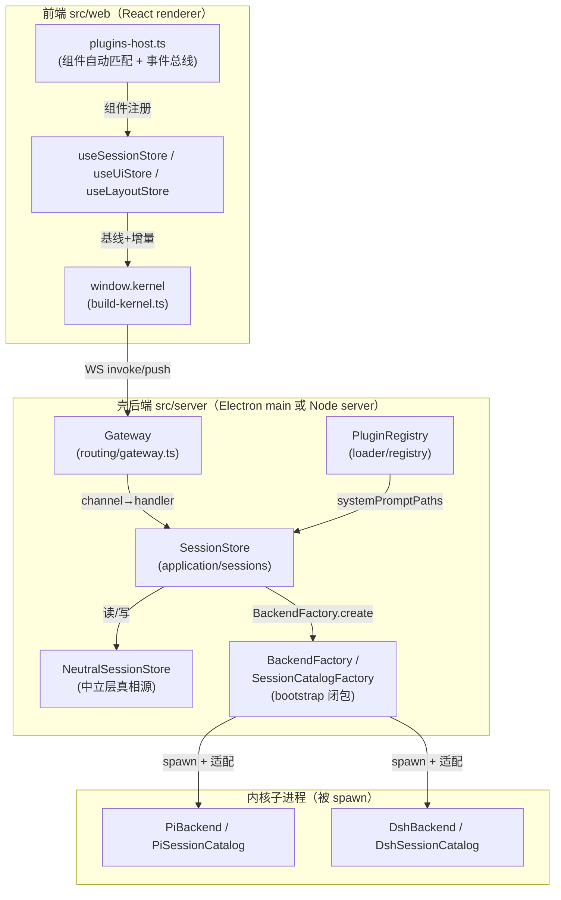
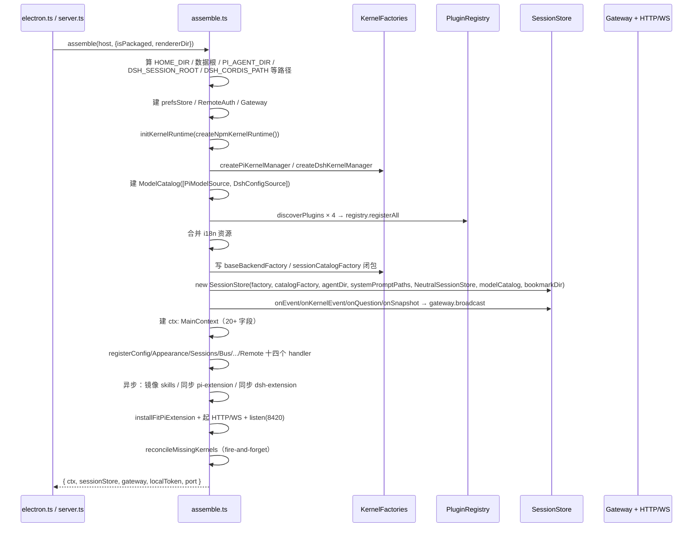
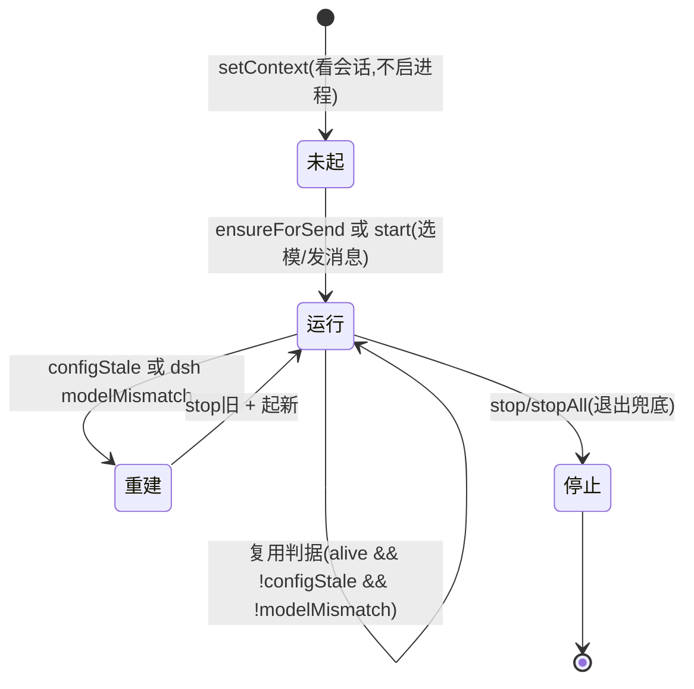
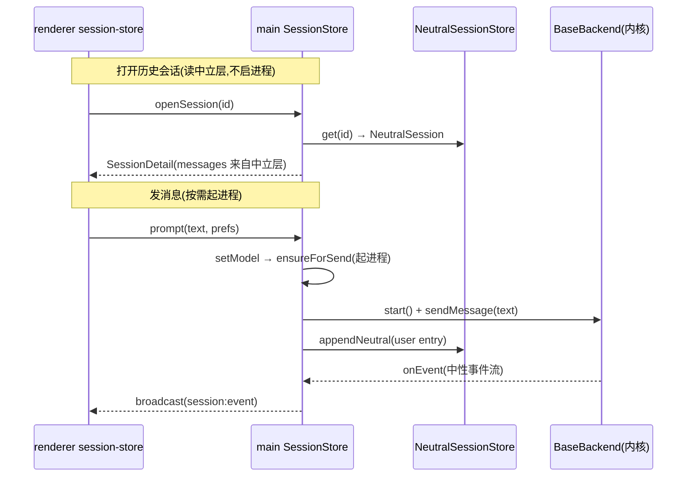
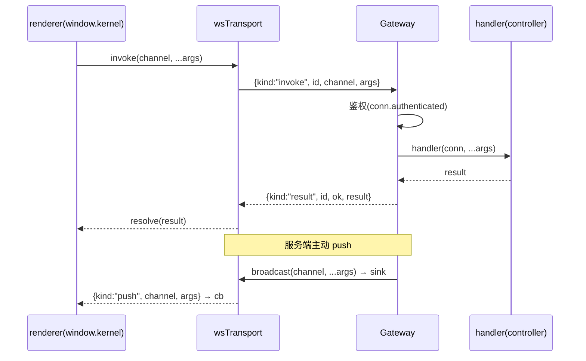

# 我对 desktop 的理解

这是一份「运行态全景」文档。它不讲抽象分层（那是 `core-design.md` 的活），只讲一件事：my-harness-desktop 这个壳，在运行时到底是怎么转起来的。读完这一份，你应该能回答四个问题：一条消息从敲下回车到出现在时间线上，走了哪条链；一个内核进程是怎么起、怎么活、怎么死的；一个壳插件是怎么从磁盘被发现、注册、挂上槽位的；Electron 和 Node 服务器两套宿主，为什么跑的是同一份后端代码。

先立一个总判断，后面每一节都在证明它：**desktop 的运行时本质是「一份组装根 + 一套双宿主 + 一个多进程会话调度器 + 一条 WS 广播总线 + 一块中立层真相源」**。壳本身是「机制层」，它自己不产能力——能力来自被它 spawn 的内核子进程（pi/dsh）和被它加载的壳插件。壳只负责让这两类「被托管的东西」以正确的顺序、正确的生命周期、正确的边界运转起来。下面按这个判断逐层拆。

---

## 一、desktop 是什么：一个多内核 agent 桌面壳，前后端分离

desktop 不是一个「单进程 Electron 应用」，它是**「服务器 + 前端」双端**，这是理解一切运行时行为的前提。物理上：

- **壳后端** = `src/server/`。它既可以是 Electron 的 main 进程（`electron.ts`），也可以是一个纯 Node 服务器（`server.ts`）。两端跑同一份 `assemble.ts`。
- **前端** = `src/web/`。一个 React renderer，经 HTTP 加载静态资源、经 WS 与后端通话。**前端不再有 `contextBridge`/`ipcRenderer`**——它就是一个普通网页，通过 `window.kernel`（由 `build-kernel.ts` 构造）访问后端能力。
- **圆心** = `packages/shared/src/domain/`。零依赖的纯类型 + 纯函数，两边都 import 它，它不 import 任何一方。

这个双端结构的直接后果，藏在 `src/web/bootstrap.ts` 的第一行注释里：`window.kernel` 由 WS 构建，而非 `contextBridge` 注入。这带来两个运行时事实：

- **前端没有 Node 能力**。`window.kernel.platform` 在 preload 时代是 `process.platform`，现在前端只能从 `navigator` 自判 OS 并归一化到 `"darwin"/"win32"/"linux"`（`detectClientPlatform()`），远程浏览器直接判成 `"browser"`。
- **一切能力都是「invoke 过去、push 回来」**。前端没有「直接调用 main 函数」这回事，只有一个 `RemoteTransport` 三原语：`invoke(channel, ...args)`、`on(channel, cb)`、`off(channel, cb)`。

再立第二个判断：**desktop 同时托管两类「被管理物」，它们的性质完全不同，壳对它们的机制也不同**：

- **内核**（pi/dsh）：被 spawn 的**独立子进程**，有 start/stop 生命周期、有版本管理、有自己的插件树和会话模型。壳经 `BaseBackend` 中立契约 + 适配器管理它。内核是「被壳管理的进程」。
- **壳插件**：被加载的**代码**，只 import `@my-harness-desktop/shared` 和 `@my-harness-desktop/react`。壳经 `plugin.json` 声明 + 槽位契约 + 生命周期管理它。壳插件是「被壳加载的代码」。

这个区别不是术语洁癖，它决定了两条完全不同的运行时管线（§三的进程调度 vs §五的插件运行时）。把内核当壳插件、或把壳插件当内核，都会让边界塌掉——前者会漏掉「进程崩溃怎么收尾」，后者会漏掉「插件卸载怎么撤贡献」。



---

## 二、启动装配链：assemble 从读环境到起服务器

`assemble.ts` 是整份代码里最值得「读全文」的文件——它是「怎么拼」的唯一点，706 行里没有一行业务逻辑，全是「构造 + 绑定」。它的签名钉死了双宿主的共享方式：

```ts
assemble(host: Host, opts: { isPackaged: boolean; rendererDir: string }): Assembled
// Assembled = { ctx, sessionStore, gateway, localToken, port }
```

`electron.ts` 和 `server.ts` 各调一次 `assemble`，唯一区别是注入的 `Host` 和 `rendererDir` 怎么算：

- `electron.ts` 用 `createElectronHost(() => mainWindow)`，`isPackaged = app.isPackaged`。
- `server.ts` 用 `createNodeHost()`，`isPackaged = false`。

`rendererDir` 由入口算而非 `assemble` 内算，这有个硬约束写死在注释里：`assemble.ts` 会被 rollup 打进 `out/main/chunks/`，此时 `__dirname` 多一段 `chunks/`、`process.cwd()` 在打包态指向家目录，两者都无法定位 `out/renderer`；只有入口的 `__dirname` 恒为 `out/main`，`resolve(__dirname, "../renderer")` 在 dev/server/打包三种上下文都对。**这是一个「内层不读环境、环境由外层注入」的教科书样本**——连「渲染资源在哪」这种路径知识都被挡在组装根之外。

### 2.1 装配顺序（读一遍 assemble 等于看一遍时序）



装配链有四个「一眼看不出、但全是设计判断」的点：

- **路径单源**：`MY_HARNESS_DESKTOP_DIR`、`PI_AGENT_DIR`、`DSH_SESSION_ROOT`、`DSH_CORDIS_PATH` 全部在 `assemble` 顶部算好，注入给下游。`DSH_SESSION_ROOT` 的注释点明了一个真 bug 的根因——活跃后端和目录 transport 必须共享同一会话根，否则目录永远列不出活跃后端的会话。**「真相源单一」不是口号，是每个路径只能被一个地方定义一次的纪律。**
- **密钥不进契约**：`baseBackendFactory.create` 里，pi 走 `createPiBackend({ ...opts, cliPath: customCliPath() })`，dsh 走 `createDshBackend({ ...opts, provider, model, cliPath, cordisConfig, env })`。`cliPath`/`cordisConfig`/`apiKeyEnv` 这些内核专属 spawn 参数，全部在工厂闭包里捕获，**不进 `BackendCreateOptions` 契约**。这是「构造在内、执行在外」的落地：`session-store` 传的永远是中性的 `cwd/agentDir/kernel/provider/model/neutralSessionId/systemPromptPaths`，怎么把这些变成 `--session`、`--append-system-prompt`、`DSH_SESSION_ROOT` env，是各内核工厂的事。
- **预 seed 的生命周期不对称**：`baseBackendFactory.seed` 里 `kernel === "pi"` 返回 `piSeedSession(...)`（纯文件写，先 seed 得路径再 spawn），dsh 返回 `null`（seed 是 RPC，需进程，走 `create → start → backend.seed`）。这是 `BackendFactory.seed?` 契约里写明的「生命周期不对称」，壳在 `materializeActiveLineage` 和 `switchKernel` 里据此分两条支路。
- **禁用插件在注册后撤**：`registry.registerAll` 四目录后，读 `configStore` 的 `disabledPlugins` 逐个 `registry.unregister(id)`。此时 i18n 已合并（多合并几串文案无害），槽位查询和 `systemPromptPaths` 是懒求值（撤注册后自然不含它们）。**「禁用 = 撤贡献」不是「禁用 = 标个状态」**——无特权差异纪律要求禁用插件在槽位上彻底消失，不留「组件未注册」孤儿。

### 2.2 启动后的异步对账：不阻塞启动，但要赶在 spawn 之前

`assemble` 里有一批 `void (async () => {...})()` 的 fire-and-forget，它们的共同约束是「**赶在任何内核 spawn 之前完成**」，因为内核的 loader 只在 spawn 时扫一次扩展目录：

- **镜像内置 skills / 表情包**：`mirrorBundledSkills`、`mirrorManagedDir` 强制覆盖到数据根受管目录。
- **同步插件携带的 pi 扩展**：`syncPluginPiExtension` + `reconcilePluginPiExtensions`。
- **同步 dsh cordis 插件**：先 `syncFitDshExtension`（统一适配插件 bootstrap 常驻），再逐个第三方 `dshExtension`，最后 `reconcilePluginDshExtensions` 摘孤儿。
- **装 `my-harness-fit-pi-extension`**：统一了原 toolgate/context-probe/bus/subagent/skills 五个 pi 扩展，任何 pi 会话进程 spawn 前装好。
- **内核冷启动对账**：`reconcileMissingKernels` 异步扫已装状态，缺则按 dist-tag 最新版自动补装，装完 `broadcastRefreshRequested` 让「未安装」只读条消失。

这批对账的共性纪律是「**失败只 warn 不崩启动**」——技能是可选项、扩展是可选项，缺了只是少能力，不能因一个可选能力挂掉整个应用。

---

## 三、进程模型：每会话一进程，内核是模型的派生量

这是 desktop 运行时的心脏。`session-store.ts` 顶部注释第一句就定调：「会话是文件，进程是按需的临时工，且**每会话一进程、多会话多进程**」。核心数据结构只有一行，但它的形状就是整个进程模型的全部：

```ts
private procs = new Map<string, Map<KernelId, SessionProc>>();
```

外层 key 是会话（`sessionPath` 或 `new:${cwd}`），内层 key 是内核身份，值是 `SessionProc`。这个「会话 × 内核」的二维表，同时承载了三条运行时纪律。

### 3.1 每会话一进程，多会话多进程，按需起

- **看会话 = 读文件，不启进程**。`list(cwd)` 和 `openSession(id)` 走 `neutralStore` 读中立层，纯 JSON 读，秒开，不碰任何内核进程。
- **发消息 = 按需起该会话的进程**。唯一的起进程入口是 `ensureForSend`，它保证「激活会话的目标内核进程在跑」，但**不杀其他会话的进程**。
- **切会话不杀旧进程**。`setContext` 里那一段「回收空壳进程」的逻辑只回收「从未发过消息（`touched=false`）且活着」的进程——有内容的会话进程留着多会话并存。

这条模型的代价和收益都在 `dispatch()` 里显形。`dispatch(key, event, kernel)` 是「多会话并存的核心纪律」所在：状态跟踪按事件来源 key 记账（与激活无关），视图流只转激活会话，后台会话只转非流式增量（`agentStart/messageEnd/toolCallEnd` 等白名单，排除 `messageUpdate`/`toolCallUpdate` 两个 token 级刷屏源）。**没有这层按 key 的路由，后台会话的一条 `messageEnd` 就会覆盖当前时间线的末条消息、用别人的 `agentSettled` 提前熄掉 streaming**——这是评估 A 里真实发生过的 bug。

### 3.2 多槽位并存：一个会话可以同时挂着 pi 和 dsh 两个进程

`procs` 的内层是 `Map<KernelId, SessionProc>` 而非单个 `SessionProc`，这意味着**一个会话可以 pi/dsh 进程槽位并存**。`activeKernel` 只决定「哪个槽位参与会话流」，不是「替换另一个槽位」。`start()` 里明确写：

```ts
let kernels = this.procs.get(key);
if (!kernels) { kernels = new Map(); this.procs.set(key, kernels); }
kernels.set(resolvedKernel, proc);   // 并存，不替换其他内核的进程
```

但这条「并存」有个锋利的边界：`setModel` 里 `hasHistory && targetKernel !== activeKernel` 会**抛错锁死**——「有历史（任意内核槽位发过消息）且要换内核」是不允许的，空会话/预热才自由切 `activeKernel`。注释说得很清楚：这是「选择」不是「切换」。真正的跨内核切换（`switchKernel`）目前被 `switchKernelEnabled = false` 这个 gate 暂缓，七步编排原样保留但入口关着。

### 3.3 内核 = 模型的派生量，选模之前不起任何进程

这是整个进程模型里我最看重的一条判断。`procs` 字段的注释写得像一段事故报告：

> 进程按需起（发消息选模型时才起，§kernel-follows-model）：内核是模型的派生量，选模之前不起任何内核进程——历史教训：预热双内核会把会话绑进「预热时随机定的中立会话 + 首注册内核」，用户选的模型被旧预热进程截胡（选 dsh 却路由到 pi 的根因）。

它推翻了「启动时预热内核」的直觉，改成「**模型是进程的导火索**」。这条纪律在 `resolveSessionKernel` 里更严格：读回会话内核时，`中立 header.kernel > model 域 kernel > 会话头 custom.kernel`，**读不到就报错，不静默落 pi**——查无实据时不静默回落任何内核。配套的还有：

- `SessionProc.model` 记录进程创建时绑定的模型。`ensureForSend` 复用前比对：pi 支持运行时切模（`backend.setModel` 差量执行不重启），dsh 的模型在 initialize 握手定死，失配必须停旧起新——否则用户选的模型被旧进程的握手模型截胡。
- `configSnapshot`：spawn 时记录 `configDepPaths`（后端提供的配置文件名，pi=models.json/settings.json，dsh=settings.yaml/cordis.yml）的 mtime。`isConfigStale` 逐项比对，任一变化 → 进程过期重建。

### 3.4 进程的起与死



- **起**：`start()` → `createProc()`（写空中立会话 + `factory.create` + `bindProcEvents`）→ `proc.backend.start()`（spawn + waitReady，pi 是 tsx dev 1~2s）。`start` 的 await 窗口内可能插入并发 `setContext`，所以起完先校验 `activeProcKey !== key || activeKernel !== resolvedKernel` 才 sync——这是「并发护栏」的典型写法：**await 之后的代码不能假设上下文没变**。
- **死**：`stop()` 停一个会话全部内核槽位；`stopAll()` 停所有会话全部进程（应用退出兜底）。`electron.ts` 的 `before-quit` 里 `event.preventDefault()` + `stopAll().finally(() => app.exit())`——**必须真正等 kill 链（stdin→SIGTERM→SIGKILL）完成再 exit**，否则子进程变孤儿被 init 收养不退出。`server.ts` 同理绑 SIGINT/SIGTERM。
- **事件绑定**：`bindProcEvents` 是唯一装配入口（`createProc` 与 `switchKernel` 重绑共用）。`backend.onEvent` 总是绑；pi 专属通道（`$bus`/`onQuestion`/`onProcessExit`）经 `capabilities.pi` 类型守卫只绑 pi 后端——dsh 后端不接这些线（缺面）。注释特别强调「此前 restart 另抄一份丢了 onQuestion/onProcessExit，重启后收不到扩展 UI 请求」——**同一逻辑两处拷贝是 bug 温床，必须收口到一个装配入口**。

### 3.5 两条「不抢激活语义」的进程支路

除了「激活会话」这条主线，`SessionStore` 还有两条**不碰 `activeProcKey`、不抢激活语义**的进程支路，它们的存在让「进程」这个概念比「一个当前会话」更宽：

- **模型连通性测试**（`test(cwd, provider, modelId, kernel)`）：起一个 `test:${randomUUID()}` 前缀的独立进程，`createTestProc` 造一个 `ephemeral: true` 的 `SessionProc`（pi 翻译成 `--no-session` 内存会话，dsh 翻译成临时 `DSH_SESSION_ROOT`，stop 清理）。它不设 `activeProcKey`、不走 sync/基线，事件只进运维流。零残留靠「不落盘」而非「测完删文件」——注释点明删文件依赖 `boundSessionPath`，而 `boundSessionPath` 只能由 `sessionStart` 事件写入，测试路径又无 synthetic dispatch，旧实现的清理从未执行，每次测试都在 sessions/ 留一个 ping 文件。
- **Session Bus 会话**（`spawnSession`/`reopenSession`）：起一个 `bus:${uuid8}` 前缀的进程，`spawnSession` 用全新会话文件、`reopenSession` 传已有 sessionPath 续上下文。两者都**不抢激活语义**——`bus` 会话恒为 pi 槽位，`getBackend`/`getAdapter` 显式以 `KERNEL_IDS[0]`（pi）取，不读全局 `activeKernel`，避免「主会话是 dsh 时 bus 落空」。这支撑了「一个插件在后台驱动多个子 agent 会话，与用户当前会话互不干扰」的场景。

这两条支路说明了进程模型的一个深层判断：**「进程」和「激活会话」是正交的两个概念**。激活会话决定「谁的事件进视图流」，而 `procs` 表可以同时挂着测试进程、bus 进程、后台会话进程——它们各自有 key，事件按 key 路由，互不污染。

---

## 四、会话生命周期：中立层是唯一真相源

「中立层是真相源」是贯穿 `session-store.ts` 的一条红线，它对应不变量 #1「壳不读任何内核的存储」。落地载体是 `NeutralSessionStore`（65 行，纯 JSON 整读整写）：

```ts
class NeutralSessionStore {
  get(ns) / put(session) / delete(ns) / listByCwd(cwd) / filePathOf(ns)
}
```

每个中立会话是一个 `NeutralSession`（`neutralSessionId` + `header` + `lineages[]`），存 `<数据根>/sessions/<ns>.json`。内核的存储（pi 的 JSONL 文件、dsh 的 append-only 日志）是「这个中立树的投影」，不是真相。这条原则在四个生命周期动作里各有具体落地。

### 4.1 新建：会话创建即写空中立层

`createProc` 里：

```ts
if (this.neutralStore && !ephemeral && !this.neutralStore.get(ns)) {
  this.neutralStore.put(emptyNeutralSession(ns, { kernel, cwd, createdAt }));
}
```

**「开始但未发言」的会话也进中立层**——不等到首条消息。这是 §kernel-forkless 阶段 D 的收尾：list 读中立层才不漏「刚开还没说话的会话」。`neutralSessionId` 是壳生成的 UUID，跨内核稳定；pi 侧派生会话文件名就是 `ns`（`<bucket>/<ns>.jsonl`），`neutralSessionIdFromPath` 用 `basename(path, ".jsonl")` 反查。

### 4.2 打开：读中立层，秒开，不启进程

`openSession(id)` → `neutralStore.get(id)` → `neutralToSessionInfo` 投影列表行 + `lineageContent` 投影消息流。列表行字段（name/pinned/archived/lastMessage）全来自中立 header，历史会话缺字段时 `derivedHeaderFromSession` 从 entries 现算自愈。**打开一个历史会话，不 spawn 任何内核进程**——这就是「看会话 = 读文件」。

### 4.3 切换：setContext 是「设激活」，不是「起进程」

`setContext(cwd, sessionPath)` 只设 `activeCwd/activeSessionPath/activeProcKey`，然后：

- 若激活会话进程活着 → `sync()` resync 推基线（切回正在流式的会话拿实时状态）。
- 没活 → 清基线，renderer 走文件读或等 prompt 时起。
- **主动推 synthetic `sessionStart`**：因为内核的 `session_start` 是纯扩展事件，永远不会出现在 RPC stdout 流里，renderer 永远等不到内核推它。main 侧激活会话时主动 dispatch，把 `currentSessionPath` 水合到前端。这是「真相源单一在 main」的显式修复——历史 bug 是 sessions-list 手动补写 `currentSessionPath` 的隐式契约，第二个忘记补写的入口就导致「视图有内容、发送却走了新会话分支」。

### 4.4 发送：prompt 是「原子编排」，不是「逐条 RPC」

`prompt(text, images, display, prefs)` 是发送的**唯一受管编排口**（§atomic-send），renderer 不再逐条 `setModel/setThinkingLevel/sync`。固定顺序：

1. **模型对齐**：有 prefs 先 `setModel(provider, modelId, kernel)`（内部 ensureForSend 起进程）。
2. **强度对齐**：只对「支持运行时切档」的内核（`capabilities.pi` 探测）生效；dsh 的 `reasoningEffort` 在 initialize 定死、无运行时 RPC，发送路径跳过而非抛错。
3. **惰性物化**：活跃 lineage 未物化（fork 后）先 `materializeActiveLineage` seed 投影再发。
4. **dsh 续聊**：重开历史 dsh 会话且有中立历史时，先 `backend.continue?.()` 载入日志（dsh 的 session/prompt 只新建空会话、不加载磁盘日志，直接 prompt 撞 id collision）。
5. **中立层先写 user entry**：`appendNeutral` 把 `{message:{role:"user",content}, display}` 写进中立层——展示元数据（图）归中立层，不进后端投影。
6. **发消息 + 标记 touched + 推 synthetic sessionStart + 自动命名**（活跃会话没名字才命名，`setSessionName` 走中立契约而非 pi 扩展面）。

### 4.5 fork/clone/删除：壳切中立树，内核是单线执行器

- **fork 是壳的纯操作**：`fork(parentLineageId, boundary)` 只 `upsertNeutralLineage` 在中立层加一条新 lineage + `proc.activeLineageId = newLineageId`，**内核不 fork、不物化**。分支只在下次 send 时经 `materializeActiveLineage` seed 投影。内核是单线执行器，只物化当前活跃那条 lineage。
- **clone 是 pi 专属**（文件复制语义），dsh 无此面 → `piSend` 经 `asPi` 抛错降级。
- **删除**：`deleteSessions` 先过滤活跃会话（进程 append 会让文件复活，删了也白删），再 `catalog.deleteSessions` + 级联 `neutralStore.delete`。
- **改名/归档/置顶**：双写——`projectHeaderToKernel` 投影回内核存储（失败不阻断），`writeNeutralHeader` 写中立层（真相源）。名字下沉走 `catalog.rename`（pi/dsh 统一走 rename 保持一处写）。

### 4.6 switchKernel：七步编排，但暂缓

`switchKernel` 的完整编排是：abort + 落定 → 读中立层（缺失才快照兜底）→ stop 旧 → 分内核 seed/start（pi 先 seed 得路径再 spawn，dsh 先 start 后 seed）→ 模型中立化（`lastModelRef` 跨切换载体）→ 重绑 → 收尾。但它现在被 `switchKernelEnabled = false` gate 挡着，入口抛「跨内核切换暂未启用」。这是「机制已就位、能力留演进」的典型——编排是完整的，只是「跨内核切换」这个产品行为还没放开。



---

## 五、插件体系运行时：发现→注册→生命周期→槽位渲染→事件总线

壳插件的运行时是一条「main 管贡献注册、renderer 管组件加载」的双端管线。main 侧的 `PluginRegistry` 只存 manifest 贡献项的形状（component 名、order、configFile），**不加载任何 React 组件**；renderer 侧的 `plugins-host.ts` 用 `import.meta.glob` 把组件真正 import 进来。两者靠「manifest 的 `component` 字段名 = module export 名」自动匹配。

### 5.1 发现：递归扫描 + 形态校验

`discoverPlugins(rootDir, source)` 递归下降（depth ≤ 3），命中 `plugin.json` 且 `manifest.id` 非空即收为插件，否则继续下钻。两个细节：

- **`plugin.json` 所在目录是终点**：合法收插件、损坏/非 manifest（locale 资源无 id）跳过，两种都不再深入。
- **内置与第三方同一扫描逻辑，无 `if(builtin)` 分支**。`source` 标记由目录归属判定，不是硬编码。

`assemble` 按 `builtin → installed → user → project` 顺序 `registerAll` 四遍，这个顺序就是优先级：**后注册者覆盖先注册者**（project 最高，builtin 最低）。

### 5.2 注册：槽位 + 覆盖语义

`PluginRegistry` 内部是「按 id 的 manifest map + 按槽位的贡献容器」。槽位分两类：

- **Map 型槽**（themes）：`themes.set(t.id, t)`，按 id 覆盖。
- **数组类槽**（settings/sidePanel/sidebar/mainView/titlebar/... 共 20 个）：用通用 `ArraySlot<T>` 容器，`push` 前先 `removeById(id)` 清同 id 旧项，再 push。

`arraySlots` 是一个 `{slot, reg}[]` 映射表，`registerOne/unregister` 经通用遍历，**加新数组类槽只需加字段 + SlotName + 查询方法，注册逻辑不改**——这是「框架管通用、特化归外层」的开闭落地。

覆盖语义 = 无特权差异的检验方式二：「把内置插件复制到用户目录，以更高优先级覆盖内置版」。`tokenSchemaVersion` 兼容判定只拒 themes 贡献、不拒整个插件（主题回退默认值，不白屏）。

### 5.3 生命周期：activate/deactivate 是一对对称的挂摘

`lifecycle/index.ts` 的 `activate` 顺序是：`registerOne` → `loader.load` → `skillsEnsure.onActivate` → `piExtensionEnsure.onActivate` → `dshExtensionEnsure.onActivate` → `clearPluginState` → `notifyPluginsChanged`。`deactivate` 反向对称。关键点：

- **`skillsEnsure` / `piExtensionEnsure` / `dshExtensionEnsure` 是接口，实现由 bootstrap 注入**（`assemble.ts` 里写进 `PluginLifecycleDeps`）。activate 时触发「挂内核扩展」——插件携带的 pi TS 扩展同步进 `~/.pi/agent/extensions`，dsh cordis 插件同步目录 + 挂 cordis.yml 块。这是「一个功能四件套内聚」的运行时落地：一个壳插件的 activate 会连带把它的内核侧扩展一起挂上。
- **`dependsOn` 是卸载护栏，不控制加载顺序**。`canDeactivate` 检查反向依赖（谁依赖我），有依赖者则阻止卸载/停用。
- **`reportLoadFailure` 与 activate 失败分支同出口**：撤注册 + 记 error 态 + 广播。renderer 加载失败不再是「console.error 就完事」——否则 main 注册表昭告了贡献、renderer 却无组件，右栏出现「组件未注册」孤儿 Tab。

### 5.4 组件自动匹配：壳插件不调任何 register 函数

`plugins-host.ts` 的 `loadBuiltin`：

```ts
const mod = await builtinModules[path]();
registerPluginComponents(mod, manifest.contributes ?? {});
registerPluginMessageRenderers(mod, manifest.contributes ?? {});
if (Array.isArray(mod.channels)) eventBus.registerChannels(pluginId, mod.channels, mod.channelMeta);
if (Array.isArray(mod.auxParsers)) registerAuxParsers(mod.auxParsers);
if (Array.isArray(mod.composerCommands)) registerComposerCommands(mod.composerCommands);
registerPluginModule(pluginId, mod);
```

`registerPluginComponents` 读 manifest 的 `contributes.*[].component` 字段，在 module 的 exports 里找同名组件自动注册。**壳插件只 export，不 register**。`import.meta.glob("../../plugins/*/*/renderer/index.{ts,tsx}")` 在构建期静态收全内置插件，路径正则从路径里抠出插件 id（= renderer 的直接上级目录）。

热加载的入口是 `window.kernel.plugins.onPluginsChanged`，它只把 main 的 nonce 当触发信号（两端计数器独立，取它的值会撞同值），本地自增 `bumpPlugins`。加载失败的 `failedBuiltin` Set 防死循环（构建期固化的 chunk 重试必然再失败）。

### 5.5 事件总线：emit 与 invoke 是两种原语

renderer 侧插件间唯一合法通信是 `ctx.events.emit/on/invoke`（`PluginEventsApi`）。核心纪律：

- **emit** = 发布/订阅，只能发自己声明过的 channel，payload 缓存供 `replayLast` 回放。
- **invoke** = 定向分派，调别的插件拥有的 channel，调用方不需权属；无订阅者时入队，首个订阅者挂载时恰好一次投递。
- **`system:` 前缀**（`system:settingsChanged`、`system:systemThemeChanged`、`system:refreshRequested` 等）是框架系统事件，订阅不需 dependsOn。

`plugins-host.ts` 里还有三个 system 事件桥接：`onSettingsChanged → emitSystem("system:settingsChanged")`、`onRefreshRequested → emitSystem("system:refreshRequested")`、`themes.onSystemChanged → emitSystem("system:systemThemeChanged")`——把 main 的广播转成 renderer 事件总线的系统事件，让插件订阅。

---

## 六、前后端通信：WS/HTTP、window.kernel、基线+增量

### 6.1 一条 WS 通道承载全部 RPC

前端不再有 `ipcRenderer`，只有一条 `WebSocket` 连到 `/rpc`。`RemoteTransport` 三原语（`invoke/on/off`）是前端与后端的唯一传输抽象，`wsTransport(ws, opts)` 把它落成：

- **invoke**：`{kind:"invoke", id, channel, args}` → 挂 pending，等 `{kind:"result", id, ok, result}` 配对。
- **on/off**：订阅 `{kind:"push", channel, args}` 的派发。

`gateway.dispatch` 是后端收口：鉴权 → 查 handler 表 → 执行 → 成/败应答。`gateway.broadcast(channel, ...args)` 对每个已鉴权连接的 sink 发 push。**本地窗口与远程浏览器同路**——`addSink` 是 `webContents.send` 的等价收口。



### 6.2 鉴权：三层身份

- **本机 Electron 窗口**：`electron.ts` 用 `http://127.0.0.1:PORT + ?lt=<localToken>` 加载，`localToken` 每次启动随机。WS 连接先发 `hello` 带 token 鉴权。
- **loopback 免密**：`ws-server.ts` 里 `isLoopback(remoteAddress)` → `kind = "local"`、`authenticated = true`，与本机窗口等价。
- **远程浏览器**：`/login` 密码校验 → HMAC token（httpOnly cookie + JSON token），限速 5 错锁 60s。

`gateway.dispatch` 未鉴权返回 `AUTH_REQUIRED`。`hello` 鉴权收进传输层（`wsTransport`）——因为引导期大量 invoke 在模块级发出、早于 WS open，若 hello 与 invoke 各自排队会把 invoke 冲在 hello 之前被整批拒掉（黑屏根因）。**帧序由构造保证，不靠监听器注册顺序。**

### 6.3 window.kernel：buildKernel 的投影

`buildKernel(transport, platform)` 把三原语投影成带类型的方法面。它按能力分三层：

- **核心默认**（零权限）：`config/prefs/themes/settings/slots/sessions/models/i18n/plugins/skills/kernels/kernelModels/kernelConfig/notify/window/...`。
- **声明能力**（pluginId 首参 + main 门控）：`fs/git/gitWrite/llm/bus`。`buildKernel` 里这些方法的第一个参数就是 `pluginId`，main 侧 `registry.assertPermission(pluginId, permission)` 在 handler 里查 manifest 权限。
- **用户手势驱动**：`dialog`。

一个值得注意的细节：`kernels.pi` 和 `kernels.dsh` 是两个同构但**物理上分开写的对象**（pi 多 `fitPiExtensionAvailable`），而 `kernelModels.pi/dsh` 走 `kernelModelsFor("pi"/"dsh")` 共用一个形状——这反映了「版本管理是内核专属面、模型配置是中性面」的边界：模型配置（`KernelModelsApi`）是中立契约，pi/dsh 各交一个适配器；版本管理（`KernelVersionApi`）是 pi/dsh 同构但各自实现的。

### 6.4 基线 + 增量：前端零拉取

这是「事件驱动，不轮询」在 renderer 的落地。`useSessionStore`（renderer 侧）不自己 getSnapshot，它的数据流只有两个源：

- **基线**：main 在切换/启动时推 `session:snapshot`（一次全量）。
- **增量**：main 持续推 `session:event`（`applyEvent` 纯函数按 messageId 精确 patch）。

`initSessionStore()` 订阅这两个 channel，`applySnapshot` 应用基线（空快照不冲掉乐观消息）、`applyEvent` 应用增量（messageStart/Update/End 的计时归一、optimistic 水合、entryAppended 的 id 回填）。**「组件只读 store、零拉取」不是口号**——注释里点明「消灭 3× 重复拉取」，timeline/token-stats 曾各自 useState + getStats + 挑事件刷新，生命周期维护两份且不一致，收敛到 `refreshStats`/`refreshThinkingLevels` 两个框架唯一拉取口。

前端三个 store 的分工：

- **`useUiStore`**：UI 偏好（主题/字体/侧栏宽度）+ 导航态（currentCwd/currentSessionPath/activeView）。偏好 setter 直接 `window.kernel.prefs.set` 落盘。
- **`useSessionStore`**：会话投影（snapshot/messages/stats/capabilities）。只读 main 投影。
- **`useLayoutStore`**：布局树 + 视图注册表。`tree` 递归 split/group，`views` 放 ViewInstance（viewId → component）。持久化只存 shell:/slot: 种子视图骨架，动态视图不落盘。

---

## 七、Host 抽象：Electron/Node 双宿主

`Host` 接口在圆心（`packages/shared/src/domain/host.ts`），聚合七个子接口：`lifecycle/window/dialog/shell/notify/app/theme` + `platform`。注释里的边界判断是全文最锋利的一句：

> 宿主能力不是内核能力——不进 BaseBackend、不进内核专属扩展面。远程连接的 host 是「缺省降级实现」（UNSUPPORTED_HOST/no-op），本机 Electron 连接是完整实现。

这意味着「对话框、窗口控制、系统通知」这类能力**既不是内核契约、也不是壳插件权限**，而是「运行时环境」——换运行时只换 Host 实现。

- **`ElectronHost`**（`electron-host.ts`）：完整实现。`lifecycle` 绑 `app.whenReady/before-quit`，`window` 操作主窗口，`dialog` 用 `dialog.showOpenDialog/showSaveDialog`，`shell.openPath` 把 Electron 的错误串翻成 reject（**否则 renderer 永远收到成功，「打开原始文件」点了没反应也不报错**），`notify` 用 `Notification`，`theme` 用 `nativeTheme`。
- **`NodeHost`**（`node-host.ts`）：降级实现。`window/dialog/shell` 全部 `unsupported("xxx")` → `Promise.reject(new Error("xxx: UNSUPPORTED_HOST"))`；`notify` no-op；`lifecycle` 绑 SIGINT/SIGTERM；`app.info()` 返回 `electron: null`。

「显式降级」在这两个 Host 上体现得最干净：Node 宿主不会「假装支持对话框」，而是让每个 `dialog.*` 调用都 reject `UNSUPPORTED_HOST`。远程浏览器的 host 是「缺省降级实现」——因为远程连接时 `conn.host` 拿到的不是 `ElectronHost` 的窗口句柄。

这个抽象的收益在 `assemble.ts` 里验证：`assemble(host, ...)` 的第一参就是 `Host`，**零 electron 的 `assemble` 既能跑在 Electron main 也能跑在 Node server**。`electron.ts` 和 `server.ts` 加起来不到 120 行，其余全是共享组装。

---

## 八、我的理解：这套设计好在哪、代价在哪

### 8.1 好在哪

**第一，变更隔离是物理性的，不是靠自觉。** `assemble` 是整个系统里唯一 import 具体内核实现的地方（经 `kernel/factories`），`session-store` 只依赖 `BackendFactory`/`SessionCatalogFactory` 接口，圆心零依赖。加第三个内核 = 在 `kernel/{new}/` 写一个 `AbstractBackend` 子类 + 一个 `SessionCatalog` 实现 + 在 factories 里绑一次，`session-store`/`gateway`/renderer 一行不改。这不是「设计上希望如此」，是「物理上做不到反向依赖」——`packages/shared/src/domain/` 里 import 不了 `electron`，目录结构就是第一道防线。

**第二，「真相源单一」被反复地、显式地钉死。** 路径单源（`assemble` 顶部）、会话真相源单一在中立层、currentSessionPath 的权威层单一在 main、`DSH_SESSION_ROOT` 单一根、`DSH_CORDIS_PATH` 单一源。这份代码里大量注释不是「解释代码」，而是「记录根因」——「勿回退」「根因修复」字样散落各处，说明这个项目的作者把「每个 bug 说清为什么」当成了纪律本身。

**第三，内核是「模型派生量」这个判断，把进程模型从「预热」解放成「按需」。** 选模之前不起任何内核进程，这消除了「预热进程截胡用户所选模型」的整类竞态。进程是临时工，会话是文件，进程崩了会话数据不丢、重启即恢复。

**第四，事件驱动的「基线 + 增量」让前端零拉取。** renderer 只读 store，不自己 getSnapshot、不自己挑事件刷新。就绪闸/防竞态只有一份，插件侧各自拉取的历史被收敛掉。

### 8.2 代价在哪

**第一，心智负担集中在「多槽位并存」和「内核差异」。** `procs` 的二维表（会话 × 内核）意味着每个涉及进程的代码路径都要回答「是哪个内核、哪个会话、是否激活」。`dispatch` 里的「按 key 记账、激活全量、后台转增量」三分流，是「多会话并存」必须付出的复杂度。而内核差异（pi 有快照面、dsh 无；pi 有运行时切模、dsh 握手定死；pi 文件型、dsh 惰性）散落在 `sync`/`ensureForSend`/`setModel`/`materializeActiveLineage` 各处的能力探测分支里——虽然都用 `capabilities.pi` 而非 `kernel === "pi"` 硬分支，但「读代码时要同时装两套内核模型」是真实成本。

**第二，中立层「双写」是真相源换来的持久化冗余。** 会话内容写中立层（真相源）+ 投影回内核存储（pi 文件头行、dsh rename），改名/归档/置顶要 `projectHeaderToKernel` + `writeNeutralHeader` 两笔。投影失败不阻断（中立层才是真相），但这意味着「内核侧存储可能短暂落后于中立层」，`sync` 的「进程→头」回写和 `pendingModelPrefs` 补写账，都是这个冗余的收尾。

**第三，降级面（缺面/补面/降级三分法）把「能力差异」变成了「处处要处理的可选分支」。** dsh 缺 `get_state` 快照面 → `sync` 降级 no-op；dsh 缺运行时切模 → `ensureForSend` 停旧起新；dsh 缺 `steer/followUp` → `asPi` 抛错。这些降级是「不静默、不伪造成功」的诚实代价——但每一处降级都是一段「读代码时不可跳过」的分支。相比之下，一个单内核系统可以完全不用想这些。

**第四，前端「组件自动匹配 + glob 静态收集」的代价是构建期耦合。** 内置插件靠 `import.meta.glob` 在构建期固化 chunk 路径，`failedBuiltin` 的防死循环注释暗示了「构建期固化的 chunk 运行期重试无意义」——这意味着内置插件的增删需要重新构建，热加载只对第三方插件（`import(/* @vite-ignore */ file://...)`）真正即时。

### 8.3 一句话总结

desktop 的运行时，是把「一个薄壳 + N 个可替换内核 + M 个可覆盖插件」用**依赖倒置**缝起来：圆心定义 `BaseBackend`/`Host`/`PluginContext` 三份契约，`assemble` 是唯一把实现绑进契约的地方，`SessionStore` 是唯一调度进程的地方，`Gateway` 是唯一广播的地方，中立层是唯一存真相的地方。壳自己几乎不干「业务」，它干的是让「被托管的东西」以正确的边界、正确的顺序、正确的降级策略运转。这份设计的核心张力也正在这里：**它用极高的机制复杂度，换来了内容的零耦合和内核的可替换**——值不值，取决于你预期这个系统会换几次内核、长多少个插件。

---

## QA

**Q：为什么「看会话」和「发消息」的进程行为完全不同？**

因为进程是「模型的派生量」，会话是文件。看会话 = 读中立层（`neutralStore.get`），纯 JSON 读，秒开，不 spawn 任何内核进程；发消息 = `ensureForSend` 按需起该会话的目标内核进程。这条边界让「打开 100 个历史会话」不意味着「起 100 个内核进程」，也避免了预热进程截胡用户所选模型。

**Q：一个会话的 pi 进程和 dsh 进程能同时活着吗？**

能。`procs` 是 `Map<string, Map<KernelId, SessionProc>>`，内层按内核分槽位，一个会话可以 pi/dsh 槽位并存。但 `activeKernel` 只决定哪个槽位参与会话流；且 `setModel` 里「有历史且要换内核」会抛错锁死——空会话才自由切 `activeKernel`。真正的跨内核切换（`switchKernel`）机制已就位但被 `switchKernelEnabled=false` 暂缓。

**Q：dsh 没有 pi 的 `get_state` 快照面，`sync()` 在 dsh 上会发生什么？**

降级为 no-op：`sync()` 开头 `if (!proc.backend.capabilities.pi) return this.latestSnapshot ?? emptySnapshot()`。不抛错、不更新基线、不广播——否则 switchKernel/setModel 后的 sync 链在 dsh 上恒抛「当前后端不支持 pi 专属命令」，误导「模型应用失败」。这是「显式降级、不伪造成功」的一个实例：快照机制是 pi 专属，dsh 侧状态走事件流。

**Q：renderer 为什么等不到内核的 `session_start` 事件，它是怎么水合的？**

因为 `session_start` 是纯扩展事件，只经 pi 的扩展通道 emit，**永远不会出现在 RPC stdout 流里**。所以 main 侧在 `setContext`/`prompt`/`fork` 对账处**主动 dispatch synthetic `sessionStart`** 推给 renderer 水合 `currentSessionPath`。这是「真相源单一在 main」的显式修复——历史上靠 sessions-list 手动补写的隐式契约，第二个忘记补写的入口就会导致「视图有内容、发送却走了新会话分支」。

**Q：壳插件往内核注入系统提示，pi 和 dsh 的差异是怎么被抹平的？**

壳插件只在 manifest 声明 `systemPrompts` 槽（贡献文件路径），`registry.systemPromptPaths()` 收集成路径列表，`SessionStore.createProc` 把它作为 `systemPromptPaths` 传给 `BackendFactory`。pi 后端翻译成 `--append-system-prompt <path>`，dsh 走 cordis（忽略该字段）。**壳插件不感知差异**——差异由适配器在「如何把中性 `systemPromptPaths` 变成内核 argv」这一步抹平。

**Q：为什么禁用插件要「撤注册」而不是「标个状态」？**

因为「禁用 = 撤贡献」是唯一能保证「无特权差异」检验通过的做法：禁用后各槽位不列出、spawn 不注入其 systemPrompts，没有「组件未注册」孤儿。`assemble` 在 i18n 合并后、槽位懒求值前逐个 `registry.unregister(id)`，此时语言包多合并几串文案无害，槽位查询和 `systemPromptPaths` 自然不再包含它们。

**Q：前后端分离后，Electron 和 Node 服务器凭什么共用同一份 `assemble.ts`？**

因为 `assemble(host, opts)` 的第一参是圆心的 `Host` 接口，`assemble` 内部零 electron import。`electron.ts` 注入 `createElectronHost(() => mainWindow)`，`server.ts` 注入 `createNodeHost()`，唯一差异是 Host 实现和 `isPackaged/rendererDir` 两个参数。`electron.ts` 多做的只是开窗 + app 生命周期，`server.ts` 多做的只是绑 SIGINT/SIGTERM，两者合计不到 120 行，其余全是共享组装。

**Q：这套「多槽位并存 + 能力探测降级」的复杂度，换来的是什么？**

换来了「内核可替换」这条根：加第三个内核 = 在 `kernel/{new}/` 写一个 `AbstractBackend` 子类 + 一个 `SessionCatalog` 实现 + 在 factories 绑一次，`session-store`/`gateway`/renderer 一行不改。代价是每个进程代码路径都要回答「哪个内核、哪个会话、是否激活」，每个能力差异都是一段不可跳过的降级分支。这是一个真实的取舍：**用机制的复杂度，换内容的零耦合**。
