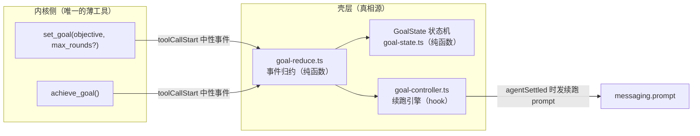
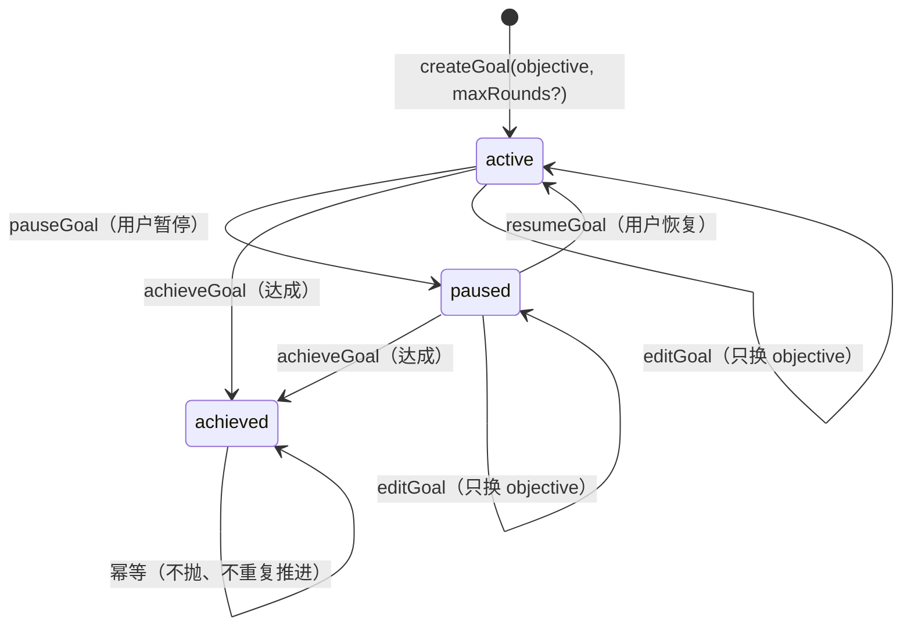
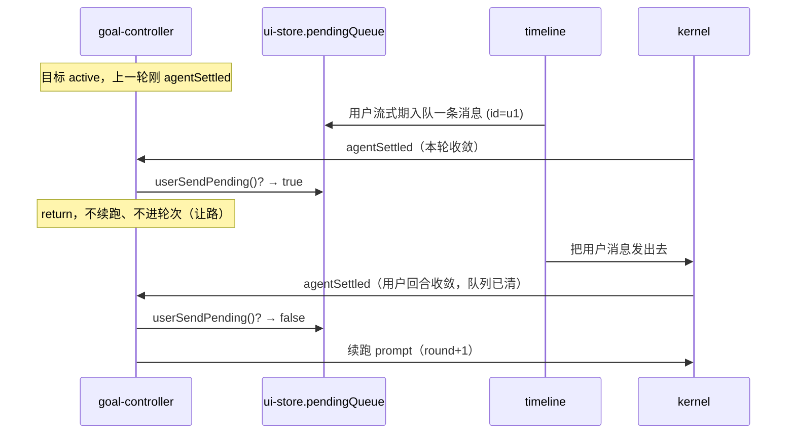

# 我对 goal 的理解

goal 是 my-harness-desktop 里一个「跨内核的同会话长期目标追踪」能力：模型（或人）给当前会话定一个目标，之后**每个回合收敛时**，桌面壳主动再发一份 prompt 让 AI 继续干活，直到目标达成或撞上轮数上限。它的全部代码收在**一个壳插件目录** `src/plugins/sessions/goal/` 里，物理上由四块组成：

- `core/goal-state.ts` —— 圆心纯状态机（零依赖，纯函数）。
- `renderer/goal-reduce.ts` —— 事件归约（纯函数，零 React）。
- `renderer/goal-controller.ts` —— 续跑引擎（React hook，唯一的副作用发生地）。
- `pi-extension/` + `dsh-extension/` —— 两个对称的**薄工具** `set_goal` / `achieve_goal`（模型工具只能由内核注册，壳注入不了）。

本文是「理解」级文档：讲 goal 是什么、为什么内核无关、续跑引擎怎么转、用户输入怎么插队、状态机和归约怎么纯、持久化怎么落地、UI 怎么挂、以及它从 `core/application` 迁回纯插件的架构依据——不纠缠插件实现细节（那是 `docs/plugins/sessions/goal.md` 的职责）。所有论断都落到具体文件、函数、类型名。

---

## 一、语义先于机制：goal 的本质是「续跑」，不是「状态对象」

理解 goal 的第一件事，是纠正一个被前一个方案（`docs/design/goal-ask-pi-port.md`）带偏的直觉：goal 不是「内核里的一个状态对象」，而是「AI 没达成的时候，desktop 再给它发一份 prompt 让它继续」。`docs/design/kernel-agnostic-goal.md` 开头把这条写死了：

> goal 的本质不是「内核里的一个状态对象」，而是「AI 没达成的时候，desktop 再给它发一份 prompt 让它继续」。续跑是 desktop 的职责，不该塞进内核扩展。

这一句是整套设计的支点。它直接决定了后面所有分层选择：

- **如果 goal 是「状态对象」** → 你会把状态机、CAS、fold、持久化全塞进内核扩展（这正是 `goal-ask-pi-port.md` 的 `get_goal`/`create_goal`/`update_goal` 三工具 + 扩展内 `details.goal` + `getBranch()` 重放方案）。代价是：dsh 要再来一套一模一样的引擎，同样一份 goal 语义在两个内核里变成两套引擎，违反「内核无关」。
- **如果 goal 是「续跑」** → 状态机只是判定「还该不该续跑」的一小段纯函数，续跑动作本身是 desktop 的职责，与内核身份无关。内核侧只需要「让模型能喊一声『我设了个目标』『我达成了』」——两个返回确认文本的薄标记工具。

这个语义纠正带来一个极漂亮的后果：**goal 的「真相源」不在内核，而在壳层**。内核侧的两个工具不落盘、不维护状态、不判断任何东西，它们唯一的职责是产生一条能被壳捕获的中性事件 `toolCallStart`。真正的 `GoalState` 只存在于壳插件的内存里，随变更写会话头行 `custom.goal`。内核完全不知道「有一个目标在跑」，它只知道「模型调了个叫 `set_goal` 的工具」。这一条在 §二 展开。



一句话：**goal 的语义落在壳层，内核只负责把「模型想设目标/想达成」这个意图翻译成一条中性事件投进来。**

---

## 二、为什么内核无关：两个薄工具 + 一个壳层真相源

goal 能做到「内核无关」，靠的是一个三件套分工，每件都踩在 CLAUDE.md 的纪律上。关键不是「没有内核代码」，而是「内核代码被压到最小、且两边严格对称」——工具只能内核注册（壳注入不了），所以留下两个薄标记；但**状态机、归约、续跑、持久化、UI 全部在壳侧**，内核一行都感知不到。

### 2.1 为什么必须留两个薄工具

`pi-extension/index.ts` 顶部注释把这条写死了：

> 本扩展只做两件事：1. 注册 set_goal / achieve_goal，让模型能调用（工具是内核注册的，壳注入不了——这是唯一留在内核侧的部分）；2. 返回一个确认文本。真正的目标状态、续跑，由壳插件经中性事件（toolCallStart）捕获、在插件内驱动。

模型工具是内核运行时自己的插件树上注册的，壳没有任何手段往内核里「塞」一个工具。所以「让模型能表达 goal 意图」这件事，物理上只能落在内核插件里。但注意「薄」到什么程度：

- `pi-extension/index.ts` 的 `set_goal` `execute` 只做两件事：`objective` 非空校验（空则返回 `isError: true` 的失败文本），然后 `return ack({ goal: { objective, ... } })`。`ack` 就是把入参 JSON.stringify 进确认文本。
- `achieve_goal` 更绝：无参，`execute` 直接 `return ack({ goal: { achieved: true } })`。

没有 `get_goal`、没有 `update_goal`、没有 CAS、没有 fold、没有 `details.goal` 持久化、没有 `getBranch()` 重放——这些 `goal-ask-pi-port.md` 里整整一章的东西，全部被删干净了（`git show 59857b00` 的 diff 里，`pi-extension/index.ts` 从 233 行缩到 84 行，还整个删掉了 `goal-fold.ts`(147 行) 和 `goal-store.ts`(43 行)）。

### 2.2 两个内核的对称实现

`dsh-extension/index.mjs` 是 pi 扩展的镜像，两者逐字段对齐：

| 维度 | pi 扩展 | dsh 扩展 |
|---|---|---|
| 文件 | `pi-extension/index.ts` | `dsh-extension/index.mjs` |
| 注册方式 | `pi.registerTool(ToolDefinition)` | `ctx.tools.register(...)` |
| 依赖注入 | 无（`pi` 是入口参数） | `export const inject = ["tools"]`（cordis 服务依赖声明） |
| `set_goal` 参数 | `{ objective, max_rounds? }` | 同 |
| `achieve_goal` 参数 | `{}` | 同 |
| 返回 | `ack({ goal: {...} })` JSON 文本 | `{ goal: {...} }` + `output.render` |

工具名、`objective`/`max_rounds` 参数名、description 全文（`SET_DESCRIPTION`/`ACHIEVE_DESCRIPTION` 两段英文，强调「只用它干真正的长任务，别拿来做单轮小事」）在两个扩展里**一字不差**——这是 `goal-ask-pi-port.md` §3.1 抄写原则里「工具名与 JSON 形状绝对对齐」的遗产：同一份 system prompt 在两个内核里应驱动出相同的工具调用。dsh 侧 `inject = ["tools"]` 这条不是装饰，注释里点明它是血的教训：cordis 插件树里不声明 `tools` 依赖，加载期会抛 `cannot get property tools without inject`，直接崩掉整个 dsh 内核。

### 2.3 内核无关的证明：三条不变量逐条过

`kernel-agnostic-goal.md` §6 和 CLAUDE.md §7.5 的「内核无关三不变量」，在 goal 里可以逐条对照验证：

- **壳不读内核存储**：goal 的状态写在会话头行 `custom.goal`（`sessions.updateHeader` 的插件域），这是一个壳层的中立通道，与 pi 的 JSONL 文件、dsh 的 session forest 都无关。续跑引擎读写的从来不是内核的存储格式，而是这个头行域。
- **壳只认中性事件**：检测工具调用靠 `toolCallStart` 中性事件（`SessionEvent` 联合里 `ToolCallStart`，含 `toolName` + `args`）。pi 透传、dsh 由 `dsh-event-translator` 把 `tool/call` 映射成 `toolCallStart`，两侧归一成同一个形状。续跑靠中性 `agentSettled`（`AgentSettledEvent`）+ 壳层 `messaging.prompt`。
- **壳渲染是纯函数**：`GoalCard`/`GoalBar` 里没有任何内核身份分支；`goal-reduce.ts` 只 import `@my-harness-desktop/shared` 和 `../core/goal-state`，一行内核 import 都没有。

`goal-controller.ts` 的 import 清单是最硬的证据：`usePluginContext, useUiStore`（来自 `@my-harness-desktop/react`）+ `GoalState`/`createGoal`/`editGoal`/`parseGoal`/`parseGoalCommand`/`pauseGoal`/`resumeGoal`/`shouldContinue`（来自 `../core/goal-state`）+ `applyGoalEvent`/`renderContinuationPrompt`（来自 `./goal-reduce`）。**没有 `@/server`、没有 `@/core`、没有 `client/pi`、没有 `client/dsh`、没有任何内核实现。** 把整个 goal 插件复制到用户目录，换掉 pi/dsh，或者再加第三个内核，这个插件一行不改。

### 2.4 为什么「真相源在壳」是对的：谁拥有语义，谁就该在壳

回到 §一的语义支点。既然 goal 的语义是「desktop 主动续跑」，那「目标现在是什么状态、还该不该续跑」这个判定就天然是壳的语义，不该下沉到内核。反过来看 `goal-ask-pi-port.md` 为什么错得彻底：

- 它把状态机（fold）、CAS（`{goal_id, revision}` 乐观并发）、持久化（头行快照 + revision 连续校验）全塞进 pi 扩展，还留了一整节「§6.5 authority 权限映射」——人类来源判定、live/root 判定。
- 结果 dsh 要再来一套。CLAUDE.md §1.5 多内核默认的第一问「壳是不是必须向每一个内核索要它？」，在这个方案下答案是「是的，每个内核都要各实现一整套 goal 引擎」——这是错的。正确形态是：壳只索要「模型能否表达 goal 意图」这一个最小意图，其余语义壳自己扛。

所以 goal 的「内核无关」不是「内核零参与」，而是**「内核只承担它物理上绕不过去的那一步（注册工具），其余语义全部上提壳层」**。这是 §8 迁移取舍的伏笔。

---

## 三、goal-state：圆心纯状态机

`core/goal-state.ts` 是整个 goal 的「圆心」。它只 import 空气（零依赖、零外部包），只回答一个问题：「目标现在是什么状态、还该不该续跑」。这是 CLAUDE.md §1.1「依赖只向内」的极端表达——它不碰 IO、不碰环境、不碰 React、不碰内核，纯粹是输入到输出的映射，可以裸单测（`core/goal-state.test.ts` + `core/goal-command.test.ts`）。

### 3.1 类型与状态机

```ts
export type GoalPhase = "active" | "paused" | "achieved";

export interface GoalState {
  objective: string;   // 人类请求的完成目标
  phase: GoalPhase;    // active=续跑中, paused=用户暂停(可恢复), achieved=已达成
  round: number;       // 已发起的续跑轮数(set_goal 后每续跑一轮 +1)
  maxRounds: number;   // 续跑轮数上限(防失控安全阀)
}
```

对比 `goal-ask-pi-port.md` 里的 DSH 蓝本 `GoalSnapshot`（`{id, revision, objective, phase, maxGoalRounds, roundsStarted, blockedReason?}`，phase 还是四值的 `active|paused|blocked|complete`），goal 的状态机被**大幅削薄**：

- 删掉了 `id`/`revision`/CAS——因为真相源在壳、单目标模型、不存在并发写，乐观并发成了多余的复杂度。
- phase 从四值砍到三值：删掉 `blocked`（异常停机结算交给既有 `continue()` 第八意图，不归 goal 管——`kernel-agnostic-goal.md` §3 非目标）。
- 加了 `round`/`maxRounds` 作为防失控安全阀。

这个「削薄」本身就是理解 goal 的关键：**上一版把 DSH 的 fold 状态机整块照搬（349 行纯函数），这一版只留了 6 个转移函数，每个 3~5 行。** 复杂度不是被转移了，而是被「语义上提」这件事直接蒸发掉了。



### 3.2 六个纯函数的精确语义

每个函数都是「输入一个 `GoalState`（或请求），输出一个新的 `GoalState`」，纯、无副作用、可裸测：

- **`createGoal(request: SetGoalRequest): GoalState`** —— 校验并创建：`objective` 非空（`normalizeObjective` trim 后非空，否则 throw）、`maxRounds` 正整数（`isPositiveInt` 要求 `Number.isSafeInteger` 且 `>=1`，缺省用 `DEFAULT_MAX_GOAL_ROUNDS = 256`，非法 throw）。产出 `{ objective, phase: "active", round: 0, maxRounds }`。
- **`achieveGoal(state)`** —— 任意非 achieved 阶段 → achieved；已 achieved 幂等返回原状态（不抛、不重复推进）。
- **`pauseGoal(state)`** —— 仅 active → paused；非 active 幂等返回原状态（不抛）。
- **`resumeGoal(state)`** —— 仅 paused → active；非 paused 幂等返回原状态（不抛）。
- **`editGoal(state, objective)`** —— 只换 objective（下次续跑生效），阶段/轮数/上限不变；空 objective throw。
- **`shouldContinue(state)`** —— `state.phase === "active" && state.round < state.maxRounds`。这是续跑引擎「何时续跑」的唯一判据：paused/achieved 都不续，达轮数上限也不续。

注意「幂等」是这套状态机反复强调的品格：所有转移在非法前置状态下**不抛错、原样返回**，只有「入参非法」（空 objective、非法 maxRounds）才 throw。这个区分的用意在 §5/§6 展开——它让续跑引擎可以放心地在任意事件上调用转移函数，不用先做一堆「当前是什么 phase」的 if 判断。

### 3.3 解析函数：防御式读入，畸形静默忽略

`goal-state.ts` 后半是三个解析函数，它们的共同姿态是「**读入不信任，畸形返回 null，绝不抛错**」：

- **`parseSetGoalArgs(args: unknown): SetGoalRequest | null`** —— 从 `set_goal` 工具入参宽松解析 `objective`/`max_rounds`（注意：模型工具层叫 `max_rounds`，中性请求层叫 `maxRounds`，这里做命名归一）。解析失败返回 null，续跑引擎据此**静默忽略**，不炸引擎。
- **`parseGoalCommand(input: string): GoalCommand | null`** —— 解析人类 `/goal` 命令（§6.3）。返回 null = 不是 `/goal` 命令（放行）；只要是 `/goal` 前缀就**一定返回命令**（吞掉发送），畸形子命令降级为 `status` 提示。
- **`parseGoal(v: unknown): GoalState | null`** —— 从头行 `custom.goal` 读回并校验一个已持久化的目标。注释点明理由：「目标状态是插件自己落盘的数据，但可能被手改/旧版本污染，读回不信任」。phase 必须精确等于三值之一、round 必须非负安全整数、maxRounds 必须正整数，任何一项不符返回 null。

这三个函数把「防御式边界」从续跑引擎里抽了出来：引擎只处理「已校验通过的干净数据」，所有「世界可能是脏的」的担忧都收在解析函数这一个入口。这是 §9「这套设计好在哪」的第一条。

---

## 四、goal-reduce：纯归约

`renderer/goal-reduce.ts` 是续跑引擎的「大脑」，但它刻意保持**零 React、零副作用**——文件头注释写明：「把一条中性会话事件归约成目标状态变化 + 可选续跑提示；续跑引擎只做订阅 + 发消息，归约逻辑在这里，内核无关、框架无关」。归约逻辑能裸单测（`renderer/goal-reduce.test.ts` 8 个用例），就是因为它不碰任何框架。

### 4.1 归约函数

```ts
export function applyGoalEvent(state: GoalState | null, event: SessionEvent): GoalReduce {
  if (event.type === "toolCallStart") {
    const name = toolNameOf(event);
    if (name === SET_GOAL_TOOL) {
      const request = parseSetGoalArgs(argsOf(event));
      if (request === null) return { goal: state }; // 畸形入参:静默忽略
      try { return { goal: createGoal(request) }; } catch { return { goal: state }; }
    }
    if (name === ACHIEVE_GOAL_TOOL) {
      return { goal: state ? achieveGoal(state) : state };
    }
    return { goal: state };
  }
  if (event.type === "agentSettled") {
    if (!state || !shouldContinue(state)) return { goal: state };
    const round = state.round + 1;
    return {
      goal: { ...state, round },
      prompt: renderContinuationPrompt(state.objective, round, state.maxRounds),
    };
  }
  return { goal: state };
}
```

归约的结果 `GoalReduce` 是 `{ goal: GoalState | null; prompt?: string }`——`prompt` 非空 = 本轮要发续跑提示，由调用方（续跑引擎）执行发送。**归约本身零副作用，它只产出一个「决策」，不执行「发送」。** 这是 CLAUDE.md §3.2「构造与执行分开」在 goal 里的落地：`applyGoalEvent` 构造决策（`goal` + `prompt`），`goal-controller` 执行（`messaging.prompt`）。

三个分支的语义：

- **`toolCallStart` + `set_goal`** → 建立目标。畸形入参（`parseSetGoalArgs` 返回 null）**静默忽略**，`createGoal` 抛错也**吞掉**返回原状态。注意这里两层防御：解析层挡一道，try/catch 再挡一道。
- **`toolCallStart` + `achieve_goal`** → 标记达成。`state ? achieveGoal(state) : state`：无目标时调 `achieve_goal` 是 no-op（幂等状态机的功劳，不需要额外判空）。
- **`agentSettled`** → 续跑判定。`shouldContinue(state)` 为真才推进：`round+1` 并产出续跑提示；否则原样返回。

一个关键细节：`shouldContinue` 判断的是**推进前**的 `state`（`round < maxRounds`），推进后的 `round` 才是 `state.round + 1`。所以 `maxRounds=2` 时，`round=0` 续（→1）、`round=1` 续（→2）、`round=2` 停——正好两轮续跑，第 3 次 `agentSettled` 不再发。`goal-reduce.test.ts` 的「轮数上限」用例精确锁死了这个边界。

### 4.2 续跑提示：与 DSH 同语义

`renderContinuationPrompt(objective, round, maxRounds)` 产出一段 `<goal_round>` 包裹的提示：

```text
<goal_round>
Objective: "写 README"
Round: 3/8

Continue working toward the objective in this same session. Treat the current workspace,
tool results, and durable session state as authoritative; inspect them instead of assuming
earlier narration is still current. Make concrete progress and verify the result. When the
whole objective is achieved, call the achieve_goal tool. If it is not yet achieved, keep
working and the goal will be continued on the next round.
</goal_round>
```

注释明确这是「与 DSH goal-round-driver 的 `<goal_round>` 同语义」——重述 objective + 轮次 + 三条指令（以 workspace/tool result/持久状态为准而非假设、要做出可验证的实质进展、达成就调 `achieve_goal`）。注意这段文案是**内容**，它落在 `goal-reduce.ts`（插件内），**不进圆心**——`goal-state.ts` 里没有任何文案，圆心只留状态机和判定，文案是插件的自由。这条分界（内容归插件、状态机归圆心）是 §8 迁移里「圆心只留纯函数」的具体体现。

`toolNameOf`/`argsOf` 两个小工具函数也值得一提：它们用结构类型 `as { toolName?: unknown; name?: unknown }` 而非 `as PiEvent` 这类内核类型，宽松地同时兼容「pi 透传」和「dsh 翻译」两边的字段名差异（`toolName` vs `name`、`args` vs `input` vs `arguments`）。这种「结构防御式、不 import 内核类型」的姿态，是 goal 内核无关的微观证据。

---

## 五、续跑引擎 goal-controller：订阅 + 副作用 + 持久化

`renderer/goal-controller.ts` 是唯一有副作用的地方，但它的副作用也严格收在几个点上：`useGoalController()` 这个 React hook 只做四件事——**订阅中性事件、发续跑消息、写会话头行、响应人类 `/goal` 命令**。归约交给 `goal-reduce.ts`，状态判定交给 `goal-state.ts`，hook 本身薄得只剩「拼装」。

### 5.1 状态与 ref 的三层结构

```ts
const [goal, setGoalState] = useState<GoalState | null>(null);
const goalRef = useRef<GoalState | null>(null);
const inflightRef = useRef(false);
const busyRef = useRef(false);
```

两个「真相」：`goal`（React state，驱动 UI 重渲染）和 `goalRef`（ref，事件回调里读的**最新**值——闭包陷阱的防御）。`useState` 里的 `goal` 用于 `GoalBar` 渲染，`goalRef.current` 用于事件回调里读「此刻」的状态（因为 `useEffect` 订阅的回调闭包会捕获旧值，只有 ref 永远是新的）。这是 React 里「事件驱动 + 状态」的经典双轨：**渲染态走 state，事件态走 ref**。

两个「护栏」ref：

- **`busyRef`** —— 回合在飞（`agentStart` 置真 / `agentSettled` 置假）。用于「即时装弹」的判据。
- **`inflightRef`** —— 续跑提示是否在飞。用于防同帧重入（`agentEnd`/`agentSettled` 可能双发，`kernel-agnostic-goal.md` §5 明确「此处再兜一层」）。

### 5.2 setGoal：单一状态写入口

```ts
const setGoal = useCallback((next: GoalState | null) => {
  goalRef.current = next;
  setGoalState(next);
  events.emit("goal:state", { active: next !== null && next.phase === "active" });
  if (sessionPath) {
    void sessions.updateHeader(sessionPath, { custom: { goal: next } }).catch(() => {});
  }
}, [events, sessions, sessionPath]);
```

这是整个控制器最关键的收口点：**任何状态变更（模型 set_goal、模型 achieve_goal、人敲 /goal、人点按钮、挂载恢复）都走这一个函数**，它一次做完三件事——更新内存态（ref + state）、广播 `goal:state` 事件（消费方 timeline 着色用）、持久化到会话头行 `custom.goal`。注释写：「广播在写入口收口，任何路径变更不漏发」。`goal-controller.test.tsx` 有专门的用例验证「模型 set_goal / achieve_goal 也广播（工具路径与命令路径同收口）」「全程通道名不变，只翻 active 位」。

三条副作用的细节：

- **广播** `events.emit("goal:state", { active })`：payload 只有一个 `active` 布尔，**不暴露 `GoalState` 本体**——插件间通信只走事件、只传最小契约（`index.tsx` 里 `export const channels = ["goal:state"]`）。timeline 订阅它只为了给输入框挂绿晕，它不需要知道 objective/round。
- **持久化** `sessions.updateHeader(sessionPath, { custom: { goal: next } })`：`custom` 是会话头行的插件域，域 key 归属制——goal 插件只写 `custom.goal` 这一个 key。`clear` 时 `next=null` 删键。失败 `.catch(() => {})` 静默——持久化失败不阻断续跑，内存态照常，下次变更再写。
- **`goal:state` 的 active 判定**：`next !== null && next.phase === "active"`——只有 active 才是「生效」（绿晕），paused/achieved/null 都是「灭」。

### 5.3 何时续跑：armIfIdle 即时装弹

```ts
const armIfIdle = useCallback((g: GoalState): GoalState => {
  if (busyRef.current || inflightRef.current || userSendPending() || !shouldContinue(g)) return g;
  const round = g.round + 1;
  const next = { ...g, round };
  sendRound(next, round);
  return next;
}, [sendRound]);
```

这是 goal 里最精妙的一段，它回答了「active 目标什么时候真正发出续跑」这个容易踩空的问题。核心困境：续跑由 `agentSettled` 触发，但如果一个 active 目标**被设置时没有任何回合在飞**（比如人敲 `/goal <目标>` 设置、或窗口刷新恢复出一个 active 目标），那么永远不会来 `agentSettled`，active 目标就**静默停摆**。`armIfIdle` 的「即时装弹」就是解法：**设置/恢复/恢复持久化时，若空闲（无回合在飞、无续跑在飞、无排队用户输入、且该续跑），立即发第一轮续跑**，不必等下一次回合收敛；忙时就交给在飞回合的 `agentSettled` 去续。

`armIfIdle` 的四个让路条件（任一为真就原样返回、不装弹）：

- `busyRef.current` —— 有回合在飞，交给它的 `agentSettled`。
- `inflightRef.current` —— 有续跑在飞，防同帧重入。
- `userSendPending()` —— 有排队用户输入，让路给用户（§6）。
- `!shouldContinue(g)` —— paused/achieved/达上限，本来就不该续。

返回值是「推进后的状态」（`round+1`），调用方拿它去 `setGoal` 持久化，保证「装弹」和「落盘」原子地绑定在同一个 `next` 上。`goal-controller.test.tsx` 精确验证了「忙时设置不立即发（round 保持 0），由在飞回合的 agentSettled 触发首轮（Round: 1/256）」。

### 5.4 事件订阅：agentStart/agentSettled 维护 busy + 续跑判定

```ts
useEffect(() => {
  return sessions.onEvent((event) => {
    if (event.type === "agentStart") busyRef.current = true;
    if (event.type === "agentSettled") busyRef.current = false;
    if (event.type === "agentSettled" && userSendPending()) return;  // 用户插队:让路
    const { goal: next, prompt } = applyGoalEvent(goalRef.current, event);
    if (next !== goalRef.current) setGoal(next);
    if (prompt !== undefined && !inflightRef.current) {
      inflightRef.current = true;
      void messaging.prompt(prompt)
        .catch(() => {})
        .finally(() => { inflightRef.current = false; });
    }
  });
}, [sessions, messaging, setGoal]);
```

逐行拆解：

- **`agentStart` → `busyRef = true`，`agentSettled` → `busyRef = false`**：维护「回合在飞」标志，供 `armIfIdle` 判「空闲」。
- **`agentSettled && userSendPending()` → return**：用户插队的让路点（§6 详述）。这次收敛**不续跑也不进轮次**，把 `applyGoalEvent` 整个跳过。
- **`applyGoalEvent(goalRef.current, event)`**：归约出 `{ goal, prompt }`。注意用 `goalRef.current`（最新值）而非 state 闭包值。
- **`next !== goalRef.current` → setGoal(next)`**：状态真的变了才写（引用相等判断，幂等转移返回原对象时不会触发多余的广播+落盘）。
- **`prompt !== undefined && !inflightRef.current`** → 发续跑，`inflightRef` 护栏 + `.finally` 复位。发送失败 `.catch(() => {})` 静默——目标保持 active，下次 `agentSettled` 自然再续，**不风暴重试**（注释明确）。

`sendRound` 是「与发送按钮同源」的 `messaging.prompt` 封装，`inflightRef` 在发前置真、`.finally` 里置假。这个 `finally` 复位很关键：如果发送失败或挂起，护栏不能卡死后续所有续跑。

### 5.5 挂载恢复：跨刷新持久化的读端

```ts
useEffect(() => {
  let alive = true;
  if (!sessionPath) return;
  void sessions.openSession(sessionPath).then((detail) => {
    if (!alive) return;
    const custom = (detail?.info?.custom) as Record<string, unknown> | undefined;
    const restored = parseGoal(custom?.goal);
    if (!restored) return;
    setGoal(restored.phase === "active" ? armIfIdle(restored) : restored);
  }).catch(() => {});
  return () => { alive = false; };
}, [sessions, sessionPath, setGoal, armIfIdle]);
```

挂载/切会话时从会话头行 `custom.goal` 读回目标。两个细节：

- `restored.phase === "active" ? armIfIdle(restored) : restored`：恢复出的 **active 目标立即装弹续跑**（「active = 续跑中」不因窗口刷新停摆）。这正是 §5.3 即时装弹的第三个触发点。
- `alive` 标志 + `return () => { alive = false; }`：防异步 `openSession` 返回时组件已卸载的竞态（React 清理函数的正确用法）。

`goal-controller.test.tsx` 的「挂载时从会话头行恢复目标」用例完整覆盖这条：`openSession` mock 返回 `{ info: { custom: { goal: { objective, phase:"active", round:2, maxRounds:8 } } } }`，断言恢复后 `round` 变成 3（`armIfIdle` 即时装弹 2→3）且 `prompt` 发出 `Round: 3/8`。

### 5.6 用户控制：pause/resume/edit/clear 四个操作

```ts
const pause  = useCallback(() => { const g = goalRef.current; if (g) setGoal(pauseGoal(g)); }, [setGoal]);
const resume = useCallback(() => { const g = goalRef.current; if (g) setGoal(armIfIdle(resumeGoal(g))); }, [setGoal, armIfIdle]);
const edit   = useCallback((objective) => {
  const g = goalRef.current;
  if (!g) return;
  try { setGoal(editGoal(g, objective)); } catch {}
}, [setGoal]);
const clear  = useCallback(() => setGoal(null), [setGoal]);
```

- `pause`/`edit`/`clear` 都是纯状态机函数 + `setGoal` 的薄封装。
- `resume` 特殊：`armIfIdle(resumeGoal(g))`——恢复即「继续干活」，空闲时**立即装下一轮**，不等下一次回合收敛（否则 active 但无人触发，停摆）。注释明确这条，`goal-controller.test.tsx` 的「恢复后继续」用例断言 `prompt` 计数 +1。
- `edit` 的空 objective 由 `editGoal` throw，`try/catch` 静默吞掉（不弹错）。

这四个操作同时挂在 `GoalBar` 的按钮上（§7）和 `/goal` 子命令上（§5.7），两处走**同一套状态机函数**，所以行为和持久化天然一致。

### 5.7 人类 /goal 命令：与模型工具互补

`handleCommand` 是 `/goal` 命令的唯一实现，它做的事和模型调 `set_goal` **落在同一个 `GoalState`**：

```ts
const handleCommand = useCallback(async (input: string): Promise<boolean> => {
  const cmd = parseGoalCommand(input);
  if (!cmd) return false;                    // 非 /goal:放行
  // switch(cmd.kind): set/pause/resume/edit/clear/status
  // set → setGoal(armIfIdle(createGoal(cmd.request)))
  // pause → setGoal(pauseGoal(g))
  // resume → setGoal(armIfIdle(resumeGoal(g)))
  // edit → setGoal(editGoal(g, cmd.objective))
  // clear → setGoal(null)
  // status → notify.show(当前状态回显 / GOAL_USAGE)
  return true;                               // 命中:吞掉发送
}, [notify, setGoal, armIfIdle]);
```

关键点：

- **返回 `true` = 吞掉本次发送**（文本不进内核），`false` = 放行（按普通消息发送）。这是 `ComposerCommand` 契约（`composer-commands.ts`）的约定：`handle` 返回 true = 已处理。
- `parseGoalCommand` 的规则（§3.3）：`/goal` 裸敲 = `status`（查状态）；单词精确命中子命令（`stop`/`pause` → pause，`resume`/`start`/`continue` → resume，`clear`/`rm`/`delete` → clear，大小写不敏感）；`edit <文本>` → 改目标（裸 edit 无文本降级 status，不把 "edit" 当目标）；其余全部文本（含多行）= 新目标。**子命令必须是独立单词**——`/goal stop the server 优化` 是目标文案「stop the server 优化」，不是暂停指令（`goal-command.test.ts` 专门锁死这条）。
- `status` 回显：`[${phase}] ${round}/${maxRounds} · ${objective}`；无目标时提示 `GOAL_USAGE`（用法文案）。

「与模型工具互补」这句话值得展开：模型调的 `set_goal` 是工具路径（`toolCallStart` 事件 → `applyGoalEvent`），人敲的 `/goal` 是命令路径（`parseGoalCommand` → `handleCommand`），两条路径**收敛到同一个 `setGoal` 写入口、同一个 `GoalState`、同一个 `custom.goal` 持久化**。这意味着「模型设的目标，人可以删改停；人设的目标，模型也能 `achieve_goal` 达成」——`goal-bar.test.tsx` 的「模型 set_goal 与用户 /goal 同状态机」用例验证了这一点。

### 5.8 模块级桥 runGoalCommand

```ts
let activeCommandHandler: ((input: string) => Promise<boolean>) | null = null;
export function runGoalCommand(input: string): Promise<boolean> {
  const fn = activeCommandHandler;
  return fn ? fn(input) : Promise.resolve(false);
}
```

这是把「静态导出侧」和「React hook 侧」桥接起来的一小段：`renderer/index.tsx` 里 `composerCommands` 的 `handle` 是**插件加载时被 plugins-host 收集的静态函数**，而 `handleCommand` 活在 React hook 里（依赖 `notify`/`setGoal`/`armIfIdle` 这些 hook 上下文）。解法是模块级变量 `activeCommandHandler` + `runGoalCommand` 转发：

- hook 挂载时把 `handleCommand` 包成稳定函数塞进 `activeCommandHandler`（`useEffect` 里 `handleCommandRef.current = handleCommand`，然后 `activeCommandHandler = fn`）。
- 卸载时只清自己（`if (activeCommandHandler === fn) activeCommandHandler = null`），不误伤后续挂载者。
- `runGoalCommand` 转发：无控制器（插件被禁）→ 返回 false 放行。

注释解释了为什么这个桥是安全的：「GoalBar（composerTop 槽）与 composer 同时挂载，命令到来时控制器必在」。因为 `GoalBar` 和 composer 都是挂载在 timeline 的 ComposerDock 里的，`/goal` 命令能到达时，`useGoalController` 一定已经在跑了。

---

## 六、用户输入插队：pendingQueue 让路机制

这是 goal 设计里最「人性化」的一条，commit `c08b2ff7`（用户输入插队）单独落地。语义一句话：**goal 续跑对用户输入让路——用户有排队中的消息时，续跑不抢发，等用户消息的回合收敛后再续。**

### 6.1 为什么需要让路

续跑的触发点是 `agentSettled`（回合收敛）。但「回合收敛」和「用户刚好发了一条新消息」可能撞车：AI 的一轮刚结束，用户正在输入框里打字，如果此刻 goal 续跑抢先发了一份 prompt，AI 就会接着「目标」往下干，把用户刚敲的话晾在一边。用户会觉得自己被 AI 抢了节奏——「我正要插话，它又自顾自跑起来了」。所以要让路：**用户输入永远优先于自动续跑。**

### 6.2 让路的实现：只读框架 store，零新机制

`goal-controller.ts` 顶部的 `userSendPending()`：

```ts
function userSendPending(): boolean {
  const queues = useUiStore.getState().pendingQueue;
  return Object.values(queues).some((list) => list.length > 0);
}
```

`pendingQueue` 是框架 `useUiStore` 里的一个字段（`src/web/stores/ui-store.ts:143`），类型 `Record<string, QueuedMessage[]>`——按会话 key 分组的「流式期入队的待发消息」队列。`goal-controller` 用 `useUiStore.getState()` **只读**地读它（CLAUDE.md §8.2「共享 store 只读」允许），**不跨插件引通道、不改归约函数**——让路判定只发生在续跑引擎的订阅层。

设计文档 `kernel-agnostic-goal.md` 修订四把这条的落法写死了：

> 落法零新机制：续跑引擎只读框架 `useUiStore.pendingQueue`（§8.2 共享 store 只读），不跨插件引通道；归约函数保持纯净，让路判定在引擎订阅层。边界：发送失败重挂篮的条目同样压住续跑（用户需先处置，可见态）。

「归约函数保持纯净」是这里的架构自觉：`applyGoalEvent` 仍然不知道「队列」的存在，它还是纯的「事件 → 状态 + prompt」。让路是**引擎层的策略**，不是**归约层的规则**——归约只回答「这一轮该不该续」，引擎再叠加「用户有没有插队」这一层判断。两层解耦，归约可以继续裸测。

### 6.3 让路的两个触发点

让路发生在两个地方，都在 `goal-controller.ts`：

1. **回合收敛时**（事件订阅里）：

```ts
if (event.type === "agentSettled" && userSendPending()) return;
```

这次 `agentSettled` 到来时若有排队的用户消息，**直接 return，跳过 `applyGoalEvent`**——既不续跑、也不进轮次（round 不变）。让 timeline 先把用户消息发出去，等用户消息的回合收敛（队列已清）后再续。

2. **即时装弹时**（`armIfIdle` 里）：

```ts
if (busyRef.current || inflightRef.current || userSendPending() || !shouldContinue(g)) return g;
```

set/resume/restore 时若队列有排队的用户消息，**不即时装弹**，让位给用户回合，由其收敛后的 `agentSettled` 接续。

`goal-controller.test.tsx` 两个用例精确锁死这两条路径：

- 「用户输入插队：收敛时有排队用户消息 → 本次不续跑不进轮次，队列清空后的收敛再续」：设置即装首轮（`prompt` 计数 1），然后 `mocks.pendingQueue = { s: [{ id: "u1" }] }` 模拟流式期用户入队一条消息，`emit(agentSettled)` → `prompt` 计数**仍是 1**（让路没抢发）且 `goal.round` **仍是 1**（轮次不空转）；再清队列 `mocks.pendingQueue = {}`，`emit(agentSettled)` → `prompt` 计数 2、`round` 2（续跑接上）。
- 「用户输入插队：排队未清时恢复也不即时装弹，等用户回合收敛再续」：恢复时队列有消息 → phase 恢复 active 但 `prompt` 计数不变；队列清空后的 `agentSettled` → 续跑此时才接上。



### 6.4 让路的边界：失败重挂篮同样压住续跑

设计文档补了一句边界：「发送失败重挂篮的条目同样压住续跑（用户需先处置，可见态）」。意思是：如果一条用户消息发送失败、被 timeline 重新挂回 `pendingQueue` 等待用户处置，它**同样**会触发让路——goal 续跑不会越过这条「待处置」的用户消息抢发。这是对的：一条失败挂起的消息是用户可见的、需要用户动作的，自动续跑不该在它还没被处理时盖过去。

---

## 七、持久化：custom.goal 会话头行

goal 的持久化只有一行：**目标状态随变更写会话头行 `custom.goal`，挂载/切会话时读回**。这是 `goal-ask-pi-port.md` 里「2A 头行快照」决策的简化继承——但去掉了 revision、去掉了 CAS、去掉了 fold，只留「一个快照 + 一个域 key」。

### 7.1 写端：单一写入口收口

写发生在 `setGoal`（§5.2）：

```ts
void sessions.updateHeader(sessionPath, { custom: { goal: next } }).catch(() => {});
```

- `custom.goal` 是会话头行的插件域，域 key 归属制——goal 插件只拥有 `goal` 这一个 key。
- `clear` 时 `next=null`，`updateHeader({ custom: { goal: null } })` 删键（`goal-controller.test.tsx` 的「关闭落盘 goal=null 删键」用例断言）。
- 失败静默（`.catch(() => {})`）：持久化失败不阻断续跑，内存态照常，下次变更再写。

「写入口收口」的意义：不管目标是被模型 `set_goal`、被模型 `achieve_goal`、被人敲 `/goal`、还是被人点按钮改的，落盘都走 `setGoal` 这一个函数，不存在「某条路径忘了持久化」的可能。

### 7.2 读端：防御式解析

读发生在挂载恢复（§5.5）：

```ts
const restored = parseGoal(custom?.goal);
if (!restored) return;
```

`parseGoal`（§3.3）防御式解析：objective 非空、phase 精确三值、round 非负安全整数、maxRounds 正整数，任何一项不符返回 null。注释的理由是「目标状态是插件自己落盘的数据，但可能被手改/旧版本污染，读回不信任」。

### 7.3 为什么「头行快照」够用了

对比 `goal-ask-pi-port.md` 里 DSH 蓝本的「事件溯源 + 严格重放折叠」（`foldGoal(events)` 从会话事件日志折叠出状态，revision 连续校验、phase 转移校验、计数器保持），goal 的持久化退化成「一个快照」是**语义上提的必然结果**：

- 真相源在壳层内存，持久化只是「让窗口刷新不丢」的**快照镜像**，不是「从事件流重建真相」的溯源。
- 单目标模型（一次一个 goal，`set_goal` 覆盖旧的）、单进程单会话、无并发写，所以 CAS/revision 这些乐观并发机制是多余复杂度。
- 快照极小（`{ objective, phase, round, maxRounds }` 四个字段，远小于 8KB 头行窗口），写失败的概率可忽略。

`goal-ask-pi-port.md` §6.4 自己也承认了这个退化方向：「头行快照模式下，'事件流'退化为'头行快照 + revision 连续校验'，fold 状态机退化为单快照校验器」。goal 再进一步，把「revision 连续校验」也删了——因为壳层单写入口已经保证了不会出现「陈旧写覆盖新写」的并发问题，revision 纯粹是防御一个不存在的竞态。

---

## 八、UI：composerTop 目标条 + goal-card

goal 的两个 UI 出口，分别挂两个槽位（`plugin.json` 的 `contributes`）：

```json
"contributes": {
  "blockRenderers": [
    { "id": "goal", "block": "toolCall", "names": ["set_goal", "achieve_goal"], "component": "GoalCard" }
  ],
  "composerTop": [
    { "id": "goal", "component": "GoalBar", "order": 40 }
  ]
}
```

- **`blockRenderers`**：把 `set_goal`/`achieve_goal` 两个工具调用块的时间线渲染交给 `GoalCard`。
- **`composerTop`**：把 `GoalBar` 挂在输入框上方（ComposerDock 顶部、输入药丸之前）。

框架按 manifest 的 `component` 字段在 module exports 里找同名组件自动匹配（CLAUDE.md §7.4），插件只 export，不调任何 register 函数。

### 8.1 composerTop 槽：目标条

`packages/shared/src/domain/contributions.ts` 里 `ComposerTopContribution` 是「机械镜像 composerStats 槽」——`{ id, component, order? }`，组件 props 无（自订阅插件内状态）。设计文档修订三说明了它和 `composerAttachments` 停靠区的分工：

> 附件区是「待发送内容」（数据经通道挂载），本槽是「常驻状态展示」（贡献方自持数据）。

`GoalBar`（`goal-bar.tsx`）就是那个「常驻状态展示」：它调 `useGoalController()` 拿 `{ goal, pause, resume, edit, clear }`，渲染一个横幅：

- 无目标时返回 null（不显示）。
- 有目标时显示：Target 图标 + objective 文本（可点轮次按钮进入编辑态，Enter 提交 / Escape 取消）+ 停止/恢复按钮（active 显示 Pause、paused/achieved 显示 Play）+ 关闭垃圾桶。
- **生效着色**：`phaseColor(phase)` 按 phase 变色（active → `var(--color-accent-success)` 绿、paused → `var(--color-accent-warning)` 黄、achieved → `var(--color-primary)` 主色），左边框 + 底纹随 phase 变。`data-goal-bar`/`data-goal-phase` 是 e2e 定位锚点。

### 8.2 goal:state 事件：输入框绿晕

`GoalBar` 自己的着色是**同插件内**的（直接读 `useGoalController` 的 state），但「输入框本体」的绿晕是**跨插件**的——timeline 不读 goal 插件的内部 state，而是订阅 `goal:state` 事件（`channels = ["goal:state"]`，replayLast 回放）：

`timeline/renderer/index.tsx:783-791` 订阅 `goal:state`，`timeline/renderer/composer.tsx:293-294` 根据 `goalActive` 给输入药丸挂 `.pi-composer-goal` 类 + `data-goal-active` 锚点。

这里体现了 CLAUDE.md §8.2「插件间只走事件、不走共享 store 互读写」的纪律：goal 插件**不暴露** `GoalState` 给 timeline，只广播一个 `{ active }` 布尔；timeline 只关心「有没有生效的目标」来决定绿晕，不需要知道 objective 是什么。`goal-controller.test.tsx` 的「goal:state 状态广播」用例验证了 payload 全程只翻 `active` 位。

### 8.3 GoalCard：工具调用块渲染

`goal-card.tsx` 是非交互的纯渲染件（`blockRenderers` 槽）：只渲染 `set_goal`/`achieve_goal` 的 args/result，不参与任何状态。`set_goal` 展示 objective + max_rounds（可折叠），`achieve_goal` 展示「目标达成」。边框色按 `isError`（错误红）/ `isStreaming`（运行中绿）/ 默认（主色）三态。注释明确：「状态机（圆心纯函数）与续跑引擎（本插件 goal-controller）都在插件侧，本卡片只做内容呈现」。

注意：GoalCard 是**纯渲染**，它和 GoalBar 不同——GoalBar 是「当前进行态」的实时横幅（数据来自 `useGoalController`），GoalCard 是「历史工具调用块」的静态呈现（数据来自时间线里已经发生的 `toolCall` 块）。两者一个看「现在」，一个看「过去」。

---

## 九、从 core/application 迁回纯插件：架构取舍

这是理解 goal 的一条暗线：goal 不是一开始就在纯插件里的，它经历了「首版在 core/application → 迁回纯插件」的反复。理解这个反复，才能理解「为什么现在这样是对的」。

### 9.1 三条迁移链：从 59857b00 到 449d9cc3 再到后续

`git log --oneline --follow src/plugins/sessions/goal` 串起来是完整的一条演化链：

```
59857b00 feat(goal): 内核无关的 goal 续跑驱动（set_goal/achieve_goal + 壳层续跑）   ← 首版:core/application GoalDriver
6552250b feat(goal): 加 pause/resume/edit/clear 壳层操作 + dsh 插件
2cfdc543 feat(goal): UI 目标条(停止/恢复/编辑/关闭)+ IPC 通路
449d9cc3 refactor(goal): 续跑引擎从 core/application 迁回壳插件(纯插件)          ← 关键转折
6eaea9e3 test(goal): 补 e2e
23f966e5 refactor(goal): goal-state 移进插件 core/ + 持久化到会话头行 custom.goal
f3b7899d feat(goal): 用户侧 /goal 输入框命令
90cf912d feat(goal): 目标条上移输入框上方 + 生效绿晕着色（composerTop 槽）
c08b2ff7 feat(goal): 用户输入插队
```

三段，对应三个架构阶段：

1. **`59857b00`（首版）**：把续跑引擎放进 `core/application/goal/goal-driver.ts`（`GoalDriver` 类 + `GoalDriverHost { onEvent, prompt }` 最小宿主面），圆心放 `packages/shared/src/domain/goal.ts`（状态机），装配在 `bootstrap/assemble.ts`（`new GoalDriver({ onEvent, prompt }).install()`）。为了把「续跑」这个 application 能力暴露给 renderer，还加了 `GoalApi` 契约 + IPC 通道（`main-context`/`controllers/sessions`/`channel-contract`/`build-kernel`/`plugin-context` 全部改动）。

2. **`449d9cc3`（关键转折）**：把续跑引擎从 `core/application` 迁回壳插件 `plugins/sessions/goal`，**回退上一版对壳机制层 + 契约 + IPC 的全部改动**。diff 是「-629 / +207」的净删除：删 `goal-driver.ts`(165 行) + 2 个测试(341 行)，回退 main-context/controllers/sessions/assemble/channel-contract/build-kernel/plugin-context 的 goal 改动，圆心 `goal.ts` 瘦身为 `goal/goal-state.ts`（删 `GoalApi`，只留纯状态机）。壳插件新增 `goal-reduce.ts` + `goal-controller.ts`。

3. **后续演进**（`23f966e5` → `c08b2ff7`）：在纯插件的框架内继续长——状态机移进插件 `core/`、持久化到 `custom.goal`、加 `/goal` 命令、加 `composerTop` 槽、加用户插队。**每一版都只动插件目录和圆心纯函数，壳机制层一行不碰。**

### 9.2 为什么首版「放 application 层」是错的

首版把 `GoalDriver` 放 `core/application`，表面看很合理——「续跑是会话编排，属于用例编排层」。但它踩了两条线：

- **违反「机制与内容分离」（§1.2）**：`core/application` 是壳的机制层，`GoalDriver` 的「回合结束后再发一份 prompt 继续」是**功能（内容）**，不是机制。把功能焊进 application，等于把「goal 这个具体产品功能」升格成了壳的内建能力。
- **为了暴露它，动了壳的契约和 IPC**：`GoalApi` 契约 + IPC 通道的改动意味着「换内核、加内核、换 UI 框架」都会牵扯到 goal。这是 CLAUDE.md §7.7「判别气味：改动一个功能时，diff 落在 server/（壳）而非 plugins/」的典型——功能本该是插件，却把机制层改了个遍。

`449d9cc3` 的 commit message 把依据写得很直白：

> 薄壳架构（§1.2）——「回合结束后再发一份 prompt 继续」是功能（内容），不是壳机制。壳只出 onEvent + prompt 两个机制面，续跑逻辑活在该插件里，不碰 core/application、契约、IPC。「非必要不修改内核」。

### 9.3 迁回纯插件后，壳只出什么

迁回后，goal 插件依赖的壳机制面被压到最小，就四样（`goal-controller.ts` 顶部注释逐条列）：

- **`onEvent`** —— 订阅中性事件（`sessions.onEvent`）。
- **`prompt`** —— 发消息（`messaging.prompt`，= 发送按钮同源）。
- **`updateHeader` / `openSession`** —— 会话头行 custom 域读写。
- **`notify`** —— 命令反馈。

这四样全是**通用机制**，不是 goal 专属的。`onEvent` 是所有插件都能订阅事件，`prompt` 是所有插件都能发消息，`updateHeader`/`openSession` 是所有插件都能读写的会话头行，`notify` 是所有插件都能弹通知。goal 只是「用这些机制拼出续跑逻辑」，它自己没让壳为它加任何一行专属代码。

### 9.4 为什么「现在这样」是对的：三重论证

**第一重：判据「一年后会不会换」。** 续跑策略（什么时候续、续几轮、让不让用户插队）是会变的产品逻辑——今天「agentSettled 时续」，明天可能「stepEnd 时续」「连续 3 轮无进展时暂停」；今天 `maxRounds=256`，明天可能按模型调。会变的东西推出去（§2.3）。而 `onEvent`/`prompt` 这套机制不会变。把会变的续跑策略放进插件，改策略只动插件；把稳定的机制留在壳，机制一行不动。

**第二重：判据「依赖方向只向内」。** 迁回后，goal 的依赖箭头严格指向圆心：`goal-controller` → `goal-reduce` → `goal-state`（圆心纯函数）→ 零依赖。`goal-reduce` 只 import `@my-harness-desktop/shared` 和 `../core/goal-state`，没有任何一条从内层指向外层的依赖。首版的 `GoalDriver` 在 application 层、`GoalApi` 在契约层，反而让「goal 这个功能」从外层（插件本该在的位置）反向钻进了内层（application/契约）。

**第三重：判据「插件四件套内聚」。** CLAUDE.md §7.7 明确把 `src/plugins/sessions/goal/` 列为四件套的参考实现（`renderer/` + `pi-extension/` + `dsh-extension/`）。goal 把「desktop 壳插件 + pi 内核插件 + dsh 内核插件」三件收进同一个 plugin 目录，功能的所有内核侧适配都内聚在一个目录下。这比首版「application 里的 GoalDriver + 内核侧两套薄工具 + 契约 IPC」分散在四处的形态，内聚得多。

### 9.5 一个微妙但关键的边界：圆心留了纯函数，但没留「续跑编排」

`449d9cc3` 迁移里有一个容易被误读的点：圆心 `packages/shared/src/domain/goal.ts` **没有**被删，而是瘦身成 `domain/goal/goal-state.ts`（只留纯状态机）。后续 `23f966e5` 又把它**移进了插件 `core/`**（`src/plugins/sessions/goal/core/goal-state.ts`）。

这两步连起来看是一条清晰的边界：

- **圆心该留什么**：`GoalState` 状态机是「目标现在是什么状态、还该不该续跑」的**纯函数**，它是业务本质、不会变、零依赖，符合 §4.2「圆心是拿掉所有会变的东西之后还剩什么」。所以首版留在圆心是对的。
- **圆心不该留什么**：`GoalApi` 契约、`GoalDriver` 续跑编排——这些是「会变的用例编排」和「暴露给 renderer 的 IPC 面」，不是圆心材料。首版把它们放圆心/契约是错的。
- **为什么最后移进插件 core/**：`goal-state.ts` 虽然纯、虽然零依赖，但它**只被 goal 这一个插件消费**，没有任何别的插件、别的内核、别的壳机制需要它。一个「只有一个消费者」的纯函数，放圆心是过度暴露（圆心是「多消费者共享的稳定本质」），放插件自己的 `core/` 子目录（仍零依赖、仍可裸测）更贴合「一个功能一个 plugin，四件套内聚」。`23f966e5` 的 commit message「goal-state 移进插件 core/」就是把这条边界收干净。

这个边界是 goal 对 §1.2/§4.2 的一次精确实践：**「纯」不等于「必须进圆心」**——圆心是「稳定 + 多消费者共享」的，一个「稳定但只有一个消费者」的纯函数，放在插件自己的 core 里更好。

---

## 十、我的理解：goal 这套设计好在哪

综合前面九节，goal 这套设计「好」在哪里，我认为可以归纳成六条可复用的判断，每条都对应一个具体的架构动作。

### 10.1 好在那次「语义纠偏」：先问「这到底是什么」，再谈「放哪」

`59857b00` 的第一句话不是「我们抄 DSH 的 goal」，而是「goal 的本质是续跑，不是状态对象」。这个语义判断一旦成立，后面所有的分层都是推论：续跑是 desktop 的职责 → 状态机在壳 → 内核只留薄工具 → 不需要 CAS/fold → 不需要 application 层 → 不需要契约 IPC。**架构取舍是语义判断的下游产物，不是独立的技术偏好。** 反观 `goal-ask-pi-port.md`，它花了 803 行去「抄 DSH 的语义 + schema + fold + authority」，唯独没问「goal 到底是什么」——于是抄回来一套「状态对象」的引擎，越抄越重，最后被整个推翻。goal 的价值首先在于它问对了那个问题。

### 10.2 好在「真相源单点」：状态、广播、持久化三合一收口

`setGoal` 一个函数收口了「更新内存态 + 广播 goal:state + 写 custom.goal」三件事，任何路径（模型工具 / 人敲命令 / 人点按钮 / 挂载恢复）变更都走这一个入口。这意味着：

- **不漏发**：不存在「某条路径改了状态但忘了广播/落盘」。
- **不漏改**：不存在「某条路径广播了但没改内存态」。
- **可审计**：想看「goal 状态怎么变的」，只需要看 `setGoal` 的调用点。

这是 §1.3「契约单源」在运行时状态上的投影：**概念单源 → 状态变更也单源**。一个状态的唯一写入口，是消除「改了这里忘了那里」这类 bug 的最直接手段。

### 10.3 好在「纯函数与副作用的分层」：能裸测的都裸测了

goal 把「能纯的」和「必须脏的」切得极干净：

- **纯**：`goal-state.ts`（状态机 + 解析）、`goal-reduce.ts`（归约）——零依赖、零 IO、零 React，全部裸测（`goal-state.test.ts` 11 用例、`goal-command.test.ts` 11 用例、`goal-reduce.test.ts` 8 用例）。
- **脏**：`goal-controller.ts`（订阅 + 发消息 + 持久化）——唯一的副作用发生地，用 mock 框架测（`goal-controller.test.tsx` 15 用例、`goal-bar.test.tsx` 7 用例）。

这个分层让「续跑引擎」的正确性可以被**拆开验证**：状态机和归约的正确性靠纯函数单测锁死（不碰框架、不碰 mock），引擎的拼装正确性靠 mock 框架测。如果续跑逻辑和归约逻辑揉在一个 hook 里，你就只能靠 mock 一大套框架来间接测「状态转移对不对」——脆弱且难定位。goal 的答案是把「决策」和「执行」拆开（§3.2 构造与执行分开），决策纯、执行脏。

### 10.4 好在「幂等 + 防御式解析」的健壮性姿态

goal 对「世界可能是脏的」这件事的处理，是一套连贯的姿态：

- **状态机幂等**：所有转移在非法前置状态下不抛、原样返回；只有「入参非法」才 throw。
- **解析防御式**：`parseSetGoalArgs`/`parseGoal`/`parseGoalCommand` 对读入一律不信任，畸形返回 null（静默忽略），不炸引擎。
- **副作用静默**：`messaging.prompt` 失败、`updateHeader` 失败、`openSession` 失败，全部 `.catch(() => {})` 静默，不风暴重试，靠「下次事件自然再续」自愈。

这套姿态的根因是：goal 是**长跑的后台机制**，它面对的是「流式事件乱序、会话头行被手改、发送失败、进程重启」这些不可控的输入。一个健壮的后台机制必须「脏输入静默、干净输入才动、失败自愈」，而不能「一脏就崩」。goal 把「崩」的可能都挡在了解析函数和幂等转移里。

### 10.5 好在「用户优先」的让路设计

§六的用户插队，是 goal 里最体现「产品观」的一条。很多自动续跑实现会在这里犯两个错：

- **不排优先级**：AI 续跑和用户输入抢发，用户被晾一边。
- **用 sleep/轮询猜时序**：固定 delay 或轮询队列，赌「用户应该打完字了」。

goal 两者都不做：它用**事件驱动**（读 `pendingQueue` 快照判断「此刻有没有排队」）而不是轮询，用**让路**（有排队就不续、让用户回合先收敛）而不是抢发。这是 §3.6「事件驱动，不轮询不 sleep」在「用户插队」场景下的具体落地——用户消息什么时候发出去，由 timeline 的队列机制决定，goal 只需要「观察到队列非空就停手」。

### 10.6 好在「薄工具 + 对称」的内核无关形态

goal 的内核侧是两个对称的薄工具，这个形态的价值在于**它给「内核无关」定了调**：不是「内核零代码」（物理上做不到，工具只能内核注册），而是「内核代码被压到最小、且两边严格对称、壳层扛全部语义」。这让「加第三个内核」的边际成本降到最低——第三个内核只需要再写一个 `registerTool` 的薄标记（对称地抄 pi/dsh 版），壳层状态机、归约、续跑、持久化、UI 一行不动。这正是 §1.5 多内核默认「内核先抽象、后实现」的实战检验：goal 的抽象（两个薄工具 + 一个壳层真相源）对每个内核都是「两个薄标记」这一个最小实现，而不是「一套完整引擎」。

---

## 十一、QA

**Q1：为什么 goal 不直接复用 DSH 现成的 goal-round-driver，而要自己在壳层重写一个续跑引擎？**

因为 DSH 的 `goal-round-driver` 是**内核插件**，它依赖 `agent/pre-step` 准入闸门 + `Agent.followup` + `turn/end` 结算三个内核 hook——这些 hook pi 内核的 loop 根本不暴露（`goal-ask-pi-port.md` §4.4 明确「抄则需改 pi 内核」）。而 goal 的语义（续跑是 desktop 的职责）决定了它应该活在**壳层**，壳层有 `onEvent` + `prompt` 两个通用机制就能拼出续跑，不需要内核暴露任何 hook。所以不是「重写」，是「把续跑从内核 hook 依赖里解放出来，上提到壳层的通用机制上」。代价是丢了 DSH 的 blocked/usage-limited 等精细结算，但这些异常停机由既有的 `continue()` 第八意图承担，不归 goal 管。

**Q2：`busyRef` 和 `inflightRef` 有什么区别，为什么需要两个护栏？**

它们是两个不同维度的「在飞」：`busyRef` 是「**回合**在飞」（`agentStart` 置真 / `agentSettled` 置假），回答「现在内核有没有一个回合正在跑」，用于 `armIfIdle` 判断「空闲」；`inflightRef` 是「**续跑发送**在飞」（发 `messaging.prompt` 前置真 / `.finally` 置假），回答「有没有一份续跑提示正在发出」，用于防同帧重入（`agentEnd`/`agentSettled` 可能双发，`inflightRef` 兜底只发一次）。一个管「能不能发」，一个管「别发重了」，是两个正交的护栏。

**Q3：goal 的状态是单目标，模型连续调两次 `set_goal` 会发生什么？**

第二次 `set_goal` 会**覆盖**第一个目标（`applyGoalEvent` 里 `createGoal(request)` 直接产出一个新的 `{ objective, phase:"active", round:0, maxRounds }`），旧的 objective/round/phase 全被丢弃。这是「单目标模型」的显式取舍（`kernel-agnostic-goal.md` §8 已知限制「一次一个 goal，set_goal 覆盖旧的」）。没有多目标并存、没有目标队列——goal 的定位是「一个长任务追到底」，不是「任务清单」。

**Q4：为什么 `achieve_goal` 在无目标时调用是 no-op 而不是报错？**

因为 `applyGoalEvent` 里 `state ? achieveGoal(state) : state`——无目标时直接返回 null 状态，不抛错。这是「幂等状态机」的一致姿态：goal 把「非法操作」和「无意义操作」区分开——空 objective、非法 maxRounds 这种「入参非法」才 throw，而「对不存在的目标调 achieve」「对 paused 目标调 pause」这种「无意义但无害」的操作静默 no-op。续跑引擎因此可以在任意事件上放心调用转移函数，不需要先判断「当前有没有目标、是什么 phase」。

**Q5：持久化失败会丢目标吗？**

会「暂时不落盘」，但不会「永久丢」：`setGoal` 里 `updateHeader` 失败被 `.catch(() => {})` 静默吞掉，内存态（`goalRef` + state）照常推进，续跑不受影响。只要后续任何一次变更（下一次续跑、用户操作）触发了 `setGoal`，就会再次尝试写 `custom.goal` 覆盖。真正的风险窗口是「写失败之后、下一次写成功之前窗口崩溃」——但 goal 的定位是「窗口刷新不丢」，不是「崩溃不丢」，这个风险接受范围内。

**Q6：为什么 `goal:state` 事件只广播 `{ active }`，不广播完整的 `GoalState`？**

因为「输入框绿晕」这个消费者只需要知道「有没有生效的目标」，不需要 objective/round/maxRounds。这是 CLAUDE.md §8.2「插件间只走事件、最小契约」的纪律：goal 插件不把自己的内部状态对象暴露给 timeline，只广播一个「生效位」。好处是：goal 内部状态怎么改（加字段、改 phase 语义），只要「active 判定」不变，timeline 一行不改；反之如果广播完整 `GoalState`，timeline 就等于耦合了 goal 的内部结构。

**Q7：`armIfIdle` 为什么要「即时装弹」，而不是统一等 `agentSettled`？**

因为续跑的唯一触发点是 `agentSettled`，但「设置一个 active 目标」这件事本身不一定伴随着一个回合在飞——人敲 `/goal <目标>` 时可能刚好空闲，窗口刷新恢复出的 active 目标更是一定空闲。如果统一等 `agentSettled`，这些「空闲时设置的 active 目标」就永远不会收到第一个 `agentSettled`，于是静默停摆（active 但永远不续）。`armIfIdle` 的「空闲即装弹」堵住了这个洞：设置/恢复/恢复持久化时，若空闲（无回合、无续跑在飞、无用户排队、且该续），**立即发第一轮**，把这个「首轮」的触发从「被动等事件」变成「主动装弹」。这是「事件驱动」的一个必要补丁——当一个状态变更本身不产生触发它续跑的事件时，你得手动把第一发打出去。

**Q8：goal 和 `BaseBackend.continue`（第八意图）是什么关系，会不会重复续跑？**

不重复。两者是不同层级的「续」：`continue` 是**内核侧**的「恢复一个中断的会话」（dsh 的异常停机恢复、重开历史会话续发），它在 `AbstractBackend` 缺面默认抛错、dsh 覆盖实现；goal 是**壳层**的「目标未达成时的自动续跑」，它调的是 `messaging.prompt`（= 发送按钮同源），发的是 `<goal_round>` 续跑提示。goal 根本不知道 `continue` 的存在，`continue` 也感知不到 goal 的目标。`kernel-agnostic-goal.md` §3 非目标明确把「blocked/usage-limited 策略结算」划给了 `continue()`，goal 只管「正常回合收敛后的主动续跑」这一件事。

---

## 附：关键文件清单

- `src/plugins/sessions/goal/plugin.json` —— 插件 manifest（blockRenderers + composerTop 两槽贡献）
- `src/plugins/sessions/goal/core/goal-state.ts` —— 圆心纯状态机 + 解析函数
- `src/plugins/sessions/goal/core/goal-state.test.ts` —— 状态机单测
- `src/plugins/sessions/goal/core/goal-command.test.ts` —— `/goal` 命令解析单测
- `src/plugins/sessions/goal/renderer/goal-reduce.ts` —— 事件归约（纯函数）
- `src/plugins/sessions/goal/renderer/goal-reduce.test.ts` —— 归约单测
- `src/plugins/sessions/goal/renderer/goal-controller.ts` —— 续跑引擎（hook）
- `src/plugins/sessions/goal/renderer/goal-controller.test.tsx` —— 引擎全链路测试
- `src/plugins/sessions/goal/renderer/goal-bar.tsx` / `goal-bar.test.tsx` —— 目标条
- `src/plugins/sessions/goal/renderer/goal-card.tsx` —— 工具调用块渲染
- `src/plugins/sessions/goal/renderer/index.tsx` —— 组件/channels/composerCommands 出口
- `src/plugins/sessions/goal/pi-extension/index.ts` —— pi 薄工具
- `src/plugins/sessions/goal/dsh-extension/index.mjs` —— dsh 薄工具
- `docs/design/kernel-agnostic-goal.md` —— 内核无关 goal 设计（含 5 版修订记录）
- `docs/design/goal-ask-pi-port.md` —— 被推翻的 pi 扩展移植方案（对照读）
- `packages/shared/src/domain/contributions.ts` —— composerTop 槽契约
- `packages/shared/src/domain/composer-commands.ts` —— 斜杠命令契约
- `packages/shared/src/domain/events/session-state.ts` —— SessionEvent/toolCallStart/agentSettled
- `packages/shared/src/domain/events/kernel-event.ts` —— 内核事件抽象
- `src/web/stores/ui-store.ts` —— pendingQueue 字段
