# 集成指南：对接 pi 底座

本文是"照着能写代码"的集成指南：如果你要把一个桌面壳（或任何宿主应用）接到 pi 底座上、让它当一个被管理对象，本文把从起子进程到收发消息、从 Extension UI 双向配对到版本协商、从 worker 通信到中性类型翻译的每一个环节都拆到可实现粒度。所有协议契约、字段名、错误形态均对照 pi 底座真实源码（`packages/coding-agent/src/modes/rpc/` 下的 `rpc-types.ts`、`rpc-mode.ts`、`rpc-client.ts`、`jsonl.ts`，以及 `src/main.ts` 的 CLI 参数解析）写成，不是凭空构造。

阅读前置：本文假设读者已读过 `DESIGN.md` 的第 1 节（支柱① RPC 适配）和第 6 节（已知缺口与边界）。本文是这两节的落地操作手册，把"设计立场"翻译成"集成动作"。本文不重复 `docs/02-module-rpc-adapter.md` 的实现细节，而是从"外部集成者"视角出发——你是写宿主的人、不是写 pi-desktop core 的人，你要的是一份接入清单。

---

## 1 为什么需要一份集成指南

### 1.1 集成者面对的现实

#### 1.1.1 底座是黑盒子进程，不是库

pi 底座（pi）是一个可执行的 Node CLI（`@earendil-works/pi-coding-agent`）——本体是进程，不是可 import 的库。用户在终端跑 `pi` 起一个交互式 TUI 和它对话；当你想把它嵌进自己的应用时，底座提供的是 `--mode rpc` 这个启动模式：起一个子进程，stdin 收 JSON 命令、stdout 吐 JSON 响应和事件流。`rpc-mode.ts` 的文件头注释原话是 `Used for embedding the agent in other applications`——你就是那个"other applications"。

这意味着集成的第一动作就是 spawn 一个子进程、接管它的 stdio。但 spawn 只是开始，后面还有：进程生命周期管理（就绪窗口、退出处理、信号）、协议消息分三类（command/response/event）且配对方式各异、Extension UI 子协议是双向请求-响应、协议本身没有版本协商要靠 handshake 优雅降级、worker 进程不能直接碰底座 stdio 要走 MessagePort 中转、底座类型不能直接漏给圆心要靠翻译层、配置文件并发写要靠文件锁。这些环节任何一处做错，集成就会在某个边界场景崩——进程死了发命令永远挂 pending、底座协议升级后客户端静默错、Extension UI 交互卡死底座 worker、配置文件并发写撕裂。

#### 1.1.2 本文解决"集成动作清单"

`DESIGN.md` 给的是立场和架构，`docs/02` 给的是 pi-desktop core 内部实现的模块文档。本文补的是**集成者视角的接入清单**：从零到能跑，每一步做什么、为什么、踩什么坑。读者读完应该能：起一个能交互的底座子进程、正确处理三类消息、实现 Extension UI 双向配对、加 handshake 降级、把底座接进 worker 架构、用翻译层隔离协议漂移、知道哪些缺口当前没解。

### 1.2 集成全景图

#### 1.2.1 一张图看清八层集成动作

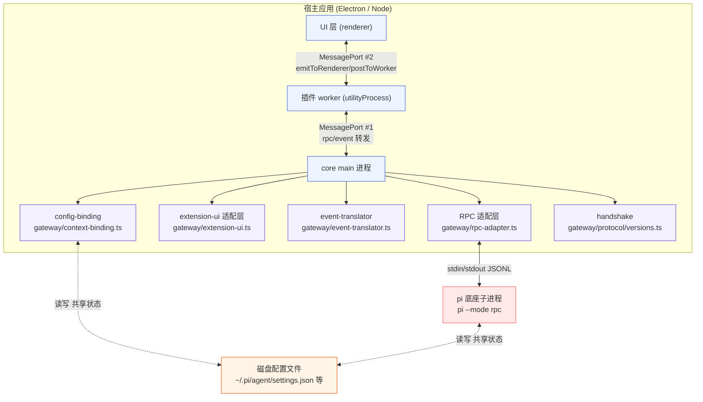

**图 1-1 — 集成全景图：八层动作（起进程 / session resume / 三类消息 / Extension UI / handshake / worker MessagePort / event 翻译 / config 绑定）**

八层动作对应本文第 2 到第 9 节：起 `pi --mode rpc` 子进程（§2）、session resume（§3）、三类消息与 id 配对（§4）、Extension UI 子协议双向配对（§5）、handshake 版本协商（§6）、worker↔main MessagePort（§7）、event-translator 中性翻译（§8）、config-binding 映射（§9）。第 10 节收已知缺口，第 11 节给端到端示例。

#### 1.2.2 八层动作的依赖次序

八层不是并列、有依赖次序。集成者要按顺序接入：

1. 起子进程 + stdio（§2）——没有进程，后面都无从谈起。
2. 三类消息分发 + id 配对（§4）——这是协议的地基，Extension UI 和 handshake 都建在其上。
3. session resume（§3）——能让会话跨重启续命，热加载才能落地。
4. Extension UI 双向配对（§5）——让底座 extension 能和用户交互。
5. handshake 降级（§6）——给协议漂移上保险，放在第 5 步是因为它要在"发任何业务命令前"介入。
6. worker MessagePort（§7）——把底座接进宿主的进程隔离架构。
7. event 翻译（§8）——把底座事件类型隔离在 gateway 层，圆心吃中性类型。
8. config 绑定（§9）——状态类型中性化、配置并发写协调。

这个次序不是强约束——比如 handshake 可以和 Extension UI 并行实现、event 翻译和 config 绑定也可以并行推进——但按这个顺序接最不容易踩坑。本文接下来按这个次序展开。

#### 1.2.3 集成者的三个心智模型

集成者在动手前、先建立三个心智模型：

**模型一：底座是被管理对象、不是库**。pi 底座是个独立进程、宿主通过 stdin/stdout JSONL 和它通信。宿主不 import 底座的**运行时/进程态代码**（session 管理、工具执行、extension 加载等）、不直接调底座内部方法——这些是底座子进程的内部事务、宿主通过 RPC 触发、通过 event 观察、但不接管实现。这里有一条要分清的边界："不 import 运行时"不等于"不复用纯类型/纯算法"。底座的 `FileSettingsStorage`（文件锁 + 字段合并、纯 TS、不持有进程态、不碰 stdio）可以由宿主 core 直接 import 复用、以保证锁路径与锁行为与底座完全一致（§9.3.2）——复用的是"纯工具类"、不是"运行时"，与"不 import 底座运行时"并不矛盾。区分判据很简单：被复用的类一旦离开底座进程能不能独立工作？能（纯算法、无进程依赖）→ 可复用；不能（依赖底座进程态、session 实例、stdio）→ 只能 RPC 触发、不能 import。这个心智模型守住、集成就不会走 现有方案的问题的老路（同进程 import SDK 运行时、被迫造进程池）。

**模型二：协议是契约、不是实现**。RPC 协议的 31 个命令和返回类型是宿主和底座的契约。宿主照契约发命令、底座照契约回响应和事件。契约之外的东西（底座内部怎么实现 prompt、怎么调度 extension）宿主不假设。底座升级时契约可能变（加命令、改字段）——所以要有 handshake 优雅降级（§6）和翻译层隔离（§8）。这个心智模型守住、协议漂移就不会让宿主崩。

**模型三：共享状态 + 重启消费者**。宿主和底座都读写同一份磁盘配置文件、这是共享状态。宿主改完配置、底座不会自动 watch 生效——要重启底座子进程让它重读（§3.3）。这是"共享状态 + 重启消费者"模式、是 RPC 架构下"管理 pi 自身"的真实形态——没有 RPC 命令能一步到位 reload、靠"改文件 + 重启进程"间接达成。这个心智模型守住、配置管理就不会卡在"为什么改了不生效"的困惑上。

这三个心智模型贯穿全文。集成者在每个决策点都可以回头看这三个模型、判断自己的实现是否守住了边界。

---

## 2 起子进程：pi --mode rpc

### 2.1 RpcClientOptions 全字段

#### 2.1.1 字段清单

底座提供了一个现成的 `RpcClient`（`packages/coding-agent/src/modes/rpc/rpc-client.ts`），它是 RPC 协议的参考实现。宿主应照着它写、而不是自己另起一套。`RpcClient` 构造函数接受一个 `RpcClientOptions`，这六个字段定义了起子进程时的全部可调项：

```typescript
// 直接摘自 packages/coding-agent/src/modes/rpc/rpc-client.ts
export interface RpcClientOptions {
  /** Path to the CLI entry point (default: searches for dist/cli.js) */
  cliPath?: string;
  /** Working directory for the agent */
  cwd?: string;
  /** Environment variables */
  env?: Record<string, string>;
  /** Provider to use */
  provider?: string;
  /** Model ID to use */
  model?: string;
  /** Additional CLI arguments */
  args?: string[];
}
```

| 字段 | 类型 | 默认 | 用途 | 集成者怎么用 |
|---|---|---|---|---|
| `cliPath` | string | `"dist/cli.js"` | 底座 CLI 入口路径，相对底座安装目录解析 | 打包时要定位到底座安装路径，不能硬编码（见 §2.1.4） |
| `cwd` | string | 无 | agent 的工作目录 | 必须跟随用户当前打开的项目目录——否则底座的 bash/文件工具/session 存储落错地方 |
| `env` | Record<string,string> | `process.env` 展开后的值 | 环境变量 | OAuth 凭证、API key、`HTTP_PROXY` 等往往走 env，别在 args 里明文塞 |
| `provider` | string | 无 | 启动时指定 provider（等价 `--provider`） | 用户从设置里选的 provider 走这里 |
| `model` | string | 无 | 启动时指定 model（等价 `--model`） | 用户从设置里选的 model 走这里 |
| `args` | string[] | 无 | 额外 CLI 参数 | session resume（§3）、`--no-session` 等都走这里 |

#### 2.1.2 cwd 的本分

`cwd` 是薄壳的本分。底座自己会处理工作目录相关的一切：bash 工具在 `cwd` 下执行、文件工具的相对路径解析在 `cwd` 下、session 存储的"项目级"维度是 `cwd`、项目信任的判定键是 `cwd`。宿主只要把 `cwd` 设对，其余不掺和。

常见错误：把 `cwd` 设成宿主自己的安装目录、或忘掉它用默认值——结果是底座在错误的项目里跑、session 存错地方、用户切项目时状态串了。集成者要确保：用户打开项目 A 时起底座子进程的 `cwd = 项目A的绝对路径`；用户切到项目 B 时要么切 `cwd`（如果支持 cwd 动态切换）要么重启子进程（pi-desktop 当前选重启，见 §3.3）。

#### 2.1.3 env 的拼合

`RpcClient.start()` 起进程时用的是 `env: { ...process.env, ...this.options.env }`——宿主进程的环境变量打底、`options.env` 覆盖。这意味着：

- 宿主不需要把 `PATH`/`HOME` 这些基础变量重新传一遍，它们会自动继承。
- OAuth 凭证（如 `ANTHROPIC_API_KEY`、`ANTHROPIC_AUTH_TOKEN`）和 provider 私有 token 应通过 `env` 传入，不要写进 `args`（args 会被进程列表看到、明文暴露）。
- 如果宿主要给底座设代理，走 `env`（`HTTP_PROXY`/`HTTPS_PROXY`/`NO_PROXY`）。

#### 2.1.4 cliPath 的定位

`cliPath` 默认 `"dist/cli.js"` 是相对底座安装目录解析的——意思是底座被 `npm install` 后，它的 `package.json` 的 `bin` 字段指向 `dist/cli.js`。但宿主集成时不能假设这个相对路径在宿主的工作目录下能解析到。`RpcClient.start()` 的实际 spawn 是 `spawn("node", [cliPath, ...args], { cwd, env, stdio })`——`cliPath` 是 `node` 的第一个参数，Node 会按 `cwd` 解析它。

集成者应维护一个"底座发现"逻辑，按优先级探测：

1. 用户在设置里手动配置的底座路径（最高优先级）。
2. 随宿主打包分发的底座（如 `resources/pi-cli/dist/cli.js`）。
3. 全局 `pi` 命令（`which pi` 解析到）。
4. fallback 到默认 `dist/cli.js`（让底座报错、用户能看到"找不到底座"的提示而不是无声失败）。

探测到路径后，要校验它确实是个能跑的底座——可以 spawn 一次 `node cliPath --version` 看退出码 0 和有版本输出。不要假设路径对——底座升级、宿主搬家都会让旧路径失效。


#### 2.1.5 认证接入：OAuth 与 API key

`env` 里塞 `ANTHROPIC_API_KEY` 只覆盖了"已经有凭证"这一种情况。真实集成里、首次 OAuth 登录、token 刷新、API key 录入是刚需——用户不会在命令行 export 凭证、要在宿主 UI 里完成认证。底座的凭证由 `auth-storage.ts` 管理、存 `~/.pi/agent/auth.json`（`DESIGN.md` §2.1.4）。集成者接入认证有三条路径、按场景选：

**路径一：经 RPC 触发底座 OAuth 流**。底座内部有完整的 OAuth 流程（打开浏览器授权、拿 code、换 token、存 auth.json）。这是首选——凭证的获取与刷新都由底座在子进程里完成、宿主不碰 token 明文。宿主只需发触发命令（或 prompt 一个 `/login` 斜杠命令）、底座自己起浏览器、完成后凭证落盘。当前 RPC 没有专门的 `auth_login` 命令（这是和 reload/list_sessions 同类的"底座有内部能力、RPC 没开口子"缺口、§10）、临时走 `/login` prompt 文本触发、或宿主直接 spawn 一个临时 `pi login` 进程完成认证。

**路径二：宿主直接读写凭证文件**。`auth.json` 是普通 JSON、宿主可以读写。但这违背"凭证由底座 auth-storage 管理"的边界——底座可能加密存储、可能改格式、宿主直读会脆。只在路径一不可用时用、且要复用底座的 `auth-storage` 读写逻辑（纯 TS 部分）、不要自己解析 auth.json 结构。

**路径三：纯 env 注入**。企业内网或 CI 场景、用户已有 API key、直接走 `env: { ANTHROPIC_API_KEY: ... }` 注入。最简单、但不支持 OAuth token 刷新、凭证过期要人工换。

三种路径的共同点：**改完凭证都要让底座生效**——底座在启动时读 auth.json、运行时不 watch。所以新凭证写入后、要重启子进程（§3.3）让新进程重读。宿主的"账号设置"页应在凭证变更后走重启 resume 流程、而不是假设底座会自动感知。

凭证安全：`auth.json` 建议底座加密存储（向底座提）。宿主 UI 显示账号状态时只显示"已登录/未登录/凭证过期"三态、不显示 token 明文。插件无权直接读凭证——`PluginContext` 不暴露凭证读接口、插件发 API 请求只能走 RPC（底座自动加 auth）或 `http.fetch`（受 `net:` 权限约束、§7.8.3）。

### 2.2 spawn 与 stdio 接管

#### 2.2.1 spawn 的标准姿势

`RpcClient.start()` 起进程的姿势是 RPC 客户端的标配，宿主照搬：

```typescript
// 直接摘自 rpc-client.ts，集成者照搬这个姿势
const childProcess = spawn("node", [cliPath, ...args], {
  cwd: this.options.cwd,
  env: { ...process.env, ...this.options.env },
  stdio: ["pipe", "pipe", "pipe"],
});
this.process = childProcess;
```

三个 stdio 都是 pipe：stdin 写命令、stdout 读响应和事件、stderr 收集调试日志。`stdio: ["pipe", "pipe", "pipe"]` 是关键——不能用 `"inherit"`（会污染宿主自己的 stdio）、不能用 `"ignore"`（拿不到协议数据）。

`args` 的构造顺序很重要：

```typescript
const args = ["--mode", "rpc"];             // 必须在最前
if (this.options.provider) args.push("--provider", this.options.provider);
if (this.options.model) args.push("--model", this.options.model);
if (this.options.args) args.push(...this.options.args);
```

`--mode rpc` 必须在最前——这是底座 `main.ts` 解析参数时最先看的字段，决定走 RPC 模式还是 TUI 模式。`provider`/`model`/`args` 的顺序不强制，但保持一致便于调试。

#### 2.2.2 stdout 是协议通道

底座 `rpc-mode.ts` 的入口 `runRpcMode()` 第一件事是 `takeOverStdout()`——接管 stdout，因为 RPC 要独占 stdout 吐 JSON Lines、不能让别的输出混进来污染协议。之后所有发给前端的东西都走 `writeRawStdout(serializeJsonLine(obj))`——裸写一行 JSON 加换行（`\n`）。

集成者要知道：底座的 stdout 是**协议通道**。底座进程里任何 `console.log` 都会被吞掉或转走（`takeOverStdout` 的实现），所以你从 stdout 读到的每一行都应该是合法 JSONL 帧。如果读到非法 JSON，说明底座有 bug——这种行 `RpcClient.handleLine` 是 `catch { /* 忽略非 JSON 行 */ }` 静默丢弃的，宿主可以照搬这个宽容策略、但应该记 warning 日志便于排查。

#### 2.2.3 JSONL 帧格式

底座用严格 JSONL 帧格式（`packages/coding-agent/src/modes/rpc/jsonl.ts`）：

```typescript
// 序列化：JSON.stringify 后加 LF
export function serializeJsonLine(value: unknown): string {
  return `${JSON.stringify(value)}\n`;
}

// 反序列化：按 LF 切分（故意不用 readline）
export function attachJsonlLineReader(stream: Readable, onLine: (line: string) => void): () => void {
  const decoder = new StringDecoder("utf8");
  let buffer = "";
  const emitLine = (line: string) => {
    onLine(line.endsWith("\r") ? line.slice(0, -1) : line);  // 剥 CR
  };
  const onData = (chunk: string | Buffer) => {
    buffer += typeof chunk === "string" ? chunk : decoder.write(chunk);
    while (true) {
      const i = buffer.indexOf("\n");
      if (i === -1) return;
      emitLine(buffer.slice(0, i));
      buffer = buffer.slice(i + 1);
    }
  };
  // ... onEnd 处理末尾无换行的尾巴
  stream.on("data", onData);
  stream.on("end", onEnd);
  return () => { stream.off("data", onData); stream.off("end", onEnd); };
}
```

两个要点集成者必须照搬：

- **按 LF（`\n`）切分**，**不用 Node readline**。readline 会按额外的 Unicode 分隔符（U+2028、U+2029）切分，而这些字符在 JSON 字符串里是合法的——对话内容里出现 U+2028 时会被 readline 错切成两帧、`JSON.parse` 失败。这是底座注释里明确警告的坑。
- **剥 CR**：每行末尾若是 `\r`（Windows 换行 CRLF），剥掉它，只留 LF 帧格式。

集成者要么直接复用底座这份 `jsonl.ts`（如果打包随宿主分发）、要么照着实现一份等价的 reader/writer。**绝不要用 readline**——这是个隐性的、难以复现的 bug 源（只有对话内容里恰好有 U+2028 才触发，测试很难覆盖）。

#### 2.2.4 stderr 收集

```typescript
childProcess.stderr?.on("data", (data) => {
  this.stderr += data.toString();
  process.stderr.write(data);  // 同时透传给宿主 stderr，便于本地调试
});
```

stderr 不参与协议，只用于调试。`RpcClient` 把 stderr 累积进 `this.stderr` 字符串、同时透传给宿主 stderr。这个累积的 `stderr` 在构造错误信息时会被拼进 message——`Agent process exited (code=X signal=Y). Stderr: ...`——便于排查"底座为什么挂了"。集成者要保留这个累积，进程退出时拼进错误抛给 UI。

### 2.3 进程生命周期

#### 2.3.1 就绪窗口

`RpcClient.start()` 起完进程后等 100ms 再检查 `exitCode`：

```typescript
await new Promise((resolve) => setTimeout(resolve, 100));
if (this.process.exitCode !== null) {
  const error = this.exitError ?? this.createProcessExitError(...);
  this.exitError = error;
  throw error;
}
```

这是个关键的"进程起来了但还没就绪"窗口。集成者**不能**假设 `spawn` 返回就能立刻发命令——底座要初始化 extension runtime、加载 settings、bind session，这些都需要时间。100ms 是经验值，大多数情况下够；但慢机器或冷启动可能不够。

集成者要处理的就绪窗口实现要点：

- spawn 返回后等一个短窗口（100ms 起步，可配置为 200-500ms 适应慢机器）。
- 检查 `process.exitCode !== null`——若已退出，把累积的 stderr 拼成错误抛出。
- **就绪后第一件事不是发业务命令，而是发 `handshake` 做能力探测**（§6）。注意：handshake 是宿主侧先行实现的探测命令、当前底座尚未原生支持——底座会回 `{ success: false, error: "Unknown command: handshake" }`、宿主捕获后走 legacy 降级（用硬编码命令快照）。也就是说"发 handshake"这一步当前必定走降级路径、但调用姿势要按"底座可能支持"来写，等底座补了 handshake 后自动切到 feature detection（详见 §6）。
- handshake 通过后才发 `get_state` + `get_entries` 同步 UI（§4）。

更稳健的做法是"事件驱动就绪"：底座其实没有显式的"ready"信号，但你可以监听 stdout 的第一行——如果第一行是个合法 JSON 对象（往往是 `session_start` event 或某个初始化事件），就认为就绪了。但底座不保证一定会推初始化事件，所以 100ms 等待 + handshake 探测的组合最可靠。

#### 2.3.2 spawn 失败的常见原因

集成者起子进程时、spawn 可能失败。常见原因和排查：

1. **cliPath 不存在**：`spawn` 会触发 `error` 事件、`ENOENT`。检查 cliPath 定位逻辑（§2.1.4）。
2. **node 不在 PATH 里**：`spawn("node", ...)` 找不到 node。在打包环境里、node 可能不在系统 PATH。解决：用 `process.execPath`（当前 Electron 进程的可执行文件）替代 `"node"`——`spawn(process.execPath, [cliPath, ...args], ...)`。这保证用宿主自带的二进制、不依赖系统 PATH。
3. **cwd 不存在**：用户打开的项目目录可能已删除。`spawn` 会 `error` 事件、`ENOENT`。检查 cwd 是否存在、不存在则提示用户。
4. **权限不足**：cliPath 不可执行、或 cwd 不可读。`error` 事件、`EACCES`。检查文件权限。
5. **底座初始化失败**：spawn 成功、但底座启动时崩了（比如 settings.json 损坏、extension 加载失败）。100ms 后 `exitCode !== null`、stderr 有错误信息。看 stderr 排查。

针对 node 路径的问题、推荐的 spawn 姿势是用 `process.execPath`：

```typescript
// 用宿主自带的二进制、不依赖系统 PATH
const childProcess = spawn(process.execPath, [cliPath, ...args], {
  cwd: this.options.cwd,
  env: { ...process.env, ...this.options.env },
  stdio: ["pipe", "pipe", "pipe"],
});
```

这在打包的 Electron 应用里特别重要——用户机器上可能没装 node、或装的 node 版本不对。用 `process.execPath` 保证用宿主自带的二进制（Electron 内置的运行时）。

> **Electron 宿主必须加 `ELECTRON_RUN_AS_NODE=1`**：上面说"`process.execPath` 是宿主自带的二进制"、但要注意——在 **Electron main 进程里、`process.execPath` 是 Electron 可执行文件本身、不是纯 node**。直接 spawn 它并传一个 `.js` 脚本（`[cliPath, ...]`）、Electron 会以 **app 主进程模式**启动：带 Chromium 运行时、可能出现 dock 图标、进程语义不是纯 node。而 pi 底座是个纯 Node CLI（`cli.js` 用 Node API、不假设 Chromium 环境）——在 Electron 模式下跑可能出现未定义行为或资源浪费。
>
> 标准处置是 spawn 时在 env 里加 `ELECTRON_RUN_AS_NODE: "1"`、让 Electron 二进制以**纯 node 模式**跑 `cli.js`：

```typescript
// Electron 宿主：让 Electron 二进制以纯 node 模式跑 cli.js
const isElectron = !!(process.versions as any).electron;
const childProcess = spawn(process.execPath, [cliPath, ...args], {
  cwd: this.options.cwd,
  env: {
    ...process.env,
    ...(isElectron ? { ELECTRON_RUN_AS_NODE: "1" } : {}),
    ...this.options.env,
  },
  stdio: ["pipe", "pipe", "pipe"],
});
```

非 Electron 宿主（纯 Node 壳）不需要这个 env——`process.execPath` 本身就是 node、加 `ELECTRON_RUN_AS_NODE` 无害但多余。**本文后续所有 spawn 示例（§3.3.1、§11.1.1）对 Electron 宿主都应套用这条 `ELECTRON_RUN_AS_NODE: "1"`**、不再重复整段说明。若宿主不愿依赖 Electron 二进制的 node 模式、可改为随宿主打包一个**独立 node 二进制**并用其路径替代 `process.execPath`——这样 spawn 出来的就是纯 node、无需该 env、也避免 Electron 主进程语义的副作用。

#### 2.3.3 进程事件全接住

进程生命周期事件（`exit`/`error`/stdin 报错）都要接住，任何一个都可能是"底座挂了"的信号。`RpcClient` 的处理方式：

```typescript
childProcess.once("exit", (code, signal) => {
  if (this.process !== childProcess) return;  // 防止旧引用误触
  if (this.stopping) { this.stopping = false; return; }  // 期望退出（stop/重启触发）→ 不设 exitError
  const error = this.createProcessExitError(code, signal);  // "Agent process exited..."
  this.exitError = error;
  this.rejectPendingRequests(error);  // 把所有 pending 的命令一次性 reject
});
childProcess.once("error", (error) => {
  if (this.process !== childProcess) return;
  if (this.stopping) return;  // 期望退出路径上的 error 不污染 exitError
  const processError = new Error(`Agent process error: ${error.message}. Stderr: ${this.stderr}`);
  this.exitError = processError;
  this.rejectPendingRequests(processError);
});
childProcess.stdin?.on("error", (error) => {
  if (this.process !== childProcess) return;
  if (this.stopping) return;
  const stdinError = this.exitError ?? new Error(`Agent process stdin error: ${error.message}. Stderr: ${this.stderr}`);
  this.exitError = stdinError;
  this.rejectPendingRequests(stdinError);
});
```

三个事件的处理路径几乎相同：构造错误 → 存进 `exitError` → `rejectPendingRequests(error)` 把所有 pending 一次性 reject。`exitError` 这个字段是关键——后续每个 `send` 调用前都要先检查它（§4.2），若已存在直接抛，避免向已死进程发命令。

**`stopping` 标志区分"期望退出"与"意外崩溃"（关键，否则热加载重启必失败）**：`stop()`（§2.3.4）和 `restartForConfigReload()`（§3.3.1）在 kill 旧进程**之前**先把 `this.stopping = true`。这样旧进程的 `exit` 事件触发时、exit handler 命中 `if (this.stopping) return` 提前返回、**不把 exitError 设成 "Agent exited..."**。如果漏掉这一步——旧进程退出时会照常 `this.exitError = error`、而此刻 `this.process` 还等于旧 `childProcess`（`stop` 的 `this.process = null` 在 `await` 之后才执行）、`if (this.process !== childProcess) return` 守卫放行——于是 exitError 被设上。随后 `start()` 起新进程、`handshake()` → `send()` → 首行 `if (this.exitError) throw this.exitError`（§4.2.3）→ 抛出**旧进程的残留错误**、每次热加载重启必定失败。`stopping` 标志从源头堵住这条路径。配套地、`start()` 开头要显式 `this.exitError = null`（§3.3.1）兜底任何残留——两层保险。

期望退出路径上、pending 请求不能靠 exit handler reject（被 `stopping` 短路了）、改由 `stop()` 自己显式 reject（见 §2.3.4）、避免调用方挂到 30s timeout。

集成者要据此通知 UI（"底座已断开"状态）、触发重连或提示用户。`exitError` 缓存是核心——exit 事件异步到达，但一旦到达就把错误固化，后续所有 send 都能立刻抛、不留挂起的 promise。但"期望退出"不该被当成错误固化——这正是 `stopping` 标志的职责。

#### 2.3.4 信号处理

底座 `rpc-mode.ts` 注册了 `SIGTERM`（和 `win32` 之外的 `SIGHUP`）处理器：

```typescript
const signals: NodeJS.Signals[] = ["SIGTERM"];
if (process.platform !== "win32") signals.push("SIGHUP");
for (const signal of signals) {
  const handler = () => {
    killTrackedDetachedChildren();           // 杀掉它派生的 detached 子进程
    void shutdown(signal === "SIGHUP" ? 129 : 143, signal);
  };
  process.on(signal, handler);
}
```

意思是底座会优雅退出：杀掉自己派生的 detached 子进程、cleanup 资源、flush stdout、`process.exit`。`SIGTERM` 用 143、`SIGHUP` 用 129 作为退出码。集成者正常停子进程发 `SIGTERM` 即可；异常无响应再升级到 `SIGKILL`（`RpcClient.stop()` 的姿势是先 SIGTERM、等 1000ms、再 SIGKILL 兜底）：

```typescript
async stop(): Promise<void> {
  if (!this.process) return;
  this.stopReadingStdout?.();
  this.stopping = true;  // 标记"期望退出"：旧进程的 exit handler 命中后不设 exitError（§2.3.3）
  this.process.kill("SIGTERM");
  await new Promise<void>((resolve) => {
    const timeout = setTimeout(() => {
      this.process?.kill("SIGKILL");  // 1s 内没退就强杀
      resolve();
    }, 1000);
    this.process?.on("exit", () => { clearTimeout(timeout); resolve(); });
  });
  this.process = null;
  this.stopping = false;
  // 期望退出路径上 exit handler 被 stopping 短路、不会 reject pending；
  // 这里显式 reject、避免调用方挂到 30s timeout。
  this.rejectPendingRequests(new Error("Agent process stopped"));
  this.pendingRequests.clear();
}
```

`this.stopping = true` 必须在 `kill("SIGTERM")` **之前**——否则 exit 事件可能先到、`stopping` 还是 false、exit handler 把 exitError 设上（就成了"意外崩溃"路径）。这是热加载重启不串旧错误的根本保证（§3.3.1 重启流程依赖它）。

### 2.4 stdin EOF 是关闭通道

#### 2.4.1 stdin 关闭触发 shutdown

底座 `rpc-mode.ts` 把 stdin 的 EOF 当作关闭信号：

```typescript
const onInputEnd = () => { void shutdown(); };
process.stdin.on("end", onInputEnd);
```

这意味着宿主只要**关掉 stdin 写端**，底座子进程就会自己退。这是个干净的关闭通道——比发信号更优雅（信号要靠 OS 投递、跨平台行为不一致；stdin EOF 是协议级的、确定的）。

集成者的关闭优先路径应该是：

1. 关闭 stdin 写端（`childProcess.stdin.end()`）。
2. 等 `exit` 事件（带一个超时，比如 1s）。
3. 超时兜底 `SIGTERM`。
4. 再超时 `SIGKILL`。

不要直接发 `SIGTERM`——如果底座正在 flush stdout，发信号会中断 flush、可能丢失最后几行响应。先关 stdin 让底座自己优雅 shutdown、flush 完再退，最干净。

#### 2.4.2 shutdown 的内部流程

底座 `shutdown` 函数的实现值得看一眼，理解"优雅退出"具体在做什么：

```typescript
// 直接摘自 rpc-mode.ts
async function shutdown(exitCode = 0, signal?: NodeJS.Signals): Promise<never> {
  if (shuttingDown) {
    process.exit(exitCode);       // 防止重入
  }
  shuttingDown = true;
  for (const cleanup of signalCleanupHandlers) {
    cleanup();                     // 注销信号处理器
  }
  unsubscribe?.();                 // 停止订阅 session event、不再往 stdout 推新 event
  unsubscribeBackpressure?.();
  await runtimeHost.dispose();    // dispose extension runtime、让 extension 做清理
  detachInput();                   // 停止读 stdin
  process.stdin.pause();
  if (signal !== "SIGTERM") {
    await flushRawStdout();        // 把 stdout buffer 里还没写完的刷出去
  }
  process.exit(exitCode);
}
```

几个要点集成者要知道：

- `unsubscribe?.()` 在 dispose 前——退出过程中底座不再往 stdout 推新 event、避免半截状态污染协议通道。但**已经 pending 的 response 会先 flush**（除非是 SIGTERM 强杀、跳过 flush）。
- `runtimeHost.dispose()` 让 extension 跑清理逻辑（extension 的 `deactivate` 钩子等）。这意味着关 stdin 后到进程真正退出之间有个窗口、extension 在跑清理——这个窗口可能几十毫秒到几百毫秒（取决于 extension 做什么）。所以宿主 stop 的 1s 等待是个合理上限、但不是绝对保证。
- SIGTERM 路径跳过 `flushRawStdout`——因为 SIGTERM 通常是异常路径、不想让 flush 阻塞退出。这也是宿主优先走 stdin EOF 而非 SIGTERM 的原因之一：stdin EOF 走的是 `shutdown(0)` 默认路径、会 flush、最后几行响应不丢。

#### 2.4.3 重启 vs 停止的区分

集成者要区分两个动作：

- **停止**：用户关闭宿主、底座子进程随之退出。走 stop 路径（关 stdin → SIGTERM → SIGKILL）。这是终态、不需要保留任何状态。
- **重启**：热加载场景下、杀掉旧进程、立刻起新进程。走 restart 路径（§3.3）——必须先 `get_state` 拿到 `sessionFile`、stop 后立刻 start 并传 `--session sessionFile`。两个动作之间不能有间隔太久——否则用户会看到"底座已断开"的 UI 闪烁。理想的重启是原子的：UI 上显示"正在重启底座"、用户不感知底座断开。

实现上、restart 应该在 stop 完成前就 spawn 新进程——但要保证新进程的 stdin/stdout 不和旧进程的混淆。一个稳妥的做法：先把旧进程的引用存起来、spawn 新进程、新进程就绪后再 kill 旧进程。但这样有短暂的"两个底座同时跑"的窗口、可能争抢文件锁。更简单的做法是顺序的：stop → start、接受 UI 闪烁几百毫秒。集成者按场景选。

---

## 3 session resume：让会话跨重启续命

### 3.1 三种 session 选择参数

#### 3.1.1 参数清单

底座 CLI（`main.ts`）支持几个 session 选择参数，集成者通过 `args` 传给子进程。以下参数均已对照底座源码核实（`packages/coding-agent/src/cli/args.ts:83-113` 的解析、`main.ts:203-338` 的校验与分发）：

- `--session <path>`：指定要打开的 session 文件路径（`args.ts:106`）。
- `--resume`（别名 `-r`）：恢复该 cwd 下最近的 session（`args.ts:85`，`main.ts:310` 分发）。
- `--continue`（别名 `-c`）：恢复**上一次进程**的 session、走 `SessionManager.continueRecent`（`args.ts:83`，`main.ts:327-328`）。跨进程续命语义，和 `--resume` 的区别是 `--resume` 在该 cwd 的全部历史里挑最近、`--continue` 偏向"接续上次运行"。
- `--session-id <id>`：按 id 选 session、不存在则创建（`args.ts:108`，`main.ts:331-338`）。
- `--no-session`：强制开新 session、不持久化（ephemeral，`args.ts:104`，`main.ts:259`）。
- `--session-dir <dir>`：指定 session 存储目录（`args.ts:112`，本指南不常用、列出以求全）。

> **跨文档对齐提示**：`DESIGN.md` §1.3.2（line 98）当前只列了 `--session`/`--resume`/`--session-id` 三个，未同步 `--continue`/`--no-session`/`--session-dir`——该节落后于底座源码，应回填补齐。本文以源码为准。

这几个参数的互斥规则在 `main.ts` 里硬编码——`validateForkFlags`（`main.ts:203`）和 `validateSessionIdFlags`（`main.ts:219`）检查冲突，两者都把 `--session`/`--continue`/`--resume`/`--no-session` 纳入互斥校验：

```typescript
// --session-id 不能和 --session/--continue/--resume/--no-session 混用
function validateSessionIdFlags(parsed: Args): void {
  if (parsed.sessionId === undefined) return;
  const conflictingFlags = [
    parsed.session ? "--session" : undefined,
    parsed.continue ? "--continue" : undefined,
    parsed.resume ? "--resume" : undefined,
    parsed.noSession ? "--no-session" : undefined,
  ].filter((f): f is string => f !== undefined);
  if (conflictingFlags.length > 0) {
    console.error(`Error: --session-id cannot be combined with ${conflictingFlags.join(", ")}`);
    process.exit(1);
  }
  // ... 还会校验 sessionId 格式合法
}
```

集成者传 args 时只能选一种。混用会导致底座 `process.exit(1)` 退出、宿主收到非零退出码。

#### 3.1.2 --session 的路径解析

`--session <path>` 的参数解析在 `resolveSessionPath`：

```typescript
// 如果像路径（含 / 或 \ 或结尾 .jsonl），直接 resolve
if (sessionArg.includes("/") || sessionArg.includes("\\") || sessionArg.endsWith(".jsonl")) {
  return { type: "path", path: resolvePath(sessionArg, cwd) };
}
// 否则当作 session ID 在当前项目里匹配
const localSessions = await SessionManager.list(cwd, sessionDir);
const localMatch = localSessions.find((s) => s.id === sessionArg);
// ...
```

意思是 `--session` 既接受文件路径、也接受 session id（如果 id 不像路径就在 cwd 的 sessions 里找）。集成者最稳妥的用法是传**完整的文件路径**——从 `get_state` 的 `sessionFile` 字段拿、原样传回去，路径解析这一步就跳过了。

### 3.2 从 get_state 拿 sessionFile

#### 3.2.1 sessionFile 是闭环的关键参数

`get_state` 响应里的 `sessionFile` 字段是热加载闭环的关键参数。`RpcSessionState` 的定义（`rpc-types.ts`）：

```typescript
export interface RpcSessionState {
  model?: Model<any>;
  thinkingLevel: ThinkingLevel;
  isStreaming: boolean;
  isCompacting: boolean;
  steeringMode: "all" | "one-at-a-time";
  followUpMode: "all" | "one-at-a-time";
  sessionFile?: string;       // ← 这个就是当前 session 文件路径
  sessionId: string;
  sessionName?: string;
  autoCompactionEnabled: boolean;
  messageCount: number;
  pendingMessageCount: number;
}
```

集成者连接底座后第一件事是 `get_state`、拿到 `sessionFile` 存起来。重启子进程时把它通过 `args: ["--session", sessionFile]` 传给新进程——新进程起来就打开那个 session 文件、历史消息和分叉树都在、用户几乎无感。

**sessionFile 为 undefined 时的处置**：`sessionFile` 是可选字段、底座可能返回 `undefined`——典型场景是底座尚未把 session 落盘（刚开新 session 还没写第一条 entry）、或底座版本不持久化 session。这时重启**不能**盲目 `args.push("--session", sessionFile)`——推一个 `undefined` 进去、底座 `resolveSessionPath` 会拿到字符串 `"undefined"`、要么找不到文件 `process.exit(1)`、要么开一个名为 `undefined` 的诡异 session。正确处置：

- 重启前检查 `if (sessionFile)`——为真才传 `--session`、为假则不传任何 session 参数、让底座走默认行为（resume 最近 session 或新建）。
- 在 UI 上提示用户"当前会话未持久化、重启后无法跨重启恢复历史"——避免用户以为会话会续命结果丢了。
- 把 `sessionFile === undefined` 当成"无 session 可 resume"的信号、而不是错误——底座照常工作、只是这一段历史不持久。

#### 3.2.2 没传 session 参数时的默认行为

不传任何 session 参数时，底座按默认行为：该 cwd 下最近的 session 或新建。这个默认行为对"用户首次打开项目"是合理的（开新 session），但对"重启子进程热加载"是错的——重启时如果不传 `--session`，底座会开新 session、丢失当前会话上下文。

集成者要明确区分两种场景：

- **首次进入项目**：不传 session 参数，让底座按默认行为（resume 最近 session 或新建）。
- **重启子进程热加载**：必传 `args: ["--session", currentSessionFile]`，确保 resume 同一个 session。

### 3.3 重启 resume 的完整示例

#### 3.3.1 完整代码

```typescript
class PiRpcClient {
  private process: ChildProcess | null = null;
  private sessionFile: string | undefined;  // 从 get_state 拿到，重启时复用
  private options: RpcClientOptions;

  async start(resumeSessionFile?: string): Promise<void> {
    const args = ["--mode", "rpc"];
    if (this.options.provider) args.push("--provider", this.options.provider);
    if (this.options.model) args.push("--model", this.options.model);
    // 热加载重启时传 session 文件路径，让新进程 resume 同一会话
    if (resumeSessionFile) {
      args.push("--session", resumeSessionFile);
    }
    if (this.options.args) args.push(...this.options.args);

    // 用宿主自带的 node（process.execPath）而非 "node"，避免打包环境系统 PATH 里无 node（理由见 §2.3.2）
    this.process = spawn(process.execPath, [this.options.cliPath ?? "dist/cli.js", ...args], {
      cwd: this.options.cwd,
      env: { ...process.env, ...this.options.env },
      stdio: ["pipe", "pipe", "pipe"],
    });
    // ... 接 exit/error/stdin 事件、接 stdout JSONL reader（见 §2）
    await new Promise((r) => setTimeout(r, 100));
    if (this.process.exitCode !== null) throw this.exitError ?? new Error("process exited");

    // 就绪后：handshake → get_state 缓存 sessionFile → get_entries 同步 UI
    // handshake 当前底座尚未支持、会回 Unknown command、走 legacy 降级（§6）
    await this.handshake();                          // §6
    const state = await this.getState();             // §4
    this.sessionFile = state.sessionFile;             // 缓存，热加载重启时用
    const entries = await this.getEntries();         // 同步时间线
  }

  /** 热加载重启：杀旧进程、用同一 sessionFile 起新进程 */
  async restartForConfigReload(): Promise<void> {
    const resumeFile = this.sessionFile;
    await this.stop();                                 // §2.3.4 优雅关停
    await this.start(resumeFile);                      // 用同一 sessionFile 重起
  }
}
```

#### 3.3.2 重启瞬间的代价

重启瞬间的运行态会中断：正在流式输出的 agent 会被打断、排队的消息（pending messages，是底座进程的内存队列、还没落进 session 文件）会丢。但 session 本身持久化在磁盘上——已完成的历史和分叉树都在、新进程 resume 后能继续。

对于"改配置"这种低频操作，这个代价可以接受。集成者要让重启"带判断"——见 `DESIGN.md` §2.4 的决策树：先 `get_state` 查 `isStreaming`、streaming 中弹提示让用户决定打断还是等 `agent_settled`、idle 直接重启。无脑重启会丢用户的工作中状态、是糟糕体验。

#### 3.3.3 带判断的重启决策状态机

把"带判断的重启"画成状态机、集成者照着实现：

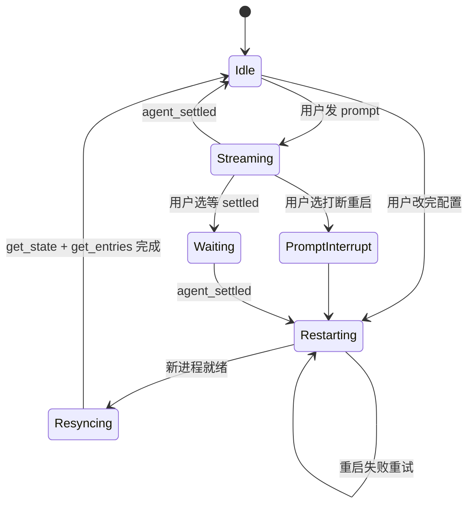

**图 3-1 — 重启决策状态机：streaming 时等 settled 或用户确认打断、idle 直接重启**

实现要点：

- **Idle 状态直接重启**：用户改完配置、`get_state` 返回 `isStreaming: false`、直接走重启路径、用户几乎无感（重启 100-500ms）。
- **Streaming 状态弹提示**：`isStreaming: true` 时弹"当前 agent 正在工作、改动需要重启底座生效、是否打断"的确认框。用户选"打断"→ 走重启；用户选"等"→ 攒着改动、监听 `agent_settled`、settled 后自动走重启。
- **Waiting 状态的兜底**：用户选"等 settled"后、可能 agent 迟迟不 settle（比如 agent 卡住了）。要有超时兜底——比如等 60s 还没 settled、再次提示用户"是否强制打断"。
- **Resyncing 状态**：新进程就绪后、第一件事是 `handshake`（§6）、然后 `get_state` + `get_entries` + `get_commands` 同步 UI。这个状态期间 UI 应显示"正在同步"。
- **重启失败重试**：新进程 spawn 失败（cliPath 错、权限不足）要有重试机制——但重试不能无限、最多 3 次、失败后提示用户"底座启动失败、请检查底座路径"。

#### 3.3.4 攒改动的实现

用户在 streaming 时改多个配置、都选"等 settled"、这些改动要攒起来、settled 后一次性写盘 + 重启：

```typescript
class ConfigChangeQueue {
  private pendingChanges: Array<() => Promise<void>> = [];
  private willRestart = false;

  enqueue(change: () => Promise<void>): void {
    this.pendingChanges.push(change);
    this.willRestart = true;
  }

  /** agent_settled 后调 */
  async flush(): Promise<void> {
    if (!this.willRestart) return;
    for (const change of this.pendingChanges) {
      await change();  // 每个改动自己处理文件锁
    }
    this.pendingChanges = [];
    this.willRestart = false;
    await rpcClient.restartForConfigReload();
  }
}

// event 订阅
rpcClient.onEvent((e) => {
  if (e.type === "agent_settled") {
    configChangeQueue.flush();
  }
});
```

关键：攒的是"改动函数"（闭包）、不是改动值——因为改动执行时要读磁盘当前值做合并、不能在用户点"等"时就预先算好合并结果（那时磁盘值可能还没被底座改）。每个闭包在 flush 时才真正读盘-改-写。

### 3.4 session resume 的边界场景

#### 3.4.1 session 文件被外部删除

用户在文件管理器里删了 `~/.pi/agent/sessions/xxx.jsonl`——这时重启子进程传 `--session` 指向不存在的文件、底座会怎么处理？看 `main.ts` 的 `openSessionOrExit`：

```typescript
function openSessionOrExit(path: string, sessionDir?: string): SessionManager {
  try {
    return SessionManager.open(path, sessionDir);
  } catch (error: unknown) {
    console.error(chalk.red(`Error: ${error instanceof Error ? error.message : String(error)}`));
    process.exit(1);  // 直接退出
  }
}
```

底座直接 `process.exit(1)`——宿主的子进程会非零退出。集成者要捕获这个场景：

- spawn 后等 100ms 就绪窗口、检查 `exitCode !== null`、若非零、stderr 里会有 "Error: ..." 的信息。
- 这种情况下不能无限重试（重试也是同样结果、文件不存在）。要提示用户"session 文件不存在、是否新建 session"。
- 用户确认新建后、不传 `--session` 重起、底座开新 session。

#### 3.4.2 session 文件被其他进程占用

session 文件被另一个 pi 进程占用（比如用户同时在终端开了 `pi` TUI 在同一个项目）。底座 `SessionManager.open` 可能因为文件锁失败、或读取到不一致状态。集成者要：

- 检测到 spawn 失败、stderr 提示锁冲突时、提示用户"另一个 pi 进程正在使用该 session、请先关闭它"。
- 不要强制清锁——可能真的有进程在写、清锁会导致两个进程同时写一个文件、撕裂。

#### 3.4.3 session 文件版本不兼容

底座升级后、session 文件格式可能变化（新增字段、改结构）。底座自己有 migration 机制（`migrations.ts`）会自动迁移旧格式。但极端情况下、如果底座大版本跳跃、旧 session 文件可能完全读不了。集成者要：

- 捕获 spawn 后的非零退出、stderr 里若有"migration failed"或"incompatible session format"字样、提示用户"session 文件版本不兼容、是否新建 session"。
- 不要自己尝试解析或修复 session 文件——那是底座内部事务。

---

## 4 三类消息：command / response / event

### 4.1 消息区分

#### 4.1.1 三类消息定义

RPC 协议有三类消息，全部定义在 `rpc-types.ts`。三类共用同一条 stdout，靠 `type` 字段区分。

**第一类：command**——从 stdin 发给底座，每条带一个可选的 `id` 做关联。形如：

```typescript
{ id?: string, type: "prompt", message: string, images?: ImageContent[], streamingBehavior?: "steer" | "followUp" }
```

`id` 可选——带了就和 response 配对、不带就是 fire-and-forget 命令（底座照执行，但不回带 id 的 response）。`RpcCommand` 联合类型共 31 个 type（§4.5 详列），每个 type 有自己的字段。

**第二类：response**——从 stdout 回，`type: "response"`，带 `command`（回的是哪个命令的 type）、`success`、可选的 `data` 或 `error`：

```typescript
// 成功形态
{ id?: string, type: "response", command: "get_state", success: true, data: RpcSessionState }
// 错误形态（任何命令失败都走这个泛型）
{ id?: string, type: "response", command: string, success: false, error: string }
```

**第三类：event**——从 stdout 推，是底座 agent 运行时的事件流（`AgentSessionEvent`），**没有 id**、fire-and-forget。形如：

```typescript
{ type: "message_update", message: AgentMessage, assistantMessageEvent: ... }
{ type: "tool_execution_start", toolCallId: "...", toolName: "...", args: {...} }
{ type: "agent_settled" }
```

#### 4.1.2 区分逻辑

`RpcClient.handleLine` 就是这套区分的实现：

```typescript
private handleLine(line: string): void {
  try {
    const data = JSON.parse(line);
    // 注意：完整分发应先判 extension_ui_request（见 §5.1.2/§5.4），
    // 它有自己的 UUID id 配对、不走 command pending。此处仅示 command/event 配对。
    // response 且有 id 且在 pending 里 → 配对 resolve
    if (data.type === "response" && data.id && this.pendingRequests.has(data.id)) {
      const pending = this.pendingRequests.get(data.id)!;
      this.pendingRequests.delete(data.id);
      pending.resolve(data as RpcResponse);
      return;
    }
    // 否则当 event 转发给所有订阅者
    for (const listener of this.eventListeners) {
      listener(data as AgentSessionEvent);
    }
  } catch {
    // 忽略非 JSON 行
  }
}
```

三个条件全满足才配对：`data.type === "response" && data.id && pendingRequests.has(data.id)`。如果某个 response 的 id 不在 pending 里（比如超时已清掉、或重复 response），它会被当 event 转发——这是个边界情况，集成者的 event 订阅者要能容忍收到 `type: "response"` 的杂项（一般忽略）。

上面这段只覆盖 command-response 配对。完整的 `handleLine` 分发顺序应是：**先判 `extension_ui_request`**（底座→宿主的 UI 请求、用 UUID id、走 Extension UI 适配层，§5.1.2/§5.4）→ **再判 `response`**（command 配对）→ **否则当 event** 转发。三个分支不能混——Extension UI request 的 `type` 是 `extension_ui_request` 不是 `response`，不会误进 command 配对分支，但要先于 event 分支拦截、否则会被当杂项 event 转给订阅者。

#### 4.1.3 时序图

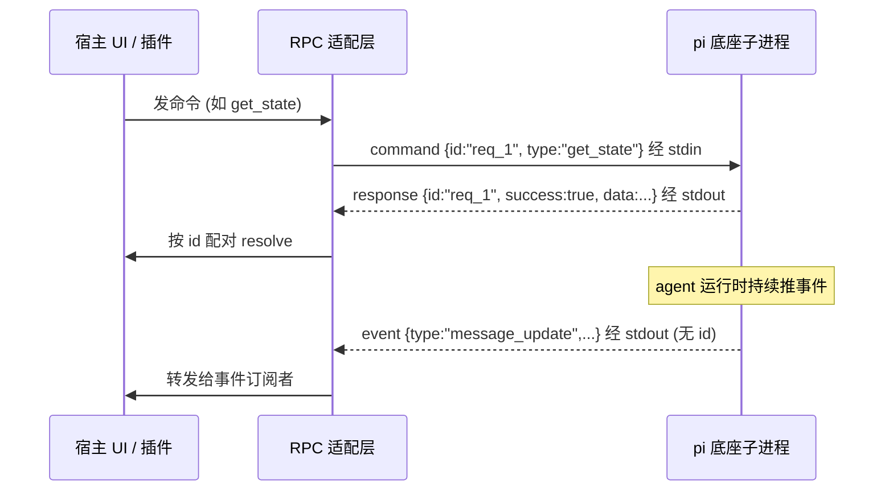

**图 4-1 — 三类消息时序：command 带 id 配对 response，event 无 id 直接转发**

### 4.2 id 配对机制

#### 4.2.1 配对原语

桌面端发命令时分配递增的 `id`（如 `req_1`、`req_2`），写进 pending Map；底座的 response 带回同一个 id，按 id 取出 pending 的 resolve/reject。这套机制让"一个命令对应一个响应"的同步语义建立在异步的 stdin/stdout 通道上。

`RpcClient.send` 是发命令的内部方法，它做的事：

```typescript
private async send(command: RpcCommandBody): Promise<RpcResponse> {
  const childProcess = this.process;
  const stdin = childProcess?.stdin;
  // 前置检查（关键！）
  if (!childProcess || !stdin) throw new Error("Client not started");
  if (this.exitError) throw this.exitError;                              // 进程已死
  if (childProcess.exitCode !== null) { /* 构造 exit error 抛 */ }       // 进程刚退
  if (stdin.destroyed || !stdin.writable) { /* 构造 stdin error 抛 */ }  // stdin 不可写

  const id = `req_${++this.requestId}`;
  const fullCommand = { ...command, id } as RpcCommand;

  return new Promise((resolve, reject) => {
    // 30s 超时兜底
    const timeout = setTimeout(() => {
      this.pendingRequests.delete(id);
      reject(new Error(`Timeout waiting for response to ${command.type}. Stderr: ${this.stderr}`));
    }, 30000);

    this.pendingRequests.set(id, {
      resolve: (response) => { clearTimeout(timeout); resolve(response); },
      reject: (error) => { clearTimeout(timeout); reject(error); },
    });

    try {
      stdin.write(serializeJsonLine(fullCommand));  // 写一行 JSONL
    } catch (error: unknown) {
      const pending = this.pendingRequests.get(id);
      this.pendingRequests.delete(id);
      pending?.reject(error instanceof Error ? error : new Error(String(error)));
    }
  });
}
```

#### 4.2.2 timeout 兜底

每个 pending 都挂了 30s 超时。30s 是保守值——`get_state` 这种快命令几十毫秒就回、`bash` 执行长命令可能要几分钟。集成者可针对不同命令调整 timeout：

- `get_state`/`get_entries`/`get_available_models` 等纯查询：5-10s 足够。
- `prompt`/`steer`/`follow_up`：这些是异步命令、response 在预检通过后立即发，30s 够（但 agent 实际输出靠 event、不在这个 response 里）。
- `bash`：执行用户命令，可能很久，建议 120s 或不设 timeout（命令自己的 timeout 在底座 bash-executor 里管）。
- `compact`：压缩要调 LLM，可能 30-60s。

底座进程退出时 `rejectPendingRequests(error)` 把所有 pending 一次性 reject，避免遗留 promise：

```typescript
private rejectPendingRequests(error: Error): void {
  for (const pending of this.pendingRequests.values()) {
    pending.reject(error);
  }
  this.pendingRequests.clear();
}
```

#### 4.2.3 send 前置检查的必要性

`send` 那一串前置检查不是冗余——它们保证：进程死了之后调用方立刻拿到错误，而不是命令永远挂 pending。`exitError` 缓存是关键——exit 事件异步到达，但一旦到达就把错误固化，后续所有 send 都能立刻抛。

不做这些检查的后果：底座进程已死、但调用方还不知道，发命令写 stdin 失败（EPIPE）、promise 永远不 resolve 也不 reject（除非有 timeout）、调用方 `await` 永远卡住。集成者必须照搬这串检查。

### 4.3 event 订阅模型

#### 4.3.1 发布-订阅

event 没有 id、是单向推送。RPC 适配层维护一个事件订阅者列表（`eventListeners`），每收到一个 event 就遍历转发给所有订阅者：

```typescript
private eventListeners: RpcEventListener[] = [];

onEvent(listener: RpcEventListener): () => void {
  this.eventListeners.push(listener);
  return () => {
    const index = this.eventListeners.indexOf(listener);
    if (index !== -1) this.eventListeners.splice(index, 1);
  };
}
```

宿主（含插件）通过 `onEvent(listener)` 订阅、拿返回的取消订阅函数退订。这是发布-订阅模型，事件流是宿主的全局观察窗口——时间线渲染、状态栏、工具卡片都靠它。

#### 4.3.2 event 边界：哪些收得到、哪些收不到

要厘清一个边界，避免集成者踩坑。RPC event 流（`session.subscribe` 转发出来的 `AgentSessionEvent`）覆盖 agent 运行时的全部状态变化。但底座还有一套**扩展事件**（`ExtensionEvent`，定义在 `extensions/types.ts`），那是给**底座 extension**用的（extension 的 `pi.on("tool_call")`/`pi.on("user_bash")` 等），**不在 RPC event 流里**。宿主通过 `onEvent` 收的是 `AgentSessionEvent`，收不到 `ExtensionEvent`。

两者的关系：底座 extension 订阅 `ExtensionEvent` 做行为拦截（比如 extension 拦截 tool_call 改参数），它的处理结果会反映到 `AgentSessionEvent` 里（比如被改了参数的工具调用，宿主在 `tool_execution_start` event 里看到的 args 就是改后的）。所以宿主看到的 event 流是"底座 extension 处理过之后"的状态——宿主不参与底座 extension 的行为拦截，只观察结果。

#### 4.3.3 关键 event 类型速览

集成者最常订阅的 event（完整列表见 `DESIGN.md` §1.6）：

- **Agent 生命周期**：`agent_start`/`agent_end`/`agent_settled`。`agent_settled` 是判断"一轮真的结束了"的标志——热加载重启用它判断能否安全重启、UI 用它判断"agent 工作中"状态何时清。
- **Turn 与消息**：`turn_start`/`turn_end`、`message_start`/`message_update`/`message_end`、`entry_appended`。时间线渲染靠这套。
- **工具执行**：`tool_execution_start`/`tool_execution_update`/`tool_execution_end`。工具卡片渲染靠这套。
- **Session 与模型**：`session_start`（带 reason: startup/reload/new/resume/fork）、`session_info_changed`、`model_select`（带 source: set/cycle/restore）、`thinking_level_changed`。
- **队列与压缩**：`queue_update`、`compaction_start`/`compaction_end`、`auto_retry_start`/`auto_retry_end`。

### 4.4 event 流的典型消费模式

#### 4.4.1 时间线渲染的 event 消费

时间线渲染插件（基础时间线插件）是 event 流的最大消费者。它的 event 消费模式：

- `entry_appended`：收到就往时间线末尾 append 一条、不用重新 `get_entries` 全量拉。这是增量更新的依据。
- `message_start`/`message_update`/`message_end`：渲染 user/assistant 气泡。`message_update` 是流式的、token 级更新——UI 要做增量渲染（追加文本、不是整个气泡重画）。
- `tool_execution_start`/`tool_execution_update`/`tool_execution_end`：渲染工具卡片。start 时创建卡片、update 时追加流式输出、end 时填最终结果、isError 时标红。
- `agent_settled`：一轮结束、刷新状态栏（重新 `get_state`）、UI 置 idle。

```typescript
// 时间线插件的 event 消费（伪代码）
rpcClient.onEvent((e) => {
  switch (e.type) {
    case "entry_appended":
      timeline.append(e.entry);           // 增量追加、不重新拉
      break;
    case "message_start":
      timeline.startMessage(e.message);  // 创建消息气泡
      break;
    case "message_update":
      timeline.updateMessage(e.message); // 流式追加文本
      break;
    case "message_end":
      timeline.endMessage(e.message);    // 消息结束
      break;
    case "tool_execution_start":
      timeline.startToolCard(e.toolCallId, e.toolName, e.args);
      break;
    case "tool_execution_update":
      timeline.updateToolCard(e.toolCallId, e.partialResult);
      break;
    case "tool_execution_end":
      timeline.endToolCard(e.toolCallId, e.result, e.isError);
      break;
    case "agent_settled":
      refreshStateBar();                  // 重新 get_state
      setUiIdle();
      break;
  }
});
```

#### 4.4.2 断线重连的增量补齐

底座子进程重启后（§3.3）、新进程 resume 同一 session、已完成的 entry 都在。但重启期间、UI 上显示的 entry 列表可能不是最新的（重启瞬间的 pending entry 丢了）。重连后要补齐：

- 新进程就绪 → `get_entries`（不带 `since`、全量拉）覆盖 UI 上的 entry 列表。
- 之后靠 `entry_appended` event 增量。
- 如果 UI 上已经显示了大量 entry、全量拉可能慢——可以用 `since: lastKnownEntryId` 拉增量、但 `since` 指向的 entry 必须在新进程的 session 里存在（否则报 "Entry not found"）。重启 resume 后、已完成的 entry 都保留、`since` 一般能用；但如果 `since` 指向的是重启瞬间丢失的 pending entry、就会 not found。稳妥的做法是全量拉。

```typescript
async function resyncTimeline(): Promise<void> {
  // 重启后全量拉、覆盖 UI
  const { entries, leafId } = await rpcClient.getEntries();
  timeline.replaceAll(entries);          // 全量替换
  timeline.setLeafId(leafId);             // 高亮当前叶子
}
```

#### 4.4.3 状态栏的 event 驱动同步

状态栏（模型名、thinking level、isStreaming 指示器、排队消息数）的同步策略：

- `model_select` event：模型切换、更新状态栏的模型名。**不要在 `set_model` 命令的 success 响应里更新**——响应回来时底座可能还在切换中、`model_select` event 才是"切换完成"的权威信号。
- `thinking_level_changed` event：思考级别变。
- `queue_update` event：排队消息数变。
- `agent_start`/`agent_settled`：isStreaming 状态变（start → true、settled → false）。
- `session_info_changed` event：session 名变。
- 每次 `agent_settled` 后、主动 `get_state` 刷新——event 流可能漏（比如重启期间错过的事件）、`get_state` 是兜底的真相同步。

```typescript
rpcClient.onEvent(async (e) => {
  switch (e.type) {
    case "model_select":
      stateBar.setModel(e.model);
      break;
    case "thinking_level_changed":
      stateBar.setThinkingLevel(e.level);
      break;
    case "queue_update":
      stateBar.setPendingCount(e.count);
      break;
    case "agent_start":
      stateBar.setStreaming(true);
      break;
    case "agent_settled":
      stateBar.setStreaming(false);
      const state = await rpcClient.getState();  // 兜底同步全状态
      stateBar.syncFromState(state);
      break;
  }
});
```

### 4.5 命令集速览

#### 4.5.1 31 命令按职责分组

`RpcCommand` 联合类型共 31 个 type 字面量（按职责分 11 组）。集成者不用全记，但要知道每组解决什么：

| 组 | 命令 | 解决什么 |
|---|---|---|
| Prompting | prompt / steer / follow_up / abort / new_session | 发消息、排队、中止、开新 session |
| State | get_state | 拿当前状态快照 |
| Model | set_model / cycle_model / get_available_models | 切模型 |
| Thinking | set_thinking_level / cycle_thinking_level | 调思考级别 |
| Queue modes | set_steering_mode / set_follow_up_mode | 队列模式 |
| Compaction | compact / set_auto_compaction | 上下文压缩 |
| Retry | set_auto_retry / abort_retry | 自动重试 |
| Bash | bash / abort_bash | 用户发起的 bash |
| Session | get_session_stats / export_html / switch_session / fork / clone / get_fork_messages / get_entries / get_tree / get_last_assistant_text / set_session_name | 会话管理 |
| Messages | get_messages | 拿 LLM 视角的消息流 |
| Commands | get_commands | 拿可用斜杠命令 |

注意：这里**没有**任何"管理 pi 自身"的命令——没有 list/enable/disable extension、没有读 settings、没有 reload config。这是有意为之的边界：RPC 只管会话运行时控制，"管理 pi 自身"走配置文件 + 重启子进程（§3、§10）。

#### 4.5.2 核心命令调用契约

集成者最常用的几个命令，补全调用契约：

**prompt**：

- 发送：`{ type: "prompt", message: string, images?: ImageContent[], streamingBehavior?: "steer" | "followUp", id }`
- 响应（成功）：`{ type: "response", command: "prompt", success: true }`（无 data，预检通过后发）
- 响应（失败）：`{ ..., success: false, error: string }`（预检失败）
- 错误场景：agent streaming 且没带 `streamingBehavior` → error "Agent is already processing. Specify streamingBehavior"
- 用法：发前先 `get_state` 查 `isStreaming`；idle 直接发、streaming 带 `streamingBehavior`。**success 响应回来才清空输入框**——发送动作本身不能驱动 UI 状态变化。

**get_state**：

- 发送：`{ type: "get_state", id }`
- 响应：`{ ..., success: true, data: RpcSessionState }`
- 用法：连接底座后第一件事；每次 `agent_settled` 后刷新状态栏；热加载重启后重新拉。

**get_entries**：

- 发送：`{ type: "get_entries", since?: string, id }`（`since` 是某 entry id，只返回它之后的）
- 响应：`{ ..., success: true, data: { entries: SessionEntry[], leafId: string | null } }`
- 错误场景：`since` 指向不存在的 entry → error "Entry not found: {since}"
- 用法：首次全量（不带 `since`）；之后靠 `entry_appended` event 增量、或断线重连时用 `since: lastKnownEntryId` 拉增量补齐。

**set_model**：

- 发送：`{ type: "set_model", provider: string, modelId: string, id }`
- 响应：`{ ..., success: true, data: Model }`（切到的模型）
- 失败：`{ ..., success: false, error: "Model not found: {provider}/{modelId}" }`
- 用法：下拉项来自 `get_available_models`；用户选后发 `set_model`，**别乐观更新 UI，等 `model_select` event（source: "set"）回来再确认**。

**bash**：

- 发送：`{ type: "bash", command: string, excludeFromContext?: boolean, id }`
- 响应：`{ ..., success: true, data: BashResult }`（含 stdout/stderr/exitCode）
- 错误场景：命令执行失败不是 RPC 错误（`success: true`、`exitCode` 非 0）；只有"子进程崩了""命令超时"才 `success: false`
- `excludeFromContext`：`!` 前缀（进上下文）`false/省略`、`!!` 前缀（不进）`true`。注意这个是"用户发起的 bash"，和 agent 自己调 bash 工具是两回事——agent 的走 `tool_execution_*` event。

#### 4.5.3 prompt 的预检机制详解

`prompt` 是集成者最常用的命令、但它的响应机制有个反直觉的细节要讲透。看底座 `rpc-mode.ts` 的实现：

```typescript
case "prompt": {
  // Start prompt handling immediately, but emit the authoritative response only after
  // prompt preflight succeeds. Queued and immediately handled prompts also count as success.
  let preflightSucceeded = false;
  void session.prompt(command.message, {
    images: command.images,
    streamingBehavior: command.streamingBehavior,
    source: "rpc",
    preflightResult: (didSucceed) => {
      if (didSucceed) {
        preflightSucceeded = true;
        output(success(id, "prompt"));   // 预检通过才发 success
      }
    },
  }).catch((e) => {
    if (!preflightSucceeded) output(error(id, "prompt", e.message));  // 预检失败才发 error
  });
  return undefined;  // 不立即 output（区别于其他命令）
}
```

几个关键点：

- **`return undefined`**：`handleCommand` 对其他命令返回 response、由外层 `output(response)` 发出。但 prompt 返回 `undefined`——意思是"不立即响应、由预检回调异步响应"。这是 prompt 和其他命令的根本区别。
- **预检（preflight）是什么**：底座收到 prompt 后、在真正开始处理前会跑一道预检——检查 message 是否为空、agent 是否 streaming 且没带 streamingBehavior 等。预检通过才进入真正的 prompt 处理流程、并异步发 success 响应。
- **success 响应的语义**：success 表示"prompt 已被接受进入处理流程"、**不**表示"agent 已经回复了"。agent 的实际输出靠订阅 `message_*` event 流拿、结束靠 `agent_settled`。集成者不能在 success 响应后就把 UI 置"agent 已完成"态——那是 `agent_settled` event 的事。
- **streamingBehavior 的语义**：idle 时 prompt 不需要带 streamingBehavior（直接处理）；streaming 时**必须**带、否则预检失败。带 `"followUp"` 表示"这条消息追加到队尾、等当前流式结束再处理"；带 `"steer"` 表示"这条消息要转向 agent 的当前方向"。

集成者的 UI 状态机应该是：

```
输入框空 → 用户输入 → [get_state 查 isStreaming]
                       ├ idle → 发 prompt(无 streamingBehavior) → 等 success → 清输入框、置"工作中"
                       └ streaming → 发 prompt(streamingBehavior: followUp) → 等 success → 清输入框、置"排队中"
工作中 → 收 message_* event → 渲染流式输出
工作中 → 收 agent_settled → 置"idle"、刷新 get_state
```

#### 4.5.4 abort 与 new_session 的 cancelled 字段

两个命令的响应里有 `cancelled` 字段、集成者必须处理：

- **abort**：中止当前操作、走 `session.abort()`。响应是 `{ success: true }`（无 data、无 cancelled）。abort 永远不会 cancelled——它是"中止"语义、本身就是要打断。
- **new_session**：开新 session、可选 `parentSession`（父 session 路径、做谱系追踪）。响应是 `{ success: true, data: { cancelled: boolean } }`——**extension 可以取消 new session**！所以 `cancelled` 要处理：cancelled 为 true 时、新 session 没开、当前 session 不变；cancelled 为 false 时、底座已经 rebind 到新 session、宿主要跟着重新订阅 event、重新 `get_state`。

```typescript
async function newSession(parent?: string) {
  const resp = await send({ type: "new_session", parentSession: parent });
  if (!resp.success) throw new Error(resp.error);
  if (resp.data.cancelled) {
    console.log("new session cancelled by extension");
    return;  // 当前 session 不变、不用 resync
  }
  // 切换成功、底座已 rebind、宿主跟着 resync
  await resync();  // get_state + get_entries + get_commands
}
```

`switch_session`/`fork`/`clone` 也有同样的 `cancelled` 字段、处理方式相同：cancelled 时啥都不做、不 cancelled 时 resync。

### 4.6 完整命令组详解

#### 4.6.1 Model 组的完整调用流

模型切换是集成者最常实现的 UI 功能之一。完整调用流涉及三个命令 + 一个 event：

1. `get_available_models` 拿可用模型列表、渲染下拉项。
2. 用户选某项后、发 `set_model`。
3. success 响应回来、但**别乐观更新 UI**。
4. 等底座推 `model_select` event（source: "set"）回来、才更新 UI 的模型指示器。

```typescript
// 模型选择器的完整实现
async function loadModelOptions() {
  const resp = await rpc.send({ type: "get_available_models" });
  if (resp.success) {
    renderModelDropdown(resp.data.models);  // 渲染下拉项
  }
}

async function onUserSelectModel(provider: string, modelId: string) {
  // 禁用下拉、防重复点击
  setDropdownDisabled(true);
  try {
    const resp = await rpc.send({ type: "set_model", provider, modelId });
    if (!resp.success) {
      showError(`切换失败: ${resp.error}`);  // "Model not found: ..."
      setDropdownDisabled(false);
      return;
    }
    // success 但不更新 UI、等 model_select event
  } catch (e) {
    showError(`发送失败: ${e.message}`);
    setDropdownDisabled(false);
  }
}

// event 订阅、监听 model_select
rpc.onEvent((e) => {
  if (e.type === "model_select" && e.source === "set") {
    updateModelIndicator(e.model);           // 现在才更新 UI
    setDropdownDisabled(false);
  }
});
```

为什么不能乐观更新？因为 `set_model` 的 success 响应表示"命令已接受"、但模型切换可能在后台异步进行（比如要重新初始化 provider）。`model_select` event 才是"切换完成"的权威信号。如果乐观更新、UI 显示新模型、但底座实际还在用旧模型、用户会困惑。

`cycle_model`（循环到下一个模型）同理——success 响应里有 `{ model, thinkingLevel, isScoped } | null`、null 表示没有可循环的。但同样建议等 `model_select` event（source: "cycle"）更新 UI。`isScoped` 表示是否在 `enabledModels` 限制范围内循环。

#### 4.6.2 Thinking 组

思考级别（thinking level）控制 agent 的推理深度。枚举是 `"minimal" | "low" | "medium" | "high"`：

- `set_thinking_level(level)`：设级别、响应 `{ success: true }`（无 data）。底座会推 `thinking_level_changed` event。
- `cycle_thinking_level()`：循环到下一个、响应 `{ success: true, data: { level } | null }`。null 表示没有可循环的（比如模型不支持扩展思考）。底座会推 `thinking_level_select` event。

集成者的 UI 实现：一个四级的选择器（minimal/low/medium/high）、用户选后发 `set_thinking_level`、等 `thinking_level_changed` event 更新 UI。

```typescript
async function onUserSelectThinkingLevel(level: "minimal" | "low" | "medium" | "high") {
  await rpc.send({ type: "set_thinking_level", level });
  // 等 thinking_level_changed event 更新 UI
}

rpc.onEvent((e) => {
  if (e.type === "thinking_level_changed") {
    updateThinkingLevelIndicator(e.level);
  }
});
```

#### 4.6.3 Compaction 组

上下文压缩（compaction）在对话变长时压缩历史、释放 context window 空间：

- `compact(customInstructions?)`：手动触发压缩。响应 `{ success: true, data: CompactionResult }`。`customInstructions` 是给压缩 LLM 的额外指令（如"保留代码示例"）。
- `set_auto_compaction(enabled)`：开关自动压缩。

压缩过程是异步的、底座会推 `compaction_start`（带 reason: "manual" | "threshold" | "overflow"）和 `compaction_end` event。集成者的 UI：

```typescript
rpc.onEvent((e) => {
  if (e.type === "compaction_start") {
    showCompactionProgress(e.reason);  // "正在压缩上下文 (原因: manual/threshold/overflow)"
  } else if (e.type === "compaction_end") {
    hideCompactionProgress();
    refreshStateBar();  // 重新 get_state、messageCount 会变
  }
});

// 手动压缩按钮
async function onManualCompact() {
  const customInstructions = prompt("压缩指令（可选）");
  try {
    const resp = await rpc.send({ type: "compact", customInstructions });
    if (resp.success) {
      showCompactionResult(resp.data);  // CompactionResult 含压缩前后的 token 数等
    }
  } catch (e) {
    showError(`压缩失败: ${e.message}`);
  }
}
```

#### 4.6.4 Session 组的会话树导航

会话树是底座的分叉结构——agent 从某条 entry 分叉出新 session、形成树。相关命令：

- `get_tree()`：拿会话树结构、返回 `{ tree: SessionTreeNode[], leafId }`。`SessionTreeNode` 嵌套、`isLeaf` 标当前活跃分支末端。
- `get_entries(since?)`：拿时间线条目（追加序）。
- `fork(entryId)`：从某 entry 分叉、返回 `{ text, cancelled }`。cancelled 时没分叉、当前 session 不变；不 cancelled 时底座 rebind 到新 session、宿主 resync。
- `clone()`：克隆当前活跃分支、返回 `{ cancelled }`。
- `get_fork_messages()`：拿可分叉的消息列表、返回 `{ messages: [{ entryId, text }] }`——这是 fork UI 的数据源、展示"从哪条消息分叉"。
- `switch_session(sessionPath)`：切到另一个 session 文件、返回 `{ cancelled }`。

集成者的会话树 UI 实现：

```typescript
async function loadSessionTree() {
  const resp = await rpc.send({ type: "get_tree" });
  if (resp.success) {
    renderSessionTree(resp.data.tree, resp.data.leafId);  // 渲染可导航的树
  }
}

async function onUserFork(entryId: string) {
  const resp = await rpc.send({ type: "fork", entryId });
  if (resp.success && !resp.data.cancelled) {
    await resync();  // 分叉成功、rebind 了、resync
  }
}

async function onUserSwitchSession(sessionPath: string) {
  const resp = await rpc.send({ type: "switch_session", sessionPath });
  if (resp.success && !resp.data.cancelled) {
    await resync();
    // 切换后 sessionFile 变了、要重新拉并更新缓存（rpc 是客户端实例、sessionFile 挂在它身上）
    rpc.sessionFile = (await rpc.getState()).sessionFile;
  }
}
```

`SessionTreeNode` 的结构：

```typescript
interface SessionTreeNode {
  entryId: string;              // 该节点对应的 entry id
  children?: SessionTreeNode[];  // 子节点（分叉点有多个、普通节点无或单子）
  isLeaf?: boolean;             // 是否当前活跃叶子（当前位置）
  label?: string;               // 节点标签（分叉点的摘要/用户命名）
}
```

会话树是嵌套结构（非平铺数组）——根节点是会话起点、children 是分支、isLeaf 标当前所在分支末端。UI 渲染成可展开/折叠的树、用户点击节点可导航到那个分支。

#### 4.6.5 get_commands 与命令面板

`get_commands` 拿当前可调用的命令（extension 注册的命令、prompt 模板、skills）、返回 `{ commands: RpcSlashCommand[] }`。这是宿主命令面板和斜杠命令自动补全的数据源：

```typescript
interface RpcSlashCommand {
  name: string;            // 命令名（不带斜杠）
  description?: string;    // 人类可读描述
  source: "extension" | "prompt" | "skill";  // 来源类型
  sourceInfo: SourceInfo;  // 来源元数据
}
```

集成者的命令面板 UI：

```typescript
async function loadCommandPalette() {
  const resp = await rpc.send({ type: "get_commands" });
  if (resp.success) {
    renderCommandPalette(resp.data.commands);
  }
}

// 用户在输入框打 / 触发命令补全、选了某命令后、作为 prompt 发送
async function onUserSelectCommand(cmd: RpcSlashCommand) {
  // 命令作为普通 prompt 文本发送（底座不感知"命令"概念、只是文本）
  await rpc.send({ type: "prompt", message: `/${cmd.name}` });
}
```

注意：命令是通过 prompt 发送的——底座把 `/command` 当普通文本处理、内部解析斜杠命令。宿主不需要特殊处理命令调用、只是把它当 prompt 发。

#### 4.6.6 export_html 与 get_session_stats

- `export_html(outputPath?)`：把 session 导出成 HTML、返回 `{ path }`。`outputPath` 省略时底座选默认路径。
- `get_session_stats()`：拿 session 统计、返回 `SessionStats`。字段含 `sessionFile`/`sessionId`/`userMessages`/`assistantMessages`/`toolCalls`/`toolResults`/`totalMessages`/`tokens: { input, output, cacheRead, cacheWrite, total }`/`cost`/`contextUsage?: { tokens, contextWindow, percent }`。这是会话统计面板的数据源。

```typescript
async function showSessionStats() {
  const resp = await rpc.send({ type: "get_session_stats" });
  if (resp.success) {
    const s = resp.data;
    renderStats({
      totalMessages: s.totalMessages,
      tokens: s.tokens.total,
      cost: s.cost,
      contextUsage: s.contextUsage?.percent,
    });
  }
}
```

#### 4.6.7 命令调用的通用模式

观察上面各组的实现、可以归纳出一个通用模式——大多数命令的调用都遵循：

1. **发命令**（带参数）。
2. **等 success 响应**（success 表示"命令已接受"）。
3. **等对应的 event**（event 才是"操作完成"的权威信号）。
4. **event 回来后更新 UI**。

例外是纯查询命令（`get_state`/`get_entries`/`get_available_models`/`get_session_stats`/`get_tree`/`get_fork_messages`/`get_messages`/`get_commands`/`get_last_assistant_text`）——它们的 data 就在 success 响应里、不需要等 event。

集成者按这个模式套：

| 命令类型 | success 响应里有没有 data | 要不要等 event 更新 UI |
|---|---|---|
| 纯查询（get_*） | 有 | 不要（data 就是结果） |
| 动作（prompt/set_*/compact/...） | 无或仅确认 | 要（等对应 event） |
| 会话切换（new_session/switch/fork/clone） | `{ cancelled }` | 要（cancelled=false 时 resync） |

记住这张表、集成者就知道每个命令"什么时候算完成"——避免乐观更新 UI 的坑。

---

## 5 Extension UI 子协议：双向配对

### 5.1 为什么有这套子协议

#### 5.1.1 extension 跑在底座进程里

底座的 extension 跑在底座进程里，它需要和用户交互——弹个选择框、要求确认、要输入、显示个状态、设个 widget。在 TUI 模式下这些直接画在终端上；在 RPC 模式下，底座把它们序列化成消息发给宿主，宿主翻译成原生 GUI 交互，再把结果回传。这套协议是**双向的、有请求-响应配对的**。

这是 GUI 能跟上底座交互的关键——没有这套子协议，extension 想要用户确认就只能在 stdout 推个事件、宿主不知道要弹框等用户、extension 的 `confirm()` Promise 永远不 resolve。有了它，extension 的 UI 调用变成同步语义（`await ui.confirm(...)`），底层是异步 RPC 配对。

#### 5.1.2 不在三类消息的 command/response 里

Extension UI 子协议**不走** §4 的 command/response 通道。它有自己的一对消息类型：`extension_ui_request`（底座 → 宿主）和 `extension_ui_response`（宿主 → 底座）。它们和 command/response/event 共用同一条 stdout/stdin，但 `type` 字段不同、配对机制也不同（用 `crypto.randomUUID()` 而不是递增 `req_N`）。

集成者的 RPC 适配层 `handleLine` 在分发时要先判 `extension_ui_request`、再走 command/response 配对逻辑、否则当 event。三个分支不能混。

### 5.2 extension_ui_request 方法集

#### 5.2.1 九个方法

底座发给宿主的叫 `extension_ui_request`，定义在 `rpc-types.ts` 的 `RpcExtensionUIRequest` 联合类型，按 `method` 区分九个：

| method | 字段 | 是否需要回 response | 宿主做什么 |
|---|---|---|---|
| `select` | title, options[], timeout? | 是，回 `{ value }` | 渲染选择列表 |
| `confirm` | title, message, timeout? | 是，回 `{ confirmed }` | 渲染确认框 |
| `input` | title, placeholder?, timeout? | 是，回 `{ value }` | 渲染输入框 |
| `editor` | title, prefill? | 是，回 `{ value }` | 渲染多行编辑器 |
| `notify` | message, notifyType? | 否（fire-and-forget） | 显示通知 |
| `setStatus` | statusKey, statusText? | 否 | 设状态栏文本 |
| `setWidget` | widgetKey, widgetLines?, widgetPlacement? | 否 | 设 widget |
| `setTitle` | title | 否 | 设窗口标题 |
| `set_editor_text` | text | 否 | 设编辑器文本 |

注意 `setWidget` 的限制：RPC 模式下 widget 只支持字符串数组——底座的 `setWidget` 还有一个重载接受 TUI 组件工厂，但 RPC mode 里那个被显式忽略了：

```typescript
// 直接摘自 rpc-mode.ts
setWidget(key: string, content: unknown, options?: ExtensionWidgetOptions): void {
  // Only support string arrays in RPC mode - factory functions are ignored
  if (content === undefined || Array.isArray(content)) {
    output({ type: "extension_ui_request", id: crypto.randomUUID(), method: "setWidget", ... });
  }
  // Component factories are not supported in RPC mode - would need TUI access
}
```

这是 TUI 渲染吃不下问题的具体表现。需要富 UI（表格/图表/自定义组件）的交互不该靠 `setWidget`——应该让 extension 把数据吐出来（通过 `notify` 或 `tool_execution_*` event），宿主插件订阅自己画。

#### 5.2.2 select/confirm/input 的 timeout

`select`/`confirm`/`input` 带可选的 `timeout` 字段——底座会自己起个定时器，超时自动 resolve 默认值（select/input 是 `undefined`、confirm 是 `false`）。这意味着宿主不必担心交互永远卡死底座——底座自己有兜底。但集成者也不要故意不回——影响用户体验、且底座的 extension 代码可能已经因为 timeout 走了默认路径、宿主再回 response 会被忽略。

### 5.3 extension_ui_response 与 id 配对

#### 5.3.1 三种响应形态

宿主回给底座的叫 `extension_ui_response`，三种形态：

```typescript
export type RpcExtensionUIResponse =
  | { type: "extension_ui_response"; id: string; value: string }       // select/input/editor
  | { type: "extension_ui_response"; id: string; confirmed: boolean } // confirm
  | { type: "extension_ui_response"; id: string; cancelled: true };     // 取消
```

每个 response 带一个 `id`，和 request 的 `id` 配对。`cancelled: true` 是统一的取消形态——Esc 关闭、用户点取消都走它。

#### 5.3.2 底座侧的配对机制

配对机制在底座 `rpc-mode.ts` 的 `createDialogPromise`：

```typescript
const pendingExtensionRequests = new Map<
  string,
  { resolve: (value: any) => void; reject: (error: Error) => void }
>();

function createDialogPromise<T>(opts, defaultValue: T, request, parseResponse): Promise<T> {
  if (opts?.signal?.aborted) return Promise.resolve(defaultValue);  // AbortSignal 已触发
  const id = crypto.randomUUID();                                    // 用 UUID 当 id
  return new Promise((resolve, reject) => {
    let timeoutId;
    const cleanup = () => {
      if (timeoutId) clearTimeout(timeoutId);
      opts?.signal?.removeEventListener("abort", onAbort);
      pendingExtensionRequests.delete(id);
    };
    const onAbort = () => { cleanup(); resolve(defaultValue); };     // AbortSignal 触发→默认值
    opts?.signal?.addEventListener("abort", onAbort, { once: true });
    if (opts?.timeout) {
      timeoutId = setTimeout(() => { cleanup(); resolve(defaultValue); }, opts.timeout);  // 超时→默认值
    }
    pendingExtensionRequests.set(id, {
      resolve: (response) => { cleanup(); resolve(parseResponse(response)); },
      reject,
    });
    output({ type: "extension_ui_request", id, ...request });        // 发出去
  });
}
```

底座要弹对话框时：生成一个 `crypto.randomUUID()` 当 id → 存进 `pendingExtensionRequests` Map → `output` 发出去。宿主收到后渲染交互、用户操作完用同一个 id 回 response。底座的 `handleInputLine` 收到 `extension_ui_response` 类型的行：

```typescript
if (parsed.type === "extension_ui_response") {
  const pending = pendingExtensionRequests.get(response.id);
  if (pending) {
    pendingExtensionRequests.delete(response.id);
    pending.resolve(response);  // 按 id 取 pending resolve
  }
  return;
}
```

按 id 取出 pending、resolve 掉那个 Promise——extension 的 `await ui.confirm(...)` 代码就这么拿到用户的回答了。

#### 5.3.3 双向配对时序图

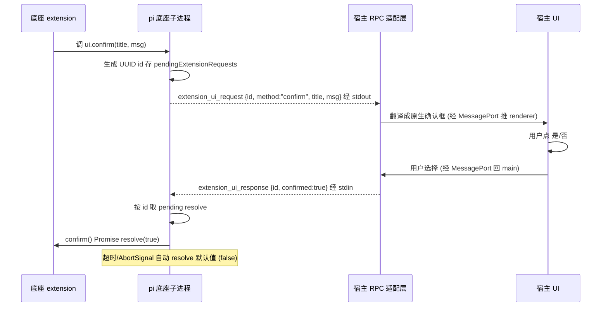

**图 5-1 — Extension UI 请求-响应配对时序：id 关联，底座侧有 timeout/AbortSignal 兜底**

### 5.4 宿主侧实现

#### 5.4.1 适配层架构

宿主 core main 的 extension-ui 适配层（`gateway/extension-ui.ts`）负责：

1. 从 stdout 读到 `extension_ui_request` 行、按 `method` 分发。
2. `select`/`confirm`/`input`/`editor` → 翻译成 React 模态框、经 MessagePort 推给 renderer、在最上层渲染。
3. `notify`/`setStatus`/`setWidget`/`setTitle`/`set_editor_text` → fire-and-forget，直接推给 renderer 对应的 UI 区、不挂 pending。
4. 用户操作完、renderer 经 MessagePort 回传结果 → main 构造 `extension_ui_response` → 写底座 stdin。

关键：response 的 `id` 必须和 request 的 `id` 一致——底座按 id 配对。宿主要保留 request 的 id 直到 response 发出。模态框渲染用 React 组件（不是 Electron 原生 dialog）——统一风格、可走主题、可无障碍。

**response 的写帧格式**：`extension_ui_response` 和 command 一样走底座 stdin、且**必须以 JSONL 帧写入**——即 `serializeJsonLine(response)`（`JSON.stringify` + `
`），和 §4.2 的 `send` 用同一套帧格式。底座按 LF 切帧（§2.2.3），漏掉换行会导致底座读不到这行 response、对应 extension 的 `await ui.confirm(...)` 永远挂起（直到底座侧 timeout）。`rpcSend` 的一行实现：

```typescript
// rpcSend 必须序列化成 JSONL 帧、不能裸 write JSON
const rpcSend = (response: RpcExtensionUIResponse) => childProcess.stdin.write(serializeJsonLine(response));
```

#### 5.4.2 RequestCorrelator 复用

Extension UI 的 id 配对和 §4 的 RPC command-response 配对是**同一个模式**：生成 id → 存 pending Map → 按 id resolve、带 timeout/AbortSignal 兜底。先说结论：**两者共享"id 配对 + timeout/默认值兜底"这套模式，但不共享同一个实例**——因为 id 归属不同：RPC command-response 的 id 由**宿主生成**（`req_N`），Extension UI 的 id 由**底座生成**（`extension_ui_request` 已带 UUID、宿主只能复用这个 id 回 response、不能自己 `register` 新 id）。基于这个差异定位：`RequestCorrelator<T>` 是**RPC command-response 专用的实现**（宿主生成 id、`register()` 适用）；Extension UI 适配层用**自有的等价 pending Map**（keyed by 底座 id）+ 一个等价的 `onAbort`/`timeout` 定时器（见 §5.4.4），复用模式、不复用实例。

`RequestCorrelator` 落在 `gateway/correlator.ts`、只在本层使用。它**不**跨层共享（不设 shared 层），避免内层依赖外层的反转。`defaultValue` 参数是为 RPC 这条链路准备的：timeout/abort 时 `resolve(defaultValue)`、调用方拿到默认值继续走、而不是永远 pending：

```typescript
// gateway/correlator.ts —— RPC command-response 专用的 id 配对原语（宿主生成 id）
export class RequestCorrelator<T> {
  private pending = new Map<string, { resolve: (v: T) => void; reject: (e: Error) => void }>();
  constructor(
    private readonly genId: () => string,         // RPC 用 () => `req_${++n}`；Extension UI 不走这里（id 由底座生成）
    private readonly timeoutMs: number,
  ) {}

  register(opts?: { signal?: AbortSignal; timeout?: number; defaultValue?: T }): { id: string; promise: Promise<T> } {
    const id = this.genId();
    return {
      id,
      promise: new Promise<T>((resolve, reject) => {
        let timeoutId;
        const cleanup = () => {
          if (timeoutId) clearTimeout(timeoutId);
          opts?.signal?.removeEventListener("abort", onAbort);
          this.pending.delete(id);
        };
        // AbortSignal / timeout 触发时 resolve(defaultValue)，Promise 不留 pending
        const onAbort = () => { cleanup(); resolve(opts?.defaultValue as T); };
        opts?.signal?.addEventListener("abort", onAbort, { once: true });
        timeoutId = opts?.timeout
          ? setTimeout(onAbort, opts.timeout)
          : (this.timeoutMs ? setTimeout(onAbort, this.timeoutMs) : undefined);
        this.pending.set(id, {
          resolve: (v) => { cleanup(); resolve(v); },
          reject: (e) => { cleanup(); reject(e); },
        });
      }),
    };
  }

  resolve(id: string, value: T): void { this.pending.get(id)?.resolve(value); }
  reject(id: string, error: Error): void { this.pending.get(id)?.reject(error); }
  rejectAll(error: Error): void {
    for (const p of this.pending.values()) p.reject(error);
    this.pending.clear();
  }
}
```

Extension UI 适配层的等价实现不调 `correlator.register`（id 不是它生成）、而是直接用底座传来的 id 作 key 存进自己的 pending Map、挂同样的 `onAbort`/`timeout` 兜底（完整代码见 §5.4.4）。两套实现的"形状"一致、但实例独立——这正是"复用模式、不复用实例"的落地。

#### 5.4.3 焦点管理与无障碍

Extension UI 的模态框和宿主所有模态遵循统一的无障碍焦点规范：

- **打开**：焦点自动移到第一个可交互元素。
- **Tab 陷阱**：Tab 在模态内循环、Shift+Tab 反向，不跳出模态。
- **Esc 关闭**：Esc 等同取消（回 `{ cancelled: true }`）。
- **关闭后还原**：焦点还原到打开模态的触发元素。
- **键盘可达**：不只靠鼠标。

这是宿主渲染层的事、不是底座的事。宿主 UI 组件库应内置 focus trap 能力（推荐 react-focus-lock 等库），插件用组件库的组件自动获得；自定义元素要自己遵循。

#### 5.4.4 完整的 extension-ui 适配层实现

下面是一个完整的 extension-ui 适配层实现示例、覆盖九个方法、用 React 模态框处理需要回 response 的方法：

```typescript
// gateway/extension-ui.ts
import type { MessagePortMain } from "electron";
import type { RpcExtensionUIRequest, RpcExtensionUIResponse } from "./protocol/pi-types";

// PendingUI 只存 id + method 元数据（用于构造正确形态的 response）；
// response 的发送由 handleUserResponse 直接调 rpcSend 完成、不需要 resolve 回调。
interface PendingUI {
  id: string;
  method: string;
}
type UICallback = (request: RpcExtensionUIRequest) => void;

export class ExtensionUiAdapter {
  private pending = new Map<string, PendingUI>();
  private uiCallback: UICallback | null = null;

  constructor(private rpcSend: (response: RpcExtensionUIResponse) => void) {}

  /** 收到来自底座的 extension_ui_request 时调 */
  handleRequest(request: RpcExtensionUIRequest): void {
    const id = request.id;
    switch (request.method) {
      case "select":
      case "confirm":
      case "input":
      case "editor":
        // 这四个需要回 response、挂 pending（只存 method 元数据、response 发送在 handleUserResponse 里）
        this.pending.set(id, { id, method: request.method });
        // 推给 renderer 渲染模态框
        this.uiCallback?.(request);
        // 如果 request 带 timeout、自己起定时器（兜底、底座那边也会 timeout）
        if (request.timeout) {
          setTimeout(() => this.respondWithDefault(id, request.method), request.timeout);
        }
        break;
      case "notify":
      case "setStatus":
      case "setWidget":
      case "setTitle":
      case "set_editor_text":
        // fire-and-forget、直接推给 renderer、不挂 pending
        this.uiCallback?.(request);
        break;
    }
  }

  /** renderer 用户操作完回传结果时调 */
  handleUserResponse(id: string, result: { value?: string; confirmed?: boolean; cancelled?: true }): void {
    const pending = this.pending.get(id);
    if (!pending) return;  // 已超时或重复、忽略
    this.pending.delete(id);
    let response: RpcExtensionUIResponse;
    if (result.cancelled) {
      response = { type: "extension_ui_response", id, cancelled: true };
    } else if (pending.method === "confirm") {
      response = { type: "extension_ui_response", id, confirmed: !!result.confirmed };
    } else {
      response = { type: "extension_ui_response", id, value: result.value ?? "" };
    }
    this.rpcSend(response);
  }

  private respondWithDefault(id: string, method: string): void {
    const pending = this.pending.get(id);
    if (!pending) return;
    this.pending.delete(id);
    // 默认值：select/input/editor → value 为空；confirm → false
    let response: RpcExtensionUIResponse;
    if (method === "confirm") {
      response = { type: "extension_ui_response", id, confirmed: false };
    } else {
      response = { type: "extension_ui_response", id, value: "" };
    }
    this.rpcSend(response);
  }

  /** renderer 注册回调、接收需要渲染的 request */
  onUiRequest(callback: UICallback): void {
    this.uiCallback = callback;
  }

  /** 底座进程退出时、清所有 pending、向 renderer 推显式的"关闭模态"消息 */
  cleanup(): void {
    for (const id of this.pending.keys()) {
      // 用显式的 _close_modal 消息通知 renderer 关闭对应 id 的模态。
      // 不复用 setTitle 哨兵——renderer 无法区分"真 setTitle（设空标题）"与"关闭模态"两种语义。
      this.uiCallback?.({ type: "extension_ui_request", id, method: "_close_modal" } as RpcExtensionUIRequest);
    }
    this.pending.clear();
  }
}
```

renderer 侧的 React 模态框组件示例（以 confirm 为例）：

```tsx
// renderer/ExtensionConfirmDialog.tsx
import * as React from "react";
import { useExtensionUi } from "@pi-desktop/react";

export function ExtensionConfirmDialog() {
  const { pendingRequests, respond } = useExtensionUi();
  // pendingRequests 是 core main 推过来的、需要回 response 的 request 列表
  const confirms = pendingRequests.filter(r => r.method === "confirm");

  return (
    <>
      {confirms.map(req => (
        <Dialog key={req.id} open onClose={() => respond(req.id, { cancelled: true })}>
          <h2>{req.title}</h2>
          <p>{req.message}</p>
          <button onClick={() => respond(req.id, { confirmed: true })}>是</button>
          <button onClick={() => respond(req.id, { confirmed: false })}>否</button>
          <button onClick={() => respond(req.id, { cancelled: true })}>取消</button>
        </Dialog>
      ))}
    </>
  );
}
```

关键设计点：

- **`id` 贯穿全链**：底座生成 UUID → 适配层挂 pending → 推给 renderer → 用户操作 → renderer 回传 id → 适配层按 id 取 pending → 构造 response 发底座。id 是唯一关联、不能丢。
- **timeout 兜底两边都做**：底座侧自己 timeout 自动 resolve 默认值（§5.2.2）、适配层这边也 timeout 自动回 default。两边都做是为了保险——底座 timeout 后已经 resolve 了 extension 的 Promise、宿主后到的 response 会被忽略（底座的 `pendingExtensionRequests.delete(id)` 已执行）、不会出错。
- **cleanup 在底座进程退出时调**：清掉所有 pending、向 renderer 推显式的 `{ method: "_close_modal", id }` 消息——否则底座死了、模态还挂着、用户点按钮也没人收。renderer 侧除了按 `method` 渲染各模态、还要监听 `_close_modal` 关闭对应 id 的模态（不复用 `setTitle` 当哨兵、避免真假 setTitle 语义混淆）。

#### 5.4.5 九个方法的逐个实现示例

**select（选择框）**：

底座发的 request：
```jsonc
{ "type": "extension_ui_request", "id": "uuid-1", "method": "select",
  "title": "选择一个模型", "options": ["Claude Sonnet", "Claude Opus", "GPT-4"], "timeout": 30000 }
```

宿主渲染一个选择列表、用户选了第 2 项、回：
```jsonc
{ "type": "extension_ui_response", "id": "uuid-1", "value": "Claude Opus" }
```

用户按 Esc 或点取消、回：
```jsonc
{ "type": "extension_ui_response", "id": "uuid-1", "cancelled": true }
```

底座的 extension 代码（在底座进程里跑）拿到 `undefined`（cancelled 时 select 返回 undefined）或选中的字符串。30s 没操作、底座自动 resolve 为 `undefined`、extension 继续走默认路径。

**confirm（确认框）**：

```jsonc
// request
{ "type": "extension_ui_request", "id": "uuid-2", "method": "confirm",
  "title": "确认操作", "message": "要删除这个文件吗？", "timeout": 10000 }
// response（用户点"是"）
{ "type": "extension_ui_response", "id": "uuid-2", "confirmed": true }
// response（用户点"否"）
{ "type": "extension_ui_response", "id": "uuid-2", "confirmed": false }
```

底座 extension 的 `await ui.confirm(title, msg)` 拿到 `true` 或 `false`。timeout 默认 `false`。

**input（输入框）**：

```jsonc
// request
{ "type": "extension_ui_request", "id": "uuid-3", "method": "input",
  "title": "输入变量名", "placeholder": "myVar" }
// response
{ "type": "extension_ui_response", "id": "uuid-3", "value": "userName" }
```

**editor（多行编辑器）**：

```jsonc
// request
{ "type": "extension_ui_request", "id": "uuid-4", "method": "editor",
  "title": "编辑配置", "prefill": "{\n  \"key\": \"value\"\n}" }
// response
{ "type": "extension_ui_response", "id": "uuid-4", "value": "{\n  \"key\": \"newValue\"\n}" }
```

editor 和 input 的区别：editor 是多行、给大段文本（如编辑配置文件内容、编辑代码片段）。input 是单行、给短输入（如变量名、文件名）。

**notify（通知、fire-and-forget）**：

```jsonc
{ "type": "extension_ui_request", "id": "uuid-5", "method": "notify",
  "message": "操作完成", "notifyType": "info" }
```

宿主显示一个通知气泡。`notifyType` 是 `"info" | "warning" | "error"`、控制通知样式（蓝色/黄色/红色）。不回 response。

**setStatus（状态栏文本、fire-and-forget）**：

```jsonc
// 设状态栏文本
{ "type": "extension_ui_request", "id": "uuid-6", "method": "setStatus",
  "statusKey": "extension.foo", "statusText": "正在处理..." }
// 清除状态栏文本（statusText 为 undefined）
{ "type": "extension_ui_request", "id": "uuid-7", "method": "setStatus",
  "statusKey": "extension.foo", "statusText": undefined }
```

`statusKey` 是状态栏项的标识、宿主按 key 维护多个状态栏项。`statusText` 为 `undefined` 时清除该项。不回 response。

**setWidget（widget、fire-and-forget）**：

```jsonc
// 设 widget
{ "type": "extension_ui_request", "id": "uuid-8", "method": "setWidget",
  "widgetKey": "extension.foo", "widgetLines": ["第一行", "第二行"],
  "widgetPlacement": "aboveEditor" }
// 清除 widget
{ "type": "extension_ui_request", "id": "uuid-9", "method": "setWidget",
  "widgetKey": "extension.foo", "widgetLines": undefined }
```

`widgetPlacement` 是 `"aboveEditor" | "belowEditor"`、控制 widget 显示在编辑器上方还是下方。`widgetLines` 为 `undefined` 时清除。注意 widget 只支持字符串数组——不支持结构化组件（§5.5.1）。

**setTitle（窗口标题、fire-and-forget）**：

```jsonc
{ "type": "extension_ui_request", "id": "uuid-10", "method": "setTitle", "title": "项目A - 会话3" }
```

宿主设窗口标题或标签标题。不回 response。

**set_editor_text（编辑器文本、fire-and-forget）**：

```jsonc
{ "type": "extension_ui_request", "id": "uuid-11", "method": "set_editor_text", "text": "agent 填进输入框的内容" }
```

宿主把 `text` 填进主输入框。这用于"agent 把内容填进输入框让用户审阅再发送"的场景。不回 response。注意 `getEditorText` 在 RPC 模式下返回空字符串（§5.5.1）——agent 不能反向读输入框内容。

### 5.5 表达力上限

#### 5.5.1 setWidget 和 set_editor_text 的限制

这套子协议覆盖了大部分 GUI 交互需求，但表达力有上限：

- `setWidget` 只能传字符串数组、不能传结构化组件。
- `set_editor_text` 是单向的——`getEditorText` 在 RPC 模式下直接返回空字符串：

```typescript
getEditorText(): string {
  // Synchronous method can't wait for RPC response
  // Host should track editor state locally if needed
  return "";
}
```

因为同步方法没法等 RPC 响应。如果宿主要让 extension 知道编辑器当前内容，要自己维护一份本地状态、通过别的方式（如 extension 注册的工具参数）传给 extension。

#### 5.5.2 富 UI 的解法

底座 extension 要在桌面展示富 UI（表格/图表/自定义组件）的解法：**不依赖 RPC 的 `setWidget`**，而是把数据吐出来（通过 `notify` 发消息、或靠 `tool_execution_*` event 推送），让宿主插件订阅并自己画。这是"消费而非翻译"——extension 提供数据、宿主插件负责 UI。`setWidget` 只用于简单的多行文本提示，富 UI 走插件自己画的路。

---

## 6 handshake 版本协商与降级

### 6.1 缺口：协议无版本协商

#### 6.1.1 缺口确认

这是盲审发现的、3 年后最可能烂掉的地方。宿主硬编码了 RPC 协议的 31 个命令及其返回类型（§4），但没有版本协商机制——没有协议版本号、没有 feature detection、没有"未知命令优雅降级"。底座演进时命令会增删改（`RpcCommand` 联合类型会变），宿主只能被动追兼容，追不上就崩或静默错。

#### 6.1.2 当前兜底

当前底座 RPC 协议是某个版本快照、宿主照着这个版本写。短期靠"宿主和底座同版本发布"约束（宿主发版时 pin 一个底座版本）。但这不是长期解——底座独立演进、宿主有自己发版节奏，迟早漂移。

演进方向：补 RPC 的版本协商——底座启动时通过一条 `handshake` 命令暴露自己的协议版本和可用命令清单，宿主据此 feature detection（有的命令才用、没有的降级或提示）。这把"硬编码 31 个命令"变成"运行时发现能力"。在那之前，宿主把 RPC 命令封装在一个版本化的适配层里（`gateway/rpc-adapter.ts` + `gateway/protocol/versions.ts`），底座协议变时只动这层、不动插件层——靠这层隔离缓解漂移冲击。

### 6.2 handshake 命令设计

> **说明**：以下 handshake 协议是**宿主侧先行设计的提案**、并非 pi 底座现有实现——其 request/response 结构（`clientVersion`/`protocolConstraint`/`availableCommands`/`features` 等）来自本文 §6 的设计、不是对照底座真实源码写成。本文 §1 开头的"对照真实源码"声明覆盖的是 31 个 RPC 命令、三类消息、Extension UI 子协议等**已落地**的契约；handshake 属于"待底座补齐的演进项"、当前底座会回 `Unknown command: handshake`、宿主走 §6.6.1 的 legacy 降级。集成者照本节实现客户端逻辑即可、底座补齐后无需改宿主。

#### 6.2.1 时机

RPC 子进程起来、就绪后（§2.3.1 的 100ms 窗口之后），宿主发任何业务命令前，先发 handshake 做能力探测。

#### 6.2.2 协议

```jsonc
// 宿主发（stdin）
{ "type": "handshake", "id": "req_hs", "clientVersion": "0.1.0", "protocolConstraint": "^1.0" }
// 底座回（stdout，支持 handshake 时）
{ "type": "response", "command": "handshake", "id": "req_hs", "success": true,
  "data": {
    "protocolVersion": "1.0",
    "piVersion": "0.91.0",
    "availableCommands": ["prompt","steer","follow_up","abort","new_session",/* ...§4.5 的 31 个已落地命令 */],
    "features": { "streaming": true, "autoRetry": true, "extensionUi": true }
  }
}
```

> **availableCommands 的当前形态 vs 未来形态**：上面示例只列 §4.5 的 31 个**已落地**命令——这是底座补齐 handshake 当下的清单。`reload` / `list_sessions`（§10.1/§10.2 缺口）当前底座根本没有、**不会出现**在这个数组里；它们要等底座补齐对应 RPC 命令后才会加入 `availableCommands`。届时清单的"未来形态"会多出这两项：
>
> ```jsonc
> // 未来形态（底座补齐 reload/list_sessions 之后）——当前为缺口、不要照此实现
> "availableCommands": ["prompt",/* ...31 个已落地 */, "reload", "list_sessions"]
> ```
>
> 在底座补齐前，宿主发 `reload`/`list_sessions` 会落到 §6.6.2 的降级路径（reload→重启子进程、list_sessions→最近打开列表）。

#### 6.2.3 协议版本号的 semver 语义约定

`protocolVersion` 走 semver、但 semver 只有在"什么变更算 major / minor / patch"有明确约定时才有意义。本文给 handshake 协议定下如下语义约定（底座补 handshake 时应遵循、宿主写 `protocolConstraint` 时据此判断）：

- **major（破坏性变更）**：删命令、改命令的 `type` 字面量、改 response 的字段名或语义（如把 `RpcSessionState.sessionFile` 改名）、把可选字段变成必填且旧客户端不传会报错。major 升级意味着旧宿主可能不兼容、宿主应在 `semverSatisfies` 失败时提示用户升级宿主（§6.6.4）。
- **minor（向后兼容新增）**：加新命令、给现有命令加可选字段、给 response 加可选字段、加新 event 类型。minor 升级不破坏旧宿主——旧宿主忽略未知命令/字段即可、`event-translator` 的 default 分支返回 null（§8.2.3）。
- **patch（修复）**：命令/字段语义不变、仅修 bug。patch 升级对宿主完全透明。

`protocolConstraint` 推荐写法：

- 宿主基于当前协议快照写、用 `"^1.0"`（接受 1.x、拒绝 2.0）——允许底座做向后兼容的 minor/patch 升级、挡住破坏性 major 升级。
- 若宿主用了某个 minor 才有的命令（如 `reload`）、可收紧到 `"^1.2"`、表示"至少要 1.2 才有 reload、但接受 1.x"。
- 不要用 `"*"` 或 `"1.0"`（精确 pin）——前者放弃版本检查、后者连 patch 都拒绝、底座升不了。

`semverSatisfies` 检查在 §6.6.4 给出实现。底座当前没补 handshake、这个约束检查由宿主自己做；底座补了之后可以选择性地校验 `clientVersion`、拒绝过老的客户端。

#### 6.2.4 不强制底座改

handshake **不强制底座改**——底座没补这个命令时，按 RPC 协议返回 `{ success: false, error: "Unknown command: handshake" }`（`rpc-mode.ts` 的 `default` case）：

```typescript
default: {
  const unknownCommand = command as { type: string };
  return error(id, unknownCommand.type, `Unknown command: ${unknownCommand.type}`);
}
```

宿主捕获这个 error、走"假定旧版本"降级路径。所以宿主可以**先于底座**实现 handshake 客户端逻辑、向后兼容旧底座。这是关键设计——handshake 是单向兼容的：宿主有、底座没有时降级；底座有、宿主没有时底座照常工作（底座不会主动推 handshake、是宿主拉）。

### 6.3 降级决策树

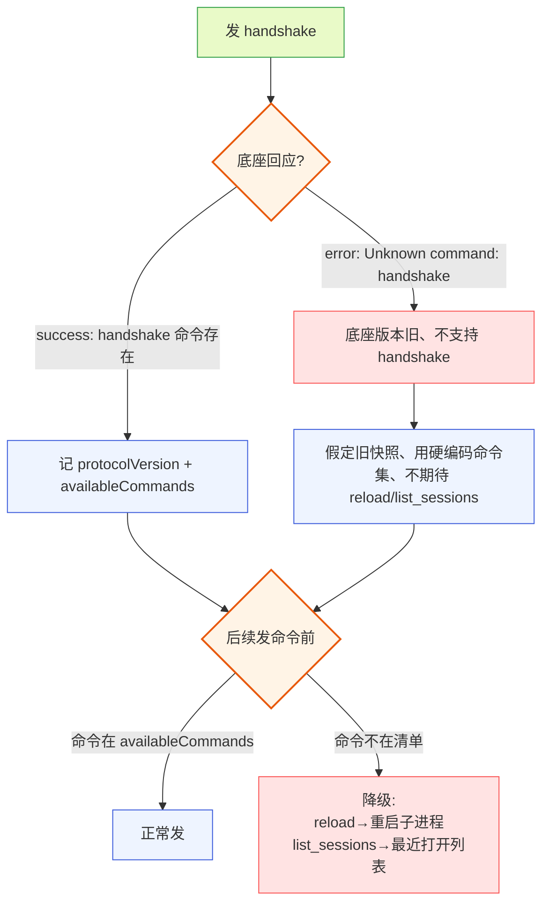

**图 6-1 — handshake 降级决策树：底座支持就 feature detection、不支持就假定旧快照**

### 6.4 关键设计点

#### 6.4.1 命令白名单隔离

宿主 RPC 适配层维护一个"已知命令集合"（来自 handshake 的 `availableCommands` 或硬编码快照），调用前检查命令是否在清单里。**关键区分**：命令不在清单时怎么处置、要看这条命令有没有"已知兜底路径"——

- **有兜底路径的命令**（如 `reload`→重启子进程、`list_sessions`→最近打开列表）：记 warning、走降级、不抛。业务能继续跑、用户几乎无感。
- **无兜底路径的命令**（如某个新 event 的查询命令、宿主没法模拟）：抛 `Command not available`、让调用方决定是禁用该 UI 入口还是提示用户升级底座。

这两种策略分别由 `sendWithFallback`（warn + 降级）和 `sendChecked`（严格、抛错）两个方法承担（§6.5）。不要混用——对有兜底的命令抛错会无谓中断业务、对无兜底的命令静默降级会掩盖功能缺失。

```typescript
// 有兜底的命令：warn + 走降级
if (!availableCommands.has("reload")) {
  console.warn("reload not in availableCommands, falling back to subprocess restart");
  return restartForConfigReload();  // 降级路径
}
// 无兜底的命令：抛错、由调用方决定
if (!availableCommands.has(cmd)) {
  throw new Error(`Command ${cmd} not available in protocol ${protocolVersion}`);
}
```

对返回类型用 `?.` 链式访问 + 类型卫士，防止底座增删字段导致反序列化崩溃：

```typescript
// 不要直接 response.data.models，要防御
const models = response?.data?.models ?? [];
```

**命令→降级动作映射表**：命令不在 `availableCommands` 里时、不能静默丢、要落到一个确定的降级动作。当前已知需要降级的命令：

| 命令 | 不在清单时的降级动作 |
|---|---|
| `reload` | 重启子进程 resume（§3.3）、等价于变相 reload |
| `list_sessions` | 返回宿主自维护的"最近打开 session"偏好列表（不扫 sessionDir） |
| `handshake` | 走 `assumeLegacySnapshot`、用硬编码命令快照 |
| 其他未知命令 | 抛 `Command not available`、UI 提示"该功能在当前底座版本不可用" |

三套 API 的关系（不要并行实现、不要混淆）：`sendChecked` / `sendWithFallback`（§6.5）是**底层原语**——前者"命令不在清单就抛错"、后者"命令不在清单就调传入的 fallback 回调"。`dispatchWithFallback` 是**基于 `sendWithFallback` 对已知降级命令（reload/list_sessions）的封装分发器**——把"该走哪个 fallback"的内聚逻辑收进一处（reload→重启子进程、list_sessions→最近打开列表），调用方不用每次传 fallback。即 `dispatchWithFallback` 内部等价于 `sendWithFallback(command, () => 已知降级动作[command.type])`。集成者**只实现一套底层原语**（§6.5 的 `sendChecked` + `sendWithFallback`），再按需封装 `dispatchWithFallback`；不要把三套当成并行可选方案。下面的 `dispatchWithFallback` 是封装层的示意：

```typescript
// 已知降级命令的分发；其余不在清单的命令一律抛错、不静默
// 内部复用 sendWithFallback（§6.5）、把"该走哪个 fallback"集中在本映射
async dispatchWithFallback(command: RpcCommandBody): Promise<unknown> {
  const knownFallbacks: Record<string, () => Promise<unknown>> = {
    reload: async () => {
      console.warn("reload RPC not available, falling back to subprocess restart");
      await this.restartForConfigReload();
      return { success: true, data: { via: "restart" } };
    },
    list_sessions: async () => {
      console.warn("list_sessions RPC not available, falling back to recent-opened list");
      return { success: true, data: { sessions: this.recentOpenedSessions } };
    },
  };
  if (this.availableCommands.has(command.type)) {
    return this.send(command);                  // 命令在清单里、走 RPC
  }
  const fallback = knownFallbacks[command.type];
  if (fallback) return fallback();              // 已知降级命令、走映射
  throw new Error(`Command ${command.type} not available in protocol ${this.protocolVersion}`);  // 无兜底、抛错
}
```

#### 6.4.2 版本协商走 handshake、不走环境变量或文件

handshake 和 RPC 协议同通道、一次往返拿到全部能力，最简单可靠。环境变量要靠进程启动时读、文件要靠共享状态——都比一次 RPC 往返复杂。

#### 6.4.3 availableCommands 是完整清单

底座返回的是该版本支持的**全部**命令（含旧的 31 个 + 新增的），不是增量。宿主据此判断每个命令能否用——不假设"旧命令一定在"。

#### 6.4.4 handshake 时机与缓存

子进程启动后、发任何业务命令前发一次 handshake，结果缓存到子进程关闭。**热加载重启子进程后（§3）要重新 handshake**——新进程等 100ms 就绪窗口后、第一件事发 handshake 重新探测能力，再按新清单发后续命令。**不缓存跨进程的能力探测结果**——不同版本的底座可能能力不同。

#### 6.4.5 三个缺口一起收敛

这套设计让 §10 的 reload/list_sessions 缺口也能优雅降级：底座没补 handshake → 假定没有这俩命令、走当前兜底；底座补了 handshake 但命令清单里没这俩 → 也走兜底；清单里有 → feature-detect 地用。三个缺口（handshake/reload/list_sessions）一起靠 handshake 通道收敛。

### 6.5 宿主侧实现示例

```typescript
class PiRpcClient {
  private availableCommands: Set<string> = new Set();
  private protocolVersion: string = "unknown";

  async handshake(): Promise<void> {
    try {
      const response = await this.send({ type: "handshake", clientVersion: "0.1.0", protocolConstraint: "^1.0" });
      if (response.success && response.data) {
        this.protocolVersion = response.data.protocolVersion ?? "unknown";
        this.availableCommands = new Set(response.data.availableCommands ?? []);
      } else {
        // 底座回了 error（Unknown command: handshake）→ 走旧版兜底
        this.assumeLegacySnapshot();
      }
    } catch (e) {
      // 任何异常都走旧版兜底，不阻塞启动
      this.assumeLegacySnapshot();
    }
  }

  private assumeLegacySnapshot(): void {
    // 假定底座是协议快照里的版本、用硬编码命令集
    this.protocolVersion = "legacy-snapshot";
    this.availableCommands = new Set([
      "prompt", "steer", "follow_up", "abort", "new_session",
      "get_state", "set_model", "cycle_model", "get_available_models",
      // ... 31 个命令的硬编码清单
    ]);
    // 不期待 reload / list_sessions，走兜底
  }

  /** 严格检查：命令不在清单里就抛错。用于无兜底路径的命令、由调用方 catch 决定 UI 处置。 */
  async sendChecked<T>(command: RpcCommandBody): Promise<T> {
    if (!this.availableCommands.has(command.type)) {
      throw new Error(`Command ${command.type} not available in protocol ${this.protocolVersion}`);
    }
    const response = await this.send(command);
    return this.getData<T>(response);
  }

  /** 宽松检查：命令不在清单里就记 warning 并走 fallback。用于有已知兜底路径的命令（reload/list_sessions）。 */
  async sendWithFallback<T>(command: RpcCommandBody, fallback: () => Promise<T>): Promise<T> {
    if (!this.availableCommands.has(command.type)) {
      console.warn(`Command ${command.type} not in availableCommands, falling back`);
      return fallback();
    }
    const response = await this.send(command);
    return this.getData<T>(response);
  }

  /** 从 response 取 data、失败抛错（示意：集成者按自己的错误类型完善）。 */
  private getData<T>(response: { success: boolean; data?: T; error?: string }): T {
    if (!response.success) {
      throw new Error(response.error ?? "unknown rpc error");
    }
    return response.data as T;
  }
}
```

### 6.6 handshake 的实战场景

#### 6.6.1 场景一：底座是旧版、不支持 handshake

底座收到 `{ type: "handshake", ... }`、走 `default` 分支、回 `{ success: false, error: "Unknown command: handshake" }`。宿主的 `handshake()` 捕获这个 error response（不是 catch 异常、是 `response.success === false`）、走 `assumeLegacySnapshot()`：

```typescript
async handshake(): Promise<void> {
  try {
    const response = await this.send({ type: "handshake", ... });
    if (response.success && response.data) {
      // 支持 handshake
    } else {
      // response.success === false、error 是 "Unknown command: handshake"
      this.assumeLegacySnapshot();
    }
  } catch (e) {
    // send 本身抛异常（进程死了等）→ 也走兜底
    this.assumeLegacySnapshot();
  }
}
```

`assumeLegacySnapshot` 把宿主置成"假定旧版"模式：

- `availableCommands` 填入硬编码的 31 个命令清单（来自协议快照）。
- `protocolVersion` 标记为 `"legacy-snapshot"`。
- 不期待 `reload`/`list_sessions`——这两个命令的调用会走兜底（reload→重启子进程、list_sessions→最近打开列表）。
- 后续发命令不检查 `availableCommands`（因为清单是硬编码的、肯定都有）——但保留检查逻辑、万一底座是更旧的版本（连某些快照命令都没有）、检查能挡住。

这个场景下、宿主照常工作、用户无感知底座版本旧。只是热加载走重启子进程、会话列表不完整——但这俩本来就是旧版的缺口。

#### 6.6.2 场景二：底座支持 handshake、但还没补 reload

底座支持 handshake、回 `{ success: true, data: { protocolVersion: "1.0", availableCommands: [...] } }`。但 `availableCommands` 里没有 `reload`（底座还没补这条命令）。

宿主的 `availableCommands` 里没有 `reload`。用户在管理 UI 点"重载配置"时、用 `sendWithFallback`——命令在清单里走 RPC reload、不在清单里记 warning 并走降级重启子进程（§3.3）：

```typescript
async function reloadConfig() {
  // sendWithFallback：在清单里走 RPC reload、不在清单里走 fallback（重启子进程）
  await this.sendWithFallback({ type: "reload" }, async () => {
    console.warn("reload RPC not available, falling back to subprocess restart");
    return this.restartForConfigReload();
  });
}
```

`reload` 是"有兜底路径"的命令、所以用 `sendWithFallback` 而非 `sendChecked`——后者会抛错中断、这里业务能继续（重启子进程等效 reload）。底座补了 `reload` 后、宿主自动切到走 RPC reload（不重启子进程、不丢运行态）、不用改宿主代码——这是 feature detection 的好处。

这个场景下、宿主能 feature-detect 底座能力、优雅降级。底座补了 `reload` 后、宿主自动切到走 RPC reload（不重启子进程、不丢运行态）、不用改宿主代码——这是 feature detection 的好处。

#### 6.6.3 场景三：底座补了新命令、宿主不知道

底座升级、新增了某个命令（比如 `set_model_temperature`）、`availableCommands` 里有它。但宿主的 `RpcCommand` 类型联合里没定义这个 type、宿主不知道怎么调。

这种情况下、宿主不能直接调（类型系统不让、`sendChecked` 会拒绝）。但可以通过 `rpc.send(unknown)` 逃生舱发——把命令构造成普通对象、绕过类型检查：

```typescript
// 逃生舱：发未知命令
await rpc.send({ type: "set_model_temperature", temperature: 0.7 } as any);
```

集成者可以用逃生舱提前用上新命令、不用等宿主升级类型定义。但要注意：

- 逃生舱命令不在 `availableCommands` 检查范围内（因为是 `as any`）、要自己手动检查 `this.availableCommands.has("set_model_temperature")`。
- 响应类型也是 unknown、要自己解析。
- 这种用法是临时方案、宿主升级类型定义后应该改成强类型调用。

#### 6.6.4 场景四：协议版本不兼容

底座 `protocolVersion: "2.0"`、宿主的 `protocolConstraint: "^1.0"`（只接受 1.x）。这种情况下、宿主应该提示用户"底座版本太新、宿主可能不兼容、请升级宿主"——而不是硬上、导致各种静默错。

```typescript
// semverSatisfies 来自 semver 库（需 npm i semver、import { satisfies as semverSatisfies } from "semver"）。
// 也可用一个简单的 major 版本比较代替、不必引入完整 semver。
async handshake(): Promise<void> {
  const response = await this.send({ type: "handshake", clientVersion: "0.1.0", protocolConstraint: "^1.0" });
  if (response.success && response.data) {
    const constraint = "^1.0";
    if (!semverSatisfies(response.data.protocolVersion, constraint)) {
      // 协议版本不兼容
      throw new Error(`Protocol version ${response.data.protocolVersion} does not satisfy ${constraint}. Please upgrade the host.`);
    }
    // ...
  }
}
```

`protocolConstraint` 是 semver range。底座在 future 版本可以检查这个约束、如果不符合可以拒绝 handshake 或给 warning。但当前底座没补 handshake、这个约束检查由宿主自己做。

### 6.7 handshake 与热加载的协作

#### 6.7.1 重启后重新 handshake

热加载重启子进程后（§3.3）、新进程可能有不同的协议版本（如果底座升级了）。所以**重启后必须重新 handshake**——不能用旧进程的 `availableCommands` 和 `protocolVersion`：

```typescript
async restartForConfigReload(): Promise<void> {
  const resumeFile = this.sessionFile;
  await this.stop();
  // 清旧进程的能力探测结果
  this.availableCommands.clear();
  this.protocolVersion = "unknown";
  // 起新进程、重新 handshake
  await this.start(resumeFile);  // start 内部会调 handshake
}
```

不缓存跨进程的能力探测结果——这是关键。不同版本的底座可能能力不同、用旧进程的探测结果会让宿主误判。

#### 6.7.2 handshake 的缓存策略

`availableCommands` 和 `protocolVersion` 在**单个子进程的生命周期内**缓存、不重复 handshake。底座在运行期间不会动态增删命令（命令集在启动时固定）。所以：

- 启动时 handshake 一次、结果缓存到子进程关闭。
- 子进程关闭（崩溃/重启/停止）时、清缓存。
- 新子进程启动时、重新 handshake。

这个缓存粒度是"进程级"——不是全局缓存、不是跨进程缓存。集成者不要把 handshake 结果存到磁盘或全局变量、下次启动跳过 handshake——那样会漏掉底座升级后的能力变化。

---

## 7 worker↔main MessagePort 通信

### 7.1 为什么 worker 不能直接碰底座

#### 7.1.1 物理约束

底座子进程的 stdin/stdout 归 core main 的 RPC 适配层独占——这条管道是单实例的、不能多个进程同时写。但宿主的插件代码（如果有 worker 架构）跑在 `utilityProcess`（Electron 的 Node 子进程），它不能直接碰底座 stdin/stdout。

`utilityProcess` 和 renderer 之间**不**走 `ipcMain/ipcRenderer`（那套基于 BrowserWindow，utilityProcess 没有），唯一的官方通道是 **MessagePort**。所以 worker 调 `context.rpc.getState()` 实际是往端口发消息、main 收到后由 RPC 适配层发给底座、结果回传。

#### 7.1.2 两对 MessagePort + 一条默认 event 通道

宿主内部有**三条通道**：两对独立的 MessagePort，外加一条专为纯 renderer 插件准备的 main→renderer 默认 event 通道。集成者一开始就建立完整心智模型、避免到 §7.6.2 才发现"还有第三条"：

- **通道一：worker↔main MessagePort**：管 RPC/event 转发（worker 侧 API）。每个 worker 有自己的一对，和别的 worker 不串。
- **通道二：worker↔renderer MessagePort**：管插件内部 UI 数据（`emitToRenderer`/`postToWorker`）。core main 在插件装载时建一对 `MessageChannelMain`、一个端口给该插件的 utility、一个给 renderer 侧该插件的运行时上下文，之后 worker↔renderer 直接 postMessage 对传、不再经 main 转发。
- **通道三：main→renderer 默认 event 通道**（非 MessagePort）：纯 renderer 插件没有 worker、也就没有前两对 MessagePort 那条路径。core main 把翻译并按权限过滤后的中性 event 经 `webContents.send("pi:event")`（或 main 在 renderer 启动时建一对默认 MessagePort）广播给所有纯 renderer 插件。这条通道由 core main 持有 `BrowserWindow.webContents`、是"一对多广播"、不是某插件私有。详见 §7.6.2。

三条通道对照：

| 通道 | 端点 | 介质 | 归属 | 谁用 |
|---|---|---|---|---|
| worker↔main (#1) | worker ↔ core main | MessagePortMain | 每个双入口/纯 worker 插件私有 | 双入口、纯 worker 插件收 RPC/event |
| worker↔renderer (#2) | worker ↔ renderer | MessagePortMain | 某双入口插件私有、main 不经手 | 双入口插件的 UI 数据 |
| main→renderer 默认 | core main → renderer | `webContents.send` / 默认 MessagePort、非 #2 那对 | core main 持有、一对多广播 | 纯 renderer 插件收 event |

通道一、二都是 MessagePort、但端点不同；通道三不是 MessagePort、是 main 持有的默认广播通道。core main 是中枢——它持有底座子进程的 stdin/stdout、转发给各 worker（通道一），并为纯 renderer 插件维护默认 event 广播（通道三）。

### 7.2 worker↔main MessagePort 协议

#### 7.2.1 通信链路

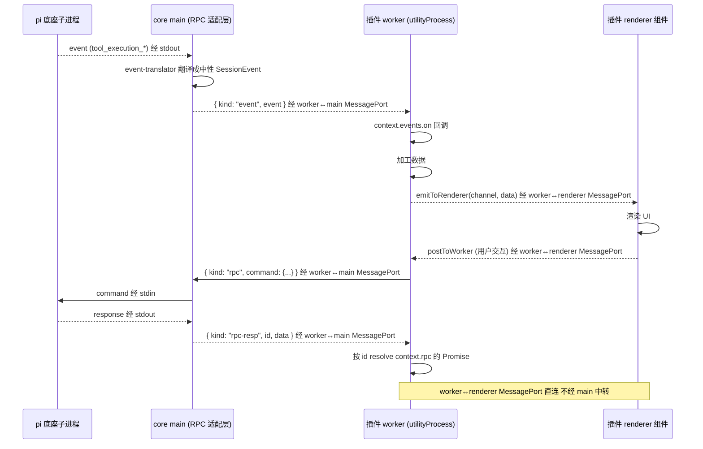

**图 7-1 — 双入口数据流：worker 逻辑与 renderer UI 经 MessagePort 直连，RPC 经 core main 中转**

#### 7.2.2 RPC 转发协议

worker 调 `context.rpc.getState()` → 往 worker 端口发：

```typescript
// worker 侧发的消息
{ kind: "rpc", id: "req_42", command: { type: "get_state" } }
```

main 收到、由 RPC 适配层发给底座（main 自己分配 id 或用 worker 传来的 id、但要保证 worker 间不冲突——推荐 main 重新分配 id、维护 `workerRequestId → mainRequestId` 映射）。底座响应回 main、main 往 worker 端口回：

```typescript
// main 回给 worker 的消息
{ kind: "rpc-resp", id: "req_42", data: RpcResponse }
```

worker 的 `context.rpc` 按 id resolve Promise。

#### 7.2.3 event 转发协议

底座推 event 到 main → main 的 event-translator 翻译成中性 SessionEvent（§8）→ main 往所有订阅该 event 的 worker 端口转发：

```typescript
// main 推给 worker 的消息
{ kind: "event", event: SessionEvent }
```

worker 的 `context.events.on` 回调收到。**敏感字段过滤**在 gateway 层做（§8.3）——未声明 `content:sensitive` 权限的插件、收到的 event 里敏感字段置空。

#### 7.2.4 worker 隔离

每个 worker 有自己的 worker↔main MessagePort——worker 隔离靠这个，一个 worker 的 RPC/event 不串到别的 worker。如果 worker A 发了 `set_model`、worker B 不应该看到 worker A 的 response——main 转发 response 时只发给发起方 worker。

### 7.3 worker↔renderer MessagePort

#### 7.3.1 双入口设计

一个带代码模块的插件，manifest 声明两个入口：

- `main`：worker 入口，跑插件的逻辑/数据/副作用——订阅 RPC event、发 RPC 命令、定时拉数据、读写插件配置。导出 `activate(context)` / `deactivate()`。
- `renderer`：UI 入口，导出 React 组件。renderer 侧的插件加载器动态 import 它、把导出的组件注册进 `componentRegistry[componentId]`。

为什么是双入口而不是单入口？物理约束：React 组件是函数/闭包，不可序列化、不可跨 JS 堆传递；`utilityProcess` 是 Node 环境，没有 `react`、没有 DOM reconciler。所以"在 worker 里 import 一个 React 组件对象，再发给 renderer 渲染"这条路物理上不成立。

#### 7.3.2 直接 postMessage 不经 main

core main 进程在插件装载时建一对 `MessageChannelMain`，一个端口给该插件的 utility、一个给 renderer 侧该插件的运行时上下文，之后 worker↔renderer 直接 postMessage 对传、**不再经 main 转发**。renderer 侧给插件 UI 注入的 scoped `pi` API、内部就是往这个端口 postMessage——插件 UI 调 `pi.rpc.get_state()`、实际是往端口发消息、worker 侧收到后发 RPC 给底座、结果回传。

不经 main 中转的好处：低延迟、main 不必转发每个 UI 交互消息。坏处：renderer 侧的 scoped `pi` API 要自己实现 RPC 转发（往 worker 端口发 `{ kind: "rpc", ... }`、worker 收到后转发）。

### 7.4 宿主侧实现要点

#### 7.4.1 起子进程时建 MessagePort

```typescript
import { MessageChannelMain, utilityProcess, type UtilityProcess } from "electron";
import type { MessagePortMain } from "electron";

function spawnWorker(pluginId: string, mainPath: string): { worker: UtilityProcess; port: MessagePortMain } {
  const { port1, port2 } = new MessageChannelMain();
  const worker = utilityProcess.fork(mainPath, [], {
    stdio: "pipe",
    serviceName: `plugin-${pluginId}`,
  });
  // port1 给 worker、port2 main 持有
  worker.postMessage({ kind: "init", pluginId, port: port1 }, [port1]);
  return { worker, port: port2 };
}
```

#### 7.4.2 main 侧的消息分发

```typescript
port.on("message", (event) => {
  const msg = event.data;
  switch (msg.kind) {
    case "rpc":
      // worker 发的 RPC 命令 → 转给底座
      const mainId = `req_${++this.requestId}`;
      this.workerIdMap.set(mainId, { workerPort: port, workerId: msg.id });
      this.sendToPi({ ...msg.command, id: mainId });
      break;
    case "subscribe":
      // worker 订阅 event
      this.eventSubscribers.add(port);
      break;
    case "unsubscribe":
      this.eventSubscribers.delete(port);
      break;
    case "log":
      // worker 发的日志、转发到宿主日志（worker 侧没有 console 之外的日志通道）
      // { kind: "log", level: "info"|"warn"|"error", message: string }（见 §7.7.1）
      logger[msg.level](`[plugin:${pluginId}] ${msg.message}`);
      break;
  }
});

// 底座 response 回来时
this.onPiResponse((response) => {
  const mapping = this.workerIdMap.get(response.id);
  if (mapping) {
    this.workerIdMap.delete(response.id);
    mapping.workerPort.postMessage({ kind: "rpc-resp", id: mapping.workerId, data: response });
  }
});

// 底座 event 推过来时（已翻译成中性类型）
this.onPiEvent((neutralEvent) => {
  for (const sub of this.eventSubscribers) {
    sub.postMessage({ kind: "event", event: neutralEvent });
  }
});
```

#### 7.4.3 worker 侧的 PluginContext.rpc

```typescript
// worker 侧（utilityProcess 里跑的代码）
const ctx = {
  rpc: {
    getState: () => sendRpc({ type: "get_state" }),
    getEntries: (since?: string) => sendRpc({ type: "get_entries", since }),
    prompt: (message, images?, streamingBehavior?) => sendRpc({ type: "prompt", message, images, streamingBehavior }),
    // ... 便捷方法覆盖高频命令（不与 31 命令一一对应，未覆盖命令经 send 发）
    send: (cmd: unknown) => sendRpc(cmd),  // 逃生舱
  },
  events: {
    on: (listener) => {
      const id = Math.random().toString(36);
      eventListeners.set(id, listener);
      port.postMessage({ kind: "subscribe" });
      return () => {
        eventListeners.delete(id);
        port.postMessage({ kind: "unsubscribe" });
      };
    },
  },
};

function sendRpc(command: unknown): Promise<any> {
  const id = `wreq_${++workerReqId}`;
  return new Promise((resolve, reject) => {
    pendingRpc.set(id, { resolve, reject });
    port.postMessage({ kind: "rpc", id, command });
    setTimeout(() => {
      if (pendingRpc.has(id)) {
        pendingRpc.delete(id);
        reject(new Error(`worker RPC timeout: ${JSON.stringify(command)}`));
      }
    }, 30000);
  });
}

port.on("message", (event) => {
  const msg = event.data;
  switch (msg.kind) {
    case "rpc-resp":
      const p = pendingRpc.get(msg.id);
      if (p) {
        pendingRpc.delete(msg.id);
        p.resolve(msg.data);
      }
      break;
    case "event":
      for (const listener of eventListeners.values()) {
        listener(msg.event);
      }
      break;
  }
});
```

### 7.5 worker 通信的边界与故障处理

#### 7.5.1 worker 崩溃的处置

`utilityProcess` 提供进程级隔离——插件抛未捕获异常只崩这个 worker、不影响宿主主进程。core main 进程要捕获 worker 崩溃事件、禁用该插件、通知 UI：

```typescript
worker.on("exit", (code) => {
  if (code !== 0) {
    // 非正常退出、worker 崩了
    console.error(`Plugin worker ${pluginId} crashed (code=${code})`);
    this.disablePlugin(pluginId);             // 标记禁用、不再加载
    this.notifyRendererPluginCrashed(pluginId); // 通知 UI 显示"插件已禁用"
    // 清理：这个 worker 的 pending RPC 全部 reject
    for (const [mainId, mapping] of this.workerIdMap) {
      if (mapping.workerPort === port) {
        this.workerIdMap.delete(mainId);
        mapping.reject(new Error(`worker crashed: ${pluginId}`));
      }
    }
    this.eventSubscribers.delete(port);  // 移除 event 订阅
  }
});
```

关键设计点：

- **崩溃后清 pending**：worker 崩了、它发起的 RPC 命令永远不会有 response。main 要把这些 pending 全部 reject、避免调用方永远 await。
- **移除 event 订阅**：worker 崩了、它的 port 不能再收消息。要从 `eventSubscribers` 里移除、否则 main 会往一个死端口 postMessage（不报错但浪费）。
- **标记禁用、不自动重启**：插件崩了说明有 bug、自动重启可能反复崩、陷入循环。标记禁用、提示用户"插件 X 崩溃已禁用、请检查插件或联系作者"。用户可以在管理 UI 里手动重新启用（会重新 spawn worker）。

#### 7.5.2 MessagePort 的生命周期

MessagePort 不是无限期的——它和 worker 的生命周期绑定。worker 退出时、它的 port 也失效。集成者要注意：

- **port 不能跨 worker 复用**：每个 worker 有自己的 port、新 worker 要建新 port。不能缓存旧 port 给新 worker 用——postMessage 会失败。
- **port 的 transfer**：建 MessageChannelMain 时、port1 通过 `postMessage({ ..., port: port1 }, [port1])` transfer 给 worker。transfer 后、main 这边不能再用 port1（已转移所有权）、只能用 port2。
- **renderer 侧的 port**：worker↔renderer 的 port 由 main 在插件装载时建立、一个给 worker、一个给 renderer。这两个 port 的生命周期和插件加载状态绑定——插件卸载时、main 要通知两边关闭 port。

#### 7.5.3 event 订阅的背压

如果底座推 event 速度过快（比如 agent 流式输出 token 极快）、worker 处理不过来、MessagePort 会积压消息。Node 的 MessagePort 没有内置背压机制——postMessage 是异步的、会一直往队列里塞。

集成者的处置：

- **worker 侧做节流**：worker 收到 event 后、如果是高频的 `message_update`、可以做节流（比如 16ms 内只渲染一次、合并多个 update）。
- **不要在 worker 里做重计算**：event 处理要快、重计算（比如解析大 JSON）异步化或推给 renderer 做。
- **监控 port 队列长度**：可以定期检查 port 的消息积压（通过自定义的"心跳"机制）、积压过多时降级（比如暂时丢弃 `message_update` 的中间帧、只保留最新）。

### 7.6 纯 renderer 插件 vs 纯 worker 插件 vs 双入口

#### 7.6.1 三种插件形态的选择

集成者写插件时、按"要不要在 worker 侧跑逻辑"选形态：

| 形态 | main 入口 | renderer 入口 | 适用场景 | 开销 |
|---|---|---|---|---|
| 纯声明式 | 无 | 无 | 只贡献静态 UI（用内置渲染器） | 最小、零进程开销 |
| 纯 renderer | 无 | 有 | 只渲染 UI、数据从 core props 拿 | 起 renderer 模块、不起 worker |
| 纯 worker | 有 | 无 | 只跑后台逻辑（订阅 event 做统计、定时拉数据） | 起 worker、UI 用内置渲染器或无 UI |
| 双入口 | 有 | 有 | 既要后台逻辑又要自定义 UI | 起 worker + renderer、worker 加工数据 emitToRenderer 推给 renderer |

三条路都正常、按需选、不是优劣分层。简单插件尽量纯 renderer 或纯声明式——零 worker 零 renderer 模块的纯声明式插件开销最小。

#### 7.6.2 纯 renderer 插件的 event 接收

纯 renderer 插件没有 worker、它怎么收 event？core 默认转发 event 到 renderer 插件的 `pi.events.on`——这是 core 的默认行为、不需要插件自己订阅。纯 renderer 插件用 `usePluginContext()` 拿到 `pi.events.on`、直接订阅、core 自动把中性 event 推过来。

```tsx
// 纯 renderer 插件、订阅 event
function MyTimeline() {
  const pi = usePluginContext();
  const [entries, setEntries] = useState([]);
  useEffect(() => {
    return pi.events.on((e) => {
      if (e.type === "entry_appended") {
        setEntries(prev => [...prev, e.entry]);
      }
    });
  }, []);
  return <ul>{entries.map(e => <li key={e.id}>{e.type}</li>)}</ul>;
}
```

这条路径和"worker 订阅 event、emitToRenderer 推给 renderer"是两条独立的路——纯 renderer 走 core 默认转发、双入口走 worker 加工后 emit。插件按形态选一条。

**纯 renderer 插件的 event 通道机制**：纯 renderer 插件没有 worker、也就没有 worker↔main MessagePort 那条通道。core main 把中性 event 推给 renderer 走的是**第三条通道——main→renderer 的默认 event 通道**（§7.1.2 通道三；实现上走 `webContents.send` / `ipcMain→ipcRenderer`、或 main 在 renderer 启动时建一对默认 MessagePort）。这条通道和 worker↔renderer 那对 MessagePort 不同：worker↔renderer 是某个双入口插件私有的、main 不经手；而 main→renderer 的默认 event 通道由 core main 持有 `BrowserWindow.webContents`、把翻译并按权限过滤后的中性 event 广播给所有纯 renderer 插件。core main 推送侧的实现：

```typescript
// gateway/event-broadcast.ts —— core main 把中性 event 推给纯 renderer 插件
// main→renderer 的默认 event 通道（和 worker↔main、worker↔renderer 两对 MessagePort 都不同）
export class EventBroadcaster {
  constructor(private webContents: WebContents) {}

  /** event-translator 翻译后、调这个推给所有纯 renderer 插件 */
  broadcast(neutralEvent: SessionEvent, pluginPermissions: Array<{ id: string; perms: Set<string> }>): void {
    // 按每个纯 renderer 插件的权限过滤、一次 webContents.send 把"该插件可见的 event"分发
    // renderer 侧的 usePluginContext().events.on 内部监听这个 ipc 频道、按插件 id 路由
    for (const { id, perms } of pluginPermissions) {
      const filtered = filterSensitive(neutralEvent, perms);
      this.webContents.send("pi:event", { pluginId: id, event: filtered });
    }
  }
}

// 接到 event-translator 的中性 event 时
onPiEvent(piEvent: AgentSessionEvent) {
  const neutral = translateEvent(piEvent);          // §8 翻译
  if (neutral === null) return;                       // 未知 type、不转发
  // 1) 推给订阅的 worker（worker↔main MessagePort、§7.7.3）
  for (const sub of this.eventSubscribers) {
    sub.port.postMessage({ kind: "event", event: filterSensitive(neutral, sub.permissions) });
  }
  // 2) 推给纯 renderer 插件（main→renderer 默认 event 通道、上面这层）
  this.eventBroadcaster.broadcast(neutral, this.rendererPluginPermissions);
}
```

renderer 侧 `pi.events.on` 的实现内部监听 `pi:event` 频道、按当前插件 id 过滤、只把属于本插件的那份 event 喂给回调。这样纯 renderer 插件不用自己建 port、core 默认就推过来——`usePluginContext()` 拿到的 `pi.events.on` 是这条通道的订阅入口。

### 7.7 worker↔main 协议的完整规约

#### 7.7.1 消息类型全集

worker↔main MessagePort 上的消息分四类、每类有固定结构：

```typescript
// worker → main
type WorkerToMain =
  | { kind: "rpc"; id: string; command: RpcCommandBody }       // RPC 命令转发
  | { kind: "subscribe" }                                       // 订阅 event
  | { kind: "unsubscribe" }                                     // 退订 event
  | { kind: "log"; level: "info" | "warn" | "error"; message: string };  // 日志

// main → worker
type MainToWorker =
  | { kind: "rpc-resp"; id: string; data: RpcResponse }          // RPC 响应
  | { kind: "event"; event: SessionEvent }                        // 中性 event 转发
  | { kind: "init"; pluginId: string; config: PluginConfig };    // 初始化
  | { kind: "shutdown" };                                          // 关闭通知
```

每个消息都有 `kind` 字段、main 按 kind 分发。这种规约化的好处是可观测——调试时能从端口消息日志看清 worker 和 main 之间发生了什么。

#### 7.7.2 id 映射与隔离

worker 用自己的 id 生成器（如 `wreq_N`）、main 用自己的（`req_N`）。main 维护一个映射表、保证 worker 间不串：

```typescript
// main 侧的 id 映射
private workerIdMap = new Map<string, {
  workerPort: MessagePortMain;
  workerId: string;       // worker 侧的 id
  reject: (e: Error) => void;  // 兜底 reject
}>();

// worker 发 RPC → main 重新分配 id → 发底座
handleWorkerRpc(workerPort: MessagePortMain, msg: WorkerToMain) {
  if (msg.kind !== "rpc") return;
  const mainId = `req_${++this.requestId}`;
  this.workerIdMap.set(mainId, {
    workerPort,
    workerId: msg.id,
    reject: (e) => workerPort.postMessage({ kind: "rpc-resp", id: msg.id, data: { success: false, error: e.message } }),
  });
  this.sendToPi({ ...msg.command, id: mainId });
}

// 底座响应回来 → 查映射 → 转发给对应 worker
onPiResponse(response: RpcResponse) {
  const mapping = this.workerIdMap.get(response.id);
  if (mapping) {
    this.workerIdMap.delete(response.id);
    mapping.workerPort.postMessage({ kind: "rpc-resp", id: mapping.workerId, data: response });
  }
}
```

关键设计点：

- **main 重新分配 id**：不直接用 worker 传来的 id 发底座——因为两个 worker 可能用同样的 id 生成器（都是 `wreq_1`）、会冲突。main 重新分配 `req_N`、保证发给底座的 id 全局唯一。
- **映射表保证 id 不串**：底座响应回 main 时、main 查映射表找到原始 worker 和它的 worker 侧 id、转发给那个 worker。其他 worker 收不到这个响应。
- **进程退出时清映射**：底座进程退出、映射表里所有 pending 都要 reject、通知对应 worker。

#### 7.7.3 event 转发的订阅模型

main 维护一个 event 订阅者集合（`eventSubscribers: Set<MessagePortMain>`）。worker 发 `subscribe` 加入、发 `unsubscribe` 退出。底座推 event 到 main 时、main 翻译成中性类型、按订阅者的权限过滤、转发给所有订阅者：

```typescript
private eventSubscribers = new Set<{ port: MessagePortMain; permissions: Set<string> }>();

// worker 订阅
handleWorkerSubscribe(workerPort: MessagePortMain, permissions: Set<string>) {
  this.eventSubscribers.add({ port: workerPort, permissions });
}

// 底座 event 推过来
onPiEvent(piEvent: AgentSessionEvent) {
  const neutralEvent = translateEvent(piEvent);  // §8 翻译
  if (neutralEvent === null) return;              // 未知 type、不转发
  for (const sub of this.eventSubscribers) {
    const filtered = filterSensitive(neutralEvent, sub.permissions);  // §8.3 过滤
    sub.port.postMessage({ kind: "event", event: filtered });
  }
}
```

关键设计点：

- **广播给所有订阅者**：event 是广播、不是单播。每个订阅 worker 都收到一份（按各自权限过滤后的）。
- **按权限过滤**：同一 event、不同权限的 worker 收到不同内容。无 `content:sensitive` 权限的 worker 收到的 event 里敏感字段置空（§8.3）。
- **worker 退出时移除订阅**：worker 崩溃或主动关闭时、从 `eventSubscribers` 移除、避免往死端口 postMessage。

#### 7.7.4 worker↔renderer MessagePort 的数据协议

worker↔renderer MessagePort 上的消息是插件自定义的——core 不规定格式、只提供 `emitToRenderer` 和 `postToWorker` 两个便捷方法：

```typescript
// worker 侧（PluginContext 提供的方法）
context.emitToRenderer(channel: string, data: unknown): void {
  rendererPort.postMessage({ channel, data });
}

// renderer 侧（RendererPluginContext 提供的方法）
pi.onMessage(channel: string, handler: (data: unknown) => void): () => void {
  const listener = (msg: { channel: string; data: unknown }) => {
    if (msg.channel === channel) handler(msg.data);
  };
  rendererPort.on("message", listener);
  return () => rendererPort.off("message", listener);
}

pi.postToWorker(channel: string, data: unknown): void {
  rendererPort.postMessage({ channel, data });
}
```

这条通道是插件内部的、core 不干预。插件自己定义 channel 名和数据格式。常见用法：

- worker 加工完数据、`emitToRenderer("timeline-update", processedEntries)` 推给 renderer 组件。
- renderer 用户交互、`postToWorker("user-action", { action: "select", id })` 通知 worker。

### 7.8 安全考量

#### 7.8.1 renderer 侧沙箱

UI 模块跑在 renderer、要防它直接操作宿主 DOM 顶层或 import 任意模块。用受限加载器加载 UI 模块——只暴露 scoped `pi` 对象（rpc、events、i18n、组件库）、不暴露 `require`/`process`/`fs`/`window` 的危险面。组件渲染进 React portal + ErrorBoundary + React.lazy 包裹、插件组件抛错被 ErrorBoundary 接住、不影响宿主树。

这里要诚实承认：renderer 侧的隔离弱于独立进程（UI 代码和宿主共享 renderer 堆）。真正的不可信代码隔离由 worker 进程边界兜底——`main` 侧的逻辑在独立进程、碰不到 renderer 状态；`renderer` 侧的 UI 代码做受限加载 + portal 隔离。

#### 7.8.2 完全不可信内容的降级

如果某个插件要加载完全不可信的第三方富内容（比如渲染任意 HTML）、那个槽位单独走 webview（每插件一个独立浏览器上下文、只靠 postMessage 通信、UI bundle 彻底独立）。这是 VSCode webview 的路线、作为强隔离槽位的降级方案、不作为默认。

#### 7.8.3 网络能力的显式声明

renderer 侧没有 `http`（UI 代码不该直接发网络请求）。插件需要请求外部 API 时、走 worker 侧的 `PluginContext.http.fetch(url, opts)`——它走 core main 代理、受 manifest `permissions` 声明的域名白名单约束：

```json
// plugin.json
{
  "permissions": ["net:api.example.com", "content:sensitive"]
}
```

用户在管理 UI 授权后、`context.http.fetch` 才能访问 `api.example.com`。未声明未授权的域名请求会抛错。这是显式声明 + 用户授权的网络能力、不是无限制 fetch——防止恶意插件偷偷外传数据。

#### 7.8.4 敏感数据的双重保护

敏感数据（对话内容、工具参数）受双重保护：

1. **event 层过滤**：gateway/event-translator 按订阅插件的 `content:sensitive` 权限过滤、无权限的插件收到的 event 里敏感字段置空（§8.3）。
2. **网络层白名单**：`net:` 权限限制插件能访问的域名、即使插件拿到敏感数据也传不出去（除非用户授权了外传域名）。

两层结合、即使恶意插件订阅了 event 流、也拿不到敏感内容（无 `content:sensitive` 权限）；即使它有 `content:sensitive` 权限、也传不到未授权的域名。这是"最小权限 + 纵深防御"的体现。

### 7.9 进程拓扑全景

#### 7.9.1 完整的进程关系图

把所有进程和通道画在一起、集成者看清全局：

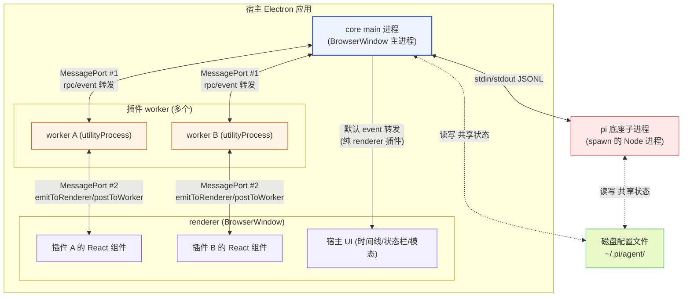

**图 7-2 — 完整进程拓扑：core main 是中枢、底座子进程经 stdio、worker 经 MessagePort #1、双入口插件 renderer 经 MessagePort #2、纯 renderer 插件经 main→renderer 默认 event 通道（§7.1.2 通道三）**

几个要点：

- **core main 是唯一中枢**：它持有底座子进程的 stdin/stdout、转发给各 worker/renderer。所有 RPC 和 event 都经 main 中转（worker↔renderer 的 UI 数据除外、那条直连）。
- **底座子进程是独立的 Node 进程**：通过 `spawn` 起的、不是 Electron 的 utilityProcess。它跑底座自己的代码、不共享宿主的内存。
- **worker 是 Electron utilityProcess**：Electron 的 Node 子进程、提供进程级隔离。每个插件 worker 独立。
- **renderer 是 BrowserWindow**：Electron 的渲染进程、跑 React。所有插件的 UI 组件都跑在 renderer（共享 renderer 堆、靠 portal + ErrorBoundary 隔离）。
- **磁盘配置文件是共享状态**：core main 和底座子进程都读写、靠文件锁协调（§9.3）。

#### 7.9.2 数据流的完整链路

一条典型的"用户发消息 → 看到回复"的完整数据流、经过所有进程：

1. 用户在 renderer 的输入框打字、点发送。
2. renderer 组件调 `pi.rpc.prompt(message)` → 往 worker↔renderer MessagePort 发 `{ kind: "rpc", ... }`。
3. worker 收到、往 worker↔main MessagePort 发 `{ kind: "rpc", ... }`。
4. main 收到、由 RPC 适配层经 stdin 发给底座子进程。
5. 底座处理、stdout 推 `agent_start` event。
6. main 的 event-translator 翻译成中性 `SessionEvent`、往所有订阅 worker 转发 `{ kind: "event", event }`。
7. worker 收到、`context.events.on` 回调触发、加工数据。
8. worker 往 worker↔renderer MessagePort 发 `emitToRenderer("agent-start", ...)`。
9. renderer 组件收到、更新 UI（置"agent 工作中"态）。
10. 后续 `message_update` event 同样流经、renderer 增量渲染流式输出。
11. `agent_settled` event 流经、renderer 置 idle。

这条链路经过 5 个进程、4 条通道。每跳都是显式消息、可观测、可断点。这是"洋葱架构 + 进程隔离"的代价——比单进程多几跳、但换来了隔离和可观测。集成者调试时能在任一跳打断点、看清数据怎么流的。

### 7.10 纯 Node 宿主的集成路径

§7.1–§7.9 全是 Electron 专有（`utilityProcess`/`MessageChannelMain`/`webContents`）。但宿主不一定是 Electron——可能是个纯 Node CLI、一个 VSCode 扩展宿主、或任何能 spawn 子进程的 Node 程序。纯 Node 宿主的集成路径比 Electron 简单得多、因为它没有 renderer 进程、也没有 utilityProcess 隔离需求。要点：

- **RPC 适配层直接在主进程跑**：没有 worker↔main MessagePort 那一对。`RpcClient` 实例就在宿主主进程里、stdin/stdout 直接管、`send`/`handleLine` 直调。这是最薄的形态——宿主主进程既是 RPC 适配层、又是逻辑层。
- **插件隔离走 `child_process` 或 in-process**：如果纯 Node 宿主也要支持插件、且需要隔离、用 `child_process.fork` 起 worker（等价于 Electron 的 `utilityProcess`、Node 原生支持）。worker 和主进程之间用 Node 原生的 `child.send`/`process.send`（底层是 IPC channel）或自建 `MessageChannel`（Node 15+ 支持）转发 RPC/event——和 Electron 的两对 MessagePort 模型一一对应、只是 API 换成 Node 原生版。不需要隔离的插件直接 in-process 加载（`require`/动态 import）、和主进程共享堆。
- **event 直接分发**：没有 renderer、event 不用跨进程推给 UI。宿主直接在主进程里订阅 `onEvent`、把 event 喂给自己的 UI 层（可能是 TUI、或 HTTP/SSE 推给前端）。§7.6.2 那条 main→renderer 默认 event 通道在纯 Node 宿主里不存在——event 订阅者就在主进程内、直接调函数。
- **配置管理照常**：§9 的配置文件读写、文件锁、字段级合并和宿主是不是 Electron 无关——纯 Node 宿主一样 import 底座 `FileSettingsStorage`、一样"读-改-写"。
- **Extension UI 子协议**：纯 Node 宿主通常没有 GUI、Extension UI 的 `select`/`confirm`/`input` 这些请求要么退化成 TUI 交互（在终端打印 + 读 stdin）、要么自动回默认值（不渲染、直接走 `respondWithDefault`）。如果宿主接了前端（如 web UI）、再按 §5 那套双向配对实现。

一条可落地的最小路径：spawn `pi --mode rpc` → `RpcClient` 在主进程跑 → `onEvent` 直接驱动宿主的输出 → 配置改动走 §9.3 文件锁 + 重启子进程。不需要 MessagePort、不需要 utilityProcess、不需要 renderer。集成者按这条路径能在几十行代码里跑起来。

---

## 8 event-translator：中性类型翻译

### 8.1 为什么不直接吃底座类型

#### 8.1.1 协议漂移问题

如果圆心（domain 层）和插件直接 import 底座的 `AgentSessionEvent`/`RpcSessionState`/`Model` 类型，底座协议一改（加字段、改字段名、删字段），圆心和插件全部要跟着改——这是"协议漂移"污染核心。现有方案的问题的根之一就是这种紧耦合：底座 SDK 升级、现有方案 跟着崩。

#### 8.1.2 翻译层隔离漂移

解法：`domain/` 定义一组**中性投影类型**，字段和底座类型对应、但归圆心拥有。`gateway/` 提供映射层把底座类型翻译成中性类型。底座协议变了，只动 `gateway/protocol/` 的类型声明和 `gateway/context-binding.ts` 的映射、圆心和插件不动。

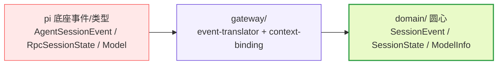

**图 8-1 — 翻译链：底座类型 → gateway 翻译 → 圆心中性类型 → 插件消费**

圆心完全不 import `gateway/protocol/`——它只认自己的 `SessionState`/`ModelInfo`/`MessageEntry`/`SessionEvent`。这是协议漂移在类型层面的隔离。

### 8.2 中性事件接口

#### 8.2.1 圆心定义

圆心定义一组中性事件接口（不 import pi 类型）：

```typescript
// domain/events/tool-call.ts —— 圆心自有中性事件接口
export interface ToolCallStart {
  type: "tool_call_start";
  toolCallId: string;
  toolName: string;
  args: unknown;           // 不引用底座的 args 类型
  timestamp: number;
}
export interface ToolCallUpdate {
  type: "tool_call_update";
  toolCallId: string;
  partialResult: unknown;
}
export interface ToolCallEnd {
  type: "tool_call_end";
  toolCallId: string;
  result: unknown;
  isError: boolean;
}

export type SessionEvent =
  | ToolCallStart
  | ToolCallUpdate
  | ToolCallEnd
  | { type: "message_start"; message: MessageEntry }
  | { type: "message_update"; message: MessageEntry; delta?: string }
  | { type: "message_end"; message: MessageEntry }
  | { type: "entry_appended"; entry: EntrySummary }
  | { type: "agent_start" } | { type: "agent_end" } | { type: "agent_settled" }
  | { type: "session_start"; reason: "startup" | "reload" | "new" | "resume" | "fork" }
  | { type: "model_select"; model: ModelInfo; previousModel?: ModelInfo; source: "set" | "cycle" | "restore" }
  | /* 其余中性事件 */;
```

#### 8.2.2 翻译实现

`event-translator.ts`（在 `gateway/`）的职责：把 pi 的 `AgentSessionEvent` 翻译成圆心的 `SessionEvent`。每个底座 event 类型对应一个翻译函数：

```typescript
// gateway/event-translator.ts
import type { AgentSessionEvent } from "./protocol/pi-events";  // 底座类型，只在 gateway 用
import type { SessionEvent } from "../domain/events";

export function translateEvent(piEvent: AgentSessionEvent): SessionEvent | null {
  switch (piEvent.type) {
    case "tool_execution_start":
      return {
        type: "tool_call_start",
        toolCallId: piEvent.toolCallId,
        toolName: piEvent.toolName,
        args: piEvent.args,
        timestamp: Date.now(),
      };
    case "tool_execution_update":
      return {
        type: "tool_call_update",
        toolCallId: piEvent.toolCallId,
        partialResult: piEvent.partialResult,
      };
    case "tool_execution_end":
      return {
        type: "tool_call_end",
        toolCallId: piEvent.toolCallId,
        result: piEvent.result,
        isError: piEvent.isError,
      };
    case "message_start":
      return { type: "message_start", message: translateMessage(piEvent.message) };
    // ... 每个 event 类型一个 case
    default:
      // 未知 event 类型（底座新增的、宿主没跟上）→ 记 warning、返回 null、不转发
      console.warn(`Unknown pi event type: ${(piEvent as { type: string }).type}`);
      return null;
  }
}
```

#### 8.2.3 未知类型的优雅处理

`default` 分支返回 `null`、不转发——底座新增了 event 类型、宿主没跟上时，这个 event 被静默丢弃、不影响其他 event 处理。这是"协议漂移"的优雅降级：宿主不崩溃、只是不消费新 event、记 warning 让集成者知道该升级适配层了。

### 8.3 敏感字段过滤

#### 8.3.1 为什么要过滤

`AgentMessage` 的 `content[]`（对话文本/图片）、`toolCalls[].args`（工具参数，可能含文件内容）是敏感字段——恶意插件可能默默收对话内容外传。要在 gateway 层按订阅插件的权限过滤——未声明 `content:sensitive` 权限的插件、收到的 event 里敏感字段置空（只保留 role/toolName 等元数据）。

#### 8.3.2 过滤点

过滤点在 gateway 层、不在圆心（圆心不感知权限）、也不在插件侧（插件无法绕过）。配合 `net:` 域名白名单（插件声明 `permissions: ["net:api.example.com"]`、用户授权后才能 `context.http.fetch` 该域名），双重防恶意插件外传数据。

```typescript
// gateway/event-translator.ts 里的过滤函数
function filterSensitive(event: SessionEvent, pluginPermissions: Set<string>): SessionEvent {
  if (!pluginPermissions.has("content:sensitive")) {
    // 过滤敏感字段：对话内容、工具参数、工具流式输出与最终结果
    if (event.type === "message_start" || event.type === "message_update" || event.type === "message_end") {
      return {
        ...event,
        message: { ...event.message, content: [], toolCalls: event.message.toolCalls?.map(tc => ({ ...tc, args: null })) },
      };
    }
    if (event.type === "tool_call_start") {
      return { ...event, args: null };
    }
    // 工具流式输出可能含文件内容/命令输出、最终结果同理——一并置空
    if (event.type === "tool_call_update") {
      return { ...event, partialResult: null };
    }
    if (event.type === "tool_call_end") {
      return { ...event, result: null };
    }
    // entry_appended 的 entry 可能内嵌消息内容/工具结果——按需脱敏其内嵌字段
    if (event.type === "entry_appended") {
      return { ...event, entry: redactEntry(event.entry) };
    }
  }
  return event;
}

// entry 内嵌的消息/工具结果按 message_* 同策略脱敏（content 清空、args/result 置空）
function redactEntry(entry: EntrySummary): EntrySummary {
  // EntrySummary 的具体结构由圆心定义、这里按其字段做防御性置空
  return { ...entry, content: [], args: null, result: null } as EntrySummary;
}

// 转发给 worker 时按订阅者的权限过滤
for (const sub of eventSubscribers) {
  const filtered = filterSensitive(neutralEvent, sub.permissions);
  sub.port.postMessage({ kind: "event", event: filtered });
}
```

### 8.4 完整翻译表

#### 8.4.1 底座 event 到中性 event 的映射表

集成者实现 `event-translator.ts` 时按这张表写 case：

| 底座 `AgentSessionEvent.type` | 中性 `SessionEvent.type` | 关键字段映射 | 备注 |
|---|---|---|---|
| `agent_start` | `agent_start` | 无 | 一轮 agent 循环开始 |
| `agent_end` | `agent_end` | `messages` → `messages[]` | 一轮结束、带这一轮产生的消息 |
| `agent_settled` | `agent_settled` | 无 | 完全落定、热加载判断能否重启的依据 |
| `turn_start` | `turn_start` | `turnIndex`、`timestamp` | 一个 turn 开始 |
| `turn_end` | `turn_end` | `message`、`toolResults` | 一个 turn 结束 |
| `message_start` | `message_start` | `message` → `translateMessage()` | 消息开始 |
| `message_update` | `message_update` | `message`、`assistantMessageEvent` | 流式更新 |
| `message_end` | `message_end` | `message` | 消息结束 |
| `entry_appended` | `entry_appended` | `entry` → `EntrySummary` | 时间线增量依据 |
| `tool_execution_start` | `tool_call_start` | `toolCallId`、`toolName`、`args` | 工具开始、args 敏感 |
| `tool_execution_update` | `tool_call_update` | `toolCallId`、`partialResult` | 工具流式输出 |
| `tool_execution_end` | `tool_call_end` | `toolCallId`、`result`、`isError` | 工具结束 |
| `session_start` | `session_start` | `reason` | 启动/重载/新建/resume/fork |
| `session_info_changed` | `session_info_changed` | `name` | session 名变了 |
| `model_select` | `model_select` | `model` → `ModelInfo`、`previousModel`、`source` | 模型切换 |
| `thinking_level_changed` | `thinking_level_changed` | `level` | 思考级别变 |
| `thinking_level_select` | `thinking_level_select` | `level` | 思考级别选 |
| `queue_update` | `queue_update` | （队列状态） | 排队消息变 |
| `compaction_start` | `compaction_start` | `reason` | 压缩开始 |
| `compaction_end` | `compaction_end` | `reason` | 压缩结束 |
| `auto_retry_start` | `auto_retry_start` | `attempt`、`maxAttempts`、`errorMessage` | 重试开始 |
| `auto_retry_end` | `auto_retry_end` | `attempt`、`success` | 重试结束 |

未知 type → 返回 null、记 warning、不转发。底座新增 event 类型时、宿主不崩、只是不消费、记 warning 提醒集成者升级适配层。

#### 8.4.2 消息翻译的递归结构

`message` 字段的翻译是递归的——`AgentMessage` 嵌套 `content[]`（文本/图片内容块）、`toolCalls[]`（工具调用、每项带 args）。`translateMessage` 的实现：

```typescript
function translateMessage(piMsg: AgentMessage): MessageEntry {
  return {
    role: piMsg.role,                    // "user" | "assistant" | "toolResult"
    content: piMsg.content?.map(c => translateContent(c)) ?? [],
    toolCalls: piMsg.toolCalls?.map(tc => ({
      id: tc.id,
      name: tc.name,
      args: tc.args,                     // 敏感字段、filterSensitive 会按权限置空
    })),
    toolCallId: piMsg.toolCallId,        // toolResult 消息回指哪个工具调用
  };
}

function translateContent(c: TextContent | ImageContent): ContentBlock {
  if (c.type === "text") return { type: "text", text: c.text };
  if (c.type === "image") return { type: "image", mimeType: c.mimeType /*, data 不直接透传 base64 */ };
  return { type: "unknown" };
}
```

注意图片内容的处理：`ImageContent` 可能带 base64 `data` 字段或 URL 形式。直接透传 base64 会占内存、且对无 `content:sensitive` 权限的插件要过滤。`translateContent` 这里只透传 mimeType、data 字段由 `filterSensitive` 按 `content:sensitive` 权限决定是否保留——无权限的插件拿不到图片数据、只看到"有图片"的元数据。

### 8.5 完整 event 类型参考

#### 8.5.1 Agent 生命周期事件详解

**agent_start**：一轮 agent 循环开始。无额外字段。这表示 agent 开始处理一条用户消息（或排队消息）、进入 turn 循环。宿主收到后置 `isStreaming: true`。

**agent_end**：一轮 agent 循环结束。字段：`messages: AgentMessage[]`——这一轮产生的全部消息。注意 agent_end 不等于"完全落定"——agent_end 后可能还有自动重试、compaction、排队续跑。要等 `agent_settled` 才算真的结束。

**agent_settled**：agent 完全落定——没有自动重试、没有 compaction、没有排队续跑了。无额外字段。这是宿主判断"一轮真的结束了"的标志：

- 热加载重启用它判断能否安全重启（§3.3.3）。
- UI 用它判断"agent 工作中"状态何时清。
- 每次 settled 后主动 `get_state` 刷新状态栏（兜底同步）。

集成者最容易踩的坑：把 `agent_end` 当成"结束"——结果 agent_end 后 agent 又开始重试、UI 状态抖动。**只有 `agent_settled` 才是真的结束**。

#### 8.5.2 Turn 与消息事件详解

**turn_start**：一个 turn 开始。字段：`turnIndex`（第几轮 turn）、`timestamp`。一个 agent 循环可能有多轮 turn（agent 调工具后继续推理是新一轮 turn）。

**turn_end**：一个 turn 结束。字段：`message`（这一轮的 assistant 消息）、`toolResults`（工具调用结果）。宿主据此分组渲染时间线（每轮 turn 一个视觉分组）。

**message_start**：消息开始。字段：`message: AgentMessage`。可能是 user 消息或 assistant 消息。宿主创建消息气泡。

**message_update**：消息流式更新。字段：`message: AgentMessage`（当前完整消息状态）、`assistantMessageEvent`（token 级流式细节、如新增的文本片段）。宿主增量渲染——追加文本、不整个气泡重画。`assistantMessageEvent` 是细粒度的、可以用来做打字机效果或 token 级动画。

**message_end**：消息结束。字段：`message: AgentMessage`（最终完整消息）。宿主标记消息完成、停止流式渲染。

**entry_appended**：一个 entry 追加到 session。字段：`entry: SessionEntry`。这是宿主增量更新时间线的依据——收到这个就 append 一条、不用重新 `get_entries` 全量拉。entry 和 message 的区别：entry 是展示层条目（带分叉树结构）、message 是 LLM 视角的扁平消息。一条 user message 可能对应一个 entry、但 compact 操作也产生 entry（不是 message）。

#### 8.5.3 工具执行事件详解

**tool_execution_start**：工具开始执行。字段：`toolCallId`（唯一标识）、`toolName`（工具名、如 `read`/`write`/`bash`）、`args`（工具参数、敏感）。宿主创建工具卡片。

**tool_execution_update**：工具执行中的流式输出。字段：`toolCallId`、`partialResult`（部分结果）。不是所有工具都有 update——只有长时间运行的工具（如 `bash` 边跑边输出）会推 update。瞬时工具（如 `read`）只推 start 和 end、没有 update。

**tool_execution_end**：工具执行结束。字段：`toolCallId`、`result`（最终结果）、`isError`（是否出错）。宿主标记卡片完成、`isError` 时标红。

这三个 event 用 `toolCallId` 关联——同一个工具调用的 start/update/end 共享一个 toolCallId。宿主按 toolCallId 维护卡片状态、聚合 update 事件、在 end 时填最终结果。

#### 8.5.4 Session 与模型事件详解

**session_start**：session 启动/加载/重载。字段：`reason: "startup" | "reload" | "new" | "resume" | "fork"`。重启子进程后宿主会收到 reason: "startup" 或 "resume"（取决于是否传了 `--session`）。宿主据此判断要不要 resync——resume 时历史在、但要重新订阅 event；new 时清空时间线。

**session_info_changed**：session 名字变了。字段：`name`。用户改 session 名（`set_session_name` 命令）后底座推这个 event。

**model_select**：模型切换。字段：`model`（新模型）、`previousModel`（旧模型）、`source: "set" | "cycle" | "restore"`。source 表示切换来源——`set` 是用户主动 `set_model`、`cycle` 是 `cycle_model`、`restore` 是 session 恢复时还原。宿主据此更新模型指示器、**这是模型切换的权威信号**（不要在命令 success 响应里更新 UI）。

**thinking_level_changed** / **thinking_level_select**：思考级别变化/选择。字段：`level`。`changed` 是级别真的变了、`select` 是用户选了但可能还没生效。

#### 8.5.5 队列与压缩事件详解

**queue_update**：消息队列变了（新消息入队/出队）。宿主据此更新"排队中 N 条"的显示。字段含队列状态（具体结构由底座定义）。

**compaction_start** / **compaction_end**：上下文压缩开始/结束。字段：`reason: "manual" | "threshold" | "overflow"`——manual 是用户主动 compact、threshold 是 token 数到了阈值、overflow 是 context window 溢出。宿主显示压缩进度。

**auto_retry_start** / **auto_retry_end**：自动重试开始/结束。字段：`attempt`（第几次重试）、`maxAttempts`、`errorMessage`（start 时带、失败原因）、`success`（end 时带、这次重试是否成功）。宿主据此显示"正在重试 (2/3)"的进度。

#### 8.5.6 event 流的时序示例

一次完整的 prompt 到 settled 的 event 流时序：

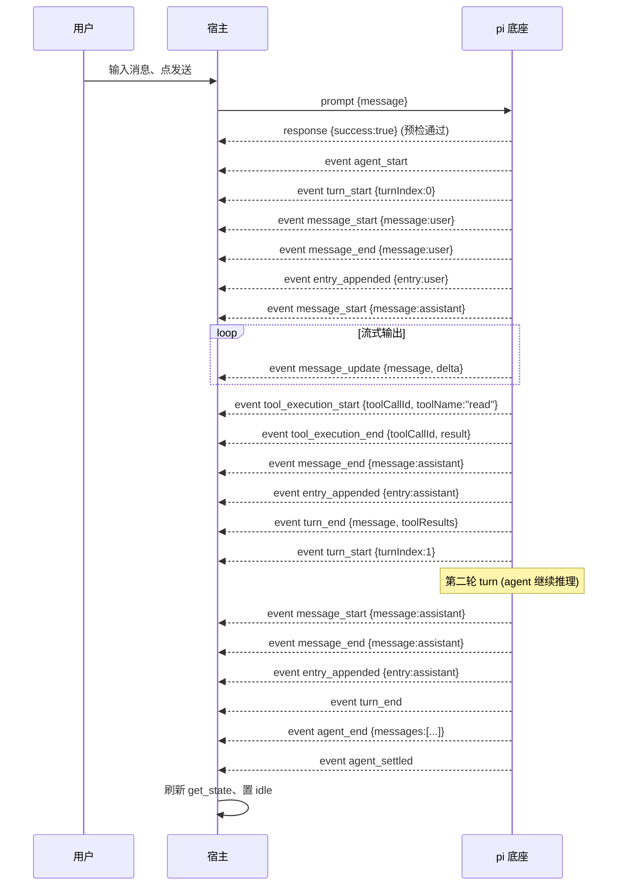

**图 8-2 — 一次完整 prompt 的 event 流时序：从 agent_start 到 agent_settled**

集成者照这个时序理解 event 的触发顺序——prompt 后底座先回 success（预检）、然后推 agent_start、进入 turn 循环、每个 turn 有 turn_start/turn_end、消息有 message_start/update/end、工具有 tool_execution_start/end、最后 agent_end + agent_settled。

---

## 9 config-binding：配置映射

### 9.1 中性类型定义

#### 9.1.1 圆心中的 SessionState / ModelInfo

圆心除了事件、还要有状态类型——`get_state` 的返回、`get_available_models` 的返回都要中性化。圆心定义：

```typescript
// domain/state.ts —— 圆心自有中性状态接口
export interface SessionState {
  model?: ModelInfo;
  thinkingLevel: "minimal" | "low" | "medium" | "high";
  isStreaming: boolean;
  isCompacting: boolean;
  steeringMode: "all" | "one-at-a-time";
  followUpMode: "all" | "one-at-a-time";
  sessionFile?: string;
  sessionId: string;
  sessionName?: string;
  autoCompactionEnabled: boolean;
  messageCount: number;
  pendingMessageCount: number;
}

export interface ModelInfo {
  provider: string;
  id: string;
  name: string;
  reasoning: boolean;
  input: ("text" | "image")[];
  contextWindow: number;
  maxTokens: number;
  cost?: { input: number; output: number; cacheRead: number; cacheWrite: number };
}

export interface EntrySummary {
  id: string;
  type: string;
  // ... 不引用底座的 SessionEntry
}
```

### 9.2 映射实现

#### 9.2.1 context-binding.ts

`gateway/context-binding.ts` 负责把底座类型翻译成中性类型：

```typescript
// gateway/context-binding.ts
import type { RpcSessionState, Model } from "./protocol/pi-types";  // 底座类型，只在 gateway
import type { SessionState, ModelInfo } from "../domain/state";

export function bindSessionState(piState: RpcSessionState): SessionState {
  return {
    model: piState.model ? bindModel(piState.model) : undefined,
    thinkingLevel: piState.thinkingLevel,
    isStreaming: piState.isStreaming,
    isCompacting: piState.isCompacting,
    steeringMode: piState.steeringMode,
    followUpMode: piState.followUpMode,
    sessionFile: piState.sessionFile,
    sessionId: piState.sessionId,
    sessionName: piState.sessionName,
    autoCompactionEnabled: piState.autoCompactionEnabled,
    messageCount: piState.messageCount,
    pendingMessageCount: piState.pendingMessageCount,
  };
}

export function bindModel(piModel: Model<any>): ModelInfo {
  return {
    provider: piModel.provider,
    id: piModel.id,
    name: piModel.name,
    reasoning: piModel.reasoning,
    input: piModel.input,
    contextWindow: piModel.contextWindow,
    maxTokens: piModel.maxTokens,
    cost: piModel.cost,
  };
}
```

#### 9.2.2 漂移隔离

底座协议变了（`RpcSessionState` 加字段、改字段名），只动 `gateway/protocol/` 的类型声明和 `gateway/context-binding.ts` 的映射函数、圆心和插件不动。这是"协议漂移"在类型层面的隔离——所有漂移冲击都被 gateway 层吸收。

### 9.3 配置文件的并发写

#### 9.3.1 共享状态模式

宿主和底座子进程都读写同一份 `settings.json`/`trust.json`：宿主在管理 UI 里改配置写回、底座子进程在 reload/保存（extension 通过 `pi.settings` 改）时也写。两个进程并发写同一个文件、不加锁会撕裂——A 写一半、B 也写一半、文件内容是两份的拼接、JSON 解析失败。

#### 9.3.2 文件锁机制

底座用 `proper-lockfile` 做文件锁协调（`FileSettingsStorage.acquireLockSyncWithRetry`）：

```typescript
private acquireLockSyncWithRetry(path: string): () => void {
  for (let attempt = 0; attempt < 10; attempt++) {
    try {
      return lockfile.lockSync(path, { realpath: false });  // 同步锁、立即返回 release 函数
    } catch (error: unknown) {
      if (error instanceof Error && (error as NodeJS.ErrnoException).code === "ELOCKED") {
        // 已被锁定 → 忙等 20ms 重试，最多 10 次（总 200ms 上限）
        continue;
      }
      throw error;  // 其他错误（权限/路径不存在/磁盘满）直接抛、不重试
    }
  }
  throw new Error(`Failed to acquire lock for ${path} after 10 attempts`);
}
```

集成者如果自己实现配置读写（不复用底座的 `SettingsManager`，因为它跑在底座进程里），**必须用同一套锁机制**——`proper-lockfile`、同样的锁路径、同样的重试参数。否则宿主写的锁底座不认、底座写的锁宿主不认，锁形同虚设。最稳妥的做法是宿主 core 直接 import 底座的 `FileSettingsStorage` 类（它是纯 TS、无进程依赖），实例化时传相同的 `cwd`/`agentDir`——锁路径、锁行为完全一致。

**推荐优先级**：优先 import 底座的 `FileSettingsStorage`（锁路径/锁语义/deepMerge 自动和底座一致、零重写、升级时跟着底座走），这是默认方案。仅当宿主 core 无法 import 底座代码（例如宿主不是 Node 环境、或刻意要解耦底座依赖）时、才走 §9.3.4 的自行重写方案——那种情况下要逐字对照底座 `settings-manager.ts` 的 `acquireLockSyncWithRetry` 和 `deepMergeSettings`、保证锁路径、重试参数、合并语义三项完全一致、否则并发写会撕裂。换句话说：§9.3.4 是 fallback、不是首选。

**分层厘清（与 §10.4.2 的进程内写队列配套）**：import 来的 `FileSettingsStorage` 只负责**跨进程文件锁**——它保证宿主进程和底座子进程不会同时写同一个 `settings.json`。但宿主进程**内部**多个 setter 并发调用时（比如多个插件同时改配置、或 UI 连点两次保存）、它们同属一个进程、`proper-lockfile` 的进程级锁对同进程并发无效（会 ELOCKED 自锁或重入失败）。因此宿主 core 要在 `FileSettingsStorage` 之外**再包一层进程内写队列**、串行化多个 setter——import 的类不负责进程内排队，进程内并发由宿主这层 wrapper 承担。两层职责正交：

```typescript
// 宿主 core 侧：import 的 FileSettingsStorage（跨进程锁）+ 宿主写队列 wrapper（进程内串行）
import { FileSettingsStorage } from "pi-coding-agent/core/settings-manager";  // 纯 TS、无进程依赖

class HostSettingsManager {
  private storage: FileSettingsStorage;        // 跨进程文件锁 + 字段合并（import 自底座、锁路径自动一致）
  private writeQueue: Promise<void> = Promise.resolve();  // 进程内串行队列、串行化多个 setter

  constructor(agentDir: string) {
    this.storage = new FileSettingsStorage(agentDir);  // 传相同 cwd/agentDir → 锁路径与底座一致
  }

  /** 改全局 settings 的某几个字段：进队、串行执行、每次读-改-写都走 storage 的跨进程锁 */
  modifyGlobal(modifiedFields: Record<string, unknown>): Promise<void> {
    this.writeQueue = this.writeQueue.then(() => this.storage.modifyGlobal(modifiedFields));
    return this.writeQueue;
  }
}
```

这样组合后：进程间靠 `FileSettingsStorage` 的 `proper-lockfile` 锁、进程内靠 `writeQueue` 串行——两层各司其职、不重叠（§10.4.2 要求的"进程内写队列"指的就是这层 wrapper、不是 import 的类自带）。

#### 9.3.3 字段级合并写

光有文件锁还不够。宿主改配置时要用"读-改-写"的精确合并：

1. **读磁盘当前值**（不是用内存里的缓存）——磁盘文件可能被底座子进程改过，以磁盘为准。
2. **嵌套字段精确合并**——改 `compaction.enabled` 时只覆盖 `enabled` 子字段、保留 `reserveTokens`/`keepRecentTokens`。
3. **只写 modified 字段**——以磁盘内容打底、只覆盖 modified 字段、其他字段保持磁盘值。

这保证宿主改 `defaultModel` 时不会顺带把底座刚写入的 `lastChangelogVersion` 覆盖掉。这种"读-改-写"+ 文件锁，是"共享状态并发写"的正确处理方式。

#### 9.3.4 完整的配置读写示例（fallback 方案）

> 本节是 §9.3.2 末尾说的 fallback 方案——仅当宿主无法 import 底座的 `FileSettingsStorage` 时才自行重写。优先用底座的类、不要照着本节重造一遍。

下面是一个完整的配置读写示例、展示"读-改-写"+ 文件锁 + 字段级合并：

```typescript
// 宿主 core 侧的配置写入（复用底座的 FileSettingsStorage 思路）
import * as lockfile from "proper-lockfile";
import * as fs from "node:fs";
import * as path from "node:path";

class HostSettingsStore {
  constructor(private agentDir: string) {}  // ~/.pi/agent

  /** 改全局 settings 的某几个字段、字段级合并 */
  async modifyGlobal(modifiedFields: Record<string, unknown>): Promise<void> {
    const settingsPath = path.join(this.agentDir, "settings.json");
    const release = this.acquireLockWithRetry(settingsPath);
    try {
      // 1. 读磁盘当前值（不是用内存缓存）
      const diskContent = fs.existsSync(settingsPath)
        ? JSON.parse(fs.readFileSync(settingsPath, "utf8"))
        : {};
      // 2. 嵌套字段精确合并（deepMerge：base 打底、modified 覆盖、嵌套对象递归合并、数组整体替换）
      const merged = deepMergeSettings(diskContent, modifiedFields);
      // 3. 写回（原子写：先写临时文件再 rename、避免半写撕裂）
      const tmpPath = settingsPath + ".tmp";
      fs.writeFileSync(tmpPath, JSON.stringify(merged, null, 2));
      fs.renameSync(tmpPath, settingsPath);
    } finally {
      release();  // 一定释放、用 try-finally 保证
    }
  }

  private acquireLockWithRetry(filePath: string): () => void {
    for (let attempt = 0; attempt < 10; attempt++) {
      try {
        return lockfile.lockSync(filePath, { realpath: false });
      } catch (err: any) {
        if (err.code === "ELOCKED") {
          // 被锁、忙等 20ms 重试
          const start = Date.now();
          while (Date.now() - start < 20) { /* busy wait */ }
          continue;
        }
        throw err;  // EACCES/ENOENT/ENOSPC 直接抛
      }
    }
    throw new Error(`Failed to acquire lock for ${filePath} after 10 attempts`);
  }
}

// deepMergeSettings：嵌套对象递归合并、数组和原始值整体替换
function deepMergeSettings<T extends Record<string, any>>(base: T, override: Record<string, any>): T {
  const result = { ...base };
  for (const key of Object.keys(override)) {
    const baseVal = (base as any)[key];
    const overrideVal = override[key];
    if (
      baseVal && typeof baseVal === "object" && !Array.isArray(baseVal) &&
      overrideVal && typeof overrideVal === "object" && !Array.isArray(overrideVal)
    ) {
      // 两个都是普通对象 → 递归合并
      result[key as keyof T] = deepMergeSettings(baseVal, overrideVal);
    } else {
      // 数组或原始值 → 整体替换
      result[key as keyof T] = overrideVal;
    }
  }
  return result;
}

// 用法：改 compaction.enabled、保留 reserveTokens
await store.modifyGlobal({
  compaction: { enabled: true },  // 只覆盖 enabled、reserveTokens/keepRecentTokens 保留磁盘值
});
```

关键设计点：

- **try-finally 保证释放锁**——异常时不能让锁残留、否则后续所有写都被卡住。
- **原子写**（临时文件 + rename）——避免"写到一半进程崩、文件撕裂"。`fs.writeFileSync` 直接写目标文件、写一半被中断会留下不完整 JSON、底座读时解析失败。先写 `.tmp` 再 `rename` 是 POSIX 原子操作、保证要么是旧内容、要么是新内容、不会半写。
- **deepMerge 的语义和底座一致**——嵌套对象递归合并、数组和原始值整体替换。集成者要对照底座 `settings-manager.ts` 的 `deepMergeSettings` 实现、保证语义一致。
- **不用内存缓存做 base**——必须读磁盘当前值。如果用内存缓存、可能漏掉底座子进程刚写入的改动、把底座的改动覆盖掉。

### 9.4 Settings 字段完整参考

#### 9.4.1 settings.json 的 schema

`Settings` 的字段是宿主配置编辑器的 schema 来源。以下是关键字段（对照底座 `settings-manager.ts`）：

| 字段 | 类型 | 用途 | 宿主 UI |
|---|---|---|---|
| `defaultProvider` | string | 默认 provider（如 `"anthropic"`） | 设置页：provider 下拉 |
| `defaultModel` | string | 默认模型 id | 设置页：模型下拉 |
| `defaultThinkingLevel` | ThinkingLevel | 默认思考级别 | 设置页：思考级别选择 |
| `transport` | `"auto"\|"sse"\|"websocket"` | HTTP 传输方式 | 设置页：传输方式（高级） |
| `steeringMode` | `"all"\|"one-at-a-time"` | steering 队列模式 | 设置页：队列模式 |
| `followUpMode` | `"all"\|"one-at-a-time"` | follow-up 队列模式 | 设置页：队列模式 |
| `theme` | string | 主题名 | 主题切换器 |
| `compaction` | `{ enabled?, reserveTokens?, keepRecentTokens? }` | 上下文压缩策略 | 设置页：压缩配置 |
| `retry` | `{ enabled?, maxRetries?, baseDelayMs?, provider? }` | 重试策略 | 设置页：重试配置 |
| `extensions` | string[] | 本地扩展路径列表 | 扩展管理：路径增删 |
| `packages` | PackageSource[] | npm/git 包源 | 扩展管理：包源增删 |
| `skills` | string[] | 本地 skill 路径 | skill 管理 |
| `prompts` | string[] | 本地 prompt 路径 | prompt 模板管理 |
| `themes` | string[] | 本地 theme 路径 | 主题管理 |
| `enabledModels` | string[] | 模型循环范围 | 设置页：模型范围 |
| `sessionDir` | string | 自定义 session 存储目录 | 设置页：session 目录 |
| `httpProxy` | string | HTTP 代理 | 设置页：代理 |
| `httpIdleTimeoutMs` | number | HTTP 空闲超时 | 设置页：网络（高级） |
| `websocketConnectTimeoutMs` | number | websocket 连接超时 | 设置页：网络（高级） |
| `defaultProjectTrust` | `"ask"\|"always"\|"never"` | 默认项目信任（仅全局） | 设置页：信任策略 |
| `enableAnalytics` | boolean | 启用分析 | 设置页：隐私 |
| `trackingId` | string | 跟踪 id | 设置页：隐私 |
| `enableInstallTelemetry` | boolean | 安装遥测 | 设置页：隐私 |

#### 9.4.2 全局与项目级 settings

pi 的配置分两份、一份全局、一份项目级：

- 全局：`~/.pi/agent/settings.json`
- 项目级：`<cwd>/.pi/settings.json`（`CONFIG_DIR_NAME` 是 `.pi`）

两份都是 JSON、schema 完全一样、靠 `SettingsManager` 合并。合并规则（`deepMergeSettings`）：以全局打底、项目级覆盖、嵌套对象递归合并、数组和原始值整体替换。

**重要**：项目级 settings **不会**和全局的数组合并拼接——项目级只要写了 `extensions`、就**完全替换**全局的 `extensions` 数组。宿主 UI 要表达清楚：项目级的扩展列表是"覆盖"不是"追加"。

#### 9.4.3 项目信任前置

合并有个前置条件：**项目信任**。项目级 settings 只有在项目被信任时才加载：

```typescript
// 底座 settings-manager.ts 的逻辑
loadFromStorage(scope, projectTrusted) {
  if (scope === "project" && !projectTrusted) return {};  // 不信任、项目级配置被忽略
  // ...
}
```

不信任的项目、它的 `.pi/settings.json` 被直接忽略、防止恶意项目通过配置文件注入。宿主的"项目信任"管理就是控制这个开关。settings 写入也受信任约束——`assertProjectTrustedForWrite` 在写项目级配置时检查、不信任就拒绝。

#### 9.4.4 扩展启停的真相

pi 没有"启用/禁用单个 extension"的独立开关——没有 `extensions: [{ name, enabled }]` 这种结构。启停就是增删路径列表：

- 装一个本地扩展：把它的路径加进 `Settings.extensions` 数组、调 `setExtensionPaths`（全局）或 `setProjectExtensionPaths`（项目级）、然后 reload（重启子进程、§3.3）。
- 卸一个本地扩展：从 `extensions` 数组移除路径、reload。
- 装 npm/git 扩展包：加进 `Settings.packages`、调 `setPackages` / `setProjectPackages`、reload。
- 装主题/skill/prompt：同理加进 `themes`/`skills`/`prompts`、reload。

宿主的扩展管理 UI 看起来是开关列表、背后是路径数组的增删 + reload。每个"开关"对应一个路径在 `extensions` 数组里在不在。

#### 9.4.5 其他状态文件

除了 settings.json、pi 在 `~/.pi/agent/` 下还有别的状态文件：

- **auth 凭证**（`auth.json`、`auth-storage.ts` 管理）：OAuth token、API key。宿主管 auth 时调底座的 auth-storage 能力（通过 RPC 的 OAuth 流或直接读写凭证文件）。
- **项目信任记录**（`trust.json`、`trust-manager.ts` / `project-trust.ts`）：每个项目路径的信任决策（true/false/null 三态）。
- **MCP 配置**：底座连外部工具服务器的协议配置。

这些和 settings.json 一样、都是宿主"管理 pi"的操作对象。它们的共同点是：改完都要让底座生效、走重启子进程（§3.3）——因为底座在启动时读这些文件、运行时不 watch。

---

## 10 已知缺口

### 10.1 reload 缺口

#### 10.1.1 缺口确认

pi 底座内部有完整的 reload 能力：`SettingsManager.reload()`（从磁盘重读 settings.json）、`ResourceLoader.reload()`（重新 discover/load extensions/skills/themes/prompts）、`AgentSession.reload()`（绑定新 extension runtime、重发 `session_start` 事件 reason: "reload"）。交互式 TUI 模式下也有 `/reload` 斜杠命令。但 RPC 协议**没有**把 reload 暴露成对外命令——`RpcCommand` 联合里没有 `reload`，`pi reload` 这样的 CLI 子命令也不存在。

所以宿主没法通过一条命令让底座热加载配置/扩展。

#### 10.1.2 当前处置：重启子进程

当前处置：重启 RPC 子进程（写完配置文件 → 杀子进程 → 用 `--session` 重起 → 新进程从磁盘重读配置 = 变相 reload）。零改底座、确定性强、立即可用。代价是重启瞬间的运行态中断（streaming 中的 agent 被打断、排队消息丢），靠 session 持久化 + resume（§3）缓解。

#### 10.1.3 演进项

未来底座如果补一个 `reload` RPC 命令（在 `RpcCommand` 联合类型里加 `reload`、`rpc-mode.ts` 的 `handleCommand` 加对应分支调 `session.reload()`），宿主切换到走 RPC reload——不重启子进程、不丢运行态、走统一 RPC 通道。这个切换对宿主是热加载路径的内部实现变化、不影响槽位契约和插件层，所以是低风险的演进。

### 10.2 list_sessions 缺口

#### 10.2.1 缺口确认

底座内部有 `SessionManager.listAll()`，返回 `SessionInfo[]`——能列出全部 session（带 path/id/cwd/name/created/modified/messageCount/firstMessage）。但 RPC 的命令里**没有** `list_sessions`，宿主无法通过 RPC 拿到这个列表。这导致会话管理插件的"会话列表"功能当前不完整——宿主只能切到已知路径的 session、记一份自己维护的"最近打开"列表、不能枚举底座全部历史 session。

#### 10.2.2 当前处置

宿主**不**自己去扫 sessionDir（那违背"session 存储是底座内部事务"的边界、要解析底座 session 文件格式），而是记一份宿主的"最近打开 session"偏好（存路径列表、不解析内容）。完整能力等底座补 `list_sessions` RPC 命令——在 `RpcCommand` 加 `list_sessions`、返回 `SessionInfo[]`，宿主会话列表就完整了。

### 10.3 handshake 缺口

#### 10.3.1 缺口确认

§6 详述。RPC 协议没有版本协商——没有协议版本号、没有 feature detection、没有"未知命令优雅降级"。底座演进时命令会增删改、宿主只能被动追兼容。

#### 10.3.2 当前处置与演进

当前兜底走版本化适配层（`gateway/rpc-adapter.ts` + `gateway/protocol/versions.ts`），底座协议变时只动这层、不动插件层。演进方向是底座补 `handshake` RPC 命令、宿主据此 feature detection（§6.2）。三个缺口（handshake/reload/list_sessions）一起向底座提、是同一个"补 RPC 管理类命令"的演进方向。

### 10.4 file_lock 缺口

> **术语区分（重要）**：本节的 `file_lock` 指 **settings.json / trust.json 的 `proper-lockfile` 僵尸锁清理**——锁路径形如 `${settings.json}.lock`、在 `~/.pi/agent/` 下，本节提议补的中心化注册表是 `~/.pi/agent/file-locks.json`。这与 `DESIGN.md` §4.12.4（line 1950）的编辑器文件 advisory lock **不是同一机制**：后者锁存于 `<cwd>/.pi/desktop/file-locks.json`、是桌面本地、用于**编辑器 ↔ agent 改项目文件前**的弱协调（advisory lock），路径、用途、归属全不同。两者同名易混，盲审跨文档对照时务必按路径区分：`~/.pi/agent/file-locks.json`（本节、配置文件锁注册表）vs `<cwd>/.pi/desktop/file-locks.json`（DESIGN.md、编辑器 advisory lock）。术语表 §15.2.1 已分别列条目。

#### 10.4.1 缺口确认

底座当前用 `proper-lockfile` 做文件锁——每个配置文件（settings.json、trust.json）有自己独立的锁、靠文件路径隔离。但底座**没有一个统一的 `file-locks.json` 中心化锁注册表**——没有"哪些文件被谁锁着、锁了多久"的全局视图。

这导致两个问题：

1. **僵尸锁残留**：底座进程崩溃时、`proper-lockfile` 的锁文件（`${path}.lock`）可能没清理、残留下来。下次宿主或新底座进程要锁这个文件时、会拿到 `ELOCKED`、持续失败——但锁其实已经是僵尸、没人持有。
2. **死锁诊断困难**：如果宿主和底座互锁（极少见、但并发写多个相关文件时可能发生）、没有全局视图难以诊断。

#### 10.4.2 当前处置

- **复用同一套锁机制**：宿主 core 读写配置时直接 import 底座的 `FileSettingsStorage` 类（纯 TS、无进程依赖）、实例化时传相同的 `cwd`/`agentDir`——锁路径、锁行为完全一致。这是"薄壳直接复用底座机制"的体现，不重造。
- **僵尸锁清理**：宿主重启子进程时、若发现旧子进程的锁残留（`ELOCKED` 持续失败超过 200ms 上限）、可以查锁文件的 mtime——如果很旧（比如几分钟前、且当前没有底座进程在跑）、可以判定为僵尸锁、强制清理。但**要尊重锁机制**——不要绕过它直接删锁文件，否则可能和正在写的底座进程冲突。
- **进程内写队列**：宿主 core 自己的 `SettingsManager` 还要有进程内的写队列、串行化多个 setter 的写任务——文件锁解决跨进程并发、写队列解决进程内并发。注意 import 来的 `FileSettingsStorage`（§9.3.2）只提供跨进程锁、不含进程内排队；进程内写队列是宿主在它之外包的一层 wrapper（组合示意见 §9.3.2 末尾）。

#### 10.4.3 演进项

演进方向：向底座提、补一个中心化的 `~/.pi/agent/file-locks.json` 兜底注册表——记录"哪些文件被谁锁着、锁了多久"、用于诊断死锁和清理僵尸锁。宿主重启子进程时、可以查这个注册表判断是否是僵尸锁、决定是否强制清理。这是个兜底机制、当前靠 `proper-lockfile` 的进程级锁已足够、但跨进程协调复杂时会不够。

### 10.5 缺口的诊断与处置实操

#### 10.5.1 缺口诊断流程

集成者遇到"某个功能不工作"时、怎么判断是不是踩了缺口？诊断流程：

1. **reload 不生效**：改了配置、重启了子进程、但底座行为没变。先检查是不是真的重启了（`get_state` 的 sessionId 应该变、sessionFile 应该不变）。如果重启了但没生效、可能是配置写错地方了（写全局还是项目级）。如果重启后 session 丢了、是 resume 没传 `--session`。
2. **会话列表不完整**：会话管理 UI 列不出全部历史 session。这是 list_sessions 缺口（§10.2）——当前只能列"最近打开"的、不能枚举底座全部历史。
3. **协议字段对不上**：底座升级后、某个 response 字段没了或改了名、宿主解析崩。这是 handshake 缺口（§10.3）——没有版本协商、底座协议漂移导致。检查 stderr 日志、看是不是反序列化失败。
4. **配置写卡住**：`acquireLockWithRetry` 持续 ELOCKED。这是 file_lock 缺口（§10.4）——可能僵尸锁残留、或底座正在长时间写。检查 `.lock` 文件的 mtime。

#### 10.5.2 缺口处置决策表

| 缺口 | 症状 | 当前处置 | 演进方向 |
|---|---|---|---|
| reload | 改配置不生效 | 重启子进程（§3.3） | 底座补 reload RPC 命令 |
| list_sessions | 会话列表不完整 | 维护"最近打开"列表 | 底座补 list_sessions RPC 命令 |
| handshake | 协议漂移导致崩 | 版本化适配层 + pin 底座版本 | 底座补 handshake 命令 |
| file_lock | 配置写卡住（ELOCKED） | 复用 proper-lockfile + 僵尸锁清理 | 底座补 file-locks.json 注册表 |

集成者遇到这些症状时、按这张表判断是不是踩了缺口——是缺口就走当前处置、不是缺口就排查自己的实现 bug。这是"已知问题已知处置"、避免在缺口上反复浪费时间排查。

#### 10.5.3 向底座提需求

四个缺口都需要底座补能力。集成者（或 pi-desktop core 团队）向底座提需求时、应该一起提、而不是分散提——因为它们是同一个"补 RPC 管理类命令"的演进方向、一次底座发版能一起带上。提需求时附上：

- **用例**：宿主在什么场景下需要这个能力（reload：改配置后热加载；list_sessions：会话管理 UI 列表；handshake：协议版本协商；file_lock：僵尸锁清理）。
- **契约**：建议的命令格式和返回类型（§6.2 给了 handshake 的设计；reload/list_sessions 类似）。
- **降级路径**：宿主已有兜底方案（重启子进程 / 最近打开列表 / 版本化适配层 / proper-lockfile）、底座补了之后宿主能优雅切换、不破坏现有逻辑。

### 10.6 统一处置策略

#### 10.6.1 三个缺口一起收敛

reload/list_sessions/handshake 三个缺口是同一类"底座有内部能力、RPC 没开口子"或"协议没协商机制"的问题。处置一致：

- **当前**：宿主用兜底方案（reload→重启子进程、list_sessions→最近打开列表、handshake→版本化适配层）。
- **演进**：一起向底座提、补这三条 RPC 能力。三个一起提是因为它们是同一个"补 RPC 管理类命令"的演进方向、一次底座发版能一起带上、避免多次往返。
- **handshake 是收敛点**：handshake 通道能 feature-detect reload/list_sessions 是否已补——底座补了 handshake 但命令清单里没这俩 → 走兜底；清单里有 → feature-detect 地用。三个缺口一起靠 handshake 通道收敛。

#### 10.6.2 缺口演进路线图

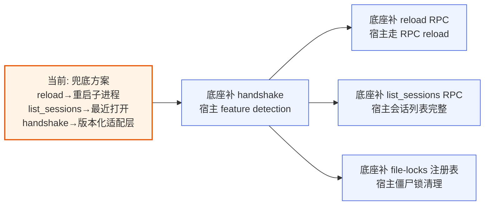

**图 10-1 — 缺口演进路线：handshake 是收敛点，reload/list_sessions/file_lock 待底座补**

---

## 11 端到端集成示例

### 11.1 从零接入一个底座

#### 11.1.1 完整代码

把前面各节拼成一个最小可跑的集成示例。这是一个 Node 脚本、起底座子进程、发 handshake、发 prompt、订阅 event、收到 `agent_settled` 后退出：

```typescript
// integration-example.ts
import { spawn, type ChildProcess } from "node:child_process";
import { StringDecoder } from "node:string_decoder";
import * as crypto from "node:crypto";

interface RpcClientOptions {
  cliPath: string;
  cwd: string;
  env?: Record<string, string>;
  provider?: string;
  model?: string;
  args?: string[];
}

class PiIntegration {
  private process: ChildProcess | null = null;
  private stderr = "";
  private exitError: Error | null = null;
  private pendingRequests = new Map<string, { resolve: (v: any) => void; reject: (e: Error) => void }>();
  private eventListeners: Array<(e: any) => void> = [];
  private requestId = 0;
  private availableCommands = new Set<string>();
  private sessionFile: string | undefined;

  constructor(private options: RpcClientOptions) {}

  async start(resumeSessionFile?: string): Promise<void> {
    const args = ["--mode", "rpc"];
    if (this.options.provider) args.push("--provider", this.options.provider);
    if (this.options.model) args.push("--model", this.options.model);
    if (resumeSessionFile) args.push("--session", resumeSessionFile);
    if (this.options.args) args.push(...this.options.args);

    // 用 process.execPath 而非 "node"，打包环境不依赖系统 PATH（理由见 §2.3.2）
    this.process = spawn(process.execPath, [this.options.cliPath, ...args], {
      cwd: this.options.cwd,
      env: { ...process.env, ...this.options.env },
      stdio: ["pipe", "pipe", "pipe"],
    });

    // 接进程事件（§2.3.3）
    this.process.stderr?.on("data", (d) => { this.stderr += d.toString(); process.stderr.write(d); });
    this.process.once("exit", (code, signal) => {
      if (this.process === null) return;
      this.exitError = new Error(`Agent exited (code=${code} signal=${signal}). Stderr: ${this.stderr}`);
      this.rejectAllPending(this.exitError);
    });
    this.process.once("error", (err) => {
      this.exitError = new Error(`Agent error: ${err.message}. Stderr: ${this.stderr}`);
      this.rejectAllPending(this.exitError);
    });
    this.process.stdin?.on("error", (err) => {
      this.exitError = this.exitError ?? new Error(`stdin error: ${err.message}`);
      this.rejectAllPending(this.exitError);
    });

    // 接 stdout JSONL（§2.2.3，严格按 LF 切、不用 readline）
    this.attachJsonlReader(this.process.stdout!, (line) => this.handleLine(line));

    // 就绪窗口（§2.3.1）
    await new Promise((r) => setTimeout(r, 100));
    if (this.process!.exitCode !== null) throw this.exitError ?? new Error("process exited");

    // §6 handshake 探测能力
    await this.handshake();

    // §3.2 缓存 sessionFile
    const state = await this.send({ type: "get_state" });
    if (state.success) this.sessionFile = state.data.sessionFile;
  }

  private attachJsonlReader(stream: NodeJS.ReadableStream, onLine: (line: string) => void) {
    const decoder = new StringDecoder("utf8");
    let buffer = "";
    const onData = (chunk: string | Buffer) => {
      buffer += typeof chunk === "string" ? chunk : decoder.write(chunk);
      while (true) {
        const i = buffer.indexOf("\n");
        if (i === -1) return;
        const line = buffer.slice(0, i);
        buffer = buffer.slice(i + 1);
        onLine(line.endsWith("\r") ? line.slice(0, -1) : line);
      }
    };
    stream.on("data", onData);
  }

  private handleLine(line: string) {
    try {
      const data = JSON.parse(line);
      // §5 Extension UI request 单独处理（这里省略，见 §5.4）
      // §4 command-response 配对
      if (data.type === "response" && data.id && this.pendingRequests.has(data.id)) {
        const p = this.pendingRequests.get(data.id)!;
        this.pendingRequests.delete(data.id);
        p.resolve(data);
        return;
      }
      // 否则当 event 转发
      for (const l of this.eventListeners) l(data);
    } catch { /* 忽略非 JSON 行 */ }
  }

  private async send(command: any): Promise<any> {
    if (this.exitError) throw this.exitError;
    if (!this.process?.stdin || this.process.stdin.destroyed) throw new Error("stdin not writable");
    const id = `req_${++this.requestId}`;
    return new Promise((resolve, reject) => {
      const timeout = setTimeout(() => {
        this.pendingRequests.delete(id);
        reject(new Error(`Timeout: ${command.type}`));
      }, 30000);
      this.pendingRequests.set(id, {
        resolve: (r) => { clearTimeout(timeout); resolve(r); },
        reject: (e) => { clearTimeout(timeout); reject(e); },
      });
      this.process!.stdin.write(`${JSON.stringify({ ...command, id })}\n`);
    });
  }

  private async handshake(): Promise<void> {
    try {
      const r = await this.send({ type: "handshake", clientVersion: "0.1.0", protocolConstraint: "^1.0" });
      if (r.success && r.data) {
        this.availableCommands = new Set(r.data.availableCommands ?? []);
        console.log(`handshake: protocol ${r.data.protocolVersion}, ${this.availableCommands.size} commands`);
      } else {
        this.assumeLegacy();
      }
    } catch { this.assumeLegacy(); }
  }
  private assumeLegacy() {
    this.availableCommands = new Set(["prompt","steer","follow_up","abort","new_session","get_state","set_model","cycle_model","get_available_models","set_thinking_level","cycle_thinking_level","set_steering_mode","set_follow_up_mode","compact","set_auto_compaction","set_auto_retry","abort_retry","bash","abort_bash","get_session_stats","export_html","switch_session","fork","clone","get_fork_messages","get_entries","get_tree","get_last_assistant_text","set_session_name","get_messages","get_commands"]);
  }

  onEvent(listener: (e: any) => void): () => void {
    this.eventListeners.push(listener);
    return () => {
      const i = this.eventListeners.indexOf(listener);
      if (i !== -1) this.eventListeners.splice(i, 1);
    };
  }

  private rejectAllPending(error: Error) {
    for (const p of this.pendingRequests.values()) p.reject(error);
    this.pendingRequests.clear();
  }

  async stop() {
    if (!this.process) return;
    this.process.stdin?.end();                    // §2.4 先关 stdin 让底座优雅退
    await new Promise<void>((resolve) => {
      const t = setTimeout(() => { this.process?.kill("SIGKILL"); resolve(); }, 1000);
      this.process?.on("exit", () => { clearTimeout(t); resolve(); });
    });
    this.process = null;
    this.pendingRequests.clear();
  }

  /** 热加载重启（§3.3） */
  async restartForConfigReload() {
    const resume = this.sessionFile;
    await this.stop();
    await this.start(resume);
  }
}

// 使用示例
async function main() {
  const pi = new PiIntegration({
    cliPath: "/path/to/pi/dist/cli.js",
    cwd: "/Users/me/my-project",
    env: { ANTHROPIC_API_KEY: process.env.ANTHROPIC_API_KEY! },
    provider: "anthropic",
    model: "claude-sonnet-4-20250514",
  });

  await pi.start();
  const unsub = pi.onEvent((e) => {
    console.log(`[event] ${e.type}`);
    if (e.type === "agent_settled") {
      console.log("agent settled, stopping...");
      unsub();
      pi.stop();
    }
  });

  await pi.send({ type: "prompt", message: "Hello, what can you do?" });
}
main().catch(console.error);
```

#### 11.1.2 关键检查清单

集成者按这个清单逐项核对：

- [ ] `cliPath` 定位到底座真实路径（不是硬编码 `dist/cli.js`）。
- [ ] `cwd` 跟随用户当前项目目录。
- [ ] `env` 拼合 `process.env` + 自定义（OAuth/API key 走 env、不在 args 明文）。
- [ ] `stdio: ["pipe", "pipe", "pipe"]`。
- [ ] JSONL reader 严格按 LF 切、**不用 readline**、剥 CR。
- [ ] spawn 后等 100ms 就绪窗口、检查 exitCode。
- [ ] exit/error/stdin error 三个事件都接住、都 rejectAllPending。
- [ ] send 前置检查（进程死了/stdin 不可写）。
- [ ] 每个 pending 挂 30s timeout。
- [ ] handshake 在发业务命令前发、捕获 error 走 legacy 兜底。
- [ ] `get_state` 缓存 `sessionFile` 供重启 resume。
- [ ] 重启时 `args.push("--session", sessionFile)`。
- [ ] stop 时先关 stdin、再 SIGTERM、再 SIGKILL 兜底。
- [ ] event 订阅者能容忍收到 `type: "response"` 的杂项（id 不在 pending 时会被当 event 转发）。
- [ ] Extension UI request 单独处理（示例里省略、见 §5.4）、response 的 id 严格配对。
- [ ] 配置文件读写复用底座的 `FileSettingsStorage`（锁机制一致）。
- [ ] event-translator 把底座 event 翻译成中性类型、未知 type 返回 null 不转发。
- [ ] 敏感字段按 `content:sensitive` 权限过滤。

### 11.2 集成测试场景

#### 11.2.1 场景一：基础交互测试

验证最基本的"发消息、收回复"流程能跑通：

1. 起底座子进程、handshake 通过、`get_state` 返回 idle。
2. 发 `prompt("Hello, what can you do?")`、等 success 响应。
3. 订阅 event、应该依次收到 `agent_start` → `turn_start` → `message_start`(user) → `message_end`(user) → `entry_appended` → `message_start`(assistant) → 多个 `message_update` → `message_end`(assistant) → `entry_appended` → `turn_end` → `agent_end` → `agent_settled`。
4. `agent_settled` 后 `get_state`、`isStreaming` 应为 false。
5. `get_entries`、应该有 user entry 和 assistant entry。
6. 停子进程。

通过这个测试、验证 §2（起进程）、§4（三类消息）、§6（handshake）的基本链路。

#### 11.2.2 场景二：streaming 中重启

验证热加载重启的决策状态机（§3.3.3）：

1. 起底座、发 `prompt`、收到 `agent_start` 后、`get_state` 返回 `isStreaming: true`。
2. 模拟用户改配置、触发重启逻辑。因为 streaming、应弹"是否打断"提示。
3. 选"等 settled"、验证改动被攒着、`agent_settled` 后自动重启。
4. 重启后 `get_state` 的 `sessionFile` 应和重启前一样（resume 成功）、`get_entries` 的 entry 列表应包含重启前的历史。
5. 验证排队消息丢了（如果 streaming 时有排队消息）。

通过这个测试、验证 §3（session resume）、§3.3.3（重启决策）、"改动攒着"的逻辑。

#### 11.2.3 场景三：Extension UI 交互

验证 Extension UI 子协议双向配对（§5）：

1. 起底座、装一个会调 `ui.confirm()` 的 extension（或用底座自带的测试 extension）。
2. 发 `prompt` 触发该 extension 的 confirm 调用。
3. 底座应推 `extension_ui_request`（method: confirm）、宿主渲染确认框。
4. 用户点"是"、宿主回 `extension_ui_response { confirmed: true }`。
5. extension 的 `await ui.confirm()` 应拿到 `true`、继续执行。
6. 验证 extension 的后续行为反映了用户的选择。

通过这个测试、验证 §5（Extension UI）的完整往返。

#### 11.2.4 场景四：handshake 降级

验证 handshake 的降级路径（§6.3）：

1. 用一个不支持 handshake 的旧版底座、起子进程。
2. 宿主发 handshake、底座回 `{ success: false, error: "Unknown command: handshake" }`。
3. 宿主应捕获、走 `assumeLegacySnapshot`、`availableCommands` 填入硬编码清单。
4. 后续发 `get_state` 等命令应正常工作。
5. 调一个不在清单里的命令（模拟）、应被 `sendChecked` 拦截、抛 `Command not available`。

通过这个测试、验证 handshake 降级路径。

#### 11.2.5 场景五：配置并发写

验证文件锁和字段级合并（§9.3）：

1. 起底座子进程、它持有自己的 `SettingsManager` 实例。
2. 宿主和底座同时改 settings.json 不同字段（宿主改 `defaultModel`、底座改 `compaction.enabled`）。
3. 两个写都应成功、不撕裂（文件锁协调）。
4. 读回 settings.json、两个改动都在（字段级合并、互不覆盖）。
5. 模拟僵尸锁：手动创建一个 `.lock` 文件、设旧 mtime、重启子进程。宿主应能检测到僵尸锁、清理、恢复写能力。

通过这个测试、验证 §9.3（配置并发写）和僵尸锁清理。

#### 11.2.6 场景六：worker 隔离

验证 worker↔main MessagePort 通信和 worker 隔离（§7）：

1. 起两个插件 worker（A 和 B）、各自有自己的 worker↔main MessagePort。
2. worker A 发 `set_model`、验证 worker B 收不到这个 RPC 的 response（隔离）。
3. 底座推 event、验证两个 worker 都收到（广播）。
4. 杀掉 worker A、验证主进程捕获崩溃、标记禁用、worker A 的 pending RPC 全部 reject、event 订阅移除。
5. worker B 应不受影响、继续工作。

通过这个测试、验证 §7（worker MessagePort）的隔离和故障处理。

#### 11.2.7 测试矩阵

集成者应该把上面六个场景组成测试矩阵、每次集成变更都跑一遍：

| 场景 | 验证的内容 | 通过标准 |
|---|---|---|
| 基础交互 | 起进程、消息、handshake | event 流完整、settled 后 idle |
| streaming 重启 | resume、重启决策 | sessionFile 不变、历史保留、排队消息丢 |
| Extension UI | 双向配对 | extension 拿到用户选择 |
| handshake 降级 | 协议漂移兼容 | 旧版底座照常工作 |
| 配置并发写 | 文件锁、字段级合并 | 两边改动都在、不撕裂 |
| worker 隔离 | MessagePort、崩溃处理 | worker 间不串、崩溃不连坐 |

### 11.3 集成决策树

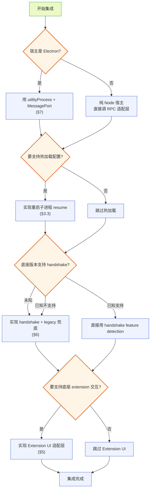

**图 11-1 — 集成决策树：根据宿主类型和能力需求选择集成路径**

---

## 12 集成反模式与边界

### 12.1 不要把底座 SDK 娶进宿主进程

#### 12.1.1 反模式

旧 现有方案的翻车根：把 pi 的 SDK 同进程 import、于是不得不造 Worker 进程池、SDK 加载器、版本管理器来兜底。那些复杂度几乎全部是"把 SDK 塞进自己进程"这个决定的副产物。

#### 12.1.2 正解

走 RPC——底座子进程自己管自己的内部状态，宿主只管发命令、收事件。Worker 进程池、SDK 加载器、版本管理器一个都不需要。这条边界守不住、薄壳就会变厚。

### 12.2 不要做底座 extension 的 UI 翻译层

#### 12.2.1 反模式

旧 现有方案 造了一套纯 JSON 的 adapter（34 个 `.adapter.json`、全在 `src/extension-compat/builtin/`、第三方无法自带），用声明式映射描述"这个底座扩展的某种交互在桌面上用哪个组件呈现"。后果是同一个扩展被劈成两半——行为归底座 extension、外观归 adapter；第三方扩展想在桌面有像样的 UI、光写 extension 不够、还得给宿主仓库贡献 adapter.json、等宿主发版才能带上。

#### 12.2.2 正解

底座 extension 在桌面上有 UI 需求时、不配 adapter、而是写一个宿主插件、这个插件通过 RPC 观察底座——`get_commands` 拿 extension 注册的命令、订阅 `tool_execution_*` event 拿工具调用、订阅 `message_*` event 拿消息流——然后自己决定怎么呈现。这是单向消费、不是双向翻译。

### 12.3 不要自己解析底座 session 文件

#### 12.3.1 反模式

为了实现"会话列表"、自己去扫 `~/.pi/agent/sessions/` 解析 session 文件格式、列全部 session。这违背"session 存储是底座内部事务"的边界——session 文件格式是底座的内部实现、可能变、宿主解析它就是把自己和底座内部格式紧耦合。

#### 12.3.2 正解

记一份宿主的"最近打开 session"偏好（存路径列表、不解析内容）。完整能力等底座补 `list_sessions` RPC 命令（§10.2）。

### 12.4 不要绕过文件锁直接写配置

#### 12.4.1 反模式

宿主改配置时图省事、直接 `fs.writeFileSync(settings.json, JSON.stringify(newSettings))`、不走文件锁。后果：和底座并发写时文件撕裂、JSON 解析失败、底座崩。

#### 12.4.2 正解

复用底座的 `FileSettingsStorage` 类、用同一套 `proper-lockfile` 锁、同样的锁路径和重试参数。读-改-写、字段级合并、只写 modified 字段（§9.3）。

### 12.5 不要让底座协议类型漏到圆心

#### 12.5.1 反模式

圆心和插件直接 import `AgentSessionEvent`/`RpcSessionState`/`Model` 类型。底座协议一改、圆心和插件全部要跟着改——协议漂移污染核心。

#### 12.5.2 正解

`domain/` 定义中性投影类型、`gateway/` 提供映射层把底座类型翻译成中性类型（§8、§9）。底座协议变了、只动 `gateway/protocol/` 的类型声明和 `gateway/context-binding.ts` 的映射、圆心和插件不动。

### 12.6 不要假设底座协议不变

#### 12.6.1 反模式

集成者照着当前底座版本写好客户端、假设命令集和字段结构永远不变。底座升级后、某个命令的 response 字段改名了或删了、客户端静默错（解析出 undefined）或崩（反序列化失败）。

#### 12.6.2 正解

- **handshake + availableCommands**：运行时探测能力、不硬编码命令集（§6）。
- **返回类型用 `?.` 链式访问**：`response?.data?.models ?? []`、防字段不存在时崩。
- **未知 type 优雅处理**：event translator 的 default 分支返回 null、不转发、记 warning（§8.2.3）。
- **版本化适配层**：所有协议类型集中在 `gateway/protocol/`、底座协议变时只动这层、不动插件层。
- **pin 底座版本发布**：宿主发版时 pin 一个底座版本、保证两者兼容。长期靠 handshake 优雅升级。

### 12.7 不要把 worker 当 RPC 代理

#### 12.7.1 反模式

把所有 RPC 调用都路由到 worker、worker 再转发给 main、main 再发给底座。这加了无谓的跳数、每个 RPC 都多一跳 MessagePort、延迟和故障点都增加。

#### 12.7.2 正解

worker 的角色是"插件逻辑的隔离进程"、不是"RPC 代理"。插件需要 RPC 时、worker 转发给 main（这是必要的——worker 不能直接碰 stdio）。但不要为了"统一入口"把不需要 worker 的逻辑也塞进 worker——纯 renderer 插件直接用 core 提供的默认 event 转发、不需要 worker。worker 只给"需要后台逻辑"的插件用。

### 12.8 不要让 Extension UI 阻塞底座

#### 12.8.1 反模式

Extension UI 的模态框渲染慢、用户操作慢、宿主迟迟不回 response。底座 extension 的 `await ui.confirm()` 一直挂起、阻塞 agent 主循环。

#### 12.8.2 正解

- **底座自己有 timeout 兜底**（§5.2.2）：超时自动 resolve 默认值、不阻塞。
- **宿主侧也要快**：模态框渲染要即时、用户操作要能快速回 response。但不必担心"用户不操作卡死底座"——底座有 timeout。
- **不要故意不回**：影响用户体验、且底座可能已 timeout 走默认路径、宿主后到的 response 被忽略。
- **cleanup 在底座退出时调**（§5.4.4）：底座死了、模态要关闭、不能挂着。

---

## 13 排错与常见问题

### 13.1 进程起不来

#### 13.1.1 spawn 立即退出、exitCode 非 0

**症状**：spawn 后等 100ms、`exitCode !== null`、stderr 有错误信息。

**排查步骤**：

1. **看 stderr**：`this.stderr` 累积的 stderr 是第一线索。常见错误：
   - `Cannot find module` / `Error: Cannot find` → `cliPath` 不对、找不到底座 CLI 入口。检查 cliPath 定位逻辑（§2.1.4）。
   - `Error: EACCES` → 权限不足、底座安装目录不可执行。检查文件权限。
   - `Error: ENOENT: no such file or directory` → cliPath 或 cwd 不存在。检查路径。
2. **手动验证 cliPath**：在终端跑 `node <cliPath> --version`、看是否正常输出版本。如果不正常、cliPath 有问题。
3. **检查 cwd**：cwd 必须存在且可读。用户可能打开了一个已删除的项目目录。
4. **检查 env**：如果设置了 `HTTP_PROXY` 但代理不可用、底座启动时连不上 provider 会失败。检查 env 里的网络相关变量。

#### 13.1.2 spawn 成功但永远不就绪

**症状**：spawn 返回、进程没退出、但发命令永远 timeout。

**排查步骤**：

1. **看 stdout 是否有输出**：在 handleLine 里加日志、看 stdout 有没有任何行。如果完全没有输出、底座可能卡在初始化（比如 extension 加载慢、或卡在某个 IO）。
2. **看 stderr**：stderr 可能有底座的初始化日志、看它卡在哪。
3. **加长就绪窗口**：100ms 可能不够、冷启动或慢机器试 500ms-1s。但不要无限等——如果 1s 还没就绪、大概率是底座卡死了、该让用户重启。
4. **检查 session resume**：如果传了 `--session` 指向一个损坏的 session 文件、底座可能在加载 session 时卡住。试不传 `--session` 看是否能启动。

### 13.2 命令发出去没响应

#### 13.2.1 30s timeout

**症状**：发命令后 30s 收到 `Timeout waiting for response to ...`。

**排查步骤**：

1. **进程还活着吗**：检查 `this.process.exitCode`、看进程是否已退出但 timeout 还在跑。
2. **stdin 还可写吗**：检查 `stdin.destroyed` / `stdin.writable`。如果 stdin 已关、命令写不进去。
3. **命令格式对吗**：检查发出的 JSON 是否合法、`type` 字段是否在底座支持的命令集里。底座的 `default` 分支会回 `{ success: false, error: "Unknown command: ..." }`、这是个 response（带 id）、应该能配对 resolve。如果连这个都没回、说明命令没到 stdin。
4. **底座正在忙吗**：某些命令（如 `compact`）要调 LLM、可能很久。`get_state` 这种快命令如果也 timeout、说明底座卡住了——可能是 extension 阻塞了主循环。这种情况下、几乎所有命令都会 timeout。

#### 13.2.2 response 的 id 对不上

**症状**：发了 `req_1`、收到 `req_2` 的 response（或收到没 id 的）。

**排查**：

1. **多个 RpcClient 实例串了**：如果宿主起了多个底座子进程、每个实例有自己的 requestId。但如果有 bug 导致两个实例共享了 pendingRequests Map、id 会串。检查 RpcClient 是否单实例使用。
2. **底座重复回 response**：底座不应该对同一 id 回两次、但如果底座有 bug、可能重复回。第二个 response 来时、id 已从 pending 删除、会被当 event 转发。event 订阅者要能容忍收到 `type: "response"` 的杂项。
3. **Extension UI response 混进了 command pending**：Extension UI 的 response 用 UUID id、command response 用 `req_N` id。如果 handleLine 没先判 `extension_ui_request`、UUID id 的 Extension UI request 可能被误当 event。但 Extension UI request 的 `type` 是 `extension_ui_request` 不是 `response`、不会进 command 配对分支——除非底座有 bug。

### 13.3 Extension UI 交互卡住

#### 13.3.1 模态框弹出但底座不响应

**症状**：用户点了"是"、宿主发了 `extension_ui_response { id, confirmed: true }`、但底座的 extension 代码没继续。

**排查**：

1. **id 对吗**：response 的 id 必须和 request 的 id 一致（UUID）。检查宿主是否正确传递了 id。
2. **response 形态对吗**：confirm 要回 `{ confirmed: boolean }`、不能回 `{ value: "true" }`。检查 method 和 response 形态的对应（§5.3.1）。
3. **底座已经 timeout 了**：如果 request 带 timeout、底座可能已经 timeout 自动 resolve 了默认值、extension 已经继续走默认路径。这时宿主后到的 response 会被忽略（底座的 `pendingExtensionRequests.delete(id)` 已执行）。这不会出错、但用户看到的是"点了是、但 extension 没用我的选择"——因为 extension 已经走了默认值。解决：宿主侧的 UI 渲染要快、或提示用户"这个交互有时限"。
4. **stdin 写失败**：检查写 stdin 时有没有抛 EPIPE。如果底座已关 stdin、写会失败、response 发不出去。

### 13.4 热加载重启后状态不对

#### 13.4.1 重启后 session 变了

**症状**：重启子进程后、`get_state` 返回的 `sessionFile` 和重启前不一样、时间线清空。

**排查**：

1. **有没有传 --session**：重启时必须 `args.push("--session", resumeFile)`。如果忘传、底座开新 session、历史丢了。
2. **sessionFile 缓存对吗**：检查 `this.sessionFile` 是否在 `get_state` 后正确缓存。如果 `get_state` 失败、sessionFile 是 undefined、重启时没传 `--session`。
3. **session 文件被删了吗**：用户可能在重启前手动删了 session 文件。底座 `--session` 指向不存在的文件会 `process.exit(1)`。

#### 13.4.2 重启后 UI 显示旧状态

**症状**：重启后、UI 上还显示"agent 工作中"、但实际底座已经 idle。

**排查**：

1. **有没有 resync**：重启后必须 `get_state` + `get_entries` + `get_commands` 同步 UI。如果漏了、UI 还是旧状态。
2. **有没有重新订阅 event**：旧进程的 event 订阅在新进程不生效。新进程要重新订阅。检查 `onEvent` 是否在新进程就绪后重新调用。
3. **有没有重新 handshake**：新进程可能有不同的能力（如果底座版本变了）。必须重新 handshake。

### 13.5 配置写不进去

#### 13.5.1 ELOCKED 持续失败

**症状**：写 settings.json 时、`acquireLockWithRetry` 重试 10 次都 ELOCKED。

**排查**：

1. **底座正在写吗**：底座子进程可能正在保存 settings（比如 extension 通过 `pi.settings` 改了配置）。这种情况下、正常等待会解决。但如果持续 ELOCKED 超过 200ms、可能不正常。
2. **僵尸锁**：底座进程崩溃、锁文件残留。检查 `${path}.lock` 文件的 mtime——如果很旧（几分钟前）、且当前没有底座进程在写、可能是僵尸锁。可以强制清理（删 `.lock` 文件）。但**要先确认没有底座进程在写**——否则会导致文件撕裂。
3. **权限问题**：锁文件目录权限不对、无法创建锁文件。但 ELOCKED 不是 EACCES、如果是权限问题会是 EACCES 不是 ELOCKED。

#### 13.5.2 写了但底座没生效

**症状**：配置写成功了、但底座行为没变。

**原因**：底座没 reload（§10.1）。底座不会自动 watch 配置文件、改完必须重启子进程让新进程重读。检查重启逻辑是否执行了。

### 13.6 event 流异常

#### 13.6.1 收不到某个 event

**症状**：预期会收到 `agent_settled`、但一直没收到。

**排查**：

1. **agent 真的 settled 了吗**：`agent_settled` 表示"完全落定、没有自动重试/compaction/排队续跑"。如果 agent 在自动重试、会先 `auto_retry_start`/`auto_retry_end`、直到不再重试才 `agent_settled`。可能 agent 还在重试、还没真正 settled。
2. **event 订阅还在吗**：检查 `onEvent` 返回的取消订阅函数有没有被调用。如果插件在某个时刻退订了、后续 event 收不到。
3. **底座进程重启过吗**：重启后旧订阅失效、要重新订阅。
4. **event 类型翻译了吗**：如果用了 event-translator、检查 translator 是否把这个 type 翻译成了中性 type。未知 type 会返回 null、不转发。

#### 13.6.2 收到重复 event

**症状**：同一个 `entry_appended` 收到两次。

**排查**：

1. **订阅了多次吗**：`onEvent` 被调多次、同一个 listener 被加多次。检查订阅逻辑。
2. **底座有 bug**：底座不应该推重复的 `entry_appended`、但如果底座 reload 时重发了一些 event、可能重复。宿主要幂等——`entry_appended` 按 `entry.id` 去重、已存在的 entry 不重复 append。

---

## 14 集成的演进路径

### 14.1 从最小集成到完整集成

#### 14.1.1 分阶段集成路线

集成者不必一次性实现全部八层动作。推荐分阶段：

**阶段一：最小可用集成（1-2 天）**

- 起 `pi --mode rpc` 子进程、stdio 接好（§2）。
- 三类消息分发 + id 配对（§4）。
- `get_state` + `prompt` + `get_entries` + `onEvent`。
- 不做 handshake、Extension UI、worker、翻译层——直接用底座类型。

这个阶段能跑：用户发消息、看 agent 回复、看流式输出。够做原型验证。

**阶段二：会话持久化 + 热加载（2-3 天）**

- session resume（§3）——`get_state` 缓存 sessionFile、重启传 `--session`。
- 重启决策状态机（§3.3.3）——streaming 时弹提示、idle 直接重启。
- 配置文件读写（§9.3）——复用底座 `FileSettingsStorage`、文件锁 + 字段级合并。

这个阶段能改配置、重启生效、会话不丢。够做内部工具。

**阶段三：协议健壮性（3-5 天）**

- handshake 版本协商 + 降级（§6）。
- Extension UI 子协议双向配对（§5）。
- 错误处理全面化——进程崩溃、stdin 失败、timeout、未知命令。

这个阶段能应对底座版本演进、extension 交互、各种边界场景。够做产品级集成。

**阶段四：架构隔离（5-10 天）**

- worker↔main MessagePort（§7）——如果宿主是 Electron、把插件逻辑隔离进 utilityProcess。
- event-translator 中性翻译（§8）——隔离底座类型、防协议漂移。
- config-binding 映射（§9）——状态类型中性化。
- 敏感字段权限过滤（§8.3）。

这个阶段是完整集成、协议漂移隔离、插件沙箱、安全过滤。够做对外发布的桌面壳。

### 14.2 阶段间的解耦

各阶段是解耦的——阶段一不需要知道阶段四的存在。集成者可以停在任何一个阶段、宿主都能跑。后续阶段加进来时、不影响已有逻辑：

- handshake 加进来时、只是在 `start()` 里多发一个命令、不改已有命令的调用方式。
- event-translator 加进来时、只是在 `onEvent` 的回调里插一层翻译、不改插件订阅 API。
- worker 加进来时、只是把 RPC 调用从 main 移到 worker、不改命令本身。

这种解耦是洋葱架构的体现——每层只认自己的契约、不感知外层的存在。集成者按需加层、不强制全上。

### 14.3 一次完整集成的日程

#### 14.3.1 第一天：起进程、跑通基础交互

第一天的目标是"用户能发消息、看到回复"。按这个顺序做：

1. 实现 cliPath 定位逻辑（§2.1.4）——优先探测随宿主打包的底座。
2. 实现 `RpcClient.start()`（§2.2）——spawn、stdio、JSONL reader、进程事件。
3. 实现 `send()` 和 `handleLine()`（§4.2、§4.1.2）——id 配对、三类消息分发。
4. 实现 `onEvent()` 订阅（§4.3）。
5. 实现 `stop()` 优雅关闭（§2.4）。
6. 写个最小 UI：输入框 + 时间线。输入框发 `prompt`、时间线渲染 `message_*` event。
7. 跑场景一（基础交互测试、§11.2.1）验证。

第一天下班时、应该能发消息看回复。handshake、Extension UI、worker、翻译层都还没做——但能跑、能验证集成方向对。

#### 14.3.2 第二天：handshake、session resume

第二天的目标是"协议健壮 + 会话持久化"：

1. 实现 `handshake()`（§6.5）——发 handshake、捕获 error 走 legacy 兜底、维护 `availableCommands`。
2. 实现 `sendChecked()` + `sendWithFallback()`（§6.5）——调用前检查命令在不在清单、区分"无兜底抛错"和"有兜底降级"两种策略。
3. 在 `start()` 里缓存 `sessionFile`（§3.2）。
4. 实现 `restartForConfigReload()`（§3.3.1）——stop + start（传 --session）。
5. 实现重启决策状态机（§3.3.3）——streaming 时弹提示。
6. 跑场景二（streaming 重启、§11.2.2）和场景四（handshake 降级、§11.2.4）验证。

第二天下班时、改配置能重启生效、会话不丢、底座版本旧也能跑。

#### 14.3.3 第三天：Extension UI、配置管理

第三天的目标是"extension 交互 + 配置改写"：

1. 实现 extension-ui 适配层（§5.4.4）——handleRequest、handleUserResponse、九个方法。
2. 实现 renderer 侧的模态框组件（§5.4.4）——confirm/select/input/editor。
3. 实现配置读写（§9.3.4）——文件锁、字段级合并、原子写。
4. 实现配置管理 UI——settings 编辑器、扩展启停（路径增删）。
5. 跑场景三（Extension UI 交互、§11.2.3）和场景五（配置并发写、§11.2.5）验证。

第三天下班时、extension 能和用户交互、用户能改配置并生效。

#### 14.3.4 第四天起：架构隔离

第四天及以后的目标是"协议漂移隔离 + 插件沙箱 + 安全"：

1. 实现 event-translator（§8）——中性事件接口、翻译函数、未知 type 优雅处理。
2. 实现 config-binding（§9.2）——中性状态类型、映射函数。
3. 实现敏感字段过滤（§8.3）——`content:sensitive` 权限。
4. 如果宿主是 Electron、实现 worker↔main MessagePort（§7.4）——worker 隔离、id 映射、event 转发。
5. 实现 worker↔renderer MessagePort（§7.3）——双入口插件。
6. 实现 worker 崩溃处理（§7.5.1）——禁用插件、清 pending。
7. 跑场景六（worker 隔离、§11.2.6）验证。

这一阶段是完整集成、可以对外发布。后续是迭代优化——加更多 event 类型支持、优化性能、加调试工具。

---

## 15 集成检查清单与术语

### 15.1 完整集成检查清单

#### 15.1.1 起进程与 stdio

- [ ] `cliPath` 定位到真实底座路径、不硬编码。
- [ ] `cwd` 跟随用户项目目录。
- [ ] `env` 拼合 `process.env` + 自定义（凭证走 env、不在 args 明文）。
- [ ] `stdio: ["pipe", "pipe", "pipe"]`。
- [ ] JSONL reader 严格按 LF 切、不用 readline、剥 CR。
- [ ] stderr 累积进 `this.stderr`、错误信息里拼上。
- [ ] spawn 后等 100ms 就绪窗口、检查 exitCode。
- [ ] exit/error/stdin error 三事件都接住、都 rejectAllPending。
- [ ] `exitError` 缓存、每个 send 前检查。
- [ ] stop 时先关 stdin、再 SIGTERM、再 SIGKILL 兜底。

#### 15.1.2 三类消息与 id 配对

- [ ] `handleLine` 区分 `response`（有 id 且在 pending 里）vs event。
- [ ] id 用递增 `req_N` 格式。
- [ ] 每个 pending 挂 30s timeout、超时自动 reject。
- [ ] send 前置检查（进程死了/stdin 不可写立刻抛）。
- [ ] event 订阅者能容忍收到 `type: "response"` 杂项。
- [ ] 进程退出时 rejectAllPending 一次性清掉。

#### 15.1.3 session resume

- [ ] `get_state` 后缓存 `sessionFile`。
- [ ] 重启时 `args.push("--session", sessionFile)`。
- [ ] `--session`/`--resume`/`--session-id` 不混用。
- [ ] 重启前查 `isStreaming`、streaming 时提示用户。

#### 15.1.4 Extension UI

- [ ] `handleLine` 先判 `extension_ui_request`、再走 command-response。
- [ ] response 的 id 严格配对 request 的 id。
- [ ] select/confirm/input/editor 翻译成 React 模态框、fire-and-forget 方法直接推。
- [ ] Esc 等同 `{ cancelled: true }`、焦点管理遵循无障碍规范。

#### 15.1.5 handshake

- [ ] 起进程后、发业务命令前发 handshake。
- [ ] 捕获 `Unknown command: handshake` error、走 legacy 兜底。
- [ ] 维护 `availableCommands` 集合、调用前检查。
- [ ] 返回类型用 `?.` 链式访问防崩。
- [ ] 重启子进程后重新 handshake、不缓存跨进程结果。

#### 15.1.6 worker MessagePort

- [ ] worker 不直接碰底座 stdin/stdout。
- [ ] 三条通道分清（§7.1.2）：worker↔main（MessagePort #1，管 RPC/event）、worker↔renderer（MessagePort #2，双入口插件 UI 数据）、main→renderer 默认 event 通道（非 MessagePort，纯 renderer 插件收 event）。
- [ ] main 转发 response 时只发给发起方 worker。
- [ ] event 转发给所有订阅 worker、按权限过滤敏感字段。

#### 15.1.7 event-translator 与 config-binding

- [ ] 圆心不 import `gateway/protocol/`。
- [ ] 未知 event type 返回 null、不转发、记 warning。
- [ ] 敏感字段按 `content:sensitive` 权限过滤。
- [ ] 配置读写复用底座 `FileSettingsStorage`、锁机制一致。
- [ ] 读-改-写字段级合并、不整体覆盖。

### 15.2 术语锚点

#### 15.2.1 本文术语速查

- **pi 底座**：pi 这个 AI coding agent、本体是 Node CLI（`@earendil-works/pi-coding-agent`）。
- **RPC Mode**：底座的 `--mode rpc` 启动模式、起子进程、stdin 收 JSON 命令、stdout 吐 JSON 响应和事件流。
- **三类消息**：command（stdin 发、带可选 id）、response（stdout 回、带 id 配对）、event（stdout 推、无 id、fire-and-forget）。
- **Extension UI 子协议**：底座 extension 和用户交互的双向 RPC、`extension_ui_request`（底座→宿主）和 `extension_ui_response`（宿主→底座）按 UUID id 配对。
- **handshake**：版本协商命令、底座启动后宿主发、底座回协议版本和可用命令清单、宿主据此 feature detection。
- **MessagePort**：Web/Electron 的跨进程序列化消息通道、worker↔main 和 worker↔renderer 各一对（§7.1.2 通道一、二）。纯 renderer 插件另有 main→renderer 默认 event 通道（`webContents.send`、非 MessagePort、§7.1.2 通道三）、不是这两对之一。
- **utilityProcess**：Electron 的 Node 子进程 API、提供进程级隔离、插件 worker 跑在这。
- **event-translator**：gateway 层的翻译层、把底座 `AgentSessionEvent` 翻译成圆心中性 `SessionEvent`。
- **config-binding**：gateway 层的映射层、把底座 `RpcSessionState`/`Model` 翻译成圆心中性 `SessionState`/`ModelInfo`。
- **proper-lockfile**：Node 文件锁库、底座和宿主用它协调配置文件（settings.json/trust.json）并发写。锁文件形如 `${settings.json}.lock`、在 `~/.pi/agent/` 下。
- **file-locks.json（配置文件锁注册表）**：§10.4 提议底座补的中心化注册表、路径 `~/.pi/agent/file-locks.json`、用于诊断 `proper-lockfile` 僵尸锁和死锁。与下方"编辑器文件 advisory lock"不是同一机制。
- **file-locks.json（编辑器文件 advisory lock）**：`DESIGN.md` §4.12.4 的机制、路径 `<cwd>/.pi/desktop/file-locks.json`、桌面本地、用于编辑器 ↔ agent 改项目文件前的弱协调。同名、路径/用途/归属全不同、按路径区分（§10.4 开头已声明）。
- **sessionFile**：当前 session 文件路径、从 `get_state` 拿、重启子进程时通过 `--session` 传回、让会话跨重启续命。
- **agent_settled**：agent 完全落定的事件、判断"一轮真的结束了"、热加载用它判断能否安全重启。
- **洋葱架构**：依赖只向内的分层范式、圆心是稳定业务本质、外层是会变细节、gateway 层是唯一可 import pi 类型的层。

#### 15.2.2 源码锚点

集成者读源码时的锚点（均在底座 `packages/coding-agent/src/` 下）：

- `modes/rpc/rpc-client.ts`：RPC 客户端参考实现、照着写适配层。
- `modes/rpc/rpc-mode.ts`：RPC 模式入口、`runRpcMode`、`handleCommand`、Extension UI 桥接。
- `modes/rpc/rpc-types.ts`：协议类型定义、`RpcCommand`/`RpcResponse`/`RpcSessionState`/`RpcExtensionUIRequest`/`RpcExtensionUIResponse`。
- `modes/rpc/jsonl.ts`：JSONL 帧格式、`serializeJsonLine`/`attachJsonlLineReader`。
- `main.ts`：CLI 参数解析、`--session`/`--resume`/`--continue`/`--session-id`/`--no-session`/`--session-dir`（解析在 `cli/args.ts:83-113`、校验分发在 `main.ts:203-338`）、`resolveSessionPath`。
- `core/agent-session.ts`：`AgentSessionEvent` 联合类型定义、`AgentSession.reload`。
- `core/session-manager.ts`：`SessionManager.listAll`（内部能力、RPC 未暴露、§10.2）。
- `core/settings-manager.ts`：`SettingsManager.reload`、`FileSettingsStorage.acquireLockSyncWithRetry`。

---

## 16 结语：集成的本质是守住边界

### 16.1 集成的本质

#### 16.1.1 守住七条边界

本文展开的八层动作、本质是守住七条边界：

1. **进程边界**：底座是独立子进程、不 import 它的代码（§2、§12.1）。
2. **协议边界**：三类消息按 type 区分、id 配对、不混淆（§4、§12.7）。
3. **会话边界**：session 存储是底座内部事务、宿主只存路径不解析内容（§3、§12.3）。
4. **交互边界**：Extension UI 是双向配对、id 严格关联、底座有 timeout 兜底（§5、§12.8）。
5. **版本边界**：协议会漂移、handshake 优雅降级、翻译层隔离（§6、§8、§12.6）。
6. **进程隔离边界**：worker 不直接碰 stdio、走 MessagePort 中转、崩溃不连坐（§7）。
7. **状态边界**：配置是共享状态、文件锁协调、字段级合并、改完重启生效（§9、§12.4）。

每条边界都有对应的反模式（§12）——守不住边界就会走 现有方案的问题的老路。集成者在每个决策点都可以回头看这七条边界、判断实现是否守住了。

#### 16.1.2 薄壳的本分

pi-desktop 的设计立场是"VSCode 式薄壳"——core 只提供机制、一切功能是插件、pi 是被管理对象而非另一套插件体系。集成者接入底座时、这个立场也要守住：宿主不重写底座已有的能力（session 存储、工具执行、扩展加载）、只通过 RPC 触发和 event 观察。薄壳的本分是"对接"、不是"接管"。

这个本分守住、集成就是轻的——宿主代码量小、维护成本低、底座升级时宿主改动少。守不住、宿主就会变厚（像 现有方案 那样被迫造 Worker 进程池、SDK 加载器、版本管理器）——那些复杂度全是"把 SDK 塞进自己进程"这个决定的副产物。走 RPC、这些一个都不需要。

#### 16.1.3 已知缺口不是失败

本文第 10 节列了四个已知缺口（reload/list_sessions/handshake/file_lock）。这些不是集成失败、而是 RPC 架构的固有约束——底座有内部能力、RPC 没开口子。处置一致：当前用兜底方案（重启子进程 / 最近打开列表 / 版本化适配层 / proper-lockfile）、演进方向是向底座提需求补 RPC 命令。

集成者要接受这个现实——不是所有能力都能一步到位、有些要等底座补。但兜底方案让宿主能跑、用户能用、底座补了之后能优雅切换。这是"渐进式集成"的思路、不是"一次性完美"。

### 16.2 集成后的演进

#### 16.2.1 跟随底座演进

底座会持续演进——加新命令、加新 event 类型、改字段结构。集成者要：

- **关注底座版本**：每次底座发版、看 changelog 有没有协议变更。
- **handshake 自动适配**：底座补了 handshake 后、宿主的 feature detection 自动用上新命令、不用改代码。
- **翻译层更新**：底座加了新 event 类型、宿主的 event-translator 加一个 case、圆心和插件不动。
- **类型声明更新**：底座加了新命令、`gateway/protocol/` 的类型声明加一个、`rpc-adapter` 加一个便捷方法。

这种"底座演进、宿主跟着升级适配层、不动核心"的模式、是洋葱架构的好处——协议漂移的冲击被 gateway 层吸收、圆心和插件不受影响。

#### 16.2.2 集成者反馈底座

集成者在集成过程中发现的问题、应该反馈给底座团队。本文第 10 节的四个缺口就是反馈的起点。集成者还可以反馈：

- 协议设计的不一致（某个命令的 response 字段命名和别的命令不一致）。
- 缺失的便利命令（比如 `get_session_stats` 之外还想有个 `get_recent_sessions`）。
- 性能问题（某个 event 推得太频繁、导致 UI 卡顿）。

这种反馈循环让底座和宿主共同演进、协议越来越完善。集成者不只是被动追兼容、也参与塑造协议的演进方向。

### 16.3 可观测性与调试

#### 16.3.1 协议流的可观测

集成者在开发期要把 RPC 协议流做成可观测的——这是排错的基础。推荐的观测点：

- **stdin 写日志**：每条发出去的 command 记一行日志（id/type/字段摘要）、便于看"发了什么"。
- **stdout 读日志**：每条收到的 response/event 记一行日志（type/id 或 event type）、便于看"回了什么"。
- **pending 监控**：定期打印 pendingRequests 的大小、pending 过多说明底座响应慢或卡住。
- **event 流统计**：按 type 统计 event 数量、便于看"哪些 event 频繁、哪些没收到"。

```typescript
// 开发期的协议日志（生产可关）
const DEBUG_RPC = process.env.DEBUG_RPC === "1";

class PiRpcClient {
  private async send(command: any): Promise<any> {
    const id = `req_${++this.requestId}`;
    if (DEBUG_RPC) console.log(`[rpc→] ${id} ${command.type}`, command);
    // ...
  }

  private handleLine(line: string): void {
    const data = JSON.parse(line);
    if (DEBUG_RPC) {
      if (data.type === "response") console.log(`[rpc←] ${data.id} ${data.command} success=${data.success}`);
      else console.log(`[event←] ${data.type}`);
    }
    // ...
  }
}
```

#### 16.3.2 stderr 的诊断价值

底座的 stderr 是非协议输出、但诊断价值很高。底座在初始化、extension 加载、错误处理时会往 stderr 写日志。集成者要：

- **累积 stderr**：`this.stderr += data`（§2.2.4）、在进程退出时拼进 error message。
- **透传到宿主 stderr**：开发期透传、便于本地调试。生产期可关、或写到日志文件。
- **看 stderr 排查**：进程起不来、命令 timeout、extension 报错——stderr 往往有直接线索。

#### 16.3.3 MessagePort 的调试

worker↔main 和 worker↔renderer 的 MessagePort 消息、开发期也要可观测：

- **main 侧记端口日志**：每条 worker→main 和 main→worker 的消息记一行、便于看"worker 和 main 之间发生了什么"。
- **id 映射可视化**：workerIdMap 的内容可 dump、便于看"哪个 worker 发了哪个 RPC、对应底座的哪个 id"。
- **event 订阅可视化**：eventSubscribers 的内容可 dump、便于看"哪些 worker 订阅了 event、各自权限是什么"。

这些观测点在 §13 排错时是关键——能快速定位"是底座没响应、还是 worker 没转发、还是 renderer 没渲染"。生产期可关、但开发期一定要有。

#### 16.3.4 日志的分层与脱敏

协议日志要分层、避免泄漏敏感数据：

- **协议层日志**（command/response 的 type 和 id）：可记、不含敏感内容。
- **payload 日志**（command 的 message 字段、event 的 content/toolCalls）：含敏感内容、开发期可记、生产期要脱敏（如只记长度、不记内容）或关闭。
- **stderr 日志**：底座的 stderr 可能含错误堆栈、一般不含对话内容。可记、但注意底座在 stderr 里可能打印 settings 路径等——不算敏感但要注意。

集成者要按宿主的隐私政策配置日志级别。`content:sensitive` 权限的过滤逻辑（§8.3）同样适用于日志——日志里也不要打印无权限插件不该看到的敏感内容。这是"最小权限 + 纵深防御"在可观测层的延伸。

---

### 架构自检

- [x] 高内聚：每节职责单一、§2 起进程、§3 resume、§4 消息、§5 Extension UI、§6 handshake、§7 worker、§8 翻译、§9 配置、§10 缺口、§11 端到端示例、§12 反模式、§13 排错、§14 演进路径、§15 清单——边界清晰。
- [x] 低耦合：宿主通过 stdin/stdout JSONL 和底座单向通信、不 import 底座内部方法；圆心不 import gateway/protocol、协议类型隔离在 gateway 层；三条通道各司其职——worker↔main（MessagePort #1）、worker↔renderer（MessagePort #2，双入口插件私有）、main→renderer 默认 event 通道（非 MessagePort，纯 renderer 插件用）独立、不串。
- [x] 开闭原则：handshake + availableCommands 让新命令通过 feature detection 接入、不改旧代码；event-translator 的 default 分支返回 null、新 event 类型不崩；config-binding 映射函数可扩展、不动圆心类型。
- [x] 方案视角：解决根本问题（薄壳如何对接 pi 底座）而非打补丁——"RPC 子进程 + 文件锁协调 + 翻译层隔离"是基于底座固有约束（无 reload RPC、无协议版本协商、stdio 独占）的系统性方案；重启 resume 状态机处理 streaming/idle 两态、而非无脑重启；handshake 降级决策树系统化处理协议漂移、而非靠版本 pin。
