# 扩展指南：开发新桌面插件

本指南面向要在 pi-desktop 上开发新插件的工程师。pi-desktop 是一个 VSCode 式薄壳：core 只提供机制（RPC 适配、配置操作、插件加载器、槽位契约），一切功能——包括界面文案、管理面板、时间线渲染、主题配色——都是往槽位上挂的桌面插件。本指南照着读完，应该能独立写出一个可运行的插件，并理解它的代码跑在哪个进程、数据从哪来、权限怎么授权、热重载怎么工作。

本文档与 `DESIGN.md` 的第 3、4 节对应：第 3 节定义插件抽象与加载器机制，第 4 节给出十一组内置默认插件的样态。本指南把它们落到"怎么写"的层面，并补上代码骨架、字段表、流程图与完整示例。涉及 pi 底座的协议细节，会标注底座源码路径（`packages/coding-agent/src` 下的相关文件）以便核对。

---

## 1. 总览：桌面插件是什么

### 1.1 唯一一套插件体系

pi-desktop 只有一套插件体系：桌面插件。pi 底座（`@earendil-works/pi-coding-agent`）自己有另一套 extension 机制（TS 模块、factory 函数、jiti 动态加载、能 `on/registerTool/registerCommand/registerShortcut` 等，定义在 `core/extensions/types.ts` 与 `core/extensions/loader.ts`），但那是底座进程内部的事，桌面端不接管它的加载执行。桌面端管底座 extension 的方式是"写 settings 路径列表 + 重启 RPC 子进程"，让底座自己重新加载。

这个边界对应 `DESIGN.md` 3.7：桌面插件只消费、不翻译底座。底座 extension 在桌面上要有 UI，做法不是给它配 adapter（现有方案 走过那条岔路、翻车了），而是写一个桌面插件，这个插件通过 RPC 观察底座——`get_commands` 拿 extension 注册的命令、订阅 `tool_execution_*` event 拿工具调用、订阅 `message_*` event 拿消息流——然后自己决定怎么呈现。这是桌面插件主动"消费"底座数据，单向、不双向翻译。

### 1.2 三要素：manifest + 可选代码 + contributions

一个桌面插件由三部分组成：

- **manifest（`plugin.json`）**：纯声明契约。写清楚插件叫什么、要贡献哪些 UI 贡献项、依赖哪些 core 能力、需要哪些权限。core 读 manifest 才知道往哪个槽位挂什么、以什么优先级挂。manifest 是静态的、可被校验的、可被审核的。
- **可选的代码模块**：插件需要动态行为时才带。例如侧栏 Tab 要实时刷新（订阅 event 流、定时拉数据）、命令面板项点一下执行一段逻辑（发 RPC、处理响应）。代码模块是 TS/JS 模块，导出 `activate(context)` / `deactivate()` 生命周期函数，core 在受控环境里加载它。
- **UI 贡献项（contributions）**：manifest 里声明的、往 core 预定槽位挂的具体东西。这是"一个插件如何贡献桌面外观"的统一表达。带代码模块的插件，contributions 引用代码模块导出的渲染器/处理器；不带的，contributions 引用 core 内置的默认渲染器。

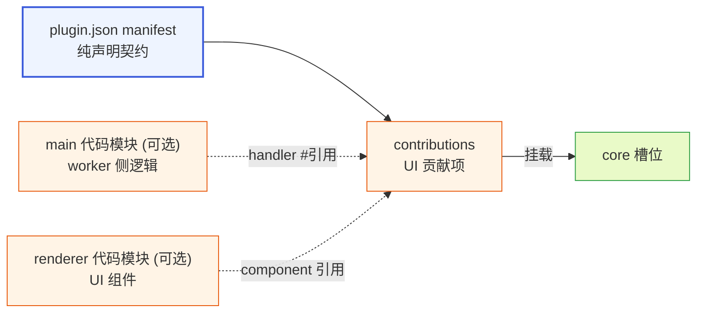

**图 1-1 — 插件三要素：manifest 声明契约，main/renderer 可选代码模块，contributions 引用并挂载到槽位**

### 1.3 形态光谱：从纯声明式到双入口

`main` 和 `renderer` 两个入口字段省不省，自然组合出全部插件形态，不需要 `kind: "declarative" | "code"` 这种类型戳字段：

- 两者都省 = **纯声明式插件**。contributions 的 `component`/`handler` 引用内置实现（如 `"component": "builtin.markdown"`）。core 读完 manifest 就知道怎么挂，不执行任何插件代码、不起 worker、不加载 renderer 模块。i18n 插件、主题插件就是这种形态——零运行时成本。
- 只省一个 = **单侧插件**。只带 `main`（需要逻辑、用内置渲染器展示）、或只带 `renderer`（只需要自定义 UI、逻辑很简单、靠 core 默认转发收 event）。
- 都带 = **完整双入口插件**。worker 侧跑逻辑、renderer 侧跑 UI，经 MessagePort 桥接。时间线插件、review 插件是这种形态。

这里有一条设计纪律（呼应 `DESIGN.md` §1.3/§1.4）：不带代码和带代码不是两套并列系统，是同一抽象的两种形态。`kind` 是纯类型戳（声明和行为可不一致），`main` 是内容引用（指向真实存在的代码模块文件，"有没有 main"等于"有没有这个文件"）。core 看 `main` 在不在，是在读内容（这个文件存在吗），不是在读声明出来的标签。行为不是"core 按 kind 查表分发"出来的，而是"代码模块自己 activate 时注册出来的"——core 只决定要不要去加载那段真实代码。

### 1.4 谁该读这份指南

- 想写一个工具卡片渲染器（让某个底座工具的输出有自定义 UI）——读 §3.5、§4、§7、§12.2。
- 想写一个侧栏面板（dashboard、会话视图、自定义视图）——读 §3.6、§5、§10、§12.3。
- 想贡献语言包或主题——读 §3.2、§3.3、§12.1，纯声明式最快。
- 想发 npm 包分发给别人用——读 §2.8、§8、§13，并参考 `DESIGN.md` 3.9 的外部接入链路。
- 想了解插件代码到底跑在哪个进程、数据怎么流——读 §10、§7。

---

## 2. manifest：插件契约

### 2.1 字段全表

`plugin.json` 的字段如下表。必填字段缺失 → manifest 校验失败、插件标错不挂载（不拖垮整壳，见 §9 与 `DESIGN.md` 3.5 第 3、5 项）。

| 字段 | 必填 | 类型 | 作用 |
|---|---|---|---|
| `id` | 是 | string | 插件唯一标识，全局唯一，用于插件级覆盖判定（§9.3） |
| `version` | 是 | string | 语义化版本，分发场景做更新检查用 |
| `displayName` | 是 | string | 展示名，同时是 fallback 文案（§2.3） |
| `main` | 否 | string | worker 侧代码模块入口，相对插件根目录；省略表示无 worker 逻辑 |
| `renderer` | 否 | string | renderer 侧 UI 模块入口；省略表示用内置渲染器、不自带 UI 组件 |
| `permissions` | 否 | string[] | 声明本插件需要的额外权限（§8） |
| `dependsOn` | 否 | string[] | 依赖的插件 id 数组（§2.7） |
| `contributes` | 否 | object | 按槽位分组的贡献项数组（§3） |
| `author` | 否 | string | 插件作者标识，分发场景溯源 |
| `source` | 否 | string | 分发来源溯源串（§2.8） |
| `homepage` | 否 | string | 插件主页 URL |

### 2.2 id 与版本语义

`id` 全局唯一，是覆盖判定（§9.3）和依赖判定（§2.7）的钥匙。命名建议带 scope 或命名空间前缀避免冲突，如 `session-manager`、`@acme/git-stats`。同 `id` 在不同来源（项目/用户/installed/builtin）出现时，高优先级整体覆盖低优先级——这是"内置默认插件可被覆盖"的机制。

`version` 用语义化版本（`MAJOR.MINOR.PATCH`）。本地手写插件不强制严格校验，但外部安装场景（§9.1 的 `installed` 路径）会把 version 写进目录名（`~/.pi-desktop/installed/{id}/{version}/`），支持多版本共存、更新检查时按 version 比对。

### 2.3 displayName 与 i18n fallback

`displayName` 是 fallback 文案。core 渲染插件展示名时，先按固定 key `plugin.{id}.displayName` 去语言槽（§3.2）查当前 locale 的翻译，查到就用翻译；查不到就 fallback 到 `displayName` 字段的字面值。

所以字面值填什么有意义——它是没有翻译时的兜底显示。内置插件填中文 `"会话管理"`，没有对应 locale 翻译时就显示这个中文；第三方插件只填字面值、不贡献翻译也正常工作。

`contributes` 里贡献项的展示文案字段（sidePanel 的 `label`、commands/management/settings 的 `title`）统一走同一套 i18n 规则：**查找 key 恒为构造串 `{slot}.{pluginId}.{itemId}.{field}`**（`{field}` 是该字段名，如 `sidePanel.myPlugin.stats.label`、`commands.myPlugin.add.title`），**字段值只作 fallback 字面值**——core 渲染时先按构造 key 查语言槽，查到翻译用翻译、查不到就回退到字段里写的字面值。因此要本地化某个 label/title，就往语言槽（§3.2）贡献对应**构造 key** 的 `resources`（如 `{ "sidePanel.myDashboard.stats.label": "我的统计" }`）；不贡献则显示字段字面值。字段值一律写字面文案（如 `"我的统计"`、`"刷新 Git 统计"`），不要把字段值当 i18n key 写——查找 key 由 core 按构造串决定，与字段值无关。label 与 title 字段规则一致。

完整的文案 fallback 链是：当前 locale 翻译 → 默认 locale（en）翻译 → manifest 字面值（`displayName`/`label`/`title` 字段值，必填故总是终止于此）。

### 2.4 main 与 renderer 双入口

**插件根目录** = `plugin.json` 所在目录（本地手写插件）或 npm 包 `package.json` 的 `pi.desktop` 字段指向的目录（外部插件，见 §9 与 `DESIGN.md` 3.9）。

- `main`：worker 入口，跑插件的逻辑/数据/副作用——订阅 RPC event、发 RPC 命令、定时拉数据、读写插件配置。导出 `activate(context)` / `deactivate()`，`context` 是 §5 的 `PluginContext`。
- `renderer`：UI 入口，导出 React 组件（按命名导出，每个导出名是一个组件，如 `SessionsPanel`、`SessionSettings`）。renderer 侧的插件加载器动态 import 它，把导出的组件注册进 `componentRegistry[componentId]`。

`main` 和 `renderer` 都省略 = 纯声明式插件。只省一个 = 单侧插件。都有 = 完整双入口插件。这个组合自然覆盖所有形态，不需要 `kind` 字段。

为什么是双入口而不是单入口：物理约束。React 组件是函数/闭包，不可序列化、不可跨 JS 堆传递；`utilityProcess` 是 Node 环境，没有 `react`、没有 DOM reconciler。所以"在 worker 里 import 一个 React 组件对象，再发给 renderer 渲染"这条路物理上不成立。插件的"逻辑/数据/副作用"代码必须跑在 worker（Node），但插件的"UI 渲染"代码必须在 renderer（有 React 的环境）。两者不能用同一个入口、不能跑在同一个进程。详见 §10。

### 2.5 contributes 概览

`contributes` 是按槽位分组的贡献项数组。每个槽位的贡献项 schema 见 §3。贡献项里引用组件用 `component` 字段填 renderer 模块的导出名（如 `"SessionsPanel"`），引用 handler 用 `handler` 字段填 worker 模块的导出名（`#` 前缀，如 `"#onNewSession"`）——`#` 前缀表示"从本插件代码模块导出"。这样 §10 的双入口就能定位到正确的侧：`component` → renderer 模块、`handler` → worker 模块。

**componentRegistry 的 key 规则**：renderer 加载器把 renderer 模块的每个命名导出注册进 `componentRegistry`，key 是 `{pluginId}:{exportName}`（如 `my-image-card:ImageCard`）。manifest 的 `component` 字段只写导出名（`"ImageCard"`），core 解析时拼上插件 id 成完整 key——所以两个插件都导出 `ImageCard` 不会冲突（一个挂 `pluginA:ImageCard`、一个挂 `pluginB:ImageCard`），contributions 的 `component` 字段引用时 core 自动用本插件的 id 前缀解析。`handler` 的 `#name` 引用同理：core 在本插件 worker 模块的命名导出里查 `#` 后的 name，不跨插件查。跨插件要用别的插件的组件，走 §15.10 FAQ 说的槽位注册表间接查、不直接引用别的插件的 `component` 字段。

一个最小的 manifest 示例（双入口、贡献侧栏 Tab + 命令 + 设置子页）：

```json
{
  "id": "session-manager",
  "version": "0.1.0",
  "displayName": "会话管理",
  "main": "./index.ts",
  "renderer": "./ui.ts",
  "contributes": {
    "sidePanel": [
      { "id": "sessions", "label": "会话", "icon": "messages-square", "component": "SessionsPanel" }
    ],
    "commands": [
      { "id": "session.new", "title": "新建会话", "keybinding": "cmd+n", "handler": "#onNewSession" }
    ],
    "settings": [
      { "id": "sessions", "title": "会话设置", "component": "SessionSettings" }
    ]
  }
}
```

### 2.6 permissions

`permissions`（可选 string[]）声明本插件需要的额外权限。沙箱默认只给 `rpc`/`events`/`bus`/`config`/`i18n`/`http.fetch(白名单域名)`，要更多能力必须在此声明、由用户在管理 UI 授权（§8）。取值是枚举字符串：

- `"fs:project:read"` / `"fs:project:write"`：读写当前项目目录（细分见 §8.1）。
- `"fs:global"` / `"fs:global:read"` / `"fs:global:write"`：读写 `~/.pi`（慎用）。
- `"net:域名"`：允许 `http.fetch` 该域名，如 `"net:api.github.com"`。
- `"content:sensitive"`：声明后插件才能在订阅的 SessionEvent 里看到消息文本内容（对话内容、文件内容等敏感字段）。
- `"child:<binary>"`：执行特定子进程二进制，如 `"child:git"`、`"child:npm"`。`<binary>` 是可执行文件名（不含路径），core 按授权白名单放行 `context.exec.run(command, args)` 的 `command` 精确匹配。详见 §5.7。

用户授权后 core 才把对应能力注入 PluginContext，未声明未授权的能力调用会抛错。这把沙箱权限做成显式声明 + 用户授权，不是隐式放行。完整权限模型在 §8 展开。

### 2.7 dependsOn 依赖声明

`dependsOn`（可选 string[]）声明本插件依赖哪些插件先加载/激活。值是插件 id 数组，如 `"dependsOn": ["timeline", "session-manager"]`。加载器按依赖图拓扑排序 activate 顺序——被依赖的先 activate、依赖者后 activate（§9 与 `DESIGN.md` 3.5 第 第4项(依赖检查)）。

依赖判定按 id 不按版本——只要任何来源（project/user/installed/builtin）有该 id 的插件生效，依赖就满足。插件级覆盖（§9.3，同 id 高优先级整体替换低优先级）不影响依赖判定——覆盖后该 id 仍存在（是高优先级版本）。只有"该 id 完全没有任何版本生效"才算依赖缺失 → 本插件加载失败、标错、不拖垮整壳。循环依赖（A 依赖 B、B 依赖 A）→ 检测到环、标错、环上的插件都禁用。

这个字段让插件能可靠地编排"我要用 timeline 的 entryId 锚点"这类跨插件依赖，而不是假设加载顺序。配合 §5.4 的事件总线和 `dependsOn` 一起用，可以可靠地订阅别的插件发布的"已就绪"信号。

### 2.8 分发字段：author / source / homepage

这三个字段主要给分发场景（外部安装的插件，§9.1 的 `installed` 路径）用，本地手写插件可不填：

- `author`（可选 string）：插件作者标识。分发场景用于溯源。
- `source`（可选 string）：分发来源溯源串。格式 `"npm:<包名>"`（npm 渠道）或 `"file:<url>"`（.pidesktop 渠道）。本地手写插件不填、来源标记是 `local`。installer（`DESIGN.md` 3.9）靠它做更新检查和卸载溯源。注意 `source` 一旦写入就不应随便改——installer 按它判断更新检查走哪个渠道（npm 查 registry、file 提示手动更新）。
- `homepage`（可选 string）：插件主页 URL。更新提示、管理 UI 展示用。`.pidesktop` 渠道没有自动 registry 检查，`homepage` 是用户获取新版的提示入口。

分发场景的完整 manifest 样子：

```json
{
  "id": "foo",
  "version": "1.2.0",
  "displayName": "Foo",
  "author": "author-id",
  "source": "npm:pi-desktop-foo",
  "homepage": "https://github.com/author/pi-desktop-foo",
  "permissions": ["net:api.foo.com", "content:sensitive"],
  "contributes": { ... }
}
```

### 2.9 一份带注释的完整 manifest 参考

把所有字段拼到一起、附注释，方便对照：

```jsonc
{
  // 必填：全局唯一标识，覆盖判定与依赖判定的钥匙
  "id": "my-plugin",
  // 必填：语义化版本，分发场景进目录名、做更新检查
  "version": "1.0.0",
  // 必填：展示名、fallback 文案。core 按 plugin.{id}.displayName 查语言槽，查不到用此字面值
  "displayName": "我的插件",

  // 可选：worker 入口（相对插件根目录）。省略 = 无 worker 逻辑
  "main": "./index.ts",
  // 可选：renderer 入口。省略 = 用内置渲染器、不自带 UI 组件
  "renderer": "./ui.tsx",

  // 可选：额外权限。沙箱默认只给 rpc/events/bus/config/i18n/http.fetch(白名单)
  "permissions": [
    "fs:project:read",       // 只读当前项目目录（文件预览用）
    "net:api.foo.com",       // 允许 http.fetch 该域名
    "content:sensitive"      // 声明后才能在订阅的 SessionEvent 里看到消息文本内容
  ],

  // 可选：依赖的插件 id 数组。加载器按依赖图拓扑排序 activate
  "dependsOn": ["timeline"],

  // 可选：按槽位分组的贡献项数组（§3 详解）
  "contributes": {
    "languages": [
      { "id": "my-plugin", "locale": "zh", "resources": { "myPlugin.title": "我的插件" } },
      { "id": "my-plugin", "locale": "en", "resources": { "myPlugin.title": "My Plugin" } }
    ],
    "themes": [
      { "id": "ocean", "name": "Ocean", "base": "dark", "tokens": { "color.bg": "#0d1b2a" } }
    ],
    "management": [
      { "id": "foo-config", "title": "Foo 配置", "schema": [ /* 声明式表单字段 */ ] }
    ],
    "cardRenderers": [
      { "match": { "strategy": "toolName", "value": "foo" }, "component": "FooCard" }
    ],
    "sidePanel": [
      { "id": "foo-panel", "label": "Foo 面板", "icon": "bar-chart-2", "component": "FooPanel", "defaultVisible": true }
    ],
    "viewers": [
      { "match": { "strategy": "extension", "value": "foo" }, "component": "FooViewer" }
    ],
    "commands": [
      { "id": "foo.run", "title": "运行 Foo", "keybinding": "cmd+shift+f", "handler": "#onRun", "when": "agent.idle" }
    ],
    "settings": [
      { "id": "foo-settings", "title": "Foo 偏好", "component": "FooSettings" }
    ]
  },

  // 以下三个字段分发场景才填
  "author": "author-id",
  "source": "npm:pi-desktop-foo",  // "npm:包名" 或 "file:url"
  "homepage": "https://github.com/author/pi-desktop-foo"
}
```

这份参考覆盖了全部字段。不必每个插件都写全——按需选字段，最简单的纯声明式语言包只有 `id`/`version`/`displayName`/`contributes.languages`。

---

## 3. contributes 槽位详解

### 3.1 槽位总览与契约

槽位是 core 暴露给插件的扩展点，直接借鉴 VSCode 的 contribution points，但只保留桌面端需要的。core 只认槽位契约、不认具体插件——这是洋葱架构的圆心：槽位契约是稳定的业务本质，具体插件是会变的外层内容。core 渲染某个区域时，去对应槽位查"当前有哪些贡献项"，按优先级合并后渲染，不关心贡献项来自哪个插件。

八个槽位：

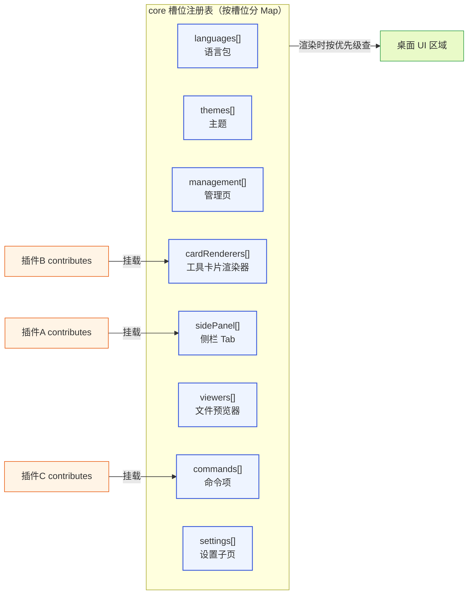

**图 3-1 — 槽位注册表：core 维护按槽位分的注册表，插件挂贡献项，渲染时按优先级查**

每个槽位有明确的输入和输出契约。下面逐个展开。所有槽位的冲突仲裁规则统一在 §9.3 与 §9.4 给出——语言槽和主题槽是合并语义的特例。

### 3.2 languages 语言槽

贡献语言包。贡献项 schema：

```typescript
{ id: string, locale: string, resources: Record<string, string> }
```

- `id`：这个语言包贡献项的标识（通常 `{pluginId}` 或 `{pluginId}.{namespace}`，区分一个插件贡献的多组文案）。
- `locale`：`"zh"` / `"en"` 等。
- `resources`：key→文案的映射。key 用 dot 分隔 namespace，对应 i18next 的 namespace 机制——比如 `"timeline.toolExecuting"` 表示 timeline namespace 下的 toolExecuting key、`"settings.modelSection"` 表示 settings namespace 下的 key。

core 启动时把所有插件同 locale 的语言包贡献项的 resources 合并成一个 i18next 资源字典（按 namespace 聚合），渲染文案时 `i18n.t("timeline.toolExecuting")` 查。

**语言槽的冲突仲裁和别的槽位不同**：同 locale 同 namespace 的文案不是"二选一整体覆盖"，而是"key 级合并"——多个插件都给 timeline namespace 贡献 key、各自 key 不冲突时全要（合并语义，这是语言槽的专属规则，不在 §9.3 的通用仲裁里）。当出现**同 key 冲突**时，一律按来源插件优先级取高的（project > user > installed > builtin，与 §9.2 通用仲裁一致），同优先级内才按注册顺序取先注册的——不按"后注册覆盖先注册"。这样内置 i18n 插件贡献的 `timeline.toolExecuting` 可被项目级插件同 key 覆盖，但不会被后安装的同优先级插件偶然覆盖。

> **同优先级 tie-break 以本指南为准**：同优先级内冲突的胜者是**先注册**的（确定性、可重现，与 §9.2 `resolveByPriority` 一致）。`DESIGN.md` §3.3 早期对语言槽/主题槽写的"后注册覆盖先注册"是旧措辞、应据此同步为"同优先级按注册顺序取先注册的"——两文档措辞需一致，实现者以本指南为准。

语言槽的特殊性还在于它影响 core 自身渲染——core 渲染底座内容（时间线、工具卡片标签、系统提示、状态栏）时用的文案也走语言槽，core 不内嵌任何文案常量。这就是 §12.1 的纯声明式语言包插件为什么"零代码也能影响 core 渲染"的原因。

完整示例见 §12.1。

### 3.2.1 namespace 约定

i18n 借鉴 现有方案的做法（用 i18next + react-i18next，按 namespace 切 JSON），按 namespace 组织文案——每个 namespace 对应一组功能。内置插件用的 namespace 列表（第三方插件约定用 `{pluginId}` 或 `{pluginId}.{sub}` 做自己的 namespace，避免和内置的冲突）：

| namespace | 用途 | 贡献者 |
|---|---|---|
| `common` | 通用文案（发送/取消/确认/重试等） | i18n 插件 |
| `timeline` | 时间线渲染（工具执行、流式输出等） | i18n + 时间线插件 |
| `settings` | 设置页标签 | i18n + 管理插件 |
| `sessions` | 会话管理 | i18n + 会话管理插件 |
| `review` | review 评论 | review 插件 |
| `composer` | 主输入框 | 命令与快捷键插件 |
| `{pluginId}` | 第三方插件自己的文案 | 第三方插件 |

语言包是 JSON 文件（或 manifest `resources` 字段），zh 和 en 各一套。locale 检测走 `navigator.language`，用户在设置里改语言时持久化到桌面端自己的偏好（`electron-store`，不是 pi 的 settings.json——因为语言是桌面端的偏好、和 pi 无关）。

### 3.2.2 语言槽的特殊性

语言槽有两个别的槽位没有的特殊性：

1. **影响 core 自身渲染**。core 渲染底座内容（时间线、工具卡片标签、系统提示、状态栏）时用的文案也走语言槽，core 不内嵌任何文案常量。这就是 §12.1 的纯声明式语言包插件为什么"零代码也能影响 core 渲染"的原因——core 自己渲染时也调 `i18n.t(...)`，文案来自语言槽贡献的 `resources`。
2. **冲突仲裁是合并语义**。同 locale 同 namespace 的文案是 key 级合并——多个插件都给 timeline namespace 贡献 key、各自 key 不冲突时全要；同 key 冲突时按来源插件优先级取高（project > user > installed > builtin，与 §9.2 一致），同优先级内按注册顺序取先注册的。这让多个插件可以协作地补全同一个 namespace 的文案，同时保证高优先级来源能可靠覆盖。

### 3.2.3 fallback 链与自我翻译

完整的文案 fallback 链是：当前 locale 翻译 → 默认 locale（en）翻译 → manifest `displayName`/`label` 字面值 → key 本身。

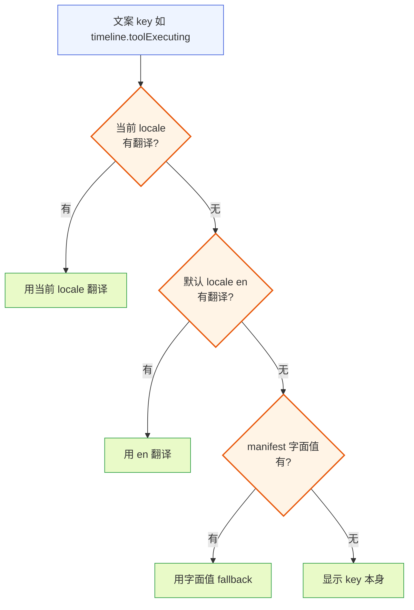

**图 3-2 — i18n 文案 fallback 链：当前 locale → 默认 en → manifest 字面值 → key 本身**

i18n 插件自己的 `displayName`/`description` 也要走语言槽——这听起来递归，但解决方法是：i18n 插件的 manifest 里 `displayName` 填字面 fallback 值（如 `"i18n"`），core 渲染插件列表时按构造 key `plugin.i18n.displayName` 去语言槽取（与 §2.3 规则一致），取不到就回退到 `displayName` 字面值。i18n 插件自己往语言槽贡献 `plugin.i18n.displayName` 的翻译，就实现了"自己翻译自己"，没有特例、查找 key 仍是构造串而非字段值。

### 3.2.4 本地化格式（日期/数字/复数/排序）

i18n 插件除了文案翻译，还提供 locale 感知的格式化能力，通过 `pi.i18n` 暴露给渲染插件：

- **日期格式**：`pi.i18n.formatDate(date)`——按当前 locale 格式化日期/时间，底座 event 的 timestamp、session 的 created/modified 显示时用它，不硬编码 `toLocaleString`。底层 `Intl.DateTimeFormat`。
- **数字格式**：`pi.i18n.formatNumber(num, opts)`——千分位/小数点按 locale，token 数、cost 显示用它。底层 `Intl.NumberFormat`。
- **复数**：`pi.i18n.t(key, { count })`——i18next 原生支持按 locale 复数规则选文案（"1 message"/"5 messages"、俄语三复数等）。文案 key 在 resources 里写 plural form（`{key}_one`/`{key}_other`）。
- **排序**：会话列表默认按修改时间、命令面板按相关度——非必要不字母排序。若需字母排序用 `Intl.Collator`（locale 感知），不用 `localeCompare`。
- **RTL 语言**：当前**不支持**阿拉伯/希伯来语的 RTL 布局镜像——i18n 插件 locale 列表不含 `ar`/`he`，避免装起来不好用。这是诚实的声明、不是缺陷；未来支持需 core 系统地加 CSS `direction` 变量 + pi.ui 组件用逻辑属性（`margin-inline-start` 等）+ 内置插件适配。

这些格式化能力都走 i18n 插件、不散在各插件各写一遍——"能持有就持有"。底层的 Intl API 是 JS 内置、i18n 插件只是按 locale 包一层。

### 3.3 themes 主题槽

贡献界面风格。贡献项 schema：

```typescript
{ id: string, name: string, tokens: Record<string, string>, base?: string }
```

- `id`：主题标识，如 `"dark"` / `"light"` / `"solarized"`。
- `name`：展示名。
- `tokens`：设计 token 的值映射，如 `{ "color.bg": "#1e1e2e", "color.fg": "#cdd6f4", "color.primary": "#89b4fa", "font.size.base": "14px", "radius.md": "8px", "spacing.sm": "8px", ... }`。完整 token 清单见 `DESIGN.md` 4.11.2。
- `base`：继承的父主题 id（主题可继承另一个主题只覆盖部分 token）。

和语言槽一样**特殊**：它影响 core 自身渲染——core 渲染任何 UI（时间线、工具卡片、状态栏、pi.ui 组件）时用的颜色/字号/间距/圆角全部从主题槽取，core 不内嵌任何视觉常量。core 启动时按"当前主题 id"取该主题的 tokens，合并成圆心 `Theme` 对象，经 `pi.ui` 组件库和 cardRenderer props 注入。主题切换 = 换当前主题 id + 重渲染（不用重启）。

**冲突仲裁同语言槽**：同 token key 是合并语义——多个插件都给某个 token key 补值时，同 key 冲突按来源插件优先级取高（project > user > installed > builtin），同优先级内按注册顺序取先注册的（不再用"后注册覆盖先注册"的措辞，统一到 §9.2 优先级仲裁；与 §3.2 语言槽同口径，`DESIGN.md` §3.3 旧措辞需据此同步）。这样某插件给 `color.accent.warning` 补值可被高优先级来源覆盖。只有整主题 id 冲突（两个插件都叫 `dark`）才整体按来源插件优先级取高、低优先级主题整体不挂载。

主题插件就是纯声明式（只有 token 值、无代码模块）、零运行时成本，和 i18n 同形态。写法见 §12.1 的同构示例。

### 3.3.1 完整 token 清单

主题贡献的 token 是 core 和所有插件之间的稳定视觉契约——key 固定、值可变。内置 token 清单（core 定义这些 key，主题插件给值）：

```
颜色:
  color.bg            主背景      color.fg            主前景
  color.surface       卡片/面板背景  color.surface-fg    卡片前景
  color.primary       主色(链接/按钮)  color.primary-fg    主色上的前景
  color.accent.success/warning/error/danger  状态色
  color.border        边框        color.muted         次要文本
字号:
  font.size.base      基础字号(14px)  font.size.sm/lg    小/大字号
  font.family.mono    等宽(代码)    font.family.sans    无衬线(正文)
间距:
  spacing.xs/sm/md/lg/xl   8/12/16/24/32px 间距档
圆角:
  radius.sm/md/lg     4/8/12px
边框:
  border.width.thin    1px        border.color        (=color.border)
阴影:
  shadow.sm/md/lg     卡片浮起阴影
```

core 只认这些 key（圆心 `Theme` 类型就是 `Record<tokenKey, string>` + 几个语义分组），主题插件填值。新增 token 是扩展（core 加 key + 默认值、旧主题不填用默认）、不改已有 key 语义——开闭原则。插件用 `pi.theme["color.primary"]` 这种 key 读 token、不硬编码颜色值。

### 3.3.2 主题切换与继承

主题切换 = 换当前主题 id + 重合并 token + 重渲染整个 UI。不重启、不丢会话。core 记当前主题 id（桌面端偏好，存 `electron-store`，不进 pi settings——主题是桌面端偏好、和 pi 无关，同 i18n）。第三方插件组件经 props 收到新 theme、自动重渲染（React 响应式）。

主题可声明 `base: "dark"`——继承 dark 主题的全部 token、只覆盖自己声明的几个。这让"dark 基础上的某个品牌微调"不用复制整套 token。合并时先取 base 的 token、再覆盖自己的。内置主题插件还贡献一个"跟随系统"主题（`base` 动态指向系统当前 `prefers-color-scheme`），用户选它，桌面端监听系统主题变化、切 base。

### 3.3.3 无障碍与对比度约束

pi.ui 组件库自带 ARIA 支持——每个组件暴露 `ariaLabel`/`ariaDescribedBy` 等 props，并内置正确的 role（Dialog 是 `dialog`、Button 是 `button` 等），插件用 pi.ui 组件自动获得无障碍。焦点管理也由 pi.ui 的 Dialog/focus-trap 承担。

主题 token 有**对比度约束**——所有前景/背景颜色对（`color.fg`/`color.bg`、`color.muted`/`color.surface` 等）必须满足 WCAG AA（≥4.5:1 对比度）。校验时机是**运行时**：主题槽合并 token 时校验，不符合记入诊断页警告（不禁用主题插件——警告≠禁用）。第三方主题插件安装时不校验对比度，靠运行时主题合并校验兜底。状态指示不只用颜色——如 bash 输出的 stdout/stderr 不只红绿、加图标/前缀辅助（色盲友好）。这些让主题插件不只管"好看"、也管"可读可达"。

### 3.4 management 管理槽

贡献管理面板的页/项。贡献项 schema：

```typescript
{ id: string, title: string, component?: string, schema?: ConfigField[], order?: number }
```

- `component`：引用 renderer 模块导出的页面组件名。
- 省略 `component` 时用 core 内置的通用表单渲染器，此时必须提供 `schema` 字段（一个声明式表单 schema：字段数组，每项 `{ key, type: "text"|"secret"|"select"|"number"|"boolean", label?, description?, default?, options?, readOnly? }`）。通用表单渲染器按 schema 生成表单、读写值绑到 `PluginContext.config` 或 pi settings。
- `order`：控制页在管理面板里的排序。

这让"简单的配置页"不用写任何组件代码、只声明 schema 就有 UI。基础管理 UI 插件往这里挂"扩展管理""配置编辑""模型选择""MCP 管理"等页。

管理槽的语义是"管 pi 的页"（扩展、模型、MCP），和 §3.9 设置子页槽区分——后者是"插件自己的配置页"。

带 schema 的声明式管理页示例（不写组件代码）：

```json
{
  "contributes": {
    "management": [
      {
        "id": "foo-config",
        "title": "Foo 配置",
        "order": 30,
        "schema": [
          { "key": "apiKey", "type": "secret", "label": "API Key", "description": "foo 服务凭证" },
          { "key": "endpoint", "type": "text", "label": "服务地址", "default": "https://api.foo.com" },
          { "key": "pollInterval", "type": "number", "label": "轮询间隔(秒)", "default": 60, "readOnly": false },
          { "key": "enabled", "type": "boolean", "label": "启用", "default": true },
          { "key": "mode", "type": "select", "label": "模式", "options": ["lite", "full"], "default": "lite" }
        ]
      }
    ]
  }
}
```

core 内置的通用表单渲染器按 `schema` 生成表单、读写值绑到 `PluginContext.config` 或 pi settings。`type: "secret"` 字段在 UI 上以密码框形式渲染、不回显明文。这是"最小代价拿到配置页"的方式——纯声明、零代码。

### 3.5 cardRenderers 卡片渲染槽

贡献工具调用结果的渲染器。贡献项 schema：

```typescript
{ match: MatchRule, component: string }
```

- `match`：按工具名/自定义类型匹配，MatchRule 规则见 §4。
- `component`：引用 renderer 模块导出的渲染组件名（字符串引用，不是函数）。core 在 renderer 侧加载组件、按 §7.4 的 cardRenderer props 契约喂事件数据。

时间线渲染插件挂默认的 bash/edit/read 等渲染器，第三方插件可以挂自定义工具的自定义渲染。完整示例见 §12.2。

冲突仲裁（多个渲染器都 match 同一个工具调用）：按贡献项来源插件的优先级取最高（§9.4），同优先级按 `specificity` 数值大的胜出，同 specificity 按注册顺序取先注册的。预览器槽同理。

cardRenderers 的数据流（§7.4 路径三）：

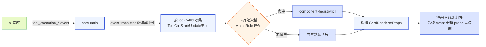

**图 3-3 — cardRenderers 数据流：event 来 → 翻译成中性事件 → MatchRule 匹配组件 → 构造 props → 渲染**

注意：圆心定义的 `ToolCallStart`/`ToolCallUpdate`/`ToolCallEnd` 是中性事件接口，不 import pi 类型。gateway 层的 `event-translator`（`src/gateway/event-translator.ts`）负责把 pi 的 `tool_execution_*` 事件翻译成圆心中性事件——圆心不绑死 pi 的类型系统、依赖只向内。pi 协议改了，只动 gateway 的翻译、不动圆心契约和插件层。

### 3.6 sidePanel 侧栏槽

贡献侧栏 Tab。贡献项 schema：

```typescript
{ id: string, label: string, icon: string, component: string, order?: number, defaultVisible?: boolean }
```

- `icon`：lucide 图标名，如 `"messages-square"`。
- `component`：侧栏 Tab 内容组件（renderer 导出）。
- `label`：展示文案，作 fallback 字面值（§2.3 统一规则）——core 按构造 key `sidePanel.{pluginId}.{itemId}.label` 查语言槽，查不到翻译就回退到字段字面值。字段值写字面文案（如 `"会话"`、`"我的统计"`）；要本地化就往语言槽贡献该构造 key 的翻译。
- `order`：排序。
- `defaultVisible`：是否默认显示。

会话管理插件挂"会话"Tab，第三方插件可以挂自定义 dashboard。完整示例见 §12.3。

sidePanel 的数据流（双入口插件的典型路径，§7.3 路径二）：

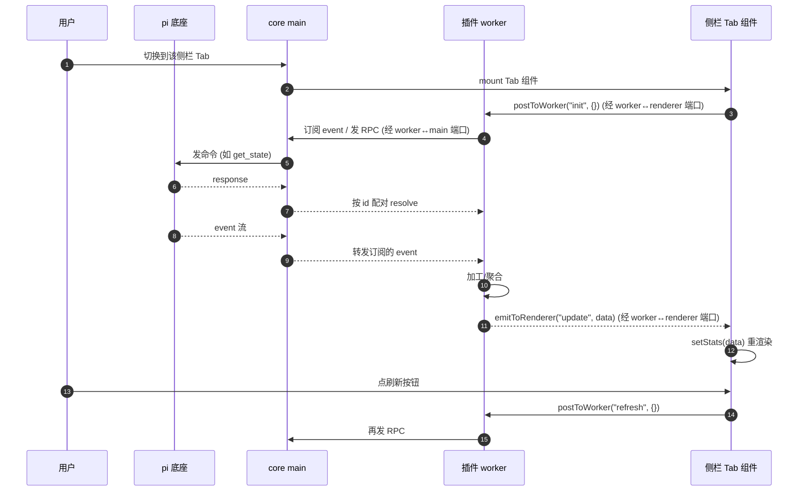

**图 3-4 — sidePanel 双入口数据流：worker 订阅 event/RPC、加工后 emitToRenderer 推给组件**

纯 renderer 侧栏插件（无 `main`）走 §7.2 路径一：组件直接 `pi.events.on` 收 event、`pi.rpc.*` 发命令（经 core main 默认转发），不需要 worker。这种形态简单但做不了复杂加工——适合"渲染底座 event 流即可"的场景（比如一个简单的"当前 turn 进度"面板）。

### 3.7 viewers 预览器槽

贡献文件预览器。贡献项 schema：

```typescript
{ match: MatchRule, component: string, editable?: boolean }
```

- `match`：按文件扩展名/mime 匹配（MatchRule 的 `extension`/`mime` 策略）。
- `component`：renderer 导出的预览组件。
- `editable`：标记是否支持编辑（文件编辑器插件用，`DESIGN.md` 4.12）。

和卡片渲染槽同结构。文件预览插件挂 markdown/diff/代码高亮/图片/默认文本（`DESIGN.md` 4.5）；文件编辑器插件挂 `editable: true` 的版本，优先级高于纯预览。

### 3.8 commands 命令项槽

贡献命令面板项和斜杠命令。贡献项 schema：

```typescript
{ id: string, title: string, keybinding?: string, handler?: string, icon?: string, when?: string }
```

- `title`：展示文案，作 fallback 字面值（§2.3 统一规则）——core 按构造 key `commands.{pluginId}.{itemId}.title` 查语言槽，查不到翻译回退到字段字面值。字段值写字面文案（如 `"刷新 Git 统计"`）；要本地化就往语言槽贡献该构造 key 的翻译。
- `keybinding`：快捷键描述，如 `"cmd+n"`。
- `handler`：worker 模块导出的处理函数名（`#` 前缀，如 `"#onNewSession"`）。
- `when`：条件表达式（如 `"agent.idle"`，控制命令何时可用/可见），借鉴 VSCode 的 when clause。语法见下。

`when` clause 语法：表达式由条件变量和逻辑运算符组成。变量是 core 运行时状态的布尔/值投影（如 `agent.idle`、`agent.streaming`、`session.hasName`、`project.trusted`、`model.reasoning`、`selection.nonEmpty`、`selection.source`、`review.modeActive`），运算符支持 `&&`（与）、`||`（或）、`==`（相等，如 `model.provider == "anthropic"`）、`!`（非）。

**运算符优先级**（从高到低）：

| 优先级 | 运算符 | 结合性 |
|---|---|---|
| 1（最高） | `!` | 右结合 |
| 2 | `==` | 左结合 |
| 3 | `&&` | 左结合 |
| 4（最低） | `\|\|` | 左结合 |

即 `==` 比 `&&`/`||` 优先级高，比较运算先于逻辑运算求值。所以 `selection.nonEmpty && selection.source == "timeline"` 解析为 `selection.nonEmpty && (selection.source == "timeline")`（预期语义），不是 `(selection.nonEmpty && selection.source) == "timeline"`（错误语义）。同优先级左结合、短路求值。支持显式括号 `()` 改变结合（如 `(a || b) && c`），但不支持嵌套超过一层（保持简单）。

> **when clause 文法以本指南 §3.8 为准**：采用运算符优先级（`!` > `==` > `&&` > `||`）+ 一层括号，非纯从左到右。`DESIGN.md` §3.3 早期写的"从左到右短路求值""不支持嵌套括号"是旧描述、应据此同步为本指南的优先级方案——两文档文法需一致，实现者以本指南为准。

边界用例：

- `agent.idle && session.hasName`：agent 空闲且会话有名字时可见。`&&` 短路——`agent.idle` 为假就不求值 `session.hasName`。
- `selection.source == "timeline" || selection.source == "viewer"`：选区来自时间线或预览器时可见。
- `!agent.streaming && (project.trusted || model.reasoning)`：agent 未在流式、且（项目已信任或模型支持推理）时可见。
- `model.provider == "anthropic" && agent.idle`：解析为 `model.provider == "anthropic"` 先求值、再 `&& agent.idle`，正确。

变量值来自 `get_state` 返回的 `RpcSessionState` 字段及其派生，加上少数 UI 派生 key（如 `selection.nonEmpty` 由 core 监听选区状态维护）。core 维护一个 contextKeys 表，运行时按状态更新这些 key，命令的可见/可用由 `when` 求值决定。

命令与快捷键插件往这里挂一堆命令（`DESIGN.md` 4.7）。快捷键冲突处理：同 keybinding 多个命令时，按插件优先级取最高优先级的，冲突在快捷键中心标红提示。

**handler 调用契约**：core 调用 handler 时统一传两个参数——`(ctx: PluginContext, args?: CommandArgs)`，其中 `ctx` 是该插件的 `PluginContext`、`args` 是触发参数（来自 `when` clause 的 contextKeys 派生，如 `selection` 的 `entryId`/`text`，命令面板触发时 `args` 为空对象）。返回 `void | Promise<void>`，抛错被 §10.2 错误隔离兜底（禁用该插件）。

两种 handler 形态的统一约定：

- **静态 handler**（manifest `handler: "#onNewSession"`）：`#name` 字符串引用 worker 模块的命名导出，core 路由时按 name 查导出、以 `(ctx, args)` 调用。**不接受函数对象**——manifest 是声明式数据，引用必须是字符串。
- **动态 handler**（`context.register` 注册，§5.11）：直接传函数对象 `(ctx, args) => { ... }`，core 调用时直接调用。**不接受 `#name` 字符串**——动态注册发生在运行时、此时无静态导出可引用，函数对象就是 handler 本身。

两者调用签名一致（都收 `ctx` 和可选 `args`），区别只在"怎么定位 handler"：静态靠 `#name` 字符串查导出、动态靠函数对象直接引用。`CommandArgs` 结构：`{ selection?: { entryId?: string; text?: string; source?: string } }`——`selection` 字段当命令的 `when` clause 用了 `selection.*` 变量时由 core 填入当前选区状态，否则不填。

命令项的触发链路：

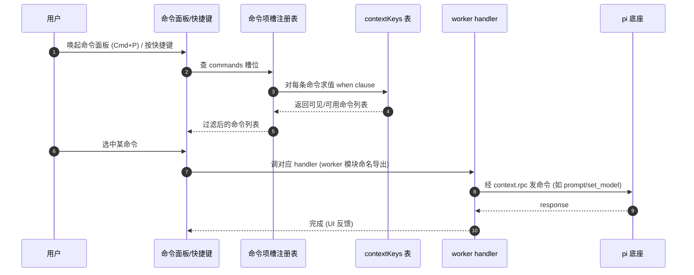

**图 3-5 — 命令项触发链路：查注册表 → when 求值过滤 → 用户选 → 调 handler → 发 RPC**

`when` clause 的求值靠 core 维护的 contextKeys 表——core 运行时按状态更新这些 key（`agent.idle`/`agent.streaming`/`session.hasName`/`project.trusted`/`model.reasoning`/`selection.nonEmpty`/`selection.source`/`review.modeActive`），命令面板渲染时遍历所有 commands、对每条求值 `when` 表达式、过滤出可见的。core 维护这个表、不对插件暴露写入接口——插件只能读 `when` 里用这些变量、不能直接改。

**contextKeys 派生表**：每个变量的来源、core 在什么时机更新它，钉死如下——实现者照此维护，插件作者照此判断某变量何时为真。

| 变量 | 来源 | 派生规则 | 更新时机 |
|---|---|---|---|
| `agent.streaming` | `RpcSessionState.isStreaming` | 直接取布尔 | `get_state` 刷新后；`turn_start`/`turn_end`/`agent_settled` event |
| `agent.idle` | `RpcSessionState` 派生 | `!isStreaming && !isCompacting` | 同上（`isStreaming` 或 `isCompacting` 任一变化时重算） |
| `session.hasName` | `RpcSessionState.sessionName` | `!!sessionName`（非空字符串为真） | `get_state` 刷新后；`session_info_changed` event（name 变了） |
| `model.reasoning` | `RpcSessionState.model.reasoning` | 直接取布尔 | `get_state` 刷新后；`model_select` event |
| `model.provider` | `RpcSessionState.model.provider` | 字符串值（配合 `==` 比较，如 `model.provider == "anthropic"`） | `get_state` 刷新后；`model_select` event |
| `project.trusted` | core main 的项目信任状态 | 布尔——是否当前项目被信任（`DESIGN.md` 2.1.2 的 `projectTrusted`，由 `trust-manager`/`project-trust` 维护，跨参考支柱②） | 用户在管理 UI 切换项目信任、或打开新项目初始化信任时；core main 更新后广播给 contextKeys 表 |
| `selection.nonEmpty` | core UI 派生 | 当前是否有选区（时间线条目/预览器文本被选中） | 用户在时间线/预览器选/清选区时，core 监听选区状态维护 |
| `selection.source` | core UI 派生 | 选区来源：`"timeline"` \| `"viewer"` \| `null` | 同上，选区建立时据来源记 |
| `review.modeActive` | bus 信号派生 | review 插件 `bus.publish("review.mode", { active })`（§5.4.1 模式切换广播） | core main 订阅 `review.mode` topic、收到后更新；review 插件进/出 review 模式时发 |

注意 `project.trusted` 不在 `RpcSessionState` 里——它来自 core main 自己的项目信任状态（信任机制是桌面端管 pi 自身的开关，见 `DESIGN.md` 2.1.2）；`review.modeActive` 也不来自 `RpcSessionState`——它来自 bus 信号（review 插件广播）。这两个变量是"非底座状态、core 自维护"的特例，其余变量都从 `get_state` 的 `RpcSessionState` 直接或派生取。插件不能注册新变量（§15.10 FAQ），需要新变量提 issue 给 core 团队。

### 3.9 settings 设置子页槽

贡献设置页。贡献项 schema：

```typescript
{ id: string, title: string, component?: string, schema?: ConfigField[] }
```

- `component`：引用 renderer 导出的偏好页组件（自定义 UI，灵活但要写代码）。
- `schema`：省略 `component` 时，可提供声明式 `schema`（同 §3.4 management 槽的 `ConfigField[]`：`{ key, type, label?, description?, default?, options?, readOnly? }`），core 复用内置通用表单渲染器生成表单、读写值绑到 `PluginContext.config`。这让"只想做个简单偏好表单"的插件不用写任何组件代码——纯声明、零代码，和 §3.4 的简单配置页同构。

`component` 与 `schema` 二选一：带 `component` 走自定义 UI（要复杂交互/动态布局时用）；只带 `schema` 走声明式表单（简单键值偏好用）。两者都不该同时给（同时给时 `component` 优先、`schema` 忽略并告警）。

和 §3.4 管理槽的区别：管理槽是"管 pi 的页"（扩展、模型、MCP），设置子页槽是"插件自己的配置页"（某个插件的偏好）。两者结构相似、语义不同、分两个槽位避免冲突——但"简单表单"场景下两者都能用声明式 schema，不再需要在 settings 槽写 component 或借用 management 槽。

设置子页样例：

```json
{
  "contributes": {
    "settings": [
      { "id": "foo-prefs", "title": "Foo 偏好", "component": "FooPrefs" }
    ]
  }
}
```

`component` 引用 renderer 导出的偏好页组件。这个组件自己用 `usePluginContext().config` 读写偏好（`pi.config` 不在 renderer 侧，要走 worker 侧 `context.config`，或在 worker 里包一层经 `emitToRenderer` 同步给组件）。典型做法：worker 侧 `activate` 时把 `context.config.all()` 推给 renderer、组件 `pi.onMessage("prefs:init", ...)` 收；用户改偏好时组件 `pi.postToWorker("prefs:set", { key, value })`、worker 收到后 `context.config.set(...)`、再 `emitToRenderer("prefs:init", ...)` 推回新值回显。

---

## 4. MatchRule 策略注册表

### 4.1 声明式数据 + 策略注册表

卡片渲染槽（§3.5）和预览器槽（§3.7）用 MatchRule 匹配。规则在 manifest 里是声明式数据，core 加载时通过**策略注册表**把它转成可求值的匹配器，core 渲染时只调接口、不 switch 规则变体。

```typescript
// manifest 里声明的 match（纯数据）
type MatchRule =
  | { strategy: "toolName"; value: string }        // 精确匹配工具名
  | { strategy: "toolNames"; value: string[] }     // 匹配多个工具名之一
  | { strategy: "customType"; value: string }      // 匹配自定义消息/entry 类型
  | { strategy: "extension"; value: string }       // 预览器：匹配文件扩展名
  | { strategy: "mime"; value: string }            // 预览器：匹配 mime（支持 "image/*" 通配）
  | { strategy: "all" };                           // 兜底：匹配全部

// core 维护的策略注册表（内层抽象，实现可外层提供）
interface MatchStrategy {
  matches(ctx: MatchContext): boolean;  // ctx 携带当前工具调用的 toolName/args 或文件的 extension/mime
  specificity: number;                    // 该策略的特异度，策略自己声明、core 不硬编码排序表
}

// MatchContext：被匹配的实体（工具调用或文件），中性类型、不绑 pi
interface MatchContext {
  toolName?: string;       // 工具调用时：工具名
  customType?: string;     // 自定义消息/entry 类型时
  filePath?: string;       // 文件时：路径（用于取 extension）
  mimeType?: string;      // 文件时：mime
}
```

这里的关键设计（呼应 `DESIGN.md` §1.4 不做类型戳 switch）：match 在 manifest 里是纯数据，但 core **不按 `strategy` 字段 if-else 分发匹配逻辑**——而是用 strategy 名查策略注册表拿到 `MatchStrategy` 实例，调它的 `matches()` 和读 `specificity`。新增匹配方式 = 注册一个新 `MatchStrategy`（扩展，不改 core），不是给 core 的 switch 加分支（开闭原则）。

### 4.2 内置策略集

内置策略集（toolName/toolNames/customType/extension/mime/all）随 core 提供、放在 `src/domain/slots/strategies.ts`（`DESIGN.md` 5.1.4）作为 `MatchStrategy` 的内置实现集合注册。它们的 specificity 值是 core 定义的稳定常量：

| strategy | 典型 specificity | 用途 |
|---|---|---|
| `toolName` | 100 | 精确匹配单个工具名 |
| `toolNames` | 90 | 匹配多个工具名之一 |
| `customType` | 80 | 匹配自定义消息/entry 类型 |
| `extension` | 70 | 预览器：匹配文件扩展名 |
| `mime` | 60 | 预览器：匹配 mime（支持 `image/*` 通配） |
| `all` | 0 | 兜底：匹配全部 |

具体数值由 core 定义、稳定不变，插件作者不用记具体数，只要知道"越具体特异度越高、`all` 是兜底"。

### 4.3 MatchContext

`MatchContext` 是被匹配的实体。core 渲染一个工具卡片时构造的 `MatchContext` 只填 `toolName`（和可选 `customType`），文件预览时只填 `filePath`/`mimeType`。`MatchStrategy` 实现按需读 ctx 字段，如 `ToolNameStrategy` 只看 `ctx.toolName`。

`MatchContext` 是中性类型、不绑 pi——这是洋葱架构的圆心纪律（`DESIGN.md` 5.1.5）：圆心不 import pi 的类型。底座的 `tool_execution_*` 事件结构由 gateway 层的 `event-translator` 翻译成圆心的中性事件接口（`ToolCallStart` 等，见 §7.4），MatchRule 匹配只吃中性类型。

### 4.4 特异度与冲突仲裁

多个渲染器都 match 同一个工具调用时，仲裁顺序：

1. 按贡献项来源插件的优先级取最高（project > user > installed > builtin，§9.2）。
2. 同优先级按 `specificity` 数值大的胜出。
3. 同 specificity 按注册顺序取先注册的。

预览器槽同理。特异度由每个策略自己声明、core 只比数值、不维护硬编码排序表——消除了"特异度排序是引擎硬编码知识"这个问题。

### 4.5 自定义策略（扩展）

新增匹配方式是扩展、不改 core。注册一个新 `MatchStrategy`：

```typescript
// 插件 worker 侧 activate 时注册（伪代码，实际接口由 core 的策略注册表暴露）
context.registerStrategy("myCustomRule", {
  matches(ctx: MatchContext): boolean {
    // 自定义匹配逻辑，比如按工具参数里的某字段匹配
    return ctx.toolName === "bash" && /* args 里有某字段 */;
  },
  specificity: 95,  // 自己声明特异度，介于 toolName 和 toolNames 之间
});
```

之后 manifest 里 `match` 可以用 `{ strategy: "myCustomRule", value: ... }`。core 加载时按 strategy 名查注册表，找不到则该贡献项标错不挂载。这样第三方插件能扩展匹配语义，不动 core 的 switch——开闭原则落到匹配规则上。

### 4.6 完整匹配流程示例

把一个工具调用的匹配流程展开，帮助理解策略注册表怎么工作。假设时间线插件贡献了三个 cardRenderers，agent 调了 `bash` 工具：

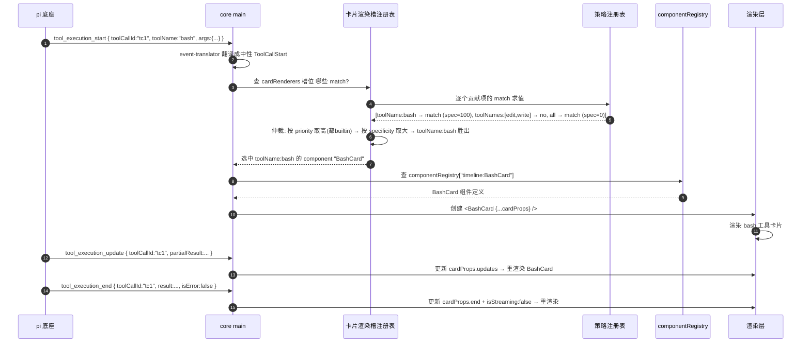

**图 4-1 — MatchRule 匹配流程：event 来 → 求值各策略 → 仲裁（priority + specificity + 注册序）→ 查组件 → 创建组件 props 喂入 → 后续 event 更新 props 重渲染**

这个流程对应 §7.4 路径三：cardRenderer 组件不用自己订阅 event，core 喂数据。core 按工具调用的 toolCallId 收集 `tool_execution_*` 事件、翻译成中性 `ToolCallStart`/`ToolCallUpdate`/`ToolCallEnd`、传给组件作为 `CardRendererProps`。组件每次有新 update 或 end 到来时被重新渲染（props 更新）。

预览器槽的匹配流程同构——只是 MatchContext 携带的是 `filePath`/`mimeType` 而不是 `toolName`，策略用 `extension`/`mime` 而不是 `toolName`/`toolNames`。core 渲染一个文件预览时，按文件路径取扩展名、构造 `MatchContext`、查预览器槽注册表、逐个求值、仲裁、选中的 component 渲染。

---

## 5. PluginContext 接口（worker 侧）

### 5.1 接口总览

`activate(context)` 收到的 `context` 是 worker 侧插件能调用的全部 API。这是盲测点名的最大接口，钉死如下：

```typescript
interface PluginContext {
  /** 插件自己的元信息 */
  plugin: { id: string; version: string; rootDir: string };
  /** RPC 适配层——发命令给底座子进程，返回 Promise */
  rpc: {
    prompt(message: string, opts?: { images?: ImageContent[]; streamingBehavior?: "steer" | "followUp" }): Promise<void>;
    steer(message: string, images?: ImageContent[]): Promise<void>;
    followUp(message: string, images?: ImageContent[]): Promise<void>;
    abort(): Promise<void>;
    getState(): Promise<SessionState>;
    setModel(provider: string, modelId: string): Promise<ModelInfo>;
    getAvailableModels(): Promise<ModelInfo[]>;
    getEntries(since?: string): Promise<{ entries: MessageEntry[]; leafId: string | null }>;
    getTree(): Promise<{ tree: TreeNode[]; leafId: string | null }>;
    getCommands(): Promise<CommandInfo[]>;
    // 便捷方法只覆盖高频命令、不与 31 命令一一对应；未覆盖命令经 send 发，返回值一律用圆心中性类型（见 5.1.5）
    send<T = unknown>(command: unknown): Promise<unknown>;  // 通用逃生舱
    resync(): Promise<SyncSnapshot>;  // 重新拉 state+entries+tree+commands 同步 UI
  };
  /** 受限网络通道——走 core main 代理，受 permissions 域名白名单约束。
   *  白名单 = manifest 声明的 net: 域名 ∩ 用户授权。未声明任何 net: 权限时
   *  白名单为空，任何域名请求都抛 "net permission denied"（方法本身存在，只是不放行）。*/
  http: { fetch(url: string, opts?: RequestInit): Promise<Response> };
  /** 受限文件系统——需声明 fs: 权限，core 按授权范围注入；未声明则此对象不可用（属性访问即抛错） */
  fs: {
    /** 读项目目录内文件（需 fs:project:read 或 fs:project） */
    readProjectFile(relPath: string, encoding?: BufferEncoding): Promise<string>;
    /** 写项目目录内文件（需 fs:project:write 或 fs:project） */
    writeProjectFile(relPath: string, content: string): Promise<void>;
    /** 读 ~/.pi 下文件（需 fs:global:read 或 fs:global，慎用） */
    readGlobalFile(relPath: string, encoding?: BufferEncoding): Promise<string>;
    /** 写 ~/.pi 下文件（需 fs:global:write 或 fs:global，慎用） */
    writeGlobalFile(relPath: string, content: string): Promise<void>;
    /** 列目录（按已授权范围限定） */
    listDir?(relPath: string, opts?: { scope: "project" | "global" }): Promise<string[]>;
  };
  /** 受限子进程执行——需声明 child:<binary> 权限（如 child:git），core 按授权白名单注入；
   *  未声明任何 child: 权限时此对象不存在（访问即抛错）。exec 只能跑已授权的二进制、
   *  cwd 锁定当前项目目录（opts.cwd 是相对项目根的子路径、防越界，见 §5.7）、
   *  stdout/stderr 合并返回字符串，不带 shell、不支持管道注入。*/
  exec: {
    /** 执行已授权的子进程；command 必须命中已授权的 child:<binary>，否则抛 "child permission denied"。
     *  opts.cwd 是相对项目根的子路径（如 "src/lib"），不是任意绝对路径——core 防越界（见 §5.7）。*/
    run(command: string, args: string[], opts?: { cwd?: string; env?: Record<string, string>; timeoutMs?: number }): Promise<{ stdout: string; stderr: string; exitCode: number }>;
  };
  /** 订阅底座 event 流——回调收中性 SessionEvent */
  events: {
    on(listener: (event: SessionEvent) => void): () => void;  // 返回取消订阅
  };
  /** 插件间事件总线——发布订阅，和 RPC events 两套 */
  bus: {
    publish(topic: string, payload: unknown): void;
    subscribe(topic: string, listener: (payload: unknown) => void): () => void;
  };
  /** 读写本插件配置（隔离在插件自己的目录，不碰 pi settings） */
  config: {
    get<T>(key: string): T | undefined;
    set<T>(key: string, value: T): Promise<void>;
    all(): Record<string, unknown>;
  };
  /** i18n——从语言槽取文案 */
  i18n: {
    t(key: string, vars?: Record<string, unknown>): string;
    locale: string;
  };
  /** 把数据推给 renderer 侧的组件——worker→renderer 的主动推送通道。
   *  与 renderer 侧 pi.onMessage(channel, cb) 配对，channel 名由插件自行约定（建议用 {pluginId}.{purpose} 防跨插件串扰）。*/
  emitToRenderer(channel: string, data: unknown): void;
  /** 收 renderer 侧 pi.postToWorker(channel, data) 发来的消息——renderer→worker 的接收通道，
   *  与 emitToRenderer 对称。channel 名约定同上。返回取消订阅函数。*/
  onRendererMessage(channel: string, listener: (data: unknown) => void): () => void;
  /** 注册贡献项的运行时补充（manifest 静态声明之外，插件运行时动态注册的）。
   *  动态贡献项的 handler 只接受函数对象（运行时注册、无静态导出可引用）；静态 contributions 的 handler
   *  只接受 #name 字符串（指向 worker 命名导出）。两种形态不混用——见 §5.11。*/
  register(contribution: DynamicContribution): void;
  /** 注册清理回调，deactivate 时自动调用（和 deactivate 二选一，便于资源管理） */
  onDeactivate(fn: () => void): void;
}
```

这个接口就是 worker 侧插件的全部能力边界——沙箱只暴露这些，`require`/全局 `fs`/`process`/全局 `fetch` 都不可见。要文件系统访问走 `context.fs`（需 `fs:*` 权限注入）、要执行子进程走 `context.exec`（需 `child:<binary>` 权限注入）、要网络访问走 `context.http`（受 `net:` 白名单约束）。`fs`/`exec` 这两个对象在未声明对应权限时**不存在于 context 上**（属性访问即抛 "permission not granted"），这样未授权插件连触碰受限 API 的入口都没有，比"方法存在但调用时抛错"更安全。下面逐项展开。

### 5.2 rpc 通道

`rpc` 是发命令给底座子进程的通道，便捷方法覆盖高频命令、不与 31 个命令一一对应——未覆盖命令经 `send` 逃生舱发（命令全集见 `packages/coding-agent/src/modes/rpc/rpc-types.ts` 的 `RpcCommand` 联合类型，涵盖 Prompting / State / Model / Thinking / Queue / Compaction / Retry / Bash / Session / Messages / Commands 十一组）。

`rpc.prompt()` 的 Promise 在**预检通过时就 resolve**（不是 agent 处理完）——它 resolve 只代表"底座接受了这条 prompt、开始处理了"，agent 的输出要靠订阅 `message_*` event 流拿，agent 结束靠 `agent_settled`。预检失败时 reject。这是从底座 `rpc-mode.ts` 的 prompt 实现继承下来的语义：`void session.prompt(...)` 不等，传一个 `preflightResult` 回调，预检成功才 `output(success(id, "prompt"))`，预检失败才 `output(error(...))`。所以桌面 UI 上的"发送中"状态应该由这个响应驱动，而不是由发送动作本身驱动。

`rpc.steer()` / `rpc.followUp()` 就是 31 个命令里的 `steer`/`follow_up`，不是额外命令——PluginContext.rpc 把它们单列为方法只是 API 封装（`rpc.steer(msg)` 等价于 `rpc.send({ type: "steer", message: msg })`），让插件作者不用记 `rpc.send` 的命令字面量。关于它们和 `prompt + streamingBehavior` 的关系：`prompt` 在 agent idle 时直接处理；若 agent 正在 streaming，`prompt` **必须**带 `streamingBehavior`，否则底座报错 `"Agent is already processing. Specify streamingBehavior"`。所以发消息前先查 `get_state` 的 `isStreaming`，idle 直接 prompt、streaming 带 streamingBehavior 发。steer/follow_up 留给明确只想排队、不想兜底处理的场景。

`rpc.send<T = unknown>(command: unknown): Promise<unknown>` 是逃生舱：core 没有为某个 RPC 命令单独包方法时（比如 `set_session_name`、`clone`、`get_messages`），插件可以直接发任意 `RpcCommand`、拿回原始 `RpcResponse`。参数和返回用 `unknown` 不绑底座协议类型——这是圆心类型纯度纪律的例外（`DESIGN.md` 5.1.5），让圆心不依赖 gateway 层的底座协议类型。

**RPC 响应的敏感字段过滤**：RPC 命令响应路径和 event 流走**同一套** `content:sensitive` 过滤——gateway 层在把底座响应交回调用插件前，按该插件声明的 `content:sensitive` 权限裁剪响应里含对话文本/文件内容的字段。具体受过滤的命令响应：

- `get_messages` 的 `messages[].content[]`（对话文本/图片）、`messages[].toolCalls[].args`（工具参数，可能含文件内容）。
- `get_entries` 的 `entries[]` 内容字段（对话/工具调用文本），元数据（`id`/`type`）保留。
- `get_fork_messages` 的 `messages[].text`。
- `get_last_assistant_text` 的 `text`（最后一条 assistant 文本）——未声明 `content:sensitive` 的插件拿到 `text: null`。
- `agent_end` event 的 `messages[]` 同口径（event 流过滤见 §5.3.4）。

未声明 `content:sensitive` 的插件经 `rpc.send({type:"get_messages"})` 等命令拉取时，响应里敏感字段被 gateway 置空、只留元数据（`role`/`toolCallId`/`toolName` 等）。**这条覆盖了"绕过 event 流、直接经 RPC 拉对话内容外传"的缺口**——一个只声明 `net:api.x.com`、未声明 `content:sensitive` 的插件，经 `rpc.send({type:"get_messages"})` 拿到的是空内容、再经 `http.fetch` 外发也只是空壳，无法窃取对话。过滤点在 gateway 层（rpc-adapter 返回路径上）、圆心不感知权限、插件无法绕过（与 §8.4 event 流过滤同一执行点、同一规则）。便捷方法 `rpc.getEntries()` 等同样过此过滤，不需插件额外处理。

`rpc.resync(): Promise<SyncSnapshot>` 是 core 提供的可复用原语——重启子进程（`DESIGN.md` 2.4）、会话切换/分叉（4.6.3）、模型重载后都要"重新 `get_state` + `get_entries` + `get_tree` + `get_commands` 同步 UI"。这个编排收进 `resync()`：内部并发发这组命令、返回统一快照 `SyncSnapshot`、广播给所有订阅的插件。三处场景都调它，不各自拼命令。`SyncSnapshot` 结构：`{ state: SessionState, entries: MessageEntry[], tree: TreeNode[], leafId: string | null, commands: CommandInfo[] }`——一次拿到全部同步所需数据，**字段全部中性**（底座类型 `RpcSessionState`/`SessionEntry`/`SessionTreeNode`/`RpcSlashCommand` 经 gateway 翻译后才进快照，见 `DESIGN.md` 5.1.5）。

为方便插件作者快速对位"想做的事"和"该调哪个 RPC 方法"，下面给出 31 个命令的分组速查表（命令全集见 `packages/coding-agent/src/modes/rpc/rpc-types.ts` 的 `RpcCommand` 联合类型）：

| 分组 | 命令 | PluginContext.rpc 便捷方法 | 说明 |
|---|---|---|---|
| Prompting | `prompt` | `prompt(message, opts?)` | 发用户消息，streaming 时必须带 `streamingBehavior` |
| | `steer` | `steer(message, images?)` | 独立排队（steer 语义） |
| | `follow_up` | `followUp(message, images?)` | 独立排队（follow-up 语义） |
| | `abort` | `abort()` | 中止当前操作 |
| | `new_session` | `send({type:"new_session",parentSession?})` | 开新 session，可带父 session |
| State | `get_state` | `getState()` | 拿当前 session 完整状态快照 |
| Model | `set_model` | `setModel(provider, modelId)` | 切模型 |
| | `cycle_model` | `send({type:"cycle_model"})` | 循环到下一个模型 |
| | `get_available_models` | `getAvailableModels()` | 拿可用模型列表（模型选择器数据源） |
| Thinking | `set_thinking_level` | `send({type:"set_thinking_level",level})` | 设思考级别 |
| | `cycle_thinking_level` | `send({type:"cycle_thinking_level"})` | 循环思考级别 |
| Queue | `set_steering_mode` | `send({type:"set_steering_mode",mode})` | steer 队列模式 |
| | `set_follow_up_mode` | `send({type:"set_follow_up_mode",mode})` | follow-up 队列模式 |
| Compaction | `compact` | `send({type:"compact",customInstructions?})` | 手动触发上下文压缩 |
| | `set_auto_compaction` | `send({type:"set_auto_compaction",enabled})` | 开关自动压缩 |
| Retry | `set_auto_retry` | `send({type:"set_auto_retry",enabled})` | 开关自动重试 |
| | `abort_retry` | `send({type:"abort_retry"})` | 中止进行中的重试 |
| Bash | `bash` | `send({type:"bash",command,excludeFromContext?})` | 用户执行 bash（`!`/`!!` 前缀的区分） |
| | `abort_bash` | `send({type:"abort_bash"})` | 中止运行中的 bash |
| Session | `get_session_stats` | `send({type:"get_session_stats"})` | session 统计 |
| | `export_html` | `send({type:"export_html",outputPath?})` | 导出 HTML |
| | `switch_session` | `send({type:"switch_session",sessionPath})` | 切 session（rebind） |
| | `fork` | `send({type:"fork",entryId})` | 从某 entry 分叉 |
| | `clone` | `send({type:"clone"})` | 克隆当前分支 |
| | `get_fork_messages` | `send({type:"get_fork_messages"})` | 拿可分叉的消息列表 |
| | `get_entries` | `getEntries(since?)` | 拿 session 全部 entry（时间线数据源） |
| | `get_tree` | `getTree()` | 拿 session 分叉树 |
| | `get_last_assistant_text` | `send({type:"get_last_assistant_text"})` | 拿最后一条 assistant 文本 |
| | `set_session_name` | `send({type:"set_session_name",name})` | 设 session 名 |
| Messages | `get_messages` | `send({type:"get_messages"})` | 拿 LLM 视角的扁平消息流 |
| Commands | `get_commands` | `getCommands()` | 拿可调用命令（命令面板数据源） |

注意"这里没有任何管理 pi 自身"的命令——没有 list/enable/disable extension、没有读 settings、没有 reload config。这是有意为之的边界：RPC 只管会话运行时控制，"管理 pi 自身"走支柱②（`DESIGN.md` 2 节，写配置文件 + 重启子进程）。这个边界一旦守住，桌面端就不会去碰底座的内部状态管理，底座怎么存 session、怎么执行工具、怎么加载扩展，桌面端一概不掺和。

几个反复出现的返回类型，列字段结构方便插件取数据（完整定义见 `DESIGN.md` 1.7）：

- `RpcSessionState`（`get_state` 返回）：`model`、`thinkingLevel`、`isStreaming`、`isCompacting`、`steeringMode`、`followUpMode`、`sessionFile`、`sessionId`、`sessionName`、`autoCompactionEnabled`、`messageCount`、`pendingMessageCount`。
- `Model`（`set_model`/`get_available_models` 返回）：`provider`、`id`、`name`、`reasoning`、`input`、`contextWindow`、`maxTokens`、`cost`、`thinkingLevelMap?`。
- `SessionEntry`（`get_entries` 返回，时间线条目）：`id`、`type`、内容。
- `SessionTreeNode`（`get_tree` 返回）：`entryId`、`children?`、`isLeaf?`、`label?`——嵌套结构、根节点是会话起点、`isLeaf` 标当前所在分支末端。
- `RpcSlashCommand`（`get_commands` 返回）：`name`、`description?`、`source: "extension"|"prompt"|"skill"`、`sourceInfo`。

### 5.2.1 核心命令调用契约

把插件最常用的几个 RPC 命令的调用契约补全——参数结构、响应 data 结构、错误场景、插件典型用法，照着能写适配代码（对应 `DESIGN.md` 1.5.10）。

**`prompt` 的完整契约**：

- 发送：`{ type: "prompt", message: string, images?: ImageContent[], streamingBehavior?: "steer"|"followUp", id }`
- 响应（成功）：`{ type: "response", command: "prompt", success: true }`（无 data，在预检通过后发）
- 响应（失败）：`{ type: "response", command: "prompt", success: false, error: string }`
- 错误场景：agent 正在 streaming 且没带 `streamingBehavior` → error `"Agent is already processing. Specify streamingBehavior"`；message 为空 → 预检失败
- 插件用法：发送前先 `rpc.getState()` 查 `isStreaming`；idle 直接发不带 streamingBehavior；streaming 带 `streamingBehavior: "followUp"`（追加到队尾）或 `"steer"`（转向）。success 响应回来才把 UI 输入框清空、置"agent 工作中"态。agent 的实际输出不在这个响应里——靠订阅 `message_*` event 流拿。

**`get_state` 的完整契约**：

- 发送：`{ type: "get_state", id }`
- 响应（成功）：`{ type: "response", command: "get_state", success: true, data: RpcSessionState }`
- 错误场景：极少失败（除非子进程已死）
- 插件用法：连接底座后第一件事；每次 `agent_settled` 后刷新状态栏；热加载重启子进程后重新拉。是"同步 UI 到底座真相"的基础，配合 `rpc.resync()` 一起用。

**`bash` 的完整契约**：

- 发送：`{ type: "bash", command: string, excludeFromContext?: boolean, id }`
- 响应（成功）：`{ type: "response", command: "bash", success: true, data: BashResult }`，`BashResult` 含 stdout/stderr/exitCode 等
- 错误场景：命令执行失败不是 RPC 错误（`success: true`、`BashResult.exitCode` 非 0）；只有"子进程崩了""命令超时"这类才 `success: false`
- 插件用法：终端插件用。`excludeFromContext` 控制是否进 LLM 上下文——`!` 前缀（进上下文）`excludeFromContext: false/省略`，`!!` 前缀（不进）`excludeFromContext: true`。和 agent 自己调 bash 工具区分——这个是"用户发起的"、走命令响应；agent 的走 `tool_execution_*` event。

**`get_entries` 的完整契约**：

- 发送：`{ type: "get_entries", since?: string, id }`（`since` 是某 entry id，只返回它之后的）
- 响应（成功）：`{ type: "response", command: "get_entries", success: true, data: { entries: SessionEntry[], leafId: string|null } }`
- 错误场景：`since` 指向不存在的 entry → error `"Entry not found: {since}"`
- 插件用法：时间线插件用。首次全量（不带 `since`）；之后靠 `entry_appended` event 增量、或断线重连时用 `since: lastKnownEntryId` 拉增量补齐。`leafId` 是当前叶子节点（分叉树的当前位置），UI 据此高亮。

**`set_model` 的完整契约**：

- 发送：`{ type: "set_model", provider: string, modelId: string, id }`
- 响应（成功）：`{ type: "response", command: "set_model", success: true, data: Model }`（切到的模型）
- 响应（失败）：`{ ..., success: false, error: "Model not found: {provider}/{modelId}" }`
- 插件用法：模型参数插件用。下拉项来自 `rpc.getAvailableModels()`；用户选后发 `set_model`，success 后还会收到 `model_select` event（source: "set"）——别乐观更新 UI，等 event 回来再确认。

**`compact` 的完整契约**：

- 发送：`{ type: "compact", customInstructions?: string, id }`
- 响应（成功）：`{ type: "response", command: "compact", success: true, data: CompactionResult }`
- 错误场景：compaction 过程中出错（如 LLM 调用失败）→ success: false
- 插件用法：模型参数插件用。手动压缩按钮。压缩过程中底座会推 `compaction_start`/`compaction_end` event（带 reason），UI 显示进度。`customInstructions` 是给压缩 LLM 的额外指令（如"保留代码示例"）。

这几个契约覆盖了插件 90% 的 RPC 调用场景。其余命令（`cycle_model`/`set_thinking_level`/`set_steering_mode` 等）结构同构——发送带参数、响应 `{ success, data? }`、UI 靠对应 event 确认，照这个模式套。`rpc.send`（§5.2）是没有专用便捷方法时的逃生舱。

### 5.2.2 Extension UI 子协议（插件视角）

底座的 extension 跑在底座进程里，需要和用户交互——弹选择框、要求确认、要输入、显示状态。在 TUI 模式下这些直接画在终端上；在 RPC 模式下底座把它们序列化成 `extension_ui_request` 发给桌面端，core main 的 extension-ui 适配层（`gateway/extension-ui.ts`）翻译成 React 模态框，用户操作完 core 回 `extension_ui_response` 给底座。

**插件作者一般不直接处理这套协议**——它由 core main 翻译、不经过桌面插件的槽位系统。但理解它有助于知道"为什么某些底座 extension 的交互会弹模态框"。这套协议是双向的、有请求-响应配对的（id 关联），底座侧有 timeout 兜底（超时自动 resolve 默认值）+ AbortSignal（信号触发也 resolve 默认值），所以桌面端不必担心某个交互永远卡住。

表达力上限：widget 只能传字符串数组、不能传结构化组件；`set_editor_text` 是单向的（`getEditorText` 在 RPC 模式下直接返回空字符串，因为同步方法没法等 RPC 响应）。这些限制是 RPC 模式的固有边界——它够覆盖"对话框式"交互，覆盖不了"agent 在桌面上画一个动态自定义组件"。后者是桌面插件自己的领地——底座 extension 要在桌面展示富 UI（表格/图表），解法是不依赖 RPC 的 setWidget、而是把数据吐出来（通过 `notify` 或 `tool_execution_*` event 推送），让桌面插件订阅并自己画（`DESIGN.md` 1.9.3）。这呼应 §1.1 的"消费而非翻译"。

### 5.3 events 订阅

`events.on(listener)` 订阅底座 event 流。底座 RPC 推的 event 是 `AgentSessionEvent`（`rpc-types.ts` 定义，`DESIGN.md` 1.6 列了全部类型：agent 生命周期 / turn 与消息 / 工具执行 / session 与模型 / 队列与压缩）。`context.events.on` 收的是中性 `SessionEvent`——gateway 层的 `event-translator`（`DESIGN.md` 5.1.5）把 pi 的 event 翻译成圆心中性事件，按订阅插件的 `content:sensitive` 权限过滤敏感字段（§8.4）。

返回的是取消订阅函数，deactivate 时调一次或用 `onDeactivate` 注册（§5.12）。

事件流是 fire-and-forget、无缓冲、无历史回放。要拿历史用 `rpc.getEntries()`（首次全量）+ `entry_appended` event（增量）。

### 5.3.1 事件类型全集

底座 RPC 推的 `AgentSessionEvent`（`packages/coding-agent/src/modes/rpc/rpc-types.ts`、`DESIGN.md` 1.6）按用途分组：

| 分组 | 事件 | 携带 | 典型用途 |
|---|---|---|---|
| Agent 生命周期 | `agent_start` | — | 一轮 agent 循环开始 |
| | `agent_end` | `messages: AgentMessage[]` | 一轮结束、拿本轮全部消息 |
| | `agent_settled` | — | agent 完全落定（无重试/无 compaction/无排队续跑）。判断"一轮真的结束了"的标志、热加载用它判断能否安全重启子进程 |
| Turn 与消息 | `turn_start` / `turn_end` | `turnIndex`/`timestamp` (start) / `message`/`toolResults` (end) | 一个 turn 的开始/结束 |
| | `message_start` / `message_update` / `message_end` | `message: AgentMessage` | 消息开始/流式更新/结束。`message_update` 还带 `assistantMessageEvent`（token 级流式细节）。时间线渲染 user/assistant 气泡的核心事件 |
| | `entry_appended` | `entry: SessionEntry` | 一个 entry 追加到 session。增量更新时间线的依据——收到就 append 一条，不用重新 `get_entries` 全量拉 |
| 工具执行 | `tool_execution_start` | `toolCallId`/`toolName`/`args` | 工具开始执行 |
| | `tool_execution_update` | `toolCallId`/`partialResult` | 工具执行中的流式输出 |
| | `tool_execution_end` | `toolCallId`/`result`/`isError` | 工具执行结束。卡片渲染槽的渲染器靠这三个事件画工具卡片 |
| Session 与模型 | `session_start` | `reason: "startup"\|"reload"\|"new"\|"resume"\|"fork"` | session 启动/加载/重载。重启子进程后桌面端收到 reason: "startup" 或 "resume" |
| | `session_info_changed` | `name` | session 名字变了 |
| | `model_select` | `model`/`previousModel`/`source: "set"\|"cycle"\|"restore"` | 模型切换。`source: "set"` 表示用户用 `set_model` 切的 |
| | `thinking_level_changed` / `thinking_level_select` | level | 思考级别变化 |
| 队列与压缩 | `queue_update` | — | 消息队列变了（新消息入队/出队），更新"排队中 N 条"显示 |
| | `compaction_start` / `compaction_end` | `reason: "manual"\|"threshold"\|"overflow"` | 上下文压缩开始/结束 |
| | `auto_retry_start` / `auto_retry_end` | `attempt`/`maxAttempts`/`errorMessage`/`success` | 自动重试开始/结束 |

这套事件流是桌面端"观察 pi"的全部窗口。桌面插件通过 `PluginContext.events.on` 订阅这些事件，自己决定怎么渲染。core 不解释事件含义——event 的字段结构由底座定义，桌面端照单全收、按 type 分发。

### 5.3.2 AgentSessionEvent vs ExtensionEvent 边界

要厘清一个边界（`DESIGN.md` 1.8.1）：RPC event 流（`session.subscribe` 转发出来的 `AgentSessionEvent`）覆盖 agent 运行时的全部状态变化——上面列的那些。但底座还有一套**扩展事件**（`ExtensionEvent`，定义在 `core/extensions/types.ts`），那是给**底座 extension**用的（extension 的 `pi.on("tool_call")`/`pi.on("user_bash")` 等），**不在 RPC event 流里**。桌面插件通过 `PluginContext.events.on` 收的是圆心定义的中性 `SessionEvent`（gateway 层 `event-translator` 把 pi 的 `AgentSessionEvent` 翻译成它，见 §5.3.4），**收不到 `ExtensionEvent`**——后者只在底座进程内部派发、不经 RPC 出口。

两者的关系：底座 extension 订阅 `ExtensionEvent` 做行为拦截（比如 extension 拦截 tool_call 改参数），它的处理结果会反映到 `AgentSessionEvent` 里（比如被改了参数的工具调用，桌面端在翻译后的 `tool_execution_start` 中性事件里看到的 args 就是改后的）。所以桌面插件看到的中性 `SessionEvent` 流是"底座 extension 处理过之后"的状态——桌面插件不参与底座 extension 的行为拦截，只观察结果。这个边界呼应 `DESIGN.md` 3.7：桌面插件只消费、不干预底座行为。

### 5.3.3 订阅模式与取消订阅

`context.events.on(listener)` 返回取消订阅函数。典型用法是把取消订阅挂到 `onDeactivate`，确保插件卸载时清理订阅、避免内存泄漏和"已卸载插件还在收 event"的悬空回调：

```typescript
export async function activate(context: PluginContext) {
  const unsubscribe = context.events.on((event) => {
    if (event.type === "tool_execution_end") {
      // 处理工具结束
    }
  });
  context.onDeactivate(unsubscribe);  // 自动在 deactivate 时取消订阅
}
```

可以注册多个 `onDeactivate`，按 LIFO 顺序调用。多个 `events.on` 订阅、多个定时器、多个 MessagePort 监听都挂到 `onDeactivate`，比写一个手动的 `deactivate()` 函数集中清理更不易漏。

### 5.3.4 中性 SessionEvent 类型表

`context.events.on` 的回调收的是圆心定义的中性 `SessionEvent` 联合类型（gateway 层 `event-translator` 把 pi 的 `AgentSessionEvent` 翻译成它，见 §7.4 依赖方向纪律）。每个 `type` 携带的字段如下，**标注 🔒 的字段受 `content:sensitive` 权限过滤——未声明该权限的插件收到的这些字段为 `null`/空**。

```typescript
type SessionEvent =
  | { type: "agent_start" }
  | { type: "agent_end"; messages: AgentMessage[] }            // 🔒 messages[].content / toolCalls[].args
  | { type: "agent_settled" }
  | { type: "turn_start"; turnIndex: number; timestamp: number }
  | { type: "turn_end"; message: AgentMessage; toolResults?: unknown[] }  // 🔒 message.content
  | { type: "message_start"; message: AgentMessage }           // 🔒 message.content
  | { type: "message_update"; message: AgentMessage; assistantMessageEvent?: unknown }  // 🔒 message.content
  | { type: "message_end"; message: AgentMessage }             // 🔒 message.content
  | { type: "entry_appended"; entry: SessionEntry }           // 🔒 entry 内容（对话/工具调用文本）
  | { type: "tool_execution_start"; toolCallId: string; toolName: string; args: unknown }  // 🔒 args（可能含文件内容）
  | { type: "tool_execution_update"; toolCallId: string; partialResult: unknown }          // 🔒 partialResult
  | { type: "tool_execution_end"; toolCallId: string; result: unknown; isError: boolean }   // 🔒 result
  | { type: "session_start"; reason: "startup" | "reload" | "new" | "resume" | "fork" }
  | { type: "session_info_changed"; name: string }
  | { type: "model_select"; model: Model; previousModel: Model | null; source: "set" | "cycle" | "restore" }
  | { type: "thinking_level_changed"; level: ThinkingLevel }
  | { type: "thinking_level_select"; level: ThinkingLevel }
  | { type: "queue_update"; pendingCount?: number }            // 派生/待确认：见下方说明
  | { type: "compaction_start"; reason: "manual" | "threshold" | "overflow" }
  | { type: "compaction_end"; reason: "manual" | "threshold" | "overflow" }
  | { type: "auto_retry_start"; attempt: number; maxAttempts: number }
  | { type: "auto_retry_end"; attempt: number; maxAttempts: number; errorMessage?: string; success: boolean };
```

字段说明与过滤规则：

- **`toolCallId` / `toolName` / `isError` / `turnIndex` / `timestamp` / `reason` / `source` / `level` / `name` / `model.provider`/`id`/`name`**：元数据，**不敏感、不过滤**——即使未声明 `content:sensitive` 的插件也能看到工具名、调用 id、错误标志、模型 provider 等。
- **`queue_update.pendingCount`（派生/待确认）**：`DESIGN.md` §1.6.5 对 `queue_update` 未列出任何 payload 字段，本指南的 `pendingCount` 是从 `get_state` 的 `pendingMessageCount` 派生、**尚未与底座源码核实**是否在 event 里实际推送。若底座未推此字段，`pendingCount` 为 `undefined`——插件应 fallback 到 `rpc.getState().pendingMessageCount`，不要把它当既定契约。待底座确认后在 `DESIGN.md` §1.6.5 同步补字段定义。不敏感、不过滤。
- **`messages` / `message` / `entry` / `args` / `partialResult` / `result` / `toolResults` / `assistantMessageEvent`**：内容字段，**敏感、受过滤**——未声明 `content:sensitive` 的插件收到的这些字段为 `null`（结构壳还在、内容置空）。比如未授权插件收到 `tool_execution_end` 时 `result` 是 `null`、但 `toolCallId`/`toolName`/`isError` 仍在，可用于"统计工具调用次数"这类不读内容的场景。**经 RPC 命令直接拉取时同样过滤**：`rpc.send({type:"get_messages"})`/`get_entries`/`get_fork_messages`/`get_last_assistant_text` 等命令的响应里上述同名字段，也由 gateway 层按调用插件的 `content:sensitive` 权限裁剪（详见 §5.2 RPC 响应过滤段）——不存在"绕过 event 流、直接经 RPC 拉对话内容"的漏洞。
- **`model.cost` / `model.input`**：模型单价、输入类型不敏感、不过滤（不是对话内容）。

这给插件作者明确预期：只统计工具调用次数/工具名（§12.3 dashboard）的插件不需要 `content:sensitive`；要读对话文本/文件内容做语义分析的插件必须声明。过滤在 gateway 层做、插件无法绕过（§8.4）。

### 5.4 bus 事件总线

`bus` 是插件间事件总线，发布订阅模型，和 RPC `events` 两套。语义：fire-and-forget、无缓冲、无历史回放——`subscribe` 前发布的消息订阅不到、后来的 subscribe 收不到过去的消息。

若需可靠收到 B 的消息：

1. 用 `dependsOn` 声明依赖（B 先 activate，见 §2.7）。
2. B activate 后发"已就绪"信号（如 `bus.publish("B.ready", ...)`）、A activate 时立刻 `bus.subscribe("B.ready", ...)` 再查询 B 状态。

要传历史状态用 RPC event 流（有历史，`DESIGN.md` 1.6）或插件自己的 `config` 持久化，别指望 bus。

典型用法：review 插件用 `bus.publish("review.pending", ...)` 发布待发评论列表，主输入框组件订阅、显示"有 N 条 review 评论待随发"（`DESIGN.md` 4.10.4）。

### 5.4.1 bus 通信模式

bus 是 fire-and-forget、无缓冲、无历史回放。这条语义决定了可用的通信模式：

- **"已就绪"信号模式**：B 插件 activate 后 `bus.publish("B.ready", { ...初始状态 })`。A 插件 `dependsOn: ["B"]`（保证 B 先 activate），A activate 时 `bus.subscribe("B.ready", ...)` 立刻收——但因为 bus 无回放，A activate 时 B 的 ready 信号已发完、A 收不到过去的。**正确做法**：A activate 时既订阅 ready 信号、又主动查询 B 的当前状态（经 `bus.publish("B.query", ...)` 让 B 回应、或经槽位注册表间接查）。
- **"待发内容"模式**：review 插件每次评论变更都 `bus.publish("review.pending", currentList)` 重发整个列表（不靠 bus 缓存增量），输入框组件订阅、覆盖式更新本地副本。这样即使输入框组件晚于 review 插件 mount、也能在 review 下次 publish 时收到完整列表。
- **"模式切换广播"模式**：review 插件进入/退出 review 模式时 `bus.publish("review.mode", { active: boolean })`，时间线和文件预览插件订阅、据此切自己的渲染态（`DESIGN.md` 4.10.7）。这是松耦合的——渲染插件选择订阅，不订阅就不响应、review 模式对它们无副作用。

### 5.4.2 bus vs RPC events 的选择

bus 和 RPC events 是两套、用途不同：

| 特性 | bus（插件间总线） | events（RPC 底座 event 流） |
|---|---|---|
| 来源 | 插件之间 | pi 底座 |
| 历史 | 无（fire-and-forget） | 有（可用 RPC `get_entries` 拉历史） |
| 缓冲 | 无 | 无（但 event 流可持续订阅新事件） |
| 持久化 | 无 | event 落 session 文件 |
| 典型用途 | 插件间状态/信号 | 观察 agent 运行时 |

要传"agent 处理的当前状态"用 RPC events（有历史、可重放）。要传"插件自己的内部状态"用 bus（无历史、不需持久化）。要持久化插件自己的偏好用 `config`（§5.5）。

### 5.5 config 插件配置

`config` 读写本插件配置，隔离在插件自己的目录，不碰 pi settings。存储在 `~/.pi-desktop/plugins-data/{pluginId}/config.json`（用户级）和 `<cwd>/.pi-desktop/plugins-data/{pluginId}/config.json`（项目级），合并规则同 pi settings（项目覆盖用户）。`get<T>(key)` / `set<T>(key, value)` / `all()` 三个方法。

卸载时默认保留配置——用户重装能恢复偏好。管理 UI 提供"卸载并清除配置"选项做彻底清理。

### 5.5.1 配置的典型用法

`config` 是插件自己的偏好存储，和 pi settings 完全分开。典型用法：

```typescript
export async function activate(context: PluginContext) {
  // 读配置
  const pollInterval = context.config.get<number>("pollInterval") ?? 60;
  const enabledTools = context.config.get<string[]>("enabledTools") ?? ["bash", "edit"];

  // 写配置（异步）
  await context.config.set("lastSyncAt", Date.now());

  // 一次性拿全部配置
  const all = context.config.all();
  console.log("插件配置:", all);

  // 拉一次配置推给 renderer 组件
  context.emitToRenderer("config:init", all);
}
```

config 适合存"插件自己的偏好"（如轮询间隔、启用的工具列表、上次同步时间）。不要存"agent 处理的状态"——那用 RPC events（有历史、可重放）或 `get_entries` 拉。不要存"pi 的 settings"——那是 pi 的事，要走 §2 的配置文件操作（写 settings.json + 重启子进程）。

### 5.5.2 配置的合并规则

config 存储在 `~/.pi-desktop/plugins-data/{pluginId}/config.json`（用户级）和 `<cwd>/.pi-desktop/plugins-data/{pluginId}/config.json`（项目级），合并规则同 pi settings（项目覆盖用户、嵌套对象递归合并、数组和原始值整体替换）。这意味着同一个插件在不同项目可以有不同配置——项目级的 `pollInterval` 覆盖用户级的。

这个语义在 UI 上要表达清楚：项目级的配置是"覆盖"不是"追加"。和 pi settings 的合并方向一致（`DESIGN.md` 2.1.1 的 `deepMergeSettings`）。

### 5.6 fs 受限文件系统

`context.fs` 提供 scoped 文件系统访问，按 `permissions` 声明的范围注入：

- 声明 `fs:project:read`（或 `fs:project`）→ `readProjectFile` 可用、`writeProjectFile` 不可用（调用抛 "permission not granted: fs:project:write"）。
- 声明 `fs:project:write`（或 `fs:project`）→ `writeProjectFile` 可用。
- 声明 `fs:global:read`/`fs:global:write`/`fs:global` → 对应 `readGlobalFile`/`writeGlobalFile` 可用。
- 未声明任何 `fs:` 权限 → `context.fs` 整个对象不存在于 context（属性访问即抛错）。

`readProjectFile(relPath)` 的 `relPath` 相对当前项目根目录（`project.trusted` 为真时才有意义，不信任项目不该读它的文件）、core 防越界（`../` 跳出项目根会被拒）。`readGlobalFile(relPath)` 的 `relPath` 相对 `~/.pi`，同样防越界。文件编辑器插件用 `writeProjectFile` 直写、文件预览器用 `readProjectFile` 读。

这把文件系统访问收进显式声明 + 用户授权，不是隐式放行——和 `http`/`exec` 一样的权限模型。

### 5.7 exec 受限子进程

`context.exec.run(command, args, opts)` 提供受限子进程执行：

- 必须先声明 `child:<binary>` 权限（如 `child:git`、`child:npm`），`<binary>` 是要执行的可执行文件名（不含路径）。core 按授权白名单决定 `command` 能不能跑——`command` 必须精确等于已授权的 `<binary>`，否则抛 `"child permission denied: {command}"`。
- **不带 shell**：core 直接 spawn、不走 `shell: true`，因此不支持管道 `|`、重定向 `>`、命令链 `&&`。要管道就在 worker 里分多次 `exec.run` 自己串结果。
- **cwd 锁定项目根**：`opts.cwd` 的语义是"相对当前项目根的子路径"，不是任意绝对路径——传 `"src/lib"` 表示在 `<projectRoot>/src/lib` 下跑、传 `"."` 或省略表示项目根本身。core 会把相对路径解析进项目根后做**防越界校验**（`../` 跳出项目根会被拒、绝对路径也会被拒），即使声明了 `child:git` 也只能在项目目录树内跑、不能改到 `~/.pi` 或系统目录。`fs:global` 权限不放开 `exec` 的 cwd。所以 `opts.cwd` 用来"切到项目内某个子目录跑 git/npm"，不是"切到任意目录"——插件作者不要误以为能切到项目外。
- **返回**：`{ stdout, stderr, exitCode }`，stdout/stderr 合并成字符串（不返回 Buffer）。`opts.timeoutMs` 超时杀进程、返回非 0 exitCode。
- **不注入凭证**：`opts.env` 默认只继承 `PATH`/`HOME` 等非敏感环境变量，pi 的 auth/API key 不会进子进程环境——要带凭证访问外部服务走 RPC（底座自动加 auth）或 `http.fetch`。

典型用法（git-stats 插件，§12.6）：

```typescript
const { stdout } = await context.exec.run("git", ["log", `--since=${since}`, "--pretty=format:%an\t%s"]);
```

声明了 `child:git` 权限、用户授权后 `context.exec` 注入、`command: "git"` 命中白名单放行。

### 5.8 http 受限网络

`http.fetch(url, opts)` 是受限网络通道：走 core main 代理、受 manifest `permissions` 声明的域名白名单约束，不直接暴露全局 fetch。要访问某域名，manifest 里声明 `"net:api.github.com"`、用户授权后 `context.http.fetch("https://api.github.com/...")` 才能用。访问未声明/未授权的域名抛错。

**默认空白名单**：`context.http.fetch` 方法本身在沙箱里**始终存在**（不需要权限声明就能拿到这个方法），但它的域名白名单**初始为空**——未声明任何 `net:` 权限时，所有域名请求都抛 `"net permission denied: {domain}"`。白名单 = manifest `permissions` 里声明的 `net:` 域名 ∩ 用户在管理 UI 的授权。换句话说，"方法在"和"请求能通"是两回事：方法是通用入口，放行靠白名单。这让插件代码可以无差别地 `context.http.fetch(...)`、由权限层决定通不通，不用插件自己判断"我有没有声明这个域名"。

`net:` 和 `content:sensitive` 同时声明时管理 UI 要重点提示用户"此插件能读你的对话并外发到 X 域名"（§8.4）。

### 5.9 i18n 文案与格式化

`i18n.t(key, vars?)` 从语言槽（§3.2）取文案。`i18n.locale` 是当前 locale。

i18n 插件还提供 locale 感知的格式化能力（通过 `pi.i18n` 暴露给渲染插件）：

- 日期：`pi.i18n.formatDate(date)`——按当前 locale 格式化日期/时间，底层 `Intl.DateTimeFormat`。
- 数字：`pi.i18n.formatNumber(num, opts)`——千分位/小数点按 locale，底层 `Intl.NumberFormat`。
- 复数：`pi.i18n.t(key, { count })`——i18next 原生支持按 locale 复数规则选文案（`{key}_one`/`{key}_other`）。
- 排序：用 `Intl.Collator`（locale 感知），不用 `localeCompare`。

这些格式化能力都走 i18n 插件、不散在各插件各写一遍——"能持有就持有"。

### 5.10 emitToRenderer / postToWorker 桥接

`emitToRenderer(channel, data)` 是 worker 主动推数据给 UI 组件的通道——worker→renderer。renderer 侧组件用 `pi.onMessage(channel, cb)` 收。

反向（renderer→worker）用 `pi.postToWorker(channel, data)`，worker 侧用 `context.onRendererMessage(channel, cb)` 收（需插件自己约定 channel 名）。

这条通道走 worker↔renderer 的 MessagePort，不经 main 中转（§10.6）。适合"要把多个 event 聚合成 dashboard 数据"这种场景：worker 侧 `events.on` 收 event、做转换/聚合、`emitToRenderer` 推加工后的数据给组件。

**channel 命名约定**：为避免跨插件串扰，channel 名建议用 `{pluginId}:{purpose}`（如 `git-stats:update`、`my-dashboard:refresh`）。core 不强制 channel 隔离（同进程 MessagePort 天然按插件配对、不串），但命名约定让日志可读、调试时易定位。两侧配对示例：

```typescript
// worker 侧 (index.ts)
export async function activate(context: PluginContext) {
  // 推数据给 renderer
  context.emitToRenderer("git-stats:update", { todayCommits: 42 });
  // 收 renderer 发来的请求
  const off = context.onRendererMessage("git-stats:refresh", (data) => {
    // data 是 renderer postToWorker 传来的 payload，这里重新采集后推回
    refresh().then(stats => context.emitToRenderer("git-stats:update", stats));
  });
  context.onDeactivate(off);
}

// renderer 侧 (ui.tsx)
export function GitStatsPanel() {
  const pi = usePluginContext();
  React.useEffect(() => {
    const off = pi.onMessage("git-stats:update", (data) => setStats(data as any));
    // 用户点刷新按钮 → 推请求给 worker
    // pi.postToWorker("git-stats:refresh", {}) 在 onClick 里调
    return off;
  }, [pi]);
}
```

`emitToRenderer` 与 `onMessage` 配对（worker→renderer）、`postToWorker` 与 `onRendererMessage` 配对（renderer→worker），两对对称。不配对的消息（发了没人收）不会报错、只是丢弃——fire-and-forget，和 bus 一致。要请求-响应语义自己在 payload 里带 id 配对——**core 不为 UI 桥接内置配对**（`RequestCorrelator` 是 core 内部原语、不对插件暴露，见 §10.5，插件无法直接复用）。可直接抄这套 id 配对样板：

```typescript
// worker 侧：renderer 发来的请求按 id 配对 resolve
const pending = new Map<string, (result: unknown) => void>();
context.onRendererMessage("myReq", (data) => {
  const { id, ...args } = data as { id: string };
  // 处理 args，完成后回带同一 id 的响应
  doWork(args).then((result) => context.emitToRenderer("myResp", { id, result }));
});
// renderer 侧：生成 id 存 pending，按 id resolve + 超时清理
function request(args: unknown): Promise<unknown> {
  const id = crypto.randomUUID();
  return new Promise((resolve, reject) => {
    pending.set(id, resolve);
    pi.postToWorker("myReq", { id, ...args });
    setTimeout(() => { if (pending.delete(id)) reject(new Error("timeout")); }, 5000);
  });
}
// pi.onMessage("myResp", ({ id, result }) => pending.get(id)?.(result))
```

### 5.11 register 动态贡献项

`register(contribution: DynamicContribution)` 让插件能动态注册贡献项，不只是 manifest 静态声明。`DynamicContribution` 的形状是 `{ slot: SlotName, contribution: ContributionItem }`，`slot` 指明挂哪个槽位（如 `"commands"`），`contribution` 是该槽位的贡献项（和 manifest 里静态 contribution 同结构，如 `{ id, title, handler }`），core 校验后挂进对应槽位注册表。

**动态贡献项的 handler 形态**：动态注册时 `handler` **只接受函数对象** `(ctx, args) => { ... }`（运行时注册、此时无静态导出可引用），**不接受 `#name` 字符串**。这与静态 contributions 相反——静态 `handler: "#onNewSession"` 只接受 `#name` 字符串、引用 worker 命名导出，不接受函数对象。两种形态调用签名一致（都收 `(ctx, args)`，见 §3.8 handler 调用契约），区别只在"怎么定位 handler"。插件作者按场景选：编译期就确定的命令走静态 `#name`、运行时才决定挂不挂的命令走动态函数对象。两者不混用——manifest 里写函数对象会校验失败、`register` 里传 `#name` 字符串会被当字符串而非 handler 调用。

典型场景：某个插件根据配置决定挂不挂某个侧栏 Tab——`activate` 时读 `config`、条件性地 `context.register({ slot: "sidePanel", contribution: {...} })`。动态注册的贡献项激活时立刻挂进槽位注册表、对其他已激活插件可见——依赖者 activate 时能查到被依赖者动态注册的贡献项。

### 5.12 onDeactivate 清理

`onDeactivate(fn)` 注册清理回调，deactivate 时自动调用。和 `deactivate()` 二选一，便于资源管理——取消订阅、关定时器、释放 worker 都可以挂在这。多个 `onDeactivate` 按 LIFO 顺序调用。deactivate 超时要有兜底（core 实现），不能让一个卡住的 deactivate 拖住整个卸载流程。

---

## 6. RendererPluginContext 接口

### 6.1 与 PluginContext 的差异

renderer 侧的 UI 组件收到的 `pi` 对象（通过 React Context 或 props 注入）是 `RendererPluginContext`，和 worker 侧 `PluginContext` 同构但更轻：

```typescript
interface RendererPluginContext {
  plugin: { id: string; version: string };
  /** RPC 转发——内部走 MessagePort 给 worker（有 main 时）或直接给 core main（无 main 时）再发底座 */
  rpc: {
    send<T = unknown>(command: unknown): Promise<unknown>;   // 与 worker 侧 rpc.send 同口径，参数/返回用 unknown 保圆心类型纯度
    getState(): Promise<SessionState>;
    getEntries(since?: string): Promise<{ entries: MessageEntry[]; leafId: string | null }>;
    getTree(): Promise<{ tree: TreeNode[]; leafId: string | null }>;
    getCommands(): Promise<CommandInfo[]>;
    // ...其余按需暴露，和 worker 侧 rpc 便捷方法集一致（非 31 命令一一对应，返回中性类型）
  };
  /** 订阅底座 event 流——core main 内置默认转发（按本插件 content:sensitive 过滤），纯 renderer 插件也能收。
   *  回调收中性 SessionEvent（与 worker 侧 context.events.on 同口径，gateway 层翻译 pi 事件而成，见 §5.3.4）。*/
  events: { on(listener: (event: SessionEvent) => void): () => void };
  /** 收 worker 侧 emitToRenderer 推来的数据 */
  onMessage(channel: string, cb: (data: unknown) => void): () => void;
  /** 往 worker 发消息（worker 侧用 context.onRendererMessage 收，需插件自己约定） */
  postToWorker(channel: string, data: unknown): void;
  i18n: {
    t(key: string, vars?: Record<string, unknown>): string;
    locale: string;
    formatDate(date: Date, opts?: Intl.DateTimeFormatOptions): string;
    formatNumber(num: number, opts?: Intl.NumberFormatOptions): string;
  };
  /** 当前主题 token 值映射（主题槽合并产生）——自定义元素时读，优先用 pi.ui 自带主题组件 */
  theme: Theme;
  /** core 提供的 UI 组件库——Button/Input/Dialog/Icon 等，自带主题、保证插件 UI 视觉一致 */
  ui: { Button: React.FC<...>; Input: React.FC<...>; Dialog: React.FC<...>; Icon: React.FC<{ name: string }>; /* ... */ };
}
```

差异要点：

- `rpc`/`events` 经 MessagePort 转发（有 main 时给 worker、无 main 时直接给 core main 再发底座），不直接碰底座 stdin/stdout。`rpc.send` 的签名与 worker 侧一致（`send<T=unknown>(command: unknown): Promise<unknown>`），两侧类型口径统一用 `unknown` 保圆心类型纯度——renderer 侧不绑底座协议具体类型（`RpcCommandBody`/`RpcResponse` 这类具体类型不在本指南定义，统一走 `unknown`；需要类型提示的插件可自行从 `@pi-desktop/core` 的导出 `RpcCommand` 联合类型做 `as` 断言，但圆心契约不强依赖它）。`DESIGN.md` §3.2.5 早期写的 `send<T>(command: RpcCommandBody): Promise<RpcResponse>` 应同步为本指南的 `unknown`/`unknown` 口径并加同一注明——两文档签名需一致。
- 多了 `theme`（当前主题 token 值映射）和 `ui`（core 提供的 UI 组件库），让插件 UI 视觉一致。
- `i18n` 多了 `formatDate` / `formatNumber`。
- 没有 `bus`、`config`、`http`、`fs`、`exec`、`register`、`onDeactivate`——这些是 worker 侧的能力。要这些能力的渲染插件应该加 `main` 入口，worker 侧处理后 `emitToRenderer` 推数据。

### 6.2 rpc 与 events 转发

renderer 侧调 `pi.rpc.getState()`，实际是往 MessagePort 发消息、worker 侧（或 core main）收到后发 RPC 给底座、结果回传。event 流同理——core main 订阅底座 event 流，默认把 event 转发给所有 renderer 侧插件运行时上下文，**转发时按该 renderer 插件的 `content:sensitive` 权限过滤敏感字段**（与 worker 侧同一过滤点，见 §8.4）。所以**只有 `renderer`、没有 `main` 的插件**也能通过 `pi.events.on` 直接收 `tool_execution_*` 等 event——不需要 worker 中转；但未声明 `content:sensitive` 时收到的对话/文件内容字段置空。这让"纯渲染 cardRenderer"成立（§7.2、§12.2）。

### 6.3 theme 注入

`theme` 是主题槽（§3.3）合并产生的 `Theme` 对象——颜色/字号/间距/圆角 token 的值映射。core 启动时按"当前主题 id"取该主题的 tokens、合并成 `Theme`、经 `pi.ui` 组件库和 cardRenderer props 注入。第三方插件组件经 props 收到新 theme、自动重渲染（React 响应式）。

主题切换 = 换当前主题 id + 重合并 token + 重渲染整个 UI。不重启、不丢会话。

### 6.4 ui 组件库

`pi.ui` 是 core 提供的 UI 组件库（Button/Input/Dialog/Icon 等，`shell/renderer/ui` 提供），**自带主题**——每个组件内部读 `theme`、用 token 值渲染。插件写 UI 时用 `pi.ui.Button` 等内置组件、自动跟主题、不用自己处理颜色。只有插件要画"内置组件库没有的自定义元素"时，才经 props 的 `theme` 字段直接读 token（如 `theme["color.primary"]`）——但不该硬编码颜色值（`"#89b4fa"` 这种），必须经 theme 取。这条 lint 可校验（renderer 侧沙箱加载器可扫插件代码是否硬编码颜色、警告）。

`pi.ui` 组件库还自带无障碍（a11y）：每个组件暴露 `ariaLabel`/`ariaDescribedBy` 等 props，并内置正确的 role，插件用 pi.ui 组件自动获得无障碍。焦点管理（focus trap、Tab 循环、Esc 关闭、关闭后还原焦点）也由 `pi.ui` 的 Dialog 承担。

### 6.4.1 pi.ui 组件清单与 props 契约

`pi.ui` 暴露的组件、各自关键 props。**通用规则**：所有组件的 props 与同名标准 HTML/React 元素一致（`Button` 同 `<button>`、`Input` 同 `<input>`），额外多一组统一的 a11y props（`ariaLabel`/`ariaDescribedBy`/`ariaHidden`）。类型从 `@pi-desktop/react` 的 `ui` 命名空间导入：`import { ui } from "@pi-desktop/react";` 后用 `ui.Button` 等；要拿类型本身做泛型约束用 `import type { ButtonProps } from "@pi-desktop/react";`。

| 组件 | 关键 props（除标准 HTML props 外） | 说明 |
|---|---|---|
| `ui.Button` | `variant?: "primary" \| "secondary" \| "ghost" \| "danger"`、`size?: "sm" \| "md" \| "lg"`、`iconStart?: string`、`iconEnd?: string`、`ariaLabel?: string`、`onClick`、`disabled`、`loading?` | 主按钮/次按钮/幽灵/危险，`iconStart`/`iconEnd` 是 lucide 图标名。`loading` 时显示 spinner 并禁用点击 |
| `ui.Input` | `type?: "text" \| "password" \| "number" \| "search" \| "email"`、`value: string`、`onChange: (e: { target: { value: string } }) => void`、`placeholder?`、`invalid?: boolean`、`ariaLabel?`、`ariaDescribedBy?` | 受控输入，`invalid` 切错误样式。`type: "password"` 渲染密码框；secret 类字段在管理槽用此 |
| `ui.Textarea` | `value: string`、`onChange`、`rows?: number`、`placeholder?`、`ariaLabel?` | 多行输入，composer/笔记用 |
| `ui.Dialog` | `open: boolean`、`onClose: () => void`、`title?: string`、`size?: "sm" \| "md" \| "lg"`、`ariaLabel?`、`children: React.ReactNode` | 模态框，内置 focus trap + Esc 关闭 + 关闭后还原焦点。`children` 是内容 |
| `ui.Icon` | `name: string`、`size?: number`、`color?: string`（建议传 theme token 值如 `pi.theme["color.primary"]`，不传则继承 currentColor） | lucide 图标，`name` 是图标名（如 `"messages-square"`） |
| `ui.Tooltip` | `content: React.ReactNode`、`children: React.ReactNode`、`placement?: "top" \| "bottom" \| "left" \| "right"` | 悬浮提示 |
| `ui.Spinner` | `size?: number`、`ariaLabel?: string` | 加载指示 |
| `ui.Badge` | `variant?: "default" \| "success" \| "warning" \| "error"`、`children` | 状态标签 |

补充约定：

- **不硬编码颜色**：要自定义颜色用 `pi.theme["token.name"]`（如 `color={pi.theme["color.primary"]}`），不直接写 `"#89b4fa"`。`ui.Button` 的 `variant` 已映射主题色，优先用 `variant` 而非自己改色。
- **a11y 必填项**：纯图标按钮（无文本子节点）必须给 `ariaLabel`，lint 会警告缺 `ariaLabel` 的图标按钮。
- **组件库覆盖范围**：Button/Input/Textarea/Dialog/Icon/Tooltip/Spinner/Badge 是基础元素。Tabs/Tree/Table 等复合组件当前不在内置库——需要时用基础元素组合，或提 issue 给 core 团队补（"能持有就持有"的延续）。
- **类型导入路径**：`import { usePluginContext } from "@pi-desktop/react";` 拿 hook；组件类型 `import type { ButtonProps, DialogProps } from "@pi-desktop/react";`。

### 6.5 用 usePluginContext 拿 pi 对象

renderer 侧组件通过 React Context 或 props 收到 `pi` 对象。core 提供一个 hook `usePluginContext()`（来自 `@pi-desktop/react`）拿当前组件树所属的 `RendererPluginContext`。用法：

```tsx
import * as React from "react";
import { usePluginContext } from "@pi-desktop/react";

export function MyPanel() {
  const pi = usePluginContext();
  // 用 pi.rpc / pi.events / pi.i18n / pi.theme / pi.ui
}
```

core 在渲染每个插件的组件时，用 React Context Provider 注入该插件的 scoped `pi`——不同插件的组件拿到的 `pi` 是不同实例（plugin.id 不同、MessagePort 不同），互不干扰。cardRenderer 组件因为经 core props 喂入（§7.4 路径三），也能用 `usePluginContext()` 拿到所属插件的 `pi`。

### 6.6 ErrorBoundary 与 portal 隔离

插件组件渲染进 React portal + ErrorBoundary + React.lazy 包裹——插件组件抛错被 ErrorBoundary 接住、不影响宿主树。这意味着一个插件的组件崩了，别的插件和宿主 UI 还能继续工作。错误信息在诊断页能看到（带插件 id + 错误栈）。

`React.lazy` 包裹让插件组件按需加载——只有该组件第一次要渲染时才动态 import 对应的 renderer 模块，避免一次性加载所有插件的 UI 代码。这对插件多时的启动性能有帮助。

### 6.7 renderer 侧能用什么、不能用什么

renderer 侧沙箱用受限加载器加载 UI 模块——只暴露 scoped `pi` 对象（rpc、events、i18n、组件库），不暴露 `require`/`process`/`fs`/`window` 的危险面。具体能/不能用：

| 能用 | 不能用 |
|---|---|
| `pi.rpc.*`（经 MessagePort 转发） | 全局 `fetch`（用 `pi.rpc` 或 worker 侧 `context.http`） |
| `pi.events.on`（core 默认转发） | `require('fs')`/`require('child_process')` |
| `pi.i18n.*` | `process.env`（凭证等不暴露） |
| `pi.theme`（读 token） | 直接操作宿主 DOM 顶层（用 portal） |
| `pi.ui.*`（自带主题组件库） | import core 内部模块（只 import `@pi-desktop/react`/`@pi-desktop/core`） |
| `pi.onMessage`/`pi.postToWorker` | |
| React 全套（useState/useEffect 等） | |

要这些不能用的能力，加 `main` 入口、在 worker 侧处理后 `emitToRenderer` 推数据给组件。这是双入口设计纪律——renderer 侧只管渲染、worker 侧管副作用，两侧职责由进程边界 + 双入口契约固定、不交叉。

---

## 7. 事件如何到达渲染组件

### 7.1 三条数据通路

渲染组件拿底座事件有三条路，按推荐顺序：

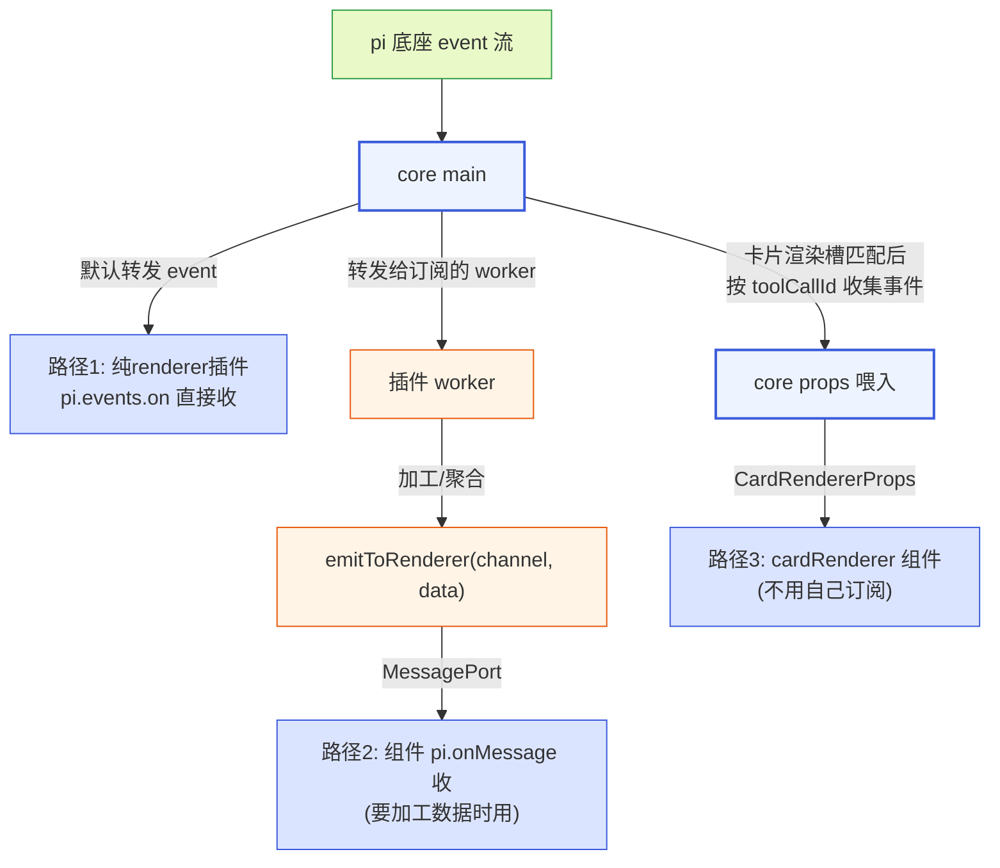

**图 7-1 — 事件到达渲染组件的三条路径：core 默认转发 / worker 加工后推送 / core props 传入**

### 7.2 路径一：core 默认转发

core main 订阅底座 event 流，默认把 event 转发给所有 renderer 侧插件运行时上下文，转发时按该 renderer 插件的 `content:sensitive` 权限过滤敏感字段（§8.4）。所以**只有 `renderer`、没有 `main` 的插件**也能通过 `pi.events.on` 直接收 `tool_execution_*` 等 event——不需要 worker 中转；未声明 `content:sensitive` 时收到的对话/文件内容字段置空，只留元数据。

这让"纯渲染 cardRenderer"成立：manifest 只写 `renderer`、组件里 `pi.events.on` 订阅 `tool_execution_*` 自己画，零 worker。这是纯 renderer 插件的首选路径——不加工数据、直接观察 event 流的场景。

### 7.3 路径二：worker 加工后推送

插件有 `main`、worker 侧 `events.on` 收 event、做转换/聚合、`context.emitToRenderer(channel, data)` 推加工后的数据给组件，组件 `pi.onMessage(channel, cb)` 收。适合"要把多个 event 聚合成 dashboard 数据"这种——比如侧栏 dashboard 要把工具调用次数、token 用量、消息数聚合成统计卡片。

### 7.4 路径三：core props 传入（cardRenderer）

卡片渲染槽的组件，core 在匹配到这个渲染器、渲染某个工具调用卡片时，把该工具调用的事件数据当 props 传入组件。**注册在 cardRenderers 槽位的组件自动走这条路——组件不用自己订阅 event，core 喂数据**。

cardRenderer 组件的 props 契约：

```typescript
// 圆心定义的中性事件接口（不 import pi 类型）
interface ToolCallStart { toolCallId: string; toolName: string; args: unknown }
interface ToolCallUpdate { toolCallId: string; partialResult: unknown }
interface ToolCallEnd { toolCallId: string; result: unknown; isError: boolean }

interface CardRendererProps {
  toolCallId: string;          // 工具调用唯一 id（跨 start/update/end 稳定）
  toolName: string;            // 工具名
  args: unknown;              // 工具调用参数
  updates: ToolCallUpdate[];  // 这个 toolCallId 的全部 update（流式输出，按时间序）
  end: ToolCallEnd | null;     // end，null 表示还没结束
  isStreaming: boolean;        // 是否还在流式
  theme: Theme;                // 当前主题
}
```

core 负责按 toolCallId 收集 pi 的 `tool_execution_*` 事件、翻译成上面中性接口、传给组件。组件每次有新 update 或 end 到来时被重新渲染（props 更新）。

**依赖方向纪律（呼应洋葱架构）**：圆心（槽位契约）不 import pi 的类型——cardRenderer 的 props 用的是 core 自己定义的中性事件接口（`ToolCallStart`/`ToolCallUpdate`/`ToolCallEnd`），不是 pi 的 `ToolExecutionStartEvent` 等。RPC 适配层（gateway）负责把 pi 的 event 翻译成圆心的中性接口——这样圆心不绑死 pi 的类型系统、依赖只向内。pi 协议改了，只动 gateway 的翻译、不动圆心契约和插件层。同理 `when` clause 的条件变量（`agent.idle` 等）也是 core 维护的中性 contextKeys（派生自 `RpcSessionState` 但不直接暴露 pi 类型）。

### 7.5 路径选择决策

| 场景 | 推荐路径 |
|---|---|
| 纯渲染 cardRenderer（挂 cardRenderers 槽位） | 路径三（core props 喂入） |
| 纯 renderer 插件观察 event 流，不在 cardRenderers 槽位 | 路径一（core 默认转发） |
| 要加工/聚合数据再展示（dashboard） | 路径二（worker 加工后推送） |

路径选择由"要不要加工数据"决定——不加工用路径一或路径三、加工用路径二。

---

## 8. 权限声明、授权与撤销

### 8.1 权限枚举

沙箱默认只给 `rpc`/`events`/`bus`/`config`/`i18n`/`http.fetch(白名单域名)`。要更多能力必须在 manifest `permissions` 声明、由用户在管理 UI 授权。取值是枚举字符串：

| 权限 | 含义 |
|---|---|
| `fs:project:read` | 只读当前项目目录（文件预览用） |
| `fs:project:write` | 写当前项目目录（文件编辑器直写用） |
| `fs:project` | 读写当前项目目录（=`read`+`write`） |
| `fs:global:read` / `fs:global:write` / `fs:global` | 读写 `~/.pi`，慎用 |
| `net:域名` | 允许 `http.fetch` 该域名，如 `"net:api.github.com"` |
| `content:sensitive` | 声明后插件才能在订阅的 SessionEvent 里看到消息文本内容 |
| `child:<binary>` | 允许 `context.exec.run` 执行指定二进制，如 `"child:git"`、`"child:npm"`。`<binary>` 是可执行文件名（不含路径），core 按白名单放行 `command` 精确匹配 |

`fs:project` 可细分为 `fs:project:read`（只读）和 `fs:project:write`（写）——按数据隐私需求细分，让权限最小化。`fs:global` 同理细分。另外 `fs:{读写插件的 data 目录}` 默认就有，不用声明。

### 8.2 装时授权流程

外部插件安装（§9.1 的 `installed` 路径）时，installer 在装时就做权限预览：把 `permissions` 列给用户看、让用户**安装时授权**。校验通过、用户授权后，core 才把对应能力注入 PluginContext，未声明未授权的能力调用会抛错。权限预览复用 §3.4 管理槽的 schema 渲染。

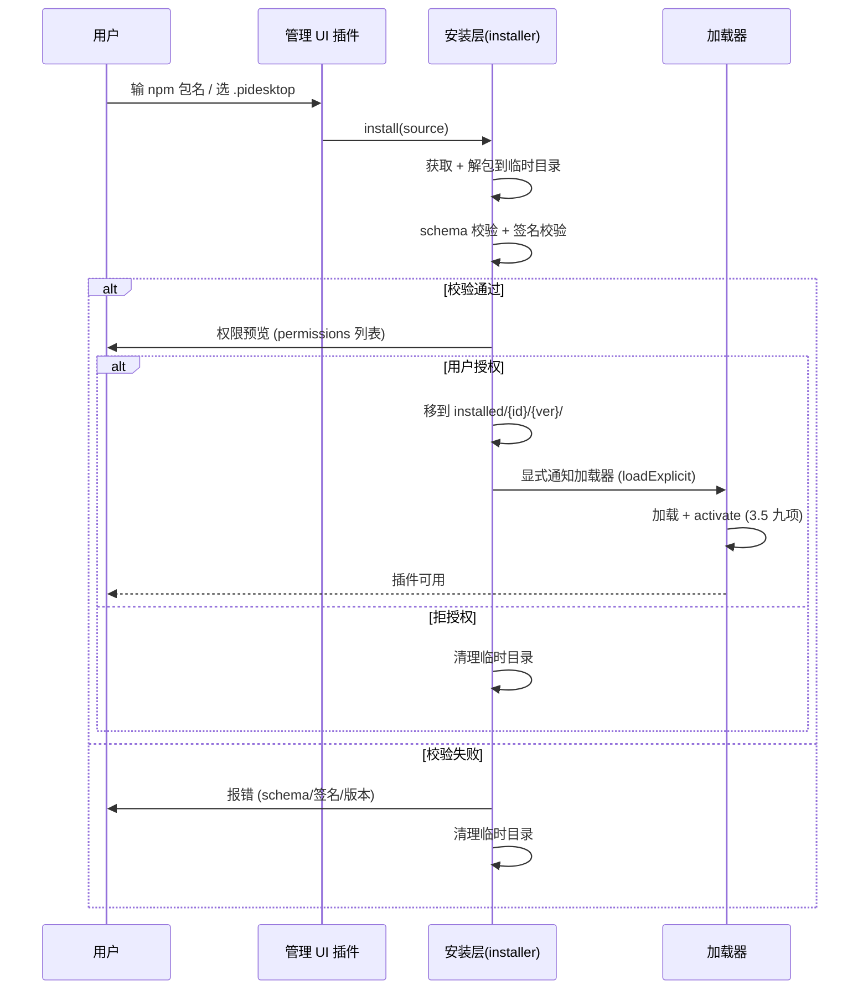

**图 8-1 — 插件安装链路：获取→校验→授权→落盘→加载，任一步失败回滚**

本地手写插件（直接放 `~/.pi-desktop/plugins/`）的权限授权在管理 UI 里首次启用时做——和外部插件的装时授权对称，区别只在"什么时候问用户"。

### 8.3 运行时撤销

用户装时授权了 permissions，后续在管理 UI 可以**撤销**某个权限（或整个禁用插件）。撤销时：

- **撤销单权限**：加载器更新该插件的授权表、把对应能力从 PluginContext 注入里摘掉。已 activate 的插件下次调该能力时抛错（"权限已撤销"）——插件要能优雅降级，不能崩（§9 的错误隔离兜底）。
- **禁用插件**：deactivate 它（摘动态 register 的贡献项）、deactivate 完成后由外层数据管线摘纯声明式贡献项（§10.8）、但保留磁盘文件和配置（区别卸载）。用户可重新启用。

这套撤销机制和"装时授权"对称——权限是动态的、用户随时可改，不是装了就永久。管理 UI 是权限的单一管理面。

### 8.4 content:sensitive 与数据隐私

`content:sensitive` 是数据隐私的关键权限。AgentMessage 的 `content[]`（对话文本/图片）、`toolCalls[].args`（工具参数，可能含文件内容）是敏感字段。gateway 层的 `event-translator`（`DESIGN.md` 5.1.5）翻译 pi 事件成中性 SessionEvent 时，按订阅插件的权限过滤——**未声明 `content:sensitive` 权限的插件，收到的 event 里敏感字段置空**（只保留 role/toolName 等元数据）。

过滤点在 gateway 层、不在圆心（圆心不感知权限），也不在插件侧（插件无法绕过）。这防止恶意插件默默收对话内容外传。

**RPC 响应路径同样过滤（堵"直接拉取"的缺口）**：上面的过滤不只挂在 event 流上——RPC 命令响应路径走**同一套过滤、同一执行点**。gateway 层的 rpc-adapter 在把底座响应交回调用插件前，按该插件声明的 `content:sensitive` 权限裁剪响应里含对话文本/文件内容的字段（`get_messages` 的 `messages[].content`/`toolCalls[].args`、`get_entries` 的 entry 内容、`get_fork_messages` 的 text、`get_last_assistant_text` 的 text 等；未声明则这些字段置空、只留 `role`/`toolCallId`/`toolName`/`id`/`type` 等元数据）。便捷方法 `rpc.getEntries()` 同样过此过滤。详见 §5.2 的 RPC 响应过滤段。**这条是安全模型的关键补丁**：否则一个只声明 `net:api.x.com`、未声明 `content:sensitive` 的插件，可以经 `rpc.send({type:"get_messages"})` 拿到完整对话内容、再经 `http.fetch` 外发，完全绕过"防恶意插件默默收对话内容外传"的核心承诺。RPC 响应过滤和 event 流过滤共用 gateway 层同一套规则、同一执行点，不存在"event 流过滤了但 RPC 响应没过滤"的不对称。

**renderer 侧事件通路同样过滤**：core main 在默认转发 event 给 renderer 侧插件运行时上下文时（§6.2 路径一、§7.2），按**该 renderer 插件**声明的 `content:sensitive` 权限过滤——和 worker 侧走同一套过滤规则、同一个过滤点（gateway 层 event-translator 在翻译+转发时一次性按目标插件的权限裁剪）。也就是说：纯 renderer 插件（只有 `renderer`、没有 `main`）若未声明 `content:sensitive`，它经 `pi.events.on` 收到的 `SessionEvent` 里对话内容/文件内容/工具参数等敏感字段同样置空，只保留元数据。不存在"纯 renderer 插件绕过过滤直接读对话"的漏洞——过滤在 core main 转发时就做掉，不依赖插件自觉。纯 renderer 插件声明 `content:sensitive` 的示例：

```json
{
  "id": "my-content-card",
  "version": "0.1.0",
  "displayName": "内容卡片",
  "renderer": "./ui.tsx",
  "permissions": ["content:sensitive"],
  "contributes": { "cardRenderers": [ { "match": { "strategy": "toolName", "value": "edit" }, "component": "EditCard" } ] }
}
```

声明后该 renderer 插件收到的 `tool_execution_*` 事件里 `args`/`result` 才有内容（如编辑前后的文件文本）；不声明则这些字段为 `null`、只剩 `toolCallId`/`toolName`/`isError`。

`content:sensitive` + `net:` 同时声明时管理 UI 要重点提示用户"此插件能读你的对话并外发到 X 域名"——这是把权限组合的风险显式化。凭证更严格：pi 的 auth/API key 由底座 auth-storage 管理、**插件无权直接读凭证**——PluginContext 不暴露凭证读接口，插件要发 API 请求只能走 RPC（底座自动加 auth）或 `http.fetch`（受权限约束）。

### 8.5 安全模型总结

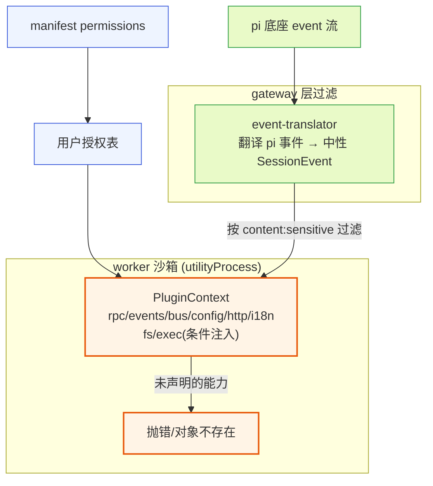

**图 8-2 — 安全模型：worker 进程隔离 + 白名单 scoped API + permissions 声明 + 用户授权 + gateway 层敏感字段过滤**

安全模型有四层：

1. **进程隔离**：插件代码跑在 `utilityProcess` worker，插件抛未捕获异常只崩这个 worker、core 主进程捕获崩溃事件禁用该插件（§10.2、`DESIGN.md` 3.5 第 5 项）。
2. **白名单 API**：PluginContext 只暴露 `rpc`/`events`/`bus`/`config`/`http`/`i18n`/`fs`/`exec` 等 scoped API，全局 `require`/`process`/全局 `fetch`/全局 `fs`/全局 `child_process` 都不可见。其中 `fs`/`exec` 是**条件注入**——未声明对应权限时这两个对象根本不在 context 上（属性访问即抛错），比"方法在、调用时拒"更早阻断。`http.fetch` 方法始终在但白名单初始为空（§5.8），是同一思路的折中（让插件代码无差别调用、由权限层决定放行）。
3. **permissions 声明 + 用户授权**：要更多能力必须声明、用户授权，未授权调用抛错。权限是动态的——用户可在管理 UI 运行时撤销某项权限，core 把对应能力从 PluginContext 注入里摘掉，已 activate 的插件下次调该能力时抛"权限已撤销"（§8.3），插件要能优雅降级。
4. **gateway 层敏感字段过滤**：未声明 `content:sensitive` 的插件收不到对话内容/文件内容——event-translator 在翻译 pi 事件成中性 SessionEvent 时按订阅插件权限把敏感字段置空（§5.3.4 标 🔒 的字段），rpc-adapter 在返回 RPC 命令响应时按调用插件权限同样裁剪（§5.2 RPC 响应过滤段）。两条路径共用 gateway 层同一套规则、同一执行点，过滤点在 gateway、圆心不感知权限、插件无法绕过——既防"经 event 流偷听"、也防"经 RPC 命令直接拉取偷取"。

这四层是纵深防御：进程隔离兜最坏情况（插件崩不拖死整壳）、白名单 API 限制能力面、permissions 做用户可控的授权粒度、gateway 过滤防数据外泄。外部插件和内置插件走同一套、不分信任级——第三方不可信的风险全靠这套沙箱挡，来源只影响分发链路（§13.6）。

---

## 9. 发现、优先级与覆盖

### 9.1 四类发现路径

插件的发现路径镜像底座 extension 的约定，但落在桌面专属目录下，避免和底座 extension 混在一起：

- **项目级**：`<cwd>/.pi-desktop/plugins/`
- **用户级**：`~/.pi-desktop/plugins/`
- **内置**：随壳分发的默认插件（`src/plugins/`，`DESIGN.md` 4 节那一组）
- **installed（外部安装）**：`~/.pi-desktop/installed/{id}/{version}/`——**不在发现路径下**、发现层不扫它

**注意**：发现层只扫前三处本地手写/内置插件目录。外部安装的插件（npm/.pidesktop 安装的）落在 `~/.pi-desktop/installed/{id}/{version}/`——这个目录不在发现路径下、发现层不扫它，因为 installed 多版本目录层级深（`installed/{id}/{version}/` 三层）、靠发现层扫会出递归层级问题。外部插件走 `loader.loadExplicit()` 显式加载入口，installer 装完后显式通知加载器加载。

两条入口（发现层扫本地、显式加载外部）最终进同一个加载器（§10 与 `DESIGN.md` 3.5）。

### 9.2 优先级仲裁

优先级是 `project > user > installed > builtin`，和底座 settings 的合并方向一致（项目级覆盖用户级、用户级覆盖内置）。同名插件（按 `id` 判定）高优先级覆盖低优先级——这是"内置默认插件可被覆盖"的机制：用户或项目级放一个同 id 插件，就覆盖了内置的那个。外部插件也参与优先级仲裁——它来源标记是 `installed`，优先级介于用户和内置之间，用户可用项目级/用户级同名插件覆盖外部装的。

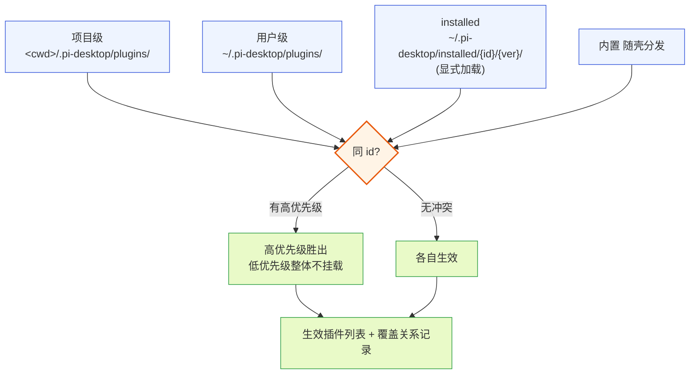

**图 9-1 — 插件发现与优先级：四条来源，同 id 高优先级整体覆盖**

### 9.3 插件级覆盖 vs 贡献项级仲裁

要厘清两个粒度、不矛盾的两层（`DESIGN.md` 3.5 第 7 项）：

- **插件级覆盖（本节）**：两个**同 id 插件**，高优先级整个覆盖低优先级，低优先级插件的所有贡献项都不挂载。这是插件粒度的"有你没我"。覆盖的粒度是整个插件，不是单个 contribution——一个插件要么整体启用要么整体被覆盖，不做"用项目级插件的 A 贡献项 + 内置插件的 B 贡献项"这种拼贴。这简化了合并逻辑，也避免了贡献项级别的冲突仲裁复杂度。
- **贡献项级冲突仲裁（本节）**：两个**不同 id 的插件**，各自往同一个槽位贡献了**同 id 的贡献项**（比如两个插件都贡献了 `commands: [{ id: "session.new" }]`）。这时两个插件都生效（它们 id 不同、不互相覆盖），但它们贡献的那个重名贡献项冲突——按来源插件优先级取高优先级那条，低优先级那条不挂载，并在管理 UI 里标"命令项 `session.new` 冲突，已用 X 插件的版本"。

两者规则一致（都按优先级）、作用对象不同：插件级覆盖是"同 id 插件二选一"，贡献项级仲裁是"不同 id 插件的重名贡献项二选一"。

`resolveByPriority<T>(items, getPriority): T` 是 core 提供的共享仲裁函数（`DESIGN.md` 3.2.4 末尾的原语），两个粒度的调用点共用，不各写仲裁逻辑。

### 9.4 id 冲突检测与可观测性

合并时要做 id 冲突检测：如果用户级和项目级有同 id 插件，按优先级取项目级，但要在管理 UI 里提示"项目级覆盖了用户级同名插件"，让用户知道有覆盖发生。内置被覆盖也要提示。这是"可观测性"——覆盖是允许的、正常的，但不能静默发生。

贡献项级冲突同理：管理 UI 里标"命令项 `session.new` 冲突，已用 X 插件的版本"。诊断页（`DESIGN.md` 4.3.2）是用户出问题时定位"是哪个插件冲突了"的入口。

发现逻辑借鉴底座 `discoverExtensionsInDir`（`packages/coding-agent/src/core/extensions/loader.ts`）：扫三处目录，每个目录下直接文件（`*.ts`/`*.js` 带 `plugin.json`）和子目录（子目录里有 `plugin.json` 或 `package.json` 带 `pi.desktop` 字段）都算一个插件候选。不递归超过一层——复杂插件包必须用 `package.json` 的 `pi.desktop` 字段显式声明入口。这个"只一层"的限制是有意的：防止目录树深度不可控，也让插件包必须显式声明结构而不是靠目录约定猜。

发现要处理目录不存在（跳过）、符号链接（跟随，和底座 extension 一致）、权限错误（跳过并记录）。发现的输出是插件候选列表，每个候选带路径、来源（project/user/builtin）、manifest 原文。

---

## 10. 双入口与进程模型

### 10.1 物理约束与双入口由来

§2.4 已经说过物理约束：React 组件是函数/闭包，不可序列化、不可跨 JS 堆传递；`utilityProcess` 是 Node 环境，没有 `react`、没有 DOM reconciler。所以"在 worker 里 import 一个 React 组件对象，再发给 renderer 渲染"这条路物理上不成立。插件的"逻辑/数据/副作用"代码必须跑在 worker（Node），但插件的"UI 渲染"代码必须在 renderer（有 React 的环境）。

双入口设计由此而来：一个带代码模块的插件，manifest 声明两个入口——`main`（worker 侧逻辑）和 `renderer`（renderer 侧 UI）。两者经 MessagePort 桥接，core 不在中间翻译组件。

### 10.2 worker（utilityProcess）

带 `main` 的插件，其逻辑跑在 Electron `utilityProcess`。这是 Node 子进程，提供进程级隔离——插件抛未捕获异常只崩这个 worker、core 主进程捕获崩溃事件禁用该插件、插件资源占用可按插件计量。

`utilityProcess` 和 renderer 之间**不**走 `ipcMain/ipcRenderer`（那套基于 BrowserWindow，utilityProcess 没有），唯一的官方通道是 **MessagePort**。core main 进程在插件装载时为每个 worker 建**两对** MessagePort（互不干扰）：

- **worker↔main**：管 RPC/event（worker 侧 API）。在 core main 起 `utilityProcess` 子进程时建立——main 把一端端口 `postMessage` 给 worker、自己持有另一端。worker 的 `PluginContext.rpc` 和 `PluginContext.events` 挂在这对端口上：调 `context.rpc.getState()` 往端口发 `{ kind:"rpc", command }`、main 收到后转发底座并按 id 回 `{ kind:"rpc-resp", id, data }`；底座 event 经 main 的 event-translator 翻译成中性 `SessionEvent`（按 `content:sensitive` 过滤）后往端口转发 `{ kind:"event", event }`。详见 §10.5。
- **worker↔renderer**：管插件内部 UI 数据（`emitToRenderer`/`postToWorker`）。在 renderer 侧该插件的运行时上下文创建时建立——一端给 worker、一端给 renderer，之后两端直接 postMessage 对传、不再经 main 转发。详见 §10.6。

两对端口各管各的、不串扰：worker↔main 永远经 core main 中转底座（因为底座 stdin/stdout 归 main 独占），worker↔renderer 是插件内部数据直连（不经 main、低延迟）。每个 worker 有自己的两对端口——worker 隔离靠这个，一个 worker 的 RPC/event/UI 数据不串到别的 worker。

### 10.3 renderer 沙箱

UI 模块跑在 renderer，要防它直接操作宿主 DOM 顶层或 import 任意模块。用受限加载器加载 UI 模块——只暴露 scoped `pi` 对象（rpc、events、i18n、组件库），不暴露 `require`/`process`/`fs`/`window` 的危险面；组件渲染进 React portal + ErrorBoundary + React.lazy 包裹，插件组件抛错被 ErrorBoundary 接住、不影响宿主树。

这里要诚实承认：renderer 侧的隔离弱于独立进程（UI 代码和宿主共享 renderer 堆），真正的不可信代码隔离由 worker 进程边界兜底——`main` 侧的逻辑在独立进程、碰不到 renderer 状态；`renderer` 侧的 UI 代码做受限加载 + portal 隔离。如果某个插件要加载完全不可信的第三方富内容（比如渲染任意 HTML），那个槽位单独走 webview（每插件一个独立浏览器上下文，只靠 postMessage 通信，UI bundle 彻底独立）——这是 VSCode webview 的路线，作为强隔离槽位的降级方案，不作为默认。

### 10.4 MessagePort 桥接

core main 起子进程时、同时为每个 worker 建两对 MessagePort（互不干扰）：

- **worker↔main**：管 RPC/event（worker 侧 API）。worker 调 `context.rpc.getState()` → 往 worker 端口发 `{ kind: "rpc", command: {...} }` → main 收到、由 RPC 适配层发给底座 → 底座响应回 main → main 往 worker 端口回 `{ kind: "rpc-resp", id, data }` → worker 的 PluginContext.rpc 按 id resolve。event 流同理：底座推 event 到 main → main 的 event-translator 翻译成中性 SessionEvent（按 `content:sensitive` 过滤）→ main 往所有订阅该 event 的 worker 端口转发 `{ kind: "event", event }` → worker 的 `context.events.on` 回调收到。
- **worker↔renderer**：管插件内部 UI 数据（`emitToRenderer`/`postToWorker`）。

每个 worker 有自己的两对 MessagePort——worker 隔离靠这个，一个 worker 的 RPC/event 不串到别的 worker。core main 是中枢——它持有底座子进程的 stdin/stdout、转发给各 worker/renderer。

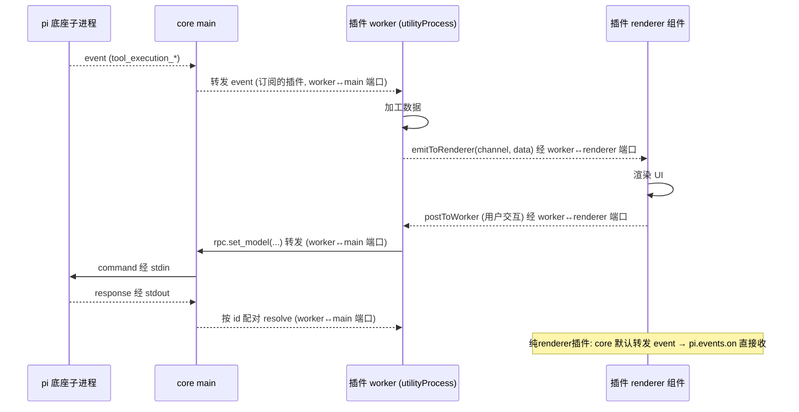

**图 10-1 — 双入口数据流：worker 逻辑与 renderer UI 经 MessagePort 直连，RPC 经 core main 中转**

### 10.5 worker↔main 通道（RPC/event）

worker（utilityProcess）不能直接碰底座 stdin/stdout——那条管道归 core main 的 RPC 适配层独占。worker 的 `PluginContext.rpc` 和 `PluginContext.events` 经 worker↔main 的 MessagePort 转发到 main。

RPC command-response 配对靠 `RequestCorrelator<T>` 这个共享原语（`DESIGN.md` 3.2.4）：生成 id → 存 pending Map → 按 id resolve、带 timeout/AbortSignal 兜底。RPC 命令用递增 id（`req_${++requestId}`）、Extension UI 请求用 UUID，只是 id 生成器不同，配对机制是同一个。这个工具类在 gateway 层（`src/gateway/correlator.ts`）实现，rpc-adapter 与 extension-ui 复用，不对插件暴露。

底座 `RpcClient`（`packages/coding-agent/src/modes/rpc/rpc-client.ts`）的 `handleLine` 就是这套 id 配对的参考实现：`type === "response"` 且有 id 就去配对 pending request，否则当 event 转发给事件订阅者。pi-desktop 的 RPC 适配层照着它写。

### 10.6 worker↔renderer 通道（UI 数据）

worker↔renderer 的 MessagePort 管 `emitToRenderer`/`postToWorker`——插件内部 UI 数据。core main 在插件装载时建好这对端口、一端给 worker、一端给 renderer 侧该插件的运行时上下文，之后直接 postMessage 对传、不再经 main 转发。

renderer 侧给插件 UI 注入的 scoped `pi` API，内部就是往这个端口 postMessage——插件 UI 调 `pi.rpc.get_state()`，实际是往端口发消息、worker 侧收到后发 RPC 给底座、结果回传。

纯 renderer 插件（只有 `renderer`、没有 `main`）不建 worker↔renderer 端口——它的 RPC/events 请求直接走 core main 的默认转发（§7.2）。这是为什么"纯 renderer 插件也能用 `pi.rpc`/`pi.events`"——core main 兜底转发，不强制要 worker。

### 10.7 插件生命周期状态机

带代码模块的插件，从被发现到被卸载，经过一组明确的状态。core 维护这些状态、在管理 UI 的诊断页展示，插件作者理解状态转换有助于调试"为什么我的插件没生效"。

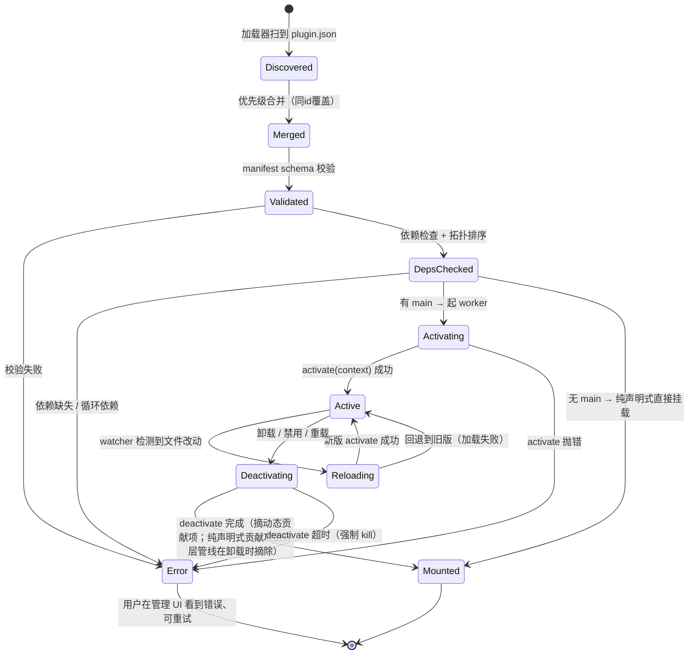

**图 10-2 — 插件生命周期状态机：Discovered → Merged → Validated → DepsChecked → Activating → Active；任一步失败进 Error；热重载在 Active↔Reloading 间循环**

状态说明：

- **Discovered**：加载器扫到 `plugin.json`。这步只是发现，不读代码、不校验。发现层要处理目录不存在（跳过）、符号链接（跟随）、权限错误（跳过并记录）。
- **Merged**：优先级合并后，按 `id` 仲裁获胜的进入后续步骤；被覆盖的插件不进入 Validated、整体不挂载（§9.3 插件级覆盖）。
- **Validated**：manifest schema 校验——必填字段、槽位名、贡献项 schema、`main`/`renderer` 文件存在性。失败标错不拖垮整壳。
- **DepsChecked**：依赖检查（`dependsOn` 里的 id 是否都在生效插件列表里）+ 循环依赖检测（拓扑排序检测环）。失败标错禁用。
- **Activating**：有 `main` 的插件起 worker（utilityProcess）、注入 PluginContext、调 `activate(context)`。纯声明式插件跳过这步直接到 Mounted。
- **Active**：正常运行。worker 崩溃 → core 捕获 `exit`/`error` 事件 → 转 Error、禁用该插件、toast 通知用户。
- **Reloading**：watcher 检测到文件改动 → deactivate 旧版（带超时兜底）→ 加载新版。新版加载失败回退旧版。
- **Mounted**：贡献项已挂进槽位注册表，但 worker 不在运行（纯声明式插件常态，或带代码插件 deactivate 后）。
- **Error**：任一步失败进入。错误信息在诊断页标灰 badge、展开看错误栈。用户可重试。

错误隔离分两层（`DESIGN.md` 3.5 第 5 项）：manifest 校验失败是加载前隔离（不进 Activating）；代码模块运行时抛错是运行时隔离（worker 进程边界兜底）。任何一个第三方插件的 bug 都不该让桌面端挂掉。

### 10.8 加载器的双层管线

加载器实现分两层，对应上面状态机的两个阶段（`DESIGN.md` 3.5.9）：

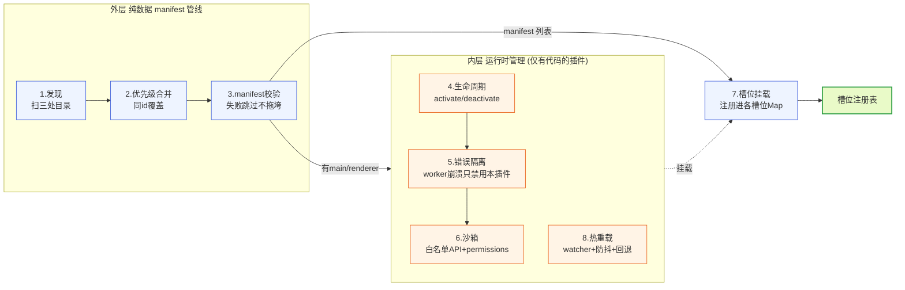

**图 10-3 — 加载器双层管线：外层纯数据处理（声明式插件只走这层），内层运行时管理（有代码插件才进）**

外层是纯数据的 manifest 管线（发现→合并→校验→挂载）——声明式插件只走这层、零运行时成本。内层是带代码模块的运行时管理（生命周期/隔离/沙箱/热重载）——有代码插件才付 worker 进程的成本。这两层分开是关键设计纪律：声明式插件的加载不引入任何运行时副作用。

**槽位贡献项的挂载与摘除归属**（厘清 §10.7 状态机里"摘槽位贡献项"的时机）：

- **挂载**：纯声明式贡献项（manifest `contributes` 声明的）由外层数据管线在"7.槽位挂载"步挂入槽位注册表——是纯数据操作、不依赖 worker。动态 `context.register` 的贡献项在内层 `activate` 时挂入。
- **摘除**：纯声明式贡献项在插件**卸载**时由外层数据管线统一摘除（卸载流程在 deactivate 完成后跑摘除，不需要 worker 参与）；动态 `context.register` 的贡献项在 `deactivate` 时由内层运行时摘除（因为它们是 activate 期间挂的、deactivate 要对称清理）。
- 因此 §10.7 状态机的 `Deactivating → Mounted` 边注释为"摘动态贡献项"——纯声明式贡献项的摘除发生在卸载流程收尾（外层），不绑在 deactivate 这一步。两者最终都保证卸载后槽位注册表不留悬空项。

### 10.9 模块加载与编译机制

manifest 的 `main`/`renderer` 字段指向 TS/TSX 文件（如 `./index.ts`、`./ui.tsx`），但 core 怎么加载、编译这些模块，是"照着能不能跑起来"的关键。这里钉死机制。

**开发期（本地手写插件、dev 模式）**：core 用 jiti（`packages/coding-agent/src/core/extensions/loader.ts` 底座 extension 加载器同款）对 TS/TSX 做即时转译——加载时按需编译、不预生成 js 文件、不要求插件作者配 tsconfig。jiti 支持 JSX（`ui.tsx` 的 React 组件语法直接可用）、支持 `import`/`export`、TypeScript 类型在运行时被擦除（不做类型检查，类型错误不影响运行、靠开发期 IDE/tsc 查）。worker 侧（utilityProcess，Node 环境）和 renderer 侧（有 React、有 DOM）各用一个 jiti 实例加载各自入口：worker 加载 `main`、renderer 加载 `renderer`。jiti 缓存编译结果到内存（同文件不重复编译），热重载时文件改动清缓存重编译。

**生产期（外部安装的插件）**：installer 装 `.pidesktop` 包或 npm 包到 `~/.pi-desktop/installed/{id}/{version}/` 后，加载器和开发期一样用 jiti 即时编译——**不要求预编译成 js**。这是有意的：让插件作者只发 TS 源码、不需要 build 步骤、源码即制品（和底座 extension 一致）。jiti 的编译开销在首次加载时一次性、之后走缓存，对启动性能影响小。如果某插件确实要发预编译 js（比如用了 jiti 不支持的高级语法、或要减小包体积），把 `main`/`renderer` 指向 `.js` 文件即可——core 按文件扩展名决定走 jiti 编译（`.ts`/`.tsx`）还是直接 require（`.js`/`.mjs`/`.cjs`）。

**node_modules 依赖解析**：插件可以带 `node_modules`（npm 包安装时一并装依赖）。worker 侧（Node 环境）的 `require`/`import` 走 Node 标准解析、从插件根目录的 `node_modules` 往上找；renderer 侧（受限沙箱）的依赖解析由 renderer 加载器接管——只允许 `import` 来自 `@pi-desktop/react`/`@pi-desktop/core` 的导出、和插件自己 `node_modules` 里的纯前端库（不含 `fs`/`child_process` 等 Node API 的库）。renderer 沙箱会拒绝 `require('fs')`/`require('child_process')` 这类 Node 模块（§6.7）。

**JSX 支持**：`ui.tsx` 的 JSX 语法由 jiti 转成 `React.createElement`（或自动 runtime `jsx`），插件作者不用配 `jsx` 编译选项。TypeScript 的 `tsx` 语法、泛型组件（`<MyComp<T> />`）都支持。注意 renderer 侧必须有 React 在作用域——core renderer 进程内置了 `react`，插件 `import * as React from "react"` 直接可用，不用自己装 react 到 `node_modules`。

**不支持的能力**：不动态下载代码（安全——不引入远程代码执行）；不支持 `require` 远程 URL；不支持 worker 侧 `import` 含 React/DOM 的库（worker 是 Node 环境、没有 React）；不支持 ESM 的 top-level await（jiti 会报错，把 await 放进 `activate` 函数里）。

这套机制让插件作者写 `plugin.json` + `index.ts` + `ui.tsx`、保存即热重载、不用配任何 build 工具——"照着能跑起来"。生产安装也照搬同一套即时编译、源码即制品。

**renderer 侧受限加载器的工作机制**（厘清 §6.7/§10.3 的"renderer 沙箱不暴露 `require`/`process`/`fs`/`window`"和 jiti 的关系）：renderer 侧**不开 nodeIntegration**——开了就形同虚设没有沙箱。jiti 的标准实现依赖 Node 的 `require` 钩子与文件系统做模块解析/缓存，这套路径在禁用 `require`/`fs` 的受限 renderer 里走不通。因此 renderer 侧不用 jiti 的标准加载路径，而是用一套 **core 自实现的 transform-only 受限加载器**，分三步：

1. **编译（transform-only）**：core main 进程（Node 环境、可用 jiti）把插件的 `ui.tsx` 源码编译成纯 JS 字符串——只做 TS 擦除 + JSX→`React.createElement` 转译，不解析模块图、不执行。编译产物（JS 字符串）经 MessagePort 传给 renderer。
2. **受限 eval**：renderer 侧把 JS 字符串在一个**不暴露全局 `require`/`process`/`fs`/`window` 的受限作用域**里 eval 出模块导出——作用域只注入 scoped `pi` 对象（`RendererPluginContext`：rpc/events/i18n/theme/ui/onMessage/postToWorker）和 core 内置的 `react`。eval 不等于 `nodeIntegration`：它跑的是 core 已编译的受信 JS 字符串、不能 `require('fs')`（作用域里没有 `require`），和"开 nodeIntegration 让插件代码自由用 Node API"是两回事。
3. **模块解析由 core 接管**：插件 `ui.tsx` 里的 `import * as React from "react"`、`import { usePluginContext } from "@pi-desktop/react"`、以及插件自己 `node_modules` 里的纯前端库，由 core main 的受限加载器在**编译期**解析——core 维护一张允许导入的白名单（`react`/`@pi-desktop/react`/`@pi-desktop/core`/插件 `node_modules` 里不含 Node API 的纯前端库），白名单内的模块由 core 预先编译成 JS 字串、注入 eval 作用域；白名单外（`fs`/`child_process` 等含 Node API 的模块）在编译期就拒绝、不会进 renderer。模块图解析、依赖加载全在 main 侧完成、renderer 侧插件代码全程不接触 `require`。

这套"main 编译 + renderer 受限 eval + core 接管模块解析"的机制，让"源码即制品、保存即热重载"在 renderer 侧也能落地，同时守住 §6.7/§10.3 的沙箱承诺——不开 nodeIntegration、不暴露 `require`/`fs`/`process`。热重载时 main 重编译改动文件、把新 JS 字串推给 renderer 重新 eval、清旧模块缓存。`ui.tsx` 里 `import * as React from "react"` 之所以"直接可用、不用自己装 react"，就是因为 core 在编译期已把内置 `react` 解析并注入了 eval 作用域。

---

## 11. 热重载与开发循环

### 11.1 dev 模式 file watcher

单个插件的文件改了（manifest 或代码模块），卸载旧的、加载新的，不动其他插件、不重启底座子进程。热重载靠 file watcher 监听插件目录——core main 对 `~/.pi-desktop/plugins/` 和 `<cwd>/.pi-desktop/plugins/` 插件目录做 watcher。

**注意这个 watcher 和 `DESIGN.md` 2.2 说的"底座没有配置 watcher"不冲突**——2.2 说的是底座（pi 子进程）不对自己的 `~/.pi/agent` 配置目录做 watcher；这里说的是桌面端（pi-desktop core）对自己的 `~/.pi-desktop/plugins/` 和 `<cwd>/.pi-desktop/plugins/` 插件目录做 watcher。两者是不同进程、不同目录、不同作用域：底座靠显式 reload（重启子进程触发）、桌面插件靠桌面自己的 watcher 热重载。

### 11.2 防抖与回退

检测到改动 → 定位是哪个插件 → deactivate 旧的 → 重新发现/校验/activate 新的 → 更新槽位注册表。热重载要防抖（编辑器保存时连续触发只重载一次）、要处理重载失败（新版加载失败时回退到旧版，不让插件进入"既不是旧版也不是新版"的悬空状态）。

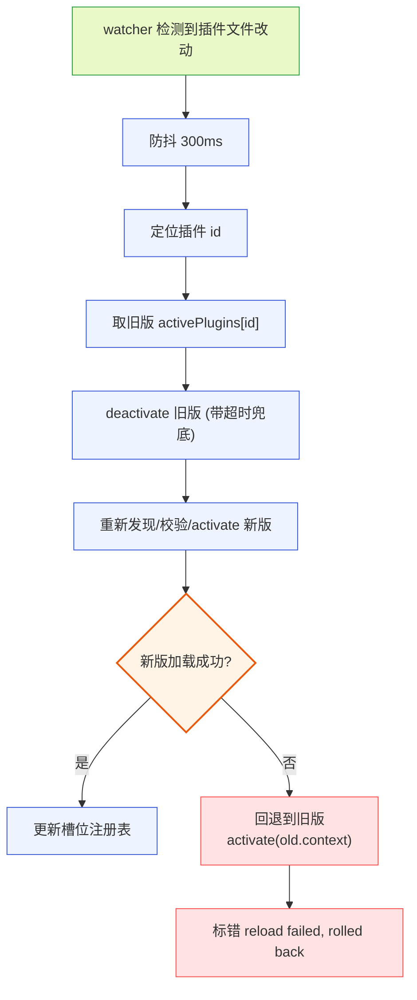

**图 11-1 — 热重载流程：防抖 → 定位 → deactivate 旧版 → 加载新版 → 失败回退**

热重载的关键伪代码（`DESIGN.md` 3.5.9）：

```typescript
fileWatcher.on("change", debounce(async (pluginPath) => {
  const pluginId = pathToId(pluginPath);
  const old = activePlugins.get(pluginId);
  try {
    await old?.mod.deactivate?.();  // 带超时兜底
    await activatePlugin(await reloadManifest(pluginPath));
  } catch (e) {
    // 新版加载失败：回退旧版，不进悬空状态
    if (old) { await old.mod.activate(old.context); activePlugins.set(pluginId, old); }
    markPluginError(pluginId, [`reload failed, rolled back: ${e.message}`]);
  }
}, 300));
```

### 11.3 与底座 reload 的边界

桌面插件自己的配置改了，走 §11 的热重载，只重载那一个插件、不动底座子进程。底座配置（pi 自身的 settings/扩展路径）改了，走 `DESIGN.md` 2.4 的"重启 RPC 子进程"路径，新进程从磁盘重读配置。两路分开，因为它们归不同的进程机制管：底座配置归底座子进程（要重启）、桌面插件配置归桌面加载器（热重载）。

这是"两条独立通道"在热加载上的具体体现。开发循环里，改 `plugin.json` 或 `main.ts`/`ui.tsx` 的代码 → 桌面 watcher 热重载该插件；改 pi 的 `~/.pi/agent/settings.json` 或扩展路径 → 管理端走重启子进程。

### 11.4 调试技巧

- **worker 日志**：插件 worker 的 console 被 core 拦截、送进诊断页的日志缓冲（`DESIGN.md` 4.3.2）。开发时在 worker 侧 `console.log` 能在日志页看到，按 pluginId/level/timestamp 分类、支持 level 过滤/关键字搜索/一键导出。
- **renderer 日志**：renderer 侧插件组件的 `console.log` 直接进 DevTools（开发模式开 DevTools）。ErrorBoundary 把插件组件抛错接住、不影响宿主树，错误信息也在诊断页能看到。
- **插件崩溃**：worker 崩溃 → core 捕获 worker `exit`/`error` 事件 → 禁用该插件 → toast 通知用户（插件名 + 推荐行动），点击跳诊断页。诊断页标灰 badge、展开看错误栈。
- **manifest 校验失败**：在管理 UI 里标红这个插件、跳过它、继续加载其他的。错误信息在诊断页。
- **断点**：worker 是 utilityProcess，开发模式下可挂 inspector。renderer 直接用 React DevTools。

### 11.5 典型开发循环

把上面整合成一个完整的"写一个新插件"开发循环：

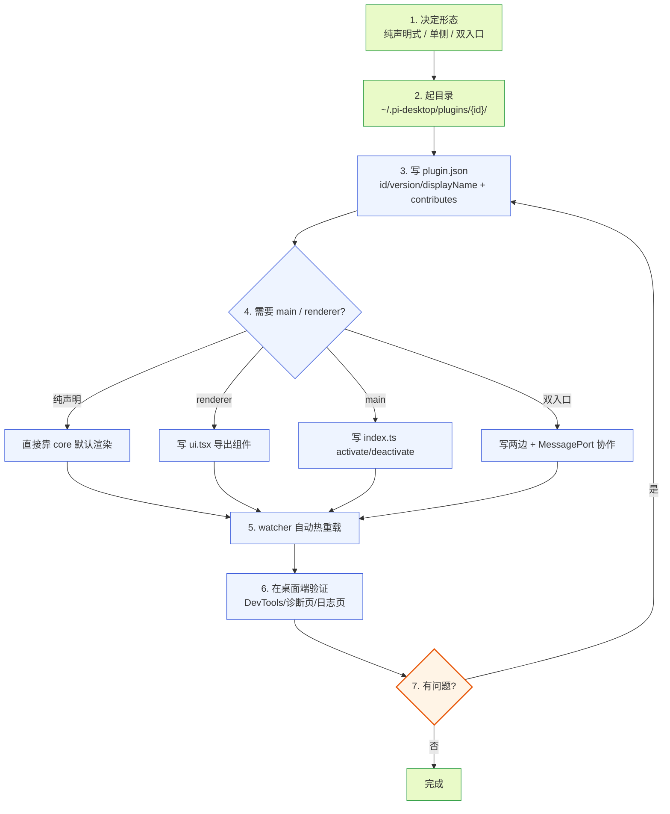

**图 11-2 — 新插件开发循环：选形态 → 起目录 → 写 manifest → 写代码 → watcher 热重载 → 验证**

开发期推荐用 `~/.pi-desktop/plugins/{id}/`（用户级）而不是项目级——用户级对任何项目都生效，方便在不同项目里测试。开发完要分发再迁到 npm 包或 `.pidesktop` 包。开发期间 watcher 持续工作，改完保存自动重载，不用手动重启桌面端。

### 11.6 常见问题与排查

| 现象 | 可能原因 | 排查 |
|---|---|---|
| 插件贡献项没出现 | manifest 校验失败 | 诊断页查错误标记；检查 id/version/displayName、槽位名拼写、贡献项 schema |
| 命令面板里没我的命令 | `when` clause 求值 false | 用 `when: "true"` 排除条件问题；查 contextKeys 状态 |
| worker 日志没输出 | `activate` 没被调到 | 看诊断页插件状态是否 Active；`main` 路径是否对、文件是否存在 |
| `http.fetch` 抛"权限已撤销" | `net:` 域名未声明或被撤销 | manifest `permissions` 加 `"net:域名"`、管理 UI 授权 |
| 收到的 event 敏感字段为空 | 未声明 `content:sensitive` | manifest `permissions` 加 `"content:sensitive"` |
| 重载后旧版还在跑 | 新版加载失败回退 | 诊断页查 "reload failed, rolled back"；修新版代码 |
| 跨插件 bus 收不到消息 | subscribe 时机晚于 publish | 用 `dependsOn` 声明依赖 + "已就绪"信号模式（§5.4） |
| 主题 token 没生效 | token key 拼错或不在清单 | 对照 §3.3 和 `DESIGN.md` 4.11.2 的 token 清单 |
| `rpc.prompt` resolve 了但 agent 没输出 | resolve 只代表预检通过 | 订阅 `message_*` event 流拿输出、`agent_settled` 拿完成 |
| 插件崩了拖死桌面 | 不会——worker 进程隔离 | 看诊断页 worker exit 事件，core 已禁用该插件 |

这张表覆盖了新手最常踩的坑。排查时永远先去诊断页——状态、错误栈、日志都在那。

---

## 12. 完整示例

下面四个示例覆盖纯声明式、纯 renderer、双入口、含依赖与 when clause 四种形态。照着能写代码。

### 12.1 纯声明式：语言包插件

最简单的插件形态——只有 manifest、无代码模块。core 读完 manifest 就知道怎么挂，零代码加载、零 worker。

**目录结构**（放在 `~/.pi-desktop/plugins/my-i18n/`）：

```
my-i18n/
└── plugin.json      # manifest（无 main、无 renderer）
```

**plugin.json**：

```json
{
  "id": "my-i18n",
  "version": "0.1.0",
  "displayName": "My i18n",
  "contributes": {
    "languages": [
      {
        "id": "my-i18n",
        "locale": "zh",
        "resources": {
          "common.send": "发送",
          "timeline.toolExecuting": "工具执行中",
          "myI18n.greeting": "你好"
        }
      },
      {
        "id": "my-i18n",
        "locale": "en",
        "resources": {
          "common.send": "Send",
          "timeline.toolExecuting": "Tool executing",
          "myI18n.greeting": "Hello"
        }
      }
    ]
  }
}
```

**加载流程**：加载器发现 `my-i18n/plugin.json`，无 `main`/`renderer`，判定为纯声明式。校验 manifest：`id`/`version`/`displayName` 齐全，`languages` 是已知槽位，贡献项 schema 符合。core 启动时把所有插件同 locale 的 `resources` 合并成 i18next 字典。渲染时 `i18n.t("myI18n.greeting")` 按当前 locale 返回"你好"或"Hello"。

主题插件同构——把 `languages` 换成 `themes`、`resources` 换成 `tokens`：

```json
{
  "id": "my-theme",
  "version": "0.1.0",
  "displayName": "My Theme",
  "contributes": {
    "themes": [
      {
        "id": "ocean",
        "name": "Ocean",
        "base": "dark",
        "tokens": {
          "color.bg": "#0d1b2a",
          "color.fg": "#e0e1dd",
          "color.primary": "#48cae4"
        }
      }
    ]
  }
}
```

`base: "dark"` 继承内置 dark 主题的全部 token、只覆盖自己声明的三个。

### 12.2 纯 renderer：工具卡片渲染器

假设底座有个扩展注册了一个工具 `generate_image`，agent 调用它时，桌面端想用自定义 UI 渲染这个工具调用的卡片。这是一个纯 renderer 插件——只写 UI、不写 worker 逻辑（数据走 §7.4 路径三：core props 喂入）。

**目录结构**（放在 `~/.pi-desktop/plugins/my-image-card/`）：

```
my-image-card/
├── plugin.json      # manifest
└── ui.tsx           # renderer 入口（main 省略）
```

**plugin.json**：

```json
{
  "id": "my-image-card",
  "version": "0.1.0",
  "displayName": "Image Tool Card",
  "renderer": "./ui.tsx",
  "contributes": {
    "cardRenderers": [
      { "match": { "strategy": "toolName", "value": "generate_image" }, "component": "ImageCard" }
    ]
  }
}
```

**ui.tsx**：

```tsx
import * as React from "react";
import { usePluginContext } from "@pi-desktop/react";  // core 提供的 hook，拿 RendererPluginContext
import type { CardRendererProps } from "@pi-desktop/react";  // §7.4 定义的 cardRenderer props 契约类型

export function ImageCard(props: CardRendererProps) {
  const pi = usePluginContext();  // 拿到 RendererPluginContext（rpc/events/i18n/ui）
  const { toolName, args, updates, end, isStreaming } = props;

  // core 自动把 tool_execution_* 事件按 CardRendererProps 传入，组件不用自己订阅。
  const lastUpdate = updates[updates.length - 1];
  const imageData = end?.result ?? lastUpdate?.partialResult;
  const imageUrl = imageData?.url;  // 假设这个工具的 result 带个 url 字段

  return (
    <div className="image-card">
      <pi.ui.Icon name="image" />
      <span>{pi.i18n.t("myImageCard.generating", { tool: toolName })}</span>
      {imageUrl ? (
        
      ) : isStreaming ? (
        <pi.ui.Button disabled>{pi.i18n.t("myImageCard.loading")}</pi.ui.Button>
      ) : null}
    </div>
  );
}
```

**加载与渲染流程**（core 侧，作者不用写，但要理解）：

1. 加载器发现 `my-image-card/plugin.json`，只有 `renderer` 没有 `main`，判定为纯 renderer 插件。
2. 校验 manifest：`id`/`version`/`displayName` 齐全，`cardRenderers` 是已知槽位，`match` 符合 MatchRule（`toolName` 策略、specificity=100），`component` 是 renderer 入口 `ui.tsx` 的命名导出 `ImageCard`（加载后校验导出存在）。
3. renderer 侧加载器动态 import `ui.tsx`，把 `ImageCard` 注册进 `componentRegistry["my-image-card:ImageCard"]`，并在卡片渲染槽注册表挂这个贡献项（按 §4 的 MatchRule）。
4. agent 调 `generate_image` 工具时，底座推 `tool_execution_start` → core 的卡片渲染槽按 MatchRule 匹配到这个渲染器 → core 创建 `<ImageCard {...cardProps} />`，`cardProps` 按 `CardRendererProps` 契约从该 toolCallId 的事件流填充。
5. 后续 `tool_execution_update`/`tool_execution_end` 来时，core 更新 cardProps 重新渲染组件（props.updates 追加、props.end 填上、isStreaming 变 false）。
6. 用户卸载/禁用这个插件时，加载器从卡片渲染槽注册表移除这个贡献项，渲染中的 `ImageCard` 卸载。

### 12.3 双入口：带 worker 逻辑的侧栏 dashboard

假设要写一个侧栏 dashboard，实时统计当前 session 的工具调用次数、token 用量、消息数。这要订阅 event 流、做聚合、定时刷新——必须有 worker 逻辑（§7.3 路径二）。

**目录结构**（放在 `~/.pi-desktop/plugins/my-dashboard/`）：

```
my-dashboard/
├── plugin.json
├── index.ts          # main 入口（worker 侧逻辑）
└── ui.tsx            # renderer 入口（UI 组件）
```

**plugin.json**：

```json
{
  "id": "my-dashboard",
  "version": "0.1.0",
  "displayName": "My Dashboard",
  "main": "./index.ts",
  "renderer": "./ui.tsx",
  "permissions": ["content:sensitive"],
  "contributes": {
    "sidePanel": [
      { "id": "stats", "label": "我的统计", "icon": "bar-chart-2", "component": "StatsPanel", "defaultVisible": true }
    ]
  }
}
```

注意 `permissions: ["content:sensitive"]`——要统计消息内容相关的指标（比如消息长度）需要这个权限，否则 worker 收到的 event 里敏感字段为空。如果只统计工具调用次数/工具名（不读 args 内容），不需要这个权限。`label` 填字面文案 `"我的统计"`（§2.3 fallback 规则），要本地化则往语言槽贡献构造 key `sidePanel.my-dashboard.stats.label` 的翻译。组件内用 `pi.i18n.t("myDashboard.title")` 等是插件自己的 namespace key（需在 languages 资源里贡献），与 manifest 字段 fallback 是两套独立机制。

**index.ts**（worker 侧）：

```typescript
import type { PluginContext } from "@pi-desktop/core";

interface Stats {
  toolCalls: number;
  messages: number;
  toolNames: Record<string, number>;
  pendingMessages: number;
}

export async function activate(context: PluginContext) {
  const stats: Stats = { toolCalls: 0, messages: 0, toolNames: {}, pendingMessages: 0 };

  // 订阅底座 event 流，按 type 聚合
  const unsubscribe = context.events.on((event) => {
    switch (event.type) {
      case "tool_execution_start": {
        stats.toolCalls += 1;
        const name = event.toolName;
        stats.toolNames[name] = (stats.toolNames[name] ?? 0) + 1;
        // 推给 renderer 组件
        context.emitToRenderer("stats:update", { ...stats });
        break;
      }
      case "message_end": {
        stats.messages += 1;
        context.emitToRenderer("stats:update", { ...stats });
        break;
      }
      case "queue_update": {
        // ⚠️ pendingCount 是派生/待确认字段（见 §5.3.4），尚未与底座源码核实是否在 event 里实际推送、
        // 可能为 undefined。生产实现应以 rpc.getState().pendingMessageCount 为准——这里只是"事件来了
        // 顺手更新一下显示、拿不到就保持旧值（旧值来自启动时的 get_state.pendingMessageCount）"。
        // 不要把它当既定契约依赖，底座确认前某些版本上 event.pendingCount 会恒为 undefined。
        stats.pendingMessages = event.pendingCount ?? stats.pendingMessages;
        context.emitToRenderer("stats:update", { ...stats });
        break;
      }
    }
  });

  // 启动时拉一次当前状态
  const state = await context.rpc.getState();
  stats.messages = state.messageCount;
  stats.pendingMessages = state.pendingMessageCount;
  context.emitToRenderer("stats:update", { ...stats });

  // 注册清理
  context.onDeactivate(() => {
    unsubscribe();
  });
}

export async function deactivate() {
  // onDeactivate 已注册清理，这里可空；或在这里做清理、二选一
}
```

**ui.tsx**（renderer 侧）：

```tsx
import * as React from "react";
import { usePluginContext } from "@pi-desktop/react";

interface Stats {
  toolCalls: number;
  messages: number;
  toolNames: Record<string, number>;
  pendingMessages: number;
}

export function StatsPanel() {
  const pi = usePluginContext();
  const [stats, setStats] = React.useState<Stats>({
    toolCalls: 0, messages: 0, toolNames: {}, pendingMessages: 0,
  });

  // 收 worker 侧 emitToRenderer 推来的数据
  React.useEffect(() => {
    const unsubscribe = pi.onMessage("stats:update", (data) => {
      setStats(data as Stats);
    });
    return unsubscribe;
  }, [pi]);

  return (
    <div style={{ padding: pi.theme["spacing.md"] }}>
      <h3>{pi.i18n.t("myDashboard.title")}</h3>
      <pi.ui.Button onClick={() => { /* 可触发刷新 */ }}>
        {pi.i18n.t("common.refresh")}
      </pi.ui.Button>
      <ul>
        <li>消息数: {stats.messages}</li>
        <li>工具调用: {stats.toolCalls}</li>
        <li>排队中: {stats.pendingMessages}</li>
        <li>工具分布:
          <ul>
            {Object.entries(stats.toolNames).map(([name, count]) => (
              <li key={name}>{name}: {count}</li>
            ))}
          </ul>
        </li>
      </ul>
    </div>
  );
}
```

**数据流**：底座 event → core main 转发给订阅的 worker → worker `events.on` 收、聚合、`emitToRenderer("stats:update", ...)` 推 → renderer 组件 `pi.onMessage("stats:update", ...)` 收、`setStats` 重渲染。这是 §7.3 路径二的典型用法。

### 12.4 含依赖与 when clause：消费别的插件

假设要写一个"在时间线条目上加批注标记"的插件，它依赖时间线插件提供的 entryId 锚点——`dependsOn` 声明依赖，命令用 `when` 控制可用性，跨插件协作走 `bus`。

**目录结构**（放在 `~/.pi-desktop/plugins/my-notes/`）：

```
my-notes/
├── plugin.json
├── index.ts          # main 入口
└── ui.tsx            # renderer 入口
```

**plugin.json**：

```json
{
  "id": "my-notes",
  "version": "0.1.0",
  "displayName": "My Notes",
  "main": "./index.ts",
  "renderer": "./ui.tsx",
  "dependsOn": ["timeline"],
  "contributes": {
    "sidePanel": [
      { "id": "notes", "label": "笔记", "icon": "sticky-note", "component": "NotesPanel" }
    ],
    "commands": [
      { "id": "myNotes.add", "title": "添加笔记", "handler": "#onAddNote", "when": "selection.nonEmpty && selection.source == \"timeline\"" },
      { "id": "myNotes.toggle", "title": "切换笔记模式", "keybinding": "cmd+shift+n", "handler": "#onToggleMode" }
    ],
    "cardRenderers": [
      { "match": { "strategy": "customType", "value": "noted_entry" }, "component": "NotedEntryCard" }
    ]
  }
}
```

`dependsOn: ["timeline"]`——加载器按依赖图拓扑排序，timeline 先 activate、my-notes 后 activate。若 timeline 没装或被完全覆盖掉（任何来源都没 timeline id 生效），my-notes 加载失败、标错、不拖垮整壳。

`when: "selection.nonEmpty && selection.source == \"timeline\""`——"添加笔记"命令只在有选区且选区来自时间线时可用。`selection.nonEmpty`/`selection.source` 是 core 维护的中性 contextKeys（core 监听选区状态维护，`DESIGN.md` 4.10.7），不绑 pi 类型。

**index.ts**（worker 侧，关键片段）：

> **作用域纪律（呼应 §5.11）**：manifest 里 `"handler": "#onAddNote"` 是静态 `#name` 字符串引用——core 按 name 查 worker 模块的命名导出、以 `(ctx, args)` 调用它。**静态 handler 跑在模块顶层、拿不到 `activate` 闭包里的局部变量**。因此 `notes` 状态必须提到模块作用域，`activate` 从 config 读后赋值给模块级变量，`onAddNote`/`onToggleMode` 直接读写模块级变量。把状态写在 `activate` 闭包里再让静态 handler 引用，是"静态 handler 引用闭包状态"的混合形态、照抄跑不起来。运行时才决定挂不挂的命令才走动态 `context.register({ handler: (ctx,args)=>... })` 函数对象形态（它活在 activate 闭包里、能访问闭包变量）。

```typescript
import type { PluginContext } from "@pi-desktop/core";

interface Note {
  entryId: string;
  text: string;
  createdAt: number;
}

// 模块级状态——静态 handler（#name 命名导出）由 core 以 (ctx, args) 调用、
// 拿不到 activate 闭包内的局部变量，故 notes 必须在模块作用域（见 §5.11）。
let notes: Note[] = [];

// 把"发布待发列表"收成模块级辅助函数，收 ctx 做参数——静态 handler 拿到的是自己的 ctx。
function publishPending(ctx: PluginContext) {
  ctx.bus.publish("myNotes.pending", notes);
}

export async function activate(context: PluginContext) {
  // 从配置加载已存笔记，赋值给模块级变量（不是闭包局部变量）
  notes = context.config.get<Note[]>("notes") ?? [];

  // 订阅 timeline 的"已就绪"信号（timeline activate 时发布）
  // dependsOn 保证 timeline 先 activate，这里 subscribe 能收到 timeline 后续发的就绪
  context.bus.subscribe("timeline.ready", () => {
    context.bus.publish("myNotes.ready", { count: notes.length });
  });

  // 发布当前笔记列表给输入框（类似 review 的"待随发"机制）
  publishPending(context);

  // 动态注册一个运行时才挂的命令——动态 handler 只接受函数对象（见 §5.11），
  // 它活在 activate 闭包里、可以访问模块级 notes 和 publishPending。
  // 静态命令（#onAddNote/#onToggleMode）走另一条路、不与此混用。
  context.register({ slot: "commands", contribution: {
    id: "myNotes.addInternal",
    title: "add note internal",
    // 动态 handler 调用签名同 §3.8：(ctx, args?)
    handler: (ctx: PluginContext, args?: { selection?: { entryId?: string; text?: string } }) => {
      const sel = args?.selection;
      if (!sel?.entryId) return;
      notes.push({ entryId: sel.entryId, text: sel.text ?? "", createdAt: Date.now() });
      ctx.config.set("notes", notes);
      publishPending(ctx);
    },
  }});

  context.onDeactivate(() => {
    /* 退订 bus 等 */
  });
}

// 静态 handler：core 按 #onAddNote 查此命名导出、以 (ctx, args) 调用。
// CommandArgs 结构见 §3.8：{ selection?: { entryId?; text?; source? } }。
// onAddNote 的 when 用了 selection.*，core 触发时会带 args.selection。
// 它读模块级 notes（不是 activate 闭包）——这是静态 handler 的正确写法。
export async function onAddNote(context: PluginContext, args?: { selection?: { entryId?: string; text?: string; source?: string } }) {
  const sel = args?.selection;
  if (!sel?.entryId) return;  // 无选区时不操作
  notes.push({ entryId: sel.entryId, text: sel.text ?? "", createdAt: Date.now() });
  context.config.set("notes", notes);
  publishPending(context);
  // 推给 renderer 更新笔记列表（与 ui.tsx 的 notes:update 配对）
  context.emitToRenderer("notes:update", notes);
}
// onToggleMode 的 when 不用 selection.*，不需要 args，单参即可
export async function onToggleMode(context: PluginContext) {
  // 切换笔记模式，发布 bus 信号让 timeline 把每条 entry 标记可选
  context.bus.publish("myNotes.mode", { active: true });
}
```

**ui.tsx**（renderer 侧，关键片段）：

```tsx
import * as React from "react";
import { usePluginContext } from "@pi-desktop/react";

export function NotesPanel() {
  const pi = usePluginContext();
  const [notes, setNotes] = React.useState<Array<{ entryId: string; text: string }>>([]);

  // 收 worker 推来的笔记列表（worker 在 onAddNote 后 emitToRenderer）
  React.useEffect(() => {
    return pi.onMessage("notes:update", (data) => setNotes(data as any));
  }, [pi]);

  return (
    <div>
      <h3>{pi.i18n.t("myNotes.title")}</h3>
      {notes.length === 0 ? (
        <p>{pi.i18n.t("myNotes.empty")}</p>
      ) : (
        <ul>
          {notes.map((n, i) => (
            <li key={i}>
              <small>entry: {n.entryId.slice(0, 8)}</small>
              <p>{n.text}</p>
            </li>
          ))}
        </ul>
      )}
    </div>
  );
}

export function NotedEntryCard(props: any) {
  // cardRenderer 组件，match customType "noted_entry"——当时间线把"被笔记的 entry"标成这个 customType 时匹配
  // core 按 CardRendererProps 喂数据，这里渲染带笔记标记的卡片
  const pi = usePluginContext();
  return (
    <div style={{ borderLeft: `3px solid ${pi.theme["color.accent.warning"]}` }}>
      <pi.ui.Icon name="sticky-note" />
      <span>{pi.i18n.t("myNotes.notedEntry")}</span>
    </div>
  );
}
```

这个示例覆盖了：`dependsOn` 依赖、`when` clause 条件命令、`bus` 跨插件协作、`register` 动态贡献项、cardRenderers 的 `customType` 匹配、`emitToRenderer`/`onMessage` 桥接、`pi.theme` 读 token、`pi.ui` 用组件库。是"复杂插件"的最小完整样态。

### 12.5 完整加载时序

把四个示例里的"插件从被发现到用户可见"的完整时序拼起来，对照阅读理解 core 的内部协作：

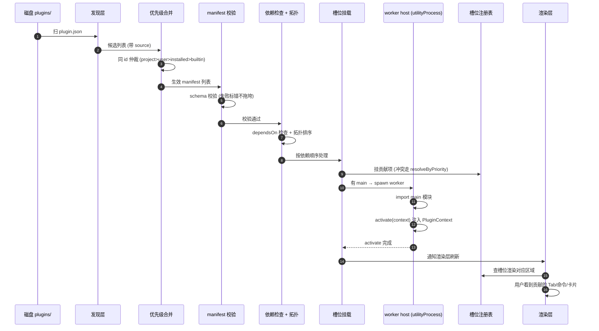

**图 12-1 — 插件加载完整时序：发现 → 合并 → 校验 → 依赖检查 → 挂载 → 起 worker → activate → 渲染**

这个时序对应 §10.7 的状态机：Discovered（1-2）→ Merged（3）→ Validated（4-5）→ DepsChecked（6-7）→ Mounted（8-9）→ Activating（10-12）→ Active（13-15）。任一步失败进 Error 状态、不继续后续步骤。

### 12.6 一个完整的端到端实例：git-stats 插件

把前面所有概念拼成一个真实可用的插件——`git-stats`：在侧栏展示当前项目的 git 提交统计（今日提交数、作者分布、文件变更 Top N）。这个插件需要：读 git 数据（执行子进程 `git log` 等）、聚合统计、定时刷新、侧栏面板渲染。覆盖了双入口、权限声明、worker 加工后推送、`dependsOn`（可选，不依赖别的插件）、配置管理等几乎所有点。

**目录结构**（`~/.pi-desktop/plugins/git-stats/`）：

```
git-stats/
├── plugin.json
├── index.ts          # worker 入口
├── ui.tsx            # renderer 入口
└── README.md
```

**plugin.json**：

```json
{
  "id": "git-stats",
  "version": "0.1.0",
  "displayName": "Git 统计",
  "main": "./index.ts",
  "renderer": "./ui.tsx",
  "permissions": ["child:git", "fs:project:read"],
  "contributes": {
    "sidePanel": [
      { "id": "git-stats", "label": "Git 统计", "icon": "git-branch", "component": "GitStatsPanel", "defaultVisible": true }
    ],
    "commands": [
      { "id": "git-stats.refresh", "title": "刷新 Git 统计", "keybinding": "cmd+shift+g", "handler": "#onRefresh", "when": "project.trusted" }
    ],
    "settings": [
      { "id": "git-stats-prefs", "title": "Git 统计偏好", "component": "GitStatsPrefs" }
    ]
  }
}
```

`permissions: ["child:git", "fs:project:read"]`——声明要执行 git 子进程、读项目目录。`when: "project.trusted"` 让"刷新"命令只在项目被信任时可用（不信任项目不应执行 git 命令、避免恶意项目的 `.git` 被解析）。

**index.ts**（worker 侧）：

```typescript
import type { PluginContext } from "@pi-desktop/core";

interface GitStats {
  todayCommits: number;
  topAuthors: Array<{ name: string; count: number }>;
  topFiles: Array<{ path: string; changes: number }>;
  lastUpdated: number;
}

async function collectGitStats(context: PluginContext): Promise<GitStats> {
  // 实际实现走 context.exec.run（声明 child:git 权限后 core 注入受限子进程 API，见 §5.7）
  // 这里示意：调 git log 拿最近 24h 提交、聚合作者和文件
  const since = new Date(Date.now() - 24 * 3600 * 1000).toISOString();
  const { stdout } = await context.exec.run("git", ["log", `--since=${since}`, "--pretty=format:%an\t%s"]);
  const lines = stdout.split("\n").filter(Boolean);
  const authorCounts: Record<string, number> = {};
  for (const line of lines) {
    const [author] = line.split("\t");
    authorCounts[author] = (authorCounts[author] ?? 0) + 1;
  }
  const topAuthors = Object.entries(authorCounts)
    .map(([name, count]) => ({ name, count }))
    .sort((a, b) => b.count - a.count)
    .slice(0, 5);
  // ... topFiles 同理（git log --name-only）
  return {
    todayCommits: lines.length,
    topAuthors,
    topFiles: [],
    lastUpdated: Date.now(),
  };
}

export async function activate(context: PluginContext) {
  const pollInterval = context.config.get<number>("pollInterval") ?? 300;  // 默认 5 分钟
  let timer: ReturnType<typeof setInterval> | null = null;
  let unsubscribe = () => {};

  const refresh = async () => {
    try {
      const stats = await collectGitStats(context);
      context.emitToRenderer("git-stats:update", stats);
    } catch (e) {
      context.emitToRenderer("git-stats:error", { message: (e as Error).message });
    }
  };

  // 启动时拉一次
  await refresh();

  // 定时刷新
  timer = setInterval(refresh, pollInterval * 1000);

  // 订阅 agent_settled：agent 完成一轮后可能改了文件、刷新统计
  unsubscribe = context.events.on((event) => {
    if (event.type === "agent_settled") {
      refresh();
    }
  });

  // 面板内"刷新"按钮的 renderer→worker 通道：组件 pi.postToWorker("git-stats:refresh", {}) → 这里收
  const offMsg = context.onRendererMessage("git-stats:refresh", () => {
    refresh();
  });

  // 清理
  context.onDeactivate(() => {
    if (timer) clearInterval(timer);
    unsubscribe();
    offMsg();
  });
}

// manifest 里 "handler": "#onRefresh" 引用的命名导出。
// core 触发命令面板/快捷键时，按 §3.8 handler 调用契约以 (ctx, args) 调它——
// 这里直接复用模块级的 collectGitStats，是静态 handler（#name 字符串查导出）的标准写法。
// 注意：动态 context.register 的函数 handler 是另一条路（运行时才决定挂不挂的命令用），本例不混用——
// 这个命令编译期就确定，走静态 #name。
export async function onRefresh(context: PluginContext) {
  const stats = await collectGitStats(context);
  context.emitToRenderer("git-stats:update", stats);
}
```

**ui.tsx**（renderer 侧）：

```tsx
import * as React from "react";
import { usePluginContext } from "@pi-desktop/react";

interface GitStats {
  todayCommits: number;
  topAuthors: Array<{ name: string; count: number }>;
  topFiles: Array<{ path: string; changes: number }>;
  lastUpdated: number;
}

export function GitStatsPanel() {
  const pi = usePluginContext();
  const [stats, setStats] = React.useState<GitStats | null>(null);
  const [error, setError] = React.useState<string | null>(null);

  React.useEffect(() => {
    const off1 = pi.onMessage("git-stats:update", (data) => {
      setStats(data as GitStats);
      setError(null);
    });
    const off2 = pi.onMessage("git-stats:error", (data) => {
      setError((data as any).message);
    });
    return () => { off1(); off2(); };
  }, [pi]);

  return (
    <div style={{ padding: pi.theme["spacing.md"], color: pi.theme["color.fg"] }}>
      <h3 style={{ display: "flex", alignItems: "center", gap: pi.theme["spacing.sm"] }}>
        <pi.ui.Icon name="git-branch" />
        {pi.i18n.t("gitStats.title")}
      </h3>
      {error ? (
        <p style={{ color: pi.theme["color.accent.error"] }}>{error}</p>
      ) : stats ? (
        <div>
          <p>{pi.i18n.t("gitStats.todayCommits", { count: stats.todayCommits })}</p>
          <h4>{pi.i18n.t("gitStats.topAuthors")}</h4>
          <ul>
            {stats.topAuthors.map((a) => (
              <li key={a.name}>{a.name}: {a.count}</li>
            ))}
          </ul>
          <small>{pi.i18n.formatDate(new Date(stats.lastUpdated))}</small>
        </div>
      ) : (
        <pi.ui.Button disabled>{pi.i18n.t("common.loading")}</pi.ui.Button>
      )}
      <pi.ui.Button onClick={() => pi.postToWorker("git-stats:refresh", {})}>
        {pi.i18n.t("common.refresh")}
      </pi.ui.Button>
    </div>
  );
}

export function GitStatsPrefs() {
  const pi = usePluginContext();
  // setter 命名为 setPollInterval，避免遮蔽全局 setInterval（同文件 index.ts 用到了全局 setInterval）
  const [interval, setPollInterval] = React.useState<number>(300);
  // 收 worker 推来的初始配置
  React.useEffect(() => {
    const off = pi.onMessage("git-stats:prefs", (data) => setPollInterval((data as any).pollInterval ?? 300));
    pi.postToWorker("git-stats:prefs:get", {});
    return off;
  }, [pi]);
  // 用户改后推回 worker
  return (
    <div>
      <label>{pi.i18n.t("gitStats.pollInterval")}</label>
      <pi.ui.Input
        type="number"
        value={String(interval)}
        onChange={(e) => {
          const v = Number(e.target.value);
          setPollInterval(v);
          pi.postToWorker("git-stats:prefs:set", { key: "pollInterval", value: v });
        }}
      />
    </div>
  );
}
```

**这个实例覆盖了几乎所有点**：

- 双入口：`main`（worker 跑 git + 聚合）+ `renderer`（UI 组件）。
- 权限声明：`child:git` + `fs:project:read`。
- worker 加工后推送：`emitToRenderer("git-stats:update", ...)`（§7.3 路径二）。
- 订阅底座 event：`agent_settled` 触发刷新。
- 静态 handler：manifest `"handler": "#onRefresh"` 引用 worker 命名导出，core 按 §3.8 调用契约以 `(ctx, args)` 调它——编译期确定的命令走 `#name` 字符串、不与动态 `context.register` 函数 handler 混用（见 §5.11）。
- renderer→worker 消息：面板内"刷新"按钮 `pi.postToWorker("git-stats:refresh", {})` → worker `onRendererMessage` 收（与命令面板触发是两条独立路径）。
- 配置管理：`context.config.get`/`set`、偏好页组件经 `postToWorker`/`onMessage` 协作。
- i18n key + 复数：`pi.i18n.t("gitStats.todayCommits", { count })`、日期格式化 `pi.i18n.formatDate`。
- 主题 token：`pi.theme["color.fg"]`/`spacing.md`、`pi.ui.Icon`/`pi.ui.Button`/`pi.ui.Input`。
- `when` clause：`project.trusted` 控制命令可用性。
- 清理：`onDeactivate` 取消定时器和订阅。

照这个模板改一改，能写出大部分"侧栏面板 + worker 数据采集 + 定时刷新"类型的插件。

---

## 13. 分发插件

### 13.1 两种分发渠道

本地手写插件放 `~/.pi-desktop/plugins/` 自己用够了。要让别人能用，走两种分发渠道之一：

- **npm 包（在线主渠道）**：第三方发布成 npm 包（如 `@scope/pi-desktop-plugin-foo` 或 `pi-desktop-foo`），用户在桌面端管理 UI 搜包名安装。桌面端经 shell 提供的 `PackageFetcher` 接口（依赖倒置）拉包、解到 installed 目录。和底座 extension 的 `Settings.packages` 机制同源（底座 packages 也是 npm/git 源），但落点不同——底座 packages 落 `~/.pi/agent/extensions/`（底座进程加载），桌面插件落 `~/.pi-desktop/installed/{id}/{version}/`（桌面加载器加载）。两套 packages、两个目录、两个加载器，不混。
- **.pidesktop 包文件（离线/内网渠道）**：第三方打包成单文件 `.pidesktop`（实质是个 zip：`plugin.json` + `main.ts/js` + `renderer.*` + 资源 + 可选签名块）。用户从文件拖入、或贴 URL 下载安装。适合内网分发、离线场景、不想走 npm registry 的场景。和 npm 的区别只是"怎么拿到包文件"——拿到后解压、校验、落盘的步骤一样。

### 13.2 .pidesktop 包格式

`.pidesktop` 包格式（npm 包的 package.json 等价物）：

```
foo.pidesktop (zip)
├── plugin.json          # manifest（§2 的格式）
├── index.ts / ui.tsx    # 代码模块
├── resources/           # 静态资源（图标、语言包 JSON 等）
└── SIGNATURE            # 可选：对包内容的签名（作者私钥签）
```

manifest 里分发场景多写 `author`/`source`/`homepage`（§2.8）。`source` 字段用于溯源——卸载、更新检查、冲突报告时知道这插件哪来的。本地手写插件没有 `source`，来源标记是 `local`。

### 13.3 签名校验

`.pidesktop` 包可选带 `SIGNATURE`（作者用私钥签包内容哈希）。安装时桌面端校验签名——校验通过标 `verified`、校验失败或无签名标 `unverified`，管理 UI 显示这个标记让用户知情。签名不是强制（强制会挡掉社区小作者），但 `verified` 标记帮用户判断可信度。npm 包靠 npm registry 的发布者机制做一层信任（包名 scope 归属）。

这条和"不分信任级、靠沙箱挡"不矛盾——沙箱是技术隔离（任何插件都过沙箱），签名是信息提示（帮用户决策装不装），两者职责不同。

**`verified` 标记的诚实含义（避免虚假安全感）**：`.pidesktop` 渠道是纯离线文件、没有 registry 信任锚，当前实现**没有定义公钥分发机制**——校验方无法独立获得作者公钥的信任锚。因此当前签名仅做**完整性校验**（防传输损坏、防包内文件被中间人篡改自检——签名和包内容自洽），**不做来源身份证明**（无法证明"这个包真的来自 manifest 里声称的 author"）。原因：包内自带公钥本身无信任锚（作者可以填任何 author id、附任何自洽的公钥/签名对），`verified` 在离线渠道会退化为"包里有个签名块且自洽"而非"来自声称的作者"。管理 UI 里 `verified` 标记的 tooltip 应写明"签名自洽、内容完整"而非"已确认作者身份"。

**演进项**（不在当前版本承诺）：要真正做来源身份证明，需补公钥分发机制——可选方案：core 内置可信公钥指纹列表（官方背书的作者）、或允许用户在管理 UI 导入并信任作者公钥（TOFU，首次安装记录指纹、后续比对变更时提示）、或对接 keybase/GitHub 公钥。在上述机制落地前，`.pidesktop` 渠道的来源信任由用户自行判断（看 `homepage`/`author` 是否对得上已知来源），技术隔离仍由 §8.5 的四层沙箱兜底——即使签名无法证明来源，恶意插件也碰不到对话内容（`content:sensitive` 过滤）、发不出未授权网络（`net:` 白名单）。

### 13.4 安装链路

用户在管理 UI 点"安装插件"（输 npm 包名 / 选 .pidesktop 文件 / 贴 URL），安装链路（对应 §8.2 的时序图）：

1. **获取**：npm 渠道调 npm 拉包到临时目录；.pidesktop 渠道下载/读文件到临时目录。
2. **解包**：解压到临时目录，读 `plugin.json`。
3. **校验**：manifest schema 校验（§9 与 `DESIGN.md` 3.5 第 3 步同规则）+ 签名校验（如有；当前仅做完整性自洽校验、不做来源身份证明，详见 §13.3）+ 版本检查（已装同 id 是否更高版本）+ 权限预览（把 `permissions` 列给用户看，让用户**安装时授权**，§8.2）。
4. **落盘**：校验通过、用户授权后，移到 `~/.pi-desktop/installed/{id}/{version}/`。版本进目录名——支持多版本共存，激活时按"已装最新"或用户指定。
5. **加载**：调 `loader.loadExplicit()` 显式通知加载器加载（不走发现层，§9.1），加载器校验+activate。
6. **失败回滚**：任一步失败（校验不过、用户拒授权、解包损坏）都清理临时目录、不留半装状态。

### 13.5 更新与卸载

- **更新检查**：安装层记每个已装插件的 `source`（npm 包名或 file:url）。npm 渠道定期（或用户手动）查 registry 最新版本，比对已装版本，有新版提示用户更新。.pidesktop 渠道靠包内的 `homepage` 或 source URL 提示用户手动更新（无自动 registry 检查）。更新 = 走一遍安装链路（获取新版→校验→落盘新版本目录→加载器切到新版本→清理旧版本或保留）。
- **卸载**：管理 UI 点卸载 → 加载器 deactivate 该插件（deactivate 时摘除**动态 register** 的贡献项）→ deactivate 完成后由外层数据管线统一摘除**纯声明式**贡献项（见 §10.8 挂载/摘除归属）→ 删 `~/.pi-desktop/installed/{id}/` 目录（或标记卸载、保留配置）→ 通知加载器卸载完成。卸载要干净——槽位注册表不留悬空项（动态+声明式两类都摘）、不留死 worker。
- **配置保留**：插件自己的配置（`~/.pi-desktop/plugins-data/{id}/config.json`，§5.5）卸载时默认保留——用户重装能恢复偏好。管理 UI 提供"卸载并清除配置"选项做彻底清理。

### 13.6 外部插件不分信任级

外部插件和内置插件走同一套加载器、同一沙箱、同一 permissions 授权，不引入"可信/不可信"分级、不额外加 webview 强隔离层。第三方插件不可信的风险靠沙箱挡——`utilityProcess` worker 进程隔离 + 白名单 scoped API + `permissions` 显式声明 + 用户授权（§8.5 的四层安全模型）。外部插件和内置插件唯一的区别是**来源标记 + 分发链路**（安装/校验/更新/卸载），加载执行时一视同仁。

这避免了 VSCode 那种"本地扩展/工作区扩展/Marketplace 扩展"多套加载路径的复杂度——pi-desktop 只有一套加载路径，来源只影响怎么落到磁盘、不影响怎么加载。

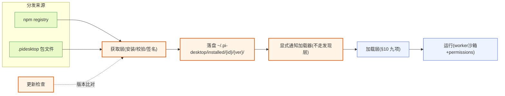

**图 13-1 — 外部插件接入链路：分发来源 → 获取层(安装/校验) → 落盘 → 复用 §9 发现层和 §10 加载层**

关键：获取层（安装/校验/更新）是新增的，落盘后直接复用已有的发现层（§9）和加载层（§10）——不分发相关的逻辑不重写。这呼应"能复用就复用、能持有就持有"。

---

## 14. 测试与调试插件

### 14.1 圆心契约单测

`domain/`（圆心）是纯中性契约，零外部依赖（不 import pi/electron/react），所以可纯单测——槽位 schema 校验、MatchStrategy 匹配、`resolveByPriority` 仲裁逻辑、`RequestCorrelator` id 配对，这些都不需要起进程、不需要 mock。圆心单测放在 `tests/domain/`（`DESIGN.md` 5.1.4 目录结构）。

插件作者自己写的 MatchStrategy（§4.5 自定义策略）也该单测——构造各种 `MatchContext`、断言 `matches()` 返回。这是最便宜的测试，圆心层都能跑：

```typescript
// tests/domain/my-strategy.test.ts
import { describe, it, expect } from "vitest";
import { myCustomStrategy } from "../../src/plugins/my-plugin/strategy";

describe("myCustomStrategy", () => {
  it("matches bash with git args", () => {
    const ctx = { toolName: "bash", args: { command: "git status" } } as any;
    expect(myCustomStrategy.matches(ctx)).toBe(true);
  });
  it("does not match non-bash", () => {
    const ctx = { toolName: "read" } as any;
    expect(myCustomStrategy.matches(ctx)).toBe(false);
  });
});
```

### 14.2 gateway 层 mock 测试

gateway 层（RPC 适配、event-translator、extension-ui 翻译）依赖底座协议，但可以 mock 底座子进程——不起真的 `pi --mode rpc`，而是用一个 mock 进程按 JSON Lines 协议吐预设的 response/event。这测 RPC 的 id 配对、event 转发、Extension UI 请求-响应配对。gateway 测试放在 `tests/gateway/`（`DESIGN.md` 5.1.4）。

mock 子进程的核心是模拟底座 `rpc-mode.ts` 的行为：收到 command 后按 id 回 response、按需推 event。可以复用底座的 `RpcClient`（`packages/coding-agent/src/modes/rpc/rpc-client.ts`）的参考实现，反过来构造 mock。

### 14.3 加载器集成测试

加载器九项（§10）的集成测试放在 `tests/application/`。测试要点：

- **发现**：构造临时目录结构（含 `plugin.json`/子目录/符号链接/权限错误），断言发现的候选列表正确。
- **优先级合并**：构造同 id 不同来源的插件，断言高优先级胜出、覆盖关系记录正确。
- **manifest 校验**：构造各种残缺 manifest，断言校验失败但不拖垮其他插件。
- **依赖检查**：构造 `dependsOn` 缺失、循环依赖，断言标错禁用、不无限递归。
- **生命周期**：mock `activate` 抛错，断言只禁用该插件、不影响其他。
- **槽位挂载**：构造同槽位同 id 冲突，断言按优先级仲裁、低优先级不挂载并标冲突。
- **热重载**：mock file watcher 触发改动，断言防抖、回退逻辑正确。

### 14.4 插件作者自测

插件作者自己测插件，最便宜的方式是 dev 模式热重载（§11.1）+ 诊断页观察。流程：

1. 把插件放 `~/.pi-desktop/plugins/{id}/`。
2. 桌面端启动后 watcher 自动发现并加载。
3. 改代码保存 → 自动热重载。
4. 诊断页查插件状态是 Active、查日志看 `console.log` 输出、查错误栈看 activate 抛错。
5. DevTools 看 renderer 组件渲染、React DevTools 查组件树。

更结构化的测试可以 mock `PluginContext`（用真实的接口形状但 mock RPC/event 转发），单测插件 worker 侧的 `activate`/`deactivate` 逻辑。renderer 侧组件可以脱离 core 单测（mock `usePluginContext` 返回的 `pi` 对象），用 React Testing Library 渲染断言。

### 14.5 诊断页与日志页

诊断页和日志页（`DESIGN.md` 4.3.2）是插件作者主要的可观测性入口：

- **诊断页**：RPC 连接状态（活跃/断线/重连中 + 最后心跳）、底座子进程状态（PID/启动时间/内存占用/重启次数）、禁用的插件列表（id + 禁用原因）、最近一小时的错误数统计。插件崩溃/校验失败/重载失败都在这看。
- **日志页**：core 收集的日志——RPC 适配层捕获 pi 子进程 stderr、插件 worker 的 console 拦截、core 自身的日志，按 pluginId/level/timestamp 分类存内存环形缓冲（最近 N 条，会话级、重启丢失）。日志页展示缓冲、支持 level 过滤/关键字搜索/一键导出（导出时落文件）。插件作者开发时也靠这看 worker 日志。注意：日志存内存缓冲、不进 better-sqlite3（sqlite 只存持久化的插件配置/命令历史/缓存）。

- **插件错误 toast**：插件加载失败或运行时崩溃 → toast 通知用户（插件名 + 推荐行动），点击跳诊断页。禁用的插件在管理页标灰 badge、展开看错误栈。这是"插件崩了用户得知道"的可见性。

### 14.6 断点调试

- **worker 断点**：worker 是 utilityProcess，开发模式下可挂 inspector（设置 `ELECTRON_ENABLE_LOGGING`、用 `--inspect` 参数起 worker）。具体配置参考 Electron utilityProcess 文档。
- **renderer 断点**：renderer 直接用 Chrome DevTools（开发模式开 DevTools），React DevTools 查组件树、Profiler 查性能。
- **main 断点**：core main 进程是 Electron main，可用 `--inspect-brk` 起、用 Chrome DevTools 或 VSCode debugger 挂。

调试卡住的 worker→renderer 通信时，可以在 worker 侧 `console.log` 看 `emitToRenderer` 的 payload、在 renderer 侧 `console.log` 看 `pi.onMessage` 收到的 data，对比两端数据是否一致。MessagePort 的消息不可直接断点，靠日志观察。

---

## 15. 常见模式与最佳实践

### 15.1 "组装和调用分开"在插件层的体现

`DESIGN.md` §1.13 的工程原则"组装和调用应该分开"在插件层有具体落地。最典型的例子是 review 插件和主输入框的关系（`DESIGN.md` 4.10.4）：review 插件**不直接发 prompt**——它把攒好的评论列表交给主输入框（4.7.4 定义的唯一发送出口），由输入框"发送"动作一并提交。review 插件负责组装评论（构造），输入框负责发送（执行），两者分开。

这个原则推广到插件作者的代码里：

- **构造 prompt 内容和发送 prompt 分开**。需要把内容塞进消息的插件，走"经事件总线把内容交给主输入框"模式，不要自己调 `rpc.prompt` 绕过输入框。这守住"prompt 唯一出口是主输入框"。
- **构造渲染数据和渲染分开**。要加工数据再展示的插件，worker 侧加工（聚合 event、拉 RPC）、`emitToRenderer` 推给组件、组件只渲染——不要在组件里直接发 RPC/订阅 event 做复杂加工（组件应该尽量纯渲染，重逻辑放 worker）。
- **构造配置和读写配置分开**。配置 schema 声明在 manifest（构造），通用表单渲染器读写（执行），不要在组件里手搓表单逻辑——用 §3.4 的 schema 声明式管理页。

### 15.2 关注点分离：回调参数的气味

`DESIGN.md` §1.3 的"回调参数是责任边界模糊的气味"在插件层的体现：如果一个插件 API 接受 `fn: Callable` 类型的参数、且多个调用方传入的回调逻辑大同小异，说明这个逻辑应该收进来、由被调用方统一承担。

在 pi-desktop 插件层的实例：`context.events.on(listener)` 的 listener 是必要的（不同插件订阅不同事件做不同事），但 `rpc.resync()` 这种"重新拉 state+entries+tree+commands 同步 UI"的模式——如果每个插件各自拼这组命令，就是重复逻辑，应该收进 `resync()` 这个共享原语。这就是 §5.2 末尾提到的三个共享原语的设计动机。

### 15.3 洋葱架构视角

插件作者写代码时，默认用洋葱架构的视角看依赖（`DESIGN.md` §1.4）：

- **依赖只向内**：插件（外层）依赖 `domain/`（圆心）的槽位契约 + PluginContext 接口，不 import `gateway/`/`application/`/`shell/` 的实现。这是硬纪律——任何 `plugins/` 文件 import 了 `gateway`/`application`/`shell` 就是违规。
- **把会变的推到外层**：pi 的协议类型（`AgentSessionEvent` 等）是会变的细节，圆心不 import 它们——gateway 的 `event-translator` 负责把 pi 的事件类型翻译成圆心中性 `SessionEvent`（§5.3.4），cardRenderer 的 props 也用圆心定义的中性 `ToolCallStart`/`ToolCallUpdate`/`ToolCallEnd`（§7.4）。**关于 RPC 返回的状态/模型类型**：`rpc.getState()` 返回中性 `SessionState`、`rpc.getAvailableModels()` 返回中性 `ModelInfo[]`、`rpc.getEntries` 返回 `MessageEntry[]`、`rpc.getTree` 返回 `TreeNode[]`、`rpc.getCommands` 返回 `CommandInfo[]`——这些是圆心自有的中性投影类型（字段与底座 `RpcSessionState`/`Model`/`SessionEntry`/`SessionTreeNode`/`RpcSlashCommand` 同构，但归圆心拥有、不 import `gateway/protocol/`），由 `gateway/context-binding.ts` 的 `toSessionState`/`toModelInfo`/`toMessageEntry`/`toTreeNode`/`toCommandInfo` 映射产生（见 `DESIGN.md` 5.1.5）。`rpc.send(unknown)` 逃生舱则不绑类型、让插件自断言返回结构。pi 若改了底座协议字段，只动 gateway 的映射、圆心中性契约和插件不动。
- **依赖倒置连通内外**：`PackageFetcher`（§13.4）接口定义在 application 层、实现在 shell 层（npm/file fetcher）。installer 调接口、不 import shell 实现。`PluginRuntime` 接口同理——application 定义、shell 实现。
- **新增功能先问归属哪层**：插件作者加的逻辑是业务规则（内层）、用例编排（中层）还是基础设施（外层）？放错层就是技术债。插件代码本身是"内容层"（外层），只该 import 圆心契约。

### 15.4 最小权限原则

声明 `permissions` 时用最小粒度——能用 `fs:project:read` 就不要 `fs:project`（含 write）、能用 `fs:project` 就不要 `fs:global`。这不仅是安全最佳实践，也是用户体验——用户授权时看到的权限越少越安心，管理 UI 也会重点提示 `content:sensitive + net:` 这种危险组合。

典型插件的最小权限组合：

| 插件类型 | 最小权限 |
|---|---|
| 工具卡片渲染器（只渲染） | 无（用 core 默认转发） |
| 侧栏 dashboard（统计工具调用次数） | 无（工具名不敏感） |
| 侧栏 dashboard（要读消息内容统计） | `content:sensitive` |
| 文件预览器 | `fs:project:read` |
| 文件编辑器（直写） | `fs:project:write` |
| 调外部 API（如 GitHub） | `net:api.github.com` |
| 跑 git 子进程（git-stats 类） | `child:git`（只授权要用的二进制，枚举里没有 `child:*` 通配，每个二进制单独声明） |
| 要读 ~/.pi 配置 | `fs:global:read`（慎用，管理 UI 标黄） |
| 既要读对话又要外发 | `content:sensitive` + `net:api.xxx.com`（管理 UI 重点提示） |

### 15.5 不要假设加载顺序

`dependsOn` 是显式的加载顺序声明，但不要在没有声明依赖时假设加载顺序——core 不保证无依赖关系的插件按什么顺序 activate（同层按来源优先级 + id 字典序，但这是实现细节、插件不该依赖）。

需要跨插件协作时：

1. 用 `dependsOn` 声明依赖（B 先 activate）。
2. B activate 后发"已就绪"信号（`bus.publish("B.ready", ...)`）。
3. A activate 时立刻 `bus.subscribe("B.ready", ...)` + 查询 B 当前状态。

不要假设"A 先 activate、B 后 activate 时 A 能直接调 B 的方法"——插件间不直接调方法，只经事件总线 + 槽位注册表间接协作。这是 §10.7 错误隔离的延续——插件间松耦合、一个崩了不连累别的。

### 15.6 纯渲染优先、worker 次之

写一个新插件时，先问"能不能纯 renderer 实现"——只写 UI、不写 worker。能的话走 §7.1 路径一（core 默认转发 event）或路径三（cardRenderer props 喂入），零 worker 成本。只有确实要加工/聚合数据、要定时拉数据、要发 RPC 命令、要读写配置时才加 `main` 入口。

这是"最小代价"原则——纯 renderer 插件不起 worker 进程、不占内存、加载快、崩了影响小。worker 是有代价的选择（进程隔离的代价是 worker 起停成本 + MessagePort 通信开销）。

### 15.7 内置组件优先、自定义次之

写 UI 时，先用 `pi.ui.Button`/`pi.ui.Input`/`pi.ui.Dialog` 这些自带主题 + a11y 的内置组件。只有内置组件库没有需要的元素时，才用 `pi.theme["token.name"]` 读 token 自定义渲染——但不硬编码颜色值（`"#89b4fa"` 这种），必须经 theme 取。这条让插件 UI 视觉一致、自动跟主题切换、自动获得无障碍。

内置组件库覆盖了 Button/Input/Dialog/Icon 等基础元素。如果发现某个常用元素（如 Tabs、Tree、Table）内置库没有，可以提 issue 给 core 团队补——这是"能持有就持有"的延续（通用元素收进 core 持有的组件库、不各插件各画一遍）。

### 15.8 演化与向后兼容

core 的槽位契约和 PluginContext 接口随版本演化时走开闭原则（`DESIGN.md` 3.3 末尾）：

- **新增槽位类型是扩展**——core 加一个新槽位、不影响已有插件。插件作者可以用新槽位贡献新内容。
- **已有槽位加字段是向后兼容的字段**——旧插件不带新字段时 core 给默认值，不删字段不改变字段语义。比如 commands 槽位未来加 `group?: string` 字段，旧插件不带这个字段时 core 当作默认分组、不报错。
- **不删字段不改变字段语义**——已有的 `id`/`title`/`keybinding`/`handler`/`when` 不会改名、不会改含义。`when` clause 语法保持精简：运算符优先级表 + 一层括号、不支持嵌套超过一层（见 §3.8，该节为 when 文法权威定义）。

插件作者升级插件时要注意：

- **manifest 加字段**：core 升级后给槽位加了新字段、你的插件想用就加、不用旧版仍兼容。
- **handler 签名变化**：core 一般不会改 handler 签名（向后兼容），但新增的 DynamicContribution 形状可能扩展——动态注册时只填必填字段、可选字段省略。
- **PluginContext 新增方法**：core 升级后 PluginContext 可能加新方法（如未来加 `context.fs.read`），你的插件想用就用、不用旧版仍工作。但要注意权限——新能力往往伴随新 permissions 声明。

### 15.9 从 现有方案 adapter 迁移

如果你维护的是 现有方案的一个 adapter.json（`DESIGN.md` 3.1.1 提到的 34 个 `.adapter.json`），迁移到 pi-desktop 插件的路径是：

- **adapter 声明 toolCard 渲染**：迁移成 cardRenderers 槽贡献项。adapter 的 `toolCard` 映射是纯 JSON 声明、pi-desktop 的 cardRenderer 是真正的 React 组件——表达力上限提升（能做动态渲染）。把 adapter 里"这个工具用 X 组件呈现"的映射，改成 manifest `contributes.cardRenderers` 里 `{ match: { strategy: "toolName", value: "X" }, component: "XCard" }` + renderer 模块导出 `XCard` 组件。
- **adapter 声明 i18n**：迁移成 languages 槽贡献项。adapter 自带 `i18n` 字段（`AdapterI18nLocale`）的 displayName/description 翻译，改成 manifest `contributes.languages` 的 `resources`。
- **adapter 声明 displayName/description**：迁移成 manifest 的 `displayName` + 语言槽翻译。

迁移后你的扩展自带桌面 UI、随插件包分发，不用给 pi-desktop 仓库贡献 JSON 等发版——这正是 pi-desktop 消解 adapter 层的核心收益（`DESIGN.md` 3.1.3、3.7.3）。

### 15.10 FAQ

**Q: 我的插件能不能直接 import 别的插件的代码？**
A: 不能。插件间不直接 import 实现（§10.7 错误隔离的延续）。需要协作走两条：事件总线（`context.bus` 收发信号）、槽位注册表（间接引用别的插件挂的贡献项，比如时间线插件贡献的 cardRenderers 可以被其他插件通过槽位查到、但不 import 时间线插件的代码）。

**Q: 我的插件能不能直接调底座的 extension API（如 `pi.registerTool`）？**
A: 不能。底座 extension API 是底座进程内部的事，桌面插件碰不到。桌面插件要"管底座 extension"走 `DESIGN.md` §2 支柱②的配置文件操作 + 重启子进程（`DESIGN.md` 2.5），要"观察底座 extension 注册的工具/命令"走 `rpc.getCommands()`、订阅 `tool_execution_*` event。这是"桌面只消费、不干预底座行为"（§1.1）的边界。

**Q: 一个插件能贡献多个槽位的贡献项吗？**
A: 能。manifest 的 `contributes` 是按槽位分组的，一个插件可以同时贡献 `sidePanel` + `commands` + `settings` 等（见 §2.9 的完整 manifest 参考）。review 插件就是这样（`DESIGN.md` 4.10.3）。

**Q: 同一个槽位的多个贡献项能来自同一个插件吗？**
A: 能。一个插件可以在 `contributes.{slot}` 数组里列多个贡献项，比如时间线插件在 `cardRenderers` 里挂 bash/edit/read/all 四个渲染器（§12 示例）。每个贡献项的 `id` 在该插件内要唯一。

**Q: 我的 renderer 组件怎么读配置？`pi.config` 不在 RendererPluginContext 里。**
A: 对，`config` 在 worker 侧的 `PluginContext`。renderer 组件要读配置，worker 侧 `activate` 时把 `context.config.all()` 用 `emitToRenderer("config:init", all)` 推给组件、组件 `pi.onMessage("config:init", ...)` 收；用户改配置时组件 `pi.postToWorker("config:set", {key,value})`、worker 收到后 `context.config.set(...)`、再 `emitToRenderer` 推回新值。见 §3.9 设置子页样例。

**Q: 纯 renderer 插件能用 `pi.rpc` 吗？没有 worker 谁转发？**
A: 能。core main 兜底转发——纯 renderer 插件的 RPC 请求直接走 core main、不经 worker。这是为什么"纯 renderer 插件也能用 `pi.rpc`/`pi.events`"（§6.2、§10.6）。但要复杂逻辑（加工数据、定时拉、读写配置）还是该加 `main` 入口。

**Q: 热重载会重启底座子进程吗？**
A: 不会。改插件文件（`plugin.json`/`main.ts`/`ui.tsx`）只热重载该插件、不动底座子进程（§11.3）。改 pi 的配置（`~/.pi/agent/settings.json`、扩展路径）才走管理端重启子进程。两路分开。

**Q: 我的插件能注册新的 when clause 变量吗？**
A: 不能。contextKeys 表由 core 维护、不对插件暴露写入接口。插件只能用已有的变量（`agent.idle`/`agent.streaming`/`session.hasName`/`project.trusted`/`model.reasoning`/`selection.nonEmpty`/`selection.source`/`review.modeActive`）。需要新变量可以提 issue 给 core 团队。

**Q: `permissions` 声明了但用户没授权会怎样？**
A: 加载时 core 检查授权表——未授权的能力不注入 PluginContext，插件调该能力时抛错（"权限未授权"）。插件要能优雅降级（比如不显示需要该能力的功能、提示用户去管理 UI 授权）。这是"权限是动态的、用户随时可改"（§8.3）的体现。

**Q: 插件崩了会拖死桌面端吗？**
A: 不会。worker 进程隔离（§10.7 错误隔离）——插件抛未捕获异常只崩这个 worker、core 主进程捕获崩溃事件禁用该插件、toast 通知用户。renderer 侧组件抛错被 ErrorBoundary 接住、不影响宿主树（§6.6）。任何一个第三方插件的 bug 都不该让桌面端挂掉。

**Q: 怎么调试 worker 里 `console.log` 的输出？**
A: 诊断页的日志页（§14.5）——core 拦截 worker 的 console、按 pluginId/level/timestamp 分类存内存环形缓冲。支持 level 过滤/关键字搜索/一键导出。renderer 侧组件的 `console.log` 直接进 DevTools。

**Q: `rpc.prompt()` resolve 了但 agent 没输出，为什么？**
A: `rpc.prompt()` 的 Promise 在预检通过时就 resolve（不是 agent 处理完，§5.2）。它 resolve 只代表"底座接受了这条 prompt、开始处理了"，agent 的输出要靠订阅 `message_*` event 流拿、agent 结束靠 `agent_settled`。预检失败时 reject。

**Q: 我能写一个插件完全替换内置时间线渲染吗？**
A: 能。内置时间线插件优先级最低（builtin），用户级或项目级放一个同 id 插件（如 `~/.pi-desktop/plugins/timeline/`）就整体覆盖内置的（§9.2、§9.3）。这是"内置默认插件可被覆盖"的机制，VSCode 也是这么做。

---

## 16. 开发者检查清单

写完一个插件，对照这份清单自检：

**manifest**

- [ ] `id` 全局唯一、`version` 语义化、`displayName` 填了 fallback 文案。
- [ ] `main`/`renderer` 按需声明：纯声明式两者都省；单侧只带一个；双入口都带。没有用 `kind` 字段标记形态。
- [ ] `contributes` 里每个槽位名是已知槽位（languages/themes/management/cardRenderers/sidePanel/viewers/commands/settings），贡献项字段符合该槽位 schema。
- [ ] `component`/`handler` 引用的导出名在对应入口模块里确实存在（`component` → renderer、`handler` → worker，`#` 前缀）。
- [ ] `permissions` 只声明实际需要的能力，用最小粒度（`fs:project:read` 优于 `fs:project`）。
- [ ] `dependsOn` 只写真正需要跨插件协作的依赖，不要为了"加载顺序"乱声明。
- [ ] 分发场景填了 `author`/`source`/`homepage`。

**代码模块**

- [ ] worker 入口导出 `activate(context)` / `deactivate()`，`activate` 里订阅的 event、定时器、worker 资源都在 `onDeactivate` 或 `deactivate` 里清理。
- [ ] renderer 入口按命名导出组件（不是默认导出），每个组件用 `usePluginContext()` 拿 `pi`。
- [ ] 不直接 import core 内部模块（`gateway`/`application`/`shell`），只 import `domain` 契约（`@pi-desktop/core`/`@pi-desktop/react`）。
- [ ] 不硬编码颜色值，用 `pi.theme["token.name"]` 或直接用 `pi.ui.Button` 等自带主题的组件。
- [ ] 不直接调全局 `fetch`，用 `context.http.fetch`（且在 `permissions` 声明 `net:` 域名）。
- [ ] 不直接读 pi 的凭证/auth，发 API 请求走 RPC（底座自动加 auth）或 `http.fetch`。

**事件与数据流**

- [ ] 选对了数据通路：纯 cardRenderer 走路径三（core props 喂入）；纯 renderer 观察 event 流走路径一（core 默认转发）；要加工数据走路径二（worker 加工后 `emitToRenderer`）。
- [ ] `events.on` 返回的取消订阅函数在 `onDeactivate` 里调了。
- [ ] bus 是 fire-and-forget、无历史回放——要可靠收到 B 的消息用 `dependsOn` + "已就绪"信号；要传历史状态用 `config` 持久化或 RPC event 流（有历史）。
- [ ] `rpc.prompt()` 的 Promise resolve 只代表"底座接受了 prompt、开始处理"，不是 agent 处理完——agent 输出靠订阅 `message_*` event、agent 结束靠 `agent_settled`。

**权限与安全**

- [ ] 未声明 `content:sensitive` 的插件不依赖收到对话内容/文件内容（敏感字段会被 gateway 过滤置空）。
- [ ] `content:sensitive` + `net:` 同时声明时，管理 UI 会重点提示用户——确认这是插件真正需要的。
- [ ] 插件要能优雅降级处理"权限被运行时撤销"的情况，不能崩（错误隔离会兜底，但用户体验差）。

**发现与覆盖**

- [ ] 本地手写插件放 `~/.pi-desktop/plugins/`（用户级）或 `<cwd>/.pi-desktop/plugins/`（项目级），目录结构不超过一层（复杂包用 `package.json` 的 `pi.desktop` 字段显式声明入口）。
- [ ] 知道自己的 `id` 可能被高优先级来源覆盖（project > user > installed > builtin），覆盖是整体替换、不是贡献项拼贴。
- [ ] 贡献项 `id` 在同槽位里尽量带插件命名空间前缀（如 `myNotes.add` 而不是 `add`），避免和别的插件重名冲突。

**热重载与调试**

- [ ] dev 模式下改插件文件会自动热重载（防抖 300ms），改 pi 配置要走管理端重启子进程。
- [ ] 新版加载失败会回退旧版——检查诊断页有没有 "reload failed, rolled back" 标记。
- [ ] worker 日志在诊断页日志缓冲里看，renderer 日志在 DevTools 看。

**分发前（外部安装场景，§13）**

- [ ] `version` 按语义化版本递增：改了兼容性 MAJOR、加功能 MINOR、修 bug PATCH。installer 按版本号做更新检查，乱填会导致更新提示失灵。
- [ ] `source` 填对渠道（`npm:<包名>` 或 `file:<url>`），一旦写入不要随便改——installer 按它判断更新检查走哪个渠道。
- [ ] `permissions` 在 README 里逐条解释为什么需要——用户授权时看到的权限越透明越安心，`content:sensitive + net:` 组合务必写明用途。
- [ ] `.pidesktop` 包带 `SIGNATURE`（可选但推荐），让用户看到 `verified` 标记、提升可信度。
- [ ] manifest 校验通过、`main`/`renderer` 引用的导出名都确实存在（缺导出会校验失败、不挂载）。
- [ ] 不打包 `node_modules` 里 core 已内置的 `react`（renderer 侧 core 内置 React）；只打包插件真正依赖的纯前端库。
- [ ] 卸载链路自测：管理 UI 点卸载后，槽位贡献项全部摘除、worker 退出、不留悬空 Tab/命令。

**模块加载与编译（§10.9）**

- [ ] TS/TSX 在开发期靠 jiti 即时编译、不需 build 步骤；生产安装也走同一套即时编译、源码即制品。
- [ ] renderer 侧只 `import` 来自 `@pi-desktop/react`/`@pi-desktop/core` 和自己 `node_modules` 的纯前端库；不 `require('fs')`/`require('child_process')`（沙箱会拒）。
- [ ] worker 侧不 `import` 含 React/DOM 的库（worker 是 Node 环境、没有 React）；要 UI 数据走 `emitToRenderer` 推给 renderer 组件。
- [ ] `await` 放进 `activate` 函数体内、不用 top-level await（jiti 会报错）。

---

## 附录 A：相关源码与文档索引

- **本指南对应设计文档**：`../DESIGN.md` 第 3 节（插件系统）、第 4 节（内置默认插件）、5.1.4（目录结构）、5.1.5（圆心类型纯度纪律）。
- **底座 RPC 协议类型**：`packages/coding-agent/src/modes/rpc/rpc-types.ts`——`RpcCommand` 联合类型（31 个命令全集）、`RpcResponse`、`RpcSessionState`、`RpcSlashCommand`。
- **底座 RPC 客户端参考实现**：`packages/coding-agent/src/modes/rpc/rpc-client.ts`——`RpcClient.start()` 起进程、id 配对、event 转发。
- **底座 RPC 模式入口**：`packages/coding-agent/src/modes/rpc/rpc-mode.ts`——`takeOverStdout`/`writeRawStdout`/`attachJsonlLineReader`、Extension UI 子协议的 `createDialogPromise`。
- **底座 extension 类型**：`packages/coding-agent/src/core/extensions/types.ts`——底座自己的 extension 机制（`ExtensionAPI`、`on/registerTool/registerCommand` 等），桌面端不接管它的加载执行、只通过 RPC 观察。
- **底座 extension 加载器**：`packages/coding-agent/src/core/extensions/loader.ts`——`discoverExtensionsInDir` 等发现逻辑，桌面端发现层借鉴它的目录扫描约定。

## 附录 B：术语表

- **pi 底座**：`@earendil-works/pi-coding-agent`，一个 AI coding agent，本体是 Node CLI。`--mode rpc` 把 agent 嵌进别的应用（pi-desktop 就是那个"别的应用"）。
- **core**：pi-desktop 自己的核心层，跑在 Electron main/renderer 进程里，提供四根支柱（RPC 适配、配置操作、插件加载器、内置默认插件）。
- **槽位（contribution point）**：core 暴露给插件的扩展点，借鉴 VSCode。八个槽位：languages/themes/management/cardRenderers/sidePanel/viewers/commands/settings。
- **贡献项（contribution）**：插件往槽位挂的具体东西。manifest `contributes` 里声明，或运行时 `context.register` 动态注册。
- **MatchRule**：卡片渲染槽和预览器槽用的匹配规则，纯声明式数据，core 通过策略注册表转成可求值的 `MatchStrategy`。
- **PluginContext**：worker 侧 `activate(context)` 收到的 API，是 worker 侧插件的全部能力边界。
- **RendererPluginContext**：renderer 侧 UI 组件收到的 `pi` 对象，同构但更轻，多了 `theme`/`ui`。
- **utilityProcess**：Electron 的 Node 子进程，提供进程级隔离。带 `main` 的插件 worker 跑在这。
- **MessagePort**：worker↔main 和 worker↔renderer 的通信通道（utilityProcess 不走 ipcMain/ipcRenderer）。
- **内置默认插件**：随壳分发的插件，优先级最低（builtin），可被覆盖，架构地位和第三方插件平等。
