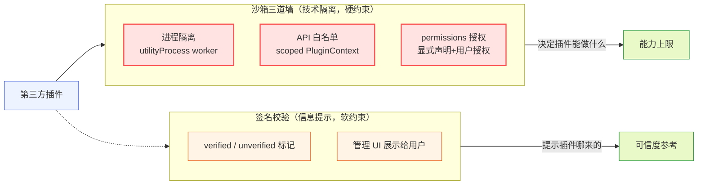
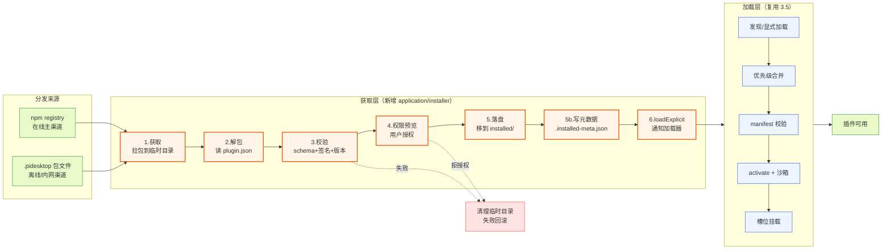
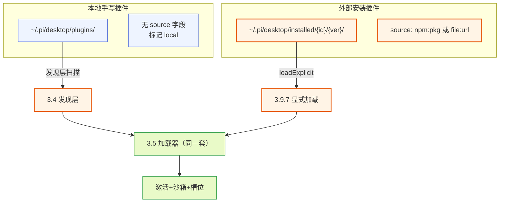
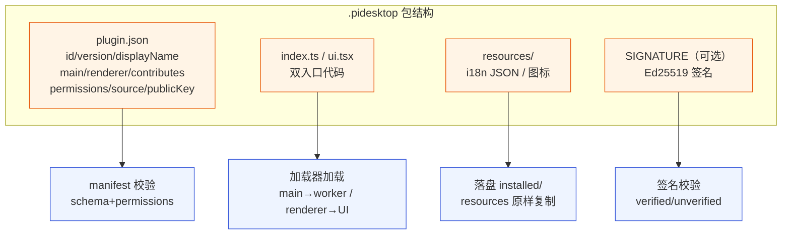
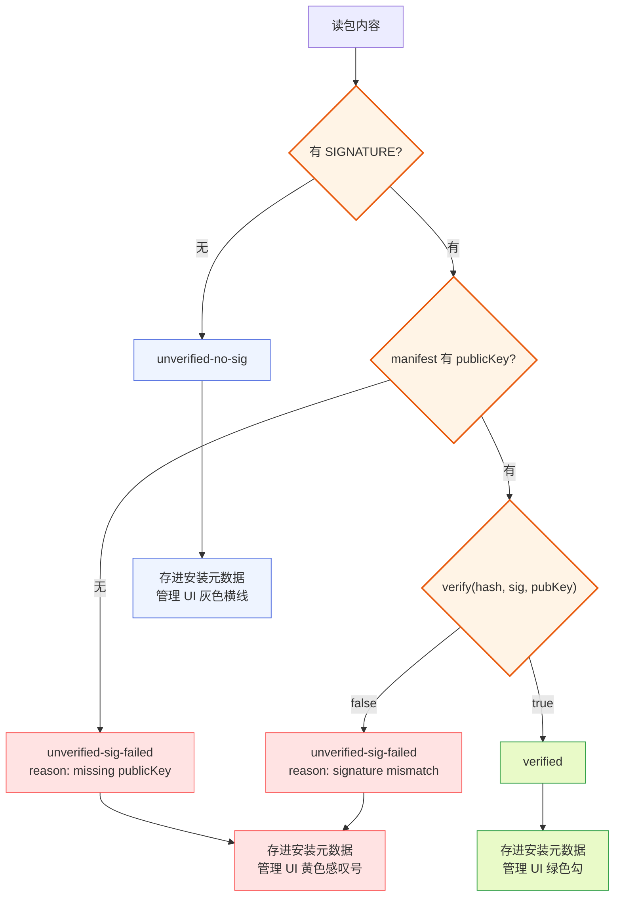
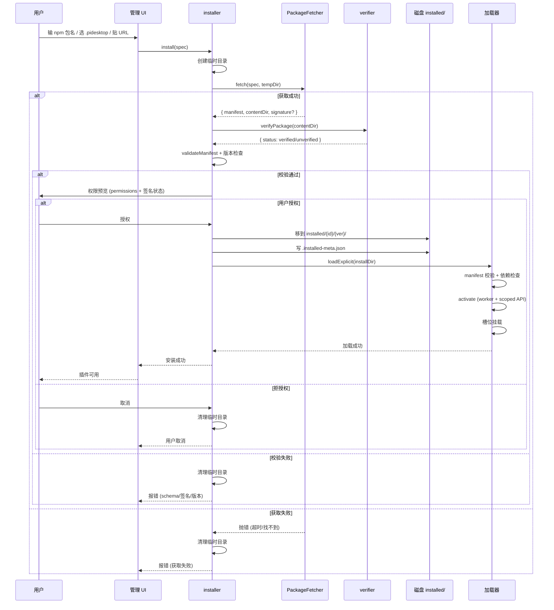
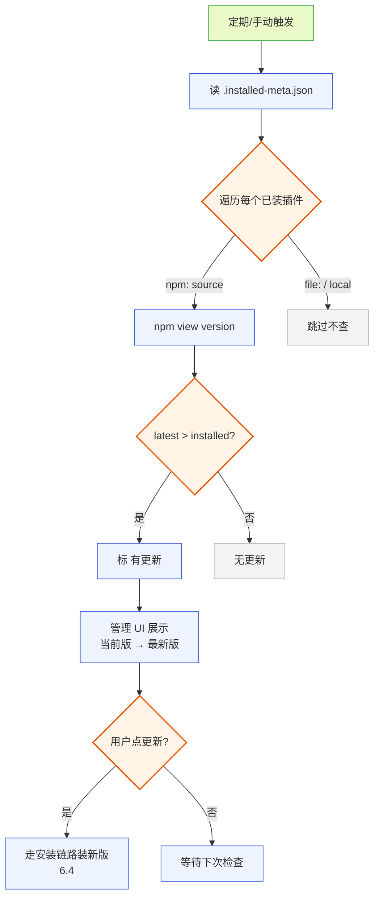
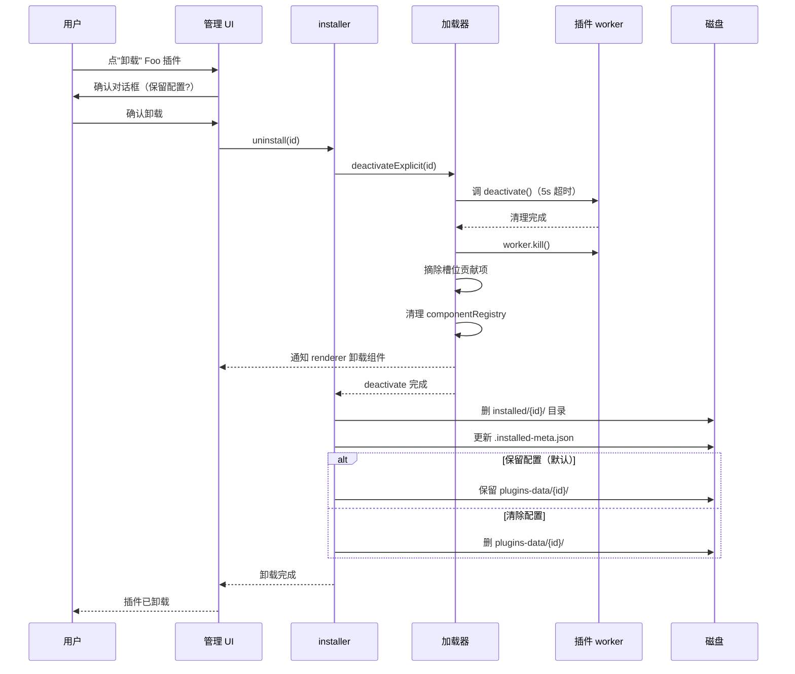
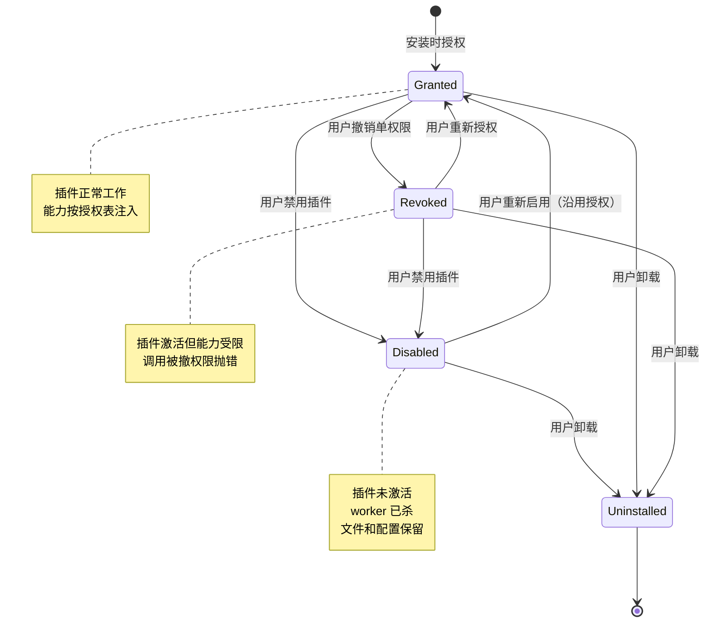
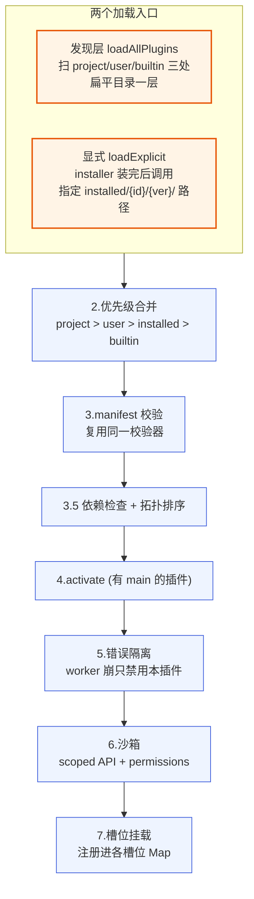

# 外部插件接入指南

本文档锁定 pi-desktop 的外部插件接入机制：第三方怎么把插件**分发**到用户机器上、桌面端怎么**获取并加载**、装上之后怎么**更新与卸载**、运行时怎么**撤销权限**。这是插件生态能否长出来的关键——3.4 的插件发现只管扫三处本地目录（项目/用户/内置），那是"已经躺在磁盘上的插件"；外部插件是"从磁盘之外进来"的另一条入口，它要解决 npm 在线拉包、`.pidesktop` 离线投递、签名校验、用户授权、多版本共存、失败回滚这一整套分发链路。

这套机制的核心立场只有一句话：**外部插件和内置插件走同一套加载器、同一沙箱、同一 permissions 授权，不引入"可信/不可信"分级**。来源只影响"怎么落到磁盘"和"来源标记"，不影响"怎么加载"。第三方插件不可信的风险靠沙箱挡——`utilityProcess` worker 进程隔离 + 白名单 scoped API + `permissions` 显式声明 + 用户授权。外部插件和内置插件唯一的区别是分发链路（安装/校验/更新/卸载），加载执行时一视同仁。这避免了 VSCode 那种"本地扩展/工作区扩展/Marketplace 扩展"多套加载路径的复杂度——pi-desktop 只有一条加载路径。

参考 `DESIGN.md` 的 3.9 节（外部插件接入）、3.4（发现与优先级）、3.5（加载器九项）、3.2.4（PluginContext 与 permissions）、3.6（双入口与 worker 沙箱），以及 2.3（底座 packages 机制）。涉及 pi 底座的部分参照真实源码 `packages/coding-agent/src/core/package-manager.ts`（`PackageManager` 接口、npm `view`/`install` 机制、`checkForAvailableUpdates` 更新检查）、`packages/coding-agent/src/core/extensions/loader.ts`（`discoverExtensionsInDir` 发现机制）、`packages/coding-agent/src/core/settings-manager.ts`（`PackageSource` 类型、`packages` 字段）、`packages/coding-agent/src/core/project-trust.ts`（信任机制）。

---

## 1 设计立场与总体架构

### 1.1 外部插件同内置，不分信任级

#### 1.1.1 唯一加载路径

pi-desktop 只有一条插件加载路径，无论插件从哪来。一个插件无论是随壳分发的内置插件、用户手写放进 `~/.pi/desktop/plugins/` 的本地插件、从 npm 拉的包、还是从 `.pidesktop` 文件解出来的离线包，最终都进 3.5 加载器的九项流程：发现/显式加载 → 优先级合并 → manifest 校验 → 依赖拓扑 → 生命周期 → 错误隔离 → 沙箱 → 槽位挂载。不存在"内部插件走 A 路径、外部插件走 B 路径"的分叉——这是和 VSCode 拉开差距的关键设计纪律。

VSCode 实际上有三套加载路径：local extensions（`~/.vscode/extensions/`）、workspace extensions（项目 `.vscode/extensions/`）、Marketplace 扩展（经 VSIX 安装）。每套有自己的发现规则、信任级别、UI 呈现。这套设计在 VSCode 那个体量里能撑住，但复杂度是真的——`ExtensionScanner` 要处理多个 root、多个 kind、多个 trust level，代码量不小。pi-desktop 不背这个包袱：所有插件同一加载器、同一沙箱、同一槽位契约，来源只表现为一个 `source` 字符串字段（`npm:` / `file:` / `local`），用于溯源。

#### 1.1.2 沙箱是技术隔离，签名是信息提示

第三方插件不可信的风险，靠什么挡？靠沙箱——这是技术隔离，不是信任分级。沙箱由三道墙组成：

- **进程隔离**：带 `main` 的插件跑在 Electron `utilityProcess` worker 进程里（3.6），插件抛未捕获异常只崩这个 worker、core 主进程捕获崩溃事件禁用该插件。插件碰不到 core 的堆、碰不到别的插件的堆、碰不到 renderer 的 React 状态。
- **API 白名单**：worker 只暴露 scoped 的 PluginContext（3.2.4）——`rpc`/`events`/`bus`/`config`/`i18n`/`http`/`fs`/`emitToRenderer`/`register`/`onDeactivate`。`require`/全局 `fs`/`process`/`child_process` 不可见，全局 `fetch` 不可见。文件读写走 `context.fs`（受限、要声明 `fs:project:read`/`fs:project:write`/`fs:global:read`/`fs:global:write` 权限，经 core main 文件代理层、限定在授权作用域内）、网络访问走 `context.http`（受限、要声明 `net:` 权限、走 core main 代理）。**v1 不提供子进程执行能力**——PluginContext 不含 `context.exec`，`child_process` 在 worker 里不可见，需要子进程的场景走底座 RPC `bash` 命令（1.5.8）或底座 extension（13.1 的 v2 演进项）。`context.fs`/`context.http` 的完整契约见 3.2.4。
- **permissions 显式声明 + 用户授权**：要更多能力（`fs:project:read`/`fs:project:write` 读写当前项目目录、`fs:global:read`/`fs:global:write` 读写 `~/.pi`、`net:域名` 访问特定域名、`content:sensitive` 读对话敏感字段）必须在 manifest 的 `permissions` 数组里声明，用户在管理 UI 授权后 core 才把对应能力注入 PluginContext 的 `context.fs`/`context.http`。未声明未授权的能力调用抛 `PermissionDeniedError`。权限枚举按 `:read`/`:write` 拆分（不接受裸 `fs:project`/`fs:global` 合称），3.1.3 给完整枚举表。

签名校验（4 节）是另一条线——它是**信息提示**，不是技术隔离。签名通过标 `verified`、签名失败或无签名标 `unverified`，管理 UI 显示这个标记让用户知情。签名不决定插件能不能装、能不能跑——只要用户授权了 permissions，未签名的插件照样能装能跑。这两条线职责不同：沙箱挡的是"插件能做什么"（技术能力上限），签名提示的是"这个插件是谁发的"（可信度参考）。一个没有签名的插件，只要用户授权了，它能在沙箱允许的范围内正常工作；一个有签名的插件，如果用户不授权它的 permissions，它同样什么都做不了。这两条不互相替代——沙箱是硬约束（插件无法绕过），签名是软约束（用户可以无视提示照装）。



**图 1 — 沙箱（硬约束）与签名（软约束）职责分工：一个管能力上限，一个管可信度提示**

#### 1.1.3 来源标记只影响分发链路

外部插件和内置插件唯一可见的区别是 manifest 里的 `source` 字段。这个字段有三个取值：

- `npm:<包名>`：npm 渠道安装的插件，如 `npm:pi-desktop-foo` 或 `npm:@scope/pi-desktop-plugin-foo`。
- `file:<url>`：`.pidesktop` 渠道安装的插件，如 `file:https://internal.company.com/plugins/foo.pidesktop`。
- 不填：本地手写插件，来源标记为 `local`。

`source` 字段的作用是溯源——卸载时知道去哪清理、更新检查时知道查哪个 registry、冲突报告时知道插件哪来的。它**不**影响加载：加载器不看 `source`、不因来源不同走不同分支、不因 `npm:` 标记就额外加沙箱层。installer（5 节）装完后落盘的插件目录，和用户手写放进 `~/.pi/desktop/plugins/` 的插件目录，在加载器眼里结构完全一样——都是一份 `plugin.json` + 代码模块 + 资源。唯一的物理差异是落盘位置：外部插件落 `~/.pi/desktop/installed/{id}/{version}/`，本地手写插件落 `~/.pi/desktop/plugins/`——这个差异是因为外部插件要多版本共存（10 节），不是因为加载逻辑不同。

### 1.2 接入链路总览

#### 1.2.1 三段式：获取层 → 落盘 → 加载层

外部插件从"用户点击安装"到"插件可用"，经过三段处理。第一段是**获取层**——这是外部插件新增的逻辑：从 npm registry 或 `.pidesktop` 源拉包到临时目录、解包、校验 manifest schema + 签名 + 版本、把 permissions 列给用户预览并取得授权、把校验通过的包移到 `installed/` 目录。第二段是**落盘**——包躺在 `~/.pi/desktop/installed/{id}/{version}/` 下，和本地手写插件躺在 `~/.pi/desktop/plugins/` 下是平行的两种存储位置。第三段是**加载层**——installer 调 `loader.loadExplicit()` 显式通知加载器加载这个新落盘的插件，加载器走 3.5 的九项流程把它 activate 进槽位。

关键设计点是：第一段是新增的（installer 子系统），第二段第三段全部复用已有机制。获取层只负责"把插件正确弄到磁盘并通知加载器"，不重写加载、不重写沙箱、不重写槽位挂载。这是"能复用就复用"的体现——外部接入是加载器的外围增强，不是新的加载体系。



**图 2 — 外部插件接入三段式：获取层（新增）→ 落盘 → 加载层（复用 3.5）**

#### 1.2.2 分发渠道只决定怎么落盘

npm 渠道和 `.pidesktop` 渠道的差异，全部集中在获取层的第一步"怎么拿到包文件"。npm 渠道调 npm 客户端拉 tarball、解包；`.pidesktop` 渠道下载文件或读本地文件、解 zip。拿到包文件之后，解包、读 manifest、校验、授权、落盘、loadExplicit——这些步骤两种渠道完全一样。这种"渠道差异隔离在获取的第一步"的设计，靠的是 PackageFetcher 依赖倒置（9 节）：installer 调 `PackageFetcher.fetch(spec, dest)` 接口，shell 提供两个实现（NpmFetcher / FileFetcher），installer 不 switch 渠道、不 if-else 分发——多态，不是分支。

这呼应了洋葱架构的"构造和执行应该分开"——"怎么拿到包"是构造（渠道差异），"拿到后怎么校验落盘加载"是执行（统一逻辑）。构造的差异封在 shell 的两个 fetcher 实现里，执行的统一逻辑封在 application 的 installer 里。两侧独立演化——新增一个 git 渠道只要写个 GitFetcher 实现 PackageFetcher 接口，installer 一行不改。

#### 1.2.3 installed 不走发现层

这是外部插件和本地手写插件在加载入口上的唯一实质差异。本地手写插件放在 `~/.pi/desktop/plugins/` 或 `<cwd>/.pi/desktop/plugins/`，加载器启动时扫这三处目录发现它们（3.4 的发现层）。外部插件放在 `~/.pi/desktop/installed/{id}/{version}/`，这个目录**不在**发现层的扫描路径下——发现层不扫它。

为什么不走发现层？因为 installed 目录有多版本共存的层级结构（`installed/{id}/{version}/` 三层），发现层递归扫会出层级问题——同一个 id 下多个 version 目录都扫出来，不知道哪个版本生效。外部插件不走发现层的自动扫描，改走 `loader.loadExplicit()` 显式加载入口——installer 装完后，明确告诉加载器"加载这个 id 的这个版本"。两条入口（发现层扫本地、显式加载外部）最终进同一个加载器（3.5），但入口不同。这个设计让 installed 目录支持多版本共存（10 节展开），也让发现层保持简单（只扫扁平的一层目录，不递归）。

### 1.3 与底座 packages 机制的关系

#### 1.3.1 同源不同落点

pi 底座自己也有一套 packages 机制——`Settings.packages: PackageSource[]`（`settings-manager.ts:107`），每个可以是字符串（加载全部资源）或对象（`{ source, autoload?, extensions?, skills?, prompts?, themes? }`，过滤要加载哪些资源）。底座 packages 也是从 npm/git 源拉包，由底座的 `PackageManager`（`package-manager.ts:101`）负责 install/remove/update。底座 packages 落到 `~/.pi/agent/extensions/` 相关目录（底座进程自己加载），桌面插件落到 `~/.pi/desktop/installed/{id}/{version}/`（桌面加载器加载）。

两套 packages 机制同源——都是从外部拉包、解包、加载，解决的是同类问题。但落点不同、加载器不同：底座 packages 落底座扩展目录、由底座进程加载；桌面插件落桌面 installed 目录、由桌面加载器加载。两套 packages、两个目录、两个加载器，不混。

#### 1.3.2 两套 packages 两个加载器

底座的 `PackageManager` 是给底座 extension 用的——它管理的是 TS extension 模块（factory 函数 `(pi: ExtensionAPI) => void`），用 jiti 动态加载（`extensions/loader.ts:389`），能 `on/registerTool/registerCommand` 等，跑在底座进程里。pi-desktop 的 installer 是给桌面插件用的——它管理的是 `plugin.json` + `main`/`renderer` 双入口的桌面插件，跑在 utilityProcess worker + renderer 里（3.6）。

这两套机制完全不交叉。底座 extension 的安装/启停走 2.5 那条链路（写 `Settings.packages` 或 `Settings.extensions` + 重启 RPC 子进程让底座重新加载），桌面插件的安装/启停走本文档这条链路（installer 落 installed 目录 + loadExplicit 通知加载器）。UI 上它们呈现为一个统一的插件列表（2.5.3 的"统一列表两路分发"），但背后分两个来源、走两条链路——用户不必关心归谁管，桌面端在管理 UI 里负责正确地分发。

#### 1.3.3 不可混用的边界

这个边界必须守住。如果桌面 installer 去碰底座的 `Settings.packages`、把桌面插件塞进底座扩展目录，那底座子进程会试图用 jiti 加载桌面插件——桌面插件的 `plugin.json` 格式、`main` 的 `activate(context)` 签名、renderer 概念，底座 extension 体系全不认，加载必然失败。反过来，如果底座 `PackageManager` 装的 extension 被桌面加载器试图加载，同样不认——底座 extension 是 `factory(pi)` 函数，不是 `activate(context)` + `plugin.json` manifest。

两者各自有独立的 manifest 格式、独立的加载器、独立的沙箱、独立的槽位契约。installer 只管桌面插件，`PackageManager` 只管底座 extension，井水不犯河水。这条边界一旦守不住，就会出现"桌面插件被底座加载器加载、报莫名其妙的错"或"底座 extension 被桌面加载器加载、找不到 activate"这类混乱。3.7.1 的"桌面插件不碰底座行为"在这里具象为：桌面 installer 不碰底座 packages 目录、不碰底座 settings 的 packages 字段。

---

## 2 分发渠道：npm + .pidesktop 双分发

### 2.1 npm 在线主渠道

#### 2.1.1 包名约定与 scope

npm 是外部插件的在线主渠道。第三方把插件发布成 npm 包，用户在桌面端管理 UI 搜包名安装。包名约定遵循两条路线，都合法：

- **`pi-desktop-*` 前缀**：如 `pi-desktop-foo`。这是扁平命名，简短、好记，适合个人作者或无 scope 的包。
- **`@scope/pi-desktop-plugin-*` 带 scope**：如 `@myorg/pi-desktop-plugin-foo`。带 organization scope，归属清晰、命名空间不冲突，适合团队/公司发布。

桌面端在管理 UI 的搜索框接受这两种输入。installer 的 `PackageFetcher.fetch(spec, dest)` 收到的 `spec` 就是用户输入的包名字符串，传给 NpmFetcher 后由它解析——`@scope/name` 和 `name` 两种 npm spec 格式 NpmFetcher 都认。这与底座 `PackageManager.parseSource`（`package-manager.ts`）解析 npm spec 的逻辑同构，底座那边也是 `@scope/name` 和 `name` 都支持。

npm 渠道为什么是主渠道？因为 npm registry 是 JS 生态最大的包分发基础设施——作者发布门槛低（`npm publish` 一条命令）、用户发现门槛低（管理 UI 搜包名即装）、版本管理有现成机制（semver + dist-tags）、发布者归属有 scope 机制。pi-desktop 不自建 marketplace、不维护插件索引服务器——直接复用 npm registry 这个已经跑通的分发网络。这是"能复用就复用"在分发渠道层面的体现：不造轮子，用已有的最大的轮子。

#### 2.1.2 npm registry 拉包机制

NpmFetcher 拉包的实际机制参照底座 `PackageManager.installNpm`（`package-manager.ts:1797`）的实现。底座那边走的是 `npm install` 命令——`installNpmBatch` 调 `runNpmCommand(getNpmInstallArgs(specs, installRoot))`，在 install root 下建一个临时 `package.json`、跑 `npm install <spec>` 把包装进来。pi-desktop 的 NpmFetcher 可以走类似路径，也可以走更轻量的 `npm pack` + tarball 解包：

```typescript
// shell/infra/package-fetchers/npm-fetcher.ts
// NpmFetcher：经 npm 客户端拉包到临时目录
import { runCommandCapture } from "../../utils/exec.js";

export class NpmFetcher implements PackageFetcher {
  constructor(private readonly npmCommand: string[] = ["npm"]) {}

  async fetch(spec: string, dest: string): Promise<FetchedPackage> {
    // 1. npm pack <spec>：下载 tarball 到当前目录，返回 tarball 文件名
    const tarballName = await this.npmPack(spec, dest);
    // 2. 解压 tarball 到 dest 目录（npm tarball 解包后内容在 package/ 子目录下）
    await this.extractTarball(tarballName, dest);
    const contentDir = join(dest, "package");
    // 3. 读 package/ 目录下的 plugin.json（npm tarball 的标准结构是 package/ 子目录）
    const manifest = await this.readManifest(contentDir);
    // 4. 读可选的 SIGNATURE
    const signature = await this.readSignature(contentDir);
    return { manifest, contentDir, signature };
  }

  private async npmPack(spec: string, cwd: string): Promise<string> {
    // npm pack <spec> --json 返回 [{ filename, ... }]，tarball 下载到 cwd
    const stdout = await runCommandCapture(
      this.npmCommand[0],
      [...this.npmCommand.slice(1), "pack", spec, "--json"],
      { cwd, timeoutMs: 60_000 },
    );
    const parsed = JSON.parse(stdout.trim()) as Array<{ filename: string }>;
    if (!parsed[0]?.filename) throw new Error(`npm pack ${spec} returned no tarball`);
    return parsed[0].filename;
  }
}
```

底座 `PackageManager` 用的是 `npm install`（装到 install root 的 node_modules 里），pi-desktop 的 NpmFetcher 用 `npm pack`（只下载 tarball、不装进 node_modules）更合适——因为桌面插件不需要进 node_modules 的依赖解析链，它只要拿到包内容解到 installed 目录。两种方式都能拿到包内容，`npm pack` 更轻量、不污染 node_modules。底座用 `npm install` 是因为底座 extension 可能 require 外部 npm 依赖（装进 node_modules 才能解析）；桌面插件的依赖管理走 3.6 的 worker 加载（worker 独立 require 路径），不需要装进全局 node_modules。

#### 2.1.3 npm version 检查

npm 渠道的版本检查参照底座 `PackageManager.getLatestNpmVersion`（`package-manager.ts:1500`）的实现——调 `npm view <spec> version --json` 查 registry 最新版本：

```typescript
// 底座 PackageManager.getLatestNpmVersion 的实现（参照）
private async getLatestNpmVersion(packageSpec: string, range?: string): Promise<string> {
  const npmCommand = this.getNpmCommand();
  const stdout = await this.runCommandCapture(
    npmCommand.command,
    [...npmCommand.args, "view", packageSpec, "version", "--json"],
    { cwd: this.cwd, timeoutMs: NETWORK_TIMEOUT_MS },
  );
  const raw = stdout.trim();
  if (!raw) throw new Error("Empty response from npm view");
  const parsed = JSON.parse(raw) as unknown;
  if (typeof parsed === "string") return parsed;  // 单版本字符串
  if (Array.isArray(parsed)) {
    const versions = parsed.filter((v): v is string => typeof v === "string" && v.length > 0);
    const latest = range ? maxSatisfying(versions, range) : [...versions].sort(rcompare)[0];
    if (latest) return latest;
  }
  throw new Error("Unexpected response from npm view");
}
```

pi-desktop 的 updater（6 节）查更新时调同样的 `npm view <spec> version --json`，拿到 registry 最新版本字符串，和本地已装的版本（manifest 的 `version` 字段）做 semver 比对。比底座多一步的是：底座的版本比对在 `installedNpmMatchesConfiguredVersion` 里做（`package-manager.ts:1462`），pi-desktop 的 updater 直接比 manifest.version 和 registry 返回的 latest。底座 `checkForAvailableUpdates`（`package-manager.ts:1175`）的并发检查模式（`runWithConcurrency` + `UPDATE_CHECK_CONCURRENCY`）也值得 pi-desktop 的 updater 借鉴——多个已装插件同时查更新时控制并发数，别一次几十个 `npm view` 把 registry 打爆或本地网络阻塞。

#### 2.1.4 外部插件的依赖与转译策略

npm `pack` 的 tarball 不含 `node_modules`，installed 目录里也没有依赖——如果插件代码 `import somepkg from "somepkg"`，worker 进程从哪里解析这个包？这是外部插件作者最先踩到的坑。pi-desktop 的依赖策略是**要求作者预打包**：插件发布前用 esbuild/rollup 把依赖打进 bundle，产出一个自包含的 `index.js`。installer 落盘的是自包含 bundle，worker 直接 require 入口、不从 installed 目录的 node_modules 解析外部包。这和底座 extension 的策略不同——底座走 `npm install` 装进 node_modules 让 worker 解析；桌面插件走预打包避免 installed 目录维护 node_modules 的复杂度（版本冲突、磁盘占用、卸载残留）。

为什么不跑 `npm install --production`？因为 installed 是多版本共存的 `installed/{id}/{version}/` 三层结构，每个版本目录各跑一次 `npm install` 会让磁盘膨胀、且不同插件依赖同一包的不同版本互不共享。预打包把依赖固化进 bundle，版本目录里只有插件自己的代码，干净、可整体删除。对作者的要求是：在发布脚本的 `prepublishOnly` 里加 `esbuild index.ts --bundle --platform=node --outfile=index.js`，把 `peerDependencies`（如 `react`、`@pi-desktop/types`）排除——这些由桌面运行时提供（renderer 侧 React、worker 侧 types），插件不该重复打包。`main` 入口可指向预编译的 `index.js`，也可指向 `index.ts` 由 jiti 运行时转译（见下）。

TSX/JSX 的转译分两侧。worker 侧的 `main` 入口若是 `.ts`，复用底座的 jiti 动态加载（`extensions/loader.ts:389` 同款机制）——worker 进程内挂 jiti require hook，`.ts` 文件按需转译成 JS 再执行，作者无需预编译 worker 代码。renderer 侧的 `renderer` 入口若是 `.tsx`，由 renderer 加载器转译：**v1 推荐作者在发布前用 esbuild 把 `.tsx` 预编译成 `.js`**（`esbuild ui.tsx --bundle --jsx=automatic --outfile=ui.js --external:react`）——renderer 侧加载预编译 JS、避免运行时转译开销和 JSX 配置不一致。

若作者不预编译、直接发 `.tsx`，renderer 加载器经 jiti 转译作为**回退路径**。这条回退路径的实现细节必须钉死、不能留作"靠 module alias 神奇生效"的模糊承诺——具体是 renderer 加载器在创建 jiti 实例时注入一个 **resolve hook**（jiti 的 `resolve` 选项）：

```typescript
// renderer 侧 jiti 加载器（伪代码）
const jiti = createJiti(pluginRoot, {
  // react/react-dom/@pi-desktop/react 走桌面已加载的实例，不重新解析、不重复加载第二份 React
  resolve: (id) => {
    if (id === "react" || id === "react-dom" || id.startsWith("@pi-desktop/")) {
      // 返回桌面 renderer 已 require 的实例的模块路径，jiti require 时命中缓存、
      // 不从插件 node_modules 解析（插件目录本就没有 node_modules）
      return require.resolve(id, { paths: [desktopRendererModulesDir] });
    }
    return undefined;  // 其余走 jiti 默认解析
  },
  // jiti 内置 esbuild 转 JSX（jsx: "automatic"），与预编译的 --jsx=automatic 一致
  jsx: true,
});
const mod = jiti("./ui.tsx");
```

resolve hook 把 `react`/`react-dom`/`@pi-desktop/*` 映射到桌面 renderer 进程已加载的实例（走桌面的 `require.resolve` 路径、命中 Node module 缓存），插件 bundle 引用 `"react"` 时不重复加载第二份 React——避免 React hooks "Invalid hook call" 这条硬约束。这条注入方式是 jiti 回退路径能落地的必要前提，没有它 `.tsx` 回退路径做不出来。若落地时发现 resolve hook 与 jiti 版本不兼容、无法注入，**降级方案是把 jiti 运行时转译 `.tsx` 从 v1 承诺里去掉、v1 只支持预编译 `.js`**——不在没有确定实现路径的情况下承诺回退形态。插件发布约束在 11.1.3 给出可复现的打包脚本。

**peerDependencies 与运行时提供物**：插件在 `package.json` 里把桌面运行时提供的能力列成 `peerDependencies`（`react`、`react-dom`、`@pi-desktop/types`、`@pi-desktop/react`），esbuild 打包时用 `--external:react --external:@pi-desktop/*` 排除它们——这些包不进 bundle，运行时由桌面 renderer/worker 注入。worker 侧 `@pi-desktop/types` 是纯类型包、编译期擦除、无运行时体积；renderer 侧 `react` 由桌面 renderer 进程已加载的实例提供——预编译路径下 esbuild `--external:react` 留下 `require("react")`，renderer 加载器在 Node module 缓存里命中桌面已加载的实例；jiti 回退路径下由上面 2.1.4 的 **resolve hook** 把 `react` 映射到该实例。两条路径都保证不重复加载第二份 React（避免 hooks 状态错乱这条 React 硬约束）。作者若误把 `react` 打进 bundle，renderer 加载时会因两份 React 实例报 "Invalid hook call"——预打包约束正是为规避这个。

### 2.2 .pidesktop 离线/内网渠道

#### 2.2.1 包格式：zip 容器

`.pidesktop` 文件实质是一个 zip 压缩包，扩展名 `.pidesktop` 只是让它和普通 zip 区分开、让桌面端能注册文件关联（双击或拖入直接安装）。zip 内部结构是扁平的插件目录——解压后直接就是一份完整的插件目录，和本地手写插件目录结构完全一样：

```
foo.pidesktop (zip)
├── plugin.json          # manifest（3.2 的格式）
├── index.ts / ui.tsx    # 代码模块
├── resources/           # 静态资源
└── SIGNATURE            # 可选：对包内容的签名
```

为什么用 zip 而不是 tar.gz？因为 Electron 跨平台、zip 在 Mac/Win/Linux 都有原生支持（Node 的 `yauzl` 或 `adm-zip` 库都能解），用户也能用系统自带工具双击预览内容。tar.gz 在 Windows 上要额外装工具。zip 是分发文件最通用的选择。

`.pidesktop` 这个扩展名是桌面端专属的——底座 extension 不用它（底座走 npm/git，没有单文件包格式）。这让桌面端能注册文件类型关联：用户在文件管理器双击 `.pidesktop` 文件，直接唤起桌面端的安装流程；或者把 `.pidesktop` 文件拖到桌面端窗口，触发拖入安装。这是离线渠道用户体验的入口。

#### 2.2.2 获取方式：文件拖入/URL 下载

`.pidesktop` 包的获取有两种方式：

- **本地文件**：用户已经有了 `.pidesktop` 文件（同事传过来的、U盘拷的、内网共享盘上下载的），在管理 UI 选文件、或拖入窗口、或双击文件关联唤起。FileFetcher 直接读本地文件、解 zip。
- **URL 下载**：用户贴一个 URL（如 `https://internal.company.com/plugins/foo.pidesktop`），FileFetcher 用 `http.get` 下载到临时目录、解 zip。适合内网 HTTP 服务托管插件包的场景——公司搭个静态文件服务器放插件包，员工贴 URL 安装。

两种方式的差异只在"怎么拿到 `.pidesktop` 文件"——拿到文件后解 zip、读 manifest、校验、授权、落盘的步骤和 npm 渠道完全一样。FileFetcher 把这两种获取方式都封装在 `fetch(spec, dest)` 里，`spec` 是文件路径或 URL，FileFetcher 内部判断是路径还是 URL 决定走本地读还是 HTTP 下载。installer 不关心这个差异。

#### 2.2.3 与 npm 的差异只在获取

`.pidesktop` 渠道和 npm 渠道的全部差异，集中在获取层的第一步——"怎么拿到包文件"。npm 渠道调 npm 客户端拉 tarball、解 tar（`npm pack` 返回的是 `.tgz`）；`.pidesktop` 渠道下载或读文件、解 zip。两种 tarball/zip 解开后都是一份插件目录结构，后续处理一致。

`.pidesktop` 渠道没有 registry、没有自动版本检查——它靠包内的 `homepage` 或 source URL 提示用户手动更新（6.3）。这是离线渠道的固有局限：没有中心化的版本索引服务可以查。但它换来了离线/内网能力——在无外网环境、或公司内网不希望走公网 npm registry 的场景下，`.pidesktop` 是唯一选择。两条渠道覆盖两种场景：npm 覆盖公网在线场景（主渠道，版本管理完善）、`.pidesktop` 覆盖离线内网场景（补充渠道，手动更新）。

### 2.3 两种渠道的统一落点

#### 2.3.1 installed/{id}/{version}/ 目录结构

无论从哪个渠道获取，外部插件最终都落在 `~/.pi/desktop/installed/{id}/{version}/` 下。`id` 是 manifest 的 `id` 字段（全局唯一），`version` 是 manifest 的 `version` 字段（semver）。目录结构示例：

```
~/.pi/desktop/installed/
├── foo/
│   ├── 1.0.0/
│   │   ├── plugin.json
│   │   ├── index.ts
│   │   ├── ui.tsx
│   │   ├── resources/
│   │   └── SIGNATURE
│   └── 1.1.0/
│       ├── plugin.json
│       └── ...
├── bar/
│   └── 0.2.0/
│       └── ...
└── .installed-meta.json    # 安装元数据索引
```

版本进目录名是关键设计——它让同一个插件 id 下可以并存多个版本目录。激活时按"已装最新"或用户指定版本选择加载哪个版本（10.3）。这个三层层级（`installed/{id}/{version}/`）是外部插件不走发现层的根本原因——发现层扫扁平目录（一层），遇到三层嵌套的 installed 会出递归问题，所以改走 loadExplicit 显式加载。

`.installed-meta.json` 是 installer 维护的安装元数据索引文件，按 `meta[id][version]` 嵌套结构记录每个已装插件的 `{ source, installedAt, signatureStatus, installSpec }`（5.5.2 的代码即此 schema）。installer 靠它快速列出已装插件、做更新检查时遍历 source。这个文件不在加载器的管辖范围内——加载器只看 plugin.json，不看 meta 索引。

#### 2.3.2 多版本共存机制

`installed/{id}/{version}/` 的多版本共存设计，是为了支持"装新版不丢旧版"的场景。用户装了 `foo@1.1.0`，旧版 `foo@1.0.0` 的目录还在。激活时默认取最新版本（semver 比较），但用户也可以在管理 UI 里指定回滚到旧版——回滚不需要重新下载、旧版目录还在，只要 loadExplicit 切到旧版目录即可。

这个机制也支持"并行测试"——插件作者开发新版时，可以同时装 `foo@1.2.0-beta.1` 和稳定版 `foo@1.1.0`，切换激活版本做对比测试。多版本共存的代价是磁盘占用——每个版本一份完整目录。卸载时默认删整个 `installed/{id}/`（所有版本），管理 UI 可选"只删当前版本保留其他"或"删整个 id 目录"。

底座的 `PackageManager` 不做多版本共存——底座 `install` 覆盖旧版（`getNpmInstallPath` 返回固定路径、新版覆盖旧的）。pi-desktop 做多版本共存是因为桌面插件的回滚需求更强（用户面向、出错影响 UI 体验），底座 extension 偏开发者面向（开发者能接受重装）。

#### 2.3.3 来源标记 source 字段

manifest 里的 `source` 字段记录分发来源，格式两种：

```json
{
  "id": "foo",
  "version": "1.2.0",
  "source": "npm:pi-desktop-foo"
}
```

或：

```json
{
  "id": "foo",
  "version": "1.2.0",
  "source": "file:https://internal.company.com/plugins/foo.pidesktop"
}
```

`source` 字段在安装时由 installer **只写进 `.installed-meta.json`**，**绝不修改下载下来的 `plugin.json`**——因为 `plugin.json` 是被签名的文件（4 节），installer 改它会破坏签名校验：校验方（4.4 的 `verifyPackage`）在 fetch 后读 plugin.json 算哈希，若 installer 改了 source 字段，重新计算的哈希和签名时的哈希对不上、必然标 `unverified-sig-failed`。npm 渠道安装时 installer 把 `source: "npm:<用户输入的包名>"` 写进 `.installed-meta.json`，`.pidesktop` 渠道安装时写 `file:<下载URL>` 或 `file:<本地路径>`。本地手写插件（放 `~/.pi/desktop/plugins/`）不填 source、来源标记是 `local`。

source 的三个用途：卸载时知道去哪清理（npm 渠道清理 npm cache 里的 tarball、file 渠道清理临时下载文件）、更新检查时知道查哪个源（6.2 npm 渠道查 registry、6.3 file 渠道查 homepage URL）、冲突报告时知道插件哪来的（管理 UI 展示来源）。它不参与加载决策——加载器不看 source。



**图 3 — 两条入口进同一加载器：本地手写走发现层，外部安装走 loadExplicit，最终都进 3.5**

---

## 3 包格式：plugin.json + 代码 + 资源 + 签名

### 3.1 manifest（plugin.json）契约

#### 3.1.1 基础字段

外部插件的 manifest 和本地手写插件的 manifest 是同一份格式（3.2.1），核心字段不变：

```json
{
  "id": "foo",
  "version": "1.2.0",
  "displayName": "Foo 工具",
  "main": "./index.ts",
  "renderer": "./ui.tsx",
  "contributes": {
    "sidePanel": [
      { "id": "foo-panel", "label": "Foo", "icon": "package", "component": "FooPanel" }
    ],
    "commands": [
      { "id": "foo.run", "title": "运行 Foo", "handler": "#onRun" }
    ]
  }
}
```

`id`（必填）全局唯一、`version`（必填）semver、`displayName`（必填）展示名兼 fallback 文案、`main`（可选）worker 入口、`renderer`（可选）UI 入口、`contributes`（可选）按槽位分组的贡献项。这些字段的语义和 3.2.1 完全一致——外部插件不搞特殊 manifest 格式。manifest 校验（3.5 第 3 步）也是同一套规则：必填字段检查、槽位名是已知槽位、贡献项字段符合槽位 schema、`main`/`renderer` 路径文件存在。

#### 3.1.2 分发专属字段

除了基础字段，分发场景多几个字段——这些是本地手写插件不需要、但外部分发才需要的：

```json
{
  "id": "foo",
  "version": "1.2.0",
  "displayName": "Foo 工具",
  "author": "author-id",
  "source": "npm:pi-desktop-foo",
  "homepage": "https://github.com/author/pi-desktop-foo",
  "permissions": ["net:api.foo.com", "fs:project:read"],
  "contributes": { ... }
}
```

- `author`（可选，string）：插件作者标识。npm 渠道可以取 npm package 的 `author` 字段（`npm view` 返回里有）；`.pidesktop` 渠道作者在打包时手填。用于管理 UI 展示作者信息、冲突溯源。
- `source`（可选，string）：分发来源溯源串。格式 `"npm:<包名>"` 或 `"file:<url>"`。本地手写插件不填。**此字段为作者声明的预期来源，仅作展示；实际更新检查以 installer 写入 `.installed-meta.json` 的 `source` 为准**（installer 按真实安装渠道写入，见 2.3.3 / 5.5.2 / 6.1.1）——作者填的 `source` 与实际安装渠道可能不一致（如用户从 fork 包安装），此时以 installer 写入的为准、作者声明被忽略。installer 靠它做更新检查和卸载溯源（2.3.3）。
- `homepage`（可选，string）：插件主页 URL。更新提示、管理 UI 展示用。`.pidesktop` 渠道的更新检查靠它（6.3）。
- `permissions`（可选，string[]）：本插件需要的额外权限。和本地手写插件的 `permissions` 字段同格式（3.2.4），但外部插件更常用——第三方插件要访问网络、读项目文件等能力，必须声明并经用户授权。

这几个字段是"分发才需要"的——本地手写插件不填 `author`/`source`/`homepage`，因为用户就是作者、不需要溯源；`permissions` 本地手写也可填，但本地手写的插件用户自己写的、信任默认就高，permissions 授权更像走个流程。外部插件这些字段是刚需——用户不知道插件作者是谁、插件从哪来、要什么权限，这些信息必须显式声明。

#### 3.1.3 permissions 声明

permissions 是外部插件安全模型的核心——它把"插件要什么能力"做成显式声明 + 用户授权。取值是枚举字符串（3.2.4）。v1 的完整枚举集合如下，**fs 类权限一律按 `:read`/`:write` 拆分声明，不接受裸 `fs:project`/`fs:global` 合称形式**——授权表也按拆分形式存储，便于运行时按单条撤销：

| 权限 | 形态 | 作用域 | 对应能力注入 |
|------|------|--------|------------|
| `fs:project:read` | 拆分 | 当前项目目录读 | `context.fs.read`（项目目录内） |
| `fs:project:write` | 拆分 | 当前项目目录写 | `context.fs.write`（项目目录内） |
| `fs:global:read` | 拆分 | `~/.pi` 读 | `context.fs.read`（`~/.pi` 内） |
| `fs:global:write` | 拆分 | `~/.pi` 写 | `context.fs.write`（`~/.pi` 内） |
| `net:<域名>` | 带参 | `http.fetch` 访问该域名 | `context.http.fetch`（域名白名单） |
| `content:sensitive` | 原子 | 读对话/工具参数等敏感字段 | event 流敏感字段不置空 |

- `fs:project:*`：读写当前项目目录。文件预览插件声明 `fs:project:read`、文件编辑器声明 `fs:project:write`。需要同时读写就两条都声明。
- `fs:global:*`：读写 `~/.pi`，慎用——这是全局配置目录，授权 `fs:global:write` 等于给插件改 pi 自身配置的能力。
- `net:api.foo.com`：允许 `context.http.fetch` 访问该域名。域名白名单，**不支持通配**（`net:*` 不是合法权限）——每条域名单独声明、单独授权、单独撤销。
- `content:sensitive`：订阅的 SessionEvent 里能看到消息文本内容（对话内容、文件内容等敏感字段）。未声明的插件收到的 event 里敏感字段置空（DESIGN.md 5.1.5 的 event-translator 在 gateway 层过滤）。

> **`child:command` 在 v1 不提供**。子进程执行是高风险能力（任意命令等于突破沙箱），v1 的 PluginContext 不暴露任何 `context.exec`/`context.child` 入口——即便 manifest 声明了 `child:command` 也没有对应 scoped API 可调。需要子进程能力的插件场景（如 linter、formatter），v1 的解法是经底座 extension 或 RPC 命令走底座工具体系（1.5.8 的 `bash` 命令），不在桌面插件沙箱内直接 spawn。v2 计划引入 `child:command:<cmd>` 带参语法 + 受限的 `context.exec(cmd, args)` scoped API（白名单命令、固定参数模板、stdout 经 core 代理回流、超时兜底），演进细节见 13.1。

安装时 installer 把 permissions 列表展示给用户预览（5.4），用户授权后写进授权表。`content:sensitive` + `net:` 同时声明时管理 UI 要重点提示用户"此插件能读你的对话并外发到 X 域名"——这是数据外泄风险最高的组合，必须让用户明确知情。这条重点提示不是技术拦截（用户仍可授权），是信息透明——用户知情后可以选择不授权 `net:` 或不装这个插件。

### 3.2 代码模块组织

#### 3.2.1 main worker 入口

`main` 字段指向 worker 侧代码模块入口（相对插件根目录）。这是插件需要动态行为时才带的——订阅 RPC event、发 RPC 命令、定时拉数据、读写插件配置。代码模块导出 `activate(context)` / `deactivate()` 生命周期函数：

```typescript
// foo/index.ts —— main 入口
import type { PluginContext } from "@pi-desktop/types";

export async function activate(context: PluginContext): Promise<void> {
  // 订阅底座 event 流
  const unsub = context.events.on((event) => {
    if (event.type === "tool_execution_end" && event.toolName === "generate_image") {
      // 处理工具结果、推给 renderer
      context.emitToRenderer("image-result", event.result);
    }
  });

  // 注册清理回调，deactivate 时自动取消订阅
  context.onDeactivate(unsub);
}

export async function deactivate(): Promise<void> {
  // 资源清理（也可用 context.onDeactivate 注册、二选一）
}
```

`activate` 收到的 `context` 是 3.2.4 的 PluginContext——`rpc`/`events`/`bus`/`config`/`http`/`i18n`/`emitToRenderer`/`register`/`onDeactivate`。这是 worker 侧插件的全部能力边界。`main` 省略表示该插件没有 worker 侧逻辑（纯 renderer 或纯声明式插件）。

外部插件的 `main` 代码跑在 utilityProcess worker 里，和内置插件的 `main` 跑在同一个沙箱、同一套 scoped API——没有"外部插件的 worker 隔离更强"这种差异。worker 进程隔离是按插件一个 worker（3.6），不是按来源分级。

#### 3.2.2 renderer UI 入口

`renderer` 字段指向 renderer 侧 UI 模块入口。导出按命名导出，每个导出名是一个 React 组件：

```tsx
// foo/ui.tsx —— renderer 入口
import * as React from "react";
import { usePluginContext } from "@pi-desktop/react";

export function FooPanel(props: { panelId: string }): React.ReactElement {
  const pi = usePluginContext();
  const [images, setImages] = React.useState<string[]>([]);

  // 收 worker 推来的数据
  React.useEffect(() => {
    return pi.onMessage("image-result", (data: unknown) => {
      setImages((prev) => [...prev, (data as { url: string }).url]);
    });
  }, [pi]);

  return (
    <div className="foo-panel">
      {pi.i18n.t("foo.panelTitle")}
      {images.map((url, i) => (
        
      ))}
    </div>
  );
}
```

`renderer` 省略表示该插件用内置渲染器、不自带 UI 组件（纯 worker 或纯声明式插件）。`main` 和 `renderer` 都省略 = 纯声明式插件（贡献项的 `component`/`handler` 引用内置实现）。这个组合自然覆盖所有形态，不需要 `kind` 字段标记。

#### 3.2.3 双入口与纯声明式的组合

外部插件同样遵循 3.2.3 的内容驱动设计——`main`/`renderer` 的有无是内容事实，不是类型戳。四种组合都合法：

- 都有：完整双入口插件（如时间线插件、review 插件）。
- 只 `main`：纯 worker 插件（有逻辑、用内置渲染器展示）。
- 只 `renderer`：纯 renderer 插件（有自定义 UI、逻辑很简单或走 core 默认转发 event）。
- 都无：纯声明式插件（如 i18n 插件、主题插件）。

外部插件和本地手写插件在这四种组合上没有限制——第三方可以发布任意形态的插件。installer 不因 `main` 有无走不同加载分支（那是加载器的事，3.5），installer 只负责把包弄到磁盘、manifest 校验通过即可。

#### 3.2.4 context.fs 文件能力契约

`fs:project:*` / `fs:global:*` 权限对应的能力注入点是 `context.fs`（worker 侧 PluginContext 的字段）。插件代码不直接碰 Node 的 `fs`（worker 沙箱里 `require`/全局 `fs` 不可见），文件读写一律经 `context.fs` 走 core main 的文件代理层——代理层按授权表的作用域校验路径、未授权时抛 `PermissionDeniedError`。契约如下：

```typescript
// @pi-desktop/types —— PluginContext.fs 契约
interface PluginFs {
  /**
   * 读文件，返回 UTF-8 字符串或 Buffer。
   * 作用域由授权权限决定：授权 fs:project:read → 只能读当前项目目录内的路径；
   * 授权 fs:global:read → 可读 ~/.pi 内的路径。两个权限可同时持有、作用域取并集。
   * 路径解析后超出已授权作用域 → 抛 PermissionDeniedError（不静默降级、不读部分内容）。
   */
  read(path: string): Promise<Buffer>;
  readText(path: string): Promise<string>;
  /**
   * 写文件（含创建/覆盖）。作用域同 read：fs:project:write 限项目目录、fs:global:write 限 ~/.pi。
   * 写入路径超出作用域 → 抛 PermissionDeniedError。父目录不存在时按 { recursive: true } 创建。
   */
  write(path: string, data: string | Buffer): Promise<void>;
  /** 列目录内容，作用域同上。超出作用域抛 PermissionDeniedError。 */
  list(path: string): Promise<string[]>;
  /** 判断路径是否存在，仅对已授权作用域内路径返回真实结果，作用域外一律返回 false。 */
  exists(path: string): Promise<boolean>;
}
```

作用域仲裁由 core main 文件代理层在每次调用时做：把传入路径 `resolve` 成绝对路径，再用**带分隔符的边界检查**确认它落在授权作用域目录之内——`scopeDir === resolved`（恰为目录本身，合法）或 `path.relative(scopeDir, resolved)` 不以 `..` 开头（`rel === ".."` 或 `rel.startsWith(".." + path.sep)` 视为越界、拒绝）。**绝不用裸 `startsWith`**：`"/Users/me/.pi-desktop/installed/...".startsWith("/Users/me/.pi") === true`，裸前缀匹配会让声明了 `fs:global:read`/`write`（作用域 `~/.pi`）的插件合法读到/写到 `~/.pi-desktop/installed/{其它插件}/`（源码）、`~/.pi-desktop/plugins-data/{其它插件}/config.json` 和 `permissions.json`（含授权表）、`.installed-meta.json`——沙箱从内部被打穿。这条带分隔符的边界检查与 9.3.3 zip slip 防护用的是同一模式（`resolve` + `relative` + `..` 越界判定），安装时文件写入和运行时 fs 仲裁用同一严谨度。作用域目录取值：`fs:project:*` → 当前项目根、`fs:global:*` → `~/.pi`（均先 `resolve` 成绝对路径再比较）。这条仲裁是"每次调用查授权表"的（8.2.2）——撤销权限后下次调用立即生效，无需重新 activate。`context.fs` 不暴露任意文件系统访问（没有 `rename`/`delete`/`chmod` 等高危操作）——v1 只开放 `read`/`write`/`list`/`exists` 四个最小集，删除/重命名由用户在管理 UI 操作、不经插件。需要更强文件能力的场景走 v2 演进。

`child:command` / `context.exec` 在 v1 不提供（3.1.3 的说明），其演进设计见 13.1。

`context.fs` 的典型用法与错误处理：插件读项目内文件时，路径可以是相对路径（相对当前项目根）或绝对路径，core 代理层统一 `resolve` 成绝对路径后做作用域校验。下面是一个文件预览插件读取项目内文件、优雅处理权限被撤的示例：

```typescript
export async function activate(context: PluginContext): Promise<void> {
  context.events.on((event) => {
    if (event.type === "tool_execution_end" && event.toolName === "read_file") {
      const path = (event.args as { path: string }).path;
      context.fs.readText(path)
        .then((content) => context.emitToRenderer("file-preview", { path, content }))
        .catch((err) => {
          if (err instanceof PermissionDeniedError) {
            // fs:project:read 被撤销（用户在管理 UI 撤了权限）→ 降级提示，不崩
            context.emitToRenderer("file-preview-denied", { path, reason: err.message });
          } else {
            context.emitToRenderer("file-preview-error", { path, error: err.message });
          }
        });
    }
  });
}
```

要点：`context.fs.readText` 抛 `PermissionDeniedError` 时插件要 catch 并降级（8.5 的优雅降级纪律），不能让错误冒泡到 worker 未捕获异常处理、触发错误隔离把插件禁用。`PermissionDeniedError` 是 core 代理层按授权表拒绝时抛的专用错误类型（区别于"文件不存在"的 ENOENT、"路径越界"的 EACCES），插件可据此区分"权限被撤"与"文件本身的问题"。这条设计让 `fs:` 权限的运行时撤销（8.2）对插件是可观测、可恢复的——不是默默失败、而是明确报错让插件选择降级路径。

### 3.3 静态资源目录

#### 3.3.1 resources/ 组织

插件根目录下的 `resources/` 放静态资源——图标、语言包 JSON、字体、图片等。这个目录是约定俗成的——installer 解包时原样复制到 installed 目录，加载器不特殊处理 `resources/`，插件代码自己通过 `context.plugin.rootDir` 拼路径访问：

```typescript
// main 入口里读资源
import { join } from "path";
const iconPath = join(context.plugin.rootDir, "resources", "icon.png");
```

`resources/` 不是强制结构——插件可以不放、可以放别的名字（只要代码里路径对上）。但约定用 `resources/` 是为了统一——管理 UI 在展示插件信息时可以从 `resources/icon.png` 取图标（如果有），没有就用默认图标。

#### 3.3.2 语言包 JSON

如果插件贡献多语言文案，语言包放 `resources/i18n/` 下，按 locale 分文件：

```
resources/i18n/
├── zh.json
└── en.json
```

这些 JSON 的内容是 `{ key: 文案 }` 映射，在 manifest 的 `contributes.languages` 里引用：

```json
{
  "contributes": {
    "languages": [
      { "id": "foo", "locale": "zh", "resources": "./resources/i18n/zh.json" },
      { "id": "foo", "locale": "en", "resources": "./resources/i18n/en.json" }
    ]
  }
}
```

注意这里 `resources` 字段是文件路径（相对插件根目录），加载器读取文件内容合并进 i18n 字典。这和内置 i18n 插件直接在 manifest 里内联 `resources` 对象的写法不同——内置插件的文案量小可以内联、外部插件文案量大适合用文件。两种写法加载器都要支持：`resources` 是对象直接用、是字符串当文件路径读。

#### 3.3.3 图标与字体

插件贡献的侧栏 Tab 图标（`contributes.sidePanel[].icon`）用 lucide 图标名（如 `"package"`），不需要自带图标文件——core 的 pi.ui.Icon 组件按名字查 lucide 图标库。如果插件要自定义图标（lucide 没有的），放 `resources/icons/` 下、在 manifest 里用路径引用（如 `"icon": "./resources/icons/foo.svg"`）——这种自定义图标路径的渲染方式 3.3 的侧栏槽位 schema 要扩展支持（当前 schema 只认 lucide 名，外部插件需要时再扩展）。

字体同理——如果插件要用自定义字体（如代码高亮插件的等宽字体），放 `resources/fonts/` 下，renderer 侧加载器在加载插件 UI 模块时可以注册字体（通过 CSS `@font-face`）。当前版本不强制支持自定义字体（用系统字体），有需求时扩展。

### 3.4 签名块 SIGNATURE

#### 3.4.1 签名内容：包内容哈希

`SIGNATURE` 文件是可选的签名块，放在包根目录下（和 `plugin.json` 同级）。它记录的是作者用私钥对包内容哈希的签名。签名内容是"除 SIGNATURE 文件本身之外的包内全部文件的哈希"——通常是对一个 manifest 摘要的签名：

```
SIGNATURE 文件内容（示例，base64 编码的签名）：
MIIBIwYJKoZIhvcNAQcCoIIBFDCCARA...（签名数据）
```

签名算法 v1 只支持 Ed25519（现代、快、密钥小、Node crypto 原生支持）。**v1 不支持 RSA-SHA256**：4.4 的 `verify(null, data, key, sig)` 只对 Ed25519 生效——RSA 签名必须显式传 algorithm（如 `"RSA-SHA256"`），传 `null` 会抛错被 catch 成 `unverified-sig-failed`，即 RSA 签名的包永远验证失败。要支持 RSA 需按 publicKey 类型选 algorithm 的分支逻辑，v1 不实现、留作 v2。签名覆盖的内容是包内全部文件的哈希树（每个文件 SHA-256、再合成根哈希），或简化版——只签 `plugin.json` 的内容哈希（因为 plugin.json 是插件的契约、最关键的文件）。简化版只签 plugin.json 的方案更易实现、覆盖最关键的篡改面（改 permissions、改 main 路径指向恶意代码）；完整版签全部文件更严格但实现复杂。v1 走简化版（签 plugin.json 哈希），后续可升级完整版。

#### 3.4.2 签名算法与密钥

作者生成签名的过程：

```bash
# 0. 先把 publicKey 写进 plugin.json（必须在算哈希之前完成，否则签名后改 plugin.json 会破坏哈希）
#    见 11.1.3 的完整可执行步骤——这里给概念流程
# 1. 计算 plugin.json 的 SHA-256 哈希（此时 plugin.json 已含 publicKey）
HASH=$(sha256sum plugin.json | awk '{print $1}')

# 2. 用 Ed25519 私钥签名这个哈希（推荐 Node crypto，与 4.4 verify 同源互验；完整脚本见 11.1.3）
HASH="$HASH" node -e '
  const c = require("crypto"), fs = require("fs");
  const pk = c.createPrivateKey(fs.readFileSync("author-private.key"));
  fs.writeFileSync("SIGNATURE", c.sign(null, Buffer.from(process.env.HASH, "utf-8"), pk).toString("base64"));
'

# 3. 打包时把 SIGNATURE 一起放进 zip
```

> 顺序铁律：**写 publicKey 必须在算哈希之前**。校验方（4.4 的 `verifyPackage`）读的是含 publicKey 的最终版 plugin.json 再算哈希，若签名时 plugin.json 还没 publicKey、哈希对不上、必然 `unverified-sig-failed`。变更 plugin.json 任何字段（含 version/permissions）都要重走"算哈希 + 签名"。完整可执行步骤见 11.1.3。
>
> **推荐用 Node crypto 脚本签名**（与 4.4 的 `verify(null, ...)` 同源、保证互验）：`sign(null, Buffer.from(hashHex, "utf-8"), privateKey)`——签的是 plugin.json 的 SHA-256 hex 串的字节，与 verify 的 data 完全一致。Node 脚本见 11.1.3。
>
> **不要用 `openssl pkeyutl -sign`**：openssl 对 Ed25519 的 `pkeyutl` 支持随版本变化、且 Ed25519 签的是原始消息而非预哈希，命令行用法易踩坑——某些 openssl 版本产出的签名与 4.4 的 `verify(null, ...)` 对不上、包被标 `unverified-sig-failed`。若仅作概念理解，openssl 等价命令为 `echo -n "$HASH" | openssl pkeyutl -sign -inkey author-private.key | base64 > SIGNATURE`，但**以 Node 脚本为准**。

校验时桌面端需要作者的公钥。公钥的分发方式有两种：

- **manifest 内嵌公钥**：plugin.json 加一个 `publicKey` 字段（base64 编码的公钥）。安装时桌面端用这个公钥验签。简单但**对能改包的主动攻击者无效**——攻击者可同时替换 plugin.json 的 `publicKey` 和 `SIGNATURE`（用自己的密钥对重新签名），`verifyPackage` 仍返回 `verified`。所以这个方案只防"传输中意外损坏"和"匿名发布"，**不防主动中间人篡改**、不防"作者恶意"。
- **公钥指纹 registry**：桌面端维护一个已知的作者公钥指纹列表（类似 SSH known_hosts），作者第一次发布时登记公钥指纹，后续安装时校验签名公钥的指纹是否在列表里。提供带外锚点、能挡主动篡改（指纹变化即告警），但需要维护 registry。

v1 走 manifest 内嵌公钥的方案——`verified` 的语义是"作者自证身份（无带外锚点）+ 防意外损坏"，**对能改包的中间人不提供完整性或身份保证**。真正的传输完整性要等 13.2 的公钥指纹 registry（TOFU）落地。v1 不阻塞落地（沙箱才是硬约束），但表述要诚实——作者恶意靠沙箱挡、不靠签名挡；主动篡改 v1 的签名挡不住。后续加 registry 机制增强。

#### 3.4.3 可选而非强制的设计理由

签名不是强制的——`.pidesktop` 包可以不带 `SIGNATURE`、npm 包也可以不带。不带签名的包标 `unverified`，但用户照样可以装、照样能跑（在沙箱内）。为什么不强制？因为强制签名会挡掉社区小作者——一个学生写了个小工具插件想分享给社区，让他搞 Ed25519 密钥对、签名流程、公钥分发，门槛太高。社区生态的健康比强制签名的安全收益更重要——安全靠沙箱兜底，不靠签名。

强制签名的反面教材是 iOS App Store——所有 app 必须签名才能装，安全是好了，但挡掉了大量小开发者。pi-desktop 的插件生态不想走这条路。签名是可选的增值（帮用户判断可信度），不是准入门槛。`verified` 标记帮用户"知道这个插件作者身份经过了验证"，`unverified` 标记提示用户"这个插件没有签名验证，装不装你自己判断"——信息透明，决策权在用户。

### 3.5 完整包结构示例

把前面几节拼成一个完整的 `.pidesktop` 包结构示例。假设插件 `foo` 是一个双入口插件（有 main 有 renderer），贡献一个侧栏面板 + 一个命令，需要网络权限：

```
foo.pidesktop (zip)
├── plugin.json
├── index.ts                  # main 入口（worker 侧）
├── ui.tsx                    # renderer 入口（UI 侧）
├── resources/
│   ├── i18n/
│   │   ├── zh.json
│   │   └── en.json
│   └── icons/
│       └── foo-logo.svg
└── SIGNATURE                 # 可选签名
```

**plugin.json**：

```json
{
  "id": "foo",
  "version": "1.2.0",
  "displayName": "Foo 工具",
  "author": "@author",
  "source": "npm:pi-desktop-foo",
  "homepage": "https://github.com/author/pi-desktop-foo",
  "main": "./index.ts",
  "renderer": "./ui.tsx",
  "permissions": ["net:api.foo.com", "fs:project:read"],
  "publicKey": "base64-encoded-ed25519-public-key",
  "contributes": {
    "sidePanel": [
      { "id": "foo-panel", "label": "foo.panelTitle", "icon": "package", "component": "FooPanel" }
    ],
    "commands": [
      { "id": "foo.run", "title": "foo.runCommand", "handler": "#onRun", "keybinding": "cmd+shift+f" }
    ],
    "languages": [
      { "id": "foo", "locale": "zh", "resources": "./resources/i18n/zh.json" },
      { "id": "foo", "locale": "en", "resources": "./resources/i18n/en.json" }
    ]
  }
}
```

**resources/i18n/zh.json**：

```json
{
  "foo.panelTitle": "Foo 工具面板",
  "foo.runCommand": "运行 Foo"
}
```

**resources/i18n/en.json**：

```json
{
  "foo.panelTitle": "Foo Tool Panel",
  "foo.runCommand": "Run Foo"
}
```

这个结构是一个完整的、可分发的、带签名的插件包。作者打包成 zip、命名 `foo.pidesktop`、发布到 npm（`npm publish`）或内网 HTTP 服务。用户拿到后，桌面端 installer 解包、校验、授权、落盘、加载——整条链路在后面几节展开。



**图 4 — 包结构与处理链路：manifest 校验、代码加载、资源落盘、签名校验各归各位**

---

## 4 签名校验：verified/unverified 信息提示

### 4.1 校验流程

#### 4.1.1 读取 SIGNATURE

签名校验在安装链路的"校验"阶段（5.3）执行。第一步是读包内的 `SIGNATURE` 文件——如果包里没有这个文件，直接标 `unverified`（无签名），校验流程结束（不报错、不阻断）。如果有 `SIGNATURE` 文件，读出签名数据（base64 解码后的字节流）。

同时读 manifest 的 `publicKey` 字段——这是作者内嵌的公钥。如果 `SIGNATURE` 存在但 `publicKey` 缺失（或反过来），标 `unverified`（签名信息不完整）。只有两者都在时才走实际的签名验证。

#### 4.1.2 计算包内容哈希

签名验证的第二步是重新计算包内容的哈希，和签名时用的哈希方式一致。v1 的简化方案是对 `plugin.json` 的文件内容做 SHA-256：

```typescript
// application/installer/verifier.ts
import { createHash } from "crypto";
import { readFile } from "fs/promises";

export async function computeManifestHash(contentDir: string): Promise<string> {
  const manifestPath = join(contentDir, "plugin.json");
  const content = await readFile(manifestPath);
  return createHash("sha256").update(content).digest("hex");
}
```

这个哈希值应该和作者签名时的哈希值一致——前提是 `plugin.json` 没被篡改。如果 `plugin.json` 在传输中被改了（比如攻击者改了 permissions 加了 `fs:global:write` 或改了 main 指向恶意代码），重新计算的哈希和签名时的哈希就对不上，签名验证失败。

完整版的哈希计算要覆盖包内全部文件——每个文件 SHA-256、再合成根哈希（类似 git 的 tree hash）。这能防止攻击者只改代码文件不改 manifest 的篡改。v1 走简化版（只签 manifest），是因为 manifest 是插件的全部声明（permissions、main 路径、contributes 全在 manifest 里）——改 manifest 就能改这些声明，签 manifest 覆盖了最关键的篡改面。代码文件被改（但 manifest 没改）的情况，靠加载时 manifest 的 `main`/`renderer` 路径校验（3.5 第 3 步校验这些文件存在性）部分兜底——但改了代码内容、路径不变的情况简化版确实挡不住，这是 v1 的已知局限。

#### 4.1.3 公钥验证

第三步是用 `publicKey` 验证签名：

```typescript
// application/installer/verifier.ts
import { createPublicKey, verify } from "crypto";

export async function verifySignature(
  manifestHash: string,
  signature: Buffer,
  publicKeyBase64: string,
): Promise<boolean> {
  try {
    const publicKey = createPublicKey({
      key: Buffer.from(publicKeyBase64, "base64"),
      format: "der",
      type: "spki",
    });
    // Ed25519 签名验证：verify(algorithm, data, key, signature)
    return verify(null, Buffer.from(manifestHash), publicKey, signature);
  } catch {
    return false;  // 公钥格式错误、算法不支持等都算验证失败
  }
}
```

验证通过返回 `true`，标 `verified`；验证失败（签名不匹配、公钥格式错误、算法不支持）返回 `false`，标 `unverified`（注意不是"拒绝安装"，是"标未验证"）。签名验证失败不阻断安装——用户看到 `unverified` 标记后可以自己决定装不装。

### 4.2 校验结果标记

#### 4.2.1 verified：通过

签名验证通过标 `verified`——这表示"这个包的 plugin.json 内容和签名时一致、且签名确实来自 manifest 内嵌 `publicKey` 的持有者"。`verified` 标记存进 `.installed-meta.json` 和管理 UI 展示。

但 `verified` 的语义要诚实理解——它是"作者自证身份（无带外锚点）+ 防意外损坏"，**不是"传输完整性"或"身份一致性"**。因为 v1 的 publicKey 内嵌在 plugin.json 里（3.4.2），一个能改包的主动攻击者可以同时替换 `publicKey` 和 `SIGNATURE`（用自己的密钥对重新签名），`verifyPackage` 仍返回 `verified`。所以 `verified` 对主动中间人不提供任何完整性或身份保证——它只保证"包没在传输中意外损坏"+"作者用了某个私钥签名（不是匿名发布）"。它不证明"作者不是恶意的"（作者可能签名了一个恶意插件）、不证明"代码没漏洞"（签名不审代码）、不证明"公钥是作者本人的"（除非有 13.2 的公钥 registry 提供带外锚点，否则公钥也是包里带的、可被主动攻击者替换）。真正的传输完整性要等 13.2 的公钥指纹 registry（TOFU）落地。

#### 4.2.2 unverified：失败或无签名

两种情况都标 `unverified`：

- **无签名**：包里没有 `SIGNATURE` 文件。社区小作者的插件常见——他没搞密钥对，直接打包发布。这不是错误，只是缺少验证信息。
- **签名验证失败**：包里有 `SIGNATURE` 但验证没过——可能是传输损坏、可能是被篡改、可能是公钥格式错误。这种情况要**额外提示**用户——"签名验证失败，包内容可能被篡改"，比"无签名"更值得警惕。

管理 UI 要区分这两种 `unverified`——无签名显示"未签名"灰色标记、签名失败显示"签名验证失败"黄色警告标记。这样用户能区分"作者没签名（可能只是没搞）"和"签名验证失败（可能被篡改）"——后者的风险显著更高。

#### 4.2.3 管理 UI 展示

管理 UI 的插件列表里，每个已装插件项旁边显示签名状态标记：

- `verified`：绿色勾标记，tooltip "包内容已验证、签名有效"。
- `unverified (no signature)`：灰色横线标记，tooltip "此插件未提供签名"。
- `unverified (signature failed)`：黄色感叹号标记，tooltip "签名验证失败，包内容可能被篡改"。

安装时的权限预览页（5.4）也要显示签名状态——用户在授权前能看到这个插件是 `verified` 还是 `unverified`，作为授权决策的参考。`content:sensitive` + `net:` 组合 + `unverified (signature failed)` 是最高风险组合，管理 UI 要用红色高亮提示。

### 4.3 非强制设计

#### 4.3.1 不挡社区小作者

签名非强制是生态健康的考量。一个学生写了个 timeline 的代码高亮增强插件，想分享给社区。如果强制签名，他得：生成 Ed25519 密钥对、保管私钥、在打包脚本里加签名步骤、把公钥放进 manifest、可能还要去某个 registry 登记公钥指纹。这个流程对个人开发者来说门槛不低——很多人会因此放弃分享。

pi-desktop 的选择是：签名是增值不是门槛。小作者可以不签名直接发布（标 `unverified`），用户看到标记自己判断——社区里口碑好的、下载量高的 `unverified` 插件，用户照样敢装（沙箱兜底）。机构作者（公司、团队）想要 `verified` 标记增强可信度，自己加签名流程。两类作者都能参与生态，不因签名门槛被挡在门外。

#### 4.3.2 与沙箱的职责分工

签名和沙箱不互相替代，职责不同：

| 维度 | 沙箱 | 签名 |
|------|------|------|
| 性质 | 技术隔离（硬约束） | 信息提示（软约束） |
| 挡什么 | 插件能做什么（能力上限） | 插件内容是否被篡改 |
| 强制性 | 所有插件必过（无法绕过） | 可选（不签名也能装） |
| 失败后果 | 未授权能力调用抛错 | 标 unverified（不阻断） |
| 覆盖面 | 运行时全部行为 | 作者自证身份 + 防意外损坏（v1 对主动篡改无效） |

沙箱挡的是"即使插件是恶意的，它也做不了超出 permissions 的事"——一个恶意插件声明了 `net:api.evil.com`，用户授权了，它能往 evil.com 发数据，但不能读 `~/.pi` 全局目录（没声明 `fs:global:read`/`fs:global:write`）、不能执行任意子进程命令（v1 不提供 `child:command`、worker 里 `child_process` 不可见）。签名挡的是"插件在传输中有没有意外损坏、作者是不是用了某个私钥自证签名"——但 v1 的 `verified` **不保证没被主动中间人篡改**（publicKey 内嵌、可被同时替换，3.4.2）。

两者覆盖的风险面不同：沙箱管"插件能做什么"（运行时能力）、签名管"插件是不是没意外损坏 + 作者自证身份"。一个 `unverified` 的插件，只要 permissions 合理、用户授权了，它在沙箱内是安全的（能力受限）；一个 `verified` 的插件，如果作者本身是恶意的，签名不能保护你（它确实原版、但原版就是恶意的——这时靠沙箱挡、靠 permissions 限制）；若传输链路有主动攻击者，v1 的 `verified` 也不能保护你（他可重签）——真正的传输完整性等 13.2 的 registry 落地。

#### 4.3.3 npm registry 发布者信任层

npm 渠道额外有一层 registry 自带的发布者信任机制——npm package 的 scope 归属。`@author/pi-desktop-foo` 这个包名，只有 `@author` scope 的所有者能发布——别人抢不了这个 scope 名。这给了一层身份保证：你装的 `@author/pi-desktop-foo` 确实是 `@author` 发布的（不是别人冒名发的）。

无 scope 的 `pi-desktop-foo` 包名没有这层保证——谁都能发 `pi-desktop-foo`（npm 不保护无 scope 名）。所以 npm 渠道的信任度也和包名格式有关：`@scope/` 开头的比无 scope 的可信度高（有 scope 归属保证）。管理 UI 可以在展示来源时区分——`@scope` 包显示"已验证发布者"（scope 归属）、无 scope 包不显示这层。

这层 registry 信任是 npm 渠道独有的——`.pidesktop` 渠道没有 registry、没有发布者归属，完全靠签名（如果有）。所以 `.pidesktop` 渠道的签名价值更高（它是唯一的身份验证机制），npm 渠道的签名价值相对低（registry 已经有一层身份保证）。但两者都标 `verified`/`unverified`——标记语义一致，只是 npm 渠道的 `unverified` 还有 registry 层兜底、`.pidesktop` 渠道的 `unverified` 是真的没有身份验证。

### 4.4 签名校验的代码骨架

把 4.1-4.2 的流程落成代码骨架：

```typescript
// application/installer/verifier.ts
import { createHash, createPublicKey, verify } from "crypto";
import { readFile } from "fs/promises";
import { join } from "path";

export type SignatureStatus = "verified" | "unverified-no-sig" | "unverified-sig-failed";

export interface VerificationResult {
  status: SignatureStatus;
  manifestHash: string;
  reason?: string;  // 失败原因
}

/** 纯逻辑校验，无外部依赖（crypto 是 Node 内置），放 application 层 */
export async function verifyPackage(
  contentDir: string,
  preReadSignature?: Buffer,  // fetcher 已读好的 SIGNATURE，避免重复 IO（9.1.2）
): Promise<VerificationResult> {
  // 1. 计算 plugin.json 哈希（对含 publicKey 的最终版 plugin.json 算，与作者签名时一致）
  const manifestPath = join(contentDir, "plugin.json");
  const manifestContent = await readFile(manifestPath);
  const manifestHash = createHash("sha256").update(manifestContent).digest("hex");

  // 2. 读 manifest 拿 publicKey
  const manifest = JSON.parse(manifestContent.toString("utf-8")) as { publicKey?: string };

  // 3. 取 SIGNATURE：优先用 fetcher 预读的 buffer，否则自己读盘
  let signature: Buffer | undefined = preReadSignature;
  if (!signature) {
    try {
      signature = await readFile(join(contentDir, "SIGNATURE"));
    } catch {
      // 无 SIGNATURE 文件
      return { status: "unverified-no-sig", manifestHash };
    }
  }

  // 4. 签名存在但 publicKey 缺失
  if (!manifest.publicKey) {
    return { status: "unverified-sig-failed", manifestHash, reason: "missing publicKey" };
  }

  // 5. 用 publicKey 验证签名
  try {
    const publicKey = createPublicKey({
      key: Buffer.from(manifest.publicKey, "base64"),
      format: "der",
      type: "spki",
    });
    const isValid = verify(null, Buffer.from(manifestHash, "utf-8"), publicKey, signature);
    if (isValid) {
      return { status: "verified", manifestHash };
    }
    return { status: "unverified-sig-failed", manifestHash, reason: "signature mismatch" };
  } catch (err) {
    return {
      status: "unverified-sig-failed",
      manifestHash,
      reason: `verification error: ${(err as Error).message}`,
    };
  }
}
```

这个 `verifyPackage` 函数是纯逻辑——输入是 `contentDir`（包解压后的目录），输出是 `VerificationResult`。它不碰网络、不碰 shell、不做 IO 之外的副作用，所以放 application 层（9.5 的目录分层）。installer 在 5.3 的校验阶段调它、拿结果存进安装元数据。签名校验不抛异常（验证失败返回 `unverified-sig-failed` 而非 throw），因为签名失败不阻断安装——它只影响标记。



**图 5 — 签名校验决策树：有签名+公钥+验证通过=verified，其余标 unverified（不阻断安装）**

---

## 5 安装链路：获取→校验→授权→落盘→加载

### 5.1 安装入口

#### 5.1.1 管理 UI 触发

安装从管理 UI 的"扩展管理页"触发（DESIGN.md 4.3.2 的扩展管理页是基础管理 UI 插件贡献的）。用户点"安装插件"按钮，弹出安装对话框，提供三种输入方式：

- **npm 包名输入框**：用户输入 npm 包名（如 `pi-desktop-foo` 或 `@author/pi-desktop-plugin-foo`），点安装。
- **`.pidesktop` 文件选择**：用户点"选择文件"，系统文件选择器选 `.pidesktop` 文件，或直接把文件拖到对话框。
- **URL 输入框**：用户贴一个 URL（如 `https://internal.company.com/plugins/foo.pidesktop`），点安装。

三种输入都走同一个 `installer.install(spec)` 入口，`spec` 分别是 npm 包名、本地文件路径、URL。installer 根据 spec 的格式判断渠道——`@scope/name` 或 `name` 开头（不是 URL、不是文件路径）走 npm、`http://` 或 `https://` 开头走 file 下载、其余当本地文件路径走 file 读取。这个渠道判断不 if-else switch（那是 PackageFetcher 的事），installer 只把 spec 传给 fetcher。

#### 5.1.2 输入源：npm 包名/.pidesktop/URL

三种输入源的 spec 格式：

```typescript
type InstallSpec = string;  // 三种都收成字符串

// "pi-desktop-foo"           → npm 渠道（包名）
// "@author/pi-desktop-foo"   → npm 渠道（scoped 包名）
// "https://example.com/x.pidesktop"  → file 渠道（URL 下载）
// "/Users/foo/Downloads/bar.pidesktop" → file 渠道（本地文件）
```

installer 的 `install(spec)` 不关心 spec 是哪种——它调 `PackageFetcher.fetch(spec, dest)`，fetcher 内部判断渠道、解析 spec、拉包。这是 9 节 PackageFetcher 依赖倒置的体现：installer 调接口、不 switch 渠道。

#### 5.1.3 installer 编排

installer 是安装链路的编排者，它按固定顺序编排六个步骤，每步失败都回滚。installer 的代码骨架（9.4 给完整版）：

```typescript
// application/installer/installer.ts
async function install(spec: string, fetcher: PackageFetcher, loader: Loader): Promise<InstallResult> {
  const tempDir = createTempDir();
  // 回滚追踪：记录已落盘的 installDir / 是否已写元数据 / manifest，失败时据此回滚
  // （5.7.2 不留半装状态——moveToInstalled 成功但 loadExplicit 失败时必须删 installed 目录项 + 回滚元数据）
  let installDir: string | undefined;
  let metaWritten = false;
  let installedManifest: PluginManifest | undefined;
  try {
    // 1. 获取：拉包到临时目录
    const fetched = await fetcher.fetch(spec, tempDir);
    installedManifest = fetched.manifest;

    // 2. 校验：manifest schema + 签名 + 版本
    //    注意：verifyPackage 和 moveToInstalled 都以 fetched.contentDir 为准
    //    （npm 渠道 contentDir = tempDir/package，zip 渠道 contentDir = tempDir）
    const manifestErrors = validateManifest(fetched.manifest);
    if (manifestErrors.length) throw new Error(`manifest invalid: ${manifestErrors.join(", ")}`);
    const signatureResult = await verifyPackage(fetched.contentDir, fetched.signature);
    const versionErrors = await checkVersionConflict(fetched.manifest);
    if (versionErrors) throw new Error(versionErrors);

    // 3. 权限预览：展示 permissions 让用户授权
    const granted = await promptPermissions(fetched.manifest, signatureResult);
    if (!granted) return { installed: false, reason: "user-denied" };

    // 4. 落盘：移到 installed/{id}/{version}/
    installDir = moveToInstalled(fetched.manifest, fetched.contentDir);

    // 5. 写元数据：source/installedAt/signatureStatus
    await writeInstalledMeta(fetched.manifest, spec, signatureResult);
    metaWritten = true;

    // 6. 加载：显式通知加载器
    //    若 loadExplicit 抛错，installDir 已落盘 + 元数据已写 → catch 回滚（5.7.1/5.7.2）
    await loader.loadExplicit(installDir);

    return { installed: true, id: fetched.manifest.id, version: fetched.manifest.version };
  } catch (err) {
    // 落盘后失败（通常是 loadExplicit 抛错）：删已落盘的 installed 目录项 + 回滚元数据，
    // 不留"installed 目录有内容但加载器没加载 / 元数据与磁盘不一致"的半装状态（5.7.2）。
    // 回滚本身的失败只记录、不抛——避免掩盖原始错误。
    if (installDir) {
      await rm(installDir, { recursive: true, force: true }).catch(() => {});
    }
    if (metaWritten && installedManifest) {
      await removeFromInstalledMeta(installedManifest.id, installedManifest.version).catch(() => {});
    }
    throw err;  // 重新抛出让 UI 报错
  } finally {
    // 成功与失败路径都清理临时目录：copySync 把内容拷进 installed/ 后，临时副本必须
    // 清掉，否则成功路径也会泄漏磁盘（5.7）。失败时同样清理、不留半装状态。
    await cleanup(tempDir);
  }
}
```

这个骨架覆盖了安装链路的全部六步。关键是 `try/catch/finally` 三段配合——`catch` 回滚已落盘的 installed 目录项与元数据（对齐 5.7.1/5.7.2 的"已 moveToInstalled 则回滚"纪律，不留半装状态、不留元数据不一致）、`finally` 清理临时目录。成功路径上 `copySync` 已把内容拷进 installed/、临时副本不再需要；失败路径上 `catch` 删掉半装的 installed 项、`finally` 再清临时副本。用户拒授权（step 3 的 `return`）在落盘之前、`installDir` 仍为 `undefined`、不触发回滚。异常自然向上抛出由 UI 报错，`finally` 保证临时目录不泄漏。

### 5.2 获取阶段

#### 5.2.1 PackageFetcher 接口（依赖倒置）

获取阶段调 `PackageFetcher.fetch(spec, dest)`。这个接口在 application 层定义（9.1），shell 层提供两个实现（NpmFetcher / FileFetcher）。接口契约：

```typescript
// application/installer/package-fetcher.ts
export interface PackageFetcher {
  /** 拉取包到 dest 目录，返回 manifest + 内容目录 + 可选签名 */
  fetch(spec: string, dest: string): Promise<FetchedPackage>;
}

export interface FetchedPackage {
  manifest: PluginManifest;     // 解析后的 plugin.json
  contentDir: string;           // 解压后的内容目录（zip 渠道 = dest；npm 渠道 = dest/package）
  signature?: Buffer;           // 可选：SIGNATURE 文件内容
}
```

`fetch` 的语义是"把 spec 指定的包拉到 dest 目录、解包、读出 manifest"。具体怎么拉（npm pack、HTTP 下载、本地文件读）、怎么解（tar 解压、zip 解压）是 fetcher 实现的事、installer 不关心。installer 拿到 `FetchedPackage` 后直接进校验阶段。

#### 5.2.2 npm 拉包到临时目录

NpmFetcher 的拉包过程（2.1.2 给了代码骨架）：调 `npm pack <spec> --json` 拿到 tarball 文件名、解 tar 到 dest 目录、读 plugin.json。`npm pack` 只下载 tarball 不安装到 node_modules——这是和底座 `PackageManager.installNpm`（走 `npm install`）的差异。底座用 `npm install` 是因为底座 extension 可能 require 外部 npm 依赖；桌面插件不需要进 node_modules 依赖链（worker 独立 require），`npm pack` 更合适。

npm 拉包的超时要设——`npm pack` 可能因为网络慢、registry 不可达而卡住。参照底座 `PackageManager` 的 `NETWORK_TIMEOUT_MS`（通常 30-60s），NpmFetcher 的 `npm pack` 设 60s 超时。超时后 fetch 抛错、installer 进 catch 清理临时目录、向用户报"获取超时"。

#### 5.2.3 .pidesktop 下载/读文件

FileFetcher 处理 `.pidesktop` 文件。两种获取方式：

```typescript
// shell/infra/package-fetchers/file-fetcher.ts（简化伪代码，落地实现见 9.3.1）
import { extractZip } from "../../utils/zip.js";
import { readManifest, readSignatureBuffer } from "../../../application/installer/manifest-reader.js";

export class FileFetcher implements PackageFetcher {
  async fetch(spec: string, dest: string): Promise<FetchedPackage> {
    let archivePath: string;
    if (spec.startsWith("http://") || spec.startsWith("https://")) {
      // URL 下载
      archivePath = await this.downloadFromUrl(spec, dest);
    } else {
      // 本地文件路径
      archivePath = resolve(spec);
      if (!existsSync(archivePath)) throw new Error(`File not found: ${archivePath}`);
    }
    // 解 zip 到 dest
    await extractZip(archivePath, dest);
    // 读 manifest + signature（共享逻辑，收进 application 层 manifest-reader.ts，见 9.2.3）
    const manifest = await readManifest(dest);
    const signature = await readSignatureBuffer(dest);
    return { manifest, contentDir: dest, signature };
  }

  private async downloadFromUrl(url: string, dest: string): Promise<string> {
    // 走 core main 的 http 代理（不受插件 permissions 约束，这是系统级下载不是插件发请求）
    const archivePath = join(dest, "download.pidesktop");
    const response = await fetch(url);
    if (!response.ok) throw new Error(`Download failed: ${response.status} ${response.statusText}`);
    const buffer = Buffer.from(await response.arrayBuffer());
    await writeFile(archivePath, buffer);
    return archivePath;
  }
}
```

> 这里是 FileFetcher 的简化伪代码，落地实现见 9.3.1。方法名与 9.3.1 一致——下载方法统一叫 `downloadFromUrl`、zip 解压用导入的 `extractZip`、读 manifest 与 signature 一律走共享的 `readManifest`/`readSignatureBuffer`（9.2.3 收进 `application/installer/manifest-reader.ts`），不写 `this.readManifest`/`this.readSignature` 实例方法——那会和"共享逻辑收进 application 层"的纪律冲突。

URL 下载走的是 Node 的 `fetch`（Electron main 进程里有），不受插件 permissions 约束——这是系统级下载（installer 自己下的、不是插件发的请求），和插件运行时经 `context.http`（受 `net:` 白名单约束）是两套通道。下载的 zip 解压到 dest 目录，读出 manifest 和可选 signature。

### 5.3 解包与校验

#### 5.3.1 解压到临时目录

无论是 npm tarball 还是 `.pidesktop` zip，解压都到临时目录（installer 创建的 `tempDir`）。临时目录在系统临时路径下（如 `/tmp/pi-desktop-install-{uuid}/`），安装成功后移到 installed 目录、安装失败后清理。临时目录的作用是"安全缓冲区"——包内容在临时目录里校验、只有校验通过才进 installed 目录，避免未校验的内容直接污染 installed。

解压后临时目录的结构就是 3.5 节的包结构（plugin.json + 代码 + resources + 可选 SIGNATURE）。installer 读出 manifest（`plugin.json`）进入下一步校验。

#### 5.3.2 manifest schema 校验

校验的第一项是 manifest schema——复用 3.5 第 3 步的校验逻辑（9.4 的"manifest 校验复用"）。verifier 调同一个校验器：

```typescript
// 复用加载器的 validateManifest（3.5 第 3 步）
const manifestErrors = validateManifest(fetched.manifest);
// 校验内容：
// - id/version/displayName 必填
// - contributes 里每个槽位名是已知槽位
// - 槽位贡献项字段符合该槽位 schema
// - main/renderer 路径指向的文件存在（文件存在性校验）
if (manifestErrors.length) {
  throw new Error(`manifest invalid: ${manifestErrors.join(", ")}`);
}
```

manifest 校验失败直接抛错、installer 进 catch 清理临时目录、向用户报"manifest 校验失败: {具体错误}"。校验失败不进后续步骤——签名校验和落盘都没意义了，因为 manifest 本身就不合法。

这里复用加载器的 `validateManifest` 是"能复用就复用"的体现——installer 不重写 manifest 校验逻辑，verifier 调同一个校验器。这保证安装时校验和加载时校验用同一套规则，不会出现"安装时校验通过、加载时校验失败"的不一致。

#### 5.3.3 版本检查

校验的第二项是版本检查——已装同 id 的插件是否有更高或相同版本。installer 查 `.installed-meta.json` 或扫 `installed/{id}/` 目录：

```typescript
async function checkVersionConflict(manifest: PluginManifest): Promise<string | null> {
  const installedVersions = await listInstalledVersions(manifest.id);
  // 只防"同版本重复安装"——不同版本走多版本共存（2.3.2），允许并存、允许降级。
  // 这里不再做"已装更高版本"判断：原实现的 if 分支与 fallthrough 都返回 null、
  // 是无任何效果的死代码。降级提示若需要，应由 installer 在权限预览阶段比较 installed
  // 最新版后向 UI 推送提示串，不混进会触发 throw 的 conflict 返回值（返回非 null 会被
  // install 当错误抛出、反而阻断降级安装，与"允许降级"语义冲突）。
  if (installedVersions.includes(manifest.version)) {
    return `Version ${manifest.version} of plugin "${manifest.id}" is already installed`;
  }
  return null;
}
```

版本检查的语义是"防重复安装相同版本"——同 id 同 version 的插件已经装了，不再重复装（直接提示"已安装该版本"）。不同版本允许共存（2.3.2 的多版本机制）——装旧版不报错、只是提示"你在装一个比当前已装最新版更旧的版本"。这个检查不阻断安装（除了完全重复的版本），只做信息提示。

### 5.4 权限预览与用户授权

#### 5.4.1 permissions 列表展示

校验通过后，installer 把 manifest 的 permissions 列表展示给用户。这是安装流程里**唯一的用户交互环节**——installer 弹一个权限预览对话框，列出：

```
插件: Foo 工具 (v1.2.0)
作者: @author
来源: npm:pi-desktop-foo
签名: verified ✓

此插件申请以下权限:
  • net:api.foo.com        访问 api.foo.com 域名
  • fs:project:read         读取当前项目目录文件

[取消]  [授权并安装]
```

如果 permissions 包含 `content:sensitive` + `net:` 组合，对话框要重点提示：

```
⚠ 警告: 此插件同时申请读取对话内容和访问 api.foo.com 域名的权限。
  这意味着插件可以将你的对话内容发送到 api.foo.com。
  请确认你信任此插件的作者后再授权。

[取消]  [我了解风险并授权]
```

这个重点提示是数据外泄风险防范——`content:sensitive` 能读对话内容、`net:` 能发请求，组合起来就是"能偷对话外传"。installer 必须让用户明确知情，不能默默授权。用户点"我了解风险并授权"才继续，点"取消"则回滚（5.7）。

#### 5.4.2 安装时授权（复用 permissions 机制）

用户授权后，installer 把授权的 permissions 写进授权表。这个授权表是 3.2.4 的 permissions 机制的存储——加载器在 activate 插件时读这个授权表，只把授权的 permissions 对应的能力注入 PluginContext。installer 复用这个机制、不另造权限系统：

```typescript
// 复用 permissions 授权机制（3.2.4）
await grantPermissions(manifest.id, manifest.version, manifest.permissions ?? []);
// 写进授权表：~/.pi/desktop/plugins-data/{id}/permissions.json
// { "version": "1.2.0", "granted": ["net:api.foo.com", "fs:project:read"], "grantedAt": ... }
```

授权表存在 `~/.pi/desktop/plugins-data/{id}/permissions.json`——和插件配置（config.json，3.2.4）同目录。这个文件记录"这个插件被授权了哪些权限、授权时间"，**按 id 共享、不分版本**。加载器 activate 时读这个文件，**注入的能力 = 当前版本 manifest.permissions ∩ 授权表 granted**——既非"manifest 声明就注入"、也非"granted 就注入"，取交集。这条交集语义是版本交换/回滚安全的关键（6.4.2 / 10.3.1）：装 1.1.0 时授权了 `net:api.foo.com`，回滚到未声明该权限的 1.0.0 后，1.0.0 的 manifest.permissions 不含 `net:api.foo.com`、交集结果为空、1.0.0 不带 `net:` 能力跑——版本降级不能绕过 manifest 声明拿到多余能力。反过来，1.0.0 声明了某权限但授权表没有、也不注入。运行时撤销权限（8 节）就是改这个文件——installer 装、用户撤、加载器读，三者经这个文件协作。授权表里的冗余 granted 项（旧版本授权、新版本不再声明）不注入、不生效，管理 UI 可提示用户清理冗余授权。

#### 5.4.3 content:sensitive + net 组合提示

`content:sensitive` + `net:` 组合是最高风险组合，installer 在权限预览时必须检测并重点提示。检测逻辑：

```typescript
function isHighRiskCombination(permissions: string[]): boolean {
  const hasSensitive = permissions.includes("content:sensitive");
  const hasNet = permissions.some((p) => p.startsWith("net:"));
  return hasSensitive && hasNet;
}
```

高风险组合时，权限预览对话框用红色高亮警告、要求用户显式确认"我了解风险"。这不是技术拦截（用户仍可授权），是信息透明——让用户知道最坏情况是什么。这条和 3.2.4 的"content:sensitive + net 同时声明时管理 UI 要重点提示"是一致的，在安装时做一次、在运行时管理 UI 也展示。

### 5.5 落盘

#### 5.5.1 移到 installed/{id}/{version}/

用户授权后，installer 把临时目录的内容移到 `~/.pi/desktop/installed/{id}/{version}/`：

```typescript
function moveToInstalled(manifest: PluginManifest, contentDir: string): string {
  const installDir = join(
    homedir(), ".pi", "desktop", "installed",
    manifest.id, manifest.version,
  );
  mkdirSync(installDir, { recursive: true });
  // 拷贝 fetched.contentDir 的内容到 installDir（不是拷贝整个 tempDir）
  // zip 渠道 contentDir = dest（内容直接在 dest 下）
  // npm 渠道 contentDir = dest/package（内容在 package/ 子目录下）
  // 以 contentDir 为准，保证 plugin.json 落在 installDir 根目录而非 installDir/package/
  copySync(contentDir, installDir);
  return installDir;
}
```

`copySync` 而非 `moveSync` 是为了跨设备安全（临时目录可能在不同文件系统）。**关键点**：拷贝源是 `fetched.contentDir`（fetcher 报告的内容目录），不是整个 `tempDir`。这是因为 npm 渠道的 `tempDir` 下还有一个 `package/` 子目录——若直接拷 `tempDir`，会把整个 `package/` 子目录拷进 `installed/{id}/{version}/package/`，导致 `plugin.json` 落在 `installed/{id}/{version}/package/plugin.json` 而非 `installed/{id}/{version}/plugin.json`，loadExplicit 在根目录读不到 manifest、installed 目录结构直接错乱。zip 渠道的 `tempDir` 和 `contentDir` 恰好都是 `dest`、不会出问题，但 moveToInstalled 必须统一以 `contentDir` 为准，让两种渠道都对。复制后临时目录在 catch/finally 里清理。installDir 的路径结构是 `installed/{id}/{version}/`（2.3.1），版本进目录名支持多版本共存。

#### 5.5.2 写入来源元数据

落盘后 installer 写安装元数据到 `.installed-meta.json`（2.3.1）：

```typescript
async function writeInstalledMeta(
  manifest: PluginManifest,
  spec: string,
  signatureResult: VerificationResult,
): Promise<void> {
  const metaPath = join(homedir(), ".pi", "desktop", "installed", ".installed-meta.json");
  const meta = await readMeta(metaPath);  // 读现有元数据
  meta[manifest.id] = meta[manifest.id] ?? {};
  meta[manifest.id][manifest.version] = {
    // source 由 installer 按实际安装渠道写入：npm 渠道写 npm:<用户输入spec>，
    //   file 渠道写 file:<URL或路径>。不用 manifest.source（作者声明、可能与实际包不一致）；
    //   也不写回 plugin.json（plugin.json 是被签名文件，改它会破坏 4.4 的哈希校验）。
    source: (spec.startsWith("http://") || spec.startsWith("https://") || existsSync(spec))
      ? `file:${spec}`
      : `npm:${spec}`,
    installedAt: new Date().toISOString(),
    signatureStatus: signatureResult.status,
    installSpec: spec,  // 原始输入（npm 包名 / URL / 路径）
  };
  await writeMeta(metaPath, meta);
}
```

元数据记录每个已装插件的 source（溯源用）、installedAt（安装时间）、signatureStatus（签名状态）、installSpec（原始输入，更新检查时用）。这个文件是 installer 的索引——updater 遍历它查更新、uninstaller 查它知道删什么、管理 UI 读它展示已装列表。

**并发写入保护**：`.installed-meta.json` 是 read-modify-write（读现有 meta → 改一项 → 写回），没有文件锁会在并发安装/并发改权限时 last-write-wins 丢更新。复用 DESIGN.md 2.1.2 的 `settings.json` 同款 `proper-lockfile` 做并发保护（`acquireLockSyncWithRetry`、最多重试 10 次每次等 20ms）。同样的锁也要保护 `permissions.json`（8.1.2 的 revokePermission 也是 read-modify-write）。实际并发低（用户串行操作为主），但应显式登记而非沉默——锁的开销远小于丢授权表更新带来的不一致风险。

#### 5.5.3 不在发现路径下

重申一个关键点：`installed/` 目录**不在** 3.4 的发现层扫描路径下。3.4 扫的是：

- 项目级：`<cwd>/.pi/desktop/plugins/`
- 用户级：`~/.pi/desktop/plugins/`
- 内置：随壳分发的默认插件目录

`~/.pi/desktop/installed/` 不在这三处里。发现层不扫它、不会把 installed 下的插件自动发现加载。外部插件的加载走 `loader.loadExplicit()`（5.6），和发现层是两条入口。这个分离是有意的——避免发现层递归扫多版本目录的层级问题（10 节展开）。

### 5.6 显式加载 loadExplicit

#### 5.6.1 通知加载器加载

落盘后，installer 调 `loader.loadExplicit(installDir)` 显式通知加载器加载这个新装插件：

```typescript
await loader.loadExplicit(installDir);
// loadExplicit 的语义：加载指定目录的插件（不走发现层扫描）
// 内部走 3.5 加载器的：manifest 校验 → 依赖检查 → activate → 槽位挂载
```

`loadExplicit` 是加载器暴露给 installer 的入口——它接收一个插件目录路径、把这个目录当一个插件候选走 3.5 的加载流程。和发现层扫出来的候选走同一条加载管线，只是入口不同：发现层是"扫目录批量发现"、loadExplicit 是"指定目录单个加载"。

#### 5.6.2 加载器走 3.5 九项

`loadExplicit` 内部走 3.5 加载器的九项流程，但**跳过第 1 项（发现，路径显式给）和第 8 项（file watcher）**——执行第 2-7 项（依赖检查作为第 3.5 步并入第 3 项之后）：

- 第 2 项优先级合并：loadExplicit 加载的插件参与优先级仲裁——它的 source 标记是 `installed`，优先级介于 user 和 builtin 之间（`project > user > installed > builtin`）。如果用户级有同 id 插件，installed 的被覆盖、不挂载。
- 第 3 项 manifest 校验：installer 已经在 5.3.2 校验过一次，loadExplicit 再校验一次（复用同一校验器）——双保险。
- 第 第4项(依赖检查)依赖检查：检查 `dependsOn` 的 id 是否都在生效插件列表里。
- 第 4 项生命周期：有 `main` 的插件起 worker、调 activate。
- 第 5 项错误隔离：activate 抛错只禁用本插件。
- 第 7 项沙箱：worker 跑在 utilityProcess、scoped API + permissions 授权表。
- 第 7 项槽位挂载：contributions 挂进槽位注册表、冲突仲裁。

**第 8 项（file watcher）对 installed 插件不执行**——这是和 7.5.1 一致的：外部插件没有 watcher 监听 installed 目录。原因是 installed 目录由 installer 管（装/卸/更新走显式调用），不走"文件变化触发热重载"的路径。本地手写插件（在 `plugins/` 目录下）才挂 watcher、文件改动热重载——那是开发场景。外部插件是分发产物、不应被文件改动触发重载（否则用户手改 installed 里的文件就能绕过 installer 的校验/授权流程）。所以 loadExplicit 加载 installed 插件时只走六项、不挂 watcher。

#### 5.6.3 不走 3.4 发现层

外部插件不走 3.4 发现层——这是设计纪律，不是疏漏。原因有二：

1. **多版本目录层级**：installed 是三层 `installed/{id}/{version}/`，发现层扫扁平目录（一层），遇到三层嵌套要决定递归几层、同 id 多版本取哪个——这是发现层不该承担的复杂度。
2. **显式优于隐式**：外部插件是 installer 主动装的，installer 知道装了什么、装在哪——显式调 `loadExplicit` 加载比"放到目录里等发现层扫到"更可控、更可观测。

发现层只管"本地手写/内置插件"，这些插件是扁平放在 `plugins/` 目录下的、版本管理靠覆盖（同 id 高优先级覆盖低优先级、没有多版本共存）。外部插件有多版本需求、走显式加载——两条入口各管各的场景，不混。

### 5.7 失败回滚

#### 5.7.1 任一步失败清理临时目录

安装链路的任一步失败（获取失败、校验不过、用户拒授权、落盘失败、loadExplicit 失败），installer 都要清理临时目录、不留半装状态。这是 5.1.3 代码骨架里 `try/catch + cleanup(tempDir)` 的体现：

```typescript
} catch (err) {
  // 任一步失败：清理临时目录、不留半装状态
  await cleanup(tempDir);
  throw err;  // 重新抛出让 UI 报错
}
```

"不留半装状态"是关键——如果获取成功但校验失败，临时目录里的包内容不能留在那（占磁盘、下次安装可能误读）。如果落盘成功但 loadExplicit 失败，已经移到 installed 目录的内容要回滚删掉（否则 installed 目录里有个未加载的半装插件、和元数据不一致）。

#### 5.7.2 不留半装状态

半装状态的危害：

- **磁盘泄漏**：临时目录或 installed 目录里有未清理的包内容，占磁盘空间。
- **元数据不一致**：`.installed-meta.json` 记录了某插件已装、但 installed 目录里没有或内容不全——更新检查和管理 UI 会误判。
- **加载器混乱**：如果 loadExplicit 失败后 installed 目录留着内容、但加载器没加载它，下次发现层（如果扫到）或 loadExplicit 可能加载到一个已知有问题的插件。

回滚策略：安装过程的每一步都记录"已经做了什么"，失败时按记录逆序撤销。简化版是 `try/catch + cleanup(tempDir)` + 如果已 moveToInstalled 则删 installed 目录项。installer 的安装操作要设计成可回滚的——每一步要么完全成功、要么完全撤销，不进中间态。

#### 5.7.3 错误上报与重试

安装失败后，installer 向用户报错，错误信息包含：

- 失败步骤（获取/校验/授权/落盘/加载）。
- 具体错误（网络超时、manifest 校验失败、签名验证失败、用户拒授权、loadExplicit 抛错）。
- 推荐行动（检查网络、检查包名、查看诊断页）。

对于网络相关失败（npm 超时、URL 下载失败），installer 提供重试按钮——用户点重试、重新走一遍安装链路。对于校验失败（manifest/schema/签名），不重试——错误是包内容问题、重试还是失败，要用户换包或联系作者。对于用户拒授权，不报错——这是用户主动取消、不是失败。

### 5.8 安装链路完整时序图

把 5.1-5.7 的步骤串成完整时序：



**图 6 — 安装链路完整时序：获取→校验→授权→落盘→loadExplicit，任一步失败回滚清理**

这个时序覆盖了安装链路的全部路径——成功路径（获取→校验→授权→落盘→加载→可用）和三条失败路径（获取失败、校验失败、拒授权），每条失败路径都进清理回滚。这是"安装是原子操作"的体现——要么完全成功、要么完全回滚、不进半装中间态。

---

## 6 更新检查：source 溯源

### 6.1 source 字段的溯源作用

#### 6.1.1 npm:<包名> 格式

`source: "npm:pi-desktop-foo"` 标记这个插件是从 npm 安装的、包名是 `pi-desktop-foo`。updater 做更新检查时，用这个包名调 `npm view pi-desktop-foo version --json` 查 registry 最新版本（2.1.3）。比对的基准是 manifest 的 `version` 字段——如果 registry 返回的版本比本地的高，有更新。

`source` 字段的 npm 格式在安装时由 installer 写入（5.5.2 的 `writeInstalledMeta`）。installer 知道用户输入的是 npm 包名（因为走了 NpmFetcher），就把 `source` 设成 `npm:<包名>`。这个字段不是作者在 manifest 里声明的——是 installer 根据安装渠道自动写入的元数据。manifest 里的 `source` 字段（3.1.2）是作者声明的预期来源，installed 元数据里的 `source` 是实际安装来源——两者可能一致（作者声明的和用户装的是同一个 npm 包）也可能不一致（用户从 fork 的 npm 包安装、source 不同）。以 installed 元数据里的 source 为准做更新检查。

#### 6.1.2 file:<url> 格式

`source: "file:https://internal.company.com/plugins/foo.pidesktop"` 标记这个插件是从 `.pidesktop` 文件安装的、下载 URL 是那个。updater 对 file 渠道的更新检查和 npm 不同——没有 registry 可以查最新版本（6.3）。file 渠道的 source URL 只用于"知道去哪重新下载"，不用于"查有没有新版"。

file 渠道的更新检查靠 manifest 的 `homepage` 字段——updater 可以访问 homepage 页面、看是否有新版提示（但这是启发式的、不可靠，homepage 内容不是结构化的版本信息）。更实际的是：file 渠道不自动检查更新、靠用户手动——用户看到插件 homepage 有新版发布消息、自己重新下载安装。

#### 6.1.3 local 无 source

本地手写插件（放 `~/.pi/desktop/plugins/`）没有 `source` 字段、来源标记是 `local`。updater 不对 local 插件做更新检查——local 插件是用户自己写的、没有外部源可查。用户更新 local 插件的方式是直接改文件（热重载，3.5 第 8 项）——改完保存、加载器 watcher 检测到变化、热重载。

这个区分让 updater 知道"哪些插件该查更新"——只查 installed 目录下、source 是 `npm:` 的插件。file 渠道和 local 不自动查。updater 的遍历逻辑：

```typescript
// 复用 updater.ts 的 import { compare } from "semver"（与 5.3.3、6.2.2 统一，不用 compareVersions）
async function checkAllUpdates(): Promise<UpdateInfo[]> {
  const meta = await readInstalledMeta();
  const updates: UpdateInfo[] = [];
  for (const [id, versions] of Object.entries(meta)) {
    for (const [version, info] of Object.entries(versions)) {
      if (info.source.startsWith("npm:")) {
        const npmPackage = info.source.slice("npm:".length);
        const latest = await getLatestNpmVersion(npmPackage);
        if (hasUpdate(version, latest)) {  // hasUpdate 内部用 compare(latest, installed) > 0
          updates.push({ id, currentVersion: version, latestVersion: latest, source: info.source });
        }
      }
      // file: 和 local 不查
    }
  }
  return updates;
}
```

### 6.2 npm 渠道更新检查

#### 6.2.1 定期查 registry 最新版本

updater 对 npm 渠道插件定期查更新——参照底座 `PackageManager.checkForAvailableUpdates`（`package-manager.ts:1175`）的模式。底座那边在启动时或用户手动触发时遍历 `Settings.packages`、对每个 npm source 调 `npmHasAvailableUpdate` 查是否有新版。pi-desktop 的 updater 同理：

```typescript
// application/installer/updater.ts
// 全文统一用 semver 的 compare / rcompare（避免 rcompare / compareVersions / compare 三种命名混用）
import { compare, rcompare } from "semver";

async function getLatestNpmVersion(packageSpec: string): Promise<string> {
  // 参照底座 PackageManager.getLatestNpmVersion（package-manager.ts:1500）
  const stdout = await runCommandCapture("npm", ["view", packageSpec, "version", "--json"], {
    timeoutMs: 30_000,
  });
  const raw = stdout.trim();
  if (!raw) throw new Error("Empty response from npm view");
  const parsed = JSON.parse(raw);
  if (typeof parsed === "string") return parsed;
  if (Array.isArray(parsed)) {
    const versions = parsed.filter((v): v is string => typeof v === "string");
    return [...versions].sort(rcompare)[0] ?? "";  // rcompare 降序、取最高版
  }
  throw new Error("Unexpected response from npm view");
}
```

`npm view <spec> version --json` 返回 registry 上该包的最新版本字符串。底座 `getLatestNpmVersion` 还支持 range 参数（`maxSatisfying`）——pi-desktop 的 updater 简化版不处理 range，只取最新版本（用户要装就装最新、不做 semver range 约束）。

#### 6.2.2 版本比对

拿到 registry 最新版本后，和本地已装版本做 semver 比对（与 5.3.3、6.5 共用同一份 `compare`/`rcompare` import，不再引入 `compareVersions` 等异名工具）：

```typescript
// 复用 updater.ts 顶部 import { compare, rcompare } from "semver"
function hasUpdate(installed: string, latest: string): boolean {
  try {
    return compare(latest, installed) > 0;  // latest > installed
  } catch {
    return false;  // 版本号格式异常当无更新
  }
}
```

`semver.compare(a, b)` 返回 1（a>b）/0（相等）/-1（a<b）。latest > installed 时有更新。这个比对处理标准 semver（`1.2.0` > `1.1.0`）、预发布版本（`1.3.0-beta.1` < `1.3.0`）等。版本格式异常（非 semver）当无更新——不因版本号解析失败报错。

#### 6.2.3 有新版提示用户

有更新时，updater 不自动装——它提示用户。提示方式是在管理 UI 的扩展管理页给有更新的插件项标"有更新"标记、展示当前版本和最新版本。用户点"更新"按钮才走更新流程（6.4）。这是"更新是用户主动操作"的设计——不静默自动更新，因为更新可能改 permissions（新版本要新权限）、可能引入 bug、可能不兼容——用户知情后决定。



**图 7 — 更新检查流程：只查 npm 渠道、有更新标提示、用户决定是否更新**

### 6.3 .pidesktop 渠道更新

#### 6.3.1 靠 homepage/source URL 提示

`.pidesktop` 渠道没有 registry、没有自动版本检查。updater 对 file 渠道的处理是：不自动查更新，靠 manifest 的 `homepage` 或 source URL 给用户提示。管理 UI 的插件项展示 homepage 链接，用户可以点进去看是否有新版发布消息。

如果 source 是 `file:<url>`（下载 URL），updater 可以尝试访问该 URL——不是查版本，是看 URL 还可达（包还在那）。URL 不可达时提示用户"下载源已失效"，但不知道有没有新版。这是 file 渠道的固有局限——离线分发的版本管理靠人、不靠系统。

#### 6.3.2 无自动 registry 检查

file 渠道不自动检查更新的根本原因是：没有结构化的版本信息源。npm registry 有 `npm view version` 返回最新版本字符串——这是结构化的、机器可读的。`.pidesktop` 文件放在 HTTP 服务器上、没有"最新版本是多少"的查询接口——服务器只返回文件内容、不返回版本元数据。

要给 file 渠道加自动更新检查，需要约定一个版本清单协议——比如每个 file 源提供一个 `manifest.json`（列所有版本和下载 URL）。这是 v2 的演进项，v1 不做。v1 的 file 渠道更新完全靠用户手动——用户自己知道有没有新版、自己重新下载安装。

#### 6.3.3 手动更新

用户手动更新 file 渠道插件的流程：拿到新版 `.pidesktop` 文件（从 homepage 下载、从同事那拿）→ 在管理 UI 选"更新插件"→选文件→走安装链路（6.4）装新版。installer 检测到同 id 已有版本、走多版本共存逻辑（装到 `installed/{id}/{new-version}/`）、激活切到新版本。旧版目录默认保留（用户可回滚），也可选"更新并删旧版"。

### 6.4 更新即重走安装链路

#### 6.4.1 获取新版→校验→落盘新版本目录

更新本质是装一个新版本——走和安装完全一样的链路（5 节），只是目标版本不同：

1. 获取：npm 渠道调 `npm pack` 拉新版本 tarball、file 渠道下载/读新版 `.pidesktop`。
2. 校验：manifest schema + 签名 + 版本（新版本和已装版本不同、不冲突）。
3. 授权：**关键**——新版本可能声明了新的 permissions、或改了已有 permissions 的范围。installer 必须重新走权限预览，不能沿用旧版的授权。这是更新的重要安全点：新版加了 `net:` 权限、用户必须重新授权，不能默默用旧版授权让新版拿到新能力。
4. 落盘：移到 `installed/{id}/{new-version}/`（新版本目录）。
5. 加载：loadExplicit 新版本、卸载旧版本（deactivate + 摘槽位）。

#### 6.4.2 加载器切到新版本（原子版本交换）

更新时加载器要"切版本"——deactivate 旧版本、activate 新版本。这个切换由加载器的 `loadExplicit` **原子完成**：当 `loadExplicit(newVersionDir)` 读到 manifest 发现该 id 已有活跃插件（旧版本）时，加载器内部走"版本交换"——先 deactivate 旧版本的 worker、摘掉旧版本的槽位贡献项，再 activate 新版本、挂新版本的槽位贡献项。installer 只调一次 `loadExplicit`，不分开调 deactivate+activate：

```typescript
async function updatePlugin(id: string, newVersionDir: string): Promise<void> {
  // loadExplicit 内部按 id 检测到已有活跃插件（旧版本）→ 原子交换：
  //   1. deactivate 旧版本（调 deactivate() + 杀 worker + 摘旧槽位）
  //   2. activate 新版本（起 worker + 注入 scoped API + 挂新槽位）
  // 旧版本号由 loadExplicit 内部按 id 自行检测、无需 installer 传入；
  // installer 也不单独调 deactivateExplicit(oldDir)——oldDir 是目录路径、
  // 不是插件 id（10.2.2 的 deactivateExplicit 收 pluginId: string），传目录路径是语义错误。
  await loader.loadExplicit(newVersionDir);
  // 旧版本目录在磁盘上保留（多版本共存），旧版本的 worker 已被加载器在交换时杀掉
}
```

**为什么不靠 resolveByPriority 的来源优先级仲裁**：按文档既定优先级（`project > user > installed > builtin`），新旧版本同 id、同为 `installed` 来源，**来源优先级相同**——`resolveByPriority` 原语（3.2.4 的三个原语之一）只按来源优先级仲裁、不含版本号维度，无法仲裁"谁覆盖谁"。若依赖来源优先级，新旧版本会撞在同级、行为未定义。因此 v1 不在 resolveByPriority 里加版本号维度，而是用**显式版本交换**规则：`loadExplicit` 对同 id 的已激活插件，新加载的版本无条件胜出（因为是 installer/user 显式触发的加载动作），加载器内部完成 deactivate 旧 + activate 新。这条规则写在加载器的 loadExplicit 语义里、不依赖 resolveByPriority 的来源比较。

**若未来要让旧版本优先级低于新版（如同时有多版本显式加载）**：演进方向是给 resolveByPriority 增加版本号维度（同来源同 id 时版本号较高者优先），但 v1 不需要——installed 目录下同一 id 同时只有一个版本被 loadExplicit 激活，不存在"两个 installed 版本都激活、靠优先级仲裁"的场景。版本交换是 install/update 显式触发的、一对一的，不需要仲裁器介入。

这个顺序保证平滑切换——切换瞬间旧 worker 已被杀、新 worker 已起、槽位贡献项已替换，无空窗。旧版本目录保留在磁盘（2.3.2 的多版本共存，用户可回滚）。

**版本交换必须按新版本 manifest 重新计算注入集合**：activate 新版本时，注入的能力 = 新版本 manifest.permissions ∩ 授权表 granted（5.4.2）。授权表按 id 共享、不分版本，但注入集合随当前激活版本的 manifest 变化——切到声明更少权限的新版时多余 granted 项不注入、切到声明更多权限的新版时缺少的授权要等用户补授权（6.4.1 step3 的重授权环节）。这条交集判断在 loadExplicit 内部 activate 时做、不依赖 installer 再次提示（installer 的重授权只在 install/update 链路触发，版本交换/回滚在 loadExplicit 内部静默按新 manifest 交集计算）。

#### 6.4.3 清理旧版本或保留

更新后旧版本目录默认保留（2.3.2 的多版本共存）——用户可回滚。管理 UI 提供"更新并删旧版"选项做彻底清理（删 `installed/{id}/{old-version}/` 目录）。保留旧版本的代价是磁盘占用——每个版本一份完整目录。对于频繁更新的插件（如每周发版），可能积累很多旧版本，管理 UI 提供"清理旧版本"批量操作只保留最新版。

### 6.5 更新检查的并发与限流

如果有几十个已装的 npm 插件，同时查更新会发起几十个 `npm view` 请求——可能把本地网络阻塞、或被 npm registry 限流。参照底座 `PackageManager.checkForAvailableUpdates` 的并发控制（`runWithConcurrency` + `UPDATE_CHECK_CONCURRENCY`，`package-manager.ts:1236`），updater 也要控制并发：

```typescript
const UPDATE_CHECK_CONCURRENCY = 5;  // 同时最多 5 个 npm view 并发

async function checkAllUpdates(): Promise<UpdateInfo[]> {
  const npmPlugins = await listNpmInstalledPlugins();
  const checks = npmPlugins.map((p) => async (): Promise<UpdateInfo | undefined> => {
    try {
      const latest = await getLatestNpmVersion(p.source.slice("npm:".length));
      if (hasUpdate(p.version, latest)) {
        return { id: p.id, currentVersion: p.version, latestVersion: latest, source: p.source };
      }
    } catch {
      // 单个插件查询失败不影响其他
    }
    return undefined;
  });
  const results = await runWithConcurrency(checks, UPDATE_CHECK_CONCURRENCY);
  return results.filter((r): r is UpdateInfo => r !== undefined);
}
```

`runWithConcurrency` 是一个简单的并发控制器——同时最多 N 个 Promise 在跑、一个完成就启动下一个。单个插件查询失败（网络超时、registry 错误）不影响其他——返回 undefined 跳过。这保证更新检查不会因一个插件的查询失败而整体失败。

更新检查的触发时机：启动后空闲时自动查一次（延迟 30s 避免启动时网络拥塞），之后每 24h 查一次（后台定时器），用户也可在管理 UI 手动触发"检查更新"。离线模式（`isOfflineModeEnabled`，底座 `package-manager.ts:1176` 有这个检查）下跳过更新检查——无网络时查也是失败、直接跳过。

---

## 7 卸载：deactivate + 摘槽位 + 删目录

### 7.1 卸载触发

#### 7.1.1 管理 UI 点卸载

卸载从管理 UI 的扩展管理页触发。用户在插件列表里找到要卸载的插件、点"卸载"按钮。卸载按钮对 installed 插件（source 是 `npm:` 或 `file:`）可用，对 local 插件（source 是 `local`）不可用——local 插件是用户手写放在 `~/.pi/desktop/plugins/` 的，要"卸载"直接删文件、不经 installer。管理 UI 对 local 插件展示"在文件夹中显示"而非"卸载"按钮，引导用户手动删文件。

installed 插件的卸载走 installer.uninstall(id, version?)——`id` 是插件 id、`version` 可选（不指定则删所有版本）。

#### 7.1.2 卸载前确认

卸载是不可逆操作（即使配置保留、磁盘文件删了就没了），installer 要弹确认对话框：

```
确认卸载以下插件？
  Foo 工具 (v1.2.0)
  来源: npm:pi-desktop-foo

☐ 卸载并清除配置（否则配置保留，重装可恢复）

[取消]  [卸载]
```

用户确认后才走卸载流程。确认对话框默认不勾"清除配置"——配置保留让用户重装能恢复偏好（7.4.2）。用户可勾选做彻底清理。

#### 7.1.3 区分卸载与禁用

卸载和禁用是两个操作：

- **卸载**：deactivate + 摘槽位 + 删 installed 目录（可选保留配置）。不可逆（配置可选保留）。
- **禁用**：deactivate + 摘槽位，**保留磁盘文件和配置**。可逆——用户重新启用就重新 activate。

禁用对应 8.3 的"禁用插件"——它不走 installer（不删文件），只走加载器的 deactivate。管理 UI 对每个插件提供"禁用/启用"开关和"卸载"按钮两个操作。禁用是临时的（插件还在、只是不激活）、卸载是永久的（删文件）。用户不确定要不要留这个插件时先禁用、确认不要了再卸载。

### 7.2 deactivate 生命周期

#### 7.2.1 调 deactivate()

卸载的第一步是 deactivate——调插件的 `deactivate()` 生命周期函数（3.5 第 4 项）。这给插件清理资源的机会：取消订阅（`context.events.on` 返回的 unsub）、关定时器、释放 worker 进程、flush 还没写完的配置。

```typescript
// 加载器内部
async function deactivatePlugin(plugin: ActivePlugin, signal?: AbortSignal): Promise<void> {
  try {
    // 调 deactivate（如果有），signal 让插件可观测取消提前返回
    if (plugin.mod.deactivate) {
      await plugin.mod.deactivate(signal);
    }
    // 调通过 onDeactivate 注册的清理回调
    for (const cleanup of plugin.cleanups) {
      if (signal?.aborted) break;
      await cleanup();
    }
  } catch (err) {
    // deactivate 抛错不阻断卸载——继续清理
    log(`Plugin ${plugin.id} deactivate error: ${err}`);
  }
  // 注意：杀 worker 由外层 deactivateWithTimeout 统一负责（见 7.2.2），
  // 避免超时场景下 deactivatePlugin 卡在 await、永远到不了这里的 kill。
}
```

`deactivate()` 和 `onDeactivate` 注册的回调都要调——插件可能用任一方式注册清理逻辑（3.2.4 说两者二选一，但卸载时都调一遍保险）。deactivate 抛错不阻断卸载——插件清理失败不能让用户卡在"卸载不了"的状态，记录错误继续清理。worker 进程的 kill 统一由 7.2.2 的 `deactivateWithTimeout` 编排（含超时强杀 + exit 事件兜底清理），`deactivatePlugin` 本身只管 deactivate 逻辑、不碰进程生命周期。

#### 7.2.2 超时兜底

deactivate 可能耗时（插件要 flush 数据、关连接），但不能让它无限卡住。deactivate 调用要设超时兜底。注意 `Promise.race` 超时后原 `deactivatePlugin` 的 promise 不会被取消——worker 被杀后该 promise 可能永不 settle（或等 GC），成为浮动 promise。用 `AbortSignal` 让插件可观测取消、并在 worker 的 `exit` 事件里做最终兜底清理，避免生命周期不干净：

```typescript
async function deactivateWithTimeout(plugin: ActivePlugin, timeoutMs = 5000): Promise<void> {
  const controller = new AbortController();
  const timer = setTimeout(() => controller.abort(), timeoutMs);
  // 传入 signal 让 deactivate 可观测取消（插件可在 deactivate 里 check signal 提前返回）
  const deactivateP = deactivatePlugin(plugin, controller.signal);
  const timeoutP = new Promise<{ timedOut: true }>((resolve) =>
    controller.signal.addEventListener("abort", () => resolve({ timedOut: true })),
  );
  const result = await Promise.race([deactivateP.then(() => ({ timedOut: false })), timeoutP]);
  clearTimeout(timer);
  if (result.timedOut) {
    log(`Plugin ${plugin.id} deactivate timeout after ${timeoutMs}ms, force killing worker`);
  }
  // 无论是否超时都杀 worker（超时是强杀、正常是释放）
  plugin.worker.kill();
  // 原 deactivateP 在 worker 被杀后可能永不 settle——显式吞掉后续 resolve/reject，
  // 并在 worker 的 exit 事件里做最终兜底清理（摘槽位、清 MessagePort），不依赖 deactivateP 收尾。
  deactivateP.catch((err) => {
    log(`Plugin ${plugin.id} deactivate rejected after kill (swallowed): ${err.message}`);
  });
}
```

5 秒超时是合理默认——大多数插件 deactivate 应该在毫秒级完成，5 秒足够 flush 配置等慢操作。超时后强制杀 worker 进程——即使插件卡在 deactivate，worker 进程被杀、资源释放。`deactivatePlugin` 的后续 resolve/reject 被显式吞掉（标注 swallowed）、不在 worker.exit 之后做任何依赖它的收尾——最终清理挂在 worker 的 `exit` 事件上（7.2.3）。这保证卸载不会因一个卡住的插件而无限阻塞、也不留浮动 promise。

#### 7.2.3 释放 worker

deactivate 完成后杀 worker 进程（`plugin.worker.kill()`）。worker 是 utilityProcess（3.6），kill 它释放该插件占用的全部进程资源——内存、文件句柄、MessagePort。卸载后这个插件的 worker 不该残留——否则会有"卸载了但 worker 还在跑"的僵尸进程。

杀 worker 后要清理 worker↔main 和 worker↔renderer 的 MessagePort（3.6 的两对端口）——这些端口在 worker 死后自动断开，但 core main 和 renderer 侧的端口引用要手动清理、避免内存泄漏。加载器在 worker 的 `exit` 事件里做这个清理。

### 7.3 摘除槽位贡献项

#### 7.3.1 从各槽位注册表移除

deactivate 后，加载器从槽位注册表（3.3）里移除该插件的所有贡献项。插件挂的贡献项分布在多个槽位（sidePanel/commands/cardRenderers 等），每个槽位的注册表是按贡献项 id 索引的 Map（3.3 图 7）。卸载时要遍历所有槽位、找到 sourcePlugin 是这个插件的贡献项、删掉：

```typescript
function removePluginContributions(pluginId: string): void {
  for (const registry of Object.values(slotRegistries)) {
    for (const [itemId, item] of registry) {
      if (item.sourcePlugin.id === pluginId) {
        registry.delete(itemId);
      }
    }
  }
}
```

摘除后，渲染对应区域的 UI 会发现"查不到这个贡献项了"——侧栏 Tab 消失、命令面板项消失、卡片渲染器回退到默认。这是即时的——槽位注册表是内存数据结构、删了立即生效、下次渲染就没有了。

#### 7.3.2 不留悬空槽位

"不留悬空槽位"是卸载的纪律。如果只 deactivate 不摘槽位，槽位注册表里会有指向已卸载插件的贡献项——渲染时加载器会试图挂载一个已经不存在的组件、报错。所以摘槽位必须在 deactivate 之后、渲染之前完成。

特别要注意贡献项引用的组件——cardRenderer 的 `component` 引用 renderer 模块的导出、commands 的 `handler` 引用 worker 模块的导出。卸载后这些模块也不在了（renderer 侧的组件注册表要清、worker 已经杀了）。加载器在摘槽位时同步清理 componentRegistry 里该插件的组件注册：

```typescript
// 清理 renderer 侧组件注册
for (const key of Object.keys(componentRegistry)) {
  if (key.startsWith(`${pluginId}:`)) {
    delete componentRegistry[key];
  }
}
```

#### 7.3.3 通知 renderer 卸载组件

槽位摘除后，renderer 侧可能还有该插件的组件正在渲染（如侧栏 Tab 当前选中、正在显示）。加载器要通知 renderer 卸载这些组件——通过 core main → renderer 的消息通道，告诉 renderer"插件 X 已卸载、移除它的组件"：

```typescript
// core main → renderer
mainWindow.webContents.send("plugin-unloaded", { pluginId });
// renderer 侧收到后：
// - 从 componentRegistry 删该插件的组件
// - 从 React 树卸载正在渲染的该插件组件
// - 清理该插件的 scoped pi 上下文
```

renderer 侧的 React 组件树会自动响应——`<PluginComponent id="foo:FooPanel" />` 这个组件被移除（因为槽位注册表删了 `foo-panel` 贡献项、渲染时不再挂载它）。React 的卸载生命周期会调组件的 `componentWillUnmount`/`useEffect` cleanup，让组件自己清理（取消订阅、释放 DOM 事件监听等）。

### 7.4 删目录与配置保留

#### 7.4.1 删 installed/{id}/ 目录

deactivate + 摘槽位 + 通知 renderer 之后，installer 删磁盘文件。默认删整个 `installed/{id}/` 目录（所有版本）：

```typescript
async function uninstall(
  id: string,
  options: { keepConfig?: boolean; removeVersions?: string[] },
): Promise<void> {
  // 1. deactivate（加载器做）—— deactivateExplicit 收的是插件 id，不是目录路径
  await loader.deactivateExplicit(id);
  // 2. 摘槽位 + 通知 renderer（加载器做）

  // 3. 删磁盘文件
  const pluginDir = join(installedDir, id);
  let versionsLeft: string[] = [];
  if (options.removeVersions && options.removeVersions.length > 0) {
    // 只删指定版本（部分版本删除）
    for (const ver of options.removeVersions) {
      await rm(join(pluginDir, ver), { recursive: true });
    }
    versionsLeft = (await listInstalledVersions(id)).filter(
      (v) => !options.removeVersions!.includes(v),
    );
  } else {
    // 删整个 id 目录（所有版本）
    await rm(pluginDir, { recursive: true });
    versionsLeft = [];
  }

  // 4. 删元数据
  await removeFromInstalledMeta(id, options.removeVersions);

  // 5. 配置处理——关键：配置/授权是按 id 共享的（config.json、permissions.json 不分版本）
  //    只有当"删完指定版本后该 id 已无任何版本残留"时，才允许按 keepConfig 决定是否删 plugins-data/{id}/。
  //    部分版本删除且仍有版本保留时，绝不能删共享配置——否则保留的版本重新激活会丢配置和授权。
  if (versionsLeft.length === 0 && !options.keepConfig) {
    const configDir = join(pluginsDataDir, id);
    await rm(configDir, { recursive: true });  // 含 config.json + permissions.json
  }
}
```

删目录用 `rm -r`（递归删）。删之前 deactivate 已经完成、worker 已杀——不会有文件占用问题（worker 进程已释放文件句柄）。

**部分版本删除的配置清理纪律**：`config.json` 和 `permissions.json` 存在 `plugins-data/{id}/` 下、**按 id 共享、不分版本**——这是 5.4.2 既定的存储结构。因此只有当 `removeVersions` 为空（删整个 id）或删完指定版本后该 id 已无残留版本时，才允许按 `keepConfig=false` 删整个 `plugins-data/{id}/`。部分版本删除场景（用户选"只删 1.0.0、保留 1.1.0"）即使 `keepConfig=false` 也不删配置——否则 1.1.0 重新激活时会丢配置和授权。若未来要让配置按 (id,version) 存储、支持单版本独立清理，是更大的存储结构调整，v1 不做。

#### 7.4.2 默认保留 config

卸载时默认保留插件配置（`~/.pi/desktop/plugins-data/{id}/config.json`，3.2.4）——用户重装能恢复偏好。这是用户体验考量：用户卸载一个插件可能只是临时不用、之后可能重装。配置保留让重装后插件恢复到用户之前的偏好状态、不用重新配置。

配置存在 `plugins-data/{id}/` 目录下（和授权表 `permissions.json` 同目录）。卸载时只删 `installed/{id}/`（插件代码）、不删 `plugins-data/{id}/`（配置）——两者分开存储，卸载代码不碰配置。

#### 7.4.3 卸载并清除配置选项

用户在卸载确认对话框勾"卸载并清除配置"时，installer 额外删 `plugins-data/{id}/` 目录——含 `config.json`（插件配置）和 `permissions.json`（授权表）。这是彻底清理——重装时插件从零开始、像第一次装一样。

这个选项是可选的——默认不勾（保留配置）。用户明确要彻底清理时才勾。这样既满足"重装恢复偏好"的常见需求，又满足"彻底删除不留痕"的隐私需求。

### 7.5 不走发现层

#### 7.5.1 不经重扫

卸载不走发现层重扫——外部插件本来就不在发现层扫描路径下（installed 目录不被发现层扫，5.5.3）。卸载是 installer 显式调 `loader.deactivateExplicit(id)` + 删目录，不触发发现层的全量重扫。

这和本地手写插件的"卸载"不同——本地手写插件（在 `plugins/` 目录下）如果用户删了文件，加载器的 file watcher（3.5 第 8 项）会检测到文件删除、自动 deactivate 该插件。外部插件没有 watcher 监听 installed 目录（installed 是 installer 管的、不是 watcher 管的），卸载走显式调用。

#### 7.5.2 通知加载器卸载完成

installer 删完目录后，通知加载器"这个插件已经彻底没了"——加载器从 `activePlugins` Map 里删掉这个插件的记录、从 installed 候选列表里移除。这个通知让加载器内部状态和磁盘一致——加载器知道这个插件不再存在、不会试图重新加载它。

```typescript
// 加载器内部
function onPluginUninstalled(id: string): void {
  activePlugins.delete(id);
  // 从任何缓存里清除该插件
  loadedManifests.delete(id);
  // 通知 renderer 清理
  mainWindow.webContents.send("plugin-uninstalled", { pluginId: id });
}
```

#### 7.5.3 干净退出

卸载的"干净退出"标准：

- worker 进程已杀（无僵尸进程）。
- 槽位注册表无该插件的贡献项（无悬空槽位）。
- componentRegistry 无该插件的组件（renderer 侧无悬空组件引用）。
- MessagePort 已清理（无泄漏的端口引用）。
- 磁盘 `installed/{id}/` 已删（无残留文件，除非保留指定版本）。
- `.installed-meta.json` 已更新（无过期元数据）。
- 配置按用户选择处理（保留或删除）。

这七项都做到，卸载才算干净。任何一项遗漏都可能导致"卸载了但还有残留"的问题——如 worker 僵尸进程占内存、悬空槽位导致渲染报错、残留文件占磁盘。

### 7.6 卸载时序图



**图 8 — 卸载时序：deactivate（带超时）→ 杀 worker → 摘槽位 → 删目录 → 配置按选择处理**

这个时序的关键是顺序——先 deactivate（让插件清理）、再杀 worker（释放进程）、再摘槽位（清理注册表）、最后删磁盘文件。顺序不能乱：如果先删磁盘文件再 deactivate，插件可能要读自己的文件（读资源、读配置）但文件没了、deactivate 报错。如果先摘槽位再 deactivate，插件在 deactivate 时可能还试图往槽位注册东西（动态注册）、但槽位已经被摘了、注册失败。按"deactivate → 杀 worker → 摘槽位 → 删文件"的顺序，每步都在前步完成后进行、不冲突。

---

## 8 权限运行时撤销

### 8.1 撤销入口

#### 8.1.1 管理 UI 权限管理面

权限撤销从管理 UI 的"数据与隐私页"或扩展管理页的插件详情触发。每个已装插件在管理 UI 里有一个详情页，展示：

- 基本信息：id/version/author/source/签名状态。
- 已授权权限列表：每项可单独撤销。
- 插件状态：启用/禁用开关。
- 操作按钮：卸载、更新（如果有）。

用户在权限列表里点某项权限旁的"撤销"按钮、或点"禁用插件"开关，触发权限运行时撤销。这是权限的单一管理面——用户在这里管所有插件的权限，不在别处。

#### 8.1.2 撤销单权限

撤销单权限（如撤销 `net:api.foo.com`）时：

```typescript
async function revokePermission(pluginId: string, permission: string): Promise<void> {
  // 1. 更新授权表（read-modify-write，用 proper-lockfile 保护，与 5.5.2 同款）
  const release = await acquirePermissionsLock(pluginId);
  let granted: string[];
  try {
    const permissions = await readPermissions(pluginId);
    granted = permissions.granted.filter((p) => p !== permission);
    await writePermissions(pluginId, { ...permissions, granted });
  } finally {
    await release();
  }
  // 2. 通知加载器更新 PluginContext 注入
  await loader.updatePluginPermissions(pluginId, granted);
}
```

加载器收到 `updatePluginPermissions` 后，更新该插件 PluginContext 的能力注入——把 `net:api.foo.com` 对应的能力从 `context.http` 里摘掉。下次插件调 `context.http.fetch("https://api.foo.com/...")` 时，core main 的代理层检查权限表、发现这个域名已撤销、拒绝请求、抛错"权限已撤销"。

#### 8.1.3 禁用整个插件

禁用整个插件（不删文件、只不激活）时，走 7.1.3 的"禁用"路径——deactivate + 摘槽位、保留磁盘文件和配置。禁用和撤销所有权限的效果类似（插件不工作了），但语义不同：

- **禁用**：插件完全不激活、不跑代码、不占 worker。相当于"暂停"。
- **撤销所有权限**：插件还激活着、worker 还跑、但所有 scoped API 调用都抛错（因为没授权）。插件代码还在跑、只是什么都做不了。

实际使用中"禁用"更彻底、"撤销所有权限"很少用（用户想停插件就直接禁用、不会只撤权限不停插件）。但"撤销单权限"很常用——用户发现某插件不该有 `fs:global:write` 权限、撤销它、插件其他功能还正常。

### 8.2 撤销单权限的执行

#### 8.2.1 更新授权表

撤销单权限的第一步是更新授权表（`~/.pi/desktop/plugins-data/{id}/permissions.json`，5.4.2）。从 `granted` 数组里移除被撤销的权限、写回文件。这个文件是授权表的存储——加载器 activate 时读它、按 **manifest.permissions ∩ granted** 注入能力（5.4.2）、撤销时改它摘能力。installer 装、用户撤、加载器读，三者经这个文件协作。交集语义保证：撤销 granted 项立即从注入集合移除；版本交换/回滚时按新版本 manifest 重新算交集（6.4.2 / 10.3.1）。

#### 8.2.2 从 PluginContext 注入摘除能力

加载器收到权限更新后，更新该插件 PluginContext 的能力注入。具体怎么"摘除能力"取决于权限类型：

- **net: 权限**：core main 的 HTTP 代理层维护一个"插件 → 授权域名集合"的表。撤销时从表里移除该域名、插件下次 fetch 该域名时代理层拒绝。
- **fs: 权限**：core main 的文件代理层从授权表移除对应作用域，插件下次文件操作时代理层按 3.2.4 的带分隔符边界检查拒绝（路径越界或作用域已撤均抛 `PermissionDeniedError`）。
- **content:sensitive 权限**：gateway 的 event-translator（DESIGN.md 5.1.5）按当前授权表过滤 event——撤销后该插件收到的 event 里敏感字段立即置空。

这些能力注入是动态的——不是 activate 时一次性绑定、运行时不可变，而是"每次插件调用时查授权表"。这种设计让权限撤销即时生效——不需要重新 activate 插件、不需要重启 worker，只要改授权表、插件下次调用就按新表查。

#### 8.2.3 已 activate 插件下次调用抛错

撤销权限后，已 activate 的插件下次调用被撤销的能力时抛错：

```typescript
// 插件代码
context.http.fetch("https://api.foo.com/data").catch((err) => {
  // err: "Permission revoked: net:api.foo.com"
  // 插件要优雅降级，不能崩
});
```

插件要能优雅降级——catch 这个错误、回退到无该权限的运行模式。这是 8.5 的"优雅降级"要求。如果插件不 catch、错误冒泡到 worker 的未捕获异常处理、触发 3.5 第 5 项错误隔离（worker 崩、插件禁用）——这是兜底，不该是常态。好的插件应该处理权限撤销、不崩。

### 8.3 禁用插件

#### 8.3.1 deactivate + 摘槽位

禁用插件走 7.2 的 deactivate + 7.3 的摘槽位——和卸载的前两步一样，但不删磁盘文件。禁用后插件不激活、不占 worker、槽位里没它的贡献项——从用户角度看插件"消失了"（侧栏 Tab 没了、命令没了）。但磁盘上 `installed/{id}/` 还在、配置还在——用户重新启用时直接 activate、不用重新安装。

```typescript
async function disablePlugin(id: string): Promise<void> {
  await loader.deactivateExplicit(id);
  // 不删磁盘文件、不删配置
  // 标记为 disabled
  await setPluginDisabled(id, true);
}
```

#### 8.3.2 保留磁盘文件和配置

禁用保留磁盘文件（`installed/{id}/`）和配置（`plugins-data/{id}/`）。这是禁用和卸载的核心区别——禁用是"暂停"、卸载是"删除"。用户不确定要不要留这个插件时先禁用、确认不要了再卸载。这个两步操作给用户后悔机会——禁用后发现还是需要、重新启用即可、不用重装。

#### 8.3.3 可重新启用

禁用后用户可重新启用——加载器从 `installed/{id}/{version}/` 重新 loadExplicit、activate。重新启用时走 3.5 加载器的流程（manifest 校验 → activate → 槽位挂载），但跳过安装链路（文件已经在磁盘上、不用获取/校验/落盘）。授权表沿用之前的（禁用不撤权限）——除非用户在禁用期间手动撤了权限、重新启用后按新授权表。

### 8.4 权限是动态的

#### 8.4.1 装时授权与运行时撤销对称

装时授权（5.4）和运行时撤销（8 节）是对称的——用户装时授权了 permissions、运行时可以撤销任一项。这是"权限是动态的"的核心——权限不是装了就永久的、用户随时可改。这个对称性让用户保持对插件能力的控制——发现插件不该有某个权限、随时撤、不用等卸载重装。

#### 8.4.2 用户随时可改

权限管理面（管理 UI）随时可访问——用户在用插件的过程中发现不对劲（如某插件频繁访问 `api.foo.com`、用户觉得不必要）、打开管理 UI 撤销 `net:api.foo.com` 权限。撤销即时生效（8.2）——插件下次 fetch 该域名就被拒。这让权限管理是"活的"、不是"装完就不管了"。

#### 8.4.3 管理 UI 是权限单一管理面

所有权限操作（授权、撤销、查看）都集中在管理 UI 的插件详情页。用户不需要去多个地方管权限——装时授权在安装对话框（5.4）、运行时撤销在插件详情页（8.1）——两者都是管理 UI 的一部分。这个"单一管理面"设计让权限可观测、可控——用户随时知道每个插件有哪些权限、能随时改。

### 8.5 优雅降级

#### 8.5.1 插件要能处理权限撤销

插件作者写代码时要假设"我的权限可能被随时撤销"——每个用到权限的调用都要 catch 权限错误、优雅降级。这是插件作者的纪律、不是 core 的强制要求。core 的责任是：撤销权限后下次调用抛"权限已撤销"错误、让插件有机会 catch。插件的责任是：catch 这个错误、回退到无该权限的运行模式。

```typescript
// 好的插件代码——catch 权限错误
export async function activate(context: PluginContext): Promise<void> {
  context.events.on((event) => {
    if (event.type === "tool_execution_end" && event.toolName === "generate_image") {
      context.http.fetch("https://api.foo.com/upload", { method: "POST", body: ... })
        .then(() => context.emitToRenderer("upload-success", {}))
        .catch((err) => {
          if (err.message.includes("Permission revoked")) {
            // 权限被撤了，降级：本地保存、不上传
            context.config.set("pendingUpload", event.result);
            context.emitToRenderer("upload-pending", { reason: "net permission revoked" });
          } else {
            // 其他错误（网络超时等），重试或提示
            context.emitToRenderer("upload-error", { error: err.message });
          }
        });
    }
  });
}
```

#### 8.5.2 不能崩（错误隔离兜底）

如果插件不 catch 权限错误、让错误冒泡到 worker 的未捕获异常、触发 3.5 第 5 项错误隔离——worker 崩、插件被禁用。这是兜底机制——保证一个插件不因权限撤销而拖垮 core。但这不是好体验——插件被禁用、用户功能没了。所以 core 要在错误隔离触发后通知用户（DESIGN.md 4.3.2 的插件错误 toast）："插件 X 因未捕获错误被禁用，可能是权限被撤销导致"。

#### 8.5.3 错误提示与恢复

权限撤销后插件调用抛的错"权限已撤销: {permission}"——这个错误信息要清晰、让插件作者和用户都能理解。插件作者据此知道是权限问题、可以 catch 处理。用户在管理 UI 的诊断页（DESIGN.md 4.3.2）能看到"插件 X 调用了被撤销的权限 Y"日志——这帮用户判断"这个插件是不是在尝试用它不该有的能力"。



**图 9 — 插件权限状态机：Granted → Revoked/Disabled → Uninstalled，权限是动态可改的**

---

## 9 PackageFetcher 依赖倒置

### 9.1 接口定义

#### 9.1.1 fetch(spec, dest) 契约

PackageFetcher 接口是外部插件接入的依赖倒置核心。接口在 application 层定义（installer 调它）、shell 层提供实现（NpmFetcher / FileFetcher）。接口契约：

```typescript
// application/installer/package-fetcher.ts
export interface PackageFetcher {
  /**
   * 拉取包到 dest 目录。
   * @param spec 安装源——npm 包名（"pi-desktop-foo" / "@scope/pkg"）、
   *             URL（"https://..."）、本地文件路径
   * @param dest 临时目录路径，包内容解压到这里
   * @returns manifest + 内容目录 + 可选签名
   */
  fetch(spec: string, dest: string): Promise<FetchedPackage>;
}

export interface FetchedPackage {
  /** 解析后的 plugin.json manifest */
  manifest: PluginManifest;
  /** 解压后的内容目录（zip 渠道 = dest；npm 渠道 = dest/package，fetcher 必须报告正确的 contentDir） */
  contentDir: string;
  /** 可选的 SIGNATURE 文件内容 */
  signature?: Buffer;
}
```

这个接口描述了"获取一个包到临时目录"需要什么——输入是 spec（来源标识）和 dest（目标目录），输出是 manifest + 内容目录 + 可选签名。installer 调这个接口、不关心 fetcher 内部怎么拉包（npm pack、HTTP 下载、本地文件读）、怎么解包（tar 解压、zip 解压）。

#### 9.1.2 FetchedPackage 返回结构

`FetchedPackage` 的三个字段——`manifest`（plugin.json 解析结果）、`contentDir`（解压后目录路径）、`signature`（可选签名 buffer）。installer 拿到这个结构后进入校验阶段（5.3）——用 manifest 做 schema 校验、把预读的 `signature` 连同 `contentDir` 一起传给 `verifyPackage`（4.4）做哈希计算与验签，避免 verifier 再读一次 SIGNATURE 的重复 IO。`signature` 字段由 fetcher 填充、installer 消费，接口与消费点一致。

`manifest` 是 `PluginManifest` 类型——core 圆心定义的中性类型（DESIGN.md 5.1.5），不绑 npm 或 zip 的具体字段。无论从哪个渠道来、manifest 解析后的结构都一样。这是接口统一的体现——渠道差异在 fetcher 内部消化、产出的 FetchedPackage 结构一致。

#### 9.1.3 application 定义接口

接口定义在 `application/installer/package-fetcher.ts`——这是激进洋葱的 application 层。application 层定义"需要什么能力"（接口），shell 层提供"怎么实现能力"（实现）。这是洋葱架构的依赖倒置：application 不 import shell、shell 实现 application 定义的接口。两侧可独立演化——换 fetcher 实现（如新增 git 渠道）不改 application、改 application 的 install 逻辑（如加新的校验步骤）不改 shell。

这和 PluginRuntime（DESIGN.md 5.1.6）是同样的倒置模式——PluginRuntime 接口在 application 定义、shell 实现 worker 的具体创建（utilityProcess.fork / sidecar）。PackageFetcher 接口在 application 定义、shell 实现包获取的具体方式（npm 客户端 / HTTP 下载 / 本地文件读）。两者都是"构造和执行分开"的洋葱体现——构造（怎么拉包/怎么起 worker）在 shell、执行（install 编排/activate 编排）在 application。

### 9.2 shell 实现之 NpmFetcher

#### 9.2.1 npm 客户端封装

NpmFetcher 在 `shell/infra/package-fetchers/npm-fetcher.ts`。它封装 npm 客户端调用——`npm pack` 下载 tarball、`npm view` 查版本（更新检查时）。npm 命令路径来自 shell 配置（可能是 `npm`、也可能是 `mise exec node@20 -- npm` 等自定义命令——参照底座 `PackageManager.getNpmCommand`，`settings-manager.ts` 的 `npmCommand` 字段）：

```typescript
// shell/infra/package-fetchers/npm-fetcher.ts
export class NpmFetcher implements PackageFetcher {
  constructor(
    private readonly npmCommand: string[] = ["npm"],
    private readonly registry?: string,
  ) {}

  async fetch(spec: string, dest: string): Promise<FetchedPackage> {
    const args = [...this.npmCommand];
    if (this.registry) args.push("--registry", this.registry);

    // 1. npm pack <spec> --json：下载 tarball 到 dest
    const packResult = await runCommandCapture(args[0], [...args.slice(1), "pack", spec, "--json"], {
      cwd: dest,
      timeoutMs: 60_000,
    });
    const tarballs = JSON.parse(packResult.trim()) as Array<{ filename: string; shasum: string }>;
    if (!tarballs[0]?.filename) throw new Error(`npm pack ${spec} returned no tarball`);
    const tarballPath = join(dest, tarballs[0].filename);

    // 2. 解 tar 到 dest（tar 解包后内容在 package/ 子目录）
    await extractTar(tarballPath, dest);
    const contentDir = join(dest, "package");

    // 3. 读 plugin.json
    const manifest = await readManifest(contentDir);

    // 4. 读可选 SIGNATURE
    const signature = await readSignatureBuffer(contentDir);

    // 5. 清理 tarball
    await rm(tarballPath);

    return { manifest, contentDir, signature };
  }
}
```

#### 9.2.2 tarball 下载与解包

`npm pack` 返回 tarball 文件名（`.tgz` 文件），tarball 下载到 dest 目录。解 tar 用 Node 的 tar 库（如 `tar` npm 包）。npm tarball 解包后内容在 `package/` 子目录下（npm 的标准结构）——`plugin.json`、代码文件、resources 都在 `package/` 下。NpmFetcher 把 `contentDir` 设为 `dest/package`，installer 后续校验和落盘都基于这个目录。

tarball 解包后要清理 `.tgz` 文件——它只是传输容器、不需要进 installed 目录。installer 落盘时只把 `package/` 内容移到 `installed/{id}/{version}/`。

#### 9.2.3 读取 plugin.json

读 plugin.json 的逻辑在 NpmFetcher 和 FileFetcher 里重复——两个 fetcher 都要读 manifest。这个共享逻辑可以抽到一个工具函数（放 application 层的 verifier 里、两个 fetcher 都调）：

```typescript
// application/installer/manifest-reader.ts（共享逻辑）
export async function readManifest(contentDir: string): Promise<PluginManifest> {
  const manifestPath = join(contentDir, "plugin.json");
  const content = await readFile(manifestPath, "utf-8");
  return JSON.parse(content) as PluginManifest;
}

export async function readSignatureBuffer(contentDir: string): Promise<Buffer | undefined> {
  try {
    return await readFile(join(contentDir, "SIGNATURE"));
  } catch {
    return undefined;  // 无 SIGNATURE 文件
  }
}
```

这个工具函数放 application 层——它是纯逻辑（读文件 + JSON parse），无外部依赖（fs/promises 是 Node 内置）。两个 fetcher 都调它、不各写一遍。这呼应"能持有就持有"——共享逻辑收进 application、不散在各 fetcher。

### 9.3 shell 实现之 FileFetcher

#### 9.3.1 http 下载 .pidesktop

FileFetcher 处理 `.pidesktop` 文件。URL 下载用 Node 的 `fetch`（Electron main 进程有全局 fetch）：

```typescript
// shell/infra/package-fetchers/file-fetcher.ts
import { extractZip } from "../../utils/zip.js";

export class FileFetcher implements PackageFetcher {
  async fetch(spec: string, dest: string): Promise<FetchedPackage> {
    let archivePath: string;

    if (spec.startsWith("http://") || spec.startsWith("https://")) {
      archivePath = await this.downloadFromUrl(spec, dest);
    } else {
      // 本地文件路径
      archivePath = resolve(spec);
      if (!existsSync(archivePath)) {
        throw new Error(`Package file not found: ${archivePath}`);
      }
    }

    // 解 zip 到 dest（zip 解包后内容直接在 dest 下，不像 npm tarball 有 package/ 子目录）
    await extractZip(archivePath, dest);
    const contentDir = dest;

    // 读 manifest + signature（共享逻辑）
    const manifest = await readManifest(contentDir);
    const signature = await readSignatureBuffer(contentDir);

    return { manifest, contentDir, signature };
  }

  private async downloadFromUrl(url: string, dest: string): Promise<string> {
    const archivePath = join(dest, "download.pidesktop");
    const response = await fetch(url);
    if (!response.ok) {
      throw new Error(`Download failed: ${response.status} ${response.statusText}`);
    }
    const buffer = Buffer.from(await response.arrayBuffer());
    await writeFile(archivePath, buffer);
    return archivePath;
  }
}
```

注意 zip 和 tarball 的结构差异——npm tarball 解包后有 `package/` 子目录、`.pidesktop` zip 解包后内容直接在 dest 下（没有 `package/` 子目录）。这是两种打包格式的约定差异，fetcher 内部处理、产出的 `contentDir` 指向正确的内容目录。

#### 9.3.2 本地文件读取

本地文件路径的 spec（如 `/Users/foo/Downloads/bar.pidesktop`）直接用 `existsSync` 检查存在性、解 zip。不需要下载。这是离线场景——用户已经有 `.pidesktop` 文件了（U盘拷的、同事传的）。

#### 9.3.3 zip 解压

zip 解压用 Node 的 zip 库（如 `adm-zip` 或 `yauzl`）。`.pidesktop` 本质是 zip，解压后内容结构和 `.pidesktop` 打包时一致（plugin.json + 代码 + resources + 可选 SIGNATURE）。

```typescript
// shell/utils/zip.ts
import AdmZip from "adm-zip";
import { resolve, relative, sep } from "path";

export async function extractZip(zipPath: string, dest: string): Promise<void> {
  const zip = new AdmZip(zipPath);
  const destAbs = resolve(dest);
  // zip slip 防护：逐 entry 校验解析后路径必须落在 dest 目录内。
  // .pidesktop 是不可信来源（外部插件），zip 内含 "../" 路径条目可写到 installed 之外、
  // 破坏沙箱立场——沙箱管运行时，安装时的文件写入也必须被保护。
  for (const entry of zip.getEntries()) {
    const target = resolve(destAbs, entry.entryName);
    const rel = relative(destAbs, target);
    // rel === "" → target 恰为 dest 根（无文件名，不是合法 entry）；
    // rel === ".." 或以 ".." + sep 开头 → 越界到 dest 之外（zip slip）。
    // 注意：不写 rel.startsWith("..")——它会误拒 ..foo.txt 这类合法的"两点开头但未越界"的文件名，
    // 且已被 rel.startsWith(".." + sep) 覆盖真正越界的情况。
    if (rel === "" || rel === ".." || rel.startsWith(".." + sep)) {
      throw new Error(`zip slip detected: entry "${entry.entryName}" escapes dest ${destAbs}`);
    }
  }
  zip.extractAllTo(dest, true);  // 全部 entry 校验通过后再整体解压（overwrite = true）
}
```

解压后清理下载的 `.pidesktop` 文件（如果是 URL 下载的）——它只是传输容器、不进 installed 目录。这条 zip slip 防护是安装时安全边界的一部分——沙箱管运行时能力上限，解压校验管安装时文件写入边界，两者共同守住\"外部插件不可信\"的完整防线。若未来改用 `yauzl` 等流式解压库，同样要在每条 entry 落盘前做 `resolve` + `relative` 的越界校验，校验逻辑不因解压库而变。

### 9.4 installer 调接口不调 shell

#### 9.4.1 不 switch 渠道（多态）

installer 调 PackageFetcher 接口、不 switch 渠道。installer 收到 spec 后不判断"这是 npm 还是 file"、不 if-else 走不同分支——它直接调 `fetcher.fetch(spec, dest)`，fetcher 内部处理渠道差异。这是多态，不是 switch：

```typescript
// installer 不关心渠道
async function install(spec: string, fetcher: PackageFetcher, loader: Loader): Promise<InstallResult> {
  const fetched = await fetcher.fetch(spec, tempDir);  // fetcher 自己处理渠道
  // ... 后续校验、授权、落盘、加载
}
```

但问题来了：installer 怎么知道用 NpmFetcher 还是 FileFetcher？spec 是字符串、installer 要根据 spec 格式选 fetcher。这个选择逻辑放在哪？放 installer 里就是 switch 渠道、违背"不 switch"。

解法是：用一个 **composite fetcher**（组合 fetcher），它内部根据 spec 格式 delegate 到具体的 NpmFetcher 或 FileFetcher。这个 composite fetcher 是 shell 层的组装、不是 application 层的逻辑：

```typescript
// shell/infra/package-fetchers/composite-fetcher.ts
export class CompositePackageFetcher implements PackageFetcher {
  constructor(
    private readonly npmFetcher: NpmFetcher,
    private readonly fileFetcher: FileFetcher,
  ) {}

  async fetch(spec: string, dest: string): Promise<FetchedPackage> {
    if (this.isNpmSpec(spec)) {
      return this.npmFetcher.fetch(spec, dest);
    }
    return this.fileFetcher.fetch(spec, dest);
  }

  private isNpmSpec(spec: string): boolean {
    // npm spec：不是 URL、不是文件路径、像 npm 包名
    if (spec.startsWith("http://") || spec.startsWith("https://")) return false;
    if (spec.startsWith("/") || spec.startsWith("./") || spec.startsWith("../")) return false;
    if (existsSync(spec)) return false;  // 文件存在当文件路径
    return true;  // 其余当 npm 包名
  }
}
```

这个 composite fetcher 在 shell 组装时注入给 installer——installer 拿到的 `PackageFetcher` 是这个 composite、但 installer 不知道它是 composite（它只认接口）。渠道判断逻辑封在 shell 的 composite 里、application 的 installer 不感知。这真正实现了"installer 不 switch 渠道"——多态 delegation，不是 if-else。

#### 9.4.2 不 if-else 分发

"不 if-else 分发"是洋葱架构的设计纪律（呼应 §1.4 不做类型戳 switch）。如果 installer 里写：

```typescript
// 反模式——installer 里 if-else switch 渠道
if (spec.startsWith("http")) {
  // file 渠道
} else if (existsSync(spec)) {
  // file 渠道（本地文件）
} else {
  // npm 渠道
}
```

这就是"按 spec 类型戳 switch 分发"——spec 格式是类型戳、installer 按戳查表分发。问题：新增渠道（如 git）要改 installer 加 `else if` 分支——开闭原则违反。用 composite fetcher + 多态 delegation 后，新增渠道只要写新 fetcher 实现 + 在 composite 里加一条 delegation 规则——installer 一行不改。这是开闭原则的体现。

#### 9.4.3 和 PluginRuntime 同样的倒置模式

PackageFetcher 的依赖倒置和 PluginRuntime（DESIGN.md 5.1.6）是完全同样的模式：

| 维度 | PackageFetcher | PluginRuntime |
|------|---------------|---------------|
| 接口定义层 | application/installer | application/loader |
| 实现层 | shell/infra/package-fetchers | shell/runtime |
| 接口职责 | 拉包到临时目录 | 起插件 worker |
| 实现差异 | npm pack / http 下载 / 本地读 | utilityProcess.fork / sidecar |
| 调用方 | installer | loader |
| 新增实现 | 写新 Fetcher | 写新 Runtime |

两者都是"构造在 shell、执行在 application"——构造（怎么拉包/怎么起 worker）是会变的细节（换 npm 客户端、换 worker 实现），封在 shell；执行（install 编排/activate 编排）是稳定的用例，封在 application。两侧经接口耦合、不直接依赖。

### 9.5 目录与分层落点

#### 9.5.1 application/installer/ 子目录

外部插件接入的新代码落在 `src/application/installer/` 子目录（16 的项目结构文档列了目录树）。这个子目录装 installer 子系统的全部代码：

```
src/application/installer/
├── package-fetcher.ts    # PackageFetcher 接口 + FetchedPackage 类型
├── verifier.ts           # 纯逻辑校验（manifest schema 复用 + 签名校验）
├── installer.ts          # install 编排（获取→校验→授权→落盘→加载）
├── updater.ts            # 更新检查编排
├── uninstaller.ts        # 卸载编排
└── manifest-reader.ts    # 共享工具（读 manifest + signature）
```

#### 9.5.2 package-fetcher.ts / verifier.ts / installer.ts

三个核心文件的职责：

- **package-fetcher.ts**：定义 `PackageFetcher` 接口和 `FetchedPackage` 类型。纯类型定义、无实现。application 层定义接口、shell 层提供实现（`shell/infra/package-fetchers/npm-fetcher.ts` 和 `file-fetcher.ts`）。
- **verifier.ts**：纯逻辑校验——`verifyPackage()`（签名校验，4.4）+ manifest schema 校验（复用加载器的 `validateManifest`）。纯函数、无外部依赖（crypto 是 Node 内置）。放 application 因为它是"校验"这个用例的一部分、不是 shell 细节。
- **installer.ts**：install 编排——按顺序调 fetcher.fetch → verifier.verifyPackage → promptPermissions → moveToInstalled → loader.loadExplicit。编排逻辑、调接口不调 shell。这是 installer 的主入口。

#### 9.5.3 updater.ts / uninstaller.ts

两个辅助文件：

- **updater.ts**：更新检查编排——遍历 installed 元数据、对 npm 渠道插件调 `npm view version` 比对、有更新提示用户。更新触发时走 install 编排（装新版）。
- **uninstaller.ts**：卸载编排——调 loader.deactivateExplicit → 删 installed 目录 → 更新元数据 → 配置按选择处理。

这两个文件都是 application 层的编排——调 loader 接口、调 fs 接口（经注入的 fs 通道）、不直接 import shell。updater 的 `npm view` 调用是 shell 级 IO（调外部进程），按本文档反复强调的"application 不碰 shell"纪律应走依赖倒置——updater 定义"查最新版本需要什么"接口、shell 实现具体的 npm 命令调用。

> **v1 例外（记为 debt）**：v1 的 updater 直接在 `updater.ts` 里调 `runCommandCapture("npm", [...])` 拉 `npm view`，没有抽 `VersionChecker` 接口。这违反"application 不碰 shell"纪律，是已知技术债。处置：
> - v1 允许该例外，理由是 `npm view` 是只读查询、不写磁盘、不 spawn 长驻进程、风险面小，且抽接口会带来 `VersionChecker` 接口 + `NpmVersionChecker` 实现 + 注入组装的额外结构，v1 updater 尚不稳定（更新检查的缓存策略、限流策略都在迭代），过早抽接口易返工。
> - 该例外登记在 12.6 的 debt 清单，v2 必须收敛：抽 `VersionChecker` 接口（application 定义、`getLatestVersion(spec): Promise<string>`），shell 提供 `NpmVersionChecker` 实现（封装 `runCommandCapture`），updater 调接口不调 shell。和 PackageFetcher 同样的倒置模式。
> - 收敛的触发条件：当 updater 要支持 file 渠道的 `manifest.json` 版本清单查询（6.3.2 的 v2 演进项）时，`VersionChecker` 接口自然要落地——npm 和 file 两种版本检查实现都要挂接口上，那时就是抽接口的时机。

---

## 10 installed 不走发现层

### 10.1 发现层只扫三处本地目录

#### 10.1.1 project/user/builtin 三处

3.4 的发现层扫三处本地插件目录：项目级 `<cwd>/.pi/desktop/plugins/`、用户级 `~/.pi/desktop/plugins/`、内置（随壳分发的默认插件目录）。这三处是扁平结构——每个目录下直接放插件文件或子目录，一层深度，不递归。发现层照搬底座 `discoverExtensionsInDir`（`extensions/loader.ts:614`）的扫描逻辑：

```typescript
// 底座 discoverExtensionsInDir 的实现（参照）
function discoverExtensionsInDir(dir: string): string[] {
  if (!fs.existsSync(dir)) return [];
  const discovered: string[] = [];
  try {
    const entries = fs.readdirSync(dir, { withFileTypes: true });
    for (const entry of entries) {
      const entryPath = path.join(dir, entry.name);
      // 1. 直接文件：*.ts 或 *.js
      if ((entry.isFile() || entry.isSymbolicLink()) && isExtensionFile(entry.name)) {
        discovered.push(entryPath);
        continue;
      }
      // 2 & 3. 子目录（子目录里有 plugin.json 或 package.json 带 pi.desktop 字段）
      if (entry.isDirectory() || entry.isSymbolicLink()) {
        const entries = resolveExtensionEntries(entryPath);
        if (entries) discovered.push(...entries);
      }
    }
  } catch {
    return [];
  }
  return discovered;
}
```

这个扫描逻辑的关键是"只一层"——扫 dir 下的直接文件和子目录，不递归进子目录的子目录。子目录要算插件候选，必须在子目录里有 `plugin.json` 或 `package.json` 带 `pi.desktop` 字段（显式声明结构）。"只一层"的限制是有意的（3.4 末尾说）——防止目录树深度不可控、让插件包必须显式声明结构。

> **桌面发现层只认 `plugin.json`**：上面是底座 `discoverExtensionsInDir` 的参照实现，其中"`package.json` 带 `pi.desktop` 字段"是底座 extension 的发现规则。桌面插件发现层只认 `plugin.json`——一个子目录里有 `plugin.json` 就算桌面插件候选，不看 `package.json` 的 `pi.desktop` 字段。npm 包自带的 `package.json`（npm 元数据）在桌面发现/加载时不参与桌面插件识别，它只是 npm 打包的元数据载体；桌面加载器始终读 `plugin.json`。这条区分避免与底座 extension 的 `package.json` + `pi.desktop` 机制混淆。

#### 10.1.2 不扫 installed/

发现层**不扫** `~/.pi/desktop/installed/` 目录。这个目录不在发现层的扫描路径里——发现层的三个扫描点是 project/user/builtin 三处，installed 不在其中。这是设计纪律：外部安装的插件不走发现层、走 loadExplicit 显式加载。

发现层不扫 installed 的直接原因：installed 的目录结构是 `installed/{id}/{version}/` 三层，发现层的 `discoverExtensionsInDir` 只扫一层。如果发现层扫 installed，它会在 `installed/` 下看到 `foo/`、`bar/` 这些 id 目录——这些目录里没有 `plugin.json`（`plugin.json` 在 `installed/{id}/{version}/` 下、不在 `installed/{id}/` 下），发现层不认它们是插件候选。要发现层扫到，得递归进 `installed/{id}/` 再进 `installed/{id}/{version}/`——这是两层递归，破坏"只一层"的限制。

#### 10.1.3 递归层级问题的规避

如果放宽发现层让它递归扫 installed，会出现：

- `installed/foo/1.0.0/` 和 `installed/foo/1.1.0/` 都被扫到——同 id 两个版本都进候选列表，发现层不知道取哪个版本、要做版本仲裁（发现层本来只做 id 优先级仲裁、不做版本仲裁）。
- 目录深度不可控——如果未来 installed 结构变深（如 `installed/{id}/{version}/{platform}/`），发现层要跟着改递归深度。

这两个问题都让发现层变复杂。解法是"installed 不走发现层、走 loadExplicit"——loadExplicit 是显式的"加载这个目录的插件"、路径是精确给定的（`installed/{id}/{version}/`），不需要扫描、不需要版本仲裁。这个分离让发现层保持简单（只扫扁平目录）、installed 的多版本管理独立处理（installer 管版本、loadExplicit 指定版本加载）。

### 10.2 external 走 loadExplicit 显式加载

#### 10.2.1 installer 装完后通知加载器

外部插件的加载入口是 installer 装完后调 `loader.loadExplicit(installDir)`（5.6）。这个调用是显式的——installer 知道装了什么（manifest 的 id 和 version）、知道装在哪（installDir 路径），直接告诉加载器"加载这个路径的插件"。

loadExplicit 不扫描目录、不发现候选——它收到的就是一个确定的插件目录路径。这个目录里有 `plugin.json`（已校验过）、代码文件、resources。loadExplicit 读这个目录的 manifest、走 3.5 加载器的后续流程（优先级合并 → 校验 → 依赖检查 → activate → 槽位挂载）。

#### 10.2.2 loadExplicit 入口

loadExplicit 的接口签名：

```typescript
// application/loader/loader.ts
interface Loader {
  /**
   * 显式加载指定目录的插件（外部插件安装/更新后调用）。
   * 若该插件 id 已有活跃版本，走"原子版本交换"：deactivate 旧版本 + activate 新版本，
   * 不依赖 resolveByPriority 的来源优先级（新旧同为 installed 来源、优先级相同、无法仲裁）。
   * 新加载的版本无条件胜出（显式加载动作胜过已激活版本）。
   */
  loadExplicit(pluginDir: string): Promise<void>;
  /** 显式卸载指定插件（外部插件卸载/禁用时调用），入参是插件 id 不是目录路径 */
  deactivateExplicit(pluginId: string): Promise<void>;
  /** 更新插件权限授权表（运行时撤销权限时调用） */
  updatePluginPermissions(pluginId: string, granted: string[]): Promise<void>;
}
```

`loadExplicit` 是加载器暴露给 installer 的入口。和发现层（`loadAllPlugins` 扫三处目录批量发现）是同一个加载器的两个入口——发现层批量扫、loadExplicit 单个加载，最终都走 3.5 的加载管线（除了发现层的第一步发现）。`deactivateExplicit` 收的是插件 `id`（字符串），**不是目录路径**——uninstall（7.4.1）和 disable（8.3.1）都传 id。更新场景（6.4.2）不单独调 deactivateExplicit、由 loadExplicit 内部完成版本交换，避免"传目录路径当 id"的语义错误。

#### 10.2.3 两条入口进同一加载器

这是外部插件接入的核心设计纪律——两条入口（发现层扫本地 + loadExplicit 加载外部）最终进同一个加载器（3.5 九项流程）。无论从哪来，manifest 校验、依赖拓扑、activate、错误隔离、沙箱、槽位挂载都一样。这个统一性是"外部插件同内置、不分信任级"的落地——加载执行时一视同仁。



**图 10 — 两条入口进同一加载器：发现层扫本地、loadExplicit 加载外部，后续七项流程统一**

### 10.3 多版本共存的目录设计

#### 10.3.1 installed/{id}/{version}/ 三层

`installed/{id}/{version}/` 的三层层级是多版本共存的基础（2.3.1）。第一层 `installed/` 是所有外部插件的根目录、第二层 `{id}/` 是某个插件 id 的所有版本、第三层 `{version}/` 是某个具体版本的完整插件目录。这个结构让同一个 id 下可以并存多个版本目录、互不干扰。

激活时默认取最新版本——installer 遍历 `installed/{id}/` 下的版本目录、semver 比较取最高版本、loadExplicit 那个版本。用户也可在管理 UI 指定回滚到旧版——loadExplicit 旧版目录、deactivate 新版。**回滚按旧版 manifest 重新计算注入集合**（5.4.2 / 6.4.2）：注入能力 = 旧版 manifest.permissions ∩ 授权表 granted。旧版未声明的权限（即便授权表里有）不注入——回滚到声明更少的版本不会带着多余能力跑，版本降级绕不过 manifest 声明。多余 granted 项留在授权表里不生效，管理 UI 可提示用户清理冗余授权。

#### 10.3.2 发现层扫会出递归问题

如果发现层扫 installed，`discoverExtensionsInDir(installed/)` 会在第一层看到 `{id}/` 目录——这些目录里没有 `plugin.json`（在下一层 `{version}/` 里），`resolveExtensionEntries` 不认它们是插件候选（因为没有 manifest）。发现层要么跳过它们（什么也不发现）、要么递归进下一层（破坏"只一层"限制）。两种都不好——跳过等于没发现 installed 插件（得另走 loadExplicit）、递归破坏深度限制。

所以 installed 不走发现层是必然的——installed 的目录结构不适合发现层的扁平扫描模型。loadExplicit 显式指定路径加载是更合适的方案。

#### 10.3.3 显式加载按版本

loadExplicit 接收的是完整路径 `installed/{id}/{version}/`——installer 知道要加载哪个版本、直接给路径。这个显式指定避免了"发现层扫到多版本不知道取哪个"的问题——版本选择逻辑在 installer（installer 知道用户装了什么、要激活哪个版本），不在加载器。

加载器收到 `installed/foo/1.2.0/` 路径、读这个目录的 manifest（version 是 1.2.0）、activate 这个版本。如果 `installed/foo/1.1.0/` 也存在、当前没被 loadExplicit、它不会被激活——只有 installer 显式 loadExplicit 的版本才激活。这让版本管理是 installer 的职责、加载器只管"加载指定路径的插件"。

### 10.4 发现层与显式加载的分工

发现层和 loadExplicit 的分工：

| 维度 | 发现层（loadAllPlugins） | 显式加载（loadExplicit） |
|------|------------------------|-------------------------|
| 扫描 | 扁平目录一层 | 不扫描、路径精确给定 |
| 适用 | 本地手写/内置插件 | 外部安装插件 |
| 目录 | `plugins/`（扁平） | `installed/{id}/{ver}/`（三层） |
| 版本管理 | 无（覆盖式） | 多版本共存 |
| 触发 | 加载器启动时 | installer 装完后 |
| 入口 | 自动 | 显式调用 |

两者各有适用场景、互不干扰。本地手写插件放 `plugins/` 走发现层（用户自己放的、版本管理靠覆盖）、外部插件放 `installed/` 走 loadExplicit（installer 装的、版本管理靠目录结构）。这个分工让两种插件的加载入口都简单——发现层不用处理多版本、loadExplicit 不用处理目录扫描。

---

## 11 端到端实战：发布与安装一个插件

### 11.1 作者侧：打包与签名

#### 11.1.1 写 plugin.json

作者写插件的第一步是写 `plugin.json` manifest。以一个"图片上传工具"插件为例——它订阅 `generate_image` 工具的事件、把结果上传到 api.foo.com、在侧栏面板展示上传历史：

```json
{
  "id": "image-uploader",
  "version": "1.0.0",
  "displayName": "图片上传器",
  "author": "@author",
  "source": "npm:pi-desktop-image-uploader",
  "homepage": "https://github.com/author/pi-desktop-image-uploader",
  "main": "./index.ts",
  "renderer": "./ui.tsx",
  "permissions": ["net:api.foo.com", "content:sensitive"],
  "contributes": {
    "sidePanel": [
      { "id": "upload-history", "label": "imageUpload.panelTitle", "icon": "image", "component": "UploadHistoryPanel" }
    ],
    "commands": [
      { "id": "imageUpload.reupload", "title": "imageUpload.reuploadCommand", "handler": "#onReupload" }
    ],
    "languages": [
      { "id": "imageUpload", "locale": "zh", "resources": "./resources/i18n/zh.json" },
      { "id": "imageUpload", "locale": "en", "resources": "./resources/i18n/en.json" }
    ]
  }
}
```

这个插件声明了 `net:api.foo.com`（上传到 foo.com）和 `content:sensitive`（要读图片内容）——这是个高风险组合（能读内容 + 能外发），installer 在权限预览时会重点提示（5.4.3）。作者要理解这个组合的风险、确保插件确实需要这两个权限、在 homepage 文档里说明为什么需要。

#### 11.1.2 写代码模块

**index.ts**（main 入口，worker 侧）：

```typescript
import type { PluginContext } from "@pi-desktop/types";

export async function activate(context: PluginContext): Promise<void> {
  const unsub = context.events.on((event) => {
    if (event.type === "tool_execution_end" && event.toolName === "generate_image") {
      const imageData = event.result;
      // 上传到 api.foo.com
      context.http.fetch("https://api.foo.com/upload", {
        method: "POST",
        body: JSON.stringify(imageData),
      })
        .then((resp) => resp.json())
        .then((result) => {
          context.emitToRenderer("upload-complete", { url: result.url, timestamp: Date.now() });
          context.config.set(`history.${Date.now()}`, { url: result.url });
        })
        .catch((err) => {
          context.emitToRenderer("upload-error", { error: err.message });
        });
    }
  });
  context.onDeactivate(unsub);
}

export async function onReupload(context: PluginContext): Promise<void> {
  // 命令处理器：重新上传最后一张
  // ...
}

export async function deactivate(): Promise<void> {
  // 清理
}
```

**ui.tsx**（renderer 入口，UI 侧）：

```tsx
import * as React from "react";
import { usePluginContext } from "@pi-desktop/react";

export function UploadHistoryPanel(props: { panelId: string }): React.ReactElement {
  const pi = usePluginContext();
  const [uploads, setUploads] = React.useState<Array<{ url: string; timestamp: number }>>([]);

  React.useEffect(() => {
    return pi.onMessage("upload-complete", (data: unknown) => {
      setUploads((prev) => [...prev, data as { url: string; timestamp: number }]);
    });
  }, [pi]);

  return (
    <div>
      <h2>{pi.i18n.t("imageUpload.panelTitle")}</h2>
      {uploads.map((u, i) => (
        <div key={i}>
          
          <span>{pi.i18n.formatDate(new Date(u.timestamp))}</span>
        </div>
      ))}
    </div>
  );
}
```

#### 11.1.3 打包 .pidesktop + 签名

作者打包 `.pidesktop` 文件的步骤：

签名工作流的顺序至关重要——**必须先把 `publicKey` 写进 plugin.json，再对（含 publicKey 的）plugin.json 算哈希并签名**。因为校验方（4.4 的 `verifyPackage`）读的是最终版 plugin.json（含 publicKey）再算哈希，若签名时 plugin.json 还没有 publicKey、算出的哈希和校验方对不上，结果必然标 `unverified-sig-failed`。按此顺序打包：

```bash
# 1. 目录结构准备
ls image-uploader/
# plugin.json  index.ts  ui.tsx  resources/i18n/zh.json  resources/i18n/en.json

# 2. 先把公钥写进 plugin.json 的 publicKey 字段（在算哈希之前完成）
PUBKEY=$(openssl pkey -in author-private.key -pubout -outform DER | base64)
jq --arg pk "$PUBKEY" '. + {publicKey: $pk}' image-uploader/plugin.json > tmp && mv tmp image-uploader/plugin.json

# 3. 对（已含 publicKey 的）plugin.json 计算 SHA-256 哈希
HASH=$(sha256sum image-uploader/plugin.json | awk '{print $1}')

# 4. 用 Ed25519 私钥签名这个哈希（Node crypto 脚本，与 4.4 的 verify(null, ...) 同源互验）
#    data 是 plugin.json 的 SHA-256 hex 串的 utf-8 字节，与 4.4 verifyPackage 的 data 完全一致
HASH="$HASH" node -e '
  const c = require("crypto"), fs = require("fs");
  const pk = c.createPrivateKey(fs.readFileSync("author-private.key"));
  fs.writeFileSync("image-uploader/SIGNATURE",
    c.sign(null, Buffer.from(process.env.HASH, "utf-8"), pk).toString("base64"));
'

# 5. 打成 zip、命名为 .pidesktop
cd image-uploader && zip -r ../image-uploader-1.0.0.pidesktop . && cd ..

# 现在 image-uploader-1.0.0.pidesktop 是一个带签名的插件包
# 校验方读同一份 plugin.json（含 publicKey）算哈希，与 SIGNATURE 能对上 → verified
```

> **不要用 `openssl pkeyutl -sign` 签名**。openssl 对 Ed25519 的 `pkeyutl` 支持随版本变化、且 Ed25519 签的是原始消息而非预哈希——某些 openssl 版本产出的签名与 4.4 的 `verify(null, Buffer.from(manifestHash, "utf-8"), publicKey, signature)` 对不上，包会被标 `unverified-sig-failed`。上面的 Node crypto 脚本用 `sign(null, ...)` 与 4.4 的 `verify(null, ...)` 同源、保证互验，是唯一推荐的签名方式。`echo -n "$HASH" | openssl pkeyutl -sign -inkey author-private.key | base64` 仅作概念等价说明，**可能不可靠、以 Node 脚本为准**。
>
> 反模式：先签名再写 publicKey 会导致包永远验签失败——签名时 plugin.json 无 publicKey、校验时 plugin.json 有 publicKey，两份内容不同、哈希不同。作者务必把"写 publicKey"放在"算哈希"之前。后续若要变更 plugin.json 任何内容（如改 permissions），必须重新走"算哈希 + 签名"，旧签名对新内容无效。

### 11.2 npm 发布

#### 11.2.1 npm publish

npm 渠道发布走标准 `npm publish`。插件包需要 `package.json`（npm 的，不是 plugin.json）声明 npm 包信息：

```json
{
  "name": "pi-desktop-image-uploader",
  "version": "1.0.0",
  "description": "Image uploader plugin for pi-desktop",
  "author": "@author",
  "license": "MIT",
  "files": [
    "plugin.json",
    "index.ts",
    "ui.tsx",
    "resources/",
    "SIGNATURE"
  ]
}
```

`pi.desktop` 字段——如果插件入口不在包根目录（如放在 `dist/` 子目录），在 package.json 加 `"pi.desktop": "./dist"` 指向 plugin.json 所在目录。如果在根目录、省略。

> **`files` 必须包含 `SIGNATURE`**。npm 的 `files` 字段是白名单——不在列表里的文件不会被 `npm publish`/`npm pack` 打进 tarball。若按 11.1.3 签了名却忘了把 `SIGNATURE` 加进 `files`，签名文件被丢弃、NpmFetcher 在 `dest/package/` 找不到 `SIGNATURE` → `verifyPackage` 标 `unverified-no-sig`，签名白做、整个「npm 渠道 + 签名」路径断掉。每次重签后 `SIGNATURE` 必须随包发布——由 `files` 涵盖（如上）或由 `prepublishOnly` 脚本保证（11.2.3）。

```bash
npm publish
# 发布后 npm registry 有了 pi-desktop-image-uploader@1.0.0
```

#### 11.2.2 scope 归属

用 `@scope/pi-desktop-image-uploader` 命名的包有 scope 归属保证——只有 scope 所有者能发布。这给了发布者身份验证（4.3.3）。无 scope 的 `pi-desktop-image-uploader` 谁都能发——身份验证只能靠签名（如果带了）。

推荐作者用 scope 命名——`@author/pi-desktop-image-uploader`。这让用户能确认包确实是 author 发的（scope 归属）、增强可信度。

#### 11.2.3 版本管理

npm 版本管理走标准 semver + dist-tags。发布新版时：

```bash
# 1. 改 plugin.json 和 package.json 的 version
# 2. 更新 SIGNATURE（重新签名新的 plugin.json 哈希）
# 3. npm version patch / minor / major（自动 bump package.json version）
# 4. npm publish
```

每次发新版要重新签名——因为 plugin.json 内容变了（version 字段变了）、哈希变了、旧签名失效。作者要把签名流程集成进发布脚本（如 `prepublishOnly` npm script 自动签名）。**重签后 `SIGNATURE` 必须随包发布**——`package.json` 的 `files` 数组要包含 `"SIGNATURE"`（11.2.1），或在 `prepublishOnly` 脚本里保证它存在；否则 `npm publish` 丢弃 `SIGNATURE`、安装端验签失败、签名白做。一个可用的 `prepublishOnly` 串联：预编译 → 写 publicKey 进 plugin.json → 算哈希 → 签名写 SIGNATURE → `npm pack` 自检 tarball 含 SIGNATURE。

### 11.3 用户侧：搜索与安装

#### 11.3.1 管理 UI 搜包名

用户在桌面端打开管理 UI → 扩展管理页 → 点"安装插件" → 在 npm 包名输入框输入 `pi-desktop-image-uploader`（或 `@author/pi-desktop-image-uploader`）→ 点安装。

installer 调 `CompositePackageFetcher.fetch("pi-desktop-image-uploader", tempDir)`，composite 判断这是 npm spec、delegate 给 NpmFetcher。NpmFetcher 调 `npm pack pi-desktop-image-uploader --json` 下载 tarball、解包。

#### 11.3.2 权限预览与授权

解包后 installer 校验 manifest（schema + 签名 + 版本）通过，弹权限预览：

```
插件: 图片上传器 (v1.0.0)
作者: @author
来源: npm:pi-desktop-image-uploader
签名: verified ✓

⚠ 警告: 此插件同时申请读取对话内容和访问 api.foo.com 域名的权限。
  这意味着插件可以将你的对话内容发送到 api.foo.com。
  请确认你信任此插件的作者后再授权。

此插件申请以下权限:
  • net:api.foo.com        访问 api.foo.com 域名
  • content:sensitive       读取对话内容

[取消]  [我了解风险并授权]
```

用户看到高风险警告、确认信任作者后点"我了解风险并授权"。installer 写授权表、落盘、loadExplicit。

#### 11.3.3 落盘与加载

installer 把临时目录移到 `~/.pi/desktop/installed/image-uploader/1.0.0/`、写元数据、调 `loader.loadExplicit("~/.pi/desktop/installed/image-uploader/1.0.0")`。加载器读 manifest、校验、activate（起 worker、注入 scoped API + 授权的 permissions）、挂侧栏面板和命令到槽位。用户在侧栏看到"图片上传器"Tab、插件可用。

### 11.4 更新与卸载实战

#### 11.4.1 检测更新

updater 定期查更新——对 `image-uploader` 插件调 `npm view pi-desktop-image-uploader version --json`，返回 `1.1.0`。本地已装 `1.0.0`，`compare("1.1.0", "1.0.0") > 0`，有更新。管理 UI 的插件项标"有更新 1.0.0 → 1.1.0"。

#### 11.4.2 更新流程

用户点"更新"按钮。installer 走安装链路装 `1.1.0`：`npm pack pi-desktop-image-uploader`（拉最新 tarball，1.1.0 版本）→ 校验 → 权限预览（新版可能加了新 permissions、要重新授权）→ 落盘到 `installed/image-uploader/1.1.0/` → `loadExplicit` 1.1.0（加载器检测到同 id 已有活跃的 1.0.0、内部原子交换：deactivate 旧版 worker + 摘旧槽位 → activate 新版 + 挂新槽位，不单独调 deactivateExplicit）。旧版 `1.0.0/` 目录保留（可回滚）。

#### 11.4.3 卸载流程

用户在管理 UI 点"卸载"。确认对话框（默认保留配置）。installer 调 `loader.deactivateExplicit("image-uploader")` → deactivate → 杀 worker → 摘槽位 → 通知 renderer → 删 `installed/image-uploader/` 目录 → 更新元数据。配置 `plugins-data/image-uploader/` 保留（用户没勾清除配置）。侧栏的"图片上传器"Tab 消失、命令面板的"重新上传"命令消失。

### 11.5 内网分发实战

#### 11.5.1 打 .pidesktop

公司内网分发的插件不走 npm、走 `.pidesktop` 文件。作者按 11.1.3 的步骤打包 `.pidesktop`（带签名或无签名）。把 `.pidesktop` 文件放到内网 HTTP 服务器上（如 `https://internal.company.com/plugins/image-uploader-1.0.0.pidesktop`）。

#### 11.5.2 内网 URL 分发

员工在桌面端管理 UI → 安装插件 → 贴 URL `https://internal.company.com/plugins/image-uploader-1.0.0.pidesktop` → 点安装。installer 的 CompositePackageFetcher 判断这是 URL spec、delegate 给 FileFetcher。FileFetcher 下载 `.pidesktop` 文件、解 zip、读 manifest。

#### 11.5.3 离线安装

离线场景（无网络）——员工拿到 `.pidesktop` 文件（U盘拷的、共享盘下载的）。在管理 UI → 安装插件 → 选文件 → 选 `.pidesktop` 文件。FileFetcher 直接读本地文件、解 zip。后续校验、授权、落盘、加载步骤和 npm 渠道完全一样。这是离线渠道的价值——无网络环境也能装插件。

---

## 12 设计纪律总结

### 12.1 复用优先

外部插件接入的核心纪律是"复用优先"——获取层（installer）是新增的，落盘后全部复用已有机制。installer 只负责"把插件正确弄到磁盘并通知加载器"，加载走 3.5 加载器、沙箱走 3.6 worker、槽位挂载走 3.3 槽位契约、permissions 走 3.2.4 机制、manifest 校验走 3.5 第 3 步校验器。installer 不重写任何这些、只编排调用。

这个纪律让外部接入是"加载器的外围增强"、不是新的加载体系。核心加载路径只有一条——无论内置、本地手写、npm 安装、`.pidesktop` 安装，最终都进 3.5 加载 → worker 沙箱 → 槽位挂载。来源只影响"怎么落盘"和"来源标记"。

### 12.2 依赖倒置贯穿始终

PackageFetcher 依赖倒置是外部插件接入的架构骨架——application 定义接口、shell 提供实现、installer 调接口不调 shell。这和 PluginRuntime 是同样的模式、和 RPC 适配层的接口定义也是同样的模式。激进洋葱的"依赖只向内"在这里具象为：installer（application）不 import fetcher 实现（shell）、fetcher 实现 application 定义的接口。

### 12.3 安全靠沙箱不靠信任分级

外部插件的安全模型是"沙箱挡能力上限 + 签名提示可信度 + permissions 用户授权"三层。沙箱是硬约束（所有插件必过、无法绕过）、签名是软约束（可选、信息提示）、permissions 是动态的（装时授权、运行时可撤）。不引入"可信/不可信"分级——所有插件同一沙箱、同一 permissions 机制。这避免了多套加载路径的复杂度、也让生态开放（小作者不签名也能参与）。

### 12.4 来源只影响分发链路

来源（npm/file/local）只影响"怎么落盘"和"来源标记"，不影响"怎么加载"。外部插件和内置插件走同一加载器、同一沙箱、同一槽位契约。这个统一性是"外部插件同内置"的落地——加载执行时一视同仁。installer 是加载器的外围增强、不是平行的第二套加载体系。

---

## 13 演进路线与已知 debt

本节汇总 v1 已知的技术债和 v2 演进项——它们在前面各节以"v1 不做 / 后续严格化"形式被引用，这里集中登记、给出收敛条件和方向，避免"留口子不登记"导致 debt 失踪。

### 13.1 child:command 的 v2 scoped API 设计

3.1.3 已声明 v1 不提供 `child:command`——PluginContext 无 `context.exec` 入口。v2 计划引入受限的子进程能力，设计约束如下（落地前需评审确认）：

- **参数语法**：`child:command:<cmd>` 带参形式，如 `child:command:prettier`、`child:command:eslint`。命令名是白名单键、不是任意 shell 字符串——`child:command:rm -rf /` 不是合法权限（含空格和路径分隔）。白名单键映射到具体的可执行文件路径（由 core 维护映射表、不让插件自由指定路径）。
- **scoped API**：`context.exec.run(cmdKey, args[])`——`cmdKey` 必须是已声明且授权的 `child:command:<cmdKey>` 键、`args` 是字符串数组。core 代理层在 main 进程 spawn（不在 worker 里 spawn），stdin 经端口转发、stdout/stderr 经 main 回流 worker（带大小上限和超时兜底），exitCode 随响应返回。
- **受限语义**：不暴露 shell（不走 `/bin/sh -c`、用 `spawn(cmd, args)` 直接 exec）；不暴露环境变量注入（继承 core 进程的最小 env）；不暴露工作目录切换（固定为项目目录或插件目录）；单次调用有 wall-clock 超时（默认 30s、可在 manifest 声明更长但需用户额外确认）。
- **撤销**：和 `net:`/`fs:` 一样动态——撤销 `child:command:prettier` 后下次 `context.exec.run("prettier", ...)` 抛 `PermissionDeniedError`。

这条演进项的触发条件：当出现"插件必须本地跑 lint/format/构建工具"且走底座 extension 或 RPC `bash` 命令都不合适（如插件要在 worker 侧预处理、不想绕 RPC 往返）的真实需求时启动。v1 用底座 `bash` 命令（1.5.8）兜底——那是"用户发起的 bash"，经 RPC 走底座工具体系，不在桌面插件沙箱内 spawn。

### 13.2 签名公钥 registry 演进

3.4.2 的 v1 走 manifest 内嵌公钥方案——只防传输篡改、不防"作者恶意"（攻击者可改 plugin.json 换自己的公钥再用自己的私钥签名）。v2 引入公钥指纹 registry 增强：

- 桌面端维护一个已知作者公钥指纹列表（存 `~/.pi/desktop/known-authors.json`，类似 SSH `known_hosts`）。
- 作者首次发布时在 registry（一个轻量的中心服务、或随壳分发的内置指纹表）登记公钥指纹。
- 安装时校验：plugin.json 的 `publicKey` 指纹是否在 registry 里。在 → `verified` 且标注"已验证发布者指纹"；不在 → 标 `unverified (unknown publisher)`、提示用户"这是首次见到该作者的公钥，确认指纹可信后才升 verified"。
- 首次安装某作者时走 TOFU（trust on first use）模型——记录指纹、后续安装若指纹变化则标红警告（可能私钥泄露或被替换）。

这条演进的代价是要维护 registry 服务或内置指纹表、有运维成本。v1 不做的理由：沙箱已经挡住能力上限，签名只是信息提示、作者恶意靠沙箱 + permissions 兜底而非靠签名挡。当生态出现"冒名发布"实际投诉时启动该演进。

### 13.3 多版本磁盘清理策略

2.3.2 的多版本共存设计会让频繁更新的插件积累大量旧版本目录（每个版本一份完整目录、占磁盘）。v1 的处置：

- **手动清理**：管理 UI 的插件详情页列出该 id 下所有已装版本、每个版本标"当前激活 / 闲置"、提供"删除此版本"按钮（走 7.4.1 的 `removeVersions` 部分版本删除路径）。
- **批量清理**：插件详情页提供"只保留最新版"按钮——一次性删掉所有非激活旧版本。卸载整个 id 时默认删所有版本（7.4.1）。
- **自动清理策略（v2）**：配置项 `installed.maxOldVersions`（默认不自动删、保留全部），设为 N 时每次激活新版本后自动清理超过 N 个的最早旧版本（保留最新 N 个 + 当前激活版本）。自动清理前确认磁盘占用阈值（如累计超 500MB 才触发），避免小额目录频繁清理打扰用户。

v1 不做自动清理的理由：自动删旧版有"用户想回滚到某个旧版结果已被自动删"的风险，自动策略要慎重。v1 让用户显式删、明确知情。当磁盘占用投诉量起来时加自动策略配置项。

### 13.4 VersionChecker 依赖倒置（收敛 9.5.3 的 debt）

9.5.3 已登记 updater 直调 `runCommandCapture` 的 debt。收敛为：

```typescript
// application/installer/version-checker.ts
export interface VersionChecker {
  getLatestVersion(spec: string): Promise<string>;
}

// shell/infra/version-checkers/npm-version-checker.ts
export class NpmVersionChecker implements VersionChecker {
  getLatestVersion(spec: string): Promise<string> {
    // 封装 runCommandCapture("npm", ["view", spec, "version", "--json"]) ...
  }
}
```

updater 调 `VersionChecker` 接口、不 import `runCommandCapture`。和 PackageFetcher 完全同构的倒置。触发条件：file 渠道要支持 `manifest.json` 版本清单查询（13.5）时——那时 `FileVersionChecker` 也要实现这个接口、两种版本检查都挂接口上、是抽接口的自然时机。

### 13.5 file 渠道版本清单协议

6.3.2 提到 file 渠道无自动版本检查的根因是"没有结构化的版本信息源"。v2 演进项：约定一个版本清单协议——每个 file 源提供一个 `versions.json`（放在 source URL 的同目录或 homepage 同站）：

```json
{
  "plugin": "image-uploader",
  "versions": [
    { "version": "1.0.0", "url": "https://internal.company.com/plugins/image-uploader-1.0.0.pidesktop", "publishedAt": "2026-01-01T00:00:00Z" },
    { "version": "1.1.0", "url": "https://internal.company.com/plugins/image-uploader-1.1.0.pidesktop", "publishedAt": "2026-03-01T00:00:00Z" }
  ]
}
```

updater 对 file 渠道插件（source 是 `file:<url>`）尝试拉 `versions.json`（用 source URL 的目录 + `versions.json`、或 manifest 的 `homepage` 站点约定路径）。拉到则比对版本、有新版提示；拉不到则回退到 v1 的"靠 homepage 手动检查"。这条演进让 file 渠道获得接近 npm 渠道的自动更新体验、同时保持离线分发能力（`versions.json` 可在内网 HTTP 服务器托管）。v1 不做的理由：要同时约定协议 + 改 updater + 让作者维护 `versions.json`，生态初期收益小，等 file 渠道用户量起来再做。

### 13.6 debt 优先级

按收益/成本排序的收敛优先级：(1) VersionChecker 接口抽离（13.4）——纯结构整理、低风险、触发条件清晰；(2) 多版本自动清理（13.3）——用户磁盘投诉驱动；(3) 公钥 registry（13.2）——冒名投诉驱动；(4) child:command scoped API（13.1）——lint/format 插件真实需求驱动；(5) file 渠道版本清单（13.5）——file 渠道用户量驱动。前三项是 v1.1–v1.2 的候选、后两项是 v2 候选。

---

### 架构自检
- [x] 高内聚：installer 子系统职责单一（把外部插件弄到磁盘并通知加载器），不掺和加载/沙箱/槽位逻辑
- [x] 低耦合：installer 调 PackageFetcher 接口（不 import shell 实现）、调 loader 接口（不 import 加载器内部），依赖倒置贯穿
- [x] 开闭原则：新增分发渠道（如 git）只要写新 Fetcher 实现 PackageFetcher 接口 + 在 composite 加 delegation，installer 一行不改
- [x] 方案视角：复用已有加载器/沙箱/槽位/permissions 机制，不重写平行体系；installed 不走发现层是规避递归层级问题的根本解，不是打补丁
