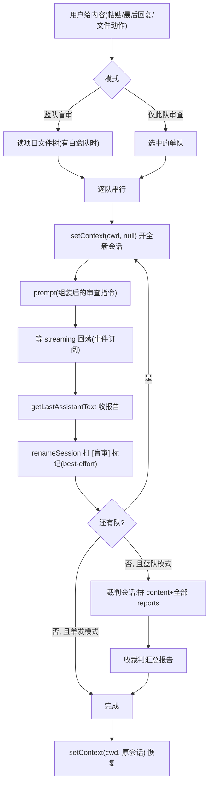

# blind-review

## 1 这个插件解决什么问题

用户在用 AI 写代码的过程中，经常需要让 AI 审查一段内容——可能是自己刚写的代码，也可能是 AI 刚给出的回复。但直接把代码丢给 AI 说"帮我看看"，有两个结构性的质量缺陷：

**单一视角盲区**。一个审查者做一次审查，受它自身的关注点和运气限制——这次查到注入，下次漏掉越权。人审代码尚且要多个 reviewer，AI 审查同理：单个 prompt 的审查结果是单点采样，不是系统排查。

**谄媚与来源推断**。审查发到当前会话时，模型能看到对话历史：它知道这段代码是谁写的（很可能就是它自己刚写的）、知道你在做什么项目。自己评自己，天然倾向报喜不报忧——这是 RLHF 训练出来的谄媚偏差在审查场景的直接体现。

盲审要同时解决这两个缺陷，解法借自 Anthropic 的对齐审计研究（见 §2）：**多蓝队 + 信息屏障 + 汇总裁决**。多个互不可见的独立审查者（蓝队）各自在全新会话里审查同一份内容——新会话零历史，模型推断不出来源，谄媚失去靶子；各队访问权限分级（黑盒仅内容、白盒含项目结构），视角天然分化；最后一个裁判角色汇总全部报告，去重、分级、标注共识与分歧。

prompt 模板（即蓝队编制）需要可配置——不同场景关注点不同：代码正确性、安全漏洞、逻辑边界、隐藏意图。模板支持增删改查、启用/停用、访问级别选择，用户在设置页维护自己的审查编制。

## 2 参考与借鉴

### 2.1 Anthropic 的 blind auditing game

2025 年 3 月，Anthropic 的 Alignment Science 与 Interpretability 团队发表《Auditing Language Models for Hidden Objectives》（Marks et al., arXiv:2503.10965），提出了对齐审计的演练方法 **blind auditing game**：

- **红蓝对抗 + 信息屏障**：红队在严格信息屏障后训练一个带隐藏目标的模型，蓝队对训练方式一无所知，仅凭模型本身做审计。
- **多团队独立调查**：四个蓝队互不可见、各自独立工作、各交一份审计报告——避免单一团队的视角盲区，也避免团队间互相影响判断。
- **分级访问权限**：三个团队有模型权重 + 训练数据（模拟内部审计员），一个只有黑盒 API（模拟外部审计员）。结果是有数据访问权的三队全部发现了隐藏目标，仅 API 的一队失败——访问级别决定审计深度。
- **隐藏意图是终极审计目标**：审计的靶子不是表面 bug，是"模型在声明意图之外还在追求什么"。

移植到代码审查场景的映射：

| Anthropic 机制 | blind-review 的对应 |
|---|---|
| 蓝队（独立审计团队） | 一个 prompt 模板 = 一个蓝队，各自在**全新会话**中审查 |
| 信息屏障 | 新会话零历史上下文——模型看不到代码是谁写的、哪个项目的对话 |
| 分级访问权限 | 模板的 `access` 字段：`content`（黑盒，仅内容）/ `project`（白盒，附项目文件树） |
| 隐藏目标审计 | 内置"隐藏意图审查"蓝队：专审实际行为与表面意图的差异 |
| 红队判分 | 裁判（judge）：汇总各队报告，去重、分级、标共识/分歧 |

一个本质差异要说清：Anthropic 的游戏有 ground truth（52 个 RM 偏差是红队埋的已知答案），裁判能判对错；我们的场景没有已知答案——被审的是真实代码，裁判是**汇总者**（合并、分级、标注置信度），不是对答案的判分者。

### 2.2 Claude Code 的 review 命令

Claude Code 的 `/code-review` 系列纪律继续沿用（聚焦正确性、高信号过滤、模板定制），这些纪律写进各蓝队的默认 prompt 里，不因蓝队制改变。

## 3 方案

### 3.1 插件结构

```
src/plugins/insight/blind-review/
  plugin.json            # manifest(不动:fs:project 权限已声明,三槽位已贡献)
  core/                  # 纯 TS,不 import react、不碰 ctx,可裸单测
    config.ts            #   配置类型 + resolveConfig + 默认编制
    assemble.ts          #   prompt 组装纯函数 + 文件树序列化 + 长度截断
    run-state.ts         #   运行状态类型与推进纯函数
  client/
    squad-runner.ts      # 出站执行器:串行蓝队 + 裁判 + 会话恢复(唯一碰 ctx 的逻辑单元)
  renderer/
    index.tsx            # BlindReviewSettings + BlindReviewTab(状态与渲染)
  locales/               # 四语言文案(review ns + settings ns)
```

逻辑量上来后按单插件三分建 `core/` 与 `client/`：组装与状态推进是纯函数（core），出站调用收敛一处（client），组件只管状态和渲染（renderer）。

### 3.2 配置结构：蓝队编制

`blind-review.json` 的结构演进为：

```json
{
  "prompts": [
    {
      "id": "correctness",
      "name": "正确性审查",
      "access": "content",
      "enabled": true,
      "prompt": "请审查以下内容,只关注会导致错误的实际问题……\n\n```\n{{content}}\n```"
    },
    {
      "id": "hidden-intent",
      "name": "隐藏意图审查",
      "access": "project",
      "enabled": true,
      "prompt": "你是一名独立代码审计员……\n\n项目结构:\n{{tree}}\n\n被审内容:\n```\n{{content}}\n```"
    }
  ],
  "defaultPromptId": "correctness",
  "judge": {
    "name": "裁判汇总",
    "prompt": "你是审查汇总裁判。被审内容和多位独立审查员的报告如下……\n\n被审内容:\n```\n{{content}}\n```\n\n各审查员报告:\n{{reports}}"
  }
}
```

每个模板（蓝队）比旧版多两个字段：

- **`access: "content" | "project"`**——访问级别，对应 Anthropic 游戏的分级权限。`content` 是黑盒：prompt 里只有审查指令和内容本身。`project` 是白盒：额外注入项目文件树（`{{tree}}` 占位符）。占位符不存在则不注入——和 `{{content}}` 同一语义：占位符缺席是用户的选择。
- **`enabled: boolean`**——是否加入蓝队编制。编制审查时只有 enabled 的队出场；停用的队仍保留在配置里，可在单发模式选用。

`judge` 是裁判模板，`{{content}}` 是被审内容、`{{reports}}` 是各队报告的拼装文本。缺省时用内置默认。

**旧配置兼容**：旧版配置没有 `access`/`enabled`/`judge`，`resolveConfig` 补默认——`access` 缺省 `"content"`、`enabled` 缺省 `true`、`judge` 缺省内置模板。旧用户升级后编制自动包含原有三个模板，无需手工迁移。

**默认编制与运行期文案的 i18n**：`core/` 不硬编码任何自然语言文案。默认编制的队名、prompt、裁判模板由 renderer 按界面语言从 locales 组出 `DefaultContentDict` 注入 `resolveConfig`；发给 LLM 的拼装标注（报告标题、截断标注、树失败占位）与会话命名标记经 `SquadRunLabels` 注入 runner 与 assemble。两个注入点都是数据（字符串字典），不是回调。`t(key)` 不传 vars 时是纯查表，prompt 里的 `{{content}}`/`{{tree}}` 占位符原样保留（i18next 插值只发生在显式传 vars 时，且本插件需要插值的 key 只含 `{{name}}`）。已落盘的用户配置不随语言切换变化——那是用户内容，只有内置默认跟随界面语言。

### 3.3 默认编制

四个内置蓝队 + 一个裁判：

| 队 | access | 审查角度 |
|---|---|---|
| 正确性审查 | content | 编译失败、逻辑错误、类型错误、缺失导入；不报风格 |
| 安全审查 | content | 注入、越权、敏感信息泄露、认证缺陷；只报高置信 |
| 逻辑审查 | content | 边界条件、空值、异常路径、并发 |
| 隐藏意图审查 | project | 实际行为与表面意图的差异：隐藏网络请求、数据外发、凭据访问、隐蔽控制流 |

前三队沿用旧版黑盒模板（正确性/安全/逻辑），第四队是 Anthropic 机制的核心移植——专审"代码在声明意图之外还干了什么"，给白盒权限（项目文件树），让它能判断代码与周边结构的关系是否正常。

### 3.4 审查流程：串行蓝队 + 裁判



**图 1 — 蓝队盲审流程**

**每队一个全新会话，这是"盲"的物理保证**。旧版发到当前会话，模型能从对话历史推断来源（旧 §3.5 自认的已知边界）；现在 `setContext(cwd, null)` 让下一条 `prompt()` 起一个全新会话进程——零历史、零上下文，模型看到的只有审查指令和内容本身。这就是 Anthropic 游戏里"严格信息屏障"在本项目的等价物。

**串行而非并行，是进程模型决定的**。my-harness-desktop 是单激活会话进程模型（MessagingApi 全部操作绑定同一个激活会话），同时刻只有一条生成在跑。蓝队一个接一个出场。Anthropic 机制的本质是隔离 + 独立报告 + 汇总裁决，并行性不影响机制成立——就像论文里四个团队也是各自先后交报告，关键是互不可见。

**等完成靠事件订阅，不轮询不 sleep**。`useSessionStore` 是 zustand store，支持非组件环境的 `subscribe`：监听 `streaming` 回落 + 末条 assistant 非 pending 即本队完成；`stopped`/`error` 标记本队失败。另设长超时（10 分钟）作防悬挂保险丝——正常路径永远事件驱动，超时只在进程异常失联时兜底。失败不中断编制：该队标记 failed，报告标注失败原因，继续下一队。

**裁判也是独立会话**。裁判的输入是被审内容 + 全部各队报告（含失败标注），它本身不和任何蓝队共享上下文——它只看到报告文本，不被某个队的会话历史污染。

**会话恢复**。流程结束（含中止、失败）在 `finally` 里 `setContext(cwd, 原会话路径)`——UI 切回用户原来的会话，发送上下文还原。蓝队/裁判会话的进程是临时工，顶掉原会话进程是进程模型的固有行为；用户回原会话再说话时 ensureForSend 会 spawn --session 续上下文，无感知。

**中止**。面板上运行中有"中止"按钮：置取消标记 + `messaging.abort()`。abort 触发的事件流让当前等待自然收敛（末条 stopped），流程检查取消标记后跳过剩余队伍、直接恢复会话。

**命名标记（可溯源）**。每队会话产生后 `renameSession(path, "[盲审] {队名}")`、裁判 `[盲审] 裁判汇总`——sessions-list 里一眼可辨，每份报告都天然落在各自 JSONL 里长期保存。best-effort：命名失败吞掉不阻塞主流程。

### 3.5 白盒数据访问：项目文件树

`access: "project"` 的队，prompt 组装时经 `{{tree}}` 注入项目文件树。流程启动时（有白盒队才）经 `ctx.fs.readDirTree` 读一次，全部白盒队共享同一份树快照——树在流程期间不变，读一次是事实不是缓存。

树的形状：`maxDepth: 3`，忽略 `node_modules`/`.git`/`dist`/`build`/`out` 等产物目录（ignore 列表是调用方内容，见 `ReadDirTreeOptions` 契约）。序列化成缩进文本，超 200 行截断并标注——树是判断"代码与周边关系"的线索，不是全文 dump。

### 3.6 长度保护

两个截断点，都是 core/ 里的纯函数：

- **内容**：超 100,000 字符截断 + 标注（文件动作读大文件时防线；`fs.readFile` 的 1MB 上限远大于模型合理输入）。
- **文件树**：序列化超 200 行截断 + 标注。

截断标注写进 prompt 正文（"内容过长，已截断"），让审查方知道输入不完整——不静默。

### 3.7 面板交互

面板三种内容来源不变：粘贴、取最后回复、文件树右键"盲审文件"。两个动作：

- **蓝队盲审**（主）：跑全部 enabled 队 + 裁判。运行区展示编制清单与各队状态（等待/审查中/完成/失败），完成後结果区展示裁判汇总报告，各队原始报告可展开查看。
- **仅此队审查**（次）：下拉选中的队单独出场（同样是全新会话），无裁判。轻量场景——只想要一个视角时不必跑全编制。下拉默认选中 `defaultPromptId` 指向的队。

文件动作（右键"盲审文件"）的语义升级：从"默认模板单审"升级为"默认模板所在编制跑蓝队盲审"——右键一步到位，拿的是完整汇总报告。

### 3.8 结果保存与展示

每份报告天然落在各自会话的 JSONL（含 `[盲审]` 命名标记），长期可溯。面板结果区展示当次运行的聚合视图：裁判汇总为主，各队报告折叠可查。面板不重开持久化——重开面板结果清空，要回看历史去 sessions-list 找 `[盲审]` 会话。

## 4 能力依赖与内核影响

全部是核心默认能力 + 已声明的 `fs:project`，零内核改动、零新增权限：

- **`ctx.sessions.setContext(cwd, null | path)`**：开全新会话（信息屏障）与流程后恢复。main 侧对 `null` 会停掉旧新会话进程，保证每队真新会话。
- **`ctx.messaging.prompt / abort`**：发送审查指令；中止。
- **`ctx.maintenance.getLastAssistantText()`**：收各队与裁判的报告文本。
- **`ctx.sessions.renameSession(path, name)`**：`[盲审]` 标记（best-effort）。
- **`ctx.fs.readDirTree(cwd, opts)`**：白盒队的项目文件树（`fs:project` 权限已在 manifest 声明）。
- **`useSessionStore.subscribe`**：zustand 非组件订阅，事件驱动的完成等待。
- **`useUiStore.currentSessionPath`**：流程前记录原会话、命名时取新会话路径。

配置读写、`system:settingsChanged` 重载、fileActions invoke 通道，全部沿用现有机制不变。

## 5 改动清单

| 文件 | 操作 | 层 |
|------|------|-----|
| `src/plugins/insight/blind-review/core/config.ts` | 新增 | plugins |
| `src/plugins/insight/blind-review/core/assemble.ts` | 新增 | plugins |
| `src/plugins/insight/blind-review/core/run-state.ts` | 新增 | plugins |
| `src/plugins/insight/blind-review/client/squad-runner.ts` | 新增 | plugins |
| `src/plugins/insight/blind-review/renderer/index.tsx` | 重写 | plugins |
| `src/plugins/insight/blind-review/locales/{zh-CN,zh-TW,en,de}/review.json` | 加 key | plugins |
| `docs/plugins/blind-review.md` | 重写 | docs |
| `README.md` | 改一行描述 | docs |

`plugin.json` 不动：三槽位贡献、`fs:project` 权限、configFile 路径全部沿用。

## 6 QA

**Q：为什么蓝队串行而不是并行？这不是比 Anthropic 的并行团队慢吗？**

单激活会话进程模型决定的——MessagingApi 的所有操作绑定同一个激活会话，同时刻只有一条生成在跑，这是内核的进程纪律，插件层不能也不该绕过。机制本质（隔离 + 独立报告 + 汇总）与执行顺序无关。慢的代价用两点对冲：失败单队不阻塞编制、运行中可中止。

**Q：每队都新起一个会话进程，冷启动成本呢？**

每队一次 spawn + 模型生成，5 队就是 5 轮。这是信息屏障的物理代价——要真隔离就要真新会话。蓝队盲审定位是用户显式发起的重操作（审一份重要代码），不是高频小动作；轻量场景用"仅此队审查"。

**Q：跑蓝队时 timeline 一直跳会话，体验是不是有问题？**

会跳——每个新会话产生时 main 推 sessionStart，timeline 跟随。这是既成机制不是插件能拦的（也不该拦：用户能看到审查正在发生、每队的 prompt 原样可见，透明性是优点）。跑完 `setContext` 恢复原会话，timeline 跳回。聚合结果在面板内展示，不依赖 timeline。

**Q：单发模式为什么也改成独立新会话了？旧版是发当前会话的。**

统一隔离语义：任何审查都该是"盲"的，发当前会话等于让审查者看着被审者的档案打分。结果保存需求（旧版"结果先作为一个 session 保存"）仍然满足——独立会话也是 session，还多了 `[盲审]` 命名标记，比混在原会话里更好找。

**Q：裁判会不会也被谄媚影响——它会不会倾向于"和稀泥"？**

裁判看到的只有内容 + 各队报告文本，不知道任何一队是谁、哪个先哪个后（报告拼装顺序固定为编制顺序，不含评分权重暗示）。裁判模板里写明"过滤明显误报、标注共识与分歧"的纪律。但裁判本身也是同一个模型的单点采样——这是已知边界：编制制降低的是审查覆盖面的盲区，不是模型能力的上限。

**Q：白盒队给文件树，会不会反而泄露来源、破坏"盲"？**

文件树暴露的是项目结构（目录名、文件名），不暴露"这段代码是谁写的、刚才对话说了什么"。谄媚的靶子是后者——模型对自己产出的护短。前者是 Anthropic 游戏里"有数据访问权的团队"的对应物：访问更多上下文是为了审得更深，恰恰是分级权限机制的目的。且树里不含当前会话的任何信息。

**Q：用户在审查进行中手动切了会话或工作目录，会怎样？**

切会话：main 的 setContext 会切走，但流程的下一步会重新 setContext 回自己的新会话——用户感觉"切不动"，面板上运行区明确显示进行中，可点中止。切工作目录：cwd 变化被组件守卫捕获，立即中止流程（abort + 恢复）。cwd 变了 fs 圈禁锚点也变了，继续跑语义已错。

**Q：旧配置里没有 access/enabled/judge，升级后行为是什么？**

`resolveConfig` 补默认：原有三个模板全部 `access: "content"` + `enabled: true`，judge 用内置默认。升级后第一次跑蓝队盲审 = 三个旧队 + 裁判。新增的内置"隐藏意图审查"队**不会**自动进旧用户的配置（用户配置优先于内置默认——配置已存在就不会被默认值覆盖），想要它的用户在设置页手动新增，或删掉配置文件重置。
