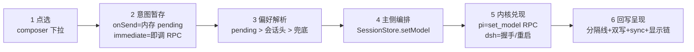

# 会话流的模型切换：完整说明

先立立足点，后面不再解释。这个桌面壳经中立契约 `BaseBackend` 同时托管两个同级内核：**pi**（本仓库的既有内核——pi CLI 的 agent 运行时，JSONL 会话文件 + stdin 上的 JSONL RPC）和 **dsh**（DeepSeek Harness，deepseek-harness 仓库的 agent 运行时，cordis 插件树 + append-only 会话日志，桌面以 `dsh-jsonrpc-agent` stdio 子进程接入）。`setModel(provider, modelId)` 是六条核心意图之三——「六条」是语义分组（消息/中断/模型/分支/会话标识/流式事件），落到 `AbstractBackend` 是 14 条 abstract 方法（六条之外还有命名/seed/生命周期等；续跑 `continue` 与 `setThinkingLevel` 是基类的缺面默认、不在 abstract 之列），两个数字在本文都出现、是同一契约的两个粒度。术语（缺面/补面/降级/物化/水合/投影/账本/扩展面）以仓库根 CLAUDE.md 的术语表为准。架构前提一句：壳是 Electron 双进程——renderer（前端）与 main（壳后端）经 IPC 通信，内核是 main 侧 spawn 的子进程。

本文说明「用户在会话流里换一次模型」这件事的完整链路：从 composer 点选，到 renderer 的意图暂存，到 main 侧的编排与进程处置，到两个内核各自的兑现，再到分隔线、消息徽章、持久化的回写。§1-§9 讲现状（含两个内核的全部差异与边界），§10 起讲现状的问题与修法。引用约定：本仓库有两个同名 `session-store.ts`——main 侧指 `src/server/application/sessions/session-store.ts`，renderer 侧一律带 `web/stores/` 前缀；裸 `index.tsx` 一律指 timeline 插件的 `src/plugins/sessions/timeline/renderer/index.tsx`。路径归属：`packages/shared`、`packages/react` 属本仓库；`packages/sdk`、`packages/core`、`packages/host`、`packages/bundle` 属 deepseek-harness 仓库（桌面只消费不修改）；`src/...` 属本仓库。

## 1. 总览：一次切换的端到端链路

### 1.1 五分钟版：六个环节

一次模型切换经过六个环节，每一环有一个唯一职责，换一个内核只换第五环的实现：



**图 1 — 切换链路的六个环节；换内核只换第 5 环**

- **点选**：timeline 插件的 composer 模型下拉（含内核 TAB 分组），或快捷键 `timeline:cycleModel` 循环。
- **意图暂存**：默认 `onSend` 模式只记内存 pending，不碰进程；`immediate` 模式点选即 RPC。
- **偏好解析**：发送瞬间按「pending > 会话头 > 兜底」三级拼出一份 `SessionModelPrefs`（provider/modelId/thinkingLevel/kernel 四字段；thinkingLevel 是思考档位，§9.1）。
- **主侧编排**：`SessionStore.setModel` 做模型清单反查、跨内核锁死、进程保证（`ensureForSend`）、差量执行。
- **内核兑现**：pi 是运行时 `set_model` 热切；dsh 现状是停旧进程起新进程（问题所在，§10）。
- **回写呈现**：`model_change` 分隔线投视图流、模型域双写中立层（壳自己的会话存储——desktop 数据根（`~/.my-harness-desktop/`）下 `sessions/<ns>.json` 的中立会话树，全内核真相源）与 pi 头行、sync 校正（§4.6）、显示链与消息徽章更新（§7）。

### 1.2 涉及的全部文件与各自角色

- **renderer**：`src/plugins/sessions/timeline/renderer/index.tsx`（点选、显示链、cycle 通道）；`src/web/stores/ui-store.ts`（`sessionModelPending` 内存暂存）；`src/web/stores/session-store.ts`（三级解析、`sendMessage`、事件增量与快照应用）。
- **通道**：`src/web/kernel/build-kernel.ts`（`sessions.setModel` / `sessions.prompt` 的 IPC 封装）；`src/server/controllers/sessions.ts:90`（IPC 注册，直转 `sessionStore.setModel`）。
- **main 编排**：`src/server/application/sessions/session-store.ts`（`setModel` / `ensureForSend` / `prompt` / `switchKernel`）；`src/server/application/models/model-catalog.ts`（合流清单 = pi models.json 与 dsh 配置合并成的带 kernel 标模型清单，及 `classifyModel` 分档）。
- **适配器与内核**：`src/server/kernel/pi/backend/pi-backend.ts`（`set_model` RPC）；`src/server/kernel/dsh/backend/dsh-backend.ts`（`session/setModel` + 懒探测——按需调用、撞「unknown method」才记缺面的探测方式，§6.5）；`src/server/kernel/dsh/extension/dsh-extension/index.mjs`（内核插件 `my-harness-fit-dsh-extension` 的补丁段，给旧运行时补热切能力面）。
- **圆心**：`packages/shared/src/domain/backend.ts`（`BaseBackend.setModel` 契约）；`packages/shared/src/domain/sessions.ts`（`SESSION_MODEL_PREFS_KEY` / `parseSessionModelPrefs`）。
- **内核侧（仓库外）**：deepseek-harness 的 SDK server（`packages/sdk/server/src/server.ts`）与 agent 核心的 `installModelSelection`（`packages/core/agent/src/model-selection.ts`）——桌面不修改这个仓库，只消费它的面。

## 2. 触发：composer 的两种生效时机

composer = 会话流底部的输入框区域（模型/档位下拉在其左下角），timeline 插件渲染。

### 2.1 `onSend`（默认）：点选只记内存 pending

- 默认模式下，`pickModel` 不调任何 RPC，只写 `ui-store` 的 `sessionModelPending`（`index.tsx:599-602`）：键是 `currentNeutralSessionId ?? "new:${cwd}"`（活会话按中立主键 ns（§4.3）；**新会话壳**——还没发过消息、没有会话文件的 cwd 级空会话——按 cwd），值是 `{provider, modelId, thinkingLevel, kernel}` 四字段。语义是「下一条想用这个」，不是「现在切」——按会话 key 暂存、切会话天然隔离，发送成功才消费，关 app 消亡，永不持久化。

- **kernel 标必须随 pending 一起带**（`pickLevel` 换档同样遵守，`index.tsx:621-623`）：内核是模型的派生量，pending 丢了 kernel，发送回灌时 `prompt` 会报「模型未携带内核归属」。这是 kernel-follows-model（内核 = 模型的派生量，§4.1）纪律在 renderer 的落点：模型项自带 `m.kernel`，全程透传，不反查。

### 2.2 `immediate`：点选即 RPC

- `immediate` 模式下点选即调 `ctx.models.setModel(provider, id, kernel)` + `ctx.sessions.sync()`（`index.tsx:585-597`）：意图立即作用于活进程，时间线当场落分隔线。代价按内核兑现方式不同：dsh 现状的停旧起新会中止在飞回合（重启使然），pi 热切无此代价——所以它不是默认。失败路径显形：toast 报错 + sync 取进程真值回落显示，不静默、不伪造成功。（插件面的 `ctx.models.setModel` 与通道面的 `sessions.setModel` 是同一通道的两个包装：前者是 PluginContext 暴露给壳插件的 API，内部落到 `window.kernel.sessions.setModel`（`build-kernel.ts:392`）进同一条 IPC。）

- 两种时机的差别只在「意图暂存在哪、何时作用于进程」，后续链路（§3 起的每一环）完全同一条。开关是 `general.json` 的 `composerApplyTiming`，缺省 `onSend`。

### 2.3 快捷键循环：`cycleModel`

- `timeline:cycleModel` 通道（keybindings 插件 invoke）在合流清单里找当前模型的下一个/上一个，走与点选完全相同的 `pickModel` 处理链（`index.tsx:638-651`）——两种生效时机、pending 语义、失败 toast 原样生效，不另开路径。注意同名两物：这个 renderer 通道和 pi 后端的 cycle 命令（`PiBackend.cycleModel` → pi 的 `cycle_model` RPC，§5）是两条独立循环路径，renderer 通道不经由后者。

- 会话已固定内核（`capabilities.locked`）时，循环清单先按当前内核过滤（`index.tsx:644`）：跨内核切换被主侧 gate 拒绝（§9.2），UI 不越界试探——置灰与拒绝同源，§4.2 细说。

## 3. 发送时的偏好解析：三级来源

先讲清发送和偏好的关系，否则这一节像凭空多出来的间接层。**点选产生的是偏好，不是切换**：onSend 模式下点模型只写一条内存 pending，不碰进程——切换是进程级动作（pi 一次 RPC、dsh 一次重启），为一次可能马上反悔的点选付进程操作太贵，新会话也根本没有进程可切。**发送是偏好唯一的消费闸门**：按发送时才把偏好解析成实际模型、对齐、然后才发正文。偏好（内存，暂态）→ 发送（闸门，执行）→ 会话头（磁盘，持久）——意图只有执行成功才转正，失败原样保留。

### 3.1 pending > 会话头 > 兜底

- `sendMessage` 开头调 `resolveSessionModelPrefs`（`web/stores/session-store.ts:174-184`）拼出发送用的模型偏好，三级优先级：

  1. **pending**：`sessionModelPending[pendingKey]`，用户刚点选的内存意图，最高优先；
  2. **中立层头的模型域**：`readHeaderPrefs` 读会话列表项的 `custom.model` 域（`web/stores/session-store.ts:45-53`，即 §8.1 双写落进中立层头的那份）——重开历史会话续聊时，模型归属按会话自己持久化的记录读回，不依赖任何全局状态；
  3. **兜底**：`getFallbackModel()`（`controllers/kernel.ts:159-166`）——dsh 的 `agent-default-model` 优先，否则 pi 的 models.json 默认/首项。这是「模型默认」不是「内核默认」：返回值恒带 kernel 标，标的是这条兜底模型的归属，不是写死的「默认 pi」。

- pending 键的口径是硬约束：写入方（timeline）用 `currentNeutralSessionId`，读取方（本函数）必须同键——用 path 键读会永远 miss，后果是「选了 dsh 模型却回落到 header/兜底，调度到 pi」。这是主键迁移（`docs/design/kernel-forkless-branch.md` §32）后踩过的坑，注释里钉死了勿回退。

### 3.2 atomic-send：一次 prompt 带全参

- 拼好的 prefs 不再由 renderer 逐条 `setModel`/`setThinkingLevel`/`sync`，而是**一次**传给 main 的 `sessions.prompt(text, images, display, prefs)`（`web/stores/session-store.ts:662-667`）。main 侧 `SessionStore.prompt` 把回灌编排成一个原子序列（`session-store.ts:1207-1232`）：模型对齐（`setModel`）→ 强度对齐（`setThinkingLevel`，仅对有运行时切档能力的内核）→ 发消息。

- 失败语义是诚实中止：模型/强度回灌失败 = 这次发送的模型不确定，整条发送中止，乐观回显（发送瞬间先渲染、等内核回执再转正）的用户气泡与 assistant 占位一并撤掉（`web/stores/session-store.ts:668-684`），pending **不消费**、保留到下次发送重试——意图只有执行成功才被消费，失败不吞。renderer 把真实错误 toast 给用户，输入框未清可重发。

- 主侧还有一道兜底：renderer 的三级解析也可能落空（会话列表未含该会话、头解析失败、无模型可兜底时返回 undefined），此时 `prompt` 读中立层会话头的模型域再兜一次（`session-store.ts:1206-1210`）；查无实据（全新会话且从未选过模型）才显式报「会话未启动，请先选择模型」，不静默回落任何内核。

## 4. 主侧编排：`SessionStore.setModel`

`setModel`（`session-store.ts:1364-1443`）是全部切换路径的收口点——不管意图来自 pending 回灌、immediate 点选还是 cycle，进 main 后都过这同一个方法。它内部是六个有序动作，逐个说。

### 4.1 模型清单查证：三字段全匹配，kernel 必传

- 入参 `(provider, modelId, kernel)` 三件套先到 `ModelCatalog` 的合流清单查证元数据（`session-store.ts:1367-1370`；合流清单 = pi 的 models.json 与 dsh 的 provider 配置合并成的一份带 kernel 标的模型清单）：`(kernel, provider, id)` 全匹配才算命中，查不到抛「模型不在清单」。kernel 由调用方必传、**不用 provider+id 反推内核**——pi 和 dsh 可以配同名同 provider 的模型，反推必有歧义（kernel-follows-model：内核是模型的派生量，归属由模型自带，不由壳猜）。

### 4.2 跨内核锁死与 `activeKernel` 槽位

- 换内核有一道明闸（`session-store.ts:1372-1380`）：会话**有历史**（任一内核槽位发过消息，或中立层已有持久 entry）且目标内核 ≠ 已固定内核 → 抛「当前会话已固定内核」。空会话/预热（提前起好进程但还没发过消息）不在此列——那是「选择」不是「切换」，自由改 `activeKernel`。

- `activeKernel` 是 main 侧 `SessionStore` 上的运行态字段（不落盘），语义是多槽位并存下的「哪个槽位参与会话流」（`session-store.ts:189`）：一个会话的 pi/dsh **进程槽位**（`procs` 二维表：会话 × 内核，每槽位一个进程）可以并存，选模型 = 激活对应槽位，不替换另一个。UI 侧的置灰判据与这里的拒绝同口径设计（`getCapabilities`/`sessionCapabilitiesOf`，`session-store.ts:2072-2093`）：有活进程时按「活且发过消息」锁，无活进程（如刷新后）时读中立层历史锁——renderer 置灰和 main 拒绝不会出现一个灰一个放的错位。

### 4.3 `ensureForSend`：进程复用判据

- 发送/切模型前的进程保证（`session-store.ts:557-597`）：目标内核的进程活着、配置未过期（`isConfigStale` 逐文件比对 `configDepPaths` 的 mtime 快照——清单由各后端自报：pi 是 models.json/settings.json，dsh 是 cordis.yml/settings.yaml，任一变化算过期）、模型未失配——三条全中才复用，否则停旧起新。

- **模型失配的处置分内核**（`session-store.ts:566-568`）：pi 支持运行时切模，失配不重启，留给后面的 `set_model` 差量执行；dsh 被判「模型在握手定死」，失配（含进程未记录模型的未知态）必须停旧起新。这个分支就是 §10 要审的问题现场。

- 新会话（`activeSessionPath === null`）在这一步物化：文件型内核（pi）预生成会话文件路径，惰性内核（dsh，服务端首次 `session/prompt` 才建会话）由壳派生投影地址——新 ns（`neutralSessionId`，中立会话主键）即投影地址（惰性内核会话在壳列表里的派生地址，§4.3 的「惰性」判据 `catalog.newSessionId(cwd) == null` 在 §11.2 还会用到）。且**生成即水合**——立刻 dispatch 一条 synthetic `sessionStart` 给 renderer 写入 `currentSessionPath`（`session-store.ts:576-591`）。这条水合是「双 spawn」事故的修复位：偏好回灌（`setModel` 先于发送走 `ensureForSend` 起了进程）却没水合时，renderer 以为还在新会话壳上、发送时又起一个进程——一次发送两个进程。

### 4.4 差量执行：「已生效」判据的双真相源

- 进程已持目标模型时，同值 `set_model` 是纯噪声（内核会在时间线多落一条 `model_change` 分隔线）——所以切模型做差量：判「已生效」就跳过 RPC。「已生效」的真相源分内核（`session-store.ts:1400-1414`）：

  - **pi**：读 `latestSnapshot.state.model`——快照面就是 pi 的 `get_state` RPC 投影（`ensureForSend` 起进程即 sync 一次），是进程实况的实证探测，实证优于账本。有个陷阱已钉死：跨内核切换后 `latestSnapshot` 还是旧内核的基线，若两内核有同名模型会误命中，所以同内核才参与差量（1404 行的 `targetKernel === currentKernel` 前置条件）。

  - **dsh**：无快照面（`latestSnapshot` 恒 null），改读 `proc.model`——进程 spawn 时握手定的模型。这个判据是「dsh 不能发送第二条语句」事故的修复位：旧判据对 dsh 恒「未生效」，每次发送都重发 `session/setModel`，而该方法在旧运行时是坏面——那是**事故期行为**（一调就抛，第二发必被打断）；现已被 §6.5 的「unknown method 记缺面 + no-op」特例收口，当前行为是不抛、记缺面。

- 判「未生效」才真发 `proc.backend.setModel(provider, modelId)`（`session-store.ts:1416`）。

### 4.5 两本账：`lastModelRef` 与 `effectiveModel`

- **`proc.lastModelRef`**（中立模型引用）：`setModel` 成功即更新为 `classifyModel` 的档位分类（reasoning/fast/pro，`model-catalog.ts:17-20`）。它是跨内核切换时模型中立化的持久载体——`switchKernel` 第 5 步读它经 `resolveModel` 在目标内核找同档位模型（`session-store.ts:1030-1038`）。刻意不读 `latestSnapshot`：dsh 无快照面，快照在 dsh 下恒 null，账本才能经受住 pi→dsh→pi 往返。

- **`proc.effectiveModel`**（生效模型）：随每次 `setModel` 成功更新（`session-store.ts:1395`）。它和 `proc.model` 的分工是：`model` 是 spawn 时定死值（pi 热切不重启，它不变），`effectiveModel` 是「本条消息由哪个模型生成」的权威——assistant 消息落盘/广播时经 `withEntryModel` 注入 `message.model`（`session-store.ts:926-934`），固定到执行时，不随后续切换漂移（呈现侧见 §7.2）。

### 4.6 收尾三件套：分隔线、双写、sync 校正

- **分隔线**：值变化（或新会话壳 spawn 已落条目但被「基线守卫」挡住）时，`dispatchViewDivider` 直投一条合成 `model_change` 进视图流 + 中立层（`session-store.ts:1418-1421`、724-735）。视图流 = main 侧 dispatch 给 renderer 的实时事件流（renderer 经 `sessions.onEvent` 订阅的那条）。基线守卫 = renderer 应用快照基线时「全元数据快照不冲掉乐观消息」的保护（`web/stores/session-store.ts` 的 `applySnapshot`）：它让内核 spawn 时落的初始化分隔线进不了实时视图流、只在刷新后补现，所以壳补一条合成线直投。双落点是刻意的：只投视图流的话，dsh 无内核会话文件兜底，刷新后分隔线全灭。

- **双写模型域**（`session-store.ts:1429-1435`）：① 中立层 `header.kernel + custom.model`——全内核真相源，内核归属随模型域原子落盘，重开按头读回；② pi 文件头行——仅 pi 的投影面，dsh 无文件跳过。写头有个降级：pi 懒建会话文件，文件未落盘时记 `proc.pendingModelPrefs`，待首个 messageStart（文件必已落盘）补写清账（`session-store.ts:121-123`、1318-1336）。

- **sync 校正**：发完 RPC 后 fire-and-forget 拉一次基线（`session-store.ts:1436-1442`）。不靠事件回传——`model_select` 是纯扩展事件，RPC stdout 收不到；sync 是确定性的（RPC resolve = 内核处理完），拉到的是权威状态。内核若恰好推了增量事件，两条通道结果一致、互为冗余。

## 5. pi 的兑现：`set_model` 运行时热切

- pi 侧一切从简：`PiBackend.setModel` 把 `buildSetModelCommand({provider, modelId})` 写进进程 stdin（`pi-backend.ts:203`），一条同步 JSONL RPC，resolve 即内核处理完。进程不动、会话不动、事件流不动——这是「运行时切模型」的标杆语义，也是 §11 修法要把 dsh 拉到的水位。

- 两个配套面：pi 扩展面另有一对 `cycleModel`/`cycleThinkingLevel` RPC（`pi-backend.ts:233-239`）——「pi 扩展面」= pi 后端在契约之外独有的一包命令（⇐ 当时经 `capabilities.pi` 探测，形状 `{ pi?: BackendExtensions, dsh?: { missing, onMissing } }`——旧桶已删、改为圆心逐轴 `BackendCapabilities`，cycleModel/cycleThinkingLevel 现归 `modelCycle` 轴）；这对 RPC 是 main 侧 `ModelApi` 的循环入口（`SessionStore.cycleModel` 直接转发），与 §2.3 的 renderer 快捷键通道是两条独立路径、互不相干。旁路变更（用户在 pi CLI 里 `/model`、扩展自切）由 sync 回写收敛——每次 resync 比对进程实况与头行，不一致以进程为真相补头（`session-store.ts:1106-1116`），壳不假设自己是唯一写入方。

## 6. dsh 的兑现：握手定模与三个切模型面

dsh 侧的模型语义和 pi 相反：模型是**进程级参数**。这一节把「定模」和「切模」分开说，再清点切模实际存在的三个面——面 C 是壳自编的停旧起新（§6.2），面 B 是 SDK server 的 `session/setModel`（§6.3），面 A 是 apiproxy 的原地热切及其底层机制（§6.4）。（与 §10 的「三条路径」不是同一组三：这里三个面全是 dsh 一侧的兑现层，§10 那组是跨内核的三条兑现路径，含 pi。）

### 6.1 `initialize` 握手定模

- `DshBackend.start` 的 initialize 握手携带 `provider/model/maxTokens`（`dsh-backend.ts:128-146`），模型随进程诞生定死；握手带短重试（dsh 进程内的 settings-file cordis 插件负责读 settings.yaml，它是异步 init，握手可能赶上「no adapter registered」的瞬时态，10s 上限，非瞬时错误立即外抛）。spawn 时读取的配置文件（cordis.yml/settings.yaml）进 `configDepPaths`，变了壳重建进程（§4.3）。

### 6.2 壳路径：模型失配 → 停旧起新（现行默认）

- 现行默认路径在壳编排层（§4.3）：dsh 模型失配 → stop 整个子进程 → 带新模型重新 spawn → 握手定新模。会话内容不丢（dsh 服务端持久化），但历史要经 `session/continue` 重放进新进程内存（`prompt` 里的 `session-store.ts:1243` 兜底），且进程内一切状态陪葬——cordis 插件树、文件侧车桥（内核插件与壳之间经文件通道应答的桥，如提问工具）、goal 插件（目标续跑插件）的续跑激活态全部重来。一个容易看出的疑点说破：`session/continue` 不在 0.1.1-rc.2 的三个方法内（§6.3），旧运行时上它同样缺面——懒探测记缺面后 `prompt` 的 catch 兜底降级回原 `session/prompt` 路径，历史恢复的缺面以它自己的错误显形。即：越旧的运行时，这条重启路径越不只是慢。

### 6.3 内核路径：`session/setModel`（dispose+flush+resume）

- dsh 内核侧的对应方法是 SDK server 的 `session/setModel`：flush 会话 → dispose 当前 agent handle → `agents.resume` 带新 provider/model 重建 agent，会话键不动、进程不死（`packages/sdk/server/src/server.ts:503`，deepseek-harness 仓库）。三个名字先划等号：**SDK server = desktop spawn 的 `dsh-jsonrpc-agent` 子进程 = npm 包 `@deepseek-ai/dsh-sdk-jsonrpc-server`**。它在三层兑现里的现状：**上游源码已补**（commit `5d70fb1883`，原生层在）→ **npm 未发版**（`next` 标签停在 0.1.1-rc.2，那个包只有 `initialize`/`session/prompt`/`shutdown` 三个 request 方法，发布层缺席）→ **桌面内核插件 `my-harness-fit-dsh-extension` 运行时补齐**（补丁段 `dsh-extension/index.mjs:53-71`，与上游实现逐行同款，补上发布层的缺）。现状补丁还有个「发版追平后 typeof 检查自动跳过」的自退役设计——§11.1 修法会改掉这个决策。能力已两层齐备，但壳的编排一次都没调过它——§10 的问题。

### 6.4 热切机制的真相：`installModelSelection` 是公开机制，不是 apiproxy 特权

- dsh-web（dsh 自带的浏览器 UI）里换模型的「秒切无感」来自 **apiproxy**——dsh web host 进程里的 HTTP API 层——的 `session.selectModel`（`packages/host/apiproxy/src/api-proxy.ts:2194`，deepseek-harness 仓库）。但它的实现不是 HTTP 面的私有魔法：它改写的是一个 per-agent 的 `ModelSelectionRef`（`api-proxy.ts:1095`），而这个机制定义在 **dsh agent 核心包**（`packages/core/agent/src/model-selection.ts` 的 `installModelSelection`）——往 agent 作用域挂 `system-prompt/assemble` + `agent/request` 两个 waterfall 监听，每次 LLM 调用前把 `ref.current` 的 provider/model/reasoningEffort 写进请求配置。谁持有 ref，谁随时改，下一步即生效：不 dispose、不 resume、agent 和进程都不动。

- 这个机制是**部署无关**的公开面：apiproxy 是一个调用方（`api-proxy.ts:1124`），headless 是另一个（`packages/bundle/headless/src/index.ts:116`）。（cordis 背景一句：dsh 的插件框架；「waterfall 监听」= 事件经一串监听逐级传递、每个调 `next()` 拿下游结果再改写；「sessions 表」= SDK server 内存里 sessionId → agent handle 的映射；`agent.ctx` = 每个 agent 的作用域上下文，与插件共享同一棵上下文树。）一个容易下的错误结论是「desktop 走 stdio 子进程、够不到 apiproxy，所以够不到原地热切」——对的是前半（HTTP 入口确实够不到），错的是后半：**机制本身在任何 dsh 进程里都可用，包括 desktop spawn 的 SDK server 进程**——跑在其中的内核插件（`my-harness-fit-dsh-extension`）经 `agent/pre-step` 钩子和 server 的 sessions 表都够得到 agent，`agent.ctx` 就是安装点。这是 §11.1 修法的地基。

### 6.5 懒探测与缺面降级

- dsh 各 `session/*` 方法按需调用，撞见 "unknown DeepSeek Harness SDK runtime method" 前缀即记进 `missingMethods`、广播 `onMissing`（`dsh-backend.ts:164-195`），壳转成 `capabilityDegraded` 内核事件广播（`session-store.ts:448-453`；设计意图是驱动 UI 置灰对应入口，但今天 renderer 侧尚无消费者——见 §11.2 末段）。版本号不可信（`serverInfo.version` 硬编码、npm 标签漂移），只按行为探。

- `setModel`/`setSessionName` 是缺面处理的特例（`dsh-backend.ts:251-268`）：unknown method → 记缺面 + warn + no-op（命名/切模型是可选/握手态，不因缺面打断发送）；"unknown session" 是会话尚未惰性创建，纯冗余，同样 no-op。这个 no-op 语义在修法里保留（§11.2），壳改从能力位读「到底切没切成」。

## 7. 模型在会话流里的呈现

### 7.1 `currentModel` 显示链：六级解析，每级过清单校验

- composer 上显示的「当前模型」按六级解析（`index.tsx:551-558`）：**pending（显式意图）→ 活会话快照 `snapshot.state.model`（进程实况）→ 中立层头的模型域 `headerPrefs`（持久记录）→ 应用级默认（`getFallbackModel`，带内核归属）→ pi settings 默认（仅 pi 语义）→ 清单首项**。应用级默认排在 pi 默认之前——此前 pi settings 默认把 dsh 默认盖住，新会话显示成 pi 模型、内核标误导成 pi，这是显示层的修复位。

- 每一级都过 `toModelInfoFallback` 的清单校验（`index.tsx:541-546`）：`(kernel, provider, id)` 三字段全匹配 `models.json`/dsh 配置合流清单，查不到返回 null、**不合成兜底对象**——否则内核 `get_state` 报出的内置回落模型会在用户没配模型时冒出来。空态大 logo、模型下拉、消息头的三处内核标都读 `currentModel.kernel`（`index.tsx:1107`）：内核是模型的派生量，改模型三处同步切。

### 7.2 `message.model`：每条 assistant 消息固定到执行时模型

- assistant 消息落盘/广播时由 main 侧注入 `message.model = proc.effectiveModel`（§4.5）——「这条由哪个模型生成」固定到执行时刻。渲染时 `MessageRow` 优先读 `message.model`（三字段查清单），老消息缺字段才回退 `currentModel`（`index.tsx:1371-1374`）：**切模型后历史消息的徽章不跟着当前选择漂移**。entryAppended 水合把 `model` 一并补到已渲染消息上（`web/stores/session-store.ts:424`）。

### 7.3 `model_change` 分隔线的两个来源

- 分隔线有两个合法来源：**壳的合成线**（`setModel` 成功时 `dispatchViewDivider` 直投，§4.6——即时可见，且双落点进中立层，刷新不丢）和**内核的派生线**（pi 落 JSONL `model_change` 条目经事件流上来；dsh 由翻译器从 `request/header` 派生——生效配置与上次报告不同才落，`src/server/kernel/dsh/backend/dsh-event-translator.ts:453-455`）。renderer 的 `applyEvent` 对 divider 按 id 或 `kind+i18nKey+i18nArgs` 判重（`web/stores/session-store.ts:446-458`），两条线不会双显。

## 8. 持久化与恢复

### 8.1 双写：中立层是真相源，pi 头行是投影

- `setModel` 成功后模型域落两层（§4.6）：**中立层** `header.kernel + custom.model`（`SESSION_MODEL_PREFS_KEY = "model"`，provider/modelId/thinkingLevel/kernel 四字段原子替换，`packages/shared/src/domain/sessions.ts:201`）是全内核的真相源；**pi 文件头行**只是 pi 一侧的投影，dsh 无文件跳过。RPC 拒绝则写头不发生——头绝不记下从未生效的值。

### 8.2 读回：重开/重启按头读回，不依赖全局偶然状态

- 重开历史会话起进程前，`resolveSessionKernel` 按三级读回内核归属（`session-store.ts:392-403`）：① 中立层 `header.kernel`；② 内核会话文件头 custom 的 model 域里的 kernel（`custom.model.kernel`，§8.1 双写时随模型域落盘）；③ 同一 custom 上的 `kernel` 键。读不到显式报错、**不回落 pi**——「这个会话是谁的」由会话自己的持久记录说了算，不依赖 `activeKernel` 的偶然运行态。

- 发送时 renderer 没传 prefs 的兜底同理（§3.2）：读中立层头补齐。运行中的旁路变更（pi CLI `/model` 等）由 sync 回写收敛：进程 ≠ 头时以进程为真相补头（§5）——头是投影，进程是真相，方向无条件进程 → 头。

## 9. 边界与特例

### 9.1 thinkingLevel：pi 专属，dsh 显式降级

- 思考档位的设置已进中立契约（`setThinkingLevel`），但**清单与循环仍是 pi 扩展面**；dsh 的 `reasoningEffort` 由 settings.yaml 配置决定（initialize 握手参数里没有它），无运行时 RPC。`prompt` 的强度对齐只对「有运行时切档能力」的内核生效（`capabilities.pi` 探测，`session-store.ts:1230`）——dsh 带 pending 档位发送不会被它打断；显式切档（immediate 点选/cycle）走契约抛错显形（`AbstractBackend` 缺面默认），不静默吞。（注意：`setThinkingLevel` 已进契约，拿 `capabilities.pi` 探它在本文 §10.3 的准则下同属错绑——标注演进，不在本文修。）

### 9.2 跨内核切换：gate 关闭中

- `switchKernel` 的七步编排（abort → 快照 → stop 旧 → seed（把中立层历史投影灌进目标内核）→ 模型中立化 → 重绑 → 收尾）完整保留，但入口被 `switchKernelEnabled = false` 关掉（`session-store.ts:185`、974）。所以今天的真实边界是：空会话自由选内核（「选择」），有历史锁死（§4.2 抛错）。第 5 步的模型中立化（读 `lastModelRef` 经 `resolveModel` 按档位重投影）已是实现就绪状态，随 gate 打开生效。

### 9.3 配置变更强制重建进程

- 内核的模型清单在 spawn 时读入、运行中不重读——所以 `configDepPaths` 清单（pi：models.json/settings.json；dsh：cordis.yml/settings.yaml）的 mtime 变化被判「配置过期」，`ensureForSend` 停旧起新（§4.3），与模型失配无关的另一条重启触发线。重启携带本次目标模型握手，选择不丢。

### 9.4 其他入口的模型语义

- **连通性测试**（`SessionStore.test`，`session-store.ts:1454-1482`）：独立临时进程（pi `--no-session` / dsh 临时 `DSH_SESSION_ROOT`），`setModel` + 发 "ping" 等 assistant 回复，与激活会话完全隔离、零残留。
- **bus 会话**（Session Bus 的后台插件会话，供插件间通信/子 agent 用，不出现在会话列表）：`src/server/application/sessions/session-bus.ts:331` 的 spawn 回放模型偏好时直接 `backend.setModel`——bus 会话恒为 pi 槽位，不走 `SessionStore.setModel` 的编排。
- **续跑**（`continue`）：进程未起时按「renderer prefs 优先 → 中立层头模型域兜底」解析出模型后经 `setModel` 懒起进程（`session-store.ts:1619-1643`）——goal 插件（目标续跑）首轮续跑在全新会话上也有模型归属。
- **在飞回合**：onSend 模式下切模型发生在回合间隙（发送前对齐），无打断场景；immediate 模式点选即切、打断在飞生成是用户自选。

## 10. 问题：三条路径与死代码

> ⚠ **本节是"问题现场"快照（演进注记）**：所引的 `capabilities.pi` 桶探测、`BackendExtensions` opaque 桶等是**当时的形状**；§11 的修法已按**逐轴能力面**落地——`supportsRuntimeSetModel` 轴 + ensureForSend 两轴判据（session-store.ts）现役，旧桶与 `asPi` 已退役（`faceOf` 按轴取面）。本节保留作根因的原始论证，读时请以 §12 之后的现状为准。

§1-§9 是现状的全貌。「三条路径」指：pi 的运行时热切（§5）、dsh 的壳层停旧起新（§6.2，现行默认）、dsh 内核侧已补好的热切面（§6.3，不可达）。现状里有一个真问题，本节把它拆开：根因不是「dsh 不支持热切」，而是壳把两根独立的能力轴焊成了一根。

### 10.1 根因：能力轴焊死

- 问题现场是 `ensureForSend` 的复用判据（`session-store.ts:568`）：`needsRestart = modelMismatch && !!existing && !existing.backend.capabilities.pi`。它拿「这个后端有没有 pi 扩展面」当「这个后端能不能运行时切模型」的探针——**两根不同的轴被焊死**：前者是 pi 的 RPC 扩展包（steer/followUp 并发注入、cycle 循环、快照面等契约外命令）的存在标记，后者是契约意图 `setModel` 的兑现时机。（术语对齐：`capabilities.pi` 是「按内核分桶」的整面探针——探的是整包扩展面在不在；拿桶当轴用就是本文说的「桶探测」，与 §10.3 的「整面探针」同一所指。桶里没有轴的粒度。）

- 焊死在当初不犯错：0.1.1-rc.2 时期，pi 两根轴都有、dsh 两根轴都无，真值表逐格相等，用哪个判都一样。但真值表相同不等于语义相同——dsh 今天长出了热切（源码补了、插件补丁装了），扩展面依然缺席，焊死的判据立刻出错。而且错得无声：**结果是对的（模型确实换了），错的是机制（重启而不是热切）**——不抛错、不告警，只有延迟和进程抖动。这类「结果对、机制错」的 bug 是测试盲区：断言「模型换没换」的用例全绿，只有断言「进程重启没重启」的用例抓得到它。这直接决定 §12 守卫的形态。

### 10.2 补丁死代码

- 焊死的直接代价：内核插件补的热切面（§6.3）在现行会话流里**不可达**——`ensureForSend` 的重启分支先命中，重起后 `proc.model` 已等于目标模型，「已生效」判真（§4.4），`session/setModel` 永远发不出去。唯一可能调到它的路径是 `switchKernel` 第 5 步，而那个入口被 gate 关着（§9.2）。下层补了能力、上层判据没收口，补丁写了、装了、从来没被调用过。

### 10.3 判别准则：契约内差异走轴探测，契约外面才用整面探针

- 修法遵循的判据一句话：**`BaseBackend` 契约内意图的「生效方式」差异，一律按轴探测（这根轴此刻在不在）；契约之外的内核专属扩展面，才用 `capabilities.pi` 这类整面探针。** 契约的 14 条 abstract 是每个内核都必须兑现的意图，差异只在兑现方式、随内核版本演化，探针必须问「轴在不在」，不能问「内核是谁」；`BackendExtensions`（快照/steer/思考档位清单）是契约不承诺、pi 独有的面，探整张面的存在性才对。

- 按这条准则回扫，除本文要修的 `ensureForSend` 外还有两处同款错绑：`prompt` 里「要不要 `continue` 恢复历史」用的 `!capabilities.pi`（`session-store.ts:1243`，想探的是「惰性会话需重放」这根轴），和强度对齐的 `capabilities.pi` gate（`session-store.ts:1230`，想探的是「运行时切档」这根轴——`setThinkingLevel` 已进契约）。两处都**标注演进**、不在本文修：今天没有第三个内核让它们出错，且各要各的轴定义，一并修会让本文失焦。

## 11. 修法：原地热切 + 能力轴修正

两个半边：内核插件把 `session/setModel` 从 dispose+resume 升级为原地热切（主修，语义与 dsh-web 完全一致）；壳把进程复用判据从桶探测改成轴探测（不修这层，壳照样一次都不会调 `session/setModel`）。

### 11.1 内核插件半：`session/setModel` 升级为 `installModelSelection` 原地热切

- `my-harness-fit-dsh-extension` 的补丁段（`dsh-extension/index.mjs:53-71`）重写：拦截 `session/setModel` 不再走 dispose+flush+resume，改为——按 sessions 表取 `record.handle.agent`，首次经 `installModelSelection(agent.ctx, ref)` 安装（插件闭包里 WeakMap 按 agent 存 ref），之后每次调用只写 `ref.current = { provider, model }`。语义与 dsh-web 的 `session.selectModel` 逐点一致（同一个 `installModelSelection` 机制）：不 dispose、不 resume、agent 与进程不动，下一步 LLM 调用生效。

- 两个钉死的决策：**内核发版追平后补丁不自动跳过**（原生实现是 dispose+resume，插件的原地热切语义严格更强；等原生也长出 in-place 再退役，届时 typeof 检查换判据）；**只对已物化会话装 ref**（sessions 表里有 record 才装；`unknown session` = 未物化，维持 no-op——壳侧的未物化失配走重建，根本调不到这里，见 §11.2）。未来 SDK server 若自己给 agent 装了 selection，双安装的 waterfall 顺序要有检测——落地时验证，QA 留档。

### 11.2 壳半：热切优先、缺面回落

- 能力轴显式化：`AbstractBackend` 加默认 `supportsRuntimeSetModel(): boolean`（默认 true——`setModel` 本是 14 条必实现契约，乐观默认）；`DshBackend` override 为 `!missingMethods.has("session/setModel")`（复用懒探测缺面集，未探测按乐观 true）。

- `ensureForSend` 的 `needsRestart` 改判两根正交的轴，不再读 `capabilities.pi`：

  ```ts
  const needsRestart = modelMismatch && !!existing && (
    !existing.backend.supportsRuntimeSetModel()        // 轴缺面:只能重建
    || (!existing.touched && 惰性内核)                  // 未物化会话:握手是唯一定模点,重建零代价
  );
  ```

  「惰性内核」不新造桶：复用已有探针 `catalog.newSessionId(cwd) == null`（文件型内核预生成路径、惰性内核返 null——§4.3 的「文件型/惰性」分支用的就是它）。pi 是文件型，`!touched` 也走 `set_model` 热切（RPC 对未物化会话同样生效），行为不变；dsh 未物化失配直接重建——无历史可丢，零代价正确解。

- `setModel` 的差量执行后接**现场回落**：调 `backend.setModel` 之后复查 `supportsRuntimeSetModel()`——本次调用刚把轴打成 false（懒探测同步记缺面），立即回落「停旧起新带新模型」。`DshBackend.setModel` 的「unknown method 记缺面 + no-op 不抛」语义保留（不因缺面打断发送的纪律不变），壳从能力位读「这次切没切成」，契约返回值不动。

- 旧运行时 + 补丁缺席的首次代价：第一次热切尝试吃一次 unknown-method → 回落重启，进程内之后直接走重启（懒探测固有代价，`docs/design/dsh-capability-gate.md` 已接受同款）。装了补丁/新运行时：一次 RPC 完成热切。配置过期（§9.3）是正交的另一条重启触发线，本修法不动它——模型失配不再重启，配置过期照重启。

- 缺面回落时用户看到什么，说死：**模型照样切成功**（回落路径就是重启带新模型），无 toast、无置灰、无报错——唯一体感是这一次切换伴随一次进程重启的延迟；诊断痕迹在日志 warn（`dsh-backend.ts:262`）与 `capabilityDegraded` 事件。注意 `capabilityDegraded` 今天没有 renderer 消费者（「置灰对应入口」是设计意图、尚未接线），且对「有回落路径」的轴本来就不该置灰——入口可用，只是贵。

### 11.3 「已生效」判据换载体 + 分隔线去重

- dsh 的「已生效」真相源从 `proc.model`（spawn 握手值）换成 `proc.effectiveModel`（每次 setModel 成功即更新的壳侧账本，§4.5）——热切后 `proc.model` 不再代表生效值，不换判据会把热切成果判丢、下次发送误判失配又重启。pi 保留快照实证优先（`get_state` 是进程实况，能兜住 CLI `/model` 旁路）。

- 分隔线双源已有去重（§7.3）：热切成功后壳投合成线（即时可见），dsh 翻译器在下一回合 `request/header` 派生真实线（`lastHeader` 自更新，`src/server/kernel/dsh/backend/dsh-event-translator.ts:453-455`），renderer 按 `kind+i18nKey+i18nArgs` 判重吃掉后到那条。补一条 DOM 守卫钉死（§12）。

### 11.4 不做什么

- **不接 apiproxy 的 HTTP 面**：`installModelSelection` 已在插件里拿到同等语义，换接入架构零收益。
- **不动 `switchKernel` gate**：跨内核切换入口维持关闭；gate 打开后其第 5 步天然落在已热切的面上，零追加改动。
- **reasoningEffort 不随本文打通**：`ModelSelection` 支持 effort，dsh 的 `setThinkingLevel` 缺面理论上可经同一机制补——另起一篇的事，本文标注演进。

## 12. 测试与守卫

按「结果对、机制错」的教训（§10.1），守卫断言**落在机制上**（进程重启没重启），不只落在结果上（模型换没换）：

- **单测**（`src/server/application/sessions/session-store.test.ts` 扩展）：dsh 热切成功——模型失配、轴可用 → 假 backend 的 `stop`/`start` 零调用、`setModel` 恰好一次、`effectiveModel` 更新、divider 恰好一条；dsh 缺面回落——`setModel` 记 missing → 停旧起新、新进程握手带目标模型、同进程第二次切换直接重启不再试 RPC；dsh 未物化失配 → 直接重建、不调 `setModel`；pi 回归——差量跳过、快照优先、双写全部不变。
- **dsh-backend 单测**：`setModel` 返回后 `capabilities.dsh.missing` 可读、能力位同步翻转（现有「记缺面 + onMissing」用例上加断言）。
- **集成测试**（`src/server/kernel/dsh/backend/dsh-backend.integration.test.ts`）：真运行时 `setModel` 后再 `prompt` 证实走新模型；npm 发版追平前维持现状 skip 语义。
- **DOM 守卫**（timeline）：同一次切换只渲染一条 `model_change` 分隔线（壳合成线与翻译器派生线去重）。
- **e2e**：dsh 会话内切模型前后进程 pid 不变（机制断言的端到端形态）。
- **文档同批同步**（防「代码已收、注释照旧」；引用记法即本文惯例——`文件:行`、节号 §N.N）：`src/server/kernel/core/abstract-backend.ts:79-86`（「dsh setModel 是 no-op」的契约注释）、`src/server/application/sessions/session-store.ts:132-133`（`proc.model` 字段注释）、`docs/desktop-kernel-pi-dsh.md` 的「意图三」节与 433/570 行、`docs/session-flow.md` 的 §10.4 与 547 行、`docs/plugins/manager/dsh-manager.md:208/311`、`src/server/bootstrap/assemble.ts:284`、`src/server/kernel/dsh/extension/dsh-extension/index.mjs:45-51` 头注——统一改为「热切优先、缺面回落重启」。

## 13. QA

**Q：热切成功之后再遇配置过期重启（§9.3），模型会不会丢回握手值？**
A：不丢。重启走 `ensureForSend(kernel, provider, model)`，目标模型进新进程的 initialize 握手；且 `effectiveModel` 已是目标值，差量判据命中，不再多发 RPC。

**Q：内核发版追平（原生有 `session/setModel`）后，插件补丁为什么不自动跳过？**
A：原生实现是 dispose+flush+resume（agent 重建），插件的 `installModelSelection` 原地热切语义严格更强（agent 不动）。补丁拦截的是 `handleRequest`，语义强于原生时保持接管；等原生也长出 in-place 热切，再改 typeof 判据退役。这是有意的「补丁语义强于原生」窗口，不是疏漏。

**Q：从未发过消息的 dsh 会话上切模型，为什么还是重建进程？**
A：dsh 的服务端会话在首个 `session/prompt` 才惰性创建，此前 sessions 表里没有 record、没有 agent 可挂 `ModelSelectionRef`——握手是唯一定模点。此时重建无历史可丢、无回合可断，是零代价正确解；热切只承诺给已物化（`touched`）的会话。

**Q：未来 SDK server 自己给 agent 安装了 selection，插件再装一次会怎样？**
A：`installModelSelection` 每装一次多一对 waterfall 监听，两个 ref 各自改写 `agent/request` 的配置，生效顺序取决于 cordis waterfall 的注册序——这是已登记的实现期风险：插件落地时先检测 agent 上是否已有 selection（有则不装、改持有既有 ref），并在集成测试里钉死。

**Q：pi 的「已生效」判据读快照、dsh 读账本，为什么不统一成一个？**
A：pi 的 `get_state` 快照是进程实况（实证），能兜住 pi CLI `/model` 这类旁路变更；dsh 没有快照面，`latestSnapshot` 恒 null，`effectiveModel` 账本是唯一可用载体。有实证时实证优先，无实证用账本——判据形态不同、语义一致（§11.3）。

**Q：onSend 模式下点了模型又反悔、一条都没发，会怎样？**
A：什么都不发生。pending 是内存暂态：不碰进程、不落盘、切会话天然隔离、关 app 消亡。只有发送成功才把意图转正进会话头。

**Q：热切对在飞的回合有影响吗？**
A：先对齐粒度：dsh 的一个回合（turn）内含多个 step，一个 step = 一次模型调用 + 其工具执行。`installModelSelection` 的语义是「step 级快照」：`system-prompt/assemble` 在 step 组装时把 `ref.current` 捕获进 `assembled`，并发切换从下一个 step 才生效——同一个 step 的 provider/model/effort 不会两半分裂，在飞回合也不被打断。「打断在飞生成」只属于现状的重启路径（杀进程）；热切落地后它消失。onSend 模式的切换本就发生在回合间隙（发送前对齐），两种时机在这条语义下行为一致。

**Q：`reasoningEffort` 为什么不随本文一起打通？**
A：`ModelSelection` 原生支持 effort（`ref.current` 带 `reasoningEffort` 字段），机制上是同一根轴的延伸；但壳的中立契约里 `setModel` 不带 effort、`setThinkingLevel` 是独立意图，打通要动契约与 renderer 档位链两处——另起一篇，本文标注演进（§11.4）。

## 15. 交叠态：切换在飞时,谁拒谁

切换是**异步多步**的(abort → 等落定 → 读中立层 → 重挂槽位 → seed → 起新进程),中途系统处于
「半换」状态:老 proc 已停、新 proc 未就绪。这段时间里用户可能再点切、再发消息——**这些都必须被
显式拒绝,而不是命中半个 proc**。本节把交叠态与守门钉死。

### 15.1 切换互斥闸

**位置**:`SessionStore.switchKernel` 入口。**条件**:已在切换中又调 `switchKernel`。**报错**:`切换进行中`。

`private switching` 旗在**第一个 `await` 之前同步置位**,所以「切换进行中」这个状态**可以确定复现**,
不需要靠 sleep 赌时序:

```ts
const switching = s.switchKernel("dsh");   // 不 await → 旗已置位,函数停在首个 await
expect(s.switching).toBe(true);            // 前提:交叠态真的构造出来了
await expect(s.prompt(…)).rejects.toThrow(/切换进行中/);
await switching.catch(() => {});           // 收尾,免得留悬挂 promise
```

守卫:`src/server/application/sessions/session-store.test.ts` 的「交叠态:内核切换进行中的互斥」。
注意那条**前提断言**(`expect(switching).toBe(true)`)——没有它,若 `switchKernel` 根本没进去,
`prompt` 会因为别的原因失败而"看起来通过"。

### 15.2 发送/切模互斥闸

**位置**:`SessionStore.ensureForSend` 入口(发送与切模都经此)。**条件**:切换在飞时走 `prompt` / `setModel`。
**报错**:`内核切换进行中,请稍后`。

**为什么 15.1 之外还要这一道**:15.1 只拦"从切换入口进来"的调用。用户在切换期间**发一条消息**命中的是这道闸
——两道都读同一个 `switching` 旗,守的是两个入口。

> 断言时**别把正则写窄到只认其中一条的措辞**:实测并发发送命中的是 15.1 那条(`切换进行中`),
> 而非本节的 `内核切换进行中,请稍后`。**两条都是合法拒绝,要断言的是"被显式拒绝"**。

### 15.3 另两处交叠态,与它们的守卫

| 交叠态 | 风险 | 守卫 |
|---|---|---|
| **流式中切走会话**(回合未收敛就 ⌘N / 点别的会话) | 新壳残留上一条的「思考中」/消息;切回内容丢失 | `scripts/demo/stream-switch-session.e2e.mjs`(9 断言,真 dsh 模型;抓不到流式态则 SKIP 而非假绿) |
| **锚点还没落盘就 fork/bookmark**(未收敛,或已被压缩移除) | 静默派生空/半截会话 | `session-store.test.ts` 两条:收藏/分叉锚点不在中立层 → **显式报错**(`分叉锚点不在会话内容里`) |

### 15.4 不做什么

- **不引入队列**:交叠时**显式拒绝**而不是排队重试——排队会让"我点了切换,它却先把我那条消息发了"这种
  反直觉行为出现。用户看得见错误,才知道要重试。
- **不把旗做成计数器**:嵌套切换没有语义(切到一半再切去哪儿?),互斥才是模型。
- **不靠 sleep 等切换完成**:等的是状态(旗 / 落定事件),不是时间(§3.6 事件驱动)。
