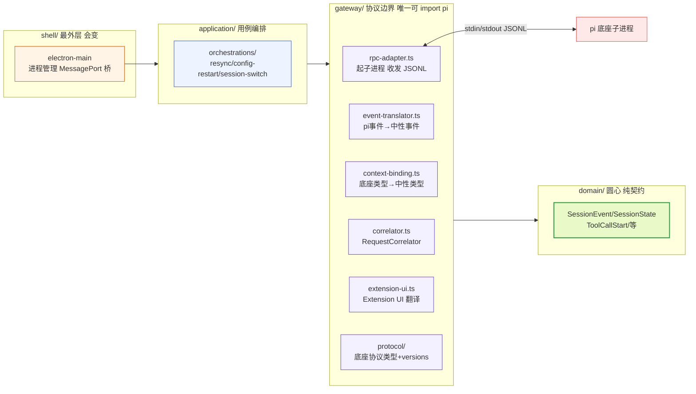
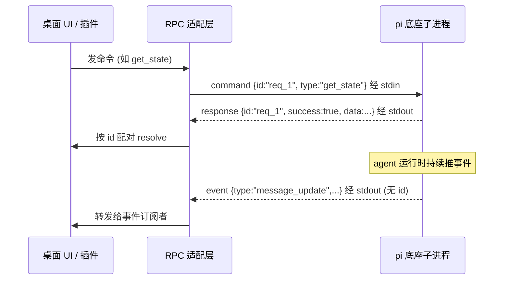
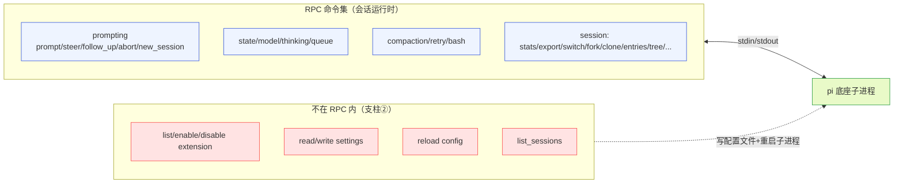
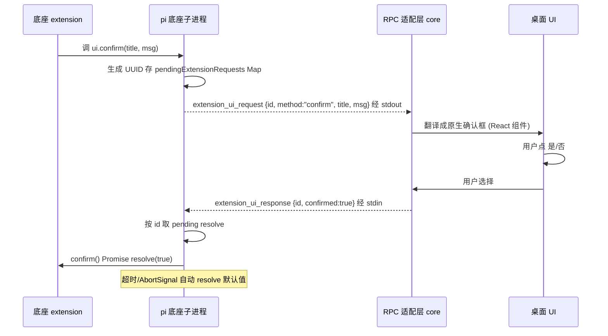
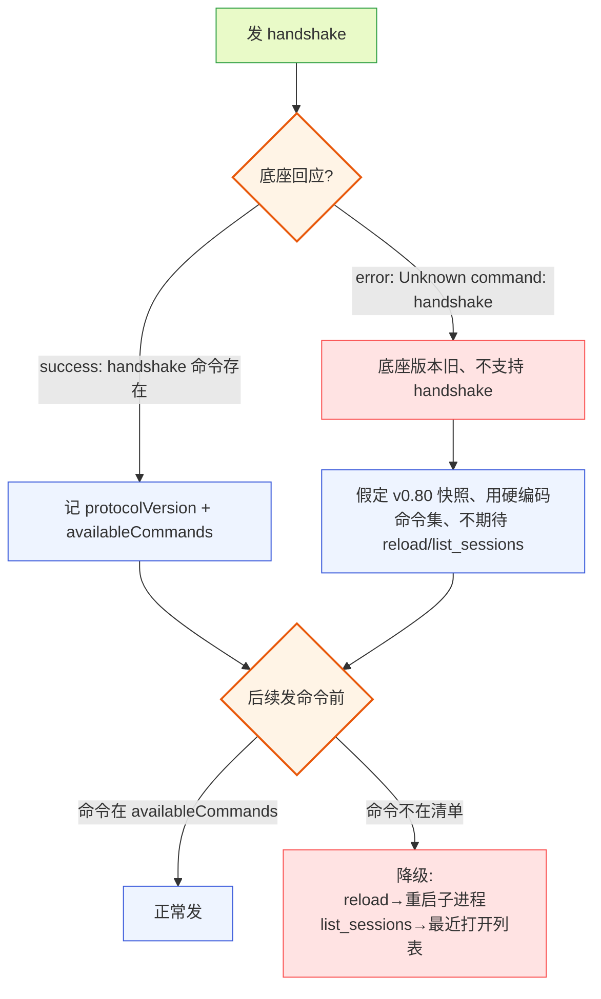
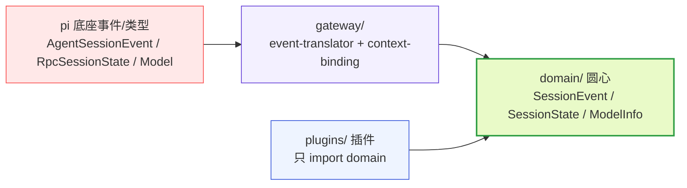
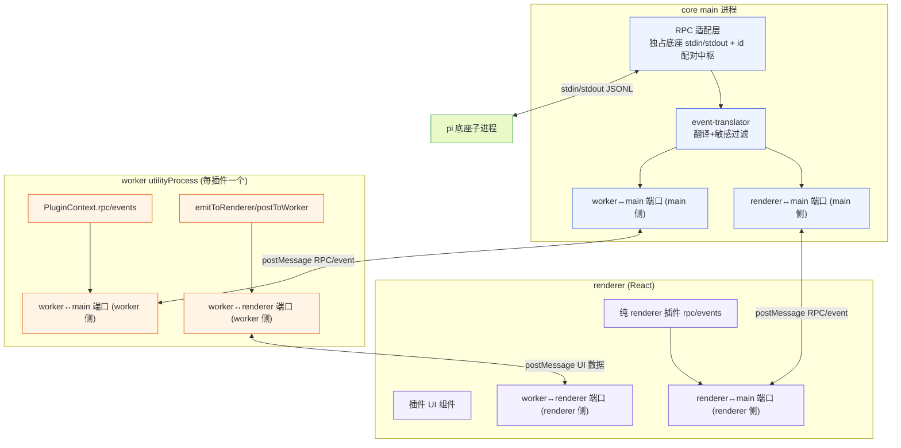
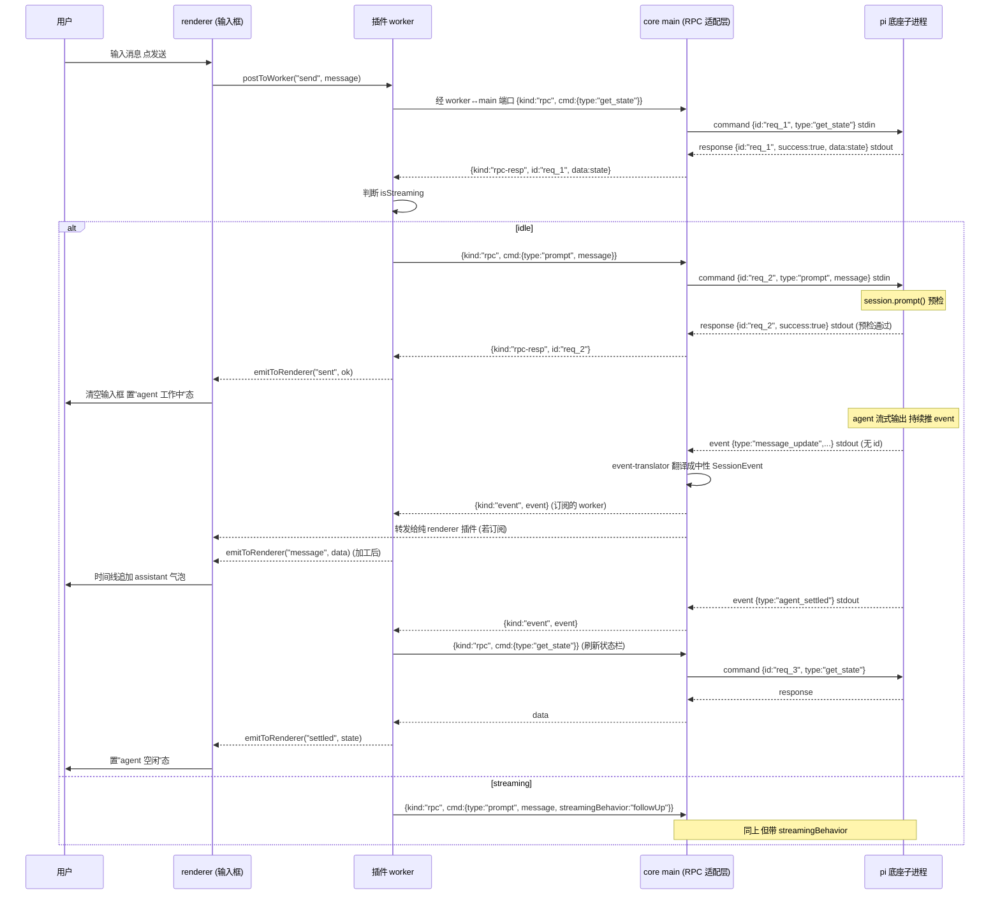
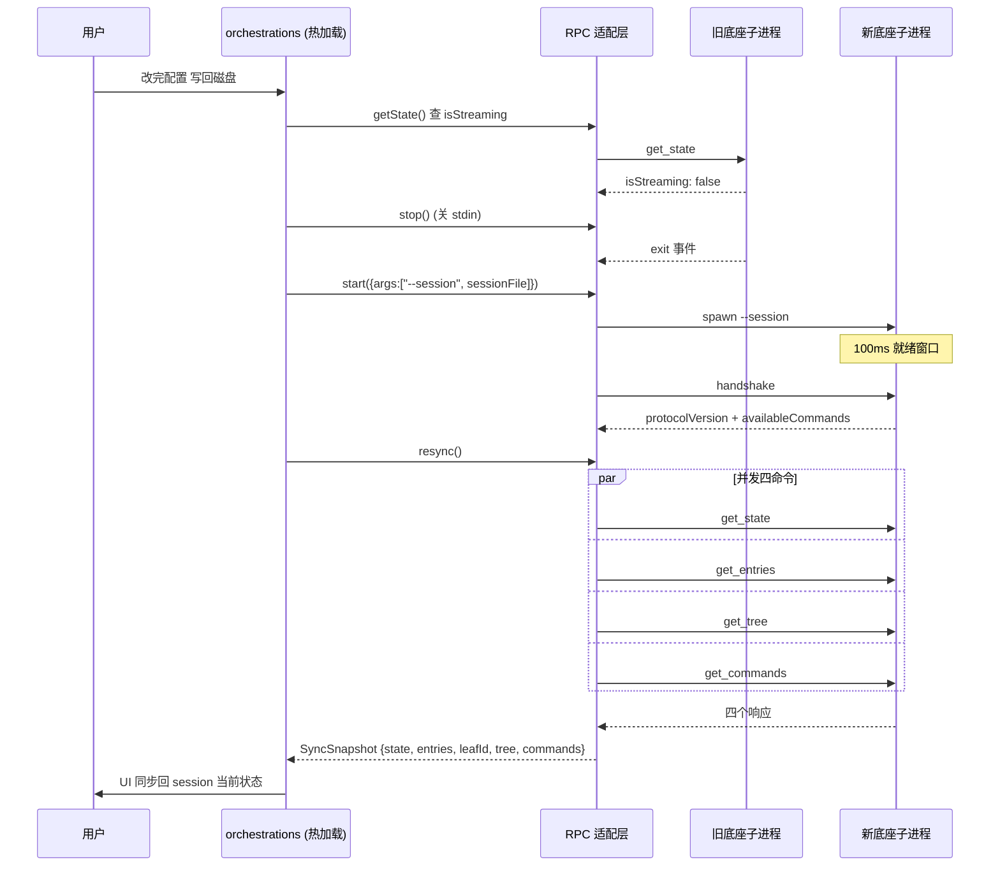
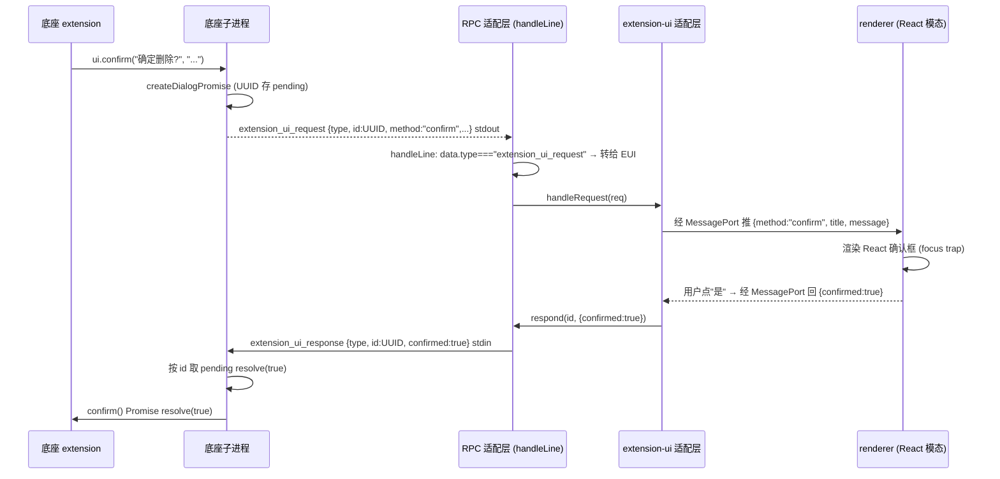

# RPC适配层模块文档

本模块对应 pi-desktop 四根支柱中的支柱①——RPC 适配层（`gateway/rpc-adapter.ts` 及其周边）。它的职责是把 pi 底座子进程（`pi --mode rpc`）接到桌面壳里：起子进程、在子进程与桌面 UI 之间收发 JSON Lines、把 Extension UI 子协议翻译成原生 GUI 交互、把底座 event 流转发给 UI 渲染。本文是"照着能写代码"的落地文档，所有契约、字段、流程都钉到可实现的粒度。

阅读前置：本文假设读者已读过 `DESIGN.md` 的 0、1、3.6、5.1 节，知道"pi 底座是被管理对象、core 是薄壳、四根支柱是依赖层次"这套基本立场。本文聚焦 RPC 适配层这一根支柱，把它的机制、协议、翻译、编排拆开讲透。所有协议契约均对照 pi 底座真实源码（`packages/coding-agent/src/modes/rpc/` 下的 `rpc-types.ts`、`rpc-mode.ts`、`rpc-client.ts`、`jsonl.ts`）写成。

---

## 1 模块定位与边界

### 1.1 一条通道：只走 RPC

#### 1.1.1 放弃同进程 import SDK

pi-desktop 对接 pi 底座只走一条路：RPC Mode。pi 底座自带 `--mode rpc` 启动模式，起一个子进程，stdin 收 JSON 命令、stdout 吐 JSON 响应和事件流。这套机制本来就是为"把 agent 嵌进别的应用"设计的——底座 `rpc-mode.ts` 文件头注释原话：`Used for embedding the agent in other applications`。pi-desktop 就是那个"别的应用"。

薄壳不把 pi 的 SDK 娶进自己进程。现有方案（旧实现）那条同进程 import `@earendil-works/pi-coding-agent` 的路被彻底放弃，连带放弃的是它被迫造的 WorkerManager、sdk-loader、sdk-manager、进程池、idle eviction 这一整套。那些复杂度几乎全部是"把 SDK 塞进自己进程"这个决定的副产物；走 RPC，它们一个都不需要。

#### 1.1.2 照着 RpcClient 写

pi 底座提供了一个现成的 `RpcClient`（`packages/coding-agent/src/modes/rpc/rpc-client.ts`），它是 RPC 协议的参考实现。pi-desktop 的 RPC 适配层照着它写，而不是照着 现有方案的那一坨。`RpcClient.start()` 用 `spawn("node", [cliPath, "--mode", "rpc", ...args], { stdio: ["pipe", "pipe", "pipe"] })` 起进程，收 stderr 做调试、监听 `exit`/`error`、stdin 报错都接住、stdout 接 JSONL reader。它给每个命令分配 `req_${++requestId}` 的 id，写进 `pendingRequests` Map，响应回来按 id 配对 resolve——这套 id 配对机制是 RPC 客户端的标配，pi-desktop 照搬。

#### 1.1.3 职责清单

RPC 适配层的职责，且仅此：

- 起 `pi --mode rpc` 子进程，管理其生命周期（spawn / kill / exit 监听）。
- 在子进程和 UI 之间收发 JSON Lines（command / response / event）。
- 把 Extension UI 子协议翻译成原生 GUI 交互（select/confirm/input/editor/notify/setStatus/setWidget/setTitle/set_editor_text）。
- 把底座 event 流（`AgentSessionEvent`）转发给 UI 渲染（经 event-translator 翻译成中性类型）。
- 提供 `RequestCorrelator` 配对工具（command-response 与 Extension UI request-response 两处复用）。

> **`resync()` 不在 RPC 适配层职责内**。`resync()` 是中层（`application/orchestrations/`）的用例编排原语——它并发发 `get_state` + `get_entries` + `get_tree` + `get_commands` 四个命令、把结果聚合成 `SyncSnapshot`。圆心不感知它，RPC 适配层也不拥有它。`resync()` 落在 `application/orchestrations/resync.ts`，由 PluginContext 暴露给插件（`rpc.resync`，见 §9.3）。RPC 适配层只提供 `send`/便捷方法等原子能力，不提供跨命令编排——\\\"组装和调用应该分开\\\"，编排归中层、收发归 gateway。

底座已有的能力桌面端不重写：session 怎么存、工具怎么执行、文件怎么改、扩展怎么加载——全是底座子进程的内部事务，桌面端通过 RPC 触发、通过 event 观察，但不接管实现。这个边界守不住，薄壳就会变厚（现有方案 即是反面教材）。

### 1.2 在洋葱架构中的位置



**图 1-1 — RPC 适配层在洋葱中的位置：gateway 层是唯一可 import pi 类型的层，翻译后喂给圆心**

RPC 适配层落在 `gateway/`——第一外层、依赖方向向内。它是**唯一允许 import pi 类型**的层。底座协议类型（`RpcCommand`/`RpcResponse`/`AgentSessionEvent`/`RpcSessionState`/`Model`/`SessionEntry`）全在 `gateway/protocol/`，圆心 `domain/` 永远只吃中性类型、不感知 pi 事件结构。这条纪律是协议漂移隔离（见 §6）在类型层面的落实。

### 1.3 为什么是 gateway 层独占 import pi

把\\\"唯一可 import pi\\\"的职责钉在 gateway 层、而不是散落各处，有三层理由：

**第一层：协议漂移的爆炸半径**。底座演进时 `RpcCommand` 联合会增删命令、`RpcSessionState` 会加减字段、`AgentSessionEvent` 会变结构。如果圆心或插件直接 import 这些类型，底座一改全崩。把 import 集中在 gateway 层，漂移只影响 `gateway/protocol/` 的类型声明和 `gateway/context-binding.ts` 的映射——圆心和插件不动。这是\\\"把会变的推到外层\\\"的洋葱纪律。

**第二层：翻译是外层关注点**。\\\"底座类型 → 中性类型\\\"的映射（`toSessionState`/`toModelInfo`/`toNeutralMessage` 等）本质是\\\"适配\\\"——它既不是业务规则（圆心）也不是用例编排（中层），是协议细节（外层）。把它放 gateway 层，符合\\\"依赖向内\\\"的几何。

**第三层：逃生舱的诚实性**。`rpc.send(command: unknown): Promise<unknown>` 用 `unknown` 签名，看似\\\"不安全\\\"，实则是诚实的——逃生舱是给高级插件的特权路径，它让插件发任意底座命令、自己断言返回结构。与其假装类型安全（让圆心 import 底座类型、依赖反转），不如用 `unknown` 标明\\\"这里不保证类型安全、你自己负责\\\"。常规路径走中性便捷方法（强类型），逃生舱走 `unknown`（弱类型）——两侧各得其所。

这条纪律的代价是：gateway 层要做\\\"双份类型\\\"——底座类型 + 中性投影类型 + 映射函数。但这是值得的：底座协议变了，只改 gateway；圆心和插件的代码稳定不变。

---

## 2 起子进程与 stdio 通道

### 2.1 spawn 与 stdio 接管

#### 2.1.1 RPC Mode 的入口

底座 RPC Mode 的入口是 `runRpcMode(runtimeHost)`（`packages/coding-agent/src/modes/rpc/rpc-mode.ts`）。它做的第一件事是 `takeOverStdout()`——接管 stdout，因为 RPC 要独占 stdout 吐 JSON Lines，不能让别的输出混进来污染协议。之后所有发给前端的东西都走 `writeRawStdout(serializeJsonLine(obj))`，即裸写一行 JSON 加换行（`\n`）。

桌面端不需要关心底座内部怎么接管 stdout，但要知道：底座的 stdout 是**协议通道**，不能被 debug log 污染。所以桌面端起子进程时用 `stdio: ["pipe", "pipe", "pipe"]`，stdin 写命令、stdout 读响应和事件、stderr 收集调试日志。

#### 2.1.2 JSONL 帧格式

底座用严格 JSONL 帧格式（`packages/coding-agent/src/modes/rpc/jsonl.ts`）：

- **序列化**：`serializeJsonLine(value) = JSON.stringify(value) + "\n"`。帧分隔符是且仅是 LF（`\n`）。
- **按 LF 切分**：`attachJsonlLineReader` **故意不用 Node readline**——readline 会按额外的 Unicode 分隔符（U+2028、U+2029 等）切分，而这些字符在 JSON 字符串里是合法的，会破坏严格 JSONL 帧。reader 自己按 `\n` 切、用 `StringDecoder` 处理跨 chunk 的 UTF-8 边界。
- **CR 剥离**：每行末尾若是 `\r`（Windows 换行），`emitLine` 会剥掉它。

桌面端读写 stdin/stdout 时必须复用同样的严格 JSONL 规则——要么直接复用底座这份 `jsonl.ts`（如果打包随壳分发），要么照着实现一份等价的 reader/writer。**不要用 readline**，否则当对话内容里出现 U+2028 时会被错切成两帧、JSON.parse 失败。

**桌面端 JSONL reader 的实现要点**：

- **缓冲跨 chunk**：stdout 的 `data` 事件不保证按行对齐——一行 JSON 可能跨多个 chunk。reader 要维护一个内部缓冲，收到 `data` 后追加、按 `\n` 切分出完整行、残留部分留到下次。
- **UTF-8 边界**：用 `StringDecoder` 处理多字节字符跨 chunk 的情况——直接 `Buffer.toString()` 在字符中间切开会产生乱码。
- **大行处理**：单行 JSON 可能很大（如 `get_entries` 返回几百条 entry）。reader 不预设行长度上限，但要警惕内存——若某行异常大（如底座 bug 导致无限行），应有保护机制（如单行超过 10MB 记 warning 并跳过）。
- **写 stdin 的 flush**：桌面端写 stdin 后，底座不一定立刻读到——Node 的 stdin pipe 有缓冲。对于需要确保送达的命令（如 shutdown 前的最后一个命令），可 `stdin.write` 后检查返回值（false 表示缓冲未排空）。

#### 2.1.3 stdin 逐行读与 EOF 关闭

底座 stdin 那边用 `attachJsonlLineReader(process.stdin, callback)` 逐行读，每读到一行就 `JSON.parse` 后交给 `handleInputLine`。stdin 的 EOF（`process.stdin` 的 `end` 事件）直接触发 shutdown——`onInputEnd = () => { void shutdown(); }`。

这意味着桌面端只要**关掉 stdin 写端**，底座子进程就会自己退，这是个干净的关闭通道。桌面端停子进程的优先路径是：关闭 stdin → 等 `exit` 事件 → 超时兜底 `SIGTERM` → 再超时 `SIGKILL`（参考 `RpcClient.stop()` 的 1000ms 等待 + SIGKILL 兜底）。

### 2.2 进程生命周期

#### 2.2.1 就绪窗口

一个细节值得注意：`RpcClient.start()` 起完进程后 `await new Promise(r => setTimeout(r, 100))` 等 100ms 再检查 exitCode，给底座初始化时间。pi-desktop 起子进程时也要处理这个"进程起来了但还没就绪"的窗口，不能假设 spawn 返回就能立刻发命令。

就绪窗口的实现要点：

- spawn 返回后等一个短窗口（100ms 起步，可配）。
- 检查 `process.exitCode !== null`——若已退出，收集到的 stderr 拼成错误抛出。
- 就绪后第一件事不是发业务命令，而是发 `handshake` 做能力探测（见 §6）。**重要：handshake 当前是桌面端先行实现的客户端逻辑，底座尚未原生支持**——首发 handshake 底座会按 RPC `default` 分支回 `{ success: false, error: "Unknown command: handshake" }`，这是**预期的降级信号、不是故障**。桌面端捕获该 error 后走 §6.3 的假定旧版本降级路径（用 `FALLBACK_COMMAND_SET` 硬编码命令集），照常 resync。等底座补上 handshake 后，同一份客户端代码自动 feature-detect 到能力清单。实现者读到首发 error 不要当成出错——这是 §6 设计的向后兼容机制。
- handshake 通过后调 `resync()` 同步 UI——并发发 `get_state` + `get_entries` + `get_tree` + `get_commands` 四个命令、聚合成 `SyncSnapshot`（见 §9.3）。冷启动与热加载重启走同一条 `resync()` 路径，不各自拼命令，避免口径分裂。

#### 2.2.2 进程事件接住

进程生命周期事件（`exit`/`error`/stdin 报错）都要接住，任何一个都可能是"底座挂了"的信号。`RpcClient` 的处理方式：

- `childProcess.once("exit", (code, signal) => ...)`：构造 `Agent process exited (code=X signal=Y). Stderr: ...` 错误，存进 `exitError`，调用 `rejectPendingRequests(error)` 把所有 pending 的请求全部 reject——避免某个命令永远卡住。
- `childProcess.once("error", ...)`：同上，spawn 本身失败（如 cliPath 不存在）走这条。
- `childProcess.stdin?.on("error", ...)`：stdin 写入失败（如 EPIPE，底座已关 stdin）走这条。

RPC 适配层要据此通知 UI（"底座已断开"状态）、触发重连或提示用户。`exitError` 这个字段是关键——后续每个 `send` 调用前都要先检查它，若已存在直接抛，避免向已死进程发命令。

#### 2.2.2.1 底座崩溃后的恢复流程

底座子进程意外退出（非桌面端主动 kill）时，恢复流程：

1. **检测退出**：`exit` 事件触发，`exitError` 被设置，所有 pending 请求被 reject。
2. **通知 UI**：往所有 event 订阅者推一个内部\\\"底座断开\\\"状态事件（不是底座 event、是桌面端合成），UI 显示\\\"底座已断开，正在重连…\\\"。
3. **判断是否可恢复**：若 `sessionFile` 已知（上次 `get_state` 拿到过），可重启并 resume；若无，提示用户手动选择 session。
4. **重启并 resume**：用 `args: ["--session", sessionFile]` 重新 spawn（§2.3.2），走就绪窗口 → handshake → resync 完整流程。
5. **恢复失败的处理**：若重启连续失败 N 次（如 cliPath 错误、底座二进制损坏），放弃自动重连、提示用户检查底座安装。

```typescript
// application/orchestrations/crash-recovery.ts —— 崩溃恢复（中层编排）
// gateway 只暴露 start/stop/send/onEvent 等原子能力供其组合，不 import application。
export async function recoverFromCrash(
  rpc: RpcRecoverySource,  // 含 start/stop/handshake + lastSessionFile/lastStartOpts 的窄接口
): Promise<SyncSnapshot> {
  if (!rpc.lastSessionFile) throw new Error("No session to resume");
  for (let attempt = 1; attempt <= rpc.maxReconnectAttempts; attempt++) {
    try {
      await rpc.start({ ...rpc.lastStartOpts, args: ["--session", rpc.lastSessionFile] });
      await rpc.handshake();
      return await resync(rpc);  // 同步 UI 回 session 当前状态（resync 落本目录，§9.3）
    } catch (e) {
      console.warn(`Reconnect attempt ${attempt} failed:`, e);
      if (attempt === rpc.maxReconnectAttempts) throw e;
      await new Promise(r => setTimeout(r, 1000 * attempt));  // 指数退避
    }
  }
}
```

`recoverFromCrash` 落在 `application/orchestrations/crash-recovery.ts`、与 `resync.ts`/`session-switch.ts` 同目录——它组合 gateway 的原子能力（`start`/`handshake`）与中层原语（`resync`），是「组装和调用分开」的体现。**注意分层纪律**：它不能落进 `gateway/rpc-adapter.ts`——`resync(this)` 会让 gateway 反向 import `application/`，违反 §1.2 依赖图（APP→GW，application 依赖 gateway、不反向）与 §1.1.3/§15.3 的不变式（「编排归中层、收发归 gateway」「resync 不在 RPC 适配层职责内」）。gateway（`RpcAdapter`）只暴露 `start`/`stop`/`send`/`onEvent`/`handshake` 等原子能力，由 crash-recovery 编排组合；`lastSessionFile`/`lastStartOpts` 由 gateway 维护、经窄接口 `RpcRecoverySource` 暴露给中层读取。

这个恢复流程是桌面壳的「韧性」设计——底座崩了桌面壳不崩、自动 resume 回来。关键前提是 `lastSessionFile` 的缓存——每次 `get_state` 成功后由 gateway 更新它，崩溃恢复时中层编排才有 session 可 resume。

#### 2.2.3 信号处理

底座 `rpc-mode.ts` 注册了 `SIGTERM`（和 `win32` 之外的 `SIGHUP`）处理器：收到信号 → `killTrackedDetachedChildren()` 杀掉它派生的 detached 子进程 → `shutdown(exitCode, signal)`。`SIGTERM` 用 143、`SIGHUP` 用 129 作为退出码。桌面端正常停子进程发 `SIGTERM` 即可；异常无响应再升级到 `SIGKILL`。

**信号选择的考量**：

- **SIGTERM 是首选**——它让底座走完整 shutdown 序列（flush stdout、杀 detached 子进程、clean exit）。底座可能在执行工具时派生子进程（如 bash 工具跑的长命令），`killTrackedDetachedChildren` 保证这些也被清理，不留僵尸进程。
- **SIGKILL 是最后手段**——它不给底座 shutdown 机会，stdout 可能没 flush（末尾 event 丢失）、detached 子进程可能残留。只在 SIGTERM 超时后用。
- **不用 SIGHUP**——虽然底座也处理了 SIGHUP，但它通常表示\\\"终端断开\\\"，语义不适合桌面端主动停止。桌面端用 SIGTERM 更明确表达\\\"请优雅退出\\\"。
- **Windows 的特殊性**——Windows 没有 SIGTERM/SIGHUP 的传统语义，Node 在 Windows 上 `process.kill` 用 SIGTERM 实际是 `TerminateProcess`（不可拦截的强杀）。桌面端在 Windows 上关 stdin → 等 exit 的路径更重要（因为 SIGTERM 不可拦截、底座没法走 shutdown 序列）。

### 2.3 启动可调项

#### 2.3.1 RpcClientOptions 字段

`RpcClientOptions` 暴露的字段定义了 pi-desktop 起底座子进程时的全部可调项：

| 字段 | 类型 | 默认 | 用途 |
|---|---|---|---|
| `cliPath` | string | `dist/cli.js` | 底座 CLI 入口路径，相对底座安装目录解析 |
| `cwd` | string | - | agent 的工作目录（用户打开的项目） |
| `env` | Record<string,string> | `process.env` | 环境变量（OAuth 凭证、API key 往往走 env） |
| `provider` | string | - | 启动时指定 provider（等价 `--provider`） |
| `model` | string | - | 启动时指定 model（等价 `--model`） |
| `args` | string[] | - | 额外 CLI 参数 |

桌面端起底座时要让 `cwd` 跟随用户当前打开的项目目录，这样底座的 bash、文件工具、session 存储都落在正确的项目上下文里——这是薄壳的本分，底座自己会处理工作目录相关的一切，桌面不掺和。

**env 的处理**——OAuth 凭证、API key 等认证信息走 env 传给底座子进程。桌面端构造 env 时：

- **继承 `process.env`**：桌面端自己的环境变量（如 `PATH`、`HOME`）要透传给底座子进程，否则底座找不到 `node`、`git` 等命令。
- **注入认证信息**：用户在桌面端配置的 API key（如 `ANTHROPIC_API_KEY`）注入到子进程 env。底座从 env 读认证、不关心它从哪来。
- **不泄露桌面端内部 env**：桌面端自己的内部环境变量（如 Electron 的 `ELECTRON_RUN_AS_NODE`）不应透传给底座——按需白名单而非全量继承。
- **项目级 env**：若项目 `.pi/settings.json` 配了 `env` 字段（如项目专属的 API key），底座自己从配置文件读——桌面端不负责合并项目级 env 到子进程。

#### 2.3.2 session resume 机制

**session resume 的机制**就在 `args` 里。底座 CLI 支持几个 session 选择参数（`main.ts`）：

- `--session <path>`：指定要打开的 session 文件路径。
- `--resume`：恢复该 cwd 下最近的 session。
- `--session-id <id>`：按 id 选 session（不能和前两者混用）。

pi-desktop 重启 RPC 子进程时要 resume 同一个 session，就把当前 session 文件路径（从 `get_state` 的 `sessionFile` 拿）通过 `args: ["--session", sessionFile]` 传给新进程——新进程起来就打开那个 session 文件、历史和分叉树都在。不传任何 session 参数时，底座按默认行为（该 cwd 下最近 session 或新建）。**`sessionFile` 是热加载重启（支柱②）闭环的关键参数。**

#### 2.3.3 cliPath 的定位

`cliPath` 默认 `dist/cli.js` 是相对底座安装目录解析的。pi-desktop 打包时要把它指向随壳分发或用户安装的底座路径（5.2 的打包要处理底座 CLI 的发现/定位，不是硬编码 `dist/cli.js`）。桌面端应维护一个"底座发现"逻辑：优先用户配置的底座路径 → 随壳分发的 `packages/pi-cli/` → 全局 `pi` 命令，三者按优先级探测。

---

## 3 三类消息与 id 配对

### 3.1 command / response / event 的区分

RPC 协议有三类消息，全部定义在 `packages/coding-agent/src/modes/rpc/rpc-types.ts`。

**第一类：command**——从 stdin 发给底座，每条带一个可选的 `id` 做关联。形如 `{ id?: string, type: "prompt", message, images?, streamingBehavior? }`。`id` 可选——带了就和 response 配对，不带就是 fire-and-forget 命令（底座照执行，但不回带 id 的 response）。**桌面端实际使用**：§3.2.5 的 `send` 与 §11.2 全部便捷方法都经 `RequestCorrelator` 统一分配 `req_N` id，桌面端**从不**发不带 id 的命令——每个命令都要等配对响应以驱动 UI 状态机（如 `prompt` 的 success 才清空输入框、`set_model` 的 success 才确认切换）。fire-and-forget 形态是协议预留的口子，供未来可能出现「只触发、不关心结果」的命令使用，当前便捷方法集与 `send` 均不暴露无 id 入口。若将来确需发 fire-and-forget 命令，需在 `RpcAdapter` 另开 `sendFireAndForget(command)` 入口（不挂 pending、不等响应、不进 correlator），但当前无此需求——故 §3.2 的配对机制覆盖桌面端全部命令路径。

**第二类：response**——从 stdout 回，`type: "response"`，带 `command`（回的是哪个命令的 type）、`success`、可选的 `data` 或 `error`。形如 `{ id?: string, type: "response", command: "get_state", success: true, data: RpcSessionState }`。错误形态统一：`{ id?, type: "response", command: string, success: false, error: string }`——任何命令失败都可以走这个泛型 error 形态。

**第三类：event**——从 stdout 推，是底座 agent 运行时的事件流（`AgentSessionEvent`），**没有 id**、fire-and-forget。形如 `{ type: "message_update", message: ..., assistantMessageEvent: ... }`。桌面端订阅着用。

这三类共用同一条 stdout，靠 `type` 字段区分：



**图 3-1 — RPC 三类消息时序：command 带 id 配对 response，event 无 id 直接转发**

`RpcClient.handleLine` 的分发逻辑就是这套区分的实现。pi-desktop 的 `RpcAdapter.handleLine` 在 RpcClient 的基础上**多一条 `extension_ui_request` 分支**——底座发的 Extension UI 请求要走专门的适配层，不能当 event 推给订阅者：

```typescript
private handleLine(line: string): void {
  try {
    const data = JSON.parse(line);
    // 1) Extension UI 请求 → 转给 extension-ui 适配层（在配对之前，先于 response/event）
    if (data.type === "extension_ui_request") {
      this.extensionUiBridge.handleRequest(data);
      return;
    }
    // 2) response 且有 id 且在 pending 里 → 配对 resolve
    if (data.type === "response" && data.id && this.pendingRequests.has(data.id)) {
      const pending = this.pendingRequests.get(data.id)!;
      this.pendingRequests.delete(data.id);
      pending.resolve(data as RpcResponse);
      return;
    }
    // 3) extension_ui_response 是桌面端发给底座的，不应从 stdout 回来——忽略（防御）
    if (data.type === "extension_ui_response") {
      return;
    }
    // 4) 其余一律当 event 转发给所有订阅者（经 event-translator 翻译后再转，见 §7）
    for (const listener of this.eventListeners) {
      listener(data as AgentSessionEvent);
    }
  } catch {
    // 忽略非 JSON 行
  }
}
```

**分支优先级与区分逻辑**：

- `extension_ui_request` 用 `data.type` 区分，**先于** response/event 判断——它虽然带 `id`，但不是 RPC response，绝不能进 response 配对分支。判 `data.type === "extension_ui_request"` 在前，保证它走 Extension UI 适配层（§5.2.4）。
- response 配对靠 `data.type === "response" && data.id && pendingRequests.has(data.id)` 三个条件全满足。`extension_ui_request` 的 `data.type` 是 `"extension_ui_request"` 而非 `"response"`，所以天然不会误入配对分支——区分是干净的类型维度，不靠 id 是否在 pending 里兜底。
- 如果某个 response 的 id 不在 pending 里（比如超时已清掉、或重复 response），它会被当 event 转发——这是个边界情况，桌面端 event 订阅者要能容忍收到 type 为 "response" 的杂项（一般忽略）。
- `RpcClient`（底座参考实现）只有 response 配对 + event 转发两条分支，因为它不处理 Extension UI（Extension UI 的配对在底座侧 `handleInputLine` 里，由桌面端回的 `extension_ui_response` 触发）。pi-desktop 的 `RpcAdapter` 在 stdout **接收方向**多了 `extension_ui_request` 分支——这是桌面端作为 Extension UI 消费者的额外职责。

### 3.2 id 配对机制：RequestCorrelator

#### 3.2.1 配对原语

桌面端发命令时分配递增的 `id`（如 `req_1`、`req_2`），写进 pending Map；底座的 response 带回同一个 id，按 id 取出 pending 的 resolve/reject。这套机制让"一个命令对应一个响应"的同步语义建立在异步的 stdin/stdout 通道上。

DESIGN.md 把这个模式抽成共享原语 `RequestCorrelator<T>`——RPC command-response 配对（§3.1）和 Extension UI request-response 配对（§5）是同一个模式：**存 pending Map → 按 id resolve、带 timeout/AbortSignal 兜底**。两处持有同一实现实例化使用。

**两处复用的是什么、不复用什么**——这是关键区分，避免对 id 生成方产生误解：

- **复用**：\\\"id → pending 表项 → resolve/reject\\\" 这套配对与兜底机制，以及 timeout/AbortSignal 的清理逻辑。
- **不复用 id 生成**：两侧的 id 由谁生成不同。RPC 命令侧由**桌面端**生成（递增 `req_N`，桌面端是请求发起方）。Extension UI 侧由**底座**生成（`crypto.randomUUID()`，底座是请求发起方），桌面端只按底座送来的 `request.id` 建表项等待 `respond(id, ...)`——桌面端**不**为 Extension UI 生成 id。所以 `RequestCorrelator` 的 `genId` 在 RPC 侧是 `() => req_${++n}`，在 Extension UI 侧**不调用**（register 由底座 request 触发，id 从 request 取）。

```typescript
// gateway/correlator.ts —— 只在本层（gateway/）使用
export class RequestCorrelator<T> {
  private pending = new Map<string, { resolve: (v: T) => void; reject: (e: Error) => void }>();
  constructor(
    private readonly genId: () => string,
    private readonly timeoutMs: number,
  ) {}

  /** RPC 侧：自己生成 id、挂 pending、等 resolve(id, v)。 */
  register(opts?: { signal?: AbortSignal; timeout?: number }): { id: string; promise: Promise<T> } {
    const id = this.genId();
    return { id, promise: this.mount(id, opts) };
  }

  /** Extension UI 侧：id 由底座 request 带来、用这个 id 挂 pending、等 resolve(id, v)。 */
  registerWithId(id: string, opts?: { signal?: AbortSignal; timeout?: number }): Promise<T> {
    return this.mount(id, opts);
  }

  private mount(id: string, opts?: { signal?: AbortSignal; timeout?: number }): Promise<T> {
    return new Promise<T>((resolve, reject) => {
      let timeoutId: ReturnType<typeof setTimeout> | undefined;
      const cleanup = () => {
        if (timeoutId !== undefined) clearTimeout(timeoutId);
        opts?.signal?.removeEventListener("abort", onAbort);
        this.pending.delete(id);
      };
      const onAbort = () => { cleanup(); reject(new Error(`Aborted: ${id}`)); };
      opts?.signal?.addEventListener("abort", onAbort, { once: true });
      const effectiveTimeout = opts?.timeout ?? this.timeoutMs;
      timeoutId = effectiveTimeout > 0 ? setTimeout(onAbort, effectiveTimeout) : undefined;
      this.pending.set(id, {
        resolve: (v) => { cleanup(); resolve(v); },
        reject: (e) => { cleanup(); reject(e); },
      });
    });
  }

  resolve(id: string, value: T): void {
    this.pending.get(id)?.resolve(value);
  }
  reject(id: string, error: Error): void {
    this.pending.get(id)?.reject(error);
  }
  rejectAll(error: Error): void {
    for (const p of this.pending.values()) p.reject(error);
    this.pending.clear();
  }
}
```

要点（对照 §5.2.2 的底座 `createDialogPromise`）：

- `timeoutId` 只声明一次（`let`），后续直接赋值——不再有重复声明编译错误。`cleanup` 先于 `onAbort` 定义、`onAbort` 先于 `addEventListener` 引用、`timeoutId` 先于 `setTimeout` 赋值，引用顺序正确，照抄可编译可运行。
- RPC 侧调 `register()`（自生成 `req_N`）；Extension UI 侧调 `registerWithId(request.id)`（底座送来的 UUID）——两条入口共用 `mount()` 的配对与兜底逻辑，这正是\\\"两处复用同一模式\\\"的落地。
- Extension UI 侧的 `onAbort`/timeout 行为与底座 `createDialogPromise` 的语义对齐：底座那边超时 resolve 默认值（不 reject），桌面端这边超时 reject 是因为桌面端是\\\"响应方\\\"——超时表示用户迟迟没操作，桌面端应清理 pending、避免表项泄漏（底座那边已有自己的兜底，不会因此卡死）。

`RequestCorrelator` 落在 `gateway/correlator.ts`、只在本层使用——RPC 适配层和 Extension UI 适配层各持有一个实例。它**不**跨层共享（不设 shared 层），避免内层依赖外层的反转。

#### 3.2.2 timeout 兜底

timeout 兜底也挂在 id 上——`RpcClient.send` 给每个 pending 设了 30s 超时，超时自动 reject、清 pending，避免某个命令永远卡住：

```typescript
const timeout = setTimeout(() => {
  this.pendingRequests.delete(id);
  reject(new Error(`Timeout waiting for response to ${command.type}. Stderr: ${this.stderr}`));
}, 30000);
```

30s 是个保守值，桌面端可针对不同命令调整（如 `bash` 执行长命令可放宽、`get_state` 这种快命令可收紧）。底座进程退出时 `rejectPendingRequests(error)` 把所有 pending 一次性 reject，避免遗留 promise。

#### 3.2.3 按命令分级的 timeout

`RequestCorrelator` 的 `register({ timeout })` 支持每次调用单独指定 timeout，覆盖默认 30s。桌面端按命令语义分级配置，避免快命令被慢默认值拖累、慢命令被快默认值误杀。下表是全文**唯一**的分级 timeout 表——每条命令敲定唯一值，§6.5 的 handshake 超时、§11.2 的便捷方法 timeout 均以此为准：

| 命令分组 | 代表命令 | 建议 timeout | 理由 |
|---|---|---|---|
| 启动期 | `handshake` | 5s | 启动期命令，超时即降级、不阻塞启动流程（§6.5） |
| 快查询 | `get_state`/`get_available_models`/`get_commands`/`get_session_stats`/`get_last_assistant_text`/`get_fork_messages`/`cycle_model`/`cycle_thinking_level`/`set_session_name` | 10s | 内存计算、无 IO，应在百毫秒级返回 |
| 列表拉取 | `get_entries`/`get_tree`/`get_messages` | 30s | 大 session 可能上千 entry，磁盘读 + 序列化 |
| 状态变更 | `set_model`/`set_thinking_level`/`set_steering_mode`/`set_follow_up_mode`/`set_auto_compaction`/`set_auto_retry` | 30s | 涉及内部状态切换 |
| 压缩 | `compact` | 120s | 压缩要调 LLM、耗时较长 |
| 长执行 | `bash` | 120s（可配上限） | 用户命令可能长跑；底座侧另有 bash 超时，取两者较小值 |
| 流控制 | `prompt`/`steer`/`follow_up`/`abort`/`abort_bash`/`abort_retry` | 15s | 预检/排队语义，快返回；agent 实际处理不算在内（靠 event 流） |
| 会话切换 | `new_session`/`switch_session`/`fork`/`clone` | 30s | 涉及 session 文件读写与 rebind |
| 导出 | `export_html` | 60s | 大 session 导出慢 |

`bash` 的「取两者较小值」规则：底座侧对 bash 命令有自己的执行超时（见 §4.8.1 错误码 "Command timed out"），桌面端的 120s pending timeout 与底座侧 bash 超时是两个独立计时——桌面端实际等待时长取 `min(桌面端 pending timeout, 底座 bash 超时)`。两者职责不同：桌面端 timeout 是「不再等响应」的兜底（超时后 reject pending、底座命令可能仍在跑），底座 bash 超时是「中止 bash 执行」。桌面端 timeout 先到时，调用方在 catch 里决定是否发 `abort_bash` 中止底座执行。

分级表落在 `gateway/rpc-adapter.ts` 的 `COMMAND_TIMEOUTS: Partial<Record<string, number>>`，便捷方法调用 `register({ timeout: COMMAND_TIMEOUTS[cmd.type] })` 传入。未列出的命令回退 30s 默认值。这张表是 §6 协议漂移隔离在 timeout 维度的补充——底座命令语义变化时，只动这张表与 `gateway/protocol/`，圆心/插件不感知 timeout 策略。

超时不是「命令一定在 N 秒内完成」的保证——它是「桌面端不无限等待」的兜底。超时后桌面端 reject pending、记 warning，但底座那边命令可能还在跑（底座不知道桌面端已放弃）。对于 `bash` 这种「底座还在跑但桌面端超时了」的情况，桌面端可后续发 `abort_bash` 或忽略——命令结果靠 event 流或下次查询拿到。

**重复 response 的处理**：若底座因 bug 对同一个 id 回了两次 response，第一次配对 resolve 后 pending 已删，第二次找不到 pending——按 §3.1 的逻辑，它会被当 event 转发（type 是 "response" 但不在 pending）。桌面端 event 订阅者要容忍收到这种杂项 response（一般忽略 type 为 "response" 的 event）。

#### 3.2.4 AbortSignal 与外部取消

`RequestCorrelator.register` 还接受 `AbortSignal`——调用方可外部取消一个在途命令而不等 timeout。典型场景：用户在 `bash` 长跑中途点「取消」按钮——桌面端不直接发 `abort_bash`（那是中止底座 bash 执行），而是 abort 掉那个 `bash` 命令的 pending 等待（桌面端不再等响应）；底座侧命令仍在跑、靠 `abort_bash` 单独中止。两者职责分开：AbortSignal 管桌面端的等待，`abort_bash` 管底座的执行。`onAbort` 调 `cleanup + reject(new Error("Aborted"))`，pending 被清、promise 落定，调用方在 catch 里决定是否再发 `abort_bash`。

各命令的 timeout 取值见上方 §3.2.3 的唯一分级表，本节不再重复列出——AbortSignal 与 timeout 共用 `RequestCorrelator.mount` 的兜底逻辑（§3.2.1），只是触发源不同（外部信号 vs 定时器）。

#### 3.2.5 send 的前置检查

`RpcClient.send` 是发命令的内部方法，它发之前做了一串前置检查，RPC 适配层要照搬：

```typescript
private async send(command: RpcCommandBody): Promise<RpcResponse> {
  const childProcess = this.process;
  const stdin = childProcess?.stdin;
  if (!childProcess || !stdin) throw new Error("Client not started");
  if (this.exitError) throw this.exitError;                              // 进程已死
  if (childProcess.exitCode !== null) { /* 构造 exit error 抛 */ }       // 进程刚退
  if (stdin.destroyed || !stdin.writable) { /* 构造 stdin error 抛 */ }  // stdin 不可写
  const id = `req_${++this.requestId}`;
  const fullCommand = { ...command, id } as RpcCommand;
  // ... 写 stdin、挂 pending
}
```

这一串检查保证：进程死了之后调用方立刻拿到错误，而不是命令永远挂 pending。`exitError` 缓存是关键——exit 事件异步到达，但一旦到达就把错误固化，后续所有 send 都能立刻抛。

**send 的并发安全**——多个 worker 同时发命令时，main 侧的 send 要线程安全（Electron main 是单线程但异步操作交织）：

- **id 分配原子性**：`req_${++this.requestId}` 在 JS 单线程里是原子的（`++` 不被打断），多个并发 send 不会拿到相同 id。
- **stdin 写入顺序**：多个 send 并发写 stdin 时，Node 的 `stdin.write` 是同步入队、异步写出——写入顺序与调用顺序一致，不会交错。但若 `stdin.write` 返回 false（缓冲满），要等 `drain` 事件再继续写，期间后续 send 排队。
- **pending Map 的并发访问**：`pendingRequests.set(id, ...)` 和 `pendingRequests.delete(id)` 都在 main 单线程事件循环里，不存在竞态。但 `rejectAll`（进程退出时）和正常 `resolve` 可能在同一 tick 交织——`cleanup` 先 delete 再 resolve/reject，保证不会 resolve 一个已被 rejectAll 清掉的 pending（delete 后 Map 里没了，resolve 是无效调用）。

**命令序列化 vs 并发**：桌面端可以并发发多个命令（如 resync 的四命令 `Promise.all`）——它们各拿不同 id、各写一行 JSONL 到 stdin、各等自己的 response。底座那边按收到顺序处理，但 response 可能乱序回来（后发的命令可能先完成）——这没问题，id 配对保证每个 response 路由到正确的 pending。命令并发是 RPC 协议的合法用法，不要求串行。

### 3.3 event 流的订阅模型

event 没有 id、是单向推送。RPC 适配层维护一个事件订阅者列表（`eventListeners`），每收到一个 event 就遍历转发给所有订阅者。桌面端（含插件）通过 `onEvent(listener)` 订阅、拿返回的取消订阅函数退订：

```typescript
onEvent(listener: RpcEventListener): () => void {
  this.eventListeners.push(listener);
  return () => {
    const index = this.eventListeners.indexOf(listener);
    if (index !== -1) this.eventListeners.splice(index, 1);
  };
}
```

这是发布-订阅模型，事件流是 core 的全局观察窗口——时间线渲染、状态栏、工具卡片都靠它。上面这段 `onEvent` 是 `RpcClient`（底座参考实现）的原始版本，直接转发未翻译的 `AgentSessionEvent`。pi-desktop 的 `RpcAdapter.onEvent` 行为不同：**它在转发前先过 event-translator（§7）**，订阅者拿到的是经翻译的中性 `SessionEvent`（并按 `content:sensitive` 权限过滤敏感字段）。所以插件**不**直接订阅底座 `AgentSessionEvent`，圆心和插件永远只吃中性类型。`RpcAdapter.onEvent` 的签名是 `onEvent(listener: (event: SessionEvent) => void)`，而非上面的 `(event: AgentSessionEvent) => void`。

---

## 4 命令集全集

底座 RPC 协议定义在 `rpc-types.ts` 的 `RpcCommand` 联合类型。DESIGN.md §1.5 与本文经逐字面量核对一致：**当前底座代码快照（v0.80.x）的 `RpcCommand` 联合含 31 个命令字面量**，按职责分 11 组（§4.1 Prompting 5 个、§4.2 State 1 个、§4.3 Model 3 个、§4.4 Thinking 2 个、§4.5 Queue 2 个、§4.6 Compaction 2 个、§4.7 Retry 2 个、§4.8 Bash 2 个、§4.9 Session 10 个、§4.10 Messages 1 个、§4.11 Commands 1 个，合计 5+1+3+2+2+2+2+2+10+1+1 = 31）。下文逐组逐个展开，每个给出：发送字段、响应 data 结构、错误场景、桌面端用法。`§11.2` 的便捷方法集覆盖高频命令、不与此 31 个命令一一对应——未覆盖的命令经 `send` 逃生舱发送。

### 4.1 Prompting 提示与流控制

#### 4.1.1 prompt

发一条用户消息，是桌面端"发送主消息"的唯一出口。

- **发送**：`{ id?, type: "prompt", message: string, images?: ImageContent[], streamingBehavior?: "steer" | "followUp" }`
- **响应（成功）**：`{ id?, type: "response", command: "prompt", success: true }`——**无 data**，在预检通过后才发。
- **响应（失败）**：`{ ..., success: false, error: string }`——预检失败。
- **错误码**：

| error 文本 | 触发条件 | 桌面端处置 |
|---|---|---|
| `"Agent is already processing. Specify streamingBehavior"` | agent streaming 中且未带 streamingBehavior | 提示用户消息已排队（带 followUp 重发）或转向（带 steer 重发） |
| `"Message cannot be empty"` | message 为空字符串/纯空白 | 不发——发送前客户端校验非空 |
| `"Too many images"` | images 超数量上限 | 限制图片数量 |

- **关键实现**（`rpc-mode.ts`）：prompt 是异步的——底座收到后立刻 `void session.prompt(...)` 不等，传一个 `preflightResult` 回调，预检成功才 `output(success(id, "prompt"))`，预检失败才 `output(error(...))`。`handleCommand` 对 prompt 返回 `undefined`（不立即 output，由 preflight 回调 output）。

```typescript
case "prompt": {
  let preflightSucceeded = false;
  void session.prompt(command.message, {
    images: command.images,
    streamingBehavior: command.streamingBehavior,
    source: "rpc",
    preflightResult: (didSucceed) => {
      if (didSucceed) { preflightSucceeded = true; output(success(id, "prompt")); }
    },
  }).catch((e) => {
    if (!preflightSucceeded) output(error(id, "prompt", e.message));
  });
  return undefined;  // 不立即 output
}
```

- **桌面端用法**：发送前先 `get_state` 查 `isStreaming`；idle 直接发不带 `streamingBehavior`；streaming 带 `streamingBehavior: "followUp"`（追加到队尾）或 `"steer"`（转向）。**success 响应回来才把 UI 输入框清空、置"agent 工作中"态**——发送动作本身不能驱动 UI 状态变化。agent 的实际输出不在这个响应里——靠订阅 `message_*` event 流拿，结束靠 `agent_settled`。

#### 4.1.2 steer / follow_up

独立排队命令。

- **发送**：`{ id?, type: "steer" | "follow_up", message: string, images?: ImageContent[] }`
- **响应**：`{ ..., command: "steer" | "follow_up", success: true }`——无 data，底座调 `session.steer()` / `session.followUp()` 后立即返回。
- **错误码**：

| error 文本 | 触发条件 | 桌面端处置 |
|---|---|---|
| `"Message cannot be empty"` | message 空 | 客户端校验非空 |
| `"No active session"` | 无活跃 session | 提示先选/开 session |

**关于 `streamingBehavior` 和独立 `steer`/`follow_up` 命令的关系**：`prompt` 在 agent idle 时直接处理（不需要 streamingBehavior）；但若 agent 正在 streaming，`prompt` **必须**带 `streamingBehavior`，否则底座报错"Agent is already processing. Specify streamingBehavior"——内部按 streamingBehavior 的值调 `steer()` 或 `followUp()`。所以 `prompt + streamingBehavior` 是"发消息，并声明 streaming 时的排队策略"；独立的 `steer`/`follow_up` 命令则是直接走排队语义（不带"idle 时直接处理"的 fallback）。桌面端大多数场景用 `prompt`；steer/follow_up 留给桌面端明确只想排队、不想兜底处理的场景。

**steer 与 followUp 的语义差异**——这对 UI 文案很重要：

- **steer（转向）**：agent 正在输出 A 方向时，steer 消息让 agent \\\"转\\\"到 B 方向——当前 turn 的输出会被影响，agent 会结合 steer 消息调整正在生成的内容。适合\\\"用户发现 agent 走偏了、及时纠偏\\\"的场景。
- **followUp（追加）**：agent 正在输出时，followUp 消息排队等当前 turn 结束后再处理——不打断当前输出。适合\\\"用户想到补充信息但不想打断 agent\\\"的场景。

UI 上应让用户能区分这两种意图——如\\\"发送并转向\\\" vs \\\"发送并排队\\\"两个按钮，或一个发送按钮 + 一个 mode 切换。默认推荐 followUp（不打断、更安全）。

#### 4.1.3 abort

中止当前操作。

- **发送**：`{ id?, type: "abort" }`
- **响应**：`{ ..., command: "abort", success: true }`——无 data，走 `session.abort()`。
- **错误码**：

| error 文本 | 触发条件 | 桌面端处置 |
|---|---|---|
| `"Nothing to abort"` | 无进行中的操作 | 忽略（UI 已是 idle 态） |

abort 是幂等的——多次调用安全。abort 后底座会推 `agent_end`/`agent_settled` event，UI 据此回到 idle 态。

#### 4.1.4 new_session

开新 session。

- **发送**：`{ id?, type: "new_session", parentSession?: string }`——`parentSession` 是父 session 路径，做谱系追踪。
- **响应**：`{ ..., command: "new_session", success: true, data: { cancelled: boolean } }`——extension 可以取消 new session，所以 `cancelled` 要处理。切换成功后底座会 rebind session（底座进程内部方法、不通过 RPC 对外暴露），桌面端要跟着重新同步——走 `newSessionAndResync` 编排（§9.3.4）：发 `new_session` → 等 `session_start`（reason: "new"）event 确认 rebind 完成 → `resync()`（§9.3）重新拉 `get_state` + `get_entries` + `get_tree` + `get_commands` 聚合成 `SyncSnapshot`。桌面端**不**直接调底座的 `rebindSession()`（那是底座内部方法、无 RPC 入口），桌面端的本分是观察到 rebind 完成后用 `resync()` 把本地 UI 状态对齐底座真相。「等 `session_start` event 再 resync」是关键时序，与 `switch_session`/`fork`/`clone`（§9.3.3 的 `switchAndResync`）平级、但 `new_session` 无 `sessionPath` 参数、故单列编排（见 §12.3）。
- **错误码**：

| error 文本 | 触发条件 | 桌面端处置 |
|---|---|---|
| `"Agent is streaming, abort first"` | streaming 中开新 session | 提示用户先 abort 或等 settled |
| `"Parent session not found: {path}"` | parentSession 路径无效 | 检查路径或省略 parentSession |

### 4.2 State 状态查询

#### 4.2.1 get_state

拿当前 session 的完整状态快照。**桌面端连接底座后第一件事就是它**。

- **发送**：`{ id?, type: "get_state" }`
- **响应**：`{ ..., command: "get_state", success: true, data: RpcSessionState }`
- **错误场景**：极少失败（除非子进程已死）。
- **桌面端用法**：连接底座后第一件事；每次 `agent_settled` 后刷新状态栏；热加载重启子进程后重新拉。是"同步 UI 到底座真相"的基础，配合 `rpc.resync()` 一起用。

`RpcSessionState` 字段（见 §8.1）：`model`、`thinkingLevel`、`isStreaming`、`isCompacting`、`steeringMode`、`followUpMode`、`sessionFile`、`sessionId`、`sessionName`、`autoCompactionEnabled`、`messageCount`、`pendingMessageCount`。

**`get_state` 的多个调用时机**——这个命令在不同场景有不同用途，实现者要理解每个时机的意图：

1. **冷启动**：`resync()` 里调用，拿初始状态、同步 UI。此时 `isStreaming` 应为 false（新进程刚起来）。
2. **发送 prompt 前**：查 `isStreaming`——idle 直接 prompt、streaming 带 streamingBehavior。这是 UI 发送逻辑的前置判断。
3. **`agent_settled` 后**：刷新状态栏——agent 工作完可能改了 model（如自动降级）、改了 messageCount、清了 pendingMessageCount。
4. **热加载重启后**：新进程 resume 后拉状态，确认 session 恢复成功（`sessionId` 和重启前一致）。
5. **定时刷新**：可选——定时拉状态刷新状态栏（如每 5 秒），保证 UI 不与底座真相漂移太多。但不是必须——event 流已覆盖大部分状态变化，定时刷新只是兜底。

`get_state` 是个极轻量命令（底座返回内存中的状态对象、无 IO），调用频率可以高。但它仍是 RPC 命令——要过 id 配对、有 timeout。不要在 UI 渲染循环里每帧调——而是按事件驱动（state 变化时调），定时刷新为辅。

### 4.3 Model 模型

#### 4.3.1 set_model

按 `provider` + `modelId` 切模型。

- **发送**：`{ id?, type: "set_model", provider: string, modelId: string }`
- **响应（成功）**：`{ ..., command: "set_model", success: true, data: Model }`——切到的那个 Model。
- **响应（失败）**：`{ ..., success: false, error: "Model not found: {provider}/{modelId}" }`——底座在 `modelRegistry.getAvailable()` 里找不到匹配的。
- **桌面端用法**：下拉项来自 `get_available_models`；用户选后发 `set_model`，success 后还会收到 `model_select` event（source: "set"）——**别乐观更新 UI，等 event 回来再确认**。
- **错误码**：

| error 文本 | 触发条件 | 桌面端处置 |
|---|---|---|
| `"Model not found: {provider}/{modelId}"` | 找不到匹配模型 | 提示用户重选、刷新可用模型列表 |
| `"Provider not configured: {provider}"` | provider 未配 API key | 引导用户配置认证 |

#### 4.3.2 cycle_model

循环到下一个模型。

- **发送**：`{ id?, type: "cycle_model" }`
- **响应**：`{ ..., command: "cycle_model", success: true, data: { model, thinkingLevel, isScoped } | null }`——null 表示没有可循环的（`enabledModels` 为空或只有一个）。
- **桌面端用法**：快捷键\\\"切换模型\\\"——一键循环到 `enabledModels` 列表的下一个。返回的 `model` 是切换后的新模型、`thinkingLevel` 是该模型的思考级别（可能和之前的不同）、`isScoped` 表示是否受 `enabledModels` 限制。success 后底座还会推 `model_select` event（source: `"cycle"`）——等 event 再更新 UI。
- **null 的处理**：`enabledModels` 未配置或只有一个模型时返回 null——桌面端应禁用 cycle 按钮、提示用户\\\"无可循环的模型\\\"。

#### 4.3.3 get_available_models

拿可用模型列表。

- **发送**：`{ id?, type: "get_available_models" }`
- **响应**：`{ ..., command: "get_available_models", success: true, data: { models: Model[] } }`——这是桌面端模型选择器下拉项的数据源。
- **桌面端用法**：模型选择器下拉打开时拉一次、缓存到下拉关闭。列表含所有已配置 provider 的可用模型——按 `provider` 分组显示。用户选后发 `set_model`。`Model.reasoning` 决定是否显示思考级别选择器（`reasoning: false` 的模型不支持扩展思考）。
- **缓存策略**：模型列表不频繁变——拉一次缓存到 session 结束即可。只在\\\"模型配置可能变了\\\"时重拉（如热加载重启后、或用户改了 `enabledModels` 配置后）。`resync()` 不含 `get_available_models`——它不是 session 状态、是配置态，不需要每次 resync 都拉。

### 4.4 Thinking 思考级别

#### 4.4.1 set_thinking_level

设思考级别。

- **发送**：`{ id?, type: "set_thinking_level", level: ThinkingLevel }`——`ThinkingLevel = "minimal" | "low" | "medium" | "high"`。
- **响应**：`{ ..., command: "set_thinking_level", success: true }`——无 data。
- **桌面端用法**：思考级别选择器。`minimal` 最少思考（快、省 token）、`high` 最多思考（慢、贵但更深入）。设置后底座推 `thinking_level_changed` event 确认——**别乐观更新 UI，等 event 回来再确认**。
- **provider 支持**：不是所有 provider 都支持扩展思考（`Model.reasoning: false` 的不支持）。对不支持的模型设 thinking level 底座会忽略或报错。桌面端应据 `Model.reasoning` 决定是否显示思考级别选择器。
- **思考级别与成本**：`high` 思考级别会消耗更多 token（思考过程本身计费）。统计面板的 `tokens` 里会体现——`high` 级别的 output token 明显高于 `minimal`。桌面端可在思考级别选择器旁标注\\\"高级别更慢更贵\\\"提示。

#### 4.4.2 cycle_thinking_level

循环思考级别。

- **发送**：`{ id?, type: "cycle_thinking_level" }`
- **响应**：`{ ..., command: "cycle_thinking_level", success: true, data: { level: ThinkingLevel } | null }`——null 表示无可循环的。
- **桌面端用法**：快捷键\\\"切换思考级别\\\"——不用打开下拉、一键循环。返回的 `level` 是切换后的新值，用于更新 UI。null 表示当前模型不支持思考、无可循环的级别。循环顺序是 `minimal → low → medium → high → minimal`——环形循环、不停止。设置后底座推 `thinking_level_changed` event 确认。

### 4.5 Queue modes 队列模式

#### 4.5.1 set_steering_mode / set_follow_up_mode

设 steering / follow-up 队列模式。

- **发送**：`{ id?, type: "set_steering_mode" | "set_follow_up_mode", mode: "all" | "one-at-a-time" }`
- **响应**：`{ ..., success: true }`——无 data。

这两个控制多条排队消息时是全部处理（`"all"`）还是只处理一条（`"one-at-a-time"`）。

**steering 与 follow-up 的语义区别**：

- **steering（转向）**：agent 正在输出时，新消息\\\"转向\\\"——打断当前方向、往新方向走。`steering mode` 控制多条 steer 消息是全部依次处理（`"all"`）还是只处理最后一条（`"one-at-a-time"`，旧的被丢弃）。
- **follow-up（追加）**：agent 正在输出时，新消息\\\"追加\\\"——不转向、在当前输出完成后接着处理。`follow-up mode` 控制多条 follow-up 是全部处理还是只留最后一条。

桌面端 UI 用两个下拉或开关让用户选 mode。默认值通常是 `"all"`（不丢消息）。`"one-at-a-time"` 用于\\\"用户快速连发多条但只关心最后一条\\\"的场景。

**和 streamingBehavior 的关系**：`streamingBehavior` 是发 prompt 时的\\\"排队策略声明\\\"（steer 还是 followUp），`set_steering_mode`/`set_follow_up_mode` 是\\\"排队模式的持久设置\\\"——后者影响所有后续 steer/follow-up 的处理方式。

### 4.6 Compaction 上下文压缩

#### 4.6.1 compact

手动触发上下文压缩。

- **发送**：`{ id?, type: "compact", customInstructions?: string }`——`customInstructions` 是给压缩 LLM 的额外指令（如"保留代码示例"）。
- **响应**：`{ ..., command: "compact", success: true, data: CompactionResult }`。
- **错误场景**：compaction 过程中出错（如 LLM 调用失败）→ `success: false`。
- **桌面端用法**：手动压缩按钮。压缩过程中底座会推 `compaction_start`/`compaction_end` event（带 `reason: "manual" | "threshold" | "overflow"`），UI 显示进度。`customInstructions` 可让用户指定\\\"保留哪些内容\\\"——如\\\"保留代码示例\\\"会让压缩 LLM 优先保留代码块、压缩对话文本。
- **压缩时机的建议**：手动压缩是用户主动触发的；自动压缩（`set_auto_compaction` 开启后）在 `contextUsage.percent` 超阈值时自动触发。桌面端可在状态栏显示上下文占用百分比、超 80% 时高亮提示用户\\\"建议压缩\\\"。
- **错误码**：

| error 文本 | 触发条件 | 桌面端处置 |
|---|---|---|
| `"Compaction failed: LLM error"` | 压缩 LLM 调用失败 | 提示用户压缩失败、可重试 |
| `"Nothing to compact"` | 消息数不足以压缩 | 提示无需压缩 |
| `"Agent is streaming, abort first"` | streaming 中压缩 | 提示先 abort |

#### 4.6.2 set_auto_compaction

开关自动压缩。

- **发送**：`{ id?, type: "set_auto_compaction", enabled: boolean }`
- **响应**：`{ ..., success: true }`——无 data。
- **桌面端用法**：设置页的\\\"自动压缩\\\"开关。开启后底座在上下文接近窗口上限时自动 compact（reason: `"threshold"` 或 `"overflow"`），关闭后只手动 compact。状态栏的 `autoCompactionEnabled` 字段反映当前开关状态（§8.1）。关闭自动压缩后用户需手动关注上下文占用、避免超出窗口上限导致 agent 报错。
- **和 compact 的区别**：`compact` 是手动触发一次压缩，`set_auto_compaction` 是设置是否开启自动压缩——前者是动作、后者是配置。两者可并存：自动压缩开启时仍可手动 compact。

### 4.7 Retry 重试

#### 4.7.1 set_auto_retry / abort_retry

- **set_auto_retry**：`{ id?, type: "set_auto_retry", enabled: boolean }` → `{ ..., success: true }`。
- **abort_retry**：`{ id?, type: "abort_retry" }` → `{ ..., success: true }`——中止进行中的重试。

**自动重试的机制**：当 agent 调用 LLM 失败（如 rate limit、网络错误）时，底座按 `Settings.retry` 配置自动重试（`maxRetries` 次、`baseDelayMs` 指数退避）。重试过程通过 `auto_retry_start`/`auto_retry_end` event 暴露给桌面端——UI 显示\\\"重试中 (2/5)…\\\"。

- **set_auto_retry(true/false)** 开关自动重试功能——关掉后 LLM 失败直接报错、不重试。
- **abort_retry** 中止当前正在进行的重试——用户不想等了、主动中止。中止后底座推 `auto_retry_end`（success: false）。
- **provider 级重试配置**：`Settings.retry.provider` 可针对特定 provider 配不同超时和重试次数——某些 provider 更不稳定、需要更多重试。桌面端在设置页可暴露这个配置（支柱②）。重试配置改完走热加载重启子进程生效。

### 4.8 Bash

#### 4.8.1 bash

执行一条 bash 命令。注意这是"用户通过桌面端执行的 bash"，和 agent 自己调 bash 工具是两回事。

- **发送**：`{ id?, type: "bash", command: string, excludeFromContext?: boolean }`——`excludeFromContext` 控制是否进 LLM 上下文（对应 `!!` 前缀，默认 false 进上下文）。
- **响应**：`{ ..., command: "bash", success: true, data: BashResult }`——`BashResult` 含 stdout/stderr/exitCode 等。
- **错误场景**：命令执行失败**不是** RPC 错误（`success: true`、`BashResult.exitCode` 非 0）；只有"子进程崩了""命令超时"这类才 `success: false`。
- **桌面端用法**：终端插件用。`!` 前缀（进上下文）`excludeFromContext: false/省略`，`!!` 前缀（不进）`excludeFromContext: true`。`!` 让 agent \\\"看到\\\"命令的输出（agent 可据此继续工作），`!!` 让用户独立执行、agent 不感知——后者适合\\\"用户自己跑个命令查状态、不想影响 agent 上下文\\\"。

**重要边界**：底座内部 `session.executeBash()` 会产生 `user_bash` 扩展事件（给底座 extension 用的 `ExtensionEvent`，**不在 RPC `AgentSessionEvent` 流里**、桌面插件无法订阅）。桌面端要知道"用户执行了 bash"靠的是自己发 `bash` 命令的响应，不涉及这个事件。agent 自己调 bash 工具走 `tool_execution_*` event 流，由时间线渲染插件画成工具卡片——两者数据来源不同。

- **错误码**：

| error 文本 | 触发条件 | 桌面端处置 |
|---|---|---|
| `"Command timed out"` | 超时（底座侧有 bash 超时） | 提示用户命令超时、可 abort_bash 或重发 |
| `"Bash not available"` | 底座环境无 bash | 提示不可用 |
| `"Command blocked by policy"` | 被安全策略拦截 | 提示用户该命令被拦 |

注意：命令执行失败（exitCode 非 0）**不是** RPC 错误——`success: true` + `BashResult.exitCode` 非 0。只有进程级故障才 `success: false`。

#### 4.8.2 abort_bash

中止运行中的 bash。

- **发送**：`{ id?, type: "abort_bash" }`
- **响应**：`{ ..., success: true }`——走 `session.abortBash()`。
- **桌面端用法**：终端插件的\\\"停止\\\"按钮。abort 后被中止的 bash 命令的 `BashResult` 不会通过 RPC response 返回（那个 response 可能已超时或被 abort 覆盖）——桌面端靠 abort 的 success 确认中止成功。
- **和 abort 的区别**：`abort` 中止 agent 整个操作（含 LLM 调用），`abort_bash` 只中止用户发起的 bash 命令、不影响 agent。两者作用域不同——abort 是全局中止、abort_bash 是局部中止。用户中止 bash 后 agent 仍继续工作（如 agent 正在输出、用户同时跑了条 bash，abort_bash 只停 bash、agent 不断）。
- **幂等性**：无运行中的 bash 时 abort_bash 也是 `success: true`（无害）。多次调用安全——底座只在有运行中 bash 时实际中止，无则空操作返回成功。

### 4.9 Session 会话管理

#### 4.9.1 get_session_stats

- **发送**：`{ id?, type: "get_session_stats" }`
- **响应**：`{ ..., command: "get_session_stats", success: true, data: SessionStats }`——会话统计面板的数据源（tokens/cost/消息数等，见 §8.3）。
- **桌面端用法**：会话统计面板定时刷新或 agent_settled 后刷新。`SessionStats.tokens` 含 input/output/cacheRead/cacheWrite/total 五个维度，`cost` 是累计成本（美元），`contextUsage.percent` 是上下文窗口占用率——超 80% 时建议用户 compact。统计面板据此画 token 用量条形图（按维度分色）、成本数字（累计）、上下文占用进度条。面板可折叠——不强制显示、用户按需展开。
- **错误码**：极少失败（除非无活跃 session）。

#### 4.9.2 export_html

- **发送**：`{ id?, type: "export_html", outputPath?: string }`
- **响应**：`{ ..., command: "export_html", success: true, data: { path: string } }`——实际写入路径。
- **桌面端用法**：导出按钮。`outputPath` 不传时底座选默认路径（如 `~/.pi/exports/session-<id>.html`），返回的 `data.path` 是实际写入位置——用它提示用户\\\"已导出到 X\\\"。导出的 HTML 是自包含的（含样式、消息渲染、工具调用结果），可在浏览器直接打开。大 session 导出可能慢——UI 显示导出进度、可取消。
- **错误码**：

| error 文本 | 触发条件 | 桌面端处置 |
|---|---|---|
| `"Output directory not writable"` | outputPath 不可写 | 提示用户换个目录 |
| `"Session too large to export"` | session 超大 | 提示先 compact 再导出 |

#### 4.9.3 switch_session

切到另一个 session 文件。

- **发送**：`{ id?, type: "switch_session", sessionPath: string }`
- **响应**：`{ ..., command: "switch_session", success: true, data: { cancelled: boolean } }`。
- **桌面端用法**：切换成功后底座会 rebind session，桌面端要跟着重新订阅事件（走 `session-switch` 编排，见 §9.3）。
- **rebind 的时序**：`switch_session` 的 success response 回来不代表 rebind 完成了——底座在返回 response 后才异步 rebind。桌面端要等 `session_start` event（reason 对应切换）回来才确认 rebind 完成，然后调 `resync()`（§9.3.3）。\\\"先等 event 再 resync\\\"是这个命令的关键时序——在 response 回来就 resync 会拿到旧 session 的数据。
- **cancelled 的处理**：extension 可以取消 switch（如 extension 检测到目标 session 有问题）。`cancelled: true` 时桌面端不切、保持当前 session、提示用户切换被取消。
- **错误码**：

| error 文本 | 触发条件 | 桌面端处置 |
|---|---|---|
| `"Session file not found: {path}"` | 路径不存在 | 检查路径、刷新会话列表 |
| `"Agent is streaming, abort first"` | streaming 中切换 | 提示先 abort |

#### 4.9.4 fork

从某个 entry 分叉出新 session。

- **发送**：`{ id?, type: "fork", entryId: string }`
- **响应**：`{ ..., command: "fork", success: true, data: { text: string; cancelled: boolean } }`——`text` 是分叉点消息文本。
- **桌面端用法**：用户在时间线上选某个 entry、点\\\"从这里分叉\\\"。fork 成功后底座 rebind 到新 session，桌面端走 `session-switch` 编排（§9.3.3）resync。`cancelled` 表示 extension 取消了 fork。返回的 `text` 是分叉点的消息文本——可用于新 session 的标题或确认提示。
- **fork 与 clone 的选择**：fork 需要用户指定分叉点（从某条消息分叉），clone 从当前叶子复制。fork 适合\\\"回到历史某点重新走\\\"，clone 适合\\\"复制当前分支继续\\\"。UI 上 fork 需要先调 `get_fork_messages` 列出可选分叉点、用户选后发 fork；clone 是一键操作。
- **错误码**：

| error 文本 | 触发条件 | 桌面端处置 |
|---|---|---|
| `"Entry not found: {entryId}"` | entryId 无效 | 刷新时间线后重选 |
| `"Cannot fork from this entry type"` | 该 entry 不可分叉（如 compact entry） | 提示用户选消息类 entry |

#### 4.9.5 clone

克隆当前活跃分支。

- **发送**：`{ id?, type: "clone" }`
- **响应**：`{ ..., command: "clone", success: true, data: { cancelled: boolean } }`。
- **实现**：底座先取 `sessionManager.getLeafId()`，拿不到则报错 "Cannot clone session: no current entry selected"，拿到则 `runtimeHost.fork(leafId, { position: "at" })`。
- **和 fork 的区别**：fork 从指定 entry 分叉、clone 从当前叶子复制。clone 不需要 entryId 参数。
- **错误码**：

| error 文本 | 触发条件 | 桌面端处置 |
|---|---|---|
| `"Cannot clone session: no current entry selected"` | 无当前叶子 | 提示用户先选一条消息 |
| `"Clone cancelled"` | extension 取消 | 忽略 |

#### 4.9.6 get_fork_messages

拿可分叉的消息列表。

- **发送**：`{ id?, type: "get_fork_messages" }`
- **响应**：`{ ..., command: "get_fork_messages", success: true, data: { messages: Array<{ entryId: string; text: string }> } }`。
- **桌面端用法**：用户点\\\"分叉\\\"时先调这个，拿到可分叉的消息列表（只有用户消息可分叉、工具调用等不可）。列表展示给用户选分叉点，选中后用 `entryId` 发 `fork` 命令。这是\\\"先查可选项再操作\\\"的交互模式——避免用户选了不可分叉的 entry 才报错。
- **和 `get_entries` 的区别**：`get_entries` 返回全部 entry（含不可分叉的），`get_fork_messages` 只返回可分叉的用户消息、且结构更轻（只有 entryId + text、不含完整 content blocks）。这是\\\"分叉前查询\\\"的专用命令——用 `get_entries` 自己过滤也可以，但 `get_fork_messages` 在底座侧已过滤好、更高效。分叉点只能是用户消息——assistant 消息、工具调用、compact entry 不可作为分叉点。

#### 4.9.7 get_entries

拿 session 的全部 entry（追加序）。**这是桌面端时间线渲染的主要数据源。**

- **发送**：`{ id?, type: "get_entries", since?: string }`——`since` 是某 entry id，只返回它之后的（增量拉取）。
- **响应**：`{ ..., command: "get_entries", success: true, data: { entries: SessionEntry[]; leafId: string | null } }`。
- **错误场景**：`since` 指向不存在的 entry → `error: "Entry not found: {since}"`。
- **桌面端用法**：首次全量（不带 `since`）；之后靠 `entry_appended` event 增量、或断线重连时用 `since: lastKnownEntryId` 拉增量补齐。`leafId` 是当前叶子节点（分叉树的当前位置），UI 据此高亮。
- **增量拉取的策略**——这是时间线渲染的核心数据流：

  1. **冷启动**：`resync()` 里全量 `get_entries`（不带 since），拿到全部 entries + leafId，渲染完整时间线。
  2. **运行时增量**：监听 `entry_appended` event，每收到一个就往时间线 append 一条——不重新全量拉。这是高频路径（agent streaming 时持续追加）。
  3. **断线重连**：worker 重连后，用本地最后已知的 `lastKnownEntryId` 发 `get_entries(since: lastKnownEntryId)`，只拉增量补齐。若 `lastKnownEntryId` 在底座已不存在（session 被切换过），底座报 `Entry not found`——桌面端退回全量拉取。
  4. **分叉切换**：用户在会话树切到另一分支时，底座 rebind session——桌面端必须全量 `get_entries` 重拉（分支变了、增量不适用），走 `resync()`。

  这个策略保证：日常高频路径（增量 event）极轻量，只在\\\"冷启动/重连/分支切换\\\"时全量拉取。
- **错误码**：

| error 文本 | 触发条件 | 桌面端处置 |
|---|---|---|
| `"Entry not found: {since}"` | since 指向不存在的 entry | 退回全量拉取（不带 since） |
| `"Session not loaded"` | 无活跃 session | 提示先选 session |

#### 4.9.8 get_tree

拿 session 的 entry 树（分叉结构）。

- **发送**：`{ id?, type: "get_tree" }`
- **响应**：`{ ..., command: "get_tree", success: true, data: { tree: SessionTreeNode[]; leafId: string | null } }`——会话树是嵌套结构（非平铺数组），4.6 会话树视图据此渲染可导航的分叉树。
- **桌面端用法**：会话树侧栏视图。树展示 session 的分叉历史——每个分叉点是一个有多个 children 的节点，当前活跃分支由 `leafId` 标识。用户可点击树节点跳转到该 entry（但跳转本身不是 RPC 命令——是桌面端本地导航，底座 session 不变）。
- **`tree` 和 `entries` 的关系**：`entries` 是当前活跃分支的平铺列表（从根到当前叶子的线性序），`tree` 是全部分支的嵌套结构。两者互补——时间线用 entries、会话树用 tree。`leafId` 在两者中都返回、值一致。
- **树的大小**：频繁分叉的 session 树可能很深。桌面端渲染时用虚拟化（只渲染可见层 + 展开标记），避免一次性渲染几千个节点卡 UI。
- **leafId 与 isLeaf 的关系**：`leafId` 是全局的当前叶子 id，`tree[].isLeaf` 是每个节点是否为当前叶子。两者一致——`isLeaf: true` 的节点 entryId 应等于 `leafId`。桌面端据此高亮当前分支路径（从根到叶子的路径用强调色）。用户切换分支后（如 fork/clone），`leafId` 变化、高亮路径跟着变。

#### 4.9.9 get_last_assistant_text

- **发送**：`{ id?, type: "get_last_assistant_text" }`
- **响应**：`{ ..., command: "get_last_assistant_text", success: true, data: { text: string | null } }`。
- **桌面端用法**：快速拿最后一条 assistant 回复的纯文本——用于\\\"复制最后回复\\\"按钮、或传给其他工具。`null` 表示无 assistant 消息。这个命令比 `get_messages` 全量拉再取最后一条轻量。
- **和 `get_messages` 的区别**：`get_messages` 返回完整消息流（含 content blocks 结构），`get_last_assistant_text` 只返回最后一条 assistant 的扁平文本——后者是便捷查询、不用于渲染。两者用途互补。

#### 4.9.10 set_session_name

设 session 显示名。

- **发送**：`{ id?, type: "set_session_name", name: string }`
- **响应**：`{ ..., success: true }`；空名 → `error: "Session name cannot be empty"`（底座会 `name.trim()` 后判空）。
- **桌面端用法**：session 标题的双击编辑。设置后底座推 `session_info_changed` event（带新 name）——等 event 再更新 UI 标题。session 名用于会话列表显示、标题栏——不影响 session 文件本身（文件名由 `sessionId` 决定、不随 name 变）。名称可含中文、空格等字符，但前后空白会被 trim。
- **错误码**：

| error 文本 | 触发条件 | 桌面端处置 |
|---|---|---|
| `"Session name cannot be empty"` | name 为空或纯空白 | 客户端校验非空 |
| `"Session name too long"` | name 超长度上限 | 限制输入长度 |

### 4.10 Messages

#### 4.10.1 get_messages

拿 session 全部消息（LLM 视角的完整消息流）。

- **发送**：`{ id?, type: "get_messages" }`
- **响应**：`{ ..., command: "get_messages", success: true, data: { messages: AgentMessage[] } }`。
- **和 `get_entries` 的区别**：entries 是带分叉树的展示层条目（含分叉结构、custom 类型、compact 记录等），messages 是送给 LLM 的扁平消息流（只有 user/assistant/toolResult 三种 role，不含分叉元数据）。时间线渲染用 entries、导出/分析用 messages。
- **敏感字段**：`AgentMessage.content[]`（对话文本/图片）和 `toolCalls[].args`（工具参数）是敏感字段。`PluginContext.rpc.getMessages()` 返回 `NeutralMessage[]`（中性投影），在便捷方法层按调用插件的 `content:sensitive` 权限过滤——无权限的插件收到的 content/toolCalls.args 置空（§7.2.2/§8.5）。
- **桌面端用法**：导出对话、调试查看 LLM 上下文、传给分析工具。日常时间线渲染不用它（用 `get_entries` + `entry_appended` event 增量）。

### 4.11 Commands

#### 4.11.1 get_commands

拿当前可调用的命令。**这是桌面端命令面板和斜杠命令自动补全的数据源。**

- **发送**：`{ id?, type: "get_commands" }`
- **响应**：`{ ..., command: "get_commands", success: true, data: { commands: RpcSlashCommand[] } }`。

底座实现聚合三个来源：

```typescript
// extension 注册的命令
for (const command of session.extensionRunner.getRegisteredCommands()) {
  commands.push({ name: command.invocationName, description: command.description,
    source: "extension", sourceInfo: command.sourceInfo });
}
// prompt 模板
for (const template of session.promptTemplates) {
  commands.push({ name: template.name, description: template.description,
    source: "prompt", sourceInfo: template.sourceInfo });
}
// skills
for (const skill of session.resourceLoader.getSkills().skills) {
  commands.push({ name: `skill:${skill.name}`, description: skill.description,
    source: "skill", sourceInfo: skill.sourceInfo });
}
```

每条命令带 `name`、`description`、`source`（`"extension" | "prompt" | "skill"`）、`sourceInfo`。调用方式是经 `prompt` 命令发 `/name args`（斜杠命令在 prompt message 里），不是单独的 RPC 命令。

**RpcSlashCommand 字段**：

| 字段 | 类型 | 说明 |
|---|---|---|
| `name` | `string` | 命令调用名（skill 带 `skill:` 前缀，如 `skill:refactor`） |
| `description?` | `string` | 命令描述（显示在补全列表） |
| `source` | `"extension" \| "prompt" \| "skill"` | 命令来源类型 |
| `sourceInfo` | `object` | 来源元信息（如扩展名、文件路径） |

**三个来源的区别**：

- **extension 命令**：底座 extension 通过 `registerCommand` 注册的命令。`sourceInfo` 含扩展名与注册信息。这些命令的行为逻辑跑在底座 extension 里。
- **prompt 模板**：`promptTemplates` 里的预定义提示模板。`sourceInfo` 含模板文件路径。调用时展开成完整 prompt 发给 agent。
- **skill**：`resourceLoader.getSkills()` 加载的 skills。`name` 带 `skill:` 前缀以区分。skills 是有自己入口与描述的半自治能力包。

**桌面端用法**：命令面板（`/` 触发补全）和斜杠命令自动补全。用户输入 `/` 后，桌面端用 `get_commands` 的结果做模糊匹配补全、按 `source` 分组显示。用户选中后，把 `/name args` 作为 prompt 的 message 发出去——底座在 `session.prompt` 内部解析斜杠命令前缀、路由到对应命令处理器。桌面端不需要自己解析斜杠命令——那是底座的事。

### 4.12 命令集边界

注意这里**没有任何"管理 pi 自身"的命令**——没有 list/enable/disable extension，没有读 settings，没有 reload config，没有 list_sessions。这是有意为之的边界：**RPC 只管会话运行时控制，"管理 pi 自身"走支柱②**（配置文件操作 + 重启子进程）。这个边界一旦守住，桌面端就不会去碰底座的内部状态管理，底座怎么存 session、怎么执行工具、怎么加载扩展，桌面端一概不掺和。

**这个边界的设计理由**——为什么不让 RPC 管配置：

- **配置是持久态、运行时是瞬时态**：配置写在磁盘文件里、跨进程重启仍在；运行时状态（isStreaming、pending 消息）在进程内存里、重启即丢。把两者混在一条通道里会让\\\"改配置\\\"和\\\"发命令\\\"的语义纠缠——一个命令改了配置是立即生效还是重启生效？走 RPC 混了就说不清。分开后：RPC 命令立即生效（运行时控制）、配置文件改完重启生效（持久态），语义清晰。
- **配置操作需要文件锁和信任校验**：写 settings.json 要防并发（`proper-lockfile`）、要校验项目信任（`assertProjectTrustedForWrite`）。这些是文件系统操作、不适合塞进 RPC 协议。RPC 是 stdin/stdout 的进程间通信，不该承担文件系统事务的复杂性。
- **reload 没开口子是底座的选择**：底座有三个 reload 方法（§2.4）但都没 RPC 暴露——这是底座的设计决策，桌面端尊重它、不绕路。重启子进程是\\\"不改底座\\\"的变相 reload。

`PluginContext.rpc`（DESIGN §3.2.4）为常用命令提供便捷方法（`prompt`/`getState`/`getEntries` 等、返回中性类型），其余命令经 `rpc.send(unknown)` 逃生舱发——**便捷方法覆盖高频命令、不与 31 命令一一对应**（`send` 兜住全部 31 命令、便捷方法覆盖日常 90% 场景，两者分工，不是"31 个命令各有专用方法"的假一一对应）。



**图 4-1 — 命令集边界：RPC 只管运行时控制，管理 pi 自身走支柱②**

---

## 5 Extension UI 子协议

Extension UI 子协议是 RPC 对接里最精巧的部分，也是 GUI 能跟上底座交互的关键。底座的 extension 跑在底座进程里，它需要和用户交互——弹个选择框、要求确认、要输入、显示个状态、设个 widget。在 TUI 模式下这些直接画在终端上；在 RPC 模式下，底座把它们序列化成消息发给桌面端，桌面端翻译成原生 GUI 交互，再把结果回传。这套协议是**双向的、有请求-响应配对的**。

### 5.1 extension_ui_request 方法集

底座发给桌面端的叫 `extension_ui_request`，定义在 `rpc-types.ts` 的 `RpcExtensionUIRequest` 联合类型，按 `method` 区分。所有 request 共享 `{ type: "extension_ui_request", id: string, method: string, ...methodSpecificFields }` 基础结构——`type` 固定、`id` 是底座生成的 UUID、`method` 决定后续字段与桌面端的渲染方式。

#### 5.1.1 select 弹选择框

- **底座发**：`{ type: "extension_ui_request", id: string, method: "select", title: string, options: string[], timeout?: number }`
- **桌面端回**：`{ type: "extension_ui_response", id: string, value: string }`（选了某项）或 `{ id, cancelled: true }`（取消）。
- **渲染**：桌面端渲染一个选择列表（React 组件，走主题、可无障碍，见 §5.5）。

#### 5.1.2 confirm 弹确认框

- **底座发**：`{ type: "extension_ui_request", id, method: "confirm", title: string, message: string, timeout?: number }`
- **桌面端回**：`{ id, confirmed: boolean }` 或 `{ id, cancelled: true }`。

#### 5.1.3 input 弹输入框

- **底座发**：`{ type: "extension_ui_request", id, method: "input", title: string, placeholder?: string, timeout?: number }`
- **桌面端回**：`{ id, value: string }` 或 `{ id, cancelled: true }`。

#### 5.1.4 editor 弹多行编辑器

- **底座发**：`{ type: "extension_ui_request", id, method: "editor", title: string, prefill?: string }`
- **桌面端回**：`{ id, value: string }` 或 `{ id, cancelled: true }`。
- **和 input 的区别**：多行编辑、给大段文本用的。

#### 5.1.5 notify 发通知（fire-and-forget）

- **底座发**：`{ type: "extension_ui_request", id, method: "notify", message: string, notifyType?: "info" | "warning" | "error" }`
- **桌面端回**：**不需要回**。fire-and-forget。

#### 5.1.6 setStatus 设状态栏文本（fire-and-forget）

- **底座发**：`{ type: "extension_ui_request", id, method: "setStatus", statusKey: string, statusText: string | undefined }`——`statusText` 为 undefined 表示清除该 key 的状态。
- **桌面端回**：不需要回。

#### 5.1.7 setWidget 设 widget（fire-and-forget）

- **底座发**：`{ type: "extension_ui_request", id, method: "setWidget", widgetKey: string, widgetLines: string[] | undefined, widgetPlacement?: "aboveEditor" | "belowEditor" }`
- **桌面端回**：不需要回。
- **关键限制**：RPC 模式下 widget 只支持字符串数组——底座的 `setWidget` 还有一个重载接受 TUI 组件工厂，但 RPC mode 里那个被**显式忽略**。`rpc-mode.ts` 里 `setWidget` 的实现：

```typescript
setWidget(key: string, content: unknown, options?: ExtensionWidgetOptions): void {
  // 只有 undefined 或字符串数组才发；组件工厂直接跳过
  if (content === undefined || Array.isArray(content)) {
    output({ type: "extension_ui_request", id: crypto.randomUUID(),
      method: "setWidget", widgetKey: key,
      widgetLines: content as string[] | undefined,
      widgetPlacement: options?.placement });
  }
  // 组件工厂不支持
}
```

这是 TUI 渲染吃不下问题的具体表现之一。底座 extension 要在桌面展示富 UI（表格/图表/自定义组件）的解法：**不依赖 RPC 的 setWidget**，而是把数据吐出来（通过 `notify` 发消息、或靠 `tool_execution_*` event 推送），让桌面插件订阅并自己画。这是"消费而非翻译"的体现。

#### 5.1.8 setTitle 设窗口/标签标题（fire-and-forget）

- **底座发**：`{ type: "extension_ui_request", id, method: "setTitle", title: string }`
- **桌面端回**：不需要回。

#### 5.1.9 set_editor_text 设编辑器文本（fire-and-forget）

- **底座发**：`{ type: "extension_ui_request", id, method: "set_editor_text", text: string }`
- **桌面端回**：不需要回。
- **桌面端用法**：可以拿它实现"agent 把内容填进输入框"。
- **限制**：单向。`getEditorText()` 在 RPC 模式下直接返回空字符串——同步方法没法等 RPC 响应，所以桌面端若要跟踪编辑器内容，得自己本地维护状态。

### 5.2 extension_ui_response 与 id 配对

#### 5.2.1 配对机制

桌面端回给底座的叫 `extension_ui_response`，三种形态：

- `{ type: "extension_ui_response", id: string, value: string }`——select/input/editor。
- `{ type: "extension_ui_response", id: string, confirmed: boolean }`——confirm。
- `{ type: "extension_ui_response", id: string, cancelled: true }`——取消。

每个 response 带一个 `id`，和 request 的 `id` 配对。**response 的 `id` 必须和 request 的 `id` 一致**——底座按 id 配对。

配对机制在 `rpc-mode.ts` 的 `createDialogPromise` 里。底座要弹一个对话框时，生成一个 `crypto.randomUUID()` 当 id，把 `{ resolve, reject }` 存进 `pendingExtensionRequests` Map，然后 `output({ type: "extension_ui_request", id, ...request })` 发出去。桌面端收到 request 后、由 core main 的 extension-ui 适配层（`gateway/extension-ui.ts`）翻译成 React 模态框在 renderer 最上层渲染（遵循 §5.5 焦点管理）。用户操作完，core 回 `{ type: "extension_ui_response", id, ... }` 给底座。底座的 `handleInputLine` 收到 `extension_ui_response` 类型的行，按 id 从 Map 里取出 pending，resolve 掉那个 Promise——extension 的代码就这么拿到用户的回答了。



**图 5-1 — Extension UI 请求-响应配对时序：id 关联，底座侧有 timeout 兜底**

#### 5.2.2 createDialogPromise 实现

底座侧的 `createDialogPromise` 是配对的核心实现，桌面端适配层要理解它的语义：

```typescript
function createDialogPromise<T>(
  opts: ExtensionUIDialogOptions | undefined,
  defaultValue: T,
  request: Record<string, unknown>,
  parseResponse: (response: RpcExtensionUIResponse) => T,
): Promise<T> {
  if (opts?.signal?.aborted) return Promise.resolve(defaultValue);  // 信号已触发，直接默认值

  const id = crypto.randomUUID();
  return new Promise((resolve, reject) => {
    let timeoutId: ReturnType<typeof setTimeout> | undefined;
    const cleanup = () => {
      if (timeoutId) clearTimeout(timeoutId);
      opts?.signal?.removeEventListener("abort", onAbort);
      pendingExtensionRequests.delete(id);
    };
    const onAbort = () => { cleanup(); resolve(defaultValue); };  // 信号触发 → 默认值
    opts?.signal?.addEventListener("abort", onAbort, { once: true });

    if (opts?.timeout) {
      timeoutId = setTimeout(() => { cleanup(); resolve(defaultValue); }, opts.timeout);  // 超时 → 默认值
    }

    pendingExtensionRequests.set(id, {
      resolve: (response) => { cleanup(); resolve(parseResponse(response)); },
      reject,
    });
    output({ type: "extension_ui_request", id, ...request });
  });
}
```

关键点：

- **defaultValue 兜底**：每个方法有默认值——`select` 默认 `undefined`、`confirm` 默认 `false`、`input` 默认 `undefined`。超时或 AbortSignal 触发时 resolve 默认值，**不 reject**——所以桌面端不必担心某个交互永远卡住底座，但也别故意不回（影响用户体验）。
- **timeout 和 AbortSignal 都支持**：桌面端可以慢一点回，底座自己有兜底；但桌面端也可以主动不回（比如用户关了对话框），底座超时后自己 resolve 默认值。
- **`editor` 方法不走 `createDialogPromise`**：它有自己的实现（没有 timeout/AbortSignal 支持），但这套配对语义一样——存 pending、按 id resolve。

#### 5.2.3 各方法的默认值与超时行为

Extension UI 各方法的默认值与兜底行为汇总——桌面端实现适配层时，这张表决定了\\\"用户不操作时底座拿到什么\\\"：

| method | 默认值 | timeout 支持 | AbortSignal 支持 | 桌面端回 response 的时机 |
|---|---|---|---|---|
| `select` | `undefined`（取消语义） | 是 | 是 | 用户选中某项 / 取消 |
| `confirm` | `false`（否认语义） | 是 | 是 | 用户点是/否 / 取消 |
| `input` | `undefined`（取消语义） | 是 | 是 | 用户提交 / 取消 |
| `editor` | `undefined`（取消语义） | 否 | 否 | 用户提交 / 取消 |
| `notify` | - | 否 | 否 | 不回（fire-and-forget） |
| `setStatus` | - | 否 | 否 | 不回 |
| `setWidget` | - | 否 | 否 | 不回 |
| `setTitle` | - | 否 | 否 | 不回 |
| `set_editor_text` | - | 否 | 否 | 不回 |

**timeout 的语义细节**：timeout 是底座侧的——底座在 `createDialogPromise` 里设了 `setTimeout`，到点自动 resolve 默认值并清 pending。桌面端收到 request 后，底座的 timeout 计时已经开始。这意味着：

- 桌面端渲染模态框的耗时\\\"占用\\\"底座的 timeout 预算。若底座 timeout 设 30s、桌面端渲染动画花了 2s，用户实际只有 28s 操作窗口。
- 底座 timeout 触发后 resolve 默认值、清 pending——此时桌面端若再回 response，底座找不到 pending、直接忽略（不报错）。所以桌面端回一个\\\"迟到\\\"的 response 是安全的（底座幂等丢弃）。
- 桌面端**不应**假设底座的 timeout 值——不同方法、不同底座版本可能不同。桌面端的策略是：尽快渲染、尽快回 response；用户不操作时主动回 `{ cancelled: true }`（比等底座 timeout 更友好，用户能立刻看到对话框消失）。

**AbortSignal 的语义**：AbortSignal 是底座 extension 侧的——extension 调 `ui.confirm(title, msg, { signal })` 时传一个 AbortSignal，signal 触发（如 extension 自己取消）则底座 resolve 默认值。桌面端不感知这个 signal——它只看到 request 来、等用户操作。signal 的存在只影响底座行为，不影响桌面端协议。

#### 5.2.4 桌面端响应路径

桌面端收到 `extension_ui_request` 后的处理路径：

1. RPC 适配层从 stdout 读到一行，`handleLine` 判断 `data.type === "extension_ui_request"` → 转给 extension-ui 适配层（`gateway/extension-ui.ts`）。
2. extension-ui 适配层按 `method` 分发：`select`/`confirm`/`input`/`editor` → 翻译成 React 模态框（经 MessagePort 推给 renderer，在 renderer 最上层渲染）；`notify`/`setStatus`/`setWidget`/`setTitle`/`set_editor_text` → 翻译成 renderer 的通知/状态栏/widget/标题更新（fire-and-forget，直接推、不挂 pending）。
3. 用户操作完（点确认/选了项/取消），renderer 经 MessagePort 把结果回传给 main。
4. main 的 extension-ui 适配层构造 `{ type: "extension_ui_response", id, ... }`，经 RPC 适配层写底座 stdin。
5. 底座 `handleInputLine` 收到、按 id resolve pending。

这条 Extension UI 的渲染路径和"桌面插件自己的 UI"**完全独立**——`extension_ui_request` 来自底座 stdout、由 core 翻译、不经过桌面插件的槽位系统。

### 5.3 表达力上限

这套子协议覆盖了大部分 GUI 交互需求。但它的表达力有上限：

- **widget 只能传字符串数组**，不能传结构化组件。
- **`set_editor_text` 是单向的**（`getEditorText` 在 RPC 模式下直接返回空字符串）。
- **没有\\\"列表选择带图标\\\"\\\"确认框带富文本\\\"等高级形态**——select 的 options 是纯字符串数组，confirm 的 message 是纯字符串。

这些限制是 RPC 模式的固有边界——它够覆盖"对话框式"交互，覆盖不了"agent 在桌面上画一个动态自定义组件"。后者是桌面插件自己的领地，不该指望 RPC 提供。

**底座 extension 要在桌面展示富 UI 的解法**，有三条路：

1. **notify + 桌面插件渲染**：extension 通过 `notify` 发结构化消息（如 JSON 字符串），桌面插件订阅并解析渲染。适合\\\"一次性展示结果\\\"场景。
2. **tool_execution_* event + cardRenderer**：如果 extension 注册了工具，工具执行的 `tool_execution_*` event 会被桌面 cardRenderer 插件画成卡片。extension 在工具的 `renderCall`/`renderResult` 里返回结构化数据（非 TUI 组件），桌面渲染器按数据画。适合\\\"工具执行过程的可视化\\\"场景。
3. **自定义 RPC 命令（未来）**：若底座支持 extension 自定义 RPC 命令，extension 可以定义自己的命令、桌面插件调用拿结构化数据。这是 handshake feature detection 的延伸——目前未实现，记为演进项。

这是 DESIGN §3.7"消费而非翻译"的体现——extension 提供数据、桌面插件负责 UI。**不是把底座的 TUI 组件树翻译成 Web**（现有方案的失败路径），而是让桌面插件自己决定怎么呈现 extension 吐出来的数据。

### 5.4 Extension UI 的 ExtensionUIContext 实现

底座 RPC Mode 构造了一个 `ExtensionUIContext`（`rpc-mode.ts` 的 `createExtensionUIContext()`），把 extension 调用的 UI 方法桥接到 RPC 协议。桌面端实现 extension-ui 适配层时要理解这套桥接的对应关系：

| ExtensionUIContext 方法 | RPC method | 是否配对 | 默认值 |
|---|---|---|---|
| `select(title, options, opts)` | `select` | 是（timeout/signal） | `undefined` |
| `confirm(title, message, opts)` | `confirm` | 是（timeout/signal） | `false` |
| `input(title, placeholder, opts)` | `input` | 是（timeout/signal） | `undefined` |
| `editor(title, prefill)` | `editor` | 是（无 timeout/signal） | `undefined` |
| `notify(message, type)` | `notify` | 否（fire-and-forget） | - |
| `setStatus(key, text)` | `setStatus` | 否 | - |
| `setWidget(key, content, opts)` | `setWidget` | 否（仅 string[]） | - |
| `setTitle(title)` | `setTitle` | 否 | - |
| `setEditorText(text)` / `pasteToEditor(text)` | `set_editor_text` | 否 | - |
| `getEditorText()` | - | - | 恒返回 `""` |
| `setWorkingMessage`/`setWorkingVisible`/... | - | - | 不支持（需 TUI loader） |
| `setFooter`/`setHeader`/`custom` | - | - | 不支持（需 TUI） |
| `onTerminalInput` | - | - | 不支持 |

`notify` 的实现示例（fire-and-forget，不挂 pending）：

```typescript
notify(message: string, type?: "info" | "warning" | "error"): void {
  output({ type: "extension_ui_request", id: crypto.randomUUID(),
    method: "notify", message, notifyType: type });
}
```

注意每个 fire-and-forget 方法也生成 id（`crypto.randomUUID()`），但这个 id 不挂 pending、不期待 response——它纯粹是为了协议字段完整性。桌面端收到这些方法的 request 时，按 method 翻译成对应 UI 更新即可，不用回 response。

**桌面端 extension-ui 适配层的实现要点**——实现 `gateway/extension-ui.ts` 时要注意：

- **request 到达 → 立即渲染**：收到 `extension_ui_request` 后，对配对型方法（select/confirm/input/editor）调 `RequestCorrelator.registerWithId(request.id)` 挂 pending、同时经 MessagePort 推给 renderer 渲染模态框。对 fire-and-forget 型方法，直接翻译成 UI 更新、不挂 pending。
- **response 回传 → 按 id resolve**：renderer 经 MessagePort 回用户操作结果，适配层用 `respond(id, body)` 构造 `extension_ui_response` 写底座 stdin，同时 `correlator.resolve(id, body)` 清 pending。
- **超时处理**：桌面端侧的 correlator 超时是\\\"用户太久没操作\\\"的兜底——清 pending、记 warning。底座侧有自己的超时（resolve 默认值），桌面端超时后底座那边 pending 可能已清——此时桌面端若再回 response 底座找不到 pending、忽略（幂等）。因此桌面端超时后**不必**再回 response（回也无效）。
- **多模态排队**：若多个 `extension_ui_request` 同时到达（底座多个 extension 同时弹框），适配层按到达顺序排队——一次只给 renderer 推一个模态、用户操作完再推下一个。这避免模态叠层混乱。
- **MessagePort 序列化**：request 经 MessagePort 从 main 传到 renderer 时要结构化克隆——`RpcExtensionUIRequest` 是纯 JSON 对象、可序列化，无特殊处理。renderer 回传的 response 也是纯 JSON。

### 5.5 焦点管理与无障碍规范

Extension UI 的对话框（select/confirm/input/editor）和桌面端所有模态（命令面板、设置页、review 模式）遵循统一的无障碍焦点规范：

- **打开**：模态弹出时焦点自动移到第一个可交互元素（如输入框、第一个选项）。
- **Tab 陷阱**：Tab 在模态内循环（到最后一个元素跳回第一个）、Shift+Tab 反向，不跳出模态到背景。
- **Esc 关闭**：Esc 等同取消（对应 `extension_ui_response` 的 `{ cancelled: true }`）。
- **关闭后还原**：焦点还原到打开模态的触发元素。
- **键盘可达**：时间线条目支持上/下箭头遍历 + Enter 操作；会话树支持箭头展开/折叠；侧栏 Tab 支持快捷键切换。

这些是 core 渲染层 + pi.ui 组件库的规范、不是底座的事。pi.ui 组件库（DESIGN §4.11.4）内置 focus trap 能力（推荐 react-focus-lock 等库），插件用 pi.ui 组件自动获得；自定义元素要自己遵循。

**Extension UI 模态与桌面端其他模态的叠层关系**：Extension UI 对话框（来自底座 extension）和桌面端自己的模态（命令面板、设置页、review 模式）可能同时出现——如用户正打开设置页时底座弹了个 confirm。叠层规则：

- **Extension UI 模态优先级高于桌面端普通模态**——底座 extension 的交互（如 confirm）通常阻塞 agent 执行，应优先响应用户。
- **但低于用户正在操作的关键模态**——如用户正在输入框打字（非模态场景），Extension UI 模态不应抢走焦点（可排队等用户停下）。
- **多模态堆叠**：若多个 Extension UI 请求同时到达（底座多个 extension 同时弹框），按到达顺序排队渲染——一次只显示一个模态，用户操作完一个再显示下一个。`pendingExtensionRequests` Map 的 FIFO 顺序即渲染顺序。

**模态取消的语义**：用户按 Esc 或点外部关闭模态时，桌面端回 `{ cancelled: true }`——对应底座 resolve 默认值（select→undefined、confirm→false、input→undefined）。\\\"取消\\\"不等于\\\"出错\\\"——它是用户的合法选择，底座按默认值继续执行。

---

## 6 handshake 版本协商与降级决策

### 6.1 缺口：协议无版本协商

DESIGN §6.4 盲审发现的、3 年后最可能烂掉的地方。pi-desktop 硬编码了 RPC 协议的命令及其返回类型（§4、§8），但没有版本协商机制——没有协议版本号、没有 feature detection、没有"未知命令优雅降级"。底座演进时命令会增删改（`RpcCommand` 联合类型会变），桌面端只能被动追兼容，追不上就崩或静默错。

当前底座 RPC 协议是 v0.80.x 的快照、桌面端照着这个版本写。短期靠"桌面端和底座同版本发布"约束（pi-desktop 发版时 pin 一个底座版本）。但这不是长期解——底座独立演进、桌面端有自己发版节奏，迟早漂移。

**漂移的具体表现**——不版本协商时会发生什么：

- **底座删了命令**：桌面端发一个已删的命令 → 底座回 `Unknown command` error → 桌面端崩溃或静默失败（取决于调用方是否处理 error）。用户看到的是\\\"功能突然不能用\\\"。
- **底座加了命令**：桌面端不知道新命令 → 功能缺失（用户用不上新能力）。这是\\\"软漂移\\\"——不崩、但功能落后。
- **底座改了响应字段**：桌面端按旧字段取数据 → 取到 undefined → UI 渲染异常（如状态栏显示\\\"undefined\\\"）。这是最阴险的——不报错、但数据显示错。
- **底座加了必填参数**：桌面端按旧签名发命令（缺参数）→ 底座报错或行为异常。

handshake + feature detection 是这四种漂移的统一解——\\\"先问底座支持什么、再决定怎么发\\\"。没 handshake 时靠 `FALLBACK_COMMAND_SET` + 类型卫士（`?.` 链式访问）兜底，不崩但功能可能降级。

### 6.2 handshake 命令设计

演进方向：向底座提，补 RPC 的版本协商——底座启动时通过一条 `handshake` 命令暴露自己的协议版本和可用命令清单，桌面端据此 feature detection。当前兜底走版本化适配层（`gateway/rpc-adapter.ts` + `gateway/protocol/versions.ts`），底座协议变时只动这层、不动插件层。

**时机**：RPC 子进程起来、就绪后（§2.2.1 的 100ms 窗口之后），桌面端发任何业务命令前，先发 handshake 做能力探测。

**协议**：

```jsonc
// 桌面端发（stdin）
{ "type": "handshake", "id": "req_hs", "clientVersion": "0.1.0", "protocolConstraint": "^1.0" }
// 底座回（stdout，支持 handshake 时）
{ "type": "response", "command": "handshake", "id": "req_hs", "success": true,
  "data": {
    "protocolVersion": "1.0",
    "piVersion": "0.91.0",
    "availableCommands": ["prompt","steer",...,"reload","list_sessions"],
    "features": { "streaming": true, "autoRetry": true, "extensionUi": true }
  }
}
```

### 6.3 降级决策树



**图 6-1 — handshake 降级决策树：底座支持就 feature detection、不支持就假定旧快照**

### 6.4 关键设计

- **handshake 不强制底座改**——底座没补这个命令时，按 RPC 协议 default 分支返回 `{ success: false, error: "Unknown command: handshake" }`（`rpc-mode.ts` 的 `default` case：`return error(id, unknownCommand.type, "Unknown command: ...")`），桌面端捕获这个 error、走\\\"假定旧版本\\\"降级路径。所以桌面端可以**先于底座**实现 handshake 客户端逻辑、向后兼容旧底座。
- **命令白名单隔离**：RPC 适配层（`gateway/rpc-adapter.ts`）维护一个\\\"已知命令集合\\\"（来自 handshake 的 `availableCommands` 或硬编码快照），调用前检查 `if (!availableCommands.has(cmd))` → 记 warning + 走降级。对返回类型用 `?.` 链式访问 + 类型卫士，防止底座增删字段导致反序列化崩溃。
- **handshake 豁免白名单检查**：`handshake` 本身是探测命令——它在白名单建立**之前**发送（首发时 `availableCommands` 集合为空），用它**填充**白名单。若对 handshake 自身套用 `availableCommands.has("handshake")` 检查，首发时集合为空会误判为\\\"不在清单\\\"、记 warning 并走降级分支，逻辑自相矛盾。因此 handshake 命令**豁免** §12.6 的白名单检查——它是探测原语，早于白名单建立，直接发、按 §6.3 决策树处理其 success/error。
- **版本协商走 handshake、不走环境变量或文件**——handshake 和 RPC 协议同通道、一次往返拿到全部能力，最简单可靠。
- **availableCommands 是完整清单**：底座返回的是该版本支持的**全部**命令（含旧的 + 新增的），不是增量。桌面端据此判断每个命令能否用——不假设\\\"旧命令一定在\\\"。
- **handshake 时机与缓存**：子进程启动后、发任何业务命令前发一次 handshake，结果缓存到子进程关闭。**热加载重启子进程后（支柱② §2.4）要重新 handshake**——新进程等 100ms 就绪窗口后、第一件事发 handshake 重新探测能力，再按新清单发后续命令。**不缓存跨进程的能力探测结果**。

### 6.5 钉死的协议细节

盲审指出 handshake 多处不可落地，这里逐一钉死：

**(1) protocolVersion 取值规则**：`protocolVersion` 是 RPC 协议本身的语义版本（与 pi 底座的 `piVersion` 解耦）。当前协议快照定义为 `"1.0"`——它由 `gateway/protocol/versions.ts` 的常量 `CURRENT_PROTOCOL_VERSION = "1.0"` 声明。桌面端发 handshake 时带 `clientVersion`（桌面端自身版本，如 `"0.1.0"`，取自 `package.json`）与 `protocolConstraint`（桌面端能接受的协议范围）。底座（若支持 handshake）回 `protocolVersion`（底座实现的协议版本）与 `piVersion`（底座自身版本，如 `"0.91.0"`）。协议版本与底座版本独立演进——底座可以从 `piVersion 0.91.0` 实现协议 `1.0`，也可以在 `piVersion 0.95.0` 实现协议 `1.1`。

**(2) protocolConstraint 语义与拒绝行为**：`protocolConstraint` 采用 semver range 语法（如 `"^1.0"`、`"~1.0"`、`">=1.0 <2.0"`）。比较规则：桌面端把自己的 `CURRENT_PROTOCOL_VERSION` 与底座回的 `protocolVersion` 做语义比较，同时把底座回的 `protocolVersion` 对照自己的 `protocolConstraint` 检查是否满足范围。不满足时的处置：

- **硬不满足（主版本冲突，如桌面端要求 `^1.0`、底座回 `2.0`）**：记 error、向 UI 报\\\"协议版本不兼容，可能部分功能不可用\\\"、仍按\\\"假定旧快照\\\"降级（只发已知稳定命令子集）、不阻断使用。
- **软不满足（满足 range 但 version 不同，如要求 `^1.0`、底座回 `1.2`）**：正常使用，记 info 日志。
- 比较用标准 semver 库（如 `semver.satisfies`），不自己手写版本比较逻辑。

**(3) handshake 超时**：handshake 是普通的 RPC 命令，复用同一条 `RequestCorrelator` 超时。按 §3.2.3 的唯一分级表，handshake 单独配 5s timeout（启动期命令、不应长时间阻塞）；若 5s 超时，视为底座不响应、走\\\"假定旧版本\\\"降级，不拖累启动流程。实际底座握手应在子进程就绪后几百毫秒内返回。

**(4) 回退硬编码命令集的落点与维护**：底座未实现 handshake 时，桌面端回退到\\\"假定 v0.80 快照\\\"——这个快照常量维护在 `gateway/protocol/versions.ts`，名为 `FALLBACK_COMMAND_SET: Set<string>`，内容是 §4 列出的 31 个命令字面量。维护方式：

- 每次桌面端 pin 一个新底座版本时，更新这个常量与底座 `RpcCommand` 联合对齐（逐字面量核对）。
- 该常量只用于\\\"底座不支持 handshake\\\"的降级路径；底座支持 handshake 时以 `availableCommands` 为准、忽略此常量。
- 常量旁注释标明对应的底座版本快照（如 `// snapshot: pi v0.80.x`），便于追溯。

`gateway/protocol/versions.ts` 因此是协议版本声明 + handshake 客户端逻辑 + 回退命令集三者的统一落点——未来协议漂移只动这一个文件。

### 6.6 降级用例与测试矩阵

为保证 handshake 降级路径可落地，列出必须覆盖的用例：

| 用例 | 底座行为 | 桌面端期望 | 验证点 |
|---|---|---|---|
| H1 底座支持 handshake、协议匹配 | 回 `success` + `protocolVersion:"1.0"`、`availableCommands` 含 31 命令 | 记录版本、按 availableCommands 发命令 | 所有便捷方法正常 |
| H2 底座支持 handshake、命令清单缺 `reload` | `availableCommands` 不含 `reload` | `reload` 降级为重启子进程、记 warning | 降级路径走对 |
| H3 底座不支持 handshake | 回 `success:false, error:"Unknown command: handshake"` | 假定 v0.80 快照、用 `FALLBACK_COMMAND_SET` | 31 命令白名单生效 |
| H4 handshake 超时（>5s 无响应） | 无响应 | 降级为假定旧版本、不阻塞启动 | 启动流程不被卡住 |
| H5 主版本冲突 | 回 `protocolVersion:"2.0"` | 报不兼容警告、仍降级用稳定命令子集 | UI 提示 + 不崩 |
| H6 重启子进程后重新 handshake | 新进程回新 `availableCommands` | 旧缓存清空、按新清单发命令 | 跨进程不缓存能力 |
| H7 availableCommands 含未知命令 | 清单有桌面端不认识的命令 | 忽略未知命令、不崩 | 前向兼容 |

这套矩阵是 `gateway/rpc-adapter.ts` 的 handshake 单元测试必须覆盖的场景。

### 6.7 三个缺口一起收敛

这套设计让 `reload`（DESIGN §6.1 缺口）和 `list_sessions`（DESIGN §6.2 缺口）也能优雅降级：

- 底座没补 handshake → 假定没有这俩命令、走当前兜底（reload → 重启子进程；list_sessions → 最近打开列表）。
- 底座补了 handshake 但命令清单里没这俩 → 也走兜底。
- 清单里有 → feature-detect 地用。

三个缺口（handshake/reload/list_sessions）一起靠 handshake 通道收敛。`gateway/protocol/versions.ts` 是协议版本声明 + handshake 的落点（DESIGN §5.1.4），未来漂移只动这个文件。

### 6.8 协议演进的迁移策略

底座协议演进时，桌面端的迁移路径——从\\\"发现漂移\\\"到\\\"适配完成\\\"的完整流程：

1. **发现漂移**：桌面端发某命令时收到 `Unknown command` error（底座删了命令），或解析响应时字段缺失（底座改了结构）。handshake 的 `availableCommands` 差异也能提前发现。
2. **定位影响**：检查 `gateway/protocol/` 的类型声明，确认哪些类型变了。影响范围限于 gateway 层——圆心和插件不受影响（它们吃中性类型）。
3. **更新协议层**：改 `gateway/protocol/` 的类型声明（与底座新版本对齐）、改 `gateway/context-binding.ts` 的映射函数（处理新/删字段）、更新 `FALLBACK_COMMAND_SET`（若 pin 了新底座版本）。
4. **更新便捷方法**：若命令增删，在 `PluginContextRpc` 接口加/减对应便捷方法。
5. **测试**：跑 §6.6 的 handshake 测试矩阵 + §12.8 的实现自检清单。

**关键原则：漂移只动 gateway**。圆心的 `SessionState`/`NeutralMessage`/`SessionEvent` 等中性类型，只有在底座新增了\\\"圆心也需要表达\\\"的字段时才动——这是\\\"会变的推到外层\\\"的洋葱纪律。例如底座给 `RpcSessionState` 加了 `tokenBudget` 字段，若 UI 要显示它，则在 `SessionState` 加字段 + `toSessionState` 加映射；若 UI 不需要，则不投影（圆心不感知）。

**前向兼容与后向兼容**：

- **前向兼容**（桌面端比底座新）：桌面端认新命令、底座不认——handshake 的 `availableCommands` 会缺失新命令，桌面端走降级。`FALLBACK_COMMAND_SET` 保证旧底座也能用。
- **后向兼容**（桌面端比底座旧）：底座加了新命令、桌面端不认——桌面端忽略 `availableCommands` 里的未知命令（§6.6 用例 H7），不崩。底座删了旧命令——桌面端发时收到 `Unknown command`，走降级。

这种双向兼容让桌面端和底座可以独立发版、不必强同步。

---

## 7 event-translator 与中性类型翻译

### 7.1 圆心类型纯度纪律

激进洋葱的关键纪律：`domain/`（圆心）的接口和类型**不引用任何 `gateway/protocol/` 的底座协议类型**。这有个张力要处理——PluginContext 接口的 `rpc.getState()` 返回什么类型？不能返回 `RpcSessionState`（那是 gateway 的底座类型），否则圆心 import 了 gateway、依赖反转。

解法：`domain/` 定义一组**中性投影类型**，字段和底座类型对应、但归圆心拥有。`gateway/` 提供映射层把底座类型翻译成中性类型。



**图 7-1 — 翻译链：底座类型 → gateway 翻译 → 圆心中性类型 → 插件消费**

这样圆心完全不 import `gateway/protocol/`——它只认自己的 `SessionState`/`ModelInfo`/`MessageEntry`/`SessionEvent`。底座协议变了（`RpcSessionState` 加字段、改字段），只动 `gateway/protocol/` 的类型声明和 `gateway/context-binding.ts` 的映射，圆心和插件不动。这是协议漂移（§6）在类型层面的隔离。

### 7.2 event-translator：pi 事件 → 中性事件

#### 7.2.1 中性事件接口

圆心定义一组中性事件接口（不 import pi 类型）。`event-translator.ts` 负责把 pi 的 `AgentSessionEvent` 翻译成圆心的 `SessionEvent`：

```typescript
// domain/events/tool-call.ts —— 圆心自有中性事件接口
export interface ToolCallStart { toolCallId: string; toolName: string; args: unknown }
export interface ToolCallUpdate { toolCallId: string; partialResult: unknown }
export interface ToolCallEnd { toolCallId: string; result: unknown; isError: boolean }

// domain/events/session-state.ts
export type SessionEvent =
  | ToolCallStart | ToolCallUpdate | ToolCallEnd
  | { type: "agent_start" }
  | { type: "agent_end"; messages: NeutralMessage[] }
  | { type: "agent_settled" }
  | { type: "turn_start"; turnIndex: number }
  | { type: "turn_end"; turnIndex: number }
  | { type: "message_start"; message: NeutralMessage }
  | { type: "message_update"; message: NeutralMessage }
  | { type: "message_end"; message: NeutralMessage }
  | { type: "entry_appended"; entry: MessageEntry }
  | { type: "session_start"; reason: "startup" | "reload" | "new" | "resume" | "fork" }
  | { type: "model_select"; model: ModelInfo; source: "set" | "cycle" | "restore" }
  | { type: "compaction_start"; reason: "manual" | "threshold" | "overflow" }
  | { type: "compaction_end"; reason: "manual" | "threshold" | "overflow" }
  | { type: "queue_update"; pendingMessageCount: number }
  | { type: "session_info_changed"; name: string }
  | { type: "thinking_level_changed"; level: ThinkingLevel }
  | { type: "thinking_level_select"; level: ThinkingLevel }
  | { type: "auto_retry_start"; attempt: number; maxAttempts: number; errorMessage?: string }
  | { type: "auto_retry_end"; attempt: number; success: boolean; errorMessage?: string };
```

#### 7.2.2 翻译职责

`event-translator.ts`（在 `gateway/`）的职责：

1. **类型翻译**：pi 的 `ToolExecutionStartEvent` → 圆心 `ToolCallStart`、pi 的 `MessageUpdateEvent` → 圆心 `message_update`（带中性 `NeutralMessage`）等。
2. **敏感字段过滤（event 路径）**：`AgentMessage` 的 `content[]`（对话文本/图片）、`toolCalls[].args`（工具参数，可能含文件内容）是敏感字段。translator 按**订阅插件的权限**过滤——未声明 `content:sensitive` 权限的插件，收到的 event 里敏感字段置空（只保留 role/toolName 等元数据）。
3. **过滤点在 gateway 层**：不在圆心（圆心不感知权限），也不在插件侧（插件无法绕过）。这防止恶意插件默默收对话内容外传（配合 `net:` 域名白名单）。

**命令响应路径同样要过滤**——这是容易遗漏的安全缺口。`get_messages` 命令响应直接携带 `AgentMessage.content[]`、`get_entries` 响应携带 `SessionEntry` 内容、`get_session_stats` 携带 token/cost 统计。如果只过滤 event 不过滤命令响应，无 `content:sensitive` 权限的插件可借 `rpc.getMessages()` 读取全部对话内容，绕过 §7.2.2 的安全意图。

为此，命令响应的敏感字段过滤**挂在 PluginContext.rpc 便捷方法层（gateway/context-binding 与 PluginContextRpc 的便捷方法实现）**——和 event 走同一套 `content:sensitive` 权限判定：

- `getMessages()` 返回 `NeutralMessage[]` 前，按调用插件的权限把 `content[]`/`toolCalls[].args` 置空（无权限时只保留 role/结构骨架）。
- `getEntries()` 返回前，按权限过滤 entry 内容（工具调用 entry 的 args、消息 entry 的 content）。
- `getSessionStats()` 返回前，若插件无 `stats:sensitive` 权限则置空 token/cost 明细。
- 逃生舱 `send` 返回原始 `unknown`、**不自动过滤**——逃生舱是特权路径，调用方自担风险（且 `send` 只给已声明对应权限的插件开放，见 DESIGN 权限章节）。

过滤点选在\\\"便捷方法层\\\"而非更深处的 `rpc-adapter.send`：因为 `rpc-adapter` 是 gateway 内部的协议收发原语，它不感知\\\"是谁在调\\\"；而便捷方法经 PluginContext 绑定了调用插件的身份，能拿到权限声明做过滤。这呼应洋葱纪律——权限是外层关注点，不污染协议原语。

#### 7.2.3 event 流全集

底座 event 流（`AgentSessionEvent`，`session.subscribe` 转发出来）按用途分组：

- **Agent 生命周期**：`agent_start`（一轮开始）、`agent_end`（一轮结束，带 messages）、`agent_settled`（完全落定——没有自动重试、没有 compaction、没有排队续跑。**桌面端判断"一轮真的结束了"的标志**，热加载用它判断能否安全重启子进程）。
- **Turn 与消息**：`turn_start`/`turn_end`（带 turnIndex）、`message_start`/`message_update`/`message_end`（带 AgentMessage，`message_update` 还带 token 级流式细节 `assistantMessageEvent`）、`entry_appended`（一个 entry 追加到 session，桌面端增量更新时间线的依据）。
- **工具执行**：`tool_execution_start`/`tool_execution_update`/`tool_execution_end`（带 toolCallId/toolName/args/partialResult/result/isError）。卡片渲染槽的渲染器靠这三个事件画工具卡片。
- **Session 与模型**：`session_start`（reason: startup/reload/new/resume/fork）、`session_info_changed`（名字变了）、`model_select`（带 model/previousModel/source: set/cycle/restore）、`thinking_level_changed`/`thinking_level_select`。
- **队列与压缩**：`queue_update`（新消息入队/出队）、`compaction_start`/`compaction_end`（reason: manual/threshold/overflow）、`auto_retry_start`/`auto_retry_end`（带 attempt/maxAttempts/errorMessage/success）。

#### 7.2.4 关键 event 字段表

桌面端渲染要照这些字段取数据。底座 `AgentSessionEvent` 字段经 event-translator 翻译成中性 `SessionEvent`，字段名基本对应（圆心重新声明、不 import 底座类型）：

**工具执行事件**（卡片渲染槽用）：

| event type | 关键字段 | 渲染用途 |
|---|---|---|
| `tool_execution_start` | `toolCallId`, `toolName`, `args` | 画工具卡片头部（工具名 + 参数） |
| `tool_execution_update` | `toolCallId`, `partialResult` | 流式更新卡片内容（如 bash 实时输出） |
| `tool_execution_end` | `toolCallId`, `result`, `isError` | 画卡片最终结果（成功/失败） |

**消息事件**（时间线 user/assistant 气泡用）：

| event type | 关键字段 | 渲染用途 |
|---|---|---|
| `message_start` | `message: NeutralMessage` | 新气泡开始（role + content） |
| `message_update` | `message: NeutralMessage`, `assistantMessageEvent` | 流式追加 assistant 文本（token 级） |
| `message_end` | `message: NeutralMessage` | 气泡完成、停止 loading 动画 |
| `entry_appended` | `entry: SessionEntry` | 时间线追加一条（增量、无需全量重拉） |

**会话/模型事件**（状态栏用）：

| event type | 关键字段 | 渲染用途 |
|---|---|---|
| `session_start` | `reason` | 切换状态栏标识（startup/reload/new/resume/fork） |
| `model_select` | `model`, `previousModel`, `source` | 更新模型指示器 |
| `compaction_start`/`end` | `reason` | 压缩进度条 |
| `queue_update` | `pendingMessageCount` | 更新\\\"排队中 N 条\\\"显示 |
| `auto_retry_start`/`end` | `attempt`, `maxAttempts`, `errorMessage`, `success` | 重试进度提示 |

**`assistantMessageEvent` 的结构**：`message_update` 携带的 `assistantMessageEvent` 是 token 级流式细节——它可能是 `text_delta`（文本增量）、`tool_call_start`（工具调用开始）等子事件。桌面端用它做\\\"打字机效果\\\"的逐 token 渲染。中性投影把它透传为 `unknown`（圆心不关心具体子结构、由渲染层断言），保持圆心纯净。

### 7.3 事件流边界：AgentSessionEvent vs ExtensionEvent

要厘清一个边界，避免插件作者踩坑。RPC event 流（`AgentSessionEvent`）覆盖 agent 运行时的全部状态变化。但底座还有一套**扩展事件**（`ExtensionEvent`，定义在 `extensions/types.ts`），那是给**底座 extension** 用的（extension 的 `pi.on("tool_call")`/`pi.on("user_bash")` 等），**不在 RPC event 流里**。桌面插件通过 `PluginContext.events.on` 收的是经翻译的中性 `SessionEvent`，收不到 `ExtensionEvent`。

两者的关系：底座 extension 订阅 `ExtensionEvent` 做行为拦截（比如 extension 拦截 tool_call 改参数），它的处理结果会反映到 `AgentSessionEvent` 里（比如被改了参数的工具调用，桌面端在 `tool_execution_start` event 里看到的 args 就是改后的）。所以桌面端看到的 event 流是"底座 extension 处理过之后"的状态——桌面插件不参与底座 extension 的行为拦截，只观察结果。

**这个边界对桌面插件的实际影响**——插件作者要理解的三点：

1. **你看到的不是原始行为**：`tool_execution_start` 的 args 是底座 extension 处理后的（可能被改过）。如果你的插件要基于 args 做判断（如安全审计），要知道 args 可能已被底座 extension 修改——你看不到\\\"原始\\\" args。这是设计上的——桌面插件只观察、不干预底座 extension 的行为。
2. **你拦不到 `user_bash`**：用户通过桌面端执行 bash（`bash` 命令）时，底座内部产生 `user_bash` 扩展事件给底座 extension。桌面插件收不到这个事件——要知道\\\"用户执行了 bash\\\"靠桌面端自己发 `bash` 命令的 response。agent 自己调 bash 工具走 `tool_execution_*` event 流、桌面插件能收到——两者数据来源不同、不要混淆。
3. **你不能拦截 agent 行为**：桌面插件没有\\\"拦截 tool_call 改参数\\\"的能力——那是底座 extension 的特权。桌面插件只消费 event、渲染 UI、发 RPC 命令触发操作，不参与行为拦截。这是\\\"消费而非翻译\\\"原则的延伸：桌面插件不干预底座行为、只呈现。

### 7.4 context-binding：底座类型 → 中性类型

`gateway/context-binding.ts` 把底座响应类型映射成圆心中性类型。rpc-adapter 收到底座响应/event 后、调这些映射、再交给圆心/插件：

```typescript
// gateway/context-binding.ts
import type { RpcSessionState, Model, SessionEntry } from "./protocol/";
import type { SessionState, ModelInfo, MessageEntry } from "domain/";

export function toSessionState(pi: RpcSessionState): SessionState {
  return {
    model: pi.model ? toModelInfo(pi.model) : undefined,
    thinkingLevel: pi.thinkingLevel,
    isStreaming: pi.isStreaming,
    isCompacting: pi.isCompacting,
    steeringMode: pi.steeringMode,
    followUpMode: pi.followUpMode,
    sessionFile: pi.sessionFile,
    sessionId: pi.sessionId,
    sessionName: pi.sessionName,
    autoCompactionEnabled: pi.autoCompactionEnabled,  // 自动压缩开关（状态栏指示器）
    messageCount: pi.messageCount,                     // 当前 session 消息总数
    pendingMessageCount: pi.pendingMessageCount,
  };
}

export function toModelInfo(pi: Model<any>): ModelInfo {
  return {
    provider: pi.provider,
    id: pi.id,
    name: pi.name,
    reasoning: pi.reasoning,
    contextWindow: pi.contextWindow,
    // ... 其余字段
  };
}

export function toMessageEntry(pi: SessionEntry): MessageEntry {
  return { id: pi.id, type: pi.type /*, ... */ };
}

// AgentMessage → 圆心中性 NeutralMessage（get_messages、agent_end.messages 都走这个映射）
export function toNeutralMessage(pi: AgentMessage): NeutralMessage {
  return {
    role: pi.role,
    content: pi.content.map(toContentBlock),
    toolCalls: pi.toolCalls?.map(tc => ({ id: tc.id, name: tc.name, args: tc.args })),
    toolCallId: pi.toolCallId,
  };
}
function toContentBlock(pi: TextContent | ImageContent): TextContent | ImageContent {
  // 透传结构；敏感字段过滤在调用 toNeutralMessage 之前由权限层处理（见 §7.2.2/§8.5）
  return pi;
}
```

圆心中性类型示例（`domain/events/session-state.ts`）：

```typescript
export interface SessionState {        // 对应底座 RpcSessionState，但归圆心
  model: ModelInfo | undefined;
  thinkingLevel: ThinkingLevel;
  isStreaming: boolean;
  isCompacting: boolean;
  steeringMode: "all" | "one-at-a-time";
  followUpMode: "all" | "one-at-a-time";
  sessionFile: string | undefined;
  sessionId: string;
  sessionName: string | undefined;
  autoCompactionEnabled: boolean;   // 自动压缩是否开启（状态栏指示器）
  messageCount: number;              // 当前 session 消息总数
  pendingMessageCount: number;
}
export interface ModelInfo { provider: string; id: string; name: string; reasoning: boolean; contextWindow: number; /* ... */ }
export interface MessageEntry {  // 对应底座 SessionEntry（§8.4），内容联合结构一一对应
  id: string;
  type: "user" | "assistant" | "tool_call" | "compact" | "custom";
  message?: NeutralMessage;        // type: user | assistant
  toolCallId?: string;          // type: tool_call
  toolName?: string;            // type: tool_call
  args?: unknown;               // type: tool_call（敏感）
  result?: unknown;             // type: tool_call（敏感）
  isError?: boolean;            // type: tool_call
  summary?: string;             // type: compact
  originalCount?: number;       // type: compact
  compactedCount?: number;      // type: compact
  customType?: string;          // type: custom
  data?: unknown;               // type: custom
  timestamp?: string;           // 所有类型通用
}
export interface NeutralMessage {          // 对应底座 AgentMessage，LLM 视角消息（圆心拥有）
  role: "user" | "assistant" | "toolResult";
  content: (TextContent | ImageContent)[];
  toolCalls?: Array<{ id: string; name: string; args: unknown }>;
  toolCallId?: string;
}
export type SessionEvent =
  | ToolCallStart | ToolCallUpdate | ToolCallEnd
  | { type: "agent_start" } | { type: "agent_end"; messages: NeutralMessage[] } | { type: "agent_settled" }
  | { type: "turn_start"; turnIndex: number } | { type: "turn_end"; turnIndex: number }
  | { type: "message_start"; message: NeutralMessage } | { type: "message_update"; message: NeutralMessage } | { type: "message_end"; message: NeutralMessage }
  | { type: "entry_appended"; entry: MessageEntry }
  | { type: "session_start"; reason: "startup" | "reload" | "new" | "resume" | "fork" }
  | { type: "session_info_changed"; name: string }
  | { type: "model_select"; model: ModelInfo; source: "set" | "cycle" | "restore" }
  | { type: "thinking_level_changed"; level: ThinkingLevel } | { type: "thinking_level_select"; level: ThinkingLevel }
  | { type: "compaction_start"; reason: "manual" | "threshold" | "overflow" } | { type: "compaction_end"; reason: "manual" | "threshold" | "overflow" }
  | { type: "queue_update"; pendingMessageCount: number }
  | { type: "auto_retry_start"; attempt: number; maxAttempts: number; errorMessage?: string }
  | { type: "auto_retry_end"; attempt: number; success: boolean; errorMessage?: string };
export type Theme = Record<string, string>;  // token key → 值，主题槽合并产生
```

`autoCompactionEnabled` 与 `messageCount` 现已显式列入 `SessionState`——它们在底座 `RpcSessionState`（§8.1）里存在，此前 `toSessionState` 只以 `// ... 其余字段` 带过、未投影。UI 若要显示\\\"自动压缩是否开 / 消息总数\\\"会取不到字段。现在 `toSessionState` 显式映射这两个字段，`SessionState` 接口与 `RpcSessionState` 字段对齐。

`NeutralMessage` 是 `AgentMessage`（§8.5）的圆心中性投影，归 `domain/` 拥有。`get_messages` 命令响应（§4.10）和 `agent_end` event 的 `messages` 字段都经 `toNeutralMessage` 映射后交给圆心/插件——圆心不 import `AgentMessage`。这与 `toSessionState`/`toModelInfo`/`toMessageEntry` 是同一套\\\"底座类型 → 中性投影\\\"纪律。

### 7.5 逃生舱 send 的处理

`rpc.send(command: unknown): Promise<unknown>` 用 `unknown` 签名、不绑底座协议类型——这样圆心 `context.ts` 完全不 import `gateway/protocol/`，圆心真正纯。逃生舱本就不是类型安全路径（它让插件发任意底座命令），用 `unknown` 让插件自己断言返回结构、比假装类型安全更诚实。常规路径插件用 PluginContext 的中性方法（`getState` 返回中性 `SessionState` 等）、不碰 `send`，日常只依赖圆心中性类型。

这是激进洋葱的代价：逃生舱失去强类型、换圆心零外部依赖——值得。`PluginContext.rpc` 的便捷方法覆盖高频命令、不与 31 命令一一对应；`send` 是没有专用便捷方法时的逃生舱，兜住全部 31 命令。

---

## 8 关键返回类型字段

几个反复出现的返回类型，列出字段结构，桌面端 UI 渲染要照这些字段取数据。这些是底座类型（在 `gateway/protocol/`），圆心有对应中性投影（在 `domain/`，经 context-binding 映射）。

### 8.1 RpcSessionState / SessionState

`get_state` 返回，状态栏/模型指示器数据源。完整字段表：

| 字段 | 类型 | 说明 | UI 渲染用途 |
|---|---|---|---|
| `model` | `Model \| undefined` | 当前模型（见 §8.2） | 模型指示器（provider/name） |
| `thinkingLevel` | `ThinkingLevel` | 思考级别 | 思考级别选择器当前值 |
| `isStreaming` | `boolean` | 是否正在流式输出 | 状态栏\\\"工作中/空闲\\\"指示 |
| `isCompacting` | `boolean` | 是否正在压缩 | 压缩进度条 |
| `steeringMode` | `"all" \| "one-at-a-time"` | steer 队列模式 | 队列模式下拉 |
| `followUpMode` | `"all" \| "one-at-a-time"` | follow-up 队列模式 | 队列模式下拉 |
| `sessionFile` | `string \| undefined` | session 文件路径 | 标题栏、热加载 resume 用 |
| `sessionId` | `string` | session 唯一 id | 标识/日志 |
| `sessionName` | `string \| undefined` | session 显示名 | 标题栏 |
| `autoCompactionEnabled` | `boolean` | 自动压缩是否开启 | 设置页开关状态 |
| `messageCount` | `number` | 当前消息总数 | 状态栏\\\"N 条消息\\\" |
| `pendingMessageCount` | `number` | 排队中的消息数 | 状态栏\\\"排队中 N 条\\\" |

圆心中性投影 `SessionState`（§7.4）字段与此一一对应，经 `toSessionState` 映射。`autoCompactionEnabled` 和 `messageCount` 此前未投影、现已补齐——UI 显示\\\"自动压缩是否开/消息总数\\\"能取到字段。

### 8.2 Model / ModelInfo

`set_model`/`get_available_models` 返回，模型选择器数据源。字段表：

| 字段 | 类型 | 说明 |
|---|---|---|
| `provider` | `string` | provider 名（如 `"anthropic"`） |
| `id` | `string` | 模型 id（如 `"claude-sonnet-4-20250514"`） |
| `name` | `string` | 展示名 |
| `reasoning` | `boolean` | 是否支持扩展思考（决定思考级别选择器是否显示） |
| `input` | `("text" \| "image")[]` | 支持的输入类型 |
| `contextWindow` | `number` | 上下文窗口大小（token 数） |
| `maxTokens` | `number` | 单次输出最大 token |
| `cost` | `{ input, output, cacheRead, cacheWrite }` | 每百万 token 单价（美元） |
| `thinkingLevelMap?` | `Record<ThinkingLevel, string>` | 思考级别到 provider 值的映射 |

`ThinkingLevel` 枚举：`"minimal" | "low" | "medium" | "high"`。圆心中性投影 `ModelInfo`（§7.4）字段对应、经 `toModelInfo` 映射。模型选择器的下拉项用 `get_available_models` 的返回、当前模型用 `get_state` 的 `model` 字段。

### 8.3 SessionStats

`get_session_stats` 返回。这是会话统计面板的数据源。字段表：

| 字段 | 类型 | 说明 |
|---|---|---|
| `sessionFile` | `string` | session 文件路径 |
| `sessionId` | `string` | session id |
| `userMessages` | `number` | 用户消息数 |
| `assistantMessages` | `number` | assistant 消息数 |
| `toolCalls` | `number` | 工具调用次数 |
| `toolResults` | `number` | 工具结果数 |
| `totalMessages` | `number` | 总消息数 |
| `tokens` | `{ input, output, cacheRead, cacheWrite, total }` | token 用量明细 |
| `cost` | `number` | 累计成本（美元） |
| `contextUsage?` | `{ tokens, contextWindow, percent }` | 上下文窗口占用 |

`tokens.total` = input + output + cacheRead + cacheWrite。`contextUsage.percent` 超 80% 时建议用户 compact（或自动触发，取决于 `autoCompactionEnabled`）。`cost` 是累计的——跨多轮对话的总成本，不是单轮。`tokens` 里 `cacheRead`/`cacheWrite` 是 prompt caching 的命中/写入量——高 cacheRead 比例表示缓存有效（省钱）。统计面板据此画 token 用量条形图和成本数字。

### 8.4 SessionEntry / SessionTreeNode

`get_entries`/`get_tree` 返回，时间线/会话树数据源。`SessionEntry` 是时间线里的单条记录，带 `id`、`type`、以及按 `type` 不同形状的内容字段。各 `type` 的内容形状如下表：

| `type` | 内容字段 | 说明 |
|---|---|---|
| `"user"` | `message: NeutralMessage` | 用户消息条目 |
| `"assistant"` | `message: NeutralMessage` | assistant 消息条目（含 toolCalls） |
| `"tool_call"` | `toolCallId: string; toolName: string; args: unknown; result?: unknown; isError?: boolean` | 工具调用条目（敏感：args/result 按 content:sensitive 过滤） |
| `"compact"` | `summary?: string; originalCount: number; compactedCount: number` | 压缩条目 |
| `"custom"` | `customType: string; data: unknown` | 扩展自定义条目 |

```typescript
interface SessionEntry {
  id: string;
  type: "user" | "assistant" | "tool_call" | "compact" | "custom";
  // 按 type 不同，下列字段按需出现（联合窄化）
  message?: NeutralMessage;        // type: user | assistant
  toolCallId?: string;          // type: tool_call
  toolName?: string;            // type: tool_call
  args?: unknown;               // type: tool_call（敏感）
  result?: unknown;             // type: tool_call（敏感）
  isError?: boolean;            // type: tool_call
  summary?: string;             // type: compact
  originalCount?: number;       // type: compact
  compactedCount?: number;      // type: compact
  customType?: string;          // type: custom
  data?: unknown;               // type: custom
  timestamp?: string;           // 所有类型通用
}
```

`SessionTreeNode` 是会话分叉树的节点：

```typescript
interface SessionTreeNode {
  entryId: string;              // 该节点对应的 entry id
  children?: SessionTreeNode[];  // 子节点（分叉点有多个、普通节点无或单子）
  isLeaf?: boolean;             // 是否当前活跃叶子（当前位置）
  label?: string;               // 节点标签（分叉点的摘要/用户命名）
}
```

会话树是嵌套结构（非平铺数组）——根节点是会话起点、children 是分支、isLeaf 标当前所在分支末端。`get_tree` 返回 `{ tree: SessionTreeNode[], leafId }`。

### 8.5 AgentMessage / NeutralMessage

`get_messages` 返回、`message_*`/`agent_end` event 携带。LLM 视角的消息结构。圆心中性投影为 `NeutralMessage`（见 §7.4），字段一一对应。`content[]` 是文本或图片内容块的数组，每块是 `TextContent` 或 `ImageContent`：

| 内容块类型 | 字段 | 说明 |
|---|---|---|
| `TextContent` | `type: "text"; text: string` | 文本块（敏感：text 按 content:sensitive 过滤） |
| `ImageContent` | `type: "image"; data: string; mimeType: string` | 图片块，data 是 base64 或 URL（敏感） |

```typescript
interface TextContent { type: "text"; text: string }
interface ImageContent { type: "image"; data: string; mimeType: string }  // data: base64 或 URL

interface AgentMessage {   // 底座类型（gateway/protocol/）
  role: "user" | "assistant" | "toolResult";
  content: (TextContent | ImageContent)[];
  toolCalls?: Array<{ id: string; name: string; args: unknown }>;
  toolCallId?: string;  // toolResult 消息回指哪个工具调用
}
interface NeutralMessage {   // 圆心中性投影（domain/），结构对应、归圆心拥有
  role: "user" | "assistant" | "toolResult";
  content: (TextContent | ImageContent)[];
  toolCalls?: Array<{ id: string; name: string; args: unknown }>;
  toolCallId?: string;
}
```

`prompt` 命令的 `images` 参数也用 `ImageContent` 结构。`get_messages` 的响应经 `toNeutralMessage` 映射成 `NeutralMessage[]` 交给插件（§11.2）。

**敏感字段与 `content:sensitive` 权限**：`content[]`（对话文本/图片）、`toolCalls[].args`（工具参数，可能含文件内容）是敏感字段。event-translator 翻译时按订阅插件的权限过滤（§7.2.2）；命令响应路径（`getMessages`/`getEntries`）在便捷方法层同样过滤（§7.2.2 末段）。

### 8.6 RpcSlashCommand

`get_commands` 返回，命令面板和斜杠命令自动补全的数据源。`RpcSlashCommand`（底座类型，在 `gateway/protocol/`）字段：

| 字段 | 类型 | 说明 |
|---|---|---|
| `name` | `string` | 命令名；skill 带前缀 `skill:`，extension/prompt 命令原样 |
| `description?` | `string` | 命令简介，命令面板副标题/tooltip |
| `source` | `"extension" \| "prompt" \| "skill"` | 命令来源分类，用于图标/分组 |
| `sourceInfo` | `CommandSourceInfo` | 来源元信息（见下表） |

`sourceInfo`（`CommandSourceInfo`）字段：

| 字段 | 类型 | 说明 |
|---|---|---|
| `kind` | `"extension" \| "prompt" \| "skill"` | 与 `source` 一致，冗余便于窄化 |
| `origin?` | `string` | 来源标识：extension 为扩展名/路径、prompt 为模板名、skill 为 skill 名 |
| `filePath?` | `string` | 定义该命令的文件绝对路径（调试/定位用） |
| `displayName?` | `string` | 在管理 UI 展示的来源名（如 `my-ext`） |

圆心中性投影为 `CommandInfo`（见 §8.9），字段一一对应、归圆心拥有。`getCommands()` 便捷方法返回 `CommandInfo[]` 而非底座 `RpcSlashCommand[]`（见 §11.2）。

### 8.7 BashResult

`bash` 命令返回。完整字段：

| 字段 | 类型 | 说明 |
|---|---|---|
| `stdout` | `string` | 标准输出 |
| `stderr` | `string` | 标准错误输出 |
| `exitCode` | `number` | 退出码（0 成功、非 0 失败） |
| `durationMs?` | `number` | 执行耗时（毫秒） |
| `command` | `string` | 实际执行的命令（回显用） |

命令执行失败不是 RPC 错误（`success: true`、`exitCode` 非 0）；只有\\\"子进程崩了\\\"\\\"命令超时\\\"这类才 `success: false`。终端插件据此渲染 stdout/stderr/exitCode。

### 8.8 CompactionResult

`compact` 命令返回。此前 §4.6.1 和 §11.2 引用了 `CompactionResult` 但未定义，此处补全：

| 字段 | 类型 | 说明 |
|---|---|---|
| `success` | `boolean` | 压缩是否成功 |
| `originalCount` | `number` | 压缩前消息数 |
| `compactedCount` | `number` | 压缩后消息数 |
| `removedCount` | `number` | 被压缩掉的消息数（= original - compacted） |
| `summary?` | `string` | 压缩摘要（压缩 LLM 生成） |
| `reason` | `"manual" \| "threshold" \| "overflow"` | 触发原因（手动命令时为 `"manual"`） |
| `error?` | `string` | 失败时的原因（success:false 时） |

压缩进度不靠这个返回值——靠订阅 `compaction_start`/`compaction_end` event 流（§7.2.3），返回值是压缩完成后的结果快照。

### 8.9 中性投影类型对照表

圆心 `domain/` 不 import 任何 `gateway/protocol/` 的底座类型。底座类型与圆心中性投影一一对应、字段同构、归圆心拥有，由 `gateway/context-binding.ts` 映射。下表是全文出现的全部底座类型 → 中性投影对照，便于实现者一次性核对：

| 底座类型（gateway/protocol/） | 圆心中性投影（domain/） | 出处 | 说明 |
|---|---|---|---|
| `RpcSessionState` | `SessionState` | §8.1/§7.4 | get_state 返回，状态栏数据源 |
| `Model` | `ModelInfo` | §8.2/§7.4 | set_model/get_available_models 返回，模型选择器数据源 |
| `SessionStats` | `SessionStats`（中性同名） | §8.3 | get_session_stats 返回；圆心副本字段同构、归 domain，stats:sensitive 字段过滤 |
| `SessionEntry` | `MessageEntry` | §8.4/§7.4 | get_entries 返回，时间线条目；按 type 联合窄化 |
| `SessionTreeNode` | `TreeNode` | §8.4 | get_tree 返回，会话树节点 |
| `AgentMessage` | `NeutralMessage` | §8.5/§7.4 | get_messages/event 携带，LLM 视角消息 |
| `TextContent` | `TextBlock` | §8.5 | 文本内容块 |
| `ImageContent` | `ImageData` | §8.5 | 图片内容块；prompt 的 images 入参用此中性类型 |
| `RpcSlashCommand` | `CommandInfo` | §8.6 | get_commands 返回，命令面板数据源；sourceInfo 投影为 CommandSourceInfo |
| `BashResult` | `ShellResult` | §8.7 | bash 命令返回，终端插件渲染 |
| `CompactionResult` | `CompactionInfo` | §8.8 | compact 命令返回，压缩结果快照 |
| `AgentSessionEvent` | `SessionEvent` | §7.2 | event 流，底座事件经 event-translator 翻译 |

`TreeNode` 结构（与 `SessionTreeNode` 同构、归圆心）：

```typescript
export interface TreeNode {
  entryId: string;
  children?: TreeNode[];
  isLeaf?: boolean;
  label?: string;
}
export interface CommandInfo {
  name: string;
  description?: string;
  source: "extension" | "prompt" | "skill";
  sourceInfo?: CommandSourceInfo;
}
export interface CommandSourceInfo { kind: string; origin?: string; filePath?: string; displayName?: string }
export interface ShellResult { stdout: string; stderr: string; exitCode: number; durationMs?: number; command: string }
export interface CompactionInfo {
  success: boolean; originalCount: number; compactedCount: number;
  removedCount: number; summary?: string;
  reason: "manual" | "threshold" | "overflow"; error?: string;
}
export interface ImageData { type: "image"; data: string; mimeType: string }  // data: base64 或 URL
export interface TextBlock { type: "text"; text: string }
```

`SyncSnapshot`（§9.3）的 `tree: TreeNode[]`、`commands: CommandInfo[]` 也用这套中性投影——圆心与插件经 PluginContext 拿到的同步快照不含任何 pi 类型。底座协议演进时（如 `RpcSlashCommand` 加字段），只动 `gateway/protocol/` 的类型声明与 `context-binding.ts` 的映射，圆心和插件不动——这是 §6 协议漂移隔离在类型层面的闭环。

---

## 9 worker↔main MessagePort 通信架构

### 9.1 三条独立通道

插件代码跑在 Electron `utilityProcess`（worker），不能直接碰底座 stdin/stdout——那条管道归 core main 的 RPC 适配层独占。worker 的 `PluginContext.rpc` 和 `PluginContext.events` 经一条 **worker↔main 的 MessagePort** 转发到 main。

本节的通道清单（与 DESIGN §3.6 对齐）——**三条独立 MessagePort**，端点不同、职责不同：

- **worker↔main MessagePort**：管 RPC/event（worker 侧 API）。worker 调 `context.rpc.getState()` → 往这个端口发 → main 收到、由 RPC 适配层发给底座 → 结果回传。
- **worker↔renderer MessagePort**：管插件内部 UI 数据（emitToRenderer/postToWorker）。worker 加工数据后推给 renderer 组件。
- **renderer↔main MessagePort**：管纯 renderer 插件（无 worker）的 RPC/event。renderer 组件调 `PluginContext.rpc.getState()` → 往这个端口发 → main 侧复用与 worker↔main 同一套「main 生成 id 并配对」逻辑发给底座 → 结果回 renderer。这条端口也承担 §9.4 的纯 renderer 插件 event 直达。

三者都经 MessagePort、但端点不同。core main 是中枢——它持有底座子进程的 stdin/stdout、转发给各 worker/renderer。renderer↔main 端口与 worker↔main 端口在 main 侧**共用同一个 RPC 适配层与 id 配对中枢**（§9.2.2 钉死的「main 侧生成 id 并配对」方案对两条入向端口一视同仁），只是来源标记不同（用于权限/背压按来源隔离）。

**为什么要 worker（utilityProcess）而不是直接在 main 跑插件**——这是进程隔离的工程考量：

- **崩溃隔离**：插件代码（尤其第三方插件）可能有 bug——未捕获异常、死循环、内存泄漏。跑在独立 worker 里，它崩了只影响那个插件、不拖垮 Electron 主进程。main 仍能响应 UI、提示用户\\\"插件 X 已崩溃\\\"。
- **不阻塞主线程**：插件的数据加工（如聚合 event、解析大数据）可能耗时。在 main 跑会卡住 UI 事件循环；在 worker 跑不阻塞 main。
- **权限隔离**：每个 worker 有独立的权限上下文，`net:` 域名白名单、`content:sensitive` 权限按 worker 粒度生效。一个插件的 worker 不能越权访问另一个插件的数据。

**但 worker 不能直接碰底座**——底座 stdin/stdout 只有一条管道，归 main 独占。多个 worker 并发发命令时，main 是序列化点（分配 id、写 stdin、按 id 路由响应）。这是 §9.2 钉死\\\"main 侧生成 id 并配对\\\"方案的根本原因——避免多个 worker 各自生成 id 冲突。纯 renderer 插件（经 renderer↔main 端口）与 worker 插件（经 worker↔main 端口）的命令在 main 侧共用同一套 id 配对中枢，来源不同但序列化点唯一。



**图 9-1 — 三条独立 MessagePort 通道：worker↔main 管 RPC/event，worker↔renderer 管 UI 数据，renderer↔main 管纯 renderer 插件的 RPC/event**

### 9.2 worker↔main 通道的 RPC 转发

#### 9.2.1 端口建立

core main 起子进程时、同时为每个 worker 建一对 MessagePort（一端给 worker、一端 main 持有）。这是 `shell/electron-main/port-bridge.ts` 的职责。port-bridge 同时负责 §9.1 的全部三条通道建对——worker↔main、worker↔renderer、renderer↔main：

```typescript
// shell/electron-main/port-bridge.ts —— shell 层实现
// 每个 worker 起时建一对 MessageChannelMain
const { port1, port2 } = new MessageChannelMain();
utility.postMessage({ type: "init-rpc-port" }, port1);  // port1 给 worker
// port2 由 main 持有，用于转发 RPC/event

// 每个纯 renderer 插件起时建一对 renderer↔main MessageChannelMain
const { rPort1, rPort2 } = new MessageChannelMain();
rendererWebContents.postMessage("init-renderer-rpc-port", {}, rPort1);  // rPort1 给 renderer
// rPort2 由 main 持有，复用同一套 RPC id 配对中枢转发 RPC/event
```

#### 9.2.2 RPC 命令转发流程

worker 调 `context.rpc.getState()` → 往 worker 端口发 `{ kind: "rpc", command: { type: "get_state" } }`（**不带 id**）→ main 收到、由 RPC 适配层生成 `req_${++n}`、写进自己的 `RequestCorrelator`、把带 id 的命令发给底座 → 底座响应回 main → main 的 correlator 按 id resolve → main 往 worker 端口回 `{ kind: "rpc-resp", id: "req_N", data }` → worker 侧用一个简化的本地 correlator（或直接用 id → resolver Map）按 `id` resolve 那个 Promise。

这里复用 `RequestCorrelator`（§3.2）做 id 配对。**钉死单一方案：main 侧生成 id 并配对，worker 端口纯透传**——不再留两种并立方案让实现者纠结。下方具体流程即此方案的展开。

选这个方案的理由：

- **id 配对只在 main 一处**：worker 不生成 id、不维护跨进程的 pending 一致性，逻辑简单、不易串号。main 是协议收发的唯一中枢，id 分配与底座 stdin 写入在同一进程，天然原子。
- **worker 端轻量**：worker 只维护一个 `id → { resolve, reject }` 的本地 Map（等 main 回的 `rpc-resp` 带 id 配对），不需要完整 `RequestCorrelator` 的 timeout/AbortSignal 兜底——兜底在 main 侧（main 持有对底座子进程的 timeout）。
- **与 §10 时序图一致**：§10 里 worker 发 `{kind:"rpc", cmd:{type:"get_state"}}` 不带 id、main 生成 `id:"req_1"`，正是这个方案。

worker 侧的本地配对是个极简结构（不必是 `RequestCorrelator` 全量）：

```typescript
// worker 侧：等 main 回的 rpc-resp，按 id resolve
private localPending = new Map<string, { resolve: (v: unknown)=>void; reject:(e:Error)=>void }>();
// 发命令时：往端口发 {kind:"rpc", command}，同时把 resolver 存进 localPending 等回调
// 收到 {kind:"rpc-resp", id, data} 时：localPending.get(id)?.resolve(data)
```

main 侧用完整 `RequestCorrelator`（带 timeout/rejectAll 兜底），worker 侧只存 resolver。**id 配对语义不变**——一个命令对应一个响应。

#### 9.2.3 event 流转发

event 流同理：底座推 event 到 main → main 的 event-translator 翻译成中性 `SessionEvent`（§7、按 `content:sensitive` 过滤）→ main 往所有订阅该 event 的 worker 端口转发 `{ kind: "event", event }` → worker 的 `context.events.on` 回调收到。

**每个 worker 有自己的 worker↔main MessagePort**——worker 隔离靠这个，一个 worker 的 RPC/event 不串到别的 worker。订阅是按 worker 粒度的：只有声明了对应事件订阅的 worker 才收到转发。

**event 转发的过滤粒度**——不是所有 event 都转发给所有 worker：

- **按订阅声明过滤**：worker 在 PluginContext 里声明订阅哪些 event type（如只订阅 `tool_execution_*`）。main 转发时只推该 worker 声明的——减少不必要的事件传输和 worker 处理开销。
- **按权限过滤**：event-translator 翻译时按每个 worker 的 `content:sensitive` 权限过滤敏感字段（§7.2.2）。不同 worker 可能拿到同一 event 的不同视图——有权限的拿到完整 content、无权限的拿到置空版本。
- **按 worker 存活过滤**：worker 崩溃后 main 不再往它的端口推 event（端口已关闭）。worker 重启后重新订阅。

**event 到达顺序的保证**：main 按 event-translator 处理顺序（即底座 stdout 推送顺序）转发给各 worker——同一 worker 收到的 event 是有序的、与底座推送顺序一致。但不同 worker 之间不保证同步——一个 worker 处理 `message_update` 时，另一个可能还在处理 `message_start`。这不影响正确性——每个 worker 独立维护自己的视图，event 的因果顺序在单个 worker 内是保的。

### 9.3 resync 共享原语

#### 9.3.1 三处场景的共享编排

重启子进程（支柱② §2.4）、会话切换/分叉（DESIGN §4.6.3）、模型重载后都要"重新 `get_state` + `get_entries` + `get_tree` + `get_commands` 同步 UI"。这个编排收进 `resync()`（DESIGN §3.2.4 末尾的原语），落在 `application/orchestrations/resync.ts`：

```typescript
// application/orchestrations/types.ts —— resync/会话切换所需的能力子集
// 这些窄接口归 application 层声明、由 main 侧 RpcAdapter 实现类满足（便捷方法是 send 的薄封装）。
export interface RpcSyncSource {  // resync 所需的同步能力子集
  getState(): Promise<SessionState>;
  getEntries(since?: string): Promise<{ entries: MessageEntry[]; leafId: string | null }>;
  getTree(): Promise<{ tree: TreeNode[]; leafId: string | null }>;
  getCommands(): Promise<CommandInfo[]>;
}
export interface SessionSwitchSource extends RpcSyncSource {  // 会话切换编排额外需要的能力
  switchSession(sessionPath: string): Promise<{ cancelled: boolean }>;
  onEvent(listener: (event: SessionEvent) => void): () => void;
}

// application/orchestrations/resync.ts
export async function resync(rpc: RpcSyncSource): Promise<SyncSnapshot> {
  // 并发发四个命令，不串行
  const [state, entries, tree, commands] = await Promise.all([
    rpc.getState(),
    rpc.getEntries(),
    rpc.getTree(),
    rpc.getCommands(),
  ]);
  const snapshot: SyncSnapshot = {
    state,
    entries: entries.entries,
    leafId: entries.leafId ?? tree.leafId ?? null,  // 当前叶子节点，UI 高亮用
    tree: tree.tree,        // TreeNode[]（中性投影，非底座 SessionTreeNode[]）
    commands,               // CommandInfo[]（中性投影，非底座 RpcSlashCommand[]）
  };
  // 广播给所有订阅的插件
  broadcastSnapshot(snapshot);
  return snapshot;
}
```

`SyncSnapshot` 结构：`{ state: SessionState, entries: MessageEntry[], leafId: string | null, tree: TreeNode[], commands: CommandInfo[] }`——`tree`/`commands` 用中性投影（见 §8.9），圆心与插件不 import 底座 `SessionTreeNode`/`RpcSlashCommand`。——一次拿到全部同步所需数据，**含 `leafId`**（当前叶子节点）。`leafId` 来自 `get_entries`/`get_tree` 的返回（§4.9.7/§4.9.8 强调它是当前叶子、UI 据此高亮）；`resync` 并发四命令时取 `entries.leafId`（优先）或 `tree.leafId` 兜底。此前 `SyncSnapshot` 丢了 `leafId`，resync 后 UI 无法定位当前叶子——现已补齐。UI 渲染层从 `snapshot.leafId` 取高亮目标，在时间线和会话树视图同步高亮当前位置。三处场景都调 `resync()`，不各自拼命令。

#### 9.3.2 调用点

- **重启子进程后**（§2.4 热加载）：新进程 resume 后，调 `resync()` 把 UI 同步回 session 当前状态。
- **新建会话后**（`new_session`，`crash-recovery.ts` 同目录的 `new-session.ts` 编排）：`new_session` 成功后底座 rebind 到新 session，桌面端走 `newSessionAndResync`（§9.3.4）——等 `session_start`（reason: "new"）event 再 resync。
- **会话切换/分叉后**（DESIGN §4.6.3，`session-switch.ts` 编排）：`switch_session`/`fork`/`clone` 成功后底座 rebind session，桌面端调 `switchAndResync`（§9.3.3）。
- **模型重载后**：某些场景模型切换可能影响状态，调 `resync()`。

`resync()` 是中层（application/orchestrations）的原语，圆心不感知——它是"用例编排"层的复用，不是圆心契约。插件通过 PluginContext 拿到 `rpc.resync`。

#### 9.3.3 resync 的边界用例

resync 看似简单（并发四命令），但有几个边界用例要处理：

- **部分命令失败**：四个命令中某个失败（如 `get_tree` 报错）。处置：部分快照仍返回——失败的字段置 `undefined`/空数组，记 warning。UI 对缺失字段用\\\"加载失败\\\"占位，不整体崩。不因一个命令失败而丢弃其余三个的成功结果。
- **agent 正在 streaming 时 resync**：`get_state` 会返回 `isStreaming: true`、`get_entries` 可能正在变化（streaming 中 entry 持续追加）。处置：resync 快照只反映\\\"调用的那一瞬\\\"，streaming 期间的增量靠后续 `entry_appended` event 补。UI 要容忍 resync 快照与 event 流短暂不一致——以 event 流为准（它是实时真相），resync 快照是基线。
- **重复 resync**：短时间内多次 resync（如用户快速切会话）。处置：用最后一次结果、丢弃之前的 in-flight resync（加版本号或 AbortController 取消旧的）。避免旧快照覆盖新快照。
- **resync 与 rebind 时序**：底座 rebind session 是异步的（switch_session 成功后底座才 rebind）。桌面端不能在 `switch_session` 的 success 响应回来后立刻 resync——要等 `session_start` event（reason 对应切换原因）回来，确认 rebind 完成后再 resync。否则 resync 拉到的可能是旧 session 的数据。

```typescript
// application/orchestrations/session-switch.ts
export async function switchAndResync(
  rpc: SessionSwitchSource,
  sessionPath: string,
): Promise<SyncSnapshot> {
  // 1) 发 switch_session，等 success
  const result = await rpc.switchSession(sessionPath);
  if (result.cancelled) throw new Error("Session switch cancelled");
  // 2) 等 session_start event 确认 rebind 完成（带超时兜底）
  await waitForEvent(rpc, "session_start", { timeout: 10000 });
  // 3) rebind 完成后 resync
  return resync(rpc);
}

function waitForEvent(rpc: SessionSwitchSource, type: string, opts: { timeout: number }): Promise<SessionEvent> {
  return new Promise((resolve, reject) => {
    const timer = setTimeout(() => { off(); reject(new Error(`Timeout waiting for ${type}`)); }, opts.timeout);
    const off = rpc.onEvent((e) => {
      if (e.type === type) { clearTimeout(timer); off(); resolve(e); }
    });
  });
}
```

这套 `switchAndResync` 编排是\\\"会话切换\\\"用例的完整落地——它组合了 `switchSession`（gateway 原语）+ 事件等待 + `resync`（中层原语），是\\\"组装和调用分开\\\"的体现：gateway 提供原子能力、orchestrations 负责组合。

#### 9.3.4 new_session 的 resync 编排

`new_session`（§4.1.4）与 `switch_session`/`fork`/`clone` 一样会触发底座 rebind，但它不带 `sessionPath` 参数、返回 `{ cancelled }`——现有的 `switchAndResync`（§9.3.3）签名要求 `sessionPath`，不适用于 `new_session`。因此为 `new_session` 单列一个平级编排 `newSessionAndResync`，落 `application/orchestrations/new-session.ts`，与 `switchAndResync` 共享「等 `session_start` event 再 resync」的时序纪律：

```typescript
// application/orchestrations/new-session.ts
export async function newSessionAndResync(
  rpc: SessionSwitchSource,  // 复用同接口：含 onEvent + RpcSyncSource，new_session 走 send 逃生舱或便捷方法
  parentSession?: string,
): Promise<SyncSnapshot> {
  // 1) 发 new_session，等 success（经 send 或专用便捷方法）
  const result = await rpc.send<{ cancelled: boolean }>({ type: "new_session", parentSession });
  if (result.cancelled) throw new Error("New session cancelled");
  // 2) 等 session_start（reason: "new"）确认 rebind 完成（带超时兜底）
  await waitForEvent(rpc, "session_start", { timeout: 10000, reason: "new" });
  // 3) rebind 完成后 resync
  return resync(rpc);
}
```

`new_session` 的 resync 触发与 `switchAndResync` 平级——两者都是「rebind 类命令 → 等 session_start → resync」的模式，只是命令参数与 reason 不同（new_session 的 reason 是 `"new"`）。§4.1.4 要求的「等 session_start event 再 resync」由此编排落地，不依赖 `switchAndResync` 的 `sessionPath` 签名。

### 9.4 纯 renderer 插件的 event 直达

不是所有插件都有 worker。**只有 `renderer`、没有 `main` 的插件**也能通过 `pi.events.on` 直接收 `tool_execution_*` 等 event——不需要 worker 中转。core main 订阅底座 event 流，默认把 event（经翻译）转发给所有 renderer 侧插件运行时上下文。

这让"纯渲染 cardRenderer"成立：manifest 只写 `renderer`、组件里 `pi.events.on` 订阅 `tool_execution_*` 自己画，零 worker。

**纯 renderer 插件的 RPC 能力**——纯 renderer 插件虽然没有 worker，但仍可通过 `PluginContext.rpc` 调 RPC 命令。调用路径走 §9.1 定义的**renderer↔main MessagePort**（图 9-1 的第三条通道，由 `shell/electron-main/port-bridge.ts` 为每个纯 renderer 插件建一对 MessagePort）：renderer 组件 → renderer↔main 端口 → main 侧 RPC 适配层（复用与 worker↔main 同一套「main 生成 id 并配对」中枢，§9.2.2）→ 底座 → 结果原路回 renderer。但这条路有约束：

- **纯 renderer 插件的 RPC 调用是同步阻塞 UI 的**——renderer 在 main 进程的 event loop 里等 response，命令慢会卡 UI。因此纯 renderer 插件应避免发慢命令（如 `bash`、`compact`），只发快命令（如 `get_state`）。
- **推荐模式**：纯 renderer 插件用 event 流驱动渲染（`pi.events.on`），RPC 命令只用于一次性查询（如初始化时 `get_state`）。需要数据加工的场景应走 worker 插件。
- **cardRenderer 场景**：卡片渲染槽的组件由 core 调度、props 自动注入（第三条路），组件本身不调 RPC——数据全靠 props。这是最\\\"纯\\\"的渲染插件形态。

三条事件到达路径（DESIGN §3.2.6）：

1. **core 内置默认 event→renderer 转发**（首选，纯 renderer 插件用）。
2. **worker 处理后推送**（要加工数据时用）：worker 侧 `events.on` 收 event、做转换/聚合、`context.emitToRenderer(channel, data)` 推加工后的数据给组件。
3. **core 调度、props 传入**（cardRenderer 场景用）：卡片渲染槽的组件，core 在匹配到这个渲染器、渲染某个工具调用卡片时，把该工具调用的事件数据当 props 传入组件。

cardRenderer 组件的 props 契约（第三条路自动传入），用的是 core 自己定义的中性事件接口（`ToolCallStart`/`ToolCallUpdate`/`ToolCallEnd`），不是 pi 的 `ToolExecutionStartEvent` 等——依赖方向纪律（呼应洋葱架构）：圆心不 import pi 类型。

```typescript
// 圆心定义的中性事件接口（不 import pi 类型）
interface ToolCallStart { toolCallId: string; toolName: string; args: unknown }
interface ToolCallUpdate { toolCallId: string; partialResult: unknown }
interface ToolCallEnd { toolCallId: string; result: unknown; isError: boolean }

interface CardRendererProps {
  toolCallId: string;          // 工具调用唯一 id（跨 start/update/end 稳定）
  toolName: string;
  args: unknown;
  updates: ToolCallUpdate[];   // 这个 toolCallId 的全部 update（按时间序）
  end: ToolCallEnd | null;     // end，null 表示还没结束
  isStreaming: boolean;
  theme: Theme;
}
```

core 负责按 toolCallId 收集 pi 的 `tool_execution_*` 事件、翻译成上面中性接口、传给组件。组件每次有新 update 或 end 到来时被重新渲染（props 更新）。

---

## 10 端到端时序：一次 prompt 的完整流转

把前面几节拼成一个完整的端到端时序，展示一次用户发 prompt 到 agent 落定的全流程，涵盖 RPC 适配层、worker、renderer、底座的协作。



**图 10-1 — 一次 prompt 的完整端到端时序**

关键观察：

- **发送动作不驱动 UI 状态**：`prompt` 的 success 响应回来才清空输入框、置"agent 工作中"态。
- **agent 输出靠 event 流**：`prompt` 响应不含 agent 输出，靠订阅 `message_*` event 流拿。
- **结束靠 `agent_settled`**：不是靠某个 response，是靠 event。
- **三路 event 分发**：main → worker（订阅的）、main → renderer（纯 renderer 插件）、worker → renderer（加工后）。三条路覆盖从"纯渲染零逻辑"到"worker 加工后推送"的全部场景。
- **每次 settled 后刷新状态**：`agent_settled` 后重新 `get_state`，把状态栏同步到底座真相。
- **get_state 的双重作用**：发送前查 `isStreaming` 决定排队策略；settled 后查状态刷新 UI。同一个命令在不同时机有不同用途——这是 RPC 命令的\\\"多用途\\\"特性，不是设计的冗余。
- **event 流与 command-response 的分工**：prompt 的 success response 驱动 UI 状态切换（发送中→工作中）；message_* event 驱动内容渲染（时间线气泡）；agent_settled event 驱动状态收敛（工作中→空闲）。三者各管一段、不混淆——这是\\\"状态机由 event 驱动、不由命令响应驱动\\\"的设计意图。
- **resync 与 event 流的衔接**：settled 后除了单发 `get_state`，长会话还应周期性或按需 `resync()`（§9.3）全量校准 entries/tree——event 流是增量真相、resync 是基线校准，两者互补：event 流持续追加、resync 在断点或 settled 后补齐全量，避免长时间运行后增量误差累积。这条衔接是 §9.3.3「resync 与 rebind 时序」之外的另一处 resync 触发点。

### 10.2 场景：热加载重启子进程

改了配置后重启底座子进程的端到端时序，展示 resync 与 session resume 的协作：



**图 10-2 — 热加载重启子进程时序：stop → spawn → handshake → resync**

关键观察：

- **stop 先于 start**：旧进程必须先停（关 stdin → 等 exit），再起新进程。不能两个进程同时持有同一个 session 文件。
- **handshake 在 resync 之前**：新进程的能力探测要先于业务命令，确认 `availableCommands` 后再发 resync 的四命令。若 handshake 发现某命令不在清单，resync 内部走降级。
- **resync 是并发的**：四命令 `Promise.all` 并发，不串行——减少重启后 UI 空白窗口时间。
- **session 历史保留**：`--session` 参数让新进程打开同一个 session 文件，消息历史和分叉树都在。只有\\\"正在进行的那个 turn\\\"丢了——这是热加载的已知代价。

### 10.3 场景：Extension UI 对话框

底座 extension 弹确认框的端到端时序，展示 Extension UI 适配层与底座的协作：



**图 10-3 — Extension UI 确认框端到端时序**

关键观察：

- **handleLine 的 extension_ui_request 分支是关键**——它把底座的 UI 请求路由到 extension-ui 适配层，而不是当 event 推给订阅者（§3.1）。
- **桌面端不生成 id**——id 是底座 `createDialogPromise` 生成的 UUID，桌面端只透传配对（§11.3）。
- **fire-and-forget 方法不回 response**——若 method 是 `notify`/`setStatus` 等，EUI 直接翻译成 UI 更新、不回 response（§12.4）。

---

## 11 RPC 适配层接口契约

把全文的接口钉成一份可实现的契约，照着能写 `gateway/rpc-adapter.ts`。

### 11.1 RpcAdapter 接口

```typescript
// gateway/rpc-adapter.ts
export interface RpcAdapter extends RpcSyncSource {
  /** 起底座子进程 */
  start(opts: RpcStartOptions): Promise<void>;
  /** 停底座子进程（关 stdin → SIGTERM → SIGKILL 兜底） */
  stop(): Promise<void>;
  /**
   * 能力探测：就绪窗口后发 handshake，按 §6.3 降级决策树处理。
   * public——被中层编排（crash-recovery §2.2.2.1、热加载 §10.2）调用，
   * 不只是启动期内部步骤。返回 HandshakeResult（protocolVersion/availableCommands）。
   */
  handshake(): Promise<HandshakeResult>;
  /** 发命令，按 id 配对等响应 */
  send<T = unknown>(command: RpcCommandBody): Promise<RpcResponse>;
  /** 订阅底座 event 流（经翻译后的中性 SessionEvent） */
  onEvent(listener: (event: SessionEvent) => void): () => void;
  /** 底座是否存活 */
  readonly alive: boolean;
  /** stderr 调试输出 */
  getStderr(): string;
  /** 上次成功的 sessionFile（崩溃恢复 resume 用，由 gateway 维护、中层经窄接口读取） */
  readonly lastSessionFile: string | undefined;
}

export interface RpcStartOptions {
  cliPath: string;
  cwd: string;
  env?: Record<string, string>;
  provider?: string;
  model?: string;
  args?: string[];
}
```

> **RpcSyncSource 的归属**：`RpcAdapter extends RpcSyncSource`——main 侧 RpcAdapter 实现类同时满足 `RpcSyncSource`（`getState`/`getEntries`/`getTree`/`getCommands`，§9.3.1），这四个便捷方法是 `send` 的薄封装 + context-binding 映射（§11.2），与 `PluginContextRpc` 同源。这样 §9.3.1 声明的 `resync(rpc: RpcSyncSource)` 与 §2.2.2.1 的 `resync(rpc)` 都能以 main 侧 adapter 实例（或其投影）为入参，类型自洽。`handshake()` 是 public 方法（非 internal）：它被 crash-recovery（§2.2.2.1）与热加载重启（§10.2）等中层编排显式调用，落点在 gateway、但对外可见。`RpcRecoverySource`（crash-recovery 用的窄接口）= `RpcSyncSource` + `start` + `handshake` + `lastSessionFile` + `lastStartOpts` + `maxReconnectAttempts`，由 main 侧 adapter 实现、中层声明。

> **关于 `waitForIdle`/`collectEvents`/`promptAndWait`**：早期草案曾把这三个方法列在 `RpcAdapter` 接口里，但它们没有调用方——`waitForIdle`（等 `agent_settled`）、`collectEvents`（收集 event 到落定）、`promptAndWait`（发 prompt 并等到落定返回全部 event）是\\\"编排语义\\\"，属于中层（`application/orchestrations/`）而非 gateway 原语。按\\\"组装和调用应该分开\\\"的纪律，它们不应落在 `RpcAdapter`（gateway 收发原语层）。如确需这些编排能力，应在 `application/orchestrations/` 里基于 `onEvent` + `send` 自行实现，而非塞进 gateway 接口。因此从 `RpcAdapter` 接口移除这三个方法，避免实现者凭空造接口。`PluginContextRpc`（§11.2）也不含这三个方法——插件需要\\\"等到落定\\\"时自行订阅 `agent_settled` event。

### 11.2 便捷方法集（PluginContext.rpc）

`PluginContext.rpc` 的便捷方法集覆盖高频命令、不与 31 命令一一对应——未覆盖命令经 `send` 逃生舱发。**每个便捷方法返回中性类型**（经 `gateway/context-binding.ts` 映射，见 §7.4/§8.9）——`getTree` 返回 `SessionTreeNode[]`、`getCommands` 返回 `CommandInfo[]`、`compact` 返回 `CompactionInfo`、`bash` 返回 `ShellResult`、`prompt` 的 `images` 入参用 `ImageData`。这些中性投影归圆心 `domain/` 拥有，字段与底座类型（`SessionTreeNode`/`RpcSlashCommand`/`CompactionResult`/`BashResult`/`ImageContent`）同构但**不引用** `gateway/protocol/`——圆心与插件不 import pi 类型。`send` 逃生舱用 `unknown`：

```typescript
interface PluginContextRpc {
  // Prompting
  prompt(message: string, opts?: { images?: ImageData[]; streamingBehavior?: "steer" | "followUp" }): Promise<void>;
  steer(message: string, images?: ImageData[]): Promise<void>;
  followUp(message: string, images?: ImageData[]): Promise<void>;
  abort(): Promise<void>;
  newSession(parentSession?: string): Promise<{ cancelled: boolean }>;
  // State
  getState(): Promise<SessionState>;
  // Model
  setModel(provider: string, modelId: string): Promise<ModelInfo>;
  cycleModel(): Promise<{ model: ModelInfo; thinkingLevel: ThinkingLevel; isScoped: boolean } | null>;
  getAvailableModels(): Promise<ModelInfo[]>;
  // Thinking
  setThinkingLevel(level: ThinkingLevel): Promise<void>;
  cycleThinkingLevel(): Promise<{ level: ThinkingLevel } | null>;
  // Queue
  setSteeringMode(mode: "all" | "one-at-a-time"): Promise<void>;
  setFollowUpMode(mode: "all" | "one-at-a-time"): Promise<void>;
  // Compaction
  compact(customInstructions?: string): Promise<CompactionInfo>;
  setAutoCompaction(enabled: boolean): Promise<void>;
  // Retry
  setAutoRetry(enabled: boolean): Promise<void>;
  abortRetry(): Promise<void>;
  // Bash
  bash(command: string, opts?: { excludeFromContext?: boolean }): Promise<ShellResult>;
  abortBash(): Promise<void>;
  // Session
  getSessionStats(): Promise<SessionStats>;
  exportHtml(outputPath?: string): Promise<{ path: string }>;
  switchSession(sessionPath: string): Promise<{ cancelled: boolean }>;
  fork(entryId: string): Promise<{ text: string; cancelled: boolean }>;
  clone(): Promise<{ cancelled: boolean }>;
  getForkMessages(): Promise<Array<{ entryId: string; text: string }>>;
  getEntries(since?: string): Promise<{ entries: MessageEntry[]; leafId: string | null }>;
  getTree(): Promise<{ tree: TreeNode[]; leafId: string | null }>;
  getLastAssistantText(): Promise<string | null>;
  setSessionName(name: string): Promise<void>;
  // Messages
  getMessages(): Promise<NeutralMessage[]>;   // 中性投影，非底座 AgentMessage（见 §7.4/§8.5）
  // Commands
  getCommands(): Promise<CommandInfo[]>;
  // 逃生舱
  send<T = unknown>(command: unknown): Promise<unknown>;
  // 共享原语
  resync(): Promise<SyncSnapshot>;
}
```

`rpc.prompt()` 的 Promise 在**预检通过时就 resolve**（不是 agent 处理完）——它 resolve 只代表"底座接受了这条 prompt、开始处理了"，agent 的输出要靠订阅 `message_*` event 流拿，agent 结束靠 `agent_settled`。预检失败时 reject。

**便捷方法的返回类型约定**——所有便捷方法返回中性类型（经 context-binding 映射 + 权限过滤），不返回底座类型：

| 便捷方法 | 返回中性类型 | 对应底座类型 | 过滤点 |
|---|---|---|---|
| `getState()` | `SessionState` | `RpcSessionState` | `toSessionState`（§7.4） |
| `setModel()` | `ModelInfo` | `Model` | `toModelInfo` |
| `getAvailableModels()` | `ModelInfo[]` | `Model[]` | `toModelInfo` |
| `getEntries()` | `{ entries: MessageEntry[]; leafId }` | `SessionEntry[]` | `toMessageEntry` + 敏感过滤 |
| `getTree()` | `{ tree: TreeNode[]; leafId }` | `SessionTreeNode[]` | 透传结构 |
| `getMessages()` | `NeutralMessage[]` | `AgentMessage[]` | `toNeutralMessage` + 敏感过滤 |
| `getCommands()` | `CommandInfo[]` | `RpcSlashCommand[]` | `toCommandInfo`（不含敏感字段） |
| `compact()` | `CompactionInfo` | `CompactionResult` | `toCompactionInfo` |
| `bash()` | `ShellResult` | `BashResult` | `toShellResult`（stdout 可能敏感，按权限） |
| `getSessionStats()` | `SessionStats` | 同底座 | 按 `stats:sensitive` 权限 |

这张表是\\\"每个便捷方法都有中性投影、每个返回都过权限过滤\\\"的落地清单——实现 `PluginContextRpc` 时照表对齐。逃生舱 `send` 返回 `unknown`、不自动过滤（特权路径）。

### 11.3 Extension UI 适配层接口

```typescript
// gateway/extension-ui.ts
export interface ExtensionUiBridge {
  /** 收到 extension_ui_request，翻译成原生 GUI 渲染，等用户操作后回 response */
  handleRequest(req: RpcExtensionUIRequest): void;
  /** 用户操作完，构造 response 回底座 */
  respond(id: string, response: RpcExtensionUIResponseBody): void;
}

type RpcExtensionUIResponseBody =
  | { value: string }
  | { confirmed: boolean }
  | { cancelled: true };
```

extension-ui 适配层复用 `RequestCorrelator`（§3.2）做 request-response 配对——和 RPC command-response 是同一个\\\"id → pending 表项 → resolve\\\"模式，但**id 由底座侧生成**（`crypto.randomUUID()`），桌面端**不生成 id**、只按底座送来的 `request.id` 调 `registerWithId(id, ...)` 建表项等待 `respond(id, ...)`。两处复用的是\\\"配对模式\\\"，不是\\\"生成 id\\\"模式——RPC 侧桌面端生成 `req_N`、Extension UI 侧底座生成 UUID。

---

## 12 实现注意事项与边界

### 12.1 stdout 背压

底座 `rpc-mode.ts` 有 stdout 背压处理：`unsubscribeBackpressure = session.agent.subscribe(async () => { await waitForRawStdoutBackpressure(); })`——agent 流式输出太快时，底座会等 stdout 缓冲排空再继续，避免内存爆。桌面端读 stdout 时也要注意：用 `attachJsonlLineReader` 持续读、不要让缓冲堆积。

**RPC 适配层转发 event 给 worker/renderer 时也有背压问题**——若某个 worker 处理太慢，event 会堆积。钉死的默认策略：

- **fire-and-forget event 用有界队列 + 丢老 + 告警**：每个 worker 的 event 转发队列容量上限默认 1000 条。队列满时丢最老的 event（保最新）、记 warning（含被丢 event 的 type 与 toolCallId 便于追溯）。fire-and-forget event 丢几条不影响协议正确性（不是命令响应），但会影响时间线连续性。
- **状态依赖事件保序不丢**：`tool_execution_start/update/end`（工具卡片状态机）与 `message_start/update/end`（消息气泡状态机）是有状态依赖的 event——丢 `start` 会让卡片/气泡永远空白、丢 `end` 会卡在 loading 态、丢中间 `update` 影响较小（下一条覆盖）。这类 event **不走丢老策略**，而是按 `toolCallId`/消息 id 分组走有序子流：每个 id 的事件保序投递、不丢；仅当某子流积压超阈值时对**该子流**反压（暂停投递、不影响其他 id）。只有纯状态广播（`queue_update` 等无后续依赖）才走可丢的有界队列。
- **被丢 event 的下游补救**：`agent_settled` 后调 `resync()`（§9.3）重新 `get_entries` 全量拉取，补齐被丢 event 导致的时间线断点。`message_update` 这类高频流式 event 丢了无妨——下一条 update 或 `message_end` 会覆盖；真正不能丢的是 `entry_appended`（时间线结构），resync 会全量重拉 entries 兜底。
- **命令响应（rpc-resp）不走有界队列**：它有 id 配对、必须送达，不丢。若 worker 处理 rpc-resp 太慢，阻塞该 worker 的后续 rpc 调用（自然反压），但不丢响应。

这个策略保证：内存有界（队列封顶）、协议正确性不破（命令响应不丢）、时间线最终一致（resync 兜底）。配置项 `eventQueueCapacity` 暴露在 `RpcAdapter` 构造参数里，默认 1000。

### 12.2 严格 JSONL，不要用 readline

§2.1.2 已强调。底座 `jsonl.ts` 故意不用 Node readline，因为 readline 会按额外的 Unicode 分隔符切分。桌面端要么复用底座这份 `jsonl.ts`，要么实现等价的 LF-only reader。**用 readline 会在对话内容含 U+2028 时错切帧**。

**验证 JSONL 实现的正确性**——实现 reader 后用这个测试用例验证：

- **正常行**：`{"type":"response","id":"req_1"}\n` → 正确切分、JSON.parse 成功。
- **U+2028 在字符串内**：`{"type":"response","data":"hello
world"}\n` → readline 会错切成两行、JSON.parse 失败；LF-only reader 正确切分、parse 成功、data 含 U+2028。
- **跨 chunk**：一行 JSON 在两个 `data` 事件间被切断——reader 缓冲拼接、等完整行（遇 `\n`）才 parse。
- **空行**：连续两个 `\n`（空行）→ reader 跳过空行（不 parse 空字符串）。
- **大行**：单行 10MB 的 `get_entries` 响应 → reader 不崩、正确 parse。

这个测试用例应纳入 `gateway/protocol/jsonl.test.ts`，作为\\\"不要用 readline\\\"的回归保护。

### 12.3 rebind session 的桌面端配合

底座 `rpc-mode.ts` 的 `rebindSession()` 在 session 切换/分叉/new_session 后被调用，它重新绑定 extension、重新订阅 event。桌面端要跟着这个时机重新初始化本地状态——具体是调 `resync()`（§9.3）。底座 rebind 后会重发 `session_start` event（reason 对应），桌面端可以监听这个 event 触发 resync。

### 12.4 Extension UI 的 fire-and-forget 不挂 pending

`notify`/`setStatus`/`setWidget`/`setTitle`/`set_editor_text` 这些 method 是 fire-and-forget，底座不期待 response。桌面端 extension-ui 适配层收到这些 request 时，**不要**挂进 `RequestCorrelator`（挂了会永远占 pending、等 timeout）——直接翻译成 UI 更新即可。只有 `select`/`confirm`/`input`/`editor` 这四个 method 需要配对 response。

底座侧这些 fire-and-forget 方法也生成 id（`crypto.randomUUID()`），但那个 id 不进 `pendingExtensionRequests` Map、不期待 response——它纯粹是协议字段完整性。桌面端可以忽略这个 id（或用于去重/日志）。

### 12.5 shutdown 顺序

底座 `shutdown()` 的顺序：`shuttingDown = true`（防重入）→ 清信号处理器 → unsubscribe event → unsubscribeBackpressure → `runtimeHost.dispose()` → `detachInput()`（停 stdin reader）→ `process.stdin.pause()` → `flushRawStdout()`（除非 SIGTERM）→ `process.exit()`。桌面端停子进程时，关 stdin 后要给底座时间走完这个 shutdown 序列——`RpcClient.stop()` 用 1000ms 等 `exit` 事件、超时 SIGKILL 兜底，是合理的。

**桌面端 stop 的完整实现**：

```typescript
async stop(): Promise<void> {
  const proc = this.process;
  if (!proc) return;
  // 1) 关 stdin → 底座检测到 EOF → 走 shutdown
  proc.stdin?.end();
  // 2) 等 exit 事件，最多 1000ms
  const exited = await Promise.race([
    new Promise<void>(resolve => proc.once("exit", () => resolve())),
    new Promise<void>(resolve => setTimeout(resolve, 1000)),
  ]);
  // 3) 超时未退 → SIGTERM
  if (proc.exitCode === null) {
    proc.kill("SIGTERM");
    await Promise.race([
      new Promise<void>(resolve => proc.once("exit", () => resolve())),
      new Promise<void>(resolve => setTimeout(resolve, 2000)),
    ]);
  }
  // 4) 仍没退 → SIGKILL 强杀
  if (proc.exitCode === null) {
    proc.kill("SIGKILL");
  }
  // 5) 清理本地状态
  this.rejectAllPending(new Error("RPC adapter stopped"));
  this.process = undefined;
}
```

三级递进（stdin → SIGTERM → SIGKILL）的设计意图：给底座优雅退出的机会（stdin EOF 触发完整 shutdown 序列、flush stdout），SIGTERM 是中间兜底（底座会杀 detached 子进程），SIGKILL 是最后手段（不保证 stdout flush、可能丢失末尾 event）。每级都有超时、不无限等待。

### 12.6 命令白名单与类型卫士

handshake 之后的命令白名单（§6.4）要配合类型卫士用：

```typescript
// 发命令前检查（handshake 豁免——它是探测命令，早于白名单建立，见 §6.4）
if (command.type !== "handshake" && !this.availableCommands.has(command.type)) {
  console.warn(`Command ${command.type} not in availableCommands, may fail`);
  // 走降级或照发（底座会回 Unknown command error）
}
// 解析响应时用 ?. 和类型卫士
const model = response.success ? response.data?.model : undefined;
if (model && typeof model.provider === "string") { /* 安全用 */ }
```

这防止底座增删字段导致反序列化崩溃——底座协议漂移时，桌面端不崩、走降级。`handshake` 命令本身豁免白名单检查（见 §6.4）：首发时 `availableCommands` 集合为空，handshake 正是用来填充该集合的探测原语，对它套白名单会自相矛盾。

### 12.7 错误响应的统一形态

任何命令失败都可以走泛型 error 形态：`{ id?, type: "response", command: string, success: false, error: string }`。桌面端 `getData()` 处理：

```typescript
private getData<T>(response: RpcResponse): T {
  if (!response.success) {
    const errorResponse = response as Extract<RpcResponse, { success: false }>;
    throw new Error(errorResponse.error);
  }
  const successResponse = response as Extract<RpcResponse, { success: true; data: unknown }>;
  return successResponse.data as T;
}
```

便捷方法调 `getData` 自动把 `success: false` 转成 throw，调用方用 try/catch 处理。逃生舱 `send` 返回原始 RpcResponse、调用方自己判断 success。

### 12.8 实现自检清单

实现 `gateway/rpc-adapter.ts` 时的自检清单——每条对应一个\\\"照着能写代码\\\"的验证点：

**进程生命周期**：

- [ ] spawn 后等 100ms 就绪窗口再检查 exitCode（§2.2.1）。
- [ ] `exit`/`error`/stdin `error` 三个事件都接住，任一触发设置 `exitError`（§2.2.2）。
- [ ] `stop()` 三级递进：关 stdin → 等 1000ms → SIGTERM → 等 2000ms → SIGKILL（§12.5）。
- [ ] 崩溃后可自动 resume（缓存 `lastSessionFile`，指数退避重连，§2.2.2.1）。
- [ ] `cwd` 跟随用户项目目录（§2.3.1）。

**协议收发**：

- [ ] JSONL reader 不用 readline、按 LF 切、处理 UTF-8 边界与跨 chunk 缓冲（§2.1.2）。
- [ ] `handleLine` 四分支：`extension_ui_request` → EUI 适配层；`response` + id → 配对 resolve；`extension_ui_response` → 忽略；其余 → event 转发（§3.1）。
- [ ] `send` 前置检查：进程存活、`exitError` 未设、stdin 可写（§3.2.5）。
- [ ] 每个 pending 有 timeout（默认 30s），底座退出时 `rejectAll`（§3.2.2）。
- [ ] `RequestCorrelator` 代码无重复声明、可编译运行（§3.2.1）。

**翻译与隔离**：

- [ ] 圆心 `domain/` 不 import `gateway/protocol/`（§7.1）。
- [ ] `event-translator` 翻译底座 event 成中性 `SessionEvent`，`RpcAdapter.onEvent` 给出的是翻译后类型（§3.3/§7）。
- [ ] 敏感字段过滤覆盖 event 路径**和**命令响应路径（`getMessages`/`getEntries`，§7.2.2）。
- [ ] `SessionState` 含 `autoCompactionEnabled`/`messageCount`（§7.4/§8.1）。
- [ ] `getMessages()` 返回中性 `NeutralMessage[]`、不返回底座 `AgentMessage`（§11.2/§8.5）。
- [ ] `agent_end.messages` 类型为 `NeutralMessage[]`（§7.2.1）。

**Extension UI**：

- [ ] 桌面端**不**为 Extension UI 生成 id——按底座 `request.id` 配对（§3.2.1/§11.3）。
- [ ] fire-and-forget 方法不挂 pending（§12.4）。
- [ ] 模态框遵循 focus trap 规范（§5.5）。

**handshake 与降级**：

- [ ] handshake 超时 5s、降级为假定旧版本（§6.5）。
- [ ] handshake 豁免 `availableCommands` 白名单检查（探测命令、早于白名单建立，§6.4/§12.6）。
- [ ] `protocolConstraint` 用 semver 比较、主版本冲突时降级（§6.5）。
- [ ] `FALLBACK_COMMAND_SET` 含 31 命令、维护在 `gateway/protocol/versions.ts`（§6.5）。
- [ ] 重启子进程后重新 handshake、不缓存跨进程能力（§6.4）。

**编排**：

- [ ] `resync()` 并发四命令、`SyncSnapshot` 含 `leafId`（§9.3）。
- [ ] 冷启动与热加载重启都走 `resync()`、不各自拼命令（§2.2.1/§9.3）。
- [ ] `switch_session` 后等 `session_start` event 再 resync（§9.3.3）。
- [ ] `resync()` 是中层原语、不在 `RpcAdapter` 接口里（§1.1.3/§11.1）。

**背压**：

- [ ] event 转发用有界队列（默认 1000）、满时丢老 + 告警（§12.1）。
- [ ] 丢弃后 `agent_settled` 时 resync 兜底（§12.1）。

---

## 13 与支柱②的边界

RPC 适配层（支柱①）和配置文件操作（支柱②）是两条独立通道：

- **RPC 管会话运行时控制**：发命令、收响应、订阅 event、Extension UI。落点是 stdin/stdout。
- **配置文件管 pi 自身状态**：装/卸/启停 extension、改模型默认值、配置 MCP、管理项目信任。落点是磁盘配置文件（`~/.pi/agent/settings.json` 等）。

唯一的交叉点在热加载：改了配置文件后，让 pi 生效走"重启 RPC 子进程"（新进程从磁盘重读配置 = 变相 reload）。这条路径在支柱② §2.4 详述，RPC 适配层的职责是配合：被 kill、被重新 spawn、spawn 后重新 handshake + resync。**RPC 适配层不直接管配置文件**——它只管进程的起停和协议收发。

这个边界守不住，薄壳就会变厚。现有方案把 SDK 娶进自己进程，于是 session 存储、扩展加载、工具执行这些本该是底座内部事务的东西，它都得自己管一份——Worker 进程池、sdk-loader、sdk-manager 就是这么长出来的。pi-desktop 走 RPC，这些一个都不需要。

### 13.1 两条通道的职责对照表

把两条通道的职责钉成一张表，实现时按表对照、不越界：

| 维度 | 支柱① RPC 适配 | 支柱② 配置文件操作 |
|---|---|---|
| 管什么 | 会话运行时控制 | pi 自身持久化状态 |
| 通道 | stdin/stdout JSONL | 磁盘配置文件读写 |
| 操作对象 | 当前 session 的运行态 | settings/trust/auth/MCP 配置 |
| 生效方式 | 命令立即执行 | 写文件 + 重启子进程 |
| 典型操作 | prompt/get_state/set_model/bash | 装卸 extension/改模型默认值/配 MCP |
| 响应 | 同步 response + event 流 | 文件写完即完成、重启后生效 |
| 失败处置 | error response / 事件流报错 | 文件写失败 / 重启后验证 |

**唯一交叉点——热加载**：改了配置文件后让 pi 生效走\\\"重启 RPC 子进程\\\"。这条路径里两个支柱协作：支柱②写文件、支柱①的 RPC 适配层被 kill/respawn。但职责仍清晰——RPC 适配层只负责\\\"被重启\\\"（进程起停 + handshake + resync），不负责\\\"决定重启\\\"（那是编排层的判断，基于 `isStreaming` 等）。

### 13.2 这条边界在类型层面的落实

两条通道的分离也体现在类型归属上：

- **RPC 命令/响应/event 类型**：在 `gateway/protocol/`（import pi 底座类型），经 context-binding 翻译成中性类型给圆心。
- **配置文件 schema 类型**：在 `gateway/config/`（如 `Settings`/`PackageSource` 等），读写配置文件用。这些类型不经过 RPC、不进 `RpcCommand` 联合。
- **圆心不感知\\\"配置\\\"还是\\\"运行时\\\"**：圆心的 `SessionState`/`ModelInfo` 等是运行时状态的中性投影；配置的 `defaultModel`/`extensions` 等是配置态——两者在圆心是不同接口、不混淆。桌面端 UI 把它们呈现为一个统一面板，但底层类型分离。

这个分离保证：改配置不会误触发 RPC 命令、发 RPC 命令不会误碰配置文件。两条路各走各的管道，在 UI 层汇合、在架构层隔离。

---

## 14 实现验收清单与测试矩阵

这一节把全文的契约收敛成一份可勾选的验收清单与测试矩阵，实现者照此自检、reviewer 照此核验。清单按模块分组，每条都对应前文某一节的钉死项。

### 14.1 进程与 stdio 验收

| # | 验收项 | 对应 | 通过标准 |
|---|---|---|---|
| P1 | spawn 用 `stdio:["pipe","pipe","pipe"]` | §2.1 | stdin 写命令、stdout 读响应/event、stderr 收日志 |
| P2 | 就绪窗口 100ms + exitCode 检查 | §2.2.1 | spawn 后等 ≥100ms 再查 exitCode，已退出时 stderr 拼成错误抛出 |
| P3 | handshake 首发降级 | §2.2.1/§6.3 | 首发 handshake 收 `Unknown command: handshake` 不报错、走假定旧版本降级、照常 resync |
| P4 | exit/error/stdin-error 三事件接住 | §2.2.2 | 任一事件触发 `rejectAll` + exitError 固化，后续 send 立刻抛 |
| P5 | 停子进程顺序 | §2.2.3/§12.5 | 关 stdin → 等 exit(1000ms) → SIGTERM → SIGKILL 兜底 |
| P6 | 严格 JSONL、不用 readline | §2.1.2/§12.2 | 含 U+2028 的对话内容不错切帧 |
| P7 | session resume 传 `--session` | §2.3.2 | 重启子进程用上一 sessionFile，历史与分叉树保留 |
| P8 | cliPath 三级发现 | §2.3.3 | 用户配置 → 随壳 pi-cli → 全局 pi，按优先级探测 |

### 14.2 id 配对与 RequestCorrelator 验收

| # | 验收项 | 对应 | 通过标准 |
|---|---|---|---|
| C1 | timeoutId 单次声明 | §3.2.1 | `let timeoutId` 一次声明后赋值，TS 编译无 redeclare 错误 |
| C2 | abort/timeout 路径 reject | §3.2.1 | onAbort/timeout 调 cleanup+reject，pending 删除，promise 不永久挂起 |
| C3 | RPC 侧 register 自生成 req_N | §3.2.1 | RPC 命令 id 由桌面端递增生成 |
| C4 | Extension UI 侧 registerWithId | §3.2.1/§11.3 | Extension UI id 由底座 UUID，桌面端透传配对、不生成 id |
| C5 | send 前置检查 | §3.2.5 | 进程死/exitCode 非 null/stdin 不可写 三种情况立刻抛 |
| C6 | worker↔main 单一方案 | §9.2.2 | main 生成 id 并配对、worker 纯透传，id 命名空间唯一在 main |
| C6b | renderer↔main 端口复用中枢 | §9.1/§9.4 | 纯 renderer 插件经 renderer↔main 端口调 RPC，main 侧复用同一 id 配对中枢、来源标记区分 |
| C7 | rejectAll on exit | §2.2.2/§3.2.1 | 进程退出时所有 pending 一次性 reject、无遗留 promise |

### 14.3 命令集验收

| # | 验收项 | 对应 | 通过标准 |
|---|---|---|---|
| M1 | 命令计数 31 | §4 | RpcCommand 联合 31 字面量，与正文枚举、DESIGN §1.5 一致 |
| M2 | 便捷方法覆盖高频命令 | §4.12/§11.2 | 便捷方法覆盖高频命令、不与 31 命令一一对应；未覆盖命令经 send 逃生舱发 |
| M3 | prompt 预检语义 | §4.1.1 | success 在预检通过后才回，UI 清空输入框靠 success 不靠发送动作 |
| M4 | streamingBehavior 必带 | §4.1.2 | streaming 中 prompt 不带 streamingBehavior 收 error 并提示 |
| M5 | bash 失败非 RPC 错 | §4.8.1 | exitCode 非 0 时 success:true、exitCode 在 ShellResult 里 |
| M6 | 命令集边界 | §4.12 | 无 list/enable/disable extension、无 read settings、无 reload、无 list_sessions |

### 14.4 Extension UI 验收

| # | 验收项 | 对应 | 通过标准 |
|---|---|---|---|
| E1 | select/confirm/input/editor 配对 | §5.2 | 四个 method 回 response、id 与 request 一致 |
| E2 | fire-and-forget 不挂 pending | §5.4/§12.4 | notify/setStatus/setWidget/setTitle/set_editor_text 不进 correlator |
| E3 | widget 仅 string[] | §5.1.7 | 组件工厂被显式忽略、不发 |
| E4 | getEditorText 恒空 | §5.1.9 | RPC 模式下返回空字符串 |
| E5 | 焦点/无障碍 | §5.5 | Tab 陷阱、Esc 取消、关闭后焦点还原 |
| E6 | 默认值兜底 | §5.2.2 | 底座侧 timeout/abort resolve 默认值不 reject |

### 14.5 中性类型与圆心纯度验收

| # | 验收项 | 对应 | 通过标准 |
|---|---|---|---|
| T1 | 圆心零 pi import | §7.1 | domain/ 不 import gateway/protocol/ |
| T2 | 便捷方法返回中性 | §11.2/§8.9 | getTree→TreeNode[]、getCommands→CommandInfo[]、compact→CompactionInfo、bash→ShellResult、images→ImageData |
| T3 | SessionEvent 联合完整 | §7.2.1/§7.4 | 覆盖 §7.2.3 全部事件类型，无 `/* 其余 */` 占位 |
| T4 | MessageEntry 完整 | §7.4/§8.4 | 按 type 联合窄化、字段完整 |
| T5 | 敏感字段过滤双路径 | §7.2.2 | event 与命令响应（getMessages/getEntries/getSessionStats）都按 content:sensitive 过滤 |
| T6 | send 逃生舱 unknown | §7.5 | send 不绑底座类型、不过滤、特权路径 |

### 14.6 resync 与编排验收

| # | 验收项 | 对应 | 通过标准 |
|---|---|---|---|
| R1 | resync 签名 RpcSyncSource | §9.3.1 | resync 入参为 RpcSyncSource 窄接口，不依赖 RpcAdapter 全集 |
| R2 | SyncSnapshot 含 leafId | §9.3.1 | 快照含 leafId，UI 能高亮当前叶子 |
| R3 | SyncSnapshot 用中性类型 | §9.3.1 | tree: TreeNode[]、commands: CommandInfo[] |
| R4 | switchAndResync 等 rebind | §9.3.3 | 等 session_start event 后才 resync，不拉到旧 session |
| R4b | newSessionAndResync 等 rebind | §9.3.4 | new_session 后等 session_start(reason:"new") 再 resync，不依赖 sessionPath |
| R5 | 部分命令失败不整体崩 | §9.3.3 | 某命令失败时字段置 undefined、记 warning、仍返回部分快照 |
| R6 | 重复 resync 取最后 | §9.3.3 | 短时多次 resync 用最后一次、旧 in-flight 被取消 |
| R7 | resync 不在 gateway 职责 | §1.1.3/§9.3 | resync/newSessionAndResync/recoverFromCrash 落 application/orchestrations，gateway 不 import application |
| R8 | rebindSession 不被桌面端调用 | §4.1.4/§12.3 | 桌面端调 resync()，不调底座内部 rebindSession() |
| R9 | crash-recovery 落中层 | §2.2.2.1/§15.3 | recoverFromCrash 在 application/orchestrations/，gateway 仅暴露 start/handshake 等原子能力 |
| R10 | RpcAdapter extends RpcSyncSource | §9.3.1/§11.1 | main 侧 adapter 满足 RpcSyncSource + handshake public，resync(this) 类型自洽 |

### 14.7 握手与降级测试矩阵

复述 §6.6 的 H1–H7，作为必须覆盖的 handshake 单元测试场景：H1 协议匹配、H2 命令清单缺 reload、H3 不支持 handshake、H4 超时、H5 主版本冲突、H6 重启后重探、H7 清单含未知命令。每条都要有对应测试用例且断言「不崩 + 降级路径走对」。

### 14.8 背压与事件投递验收

| # | 验收项 | 对应 | 通过标准 |
|---|---|---|---|
| B1 | fire-and-forget 有界队列 | §12.1 | 容量上限默认 1000、满时丢老 + warning |
| B2 | 命令响应不丢 | §12.1 | rpc-resp 不走丢老队列、必送达 |
| B3 | tool_execution_* 保序不丢 | §12.1 | 按 toolCallId 分组有序子流，不丢 start/end |
| B4 | message_* 状态机保序 | §12.1 | 按消息 id 分组保序，不丢 start/end |
| B5 | 丢 event 后 resync 补齐 | §12.1 | agent_settled 后 resync 全量重拉 entries 兜底 |

### 14.9 错误处理验收

| # | 验收项 | 对应 | 通过标准 |
|---|---|---|---|
| X1 | 统一 error 形态 | §12.7 | 任何命令失败走 `{success:false,error}`，getData 转 throw |
| X2 | 命令白名单 + 类型卫士 | §12.6/§6.4 | 不在 availableCommands 时记 warning + 降级，响应解析用 ?. 和类型卫士；handshake 豁免白名单（探测命令、早于白名单建立） |
| X3 | Extension UI 路径优先级 | §3.1 | extension_ui_request 先于 response/event 判断 |
| X4 | 未知 response id 容忍 | §3.1 | id 不在 pending 时当 event 转发、订阅者忽略 |

这份清单与 §6.6 的降级矩阵、§9.3.3 的边界用例、§12 的实现注意一起，构成 RPC 适配层的完整验收口径。任何一条不通过都意味着对应章节的契约未被实现满足——实现者不得跳过自检直接交付。

---

## 15 演进路线与风险登记

RPC 适配层是 core 对接底座的唯一通道，它的长期健康取决于「桌面端与底座独立演进」能否被这套协议消化。这一节登记已知风险与对应的演进动作，作为 §6 handshake 之外的长期治理清单。

### 15.1 风险登记表

| 风险 | 触发条件 | 影响 | 当前缓解 | 演进动作 |
|---|---|---|---|---|
| 协议漂移 | 底座增删改 RpcCommand 字段 | 桌面端反序列化崩或静默错 | handshake feature detection + 类型卫士（§6.4/§12.6） | 推动底座补 handshake，长期靠协议版本号约束 |
| reload 缺口 | 底座无 reload RPC 命令 | 改配置需重启子进程、打断进行中 turn | 重启子进程 + session resume（支柱② §2.4） | 底座补 reload 命令后改无重启热加载 |
| list_sessions 缺口 | 底座内部有 list 能力、RPC 未开口 | 桌面端会话列表取不到全量 | 最近打开列表兜底 | 底座补 list_sessions 或经 handshake 暴露 |
| 中性类型漂移 | 底座类型加字段、context-binding 未跟进 | 圆心取不到新字段 | §8.9 投影表 + pin 版本对齐 | 每次 pin 底座版本时逐字段核对投影 |
| 敏感字段泄露 | 命令响应路径漏过滤 | 无权限插件读对话内容 | §7.2.2 双路径过滤 | 把过滤测试纳入 §14.5 T5 验收 |
| 背压丢状态事件 | worker 慢导致 tool_execution 丢事件 | 工具卡片卡 loading | §12.1 按 toolCallId 分组保序子流 | 监控子流积压指标、动态调队列容量 |
| id 命名空间冲突 | 多 worker 各生成 id 串号 | 响应错配 | §9.2.2 main 单一配对 | 维持 main 单一 id 生成点 |
| handshake 超时误判 | 底座启动慢、handshake 超时 | 误降级为旧版本 | 5s timeout + 降级仍可用 | 监控 handshake 实际耗时、按底座版本调 |

### 15.2 演进阶段

RPC 适配层的演进分三个阶段，每阶段对应底座的不同配合程度：

1. **当前阶段（底座 v0.80.x、无 handshake）**：桌面端照 v0.80 快照写硬编码命令集（`FALLBACK_COMMAND_SET`），handshake 客户端逻辑就绪但首发必走降级。reload/list_sessions 走重启子进程兜底。这一阶段桌面端自给自足、不依赖底座改动。
2. **过渡阶段（底座补 handshake）**：桌面端首发 handshake 收到 `availableCommands`，按真实清单 feature-detect。reload/list_sessions 仍在清单里则改走原生命令、不在则继续兜底。新旧底座共存，桌面端两路都走通。
3. **收敛阶段（底座协议版本化）**：底座声明 `protocolVersion`，桌面端按 `protocolConstraint` 语义比较。主版本冲突时报不兼容警告但仍可用。此时 RPC 适配层的 `gateway/protocol/versions.ts` 成为唯一漂移落点，协议演进只动这一个文件。

### 15.3 不变式

无论演进到哪个阶段，以下不变式必须守住——它们是 RPC 适配层架构健康的地基，违反即退化成 现有方案的厚壳：

- **圆心零 pi 依赖**：`domain/` 永远不 import `gateway/protocol/`。底座类型经 context-binding 投影成中性类型后才进圆心。
- **gateway 唯一 import pi**：底座协议类型只出现在 `gateway/protocol/`、`gateway/rpc-adapter.ts`、`gateway/event-translator.ts`、`gateway/context-binding.ts`、`gateway/extension-ui.ts`。其他层（shell/application/domain/plugins）不 import pi。
- **RPC 只管运行时控制**：不增「管理 pi 自身」的命令；管理走支柱②（配置文件 + 重启）。
- **一个命令一个响应**：id 配对语义不变；fire-and-forget 是协议预留口子、桌面端当前不用。
- **事件流是观察窗口、不是控制通道**：桌面插件只消费 event、不向底座发指令经 event 通道。
- **编排归中层、收发归 gateway**：resync/switchAndResync/newSessionAndResync/recoverFromCrash 等编排落 `application/orchestrations/`，gateway 只提供 send/onEvent/handshake/start/stop 等原子能力，不反向 import application。

这套不变式与 §1.1.3 的职责清单、§7.1 的圆心纯度纪律、§4.12 的命令集边界互相锁定——任何一个被突破，其余都会连锁松动。reviewer 在每次协议演进评审时都应逐条核对这些不变式是否仍成立。

---

### 架构自检

- [x] 高内聚：RPC 适配层职责单一（起子进程、收发协议、翻译 Extension UI、转发 event），边界清晰。
- [x] 低耦合：圆心（domain）零外部依赖、不 import pi 类型；底座协议类型隔离在 gateway/protocol/；worker 经 MessagePort 通信、不直接碰 stdin/stdout。
- [x] 开闭原则：handshake 走 feature detection（新增命令不改适配层）；MatchStrategy 注册表式扩展；PluginRuntime 依赖倒置。底座协议演进只动 gateway/protocol/ 和 context-binding，圆心和插件不动。
- [x] 方案视角：解决"对接底座"的根本问题——只走 RPC 一条路、放弃同进程 SDK、用洋葱分层隔离协议漂移、用 RequestCorrelator 收敛两处配对模式、用 resync 收敛三处同步场景。不是打补丁，是从架构层根除 现有方案的复杂度来源。