# 配置操作模块文档

本文档是 pi-desktop 设计文档体系的第 3 篇，对应总设计文档（`DESIGN.md`）第 2 节"支柱②：操作 pi 的配置文件与热更新热加载"的展开。它聚焦于一个问题：桌面薄壳如何在不把 pi SDK 娶进自己进程的前提下，让用户能管理 pi 自身的持久化状态——装/卸扩展、改默认模型、配置重试策略、管理项目信任、调整 MCP、管理账户凭证——并让这些改动在底座子进程里生效。

本文档的目标读者是 pi-desktop core 层的实现者和桌面插件作者。文中所有论断都锚定到真实源码：pi 底座的 `packages/coding-agent/src/core/settings-manager.ts`、`session-manager.ts`、`resource-loader.ts`、`agent-session.ts`、`project-trust.ts`、`trust-manager.ts`，以及 RPC 层的 `modes/rpc/rpc-mode.ts`、`modes/rpc/rpc-types.ts`。涉及代码引用时给出文件名与行号，照着能写实现。

在阅读本文之前，建议先熟悉总设计文档的第 0 节（薄壳模型与四根支柱的依赖层次）和第 1 节（RPC 适配层）。本模块和 RPC 层是 core 对接底座的两条独立通道，理解 RPC 层"只管运行时控制、不管状态管理"的边界，才能理解为什么本模块要用"改文件 + 重启子进程"这种看似笨重的方式让配置生效——这并非工程妥协，而是 RPC 架构下管理外部进程状态的正确形态。配置通道与 RPC 通道在物理上分离：一个走文件系统、一个走 stdin/stdout 管道，但它们在 UI 层合并呈现为统一的"管理 pi"面板，用户不必感知这层分路。

本文档涉及多处对总设计文档（`DESIGN.md`）和 RPC 适配层文档（`02-module-rpc-adapter.md`）的交叉引用。为避免和本文档自身的章节编号混淆，凡指向总设计文档的引用一律加 `DESIGN` 前缀（如 `DESIGN 4.3` 指总设计的 4.3 节"基础管理 UI 插件"），凡指向 RPC 适配层文档的引用加 `RPC 文档` 前缀（如 `RPC 文档 11.1` 指 02 文档的 RpcAdapter 接口）。裸数字编号（如"第 4 节""4.9"）一律指本文档自身的章节。

## 1 模块定位与职责边界

### 1.1 支柱②在四根支柱中的位置

pi-desktop 的 core 只提供四根支柱，其余一切功能是插件。四根支柱不是并列的功能模块，而是从外到内的依赖层次：支柱①（RPC 适配）和支柱②（配置操作）是 core 对接 pi 底座的两条通道；支柱③（插件加载器）是 core 唯一的能力供给机制；支柱④（内置默认插件）随壳分发、地位与第三方平等、优先级最低、可被覆盖。支柱②在四根支柱里处于"对接底座"的外层，和支柱①并列，但走的路径完全不同。

支柱②管的是 core 与底座之间那条不走 RPC 的通道。RPC 通道（支柱①）是会话运行时控制——发 prompt、查 state、中止当前操作、切模型——这些都作用于"当前正在进行的会话"，是瞬时性的、不落盘的。配置通道（支柱②）则管 pi 自身的持久化状态——默认模型是哪个、装了哪些扩展、信任哪些项目、用哪个代理——这些状态落在磁盘文件里，跨会话保留、跨重启保留，底座每次启动时读一次。这种"配置是持久状态、RPC 是瞬时控制"的区分，是两条通道并存的根因。

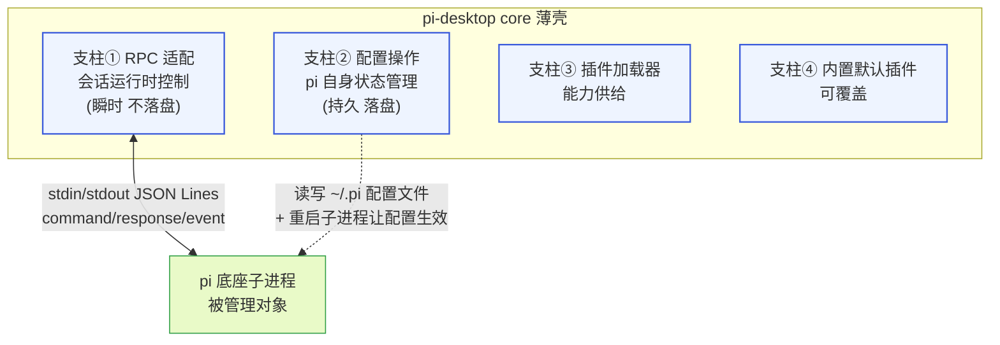

**图 1-1 — 支柱②与支柱①是 core 对接底座的两条独立通道**

这条虚线代表的关系需要细说。桌面端直接读写 `~/.pi/agent/` 和 `<cwd>/.pi/` 下的配置文件——这步操作完全在桌面端进程内完成，不经 stdin/stdout，不发给底座任何 RPC 命令。改完之后，底座子进程并不知道配置变了（它运行时不监听文件变化，第 5 节详述），所以桌面端还要重启 RPC 子进程，让新进程在启动时重读全部配置——这就等于一次完整的 reload。整个"改配置 → 生效"闭环：桌面端写文件 → 杀旧子进程 → 起新子进程（带 `--session` 参数 resume 会话）→ 新进程读配置 → resync UI。这条链路是支柱②的运行时主线，后面各节逐段拆解。

### 1.2 与支柱①（RPC）的职责分工

把这条边界钉死，是本模块能否守住薄壳形态的关键。RPC 的 31 个命令（`rpc-mode.ts` 第 393 行起的 `case` 列表）全部是会话运行时控制：`prompt`/`steer`/`follow_up`/`abort`/`new_session`/`get_state`/`set_model`/`cycle_model`/`get_available_models`/`set_thinking_level`/`cycle_thinking_level`/`set_steering_mode`/`set_follow_up_mode`/`compact`/`set_auto_compaction`/`set_auto_retry`/`abort_retry`/`bash`/`abort_bash`/`get_session_stats`/`export_html`/`switch_session`/`fork`/`clone`/`get_fork_messages`/`get_entries`/`get_tree`/`get_last_assistant_text`/`set_session_name`/`get_messages`/`get_commands`。逐条检查会发现，没有一个命令是"管理 pi 自身"——没有 `reload`、没有 `list_extensions`、没有 `enable_extension`、没有 `read_settings`、没有 `set_setting`、没有 `list_sessions`。

这并非遗漏，而是有意的边界。底座怎么存 session、怎么执行工具、怎么加载扩展、怎么解析模型——全是底座子进程的内部事务，桌面端通过 RPC 触发其运行时行为、通过 event 观察其状态变化，但不接管其内部实现。这条边界一旦守不住，薄壳就会变厚。现有方案的翻车根就在这里：它把 SDK 娶进自己进程，于是 session 存储、扩展加载、工具执行这些本该是底座内部事务的东西它都得自己管一份，Worker 进程池、sdk-loader、sdk-manager、版本管理器、idle eviction 这一整套复杂度全部是"把 SDK 塞进自己进程"这个决定的副产物。pi-desktop 走 RPC，这些一个都不需要。

需要把"缺口"和"不在 RPC 职责内"区分清楚，避免实现者误判。上面列举的 `list_extensions`/`enable_extension`/`read_settings`/`set_setting` 这四类"管理 pi 自身"的命令，**不作为 RPC 缺口登记**——它们的目的（列出/启停扩展、读写配置值）由支柱②直接读写配置文件即可覆盖，根本不需要走 RPC：扩展启停就是改 `settings.json` 的 `extensions` 数组（第 6 节）、读配置就是 `SettingsManager` 的 getter、写配置就是 setter。它们不是"底座内部有能力但 RPC 没开口子"，而是"本就不该走 RPC"。只有"需要底座运行时配合"的 `reload`（要让进程内 reload 生效）和 `list_sessions`（要扫底座管理的 session 目录、且 SessionManager 是底座类）才是真正的 RPC 缺口，登记在第 10 节。这条边界说清后，实现者不会去找一个不存在的 `read_settings` RPC 命令。

支柱②的职责清单，且仅此五项：

1. 读写 `~/.pi/agent/settings.json`（全局配置）和 `<cwd>/.pi/settings.json`（项目级配置）。
2. 读写 `~/.pi/agent/trust.json`（项目信任记录）。
3. 读写 `~/.pi/agent/auth.json`（OAuth token、API key 凭证）。
4. 读写 MCP 配置文件。
5. 改完上述文件后，通过重启 RPC 子进程让配置生效。

注意这五项里没有任何一项是"调用底座的 reload 方法"——因为 RPC 没有暴露 reload 命令（第 10 节详述这个缺口）。桌面端让配置生效的唯一手段是改文件 + 重启进程。这不是缺陷，而是"外部进程管理另一个进程持久化状态"的标准形态：消费者（底座）在启动时读一次共享状态（配置文件），运行时不监听变化；操作者（桌面端）改完共享状态后，必须重启消费者才能让新状态生效。这就像改了 systemd 的 unit 文件后要 `systemctl daemon-reload` + 重启服务——配置和运行态是分离的，生效需要显式动作。

### 1.3 与支柱③（桌面插件加载器）的配置分路

桌面端有两套独立的配置体系，分归两个进程机制管，绝对不能混。这是最容易踩的坑，也是本节要反复强调的：

- **底座配置**（本模块管）：`~/.pi/agent/` 和 `<cwd>/.pi/` 下的文件，归底座子进程消费。改完要让底座生效——走第 7 节的重启子进程决策。这类配置包括 settings.json（默认模型、扩展列表、重试策略等）、trust.json（项目信任）、auth.json（凭证）、MCP 配置。
- **桌面插件配置**：`~/.pi/desktop/plugins-data/{pluginId}/config.json`（用户级）和 `<cwd>/.pi/desktop/plugins-data/{pluginId}/config.json`（项目级），归桌面加载器消费。改完走支柱③的热重载——只重载那一个插件、不动底座子进程。

这两套配置的 schema 不同、存储目录不同、生效机制不同。桌面端在管理 UI 上把它们呈现为一个统一的"设置"面板，但架构上必须分路分发：用户改的是某个桌面插件的偏好（如"时间线是否显示时间戳"）→ 写 `plugins-data/{pluginId}/config.json` → 触发该插件热重载；用户改的是 pi 自身的状态（默认模型、扩展列表、代理）→ 写 `~/.pi/agent/settings.json` → 触发底座子进程重启。

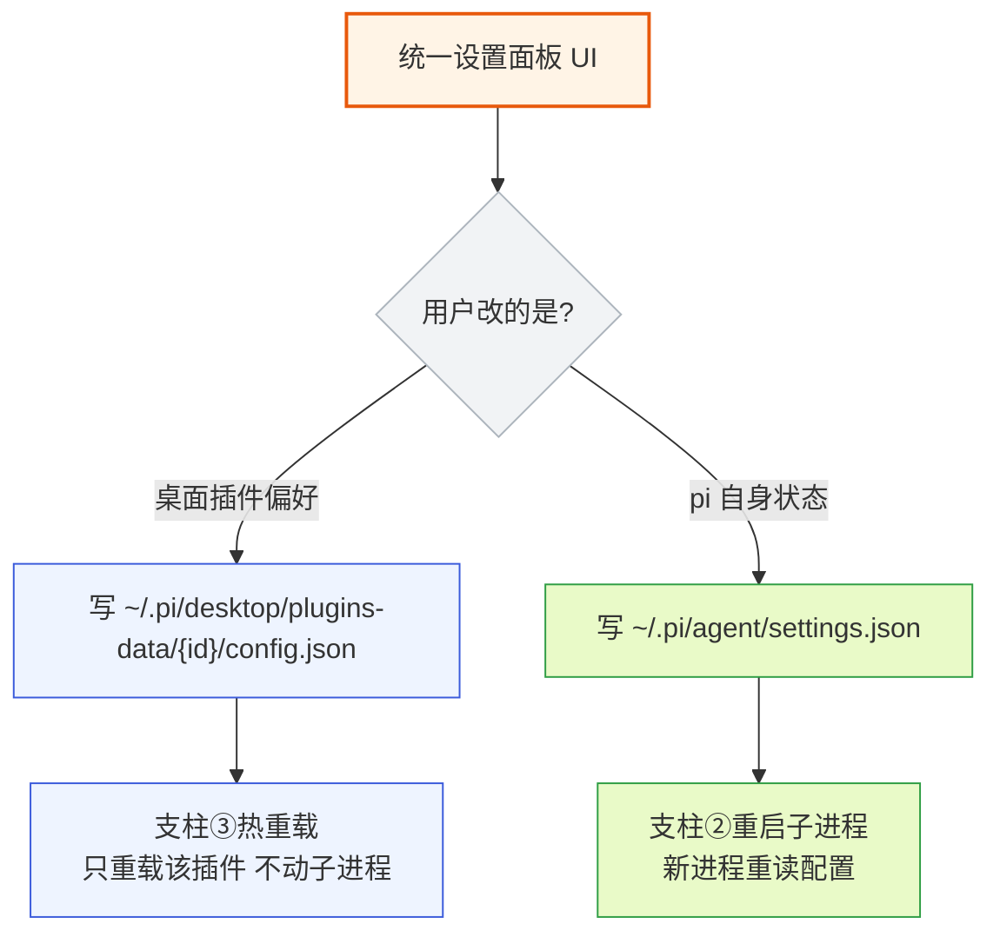

**图 1-2 — 两套配置分路：桌面插件偏好走热重载，pi 自身状态走重启子进程**

混淆这两路的典型错误有两种。第一种：把"启用某个底座扩展"误实现成"桌面插件热重载"——结果底座子进程根本不知道扩展路径变了，扩展永远加载不上，用户点了启用却看不到扩展的工具出现在命令面板。第二种：把"某个桌面插件的偏好"误写成 `settings.json` 的字段——结果 `settings.json` 里多了个 pi 不认识的字段（pi 的 Settings schema 没有这个字段），既不生效也无副作用，还污染了配置文件。正确的分路在第 8.3 节展开：桌面端在管理 UI 里判断用户操作的对象归哪路，再走对应链路。

这两路之所以分开，根本原因是它们归不同的进程机制管：底座配置归底座子进程（要重启）、桌面插件配置归桌面加载器（热重载）。底座子进程不感知桌面插件的存在，桌面加载器不感知底座配置的变化。两条路在进程层面是隔离的，只在 UI 层合并呈现。

### 1.4 本模块的输入与输出

本模块（core 的配置操作层）对外只暴露一类接口，依赖方向只向内（core → RPC 适配层）：

- **对管理 UI 插件（唯一对外出口）**：一个 `ConfigOpsService`（见本文 11.1），内含配置读写能力 + 一个"配置变更后让底座生效"的编排原语 `applyConfigChange()`（内部做第 7 节的决策状态机）。管理 UI 插件（DESIGN 4.3 基础管理 UI 插件）通过 `PluginContext` 拿到 `ConfigOpsService` 的引用来调用它。输入是用户在表单里的操作，输出是磁盘文件变更 + 重启决策。
- **本模块对 RPC 适配层是消费者、不是供给方**：`ConfigOpsService` 内部调用 RPC 适配层（`RpcAdapter`，RPC 文档 11.1）落地进程操作（`getState`/`stop`/`start`），即配置操作层依赖 RPC 适配层、而非反过来向它暴露接口。`applyConfigChange` 是 `ConfigOpsService` 上的方法、由管理 UI 插件调用，不是暴露给 RPC 适配层的接口。

`PluginContext.config` 与 `ConfigOpsService` 的关系要说清，避免新读者困惑：`PluginContext.config` 是插件自己偏好的存取入口（写 `~/.pi/desktop/plugins-data/{id}/config.json`，走支柱③热重载，第 1.3 节的桌面插件配置那一路）；`ConfigOpsService` 是 pi 自身状态（settings/trust/auth/MCP，走重启子进程那一路）的存取入口。两者是**两个并列的不同对象**、不是别名也不是子集——`PluginContext.config` 管桌面插件偏好、`PluginContext.configOps` 管 pi 自身配置。管理 UI 插件改 pi 配置时经 `PluginContext.configOps` 拿到 `ConfigOpsService` 实例、改自己偏好时拿 `PluginContext.config`，两者不能混用（混用正是第 1.3 节列的分路混淆错误）。字段名钉死为 `PluginContext.configOps`，实现时不再使用别的命名。

本模块**不直接面向最终用户**——用户触达它的能力都经过管理 UI 插件（扩展管理页、配置编辑页、模型选择页、MCP 管理页、账户凭证页、项目信任页）。core 只提供机制，UI 是插件。这呼应洋葱架构：core 提供配置读写的机制（中层）、管理 UI 插件提供表单和交互（外层），依赖方向只向内。

## 2 两份配置文件与 deepMerge 合并规则

### 2.1 全局与项目级 settings 的物理布局

pi 的配置分两份，一份全局、一份项目级，schema 完全一样：

- 全局：`~/.pi/agent/settings.json`
- 项目级：`<cwd>/.pi/settings.json`（`CONFIG_DIR_NAME` 常量是 `.pi`，见 `settings-manager.ts` 顶部 import）

`CONFIG_DIR_NAME` 在 `config.ts:491` 定义为 `.pi`（可被包配置 `pkg.piConfig?.configDir` 覆盖，但实践中几乎都是 `.pi`），是 pi 在用户家目录和项目目录下专用的配置目录名。`agentDir`（`config.ts:515` 的 `getAgentDir()`）是 `~/.pi/agent`。两份都是 JSON，靠 `SettingsManager` 合并。除了这两份 settings，`~/.pi/agent/` 下还有 `trust.json`（项目信任记录，第 3 节）、凭证文件 `auth.json`、模型注册表 `models.json`、MCP 配置等——它们的物理位置和 settings 同目录，但读写走各自的 manager，不经过 `SettingsManager`。

`FileSettingsStorage`（`settings-manager.ts:188`）的构造函数把两条路径算出来：

```typescript
constructor(cwd: string, agentDir: string) {
    const resolvedCwd = resolvePath(cwd);
    const resolvedAgentDir = resolvePath(agentDir);
    this.globalSettingsPath = join(resolvedAgentDir, "settings.json");
    this.projectSettingsPath = join(resolvedCwd, CONFIG_DIR_NAME, "settings.json");
}
```

注意 `agentDir` 默认是 `getAgentDir()`（即 `~/.pi/agent`），`cwd` 是用户打开的项目目录。两条路径的解析都用 `resolvePath`（`utils/paths.ts`），保证跨平台一致、支持 `~` 展开。桌面端实例化 `SettingsManager` 时，`cwd` 必须跟随用户当前打开的项目——这是薄壳的本分，底座自己会处理工作目录相关的一切，桌面只负责把对的目录传进去。

两份文件任意一份不存在时按空对象 `{}` 参与合并，不报错——大部分用户最初只有全局配置、没有项目级配置。文件存在但 JSON 解析失败时，`SettingsManager` 不会让整个进程崩——它把错误记进 `errors` 数组（`settings-manager.ts:368` 的 `tryLoadFromStorage`），按空对象继续，错误经 `drainErrors()` 暴露给 UI 层展示。这种"软失败"设计很重要：用户手滑把 settings.json 改坏了，底座还能起来（用默认配置），用户能在 UI 里看到错误提示去修复，而不是面对一个完全打不开的应用。

两份文件的 schema 完全一致意味着：理论上项目级可以覆盖全局的任何字段。但有些字段（如 `defaultProjectTrust`）在 schema 类型上不禁止项目级写，但语义上项目级值不会生效——getter 显式只读全局值（第 4.8 节）——这是为了避免循环依赖：项目级配置在信任未定时加载不进来，用它来决定自己的信任性会形成死循环。

### 2.2 deepMergeSettings 的合并语义

合并规则在 `settings-manager.ts:132` 的 `deepMergeSettings(base, overrides)`。语义是：以全局打底，项目级覆盖，嵌套对象递归合并，数组和原始值整体替换。核心实现：

```typescript
function deepMergeSettings(base: Settings, overrides: Settings): Settings {
    const result: Settings = { ...base };
    for (const key of Object.keys(overrides) as (keyof Settings)[]) {
        const overrideValue = overrides[key];
        const baseValue = base[key];
        if (overrideValue === undefined) {
            continue;
        }
        // 对于嵌套对象，递归合并
        if (
            typeof overrideValue === "object" && overrideValue !== null &&
            !Array.isArray(overrideValue) &&
            typeof baseValue === "object" && baseValue !== null &&
            !Array.isArray(baseValue)
        ) {
            (result as Record<string, unknown>)[key] = { ...baseValue, ...overrideValue };
        } else {
            // 对于原始值和数组，override 值整体替换
            (result as Record<string, unknown>)[key] = overrideValue;
        }
    }
    return result;
}
```

这里有一个常被误读的细节，必须反复强调：函数名叫 `deepMerge`，但它的"深"只到一层。看那个嵌套对象分支 `{ ...baseValue, ...overrideValue }`——这是对象展开运算符，不是递归调用 `deepMergeSettings`。逐条说清楚合并语义：

- **`undefined` 跳过**：项目级里某个字段是 `undefined`（即 JSON 里没写这个 key），不覆盖全局。这保证项目级只需写自己关心的字段。
- **嵌套对象一层合并**：`compaction`、`retry`、`terminal`、`images` 这类对象字段，按 `{ ...baseValue, ...overrideValue }` 合并——项目级的每个子 key 覆盖全局的同名子 key，未覆盖的保留全局值。注意这是一层浅合并，不是深递归多层——`retry.provider` 这种二级嵌套，`{ ...base.retry, ...override.retry }` 会整体替换 `provider` 子对象（如果项目级写了 `retry`）。实际效果：项目级写 `retry: { enabled: false }` 只覆盖 `enabled`，`maxRetries`/`baseDelayMs` 仍用全局；但项目级写 `retry: { provider: { timeoutMs: 5000 } }` 会把全局的 `retry.provider` 整个替掉。
- **数组整体替换**：`extensions`/`skills`/`prompts`/`themes`/`packages`/`enabledModels` 这些数组字段，项目级只要写了就完全替换全局的数组——不做拼接。
- **原始值覆盖**：`defaultProvider`/`defaultModel`/`theme` 等字符串、数字、布尔，项目级直接覆盖全局。

这个语义是故意的，不是实现疏忽。pi 的 Settings 字段嵌套最深就是两层（`retry.provider`、`compaction`、`terminal`、`images`、`thinkingBudgets`、`markdown`、`warnings`），且第二层的字段都是叶子值（string/number/boolean），单层合并已足够表达全部覆盖需求。如果改成全递归合并，反而会带来一个微妙的问题：用户在项目级只想覆盖 `retry.provider.timeoutMs`，但全递归会把全局设的 `retry.provider.maxRetries` 也带进来——这看似"更友好"，实际上违背了"项目级是覆盖不是追加"的语义，让用户难以预测最终生效值。单层合并让语义清晰：嵌套对象的覆盖粒度是整个子对象，用户要覆盖就要写全。

合并的方向是 `deepMergeSettings(globalSettings, projectSettings)`——全局在下、项目级在上。`SettingsManager` 构造函数（`settings-manager.ts:305`）和 `reload()`、`setProjectTrusted()`、`save()`、`saveProjectSettings()` 里每次重算生效配置都走这一句：`this.settings = deepMergeSettings(this.globalSettings, this.projectSettings)`。

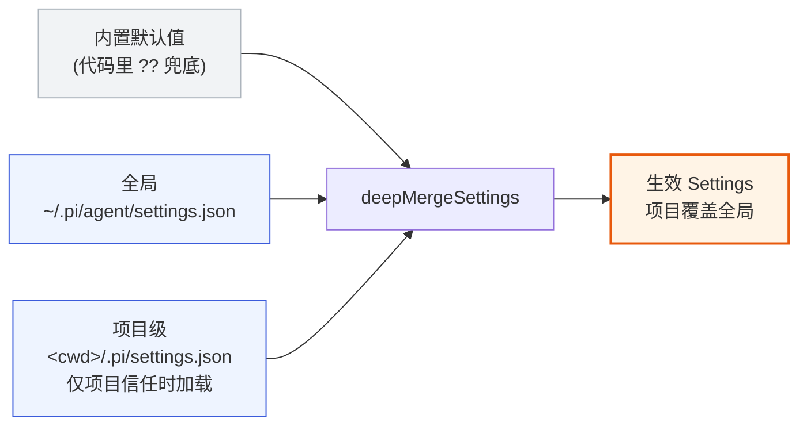

**图 2-1 — 配置合并优先级：内置打底、全局覆盖、项目级最上（需项目信任）**

### 2.3 数组整体替换的 UI 含义

"项目级数组整体替换全局数组"这条规则，桌面端在 UI 上必须表达清楚，否则用户会困惑。典型场景：

- 用户在全局配了 `extensions: ["~/.pi/agent/extensions/foo.ts", "bar.ts"]`。
- 项目级 `.pi/settings.json` 里写了 `extensions: ["./my-project-ext.ts"]`。
- 生效的 `extensions` 是 `["./my-project-ext.ts"]`——全局那两个**不见了**，不是追加。

这意味着项目级的扩展列表是"覆盖"不是"追加"。一个特别容易踩的坑：用户以为"项目级不写 extensions 就用全局的"，但如果项目级 settings.json 里显式写了 `"extensions": []`，效果是禁用所有扩展。**项目级不写 `extensions` 字段（键不存在）和写 `extensions: []`（键存在但空）是不同语义**——前者 `overrideValue` 是 undefined，`continue` 跳过，保留全局值；后者 `overrideValue` 是空数组，整体替换，全局值被清空。

UI 上呈现项目级扩展管理页时，必须提示："此处填写的扩展路径将完全替换全局扩展列表，而非追加。如需同时启用全局扩展，请在此列表里一并写出。"反过来，用户若只想给当前项目加一个扩展、保留全局的，要么把它加进全局，要么在项目级列表里把全局的也抄一份。这个语义和 VSCode 的 `settings.json` 数组合并不一样（VSCode 部分数组是追加语义），桌面端不能照搬 VSCode 的心智模型。

### 2.4 嵌套对象浅合并的边界 case

`deepMergeSettings` 对嵌套对象只做一层合并，这在二级嵌套场景下有微妙行为，实现者要心里有数。以 `retry` 为例：

```json
// 全局
{ "retry": { "enabled": true, "maxRetries": 3, "provider": { "timeoutMs": 30000, "maxRetryDelayMs": 60000 } } }

// 项目级
{ "retry": { "provider": { "timeoutMs": 5000 } } }
```

合并结果是 `{ enabled: true, maxRetries: 3, provider: { timeoutMs: 5000 } }`——`maxRetryDelayMs: 60000` 丢了，因为 `{ ...base.retry, ...override.retry }` 把整个 `provider` 子对象替换成了项目级的 `{ timeoutMs: 5000 }`。这是浅合并的固有行为，和"深递归合并"不同。桌面端的配置编辑器若提供 `retry.provider` 的编辑，要么提示用户"修改 provider 会整体替换"，要么在写回时把全局的 `provider` 字段补全——后者更友好，但要在 UI 层做合并，不能指望 `deepMergeSettings`。

不过 `SettingsManager` 的写盘逻辑 `persistScopedSettings`（第 9.4 节）用 `modifiedNestedFields` 做了字段级精确合并——改 `compaction.enabled` 时只覆盖 `enabled` 子字段、保留其他子字段。这缓解了浅合并的问题：通过 setter 改嵌套字段是精确的，只有手写 JSON 整体覆盖时才有这个问题。所以建议用户用 UI 改配置（走 setter）而非手编 JSON。

### 2.5 迁移规则 migrateSettings

`SettingsManager` 在加载时会跑 `migrateSettings`（`settings-manager.ts:381`），把老格式迁移到新格式。桌面端虽然不直接执行迁移（迁移在底座侧读文件时发生），但要知道这些迁移规则，因为桌面端写回的配置不能触发"迁移后又被打回老格式"：

- `queueMode` → `steeringMode`：老字段名迁移。
- `websockets: boolean` → `transport: "websocket" | "sse"`：老布尔迁移成枚举。
- `skills` 对象格式 → `skills` 数组格式：老的对象 `{ enableSkillCommands, customDirectories }` 拆成 `enableSkillCommands` 顶层字段 + `skills: string[]`。
- `retry.maxDelayMs` → `retry.provider.maxRetryDelayMs`：老字段挪进 `provider` 子对象。

迁移是无损的、幂等的——已经是新格式的配置迁移后不变。桌面端写配置时按新格式写，别写老字段。`persistScopedSettings`（`settings-manager.ts:578`）在写回前会先把磁盘上的现有内容 `migrateSettings` 一遍再合并，保证写回的文件是迁移后的格式——这避免了"内存里是新格式、磁盘是老格式"的撕裂。迁移规则会随版本演进——未来字段重命名/重组时，新规则加进 `migrateSettings`，桌面端不需要关心。

### 2.6 合并的时序与触发点

合并发生在三个时机，桌面端实现时要对齐每一个，否则会出现"改了配置但 UI 没更新"或"UI 显示的和实际生效的不一致"的问题：

1. **构造时**：`SettingsManager` 构造函数（`settings-manager.ts:305`）里 `this.settings = deepMergeSettings(this.globalSettings, this.projectSettings)`，构造完即得到生效 Settings。构造发生在 `SettingsManager.create(cwd, agentDir)` 调用时——桌面端启动、或打开新项目时。
2. **每次 setter 后**：每个 `setXxx` 方法最后都调 `this.save()`，`save` 里第一行就是 `this.settings = deepMergeSettings(this.globalSettings, this.projectSettings)`（`settings-manager.ts:610`）。所以改全局字段或项目级字段后，`this.settings` 立刻反映合并结果——getter 读的是 `this.settings`，所以 setter 后立刻 getter 能拿到新值，UI 刷新无需等待。
3. **reload 后**：`reload()` 从磁盘重读两份文件，再 deepMerge（`settings-manager.ts:504`）。这用于"磁盘文件被外部改过、要重新对齐内存"的场景——如底座子进程改了 `lastChangelogVersion`，桌面端 reload 后才能看到。

**桌面端对底座侧写入的同步策略（已知折中）**：桌面端只在自己的 setter 后 save，不会主动 reload；底座写 `lastChangelogVersion` 等字段时桌面端无感知、无 file watcher（第 5.1 节）。当前处置是\"接受暂不一致\"——底座写的字段（多为 `lastChangelogVersion` 这类底座自维护的次要状态）不影响桌面端配置编辑的正确性，桌面端持有的副本与磁盘短暂不一致，在下次重启子进程后顺带 reload 桌面端 `SettingsManager` 时自然对齐。不做定期轮询 reload（避免无谓 IO 和锁竞争）。若未来某字段需要桌面端强一致可见，演进项是底座写盘后推一个 `settings_changed` event、桌面端收到后 reload——当前无此 event，列为已知折中而非缺口。

桌面端从 `SettingsManager.getGlobalSettings()` / `getProjectSettings()` 拿到的是结构化克隆的副本（`structuredClone`，`settings-manager.ts:443/447`），不能直接改——改了也不生效，因为 getter 返回的是副本、不是引用。要改必须走 setter。各 getter（`getDefaultModel`/`getCompactionEnabled` 等）读的是合并后的 `this.settings`，所以 UI 渲染配置展示页时调 getter 即可拿到生效值。这个"只读副本 + setter 写入"的模式保证了配置变更的可控性——所有改动都经 setter、都走 modified 标记、都 enqueue 写盘，没有"偷偷改了内存但没落盘"的漏洞。

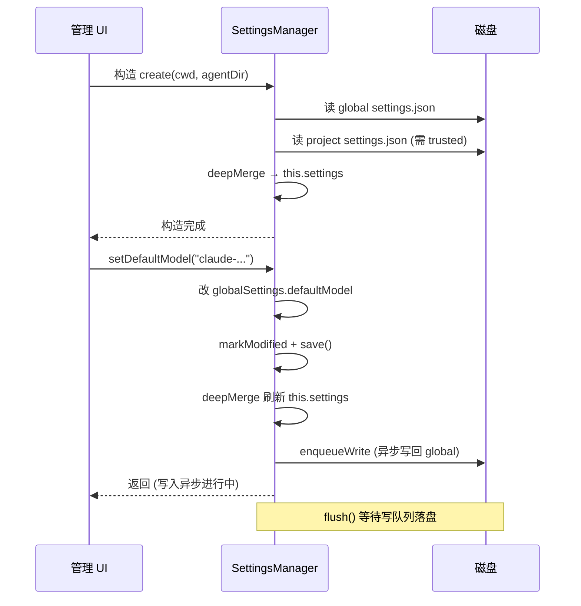

**图 2-2 — SettingsManager 的读改写时序**

注意图里的 `enqueueWrite` 是异步的——setter 返回时写盘可能还没完成。如果调用方需要确保写盘完成（如"写完立刻重启子进程"），必须 `await settingsManager.flush()` 等待写队列清空。否则可能重启了子进程但新进程读到旧配置（因为写还没落盘）。这是第 7 节重启决策要处理的前置条件之一。

## 3 项目信任前置机制

### 3.1 projectTrusted 是加载项目级配置的前置条件

合并有个硬前置：**项目信任**。项目级 settings 只有在项目被信任时才加载——`SettingsManager.loadFromStorage`（`settings-manager.ts:350`）：

```typescript
private static loadFromStorage(storage: SettingsStorage, scope: SettingsScope, projectTrusted = true): Settings {
    if (scope === "project" && !projectTrusted) {
        return {};  // 不信任的项目，项目级 settings 直接当空
    }
    // ... 读文件
}
```

不信任的项目，它的 `.pi/settings.json` 被完全忽略——文件不读、不 parse、不进内存。这从根上防止恶意项目通过配置文件注入：配置文件根本没被读到内存里，里面写的任何东西都不会生效。这是"防御纵深"的第一道也是最强的一道防线——在解析之前就拒绝。`fromStorage`（`settings-manager.ts:319`）在创建 manager 时把 `projectTrusted` 透传给 `tryLoadFromStorage`。

注意默认是 `true`（信任）——这是底座 CLI 直接跑的场景（用户主动在项目里起 pi，默认信任）。桌面端**不能**用这个默认值，必须在打开项目时显式查 `trust.json` 决定信任与否，把结果作为 `projectTrusted` 传进 `SettingsManager.create`。桌面端的"项目信任"管理就是控制这个开关（DESIGN 4.x 终端与项目信任插件处理 UI，详见 `13-plugin-terminal-trust.md`）。

### 3.2 信任记录的物理存储 trust.json

信任记录存在 `~/.pi/agent/trust.json`，由 `ProjectTrustStore`（`trust-manager.ts:208`）管理。`trustPath` 是 `join(resolvePath(agentDir), "trust.json")`。文件结构是一个 `Record<string, true | false | null>`，key 是项目路径（`normalizeCwd` 处理过的绝对路径），value 三态：

- `true`：信任。
- `false`：不信任。
- `null`：用户选了"不再问"但没给确定决策（罕见）。

三态的设计让"用户曾经拒绝过"和"用户从未决定过"区分开——前者不弹提示（用户已表态），后者可以再问（首次打开）。`readTrustFile`（`trust-manager.ts:107`）读时会校验：必须是对象、每个 value 必须是 `true`/`false`/`null`，否则抛错。`writeTrustFile`（`trust-manager.ts:137`）写时用 `proper-lockfile` 锁目录（`lockfilePath: ${path}.lock`），和 settings 的文件锁同一套机制（见第 9 节）。

信任决策在存储层按目录精确记录，不做自动前缀继承——即存储 `trust.json` 时，信任了 `/a/b` 不会在磁盘里自动写入 `/a/b/c` 的记录，每个目录的决策要么由用户显式给出、要么缺席。但查询层做父目录回溯：查信任时先查 cwd 精确匹配，没查到就沿父目录向上找最近一条匹配记录（`ProjectTrustStore.get` 内部调 `findNearestTrustEntry`）。这两层措辞不矛盾——"存储不自动继承、查询时回溯父目录决策"是同一个机制的两侧：存储保持最小（只记用户显式给过的决策），查询时用回溯复用父目录的决策，达到"信任父目录后子目录自动被信任"的运行时效果，而磁盘里并没有为每个子目录写一条记录。UI 层提供"信任父目录"选项：用户选"Trust parent"时同时写 cwd 和父目录 `{ path: parentDir, decision: null }`（当前目录决策置 null，让它继承父目录）。这个设计的目的是减少信任弹窗的骚扰：用户在一个 monorepo 里打开多个子项目，信任一次父目录后，所有子项目都不再问。**该 UX 列为 P2 延后项**（第 14.4 节优先级表）：它需要 `ConfigOpsService.setProjectTrust(decision: null, { trustParent: true })` 这条三态接口（第 11.1 节），而 v1 的信任 UI 主要走 `setProjectTrusted(boolean)`（仅 true/false 两态）。v1 实现者照 3.2 写信任 UI 时，"信任父目录"选项要么不出现在 UI 里、要么标灰提示 P2——否则 UI 会调到 v1 未实现的 `trustParent` 分支。`setProjectTrust` 接口形态在 v1 就定好（避免 P2 时破坏性改动），但 `trustParent` 分支的实现在 P2。

### 3.3 信任决策流程

完整的信任决策在 `resolveProjectTrusted`（`project-trust.ts` 的导出函数）。它是一个短路链，按顺序检查多个条件，任何一个命中就直接返回：

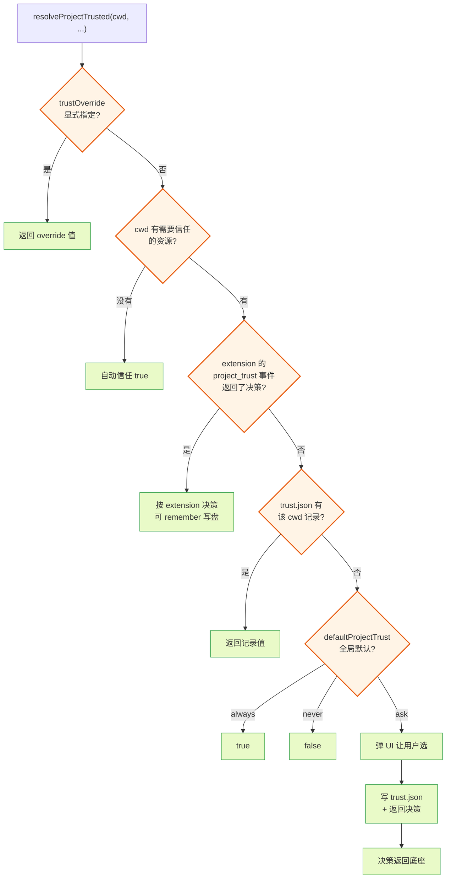

**图 3-1 — 项目信任决策短路链**

逐层解释每个短路点的设计意图：

1. **trustOverride 显式指定**。最优先。这用于 CLI 参数（`--approve`/`-a` 设 true、`--no-approve`/`-na` 设 false，见 `cli/args.ts`，映射到 `parsed.projectTrustOverride`）或桌面端从 UI 已知用户决策时直接传入，跳过整条决策链。桌面端在重启子进程时，如果用户已在 UI 里点了"信任"，可以把决策作为 override 传给底座，跳过底座侧的决策链。

**启动期信任决策的传输通道**是这里必须钉死的架构问题。底座是独立子进程，启动时它如何把"需要信任决策"这件事传给桌面端？答案不是"底座 spawn 后再问桌面端"，而是**桌面端在 spawn 前预先解决信任、把决策作为既成事实传给底座**——这符合薄壳"桌面端是操作者、底座是被管理对象"的方向。具体两条通道，以 trust.json 为主、override 为辅：

- **trust.json 共享状态**（唯一可靠主通道）：桌面端在 spawn 底座子进程**之前**，先在桌面端镜像运行 `resolveProjectTrusted` 决策链（查 `trust.json`、查 `defaultProjectTrust` 策略、必要时弹 UI 让用户决策），把决策写进 `~/.pi/agent/trust.json`。底座子进程启动时自己走 `resolveProjectTrusted` 读同一个 `trust.json`，得到同一个决策——无需任何进程间通信。这是"写共享状态 + 重启消费者"模式在信任上的应用，也是 v1 的默认落点：只要 trust.json 里写了正确的决策，底座决策链第 4 步（trust.json 历史记录）就会命中并返回，无需 override。
- **`--approve`/`--no-approve` CLI override**（仅用于强制短路的辅助通道）：桌面端已通过 UI 拿到用户决策后，spawn 时在 `args` 里追加 `--approve`（信任）或 `--no-approve`（不信任）。这条 override 走 `RpcStartOptions.args`（RPC 文档 11.1），底座 `resolveProjectTrusted` 第一步就命中 `trustOverride`、短路整条链，连 `trust.json` 都不必读。**注意 flag 名是 `--approve`/`--no-approve`，不是 `--trust`**——底座 `cli/args.ts` 没有定义 `--trust`，传 `--trust` 会被未知 flag 分支吞进 `unknownFlags`（映射成 `trust: true` 当作 extension flag 传递），`projectTrustOverride` 保持 `undefined`，override 短路**不会触发**，底座转而走 trust.json/默认策略链。实现者照 `--approve`/`--no-approve` 写，不要写 `--trust`。

**RPC 模式下底座不会主动弹信任框**——这是 override 通道 rationale 必须澄清的一点。底座 `main.ts` 计算 `hasUI = isInitialRuntime && trustPromptMode === "interactive"`；RPC 模式下 `appMode === "rpc"`、`trustPromptMode === "rpc"`（非 `"interactive"`），故 `hasUI === false`。决策链走到第 5 步 `defaultProjectTrust: "ask"` 兜底时，`if (!options.projectTrustContext.hasUI) return false;` 直接返回不信任——底座**不会**经 Extension UI 子协议反向弹框询问桌面端。因此"为避免底座再弹一次信任框而传 override"的 rationale 在 RPC 模式下落空：override 的真实用途是"跨信任态复用同一子进程语义"（如强制信任一个 trust.json 里记为 false 的目录、或反向强制不信任），而非防弹框。日常 v1 场景里，trust.json 预写决策即可让底座正确加载项目级配置，无需 override。

不推荐的路径是"底座 spawn 后通过 `extension_ui_request` 发信任询问"——`extension_ui_request` 的 `confirm`/`select` 子协议是底座 extension 主动发起的交互，用于响应底座运行时事件，把它倒过来当"底座向桌面端要信任决策"的通道会误用子协议方向（见第 7.5 节对子协议方向的说明）。且如上所述，RPC 模式 `hasUI=false`，底座根本不会发起这类询问。信任决策在启动时本就需要 UI，正确做法是桌面端预先 resolve、把结果写进 trust.json（必要时辅以 `--approve` override），而不是让底座启动后再反向询问。`ResourceLoader` 的两阶段信任加载（第 3.6 节）里的 `resolveProjectTrust` 回调，在桌面端场景下也是由桌面端预先决策后注入、而非底座 spawn 后回调桌面端。

**预 resolve 对底座 extension 信任策略的影响（边界提示）**：`resolveProjectTrusted` 的第 3 步是 `emitProjectTrustEvent`——若企业装了订阅 `project_trust` 事件的 extension（自动批准公司项目、校验签名等），该步在底座进程内执行。桌面端在 spawn 前预写 trust.json 或传 `--approve` override，会使底座在第 1 步（override）或第 4 步（trust.json 命中）短路，第 3 步的 enterprise extension **不会运行**，等于改变了 trust 策略语义。这是桌面端薄壳"预先决策"模式的固有副作用。部署了 extension 级信任策略的企业环境，应改用 `defaultProjectTrust: "always"` + **不预写 trust.json、不传 override**，让底座自行走到第 3 步走 extension 决策链；或向底座提一个"即使 override 命中也仍触发 project_trust event"的契约改进项。属边界提示，不阻塞 v1——多数环境没有订阅 `project_trust` 的 extension，预写 trust.json 不影响语义。
2. **无信任需求资源自动信任**。`hasTrustRequiringProjectResources(cwd)`（`trust-manager.ts:179`）检查 `<cwd>/.pi/` 下是否有需要信任的资源——settings.json、extensions/ 目录、skills/ 目录、agents/skills 等。项目根本没放 `.pi` 目录或目录是空的，直接返回 `true`，不弹任何提示。这避免打开一个普通项目（绝大多数项目没有 `.pi`）就弹信任框骚扰用户。
3. **extension 可拦截信任决策**。底座 extension 能订阅 `project_trust` 事件、自己决定是否信任。这给企业策略留了口子——如内网白名单 extension 统一批准所有公司项目、或安全 extension 检查项目签名后决定信任。extension 返回的决策可以 remember（写进 trust.json），下次不再问。桌面端走 RPC 时这条路径基本走不到（extension 决策在底座进程内完成），但要知道它存在，因为底座重启时会走这条链。
4. **trust.json 历史记录**。用户之前对这个 cwd 做过决策（true/false），直接返回记录值，不再问。这是"记住决策"的兑现——用户点了"信任并记住"，下次打开同一项目不再弹。
5. **defaultProjectTrust 三态兜底**。全局 settings 的 `defaultProjectTrust` 字段（类型 `"ask" | "always" | "never"`，默认 `"ask"`）控制无记录时的兜底：`always` 自动信任、`never` 自动拒绝、`ask` 弹 UI 让用户选。这个字段**仅全局有效**——`getDefaultProjectTrust()`（`settings-manager.ts:899`）读的是 `this.globalSettings.defaultProjectTrust`，不读合并值，因为项目级配置在信任未定时根本加载不进来，用它自己来决定自己的信任性会形成循环依赖。

桌面端实现信任 UI 时，要照这条短路链的优先级——不要绕过 `resolveProjectTrusted` 自己判断。重启子进程时，底座会自己走这条链（读 trust.json、可能触发 extension 的 project_trust 事件），桌面端只需保证 trust.json 已写好正确的决策即可。

### 3.4 setProjectTrusted 的运行时切换

`SettingsManager.setProjectTrusted(trusted)`（`settings-manager.ts:454`）在运行时切换信任状态。这是桌面端"用户在管理 UI 里点了信任/取消信任"后的落点。逻辑：

```typescript
setProjectTrusted(trusted: boolean): void {
    if (this.projectTrusted === trusted) return;  // 同值 no-op
    this.projectTrusted = trusted;
    this.modifiedProjectFields.clear();
    this.modifiedProjectNestedFields.clear();
    if (!trusted) {
        this.projectSettings = {};
        this.projectSettingsLoadError = null;
        this.settings = deepMergeSettings(this.globalSettings, this.projectSettings);
        return;
    }
    // 信任后重新从磁盘加载项目级配置
    const projectLoad = SettingsManager.tryLoadFromStorage(this.storage, "project", trusted);
    this.projectSettings = projectLoad.settings;
    this.projectSettingsLoadError = projectLoad.error;
    if (projectLoad.error) this.recordError("project", projectLoad.error);
    this.settings = deepMergeSettings(this.globalSettings, this.projectSettings);
}
```

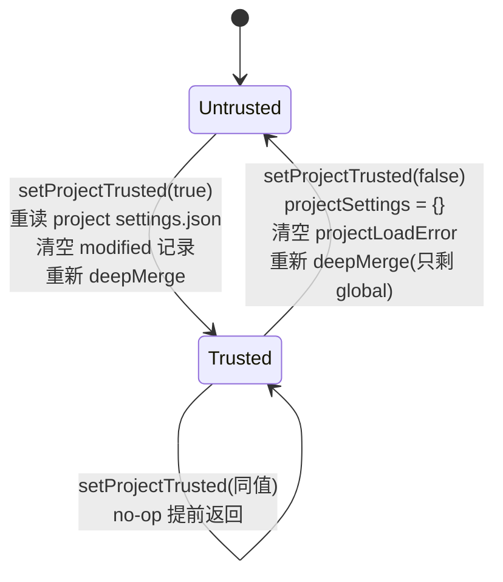

**图 3-2 — setProjectTrusted 状态机**

关键点：

- **取消信任 → 项目级配置立即清空**：`projectSettings = {}`，重新合并，等于项目级配置不存在。同时清掉项目级修改标记，防止后续 `saveProjectSettings` 把不信任时改的字段写回（其实 `assertProjectTrustedForWrite` 会先拦，这是双保险）。
- **信任 → 重新从磁盘加载**：调 `tryLoadFromStorage` 读 `.pi/settings.json`，合并进生效配置。注意此时若项目级配置文件解析出错（`projectLoad.error`），会记进 errors、项目级配置保持空——reload 后 UI 要 `drainErrors()` 显示。
- **不删磁盘文件**：撤销信任只是"不加载"，不删 `<cwd>/.pi/settings.json`。文件还在，用户重新信任时会再读。撤销信任是"我不再让这个项目的配置生效"，不是"删除这个项目的配置文件"——后者是破坏性操作，应该由用户显式删文件。

桌面端在重启子进程让信任生效时，要注意：`setProjectTrusted` 只改了桌面端自己持有的 `SettingsManager` 实例的状态，底座子进程并不知道。要让底座也按新信任状态加载，必须重启子进程——新进程起来时底座会自己走一遍 `resolveProjectTrusted`（读 `trust.json`），得到同一个决策。所以桌面端切信任的完整链路是三步：写 `trust.json`（`ProjectTrustStore.set`）→ `SettingsManager.setProjectTrusted` 同步本地视图 → 重启 RPC 子进程（第 7 节）。

### 3.5 写操作也受信任约束

不仅加载受信任约束，**写入项目级配置也受约束**。`assertProjectTrustedForWrite`（`settings-manager.ts:534`）：

```typescript
private assertProjectTrustedForWrite(): void {
    if (!this.projectTrusted) {
        throw new Error("Project is not trusted; refusing to write project settings");
    }
}
```

`saveProjectSettings`/`updateProjectSettings`/`enqueueWrite("project", ...)` 都会先调它。这意味着桌面端在不信任项目时，不能往 `.pi/settings.json` 写任何东西——即使 UI 上让用户编辑了项目级配置，点保存也会抛错。这是信任门控的第二道防线（第一道是 loadFromStorage）。还有第三道——`enqueueWrite` 在写任务真正执行前再断言一次信任（第 9.5 节），因为用户可能在 setter 调用后、写盘前撤销了信任。三道防线合起来保证"不信任 = 项目级配置完全不可见、不可改"。

UI 层要先检查 `isProjectTrusted()`（`settings-manager.ts:450`），不信任时禁用项目级配置的保存按钮、提示用户先信任。

### 3.6 ResourceLoader 的信任两阶段加载

`ResourceLoader.reload`（`resource-loader.ts:338`）有个更精细的信任处理——两阶段加载，桌面端走重启路径时不需要直接调它，但要理解底座子进程启动时发生了什么：

```typescript
async reload(options?: ResourceLoaderReloadOptions): Promise<void> {
    // ...
    if (options?.resolveProjectTrust) {
        preTrustExtensions = await this.loadProjectTrustExtensions();
        const projectTrusted = await options.resolveProjectTrust({ extensionsResult: preTrustExtensions });
        this.settingsManager.setProjectTrusted(projectTrusted);
    }
    await this.settingsManager.reload();
    // ... 重新 discover/load 资源
}
```

`loadProjectTrustExtensions`（`resource-loader.ts:330`）先强制 `setProjectTrusted(false)` 加载一遍——只加载全局和 CLI 的扩展、忽略项目级扩展。这一步的产物 `preTrustExtensions` 传给 `resolveProjectTrust` 回调（通常是 UI 信任提示），让用户在看到项目级扩展列表后决定是否信任。信任决策回来后再 `setProjectTrusted`、reload settings、加载项目级扩展。

这个两阶段机制是防"恶意项目在扩展里藏代码、还没信任就跑起来"的闸——先看不信任状态下能加载什么、再让用户决策。不能先把可能恶意的项目级扩展加载进来再问"信任吗"（那时恶意扩展可能已经执行了）。这是资源加载阶段的一道**独立信任闸**，不纳入第 3.5 节那三道防线（第一道 loadFromStorage 加载门控见第 3.1 节、第二道 assertProjectTrustedForWrite 写入门控、第三道 enqueueWrite 写前再断言，均在第 3.5/9.5 节）的编号——它是扩展加载期专门防'恶意项目级扩展未信任就执行'的闸，和写入门控是两个不同阶段的信任检查。桌面端重启子进程时，底座自己会跑这套。`resolveProjectTrust` 回调在桌面端场景下如何接到桌面端 UI？答案不是底座 spawn 后反向调用桌面端，而是**桌面端在 spawn 前已预先 resolve 信任决策**（第 3.3 节的 trust.json 共享状态主通道 + `--approve`/`--no-approve` override 辅助通道），底座启动时读 `trust.json` 拿到决策、或被 `--approve` override 短路，`resolveProjectTrust` 回调要么不被注入（决策已由 override 给定）、要么注入一个直接返回预存决策的桩。桌面端的责任是预先提供信任决策 UI，而不是在底座启动后响应它的回调。

## 4 Settings 字段全集展开

### 4.1 Settings 接口的全貌

`Settings` 接口定义在 `settings-manager.ts:83`。这是桌面端配置编辑器的 schema 来源。下面按职能分组列出全部字段，每个字段给出类型、默认值、getter/setter、用途。字段名前的标记：`[G]` 表示只走全局 setter（`globalSettings`），`[P]` 表示有项目级 setter（`updateProjectSettings`），`[G/P]` 表示两路都有。

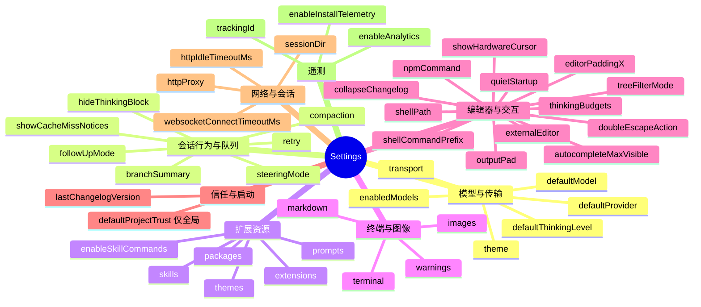

**图 4-1 — Settings 字段心智图**

### 4.2 模型与传输

- `defaultProvider?: string` `[G]`：默认 provider，如 `"anthropic"`。`getDefaultProvider`/`setDefaultProvider`。模型选择器改默认 provider 写这个。注意：运行时切 provider 走 `set_model` RPC 命令（不写 settings），只有"设为默认"才写这个字段。
- `defaultModel?: string` `[G]`：默认模型 id。`getDefaultModel`/`setDefaultModel`。`setDefaultModelAndProvider(provider, modelId)` 一起改两者。区分：运行时切模型（只影响当前 session、不持久化）vs 持久化默认模型（写 settings、下次启动生效）。
- `defaultThinkingLevel?: ThinkingLevel` `[G]`：默认思考级别，枚举 `"minimal" | "low" | "medium" | "high"`。`getDefaultThinkingLevel`/`setDefaultThinkingLevel`。注意没有 `"off"`——"关闭思考"对应 `"minimal"`（最低级别）。
- `transport?: TransportSetting` `[G]`：HTTP 传输方式，`"auto" | "sse" | "websocket"`，默认 `"auto"`。`getTransport`/`setTransport`。这是从老的 `websockets: boolean` 迁移来的（2.5）。
- `enabledModels?: string[]` `[G]`：模型循环范围，和 `--models` CLI 同格式。`getEnabledModels`/`setEnabledModels`。控制 `cycle_model` 命令循环的范围，空表示在所有可用模型间循环。
- `theme?: string` `[G]`：主题名。`getThemeSetting`/`getTheme`/`setTheme`。`getTheme` 在主题名含 `/` 时返回 `undefined`（视为外部路径未解析）——内置主题是单一名（如 `"dark"`），含 `/` 的值表示用户指定的是主题文件路径而非内置主题名。桌面端 UI 应按路径处理这种 theme 值：显示路径字符串、不把它当作内置主题枚举项参与下拉选择，主题解析由底座 `ResourceLoader` 在 reload 时完成。

### 4.3 会话行为与队列

- `steeringMode?: "all" | "one-at-a-time"` `[G]`：steering 队列模式，默认 `"one-at-a-time"`。`getSteeringMode`/`setSteeringMode`。从老的 `queueMode` 迁移来。steering 是"转向"——agent 正在输出时用户发新消息，转向意味着中断当前转向处理新消息。`"all"` 处理全部排队消息，`"one-at-a-time"` 只处理第一条。也能通过 RPC `set_steering_mode` 运行时改（只影响当前 session、不写 settings）。
- `followUpMode?: "all" | "one-at-a-time"` `[G]`：follow-up 队列模式，默认 `"one-at-a-time"`。`getFollowUpMode`/`setFollowUpMode`。follow-up 是"追加"——排队等当前完成后接着处理。
- `compaction?: CompactionSettings` `[G]`：上下文压缩策略。`CompactionSettings`：`enabled?`（默认 `true`）、`reserveTokens?`（默认 `16384`，压缩时预留给 prompt + LLM 响应的 token 数）、`keepRecentTokens?`（默认 `20000`，压缩后保留的最近消息 token 数）。`getCompactionEnabled`/`setCompactionEnabled`、`getCompactionSettings`。注意 setter 是 `markModified("compaction", "enabled")` 嵌套字段级标记。
- `branchSummary?: BranchSummarySettings` `[G]`：分支摘要策略。`reserveTokens?`（默认 `16384`）、`skipPrompt?`（默认 `false`，true 时跳过"是否摘要"提示）。`getBranchSummarySettings`/`setBranchSummarySettings`。setter 走 `markModified("branchSummary")` 整字段标记（该对象字段少、无二级嵌套精确合并需求）。
- `retry?: RetrySettings` `[G]`：重试策略。`RetrySettings`：`enabled?`（默认 `true`）、`maxRetries?`（默认 `3`）、`baseDelayMs?`（默认 `2000`，指数退避 2s/4s/8s）、`provider?: ProviderRetrySettings`（`timeoutMs?`/`maxRetries?`/`maxRetryDelayMs?` 默认 `60000`，provider 要求的最大重试间隔上限）。`getRetryEnabled`/`setRetryEnabled`/`getRetrySettings`/`getProviderRetrySettings`。老的 `retry.maxDelayMs` 迁移到 `retry.provider.maxRetryDelayMs`。注意"上下文溢出"错误不会重试——它由 compaction 处理。
- `hideThinkingBlock?: boolean` `[G]`：隐藏思考块，默认 `false`。`getHideThinkingBlock`/`setHideThinkingBlock`。
- `showCacheMissNotices?: boolean` `[G]`：显示 prompt-cache miss 提示，默认 `false`。`getShowCacheMissNotices`/`setShowCacheMissNotices`。

### 4.4 扩展与资源（启停落点）

这是支柱②最常被触发的字段组——扩展的装/卸全部落在这里。理解这组字段是理解第 6 节"扩展启停真相"的前提。

- `extensions?: string[]` `[G/P]`：本地扩展文件/目录路径列表。`getExtensionPaths`/`setExtensionPaths`/`setProjectExtensionPaths`。**这是扩展安装的落点之一**——增删路径 = 装卸扩展（第 6 节展开）。
- `packages?: PackageSource[]` `[G/P]`：npm/git 包源。`PackageSource` 是 `string | { source, autoload?, extensions?, skills?, prompts?, themes? }`。字符串形式加载全部资源，对象形式过滤要加载哪些资源、`autoload: false` 表示启动空集只应用显式 pattern。`getPackages`/`setPackages`/`setProjectPackages`。
- `skills?: string[]` `[G/P]`：本地 skill 路径。`getSkillPaths`/`setSkillPaths`/`setProjectSkillPaths`。从老的对象格式迁移来。
- `prompts?: string[]` `[G/P]`：本地 prompt 模板路径。`getPromptTemplatePaths`/`setPromptTemplatePaths`/`setProjectPromptTemplatePaths`。
- `themes?: string[]` `[G/P]`：本地主题路径。`getThemePaths`/`setThemePaths`/`setProjectThemePaths`。
- `enableSkillCommands?: boolean` `[G]`：是否把 skill 注册成 `/skill:name` 命令，默认 `true`。`getEnableSkillCommands`/`setEnableSkillCommands`。

每个 `[G/P]` 字段都有全局版和项目版两套 setter，项目版走 `updateProjectSettings`（`settings-manager.ts:642`），先 `assertProjectTrustedForWrite()`，不信任直接抛。getter 读的是合并后的 `this.settings.xxx`，返回副本。`PackageSource` 的对象形态支持过滤——只加载包里的某些扩展/skill/prompt/theme，适合"这个包里我只要某个工具"的精细控制。

### 4.5 终端与图像

- `terminal?: TerminalSettings` `[G]`：终端设置。`showImages?`（默认 `true`，是否内联显示图片）、`imageWidthCells?`（默认 `60`，内联图片宽度终端字符列数）、`clearOnShrink?`（默认 `false`，也读 `PI_CLEAR_ON_SHRINK=1` 环境变量）、`showTerminalProgress?`（默认 `false`，OSC 9;4 进度条）。各 setter 走 `markModified("terminal", 子字段)`。这组字段主要给 TUI 用，桌面端 RPC 模式下大部分不生效（底座不渲染 TUI），但 `images.blockImages` 会影响发往 LLM 的图片——桌面端也该尊重。
- `images?: ImageSettings` `[G]`：`autoResize?`（默认 `true`，缩放到 2000x2000 以内，为了更好的模型兼容性）、`blockImages?`（默认 `false`，true 时阻止所有图片发给 LLM）。`getImageAutoResize`/`setImageAutoResize`/`getBlockImages`/`setBlockImages`。
- `markdown?: MarkdownSettings` `[G]`：`codeBlockIndent?`（默认 `"  "`）。`getMarkdownSettings`/`getCodeBlockIndent`/`setCodeBlockIndent`。setter 走 `markModified("markdown", "codeBlockIndent")` 嵌套字段级标记，写回时只覆盖 `codeBlockIndent` 子字段、保留 `markdown` 下其它子字段。
- `warnings?: WarningSettings` `[G]`：`anthropicExtraUsage?`（默认 `true`，是否警告 Anthropic 额外用量）。`getWarnings`/`setWarnings`。

### 4.6 思考预算与编辑器

- `thinkingBudgets?: ThinkingBudgetsSettings` `[G]`：自定义思考级别 token 预算，`{ minimal?, low?, medium?, high? }`。`getThinkingBudgets`/`setThinkingBudgets`。setter 走 `markModified("thinkingBudgets")` 整字段标记。
- `doubleEscapeAction?: "fork" | "tree" | "none"` `[G]`：双击 Esc 空编辑器时的动作，默认 `"tree"`。`getDoubleEscapeAction`/`setDoubleEscapeAction`。
- `treeFilterMode?: "default" | "no-tools" | "user-only" | "labeled-only" | "all"` `[G]`：`/tree` 默认过滤器，默认 `"default"`。`getTreeFilterMode`/`setTreeFilterMode`。
- `editorPaddingX?: number` `[G]`：输入编辑器水平 padding，默认 `0`，clamp 0-3。`getEditorPaddingX`/`setEditorPaddingX`。setter 做了范围校验防止越界值。
- `outputPad?: 0 | 1` `[G]`：输出水平 padding，默认 `1`。`getOutputPad`/`setOutputPad`。
- `autocompleteMaxVisible?: number` `[G]`：自动补全下拉最大可见项，默认 `5`，clamp 3-20。`getAutocompleteMaxVisible`/`setAutocompleteMaxVisible`。
- `showHardwareCursor?: boolean` `[G]`：显示终端硬件光标，也读 `PI_HARDWARE_CURSOR=1`。`getShowHardwareCursor`/`setShowHardwareCursor`。这种"settings 优先、env 兜底"的模式让用户既能持久化配置、又能临时用环境变量覆盖。

### 4.7 外部编辑器与 Shell

- `externalEditor?: string` `[G]`：Ctrl+G 外部编辑器命令，优先级高于 `VISUAL`/`EDITOR`。`getExternalEditorCommand`——解析顺序：`externalEditor` → `VISUAL` → `EDITOR` → 平台默认（Windows `notepad`、其他 `nano`）。这个 fallback 链保证用户没配置时也能用。
- `shellPath?: string` `[G]`：自定义 shell 路径（Cygwin 用户用），支持 `~` 展开。`getShellPath`/`setShellPath`。
- `shellCommandPrefix?: string` `[G]`：每条 bash 命令的前缀（如 `"shopt -s expand_aliases"` 让 bash 支持别名）。`getShellCommandPrefix`/`setShellCommandPrefix`。
- `npmCommand?: string[]` `[G]`：npm 包查找/安装命令，argv 风格（如 `["mise", "exec", "node@20", "--", "npm"]`）。`getNpmCommand`/`setNpmCommand`。让用 mise 管理多版本 node 的用户指定用哪个版本的 node。

### 4.8 项目信任与启动

- `defaultProjectTrust?: DefaultProjectTrust` `[G]`：默认是否信任新项目，`"ask" | "always" | "never"`，默认 `"ask"`。schema 类型上不禁止项目级写，但语义上项目级值不会生效——`getDefaultProjectTrust` 显式只读 `this.globalSettings.defaultProjectTrust`，不读合并值（项目级写了也读不到）。原因在第 3.3 节说过：项目级配置在信任未定时加载不进来，用它来决定自己的信任性是循环依赖。
- `quietStartup?: boolean` `[G]`：静默启动，默认 `false`。`getQuietStartup`/`setQuietStartup`。
- `lastChangelogVersion?: string` `[G]`：上次看的 changelog 版本。`getLastChangelogVersion`/`setLastChangelogVersion`。底座自己维护，桌面端一般不主动改。
- `collapseChangelog?: boolean` `[G]`：折叠 changelog，默认 `false`。`getCollapseChangelog`/`setCollapseChangelog`。

### 4.9 网络与会话存储

- `httpProxy?: string` `[G]`：HTTP 代理 URL，作为 `HTTP_PROXY`/`HTTPS_PROXY` 注入 pi 管理的 HTTP 客户端。对企业内网环境很重要——用户在公司网络里可能必须走代理才能访问 LLM API。`getHttpProxy`/`setHttpProxy`。这个字段需要 UI 编辑（代理设置页），**必须**走 setter——`setHttpProxy(url)` 内部 `markModified("httpProxy")` + `save()`，和其它字段一样经 modified 标记 + enqueueWrite 落盘。不允许"直接改"——绕过 setter 的改动不落盘（第 2.6 节的"只读副本 + setter 写入"模型）。
- `httpIdleTimeoutMs?: number` `[G]`：HTTP header/body idle 超时，`0` 禁用。`getHttpIdleTimeoutMs`/`setHttpIdleTimeoutMs`。`setHttpIdleTimeoutMs` 校验 `Number.isFinite` 且 `>= 0`。防止连上但卡住不发数据的死连接。
- `websocketConnectTimeoutMs?: number` `[G]`：WebSocket 握手超时，`0` 禁用。`getWebSocketConnectTimeoutMs`/`setWebSocketConnectTimeoutMs`。这两个 timeout 都走 `parseTimeoutSetting`/`parseHttpIdleTimeoutMs`（`http-dispatcher.ts`）解析。
- `sessionDir?: string` `[G]`：自定义 session 存储目录，和 `--session-dir` CLI 同格式。`getSessionDir`/`setSessionDir`。默认是 `~/.pi/agent/sessions/<encoded-cwd>/`，把 cwd 编码成 `--path-with-dashes--` 形式的目录名（如 `/Users/user/app` 编码成 `--Users-user-app--`）。改 `sessionDir` 后必须重启子进程才生效——底座启动时据此决定 session 落盘位置。

### 4.10 遥测与分析

- `enableInstallTelemetry?: boolean` `[G]`：安装后匿名版本 ping，默认 `true`。`getEnableInstallTelemetry`/`setEnableInstallTelemetry`。这是安装/更新后的匿名版本 ping（只发版本号，不发任何用户数据）。
- `enableAnalytics?: boolean` `[G]`：分析数据共享（opt-in），默认 `false`。`getEnableAnalytics`/`setEnableAnalytics`。这是用户数据上报，和上面的匿名 ping 性质不同。
- `trackingId?: string` `[G]`：分析追踪 id，首次 opt-in 时用 `randomUUID()` 生成。`getTrackingId`。`setEnableAnalytics(true)` 时若没有 `trackingId` 自动生成一个——"opt-in 即生成 id"的设计，id 只在用户同意时才产生，不是预生成，保护隐私。

### 4.11 字段到 UI 的映射原则

上面这些字段，桌面端配置编辑器（管理槽的"配置编辑"页，DESIGN 4.3 基础管理 UI 插件）按 schema 生成表单。映射原则：

- 标量字段（string/number/boolean）直接表单项。
- 枚举字段（如 `defaultProjectTrust`、`transport`、`treeFilterMode`）用 select。
- 数组字段（`extensions`/`packages`/`skills` 等）用可增删的列表编辑器，提示"整体替换"语义（2.3）。
- 嵌套对象（`compaction`/`retry`/`terminal`/`images`）展开成子表单，子字段单独标记修改（`markModified("retry", "enabled")`），写回时只写改动的子字段（`persistScopedSettings` 的嵌套合并逻辑，9.4）。
- `[G/P]` 字段在 UI 上提供"全局/项目级"切换，切换时分别调全局 setter 和项目 setter，项目 setter 前检查 `isProjectTrusted()`。

### 4.12 模型注册表 models.json 与 enabledModels 的关系

附录 B 列出的 `~/.pi/agent/models.json` 是模型注册表，前面各节偶有提及但未展开。它和 `settings.json` 的 `defaultModel`/`enabledModels` 是两个不同层面的东西，实现者容易混淆，这里钉死关系。

- **models.json 是底座维护的只读注册表**：记录"有哪些可用模型"，每个模型条目含 provider/id/name/reasoning/input 类型/contextWindow/maxTokens/cost/thinkingLevelMap（即 DESIGN 1.7.2 的 `Model` 结构）。这个文件由底座在安装/更新时生成、或由底座按 provider 拉取的模型清单写入，桌面端**不编辑**——它不是用户的配置项，是底座的能力清单。附录 B 标注"无锁（只读）"正因如此：桌面端和底座都不会并发写它，底座偶尔更新它时是单进程写、桌面端只读。
- **桌面端拿模型列表走 RPC，不读 models.json**：桌面端的模型选择器下拉项来自 RPC `get_available_models`（DESIGN 1.5.3），它返回底座内存里解析后的可用模型列表。桌面端**不**直接读 `models.json` 文件——一是避免又 import 一个底座类、二是底座对 models.json 的解析（含环境过滤、provider 启停）才是"运行时可用模型"，磁盘文件只是缓存。如果桌面端去读磁盘文件，可能和底座运行时的可用集合不一致（如某 provider 未配凭证、其模型在运行时不可用但仍在 models.json 里）。
- **defaultModel 是"用哪个"、models.json 是"有哪些"**：`settings.json` 的 `defaultModel` 指定默认选哪个模型（必须是 models.json 里存在的 id），`enabledModels` 指定 `cycle_model` 循环的范围（是 models.json 的子集）。两者引用 models.json 的模型 id，但不复制模型定义。UI 上模型选择页用 `get_available_models` 渲染下拉项，用户选后写 `defaultModel`——这是"选已有的"而非"登记新的"。
- **桌面端添加自定义模型**：若用户要用 models.json 里没有的模型（如自建 endpoint），路径不是改 settings.json（settings 没有自定义模型定义字段），而是底座支持的 `models.json` 扩展机制或 provider 自定义配置。这条路径桌面端不直接管——它属于底座能力清单的维护，桌面端至多提供"刷新模型列表"按钮（触发底座重拉 provider 清单），不手编 models.json。

这条区分把 models.json 归为"底座维护的只读能力清单、桌面端经 RPC 查询"，把 settings.json 的模型字段归为"用户的选择偏好、桌面端经 setter 写入"，两者职责不混。

## 5 三个 reload 的调用链

### 5.1 没有 watch，必须显式 reload

一个容易踩的坑：以为改了配置文件 pi 会自动热加载。**不会**。pi 没有对配置目录做持久 file watcher——`fs.watch`/`chokidar` 在 pi 里只用在 footer 渲染、theme 这类非配置场景（`utils/fs-watch.ts`），配置文件改了不会自动触发任何东西。热加载是显式调用 `reload()` 才发生的。

这个事实是支柱②"重启子进程"决策的前提：既然底座不会自己 reload，桌面端又调不到底座的 reload 方法（RPC 没开口子），唯一能让磁盘配置在底座里生效的办法，就是让底座进程重启——新进程启动时从磁盘重读全部配置。理解这一点，才能理解第 7 节的决策为什么别无选择。注意这和桌面插件的热重载不冲突——桌面加载器对自己的 `~/.pi/desktop/plugins/` 目录做 watcher（支柱③第 8 项），那是桌面端进程、不同目录、不同作用域；底座对自己的 `~/.pi/agent` 配置目录不做 watcher，靠显式 reload 或重启。

### 5.2 SettingsManager.reload()

`SettingsManager.reload()`（`settings-manager.ts:479`）是最底层的 reload，只重读配置值，不重新加载扩展。逻辑：

```typescript
async reload(): Promise<void> {
    await this.writeQueue;  // 先等挂起的写落盘
    const globalLoad = SettingsManager.tryLoadFromStorage(this.storage, "global");
    if (!globalLoad.error) {
        this.globalSettings = globalLoad.settings;
        this.globalSettingsLoadError = null;
    } else {
        this.globalSettingsLoadError = globalLoad.error;
        this.recordError("global", globalLoad.error);
    }
    this.modifiedFields.clear();
    this.modifiedNestedFields.clear();
    this.modifiedProjectFields.clear();
    this.modifiedProjectNestedFields.clear();
    const projectLoad = SettingsManager.tryLoadFromStorage(this.storage, "project", this.projectTrusted);
    if (!projectLoad.error) {
        this.projectSettings = projectLoad.settings;
        this.projectSettingsLoadError = null;
    } else {
        this.projectSettingsLoadError = projectLoad.error;
        this.recordError("project", projectLoad.error);
    }
    this.settings = deepMergeSettings(this.globalSettings, this.projectSettings);
}
```

关键点：

- **`await this.writeQueue`**：reload 前先等挂起的写操作（`enqueueWrite` 排队的）完成，避免读到半写的文件。这个等待是"读后写一致性"的保障。
- **错误保留旧值**：全局或项目级加载出错时，`tryLoadFromStorage` 返回 `{ settings: {}, error }`——注意返回的是空 `{}`、不是旧值。`reload` 把空 `{}` 赋给 `globalSettings`/`projectSettings`，生效配置会丢失该 scope 的内容。但 `globalSettingsLoadError`/`projectSettingsLoadError` 记了错，`save()` 里检查到 load error 会跳过写回（`if (this.globalSettingsLoadError) return;`），避免把坏配置覆盖到磁盘。UI 要 `drainErrors()` 显示加载错误。
- **清修改标记**：reload 后内存配置和磁盘一致，之前的修改标记清空。这保证 reload 后再 `save()` 不会把 reload 前的内存改动写回。
- **保留 `projectTrusted`**：reload 不改变信任状态，按当前 `projectTrusted` 加载项目级。

`SettingsManager.reload` **只重读配置值**，不重新加载扩展。改了 `extensions` 数组后调它，`this.settings.extensions` 会更新（内存里的配置值变了），但已加载的扩展实例还在内存里跑着——扩展注册的工具、命令、flag 都还在。要让新扩展路径真正生效（新扩展被加载、被注册），要调上层 `ResourceLoader.reload`。这是三个 reload 分层的原因：每个 reload 管自己的资源层级，下层不知道上层。

### 5.3 ResourceLoader.reload()

`ResourceLoader.reload(options?)`（`resource-loader.ts:338`）是中层 reload，重新 discover 和 load extensions/skills/themes/prompts。它内部先 `await this.settingsManager.reload()` 拿最新配置，再按新配置重新发现资源。这是"改了扩展列表后让 pi 重新加载扩展"的真正入口。

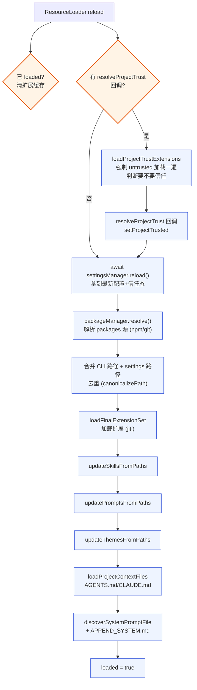

**图 5-1 — ResourceLoader.reload 流程**

`reload` 的执行步骤：1. `resetTimings("extensions")` 清计时；2. 若 `this.loaded`，`clearExtensionCache()` 清 jiti 模块缓存；3. 若 `options.resolveProjectTrust`，跑两阶段信任加载（3.6）；4. `await this.settingsManager.reload()` 先重读 settings；5. `packageManager.resolve()` 解析 packages 源；6. `resolveExtensionSources(additionalExtensionPaths, {temporary:true})` 解析 CLI 临时扩展；7. 过滤 enabled 资源路径、记 metadata；8. `loadFinalExtensionSet` 实际加载扩展；9. 更新 skills/prompts/themes 内存索引；10. 记录 `extensionsResult`（含 errors）。

要点：**项目信任两阶段加载**——先强制 untrusted 加载一遍，给用户信任确认机会，再决定是否加载项目级扩展。**路径合并去重**——`mergePaths`（`resource-loader.ts:789`）按 `canonicalizePath` 去重，CLI 临时路径优先。**`loadFinalExtensionSet` 的预加载复用**——信任两阶段时第一阶段结果被复用，只加载新增项目级扩展。**AGENTS.md/CLAUDE.md 上下文文件**——`loadProjectContextFiles` 查项目目录及祖先目录的上下文文件，也受项目信任影响。

`ResourceLoader.reload` 不重发 `session_start` 事件——它只管资源加载，事件由上层 `AgentSession.reload` 发。这是分层：ResourceLoader 是"重新加载资源"、AgentSession 是"重新绑定 runtime + 通知 extension"。

### 5.4 AgentSession.reload()

`AgentSession.reload(options?)`（`agent-session.ts:2544`）是最上层 reload，extension 的 `ctx.reload()` 最终就是调到它。逻辑：

```typescript
async reload(options?: { beforeSessionStart?: () => void | Promise<void> }): Promise<void> {
    const previousFlagValues = this._extensionRunner.getFlagValues();
    await emitSessionShutdownEvent(this._extensionRunner, { type: "session_shutdown", reason: "reload" });
    await this.settingsManager.reload();
    this.syncQueueModesFromSettings();
    resetApiProviders();
    await this._resourceLoader.reload();
    this._buildRuntime({
        activeToolNames: this.getActiveToolNames(),
        flagValues: previousFlagValues,
        includeAllExtensionTools: true,
    });
    const hasBindings = this._extensionUIContext || this._extensionCommandContextActions
        || this._extensionShutdownHandler || this._extensionErrorListener;
    if (hasBindings) {
        await options?.beforeSessionStart?.();
        await this._extensionRunner.emit({ type: "session_start", reason: "reload" });
        await this.extendResourcesFromExtensions("reload");
    }
}
```

执行步骤，每步都有理由：1. 保存当前 flag values（CLI 传的 flag），reload 后恢复——reload 是"重新加载配置和扩展"，不是"重启进程"，用户显式传的 CLI 参数应保持；2. 发 `session_shutdown`（reason: `"reload"`）——extension 收到这个能做清理；3. `settingsManager.reload()` 重读 settings（链的底层）；4. `syncQueueModesFromSettings()` 把 settings 里的 `steeringMode`/`followUpMode` 同步到运行时；5. `resetApiProviders()` 重置 provider 缓存（改了 `defaultProvider` 后要重新解析）；6. `_resourceLoader.reload()` 重新加载资源（链的中层）；7. `_buildRuntime(...)` 重建 extension runtime（工具注册、flag 绑定）；8. 若有 extension 绑定，发 `session_start`（reason: `"reload"`）+ `extendResourcesFromExtensions("reload")`。

`session_start` 的 `reason: "reload"` 是关键信号——桌面端订阅 `session_start` event 时，能据此区分"新启动"（`"startup"`）、"重载"（`"reload"`）、"resume"（`"resume"`）、"fork"（`"fork"`）、"new"（`"new"`）。桌面端重启子进程后会收到 `reason: "startup"` 或 `"resume"`（取决于是否带 `--session`），**不是** `"reload"`——因为桌面端走的是重启进程、不是进程内 reload。

### 5.5 调用链总结

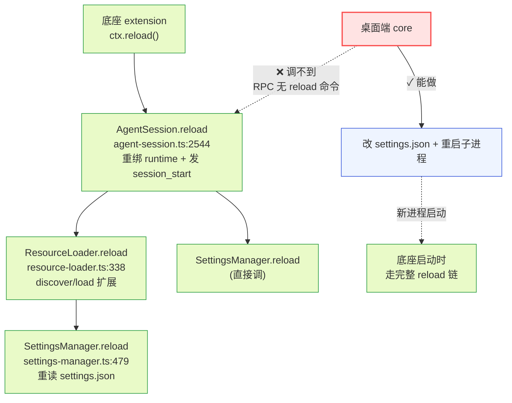

**图 5-2 — 三个 reload 的调用链与桌面端的 RPC 缺口**

调用关系是 `AgentSession.reload` → `ResourceLoader.reload` → `SettingsManager.reload`，越往下越底层。注意 `SettingsManager.reload()` 被调了两次（AgentSession 直接调一次、ResourceLoader 内部又调一次）——这是冗余但无害的，第二次 reload 读到的是同一份磁盘内容、结果一致。这张图钉死了核心矛盾：桌面端要让配置生效，理论上该调 `AgentSession.reload`，但它是进程内部方法、RPC 没暴露。桌面端能做的只有"改文件 + 重启子进程"——新进程启动时会走完整的初始化链（等价于一次完整的 reload）。

### 5.6 RPC 没有暴露任何一个 reload

这三个 reload 都是进程内部方法，**没有一个通过 RPC 暴露给外部**。RPC 的 31 个命令里没有 reload。虽然 `rpc-mode.ts:340` 有个 `commandContextActions.reload = () => session.reload()`，但那是底座 extension 上下文的一部分（extension 的 `ctx.reload()`），不是外部可调的 RPC 命令——外部进程通过 stdin 发的命令只能命中那 31 个 case，`reload` 不在其中。这就是支柱②的核心缺口：桌面端要让底座 reload，调不到任何方法，只能走重启子进程（第 7 节）。

## 6 扩展启停的真相：路径增删非开关

### 6.1 没有启停开关，只有路径增删

顺带把"扩展怎么装/启停"说清楚，因为它直接落在 settings 上，是支柱②最常被触发的事。pi 没有"启用/禁用单个 extension"的独立开关——没有 `extensions: [{ name, enabled }]` 这种结构。这是 pi 扩展模型的一个关键设计决策，桌面端必须照此实现，不能自作主张造一个"enabled"开关。启停就是增删路径列表：

- 装一个本地扩展：把它的路径加进 `Settings.extensions` 数组，调 `setExtensionPaths`（全局）或 `setProjectExtensionPaths`（项目级），然后 reload。
- 卸一个本地扩展：从 `extensions` 数组移除路径，reload。
- 装 npm/git 扩展包：加进 `Settings.packages`，调 `setPackages`/`setProjectPackages`，reload。
- 装主题/skill/prompt：同理加进 `themes`/`skills`/`prompts`，reload。

> **关于这里的 \"reload\"**：本节描述的是底座内部语义——增删路径后要让 `ResourceLoader.reload` 重新 discover 加载。桌面端**无法直接调用**底座的 reload（RPC 无 reload 命令，第 5/10 节），实际生效路径是\"写盘 + 重启子进程\"（本文第 7 节状态机）：新进程启动时走完整 reload 链，等价于一次 reload。下文及第 6.2/6.3 节里凡是写\"reload\"的地方，桌面端落地时一律替换为\"触发生效（= 重启子进程，见第 7 节）\"。

"启用"=在列表里、"禁用"=不在列表里。没有中间态、没有"已装但禁用"。这意味着：没有"暂停"扩展的概念——卸载就是从列表移除，下次 reload 不加载；没有"已安装扩展注册表"——extensions 数组本身就是全部已安装扩展的列表；没有"扩展元数据缓存"——扩展的 manifest/版本/描述都是从路径重新加载时读的，不持久化。

### 6.2 setExtensionPaths 的实现

`setExtensionPaths`（`settings-manager.ts:989`）：

```typescript
setExtensionPaths(paths: string[]): void {
    this.globalSettings.extensions = paths;
    this.markModified("extensions");
    this.save();
}
```

`setProjectExtensionPaths`（`settings-manager.ts:995`）走 `updateProjectSettings`：

```typescript
setProjectExtensionPaths(paths: string[]): void {
    this.updateProjectSettings("extensions", (settings) => {
        settings.extensions = paths;
    });
}
```

`updateProjectSettings`（`settings-manager.ts:642`）先 `assertProjectTrustedForWrite()`（不信任抛错）、`structuredClone` 项目配置（在副本上 apply，原始不受 update 抛错污染）、`markProjectModified`、`saveProjectSettings`。`saveProjectSettings` 把项目级配置序列化进 `enqueueWrite("project", ...)`，由 `writeQueue` 串行化写盘。

注意 setter 是同步签名——`save`/`saveProjectSettings` 不返回 Promise，写盘挂进 `writeQueue`（Promise 链）异步执行。调用方要确认写完了，得 `await this.flush()`（`settings-manager.ts:650`）。桌面端 UI 在"保存扩展列表"后，应该 `await flush()` 再触发重启——否则重启时新进程可能读到旧文件。注意 setter **不触发 reload**——它只改内存和磁盘，已加载的扩展实例不受影响。这个"改配置"和"让配置生效"的分离是故意的——允许批量改多个字段后一次性 reload，而不是改一个 reload 一次。

### 6.3 UI 开关背后的数据层

也就是说，pi 的"扩展管理"在数据层就是路径列表的增删，"启用"=在列表里、"禁用"=不在列表里。桌面端的扩展管理 UI 看起来是开关列表，背后是路径数组的增删 + reload。UI 上的开关切换映射成数据操作：

```
开关 ON  →  路径加入 extensions 数组  →  save  →  flush  →  重启子进程
开关 OFF →  路径从 extensions 数组移除 →  save  →  flush  →  重启子进程
```

现有方案的 extensions handler 基本就是转发这套（读写 settings + 触发生效），pi-desktop 的内置管理 UI 插件也走同一条路——因为它没有别的路可走，底座就是这么设计的。

### 6.4 PackageSource 的过滤形态

`packages` 字段比 `extensions` 复杂——它是 `PackageSource[]`，每项可以是字符串或对象。字符串形式（如 `"@scope/my-pi-ext"`）加载包里全部资源；对象形式（`{ source: "@scope/my-pi-ext", autoload: false, extensions: ["foo"], skills: ["bar"] }`）过滤只加载指定资源。`autoload: false` 表示启动空集、只应用显式 pattern。这让一个包能同时贡献扩展、skill、prompt、theme，但用户可以选择性启用。桌面端的 npm 扩展管理 UI 要支持这种过滤编辑——不只是"装/卸包"，还能选"这个包里我要哪几个扩展"。

### 6.5 装包路径的解析

`packages` 里写的是 npm 包名或 git URL，`packageManager.resolve()`（在 `resource-loader.ts:354` 调）负责把它们解析成实际的文件路径——npm 包要 `npm install`、git 包要 clone、本地路径要 resolve。解析失败会进 `extensionsResult.errors`。桌面端装 npm 扩展时，写 `packages` 只是声明、实际安装由底座的 `packageManager` 在 reload 时做——桌面端不自己跑 `npm install`。这又一次体现"底座内部事务桌面不接管"：桌面只写声明、底座负责落实。重启子进程后，新进程的 `ResourceLoader.reload` 会自动解析新加的 package。

## 7 热加载重启子进程决策状态机

这是支柱②最核心的运行时决策：桌面端改完配置后，如何让它在底座生效。决策是**重启 RPC 子进程**，但不能无脑重启——要根据 agent 当前状态做带判断的重启，否则会打断正在进行的 agent 工作、丢失用户正在等待的输出。

### 7.1 决策：重启 RPC 子进程

缺口确认了：底座的 reload 没对外开口子，桌面端没法通过 RPC 让底座 reload。三个选项里——重启 RPC 子进程、改底座加 reload RPC 命令、调 pi CLI——决策是**重启 RPC 子进程**。理由是零改底座、确定性强、立即可用，不依赖 pi 源码改动或发版。

具体路径：桌面端改完配置（settings.json、扩展路径列表、trust 记录、auth、MCP 配置），写回磁盘，然后杀掉当前 `pi --mode rpc` 子进程，重新起一个。新进程启动时从磁盘重读全部配置、重新 discover 扩展——这就等于一次完整的 reload。代价是重启那一瞬，当前会话的运行态会中断：正在流式输出的 agent 会被打断、排队的消息会丢。但 session 本身持久化在磁盘上（session 文件在 `sessionDir`，默认 `~/.pi/agent/sessions/<encoded-cwd>/`（cwd 编码成 `--path-with-dashes--` 目录名；或项目配置的自定义目录，见本文 4.9）），新进程起来后用同一个 session 文件 resume，消息历史和分叉树都在，只是"正在进行的那个 turn"丢了。对于"改配置"这种低频操作，这个代价可以接受。

### 7.2 重启决策状态机

为了让这个代价可控，桌面端要做的不是无脑重启，而是**带判断的重启**。决策状态机如下：

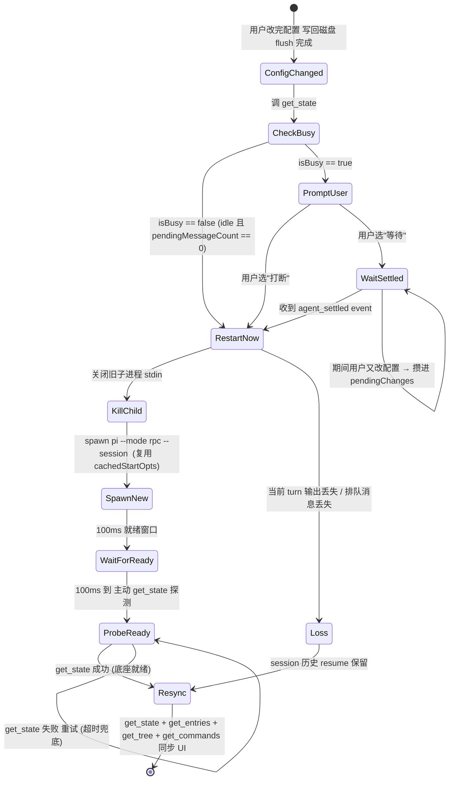

**图 7-1 — 热加载重启决策状态机：streaming 时提示用户，idle 直接重启，session resume**

状态机要点：

- **ConfigChanged**：用户改完配置、`await settingsManager.flush()` 确认写盘完成。这是入口，没 flush 完不能进下一步——否则新进程读到旧文件。
- **CheckBusy**：调 RPC `get_state`，计算 `isBusy = isStreaming || isCompacting`——streaming 和 compaction 都视为"忙"，任一为 true 都不宜无提示重启。`pendingMessageCount > 0`（有排队消息）也并入忙的判断：idle 但有 N 条排队消息时，重启会丢弃这 N 条排队消息，状态机走 PromptUser 分支、提示文案带上\"将丢失 N 条排队消息\"。即忙的完整判定是 `isStreaming || isCompacting || pendingMessageCount > 0`。把 isCompacting 并入是因为压缩上下文是重操作、中途打断会让上下文处于半压缩态；把 pendingMessageCount 并入是因为排队消息只活在内存、重启即丢。三者任一命中都走 PromptUser，让用户决定。
- **idle 分支**：`isBusy == false`（isStreaming/isCompacting 均为 false 且无排队消息）直接重启。新进程 resume 同一 session，用户几乎无感。
- **busy 分支**：`isBusy == true`（streaming/compacting 中或有排队消息），提示用户\"改动需要重启底座生效，当前 agent 正在工作（或正在压缩/有 N 条排队消息），是否打断\"。让用户决定，不替用户做打断决策。提示文案按 `isStreaming`/`isCompacting`/`pendingMessageCount` 分别说明会丢什么。
- **WaitSettled**：用户选等待，改动攒进 `pendingChanges` 队列，订阅 `agent_settled` event。期间用户又改配置，追加进 `pendingChanges`（不重复触发提示）。收到 `agent_settled` 后，把 `pendingChanges` 一次性应用（此时文件已是最新的，直接重启）。
- **RestartNow**：实际重启。先关旧子进程 stdin（触发底座 shutdown，DESIGN 1.2.2），再 spawn 新进程带 `--session <sessionFile>`。
- **WaitForReady**：spawn 后等 100ms（`RpcClient.start()` 的就绪窗口，DESIGN 1.3），给底座初始化时间，不能假设 spawn 返回就能立刻发命令。这是时间驱动的固定延时窗口。
- **ProbeReady**：100ms 到后**主动**发 `get_state` 探测底座是否就绪——这是从 WaitForReady 转出的**唯一触发源**：等 100ms 后主动探测，不依赖底座推 `session_start` event。理由是 `session_start` event 的发出时机有条件（第 5.4 节：仅当有 extension 绑定时才发），把它作为状态机转换条件会导致无 extension 绑定时状态机卡死。改为主动 `get_state` 探测：成功即转 Resync、失败（进程未就绪）按短间隔重试至超时兜底。`session_start` event 作为异步通知订阅——若先收到 event 则可提前转 Resync、跳过剩余探测重试，但状态机不依赖它必发。
- **ProbeReady 的超时必须用显式短超时、不能靠循环 await**：这是核对了 `RpcClient.send` 实现后必须钉死的实现约束。`send` 把命令经 `stdin.write` 写进 OS 管道缓冲——进程未挂载 JSONL reader 时写不会失败、命令暂存缓冲，`send` 会一直 `await` 直到进程就绪后响应或 **30s 默认超时**才 reject。因此 `while(Date.now() < deadline){ try{ await getState(); return } catch{ await sleep(50) } }` 这种写法**不成立**：第一次 `await getState()` 不会在 50ms 内抛错，循环体被 await 阻塞，5s deadline 永远不会在 await 中途触发——实际行为是进程 5s 内就绪则成功返回，否则第一次 `getState` 挂满 30s 才抛"底座子进程就绪超时"，而非文档声称的 5s。正确实现见第 11.2 节 `probeReady`：给每次 `getState` 传一个**显式短超时**（如 500ms），超时即 reject、再 `sleep(50)` 重试，累计到 5s 抛错。这要求 `RpcAdapter.send` 支持 per-call `timeout` 覆盖默认 30s（第 7.6 节接口已补该参数）。
- **Resync**：新进程就绪后，第一件事 `resync(this.rpcAdapter)`（第 7.6 节）——并发发 `get_state` + `get_entries` + `get_tree` + `get_commands`，把 UI 同步回 session 当前状态。

### 7.3 session resume 的参数传递

`sessionFile` 是闭环的关键参数。重启时新进程要 resume 同一个 session，把当前 session 文件路径（从上一次 `get_state` 的 `sessionFile` 字段拿）通过 `args: ["--session", sessionFile]` 传给新进程。新进程起来就打开那个 session 文件、历史和分叉树都在。不传任何 session 参数时，底座按默认行为（该 cwd 下最近 session 或新建）。

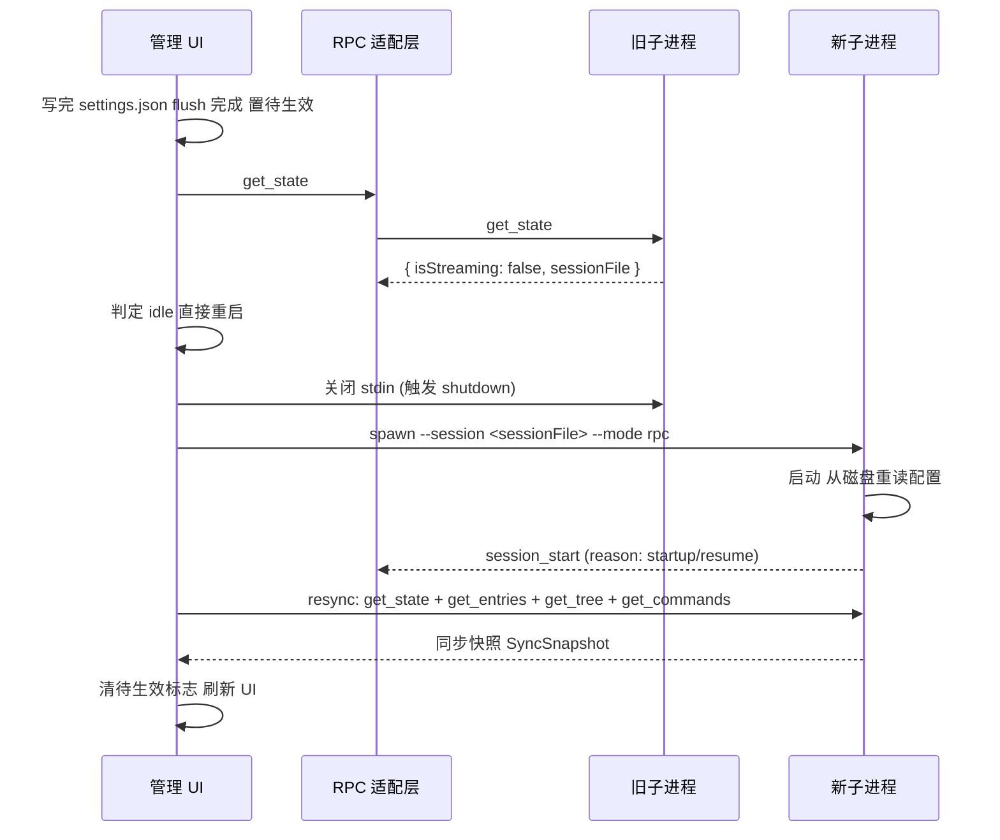

**图 7-2 — idle 直接重启时序**

底座 CLI 支持几个 session 选择参数（`main.ts:209` 起）：`--session <path>` 指定文件路径、`--resume` 恢复该 cwd 下最近的 session、`--session-id <id>` 按 id 选 session，三者不能混用。桌面端重启时用 `--session <sessionFile>` 最精确——指定确切文件，不靠"最近"语义。`sessionFile` 从 `RpcSessionState.sessionFile` 拿（DESIGN 1.7.1），桌面端每次 `get_state` 都要缓存这个值，重启时取出来用。如果 `sessionFile` 为空（极端情况，session 还没落盘），fallback 到 `--resume` 或不带 session 参数（新建）。

### 7.4 丢失什么、保留什么

重启那一瞬丢失和保留的边界要清楚，UI 提示要照实说：

- **丢失**：当前正在进行的 turn 的流式输出（assistant 正在生成的 token）、排队的 steer/followUp 消息（`pendingMessageCount` 那些）、正在执行的工具调用的中间状态。这些是运行态、在内存里，进程一杀就没了。
- **保留**：session 的全部历史消息、分叉树、labels、session_info（名字）、compaction 记录。这些在磁盘的 session 文件里（`SessionManager` 的 append-only JSONL，每条 entry 一行 JSON），新进程 resume 后都在。
- **边界 case**：如果 agent 正在执行一个多步骤工具调用（如编辑文件），重启时工具调用中断——文件可能改了一半。底座的工具执行有事务性保护（如 edit 工具原子写），但桌面端要在提示里说明"工具执行被中断，请检查文件状态"。

### 7.5 streaming 提示的交互规范

streaming 时的提示对话框要明确：标题"重启底座以应用配置变更"、消息"agent 正在工作（已生成 N 字）。立即重启会中断当前输出，session 历史会保留。是否现在重启？"、选项"立即重启"（打断）/"等 agent 完成后重启"（等待）。选"等待"后，UI 上要有一个"待应用配置变更"的指示（状态栏小图标 + tooltip），让用户知道有改动排队中。`agent_settled` 触发后自动重启，用户无需再确认——除非期间又有新改动（追加进队列，继续等）。这个交互遵循 DESIGN 1.9.4 的焦点管理规范。

**提示对话框的归属**：这类"桌面端自己发起的是否打断重启"提示，**走桌面端自己的 React 模态**（core 渲染层 + pi.ui 组件库），**不走 Extension UI 子协议的 `confirm`**。原因是方向不同：Extension UI 的 `confirm` 是底座→桌面端的请求-响应子协议，由底座 extension 主动发起、桌面端响应；而"是否打断重启"是桌面端自己发起的提示（配置操作层决定要重启、自己问用户），不属于底座发起的交互，不应走该子协议。Extension UI `confirm` 仅用于响应底座发来的 `extension_ui_request`。这条方向边界要守死，否则会把桌面端自发起的交互误塞进底座子协议、造成协议方向混乱。

### 7.6 resync 同步原语与 RPC 适配层进程管理接口

重启后桌面端第一件事是把 UI 同步回 session 当前状态。这个编排收进 core 的共享原语 `resync(rpc: RpcAdapter): Promise<SyncSnapshot>`（DESIGN 3.2.4 的三个共享原语之一，定义在 `application/orchestrations/resync.ts`），三处场景（重启、会话切换、模型重载）都调它。插件侧通过 `PluginContext.rpc.resync()` 调到（worker 经 MessagePort 转发到 main），core 配置操作层直接调 `resync(this.rpcAdapter)`：

```typescript
// application/orchestrations/resync.ts
export async function resync(rpc: RpcAdapter): Promise<SyncSnapshot> {
    const [state, entriesResult, treeResult, commands] = await Promise.all([
        rpc.getState(),
        rpc.getEntries(),
        rpc.getTree(),
        rpc.getCommands(),
    ]);
    const snapshot: SyncSnapshot = { state, entries: entriesResult.entries, tree: treeResult.tree, commands };
    broadcast(snapshot);  // 广播给所有订阅的插件
    return snapshot;
}
```

`SyncSnapshot` 结构：`{ state: RpcSessionState, entries: SessionEntry[], tree: SessionTreeNode[], commands: RpcSlashCommand[] }`——一次拿到全部同步所需数据。四个命令并发发出（`Promise.all`），不串行等待——并发能把 resync 时间从串行的四倍 RTT 压到一次 RTT。为什么是这四项，缺一不可：`get_state` 刷新状态栏（模型、thinking level、isStreaming）；`get_entries` 重建时间线（全量拉，不带 `since`——新进程内存状态和桌面端旧视图可能完全脱节，增量不可靠）；`get_tree` 重建会话分叉树；`get_commands` 刷新命令面板（新扩展注册的命令要出现——这是用户判断"扩展真的生效了"的直接信号）。重启 + resync 后，待生效标志清除、UI 回到一致状态。

**RPC 适配层的进程管理接口**——本文档前面提到"杀旧子进程、起新子进程、等就绪"，这些操作不是 `PluginContext.rpc`（那是 31 个 RPC 命令的便捷方法集）上的方法，而是 core 内部 `RpcAdapter`（RPC 文档 11.1，`gateway/rpc-adapter.ts`）的进程管理能力。`RpcAdapter` 接口提供：

```typescript
// gateway/rpc-adapter.ts（RPC 文档 11.1）
export interface RpcAdapter {
  start(opts: RpcStartOptions): Promise<void>;   // 起底座子进程（内部含 100ms 就绪窗口 + exit/error 接管）
  stop(): Promise<void>;                          // 停底座子进程（关 stdin → SIGTERM → SIGKILL 兜底）
  send<T = unknown>(command: RpcCommandBody, timeout?: number): Promise<RpcResponse>;  // 发命令按 id 配对等响应；timeout 覆盖默认 30s（用于 probeReady 的短超时探测）
  onEvent(listener: (event: SessionEvent) => void): () => void;       // 订阅底座 event 流（中性 SessionEvent）
  waitForIdle(timeout?: number): Promise<void>;  // 等 agent_settled
  readonly alive: boolean;
  getStderr(): string;
}

export interface RpcStartOptions {
  cliPath: string;
  cwd: string;
  env?: Record<string, string>;
  provider?: string;
  model?: string;
  args?: string[];   // 额外 CLI 参数，如 ["--session", sessionFile, "--approve"]（信任 override 用 --approve/-a，不信任用 --no-approve/-na；底座无 --trust flag）
}
```

配置操作层和 RPC 适配层的协作映射关系钉死如下，避免实现者照着本文档前面的伪代码找不到方法：

- 本文档前面伪代码里的 `this.rpc.killChild()` → 实际调 `await this.rpcAdapter.stop()`（关 stdin 触发底座 shutdown，RPC 文档 1.2.2）。
- `this.rpc.spawnChild({ args })` → 实际调 `await this.rpcAdapter.start({ ...this.cachedStartOpts, args: [...baseArgs, ...sessionArgs] })`，`cachedStartOpts` 是首次 spawn 时缓存的 `RpcStartOptions`（cliPath/cwd/env/provider/model），重启时复用、只追加 `--session` 参数。
- `this.rpc.waitForReady()` → 实际是 `RpcAdapter.start()` **内部已含**的就绪窗口（100ms 固定延时后查 exitCode，RPC 文档 1.3）；`start()` resolve 即代表进程已过就绪窗口、可接受命令。若要更强就绪保证，`start` 后接 `get_state` 探测（第 7.2 节 ProbeReady 状态）——本文档前面伪代码里的 `waitForReady` 就是这个"start + 探测"的组合，由配置操作层编排，不是 RpcAdapter 的独立方法。
- `this.rpc.resync()` / `context.rpc.resync()` → 调共享原语 `resync(rpcAdapter)`（上面这段实现），不是 RpcAdapter 的方法。插件经 `PluginContext.rpc.resync()` 调到（经 worker↔main MessagePort 转发到 main 的 `resync` 编排），core 配置操作层直接调 `resync(this.rpcAdapter)`。

这个分工是"组装和调用应该分开"的体现：配置操作层组装重启决策（何时重启、传什么参数），RPC 适配层执行进程操作（start/stop/send/event 转发）。两层通过 `RpcStartOptions` 协作，配置操作层传 `{ ...cachedStartOpts, args }`、RPC 适配层落地 spawn。这样 RPC 适配层的进程管理逻辑可独立演化、不被配置决策逻辑污染，配置决策逻辑也不被进程操作细节污染。`RpcAdapter` 接口的完整定义见 RPC 文档 11.1，本文档不重复展开协议层细节。

### 7.7 cliPath 与启动参数

`RpcStartOptions`（RPC 文档 11.1，对应底座 `RpcClientOptions`）暴露的几个字段定义了重启时的可调项：`cliPath`（底座 CLI 入口路径）、`cwd`（工作目录，跟随当前项目）、`env`（环境变量，OAuth 凭证/API key 走 env）、`provider`/`model`（启动时直接指定，等价 `--provider`/`--model`）、`args`（额外 CLI 参数，如 `--session`/`--approve`）。重启时这些都要和首次启动保持一致——桌面端要在首次 spawn 时缓存 `RpcStartOptions`，重启时复用、只追加 `--session`（和必要时 `--approve`/`--no-approve` 信任 override）参数。**信任 override 的 flag 名钉死为 `--approve`/`-a`（信任）与 `--no-approve`/`-na`（不信任）**——底座 `cli/args.ts` 没有定义 `--trust`，误传 `--trust` 会被未知 flag 分支吞进 `unknownFlags`、`projectTrustOverride` 保持 `undefined`、override 不生效。日常 v1 场景靠 trust.json 预写决策即可（第 3.3 节主通道），`--approve` override 仅在需强制短路时用。`cliPath` 默认 `dist/cli.js` 是相对底座安装目录解析的，pi-desktop 打包时要把它指向随壳分发或用户安装的底座路径（DESIGN 5.2 的打包要处理底座 CLI 的发现/定位，不是硬编码 `dist/cli.js`）。就绪窗口（`RpcAdapter.start()` 内部的 100ms 延时）已封装在 `start` 里、调用方无需单独等——若需更强就绪保证，按第 7.2 节 ProbeReady 状态主动 `get_state` 探测。

## 8 管理端操作链路：写文件→重启→resync

### 8.1 五步操作链路

把前面几节串成一条完整的操作链路，这是桌面"管理端"管底座 extension 时的真实流程。用户在桌面端的"扩展管理"界面点"启用某个底座 extension"：

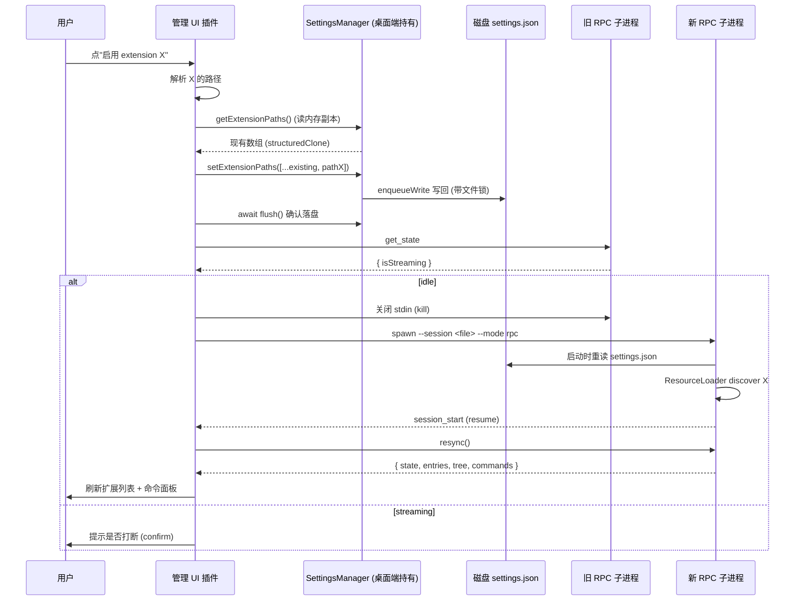

**图 8-1 — 管理端管底座 extension 的五步操作链路**

五步详解：1. **解析扩展路径**——从 `packages` 源解析或用户指定本地路径；2. **写 settings**——先 `getExtensionPaths()` 读现有数组（从内存副本读，第 2.6 节），再调 `setExtensionPaths`/`setProjectExtensionPaths` 把新路径加进 `extensions` 数组写回磁盘，走支柱②配置文件操作不走 RPC，`await flush()` 确保写盘完成；3. **判断 agent 状态**——`get_state` 查 `isStreaming`，idle 则重启、streaming 则等 settled 或提示用户（第 7 节状态机）；4. **重启子进程**——新进程从磁盘重读 settings（含新扩展路径），`ResourceLoader.reload` 重新 discover 加载该 extension；5. **resync 同步 UI**——`resync(rpcAdapter)` 并发发 `get_state` + `get_entries` + `get_tree` + `get_commands`，新扩展注册的工具/命令出现在命令面板里。

### 8.2 共享状态 + 重启消费者模式

这条链路揭示了一个架构模式：桌面端是"操作者"，底座子进程是"被操作对象"，磁盘配置文件是两者的共享状态。桌面端不直接调底座的 reload 方法（调不到），而是通过"改文件 + 重启进程"间接达成。

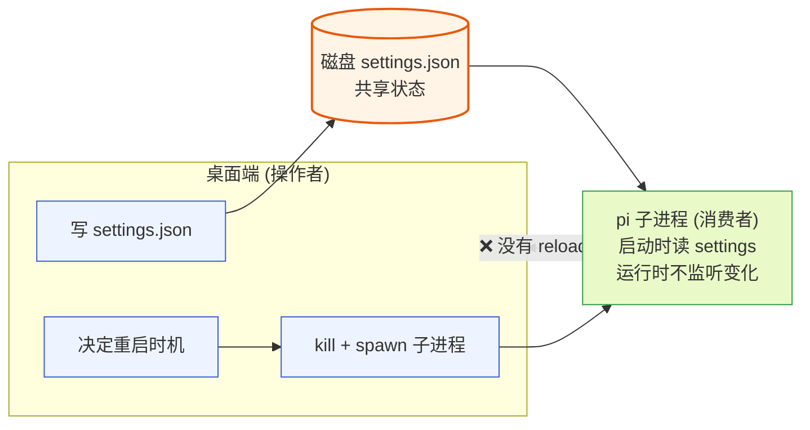

**图 8-2 — 共享状态 + 重启消费者模式**

这就是"管理 pi 自身"在 RPC 架构下的真实形态——没有 RPC 命令能一步到位，靠的是"写共享状态 + 重启消费者"。底座子进程是 settings.json 的消费者，但它在运行时不监听文件变化（第 5 节说过，pi 没有配置 file watcher），只在启动时读一次。所以改完文件必须重启进程，消费者才会重读。这个模式有很多现实类比：systemd 改了 unit 文件要 `daemon-reload` + 重启服务、Nginx 改了配置要 `nginx -s reload`、SSH 改了 sshd_config 要重启 sshd。共同点是"配置和运行态分离，生效需要显式动作"。pi 的特殊性在于它没暴露 reload 信号通道，所以只能用最重的"重启进程"方式。代价是重启那一瞬的运行态中断（第 7 节处理），收益是零改底座、确定性强、立即可用。

这个模式有个隐含约束：**桌面端和底座子进程对配置文件的理解必须一致**——schema 一致、字段语义一致、迁移规则一致、锁机制一致。这就是为什么桌面端不自己造一套配置 schema、而是直接复用底座的 `SettingsManager`（或照着它的实现写等价的 core 侧配置服务）——任何 schema 漂移都会导致"桌面写了底座读不懂"。

### 8.3 flush 的必要性

第 2 步写回磁盘后、第 3 步重启前，必须 `await settingsManager.flush()`。`flush()`（`settings-manager.ts:650`）就是 `await this.writeQueue`——`writeQueue` 是 Promise 链，`enqueueWrite` 把每个写操作串行化进链，`flush` 等 `writeQueue` resolve，即所有挂起的写都落盘了。不调 `flush` 直接重启的风险：新进程 spawn 时 `writeQueue` 里的写还没落盘，新进程读到旧文件，配置变更没生效——而桌面端以为生效了。这是"写共享状态 + 重启消费者"模式的固有陷阱：消费者读取的时机要晚于生产者写入完成的时机。`flush` 是这个时序保证。

**flush 与 fsync 的区别**要分清：`flush()` 只保证 Node 的 `writeFileSync` 已返回（内容进了操作系统内核缓冲），**不**保证物理磁盘已落盘（那需要 `fsync`）。对于桌面端场景，`writeFileSync` 返回后内核会尽快刷盘，而新进程 spawn 到它真正读 `settings.json` 之间有几毫秒到几百毫秒的间隔（进程启动、jiti 加载等），远长于内核刷盘周期——所以实践中 `flush()` 后直接 spawn 不会读到"内核里还没刷的半截文件"。`writeFileSync` 本身是同步阻塞调用、写完整文件后才返回，不存在"写一半"的撕裂态（文件锁又保证了并发不撕裂）。所以桌面端只需 `await flush()`、无需额外 `fsync`。唯一的极端边界是进程在 `writeFileSync` 返回后、内核刷盘前断电——这种场景下可能丢最近一次写，但 `writeFileSync` 保证文件要么是旧完整内容、要么是新完整内容（原子性由文件锁 + 整文件写保证），不会出现解析失败的撕裂态。这条边界在桌面端可接受（断电是极端故障，重启后用户重做一次配置即可），不值得为它引入 `fsync` 的同步开销。

**多字段批量改的 flush 时机**：用户一次操作可能改多个字段（如同时改 `defaultModel` 和 `extensions`）。每个 setter 都各自 `enqueueWrite` 一个写任务到 `writeQueue`，它们串行执行——第一次写读磁盘、合并 `defaultModel`、写回；第二次写再读磁盘（此时已是含新 `defaultModel` 的内容）、合并 `extensions`、写回。两次写都正确（每次基于最新磁盘内容做字段级合并）。批量改完调一次 `await flush()` 等整条队列清空即可，不需要每个 setter 后 flush。这也是 setter 设计成"不立即触发 reload、只 enqueue 写"的好处——允许批量攒改动、一次性 flush + 一次重启，而非改一个重启一次。

### 8.4 统一列表两路分发

UI 上这一切呈现为一个统一的扩展列表。用户看到的只是"有哪些扩展、哪些开着"，不区分某个扩展是底座 extension 还是桌面 UI 插件。但架构上，背后分两个来源、走两条链路：

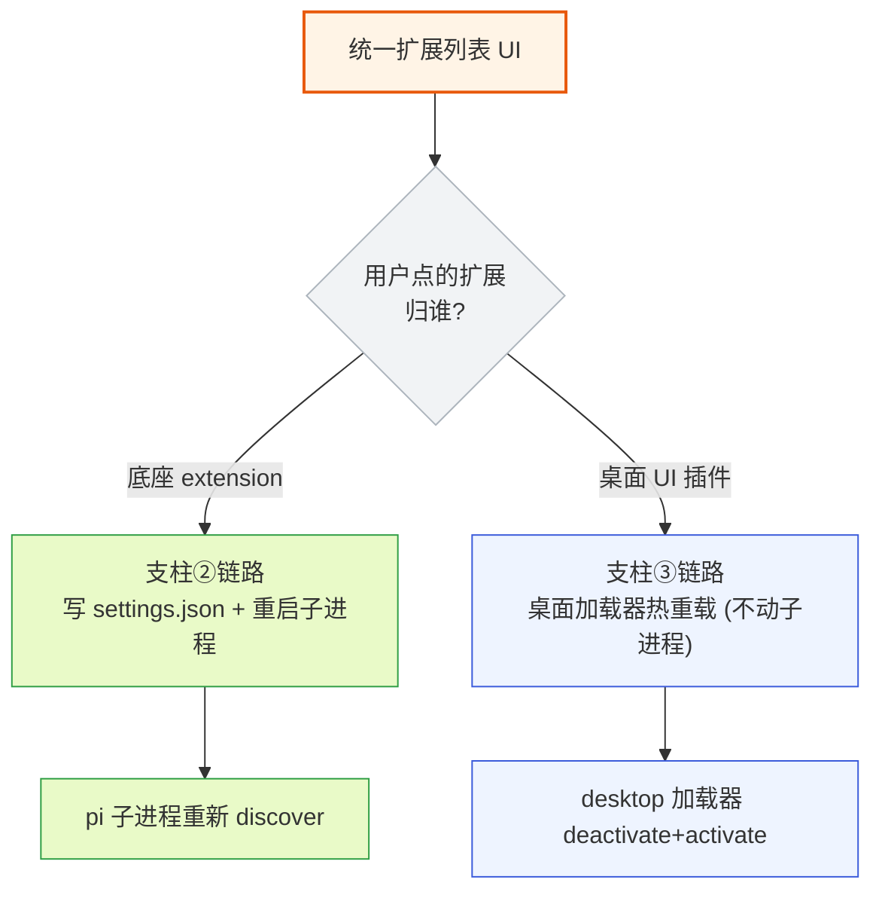

**图 8-3 — 统一列表两路分发**

- **底座 extension** → 走支柱②链路（写 settings + 重启子进程）。扩展代码在底座进程里跑、贡献工具/命令/flag，桌面端通过 RPC 观察其效果。
- **桌面 UI 插件** → 走支柱③链路（桌面加载器热重载，不动子进程）。插件代码在桌面 worker/renderer 里跑、贡献 UI 组件。

桌面端在管理 UI 里负责正确地分发：用户启停一个扩展时，先判断它归哪路（看它的来源——是 pi extension（在 `packages`/`extensions` 字段里，或 `~/.pi/agent/extensions/` 目录下）还是 desktop plugin（在 `~/.pi/desktop/plugins/` 目录下，或有 `plugin.json` manifest）），再走对应链路。判断错误会导致"点了启用但没生效"——这是第 1.3 节说的分路混淆错误。这个"统一列表、两路分发"的设计呼应了核心边界：桌面插件只管桌面 UI 不碰底座行为，底座 extension 走底座自己的加载机制。用户不必关心归谁管，桌面端在管理 UI 里负责正确地分发。

## 9 文件锁协调

### 9.1 为什么需要文件锁

桌面端和底座子进程都读写同一份 `settings.json`/`trust.json`：桌面端在管理 UI 里改配置写回、底座子进程在 reload/保存（extension 通过 `pi.settings` 改）时也写。两个进程并发写同一个文件，不加锁会撕裂——A 写一半、B 也写一半，文件内容是两份的拼接、JSON 解析失败。pi 用 `proper-lockfile` 做文件锁协调。

### 9.2 FileSettingsStorage 的锁机制

`FileSettingsStorage.acquireLockSyncWithRetry`（`settings-manager.ts:199`）：

```typescript
private acquireLockSyncWithRetry(path: string): () => void {
    const maxAttempts = 10;
    const delayMs = 20;
    let lastError: unknown;
    for (let attempt = 1; attempt <= maxAttempts; attempt++) {
        try {
            return lockfile.lockSync(path, { realpath: false });
        } catch (error) {
            const code = typeof error === "object" && error !== null && "code" in error
                ? String((error as { code?: unknown }).code)
                : undefined;
            if (code !== "ELOCKED" || attempt === maxAttempts) {
                throw error;
            }
            lastError = error;
            const start = Date.now();
            while (Date.now() - start < delayMs) {
                // 同步 sleep，避免把调用方改成 async
            }
        }
    }
    throw (lastError as Error) ?? new Error("Failed to acquire settings lock");
}
```

要点：**同步锁**——用 `lockfile.lockSync` 不是 async，因为 `withLock` 签名是同步的，调用方（`save`/`saveProjectSettings`）也是同步的，同步 sleep（忙等 `while (Date.now() - start < delayMs)`）是为了不把整条调用链改成 async。**重试 10 次、每次等 20ms**——锁被占（`ELOCKED`）时重试，最多 10 次（共 ~200ms），超过仍失败抛错。这个窗口对"两个进程偶尔并发"够用，对"长时间持锁"不够——但 settings 写操作都是瞬时持锁（读、改、写、释放），不会长持。**`realpath: false`**——不解析符号链接的真实路径，直接锁给定路径，避免符号链接导致锁路径不一致。**返回 release 函数**——`lockfile.lockSync` 返回一个 release 回调，`withLock` 在 `finally` 里调它释放。

`ELOCKED` 是 proper-lockfile 的"已被锁定"错误码，只有这种情况才重试；其他错误（权限 `EACCES`、路径不存在 `ENOENT`、磁盘满 `ENOSPC`）直接抛——这些不是临时竞争、重试也没用。200ms 的总等待上限是经验值：正常情况下 settings.json 持锁时间很短（读写几 KB JSON 是毫秒级），200ms 足够覆盖正常竞争。

**桌面端调用位置的约束**：这套同步忙等（`while (Date.now() - start < delayMs) {}`）最多阻塞事件循环 200ms，在底座 CLI 进程里没问题（Node CLI 本来就同步），但**不能在 Electron main 进程直接调用**——main 进程阻塞 200ms 会卡住整个 UI 和 IPC，用户会感觉到明显卡顿。桌面端 core 侧若复用 `FileSettingsStorage` 的锁机制，有两个处置：① 在 **utility/worker 进程**里执行配置写操作（隔离事件循环，不卡 main），这是推荐路径——配置写本就应由 application 层在 worker 里编排，不进 main 的渲染关键路径；② 若必须在 main 调用，改写为异步锁（`lockfile.lock` 异步版 + `await`），接受调用链改 async 的代价。`ProjectTrustStore` 的 `getEntry` 是同步方法、被 `SettingsManager.loadFromStorage` 同步调用——这条同步链若进桌面端，同样要落到 worker 进程。建议桌面端配置操作统一在 worker/utility 进程执行，main 只负责把结果转发给 renderer。

### 9.3 withLock 的写时加锁

`withLock`（`settings-manager.ts:226`）加锁策略是"按需加锁"：

```typescript
withLock(scope: SettingsScope, fn: (current: string | undefined) => string | undefined): void {
    const path = scope === "global" ? this.globalSettingsPath : this.projectSettingsPath;
    const dir = dirname(path);
    let release: (() => void) | undefined;
    try {
        const fileExists = existsSync(path);
        if (fileExists) {
            release = this.acquireLockSyncWithRetry(path);  // 文件存在才锁
        }
        const current = fileExists ? readFileSync(path, "utf-8") : undefined;
        const next = fn(current);
        if (next !== undefined) {
            if (!existsSync(dir)) {
                mkdirSync(dir, { recursive: true });
            }
            if (!release) {
                release = this.acquireLockSyncWithRetry(path);  // 要写但还没锁，补锁
            }
            writeFileSync(path, next, "utf-8");
        }
    } finally {
        if (release) release();
    }
}
```

- **读时若文件存在，先加锁再读**：保证读到的是一致状态（别人不会在锁内写一半）。
- **若 `fn` 返回 `undefined`（纯读、不写），不补锁、不写**：纯读操作只持锁读，读完释放。
- **若 `fn` 返回新内容（要写），确保有锁再写**：写时若还没锁（文件原本不存在），补一次锁再写。
- **`finally` 释放**：无论 fn 抛不抛错，锁都释放，不会死锁。

锁内执行读改写保证了"读-改-写"的原子性——别的进程在这期间拿不到锁、改不了文件。

### 9.4 persistScopedSettings 的嵌套合并

`persistScopedSettings`（`settings-manager.ts:578`）在 `withLock` 内执行实际的"读-改-写"：

```typescript
private persistScopedSettings(scope, snapshotSettings, modifiedFields, modifiedNestedFields): void {
    this.storage.withLock(scope, (current) => {
        const currentFileSettings = current
            ? SettingsManager.migrateSettings(JSON.parse(current) as Record<string, unknown>)
            : {};
        const mergedSettings: Settings = { ...currentFileSettings };
        for (const field of modifiedFields) {
            const value = snapshotSettings[field];
            if (modifiedNestedFields.has(field) && typeof value === "object" && value !== null) {
                const nestedModified = modifiedNestedFields.get(field)!;
                const baseNested = (currentFileSettings[field] as Record<string, unknown>) ?? {};
                const inMemoryNested = value as Record<string, unknown>;
                const mergedNested = { ...baseNested };
                for (const nestedKey of nestedModified) {
                    mergedNested[nestedKey] = inMemoryNested[nestedKey];
                }
                (mergedSettings as Record<string, unknown>)[field] = mergedNested;
            } else {
                (mergedSettings as Record<string, unknown>)[field] = value;
            }
        }
        return JSON.stringify(mergedSettings, null, 2);
    });
}
```

关键设计点：1. **读磁盘当前值**（不是用内存里的 `this.globalSettings`）——因为磁盘文件可能被别的进程（底座子进程）改过，内存里的 globalSettings 可能不是最新，以磁盘为准；2. **嵌套字段精确合并**——改 `compaction.enabled` 时只覆盖 `enabled` 子字段，保留 `reserveTokens`/`keepRecentTokens`，这是 `modifiedNestedFields` 的作用；3. **migration**——写回前对读出的磁盘内容跑一遍 `migrateSettings`，确保写回的是新格式；4. **只写 modified 字段**——`mergedSettings` 以磁盘内容打底，只覆盖 modified 字段，其他字段保持磁盘值。这保证桌面端改 `defaultModel` 时不会顺带把底座刚写入的 `lastChangelogVersion` 覆盖掉。这种"读-改-写"的精确合并，配合文件锁，保证桌面端和底座同时改不同字段时不互相踩——这是"共享状态并发写"的正确处理方式。

### 9.5 writeQueue 进程内写队列

`SettingsManager` 不只有文件锁，还有进程内的写队列 `writeQueue`（`settings-manager.ts:286`）。文件锁解决跨进程并发，写队列解决进程内并发——多个 setter 可能连续被调用，每个都 enqueue 一个写任务，写队列串行化它们：

```typescript
private enqueueWrite(scope: SettingsScope, task: () => void): void {
    this.writeQueue = this.writeQueue
        .then(() => {
            if (scope === "project") {
                this.assertProjectTrustedForWrite();  // 写前再断言信任（可能在排队期间被撤销）
            }
            task();
            this.clearModifiedScope(scope);
        })
        .catch((error) => {
            this.recordError(scope, error);
        });
}
```

三个意义：1. **串行化写**——避免多个 setter 并发写同一个文件导致内容错乱；2. **排队期间再检查信任**——项目级写任务在真正执行前再断言一次信任，这是信任门控的第三道防线（前两道是 loadFromStorage 和 setter 的 assertProjectTrustedForWrite）；3. **错误隔离**——单个写任务失败只 record error，不影响后续写任务，`.catch` 吞掉错误、不断链。`flush()`（`settings-manager.ts:650`）返回 `writeQueue` 的 Promise，调用方可以 `await settingsManager.flush()` 确保所有挂起的写都落盘。

### 9.6 trust.json 的锁与 file-locks.json 兜底

`trust.json` 的锁机制和 settings 同源——`withTrustFileLock`（`trust-manager.ts:145`）用 `lockfile.lockSync(trustDir, { realpath: false, lockfilePath: ${path}.lock })`。注意它锁的是**目录**（`trustDir = dirname(path)`），锁文件路径显式指定为 `${path}.lock`。重试逻辑同 `acquireLockSyncWithRetry`，10 次、忙等。桌面端读写 trust 时走 `ProjectTrustStore` 的方法，它们内部走 `withTrustFileLock`，桌面端不直接碰锁。`trust.json` 有自己独立的文件锁，和 `settings.json` 的锁不共用——意味着 settings 和 trust 是两把独立的锁，不会因为锁 settings 卡住 trust 的读写。**为何 trust 锁目录而非锁文件**：`withTrustFileLock` 锁的是 `trustDir = dirname(path)`（trust.json 所在目录）、锁文件路径放在 `${path}.lock`，而 settings 锁的是文件本身。差异是底座历史实现：trust 这把锁同时保护 `trust.json` 与同目录下可能存在的其它信任态衍生文件（如缓存/索引），故把整个目录纳入锁范围；settings 只需保护单个 `settings.json` 文件、锁文件即可。两者都是 `proper-lockfile` 的进程级锁、重试参数一致（10 次、20ms 忙等），只是锁粒度不同，不是抄错。实现者照搬即可，无需统一。

`auth.json`（OAuth token、API key）和 MCP 配置文件各自有自己的读写协调机制——auth 走 `auth-storage.ts`、MCP 配置是独立文件。它们的共同点是：改完都要重启子进程生效（底座在启动时读这些文件）。当前 pi 没有一个统一的 `file-locks.json` 中心化锁注册表——各文件用各自的 `proper-lockfile` 锁、靠文件路径隔离，当前靠 `proper-lockfile` 的进程级锁已足够。

关于 `file-locks.json` 兜底机制，这里明确现状以避免实现者去找一个不存在的文件：**`~/.pi/agent/file-locks.json` 当前不存在、未实现**。文档曾把它定位为"当 `proper-lockfile` 的锁因进程崩溃残留时、用于诊断僵尸锁的兜底注册表"，这是**未来演进项**，当前无需实现、也无需读取。当前如果遇到锁残留（`ELOCKED` 持续失败），处置方式是：proper-lockfile 的锁文件（如 `settings.json.lock`）是进程级锁，进程正常退出会释放；若进程异常崩溃留下僵尸锁文件，由用户或运维手动清理 `.lock` 文件即可，不依赖任何中心化注册表。待未来若加中心化协调（如全局写队列、或跨文件的写顺序保证、或僵尸锁自动诊断），再引入 `file-locks.json` 并在此处补文档。当前实现者不要去找、不要去读这个文件。

### 9.7 桌面端配置服务的锁对齐与可安全 import 的底座类白名单

桌面端 core 侧若自己实现配置读写（不复用底座的 `SettingsManager`，因为 `SettingsManager` 跑在底座进程里），必须用**同一套锁机制**——`proper-lockfile`、同样的锁路径、同样的重试参数。否则桌面端写的锁底座不认、底座写的锁桌面端不认，锁形同虚设。最稳妥的做法是桌面端 core 直接 import 底座的 `FileSettingsStorage` 类（它是纯 TS、无进程依赖），实例化时传相同的 `cwd`/`agentDir`——这样锁路径、锁行为完全一致。这也是"薄壳直接复用底座机制"的体现：配置读写是底座已有的能力，桌面端不重造。

**import 底座类与薄壳原则的调和**——DESIGN 0.2/1.1 把"同进程 import SDK"列为翻车根因，但桌面端 core 又要复用底座的 `FileSettingsStorage`/`ProjectTrustStore`/`SessionManager`，这两者看似矛盾，实则要区分两类 import：

- **被禁止的 import**：把底座的 **agent runtime** 娶进桌面进程——`AgentSession`、`ResourceLoader`、`ModelRegistry`、provider 调用、jiti 扩展加载、agent loop。这些是底座的核心运行时，import 进来会拉入 LLM 调用、工具执行、jiti 动态加载、扩展注册等重依赖，被迫造 Worker 进程池/sdk-loader——这正是 现有方案的问题的路。桌面端**绝不** import 这些。
- **可安全 import 的纯 TS 类白名单**：仅限"纯文件操作、无运行时/jiti/agent-loop 依赖"的类，经依赖图验证不含运行时重依赖。白名单如下：
  - `FileSettingsStorage`（`settings-manager.ts`）——只依赖 `proper-lockfile`、`fs`、`JSON`，纯文件读写 + 锁。安全。注意：`deepMergeSettings`/`migrateSettings` 虽同文件、虽是纯计算，但前者未 export、后者是 `private static`，**不在白名单内**，不可 import（见本节下文"不可 import"段及第 10.8 节同步缺口）。
  - `ProjectTrustStore`（`trust-manager.ts`）——只依赖 `proper-lockfile`、`fs`、`normalizeCwd`/`findNearestTrustEntry` 路径工具。安全。
  - ~~`SessionManager` 的 `listAll`~~——**移出白名单**。核对 `session-manager.ts` 顶部 import：它 runtime-import 了 `@earendil-works/pi-agent-core`（取 `uuidv7`）和 `@earendil-works/pi-ai`（type-only，运行时擦除）。虽然 `listAll` 本身只扫目录、读 `.jsonl` 头部、不碰 agent 运行时，但 `import { SessionManager }` 会把 `@earendil-works/pi-agent-core` 拖进 core 的依赖图——若该包拉入较重依赖，违背"不把 agent runtime 娶进来"。这与文档对 `SettingsManager` 的谨慎态度（保守起见只 import `FileSettingsStorage`）保持同等严格度。处置见第 10.3 节：桌面端 core **复刻 `listAll` 的纯文件读逻辑**（扫 `~/.pi/agent/sessions/` 下目录、读 `.jsonl` 文件头、复用底座的 `MAX_CONCURRENT_SESSION_INFO_LOADS = 10` 并发控制、复用 `SessionInfo` 类型定义——类型可 type-only import 不带运行时），不 import `SessionManager` 整类。`list_sessions` RPC 命令仍是首选解（第 10.3/10.6 节）。

  **注意：`McpConfigStore` 与 `AuthStatusQuery` 不在此白名单内**——它们是桌面 core 自建的类/接口，**不是**从底座 import 的纯 TS 类。`McpConfigStore` 定义在桌面 core 自己的 `application/config/mcp-config-store.ts`（见第 13.2 节路径），是桌面 core 自建、复用 `proper-lockfile` 与底座的锁路径约定（和 `FileSettingsStorage` 同源、同样的锁文件约定），但不属于"从底座 import 的类"。`AuthStatusQuery` 是桌面 core application/config 层定义的只读状态查询接口（见第 12.2 节），它查询凭证是否存在时调底座 `auth-storage.ts` 的等价查询能力（或经 RPC 的 OAuth 流查询）——底座 `auth-storage.ts` 是凭证读写的管理者（文件位于 `packages/coding-agent/src/core/auth-storage.ts`），但桌面端**不**假设底座有一个名为 `AuthStore` 的类可供 import；桌面端只通过 `AuthStatusQuery` 抽象触达凭证状态，实现者不要去底座找一个可能不存在的 `AuthStore` 类。

**关于 `SettingsManager` 的验证结论**：`SettingsManager` 内部调 `tryLoadFromStorage`（纯文件读）、`deepMergeSettings`（纯计算）、`migrateSettings`（纯计算），但它的 `save`/`reload` 路径里**不**调 `ResourceLoader`/`AgentSession`——`SettingsManager` 本身不拉 jiti。但它被 `ResourceLoader`/`AgentSession` 持有和调用，若桌面端 `import { SettingsManager }`，依赖图可能经类型/侧引拉入这些。**验证后的处置**：桌面端只 import `FileSettingsStorage`（最底层、确定无运行时依赖），在桌面端 core 自己包一层薄 `SettingsManager` 等价物（实现 `getGlobalSettings`/`setExtensionPaths`/`flush` 等本模块需要的方法），复用 `FileSettingsStorage` 做锁和文件 IO。

**`deepMergeSettings`/`migrateSettings` 不可 import——必须复制并登记同步缺口**。这是核对了源码后必须钉死的事实，避免实现者照"复用纯函数"去 import 而编译失败：

- `deepMergeSettings`（`settings-manager.ts`）是**模块级私有函数**——`function deepMergeSettings(...)` 没有 `export` 关键字，.d.ts 里完全不出现，外部模块**无法 import**。
- `migrateSettings` 是 `SettingsManager` 上的 `private static migrateSettings(settings)`——TS 层 `private`，外部 `SettingsManager.migrateSettings(...)` 调用会类型错误；即便运行时 JS 能调到，也意味着要把整个 `SettingsManager` 类 import 进来（又回到"依赖图可能拉入运行时重依赖"的问题），且依赖了 `private` 反射、不稳定。

因此桌面端 core 包的那层薄 `SettingsManager` 等价物里，**合并规则和迁移规则都要从底座源码逐行复制**——`deepMergeSettings` 体量小（约 20 行，对象一层浅合并）可直接抄；`migrateSettings` 是一条**版本演进的、非平凡的字段重命名链**（`queueMode→steeringMode`、`websockets:bool→transport`、`skills` 对象→数组、`retry.maxDelayMs→retry.provider.maxRetryDelayMs`，且随版本会继续加规则），桌面端复制的副本必须**随底座版本同步**，否则桌面端写回的配置可能用老格式、底座读时再迁一次，出现"桌面写了底座读不懂"的漂移——恰是第 14.1 节支柱②核心约束②警告的风险。

处置二选一：

- **(a) 向底座提 PR（推荐，治本）**：把 `deepMergeSettings` 改为 `export function`、把 `migrateSettings` 改为 `static`（去掉 `private`）或单独导出一个纯函数版本 `export function migrateSettings(...)`。底座合并后桌面端直接 `import { deepMergeSettings, migrateSettings }`，schema/合并/迁移规则与底座**源码级一致**、零漂移。这是消除漂移根因的演进项，登记在第 10 节缺口表。
- **(b) 不改底座（v1 默认，治标）**：桌面端 core 从底座源码**逐行复制** `deepMergeSettings` 和 `migrateSettings` 的实现进自己的 `settings-merge.ts`/`settings-migrate.ts`，并在 CI 加一个"底座版本升级时 diff 这两个函数"的检查脚本（比对 `node_modules/@earendil-works/pi-coding-agent/dist/core/settings-manager.js` 里的实现与桌面端副本）。**必须登记一个"迁移规则同步"运维缺口**：每次升级底座版本时，人工或脚本核对 `migrateSettings` 是否新增了迁移规则、桌面端副本是否同步更新——这条缺口列在第 10.8 节。

当前 v1 走 (b)。实现者注意：文档早期版本曾写"复用 `deepMergeSettings`/`migrateSettings`（这俩是纯函数、可安全 import）"——**此说法作废**，照那句话写会编译失败。正确做法是复制 + 同步缺口。`FileSettingsStorage` 的锁和文件 IO 仍走 import（它在白名单内、确实可安全 import）。

这条划分把"薄壳不把 SDK 娶进自己进程"细化成"不把 agent runtime 娶进来"，而非"不 import 任何底座代码"。配置文件操作的纯 TS 类是底座已验证无重依赖的能力，桌面端复用它们不违反薄壳——它们就是"读写配置文件"这个机制本身，桌面端不重造。

## 10 RPC 缺口与演进

### 10.1 两个已知缺口

支柱②目前有两个 RPC 缺口——底座内部有能力、RPC 没开口子：

1. **reload 缺口**：底座有 `AgentSession.reload()`/`ResourceLoader.reload()`/`SettingsManager.reload()` 三个 reload，但 RPC 31 个命令里没有 reload。桌面端没法通过 RPC 让底座 reload，只能重启子进程（第 7 节）。
2. **list_sessions 缺口**：底座 `SessionManager.listAll()`（`session-manager.ts:1564`）能列出所有项目目录下的全部 session，返回 `SessionInfo[]`（DESIGN 1.7.4）。但 RPC 31 个命令里没有 `list_sessions`。桌面端的会话列表（DESIGN 4.6）没法通过 RPC 拿全量 session 列表。

需要把"缺口"和"不在 RPC 职责内"在此处也钉死，避免实现者在本节缺口清单里找不到 `list_extensions`/`enable_extension`/`read_settings`/`set_setting` 而误判为遗漏。这四类"管理 pi 自身"的命令**不作为 RPC 缺口登记**——它们的目的（列出/启停扩展、读写配置值）由支柱②直接读写配置文件即可覆盖，本就不该走 RPC（第 1.2 节已详述）：扩展启停就是改 `settings.json` 的 `extensions` 数组（第 6 节）、读配置就是 `SettingsManager` 的 getter、写配置就是 setter。它们不是"底座内部有能力但 RPC 没开口子"，而是"本就不该走 RPC"。只有"需要底座运行时配合"的 `reload`（要让进程内 reload 生效）和 `list_sessions`（要扫底座管理的 session 目录、且 `SessionManager` 是底座类）才是真正的 RPC 缺口，登记在本节。这条边界说清后，实现者不会到本节去找一个本就不该存在的 `read_settings` 缺口。

这两个缺口记在 DESIGN.md 第六节的演进项里，当前都有兜底处置。

### 10.2 reload 缺口的当前处置

当前处置是重启 RPC 子进程（第 7 节）。代价是：streaming 时要打断或等待、当前 turn 丢失、重启有几百 ms 的不可用窗口。对于"改配置"这种低频操作可接受，但对于"频繁改配置调试"的场景（如开发扩展时反复改 settings）体验差。

演进项是**底座补 reload RPC 命令**。补上后，桌面端走无重启热加载：

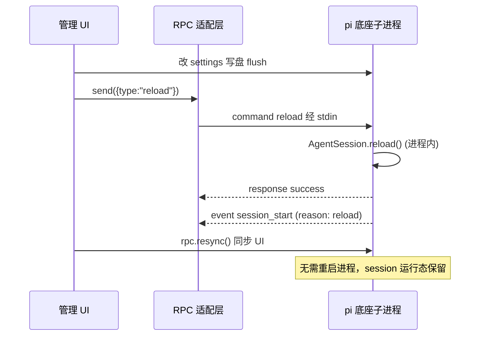

**图 10-1 — 演进项：底座补 reload RPC 命令后，无重启热加载**

reload 命令补上后，`streaming` 时也能 reload（底座内部 reload 是协作式的——发 `session_shutdown` 让 extension 清理、再 `session_start`），但打断 streaming 的代价仍在（agent 当前的 turn 会被 session_shutdown 中断）。所以即使补了 reload 命令，第 7 节的"streaming 时提示用户"决策仍有意义——只是从"重启进程"变成"发 reload 命令"，代价从"丢 turn + 重启开销"降到"丢 turn"。

### 10.3 list_sessions 缺口的当前处置

当前处置（DESIGN 4.6 会话管理插件）是：桌面端不通过 RPC 拿 session 列表，而是**直接读磁盘**——`SessionManager.listAll()` 的逻辑是纯文件操作（扫 `~/.pi/agent/sessions/` 下的目录、读 `.jsonl` 文件头），不依赖底座进程运行时状态。但 `SessionManager` 类本身 runtime-import 了 `@earendil-works/pi-agent-core`（取 `uuidv7`，见 `session-manager.ts` 顶部 import），**已移出第 9.7 节白名单**——桌面端 core **不复刻整个 `SessionManager` 类、也不 import 它**，而是**复刻 `listAll` 的纯文件读逻辑**进 core 自己的 `application/config/session-list-reader.ts`：扫 `~/.pi/agent/sessions/` 下目录、逐个 `.jsonl` 文件读 header（第一行 JSON、`type: "session"` 的 `SessionHeader`）、复用底座的并发控制常量 `MAX_CONCURRENT_SESSION_INFO_LOADS = 10`、复用 `SessionInfo` 类型定义（type-only import 不带运行时依赖）。这不违反"薄壳不接管底座内部事务"——因为复刻的只是纯文件读逻辑、不涉及底座运行时状态，桌面端读磁盘和底座读磁盘是一致的。这与第 9.7 节对 `SettingsManager` 的谨慎态度对齐：宁可复刻一段纯文件读逻辑，也不把可能拖入重依赖的底座类整类 import。

`listAll` 还支持进度回调（`onProgress?: (loaded, total) => void`，`session-manager.ts:703`），因为扫描大量 session 文件、逐个解析 header 是 IO 密集操作；复刻版要保留同样的进度回调能力，否则桌面端面对几百个 session 时 UI 会卡住等全量返回。`SessionInfo` 的 `modified` 字段是 session 内最后一条 user/assistant 消息的时间戳（优先用消息时间戳、fallback 到 header 时间、再 fallback 到文件 mtime），这让"最近会话"排序更准确——复刻版要照同一优先级实现，否则排序结果和底座不一致。

但这条路的限制：桌面端复刻的 `listAll` 是**底座源码的副本**，底座改了 `listAll` 实现（如改 header 解析、改并发数、改 `modified` 优先级）时桌面端无感知——这是一个"逻辑同步"运维缺口，和第 10.8 节的迁移规则同步缺口同类。CI 应加脚本 diff 底座 `session-manager.js` 里的 `listAll` 与桌面端副本。完全解耦的演进项是底座补 `list_sessions` RPC 命令——桌面端通过 RPC 拿列表、不维护副本。

### 10.4 缺口的处置原则

两个缺口的处置遵循同一原则：**底座内部有能力但 RPC 没开口子的，桌面端先用"副作用等价"的方式兜底，演进项是补 RPC 命令**。reload 缺口：副作用等价 = 重启子进程（新进程重读磁盘 = reload）。list_sessions 缺口：副作用等价 = 桌面端直接读磁盘（listAll 是纯文件读）。兜底方式都有代价（reload 要重启、list_sessions 要 import 底座类），但都可用。演进项补 RPC 命令是"消除代价"的优化，不是"补能力缺失"——能力一直有，只是通道没开。这个区分很重要：它决定了桌面端不会因为缺口的存在而功能残缺，只是实现路径不那么优雅。

### 10.5 reload 命令的预期契约

预先钉死 reload RPC 命令的预期契约，便于底座补上时桌面端无缝切换：

- 发送：`{ type: "reload", id }`
- 响应（成功）：`{ type: "response", command: "reload", success: true }`（reload 完成后发，**以 reload response success 为生效信号**）
- 响应（失败）：`{ ..., success: false, error: string }`（reload 过程中出错，如某个 extension 加载失败）
- 错误场景：reload 内部某个 extension factory 抛错 → success: false、error 含失败 extension 信息；但其他 extension 仍加载成功（错误隔离，DESIGN 3.5 第 5 项）
- 桌面端用法：发完 reload，等 response success，再 `resync(rpcAdapter)` 同步 UI。reload 期间底座会推 `session_shutdown`（reason: reload）event；`session_start`（reason: reload）event **不一定发**——按第 5.4 节实现，仅当有 extension 绑定时才发。因此契约**不依赖** `session_start` 必发：以 reload response success 为生效信号，`session_start` 作为可选附加事件（若收到，可用于提前刷新 extension 相关 UI）。若底座未来希望 `session_start` 成为可靠信号，需在 reload 路径补发（无 extension 绑定时也发），这是向底座提的契约改进项。

桌面端的"带判断的重启决策状态机"（7.2）在补 reload 命令后，把 `RestartNow` 状态的"kill + spawn"替换成"发 reload 命令"即可，其余状态机不变。这是状态机设计的远见——决策逻辑（streaming/idle 判断）和执行机制（重启/rload）解耦，切换执行机制不动决策逻辑。这也是洋葱架构"依赖倒置"的体现：桌面端 core 依赖"让配置生效"的抽象接口、不依赖"重启进程"的具体实现。

### 10.6 list_sessions 命令的预期契约

- 发送：`{ type: "list_sessions", id }`
- 响应（成功）：`{ type: "response", command: "list_sessions", success: true, data: { sessions: SessionInfo[] } }`
- 错误场景：sessions 目录不存在 → 返回空数组（success: true）；权限错误 → success: false
- 桌面端用法：会话管理插件（DESIGN 4.6）用它拿列表，替代直接 import `SessionManager.listAll()`。如果未来 RPC 补 `list_sessions`，应该也支持流式进度（底座边扫边推 event、桌面端渐进渲染列表），否则用户面对几百个 session 时 UI 会卡住等全量返回。

### 10.7 缺口不阻塞当前交付

这两个缺口都不阻塞 pi-desktop 的当前交付——兜底方式都可用、都经过验证（重启子进程是 RPC 架构的标准操作、直接读磁盘是纯文件操作）。缺口记在 DESIGN.md 第六节演进项里，等底座补 RPC 命令时切换。桌面端的实现要把"执行机制"做成可替换的（第 7.2 节状态机的 `RestartNow` 状态、DESIGN 4.6 的数据源抽象），让切换时改动最小——这是洋葱架构"依赖倒置"的体现：桌面端 core 依赖"让配置生效"的抽象接口、不依赖"重启进程"的具体实现，接口的实现从"重启"换成"reload 命令"时，调用方不动。这两个演进都是"底座补 RPC 命令"——属于支柱①的扩展，不动支柱②的配置文件操作职责。支柱②的"读写 settings/trust/auth/MCP 配置"不会因 reload RPC 的加入而消失——配置文件操作是状态管理、reload 是让状态生效，两者职责不同、长期共存。

### 10.8 源码副本同步缺口（deepMergeSettings / migrateSettings / listAll）

第 9.7 节和第 10.3 节处置（b) 路线都让桌面端 core 持有底座源码的**副本**而非 import——这些副本若不随底座版本同步，会出现"桌面端用老逻辑、底座行为新逻辑"的漂移。这是支柱②核心约束②（schema/锁/迁移/逻辑必须一致）的运维侧落地，必须登记为可跟踪的缺口，不能靠记忆。

**三个副本及同步要求**：

- **`deepMergeSettings` 副本**（`application/config/settings-merge.ts`）：从底座 `settings-manager.ts` 逐行复制。体量小、变动少（合并语义稳定），但仍需同步。漂移后果：桌面端合并出的 `this.settings` 和底座不一致，UI 显示与底座生效值不同。
- **`migrateSettings` 副本**（`application/config/settings-migrate.ts`）：从底座 `settings-manager.ts` 逐行复制。**这是漂移风险最高的一项**——迁移规则随版本演进，底座新增字段重命名/重组时，若桌面端副本没同步，桌面端写回的配置可能用老格式，底座读时再迁一次、或迁不出新格式，出现"桌面写了底座读不懂"——恰是第 14.1 节支柱②核心约束②警告的风险。
- **`listAll` 逻辑副本**（`application/config/session-list-reader.ts`）：从底座 `session-manager.ts` 的 `listAll` 复刻纯文件读逻辑。漂移后果：session 列表的 `modified` 排序、`messageCount`、header 解析和底座不一致，桌面端会话列表显示与底座实际不同步。

**同步机制（v1 兜底）**：CI 加一个脚本，每次升级底座版本（`@earendil-works/pi-coding-agent`）时 diff 三个目标——

1. `node_modules/@earendil-works/pi-coding-agent/dist/core/settings-manager.js` 里的 `deepMergeSettings` 函数体 vs 桌面端 `settings-merge.ts`。
2. 同文件的 `static migrateSettings` 方法体 vs 桌面端 `settings-migrate.ts`。
3. `node_modules/@earendil-works/pi-coding-agent/dist/core/session-manager.js` 里的 `listAll` 方法体 vs 桌面端 `session-list-reader.ts`。

diff 不一致则 CI 失败、要求人工核对并同步副本。这条同步是**运维侧防线**，不替代"演进项治本"。

**治本演进项（消除副本）**：

- `deepMergeSettings` / `migrateSettings`：向底座提 PR，`export function deepMergeSettings`、`migrateSettings` 改为 `static`（去 `private`）或单独 `export function migrateSettings`。底座合并后桌面端直接 import，零漂移。此 PR 属于"底座源码改动"，归 DESIGN.md 第六节演进项。
- `listAll` / `list_sessions`：底座补 `list_sessions` RPC 命令（第 10.6 节），桌面端经 RPC 拿列表、删掉 `session-list-reader.ts` 副本。

这三项演进完成后，本节缺口关闭、副本删除。当前 v1 接受副本 + CI 同步脚本的运维成本——这是"零改底座"决策的必然代价，记在 DESIGN.md 第六节。

## 11 桌面端配置操作层的设计落点

### 11.1 core 侧配置服务接口

把前面散落的点收成一个 core 侧配置服务接口，管理 UI 插件通过它操作底座配置。这个服务是中层（用例编排）、不是圆心——圆心是槽位契约：

```typescript
interface ConfigOpsService {
    // 读写 settings（复用底座 FileSettingsStorage 的能力）
    getSettings(): { global: Settings; project: Settings; merged: Settings };
    // 整字段设置（标量/数组）：整体替换该字段的值
    setGlobalField<K extends keyof Settings>(field: K, value: Settings[K]): Promise<void>;
    setProjectField<K extends keyof Settings>(field: K, value: Settings[K]): Promise<void>;
    // 嵌套子字段级设置（对齐 modifiedNestedFields，避免浅合并丢字段）
    // 用法：setGlobalNestedField("compaction", "enabled", false) 只覆盖 compaction.enabled、保留 reserveTokens
    setGlobalNestedField<K extends keyof Settings, NK extends string>(
        field: K, nestedKey: NK, value: unknown
    ): Promise<void>;
    setProjectNestedField<K extends keyof Settings, NK extends string>(
        field: K, nestedKey: NK, value: unknown
    ): Promise<void>;
    // 信任管理（复用 ProjectTrustStore）
    isProjectTrusted(): boolean;
    setProjectTrusted(trusted: boolean): Promise<void>;  // 内部 await trust store 写盘；仅覆盖 true/false 两态
    // 完整三态信任写入（对齐 ProjectTrustStore.setMany）：decision=null 表示"不再问但未给确定决策"
    // options.trustParent=true 表示同时把父目录置为信任源（cwd 决策置 null 继承父目录），见 3.2"信任父目录" UX
    // v1 若不做"信任父目录"，该接口可只实现 decision ∈ {true,false} 分支、trustParent 留 P2；但接口形态先定好避免后续破坏性改动
    setProjectTrust(decision: boolean | null, options?: { trustParent?: boolean }): Promise<void>;
    // 让配置在底座生效（7.2 状态机的入口）
    applyConfigChange(): Promise<void>;  // 内部走"判断 streaming → 重启/reload"
    // 会话列表（list_sessions 缺口的兜底）
    listSessions(): Promise<SessionInfo[]>;
    // 凭证管理（复用 AuthStatusQuery，见本文第 12 节）
    getAuthStatus(): Promise<AuthStatus>;            // 是否已登录、账号信息（不回明文 token）
    startLogin(provider: string): Promise<void>;    // 发起 OAuth（Electron 壳接管回调，见 12.3）
    clearAuth(): Promise<void>;                      // 登出：经 prompt("/logout <provider>") 让底座删凭证并立即生效（不重启子进程，见 12.4）
    // MCP 配置管理（复用 McpConfigStore，见本文第 13 节）
    getMcpConfig(): Promise<McpConfig>;             // 全部 server 列表
    setMcpServer(name: string, server: McpServerConfig, scope: "global" | "project"): Promise<void>;   // 增/改一个 server（整体覆盖该 name）
    setMcpServerEnabled(name: string, enabled: boolean, scope: "global" | "project"): Promise<void>;  // 精确改某 server 的 enabled，不整体替换
    removeMcpServer(name: string, scope: "global" | "project"): Promise<void>;                       // 删一个 server
}
```

几个接口设计要点：

- **嵌套子字段级设置能力**：`setGlobalNestedField`/`setProjectNestedField` 是为对齐第 2.4/9.4 节强调的嵌套字段级合并语义而设。`setGlobalField("compaction", { enabled: false })` 这种整字段赋值会踩浅合并的坑（把 `reserveTokens`/`keepRecentTokens` 丢掉，因为 `persistScopedSettings` 的嵌套合并只对 `modifiedNestedFields` 里登记的子 key 精确覆盖）。`setGlobalNestedField("compaction", "enabled", false)` 内部走 `markModified("compaction", "enabled")` 嵌套字段级标记，`persistScopedSettings` 据此只覆盖 `enabled` 子字段、保留其它子字段。实现者照着 `setCompactionEnabled`/`setRetryEnabled` 等已有嵌套 setter 的写法实现这两个泛化方法即可。对不涉及嵌套的字段（标量/数组），调 `setGlobalField`；对 `compaction`/`retry`/`terminal`/`images`/`markdown`/`thinkingBudgets`/`warnings` 这类嵌套对象字段，调 `setGlobalNestedField`。
- **与第 9.7 节薄 `SettingsManager` 等价物的关系（双层不重复）**：`ConfigOpsService` 是对外编排层（用例），第 9.7 节要求桌面 core 包的那层薄 `SettingsManager` 等价物是底层读写层。`ConfigOpsService` 内部**持有并复用**该等价物（及其内部的 `FileSettingsStorage`）——`getSettings`/`set*`/`flush` 全部委托给它，`ConfigOpsService` 不另写一套 setter、不重复实现字段级合并写盘。即：`ConfigOpsService`（编排"读写 + 让配置生效"）→ 持有 → 薄 `SettingsManager` 等价物（读写 settings.json）+ `McpConfigStore`（读写 mcp.json）+ `ProjectTrustStore`（读写 trust.json）+ `AuthStatusQuery`（查 auth 状态），各底层类各管自己的文件、`ConfigOpsService` 只做编排和 `applyConfigChange` 状态机。
- **`setProjectTrusted` 异步签名**：返回 `Promise<void>` 而非同步 `void`，因为第 3.4 节完整链路第一步"写 trust.json（`ProjectTrustStore.set`）"是文件写操作（带 `proper-lockfile` 同步锁 + 写盘），需 `await` 确认落盘。接口内部 `await this.trustStore.set(cwd, trusted)` 写盘、再同步切本地 `SettingsManager` 视图（`setProjectTrusted` 的内存部分是同步的、写盘是异步的）。这样接口语义表达清楚：调用返回时 trust.json 已落盘、可安全进下一步重启。
- **`setProjectTrusted` vs `setProjectTrust`（三态/信任父目录）**：`setProjectTrusted(trusted: boolean)` 只覆盖 true/false 两态，对应第 3.4 节"运行时切换信任"的常见场景。但第 3.2 节描述的"信任父目录"UX 需要写 `decision: null`（当前目录"不再问但未给确定决策"）+ 同时置父目录为信任源——`boolean` 表达不了这个三态。故另设 `setProjectTrust(decision: boolean | null, options?: { trustParent?: boolean })`，对齐底座 `ProjectTrustStore.setMany` 的能力。**v1 若不做"信任父目录"UX（列为 P2 延后项，见 3.2/14.4）**，`setProjectTrust` 可先只实现 `decision ∈ {true, false}` 分支、`trustParent` 留 P2；但接口形态先定好，避免 P2 实现时破坏性改动调用方。实现者照 3.2 写信任 UI 时注意：v1 的 `setProjectTrusted` 只能驱动 true/false，"信任父目录"选项在 v1 不要出现在 UI 里（或标灰提示 P2），否则 UI 会调到一个 v1 未实现的 `trustParent` 分支。
- 这个接口的实现内部：`getSettings`/`set*` 复用底座 `FileSettingsStorage`（core import 底座的纯 TS 类，第 9.7 节白名单）、`isProjectTrusted`/`setProjectTrusted`/`setProjectTrust` 复用 `ProjectTrustStore`、`applyConfigChange` 走第 7 节状态机、`listSessions` 复用桌面 core 复刻的 `listAll` 纯文件读逻辑（第 10.3 节，`SessionManager` 已移出白名单、不 import 整类）、`getMcpConfig`/`setMcpServer`/`setMcpServerEnabled`/`removeMcpServer` 复用桌面 core 自建的 `McpConfigStore`（第 13.2 节）、`getAuthStatus`/`startLogin`/`clearAuth` 复用桌面 core 自建的 `AuthStatusQuery`（第 12.2 节）。管理 UI 插件通过 `PluginContext.configOps`（第 1.4 节钉死的字段名）拿到这个服务的引用。
- **MCP 启停的对外方法映射**：`setMcpServer(name, server, scope)` 用于增/改一个 server（整体覆盖该 name 的配置），`setMcpServerEnabled(name, enabled, scope)` 用于精确改某个 server 的 `enabled` 开关而不替换其它字段（内部调 `McpConfigStore.setServerEnabled`）。附录 A 行 1630 的"启用/禁用 MCP server"走 `setMcpServerEnabled`，而非 `setMcpServer`。MCP server 条目类型名统一为 `McpServerConfig`（与第 13.2 节 `McpConfigStore.read` 返回的 `McpServerConfig[]` 一致），不另造 `McpServerEntry`。

### 11.2 applyConfigChange 的状态机封装

`applyConfigChange()` 是 7.2 状态机的封装，管理 UI 插件改完配置后调它。内部流程：

```typescript
async applyConfigChange(): Promise<void> {
    await this.settingsManager.flush();  // 确保写盘
    const state = await this.rpcAdapter.getState();  // 复用这次 state，不重复调
    // isBusy 判定须与 7.2 CheckBusy 完全一致：三态任一命中都走提示用户分支
    const isBusy = state.isStreaming || state.isCompacting || (state.pendingMessageCount > 0);
    if (!isBusy) {
        await this.restartChild(state);  // 把已获取的 state 传下去复用 sessionFile
    } else {
        const confirmed = await this.promptUser(/* 忙态中是否打断，提示文案按 streaming/compacting/排队消息分别说明会丢什么 */);
        if (confirmed) {
            await this.restartChild(state);
        } else {
            this.pendingChanges = true;
            // 等 agent_settled，见 7.2 WaitSettled
        }
    }
}

private async restartChild(state: RpcSessionState): Promise<void> {
    const sessionFile = state.sessionFile;  // 复用 applyConfigChange 已获取的 state，避免重复 RPC 调用
    await this.rpcAdapter.stop();  // 关 stdin 触发底座 shutdown（RPC 文档 1.2.2），替代伪代码 killChild
    const args = [...this.baseArgs];
    if (sessionFile) args.push("--session", sessionFile);
    await this.rpcAdapter.start({ ...this.cachedStartOpts, args });  // start 内含 100ms 就绪窗口，替代 spawnChild+waitForReady
    // 就绪探测：start 返回后主动 get_state 确认底座可接受命令（7.2 ProbeReady）
    await this.probeReady();
    await resync(this.rpcAdapter);  // 共享原语，替代伪代码 this.rpc.resync()
}

private async probeReady(): Promise<void> {
    // 注意：不能用 `try { await getState(); return } catch { await sleep(50) }` 的朴素循环——
    // RpcClient.send 经 stdin.write 写进 OS 管道缓冲，进程未挂载 JSONL reader 时写不抛错、
    // 命令暂存缓冲，getState 会 await 到进程就绪响应或默认 30s 超时才 reject。
    // 第一次 await 就会阻塞循环体，5s deadline 永远不会在 await 中途触发。
    // 必须给每次 getState 传显式短超时（覆盖默认 30s），超时即 reject、再 sleep 重试。
    const deadline = Date.now() + 5000;  // 5s 总超时兜底
    while (Date.now() < deadline) {
        try {
            await this.rpcAdapter.getState({ timeout: 500 });  // per-call 短超时，见 7.6 RpcAdapter.send
            return;
        } catch {
            await sleep(50);  // 进程未就绪，短间隔重试
        }
    }
    throw new Error("底座子进程就绪超时（5s 内未响应 get_state）");
}
```

`promptUser` 走桌面端自己的 React 模态（**不走 Extension UI 子协议**，第 7.5 节已说明方向边界）。`pendingChanges` 攒着等 `agent_settled` event 触发 `restartChild`。这个封装让管理 UI 插件不必关心状态机细节——只调 `applyConfigChange`，内部处理所有判断和时序。补 reload RPC 命令后，`restartChild` 的实现替换成"发 reload 命令"（`await this.rpcAdapter.send({ type: "reload" })` + `await resync(this.rpcAdapter)`），调用方（`applyConfigChange`）不动——这是依赖倒置的好处。

注意上面的代码已对齐第 7.6 节钉死的方法映射：`killChild`→`rpcAdapter.stop()`、`spawnChild`→`rpcAdapter.start()`、`waitForReady`→`start` 内部就绪窗口 + `probeReady` 主动探测、`resync`→`resync(rpcAdapter)` 共享原语。`restartChild` 接收 `state` 参数复用 `sessionFile`，避免重复 `getState()` RPC 调用（原来伪代码里 `applyConfigChange` 和 `restartChild` 各调一次 `getState`，第二次可能拿到与第一次不同的状态）。此处 `isBusy` 判定须与第 7.2 节 CheckBusy 完全一致（`isStreaming || isCompacting || pendingMessageCount > 0`），漏判 `isCompacting` 或 `pendingMessageCount` 会在压缩上下文进行中或有排队消息时直接重启，丢失半压缩态/排队消息——正是 7.2 状态机要避免的。

### 11.3 与 RPC 适配层的协作

配置操作层（本模块）和 RPC 适配层（支柱①）在"重启子进程"这件事上协作：

- 配置操作层决定**何时**重启（第 7.2 节状态机）、传**什么参数**（`--session`/`--approve` 信任 override；flag 名是 `--approve`/`--no-approve`，底座无 `--trust`，见第 3.3/7.7 节）。
- RPC 适配层执行**如何**重启（`stop()` 关旧进程、`start(opts)` 起新进程、就绪窗口内置在 `start` 里、`resync(rpcAdapter)` 同步 UI）。

这个分工是"组装和调用应该分开"的体现：配置操作层组装重启决策、RPC 适配层执行进程操作。两层通过 `RpcStartOptions` 协作，配置操作层传 `{ ...cachedStartOpts, args }`、RPC 适配层落地 `start`。这样 RPC 适配层的进程管理逻辑（start/stop/send/event 转发）可独立演化、不被配置决策逻辑污染，配置决策逻辑也不被进程操作细节污染。

### 11.4 错误处理与可观测

配置操作的错误要能被 UI 感知：

- settings 加载错误：`SettingsManager.drainErrors()`（`settings-manager.ts:654`）返回 `SettingsError[]`（含 scope 和 error）。配置服务定期或每次操作后调 `drainErrors`，把错误推给管理 UI 显示"全局配置解析失败：xxx"。
- 写盘错误：`enqueueWrite` 的 `.catch` 记进 `errors`，同样 `drainErrors` 出来。
- 重启错误：`start` 失败、进程立即退出、就绪探测超时——RPC 适配层抛错，配置操作层捕获后推给 UI 显示"重启底座失败：xxx，请检查 cliPath"。
- extension 加载错误：新进程起来后，`ResourceLoader` 的 `extensionsResult.errors` 含失败 extension——但这在底座进程内部、桌面端看不到。演进项是底座 reload 命令的 response 带上 extension 加载错误（10.5）。

可观测性是"管理 pi"的基础——用户改了配置、要能看到"生效了"还是"出错了"。配置服务要把每一步的状态反馈给 UI：写盘中 → 重启中 → 就绪 → 同步完成 / 出错。

**重启失败的可恢复性**——`applyConfigChange` 走到 `restartChild` 时可能失败，失败后的处置要钉死，避免"杀了旧进程、新进程没起来"的悬空态。三类失败及处置：

- **`stop()` 失败**（旧进程关不掉）：旧子进程可能已死（stdin 关了不退）或卡住。处置是 SIGTERM 兜底、再不行 SIGKILL，`RpcAdapter.stop` 内部按此降级（RPC 文档 1.2.2）。若仍失败，配置操作层捕获后回滚——把刚写的配置改动记进 `errors`、UI 提示"旧进程无法关闭，配置已写盘但未生效，请手动重启"，不继续 `start`。
- **`start()` 失败**（新进程起不来）：`cliPath` 错、端口冲突、env 缺失。此时旧进程已死、新进程没起来——这是最坏态，用户面对一个"没有底座"的桌面端。处置是配置操作层捕获 `start` 错误后，保留 `cachedStartOpts` 和错误原因，UI 进入"底座离线"态（状态栏红点 + 错误详情 + "重试启动"按钮）。重试时复用 `restartChild` 的后半段（`start` + `probeReady` + `resync`）。桌面端**不**自动无限重试——避免 cliPath 配错时刷屏日志，交给用户点"重试"或修配置后重试。
- **`probeReady` 超时**（新进程起了但 5s 内不响应 `get_state`）：底座可能卡在扩展加载（如某个扩展 factory 死循环）。处置同 `start` 失败——进"底座离线"态、保留错误、等用户处置。此时底座子进程还在但不健康，桌面端可提供"强制重启"（再走一次 stop+start）或"查看底座 stderr"（`rpcAdapter.getStderr()`，RPC 文档 11.1）辅助诊断。

这三类失败都要保证"配置改动不丢"——写盘的配置仍在磁盘上，下次成功启动时自然生效。配置服务内部用 `pendingChanges` 标志和 `errors` 队列跟踪状态，UI 据此决定显示"待生效"还是"已生效"还是"出错"。

## 12 auth.json 凭证管理

引言把 `auth.json`（OAuth token、API key 凭证）列为支柱②五项核心职责之一，但前面各节聚焦 settings.json 和 trust.json，凭证这一项必须单独展开——它和前两类配置有本质区别：凭证是**安全敏感数据**，读写权限边界比 settings/trust 严得多，且桌面端**无权直接读写明文凭证**。这一节钉死凭证管理的形态、边界、传输通道与 UI 链路。

### 12.1 凭证文件的位置与管理者

凭证文件在 `~/.pi/agent/auth.json`，由底座的 `auth-storage.ts`（`packages/coding-agent/src/core/auth-storage.ts`）统一管理。和 settings.json 一样落在 `agentDir` 下，但不经 `SettingsManager`——`auth-storage.ts` 是独立的 manager，有自己的读写接口、自己的存储格式（建议加密存储，向底座提）。桌面端管 auth 时调的是底座的 auth-storage 能力，**不是**自己 `require('fs')` 读 `auth.json`。

`auth.json` 的内容是各 provider 的凭证集合：OAuth token（含 access_token/refresh_token/expires_at）、API key（明文或加密后的密钥）、以及 provider 特有的 token 字段。结构上按 provider 名分组，每个 provider 一组凭证。这个文件的精确 schema 由底座 `auth-storage.ts` 定义、可能随版本演进，桌面端**不**依赖其内部结构——只通过受控 API 访问。

### 12.2 权限边界：桌面端不读明文凭证

这是凭证管理最重要的边界，反复强调：**插件（含管理 UI 插件）无权直接读明文凭证**。`PluginContext` 不暴露凭证读接口——插件要发 API 请求只能走 RPC（底座自动加 auth header）或 `http.fetch`（受 `net:` 权限白名单约束）。这条边界由架构保证：凭证文件读写不经过插件沙箱、而经过 application/config 层（受信任的 core 代码），插件只调 application 层暴露的受控 API。即便用户装了个恶意同名插件覆盖 management-ui，那个插件也只能走 application/config 层的受控 API、不能直接碰凭证文件。

桌面端 application/config 层对凭证只暴露**只读状态查询**——不读明文，只查"某个 provider 是否已配凭证"：

```typescript
interface AuthStatusQuery {
    // 查某 provider 是否已配置凭证（不返回凭证内容，只返回布尔）
    hasCredentials(provider: string): Promise<boolean>;
    // 列出已配置凭证的 provider 列表（只返回 provider 名，不返回 token/key）
    listConfiguredProviders(): Promise<string[]>;
}
```

`AuthStatusQuery` 在 application/config 层实现，内部调底座 `auth-storage.ts` 的等价查询能力（或经 RPC 的 OAuth 流查询）。它返回的永远是布尔或 provider 名列表，绝不返回 token/key 明文。**需要明确**：底座 `auth-storage.ts` 是凭证读写的管理者文件，但桌面端**不**假设底座有一个名为 `AuthStore` 的类可供 import——`AuthStatusQuery` 是桌面 core application/config 层定义的抽象，实现者不要去底座找一个 `AuthStore` 类。若后续验证 `auth-storage.ts` 暴露了纯 TS 的只读状态查询函数且依赖图干净，桌面端可复用之；否则走 RPC OAuth 流查询。模型选择插件（DESIGN 4.9）据此判断某个模型是否可用——`set_model` 失败回 `"No API key"` 时，UI 提示"该模型未配置凭证，请前往账户管理配置"，提供跳转入口（账户管理走底座 auth，不在模型参数插件职责）。

### 12.3 凭证写入的通道：OAuth 流与 API key 录入

凭证怎么写入 `auth.json`？两条通道，都**由底座主导、桌面端只翻译交互**：

1. **OAuth 流**（推荐，provider 支持时）：用户在管理 UI 点"登录 Anthropic/其他 provider"，桌面端发 `prompt("/login anthropic")`（底座斜杠命令透传，DESIGN 4.7 命令面板的透传路径）。底座 `session.prompt` 识别 `/login` 命令、启动 OAuth 流程——打开浏览器跳 provider 授权页、用户授权后回调拿 token、`auth-storage.ts` 写入 `auth.json`。OAuth 流程中底座可能通过 Extension UI 子协议发 `select`（选 provider）、`confirm`（确认授权）、`input`（输入授权码）请求——core main 的 gateway 翻译成 React 模态框（DESIGN 1.9.2），用户操作完回 response。这条路径**完全复用 Extension UI 子协议**，桌面端不特殊处理、不接触 token 明文。token 的获取和存储都在底座进程内完成，桌面端只翻译交互。

2. **API key 录入**（provider 不支持 OAuth 或用户偏好）：用户在管理 UI 的"账户管理"页输入 API key。这条路径桌面端**不能自己写 `auth.json`**（无权直接写凭证文件）——而是把 API key 通过受控通道交给底座 `auth-storage.ts` 写入。具体通道：① 走 RPC 的 OAuth 等价命令（若底座暴露 `set_api_key` 类命令），桌面端发命令、底座写盘；② 若底座无该命令，走 `prompt("/login <provider> --api-key <key>")` 透传，让底座处理录入。两条都保证 API key 明文只在底座进程内短暂停留、由底座加密落盘，桌面端不在内存里长期持有明文 key。这条约束是安全设计：桌面端 renderer/worker 进程可能被恶意插件窥探，凭证不进这些进程的内存能缩小攻击面。

**OAuth token 刷新**：token 过期时底座 `auth-storage.ts` 自动用 refresh_token 刷新（provider 支持）——这完全在底座进程内、对桌面端透明。桌面端只在收到"凭证失效"错误（如 401）时提示用户"凭证已过期，请重新登录"，跳到 OAuth 流。桌面端不参与刷新逻辑、不持有 refresh_token。

**OAuth 回调的 Electron 壳接管**：底座是 stdin/stdout 子进程，没有自己的浏览器窗口，OAuth 授权回调默认会试图打开系统默认浏览器并监听一个 loopback HTTP 端口（如 `http://localhost:PORT/callback`）接收 provider 重定向回来的授权码。在 CLI 场景下这没问题，但 pi-desktop 作为 Electron 应用，回调链路要明确由谁接管，避免两个进程都抢着监听同一端口或弹两个浏览器。处置是：**回调由桌面端 Electron 壳统一接管**，底座只负责发起 OAuth 请求并把 redirect_uri 传出去。具体落点分两步——① 桌面端在发起登录前，于 main 进程起一个临时 loopback HTTP 服务（`http.createServer`），监听一个动态分配的空闲端口，作为 OAuth redirect_uri；② 桌面端把 `redirect_uri` 经 `prompt("/login <provider>")` 的参数或受控通道告诉底座，底座据此发起授权请求、用 `shell.openExternal` 在系统默认浏览器打开 provider 授权页。用户在浏览器授权后，provider 重定向回 loopback 端口，桌面端 main 进程的临时 HTTP 服务接住回调、提取授权码、再经 stdin 把授权码回传给底座（或直接由桌面端把回调 URL 整体透传给底座解析）。底座拿到授权码后用自己的 client_secret 换 token、`auth-storage.ts` 写入 `auth.json`。整个流程里 token 明文只在底座进程内出现，桌面端 main 进程只搬运授权码（一次性、短时效），不持有 access_token/refresh_token。临时 HTTP 服务在回调完成后立即关闭、释放端口。这条链路要处理三种异常：用户在浏览器关掉授权页没回来（底座的 OAuth 流有超时兜底、桌面端 UI 也要有"取消登录"按钮）、端口被占用（动态选端口重试）、回调回来但授权码无效（透传给底座、底座报错经 Extension UI 反馈）。这条 OAuth 回调接管是凭证管理里唯一需要桌面端 main 进程深度参与的环节——除此之外桌面端只翻译交互、不碰凭证。

### 12.4 凭证改完如何生效

和 settings/trust 一样，凭证改完要让底座生效。但凭证的生效路径**不走"重启子进程"**——凭证在底座运行时是活跃使用的（每次 LLM 调用都加 auth header），`auth-storage.ts` 的写入对运行时立即可见。核对源码确认这条即时性：`AuthStorage` 构造时调 `reload()` 把 `auth.json` 读进 `this.data` 内存索引（`auth-storage.ts` 构造 → `reload()`）；`set(provider, credential)` / `remove(provider)` 都经 `persistProviderChange(provider, credential)`——该方法在文件锁内写盘后**同步** `this.reload()` 重读、再 `this.data = ...` 更新内存索引（`auth-storage.ts` 的 `persistProviderChange` / `set` / `remove`），故写盘完成时 `this.data` 已反映新凭证，下一次 `getApiKey()` 调用立即可见。所以：

- **新增/更新凭证**（OAuth 完成、API key 录入）：底座 `auth-storage.ts` 写入后立即生效，无需重启。下一次 `prompt` 调用就用新凭证。
- **删除凭证**（`/logout`）：同理立即生效——`logout(provider)` 调 `remove(provider)` → `persistProviderChange`，内存索引同步清空。
- **桌面端重启子进程时**：新进程从磁盘读 `auth.json`，凭证和重启前一致——这是共享状态的正常重读，不是"让凭证生效"的必需动作。

**口径统一（修正一处历史不一致）**：本节明确凭证改完立即生效、不重启子进程。附录 A 操作速查表"登录/登出账号"行的"生效方式"已同步改为"立即生效（底座 `auth-storage` 内存索引同步）"；`ConfigOpsService.clearAuth` 的注释已改为"登出：经 `prompt(/logout <provider>)` 让底座删凭证并立即生效（不重启子进程）"。实现者据此实现即可——登录/登出后**不要**多余地重启子进程。

**resync ≠ 重启**：登录/登出后，桌面端为刷新 `AuthStatusQuery` 的缓存（`listConfiguredProviders`/`hasCredentials` 的结果），可能需要重新查询凭证状态——这是"刷新桌面端缓存"，**不是**"让底座凭证生效"。`ConfigOpsService.getAuthStatus()` 内部直接查底座 `auth-storage` 的当前内存索引（或经 RPC 查），每次调用都是最新值，无需重启子进程。若桌面端 UI 缓存了旧 `AuthStatus`，登录/登出后调一次 `getAuthStatus` 刷新缓存即可。

唯一需要重启的场景是：凭证文件被外部改动（用户手编 `auth.json`），但桌面端不鼓励用户手编凭证文件（建议加密、结构私有），这种场景罕见。

### 12.5 凭证与导出/删除的隔离

凭证是安全敏感数据，桌面端的"数据导出"和"删除数据"功能对凭证有专门隔离（DESIGN 4.3 管理插件的数据与隐私页）：

- **导出不含凭证**：一键导出全部本地数据（session 列表、插件配置）时，**导出包不含 API key/OAuth token**——凭证由底座 auth-storage 管理、不进导出包。导出页明确提示"凭证（API key/OAuth token）不在此导出包内，请另行备份"。理由是导出包应可在不受控环境传播，含凭证会放大泄露风险。
- **删除不删凭证**：用户"删除全部桌面端数据"时，**不删 `auth.json`**——凭证归底座、桌面端无权删。用户要删凭证走底座自己的 `/logout` 命令。这与导出不含凭证对称：凭证的读写删除都归底座、桌面端不碰。

### 12.6 桌面端凭证管理的 UI 链路

把上述边界落成 UI 链路。管理 UI 的"账户管理"页（DESIGN 4.3 管理插件贡献）：

1. **展示已配置 provider 列表**：调 `AuthStatusQuery.listConfiguredProviders()`，渲染"已登录的 provider"列表（只显示 provider 名 + "已配置"状态，不显示 token/key）。
2. **登录入口**：每个 provider 一个"登录"按钮，点击发 `prompt("/login <provider>")` 触发 OAuth 流，Extension UI 子协议接管后续交互。
3. **API key 录入**：对不支持 OAuth 的 provider，提供"输入 API key"表单，提交走受控通道交给底座 `auth-storage.ts`。
4. **登出入口**：每个已登录 provider 一个"登出"按钮，发 `prompt("/logout <provider>")`，底座删凭证、立即生效。
5. **凭证状态提示**：模型选择时若 `set_model` 回 `"No API key"`，跳转到这里配凭证。

这条链路里，桌面端始终是"交互翻译者 + 状态展示者"，不持有明文凭证、不直接读写凭证文件。凭证的获取、存储、刷新、删除全在底座进程内，桌面端只经 Extension UI 子协议和受控查询 API 触达。

## 13 MCP 配置管理

引言把 MCP 配置列为支柱②五项核心职责的第四项。MCP（Model Context Protocol）是底座连外部工具服务器的协议——底座作为 MCP client，连接一组外部 MCP server（文件系统、数据库、搜索等工具服务），把这些 server 贡献的工具暴露给 agent。MCP 配置文件记录"连哪些 server、怎么连"，是 pi 自身持久化状态的一部分，归支柱②管。这一节钉死 MCP 配置的文件位置、schema、manager、桌面端编辑链路。

### 13.1 MCP 配置文件的位置与 schema

MCP 配置是 pi 在 `~/.pi/agent/` 下的独立状态文件（DESIGN 2.1.4），不在 `settings.json` 主结构里。文件位置：

- **全局级**：`~/.pi/agent/mcp.json`
- **项目级**：`<cwd>/.pi/mcp.json`（项目信任时加载，与 settings 同样的信任前置——不信任的项目其 `.pi/mcp.json` 被完全忽略，防止恶意项目注入恶意 MCP server）

MCP 文件的 schema：

```json
{
  "servers": [
    {
      "name": "filesystem",
      "transport": "stdio" | "sse" | "websocket",
      "command": "npx",
      "args": ["-y", "@modelcontextprotocol/server-filesystem", "/Users/user"],
      "env": { "FOO": "bar" },
      "enabled": true
    },
    {
      "name": "github",
      "transport": "sse",
      "url": "https://mcp.github.example/sse",
      "headers": { "Authorization": "Bearer xxx" },
      "enabled": true
    }
  ]
}
```

每个 server 项字段：`name`（唯一标识，agent 调用工具时用 `mcp__<server>__<tool>` 形式）、`transport`（`stdio` 启本地子进程、`sse`/`websocket` 连远程）、`command`/`args`/`env`（stdio transport 启子进程的命令）、`url`/`headers`（sse/websocket transport 连远程的地址和头）、`enabled`（是否启用，false 时该 server 不连接但配置保留）。`transport` 不同时字段集不同——stdio 用 `command`/`args`/`env`，远程用 `url`/`headers`。

和 `extensions` 数组不同，MCP server 有独立的 `enabled` 开关——这是因为 MCP server 是有状态的网络连接（连上要维持），启停一个 server 不应要求删配置（删了重装要重新输 command/url）。所以 MCP 配置的启停语义是 `enabled: true/false`，而非路径增删。

### 13.2 McpConfigStore 与受控 API

MCP 文件的精确路径**不**由管理 UI 插件自己拼接——路径解析、读写、信任门控封装在 application/config 层的 `McpConfigStore`（**桌面 core 自建类**，定义在 `application/config/mcp-config-store.ts`，复用 `proper-lockfile` 与底座的锁路径约定，但不是从底座 import 的类——见第 9.7 节白名单说明）：

```typescript
// application/config/mcp-config-store.ts（纯 TS，无运行时依赖，可安全 import）
class McpConfigStore {
    constructor(cwd: string, agentDir: string) { /* 同 FileSettingsStorage 算两条路径 */ }
    resolvePath(scope: "global" | "project"): string { /* 返回 mcp.json 路径 */ }
    read(scope?: "global" | "project"): { servers: McpServerConfig[] } {
        // 读全局 + 项目级（项目级需信任），合并（项目级 server 同名覆盖全局）
    }
    write(servers: McpServerConfig[], scope: "global" | "project"): Promise<void> {
        // 带 proper-lockfile 锁写盘，assertProjectTrustedForWrite（项目级）
    }
    setServerEnabled(name: string, enabled: boolean, scope: "global" | "project"): Promise<void> {
        // 精确改某个 server 的 enabled，不整体替换
    }
}
```

`McpConfigStore` 复用 `proper-lockfile` 的锁机制（和 `FileSettingsStorage` 同源、同样的锁路径约定），保证桌面端和底座并发写 `mcp.json` 不撕裂。项目级写同样受信任门控（`assertProjectTrustedForWrite`）。插件只调 `context.config.mcp.read()` 等受控 API、不直接 `require('fs')` 拼 `~/.pi/agent/mcp.json`——这样底座若调整文件名或存储方式，只改 application/config 层、不影响插件。

### 13.3 MCP 配置的合并语义

全局和项目级 `mcp.json` 的合并语义和 settings 的数组整体替换**不同**——MCP server 按 `name` 合并：项目级的 server 如果 `name` 和全局某 server 相同，项目级覆盖全局那一条；`name` 不同的，全局和项目级都保留。这是因为 MCP server 是按 name 寻址的（`mcp__<name>__<tool>`），同名 server 不可能同时连接两个，项目级覆盖全局是自然语义。桌面端 UI 呈现 MCP 管理页时要提示："项目级同名 server 会覆盖全局配置，不同名 server 会合并显示。"

启停（`enabled` 开关）的合并：项目级 server 的 `enabled` 覆盖全局同 name server 的 `enabled`。这允许用户在项目级禁用全局启用的某个 server（如某项目不想连 github MCP）。

### 13.4 MCP 改完如何生效

MCP 配置改完要让底座生效——和 settings 一样走"重启子进程"（第 7 节状态机）。底座启动时读 `mcp.json`，按 `servers` 列表连接启用的 MCP server（stdio 启子进程、sse/websocket 建连接）。运行时底座**不监听** `mcp.json` 变化（和 settings 一样无 file watcher），所以改完必须重启子进程。

桌面端改 MCP 配置的完整链路：

1. 用户在 MCP 管理页改 server 列表（增/删/启停/改配置）。
2. 调 `McpConfigStore.write(servers, scope)` 或 `setServerEnabled(name, enabled, scope)` 写回磁盘，`await flush()` 确认落盘。
3. 调 `applyConfigChange()`（第 11 节）走第 7 节状态机——判断 agent 是否 streaming、idle 则重启、streaming 则提示用户。
4. 新子进程启动，读 `mcp.json`，重新连接启用的 MCP server。
5. `resync(rpcAdapter)` 同步 UI——新 MCP server 贡献的工具通过 `get_commands` 出现在命令面板（工具名形如 `mcp__filesystem__read_file`）。

注意 MCP server 的连接是网络/子进程操作，重启后建立连接有延迟——stdio server 启子进程较快、sse/websocket 要握手。桌面端 resync 后 `get_commands` 可能要等几秒才出现新 MCP 工具（底座异步连接 server、连上后才注册工具）。UI 上可提示"MCP server 连接中"。

**三种 transport 的连接生命周期差异**，桌面端 UI 要据此给出不同的就绪反馈：

- **stdio transport**：底座 spawn 一个子进程（按 `command`/`args`/`env`），通过该子进程的 stdin/stdout 收发 MCP 协议消息。连接就绪快——进程 spawn 完成、MCP 初始化握手（`initialize` 请求/响应）成功即注册工具。失败模式：`command` 不存在（`ENOENT`）、子进程启动后立即退出、握手超时。UI 上 stdio server 的状态从"连接中"到"已连接"通常在 1 秒内。
- **sse transport**：底座向 `url` 发起 HTTP 长连接（Server-Sent Events），先建立 HTTP 连接、再走 MCP 握手。失败模式：`url` 不可达（DNS/网络）、`headers` 鉴权失败（401/403）、握手超时。连接就绪比 stdio 慢，受网络 RTT 影响。UI 上可显示"正在连接远程 server"。
- **websocket transport**：底座向 `url` 发起 WebSocket 握手（含 `headers` 里的鉴权）。失败模式与 sse 类似，另加 WebSocket 协议升级失败。三种里建立最重、但建立后双向通信能力最强（MCP 协议支持双向通知）。

底座对每个 enabled server 独立建连、互不阻塞——一个 server 连不上不影响其它 server 的工具注册。失败的 server 进 `extensionsResult.errors` 等价路径（MCP 连接错误也会暴露给桌面端，演进项是 reload/list response 带上 MCP 连接错误列表）。桌面端 MCP 管理页据此显示每个 server 的连接状态（已连接/连接中/失败+原因），而非一个笼统的"已生效"。这比扩展管理页（扩展要么加载成功要么失败、无连接态）更复杂，所以 MCP 管理页的状态展示要单独设计——不能复用扩展启停的"开关"交互，而要给每个 server 一个"连接状态指示器"。

### 13.5 MCP 配置的信任安全

项目级 `mcp.json` 和项目级 settings 一样受信任门控——不信任的项目其 `.pi/mcp.json` 被完全忽略（`McpConfigStore.read` 在 `projectTrusted=false` 时返回空项目级配置）。这是防恶意项目注入恶意 MCP server：MCP server 能贡献任意工具给 agent（工具可读写文件、执行命令），恶意 `.pi/mcp.json` 配一个指向攻击者服务器的 MCP server 会让 agent 调用攻击者控制的工具。信任门控在解析前拒绝，是和 settings/trust 一致的第一道防线。

UI 上 MCP 管理页编辑项目级配置时，同样要先检查 `isProjectTrusted()`、不信任时禁用项目级编辑并提示用户先信任。

### 13.6 MCP 与扩展的区别

MCP server 和 pi extension 都能贡献工具给 agent，但两者机制完全不同，桌面端管理 UI 要分开展示：

- **pi extension**（第 6 节）：TS 模块，jiti 动态加载，跑在底座进程内，能订阅三十多种事件、注册命令/flag/renderer。管理方式是改 `settings.json` 的 `extensions`/`packages` 数组（路径增删）。
- **MCP server**：独立进程或远程服务，通过 MCP 协议（stdio/sse/websocket）连底座，只贡献工具（不订阅事件、不注册命令/flag/renderer）。管理方式是改 `mcp.json` 的 `servers` 列表（增删/启停）。

两者在管理 UI 上是分开的页（扩展管理页 vs MCP 管理页），因为它们的配置文件不同（`settings.json` vs `mcp.json`）、manager 不同（`SettingsManager` vs `McpConfigStore`）、启停语义不同（路径增删 vs `enabled` 开关）。用户看到的"工具列表"里两者贡献的工具混在一起（按工具名前缀区分：extension 工具无前缀或 extension 名前缀、MCP 工具有 `mcp__<server>__` 前缀），但管理操作分路。这呼应第 1.3 节的"统一列表、两路分发"——这里更进一步是"三路分发"（桌面插件走支柱③、pi extension 走 settings.json、MCP server 走 mcp.json）。

## 14 总结

### 14.1 支柱②的核心约束

支柱②的全部设计围绕三个核心约束：

1. **RPC 不暴露管理命令**：底座的 reload/list_sessions 是内部能力，RPC 没开口子。桌面端走"写共享状态 + 重启消费者"模式兜底。注意区分"缺口"（reload/list_sessions，底座内部有能力但 RPC 没开口）和"不在 RPC 职责内"（list_extensions/enable_extension/read_settings/set_setting，由支柱②读写文件直接覆盖、本就不该走 RPC）。
2. **配置文件是桌面端和底座的共享状态**：两边的 schema、锁机制、迁移规则必须一致。桌面端复用底座的纯 TS 类白名单（`FileSettingsStorage`/`ProjectTrustStore`，第 9.7 节）；`McpConfigStore`/`AuthStatusQuery` 是桌面 core 自建的类/接口、非底座 import，但复用 `proper-lockfile` 锁路径约定或底座 `auth-storage.ts` 能力，不重造、也不 import agent runtime 重依赖。**`deepMergeSettings`/`migrateSettings` 不在可 import 白名单内**（前者未 export、后者 `private static`），桌面端 core 从底座源码复制副本并靠 CI 同步脚本跟版本（第 10.8 节）；`SessionManager.listAll` 因 runtime 依赖 `@earendil-works/pi-agent-core` 也移出白名单、改为复刻纯文件读逻辑（第 9.7/10.3 节）。**这条约束的运维落地就是第 10.8 节的副本同步缺口**——schema/锁/迁移一致不是写一句"复用底座机制"就成立的，必须有同步机制保证桌面端副本和底座源码不漂移，否则"桌面写了底座读不懂"的漂移风险恰恰从这里渗入。
3. **热加载是显式的**：底座不 watch 配置目录，改完不会自动生效。桌面端要让改动生效，必须显式触发（重启子进程 / 演进项的 reload 命令）。例外是凭证（auth.json）——底座 `auth-storage.ts` 写入对运行时立即可见，无需重启。

### 14.2 守住边界的判据

实现时随时用这三条判据检查是否越界：

- 桌面端是否在调底座的内部方法？若调了 `AgentSession.reload()` 等内部方法，说明越界——应走 RPC 或重启子进程。
- 桌面端是否在重造底座已有的能力？若在写"自己的 settings 合并逻辑""自己的 session 列表读取"，说明越界——应复用底座的 `FileSettingsStorage`/`SessionManager.listAll`。
- 桌面端是否在用 watch 监听配置目录？若是，说明误解了热加载语义——底座不 watch 配置，桌面端也不该 watch 底座配置（桌面端只 watch 自己的插件目录，DESIGN 3.5 第 8 项）。
- 桌面端是否在直接读明文凭证？若是，说明越界——凭证由底座 auth-storage 管理，桌面端只查"是否已配置"、不读明文（第 12.2 节）。
- 桌面端是否在用 `killChild`/`spawnChild`/`waitForReady` 这些不存在的方法？若是，说明没对齐 RpcAdapter 接口——应调 `rpcAdapter.stop()`/`start()` + `resync(rpcAdapter)` 共享原语（第 7.6 节）。
- 桌面端是否在 main 进程同步忙等文件锁？若是，说明没遵守第 9.2 节的调用位置约束——锁操作要落 worker/utility 进程、或改异步，main 进程不允许 200ms 阻塞。
- 桌面端是否在 reload 契约里依赖 `session_start` event 必发？若是，说明没对齐第 10.5 节——reload response success 才是生效信号，`session_start` 仅在有 extension 绑定时可选发出。
- 桌面端是否在用 `setGlobalField("compaction", {...})` 整字段赋值改嵌套对象？若是，说明没对齐第 2.4/9.4 节的嵌套字段级合并语义——应改用 `setGlobalNestedField`，否则会丢同对象下未改的子字段。
- 桌面端是否在 spawn 后才反向询问信任决策？若是，说明没对齐第 3.3 节——信任决策须在 spawn 前由桌面端预先 resolve，写入 trust.json 共享状态或作为 `--approve`/`--no-approve` override 传下去（底座无 `--trust` flag，误传会被当未知 flag 吞掉、override 不生效）。
- 桌面端是否把 `file-locks.json` 当作现存文件去读取？若是，说明误解了第 9.6 节——它当前不存在、是未来演进项，僵尸锁靠手动清理 `.lock` 文件。

### 14.3 与其他支柱的衔接

- **支柱①**：提供重启子进程的进程操作能力（`RpcAdapter.stop`/`start`/`send`/`onEvent`，RPC 文档 11.1）、提供 `get_state` 判断 streaming 状态、提供 `resync(rpcAdapter)` 共享原语。配置操作层调它的能力、不自己管进程。
- **支柱③**：管理 UI 插件（扩展管理、配置编辑、项目信任、MCP 管理、账户管理）通过槽位挂载，调本模块的 `ConfigOpsService`/`McpConfigStore`/`AuthStatusQuery`。桌面插件自己的配置走支柱③的热重载、不走本模块。
- **支柱④**：内置的管理 UI 插件（DESIGN 4.3 基础管理 UI）是本模块能力的主要消费者，提供开箱即用的"管理 pi"面板（扩展管理页、配置编辑页、模型选择页、MCP 管理页、项目信任页、账户管理页）。

### 14.4 实现优先级与验证清单

把支柱②的落地切成三段优先级，给实现者一条可照着排期的路径，也便于验收时逐项核对：

**P0（最小可用闭环）**：settings 读写 + 扩展启停 + 重启生效。这是支柱②的脊柱，没有它用户改不了任何 pi 配置。实现内容：core 侧 import `FileSettingsStorage`（第 9.7 节白名单）+ 包一层薄 `SettingsManager` 等价物，**其中 `deepMergeSettings`/`migrateSettings` 从底座源码逐行复制进 `settings-merge.ts`/`settings-migrate.ts`（不可 import，第 9.7/10.8 节）**、并加 CI 同步脚本 diff 底座副本；`ConfigOpsService` 的 `getSettings`/`setGlobalField`/`setGlobalNestedField`/`applyConfigChange`、7.2 状态机的 idle/streaming 两分支（含 `probeReady` 显式短超时实现，第 11.2 节）、`resync` 共享原语、文件锁对齐。验收：用户在配置编辑页改 `defaultModel` → 重启子进程 → `get_state` 返回新模型；装一个本地扩展 → 重启后 `get_commands` 出现该扩展的命令。

**P1（信任与安全）**：项目信任前置 + 写入门控。这是多项目场景必须的，没有它不信任项目的 `.pi/settings.json` 会被读到内存、构成注入风险。实现内容：`ProjectTrustStore` 复用、`resolveProjectTrusted` 决策链在桌面端镜像、信任 UI（首次打开项目弹框、记住决策、信任父目录）、`assertProjectTrustedForWrite` 三道防线、`setProjectTrusted` 运行时切换。验收：不信任项目改项目级配置保存抛错；信任后项目级配置生效；撤销信任后项目级配置立即不可见。

**P2（凭证与 MCP）**：auth.json 凭证管理 + MCP 配置管理。这两块是支柱②职责清单的第 3、4 项，可延后但不可缺。实现内容：`AuthStatusQuery`/`McpConfigStore` 复用、OAuth 回调在 Electron 壳接管（loopback HTTP 服务，第 12.3 节）、`getAuthStatus`/`startLogin`/`clearAuth`、`getMcpConfig`/`setMcpServer`/`removeMcpServer`/`setMcpServerEnabled`、MCP 启停的 `enabled` 开关、敏感字段（token/env）最小可见。验收：登录后 `getAuthStatus` 返回已登录、`set_model` 不再报无凭证；增删一个 MCP server 重启后该 server 的工具出现/消失。

**贯穿全程的约束**：① 任何让配置生效的操作都经 `applyConfigChange`、不绕过状态机直接重启；② 任何写盘都 `await flush()` 后再重启；③ 任何凭证明文不进 renderer/插件进程内存；④ 任何底座内部能力缺口的兜底都登记在第 10 节、不假装能力存在。这四条是支柱②的验收红线，实现过程中随时用第 14.2 节的三条判据自查。

支柱②就这些。它不显眼——没有 RPC 那样复杂的协议、没有插件系统那样多的概念——但它是"桌面端能管理 pi"的根基。守住它的边界，薄壳就薄；守不住，现有方案的 Worker 进程池就是前车之鉴。

---

## 附录 A：操作速查表

| 操作 | 数据落点 | 生效方式 | 涉及方法 |
|---|---|---|---|
| 改默认模型 | `~/.pi/agent/settings.json` `defaultModel` | 重启子进程 | `setDefaultModel` |
| 装本地扩展（全局） | `~/.pi/agent/settings.json` `extensions[]` | 重启子进程 | `setExtensionPaths` |
| 装本地扩展（项目） | `<cwd>/.pi/settings.json` `extensions[]` | 重启子进程 | `setProjectExtensionPaths`（需信任） |
| 装 npm 扩展包 | `settings.json` `packages[]` | 重启子进程 | `setPackages` |
| 改队列模式（持久） | `settings.json` `steeringMode` | 重启子进程 | `setSteeringMode` |
| 改队列模式（运行时） | 无（只影响当前 session） | RPC 立即 | `set_steering_mode` RPC 命令 |
| 信任项目 | `~/.pi/agent/trust.json` | 重启子进程 | `ProjectTrustStore.set` + `setProjectTrusted` |
| 撤销信任 | `~/.pi/agent/trust.json` | 重启子进程 | `ProjectTrustStore.set(cwd, false)` + `setProjectTrusted(false)` |
| 改压缩策略 | `settings.json` `compaction` | 重启子进程 | `setCompactionEnabled` |
| 改代理 | `settings.json` `httpProxy` | 重启子进程 | `setHttpProxy` |
| 改桌面插件配置 | `~/.pi/desktop/plugins-data/{id}/config.json` | 支柱③热重载 | `PluginContext.config.set` |
| 登录/登出账号 | `~/.pi/agent/auth.json` | 立即生效（底座 `auth-storage` 内存索引同步，不重启子进程，见 12.4） | `ConfigOpsService.startLogin`/`clearAuth` |
| 增删 MCP server | `~/.pi/agent/mcp.json` 或 `<cwd>/.pi/mcp.json` | 重启子进程 | `ConfigOpsService.setMcpServer`/`removeMcpServer` |
| 启用/禁用 MCP server | `mcp.json` `servers[name].enabled` | 重启子进程 | `ConfigOpsService.setMcpServerEnabled` |

## 附录 B：配置文件清单

| 文件 | 路径 | 作用 | 锁机制 |
|---|---|---|---|
| 全局 settings | `~/.pi/agent/settings.json` | 全局 pi 配置 | `proper-lockfile`，`${path}.lock` |
| 项目 settings | `<cwd>/.pi/settings.json` | 项目级配置（需信任） | 同上 |
| 信任记录 | `~/.pi/agent/trust.json` | 项目信任决策 | 独立 `proper-lockfile`，`${path}.lock` |
| 凭证 | `~/.pi/agent/auth.json` | OAuth token / API key（按 provider 分组，权限 0600） | 底座 `auth-storage.ts`（桌面端经 `AuthStatusQuery` 抽象触达，不直接 import）+ `proper-lockfile` |
| session 文件 | `~/.pi/agent/sessions/<encoded-cwd>/{ts}_{id}.jsonl` | 会话历史（append-only） | 无锁（单进程写） |
| 模型注册表 | `~/.pi/agent/models.json` | 可用模型列表 | 无锁（只读） |
| MCP 配置（全局） | `~/.pi/agent/mcp.json` | MCP server 列表 | `McpConfigStore` + `proper-lockfile` |
| MCP 配置（项目） | `<cwd>/.pi/mcp.json` | 项目级 MCP server（需信任） | 同上 |
| 桌面插件数据 | `~/.pi/desktop/plugins-data/{id}/config.json` | 桌面插件配置 | 支柱③加载器管 |

## 附录 C：三个 reload 速查

| reload | 位置 | 职责 | 触发方式 |
|---|---|---|---|
| `SettingsManager.reload` | `settings-manager.ts:479` | 重读 settings.json（全局+项目级），deepMerge | 上层调、reload 前先 `await writeQueue` |
| `ResourceLoader.reload` | `resource-loader.ts:338` | discover/load 扩展/skill/prompt/theme，含信任两阶段 | 上层调、内部调 `settingsManager.reload` |
| `AgentSession.reload` | `agent-session.ts:2544` | 重绑 runtime、发 session_start(reload)、刷新工具注册 | extension 的 `ctx.reload()`、桌面端调不到（无 RPC） |

## 附录 D：术语对照

本模块反复出现几组易混术语，集中对照以便实现者对齐心智模型。这些术语的混淆往往不是定义不清，而是同一概念在不同语境（底座内部语义 vs 桌面端落地语境、core vs pi、运行时控制 vs 状态管理）下用了不同说法，实现者照着本文写代码时若把它们对错号，会在该走重启的地方去调 reload、该走 RPC 的地方去写文件、该用 ConfigOpsService 的地方去用 PluginContext.config，最终表现为\"改了配置但不生效\"或\"点了启用但工具没出现\"。下表的\"易混点\"列专门指出每一组术语最容易在哪个语境上踩错，对照排查问题时优先看那一列。术语的权威定义仍以前文各节为准，本附录只是快速索引，不引入新概念。

| 术语 | 含义 | 易混点 |
|---|---|---|
| 底座 / pi | pi CLI 子进程及其全部内部机制（agent loop、工具执行、session 管理、扩展加载） | 不要和 core（pi-desktop 自己的核心层）混淆：core 是壳、pi 是被管理对象 |
| core | pi-desktop 这个桌面壳里"四根支柱"的实现代码，跑在 Electron 进程 | 不要和 pi 的核心混淆 |
| 支柱② | 配置操作通道：读写 `~/.pi` 配置文件 + 重启子进程让配置生效 | 和支柱①（RPC 运行时控制）是两条独立通道，不要混用 |
| 重启子进程 vs reload | 重启=杀旧子进程起新进程（桌面端唯一可做的生效手段）；reload=底座进程内 `AgentSession.reload()`（桌面端调不到） | 文中"reload"在描述底座内部语义时指后者，在桌面端落地语境一律替换为"重启子进程" |
| ConfigOpsService vs PluginContext.config | 前者管 pi 自身状态（settings/trust/auth/MCP，走重启）；后者管桌面插件偏好（走支柱③热重载） | 两个不同对象，不是别名 |
| extension vs 桌面插件 vs MCP server | extension=pi 进程内 TS 模块（走 settings.json 的 extensions）；桌面插件=pi-desktop 的 UI 插件（走 plugins-data）；MCP server=外部进程/连接（走 mcp.json） | 三类能力来源，配置文件、生效机制、启停语义都不同 |
| 信任门控三道防线 | 第一道 loadFromStorage 加载门控（3.1）、第二道 assertProjectTrustedForWrite 写入门控（3.5）、第三道 enqueueWrite 写前再断言（3.5/9.5） | ResourceLoader 两阶段（3.6）是独立的扩展加载期信任闸，不纳入这三道编号 |
| RpcAdapter vs PluginContext.rpc | RpcAdapter=core 内部进程管理接口（start/stop/send/event/waitForIdle）；PluginContext.rpc=插件侧 31 命令便捷方法集（经 worker→main 转发到 RpcAdapter） | resync 是共享原语，两者都能触发；进程管理只有 RpcAdapter 有 |
| cachedStartOpts | 首次 spawn 底座时缓存的 RpcStartOptions（cliPath/cwd/env/provider/model） | 重启时必须复用、只追加 --session，不能只传 args 丢掉 cwd/env（7.7/11.2） |
| isBusy | `isStreaming || isCompacting || pendingMessageCount > 0`（7.2 CheckBusy） | 不是只看 isStreaming；三态任一命中都走提示用户分支 |
| flush vs save | save=同步改内存+enqueueWrite 进写队列（不等落盘）；flush=await writeQueue 等所有挂起的写落盘 | setter 只调 save 不等落盘；重启子进程前必须 await flush，否则新进程读到旧文件（第 8.3 节） |
| 信任两阶段 vs 三道防线 | 两阶段=ResourceLoader 加载扩展时的 pre-trust/prod 两趟（第 3.6 节，独立信任闸）；三道防线=加载/写入/写前再断言的信任门控（第 3.1/3.5/9.5 节） | 两者是不同阶段的信任检查，不要把两阶段当成第四道防线塞进编号 |

---

### 架构自检

- [x] 高内聚：本模块（支柱②配置操作）职责单一——读写 pi 配置文件 + 让配置在底座生效，边界清晰，不掺和 RPC 运行时控制（支柱①）也不掺和桌面插件加载（支柱③）。读写配置（settings/trust/auth/MCP）和让配置生效（重启决策）是同一职责的两个阶段，内聚于"管理 pi 自身状态"这个关注点。
- [x] 低耦合：桌面端通过磁盘配置文件（共享状态）和底座子进程协作，不直接调底座内部方法；配置文件 schema 是两者的唯一契约，底座怎么消费配置是底座的内部事务。桌面端持有自己的 `SettingsManager` 实例，和底座的 `SettingsManager` 实例通过文件系统协调（文件锁 + 字段级合并写），无内存共享。
- [x] 开闭原则：新增配置字段是扩展（Settings 接口加字段 + 对应 getter/setter + migration 规则），不改已有字段的合并/迁移/锁机制；演进项（reload/list_sessions RPC）是非破坏性升级，不改变支柱②的配置文件操作职责，重启决策状态机的"执行动作"可平滑替换为"发 reload 命令"。
- [x] 方案视角：解决根本问题（薄壳如何管理底座状态）而非打补丁——"改文件 + 重启子进程"是基于 RPC 架构固有约束（底座无配置 watcher、无 reload RPC）的系统性方案，对应"共享状态 + 重启消费者"的标准模式；重启决策状态机系统化处理了 streaming/idle/resume 三态，而非无脑重启；文件锁 + 字段级合并写系统化处理了并发写，而非靠运气。
