# 插件加载器模块文档

本文档是对 DESIGN.md 第 3 节"支柱③：desktop 插件系统本身"的工程化展开。支柱③是 pi-desktop 的心脏——它不是一组并列功能模块之一，而是 core 唯一的能力供给机制：所有功能（含界面文案、管理面板、时间线渲染、主题、i18n）都通过加载器注入、都往槽位上挂东西。core 自己极薄，只提供机制（RPC 适配 + 配置操作 + 加载器 + 槽位契约），内容全部是插件。本文照着能写代码的程度展开：插件抽象的物理形态、加载器的九项职责、双入口与 worker 桥接、PluginContext/RendererPluginContext 两个接口的钉死契约、权限模型、外部插件接入链路。

前置阅读：DESIGN.md §0（四根支柱的依赖层次）、§1（RPC 协议与事件流，是 PluginContext.rpc/events 的数据来源）、§2（配置操作与热加载，桌面插件配置的另一路）、§5.1.5（圆心类型纯度纪律——本文接口全部用圆心中性类型，不绑底座协议类型）。本文不重复这些内容，只在交叉点引用。

**本文的范围与深度**：本文只写"加载器这一层"——插件抽象的物理形态、九项加载职责、双入口与通道、两个上下文接口、权限模型、外部接入链路，以及让这些契约可落地、可测试、可诊断的工程细节。不写具体内置插件（时间线、管理面板、终端、主题等的设计见各模块文档）、不写底座 extension 内部机制（见 DESIGN.md §1/§2）、不写 shell 的 Electron 特定实现代码（只定义接口、实现由 shell 层提供）。每条契约都钉到"照着能写代码"的程度——接口签名、字段语义、错误码、时序、数据结构都给出，留白处显式标注为演进项而非含糊带过。

## 1 模块定位与边界

### 1.1 在四根支柱中的位置

四根支柱是从外到内的依赖层次，不是并列模块。支柱①（RPC 适配）和支柱②（配置操作）是 core 对接 pi 底座的两条通道；支柱③（插件加载器）是 core 唯一的能力供给机制；支柱④（内置默认插件）是随壳分发的一组插件。加载器的特殊之处在于：①②是被加载插件消费的"能力来源"，加载器本身只负责"把插件装上、挂到槽位、管它生命周期"，它不直接提供 RPC 能力或配置能力——那是 ①②的事。加载器把 ①②能力经 PluginContext 注入给插件，自己只持有机制（发现/合并/校验/依赖编排/生命周期/错误隔离/沙箱/槽位挂载/热重载，共九项，见 §5）。这九项是本文的核心交付，逐项钉到可落地、可测试、可诊断的程度。

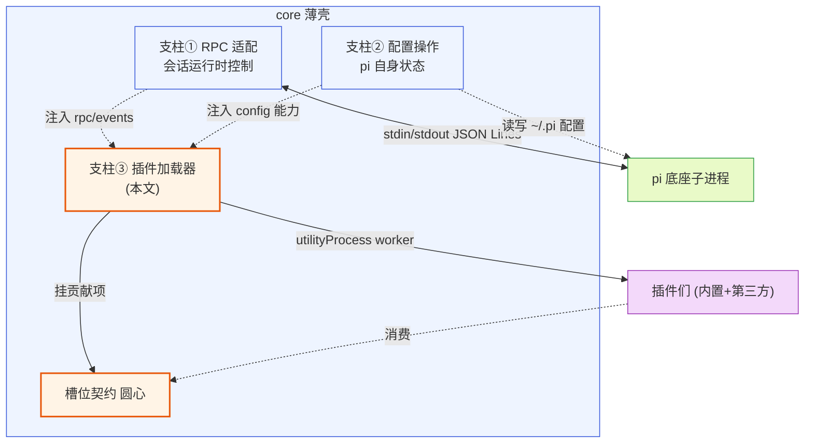

**图 1-1 — 加载器在四根支柱中的位置：机制圆心，把①②能力注入给插件，插件挂槽位**

### 1.2 与底座 extension 的关系

pi 底座本来就有一套完整的 extension 机制（TS 模块、factory 函数 `(pi: ExtensionAPI) => void`、jiti 动态加载、三十多种事件订阅、`discoverExtensionsInDir` 三处目录发现：项目级 `<cwd>/.pi/extensions/` → 全局 `~/.pi/agent/extensions/` → 显式配置）。这是一套能跑代码的插件机制，运行在底座子进程内部。pi-desktop 的加载器**不接管它**——底座 extension 的装/卸/启停走 DESIGN.md §2.5 那条链路（写 settings 路径列表 + 重启底座子进程，让底座自己重新加载）。桌面加载器管的只是"桌面插件"这一套，两者是两套独立体系、两个独立进程、两个独立目录：

- 底座 extension：跑在底座子进程里，发现目录是 `<cwd>/.pi/extensions/` 和 `~/.pi/agent/extensions/`，加载机制是底座的 `ResourceLoader`（`core/resource-loader.ts`）。
- 桌面插件：跑在 pi-desktop core 的 utilityProcess worker 里，发现目录是 `<cwd>/.pi/desktop/plugins/` 和 `~/.pi/desktop/plugins/`，加载机制是本文的加载器。

桌面插件和底座 extension 的关系是"消费而非翻译"（详见 §13.3）：底座 extension 在桌面上有 UI 需求时，不是给它配 adapter（现有方案的旧路），而是写一个桌面插件，通过 RPC 观察底座（`get_commands` 拿 extension 注册的命令、订阅 `tool_execution_*` 拿工具调用、订阅 `message_*` 拿消息流），自己决定怎么呈现。这条单向消费关系是本文 §13.3 的核心，也是消解 现有方案 adapter 层的根。

### 1.3 不做什么

加载器的边界和支柱①一致——只管机制、不掺和内容：

- **不内嵌任何功能性内容**：不内嵌文案常量（走 i18n 插件）、不内嵌管理页（走管理 UI 插件）、不内嵌时间线渲染逻辑（走渲染插件）、不内嵌默认配色（走主题插件）。加载器只提供让内容能被挂上来的槽位和加载它们的能力。
- **不接管底座 extension 加载**：那是底座子进程的内部事务，桌面端通过 RPC 触发、通过 event 观察，但不接管实现。两套体系、两个进程、两个目录，互不掺和。
- **不做"翻译层"**：不做 现有方案 那套把底座 TUI 渲染翻译成 Web 的事。底座 extension 的 `renderCall/renderResult` 返回的是 `@earendil-works/pi-tui` 的 Component，桌面端从来不吃它，也不翻译它。桌面插件和底座 extension 的关系是单向消费（§13.3），不是双向翻译。
- **不引入"可信/不可信"分级**：外部插件和内置插件走同一套加载器、同一沙箱、同一 permissions 授权。第三方插件不可信的风险靠沙箱挡，不靠信任分级。安全模型的分层防御总览见 §24。

## 2 插件抽象：manifest + 可选代码 + contribution

### 2.1 三部分组成

一个桌面插件由三部分组成：一份 manifest（`plugin.json`）、一段可选的代码模块、它声明的 UI 贡献项。三部分各有归属，关键设计在"可选代码"——这是吸取 现有方案 adapter 教训的核心。现有方案把 adapter 钉死成纯 JSON 声明，把"所有插件都降级成纯声明"当成唯一形态；pi-desktop 把纯声明当成默认形态之一，但代码模块是按需带的可选项——不是两套并列系统，是同一抽象的两种形态。这条区分是后面 §2.3"内容驱动"立论的前提。

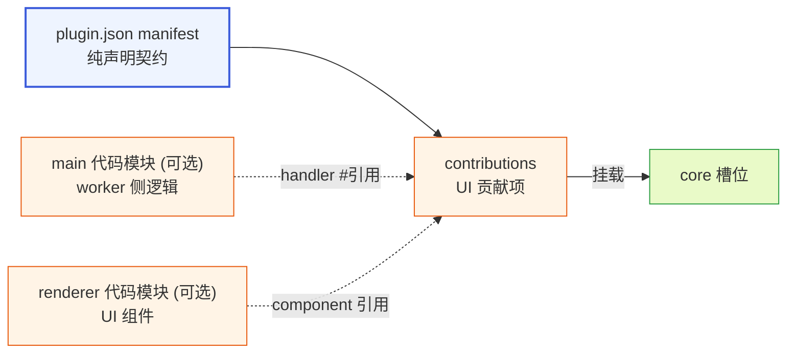

**图 2-1 — 插件三部分：manifest 声明契约，main/renderer 可选代码模块，contributions 引用并挂载到槽位**

### 2.2 manifest 契约

manifest 是插件和 core 之间的契约，纯声明。它写清楚这个插件叫什么、要贡献哪些 UI 贡献项、依赖哪些 core 能力、优先级如何。manifest 是静态的、可被校验的、可被审核的——一个不带代码模块的插件，manifest 就是它的全部，core 读完就知道怎么挂，不需要执行任何插件代码。这保证了"声明式插件"的简单和安全：声明式插件不需要沙箱、不需要加载代码、不依赖运行时，core 纯粹按 manifest 配置 UI。

完整字段结构：

```json
{
  "id": "session-manager",
  "version": "0.1.0",
  "displayName": "会话管理",
  "main": "./index.ts",
  "renderer": "./ui.ts",
  "permissions": ["fs:project:read", "net:api.github.com"],
  "contributes": {
    "sidePanel": [
      { "id": "sessions", "label": "会话", "icon": "messages-square", "component": "SessionsPanel" }
    ],
    "commands": [
      { "id": "session.new", "title": "新建会话", "keybinding": "cmd+n", "handler": "#onNewSession" }
    ],
    "settings": [
      { "id": "sessions", "title": "会话设置", "component": "SessionSettings" }
    ]
  },
  "author": "optional-author-id",
  "source": "npm:pi-desktop-session-manager",
  "homepage": "https://...",
  "dependsOn": ["timeline"]
}
```

字段语义：

- `id`（必填）：插件唯一标识，全局唯一，用于插件级覆盖判定（§5.2）。
- `version`（必填）：语义化版本。
- `displayName`（必填）：展示名，同时是 fallback 文案。core 渲染插件展示名时，先按固定 key `plugin.{id}.displayName` 去语言槽查当前 locale 的翻译，查到用翻译；查不到 fallback 到 `displayName` 字面值。所以字面值填什么有意义——没有翻译时的兜底显示。第三方插件只填字面值、不贡献翻译也正常工作。
- `main`（可选）：worker 侧代码模块入口（相对插件根目录）。插件根目录 = `plugin.json` 所在目录（本地手写插件）或 npm 包 `package.json` 的 `pi.desktop` 字段指向的目录（外部插件，§12.3）。省略表示该插件没有 worker 侧逻辑。导出 `activate`/`deactivate`。worker 侧代码模块可以是 `.ts`/`.tsx`/`.js`/`.mjs`，加载器经转译后执行（转译策略见 §4.4/§6.4）。
- `renderer`（可选）：renderer 侧 UI 模块入口。省略表示该插件用内置渲染器、不自带 UI 组件。导出按命名导出，每个导出名是一个组件（如 `SessionsPanel`）。renderer 侧代码模块支持 `.tsx`/`.ts`/`.js`，经预打包后挂载（转译策略见 §4.4）。
- `permissions`（可选）：声明本插件需要的额外权限，详见 §11。
- `contributes`（可选）：按槽位分组的贡献项数组。每个槽位的贡献项 schema 见 §3.2。贡献项里引用组件统一用 `component` 字段填 renderer 模块的导出名（如 `"SessionsPanel"`，**不带 `#` 前缀**）；引用 handler 用 `handler` 字段填 worker 模块的导出名（带 `#` 前缀，如 `"#onNewSession"`）——`#` 前缀表示"从本插件 worker 代码模块导出"。这样双入口就能定位到正确的侧：`component` 指向 renderer 模块（纯导出名，不带 `#`）、`handler` 指向 worker 模块（带 `#`）。`#` 前缀**仅用于 worker 侧 handler 引用**，renderer 侧组件引用一律不带 `#`。
- `author`、`source`、`homepage`（可选）：分发场景溯源与展示用。本地手写插件不填 `source`、来源标记是 `local`。
- `dependsOn`（可选，string[]）：声明本插件依赖哪些插件先加载/激活。值是插件 id 数组。加载器按依赖图拓扑排序 activate 顺序（§5.3.5）。**依赖判定按 id 不按版本**——只要任何来源有该 id 的插件生效，依赖就满足；插件级覆盖不影响依赖判定（覆盖后该 id 仍存在，是高优先级版本）。只有"该 id 完全没有任何版本生效"才算依赖缺失 → 本插件加载失败、标错、不拖垮整壳（§5.5）。**自引用非法**：`dependsOn` 不得包含本插件自身的 `id`（按 `id` 字面相等判定，不只是字面字符串 `"self"`）——例如 `id:"session-manager"` 的插件写 `dependsOn:["session-manager"]` 会被校验拒绝。

### 2.3 代码模块的两种形态与"内容驱动"

代码模块是插件需要动态行为时才带的。什么时候需要动态行为？侧栏 Tab 里放一个会实时刷新的 dashboard（要订阅 RPC event 流、要定时拉数据）、命令面板项点一下执行一段逻辑（要发 RPC 命令、要处理响应）、工具卡片要嵌入自定义渲染（要拿到 tool_execution 事件、要按自定义规则画）。这些光靠 manifest 声明做不到，必须跑代码。代码模块是一个 TS/JS 模块，worker 入口导出 `activate/deactivate` 生命周期函数，renderer 入口按命名导出 React 组件。core 在受控环境里加载它们（worker 走 utilityProcess，§6；renderer 走受限加载器，§4.3）。带不带代码模块，是插件作者按需选择的。

这里的关键设计纪律（呼应洋葱架构的"内容驱动 vs 类型戳 switch"）：**不带代码和带代码不是两套并列系统，是同一抽象的两种形态**。区别只在"这个插件带不带代码模块"，由这个内容事实涌现，不靠一个 `kind: "declarative" | "code"` 字段来标记。

为什么不要 `kind` 字段？`main` 字段的有无确实会让 core 走不同分支（有 `main` 就加载代码、起 worker、调 activate；没有就纯按 manifest 挂贡献项）。这看起来像 if-else，但和反对 `kind` 字段不矛盾——`kind` 是纯类型戳：它本身不携带任何行为，只是让引擎拿它去 switch 分支，行为是引擎按戳查表得来的，戳和内容可以不一致（声明 `kind: "code"` 但根本没代码模块，或反过来）。`main` 是内容引用：它指向一段真实存在的代码模块文件，"有没有 main"等于"有没有这个文件"，是客观的内容事实，不是声明出来的标签。core 看 `main` 在不在，是在读内容（这个文件存在吗），不是在读一个声明出来的类型戳。换句话说，行为不是"core 按 kind 查表分发"出来的，而是"代码模块自己 activate 时注册出来的"——core 只决定要不要去加载那段真实代码。

落到贡献项处理上：每个贡献项要么引用内置渲染器（manifest 里直接声明用哪个内置的，比如 `"component": "builtin.markdown"`），要么引用插件代码模块导出的自定义渲染器（`"component": "MarkdownCard"`，纯导出名、不带 `#`）。core 统一查这个引用——引用内置的就不加载代码、引用自定义的就去找 renderer 代码模块、找不到或加载失败就降级到内置渲染器。这是内容驱动的降级，不是按 kind switch。引入 `kind` 字段会重蹈现有方案的覆辙：把"带不带代码"这个内容事实硬塞成声明戳，让戳和内容可能不一致，徒增复杂度。

`main` 和 `renderer` 的组合自然覆盖所有形态：

| main | renderer | 形态 | 说明 |
|---|---|---|---|
| 省略 | 省略 | 纯声明式 | 贡献项的 `component`/`handler` 引用内置实现，如 `"component": "builtin.markdown"` |
| 有 | 省略 | 单侧 worker | 只需要逻辑、用内置渲染器展示 |
| 省略 | 有 | 单侧 renderer | 只需要自定义 UI、逻辑很简单（如 cardRenderer，core 直接 props 喂数据） |
| 有 | 有 | 完整双入口 | 复杂插件，worker 加工数据、renderer 渲染、经 MessagePort 通信 |

### 2.4 槽位贡献的本质

UI 贡献项（contributions）是 manifest 里声明的、往 core 预定槽位挂的具体东西。这是"一个插件如何贡献桌面外观"这件事的统一表达。现有方案把它拆成 adapter（外观）和 extension（行为）两套并行概念，这里收成一份清单：contributions 是清单的项，每项指向一个槽位、带这个槽位需要的数据。带代码模块的插件，contributions 可以引用代码模块导出的渲染器/处理器；不带的，contributions 引用 core 内置的默认渲染器。

槽位是 core 暴露给插件的扩展点，直接借鉴 VSCode 的 contribution points，但只保留桌面端需要的。core 只认槽位契约、不认具体插件——这是洋葱架构的圆心：槽位契约是稳定的业务本质，具体插件是会变的外层内容。core 渲染某个区域时，去对应槽位查"当前有哪些贡献项"，按优先级合并后渲染，不关心贡献项来自哪个插件。槽位注册表的内部结构见 §26。

## 3 槽位契约

### 3.1 槽位清单

八个槽位（含语言槽和主题槽这两个"影响 core 自身渲染"的特殊槽）：

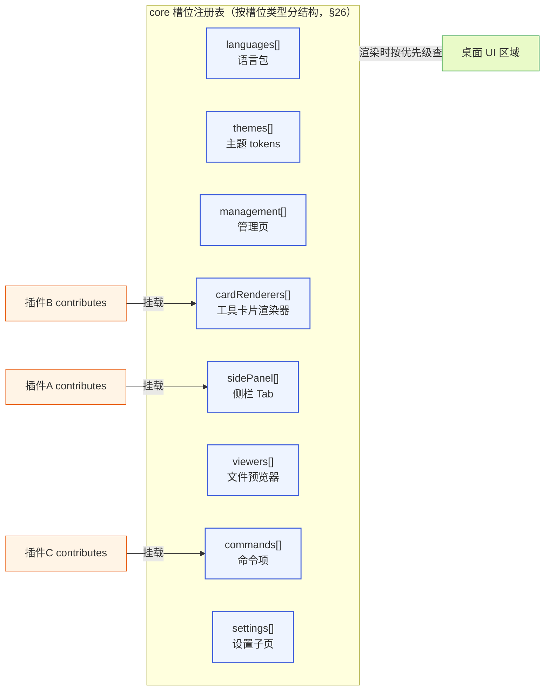

**图 3-1 — 槽位注册表：core 维护按槽位分的注册表，插件挂贡献项，渲染时按优先级查**

每个槽位有明确的输入和输出契约。语言槽和主题槽特殊——它们影响 core 自身渲染：core 渲染底座内容（时间线、工具卡片标签、系统提示）时用的文案和颜色全部从这两个槽位取，core 不内嵌任何文案常量、不内嵌任何视觉常量。这两个槽位的冲突仲裁也特殊（key 级合并，见 §5.7、合并细节见 §27）。其余六个槽位（management/cardRenderers/sidePanel/viewers/commands/settings）是"往桌面 UI 某区域挂内容"的常规扩展点，各自有贡献项 schema（§3.2）和组件 props 契约（§9.3/§9.4），走通用的二选一冲突仲裁。槽位清单是封闭集合——新增槽位是 core 的演进决策（要改圆心契约、不算插件可扩展项），但每个槽位的贡献项可被任意插件挂、挂多少不限。这条边界让"core 只提供机制、内容全是插件"在槽位这个扩展点上兑现：core 定义槽位形状、插件填内容。

### 3.2 贡献项 schema

各槽位贡献项的字段级 schema（插件作者照着写、加载器照着校验）。引用组件统一用 `component` 字段（renderer 模块导出名、不带 `#`），引用 worker 侧 handler 用 `handler` 字段（带 `#` 前缀）：

- **语言槽（languages）**：`{ id: string, locale: string, resources: Record<string, string> }`。`locale` 是 `"zh"`/`"en"` 等，`resources` 是 key→文案的映射，key 用 dot 分隔 namespace（对应 i18next 的 namespace 机制）。core 启动时把所有插件同 locale 的语言包贡献项的 resources 合并成一个 i18next 资源字典（按 namespace 聚合），渲染文案时 `i18n.t("timeline.toolExecuting")` 查。
- **主题槽（themes）**：`{ id: string, name: string, tokens: Record<string, string>, base?: string }`。`base` 是继承的父主题 id（主题可继承另一个主题只覆盖部分 token）。core 启动时按"当前主题 id"取该主题的 tokens，合并成圆心 `Theme` 对象。
- **管理槽（management）**：`{ id: string, title: string, component?: string, schema?: FormSchema, order?: number }`。`component` 引用 renderer 模块导出的页面组件名；省略 `component` 时用 core 内置的通用表单渲染器，此时**必须提供 `schema` 字段**（声明式表单 schema，由内置渲染器据此自动生成表单）。`component` 与 `schema` 互斥——要么自带组件、要么用声明式 schema 让内置渲染器画。`order` 控制页在管理面板里的排序。`FormSchema` 结构见 §3.5。
- **卡片渲染槽（cardRenderers）**：`{ match: MatchRule, component: string }`。`match` 决定这个渲染器匹配哪些工具调用，`component` 是 renderer 导出的渲染组件名（字符串引用，core 在 renderer 侧加载组件）。cardRenderers 的 `match` 仅允许使用 `toolName`/`toolNames`/`customType`/`all` 策略（不能用 `extension`/`mime`，那是 viewers 专属），见 §3.4。
- **侧栏槽（sidePanel）**：`{ id: string, label: string, icon: string, component: string, order?: number, defaultVisible?: boolean }`。`icon` 是 lucide 图标名，`label` 是 i18n key。组件 props 契约见 §9.4。
- **预览器槽（viewers）**：`{ match: MatchRule, component: string }`。和卡片渲染槽同结构，但 `match` 按 `extension`/`mime`/`all` 匹配（不能用 `toolName`/`toolNames`/`customType`，那是 cardRenderers 专属）。组件 props 契约见 §9.4，core 经 `context.fs`（§8.6）把文件内容注入 props。
- **命令项槽（commands）**：`{ id: string, title: string, keybinding?: string, handler?: string, icon?: string, when?: string }`。`handler` 是 worker 模块导出的处理函数名（`#` 前缀），函数签名见 §3.6。`when` 是条件表达式（见 §3.4）。
- **设置子页槽（settings）**：`{ id: string, title: string, component?: string, schema?: FormSchema }`。和管理槽的区别：管理槽是"管 pi 的页"（扩展、模型、MCP），设置子页槽是"插件自己的配置页"。同样支持 `component`/`schema` 二选一（互斥），组件 props 契约见 §9.4。

### 3.3 MatchRule 与策略注册表

MatchRule（卡片渲染槽和预览器槽用它匹配）在 manifest 里是声明式数据，core 加载时通过**策略注册表**把它转成可求值的匹配器，core 渲染时只调接口、不 switch 规则变体。

```typescript
// manifest 里声明的 match（纯数据）
type MatchRule =
  | { strategy: "toolName"; value: string }        // 精确匹配工具名
  | { strategy: "toolNames"; value: string[] }     // 匹配多个工具名之一
  | { strategy: "customType"; value: string }      // 匹配自定义消息/entry 类型
  | { strategy: "extension"; value: string }       // 预览器：匹配文件扩展名
  | { strategy: "mime"; value: string }            // 预览器：匹配 mime（支持 "image/*" 通配）
  | { strategy: "all" };                           // 兜底：匹配全部

// core 维护的策略注册表（内层抽象，实现可外层提供）
interface MatchStrategy {
  matches(ctx: MatchContext): boolean;  // ctx 携带当前工具调用的 toolName/args 或文件的 extension/mime
  specificity: number;                  // 该策略的特异度，策略自己声明、core 不硬编码排序表
}

interface MatchContext {
  toolName?: string;
  customType?: string;
  filePath?: string;
  mimeType?: string;
}
```

这里的关键设计（呼应"不做类型戳 switch"）：match 在 manifest 里是纯数据，但 core **不按 `strategy` 字段 if-else 分发匹配逻辑**——而是用 strategy 名查策略注册表拿到 `MatchStrategy` 实例，调它的 `matches()` 和读 `specificity`。新增匹配方式 = 注册一个新 `MatchStrategy`（扩展，不改 core），不是给 core 的 switch 加分支（开闭原则）。特异度由每个策略自己声明，core 只比数值、不维护硬编码排序表——消除了"特异度排序是引擎硬编码知识"这个问题。内置策略集（toolName/toolNames/customType/extension/mime/all）随 core 提供、放在 `domain/slots/strategies.ts` 作为 MatchStrategy 的内置实现集合注册。

**内置策略特异度值表**（core 定义的稳定常量，策略实例自己声明、core 只比数值）：

| 策略 | specificity | 说明 |
|---|---|---|
| `toolName` | 100 | 精确匹配单个工具名，最高特异度 |
| `toolNames` | 90 | 匹配工具名集合之一 |
| `customType` | 80 | 匹配自定义类型 |
| `extension` | 70 | 预览器：匹配文件扩展名 |
| `mime` | 60 | 预览器：匹配 mime（`image/*` 通配按前缀匹配） |
| `all` | 0 | 兜底，最低特异度 |

**策略与槽位的约束**：cardRenderers 槽的 `match` 仅允许 `toolName`/`toolNames`/`customType`/`all`；viewers 槽的 `match` 仅允许 `extension`/`mime`/`all`。这条约束在 §5.3 manifest 校验里强制——校验器按槽位白名单拒绝越界策略（如 cardRenderers 写 `{strategy:"extension"}` 会被判校验失败）。这避免两个槽位的匹配维度混用：卡片按"工具调用身份"匹配、预览器按"文件身份"匹配，语义不同。

冲突仲裁（多个渲染器都 match 同一个工具调用/文件）：按贡献项来源插件的优先级取最高（§5.7），同优先级按 `specificity` 数值大的胜出，同 specificity 按注册顺序取先注册的。预览器槽同理。

### 3.4 when clause 语法

命令项槽的 `when` 字段用 when clause——借鉴 VSCode when clause，但精简。表达式由条件变量和逻辑运算符组成，运算符支持 `&&`（与）、`||`（或）、`==`（相等，如 `model.provider == "anthropic"`）、`!`（非）。不支持嵌套括号（保持简单）。

**运算符优先级与求值规则**：为避免歧义，when clause 把运算符分两类、求值分两阶段——

1. **原子求值（先归约）**：`==` 与前置 `!` 是"原子求值"——先把左侧变量/字面量归约成 bool/string，再把 `==`/`!` 归约成一个 bool 操作数。即 `a == "anthropic"` 先取 `a` 的值、与字面量 `"anthropic"` 都 toString 后比相等，归约成一个 bool；`!agent.idle` 先取 `agent.idle` 的 bool 值、取反，归约成一个 bool。`==` 和 `!` 在 token 流里先做局部归约、产出 bool 操作数，不参与后面的 `&&`/`||` 链式从左到右。
2. **从左到右短路（后归约）**：`&&`（与）和 `||`（或）才是"从左到右短路求值"的二元运算符——在 `==`/`!` 的原子归约之后，对剩下的 bool 操作数序列做纯从左到右短路、**不区分 `&&` 优先于 `||`**。这意味着 `a && b || c` 等价于 `(a && b) || c`（先算 `a && b`，结果再 `|| c`），与左结合直觉一致；但 `a || b && c` 求值为 `(a || b) && c`（先 `a || b`，再 `&& c`），**不等价于**常规语言的 `a || (b && c)`。

`==` 比较按字符串/布尔字面值相等判定（变量值与右侧字面量都先 toString 再比），`!` 是前置非运算符（只作用于紧随其后的单个变量或 `==` 结果）。不支持嵌套括号（保持简单）。作者写复合表达式时建议用显式短路顺序表达意图，复杂条件尽量拆成多条命令分别配 `when`。

**含 `==`/`!` 的复合表达式走查**：

- `model.provider == "anthropic" && agent.idle`：先原子归约 `model.provider == "anthropic"` → bool X（provider 是否为 "anthropic"）；再从左到右短路 `X && agent.idle`：X 为 false 短路得 false、X 为 true 则求 `agent.idle`。最终 = "(provider 是 anthropic) 且 (agent 空闲)"。
- `!agent.idle && session.hasName`：先原子归约 `!agent.idle` → bool X（agent 是否忙碌）；再从左到右短路 `X && session.hasName`：X 为 false（agent 空闲、取反后 false）短路得 false、X 为 true（agent 忙碌）则求 `session.hasName`。最终 = "(agent 忙碌) 且 (会话有名字)"——表达"agent 正忙且会话已命名"。
- `model.provider == "anthropic" && agent.idle || selection.nonEmpty`：先原子归约 `model.provider == "anthropic"` → X；再从左到右短路 `(X && agent.idle) || selection.nonEmpty`：先算 `X && agent.idle` 得 bool Y，再 `Y || selection.nonEmpty`。

core 的 when 求值器实现就是先扫一遍 token 流做 `==`/`!` 的局部归约（把 `变量 == 字面量`/`!变量` 归约成单个 bool 操作数），再对剩余的 bool 序列做从左到右短路归约——简单、可测、行为可预测。

**contextKeys 全集**（core 维护的中性投影，派生自 `get_state` 返回的 `SessionState` 字段及其派生，加上少数 UI 派生 key）：

| contextKey | 类型 | 取值来源 |
|---|---|---|
| `agent.idle` | bool | `!isStreaming && !isCompacting` |
| `agent.streaming` | bool | `SessionState.isStreaming` |
| `agent.compacting` | bool | `SessionState.isCompacting` |
| `session.hasName` | bool | `sessionName` 非空 |
| `session.exists` | bool | `sessionId` 非空 |
| `project.trusted` | bool | 当前 cwd 信任状态（支柱② trust-manager） |
| `model.provider` | string | `state.model.provider` |
| `model.reasoning` | bool | `state.model.reasoning` |
| `selection.nonEmpty` | bool | core 监听当前焦点区选区 |
| `selection.source` | string | `"timeline"` / `"viewer"` |
| `review.modeActive` | bool | 是否在 review 模式（DESIGN.md §4.10） |

例：`"agent.idle && session.hasName"` 表示"agent 空闲且当前会话有名字时命令可见"；`"selection.nonEmpty"` 表示"有选区时可用"。core 运行时按状态更新这些 key，命令的可见/可用由 `when` 求值决定。

**独立取值纪律**：`agent.streaming` 与 `agent.compacting` 取自 `SessionState` 的两个独立字段（`isStreaming`/`isCompacting`），二者可独立为真——流式输出与上下文压缩是两个并发状态。when 求值器与单测必须断言二者可各自独立取值，不得出现"compacting 永远等价于 streaming"导致压缩指示器/模型选择器可见性误判的退化。

`when` clause 的条件变量是 core 维护的中性 contextKeys（派生自 `SessionState` 但不直接暴露 pi 类型）——这是依赖方向纪律：圆心（槽位契约）不 import pi 的类型，contextKeys 是 core 自己定义的中性投影。

### 3.5 FormSchema（声明式表单）

`management`/`settings` 槽省略 `component` 时用 core 内置通用表单渲染器，由 `schema: FormSchema` 描述表单结构。`FormSchema` 是圆心定义的中性声明，内置渲染器据此自动生成带校验的表单 UI（复用 `pi.ui` 组件、自动跟随主题）：

```typescript
interface FormSchema {
  fields: FormField[];
}
interface FormField {
  key: string;                    // 对应 config 里的字段路径（如 "autoRefresh"）
  type: "string" | "number" | "boolean" | "select" | "multiselect";
  label: string;                  // i18n key
  description?: string;           // i18n key，字段说明
  default?: unknown;              // 默认值
  options?: { label: string; value: string }[];  // select/multiselect 用
  min?: number; max?: number;     // number 范围校验
  pattern?: string;               // string 正则校验
  required?: boolean;
}
```

`component` 与 `schema` 互斥：自带组件时不填 `schema`（组件自己读 `context.config` 渲染）；用声明式表单时不填 `component`。内置表单渲染器把用户提交的值写回 `context.config`（§8.5），插件无需写表单逻辑。

### 3.6 command handler 签名

`commands` 槽的 `handler` 引用 worker 模块导出的处理函数，签名钉死如下：

```typescript
// worker 模块命名导出，handler 字段填 "#onNewSession" 时对应这个导出名
export async function onNewSession(ctx: CommandContext, args?: unknown): Promise<void> {
  // ctx 提供 rpc/events/bus/config 等能力（与 PluginContext 同源的 scoped 子集）
  await ctx.rpc.prompt("(new session)");
}
```

`CommandContext` 是 PluginContext 的能力子集（不含 `register`/`emitToRenderer` 这类生命周期相关 API，命令是一次性触发不需长生命周期）：

```typescript
interface CommandContext {
  plugin: { id: string; version: string };
  rpc: PluginContext["rpc"];       // 发 RPC 命令
  events: PluginContext["events"];  // 订阅 event（一般命令不需订阅，留作扩展）
  bus: PluginContext["bus"];        // 发布总线消息
  config: PluginContext["config"];  // 读写插件配置
  i18n: PluginContext["i18n"];
}
```

- handler 可同步或异步（返回 `void | Promise<void>`）。core 调用时 `await`，但**不等 handler 完成才返回**——handler 内部若发长任务应自己管理、不阻塞命令调度。
- `args` 仅在程序化调用命令时传入（如另一个插件经 `bus` 触发）；快捷键触发时 `args` 为 `undefined`。`when` clause 控制命令是否可见/可用，handler 被调用即代表 `when` 已为真。
- handler 抛错走 §5.5 错误隔离——只 toast 通知、不崩 worker。

## 4 双入口设计

### 4.1 物理约束

这是 pi-desktop 插件架构最关键的技术决策，由一个物理约束带来：React 组件是函数/闭包，不可序列化、不可跨 JS 堆传递；`utilityProcess` 是 Node 环境，没有 `react`、没有 DOM reconciler。所以"在 worker 里 import 一个 React 组件对象，再发给 renderer 渲染"这条路物理上不成立。这意味着——插件的"逻辑/数据/副作用"代码跑在 worker（Node），但插件的"UI 渲染"代码必须在 renderer（有 React 的环境）执行。两者不能用同一个入口、不能跑在同一个进程。

### 4.2 main 入口：worker 侧逻辑

`main` 字段指向 worker 入口，跑插件的逻辑/数据/副作用——订阅 RPC event、发 RPC 命令、定时拉数据、读写插件配置。导出 `activate(context)` / `deactivate()` 两个生命周期函数。core 加载 main 模块时，在 utilityProcess worker 里 import 它（经转译，见 §4.4），调 `activate(context)` 注入 PluginContext（§8）。worker 进程选择与隔离详见 §6。

### 4.3 renderer 入口：UI 组件

`renderer` 字段指向 UI 入口，导出 React 组件（按命名导出，每个导出名是一个组件）。renderer 侧的插件加载器动态 import 它，把导出的组件注册进 `componentRegistry[componentId]`，贡献槽位渲染时挂载。renderer 侧用受限加载器加载 UI 模块——只暴露 scoped `pi` 对象（rpc、events、i18n、组件库），不暴露 `require`/`process`/`fs`/`window` 的危险面；组件渲染进 React portal + ErrorBoundary + React.lazy 包裹，插件组件抛错被 ErrorBoundary 接住、不影响宿主树。

**renderer 受限加载器的隔离机制**——浏览器/renderer 和宿主共享同一个 JS 堆、同一个 `globalThis`，无法靠"隐藏 `window`"真正隔离。pi-desktop 用**编译期模块封装**实现受限加载：renderer 侧加载器在加载插件 UI 模块前，把它包进一个 module factory 包装器，包装器内只注入 scoped `pi` 对象和一个受限的 `require`（仅白名单模块：`react`、`pi.ui` 组件库、`pi.i18n`），不注入全局 `window`/`process`/`fs` 引用。具体做法是经 esbuild 把插件 UI 模块预打包成单文件 bundle（§4.4），bundle 内对全局对象的引用被改写成对 scoped 注入对象的访问，`window` 在 bundle 作用域内被遮蔽。这层隔离的强度上限是**模块级**——它能挡住"插件代码直接 `import 'fs'` 或读写 `window.location`"这类常规越界，但挡不住刻意绕过（如通过原型链污染 `Function.constructor` 逃逸）。因此对**完全不可信的第三方富内容**（渲染任意 HTML、执行未知脚本）单独走 webview：每插件一个独立浏览器上下文（独立 origin、独立进程级隔离），只靠 `postMessage` 通信、UI bundle 彻底独立——这是 VSCode webview 路线，作为强隔离槽位的降级方案、不作为默认。诚实标注：默认 renderer 隔离是"防误用 + 防常规越界"强度，真正的不可信代码隔离由 worker 进程边界（§6）+ webview 兜底。

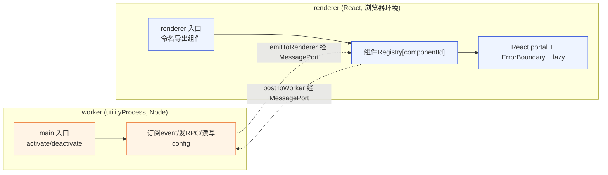

**图 4-1 — 双入口：worker 跑逻辑、renderer 跑 UI，经 MessagePort 通信，互不 import 对方模块**

### 4.4 代码模块的转译与加载策略

TS/TSX 代码模块不能被 Node/renderer 直接执行——`utilityProcess` 是 Node 环境、原生不认 `.ts`，renderer 也不能直接 `import '.tsx'`。加载器对两侧代码模块的转译/加载策略钉死如下，实现者照此落地、不会卡在 `worker.import("./index.ts")` 上。

**worker 侧（utilityProcess，Node 环境）**：用 jiti 做即时转译。jiti 是底座 extension 已验证过的 TS 动态加载方案（DESIGN.md §1.2 提到底座用 jiti 加载 extension），pi-desktop 桌面加载器在 worker 进程内引入 jiti，注册 `.ts`/`.tsx`/`.mjs` 的 require hook，`worker.import(mainPath)` 实际经 jiti 转译成 JS 再执行。jiti 内部走 esbuild 做快速转译、支持 `paths`/`alias`/装饰器等，无需预编译步骤。worker 侧 `require` 解析路径被沙箱限定到插件根目录 + 白名单模块（react 不在 worker 白名单——worker 不跑 UI），插件 A 不能 import 插件 B 的模块（§6.2）。这意味着**发布的是源码（.ts）**也能直接跑，开发期无需 build。

**worker 侧 require 沙箱机制**（钉死 jiti 转译与路径白名单如何分层组合，避免"拦了 fs 同时挡掉 jiti"或"不拦则沙箱形同虚设"）：jiti 管 `.ts/.tsx → JS 转译`，路径白名单管"能 require 哪些模块"——两者分层、不互相干扰。具体机制是 worker 启动时（host 模块里，在 import 任何插件代码之前）注册一个自定义 `Module._resolveFilename` 钩子，对所有 require/import 解析做白名单判定：

```typescript
// worker host 模块（core 提供，§6.2 spawn 的是这个通用 host、不是插件 main）启动时注册
const Module = require("module");
const originalResolveFilename = Module._resolveFilename;
Module._resolveFilename = function (request: string, parent: Module, ...rest: any[]) {
  // ① 白名单模块放行：jiti 自身依赖、pi-desktop 圆心类型（pi-desktop/* 只做类型、无运行时副作用）
  if (isWhitelistedModule(request)) return originalResolveFilename.call(this, request, parent, ...rest);
  // ② 插件根目录内模块放行：request 落在 PLUGIN_ROOT 子树内（防 .. 逃逸）
  const resolved = originalResolveFilename.call(this, request, parent, ...rest);
  if (resolved.startsWith(process.env.PLUGIN_ROOT + path.sep)) return resolved;
  // ③ 越界：fs/child_process/process/插件 B 的模块/任意绝对路径 → 拒绝并抛错
  throw new Error(`sandbox: require("${request}") denied (not in plugin root or whitelist)`);
};
// 随后注册 jiti 的 .ts/.tsx/.mjs require hook（jiti 走 Module._compile 转译、
// 转译产出的 require 仍经上面的 _resolveFilename 白名单校验，两层组合不冲突）
const jiti = createJiti({ /* alias/paths 配置 */ });
jiti.registerRequireHook();  // 转译层
// _resolveFilename 是路径白名单层——jiti 转译出的代码再 require 依赖时仍受白名单约束
```

关键点：`Module._resolveFilename` 是 Node 内部 API（稳定度足够的内部钩子、底座 extension 机制也依赖它），它在 require 解析阶段拦截——对白名单模块（jiti 自身、pi-desktop 类型包）和插件根目录内模块放行、对 `fs`/`child_process`/越界路径拒绝抛错。jiti 的转译 hook 在 `_compile` 阶段（把 `.ts` 源码编译成 JS），与 `_resolveFilename` 处于不同阶段、互不干扰：jiti 转译产出的代码里若 require 了越界模块，仍会被 `_resolveFilename` 挡住。这样"白名单 + 不暴露 fs/process/child_process"的目标有了可落地的机制，不是空话。

**renderer 侧（浏览器环境）**：用 esbuild 预打包。renderer 进程启动时（或插件挂载时），加载器对插件的 `renderer` 模块调 esbuild 打成单文件 IIFE bundle——**`react` 与 `pi.ui` 一律外部化、由宿主单实例提供，绝不内联**：bundle 时把 `react`/`pi.ui` 标记为 `external` 并改写成对注入的 scoped `pi` 对象的引用（`react` → 宿主注入的 `pi.react`、`pi.ui` 组件库 → `pi.ui`）。这样宿主与多个插件共享同一份 React 实例——避免"每个插件 bundle 各自内联一份 React"破坏 React hooks 的单实例假设（context/useState 跨边界失效、`pi.ui` 组件挂进插件树时 hooks 报错）。插件组件源码里写 `import { useState } from "react"` 或 `import * as React from "react"`，经 bundle 改写后指向宿主那份 React；写 `import { Button } from "pi.ui"` 改写后指向宿主 `pi.ui.Button`。bundle 同时剥离 `require`/`process`/全局 `window` 直接引用（呼应 §4.3 的模块封装）。打包产物缓存到 `~/.pi/desktop/plugins-cache/{id}/{version}/renderer.js`，下次加载先查缓存（按源文件 mtime/hash 命中）。开发期热重载时（§5.8）重新打包。renderer 侧因此**支持发布源码（.tsx）**——加载器自己打包，插件作者不强制预编译；也兼容**已预编译产物**（发布 `.js` bundle）——加载器检测到已是 JS 则跳过 esbuild 直接加载。

**esbuild external + inject 配置示意**（钉死 react/pi.ui 外部化机制，消除多实例风险）：

```typescript
// renderer 加载器对插件 renderer 模块调 esbuild 的关键参数
const result = await esbuild.build({
  entryPoints: [rendererModulePath],
  bundle: true,
  format: "iife",
  write: false,
  // react 与 pi.ui 标记为 external——不内联进 bundle、不打包它们的代码
  external: ["react", "react/jsx-runtime", "pi.ui"],
  // 改写导入：把对 react / pi.ui 的 import 指向宿主注入的 scoped pi 对象
  // 插件源码 `import { useState } from "react"` → 运行时从注入的 pi.react 取
  // 插件源码 `import { Button } from "pi.ui"` → 运行时从注入的 pi.ui 取
  inject: [hostShimPath],  // shim 文件定义 module.exports = { react: hostReact, "pi.ui": hostPiUi }
  // bundle 外层 factory 接收一个 host 参数（含 react/ui/i18n 等宿主单实例对象）
  footer: { js: "" },
});
// 加载器把 bundle 包进 module factory 包装器：factory(host) 其中 host = { react: 宿主React, ui: pi.ui, ... }
// 宿主 React 是宿主 renderer 进程已加载的那一份、全壳唯一，所有插件 bundle 共享
```

`hostShim` 在 bundle 作用域内把 `require("react")`/`import "react"` 重定向到 factory 注入的 `host.react`——这是模块封装（§4.3）与单实例纪律的落地：bundle 不携带 React 代码、运行时统一从宿主取。这条钉死后，无论装多少个带 UI 的插件，宿主 React 实例永远只有一份。

**.pidesktop 包格式**（§12.3）发布的是**源码**为主（`index.ts`/`ui.tsx`），由加载器按上述策略转译。也允许发布预编译产物（`index.js`/`ui.js`，含或不含 `.map`）——加载器对 `.ts` 走 jiti/esbuild、对 `.js` 直接加载，两者兼容。manifest 的 `main`/`renderer` 字段填哪个扩展名、加载器就走对应分支，无需声明 `"precompiled": true` 之类的类型戳（内容驱动：扩展名即内容事实）。

**转译能力范围**：jiti（worker）和 esbuild（renderer）都支持 TS 语法、JSX/TSX、ESM/CJS 互操作、`paths` alias（需在 manifest 或 `tsconfig.json` 声明）。**不支持**需要额外运行时（如 vue SFC、需 webpack plugin 的 loader 链）——插件作者用 React + TS，不要引入非标准构建链。这是对插件生态的约束：统一技术栈换来零配置加载。

### 4.5 形态组合与"内容驱动"

详见 §2.3 的组合表。`main`/`renderer` 有无是内容事实，不是类型戳。纯声明式插件（两者都省略）零代码加载、零 worker、零 renderer 模块。带代码的插件按需带 `main` 或 `renderer` 或两者都要。

renderer 侧沙箱要诚实承认：renderer 侧的隔离弱于独立进程（UI 代码和宿主共享 renderer 堆），真正的不可信代码隔离由 worker 进程边界兜底——`main` 侧的逻辑在独立进程、碰不到 renderer 状态；`renderer` 侧的 UI 代码做受限加载 + portal 隔离。如果某个插件要加载完全不可信的第三方富内容（比如渲染任意 HTML），那个槽位单独走 webview（每插件一个独立浏览器上下文，只靠 postMessage 通信，UI bundle 彻底独立）——这是 VSCode webview 的路线，作为强隔离槽位的降级方案，不作为默认。

## 5 加载器九项

加载器是支柱③的核心交付，要"极其完善"——下面九项是加载器必须做到的，每一项都关系到插件生态能不能站住。九项不是 checklist 打完就完，是实现时要逐项设计、逐项测试的。九项编号固定如下、贯穿全文（§5 引言、§5.9 伪代码、图 5-4、§10.3 测试覆盖四处一致）：**1.发现 / 2.优先级合并 / 3.manifest 校验 / 4. 依赖检查与拓扑排序 / 4.生命周期 / 5.错误隔离 / 6.沙箱 / 7.槽位挂载 / 8.热重载**。其中 1-3.5 是加载前的纯数据处理（发现/合并/校验/依赖编排），3.5 是依赖编排（仍是纯数据、产出 activate 顺序，作为第 3 步与第 4 步之间的插入项、保持"九项"框架不破），4-8 是加载后的运行时管理（生命周期/错误隔离/沙箱/挂载/热重载）。这与 DESIGN.md §3.5 的"九项 + 第4项(依赖检查)"框架一致——依赖检查不是独立的第九项，而是校验（第 3 项）之后的编排子步骤。加载器分两层：外层是纯数据的 manifest 管线（声明式插件只走这层、零运行时成本），内层是带代码模块的运行时管理（有代码插件才付成本）。

### 5.1 发现

第 1 项——发现。扫三处目录 + 读 `plugin.json`/`package.json` 的 `pi.desktop` 字段。发现的输出是插件候选列表，每个候选带路径、来源（project/user/builtin）、manifest 原文。发现路径镜像底座 extension 的约定，但落在桌面专属目录下，避免和底座 extension 混在一起：

- 项目级：`<cwd>/.pi/desktop/plugins/`
- 用户级：`~/.pi/desktop/plugins/`
- 内置：随壳分发的默认插件

**注意：发现层只扫这三处本地手写/内置插件目录**。外部安装的插件（npm/.pidesktop 安装的）落在 `~/.pi/desktop/installed/{id}/{version}/`——这个目录**不在发现路径下**、发现层不扫它，因为 installed 多版本目录层级深（`installed/{id}/{version}/` 三层）、靠发现层扫会出递归层级问题。外部插件走 `loader.loadExplicit()` 显式加载入口（§12.7），installer 装完后显式通知加载器加载。两条入口（发现层扫本地、显式加载外部）最终进同一个加载器。已装插件在 core 启动时的枚举与版本选择见 §12.9。

发现要处理：目录不存在（跳过）、符号链接（跟随，和底座 extension 一致）、权限错误（跳过并记录）。发现逻辑借鉴底座 `discoverExtensionsInDir`（`core/extensions/loader.ts:614`）：扫目录，每个目录下直接文件（`*.ts`/`*.js` 带 `plugin.json`）和子目录（子目录里有 `plugin.json` 或 `package.json` 带 `pi.desktop` 字段）都算一个插件候选。**不递归超过一层**——复杂插件包必须用 `package.json` 的 `pi.desktop` 字段显式声明入口。这个"只一层"的限制是有意的：防止目录树深度不可控，也让插件包必须显式声明结构而不是靠目录约定猜。

底座 `discoverExtensionsInDir` 的三条规则（直接照搬语义，路径换成 desktop 目录）：

1. 直接文件：`plugins/*.ts` 或 `*.js`（带 `plugin.json`）→ 加载
2. 子目录带 index：`plugins/<name>/plugin.json` → 加载
3. 子目录带 package.json：`plugins/<name>/package.json` 的 `pi.desktop` 字段指向 manifest → 加载它声明的

### 5.2 优先级合并

第 2 项——优先级合并。按优先级合并同 id 插件，输出最终生效的插件列表，附带覆盖关系记录（谁覆盖了谁）。合并是纯数据操作，不涉及代码加载——这一步只产出生效的 manifest 列表。

优先级是 `project > user > installed > builtin`。前三项（project/user/builtin）是发现层扫出的本地手写/内置插件；`installed` 是外部安装的插件来源标记，优先级介于 user 和 builtin 之间（外部插件参与优先级仲裁，用户可用项目级/用户级同名插件覆盖外部装的）。同名插件（按 `id` 判定）高优先级覆盖低优先级——这是"内置默认插件可被覆盖"的机制：用户或项目级放一个同 id 插件，就覆盖了内置的那个。**覆盖的粒度是整个插件，不是单个 contribution**——一个插件要么整体启用要么整体被覆盖，不做"用项目级插件的 A 贡献项 + 内置插件的 B 贡献项"这种拼贴。这简化了合并逻辑，也避免了贡献项级别的冲突仲裁复杂度。

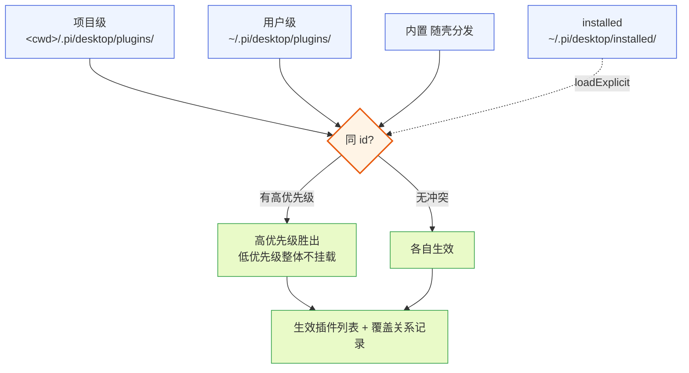

**图 5-1 — 插件发现与优先级：三处目录扫 + installed 显式加载，同 id 高优先级整体覆盖**

合并时要做 id 冲突检测：如果用户级和项目级有同 id 插件，按优先级取项目级，但要在管理 UI 里提示"项目级覆盖了用户级同名插件"，让用户知道有覆盖发生。内置被覆盖也要提示。这是"可观测性"——覆盖是允许的、正常的，但不能静默发生。

### 5.3 manifest 校验

第 3 项——manifest 校验。对每个生效 manifest 做 schema 校验。校验失败的不拖垮整壳——记录错误、在管理 UI 里标红这个插件、跳过它、继续加载其他的。校验是加载器保护 core 不被脏 manifest 污染的第一道防线。

校验项：

- 必填字段：`id`/`version`/`displayName` 必填。
- 槽位名合法：`contributes` 里每个槽位名是已知槽位（languages/themes/management/cardRenderers/sidePanel/viewers/commands/settings 之一）。未知槽位名 → 校验失败。
- 贡献项字段符合该槽位 schema（§3.2）：如 cardRenderers 必须有 `match`（符合 MatchRule）和 `component`（字符串、不带 `#`）。
- **MatchRule 策略与槽位约束**（§3.3）：cardRenderers 的 `match.strategy` 仅允许 `toolName`/`toolNames`/`customType`/`all`；viewers 的 `match.strategy` 仅允许 `extension`/`mime`/`all`。越界策略 → 校验失败。
- **management/settings 的 `component`/`schema` 互斥**（§3.2）：两者只能填一个、或都不填（都不填则该贡献项无 UI、只挂元数据）。同时填或同时缺（management 至少要其一） → 校验失败。
- `main`/`renderer` 路径指向的文件存在（加载前只查文件存在性，加载后才校验导出名存在）。扩展名须是 `.ts`/`.tsx`/`.js`/`.mjs` 之一。
- `dependsOn` 是 string[]、**不含自引用**——判定规则是 `dependsOn` 数组中任一元素字面等于本插件 `id` 即非法（不只是字面字符串 `"self"`）。例如 `id:"session-manager"` 时 `dependsOn:["session-manager"]` 或 `["self"]` 都会被拒绝。
- `permissions` 符合 §11.1 的权限语法（固定枚举权限 + 模式权限），校验规则见 §11.1。
- **未知顶层字段拒绝**：manifest 的顶层只允许 §2.2 列出的字段（`id`/`version`/`displayName`/`main`/`renderer`/`permissions`/`contributes`/`author`/`source`/`homepage`/`dependsOn`）。出现未知顶层字段（如 `config`——config 是运行期存储在 `plugins-data/{id}/config.json`、不在 manifest 里，§8.5）→ 校验失败、标 `manifest.unknown.field`，避免实现者写带 `config` 的 manifest 后"不同校验器有的忽略有的拒绝"无所适从。插件默认配置应走"activate 首次读取时若无持久化 config 则用代码内默认值"的路径（§18 示例 C），不进 manifest。

加载后校验（在 import 代码模块之后）：

- `component`/`handler` 引用的导出名在对应入口模块（`main`→worker、`renderer`→renderer）里确实存在。例如 `"component": "ImageCard"` 要求 renderer 模块导出 `ImageCard`；`"handler": "#onNewSession"` 要求 worker 模块导出 `onNewSession`。引用不存在 → 校验失败、标错、跳过本插件。

### 5.4. 依赖检查与拓扑排序

第 第4项(依赖检查)——依赖检查与拓扑排序。在优先级合并（§5.2）之后执行——此时 `dependsOn` 判定看到的已是高优先级覆盖后的最终生效 id 列表。对每个声明了 `dependsOn` 的插件，做依赖关系校验和 activate 排序：

- **依赖缺失检测**：`dependsOn` 里的 id 是否都在生效插件列表里。不在（没装、或被更高优先级覆盖掉但新版本也有该 id 则不算缺失）→ 本插件标错、加载时 skip，不拖垮整壳（走 §5.5 错误隔离）。
- **循环依赖检测**：构建依赖有向图、topological sort 检测环。检测到环（A→B→A）→ 环上的插件都标错禁用，不无限递归。
- **activate 顺序**：按依赖图拓扑排序——被依赖的先 activate、依赖者后 activate。同层（无依赖关系）的插件按来源优先级（project>user>installed>builtin）+ id 字典序排序，保证可重现。
- **动态注册可见性**：插件 `activate` 里调 `context.register()` 动态注册的贡献项，激活时立刻挂进槽位注册表、对其他已激活插件可见（依赖者 activate 时能查到被依赖者动态注册的贡献项）。

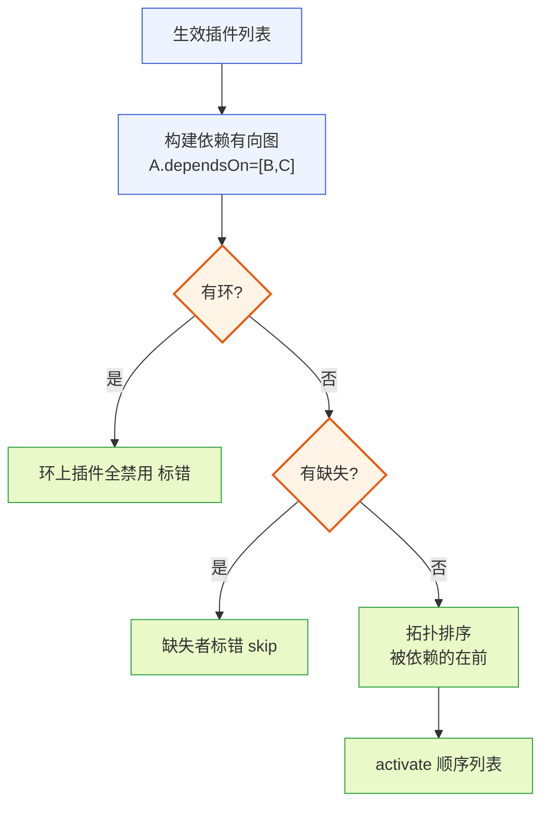

**图 5-2 — 依赖检查与拓扑排序：建图 → 环检测 → 缺失检测 → 拓扑序**

循环依赖检测的算法：对依赖图做 DFS，维护一个"正在访问"的灰名单——如果 DFS 访问到灰名单里的节点，说明存在环。环上所有节点标错禁用。这个算法是 O(V+E) 的，插件数量级（几十个）下完全够用。

### 5.4 生命周期

第 4 项——生命周期。每个带代码模块的插件走 `activate → deactivate` 生命周期。core 加载代码模块后调 `activate(context)`，传入插件上下文（能发 RPC、能订阅 event、能注册贡献项的运行时引用）；卸载时调 `deactivate()`，给插件清理资源的机会（取消订阅、关定时器、释放 worker）。纯声明式插件没有代码模块，跳过 activate/deactivate。

生命周期管理要保证：

- **activate 抛错不影响其他插件**：activate 抛错走 §5.5 错误隔离，只禁用本插件。
- **deactivate 超时要有兜底**：不能让一个卡住的 deactivate 拖住整个卸载流程。core 给 deactivate 设超时（如 5s），超时强制 kill worker。
- **activate 顺序由 §5.3.5 的依赖拓扑排序决定**，不随机。
- **资源清理**：插件可以用 `context.onDeactivate(fn)` 注册多个清理回调（§8.11），deactivate 时自动调用——和 `deactivate()` 二选一，便于资源管理。core 维护这个回调列表，deactivate 时按注册逆序调用。

### 5.5 错误隔离

第 5 项——错误隔离。一个插件崩，只禁用它，不连累 core 和其他插件。隔离分两层：

- **加载前隔离**：manifest 校验失败（§5.3）是加载前隔离——校验失败的插件不进加载流程，标错、跳过、继续加载其他的。
- **运行时隔离**：代码模块运行时抛错是运行时隔离。靠 §6 的 worker 进程——插件代码跑在独立 worker 里，worker 崩了 core 主进程还活着，core 捕获 worker 崩溃事件、禁用该插件、通知 UI。renderer 侧的 UI 抛错靠 ErrorBoundary 接住（§4.3）。

错误隔离是"极其完善"的核心指标：任何一个第三方插件的 bug 都不该让桌面端挂掉。core 维护一个"禁用的插件列表"（带禁用原因），管理 UI 展示（DESIGN.md §4.3 的诊断页、插件错误 toast）。插件加载失败或运行时崩溃 → toast 通知用户（插件名 + 推荐行动），点击跳诊断页。禁用的插件在管理页标灰 badge、展开看错误栈。

### 5.6 沙箱

第 6 项——沙箱。带代码模块的插件跑在受控环境里，不能任意访问文件系统、网络、子进程。沙箱由 §6 的 utilityProcess worker 提供，core 给插件上下文注入受控的 API（发 RPC、订阅 event、读写插件自己的配置目录、按权限受限读写项目/全局文件），插件只能通过这些 API 和外界交互，不能直接 `require('fs')` 或 `fetch`。沙箱的严格程度是安全性和表达力的权衡——太严插件做不了事、太松有安全风险。默认策略是白名单 API，需要更高权限的插件（比如要访问特定文件）在 manifest 里声明权限、用户在管理 UI 里授权（§11）。

沙箱边界：

- worker 侧（utilityProcess）：`require`/`fs`/`process`/`child_process`/全局 `fetch` 都不可见。core 注入 scoped API（PluginContext，§8），插件只能通过这些 API 和外界交互。需要文件访问的插件经 `context.fs`（§8.6）按权限范围读写。
- renderer 侧：受限加载器加载 UI 模块，只暴露 scoped `pi` 对象（rpc、events、i18n、组件库），不暴露 `require`/`process`/`fs`/`window` 的危险面。组件渲染进 React portal + ErrorBoundary。隔离机制见 §4.3。
- 需要更强隔离的槽位（渲染任意 HTML）走 webview，每插件一个独立浏览器上下文。

### 5.7 槽位挂载

第 7 项——槽位挂载。把每个插件 contributions 里声明的贡献项，注册进对应槽位的注册表。注册表按槽位类型分三种数据结构（§26）：id-based 槽位（commands/sidePanel/settings/management）用 `byId` Map（key=贡献项 id、value=胜出者），match-based 槽位（cardRenderers/viewers）用 `entries` 列表（无 id、全部共存、渲染时按 match 三段式仲裁），语言/主题槽用 key 级合并表。core 渲染某区域时查这个注册表，id-based 按 id 取胜出者、match-based 按 match 过滤后仲裁。

挂载要处理冲突：同槽位同 id 的贡献项，按来源插件的优先级仲裁（project > user > installed > builtin）。这里要和 §5.2 的"插件级覆盖"区分清楚，这是两个粒度、不矛盾的两层——

- **插件级覆盖（§5.2）**：两个**同 id 插件**，高优先级整个覆盖低优先级，低优先级插件的所有贡献项都不挂载。这是插件粒度的"有你没我"。
- **贡献项级冲突仲裁（本项）**：两个**不同 id 的插件**，各自往同一个槽位贡献了**同 id 的贡献项**（比如两个插件都贡献了 `commands: [{ id: "session.new" }]`）。这时两个插件都生效（它们 id 不同、不互相覆盖），但它们贡献的那个重名贡献项冲突——按来源插件优先级取高优先级那条，低优先级那条不挂载，并在管理 UI 里标"命令项 `session.new` 冲突，已用 X 插件的版本"。

也就是说：插件级覆盖是"同 id 插件二选一"，贡献项级仲裁是"不同 id 插件的重名贡献项二选一"，两者规则一致（都按优先级）、作用对象不同。挂载是 manifest 声明到运行时注册表的翻译，纯数据操作。

**match-based 槽位不参与挂载时仲裁**：cardRenderers/viewers 的贡献项 schema 是 `{ match, component }`、无 id——挂载时不做"二选一"仲裁、全部进 `MatchSlotRegistry.entries` 列表共存（§26）。冲突仲裁推迟到渲染时：core 渲染某工具卡片/文件时，按 matchContext 过滤命中的 entries、再按 优先级→specificity→注册顺序 三段式仲裁取胜出者（§23 场景二）。这条区分是必须的——match-based 槽位允许多个渲染器各自匹配不同对象（插件 A 的 `toolName:edit_file` 渲染器与插件 B 的 `all` 兜底渲染器共存），若挂载时二选一丢掉败者，就丢失了"不同 match 各自接管"的能力。语言/主题槽仍走 key 级合并（不二选一）。

**语言槽和主题槽的特殊仲裁**：这两个槽位的冲突仲裁不是"二选一覆盖"，而是"后注册覆盖先注册的同 key"（key 级合并）——因为语言包/主题天然是合并语义（多个插件都给 timeline namespace 贡献 key、各自 key 不冲突时全要）。只有同 key 冲突时按来源插件优先级取高的。主题的 `base` 字段还支持继承：主题 B 声明 `base: "dark"`，则 B 的 tokens 覆盖 dark 的同名 token、其余继承 dark。这个特例是语言槽和主题槽的专属规则，在通用仲裁之外。

**共享原语 `resolveByPriority<T>`**（DESIGN.md §3.2.4）：插件级覆盖和贡献项级冲突仲裁规则一致，抽成共享仲裁函数，两个粒度的调用点共用，不各写仲裁逻辑。

### 5.8 热重载

第 8 项——热重载。单个插件的文件改了（manifest 或代码模块），卸载旧的、加载新的，不动其他插件、不重启底座子进程。热重载靠 file watcher 监听插件目录。

**注意这个 watcher 和 DESIGN.md §2.2 说的"底座没有配置 watcher"不冲突**——§2.2 说的是底座（pi 子进程）不对自己的 `~/.pi/agent` 配置目录做 watcher；这里说的是桌面端（pi-desktop core）对自己的 `~/.pi/desktop/plugins/` 和 `<cwd>/.pi/desktop/plugins/` 插件目录做 watcher。两者是不同进程、不同目录、不同作用域：底座靠显式 reload（重启子进程触发，§2.4）、桌面插件靠桌面自己的 watcher 热重载。

**热重载范围不含 installed 目录**：watcher 只监听 `~/.pi/desktop/plugins/`（user）和 `<cwd>/.pi/desktop/plugins/`（project）这两处本地手写插件目录，**不监听** `~/.pi/desktop/installed/`。外部安装的插件更新走显式"更新切版本"流程（§12.8/§12.9），不靠 watcher 热重载——installed 插件是已打包产物、改源码不应直接热重载，而是走 deactivate 旧版本 + loadExplicit 新版本的显式链路。

**热重载范围亦不含 builtin 目录**：§5.1 的三处来源是并列的（project/user/builtin），但 builtin 插件随壳分发、落在 `builtinDir`（随壳打包路径），**不在这两处 watcher 监听目录下**——改内置插件需重新打包发壳、不经 watcher 热重载。watcher 只覆盖本地手写插件（project + user），与 §5.1 三处并列来源的事实对齐：builtin 是发布产物、project/user 是开发期可改内容。

热重载流程：检测到改动 → 定位是哪个插件 → deactivate 旧的 → 重新发现/校验/activate 新的 → 更新槽位注册表。热重载要：

- **防抖**：编辑器保存时连续触发只重载一次（debounce 300ms）。
- **处理重载失败**：新版加载失败时回退到旧版，不让插件进入"既不是旧版也不是新版"的悬空状态。
- **保持槽位一致**：deactivate 旧的之前先从槽位注册表摘除它的贡献项，activate 新的之后再挂回——中间窗口这个槽位的贡献项短暂消失（UI 可能闪一下），但不出现"旧贡献项和新贡献项同时存在"的脏状态。
- **dependsOn 存在性校验**（与 loadExplicit/启动期对齐）：热重载读出新版 manifest 后、activate 之前补一次 `checkDependsOnExists`（复用 §12.7 的兜底逻辑）。作者热重载时可能改了 `dependsOn` 引入一个未加载的依赖——命中缺失则标 `dependsOn.missing`、回退旧版、不进悬空态。这条让三条入口（启动期 topoSort §5.3.5、loadExplicit §12.7、热重载本项）的 dependsOn 校验行为一致，不出现"热重载静默带坏依赖图"的漏洞。

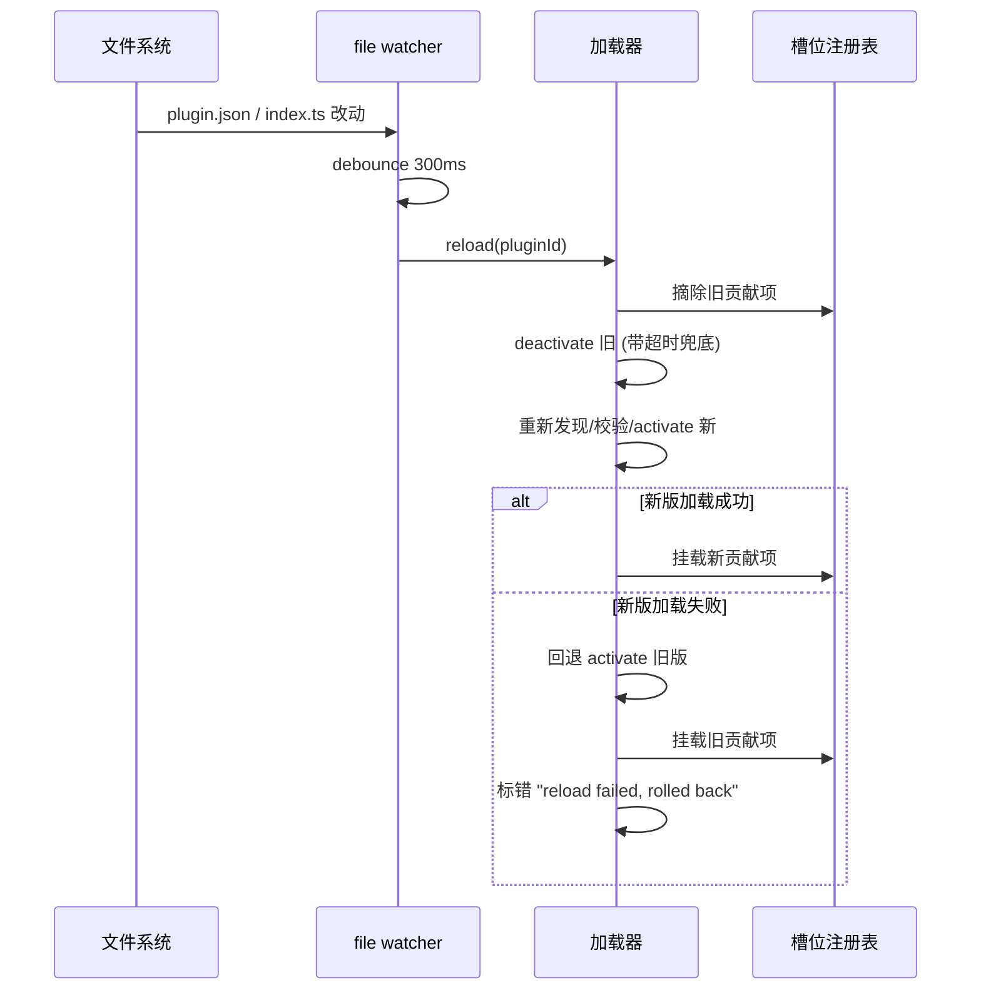

**图 5-3 — 热重载流程：watcher 防抖 → 摘除旧 → deactivate → activate 新 → 失败回退**

### 5.9 九项的分层与伪代码

九项分两层：外层纯数据（声明式插件零成本）、内层带 worker 的运行时（有代码插件才付成本）、热重载带防抖回退。把九项落成关键伪代码，照着能写实现。**注意挂载时机**：先拓扑排序（第 第4项(依赖检查)）得到 `ordered`，再**按 `ordered` 顺序**逐个挂载静态贡献项（第 7 项）+ activate——这保证被依赖插件的贡献项先挂、依赖者 activate 时能查到。挂载顺序与 §13.1 时序图一致。

```typescript
// 外层：纯数据 manifest 管线
async function loadAllPlugins(cwd: string): Promise<LoadedPlugin[]> {
  const candidates = [
    ...discoverInDir(`${cwd}/.pi/desktop/plugins/`, "project"),
    ...discoverInDir(`${homedir()}/.pi/desktop/plugins/`, "user"),
    ...discoverInDir(builtinDir, "builtin"),  // 随壳分发
  ];
  // 第1项发现：扫目录，每个候选带 {path, source, manifest}
  const merged = mergeByPriority(candidates);  // 第2项：同id按 project>user>builtin 取胜者、记录覆盖
  const valid: LoadedPlugin[] = [];
  for (const c of merged) {
    const errors = validateManifest(c.manifest);  // 第3项：schema校验（含MatchRule策略约束、自引用检测）
    if (errors.length) { markPluginError(c.id, errors); continue; }  // 失败不拖垮整壳
    valid.push({...c, codeModules: resolveEntryFiles(c.manifest)});  // main/renderer 文件存在性
  }
  // 第第4项(依赖检查)依赖检查与拓扑排序：检查 dependsOn 缺失 + 循环依赖，按拓扑排序返回激活顺序
  const ordered = topoSortByDeps(valid);  // 被依赖的在前、同层按 source 优先级+id字典序
  // 第7项槽位挂载：按 ordered 顺序挂进槽位注册表（被依赖插件的贡献项先挂、依赖者可见）
  for (const p of ordered) mountContributions(p);
  return ordered;  // 调用方按此顺序 activatePlugin（见下）
}

// 第7项槽位挂载：contribution 按 slot 类型分流注册（§26 三类注册表）
function mountContributions(plugin: LoadedPlugin) {
  for (const [slot, items] of Object.entries(plugin.manifest.contributes ?? {})) {
    const registry = slotRegistries[slot];
    if (registry instanceof IdSlotRegistry) {
      // id-based 槽位（commands/sidePanel/settings/management）：同 id 二选一
      for (const item of items) {
        const existing = registry.byId.get(item.id);
        if (existing && !isHigherPriority(plugin, existing.sourcePlugin)) {
          registry.conflicts.push({ slot, id: item.id, winner: existing.sourcePlugin.id, losers: [{ plugin: plugin.id, item }] });
          continue;  // 败者不进 Map、只进冲突日志
        }
        registry.byId.set(item.id, { item, sourcePlugin: plugin, priority: plugin.source });
      }
    } else if (registry instanceof MatchSlotRegistry) {
      // match-based 槽位（cardRenderers/viewers）：无 id、全部共存、渲染时仲裁
      for (const item of items) {
        registry.entries.push({
          item, sourcePlugin: plugin, priority: plugin.source,
          matcher: instantiateStrategy(item.match),  // 把声明式 MatchRule 转成 MatchStrategy 实例（§3.3）
          specificity: strategySpecificity(item.match.strategy),
        });
      }
    } else if (registry instanceof MergingSlotRegistry) {
      // 语言/主题槽：key 级合并，挂载时不仲裁、合并时按 key 取高优先级（§27）
      mergeInto(registry, plugin, items);
    }
  }
}

// 内层：仅有代码模块的插件才进
async function activatePlugin(plugin: LoadedPlugin) {
  if (!plugin.manifest.main) return;  // 纯renderer/纯声明式插件不起worker
  // 钉死 worker 启动模型：spawn 通用 host（host 模块由 core 提供，负责注册 jiti hook +
  // _resolveFilename 白名单 §4.4 + 收 MessagePort + 按 PLUGIN_ROOT/PLUGIN_ID 调 worker.import 加载插件 main）
  // spawnWorker 不再吃 main 路径——main 路径是 host 启动后由 host 经 worker.import 加载的对象
  const worker = runtime.spawnWorker(hostPath, {
    env: { PLUGIN_ID: plugin.id, PLUGIN_ROOT: plugin.rootDir },
  });  // 第7项沙箱：worker进程隔离，host 内注册 _resolveFilename 白名单不暴露 require/fs
  const context = createPluginContext(plugin, worker);  // rpc/events/bus/config/fs/http/i18n
  try {
    const mod = await worker.import(plugin.manifest.main);  // host 经 jiti 转译加载插件 main（§4.4）
    await mod.activate(context);  // 第4项生命周期
    activePlugins.set(plugin.id, { worker, context, mod, timeouts: [] });
  } catch (e) {
    worker.kill();  // 第5项错误隔离：activate抛错只禁用本插件
    markPluginError(plugin.id, [`activate failed: ${e.message}`]);
  }
}

// 第8项热重载：watcher + 防抖 + dependsOn 校验 + 回退
fileWatcher.on("change", debounce(async (pluginPath) => {
  const pluginId = pathToId(pluginPath);
  const old = activePlugins.get(pluginId);
  try {
    const newPlugin = await reloadManifest(pluginPath);  // 重新发现+校验（§5.3，含自引用检测）
    // dependsOn 存在性兜底（复用 §12.7 checkDependsOnExists，与 loadExplicit/启动期对齐）
    const missing = checkDependsOnExists(newPlugin.manifest.dependsOn ?? [], activePluginIds());
    if (missing.length) {
      throw new Error(`dependsOn.missing: ${missing.join(", ")}`);  // 走 catch 回退旧版
    }
    await old?.mod.deactivate?.();  // 带超时兜底
    await activatePlugin(newPlugin);  // 内部 spawnWorker(hostPath) + worker.import(main)
  } catch (e) {
    // 新版加载失败（校验/dependsOn/activate 任一失败）：回退旧版，不进悬空状态
    if (old) { await old.mod.activate(old.context); activePlugins.set(pluginId, old); }
    markPluginError(pluginId, [`reload failed, rolled back: ${e.message}`]);
  }
}, 300));
```

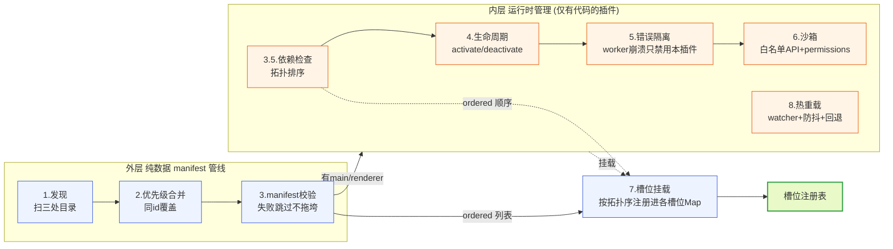

**图 5-4 — 加载器双层管线：外层纯数据处理（声明式插件只走这层），内层运行时管理（有代码插件才进）；第 第4项(依赖检查)拓扑排序产出 ordered、第 7 项挂载按 ordered 顺序进行**

## 6 utilityProcess worker

### 6.1 进程选择

带 `main` 的插件，其逻辑跑在 Electron `utilityProcess`。这是 Node 子进程，提供进程级隔离——插件抛未捕获异常只崩这个 worker、core 主进程捕获崩溃事件禁用该插件、插件资源占用可按插件计量。

为什么选 utilityProcess 而不是 `child_process.spawn` 或 `worker_threads`：

- **`utilityProcess` vs `child_process.spawn`**：utilityProcess 是 Electron 原生的、和 Electron 主进程生命周期绑定的 Node 子进程，提供 `MessagePort` 通道（Electron 官方推荐），比裸 `child_process` 的 stdio 通道更结构化、更易管理。utilityProcess 崩溃时 Electron 给 `exit` 事件、core 能据此禁用插件。
- **`utilityProcess` vs `worker_threads`**：worker_threads 共享主进程内存（线程级隔离，不是进程级），一个 worker_threads 抛未捕获异常可能影响主进程；utilityProcess 是独立进程、独立堆，崩溃不波及主进程。插件是不可信代码，要进程级隔离。

### 6.2 worker 生命周期

core main 进程在插件装载时 spawn 一个 utilityProcess。**spawn 的是通用 host 模块、不是插件 main**（§5.9 伪代码）：`runtime.spawnWorker(hostPath, env)` 的 `hostPath` 是 core 提供的 host 模块路径，host 模块负责①注册 jiti `.ts/.tsx` 转译 hook、②注册 `_resolveFilename` 白名单钩子（§4.4）、③收 MessagePort、④按 `PLUGIN_ID`/`PLUGIN_ROOT` 环境变量调 `worker.import(plugin.manifest.main)` 加载插件 main 模块（经 jiti 转译）、⑤调 `mod.activate(context)`。core 通过 worker↔main MessagePort（§7.2）注入 PluginContext 的 scoped API。这样 host 与插件 main 分离：host 是 core 提供的固定基础设施（注册沙箱钩子）、插件 main 是被 host 加载并转译的业务代码——spawn 一次 host、host 内加载任意插件 main，而不是把每个插件的 main 路径直接喂给 spawnUtilityProcess。

worker 的生命周期事件：

- `exit`（崩溃/退出）：core 捕获、禁用该插件、通知 UI（toast + 诊断页标灰）、清理槽位贡献项（避免悬空引用）。
- `message`（MessagePort 收到消息）：按消息 kind 分发（`rpc-resp`/`event`/`renderer-msg` 等，§7.2）。
- spawn 失败（路径错、模块语法错）：加载器标错、不进 activePlugins。

每个 worker 有独立的环境变量、独立的 require 解析路径——插件 A 不能 import 插件 B 的模块（避免插件间隐式耦合，需要协作走事件总线，§8.4）。

### 6.3 worker 隔离边界

worker 进程边界是沙箱的第一层（§5.6）。worker 侧注入的 PluginContext 只暴露：`rpc`/`events`/`bus`/`config`/`fs`/`http`/`i18n`/`emitToRenderer`/`register`/`onDeactivate`。不暴露：`require`/`fs`(直接)/`process`/`child_process`/全局 `fetch`。插件要发网络请求只能走 `context.http`（受限、要声明权限），要发 RPC 只能走 `context.rpc`，要订阅 event 只能走 `context.events`，要读写文件只能走 `context.fs`（按权限范围，§8.6）。

**require 沙箱的实现机制**（§4.4 已给出完整伪代码，这里钉死机制要点）：worker host 启动时注册自定义 `Module._resolveFilename` 钩子做路径白名单——白名单模块（jiti 自身依赖、`pi-desktop` 类型包）放行、插件根目录内模块放行（防 `..` 逃逸）、其余（`fs`/`child_process`/越界路径/插件 B 的模块）拒绝并抛错。jiti 的 `.ts/.tsx` 转译 hook 走 `Module._compile`、与 `_resolveFilename` 白名单处于不同阶段、分层组合不冲突——jiti 转译出的代码若 require 越界模块仍被白名单挡住。这样"白名单 + 不暴露 fs/process/child_process"是可落地的机制约束，而非仅口头声明。

### 6.4 worker 资源治理

worker 隔离靠 Node 进程边界，理论上不可信代码仍可能在 worker 内做恶意行为（如 CPU 占满、内存泄漏、fork 炸弹）。core 对每个 worker 设资源限制作为兜底：

- **CPU/内存上限默认开启**：对 installed 第三方插件，core 默认启用 CPU 时间片限额（如单 worker 30s 内累计 CPU 超 X% 视为滥用）和内存上限（如 256MB）。超限 kill 并禁用插件、toast 通知。本地手写/内置插件默认也开（可由配置下调），因为资源治理是防御性兜底、不分信任级。这修正了"资源限制不是默认能力"的旧表述——默认开启是"不可信代码靠沙箱挡"承诺的兑现，而非可选。
- **进程数成本**：每个带 `main` 的插件独占一个 utilityProcess，多插件场景下 worker 进程数等于带代码插件数。core 不做 worker 池化（池化会破坏进程级隔离边界、让插件间共享堆）。纯声明式/纯 renderer 插件不起 worker，零进程成本；典型桌面插件数量级（十几到几十个带代码插件）的进程成本在 Electron 可承受范围内。若未来插件数膨胀，降级方案是"轻量插件合并到一个受控 worker host 进程"——但牺牲隔离强度，作为演进项、非默认。

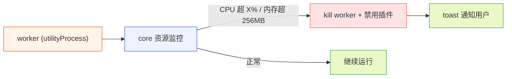

**图 6-1 — worker 资源治理：默认 CPU/内存上限，超限 kill + 禁用 + 通知**

转译策略见 §4.4（worker 侧 jiti、renderer 侧 esbuild 预打包）。

## 7 MessagePort 桥接

### 7.1 两条独立通道

worker（utilityProcess）不能直接碰底座 stdin/stdout——那条管道归 core main 的 RPC 适配层（支柱①）独占。worker 的 `PluginContext.rpc` 和 `PluginContext.events` 经一条 **worker↔main 的 MessagePort** 转发到 main。同时，worker 和 renderer 之间还有另一条 **worker↔renderer 的 MessagePort**，用于插件的 UI 数据通信（`emitToRenderer`/`postToWorker`）。两者是**两条独立通道**、端点不同、互不干扰。core main 是中枢——它持有底座子进程的 stdin/stdout、转发给各 worker/renderer。

`utilityProcess` 和 renderer 之间**不**走 `ipcMain/ipcRenderer`（那套基于 BrowserWindow，utilityProcess 没有），唯一的官方通道是 MessagePort。core main 进程在插件装载时按插件形态建不同数量的 `MessageChannelMain`（§7.4/§10.1 两种端口拓扑）：有 `main` 的插件建**两对**——worker↔main 通道（worker 持一端、main 持一端）+ worker↔renderer 通道（worker 持一端、renderer 持一端），worker 侧共持 2 个端口、main 持 1 个、renderer 持 1 个，合计 4 端口；纯 renderer 插件建**一对**——renderer↔main 通道（renderer 持一端、main 持一端），合计 2 端口、无 worker。worker↔renderer 那对的两端建好后直接 transferable 转交，之后 worker↔renderer 直接 postMessage 对传、不再经 main 转发。

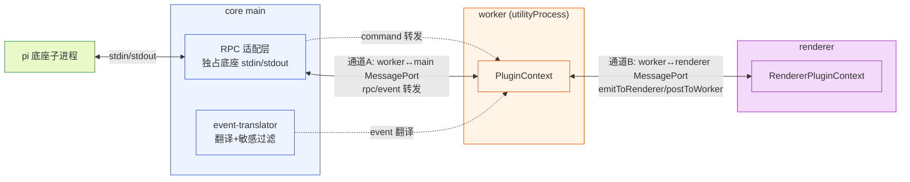

**图 7-1 — 两条独立 MessagePort 通道：A 管 RPC/event（worker↔main），B 管 UI 数据（worker↔renderer）；worker 持 2 个端口、main 持 1 个、renderer 持 1 个**

### 7.2 worker↔main 通道：RPC/event 转发

core main 起子进程时、同时为每个 worker 建一对 MessagePort（一端给 worker、一端 main 持有）。这条通道管 worker 侧 API 的转发：

- **RPC 转发**：worker 调 `context.rpc.getState()` → 往 worker 端口发 `{ kind: "rpc", id: "req_1", command: { type: "get_state" } }` → main 收到、由 RPC 适配层发给底座 → 底座响应回 main → main 往 worker 端口回 `{ kind: "rpc-resp", id: "req_1", data: ... }` → worker 的 PluginContext.rpc 按 id resolve。
- **event 转发**：底座推 event 到 main → main 的 event-translator 翻译成中性 SessionEvent（按 content:sensitive 过滤，§11.3）→ main 往所有订阅该 event 的 worker 端口转发 `{ kind: "event", event }` → worker 的 `context.events.on` 回调收到。
- **隔离**：每个 worker 有自己的 worker↔main MessagePort——worker 隔离靠这个，一个 worker 的 RPC/event 不串到别的 worker。

worker↔main 通道的 id 配对机制用共享原语 `RequestCorrelator<T>`（DESIGN.md §3.2.4）：RPC command-response 配对（生成 id → 存 pending Map → 按 id resolve、带 timeout 兜底）。这个原语也用在 Extension UI request-response 配对（DESIGN.md §1.9.2），两处持有同一实现实例化使用（一个用递增 id、一个用 UUID，只是 id 生成器不同）。

### 7.3 worker↔renderer 通道：emitToRenderer/postToWorker

core main 在插件装载时建一对 `MessageChannelMain`，一端给 worker、一端给 renderer 侧该插件的运行时上下文。之后 worker↔renderer 直接 postMessage 对传、不再经 main 转发。这条通道管插件内部 UI 数据：

- **emitToRenderer**：worker 侧 `context.emitToRenderer(channel, data)` → 往 worker 端的 MessagePort postMessage → renderer 端的插件运行时上下文收到 → 转发给订阅了该 channel 的组件（`pi.onMessage(channel, cb)`）。
- **postToWorker**：renderer 侧 `pi.postToWorker(channel, data)` → 往 renderer 端的 MessagePort postMessage → worker 端收到 → 插件 worker 侧用自己约定的 listener 收（worker 侧没有内置的 `onRendererMessage`，插件 activate 时自己注册）。

这条通道是 worker 主动推数据给 UI 组件的通道——适合"worker 收到 event、加工后推给组件"的场景（DESIGN.md §3.2.6 的第二条路）。它不经 main 中转，所以延迟低、不占用 main 的处理能力。

### 7.4 纯 renderer 插件的 event 直收与端口拓扑

**两种端口拓扑**（与 §10.1 `createMessagePorts(pluginId, hasWorker)` 的返回类型对应）：插件按有没有 `main` 走不同的端口拓扑——

- **有 `main` 的插件（两对 4 端口）**：通道A（worker↔main，管 RPC/event 转发）+ 通道B（worker↔renderer，管 UI 数据）。worker 持 2 个端口、main 持 1 个、renderer 持 1 个，共 4 端口、两对 `MessageChannel`。renderer 侧 `pi.rpc`/`pi.events` 经通道B 发给 worker、worker 再经通道A 转发给 main（必要时加工数据）。
- **纯 renderer 插件（一对 2 端口）**：没有 `main` → 不起 worker → 不需要通道A、也不需要通道B 的 worker 端。core 只建一对 `MessageChannel`：`rendererPort`（renderer 持）+ `mainPort`（main 持），renderer↔main 直连。renderer 侧 `pi.rpc`/`pi.events` 经 `rendererPort` 直接发给 main、由 main 直接代理 RPC 转发与 event 订阅——不经 worker 中转（没有 worker 可经）。这条轻量路径让"纯渲染 cardRenderer"零 worker 成本成立。

**纯 renderer 插件的 event 直收**：core main 订阅底座 event 流，默认把 event 转发给所有 renderer 侧插件运行时上下文（经该插件的 rendererPort）。所以纯 renderer 插件通过 `pi.events.on` 直接收 `tool_execution_*` 等 event——不需要 worker。这让"纯渲染 cardRenderer"成立：manifest 只写 `renderer`、组件里 `pi.events.on` 订阅 `tool_execution_*` 自己画，零 worker。

renderer 侧给插件 UI 注入的 scoped `pi` API，内部就是往 MessagePort postMessage——插件 UI 调 `pi.rpc.get_state()`，对于有 `main` 的插件走通道B 发给 worker、worker 经通道A 转发给底座；对于纯 renderer 插件，core main 内置默认转发——`pi.rpc.send` 直接走 renderer↔main 通道（rendererPort→mainPort）发给底座。`createMessagePorts` 按 `hasWorker` 返回不同端口集合，两种拓扑各走各的路径、不混。

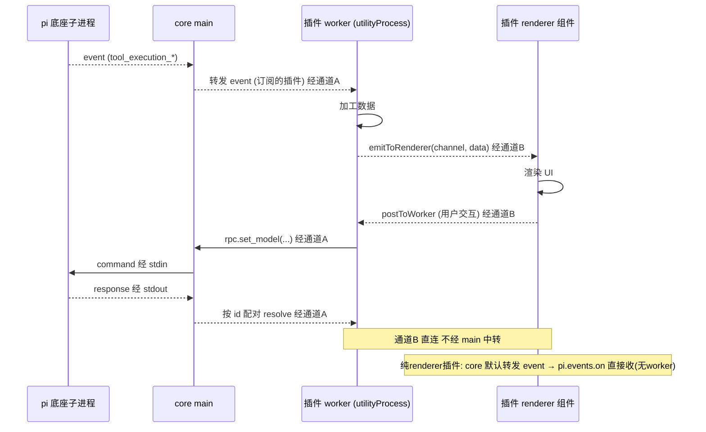

**图 7-2 — 双入口数据流：worker 逻辑与 renderer UI 经通道B直连，RPC 经通道A中转，纯renderer插件走默认转发**

## 8 PluginContext 接口

### 8.1 接口全貌

`activate(context)` 收到的 context，是 worker 侧插件能调用的全部 API。这是插件和 core 之间的能力边界——沙箱只暴露这些，`require`/`fs`/`process` 都不可见，`fetch` 也不可见——网络访问走 `context.http`（受限、要声明权限）。**类型纪律**：本接口全部用圆心中性类型（DESIGN.md §5.1.5）——`rpc.getState()` 返回 `SessionState`（圆心中性、对应底座 `RpcSessionState` 但归圆心拥有）、`events.on` 回调收 `SessionEvent`（圆心中性联合类型、gateway 翻译 pi 事件成它）、`rpc.send` 用 `unknown` 逃生舱。圆心不 import 底座协议类型，底座协议变了只动 gateway 翻译层、不动本接口和插件。

```typescript
interface PluginContext {
  /** 插件自己的元信息 */
  plugin: { id: string; version: string; rootDir: string };
  /** RPC 适配层——发命令给底座子进程，返回 Promise */
  rpc: {
    prompt(message: string, opts?: { images?: ImageContent[]; streamingBehavior?: "steer" | "followUp" }): Promise<void>;
    steer(message: string, images?: ImageContent[]): Promise<void>;
    followUp(message: string, images?: ImageContent[]): Promise<void>;
    abort(): Promise<void>;
    getState(): Promise<SessionState>;                    // 中性 SessionState，非 RpcSessionState
    setModel(provider: string, modelId: string): Promise<ModelInfo>;
    getAvailableModels(): Promise<ModelInfo[]>;
    getEntries(since?: string): Promise<{ entries: MessageEntry[]; leafId: string | null }>;
    getTree(): Promise<{ tree: TreeNode[]; leafId: string | null }>;
    getCommands(): Promise<CommandInfo[]>;
    // 便捷方法只覆盖高频命令（不与 31 命令一一对应，未覆盖命令经 send 发），返回值一律用圆心中性类型（见 DESIGN.md §5.1.5）
    send<T = unknown>(command: unknown): Promise<unknown>; // 通用逃生舱，参数/返回用 unknown 不绑底座协议类型
    resync(): Promise<SyncSnapshot>; // 重新拉 state+entries+tree+commands 同步 UI
  };
  /** 受限网络通道——走 core main 代理，受 permissions 域名白名单约束 */
  http: { fetch(url: string, opts?: RequestInit): Promise<Response> };
  /** 受限文件通道——按 permissions 范围读写项目/全局文件，见 §8.6 */
  fs: PluginFs;
  /** 订阅底座 event 流——回调收中性 SessionEvent */
  events: {
    on(listener: (event: SessionEvent) => void): () => void; // 返回取消订阅
  };
  /** 插件间事件总线——发布订阅，和 RPC events 两套 */
  bus: {
    publish(topic: string, payload: unknown): void;
    subscribe(topic: string, listener: (payload: unknown) => void): () => void;
  };
  /** 读写本插件配置（隔离在插件自己的目录，不碰 pi settings） */
  config: {
    get<T>(key: string): T | undefined;
    set<T>(key: string, value: T): Promise<void>;
    all(): Record<string, unknown>;
  };
  /** i18n——从语言槽取文案 */
  i18n: {
    t(key: string, vars?: Record<string, unknown>): string;
    locale: string;
  };
  /** 把数据推给 renderer 侧的组件——worker→renderer 的主动推送通道 */
  emitToRenderer(channel: string, data: unknown): void;
  /** 注册贡献项的运行时补充（manifest 静态声明之外） */
  register(contribution: DynamicContribution): void;
  /** 注册清理回调，deactivate 时自动调用 */
  onDeactivate(fn: () => void): void;
}
```

下面逐项展开。

### 8.2 rpc

`rpc` 是 RPC 适配层的便捷封装——发命令给底座子进程，返回 Promise。便捷方法覆盖高频命令、不与 31 个命令一一对应——未覆盖命令经 `send` 逃生舱发。`rpc.send` 是逃生舱：core 没有为某个 RPC 命令单独包方法时，插件可以直接发任意命令、拿回原始响应（参数/返回用 `unknown` 不绑底座协议类型，详见 DESIGN.md §5.1.5 中性化）。返回值的中性类型对照：`getState → SessionState`、`setModel/getAvailableModels → ModelInfo`、`getEntries → MessageEntry[]`、`getTree → TreeNode[]`——这些中性类型归圆心 `domain/` 拥有，gateway 层把底座类型（`RpcSessionState`/`Model`/`SessionEntry`/`SessionTreeNode`/`RpcSlashCommand`）映射成它们。

关键细节：

- **`rpc.prompt()` 的 Promise 在预检通过时就 resolve**（不是 agent 处理完）——它 resolve 只代表"底座接受了这条 prompt、开始处理了"，agent 的输出要靠订阅 `message_*` event 流拿，agent 结束靠 `agent_settled`。预检失败时 reject。这意味着插件发完 prompt 不能立刻假设 agent 开始输出了。
- **`rpc.resync()` 是共享原语**——重启子进程（DESIGN.md §2.4）、会话切换/分叉、模型重载后都要"重新 `get_state` + `get_entries` + `get_tree` + `get_commands` 同步 UI"。这个编排收进 `resync()`：内部并发发这组命令、返回统一快照 `SyncSnapshot`、广播给所有订阅的插件。三处场景都调它，不各自拼命令。`SyncSnapshot` 结构：`{ state: SessionState, entries: MessageEntry[], tree: SessionTreeNode[], commands: RpcSlashCommand[] }`——一次拿到全部同步所需数据（state 用中性 SessionState）。
- **`steer`/`followUp` 不是额外命令**——它们就是 31 个命令里的 `steer`/`follow_up`（Prompting 分组）。PluginContext.rpc 把它们单列为方法，只是 API 封装（`rpc.steer(msg)` 等价于 `rpc.send({ type: "steer", message: msg })`），让插件作者不用记 `rpc.send` 的命令字面量。

### 8.3 events

`events.on(listener)` 订阅底座 event 流，**回调收中性 `SessionEvent`**（圆心自有联合类型，gateway 翻译 pi 的 `AgentSessionEvent` 成它，见 DESIGN.md §5.1.5）。返回取消订阅函数。event 流是底座 agent 运行时的全部状态变化（`message_*`/`tool_execution_*`/`turn_*`/`session_*`/`model_*` 等，见 DESIGN.md §1.6 全集）。**插件侧（worker 和 renderer）回调收到的统一是中性 `SessionEvent`**——`AgentSessionEvent` 只在 gateway 翻译前的底座侧出现，插件永远不直接接触它。

注意边界（DESIGN.md §1.8）：插件通过 `events.on` 收的是经 gateway 翻译后的中性 `SessionEvent`，**收不到** `ExtensionEvent`（那是给底座 extension 用的、不在 RPC event 流里）。桌面插件只观察底座、不参与底座 extension 的行为拦截——它看到的 event 流是"底座 extension 处理过之后"的状态。

### 8.4 bus

`bus` 是插件间事件总线——发布订阅，和 RPC events 两套。fire-and-forget、无缓冲、无历史回放：

- subscribe 前发布的消息订阅不到、后来的 subscribe 收不到过去的消息。
- 若需可靠收到 B 的消息：① 用 `dependsOn` 声明依赖（B 先 activate，见 §5.3.5），② B activate 后发"已就绪"信号、A activate 时立刻 subscribe 再查询 B 状态。
- 要传历史状态用 RPC event 流（1.6 有历史）或插件自己的 config 持久化，别指望 bus。

`bus` 是松耦合的插件协作通道——review 插件用它发布 `review.pending` topic、输入框组件订阅（DESIGN.md §4.10.4）。worker 之间默认不直接通信（避免插件间隐式耦合），需要协作的走 bus。

### 8.5 config

`config` 读写本插件配置，隔离在插件自己的目录，不碰 pi settings（pi settings 走支柱②）。存储位置：`~/.pi/desktop/plugins-data/{pluginId}/config.json`（用户级）和 `<cwd>/.pi/desktop/plugins-data/{pluginId}/config.json`（项目级），合并规则同 settings（项目覆盖用户）。

卸载插件时配置默认保留——用户重装能恢复偏好。管理 UI 提供"卸载并清除配置"选项做彻底清理。

### 8.6 fs（受限文件通道）

`fs` 是受限文件通道——按 manifest `permissions` 声明的范围读写项目/全局文件，不直接暴露 Node `fs`。这是 §11.1 的 `fs:project`/`fs:global` 权限的兑现通道：声明了 `fs:project:read` 的插件才能读当前项目目录文件、声明了 `fs:project:write` 才能写。未声明权限的范围调用会抛错。

```typescript
interface PluginFs {
  /**
   * 读文件内容（按权限范围：project 限当前 cwd、global 限 ~/.pi）。需声明 fs:<scope>:read。
   * 返回类型由 opts.encoding 显式决定，消除"同一文件有时拿 string 有时拿 Uint8Array"的歧义：
   *   - opts.encoding === "utf-8" → 返回 string（按 UTF-8 解码，适合文本文件）
   *   - opts.encoding === null    → 返回 Uint8Array（原始字节，适合二进制文件）
   *   - opts 省略 / opts.encoding === undefined → core 按 mimeType 嗅探决定：
   *       文本类 mime（text/*、application/json 等）返回 string、其余返回 Uint8Array。
   *       嗅探模式下插件侧须做类型守卫（typeof result === "string"）以收窄类型。
   */
  readFile(filePath: string, opts?: { encoding?: "utf-8" | null }): Promise<Uint8Array | string>;
  /** 写文件内容。需声明 fs:<scope>:write */
  writeFile(filePath: string, content: string | Uint8Array): Promise<void>;
  /** 列目录。需声明 fs:<scope>:read */
  readDir(dirPath: string): Promise<string[]>;
  /** 检查某路径是否在已授权范围内（插件可先查再决定是否调 readFile） */
  canAccess(filePath: string, mode: "read" | "write"): boolean;
}
```

- **范围限定**：`filePath` 必须落在已授权范围（`project` → 当前 cwd 子树、`global` → `~/.pi` 子树）。core 在调用时校验路径不越界（防 `..` 逃逸），越界抛错。
- **返回类型契约**：`readFile` 默认按 mimeType 嗅探决定返回 `string` 还是 `Uint8Array`（与 §9.4 `ViewerProps.content: Uint8Array | string` 的联合类型一致）。需要确定类型的插件应显式传 `opts.encoding`（`"utf-8"` 或 `null`），避免嗅探导致类型收窄困难；用嗅探模式的插件必须做 `typeof` 类型守卫。core 的嗅探规则稳定（按 mimeType 前缀判定文本/二进制、同一文件不会因调用时机不同返回不同类型）。
- **预览器获取文件内容**：viewers 槽位的预览器组件需要文件内容——它不直接调 `context.fs`（renderer 侧无 `context.fs`），而是经 core 注入的 `ViewerProps` 拿到（§9.4）：core 在匹配到预览器、渲染某文件时，用**插件 worker 侧**（有 `main` 时）或**core main 默认**（纯 renderer 插件）按该插件的 `fs:project:read` 权限读文件内容、经 props 传给组件。这样权限校验落在 worker/core 侧、renderer 组件只消费内容，权限不被绕过。
- **`fs:{读写插件的 data 目录}` 默认就有**：插件读写自己的 `plugins-data/{id}/` 走 `context.config`（§8.5），不需声明 `fs` 权限。`fs` 权限仅用于访问项目/全局文件。

### 8.7 http

`http` 是受限网络通道：`http.fetch(url, opts)` 走 core main 代理、受 manifest `permissions` 声明的域名白名单约束（§11），不直接暴露全局 fetch。插件要发网络请求必须声明 `net:域名` 权限、用户授权后才能调。未声明未授权的域名调用会抛错。

### 8.8 i18n

`i18n` 从语言槽取文案。`t(key, vars)` 按 key 查当前 locale 的翻译，查不到 fallback 到默认 locale（en）、再查不到用 key 本身。`locale` 是当前 locale 字符串。底层是 i18next。renderer 侧的 `i18n` 还额外提供 `formatDate`/`formatNumber`（按 locale 格式化日期/数字）。

### 8.9 emitToRenderer

`emitToRenderer(channel, data)` 把数据推给 renderer 侧的组件——worker→renderer 的主动推送通道（通道B，§7.3）。组件侧用 `pi.onMessage(channel, cb)` 收。适合"worker 收到 event、加工后推给组件"的场景。

### 8.10 register

`register(contribution)` 注册贡献项的运行时补充——manifest 静态声明之外，插件运行时动态注册的贡献项。`DynamicContribution` 的形状是 `{ slot: SlotName, contribution: ContributionItem }`，`slot` 指明挂哪个槽位（如 `"commands"`），`contribution` 是该槽位的贡献项（和 manifest 里静态 contribution 同结构，如 `{ id, title, handler }`），core 校验后挂进对应槽位注册表。

动态注册的贡献项激活时立刻挂进槽位注册表、对其他已激活插件可见（依赖者 activate 时能查到被依赖者动态注册的贡献项，§5.3.5）。典型场景：某个插件根据配置决定挂不挂某个侧栏 Tab——activate 时读 config、按配置 `register` 对应的贡献项。

### 8.11 onDeactivate

`onDeactivate(fn)` 注册清理回调，deactivate 时自动调用（和 `deactivate()` 二选一，便于资源管理）。core 维护这个回调列表，deactivate 时按注册逆序调用。适合"插件 activate 时注册了多个订阅/定时器，逐个 onDeactivate 注册清理"的场景——不用写一个大的 `deactivate()` 函数、各资源自己注册自己的清理。

## 9 RendererPluginContext

### 9.1 接口全貌

renderer 侧的 UI 组件收到的 `pi` 对象（通过 React Context 或 props 注入），接口如下。**类型与 PluginContext 对齐**（中性化，DESIGN.md §5.1.5）——`send` 用 `unknown`、`events.on` 收中性 `SessionEvent`、`getState` 返回中性 `SessionState`，圆心不绑底座协议类型。renderer 侧**不暴露 `fs`**——文件内容经 props 注入（§9.4）或经 worker 中转，权限校验落在 worker/core 侧。

```typescript
interface RendererPluginContext {
  plugin: { id: string; version: string };
  /** RPC 转发——内部走 MessagePort 给 worker（有 main 时）或直接给 core main（无 main 时）再发底座 */
  rpc: {
    send<T = unknown>(command: unknown): Promise<unknown>;  // 与 worker 侧一致：unknown 逃生舱
    getState(): Promise<SessionState>;                       // 中性 SessionState
    getEntries(since?: string): Promise<{ entries: MessageEntry[]; leafId: string | null }>;
    // ...其余按需暴露，和 worker 侧 rpc 方法集一致（类型中性化）
  };
  /** 订阅底座 event 流——core main 内置默认转发，纯 renderer 插件也能收；回调收中性 SessionEvent */
  events: { on(listener: (event: SessionEvent) => void): () => void };
  /** 收 worker 侧 emitToRenderer 推来的数据 */
  onMessage(channel: string, cb: (data: unknown) => void): () => void;
  /** 往 worker 发消息（worker 侧用自己约定的 listener 收） */
  postToWorker(channel: string, data: unknown): void;
  i18n: {
    t(key: string, vars?: Record<string, unknown>): string;  // 文案 + 复数（vars.count）
    locale: string;
    formatDate(date: Date, opts?: Intl.DateTimeFormatOptions): string;
    formatNumber(num: number, opts?: Intl.NumberFormatOptions): string;
  };
  /** 当前主题 token 值映射（主题槽合并产生）——自定义元素时读，优先用 pi.ui 自带主题组件 */
  theme: Theme;
  /** core 提供的 UI 组件库——Button/Input/Dialog/Icon 等，自带主题、保证插件 UI 视觉一致 */
  ui: { Button: React.FC<...>; Input: React.FC<...>; Dialog: React.FC<...>; Icon: React.FC<{ name: string }>; /* ... */ };
}
```

`rpc`/`events` 的类型与 PluginContext 完全一致——两侧回调统一收中性 `SessionEvent`、`send` 统一用 `unknown`、`getState` 统一返回中性 `SessionState`。`AgentSessionEvent` 只在 gateway 翻译前的底座侧出现，插件侧（worker 和 renderer）永远不直接接触它。

**便利 hook `useMessage`**：除上述 `RendererPluginContext` 接口外，core 额外从包入口导出一个 React 便利 hook——`export function useMessage(pi: RendererPluginContext, channel: string, setter: (data: unknown) => void): void`。它内部封装 `React.useEffect` + `pi.onMessage(channel, cb)`：挂载时订阅 channel、卸载时自动退订，把收到的数据喂给 `setter`。这是 `onMessage` 的 React 适配糖、不引入新能力——需要更细控制（如节流、条件订阅）时直接用 `pi.onMessage` 配合 `React.useEffect`。§14/§18 的示例照此用。

### 9.2 事件到达渲染组件的三条路

渲染组件拿底座事件有三条路，按推荐顺序：

- **core 内置默认 event→renderer 转发**（首选，纯 renderer 插件用）：core main 订阅底座 event 流，默认把 event 转发给所有 renderer 侧插件运行时上下文。所以**只有 `renderer`、没有 `main` 的插件**也能通过 `pi.events.on` 直接收 `tool_execution_*` 等 event——不需要 worker 中转。这让"纯渲染 cardRenderer"成立：manifest 只写 `renderer`、组件里 `pi.events.on` 订阅 `tool_execution_*` 自己画，零 worker。
- **worker 处理后推送**（要加工数据时用）：插件有 `main`、worker 侧 `events.on` 收 event、做转换/聚合、`context.emitToRenderer(channel, data)` 推加工后的数据给组件，组件 `pi.onMessage(channel, cb)` 收。适合"要把多个 event 聚合成 dashboard 数据"这种。
- **core 调度、props 传入**（cardRenderer/viewer 场景用）：卡片渲染槽/预览器槽的组件，core 在匹配到这个渲染器、渲染某个工具调用卡片/文件时，把事件数据/文件内容当 props 传入组件。**注册在 cardRenderers/viewers 槽位的组件自动走这条路——组件不用自己订阅 event 或读文件，core 喂数据**。这是 cardRenderer/viewer 最省事的路径。

路径选择由"要不要加工数据"决定——不加工用第一条或第三条、加工用第二条。

### 9.3 CardRendererProps 契约

cardRenderer 组件的 props 契约（第三条路自动传入）。**依赖方向纪律（呼应洋葱架构）**：圆心（槽位契约）不 import pi 的类型——cardRenderer 的 props 用的是 core 自己定义的中性事件接口（`ToolCallStart`/`ToolCallUpdate`/`ToolCallEnd`），不是 pi 的 `ToolExecutionStartEvent` 等。RPC 适配层（中层）负责把 pi 的 event 翻译成圆心的中性接口——这样圆心不绑死 pi 的类型系统、依赖只向内。pi 协议改了，只动中层的翻译、不动圆心契约和插件层。

```typescript
// 圆心定义的中性事件接口（不 import pi 类型）
interface ToolCallStart { toolCallId: string; toolName: string; args: unknown }
interface ToolCallUpdate { toolCallId: string; partialResult: unknown }
interface ToolCallEnd { toolCallId: string; result: unknown; isError: boolean }

interface CardRendererProps {
  toolCallId: string;          // 工具调用唯一 id（跨 start/update/end 稳定）
  toolName: string;            // 工具名
  args: unknown;               // 工具调用参数
  updates: ToolCallUpdate[];   // 这个 toolCallId 的全部 update（流式输出，按时间序）
  end: ToolCallEnd | null;     // end，null 表示还没结束
  isStreaming: boolean;        // 是否还在流式
  theme: Theme;                // 当前主题
  pi: RendererPluginContext;   // scoped pi 对象（供组件调 i18n/ui 等）
}
```

core 负责按 toolCallId 收集 pi 的 `tool_execution_*` 事件、翻译成上面中性接口、传给组件。组件每次有新 update 或 end 到来时被重新渲染（props 更新）。通过 `pi.ui` 暴露的组件库已内置主题，cardRenderer 组件一般不需要直接读 theme 字段——用 `pi.ui.Button`/`pi.ui.Icon` 这些自带主题的组件即可；只在需要自定义颜色时读 token（如 `theme["color.primary"]`），不硬编码颜色值。

### 9.4 其余带 component 槽位的 props 契约

除 cardRenderer 外，viewers/sidePanel/settings/management 槽位的组件 props 契约钉死如下——core 挂载这些组件时按契约注入 props，实现者照此写组件、知道会收到什么。所有 props 都注入 `pi: RendererPluginContext`（scoped pi 对象），组件据此调 i18n/ui/events/rpc。

```typescript
// 预览器组件：core 匹配到文件后按该插件的 fs:project:read 权限读内容、注入 props
interface ViewerProps {
  filePath: string;            // 绝对路径
  mimeType: string;            // 推断的 mime
  extension: string;           // 扩展名（如 "md"）
  content: Uint8Array | string; // 文件内容（由 worker/core 侧按权限读取注入，renderer 不直接读 fs）
  theme: Theme;
  pi: RendererPluginContext;
}

// 侧栏 Tab 组件：用户切到该 Tab 时挂载
interface SidePanelProps {
  pi: RendererPluginContext;
  theme: Theme;
}

// 设置子页组件（自带 component 时）：插件自己的配置页，core 注入当前配置 + 保存通道
interface SettingsProps {
  config: Record<string, unknown>;   // 该插件当前合并后的 config 快照
  onSave: (next: Record<string, unknown>) => Promise<void>;  // 经 worker 侧 context.config 写回
  pi: RendererPluginContext;
  theme: Theme;
}

// 管理页组件（自带 component 时）：管 pi 的页
interface ManagementProps {
  pi: RendererPluginContext;
  theme: Theme;
}
```

- **ViewerProps.content 来源**：core 在匹配到预览器、渲染某文件时，用该插件 worker 侧（有 `main` 时经 worker 的 `context.fs`）或 core main 默认（纯 renderer 插件）按 `fs:project:read` 权限读文件内容，转成 `Uint8Array|string` 注入 props。大文件按需分块或限流（超阈值截断 + 提示）。组件不直接调 `fs`——权限校验落在 worker/core 侧、renderer 只消费内容，权限模型不被绕过。
- **SettingsProps** 用 `onSave` 通道写回——`onSave(next)` 内部经 MessagePort 把配置发给 worker 侧 `context.config.set`，确保写回走受控通道、记录在插件配置目录。
- **ManagementProps/SidePanelProps** 不直接给 pi 状态快照——需要状态时组件用 `pi.rpc.getState()`/`pi.events.on` 自己拉/订阅，避免 core 在挂载时绑死状态快照。

### 9.5 Theme 类型

`Theme` 被 `CardRendererProps.theme`、`RendererPluginContext.theme` 等多处引用，圆心定义如下（DESIGN.md §5.1.5：`Theme = Record<string, string>`），由主题槽（§3.2）合并当前主题插件的 tokens 产生。core 只认这些 token key、主题插件填值。新增 token 是扩展（core 加 key + 默认值、旧主题不填用默认）、不改已有 key 语义——开闭原则。

```typescript
/** 主题 token 值映射：token key → 值（字符串，如 "color.bg" → "#1e1e2e"） */
type Theme = Record<string, string>;

// 内置 token 命名规范（示例 + 全集分组，core 启动时为未填的 key 提供默认值）
// 颜色：color.bg / color.fg / color.primary / color.accent.warning / color.muted / ...
// 字号：font.size.base / font.size.sm / font.size.lg / ...
// 间距：spacing.xs / spacing.sm / spacing.md / spacing.lg / ...
// 圆角：radius.sm / radius.md / radius.lg / ...
// 边框：border.color / border.width / ...
```

插件读 token 用 `theme["color.primary"]`，不硬编码颜色值；优先用 `pi.ui` 组件库（已内置主题）。

## 10 PluginRuntime 依赖倒置

### 10.1 接口定义

加载器本身是 core 的机制层，但它的某些能力（RPC 转发、event 翻译、http 代理、fs 通道、config 存储的磁盘 IO）是 shell 级基础设施提供的。用依赖倒置解：圆心（加载器/PluginContext 契约）定义接口、shell 层提供实现。`PluginRuntime` 就是这个倒置的接口——它描述"加载器需要什么基础设施才能装起一个插件"。

```typescript
// domain/plugin-loader/plugin-runtime.ts —— 圆心定义接口（依赖倒置）
export interface PluginRuntime {
  /** 给 worker 注入的 RPC 转发能力（worker↔main 通道 + 底座 RPC） */
  rpcForward: RpcForward;
  /** event-translator：把 pi 的 AgentSessionEvent 翻译成中性 SessionEvent（含 content:sensitive 过滤） */
  eventTranslator: EventTranslator;
  /** http 代理：走 shell 的 fetch、按 permissions 域名白名单过滤 */
  httpProxy: HttpProxy;
  /** fs 通道：按 permissions 范围读写项目/全局文件（shell 提供 Node fs 实现） */
  fsGateway: FsGateway;
  /** config 存储的磁盘 IO（读写 ~/.pi/desktop/plugins-data/{id}/config.json） */
  configStorage: ConfigStorage;
  /** i18n 字典查询（语言槽合并产生） */
  i18n: I18nService;
  /**
   * 创建插件通道端口。按插件形态返回两种拓扑（§7.4）：
   *   - 有 main 的插件：两对 4 端口（workerMainPort+mainPort 管通道A、workerRendererPort+rendererPort 管通道B）。
   *   - 纯 renderer 插件（无 main）：一对 2 端口（rendererPort+mainPort 管通道 renderer↔main，
   *     renderer 侧的 pi.rpc/pi.events 经 mainPort 直接走 main 代理、不中转 worker）。
   */
  createMessagePorts(pluginId: string, hasWorker: boolean): MessagePortSet;
  /**
   * spawn utilityProcess worker。
   * spawn 的是 core 提供的通用 host 模块（hostPath）——不是插件 main 路径。
   * host 模块启动后注册 jiti hook + _resolveFilename 白名单（§4.4）、收 MessagePort、
   * 按 PLUGIN_ROOT/PLUGIN_ID 调 worker.import(plugin.manifest.main) 加载插件 main（§6.2/§5.9）。
   * main 路径由 host 启动后加载、不作为 spawn 参数。
   */
  spawnWorker(hostPath: string, env: Record<string, string>): UtilityWorker;
}

// 端口集合：两种拓扑共用 union 类型，调用方按 hasWorker 分支取用
type MessagePortSet =
  | { hasWorker: true; workerMainPort: MessagePort; mainPort: MessagePort; workerRendererPort: MessagePort; rendererPort: MessagePort }
  | { hasWorker: false; rendererPort: MessagePort; mainPort: MessagePort };
```

**端口说明**：返回的端口集合按插件形态分两种拓扑——有 `main` 的插件返回 4 个端口构成两对 `MessageChannel`：`{workerMainPort, mainPort}` 是通道A（worker↔main，管 RPC/event 转发，§7.2），`{workerRendererPort, rendererPort}` 是通道B（worker↔renderer，管 UI 数据，§7.3），worker 侧同时持有 `workerMainPort` 和 `workerRendererPort` 两个端口才能承载两条点对点通道；纯 renderer 插件（无 `main`）返回 2 个端口构成一对 `MessageChannel`：`{rendererPort, mainPort}` 是 renderer↔main 直连通道，renderer 侧的 `pi.rpc`/`pi.events` 经 `mainPort` 直接走 main 代理（§7.4）——这种插件没有 worker、不需要通道A 也不需要通道B 的 worker 端。shell 实现建好对应数量 `MessageChannelMain` 后，把 worker 侧端口经 `utilityProcess.postMessage(port, [port])` transferable 转交给 worker、把 `rendererPort` 经 `webContents.postMessage` 转交给 renderer。

### 10.2 工厂注入

加载器在 core 启动时由 shell 注入 `PluginRuntime` 实例。加载器调接口、不 import shell 实现——shell 提供 `ElectronPluginRuntime`（用 utilityProcess、Electron MessageChannelMain、Node fs、jiti 转译、底层 RPC 适配层）。测试时可以注入 `MockPluginRuntime`（用 in-memory worker、假的 RPC 响应、假的 fs），加载器逻辑完全不变。

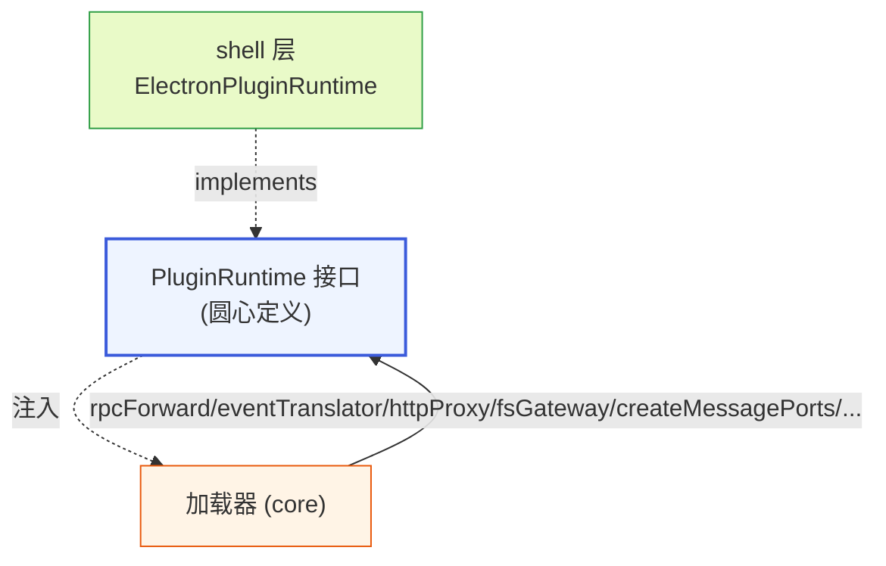

**图 10-1 — PluginRuntime 依赖倒置：shell 实现、圆心定义接口、加载器调接口**

### 10.3 测试替换

因为加载器依赖 `PluginRuntime` 接口而非具体实现，加载器的全部逻辑（九项）都可以在 Node 单元测试里跑——注入 `MockPluginRuntime`，fake worker 的 activate/deactivate、fake RPC 响应、fake event 流、fake fs。这让加载器的"极其完善"可被测试保证：发现/合并/校验/依赖排序/生命周期/错误隔离/沙箱/槽位挂载/热重载每一项都能写覆盖测试，不依赖 Electron 运行时。九项与测试的对应：发现→扫 mock 目录、合并→构造同 id 候选修覆盖、校验→喂脏 manifest、依赖排序→构造环/缺失图、生命周期→fake activate 抛错、错误隔离→fake worker exit、沙箱→断言 scoped API 不含 require/fs、挂载→构造重名贡献项查仲裁、热重载→触发 mock watcher change。

## 11 权限模型

### 11.1 permissions 声明与校验

沙箱默认只给 `rpc`/`events`/`bus`/`config`/`i18n`/`fs(插件自身 data 目录)`/`http.fetch(白名单域名)`，要更多能力必须在 manifest 的 `permissions` 字段声明、由用户在管理 UI 授权。取值分两类——**固定枚举权限**和**模式权限**：

固定枚举权限（字面值校验，必须完全相等）：

- `"fs:project:read"` / `"fs:project:write"`（读/写当前项目目录，文件预览/编辑器用，对应 `context.fs`，§8.6）
- `"fs:global:read"` / `"fs:global:write"`（读/写 `~/.pi`，慎用）
- `"content:sensitive"`（声明后插件才能在订阅的 SessionEvent 里看到消息文本内容）
- `"fs:{读写插件的 data 目录}"`（默认就有，不用声明）

模式权限（带变量，按模式校验，不是固定枚举串）：

- `"net:<host>"`：允许 `http.fetch` 该 host。`<host>` 是具体域名（如 `"net:api.github.com"`）或带通配（如 `"net:*.github.com"`）。校验规则：插件声明的每个 `net:` 权限按 host 白名单匹配，`http.fetch` 的 URL 的 host 必须命中某个已授权模式——精确域名直接相等命中、`*.github.com` 匹配 `api.github.com`/`raw.githubusercontent.com` 等（仅一层通配、不跨多级）。校验正则示例：`^net:(\*\.)?[a-z0-9.-]+$`。

> **`child:<command-pattern>` 暂未开放**：执行特定子进程命令的权限（如 `"child:git"`、`"child:npm:*"`）当前是**声明即死**的预留——PluginContext（§8）与 RendererPluginContext（§9）均未暴露任何子进程执行 API，§6.3 明确注入的能力集合里没有 child 通道，底座 RPC 的 31 个命令里也没有"代执行子进程"一条。即插件声明 `child:git` 既无通道兑现、也无校验器分支接受它。为避免插件作者误以为声明即可用、安全审计者误以为该防御层已就位，`child:` 当前**移出可声明权限枚举**、列入 §20 演进项：待底座/core 补齐"代执行子进程"通道后再开放该权限并补校验器。在通道补齐前，manifest 声明 `child:` 会被校验器判 `permission.malformed`（未知权限）→ 校验失败、标错跳过。

**校验器实现**：`validateManifest`（§5.3）把 permissions 解析成"固定枚举集合 + 模式规则列表"两部分。固定枚举权限查集合相等、模式权限按模式匹配。非法格式（如 `"net:"` 缺 host、`"fs:unknown:read"` 未知 scope、`"child:git"` 当前未开放权限）→ 校验失败。这样校验器能判定合法/非法、安全语义不空洞。

### 11.2 用户授权

用户授权发生在两个时机：

- **安装时授权**（外部插件）：installer 在装时把 `permissions` 列给用户看，让用户在安装时授权（DESIGN.md §3.9.4 的权限预览步骤）。用户拒授权则取消安装、清理临时目录。
- **运行时授权**（首次调用受限能力时）：本地手写插件没有安装步骤，首次调用受限能力（如 `http.fetch`）时弹授权提示。用户授权后写入授权表。

用户授权后 core 才把对应能力注入 PluginContext，未声明未授权的能力调用会抛错。授权表存 `~/.pi/desktop/permissions.json`（用户级），记录每个插件 id 已授权的权限列表。

### 11.3 content:sensitive 过滤

`content:sensitive` 是数据隐私权限——声明后插件才能在订阅的 SessionEvent 里看到消息文本内容。AgentMessage 的 `content[]`（对话文本/图片）、`toolCalls[].args`（工具参数，可能含文件内容）是敏感字段。gateway/event-translator（shell 层）翻译 pi 事件成中性 SessionEvent 时，按订阅插件的权限过滤——未声明 `content:sensitive` 权限的插件，收到的 event 里敏感字段置空（只保留 role/toolName 等元数据）。

**过滤点在 gateway 层、不在圆心**（圆心不感知权限），也**不在插件侧**（插件无法绕过）。这防止恶意插件默默收对话内容外传（配合 `net:` 域名白名单）。`content:sensitive` + `net:` 同时声明时管理 UI 要重点提示用户"此插件能读你的对话并外发到 X 域名"。

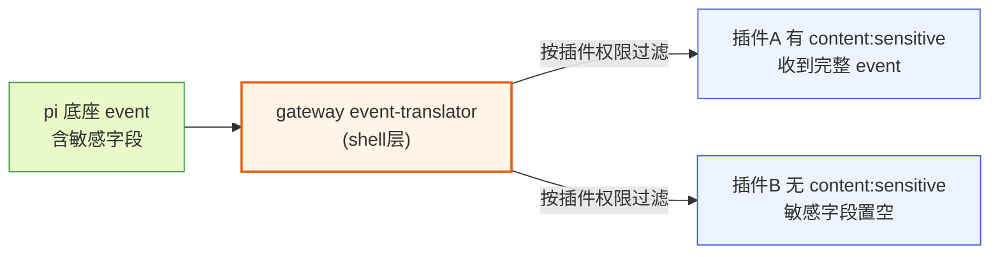

**图 11-1 — content:sensitive 过滤：gateway 层按插件权限过滤，未声明者敏感字段置空**

### 11.4 运行时撤销

用户装时/运行时授权了 permissions，后续在管理 UI 可以**撤销**某个权限（或整个禁用插件）。撤销时：

- **撤销单权限**：加载器更新该插件的授权表、把对应能力从 PluginContext 注入里摘掉。已 activate 的插件下次调该能力时抛错（"权限已撤销"）——插件要能优雅降级，不能崩（§5.5 错误隔离兜底）。
- **禁用插件**：deactivate 它、摘槽位贡献项、但保留磁盘文件和配置（区别卸载）。用户可重新启用。

这套撤销机制和"授权"对称——权限是动态的、用户随时可改，不是装了就永久。管理 UI 是权限的单一管理面。

## 12 外部插件接入

### 12.1 设计立场

**外部插件和内置插件走同一套加载器、同一沙箱、同一 permissions 授权**，不引入"可信/不可信"分级、不额外加 webview 强隔离层。第三方插件不可信的风险靠沙箱挡——`utilityProcess` worker 进程隔离 + 白名单 scoped API + `permissions` 显式声明 + 用户授权（§5.6/§11）。外部插件和内置插件唯一的区别是**来源标记 + 分发链路**（安装/校验/更新/卸载），加载执行时一视同仁。

这避免了 VSCode 那种"本地扩展/工作区扩展/Marketplace 扩展"多套加载路径的复杂度——pi-desktop 只有一套加载路径，来源只影响怎么落到磁盘、不影响怎么加载。

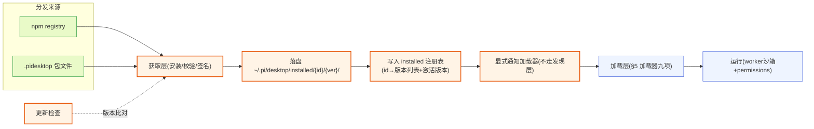

**图 12-1 — 外部插件接入链路：分发来源 → 获取层(安装/校验) → 落盘 + 写注册表 → 复用 §5 加载层**

### 12.2 双渠道：npm 与 .pidesktop

两种分发渠道：

- **npm 包（在线主渠道）**：第三方发布成 npm 包（如 `@scope/pi-desktop-plugin-foo` 或 `pi-desktop-foo`），用户在桌面端管理 UI 搜包名安装。桌面端经 shell 提供的 `PackageFetcher` 接口（依赖倒置，§12.5）拉包、解到 installed 目录。和底座 extension 的 `Settings.packages` 机制同源（底座 packages 也是 npm/git 源），但**落点不同**——底座 packages 落 `~/.pi/agent/extensions/`（底座进程加载），桌面插件落 `~/.pi/desktop/installed/{id}/{version}/`（桌面加载器加载）。两套 packages、两个目录、两个加载器，不混。
- **.pidesktop 包文件（离线/内网渠道）**：第三方打包成单文件 `.pidesktop`（实质是个 zip：`plugin.json` + `main.ts/js` + `renderer.*` + 资源 + 可选签名块）。用户从文件拖入、或贴 URL 下载安装。适合内网分发、离线场景、不想走 npm registry 的场景。和 npm 的区别只是"怎么拿到包文件"——拿到后解压、校验、落盘的步骤一样。

两种渠道产出的都是"`~/.pi/desktop/installed/{id}/{version}/` 下一份完整的插件目录"。

### 12.3 包格式与签名校验

`.pidesktop` 包格式（npm 包的 package.json 等价物）：

```
foo.pidesktop (zip)
├── plugin.json          # manifest（§2.2 的格式）
├── index.ts / ui.tsx    # 代码模块（源码，加载器经 jiti/esbuild 转译；也允许 .js 预编译产物）
├── resources/           # 静态资源（图标、语言包 JSON 等）
├── META/                # 可选：元信息（含作者公钥）
│   └── pubkey.pem       # 作者公钥（随包携带，供验签）
└── SIGNATURE            # 可选：对包内容哈希的签名（作者私钥签）
```

包内发布**源码为主**（`index.ts`/`ui.tsx`），由加载器按 §4.4 转译；也允许发布预编译产物（`index.js`/`ui.js`）——加载器对 `.ts` 走 jiti/esbuild、对 `.js` 直接加载，两者兼容，由 `main`/`renderer` 字段扩展名决定分支、无需声明类型戳。

manifest 里对分发场景多两个字段（本地手写插件不需要，分发才需要）：

```json
{
  "id": "foo",
  "version": "1.2.0",
  "displayName": "Foo",
  "author": "author-id",
  "source": "npm:pi-desktop-foo",
  "homepage": "https://...",
  "permissions": ["net:api.foo.com"],
  "contributes": { ... }
}
```

`source` 字段用于溯源——卸载、更新检查、冲突报告时知道这插件哪来的。本地手写插件（直接放 `~/.pi/desktop/plugins/`）没有 `source`，来源标记是 `local`。

**签名校验与公钥分发**：`.pidesktop` 包可选带 `SIGNATURE`（作者用私钥签包内容哈希）和 `META/pubkey.pem`（作者公钥）。校验链路钉死如下：

- **公钥来源**：作者公钥随包内 `META/pubkey.pem` 携带——但裸公钥不能直接信任（作者可伪造任意公钥）。信任建立在**内置可信公钥表**上：pi-desktop core 维护一份 `~/.pi/desktop/trusted-keys.json`（随壳分发的初始可信公钥 + 用户手动导入的可信公钥）。安装时校验流程：① 用包内 `pubkey.pem` 验 `SIGNATURE`（签名是否由该公钥对应的私钥签的）→ 通过则证明包内容未被篡改、且签名者持有该公钥的私钥；② 查 `trusted-keys.json` 看该公钥指纹（SHA-256 of pubkey）是否在可信表里 → 在则标 `verified`、不在则标 `unverified`（签名有效但公钥不受信任）。
- **npm 渠道**：npm 包靠 npm registry 的发布者机制做一层信任（包名 scope 归属、发布者 npm 账号），npm 包可省略 `SIGNATURE`——npm 的发布者身份本身就是一层信任源。若 npm 包带 `SIGNATURE` 则同样走上述校验、双重确认。
- **verified 判定完整链路**：`verified` = 签名校验通过 **且** 公钥在可信表（或来自 npm 受信任发布者）；`unverified` = 签名缺失/失败/公钥不受信任。管理 UI 显示这个标记让用户知情。
- **用户导入手动信任**：用户可在管理 UI 把某个 `unverified` 插件的公钥指纹加入 `trusted-keys.json`（手动信任），下次起标 `verified`。这是"信息提示帮用户决策装不装"的落地，不是"强制签名才让装"——强制会挡掉社区小作者。

签名不是强制（强制会挡掉社区小作者），但 verified 标记帮用户判断可信度。这条和"不分信任级、靠沙箱挡"不矛盾——沙箱是技术隔离（任何插件都过沙箱），签名是信息提示（帮用户决策装不装），两者职责不同。

### 12.4 安装链路

用户在管理 UI 点"安装插件"（输 npm 包名 / 选 .pidesktop 文件 / 贴 URL），安装链路：

1. **获取**：npm 渠道调 npm 拉包到临时目录；.pidesktop 渠道下载/读文件到临时目录。
2. **解包**：解压到临时目录，读 `plugin.json`。
3. **校验**：manifest schema 校验（§5.3 同规则）+ 签名校验（如有，含公钥可信判定，§12.3）+ 版本检查（已装同 id 是否更高版本）+ 权限预览（把 `permissions` 列给用户看，让用户**安装时授权**，§11.2）。
4. **落盘**：校验通过、用户授权后，移到 `~/.pi/desktop/installed/{id}/{version}/`（不在 §5.1 发现路径下）。版本进目录名——支持多版本共存。
5. **写注册表**：把该版本登记进 installed 注册表（§12.9），更新激活版本（默认"已装最新"，或用户指定）。
6. **加载**：调 `loader.loadExplicit()` 显式通知加载器加载激活版本（§12.7），加载器校验+activate。
7. **失败回滚**：任一步失败（校验不过、用户拒授权、解包损坏）都清理临时目录、不留半装状态。

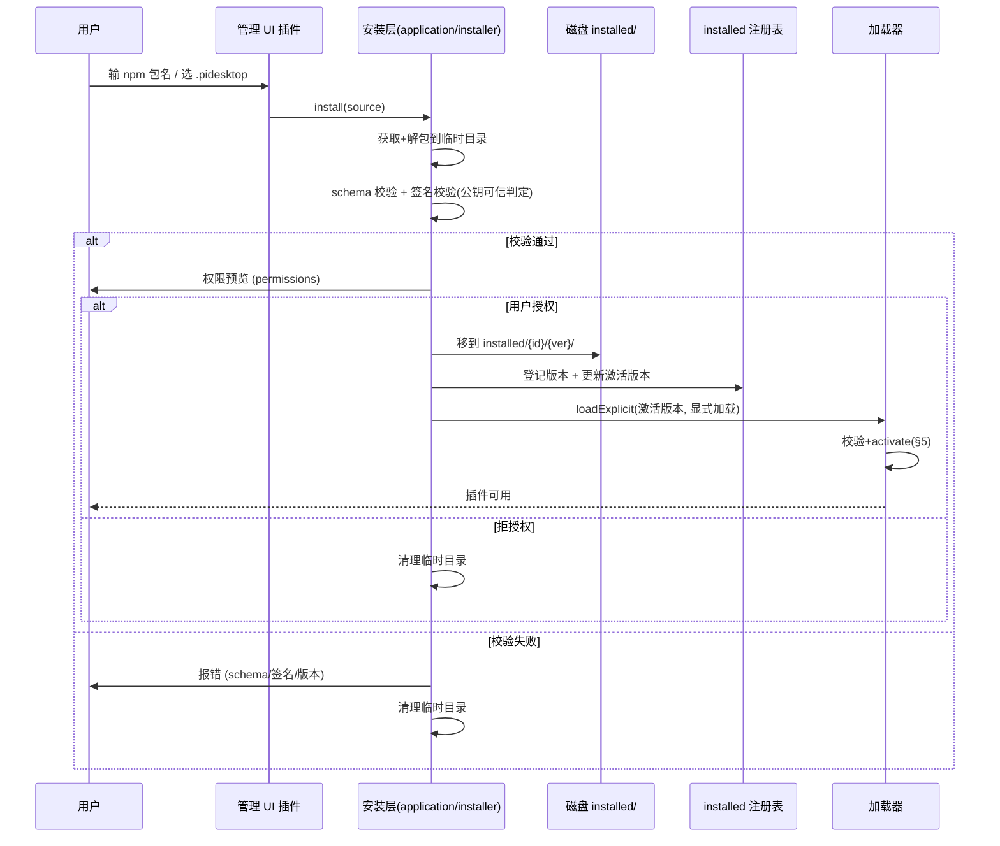

**图 12-2 — 插件安装链路：获取→校验→授权→落盘→写注册表→loadExplicit 加载，任一步失败回滚**

### 12.5 PackageFetcher 倒置

installer 的实际网络/磁盘 IO（npm 拉包、下载 .pidesktop、写 installed 目录）是 shell 级能力——用依赖倒置解：application 定义 `PackageFetcher` 接口（描述"获取一个包到临时目录"需要什么），shell 实现它（npm fetcher 用 npm 客户端、file fetcher 用 http 下载）。installer 调接口、不 import shell 实现，和 PluginRuntime（§10）同样的倒置模式。签名校验（crypto）是纯逻辑、无外部依赖、放 application。

```typescript
// application/installer/package-fetcher.ts —— application 定义接口（依赖倒置）
export interface PackageFetcher {
  fetch(spec: string, dest: string): Promise<FetchedPackage>;  // spec: npm 包名 或 file:url
  // shell 提供 NpmFetcher / FileFetcher 两个实现
}
export interface FetchedPackage {
  manifest: PluginManifest;
  contentDir: string;
  signature?: Buffer;
  pubkey?: Buffer;  // 来自 META/pubkey.pem
}

// application/installer/installer.ts —— installer 调接口、调 loader、不调 shell
async function install(spec: string, fetcher: PackageFetcher, loader: Loader) {
  const fetched = await fetcher.fetch(spec, tempDir);        // 经接口，不 import shell
  const errors = verify(fetched);                              // application 纯逻辑（含签名+公钥可信判定）
  if (errors.length) { cleanup(tempDir); throw errors; }
  const granted = await promptPermissions(fetched.manifest);  // 复用 permissions（§11）
  if (!granted) { cleanup(tempDir); return; }
  moveTo(path.join(installedDir, fetched.manifest.id, fetched.manifest.version));  // 经注入的 fs 通道
  installedRegistry.registerVersion(fetched.manifest.id, fetched.manifest.version, "latest");  // 写注册表
  await loader.loadExplicit(...);                              // 显式通知加载器加载（不走发现层）
}
```

关键复用点（呼应"能持有就持有"）：

- **加载层、生命周期、沙箱、槽位挂载**——外部插件全部复用 §5，不重写。installer 只负责"把插件正确落到 `installed/` 目录、登记注册表并显式通知加载器"，加载走已有加载器。
- **permissions 授权**——复用 §11 的 permissions 机制，installer 在装时调它做授权预览、装后写入授权表，不另造权限系统。
- **manifest 校验**——复用 §5.3 的 schema 校验逻辑，verifier 调同一个校验器，不重写校验。
- **PackageFetcher 接口**——npm/file 两个渠道是实现差异，接口统一，installer 不 switch 渠道（接口多态、不 if-else）。

### 12.6 installed 目录不走发现层

**注意 installed 目录不在 §5.1 的发现路径下**（§5.1 扫的是 `~/.pi/desktop/plugins/`，installed 是 `~/.pi/desktop/installed/`，分开）——外部插件不靠发现层自动扫，靠 installer 安装完后**显式通知加载器加载**（调 `loader.loadExplicit()`，不是全量重扫）。这样避免发现层递归层级问题、也让 installed 支持多版本共存（`installed/{id}/{version}/`）。手写本地插件放 `~/.pi/desktop/plugins/` 走发现层、安装的外部插件放 `~/.pi/desktop/installed/` 走显式加载——两条入口，但都进同一个加载器（§5）。**分发渠道只决定"怎么落盘"，落盘后统一进 §5 加载。**

### 12.7 loadExplicit 入口

`loader.loadExplicit(manifest, rootDir)` 是外部插件的显式加载入口——绕过 §5.1 的发现层扫描，直接对一个已落盘的 manifest 走加载器的后续流程（校验 → 优先级合并参与 → 依赖检查 → activate → 槽位挂载）。

```typescript
// 显式加载入口：外部插件走这，不走 loadAllPlugins 的发现层
async function loadExplicit(manifest: PluginManifest, rootDir: string): Promise<void> {
  const candidate = { path: rootDir, source: "installed", manifest };
  const errors = validateManifest(manifest);  // 复用 §5.3 校验（含 dependsOn 自引用检测）
  if (errors.length) { markPluginError(manifest.id, errors); throw errors; }
  // 参与优先级合并（installed 优先级介于 user 和 builtin 之间）
  const conflict = checkPriorityConflict(manifest.id, "installed");
  if (conflict) { markOverride(manifest.id, conflict); return; }  // 被更高优先级覆盖，不加载
  // dependsOn 存在性检查：复用 §5.3.5 的依赖缺失检测，命中则标错、不 activate
  // （§5.3 校验只查 dependsOn 自引用、不查依赖是否存在，这里补一次存在性兜底）
  const missing = checkDependsOnExists(manifest.dependsOn ?? [], activePluginIds());
  if (missing.length) {
    markPluginError(manifest.id, [`dependsOn.missing: ${missing.join(", ")}`]);
    return;  // 依赖缺失，不 activate、不拖垮其他已加载插件
  }
  await activatePlugin({ ...candidate, codeModules: resolveEntryFiles(manifest) });
  mountContributions(/* ... */);  // 复用 §5.7
}
```

loadExplicit 复用加载器的全部后续逻辑（校验/合并/activate/挂载），只跳过发现层。与启动期 `loadAllPlugins`（§5.9 先 `topoSortByDeps` 全量排序再逐个挂载）不同，loadExplicit 是"单个插件、运行时插入"——无法重做整张依赖图的拓扑排序，因此这里补一次 §5.3.5 的 `checkDependsOnExists` 存在性检查作为兜底：命中缺失则 `markPluginError` + `return`（不 activate），把 `dependsOn.missing` 这条错误码与启动期路径对齐。循环依赖不在此检查范围内（单插件插入不会引入环，环只可能在批量排序时出现，由 §5.9 的 `topoSortByDeps` 处理）。这是"两条入口、一个加载器"的具体落地——发现层和 loadExplicit 都产出生效 manifest，后续走同一套。

### 12.8 更新与卸载

- **更新检查**：安装层记每个已装插件的 `source`（npm 包名或 file:url）。npm 渠道定期（或用户手动）查 registry 最新版本，比对已装版本，有新版提示用户更新。.pidesktop 渠道靠包内的 `homepage` 或 source URL 提示用户手动更新（无自动 registry 检查）。**更新 = 显式切版本流程**（installed 插件不走 watcher 热重载，见 §5.8）：① deactivate 旧版本（带超时兜底）→ ② 从槽位注册表摘除旧版本贡献项 → ③ 走一遍安装链路获取新版、校验、落盘新版本目录 → ④ `loadExplicit` 加载新版本、更新注册表激活版本 → ⑤ 旧版本目录按策略保留或清理（默认保留一个回退版本、用户可在管理 UI 显式清理全部旧版本）。这个流程对应 §12.9 的"用户指定版本"路径。
- **卸载**：管理 UI 点卸载 → 加载器 deactivate 该插件（§5.4 生命周期）→ 从槽位注册表摘除贡献项 → 从 installed 注册表移除该 id 的全部版本记录 → 删 `~/.pi/desktop/installed/{id}/` 目录（或标记卸载、保留配置）→ 通知加载器卸载完成（外部插件不走发现层，不经重扫）。卸载也要干净——不留悬空槽位、不留死 worker。
- **配置保留**：插件自己的配置（`~/.pi/desktop/plugins-data/{id}/config.json`，§8.5）卸载时默认保留——用户重装能恢复偏好。管理 UI 提供"卸载并清除配置"选项做彻底清理。

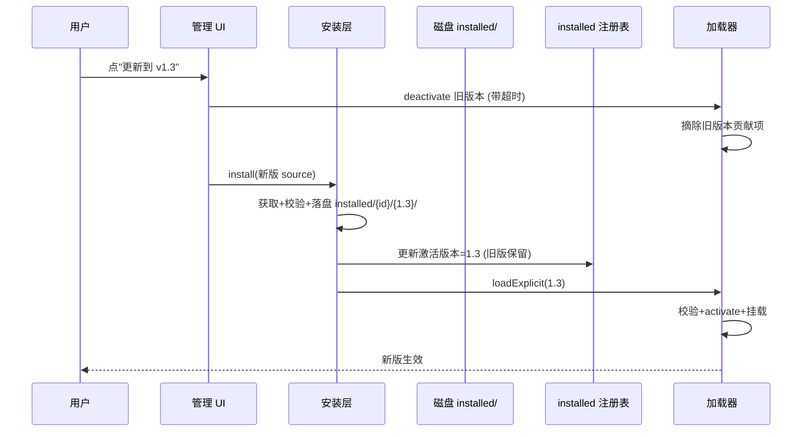

**图 12-3 — installed 插件更新切版本：deactivate 旧 → 安装新版落盘 → loadExplicit 新版，旧版保留作回退**

### 12.9 installed 注册表与启动期加载

**问题背景**：§5.1/§12.6 明确 installed 目录不在发现层扫描范围、外部插件靠 installer 调 `loadExplicit` 显式加载。但 core 重启后，已装的第三方插件如何被重新加载、加载哪个版本——`loadExplicit` 只接收单个 manifest+rootDir、不会自己挑版本。这条链路钉死如下。

**installed 注册表**：installer 维护一份 `~/.pi/desktop/installed/registry.json`，记录每个已装插件的版本列表与激活版本：

```typescript
interface InstalledRegistry {
  // id → 该插件的已装版本集合 + 激活策略
  plugins: Record<string, {
    versions: { version: string; path: string; installedAt: number }[];
    activeVersion: string;        // 当前激活版本号
    pinnedByUser?: boolean;       // 用户是否手动 pin 了某版本（不走"已装最新"）
  }>;
}
```

- **版本选择策略**：默认 `activeVersion = "已装最新"`（按 semver 比较取 max，semver 比较用标准 `semver.compare`，预发布标签按 semver 规则排序）；用户在管理 UI 手动 pin 某版本时 `pinnedByUser=true`、`activeVersion` 固定为该版本（存储位置就在 registry.json 的该 id 条目）。`pinnedByUser` 的版本号是用户选定的、显式记录。
- **core 启动期加载链路**：core 启动时（`loadAllPlugins` 之外），installer/loader 按以下步骤加载 installed 插件——① 读 `registry.json` → ② 对每个 id，按版本选择策略算出 `activeVersion` → ③ 解析该版本的 `rootDir = installed/{id}/{activeVersion}/` + 读其 `plugin.json` → ④ 对每个生效版本调 `loader.loadExplicit(manifest, rootDir)`。这个枚举由 installer 侧的 `InstalledRegistryLoader` 负责（不是 `loadAllPlugins` 的发现层扫、而是读注册表逐个 loadExplicit），`loadExplicit` 内部复用 §5.3-§5.7 全部后续逻辑。
- **失败兜底**：某 id 的 `activeVersion` 目录缺失/manifest 损坏 → 标错、跳过该插件、不拖垮其他 installed 插件（走 §5.5）。版本选择算出的版本目录不存在时，回退到"该 id 下任意可用版本"（记 warning）。

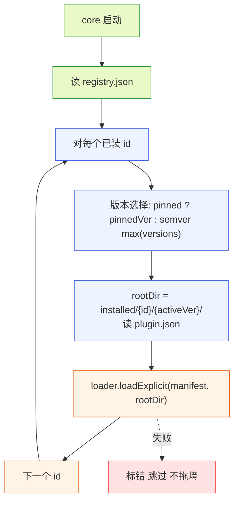

**图 12-4 — installed 启动期加载：读注册表 → 版本选择 → loadExplicit，不走发现层扫**

这条链路和 §13.1 时序图的"installed loadExplicit"对应——§13.1 的"三处目录扫描 + installed loadExplicit"里，installed 部分就是本节的 `InstalledRegistryLoader` 读注册表逐个 loadExplicit。

## 13 端到端流程

### 13.1 加载全流程

core 启动时（或用户触发"重载全部"时），加载器从发现层和 loadExplicit 两条入口收集 manifest，走双层管线：

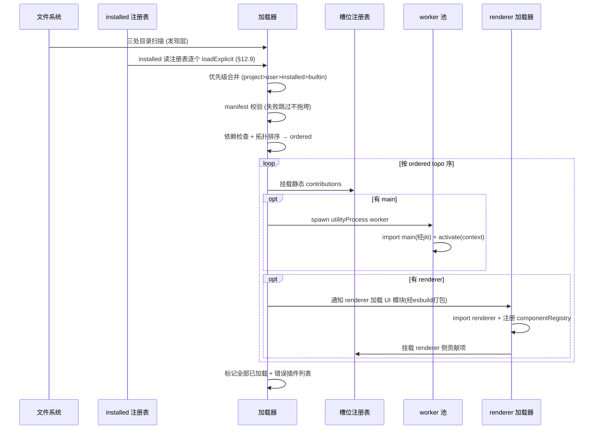

**图 13-1 — 加载全流程：发现 + installed loadExplicit → 合并 → 校验 → 拓扑排序得 ordered → 按 ordered 序挂载静态贡献 + spawn worker + 加载 renderer**

挂载时机与顺序：先拓扑排序（第 第4项(依赖检查)）得 `ordered`，再**按 `ordered` 顺序**逐个挂载静态贡献项（第 7 项）+ activate——与 §5.9 伪代码一致。这保证被依赖插件的贡献项先挂、依赖者 activate 时能查到被依赖者动态注册的贡献项。

### 13.2 运行时数据流

插件激活后，运行时数据流经两条 MessagePort 通道：

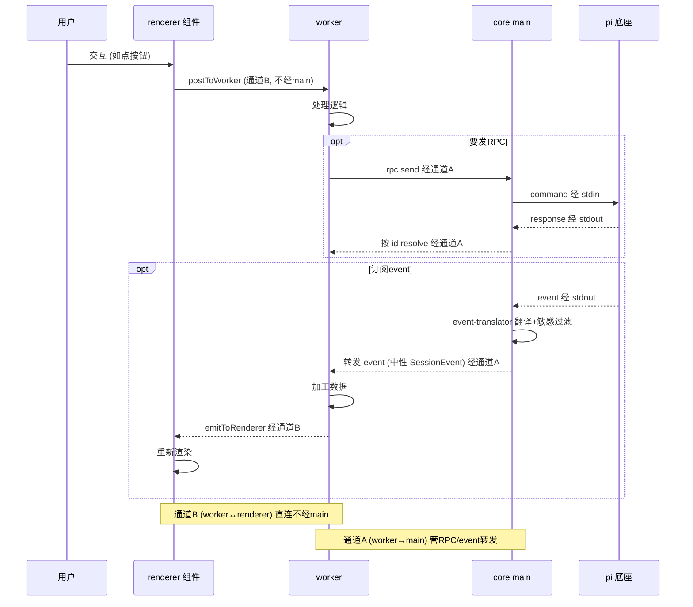

**图 13-2 — 运行时数据流：通道B管UI数据直连，通道A管RPC/event经main中转；插件侧收到的 event 统一是中性 SessionEvent**

### 13.3 消费而非翻译

最后钉死桌面插件和底座 extension 的关系。底座 extension 在桌面上有 UI 需求时，不是给它配 adapter（现有方案的旧路），而是写一个桌面插件，这个插件通过 RPC 观察底座——`get_commands` 拿 extension 注册的命令、订阅 `tool_execution_*` event 拿工具调用、订阅 `message_*` event 拿消息流——然后自己决定怎么呈现。这是桌面插件主动"消费"底座数据，不是被动"翻译"底座 UI。两者的区别：翻译是双向的、要吃下底座的渲染机制；消费是单向的、只拿数据自己画。pi-desktop 走消费这条路，所以底座的 TUI 渲染机制（`renderCall/renderResult` 返回 TUI Component）对桌面端完全无关——桌面端从来不吃它，也不需要把它翻译成 Web。

这个区分消解了 现有方案的整个 adapter 层：没有"翻译底座 extension UI"这件事，就没有 adapter 这层中间产物；没有 adapter，就没有"行为/外观两套并列概念"；没有两套并列概念，第三方扩展想在桌面有 UI，就只要写一个桌面插件（自带 UI、自带代码、随插件包分发），不用给 现有方案 仓库贡献 JSON 等发版。现有方案的三个问题——第三方没法自带桌面 UI、adapter 被降级成纯声明、一个概念两套体系——全部从这里根上消除。

## 14 端到端示例：一个带代码的双入口插件

把前面的契约串成一个完整示例，让实现者看到从 manifest 到 activate 到组件的完整落地。插件 `dashboard`：带 worker（订阅 event 聚合数据）+ renderer（侧栏 dashboard 组件），经通道B 推送数据。

**manifest（plugin.json）**：

```json
{
  "id": "dashboard",
  "version": "0.1.0",
  "displayName": "Dashboard",
  "main": "./index.ts",
  "renderer": "./ui.tsx",
  "permissions": [],
  "contributes": {
    "sidePanel": [
      { "id": "dashboard", "label": "dashboard.title", "icon": "layout-dashboard", "component": "DashboardPanel", "defaultVisible": true }
    ]
  },
  "dependsOn": []
}
```

**worker 侧（index.ts）**——经 jiti 转译、activate 注入 PluginContext：

```typescript
import type { PluginContext } from "pi-desktop";  // 圆心中性类型

export async function activate(ctx: PluginContext) {
  let toolCalls = 0;
  // 订阅中性 SessionEvent（gateway 翻译 pi 的 tool_execution_* 成它）
  const off = ctx.events.on((event) => {
    if (event.type === "tool-call-end") {  // 中性事件类型，非 pi 的 tool_execution_end
      toolCalls += 1;
      ctx.emitToRenderer("stats", { toolCalls, ts: Date.now() });  // 通道B 推给组件
    }
  });
  ctx.onDeactivate(off);  // 注册清理，deactivate 时自动退订
}
```

**renderer 侧（ui.tsx）**——经 esbuild 预打包、命名导出组件：

```tsx
import * as React from "react";
import { useMessage } from "pi-desktop";  // scoped pi 的 hook

export const DashboardPanel: React.FC<{ pi: import("pi-desktop").RendererPluginContext; theme: Record<string,string> }> = ({ pi, theme }) => {
  const [stats, setStats] = React.useState<{ toolCalls: number } | null>(null);
  useMessage(pi, "stats", setStats);  // 收 worker emitToRenderer 推的数据（通道B）
  return <pi.ui.Icon name="activity" /> <span>{stats?.toolCalls ?? 0}</span>;
};
```

**数据流**：底座推 `tool_execution_end` → main event-translator 翻译成中性 `ToolCallEnd` 并转发给 worker（通道A）→ worker `events.on` 收到、`toolCalls++`、`emitToRenderer("stats", …)` 推给 renderer（通道B）→ 组件 `useMessage` 收到、setState 重渲染。整条链路 worker 跑逻辑、renderer 跑 UI、两条通道分离，符合 §4 双入口设计。

这个示例验证了全部关键契约：manifest 字段（`component` 不带 `#`、`handler` 才带 `#`）、PluginContext 中性类型（`SessionEvent`）、RendererPluginContext 一致类型、通道A/B 分离、jiti/esbuild 转译、`onDeactivate` 清理。实现者照此可写出完整插件。

## 15 错误场景与失败处理

加载器要把"插件会出错"当一等公民——九项里的错误隔离（§5.5）只是兜底原则，落到具体场景有一张失败分类表，实现者照此判错、用户照此收到可读提示。下面按加载阶段给出失败模式、处置、用户可见反馈。

**发现阶段失败**：

- 目录不存在 / 无读权限：跳过该目录、记录 debug 日志、不报错给用户（这是正常配置，非异常）。
- `plugin.json` 解析失败（非法 JSON）：该候选标 `manifest.parse.error`、跳过、管理 UI 标红 + 展示解析错误行。
- `package.json` 缺 `pi.desktop` 字段：忽略该子目录（不算插件候选），非错误。
- 符号链接成环：跟随到上限（如 10 层）后停止、标 `discovery.symlink.loop`。

**校验阶段失败（§5.3）**：分错误码，每个错误码对应管理 UI 一条可读说明：

| 错误码 | 触发 | 处置 | 用户提示 |
|---|---|---|---|
| `manifest.missing.field` | 缺 id/version/displayName | 标错跳过 | "插件 X 缺少必填字段 Y" |
| `manifest.unknown.field` | manifest 含未知顶层字段（如 `config`） | 标错跳过 | "插件 X 含未知字段 Z（config 走运行期存储、不进 manifest）" |
| `manifest.unknown.slot` | contributes 含未知槽位名 | 标错跳过 | "插件 X 贡献了未知槽位 Z" |
| `matchrule.strategy.invalid` | cardRenderers 用了 extension 等越界策略 | 标错跳过 | "卡片渲染器不允许按文件扩展名匹配" |
| `management.schema.conflict` | component 与 schema 同时填/同时缺 | 标错跳过 | "管理页必须二选一：自带组件或声明 schema" |
| `dependsOn.self.reference` | dependsOn 含自身 id | 标错跳过 | "插件 X 依赖了自身" |
| `permission.malformed` | net: 缺 host 等 | 标错跳过 | "权限声明格式错误：net: 缺少域名" |
| `main.file.missing` | main 路径文件不存在 | 标错跳过 | "worker 入口文件不存在" |
| `export.not.found` | 加载后导出名不存在 | 标错跳过 | "渲染器找不到组件 ImageCard" |

**依赖阶段失败（§5.3.5）**：

- 依赖缺失：`dependsOn` 里某 id 不在生效列表 → 标 `dependsOn.missing`、本插件 skip、不拖垮其他。用户提示"插件 X 依赖 Y，但 Y 未安装"。
- 循环依赖：环上所有插件标 `dependsOn.cycle`、全禁用、记录环路径（A→B→C→A）。

**生命周期失败（§5.4）**：

- `activate` 抛错：kill worker、标 `activate.failed` + 错误栈、toast 通知、诊断页展开看栈。其他插件不受影响。
- `activate` 超时（如 10s 未返回）：视为挂起、kill worker、标 `activate.timeout`。
- `deactivate` 超时（5s）：强制 kill worker、标 `deactivate.timeout`、继续卸载流程（不让一个插件卡住整壳卸载）。

**运行时失败（§5.5/§6.4）**：

- worker `exit`（崩溃）：core 捕获、禁用该插件、摘槽位贡献项（防悬空引用）、toast 通知、诊断页标灰。崩溃原因（exit code/信号）记入诊断。
- worker 资源超限（CPU/内存）：kill + 禁用 + 标 `resource.exceeded` + toast。
- renderer 组件抛错：ErrorBoundary 接住、该组件位显示降级占位（"此面板出错，点击重试"）、不崩宿主树、不影响其他面板。重试 = 重新挂载该组件（React.lazy + key 重置）。

**安装/更新失败（§12.4/§12.8）**：

- 校验失败（schema/签名/版本）：清理临时目录、不落盘、报错给用户、不改注册表。
- 用户拒授权：清理临时目录、不落盘、不报错（用户主动取消）。
- `loadExplicit` 失败（activate 抛错）：新版本未生效、保留旧版本激活状态、标 `update.failed`、toast"更新失败，已回退到旧版"。
- 落盘后 loadExplicit 前进程退出：下次启动时 `InstalledRegistryLoader`（§12.9）读到注册表里登记了但目录 manifest 校验不过的版本 → 标错跳过、回退到该 id 下任意可用版本。

**热重载失败（§5.8）**：

- 新版校验失败：回退旧版 activate、标 `reload.rolledback`、toast"X 重载失败已回退"。
- 新版 activate 抛错：同上回退。
- 旧版已 deactivate 但新版也起不来且**旧版无法重新 activate**（极端）：插件进入 `orphaned` 态、标错、toast 提示用户手动重启或卸载——这是兜底的兜底，正常路径不应到达。

这套分类表让"错误隔离"从抽象原则变成可观测、可定位、可恢复的具体行为。诊断页（DESIGN.md §4.3）按错误码分组展示，每个出错插件显示错误码 + 栈 + 推荐行动（如"重新安装 X"/"卸载 X"/"检查依赖"）。

## 16 一致性与并发

加载器在并发和状态切换时容易出的一致性问题，这里钉死处置——不是可选优化，是正确性约束。

**槽位注册表的一致性窗口**：热重载（§5.8）里"deactivate 旧 → activate 新"中间有个窗口该插件的贡献项短暂消失。core 要保证这个窗口内**不出现旧贡献项和新贡献项同时存在**的脏状态——做法是 deactivate 前先从注册表摘除旧贡献项、activate 后再挂回新贡献项，摘除与挂回是原子的注册表操作（注册表读写加同一把锁/同一微任务批处理）。UI 渲染若在这个窗口内查到该槽位空（贡献项消失），渲染降级占位（如"加载中"）而非崩溃。这个窗口应尽量短（deactivate 带超时、不无限等插件清理）。

**worker 崩溃的悬空引用清理**：worker `exit` 后，core 必须同步摘除该插件在槽位注册表里的全部贡献项——否则 UI 渲染时查到贡献项、去调对应的组件/handler，但 worker 已死、引用悬空。清理顺序：① 收 worker exit 事件 → ② 从 `activePlugins` 移除该 id → ③ 遍历所有槽位注册表、摘 sourcePlugin.id === 该 id 的项 → ④ 通知 UI 该区域重渲染。renderer 侧组件的清理由 ErrorBoundary 兜底（worker 死了组件无数据源、抛错被 boundary 接住）。

**bus 的时序保证（§8.4）**：bus 是 fire-and-forget、无缓冲。这意味着两个插件即使有 `dependsOn` 关系，也**不保证消息可靠投递**——若 A 在 activate 期间发 bus 消息、B 尚未 subscribe，消息丢失。需要可靠协作的场景必须用 §8.4 的"已就绪信号"模式：B activate 后发 `bus.publish("B.ready", state)`、A activate 时立刻 subscribe + 查询 B 状态。这是显式的时序契约、不是隐式保证——文档把这写清楚，避免插件作者误以为 bus 像 RPC event 流那样有历史。

**拓扑排序的稳定性**：§5.3.5 规定同层插件按 `source 优先级 + id 字典序` 排序——这是为了让 activate 顺序**可重现**（同样输入产同样顺序）。不可重现的顺序会让"插件 A 的 register 在 B 之前/之后"依赖随机、bug 难复现。这条纪律也作用到槽位挂载顺序（§5.9 按 ordered 顺序挂载），保证贡献项注册顺序稳定、冲突仲裁的"先注册"判定稳定。

**热重载防抖与并发 reload**：同一个插件在 300ms 内连续改动只重载一次（debounce）。但若两个不同插件同时改动、各自触发 reload，两个 reload 并发执行——core 用每插件一把锁串行化该插件的 reload（不同插件可并行、同插件不并行），避免"旧版 deactivate 进行中、新版又触发"的交叉污染。

**installed 注册表的并发写**：installer 安装/更新/卸载都写 `registry.json`——多个安装操作并发时用文件锁（同 DESIGN.md §2.1.2 的 `proper-lockfile` 机制）串行化写、避免注册表损坏。读（启动期 `InstalledRegistryLoader` 读）在写锁释放后才能拿到一致快照。

**RPC id 配对的并发安全**：`RequestCorrelator`（§7.2）的 pending Map 是共享结构——多个 RPC 命令并发发出时，id 生成 + 存 pending 必须原子（用递增计数器 + 同步 set），避免两个并发命令拿到同 id。timeout 清理也要在 Map 操作的同一临界区内、避免清掉已 resolve 的项。

## 17 可观测性与诊断

加载器的"极其完善"不只是机制正确，还要求**可观测**——出问题时用户和开发者能定位到是哪个插件、哪一步、什么错。诊断能力分三层。

**插件状态列表**：core 维护全部已发现/已加载/已禁用插件的状态表，每个插件一条记录：`{ id, version, source, state, errorCode?, errorStack?, overrides?, overriddenBy? }`。`state` 取值 `discovered|loaded|active|disabled|error`。`overrides`/`overriddenBy` 记录插件级覆盖关系（§5.2）。管理 UI 的插件列表页就是这张表的视图——禁用/出错插件标灰/标红、展开看原因。

**诊断页**（对应 DESIGN.md §4.3 的诊断页）：按错误码分组展示出错插件，每条显示：插件名 + 版本 + 错误码（§15 的分类表）+ 错误栈（activate/worker 崩溃的栈）+ 推荐行动（按错误码映射的固定建议，如 `dependsOn.missing` → "安装缺失的依赖插件"、`export.not.found` → "检查 renderer 模块是否导出了声明的组件"、`resource.exceeded` → "该插件占用过多资源，联系作者或卸载"）。诊断页是排查插件问题的单一入口。

**toast 通知**：插件加载失败/运行时崩溃/资源超限/热重载回退都触发 toast——内容是"插件 X：简短原因"+ 点击跳诊断页。toast 防抖（同一插件短时间多次崩溃只通知一次、避免崩溃循环刷屏），并在通知里给出"禁用此插件"快捷按钮（让用户一键止损）。

**加载日志**：core 启动时按九项管线输出结构化日志（debug 级、可关）：发现扫了哪些目录、合并时谁覆盖了谁、校验跳过了谁、拓扑排序结果、每个插件 activate 耗时、worker spawn 结果。这些日志默认不展示给普通用户、开发期可在开发者工具/日志文件查，是定位"插件没加载出来"问题的第一手材料。日志落盘到 `~/.pi/desktop/logs/loader-{date}.log`，崩溃栈也写进去。

**版本与覆盖可观测**：installed 注册表（§12.9）的可视化——管理 UI 显示每个已装插件的全部版本、激活版本、是否 pin、是否有更新可用。覆盖关系（项目级覆盖用户级、用户级覆盖 installed、installed 覆盖 builtin）在 UI 上显式标注，让"为什么内置的 X 没生效"有答案（因为项目级放了一个同名插件覆盖了它）。

这套可观测层不引入新机制、全是读现有状态表（注册表/状态表/错误码），但把加载器的行为从"黑盒"变成"白盒"——是"极其完善"在可诊断维度的兑现。

## 18 更多端到端示例

§14 给了双入口插件示例，这里补三种常见形态的完整示例，覆盖纯声明式、预览器、命令 handler，让每类槽位的实现者都有参照。

**示例 A：纯声明式插件（零代码）**。一个只贡献命令项、用内置渲染器的插件，没有 main 也没有 renderer。manifest 即全部：

```json
{
  "id": "quick-commands",
  "version": "0.1.0",
  "displayName": "快捷命令",
  "contributes": {
    "commands": [
      { "id": "quick.abort", "title": "中止当前任务", "keybinding": "cmd+shift+x", "when": "agent.streaming", "handler": "#onAbort" }
    ]
  }
}
```

但这条命令要跑逻辑（发 abort RPC），所以必须有 `main`——纯声明式做不到发 RPC。修正：纯声明式插件只适合"贡献静态 UI"（如只贡献 sidePanel 指向内置组件、或只贡献 language/theme 静态资源）。本例修正为带 `main` 的单侧 worker 插件：

```json
{
  "id": "quick-commands",
  "version": "0.1.0",
  "displayName": "快捷命令",
  "main": "./index.ts",
  "contributes": {
    "commands": [
      { "id": "quick.abort", "title": "中止当前任务", "keybinding": "cmd+shift+x", "when": "agent.streaming", "handler": "#onAbort" }
    ]
  }
}
```

worker 侧 `index.ts`：

```typescript
import type { CommandContext } from "pi-desktop";
export async function onAbort(ctx: CommandContext): Promise<void> {
  await ctx.rpc.abort();  // 走 worker↔main 通道A 发 RPC
}
export async function activate() { /* 无需 activate 逻辑，命令按需触发 */ }
```

`when: "agent.streaming"` 保证命令只在 agent 流式输出时可见/可用——`agent.streaming` 由 core 维护的 contextKeys（§3.4）驱动。这个示例展示了：command handler 签名（§3.6）、when clause 与 contextKeys 的联动、单侧 worker 形态。

**示例 B：预览器插件（纯 renderer + 文件内容经 props 注入）**。一个 Markdown 文件预览器，manifest 只声明 renderer + viewers 贡献项：

```json
{
  "id": "markdown-viewer",
  "version": "0.1.0",
  "displayName": "Markdown 预览",
  "renderer": "./ui.tsx",
  "permissions": ["fs:project:read"],
  "contributes": {
    "viewers": [
      { "match": { "strategy": "extension", "value": "md" }, "component": "MarkdownViewer" }
    ]
  }
}
```

`ui.tsx`：

```tsx
import * as React from "react";
import type { ViewerProps } from "pi-desktop";

export const MarkdownViewer: React.FC<ViewerProps> = ({ filePath, content, pi, theme }) => {
  // content 由 core 按该插件 fs:project:read 权限读出后注入（§9.4），组件不直接读 fs
  const html = React.useMemo(() => renderMarkdown(String(content)), [content]);
  return <div className="md-preview" style={{ color: theme["color.fg"] }} dangerouslySetInnerHTML={{ __html: html }} />;
};
```

注意：`dangerouslySetInnerHTML` 渲染 Markdown HTML 有 XSS 风险——这个场景下 `content` 来自本地项目文件（用户的项目）、不是任意网络内容，风险可控；若插件作者要渲染不可信来源的 HTML，应改走 webview 强隔离槽位（§4.5）。core 经 `fs:project:read` 权限读文件、经 props 注入 `content`——权限校验落 worker/core 侧、renderer 组件只消费，符合 §8.6/§9.4 的权限模型。若插件没声明 `fs:project:read`，core 不会注入 content（预览器匹配到了也无内容可渲染、显示"无权限读取该文件"）。

**示例 C：动态注册贡献项**。一个插件 activate 时根据 config 决定挂不挂某个侧栏 Tab——展示 `context.register`（§8.10）和 `dependsOn` 时序。**注意默认配置不进 manifest**（§2.2 顶层无 `config` 字段、§5.3 未知顶层字段判 `manifest.unknown.field`、§8.5 config 是运行期存储在 `plugins-data/{id}/config.json`）：默认值放在 activate 代码里，首次运行时若无持久化 config 则用代码内默认值。

```json
{
  "id": "adaptive-panel",
  "version": "0.1.0",
  "main": "./index.ts",
  "renderer": "./ui.tsx",
  "contributes": {}
}
```

worker 侧（默认值在代码里、不进 manifest）：

```typescript
import type { PluginContext } from "pi-desktop";
const DEFAULT_CONFIG = { showDashboard: true };  // 默认值在代码里，不写进 manifest
export async function activate(ctx: PluginContext) {
  // 首次 activate 时 plugins-data/{id}/config.json 不存在 → ctx.config.get 返回 undefined → 用代码默认值
  // 用户在设置页改过后 config.json 持久化、后续 activate 读到的是用户值
  const show = ctx.config.get<boolean>("showDashboard") ?? DEFAULT_CONFIG.showDashboard;
  if (show) {
    ctx.register({  // 动态注册，激活时立刻挂进槽位注册表、对其他已激活插件可见（§5.3.5）
      slot: "sidePanel",
      contribution: { id: "adaptive.dashboard", label: "adaptive.title", icon: "layout", component: "AdaptivePanel" }
    });
  }
  ctx.onDeactivate(() => { /* register 的项在 deactivate 时自动摘除 */ });
}
```

动态注册的贡献项与 manifest 静态声明的等价——都进同一个槽位注册表、走同一套冲突仲裁（§5.7）。区别只在"何时挂"：静态声明在挂载阶段（§5.9）挂、动态注册在 activate 时挂。若另一个插件 `dependsOn: ["adaptive-panel"]` 且要查 `adaptive.dashboard` 这个动态贡献项——拓扑排序保证 adaptive-panel 先 activate、动态注册先发生，依赖者 activate 时能查到（§5.3.5 动态注册可见性）。

这三个示例加上 §14 的双入口示例，覆盖了全部插件形态（纯声明/单侧 worker/单侧 renderer/双入口/动态注册）和主要槽位（commands/viewers/sidePanel/cardRenderers），实现者照着能写出各类插件。

## 19 开发工作流与调试

插件作者的开发体验直接影响生态——加载器要支持"改了立刻看到效果"的快循环。开发工作流钉死如下。

**本地开发**：作者把插件目录放在 `<cwd>/.pi/desktop/plugins/`（项目级，开发期最高优先级、覆盖一切），改 `plugin.json`/`index.ts`/`ui.tsx` 后保存——file watcher（§5.8）300ms 防抖后自动热重载该插件：deactivate 旧版 → jiti/esbuild 重新转译 → activate 新版。worker 侧经 jiti 即时转译、renderer 侧经 esbuild 重新打包，作者无需手动 build。热重载失败回退旧版并 toast 提示，不让开发卡在"插件既不是新版也不是旧版"。

**调试 worker 代码**：utilityProcess 支持 Electron 的调试协议——开发期 core 启动 worker 时带 `--inspect={port}` 参数，作者在 VSCode/Chrome DevTools 附着到该端口、在 activate 里打断点、看 RPC 转发和 event 流。`PLUGIN_ID`/`PLUGIN_ROOT` 环境变量帮助 worker 代码定位自己。开发者工具的 console 同时接到 worker 的 stdout/stderr（经 MessagePort 转发到 renderer 的 DevTools），方便看日志。

**调试 renderer 代码**：renderer 侧插件组件跑在宿主 renderer 进程，直接用 Electron 的 DevTools 调试——React DevTools 能看到插件组件树、props（含 core 注入的 `pi` 对象和 `theme`）。ErrorBoundary 在开发期把错误栈直接抛到 console、不吞掉。

**调试 manifest 校验**：作者改了 `plugin.json` 后若校验失败，热重载会回退并 toast 错误码（§15 分类表），如 `matchrule.strategy.invalid` 说明 cardRenderers 用了越界策略。诊断页展示完整校验错误。作者据此修 manifest。

**模拟底座**：开发插件时手边不一定有 pi 底座跑着——`MockPluginRuntime`（§10.3）不仅用于加载器单测，也可作为开发期的 fake 底座：注入假的 RPC 响应（如 `getState` 返回固定的 `SessionState`）、fake event 流（按脚本推 `tool_execution_*`）。插件作者用 mock runtime 跑插件、不依赖真实底座，加快开发循环。这是依赖倒置（§10）的额外收益——同一套接口既支持真实运行、也支持开发期 mock。

**发布**：开发完成后，作者把插件目录打成 `.pidesktop`（zip）或发 npm 包。本地手写插件（放 `~/.pi/desktop/plugins/`）不需要打包、直接可用；发布才需打包。打包时若带签名，用作者私钥签包内容哈希、公钥放 `META/pubkey.pem`（§12.3）。用户安装后看到 verified/unverified 标记。

这套工作流让插件作者从"写代码"到"看到效果"的循环在秒级——是加载器对生态友好度的兑现，和"极其完善"的机制层配套。

## 20 演进项与已知边界

诚实记录当前设计的边界和未来演进方向，避免实现者误以为是已完成的承诺。

**worker 池化**：当前每个带 `main` 的插件独占一个 utilityProcess（§6.1），进程数等于带代码插件数。插件数膨胀到几十上百时进程成本上升。演进项：轻量插件合并到一个受控 worker host 进程、共享堆——但牺牲进程级隔离强度，需配套更细的资源配额。当前不池化、作为演进项。

**renderer 强隔离**：当前 renderer 侧用编译期模块封装 + portal（§4.3），隔离强度是"防误用 + 防常规越界"，挡不住刻意逃逸。完全不可信的富内容走 webview 兜底。演进项：评估 ShadowRealm（TC39 提案）在 renderer 可用时替换模块封装、提供更强隔离。当前用模块封装 + webview 兜底。

**底座 reload 的无重启热加载**：当前桌面端改 pi 配置后要重启 RPC 子进程才生效（DESIGN.md §2.4），代价是当前 turn 中断。演进项：底座补 `reload` RPC 命令后，改为无重启热加载——这条在底座侧、不在本文加载器范围，但加载器要预留"底座 reload 完成后 resync"的钩子（已由 `rpc.resync()` 兑现，§8.2）。

**installed 插件的热重载**：当前 installed 插件不热重载（§5.8 只监听本地目录），改 installed 插件要重新安装或手动 loadExplicit。演进项：对开发期的 installed 插件（标记 `source: "local-dev"`）也接 watcher、热重载其源码——但生产 installed 插件（已打包产物）仍走显式更新。当前 installed 不热重载。

**子进程代执行通道与 `child:` 权限**：当前 PluginContext（§8）/RendererPluginContext（§9）均不暴露子进程执行 API，底座 RPC 的 31 个命令里也没有"代执行子进程"一条，`child:<command-pattern>` 权限因此是声明即死、已移出可声明枚举（§11.1）、§24 威胁表标注其当前未兑现。演进项：① 底座补一个"代执行子进程"RPC 命令（或 core main 自建受控子进程通道）；② 在该通道上落 `child:` 模式校验（命令名 + 参数命中已授权模式，如 `child:git` 不得执行 `rm`）；③ 校验器与 PluginContext 同步开放该权限与对应 scoped API。通道补齐前，需要跑子进程的插件只能走底座 extension（跑在底座子进程、走底座自己的机制），桌面插件侧无此能力。

**协议漂移**：圆心用中性类型（§8/§9/DESIGN.md §5.1.5）隔离底座协议——底座 `RpcSessionState` 加字段、改字段只动 gateway 翻译层、圆心和插件不动。但中性类型和底座类型的映射要保持同步（gateway 漏映射某字段会导致插件拿不到新数据），这是演进期的维护纪律、记在 gateway 层的测试覆盖里。

这些边界不是缺陷、是当前取舍——每条都标注了演进方向，实现者据此判断"当前能做到什么、未来怎么扩"。

## 21 通道消息格式与背压

§7 定义了两条 MessagePort 通道的拓扑，这里钉死通道上跑的消息格式和背压处理——实现者据此编 worker/renderer 两侧的消息收发，不会在"消息长什么样、堵了怎么办"上卡住。

**通道A（worker↔main）消息格式**：所有消息是 JSON 可序列化对象、带 `kind` 鉴别字段。已定义的 kind：

- `{ kind: "rpc", id, command }`：worker→main，发 RPC 命令。`id` 是 `RequestCorrelator` 生成的递增 id（如 `req_42`），`command` 是底座 RPC 命令体（如 `{ type: "get_state" }`）。
- `{ kind: "rpc-resp", id, data?, error? }`：main→worker，RPC 响应。`id` 与 rpc 配对，`data` 是中性化后的返回值、`error` 在失败时填。
- `{ kind: "event", event }`：main→worker，转发经翻译的中性 `SessionEvent`。无 id（fire-and-forget）。
- `{ kind: "config", op, key, value? }`：worker→main，读写 config（main 侧落盘到 plugins-data）。`op` 取 `get|set|all`。
- `{ kind: "config-resp", ... }`：main→worker，config 操作响应。
- `{ kind: "http", id, url, opts }` / `{ kind: "http-resp", id, body, status }`：worker→main 发受限 fetch、main→worker 回响应（按 `net:` 白名单校验）。
- `{ kind: "fs", id, op, path, content? }` / `{ kind: "fs-resp", id, data?, error? }`：worker→main 受限 fs 操作、main→worker 回响应（按 `fs:` 权限校验路径范围）。

`rpc`/`http`/`fs`/`config` 这类请求-响应型都用 `id` 配对（复用 `RequestCorrelator`），`event` 是单向推送。所有消息体必须是 JSON 可序列化——`Uint8Array`（fs/http 返回的二进制）转成 base64 字符串传输、接收侧再解码。这条约束让 MessagePort 通道不依赖结构化克隆的 binary 支持、跨 utilityProcess/renderer 一致。

**通道B（worker↔renderer）消息格式**：更轻量，插件自定义 channel + payload：

- worker→renderer：`{ channel, data }`，由 `context.emitToRenderer(channel, data)` 发、`pi.onMessage(channel, cb)` 收。
- renderer→worker：`{ channel, data }`，由 `pi.postToWorker(channel, data)` 发、worker 侧插件自己注册的 listener 收。

通道B 不经过 main、格式由插件自定（core 只管 channel 字符串路由、不解 payload）。payload 同样要 JSON 可序列化（结构化克隆在 worker↔renderer 间可用，但建议插件保持 JSON 兼容以便调试）。

**背压与流量控制**：event 流可能高频（如 `message_update` 每 token 一条），worker/renderer 处理不过来会堆积。处置：

- **worker 侧 event 转发**：core main 给每个 worker 的 event 转发用有界队列，队列满时丢弃**非关键 event**（如 `message_update` 可丢中间帧、保留最后一条 + `message_end`），并给 worker 发一个 `{ kind: "event-drop", count }` 通知（worker 据此知道丢了 N 帧、可降级渲染策略）。关键 event（`tool_execution_end`/`message_end`/`agent_settled`/`session_*`）不丢、保序。
- **通道B emitToRenderer**：worker 主动推、renderer 消费慢时会反压到 MessagePort 的缓冲——core 不强制背压（通道B 是插件内部数据、插件自管速率），但文档建议插件对高频推送做节流（如 16ms 一帧合并、避免每个 token 都 postMessage 触发渲染）。
- **RPC 请求**：`RequestCorrelator` 的 pending Map 有上限（如每插件 100 条并发 pending），超限拒绝新请求、让插件背压（插件应避免一次发几百条 RPC、改为批量或串行）。

这套格式和背压约定让通道在"正常低频"时零开销、在"高频突发"时优雅降级而非 OOM 或卡死——是加载器在数据通道维度的"极其完善"。

## 22 生命周期边角情形

§5.4 给了生命周期的主线，这里补几个容易踩的边角情形，避免实现者凭直觉写错。

**activate 的异步与重复激活**：`activate` 可返回 Promise、core `await` 它。但 core 不等 activate 完成才把插件标 `active`——activate 一旦开始执行（Promise pending），插件就标 `active`、其贡献项已挂进槽位注册表（挂载在 activate 之前按 ordered 顺序做，§5.9）。这意味着插件 activate 还没跑完、UI 上就可能已经看到它的静态贡献项（如侧栏 Tab）——这是有意的，让声明式部分立即可见、代码逻辑异步初始化。插件作者若要"activate 完成前不显示某 UI"，应在组件里按内部 ready 状态控制、而不是指望整个插件被隐藏。

**deactivate 与 activate 交叉**：热重载（§5.8）时旧版正在 deactivate、新版还没 activate——core 用每插件一把状态锁（§16）串行化，状态机 `idle → activating → active → deactivating → idle`，同插件不允许交叉（不会出现"deactivate 进行中又 activate"）。若 deactivate 超时被强 kill，状态直接跳到 `idle`、新版 activate 才开始。

**worker 在 activate 期间崩溃**：activate 还没返回 worker 就 `exit` 了——core 捕获 exit、标 `activate.failed`、摘贡献项、不进 activePlugins。和 activate 抛错同处置（§15）。

**纯声明式插件没有生命周期**：纯声明式插件（无 main）不进 activate/deactivate、不进 activePlugins、不起 worker。它的贡献项在挂载阶段（§5.9）挂进注册表、卸载时直接摘——没有"插件对象"需要管理。这让声明式插件的开销极低（仅注册表项）。

**onDeactivate 的逆序与异常**：`onDeactivate` 注册的回调在 deactivate 时按注册逆序调用（§8.11，后注册的先清理、模拟栈展开）。若某个清理回调抛错，core 捕获、记日志、**继续调下一个**（不让一个清理失败挡住其余资源回收）。这和"deactivate 超时强 kill"配套——清理尽量做、做不完不拖死整壳。

**register 的贡献项在 deactivate 时自动摘除**：动态注册（§8.10）的贡献项，core 在该插件 deactivate 时自动从注册表摘除——插件作者不用手动 register/unregister 对称调用。静态声明的贡献项同理（deactivate 时摘、activate/挂载时挂）。

这些边角让生命周期从"理想路径"覆盖到"异常路径"，是"极其完善"在生命周期维度的兑现。

## 23 冲突仲裁与匹配的走查实例

§5.7 和 §3.3 讲了冲突仲裁和 MatchRule 的规则，这里用具体走查把规则落到可验证的实例——实现者照此写仲裁单测、插件作者照此预期哪个渲染器胜出。

**场景一：插件级覆盖 vs 贡献项级冲突**。三个插件都贡献了 id 为 `session.new` 的命令项：

- 插件 P1（builtin，内置）：`commands: [{ id: "session.new", handler: "#onNew1" }]`
- 插件 P2（installed）：`commands: [{ id: "session.new", handler: "#onNew2" }]`
- 插件 P3（project）：`commands: [{ id: "session.new", handler: "#onNew3" }]`

三个插件 id 互不相同（P1/P2/P3），不走插件级覆盖（§5.2），都生效。它们贡献的 `session.new` 重名 → 贡献项级冲突仲裁（§5.7）：按来源插件优先级 `project > user > installed > builtin`，P3（project）胜出，注册表里 `session.new` 指向 P3 的 `#onNew3`，P1/P2 的那条不挂载、管理 UI 标"命令项 session.new 冲突，已用 P3 的版本"。

现在若用户在项目级又放了一个**同 id 插件 P3'**（`id:"P3"`，project 优先级）——这触发插件级覆盖：P3' 整体覆盖 P3（同 id、高优先级取胜者），P3 的全部贡献项（含 `session.new`）都不挂载。然后 P3' 的 `session.new` 参与贡献项级仲裁、和 P1/P2 比，P3'（project）胜出。注意这两个粒度不冲突：插件级覆盖先发生（同 id 二选一）、贡献项级仲裁后发生（不同 id 的重名二选一），最终 `session.new` 来自 P3'。

**场景二：cardRenderer 的 specificity 仲裁**。两个插件都 match 同一个工具调用 `tool_name: "edit_file"`：

- 插件 A（user）：`cardRenderers: [{ match: { strategy: "toolNames", value: ["edit_file","write_file"] }, component: "FileEditorCard" }]`，specificity=90。
- 插件 B（user）：`cardRenderers: [{ match: { strategy: "all" }, component: "GenericCard" }]`，specificity=0。

两者都 user 优先级、都 match（`toolNames` 命中 edit_file、`all` 命中一切）→ 同优先级按 specificity 数值大的胜出：A（90）> B（0），渲染用 `FileEditorCard`。若 A 和 B 优先级不同（A 是 builtin、B 是 user），则优先级先比：B（user）优先级高于 A（builtin），用 B 的 `GenericCard`——即使 specificity 低，优先级是第一关键字。只有同优先级才看 specificity、再同才看注册顺序。这个三段式仲裁（优先级 → specificity → 注册顺序）是可测的、确定性的。

**场景三：viewer 的策略约束**。某插件错误地在 viewers 槽位用了 `toolName` 策略：

```json
"viewers": [{ "match": { "strategy": "toolName", "value": "edit_file" }, "component": "X" }]
```

这违反 §3.3 的策略约束（viewers 只允许 extension/mime/all）→ §5.3 校验阶段判 `matchrule.strategy.invalid`、标错跳过该贡献项。同理 cardRenderers 用 `extension` 也被判错。这条约束防止"按工具名匹配文件预览器"这种语义错配——卡片匹配的是工具调用身份、预览器匹配的是文件身份，维度不能混。

**场景四：when clause 求值走查**。命令 `when: "agent.idle && session.hasName || selection.nonEmpty"`，按 §3.4 的两阶段求值（先 `==`/`!` 原子归约、再 `&&`/`||` 从左到右短路，本例无 `==`/`!`）：

1. 先求 `agent.idle`（bool，来自 `!isStreaming && !isCompacting`）。
2. `agent.idle && session.hasName`：若 `agent.idle` 为 false，短路得 false；若 true，求 `session.hasName`，得 bool。
3. 上一步结果 `|| selection.nonEmpty`：若上一步为 true，短路得 true（不再求 selection）；若 false，求 `selection.nonEmpty`。

所以最终值 = `(agent.idle && session.hasName) || selection.nonEmpty`——和左结合直觉一致。但注意 `selection.nonEmpty || agent.idle && session.hasName` 会求成 `(selection.nonEmpty || agent.idle) && session.hasName`（先 `||` 再 `&&`），**不等价于**常规语言的 `selection.nonEmpty || (agent.idle && session.hasName)`。

**场景五：含 `==`/`!` 的 when clause 求值走查**。命令 `when: "model.provider == \"anthropic\" && !agent.idle || selection.nonEmpty"`，按 §3.4 两阶段求值：

1. 先做原子归约：`model.provider == "anthropic"` → 取 `state.model.provider` 与字面量 `"anthropic"` 都 toString 后比相等，得 bool X；`!agent.idle` → 取 `agent.idle` bool 值取反，得 bool Y。归约后 token 流变成 `X && Y || selection.nonEmpty`（X/Y 都是 bool 操作数）。
2. 再从左到右短路：先 `X && Y`：若 X 为 false（provider 不是 anthropic）短路得 false、若 true 求 Y（`!agent.idle`，agent 忙碌时 true）得 bool Z；再 `Z || selection.nonEmpty`：若 Z 为 true 短路得 true、若 false 求 `selection.nonEmpty`。
3. 最终 = "(provider 是 anthropic 且 agent 忙碌) 或 有选区"。

关键点：`==` 和 `!` 先于 `&&`/`||` 归约成 bool，不会出现"`&&` 先把 `model.provider` 当 bool 短路"的歧义——实现者写 token 归约器时先扫一遍做 `==`/`!` 局部归约、再对 bool 序列从左到右短路，两阶段分明。core 的 when 求值器不维护优先级表——简单、可测、行为可预测。

作者写复合表达式时若要常规优先级语义，应拆成多条命令分别配 `when`、或用显式顺序表达意图。

这四个走查把"规则文字"落成"可验证实例"，是冲突仲裁和匹配机制在可测维度的兑现。

## 24 安全模型总览

把散在各处的安全机制收成一张总览，让"不可信第三方插件靠什么挡"有完整答案。

**分层防御**（从外到内）：

1. **安装时**：权限预览（§11.2）让用户在装前看到插件要哪些权限；签名校验 + 公钥可信判定（§12.3）让用户知道包是否被篡改、作者是否受信任。这是第一道门——用户可在装前拒绝高风险插件（如同时要 `content:sensitive` + `net:` 的插件被重点提示）。
2. **加载时**：manifest schema 校验（§5.3）挡住脏 manifest；dependsOn 自引用/循环检测挡住恶意依赖图；MatchRule 策略约束挡住槽位语义错配。
3. **运行时- worker 侧**：utilityProcess 进程隔离（§6）——插件逻辑跑独立进程、崩了不波及 core；scoped API 白名单（§8）不暴露 require/fs/process/child_process/全局 fetch；`context.fs`/`context.http` 按权限范围受限（§8.6/§8.7）；资源限制（§6.4）CPU/内存超限 kill。
4. **运行时- renderer 侧**：编译期模块封装（§4.3）挡常规越界；ErrorBoundary 挡组件抛错；完全不可信富内容走 webview 强隔离（§4.5）。
5. **数据层**：content:sensitive 过滤（§11.3）在 gateway 层按权限过滤敏感字段、防插件偷对话内容外传；net: 域名白名单（§11.1）限制外发目标。
6. **撤销**：用户随时可在管理 UI 撤销单权限或禁用插件（§11.4），权限是动态的。

**威胁与对应**：

| 威胁 | 防御层 |
|---|---|
| 插件 bug 崩溃影响整壳 | worker 进程隔离 + 错误隔离（§5.5） |
| 插件读对话内容外传 | content:sensitive 过滤 + net: 白名单（§11.3） |
| 插件任意读写文件 | context.fs 按权限范围 + 路径越界校验（§8.6） |
| 插件任意发网络请求 | context.http 走 main 代理 + net: 白名单（§8.7） |
| 插件执行任意子进程 | child: 模式权限限定命令（§11.1）——**当前未兑现**：PluginContext 无子进程通道、底座 RPC 无代执行命令，`child:` 移出可声明枚举（§20 演进项），通道补齐前不作为已就位防御层 |
| 插件耗尽 CPU/内存 | worker 资源限制默认开启（§6.4） |
| 插件污染宿主 DOM | renderer 模块封装 + portal + ErrorBoundary（§4.3） |
| 包被篡改 | 签名校验 + 公钥可信判定（§12.3） |

**诚实边界**：worker 进程隔离挡不住"在 worker 内做恶意但不超过资源限制的行为"（如缓慢泄漏内存到上限以下、隐蔽 CPU 占用）——资源限制是阈值兜底、不是精确防御。renderer 模块封装挡不住刻意逃逸（原型链污染）——webview 兜底完全不可信内容。安全模型是"分层提高攻击成本 + 兜底强隔离"，不是"绝对安全"。这条诚实标注让实现者不在安全承诺上过度自信。

这张总览是安全机制在"可审计"维度的兑现——每个威胁有对应防御层、每层有诚实边界，实现者据此评估"装这个第三方插件的风险"。

## 25 洋葱视角与依赖方向复盘

把本文全部机制放到洋葱架构的几何纪律里复盘一次，确认依赖方向全部向内、没有反向依赖。这是 CLAUDE.md 工程原则在本模块的落地验证。

**圆心（domain/，零外部依赖）**：槽位契约（§3）、PluginContext/RendererPluginContext 接口（§8/§9）、中性类型（`SessionState`/`SessionEvent`/`Theme`/`ModelInfo`/`MessageEntry`/`ToolCallStart` 等）、`ContributionItem`/`SyncSnapshot`/`FormSchema`/`MatchRule`/`MatchStrategy`/`InstalledRegistry` 类型、`PluginRuntime`/`PackageFetcher` 接口。圆心不 import pi 协议类型（`RpcSessionState`/`AgentSessionEvent`/`Model` 在 gateway/protocol）、不 import electron/react。这是洋葱的圆心——稳定、协议无关、shell 无关。

**中层（gateway + 加载器用例编排）**：RPC 适配层（把 pi 命令/响应在底座和圆心中性类型间翻译）、event-translator（把 pi 的 `AgentSessionEvent` 翻译成中性 `SessionEvent`、按 content:sensitive 过滤）、context-binding（底座类型→中性类型映射，DESIGN.md §5.1.5）、加载器九项管线（发现/合并/校验/3.5依赖检查/生命周期/错误隔离/沙箱/挂载/热重载的编排逻辑，其中 3.5 依赖检查为校验后的插入子步、不破"九项"框架）、installer（安装/校验/注册表/loadExplicit 编排）、`RequestCorrelator`/`resolveByPriority` 共享原语。中层 import 圆心、不 import shell——它调 `PluginRuntime`/`PackageFetcher` 接口、不调 electron 实现。

**外层（shell/，会变的细节）**：`ElectronPluginRuntime`（utilityProcess、MessageChannelMain、Node fs、jiti）、`NpmFetcher`/`FileFetcher`（npm 客户端、http 下载）、文件锁、toast/诊断 UI 的 electron 渲染、webview 强隔离实现。外层 import 中层和圆心、提供实现——依赖倒置连通内外（接口在圆心、实现在外层）。

**依赖方向验证**：

- 圆心 import 什么？零外部依赖（只 import 自身类型）——✓ 依赖向内。
- 中层 import 圆心（中性类型/接口）——✓ 向内。中层有没有 import shell？没有——它调 `PluginRuntime` 接口、由 shell 注入实现 ——✓ 经依赖倒置、不反向依赖。
- 外层 import 中层 + 圆心 ——✓ 向内。
- 插件（最外层内容）import 圆心的 `PluginContext`/`RendererPluginContext` 中性类型、不 import pi 协议类型 ——✓ 插件依赖圆心契约、和底座协议解耦。
- 有没有"圆心 import 外层"的反向依赖？检查：`PluginRuntime` 接口定义在圆心 `domain/plugin-loader/plugin-runtime.ts`、`MessagePort`/`UtilityWorker` 类型在圆心定义为抽象接口（不绑 electron 具体类）——✓ 圆心不 import electron。`Theme = Record<string,string>` 不绑 react ——✓。`SessionEvent` 联合类型圆心自有、不 import pi ——✓。

**新增功能归属判定**（按 CLAUDE.md 的判别气味）：

- "加一个新槽位" → 圆心加槽位契约 + ContributionItem 变体 + 中层挂载逻辑、shell 渲染层适配 ——归属圆心/中层，外层只适配 ✓。
- "换 LLM provider" → 不在本文范围（底座侧），但圆心中性类型让底座协议变化只动 gateway ——✓ 依赖隔离。
- "换 utilityProcess 为 sidecar" → 只动 shell 的 `ElectronPluginRuntime.spawnWorker` 实现、圆心接口不变 ——✓ 外层可换。
- "加一个新 MatchRule 策略" → 注册新 `MatchStrategy`（圆心加策略 + 中层注册）、不改加载器 switch ——✓ 开闭原则。
- "加一个新分发渠道（如 git）" → 实现新 `GitFetcher`（外层）、installer 不 switch 渠道 ——✓ 接口多态。

**判别气味自查**：

- 业务函数里直接出现 SQL/HTTP/ORM 调用？——加载器逻辑里没有；网络在 shell 的 `httpProxy` 实现、fs 在 shell 的 `fsGateway` 实现 ——✓ 推到外层。
- 内层 import 外层包？——圆心不 import electron/react/pi ——✓ 无反向。
- 同一业务逻辑在多个外部入口各写一遍？——`resolveByPriority`/`RequestCorrelator` 收成共享原语、两个粒度共用 ——✓ 收进内层。

这个复盘确认本文设计严守洋葱纪律——依赖只向内、会变的推到外层、依赖倒置连通内外。和 CLAUDE.md 的"组装和调用应该分开"呼应：圆心管"怎么定义槽位契约和接口"（组装）、shell 管"怎么实际 spawn worker/建 MessagePort/拉 npm 包"（调用），两侧可独立演化。

## 26 槽位注册表内部结构

§5.7 描述了槽位注册表的行为，这里钉死它的内部数据结构——实现者据此写注册表的增删查、写仲裁单测。注册表是 core 维护的、按槽位分的数据结构，圆心定义其类型。**关键区分**：贡献项 schema 决定数据结构——id-based 槽位贡献项带 `id`、语义"同 id 二选一"；match-based 槽位贡献项是 `{ match, component }`、**无 id 概念**、语义"多个渲染器各自匹配不同对象、共存而非二选一"。这两类不能塞进同一个 `byId Map`——match-based 要保留多个候选、渲染时按 match+优先级+specificity 仲裁（§23 场景二），byId 单值 Map 容不下。因此注册表按槽位类型分三种数据结构：

```typescript
// 注册表按槽位类型分三种数据结构，core 对每个槽位维护对应的一种。
// 判定依据：贡献项 schema 是否带 id（§3.2）。
//   - 带 id 且"二选一"语义            → IdSlotRegistry      （commands/sidePanel/settings/management）
//   - 无 id、按 match 共存、渲染时仲裁 → MatchSlotRegistry  （cardRenderers/viewers）
//   - key 级合并（非二选一）           → MergingSlotRegistry（languages/themes）

// ① id-based 槽位：id → 胜出项（二选一仲裁，败者不进 Map、只在冲突日志里记）
interface IdSlotRegistry {
  byId: Map<string, RegisteredContribution>;
  conflicts: { slot: string; id: string; winner: string; losers: { plugin: string; item: ContributionItem }[] }[];
}

// ② match-based 槽位：entries 列表，全部挂载项共存、渲染时 resolve(slot, ctx) 按三段式仲裁
interface MatchSlotRegistry {
  // 全部已挂载贡献项（保留多个、不二选一）：RendererCardContribution 不带 id 概念
  entries: RegisteredContribution[];
}

// ③ 语言槽/主题槽：key 级合并（非二选一）
interface MergingSlotRegistry {
  // locale/themeId → 该来源的整体贡献项
  entries: Map<string, { source: SourceInfo; resources: Record<string,string> }[]>;
  // 合并结果缓存：按 key 后注册覆盖先注册（同 key 按来源优先级取高）
  merged: Record<string, string>;
}

interface RegisteredContribution {
  item: ContributionItem;       // 贡献项数据（id-based 是胜者；match-based 是共存项）
  sourcePlugin: { id: string; source: "project"|"user"|"installed"|"builtin" };
  priority: number;             // 来源优先级数值（project>user>installed>builtin）
  specificity?: number;         // 仅 match-based 槽位用（MatchStrategy 声明，id-based 不填）
  matcher?: MatchStrategy;      // 仅 match-based 槽位用：已实例化的匹配器（resolve 时调 matches）
  dynamic?: boolean;            // 是否动态注册（§8.10）
}
```

**三类注册表的差异**（呼应 §3.2 的 schema 区分）：

- **id-based 槽位（commands/sidePanel/settings/management）**：贡献项 schema 带 `id`、语义"同 id 二选一"——挂载时 `resolveByPriority` 仲裁后只留胜出者进 `byId`、败者进冲突日志。渲染时 `registry.resolve(slot, id)` 直接 `byId.get(id)` 拿胜出者，O(1)。
- **match-based 槽位（cardRenderers/viewers）**：贡献项 schema 是 `{ match, component }`、**无 id**——多个渲染器各自匹配不同工具调用/文件、共存而非二选一。挂载时**全部**进 `entries` 列表（不仲裁、不丢）；渲染某卡片/文件时 `registry.resolve(slot, matchContext)` 先按 `matcher.matches(ctx)` 过滤命中项、再按 **优先级→specificity→注册顺序** 三段式仲裁取胜出者（§23 场景二）。这条让"插件 A 的 `toolName:edit_file` 渲染器 + 插件 B 的 `all` 兜底渲染器"能共存于同一槽位、按 specificity 各自接管不同工具调用——若用 `byId` 单值 Map 容不下、也违背"保留多个 match 候选再仲裁"的语义。
- **语言/主题槽**：`MergingSlotRegistry` key 级合并、同 key 才二选一。

实现上三类用不同数据结构、不混——避免"用 `byId` 存 cardRenderers 导致只能留一个渲染器"或"用 entries 存 commands 导致每次查表全扫"的错误。

**查表与渲染**：core 渲染某区域时调对应注册表的 resolve——id-based 按 `byId.get(id)` 拿胜出者，O(1)；match-based 先按 `matcher.matches(ctx)` 过滤命中的 `entries`、再按 优先级→specificity→注册顺序 仲裁（§23 场景二），O(n)（n=该槽位贡献项数，几十以内）；语言/主题按 `merged[key]` 取值。渲染热路径不卡。

**热重载/卸载时的摘除**：插件 deactivate/卸载时，遍历该插件在所有槽位注册表里 `sourcePlugin.id === 该 id` 的项、删除——id-based 从 `byId` 删、match-based 从 `entries` 数组过滤、merging 从其 entries 删；动态注册的项也一并摘（§8.10）。冲突日志里该插件作为 loser 的条目重新仲裁（若它原本是 loser、删除不影响胜出者；若它是 winner、则重新仲裁出下一个优先级最高的）；match-based 因全部共存、删除后剩余项下次 resolve 自然重新仲裁，无需额外处理。这条保证摘除后注册表仍一致、不悬空。

把注册表内部结构钉死，让 §5.7/§5.8/§5.9 的挂载、热重载、摘除行为有可实现的底层数据结构支撑——是"极其完善"在数据结构维度的兑现。

## 27 语言槽与主题槽的合并细节

§3.2/§5.7 说了语言槽和主题槽走 key 级合并，这里钉死合并的具体算法和触发时机——实现者据此写合并逻辑、插件作者据此预期多插件贡献同名 key 时的结果。

**语言槽合并**：core 启动时（或某语言包插件热重载时）把所有插件贡献的同 locale 的 `resources` 合并成一个 i18next 资源字典。算法：按来源优先级排序各插件的同 locale 资源（project>user>installed>builtin）、从低到高逐个合并到结果对象——同 key 后合并的覆盖先合并的（高优先级覆盖低优先级）。namespace 按 dot 前缀分组：`timeline.toolExecuting` 归 `timeline` namespace 的 `toolExecuting` key。合并结果交给 i18next 作为该 locale 的资源、`i18n.t(key)` 查。切换 locale 时重新合并目标 locale 的资源（不预合全部 locale、省内存）。多个插件给同一 namespace 补不同 key 时全要（不冲突）、补同 key 时按优先级取高。这条让"语言包可分散在多个插件"成立——内置插件给基础文案、第三方插件补某个 namespace 的扩展文案、用户级插件覆盖个别 key 做本地化定制。

**主题槽合并**：core 启动时按"当前主题 id"取该主题插件的 tokens、合并成圆心 `Theme` 对象（`Record<string,string>`）。继承（`base` 字段）算法：若主题 B 声明 `base:"dark"`，先递归解析 dark 的 tokens 作底、再用 B 的 tokens 覆盖同名 key（B 未声明的 key 继承 dark）。多插件给同一主题 id 补 token 时——同 token key 按来源优先级取高（§5.7 主题的特殊仲裁：后注册覆盖先注册的同 key、同 key 冲突按优先级）。这让"某插件给 `color.accent.warning` 补值"成立——基础主题不定义这个 key、补值插件填上、合并后 core 渲染能用。core 对未定义的 token key 提供默认值（§9.5），避免主题没填某 key 导致渲染崩。

**合并触发时机**：① core 启动时一次性合并当前 locale + 当前主题；② 语言/主题插件热重载时重新合并该槽位；③ 用户切换 locale/主题时重新合并目标。合并结果缓存、不在每次 `t(key)` 调用时重算——热路径零成本。

**冲突可观测**：语言/主题的同 key 冲突也要在管理 UI 提示（"timeline.title 被 X 插件覆盖了 Y 插件的版本"），和普通槽位的冲突提示一致——覆盖允许、但不静默。这条让多插件协作改主题/语言时用户知道谁覆盖了谁。

## 28 测试策略

九项加载器逻辑全部可在 Node 单测覆盖（§10.3），这里给出测试矩阵的骨架——实现者据此写加载器的回归测试、保证"极其完善"不是口号。

**每项一个覆盖测试**：发现（mock 目录树含符号链接/缺目录）、合并（构造同 id 多来源查覆盖顺序与覆盖提示）、校验（喂 §15 全部错误码的脏 manifest、断言标错跳过）、依赖排序（构造环/缺失图、断言禁用 + 拓扑序可重现）、生命周期（fake activate 抛错/超时、deactivate 超时强 kill）、错误隔离（fake worker exit、断言摘贡献项 + 不影响他者）、沙箱（断言 scoped API 不含 require/fs/process）、挂载（构造重名贡献项查三段式仲裁）、热重载（触发 mock watcher change、断言防抖 + 失败回退）。

**通道测试**：通道A 用 fake RPC 响应测 id 配对 + timeout；通道B 测 emitToRenderer/postToWorker 双向；背压测有界队列满时丢非关键 event + 发 event-drop 通知。

**安装/更新测试**：installer 测权限预览拒授权回滚、签名校验通过/失败、版本选择 semver max + pinned、loadExplicit 失败保留旧版。

**端到端集成测**：用 `MockPluginRuntime` 跑 §14/§18 的全部示例插件、断言从 manifest 到 activate 到组件 props 的完整契约。这套测试矩阵是加载器质量的兜底——九项每项可测、通道可测、安装可测、端到端可测，不依赖 Electron 运行时。

**测试与真实运行的等价性**：因为加载器只依赖 `PluginRuntime` 接口（§10），mock 测试覆盖的逻辑和真实 Electron 运行用的是同一份加载器代码——shell 层只补"spawn worker/建 MessagePort/拉 npm 包"这些 IO 实现，不影响加载器九项的判定逻辑。这意味着单测绿了、真实运行的行为就基本一致，唯一差异在 shell 实现本身的 bug（如 utilityProcess 的 MessagePort transferable 行为），这类差异由 shell 层的集成测覆盖。

---

### 架构自检
- [x] 高内聚：加载器只管机制（发现/合并/校验/依赖编排/生命周期/错误隔离/沙箱/槽位挂载/热重载九项），不内嵌任何功能性内容；installer 只管"把插件弄到磁盘、登记注册表并通知加载"，不掺和加载执行。PluginRuntime/PackageFetcher/InstalledRegistry 接口边界清晰。
- [x] 低耦合：加载器依赖 `PluginRuntime` 接口而非 shell 实现（依赖倒置）；插件只通过 PluginContext/RendererPluginContext scoped API 与外界交互，不能 import core 内部状态、不能直接操作 DOM/读写越界文件；槽位契约是 core 和插件之间唯一耦合点；圆心接口全部用中性类型（SessionState/SessionEvent/Theme），不绑底座协议类型。
- [x] 开闭原则：新增槽位类型是扩展（不改已有槽位 schema）；新增 MatchRule 匹配方式是注册新 MatchStrategy（不给 core switch 加分支）、内置策略特异度值表稳定；新增分发渠道是实现新 PackageFetcher（installer 不 switch 渠道）；已有槽位加字段是向后兼容字段。
- [x] 方案视角：九项分双层管线（外层纯数据零成本、内层 worker 运行时才付成本），是从"声明式插件不该付代码加载成本"这个根本约束推出，不是打补丁；两条 MessagePort 通道分离（有 main 的插件走 worker↔main + worker↔renderer 两对 4 端口；纯 renderer 插件走 renderer↔main 一对 2 端口轻量路径）是从"RPC 管道归 main 独占、UI 数据要低延迟不经 main 中转、纯渲染插件不该付 worker 成本"这些物理约束推出；installed 目录不走发现层、走 loadExplicit + 注册表版本选择，是从"多版本目录深不该靠发现层扫、启动期需挑版本"推出；TS/TSX 转译用 jiti(worker)+esbuild(renderer) 是从"Node 原生不认 .ts、renderer 不认 .tsx、需零配置加载"推出；renderer 侧 react/pi.ui 一律外部化由宿主单实例提供、不内联进插件 bundle，是从"React hooks 单实例假设要求全壳共享一份 React"推出；worker require 沙箱用 `Module._resolveFilename` 白名单 + jiti 转译 hook 分层组合，是从"白名单要挡 fs/child_process 但不能挡 jiti 自身转译"推出；fs:* 权限由 context.fs 兑现、viewer 内容经 props 注入是从"权限校验落 worker/core 侧、renderer 不绕过"推出。根问题都解在机制层。
