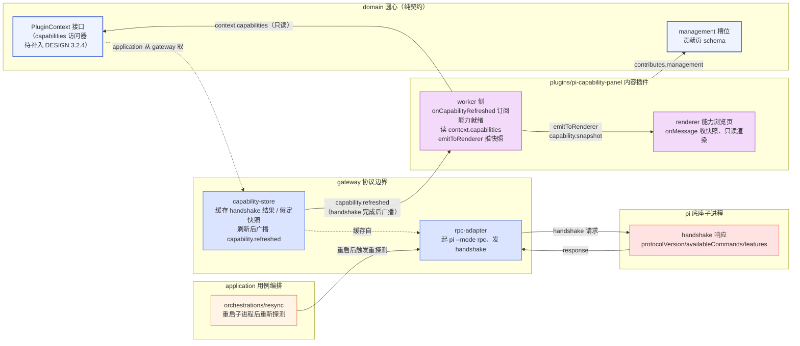

# pi 能力浏览面板文档（pi-capability-panel）

> 本文是 pi-desktop 设计文档体系的展开细化，对应 `DESIGN.md` §6.4（RPC 协议无版本协商 / handshake）+ §1.5（命令集 31 个）+ §1.7（关键返回类型字段）+ §3.3（管理槽契约）。读者应先读完 `DESIGN.md` 的 0–3 节（四根支柱、插件系统、槽位契约）再进入本文。所有"圆心/外层""槽位""RPC Mode""热加载重启"术语沿用 `DESIGN.md` 定义，不重复解释。
>
> **章节号引用约定**：本文档自身的章节用裸数字（如"2.1"指本文第 2.1 节 handshake 响应字段 schema）；凡指 `DESIGN.md` 的章节一律加"DESIGN"前缀（如"DESIGN 6.4"指 `DESIGN.md` §6.4 RPC 协议无版本协商）。两者章节号有重叠（本文 6.x 是降级决策落地、DESIGN 6.x 是缺口表），阅读时注意前缀区分。
>
> **路径与编号说明**：本文原计划路径为 `plugins/24-plugin-pi-capability-panel.md`（见 `docs/00-README.md` §0.3.1）。经盲审第 1 轮指出路径与编号体系自洽性问题后，修订确认本文的**主题是 RPC 能力协商机制的可视化**（消费 handshake 响应、渲染协议版本/可用命令/features），其性质属"对接 pi 底座的机制说明"而非"用户内容插件"，故归入 `modules/` 目录、文件名 `05-module-pi-capability-panel.md`（modules 目录序列 02→03→04→05）。全局索引编号仍保持 **24**（与 README §0.3.1 一致、不与 `plugins/05-plugin-i18n.md` 的全局 #05 冲突——目录前缀已消歧）。README §0.3.1 的"计划路径"列已同步更新为本文实际路径、状态由"待撰写"改为"已撰写（已盲审）"。此即对盲审 blocking 第 2 条的回应，详见本文 §0.4 与 §8.2。
>
> **圆心契约变更声明（对第 2 轮盲审 important 第 1 条 / 第 3 轮 important 第 2 条）**：本文依赖三处**待正式落入 DESIGN 的圆心接口扩展**——`PluginContext.capabilities` 访问器（worker 侧）、`PluginContext.onCapabilityRefreshed` 生命周期订阅 API（承载 `capability.refreshed` 能力就绪信号，不进 DESIGN 1.6 事件清单、不经 `context.events` 投递）、`CapabilitySnapshot` 类型（`source` 取三态 `"handshake" | "assumed-snapshot" | "pending"`）。本文**不**把它们当作既有契约引用，而是显式标注为"待补入 DESIGN"。圆心契约（DESIGN 3.2.4 PluginContext 被 DESIGN 明确称为"钉死"）的任何字段新增都必须回到 DESIGN 修订、不得在模块页里悄悄扩展。详见 §6.2/§6.3。

## 0 定位与全文导览

### 0.1 这份文档讲什么

pi 能力浏览面板（id: `pi-capability-panel`）是 pi-desktop 内置默认插件之一，往**管理槽（management）**挂一个只读页，让用户/开发者直观看到"当前连接的底座支持哪些命令、哪些特性、协议版本是什么"。它消费 `DESIGN.md` §6.4 的 handshake 响应（`protocolVersion` / `piVersion` / `availableCommands` / `features`）与 §1.5 的 31 命令清单、§1.7 的返回类型，把"硬编码 31 命令 + 无版本协商"这个**三年后最易漂移**的缺口（DESIGN 6.4.1 盲审点名）从"隐式假设"变成"显式可见"。

本文不重复 `DESIGN.md` 已说清的通用机制（加载器九项、槽位契约、RPC 协议三类消息），只锚定"能力浏览面板"这一具体插件的实现细节：它读什么数据、数据从哪来、handshake 未落地时如何降级、未协商态如何在 UI 上与协商态区分、DESIGN 6.4 落地后如何切换。本文是 `DESIGN.md` §6.4.3 handshake 设计的"消费侧落地"，不是 handshake 协议本身的设计（协议设计在 DESIGN 6.4.3）。

### 0.2 能力浏览面板在架构中的位置



**图 0 — pi-capability-panel 在洋葱中的位置：内容插件只读消费圆心契约与 gateway 缓存的能力快照，自己不发 handshake、除只读的 get_commands 外不发任何业务命令。renderer 不直接读 capabilities，由 worker 经 emitToRenderer 推送整份快照。**

关键纪律（呼应洋葱"依赖只向内"）：

- `plugins/pi-capability-panel/` 只 import `domain/` 的槽位契约与 PluginContext 接口，不 import `gateway/`/`application/`/`shell/` 实现。
- **handshake 由 gateway 层的 rpc-adapter 发**（DESIGN 6.4.3），不由本插件发。本插件只读消费 application 层从 gateway 取回并缓存的能力快照。这把"协议协商"和"能力展示"两件事分开——协商是机制（gateway）、展示是内容（plugin），呼应"组装和调用应该分开"。
- 本插件是**只读浏览器**：除只读的 `get_commands`（DESIGN 1.5.9）外不发任何业务命令、不发任何写命令、不写任何配置、不操作 pi。它的全部数据来自 `context.capabilities`（worker 侧只读快照访问器，见 §6.2）与 `context.rpc.getCommands()`（只读命令）。**renderer 侧不直接读 `context.capabilities`**——renderer 拿到的 `RendererPluginContext`（DESIGN 3.2.5）无 capabilities 字段，快照由 worker 经 `emitToRenderer` 推送（见 §6.3）。

### 0.3 阅读路径

- 想知道"面板长什么样、读什么数据" → §1、§4、§5。
- 想知道"handshake 没落地时怎么办" → §2.2、§4.2、§4.3。
- 想知道"DESIGN 6.4 落地后怎么切换" → §4.4、§6。
- 想知道"为什么放在 modules/ 而不是 plugins/" → §0.4。
- 盲审发现与修订 → §8。

### 0.4 路径与编号自洽性（对盲审 blocking 第 2 条）

盲审第 1 轮指出：任务给定路径 `docs/modules/05-module-pi-capability-panel.md` 与 README §0.3（modules 目录仅 02–04 三根机制支柱）、§0.3.1（能力面板是第 24 篇、规划路径 `plugins/24-plugin-pi-capability-panel.md`）两处冲突。本节给出修订后的归属判定与理由，README 索引已据此同步。

**归属判定**：本文归入 `modules/` 目录，全局索引编号保持 **24**。

**理由**：README §0.3 把 modules/ 定义为"四根支柱中的三根机制支柱（RPC 适配、配置操作、插件加载器），每根对应一个 DESIGN.md 大节，落到可写代码的粒度"。能力浏览面板的**主题**正是"对接 pi 底座的 RPC 能力协商机制"——它消费 DESIGN 6.4 的 handshake 与 §1.5/§1.7 的 RPC 协议契约，其设计内容是"机制如何被观测"，与 RPC 适配层（02）、配置操作层（03）、插件加载器（04）同属"对接底座的机制说明"层。它虽以插件形态实现（往管理槽挂页），但其文档主体讲的是 RPC 能力机制的可视化契约，不是某个用户内容场景（如时间线、文件预览、review）。故文档归 modules/。

**编号处理**：全局索引编号沿用 §0.3.1 已分配的 **24**，不另起号、不与 `plugins/05-plugin-i18n.md` 的全局 #05 冲突——文件全路径（`modules/05-...` vs `plugins/05-...`）天然消歧，目录前缀承担"目录内序列"语义。modules 目录内序列为 02→03→04→05，连续不跳号。README §0.3.1 第 24 行的"计划路径"已更新为本文实际路径、状态改为"已撰写（已盲审）"。此处理消除了"任务路径 vs 索引声明"的矛盾，README 仍是编号真相源。

> 若后续维护者认为应回归 plugins/ 归属，只需移动文件并同步 README §0.3.1 的路径列——本文内容不依赖目录位置，迁移无语义影响。

## 1 它解决什么：能力可见性缺口

### 1.1 问题：硬编码 31 命令不可见、漂移不可知

`DESIGN.md` §6.4.1 盲审发现"3 年后最可能烂掉的地方"：pi-desktop 硬编码了 RPC 协议的 31 个命令及其返回类型（DESIGN 1.5 / 1.7），但没有版本协商机制——底座演进时命令会增删改，桌面端只能被动追兼容，追不上就崩或静默错。在 handshake 落地前，桌面端靠"和底座同版本发布 + 版本化适配层"（DESIGN 6.4.2）兜底。

问题在于：这套"硬编码 31 命令 + 假定 v0.80.x 快照"的隐式假设，**对用户和开发者都不可见**。用户不知道当前连的底座到底支持哪些命令、协议版本是多少；开发者排查"为什么某个命令发出去报 Unknown command"时，没有一处能直观看到"底座实际能力清单 vs 桌面端假定清单"的差异。能力浏览面板把这个隐式假设变成显式可见的只读面板。

### 1.2 不是管理操作面，是只读能力浏览器

能力浏览面板**不是**管理操作面——它不提供"启用/禁用命令""切换协议版本"等任何操作（RPC 协议不支持这些操作，DESIGN 1.5 明确"没有任何管理 pi 自身的命令"）。它只做三件事：

1. 展示当前连接底座的协议版本（协商态）或假定的快照版本（未协商态）。
2. 展示底座支持的命令清单（协商态来自 handshake `availableCommands`；未协商态来自假定快照的 31 命令），并标注底座是否支持该命令（协商态据 `availableCommands` 判定；未协商态统一标"假定"）。本插件**不**展示"桌面端是否使用某条命令"——该信息没有可靠数据源（详见 §5.2/§7.1），不承诺没有数据源的列。
3. 展示底座声明的 features（`streaming`/`autoRetry`/`extensionUi` 等，协商态来自 handshake；未协商态不可知，见 §4.2/§5.3）。

它是"观测台"，不是"控制台"。这与 §0.2 的纪律一致：本插件除只读的 get_commands 外不发任何业务命令、不写任何配置。

### 1.3 落在管理槽（management）

本插件往**管理槽**挂一个贡献页（DESIGN 3.3 管理槽契约：`{ id, title, component?, schema?, order? }`）。它用 `component` 引用 renderer 模块导出的页面组件（不用 schema 声明式表单——能力数据不是用户可编辑的配置，是只读展示）。`order` 设为靠后（如 90），让它在管理面板里排在"扩展管理/配置/信任/MCP/关于/诊断/日志/隐私"等操作页之后、作为"底座能力参考"性质的页。

基础管理 UI 插件（`management-ui`，DESIGN 4.3）是管理槽的协调者，负责管理面板的统一渲染壳（README §0.3.1 / management-ui §2.2）。本插件只贡献一个页、复用统一渲染壳，不自己造面板容器。

## 2 数据来源：handshake 与假定旧快照

### 2.1 handshake 响应字段 schema（协商态数据源）

协商态（handshake 成功）下，面板数据来自 handshake 响应的 `data` 字段。DESIGN 6.4.3 定义的 handshake 响应结构：

```jsonc
// 底座回（stdout，支持 handshake 时）
{ "type": "response", "command": "handshake", "id": "req_hs", "success": true,
  "data": {
    "protocolVersion": "1.0",
    "piVersion": "0.91.0",
    "availableCommands": ["prompt","steer",...,"reload","list_sessions"],
    "features": { "streaming": true, "autoRetry": true, "extensionUi": true }
  }
}
```

面板消费的四个字段及其语义：

| 字段 | 类型 | 面板用途 |
|---|---|---|
| `protocolVersion` | `string`（如 `"1.0"`） | 协议版本区展示（§5.1）；与桌面端 `protocolConstraint`（DESIGN 6.4.3 请求里的 `^1.0`，经 `CapabilitySnapshot.protocolConstraint` 暴露，见 §6.2）对照，不满足时标红 |
| `piVersion` | `string`（如 `"0.91.0"`） | 协议版本区副标题；让用户知道连的是哪个底座版本 |
| `availableCommands` | `string[]` | 命令清单区（§5.2）数据源；是底座该版本支持的**全部**命令（含旧 31 + 演进新增），不是增量（DESIGN 6.4.3"availableCommands 是完整清单"） |
| `features` | `Record<string, boolean>` | features 区（§5.3）数据源；`streaming`/`autoRetry`/`extensionUi` 等特性开关。**仅协商态可用**——未协商态无 features 数据源（见 §4.2/§5.3） |

> **字段稳定性假设**：handshake schema 是 DESIGN 6.4.3 向底座提的演进方案，**当前底座尚未实现**（见 §2.2 降级）。本面板对 handshake `data` 的访问用 `?.` 链式 + 类型卫士（DESIGN 6.4.3"对返回类型用 ?. 链式访问 + 类型卫士"），防止底座增删字段导致反序列化崩溃。字段缺失时该区域降级为"未提供"而非崩溃。

### 2.2 假定旧快照：31 命令清单来源（未协商态数据源）

未协商态（底座不支持 handshake）下，面板数据来自桌面端维护的"假定旧快照"。DESIGN 6.4.2 明确："当前底座 RPC 协议是 v0.80.x 的快照、桌面端照着这个版本写"。故假定快照的内容就是 DESIGN §1.5 逐条列出的 31 个命令，按 §1.5 的分组组织：

| 分组（DESIGN 1.5.x） | 命令 |
|---|---|
| 1.5.1 Prompting 提示与流控制 | `prompt`、`steer`、`follow_up`、`abort`、`new_session` |
| 1.5.2 State 状态查询 | `get_state` |
| 1.5.3 Model 模型 | `set_model`、`cycle_model`、`get_available_models` |
| 1.5.4 Thinking 思考级别 | `set_thinking_level`、`cycle_thinking_level` |
| 1.5.5 Queue modes 队列模式 | `set_steering_mode`、`set_follow_up_mode` |
| 1.5.6 Compaction 上下文压缩 | `compact`、`set_auto_compaction` |
| 1.5.7 Retry 重试 | `set_auto_retry`、`abort_retry` |
| 1.5.8 Bash | `bash`、`abort_bash` |
| 1.5.9 Session 会话管理 | `get_session_stats`、`export_html`、`switch_session`、`fork`、`clone`、`get_fork_messages`、`get_entries`、`get_tree`、`get_last_assistant_text`、`set_session_name` |
| 1.5.9 Messages | `get_messages` |
| 1.5.9 Commands | `get_commands` |

合计 5+1+3+2+2+2+2+2+10+1+1 = **31**。这套清单是假定快照的唯一来源——本插件**不自行维护**一份命令清单，而是引用 rpc-adapter（gateway）的版本化适配层里那份硬编码 31 命令常量（DESIGN 1.1.2 / 6.4.2 说的 RpcClient 等价层）。即"假定快照"不是本插件的知识，是 gateway 层的知识，本插件只读展示。这避免了"31 命令清单在两处各写一遍"的漂移（呼应"回调参数是责任边界模糊的气味"——能力清单应由 gateway 统一承担，而非每个消费方各维护）。

> **假定快照的边界（对第 2 轮盲审 minor 第 2 条）**：假定快照的**声明来源是 DESIGN §1.5 / §1.7**——这两节只覆盖 31 命令及其返回类型，**不含 features 概念**（features 只存在于 handshake 响应，DESIGN 6.4.3）。因此未协商态下 features **不可知**，面板不假定任何 features 值、显示"未知（底座未声明）"（见 §4.2/§5.3）。文档不把 features 算作假定快照的一部分，避免"假定快照来源=§1.5/§1.7"与"features 假定为 true"自相矛盾。

### 2.3 数据获取链路：谁发 handshake、何时发、缓存与失效

本插件**不自己发 handshake**。handshake 的发送、缓存、失效由 gateway 层的 rpc-adapter 统一承担（DESIGN 6.4.3"handshake 时机与缓存"）。链路：

1. **gateway 发 handshake**：RPC 子进程起来、就绪窗口（DESIGN 1.2.3 的 100ms）过后，rpc-adapter 在发任何业务命令前先发 handshake 做能力探测。这是一次 request-response 往返，**不是底座主动推送**——桌面端发请求、底座回响应，响应回来才算 handshake 完成（DESIGN 6.4.3）。
2. **gateway 缓存结果**：rpc-adapter 维护一个 capability-store，把 handshake 响应（或"假定旧快照"降级结果）缓存到子进程关闭。热加载重启子进程后（DESIGN 2.4）重新 handshake、刷新缓存——不缓存跨进程的能力探测结果。
3. **worker 侧读快照**：application 层从 gateway 的 capability-store 取只读快照，经 worker 侧 `PluginContext.capabilities` 访问器暴露给插件（该访问器**待补入 DESIGN 3.2.4**，见 §6.2）。**renderer 侧不直接读快照**——`RendererPluginContext`（DESIGN 3.2.5）无 capabilities 字段，快照由 worker 经 `emitToRenderer` 推给 renderer（见第 4 步与 §6.3）。
4. **worker 推送、renderer 接收**：worker 经 `context.onCapabilityRefreshed`（gateway/core 侧能力就绪信号订阅 API，**待补入 DESIGN 3.2.4**，不进 DESIGN 1.6 事件清单、不经 `context.events` 投递，见 §6.3）订阅能力就绪信号，读 `context.capabilities`，经 `context.emitToRenderer("capability.snapshot", snapshot)` 把整份快照推给 renderer；renderer `pi.onMessage("capability.snapshot", cb)` 收到后存入组件状态、重渲染。

本插件**不**用 `session_start` event（DESIGN 1.6.4）作为能力刷新信号——`session_start` 是底座在自身 session 加载阶段推送的事件，时序上可能在桌面端发出 handshake 之前/握手响应回来之前就到达（DESIGN 6.4.3：handshake 由桌面端发起、需一次 request-response 往返才完成），此时 `context.capabilities` 仍是上一份快照、刷新不到新能力。改用 gateway 在 handshake 完成/降级决策落盘后主动广播的 `capability.refreshed` 作为确定性的"能力已就绪"信号（时序契约与降级展示见 §6.3）。

### 2.4 快照版本基线与维护责任方（对盲审 minor 第 4 条）

盲审 minor 第 4 条指出：README 概述未说明"硬编码 31 命令"这一快照的**维护责任方与版本演进规则**。本节明确：

- **快照基线版本**：假定旧快照以 DESIGN 6.4.2 声明的 **v0.80.x** 底座 RPC 协议为基线。该版本对应的 31 命令清单即 §2.2 所列，来源是 DESIGN §1.5（DESIGN 是真相源，本插件不另维护副本）。
- **维护责任方**：假定快照的 31 命令常量维护在 **gateway/rpc-adapter 的版本化适配层**（DESIGN 1.1.2 / 6.4.2）。底座协议变时只动这层、不动插件层（DESIGN 6.4.2"靠这层隔离缓解漂移冲击"）。本插件不持有命令清单副本，故无"两处不同步"问题。
- **底座补 handshake 后的迁移责任**：当底座落地 handshake（DESIGN 6.4.3），gateway 的 rpc-adapter 从"假定快照"切到"handshake 结果"——这是 gateway 层的一处切换，本插件无感（它只读 `context.capabilities`，`source` 字段从 `"assumed-snapshot"` 变 `"handshake"`，面板据此切协商态展示，见 §4.4）。迁移不由本插件负责。
- **快照过期提示**：见 §4.3——面板不静默展示过期快照，显式标注"未协商 / 假定 v0.80.x"并提示风险。

## 3 槽位贡献与 manifest

### 3.1 manifest

```jsonc
{
  "id": "pi-capability-panel",
  "displayName": "Pi Capability Panel",
  "version": "0.1.0",
  "main": "./worker.ts",           // worker 侧：订阅 capability.refreshed、读 context.capabilities、推快照给 renderer（DESIGN 3.2 manifest schema 用 main）
  "renderer": "./renderer.tsx",    // renderer 侧：能力浏览页组件
  "contributions": {
    "management": [
      {
        "id": "pi-capability",
        "title": "management.pi-capability-panel.pi-capability.label",   // i18n key，按 DESIGN 3.2 约定 {slot}.{pluginId}.{itemId}.label，走语言槽（DESIGN 4.2）
        "component": "CapabilityPanel",       // renderer 导出的组件名
        "order": 90
      }
    ]
  }
}
```

- `id` 在桌面插件体系内唯一（DESIGN 3.4 优先级：内置最低，可被用户/项目级同名插件覆盖）。
- `main` 是 worker 侧入口字段名（DESIGN 3.2 manifest schema：`main` 为 worker 侧代码模块入口），**不是** `entry`——`entry` 不是 DESIGN 3.2 定义的合法 manifest 字段，用了会导致 3.5 第 3 步 manifest 校验失败、worker 模块加载不到。`renderer` 字段名正确、保持不变。
- `title` 是 i18n key，按 DESIGN 3.2（686 行）约定的贡献项 title key 格式 `{slot}.{pluginId}.{itemId}.label` 命名，本例为 `management.pi-capability-panel.pi-capability.label`。经语言槽 fallback（DESIGN 4.2 / 7.7：查不到回退默认 locale、再查不到用 key 本身）。不使用扁平自由命名（如 `capability.panel.title`），以符合约定、降低语言槽 fallback 与维护成本。
- `component` 引用 renderer 模块导出的 `CapabilityPanel` 组件名（字符串引用，core 在 renderer 侧加载，DESIGN 3.3 / 3.6）。
- 不声明 `permissions`——本插件不访问敏感字段（`content:sensitive`）、不请求外部网络（`net:`）。它只读 `context.capabilities`（非敏感元数据）与 `context.rpc.getCommands()`（命令元数据，DESIGN 1.5.9）。见 §7.2。

### 3.2 管理槽贡献页

贡献页符合 DESIGN 3.3 管理槽贡献项级 schema `{ id, title, component?, schema?, order? }`（本页提供 `component`、不提供 `schema`）。本页用 `component`（自定义组件，不用 core 内置通用表单渲染器——能力数据是只读展示、非用户可编辑表单，故不用 `schema` 字段）。`order: 90` 让它排在管理面板末尾"参考"区。

### 3.3 不贡献其他槽位

本插件**只**贡献管理槽一个页。不贡献：语言槽（依赖默认 i18n 插件的 fallback，不自带语言包——DESIGN 7.7 第三方插件不贡献语言包也能工作）、主题槽（用 core 当前主题 token，DESIGN 4.11）、命令项槽（不提供命令面板项——面板入口是管理页内的导航，不需要命令面板入口）、卡片渲染槽/侧栏槽/预览器槽/设置子页槽。这符合"core 极薄、内置插件最小集合"（DESIGN 4.1.3）：本插件职责单一（只读能力展示），不蔓延到其他槽位。

## 4 双模式渲染

面板的渲染态由 worker 推送来的 `CapabilitySnapshot`（经 `emitToRenderer("capability.snapshot", ...)`，见 §6.3）的 `source` 字段决定。`source` 取三态，渲染器据 `source` 分支：两个稳态——协商态 `"handshake"`、未协商态 `"assumed-snapshot"`，外加首个 `capability.refreshed` 到达前的协商中过渡态 `"pending"`（见 §6.3 降级展示）。三态共用同一组件，UI 上**显式区分**（盲审 important 第 3 条要求"未协商态的 UI 区分"）。协商中过渡态渲染：显示"协商中…"占位（协议版本区/命令清单区/features 区均无数据、不展示假定快照、不展示协商态数据），`capability.refreshed` 到达后切到正式态。

### 4.1 协商态（source: "handshake"）

handshake 成功时，worker 推送来的快照 `source` 为 `"handshake"`，`protocolVersion`/`piVersion` 有值，`availableCommands`/`features` 来自 handshake 响应。面板展示：

- 协议版本区：`protocolVersion` 主显示 + `piVersion` 副标题，绿色"已协商"标识。
- 命令清单区：按 §2.2 的分组组织 `availableCommands`（handshake 返回的是扁平数组，面板按已知分组归类；不在任何已知分组的命令归入"其他/新增"组——这正是 feature detection 的价值：底座新增命令能被看到）。
- features 区：`features` 对象逐项展示。

### 4.2 未协商态（source: "assumed-snapshot"）

底座不支持 handshake 时（DESIGN 6.4.3：返回 `{ success: false, error: "Unknown command: handshake" }`），gateway 走"假定旧版本"降级路径，快照 `source` 为 `"assumed-snapshot"`，`protocolVersion`/`piVersion` 为 `null`，`availableCommands` 来自 §2.2 的假定快照（gateway 维护的 31 命令常量），`features` 为空对象（未协商态无 features 数据源）。面板展示：

- 协议版本区：显示"未协商"+ `snapshotBaseline`（如"假定 v0.80.x"），**琥珀色"未协商"标识**（区别于协商态的绿色"已协商"）。
- 命令清单区：展示假定快照的 31 命令，每条标注"假定"（不标"已确认支持"）。
- features 区：**显示"未知（底座未声明）"**。假定快照的声明来源（DESIGN §1.5/§1.7）不含 features 概念——features 只存在于 handshake 响应（DESIGN 6.4.3），未协商态下底座未声明、桌面端无从假定。面板不编造"假定为 true"的值，如实标注不可知。

UI 区分的核心：协商态用绿色"已协商"徽章 + "已确认"命令标注；未协商态用琥珀色"未协商"徽章 + "假定"命令标注 + 一行说明"底座未响应 handshake，以下命令为假定快照、features 不可知，可能与实际不符"。用户一眼能分辨"这是探测到的真相"还是"这是假定的兜底"。

### 4.3 快照过期检测与提示（不静默展示过期数据）

盲审 minor 第 4 条要求"快照过期时面板如何提示而非静默展示过期数据"。本面板在未协商态下额外展示一条**过期风险提示**：

> 当前底座未支持 handshake，展示的是 v0.80.x 假定快照。若底座已升级，以下命令清单可能与实际不符（底座可能已增删命令）、features 不可知。升级桌面端或等待底座落地 handshake（DESIGN 6.4）后即可显示真实能力。

提示常驻于未协商态顶部、不可关闭（避免用户误把假定当真相）。协商态下不显示此提示。

**过期检测的保守策略**：本插件**不**自行判断快照是否"过期"（它没有底座真实版本可比对——正因为没 handshake 才进未协商态）。它只如实标注"这是假定快照、可能过期"，把"是否信任"的判断交给用户。不造一个"桌面端版本 vs 假定基线版本"的启发式过期判定——那是 gateway 版本化适配层的职责（DESIGN 6.4.2"桌面端和底座同版本发布"约束在那层检查），本插件不越界。

### 4.4 与 DESIGN 6.4 落地后的切换契约

DESIGN 6.4.3 的 handshake 是"向底座提的演进方案"，当前未落地。本面板的切换契约：

- **切换点在 gateway、不在本插件**：底座补 handshake 后，gateway 的 rpc-adapter 从"发 handshake 收到 Unknown command → 走假定快照"切到"收到 handshake 响应 → 用真实能力"。worker 推送来的快照 `source` 随之从 `"assumed-snapshot"` 变 `"handshake"`。
- **本插件无感切换**：面板只读 worker 推送来的快照并按 `source` 分支渲染。source 变了，面板自动从"未协商态"切到"协商态"，无需本插件发版或改代码。
- **数据契约稳定**：无论 source 为何，`CapabilitySnapshot` 的 schema 不变（见 §6.1 的 `CapabilitySnapshot`）。协商态多出的字段（`protocolVersion`/`piVersion` 有值）在未协商态为 `null`，面板按 null 分支降级展示。这保证"底座补 handshake"是 gateway 一处切换、面板零改动——开闭原则。
- **渐进增强**：底座逐步补 handshake 的 `features`（如先补 `streaming`、后补 `autoRetry`），面板照单全收、逐项展示，不假设 features 集合固定。

## 5 面板交互与字段映射

### 5.1 协议版本区

| 展示项 | 协商态数据 | 未协商态数据 |
|---|---|---|
| 主标签 | `protocolVersion`（如 `1.0`） | "未协商" |
| 副标签 | `piVersion`（如 `0.91.0`） | `snapshotBaseline`（如"假定 v0.80.x"） |
| 徽章 | 绿色"已协商" | 琥珀色"未协商" |
| 协议约束 | 快照 `protocolConstraint`（桌面端 handshake 请求里声明的 `^1.0`，由 gateway 填入 `CapabilitySnapshot.protocolConstraint`，见 §6.2）与 `protocolVersion` 对照，不满足标红"协议版本不兼容，部分功能可能不可用" | 不显示（未协商无可比对） |

协议约束不满足时（如桌面端要求 `^1.0`、底座回 `2.0`），面板标红提示。但这只是展示——实际的"命令调用前检查 `availableCommands`"降级在 gateway 层（DESIGN 6.4.3"命令白名单隔离"），不在本插件。`protocolConstraint` 的数据源是 `CapabilitySnapshot.protocolConstraint`（gateway 把桌面端编译期声明的约束填入快照），面板不另行从别处取这个常量。

### 5.2 命令清单区

命令清单按 §2.2 的 11 个分组组织。每条命令展示：

- 命令名（如 `prompt`）。
- 分组归属（如"Prompting 提示与流控制"）。
- 底座支持状态：协商态下，若命令在 `availableCommands` 则标"底座支持"、否则标"底座不支持（桌面端将降级）"；未协商态下统一标"假定"。
- 简述：引用 DESIGN §1.5 对应小节的说明（一句话，i18n key 形式，走语言槽）。本插件**不**自行编写命令说明文案——引用 DESIGN §1.5 的描述经 i18n key 化后展示，避免"命令说明在 DESIGN 和本面板两处各写一遍"漂移。

> **不展示"桌面端是否使用某条命令"（对第 2 轮盲审 minor 第 3 条）**：该列没有可靠数据源——`availableCommands`（来自 capabilities）只能判断"底座是否支持某条协议命令"；`get_commands`（§7.1 唯一调用的 RPC，DESIGN 1.5.9）返回的是 extension/prompt/skill 动态命令，与 31 协议命令是不同命名空间（文档自己也说"两者维度不同"），无法推导"桌面端是否使用了某条 31 命令"。若另维护一份"已用命令"硬编码清单，则与 §2.2 反对两处漂移的原则冲突。故本面板**不承诺**此列、不展示"桌面端使用状态"，只展示"底座支持状态"。

**与 §1.7 返回类型的关联展示**：每条命令可展开看其返回类型字段（来自 DESIGN §1.7）。例如 `get_state` 展开后显示 `RpcSessionState` 的字段（`model`/`thinkingLevel`/`isStreaming`/...，DESIGN 1.7.1）；`set_model` 展开显示 `Model` 字段（DESIGN 1.7.2）；`get_entries` 展开显示 `SessionEntry`/`SessionTreeNode`（DESIGN 1.7.5）。返回类型 schema 同样引用 DESIGN §1.7、不在本插件重写。展开是可选交互，默认折叠，避免面板过长。

> **数据来源标注**：命令清单与返回类型字段均标注来源为"DESIGN §1.5 / §1.7"。这是为了让用户/开发者知道这些是"假定快照的设计规格"，在 handshake 落地前与底座实际行为可能不符——呼应 §4.3 的过期风险提示。

### 5.3 features 区

`features`（`Record<string, boolean>`）逐项展示。已知 features（DESIGN 6.4.3 示例）：

| feature | 含义 | 协商态 | 未协商态 |
|---|---|---|---|
| `streaming` | 底座支持流式输出（`message_update` token 级流式，DESIGN 1.6.2） | handshake 实际值 | 未知（底座未声明） |
| `autoRetry` | 底座支持自动重试（`auto_retry_*` event，DESIGN 1.6.5） | handshake 实际值 | 未知（底座未声明） |
| `extensionUi` | 底座支持 Extension UI 子协议（DESIGN 1.9） | handshake 实际值 | 未知（底座未声明） |

> **未协商态 features 不可知（对第 2 轮盲审 minor 第 2 条）**：未协商态下 `features` 为空对象、面板该区显示"未知（底座未声明）"，**不**假定为 true。理由：假定快照的声明来源是 DESIGN §1.5/§1.7，而这两节根本没有 features 概念——features 只存在于 handshake 响应（DESIGN 6.4.3）。未协商态下底座未响应 handshake、无从得知其 features，假定为 true 属于凭空捏造、与"假定快照来源=§1.5/§1.7"的自述矛盾。文档不把 features 算作假定快照的一部分（见 §2.2 边界说明）。

协商态下若 handshake 返回了未知的 feature key，面板照常展示（key + 值），不忽略——这体现 feature detection 的渐进增强。

### 5.4 与 §1.7 返回类型的关联展示

如 §5.2 所述，命令展开后关联展示其返回类型。本面板不展示敏感字段值（如 `AgentMessage.content` 的实际内容，DESIGN 1.7.6）——只展示**类型 schema**（字段名/类型），不展示运行时数据。这与 §7.2 一致：本插件不订阅 `message_*` event、不访问 `content:sensitive` 字段，只展示静态类型信息。

## 6 降级决策树的落地面

### 6.1 与 RPC 适配层 handshake 客户端的关系

DESIGN 6.4.3 的降级决策树（"发 handshake → 底座回应? → success 走 feature detection / error 走假定旧快照"）**全部在 gateway 层的 rpc-adapter 执行**，不在本插件。本插件是决策结果的**展示侧**：worker 读 `context.capabilities`（该对象已携带 `source` 字段，即决策结果），再推给 renderer 展示。本插件不参与"发 handshake、捕获 error、走降级"的任何逻辑——那是 gateway 的职责。

这呼应 §0.2 的纪律：协议协商（机制，gateway）与能力展示（内容，plugin）分开。若把 handshake 逻辑放进本插件，会导致"协议协商在两处"（gateway 调用前检查 + 本插件展示前探测），违反"组装和调用应该分开"。

### 6.2 `CapabilitySnapshot` 接口（application 层暴露给 worker 侧插件）

application 层从 gateway capability-store 取只读快照，经 worker 侧 `PluginContext.capabilities` 暴露：

```typescript
// domain/ 维护的圆心类型（纯契约）
interface CapabilitySnapshot {
  source: "handshake" | "assumed-snapshot" | "pending";  // gateway 降级决策结果；pending=handshake 尚未完成、首份最终快照未到达（见 §6.3 协商中过渡态）
  protocolVersion: string | null;              // 协商态有值；未协商 null；pending null
  piVersion: string | null;                     // 协商态有值；未协商 null
  protocolConstraint: string | null;            // 桌面端声明的协议约束（如 "^1.0"，DESIGN 6.4.3 请求字段），由 gateway 填入；未协商态 null
  availableCommands: string[];                  // 协商态来自 handshake；未协商来自 gateway 假定快照常量
  features: Record<string, boolean>;           // 协商态来自 handshake；未协商态为空对象 {}（底座未声明，不可假定，见 §4.2/§5.3）
  snapshotBaseline: string | null;              // 未协商时假定的底座版本，如 "v0.80.x"；协商态为 null
  detectedAt: number;                           // gateway 探测时间戳（handshake 完成或降级决策落盘时刻）
}
```

> **接口归属与圆心契约变更纪律（对第 2 轮盲审 important 第 1 条）**：`CapabilitySnapshot` 类型定义在 `domain/`（圆心，纯契约），实现（从 gateway 取数据、填充快照）在 `application/`。本插件依赖圆心类型、不依赖 application 实现——依赖倒置，依赖方向向内。
>
> **重要：本文涉及的圆心接口扩展必须正式落入 DESIGN，不得在模块页里悄悄改圆心契约**。具体地，以下三项是本文依赖的、**待补入 DESIGN** 的扩展（本文不把它们当作既有契约引用、不称作"DESIGN 3.2.4 PluginContext 的只读访问器"）：
>
> 1. `PluginContext.capabilities: CapabilitySnapshot` 只读访问器 —— 待补入 DESIGN 3.2.4（worker 侧 PluginContext，该接口被 DESIGN 明确称为"钉死"，新增字段须回到 DESIGN 修订）。
> 2. `PluginContext.onCapabilityRefreshed(listener: () => void): () => void` 生命周期订阅 API —— 待补入 DESIGN 3.2.4 PluginContext（见下条），承载 `capability.refreshed` 能力就绪信号。该信号是 **gateway/core 侧的生命周期信号**，**不是**底座 AgentSessionEvent、**不**进 DESIGN 1.6 事件清单、**不**经 `context.events`（RPC 事件流通道）投递——详见 §6.3 的通道与归属澄清。
> 3. `CapabilitySnapshot` 类型 —— 待补入 `domain/` 圆心类型集。`source` 字段取三态 `"handshake" | "assumed-snapshot" | "pending"`，`"pending"` 对应 §6.3 协商中过渡态（首个 `capability.refreshed` 到达前的空快照）。
>
> **renderer 侧（DESIGN 3.2.5 RendererPluginContext）不新增 capabilities 字段**——renderer 通过 worker 的 `emitToRenderer("capability.snapshot", snapshot)` 接收整份快照（见 §6.3），不在 renderer 侧圆心接口上开访问器。这把"圆心接口扩展"控制在 worker 侧两处（`capabilities` 访问器 + `onCapabilityRefreshed` 生命周期订阅 API），renderer 侧圆心契约零改动。原稿把 `capabilities` 当作 DESIGN 3.2.4 既有契约引用、并让 renderer 侧"重读 context.capabilities 重渲染"是错误的——renderer 拿到的 `RendererPluginContext` 无 capabilities 字段、根本读不到。已修正为 worker 推送路径。
>
> **冗余字段精简（对第 2 轮盲审 minor 第 5 条）**：`CapabilitySnapshot` 只保留 `source`（更具表达力，可未来扩展更多态），**不**再设冗余的 `negotiated: boolean`（原稿 `negotiated === source==="handshake"` 完全等价、冗余，两处更新不同步会成为新漂移点）。判断"是否协商态"统一用 `source === "handshake"`。

### 6.3 能力就绪信号与刷新时序（对第 2 轮盲审 important 第 2 条）

热加载重启子进程（DESIGN 2.4）后，gateway 重新 handshake、刷新 capability-store。本插件**不**用 `session_start` event（DESIGN 1.6.4）作为刷新信号——`session_start`（reason startup/resume）是底座在自身 session 加载阶段就推送的事件，时序上极可能在桌面端发出 handshake 之前/握手响应回来之前就到达（DESIGN 6.4.3：handshake 由桌面端发起、需一次 request-response 往返才完成）。此时 `context.capabilities` 仍是上一份快照，面板收到 `session_start` 重读会拿到旧值、刷新不到新能力。冷启动同理。

**能力就绪信号**：gateway 在 handshake 响应落盘、capability-store 刷新完成后（或确定走假定快照降级后），主动发出一个 `capability.refreshed` 能力就绪信号。该信号时序上严格晚于 handshake 完成，是"能力已就绪"的确定性信号——不依赖 `session_start` 的相对时序。

**通道与归属澄清（对第 3 轮盲审 important 第 2 条）**：`capability.refreshed` 是 **gateway/core 侧的生命周期信号**，**不是**底座 AgentSessionEvent。DESIGN 1.6 事件清单是底座 stdout 推送的 `AgentSessionEvent` 流全集（`session_start`/`message_*`/`tool_execution_*` 等），由底座产生、经 RPC 事件流通道 `context.events`（DESIGN 3.2.4，单监听器 `on(listener: (event: SessionEvent) => void): () => void`、无 topic 参数）投递。`capability.refreshed` 则是 gateway 在 handshake 落盘后自行产生的本地信号、非底座 stdout 推出，因此：

- **不归入 DESIGN 1.6 事件清单**——那是底座事件流全集，把它塞进去属类别错置（把"gateway 生命周期信号"当"底座事件"）。
- **不经 `context.events` 投递**——`context.events` 是 RPC 事件流通道，承载底座 `AgentSessionEvent`；用 `(topic, cb)` 形式订阅 `context.events.on("capability.refreshed", ...)` 是 DESIGN 3.2.4 不存在的重载、且会把本地信号错挂到底座事件通道。本文**不**采用该写法。
- **作为 DESIGN 3.2.4 PluginContext 上的独立生命周期订阅 API 承载**——新增 `PluginContext.onCapabilityRefreshed(listener: () => void): () => void`（**待补入 DESIGN 3.2.4**，见 §6.2 扩展声明第 2 条），由 gateway/core 在 capability-store 刷新后调用已注册 listener。
- **无回放语义在此不适用**：`context.events` 的 bus 对迟到订阅者无回放（历史事件不重放）。但 `capability.refreshed` 是能力就绪这一**一次性状态转换**，worker 可能在状态已转换后才订阅（如热加载后 worker 重启晚于 handshake 完成）；若沿用 bus 无回放语义，worker 会永远停在协商中态。故 `onCapabilityRefreshed` **不沿用** bus 无回放：订阅时若 capability-store 已落盘最终快照（handshake 已完成或降级决策已落定），listener **立即触发一次**；否则在下次刷新信号时触发。这保证 worker 无论何时订阅都能拿到当前就绪态，不靠假设时序兜底。

本插件 worker 侧经该独立 API 订阅（伪代码示意，真实判型以 DESIGN 3.2.4 落地契约为准）：

```typescript
// worker 侧（简化伪代码）
// capability.refreshed 是 gateway/core 侧能力就绪生命周期信号，
// 经 PluginContext.onCapabilityRefreshed 独立订阅 API 投递（不进 RPC 事件流 context.events）。
// 订阅时若 capability-store 已落盘最终快照，listener 立即触发一次（非 bus 无回放语义）。
context.onCapabilityRefreshed(() => {
  // gateway 已完成 handshake（或降级决策）、capability-store 已刷新
  // 读取 worker 侧 context.capabilities（PluginContext 访问器，待补入 DESIGN 3.2.4）
  const snapshot = context.capabilities;
  // 把整份快照推给 renderer
  // （renderer 侧 RendererPluginContext 无 capabilities 字段，不直接读——见 §6.2）
  context.emitToRenderer("capability.snapshot", snapshot);
});
```

renderer 侧 `pi.onMessage("capability.snapshot", cb)` 收到快照后存入组件状态、重渲染。renderer 全程不读 `context.capabilities`——它拿到的 `RendererPluginContext`（DESIGN 3.2.5）没有 capabilities 字段，快照由 worker 经 `emitToRenderer` 推送。这是 worker↔renderer 的一条标准推送通道（DESIGN 3.2.4 `emitToRenderer` / 3.2.5 `onMessage`），不扩 renderer 侧圆心接口。

**降级展示（session_start 早于 handshake 完成时）**：在第一个 `capability.refreshed` 到达前（冷启动初期、或重启子进程后 handshake 未完成），`context.capabilities` 返回空快照：`source` 为 `"pending"`、`protocolVersion`/`piVersion` 为 `null`、`availableCommands` 为空数组、`features` 为空对象。面板此时进入协商中过渡态、显示"协商中…"占位，**不**展示假定快照、也**不**展示协商态数据；`capability.refreshed` 到达后（或经 `onCapabilityRefreshed` 立即回放）切换为正式展示（协商态或未协商态）。这避免了"用旧快照冒充新能力"或"handshake 未完成就假定 v0.80.x"的时序错误。面板因此有三种渲染态，渲染器按 `source` 三值分支：协商态 `"handshake"`（§4.1）、未协商态 `"assumed-snapshot"`（§4.2）、协商中过渡态 `"pending"`（本节）。

## 7 权限、边界与不做什么

### 7.1 只读、除只读 get_commands 外不发业务命令（对第 2 轮盲审 important 第 3 条）

本插件**除只读的 `get_commands` 外不发任何业务命令、不发任何写命令**（DESIGN §1.5）。`get_commands` 正是 DESIGN 1.5.9 列出的 31 命令之一（Commands 分组），`PluginContext.rpc.getCommands()` 就是它的便捷方法（DESIGN 3.2.4）——故原稿"不发任何 31 命令"与"调用 getCommands"自相矛盾，不能并存。准确的边界声明是：**除只读的 `get_commands` 外不发任何业务命令，不发任何写命令**。

本插件调用 `context.rpc.getCommands()`（DESIGN 1.5.9，只读）用于在命令清单区对照"底座通过 get_commands 报告的当前可用动态命令"与"handshake/假定快照的协议级命令清单"的差异（前者是运行时动态命令含 extension/prompt/skill，后者是协议级固定命令，两者维度不同，面板分别标注来源、不混为一谈）。除 `getCommands` 外，本插件不调 `context.rpc.prompt`/`steer`/`setModel` 等任何写命令或业务命令。

### 7.2 `content:sensitive` 不涉及

本插件不订阅 `message_*`/`tool_execution_*` event（DESIGN 1.6.2/1.6.3），不访问 `AgentMessage.content`/`toolCalls.args` 等敏感字段（DESIGN 1.7.6）。它展示的全是协议元数据（命令名、版本号、feature 开关、返回类型 schema），不含用户对话内容或工具参数。故 manifest 不声明 `content:sensitive` 权限，也不声明 `net:` 权限（不请求外部网络）。

### 7.3 不解析底座 session 文件

本插件**不**自行读取/解析底座 session 文件、settings 文件、extension 目录（DESIGN 1.4"session 存储是底座内部事务"）。能力数据全经 `context.capabilities`（gateway handshake 结果）与 `context.rpc.getCommands()`（RPC 只读命令）。不造"自己扫底座目录推能力"的旁路——那违背 RPC 边界、要理解底座内部格式，是 现有方案 adapter 的覆辙（DESIGN 3.1.1）。

### 7.4 不承担版本协商的责任

本插件不判断"协议版本是否兼容""是否该降级"——这些决策在 gateway（DESIGN 6.4.3 降级决策树）。本插件只**展示**决策结果（`source` 字段）与**提示**风险（§4.3 过期提示）。不把"协议兼容性判定"这份责任外包给一个只读展示插件——它没有调用上下文、不该承担调用前检查。这呼应"回调参数是责任边界模糊的气味"：能力判定逻辑内聚在 gateway，不散到每个消费插件。

## 8 盲审回应

本文档是盲审第 1 轮的修订产物，并已并入第 2 轮盲审的修订。逐条回应：

### 8.1 对 blocking 第 1 条（文件存在性 / 文档落地）

**发现**：被审目标文件 `docs/modules/05-module-pi-capability-panel.md` 在磁盘上不存在，无法进行内容级盲审。

**处置**：本文档即该文件的落地内容。已写入 `docs/modules/05-module-pi-capability-panel.md`，包含完整规格（槽位贡献点 §3、handshake 响应字段 schema §2.1、假定旧快照 31 命令清单来源 §2.2、未协商态 UI 区分 §4.2、与 §6.4 落地后的切换契约 §4.4、快照维护责任方 §2.4）。后续可进入正常内容级盲审。

### 8.2 对 blocking 第 2 条（路径与编号自洽性）

**发现**：任务路径 `modules/05-...` 与 README §0.3（modules 仅 02–04）、§0.3.1（能力面板是第 24 篇、规划 `plugins/24-...`）冲突。

**处置**：见 §0.4。修订结论：本文归入 `modules/`（主题是 RPC 能力机制的可视化、属机制说明层），全局索引编号保持 **24**（不与 `plugins/05-plugin-i18n.md` 的全局 #05 冲突，目录前缀消歧）。README §0.3.1 第 24 行的"计划路径"已同步更新为本文实际路径、状态由"待撰写"改为"已撰写（已盲审）"。README 仍是编号真相源，自洽性已恢复。

### 8.3 对 important 第 3 条（文档缺口与可落地性）

**发现**：pi-capability-panel 文档整体处于"待撰写"状态，README 仅用约 150 字概述意图，无任何可审规格。

**处置**：本文档即补齐的规格。覆盖盲审要求的所有可落地要素：

- **槽位贡献点**：§3.1 manifest + §3.2 管理槽贡献页（`{ id, title, component, order }`，符合 DESIGN 3.3）。
- **handshake 响应字段 schema**：§2.1 逐字段表（`protocolVersion`/`piVersion`/`availableCommands`/`features`）。
- **"假定旧快照"降级模式的 31 命令清单来源**：§2.2 按 DESIGN §1.5 分组列出 31 命令，明确来源是 gateway rpc-adapter 的版本化适配层常量（不在本插件重写）。
- **未协商态的 UI 区分**：§4.2 琥珀色"未协商"徽章 + "假定"标注 + 顶部说明；§4.1 协商态绿色"已协商"徽章对比。
- **与 §6.4 落地后的切换契约**：§4.4 切换点在 gateway、本插件无感切换、`CapabilitySnapshot` schema 稳定、渐进增强。

补齐后可进入正常盲审流程。

### 8.4 对 minor 第 4 条（handshake 依赖与降级模式的循环依赖 / 快照维护责任）

**发现**：README 概述未说明"硬编码 31 命令"快照的维护责任方与版本演进规则；面板核心数据源（handshake）当前不存在，仅靠"假定旧快照"兜底，存在潜在循环依赖。

**处置**：

- **快照基线版本**：§2.4 明确为 DESIGN 6.4.2 声明的 v0.80.x。
- **维护责任方**：§2.2/§2.4 明确为 gateway/rpc-adapter 版本化适配层，本插件不持有副本（消除两处漂移）。
- **底座补 handshake 后的迁移责任**：§2.4/§4.4 明确迁移在 gateway 一处切换、本插件零改动（`source` 字段变化触发 UI 切换）。
- **快照过期提示**：§4.3 未协商态常驻过期风险提示、不可关闭，不静默展示过期数据。
- **循环依赖澄清**：§2.3/§6.1 明确 handshake 由 gateway 发、本插件只读消费 gateway 缓存——不存在"面板依赖 handshake、handshake 又依赖面板"的循环。面板的降级数据（假定快照）由 gateway 在"handshake 收到 Unknown command"时填入 capability-store，面板读到的永远是已决策完毕的快照，不阻塞、不等待。

### 8.5 第 2 轮盲审回应

第 2 轮盲审发现 9 条（4 important + 5 minor），逐条处置如下。所有修订已落入正文对应章节。

**important 第 1 条（capabilities 访问器与 RendererPluginContext）** —— §0.2/§2.3/§6.2/§6.3 修订。原稿把 `context.capabilities` + `CapabilitySnapshot` 当作 DESIGN 3.2.4 既有契约引用（"DESIGN 3.2.4 PluginContext 的只读访问器"），并让 renderer 侧"重读 context.capabilities 重渲染"——但 DESIGN 3.2.4 PluginContext（被 DESIGN 明确称为"钉死"）根本没有 capabilities 字段、DESIGN 3.2.5 RendererPluginContext 也没有，renderer 侧根本读不到。修订：(1) §6.2 显式声明 `PluginContext.capabilities` 访问器、`PluginContext.onCapabilityRefreshed` 生命周期订阅 API、`CapabilitySnapshot` 类型三项是**待正式补入 DESIGN** 的圆心接口扩展，本文不把它们当既有契约引用、不称"DESIGN 3.2.4 的只读访问器"——圆心契约变更必须落到 DESIGN。(2) §6.3 改为正确路径：worker 经 `onCapabilityRefreshed` 订阅能力就绪信号 → 读 `context.capabilities` → `emitToRenderer("capability.snapshot", snapshot)` 把整份快照推给 renderer；renderer 侧 `RendererPluginContext` 不新增 capabilities 字段、零改动圆心契约。mermaid 图（§0.2）同步反映 worker 推送路径。

**important 第 2 条（session_start 时序）** —— §2.3/§6.3 修订。原稿用 `session_start` 作为能力刷新信号、并在代码注释里断言"gateway 已在此前完成重新 handshake、capability-store 已刷新"。但 DESIGN 6.4.3 明确 handshake 是桌面端发起、需一次 request-response 往返才完成，而 `session_start`（reason startup/resume）是底座在 session 加载阶段推送的事件，时序上极可能在 handshake 之前/响应回来之前到达——此时快照尚未刷新、面板读到旧值。修订：(1) §6.3 引入明确的"能力就绪"信号 `capability.refreshed`，由 gateway 在 handshake 响应落盘、capability-store 刷新完成后主动发出，时序严格晚于 handshake 完成；经 DESIGN 3.2.4 PluginContext 上的独立生命周期订阅 API `onCapabilityRefreshed` 承载（**不**进 DESIGN 1.6 事件清单、**不**经 `context.events` 投递——`capability.refreshed` 是 gateway/core 侧生命周期信号、非底座 AgentSessionEvent），订阅时若快照已落盘则立即回放一次（bus 无回放语义不适用于一次性状态转换）。(2) 定义降级展示：首个 `capability.refreshed` 到达前 `context.capabilities` 返回 `source: "pending"` 空快照，面板显示"协商中…"占位、不展示假定快照也不展示协商态数据，避免时序错误。面板因此有三种渲染态（协商态/未协商态/协商中过渡态）。

**important 第 3 条（"不发任何 31 命令" 与 getCommands 矛盾）** —— §0.2/§1.2/§7.1 修订。原稿 §0.2 与 §7.1 都声明"不发任何 31 命令"，同一句又说"唯一调用的 RPC 是 context.rpc.getCommands()"——但 `get_commands` 正是 DESIGN 1.5.9 列出的 31 命令之一（Commands 分组），`PluginContext.rpc.getCommands()` 就是它的便捷方法，两者不能并存。修订：把绝对化措辞改为准确的边界声明——"除只读的 `get_commands` 外不发任何业务命令，不发任何写命令"。§0.2 纪律bullet、§1.2 末句、§7.1 正文同步更新。

**important 第 4 条（manifest entry 字段名）** —— §3.1 修订。原稿 manifest 用 `"entry": "./worker.ts"` 作为 worker 侧入口字段名，但 DESIGN 3.2 manifest schema 定义的 worker 入口字段是 `main`（DESIGN 687 行），`entry` 不是合法字段、会导致 3.5 第 3 步 manifest 校验失败、worker 模块加载不到。修订：改为 `"main": "./worker.ts"`，并在 §3.1 字段说明里显式对齐 DESIGN 3.2 schema、标注 `entry` 不合法。`renderer` 字段名正确、保持不变。

**minor 第 1 条（protocolConstraint 数据源）** —— §5.1/§6.2 修订。原稿 §5.1 承诺面板展示"桌面端 protocolConstraint 与 protocolVersion 对照、不满足标红"，但 `protocolConstraint` 是桌面端在 handshake 请求里发出去的常量、`CapabilitySnapshot`（§6.2）不含此字段，文档没说面板从哪拿到。修订：在 `CapabilitySnapshot` 里补 `protocolConstraint: string | null` 字段（由 gateway 把桌面端声明的约束填入快照），§5.1 明确该值来自快照字段、不另行从别处取常量。

**minor 第 2 条（未协商态 features 假定为 true 无来源）** —— §2.2/§4.2/§5.3 修订。原稿 §4.2/§5.3 让未协商态 features（streaming/autoRetry/extensionUi）"按 v0.80.x 假定为 true"，但 §2.2 反复声明假定快照的唯一来源是 DESIGN §1.5/§1.7，而这两节根本没有 features 概念——features 只存在于 handshake 响应（DESIGN 6.4.3）。"假定为 true"纯属凭空捏造、与自述矛盾。修订：承认未协商态下 features 不可知，§4.2/§5.3 该区显示"未知（底座未声明）"、`features` 为空对象，不假定任何值；§2.2 增补边界说明，明确 features 不算假定快照的一部分。

**minor 第 3 条（"桌面端使用状态"无数据源）** —— §1.2/§5.2 修订。原稿 §5.2 承诺命令清单每条标注"桌面端使用状态"（是否被桌面端使用、底座是否支持），但该状态没有数据源——`availableCommands` 只能判断"底座是否支持"、`get_commands` 返回的是另一命名空间的动态命令、无法推导"桌面端是否使用了某条 31 命令"。修订：§5.2 改为只展示"底座支持状态"（协商态据 `availableCommands` 判定、未协商态统一标"假定"），并显式声明不展示"桌面端是否使用"——该列无可靠数据源，若另维护硬编码清单则与 §2.2 反对两处漂移的原则冲突。§1.2 第 2 点同步修正。

**minor 第 4 条（manifest title i18n key 约定）** —— §3.1 修订。原稿 manifest 的 title 用扁平自由命名 `"capability.panel.title"`，但 DESIGN 3.2（686 行）规定了贡献项 title 的 i18n key 约定为 `{slot}.{pluginId}.{itemId}.label`，本例应为 `management.pi-capability-panel.pi-capability.label`。修订：按 DESIGN 约定命名 title key，§3.1 字段说明里标注约定来源、说明不使用扁平自由命名以降低语言槽 fallback 与维护成本。

**minor 第 5 条（source 与 negotiated 冗余）** —— §6.2 修订。原稿 `CapabilitySnapshot` 同时定义了 `source: "handshake" | "assumed-snapshot"` 和 `negotiated: boolean`（注释 `negotiated === source==="handshake"`），两者完全等价、冗余，两处更新不同步会成为新漂移点。修订：保留更具表达力的 `source`、去掉 `negotiated`，判断"是否协商态"统一用 `source === "handshake"`。

### 8.6 第 3 轮盲审回应

第 3 轮盲审发现 3 条（1 blocking + 1 important + 1 minor），逐条处置如下。所有修订已落入正文对应章节。

**blocking（source 两值无法表达协商中过渡态）** —— §6.2/§6.3/§4 修订。原稿 `CapabilitySnapshot.source` 仅有 `"handshake" | "assumed-snapshot"` 两值，但 §6.3 要求首个 `capability.refreshed` 到达前存在"协商中"过渡态（`source` 待定）、§4 又声明面板有三种渲染态且渲染器按 `source` 分支——两值 `source` 表示不了第三态，构成文档核心时序安全论证（避免 handshake 完成前用假定快照冒充真相）的自相矛盾。修订采用建议方案 (a)：把 `source` 扩成 `"handshake" | "assumed-snapshot" | "pending"`，`"pending"` 即协商中过渡态。同步更新：(1) §6.2 类型定义 `source` 三值；(2) §6.2 "待补入 DESIGN" 扩展声明第 3 条 `CapabilitySnapshot` 注明 `source` 取三态；(3) §6.3 降级展示把"`source` 待定"改为"`source` 为 `"pending"`"、明确三态分支；(4) §4 引言补全协商中过渡态渲染分支（"协商中…"占位、各数据区无值）。类型与措辞现已自洽。

**important（events.on(topic, cb) 重载与事件归属类别错置）** —— §6.2/§6.3/§2.3 修订。原稿 §6.3 伪代码 `context.events.on("capability.refreshed", () => {...})` 用了 `(topic, cb)` 形式签名，但 DESIGN 3.2.4 PluginContext.events 只定义了单监听器 `on(listener: (event: SessionEvent) => void): () => void`、无 topic 参数；更深层地，`capability.refreshed` 是 gateway 在 handshake 落盘后自行广播的生命周期信号、非底座 stdout 推出的 AgentSessionEvent，把它"待补入 DESIGN 1.6 事件清单"属类别错置、经 `context.events`（RPC 事件流通道）投递混淆了"底座事件"与"gateway/core 信号"两种机制。修订：(1) 纠正 API 形状——改为 `context.onCapabilityRefreshed(listener)`（DESIGN 3.2.4 PluginContext 上新增的独立生命周期订阅 API，伪代码标注以 DESIGN 落地契约为准）；(2) 澄清投递通道与归属——`capability.refreshed` 不归入 DESIGN 1.6 事件清单、不经 `context.events` 投递，作为 gateway/core 侧能力就绪信号单独定义在 DESIGN 3.2.4 PluginContext 上；(3) 说明 bus 无回放语义为何不适用——`capability.refreshed` 是一次性状态转换，迟到订阅者会永远停在协商中态，故 `onCapabilityRefreshed` 在订阅时若快照已落盘则立即回放一次，不沿用 bus 无回放；(4) §6.2 扩展声明第 2 条由"`capability.refreshed` 事件 待补入 DESIGN 1.6"改为"`PluginContext.onCapabilityRefreshed` 生命周期订阅 API 待补入 DESIGN 3.2.4"。§2.3 第 4 步、§8.5 第 1/2 条同步更新。

**minor（§3.2 管理槽 schema 引用漏 schema?）** —— §3.2 修订。原稿 §3.2 称贡献页"schema 严格符合 DESIGN 3.3 管理槽契约 `{ id, title, component?, order? }`"，但 DESIGN 3.3 贡献项级管理槽 schema 实为 `{ id, title, component?, schema?, order? }`（含 `schema?`），`{ id, title, component?, order? }` 只是字段级 schema；"严格符合"的引用把 `schema?` 漏掉。修订：把引用改为"符合 DESIGN 3.3 管理槽贡献项级 schema `{ id, title, component?, schema?, order? }`（本页提供 `component`、不提供 `schema`）"。

---

### 架构自检
- [x] 高内聚：本插件只做"只读能力展示"一件事，不发包/不写配置/不解析底座文件
- [x] 低耦合：依赖圆心 `CapabilitySnapshot` 契约（待补入 DESIGN）与 worker 侧 PluginContext.capabilities 访问器，不 import gateway/application 实现；renderer 不直接读 capabilities、由 worker 经 emitToRenderer 推送；handshake 逻辑内聚在 gateway、不外包给本插件
- [x] 开闭原则：底座补 handshake 是 gateway 一处切换、本插件按 `source` 字段三态无感切换零改动；新增 feature key 照单展示；圆心契约扩展（capabilities 访问器/onCapabilityRefreshed 生命周期订阅 API/CapabilitySnapshot 类型）显式标注待补入 DESIGN、不在模块页悄悄改圆心契约
- [x] 方案视角：解决"硬编码 31 命令不可见、漂移不可知"的根本问题（能力可见性），而非给 handshake 协议打补丁；时序契约明确（capability.refreshed 经独立生命周期 API 投递、不进 RPC 事件流、不沿用 bus 无回放；source 三态含 pending 协商中过渡态降级），不靠假设时序兜底
