# i18n 插件文档

本文件是 pi-desktop i18n 插件的设计与实现规范，对应 `DESIGN.md` 第 4.2 节。i18n 插件是 pi-desktop 开箱即用的内置默认插件之一，地位特殊：它是唯一一个**影响 core 自身渲染**的内容插件——core 渲染底座内容（时间线、工具卡片标签、系统提示、状态栏）时所用的一切文案，全部从语言槽取，core 不内嵌任何文案常量。本文从设计哲学、槽位贡献契约、manifest 规范、fallback 链、locale 检测、i18next 集成、自我翻译递归、本地化格式能力、PluginContext 注入、加载生命周期、第三方贡献、文案规约与演进等维度逐层展开，每节都落到能照着写代码的程度。

---

## 1 设计定位与哲学

### 1.1 纯声明式插件：无 main 无 renderer

i18n 插件是一个**纯声明式插件**。它的 `plugin.json` 里没有 `main` 字段、没有 `renderer` 字段，只有 `contributes.languages`——它不跑任何插件代码、不启动 worker、不加载 UI 组件模块。core 启动时加载器扫描到这个插件，读它的 `languages` 贡献项，把所有同 locale 的 `resources` 合并成 i18next 资源字典，渲染时 `i18n.t(key)` 查。整个插件零代码加载、零运行时进程开销。

这一点是有意为之。i18n 是最该被收敛的横切能力——每个插件、core 自身都要用文案，如果 i18n 自己还要跑逻辑（比如动态从远程拉语言包、运行时算 locale、在 worker 里维护字典），它就成了横切能力的瓶颈和单点故障。纯声明式让它在加载期一次性建好字典，运行期只剩"查字典"这一个动作，没有任何运行时副作用。这也呼应加载器里的"纯声明式插件开销最小"原则（`DESIGN.md` 7.5）：纯声明式插件是开销最小的形态，i18n 把它推到极致。


**图 1 — 纯声明式 i18n：加载期建字典，运行期只查。这是 i18n 插件的核心运行模型，全文的所有设计都建立在这个模型之上。**

### 1.2 影响 core 自身渲染：core 不内嵌任何文案常量

i18n 插件是所有内置插件里最特殊的一个，特殊在它**影响 core 自身渲染**。core 渲染底座内容时——时间线里"工具执行中"的标签、工具卡片上的"复制"按钮、状态栏的"空闲/运行中"指示、系统提示——用的全部文案，都向语言槽要，core 不内嵌任何文案常量。core 在渲染时调"给我 `timeline.toolExecuting` 这条文案"，语言槽按当前 locale 返回中或英，core 拿到什么画什么。core 自己不知道这条文案是中是英，也不知道有没有这条文案——取不到就回退到默认 locale（en），再取不到用 key 本身。

这个性质把 i18n 从"插件想要国际化就装一下"的可选项，提升成"core 极薄"架构的根基之一。和主题插件对称：core 极薄到连"默认配色"都没有（颜色走主题槽）、连"默认文案"都没有（文案走语言槽）。core 只提供机制和槽位契约，内容（视觉、文案）是内容插件贡献的、可整体替换的。换一套语言 = 换 i18n 插件或追加语言包贡献项，core 一行不改。

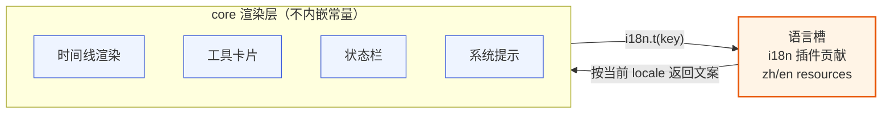

**图 2 — core 渲染时统一向语言槽取文案，不内嵌常量**

### 1.3 改进 现有方案的文案散落毛病

i18n 插件的设计直接吸取了 现有方案的教训。现有方案的 i18n 有两处散落：

1. **renderer 硬编码初始化**：现有方案在 renderer 层 `import` 一堆语言包 JSON、`i18n.use(initReactI18next).init({ resources: { zh: {...}, en: {...} } })`。i18next 的初始化、资源注入、locale 检测、`document.documentElement.lang` 设置全部硬编码在 renderer 里，renderer 必须感知 i18n 的实现细节。
2. **adapter.json 自带 `i18n` 字段**：现有方案的 `AdapterI18nLocale` 让每个 adapter 自己带一套 `displayName`/`description`/`fieldLabels`/`actionLabels` 的翻译。这是"文案散落在 adapter 里"的第二处。

后果是：同一个文案 key 可能在 renderer 的 JSON 里定义一遍、在 adapter.json 的 `i18n` 里又定义一遍，两边各管一摊、locale 切换要分别生效。第三方扩展想在桌面有像样的 i18n，光写 extension 不够、还要给 现有方案 仓库贡献 adapter.json、等 现有方案 发版才能带上（adapter 不能第三方自带，见 `DESIGN.md` 3.1.1）。

pi-desktop 的 i18n 纯粹走语言槽插件一条路。**所有文案——含其他插件的 `displayName`、命令 `title`、设置页 `title`、侧栏 `label`、卡片标签、系统提示——统一走语言槽**。core 和其他插件渲染文案时一律向语言槽要，不各自带 i18n 字段。一个文案 key 只在一个地方定义，locale 切换全局生效，没有第二处要同步。这是"一个文案 key 只在一个地方定义"的纪律，直接消解了 现有方案的 adapter `i18n` 字段那一层冗余。

### 1.4 与主题插件的对称性

i18n 插件和主题插件（`DESIGN.md` 4.11）是镜像关系，都是"影响 core 自身渲染的内容插件"：

| 维度 | i18n 插件 | 主题插件 |
|---|---|---|
| 槽位 | 语言槽 `languages` | 主题槽 `themes` |
| 贡献内容 | `resources`（key→文案） | `tokens`（key→值） |
| core 取用 | `i18n.t(key)` | `theme["color.bg"]` |
| 合并语义 | key 级合并（后注册覆盖同 key） | token 级合并（后注册覆盖同 token） |
| 冲突仲裁 | 同 key 冲突按来源插件优先级 | 同 token 冲突按来源插件优先级 |
| 切换 | 换当前 locale + 重渲染 | 换当前主题 id + 重渲染 |
| 不重启 | 是 | 是 |
| 偏好落点 | 桌面端 electron-store | 桌面端 electron-store |
| 与 pi 无关 | 是（语言是桌面偏好） | 是（主题是桌面偏好） |

这两个插件是"core 极薄"的两大支柱——文案和视觉都不内嵌、都走槽位、都可被覆盖。理解 i18n 插件就理解了主题插件，反之亦然。本文不展开主题插件（见主题插件文档 `06-plugin-theme.md`），但要记住：i18n 和主题是同一类设计模式的两个实例。

---

## 2 语言槽：贡献契约

### 2.1 语言槽贡献项结构

语言槽（`languages`）是 core 暴露给插件的槽位之一，专门贡献语言包。每个贡献项的字段级 schema 是：

```typescript
interface LanguageContribution {
  id: string;                              // 语言包贡献项标识，通常 {pluginId} 或 {pluginId}.{namespace}
  locale: string;                          // "zh" / "en" 等 2 位 BCP 47 语言短码
  resources: Record<string, string> | string;  // key → 文案，或指向外部 JSON 文件的相对路径
}
```

`id` 字段区分一个插件贡献的多组文案——比如某个插件可能同时贡献 `common` namespace 和 `timeline` namespace 的翻译，可以拆成两个贡献项 `{ id: "my.common", locale: "zh", resources: {...} }` 和 `{ id: "my.timeline", locale: "zh", resources: {...} }`，便于维护。也可以合并成一个贡献项把所有 key 塞进同一份 `resources`。`id` 在加载器校验里要求**在 (插件, locale) 维度唯一**——即同一个插件、同一个 locale 下不能有两个贡献项用同一个 `id`；但同一个插件在不同 locale 下复用同一个 `id`（如 zh/en 各一个 `id: "i18n.common"`）是合法的，表示"同一份逻辑语言包的两个 locale 版本"。跨插件 `id` 可以重复（不参与冲突仲裁，仲裁靠 locale + namespace + key）。

`resources` 有两种形态：① 对象字面量 `Record<string, string>`（key→文案，inline 在 manifest 里）；② 字符串，指向相对插件目录的外部 JSON 文件路径（见 3.4 的外部 JSON 拆分）。加载器在合并前会把字符串形态解析成对象——解析失败（文件不存在、JSON 语法错）按贡献项校验失败处理（3.2），不阻断插件整体。两种形态在合并阶段等价、都进同一份 i18next 字典。

`locale` 用 BCP 47 的 2 位语言短码：`"zh"`、`"en"`、`"ja"`、`"ru"` 等。**不使用区域子标签**（不用 `zh-CN`/`en-US`）——理由见 3.2 的 schema 与 5.1 的检测逻辑：检测层永远把 `navigator.language` 归约成主语言子标签并小写化（`zh-CN` → `zh`），i18next 的 `lng` 永远是 2 位短码；若 schema 放行区域子标签，则 `locale=zh-CN` 的贡献项 resources 在运行期永远查不到、成为死数据。所以 schema 收紧为只允许 2 位短码，区域变体（`zh-CN` vs `zh-TW`）记为演进项（12.4）。pi-desktop 当前内置只贡献 `zh` 和 `en`，但 `locale` 字段是开放枚举，第三方插件可以贡献任意 2 位短码的 locale。

`resources` 是 key→文案的扁平映射。**key 用 dot 分隔 namespace**——`"timeline.toolExecuting"` 表示 `timeline` namespace 下的 `toolExecuting` key、`"settings.modelSection"` 表示 `settings` namespace 下的 `modelSection` key。这对应 i18next 的 namespace 机制：core 启动时把 `resources` 按 namespace 聚合成 i18next 字典，渲染时 `i18n.t("timeline.toolExecuting")` 查。扁平的 dot key 是为了让贡献项保持简单（一个 `Record<string,string>` 而不是嵌套对象），namespace 解析由 core 启动时的合并逻辑负责。

### 2.2 namespace 组织机制

namespace 是 i18n 文案的组织维度。借鉴 现有方案的做法（它用 i18next + react-i18next，按 namespace 切 JSON：`common`/`timeline`/`review`/`settings`/`composer`/`context`/`adapters`/`run`/`extension`/`files`/`update`），pi-desktop 的 i18n 也按 namespace 组织文案——每个 namespace 对应一组功能：`timeline` 管时间线、`settings` 管设置页、`sessions` 管会话管理、`common` 管跨功能复用的通用文案（发送/取消/确定等）。

namespace 的作用是**收敛与查重**。同一个 namespace 下的 key 共享一个语义域，便于检查缺失（"timeline namespace 下所有 key 的 zh/en 是否齐全"）、便于插件分工（timeline 插件负责 timeline namespace 的 key、settings 插件负责 settings namespace 的 key）。core 的 i18next 实例配置 `defaultNS: "common"`，所以不带 namespace 前缀的 key（如 `i18n.t("send")`）默认查 `common` namespace。

关于 namespace 的加载时机，要明确当前实现是**全量加载到内存**：加载器在 core 启动时把所有已安装插件的 `languages` 贡献项一次性合并进同一份 `resources` 字典（6.1 的 `mergeLanguageContributions`，即 14.2 的同名合并器），无论该 namespace 是否当前会被渲染到。这意味着 i18next 的 `loadNamespaces(ns)` 在 pi-desktop 里是冗余的——所有 namespace 的资源已经在 `init` 时注入、内存里常驻、查询直接命中。`loadNamespaces` 是 i18next 面向 backend 加载器的懒加载 API，pi-desktop 没有 backend（resources 直接内联），所以不依赖它。

这个"全量加载"的设计选择是和"纯声明式插件"对齐的：i18n 插件在加载期一次性建好整本字典、运行期只查字典，没有运行时副作用、没有按需 IO。代价是所有已装插件的语言包常驻内存——但语言包的体积很小（zh/en 各约上百 key、几十 KB），全量加载的内存开销可忽略。真正的"按需加载"只在一种场景下有意义：把第三方 namespace 的 JSON 文件做成真正的懒加载（resources 字符串路径在 `loadNamespaces` 时才读文件）——这是未来演进项（12.4），当前不实现、文档不假装支持。第三方插件没装时，它的 namespace 自然不在字典里（贡献项根本没被加载器发现）；装了之后全量进字典，不存在"装了但没加载"的中间态。

key 的 dot 解析规则要钉死：**只取第一个 dot 之前的部分当 namespace，其余整体当 key**。即 `"timeline.toolExecuting"` → namespace=`timeline`、key=`toolExecuting`；`"settings.modelSection.advanced"` → namespace=`settings`、key=`modelSection.advanced`（多段 key 合法，整体作为 namespace 内的 key）。这避免歧义——不能"前两段是 namespace"这种规则，否则 `settings.modelSection.advanced` 解析两可。这个规则和 i18next 的 `nsSeparator: "."` 默认行为一致，core 显式声明以免歧义。

这个解析规则有个边界要处理：**没有 dot 的 key 走 defaultNS**。`"send"` 没有 dot，namespace 取 `defaultNS`（`common`）、key 是 `"send"`。这对应 `i18n.t("send")` 查 `common.send`。但贡献项 `resources` 里的 key 应该带 namespace 前缀（`"common.send"`），不带前缀的裸 key 在 `resources` 里会被解析成 `defaultNS + 裸 key`——加载器校验时对裸 key 记 warning、不阻断，但建议贡献项一律写全名带 namespace 前缀，避免依赖 defaultNS 的隐式行为。

### 2.3 namespace 与插件 id 的关系

namespace 和插件 id 是两个维度，不要混。插件 id 是插件的唯一标识（`plugin.json` 的 `id` 字段），用于优先级仲裁和覆盖；namespace 是文案的分组维度，用于字典组织。一个插件可以贡献多个 namespace（i18n 插件贡献 `common` + 各插件 displayName）、多个插件可以贡献同一个 namespace（timeline 插件和第三方插件都往 `timeline` namespace 补 key）。namespace 不归属任何插件——它是语言槽字典里的分组，谁贡献的 key 都进同一个分组。

唯一约定：插件**自身专属的文案**建议用自己的 id 当 namespace 前缀（如 `myTool.title`），避免和内置 namespace 撞。而**对内置功能的补充文案**（如给 timeline 加新工具卡片的标签）可以复用内置 namespace（`timeline.myCustomTool`），因为这是对内置功能的扩展、归内置功能域。这个约定让"谁的文案"一目了然，也减少 key 冲突概率。

### 2.4 key 命名约定

key 命名遵循驼峰、语义化、按功能域分组。约定如下：

- **插件自身文案**：`{pluginId}.{功能}.{动作}`，如 `timeline.toolExecuting`、`sessions.deleteConfirm`、`settings.modelSection`。
- **插件展示名**：固定 key `plugin.{pluginId}.displayName`，如 `plugin.i18n.displayName`、`plugin.session-manager.displayName`。core 渲染插件列表时先按这个 key 查语言槽、查不到 fallback 到 manifest 的 `displayName` 字面值。
- **贡献项 label/title**：`{slot}.{pluginId}.{itemId}.label`，如 `commands.review.addComment.label`、`sidePanel.session-manager.sessions.label`、`settings.review.title`。
- **复数形式**：`{key}_one` / `{key}_other`（i18next 的复数后缀约定），如 `timeline.messages_one` / `timeline.messages_other`。

这套命名约定让"文案归属哪个插件/哪个槽位/哪个项"一目了然，也便于第三方插件贡献翻译时知道往哪个 key 写。命名约定是软约束（加载器不强制校验 key 格式），但内置插件和文档示例必须遵守，作为生态规范。

**内置 namespace 权威清单**：`common`（通用文案：发送/取消/确认/复制等）、`timeline`（时间线：工具执行状态、消息计数等）、`settings`（设置页：模型/思考级别/压缩等配置项）、`sessions`（会话管理：删除确认/列表/分叉等）、`commands`（命令贡献项 label：`commands.review.addComment.label` 等）、`sidePanel`（侧栏贡献项 label：`sidePanel.session-manager.sessions.label` 等）、`review`（review 模式专属文案）、`system`（系统提示/状态栏指示）。这 8 个是 core 初始 `ns` 列表的静态注册项（6.2），core 启动时一次性声明、保证内置功能域的 namespace 在 i18next 查询前已注册。第三方插件贡献的 namespace（如 `my-tool`）不是静态注册的——加载器在合并它的贡献项后，把 namespace 名加进 i18next 的 `ns` 列表（动态注册），无需 `loadNamespaces`（2.2 已说明全量加载）。静态注册只影响"namespace 在 init 时声明"，不影响运行期查询——i18next 对未在 `ns` 列表但 resources 里有的 namespace 也能查到，静态注册主要是为了 `defaultNS` 回退和完整性检查（12.2）的准确性。

### 2.5 资源合并策略：key 级合并

语言槽的资源合并策略**和别的槽位不同**。别的槽位（卡片渲染槽、侧栏槽等）的冲突仲裁是"二选一覆盖"——同 id 的贡献项按来源插件优先级取高的、低的整个不挂载。但语言槽是**key 级合并**——同 locale 同 namespace 的文案，多个插件贡献的 key 各自 key 不冲突时全部保留、合并成一份字典；只有同 key 冲突时按来源插件优先级取高的。

这个差异源于语言包天然的合并语义。多个插件都会给 `timeline` namespace 贡献 key——timeline 插件贡献 `timeline.toolExecuting`、`timeline.copy`，review 插件可能贡献 `timeline.reviewMarker`，某个第三方插件贡献 `timeline.customTool`。这些 key 各不冲突，应该全部保留，不能"二选一覆盖"把别的插件的 key 丢了。只有当两个插件都写了 `timeline.toolExecuting`（同 key 冲突）时，才按来源插件优先级仲裁（project > user > installed > builtin，见 `DESIGN.md` 3.4）。

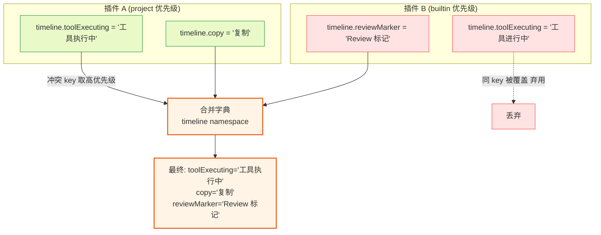

**图 3 — key 级合并：不冲突的 key 全保留，冲突 key 按来源插件优先级取高**

### 2.6 为什么语言槽的合并语义不能复用通用仲裁

这个特例不是随意的——它是语言包的本质决定的。通用仲裁（`resolveByPriority`，`DESIGN.md` 3.5）的语义是"同一槽位同一 id 取一个胜者"，适用于"一个侧栏 Tab 只能有一个组件渲染"这种互斥场景。但语言包不是互斥——它是一份字典，本质是 map 的 union，多个插件各贡献若干 key 合成一份完整字典。如果用通用仲裁，i18n 插件（builtin 优先级最低）的 key 会被任何更高优先级插件的同 namespace 贡献项整个覆盖掉——那 timeline 插件（假设 builtin）的 `timeline.toolExecuting` 就会被某个只贡献 `timeline.customTool` 的第三方插件整体覆盖丢失。

所以语言槽的仲裁函数是**两段式**的：先按 locale + namespace 分组、组内做 key 级 union（不冲突的 key 全保留），再对冲突 key 调用 `resolveByPriority`（按来源插件优先级取一个胜者）。这个两段式仲裁是语言槽的专属逻辑，挂在加载器的语言槽合并器里、不污染通用仲裁函数。

### 2.6.1 仲裁的优先级来源与顺序保证

两段式仲裁里"来源插件优先级"用的是加载器通用的优先级序：`project > user > installed > builtin`（`DESIGN.md` 3.4）。这和别的槽位用同一套优先级、不特殊。但语言槽的仲裁顺序有个细节：**按插件优先级降序处理贡献项、逐个 union 进字典**——高优先级插件的 key 先进字典、低优先级的后进，后进的同 key 因优先级低被丢弃（union 时比对 priority、低的不覆盖高的）。这等价于"高优先级胜出"、但实现上是 union + priority 比对、不是排序后取第一个。

**sourcePriority 的数值映射要钉死**，否则合并代码里的裸算术 `existing.priority < priority` 方向可能写反。pi-desktop 给四个来源定下数值表，明确"高值胜"：

| 来源 | sourcePriority 数值 | 语义 |
|---|---|---|
| `builtin` | 1 | 内置默认插件，最低，可被任何更高来源覆盖 |
| `installed` | 2 | npm/git 装的第三方插件 |
| `user` | 3 | `~/.pi/desktop/plugins/` 下用户手放的插件 |
| `project` | 4 | `<cwd>/.pi/desktop/plugins/` 项目级插件，最高 |

数值方向是**高值胜**：`existing.priority < priority` 表示"新进来的 key 来源优先级数值更大（更高）时覆盖已有的"；当 `existing.priority === priority`（同优先级）时该判断为 `false`、不覆盖——即**同优先级同 key 的胜出者是"先处理者"**（先进入字典的那个保留、后到的不覆盖）。这和 `DESIGN.md` 3.4 的 `project > user > installed > builtin` 序一致，也和通用仲裁原语 `resolveByPriority` 的取向一致——区别只在粒度（语言槽是 key 级、通用仲裁是贡献项级）。语言槽的合并代码用裸数值比较是为了内联性能（合并是热路径、避免每次调 `resolveByPriority` 的函数开销），但数值表必须和 `resolveByPriority` 的内部映射同步，否则两套数值会打架。这份映射记在加载器的来源元数据里（`PluginMeta.sourcePriority`），由加载器在发现插件时按其安装位置写入、合并器只读不写。

**同优先级冲突的胜出方向要钉死为"先处理者胜"**，与 6.1 合并代码 `existing.priority < priority`（等优先级不覆盖）一致。这里"先处理者"指贡献项在合并器输入数组中的相对顺序——靠前的先入字典、靠后的因 `priority` 不大于已有值而被丢弃。但加载器**不保证同优先级贡献项在输入数组中的相对顺序稳定**：发现插件的遍历顺序受文件系统返回顺序、插件加载机制（project/user/installed/builtin 各源内部顺序）影响，跨平台、跨版本可能不同。因此同优先级同 key 的最终胜出者在实际运行中可能不可预测——这是 11.7 告警 warning 的根因。对此的建议是：插件作者改用各自 namespace 前缀（`{pluginId}.xxx`）避免同 key 冲突，而非依赖"先来后到"的仲裁结果。注意此处描述的是合并器的判定语义（先处理者胜），与 12.3.1 测试矩阵的期望保持一致；不要改写成"后处理者胜"，否则需同步修改 6.1 的判定为 `existing.priority <= priority`、并连带调整 11.7/12.3.1——务必让代码、正文、测试三处指向同一种语义。

仲裁的粒度是**单个 key**、不是整个贡献项。一个 builtin 插件的贡献项里有 10 个 key，其中 3 个被高优先级插件覆盖、7 个没有——最终字典里是 3 个高优先级的 + 7 个 builtin 的（不是整个贡献项二选一）。这是和通用仲裁最大的区别：通用仲裁是贡献项级（整个贡献项二选一），语言槽是 key 级（贡献项内逐 key 仲裁）。所以语言槽不能复用 `resolveByPriority`（那是贡献项级的）、要用自己的 key 级 union 逻辑。

### 2.6.2 字面值 fallback 与仲裁的关系

manifest 字面值（`manifestLiterals` Map）不参与语言槽的 key 级合并仲裁——它是独立的第二数据源（4.2.2）。字面值的冲突处理在 4.2.3 的收集算法里单独定义（同 key 字面值按来源插件优先级取高）。所以语言槽有两套独立的数据：resources 字典（走 key 级合并仲裁）和 manifestLiterals Map（走字面值收集仲裁），互不干扰、各自有冲突处理。这保证"翻译缺失时 fallback 到字面值"的语义稳定——字面值不会因为 resources 合并而被覆盖、resources 也不会被字面值污染。

### 2.7 namespace 在 i18next 里的查询行为与 `plugin` namespace

文档多处用到的 `plugin.{pluginId}.displayName`、`plugin.{pluginId}.description` 这类 key 经 dot 解析后 namespace 是 `plugin`，但 6.2 的内置 `ns` 列表（common/timeline/settings/sessions/commands/sidePanel/review/system）里**不含 `plugin`**。这里要把 i18next 对 namespace 的查找行为说清，否则实现者会担心"`plugin` namespace 没声明、查不到"。

i18next 的 `ns` 选项有两个作用：① 声明 `defaultNS` 之外的**预加载** namespace（面向 backend 加载器、`loadNamespaces` 时按需拉）；② 参与 `fallbackNS` 等查询行为。但 i18next 对"resources 字典里已有、但未在 `ns` 列表声明的 namespace"的查询行为是：**只要 resources[lng][ns] 存在，`t("ns.key")` 就能命中**——`ns` 列表不是"查询白名单"，未声明的 namespace 不会被拒查。这是 i18next 的标准行为：`ns` 列表主要影响懒加载和 `defaultNS`/`fallbackNS` 的回退语义，不影响"resources 里已有数据的直接查询"。

pi-desktop 是**全量加载**（2.2），所有 namespace 的 resources 在 `init` 时就整体注入了 i18next 实例——`plugin` namespace 的 key（如 `plugin.i18n.displayName`）在合并阶段就进了 `resources.zh.plugin` / `resources.en.plugin`，查询时 `t("plugin.i18n.displayName")` 直接命中、不依赖 `plugin` 是否在 `ns` 列表里。所以 `plugin` namespace 不需要显式进 `ns` 列表就能查——这是为什么 6.2 的 `ns` 不含 `plugin`、但 2.4 的命名约定大量用 `plugin.*` key 却能正常工作。

为减少歧义、也为了完整性检查（12.2）和 `defaultNS` 回退的准确性，加载器在合并完所有贡献项后，会把 resources 里实际出现的 namespace 名（含 `plugin`、含第三方 namespace 如 `my-tool`）一并登记进 i18next 的 `ns` 列表（动态注册，6.2.2）。也就是说 `ns` 列表在 `init` 时是"内置 8 个权威清单 + 扫描得到的全部 namespace"的并集——`plugin`、`my-tool` 等都会被收进去。这一步是"登记"而非"加载"（数据已在内存、只是把名字写进查询注册表），让完整性检查能正确枚举所有 namespace、也让 `defaultNS` 回退不会因 namespace 未登记而误判。

**第三方 namespace 的登记流程**：加载器扫描某第三方插件的 `languages` 贡献项、合并进 resources 时，对贡献项里每个 key 做 dot 解析（2.2），把得到的 namespace 名（如 `my-tool`）加入一个 `seenNamespaces` 集合；全部贡献项合并完后，`seenNamespaces` 并上内置 8 个权威清单、作为 `init` 的 `ns` 选项。`plugin` namespace 也是这样被自动收进来的——它的 key 来自 i18n 插件（和各插件）贡献的 `plugin.*.displayName`/`plugin.*.description`，dot 解析后 namespace 是 `plugin`、自动进 `seenNamespaces`。整个过程无需插件作者显式声明"我要用 `plugin` namespace"——贡献了带 `plugin.` 前缀的 key、namespace 就自动登记。

这个机制保证了：任何在 resources 里出现的 namespace 都可查、也都在 `ns` 列表里有登记，不会出现"用了 `plugin.*` key 但 namespace 没声明、查不到"的黑洞。实现者照着 6.1 的合并器 + 6.2 的 init 配置写，`plugin` namespace 自然可用。

---

## 3 manifest 声明规范

### 3.1 完整 plugin.json

i18n 插件的 `plugin.json` 是所有内置插件里最简的——没有 `main`、没有 `renderer`，只有 `id`/`version`/`displayName`/`contributes.languages`：

```json
{
  "id": "i18n",
  "version": "0.1.0",
  "displayName": "i18n",
  "description": "pi-desktop 的语言槽插件，贡献中英文文案",
  "contributes": {
    "languages": [
      {
        "id": "i18n.common",
        "locale": "zh",
        "resources": {
          "common.send": "发送",
          "common.cancel": "取消",
          "common.confirm": "确认",
          "common.copy": "复制",
          "timeline.toolExecuting": "工具执行中",
          "timeline.idle": "空闲",
          "timeline.running": "运行中",
          "sessions.deleteConfirm": "确认删除该会话？",
          "settings.modelSection": "模型",
          "plugin.i18n.displayName": "国际化",
          "plugin.i18n.description": "pi-desktop 的语言槽插件，贡献中英文文案"
        }
      },
      {
        "id": "i18n.common",
        "locale": "en",
        "resources": {
          "common.send": "Send",
          "common.cancel": "Cancel",
          "common.confirm": "Confirm",
          "common.copy": "Copy",
          "timeline.toolExecuting": "Tool executing",
          "timeline.idle": "Idle",
          "timeline.running": "Running",
          "sessions.deleteConfirm": "Delete this session?",
          "settings.modelSection": "Model",
          "plugin.i18n.displayName": "Internationalization",
          "plugin.i18n.description": "Language slot plugin for pi-desktop, contributes zh/en copy"
        }
      }
    ]
  }
}
```

无 `main`/`renderer`——core 启动时合并所有 `languages` 贡献项成 i18next 字典，零代码加载。`displayName` 填的是 `"i18n"`（字面值 fallback），但同时贡献了 `plugin.i18n.displayName` 的 zh/en 翻译——core 渲染插件列表时先按 key 查，查到用翻译、查不到用字面值（见 3.3）。`description` 字段同理：manifest 填字面值作为兜底，resources 里贡献 `plugin.i18n.description` 的 zh/en 翻译，core 渲染插件一句话描述时走同一条 fallback 链（当前 locale → en → 字面值 → key 本身）。

### 3.2 贡献项字段 schema 与校验

加载器在加载阶段对每个 `languages` 贡献项做 schema 校验，校验失败的处理：

- `id` 缺失或非 string → 拒绝该贡献项、记 error 日志（不影响插件整体加载，该贡献项不挂载）。
- `locale` 缺失、非 string、或非合法 2 位 BCP 47 短码（正则 `^[a-z]{2}$`，只允许 `zh`/`en`/`ja`/`ru` 等 2 位小写短码，**不接受区域子标签** `zh-CN`/`en-US`，理由见 2.1）→ 拒绝、记 error。
- `resources` 缺失 → 拒绝、记 error。`resources` 可以是对象或字符串（外部 JSON 路径，见 3.4）：
  - 若为字符串：按相对插件目录解析路径、读 JSON 文件、解析成 `Record<string,string>`；解析失败（文件不存在、JSON 语法错、顶层非对象）→ 拒绝、记 error。
  - 若为对象：value 非字符串 → 拒绝、记 error。
- `resources` 里 value 是空字符串 → 记 warning（合法但可能是漏填），不阻断。
- `resources` 里 key 不含 dot（裸 key）→ 记 warning（会走 defaultNS，建议写全名），不阻断。
- `id` 在同插件同 locale 下重复 → 拒绝后出现的贡献项、记 error（违反 (插件, locale) 维度唯一性，见 2.1）。

校验通过的贡献项进入合并阶段。校验是加载期动作、不进运行期——运行期字典已构建完毕、只读。校验失败的贡献项不挂载、对应 key 在字典里缺失，渲染时走 fallback 链（见第 4 节）。这保证一个坏贡献项不会拖垮整个 i18n。

### 3.2.1 校验失败的处理与可观测

校验失败的处理遵循加载器的统一错误隔离原则（`DESIGN.md` 3.5.5）：单个贡献项失败不阻断插件加载、不阻断其他贡献项，错误进管理 UI 的诊断页（`DESIGN.md` 4.3.2）和 toast。插件作者在开发时能在日志页（`DESIGN.md` 4.3.2）看到"i18n 插件的某贡献项 locale 非法"这类信息，定位到具体贡献项和字段。

### 3.2.2 校验与加载的顺序

加载器对 i18n 插件的处理顺序：① 发现插件 → ② 读 plugin.json → ③ schema 校验 manifest 整体（含 `id`/`version`/`displayName` 字段）→ ④ 对每个 `languages` 贡献项做字段校验 → ⑤ 若 `resources` 是字符串路径，解析外部 JSON 成对象（失败按 ④ 拒绝）；此步产出 `ResolvedLanguageContribution`（resources 已是对象，6.1/14.1），把"字符串路径解析"明确归到加载器的校验/解析阶段 → ⑥ 通过的贡献项（已解析形态）进入合并器 → ⑦ 合并器按 locale + namespace 聚合、key 级合并、冲突仲裁 → ⑧ 构建成 i18next 字典 → ⑨ 注入 i18next 实例。这九步在加载期一次性完成，运行期不再重复。

### 3.3 displayName 的双重角色

`displayName` 字段有双重角色：它既是 manifest 的展示名、又是 fallback 文案。core 渲染插件展示名时，先按固定 key `plugin.{id}.displayName` 去语言槽查当前 locale 的翻译（如 `plugin.i18n.displayName`），查到就用翻译；查不到就 fallback 到 `displayName` 字段的字面值。所以字面值填什么有意义——它是没有翻译时的兜底显示（比如内置插件填中文 `"会话管理"`，没有对应 locale 翻译时就显示这个中文）。第三方插件只填字面值、不贡献翻译也正常工作。

`contributes` 里贡献项的 `label`/`title` 同理（key 约定是 `{slot}.{pluginId}.{itemId}.label`）。这是"自我翻译递归"（第 7 节）的基础——所有展示文案都走语言槽、没有特例。

**`description` 字段**：插件 manifest 里的 `description`（插件一句话描述）同样参与 i18n，key 约定是 `plugin.{pluginId}.description`，字面值兜底规则与 `displayName` 一致（当前 locale → en → manifest `description` 字面值 → key 本身）。第三方插件只填 `description` 字面值不贡献翻译也正常工作。`contributes` 里贡献项如果有 `description` 字段（如命令的描述文本），key 约定是 `{slot}.{pluginId}.{itemId}.description`，同理走字面值兜底。这些字面值都收进 `manifestLiterals` Map（4.6）。

### 3.4 多语言包贡献项与外部 JSON 拆分

内置 i18n 插件把所有 zh/en 文案塞进一个 `plugin.json` 里是可行的小规模做法，但内置插件要覆盖 core + 所有内置功能域的文案，key 数量会上百。为可维护性，i18n 插件支持**外部 JSON 拆分**：`resources` 字段可以是一个对象字面量，也可以是一个字符串路径指向外部 JSON 文件：

```json
{
  "id": "i18n.timeline",
  "locale": "zh",
  "resources": "./locales/zh/timeline.json"
}
```

加载器遇到 `resources` 是字符串时，按相对插件目录解析路径、读 JSON 文件、解析成 `Record<string,string>` 后当作 resources 用。这样可以把 zh/en 各拆成多个 namespace 文件（`timeline.json`/`settings.json`/`sessions.json`/`common.json`），每个文件管一个 namespace，便于团队协作和 diff 审查。外部 JSON 加载失败（文件不存在、JSON 解析失败）按贡献项校验失败处理（3.2.1）——不阻断插件、记 error、该贡献项不挂载。

外部 JSON 拆分是加载期动作：加载器读文件、解析、合并进字典，运行期字典已构建完、不再读文件。所以改了外部 JSON 要热重载（第 10 节）才生效，不是改完立即生效。

---

## 4 fallback 链

### 4.1 四级回退层次

i18n 文案查找是四级 fallback 链，从最具体到最兜底：

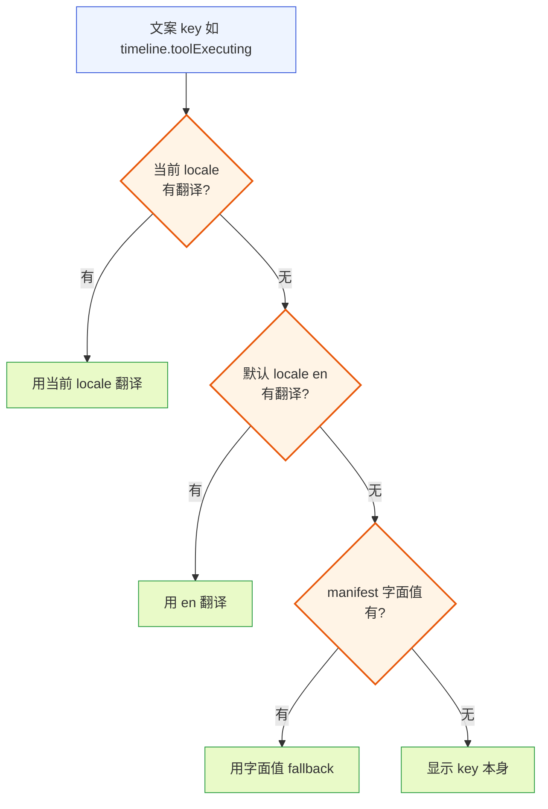

**图 4 — i18n 文案 fallback 链：当前 locale → 默认 en → manifest 字面值 → key 本身**

四级分别是：

1. **当前 locale 翻译**：用户当前选定的 locale（如 `zh`）下、该 key 的翻译。有就直接用。
2. **默认 locale（en）翻译**：当前 locale 没有该 key 时，回退到默认 locale `en`。这保证"即使用户用了某个翻译不全的 locale，英文兜底还在"。
3. **manifest 字面值**：en 也没有时，回退到 manifest 里 `displayName`/`label`/`title` 字段的字面值。这只对"有 manifest 字面值的文案"生效（如插件展示名、贡献项 label），普通功能文案没有字面值、跳过这级。
4. **key 本身**：前三层都没有时，显示 key 本身（如 `timeline.toolExecuting`）。这是最后的兜底，保证 UI 永远不会因为缺文案而崩或显示空白。

### 4.2 查找算法

fallback 链在 core 的 i18n 翻译器里实现，不在 i18next 原生 fallback 里配。原因是 i18next 的 `fallbackLng` 只支持 locale 级回退（`zh → en`），不支持"回退到 manifest 字面值"和"回退到 key 本身"这两层——后两层是 pi-desktop 特有的业务规则。所以翻译器在 i18next 之外包了一层：

```typescript
class I18nTranslator {
  constructor(
    private i18next: i18next.i18n,
    private manifestLiterals: Map<string, string>,  // key → manifest 字面值（如 plugin.{id}.displayName）
    private currentLocale: string,                    // 当前 locale，2 位短码
    private defaultLocale = "en",
  ) {}

  t(key: string, vars?: Record<string, unknown>): string {
    // 第一级：当前 locale
    const current = this.i18next.t(key, { ...vars, lng: this.currentLocale, returnObjects: false });
    if (current && current !== key) return current;

    // 第二级：默认 locale en
    const fallback = this.i18next.t(key, { ...vars, lng: this.defaultLocale, returnObjects: false });
    if (fallback && fallback !== key) return fallback;

    // 第三级：manifest 字面值
    const literal = this.manifestLiterals.get(key);
    if (literal) return literal;

    // 第四级：key 本身
    return key;
  }

  get locale(): string { return this.currentLocale; }

  // locale 切换时由 main 侧调用，更新当前 locale + 清 Collator 缓存
  setLocale(lng: string): void {
    this.currentLocale = lng;
    this.collatorCache?.clear();
  }
}
```

注意 i18next 的 `t()` 在 key 不存在时默认返回 key 本身——所以判断"有没有翻译"用 `current !== key`。这个约定让 fallback 链的实现简洁：i18next 处理前两级、translator 处理后两级。

**`currentLocale` 的同步路径**：translator 是 main 进程单例，但 locale 切换由用户在 renderer 侧设置页发起（5.3）。切换的完整链路是：renderer 调 `i18next.changeLanguage(lng)` 触发 react-i18next 重渲染（renderer 侧即时生效），同时经 IPC 通知 main 进程——main 侧收到通知后调 `translator.setLocale(lng)` 更新 main 侧 translator 的 `currentLocale`、清 Collator 缓存。main 侧的 locale 更新是给 worker 侧和 main 内部翻译用的（worker/生成文案推给 renderer 的场景）。这个 IPC 通知是 fire-and-forget（locale 切换的低频操作、丢一两次重试即可），不阻塞 renderer 的即时切换体验。worker 进程持有自己的 i18next 实例（见 9.3），locale 切换时 main 同样经 IPC 把新 locale 同步给 worker、worker 侧调 `i18next.changeLanguage(lng)` 更新自己的实例——worker 侧的 locale 更新时序晚于 renderer（要等 IPC 送达），但 worker 侧翻译主要用于生成推给 renderer 的文案、不直接渲染，轻微延迟无影响。

### 4.2.1 translator 的圆心纯度纪律

translator 是圆心（槽位契约层）的实现，它不 import pi 的任何类型、不感知底座。它只依赖三个输入：i18next 实例（中层提供）、manifestLiterals Map（加载器从所有插件的 manifest 字面值收集）、defaultLocale 常量。这三个输入都是 core 内部的稳定抽象，不绑底座协议。这呼应洋葱架构（`DESIGN.md` 工程原则·洋葱架构思维）：圆心不依赖外层，i18next 实例是中层（加载器）提供的"实现"，圆心只依赖"翻译"这个抽象。

### 4.2.2 为什么不在 i18next 里直接配字面值 fallback

i18next 支持 `fallbackLng` 和 `parseMissingKeyHandler`，理论上可以让 i18next 处理全部四级。但不在 i18next 里配字面值 fallback 的原因：manifest 字面值是 core 加载期从插件 manifest 收集的、和 i18next 的资源字典是两套数据源。把字面值塞进 i18next 的 resources 会污染字典（字面值不是翻译、locale 切换时不应跟着切）。所以字面值 fallback 留在 translator 这一层、和 i18next 字典解耦。这是"构造和执行分开"（`DESIGN.md` 工程原则）的体现——i18next 管翻译字典、translator 管业务回退规则，两侧解耦。

### 4.2.3 manifestLiterals 的收集算法

`manifestLiterals` Map 在加载期由加载器从所有插件的 manifest 收集而成。收集规则要钉死，否则不同实现会收出不同结果。算法如下：

1. **遍历对象**：遍历所有已加载插件的 `plugin.json`，含内置插件和第三方插件。
2. **插件级字段**：对每个插件 manifest，收集以下字段进 Map：
   - `displayName` → key 为 `plugin.{pluginId}.displayName`，value 为 `displayName` 字面值。
   - `description` → key 为 `plugin.{pluginId}.description`，value 为 `description` 字面值（若存在）。
3. **贡献项级字段**：对每个插件的 `contributes` 下每个槽位的每个贡献项，按槽位约定收集：
   - `commands` 槽：每项 `cmd` → key 为 `commands.{pluginId}.{cmd.id}.label`（label 字段）、`commands.{pluginId}.{cmd.id}.title`（title 字段，若有）、`commands.{pluginId}.{cmd.id}.description`（description 字段，若有）。
   - `sidePanel` 槽：每项 `panel` → key 为 `sidePanel.{pluginId}.{panel.id}.label`、`.title`、`.description`（同上字段映射）。
   - `settings` 槽：每项 `section` → key 为 `settings.{pluginId}.{section.id}.title`、`.description`。
   - `cardRenderers`/`timeline` 等其他槽位：每项的 `label`/`title`/`description` 字段 → key 为 `{slot}.{pluginId}.{itemId}.{field}`。
4. **收集字段集合**：固定为 `{ displayName, label, title, description }` 四个字段（对应 3.3 的双重角色）。其他字段（如 `id`/`version`/`main`）不收。
5. **冲突处理**：同 key 的字面值若多个插件贡献，按来源插件优先级取高（和 resources 合并一致）。通常字面值由插件自己贡献、不冲突。
6. **空值跳过**：字段为空字符串或 undefined 时不收（避免把空串当 fallback）。

收集结果是 `Map<string, string>`，注入 translator 构造函数。这个 Map 在加载期一次性构建、运行期只读（热重载时重建，见 10.2）。收集逻辑挂在加载器里、不污染 translator——translator 只消费 Map、不知道 Map 怎么来的。

### 4.3 字面值与 key 兜底的适用场景

四级 fallback 不是每个 key 都走满。不同 key 的典型路径：

- **功能文案**（如 `timeline.toolExecuting`）：只有 locale 翻译，没有 manifest 字面值。路径是 当前 locale → en → key 本身（跳过第三级）。
- **插件展示名**（`plugin.{id}.displayName`）：有 manifest 字面值（`displayName` 字段）。路径是 当前 locale → en → 字面值（通常第二级就命中）。
- **贡献项 label**（`{slot}.{pluginId}.{itemId}.label`）：有 manifest 字面值（`label` 字段）。同上。

字面值 fallback 的意义是"第三方插件不贡献翻译也能显示一个像样的名字"——它填了 `displayName: "My Tool"`，就算没有 zh 翻译，中文 locale 下也显示 `"My Tool"` 而不是 `plugin.my-tool.displayName` 这种难看的 key。

### 4.4 启动阶段的代价

fallback 链在运行期是纯内存查找（i18next 字典 + Map.get），无 IO、无计算，代价可忽略。代价在加载期：构建 i18next 字典（合并所有贡献项、key 级合并、冲突仲裁）、收集 manifestLiterals Map（遍历所有插件 manifest）。这两个动作在加载器扫描插件时一次性完成，之后字典只读。内置 i18n 插件的 zh/en 各约上百 key，合并是 O(n) 级别，加载期开销在毫秒级、用户无感。

### 4.5 fallback 时序图

渲染一条文案时的完整 fallback 时序：

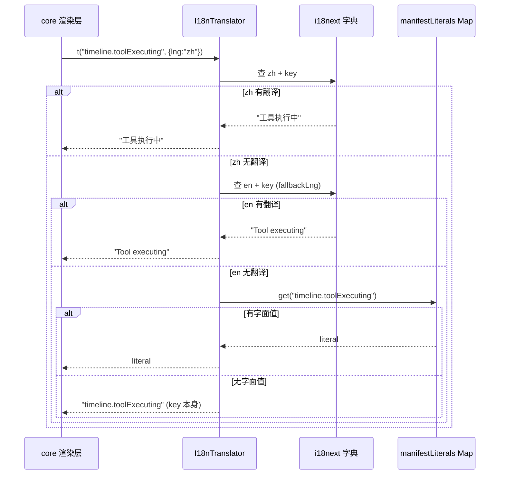

**图 5 — fallback 链查找时序：四级依次尝试，命中即返回**

### 4.5.1 fallback 链的边界场景

四级 fallback 在几个边界场景下行为要钉死，否则实现者会写出不一致的结果：

**空串算缺失还是命中**：i18next 配置 `returnEmptyString: false`（6.2），所以 `resources` 里 value 是空字符串时 i18next 把它当缺失处理、返回 key 本身。于是 translator 的第一级判断 `current !== key` 自然命中"空串当缺失"——空串翻译会 fall through 到第二级 en、再到字面值。这和 3.2 校验里"空串 value 记 warning 不阻断"对齐：空串是合法贡献、但不当作有效翻译。如果某个 locale 故意要空串（极少见），应改为 `returnEmptyString: true` 全局配置——但 pi-desktop 不这么做、空串一律当缺失。

**插值变量缺失时的 fallback**：`t("common.welcome", { name: "user" })` 查 `common.welcome = "你好 {{name}}"`，i18next 做插值替换成 `"你好 user"` 返回。如果 `vars` 里漏了 `name`，i18next 默认把未提供的 `{{name}}` 留空（`"你好 "`）、不触发 fallback——插值缺失不是 key 缺失，走的是 i18next 的插值规则不是 translator 的 fallback 链。所以"插值变量缺失导致难看文案"要靠插件作者保证传全 vars、不靠 fallback 兜底。

**复数与 fallback 的叠加**：`t("timeline.messages", { count: 5 })` 查 `timeline.messages_other`（CLDR 复数规则）。如果 `messages_other` 缺失但 `messages`（无后缀）存在，i18next 用 `messages` 当作非复数文案返回、`{{count}}` 照常插值。如果两个都缺失，i18next 返回 key 本身（`timeline.messages`）、translator 接着走第二级 en → 字面值 → key。注意复数 key（`messages_one`/`messages_other`）没有 manifest 字面值（manifest 里只有 `label`/`title` 等非复数字段），所以复数文案的 fallback 路径是 当前 locale → en → key 本身、跳过第三级。

**字面值与翻译不一致**：某插件的 manifest `displayName: "My Tool"`（字面值），但语言槽贡献了 `plugin.my-tool.displayName: "我的工具"`（zh）。zh locale 下走第一级命中"我的工具"、en locale 下走第一级命中"My Tool"。如果两个 locale 都没贡献翻译，则 zh locale 下走字面值"My Tool"——这是"没翻译就显示原始字面值"的兜底，用户看到的是英文原始名而非 key。这正是字面值 fallback 的设计意图。

**嵌套 namespace key 的 fallback**：`t("settings.modelSection.advanced")` 解析成 namespace=`settings`、key=`modelSection.advanced`（2.2 的"第一个 dot 之前当 namespace"规则）。i18next 查 `settings.modelSection.advanced`，命中则返回；缺失走 en → 字面值（settings 贡献项的 label 字段若有对应字面值）→ key 本身。多段 key 不影响 fallback 链层级、只影响 namespace 解析。

### 4.5.2 fallback 链的性能特征

fallback 链在运行期是纯内存查找：第一二级是 i18next 的 `t()`（内部是 hash 查找，O(1) 级别），第三级是 `Map.get`（O(1)），第四级直接返回参数。正常情况（翻译存在）只走第一级、一次 hash 查找即返回。每条文案的翻译开销在微秒级、可忽略。开销集中在校验失败/翻译缺失时——会多走一两级 hash 查找，但缺失本身是异常态、不是热路径。所以 fallback 链对渲染性能无实质影响，不需要缓存翻译结果（i18next 内部已有缓存）。

### 4.5.3 插值与 fallback 的交互矩阵

fallback 链的四级和插值/复数规则会叠加，实现者容易在交互处写错。这里把常见的 key×vars 组合的最终走法列成矩阵，照着验证：

| key 状态 | vars 状态 | 第一级结果 | 最终返回 | 说明 |
|---|---|---|---|---|
| zh 有翻译、vars 齐全 | `t("common.welcome",{name:"A"})` | 插值后 `"你好 A"` | `"你好 A"` | 最常见路径，一次命中 |
| zh 有翻译、vars 漏 `name` | `t("common.welcome",{})` | `"你好 "`（`{{name}}` 留空） | `"你好 "` | 插值缺失不触发 fallback，走 i18next 插值规则 |
| zh 翻译是空串 | `returnEmptyString:false` | i18next 当缺失返回 key | 走第二级 en | 空串当缺失，与 3.2 校验对齐 |
| zh 无翻译、en 有 | `t(...,{lng:"zh"})` | 返回 key | 走第二级 en 命中 | translator 的 `current !== key` 识别"zh 没找到" |
| zh/en 都无、有字面值 | — | key | 走第三级 manifestLiterals | 如 `plugin.x.displayName` |
| zh/en/字面值都无 | — | key | 走第四级返回 key | 最后兜底 |
| 复数 key zh 有 `_one`/`_other` | `t("timeline.messages",{count:1})` | 命中 `messages_one` | `"1 条消息"` | 复数规则在第一级内完成 |
| 复数 key zh 只有 `messages`（无后缀） | `t(...,{count:5})` | i18next 回退查无后缀 key | `"5 条消息"` | i18next 复数回退，不算缺失 |
| 复数 key zh/en 都无后缀也无裸 key | — | 返回 key `timeline.messages` | 走第二级 en → 第三级（复数无字面值）→ key | 复数 fallback 跳过第三级 |
| `count` 是字符串 `"5"` | `t(...,{count:"5"})` | i18next 按 numeric 解析复数 | 正常选 `_other` | i18next 容忍字符串数字，但不保证所有版本一致，建议传 number |

矩阵里要特别注意的是"插值缺失"和"复数回退"这两类**不触发 fallback 链**的场景——它们在第一级 i18next 内部就被处理掉了（返回一个不完整但非 key 的字符串），translator 的 `current !== key` 判断为"命中"、不会继续走第二三四级。所以"插值缺失导致难看文案"和"复数 key 不全导致显示裸 key"是两类不同问题：前者靠插件作者传全 vars、后者靠补齐 plural form key，都不靠 fallback 兜底。

### 4.5.4 多实例 fallback 的一致性边界

main、renderer、worker 三个实例各有自己的 i18next + translator（或 renderer 的 `pi.i18n.t` 包层），fallback 链理论上同构、但实际查询可能在窗口期产生不同结果（9.5 详述字典不一致窗口）。这里把 fallback 在三实例下的边界钉死：

**manifestLiterals 副本的一致性**：renderer 和 worker 各持一份 manifestLiterals Map 副本（main 启动时 + 热重载时经 IPC 同步）。若热重载期间 main 已更新 Map、renderer/worker 还没收到新 Map，则同一 key 的第三级 fallback 在 main 返回新字面值、在 renderer/worker 返回旧字面值。窗口期内渲染层（renderer）显示的是旧字面值——这是显示内容的轻微不一致、非正确性问题。worker 侧的第三级 fallback 极少触发（worker 主要生成功能文案、不带字面值），所以 worker 的 Map 滞后影响更小。

**locale 切换期的 fallback 偏移**：locale 切换时 renderer 即时切、main/worker 经 IPC 滞后切（4.2）。窗口期内 renderer 用新 locale 查（可能某 key 在新 locale 无翻译、走 en），worker 用旧 locale 查（同 key 在旧 locale 有翻译、直接返回）——两条文案可能一个中文一个英文混在同一个 UI 里。这是 locale 切换的固有代价、不是 fallback 链的 bug；要彻底消除需在切换时加同步屏障（暂停 worker 生成文案直到 locale 同步完），pi-desktop 不做这种强一致——locale 切换是低频用户操作、窗口期毫秒级、混合显示可接受。

**第四级（key 本身）的三实例一致性**：key 本身是 translator 的参数、不依赖任何实例状态，所以第四级在三实例下永远一致——只要 key 字符串相同、返回的 key 字符串也相同。这让"i18n 基础设施完全未就绪"（如 worker 启动早于字典 IPC、10.1.1）时，三实例都退化到返回 key 本身、显示一致（虽然难看）。这是 fallback 链的"最坏情况一致性保证"——前三级可能因实例状态不一致而偏移，第四级不会。

---

## 5 locale 检测与切换

### 5.1 navigator.language 检测

locale 检测走 `navigator.language`（和 现有方案 一致）。core 启动时读 `navigator.language`，取主语言子标签：`"zh-CN"` → `"zh"`、`"en-US"` → `"en"`、`"ja-JP"` → `"ja"`。截取规则是取 BCP 47 的主语言子标签（第一个 `-` 之前的部分），小写化。这和 i18next 的 `lng` 配置一致。

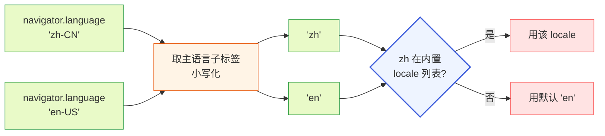

**图 6 — navigator.language 检测：取主语言子标签，不在内置列表则回退 en**

### 5.1.1 为什么不用 Accept-Language 或底座的 locale

不用 HTTP 的 `Accept-Language`（那是 Node.js 服务端场景的概念，Electron renderer 是浏览器环境、`navigator.language` 才是用户系统语言的真实表达）。不用底座 pi 的 locale——pi 是终端 CLI、没有 i18n 概念（pi 源码里只用 `localeCompare` 做字符串排序，没有 i18next、没有语言包，见 `packages/coding-agent/src`）。语言是桌面端的偏好、和 pi 无关，所以 locale 检测走桌面端自己的 `navigator.language`、不问底座。

### 5.1.2 locale 检测的边界场景

`navigator.language` 的值在实际环境里可能多样，检测逻辑要覆盖：

- **标准 2 位短码**（`"zh"`/`"en"`/`"ja"`）：直接用，最常见。
- **带区域子标签**（`"zh-CN"`/`"en-US"`/`"ja-JP"`）：取主语言子标签小写化（`"zh"`/`"en"`/`"ja"`），区域一律丢弃（12.4 的区域变体演进项未落地前统一归约）。
- **带脚本子标签**（`"zh-Hans"`/`"zh-Hant"`）：BCP 47 允许脚本子标签，检测层同样取第一个子标签（`"zh"`），脚本信息丢弃。简繁区分在当前实现里不处理（归为区域变体演进项）。
- **多语言环境**（`navigator.languages[0]` 是 `"fr"`、用户实际偏好法语但系统设了别的）：`navigator.language` 只取第一个，不做多 locale 协商（不接受"法语缺失就回退到 navigator.languages[1]"）。当前只承诺"主语言 → en"两级，多语言协商是演进项。
- **空值或异常值**（`navigator.language` 为空串、`undefined`、非 BCP 47 格式）：`isSupportedLocale` 返回 false、回退到默认 `"en"`。不抛错、不崩。
- **大小写不一**（`"ZH"`/`"En"`）：检测层小写化后查（`"zh"`/`"en"`），保证大小写不敏感。

`isSupportedLocale` 查"该 locale 在当前已加载的语言槽贡献里有没有 resources"——有就支持、没有就回退。这让第三方插件贡献的 locale（如 `ja`）也能被检测到并使用。检测时序在加载器构建完字典之后——若字典还没构建完、`isSupportedLocale` 查空字典、所有 locale 都"不支持"、回退到 `"en"`。所以 5.2 的 `detectLocale` 要在加载器完成字典构建后调用，不能在加载器扫描前调（否则检测到的 locale 可能和最终可用 locale 不一致）。这个时序在 10.1 的启动时序里保证——先扫描合并构建字典、再 `detectLocale`。

### 5.2 偏好持久化：electron-store

用户在设置里改语言时持久化到桌面自己的偏好存储（electron-store），不是 pi 的 `settings.json`——因为语言是桌面端的偏好、和 pi 无关（呼应 5.1.1）。electron-store 的 key 约定 `locale`，值是用户选定的 locale 短码（`"zh"`/`"en"`/`"ja"`）。启动时优先级：electron-store 的 `locale` > `navigator.language` 检测 > 默认 `"en"`。

```typescript
function detectLocale(store: ElectronStore): string {
  const saved = store.get("locale") as string | undefined;
  if (saved && isSupportedLocale(saved)) {
    if (isRtlLocale(saved)) { toastRtlUnsupported(saved); return "en"; }  // RTL 兜底（8.5）
    return saved;
  }
  const nav = navigator.language.split("-")[0].toLowerCase();
  if (isSupportedLocale(nav)) {
    if (isRtlLocale(nav)) { toastRtlUnsupported(nav); return "en"; }  // RTL 兜底（8.5）
    return nav;
  }
  return "en";
}
```

`isRtlLocale(lng)` 查一个已知 RTL locale 常量集合（`ar`/`he`/`fa`/`ur` 等，8.5）——检测到 RTL locale 时回退到 `"en"` 并 toast 提示用户，避免进入未支持的 LTR 残缺布局。`isRtlLocale` 和 `isSupportedLocale` 一样是闭包（无需 resources、纯常量查表），可与 `isSupportedLocale` 同处构造。

`isSupportedLocale` 查"该 locale 在当前已加载的语言槽贡献里有没有 resources"——有就支持、没有就回退。这让第三方插件贡献的 locale（如 `ja`）也能被检测到并使用。

**`isSupportedLocale` 如何拿到已合并 resources 要钉死、避免照抄者忽略**：`isSupportedLocale` 不是纯函数——它依赖加载器合并后的 resources 字典。落地形态是加载器在完成 `mergeLanguageContributions` 后构造一个闭包 `isSupportedLocale = (lng) => Object.keys(mergedResources).includes(lng)`（或等价的 `mergedResources[lng] != null && Object.keys(mergedResources[lng]).length > 0`），闭包捕获 `mergedResources`。`detectLocale(store)` 的签名只收 `store`、看似不依赖 resources，但内部调用的 `isSupportedLocale` 已通过闭包绑定了合并后的字典——这个接线在 14.3 的 `initMainI18n` 里完成（`detectLocale` 排在 `mergeLanguageContributions` 之后调用，`isSupportedLocale` 闭包此时已就绪）。照抄者若把 `isSupportedLocale` 当成无依赖自由函数直接定义在模块顶层、又不显式注入 resources，会查到空字典导致所有非 en locale 误判为不支持。两种正确写法择一：① 闭包绑定（推荐，签名简洁）；② 改 `detectLocale(store, resources)` 把 resources 显式作为参数传入、让时序依赖在类型上可见。当前代码骨架用 ①。

**detectLocale 的调用时序依赖要钉死**：`isSupportedLocale` 的判断依赖加载器已合并完成的 resources 字典——若字典还没构建完就调 `detectLocale`，`isSupportedLocale` 查的是空字典、所有非 en locale 都判"不支持"、回退到 `"en"`，导致用户偏好/系统语言被错误丢弃。所以 `detectLocale` 必须在加载器完成字典合并（`mergeLanguageContributions` 输出之后）才能调用，不能在加载器扫描前调。可以把 `detectLocale` 在概念上拆成两步理解：① "读偏好"——从 electron-store 读 `locale` 或从 `navigator.language` 取主语言子标签，这步是纯 store/navigator 读取、不依赖字典；② "校验是否支持"——用 `isSupportedLocale` 查字典，这步依赖已合并 resources。两步合一才构成 `detectLocale`，第 ② 步的时序约束就是上面那条。10.1 的启动时序保证"先扫描合并构建字典、再 `detectLocale`"，14.3 的初始化代码里 `detectLocale` 也排在 `mergeLanguageContributions` 之后——这是落地保证。若未来某次重构把 `detectLocale` 提前到合并之前，会引入"启动期 locale 被误判成 en"的回归，实现者要守住这个顺序。

### 5.3 切换流程

用户在设置页切换语言的完整流程：

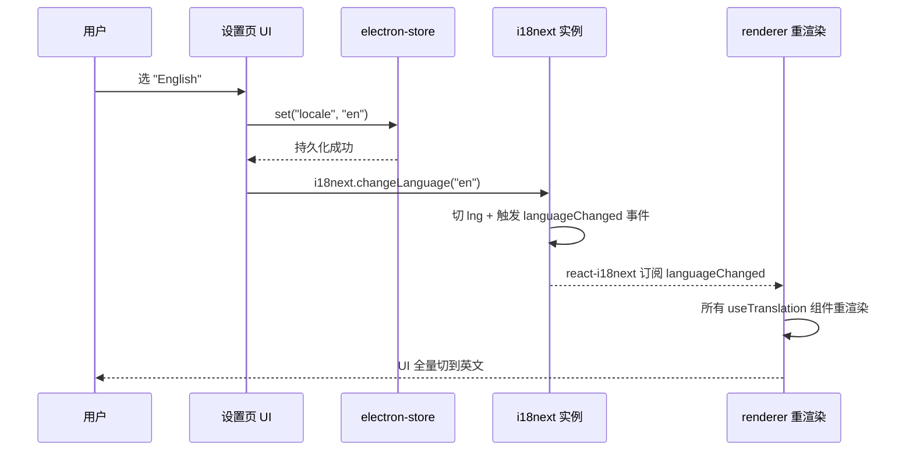

**图 7 — locale 切换：持久化 + i18next.changeLanguage + react-i18next 自动重渲染**

关键点：切换不重启 core、不重启底座子进程、不重新加载插件。i18next 的 `changeLanguage` 是运行时切换、触发 `languageChanged` 事件，react-i18next 的 `useTranslation` Hook 订阅了这个事件、自动重渲染所有用到文案的组件。所以语言切换是即时的、全局的、零重启的——这是 i18next + react-i18next 的能力，pi-desktop 直接用。

### 5.4 document.documentElement.lang 同步

locale 切换时同步设置 `document.documentElement.lang`（`<html lang="zh">`）。这是无障碍规范的要求——屏幕阅读器、浏览器翻译扩展靠 `lang` 属性判断页面语言。切换流程里 `i18next.changeLanguage(lng)` 之后立即 `document.documentElement.lang = lng`。这一步在 core 渲染层做、不在插件里做，是 core 的无障碍基础设施本分（`DESIGN.md` 1.9.4）。

### 5.5 locale 状态机

locale 在整个生命周期里的状态转移：

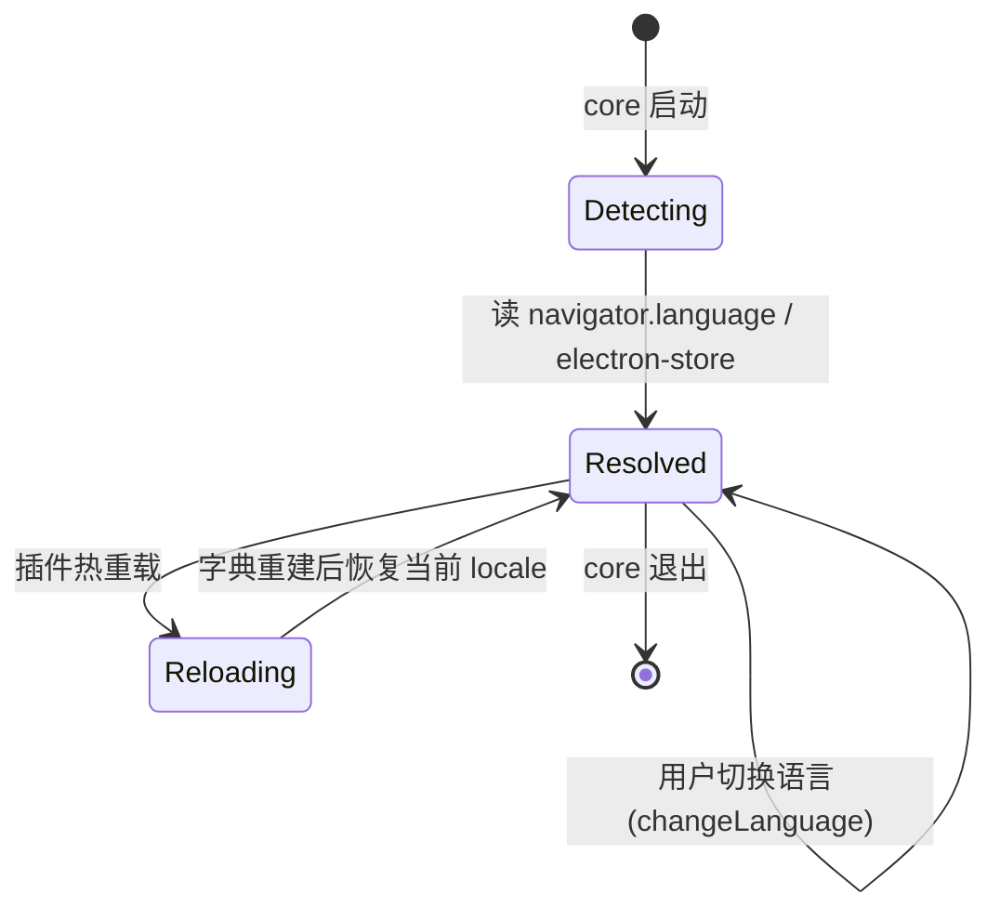

**图 8 — locale 状态机：检测 → 解析 → 可切换/热重载**

`Detecting` 是启动瞬间的状态，毫秒级完成、用户无感。`Resolved` 是稳态，可被用户切换和热重载触发转移。热重载（第 10 节）会重建字典但保留当前 locale（不重置回检测值）。

---

## 6 核心实现：i18next 集成

### 6.1 资源字典构建

core 启动时加载器把所有插件的 `languages` 贡献项合并成 i18next 的 `resources` 字典。构建过程（合并器函数名为 `mergeLanguageContributions`，与 14.2 的代码清单同名、是同一个函数；全文此前若出现 `buildI18nResources` 字样均指此合并器）：

合并器的输入是**已解析**的贡献项——`resources` 的字符串路径形态已在加载器的校验/解析阶段（3.2.2 步骤⑤）被读文件、解析成 `Record<string,string>` 对象。合并器不再处理字符串、只处理对象，这样"字符串路径解析"和"key 级合并"两个职责在类型层面分开（呼应工程原则·组装和调用应该分开）。为此引入一个已解析的中间类型：

```typescript
// 加载器校验/解析阶段产出：resources 已从字符串路径解析成对象（3.2.2 步骤⑤）
interface ResolvedLanguageContribution {
  id: string;
  locale: string;
  resources: Record<string, string>;  // 已解析为对象，合并器可直接 Object.entries
}
```

合并器签名收 `ResolvedLanguageContribution`、不收原始 `LanguageContribution`——类型强制把解析与合并分开，字符串路径无法漏过解析阶段直接进合并器（否则 `Object.entries(string)` 会崩）。

```typescript
function mergeLanguageContributions(
  contributions: Array<{ plugin: PluginMeta; item: ResolvedLanguageContribution }>,
): i18next.Resource {
  // 1. 按 locale 分组
  const byLocale = new Map<string, Map<string, { value: string; priority: number }>>();
  for (const { plugin, item } of contributions) {
    const priority = plugin.sourcePriority;  // project > user > installed > builtin
    for (const [key, value] of Object.entries(item.resources)) {
      const locale = item.locale;
      if (!byLocale.has(locale)) byLocale.set(locale, new Map());
      // namespace 解析与 14.2 的 parseNamespace 完全一致：第一个 dot 之前当 ns，无 dot 走 defaultNS(common)
      const dotIdx = key.indexOf(".");
      const ns = dotIdx === -1 ? "common" : key.slice(0, dotIdx);
      const k = dotIdx === -1 ? key : key.slice(dotIdx + 1);
      const nsKey = `${ns}:${k}`;
      const bucket = byLocale.get(locale)!;
      const existing = bucket.get(nsKey);
      // key 级合并：不冲突直接放，冲突取高优先级；同优先级(existing.priority === priority)不覆盖 → 先处理者胜(2.6.1)
      if (!existing || existing.priority < priority) {
        bucket.set(nsKey, { value, priority });
      }
    }
  }

  // 2. 按 locale + namespace 聚合成 i18next.Resource 形态
  const resources: i18next.Resource = {};
  for (const [locale, bucket] of byLocale) {
    resources[locale] = {};
    for (const [nsKey, { value }] of bucket) {
      const [ns, key] = nsKey.split(":");
      if (!resources[locale][ns]) resources[locale][ns] = {};
      resources[locale][ns][key] = value;
    }
  }
  return resources;
}
```

构建结果是 i18next 标准的 `resources` 结构：`{ zh: { common: { send: "发送", ... }, timeline: { toolExecuting: "工具执行中", ... } }, en: { ... } }`。这个结构直接喂给 `i18next.init({ resources })`。

### 6.2 初始化配置

i18next 实例的初始化配置（core 启动时调一次）：

```typescript
const resources = mergeLanguageContributions(allLanguageContributions);
await i18next.init({
  resources,
  lng: detectLocale(electronStore),
  fallbackLng: "en",
  defaultNS: "common",
  ns: collectNamespaces(resources),  // 内置 8 + 扫描得到的全部 namespace（2.7/6.2.2），与 supportedLngs 对称
  supportedLngs: collectSupportedLngs(allLanguageContributions),  // 内置 zh/en + 第三方贡献的 locale（6.2.2）
  nsSeparator: ".",
  keySeparator: false,           // key 不再按 dot 拆嵌套（namespace 已解析）
  interpolation: {
    escapeValue: false,           // React 自带 XSS 转义，i18next 不重复转
    prefix: "{{",
    suffix: "}}",
  },
  returnEmptyString: false,       // 空串当缺失处理
  returnNull: false,
  parseMissingKeyHandler: (key) => key,  // 缺失返回 key（translator 会再做 fallback）
});
```

### 6.2.1 为什么 escapeValue 要设 false

i18next 默认会转义插值变量（`{{var}}`）防 XSS。但 pi-desktop 的文案渲染走 React——React 渲染字符串时自动转义、不存在 XSS 注入风险。i18next 再转义一次会产生双重转义（如 `<` 变 `&lt;` 再变 `&amp;lt;`）。所以 `escapeValue: false`，把转义责任交给 React、i18next 不重复做。这是"能持有就持有"的反面——不该持有的不持有：转义是 React 的本职，i18next 不抢。

### 6.2.2 ns 字段的动态扩展

`ns`（namespace 列表）初始含内置 namespace 权威清单（2.4 的 8 个：common/timeline/settings/sessions/commands/sidePanel/review/system）。第三方插件贡献新 namespace（如 `myTool`）时，加载器在合并它的贡献项后、把 namespace 名追加进 i18next 的 `ns` 列表。注意：如 2.2 所述，pi-desktop 是**全量加载**——所有 namespace 的 resources 在 `init` 时已注入内存，这里的"动态扩展 ns"只是把 namespace 名登记进 i18next 的查询注册表、供 `defaultNS` 回退和完整性检查用，**不是** i18next 的 `loadNamespaces` 懒加载（pi-desktop 无 backend、`loadNamespaces` 冗余）。`supportedLngs` 同理动态扩展——第三方贡献 `ja` locale 时加进 `supportedLngs`。

**`ns` 与 `supportedLngs` 一样在 `init` 前由收集器一次性算好、整体传入 `init`**（运行时无稳定 API 追加已 init 实例的 `ns`）。`collectNamespaces` 的实现与 `collectSupportedLngs` 严格对称——遍历合并后的 resources、聚合各 locale 下出现的 namespace 名去重、并上内置 8 个权威清单：

```typescript
function collectNamespaces(resources: i18next.Resource): string[] {
  const set = new Set<string>(["common", "timeline", "settings", "sessions", "commands", "sidePanel", "review", "system"]);  // 内置兜底
  for (const lng of Object.keys(resources)) {
    for (const ns of Object.keys(resources[lng] || {})) set.add(ns);
  }
  return [...set];
}
```

这让 2.7 声称的"`plugin`、第三方 namespace 自动进 `ns` 列表"落到实处——`plugin.{pluginId}.displayName` 这类 key 经 dot 解析后 namespace=`plugin`、合并进 `resources.{lng}.plugin`、`collectNamespaces` 收到 `ns` 列表里；`my-tool` namespace 同理。也让 `defaultNS` 回退和完整性检查（12.2）能正确枚举所有 namespace、不误判目标落空。

**`supportedLngs` 的时机要钉死**：i18next 的 `supportedLngs` 是 `init` 选项，运行时没有官方"追加已 init 实例的 supportedLngs"的稳定 API（改 `i18next.options.supportedLngs` 是私有内部状态、不触发重校验）。所以 pi-desktop 的做法是：**在 `init` 前由 `collectSupportedLngs` 一次性算好、整体传入 `init`**，不在运行时追加。`collectSupportedLngs` 的实现是遍历所有已收集的语言槽贡献项、聚合其 `locale` 字段去重，再并上内置的 `["zh","en"]`：

```typescript
function collectSupportedLngs(contributions: Array<{ item: LanguageContribution }>): string[] {
  const set = new Set<string>(["zh", "en"]);  // 内置兜底
  for (const { item } of contributions) set.add(item.locale);
  return [...set];
}
```

这意味着 `supportedLngs` 的完整列表取决于"加载器扫描到了哪些贡献项"——第三方 `ja` 语言包插件已装时，扫描阶段就把它收进来了、`init` 时 `supportedLngs` 含 `ja`；没装时不含。运行时装新语言包（热重载）需要重建 `supportedLngs`——走 10.2 的热重载路径，但因 `supportedLngs` 是 init 选项、热重载不能在原实例上追加，实际做法是热重载时若发现新增 locale，用 `addResourceBundle` 注入新 locale 的 resources 后、直接调 `i18next.changeLanguage(currentLng)` 让新 locale 可查（i18next 对 resources 里有的 locale 即使不在 `supportedLngs` 也能查到，`supportedLngs` 主要影响检测层的 `isSupportedLocale`）。更彻底的做法是热重载触发 re-init（10.2.4 的方案②），但为保留实例引用，pi-desktop 优先用 `addResourceBundle` + 检测层宽松判断、不 re-init。这是 `supportedLngs` 的已知边界：热重载新增的 locale 在 `supportedLngs` 里缺失、但 `isSupportedLocale` 改为"查 resources 有无该 locale"而非"查 supportedLngs 列表"来兜底——5.1.2/5.2 的 `isSupportedLocale` 就是查 resources、不查 `supportedLngs`，所以热重载新增 locale 能被检测到。

### 6.2.3 react-i18next 的接入

renderer 侧用 `react-i18next` 的 `useTranslation` Hook 渲染文案。core 在 renderer 初始化时 `import { initReactI18next } from "react-i18next"; i18next.use(initReactI18next).init({...})`，把 i18next 实例和 React 绑定。之后任何组件 `const { t } = useTranslation(); t("timeline.toolExecuting")` 即可拿到当前 locale 文案、locale 切换时自动重渲染。core 自身的渲染组件（时间线、状态栏等）也走这个 Hook，不绕过。

### 6.2.4 i18next 配置项的取舍说明

每个配置项都有明确取舍，这里集中说明，避免实现者照搬默认值埋坑：

**`fallbackLng: "en"`**：只配 locale 级回退（zh → en），不配 `fallbackLng: ["en", "zh"]` 这类多级链——pi-desktop 只承诺"英文兜底"，不承诺"某 locale → 另一 locale → en"的多级链。多级链会让翻译归属难以追踪（一条文案可能来自任意中间 locale），刻意只用一级 `en` 兜底让 fallback 路径可预测。区域变体回退（zh-CN → zh）记为演进项（12.4），当前 schema 不允许区域子标签、所以不存在区域回退需求。

**`defaultNS: "common"`**：裸 key（无 dot 前缀）查 `common` namespace。这让通用文案（`send`/`cancel`/`confirm`）可以省略前缀直接 `t("send")`。但 2.2 约定贡献项 resources 里应写全名（`common.send`）——这是"查询时可省、贡献时写全"的不对称：查询省前缀是便利、贡献写全是防歧义。加载器对裸 key 记 warning 提醒（3.2）。

**`nsSeparator: "."`**：显式声明 dot 是 namespace 分隔符，和 i18next 默认一致。显式声明是为了和 2.2 的解析规则钉死对齐——不依赖"i18next 默认行为"这种隐式约定。`keySeparator: false` 关闭 key 内的 dot 分隔（i18next 默认会把 `a.b.c` 当嵌套对象 `a → b → c` 解析，pi-desktop 已在合并阶段扁平化、key 内不应再有 dot 分隔），避免和 namespace 解析冲突。

**`interpolation: { escapeValue: false, prefix: "{{", suffix: "}}" }`**：转义交给 React（6.2.1），前缀后缀用 i18next 默认 `{{ }}`（也兼容大多数翻译工具的导出格式，便于从 现有方案 迁移翻译资源）。

**`returnEmptyString: false` / `returnNull: false`**：空串和 null 都当缺失处理，走 fallback。这保证"某条翻译漏填了空串"不会显示空白、而是回退到 en 或字面值。和 3.2 的"空串 value 记 warning 不阻断"对齐——校验放行、运行期当缺失。

**`parseMissingKeyHandler: (key) => key`**：缺失时返回 key 本身（i18next 默认行为，显式声明）。translator 在此基础上做第三四级（字面值 → key）——但 i18next 这一层返回 key 本身、translator 的 `current !== key` 判断才能识别"i18next 没找到"进而走字面值。如果这里改成返回空串或别的标记，translator 的判断逻辑要相应调整——所以保持返回 key 本身最简洁。

**`supportedLngs` 动态扩展**：初始含内置 zh/en，第三方贡献新 locale 时加载器追加。`supportedLngs` 主要影响 i18next 的 locale 校验（不在列表的 locale 会被拒、走 fallbackLng）。pi-desktop 把它做成动态扩展而非固定列表，是为了让第三方 locale 包能被识别——但 `navigator.language` 检测（5.1）归约成 2 位短码后才查 `supportedLngs`，所以区域变体不会进这个列表（schema 不允许）。

**不配 `backend` / `load` / `preload`**：pi-desktop 无 backend（resources 直接内联 init）、不预加载语言、不按 i18next 的 backend 加载器逻辑工作。这保证 i18next 是纯内存字典、无运行时 IO、和"纯声明式插件"对齐。任何需要 backend 的需求（远程语言包）都是演进项、不在当前配置里开。

### 6.3 t() 调用与插值

文案插值用 `{{var}}` 语法，i18next 原生支持：

```typescript
// resources: { zh: { common: { welcome: "你好 {{name}}" } } }
t("common.welcome", { name: "user" });  // → "你好 user"
```

插值变量在 `vars` 参数里传，i18next 自动替换。插值是 i18next 的能力、translator 不额外处理（translator 只管 fallback 链）。所以 `PluginContext.i18n.t(key, vars)` 的 `vars` 直接透传给 i18next 的 `t`。

### 6.4 渲染层 Hook：react-i18next

renderer 侧的标准用法：

```tsx
import { useTranslation } from "react-i18next";

function StatusBar({ isStreaming }: { isStreaming: boolean }) {
  const { t } = useTranslation();
  return <span>{isStreaming ? t("timeline.running") : t("timeline.idle")}</span>;
}
```

`useTranslation` 返回的 `t` 绑定了当前 locale，locale 切换时组件自动重渲染、拿到新 locale 的文案。core 的所有内置渲染组件（时间线、工具卡片、状态栏）都用这个 Hook，不直接调 `i18next.t`——这样 locale 切换的响应由 react-i18next 自动处理，core 不用手动触发重渲染。

### 6.5 i18next 集成架构图

整体 i18next 集成的层次：

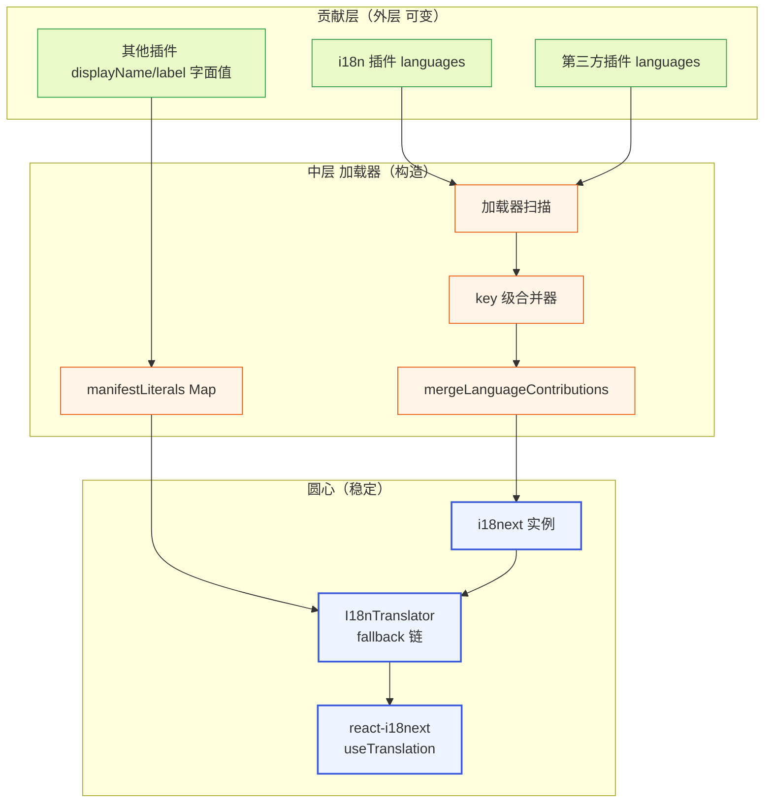

**图 9 — i18next 集成架构：外层贡献→中层构造字典→圆心 translator + i18next + react-i18next**

依赖方向严格向内：贡献层（外层可变）→ 加载器（中层构造）→ 圆心（稳定契约）。圆心不 import 贡献层、不感知具体插件。改语言包只动外层、不动圆心；换 i18next 版本只动中层、不动圆心契约。这是"依赖只向内"在 i18n 的几何表达。

### 6.6 插值约定与变量命名

`{{var}}` 插值的变量命名要守约定，避免不同插件的文案混用变量名导致串值：

- **变量名用语义化驼峰**：`{{name}}`/`{{count}}`/`{{toolName}}`/`{{sessionId}}`，不用无意义的 `{{a}}`/`{{x}}`。语义化命名让翻译者能从文案上下文推断变量含义、正确翻译。
- **跨 namespace 变量不冲突**：i18next 的插值是 per-key 的（每条 `t()` 调用的 vars 独立），不同 key 的同名变量不串。所以 `common.welcome` 的 `{{name}}` 和 `timeline.toolStart` 的 `{{name}}` 互不影响——只要调用方传对 vars。
- **`count` 是 i18next 复数保留变量**：`t(key, { count: n })` 触发复数规则选 `_one`/`_other`。所以 `count` 不要用作普通插值变量（除非确实要复数）——若文案是 `{{count}} 条消息`、`count` 同时驱动复数和显示，这是预期行为；若文案是 `已加载 {{count}} 项` 不需要复数、别在 vars 里传 `count`（会误触复数规则），改用 `{{loaded}}` 等非保留名。
- **变量类型限定**：插值变量应是 string/number/boolean 这些可 `toString` 的原始值。传 Date 对象/对象/数组会得到难看的 `toString()` 结果（如 `[object Object]`）。日期要先 `formatDate`、数字要先 `formatNumber`（8.7）。

这些约定是软约束（加载器不校验 vars 类型、运行期靠 i18next 的插值兜底），但内置插件和文档示例必须遵守。翻译者拿到带 `{{var}}` 的文案时，应保持变量名不变（不要翻译变量名）、只翻译周围的文案文本。

---

## 7 自我翻译的递归

### 7.1 递归问题

i18n 插件本身的 `displayName`/`description` 也要走语言槽——这听起来递归：i18n 插件贡献语言包，而它自己的展示名又要从语言槽取翻译。如果处理不当会出现"鸡生蛋"问题：要渲染 i18n 插件名 → 查语言槽 `plugin.i18n.displayName` → 语言槽是 i18n 插件贡献的 → i18n 插件还没加载完怎么办？

### 7.2 解决方案

解决方法是：**i18n 插件的 manifest 里 `displayName` 填字面值 `i18n`（作为 fallback 链第三级的兜底），同时在自己的 `languages` 贡献项里贡献 `plugin.i18n.displayName` 的 zh/en 翻译**。core 渲染插件列表时按 key `plugin.i18n.displayName` 去语言槽取：

- 语言槽已构建完（i18n 插件已加载、贡献项已合并进字典）→ 取到翻译（如中文 locale 下 `"国际化"`）。
- 语言槽没构建完（启动早期、i18n 插件还没加载）→ fallback 到 manifest `displayName` 字面值 `"i18n"`。

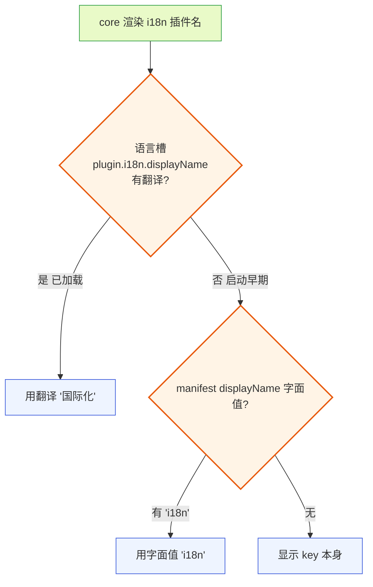

**图 10 — i18n 插件自我翻译：语言槽查到用翻译、查不到 fallback 到字面值**

这保证 i18n 插件自己也被自己翻译，没有特例。核心是 fallback 链的字面值层兜底——无论语言槽有没有构建完，`displayName` 字面值始终在 manifest 里、不依赖语言槽。

### 7.3 加载顺序保证

为了让"语言槽已构建完"这个状态尽快达到，加载器对 i18n 插件有**加载优先级提升**：i18n 是影响 core 自身渲染的基础插件，加载器在扫描插件时优先处理内置 i18n 插件的 `languages` 贡献、先把它的 resources 合并进字典，再处理其他插件。具体机制是：加载器的插件扫描队列里，内置 i18n 插件被硬编码排在队列首位（不是优先级数值、也不是依赖声明，是加载器对"影响 core 自身渲染的内置插件"这一类别的固定排序优化）。这保证 core 启动后第一次渲染（要文案）时，i18n 插件的翻译已在字典里。这不是"i18n 插件必须第一个加载完才能渲染"的硬依赖——即使没加载完，fallback 链兜底（字面值/key 本身），UI 不会崩。这个排序只是优化、非硬依赖，即使将来某次重构把 i18n 排到非首位、core 也不会崩（只是启动瞬间可能短暂显示字面值）。但当前保留首位优化让用户体验更好（启动瞬间就看到正确语言而不是字面值）。

### 7.4 其他插件的自我翻译

自我翻译不限于 i18n 插件——**所有插件**的 `displayName`、贡献项 `label`/`title` 都走语言槽。比如 timeline 插件的 `displayName: "时间线"`，i18n 插件的 zh resources 里贡献 `plugin.timeline.displayName: "时间线"`、en 里 `plugin.timeline.displayName: "Timeline"`。core 渲染插件列表时统一按 `plugin.{id}.displayName` 查语言槽。

这意味着 i18n 插件承担了"所有内置插件展示名的翻译"职责——它不只贡献功能文案，还贡献其他插件的展示名翻译。这是为什么 i18n 插件的 resources 里有大量 `plugin.*.displayName` key。第三方插件想让自己的展示名有翻译，要么在 i18n 插件（可被覆盖）里贡献、要么在自己的 `languages` 贡献项里补 `plugin.{myId}.displayName` 的翻译——后者更自洽（翻译跟着插件走）。

---

## 8 本地化格式能力

i18n 插件除了文案翻译，还提供 locale 感知的格式化能力——这些通过 `pi.i18n` 暴露给渲染插件（`PluginContext.i18n` / `RendererPluginContext.i18n`）。底层全部走 JS 内置的 `Intl` API，i18n 插件只是按当前 locale 包一层。

### 8.1 formatDate：日期格式

`pi.i18n.formatDate(date)`——按当前 locale 格式化日期/时间。底层走 `Intl.DateTimeFormat`：

```typescript
function formatDate(date: Date, opts?: Intl.DateTimeFormatOptions): string {
  return new Intl.DateTimeFormat(this.locale, opts).format(date);
}
```

使用场景：底座 event 的 `timestamp`（`DESIGN.md` 1.6.2 的 `turn_start`/`message_start` 带 timestamp）、session 的 `created`/`modified`（`DESIGN.md` 1.7.4）显示时用它，不硬编码 `toLocaleString`。`zh` locale 下 `2026-07-24T15:30:00Z` 显示为 `"2026/7/24 下午3:30:00"`，`en` 下 `"7/24/2026, 3:30:00 PM"`——locale 决定格式，core 不写死。

可选 `opts` 透传 `Intl.DateTimeFormatOptions`，如 `{ dateStyle: "medium", timeStyle: "short" }` 得到更紧凑的展示。会话列表（`DESIGN.md` 4.6）默认显示相对时间（"3 分钟前"），绝对时间用 `formatDate`。

### 8.2 formatNumber：数字格式

`pi.i18n.formatNumber(num, opts)`——千分位/小数点按 locale。底层 `Intl.NumberFormat`：

```typescript
function formatNumber(num: number, opts?: Intl.NumberFormatOptions): string {
  return new Intl.NumberFormat(this.locale, opts).format(num);
}
```

使用场景：token 数（`DESIGN.md` 1.7.3 `SessionStats.tokens`，动辄几十万 token）、cost（`DESIGN.md` 1.7.2 `Model.cost`，如 `$0.003`）显示用它。`zh` locale 下 `1234567` 显示为 `"1,234,567"`，`en` 下同为 `"1,234,567"`（千分位符在某些 locale 是空格/点）。cost 可传 `{ style: "currency", currency: "USD" }` 得到 `"$0.00"` 格式。

### 8.2.1 格式化的 locale 一致性

`formatDate`/`formatNumber` 在 **main/worker 侧**用 translator 持有的 `this.locale`（当前 locale），不接收外部 locale 参数。这保证 main 内部和 worker 生成文案时用的日期/数字格式一致——同一时间戳在状态栏和会话列表里格式相同，不会因组件各自取 locale 而不一致。这是"能持有就持有"——格式化的 locale 持有在 translator、各组件调同一份。

**renderer 侧不同**：renderer 没有 translator（8.8），`pi.i18n.formatDate`/`formatNumber` 用 react-i18next 实例的 `i18n.language`（14.4 的 `usePluginI18n` 实现）。`i18n.language` 在 locale 切换时由 `changeLanguage` 即时更新，与 main/worker 的 `translator.locale` 经 IPC 同步、最终指向同一当前 locale、来源不同但一致。所以三侧的格式化 locale 收敛到"当前 locale"这个稳定值上，只是各侧持有该值的入口不同（main/worker 走 translator、renderer 走 i18next.language）。实现者不要在 renderer 侧去找 translator——renderer 的格式化入口是 `pi.i18n.formatDate`/`formatNumber`，背后是 `i18n.language`。

### 8.2.2 formatNumber 的精度处理

token 数等大数字直接 `formatNumber(n)` 即可，`Intl.NumberFormat` 自动处理千分位。但 cost 这类极小数（如 `0.003`）要显式 `{ minimumFractionDigits: 4 }` 否则可能被四舍五入丢精度。这是 `Intl.NumberFormat` 的标准行为、不是 pi-desktop 的特殊逻辑，调用方按场景传 opts。

### 8.3 复数：count

`pi.i18n.t(key, { count })`——i18next 原生支持按 locale 复数规则选文案。文案 key 在 resources 里写 plural form：

```json
{
  "timeline.messages_one": "{{count}} 条消息",
  "timeline.messages_other": "{{count}} 条消息"
}
```

```typescript
t("timeline.messages", { count: 1 });   // → "1 条消息"
t("timeline.messages", { count: 5 });   // → "5 条消息"
```

i18next 按 `count` 和 locale 的复数规则（CLDR 复数类别：`one`/`other`/`few`/`many`）选对应的 plural form。英语是 `one`/`other` 二分（"1 message"/"5 messages"），俄语是三分（`one`/`few`/`many`，如 1 сообщение / 2 сообщения / 5 сообщений），阿拉伯语有六分。这些规则 i18next 内置、不需要插件自己实现——只要 resources 里写齐对应的 plural form key。

使用场景：排队消息数（`DESIGN.md` 1.5.1 `pendingMessageCount`）、token 统计的"X 个工具调用"等。底层是 i18next 的复数能力，pi-desktop 只透传 `count`。

**复数后缀与 dot/namespace 解析的关系要钉死**：plural 后缀（`_one`/`_other`/`_few`/`_many`）是 **key 内部的约定、不参与 dot/namespace 解析**。即 `timeline.messages_other` 按 2.2 的"第一个 dot 之前当 namespace"规则解析成 namespace=`timeline`、key=`messages_other`（不是 `messages` + `other` 两段）；`keySeparator: false` 下 i18next 不会再对 key 内的 dot 拆嵌套，plural 后缀由 i18next 在查到该 key 后按 CLDR 规则追加查询——先查 `messages_other`/`messages_one`，命不中再回退查无后缀的 `messages`。下划线 `_` 不是 namespace 分隔符（分隔符只有 dot），所以 `_one`/`_other` 永远不会被误当成 namespace 段。实现者不用担心"复数 key 被拆成两段 namespace"。

### 8.4 排序：Intl.Collator

排序用 `Intl.Collator`（locale 感知），不用 `String.prototype.localeCompare` 的直接调用——虽然 `localeCompare` 底层也是 `Intl.Collator`，但显式构造 `Collator` 可以复用实例、避免每次比较都新建 formatter（性能）。

```typescript
const collator = new Intl.Collator(this.locale, { numeric: true, sensitivity: "base" });
items.sort((a, b) => collator.compare(a.name, b.name));
```

`numeric: true` 让 `"file2"` 排在 `"file10"` 前面（自然排序），`sensitivity: "base"` 忽略大小写和重音。这两个选项对文件名排序（文件预览 `DESIGN.md` 4.5）特别重要。

使用场景：会话列表（`DESIGN.md` 4.6）默认按修改时间、命令面板（`DESIGN.md` 4.7）按相关度——非必要不字母排序。若需字母排序（如文件列表）用 `Intl.Collator`。注意 pi 底座源码里大量用 `localeCompare`（如 `model-resolver.ts`、`interactive-mode.ts` 的多处排序）——那是底座终端 CLI 的排序、和桌面无关；桌面端的排序走自己的 `Intl.Collator`、和底座各自管。

### 8.4.1 Intl.Collator 的复用与性能

`Intl.Collator` 实例构造有开销（要加载 locale 的排序规则）。translator 持有一个 `Collator` 缓存 Map（按 locale key），同一个 locale 的排序复用同一实例、不重复构造。locale 切换时清缓存、按新 locale 重建。这是"能持有就持有"——排序器持有在 translator、调用方共享。这个缓存实例通过 `PluginContext.i18n.collator(opts)` / `RendererPluginContext.i18n.collator(opts)` 暴露给插件（9.1/9.2），worker 侧委托 `workerTranslator.collator(opts)`（14.1/14.4）、renderer 侧走按 `i18n.language` 缓存的 `getRendererCollator`（14.4）。插件做 locale 感知排序一律走 `pi.i18n.collator`、不自己 `new Intl.Collator`。

### 8.4.2 什么时候该用字母排序、什么时候不该

默认按时间/相关度排序更符合用户预期（最近的会话在最上、最相关的命令在最上）。字母排序只在"用户明确要按名称找"的场景用（如文件列表、设置项的字母索引）。i18n 插件不强制排序策略——它只提供 `Intl.Collator` 这个 locale 感知的工具，排序策略由各功能域自己定。这是"组装和调用分开"——i18n 提供排序工具（组装）、各功能域决定怎么排（调用）。

### 8.5 RTL：暂不支持

当前**不支持**阿拉伯/希伯来语的 RTL（从右到左）布局镜像。i18n 插件 locale 列表不含 `ar`/`he`，避免装起来不好用。这是诚实的声明、不是缺陷。

RTL 支持不是"加个 locale"那么简单——它需要：

1. core 系统地加 CSS `direction` 变量（`direction: rtl` 时整页镜像）。
2. `pi.ui` 组件库用 CSS 逻辑属性（`margin-inline-start` 而非 `margin-left`、`inset-inline-end` 而非 `right`），保证布局随 direction 翻转。
3. 内置插件（时间线、工具卡片）适配 RTL——图标方向、文本对齐、进度条方向等都要翻转。
4. i18next 的 RTL locale 配置（`ar` 的复数规则、数字方向等）。

这是一个需要 core + 组件库 + 全部内置插件协同的系统工程，记为二期演进（`DESIGN.md` 第 6 节演进项）。当前不支持、不假装支持、不在 locale 列表里骗用户。

**"开放枚举 + 不支持 RTL"的护栏**：2.1/3.2 的 locale schema 正则是 `^[a-z]{2}$`、开放枚举任意 2 位短码，第三方插件可以贡献 `ar`/`he` 这类已知 RTL locale。schema 不在加载期拦它们——因为 schema 无法预知哪些 2 位短码是 RTL、也避免把"未来要支持的 RTL locale"硬编码进校验。但加载器对已知 RTL locale（`ar`/`he`/`fa`/`ur` 等，维护一个常量集合）记一条 warning 进诊断页（`DESIGN.md` 4.3.2）："该 locale 的 RTL 布局尚未支持，UI 会按 LTR 渲染、显示残缺"。更关键的是检测层的兜底：`isSupportedLocale` 之外加一个 `isRtlLocale(lng)` 检查（查同一 RTL 常量集合），`detectLocale`（5.2）在 `navigator.language` 或 electron-store 偏好落到 RTL locale 时回退到 `"en"`、并向 renderer toast 提示"当前 locale 的 RTL 布局尚未支持，已回退英文"。这避免"用户切到 ar 得到从左到右的残缺布局"这种隐性坏体验——schema 层放行（让 locale 数据能进字典、供未来 RTL 落地时直接可用）、检测层兜底（不让 UI 进入未支持的残缺态）。RTL 落地后移除该兜底、`isRtlLocale` 改为正式启用 RTL 镜像。

### 8.6 能力收口：能持有就持有

这些格式化能力（日期/数字/复数/排序）都走 i18n 插件、不散在各插件各写一遍——这是"能持有就持有"原则（`DESIGN.md` 工程原则）的体现。底层 `Intl` API 是 JS 内置、i18n 插件只是按 locale 包一层。如果每个插件自己 `new Intl.DateTimeFormat(navigator.language)`，locale 会各取各的（可能不一致）、`Collator` 会各构造各的（性能浪费）、复数规则会各实现各的（出错）。收在 i18n 插件一份，调用方共享，locale 一致、性能最优、逻辑单一。排序能力通过 `pi.i18n.collator(opts)` 暴露（9.1/9.2/14.4），与 `formatDate`/`formatNumber` 对称——插件做 locale 感知排序一律走它、不自己 `new Intl.Collator`。

### 8.7 格式化与翻译的协同

格式化能力（`formatDate`/`formatNumber`）和翻译能力（`t`）协同工作时要注意：翻译文案里嵌入格式化结果，应先格式化再插值，而不是把原始值丢给翻译文案让 i18next 插值。对比两种写法：

- **正确**：`t("session.created", { time: i18n.formatDate(session.created) })`，resources 里 `"session.created": "创建于 {{time}}"`。先 `formatDate` 出 `"2026/7/24 下午3:30"`、再插值进文案，得到 `"创建于 2026/7/24 下午3:30"`。格式化和翻译各管一段、互不干扰。
- **错误**：`t("session.created", { time: session.created.toISOString() })`，让 ISO 字符串直接进文案——用户看到 `"创建于 2026-07-24T15:30:00Z"` 这种难看的 ISO 串。或者把 `Date` 对象传进 vars 期望 i18next 格式化——i18next 的插值不做日期格式化、只会 `toString()`，结果同样难看。

复数与格式化的协同：`t("tokens.used", { count: i18n.formatNumber(stats.tokens.total) })` 是**错的**——`formatNumber` 返回带千分位的字符串（如 `"1,234,567"`），传给 i18next 的复数规则会让它把字符串当 count 解析、复数分支判断可能失效（i18next 的复数规则要 numeric count）。正确做法是传原始数字给复数、格式化在文案外做：`t("tokens.used", { count: stats.tokens.total })`（resources 里 `"tokens.used_one": "{{count}} token used"`），i18next 选好复数文案后、`{{count}}` 是原始数字 `1234567` 显示。若要千分位，文案里不能直接用 `{{count}}`、要用 `formatNumber` 在组件层格式化后拼接到文案外——或文案写成 `"{{formatted}} tokens used ({{count}})"`、传 `{ count: n, formatted: i18n.formatNumber(n) }`，复数按 count 选分支、显示用 formatted。这个细节容易踩坑，是"翻译管语义、格式化管呈现"的边界要守。

### 8.8 locale 切换后格式化的即时性

locale 切换时（5.3），`formatDate`/`formatNumber` 的输出要跟着切到新 locale。renderer 侧的 `pi.i18n.formatDate` 用 `i18next.language`（即当前 locale）构造 `Intl.DateTimeFormat`——react-i18next 的 `languageChanged` 事件触发组件重渲染、重渲染时重新调 `formatDate`、拿到新 locale 的格式化结果。所以格式化和翻译文案一样、locale 切换即时生效、零手动处理。

worker 侧不暴露 `formatDate`/`formatNumber`（9.1），但 worker 生成文案推给 renderer 时若涉及格式化（如 worker 生成的状态文案里带时间），应推原始值（Date/number）让 renderer 格式化、不在 worker 侧格式化——worker 侧格式化的 locale 可能和 renderer 当前 locale 不同步（4.2 的同步时序窗口）、显示不一致。这是"格式化收在渲染层"的纪律延伸。

---

## 9 PluginContext.i18n 与 RendererPluginContext.i18n

### 9.1 worker 侧：PluginContext.i18n

worker 侧插件通过 `PluginContext.i18n` 拿到翻译能力（`DESIGN.md` 3.2.4）：

```typescript
interface PluginContext {
  i18n: {
    t(key: string, vars?: Record<string, unknown>): string;  // 同步返回，worker 本地查字典
    locale: string;
    collator(opts?: Intl.CollatorOptions): Intl.Collator;   // locale 感知排序器（缓存实例），见 8.4
  };
  // ... rpc, events, bus, config, http, emitToRenderer, register, onDeactivate
}
```

worker 侧的 `i18n` 接口精简——只有 `t`、`locale` 和 `collator`，没有 `formatDate`/`formatNumber`。因为 worker 侧是逻辑层、不做渲染，日期/数字格式化是渲染层的事。worker 侧要生成给 UI 显示的文案时用 `t`，格式化由 renderer 侧组件做。`locale` 字段让 worker 侧能感知当前语言（比如根据 locale 决定要不要发某些 locale 相关的数据），但不直接格式化。`collator` 是例外——排序是数据操作（在 worker 里也会发生，如对返回列表排序），所以 worker 侧也暴露这个 locale 感知排序器，底层走 worker translator 持有的 `Collator` 缓存（8.4.1），调用方共享实例、不自己 `new Intl.Collator`。

**worker 侧 `t()` 的同步性是刻意为之**：worker 侧插件代码里 `context.i18n.t(key)` 是同步调用、立刻返回字符串——这不是经 MessagePort 异步 RPC 转发给 main 进程查字典（那样无法在同步函数里返回字符串），而是 worker 进程**持有自己的 i18next 实例 + 字典副本**，`t()` 在 worker 进程内本地同步查字典。main 进程在 worker 启动时把构建好的 resources 字典 + manifestLiterals Map 经 IPC 序列化同步给 worker、worker 用这份副本初始化自己的 i18next 实例和 translator。worker 的 i18next 实例是 main 的"只读副本"——查询语义和 main 一致、但不接受写入（热重载时由 main 重新同步，见 10.2）。这个设计保证了 worker 侧 `t()` 是纯内存同步查找、无 IPC 往返、无异步上下文切换——worker 侧逻辑可以像调本地函数一样调 `t()`。

### 9.2 renderer 侧：RendererPluginContext.i18n

renderer 侧组件通过 `RendererPluginContext.i18n` 拿到完整能力（`DESIGN.md` 3.2.5）：

```typescript
interface RendererPluginContext {
  i18n: {
    t(key: string, vars?: Record<string, unknown>): string;  // 文案 + 复数（vars.count）
    locale: string;
    formatDate(date: Date, opts?: Intl.DateTimeFormatOptions): string;
    formatNumber(num: number, opts?: Intl.NumberFormatOptions): string;
    collator(opts?: Intl.CollatorOptions): Intl.Collator;     // locale 感知排序器（缓存实例），见 8.4
  };
  // ... rpc, events, onMessage, postToWorker, theme, ui
}
```

renderer 侧多了 `formatDate`/`formatNumber`——因为渲染层才需要把日期/数字格式化成字符串显示。`t` 的注释明确标了"复数（vars.count）"——`t(key, { count })` 走 i18next 复数（8.3）。`collator` 提供 locale 感知的排序器（与 `formatDate`/`formatNumber` 对称），底层走 renderer 侧按当前 locale 缓存的 `Intl.Collator` 实例（8.4.1、14.4 的 `getRendererCollator`），locale 切换时清缓存。这样排序器不散在各组件自己 `new Intl.Collator`、locale 一致、实例复用——和 8.6/10.3.2 对 Collator 的收口声明配套、有可达 API。

### 9.3 注入路径

i18n 能力的注入路径分两路：

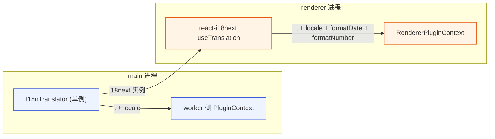

**图 11 — i18n 能力注入：worker 侧走 translator、renderer 侧走 react-i18next**

worker 侧：worker 进程**持有自己的 i18next 实例 + translator 副本**（main 在 worker 启动时把 resources 字典 + manifestLiterals Map 经 IPC 同步过来），`t()` 在 worker 进程内本地同步查字典、不跨进程。locale 切换时 main 经 IPC 通知 worker 调 `i18next.changeLanguage` 更新 worker 自己的实例（4.2 的 `currentLocale` 同步路径）。renderer 侧：直接用 `react-i18next` 的 `useTranslation`（i18next 实例在 renderer 进程也初始化了一份，见 10.3），`formatDate`/`formatNumber` 在 renderer 进程内直接调 `Intl`（不跨进程）。三侧（main translator、worker translator、renderer i18next）共享同一份 resources 字典（main 构造、序列化同步给 worker 和 renderer），查询语义一致、写入各自独立（只有 main 接受热重载重建、再同步给另两侧）。

### 9.4 调用示例

worker 侧（生成文案推给 renderer）：

```typescript
// 在 activate(context) 里
const label = context.i18n.t("myTool.processing", { tool: toolName });
context.emitToRenderer("status", label);
```

renderer 侧（渲染组件）：

```tsx
function MyCard({ toolName, tokenCount }: Props) {
  const { i18n } = usePluginContext();
  return (
    <div>
      <span>{i18n.t("myTool.processing", { tool: toolName })}</span>
      <span>{i18n.formatNumber(tokenCount)} tokens</span>
      <time>{i18n.formatDate(new Date())}</time>
    </div>
  );
}
```

或直接用 `react-i18next` 的 `useTranslation`：

```tsx
function StatusBar({ count }: { count: number }) {
  const { t } = useTranslation();
  return <span>{t("timeline.messages", { count })}</span>;  // 复数
}
```

**两种写法的语义差异要厘清**（不是完全等价）：

- `pi.i18n.t(key)`（`RendererPluginContext.i18n.t`）：是 useTranslation 的 `t` 外面包了一层 manifest 字面值 fallback——先走 i18next 的"当前 locale → en"两级（react-i18next 驱动、locale 切换自动重渲染），命不到再查 `manifestLiterals` Map（renderer 侧副本，main 经 IPC 同步过来），最后回退到 key 本身。所以 `pi.i18n.t` 有完整的四级 fallback 链，适合需要 manifest 字面值兜底的文案（插件展示名、贡献项 label/description）。
- `useTranslation().t(key)`：是 react-i18next 原生的 `t`，只有 i18next 的"当前 locale → fallbackLng(en)"两级 + 缺失返回 key 本身，**没有 manifest 字面值层**。适合纯功能文案（如 `timeline.toolExecuting`），这些文案本来就没有 manifest 字面值、第三级空跳过，所以两者对纯功能文案等价。

core 内置渲染组件对功能文案用 `useTranslation`（够用、惯用法）；对需要展示名/label 字面值兜底的场景用 `pi.i18n.t`。第三方插件 renderer 组件同理——要 manifest 字面值 fallback 就用 `pi.i18n.t`，否则 `useTranslation` 即可。两种写法底层走同一个 i18next 实例（resources 字典一致），区别只在 translator 包的那层 manifest 字面值兜底。

### 9.5 三实例一致性边界

main、renderer、worker 三侧各持一个 i18next 实例，靠 IPC 同步字典和 locale。这套机制有一致性边界要钉死：

**字典不一致的窗口**：热重载是异步的——main 先覆盖自己的字典、再经 IPC 发给 renderer 和 worker。从 main 覆盖到 renderer/worker 覆盖之间，存在一个"main 已新、renderer/worker 仍旧"的窗口（毫秒级，取决于 IPC 调度）。窗口期内 worker 生成的文案和 renderer 渲染的可能不同步。这不是错误——文案是幂等的显示内容、窗口期内的轻微不一致（如某 key 的旧翻译 vs 新翻译）用户几乎不会察觉。但实现者要知道这个窗口存在、不能假设三侧瞬间一致。如果某个场景强依赖一致性（如 worker 生成文案后立刻比对 renderer 显示），需在应用层加显式同步屏障——pi-desktop 当前没有这种强依赖场景。

**locale 切换的时序**：renderer 侧 `changeLanguage` 即时生效（react-i18next 同步重渲染），但 main 和 worker 的 locale 更新要等 IPC 送达（4.2 的 `currentLocale` 同步路径）。窗口期内 renderer 显示新 locale、worker 生成旧 locale 文案——同样是显示内容的轻微不一致、不影响正确性。worker 侧生成的文案主要推给 renderer 显示，若 worker 用旧 locale 生成了一条文案、renderer 收到时已切到新 locale，会显示一条旧 locale 的文案在混合 locale 的 UI 里——这是可接受的降级、不是 bug。

**worker 副本的来源**：worker 的 i18next 实例和 translator 在 worker 启动时由 main 用 IPC 初始化（一次性注入 resources + manifestLiterals + 初始 locale）。worker 运行期间不主动向 main 拉取字典——热重载和 locale 切换都是 main 推给 worker（push 模型）。这避免了 worker 侧频繁 IPC 查询、保持 `t()` 纯本地同步。代价是 worker 启动时有一次性的字典传输开销（resources + manifestLiterals 序列化、几十 KB、毫秒级），可忽略。

**manifestLiterals 的同步**：renderer 和 worker 都需要 manifestLiterals Map 副本（renderer 给 `pi.i18n.t` 包层、worker 给 translator 第三级 fallback）。这份 Map 由 main 收集（4.2.3）、随 resources 一起在启动时和热重载时经 IPC 同步给 renderer 和 worker。Map 比 resources 小（只有 manifest 字面值、几十到上百条），同步开销可忽略。locale 切换不需要重发 Map（字面值不随 locale 变）。

**worker 退出与字典释放**：worker 进程退出时，它持有的 i18next 实例和 translator 副本随进程销毁、不泄漏。main 不为已退出的 worker 保留字典副本。新 worker 启动时重新走一遍初始化流程。

### 9.6 worker 字典初始化的握手协议

worker 侧的 i18next + translator 副本不是凭空就有、也不是 worker 自己去 main 拉——是 main 在 worker 启动时**主动 push**一份初始化载荷过去。这个握手协议要钉死，否则 worker 启动早于字典到达时 `t()` 会崩或返回垃圾。完整协议：

1. main 在加载器完成字典合并（`mergeLanguageContributions` 输出 resources）+ manifestLiterals 收集完成后，得到一份完整的 `{ resources, manifestLiterals, lng, dictVersion }` 载荷。`dictVersion` 是 main 维护的单调递增字典版本号（10.2.7，初始 0、每次成功热重载 +1），让 worker 收到后存下来供诊断页对账。
2. main 启动 worker 进程（`utilityProcess.fork` 或 worker 池分配），等 worker 的 `ready` 信号（worker 进程事件循环就绪）。
3. main 经 MessagePort/`postMessage` 把载荷序列化发给 worker：`{ type: "i18n:init", resources, manifestLiterals: [...entries], lng, dictVersion }`。manifestLiterals 序列化成 `[key, value]` 二元组数组（Map 不能直接 structuredClone 跨进程、用数组形态传输），`dictVersion` 是普通整数、直接随载荷下发。
4. worker 收到 `i18n:init` 后：用 `resources` 调 `i18next.createInstance().init(...)`（worker 自己的实例）、用 `manifestLiterals` 重建 `Map`、构造 `new I18nTranslator(workerI18n, manifestLiteralsMap, lng)`、把 translator 存进 worker 全局的 `PluginContext` 注入器。
5. worker 回 `i18n:ready` 给 main，main 据此标记该 worker 的 i18n 已就绪、可以派发需要 `t()` 的任务。

**worker i18next 实例的 init 配置必须与 main 同构**（除不绑 `initReactI18next`、不需要 `supportedLngs`——worker 不做 locale 检测、locale 由 main 经 `i18n:init`/`i18n:changeLanguage` 下发）。配置项（`defaultNS`/`nsSeparator`/`keySeparator`/`returnEmptyString`/`returnNull`/`parseMissingKeyHandler`/`interpolation` 等）逐一与 6.2 的 main 配置对齐——若 worker 漏配 `keySeparator:false`，多段 key（如 `settings.modelSection.advanced`）会被 i18next 当嵌套对象解析、与 main 不一致。worker 侧的 `init` 骨架：

```typescript
function initWorkerI18n(payload: {
  resources: i18next.Resource;
  manifestLiterals: [string, string][];
  lng: string;
  dictVersion: number;
}): I18nTranslator {
  const workerI18n = i18next.createInstance();
  workerI18n.init({
    resources: payload.resources,
    lng: payload.lng,
    fallbackLng: "en",
    defaultNS: "common",
    ns: collectNamespaces(payload.resources),  // 与 main 同源推导（14.2）
    // 注意：worker 不配 supportedLngs（worker 不做 locale 检测，locale 全由 main 下发）
    nsSeparator: ".",
    keySeparator: false,           // 与 main 一致，避免多段 key 误解析为嵌套
    interpolation: { escapeValue: false, prefix: "{{", suffix: "}}" },
    returnEmptyString: false,
    returnNull: false,
    parseMissingKeyHandler: (k) => k,
  });  // createInstance 的 init 是同步语义内可查（resources 已内联），无需 await
  const manifestLiteralsMap = new Map(payload.manifestLiterals);
  return new I18nTranslator(workerI18n, manifestLiteralsMap, payload.lng);
}
```

这条骨架落在 14.4 的 `createWorkerI18n` 之前——`createWorkerI18n` 接收的是 `initWorkerI18n` 产出的 translator。三实例（main/renderer/worker）的 i18next init 配置除 `initReactI18next`（仅 renderer）和 `supportedLngs`（仅 main/renderer 做检测/校验）外必须同构，否则三侧 `t()` 的 namespace 解析、key 嵌套、空串处理行为会发散。

**握手前的兜底**：worker 在收到 `i18n:init` 之前、translator 未初始化时，`t(key)` 返回 key 本身（兜底实现：translator 为 null 时 `return key`）。这让 worker 启动瞬间若有极早的 `t()` 调用不会崩、只是返回难看的 key。正常流程下 worker 收到 `i18n:init` 后才开始处理业务（main 等到 `i18n:ready` 才派发任务），所以兜底极少触发——它只是防御性的"绝不分崩"保证。

**载荷大小与序列化**：resources + manifestLiterals 通常几十 KB（上百 key × 2 locale + 几十到上百条字面值），structuredClone 跨进程传输在毫秒级、可忽略。若未来语言包体积显著增长（远程语言包演进项 12.4），握手载荷可能变大——届时可考虑只同步 worker 真正需要的 namespace（worker 通常只生成自己插件域的文案），但当前全量同步足够、不做按需裁剪的复杂度。

### 9.7 worker locale 同步协议与失败补偿

locale 切换（5.3）由 renderer 发起，但要同步到 main 和 worker 两路。worker 这一路的协议和失败补偿：

1. renderer 调 `i18next.changeLanguage(lng)` 即时切 + `ipc.send("i18n:changeLanguage", lng)` 通知 main。
2. main 收到后：`translator.setLocale(lng)` 更新 main translator + `mainI18n.changeLanguage(lng)` 切 main 实例 + 遍历 workers `postMessage({ type: "i18n:changeLanguage", lng })`。
3. worker 收到 `i18n:changeLanguage` 后：`workerI18n.changeLanguage(lng)` + `workerTranslator.setLocale(lng)`（清 worker 的 Collator 缓存）。

**fire-and-forget 与补偿**：步骤 2-3 是 fire-and-forget（locale 切换低频、IPC 丢一两次可接受）。但如果 worker 的 `i18n:changeLanguage` 消息丢了（worker 已退出、MessagePort 异常），worker 会一直停在旧 locale——直到下一次有状态推给它（热重载、或 worker 重启时的 `i18n:init` 带新 lng）。补偿机制：main 在每次 worker 重启握手（9.6 步骤 3）时，载荷里的 `lng` 用 main 当前的 `translator.locale`（而不是检测值），保证新 worker 一启动就拿到最新 locale。这样即使中间丢了 changeLanguage 消息、worker 重启后自然对齐。这是"最终一致"在 locale 同步上的落地——不保证实时、但保证收敛。

**worker locale 滞后的可观测**：若 worker 长期停在旧 locale（如 worker 一直没重启、changeLanguage 消息丢了），worker 生成的文案会和 renderer 当前 locale 不一致。这种状态没有显式告警——因为它是可接受的降级、不是错误。但诊断页（`DESIGN.md` 4.3.2）可以在 worker 健康检查里显示"worker X 的 i18n locale = zh, main locale = en"供排查。当前不强制实现这个检查点、记为可选可观测项。

### 9.8 worker 热重载同步协议

热重载（10.2）要同步三实例的 resources 字典，worker 这一路的协议和初始化握手类似但不完全相同：

1. main 重建 resources + manifestLiterals（合并器输出新版）。
2. main 用 `addResourceBundle` 覆盖自己实例的内存 bundle（10.2）。
3. main 经 `postMessage({ type: "i18n:reload", resources, manifestLiterals, dictVersion, removed })` 推给每个 worker（`dictVersion` 单调递增，10.2.7；`removed` 是 main 算出的旧有、新版无的 namespace 差集，10.2.4）。
4. worker 收到后：对 `removed` 里的每个 `{lng, ns}` 调 `removeResourceBundle(lng, ns)` 移除已不存在的 namespace（10.2.4）+ 逐 ns `addResourceBundle` 覆盖更新和新增的 namespace + 用新 manifestLiterals 重建 worker 的 translator 内部 Map（替换引用、不重建 translator 实例，保留 Collator 缓存）。
5. worker 不需要回 `i18n:ready`——热重载是幂等覆盖、worker 覆盖完即可继续用，无需 main 等待。

**热重载 vs 初始化的协议差异**：初始化握手（9.6）是"从无到有"——worker 要先有 translator 才能工作、main 要等 `i18n:ready` 才派任务；热重载是"在已有实例上覆盖"——worker 的 translator 已存在、覆盖完内存 bundle 即可继续查字典，不需要重新构造 translator、不需要 ready 信号。这让热重载比初始化更轻量、更快（省了构造实例和 ready 往返）。

**热重载期间 worker 的查询**：worker 收到 `i18n:reload` 消息到覆盖完成之间，若 worker 并发地调 `t()`，会查到"部分覆盖"的中间态字典（某 namespace 已新、某 namespace 仍旧）。i18next 的 `addResourceBundle` 不是原子的、逐 ns 覆盖。但 worker 的 `t()` 是同步查、单次查询只命中一个 ns、不会跨 ns 拼出半新半旧的文案——单条文案要么查旧版要么查新版、不会混合。所以中间态的影响是"同一条文案在新旧版之间可能不同"、不是"文案错乱"。可接受。

**worker 已退出时的热重载**：若某个 worker 在热重载时已退出，main 的 `postMessage` 静默失败（或 worker 列表里没有它）。main 不重试——该 worker 下次启动时走 9.6 握手、拿到的是最新字典（main 已覆盖完），自然对齐。这是和 locale 同步一样的"重启即收敛"补偿。

---

## 10 加载与生命周期

### 10.1 启动合并时序

core 启动时 i18n 的完整初始化时序：

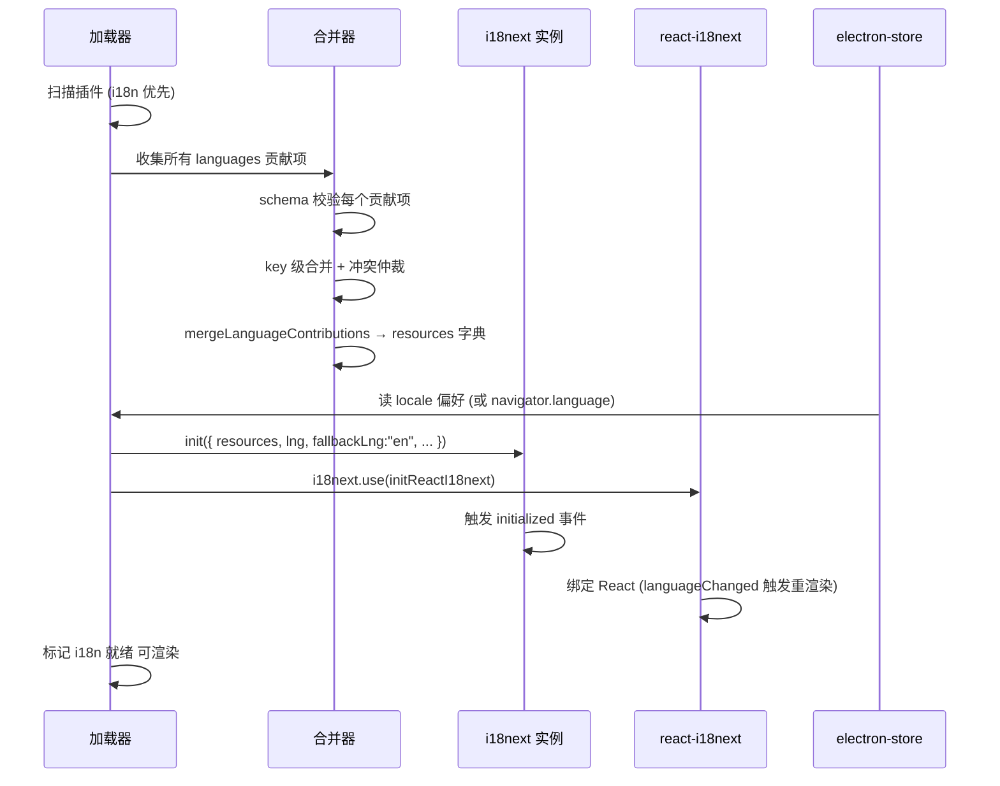

**图 12 — 启动合并时序：扫描→合并→init→react-i18next 绑定→就绪**

关键点：i18next 的 `init` 是异步的（返回 Promise），core 在 `await i18next.init(...)` 完成后才标记 i18n 就绪、才开始渲染需要文案的 UI。这避免"渲染时字典还没建好"的竞态——虽然 fallback 链能兜底，但启动期 await 保证首次渲染就是正确语言。

### 10.1.1 启动期的竞态与兜底

启动期有几个时序依赖要钉死，否则会出现"首屏显示 key 本身/字面值、随后闪成正确翻译"的闪烁：

- **i18next.init 完成前渲染**：若 core 在 `await i18next.init` 完成前就渲染 UI，组件调 `t(key)` 会拿到 i18next 未就绪的返回（i18next 未 init 时 `t` 返回 key 本身）。解决是 await——core 的首屏渲染门禁等 i18n 就绪。但 react-i18next 的 `useTranslation` 在 i18next 未 init 时会 suspend 或返回 key——所以首屏前 await 是必须的、不是优化。
- **renderer 实例 init 落后于 main**：main 先 init 自己的实例、再经 IPC 发字典给 renderer、renderer 再 init。若 renderer 在收到字典前就渲染，会走 fallback 链（renderer 空字典 → en 空 → 字面值 → key 本身）。解决是 renderer 的首屏渲染门禁等 `i18n:init` IPC 消息到达。这个门禁和 main 的 await 独立——renderer 不等 main 的 init、只等自己的字典 IPC 到达。
- **worker 启动早于字典 IPC**：worker 进程可能在 main 字典构建完之前就启动（如 worker 池预热）。worker 启动时若收不到 `i18n:init` 消息、调 `t()` 会拿到 worker 未 init 的返回（key 本身）。解决是 worker 的 `t()` 在收到 `i18n:init` 前返回 key 本身（translator 未初始化时的兜底）、收到后正常查字典。worker 生成文案推给 renderer 的场景通常在 worker 完成初始化后、不会在启动瞬间就调 `t()`，所以这个兜底极少触发。

这些兜底都指向 fallback 链的第四级（key 本身）——i18n 的任何未就绪状态都能降级到"显示 key 本身"、不崩。这是 fallback 链设计的额外收益：不仅处理翻译缺失、还处理 i18n 基础设施未就绪的竞态。但实现者要尽量避免触发这些兜底（首屏 await）、只在异常态依赖它。

### 10.2 热重载

i18n 插件的热重载走加载器的统一热重载机制（`DESIGN.md` 支柱③）。用户改了 i18n 插件（或第三方语言包插件）的 `plugin.json`/外部 JSON，加载器检测到文件变化、重新加载该插件：

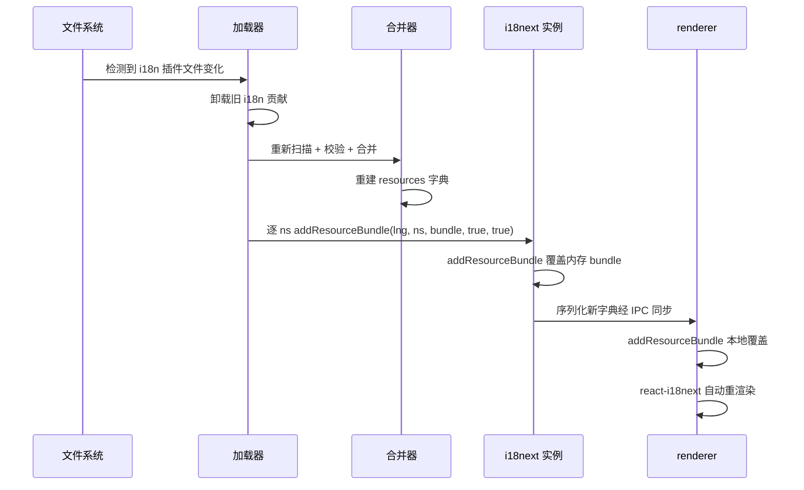

**图 13 — i18n 热重载：重新合并字典 → addResourceBundle 覆盖内存 → IPC 同步 renderer → 自动重渲染**

热重载不重启 core、不重启底座子进程、不重置 locale（保留用户当前选定的 locale）。**字典替换用 `addResourceBundle(lng, ns, bundle, deep=true, overwrite=true)` 逐 locale 逐 namespace 显式覆盖内存 bundle**——不用 `i18next.reloadResources`（那是面向 i18next backend 加载器的 API，pi-desktop 的 resources 是 `init` 时直接传入的内存字典、无 backend，`reloadResources` 不会刷新这部分内存数据）。替换后触发 `i18next.emit("loaded")` / 重发当前 locale 的查询，react-i18next 订阅后自动重渲染。然后 main 把新字典序列化经 IPC 同步给 renderer（renderer 侧同样 `addResourceBundle` 覆盖）和 worker 进程（worker 侧 `addResourceBundle` 覆盖自己的副本）。这是 i18n 插件和别的插件热重载的区别——别的插件热重载是加载器的事（重新挂载贡献项），i18n 还要多一步用 `addResourceBundle` 刷新三个 i18next 实例的内存字典。

### 10.2.1 热重载的防抖窗口

文件变化可能短时间内多次触发（编辑器保存抖动），加载器对 i18n 热重载做防抖——检测到变化后等 200ms 没有新变化才触发重载，避免频繁重建字典。这和加载器对其他插件热重载的防抖一致（`DESIGN.md` 3.5）。

### 10.2.2 热重载失败的回退

热重载失败（新 `plugin.json` schema 错、外部 JSON 解析失败）时，加载器保留旧字典、记 error、toast 提示用户。i18next 字典不替换、UI 继续用旧文案。这是"热重载不破坏现状"的安全网——改坏了不会让 UI 变成全 key 本身。

### 10.2.3 热重载与 locale 切换的交互

热重载保留当前 locale（不重置回检测值）。用户当前是 `zh`、热重载后还是 `zh`，只是 `zh` 的 resources 被替换成新版。如果新版 `zh` 缺了某个 key，下次渲染该 key 时走 fallback 链（→ en → 字面值 → key 本身），不会崩。

### 10.2.4 addResourceBundle vs 重新 init 的取舍

热重载替换内存字典有两个方案：① 逐 locale 逐 ns 调 `addResourceBundle(lng, ns, bundle, true, true)` 覆盖；② 直接重新 `i18next.init({ resources })` 重建实例。pi-desktop 选 ①，原因：

- **保留实例引用**：renderer 的 `useTranslation` 已绑定当前 i18next 实例、worker 的 translator 持有 i18next 引用。重新 `init` 会产生新实例、旧引用失效——所有持有旧实例的组件/translator 都要重新绑定，react-i18next 的订阅链也要重建。`addResourceBundle` 在原实例上覆盖内存 bundle、实例引用不变、订阅链不破坏。
- **触发重渲染**：`addResourceBundle` 覆盖后，i18next 的下一次 `t()` 查询返回新值；react-i18next 的组件要在下次渲染时才拿到新值——可以配合 `i18next.emit("loaded")` 或显式 `i18next.changeLanguage(i18next.language)`（切到当前 locale、触发 languageChanged 事件）让 react-i18next 立即重渲染。重新 `init` 虽然也能触发、但代价是实例重建。
- **增量覆盖**：`addResourceBundle` 的 `deep=true, overwrite=true` 让新 bundle 深合并覆盖旧 bundle——只改动的 namespace 覆盖、未改动的保留。重新 `init` 是整体替换、所有 namespace 都重置。热重载通常只改了一个插件的语言包、只需覆盖相关 namespace，`addResourceBundle` 的增量覆盖更精准。

不用 `i18next.reloadResources` 的原因已在 10.2 说明：那是面向 backend 加载器的 API、pi-desktop 无 backend、不会刷新 init 时直接传入的内存 resources。实测 `reloadResources` 在无 backend 配置下是 no-op、不会更新字典——这是常见踩坑点，文档刻意避坑。

`addResourceBundle` 覆盖后若有"旧 bundle 的 namespace 已不应存在"（热重载删除了某插件、它的 namespace 应移除），需配 `removeResourceBundle(lng, ns)` 显式移除——`addResourceBundle` 只覆盖不删除。pi-desktop 的热重载流程是：先 `removeResourceBundle` 移除已不存在的 namespace、再 `addResourceBundle` 覆盖更新和新增的 namespace。这保证热重载后字典和当前已加载插件集合精确对齐、不残留废弃 namespace。

### 10.2.5 三实例热重载的协同时序

热重载要同步三个 i18next 实例（main/renderer/worker），时序要协调：

1. main 重建 resources 字典（合并器输出）。
2. main 用 `removeResourceBundle` + `addResourceBundle` 覆盖 main 实例的内存 bundle。
3. main 把新字典 + 新 manifestLiterals + `dictVersion` + `removed`（旧有、新版无的 namespace 差集，10.2.4）序列化经 IPC 发给 renderer（`i18n:reload` 消息，载荷含 `{ resources, manifestLiterals, dictVersion, removed }`）和各 worker（`postMessage`，载荷同结构）。
4. renderer 收到后同样对 `removed` 逐个 `removeResourceBundle` + 逐 ns `addResourceBundle` 覆盖本地实例、用新 `manifestLiterals` 重建 renderer 侧 `rendererManifestLiterals` Map 副本（4.5.4 声明的同步语义）、存下 `dictVersion` 供诊断页对账、`changeLanguage(currentLng)` 触发 react-i18next 重渲染。
5. worker 收到后同样对 `removed` 逐个 `removeResourceBundle` + 逐 ns `addResourceBundle` 覆盖本地实例 + 用新 manifestLiterals 重建 worker translator 的内部 Map（若 manifestLiterals 变了）+ 存下 `dictVersion`。

步骤 2-5 之间有 IPC 延迟（毫秒级），窗口期三侧字典暂时不一致（9.5 已说明可接受）。main 不等 renderer/worker 覆盖完成就返回——热重载是 fire-and-forget 的推送、不阻塞加载器继续处理其他插件。如果 renderer/worker 的覆盖失败（IPC 异常、worker 已退出），main 不重试——下一次热重载会再推一次、自然补齐。这是"最终一致"而非"强一致"的取舍，和热重载的优化定位（非关键路径）对齐。

### 10.2.6 热重载部分失败的三实例对账

热重载同步三实例时，可能出现"main 覆盖成功、renderer 覆盖失败、worker 覆盖成功"这类部分失败。要对账清楚各侧最终状态：

| 失败组合 | main | renderer | worker | 用户可见效果 | 补偿 |
|---|---|---|---|---|---|
| 全成功 | 新 | 新 | 新 | 全新文案 | 无需 |
| renderer 失败 | 新 | 旧 | 新 | renderer 显示旧文案、worker 生成新文案 | 下次热重载/IPC 恢复后补 |
| worker 失败 | 新 | 新 | 旧 | worker 生成旧文案、renderer 显示新 | worker 重启后走握手拿新 |
| main 失败 | 旧 | 旧 | 旧 | 全旧文案 | 见 10.2.2 回退保留旧字典 |
| main+renderer 失败 | 旧 | 旧 | 新（异常） | 三侧不一致 | worker 重启对齐 main |

"main 失败"实际不会单独发生——main 覆盖失败意味着 `addResourceBundle` 抛错（极少见，可能是 resources 结构非法），按 10.2.2 的回退策略 main 保留旧字典、不向外推 `i18n:reload`，renderer/worker 也不会收到、保持旧字典，所以 main 失败时三侧都停在旧字典、一致。真正会"部分失败"的是 main 成功推送但 renderer/worker 收不到或覆盖抛错的场景——这时 main 已新、某侧仍旧，走表格里的补偿。

**对账的可观测**：理想情况下 main 应记录每次热重载的"推送 ACK"——renderer/worker 覆盖完回一个 `i18n:reload:ack`，main 据此知道哪些侧已对齐。但 pi-desktop 当前不做 ACK（fire-and-forget、不增加往返）。代价是无法精确知道某侧是否覆盖成功——只能靠"下次热重载/重启自然收敛"。诊断页可选地显示各实例的字典版本号（main 在 `i18n:reload` 载荷里带一个单调递增的 `dictVersion`、各实例收到后存下来、诊断页读出比对）——当前不实现、记为可选可观测项。

### 10.2.7 热重载回退与字典版本

10.2.2 说了"热重载失败保留旧字典"，这里把"旧字典"的语义钉死。保留的旧字典是**当前 main 实例内存里的 resources bundle**——不是磁盘上的某个历史快照、也不是重新合并出来的。热重载流程是"合并器先在内存算出新 resources、再 `addResourceBundle` 覆盖"。失败点有两个：

- **合并器失败**（新 `plugin.json` schema 错、外部 JSON 解析失败）：合并器抛错、没产出新 resources、没到 `addResourceBundle` 阶段。main 实例的内存 bundle 完全没被动过、就是上一版成功的字典。这是"原地保留"、零风险。
- **`addResourceBundle` 失败**（resources 结构非法、i18next 内部抛错）：此时可能部分 ns 已被覆盖、部分还没——main 实例处于"半覆盖"中间态。这个中间态不可回滚（i18next 没有"undo addResourceBundle"），main 实例可能停留在不一致状态。pi-desktop 的处置：记 error + toast、把 main 的 `dictVersion` 标记为"tainted"（污染）、继续用当前内存字典（可能半新半旧）。下一次成功的热重载会重新覆盖、把 tainted 状态清掉。这个极端情况极少触发（`addResourceBundle` 对合法 resources 几乎不抛错），但实现者要知道"半覆盖不可回滚"的边界——所以合并器要尽量在 `addResourceBundle` 前做完所有校验（schema、结构合法），把失败点挡在"原地保留"这一侧、不进"半覆盖"这一侧。

**字典版本号**：为支持对账和回退识别，main 维护一个单调递增的 `dictVersion`（整数，初始 0，每次成功热重载 +1）。`i18n:init` 和 `i18n:reload` 载荷都带 `dictVersion`，renderer/worker 收到后存下来。诊断页可显示"main=v5, renderer=v5, worker=v4"供排查滞后。tainted 状态下 main 的 dictVersion 不递增（保持上一次成功值）、额外标记 tainted=true。这个版本号是可选可观测设施、不影响功能正确性，但强烈建议实现——它是"最终一致"模型下定位滞后侧的唯一廉价手段。

### 10.3 main 与 renderer 的 i18next 实例同步

**三个进程各持有一个 i18next 实例**——main 进程一个（给 main 内部翻译 + worker 副本的源头）、renderer 进程一个（给 React 组件用，绑 `initReactI18next`）、每个 worker 进程一个（给 worker 侧 `t()` 本地查）。三个实例的 resources 字典必须一致（都源自 main 构造的那一份），否则不同进程生成的文案不一致。

main 实例和 renderer 实例的角色不同：main 实例是"字典权威源"——加载器在 main 构建完 resources 字典后，用这份 resources `init` main 的 i18next 实例，main 的 translator 持有这个实例；renderer 实例是"只读查询副本"——main 把 resources 序列化经 IPC 发给 renderer、renderer 用同一份 resources `init`（绑 `initReactI18next` 让 React 订阅 languageChanged 重渲染）；worker 实例也是"只读查询副本"——worker 启动时 main 把 resources + manifestLiterals 经 IPC 同步给它、worker 初始化自己的 i18next 实例和 translator。worker 的 translator 和 main 的 translator 同构（4.2），但各持各的实例、不共享内存。

同步方式分两个时机：① **启动时**：加载器在 main 构建完 resources 字典后，`init` main 实例；然后把字典序列化经 IPC 发给 renderer（renderer 收到后 `init` renderer 实例 + `initReactI18next`）和每个 worker（worker 收到后 `init` worker 实例 + 构造 worker translator）。② **热重载时**：main 重建字典后，用 `addResourceBundle` 覆盖 main 实例的内存 bundle（10.2），然后把新字典序列化经 IPC 发给 renderer 和 worker、它们各自 `addResourceBundle` 覆盖。locale 切换时则不同——只同步 locale（4.2 的 `currentLocale` 同步路径），不重发整本字典。这是"构造在 main、执行在 renderer/worker"的体现——字典构造集中 in main、renderer 和 worker 持有副本只读查。

### 10.3.1 同步失败的降级

如果 IPC 同步失败（renderer 还没起好、或 IPC 通道异常），renderer 侧 i18next 用空字典启动，所有文案走 fallback 链（→ en 空 → 字面值 → key 本身）。UI 会显示字面值/key 本身、不好看但不崩。IPC 恢复后下一次热重载/同步补上字典。

### 10.3.2 core 极薄纪律的 code review 检查点

i18n 的实现要守住"core 极薄"纪律。code review 时检查：

- core 渲染层有没有硬编码文案常量（`<span>工具执行中</span>` 是违规、应是 `t("timeline.toolExecuting")`）。
- core 有没有内嵌"默认语言包"（不该有，默认文案走 i18n 内置插件）。
- translator 有没有 import pi 类型（不该，圆心不绑底座）。
- 格式化有没有散在各组件自己 `new Intl.DateTimeFormat`（应走 `pi.i18n.formatDate`）。
- 排序有没有散在各组件自己 `new Intl.Collator`（应走 `pi.i18n.collator`，与 `formatDate` 收口同等要求，9.1/9.2）。

---

## 11 第三方插件贡献翻译

### 11.1 贡献方式

第三方插件可以贡献自己的翻译，两种方式：

**方式一：插件自带 `languages` 贡献项**。在自己的 `plugin.json` 里写 `contributes.languages`，贡献自己 namespace 的 zh/en 翻译：

```json
{
  "id": "my-tool",
  "version": "1.0.0",
  "displayName": "My Tool",
  "main": "./index.ts",
  "renderer": "./ui.tsx",
  "contributes": {
    "languages": [
      {
        "id": "my-tool.zh",
        "locale": "zh",
        "resources": {
          "my-tool.title": "我的工具",
          "my-tool.processing": "{{tool}} 处理中",
          "plugin.my-tool.displayName": "我的工具"
        }
      },
      {
        "id": "my-tool.en",
        "locale": "en",
        "resources": {
          "my-tool.title": "My Tool",
          "my-tool.processing": "{{tool}} processing",
          "plugin.my-tool.displayName": "My Tool"
        }
      }
    ]
  }
}
```

加载器把它的 `languages` 贡献项和 i18n 内置插件的贡献项一起合并进字典——key 级合并、`my-tool` namespace 自动加进 i18next 的 `ns` 列表。这是最自洽的方式：翻译跟着插件走、插件卸载时翻译也卸载。

第三方插件贡献翻译时的 key 命名要守 2.4 的约定——用 `{pluginId}` 前缀的 namespace（`my-tool.title`/`my-tool.processing`），不撞内置 namespace。如果第三方插件要对内置功能补文案（如给 timeline 加自定义工具卡片的标签），可复用 `timeline` namespace 写 `timeline.myCustomTool`——但这是对内置功能的扩展、归属内置功能域，第三方插件要清楚自己在覆盖/扩展内置 namespace。插件展示名用固定 key `plugin.{pluginId}.displayName`（如 `plugin.my-tool.displayName`），和内置插件的展示名 key 约定一致，core 渲染插件列表时统一按这个 key 查。

**第三方插件 languages 贡献项的 resources 形态**：可以 inline 在 `plugin.json` 里（小规模、key 少时方便），也可以用字符串路径指向外部 JSON 文件（3.4，key 多时便于团队协作和 diff）。两种形态在合并阶段等价。第三方插件用外部 JSON 时，路径相对插件目录解析——插件打包成 npm 包分发时，JSON 文件要随包发布（在 `files` 字段里声明、确保 `npm publish` 带上）。加载器读不到外部 JSON 文件时按贡献项校验失败处理（3.2）——插件作者的 JSON 路径写错或漏打包会导致翻译缺失、走 fallback 链（显示字面值/key 本身），不崩但不美观，开发时能在诊断页看到 error。

**方式二：给内置 i18n 插件贡献翻译**。用户/项目可以在 `~/.pi/desktop/plugins/` 放一个覆盖 i18n 插件的版本（同 id `i18n`、更高优先级），追加自己的翻译 key。这种方式适合"给内置功能补翻译"（如某个内置 namespace 的 key 在某 locale 下缺失），不适合"第三方插件的专属文案"（那应跟着插件走）。覆盖版本和内置版本走 key 级合并——覆盖版的 key 覆盖内置同名 key、内置独有的 key 仍保留（不是整体替换）。这让"只补几个缺失 key"的覆盖版本很轻量、不用复制整本字典。

### 11.2 key 冲突处理

第三方插件的翻译 key 和内置 i18n 插件的 key 冲突时（同 locale 同 namespace 同 key），按来源插件优先级仲裁——project > user > installed > builtin（`DESIGN.md` 3.4）。第三方插件（installed）优先级高于内置 i18n（builtin），所以第三方插件可以覆盖内置文案。这让"用户想改某个内置文案"成为可能：写个高优先级插件贡献同 key 不同翻译。

但这是有意为之的覆盖、不是意外冲突。插件作者应遵循命名约定（11.4），用 `{pluginId}` 前缀避免无意撞内置 namespace 的 key。

### 11.3 不贡献翻译也能工作

第三方插件不贡献任何 `languages` 也能正常工作——`displayName`/`label` 字面值兜底（fallback 链第三级），功能文案缺失时显示 key 本身（第四级）。所以一个只填 `displayName: "My Tool"`、不写 languages 的插件，在任何 locale 下都显示 `"My Tool"`，不会崩、不会空白。这降低了第三方插件的入门门槛——i18n 是可选的增强、不是必填项。

### 11.4 命名空间约定

第三方插件贡献翻译时遵循命名约定（2.4）：

- 插件自身文案用 `{pluginId}.` 前缀的 namespace（如 `my-tool.title`），避免撞内置 namespace。
- 插件展示名用固定 key `plugin.{pluginId}.displayName`。
- 对内置功能的补充文案可复用内置 namespace（如给 timeline 加 `timeline.myCustomTool`）。

这个约定是软约束、但文档和示例必须遵守，作为生态规范。加载器对 key 格式不强制校验（2.4），但会记 warning 提示裸 key（无 namespace 前缀）。

### 11.5 插件卸载与翻译的清理

第三方插件自带 `languages` 贡献项时，插件卸载（被禁用、从加载列表移除）后它的翻译也要随之清理——否则字典里残留废弃插件的 key、虽不影响查询（没人查这些 key）但占用内存、还会在完整性检查（12.2）里产生误报。清理走热重载路径（10.2）：插件卸载触发加载器重新扫描合并、重建字典（不含已卸载插件的贡献项）、用 `removeResourceBundle` 移除该插件的 namespace、`addResourceBundle` 覆盖剩余 namespace、三实例同步。这是"翻译跟着插件走"的完整闭环——装时加、卸时删、key 级合并保证不冲突。

注意：插件卸载后若有其他插件的渲染组件还在引用已卸载插件的 namespace key（理论上不该发生、组件应随插件卸载而卸载），查询会走 fallback 链（当前 locale 缺失 → en 缺失 → 字面值若 manifestLiterals 还在 → key 本身）。但 manifestLiterals 在热重载时也会重建、移除已卸载插件的字面值，所以最终走 key 本身。这是"已卸载插件的文案查不到就显示 key 本身"的兜底、不是 bug。

### 11.6 第三方贡献的校验细则

第三方插件贡献 `languages` 时，加载器的 schema 校验（3.2）之外还有几条 i18n 专属的校验细则，照着实现能挡住常见的"坏贡献项"：

**locale 一致性校验**：一个插件若贡献多个 locale，每个 locale 的 key 集合应尽量对齐（zh 有的 key、en 也该有）。加载器在合并后做完整性检查（12.2）记 warning，但不阻断——第三方插件可能刻意只贡献某 locale 的部分 key（如只补 zh 缺失项、en 已有内置）。校验只警告、不拒绝，让"部分补充"合法。

**resources 体积上限**：单个贡献项的 `resources` 若是 inline 对象，key 数量过大（如上千条全塞 plugin.json）会让 manifest 膨胀、影响加载器解析和 IPC 传输。加载器对 inline resources 设软上限（如 500 key），超限记 warning 建议 external JSON 拆分（3.4）、不阻断。外部 JSON 文件无此限（文件大小不占 manifest）。

**key 格式软校验**：3.2 已对"裸 key（无 dot）记 warning"。再加一条：key 含非法字符（空格、控制字符、非打印字符）记 warning——i18next 的 dot 解析和插值对这类 key 行为未定义，建议插件作者用驼峰 dot key。namespace 段为空（如 `.send`、`timeline.`）记 error——这是格式错误、namespace 解析会得到空串、污染字典结构。

**外部 JSON 路径安全**：`resources` 是字符串路径时，加载器按相对插件目录解析、禁止 `..` 越界（不能引用插件目录外的文件）。这是沙箱纪律的延伸——插件只能读自己目录下的 JSON、不能借 i18n 路径读到宿主文件。路径含 `..` 或绝对路径记 error、拒绝该贡献项。

**manifestLiterals 字段类型校验**：4.2.3 收集的 `displayName`/`description`/`label`/`title` 字段必须是 string、不能是对象或数组（12.4 的"字面值 locale map"演进项未落地前）。非 string 字段跳过收集、记 warning——避免把对象当字面值塞进 Map、fallback 时显示 `[object Object]`。

### 11.7 命名空间冲突的检测与告警

第三方插件贡献的 namespace 若和内置 namespace 撞（如某插件贡献 `timeline.customTool`、namespace 是 `timeline`），这是 2.3 约定的"对内置功能补充文案"合法场景。但加载器要能区分"合法补充"和"无意撞名"：

- **合法补充**：第三方插件的 key 是内置 namespace 里没有的新 key（如 `timeline.customTool`、内置没有 `customTool`）——key 级合并保留、不冲突。
- **无意覆盖**：第三方插件的 key 和内置同 key（如 `timeline.toolExecuting`）——key 级合并按优先级取高（第三方 installed > 内置 builtin），第三方覆盖内置。这是 11.2 说的"有意覆盖"能力，但也可能是插件作者不知道这个 key 已存在、无意写重了。

加载器的告警策略：对"第三方覆盖内置同 key"的情况记 info（不是 warning、不是 error）——这是合法的覆盖能力、插件作者可能有意为之。但对"两个同优先级的第三方插件覆盖同 key"记 warning——这种冲突的胜出方向按 2.6.1 钉死为"先处理者胜"（合并器 `existing.priority < priority` 在等优先级时不覆盖、先入字典者保留），但"先处理者"取决于贡献项在合并器输入数组中的相对顺序、加载器**不保证**该顺序稳定（受文件系统返回顺序、各安装源内部排序影响，跨平台/跨版本可能不同），因此实际胜出结果不可预测。告警进诊断页（`DESIGN.md` 4.3.2）、不阻断加载，建议插件作者改用各自 namespace 前缀（`{pluginId}.xxx`）避免同 key 争用、而非依赖"先来后到"的仲裁结果。

**namespace 全局视图**：诊断页可提供一个"当前字典里所有 namespace 及其 key 数量"的视图，帮插件作者定位"我的 namespace 被谁覆盖了"或"我贡献的 key 进了哪个 namespace"。这是可选可观测设施、当前不强制实现。

---

## 12 文案规约、测试与演进

### 12.1 命名规约汇总

把全文的命名约定集中列出，作为贡献翻译时的清单：

| 文案类型 | key 约定 | 示例 |
|---|---|---|
| 通用文案 | `common.{动作}` | `common.send` `common.cancel` |
| 插件自身文案 | `{pluginId}.{功能}.{动作}` | `timeline.toolExecuting` |
| 插件展示名 | `plugin.{pluginId}.displayName` | `plugin.i18n.displayName` |
| 插件描述 | `plugin.{pluginId}.description` | `plugin.i18n.description` |
| 贡献项 label | `{slot}.{pluginId}.{itemId}.label` | `commands.review.addComment.label` |
| 贡献项 title | `{slot}.{pluginId}.{itemId}.title` | `settings.review.title` |
| 贡献项 description | `{slot}.{pluginId}.{itemId}.description` | `commands.review.addComment.description` |
| 复数形式 | `{key}_one` / `{key}_other` | `timeline.messages_one` |
| 内置 namespace | `common` `timeline` `settings` `sessions` | — |
| 第三方 namespace | `{pluginId}` | `my-tool` |

### 12.2 完整性检查

加载器在合并完字典后做一次完整性检查：对每个 locale、每个 namespace、列出"en 有但该 locale 缺失"的 key，记 warning 进诊断页（`DESIGN.md` 4.3.2）。这让插件作者能发现"我加了新 key 但忘了翻译某 locale"。完整性检查不阻断加载——缺失的 key 走 fallback 到 en，但 warning 让作者知道该补。

### 12.3 测试策略

i18n 插件的测试分几层：

- **单元测试**：`mergeLanguageContributions` 的合并逻辑——多插件贡献同 namespace 的 key 级合并、冲突 key 的优先级仲裁、裸 key 的 defaultNS 处理、外部 JSON 字符串路径解析（文件存在/不存在/JSON 语法错）。
- **fallback 链测试**：translator 的四级 fallback——当前 locale 有/无、en 有/无、字面值有/无、key 本身。每个分支覆盖。含边界场景（4.5.1）：空串 value 当缺失、插值变量缺失不触发 fallback、复数 key 缺失、多段 key 的 namespace 解析。
- **locale 检测测试**：`navigator.language` 各种值（`zh-CN`/`en-US`/`ja-JP`/不支持的 `xx`）的解析归约、electron-store 优先级、store 有值 vs 无值 vs navigator 回退 vs 默认 en 的三层优先级。
- **格式化测试**：`formatDate`/`formatNumber` 在不同 locale 下的输出、复数在 one/other/few/many 的分支、`Intl.Collator` 的 numeric/sensitivity 选项、Collator 缓存命中与 locale 切换后清缓存。
- **自我翻译测试**：i18n 插件自己的 `displayName`/`description` 在语言槽已构建/未构建时的 fallback、其他插件的展示名翻译。
- **热重载测试**：改 `plugin.json` 后字典重建、`addResourceBundle` 覆盖验证、`removeResourceBundle` 移除废弃 namespace、locale 保留、失败回退（schema 错保留旧字典）、三实例同步（main/renderer/worker 的 IPC 推送、覆盖时序）。
- **一致性测试**：三实例字典一致性窗口（9.5）——模拟 IPC 延迟、验证窗口期内的降级行为不崩。
- **manifestLiterals 收集测试**：4.2.3 的收集算法——遍历各槽位（commands/sidePanel/settings/cardRenderers）、字段映射（displayName/label/title/description）、冲突优先级、空值跳过。

测试用 jest，i18next 有 `initReactI18next` 的测试工具。fallback 链测试要 mock i18next 的 `t` 返回值（命中/返回 key 本身两种），验证 translator 的二三四级。热重载测试要 mock IPC 通道（主进程的 `ipc.send`、worker 的 `postMessage`），验证三侧都收到覆盖消息。locale 检测测试要 mock `navigator.language` 和 electron-store。格式化测试用 `Intl` 的固定 locale 输出做快照（注意 `Intl` 输出可能随 Node 版本/locale 数据更新变化，快照要 pin Node 版本或用宽松匹配）。

### 12.3.1 测试矩阵详表

把上面的测试层展开成可执行的用例表，每条都给输入和预期，照着写测试代码：

**合并器（mergeLanguageContributions）**

| 用例 | 输入 | 预期 |
|---|---|---|
| 单插件单 locale | 1 插件 zh, {common.send:"发送"} | resources.zh.common.send="发送" |
| 多插件同 namespace 不冲突 | A:timeline.toolExecuting, B:timeline.reviewMarker | 两 key 都保留 |
| 同 key 冲突按优先级 | A(project):timeline.x="甲", B(builtin):timeline.x="乙" | 取 A 的"甲" |
| 同 key 同优先级 | A(installed):x="甲", B(installed):x="乙" | 取先处理者（数组中靠前入字典者）、告警 warning（顺序不稳定、建议改 namespace 前缀） |
| 裸 key 走 defaultNS | {send:"发送"} | resources.zh.common.send="发送" |
| 多段 key | settings.modelSection.advanced | ns=settings, key=modelSection.advanced |
| 外部 JSON 解析失败 | resources="./nope.json" | 贡献项拒绝、记 error、不阻断其他 |
| 外部 JSON 顶层非对象 | resources="./arr.json"(数组) | 贡献项拒绝、记 error |
| `..` 路径越界 | resources="../secret.json" | 拒绝、记 error |
| value 非字符串 | {common.send:123} | 拒绝、记 error |
| value 空串 | {common.send:""} | 记 warning、合并放行、运行期当缺失 |

**fallback 链（I18nTranslator.t）**

| 用例 | 输入 | 预期 |
|---|---|---|
| zh 命中 | t("common.send",{lng:zh}) | "发送" |
| zh 缺、en 有 | zh 无、en="Send" | "Send" |
| zh/en 都缺、有字面值 | manifestLiterals 有 | 字面值 |
| 全缺 | 都无 | key 本身 |
| 空串当缺失 | zh="" | 走 en |
| 插值缺失 | t("common.welcome",{}) 翻译="你好 {{name}}" | "你好 "（不触发 fallback） |
| 复数 zh 有 one/other | t("timeline.messages",{count:1}) | messages_one |
| 复数 zh 只有裸 key | count=5, 有 messages 无后缀 | 用 messages、插值 count |
| 复数全缺 | 都无 | key 本身 timeline.messages |

**locale 检测（detectLocale）**

| 用例 | 输入 | 预期 |
|---|---|---|
| store 有值且支持 | store="zh", 字典有 zh | "zh" |
| store 有值但不支持 | store="xx", 字典无 xx | 走 navigator |
| navigator 标准码 | "zh-CN", 字典有 zh | "zh" |
| navigator 带脚本 | "zh-Hans" | "zh" |
| navigator 不支持 | "fr", 字典无 fr | "en" |
| navigator 空/异常 | "" | "en" |
| 大小写不一 | "ZH" | "zh" |
| store+nav 都不支持 | store="xx", nav="fr" | "en" |
| 字典未构建时调 detectLocale | 空字典 | 所有非 en 回退 en（回归测试：必须在合并后调） |

**热重载**

| 用例 | 输入 | 预期 |
|---|---|---|
| 正常热重载 | 改 plugin.json | addResourceBundle 覆盖三实例、locale 保留 |
| 删 namespace | 卸载某插件 | removeResourceBundle 移除该 ns |
| schema 错 | 新 plugin.json 非法 | 保留旧字典、toast、记 error |
| 外部 JSON 解析失败 | locales/zh/x.json 语法错 | 该贡献项不挂载、其他保留 |
| renderer IPC 失败 | ipc 异常 | main/worker 新、renderer 旧、下次重载补 |
| worker 已退出 | postMessage 失败 | main/renderer 新、worker 重启后对齐 |
| 半覆盖 tainted | addResourceBundle 抛错 | 标记 tainted、不递增 dictVersion |
| 防抖 | 短时多次保存 | 200ms 内只触发一次 |

**worker 同步**

| 用例 | 输入 | 预期 |
|---|---|---|
| 握手前 t() | translator 未初始化 | 返回 key 本身 |
| 握手完整 | i18n:init 到达 | worker i18next init + translator 构造 |
| locale 切换推送 | changeLanguage 消息 | worker translator.setLocale + i18next.changeLanguage |
| locale 消息丢失 | worker 仍旧 | worker 重启握手时用 main 当前 lng 对齐 |
| 热重载推送 | i18n:reload | worker addResourceBundle 覆盖 |
| manifestLiterals 同步 | init/reload 带 Map | worker translator Map 替换 |

### 12.3.2 边界与回归用例

除上面正交矩阵，还有几条容易回归的边界用例要单独固化：

- **i18n 插件自我翻译**（7.x）：启动早期 i18n 未加载完时渲染 `plugin.i18n.displayName`、应 fallback 到字面值 "i18n"；加载完后重渲染应变 "国际化"。这条要测——它验证 fallback 链第四级在启动竞态的兜底。
- **i18next.init 前 useTranslation**（10.1.1）：renderer 首屏门禁未等 `i18n:init` 就渲染、`useTranslation` 应 suspend 或返回 key、不崩。
- **三实例 dictVersion 滞后**（10.2.7）：模拟 renderer 漏收一次 reload、验证诊断页能显示版本差异（若实现了版本号可观测）。
- **collectSupportedLngs 去重**（6.2.2）：多插件贡献同 locale "ja"、supportedLngs 只含一个 "ja"。
- **collectSupportedLngs 含内置**：无第三方 locale 时、supportedLngs 至少含 zh/en。
- **namespace 自动登记**（2.7）：贡献 `plugin.x.displayName` 后、`plugin` 在 ns 列表里、`t("plugin.x.displayName")` 可查。
- **escapeValue=false 双重转义**（6.2.1）：插值含 `<` 的文案、React 渲染应显示原始 `<` 而非 `&lt;`。
- **Collator 缓存清空**（8.4.1）：locale 切换后、Collator 缓存应清空、新 locale 排序结果变化。
- **复数与 formatNumber 协同**（8.7）：`t(key,{count:n})` 传原始 number 选复数、不传 formatNumber 的字符串结果。

这些回归用例要在 CI 里跑、每次 i18next 升级或合并器改动都覆盖。建议用 fixture JSON（一组 zh/en + manifest 字面值样本）驱动测试、避免硬编码期望值随 locale 数据漂移。

### 12.4 演进项

i18n 插件的已知边界和未来演进（记入 `DESIGN.md` 第 6 节缺口）：

- **RTL 支持**（二期）：`ar`/`he` locale + CSS `direction` + `pi.ui` 逻辑属性 + 内置插件适配。当前不支持、不假装支持。落地时 schema 要放开 `ar`/`he` 2 位短码（已是 2 位、不需改 schema），主要工作在 core 渲染层 + 组件库 + 各内置插件的 CSS 翻转。
- **远程语言包**：当前语言包是本地 JSON/manifest 字面量。未来可支持远程拉取语言包（受 `net:` 权限约束），让社区贡献翻译不依赖发版。这会让 i18n 不再纯声明式——需要权衡（纯声明式是当前的优势，远程化会引入运行时副作用）。落地形态可能是 i18next backend 加载器（此时 `reloadResources` 才真正有用），但当前无 backend、不实现。
- **locale 协商与区域变体**：当前 schema 只允许 2 位短码、检测只取主语言子标签（`zh-CN` → `zh`）。未来若要支持区域变体（`zh-CN` vs `zh-TW` 的用词差异），需同时改三处：① schema 放开区域子标签正则；② 检测层增加区域回退（`zh-CN` → 先查 `zh-CN` 再查 `zh`）；③ resources 支持区域 key。三处必须配套、否则会出现 3.2 vs 5.1 的死数据问题（schema 放行但检测永远命中不了）。当前刻意收紧 schema、把区域变体记为演进项，避免"假能力"。
- **namespace 真正懒加载**：当前是全量加载到内存（2.2/6.2.2）。未来若第三方语言包体积增长显著，可把 resources 字符串路径做成真正的懒加载——在 `loadNamespaces` 时才读文件。这会让 `loadNamespaces` 不再冗余、i18next 的 backend 机制部分启用。当前不实现、全量加载的内存开销可忽略。
- **缺失 key 自动上报**：当前缺失 key 静默走 fallback。未来可加"缺失 key 上报"（受遥测开关约束），帮作者发现漏翻译。当前不报、避免隐私顾虑。
- **字面值 fallback 的 locale 感知**：当前 manifest 字面值是单一字符串、不随 locale 变（`displayName: "My Tool"` 在所有 locale 下都是 "My Tool"）。未来若要"字面值本身有多语言版本"（manifest 里写 `displayName: { zh: "我的工具", en: "My Tool" }`），需扩展 manifest schema 让字面值字段支持 locale map。当前不做——字面值的多语言应由语言槽 resources 贡献、不应在 manifest 里再开第二处翻译源（避免回到 现有方案的"文案散落"毛病）。
- **i18next 版本升级与向后兼容**：i18next 主版本升级可能改变 `addResourceBundle`/`changeLanguage` 的语义或返回值。pi-desktop 把 i18next 的使用收敛在中层（加载器/translator），圆心只依赖"翻译"抽象（4.2.1），所以升级时改中层即可、圆心契约不动。但仍需回归测试覆盖 fallback 链和热重载——i18next 的 missing key 行为和 bundle 覆盖语义是版本敏感的。

---

## 13 与其他模块的关系

### 13.1 与加载器（支柱③）

i18n 插件是加载器的一个普通插件，走加载器的标准流程：发现 → 校验 → 合并贡献项 → 挂载。加载器对 i18n 的特殊处理只有两点：① 加载优先级提升（7.3，让 i18n 的翻译尽早进字典）；② 语言槽的 key 级合并器是专属逻辑（2.6，不复用通用仲裁）。其余和别的插件一致——错误隔离、热重载、优先级仲裁都走加载器统一机制。

### 13.2 与 core 渲染层

core 渲染层是 i18n 的主要消费者——时间线、工具卡片、状态栏、系统提示都向语言槽要文案。core 渲染层用 `react-i18next` 的 `useTranslation`，不直接调 main 的 translator（main translator 是 worker 侧和 main 内部的入口，renderer 侧走自己的 i18next 实例 + `pi.i18n.t` 的字面值 fallback 包层，见 9.4）。core 渲染层守"不内嵌常量"纪律（10.3.2），所有文案走 `t()`。

### 13.3 与主题插件

i18n 和主题插件是对称的（1.4）。两者都是"影响 core 自身渲染的内容插件"，都走槽位、都可被覆盖、都不重启切换。设计 i18n 时参考主题插件的合并/仲裁/切换模式，反之亦然。两者共用的抽象是"key→值的字典 + key 级合并 + 优先级仲裁 + 运行时切换"——这个抽象可以进一步提炼成 core 的共享原语（类似 `resolveByPriority`），但当前两者各自实现、保持独立清晰。两者也有差异：主题的切换是"换当前主题 id"（一个 id 胜出）、i18n 的切换是"换当前 locale"（locale 切换不改字典、只改查询的 locale 维度）；主题的字面值 fallback 是"内置默认 token 值"、i18n 的字面值 fallback 是"manifest 的 displayName/label 字面值"。这些差异不影响两者的对称设计模式，但实现时不能简单复制、要按各自语义适配。

### 13.4 与底座（pi）

i18n 插件和 pi 底座**完全无关**。pi 是终端 CLI、没有 i18n 概念（pi 源码只用 `localeCompare` 做字符串排序，没有 i18next、没有语言包，见 `packages/coding-agent/src`）。locale 是桌面端的偏好、不写进 pi 的 `settings.json`（5.2）。i18n 插件不通过 RPC 问底座任何东西、不订阅底座任何事件。这是"桌面插件只消费、不干预底座行为"（`DESIGN.md` 3.7）的纯粹体现——i18n 连消费都不消费，它是纯桌面端的横切能力。

但 i18n 翻译的内容**包括底座产生的数据**：底座 event 的 `timestamp`（`DESIGN.md` 1.6.2）显示时用 `formatDate` 格式化、底座返回的 token 数/cost 用 `formatNumber` 格式化。所以 i18n 插件和底座的关系是"i18n 格式化底座吐出的数据"——单向、i18n 主动、底座无感。

---

## 14 实现清单（照着写代码）

把全文的实现要点集中成一份清单，作为写代码时的核对表：

### 14.1 数据结构

```typescript
// 贡献项（加载器校验用）
interface LanguageContribution {
  id: string;
  locale: string;           // 2 位 BCP 47 短码，正则 ^[a-z]{2}$（不接受区域子标签，见 2.1/3.2）
  resources: Record<string, string> | string;  // 对象或外部 JSON 路径（见 3.4）
}

// 已解析贡献项（加载器校验/解析阶段产出，3.2.2 步骤⑤——字符串路径已解析成对象）
// 合并器收此类型、不收原始 LanguageContribution，把"字符串路径解析"与"key 级合并"在类型层面分开（6.1）
interface ResolvedLanguageContribution {
  id: string;
  locale: string;
  resources: Record<string, string>;  // 已解析为对象，合并器可直接 Object.entries
}

// translator（圆心）
class I18nTranslator {
  constructor(
    private i18next: i18next.i18n,
    private manifestLiterals: Map<string, string>,
    private currentLocale: string,
    private defaultLocale = "en",
  ) {}
  t(key: string, vars?: Record<string, unknown>): string { /* 4.2 四级 fallback */ }
  get locale(): string { return this.currentLocale; }
  formatDate(date: Date, opts?: Intl.DateTimeFormatOptions): string { /* 8.1 */ }
  formatNumber(num: number, opts?: Intl.NumberFormatOptions): string { /* 8.2 */ }
  // Collator 缓存（8.4.1）
  collator(opts?: Intl.CollatorOptions): Intl.Collator { /* 按 locale 缓存 */ }
  // 热重载时由 main 侧调用，替换内部 manifestLiterals Map 引用、保留 Collator 缓存（10.2.5/9.8 步骤4）
  updateManifestLiterals(map: Map<string, string>): void { this.manifestLiterals = map; }
}
```

### 14.2 加载器合并器

```typescript
// 加载器对 languages 槽位的专属合并器（2.5 / 2.6）
// 输入是已解析贡献项（ResolvedLanguageContribution，resources 已是对象，3.2.2 步骤⑤产出）
function mergeLanguageContributions(
  items: Array<{ plugin: PluginMeta; item: ResolvedLanguageContribution }>,
): i18next.Resource {
  // 1. 按 locale 分组
  // 2. 组内 key 级 union（不冲突全保留）
  // 3. 冲突 key 调 resolveByPriority 取高优先级；同优先级不覆盖 → 先处理者胜（2.6.1）
  // 4. 聚合成 i18next.Resource 形态
}

// namespace 解析（2.2）
function parseNamespace(key: string): string {
  const idx = key.indexOf(".");
  return idx === -1 ? "common" : key.slice(0, idx);  // 第一个 dot 之前，无 dot 走 defaultNS
}

// namespace 收集器（2.7/6.2.2）——与 collectSupportedLngs 对称，遍历合并后的 resources
// 取各 locale 下出现的 namespace 名去重、并上内置 8 个权威清单，作为 init 的 ns 选项
function collectNamespaces(resources: i18next.Resource): string[] {
  const set = new Set<string>(["common", "timeline", "settings", "sessions", "commands", "sidePanel", "review", "system"]);
  for (const lng of Object.keys(resources)) {
    for (const ns of Object.keys(resources[lng] || {})) set.add(ns);
  }
  return [...set];
}
```

### 14.3 初始化与切换

```typescript
// 启动初始化（6.2 / 10.1 / 10.3）—— main 进程侧
import i18next from "i18next";

const mainI18n = i18next.createInstance();  // main 实例（字典权威源）
let dictVersion = 0;  // 单调递增字典版本号（10.2.7），初始 0、每次成功热重载 +1；tainted 时不递增
let tainted = false;  // 半覆盖污染标记（10.2.7），下一次成功热重载清除
let currentResources: i18next.Resource = {};  // 当前内存字典快照（10.2.4），供热重载 diff 移除废弃 namespace；initMainI18n 成功后置为首次合并结果
const manifestLiterals = collectManifestLiterals(allPlugins);  // 4.2.3

// isSupportedLocale 闭包：捕获当前已合并 resources（5.2 时序依赖）；initMainI18n 在 mergeLanguageContributions 之后赋值
// detectLocale(store) 签名只收 store，但内部调用的 isSupportedLocale 已通过此闭包绑定字典（5.2）
let isSupportedLocale: (lng: string) => boolean = () => false;
// isRtlLocale 查已知 RTL locale 常量集合（8.5），不依赖 resources、纯常量查表，可与 isSupportedLocale 同处调用
const RTL_LOCALES = new Set(["ar", "he", "fa", "ur", "yi", "ps", "sd"]);
const isRtlLocale = (lng: string) => RTL_LOCALES.has(lng);
function toastRtlUnsupported(lng: string) { /* toast："当前 locale 的 RTL 布局尚未支持，已回退英文"（8.5） */ }

async function initMainI18n(contributions, electronStore) {
  const resources = mergeLanguageContributions(contributions);
  currentResources = resources;  // 记录首次内存字典快照，供热重载 diff（10.2.4）
  // 构造 isSupportedLocale 闭包（捕获 resources，5.2）——必须在 detectLocale 之前赋值，否则 detectLocale 查空字典误判
  isSupportedLocale = (lng: string) =>
    resources[lng] != null && Object.keys(resources[lng]).length > 0;
  const lng = detectLocale(electronStore);  // 5.2，依赖上面的 isSupportedLocale 闭包（时序：合并在前、检测在后）
  const supportedLngs = collectSupportedLngs(contributions);  // 6.2.2
  await mainI18n.init({
    resources, lng, fallbackLng: "en", defaultNS: "common",
    ns: collectNamespaces(resources),  // 内置 8 + 扫描得到的全部 namespace（2.7/6.2.2）
    supportedLngs,
    nsSeparator: ".", keySeparator: false,
    interpolation: { escapeValue: false, prefix: "{{", suffix: "}}" },
    returnEmptyString: false, returnNull: false,
    parseMissingKeyHandler: (k) => k,
  });
  // main translator（4.2），供 main 内部 + worker 副本源头
  const translator = new I18nTranslator(mainI18n, manifestLiterals, lng);
  // 序列化字典 + manifestLiterals + supportedLngs + dictVersion 经 IPC 发给 renderer 和各 worker（10.3/9.6）
  ipc.send("i18n:init", { resources, manifestLiterals: [...manifestLiterals], lng, supportedLngs, dictVersion });
  return translator;
}

// renderer 进程侧（收到 IPC 后）
async function initRendererI18n(payload) {
  await i18next.use(initReactI18next).init({
    resources: payload.resources,
    lng: payload.lng, fallbackLng: "en", defaultNS: "common",
    ns: collectNamespaces(payload.resources),  // 与 main 同源（从同一份 resources 推导，内置 8 一致）
    supportedLngs: payload.supportedLngs,  // 直接用 main 下发的 supportedLngs，保证两侧同源（10.2.7 一致性）
    nsSeparator: ".", keySeparator: false,
    interpolation: { escapeValue: false },
    returnEmptyString: false, returnNull: false,
    parseMissingKeyHandler: (k) => k,
  });
  document.documentElement.lang = payload.lng;  // 5.4
  // 把 manifestLiterals 存进 renderer 侧全局，供 RendererPluginContext.i18n.t 包一层 fallback（9.4）
  rendererManifestLiterals = new Map(payload.manifestLiterals);
  rendererDictVersion = payload.dictVersion;  // 供诊断页对账（10.2.7）
}

// locale 切换（5.3）—— renderer 发起
async function changeLocale(lng: string, electronStore) {
  electronStore.set("locale", lng);
  await i18next.changeLanguage(lng);  // renderer 实例切换 + react-i18next 自动重渲染
  document.documentElement.lang = lng;
  ipc.send("i18n:changeLanguage", lng);  // 通知 main（4.2 currentLocale 同步路径）
}

// main 侧收到 locale 切换通知
ipc.on("i18n:changeLanguage", (lng) => {
  translator.setLocale(lng);  // 更新 main translator.currentLocale + 清 Collator 缓存
  mainI18n.changeLanguage(lng);  // main 实例切换
  // 同步给各 worker
  for (const worker of workers) worker.postMessage({ type: "i18n:changeLanguage", lng });
});

// 热重载（10.2）—— main 重建字典后用 removeResourceBundle + addResourceBundle 覆盖三个实例
// 计算旧有、新版无的 namespace 集合（diff），先 removeResourceBundle 清废弃 ns，再 addResourceBundle 覆盖（10.2.4）
function diffRemovedNamespaces(oldResources: i18next.Resource, newResources: i18next.Resource): Array<{ lng: string; ns: string }> {
  const removed: Array<{ lng: string; ns: string }> = [];
  for (const lng of Object.keys(oldResources)) {
    const oldNs = new Set(Object.keys(oldResources[lng] || {}));
    const newNs = new Set(Object.keys(newResources[lng] || {}));
    for (const ns of oldNs) if (!newNs.has(ns)) removed.push({ lng, ns });
  }
  return removed;
}

async function reloadI18n(newContributions, allPluginsForLiterals) {
  const newResources = mergeLanguageContributions(newContributions);
  const newManifestLiterals = collectManifestLiterals(allPluginsForLiterals);  // 4.2.3 重建字面值 Map
  // main 实例：先 removeResourceBundle 移除已不存在的 namespace，再逐 ns addResourceBundle 覆盖（10.2.4）
  // 失败处置见 10.2.7：addResourceBundle/removeResourceBundle 抛错时标记 tainted、不递增 dictVersion
  try {
    // 1. diff 出旧有、新版无的 namespace，逐个 removeResourceBundle（保证卸载某插件后其独占 namespace 不残留、11.5 装时加卸时删闭环）
    const removed = diffRemovedNamespaces(currentResources, newResources);
    for (const { lng, ns } of removed) mainI18n.removeResourceBundle(lng, ns);
    // 2. 逐 locale 逐 ns addResourceBundle 覆盖更新和新增的 namespace
    for (const [lng, nss] of Object.entries(newResources)) {
      for (const [ns, bundle] of Object.entries(nss)) {
        mainI18n.addResourceBundle(lng, ns, bundle, true, true);  // deep=true, overwrite=true
      }
    }
    currentResources = newResources;  // 记录当前内存字典，供下次热重载 diff
    translator.updateManifestLiterals(newManifestLiterals);  // 替换 main translator 内部 Map（保留 Collator 缓存）
    dictVersion += 1;  // 单调递增（10.2.7）
    tainted = false;
  } catch (e) {
    tainted = true;  // 半覆盖污染：保留半新半旧字典、不递增 dictVersion、记 error + toast（10.2.7）
    console.error("i18n reload addResourceBundle/removeResourceBundle failed, marked tainted", e);
    return;
  }
  // 序列化新字典 + manifestLiterals + dictVersion + removed 经 IPC 同步给 renderer 和 worker（9.8/10.2.5）
  ipc.send("i18n:reload", { resources: newResources, manifestLiterals: [...newManifestLiterals], dictVersion, removed });
  for (const worker of workers) worker.postMessage({ type: "i18n:reload", resources: newResources, manifestLiterals: [...newManifestLiterals], dictVersion, removed });
}

// renderer 侧收到 reload：先 removeResourceBundle 清废弃 ns、再 addResourceBundle 覆盖 + 重建 manifestLiterals 副本
ipc.on("i18n:reload", ({ resources, manifestLiterals, dictVersion, removed }) => {
  // 1. 移除旧有、新版无的 namespace（与 main 的 diff 一致，10.2.4/11.5 装时加卸时删闭环）
  for (const { lng, ns } of removed) i18next.removeResourceBundle(lng, ns);
  // 2. 逐 locale 逐 ns addResourceBundle 覆盖本地实例
  for (const [lng, nss] of Object.entries(resources)) {
    for (const [ns, bundle] of Object.entries(nss)) {
      i18next.addResourceBundle(lng, ns, bundle, true, true);
    }
  }
  rendererManifestLiterals = new Map(manifestLiterals);  // 重建 renderer 侧副本（10.2.5 步骤4 / 4.5.4 同步语义）
  rendererDictVersion = dictVersion;  // 供诊断页对账（10.2.7）
  i18next.changeLanguage(i18next.language);  // 触发 react-i18next 自动重渲染
});
```

### 14.4 PluginContext 注入

```typescript
// worker 侧（9.1）—— worker 持有自己的 translator 副本（main 启动时经 IPC 同步字典 + manifestLiterals）
// worker 启动时收到的初始化消息：{ type: "i18n:init", resources, manifestLiterals, lng }
function createWorkerI18n(workerTranslator: I18nTranslator) {
  return {
    // 同步本地查字典（worker 自己的 i18next 实例 + manifestLiterals），不跨进程
    t: (key: string, vars?: Record<string, unknown>) => workerTranslator.t(key, vars),
    locale: workerTranslator.locale,
    // locale 感知排序器：委托 worker translator 的 Collator 缓存（8.4.1），不自己 new
    collator: (opts?: Intl.CollatorOptions) => workerTranslator.collator(opts),
  };
}

// renderer 侧（9.2/9.4）—— useTranslation 驱动 React 重渲染 + 包一层 manifest 字面值 fallback
// rendererManifestLiterals 是 initRendererI18n 时从 IPC 收到的 main 同步过来的 Map（14.3）
// renderer Collator 缓存（8.4.1）：按 locale+opts key 缓存，locale 切换时清缓存
const rendererCollatorCache = new Map<string, Intl.Collator>();
function getRendererCollator(locale: string, opts?: Intl.CollatorOptions): Intl.Collator {
  const key = `${locale}:${JSON.stringify(opts ?? {})}`;
  let c = rendererCollatorCache.get(key);
  if (!c) { c = new Intl.Collator(locale, opts); rendererCollatorCache.set(key, c); }
  return c;
}
// locale 切换时清 renderer Collator 缓存（与 translator.setLocale 清缓存对称）
i18next.on("languageChanged", () => rendererCollatorCache.clear());

// usePluginI18n 的调用方约束（热重载响应链路）：调用方应在组件渲染体内直接读取模块级
// rendererManifestLiterals（如 `usePluginI18n(rendererManifestLiterals)`），不要在 useMemo/useState
// 里缓存 manifestLiterals 引用——否则热重载替换 Map 后组件拿不到新值、第三级字面值 fallback 会用旧 Map。
// 热重载链路是：renderer i18n:reload 处理器替换模块级 rendererManifestLiterals → changeLanguage(currentLng)
// 触发 react-i18next 重渲染 → 组件重跑 usePluginI18n → 重新读取模块级 rendererManifestLiterals。
// 若担心靠 changeLanguage 间接触发不可靠，可把 rendererManifestLiterals 外包一层 useSyncExternalStore
// 轻量订阅，让 Map 替换自动触发重渲染（当前实现依赖 changeLanguage、未用 useSyncExternalStore）。
function usePluginI18n(manifestLiterals: Map<string, string>) {
  const { t: i18nT, i18n } = useTranslation();  // react-i18next，locale 切换自动重渲染
  return {
    // react-i18next 的 t 处理"当前 locale → en"两级 + 缺失返回 key；
    // 这里补第三级 manifest 字面值、第四级 key 本身（与 translator 四级链对齐）
    t: (key: string, vars?: Record<string, unknown>): string => {
      const current = i18nT(key, vars);
      if (current && current !== key) return current;
      const literal = manifestLiterals.get(key);
      if (literal) return literal;
      return key;
    },
    // 注意：manifestLiterals 是 14.3 的 rendererManifestLiterals 模块级变量引用——
    // 热重载时 renderer 的 i18n:reload 处理器通过 `rendererManifestLiterals = new Map(...)` 替换该变量、
    // 再 `changeLanguage(currentLng)` 触发 react-i18next 重渲染，组件重跑 usePluginI18n 重新读取模块级变量拿到新 Map。
    locale: i18n.language,
    formatDate: (date: Date, opts?: Intl.DateTimeFormatOptions) =>
      new Intl.DateTimeFormat(i18n.language, opts).format(date),
    formatNumber: (num: number, opts?: Intl.NumberFormatOptions) =>
      new Intl.NumberFormat(i18n.language, opts).format(num),
    // locale 感知排序器：走 renderer 侧按 i18n.language 缓存的实例（8.4.1），不自己 new
    collator: (opts?: Intl.CollatorOptions) => getRendererCollator(i18n.language, opts),
  };
}
```

注意 renderer 侧的 `t` 用 `useTranslation` 驱动 React 重渲染（locale 切换时组件自动重渲染拿到新文案），同时用 `manifestLiterals` 补 manifest 字面值 fallback 层——这样 `RendererPluginContext.i18n.t` 有完整四级 fallback 链、和 worker 侧 translator 语义对齐。而 `useTranslation().t`（裸用、不包 `pi.i18n`）只有 i18next 原生两级 + key 本身、没有字面值层，适合纯功能文案（9.4）。

这份清单覆盖了 i18n 插件的全部实现要点——数据结构、合并器、初始化、切换、热重载、注入。照着写能落地一个完整可用的 i18n 插件。

### 14.5 实现核对表

把全文的实现约束集中成一份核对表，写代码时逐条对照：

- 贡献项 schema：`locale` 只允许 2 位短码 `^[a-z]{2}$`、`resources` 支持 `Record<string,string> | string`（3.2/2.1）。
- 已解析贡献项类型：合并器收 `ResolvedLanguageContribution`（resources 已是对象）、不收原始 `LanguageContribution`，字符串路径解析归加载器校验/解析阶段（3.2.2 步骤⑤/6.1/14.1）。
- id 唯一性：(插件, locale) 维度唯一（2.1）。
- namespace 解析：第一个 dot 之前当 namespace、无 dot 走 defaultNS `common`（2.2）。
- 内置 ns 静态注册清单：common/timeline/settings/sessions/commands/sidePanel/review/system（2.4/6.2）。
- 资源合并：key 级 union + 冲突 key 按来源插件优先级；同优先级不覆盖 → 先处理者胜、顺序不保证稳定（2.5/2.6/2.6.1）。
- fallback 链四级：当前 locale → en → manifest 字面值 → key 本身（4.1/4.2）。
- translator 构造签名：i18next + manifestLiterals + currentLocale + defaultLocale（4.2/14.1）。
- detectLocale 时序 + isSupportedLocale 闭包：合并在前、检测在后；isSupportedLocale 闭包捕获 resources（5.2/14.3）。
- RTL 兜底：isRtlLocale 查常量集合、检测到 RTL locale 回退 en + toast（8.5/14.3）。
- currentLocale 同步：renderer changeLanguage → IPC → main setLocale → IPC → worker changeLanguage（4.2）。
- manifestLiterals 收集：遍历插件 manifest + 各 contributes 槽位的 displayName/label/title/description 字段（4.2.3）。
- worker 侧 t()：同步本地查（worker 持自己的 i18next + translator 副本）、不跨进程（9.1/9.3）。
- worker i18next init 配置与 main 同构（除 initReactI18next/supportedLngs）：initWorkerI18n 骨架（9.6/14.4）。
- renderer 侧 pi.i18n.t：useTranslation 包一层 manifest 字面值 fallback；调用方勿在 useMemo/useState 缓存 manifestLiterals 引用（9.4/14.4）。
- 热重载：先 diff 出 removed 旧有新版无 namespace、逐个 removeResourceBundle，再逐 ns addResourceBundle 覆盖三实例、不用 reloadResources（10.2/10.2.4/14.3）。
- 三实例同步：main 构造字典、IPC 发给 renderer 和 worker、locale 切换只同步 locale（10.3/9.5）。
- 格式化：formatDate/formatNumber 用 translator 持有的 locale、复数用 count 触发 i18next 规则（8.1-8.3/8.7）。
- 排序：pi.i18n.collator(opts) 走缓存实例、不自己 new Intl.Collator（8.4/8.4.1/9.1/9.2/14.4）。
- 热重载载荷：i18n:reload 载荷含 { resources, manifestLiterals, dictVersion, removed }，与 i18n:init 载荷结构对齐（9.8/10.2.5/14.3）。
- 加载优先级：i18n 插件在扫描队列首位（优化、非硬依赖，7.3）。

---

**文档结束。** 本文覆盖了 i18n 插件的设计哲学、语言槽贡献契约、manifest 规范、fallback 链、locale 检测、i18next 集成、自我翻译递归、本地化格式能力、PluginContext 注入、加载生命周期、第三方贡献、文案规约、模块关系和实现清单。对应 `DESIGN.md` 第 4.2 节全部要点，并补充了落代码级的细节。

**第 1 轮盲审修订点**：① worker 侧 `t()` 明确为本地同步查字典（worker 持 i18next + translator 副本，main 经 IPC 同步字典），新增 9.6 握手协议 / 9.7 locale 同步补偿 / 9.8 热重载同步协议，消除"同步签名却跨进程转发"的矛盾；② 热重载改用 `addResourceBundle`（+ `removeResourceBundle`）覆盖内存 bundle，明确不用 `reloadResources`（无 backend 时 no-op），新增 10.2.6 三实例对账表 / 10.2.7 字典版本与 tainted 回退；③ 新增 2.7 说明 `plugin` 等 namespace 在 resources 中存在即可查、由加载器自动登记进 ns 列表，消除 namespace 黑洞；④ `description` 字段补齐——3.1 plugin.json 加 description、resources 加 `plugin.{id}.description`、12.1 命名表加 description/title 行；⑤ 6.1 合并代码消除未定义的 `afterDot`、改为内联与 14.2 `parseNamespace` 一致的解析；⑥ 2.6.1 补 sourcePriority 数值表（builtin=1/installed=2/user=3/project=4，高值胜）；⑦ 5.2 点明 detectLocale 依赖已合并 resources、须在合并后调用；⑧ 6.2.2 补 `collectSupportedLngs` 实现与 supportedLngs 时机；⑨ 7.2 改写"displayName 用 key"的混乱措辞为"填字面值兜底 + 贡献翻译"；⑩ 8.3 补 plural 后缀不参与 dot/namespace 解析；⑪ 图 6 修正重复 classDef；⑫ 新增 4.5.3 插值×fallback 交互矩阵 / 4.5.4 多实例一致性边界 / 11.6 第三方校验细则 / 11.7 namespace 冲突告警 / 12.3.1 测试矩阵详表 / 12.3.2 边界回归用例，正文扩展至 2 万字目标。

前期已落地的修订同样保留：id 唯一性放宽为 (插件, locale) 维度、resources 类型补 string 路径、locale schema 收紧为 2 位短码、renderer 侧 pi.i18n.t 补 manifest 字面值 fallback、补全三实例同步与 currentLocale 更新路径、补全内置 namespace 权威清单、修正热重载与双实例模型脱节。

**第 2 轮盲审修订点**：① 图 13 热重载时序图修正 `replaceResourceBundles`（i18next 无此 API）为 `逐 ns addResourceBundle(lng, ns, bundle, true, true)`，与 10.2/10.2.4 正文及 14.3 代码一致；② 落实 2.7/6.2.2 声称的 namespace 动态收集——新增 `collectNamespaces(resources)`（14.2，与 `collectSupportedLngs` 对称），6.2 与 14.3 的 `ns:` 改为 `collectNamespaces(resources)`，`plugin`/第三方 namespace 不再漏出 ns 列表；③ 热重载同步 manifestLiterals——14.3 `reloadI18n` 改为 `ipc.send("i18n:reload", { resources, manifestLiterals, dictVersion })` 和 worker 同结构 `postMessage`，10.2.5 步骤4 补"renderer 重建 `rendererManifestLiterals` Map 副本"，与 4.5.4/9.5 声称的同步语义对齐；④ dictVersion 字段统一进载荷——9.6 步骤3/9.8 步骤3/14.3 的 `i18n:init` 与 `i18n:reload` 载荷均带 `dictVersion`，main 侧维护 `dictVersion` 计数器与 `tainted` 标记（14.3 模块级变量），支撑 10.2.7 与 12.3.1 的 tainted 测试用例；⑤ Collator 收口落地——`PluginContext.i18n`（9.1）与 `RendererPluginContext.i18n`（9.2）均暴露 `collator(opts?)`，14.1 translator 已有 `collator`、新增 `updateManifestLiterals`，14.4 worker 委托 translator、renderer 走 `getRendererCollator` 缓存（locale 切换清缓存），消除 8.6/10.3.2 收口声明与不可达 API 的矛盾；⑥ 14.3 `supportedLngs` 两侧同源——main 在 `i18n:init` 载荷一并下发 `supportedLngs` 数组，renderer 直接用 `payload.supportedLngs`、不再用 `Object.keys(payload.resources)`；⑦ 合并器函数名统一为 `mergeLanguageContributions`——6.1/6.2/6.5/9.6/10.1/12.3 此前的 `buildI18nResources` 全部改名，6.1 注明二者同指；⑧ 8.2.1 范围限定——明确 `formatDate`/`formatNumber` 用 `this.locale` 仅适用于 main/worker translator，renderer 侧用 react-i18next 的 `i18n.language`（8.8），三侧最终指向同一当前 locale、来源不同但一致。

**第 3 轮盲审修订点**：① 同优先级同 key 冲突的胜出方向钉死为"先处理者胜"——与 6.1 合并代码 `existing.priority < priority`（等优先级不覆盖）一致，2.6.1 显式说明"同优先级不覆盖 → 先处理者胜、顺序不保证稳定"、12.3.1 测试矩阵从"取后处理者"改为"取先处理者"、11.7 告警措辞对齐，消除 2.6.1/6.1/12.3.1/11.7 三处互相打架；② 热重载补 `removeResourceBundle` diff 逻辑——14.3 `reloadI18n` 与 renderer `i18n:reload` 处理器新增 `diffRemovedNamespaces(oldResources, newResources)` 计算"旧有、新版无"的 namespace、逐个 `removeResourceBundle`、再走 `addResourceBundle` 覆盖，`removed` 差集随 `i18n:reload` 载荷下发，9.8 步骤3/4、10.2.5 步骤3/4/5 同步补 `removed`，闭环 10.2.4/11.5 的"装时加、卸时删"；③ `detectLocale` 的 resources 依赖在代码骨架显式化——5.2 补 `isSupportedLocale` 闭包绑定的说明 + 两种正确写法（闭包 vs 显式参数），14.3 `initMainI18n` 显式构造 `isSupportedLocale` 闭包（在 `mergeLanguageContributions` 之后、`detectLocale` 之前赋值）；④ 合并器输入类型收紧——6.1/14.1/14.2 引入 `ResolvedLanguageContribution`（resources 已是对象），合并器签名收此类型、不收原始 `LanguageContribution`，字符串路径解析归 3.2.2 步骤⑤、类型强制把解析与合并分开；⑤ RTL 防误用护栏——8.5 补"开放枚举 + 不支持 RTL"的处置：schema 放行 `ar`/`he` 等、加载器对已知 RTL locale 记 warning、`detectLocale` 加 `isRtlLocale` 检查回退 en + toast，14.3 给出 `RTL_LOCALES`/`isRtlLocale`/`toastRtlUnsupported` 骨架、5.2 `detectLocale` 代码补 RTL 兜底分支；⑥ worker i18next init 配置骨架——9.6 补 `initWorkerI18n(payload)` 代码，配置项与 6.2 main 同构（除不绑 `initReactI18next`、不配 `supportedLngs`），明确"三实例 init 配置除 initReactI18next/supportedLngs 外必须同构"；⑦ renderer `usePluginI18n` 热重载响应链路说明——14.4 顶部补"调用方应在组件渲染体内直接读取模块级 `rendererManifestLiterals`、勿在 useMemo/useState 缓存其引用"，并给出 useSyncExternalStore 备选；⑧ 跨文档对齐——同步修订 `DESIGN.md` 4.2.4 自我翻译递归措辞，与本文 7.2 一致（displayName 填字面值 `"i18n"` 兜底 + 贡献 `plugin.i18n.displayName` 翻译），消除跨文档漂移。
