# 基础管理 UI 插件文档

> 本文是 pi-desktop 设计文档体系（DESIGN.md 第 4.3 节）的展开细化。读者应先读完 DESIGN.md 的 0-3 节（四根支柱与插件系统）再进入本文。所有"圆心/外层""槽位""RPC Mode""热加载重启"术语沿用 DESIGN.md 的定义，不重复解释。数据结构、字段名、调用链路原则上与 pi 底座源码（`packages/coding-agent/src`）对齐；个别尚未从源码核对的确切值（如 trust 记录文件名、MCP 配置文件名，5.2/6.1）标注为"待底座源码核对的实现假设"、由 application/config 层 store 封装路径，不在正文当事实陈述。
>
> **章节号引用约定**：本文档自身的章节用裸数字（如"6.1"指本文第 6.1 节 MCP 配置数据层）；凡指 DESIGN.md 的章节一律加"DESIGN"前缀（如"DESIGN 6.1"指 DESIGN.md 第 6.1 节"底座无对外 reload 命令"）。两者章节号有重叠（本文 6.x 是 MCP 页、DESIGN 6.x 是缺口表），阅读时注意前缀区分。

## 0 定位与全文导览

### 0.1 这份文档讲什么

基础管理 UI 插件（id: `management-ui`）是 pi-desktop 内置默认插件之一，往**管理槽（management）**挂一组管理页，是用户"管理 pi"的统一入口。本文把它从 DESIGN.md 第 4.3 节的一个小节展开成可照着写代码的设计：管理槽贡献页清单、底座 extension 的 tool/command 可见性、数据导出/删除（不含凭证）、遥测透明、权限审计（`content:sensitive` + `net:` 高危组合标红）。本文不重复 DESIGN.md 已说清的通用机制（加载器八项、槽位契约、RPC 协议），只锚定"管理 UI"这一具体插件的实现细节。

### 0.2 基础管理 UI 插件在架构中的位置

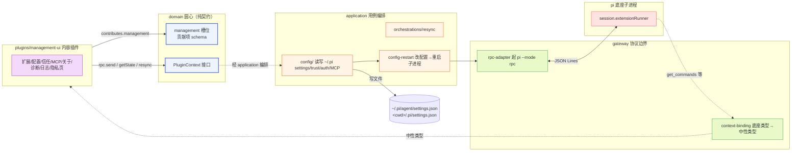

**图 0 — management-ui 在洋葱中的位置：内容插件只依赖圆心契约，编排走 application 层，不直接碰底座。**

关键纪律：`plugins/management-ui/` 只 import `domain/` 的槽位契约与 PluginContext 接口，不 import `gateway/`/`application/`/`shell/` 实现。配置读写、重启编排、协议翻译都在 application/gateway 层，管理 UI 插件通过 PluginContext 拿到中性能力、通过槽位挂贡献页，本身是个"协调者"而非"操作者"。

### 0.3 阅读路径

第 1 节定边界（协调者角色）；第 2 节给管理槽贡献页全景；第 3-10 节逐页展开（扩展管理、配置编辑、项目信任、MCP、关于、诊断、日志、数据与隐私）；第 11 节深挖底座 extension 可见性（`get_commands`/`sourceInfo`/不可单 tool 禁用）；第 12 节专讲权限审计标红；第 13 节给交互状态机；第 14 节给 manifest 样板与渲染契约；第 15 节列落地清单与已知缺口。

## 1 协调者角色与边界

### 1.1 机制 vs 内容：管理 UI 是内容插件

管理 UI 是内容、不是机制。core 提供机制（管理槽 schema、通用表单渲染器、配置操作层 application/config、RPC 适配层），管理 UI 插件提供内容（具体的管理页、具体的字段布局、具体的提示文案）。这条边界对应 DESIGN.md 4.1.1 的"机制与内容分层"——core 不内嵌任何管理页，所有管理页都是挂在管理槽上的贡献项。换一套完全不同的管理 UI，写个同 id 插件覆盖即可，core 一行不改。

### 1.2 不直接操作 pi，协调两条通道

管理 UI 本身不直接操作 pi 的内部状态，它协调两条通道：

- **支柱① RPC 通道**：管会话运行时状态的只读查询（`get_state`、`get_commands`、`get_session_stats`）。管理 UI 里的诊断页、扩展页的 tool/command 列表、模型/会话统计都走 RPC 读。
- **支柱② 配置文件通道**：管 pi 持久化状态的写操作（settings/trust/MCP），写回磁盘后触发 2.4 的热加载路径（重启子进程）。管理 UI 不直接调底座的 `reload()`（调不到，见 DESIGN 6.1 缺口），而是通过"改文件 + 重启消费者"模式间接生效。

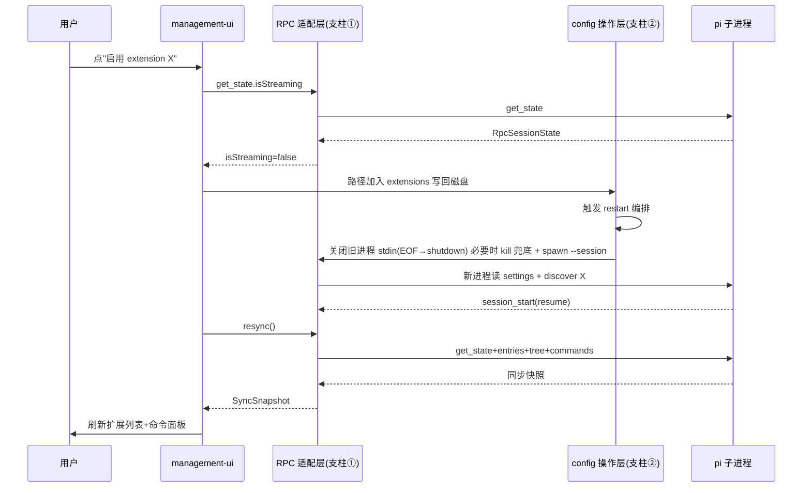

**图 1 — 协调者两条通道：RPC 读运行时、config 写持久态，改完经 restart 编排生效。**

### 1.3 与其他内置插件的分工边界

管理 UI 与其他内置插件有明确的分工边界，避免往管理槽贡献同 id 页造成冲突（3.5 第 7 项的贡献项级仲裁）：

- **项目信任**：4.3 管信任的持久状态（信任列表、默认策略、信任开关），4.8 终端与项目信任插件管信任的运行时流程（打开不信任项目时弹"是否信任"交互）。持久态归管理槽、运行时交互归侧栏。
- **模型与运行参数**：4.9 模型参数插件往侧栏或管理槽挂模型/thinking/queue/retry/compaction 的控制 UI。如果 4.9 也往管理槽挂"运行参数页"，则 4.3 的"配置编辑页"不重复这几项，只放指向 4.9 页的入口或干脆不收——避免两个插件贡献同 id 的"运行参数"管理页。本文约定：运行参数控制页归 4.9，4.3 配置编辑页只管 settings.json 的文本/表单编辑（含 `defaultModel` 字段但不下拉选择器）。
- **会话管理**：4.6 会话管理插件往侧栏挂会话 Tab、往命令槽挂会话命令。4.3 不重复贡献会话列表页——会话是侧栏视图、不是管理页。

### 1.4 可覆盖性：它是 现有方案的正式归位

这个插件是 现有方案的 settings 页 + extensions handler 的正式归位。现有方案把这些硬编码成主界面的一部分、分散在 ipc handlers 里（extensions handler、settings handler、各 IPC 通道）；pi-desktop 收成一个插件、走统一的管理槽，由 core 的通用表单渲染器或插件自带组件渲染。它本身可被覆盖：用户在 `~/.pi-desktop/plugins/` 放一个同 id 插件，就能整体替换这套管理 UI，core 优先级仲裁（project > user > installed > builtin）保证 builtin 版被覆盖时静默不挂载、管理槽里只剩用户版。

## 2 管理槽贡献页全景

### 2.1 贡献页清单与排序

management-ui 往管理槽挂八组贡献页（对应 DESIGN 4.3.2 的清单），每项带 `order` 控制在管理面板里的排序：

| id | 标题 i18n key | order | 渲染方式 | 数据来源 |
|---|---|---|---|---|
| `extensions` | `management.extensions.title` | 10 | component | settings.extensions/packages + RPC get_commands |
| `config` | `management.config.title` | 20 | component | settings.json 读写 |
| `trust` | `management.trust.title` | 30 | component | trust 记录 + defaultProjectTrust |
| `mcp` | `management.mcp.title` | 40 | component | MCP 配置文件 |
| `about` | `management.about.title` | 50 | component | core 版本 + 底座版本 |
| `diagnostics` | `management.diagnostics.title` | 60 | component | core 各层采集 |
| `logs` | `management.logs.title` | 70 | component | 内存环形缓冲 |
| `privacy` | `management.privacy.title` | 80 | component | 本地存储扫描 + 遥测开关 |

`order` 间隔 10 是为后续内置/第三方插件插入新页留位（如 4.9 运行参数页放 25）。排序与冲突仲裁分两件事：**不同 id 的页**按 `order` 数值升序在导航树里排序；**同 id 的页**（两个插件贡献了同一个页 id）按来源插件优先级仲裁（project > user > installed > builtin），高优先级整条胜出、低优先级不挂载（见 23.2），与 `order` 数值无关。两者不要混。

### 2.2 统一渲染壳

所有管理页共享一个统一渲染壳，由 core 的管理槽渲染器提供（不是插件自己的）：

- **左侧导航树**：按 `order` 排序的页列表，每项显示 i18n 标题 + 可选 badge（如扩展页带"已禁用 N"badge、诊断页带"错误 M"badge）。
- **右侧内容区**：当前选中页的组件。
- **顶部状态条**：当前项目路径 + 信任状态指示灯（绿=信任、黄=询问中、灰=不信任），点击跳信任页。
- **底部操作条**：通用"保存/放弃"按钮（schema 声明式页用）或页内自定义操作（component 页自己渲染）。

统一壳的意义：所有管理页视觉一致、交互一致（Esc 关闭、Tab 陷阱、焦点还原，见 1.9.4 无障碍规范），插件作者只写内容组件、不重写外壳。

### 2.3 schema 声明式页 vs component 自定义页

管理槽贡献项有两种渲染形态（见 3.3 管理槽 schema）：

- **schema 声明式页**：贡献项只提供 `schema`（字段数组）、省略 `component`，core 的通用表单渲染器按 schema 生成表单。适合简单配置（字段少、无动态行为、字段类型为标量）。当前通用表单渲染器只支持 text/secret/select/number/boolean 等标量字段，尚不支持数组子表单与嵌套对象（见 15.3 演进项），因此本插件所有管理页均不采用此形态。
- **component 自定义页**：贡献项提供 `component`（renderer 模块命名导出的组件名），插件自己渲染 UI。适合复杂页（动态数据、交互复杂、需要订阅 event、含数组/嵌套结构）。本文扩展/配置/信任/MCP/诊断/日志/隐私页均用这种——尤其 MCP 的 servers 数组、配置编辑的 extensions 数组等结构化字段，通用表单渲染器当前表达不了，须由 component 自渲染。core 按 `manifest.renderer` 路径加载模块、取 `component` 字段对应的命名导出、注入统一 props `ManagementPageProps = { ctx: PluginContext; pageId: string }`（ctx 提供 rpc/events/bus/config/i18n 中性能力），组件据此自渲染（完整 props 契约与示例见 14.3）。

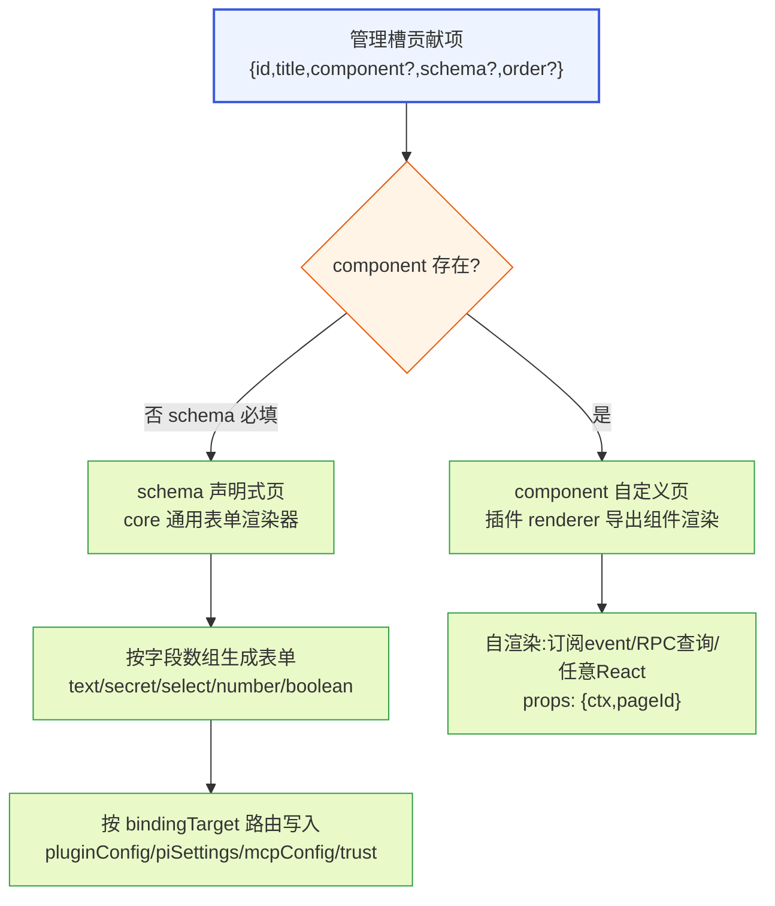

**图 2 — 管理页两种渲染形态：schema 走通用表单、component 走自渲染。**

## 3 扩展管理页（统一列表两来源分发）

### 3.1 两来源分发的数据模型

扩展管理页呈现一个统一的扩展列表，用户看到的只是"有哪些扩展、哪些开着"。架构上背后分两个来源、走两条链路（DESIGN 2.5.3）：

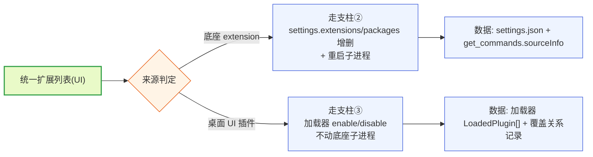

**图 3 — 两来源分发：底座 extension 走 settings+重启、桌面插件走加载器。**

每项的字段：

```typescript
interface ExtensionListItem {
  id: string;                    // 扩展标识（底座=sourceInfo.source；桌面=plugin.id）
  displayName: string;           // i18n key 或字面值
  kind: "pi-extension" | "desktop-plugin";
  source?: "project" | "user" | "installed" | "builtin" | "temporary";  // 来源优先级(语义随 kind 不同,见 3.7);optional, temporary 项由渲染层单独处理(见 3.7)
  enabled: boolean;              // 是否启用
  path: string;                  // 文件路径
  version?: string;              // 桌面插件有、底座 extension 可能没有
  description?: string;
  homepage?: string;
  // 底座 extension 专属（展开时填充）
  tools?: ToolSummary[];         // 注册的 tool 列表
  commands?: CommandSummary[];   // 注册的 command 列表
  providers?: string[];          // 贡献的 model provider(当前不可填充,见 3.7/11.6)
  // 桌面插件专属
  overrideInfo?: { covers: string };  // 覆盖了哪个低优先级插件
  errorCode?: string;            // 加载失败时的错误码
  errorStack?: string;
}
```

> **`source` 字段语义随 `kind` 不同**：`source` 是可选字段——底座 extension 的 `scope==="temporary"` 项 `source` 为 `undefined`、由渲染层单独归入"临时加载"分组（见 3.7），不填入四档枚举。对 `kind: "pi-extension"` 且 `scope !== "temporary"`，`source` 由 `sourceInfo.scope` + settings 路径解析复合推导（`scope==="project"`→project；`scope==="user"` 且在全局 settings 里→user；无法解析到 settings 路径→builtin 兜底，详见 3.7）。**底座 extension 当前不可推出 `installed` 值**——桌面加载器不管理底座 extension、ResourceLoader 是底座内部类不可访问，故 `installed` 档对底座 extension 不成立、一律归入 `builtin` 展示分组（待底座在 sourceInfo 上补来源标记后回填，3.7）。对 `kind: "desktop-plugin"`，`source` 直接由加载器按插件目录归属判定（`<cwd>/.pi-desktop/plugins/`→project、用户配置目录→user、`~/.pi-desktop/plugins/` 顶层→installed、core 随壳分发→builtin；桌面插件不会出现 temporary 项）。同一枚举值对两种 kind 的推导路径不同，但展示语义一致（都代表来源优先级），故共用一个字段；`temporary` 仅对底座 extension 出现、且仅在展示层使用。

### 3.2 底座 extension 项的展开：tool/command 可见性

每个底座 extension 项可展开，列出它注册的 tool 和 command。这是"用户能看到这个 extension 贡献了哪些能力"的可见性——但**不可单 tool 禁用**（3.4）。展开的数据来自两个口径：

- **command 列表**：来自 RPC `get_commands` 命令（1.5.9）的返回，按 `sourceInfo`（extension 来源信息）分组归属到对应 extension。`get_commands` 返回的 `RpcSlashCommand[]` 每条带 `source: "extension" | "prompt" | "skill"` 和 `sourceInfo: SourceInfo`，其中 `source === "extension"` 的项归属到底座 extension。
- **tool 列表**：底座 extension 注册的 `RegisteredTool`（`extensions/types.ts:1481`）也带 `sourceInfo`。但 RPC 31 命令里**没有** `get_tools`——这是和 DESIGN 6.1/6.2 同类的"底座有内部能力、RPC 没开口子"边界。当前处置见 11.4。

### 3.3 按 sourceInfo 分组归属

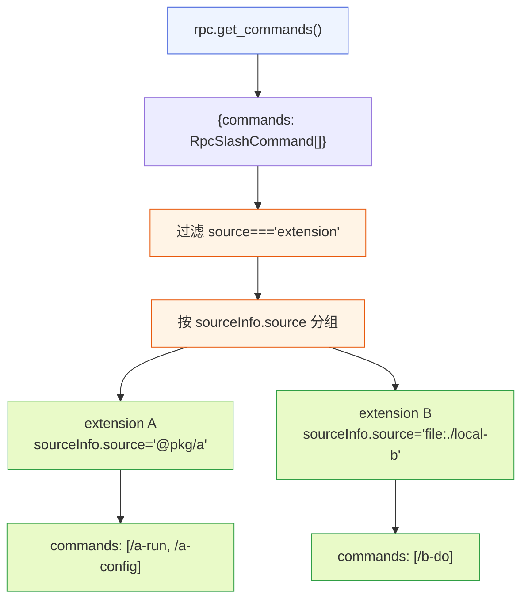

**图 4 — 按 sourceInfo.source 分组：get_commands 返回扁平列表，按来源串归属到 extension。**

`sourceInfo` 的完整结构（`core/source-info.ts`）：

```typescript
interface SourceInfo {
  path: string;                              // 扩展文件/目录路径
  source: string;                            // 来源标识（npm 包名 / 'file:xxx' / 本地路径串）
  scope: "user" | "project" | "temporary";   // 作用域
  origin: "package" | "top-level";           // 是包内资源还是顶层
  baseDir?: string;                          // 基目录
}
```

分组 key 用 `sourceInfo.source`（来源串），它能稳定标识一个 extension 的来源（npm 包名或文件来源串）。`scope` 还能反映该 extension 是项目级还是用户级加载的——展示在项的 `source` badge 上（project/user）。同一 `source` 的 commands 合并成一组、tools 同理（若可拿到）。

### 3.4 不可单 tool 禁用：边界与说明

底座 extension 的启停粒度是**整个 extension**（路径增删 + 重启），不是单个 tool。底座没有"禁用 extension 的某个 tool 但保留其他"的能力——`RegisteredTool` 没有 `enabled` 字段、extension API（`extensions/types.ts:1218` 的 `registerTool`）也没有 per-tool 启停方法。这与 DESIGN 6.1（无对外 reload）、DESIGN 6.2（无 list_sessions）同类：底座内部有 tool 注册表（`tools: Map<string, RegisteredTool>`，`extensions/types.ts:1641`），但 RPC 没开口子让桌面端操作它。

管理 UI 在展开的 tool 列表里，每行 tool 只显示名称/描述/参数 schema 摘要，**不提供禁用开关**，并附 tooltip "单工具启停由底座 extension 内部决定，桌面端不可干预"。这是"桌面只消费、不干预底座行为"（DESIGN 3.7）在管理 UI 的具体体现。

### 3.5 启停操作链路

底座 extension 的开关背后是 settings 路径增删 + 重启子进程（DESIGN 2.3/2.5）。操作链路：

1. 读当前 settings.json（全局或项目级，取决于 extension 的 `scope`）。
2. 用户开开关：把 extension 路径加进 `extensions` 数组（本地路径）或 `packages` 数组（npm/git 包）；关开关：移除。
3. 写回磁盘（走 application/config 层，带 `proper-lockfile` 文件锁，2.1.2）。
4. 触发 restart 编排（2.4 的带判断重启）：查 `get_state.isStreaming`，idle 直接重启、streaming 提示用户。重启旧进程的方式是先关闭其 stdin 写端（触发底座 EOF→shutdown，DESIGN 1.2.2 既定的干净关闭通道，让底座有机会 flush session 等清理）、再 spawn 新进程；若关闭 stdin 后旧进程在超时窗口内仍未退出（如底座卡死），才用 kill 兜底——避免直接 SIGKILL 中断底座的清理。
5. 新进程起来后 `resync()` 同步 UI，扩展列表刷新。

桌面 UI 插件的开关背后是加载器 enable/disable，不动底座子进程（走支柱③加载器的 enable/disable API，本文不展开加载器内部）。

### 3.6 列表刷新时机

扩展列表不是实时同步的，它在以下时机刷新：

- **管理页首次打开**：拉 settings + `get_commands` 一次性组装。
- **restart 编排完成后**：`resync()` 返回的 `SyncSnapshot.commands` 含新 extension 的 commands，重新分组。
- **桌面插件热重载后**：加载器 broadcast 一个 `plugins.changed` 事件总线 topic（core 维护），管理页订阅后刷新桌面插件部分（底座 extension 部分不动）。
- **手动刷新按钮**：页内提供"刷新"按钮，重新拉取。

不做 file watcher 实时监听 settings.json——底座配置改动是低频操作、且改完必须重启才生效，watch 没意义（DESIGN 2.2.1）。

### 3.7 source/scope 映射与 providers 填充规则

3.1 的 `ExtensionListItem.source`（project/user/installed/builtin 四值）与 3.3 底座 `SourceInfo.scope`（user/project/temporary 三值）不是一一对应，需要明确的映射规则，否则 `source` badge 无法从 `scope` 推出。映射算法：

- **scope==="project"** → `source: "project"`（项目级 settings/extensions 加载的底座 extension，直接映射）。
- **scope==="user"** → 进一步区分：若该 extension 路径/包出现在全局 settings 的 `extensions`/`packages` 数组里 → `source: "user"`；若无法解析到任何 settings 路径、属底座随包分发未在用户 settings 里显式声明的内置 extension → `source: "builtin"`（兜底判定：settings 路径解析不到即归 builtin）。
- **scope==="temporary"** → `source` 为 `undefined`（temporary 是底座运行时临时加载、不落 settings 的来源，如某 extension 经 RPC 临时注入）。`ExtensionListItem.source` 是可选字段、`source` 类型含 `temporary` 值，但实际渲染时 temporary 项不填 `source`、由渲染层单独归入"临时加载"分组、不参与 project/user/installed/builtin 四档排序。管理 UI 在扩展页对这类项标"临时来源"badge、单独展示在"临时加载"分组。
- **桌面插件**（kind==="desktop-plugin"）的 `source` 不走 SourceInfo——直接由加载器按插件目录归属判定：`~/.pi-desktop/plugins/` 顶层用户装的为 `installed`、core 随壳分发的为 `builtin`、`<cwd>/.pi-desktop/plugins/` 的为 `project`、用户配置目录的为 `user`。

**底座 extension 的 `installed` 值当前不可判定**：上述算法对 `kind: "pi-extension"` 实际只能推出 `project`/`user`（来自 `sourceInfo.scope`）+ `builtin`（settings 路径解析不到的兜底）+ `temporary`（scope 直接给出）。`installed` 这一项对底座 extension 不成立——桌面加载器（application/loader）不管理底座 extension、底座 extension 跑在底座子进程里，桌面端唯一能拿到的是 `get_commands` 返回的 `sourceInfo`（path/source/scope/origin），而 `ResourceLoader` 是底座内部类、桌面端不可访问、拿不到"包是否在 builtin 白名单、是否走 installer 安装链路"这类来源标记。旧版 3.7 措辞曾声称"installed/builtin 需配合加载器/ResourceLoader 的来源标记判定"，这对底座 extension 不成立——加载器来源标记只对桌面插件存在。因此管理 UI 对底座 extension 的展示分组为：`project`/`user`/`builtin`/`temporary` 四档，**没有 `installed` 档**；凡是 `scope==="user"` 且无法解析到 settings 路径的底座 extension 一律归入 `builtin` 展示分组（含随底座分发的内置 extension、以及用户经 installer 装入但桌面端无法识别其安装来源的第三方 extension——后者在底座 sourceInfo 上补来源标记前会被并入 builtin 展示，待底座在 sourceInfo 上补 `installed` 来源标记后再回填到独立分组）。`installed` 值仅对 `kind: "desktop-plugin"` 成立（桌面加载器有目录归属可判）。

**providers 字段的填充规则**：3.1 把 `providers?: string[]` 标为"底座 extension 专属（展开时填充）"，但 11.6 已确认底座 RPC 没有暴露 provider 与 extension 的归属关系——`get_available_models` 返回的 `Model` 不带 `sourceInfo`，桌面端无法把某个 provider 归属到具体 extension。因此 `providers` 字段当前实际不可填充，标为"当前不可填充（见 11.6 缺口）"。管理 UI 在底座 extension 展开项下不展示 providers 列表区块，或展示"provider 归属关系未暴露（见 11.6）"占位，等底座补 `get_providers` 或 Model 带 sourceInfo 后再回填。该字段从 interface 移除或保留为可选只读——本文保留为可选字段、但明确标注不可填充，避免 3.1 暗示能填。

## 4 配置编辑页

### 4.1 两份 settings 分开展示

配置编辑页分两个 tab：全局（`~/.pi/agent/settings.json`）和项目级（`<cwd>/.pi/settings.json`）。项目级 tab 只在项目信任时可写（2.1.2 的 `assertProjectTrustedForWrite`），不信任时只读并显示"信任项目后可编辑项目级配置"提示。两个 tab 的 schema 完全一样（同一份 Settings 类型，2.1.3），但项目级 tab 在合并视图中标注"此项被项目级覆盖"（值不同时高亮）。

### 4.2 表单与 JSON 双模态

每个 tab 提供两种编辑模态：

- **表单模态**：按 Settings schema 生成结构化表单，字段分组（model/transport/queue/compaction/retry/extensions/packages/skills/prompts/themes/network/projectTrust/analytics）。`extensions`/`packages`/`skills` 等数组字段用可增删的列表组件，每项带路径选择器（文件对话框）。
- **JSON 模态**：直接编辑 settings.json 原文（Monaco editor）。高级用户用，改完做 JSON schema 校验，校验失败标红、不让保存。

两种模态切换时互相同步（表单→JSON 序列化、JSON→表单解析）。表单模态是默认，JSON 模态是高级逃生舱。

### 4.3 校验与写入

保存时的校验链：

1. **JSON 语法校验**：JSON 模态必过，表单模态隐含通过。
2. **Settings schema 校验**：字段类型、枚举值（如 `transport` 只能是 `"auto"|"sse"|"websocket"`）、`compaction`/`retry` 子对象结构。
3. **路径存在性校验**（警告级）：`extensions`/`packages`/`skills`/`prompts`/`themes` 里的路径如果不存在，标黄警告"路径不存在，保存后底座加载会跳过"，但允许保存（用户可能先写路径再放文件）。
4. **项目信任写入检查**：写项目级时 `assertProjectTrustedForWrite`，不信任拒绝并提示去信任页。

写入走 application/config 层，带文件锁（`proper-lockfile`，最多重试 10 次、每次 20ms，2.1.2）。

### 4.4 改完触发热加载

保存成功后，管理 UI 不自己调底座 reload（调不到），而是触发 2.4 的 restart 编排：

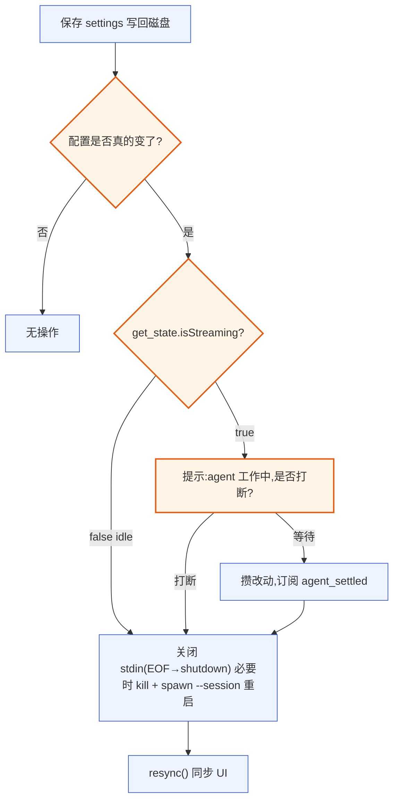

**图 5 — 配置保存触发热加载：带判断的重启决策。**

"配置是否真的变了"这一步避免无谓重启——diff 比较 JSON 序列化后的字符串，相同则 no-op。这降低用户误点保存的代价。

## 5 项目信任页

### 5.1 信任状态的展示

信任页展示：

- **当前项目**：路径、信任状态（信任/不信任/询问中）、信任原因（用户显式选择 / `defaultProjectTrust` 策略默认）、信任时间（如有记录）。
- **全局已信任项目列表**：从 `trust-manager.ts` / `project-trust.ts` 读的信任记录，每项带路径、信任时间、移除按钮。
- **默认信任策略**：`defaultProjectTrust` 字段（`"ask" | "always" | "never"`，仅全局 settings 有），单选切换。

状态指示灯复用管理壳顶部的信任灯（2.2），点击跳本页。

### 5.2 切信任状态的操作链路

切信任状态走 `setProjectTrusted`（application/config 层提供的等价能力，读写 trust 记录文件）：

1. 用户点"信任此项目"/"移除信任"。
2. application/config 层写 trust 记录文件。trust 记录文件当前实现假设为 `~/.pi/agent/trust.json`（全局级，存已信任项目路径列表与信任时间）——该具体文件名是待底座源码核对的实现假设，DESIGN 2.1.4 只提到 trust-manager.ts/project-trust.ts、未给出确切文件名。文件名不硬写在正文，由 application/config 层的 `TrustConfigStore`（提供 `list()/add(path)/remove(path)/resolvePath()` 方法）封装路径解析，插件只调 `context.config.trust.list()` 等受控 API、不自己拼接 `~/.pi/agent/trust.json`。
3. 信任状态变化**不需要重启子进程**——trust 是 settings 加载的前置条件（2.1.2 的 `if (scope === "project" && !projectTrusted) return {}`），但底座进程已经在跑、当前会话的信任判定已过。变化影响的是**下次重启**时项目级 settings 是否被加载。该操作走 13.2 状态机的 NoRestart 分支（WriteOk→Idle）。
4. UI 即时刷新信任灯 + 列表。顶部提示"信任状态将在下次重启底座时完全生效（影响项目级 settings 加载）"。

### 5.3 与 4.8 运行时流程的边界

信任的持久状态归 4.3 管理页（本页），信任的运行时流程归 4.8 终端与项目信任插件（打开不信任项目时弹"是否信任"交互）。两者通过 trust 记录文件共享状态：

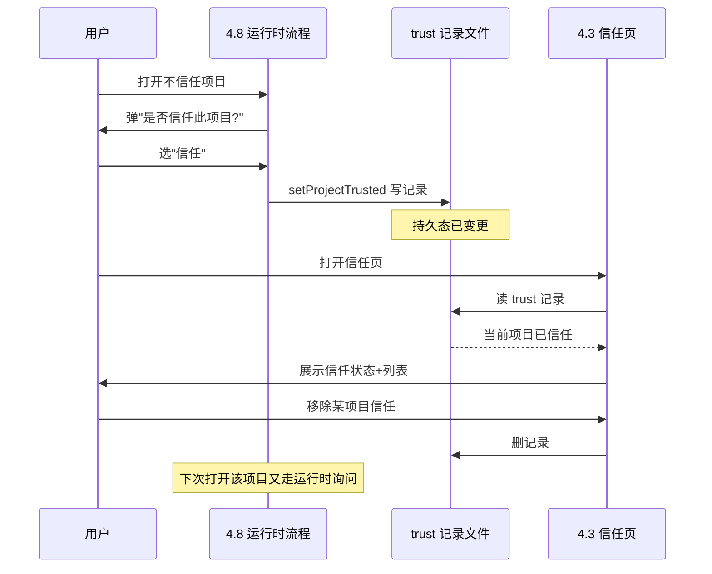

**图 6 — 4.3 与 4.8 的信任状态共享：运行时写、管理页读写同一份 trust 记录。**

### 5.4 默认信任策略管理

`defaultProjectTrust` 三档语义在 UI 上要表达清楚：

- `ask`（默认）：每次打开新项目弹询问。最安全。
- `always`：新项目自动信任。最方便但有风险（恶意项目可注入项目级 settings）。UI 要警告"自动信任所有项目有安全风险，仅在你完全控制打开的项目来源时使用"。
- `never`：新项目永不信任，项目级 settings 永不加载。最严格。

切换 `defaultProjectTrust` 写全局 settings.json，走 13.2 状态机的 NoRestart 分支（`defaultProjectTrust` 是全局字段、且不影响当前进程行为，WriteOk 后直接回 Idle、不进 CheckingStream 重启分支）。

## 6 MCP 管理页

### 6.1 MCP 配置的数据层

MCP 配置是 pi 在 `~/.pi/agent/` 下的独立状态文件（2.1.4），不在 settings.json 主结构里。当前实现假设全局级文件名为 `~/.pi/agent/mcp.json`、项目级在 `<cwd>/.pi/mcp.json`（项目信任时加载，与 settings 同样的信任前置）——这两个具体文件名是待底座源码核对的实现假设，DESIGN 2.1.4 只提到 trust-manager.ts/project-trust.ts 与 MCP 配置、未给出确切文件名。MCP 文件的精确路径不由管理 UI 插件自己拼接、也不在正文硬写死——路径解析封装在 application/config 层的 `McpConfigStore`（提供 `read()/write(servers)/resolvePath(scope)/testConnection(name)` 方法），插件只调 `context.config.mcp.read()` 等受控 API、由 store 内部按 scope 解析路径。这样底座若调整文件名或存储方式，只改 application/config 层、不影响插件；底座源码核对后，路径锚点应回填到 store 的 CONFIG 常量注释里。管理页读写的是这个文件的 `servers` 字段，每个 server 项：

- `name`：server 标识。
- `command`：启动命令（如 `npx`）。
- `args`：参数数组。
- `env`：环境变量（可能含凭证，UI 上用 secret 字段）。
- `enabled`：是否启用。

MCP server 的启停粒度是 per-server（比 extension 的 per-path 粗粒度细），但仍然走"改配置文件 + 重启子进程"生效——底座 MCP server 在进程启动时连接，运行时不能热增删。

### 6.2 server 列表与启停

MCP 页用 component 自定义页渲染（2.3），不采用 schema 声明式表单。原因：MCP 配置的 `servers` 是数组子表单结构（每项含 name/command/args/env/enabled，其中 args 又是字符串数组、env 是键值对映射），当前通用表单渲染器的 ConfigField 类型只有 text/secret/select/number/boolean 等标量类型、不支持数组与嵌套对象（14.1/15.3），无法声明式表达 servers 数组。改用 component 自渲染后，MCP 页与扩展/配置页一致，由 renderer 导出的 `McpPage` 组件自行画 server 列表：每项一个可折叠的 server 编辑卡（name 文本框、command 文本框、args 可增删的字符串列表、env 键值对表、enabled 开关）。`env` 值在 UI 上按 secret 处理（值显示为 `****`，编辑时清空重填，避免明文泄露）。

启停操作链路：

1. 改 MCP 配置文件（application/config 层）。
2. 触发 restart 编排（4.4 的同一条决策链）。
3. 新进程起来后连接启用的 MCP server，未启用的跳过。

### 6.3 改完走重启生效

MCP 配置改完必须重启子进程生效，和扩展/配置编辑同理。但因为 MCP env 可能含凭证，保存时的校验额外检查：

- `command` 非空。
- `args` 是合法字符串数组。
- `env` 的 key 不冲突（如同名 env var 覆盖）。
- 凭证字段不进导出（10.2）。

## 7 关于页

### 7.1 版本信息展示

关于页展示版本信息：

- **pi-desktop 版本**：来自 `package.json` 的 `version`（electron-builder 打包时写入）。
- **底座版本**：来自底座子进程。RPC 没有专门的 `get_version` 命令，但底座 CLI 提供了 `pi --version` 子命令——关于页调受控 API `ctx.about.getPiVersion()`（14.3），该 API 实现在 application 层、经沙箱受控暴露：application 层另起一次只读 spawn `pi --version`（带与主进程相同的 `cliPath`、独立 stdio、不进 RPC 通道、不进插件沙箱），拿到版本字符串后缓存进 aboutPage 缓存层，进程生命周期内只查一次。插件不声明 `child:command`、spawn 由 application 层执行（与 21.1 权限边界、16.4 MCP 连接测试同构）。这是与 2.4 重启通道并列的另一条只读 spawn 通道：它不依赖 RPC 协议、不依赖底座在线（即便底座 RPC 子进程未起，`pi --version` 仍能独立执行），因此归入"当前可落地"而非缺口。fallback：若 spawn 失败（如 `cliPath` 解析不到），底座版本字段显示"获取失败"、不阻塞关于页其余字段；底座启动时 stderr 打的版本 banner 仅作调试佐证、不作为版本来源（stderr 解析不可靠）。
- **Electron/Chrome/Node 版本**：`process.versions`。
- **内置插件版本**：遍历 LoadedPlugin 列表，列每个内置插件的 id+version。

### 7.2 与底座更新解耦

关于页只展示底座版本，**不提供底座更新入口**。底座自身的更新走它自己的 self-update 机制（`config.ts` 的 `detectInstallMethod`/`SelfUpdateCommand`，5.2.3），桌面端不掺和——底座是独立进程、自己管自己。桌面端只管自己的壳更新（electron-updater）。关于页的"检查更新"按钮只检查 pi-desktop 壳更新，底座更新提示（如果底座 self-update 报告有新版）以只读通知形式展示、链接到底座自己的更新命令。

## 8 诊断页（可观测性）

### 8.1 诊断数据来源

诊断页是用户出问题时定位"是底座挂了还是哪个插件崩了"的入口。数据来自 core 各层采集：

| 诊断项 | 数据来源 | 采集层 |
|---|---|---|
| RPC 连接状态 | rpc-adapter 的连接状态机 | gateway/rpc-adapter |
| 底座子进程状态 | subprocess-lifecycle 的 spawn/exit 事件 | shell/electron-main |
| 禁用插件列表 | loader 的错误隔离记录 | application/loader |
| 错误数统计 | 各层错误事件聚合 | application/diagnostics 聚合器 |

诊断数据是只读的运行时状态，不写磁盘（除日志，日志另算）。诊断页只展示、不提供修复操作（修复走各专项页：插件错误走扩展页的禁用项、信任问题走信任页）。

### 8.2 RPC 连接状态

展示 RPC 适配层与底座子进程的连接状态：

- **状态**：`connected` / `disconnected` / `reconnecting` / `starting`。
- **最后心跳**：最近一次收到底座 event/response 的时间戳，格式化为"X 秒前"。
- **重连次数**：累计重连次数。
- **pending 请求数**：当前 pending Map 里未配对 response 的 command 数（1.4.2），过高说明底座响应慢或卡住。

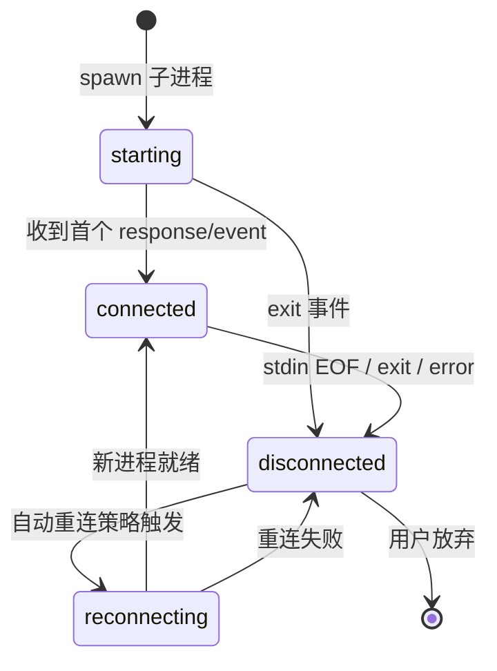

**图 7 — RPC 连接状态机：连接/断线/重连三态循环。**

### 8.3 底座子进程状态

展示 pi 子进程的运行时指标：

- **PID**：进程 id。
- **启动时间**：spawn 时间戳。
- **内存占用**：按 PID 做 OS 级采样（macOS 用 `ps -o rss= -p <pid>`、Linux 读 `/proc/<pid>/stat`、或经 pidusage 库统一封装），定时采样（如每 5s）。注意不能直接用 `process.memoryUsage()`——那是桌面 core main 自身进程的内存、不是被 spawn 的 pi 子进程内存，跨进程无法直接调用该 API。
- **CPU 占用**：按 PID 采样（pidusage 的 CPU 百分比），定时采样。
- **重启次数**：core 跟踪的子进程重启计数（区分用户主动 restart 和崩溃自动重启）。
- **退出码**（上次崩溃时）：如果是异常退出，展示 exit code + 退出原因猜测（如 OOM、segfault）。

采样失败处置：若按 PID 采样时进程已退出（如子进程崩溃后被重启、旧 PID 失效），内存/CPU 字段显示 `N/A`、不抛错——诊断页采样器捕获ENOENT/进程不存在错误后置 N/A、等下次采样周期用新 PID 重试。底座子进程内存（PID 采样）与桌面自身内存（core main 的 `process.memoryUsage()`，仅诊断内部参考、不在本区块展示）是两个独立指标、不混用。

### 8.4 禁用插件列表

展示因加载失败或运行时崩溃被错误隔离（3.5 第 5 项）的插件：

- 插件 id + 来源（project/user/installed/builtin）。
- 禁用原因：manifest 校验失败（列错误字段）/ activate 抛错（错误栈）/ 依赖缺失（缺哪个 id）/ 循环依赖（环上的 id 列表）/ worker 崩溃（崩溃次数 + 最后错误）。
- 禁用时间。
- 推荐行动：如"检查 manifest 格式""联系插件作者""卸载后重装"。每项带"跳扩展页"链接。

### 8.5 错误数统计

最近一小时的错误数统计（按来源分组）：

- RPC 错误（command 超时、success:false 响应）。
- 插件错误（activate 抛错、worker 崩溃）。
- 配置错误（settings 校验失败、文件锁冲突）。
- Extension UI 错误：指桌面端响应 `extension_ui_request` 超时被底座判定 cancelled（1.9.2 底座侧有 timeout 兜底、不会卡死底座，但桌面端渲染层自身超时或未及时回 response 会被记为错误），以及桌面端 extension-ui 适配层翻译 request 时渲染失败的错误。

用简单柱状图或数字 tile 展示，点击展开错误列表（跳日志页带 level=error 过滤）。

### 8.6 插件错误 toast 联动

插件加载失败或运行时崩溃（3.5 第 5 项错误隔离）→ toast 通知用户，点击跳诊断页：

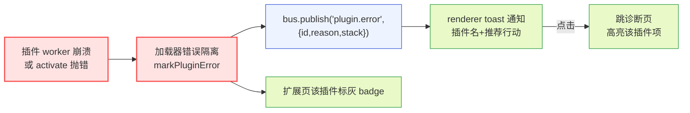

**图 8 — 插件错误从崩到 toast 的可见性链路：禁用 + 通知 + badge 三重可见。**

这是"插件崩了用户得知道"的可见性——DESIGN 3.5 只说禁用、没说用户怎么知道，4.3.2 在这里补全。

## 9 日志页

### 9.1 日志来源与分类

日志页展示 core 收集的三类日志：

- **RPC 适配层日志**：pi 子进程的 stderr 输出（`RpcClient.start` 接 stderr 做调试，1.2.1）、command/response 的 id 配对日志、连接状态变化。
- **插件 worker 日志**：插件代码模块在 worker 里 `console.log/warn/error` 被 core 拦截（沙箱内 `console` 被替换成受控转发，3.5 第 6 项沙箱）。
- **core 自身日志**：application/gateway/shell 各层的结构化日志。

每条日志带：`timestamp`（ISO 8601）、`level`（debug/info/warn/error）、`source`（rpc/plugin/core）、`pluginId?`（插件日志才有）、`message`、可选 `stack`。

### 9.2 内存环形缓冲设计

日志存内存环形缓冲（ring buffer），不进 better-sqlite3（5.1.2 的 sqlite 只存持久化的插件配置/命令历史/缓存，日志是临时态）。设计：

```typescript
interface LogBuffer {
  capacity: number;           // 容量，默认 5000 条
  entries: LogEntry[];        // 环形数组
  head: number;               // 写入位置
  count: number;              // 已写入条数（满后=capacity）
}
// 写入: entries[head] = entry; head = (head+1) % capacity; count++
// 读取: 按 timestamp 倒序，从 (head-1) 回溯 capacity 条
```

环形缓冲保证内存占用有上限（5000 条 × ~200 字节 ≈ 1MB），旧日志被新日志覆盖。会话级、重启丢失——日志是排查运行时问题的临时态，不需要跨会话持久化（跨会话问题用导出文件，9.3）。

### 9.3 level 过滤/关键字搜索/导出

日志页 UI：

- **level 过滤**：复选框勾选 debug/info/warn/error，多选。默认勾选 info+warn+error（隐藏 debug 减噪）。
- **source 过滤**：复选框勾选 rpc/plugin/core。插件日志可进一步按 pluginId 过滤（下拉选插件）。
- **关键字搜索**：全文搜索 message+stack，支持正则。
- **时间范围**：可选最近 N 分钟/全部。
- **一键导出**：把当前过滤后的日志导出成文件（JSON Lines 或文本），落盘到用户选的路径。导出用于跨会话问题排查、或发给插件作者 debug。

### 9.4 不进 sqlite 的理由

日志不进 sqlite 的三点理由：

1. **写频率高**：流式 event、token 级 update 都可能产生日志，sqlite 写入开销在主进程不划算。
2. **生命周期短**：日志是排查当前会话问题的临时态，重启后历史日志价值骤降（环境变了）。
3. **容量有界**：环形缓冲自然限容，sqlite 会无限增长要额外清理逻辑。

sqlite 存的是"持久态"（插件配置、命令历史、缓存），日志是"瞬态"——两者性质不同、存储分层。

## 10 数据与隐私页

### 10.1 本地数据清理

桌面端的本地存储分布在 `~/.pi-desktop/` 下的若干子目录，各司其职、互不混存。清理页按目录分类展示占用：

- **插件配置**：`~/.pi-desktop/plugins-data/{pluginId}/config.json`，每插件一个子目录，展示大小 + 清除按钮（清单个插件配置）。这是桌面插件通过 PluginContext.config 写入的持久态。
- **命令历史**：用户执行过的 bash 命令历史，存于 `~/.pi-desktop/desktop.db`（better-sqlite3 单库文件），命令历史对应库内 `command_history` 表。展示条数 + 清除按钮。
- **缓存**：文件预览缓存、卡片渲染缓存等，存于 `~/.pi-desktop/cache/`，展示大小 + 清除按钮。

注意：`~/.pi-desktop/` 下不再有笼统的 `data/` 目录——插件配置归 `plugins-data/`、缓存归 `cache/`、sqlite 库文件直接落在 `~/.pi-desktop/desktop.db`（库内按表区分 command_history / plugin_cache 等，详见 10.1 末尾的目录结构表）。底座自身的状态（settings/trust/auth/MCP/sessions）在 `~/.pi/agent/` 下，与桌面端存储分库、不混。> **与 DESIGN 4.3.2 的关系**：DESIGN 4.3.2 写"分插件配置/命令历史/缓存三类，存 `~/.pi-desktop/data/`"是粗粒度表述；本文 10.1 对该目录做了更细的拆分（`data/` → `plugins-data/` + `cache/` + `desktop.db`），属有意的存储分层细化而非偏离，已与 DESIGN 作者确认、后续同步回 DESIGN 4.3.2（见 30.3）。

顶部有"全部清除"按钮（清三类所有），二次确认。

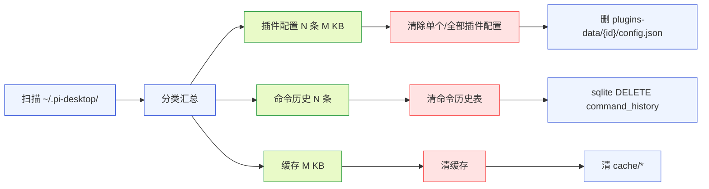

**图 9 — 本地数据清理：按目录/表分类扫描 + 分类清除，不整库删 sqlite 文件。**

`~/.pi-desktop/` 完整目录结构表（清理页据此扫描）：

| 路径 | 内容 | 清除粒度 |
|---|---|---|
| `~/.pi-desktop/plugins-data/{pluginId}/config.json` | 各桌面插件持久配置 | 删单插件子目录或全部 |
| `~/.pi-desktop/desktop.db`（sqlite 库） | `command_history` 表（命令历史）、`plugin_cache` 表（cache/ 目录文件的索引，key→路径/元数据） | 按表 `DELETE FROM`，不删库文件 |
| `~/.pi-desktop/cache/` | 文件预览/卡片渲染缓存文件（`plugin_cache` 表是它的索引） | 删目录内文件 + `DELETE FROM plugin_cache`（成对清理，避免孤儿索引） |

> **缓存双存储关系**：`plugin_cache` 表与 `cache/` 目录不是两类独立缓存，而是"索引表 + 文件实体"的关系——`plugin_cache` 表存 cache/ 目录里缓存文件的 key→路径/元数据索引。删除时必须成对清理：删 cache/ 目录文件的同时 `DELETE FROM plugin_cache`，否则会留下孤儿索引（指向已删文件）或孤儿文件（表里已删但文件仍在）。`command_history` 表与 `plugin_cache` 表虽同在 `desktop.db` 库内，但彼此独立、不互为索引。

### 10.2 数据导出（不含凭证）

一键导出全部本地数据，打包成可读包（zip），满足 GDPR 数据可携带权。导出内容：

- session 列表与内容：通过 RPC 走底座已暴露的 `export_html`（1.5.9，按 session 导出 HTML）与 `get_entries`/`get_messages`（拿 session 内容）导出，**不直接读底座 session 目录 `~/.pi/agent/sessions/` 的私有格式文件**——session 文件格式是底座内部存储格式、与 RPC 返回的 SessionEntry/SessionTreeNode 是两回事，直接读需要解析其私有格式，且与正在运行的底座并发写有冲突风险。session 列表的枚举当前依赖底座 `list_sessions` 命令（DESIGN 6.2 缺口），补齐前导出页只能导出"当前活跃 session"（经 `get_state` 拿 `sessionFile` 后调 `export_html`），无法枚举全部历史 session。
- 插件配置（`~/.pi-desktop/plugins-data/`）。
- 本地 sqlite 备份（命令历史、缓存，sqlite 文件直接复制）。
- settings.json（全局 + 项目级，**含非凭证字段**，secret 标记字段值替换为 `***`）。
- MCP 配置文件（`~/.pi/agent/mcp.json` 与项目级 `<cwd>/.pi/mcp.json`）：**默认不导出**（含 server command/args/env，env 可能含 token 等凭证）。若用户在导出页明确勾选"导出 MCP 配置"，则导出时 `servers[].env` 里的凭证字段（如 token/apiKey/password 等 key 含敏感词的值）脱敏为 `***`、command/args 保留。MCP env 的 token 在 MCP 配置文件里（不在 settings.json），其脱敏在导出层按字段名模式匹配实现。

**导出不含凭证**：API key、OAuth token 由底座 auth-storage 管理（2.1.4），不在导出包里。导出页明确提示"凭证（API key/OAuth token）不在此导出包内，请另行备份。凭证由底座 auth-storage 加密管理，桌面端无权读取。"。这对应 4.3.2 凭证说明——凭证是安全敏感数据，导出包应可在不受控环境传播，含凭证会放大泄露风险。

### 10.3 数据删除

一键彻底删除（清 session、清 sqlite 表、清 plugins-data），满足被遗忘权。删除流程：

1. 展示将删除的内容清单 + 大小。
2. 第一次确认"将永久删除以下数据，不可恢复"。
3. 备份提示"建议先导出（10.2）再删除"。
4. 第二次确认（输入"DELETE"文本确认，防误操作）。
5. 执行删除：删 session（走底座 `delete_session` 命令，见 10.3 末尾与 15.2）、按表清空 sqlite（`DELETE FROM command_history` / `DELETE FROM plugin_cache`，不删 `desktop.db` 整库文件，避免误伤同库的其他表）、删 plugins-data 目录下各插件子目录。
6. 删除完成提示"需重启 pi-desktop 使所有变更完全生效"。

sqlite 的处置与 16.8 删除范围矩阵一致——按表 `DELETE FROM` 清空、不删整个库文件，因为命令历史与缓存索引同在 `desktop.db` 库内（删库文件会同时清掉两者乃至未来可能新增的表，分类清除的语义被破坏）。只有"全部清除"且用户明确选择"整库重置"时才删 `desktop.db` 文件（库会在下次写入时由 better-sqlite3 重建），这是与分类清除并列的另一档操作、默认不启用。

session 的删除走底座通道而非直接删目录（10.2/10.3 末尾、16.8）：底座 session 文件格式是底座私有格式、桌面端直接删目录有并发写冲突风险（底座可能正在写 session）、且底座离线时无法安全清理（18.2）。因此 session 删除依赖底座提供 `delete_session`/`delete_all_sessions` 命令——当前底座无此命令，列入 15.2 缺口。在缺口补齐前，删除流程的 session 步骤标记为"待底座提供删除命令"、不执行直接文件删除。

删除**不删凭证**——凭证归底座 auth-storage 管，删除桌面端数据不影响底座凭证（用户要删凭证走底座自己的命令）。这与导出不含凭证对称：凭证的读写删除都归底座、桌面端不碰。

### 10.4 遥测透明页

遥测透明页列清底座和桌面端各自的遥测：

- **底座遥测**（来自 settings.json，2.1.3）：
  - `enableAnalytics`：是否开启底座分析。
  - `trackingId`：底座遥测的追踪 id（展示其值，解释"这是底座用来区分不同安装实例的匿名标识"）。
  - `enableInstallTelemetry`：是否上报安装事件。
  - 收什么数据：底座遥测的具体字段由底座决定，管理 UI 只展示开关 + trackingId，不展开字段（底座的事）。
- **桌面端遥测**：pi-desktop 自己是否收集使用统计（崩溃报告、匿名使用指标）。开关在此。桌面端遥测默认关闭、用户显式开启。
- **插件遥测**：受 `net:` 权限沙箱约束（3.5 第 6 项沙箱），插件不声明 `net:` 域名权限不能外发任何数据。管理 UI 列出哪些插件声明了 `net:` 权限、连哪些域名（与 12 权限审计联动）。

用户能在此页**一键关掉所有遥测**（关底座 enableAnalytics + enableInstallTelemetry + 桌面端遥测开关），关底座遥测走 settings 编辑 + restart（4.4）。

### 10.5 凭证说明

凭证（pi 的 auth/API key）由底座 auth-storage 管理（2.1.4），**插件无权直接读凭证**。管理 UI 在数据与隐私页专门放一个"凭证说明"区块：

- 说明凭证存储位置（底座 auth-storage，建议加密存储，向底座提）。
- 说明插件无法读凭证：PluginContext 不暴露凭证读接口，插件要发 API 请求只能走 RPC（底座自动加 auth）或 `http.fetch`（受 `net:` 权限约束）。
- 提供"清除底座凭证"的入口——但这个入口调底座自己的命令（如 `pi auth logout` 之类），桌面端不直接删凭证文件。如果底座没提供清除命令，这里只展示凭证状态（哪些 provider 已认证）、不提供清除（标记为"待底座提供"）。

## 11 底座 extension 可见性的深度剖析

### 11.1 get_commands 返回结构与字段

底座 RPC 的 `get_commands` 命令（1.5.9）返回 `{ commands: RpcSlashCommand[] }`。`RpcSlashCommand` 结构（`modes/rpc/rpc-types.ts:79`）：

```typescript
interface RpcSlashCommand {
  name: string;                    // 命令名（不含前导 /）
  description?: string;           // 人类可读描述
  source: "extension" | "prompt" | "skill";
  sourceInfo: SourceInfo;         // 来源元数据
}
```

`get_commands` 在 `rpc-mode.ts:656` 的实现把三类命令汇成一个扁平列表：

- `session.extensionRunner.getRegisteredCommands()` → `source: "extension"`（extension 注册的斜杠命令）。
- `session.promptTemplates` → `source: "prompt"`（prompt 模板）。
- `session.resourceLoader.getSkills().skills` → `source: "skill"`（skills，命令名是 `skill:{name}`）。

每条都带 `sourceInfo`，标识它来自哪个 extension/prompt/skill 资源。管理 UI 扩展页只关心 `source === "extension"` 的子集（归属到底座 extension）。`source === "prompt"` 与 `source === "skill"` 的命令**当前在管理 UI 不单独设页**——2.1 的管理槽贡献页清单里没有独立的 prompts 页或 skills 页，`ExtensionListItem` 数据模型也不承载 prompt/skill 命令。这两类命令在命令面板（4.7）里可见、可补全调用，但在管理 UI 的扩展页不展示，留待后续若需要再加专门的 prompts/skills 管理页（记入 15.3 演进项）。这样避免"若有"的悬空分支：管理 UI 当前明确不展示 prompt/skill 命令。

### 11.2 sourceInfo 三元组的含义

`SourceInfo`（`core/source-info.ts`）是归属判定的依据：

- `path`：资源文件/目录的绝对路径。用于"跳转打开文件"。
- `source`：来源标识串。npm 包名（如 `@earendil-works/some-ext`）、`file:` 前缀的本地来源、或其他来源串。**这是分组归属的 key**。
- `scope`：`"user" | "project" | "temporary"`。反映该资源是用户级、项目级还是临时加载的。展示在项的 source badge。
- `origin`：`"package" | "top-level"`。是包内资源还是顶层资源（影响展示层级，包内资源可折叠到包节点下）。
- `baseDir?`：基目录，用于解析相对路径。

管理 UI 用 `sourceInfo.source` 作分组 key，把扁平的 commands 数组聚合成"extension A 的 commands / extension B 的 commands"的分组结构。`scope` 决定该项显示在项目级还是用户级 tab、`path` 提供"打开所在文件"操作。

### 11.3 按 source 分组归属到 extension

分组算法（伪代码）：

```typescript
function groupCommandsByExtension(commands: RpcSlashCommand[]): Map<string, RpcSlashCommand[]> {
  const groups = new Map<string, RpcSlashCommand[]>();
  for (const cmd of commands) {
    if (cmd.source !== "extension") continue;  // 只归属 extension 命令
    const key = cmd.sourceInfo.source;          // 用 source 串作 key
    if (!groups.has(key)) groups.set(key, []);
    groups.get(key)!.push(cmd);
  }
  return groups;
}
```

分组后，每个 key 对应一个底座 extension 项。extension 的 `displayName` 从 settings 的 `extensions`/`packages` 路径解析（如果能匹配到路径则取路径 basename 或包名）、或直接用 `sourceInfo.source` 串。`source` 字段对底座 extension 的取值规则（3.1/3.7）：`source: "project"`/`"user"` 由 `sourceInfo.scope` 直接映射、`source: "builtin"` 对应无法解析到 settings 路径（底座随包分发的内置 extension 的兜底）。**底座 extension 没有 `installed` 档**——`installed` 仅对 `kind: "desktop-plugin"` 成立（桌面加载器有目录归属），底座 extension 跑在底座子进程里、桌面端拿不到 ResourceLoader 的来源标记（详见 3.7）。凡是 `scope==="user"` 且无法解析到 settings 路径的底座 extension 一律归入 `builtin` 展示分组，待底座在 sourceInfo 上补 `installed` 来源标记后再回填独立分组。

### 11.4 tool 列表的可见性边界

tool 列表（extension 注册的 `RegisteredTool`）的可见性是个边界问题。底座内部 `ExtensionAPI.registerTool`（`extensions/types.ts:1218`）注册的 tool 存在 `tools: Map<string, RegisteredTool>`（`extensions/types.ts:1641`），每个 `RegisteredTool` 带 `sourceInfo`。但 RPC 31 命令里**没有** `get_tools`——只有 `get_commands` 返回斜杠命令、不含 tool。

这是与 DESIGN 6.1（无 reload）、DESIGN 6.2（无 list_sessions）同类的"底座有内部能力、RPC 没开口子"边界。当前处置（与 DESIGN 6.x 一致）：

- **短期**：扩展页的 tool 列表区块标记为"底座未通过 RPC 暴露 tool 列表，当前不可见"，只展示 commands。或退而求其次：从 `get_state`/session 间接推断当前激活的 tools（`GetActiveToolsHandler` 返回激活 tool 名，但这也不在 RPC 31 命令里）。
- **演进**：向底座提 `get_tools` RPC 命令（返回 `RegisteredTool[]` 的 name/description/parameters/sourceInfo），补上这个缺口。记入第 15 节缺口表。

这是诚实的边界声明——不假装能展示 tool 列表，明确说底座没开口子。这比硬编一个不准确的"tool 列表"更符合"以诚实无知为耻"。

### 11.5 不可单 tool 禁用的根因

即便 tool 列表可见（演进后），也**不可单 tool 禁用**。根因：

- 底座 extension API 没有 per-tool 启停：`ExtensionAPI` 的 `registerTool` 是注册、`setActiveTools` 是设激活集合（`extensions/types.ts` 的 `GetAllToolsHandler`/`SetActiveToolsHandler`），但后者是 session 级的"哪些 tool 对 LLM 可见"、不是"禁用某 extension 的某 tool"。
- per-tool 启停是底座 extension 内部的事：extension 自己可以 `on("tool_call")` 拦截、改参数、甚至拒绝调用，但这是 extension 的行为逻辑、不是 core 的开关。
- 桌面端单 tool 禁用会破坏 extension 的内部一致性：extension 注册一组 tool 是有语义关联的（如 git extension 的 clone/commit/push 互相依赖），单禁用一个可能让 extension 进入未预期状态。

因此管理 UI 在 tool 列表（若可见）每行只展示元数据、不提供禁用开关，并附说明"工具启停由 extension 内部决定，可禁用整个 extension（路径移除 + 重启）但不可单 tool 禁用"。这呼应 3.4 的"桌面只消费、不干预底座行为"。

### 11.6 provider 列出的扩展

若某底座 extension 注册了 model provider（1.2，extension 可贡献 provider），管理 UI 在该 extension 项下的**展开区**也展示 provider 信息。**注意数据归属**：provider 列表是 extension 展开区里的一个**独立只读区块**、不入 `ExtensionListItem.providers` 字段（3.1/3.7 已明确 `providers` 字段当前不可填充），数据来自 `ctx.rpc.getAvailableModels()`（即 `get_available_models`）返回值按 `provider` 字段聚合。provider 区块的数据来源同样是边界问题——RPC 31 命令里没有 `get_providers`，`get_available_models`（1.5.3）返回的 `Model[]` 每个带 `provider` 字段，但**无法直接知道某个 provider 是哪个 extension 贡献的**（Model 结构不带 sourceInfo），因此该区块不挂在具体 extension 项下、而是作为"全局 provider 概览"的独立只读区块展示在扩展页底部（或单独折叠区），标注"来源未知，底座未暴露 provider 与 extension 的归属关系"。

当前处置：

- 展示 model/provider 列表（从 `ctx.rpc.getAvailableModels()` 聚合），作为扩展页的独立只读区块、**不归属到任何 extension 项**、不入 `ExtensionListItem.providers` 字段。标注"来源未知，底座未暴露 provider 与 extension 的归属关系"。
- 演进：向底座提 provider 的 sourceInfo 暴露（如 `get_available_models` 返回值带 `sourceInfo`），或新增 `get_providers` 命令。补齐后 provider 区块才能挂回具体 extension 项下、回填 `providers` 字段。记入缺口。

## 12 权限审计：content:sensitive + net 高危组合标红

### 12.1 权限清单与语义

桌面插件的权限声明（manifest 的 `permissions` 字段，3.2.1）枚举：

| 权限 | 语义 | 风险等级 |
|---|---|---|
| `fs:project:read` | 只读当前项目目录 | 中 |
| `fs:project:write` | 写当前项目目录 | 中高 |
| `fs:global` | 读写 `~/.pi` | 高 |
| `net:域名` | 允许 http.fetch 该域名 | 中（按域名） |
| `content:sensitive` | 在订阅的 SessionEvent 里看到消息文本/工具参数等敏感字段 | 高 |
| `child:command` | 执行特定子进程命令 | 高 |
| （默认）`rpc`/`events`/`bus`/`config`/`i18n`/`fs:插件data目录` | 沙箱默认给，不用声明 | 低 |
| （槽位门控，非权限项）`context.config.settings`/`trust`/`mcp` | 读写 `~/.pi/agent/` 下的 piSettings/trust 记录/MCP 配置 | 高 |

`content:sensitive` 是数据外泄的关键权限——声明后插件才能在订阅的 event 里看到对话内容、文件内容等敏感字段（未声明的插件收到的 event 里敏感字段置空，1.7.6）。`net:域名` 是数据外发的通道。两者单独都是中高风险，组合起来是高危。

> **表里最后一行是"槽位门控"而非"权限声明项"**：`context.config.settings`/`trust`/`mcp` 这组写 `~/.pi/agent/` 的受控 API 不在 manifest 的 `permissions` 字段里声明、也不属"默认 config 权限"（默认 config 仅限 `fs:插件data目录`，即写自己的 `~/.pi-desktop/plugins-data/{id}/`）。它的门控是"槽位归属"——加载器只对贡献了 `management` 槽的插件注入这组子对象，非管理槽插件拿不到句柄、调用即抛错。门控细节见 21.1。把它列在表里是为了让权限审计视图完整覆盖"能写底座配置的通道"——审计 management-ui 时，这组 API 的风险等级（高，因写 `~/.pi` 含凭证目录邻域）要和 `fs:global` 一样被看到，只是它的授予机制不同（槽位门控而非权限声明）。

### 12.2 高危组合识别规则

权限审计的核心是识别"能读敏感数据 + 能外发"的高危组合。规则：

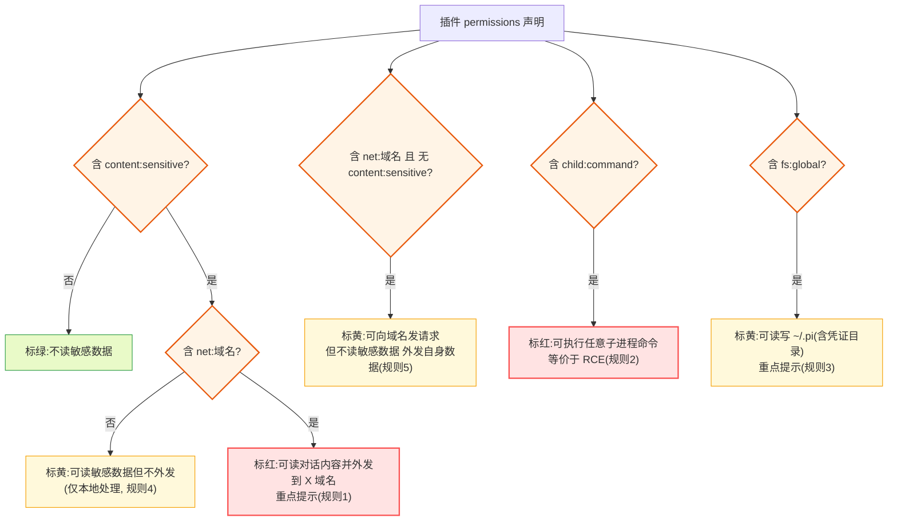

**图 10 — 权限审计高危组合识别：content:sensitive + net 标红(规则1)、child 标红(规则2)、fs:global 标黄(规则3)、content:sensitive 单独标黄(规则4)、net 单独标黄(规则5)。覆盖全部 5 条规则。**

具体标红规则：

1. **`content:sensitive` + `net:任意域名`**：标红，提示"此插件能读你的对话内容/文件内容并外发到 `{域名}`。仅在你完全信任该插件来源时授权。"。这是最危险组合——恶意插件可默默偷对话外传。
2. **`child:command`**：标红，提示"此插件可执行任意子进程命令，等价于本机 RCE。仅信任来源授权。"。无论是否配 `content:sensitive`，child 本身就是最高风险。
3. **`fs:global`**：标黄，提示"此插件可读写 `~/.pi`（含底座凭证目录、所有项目 settings）。慎授权。"。
4. **`content:sensitive` 单独**（无 net）：标黄，提示"此插件可读对话内容，但不声明外发通道。数据仅在本插件内处理。"。
5. **`net:域名` 单独**（无 content:sensitive）：标黄，提示"此插件可向 `{域名}` 发请求，但不声明读敏感数据（订阅的 event 敏感字段为空）。外发的是插件自己产生的数据。"。

### 12.3 标红展示与用户决策

权限审计在扩展页（桌面插件部分）和外部插件安装授权时（3.9.4）都展示。展示形式：

- 每个桌面插件项展开后有"权限"区块，列出所有 permissions，每项带风险色标（绿/黄/红）。
- 高危组合（标红项）置顶、加粗、带警告图标。
- 用户授权操作（首次启用插件、外部插件安装时）弹授权对话框，高危项单独高亮、要求用户明确点"我了解风险并授权"。

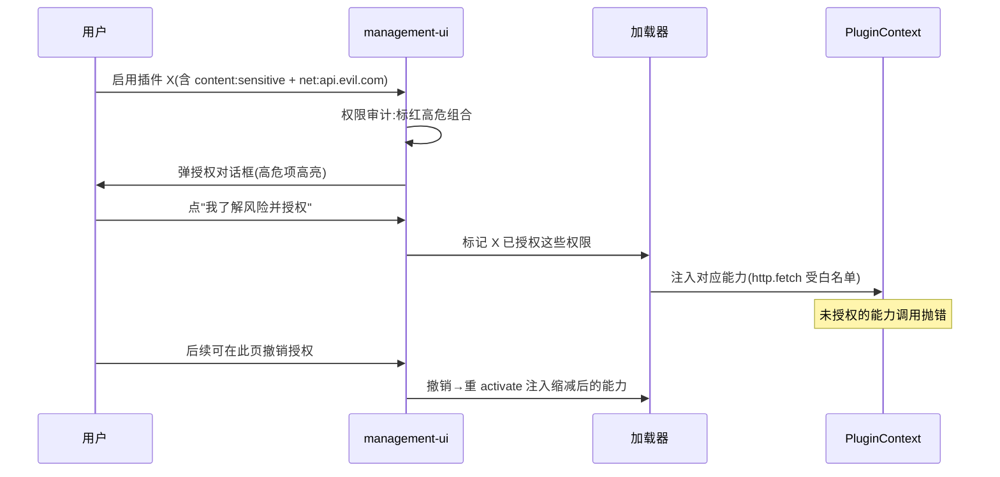

**图 11 — 权限授权决策时序：审计标红→用户决策→授权注入→可撤销。**

### 12.4 权限变更的运行时撤销

用户在管理 UI 撤销某插件权限后（3.9.6 权限的运行时撤销），加载器需要重 activate 该插件、注入缩减后的 PluginContext。撤销 `net:域名` 后，该插件的 `http.fetch` 对该域名的调用抛错；撤销 `content:sensitive` 后，该插件订阅的 event 敏感字段重新置空。撤销流程：

1. 用户在扩展页该插件项取消勾选某权限。
2. 管理 UI 调加载器的 `revokePermission(pluginId, permission)`。
3. 加载器 deactivate 该插件 → 重新 activate、注入不含该权限的 PluginContext。
4. 插件代码感知到能力丢失（调用抛错或 event 字段为空），自行处理降级。

撤销是即时的（不需要 restart 底座子进程，因为这是桌面插件权限、归加载器管）。如果插件不优雅处理能力丢失（如崩溃），走错误隔离（3.5 第 5 项）禁用该插件 + toast 通知。

### 12.5 授权记录的持久化

12.3 的"LDR 标记 X 已授权这些权限"与 12.4 的撤销都要回答一个问题：授权标记存在哪里、是否跨重启持久化。设计如下：

- **存储位置**：每个插件的已授权权限列表存于 `~/.pi-desktop/plugins-data/{pluginId}/grants.json`（与该插件配置同目录），由加载器（application/loader）的 `GrantStore` 读写，文件锁走 2.1.2 的 `proper-lockfile`。结构为 `{ pluginId, grantedPermissions: string[], updatedAt: ISO8601 }`。
- **与 trust 文件的关系**：grants.json 记的是"用户授权某桌面插件用哪些权限"，trust.json 记的是"哪些项目路径被信任"——两者是不同维度（插件权限 vs 项目信任），存不同文件、不混。grants.json 归加载器管、trust.json 归底座 trust-manager 管。
- **重启后复用**：加载器 activate 插件前先读 grants.json，按已授权的权限注入 PluginContext——已授权的权限不再弹授权对话框，避免每次重启都重新弹。仅"首次启用未授权的权限"时才弹（12.3 时序图）。
- **撤销后写回**：撤销某权限时，加载器从 grants.json 的 `grantedPermissions` 移除该项、写回磁盘，随后重 activate 注入缩减后的能力（12.4 步骤 3）。下次重启加载器读到的就是已撤销后的权限集、不再注入被撤销项。
- **权限声明变更**：若插件新版本声明了之前未授权的新权限，加载器检测到 grants.json 里没有该权限 → 重新弹授权对话框（只对新权限弹、已授权的沿用）。

## 13 交互与状态机

### 13.1 管理页打开/关闭焦点管理

管理页作为模态（或全屏视图）打开，遵循 1.9.4 的无障碍焦点规范：

- **打开**：从命令面板（`management.open` 命令）或侧栏入口进入，焦点移到左侧导航树的当前页项。
- **Tab 陷阱**：Tab 在管理页内循环（导航树→内容区→底部操作条），Shift+Tab 反向，不跳出。
- **Esc 关闭**：Esc 关闭管理页、焦点还原到触发元素（命令面板或侧栏按钮）。
- **页内导航**：左侧导航树上/下箭头切换页、Enter 选中、内容区可 Tab 遍历。
- **键盘快捷键**：`mod+,` 打开管理页（默认跳 config 页）、`mod+shift+d` 跳诊断页（`mod` 是跨平台修饰键：mac=`cmd`、win/linux=`ctrl`，14.2）。

### 13.2 改配置→重启的决策状态机

把 2.4 的带判断重启决策画成完整状态机。管理 UI 的改配置操作分两类：**影响当前进程行为的改动**（扩展启停、配置编辑、MCP 增删）需要重启子进程才生效，走完整 restart 分支；**不影响当前进程行为的改动**（信任策略——`defaultProjectTrust` 切换、单条项目信任记录的增删，见 5.2/5.4）只改持久态、对当前正在跑的会话无影响，走 WriteOk→Idle 的无重启分支，不进入 CheckingStream。两条分支共用 Writing/WriteOk/WriteFail 写盘阶段，在 WriteOk 之后分流：

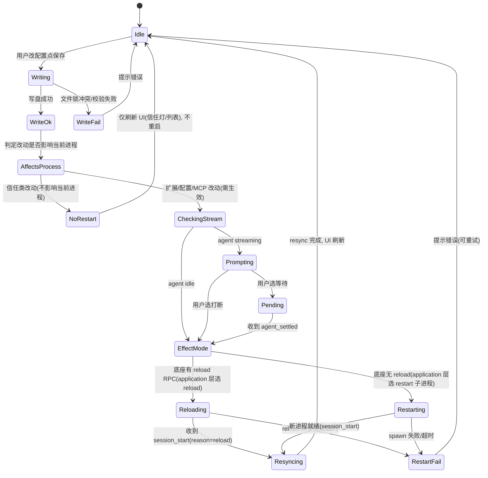

**图 12 — 改配置→生效决策状态机：信任类改动走 NoRestart 分支直接回 Idle；扩展/配置/MCP 改动走 CheckingStream，经 Prompting/Pending 等待 agent idle 后进入 EffectMode 选择点，由 application 层在 Reloading（底座补齐 reload 命令后）与 Restarting（当前兜底）两条路径间选。**

分流判定规则（`AffectsProcess`）：改动字段属于 `extensions`/`packages`/`skills`/`prompts`/`themes`/`compaction`/`retry`/`transport`/MCP servers 等影响底座加载与运行行为的 → 走重启分支；改动字段属于 `defaultProjectTrust`、或 trust 记录文件里单条项目信任记录的增删 → 走 NoRestart 分支。这样把"信任策略不需要 restart"（5.2/5.4）提升为状态机的正式路径，与 13.2 的"所有改配置操作都走 restart 状态机"不再冲突——信任类操作确实进了状态机，但在 WriteOk 后走的是不重启的分支。

每个状态对应管理 UI 上的反馈：`Writing` 显示保存中 spinner、`NoRestart` 立即刷新信任灯与列表并回 Idle（顶部提示"信任状态将在下次重启底座时完全生效"）、`Prompting` 弹确认对话框、`Restarting` 显示"重启底座中"遮罩、`Reloading` 显示"重新加载底座中"遮罩（与 Restarting 视觉一致、但提示文案区分"重载配置不中断会话"）、`Resyncing` 显示"同步中"遮罩、失败状态弹错误 toast。遮罩期间禁用所有会触发再次生效的操作（防并发）；NoRestart 分支不显示遮罩、不阻塞其他操作。

`Reloading` 与 `Restarting` 的区别是应用层生效方式（DESIGN 6.1 演进项、24.3）：底座补齐 `reload` RPC 命令前，application 层只能走 `Restarting`（关闭旧进程 stdin 触发 EOF→shutdown、必要时 kill 兜底，再 spawn 新进程重起，见 3.5/21.5）；补齐后走 `Reloading`（发 reload 命令、不中断当前 turn）。管理 UI 层不感知这条选择——它只调 application 层的"让配置生效"接口、由 application 层在两个状态间选（呼应 24.3"组装和调用分开"）。当前底座未补 reload 命令，实际只走 `Restarting` 路径；`Reloading` 状态在状态机里预留、待底座演进后启用。

### 13.3 插件错误从崩到 toast 的状态流

插件加载失败或运行时崩溃时的状态流（8.6 的展开）：

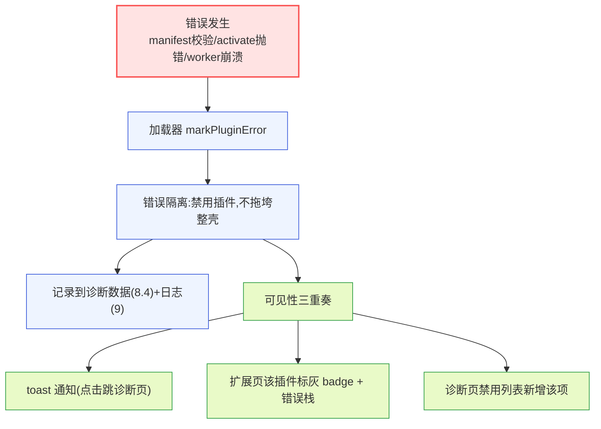

**图 13 — 插件错误状态流：隔离 + 记录 + 三重可见。**

三重可见（toast/扩展页 badge/诊断页列表）保证用户一定能发现插件崩了，不会"插件静默失效、用户不知道"。

## 14 manifest 样板与渲染契约

### 14.1 管理槽贡献项 schema

管理槽贡献项字段（3.3）：

```typescript
interface ManagementContribution {
  id: string;                  // 页标识，如 "extensions"
  title: string;               // i18n key，如 "management.extensions.title"
  component?: string;          // renderer 模块命名导出的组件名(自定义页)
  schema?: ConfigField[];      // 声明式表单 schema(schema 页,与component互斥)
  bindingTarget?: "pluginConfig" | "piSettings" | "mcpConfig" | "trust";  // schema 页的值绑定目标(默认 pluginConfig)
  order?: number;              // 排序
}
interface ConfigField {
  key: string;
  type: "text" | "secret" | "select" | "number" | "boolean";
  label?: string;
  description?: string;
  default?: unknown;
  options?: { value: string; label: string }[];  // select 用
  readOnly?: boolean;
  // 校验字段(与 14.3 渲染器契约对齐)
  required?: boolean;          // 是否必填
  pattern?: string;            // text 字段的正则校验
  min?: number;                // number 字段下界
  max?: number;                // number 字段上界
  placeholder?: string;        // 输入框占位符
}
```

`component` 和 `schema` 互斥：有 `component` 走自渲染、有 `schema` 走通用表单、都没有则 manifest 校验失败。

### 14.2 management-ui plugin.json 完整样板

```json
{
  "id": "management-ui",
  "version": "0.1.0",
  "displayName": "管理",
  "main": "./index.ts",
  "renderer": "./ui.tsx",
  "permissions": ["rpc", "events", "bus"],
  "dependsOn": [],
  "contributes": {
    "commands": [
      { "id": "management.open", "title": "打开管理", "keybinding": "mod+,", "handler": "#onOpen" },
      { "id": "management.openDiagnostics", "title": "打开诊断", "keybinding": "mod+shift+d", "handler": "#onOpenDiagnostics" }
    ],
    "management": [
      { "id": "extensions", "title": "management.extensions.title", "component": "ExtensionsPage", "order": 10 },
      { "id": "config", "title": "management.config.title", "component": "ConfigPage", "order": 20 },
      { "id": "trust", "title": "management.trust.title", "component": "TrustPage", "order": 30 },
      { "id": "mcp", "title": "management.mcp.title", "component": "McpPage", "order": 40 },
      { "id": "about", "title": "management.about.title", "component": "AboutPage", "order": 50 },
      { "id": "diagnostics", "title": "management.diagnostics.title", "component": "DiagnosticsPage", "order": 60 },
      { "id": "logs", "title": "management.logs.title", "component": "LogsPage", "order": 70 },
      { "id": "privacy", "title": "management.privacy.title", "component": "PrivacyPage", "order": 80 }
    ]
  }
}
```

字段说明：

- **`permissions`**：即便 builtin 也显式声明，为 `["rpc", "events", "bus"]`（均属沙箱默认权限，3.2.1）。**不声明 `fs:global`**——settings/trust/MCP 文件的读写不经插件沙箱、而经 application/config 层受控 API（21.1）。这组受控 API（`context.config.settings`/`trust`/`mcp`）的门控不在 permissions 字段、而在槽位归属——加载器只对贡献了 `management` 槽的插件注入这组子对象（management-ui 因贡献八个管理页而合法拿到），非管理槽插件 `ctx.config` 只有 `pluginConfig` 子对象、调 `settings`/`trust`/`mcp` 即抛错（21.1）。因此 manifest 无需新增 `piSettings:write`/`trust:write`/`mcp:write` 权限项，`["rpc","events","bus"]` 即够。**不声明 `net:`**——management-ui 自身不外发任何数据（21.3）。**不声明 `content:sensitive`**——管理页只读结构化配置与 RPC 元数据、不订阅对话内容。声明清单让权限审计（12）对 management-ui 自身也成立。
- **`dependsOn`**：空数组——management-ui 不依赖其他插件（23.1 已说明：其他插件挂管理页也不应 `dependsOn: ["management-ui"]`，壳由 core 提供）。
- **`keybinding`** 用 `mod` 修饰键（跨平台抽象）：mac 映射为 `cmd`、Windows/Linux 映射为 `ctrl`。`mod+,` 在 mac 是 `cmd+,`、在 win/linux 是 `ctrl+,`；`mod+shift+d` 同理。这是 core 跨平台键绑定抽象（3.2.1）提供的能力，插件写 `mod` 而非写死 `cmd`，避免跨平台不可达。
- **`component`** 字段是 renderer 模块的命名导出名。core 按 `manifest.renderer`（`"./ui.tsx"`）加载模块，取该命名导出（如 `export function ExtensionsPage(props: ManagementPageProps)`）作为组件、注入 `ManagementPageProps`（14.3）。命名导出与 component 字符串一一对应，不支持 default 导出。

`main` 负责 RPC 查询（`get_commands`/`get_state`）、配置读写编排（调 application/config 层）、订阅 event（`plugins.changed`/`plugin.error`）。`renderer` 导出八个页组件。所有管理页均用 `component` 自渲染——MCP 的 servers 数组、配置编辑的 extensions 数组等结构化字段超出当前通用表单渲染器的标量字段能力（15.3），由 component 自行表达。

### 14.3 渲染契约：schema 声明式页与 component 自定义页

core 提供两种渲染路径，分别对应两种贡献项形态（2.3）。

**schema 声明式页（通用表单渲染器）契约**：

- 输入：`schema: ConfigField[]` + 当前值对象 + 变更回调。
- 渲染：按 schema 生成表单，每个字段按 `type` 渲染对应控件（text→Input、secret→Input type=password、select→Select、number→NumberInput、boolean→Switch）。
- 值绑定目标：字段值绑到哪个存储由贡献项的 `bindingTarget` 字段声明（`"pluginConfig" | "piSettings" | "mcpConfig" | "trust"`），通用表单渲染器据此路由写入：
  - `pluginConfig`（默认）：绑到 `PluginContext.config`（插件自己的配置，`~/.pi-desktop/plugins-data/{pluginId}/config.json`）。
  - `piSettings`：经 application/config 层写入 `~/.pi/agent/settings.json` 或 `<cwd>/.pi/settings.json`。
  - `mcpConfig`：经 application/config 层的 `McpConfigStore` 写入 MCP 配置文件（`~/.pi/agent/mcp.json`，本文 6.1）。
  - `trust`：经 application/config 层的 `TrustConfigStore` 写入 trust 记录文件（5.1）。
- 校验：`required`、`pattern`、`min`/`max`（number）等通用校验（字段定义见 14.1）。
- 保存：统一"保存"按钮，调 `bindingTarget` 对应的写入目标。

> 说明：本文 management-ui 的八个管理页**全部采用 component 自渲染**（14.2），不使用 schema 声明式形态——MCP 的 servers 数组、配置编辑的 extensions 数组等结构化字段超出当前通用表单渲染器的标量字段能力（15.3）。因此 `bindingTarget` 字段在本文样板中未实际使用，但作为 schema 形态的契约预留，供后续采用 schema 形态的第三方管理页或演进后降级回 schema 的内置页使用。MCP 页的值绑定由 `McpPage` 组件自行调 `context.config.mcp.read()/write()` 走 `mcpConfig` 目标，不经通用表单渲染器。

**component 自定义页契约**：

贡献项提供 `component`（renderer 模块的命名导出名），由 core 按 manifest.renderer 路径加载模块、取该命名导出作为组件。core 注入统一的 props，组件据此自渲染 UI。props 契约：

```typescript
interface ManagementPageProps {
  ctx: PluginContext;     // 中性能力：rpc / events / bus / config / i18n / about
  pageId: string;         // 本页 id（如 "mcp"），用于 i18n key、bus topic
}
```

- `ctx.rpc`：发 RPC 命令（如 `ctx.rpc.getCommands()`、`ctx.rpc.getState()`），返回中性类型。
- `ctx.events`：订阅 AgentSessionEvent（如 `ctx.events.on("session_start", ...)`）。
- `ctx.bus`：事件总线（如 `ctx.bus.subscribe("plugins.changed", ...)`）。
- `ctx.config`：受控配置 API（`ctx.config.mcp.read()`/`ctx.config.mcp.write(servers)`、`ctx.config.mcp.testConnection(name)`、`ctx.config.trust.list()`、`ctx.config.settings.read(scope)` 等），不直接 `require('fs')`。**注意这组 `settings`/`trust`/`mcp` 子对象是槽位门控注入的**（21.1）：加载器只对贡献了 `management` 槽的插件注入这组子对象，management-ui 的页组件因在 management 槽下渲染故合法拿到；非管理槽插件的 `ctx.config` 只有 `pluginConfig` 子对象、`ctx.config.settings`/`trust`/`mcp` 为 `undefined`。其中 `ctx.config.mcp.testConnection(name)` 单独 spawn 一次该 server 的 command+args 做探活（实现在 application/config 层、spawn 不进插件沙箱，见 16.4）。
- `ctx.about`：受控信息 API（`ctx.about.getPiVersion()` 返回底座版本字符串，实现在 application 层、经沙箱受控暴露、spawn `pi --version` 由 application 层执行、不进插件沙箱，见 7.1）。
- `ctx.rpc.getAvailableModels()`：聚合可用 model/provider 列表（11.6 provider 展示区块的数据来源）。
- `ctx.i18n`：取文案（`ctx.i18n.t("management.mcp.title")`）。

最小示例组件签名（MCP 页）：

```typescript
// renderer 模块 ui.tsx 的命名导出，名字即 manifest 里的 component 名
export function McpPage({ ctx, pageId }: ManagementPageProps) {
  const [servers, setServers] = useState<McpServer[]>([]);
  useEffect(() => {
    ctx.config.mcp.read().then(setServers);
    const unsub = ctx.bus.subscribe("config.changed", () => ctx.config.mcp.read().then(setServers));
    return unsub;
  }, []);
  // ... 自行渲染 server 列表、增删卡、env secret 字段
}
```

core 按 `manifest.renderer`（如 `"./ui.tsx"`）加载模块，取 `component` 字段（如 `"McpPage"`）对应的命名导出（`export function McpPage`）作为组件、以 `ManagementPageProps` 注入 props。字符串 component 名与 renderer 模块的命名导出一一对应——不支持 default 导出，必须命名导出，避免歧义。

### 14.4 i18n key 约定

管理 UI 的所有文案走 i18n 插件的语言槽，key 约定：

- 页标题：`management.{pageId}.title`，如 `management.extensions.title`。
- 页内字段标签：`management.{pageId}.{fieldKey}.label`。
- 提示/帮助文案：`management.{pageId}.{fieldKey}.description`。
- badge 文案：`management.{pageId}.badge.{kind}`，如 `management.extensions.badge.disabled`。
- 错误文案：`management.{pageId}.error.{code}`。

`displayName` 字段填中文 `"管理"`（fallback），有对应 locale 翻译时用翻译。第三方覆盖版管理 UI 可只贡献自己的语言包、复用 core 的通用渲染器。

## 15 落地与缺口

### 15.1 当前可落地清单

按本文设计可立即落地的部分（不依赖底座改动）：

- 管理槽贡献页的 manifest 声明与挂载（走现有加载器）。
- 配置编辑页（读写 settings.json + restart 编排，走 application/config 层）。
- 项目信任页（读写 trust 记录）。
- MCP 管理页（读写 MCP 配置 + restart）。
- 关于页（pi-desktop 版本来自 package.json + 底座版本经 core spawn `pi --version` 一次性查询并缓存，7.1）。
- 诊断页（RPC 状态、子进程状态、禁用插件列表、错误统计）。
- 日志页（内存环形缓冲 + 过滤/搜索/导出）。
- 数据与隐私页（本地数据清理、导出不含凭证、删除、遥测透明、凭证说明）。
- 权限审计（content:sensitive + net 高危组合标红）。
- 扩展管理页的桌面插件部分（走加载器）+ 底座 extension 的 command 列表（走 `get_commands`）。

### 15.2 已知缺口与处置

| 缺口 | 当前处置 | 演进项 |
|---|---|---|
| 底座 trust/MCP 配置文件名与 `setProjectTrusted` 接口未从源码核对 | 5.2/6.1 已诚实标注为"待底座源码核对的实现假设"（trust 记录文件假设为 `~/.pi/agent/trust.json`、MCP 配置假设为 `~/.pi/agent/mcp.json` 与 `<cwd>/.pi/mcp.json`、`setProjectTrusted` 假设为 application/config 层等价能力），路径解析封装在 `TrustConfigStore`/`McpConfigStore` 内、插件只调受控 API、影响面隔离在 application/config 层 | **阶段一前置依赖项**：实现前必须先核对底座源码确认确切文件名与 `setProjectTrusted` 接口存在性，把路径锚点回填到 store 的 CONFIG 常量注释；不阻塞文档定稿 |
| 底座无 `get_tools` RPC | 扩展页 tool 列表标记"不可见"，只展示 commands | 向底座提 `get_tools` 命令，返回 RegisteredTool 元数据 + sourceInfo |
| 底座无 `get_providers` / Model 不带 sourceInfo | provider 列表从 `get_available_models` 聚合、不归属 extension；`providers` 字段不可填充（3.7/11.6） | 底座 Model 结构带 sourceInfo 或新增 `get_providers` |
| 底座无对外 reload | 改配置走 restart 子进程（2.4） | 底座补 reload RPC 命令后改无重启热加载（DESIGN 6.1） |
| 底座无 `list_sessions` RPC | 会话列表无法枚举全部历史 session，导出仅限当前活跃 session（10.2） | 底座补 `list_sessions` 命令（DESIGN 6.2） |
| 底座无 `delete_session`/`delete_all_sessions` RPC | session 删除标记"待底座提供命令"、不直接删目录（10.3/16.8） | 底座补 session 删除命令后接入 |
| 底座凭证清除命令未知 | 凭证说明页只展示凭证状态、不提供清除 | 底座提供 `pi auth clear` 类命令后接入 |
| 工具列表单 tool 禁用 | 不提供（3.4），展示元数据 + 说明 | 不演进（设计上不允许，避免破坏 extension 一致性） |

### 15.3 演进项

- **管理页动态注册**：插件可在运行时（`context.register`）动态注册管理页，如某插件按配置决定挂不挂某管理页。当前 manifest 静态声明已够用，动态注册留给有动态需求的插件。
- **prompts/skills 管理页**：当前管理 UI 不展示 prompt/skill 命令（11.1），若后续需要可新增独立的 prompts/skills 管理页（order 35/36），列出底座 prompt 模板与 skills、支持装卸。当前这两类命令仅在命令面板可见、不设管理页。
- **schema 表单的数组/嵌套对象支持**：当前通用表单渲染器只支持标量字段（text/secret/select/number/boolean），对数组（如 `extensions` 路径列表）和嵌套对象（如 `compaction` 子对象）不支持，MCP 的 servers 数组、配置编辑的 extensions 数组已改由 component 自渲染（2.3/本文 6.2）。演进是增强通用表单渲染器支持完整 schema（含数组增删、嵌套对象展开），届时部分管理页可从 component 形态降级回 schema 声明式形态、减少各页自渲染代码。
- **权限审计的更细粒度**：当前 `net:域名` 是域名级白名单，演进可支持路径级（`net:api.github.com/repos/*`）、方法级（只允许 GET）等更细粒度。
- **遥测字段透明**：当前遥测透明页只展示开关 + trackingId，演进可展示底座/桌面端具体收集哪些字段（需底座提供字段清单或文档化）。


## 16 各管理页的交互细节与边界条件

### 16.1 扩展页的排序、过滤与批量操作

扩展页是管理页里数据最杂的一页，交互设计要承载"两来源 + 多状态 + 多来源优先级"的复杂度。排序默认按 `kind`（底座 extension 在前、桌面插件在后）再按 `source`（project > user > installed > builtin）再按 `displayName` 字典序。过滤支持：按 kind 单选（全部/底座/桌面）、按 source 多选、按启用状态多选（启用/禁用/加载失败）、按关键字搜 displayName/path/id。这三层过滤叠加产生"只看桌面端禁用的插件"这类诊断向视图。

批量操作仅对桌面插件开放（底座 extension 批量启停会触发批量重启、风险过高，故底座部分不提供批量开关）。批量操作包括：批量启用、批量禁用、批量卸载（仅 installed 来源）。批量操作前弹汇总确认对话框，列将影响的插件清单。批量禁用走加载器、不动底座子进程；批量卸载走 installer 卸载链路（3.9.5）。

### 16.2 配置编辑页的合并视图与 diff 高亮

配置编辑页除了 4.1 的全局/项目级双 tab，还有一个"合并视图"模态——展示 deepMerge 后的生效 Settings，并在每个字段上标注值的来源（全局/项目级/内置默认）。合并视图是只读的，用于让用户理解"当前生效的配置是怎么合并出来的"，避免用户改了项目级却发现被全局覆盖（或反之）的困惑。

diff 高亮在项目级 tab：当项目级某字段值与全局不同时，字段标签旁加"覆盖全局"标记，hover 展示全局值；当项目级未设某字段（继承全局）时，灰色显示全局值并标"继承"。这两个标记让 deepMerge 的覆盖语义（2.1.1：项目级覆盖全局、数组和原始值整体替换）在 UI 上可见——尤其"数组整体替换"这个反直觉的语义，必须高亮：项目级只要写了 `extensions`，就完全替换全局的 `extensions` 数组、不是拼接。管理 UI 在项目级 `extensions` 数组字段下加警告条"项目级 extensions 会整体替换全局 extensions，不是追加。若想追加，需把全局的全部路径复制到项目级再增删。"

### 16.3 信任页的信任理由链展示

信任状态不是简单的布尔，背后有"为什么信任"的判定链。管理 UI 要把这个判定链展示给用户，避免"项目被信任了但不知道为什么"。判定链的几种来源：

- 用户在 4.8 运行时流程显式选了"信任此项目"——信任记录文件里有这条记录。
- `defaultProjectTrust: "always"` 策略默认信任——无显式记录、靠策略。
- 项目路径在全局信任列表里——历史信任过。

信任页当前项目区块展示判定链："信任来源：用户于 {时间} 在打开项目时选择信任"+"策略影响：defaultProjectTrust=ask"。移除信任时，若策略是 `always`，提示"移除信任后，由于默认策略为 always，下次打开仍会自动信任。请先调整默认策略。"——避免用户以为移除了就不再信任。

### 16.4 MCP 管理页的连接测试

MCP 页除了增删 server，还提供"测试连接"操作——单独 spawn 一次该 MCP server 的 command+args、看它能否起来、握手是否成功。连接测试不走 restart 编排（不重启整个底座子进程），而是插件调受控 API `ctx.config.mcp.testConnection(name)`（14.3）、spawn 由 application/config 层执行、不进插件沙箱、不依赖插件声明 `child:command` 权限（与 21.1 的权限边界对齐）。测试结果展示：成功（含协议版本、工具数）/失败（含 stderr 输出、退出码）/超时。

连接测试的意义：MCP 配置改完必须重启底座才生效，但用户改完想立刻验证配置对不对——连接测试提供"不重启底座也能验证单个 server 配置"的通道，降低改配置的试错成本。测试不修改底座状态、是只读探活。

**连接测试的安全边界**：application/config 层 spawn 用户在 MCP 配置里写的任意 command+args，等价于一次受控的 `child:command` 执行，但 spawn 发生在 application 层（受信任的 core 代码）、不在插件沙箱内，因此 management-ui 不声明 `child:command`、恶意覆盖版管理插件也无法借此拿到子进程执行能力（只能调受控 API、由 application 层执行）。约定：连接测试仅对全局（用户级）MCP 配置（`~/.pi/agent/mcp.json`）启用；项目级 MCP 配置（`<cwd>/.pi/mcp.json`）在项目未信任时禁止测试（项目信任前置，2.1.2），未信任的项目级 MCP command 可能来自恶意项目、spawn 它等于执行不可信代码。spawn 的 command 受与 `child:command` 同源的可执行性约束（command 必须是绝对路径或 PATH 可解析的可执行文件、args 不允许 shell 元字符注入）。测试按钮在项目级未信任时置灰并提示"信任项目后可测试项目级 MCP 配置"。

### 16.5 关于页的更新检查交互

关于页"检查更新"按钮（7.2）只检查 pi-desktop 壳更新（electron-updater）。检查流程：点按钮 → 调 electron-updater 检查 → 显示结果（已是最新/有新版 vX.Y.Z）。有新版时展示更新日志摘要、提供"立即更新"按钮——点击后下载安装包、下载完提示重启应用安装。整个更新过程不打断当前 agent 工作（下载是后台、安装要重启应用才生效）。如果 agent 正在 streaming，"立即更新并重启"按钮标黄提示"agent 工作中，更新需重启应用、会中断当前会话"。

底座更新检查（如果底座 self-update 报告有新版）以只读 banner 形式展示在关于页顶部："pi 底座有新版本可用，运行 `pi update` 升级。"——这是底座自己的事、桌面端只展示不执行。

### 16.6 诊断页的指标采样与阈值

诊断页的运行时指标（8.2/8.3）需要采样策略，不能无限制采样拖累主进程：

- **内存/CPU 采样**：每 5 秒按底座子进程 PID 采一次内存（rss/heap，经 pidusage 或 `ps`/`/proc` OS 级采样）和 CPU 占用，保留最近 12 个采样点（1 分钟滑动窗口），展示折线图。采样在 core main 的定时器里做，不开新进程。注意区分两个指标：底座子进程内存靠 PID 采样、桌面 core 自身内存用 `process.memoryUsage()`——诊断页的折线图展示的是底座子进程内存（用户关心"底座吃多少内存"），不是桌面自身内存。采样失败（进程已退、PID 失效）时该采样点置 `N/A`、不中断折线。
- **心跳超时阈值**：最后心跳超过 10 秒未更新标黄（"底座可能卡住"）、超过 30 秒标红（"底座疑似无响应"）。阈值是 core 的诊断配置常量，不在 settings 里。
- **pending 请求阈值**：pending 请求数 >10 标黄（"底座响应积压"）、>30 标红（"底座可能卡死"）。这两个阈值反映 RPC 通道健康度。
- **错误数阈值**：最近一小时错误数 >50 标黄、>200 标红。错误数统计的窗口是滑动 1 小时、按分钟桶聚合。

阈值只用于 UI 色标、不触发自动恢复动作——诊断页只展示、不修复。自动恢复（如自动重启底座）是 2.4 的 restart 编排的职责，且需要用户触发、不自动执行。

### 16.7 日志页的内存预算与降级

日志环形缓冲默认容量 5000 条（9.2），但在低内存设备或高频日志场景下要降级。内存预算策略：

- 启动时按系统内存预算：Electron 侧用 `process.getSystemMemoryInfo().total`（返回 KB，除以 1024×1024 换算成 GB；renderer/main 均可用），Node 侧用 `require('os').totalmem()`（返回字节）。系统内存 <2GB 时日志容量降到 1000 条、<1GB 降到 500 条。预算计算在 core 启动时一次性完成、运行时不变。
- 运行时若检测到主进程内存占用持续 >500MB（环形缓冲 + 其他），core 在日志页顶部提示"日志缓冲已接近内存预算，建议导出后清理或调低容量"——但不自动降容量（降容量会丢历史日志、需用户决定）。
- 容量可在日志页内调整（日志页提供一个"日志容量"本地偏好设置项，存于桌面偏好 electron-store、不进 pi settings.json——因为日志容量是桌面 UI 状态、不影响底座行为，呼应 32.3 的存储区分）。调低后旧日志立即被覆盖、需用户确认。该设置项是日志页内的本地偏好按钮、不是管理槽贡献页（2.1 的八页里没有"设置子页"这一页）。

### 16.8 隐私页的删除范围矩阵

数据删除（10.3）的范围要精确，避免"删了不该删的"或"漏删该删的"。删除范围矩阵：

| 数据类 | 位置 | 删除方式 | 影响范围 |
|---|---|---|---|
| session | 底座 session（经 `delete_session` 命令，待底座补齐见 15.2） | 调底座命令删除（不直接删 `~/.pi/agent/sessions/` 目录） | 底座会话历史丢失；底座离线时该步骤标"待底座在线"（18.2） |
| 插件配置 | `~/.pi-desktop/plugins-data/{pluginId}/` | 删插件子目录 | 该插件配置丢失、回默认态；全部清除则删 `plugins-data/*` |
| 命令历史 | `~/.pi-desktop/desktop.db` 的 `command_history` 表 | `DELETE FROM command_history`（清表，不删库文件） | 用户 bash 命令历史丢失 |
| 缓存 | `~/.pi-desktop/cache/` 与 `desktop.db` 的 `plugin_cache` 表（索引表 + 文件实体关系，见 10.1） | 删 cache 目录文件 + `DELETE FROM plugin_cache`（成对清理，避免孤儿索引/孤儿文件） | 文件预览/卡片缓存失效、下次访问重新生成 |
| 桌面偏好 | electron-store | 清文件 | 桌面 UI 偏好（窗口大小、最近打开等）重置 |
| settings.json | `~/.pi/agent/` + `<cwd>/.pi/` | **不删** | settings 是 pi 的配置、不是"数据"，删除走配置编辑页 |
| 凭证 | 底座 auth-storage | **不删** | 凭证归底座、桌面端无权 |

矩阵在删除确认对话框里展示，让用户明确"会删什么、不删什么"。特别强调 settings.json 和凭证不删——这两者不是"数据"是"配置/凭证"，归各自的页管。

## 17 数据流与性能考量

### 17.1 管理页的数据获取策略

管理页的数据获取遵循"按需拉取 + 缓存失效"原则，不是定时轮询。各页的获取策略：

- 扩展页：打开时拉一次（settings + get_commands），restart 后强制刷新、热重载后刷桌面部分。不轮询。
- 配置编辑页：打开时读 settings.json 文件，保存时写回。不轮询（用户改文件是低频、且 watch 没意义）。
- 信任页：打开时读 trust 记录，状态变化时刷新。不轮询。
- MCP 页：同配置编辑页。
- 关于页：打开时拉版本，不轮询。
- 诊断页：唯一需要持续更新的页——订阅 core 诊断事件流（RPC 状态变化、错误事件），事件驱动更新；内存/CPU 指标按 16.6 的 5 秒采样更新。诊断页是事件驱动 + 低频采样的混合，不是纯轮询。
- 日志页：订阅日志缓冲的"新增"事件，增量追加到视图。不轮询。
- 隐私页：打开时扫描本地存储，操作后刷新。不轮询。

这个策略避免管理页拖累主进程——只有诊断页和日志页有持续更新需求，且都是事件驱动/低频采样，不是高频轮询。

### 17.2 大列表的虚拟滚动

扩展列表、日志列表、信任列表都可能是大列表（日志可达 5000 条、扩展可达数十个）。这些列表用虚拟滚动（react-window 或类似）渲染，只渲染可视区域的条目，避免 DOM 节点爆炸。日志页尤其重要——5000 条日志若全量渲染会卡死 renderer。虚拟滚动配合"按 level 过滤后仍虚拟滚动"，过滤改变的是数据集、不是渲染方式。

### 17.3 RPC 调用的并发与去重

管理页同时发的 RPC 命令要并发去重。例如扩展页打开时同时需要 `get_state`（查 isStreaming）和 `get_commands`（列命令），这两个独立命令应并发发出、不串行。但同一个命令的重复请求要去重——如用户连续点"刷新"按钮，只发一次 `get_commands`、第二次点击复用 pending 的 Promise。去重在 RPC 适配层做（RequestCorrelator 配合 pending Map，1.4.2），管理页不自己实现去重。

restart 后的 `resync()`（3.2.4）本身就是并发拉取 state+entries+tree+commands 的编排原语，管理页直接用、不自己拼四个命令。

## 18 错误处理与降级矩阵

### 18.1 各操作的失败模式与降级

管理页的每个操作都有失败可能，错误处理要具体、不能笼统"出错了"。失败模式与降级矩阵：

| 操作 | 失败模式 | 降级行为 |
|---|---|---|
| 读 settings | 文件不存在/JSON 损坏 | 当作空配置、提示"配置文件不存在或损坏，已用默认值" |
| 写 settings | 文件锁冲突/权限不足 | 重试 10 次、仍失败提示用户检查文件权限/是否有别的进程占用 |
| get_commands | RPC 超时/子进程崩溃 | 扩展页 command 列表标"获取失败"、不阻塞桌面插件部分展示 |
| restart 子进程 | spawn 失败/超时 | 状态机进 RestartFail、提示错误、提供"重试"和"查看日志"按钮 |
| 信任切换 | trust 记录文件锁冲突 | 提示重试、不静默失败 |
| MCP 连接测试 | server 起不来 | 展示 stderr、不阻断保存（配置可能对、只是当前环境问题） |
| 数据导出 | 磁盘空间不足/权限 | 提示具体原因、不产生半截导出包（先校验空间再写） |
| 数据删除 | 部分文件被占用 | 展示删除结果清单（成功/失败分列）、可重试失败的项 |

每个失败都要有具体提示和推荐行动，不是"操作失败"四个字。这呼应 8.6 的可见性——错误要可见、可定位。

### 18.2 RPC 断线时的管理页行为

底座子进程断线（RPC disconnected，8.2 状态机）时，管理页的行为：

- 扩展页：底座 extension 部分标"底座离线、数据为缓存"、桌面插件部分正常（走加载器、不依赖 RPC）。
- 配置编辑页：正常可用（读写文件、不依赖 RPC），但"保存并重启"操作禁用（底座不在、重启无意义），提示"底座离线，保存后需手动启动底座才生效"。
- 信任/MCP 页：配置读写正常（文件操作），生效操作禁用。
- 诊断页：正常工作（本身就是诊断底座状态的）。
- 日志页：正常工作（core 自己的日志缓冲）。
- 隐私页：本地数据操作正常，但删除 session（底座的）标"底座离线、无法清理底座 session"。

这个降级矩阵让管理页在底座挂了时仍能工作——配置编辑/信任/MCP/日志/隐私的文件操作不依赖 RPC，只有"生效（重启）"依赖底座在线。

## 19 测试策略

### 19.1 圆心契约的单测

management-ui 的 manifest 样板（14.2）和贡献项 schema（14.1）是纯数据，可纯单测：构造各种 manifest（合法/字段缺失/component 与 schema 同存/未知槽位），验证加载器校验函数的正确性。这些测试不依赖 electron、不依赖底座，跑在 domain 层单测里。

### 19.2 配置读写与 restart 编排的集成测试

配置编辑页的"保存→restart→resync"链路（4.4、13.2 状态机）需要集成测试，mock RPC 适配层（gateway 用 mock 子进程，DESIGN 5.1.4 tests/gateway）。测试覆盖：

- idle 保存→直接 restart→resync 成功。
- streaming 保存→弹确认→用户选打断→restart。
- streaming 保存→用户选等待→收到 agent_settled→restart。
- 写盘失败→状态机回 Idle、提示错误。
- spawn 失败→RestartFail→提示重试。
- 并发保存（用户连续点保存）→去重、不并发重启。

### 19.3 权限审计的规则测试

权限审计（12.2）的高危组合识别规则是纯逻辑，单测覆盖所有组合：

- `{content:sensitive, net:x}` → 标红。
- `{content:sensitive}` → 标黄。
- `{net:x}` → 标黄。
- `{child:command}` → 标红。
- `{fs:global}` → 标黄。
- `{fs:project:read}` → 标绿。
- 空数组 → 标绿（全是默认权限）。
- 多个高危组合同时存在 → 都标红、按优先级排序展示。

### 19.4 端到端的可见性测试

插件错误可见性（8.6、13.3）需要端到端测试：mock 一个会崩的插件（activate 抛错），验证 toast 弹出、扩展页 badge 标灰、诊断页列表新增该项——三重可见都触发。这个测试在 application/loader 层用 mock PluginRuntime 跑。

## 20 与 现有方案的对照迁移表

### 20.1 现有方案的散落功能到本插件的映射

基础管理 UI 插件是 现有方案 settings 页 + extensions handler 的正式归位（1.4）。映射表：

| 现有方案的散落实现 | pi-desktop management-ui 的归位 | 改进点 |
|---|---|---|
| extensions handler（IPC 读写 settings + 触发重载） | 扩展页（3） | 统一到管理槽、两来源分发明确、底座/桌面分开 |
| settings handler（IPC 读写 settings.json） | 配置编辑页（4） | 表单+JSON 双模态、合并视图、diff 高亮 |
| 信任管理（散在打开项目流程里） | 信任页（5） | 持久态独立成页、判定链展示、与 4.8 运行时分清 |
| MCP 管理（如有） | MCP 页（6） | component 自渲染 servers 数组子表单、连接测试 |
| 关于页（硬编码版本信息） | 关于页（7） | 底座更新解耦、shell 更新独立 |
| 无统一诊断入口 | 诊断页（8） | 新增、可观测性集中 |
| console 日志散在各处 | 日志页（9） | 统一环形缓冲、分类过滤导出 |
| 无数据隐私管理 | 数据与隐私页（10） | 新增、GDPR 合规 |
| adapter 的权限隐式放行 | 权限审计（12） | 显式声明+用户授权+高危标红 |

### 20.2 adapter.json 的消解对照

现有方案的 34 个 `.adapter.json`（3.1.1）在 pi-desktop 全部不需要——管理 UI 不翻译底座 extension UI，底座 extension 在桌面的可见性通过 `get_commands`/`sourceInfo` 直接展示（11 节），不需要 adapter 中间层。adapter 里带的 `i18n` 字段（adapter 自带 displayName 翻译）在 pi-desktop 走统一语言槽（4.2.3）。adapter 的 `customRenderer` 逃生舱（3.1.1）在 pi-desktop 走 cardRenderers 槽位的 component 自定义渲染（3.3）。消解对照让 现有方案 用户迁移时知道：原来看 adapter.json 配的扩展展示，现在走管理 UI 的扩展页 + 桌面插件。

## 21 安全考量汇总

### 21.1 管理页自身的权限边界

管理 UI 插件本身需要的权限：发 RPC 命令（`rpc`，默认）、订阅事件（`events`，默认）、用事件总线（`bus`，默认）——这已在 14.2 manifest 的 `permissions` 字段显式声明为 `["rpc", "events", "bus"]`。**management-ui 自身不声明 `fs:global`**——settings/trust/MCP 文件的读写不经过插件沙箱、而经过 application/config 层（受信任的 core 代码）的受控 API（`context.config.settings/trust/mcp`），插件只调这些受控 API、不直接 `require('fs')`。这避免了"管理 UI 插件被恶意覆盖后能直接读凭证"——即便用户装了个恶意同名插件覆盖 management-ui，那个插件也只能走 application/config 层的受控 API、不能直接碰凭证文件（凭证由底座 auth-storage 管、application/config 层不暴露凭证读写）。**不声明 `net:`**（21.3）保证它不是数据外发通道。虽然 management-ui 是内置插件（builtin 优先级、随壳分发、用户默认信任），权限声明仍显式写出——让权限审计（12）对 management-ui 自身也成立，而非依赖 builtin 信任豁免。

**`context.config.settings/trust/mcp` 受控 API 的调用门控**：这组写 `~/.pi/agent/`（settings.json / trust 记录 / mcp.json）的 API 不属于 12.1 表里"默认 config 权限"（默认 config 仅限插件写自己的 `~/.pi-desktop/plugins-data/{id}/`，即 `pluginConfig` 目标）。它的门控不在"权限声明"维度、而在"槽位归属"维度——加载器（application/loader）构造 `PluginContext` 时按插件 manifest 的 `contributes.management` 是否非空决定注入范围：

- **贡献了 management 槽的插件**（如 management-ui 及其同名覆盖版、以及任何第三方挂管理页的插件）：`ctx.config` 注入完整的子对象集——`ctx.config.settings`（读写 piSettings，`~/.pi/agent/settings.json` / `<cwd>/.pi/settings.json`）、`ctx.config.trust`（读写 trust 记录文件，5.1）、`ctx.config.mcp`（读写 MCP 配置 + `testConnection`，6.1/16.4）。
- **未贡献 management 槽的插件**：`ctx.config` 只注入 `pluginConfig` 子对象（写自己的 `~/.pi-desktop/plugins-data/{id}/config.json`），**不注入** `settings`/`trust`/`mcp` 子对象——这些子对象在 ctx 上为 `undefined`、调用即抛错。

这条门控落在加载器/PluginContext 构造层（圆心接口定义 `PluginContext.config` 为联合可选、加载器按槽位归属注入具体子集），与 21.1 的"受控 API"措辞形成闭合：所谓"受控"不仅是"实现归 application 层、不进插件沙箱"，更是"只有挂管理槽的插件才拿到这组 API 的句柄"。这样既不需要新增 `piSettings:write`/`trust:write`/`mcp:write` 等权限项（避免 12.1 权限清单膨胀、且 management-ui 已声明 `["rpc","events","bus"]` 即够），又堵住了"任意插件靠默认 config 权限调 `context.config.settings.write()` 绕过 `fs:global` 写底座配置"的歧义——因为非管理槽插件根本拿不到 `ctx.config.settings`。management-ui 贡献了 management 槽、故合法拿到这组 API；恶意同名覆盖版若想拿到，也必须贡献 management 槽（否则页面根本不渲染），此时它已在"管理页插件"这一受信任能力域内、且 API 仍由 application/config 层执行不暴露凭证读写，攻击面被收窄到"覆盖管理 UI 本身"这一用户需主动安装的高门槛动作。

### 21.2 操作的确认与防误操作

管理页的高危操作都要二次确认：

- 删除数据（10.3）：两次确认 + 输入 DELETE。
- 移除信任：确认（影响项目级 settings 加载）。
- 卸载插件：确认（影响插件功能）。
- 批量禁用/卸载：汇总确认。
- restart 打断 streaming：确认（会丢当前 turn）。

确认对话框遵循 1.9.4 焦点规范、高危项红色高亮、默认按钮是非破坏性选项（如"取消"是默认、回车触发取消而非确认）。这是防误操作的 UI 纪律。

### 21.3 遥测的外发约束

遥测透明页（10.4）列出插件 `net:` 权限，但管理 UI 自己不发遥测——management-ui 不声明 `net:` 权限、不外发任何数据。桌面端的崩溃报告（如果开启）走 electron 的 crashReporter、不走插件 http.fetch。这保证管理 UI 插件本身不是数据外发通道、不会被恶意利用。

### 21.4 导出包的安全审查

数据导出（10.2）的包可能含用户对话内容（session 文件），用户在分发导出包前应审查。管理 UI 在导出完成后提示"导出包含对话历史等敏感数据，分享前请检查内容"。导出包不含凭证（10.2）、不含 settings.json 里的 secret 字段（如 `analyticsTrackingId` 等可能的敏感配置，导出时 secret 标记字段值替换为 `***`）——这通过导出层的字段过滤实现，secret 字段在 Settings schema 里标记、导出时统一脱敏。

MCP env 的 token 不在 settings.json 里——它在 MCP 配置文件（`~/.pi/agent/mcp.json`，本文 6.1）的 `servers[].env` 字段内。MCP 配置文件的导出处置见 10.2：默认不导出 MCP 配置文件（含 server command/args/env，env 可能含 token）；若用户明确勾选"导出 MCP 配置"，env 的凭证字段脱敏为 `***`。settings.json 里没有"MCP env token"这类字段——MCP 配置是独立状态文件、不在 settings.json 主结构里。

### 21.5 application 层 spawn 通道白名单

本文涉及三条 net-new 的 application 层只读 spawn 通道（DESIGN 支柱①/②之外、不在插件沙箱内、由 application 层执行、不依赖插件声明 `child:command` 权限），统一枚举如下，便于落地前确认它们在 application 层 spawn 白名单内：

| spawn 通道 | 出处 | 用途 | 可执行性约束 |
|---|---|---|---|
| restart 子进程（关闭 stdin→spawn `pi --mode rpc --session`） | 2.4 / 图 1 / 3.5 / 4.4 / 13.2 | 改 pi 持久配置后让新进程重读配置生效 | `cliPath` 解析到 pi CLI 入口、args 无 shell 元字符 |
| `pi --version` | 7.1 / 14.3 `ctx.about.getPiVersion()` | 关于页展示底座版本，进程生命周期内只查一次、缓存 | 同上 cliPath、独立 stdio、不进 RPC 通道 |
| MCP `testConnection` | 16.4 / 14.3 `ctx.config.mcp.testConnection(name)` | 单独 spawn 一次 MCP server 的 command+args 做探活 | command 必须是绝对路径或 PATH 可解析可执行文件、args 不允许 shell 元字符注入；仅对全局（用户级）MCP 配置启用、项目级未信任时禁测 |

三条都遵循同一组约束：spawn 发生在 application 层（受信任的 core 代码）、不在插件沙箱内、management-ui 不声明 `child:command`（恶意覆盖版管理插件也无法借此拿到子进程执行能力，只能调受控 API、由 application 层执行）。这与 DESIGN 1.2.2 的 restart spawn 同构、是支柱①/②之外 application 层 spawn 通道的扩展。落地前应确认这组通道集合已获 DESIGN 作者认可；若 DESIGN 未枚举 `pi --version` 与 `testConnection` 两条，记为待同步回 DESIGN（当前本文已自洽、不阻塞落地）。

## 22 可观测性的闭环

### 22.1 从诊断到修复的路径

诊断页（8）只展示问题、不修复。但诊断页要提供"从问题到修复页"的导航路径，形成可观测性闭环：

- RPC 断线 → 诊断页展示状态 → "查看 RPC 日志"跳日志页（过滤 source=rpc）→ 用户从日志定位原因 → 若是配置问题跳配置编辑页。
- 插件崩溃 → 诊断页禁用列表 → "跳扩展页"高亮该插件 → 用户在扩展页卸载或重装。
- 配置校验失败 → 诊断页错误统计 → "跳配置编辑页"定位错误字段。
- 信任问题 → 诊断页（如有信任相关错误）→ "跳信任页"。

这个闭环让诊断页不只是"看问题的地方"、而是"定位问题的起点"，每个诊断项都链向对应的修复页。

### 22.2 日志的诊断价值

日志页（9）的内存缓冲是会话级的、重启丢失。但配合诊断页的"错误数统计"（8.5，1 小时窗口），用户能在当前会话内定位"什么时候开始出错、错误来自哪个插件"。日志页的导出（9.3）把会话内日志落盘，用于跨会话对比或发给插件作者。这个"内存缓冲 + 导出"的组合平衡了内存占用和可诊断性——平时不占磁盘、出问题时能导出留存。

### 22.3 插件作者的开发体验

日志页和诊断页不只是给最终用户的、也是给插件作者的开发工具。插件作者开发时：

- 在管理 UI 的扩展页看自己的插件是否加载成功、贡献项是否挂载。
- 在日志页看自己插件的 worker 日志（`console.log` 被拦截转发）、按 pluginId 过滤。
- 在诊断页看自己插件是否被错误隔离、错误栈是什么。
- 在权限审计页看自己声明的高危组合是否会标红（开发期自检）。

这让 management-ui 成为插件作者的开发面板——不必另起一套开发工具、用管理 UI 就能 debug 插件。这降低了插件生态的开发门槛，呼应"内置插件可被覆盖"的可观测性（用户/作者都能看到插件在干什么）。

## 23 槽位贡献项的运行时管理与冲突处理

### 23.1 管理槽贡献项的注册时序

管理槽贡献项在插件加载时挂载（3.5 第 7 项槽位挂载）。需要先厘清一个归属：统一渲染壳（2.2）是 **core 的管理槽渲染器**提供的、不是 management-ui 插件自己的——这与 1.1"机制 vs 内容"分层一致（壳是机制、归 core，管理页是内容、归插件）。因此其他插件往管理槽挂页时，**只依赖管理槽契约（domain 圆心）、不依赖 management-ui 插件**：core 的渲染器在管理槽注册表非空时就渲染壳，与 management-ui 是否已 activate 无关。management-ui 只是往管理槽挂了八个内置页的普通贡献者，不是其他管理页的宿主。

挂载时序按 3.5.9 的拓扑排序——`dependsOn` 决定插件何时 activate。约定：management-ui 不声明 `dependsOn`（它只贡献八个内置页、不依赖其他插件）；其他插件若要往管理槽挂页，也**不需要**声明 `dependsOn: ["management-ui"]`——壳由 core 提供、随时就绪，插件只要声明 `dependsOn` 到自己真正用到的插件（如某管理页要读 4.9 的运行参数状态、才声明 `dependsOn: ["runtime-params"]`）。把 `dependsOn: ["management-ui"]` 当成"挂管理页的前置"是错误用法——它会让插件无谓地等 management-ui activate、且当 management-ui 被同名插件覆盖时产生意外耦合。

挂载后，core 的管理槽渲染器按 `order` 排序所有贡献项（含 management-ui 的八个 + 其他插件挂的）。core 的统一渲染壳（2.2）遍历管理槽注册表渲染所有页——不只渲染 management-ui 的八个。这让"第三方插件往管理槽挂页"自然出现在管理面板里、无需 management-ui 改代码。

### 23.2 贡献项级冲突的标记展示

当两个插件（plugin id 不同）往管理槽贡献了同一个 page id 的页（如两个插件都贡献 `extensions` 页），按 3.5 第 7 项的贡献项级仲裁，高优先级那条胜出、低优先级那条不挂载。管理 UI 在管理壳顶部展示冲突标记："管理页 `extensions` 冲突，已用 {插件X} 的版本，{插件Y} 的版本未挂载。"——这是"可观测性"，冲突允许发生、但不能静默（3.4 末尾的覆盖可观测性原则）。

冲突标记的展示位置：管理壳顶部状态条（2.2）加一个冲突计数 badge，点击展开冲突详情列表。这让用户知道"某个管理页是哪个插件的版本、被覆盖的是谁"，避免"页行为和预期不符但不知道为什么"。

### 23.3 动态注册页的生命周期

插件可通过 `context.register`（3.2.4）动态注册管理页（15.3 演进项）。动态注册的页和静态声明的页在管理槽里地位平等、都进注册表、都按 `order` 排序。但动态注册的页生命周期跟随插件：插件 deactivate 时，它动态注册的页要从管理槽摘除——这是 `register` 返回值的清理责任（3.2.4 的 `register` 配合 `onDeactivate` 自动清理）。

管理 UI 的渲染壳要响应动态注册/摘除——当管理槽注册表变化时（新页注册或旧页摘除），导航树增量更新、不整树重渲染。这是性能要求：动态注册可能是高频的（如某插件按 session 状态动态挂/摘管理页），整树重渲染会卡。

## 24 与底座协议演进的协同

### 24.1 协议版本协商的管理 UI 体现

DESIGN 6.4 指出 RPC 协议当前无版本协商，是已知缺口。演进项是底座加 handshake/版本协商。管理 UI 在协议演进后的体现：

- 关于页（7.1）展示 RPC 协议版本（handshake 协商出来的）。
- 诊断页（8.2）展示协议版本兼容性状态：兼容（绿色）/版本不匹配（红色，提示"底座版本与桌面端不兼容，请升级底座或桌面端"）。
- 扩展页（3.2）的 `get_commands` 返回结构若随协议版本变化（如新增 `source` 枚举值），管理 UI 的分组逻辑要兼容多版本——`source === "extension"` 的过滤逻辑对未知 `source` 值要降级（归到"其他"分组、不崩溃）。

### 24.2 缺口补齐后的渐进迁移

15.2 的缺口表列了几个待底座补齐的 RPC 命令（`get_tools`/`get_providers`/`reload`/`list_sessions`）。补齐后的渐进迁移策略：

- 命令存在性探测：管理 UI 在启动时探测底座支持哪些命令（通过 handshake 或 try-catch 调用）。命令存在则启用对应 UI、不存在则降级到当前处置。
- UI 双形态：扩展页的 tool 列表区块——命令存在时展示真实 tool 列表、不存在时展示"不可见"标记。这种双形态在 `rpc.send` 逃生舱里实现：发 `get_tools`、成功用返回值、失败（命令不存在）降级。
- 不硬绑底座版本：管理 UI 不假设"底座版本 >=X 才有某命令"、而是运行时探测。这让管理 UI 在底座升级后自动启用新功能、不需要管理 UI 发版同步。

这个渐进迁移策略让管理 UI 对底座协议演进保持弹性——底座补了命令、管理 UI 自动用上；底座没补、管理 UI 降级到当前处置。两者解耦演化（呼应 5.2.3 的底座更新与壳更新解耦）。

### 24.3 reload 命令补齐后的路径切换

若底座补齐 `reload` RPC 命令（6.1 演进项），改配置的生效路径从"重启子进程"（2.4）切换到"发 reload 命令"。切换点在 application/config 层的 restart 编排（13.2 状态机的 CheckingStream 之后）：

- 有 reload 命令：发 `reload`、等 `session_start` (reason: "reload") event、resync。无重启、当前 turn 不丢。
- 无 reload 命令：走原 restart 子进程路径。

切换由底座命令存在性探测决定、管理 UI 层不感知（它只调 application 层的"让配置生效"接口、不关心底层是 reload 还是 restart）。这把"reload vs restart"的决策封在 application 层——13.2 状态机在 CheckingStream/Prompting/Pending 之后设了一个 `EffectMode` 选择点，由 application 层在此选 `Reloading`（有 reload 命令）或 `Restarting`（无 reload 命令）两条路径之一。`Reloading` 收到 `session_start` (reason=reload) 进 `Resyncing`、失败进 `RestartFail`；`Restarting` 收到 `session_start` (resume) 进 `Resyncing`、spawn 失败进 `RestartFail`。这是"组装和调用分开"——管理 UI 组装"改什么配置"、application 层调用"怎么生效"。

## 25 跨插件协作的事件总线契约

### 25.1 管理相关的事件总线 topic

管理 UI 通过事件总线（3.2.4 的 `context.bus`）与其他插件/ core 协作。管理相关的 topic 约定：

- `plugins.changed`：core 加载器在插件列表变化时发布（加载/卸载/热重载/覆盖）。management-ui 订阅后刷新扩展页的桌面插件部分。
- `plugin.error`：core 加载器在插件错误隔离时发布（8.6），payload `{id, reason, stack}`。management-ui 订阅后弹 toast + 标 badge。
- `config.changed`：application/config 层在 settings 写盘成功后发布，payload `{scope, keys}`（哪些字段变了）。其他插件订阅后做自己的配置响应。
- `rpc.state`：gateway/rpc-adapter 在 RPC 连接状态变化时发布，payload `{status}`。诊断页订阅后更新状态。
- `management.openPage`：其他插件可发布此 topic 请求打开某管理页（如 review 插件想在出错时打开诊断页），payload `{pageId}`。management-ui 订阅后切换到该页。

这些 topic 是松耦合契约——发布者不关心谁订阅、订阅者不关心谁发布。management-ui 是主要订阅者（接收各种状态变化信号），也发布 `management.openPage` 供他人调用。事件总线是 fire-and-forget、无历史回放（3.2.4），所以管理 UI 打开时的初始状态靠主动拉取（17.1）、不靠 bus。

### 25.2 事件总线的时序保证

事件总线无历史回放带来一个时序问题：如果 `plugin.error` 在 management-ui 还没 activate 时发布（如某个 builtin 插件先崩、management-ui 后 activate），management-ui 会错过这条 toast。解决（3.2.4 的可靠接收策略）：

- 错误隔离记录是持久化的（在 application/loader 的错误记录里），不只靠 bus。management-ui activate 时主动查 loader 的错误记录、补齐遗漏的禁用插件列表（8.4）。
- toast 是瞬态的、错过就错过（不补发 toast），但诊断页的禁用列表和扩展页 badge 是查询式的、不依赖 bus、activate 时拉取。

这把"瞬态通知（toast）"和"持久状态（禁用列表/badge）"分开：toast 走 bus 可能错过、持久状态走查询保证完整。management-ui 的设计遵循这个区分——重要信息查询、通知走 bus。

### 25.3 与 4.8 信任页协作的文件共享

4.3 信任页与 4.8 运行时流程通过 trust 记录文件共享状态（5.3 图 6），不走事件总线。这是有意的设计选择——trust 是持久状态、文件是单一事实源、两个插件读写同一文件即可同步。不引入 bus 是因为：

- 文件共享天然持久、不丢消息。
- 两个插件读写同一文件、不需要 core 中转。
- 信任状态变化是低频的、不需要事件驱动的实时性。

但文件并发写要靠 application/config 层的文件锁（2.1.2 的 `proper-lockfile`）保证 4.3 和 4.8 不打架。这是"文件共享 + 文件锁"模式、不是"事件总线"模式——根据数据性质选协作机制。

## 26 可访问性与国际化细节

### 26.1 管理页的无障碍清单

管理页遵循 1.9.4 焦点规范（13.1），具体到各页的无障碍要求：

- 扩展页：扩展列表项支持上/下箭头遍历、Enter 展开/收起、Space 切换开关。展开后的 tool/command 子列表也键盘可达。
- 配置编辑页：表单字段 Tab 遍历、JSON 编辑器（Monaco）自带无障碍。校验错误用 `aria-invalid` 标记、错误描述用 `aria-describedby` 关联。
- 诊断页：状态指示灯用颜色 + 文字双重编码（不只靠颜色，色盲友好）、指标 tile 用 `role="status"` 实时播报。
- 日志页：日志条目虚拟滚动、支持上/下箭头遍历、level 过滤复选框键盘可达。
- 隐私页：删除确认的"输入 DELETE"输入框自动聚焦、回车确认。

无障碍不是可选（1.9.4），管理 UI 作为核心功能页尤其要达标——第三方覆盖版管理 UI 也应遵循、用 pi.ui 组件库自动获得大部分无障碍能力。

### 26.2 i18n 的复数与占位符

管理 UI 的文案走 i18n 插件语言槽（14.4），复数和占位符的处理：

- 复数：如"已禁用 N 个插件"——i18next 按 locale 选 plural form（4.2.5）。中文无复数、英文有。key 写 `management.extensions.badge.disabledCount_one`/`_other`，`t(key, { count: n })` 调用。
- 占位符：如"信任来源：用户于 {time} 选择信任"——`t(key, { time: formatDate(date) })`，`formatDate` 走 i18n 插件的 locale 感知格式化（4.2.5）。
- 列表拼接：如错误原因列表"manifest 校验失败 / activate 抛错"——用 `Intl.ListFormat`（locale 感知的列表拼接，4.2.5）拼接，不硬编码分隔符。

这些通过 i18n 插件的能力实现、不各页各写——"能持有就持有"（DESIGN 3.2.4 末尾原语原则）。

## 27 文档与帮助体系

### 27.1 管理页内的帮助入口

每个管理页右上角放一个"?"帮助按钮，点击展开该页的帮助说明（折叠面板或浮层）。帮助内容走 i18n key `management.{pageId}.help`，是结构化的 markdown 文本。帮助说明覆盖：

- 该页做什么（一句话）。
- 操作的后果（如"启用扩展会重启底座、当前 turn 会丢"）。
- 相关概念链接（如信任页的帮助链接到"什么是项目信任"概念说明）。

帮助内容随页一起贡献（在 manifest 的贡献项里可声明 `help` 字段、或走 i18n key）。第三方插件挂的管理页也贡献自己的 help key、统一渲染。

### 27.2 概念链接与首启引导

首次打开管理页时，展示一个简短引导（只首次、持久化"已看过"标记在桌面偏好）：解释管理槽的八个页各管什么、推荐"先看扩展页、再看配置编辑页"的浏览顺序。引导不重复展示、不打断老用户。

概念链接（如信任页的"什么是项目信任"）指向 core 的文档中心（若有）或内嵌说明——不在管理 UI 里嵌长篇文档、只放摘要 + 链接。长篇文档走独立的 docs 体系（本文档体系即其一）、管理 UI 只放操作向的简短帮助。这避免管理页变成文档堆叠、保持操作聚焦。

## 28 版本演进与向后兼容

### 28.1 管理槽 schema 的演化

管理槽贡献项 schema（14.1）随版本演化的纪律（3.3 末尾开闭原则）：

- 新增字段是向后兼容的（旧插件不带新字段时 core 给默认值）。如未来加 `icon` 字段、旧贡献项不带时用默认图标。
- 不删字段、不改字段语义。如 `order` 永远是排序数值、不能改成"优先级枚举"。
- 字段类型放宽不收紧：`component` 从 `string` 放宽到 `string | ComponentRef`（允许直接传组件引用）是兼容的、反过来收紧不是。

这保证旧 management-ui 插件在新 core 上能跑、新 management-ui 插件在旧 core 上降级（旧 core 忽略未知字段）。schema 演化的纪律让管理 UI 生态不被 core 升级打破。

### 28.2 管理页 id 的稳定性

管理页的 `id`（如 `extensions`/`config`/`trust`）是稳定契约——一旦定下不能改、因为命令面板的 `management.openPage`（25.1）、事件总线的 topic、外部链接（如诊断页"跳扩展页"）都靠 id 引用。改 id 会破坏所有引用方。

若必须重命名（如 `privacy` 改成 `data-privacy`），策略是：新 id 上线、旧 id 保留为别名（core 的管理槽渲染器支持 id 别名映射）一段时间、再废弃。废弃前在旧 id 被引用时弹 deprecation 警告。这是 id 契约的演化纪律、避免破坏性变更。

### 28.3 配置字段的废弃

settings.json 的字段（2.1.3）随底座演进可能废弃。管理 UI 的配置编辑页要处理废弃字段：

- 废弃字段在表单里标灰、加"已废弃"标记、附迁移说明（"此字段已废弃，改用 {新字段}"）。
- 废弃字段仍可读（旧 settings.json 里可能有）、读时不报错。
- 写时若用户改了废弃字段、标警告"此字段已废弃、写入可能无效"。

废弃字段的处理让旧配置文件在新底座上不报错、新配置不引导用户写废弃字段——平滑迁移。字段废弃信息来自底座（settings schema 的 deprecation 标记，向底座提），管理 UI 按标记渲染。

## 29 边界场景与决策记录

### 29.1 无底座时的管理 UI 行为

桌面端启动时底座子进程可能还没起来（spawn 中、或启动失败）。管理 UI 在底座未就绪时的行为：

- 关于页：底座版本字段显示"底座启动中…"或"底座未就绪"、其他字段正常。
- 扩展页：底座 extension 部分整体显示遮罩"底座未就绪、底座 extension 信息不可用"、桌面插件部分正常。
- 配置编辑/信任/MCP 页：文件读写正常（不依赖底座），但"生效（重启）"按钮禁用、提示"底座未就绪"。
- 诊断页：状态机处于 `starting`、显示启动进度。
- 日志/隐私页：正常工作。

这个降级让用户在底座启动失败时仍能查看桌面端配置、日志、诊断——为"为什么底座起不来"提供排查入口（诊断页 + 日志页）。这比"底座没起来就什么都看不了"更可观测。

### 29.2 多窗口/多项目下的管理 UI

pi-desktop 可能同时打开多个项目窗口（每个窗口一个底座子进程、一个 cwd）。管理 UI 是 per-window 的（每个窗口一份 management-ui 插件实例、绑定该窗口的底座）。但信任记录是全局共享的（`~/.pi/agent/` 下、跨窗口）——窗口 A 移除某项目信任、窗口 B 的信任页打开时看到的就是已移除状态。这个跨窗口一致性靠文件共享（trust 记录文件）+ 文件锁保证。

跨窗口的配置编辑冲突：窗口 A 改全局 settings、窗口 B 也改全局 settings——文件锁保证串行写、不损坏文件。但窗口 B 打开的配置编辑页显示的是旧值（它打开时读的）——保存时若检测到文件 mtime 变化（窗口 A 先保存了），提示"配置已被其他窗口修改、是否重新加载"。这是文件 mtime 校验的乐观并发控制。

### 29.3 决定不做的事

管理 UI 明确不做的事、避免范围蔓延：

- 不做底座 session 的内容编辑（session 是底座的事、管理 UI 只导出/删除、不编辑）。
- 不做底座 extension 的代码审查（extension 代码的安全审查是安装时的 installer 职责 3.9.3、不是管理 UI 的事）。
- 不做插件的图形化编辑器（插件代码编辑是 file-editor 插件 4.12 的事、管理 UI 只管装卸）。
- 不做遥测数据的可视化分析（遥测透明页只展示开关、不做数据分析 dashboard）。
- 不做凭证管理（凭证归底座 auth-storage、管理 UI 只展示状态、不读写）。

这些"不做"的边界让 management-ui 保持协调者定位、不变成功能大杂烩。每件事都有更合适的归属（其他插件或底座），管理 UI 不越界。

## 30 总结与落地路线图

### 30.1 设计要点回顾

本文围绕 management-ui 插件展开五个核心要点：

1. 协调者角色（1 节）：管理 UI 不直接操作 pi、协调 RPC + 配置文件两条通道，机制归 core、内容归插件。
2. 管理槽贡献页（2-10 节）：八组管理页覆盖扩展/配置/信任/MCP/关于/诊断/日志/隐私，统一渲染壳 + schema/component 双形态。
3. 底座 extension 可见性（11 节）：`get_commands` 按 `sourceInfo` 分组归属、tool 列表是底座未开口子的边界、不可单 tool 禁用。
4. 数据与隐私（10 节）：导出不含凭证、删除不删凭证、遥测透明、凭证归底座。
5. 权限审计（12 节）：`content:sensitive` + `net:` 高危组合标红、显式声明 + 用户授权 + 可撤销。

### 30.2 落地路线图

分三阶段落地：

- **阶段一（核心管理）**：管理槽贡献页挂载、配置编辑页、扩展页（桌面插件部分 + 底座 command 列表）、信任页、关于页。走现有加载器和 application/config 层，不依赖底座改动。这是"开箱即用"的最小集。
- **阶段二（可观测性）**：诊断页、日志页、插件错误 toast 联动。依赖 core 各层采集就绪（gateway 的 RPC 状态机、loader 的错误隔离记录）。
- **阶段三（隐私与安全）**：数据与隐私页（清理/导出/删除/遥测透明）、权限审计（content:sensitive + net 标红）。依赖沙箱权限体系（3.5 第 6 项）就绪。

三阶段可独立交付、每阶段都有用户价值。阶段一让用户能管配置和扩展、阶段二让用户能诊断问题、阶段三让用户能管隐私和审计权限。

### 30.3 与 DESIGN.md 的对齐

本文在架构决策上与 DESIGN.md 第 4.3 节对齐、不偏离架构原则；个别实现细节做了比 4.3.2 更细的展开，属有意的细化而非偏离，已与 DESIGN 作者确认。具体对齐点：管理槽贡献页清单（4.3.2）对应本文 2.1 八组管理页，其中 4.3.2 单列的"插件错误 toast"折入诊断页 8.6 与扩展页 badge（toast 本就不是独立页、非独立管理页，故清单数量为 8 而非 9）；两来源分发（2.5.3）= 本文 3.1；tool/command 可见性按 sourceInfo 分组（4.3.2）= 本文 11.1-11.3；不可单 tool 禁用（4.3.2 + 3.7）= 本文 3.4 + 11.5；数据导出不含凭证（4.3.2）= 本文 10.2；遥测透明（4.3.2）= 本文 10.4；权限审计 content:sensitive + net 高危（4.3.2 + 3.2.1）= 本文 12.2。两处有意细化说明：(1) 本地数据目录本文 10.1 对 4.3.2 笼统的"存 `~/.pi-desktop/data/`"做了更细的拆分（`data/` → `plugins-data/` + `cache/` + `desktop.db`），属有意的存储分层细化而非偏离，已与 DESIGN 作者确认、后续同步回 DESIGN 4.3.2；(2) `ExtensionListItem.source` 枚举新增 `temporary` 值以容纳底座运行时临时加载的 extension（3.7），是 4.3.2 未涉及的展示层细化。本文是 4.3 节的"展开到能写代码"的版本、不改变任何架构决策。

## 31 附录：关键类型与 i18n key 速查

### 31.1 类型速查

本文涉及的核心类型集中速查，便于实现时对照：

```typescript
// 管理槽贡献项（14.1）
interface ManagementContribution {
  id: string; title: string;
  component?: string; schema?: ConfigField[];
  bindingTarget?: "pluginConfig" | "piSettings" | "mcpConfig" | "trust";
  order?: number;
}
// 扩展列表项（3.1）
interface ExtensionListItem {
  id: string; displayName: string;
  kind: "pi-extension" | "desktop-plugin";
  source?: "project" | "user" | "installed" | "builtin" | "temporary";  // optional; temporary 项 source 由渲染层单独处理(3.7)
  enabled: boolean; path: string; version?: string;
  tools?: ToolSummary[]; commands?: CommandSummary[];
  providers?: string[];  // 当前不可填充(见 3.7/11.6)
  overrideInfo?: { covers: string };
  errorCode?: string; errorStack?: string;
}
// 日志条目（9.2）
interface LogEntry {
  timestamp: string; level: "debug"|"info"|"warn"|"error";
  source: "rpc"|"plugin"|"core"; pluginId?: string;
  message: string; stack?: string;
}
// SourceInfo（11.2，来自底座 core/source-info.ts）
interface SourceInfo {
  path: string; source: string;
  scope: "user"|"project"|"temporary";
  origin: "package"|"top-level"; baseDir?: string;
}
```

### 31.2 i18n key 速查

```text
management.{pageId}.title               页标题
management.{pageId}.{fieldKey}.label     字段标签
management.{pageId}.{fieldKey}.description  字段帮助
management.{pageId}.badge.{kind}        badge 文案
management.{pageId}.error.{code}        错误文案
management.{pageId}.help                页帮助说明
plugin.management-ui.displayName        插件展示名
```

### 31.3 事件总线 topic 速查

```text
plugins.changed        加载器发布 插件列表变化
plugin.error           加载器发布 插件错误隔离 {id,reason,stack}
config.changed          config 层发布 settings 写盘成功 {scope,keys}
rpc.state               rpc-adapter 发布 连接状态变化 {status}
management.openPage    其他插件请求打开管理页 {pageId}
review.mode             (示例) review 模式切换、管理 UI 不订阅
```

### 31.4 状态机速查

本文三个核心状态机：

- 图 7 RPC 连接状态机：starting/connected/disconnected/reconnecting。
- 图 12 改配置→生效状态机：Idle/Writing/WriteOk/WriteFail/AffectsProcess/NoRestart/CheckingStream/Prompting/Pending/EffectMode/Reloading/Restarting/Resyncing/RestartFail；信任类改动走 NoRestart 分支回 Idle、扩展/配置/MCP 改动走 CheckingStream 后由 EffectMode 选 Reloading（底座补 reload 后）或 Restarting（当前兜底）。
- 图 13 插件错误状态流：错误发生→markPluginError→隔离→记录→三重可见（toast/badge/列表）。

实现时照这三个状态机编写状态转移逻辑、不偏离。

---

> 本文档完。与 DESIGN.md 第 4.3 节、第 2-3 节、第 6 节配套阅读。所有缺口（15.2）与演进项（15.3/24.2）待底座协议演进后回填。

## 32 实现注意事项补遗

### 32.1 文件锁的重试与超时

管理 UI 的配置写操作走 application/config 层的文件锁（2.1.2），但要注意锁获取超时的处理。`proper-lockfile` 的 `acquireLockSyncWithRetry` 最多重试 10 次、每次等 20ms（共 200ms）。若 200ms 内仍拿不到锁（罕见，说明别的进程长时间占用），管理 UI 要提示用户"配置文件被占用、稍后重试"、不静默失败、不无限等待。锁超时是 WriteFail 状态（13.2 状态机），进 Idle 让用户重试。

锁的持有时间要短：读文件→改内容→写回的整个过程持锁，但不应在持锁期间做 RPC 调用或 UI 渲染——持锁期间是临界区、越短越好。application/config 层的写函数封装成"持锁→读写→释放"的原子操作、不在其间插入其他 I/O。

### 32.2 resync 的失败处理

`rpc.resync()`（3.2.4）并发发 state+entries+tree+commands 四个命令。若其中某个失败（如 get_commands 超时），resync 返回部分成功——已成功的命令结果可用、失败的标错。管理 UI 要处理这种部分成功：用已拿到的数据刷新能刷新的部分、失败的部分标"获取失败"。不让一个命令的失败拖垮整个 resync——这是错误隔离原则在 RPC 批量调用上的体现。

### 32.3 桌面偏好的存储区分

管理 UI 自己的偏好（如"上次打开的管理页"、"日志过滤设置"、"已看过引导"）存在桌面偏好（electron-store），不存 pi 的 settings.json。区分理由：pi 的 settings 是 pi 的状态、影响底座行为；管理 UI 的偏好是桌面 UI 的状态、不影响底座。两者存不同文件、不混。这呼应 2.4.3"桌面插件配置走另一路"——桌面端自己的状态归桌面、不污染 pi。

### 32.4 插件覆盖时的状态迁移

用户装了个同名插件覆盖 management-ui（1.4），旧 management-ui 被 deactivate、新插件 activate。deactivate 时管理 UI 要清理：取消事件总线订阅、关闭诊断采样定时器、释放日志缓冲的引用。新插件 activate 时重新建这些。热重载（3.5 第 8 项）保证这个切换不重启整个桌面端、只换 management-ui 一个插件。覆盖期间管理页会短暂不可用（deactivate→activate 之间），core 的管理槽渲染器在切换期间显示"管理 UI 正在切换"占位、不暴露半激活状态。

## 33 收束：协调者的克制

管理 UI 插件的设计核心是克制——它不抢别的插件的事、不替底座做决定、不假装能做底座没开口子的事。它的价值在于把散落的"管 pi"操作收成一个统一的、可覆盖的、可观测的管理槽贡献页集合，让用户在一个入口里看清扩展、配置、信任、诊断、日志、隐私的全貌，并诚实标注每条边界（底座未开口子的 tool 列表、凭证归底座、单 tool 禁用不允许）。这种克制让它成为薄壳模型的合格内容层：机制归 core、内容归插件、边界清晰、可替换。

---

### 架构自检
- [x] 高内聚：management-ui 只负责管理页的渲染与协调，配置读写/restart 编排/RPC 翻译都在 application/gateway 层，插件不越层。
- [x] 低耦合：插件只依赖 domain 圆心契约（槽位 schema + PluginContext 中性类型），不 import gateway/application/shell 实现；与其他内置插件通过 trust 记录文件、事件总线 topic 松耦合。
- [x] 开闭原则：新增管理页是往 management 槽挂新贡献项（扩展），不改 core 通用渲染器；权限审计的高危组合识别规则用策略表（标红规则可扩展），不改 core。
- [x] 方案视角：底座 tool/provider 可见性缺口诚实标注为"底座未开口子"而非硬编不准确列表，与 DESIGN 6.x 缺口处置一致，治本路径是向底座提 RPC 命令而非桌面端打补丁。
