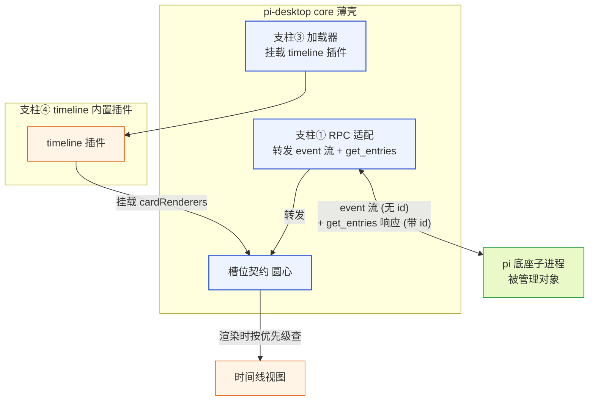
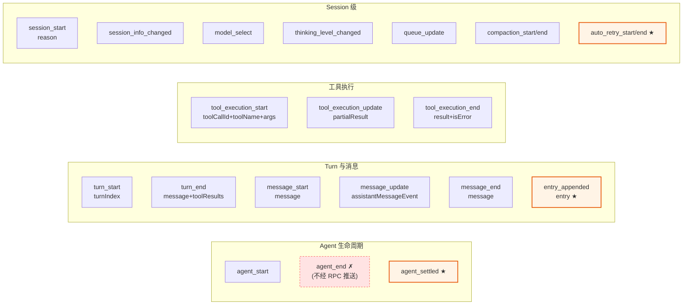
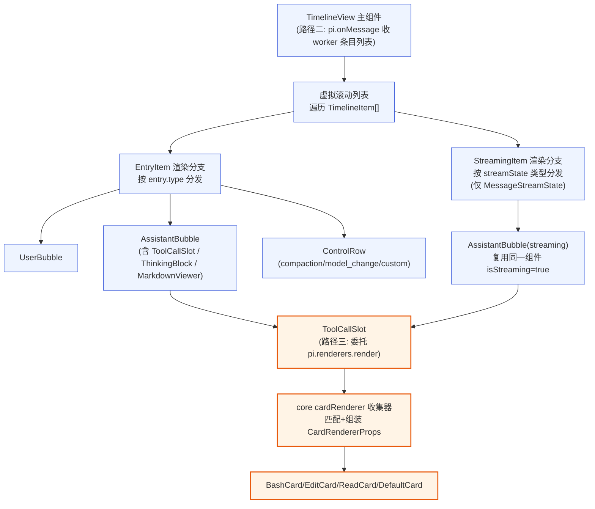
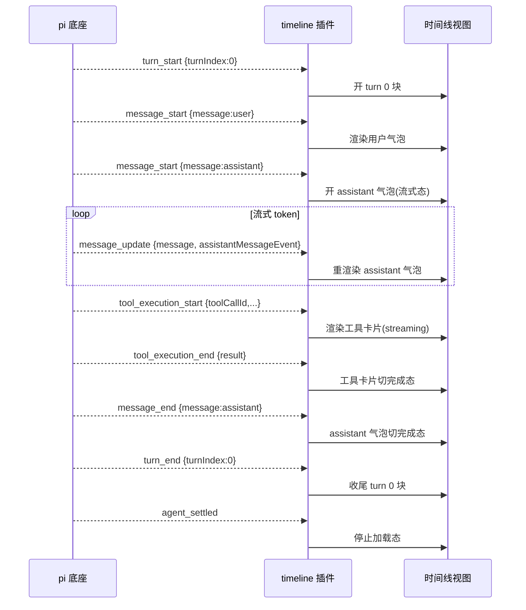
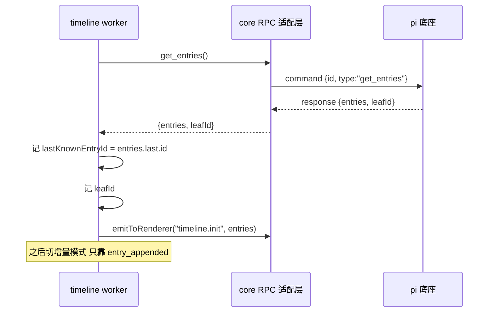
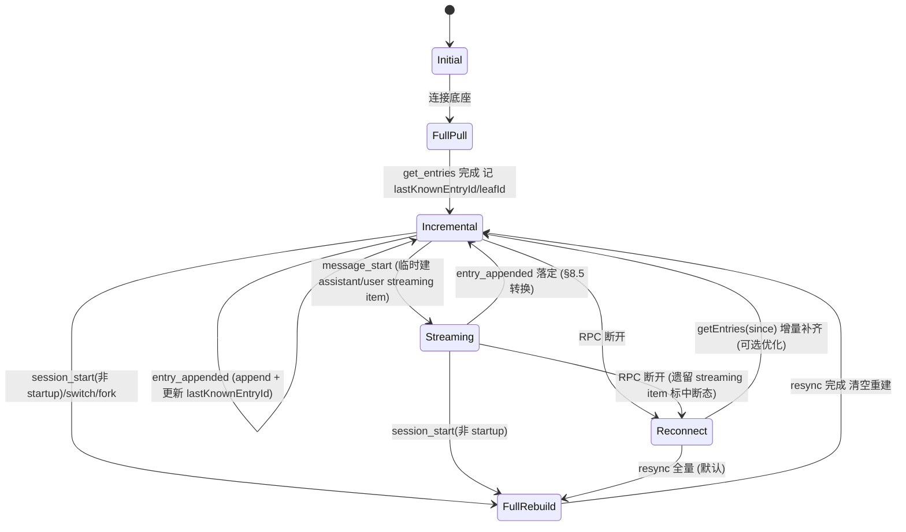
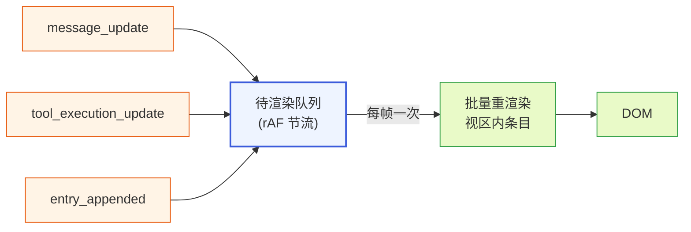
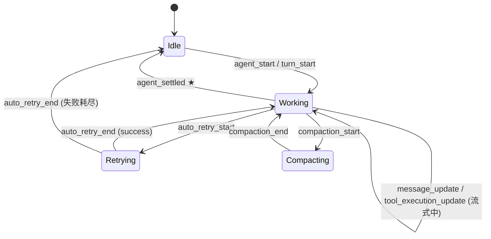
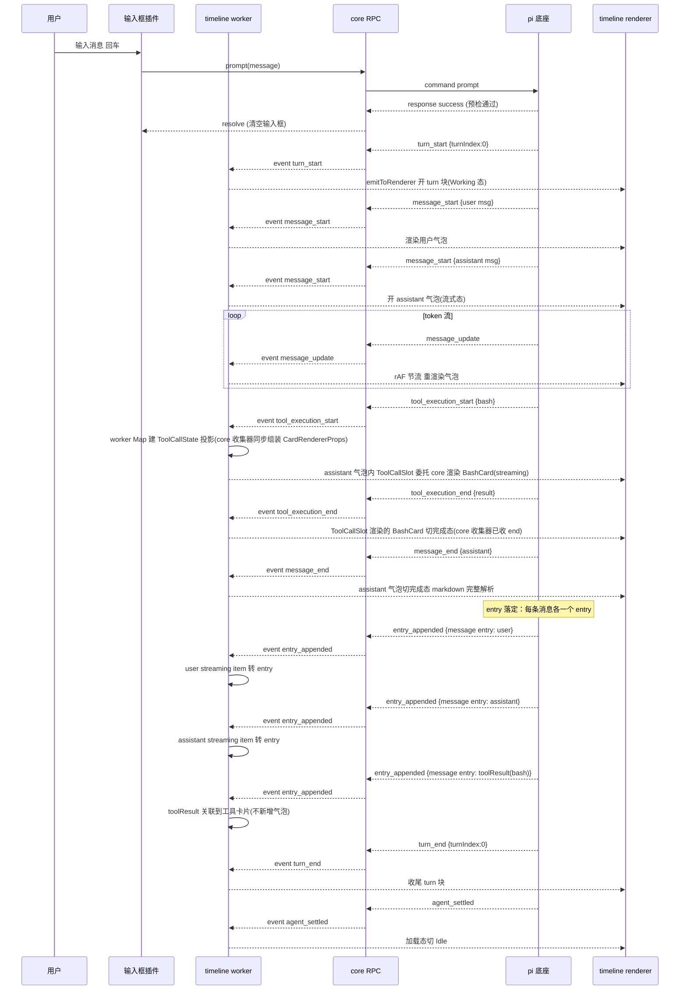
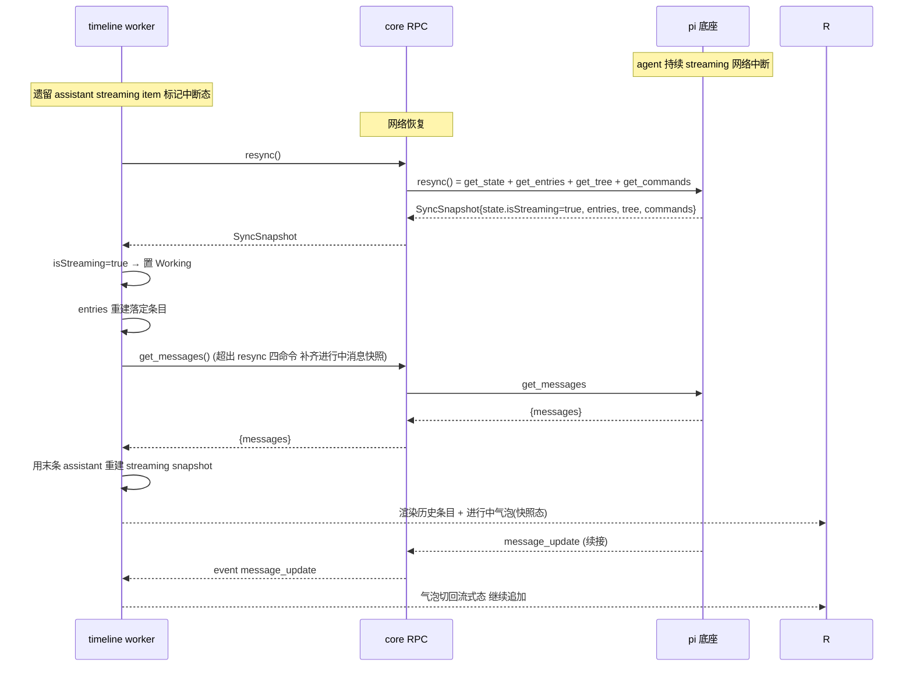

# 时间线渲染插件文档

本文档是 pi-desktop 设计文档体系的第 8 篇，对应总设计文档（`DESIGN.md`）第 4.4 节"基础时间线渲染插件"的展开。它聚焦于一个问题：桌面薄壳如何把 pi 底座经 RPC 吐出的 event 流和 `get_entries` 历史数据，渲染成一个可滚动、可增量、可分流式的时间线视图——让用户看见 agent 的思考、对话、工具调用，以及 session 级的控制条目（compact、fork、custom）。

本文档的目标读者是 pi-desktop core 层的实现者和桌面插件作者。文中所有论断都锚定到真实源码：pi 底座的 `packages/coding-agent/src/core/agent-session.ts`（`AgentSessionEvent` 联合类型，第 127 行起）、`packages/coding-agent/src/core/session-manager.ts`（`SessionEntry`，第 140 行）、`packages/coding-agent/src/core/extensions/types.ts`（`MessageStartEvent`/`ToolExecutionStartEvent` 等，第 714 行起）、`packages/coding-agent/src/modes/rpc/rpc-mode.ts`（`get_entries` 的 `since` 切片，第 612 行起）、`packages/ai/src/types.ts`（`AssistantMessage`/`ThinkingContent`/`ToolCall` 内容块，第 327 行起），以及 `DESIGN.md` 的 3.2.6、3.3、3.8、4.4、4.5 节。涉及代码引用时给出文件名与行号，照着能写实现。

## 1 模块定位与职责边界

### 1.1 时间线插件在四根支柱中的位置

pi-desktop 的 core 只提供四根支柱，其余一切功能是插件。时间线渲染插件（下文称 timeline 插件）属于支柱④"内置默认插件"——随壳分发、开箱即用，但架构地位和第三方插件平等：走同一套加载器、同一套槽位契约，优先级最低（`builtin`）、可被项目级或用户级同名插件整体覆盖。它不是 core 的硬编码视图，而是往"卡片渲染槽"（cardRenderers）挂默认渲染器的普通插件。



timeline 插件做的全部事情是消费数据、贡献渲染器。它不碰底座行为——不调 `prompt`、不调 `abort`、不写配置文件。它的数据输入只有两条：底座经 RPC 推送的 `AgentSessionEvent` 流（fire-and-forget、无 id），以及 `get_entries` 命令的响应（带 id 的请求-响应）。它的输出是一组挂在 cardRenderers 槽位的渲染组件，由 core 在渲染工具卡片时按 MatchRule 匹配调用。

### 1.2 与文件预览插件的协作关系

timeline 插件和文件预览插件（4.5）是协作关系，不是包含关系。两者分工的边界是：卡片渲染槽决定"用什么框架包这个工具结果"，预览器槽决定"这个文件内容怎么画"。

具体地，timeline 挂的 `bash` 工具卡片用终端输出样式渲染命令输出，这完全自包含；但 `edit`/`write`/`read` 工具卡片要展示文件内容或 diff 时，不自己实现 markdown/diff/代码高亮的渲染逻辑——它调用预览器槽（viewers）里文件预览插件挂的渲染器。`edit` 工具卡片把新旧文本交给预览器槽的 diff 预览器，`read` 工具卡片把文件内容交给按扩展名匹配的预览器（markdown 预览器、代码高亮预览器、图片预览器、默认文本预览器）。

这条协作通过槽位查询完成：timeline 的卡片组件在需要渲染文件内容时，通过 `RendererPluginContext` 提供的预览器槽查询能力拿当前生效渲染器，而非硬依赖文件预览插件。预览器槽里挂的是哪个插件的渲染器，timeline 不关心，只要符合预览器槽契约（`{ match, component }`）即可。文件预览插件被卸载或被覆盖时，timeline 的 diff/文件列表卡片降级到默认文本显示，不会崩溃。

### 1.3 与会话管理插件的协作

timeline 插件和会话管理插件（4.6）共享同一份 session 数据，但视角不同。timeline 是"当前活跃分支的追加序视图"——它按 entry 追加顺序线性展示，从 `get_entries` 返回的 `entries: SessionEntry[]`（已按叶子路径解析）渲染。会话管理插件是"分叉树的俯瞰视图"——它用 `get_tree` 返回的 `SessionTreeNode[]`（嵌套结构）渲染可导航的分支树。

两者通过 `leafId` 协同：`get_entries` 和 `get_tree` 都返回 `leafId`（当前活跃叶子节点 id，`session-manager.ts:1125` 的 `getLeafId()`）。timeline 用 `leafId` 高亮当前位置、判断增量是否在当前分支上；会话树用 `leafId` 标记当前所在分支末端。当用户在会话树里切换分支（`switch_session`/`fork`），底座会重新 `session_start`（reason 为 `reload`/`resume`/`fork`），timeline 插件收到这个事件后用 `rpc.resync()` 重新拉全量 entries——这是 3.2.4 的共享原语在 timeline 场景的落地。

### 1.4 消费而非翻译

timeline 插件最根本的立场是"消费而非翻译"（DESIGN.md 3.7.2）。pi 底座在 TUI 模式下有自己的渲染机制——`ToolDefinition.renderCall/renderResult`、`registerMessageRenderer` 返回 `@earendil-works/pi-tui` 的 `Component`。timeline 插件不吃这套 TUI 组件树，不把终端渲染翻译成 Web。它做的事是：订阅底座经 RPC 吐出的 `AgentSessionEvent`，按事件类型自己决定怎么画。

这条立场消解了 现有方案的 adapter 层。现有方案 造了 34 个 `.adapter.json` 把底座扩展的交互声明式映射成桌面组件，纯 JSON、第三方无法自带、动态需求做不了。timeline 插件用卡片渲染槽做对了：渲染器是真正的 React 代码组件，不是 JSON 声明，能做动态渲染——bash 卡片可以流式追加终端输出行、edit 卡片可以在结果到达后切换 diff 视图、自定义工具卡片能渲染任意结构。

## 2 数据源：事件流与历史 entries

### 2.1 AgentSessionEvent 与时间线相关的子集

底座经 RPC stdout 推送的 event 是 `AgentSessionEvent` 联合类型（`agent-session.ts:127`）。它由 `Exclude<AgentEvent, { type: "agent_end" }>` 加上几个 RPC 专属事件（`agent_settled`/`queue_update`/`compaction_*`/`entry_appended` 等）组成。`AgentEvent` 定义在 `packages/agent/src/types.ts:418`，是 agent 运行时的核心事件流。

**`agent_end` 不经 RPC 推送**（关键边界，消除下文 §9.1/9.2/9.3 的口径冲突）：`AgentSessionEvent` 显式 `Exclude` 了 `agent_end`——即底座的 RPC 适配层（`session.subscribe` 转发）**不把 `agent_end` 推给桌面端**。timeline 无法通过 `pi.events.on` 订阅到 `agent_end`，它既不能用作加载态切换、也不能用作 abort 后的收尾信号；这两条用途只能落到 RPC 专属的 `agent_settled`。`agent_start` 仍在推送范围内。DESIGN.md 1.6.1 把 `agent_end` 列为 Agent 生命周期事件之一（描述底座 `AgentEvent` 联合），但未点明它在 RPC 层被排除——这是 DESIGN 1.6.1 待补的说明项（应注明"agent_end 属 AgentEvent 但不经 RPC 转发，桌面端用 agent_settled 替代"）。下文涉及"一轮结束"的信号一律指 `agent_settled`。

timeline 插件只消费其中和时间线渲染直接相关的子集。全集分四组（对应 DESIGN.md 1.6）：



带 ★ 标记的是 timeline 渲染的关键驱动事件：`entry_appended` 是增量更新的依据、`agent_settled` 是停止加载态的标志、`auto_retry_start`/`auto_retry_end` 驱动重试态（见 §9.1 状态机的 Retrying 分支）。timeline 不需要消费全部事件——它只订阅与渲染相关的，其余事件（`model_select`/`queue_update` 等）归模型参数插件（4.9）和状态栏。但 timeline 要感知 `session_start`（重置视图、重新拉全量）、`agent_settled`（停止加载态）和 `auto_retry_*`（重试提示）。

### 2.2 各事件的字段结构与时间线用途

把时间线相关事件的字段钉死，组件按字段取数据。字段结构来自 `packages/coding-agent/src/core/extensions/types.ts`（第 714 行起）。

**时间戳来源口径（消除"哪些字段走中性翻译、哪些直接吃 pi 原值"的歧义）**：进入 timeline 排序/展示的时间戳只有两种来源——pi 原生字段或中性层注入字段，二者最终统一归一为 epoch 毫秒数再比较（§2.4）。逐事件列清：

| 字段 | 来源 | 类型 | 归一方式 |
|------|------|------|---------|
| `SessionEntry.timestamp` | pi 原生（底座 `session-manager.ts` 写 session 文件时 `new Date().toISOString()`） | ISO 8601 字符串 | `Date.parse()` 转 epoch ms |
| `turn_start.timestamp` | pi 原生（`types.ts:714`） | epoch ms（number） | 直接用 |
| `AgentMessage.timestamp` | pi 原生（消息落定时底座打的 ISO 字符串，随 `message` 携带） | ISO 8601 字符串 | `Date.parse()` 转 epoch ms |
| `ToolCallStart.timestamp` | **中性层注入**（RPC 适配层在 `tool_execution_start` 到达 core 时 `Date.now()` 打，§3.4） | epoch ms（number） | 直接用 |
| `ToolCallEnd.timestamp` | **中性层注入**（RPC 适配层在 `tool_execution_end` 到达 core 时 `Date.now()` 打，§3.4） | epoch ms（number） | 直接用 |

口径：`tool_execution_*` 事件本身**不带** timestamp（见下文工具三事件），卡片算"执行耗时"只能用中性层注入的 `ToolCallStart/End.timestamp`；`turn_start.timestamp`、`AgentMessage.timestamp`、`SessionEntry.timestamp` 是 pi 原生字段，timeline 直接消费但**仍经 §2.4 的 epoch ms 归一**再参与排序——不把 ISO 字符串按字典序比较。控制条目（compaction/model_change 等）按 `SessionEntry.timestamp` 归一后插入时间线。

**消息三事件**（`types.ts:729-745`）：

- `message_start`：`{ type: "message_start"; message: AgentMessage }`。`message` 是完整的 `AgentMessage`（`role`/`content`/`timestamp` 等，见 2.4）。收到时创建一个新消息气泡，role 决定气泡类型（user/assistant/toolResult）。
- `message_update`：`{ type: "message_update"; message: AgentMessage; assistantMessageEvent: AssistantMessageEvent }`。`message` 是流式累积的最新完整消息（不是增量 delta），`assistantMessageEvent` 是 token 级流式细节。timeline 用 `message.content` 的最新值重渲染 assistant 气泡——这是流式渲染的核心。
- `message_end`：`{ type: "message_end"; message: AgentMessage }`。消息落定，timeline 把气泡从"流式中"态切到"完成"态（停止光标动画、固定 markdown 渲染结果）。

**工具三事件**（`types.ts:748-771`）：

- `tool_execution_start`：`{ type: "tool_execution_start"; toolCallId: string; toolName: string; args: any }`（`types.ts:748`）。`toolCallId` 跨 start/update/end 稳定，是收集器的关联键；`toolName` 用于卡片渲染槽 MatchRule 匹配；`args` 是工具参数（edit 的 path+edits、bash 的 command、read 的 path 等）。**注意 pi 的 `tool_execution_*` 事件本身不带 timestamp 字段**——卡片要算"执行耗时"时，靠圆心中性接口 `ToolCallStart.timestamp`/`ToolCallEnd.timestamp`（由 RPC 适配层在事件到达时打的时间戳，见 §3.4），而非事件自带字段。
- `tool_execution_update`：`{ type: "tool_execution_update"; toolCallId: string; toolName: string; args: any; partialResult: any }`。流式中间输出，timeline 追加到该 toolCallId 的 `updates[]` 数组、重渲染卡片。
- `tool_execution_end`：`{ type: "tool_execution_end"; toolCallId: string; toolName: string; result: any; isError: boolean }`。`result` 是工具最终结果，`isError` 控制卡片样式（错误用红色标记）。end 到达后卡片切到"完成"态。

**Turn 两事件**（`types.ts:714-726`）：

- `turn_start`：`{ type: "turn_start"; turnIndex: number; timestamp: number }`。timeline 用 `turnIndex` 分组条目、`timestamp` 排序。
- `turn_end`：`{ type: "turn_end"; turnIndex: number; message: AgentMessage; toolResults: ToolResultMessage[] }`。一个 turn 结束，timeline 据此收尾当前 turn 的渲染块。

**Session 级事件**：

- `session_start`：`{ type: "session_start"; reason: "startup" | "reload" | "new" | "resume" | "fork"; ... }`（`types.ts:548`）。timeline 收到后判断要不要重置视图——reason 为 `resume`/`fork`/`reload` 时底座 rebind 了 session，timeline 要重新拉 entries。
- `entry_appended`：`{ type: "entry_appended"; entry: SessionEntry }`（`agent-session.ts:141`）。增量更新的核心——收到就 append 一条，不用重新全量拉。
- `agent_settled`：`{ type: "agent_settled" }`（`agent-session.ts:134`）。停止加载态的标志。
- `auto_retry_start`：`{ type: "auto_retry_start"; attempt: number; maxAttempts: number; delayMs: number; errorMessage: string }`（`agent-session.ts:152`）。自动重试开始，timeline 据此把加载态切到 `Retrying`、显示"重试 N/M: {errorMessage}"。
- `auto_retry_end`：`{ type: "auto_retry_end"; success: boolean; attempt: number; finalError?: string }`（`agent-session.ts:153`）。自动重试结束，`success` 决定切回 `Working`（继续）还是等 `agent_settled` 切 `Idle`（失败耗尽）。

`auto_retry_start`/`auto_retry_end` 属于 §2.1 的 Session 级分组——timeline 订阅它们用于驱动 Retrying 态（§9.1/9.3）。它们不在 `message_*`/`tool_execution_*` 流里，是 agent 运行时的独立控制事件。

### 2.3 get_entries 全量与 since 增量

`get_entries` 是 timeline 的历史数据源，调用契约（`rpc-mode.ts:612-622`）：

- 发送：`{ type: "get_entries", since?: string, id }`。
- 响应：`{ success: true, data: { entries: SessionEntry[]; leafId: string | null } }`。
- `since` 语义：底座 `sessionManager.getEntries()` 返回当前叶子路径的全部条目（已按 `buildSessionPath` 解析为路径上的线性数组，`session-manager.ts:416`），`since` 指向某 entry id 时，`findIndex` 定位后 `slice(sinceIndex + 1)` 返回它之后的条目（`rpc-mode.ts:616-620`）。`since` 指向不存在的 entry → error `"Entry not found: {since}"`。

两种用法：

- **首次全量**（不带 `since`）：timeline 连接底座后、或 `session_start` 后，拉取当前 session 全部 entries，构建初始视图。
- **断线重连补齐**（带 `since`）：timeline 记着自己最后已知的 entry id（`lastKnownEntryId`），重连后用 `get_entries({ since: lastKnownEntryId })` 拉它之后的增量，补齐断连期间错过的条目。这是 RPC 通道中断后的恢复手段——平时增量靠 `entry_appended` event，不靠轮询 `get_entries`。

注意 `since` 的语义是"该 id 之后"，不是"包含该 id"——`slice(sinceIndex + 1)` 跳过了 since 自身。timeline 传 `since` 时要传自己已经渲染过的最后一条 entry 的 id，而非下一条的 id。

### 2.4 SessionEntry 类型与 AgentMessage 内容块

`get_entries` 返回的 `entries: SessionEntry[]` 是带分叉结构的展示层条目（`session-manager.ts:140`）。它是个联合类型，每种 `type` 对应不同的渲染：

```typescript
// session-manager.ts:46-149
interface SessionEntryBase { type: string; id: string; parentId: string | null; timestamp: string }

type SessionEntry =
  | { type: "message"; message: AgentMessage }                                    // 用户/assistant/toolResult 消息
  | { type: "thinking_level_change"; thinkingLevel: string }                      // 思考级别变更
  | { type: "model_change"; provider: string; modelId: string }                   // 模型切换
  | { type: "compaction"; summary: string; firstKeptEntryId: string; tokensBefore: number; details?; fromHook? }  // 上下文压缩
  | { type: "branch_summary"; fromId: string; summary: string; details?; fromHook? }  // 分支摘要
  | { type: "custom"; customType: string; data? }                                 // 扩展自定义（不入 LLM 上下文）
  | { type: "custom_message"; customType: string; content: string|(TextContent|ImageContent)[]; details?; display: boolean }  // 扩展自定义（入 LLM 上下文）
  | { type: "label"; targetId: string; label: string | undefined }                // 用户书签
  | { type: "session_info"; name?: string };                                      // session 元信息
```

**时间戳类型的统一说明**（消除 §2.2 与 §6.1 排序口径的歧义）：`SessionEntryBase.timestamp` 是 **ISO 8601 字符串**（底座 `session-manager.ts` 写入 session 文件时用 `new Date().toISOString()`，如 `"2026-07-24T08:30:12.345Z"`）；而 `turn_start.timestamp`（`types.ts:714`）是 **epoch 毫秒数**（`number`，如 `1784560212345`）。两者类型不同、来源也不同——entry 的 timestamp 在底座追加 entry 时打、turn 的 timestamp 在 turn 开始时打。timeline 内部排序时统一口径：**先把所有时间戳归一成 epoch 毫秒数再比较**——entry.timestamp 用 `Date.parse(entry.timestamp)` 转 number，turn_start.timestamp 直接用。控制条目按归一后的数值插入时间线（§6.1 的"按 timestamp 排序"即指此归一比较，不是字符串字典序）。entry_appended 增量追加天然有序（后追加者 timestamp 更大），排序主要发生在历史回放、混合 entry 与流式条目、以及跨 turn 边界时。

`type: "message"` 的 entry 里 `message: AgentMessage` 是 LLM 视角的消息结构（`packages/agent/src/types.ts:314`）。`AgentMessage = Message | CustomAgentMessages[...]`，`Message` 是 `UserMessage | AssistantMessage | ToolResultMessage`（`packages/ai/src/types.ts:382` 起）。时间线渲染最关心 `AssistantMessage` 的 `content` 数组——它由三种内容块组成：

- `TextContent`（`types.ts:327`）：`{ type: "text"; text: string }`——assistant 的正文文本，走 markdown 渲染。
- `ThinkingContent`（`types.ts:333`）：`{ type: "thinking"; thinking: string; redacted?: boolean; thinkingSignature?: string }`——思考过程，走折叠块渲染。`redacted: true` 表示被安全过滤遮蔽，渲染成"[思考已被过滤]"。`thinkingSignature` 是给 API 回传的不透明载荷（redacted thinking 块回传给模型时用），timeline 不展示（见 §4.5）。
- `ToolCall`（`types.ts:349`）：`{ type: "toolCall"; id: string; name: string; arguments: Record<string, any> }`——工具调用块，这里的 `id` 就是 `tool_execution_start` 的 `toolCallId`，据此把工具卡片关联到 assistant 消息内。

`UserMessage.content` 是 `string | (TextContent | ImageContent)[]`（`types.ts:382`）——用户消息可能带图片（`ImageContent`：`{ type: "image"; data: base64; mimeType }`，`types.ts:343`），timeline 要渲染图片附件。

### 2.5 entry_appended 增量与历史回放的一致性

timeline 的数据有两个来源：`get_entries`（历史全量/补齐）和 event 流（实时增量）。两者描述的是同一份 session 状态——entry 一旦追加到底座 session 文件，底座就推 `entry_appended` event，同时它也出现在后续 `get_entries` 的返回里。这条一致性是 timeline 增量更新的基础。

关键边界：timeline 不能"既全量拉又收增量"导致重复。正确模式是：首次 `get_entries` 拿全量 + 记下 `leafId`/最后 entry id；之后只靠 `entry_appended` event 增量 append，不再全量拉。只有在"不确定自己漏没漏"的场景（重连、`session_start`、`switch_session` 后）才重新 `get_entries`——此时要先清空旧视图再重建，不能叠加。

## 3 卡片渲染槽贡献：toolName MatchRule → 渲染器

### 3.1 卡片渲染槽契约回顾

卡片渲染槽（cardRenderers）是 core 暴露给插件的扩展点之一（DESIGN.md 3.3）。贡献项结构：`{ match: MatchRule; component: string }`。`match` 决定这个渲染器匹配哪些工具调用，`component` 是 renderer 模块导出的渲染组件名（字符串引用，core 在 renderer 侧加载组件、按 CardRendererProps 契约喂事件数据）。

timeline 插件往这个槽位挂一组默认渲染器，覆盖底座内置工具（bash/edit/write/read/grep/glob）的渲染。第三方插件可以挂自定义工具的渲染器——比如底座扩展注册了 `generate_image` 工具，第三方插件挂一个 `{ match: { toolName: "generate_image" }, component: "ImageCard" }` 的贡献项，agent 调该工具时用自定义 UI 而非默认卡片。

### 3.2 MatchRule 策略注册表

`MatchRule` 在 manifest 里是纯数据（DESIGN.md 3.3），core 加载时通过策略注册表转成可求值的匹配器，不按 `strategy` 字段 if-else 分发。卡片渲染槽（cardRenderers）和预览器槽（viewers）共用同一套 `MatchRule` 类型，但各自只用其中一部分策略——cardRenderers 用 `toolName`/`toolNames`/`customType`/`all`，viewers 用 `extension`/`mime`/`all`：

```typescript
// DESIGN.md 3.3 —— cardRenderers 与 viewers 共用
type MatchRule =
  | { strategy: "toolName"; value: string }        // 卡片渲染槽：精确匹配工具名
  | { strategy: "toolNames"; value: string[] }     // 卡片渲染槽：匹配多个工具名之一
  | { strategy: "customType"; value: string }      // 卡片渲染槽：匹配自定义 entry/customType
  | { strategy: "extension"; value: string }       // 预览器槽：按文件扩展名匹配（value 如 "md"/"ts"，不含点）
  | { strategy: "mime"; value: string }             // 预览器槽：按 mime 匹配（支持 "image/*" 通配，如 "text/markdown"/"text/x-diff"）
  | { strategy: "all" };                           // 兜底：两个槽位都能用，匹配全部

interface MatchStrategy {
  matches(ctx: MatchContext): boolean;
  specificity: number;  // 策略自己声明，core 不硬编码排序表
}

interface MatchContext {
  toolName?: string;      // 工具调用时：工具名（cardRenderers 查询用）
  customType?: string;    // 自定义 entry 时（cardRenderers 查询用）
  filePath?: string;      // 文件时：路径（viewers 查询用，strategy=extension 时从中取扩展名）
  mimeType?: string;      // 文件时：mime（viewers 查询用，strategy=mime 时精确/通配匹配）
}
```

内置策略的 specificity（core 定义的稳定常量，放在 `domain/slots/strategies.ts`）：`toolName.specificity = 100`、`toolNames.specificity = 100`、`customType.specificity = 100`、`extension.specificity = 100`、`mime.specificity = 100`、`all.specificity = 0`。`extension` 策略求值时从 `ctx.filePath` 取 `path.extname` 后去掉点、和 `value` 比对（大小写不敏感）；`mime` 策略求值时把 `value` 里的 `*` 当通配、和 `ctx.mimeType` 比对（如 `value: "image/*"` 匹配 `image/png`/`image/jpeg`）。timeline 的卡片/气泡查预览器槽时按这个契约构造 `MatchContext`：查文件预览器传 `{ filePath: file_path }`（走 extension 匹配）、查 diff 预览器传 `{ mimeType: "text/x-diff" }`、查 markdown 预览器传 `{ mimeType: "text/markdown" }`。

timeline 挂的默认渲染器（cardRenderers 槽位）用的 match 策略：

- bash 卡片：`{ strategy: "toolNames", value: ["bash", "execute_bash"] }`——匹配 bash 工具（不同底座版本/扩展可能注册不同工具名）。
- edit/write 卡片：`{ strategy: "toolNames", value: ["edit", "write", "multi_edit"] }`——匹配文件编辑类工具（edit 已是多段编辑结构、走 diff；multi_edit 同为多段编辑、复用 EditCard 的 diff 渲染；write 走新文件预览）。
- read/grep/glob 卡片：`{ strategy: "toolNames", value: ["read", "grep", "glob", "ls"] }`——匹配文件读取类工具，走文件列表/内容预览。
- 默认卡片：`{ strategy: "all" }`——兜底，匹配所有未被前面规则命中的工具调用。

### 3.3 特异度与冲突仲裁

多个渲染器都 match 同一个工具调用时，仲裁规则（DESIGN.md 3.3）：按贡献项来源插件的优先级取最高（project > user > installed > builtin）；同优先级按 `specificity` 数值大的胜出；同 specificity 按注册顺序取先注册的。

`specificity` 由每个 `MatchStrategy` 自己声明，core 只比数值、不维护硬编码排序表。内置策略的 specificity 是 core 定义的稳定常量（放在 `domain/slots/strategies.ts`）：`toolName.specificity = 100`、`toolNames.specificity = 100`、`customType.specificity = 100`、`extension.specificity = 100`、`mime.specificity = 100`、`all.specificity = 0`。`toolName` 和 `toolNames` 同为 100——两者特异度相同，区别只在 value 集合（单值 vs 多值），仲裁时不按 value 内容排序。

这条规则保证了"第三方插件的自定义 bash 渲染器能覆盖 timeline 的默认 bash 渲染器"——只要第三方插件来源优先级更高（用户级 > 内置），即使 specificity 相同也胜出。timeline 的默认渲染器 specificity 都是 100（除 `all` 兜底是 0），第三方想覆盖默认 bash 卡片，挂一个 toolName 匹配的渲染器、来源优先级高于 builtin 即可。

**同 specificity + 同来源优先级时的平局规则**：按注册顺序取先注册者，**不按 value 内容排序**。即两个同为 `toolNames`、specificity 100、来源优先级相同的渲染器都匹配同一 `toolName` 时，先挂载（先在 manifest 数组里出现/先被加载器注册）的那个胜出，不比较 `value` 数组的元素内容或长度。预览器槽同理。

### 3.4 CardRendererProps：core 喂数据模型

卡片渲染槽的组件不用自己订阅 event 流——core 在匹配到渲染器、渲染某个工具调用卡片时，把该工具调用的事件数据当 props 传入（DESIGN.md 3.2.6 第三条路）。props 契约用 core 自己定义的中性事件接口，不 import pi 的类型：

```typescript
// DESIGN.md 3.2.6 —— 圆心中性接口，不绑 pi
interface ToolCallStart { toolCallId: string; toolName: string; args: unknown; timestamp: number }
interface ToolCallUpdate { toolCallId: string; partialResult: unknown }
interface ToolCallEnd { toolCallId: string; result: unknown; isError: boolean; timestamp: number }

interface CardRendererProps {
  toolCallId: string;          // 跨 start/update/end 稳定
  toolName: string;
  args: unknown;              // 工具调用参数
  updates: ToolCallUpdate[];  // 该 toolCallId 的全部 update（流式输出，按时间序）
  start: ToolCallStart;        // start（含 timestamp，卡片算"执行耗时"用 end.timestamp - start.timestamp）
  end: ToolCallEnd | null;     // end（含 timestamp），null 表示还没结束
  isStreaming: boolean;        // 是否还在流式
  theme: Theme;                // 当前主题（4.11），见下方定义
}
```

几个被引用但需锚定的类型：

- **`Theme`**（DESIGN.md 5.1.5）：`type Theme = Record<string, string>`——token key → 值的映射（如 `"color.bg" → "#1e1e2e"`），由主题槽（3.3）合并当前主题插件的 tokens 产生，经 `pi.ui` 组件库和 cardRenderer props 注入。cardRenderer 一般用 `pi.ui.Button`/`pi.ui.Icon` 这些自带主题的组件，只在自定义颜色时读 token（如 `theme["color.primary"]`）。
- **`SyncSnapshot`**（DESIGN.md 3.2.4）：`{ state: SessionState; entries: MessageEntry[]; tree: TreeNode[]; leafId: string | null; commands: CommandInfo[] }`——`rpc.resync()` 返回的统一同步快照，**字段全部中性**（底座 `RpcSessionState`/`SessionEntry`/`SessionTreeNode`/`RpcSlashCommand` 经 gateway 翻译后才进快照，见 DESIGN.md 5.1.5），timeline 用其中的 `entries` 重建视图。
- **`ToolCallStart`/`ToolCallEnd` 与 `CardRendererProps` 的关系**：这两个中性接口是圆心定义的事件切片类型；`CardRendererProps` 把 `start`/`end` 整体内联为字段（而非让组件自己收 `ToolCallStart` 事件），卡片组件直接从 props 取 `start.timestamp`/`end.timestamp` 算耗时、取 `end.result` 渲染结果。它们不是冗余——`ToolCallStart`/`ToolCallEnd` 是 RPC 适配层翻译 pi 事件产出的中性切片，`CardRendererProps` 是 core 喂给卡片组件的聚合视图。

core 负责按 `toolCallId` 收集 pi 的 `tool_execution_*` 事件、翻译成上面中性接口、传给组件。`timestamp` 字段是 RPC 适配层在事件到达 core 时打的时间戳（`Date.now()`）——pi 的 `ToolExecutionStartEvent`/`ToolExecutionEndEvent` 本身不带 timestamp（见 §2.2），中性层补上它，使卡片能算"执行耗时 = end.timestamp - start.timestamp"。组件每次有新 update 或 end 到来时被重新渲染（props 更新）。这条依赖方向纪律（呼应洋葱架构）：圆心不 import pi 的类型——`ToolCallStart` 等是 core 自己定义的中性接口，RPC 适配层（中层）负责把 pi 的 `ToolExecutionStartEvent` 翻译成圆心的中性接口。pi 协议改了，只动中层的翻译、不动圆心契约和插件层。

### 3.4.1 RendererPluginContext 的渲染桥接能力（DESIGN.md 3.2.5 待补）

timeline 的 `ToolCallSlot`（§3.8）、`EditCard`/`ReadCard`/`AssistantBubble`（§10.3/10.4/10.5）都依赖 `RendererPluginContext`（DESIGN.md 3.2.5）上的三个渲染桥接能力——`pi.renderers.render`、`pi.viewers.match`、`pi.openFile`。但 DESIGN.md 3.2.5 当前只列了 `plugin/rpc/events/onMessage/postToWorker/i18n/theme/ui` 七个字段，未定义这三个。本节钉死它们的契约，作为 DESIGN 3.2.5 的待补项（实现时须把这三个字段补进 `RendererPluginContext`）。三者都遵循依赖向内纪律：圆心定义接口、core 提供实现，不 import pi 类型、不绑底座协议。

```typescript
// 拟补进 DESIGN.md 3.2.5 RendererPluginContext 的三个渲染桥接字段
interface RendererPluginContext {
  // ...原有 plugin/rpc/events/onMessage/postToWorker/i18n/theme/ui 七字段...

  /** 卡片渲染桥接：按 toolCallId 委托 core 渲染工具卡片（§3.8 ToolCallSlot 用） */
  renderers: {
    render(req: { toolCallId: string }): React.ReactNode | null;
  };

  /** 预览器槽查询：按 MatchContext 查当前生效预览器（§3.7/§10.3/10.4/10.5 用） */
  viewers: {
    match(ctx: MatchContext): { component: React.ComponentType<any>; kind: ViewerKind } | null;
  };

  /** 打开文件（定位到行）——§10.4 点击搜索结果用 */
  openFile(path: string, line?: number): void;
}

type ViewerKind = "diff" | "markdown" | "code" | "image" | "text";
```

**`pi.renderers.render({ toolCallId })` 的语义**（对应盲审 blocking 项：ToolCallSlot 桥接契约）：core 在内部维护一个 `toolCallId → CardRendererProps` 收集器（路径三的权威来源，见 §3.8"core 侧收集器"）。`render` 执行三步：(a) 按 `toolCallId` 查收集器拿到已组装的 `CardRendererProps`（含 `toolName`、从 `tool_execution_*` 翻译来的 `start`/`updates[]`/`end`/`isStreaming`）；(b) 用 `{ toolName }` 构造 `MatchContext`、查 cardRenderers 槽位按来源优先级 + specificity + 注册顺序仲裁出胜出渲染器组件对象（manifest 里写的字符串名经 `componentRegistry` 解析后的组件，§3.6）；(c) 把 `CardRendererProps` 传给胜出组件、返回已挂 props 的组件元素。**找不到 `toolCallId`**（异常：`tool_execution_start` 丢失或尚未到达）时返回 `null`——`ToolCallSlot` 在该位置留空或显示占位提示，不抛异常。这条能力把 §3.8 的"`CardRendererHost` 或等价的 `pi.renderers.render`"含糊表述钉死为后者这一个契约。

**渲染树拓扑统一**（消除 core 自渲染 vs timeline 嵌入委托的歧义）：DESIGN.md 3.2.6 路径三的原表述是"core 匹配到渲染器、自己渲染该工具调用卡片"，本文档的模型是"timeline 的 `AssistantBubble` 经 `ToolCallSlot` 按需向 core 取渲染"。两者统一为：**core 暴露按 `toolCallId` 渲染的能力（`pi.renderers.render`）、由调用方嵌入**——core 不自渲染工具卡片为顶层节点，工具卡片始终嵌在 assistant 气泡内、由 `ToolCallSlot` 委托 core 在该嵌入点渲染。DESIGN 3.2.6 路径三的描述应据此改为"core 暴露按 toolCallId 渲染能力、由调用方嵌入"（这是 DESIGN 待补的拓扑对齐项）。

**`pi.viewers.match(ctx)` 与 `ViewerKind` 的语义**（对应盲审 blocking 项：viewers 槽契约）：见 §3.7 详述。core 内部按 `MatchContext` 查 viewers 槽位、仲裁出胜出预览器，返回 core 已解析好的 `{ component, kind }`（`component` 是 manifest 字符串名经 `componentRegistry` 解析后的组件对象），找不到返回 `null`。`kind` 是预览类型枚举，供调用方按类型构造对应 props（§3.7 分类型 props 契约）。

**viewers 贡献项字段名对齐**（消除 DESIGN 3.3 内部矛盾）：DESIGN.md 3.3 在槽位总述里把 viewers 贡献项写成 `{ match, render }`（878 行），但在字段级 schema 里又写成 `{ match: MatchRule, component: string }`（888 行）——两处自相矛盾。本文档统一取 `{ match: MatchRule, component: string }`（与 cardRenderers 同构、`component` 为字符串名由 core 解析），§3.7 据此落地。DESIGN 3.3 的 878 行表述应修正为 `{ match, component }`（DESIGN 待补项），使 viewers 与 cardRenderers 贡献项 schema 完全对称。

**`pi.openFile` 的语义**（对应盲审 minor 项）：点击搜索结果/文件路径时定位到文件行。实现可二选一：(a) 作为 `RendererPluginContext.openFile(path, line?)` 直接暴露（本文档 §10.4 采用此形态）；(b) 经命令面板/编辑器插件的 `open-file` 命令出口（`pi.rpc.send` 或 `when` clause 触发的命令）。本文档选 (a)，作为 core 暴露给渲染插件的便捷能力；若 DESIGN 3.2.5 不愿新增此字段，§10.4 应改为发一个 `open-file` 命令——这是落地时的等价替代。


### 3.5 三条数据到达路径

cardRenderer 组件走的是第三条路（core 调度、props 传入），这是最省事的路径。但 timeline 插件整体可能用到全部三条路径（DESIGN.md 3.2.6）：

- **路径一：core 内置默认 event→renderer 转发**。timeline 的卡片组件在 cardRenderers 槽位，自动走路径三；但 timeline 如果还有不在 cardRenderers 槽位的纯 renderer 组件（比如一个实时显示"工具调用统计"的角标），可以用 `pi.events.on` 直接收 `tool_execution_*` event 自己画。这条路径下纯 renderer 插件零 worker。
- **路径二：worker 处理后推送**。timeline 要把多个 event 聚合成"当前 turn 的进度条"这类加工数据时，worker 侧 `events.on` 收 event、做转换/聚合、`context.emitToRenderer(channel, data)` 推加工后的数据给组件，组件 `pi.onMessage(channel, cb)` 收。
- **路径三：core 调度、props 传入**（cardRenderer 专属）。卡片组件不订阅 event，core 喂数据。

timeline 的默认渲染器全部走路径三——它们是 cardRenderers 槽位组件，core 自动喂数据。timeline 的 worker 侧逻辑（增量管理、leafId 跟踪、resync 编排）走路径二，加工后的"时间线条目列表"推给主时间线组件。

### 3.6 timeline 默认渲染器清单

timeline 插件往 cardRenderers 槽位挂的默认渲染器：

| 渲染器 | match | 用途 | 依赖预览器槽 |
|--------|-------|------|-------------|
| `BashCard` | toolNames: bash/execute_bash | 终端输出样式，流式追加行 | 否（自包含） |
| `EditCard` | toolNames: edit/write/multi_edit | diff/新文件渲染，红绿标色 | 是（diff/代码预览器） |
| `ReadCard` | toolNames: read/grep/glob/ls | 文件列表/内容预览 | 是（markdown/代码高亮/图片/文本预览器） |
| `DefaultCard` | all | 兜底，工具名+参数+结果摘要 | 否 |

四个渲染器覆盖了底座内置工具的全部场景，`DefaultCard` 兜底所有未被特殊处理的自定义工具。第三方插件要给某个自定义工具更精细的渲染，挂一个 specificity 更高或来源优先级更高的渲染器即可覆盖。

### 3.7 预览器槽（viewers）：匹配契约与组件 props

预览器槽和卡片渲染槽是两个独立槽位，共用 `MatchRule` 类型但用不同策略，且组件引用机制相同、props 契约不同。这里把预览器槽的匹配、组件解析、props 契约一次钉死，消除 §10.3/10.5 调用 `pi.viewers.match` 时的歧义。`pi.viewers.match` 及其返回类型 `ViewerKind` 是 `RendererPluginContext` 的渲染桥接能力，契约见 §3.4.1（DESIGN.md 3.2.5 待补）。

**匹配契约**：预览器槽贡献项结构为 `{ match: MatchRule; component: string }`（DESIGN.md 3.3 字段级 schema，888 行）。注意 DESIGN.md 3.3 的槽位总述（878 行）把 viewers 写成 `{ match, render }`，与字段级 schema 的 `{ match, component }` 自相矛盾——本文档统一取 `{ match, component }`（与 cardRenderers 同构、`component` 为字符串名由 core 解析），理由见 §3.4.1。`match` 只用 `extension`/`mime`/`all` 三种策略（见 §3.2）。文件预览插件挂的默认预览器：

- diff 预览器：`{ match: { strategy: "mime", value: "text/x-diff" }, component: "DiffViewer" }`
- markdown 预览器：`{ match: { strategy: "mime", value: "text/markdown" }, component: "MarkdownViewer" }`
- 代码高亮预览器：`{ match: { strategy: "extension", value: "ts" }, component: "CodeViewer" }`（每种扩展名一条或多条；也可用 `{ strategy: "all" }` 兜底走代码高亮）
- 图片预览器：`{ match: { strategy: "mime", value: "image/*" }, component: "ImageViewer" }`
- 默认文本预览器：`{ match: { strategy: "all" }, component: "TextViewer" }`

**组件引用机制（与 cardRenderers 统一）**：两个槽位的 `component` 字段都是**字符串名**——renderer 模块导出的组件命名（如 `"DiffViewer"`），不是组件对象。core 加载器在 renderer 侧动态 import 插件的 renderer 模块后，把组件名注册进 `componentRegistry["{pluginId}:{componentName}"]`（DESIGN.md 3.6 的加载流程）。`pi.viewers.match(ctx: MatchContext)` 返回的是**已被 core 解析好的预览器描述符** `{ component: ReactComponent; kind: ViewerKind }`——core 内部完成"字符串名 → 注册表查 → 拿到组件对象"这一步，调用方拿到的 `component` 已经是可渲染的 React 组件。所以 §10.3/10.5 里 `<viewer.component .../>` 是对的：`viewer.component` 是 core 解析后注入的组件对象，而 manifest 里写的仍是字符串名。`pi.viewers.match` 找不到匹配预览器时返回 `null`，调用方自行降级（如 `<pre>`）。这条机制和 cardRenderers 完全对称——cardRenderers 也是 manifest 写字符串名、core 解析后挂渲染器组件、按 `CardRendererProps` 喂数据自动渲染；区别仅在 viewers 是插件主动查询、由插件自己渲染，cardRenderers 是 core 自动匹配渲染。

**viewer 组件 props 契约**：预览器组件不统一用单一 props 接口——按预览类型分型，每种预览器满足各自的 props 契约。core 不强约束（props 是组件作者和调用方之间的约定），但默认预览器遵循以下分类型契约，timeline 的 EditCard/ReadCard/AssistantBubble 按这些契约喂数据：

```typescript
// 预览器组件 props 分类型契约（DESIGN.md 4.5 的预览器清单对应）
interface DiffViewerProps { oldText: string; newText: string; path?: string }
interface MarkdownViewerProps { content: string; streaming?: boolean; path?: string }
interface CodeViewerProps { content: string; path: string }
interface ImageViewerProps { src: string; mimeType: string }
interface TextViewerProps { content: string; path?: string }
```

- `DiffViewerProps`：edit 工具的 diff 用。`oldText`/`newText` 是新旧文本，`path` 用于按扩展名选语法高亮。§10.3 EditCard 把 edit 的 `oldText`→`newText` 喂进来。
- `MarkdownViewerProps`：assistant 正文文本块和 `.md` 文件用。`content` 是 markdown 文本，`streaming` 告诉预览器用轻量解析（流式中）还是完整解析（结束）——这是 §4.4 双阶段策略的落地。§10.5 AssistantBubble 把 `b.text` 和 `isStreaming` 喂进来。
- `CodeViewerProps`：代码文件用。`content` 是文件文本，`path` 用于按扩展名识别语言高亮。§10.3 EditCard 的 write 分支、§10.4 ReadCard 的 read 分支喂进来。
- `ImageViewerProps`：图片文件用。`src` 是 data URL 或路径（`data:{mimeType};base64,{data}`），`mimeType` 是 `image/png` 等。
- `TextViewerProps`：兜底文本预览，未知类型当文本显示。

`streaming` 是 `MarkdownViewerProps` 专有的可选 prop——只有 markdown 预览器需要区分流式/完成（影响解析策略）；diff/code/image 预览器都在数据落定后渲染，不需要 `streaming`。timeline 调预览器时按目标预览器类型构造对应 props，传错字段由 TypeScript 在插件作者侧发现（core 不做运行时 props 校验）。

### 3.8 主时间线与 cardRenderer 的组合：ToolCallSlot 桥接

§3.5 列了三条数据到达路径，其中**路径二**（主时间线，worker→renderer 经 `emitToRenderer`）和**路径三**（cardRenderer，core 调度、props 传入）在 timeline 内部如何组合，是落地时最容易卡住的地方——这里钉死。问题具体是：主时间线组件由 timeline worker 喂条目列表数据（路径二），当 `AssistantBubble` 遇到 `ToolCall` 内容块时渲染 `<ToolCallSlot toolCallId={b.id} />`——这个 Slot 怎么拿到由 core 路径三喂养的对应 cardRenderer 组件及其 props？两条独立数据路径如何桥接？

**核心结论：ToolCallSlot 是一个薄壳组件，它不自己喂数据，而是委托 core 渲染**。core 在 `RendererPluginContext` 上提供 `pi.renderers.render({ toolCallId })` 能力（契约见 §3.4.1，DESIGN.md 3.2.5 待补）：给定 `toolCallId`，core 在内部按 `toolName` 走 cardRenderers 槽位 MatchRule 匹配（§3.2/3.3）拿到当前生效渲染器组件，并按 `CardRendererProps` 契约（§3.4）从 core 自己收集的事件流里组装 props，最终渲染出该工具卡片。`ToolCallSlot` 的实现就是一行委托：

```tsx
function ToolCallSlot({ toolCallId }: { toolCallId: string }) {
  const pi = usePluginContext();
  return pi.renderers.render({ toolCallId });  // 委托 core：匹配渲染器 + 组装 props + 渲染
}
```

`pi.renderers.render` 在 core 内部完成三步（详 §3.4.1）：(1) 按 `toolCallId` 查 core 侧收集器拿到已组装的 `CardRendererProps`（含 `toolName`、从 `tool_execution_*` 翻译来的 `start`/`updates[]`/`end`/`isStreaming`）；(2) 用 `{ toolName }` 构造 MatchContext、查 cardRenderers 槽位按来源优先级 + specificity + 注册顺序仲裁出胜出渲染器；(3) 把 `CardRendererProps` 传给胜出组件、返回已挂 props 的组件元素。**找不到 `toolCallId`**（异常：`tool_execution_start` 丢失或尚未到达）时返回 `null`，`AssistantBubble` 在该位置留空或显示占位提示，不抛异常。这里钉死了 §3.4.1 提出的渲染树拓扑：**工具卡片始终嵌在 assistant 气泡内、由 `ToolCallSlot` 委托 core 在该嵌入点渲染**——core 不把工具卡片作为顶层节点自渲染，避免"core 自渲染 vs timeline 嵌入委托"两套拓扑并存。

**两个"收集器"是同一份还是两份？** 这是关键的去重问题。答案是：**props 的权威来源是 core 的收集器（路径三），timeline worker 不维护第二份用于渲染的 props 收集器**。具体：

- **core 侧收集器**（路径三）：core main 订阅 `tool_execution_*` event，按 `toolCallId` 聚合成 `CardRendererProps`（`start`/`updates[]`/`end`/`isStreaming`，§3.4）。这是 cardRenderer 组件渲染时的唯一 props 来源，挂在 core 的渲染运行时里。
- **timeline worker 侧的 `ToolCallState`**（§5.1/5.6）：这是 worker **自己的轻量投影**（worker `Map<toolCallId, ToolCallState>`，**不是 `TimelineItem`**——工具卡片非顶层条目，§8.2），只用于编排——记录哪些 toolCallId 正在进行（`isStreaming`）、它们的 `toolName`、以及异常态/超时态跟踪（§5.7）。worker **不**在 `ToolCallState` 里复制 `updates[]`/`end` 这些渲染数据——那是 core 的职责，worker 重复一份只会制造两份数据漂移的风险。

因此 `ToolCallState` 收缩为：`{ toolCallId; toolName; isStreaming; endReceived; entryId? }`——只够 worker 做编排与异常态跟踪，不碰渲染 props。§5.1 接口定义里 `updates`/`start`/`end` 字段应理解为"core 侧 `CardRendererProps` 的对应切片在 worker 视角的引用/投影"，worker 不自己累积它们的完整副本；若 worker 因加工需要（如算"工具调用统计"角标）确实要聚合 update，那走路径二的 `emitToRenderer` 单独推、和 cardRenderer 的 props 路径解耦，不共用同一份状态。

**一致性保证**：因为 core 收集器（props 权威）和 timeline worker 的条目模型都消费同一份 `tool_execution_*` event 流，两者对"这个 toolCallId 存在/在流式/已结束"的判断一致。`ToolCallSlot` 通过 `toolCallId` 委托 core 渲染时，core 用自己收集的最新 props——worker 不需要把 props 传给 Slot，避免了跨进程传递大 props 数组（updates 可能很大）。这也呼应 §3.2.6 的依赖方向：cardRenderer 的 props 喂养是 core 的职责（路径三），timeline worker 只管条目列表编排（路径二），两条路在 `ToolCallSlot` 这个委托点汇合、不互相侵入。

### 3.9 MatchRule 仲裁实例：一次 bash 工具调用的渲染器选择

把 §3.3 的仲裁规则走一遍，让规则从抽象变可落地。假设当前 cardRenderers 槽位挂了三条贡献项（按注册顺序）：

1. timeline（builtin 优先级）：`{ match: { strategy: "toolNames", value: ["bash", "execute_bash"] }, component: "BashCard" }`，specificity 100。
2. my-team（user 优先级）：`{ match: { strategy: "toolName", value: "bash" }, component: "TeamBashCard" }`，specificity 100。
3. timeline（builtin）：`{ match: { strategy: "all" }, component: "DefaultCard" }`，specificity 0。

agent 调用 `bash` 工具，core 用 `{ toolName: "bash" }` 构造 MatchContext 查询。仲裁三步走：

- **第一步：过滤 match**。`BashCard` 的 `toolNames` 策略对 `ctx.toolName === "bash"` 求 `value.includes("bash")` → true；`TeamBashCard` 的 `toolName` 策略求 `ctx.toolName === "bash"` → true；`DefaultCard` 的 `all` 策略恒 true。三条都 match。
- **第二步：按来源优先级取最高**。user（2）> builtin（1、3）。胜出候选缩到 `TeamBashCard`。
- **第三步：同优先级按 specificity**。这里只剩一个 user 候选，直接定。若有两个 user 级候选都 match，再比 specificity 数值（大者胜），同 specificity 比注册顺序（先注册胜）——但不比 value 内容（§3.3 平局规则）。

最终渲染 `TeamBashCard`——用户级插件覆盖了内置 bash 卡片。注意 `BashCard` 的 specificity 也是 100，但它在第二步就因来源优先级低被淘汰，specificity 没机会参与比较。这条顺序（来源优先级 > specificity > 注册顺序）是固定的，不是"先比 specificity 再比来源"——来源优先级最外层，保证"项目级/用户级插件整体覆盖 builtin"的语义优先于策略特异度。

**预览器槽对照**：同样的仲裁跑在 viewers 槽。例如查 `{ filePath: "README.md" }`：`{ strategy: "extension", value: "md" }`（specificity 100）和 `{ strategy: "all" }`（specificity 0）都 match，同来源优先级下 specificity 100 胜出，命中 markdown 预览器。`mime` 策略求值时支持通配（`value: "image/*"` 匹配 `ctx.mimeType: "image/png"`），通配不降低 specificity（仍是 100）——这是有意的，让"所有图片走 ImageViewer"和"精确 mime 走专用预览器"在同一特异度层公平竞争，由来源优先级和注册顺序决定。

**策略注册表的扩展点**：新增匹配方式（如按 `toolName` 正则、按 `args` 内容匹配）不是给 core 加 switch 分支，而是注册一个新 `MatchStrategy` 实现（`matches` + `specificity`），manifest 里写 `{ strategy: "myRegex", value: "..." }`。core 加载 manifest 时按 strategy 名查注册表拿实例——开闭原则落在匹配引擎上。内置六种策略（toolName/toolNames/customType/extension/mime/all）随 core 提供于 `domain/slots/strategies.ts`，第三方策略注册走 core 暴露的注册 API（DESIGN.md 3.3）。

### 3.10 renderer 侧组件层级与数据流总览

把前面散落的组件关系收拢成一张层级图，让"哪个组件吃哪条路径的数据"一目了然：



数据流分两路汇合在 `AssistantBubble`：路径二喂的是条目列表（`TimelineItem[]`，决定渲染哪些条目、按什么顺序），路径三喂的是工具卡片 props（经 `ToolCallSlot` 委托 core 现取）。`AssistantBubble` 同时是两条路的汇合点——它从路径二拿 `message`（决定 text/thinking/toolCall 块的顺序与内容），遇到 `ToolCall` 块时经 `ToolCallSlot` 走路径三拿工具卡片渲染。**`ToolCallSlot` 始终是 `AssistantBubble` 的子组件**——无论气泡处于 streaming 还是 entry 态，工具卡片都嵌在气泡内、委托 core 渲染，不作为顶层条目独立存在（这是 §3.8/§8.2 的拓扑统一）。两路解耦但通过 `toolCallId` 关联（`ToolCall.id` 既出现在路径二的 `message.content` 里，也是路径三 core 收集器的键）。markdown 预览器（`MarkdownViewer`）和 thinking 折叠块（`ThinkingBlock`）则是 `AssistantBubble` 直接渲染的子组件，不经 cardRenderers 槽——它们走 viewers 槽（markdown）或纯本地组件（thinking）。这张图补全了 §3.5 三条路径"在哪汇合、谁喂谁"的留白，是落地组件拆分的依据。


## 4 事件流消费：消息生命周期

### 4.1 turn 边界与消息分组

timeline 用 `turn_start`/`turn_end` 划分渲染块。一个 turn 是 agent 的一轮循环——从用户发消息到 agent 输出完毕（可能包含多次工具调用）。`turn_start` 带 `turnIndex` 和 `timestamp`，timeline 据此创建一个 turn 分组容器；`turn_end` 带该 turn 的最终 `message` 和 `toolResults`，timeline 据此收尾当前 turn 块。



turn 分组在视觉上表现为：用户消息气泡 → assistant 思考块（折叠）→ assistant 正文（markdown）→ 工具卡片序列 → assistant 续写正文……直到 turn_end。一个 turn 内 assistant 可能多次调用工具，每次工具调用前后都有文本块——timeline 按 content 块的顺序线性渲染，工具卡片穿插在文本之间。

### 4.2 message_start / message_update / message_end 三段式

assistant 消息的流式渲染由三个事件驱动，对应三个阶段：

- **start**：`message_start` 到达，timeline 创建一个 assistant 气泡，置"流式中"态（显示光标动画、markdown 还未最终成型）。此时 `message.content` 可能为空或只有部分 text 块。
- **update**（循环）：`message_update` 到达，`message` 是流式累积的最新完整消息（不是 delta）。timeline 用最新 `message.content` 重渲染气泡——这是流式的核心机制：底座每次推的是完整快照而非增量，timeline 直接替换渲染、不自己累积 delta。`assistantMessageEvent` 提供 token 级细节，可用于细粒度动画（如逐字光标），但 timeline 默认实现可以忽略它、只看 `message.content`。
- **end**：`message_end` 到达，`message` 是最终完整消息。timeline 把气泡切到"完成"态——停止光标动画、固定 markdown 渲染结果（此时可以触发一次最终的 markdown 完整解析，替换流式期间的轻量解析）。

关键：`message_update` 的 `message` 是完整快照。这意味着 timeline 不需要自己维护"已收到的文本累积"状态——每次 update 直接用 `message.content` 重渲染。这简化了实现，代价是每次 update 都重渲染整个气泡。对长 assistant 消息，这靠虚拟滚动 + 防抖控制（见第 8 节）。

### 4.3 用户消息气泡

`message_start` 里 `message.role === "user"` 的，渲染成用户气泡。`UserMessage.content`（`types.ts:382`）是 `string | (TextContent | ImageContent)[]`：

- 字符串形式：直接渲染成文本气泡（不做 markdown，用户输入按字面显示，防注入）。
- 内容块数组形式：遍历块，`TextContent` 渲染文本、`ImageContent` 渲染图片附件（``）。

用户消息不走 markdown 渲染——这是安全考量，用户输入可能含恶意 markdown/HTML，按字面文本显示避免 XSS。assistant 消息才走 markdown（agent 输出受控，但仍经 dompurify 防护，见 4.4）。

`message_update` 一般不针对 user 消息（用户消息是一次性的、不流式）——但 timeline 仍按 `message_start`/`message_end` 配对管理生命周期，user 消息的 start 和 end 之间没有 update。

### 4.4 assistant 流式 markdown 渲染

assistant 消息的 `content` 是 `(TextContent | ThinkingContent | ToolCall)[]`（`types.ts:390`）。timeline 遍历 content 块，按类型分发：

- `TextContent`（`type: "text"`）：走 markdown 渲染，复用文件预览插件（4.5）的 markdown 预览器。渲染成富文本——标题、列表、代码块（带语法高亮）、链接、表格等。markdown 渲染用 dompurify 做 XSS 防护（借鉴 现有方案的依赖），代码块高亮复用代码高亮能力（4.5）。
- `ThinkingContent`（`type: "thinking"`）：走折叠块渲染（见 4.5）。
- `ToolCall`（`type: "toolCall"`）：渲染成工具卡片的占位/引用——`ToolCall.id` 关联到 `tool_execution_start` 的 `toolCallId`，timeline 在此处插入对应的工具卡片（由 cardRenderers 槽位的渲染器渲染）。

流式期间（`message_update` 循环中）的 markdown 渲染策略：

- **轻量解析**：流式中每次 update 用轻量 markdown 解析（不完整 AST、容忍未闭合语法），保证流式响应性。代码块未闭合时按普通文本显示。
- **最终解析**：`message_end` 到达后做一次完整 markdown 解析，替换流式期间的轻量结果。此时代码块全部闭合、AST 完整。

这个"流式轻量 + 结束完整"的双阶段策略平衡了响应性和正确性——流式期间不能等完整解析（每个 token 都解析太慢），结束时必须完整解析（流式轻量解析会留下残缺语法）。

### 4.5 thinking 块折叠

`ThinkingContent`（`types.ts:333`）是 assistant 的思考过程，`thinking: string` 是思考文本。timeline 把它渲染成可折叠块：

- **默认折叠**：thinking 块默认收起，只显示标题（如"思考过程"+ 字数摘要），点击展开查看全文。这避免长思考过程淹没正文。
- **流式展开**：流式期间（`message_update` 中 thinking 块正在生成）默认展开，让用户实时看到 agent 的思考；`message_end` 后自动收起。
- **redacted 处理**：`redacted: true` 的 thinking 块（被安全过滤遮蔽）渲染成"[思考已被过滤]"，不显示 `thinking` 文本（此时 `thinking` 可能为空，`thinkingSignature` 是给 API 回传的不透明载荷，timeline 不展示）。

thinking 块的折叠状态由组件本地 state 管理，不进 plugin config（折叠是临时交互、不是持久偏好）。但"默认折叠还是展开"可以作为插件配置项（`config.get("thinkingDefaultCollapsed")`），让用户全局设定。

### 4.6 toolResult 消息的渲染策略

§2.2 说 `message_start` 的 `role` 决定气泡类型（user/assistant/toolResult），§2.4 把 `ToolResultMessage` 列入 `Message` 联合类型。但 toolResult 消息**不单独画对话气泡**——它由对应 `toolCallId` 的工具卡片代表。

具体策略：

- **不单独渲染气泡**：toolResult 消息的 `toolCallId` 字段回指某个 `ToolCall` 块（即某次工具调用），它的结果内容（文件内容、命令输出、搜索结果等）已经由对应工具卡片渲染——`tool_execution_end` 事件带的 `result` 就是这个 toolResult 的内容。再单独画一个 toolResult 气泡会和信息重复，且 toolResult 不是 agent 的"发言"、是对工具调用的回应，语义上属于工具卡片的一部分。
- **由工具卡片代表**：assistant 气泡里 `ToolCall` 块位置插入的工具卡片（§5.6），在 `tool_execution_end` 到达后切到"完成"态、展示 result——这等价于把 toolResult 消息渲染进了工具卡片。timeline 不在时间线里为 toolResult 再追加独立气泡。
- **entry 仍记录**：底座会把 toolResult 作为一条 `type: "message"` 的 entry 追加（§2.4、§13.1 的 entry 基数），timeline 收到它的 `entry_appended` 时按 `message.toolCallId` 关联到已存在的工具卡片（而非新增气泡）。若找不到对应工具卡片（异常场景：end 事件丢失、只有 entry），降级用 `DefaultCard` 兜底渲染该 toolResult 的内容摘要。

这条策略让时间线读起来像对话（用户 → assistant 正文 → 工具卡片 → assistant 续写），而不是把每个工具结果再画一遍气泡造成冗余。

### 4.7 多轮工具调用的穿插渲染

一个 assistant turn 里 agent 可能连续调用多次工具——读文件、改文件、再读文件确认。这些工具调用在 assistant 消息的 `content` 数组里是多个 `ToolCall` 块，穿插在 text 块之间：`[text("我来读一下"), ToolCall(read), text("现在改一下"), ToolCall(edit), text("改好了")]`。timeline 的渲染规则是**严格按 content 数组顺序线性渲染**，不重排、不把工具卡片堆到消息末尾：

- `AssistantBubble` 遍历 `content` 数组，按 index 顺序渲染每个块——text 走 markdown 预览器、thinking 走折叠块、toolCall 走 `ToolCallSlot`。每个 `ToolCall.id` 经 `ToolCallSlot` 委托 core 渲染对应卡片（§3.8），卡片出现在 agent 说出它的位置——"我来读一下"后面紧跟读文件卡片、"现在改一下"后面紧跟 edit 卡片。这符合对话阅读直觉：用户看到 agent 边说边做，而非"说完一段话、底部一堆卡片"。
- 流式期间 `message_update` 的 `content` 是完整快照（§4.2），每次 update 可能新增一个 `ToolCall` 块（agent 决定调用新工具）。timeline 用快照替换整个 `AssistantBubble` 的 content 渲染——新 `ToolCall` 块出现时，`ToolCallSlot` 委托 core 渲染新卡片（core 此时已收到对应 `tool_execution_start`）。块顺序由底座决定、timeline 不调整。
- 对应的 toolResult 消息（§4.6）按 `toolCallId` 回指各自工具卡片，不按 toolResult 消息在 entry 序列里的位置重排——即使 toolResult entry 在时间上晚于后续 text 块追加，工具卡片仍停留在原 `ToolCall` 块位置，结果数据更新进该卡片（经 core 收集器的 `end`）。这保证工具卡片位置稳定、不会随 toolResult 到达而跳动。

这条"按 agent 输出顺序穿插"的规则，是 timeline 区别于"工具调用日志视图"的关键——它把工具调用织进对话流，而非单独成列。

## 5 事件流消费：工具执行生命周期

### 5.1 tool_execution_start / update / end 三段式

工具调用的渲染由三个事件驱动，核心是 `toolCallId`——它跨 start/update/end 稳定，是 timeline 收集器的关联键。timeline 维护一个 `Map<toolCallId, ToolCallState>`，按 toolCallId 聚合三段事件：

```typescript
// worker 侧 ToolCallState：仅用于条目列表编排，不含渲染 props（呼应 §3.8）
interface ToolCallState {
  toolCallId: string;
  toolName: string;
  isStreaming: boolean;        // true = start 后 end 前
  endReceived: boolean;        // tool_execution_end 是否已到
  entryId?: string;            // 所属 assistant message entry 落定后的 entry.id（关联工具卡片与其宿主 entry，便于全量重建时定位）
  // 注意：updates/start/end 这些渲染数据由 core 侧收集器维护（组装进 CardRendererProps，§3.4），
  // worker 不持有完整副本——这是 §3.8 的去重纪律，避免双份数据漂移。
  // 注意：ToolCallState 不是 TimelineItem（工具卡片非顶层条目，§8.2），仅是 worker Map 投影。
}
```

**归属说明（呼应 §3.8）**：上面 `ToolCallState` 是 **timeline worker 侧的轻量投影**，只够 worker 做条目列表管理与 streaming→entry 转换匹配（§8.5），**不碰渲染 props**。卡片渲染所需的数据（`start`/`updates[]`/`end`/`args`）**权威来源是 core 侧收集器**（路径三）：core main 订阅 `tool_execution_*` event，按 `toolCallId` 聚合成 `CardRendererProps`（§3.4），经 `ToolCallSlot` 委托渲染（§3.8）时现取。worker 不在 `ToolCallState` 里复制 `updates[]`/`end`/`start`——那是 core 的职责，worker 重复一份只会制造两份数据漂移的风险。若 worker 需要基于 update 做加工（如"工具调用统计"角标），走路径二的 `emitToRenderer` 单独推、与 cardRenderer props 路径解耦。

与 `ToolCallState` 对称，assistant 消息的流式进行态用 `MessageStreamState` 描述——`message_start` 到达时建条目、`message_update` 更新快照、`message_end` 落定：

```typescript
interface MessageStreamState {
  messageId: string;            // 消息标识：message_start 时自分配（AgentMessage 带 id 则用其 id，否则 timeline 生成 uuid），贯穿 start/update/end，用作 streaming item 临时 id（§8.5）
  role: "assistant";           // 流式态只用于 assistant 消息（user 消息不流式）
  snapshot: AgentMessage;       // 最新的完整消息快照（message_update 的 message 字段，非 delta）
  isStreaming: boolean;         // true = message_start 后 message_end 前
  endReceived: boolean;         // 是否已收到 message_end（true 后切完成态、触发完整 markdown 解析）
  turnIndex?: number;           // 所属 turn（取自最近的 turn_start）
}
```

`snapshot` 是 `message_update` 推的最新完整消息（§4.2 的"完整快照"机制），timeline 直接用它重渲染气泡、不自己累积 delta。`message_end` 到达后置 `endReceived = true`、`isStreaming = false`，并触发一次完整 markdown 解析替换流式期间的轻量结果。`MessageStreamState` 是 §8.2 `TimelineItem.streamState` 的唯一变体——它管 assistant/user 气泡的进行态。`ToolCallState` **不是** `TimelineItem.streamState` 的变体：它是 worker 的 `Map<toolCallId, ToolCallState>` 内部投影，用于条目列表编排与异常态跟踪（§8.2 已点明工具卡片不是顶层条目）。两者都消费 `tool_execution_*`/`message_*` 事件流，但归属不同——`MessageStreamState` 描述顶层条目、`ToolCallState` 描述 worker 内部投影。

三段式描述的是事件如何驱动"core 侧收集器聚合 `CardRendererProps`"与"worker 侧投影流转"——两者消费同一份 `tool_execution_*` event 流，各自保留不同字段子集（§3.8）：

- **start**：`tool_execution_start` 到达。core 侧收集器按 `toolCallId` 建条目，按 `toolName` 走 cardRenderers 槽位 MatchRule 匹配渲染器（§3.2/3.3），从事件流组装初始 `CardRendererProps`（`updates: []`、`start` 含 RPC 适配层打的 `timestamp`、`end: null`、`isStreaming: true`），喂给胜出渲染器组件。worker 侧同步在 `Map<toolCallId, ToolCallState>` 里建轻量投影（`isStreaming = true`、`endReceived = false`），用于异常态/超时态跟踪（§5.7）与 toolResult entry 处理（§8.5 步骤 3）——worker **不匹配渲染器、不组装渲染 props**，也不建任何 `TimelineItem`（工具卡片非顶层条目，§8.2）。
- **update**（循环）：`tool_execution_update` 到达。core 侧收集器把 `partialResult` 追加进该 `toolCallId` 的 `updates[]`、刷新 `CardRendererProps`、重渲染卡片（props.updates 增长）。worker 侧投影无变化（不持有 `updates[]`），仅靠 §8.3/§8.4 的 rAF 节流统一调度条目列表的重渲染。
- **end**：`tool_execution_end` 到达。core 侧收集器填入 `end`（含 `result`/`isError`/`timestamp`）、置 `isStreaming = false`、重渲染卡片——卡片切到"完成"态。worker 侧投影把 `endReceived` 置 `true`、`isStreaming = false`，供 §5.7 异常态展示与 §8.5 步骤 3 的 toolResult entry 关联使用。

`toolCallId` 也关联到 assistant 消息里的 `ToolCall` 内容块（`types.ts:349` 的 `id`）——timeline 在 assistant 气泡的 `ToolCall` 块位置插入对应工具卡片，让工具调用按 agent 输出顺序穿插在正文之间，而非单独堆在消息末尾。

### 5.2 bash 工具卡片 → 终端输出样式

`BashCard` 匹配 bash 工具（`toolName: "bash"`/`"execute_bash"`）。它从 `args` 取 `command`（执行的命令）、从 `updates[].partialResult` 和 `end.result` 取输出流。

bash 工具的 `partialResult`/`result` 结构是底座的 `BashResult`（`packages/coding-agent/src/core/bash-executor.ts:29`），字段为：`output: string`（合并后的 stdout+stderr，已 sanitize、可能截断）、`exitCode: number | undefined`（被 kill 时 undefined）、`cancelled: boolean`、`truncated: boolean`（输出是否被截断）、`fullOutputPath?: string`（完整输出的临时文件路径，超过截断阈值时才有）。**注意 `BashResult` 没有 `stdout`/`stderr` 分离字段**——只有合并的 `output`。`BashCard` 的渲染：

- **命令行**：顶部显示执行的命令（`args.command`），终端样式（等宽字体、深色背景、`$ ` 前缀）。
- **流式输出**：流式期间（`isStreaming: true`）把 `updates[].partialResult.output` 追加显示，模拟终端逐行输出。这里要做防抖——bash 输出可能高频，不能每个 update 都重渲染整个输出区（见第 8 节防抖策略）。
- **完成态**：`end` 到达后显示完整 `output`（按 `end.result.output`）、`exitCode`（非 0 用红色标记）、执行耗时（`end.timestamp - start.timestamp`，timestamp 来自 §3.4 中性接口）。`truncated` 为 true 时显示"输出已截断，完整输出见 {fullOutputPath}"提示并附"展开全部"链接。bash 工具不区分 stdout/stderr 着色（底座已合并），错误态靠 `exitCode`/`isError` 标红。
- **可折叠**：长输出默认折叠（显示前 N 行 + "展开全部"），避免一个 bash 命令的几千行输出撑爆时间线。

`BashCard` 自包含，不依赖预览器槽——终端输出是纯文本流，不需要 markdown/diff 渲染。

### 5.3 edit/write 工具卡片 → diff 渲染

`EditCard` 匹配文件编辑类工具（`edit`/`write`）。它从 `args` 取 `path` 和文本内容，渲染成 diff 或新文件预览。工具参数字段锚定底座源码：edit 工具（`packages/coding-agent/src/core/tools/edit.ts:44`）args 为 `{ path: string; edits: { oldText: string; newText: string }[] }`——已经是多段编辑结构（每次 edit 调用可含多组替换）；write 工具（`packages/coding-agent/src/core/tools/write.ts:24`）args 为 `{ path: string; content: string }`。注意字段名是 `path`（部分工具渲染层接受 `file_path` 作为遗留别名，`edit.ts:175`/`read.ts:75` 都做了 `args?.file_path ?? args?.path` 兼容），卡片组件优先取 `path`。

- **edit 工具**：`args = { path, edits: [{ oldText, newText }] }`。`EditCard` 遍历 `edits`，每段用 `oldText` → `newText` 生成 diff（红绿标色、`-` 删行/`+` 增行），交给预览器槽的 diff 预览器渲染。多段编辑时渲染成多段 diff，每段标"编辑 1/2/3"。支持统一视图和分栏视图（用户可切换，作为插件配置）。
- **write 工具**：`args = { path, content }`。write 是新建/覆盖整个文件。**write 不做 diff**——它的 args 不含旧内容，底座 `write.ts` 也不读取已存在的文件内容（只 `writeFile` 覆盖），所以 `EditCard` 没有旧内容来源做对比。`EditCard` 此时把 `content` 作为新文件内容、按 `path` 扩展名走代码高亮预览器（`CodeViewer`）渲染，标注"新建/覆盖文件"。不引入"若能拿到旧内容"的含糊分支——write 一律只显示新内容。

diff 渲染委托给预览器槽的 diff 预览器（4.5.2）。`EditCard` 不自己实现 diff 算法——它组装好新旧文本、调用预览器槽查询当前生效的 diff 预览器、把数据喂进去。预览器槽里挂的是哪个插件的 diff 预览器，`EditCard` 不关心。若 diff 预览器不存在（文件预览插件被卸载），`EditCard` 降级到纯文本显示新旧字符串。

### 5.4 read/grep/glob 工具卡片 → 文件列表

`ReadCard` 匹配文件读取类工具（`read`/`grep`/`glob`/`ls`）。它从 `args` 和 `result` 取文件路径和内容，渲染成文件列表/内容预览。

- **read 工具**：`args = { path, offset?, limit? }`（`read.ts:20`），`result` 是 `{ content: (TextContent | ImageContent)[]; details?: ReadToolDetails }`（`read.ts:223`）——文件内容包在 `content` 数组里（文本文件是 `TextContent`、图片文件是 `ImageContent`），不是裸字符串。`ReadCard` 按 `path` 扩展名走预览器槽匹配预览器：`.md` 走 markdown 预览器、`.ts`/`.py`/`.js` 走代码高亮预览器、`.png`/`.jpg` 走图片预览器、未知走默认文本预览器（4.5.2 清单）。喂给预览器的 `content` 取 `result.content` 里的文本块文本、`path` 取 `args.path`。
- **grep 工具**：`args = { pattern, path?, glob?, ignoreCase?, literal?, context?, limit? }`（`grep.ts:25`），`result` 是 `{ content: TextContent[]; details?: GrepToolDetails }`（`grep.ts:89`）——匹配行也包在 `content` 文本块数组里（每块 `text` 是一段匹配输出，含 `file:line: 匹配文本` 格式的多行文本），**不是 `{ file, line, text }[]` 结构**。`ReadCard` 直接把 `content` 文本拼出来渲染成搜索结果列表（每段块作为可折叠的输出区），`details.matchLimitReached`/`truncation`/`linesTruncated` 用于显示"已截断"提示。
- **glob/find 工具**：`args = { pattern, path?, type? }`（`find.ts:22`），`result` 是 `{ content: TextContent[]; details? }`——文件路径列表也包在 `content` 文本块里（多行路径文本），不是 `string[]`。ls 工具（`ls.ts:101`）同理。`ReadCard` 把 `content` 文本渲染成文件树/列表，每项可点击预览。

`ReadCard` 高度依赖预览器槽——它是预览器槽的最大消费者。这条依赖通过槽位查询解耦：`ReadCard` 不 import 文件预览插件，运行时查预览器槽拿当前生效渲染器。预览器槽空时（文件预览插件未加载），`ReadCard` 降级到默认文本显示文件内容。

### 5.5 默认卡片

`DefaultCard`（match: `all`）是兜底渲染器，匹配所有未被特殊规则命中的工具调用。它做最小化渲染：

- **工具名 + 参数**：顶部显示 `toolName`，`args` 用 JSON 摘要展示（折叠的键值对，敏感值截断）。
- **流式输出**：`updates[].partialResult` 用 `JSON.stringify` 简化显示。
- **结果**：`end.result` 用 JSON 摘要，`isError` 时红色标记。
- **可折叠**：参数和结果都可折叠，避免大 JSON 撑爆视图。

`DefaultCard` 的存在保证了任何工具调用都有渲染——第三方扩展注册的自定义工具（底座 extension 注册的 `ToolDefinition`），即使 timeline 没有专门处理，也至少有 JSON 摘要卡片。这呼应"消费而非翻译"——timeline 不需要为每个底座扩展的工具备一份 adapter，默认卡片兜底，第三方想精细渲染自己挂 cardRenderer。

### 5.6 toolCallId 收集器与跨消息关联

timeline worker 侧维护 `Map<toolCallId, ToolCallState>` 收集器，它的关联键 `toolCallId` 有两个来源：

- `tool_execution_*` event 的 `toolCallId` 字段（`types.ts:748-771`）。
- assistant 消息 `content` 里 `ToolCall` 块的 `id` 字段（`types.ts:349`）。

两者是同一个值——底座 `tool_execution_start` 的 `toolCallId` 就是 assistant 消息里对应 `ToolCall.id`。timeline 据此把工具卡片关联到 assistant 消息内的位置：渲染 assistant 气泡时遇到 `ToolCall` 块，经 `ToolCallSlot` 委托 core 渲染（§3.8）——`toolCallId` 关联体现在 `ToolCall` 块位置，core 内部按 `toolCallId` 用自己的收集器匹配渲染器、组装 `CardRendererProps` 并渲染该卡片。worker 的 `ToolCallState` 投影只用于条目列表编排，不参与卡片渲染。

这条关联让工具卡片"嵌在 assistant 正文里"而非"堆在消息末尾"——agent 说"我来读一下文件"（text 块）→ 读文件（ToolCall 块 → 工具卡片）→ "文件内容是..."（text 块），三者在时间线上按 agent 输出顺序穿插，符合对话阅读直觉。

### 5.7 工具卡片的错误态、超时与重试展示

工具调用可能失败（`isError: true`）或长时间不返回（`tool_execution_end` 迟迟不到）。timeline 对这些异常态的展示规范：

- **错误态**：`end.isError === true` 时，卡片标题栏用 `color.error` token 标记（红色"error"标签 + 错误图标），`end.result` 用 JSON 摘要展示（错误信息通常在 result 里）。错误态不改变卡片在时间线里的位置——仍停留在原 `ToolCall` 块位置，只是视觉标红。`DefaultCard`/`BashCard`/`EditCard` 都遵循此规范，统一用 `pi.theme["color.error"]`、不硬编码红色。
- **超时态**：`tool_execution_start` 后超过阈值（插件配置 `toolTimeoutMs`，默认 60s）仍无 `end`，卡片切到"超时"态——标题栏显示"执行超时"提示（黄色 `color.warning` token + 沙漏图标），但**不停止等待**：core 收集器继续监听该 toolCallId，若 end 最终到达仍正常切完成态。超时只是视觉提示，让用户知道"这个工具卡住了"，不主动中止（中止走用户 abort 或底座自身超时机制）。
- **agent 自动重试与工具卡片的关系**：§9.1 的 `auto_retry_start`/`auto_retry_end` 驱动的是 timeline 加载态的 `Retrying` 分支，**不直接重建工具卡片**。agent 自动重试是"整轮重跑"——重试时底座会重新推 `turn_start`/`message_*`/`tool_execution_*`，timeline 按新的 `message_start` 建新 assistant streaming item，新轮的工具卡片随新气泡的 `ToolCallSlot` 经 core 用新 toolCallId 渲染（旧轮的工具卡片已是落定 entry、不被覆盖）。timeline 不把"重试"画进旧工具卡片——重试产生新的对话流，按 §8.5 正常 append。
- **用户 abort**：用户点 abort 触发底座中止，正在执行的工具卡片（`isStreaming: true`）收到 `tool_execution_end`（`isError: true`，result 标注被中止）或随断线走 §13.3 中断态。timeline 不自己标"已中止"——等底座的 end 事件或超时清理，避免与底座真相不一致。

这套规范保证工具卡片的异常态视觉一致、且不与底座状态脱节——timeline 只反映底座告诉它的真相，不替底座决定"这个调用算失败还是超时"。

## 6 session 控制条目渲染

### 6.1 SessionEntry 类型在时间线的呈现

`get_entries` 返回的 `SessionEntry[]`（`session-manager.ts:140`）里，除了 `type: "message"`（消息条目），还有一系列 session 控制条目。timeline 要把它们渲染成时间线上的控制行，而非消息气泡。各类型的渲染：

- `type: "message"`：消息气泡（user/assistant/toolResult），第 4 节展开。
- `type: "compaction"`：上下文压缩条目，显示"已压缩 N tokens → 摘要"+ 折叠的 `summary`。`firstKeptEntryId` 标记压缩后保留的第一条，timeline 据此知道压缩点（压缩点之前的条目已摘要化、不单独渲染）。
- `type: "branch_summary"`：分支摘要条目，显示"分支摘要"+ `summary`。`fromId` 标记摘要起始点。
- `type: "model_change"`：模型切换条目，显示"模型切换 → {provider}/{modelId}"。细行、次要样式。
- `type: "thinking_level_change"`：思考级别变更条目，显示"思考级别 → {level}"。细行。
- `type: "custom"`/`type: "custom_message"`：扩展自定义条目，按 `customType` 匹配渲染器（见 6.2）。`custom_message` 的 `display: false` 时隐藏、`true` 时用区别于用户消息的样式渲染 `content`。
- `type: "label"`：用户书签条目，显示在 `targetId` 对应条目旁的标签标记。
- `type: "session_info"`：session 元信息，一般不在时间线主体渲染（归会话管理插件的会话状态区）。

控制条目用次要视觉样式（细行、灰色、小字号），和消息气泡区分——它们是 session 的元数据，不是对话内容。timeline 把它们穿插在对应时间位置（按 `timestamp` 排序），让用户看到"这里发生过压缩""这里切过模型"。

### 6.2 custom/compaction/branch_summary 的渲染器匹配

`type: "custom"` 和 `type: "custom_message"` 的 entry 带 `customType: string`（`session-manager.ts:100`/`131`）。timeline 按 `customType` 匹配渲染器——这是 `MatchRule` 的 `customType` 策略（DESIGN.md 3.3）：

```typescript
{ strategy: "customType"; value: string }  // 匹配自定义 entry/customType
```

底座扩展可以用 `customType` 往 session 存扩展特定数据（如某个扩展的 ArtifactIndex、版本标记）。timeline 默认没有这些 customType 的专门渲染器——它们走"通用 custom 条目渲染"（显示 `customType` 名 + `data` 的 JSON 摘要）。第三方插件要给某个 customType 精细渲染，挂一个 `{ match: { customType: "artifact_index" }, component: "ArtifactCard" }` 的 cardRenderer 贡献项。

注意 cardRenderers 槽位的 MatchContext 既可以是工具调用（`toolName`）也可以是自定义 entry（`customType`）——core 渲染时根据被匹配实体的类型填充 MatchContext 对应字段。timeline 挂的默认渲染器只 match `toolName`/`all`，不 match `customType`（custom 条目走通用渲染）；第三方可以挂 `customType` 匹配的渲染器覆盖。

### 6.3 entry_appended 增量与控制条目

`entry_appended` event（`agent-session.ts:141`）带 `entry: SessionEntry`。timeline 收到后按 `entry.type` 分发到对应渲染器——和全量拉取的 entry 走同一条渲染路径。这意味着增量更新对控制条目和消息条目一视同仁：compaction 发生时底座推 `entry_appended`（`type: "compaction"`），timeline 增量 append 一条压缩控制行，不用重新全量拉。

**compaction 增量到达时对已渲染条目的处理**：compaction entry 带 `firstKeptEntryId`（压缩后保留的第一条 entry id，`session-manager.ts:1046`）。增量场景下这条 entry 到达时，时间线里可能已经渲染了 `firstKeptEntryId` 之前的条目（压缩点之前的旧条目）。timeline 的行为是：**移除 `firstKeptEntryId` 之前的全部已渲染条目**（它们已被摘要化、不再单独渲染），在压缩点位置插入这条 compaction 控制行（显示"已压缩 N tokens → 摘要"+ 折叠的 `summary`）。这样压缩后的时间线从 `firstKeptEntryId` 起重新开始，旧条目不残留。被移除条目的虚拟滚动高度缓存一并清掉、重算后续条目位置。若 `firstKeptEntryId` 在当前时间线里找不到（异常：增量与历史不一致），降级走 §13.2 的全量重建，不强行移除。

**全量拉取（`get_entries`）与压缩点的关系**：压缩发生后，底座 session 的叶子路径已经把压缩点之前的旧条目替换成一条 compaction summary entry——`get_entries` 返回的 `entries` 里**不含**压缩点之前的原始条目，而是以 compaction entry 为分界、从 `firstKeptEntryId` 起继续。也就是说，`get_entries` 本身不会把已摘要化的旧条目再吐回来，timeline 在全量重建路径上无需自己截断——直接按返回顺序渲染即可，compaction 控制行会自然出现在压缩点位置。`firstKeptEntryId` 字段在全量路径上主要用于：显示压缩标记（"已压缩 N tokens"）、以及在校验一致性时确认返回列表里确实存在该 id（若不存在说明底座 session 状态异常，走 §13.2 重建）。增量路径上 `firstKeptEntryId` 的移除语义见上一段——因为增量时旧条目可能已先于 compaction entry 渲染出来，需要 timeline 主动移除。

这条一致性来自 2.5 的"entry 一旦追加就推 event"——所有 session 状态变化（消息、压缩、模型切换、自定义）都经 `entry_appended` 推送，timeline 靠它维护完整的增量视图。

### 6.4 历史回放与全量重建

`session_start`（reason 为 `resume`/`fork`/`reload`）或 `switch_session` 后，底座 rebind 了 session——timeline 此时不能靠增量，要全量重建。流程（走 3.2.4 的 `rpc.resync()` 原语）：

- `rpc.resync()` 并发发 `get_state` + `get_entries` + `get_tree` + `get_commands`，返回 `SyncSnapshot`。
- timeline 从 `SyncSnapshot.entries` 拿全量 entry 列表，清空旧视图、按 entry 顺序重建时间线。
- `SyncSnapshot.leafId` 更新当前位置标记。

重建时，历史 entry 里没有"流式"概念——它们都是已完成的历史。timeline 对历史 entry 直接渲染完成态（消息气泡固定 markdown、工具卡片完成态、thinking 块折叠）。只有实时 event 流带来的 entry 才走流式渲染。

### 6.5 控制条目的视觉规范与混合排序

控制条目（compaction/model_change/thinking_level_change/custom/label）和消息条目共享同一条时间线，但视觉上必须可区分，否则用户分不清"agent 说了什么"和"session 发生了什么"。规范：

- **视觉层级**：控制条目用细行（高度约为消息气泡的 1/3）、灰色文字（`color.muted` token）、小字号（`font.size.sm`）、左侧带一条细分隔线或小图标，和消息气泡（白底/`color.surface`、正常字号、`color.text`）拉开层次。compaction 用压缩图标、model_change 用模型图标、custom 用方块图标，图标来自 `pi.ui.Icon`（lucide 集），不硬编码 SVG。
- **混合排序规则**：控制条目和消息条目都按 §2.4 的归一化时间戳（entry.timestamp 的 `Date.parse`、turn_start 的 epoch ms）线性排列在同一个 `TimelineItem[]` 里。控制条目不独占一行块——它插在前后两条消息之间，像一个"事件标记"。compaction 条目（§6.1）特殊：它到达时移除压缩点前的条目，所以排序后它的前面是 `firstKeptEntryId` 起的条目、后面是压缩后继续的条目，自身作为分界标记停留。
- **可折叠**：连续的同类控制条目（如短时间内多次 model_change）可折叠成"模型切换 ×3"汇总行，点击展开。这避免密集控制条目淹没对话。折叠由组件本地 state 管理，阈值作为插件配置（`config.get("controlCollapseThreshold")`，默认 3）。
- **无障碍**：控制条目是 `role="separator"` 或 `role="listitem"`（视语义），带 `aria-label` 描述事件（如"已压缩 12000 tokens"），键盘可达（§8.1 的箭头遍历覆盖控制条目，不只消息）。

这套规范让控制条目"可见但不喧宾夺主"——用户扫一眼能知道 session 发生了什么，但阅读对话时注意力仍在消息气泡上。

## 7 增量更新与同步

### 7.1 首次全量拉取

timeline 插件 activate 时（或连接底座后），第一件事是 `get_entries` 全量拉取，构建初始视图：



全量拉取后，timeline 切到增量模式——不再主动 `get_entries`，只靠 `entry_appended` event append 新条目。`lastKnownEntryId` 记下当前最后一条 entry 的 id，用于断线重连时的 `since` 补齐。

### 7.2 entry_appended 增量 append

正常运行中，底座每追加一个 entry 就推 `entry_appended` event。timeline 收到后：

- 按 `entry.type` 分发到对应渲染器（消息/工具卡片/控制条目）。
- append 到时间线条目列表末尾。
- 更新 `lastKnownEntryId = entry.id`。
- 触发虚拟滚动视区更新（若新条目在视区内或用户在底部，渲染新条目；否则只更新数据、不渲染）。

这里要厘清"双源条目模型"——timeline 的条目列表（§8.2 的 `TimelineItem[]`）同时容纳两类条目，它们来自两个数据源：

- **落定条目（`kind: "entry"`）的唯一来源是 `entry_appended`**（以及首次/重建时的 `get_entries`）。底座一旦把 entry 追加到 session 文件，就推 `entry_appended`，timeline append 一条 entry item。timeline 不轮询 `get_entries`、不靠 `message_*`/`tool_execution_*` 推 entry item。
- **进行中条目（`kind: "streaming"`）由 `message_start` 临时构建**。流式进行时底座尚未追加 entry，timeline 为了让用户看到实时输出，先用 `message_start` 建一条 assistant/user streaming item 放进条目列表（临时 id 用 `msg:{messageId}`，§8.5）。`tool_execution_start` **不建顶层 streaming item**——它只在 worker 的 `Map<toolCallId, ToolCallState>` 里建投影、并在 core 侧收集器里组装 `CardRendererProps`，工具卡片由 assistant 气泡内的 `ToolCallSlot` 委托 core 渲染（§3.8），不进 `TimelineItem[]`。收到对应的 `entry_appended` 后，streaming item 转成 entry item（用底座分配的正式 id 替换临时态）——这正是 §8.2、§13.1 描述的双源 + 去重。

也就是说，`message_*` event **既**驱动 assistant 气泡的流式渲染细节（`message_update` 更新 `MessageStreamState.snapshot`）**也**临时构建条目列表里的 streaming item；`tool_execution_*` event 驱动工具卡片的流式渲染（经 core 收集器组装 `CardRendererProps`、由 `ToolCallSlot` 渲染），但**不构建顶层条目**——工具卡片始终嵌在 assistant 气泡内。而 `entry_appended` 负责把 streaming item 落定成 entry item。这条设计区分了"落定条目的唯一来源"（`entry_appended`）、"进行中条目的临时来源"（`message_start`）、"工具卡片渲染来源"（`tool_execution_*` 经 core 收集器），消解了"流式事件不构建条目"的旧表述与 §8.2/§13.1 的冲突。三者最终归一到同一份条目列表 + 嵌入式工具卡片，由 §8.5 的转换算法负责 streaming→entry 的去重替换。

### 7.3 断线重连：默认全量 resync，增量补齐为可选优化

RPC 通道中断（子进程崩溃重启、网络抖动）期间，timeline 可能错过若干 `entry_appended` event。**重连后默认走 `rpc.resync()` 全量重建**——断线是异常场景，全量更可靠（和 §11.2、§6.4 一致）。`resync()` 内部并发发 `get_entries`（不带 since）+ `get_state` + `get_tree` + `get_commands`，timeline 用返回的 `SyncSnapshot.entries` 清空旧视图、按 entry 顺序重建、更新 `lastKnownEntryId`/`leafId`。

**增量补齐作为可选优化**：若 timeline 确信 `lastKnownEntryId` 仍在当前 session 路径上（如短暂网络抖动、session 未被切换/分叉），可以先用 `rpc.getEntries({ since: lastKnownEntryId })` 尝试增量补齐——`since: lastKnownEntryId` 返回它之后的全部 entry（`rpc-mode.ts:616` 的 `slice(sinceIndex + 1)`），timeline 把这些 entry append 到末尾、更新 `lastKnownEntryId`。若 `since` 指向的 entry 已不存在（session 被切换/分叉，`lastKnownEntryId` 不在新 session 路径上），底座返回 error `"Entry not found: {since}"`——timeline 捕获此错误、降级到全量 `resync()` 重建。两种策略取舍：增量补齐快但依赖 `lastKnownEntryId` 仍有效，全量重建慢但保险。默认用全量 resync，只有性能敏感且能确认 session 未变时才用增量。

这条全量重建是断线恢复的标准手段。但要注意：进行中的流式状态（某个未 `message_end` 的 assistant 气泡、某个未 `tool_execution_end` 的工具卡片）在断线期间可能丢失 end 事件——timeline 要做超时清理：断线重连后，所有 `isStreaming: true` 且超过一定时间没收到续接 event 的条目，标记为"中断"态（灰色标记"流式中断"），避免永远停在流式态。

### 7.4 resync 原语与多场景复用

`rpc.resync()`（DESIGN.md 3.2.4）是 core 提供的共享原语——并发发 `get_state` + `get_entries` + `get_tree` + `get_commands`、返回 `SyncSnapshot`、广播给所有订阅的插件。timeline 在以下场景调它：

- `session_start`（reason 非 `startup`）：rebind 后重建视图。
- `switch_session` 后：切到新 session 重建。
- 热加载重启子进程后（2.4）：新进程 resume 同一 session，重新同步。
- fork 后：分叉出新 session，重建。

这四类场景（session 重绑、会话切换、热加载重启子进程、fork 分叉）都用 `resync()`，不各自拼命令——这是"能复用就复用"原则的落地。timeline 订阅 `SyncSnapshot` 广播，收到后用 `entries` 重建视图、用 `leafId` 更新位置。

### 7.5 增量与全量的统一编排：worker 数据流总览

把 §7.1-7.4 的数据流收拢成一张 worker 侧状态图，让实现者看清"何时增量、何时全量、切换条件是什么"：



几个不变量贯穿全图：(1) `lastKnownEntryId` 只在 entry 落定时更新（`entry_appended` 或全量拉取的末条），streaming 期间不更新——它是"已渲染的落定条目边界"，不是"最新事件位置"。(2) 任何 `FullRebuild`/`Reconnect→FullRebuild` 进入前先清空旧视图与高度缓存（§8.1），不叠加——叠加会导致 entry 重复。(3) `Streaming` 态是 `Incremental` 的子态（流式期间仍靠 `entry_appended` 落定条目），不是独立顶层态——只有 `message_start` 增临时 streaming item（assistant/user），`tool_execution_*` 不建顶层条目、只更新 worker `ToolCallState` Map 与 core 收集器（§8.2），落定 entry 的唯一来源仍是 `entry_appended`。这张图把"双源"显式化：`Streaming` 分支消费 `message_start` 建临时 streaming item、消费 `tool_execution_*` 更新工具卡片（经 `ToolCallSlot`），`Incremental` 主干消费 `entry_appended` 落定，两者在 §8.5 转换算法处汇合。


## 8 虚拟滚动与防抖

### 8.1 为什么必须虚拟滚动

长会话条目多——一个 session 可能有几百上千个 entry（长对话 + 大量工具调用）。若全部渲染成 DOM，浏览器会卡死。timeline 必须用虚拟滚动：只渲染视区内的条目（可视区 + 上下缓冲区），视区外的条目只保留数据、不创建 DOM。

虚拟滚动的实现要点：

- **条目高度不固定**：消息气泡高度随内容变（markdown 渲染后高度不定）、工具卡片高度随输出变。虚拟滚动不能用固定行高估算——要用"动态高度 + 测量缓存"：首次渲染时测量每个条目实际高度、缓存，滚动时用缓存估算位置；高度变化（流式更新导致内容增长）时重测并修正位置。
- **滚动锚定**：流式更新时新条目追加在底部。若用户在底部（跟随模式），自动滚动到新条目；若用户主动上滚（查看历史），不自动滚动（保持当前位置），用"有新消息"提示标记。
- **键盘导航**：上/下箭头遍历条目（无障碍规范，DESIGN.md 1.9.4），虚拟滚动要支持键盘焦点跨视区移动——焦点移出视区时滚动到对应条目。

**动态高度测量与位置缓存算法**（落地细节）：timeline 维护两个数组——`heights: number[]`（每条目测量高度，下标对齐 `TimelineItem[]`）和 `offsets: number[]`（累积偏移，`offsets[i] = offsets[i-1] + heights[i-1]`）。渲染时只渲染 `[scrollTop - buffer, scrollTop + viewportHeight + buffer]` 偏移区间内的条目（上下缓冲区各 2-3 屏）。位置定位用 `offsets` 的二分查找（`O(log n)`）把滚动偏移映射到条目下标。测量流程：条目首次进视区被挂载 DOM 后，用 `ResizeObserver`（或 `getBoundingClientRect`）测实际高度写回 `heights[i]`，并标记后续 `offsets` 为脏（需重算）。流式更新导致某条目高度变化时，`ResizeObserver` 回调再次测量、更新 `heights[i]`、重算其后所有 `offsets`（批量、rAF 内做）。高度未知的条目（尚未进过视区）用"估算高度"占位（如 user 气泡 60px、assistant 气泡按字符数 × 行高估算、工具卡片 200px），进视区后用实测替换——这保证滚动条长度大致正确、不会随滚动剧烈跳动。`kind: "streaming"` 的条目因内容持续增长，高度频繁变化，它的 `ResizeObserver` 测量走 §8.3 的防抖（不每次 resize 都重算 offset，攒到 rAF 批量）。`firstKeptEntryId` 移除旧条目时（§6.1 compaction），对应 `heights`/`offsets` 一并截断重算，避免残留脏数据。

### 8.2 条目模型与渲染分组

timeline 的条目模型是一个扁平的 `TimelineItem[]` 数组，每个 item 对应一个 entry 或一个进行中的消息流（未落定的 assistant/user 消息）：

```typescript
interface TimelineItem {
  id: string;              // entry.id 或临时 id（进行中的流式条目用 msg:{messageId}）
  kind: "entry" | "streaming";  // 落定的 entry 还是进行中的流式
  entry?: SessionEntry;     // kind=entry 时有
  streamState?: MessageStreamState;  // kind=streaming 时有（只有 assistant/user 消息流；工具卡片不是顶层条目）
  height?: number;          // 测量缓存的渲染高度
}
```

**工具卡片不是顶层 `TimelineItem`**（消除与 §3.10/§4.7/§3.8 的拓扑冲突）：工具卡片始终嵌在 assistant 气泡内、经 `ToolCallSlot` 委托 core 渲染（§3.8），不作为独立条目进 `TimelineItem[]`。因此 `streamState` 只有 `MessageStreamState` 一个变体——`ToolCallState`（§5.1）是 worker 的 `Map<toolCallId, ToolCallState>` 内部投影，用于条目列表编排与异常态跟踪，**不是 `TimelineItem.streamState` 的取值**。这条统一使 §8.5 转换算法无需"移除工具 streaming item"操作。

`kind: "entry"` 是已落定的（来自 `get_entries` 或 `entry_appended`），`kind: "streaming"` 是进行中的（来自 `message_start` 但未收到对应 `entry_appended`）。当进行中的流式条目收到 `message_end` 且底座推了对应 `entry_appended` 时，streaming item 转成 entry item（用 entry 数据替换临时流式态）——这避免了"流式渲染的气泡"和"落定后的 entry"重复显示。

### 8.3 流式更新防抖

`message_update` 和 `tool_execution_update` 可能高频到达——LLM 流式输出每个 token 都推一次 update、bash 命令输出每行都推。若每次 update 都重渲染，会卡死浏览器。timeline 用防抖控制：

- **message_update 防抖**：assistant 气泡的 markdown 重渲染防抖——update 到达后不立即重渲染，攒到 `requestAnimationFrame` 或固定间隔（如 60ms）后批量重渲染一次。流式期间用轻量 markdown 解析（4.4），降低单次渲染成本。
- **tool_execution_update 防抖**：bash 卡片的终端输出追加防抖——updates 攒到一定数量或间隔后批量追加到 DOM，而非每个 update 都操作 DOM。
- **虚拟滚动视区外不渲染**：进行中的流式条目若滚出视区，停止重渲染（用户看不见，没必要更新 DOM），只更新数据；滚回视区时用最新数据渲染。

防抖不丢数据——防抖只影响渲染时机，工具调用的 updates 全部累积到 core 侧收集器的 `CardRendererProps.updates[]`（§3.4，worker 的 `ToolCallState` 不持有 updates 副本），assistant 消息的快照累积到 `MessageStreamState.snapshot`；防抖后渲染的是最新累积值。

### 8.4 批处理与 requestAnimationFrame 节流

timeline 的渲染调度用 `requestAnimationFrame` 节流，把一帧内的多个事件合并成一次重渲染：



事件到达时只入队（标记对应 item 为 dirty），不直接渲染；rAF 回调里遍历 dirty 集合、批量重渲染。这把高频事件流降频到显示器刷新率（通常 60fps），保证流式渲染流畅。`entry_appended` 这种低频事件也走同一队列，但因为它频率低，实际不会和流式 update 抢资源。

### 8.5 streaming→entry 转换算法

§7.2、§8.2、§13.1 都提到双源条目模型里 streaming item 要在 `entry_appended` 到达后转成 entry item。这里给出可实现的匹配与替换算法，消除"多对一映射、何时转换"的留白。

**模型前提（消除 §8.2/§3.10 与 §4.7 的拓扑冲突）**：工具卡片**始终嵌在 assistant 气泡内、经 `ToolCallSlot` 委托 core 渲染**（§3.8/§3.10），**不是顶层 `TimelineItem`**。因此条目列表里只有两类 streaming item——assistant 消息的 streaming item 和 user 消息的 streaming item；**不存在工具 streaming item**。工具调用的进行态/完成态由 worker 的 `Map<toolCallId, ToolCallState>`（§5.1）和 core 侧收集器（§3.4）各自跟踪，不进 `TimelineItem[]`。这条前提把 §8.2 的 `streamState` 收窄为只有 `MessageStreamState`、把下文原"移除工具 streaming item"的逻辑消解为无需操作。

**条目 id 规则与 `messageId` 来源（消除对 `AgentMessage.id` 的隐含依赖）**：streaming item 的临时 id 是 `msg:{messageId}`，entry item 的正式 id 是底座分配的 `entry.id`，两者命名空间不同、不能直接按 id 相等匹配。`messageId` 的来源：**timeline 在 `message_start` 时自分配一个稳定临时 id（uuid）**——若 pi 的 `AgentMessage` 带 `id` 字段则优先用其 id，否则 timeline 生成 uuid。这个 `messageId` 写进 `MessageStreamState.messageId`（§5.1）、贯穿 `message_start`/`message_update`/`message_end`，用作 streaming item 的临时 id。**注意 DESIGN.md 1.7.6 的 `AgentMessage` 字段清单（role/content/toolCalls?/toolCallId?）未列 `id`**——若 pi 源码（`packages/ai/types.ts:382` 起 / `packages/agent/src/types.ts:314`）确认 `AgentMessage` 实际有稳定 `id`，应把它补进 DESIGN 1.7.6 字段清单、§8.5 直接用它做跨源匹配；若无，则 timeline 自分配的 uuid 只能覆盖 streaming item 自身生命周期（start→update→end），**与 entry 的跨源匹配改用 (role, turnIndex, content 指纹)** 而非 id 相等（见下文步骤 2/4 的匹配键）。

**转换触发**：每收到一条 `entry_appended`，timeline 执行：

1. 取 `entry.type`。只对 `entry.type === "message"` 做 streaming→entry 转换（控制条目 compaction/custom 等没有对应 streaming item，直接 append）。
2. 若 entry 的 `message.role === "assistant"`：这是 assistant 消息 entry。timeline 在条目列表里查找当前 turn 内未落定的 assistant streaming item——**优先**按 `id === "msg:{messageId}"`（当 `AgentMessage.id` 存在且被 timeline 用作 messageId 时直接命中）；**回退**按 (role=assistant, turnIndex, content 前缀指纹) 匹配最近一个未落定的 assistant streaming item。
   - 存在 → 把该 streaming item 替换为 entry item（`kind: "entry"`，挂上 `entry`，正式 id = `entry.id`）。**工具卡片无需独立移除**——它们从未作为顶层条目存在，始终经 `ToolCallSlot` 嵌在此气泡内；item 从 `streamState` 切到 `entry` 后，`ToolCallSlot` 仍按 `message.content` 里各 `ToolCall.id` 委托 core 渲染（core 收集器已有完整 props），视觉无差异。
   - 不存在（历史回放场景，流式期间没建 streaming item）→ 直接 append entry item。
3. 若 entry 的 `message.role === "toolResult"`：它回指某个 `toolCallId`。timeline 不为 toolResult 建独立气泡（§4.6），所以这条 entry 的处理是：在 worker 的 `Map<toolCallId, ToolCallState>` 里找到该 toolCallId 的投影，把 `endReceived` 标记为 true（确认 `tool_execution_end` 已到或标到），**不替换任何 TimelineItem、不追加独立条目**——toolResult 的内容已被对应工具卡片渲染（core 收集器已从 `tool_execution_end` 拿到 result）。若该 toolCallId 的 `ToolCallState` 不在 worker Map 里（异常：start 事件丢失），忽略此 entry、不强行补造。
4. 若 entry 的 `message.role === "user"`：按步骤 2 同样的匹配键（id 优先、回退 role+turnIndex+content 指纹）查找 user streaming item（user 消息一般不流式，但 start/end 配对仍存在），替换为 entry item；不存在则 append。

**toolResult entry 乱序到达的防御（消除 §8.5 步骤 3 / §11.1 的顺序假设）**：步骤 3 原假定 entry 追加顺序为 user → assistant → toolResult，但底座并行工具调用或乱序追加时，toolResult entry 可能在对应 assistant message entry 之前到达。由于本模型里 toolResult entry 不操作任何 TimelineItem、只更新 worker Map 的 `endReceived` 标记，乱序到达是安全的：toolResult entry 先到 → 标 `endReceived=true`；后续 assistant message entry 到达时按步骤 2 正常替换 assistant streaming item，工具卡片始终由 `ToolCallSlot` 渲染、不受到达顺序影响。**需核实**底座 `session-manager.ts` 的 `appendMessage` 是否保证 assistant 先于其 toolResult 追加——若不保证，本防御已覆盖乱序；若保证，本防御是无害的冗余。core 收集器对 `tool_execution_end` 的接收独立于 entry 追加顺序，工具卡片完成态切换不受影响。

**关键：工具卡片不等独立 entry_appended**。底座不会为单个工具调用单独推一条 entry——工具调用的落定 entry 是包含它的 assistant message entry（§11.1 时序只画了 `entry_appended {message entry}`）。工具卡片的渲染始终由 `ToolCallSlot` 按 `toolCallId` 委托 core（core 收集器从 `tool_execution_start`/`update`/`end` 累积 props），与 entry 落定解耦。在 `message_end` 与 `entry_appended` 之间的窗口里，工具卡片处于"已结束但所属气泡未落定"态——core 已收到 `tool_execution_end`、props 完整，`ToolCallSlot` 渲染无差异；assistant message entry 到达后只是把气泡的 `TimelineItem` 从 `streaming` 切到 `entry`，工具卡片随之自然过渡、无需独立收纳/移除动作。

**多对一映射的体现**：一条 assistant message entry 可能内嵌 N 个 `ToolCall` 块。由于工具卡片从未是独立条目，这里不存在"N+1 → 1 条目归并"——只有 1 个 assistant streaming item 被替换成 1 个 entry item，N 个工具卡片始终嵌在该 item 内、由 `ToolCallSlot` 按 `ToolCall.id` 委托 core 渲染（位置由 `ToolCall` 块在 `content` 数组里的顺序决定）。归并是"1 → 1"的 item 替换，工具卡片随气泡一同过渡。

**去重失败兜底**：若 `entry_appended` 到达时按内容匹配不到对应 streaming item（如 streaming item 已被超时清理移除、或 streaming 期间没建），timeline 不强行重建 streaming item——直接 append entry item（用落定数据渲染），避免重复。反过来若同一条 entry 的 `entry_appended` 到达两次（不该发生但防御），用 `entry.id` 去重——已存在同 id 的 entry item 则忽略第二次。

## 9 agent_settled 与加载态状态机

### 9.1 加载态的状态机

timeline 维护一个"加载态"状态机，控制顶部"agent 工作中"指示器和输入框的可用性。状态转换由 agent 生命周期事件驱动：



- **Idle**：agent 空闲，输入框可用、无加载指示。
- **Working**：agent 工作中（streaming/工具执行），输入框禁用或转"排队"模式、显示加载指示。
- **Retrying**：自动重试中，显示"重试 N/M"。
- **Compacting**：上下文压缩中，显示"压缩中"。

`agent_settled`（`agent-session.ts:134`）是"一轮真的结束了"的标志——它表示没有自动重试、没有 compaction、没有排队续跑了。timeline 收到 `agent_settled` 后把加载态切回 `Idle`，停止"加载中"动画。

### 9.2 为什么用 agent_settled 而非 agent_end

`agent_end`（`types.ts:418`）是一轮 agent 循环结束的底座内部信号，带 `willRetry: boolean`——若 `willRetry: true`，agent 会自动重试，下一轮马上开始。但**关键边界**：`agent_end` 属底座 `AgentEvent` 联合，却被 RPC 适配层从 `AgentSessionEvent` 中显式 `Exclude`（§2.1）——**它不经 RPC 推送给桌面端，timeline 根本订阅不到**。因此 timeline 的加载态切换没有"用 agent_end 还是 agent_settled"的选择：`agent_end` 不可用，`agent_settled` 是 RPC 提供的唯一终止信号，timeline 只能用它。

退一步说，即便 `agent_end` 可订阅，它也不是合适的停止信号——若 `willRetry: true`，在 `agent_end` 就停止加载态会闪一下"空闲"又切回"工作中"（重试紧接着开始）。`agent_settled` 才是真正"全部结束了"的标志：它在前置条件（无重试、无压缩、无续跑）全部满足时发出，timeline 据此安全停止加载态。

这条区分是 timeline 加载态正确性的关键——`agent_end` 既不可订阅又会闪烁，`agent_settled` 既可达又稳定。`agent_settled` 的字段是空的（`{ type: "agent_settled" }`），它纯是个信号、不携带数据。

### 9.3 各种边界场景的加载态

- **compaction 触发**：`compaction_start`（reason: `threshold`/`overflow`/`manual`）到达，加载态切到 `Compacting`，显示"压缩中"。`compaction_end` 后若 agent 继续工作，切回 `Working`；若已无续跑，等待 `agent_settled` 切 `Idle`。
- **auto_retry**：`auto_retry_start`（带 `attempt`/`maxAttempts`/`errorMessage`/`delayMs`，`agent-session.ts:152`）切到 `Retrying`，显示"重试 N/M: {errorMessage}"。`auto_retry_end`（`success: true/false`，`agent-session.ts:153`）决定切回 `Working`（success，继续）还是等 `agent_settled` 切 `Idle`（失败耗尽）。
- **abort**：用户点 abort，底座中止当前操作。timeline 收到后续的 `agent_settled` 切回 `Idle`（`agent_end` 不经 RPC 推送、不可用，§2.1/§9.2）。abort 本身不直接切加载态——它触发底座中止，底座随后推 `agent_settled` 终止信号。
- **queue_update**：`queue_update`（`agent-session.ts:136`，带 `steering`/`followUp` 队列）不直接驱动加载态，但 timeline 据此显示"排队中 N 条"提示（归状态栏/模型参数插件，timeline 只在条目级显示排队消息的气泡）。

### 9.4 session_start 的视图重置

`session_start`（reason 为 `startup`/`reload`/`new`/`resume`/`fork`）到达时，timeline 要判断是否重置视图：

- `startup`：首次连接，timeline 此时已完成首次 `get_entries`，无需额外动作。
- `resume`/`fork`/`reload`：底座 rebind 了 session（切换/分叉/重载），timeline 调 `resync()` 重建视图。
- `new`：开了新 session，timeline 也走 `resync()` 主动重建——清空旧视图、重置 `lastKnownEntryId`/`leafId`，然后 `resync()` 返回的 `entries`（新 session 的初始条目，可能为空）替换视图。不用被动"等"新 session 推 entries——`resync()` 主动把新 session 的当前状态拉回来（新 session 通常 `entries` 为空数组，视图清空即可）。这一致性保证所有非 `startup` 的 `session_start` 都走同一个"主动 resync"动作，不区分 new 还是 resume。

这条重置逻辑防止"切了 session 但时间线还显示旧 session 的条目"的错乱。`session_start` 是 timeline 视图一致性的守门事件——任何时候收到它（非 `startup`），都要主动 `resync()` 重新同步，不等底座推数据。

### 9.5 加载态与历史回放、重连的一致性

加载态状态机（§9.1）有三种进入路径，每种对初始态的处理不同，需对齐：

- **首次连接**：timeline 在首次 `get_entries` 完成前没有 agent 状态信息，加载态初始化为 `Idle`；收到首个 `get_state`（或 `resync()` 的 `SyncSnapshot.state`）后，用 `isStreaming`/`isCompacting` 校准——若底座连接时 agent 正在 streaming（断线重连到进行中的会话），直接置 `Working`，避免把"还在跑"的会话误显示为空闲。
- **历史回放（`resync` 重建）**：历史 entry 都是已完成态（§6.4），但加载态不能误置为"工作中"——`resync` 返回的 `SyncSnapshot.state.isStreaming` 是当前实时状态（不是历史），timeline 据此校准加载态。若 `isStreaming: false` 且无 `auto_retry_*`/`compaction_*` 在途，置 `Idle`；历史 entry 的"流式态"由 streaming→entry 转换算法（§8.5）处理，不影响加载态。
- **断线重连**：重连后先做超时清理（§7.3、§13.3）——把所有 `isStreaming: true` 且超时的 streaming item 标记为"中断态"，加载态视情况处理：若 `resync` 后 `isStreaming: true`（agent 实际在跑），置 `Working` 并重建进行中的 streaming item；若 `isStreaming: false`（agent 已停或被打断），置 `Idle`，中断态的 streaming item 由 `resync` 的 entries 落定或被清理。

**与 core contextKeys 的对齐**（呼应 §12.3）：重连后 timeline 用 `get_state` 的 `isStreaming`/`isCompacting` 校准本地加载态——这保证 timeline 本地加载态与 core 维护的 `agent.streaming`/`agent.idle` contextKey 一致，输入框命令的 `when` clause 求值不会与时间线指示器矛盾。校准是单向的：timeline 读 core 真相校准自己，不反向写 contextKeys。

## 10 渲染器实现详解

### 10.1 timeline 插件 manifest

timeline 插件是带 worker + renderer 的完整双入口插件——worker 侧管增量收集/同步，renderer 侧挂渲染组件：

```json
{
  "id": "timeline",
  "version": "0.1.0",
  "displayName": "时间线",
  "main": "./index.ts",
  "renderer": "./ui.tsx",
  "permissions": ["content:sensitive"],
  "dependsOn": ["file-preview"],
  "contributes": {
    "cardRenderers": [
      { "match": { "strategy": "toolNames", "value": ["bash", "execute_bash"] }, "component": "BashCard" },
      { "match": { "strategy": "toolNames", "value": ["edit", "write", "multi_edit"] }, "component": "EditCard" },
      { "match": { "strategy": "toolNames", "value": ["read", "grep", "glob", "ls"] }, "component": "ReadCard" },
      { "match": { "strategy": "all" }, "component": "DefaultCard" }
    ],
    "settings": [
      { "id": "timeline", "title": "时间线设置", "component": "TimelineSettings" }
    ]
  }
}
```

`permissions: ["content:sensitive"]`——timeline 要看到消息文本内容（对话内容、工具参数）才能渲染，必须声明此权限。未声明时 gateway/event-translator 把 event 里敏感字段置空，timeline 收到的 `message.content`/`args` 是空的、无法渲染（DESIGN.md 1.7.6）。这个权限在用户安装/启用时由管理 UI 提示授权。

`dependsOn: ["file-preview"]` 的语义需要澄清：它是**激活顺序约束**（文件预览插件先 activate、预览器槽先挂载），而不是"缺失则 timeline 不激活"的硬依赖。timeline 自身的 BashCard/DefaultCard 完全自包含、不碰预览器槽；只有 EditCard/ReadCard/assistant markdown 气泡在运行时查预览器槽。因此即便 file-preview 因故未加载（被卸载或被项目级同名插件替换），timeline 仍能正常激活并渲染——EditCard/ReadCard 走 `pi.viewers.match` 返回 `null` 的降级分支（`<pre>`/`FallbackDiff`），不崩溃。这条 `dependsOn` 保证的是"默认开箱即用时预览器槽就位、diff/代码高亮立即可用"的体验，而非存活条件；降级分支是防御性代码，覆盖 file-preview 运行期被禁用、被覆盖或查询不到匹配预览器的场景。

### 10.2 BashCard 组件实现

```tsx
import * as React from "react";
import { usePluginContext, type CardRendererProps } from "@pi-desktop/react";

export function BashCard(props: CardRendererProps) {
  const pi = usePluginContext();
  const { toolName, args, updates, start, end, isStreaming } = props;
  const command = (args as { command?: string })?.command ?? "";

  // end 到达后用 end.result 的完整输出；流式中用 updates 累积
  // BashResult (bash-executor.ts:29) 字段: output/exitCode/cancelled/truncated/fullOutputPath
  const result = end?.result as { output?: string; exitCode?: number; truncated?: boolean; fullOutputPath?: string } | undefined;
  const output = result?.output ?? updates
        .map((u) => {
          const pr = u.partialResult as { output?: string } | undefined;
          return pr?.output ?? "";
        })
        .join("");
  const lines = output.split("\n");
  const exitCode = result?.exitCode;
  const isError = end?.isError || (exitCode !== undefined && exitCode !== 0);
  const duration = end && start ? `${((end.timestamp - start.timestamp) / 1000).toFixed(1)}s` : null;

  return (
    <div className="bash-card" style={{ background: pi.theme["color.surface"], fontFamily: pi.theme["font.mono"] }}>
      <div className="bash-cmd">$ {command}</div>
      <div className="bash-output" style={{ color: isError ? pi.theme["color.error"] : pi.theme["color.text"] }}>
        {lines.slice(0, 200).join("\n")}
        {lines.length > 200 && <span>... ({lines.length - 200} 行已折叠)</span>}
        {isStreaming && <span className="cursor">▋</span>}
      </div>
      {!isStreaming && exitCode !== undefined && (
        <div className="bash-exit">exit {exitCode}{duration ? ` · ${duration}` : ""}</div>
      )}
      {result?.truncated && result.fullOutputPath && (
        <div className="bash-truncated">输出已截断，完整输出见 {result.fullOutputPath}</div>
      )}
    </div>
  );
}
```

关键点：`end` 到达后优先用 `end.result.output` 的完整输出（updates 是中间快照、end.result 是最终）。执行耗时从 `end.timestamp - start.timestamp` 算（timestamp 来自 §3.4 中性接口，pi 事件本身不带）。防抖由 core 的 rAF 节流（8.4）保证——`updates` 数组每次 update 增长，但重渲染被节流到每帧一次。长输出默认折叠前 200 行，避免撑爆视图。

### 10.3 EditCard diff 渲染委托

```tsx
export function EditCard(props: CardRendererProps) {
  const pi = usePluginContext();
  const { args, end, isStreaming } = props;
  // edit: { path, edits: [{oldText,newText}] }; write: { path, content }
  // 字段名 path（file_path 为遗留别名，edit.ts:175 做了兼容）
  const a = args as { path?: string; file_path?: string; edits?: { oldText?: string; newText?: string }[]; content?: string };
  const path = a.path ?? a.file_path ?? "";
  const viewer = pi.viewers.match({ filePath: path });  // 按扩展名查预览器槽

  if (a.edits && a.edits.length > 0) {
    // edit: diff 渲染，委托给 diff 预览器（多段渲染）
    const diffViewer = pi.viewers.match({ mimeType: "text/x-diff" });
    if (!diffViewer) return <FallbackDiff edits={a.edits} />;
    return (
      <div className="edit-diffs">
        {a.edits.map((e, i) => (
          <div key={i} className="edit-segment">
            <div className="edit-segment-label">编辑 {i + 1}/{a.edits.length}</div>
            <diffViewer.component oldText={e.oldText ?? ""} newText={e.newText ?? ""} path={path} />
          </div>
        ))}
      </div>
    );
  }
  if (a.content != null) {
    // write: 新文件内容，不做 diff（无旧内容来源），按扩展名走代码预览器
    return viewer ? <viewer.component content={a.content} path={path} /> : <pre>{a.content}</pre>;
  }
  return <DefaultCard {...props} />;
}
```

`pi.viewers.match` 是 core 在 `RendererPluginContext` 上提供的预览器槽查询能力（契约见 §3.4.1，DESIGN.md 3.2.5 待补）——按 `MatchContext`（§3.2/3.7）查当前生效的预览器，返回 core 已解析好的 `{ component, kind }`（`component` 是 manifest 字符串名经 `componentRegistry` 解析后的组件对象），找不到返回 `null`。`EditCard` 不 import 文件预览插件，运行时查槽位。预览器不存在时降级到 `FallbackDiff`/`<pre>`。`oldText`/`newText` 用 `?? ""` 兜底（edit 的 oldText 为空串表示纯插入，仍要按 diff 渲染）。

### 10.4 ReadCard 文件列表

```tsx
export function ReadCard(props: CardRendererProps) {
  const pi = usePluginContext();
  const { toolName, args, end } = props;
  const a = args as { path?: string; file_path?: string; pattern?: string; glob?: string };
  const path = a.path ?? a.file_path ?? "";

  if (toolName === "read") {
    // read result: { content: (TextContent|ImageContent)[], details? } (read.ts:223)
    const result = end?.result as { content?: Array<{ type: string; text?: string; data?: string; mimeType?: string }> } | undefined;
    const blocks = result?.content ?? [];
    const textBlocks = blocks.filter((b) => b.type === "text").map((b) => b.text ?? "").join("\n");
    const imageBlock = blocks.find((b) => b.type === "image");
    const viewer = pi.viewers.match({ filePath: path });
    if (imageBlock && imageBlock.data) {
      const iv = pi.viewers.match({ mimeType: imageBlock.mimeType ?? "image/*" });
      const src = `data:${imageBlock.mimeType};base64,${imageBlock.data}`;
      return iv ? <iv.component src={src} mimeType={imageBlock.mimeType ?? ""} /> : ;
    }
    return viewer ? <viewer.component content={textBlocks} path={path} /> : <pre>{textBlocks}</pre>;
  }
  if (toolName === "grep" || toolName === "glob" || toolName === "ls") {
    // grep/glob/ls result: { content: TextContent[], details? } (grep.ts:89, find.ts:78, ls.ts:64)
    const result = end?.result as { content?: Array<{ type: string; text?: string }>; details?: { matchLimitReached?: number; truncation?: { truncated?: boolean } } } | undefined;
    const text = (result?.content ?? []).map((b) => b.text ?? "").join("\n");
    return <CollapsibleOutput text={text} onOpen={(file, line) => pi.openFile(file, line)} />;
  }
  return <DefaultCard {...props} />;
}
```

`ReadCard` 按 `toolName` 分支——read 走内容预览（委托预览器槽，图片走 `ImageViewerProps`、文本走对应预览器）、grep/glob/ls 走可折叠输出区。**注意这些工具的 result 都是 `{ content: TextContent[], details? }` 结构**（grep.ts:89、find.ts:78、ls.ts:64），不是裸字符串或 `{file,line,text}[]`——匹配行/路径列表都包在 `content` 文本块里。点击结果项触发 `pi.openFile`——这是 `RendererPluginContext` 的渲染桥接能力之一，契约见 §3.4.1（DESIGN.md 3.2.5 待补；若不愿新增此字段，等价改为发 `open-file` 命令）。grep/glob/ls 在 `end` 到达前（`isStreaming`）显示加载态、`end` 后渲染结果。

### 10.5 markdown 渲染复用文件预览插件

assistant 消息的 `TextContent` 块走 markdown 渲染，复用文件预览插件（4.5）的 markdown 预览器。timeline 的 assistant 气泡组件：

```tsx
type ContentBlock =
  | { type: "text"; text: string }
  | { type: "thinking"; thinking: string; redacted?: boolean }
  | { type: "toolCall"; id: string; name: string };

function AssistantBubble({ message, isStreaming }: { message: AgentMessage; isStreaming: boolean }) {
  const pi = usePluginContext();
  const blocks = (message.content as ContentBlock[]) ?? [];
  return (
    <div className="assistant-bubble">
      {blocks.map((b, i) => {
        if (b.type === "thinking") return <ThinkingBlock key={i} content={b} streaming={isStreaming} />;
        if (b.type === "toolCall") return <ToolCallSlot key={i} toolCallId={b.id} />;
        if (b.type === "text") {
          const viewer = pi.viewers.match({ mimeType: "text/markdown" });
          return viewer ? <viewer.component content={b.text} streaming={isStreaming} /> : <p>{b.text}</p>;
        }
        return null;
      })}
    </div>
  );
}
```

markdown 预览器（来自文件预览插件）通过 `pi.viewers.match({ mimeType: "text/markdown" })` 查得。`streaming` prop 告诉预览器用轻量解析（流式中）还是完整解析（结束）——这是 4.4 双阶段策略的落地。dompurify 的 XSS 防护在 markdown 预览器内部完成，timeline 不重复实现。`ToolCallSlot` 按 `toolCallId` 查收集器、在该位置插入对应的 cardRenderers 渲染器组件。

### 10.6 DefaultCard 兜底

```tsx
export function DefaultCard(props: CardRendererProps) {
  const pi = usePluginContext();
  const { toolName, args, end, isStreaming } = props;
  const [expanded, setExpanded] = React.useState(false);
  const argSummary = JSON.stringify(args, null, 2);
  const resultSummary = end ? JSON.stringify(end.result, null, 2) : null;

  return (
    <div className="default-card">
      <div className="card-header">
        <pi.ui.Icon name="wrench" />
        <span>{toolName}</span>
        {isStreaming && <Spinner />}
        {end?.isError && <span style={{ color: pi.theme["color.error"] }}>error</span>}
      </div>
      <Collapsible label="参数" expanded={expanded} onToggle={setExpanded}>
        <pre>{argSummary}</pre>
      </Collapsible>
      {resultSummary && (
        <Collapsible label="结果" expanded={expanded} onToggle={setExpanded}>
          <pre>{resultSummary}</pre>
        </Collapsible>
      )}
    </div>
  );
}
```

`DefaultCard` 用 `pi.ui.Icon`/`pi.theme`（自带主题的组件库和 token），不硬编码颜色/图标。参数和结果用 `Collapsible`（pi.ui 提供的折叠组件）默认折叠，避免大 JSON 撑爆视图。

### 10.7 ThinkingBlock 折叠

```tsx
function ThinkingBlock({ content, streaming }: { content: { type: "thinking"; thinking: string; redacted?: boolean }; streaming: boolean }) {
  const pi = usePluginContext();
  const [collapsed, setCollapsed] = React.useState(!streaming);  // 流式时展开、结束后折叠
  React.useEffect(() => { if (!streaming) setCollapsed(true); }, [streaming]);

  if (content.redacted) {
    return <div className="thinking redacted">{pi.i18n.t("timeline.thinkingRedacted")}</div>;
  }
  return (
    <div className="thinking-block">
      <button onClick={() => setCollapsed(!collapsed)} className="thinking-toggle">
        <pi.ui.Icon name={collapsed ? "chevron-right" : "chevron-down"} />
        {pi.i18n.t("timeline.thinking", { count: content.thinking.length })}
      </button>
      {!collapsed && <div className="thinking-content">{content.thinking}</div>}
    </div>
  );
}
```

`thinking` 的 i18n key 用复数（`vars.count`，DESIGN.md 4.2.5）——"思考过程（123 字）"。`redacted` 的 thinking 不显示内容、只显示"思考已被过滤"提示。折叠状态由本地 state 管理，`streaming` 变 false 时（`message_end`）自动收起。

## 11 端到端时序

### 11.1 完整一轮对话的渲染时序

把前面各节拼成一个完整的端到端时序——用户发一条消息到 agent 完成一轮（含一次工具调用）：



**entry 基数说明**：一轮含 user 消息 + assistant 消息（含 1 个 ToolCall 块）+ 1 条 toolResult，底座为每条消息各追加一个 `type: "message"` 的 entry（`session-manager.ts:984` 的 `appendMessage`，每条 user/assistant/toolResult 消息一个 entry）——所以上图有 3 个 `entry_appended`。工具调用本身**不是独立 entry**，它作为 `ToolCall` 内容块嵌在 assistant 消息 entry 里；toolResult 消息是独立 entry，但 timeline 不为它单独画气泡（§4.6，由工具卡片代表），收到它的 `entry_appended` 时按 `toolCallId` 关联到已存在的工具卡片。`turn_start`/`turn_end` 等控制事件不产生 message entry（但 `model_change`/`compaction` 等会各自产生对应类型的 entry）。

### 11.2 子进程崩溃后的重连时序

```mermaid
sequenceDiagram
    participant TL as timeline worker
    participant RPC as core RPC
    participant PI as pi 底座
    Note over PI: 子进程崩溃
    PI-->>RPC: exit 事件
    RPC-->>TL: 连接断开通知
    TL->>TL: 标记进行中条目为"中断态"
    Note over RPC: 重启子进程 resume session
    RPC->>PI: spawn --session
    PI-->>RPC: session_start {reason:"resume"}
    RPC-->>TL: event session_start
    TL->>RPC: resync()
    RPC->>PI: resync() = get_state + get_entries + get_tree + get_commands
    PI-->>RPC: SyncSnapshot{state, entries, tree, commands}
    RPC->>>TL: SyncSnapshot
    TL->>TL: 全量重建 修正中断态
    TL-->>R: 重渲染视区
```

重连后默认走 `rpc.resync()` 全量重建（断线是异常场景、全量更可靠）——`resync()` 内部并发发 `get_entries`（不带 since）+ `get_state` + `get_tree` + `get_commands`。timeline 也可以先用 `rpc.getEntries(lastKnownEntryId)` 尝试增量补齐，`since` 找不到时（`"Entry not found"` error）再降级到全量 `resync()`。两种策略取舍：增量补齐快但依赖 `lastKnownEntryId` 仍在新 session 路径上，全量重建慢但保险。

### 11.3 重连到"仍在 streaming"的会话

§11.2 画的是"agent 已停"的简单重连。更棘手的是重连回一个**仍在 streaming** 的会话——底座子进程没崩、是网络层断开又恢复，agent 一直在跑。时序：



关键点：`resync()` 的 `SyncSnapshot.entries` 只含落定 entry，不含进行中的 assistant 消息——那条消息还没落定、不会出现在 entries 里。timeline 因此需要额外用 `get_messages`（§1.5.9，拿 LLM 视角的完整消息流）补齐"进行中消息的当前快照"：取末条 assistant 消息作为 `MessageStreamState.snapshot`（§5.1），重建一个 assistant streaming item 接续。后续 `message_update` event 到达时，timeline 用新的 `message` 快照替换 `snapshot`、继续流式渲染——断线期间丢失的中间 token 增量不可恢复（agent 那段时间的输出底座虽有、但 timeline 没收到 event），timeline 接受这个损失、只保证从快照点起续接正确，不试图回放丢失的中间帧。这条 `get_messages` 补齐是 §13.5 处置分支的具体落地，实现复杂度高、是重连路径里唯一需要超出 `resync()` 标准四命令的场景。

## 12 与其他插件的协作

### 12.1 与文件预览插件（4.5）的依赖

timeline 的 `EditCard`/`ReadCard`/assistant markdown 气泡都依赖预览器槽。这条依赖通过槽位查询解耦：

- timeline 在 manifest 的 `dependsOn` 声明 `["file-preview"]`（见 10.1）——保证文件预览插件先 activate、预览器槽先挂载。
- 运行时 `pi.viewers.match(...)` 查当前生效预览器。文件预览插件被卸载/覆盖时，timeline 降级到纯文本显示，不崩溃。

若文件预览插件被项目级同名插件覆盖（换了一个不同的 markdown 预览器实现），timeline 自动用新的——因为查的是槽位、不是具体插件。这是槽位契约解耦的好处。

### 12.2 与会话管理插件（4.6）的协同

timeline 和会话管理插件共享 session 数据但视角不同（1.3）。协同点：

- **leafId**：两者都从 `get_entries`/`get_tree` 拿 `leafId`，timeline 用它判断增量是否在当前分支、会话树用它标记当前位置。
- **switch_session/fork**：用户在会话树切换分支 → 底座 `session_start`（reason: `resume`/`fork`）→ timeline `resync()` 重建视图。timeline 不直接调 `switch_session`（那是会话管理插件的命令），只响应它产生的 `session_start` 事件。
- **会话状态区**：会话管理插件在侧栏显示 sessionId/sessionName/messageCount——这些来自 `get_state`，timeline 不重复显示（timeline 只管时间线主体）。

### 12.3 与命令面板/输入框插件（4.7）的协同

timeline 不发送消息——发送归输入框插件（4.7.4 的"唯一发送出口"）。timeline 只渲染。但 timeline 的加载态影响输入框：agent 工作中（`Working` 态）时输入框禁用或转"排队"模式（发 `prompt` 要带 `streamingBehavior`，DESIGN.md 1.5.1）。这条协同通过 `when` clause 的 contextKeys 完成。

**contextKeys 的归属要厘清**（DESIGN.md 3.3、3.2.6）：`agent.idle`/`agent.streaming` 这类 contextKey **由 core 维护**——core 从 `RpcSessionState`（`get_state` 返回，含 `isStreaming`/`isCompacting` 等字段）派生并维护一张 contextKeys 表，运行时按状态更新这些 key。timeline **不写** contextKeys——它不往 core 的 contextKeys 表里塞值，否则就违反"core 是圆心、插件只挂槽位/只读条件变量"的分层纪律（插件不应替 core 维护圆心状态）。timeline 只做两件事：(1) 自己维护一份本地的加载态状态机（§9.1 的 Idle/Working/Retrying/Compacting），用于驱动时间线顶部的"agent 工作中"指示器和输入框可用性的本地视觉；(2) 通过 `when: "agent.idle"` 读取 core 维护的 contextKey，让输入框命令的可见/可用与 core 真相一致。

两者的一致性如何保证？timeline 的本地加载态与 core 的 contextKeys 都派生自同一份事件流（`agent_start`/`agent_settled`/`auto_retry_*`/`compaction_*`/`get_state`），因此对同一 agent 状态会得出一致结论。core 的 contextKeys 是命令可见性的权威来源（输入框 `when` clause 求值用 core 的 key）；timeline 的本地加载态只管自己的视觉指示器，不作为其他插件的判断依据。若两者出现短暂不一致（如 timeline 漏接一次事件），以 core 的 contextKeys 为准——timeline 重连/`resync` 后用 `get_state` 的 `isStreaming`/`isCompacting` 重新校准本地加载态。

### 12.4 与模型参数插件（4.9）的边界

模型切换、思考级别变更的事件（`model_select`/`thinking_level_changed`）归模型参数插件消费，timeline 只渲染对应的 session 控制条目（`type: "model_change"`/`"thinking_level_change"` entry）。两者不冲突——模型参数插件管状态栏的模型指示器，timeline 管时间线里的控制行。`thinking_level_changed` event 和 `thinking_level_change` entry 是两个层面：event 是实时状态变化（驱动状态栏），entry 是落定的历史记录（驱动时间线控制行）。

## 13 已知缺口与边界

### 13.1 entry_appended 与 message/tool 事件的双源问题

timeline 的条目数据有两个来源：`entry_appended`（落定的 entry）和 `message_*`/`tool_execution_*`（进行中的流式）。两者描述同一份状态的不同阶段——流式进行中时只有 message/tool 事件、没有 entry；流式结束后底座推 `entry_appended` 落定。

**entry 与 message/toolCall 的基数映射**（锚定 `session-manager.ts:984` 的 `appendMessage`）：底座为每条 user/assistant/toolResult 消息各追加**一个** `type: "message"` 的 entry。工具调用**不独立成 entry**——它作为 `ToolCall` 内容块嵌在所属 assistant 消息的 entry 里（一条 assistant 消息含 N 个 ToolCall 块仍是 1 个 entry）。控制类状态（compaction/model_change/custom 等）各自一个对应类型的 entry。据此一个"含 user + assistant(1 工具) + 1 toolResult"的 turn 会产生 3 个 `entry_appended`，§11.1 时序图据此校准。timeline 的去重按这个基数做：每收到一个 assistant message entry，按 §8.5 匹配键找到当前 turn 内未落定的 assistant streaming item 替换为 entry item（工具卡片不是独立条目，无需单独去重——它们始终嵌在气泡内经 `ToolCallSlot` 渲染）；toolResult entry 不替换任何条目、只更新 worker Map 的 `endReceived`（§8.5 步骤 3）。

潜在问题：进行中的流式条目（`kind: "streaming"`）在 `entry_appended` 到达后要转成 `kind: "entry"`，若转换逻辑有 bug 会重复显示（流式气泡 + 落定 entry 各一份）。timeline 用 §8.2 的 `id` 关联解决——streaming item 的临时 id 用 `msg:{messageId}`（messageId 由 timeline 在 `message_start` 自分配，§8.5），entry 的 id 是底座分配的；`entry_appended` 到达时按 §8.5 的匹配键（id 优先、回退 role+turnIndex+content 指纹）找到对应 streaming item、替换为 entry item，而非新增。注意工具卡片**不是顶层 streaming item**——它们始终嵌在 assistant 气泡内经 `ToolCallSlot` 渲染（§3.8/§8.2），故 §8.5 转换只替换 assistant streaming item 一个条目、不存在"工具 streaming item 一并收纳"的操作。完整匹配与替换算法见 §8.5。

这条双源去重是 timeline 实现的细节复杂点。简化策略：timeline 可以只靠 `entry_appended` 渲染条目、不渲染进行中的流式——但这样流式期间用户看不到实时输出（要等 entry 落定），体验差。所以 timeline 选择双源 + 去重，用流式事件提供实时性、用 entry_appended 提供落定数据。

### 13.2 get_entries 的 since 不存在的降级

`get_entries(since: lastKnownEntryId)` 在 `lastKnownEntryId` 不在新 session 路径上时返回 error `"Entry not found"`（`rpc-mode.ts:617`）。这发生在 session 被切换/分叉后、旧 `lastKnownEntryId` 失效。timeline 要捕获此 error、降级到全量 `get_entries` 重建。这条降级是断线重连/分支切换的兜底——增量补齐失败就全量重建，不让时间线进入"既不是增量也不是全量"的悬空状态。

### 13.3 流式中断的超时清理

RPC 通道中断时，进行中的流式条目（未收到 `message_end`/`tool_execution_end`）会永远停在 `isStreaming: true` 态。timeline 要做超时清理：重连后对所有 `isStreaming: true` 且一定时间内（如 5s）没收到续接 event 的条目，标记为"中断态"（灰色 + "流式中断"提示），避免永远停在流式态。

这条清理是容错必要——底座不会为中断的流式补发 end 事件（子进程崩了），timeline 必须自己兜底。超时时间作为插件配置项（`config.get("streamTimeoutMs")`），默认 5s。

### 13.4 content:sensitive 权限的必要性

timeline 必须声明 `content:sensitive` 权限才能看到消息文本内容（DESIGN.md 1.7.6）。这是安全设计——未声明的插件收到的 event 里敏感字段（`message.content`/`args`）置空。timeline 不声明此权限就无法渲染任何消息/工具卡片（内容全是空的）。用户在管理 UI 启用 timeline 时会被提示"此插件能读取对话内容"——这是合理的，因为渲染对话就是它的职责。

第三方插件挂 cardRenderer 也要声明 `content:sensitive`——否则卡片收到的 `args`/`end.result` 是空的、无法渲染工具结果。这条权限是 timeline 及所有 cardRenderer 插件的硬性前置。

### 13.5 断线重连期间 streaming item 的处置

§7.3、§13.3 已定下"重连默认走 `resync()` 全量重建 + 超时清理中断态 streaming item"。这里补一个落地细节：重连后 timeline 处理两类遗留 streaming item：

- **agent 实际已停（`resync` 后 `isStreaming: false`）**：所有遗留的 `kind: "streaming"` item 都是断线前未收到 end 的残骸。timeline 按 §13.3 标记为"中断态"（灰色 + "流式中断"提示），等 `resync` 的 entries 落定——若某 streaming item 有对应 entry（落定了），按 §8.5 转成 entry item；若没有对应 entry（agent 被打断、该 turn 未产生 entry），保留中断态作为历史痕迹显示，不强行补造 entry。
- **agent 实际在跑（`resync` 后 `isStreaming: true`）**：底座连接到一个仍在 streaming 的会话。`resync` 的 entries 给出已落定的历史，但"当前进行中的流式"不在 entries 里（还没落定）。timeline 需要重建一个 assistant streaming item 接续——但断线前的 token 增量已丢，只能从 `get_state`/`get_messages` 拿到的最新消息快照重建（用 `get_messages` 的最后一条 assistant 消息作为 `snapshot`），后续 `message_update` 继续接续。这里 timeline 依赖一次 `get_messages`（§1.5.9）拿当前消息流快照补齐流式态——`get_entries` 只给落定 entry、给不了进行中消息的完整快照。这条处置是断线重连里最复杂的分支，实现时优先保证"不重复、不悬空"：宁可短暂显示一个完成态快照、再由后续 update 切回流式态，也不要显示一个会永远停在中间态的 streaming 气泡。

---

本文档覆盖了时间线渲染插件的全部设计：卡片渲染槽贡献（toolName MatchRule → 渲染器）、预览器槽匹配契约与分类型 viewer props 契约（§3.7）、**RendererPluginContext 的渲染桥接能力 `pi.renderers.render`/`pi.viewers.match`/`pi.openFile` 及 ViewerKind（§3.4.1，DESIGN.md 3.2.5 待补）**、主时间线与 cardRenderer 的 ToolCallSlot 桥接（§3.8，工具卡片始终嵌在 assistant 气泡内、非顶层条目）、MatchRule 仲裁实例（§3.9）、renderer 组件层级（§3.10）、event 流消费（message/turn/tool_execution 三组生命周期 + auto_retry）、多轮工具调用穿插渲染（§4.7）、工具卡片异常态展示（§5.7）、get_entries 增量与断线重连（默认全量 resync、增量补齐为可选优化）、worker 数据流总览（§7.5）、虚拟滚动动态高度测量与 rAF 防抖、streaming→entry 转换算法（§8.5，含 messageId 来源口径与 toolResult 乱序防御）、加载态与重连一致性（§9.5）、控制条目视觉规范（§6.5）、用户/assistant/toolResult 消息渲染（toolResult 不单独画气泡、由工具卡片代表）、markdown 渲染（复用文件预览插件）、工具卡片（bash→终端/edit→diff/write→新文件/read→文件列表/默认卡片）、thinking 块折叠、session 控制条目（compaction 增量到达时移除已摘要化条目/custom/branch_summary）、entry 与消息的基数映射、contextKeys 归属（core 维护、timeline 只读）、**agent_end 不经 RPC 推送、加载态一律用 agent_settled**（§2.1/§9.1/§9.2）、**时间戳来源口径表（§2.2）**、断线重连到进行中会话的接续（§11.3、§13.5）。所有论断锚定 pi 底座真实源码（`agent-session.ts`/`session-manager.ts`/`extensions/types.ts`/`rpc-mode.ts`/`ai/types.ts`/`bash-executor.ts`/`core/tools/*.ts`）和 DESIGN.md 的 3.2.6/3.3/3.8/4.4/4.5 节，照着能写实现。

**DESIGN.md 待补项汇总**（本文档落地的跨文档契约缺口，实现时须同步修订 DESIGN.md）：(1) 3.2.5 `RendererPluginContext` 补 `renderers.render({ toolCallId }): ReactNode|null`、`viewers.match(ctx): { component, kind } | null`、`openFile(path, line?)` 三字段及 `ViewerKind` 类型（§3.4.1）；(2) 3.2.6 路径三的渲染树模型改为"core 暴露按 toolCallId 渲染能力、由调用方嵌入"（§3.4.1/§3.8）；(3) 3.3 viewers 贡献项字段名 878 行的 `{ match, render }` 修正为 `{ match, component }`，与 888 行字段级 schema 及 cardRenderers 对齐（§3.7）；(4) 1.6.1 注明 `agent_end` 属 `AgentEvent` 但不经 RPC 转发、桌面端用 `agent_settled`（§2.1）；(5) 1.7.6 `AgentMessage` 字段清单核实是否含稳定 `id`，有则补列、§8.5 直接用它做跨源匹配（§8.5）。

---
### 架构自检
- [x] 高内聚：timeline 插件职责单一（消费数据 + 贡献渲染器），不碰底座行为、不发送命令、不写配置
- [x] 低耦合：通过槽位契约（cardRenderers/viewers）与文件预览/会话管理插件协作，不直接 import 其他插件；cardRenderer props 用 core 中性接口、不绑 pi 类型
- [x] 开闭原则：新增工具卡片渲染器通过挂 cardRenderers 贡献项扩展，不改 timeline 默认渲染器；新增 MatchRule 策略通过注册 MatchStrategy 扩展，不改 core switch
- [x] 方案视角：用"消费而非翻译"根上消解 adapter 层，双源（entry_appended + 流式事件）+ 去重解决实时性与落定性，rAF 防抖 + 虚拟滚动解决长会话性能，agent_settled 而非 agent_end 解决加载态闪烁
- [x] 分层纪律：contextKeys 由 core 维护、timeline 只读，ToolCallSlot 委托 core 渲染不重复收集 props，断线重连默认全量 resync 保证一致性
