# 文件预览插件文档

本文档是 pi-desktop 内置默认插件之一——**基础文件预览插件**（plugin id：`file-preview`）的设计说明。它对应 `DESIGN.md` 第 4.5 节，并把该节展开到"照着能写代码"的粒度。阅读本文需要先了解 `DESIGN.md` 的支柱③（插件系统）、第 3.3 节（槽位契约）与第 5.1.5 节（圆心类型纯度纪律）。

本文不重复 `DESIGN.md` 已确立的全局原则，只在文件预览这一具体落点上把契约、数据流、渲染器实现、权限边界、大文件保护、与卡片渲染槽和文件编辑器的协作讲透。

## 1 插件定位与边界

### 1.1 它解决什么：两类只读预览需求

#### 1.1.1 工具调用产物预览

第一类需求来自时间线。底座 agent 在一轮对话里会调用工具——`edit` 改文件、`write` 写文件、`read` 读文件、`bash` 跑命令——这些工具调用的产物（被改动的 diff、被写入的文件内容、被读取的文件内容）需要在时间线里就地展示。但"画这些产物"不是时间线插件自己的职责：时间线插件挂的是**卡片渲染槽**（`cardRenderers`），它决定"用什么框架包这个工具结果"（标题栏、展开/折叠、错误标记、pending 态），而"这段文件内容具体怎么画"——markdown 渲染、diff 红绿标色、代码高亮——交给**预览器槽**（`viewers`）里匹配到的预览器。卡片是容器、预览器是内容，两者是协作而非包含关系（见 1.2）。

#### 1.1.2 用户主动打开文件预览

第二类需求来自用户主动操作。用户在侧栏文件树、或在工具卡片的文件路径上点"预览"，要把项目里某个文件用只读视图打开。这条路径和工具卡片预览的区别在于数据来源：工具卡片的数据是底座 `tool_execution_*` 事件流推过来的（已经是内存里的字符串/Buffer），用户主动打开则要插件自己经 `fs:project:read` 权限去磁盘读。两类需求最终都落到同一个"预览器槽按文件类型匹配渲染器"的机制上——渲染器本身不区分数据是事件推的还是磁盘读的，它只收一个内容 props 自己画。这种"两路归一"的设计让预览器组件高度复用，也让"只读预览"这一能力的边界清晰——无论数据从哪来，渲染器只负责"给我内容我画"。

### 1.2 与卡片渲染槽的协作关系

#### 1.2.1 卡片包框架，预览器画内容

卡片渲染槽的贡献项是 `{ match, component }`——`match` 按 `strategy: "toolName"`/`"toolNames"` 匹配工具名，`component` 是一个 React 组件，接收 `CardRendererProps`（`toolCallId`/`toolName`/`args`/`updates`/`end`/`isStreaming`/`theme`，`DESIGN.md` 3.3）。预览器槽的贡献项是 `{ match, component, editable? }`——`match` 按 `strategy: "extension"`/`"mime"` 匹配文件扩展名或 mime，`component` 也是一个 React 组件，接收 `ViewerProps`（`filePath`/`content`/`mimeType`/`theme`/可选 `editable`/可选 `onError`/可选 `onJump`，完整契约见 6.2.2）。两者的 `match` 用的是同一套 `MatchRule` 数据结构和同一个策略注册表，只是匹配的上下文不同：卡片看 `ctx.toolName`、预览器看 `ctx.filePath`/`ctx.mimeType`。

协作发生在卡片组件内部：卡片组件拿到 `args`（如 edit 工具的 `{ path, edits }`）或 `end.result`（如 read 工具返回的文件内容 `TextContent`），提取出"要预览的文件路径 + 内容"，然后去预览器槽查一个匹配该路径的预览器，把内容作为 `ViewerProps.content` 传给它、在自己的卡片框架里渲染。卡片不自己实现 markdown/diff/代码高亮——它只决定"这个工具结果要不要展开、标题怎么写、错误态怎么标"，内容的实际绘制委托给预览器。这是"组装和调用应该分开"原则的体现：卡片管"组装"（决定用什么预览器、把内容塞进什么框架）、预览器管"调用"（实际渲染），两侧可独立演化——换 markdown 引擎不影响卡片框架、改卡片交互不影响预览器画法。

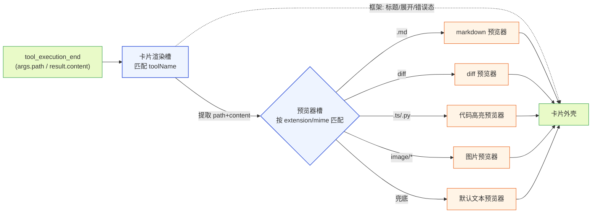

**图 1 — 卡片与预览器的协作：卡片决定框架，预览器决定内容画法，两者经槽位匹配对接**

#### 1.2.2 槽位分工数据流

数据流是单向的、由卡片驱动。底座推 `tool_execution_*` 事件 → core 的 `event-translator`（`gateway/event-translator.ts`，`DESIGN.md` 5.1.4）翻译成圆心中性事件 `ToolCallStart`/`ToolCallUpdate`/`ToolCallEnd` → 时间线插件按 `toolCallId` 聚合、把 props 喂给匹配到的卡片组件 → 卡片组件从 `props.args`/`props.end.result` 提取文件路径与内容 → 卡片查预览器槽拿匹配的预览器组件 → 渲染预览器、把内容塞进去。预览器组件本身不订阅事件流、不感知 `toolCallId`——它是一个纯展示组件，只负责"给我一段内容和一个文件路径，我画出来"。这让预览器可复用：时间线卡片用它、用户主动打开的预览视图也用它、文件编辑器（4.12）的只读态也复用它的代码高亮能力。复用的代价是预览器必须保持"纯展示"——不持有跨渲染的状态、不产生副作用，否则在多个宿主里复用会串状态。

### 1.3 与文件编辑器的 editable 区分

#### 1.3.1 只读 vs 可编辑的槽位贡献差异

文件预览插件和文件编辑器插件（4.12）往同一个预览器槽挂贡献项，区分靠 `editable` 标记：

- 文件预览插件贡献：`{ match: { strategy: "extension", value: "md" }, component: "MarkdownViewer" }`——不带 `editable`（默认 `false`），只读。
- 文件编辑器插件贡献：`{ match: { strategy: "all" }, component: "FileEditor", editable: true }`——`editable: true`，用 `all` 策略兜底匹配任意文件、组件是 FileEditor。

注意编辑器不用 `extension` 策略配一个 \\\"匹配全部扩展名\\\"的魔法 value（如 `.*`）。`extension` 策略是**字面相等**比较（2.2.2），不支持正则——给 `value: \\".*\\"` 只会匹配扩展名字面为 `.*` 的文件（实际不存在），编辑器永远不命中。要\\\"匹配任意文件\\\"就用 `all` 策略（specificity 最低、语义干净）。**与 `DESIGN.md` 4.12.3 的分歧（待对齐）**：`DESIGN.md` 4.12.3（line 1941）原文为编辑器贡献项写的 `{ strategy: "extension", value: ".*" }`——按本文档的字面相等语义这等价于不命中。本文档以 `all` 策略为准，已登记 `DESIGN.md` 4.12.3 待同步修正（见 14.2）。两者都 match 同一个文件时，靠优先级仲裁：编辑器插件优先级高于纯预览插件，用户打开文件时命中编辑器（可编辑）；没装编辑器时退到纯预览。这个优先级不是预览器槽的特殊规则，而是 `DESIGN.md` 3.3 的通用冲突仲裁（来源插件优先级 → specificity → 注册序）。`all` 的 specificity=0 最低，但编辑器插件靠更高的**来源插件优先级**压过 `extension: md`(specificity=80) 的内置 markdown 预览器——同优先级时 specificity 高者胜，所以编辑器插件必须在 manifest 声明更高优先级（或作为同 id 高优先级版本覆盖内置），否则 specificity 低的 `all` 永远输给精确 extension。这种\\\"同一槽位、靠 `editable` 标记 + 插件优先级区分形态\\\"的设计避免了为编辑器新设槽位——预览器槽是\\\"如何画一个文件内容\\\"的统一抽象，编辑只是预览的一种带写能力的特化形态。

#### 1.3.2 权限边界：fs:project:read vs fs:project:write

只读预览只声明 `"fs:project:read"` 权限（`DESIGN.md` 3.2 权限细分），文件编辑器直写路径声明 `"fs:project:write"`。这是同一个 `fs:project` 能力的读写分离——预览永远不写盘，即便用户在预览视图里改了什么，也只能走"经 agent"路径（格式化成 prompt 经主输入框发，4.12.2），不直接写。这条边界在沙箱层强制：core 只把 `fs:project:read` 对应的只读文件句柄注入预览插件的 `PluginContext`，写操作 API 根本不暴露给预览插件。恶意预览插件即便被注入，也无法改文件——它连 `writeFile` 的入口都拿不到。读写权限的细分把"能看"和"能改"做成两个独立授权的能力，管理 UI（4.3）在用户装预览插件时只问"允许读取项目文件"、不连带授权写。

### 1.4 在内置插件矩阵中的位置

文件预览插件是 `DESIGN.md` 4.1 列出的十二个内置默认插件之一，属于"基础渲染层"（和 i18n、管理 UI、时间线并列）。它在 manifest 的 `permissions` 字段声明 `["fs:project:read"]`，在 `contributes.viewers` 挂五个预览器组件（对应多条贡献项——每个扩展名一条，完整清单见 6.1.1）。它被时间线插件（4.4，assistant 消息复用 markdown 渲染器、工具卡片调预览器槽）、文件编辑器插件（4.12，复用代码高亮）、review 插件（4.10，文件路径+行范围锚点来源）依赖。这些依赖经 `dependsOn` 声明、由加载器拓扑排序保证激活顺序，预览插件先于依赖它的插件 activate。作为内置插件，它的优先级最低、可被同名第三方插件整体覆盖（`DESIGN.md` 3.4 插件级覆盖）——用户若想用更强的 markdown 渲染器（如支持 mermaid 图表渲染的版本），写一个 id 同为 `file-preview` 的第三方插件挂上去即可整体替换。

## 2 预览器槽契约与匹配机制

### 2.1 贡献项 schema

#### 2.1.1 match/component/editable 字段

预览器槽贡献项的字段级 schema（`DESIGN.md` 3.3 槽位契约；注意 `editable` 是 `DESIGN.md` 4.12 为支持文件编辑器引入、对 3.3 预览器槽基础 schema 的扩展——3.3 的基础 schema 仅 `{ match, component }`，不含 `editable`）：

```typescript
interface ViewerContribution {
  match: MatchRule;        // 匹配规则，按 extension/mime/all
  component: string;       // renderer 模块导出的组件名（不是函数引用，是字符串）
  editable?: boolean;      // 是否支持编辑态，默认 false（只读）
}
```

`component` 是字符串引用——加载器在 renderer 侧加载对应插件 renderer 模块、按命名导出查到这个组件，core 在渲染时按字符串名取组件实例。这让 manifest 保持纯声明式数据、不夹带函数引用（manifest 是 JSON、不能序列化函数）。`editable` 是预览器槽独有的字段（卡片渲染槽没有），用于和文件编辑器区分——同一个 `component` 名可以被一个同时支持只读和编辑态的组件复用（如 FileEditor 在 `editable:false` 时退回只读高亮、`editable:true` 时进入编辑态），也可以是两个独立组件。字段校验在加载器的第 3 步（`DESIGN.md` 3.5）：`component` 引用的导出名必须在对应 renderer 模块里存在，否则该贡献项加载失败、记入诊断页、不拖垮整壳。

#### 2.1.2 MatchRule 声明式数据

`MatchRule` 是卡片渲染槽和预览器槽共用的匹配规则，在 manifest 里是纯数据（`DESIGN.md` 3.3）：

```typescript
type MatchRule =
  | { strategy: "toolName"; value: string }        // 卡片用：精确匹配工具名
  | { strategy: "toolNames"; value: string[] }     // 卡片用：匹配多个工具名之一
  | { strategy: "customType"; value: string }      // 卡片用：自定义消息/entry 类型
  | { strategy: "extension"; value: string }       // 预览器：匹配文件扩展名（如 "md"/"ts"）
  | { strategy: "mime"; value: string }           // 预览器：匹配 mime（支持 "image/*" 通配）
  | { strategy: "all" };                           // 兜底：匹配全部
```

预览器槽只用 `extension`/`mime`/`all` 三种策略。`extension` 的 `value` 是不带点的扩展名小写（如 `"md"`，不是 `".md"`），加载时归一化（去点、转小写），匹配时与 `ctx.filePath` 取出的扩展名做**字面相等**比较（不做正则匹配——`value` 永远是普通字符串，`.*` 这种写法只会匹配扩展名字面为 `.*` 的文件、不会当通配）。要\\\"匹配任意扩展名\\\"用 `all` 策略，不要用 `extension` 配魔法 value。`mime` 支持 `"image/*"` 这种通配，匹配所有 image 子类型；`all` 是兜底，specificity 最低。一个预览器贡献项只声明一个 `match`，要匹配多个扩展名（如 `.ts`/`.tsx` 都用 typescript 高亮）就挂多个贡献项、或用 `mime` 通配覆盖 `text/*`（但 `text/*` 会连 `.txt`/`.log` 都命中、不够精确，所以多扩展名场景一般还是挂多个 extension 贡献项更可控）。这种\\\"纯数据 + 策略注册表\\\"的设计让匹配规则可被静态分析、可单测、可在诊断页展示当前生效的匹配表——引入正则会破坏\\\"纯数据可静态分析\\\"这一性质，故 `extension` 不支持正则。

### 2.2 匹配策略注册表

#### 2.2.1 MatchStrategy 接口与 specificity

core **不按 `strategy` 字段做 if-else 分发**（`DESIGN.md` 3.3，呼应 §1.4 不做类型戳 switch），而是用策略名查策略注册表拿到 `MatchStrategy` 实例：

```typescript
interface MatchStrategy {
  matches(ctx: MatchContext): boolean;  // ctx 携带当前文件 extension/mime 或工具 toolName
  specificity: number;                    // 该策略的特异度，策略自己声明、core 不硬编码排序表
}

interface MatchContext {
  toolName?: string;       // 工具调用时
  customType?: string;     // 自定义消息/entry 类型时
  filePath?: string;       // 文件时：路径（用于取 extension）
  mimeType?: string;       // 文件时：mime
}
```

内置策略集（`toolName`/`toolNames`/`customType`/`extension`/`mime`/`all`）随 core 提供、放在 `domain/slots/strategies.ts`（`DESIGN.md` 5.1.4），它们的 `specificity` 值是 core 定义的稳定常量。`extension` 策略的 specificity 高于 `mime`（精确扩展名比 mime 通配更特异），`all` 最低。新增匹配方式（如按文件头魔数 `magic` 识别、按首行 shebang 识别）= 注册一个新 `MatchStrategy`（扩展，不改 core 的 switch），是开闭原则的落地。specificity 数值由每个策略自己声明（如 `ExtensionStrategy.specificity = 80`、`MimeStrategy.specificity = 60`、`AllStrategy.specificity = 0`），core 只比数值、不维护一张"策略名 → 特异度"的硬编码排序表——消除了"特异度排序是引擎硬编码知识"这个问题。**注**：`DESIGN.md` 3.3（line 921）只举 `toolName.specificity=100`、`all.specificity=0` "之类"，未给 extension/mime 的具体数值——本文档的 80/60 是对 3.3 "之类"的具体化填充，2.4 走查的胜负（如 B 的 mime=60 胜 C 的 all=0）依赖这两个具体数值。该数值契约需回写 `DESIGN.md` 3.3 或在 3.3 钉死 extension/mime 的 specificity 常量，避免两份文档对同一常量给出不一致来源（见 14.2 已登记）。

#### 2.2.2 extension/mime 策略实现

`extension` 策略的实现：从 `ctx.filePath` 取扩展名（`path.extname` 去点转小写）、和 `rule.value` 做**字面相等**比较（`===`，不做正则、不做通配）。`mime` 策略的实现：从 `ctx.mimeType` 取、若 `rule.value` 以 `/*` 结尾则按前缀匹配（`image/*` 匹配 `image/png`/`image/jpeg` 等），否则精确相等。`all` 策略恒返回 `true`。这些实现的 `matches()` 是纯函数、不读外部状态、可单测——它们在 `domain/slots/strategies.ts` 里，属圆心、不依赖 gateway 或 shell。这呼应 `DESIGN.md` 5.1.5 的圆心类型纯度纪律：匹配逻辑是稳定的业务本质、归圆心，具体策略实现可扩展但接口在内层。`extension` 不支持正则是刻意选择：正则会让 manifest 的匹配规则失去\\\"纯数据可静态分析\\\"性质，且带来转义/specificity 计算的歧义；要通配就用 `all`。

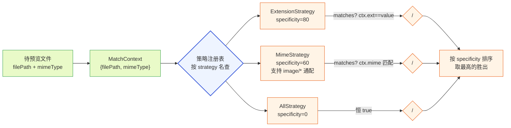

**图 2 — 匹配策略注册表：按 strategy 名查策略实例，specificity 高的胜出，不硬编码 switch**

### 2.3 冲突仲裁与优先级

#### 2.3.1 插件优先级 + specificity + 注册序

多个预览器贡献项都 match 同一个文件时，仲裁规则（`DESIGN.md` 3.3 通用仲裁）：按贡献项来源插件的优先级取最高 → 同优先级按 `specificity` 数值大的胜出 → 同 specificity 按注册顺序取先注册的。来源插件优先级由加载器决定：内置默认插件优先级最低（可被覆盖），用户级 > 项目级 > 内置，同 id 插件高优先级整体替换低优先级（插件级覆盖，3.4）。这套三级仲裁保证：第三方插件想覆盖内置预览器，要么用更特异的匹配（如精确扩展名 vs 内置的 mime 通配），要么声明更高插件优先级——两条路都走得通，且都是显式声明、不是隐式覆盖。

#### 2.3.2 编辑器覆盖预览器的命中顺序

文件编辑器插件的贡献项 `{ match: { strategy: "all" }, component: "FileEditor", editable: true }` 用 `all` 策略兜底匹配任意文件（specificity=0，语义干净——`extension` 策略是字面相等、不支持正则，所以不能用 `extension: \\".*\\"` 来通配）。**注意**：`DESIGN.md` 4.12.3 原文仍写 `extension: \\".*\\"`，与本文档的字面相等语义冲突、需同步改为 `all`（见 14.2 已登记缺口）。文件预览插件的 markdown 预览器 `{ match: { strategy: "extension", value: "md" } }` specificity 更高（精确 `md`，specificity=80）。因此对 `.md` 文件，若两个插件同优先级，markdown 预览器胜出（只读、富文本渲染）；编辑器插件通过更高的来源插件优先级覆盖这个结果，让 `.md` 也命中 FileEditor（可编辑）。这是\\\"用户装了编辑器就要可编辑\\\"的预期行为——靠插件优先级而非 specificity 实现：编辑器声明更高优先级，即便它的 `all` specificity 低，第一轮仲裁（来源插件优先级）就淘汰了内置预览器。若用户只装预览插件没装编辑器，`.md` 命中 markdown 预览器（只读富文本），符合预期。

### 2.4 匹配算法走查示例

把匹配过程用一个具体例子走一遍，说明仲裁规则的实际效果。假设当前预览器槽注册表里有这些贡献项（按来源插件和 specificity 标注）：

- A. 内置 file-preview：`{ match: { strategy: "extension", value: "md" }, component: "MarkdownViewer" }`（specificity 80，内置优先级最低）
- B. 内置 file-preview：`{ match: { strategy: "mime", value: "text/*" }, component: "TextViewer" }`（specificity 60）
- C. 内置 file-preview：`{ match: { strategy: "all" }, component: "TextViewer" }`（specificity 0）
- D. 第三方插件 fancy-md：`{ match: { strategy: "extension", value: "md" }, component: "FancyMarkdown" }`（specificity 80，第三方优先级高于内置）

用户打开 `README.md`（mime 为 `text/markdown`）。匹配过程：

1. 遍历全部贡献项，调各自策略的 `matches(ctx)`：A 命中（extension `md` 匹配）、B 命中（`text/*` 匹配 `text/markdown`）、C 命中（all 恒真）、D 命中（extension `md` 匹配）。四个都命中。
2. 第一轮仲裁——按来源插件优先级：D（第三方）高于 A/B/C（内置），A/B/C 被淘汰。只剩 D。
3. 无需再比 specificity（只剩一个），D 胜出，用 `FancyMarkdown` 渲染。

再看一个：用户打开 `app.ts`（mime `text/typescript`），未装第三方。A 不命中（`md`≠`ts`）、B 命中（`text/*`）、C 命中。同优先级（都内置）→ 比 specificity：B(60) > C(0)，B 胜出，用 `TextViewer`。但如果预览器槽里还有一条 `CodeViewer` 贡献项（`extension: "ts"`，specificity 80），则它 specificity 高于 B(60)，胜出——精确扩展名优先于 mime 通配。这正体现了 specificity 的意义：越精确的匹配越优先，让用户装了专门针对某扩展名的预览器时，它优先于宽泛的 mime 通配兜底。

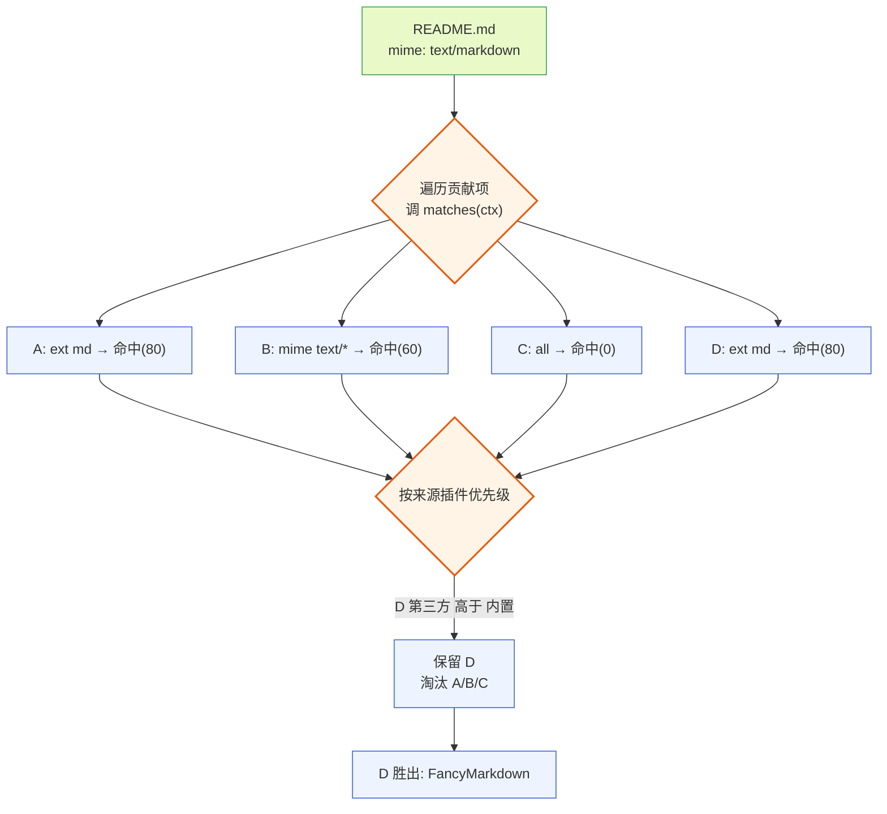

**图 2-1 — 匹配走查：四个贡献项都命中，按插件优先级 D 胜出，无需比 specificity**

### 2.5 策略注册的扩展性（开闭原则）

第三方插件想支持新的匹配方式（如按文件内容首行 shebang 识别脚本语言、按文件头魔数识别二进制格式），不需要改 core——注册一个新的 `MatchStrategy`（如 `shebang`/`magic`），在 manifest 的 `match` 里用 `{ strategy: "shebang", value: "#!/usr/bin/env python" }`。core 加载时按 `strategy` 名查注册表，找不到该策略则该贡献项加载失败并记入诊断页（`DESIGN.md` 4.3 诊断页），不拖垮整壳（错误隔离，3.5 第 5 项）。core 不维护一张硬编码的"策略名 → 处理函数"映射表，新增策略是扩展、不是修改——这是开闭原则在匹配机制上的落实。这个扩展点让文件预览的能力边界保持开放：未来加"按 git diff 状态着色文件""按文件大小自动选预览器"等智能匹配，都走注册新策略、不动核心。

## 3 五个预览器实现

文件预览插件往预览器槽挂五个预览器组件（MarkdownViewer/DiffViewer/CodeViewer/ImageViewer/TextViewer），共对应 manifest 里约十五条贡献项（每个扩展名一条），覆盖从富文本到兜底文本的全部文件类型。下面逐个讲实现，包括渲染管线、安全防护、复用关系。

### 3.1 markdown 预览器

#### 3.1.1 渲染管线

markdown 预览器（组件名 `MarkdownViewer`）匹配 `{ strategy: "extension", value: "md" }`（也可加 `"markdown"`/`"mdx"`）。渲染管线：原始 markdown 文本 → markdown 解析器（如 `marked`/`markdown-it`）生成 HTML 字符串 → **dompurify 清洗 HTML** → `dangerouslySetInnerHTML` 注入到容器 div。解析和清洗在 worker 侧 `activate` 里不做（worker 不渲染 DOM），而在 renderer 侧组件内做——markdown 解析是 CPU 密集但同步的，放 renderer 主线程即可（大文件场景见第 5 节的虚拟滚动保护）。管线的每一步都是无状态纯函数：输入文本、输出 HTML，便于缓存（同一段 markdown 解析一次、缓存结果、内容不变时不重复解析）。

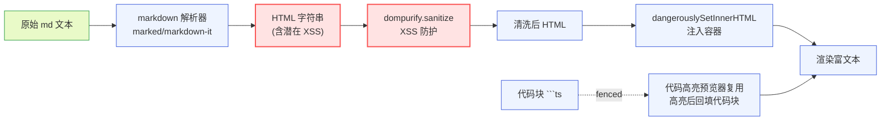

**图 3 — markdown 渲染管线：解析 → dompurify 清洗 → 注入，代码块走高亮复用**

#### 3.1.2 dompurify XSS 防护

markdown 预览器必须用 dompurify 做 XSS 防护（`DESIGN.md` 4.5.2，借鉴 现有方案的依赖）。原因：markdown 解析器生成的 HTML 是不可信的——agent 输出的 markdown 可能来自用户消息、来自被读取的文件内容、来自工具结果，其中可能夹带 `<script>`/``/`<iframe>` 等注入向量。如果直接 `dangerouslySetInnerHTML`，恶意脚本会在 renderer 进程（Electron renderer 即便关了 Node 集成，DOM 上下文仍能发起网络请求、读 cookie、操纵页面）里执行。dompurify 在注入前清洗：移除 `script`/`onerror`/`onload` 等事件属性、移除 `javascript:` 协议链接、保留安全的 markdown 富文本语义（标题/列表/链接/图片/代码块）。

配置上用 dompurify 的默认预设即可（已覆盖常见向量），额外白名单 `target`/`rel` 属性让外链在新标签打开并加 `rel="noopener noreferrer"`（防反向 tabnabbing）。dompurify 实例在组件模块级缓存（不每次渲染新建），配置一次——重复 `createDOMPurify` 有性能开销。这条防线是 markdown 预览器不可省略的安全边界——和 `content:sensitive` 权限过滤（见 4.3）是两道独立防护：权限过滤防"插件偷数据外传"（数据层），dompurify 防"渲染的内容执行代码"（渲染层）。两层防护各自独立失效不殃及另一层：即便 `content:sensitive` 漏了，dompurify 仍挡住脚本执行；即便 dompurify 配错，权限过滤仍限制敏感数据流出到无权插件。

#### 3.1.3 代码块高亮复用

markdown 里的 fenced 代码块（``` ```ts ... ``` ```）要高亮渲染。markdown 预览器不自己实现高亮——复用代码高亮预览器（3.3）的能力。实现方式：markdown 解析器配置一个 `highlight` 回调，遇到 fenced 代码块时调高亮函数（把代码和语言标签传进去、拿到高亮后的 HTML），回填进代码块的 HTML。这样 markdown 的高亮和独立代码文件的高亮用的是同一套高亮引擎和语言映射，视觉一致、维护一处。底座 `read.ts` 的 `highlightCode`（`modes/interactive/theme/theme.ts:1138`）和 `getLanguageFromPath`（同文件 1162）是底座 TUI 侧的高亮实现，桌面端不复用它的 TUI 输出（那是 ANSI 转义、给终端用的），但复用它的语言映射表（扩展名 → 语言名）保证识别一致——桌面端用自己的 Web 高亮引擎（如 `highlight.js`/`shiki`）渲染成带 CSS 类的 HTML，由主题 token 着色。这种"映射表复用、引擎各自实现"是因为底座是 TUI、桌面是 Web，输出格式本就不同，但"哪个扩展名对应哪种语言"这一知识是共享的、不该分叉。

#### 3.1.4 markdown 缓存与增量

markdown 解析 + dompurify 清洗是 CPU 密集操作，对同一内容不应重复执行。缓存策略：以 content 的 hash 为 key 缓存清洗后的 HTML（LRU 上限 50 条，见 16.1 骨架）。流式场景下 assistant 消息逐 token 更新，markdown 内容频繁变化——这时不对每个中间态都解析，而是防抖（如 100ms 内的连续更新合并成一次解析），最终稳定态才完整解析缓存。工具卡片路径的 markdown 内容是已完成的（事件流推的是完整结果），可直接缓存。这个缓存只在组件实例生命周期内、不跨会话持久化——内容本身在事件流/磁盘里有，重新渲染重新解析代价可接受，不引入持久化缓存的失效复杂度。


### 3.2 diff 预览器

#### 3.2.1 红绿标色与统一/分栏视图

diff 预览器（组件名 `DiffViewer`）有**两条命中路径**，二者独立、不要混淆：

1. **工具卡片路径**：edit/write 卡片由卡片渲染槽按 `toolName: "edit"`/`"write"` 匹配出来，卡片组件天然知道自己在处理 diff——它直接提取 `end.result.details.diff`，构造 `ViewerProps { content: diff, filePath: args.path }` 传给 DiffViewer。**这条路径不经预览器槽按扩展名查**——卡片按 toolName 直接选 DiffViewer，不先去查 `extension: ts` 命中 CodeViewer 再覆盖。diff 是工具结果类型、不是文件类型，预览器槽的扩展名匹配对它无意义。这里 edit 卡片对 DiffViewer 是**按组件名硬引用**（卡片组件 import DiffViewer 或经渲染模块字符串名取），不纳入预览器槽的 specificity 仲裁——因为 diff 不是文件类型、没有"多个预览器竞争同一文件扩展名"的场景。第三方若想替换 edit 卡片的 diff 渲染，正确的覆盖入口是**卡片渲染槽**（挂一个 `toolName: "edit"` 的更高优先级卡片组件整体替换 edit 卡片，连 diff 渲染一起换），而不是预览器槽——这条边界在 7.1.2 图 6 的时序里也是"按 toolName 直接选 DiffViewer、无查槽步骤"。
2. **用户主动打开 `.diff`/`.patch` 文件路径**：经预览器槽按扩展名匹配命中 DiffViewer（见 6.1.1 manifest 里 `{ extension: "diff" }`/`{ extension: "patch" }` 两个贡献项）。

两条路径最终都进入 DiffViewer 组件，组件内部渲染逻辑相同。DiffViewer 支持两种视图：

- **统一视图**（unified）：单栏，删除行红底、新增行绿底、上下文行正常色，行号前缀 `+`/`-`/空格。这是默认视图，紧凑，适合在时间线卡片里就地展示。
- **分栏视图**（split）：左右两栏，左旧右新，对应行对齐。适合大段改动看对照，多用于用户主动打开的大 diff 文件。

视图切换由用户在卡片/预览视图工具栏点选，存插件 config（`context.config.get("diffView")`，默认 `"unified"`）。色盲友好方面，diff 不只靠红绿——加 `+`/`-` 前缀辅助（和底座 `generateDiffString` 的行前缀设计一致，见 3.2.2），状态指示不只用颜色（`DESIGN.md` 4.11 末段的色盲友好要求）。

#### 3.2.2 diff 格式来自 edit 工具

diff 字符串的格式由底座 `edit` 工具决定。`edit-diff.ts` 的 `generateDiffString`（`packages/coding-agent/src/core/tools/edit-diff.ts:380`）生成的是带行号的展示型 diff：每行前缀是 `+`/`-`/空格 + 行号（padStart 对齐宽度）+ 一个空格 + 内容，上下文行只在改动前后各保留 `contextLines`（默认 4）行，中间折叠成 ` ...`。DiffViewer 要解析这个格式：按行 split、按首字符（`+`/`-`/空格）分类着色、行号从第二段（首字符后的数字）提取。注意底座还提供 `generateUnifiedPatch`（同文件 369）生成标准 unified patch（`---`/`+++` 文件头 + `@@` hunk 头）——DiffViewer 可同时支持这两种格式，按内容首行是否以 `---`/`+++`/`@@` 开头自动识别：是则按 unified patch 解析（hunk 头取行号基址）、否则按展示型 diff 解析。这种"两种格式自适应"让 DiffViewer 既能画 agent edit 的展示型 diff、也能画用户打开的 `.patch` 文件。

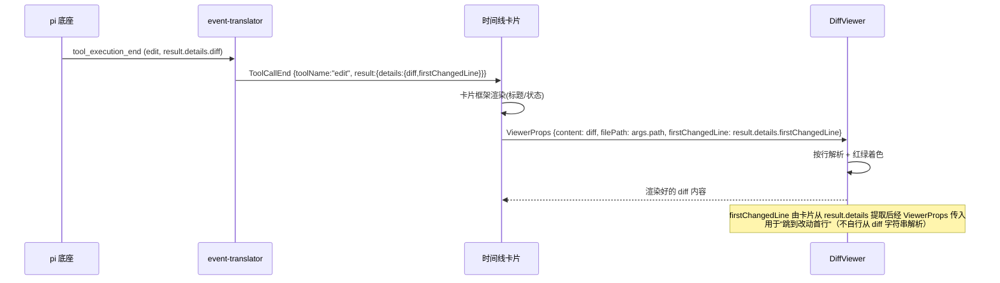

**图 4 — diff 预览数据流：edit 工具结果带 details.diff，卡片提取后传给 DiffViewer 解析着色**

#### 3.2.3 firstChangedLine 跳转

`edit` 工具的 `EditToolDetails`（`edit.ts:61`）带 `firstChangedLine`——改动在新文件中的首行号（`generateDiffString` 返回值的 `firstChangedLine` 字段，`edit-diff.ts:396` 在遇到第一个 added/removed part 时记录 `newLineNum`）。DiffViewer 用这个实现"跳到改动首行"：用户点卡片上的"跳转"按钮，DiffViewer 滚动到 `firstChangedLine` 对应的行并高亮闪烁一下。**数据通路**：该字段在 `tool_execution_end` 的 `result.details.firstChangedLine` 里（卡片层可见），卡片从 `end.result.details.firstChangedLine` 提取后、经 `ViewerProps.firstChangedLine`（6.2.2 的可选字段）传入 DiffViewer——图 4/图 6 时序已标注这条提取+传参。DiffViewer 不自行从 diff 字符串解析首行号（避免与"来自事件字段"的来源表述矛盾）。这个字段也供文件编辑器（4.12）复用——agent 改完文件后，编辑器可定位到改动行提示用户"文件已被 agent 修改、改动在第 N 行"。跳转依赖虚拟滚动组件的 `scrollToIndex` 能力（5.2.2），把行号映射到虚拟项索引。

#### 3.2.4 预览 diff 与最终 diff

底座 `edit` 工具的 `renderCall`（`edit.ts:363`）在工具执行中（args 收齐但还没写盘）就能生成预览 diff——它调 `computeEditsDiff`（`edit.ts:380`）在原文件内容上模拟应用 edits、生成预览 diff，塞进 `callComponent.preview`。TUI 侧这个预览在 call 阶段就显示给用户看。桌面端可复用这个机制：在 `tool_execution_start`/`tool_execution_update` 阶段（agent 还在调 edit、未结束），卡片从 `args.path`/`args.edits` 自己调一次 diff 计算（或底座在 update event 里带上预览 diff）、立刻显示预览，让用户在 agent 改文件的过程中就看到将要发生的改动，而不必等 `tool_execution_end`。`tool_execution_end` 后用最终 `result.details.diff`（实际写盘后的真实 diff）替换预览。这种"预览 → 最终"两阶段渲染提升感知性能、也给用户"agent 正在改这里"的即时反馈。**当前实现状态**：这是目标态描述——当前版本 event-translator 尚未把预览 diff 翻译进 `ToolCallUpdate` 的中性字段（见 14.2 流式预览缺口、14.3 演进方向），桌面端实际只在 `tool_execution_end` 后用最终 diff 渲染一次，update 阶段不渲染 diff 内容。

### 3.3 代码高亮预览器

#### 3.3.1 语言识别（扩展名映射）

代码高亮预览器（组件名 `CodeViewer`）匹配 `{ strategy: "extension", value: "ts" }` 等多个贡献项（每种扩展名一个）。语言识别靠扩展名 → 语言名映射表——底座 `getLanguageFromPath`（`theme.ts:1162`）维护了一张 `extToLang`（`ts→typescript`/`tsx→typescript`/`js→javascript`/`py→python`/`rs→rust`/`go→go`/`java→java`/`c→c`/`cpp→cpp`/`rb→ruby`/`swift→swift`/`kt→kotlin`...），桌面端复用这张表保证和底座 TUI 侧识别一致。未识别的扩展名不强制高亮（避免误判，见 3.3.2）。映射表是纯数据、放 `highlight.ts` 模块导出，可被文件编辑器（4.12）等其他需要语言识别的组件复用。

#### 3.3.2 高亮引擎选择

底座 TUI 侧用 `cli-highlight`（`highlight` 函数 + `supportsLanguage` 校验，`theme.ts:1138`），输出 ANSI 转义。桌面端 renderer 是 Web，不能直接用 ANSI 输出——用 Web 高亮引擎（`highlight.js` 或 `shiki`）。关键纪律（学自底座 `highlightCode` 的注释，`theme.ts:1139-1146`）：**语言未通过 `supportsLanguage` 校验时不做高亮**，直接当纯文本显示。底座注释明说：cli-highlight 的自动检测不可靠、会把散文误识别成 AppleScript/LiveCodeServer 给随机英文词上色。桌面端同样不开自动检测——只按扩展名显式指定语言高亮，未知扩展名纯文本。这避免"代码高亮预览器把一份 README 染得花里胡哨"的尴尬。引擎选择上 `shiki`（基于 TextMate 语法、VSCode 同源）着色更准但体积大、需加载语法定义；`highlight.js` 轻量但语法覆盖稍逊。内置插件默认用 `highlight.js`（轻量优先、随壳分发不增包体），第三方插件可整体替换为 shiki 版本。

#### 3.3.3 作为其他预览器的基础组件

代码高亮预览器是基础组件，被两处复用：markdown 预览器的 fenced 代码块（3.1.3）、文件编辑器（4.12）的编辑态底色（`DESIGN.md` 4.12.3 明说\\\"复用 4.5 的代码高亮能力、不重写高亮\\\"）。复用方式不是 import 组件（那要 import 实现破坏隔离，`DESIGN.md` 3.5 第 5 项），而是导出一个纯函数 `highlightCode(code: string, lang?: string): string`（返回 HTML 字符串），各预览器调这个函数拿高亮 HTML 自己注入。函数无状态、纯输入输出，放在 `file-preview` 插件的 renderer 模块导出（`highlight.ts`）。

**跨插件复用通道（钉死）**：经 PluginContext 的 `exports` 通道取用（这是本文对 `DESIGN.md` 3.2.4 PluginContext 的补充定义，需补进 PluginContext 接口）：

```typescript
// 在 PluginContext（worker）和 RendererPluginContext 各补一个 exports 字段
interface PluginContext {
  // ...DESIGN.md 3.2.4 已有字段...
  /** 取另一插件的公开纯函数导出（跨插件复用通道） */
  exports: { get<T = unknown>(pluginId: string, name: string): T | undefined };
}
interface RendererPluginContext {
  // ...DESIGN.md 3.2.5 已有字段...
  /** 取另一插件 renderer 模块的公开命名导出（跨插件复用通道，renderer 侧） */
  exports: { get<T = unknown>(pluginId: string, name: string): T | undefined };
}
```

加载器在加载插件 renderer 模块时，把该模块的全部命名导出登记进一个 `pluginId → 导出名 → 值` 的注册表；`exports.get` 从这个注册表取值。`file-preview` 的 `highlight.ts` 用普通 `export function highlightCode(...)` 导出，文件编辑器插件声明 `dependsOn: [\"file-preview\"]`（保证 file-preview 先加载、其导出已登记），然后在 renderer 侧用 `pi.exports.get<(code: string, lang?: string) => string>(\"file-preview\", \"highlightCode\")` 取用。文件编辑器侧调用示例：

```typescript
// file-editor 的 renderer 模块
import type { RendererPluginContext } from \"domain/plugin\";

export function FileEditor({ content, filePath, theme, pi }: EditorProps) {
  const highlightCode = pi.exports.get<(code: string, lang?: string) => string>(
    \"file-preview\", \"highlightCode\"
  );
  // highlightCode 必存在（dependsOn 保证 file-preview 已加载）；取不到时降级为纯转义
  const html = highlightCode ? highlightCode(content, langFromPath(filePath)) : escapeHtml(content);
  return <div dangerouslySetInnerHTML={{ __html: html }} />;
}
```

这不是\\\"直接 import 实现\\\"——它经 `exports.get` 这个抽象通道取一个稳定的纯函数导出契约（约定名 + 函数签名），不依赖 file-preview 的内部路径或打包结构；若未来 file-preview 换高亮引擎、换打包路径，只要保持 `highlightCode(code, lang?): string` 签名和导出名不变，文件编辑器无感。`exports.get` 取不到（依赖未声明或导出名拼错）返回 `undefined`，调用方自行降级——不抛崩、不拖垮编辑器。这是\\\"依赖抽象、不依赖实现\\\"的落地。worker 侧同理可经 `context.exports.get(\"file-preview\", \"highlightCode\")` 取用（若 worker 侧也需要预解析高亮）。

### 3.4 图片预览器

#### 3.4.1 ImageContent 来源

图片预览器（组件名 `ImageViewer`）匹配 `{ strategy: "mime", value: "image/*" }`。图片来源有两类：底座 `read` 工具读图片文件时返回 `ImageContent`（`read.ts:259`，`{ type: "image", data: base64, mimeType }`，经 `processImage` 处理后的 base64 数据）；agent 在对话里生成的图片（assistant 消息的 `content[]` 里的 `ImageContent`）。两类都走同一个 ImageContent 结构——底座 `@earendil-works/pi-ai` 的 `ImageContent` 类型，`data` 是 base64、`mimeType` 标明格式（`image/png`/`image/jpeg`/`image/gif`/`image/webp`/`image/bmp`，见 `read.ts:212` 描述列出的支持格式）。ImageViewer 把 base64 拼成 data URL（`data:${mimeType};base64,${data}`）塞进 `` 渲染。用户主动打开图片文件时，沙箱 `fs:project:read` 的 `readFile` 返回 `Buffer`（4.1.2，renderer 侧经 `pi.fs.readFile` 拿到由 core main 代理转发回的 `Buffer`），**Buffer → ImageContent 的包装由预览视图组件承担**（4.2.2）：它把 `Buffer` 转 base64、按 `stat.mimeType` 构造 `{ type: "image", data: base64String, mimeType }` 作为 `content` 传入 ImageViewer。这条归属边界让 ImageViewer 始终只吃 `ImageContent`（联合类型契约一致、6.2.2/16.5），不直接接 `Buffer`——预览视图组件负责"构造内容块"，ImageViewer 负责"渲染内容块"，呼应"构造和执行分离"。事件流路径的 ImageContent 由底座 `read` 工具的 `processImage` 直接产出（已 base64），两条路径最终都进 ImageViewer，殊途同归。

#### 3.4.2 缩放与占位

图片预览器支持点击放大、滚轮缩放、拖动平移。大图（如 agent 生成的高分辨率截图）先显示占位（低分辨率骨架或加载动画）、异步解码（`` + `loading="lazy"`），解码完再渲染避免阻塞主线程。底座 `read` 工具对图片做了 `autoResizeImages`（默认缩放到 2000x2000 上限，`read.ts:207`/`processImage`）——所以从事件流来的图片通常已是有界尺寸，预览器不必再做大尺寸保护，但仍要做解码占位（base64 data URL 解码大图仍耗时）。用户主动打开的本地图片文件未经底座缩放、可能是原图大尺寸，这时图片预览器自己做缩放保护（超阈值显示缩略图、点开才全尺寸解码）。

### 3.5 默认文本预览器

#### 3.5.1 兜底匹配策略

默认文本预览器（组件名 `TextViewer`）匹配 `{ strategy: "all" }`，specificity 最低（0），是兜底——所有没被更特异预览器命中的文件都落到这里。它按纯文本显示：等宽字体、保留缩进和换行、不做语法高亮。这是"宁可朴素也不误判"的兜底，和代码高亮预览器"未识别语言不高亮"的纪律一致。兜底的意义在于：用户打开一个陌生扩展名的文件（如 `.log`/`.conf`/无扩展名），总能看到内容而不是"无法预览"——只要它是文本。真正无法预览的（二进制）在 3.5.2 提前分叉。

#### 3.5.2 编码与换行处理

TextViewer 处理编码和换行：内容以 UTF-8 解码（底座 `read.ts:266` 的 `buffer.toString(\"utf-8\")` 已处理，沙箱读取同样返回 UTF-8 解码后的字符串），换行统一为 `\\n`（底座 `edit-diff.ts` 的 `normalizeToLF` 处理 CRLF，TextViewer 同样归一）。对 BOM（`edit-diff.ts` 的 `stripBom`），TextViewer 检测并去掉头部 BOM 再渲染（BOM 显示成不可见字符会乱排版）。对二进制文件（解码后出现大量替换字符 `�` 或含 NUL 字节 `\\x00`），TextViewer 检测到后不强行显示乱码——提示\\\"此文件为二进制，无法文本预览\\\"并建议用图片预览器（若是图片）或下载查看。这避免把一个 `.bin` 文件渲染成一屏乱码。检测阈值：替换字符占比超 1% 或出现 NUL 即判为二进制。TextViewer 的运行时检测是 5.3 三步二进制判定的**第三道兜底**——stat 靠 mime、`readBytes` 读首块 8KB 查 NUL 已先判过，TextViewer 渲染时再检测一次防漏判（如首块无 NUL 但后续含二进制的情况）。三步递进、不重复判同一文件。

## 4 只读权限与数据来源

### 4.1 fs:project:read 权限声明

#### 4.1.1 manifest 声明与用户授权

文件预览插件在 `plugin.json` 的 `permissions` 字段声明 `["fs:project:read"]`（`DESIGN.md` 3.2 权限细分）。这是 `fs:project` 的只读细分——预览永远只读、不写。用户装/启用该插件时，管理 UI（4.3）展示权限请求、用户授权后 core 才把对应的只读文件能力注入 `PluginContext`（worker 侧 `context.fs`）与 `RendererPluginContext`（renderer 侧 `pi.fs`，4.1.2）。未授权则插件能挂预览器贡献项（manifest 仍生效、贡献项进注册表）、但 `context.fs`/`pi.fs` 的读能力调用会抛权限错误——预览器在尝试读盘时降级为"无权限读取"提示，不崩溃。内置默认插件在首次启动时通常已被信任（随壳分发），但第三方同名覆盖插件若声明了 `fs:project:read`，仍要走一次用户授权确认——权限不继承自被覆盖的内置版本。

#### 4.1.2 沙箱注入的文件读取能力

`fs:project:read` 对应沙箱注入的只读文件 API。**这条能力必须同时注入 worker 侧 `PluginContext` 和 renderer 侧 `RendererPluginContext` 两份**——用户主动打开预览路径的"预览视图组件"跑在 renderer 侧（4.2.2、图 8），它直接调 `pi.fs.stat`/`pi.fs.readFile`，若只把 `fs` 补进 worker 侧 `PluginContext`（`DESIGN.md` 3.2.4）、不补进 `RendererPluginContext`（`DESIGN.md` 3.2.5：plugin/rpc/events/onMessage/postToWorker/i18n/theme/ui，原本无 fs 字段），则 renderer 侧 `pi.fs` 会是 `undefined`、整条"用户主动打开文件预览"路径起不来。这是本文对 `DESIGN.md` 3.2.4/3.2.5 的补充定义，需同时补进两个接口：

```typescript
interface FsStat {
  size: number;            // 文件字节数
  mimeType: string;       // 沙箱探测的 mime（如 \"text/plain\"/\"image/png\"/\"application/octet-stream\"）
  isBinary?: boolean;      // 沙箱层初判：已知二进制类（image/audio/video/application/octet-stream 等）为 true
}

interface ReadFileOptions {
  offset?: number;         // 1-indexed 起始行（仅文本分页时用，见下）
  limit?: number;         // 读取行数（仅文本分页时用）
}

interface PagedText {
  lines: string[];         // 切片后的行（已去行尾换行、已 normalizeToLF）
  totalLines: number;      // 文件总行数
  hasMore: boolean;        // 是否还有后续行（offset+limit < totalLines）
}

interface FsApi {
  /** 取文件元信息（不读内容） */
  stat(path: string): Promise<FsStat>;
  /** 整块读：文本返回 UTF-8 解码字符串、二进制/图片返回 Buffer（沙箱按 mime 决定） */
  readFile(path: string): Promise<string | Buffer>;
  /** 分页读（仅对文本生效）：按行切片，返回带分页边界信息；对二进制文件调用抛错 */
  readFile(path: string, opts: ReadFileOptions): Promise<PagedText>;
  /** 按字节范围读取（二进制探针用）：从 offset 字节起读 length 字节，返回 Buffer；
   *  不整块读入、用于 5.3 第二步的 NUL 字节探针（读前 8KB 判二进制）。
   *  offset/length 单位是字节、0-indexed，length 上限 8192（8KB 探针足够）。 */
  readBytes(path: string, offset: number, length: number): Promise<Buffer>;
}
```

worker 侧 `context.fs: FsApi`、renderer 侧 `pi.fs: FsApi`（同一接口契约）。renderer 侧 `fs` 的实现是 core main 代理经 MessagePort 暴露给 renderer 的转发层——和 `rpc`/`events`/`onMessage` 的 renderer 转发同构（`DESIGN.md` 3.2.5 RendererPluginContext 已有 rpc/events 转发，fs 是同构补齐）。语义要点：**分页只对文本生效**——`readFile(path, { offset, limit })` 假定文件是文本、按行切片返回 `PagedText`，offset/limit 是 1-indexed 行号、边界对齐到行不截断行中间；对二进制/图片文件调用分页变体抛 `\\\"binary file does not support line paging\\\"` 错误，二进制走无分页的 `readFile(path): Promise<Buffer>` 整块读。同一个 `readFile` 方法名靠重载区分两种形态——`stat` 先返回 `mimeType`/`isBinary`，调用方据此选分页（文本）还是整块（二进制）。`mimeType` 由沙箱层探测：当前实现靠扩展名映射（和底座 `detectSupportedImageMimeTypeFromFile` 一致），魔数检测是演进项（14.2）。读取走 core main 代理（不在 worker 直接 `fs.readFile`、也不在 renderer 直接 `fs.readFile`），core 校验路径在 `cwd` 范围内（防路径穿越 `../` 越界）、校验插件有 `fs:project:read` 权限、再返回内容。renderer 侧 `pi.fs.*` 调用经 MessagePort 中转到 core main 代理执行同样的校验后返回——两条路径（worker `context.fs` / renderer `pi.fs`）最终都汇到 core main 的同一个沙箱强制点，不存在 renderer 侧绕过校验的旁路。这层代理是沙箱的强制点——插件无法绕过 core 直接碰磁盘。`fs:project:read` 范围严格限定在当前项目目录：预览插件读不到项目外的文件（除非声明 `fs:global`，预览插件不声明）、读不到用户 home 下其他目录——这是\\\"最小权限\\\"原则的落实。

```typescript
// renderer 侧补充（DESIGN.md 3.2.5 RendererPluginContext 已有 plugin/rpc/events/onMessage/postToWorker/i18n/theme/ui）
interface RendererPluginContext {
  // ...DESIGN.md 3.2.5 已有字段...
  /** 只读文件代理（经 MessagePort 转发到 core main 沙箱，与 rpc/events 转发同构） */
  fs: FsApi;
}
```

这条补充与 3.3.3 的 `exports` 通道一致——`exports` 当时也是同时补进了 `PluginContext`（worker）和 `RendererPluginContext`（renderer）两份，`fs` 同理需两份都补，否则 renderer 侧预览视图组件调 `pi.fs` 会拿到 `undefined`（用户主动打开预览路径在 Runtime 上最常触发，漏补会导致整条路径起不来）。

### 4.2 数据来源：事件流 vs 主动读盘

#### 4.2.1 工具卡片走 tool_execution_* 事件

工具卡片预览路径的数据全来自事件流，不读盘。底座 `edit`/`write`/`read` 工具执行完推 `tool_execution_end`，`result` 里带 `details.diff`（edit，`edit.ts:359`）、`content`（read 的文本/图片，`read.ts:315`/`259`）、写入内容（write 的 `args.content`）。这些数据经 `event-translator` 翻译成中性 `ToolCallEnd`、由 core 聚合后**经卡片渲染槽 props 喂入卡片组件**（`DESIGN.md` 3.2.6 路径三：cardRenderer 组件的 props 由 core 直接喂数据，组件不自己订阅 event 流）、卡片提取后传给预览器。关键点：**卡片渲染槽的 props 不受 `content:sensitive` 过滤影响**——core 是可信中枢，它内部聚合 `tool_execution_*` 事件时持有完整数据（含 diff/文件内容），把数据当 props 喂给 cardRenderer 组件是 core 内部行为、不是\\\"插件订阅 event 流\\\"，因此 `content:sensitive` 过滤（只作用于插件经 `context.events.on`/`pi.events.on` 订阅的场景，见 `DESIGN.md` 1.7.6）对 cardRenderer props 不生效。这条路径预览器不需要 `fs:project:read` 权限就能渲染（数据已在内存）——但预览器插件整体声明了该权限是为了\\\"用户主动打开\\\"路径，两条路径共享同一套预览器组件。注意 read 工具的结果已被底座截断（`truncate.ts`，见 5.2.3），所以工具卡片路径的文件内容总是有界的，预览器直接渲染不会卡死。

#### 4.2.2 用户主动打开走 fs:project:read

用户主动打开文件预览时，没有事件流数据——预览视图组件（renderer 侧 React 组件）自己经 `pi.fs`（`RendererPluginContext.fs`，`fs:project:read`，4.1.2 已补进 renderer 侧接口）读盘。流程：用户在侧栏文件树/卡片路径上点"预览" → 预览视图组件收到 `{ filePath }` → 调 `pi.fs.stat(filePath)` 取大小/mime → 调 `pi.fs.readFile(filePath)`（或分页变体）取内容 → **若 stat 判定是图片（mime `image/*`），`readFile` 返回 `Buffer`，预览视图组件负责把它包装成 `ImageContent`（`{ type: "image", data: buffer.toString("base64"), mimeType: stat.mimeType }`）后再作为 `content` 传入 ImageViewer**（这是 Buffer → ImageContent 构造的归属层，见 3.4.1）→ 按文件类型匹配预览器槽 → 渲染。大文件走第 5 节的保护。这条路径的数据不经过底座（不是 agent 的工具调用结果），是桌面端直接读项目文件——这也是为什么预览是"桌面插件自己的事、底座不掺和"（`DESIGN.md` 3.1.2）：底座对桌面插件只是 RPC 能力来源，文件读取是桌面沙箱自己的能力。这条路径也不进 agent 的 LLM 上下文——用户预览文件不等于把文件内容发给 agent（除非用户主动 prompt），保护了用户隐私和上下文 token。

#### 4.2.3 事件翻译管线细节

工具卡片路径的数据要经过 `event-translator`（`gateway/event-translator.ts`）的翻译管线才能到卡片组件。底座推的 `tool_execution_end` 事件带 `result`（底座类型，含 `content[]`/`details`），翻译管线的职责是把它转成圆心中性 `ToolCallEnd`（`DESIGN.md` 5.1.5）。翻译不是简单字段拷贝——对**插件经 `context.events.on`/`pi.events.on` 订阅 event 流**的路径，敏感字段按订阅插件权限过滤（未声明 `content:sensitive` 的插件收到的 `result.content[].text` 等会被置空）。但卡片渲染槽的组件走的是 `DESIGN.md` 3.2.6 的**路径三**（core 调度、props 传入）：core 内部按 toolCallId 聚合 `tool_execution_*` 事件、持有完整数据、把中性 `ToolCallEnd`（含完整 diff/内容）当 `CardRendererProps.end` 喂给卡片组件。**core 喂给 cardRenderer 的 props 不经 `content:sensitive` 过滤**——过滤只作用于\\\"插件订阅 event 流\\\"这条路径，core 自身聚合数据喂给槽位组件是内部行为、不在过滤范围内。所以预览器/卡片都不需要声明 `content:sensitive` 就能拿到完整 diff/文件内容。

**结论（基于路径三豁免过滤的设计意图，待 `DESIGN.md` 显式确认）**：时间线插件**不声明** `content:sensitive`——它的卡片组件经卡片渲染槽拿到 props 是 core 直接喂的（路径三），不经 event 订阅过滤路径。文件预览插件也不声明 `content:sensitive`——预览器只接收卡片提取好的 `content` props、不订阅 event 流。这样工具卡片预览路径的数据流不依赖任何插件\\\"视情况声明\\\"敏感权限，core 喂数据这一机制已保证完整内容可达。示例：agent 调 edit 改 `src/config.ts`，底座推 `tool_execution_end`（result.details.diff 含完整 diff）→ event-translator 翻译成中性 `ToolCallEnd`（core 内部保留完整 diff，不因任何插件未声明 `content:sensitive` 而置空，因为这不是插件订阅路径）→ core 把 `ToolCallEnd` 当 `CardRendererProps.end` 喂给 edit 卡片组件 → 卡片提取 `end.result.details.diff` → 传给 DiffViewer 渲染。全程无 `content:sensitive` 介入。这是洋葱架构在数据可见性上的体现：权限过滤点在 gateway 外层、只管\\\"插件订阅 event 流\\\"这一条路径，圆心/core 不感知权限、按槽位契约喂数据，插件按需声明、各取所需。**前提（落地前置条件，非可并行事项）**：上述结论依赖\\"路径三 props 豁免 content:sensitive 过滤\\"这一设计意图，而 `DESIGN.md` 3.2.6 路径三（line 817-819）当前未显式声明该豁免——只描述了\\"插件经 events.on 订阅 event 流\\"路径上的过滤（1.7.6/3.2.4/3.6）。若该理解有误（core 喂给 cardRenderer 的 props 也按订阅插件权限过滤），则时间线与预览插件拿到的 diff/content 会被置空、工具卡片预览路径静默失效——这是承载最常触发路径（工具卡片预览）的关键假设，必须先由 `DESIGN.md` 3.2.6 路径三补一句明确语\\"core 内部聚合后喂给 cardRenderer 的 props 不受 `content:sensitive` 过滤（过滤只作用于插件经 `events.on` 订阅的路径）\\"才能动手实现该路径。该缺口已登记在 14.2，在 `DESIGN.md` 钉死前，本文档的安全结论标注为\\"基于路径三豁免过滤的设计意图\\"、实现该路径属风险项。


### 4.3 content:sensitive 与敏感字段过滤

文件预览插件和它的时间线宿主**都不声明** `content:sensitive`。`content:sensitive` 过滤（`gateway/event-translator`，`DESIGN.md` 1.7.6、5.1.5）只作用于\\\"插件经 `context.events.on`/`pi.events.on` 订阅 SessionEvent 流\\\"这条路径——未声明该权限的插件，订阅到的 event 里 `content[]`/`toolCalls[].args` 等敏感字段被置空。但工具卡片预览路径不走这条路径：卡片组件经卡片渲染槽拿到 props 是 core 直接喂的（`DESIGN.md` 3.2.6 路径三），core 内部聚合 `tool_execution_*` 时持有完整数据、喂给 cardRenderer 的 `CardRendererProps.end` 不经过滤；预览器又只接收卡片提取好的 `content` props、不订阅 event 流。所以 4.2.1 描述的\\\"工具卡片走事件流、卡片提取 result\\\"数据流，不依赖任何插件声明 `content:sensitive`——core 喂数据这一机制已保证完整内容可达，4.2.1 不会因\\\"时间线插件视情况声明\\\"而失效。

- **文件预览插件**：声明 `fs:project:read`（用于主动打开路径），**不声明** `content:sensitive`。预览器只接收卡片传来的 `content` props、不订阅 event 流，接触不到事件流里的原始敏感字段。即便预览器组件有漏洞，它也只能处理卡片显式传给它的那段内容。
- **时间线插件**：也**不声明** `content:sensitive`。卡片组件经 core props 喂入（路径三）拿到完整 result，不经 event 订阅过滤。若时间线插件另有组件直接 `pi.events.on` 订阅 `message_*` 拿对话文本用于别的渲染（如 assistant 气泡的 markdown 渲染，见 7.1.1），那条订阅路径收到的敏感字段会被置空——此时时间线插件要么为该订阅声明 `content:sensitive`（会触发 `+net:` 警告，但时间线插件无 net 权限故警告可豁免），要么改走 core props 喂入路径。assistant 气泡的 markdown 内容走哪条见 7.1.1 的结论（走 core 喂入、不订阅）。

这样预览器自身不需要敏感权限、隔离更干净——这是\\\"最小权限\\\"在数据可见性维度的落实：预览器只需\\\"画给它的内容\\\"的权限，不需要\\\"订阅全部对话内容\\\"的权限。

## 5 大文件保护

### 5.1 阈值与提示

#### 5.1.1 10MB 阈值

文件预览设 10MB 阈值（`DESIGN.md` 4.5 标题"大文件保护(>10MB提示+分页虚拟滚动)"）。超过 10MB 的文件不直接全量读入渲染——会卡死 renderer 主线程（大字符串解析、大 DOM 渲染都是 O(n) 且同步的，10MB 文本渲染成 DOM 节点会让主线程卡顿数秒）。阈值检查在用户主动打开路径的 `pi.fs.stat` 后做：拿到文件大小，若 > 10MB，进入提示+分页流程而非全量读。工具卡片路径不触发这个阈值——底座 `read` 工具自身已做截断（`truncate.ts` 的 `DEFAULT_MAX_LINES=2000`/`DEFAULT_MAX_BYTES=50KB`，`read.ts:212` 描述明说截断到 2000 行或 50KB 取先到），工具结果本身就是有界的，预览器直接渲染。10MB 这个阈值是"renderer 能流畅渲染的实践上限"——再大就该走专业的查看器（如日志工具）而非通用预览器。

#### 5.1.2 超阈值提示与降级

超 10MB 时，预览器不渲染全文，而是显示提示："文件 X 大小 NN.NMB，超过预览阈值 10MB，已切换为分页浏览"。同时进入分页虚拟滚动模式（5.2）。对无法分页的类型（如大图片），降级为"显示缩略图 + 下载/在外部打开"按钮，不强行解码大图。对二进制大文件，提示"二进制文件无法预览"。提示文案走 i18n（语言槽，`viewer.tooLarge` 等 key，`DESIGN.md` 4.2）。降级不是"失败"——是"换一种可承受的方式展示"，用户仍能访问文件内容（分页看文本、缩略图看图片），只是不一次性全渲染。

### 5.2 分页与虚拟滚动

#### 5.2.1 分页拉取（offset/limit）

分页拉取复用底座 `read` 工具的 offset/limit 语义（`read.ts:268-315`）：`offset` 是 1-indexed 起始行、`limit` 是读取行数。但桌面端用户主动打开文件不经过底座 `read` 工具（那要发 RPC 命令、且会把文件内容进 agent 上下文，违背 4.2.2 的隐私原则）——而是走 `fs:project:read` 沙箱 API 的分页读取（renderer 侧 `pi.fs.readFile(filePath, { offset, limit })`，返回 4.1.2 定义的 `PagedText`：`{ lines, totalLines, hasMore }`，不进 LLM 上下文）。首屏读前 N 行（如 500 行）立刻渲染，后台按需加载后续页。分页大小（N）是插件 config 可调项（`context.config.get(\"pageSize\")`，默认 500 行），用户可在设置页调。分页边界对齐到行（不截断行中间），保证渲染完整。

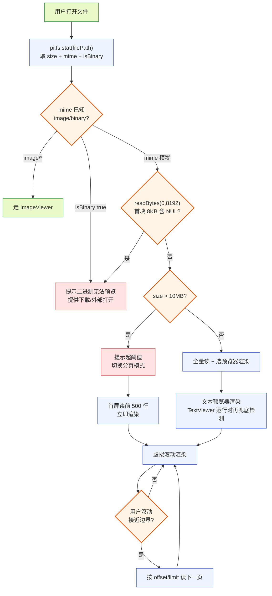

**图 5 — 大文件保护流程：stat 靠 mime 初判 → mime 模糊则先 readBytes 读首块 8KB 做 NUL 探针（先于任何整块读，防大二进制全量载入内存）→ 未命中 NUL 再按 size 决定全量读或分页虚拟滚动；TextViewer 运行时兜底**

#### 5.2.2 虚拟滚动渲染

分页拿到的是多段行数据，渲染用虚拟滚动——只渲染可视区域 +/- 少量缓冲行（如前后各 10 行）的 DOM，滚动时动态替换可视项。这避免长文件（即使分页后单页 500 行）全量渲染成 DOM 节点（500 行 DOM 尚可，但若用户连续加载多页累积到几千行就会卡）。虚拟滚动组件由 `pi.ui` 组件库（`DESIGN.md` 4.11.4）提供或插件自实现（如基于 `react-window`/`@tanstack/virtual`）。代码高亮和 markdown 渲染对虚拟滚动有特殊处理：高亮按行独立渲染（每行一个 span、带 `data-line` 属性供 review 锚点用，见 7.3.1）、markdown 的块级元素（段落/列表/代码块）作为虚拟项——这两种的虚拟化粒度不同，代码按行、markdown 按块，预览器各自处理。虚拟滚动还要处理 `scrollToIndex`（跳转到指定行，3.2.3 的 firstChangedLine 跳转用）和滚动位置恢复（用户切走再回来恢复到原位置，存插件 config 或组件 state）。

#### 5.2.3 与底座 read 工具截断的协同

底座 `read` 工具的截断（`truncate.ts`）和桌面端预览的大文件保护是两道独立的保护，作用对象不同：底座截断保护的是"发给 LLM 的上下文大小"（`DEFAULT_MAX_LINES=2000`/`DEFAULT_MAX_BYTES=50KB`，防 context 爆炸、防 LLM 处理超长输入），桌面端 10MB 保护的是"renderer 渲染性能"（防 DOM 卡死）。工具卡片路径的数据已被底座截断（有界 50KB/2000 行），桌面端不再二次保护；用户主动打开路径的数据未经底座（不进 LLM 上下文），桌面端自己保护。两者不冲突——一个是 agent 上下文边界、一个是 UI 性能边界，各自管自己的维度。底座截断信息（`TruncationResult`，`truncate.ts:15`，带 `truncated`/`truncatedBy`/`totalLines`/`outputLines` 等）也会传到桌面端，预览器可在截断时显示"仅显示前 2000 行，共 N 行"提示——但这是底座截断的提示（工具卡片路径），和桌面端 10MB 提示（用户主动打开路径）是两套不同提示，不混淆。

### 5.3 二进制与不可预览文件处理

二进制文件（非文本、非图片）无法有意义地预览。判定分三步、由粗到细：

1. **stat 阶段初判（靠 mime）**：`pi.fs.stat` 返回的 `mimeType` 若已知是 image 类（`image/*`）走 ImageViewer、若 `isBinary` 为 true（已知二进制类如 `application/octet-stream`/`application/zip` 等）直接判二进制、提示\\\"无法预览\\\"。这一步只看 mime、不读内容。
2. **读首块检测（mime 模糊时）**：对 mime 模糊（如 `text/plain`/`application/octet-stream` 但不确定）的文件，经 `pi.fs.readBytes(path, 0, 8192)` 读前 8KB 字节块做 NUL 字节检测——出现 NUL 字节即判二进制。这一步补 stat 阶段漏判（扩展名说谎、mime 探测不准），且**必须先于任何整块 `readFile`**：对可能很大的二进制文件若先 `readFile` 会把整文件读进内存、违背懒加载初衷（图 5 已据此把 NUL 探针置于 size 判定之前）。`readBytes` 只读首 8KB 探针、不整块读入。
3. **TextViewer 运行时兜底检测**：即便前两步都漏判（如一个无扩展名文件 mime 未知、首块无 NUL 但后续含二进制），TextViewer 渲染时检测替换字符 `�` 占比超 1% 也判二进制（3.5.2），降级为\\\"二进制无法预览\\\"。这是最后一道兜底。

三步是递进兜底关系，不是三选一。处理：显示\\\"此文件为二进制，无法预览\\\"，提供\\\"复制路径\\\"按钮。不强行用 TextViewer 渲染乱码——这是兜底的兜底。对于已知格式但预览器未支持的文件（如 `.pdf`），预览器不假装能预览——显示\\\"无可用预览器\\\"并建议用户安装第三方预览插件（如 PDF 预览插件挂在预览器槽 match `mime: \"application/pdf\"`）。这种\\\"不假装\\\"的态度避免了\\\"强行渲染出乱码\\\"的糟糕体验，也把\\\"支持更多格式\\\"留给第三方插件生态扩展。

## 6 插件 manifest 与代码结构

### 6.1 plugin.json

#### 6.1.1 完整 manifest 示例

```json
{
  "id": "file-preview",
  "version": "1.0.0",
  "displayName": "文件预览",
  "main": "./worker/index.ts",
  "renderer": "./renderer/index.ts",
  "permissions": ["fs:project:read"],
  "contributes": {
    "viewers": [
      { "match": { "strategy": "extension", "value": "md" }, "component": "MarkdownViewer" },
      { "match": { "strategy": "extension", "value": "markdown" }, "component": "MarkdownViewer" },
      { "match": { "strategy": "extension", "value": "mdx" }, "component": "MarkdownViewer" },
      { "match": { "strategy": "extension", "value": "diff" }, "component": "DiffViewer" },
      { "match": { "strategy": "extension", "value": "patch" }, "component": "DiffViewer" },
      { "match": { "strategy": "extension", "value": "ts" }, "component": "CodeViewer" },
      { "match": { "strategy": "extension", "value": "tsx" }, "component": "CodeViewer" },
      { "match": { "strategy": "extension", "value": "js" }, "component": "CodeViewer" },
      { "match": { "strategy": "extension", "value": "jsx" }, "component": "CodeViewer" },
      { "match": { "strategy": "extension", "value": "py" }, "component": "CodeViewer" },
      { "match": { "strategy": "extension", "value": "rs" }, "component": "CodeViewer" },
      { "match": { "strategy": "extension", "value": "go" }, "component": "CodeViewer" },
      { "match": { "strategy": "extension", "value": "java" }, "component": "CodeViewer" },
      { "match": { "strategy": "mime", "value": "image/*" }, "component": "ImageViewer" },
      { "match": { "strategy": "all" }, "component": "TextViewer" }
    ]
  }
}
```

`viewers` 数组里每个扩展名一个贡献项（完整列表照 `getLanguageFromPath` 的 `extToLang` 表挂，上面是节选）。`diff`/`patch` 扩展名直接命中 DiffViewer（用户主动打开 patch 文件时）；工具卡片的 diff 走卡片提取内容、不靠扩展名匹配。`all` 兜底放最后。`editable` 字段全部省略（预览插件只读），文件编辑器插件的 manifest 会带 `editable: true`。

#### 6.1.2 contributions.viewers 数组

`viewers` 数组的顺序不影响匹配结果（匹配靠 specificity + 优先级，不靠数组序），但加载器按数组顺序注册贡献项——同 specificity 同优先级时按注册序取先，所以数组顺序在极端并列时有意义。建议按 specificity 从高到低排列（extension → mime → all），可读性好。多个贡献项引用同一个 `component`（如多个扩展名都用 `CodeViewer`）是允许且常见——一个组件可被多个贡献项复用，组件内部按 `filePath` 取扩展名决定高亮语言。

### 6.2 renderer 模块导出

#### 6.2.1 组件命名导出

renderer 入口 `./renderer/index.ts` 按命名导出每个预览器组件：

```typescript
export { MarkdownViewer } from "./markdown-viewer";
export { DiffViewer } from "./diff-viewer";
export { CodeViewer } from "./code-viewer";
export { ImageViewer } from "./image-viewer";
export { TextViewer } from "./text-viewer";
export { highlightCode } from "./highlight";  // 供复用的纯函数
```

加载器校验 `component` 引用的导出名确实存在（`DESIGN.md` 3.2 manifest 校验）。core 渲染预览器时按字符串名（如 `"MarkdownViewer"`）从 renderer 模块取组件、按 `ViewerProps` 契约喂 props。导出名是字符串契约——改导出名会破坏 manifest 的 `component` 引用，所以导出名一旦确定要稳定（演进时只加新导出、不改老导出名，开闭原则）。

#### 6.2.2 props 契约

预览器组件接收的 `ViewerProps`（圆心定义的中性契约，`DESIGN.md` 5.1.5）：

```typescript
interface ViewerProps {
  filePath: string;              // 文件预览：真实路径（取扩展名、跳转、review 锚点）；消息渲染：留空
  content: string | ImageContent;  // 内容：文本字符串或图片内容块
  mimeType?: string;             // mime（图片/二进制判定用）
  theme: Theme;                  // 当前主题 token（不硬编码颜色）
  editable?: boolean;            // 是否编辑态；预览插件贡献的预览器恒 false/省略，文件编辑器插件复用此契约时传 true
  sourceType?: \"file\" | \"message\";  // 默认 \"file\"；assistant 消息渲染传 \"message\"（review 锚点不适用，见 7.1.1）
  messageId?: string;            // sourceType=\"message\" 时带消息 id
  onError?: (msg: string) => void;  // 渲染失败回调（如解析错误）
  onJump?: (line: number) => void;  // 跳转回调（review 锚点 / firstChangedLine）
  firstChangedLine?: number;        // diff 跳转用：改动在新文件中的首行号（来自 edit 工具 EditToolDetails，3.2.3）；
                                     //   卡片从 end.result.details.firstChangedLine 提取后传入（图 4/图 6），
                                     //   DiffViewer 据此实现"跳到改动首行"，不自行从 diff 字符串解析。
}
```

`content` 是联合类型——文本预览器收 `string`、图片预览器收 `ImageContent`（`{ type: \"image\"; data: string; mimeType: string }`，`DESIGN.md` 1.7.6）。预览器组件按自己期望的类型断言、不做运行时类型分派（匹配阶段已保证类型对应：extension 匹配的预览器收文本、mime image/* 匹配的收图片）。`theme` 从圆心 `Theme` 取（`Record<string, string>`，token key → 值），预览器用 `theme[\"color.accent.success\"]`/`theme[\"color.accent.error\"]`（diff 红绿）/`theme[\"font.family.mono\"]`（等宽）等 token、不硬编码颜色值——这让它自动跟随主题（4.11）。`editable` 区分\\\"预览插件实例\\\"与\\\"ViewerProps 契约本身\\\"：预览插件贡献的预览器恒为 false/省略；文件编辑器插件复用同一 ViewerProps 契约时传 true（见 7.2.1）。`onError` 让预览器在解析失败（如 markdown 语法错误、diff 格式异常）时优雅降级而非抛崩——卡片宿主收到错误可在卡片框架里显示\\\"预览失败\\\"提示。

### 6.3 worker 侧 activate（可选）

文件预览插件的 `main`（`./worker/index.ts`）是可选的——五个预览器都是纯 renderer 侧组件、不依赖 worker 逻辑。`activate` 可空实现或仅做 config 初始化（如读用户设的分页大小、视图偏好）：

```typescript
export function activate(context: PluginContext) {
  // 读用户偏好（diffView 模式、pageSize 分页大小）
  const diffView = context.config.get<\"unified\" | \"split\">(\"diffView\") ?? \"unified\";
  const pageSize = context.config.get<number>(\"pageSize\") ?? 500;
  // 订阅 review 模式切换（7.3.2），经 emitToRenderer 推给 renderer 侧组件
  context.bus.subscribe(\"review.mode\", (payload) => {
    context.emitToRenderer(\"review.mode\", payload); // worker→renderer 主动推送通道
  });
}
```

worker→renderer 的推送通道用 `DESIGN.md` 3.2.4 已定义的 `context.emitToRenderer(channel, data)`——这是加载器为每个有 `main` 的插件自动建立的一条 worker↔renderer 直连通道（底层是 utilityProcess 的 MessagePort，但插件**不直接拿 MessagePort**，只经 `emitToRenderer` 推、renderer 侧组件经 `pi.onMessage(channel, cb)` 收）。renderer 侧订阅示例：

```typescript
// renderer 侧 CodeViewer 组件
import { useEffect, useState } from \"react\";

export function CodeViewer({ pi, ...props }: ViewerProps & { pi: RendererPluginContext }) {
  const [reviewMode, setReviewMode] = useState(false);
  useEffect(() => {
    // pi.onMessage 收 worker 经 emitToRenderer 推来的数据，返回取消订阅
    const off = pi.onMessage(\"review.mode\", (payload: { active: boolean }) => {
      setReviewMode(payload.active);
    });
    return off;
  }, []);
  // reviewMode 为 true 时给每行 DOM 加 data-file-range、划选出 review 浮层
  return <div data-review={reviewMode}>{/* ... */}</div>;
}
```

若未来要加\\\"worker 侧预解析大文件\\\"（在 worker 把 markdown 解析好再传 HTML 给 renderer，避免 renderer 主线程阻塞），则 `activate` 里注册解析任务、经 `context.emitToRenderer(\"parsed-html\", html)` 回传结果，renderer 侧组件 `pi.onMessage(\"parsed-html\", cb)` 收。当前版本预览全在 renderer 侧、`main` 可省略——但 manifest 保留 `main` 字段为未来扩展留口。这呼应\\\"构造和执行分离\\\"：worker 管\\\"数据加工\\\"（未来解析）、renderer 管\\\"渲染执行\\\"，两侧经 `emitToRenderer`/`onMessage` 通信，不暴露原始 MessagePort。

### 6.4 目录结构

按 `DESIGN.md` 5.1.4 的目录树，内置插件在 `plugins/file-preview/`：

```
plugins/file-preview/
├── plugin.json                # manifest
├── worker/
│   └── index.ts               # activate（可选，当前近空）
└── renderer/
    ├── index.ts               # 命名导出各预览器
    ├── markdown-viewer.tsx    # MarkdownViewer
    ├── diff-viewer.tsx        # DiffViewer
    ├── code-viewer.tsx        # CodeViewer
    ├── image-viewer.tsx       # ImageViewer
    ├── text-viewer.tsx        # TextViewer
    └── highlight.ts            # highlightCode 纯函数（语言映射 + 高亮）
```

插件只 import `domain/` 的契约（`ViewerProps`/`Theme`/`ImageContent`），不 import `gateway/`/`application/`/`shell/`——这是 `DESIGN.md` 5.1.4 的目录纪律，code review 一眼可查违规（任何 `plugins/file-preview/` 下文件 import 了 `gateway`/`application`/`shell` 就是违规）。`highlight.ts` 放语言映射表和高亮函数，是可被文件编辑器等跨插件复用的纯函数模块。

## 7 与其他插件的协作

### 7.1 与时间线插件（4.4）

#### 7.1.1 assistant 消息复用 markdown 渲染器

时间线插件渲染 assistant 消息气泡时，消息内容是 markdown 文本（`message_update` 事件的 `message.content`）。`DESIGN.md` 4.4.2 明说\\\"支持 markdown 渲染（复用文件预览插件的 markdown 渲染器，4.5）\\\"。复用方式：时间线插件的 assistant 气泡组件内部，把消息文本作为 `content`、经 3.3.3 的 `exports.get` 通道（或加载器允许的跨插件组件名引用）直接拿到 `MarkdownViewer` 组件、把消息文本作为 `content` 传给它渲染。**不合成假路径**（如 `message.md`）让预览器槽按 extension 匹配——假路径会污染 review 锚点语义（review 插件会把锚点记成不存在的 `message.md`、`onJump` 跳转无意义），与 `ViewerProps.filePath` 的契约（用于取扩展名、跳转、review 锚点）冲突。为此 ViewerProps 增加可选的 `sourceType`/`messageId` 字段区分\\\"文件预览\\\"与\\\"消息渲染\\\"：

```typescript
interface ViewerProps {
  filePath: string;              // 文件预览：真实路径；消息渲染：留空
  content: string | ImageContent;
  mimeType?: string;
  theme: Theme;
  editable?: boolean;
  sourceType?: \"file\" | \"message\";  // 默认 \"file\"；消息渲染传 \"message\"
  messageId?: string;           // sourceType=\"message\" 时带消息 id（review 锚点对消息场景不适用）
  onError?: (msg: string) => void;
  onJump?: (line: number) => void;
  firstChangedLine?: number;        // diff 跳转用（仅 DiffViewer 消费，见 6.2.2）
}
```

assistant 气泡渲染时传 `{ content, sourceType: \"message\", messageId }`（不带 `filePath`/`onJump`）——review 插件见到 `sourceType: \"message\"` 即知该内容不做文件锚点。这样 assistant 消息的 markdown 渲染和 `.md` 文件预览用同一个组件、同一套 dompurify 清洗，安全口径一致——不会出现\\\"文件预览做了 XSS 防护、但 assistant 消息没做\\\"的防护漏洞。复用是单向的：时间线取预览器组件，预览器不感知自己被时间线用、也不反向调时间线。

#### 7.1.2 工具卡片调预览器槽

时间线插件挂的卡片渲染器（bash/edit/read/write）在卡片内部按 toolName 决定走哪个预览器：**edit/write 卡片按 toolName 直接选 DiffViewer**（卡片知道自己处理的是 diff，提取 `result.details.diff` 构造 ViewerProps 传给 DiffViewer，不查预览器槽扩展名）、read 卡片提取 `result.content`（文本或图片）按文件扩展名匹配 CodeViewer/ImageViewer/TextViewer、write 卡片提取 `args.content` 按路径匹配预览器。卡片组件自己只画框架（标题栏 `edit path/to/file`、展开按钮、错误态红色标题栏——底座 `edit.ts:229` 的 `getEditHeaderBg` 按 preview/settledError 状态选标题栏底色，桌面端卡片复用这个状态机），内容区委托给预览器。这是 `DESIGN.md` 4.5 末段\\\"卡片渲染槽和预览器槽是协作关系\\\"的落地。\\\"edit 卡片直接选 DiffViewer\\\"不是内容嗅探（不是\\\"查到 CodeViewer 再判断内容是不是 diff 字符串\\\"）——卡片是卡片渲染槽按 toolName 匹配出来的，toolName 就是它该用哪个预览器的依据。

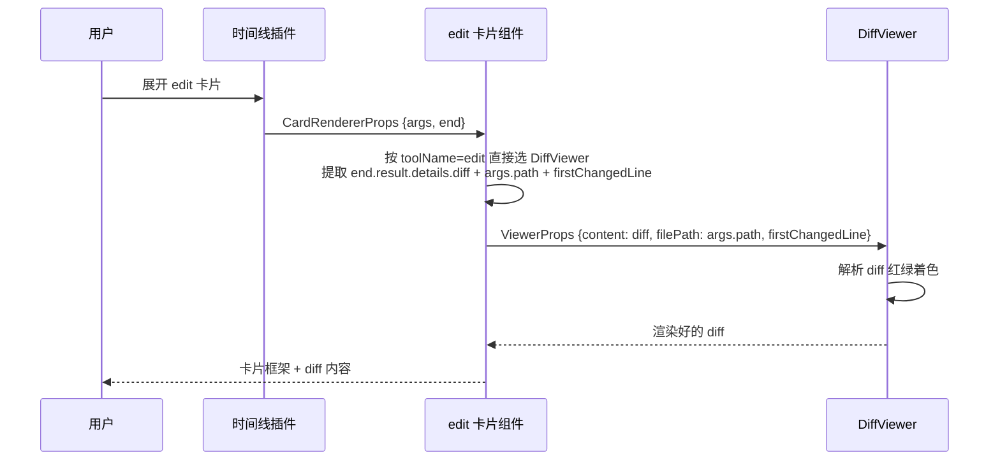

**图 6 — 卡片调预览器时序：edit 卡片按 toolName 直接选 DiffViewer，不经预览器槽扩展名查**

### 7.2 与文件编辑器（4.12）

#### 7.2.1 editable 标记区分

文件编辑器插件往同一个预览器槽挂 `editable: true` 的贡献项（`DESIGN.md` 4.12.3）。两者不冲突——靠 `editable` 标记和来源插件优先级仲裁。用户打开文件时：装了编辑器 → 命中 FileEditor（可编辑）；没装 → 命中只读预览器。FileEditor 在 `editable:false` 态（如只读权限未授权时，4.12.5）退回只读高亮，本质就是 CodeViewer 的复用。这种"同一槽位、editable 标记区分形态"让编辑器和预览器共用一套匹配机制，不必为编辑器另设槽位。

#### 7.2.2 代码高亮复用

`DESIGN.md` 4.12.3 明说文件编辑器"复用 4.5 的代码高亮能力、不重写高亮"。复用点：FileEditor 的编辑态底色用 `highlightCode` 函数（3.3.3）实时高亮当前编辑内容（用户每输一个字符增量重高亮当前行）。这是"构造和执行分离"原则的体现——高亮逻辑（构造）归文件预览插件、编辑器（执行编辑）归文件编辑器插件，两侧独立演化：换高亮引擎不影响编辑器（只要 `highlightCode` 签名不变）、改编辑器交互不影响高亮。文件编辑器声明 `dependsOn: ["file-preview"]` 保证加载顺序。

### 7.3 与 review 插件（4.10）

#### 7.3.1 文件路径+行范围锚点

review 插件让用户在文件预览内容上划选文字、留评论（`DESIGN.md` 4.10.2）。文档类评论的锚点是 `文件路径 + 行范围`（4.10.5）——这个路径来自文件预览器打开的文件（`ViewerProps.filePath`），行范围来自用户划选时 DOM 选区映射到的行号。预览器组件要支持选区到行号的映射：文本/代码预览器按行渲染（每行一个可定位元素、带 `data-line` 属性），划选时取起止行的 `data-line` 算行范围。review 插件不直接读预览器内部状态、只从 DOM 选区和 `data-*` 属性取锚点——这是松耦合的：预览器只负责把行号写进 `data-line`，怎么用由 review 插件决定。

#### 7.3.2 review.mode 事件订阅

review 插件进入/退出 review 模式时，往 `context.bus` 发 `review.mode` 事件（`{ active: boolean }`，`DESIGN.md` 4.10.7）。文件预览插件订阅这个 topic——收到 `active: true` 后，在自己的渲染里把文件内容标记为\\\"可选+可批注\\\"（给 DOM 加 `data-file-range` 属性、划选时出 review 浮层而非默认选区行为）。收到 `active: false` 退出。这是松耦合协作——预览器选择订阅，不订阅就不响应（review 模式对它无副作用）。预览器不直接 import review 插件实现（隔离，`DESIGN.md` 3.5 第 5 项），只经事件总线收信号。订阅在 worker 侧 `activate` 里注册（`context.bus.subscribe(\"review.mode\", ...)`）、经 `context.emitToRenderer(\"review.mode\", payload)` 推给 renderer 侧组件、组件用 `pi.onMessage(\"review.mode\", cb)` 收后切换批注态（6.3 示例）。这条 worker→renderer 通道用 `DESIGN.md` 3.2.4 已定义的 `emitToRenderer`/`onMessage`，插件不直接碰底层 MessagePort。

### 7.4 与主题插件（4.11）

#### 7.4.1 token 取色，不硬编码

所有预览器组件的颜色都从 `ViewerProps.theme`（圆心 `Theme` 对象）取 token，不硬编码颜色值。文件预览插件依赖的主题 token 完整清单（来源 `DESIGN.md` 4.11.2 的 token 清单）：diff 新增/删除行用 `theme["color.accent.success"]`/`theme["color.accent.error"]`、markdown 链接色用 `theme["color.primary"]`、代码块背景用 `theme["color.surface"]`、正文前景用 `theme["color.fg"]`、等宽字体用 `theme["font.family.mono"]`、边框用 `theme["color.border"]`。`DESIGN.md` 4.11.2 的 token 清单是稳定契约（key 固定、值可变），不含 `color.diffAdd`/`mdCodeBlock`/`syntax.keyword`/`font.mono`/`color.link` 这些底座 TUI 侧 token 名——文件预览插件只引用清单内的 key，不引用底座 TUI token 名。代码高亮的语法色（keyword/string/comment 等细分色）当前不在 4.11.2 清单内（已知缺口）：当前实现由 file-preview 插件自带一套 highlight.js 主题 CSS（dark/light），检测当前明暗选对应 CSS——不依赖主题槽补语法 token；未来可演进为主题插件补 `syntax.*` token。**回退规则**：任何 token 若在 `Theme` 里取到 `undefined`，回退到 `theme["color.fg"]`，保证不出现未着色。这让预览器自动跟随主题切换（4.11 主题槽换 id + 重渲染，预览器读新 token）。主题 token 有 WCAG AA 对比度约束（`DESIGN.md` 4.11 末段，≥4.5:1），预览器无需自己校验——主题槽合并时已校验，不达标记入诊断页警告。色盲友好方面，diff 不只靠红绿、加 `+`/`-` 前缀辅助（和底座 `generateDiffString` 的行前缀设计一致），状态指示不只用颜色——这是主题规范的强制要求。

## 8 时序与状态

### 8.1 工具卡片预览时序

工具卡片预览的完整时序（图 4 已部分展示，这里补全 start/update 阶段）：

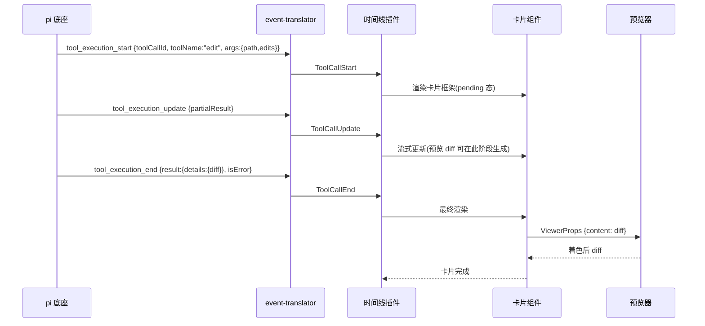

**图 7 — 工具卡片预览完整时序：start→update→end，卡片在 end 后调预览器**

底座 `edit` 工具的 `renderCall`（`edit.ts:363`）在工具执行中就能生成预览 diff（`computeEditsDiff`，`edit.ts:380`，在原文件上模拟应用 edits）——TUI 侧这个预览在 call 阶段就显示。桌面端可在 `tool_execution_update` 阶段同样显示预览 diff（卡片从 `updates` 的 `partialResult` 提取、或底座在 update event 里带上预览 diff），`tool_execution_end` 后用最终 `result.details.diff` 替换。这让用户在 agent 改文件的过程中就能看到 diff 预览、不必等工具执行完——"预览先行、最终替换"的两阶段渲染提升感知性能。**当前实现状态**：图 7 中 update 阶段渲染预览 diff 为目标态（见 14.2、14.3），当前版本 event-translator 尚未携带预览 diff 字段，卡片在 update 阶段仅刷新 pending 框架、不渲染 diff，到 end 阶段才调 DiffViewer 渲染最终 diff。

### 8.2 用户主动打开预览时序

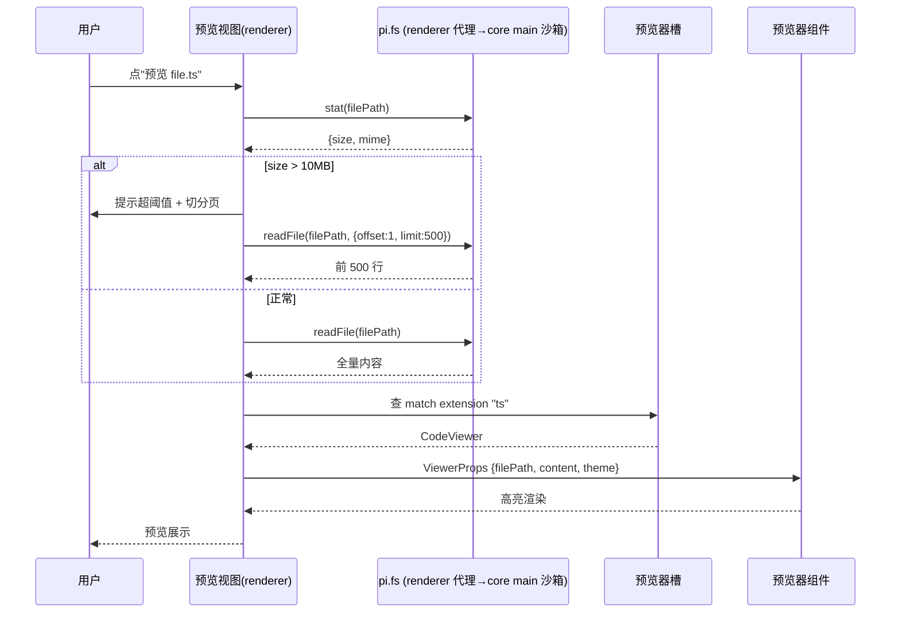

**图 8 — 用户主动打开预览时序：stat 检查大小 → 分页或全量读 → 匹配预览器 → 渲染**

### 8.3 预览器选择状态机

对一个待预览文件，预览器选择是一个状态机：

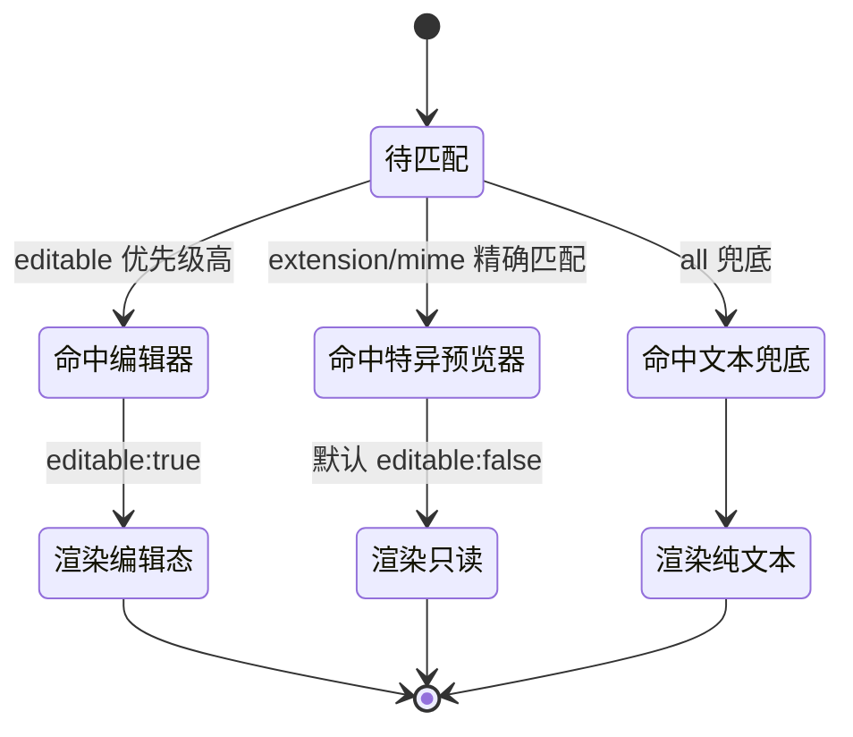

**图 9 — 预览器选择状态机：按优先级 → specificity → 兜底 三段决策**

### 8.4 大文件保护流程图

大文件保护流程见图 5，其核心是"stat 先行、阈值分叉、分页虚拟滚动"。对工具卡片路径不触发（底座已截断有界），只对用户主动打开路径生效。二进制文件在 stat 阶段（按 mime/NUL 检测）提前分叉到"无法预览"分支，不进入分页流程。整个保护是"懒加载"思想：不预读全部内容、只在需要时按页读、只渲染可视区——把 O(n) 的渲染降到 O(可视窗口)。

## 9 配置项与设置子页

### 9.1 设置子页槽贡献

文件预览插件往**设置子页槽**（`settings`，`DESIGN.md` 3.3）挂一个配置页，让用户调预览行为偏好：

```json
"settings": [
  { "id": "file-preview", "title": "文件预览", "component": "FilePreviewSettings" }
]
```

设置子页用 renderer 模块导出的 `FilePreviewSettings` 组件渲染表单——用户改后写 `context.config.set(...)`，预览器组件订阅 config 变化重新渲染（config 变更经 `context.bus` 通知或 React context 传递）。配置存插件自己的 data 目录（`fs:{读写插件的 data 目录}` 默认就有，`DESIGN.md` 3.2 permissions），不碰 pi settings——这是桌面插件配置和底座配置的边界（`DESIGN.md` 2.4.3 桌面插件配置走另一路）。

### 9.2 配置项清单

配置项（存 `context.config`）：

- `diffView`：`"unified" | "split"`，diff 默认视图。
- `pageSize`：number，大文件分页行数，默认 500。
- `largeFileThreshold`：number，大文件阈值（字节），默认 10485760（10MB）。
- `wrapLongLines`：boolean，超长行是否软换行。
- `highlightEngine`：`"highlight.js" | "shiki"`，代码高亮引擎选择（未来扩展，当前固定 highlight.js）。

## 10 错误处理与降级

### 10.1 渲染失败的降级

预览器组件渲染时可能失败：markdown 解析器抛语法错、diff 格式无法识别、图片解码失败、代码高亮引擎崩。降级策略走 `onError` 回调（6.2.2）：预览器 catch 内部异常、调 `onError(msg)` 通知宿主、宿主在卡片/预览框架里显示"预览失败：原因"提示。不抛崩到 React 错误边界（那会让整个卡片消失）。具体降级：markdown 解析失败 → 退到 TextViewer 显示原始文本；diff 解析失败 → TextViewer 显示原始 diff 字符串；图片解码失败 → 显示"图片解码失败"占位 + 重试按钮；高亮失败 → TextViewer 显示纯文本。每层降级都保证"总能看到内容"，不出现空白。

### 10.2 权限缺失的降级

用户主动打开路径若 `fs:project:read` 未授权，`pi.fs.readFile` 抛权限错误。预览视图捕获后显示"无文件读取权限，请在管理 UI 授权 fs:project:read"提示 + 跳转授权按钮。工具卡片路径不受影响（数据来自事件流、不读盘）。这种降级让插件在部分授权下仍可用——预览工具卡片内容（不需读盘权限）正常、主动打开文件（需读盘权限）降级提示。

### 10.3 预览器缺失的降级

若一个文件没匹配到任何预览器（连 `all` 兜底的 TextViewer 都没装——如用户禁用了 file-preview 插件），core 渲染预览视图时显示"无可用预览器"。这不应发生在默认配置（内置 TextViewer 的 `all` 兜底总在），但第三方覆盖场景可能出现。core 不内置兜底预览器（那是插件的事、不是 core 的事——`DESIGN.md` 4.1 core 极薄），缺失由用户自己装回预览插件解决。

### 10.4 编码与换行边界

预览器要正确处理文件编码和换行符的边界情况，否则会出现乱码或排版错乱：

- **BOM**：UTF-8 BOM（``）出现在文件头部。底座 `edit-diff.ts` 的 `stripBom`（同文件 247）处理 edit 路径，TextViewer 同样在渲染前去 BOM——BOM 若当字符显示会排到行首成不可见占位，破坏首行缩进。沙箱 `fs:project:read` 返回字符串时应在 core 层去 BOM（统一行为，不让每个预览器各自处理）。
- **CRLF / LF**：Windows 文件常用 CRLF（`\r\n`），Unix 用 LF。底座 `normalizeToLF`（`edit-diff.ts:18`）归一为 LF。预览器渲染前同样归一——否则 CRLF 在浏览器里可能渲染成多余空行或 `^M`。归一在沙箱读取层做一次，预览器收到的统一是 LF。
- **非 UTF-8 编码**：理论上文件可能是 GBK/Latin1 等。当前预览器只支持 UTF-8（沙箱 `readFile` 用 `buffer.toString("utf-8")`，和底座 `read.ts:266` 一致），非 UTF-8 文件解码后会出现替换字符 `�`，TextViewer 的二进制检测会捕获（替换字符占比高）。完整多编码支持是演进项（需在沙箱层探测编码），当前 UTF-8 only 是合理默认。
- **超长行**：单行超长的文件（如压缩后的 JS、minified 代码）会让虚拟滚动按行渲染时单行 DOM 过宽。TextViewer/CodeViewer 对超长行做软换行（`word-break: break-all` 或 `overflow-wrap`）+ 横向滚动开关，避免布局撑爆容器。底座 `truncate.ts` 的 `firstLineExceedsLimit` 检测（单行超 50KB）也提示——预览器对此类行显示截断提示。

## 11 i18n 文案键目录

### 11.1 namespace 约定

文件预览插件本身不贡献语言包（语言槽贡献是 i18n 插件 4.2 的事），但它消费一组 i18n key 用于渲染提示文案。`DESIGN.md` 3.3 语言槽的 namespace 约定有两类 key 形态：**label 类**用 `{slot}.{pluginId}.{itemId}.label` 约定形式（用于贡献项标签），**自由提示文案**用 `viewer.*` 自由 key 形式（不带 pluginId 段）。文件预览插件消费的 key 一律采用 `viewer.*` 自由 key 形式（不带 pluginId）——因为这些是面向用户的提示文案（\\\"文件过大\\\"\\\"二进制无法预览\\\"），不是贡献项 label，label 类约定不适用。两者关系：label 类 key 用约定形式、自由提示文案用 `viewer.*`；第三方覆盖时按 key 级合并、同 key 优先级覆盖。core 渲染底座内容时用的文案也走语言槽、core 不内嵌文案常量（`DESIGN.md` 3.3 语言槽说明），所以预览器的所有面向用户的字符串都经 `pi.i18n.t(key)`（renderer 侧 RendererPluginContext.i18n；worker 侧则 `context.i18n.t`）取，不硬编码字面量。

### 11.2 key 清单

| key | 中文兜底文案 | 用途 |
|---|---|---|
| `viewer.tooLarge` | 文件 {name} 大小 {size}，超过预览阈值 {threshold}，已切换为分页浏览 | 超阈值提示（5.1.2） |
| `viewer.binary` | 此文件为二进制，无法预览 | 二进制提示（3.5.2/5.3） |
| `viewer.noPermission` | 无文件读取权限，请在管理 UI 授权 fs:project:read | 权限缺失提示（10.2） |
| `viewer.noViewer` | 无可用预览器，建议安装对应格式的预览插件 | 预览器缺失（10.3） |
| `viewer.previewFailed` | 预览失败：{reason} | 渲染失败（10.1） |
| `viewer.diffView.unified` | 统一视图 | diff 视图切换（3.2.1） |
| `viewer.diffView.split` | 分栏视图 | diff 视图切换 |
| `viewer.jumpToChange` | 跳到改动首行 | firstChangedLine 跳转按钮（3.2.3） |
| `viewer.loadMore` | 加载更多（{remaining} 行） | 分页加载下一页（5.2.1） |
| `viewer.imageDecodeFailed` | 图片解码失败 | 图片降级（10.1） |
| `viewer.truncatedByBase` | 仅显示前 {shown} 行，共 {total} 行 | 底座截断提示（5.2.3） |

这些 key 的中文兜底文案作为 `displayName` 字面的同位机制存在——i18n 插件提供了对应 locale 翻译就用翻译，查不到就 fallback 到这里的字面值（`DESIGN.md` 3.2 的 fallback 机制）。第三方覆盖插件若想改文案，可贡献同名 key 到语言槽覆盖（key 级合并，`DESIGN.md` 3.3 语言槽冲突仲裁）。变量插值（`{name}`/`{size}`）用 i18next 的 `t(key, { name, size })` 机制。

### 11.3 fallback 与覆盖机制

文案 key 的解析遵循语言槽的\\\"key 级合并 + 同 key 优先级覆盖\\\"规则（`DESIGN.md` 3.3 语言槽冲突仲裁）。具体到文件预览插件消费的 `viewer.*` key：i18n 插件（4.2）在 core 启动时把所有插件同 locale 同 namespace 的 resources 合并成一个 i18next 字典——多个插件都给 `viewer` namespace 贡献 key、各自 key 不冲突时全要，同 key 冲突时按来源插件优先级取高的。这意味着第三方插件可以为 `viewer.tooLarge` 贡献不同的中文措辞，只要它优先级高于内置 i18n 插件、就覆盖该 key 的翻译。第三方覆盖贡献项示例（一个 id 同为 `file-preview-locale` 的第三方插件往语言槽贡献 `viewer.tooLarge` 的改写）：

```json
{
  \"id\": \"file-preview-locale\", \"version\": \"1.0.0\",
  \"contributes\": {
    \"languages\": [{ \"id\": \"zh\", \"namespace\": \"viewer\", \"resources\": { \"tooLarge\": \"⚠ 文件 {name}（{size}）超出 {threshold}，已分页\" } }]
  }
}
```

文件预览插件自己不贡献 `viewer.*` 翻译（那是 i18n 插件 4.2 的职责），它只声明\\\"我消费这些 key\\\"——消费侧不定义翻译，避免和 i18n 插件职责重叠（呼应关注点分离：谁负责翻译归谁）。fallback 到字面值是最后兜底，正常使用下 i18n 插件已提供 zh/en 翻译，字面值不暴露给用户。

## 12 性能预算与考量

### 12.1 渲染性能预算

预览器跑在 Electron renderer 主线程，长任务会阻塞 UI 响应。性能预算：

- **单次渲染 < 16ms**：一帧 16ms（60fps），预览器渲染（含 markdown 解析 + dompurify 清洗 + DOM 注入）要在一帧内完成，否则掉帧卡顿。对常规文件（< 100KB 文本）可达；对大文件走分页虚拟滚动，单次只渲染一页。
- **markdown 解析缓存**：同一段 markdown 内容解析一次、缓存 HTML（key 用内容 hash），内容不变时不重复解析。缓存 LRU、上限 50 条（防内存膨胀）。
- **dompurify 实例复用**：模块级单例、不每次渲染新建。
- **虚拟滚动可视项**：只渲染可视区 +/- 10 缓冲行，即便文件几万行也只渲几十个 DOM 节点。
- **图片解码异步**：``，大图解码不阻塞主线程。

### 12.2 内存考量

大文件分页加载要避免内存累积——已滚出可视区的旧页数据应可被 GC。策略：虚拟滚动只持有可视区和缓冲页的原始行数据，旧页数据从组件 state 移除（靠虚拟滚动库的卸载机制）。但用户回滚时要能重新加载——重新 `pi.fs.readFile({ offset, limit })` 取，不长期持有全文。对工具卡片路径（内容已在内存、且有界 50KB），无需此考量。markdown 缓存的 HTML 字符串有 LRU 上限，不无限增长。

### 12.3 与底座输出守护的协同

底座 `output-guard.ts`（`DESIGN.md` 5.1.4 提到的 stdout 保护）确保 RPC 通道的 stdout 不被污染。预览器不经 RPC 吐数据（它只消费 event 流和沙箱读盘），不直接往底座写——所以预览器不会污染底座输出。但预览器若调 `context.bus.publish` 发消息，这些消息走桌面内部事件总线、不经底座 stdout，无污染风险。这条边界让预览器的性能问题（如大文件渲染卡顿）只影响桌面 UI、不波及底座 agent 运行——底座在独立子进程、不受 renderer 卡顿影响（`DESIGN.md` 1.10 边界）。

## 13 测试策略

### 13.1 匹配逻辑单测

`MatchStrategy` 的 `matches()` 是纯函数、放 `domain/slots/strategies.ts`、可纯单测（`DESIGN.md` 5.1.4 末段"domain 可纯单测"）。测试覆盖：`extension` 策略对各种扩展名（带点/不带点/大写/无扩展名）的匹配、`mime` 策略的通配（`image/*` 匹配 `image/png` 但不匹配 `text/plain`）、`all` 恒真、specificity 数值比较。冲突仲裁（优先级 + specificity + 注册序）也单测：构造两个贡献项 match 同一文件、验证胜出者正确。

### 13.2 预览器组件测试

每个预览器组件用 React Testing Library 测：给 `ViewerProps`、断言渲染输出。重点测 markdown 预览器的 dompurify 清洗（输入带 `<script>` 的 markdown、断言渲染后无 script 标签）、diff 预览器的两种格式自适应（展示型 diff + unified patch）、TextViewer 的二进制检测（输入含 NUL 的内容、断言显示"二进制无法预览"）。这些测试用 mock 的 theme token、不依赖真实主题槽。

### 13.3 集成测试

gateway 层用 mock 子进程（`DESIGN.md` 5.1.4 测试目录）：模拟底座推 `tool_execution_end` event、验证 event-translator 翻译成中性 `ToolCallEnd`、卡片提取内容、预览器槽匹配、最终渲染。大文件保护用 mock 的 `pi.fs.stat` 返回 >10MB size、验证进入分页流程、验证虚拟滚动只渲染可视行。

## 14 边界、缺口与演进

### 14.1 守住的边界

文件预览插件守住的边界：

- **只读**：只声明 `fs:project:read`、永不写盘；编辑走文件编辑器插件（4.12）的 `fs:project:write`。读写权限细分把"能看"和"能改"做成独立授权。
- **纯消费**：预览器不订阅事件流拿敏感内容（不声明 `content:sensitive`）、只接收卡片提取好的 `content` props；数据来源是事件流（工具卡片路径）或沙箱读盘（用户主动打开路径），预览器不产生底座行为。
- **槽位协作**：和卡片渲染槽是协作关系（卡片包框架、预览器画内容），不越界自己画卡片框架；和 review 插件走事件总线松耦合，不 import 实现；和文件编辑器靠 `editable` 标记 + 插件优先级区分，不另设槽位。
- **XSS 防护**：markdown 预览器强制 dompurify 清洗，不省略；和 `content:sensitive` 权限过滤是两道独立防线。
- **大文件保护**：10MB 阈值 + 分页虚拟滚动，防 renderer 卡死；和底座 read 工具的 50KB/2000 行截断是两道独立保护（一个管 LLM 上下文、一个管 UI 性能）。

### 14.2 已知缺口

- **跨插件纯函数复用通道**：`highlightCode` 供文件编辑器复用，经 PluginContext 的 `exports.get(pluginId, name)` 通道取用（3.3.3 已定义，需补进 `DESIGN.md` 3.2.4/3.2.5 的 PluginContext 接口）。当前通道只支持取\\\"命名导出的纯函数/纯数据\\\"，不支持取组件实例（组件仍走 `component` 字符串名经槽位引用）。若未来复用面扩大，可在此通道上扩展。
- **DESIGN.md 3.3 预览器槽贡献项字段名自相矛盾**：`DESIGN.md` 3.3 自身对预览器槽贡献项的字段名不一致——line 878 说 \\\"{ match, render }\\\"，line 888 的字段级 schema 说 \\\"{ match: MatchRule, component: string }\\\"。本文档统一用 `component`（与字段级 schema 一致、正确），但 `DESIGN.md` 的内部矛盾未在此点出，实现者交叉读 DESIGN.md 时会困惑。**待 `DESIGN.md` 3.3 line 878 同步修正**：把 `{ match, render }` 改为 `{ match, component }`，以 `component` 为准。
- **fs 代理需补进 RendererPluginContext（落地前置条件）**：本文档 4.1.2 把只读 `FsApi` 同时补进了 worker 侧 `PluginContext` 和 renderer 侧 `RendererPluginContext`（`DESIGN.md` 3.2.5 原本只有 plugin/rpc/events/onMessage/postToWorker/i18n/theme/ui，无 fs 字段）。用户主动打开预览路径的预览视图组件跑在 renderer 侧、直接调 `pi.fs.stat`/`pi.fs.readFile`（4.2.2、图 8），只补 worker 一份会导致 renderer 侧 `pi.fs` 为 `undefined`、整条路径起不来。renderer 侧 `fs` 是 core main 代理经 MessagePort 转发（与 rpc/events 的 renderer 转发同构），不存在绕过沙箱校验的旁路。**待 `DESIGN.md` 3.2.5 同步补充** `fs: FsApi` 字段，与 3.3.3 的 `exports` 通道一样两份都补。
- **mime 检测**：用户主动打开路径靠 `pi.fs.stat` 返回的 mime，沙箱层 mime 检测的准确性（靠扩展名映射 vs 文件头魔数）影响图片/二进制判定。当前靠扩展名映射（和底座 `detectSupportedImageMimeTypeFromFile` 一致），魔数检测是演进项——可用 `magic` MatchStrategy 走开闭原则扩展。
- **二进制大文件**：超 10MB 二进制文件只提示无法预览，没有 hex viewer 之类的兜底——属"不做的功能"（场景低频、专业查看器更合适），不是缺口。
- **流式预览**：当前在 `tool_execution_end` 后渲染最终 diff，预览 diff（call 阶段）的复用还依赖卡片组件自己调 `computeEditsDiff`——底座在 TUI 侧已实现、桌面端尚未完整对齐到 update 阶段实时预览，是可提升的感知性能点。
- **编辑器贡献项 strategy 与 DESIGN.md 4.12.3 的一致性（落地前置条件）**：本文档 1.3.1/2.2.2/2.3.2 确立"`extension` 策略为字面相等、不支持正则/通配"，因此文件编辑器的预览器槽贡献项须用 `all` 策略（`{ match: { strategy: "all" }, component: "FileEditor", editable: true }`）。但 `DESIGN.md` 4.12.3（line 1941）原文写的是 `{ match: { strategy: "extension", value: ".*" }, component: "FileEditor", editable: true }`——按本文档的字面相等语义，`value: ".*"` 只会匹配扩展名字面为 `.*` 的文件（实际不存在），编辑器永远不命中。这是上一轮"补字面相等说明"修复引入的与父文档的新矛盾。**待 DESIGN.md 同步修正（落地前）**：把 4.12.3 编辑器贡献项的 `extension: ".*"` 改为 `all`。此外，"extension 是否支持通配"这一语义本身在 `DESIGN.md` 3.3（line 900-921）并未钉死（3.3 仅注释"匹配文件扩展名"），本文档的"字面相等"是对 3.3 的补充定义，**需回写 `DESIGN.md` 3.3** 显式声明 extension 为字面相等、不支持正则/通配，从源头消除分歧。在 DESIGN.md 修正前，实现者以本文档为准（`all` 策略 + 字面相等）。
- **cardRenderer props 路径（路径三）是否豁免 content:sensitive 过滤（落地前置条件）**：本文档 4.2.1/4.2.3/4.3 的安全论证建立在"`DESIGN.md` 3.2.6 路径三（core 调度、props 传入）喂给 cardRenderer 的 props 不经 `content:sensitive` 过滤"这一设计意图上——过滤只作用于插件经 `context.events.on`/`pi.events.on` 订阅 event 流的路径（`DESIGN.md` 1.7.6 line 333、3.2.4 line 691、3.6 line 1147）。但 `DESIGN.md` 3.2.6 路径三（line 817-819）只说 core 把工具调用事件数据当 props 传入组件、未显式说明该路径是否同样过滤。这是承载全部工具卡片预览可见性的关键假设：若理解错误（core 喂给 cardRenderer 的 props 也要按订阅插件权限过滤），则时间线插件与预览插件（都不声明 `content:sensitive`）拿到的 diff/content 会被置空，整个工具卡片预览路径静默失效。**待 `DESIGN.md` 3.2.6 路径三补一句明确语**："core 内部聚合后喂给 cardRenderer 的 props 不受 `content:sensitive` 过滤（过滤只作用于插件经 `events.on` 订阅的路径）"。在 DESIGN.md 钉死前，本文档的安全结论标注为"基于路径三豁免过滤的设计意图"（4.2.3 已据此改述），实现工具卡片预览路径属风险项、应作为落地前置条件而非可并行事项。
- **extension/mime 的 specificity 常量值（落地前置条件）**：本文档 2.2.1 给出 `ExtensionStrategy.specificity=80`、`MimeStrategy.specificity=60`、`AllStrategy.specificity=0`，2.4 走查的仲裁胜负依赖这两个具体数值。但 `DESIGN.md` 3.3（line 921）只举 `toolName.specificity=100`、`all.specificity=0` "之类"，未钉死 extension/mime 的具体数值——本文档的 80/60 是对 3.3 "之类"的单方面具体化填充。**落地前需回写 `DESIGN.md` 3.3**：要么钉死 extension/mime 的 specificity 常量值（以本文档 80/60 为准），要么在 3.3 显式声明"具体数值见 09 文档"指向单一来源；避免两份文档对同一常量给出不一致来源、或 DESIGN.md 后续定不同数值导致 2.4 走查结论变化。

### 14.3 演进方向

- **worker 侧预解析**：大 markdown/大代码文件的高亮解析移到 worker（经 `context.bus` 或 MessagePort 回传 HTML），避免 renderer 主线程长任务。manifest 已留 `main` 字段，扩展不改 manifest 结构。
- **流式预览**：底座 `edit` 工具的 `computeEditsDiff` 在 call 阶段就能出预览 diff，桌面端可更激进地在 `tool_execution_start` 后立刻显示预览（不等 update/end），提升感知性能。需 event-translator 把预览 diff 带进 `ToolCallStart`/`ToolCallUpdate` 的中性字段。
- **魔数策略**：注册 `magic` MatchStrategy，按文件头识别真实类型（如 shebang 脚本、魔数图片、zip 压缩包），比扩展名更准——走开闭原则、不改 core。这解决"扩展名说谎"问题（如一个 `.png` 实际是文本）。
- **增量高亮**：代码高亮当前对整段内容一次性高亮，大文件分页后每页重新高亮。可演进出增量高亮（只重高亮变化的行、复用未变行的高亮结果），降 CPU——和虚拟滚动配合，只高亮可视区行。

## 15 安全分析

### 15.1 威胁模型与信任边界

文件预览插件处理的内容跨越多条信任边界，必须厘清威胁模型：

- **底座 agent 输出**：assistant 消息的 markdown、工具结果（read 的文件内容、edit 的 diff）来自 agent，agent 的输入又来自用户消息和被读取的项目文件。项目文件是不可信的——用户打开的项目里可能有恶意构造的文件（如一个 `.md` 里夹带 `<script>`，或一个看似 `.png` 实为 HTML 的文件）。因此所有经预览器渲染的内容默认按**不可信**处理。
- **用户主动打开的文件**：同样是不可信的——用户可能误打开恶意文件，或项目本身就含恶意内容。沙箱 `fs:project:read` 限制了读取范围（只在项目目录），但不限制内容安全性。
- **第三方预览器插件**：若用户装了第三方同名覆盖插件替换内置预览器，该插件可能未做 XSS 防护。这是插件生态的风险，由用户授权时的权限提示（`fs:project:read` + 渲染内容）承担——管理 UI 在装第三方预览器插件时应提示"此插件将渲染项目文件内容"。

### 15.2 XSS 向量与防护

markdown 预览器的 XSS 向量及 dompurify 的对应防护：

| 向量 | 攻击载荷示例 | dompurify 处理 |
|---|---|---|
| script 标签 | `<script>alert(1)</script>` | 移除 script 标签 |
| 事件属性 | `` | 移除 onerror/onload 等事件属性 |
| javascript 协议 | `<a href="javascript:alert(1)">` | 移除 javascript: 协议链接 |
| iframe 注入 | `<iframe src=evil.com>` | 移除 iframe |
| data URL 脚本 | `<a href="data:text/html,...">` | 默认移除 data: 协议（白名单图片 data URL 除外） |
| SVG 脚本 | `<svg onload=alert(1)>` | 移除 SVG 事件处理器 |

代码高亮预览器的输出是 HTML span（高亮 token 包裹），但输入代码经 HTML 转义后注入（`<`→`&lt;`），不存在注入向量。TextViewer 用 `<pre><code>` 包裹转义后的文本，同样安全。图片预览器用 data URL 注入 ``，data URL 的 mime 限定 `image/*`（沙箱层校验），不允许 `text/html` 的 data URL——防图片预览器变 XSS 跳板。

### 15.3 沙箱强制点

权限和安全的强制点全在 core 层、不在插件侧（`DESIGN.md` 3.2 末段"未声明未授权的能力调用会抛错"）：

- **读范围**：`fs:project:read` 限定 `cwd` 内，core 代理校验路径不越界（防 `../` 穿越到项目外）。
- **能力不暴露**：预览插件拿不到 `writeFile`/`fs:project:write` 对应 API（未声明），写操作入口根本不存在于其 PluginContext。
- **内容可见性**：预览器不声明 `content:sensitive`，event-translator 在 gateway 层把敏感字段置空后才转发——预览器即便订阅事件流也只看到元数据、看不到对话内容。过滤点在 gateway、不在圆心、不在插件侧，插件无法绕过（`DESIGN.md` 1.7.6）。
- **网络外发**：预览插件不声明 `net:` 权限，`http.fetch` 白名单为空，即便预览器被注入恶意逻辑也无法把读到的文件内容外发到网络。这和 `content:sensitive` + `net:` 的组合警告机制互补——预览器既无敏感权限、又无网络权限，双锁失效才能外传。

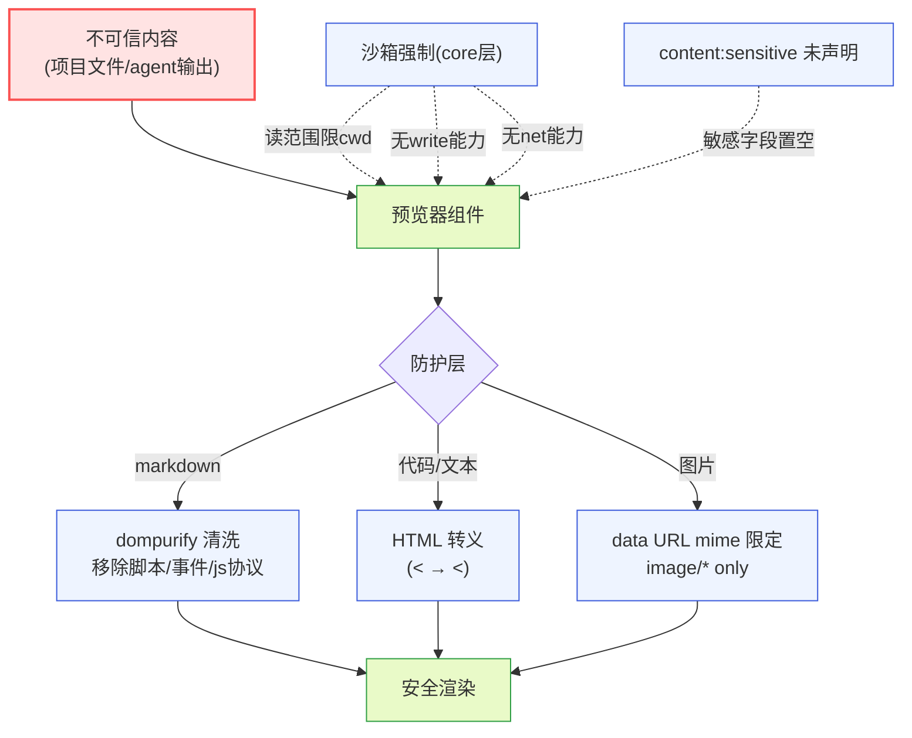

**图 10 — 安全防护层：内容层 dompurify/转义/mime 限定，沙箱层读范围/无写无网/敏感字段置空，双锁失效才能外传**

## 16 附录：预览器组件代码骨架

### 16.1 MarkdownViewer 骨架

```tsx
import DOMPurify from "dompurify";
import { marked } from "marked";
import { markedHighlight } from "marked-highlight"; // marked v5+ 的 highlight 插件
import { highlightCode } from "./highlight";
import type { ViewerProps } from "domain/viewer";
import type { RendererPluginContext } from "domain/plugin";

// 模块级缓存：dompurify 实例 + markdown 解析缓存
const purify = DOMPurify();
const parseCache = new Map<string, string>(); // content hash → html

marked.use(markedHighlight({
  highlight: (code, lang) => highlightCode(code, lang), // marked v5+ 用插件挂 highlight
}));

// dompurify afterSanitizeAttributes hook：仅 ADD_ATTR 白名单 target/rel 不会自动给 <a> 补属性，
// 这里给所有外链 a 强制 target=_blank + rel=noopener noreferrer（落实 3.1.2 的外链新标签打开 + 防 tabnabbing）
purify.addHook("afterSanitizeAttributes", (node) => {
  if (node.tagName === "A" && node.getAttribute("href")) {
    node.setAttribute("target", "_blank");
    node.setAttribute("rel", "noopener noreferrer");
  }
});

export function MarkdownViewer({ content, theme, onError, pi }: ViewerProps & { pi: RendererPluginContext }) {
  if (typeof content !== "string") { onError?.(pi.i18n.t("viewer.previewFailed", { reason: "markdown 预览器需要文本内容" })); return null; }
  const cacheKey = hash(content);
  let html = parseCache.get(cacheKey);
  if (html) {
    // 真 LRU：命中时把 key 移到末尾（delete + 重新 set），否则命中不更新访问序会退化成 FIFO
    parseCache.delete(cacheKey);
    parseCache.set(cacheKey, html);
  } else {
    const raw = marked.parse(content) as string;       // 解析
    html = purify.sanitize(raw, {                      // 清洗
      ADD_ATTR: ["target", "rel"],                     // 白名单外链属性（配合上面的 hook）
    });
    parseCache.set(cacheKey, html);
    if (parseCache.size > 50) parseCache.delete(parseCache.keys().next().value!); // LRU 淘汰最久未访问
  }
  return <div style={{ color: theme["color.fg"] }} dangerouslySetInnerHTML={{ __html: html }} />;
}
```

> 注：内置插件以 `marked` 为准（3.1.1 的 \\\"如 marked/markdown-it\\\" 收敛为 marked，避免两种引擎的 highlight 回调签名差异引起歧义）。marked v5 起移除了 `setOptions({ highlight })` 选项，必须经 `marked-highlight` 插件挂 `highlight` 回调；3.1.3 所述\\\"配置一个 highlight 回调\\\"即指此 `markedHighlight({ highlight })` 形态。

### 16.2 DiffViewer 骨架

```tsx
import type { ViewerProps } from "domain/viewer";
import type { RendererPluginContext } from "domain/plugin";

export function DiffViewer({ content, filePath, theme, onJump, firstChangedLine, pi }: ViewerProps & { pi: RendererPluginContext }) {
  if (typeof content !== "string") return null;
  const lines = content.split("\n");
  const isUnifiedPatch = lines[0]?.startsWith("---") || lines[0]?.startsWith("@@");
  const rows = lines.map((line, i) => {
    const prefix = line[0]; // + / - / 空格
    const cls = prefix === "+" ? "diff-add" : prefix === "-" ? "diff-delete" : "diff-context";
    return <div key={i} className={cls} data-line={extractLineNum(line, isUnifiedPatch)}>{line}</div>;
  });
  return (
    <div style={{ fontFamily: theme[\"font.family.mono\"] }}>
      {rows}
      <button onClick={() => onJump?.(firstChangedLine!)}>{pi.i18n.t(\"viewer.jumpToChange\")}</button>
    </div>
  );
}
```

> i18n 注入约定：所有预览器骨架统一以 `pi: RendererPluginContext` 作为 prop 注入、文案调 `pi.i18n.t(key, vars)`（宿主从 `pi.i18n` 取后传入），不直接从 ViewerProps 拆 `t`——避免各预览器 props 解构不一致导致漏注入。DiffViewer 的错误边界：解析异常时 catch、调 `onError?.(pi.i18n.t(\"viewer.previewFailed\", { reason: \"diff 解析失败\" }))`、宿主降级到 TextViewer 显示原始 diff 字符串（10.1）。`firstChangedLine` 由卡片从 `end.result.details.firstChangedLine` 提取后经 `ViewerProps` 传入（3.2.3 数据通路），不在组件内从 diff 字符串解析。

### 16.3 highlight 纯函数骨架

```typescript
import hljs from "highlight.js";

// 扩展名 → 语言映射（复用底座 getLanguageFromPath 的 extToLang）
const extToLang: Record<string, string> = {
  ts: "typescript", tsx: "typescript", js: "javascript", jsx: "javascript",
  py: "python", rs: "rust", go: "go", java: "java", c: "c", cpp: "cpp", /* ... */
};

export function highlightCode(code: string, lang?: string): string {
  const validLang = lang && hljs.getLanguage(lang) ? lang : undefined;
  if (!validLang) return escapeHtml(code); // 未识别不高亮，纯转义
  try {
    return hljs.highlight(code, { language: validLang, ignoreIllegals: true }).value;
  } catch {
    return escapeHtml(code);
  }
}

function escapeHtml(s: string): string {
  return s.replace(/&/g, \"&amp;\").replace(/</g, \"&lt;\").replace(/>/g, \"&gt;\");
}
```

### 16.4 TextViewer 骨架

```tsx
import { useMemo } from "react";
import type { ViewerProps } from "domain/viewer";
import type { RendererPluginContext } from "domain/plugin";

const BINARY_REPLACEMENT_RATIO = 0.01; // 替换字符占比阈值（5.3 第三步兜底）

export function TextViewer({ content, theme, onError, pi }: ViewerProps & { pi: RendererPluginContext }) {
  if (typeof content !== "string") { onError?.(pi.i18n.t(\"viewer.previewFailed\", { reason: \"TextViewer 需要文本内容\" })); return null; }
  const { isBinary, lines } = useMemo(() => {
    const text = stripBom(content);                          // 去 BOM（3.5.2）
    const normalized = text.replace(/\\r\\n/g, \"\\n\");          // normalizeToLF
    const ls = normalized.split(\"\\n\");
    const repl = (normalized.match(/\\uFFFD/g)?.length ?? 0) / Math.max(normalized.length, 1);
    const hasNul = normalized.includes(\"\\x00\");
    return { isBinary: repl > BINARY_REPLACEMENT_RATIO || hasNul, lines: ls };
  }, [content]);
  if (isBinary) {
    return <div style={{ color: theme[\"color.accent.warning\"] }}>{pi.i18n.t(\"viewer.binary\")}</div>;
  }
  // 虚拟滚动：只渲染可视区 +/- 缓冲行（5.2.2），此处省略虚拟滚动实现细节
  return (
    <pre style={{ margin: 0, color: theme[\"color.fg\"], fontFamily: theme[\"font.family.mono\"], background: theme[\"color.surface\"] }}>
      {lines.map((line, i) => <div key={i} data-line={i + 1}>{line || \" \"}</div>)}
    </pre>
  );
}
```

> TextViewer 的运行时二进制检测是 5.3 三步判定的第三道兜底——stat（mime）+ `readBytes` 读首块 8KB（NUL）已先判过，此处再检测一次防漏判。

### 16.5 ImageViewer 骨架

```tsx
import type { ViewerProps, ImageContent } from "domain/viewer";
import type { RendererPluginContext } from "domain/plugin";

export function ImageViewer({ content, theme, onError, pi }: ViewerProps & { pi: RendererPluginContext }) {
  if (typeof content === "string" || !content || content.type !== "image") {
    onError?.(pi.i18n.t(\"viewer.previewFailed\", { reason: \"ImageViewer 需要 ImageContent\" })); return null;
  }
  const { data, mimeType } = content as ImageContent;
  // 沙箱层已校验 mimeType 限定 image/*（15.2），防 data URL 变 XSS 跳板
  if (!mimeType.startsWith("image/")) { onError?.(pi.i18n.t(\"viewer.previewFailed\", { reason: \"非法图片 mime\" })); return null; }
  const src = `data:${mimeType};base64,${data}`;
  return (
     onError?.(pi.i18n.t(\"viewer.imageDecodeFailed\"))} />
  );
}
```

> ImageViewer 不做 NUL/替换字符检测——图片走二进制整块读（4.1.2 的 `readFile(): Promise<Buffer>`），沙箱层按 mime 限定 `image/*`、data URL 注入 `` 不存在脚本注入向量（15.2）。大图解码异步（`decoding=\"async\"`）不阻塞主线程。

骨架展示的是核心逻辑，实际实现补虚拟滚动、主题 token 注入、错误边界、i18n 等完整能力。

### 16.6 虚拟滚动缓冲行回收策略

5.2.2 的虚拟滚动展开实现细节：虚拟滚动组件维护一个可视区窗口 `[firstVisible, lastVisible]`，实际渲染范围扩展为 `[firstVisible - overscan, lastVisible + overscan]`（overscan 默认 10 行缓冲）。滚动时窗口移动，滚出 `lastVisible + overscan` 之外的行其 DOM 节点被卸载、对应的原始行数据从组件 state 移除（可被 GC）——这是 12.2 内存考量的落地。`scrollToIndex(line)`（3.2.3 的 firstChangedLine 跳转用）把窗口中心定位到指定行：`firstVisible = max(0, line - viewportRows / 2)`，然后同步渲染该窗口。行号到虚拟项索引的映射是 1:1（每行一个虚拟项，CodeViewer/TextViewer 按行虚拟化）；markdown 的映射是块级（一个段落/列表项/代码块是一个虚拟项），映射函数不同但接口一致。用户切走再回来时，滚动位置从组件 state 恢复（若组件已卸载则从插件 config 的 `lastScrollPosition` 恢复，按 filePath 存）。

## 17 端到端走查

### 17.1 场景一：agent 编辑文件，时间线卡片显示 diff

用户问 agent"把 `src/config.ts` 里的超时从 5000 改成 10000"。agent 调 `edit` 工具，参数 `{ path: "src/config.ts", edits: [{ oldText: "timeout: 5000", newText: "timeout: 10000" }] }`。端到端走查：

1. 底座执行 edit，推 `tool_execution_start`（toolName=`edit`、args 含 path/edits），event-translator 翻译成中性 `ToolCallStart`，时间线插件按 toolCallId 聚合、匹配卡片渲染槽（`toolName: "edit"`）命中 edit 卡片组件，渲染 pending 态卡片框架（标题 `edit src/config.ts`、黄色 pending 底色）。
2. 底座 `edit.ts` 的 `renderCall` 在 args 收齐后调 `computeEditsDiff`（`edit.ts:380`）生成预览 diff，TUI 侧在 call 阶段就显示给用户。桌面端的目标态是把这条预览 diff 带进 `tool_execution_update` 的 `partialResult`、由 edit 卡片（toolName=edit 直接选 DiffViewer，不经预览器槽按 args.path 扩展名查——卡片按 toolName 选 DiffViewer，详见 3.2.1）拿到并渲染红绿标色，让用户在 agent 还没写盘时就看到将要发生的改动。**注意：这是目标态/演进后流程（见 14.2 流式预览缺口、14.3 演进方向）**——当前版本 event-translator 尚未把预览 diff 翻译进 `ToolCallUpdate` 的中性字段，桌面端实际只在 `tool_execution_end` 后用最终 `result.details.diff` 渲染一次，update 阶段卡片只显示 pending 框架而不渲染 diff 内容。待 event-translator 补齐预览 diff 字段后此步骤才生效。
3. 底座写盘完成，推 `tool_execution_end`，result.details.diff 是真实 diff（含 firstChangedLine）。卡片用最终 diff 替换预览 diff、标题栏转绿色成功态（底座 `getEditHeaderBg` 状态机，`edit.ts:229`）。DiffViewer 渲染最终 diff，用户点"跳到改动首行"按 firstChangedLine 滚动定位。
4. 整个过程预览器（DiffViewer）没订阅事件流、没声明 `content:sensitive`、没读盘——它只接收卡片传来的 `content` props 渲染。数据流是单向的：事件流 → event-translator → 卡片组件（提取） → 预览器（渲染）。

### 17.2 场景二：用户主动打开大日志文件

用户在侧栏点 `logs/server.log`（12MB 文本日志）。端到端走查：

1. 预览视图组件收到 `{ filePath: "logs/server.log" }`，调 `pi.fs.stat` 取到 size=12MB、mime=`text/plain`。
2. size > 10MB 阈值，进入大文件保护分支：显示提示"文件 logs/server.log 大小 12.0MB，超过预览阈值 10MB，已切换为分页浏览"，切换分页模式。
3. 首屏调 `pi.fs.readFile(filePath, { offset: 1, limit: 500 })` 取前 500 行，立刻渲染。
4. 预览器槽匹配：`.log` 扩展名没有专门的 CodeViewer 贡献项（不在 extToLang 表），mime=`text/plain` 不匹配 image/* ，落到 `all` 兜底 TextViewer。TextViewer 按纯文本虚拟滚动渲染 500 行。
5. 用户往下滚，接近可视区边界，预览视图按 `offset=501, limit=500` 读下一页、追加到虚拟滚动列表。旧页数据随滚出可视区被卸载（不累积内存）。
6. 整个过程不进 agent LLM 上下文（用户只是预览、不是 prompt），底座子进程不参与（文件读取是桌面沙箱自己的能力）。

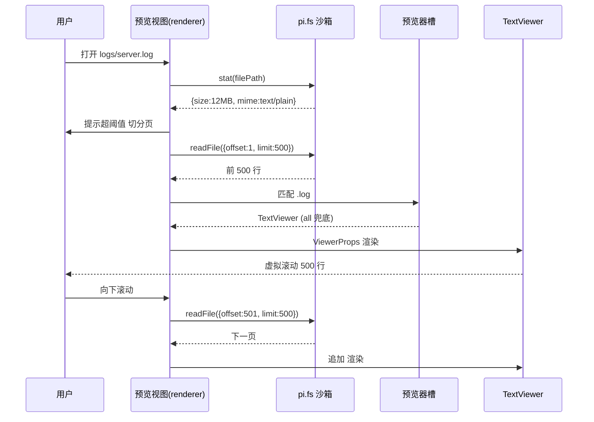

**图 11 — 大日志文件端到端走查：stat 超阈值 → 分页读 → TextViewer 兜底 → 虚拟滚动按需加载**

### 17.3 场景三：review 模式下在文件预览里圈评论

用户进入 review 模式（4.10），在文件预览器打开的 `src/config.ts` 里划选第 10-12 行、留评论"这里超时改大点"。端到端走查：

1. review 插件发 `context.bus` 的 `review.mode` 事件 `{ active: true }`。文件预览插件 worker 侧 `activate` 订阅了该 topic，收到后经 `context.emitToRenderer(\"review.mode\", payload)` 推给 renderer 侧的 CodeViewer 组件，组件经 `pi.onMessage(\"review.mode\", cb)` 收到后进入批注态（6.3 示例）。
2. CodeViewer 进入批注态：给每行 DOM 加 `data-file-range` 属性、划选时出 review 浮层（而非默认选区行为）。
3. 用户划选第 10-12 行，CodeViewer 从起止行 DOM 的 `data-line` 取行号 10-12，组合成锚点 `{ filePath: "src/config.ts", lineRange: [10, 12] }`，传给 review 浮层。
4. review 浮层弹输入框，用户写评论"这里超时改大点"，点确认。评论进 review 插件的"待发送评论列表"，锚点含文件路径+行范围（4.10.5 文档类锚点格式）。
5. 用户最后整体 submit，review 插件把待发评论连同输入框消息一起发 prompt 给 agent。agent 拿到路径+行能直接 `read`/`edit` 定位改文件。
6. 整个过程文件预览器只负责"把行号写进 data-line + 响应 review.mode 切批注态"，不 import review 插件实现、不感知评论怎么发——松耦合协作。

这三个场景覆盖了文件预览插件的三条主路径：工具卡片预览（事件流驱动）、用户主动打开（沙箱读盘）、review 协作（事件总线松耦合）。每条路径都遵守"只读、纯消费、槽位协作、安全防护"的边界，是文件预览插件设计的完整性验证。

---

### 架构自检
- [x] 高内聚：预览器槽各预览器职责单一（markdown/diff/code/image/text 各管一类），卡片框架与内容渲染分离，匹配策略各自独立
- [x] 低耦合：预览器只经槽位契约（`ViewerProps`/`MatchRule`）和事件总线协作，不 import 其他插件实现；圆心类型纯度纪律保证不绑底座协议类型；读写权限细分隔离
- [x] 开闭原则：新增匹配策略（如 magic）= 注册新 MatchStrategy，不改 core 的 switch；新增预览器 = 挂新贡献项，不改已有预览器；新增扩展名 = 加 manifest 贡献项
- [x] 方案视角：只读权限读写分离、dompurify XSS 防护、10MB 大文件保护 + 分页虚拟滚动、纯消费不订阅敏感事件，均解决根本问题（安全边界、渲染性能、数据隔离），非打补丁
