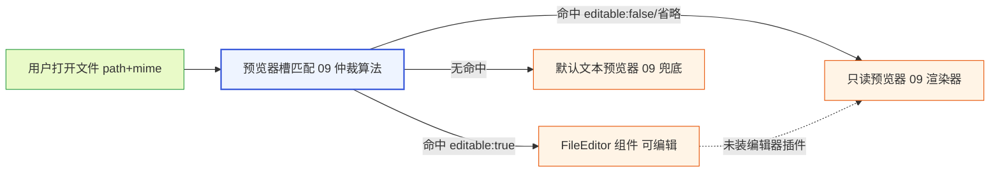
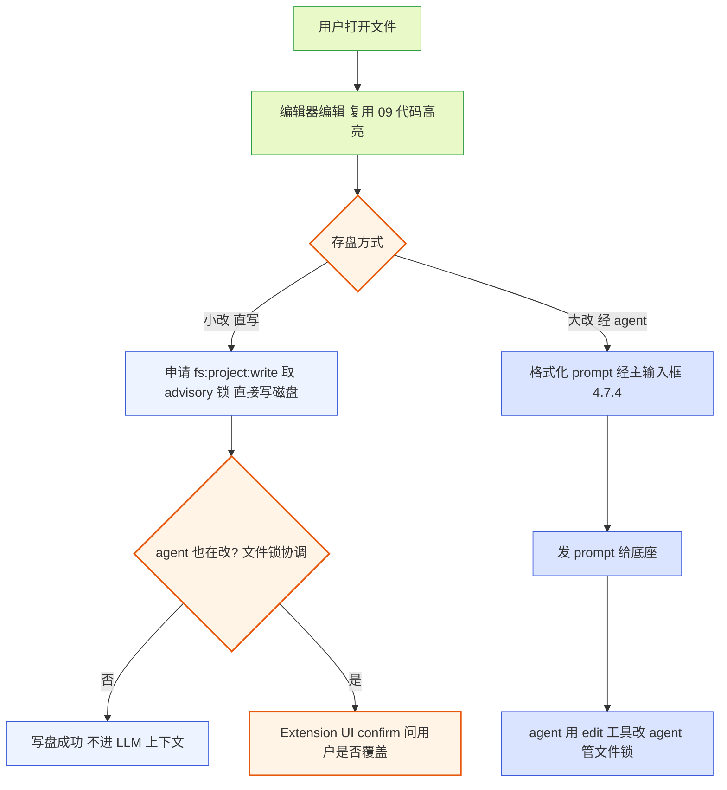
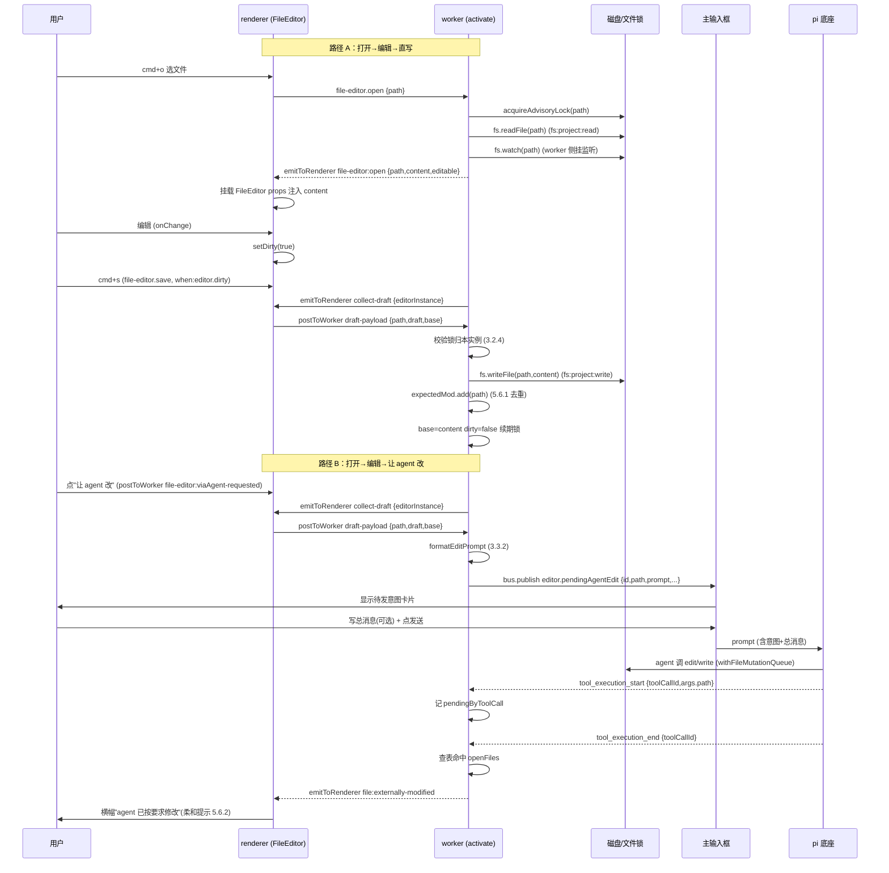
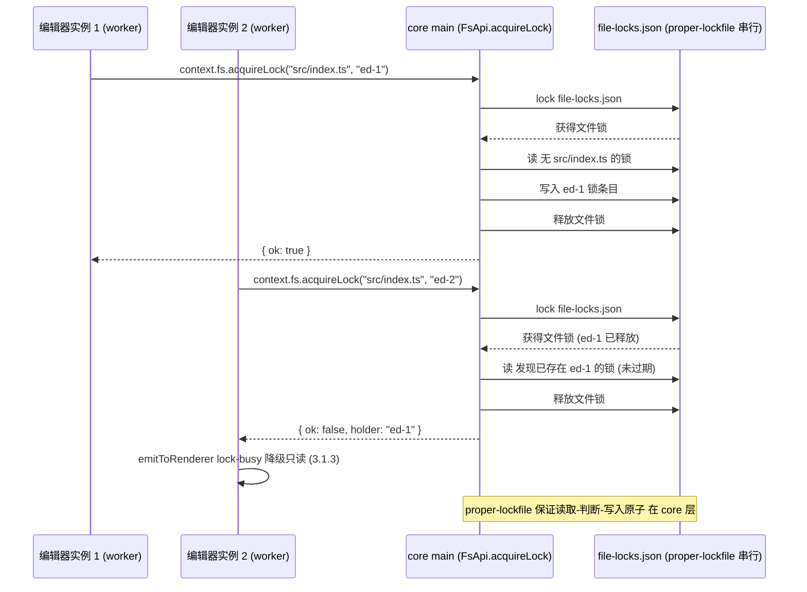
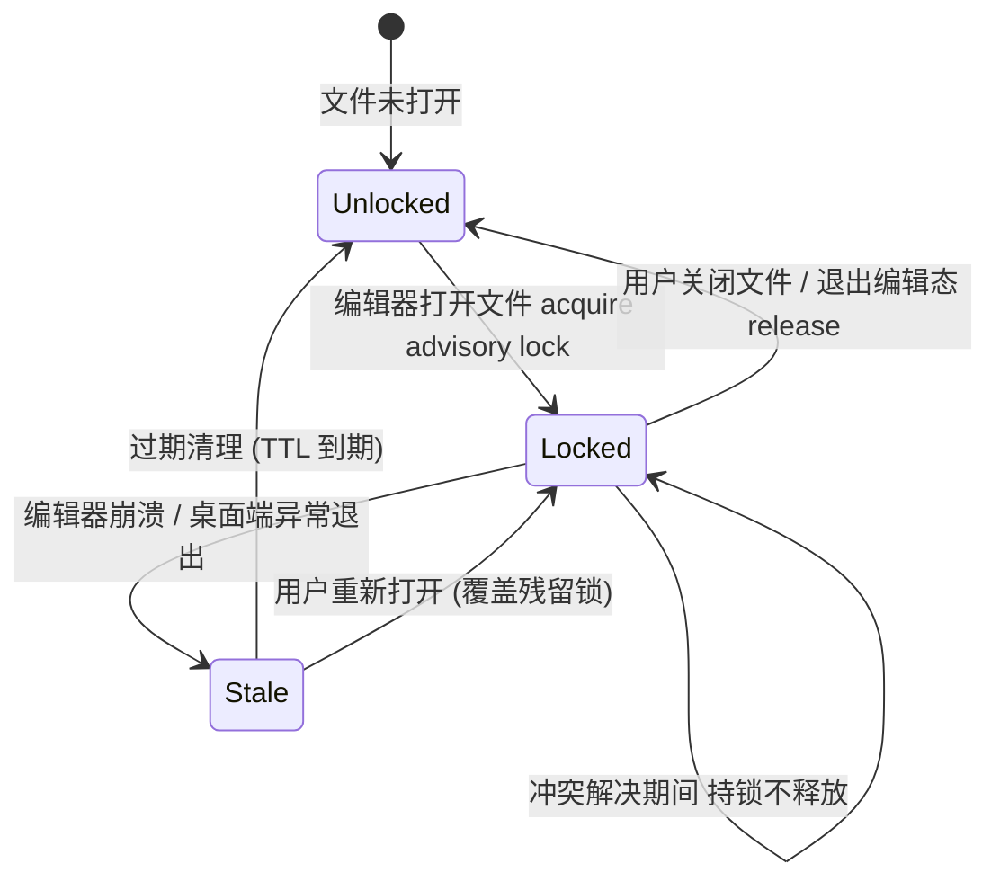
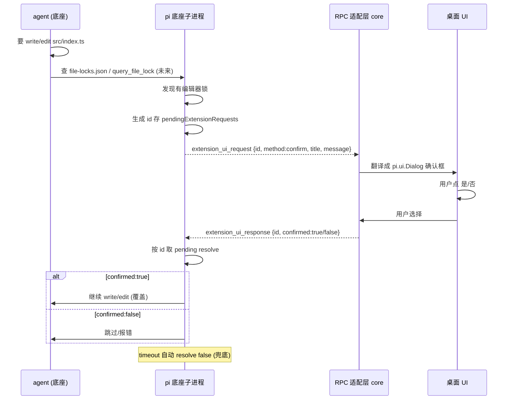
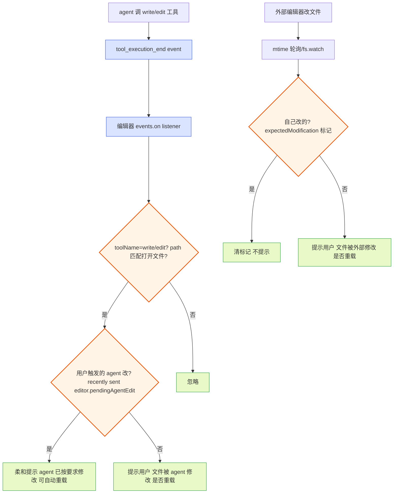
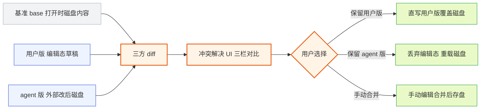

# 文件编辑器插件文档

本文档是 pi-desktop 文档系列的第 10 篇，对应 `DESIGN.md` 4.12 节"文件编辑器插件"。它把 4.12 的设计铺到能照着写代码的粒度：预览器槽的 `editable` 标记如何扩展只读预览、两条存盘路径（小改直写磁盘 / 大改经 agent）各自的机制、文件锁的当前兜底与底座 RPC 演进、变更通知如何订阅 `tool_execution_end`、冲突 diff 如何解决、直写为什么不进 LLM 上下文、`fs:project:write` 权限为何范围受限。所有结论锚定 `DESIGN.md` 的章节号与 pi 底座源码（`packages/coding-agent/src/` 下），不臆造接口。

阅读本文前应先读 `docs/09-plugin-file-preview.md`——文件编辑器是文件预览器的编辑态扩展，两者的槽位、匹配、代码高亮复用关系在该篇已展开，本文只在必要的协作点上回引，不重复。本文涉及的底座源码文件包括 `core/tools/write.ts`、`core/tools/edit.ts`、`core/tools/read.ts`、`core/tools/file-mutation-queue.ts`、`core/tools/path-utils.ts`、`modes/rpc/rpc-mode.ts`、`modes/rpc/rpc-types.ts`、`core/agent-session.ts`。

## 1 插件定位与边界

### 1.1 它解决什么：用户用 GUI 编辑项目文件

#### 1.1.1 预览只读，编辑是缺口

`09-plugin-file-preview.md` 的文件预览插件只读、不编辑——它处理两类只读需求（工具调用产物预览、用户主动打开文件预览），声明 `fs:project:read` 权限。但用户的诉求是"操作文件都有 GUI 跟着操作"（`DESIGN.md` 诉求2），其中包含**用户自己用 GUI 编辑项目文件**。底座 agent 能 `read`/`edit`/`write` 文件，那是 agent 改；用户也该能直接在桌面端编辑文件，而不只在终端跑 `!` 命令、或等 agent 改完再看结果。文件编辑器插件补这个缺口：用户在桌面端打开项目文件、编辑、存盘，和 agent 的文件操作并存。

#### 1.1.2 和 agent 文件操作的关系：并存而非替代

底座 agent 改文件走的是底座自己的 `write`/`edit`/`read` 工具（`packages/coding-agent/src/core/tools/write.ts`、`edit.ts`、`read.ts`），这些工具的执行对桌面端是黑盒——桌面端通过 RPC 的 `tool_execution_*` event 观察"agent 改了哪个文件"，但不接管执行。文件编辑器插件是**用户侧**的文件编辑能力，它和 agent 的文件操作是两条独立的写盘路径，会并发改同一文件，因此需要协调机制（文件锁、变更通知、冲突 diff，见第 4/5/6 节）。

必须厘清一条边界：`file-editor` 是**用户**改文件的入口，它不调底座的 edit/write 工具、不替 agent 写盘。agent 要改文件时照样自己调工具、照样在时间线里画卡片。这个"用户和 agent 都能改文件、需要协调"是文件编辑器区别于普通编辑器的核心复杂度来源——普通编辑器（VSCode）只面对一个写盘者，文件编辑器面对用户和 agent 两个写盘者。

#### 1.1.3 不做什么

文件编辑器不做这些事：① 不替 agent 执行文件操作（agent 的 read/edit/write 是底座工具的职责）；② 不自己渲染 diff 卡片（那是 `09` diff 预览器和卡片渲染槽的职责，编辑器在冲突解决时复用它们）；③ 不碰 `~/.pi` 全局目录（那是 `fs:global` 权限范围，编辑器只声明 `fs:project`）；④ 不自己发 prompt（经 agent 路径走主输入框，`DESIGN.md` 4.7.4）。这些"不做"守住编辑器的边界，避免它膨胀成一个包打天地的文件管理器。

### 1.2 在四根支柱里的位置

#### 1.2.1 属于支柱④内置默认插件

文件编辑器插件是 `DESIGN.md` 4 节的十二个内置默认插件之一，在矩阵里只占预览器槽一列（`DESIGN.md` 4.1.3 的矩阵表："文件编辑器插件 | 预览器槽 ✓"）。它的架构地位和第三方插件平等——走同一套加载器、同一套槽位契约，作为内置默认插件来源优先级最低（`project > user > installed > builtin`，`DESIGN.md` 3.4）、可被项目级或用户级同名插件覆盖。"优先级最低"指**插件来源优先级**最低（和所有 builtin 一样可被覆盖），不指它在预览器槽的命中优先级——命中优先级由第 2.4 节的仲裁规则单独决定，编辑器在槽内命中时**高于**纯只读预览器。

**内置组对外最低、组内有序**：内置默认插件作为一组，对外（相对 project/user/installed 级同名插件）优先级最低、可被整组覆盖。但组内插件之间并非平权——`DESIGN.md` 4.12.3 明确"编辑器插件优先级高于纯预览插件"，这个组内相对优先级由 manifest/插件来源声明（文件编辑器声明高于文件预览 09），让两者竞争同一文件命中时编辑器胜出。"内置最低"与"编辑器高于预览"因此不矛盾：前者是组对外、后者是组内，由不同层级的优先级规则管辖。命中优先级不走 `editable` 字段加权、也不走注册顺序——见 2.4.1/2.4.2 的论证。core 不为它开后门：它的 `fs:project:write` 权限走和任何插件一样的显式声明 + 用户授权流程（第 8 节）。

#### 1.2.2 依赖的支柱①能力

文件编辑器依赖支柱①（RPC 适配）的两类能力：① RPC 事件流——订阅 `tool_execution_end` 检测 agent 改文件（第 5 节）；② Extension UI 子协议——agent 查锁后走 `confirm` 问用户是否覆盖（第 4.6 节）。这两类都经 core 的 RPC 适配层转发，编辑器不直接和底座子进程打交道。编辑器**不**用 RPC 的 31 个命令做文件操作——它不调 `bash` 命令改文件、不调任何"写文件"命令（RPC 没有"写文件"命令，文件写是 `fs:project:write` 权限注入的本地能力，第 3 节）。

#### 1.2.3 依赖的支柱③能力

文件编辑器依赖支柱③（插件加载器）的：① 预览器槽契约——挂贡献项（第 2 节）；② 命令项槽契约——挂打开/保存/让 agent 改命令（第 10.1 节）；③ PluginContext 的 `events`/`bus`/`fs`（`fs:project:write` 注入）/`emitToRenderer` 能力（`DESIGN.md` 3.2.4）；④ 事件总线的 `editor.pendingAgentEdit` topic 协作主输入框（第 3.3.3 节）。这些都是槽位契约和 PluginContext 的标准能力，编辑器没有专属 API。

### 1.3 与 4.5 文件预览的分工

#### 1.3.1 同槽位、不同 editable 标记

文件编辑器和文件预览插件都往预览器槽挂贡献项，区别在 `editable` 标记——预览器省略/`false`（只读）、编辑器 `true`（可编辑）。`DESIGN.md` 4.12.3："它扩展 4.5 文件预览的预览器，让预览器有'编辑态'。不新设槽位。"这个设计选择的理由是：编辑器在 UI 上就是"可编辑的预览器"——同一个文件、同一个渲染管线（代码高亮、markdown 渲染、diff 视图），区别只在于能否修改。把它拆成独立槽位会引入"预览器渲染文件"和"编辑器渲染文件"两套并行逻辑，违反"高内聚"。挂在同一个预览器槽、用 `editable` 标记区分，让"打开文件"这一动作统一走预览器槽的匹配仲裁（`09` 2.3 节）。

#### 1.3.2 优先级与回退

`DESIGN.md` 4.12.3："编辑器插件优先级高于纯预览插件，用户打开文件时命中编辑器（可编辑）、没装编辑器时退到纯预览。"这里的"优先级"指**插件来源优先级**（不是 specificity 加权、也不是注册顺序），由第 2.4 节的仲裁规则实现——编辑器与 `09` 的只读预览器同属内置默认插件（组对外优先级相同），但组内文件编辑器插件声明优先级高于文件预览插件，在仲裁第①步"来源插件优先级"即胜出（见 2.4.2）。编辑器贡献项用 `all` 策略（specificity=0）、`09` 的 markdown 预览器用 `extension:md`（specificity=80）——两者 specificity 不同，但因编辑器插件优先级更高，第一轮仲裁（来源插件优先级）就淘汰了内置预览器，根本不到比 specificity 那一步。这与 `09` §2.3.1 的机制描述完全一致。用户卸载或禁用文件编辑器插件后，预览器槽里只剩 `09` 的只读贡献项，打开文件命中只读预览器——这是优雅降级，不是错误。用户要编辑文件时，编辑功能不可用（没有 `editable: true` 的命中项），UI 上"编辑"按钮隐藏或置灰。这把"编辑能力"做成可插拔的能力，而不是 core 的内置功能。



**图 1 — 打开文件的命中链：editable 标记决定渲染可编辑还是只读，未装编辑器退到纯预览**

#### 1.3.3 复用 4.5 的代码高亮

`DESIGN.md` 4.12.3："复用 4.5 的代码高亮能力（代码高亮预览器是 FileEditor 的基础组件）——不重写高亮。"代码高亮是一个共享能力组件（可能由 core 或第三方高亮库提供），编辑器和预览器都用它、互不依赖。如果 `09` 被卸载，编辑器的代码高亮仍工作（高亮组件不归 `09` 独占）。这个复用走"共享基础组件"，不是"编辑器 import `09` 的代码"——那会破坏插件隔离（`DESIGN.md` 3.5 第 5 项）。

## 2 预览器槽扩展：editable 标记机制

### 2.1 贡献项 schema

#### 2.1.1 预览器槽基础契约回顾

预览器槽贡献项的标准 schema 是 `{ match: MatchRule, component: string }`（`DESIGN.md` 3.3、`09` 2.1.1）。`match` 决定匹配哪些文件（`MatchRule` 联合类型，`09` 2.1.2），`component` 是 renderer 模块导出的组件名（字符串引用，core 在 renderer 侧加载组件）。core 渲染预览区域时，按 `match` 匹配命中贡献项、渲染其 `component`。

#### 2.1.2 editable 字段的引入

文件编辑器在基础 schema 上增加一个可选字段 `editable: boolean`——标记该预览器组件支持编辑。`09` 的只读预览器省略 `editable`（等价 `false`），文件编辑器贡献项显式声明 `editable: true`。core 渲染预览器时，先按 `match` 匹配文件，再读命中的贡献项的 `editable`：`true` 渲染成可编辑组件、`false`/省略渲染成只读。这个字段是预览器槽契约的向后兼容扩展——只读预览器不带它也照常工作，core 给默认值 `false`，符合 `DESIGN.md` 3.3 末尾"已有槽位加字段是向后兼容、不删字段不改语义"的开闭原则。

```typescript
// 预览器槽贡献项 schema（扩展后）
interface ViewerContribution {
  match: MatchRule;          // 文件匹配规则（同 09）
  component: string;          // renderer 模块导出的组件名
  editable?: boolean;         // 新增：是否支持编辑，默认 false
}
```

#### 2.1.3 manifest 声明

文件编辑器的预览器槽贡献项声明为 `{ match: { strategy: "all" }, component: "FileEditor", editable: true }`——用 `all` 策略兜底匹配任意文件（与 `09` §1.3/§2.3.1 一致）、组件是 `FileEditor`、`editable: true` 标记支持编辑。**不用 `strategy: "extension", value: ".*"`**：`extension` 策略是**字面相等**比较（`09` §2.2.2），不支持正则/通配——`value: ".*"` 只会匹配扩展名字面为 `.*` 的文件（实际不存在），编辑器永远不命中。要"匹配任意文件"就用 `all` 策略（specificity=0、语义干净）。`all` 的 specificity 最低，但编辑器靠更高的**来源插件优先级**在仲裁第①步胜出（见 2.4.1/2.4.2），不需要 specificity 占优。编辑器想接管所有可编辑文本文件，而不是只编辑 `.ts` 或 `.md`。图片等二进制类型的不可编辑由组件内部判断（第 2.2.3 节）。

**与 `DESIGN.md` 4.12.3 的一致性**：`DESIGN.md` 4.12.3 原文写的是 `{ strategy: "extension", value: ".*" }`，按 `09` §2.2.2 的字面相等语义该写法永不命中——这是待 `DESIGN.md` 4.12.3 同步修正项（把 `extension: ".*"` 改为 `all`，并在 3.3 加一句"extension 字面相等、不支持通配"）。`09` §2.3.2 已登记此矛盾。在 `DESIGN.md` 修正前，实现者以本文档与 `09` 为准（`all` 策略 + 字面相等）。

### 2.2 渲染时如何区分编辑态

#### 2.2.1 core 注入 editable 到组件 props

命中的 `component`（`FileEditor`）会通过 props 收到 `editable: boolean`。core 在 renderer 侧加载组件、按槽位 props 契约注入数据时，把贡献项的 `editable` 字段一并注入。这里要区分两类槽位 props 来源（呼应 `DESIGN.md` 3.6）：卡片渲染槽（cardRenderer）的 props 来自 `tool_execution_*` 事件数据（toolCallId/toolName/result 等，由 core 按 toolCallId 收集喂入）；预览器槽（previewer）/文件编辑器的 props 来自**文件 path + content + editable 标记**（不是工具事件），content 由 worker 侧读文件后经 `emitToRenderer` 推送（见下段）。`FileEditor` 组件据此切换内部状态：`editable: true` 时渲染编辑器（可输入、显示存盘按钮、挂文件锁）、`editable: false` 时退化为只读展示（复用 `09` 的渲染逻辑）。这意味着同一个 `FileEditor` 组件可以同时服务于"编辑"和"只读"两种态。预览器槽的 props 契约（`path`/`content`/`editable`/`theme`/`context` + `reportDirty`/`reportFocus` 回调，见 9.2.2）由本文档定义、`DESIGN.md` 3.6 的 cardRenderer 契约不直接覆盖它。

**文件初始内容如何到达 renderer**：renderer 跑在沙箱里、不能调 `fs`（`DESIGN.md` 3.2.4 renderer 侧沙箱不暴露 `fs`），所以 `FileEditorProps.content` 不能由 renderer 自己读。打开文件的完整数据流是：用户触发"打开文件"（`cmd+o` 命令面板选文件、或从时间线/文件树点文件）→ `file-editor.open` 命令派发到 worker 侧 handler `#onOpen`（见 10.1 manifest 的 handler 字段）→ `#onOpen` 在 worker 侧用 `context.fs.readFile(path)`（`fs:project:read` 注入能力）读文件内容，并取 advisory lock（第 4 节）、把 `path` 加入 `openFiles` 集合 → 经 `context.emitToRenderer("file-editor:open", { path, content, editable })` 把数据推给 renderer → core 的 previewer 渲染按槽位命中（第 2.4 节仲裁）找到 `FileEditor` 贡献项，把 `{ path, content, editable, theme, context }` 作为 props 注入并挂载 `<FileEditor/>`。图 1 的 OPEN→MATCH→EDITOR 链路里，path 与 content 经这条调用链喂入。

#### 2.2.2 只读层与可编辑层的叠加

`FileEditor` 组件内部的渲染分层：底层是只读的内容展示层（代码高亮渲染，复用 `09` 3.3 的代码高亮预览器作为基础组件），上层是编辑层（可输入的 textarea/contenteditable 覆盖在高亮层上，或用 Monaco/CodeMirror 等编辑器组件）。`editable: false` 时只渲染底层、不渲染编辑层；`editable: true` 时两层叠加。对图片（`mime: image/*`）等无法文本编辑的类型，`FileEditor` 内部检测 mime 后退化为只读、转发给 `09` 的图片预览器逻辑（复用而非重写）。这是组件实现细节、不是槽位契约——`editable: true` 只声明"组件支持编辑"，具体哪些文件类型真编辑由组件自己决定。

#### 2.2.3 二进制文件的不可编辑

`match: { strategy: "all" }` 理论上匹配图片等二进制文件，但 `FileEditor` 组件内部对图片类型退化为只读（图片无法文本编辑）。core 不强制"声明了 editable 就必须能编辑所有匹配的文件"——`editable` 是"组件支持编辑"的声明，不是"必须编辑所有匹配文件"的承诺。这避免了为二进制文件单独写一个 `editable: false` 的贡献项。

**二进制文件转给预览器的机制**：FileEditor 是被命中的 component，在插件隔离下不能直接实例化 `09` 的图片预览器组件（那会破坏隔离，`DESIGN.md` 3.5 第 5 项）。所以 FileEditor 对二进制 mime（`image/*`/`audio/*`/`video/*` 等）只渲染一个**只读占位视图**（显示文件名、大小、mime 类型，并提示"二进制文件，请用预览器打开"），不尝试渲染内容。用户要预览二进制文件时，用命令面板的"用预览器打开"（`file-preview.open` 或等价命令）触发 core 的 fallback 仲裁：core 在预览器槽里跳过 `editable: true` 的 FileEditor 贡献项、按 2.4 仲裁重新命中下一个匹配贡献项（如 `09` 的图片预览器）。这条 fallback 是 core 槽位仲裁的既有能力（仲裁时支持"排除指定贡献项"的二次查询），不是 FileEditor 自己转发——FileEditor 只决定"我不渲染这个 mime"，由用户/core 触发重新仲裁到只读预览器。

### 2.3 编辑器的键盘与无障碍

#### 2.3.1 基础编辑键

`FileEditor` 的编辑层支持标准编辑键：字符输入、退格、删除、方向键移动光标、Home/End 行首行尾、Cmd/Ctrl+C 复制选区、Cmd/Ctrl+V 粘贴、Cmd/Ctrl+Z 撤销/重做、Tab 缩进。这些由底层编辑器组件（Monaco/CodeMirror）提供，`FileEditor` 配置即可。

**Cmd+S 的语义**：10.1 manifest 把 `cmd+s` 绑定为 `file-editor.save` 命令的 keybinding（`when: "editor.dirty"`）。这条命令走 `DESIGN.md` 3.3 的命令项槽 + 4.7 命令系统派发，**不是**编辑器组件自己吞键盘事件——`cmd+s` 由命令系统统一捕获。当 FileEditor 获焦且 `editor.dirty` 为 true 时，命令系统把 `cmd+s` 派发给当前焦点编辑器对应的 `file-editor.save` 命令（worker 侧 `#onSave` 处理，见 10.3），优先于其他全局 keybinding 响应；当编辑器无焦（焦点在别的区域）或 `editor.dirty` 为 false（无未存盘改动）时，`file-editor.save` 的 `when` 不满足、命令不可用，`cmd+s` 才走 core 的其他全局 keybinding（或无绑定则不响应）。这条规则靠 9.2.2 的焦点编辑器上下文 + `when` 求值实现——核心是 `when: "editor.dirty"` 的求值绑定到焦点编辑器实例。**编辑器组件不自行拦截 `cmd+s`**，避免和命令系统双路派发；只有非命令类编辑键（字符输入、Tab、退格等）由编辑器组件捕获、不冒泡到全局快捷键，避免编辑态输入触发全局命令。保存按钮与 `cmd+s` 走同一条实现路径——`cmd+s` 经命令系统派发到 worker `#onSave`，保存按钮经 `postToWorker("file-editor:save-requested")` 由 worker `onRendererMessage` 调用同一个 `onSave()`（10.2.1/10.3，盲审第 3 轮修正：`RendererPluginContext` 无 `commands` 字段，按钮不走 `commands?.execute`）。

#### 2.3.2 无障碍

`FileEditor` 遵循 `DESIGN.md` 1.9.4 的无障碍焦点规范：打开文件时焦点移到编辑器、Tab 在编辑器内缩进而非跳出（编辑态）、Esc 退出编辑回到预览态。用 `pi.ui` 组件库（`DESIGN.md` 4.11.4）的内置组件自动获得 ARIA 支持；编辑器组件本身要暴露 `role="textbox"`、`aria-label` 为文件名。diff 视图的红绿标色不只靠颜色（加 `+`/`-` 前缀辅助，色盲友好，`DESIGN.md` 4.11.4）。

### 2.4 命中规则与 specificity

#### 2.4.1 MatchRule 策略的 specificity

`DESIGN.md` 3.3 的 MatchRule 各策略有自己声明的 specificity（特异度由每个策略自己声明、core 只比数值）。内置策略的 specificity 常量（`09` §2.2.1）：`all=0`、`mime=60`、`extension=80`、`toolName/toolNames/customType=100`——均在百位以内（不是"个位/百位量级"的模糊说法）。冲突仲裁（多个渲染器都 match 同一文件）的顺序（`DESIGN.md` 3.3 末段）：① 先按贡献项来源**插件的优先级**取最高（`DESIGN.md` 3.5 第 7 项）；② 同优先级按 `specificity` 数值大的胜出；③ 同 specificity 按注册顺序取先注册的。

文件编辑器的 `match: { strategy: "all" }`（specificity=0）与 `09` 的只读预览器（如 markdown 预览器 `match: { strategy: "extension", value: "md" }`，specificity=80）**策略不同、specificity 不同**。但对 `.md` 文件两者都 match——`.md` 命中 `extension:md`、`all` 兜底命中。仲裁时两者先比来源插件优先级（第①步）：编辑器插件优先级高于文件预览插件 → 编辑器胜出，**根本不到第②步比 specificity**。`all` 的 specificity 低并不妨碍编辑器命中，因为第一轮仲裁（来源插件优先级）就淘汰了内置预览器。这与 `09` §2.3.1 的机制描述（"靠插件优先级而非 specificity 实现""第一轮仲裁就淘汰了内置预览器"）完全一致。

#### 2.4.2 编辑器插件优先级高于纯预览插件

那么编辑器为何在 `.md` 文件上胜过 `09` 的 markdown 预览器？答案在仲裁第①步——**插件优先级**，而非 specificity 加权、也非注册顺序。`DESIGN.md` 4.12.3 明确："编辑器插件优先级高于纯预览插件，用户打开文件时命中编辑器（可编辑）、没装编辑器时退到纯预览。"文件编辑器插件与文件预览插件（`09`）同属内置默认插件组（组对外优先级最低、可被项目/用户级同名插件覆盖），但组内文件编辑器声明优先级高于文件预览。仲裁时：编辑器贡献项（`all`，specificity=0）与 `09` markdown 预览器（`extension:md`，specificity=80）都 match `.md` → 第①步比来源插件优先级 → 编辑器高于预览 → 编辑器胜出（不到第②步 specificity 比较）。

**为什么不用 `editable` 字段加权 specificity**：`editable` 是预览器槽的向后兼容扩展字段（2.1.2），语义是"组件是否支持编辑"，不是仲裁权重。让它隐式改写 specificity 会把"组件能力声明"和"命中排序"两个关注点耦合进同一字段，违反"组装和调用应该分开"——命中排序应由仲裁规则（插件优先级 + specificity + 注册顺序）单一承担，`editable` 只管渲染态切换。`DESIGN.md` 4.12.3 给出的机制是插件优先级，本文档遵从之，不为预览器槽自造 `EDITABLE_SPECIFICITY_BONUS` 之类的加权常量。

**为什么不用注册顺序**：靠"编辑器排在预览之后注册"让后注册者胜出，与仲裁第③步"同 specificity 按注册顺序取先注册的"方向相反（后注册反而赢），是自相矛盾的特例；且注册顺序依赖加载时序、不稳定。插件优先级是显式声明、稳定可控的机制。两条含糊说法（注册顺序、core 加权）均不采用。

**与 1.2.1"内置最低"的关系**：内置默认插件组对外优先级最低（可被 project/user/installed 覆盖）；组内插件之间有相对优先级（编辑器 > 文件预览），由 manifest/插件来源声明。两层规则不冲突——前者管组对外、后者管组内。具体命中：`.md` 文件 → 编辑器（`all`，插件优先级高）与 `09` markdown 预览器（`extension:md`，插件优先级低）都 match → 第①步编辑器插件优先级高 → 命中编辑器。`.ts` 文件 → 只有编辑器（`all`）match、`09` 无 `.ts` 预览器 → 编辑器直接命中。未装编辑器时 → 只剩 `09` → 命中只读预览。

`09` 2.3.2 已说明这条命中顺序——编辑器覆盖纯预览器。用户也可在命令面板显式"用编辑器打开"（`file-editor.open` 命令，第 10.1 节），强制走编辑器而不靠自动命中。

## 3 两条存盘路径总览

### 3.1 路径选择的总览

#### 3.1.1 为什么是两条路

用户编辑文件后存盘，走哪条路是个分叉——直接写磁盘还是发给 agent 改。`DESIGN.md` 4.12.2 明确两条都支持，各有适用场景：

- **小改直写磁盘**（用户手动编辑、小范围改动）：用户在编辑器里改几个字、修个 typo、调个参数，存盘时直接写磁盘。这是"用户自己改文件"，和用 VSCode 改一样——快、直接、不经过 agent。代价是和 agent 并发改同一文件会冲突，需文件锁协调。
- **大改经 agent**（想让 agent 改、或改动需要 agent 理解上下文）：用户不知道怎么改、或改动涉及语义理解（重构一段逻辑、按某规范重命名），在编辑器里写改动意图、点"让 agent 改"，编辑器把意图格式化成 prompt 发给 agent、agent 用 `edit` 工具改。这条路不直接写磁盘、agent 改、不冲突（agent 自己管文件锁）。

两条路不是互斥的二选一——同一个编辑会话里，用户可以先小改直写几处、再对一处复杂改动点"让 agent 改"。UI 上两个按钮并存：存盘（直写）和让 agent 改（经 agent）。

#### 3.1.2 分叉点在存盘动作

两条路的分叉点在"存盘"这个动作——用户编辑完，点哪个按钮决定走哪条路。直写不绕输入框（用户直接存盘，不是发消息），经 agent 才走主输入框（因为要发 prompt）。`DESIGN.md` 4.12.2 末尾："两条路都从主输入框以外出发——直写不绕输入框（用户直接存盘，不是发消息），经 agent 才走输入框（因为要发 prompt）。这守住了'prompt 唯一出口是主输入框'（4.7.4）——直写不是 prompt、是文件操作，经 agent 才是 prompt。"这条边界至关重要：直写是文件 IO、不是 prompt，所以它不需要、也不应该经过主输入框；只有要把意图发给 agent 时才走输入框，因为输入框是 prompt 的唯一发送出口（`DESIGN.md` 4.7.4）。



**图 2 — 文件编辑器两条存盘路径：小改直写磁盘（文件锁协调 agent）/ 大改经 agent**

#### 3.1.3 打开→编辑→存盘的端到端时序

把两条路径的端到端调用链画清，避免实现者对"谁在 worker、谁在 renderer、数据怎么流"产生歧义。下图覆盖一次完整的"打开文件 → 用户编辑 → 直写存盘"以及"打开文件 → 编辑 → 让 agent 改"两条调用链，标注每步落在哪个进程侧、经哪条通道传数据。



**图 2b — 打开→编辑→存盘的端到端时序：路径 A 直写、路径 B 经 agent，标注每步的进程侧与通道**

关键边界用例与错误恢复：

- **打开文件时锁已被占**：`acquireAdvisoryLock` 失败（别的实例持有未过期）→ worker 不打开编辑态、`emitToRenderer("file-editor:lock-busy", {holder})` → renderer 提示"文件正被 X 编辑，以只读打开"。此时 `editable` 降级为 false、不写盘、不挂 fs.watch 之外的写流程。
- **直写时磁盘 mtime 变了**（被外部改过）：`file-editor.save` 前 worker 比对当前 mtime 与打开时记录的 base mtime，不一致则不直写、转入第 6 节冲突解决（三方 diff）。
- **直写 fs.writeFile 失败**（权限被撤销、磁盘满）：worker 抛错 → `emitToRenderer("file-editor:save-error", {error})` → renderer 提示，锁仍持有、dirty 仍 true，用户可重试或改走经 agent 路径。
- **让 agent 改后 agent 的 edit 失败**（`oldText` 锚点失配，7.2.1）：agent 自己报 `EditDiffError`、决定重读或问用户；编辑器的待发意图草稿仍在输入框，用户可在 agent 重试成功后的 `tool_execution_end` 触发外部修改提示，或主动取消草稿（6.4.1）。
- **agent 写盘期间编辑器崩溃**：worker 崩溃 → fs.watch 停 → `file-locks.json` 残留锁靠 TTL（dirty 加权）清理；重启后重新打开文件走 acquireAdvisoryLock，若旧锁未过期则按"锁已被占"边界用例以只读打开。
- **emitToRenderer 丢失**（renderer 重载中）：worker 发的外部修改通知可能丢失，renderer 重新挂载 FileEditor 时 worker 应在 `file-editor:open` 时附带当前 `base` 与"磁盘 mtime 是否已偏离 base"的标记，让 renderer 重挂载即感知外部修改。

### 3.2 小改直写磁盘

#### 3.2.1 适用场景

直写路径适用于"用户手动编辑、小范围改动"——改 typo、调参数、补注释、修格式。这些改动的特征是：用户知道自己改什么、不需要 agent 理解语义、改动小、要立即生效。直写像用 VSCode 改文件——存盘即写盘，快、直接。不适用于直写的场景：用户不知道怎么改（让 agent 改）、改动涉及大范围重构（agent 更擅长）、改动要让 agent 知道并基于新内容继续工作（经 agent 路径进上下文）。

#### 3.2.2 权限前置

直写前检查 `fs:project:write` 权限是否已授权（第 8 节）。未授权则提示用户授权或改走经 agent 路径。`DESIGN.md` 4.12.5："未授权则只能走'经 agent'路径（不直接写盘）。"这把经 agent 路径作为权限未授权时的降级——用户没授权 `fs:project:write`，编辑器不能直写，但仍可走经 agent 路径（发 prompt 不需要文件写权限，只需要 `rpc.prompt` 这种默认能力）。所以即使不授权文件写权限，文件编辑器插件仍部分可用——用户能编辑视图、能"让 agent 改"，只是不能"直写存盘"。

#### 3.2.3 advisory 锁协调 agent

advisory lock（第 4 节）的生命周期绑定**编辑会话**——用户打开文件时取锁、关闭文件或退出编辑态时释放（见第 4.3 节的状态机）。直写**不重复取锁、不释放会话锁**：直写前只校验锁仍归本编辑器实例持有（`holder`/`editorInstance` 仍是自己、未过期），然后写盘；写盘成功后保留锁不动，直到用户关闭文件或退出编辑态才释放。这样"锁声明我在编辑这个文件"的语义贯穿整个编辑会话，agent 在会话期间任何时候查锁都能看到编辑器持有。锁的协调是"agent 改文件前先查锁、发现被锁则问用户"——但当前兜底里 agent 侧查锁未实现（第 4.4.1 节），所以锁当前只服务于编辑器实例间互斥，agent 不查锁直接写、可能和用户直写冲突，冲突靠第 6 节的 diff 解决兜底。

#### 3.2.4 写盘流程

直写的调用链：① 检查 `fs:project:write` 权限；② 校验 advisory lock 仍归本实例持有（`holder`/`editorInstance` 匹配、未过期），若锁已丢失（被 TTL 清理或被别的实例抢占）则重新取锁、取不到则提示冲突；③ 调用沙箱注入的文件写能力（`context.fs.writeFile`，`fs:project:write` 权限对应），把编辑态内容写到磁盘；④ 写盘成功后刷新编辑态基准（base = 编辑态，dirty=false）、续期锁（更新 `expiresAt` = now + TTL）；⑤ 广播内部信号通知"文件已被用户直写改了"（供变更通知第 5 节的去重用）。**第②步只校验与续期，不释放会话锁**——锁的释放只发生在关闭文件/退出编辑态（第 4.3 节）。直写不直接调 Node 的 `fs.writeFile`——插件沙箱里 `require`/`fs`/`process` 都不可见（`DESIGN.md` 3.2.4），`fs:project:write` 权限被授权后 core 把受限的文件写能力（`context.fs.writeFile`，见下文本节 FsApi）注入 PluginContext。

直写是整文件覆盖写——`FileEditor` 把编辑态的完整内容一次性写盘，不是增量 patch。这和底座 `write` 工具的语义一致（`packages/coding-agent/src/core/tools/write.ts`：`fsWriteFile(absolutePath, content, "utf-8")`，整文件覆盖）。整文件覆盖的好处是简单——不需要计算 diff、不需要处理 partial write 的一致性；代价是要传完整内容、大文件略慢。对用户手动编辑场景（文件通常不会太大），这个语义足够。

`context.fs` 是 `PluginContext` 注入的受限文件能力，**与 `09` §4.1.2 的 `FsApi` 是同一个类型**（不是编辑器自造的 `ProjectWriteFs`）——读能力（`stat`/`readFile` 分页/`readBytes`）由 `fs:project:read` 注入、写能力（`writeFile`）由 `fs:project:write` 注入、`watch` 在 worker 侧由 `fs:project:read` 注入。这是本文与 `09` 对 `DESIGN.md` 3.2.4 PluginContext 的共同补充定义——`DESIGN.md` 3.2.4 当前未暴露 `fs` 字段，需补进 PluginContext 接口（`09` §378 已声明此补充）。统一接口如下：

```typescript
// context.fs: FsApi（与 09 §4.1.2 同一类型，扩展 write + watch）
interface FsStat {
  size: number;
  mimeType: string;
  isBinary?: boolean;
}
interface ReadFileOptions { offset?: number; limit?: number; }   // 1-indexed 行号，仅文本分页
interface PagedText { lines: string[]; totalLines: number; hasMore: boolean; }

interface FsApi {
  /** 取文件元信息（不读内容） */
  stat(path: string): Promise<FsStat>;
  /** 整块读：文本返回 UTF-8 字符串、二进制/图片返回 Buffer（沙箱按 mime 决定） */
  readFile(path: string): Promise<string | Buffer>;
  /** 分页读（仅对文本生效）；对二进制文件调用抛错 */
  readFile(path: string, opts: ReadFileOptions): Promise<PagedText>;
  /** 按字节范围读取（二进制探针用），offset/length 字节、0-indexed，length 上限 8192 */
  readBytes(path: string, offset: number, length: number): Promise<Buffer>;
  /** 写项目目录内的文件（fs:project:write 授权后注入；未授权时调用抛权限错误） */
  writeFile(path: string, content: string): Promise<void>;
  /** 监听文件变化（worker 侧；fs:project:read 注入；长生命资源，deactivate 时必须取消） */
  watch(path: string, opts: { persistent?: boolean }, cb: (event: "change" | "rename") => void): () => void;
  /** 判断文件是否存在 */
  exists(path: string): Promise<boolean>;
  /**
   * 解析符号链接到真实路径（core 代理 Node fs.realpath、校验结果仍在 cwd 内）。
   * 供 normalizePath 归一化锁键与 toolCallId 路径匹配用（见 4.2.2）。
   * renderer 沙箱不暴露（realpath 是 Node API、只在 worker 侧可用）。
   */
  realpath(path: string): Promise<string>;
  /**
   * advisory lock 原语（core 代理、内部用 proper-lockfile 串行化 file-locks.json，
   * 插件沙箱不暴露 proper-lockfile、不直接读写 file-locks.json，见 4.2.3）。
   * key 是经 normalizePath 归一化后的文件路径；锁记录存 <cwd>/.pi-desktop/file-locks.json。
   * acquireLock：原子读-改-写 file-locks.json，返回是否取到（被占未过期返回 false + 当前 holder）。
   */
  acquireLock(key: string, holder: string, editorInstance: string, opts?: { ttlMs?: number }): Promise<{ ok: boolean; holder?: string; expiresAt?: number }>;
  /** 校验 key 的锁仍归 holder 持有且未过期（不修改 file-locks.json，只读判断） */
  verifyLock(key: string, holder: string): Promise<boolean>;
  /** 续期：更新 expiresAt（dirty 加权 TTL 由 core 按 dirtyMs/shortMs 选 TTL，见 4.2.4） */
  renewLock(key: string, holder: string, dirtyMs: number, shortMs: number, dirty: boolean): Promise<void>;
  /** 主动释放：校验 holder 一致后删条目（holder 不匹配不删，防误释放，返回是否释放） */
  releaseLock(key: string, holder: string): Promise<boolean>;
}
```

`writeFile` 是整文件覆盖写（语义同底座 `write` 工具）；`watch` 是 Node `fs.watch` 的受限包装，只在 worker 侧可用（renderer 沙箱不暴露，见 5.4.1），返回取消函数、调用方需在 `onDeactivate` 释放。`watch` 作为长生命资源、权限边界较 `stat`/`readFile` 复杂，纳入 `fs:project:read` 的注入范围（已声明该权限即可用）；若后续决定 `watch` 不进沙箱接口，则 5.4.1 退到 mtime 轮询（每 N 秒 `stat` 比 `mtime`）。path 经 core 校验在 `cwd` 内（防路径穿越）、读写分别校验对应权限。

**锁原语与 realpath 的归属（盲审第 3 轮修正）**：`acquireLock`/`verifyLock`/`renewLock`/`releaseLock`/`realpath` 都是 **core 代理执行**的原语——`proper-lockfile`（`DESIGN.md` 2.1.2 settings 文件并发保护同库）只存在于 core main，**不进插件 worker 沙箱**（沙箱不暴露 `require`/`fs`/`process`，`DESIGN.md` 3.2.4/3.5 第 6 项）。插件侧的 `lock-manager.ts`（10.4）只是这些原语的薄调用层、组织编辑会话的锁生命周期，不做带文件锁的原子读-改-写。这样 4.2.3 描述的「两个编辑器同时取锁不会竞态」的并发保证落在 core、不在插件层。`realpath` 同理——插件无法在沙箱内调 Node `fs.realpath`，由 core 代理后经 `context.fs.realpath` 暴露，供 `normalizePath`（4.2.2）解析符号链接。`onRendererMessage` 是 worker 收 renderer `postToWorker` 消息的对应通道（与 `emitToRenderer` 对称），`DESIGN.md` 3.2.5 行794 散文已提及但 3.2.4 PluginContext 接口块未列出——见 11.4 待同步项。

#### 3.2.5 不进 LLM 上下文

`DESIGN.md` 4.12.2："直写路径不进 LLM 上下文（用户改的文件内容不自动发给 agent，除非用户主动 prompt）。"直写不进 LLM 上下文的根本机制是：直写是文件 IO 操作（调沙箱注入的 `fs:project:write` 能力写盘），不是 prompt（不调 `rpc.prompt`）。底座的 LLM 上下文（agent 的 messages 流，`DESIGN.md` 1.7.6）只接收 prompt 消息——文件 IO 不在其中。所以直写天然不进上下文，不需要额外过滤（第 7 节深入）。

### 3.3 大改经 agent

#### 3.3.1 适用场景

经 agent 路径适用于"想让 agent 改、或改动需要 agent 理解上下文"——用户不知道怎么改、改动涉及语义理解（重构、按规范重命名）、改动要让 agent 知道并基于新内容继续。用户在编辑器里写改动意图、点"让 agent 改"按钮，编辑器把意图格式化成 prompt 发给 agent。这条路不直接写磁盘、agent 改、不冲突（agent 自己管文件锁）。

#### 3.3.2 格式化 prompt

经 agent 路径要把"用户的改动意图"格式化成 agent 能理解的 prompt。格式借鉴 review 插件的锚点格式（`DESIGN.md` 4.10.5）——锚点是"文件路径 + 行范围/字符偏移 + 改动描述"。格式化结果类似：

```
请修改文件 src/index.ts：

在第 42-50 行的 `handleAuth` 函数：
原文：
  if (!token) {
    return null;
  }
改为：
  if (!token || token.expired) {
    return redirectToLogin();
  }

改动意图：token 过期时重定向到登录页，而不是返回 null。
```

这个格式携带了文件路径（agent 能据此 `read`/`edit` 定位）、原文（agent 用 `edit` 工具的 `oldText` 精确匹配）、改为（`newText`）、改动意图（agent 理解语义）。编辑器从编辑态生成这个结构——原文是磁盘当前内容对应行、改为是用户编辑态对应行、意图是用户在"让 agent 改"时填的描述（或编辑器从 diff 推断）。

**锚点行号的稳定性**：锚点里的"第 42-50 行"等行号与原文文本是相对于**编辑器记录的 base**（打开文件时的磁盘内容快照）的——编辑器生成锚点时，base 与磁盘一致（刚 `read` 过），agent 后续 `read`/`edit` 看到的行号与锚点一致，不会偏移。若在生成锚点到 agent 处理之间磁盘被外部改了（base 与磁盘不一致），锚点的行号/原文可能与磁盘对不上——此时 agent 的 `edit` 工具 `oldText` 匹配失败（`EditDiffError`，见下段），agent 自行重读文件重试或问用户。编辑器不试图从 diff 动态重算稳定行范围/字符偏移——锚点以 base 为准，base 失效交给 agent 侧兜底（7.2.1）。若 base 与磁盘已偏离，编辑器在生成 prompt 前可先比对 base 与磁盘 mtime，提示用户"文件已被外部修改，建议先重载再让 agent 改"。

锚点里的"原文"必须是稳定的——底座 `edit` 工具要求 `oldText` 在文件中唯一且精确匹配（`packages/coding-agent/src/core/tools/edit.ts` 的 `editSchema` description："Exact text for one targeted replacement. It must be unique in the original file and must not overlap with any other edits"）。编辑器生成锚点时从磁盘当前内容提取对应行的精确文本（含缩进、换行）。如果磁盘内容在生成锚点到 agent 处理之间被改了，`oldText` 可能匹配不上——agent 的 `edit` 工具会报错（`EditDiffError`），agent 自己决定重读文件重试或问用户。这把"锚点失配"的处理交给 agent。

#### 3.3.3 经主输入框发送

格式化后的 prompt 经主输入框（`DESIGN.md` 4.7.4）发给底座——不是编辑器自己调 `rpc.prompt`，而是把内容交给输入框、由输入框统一发送。这和 review 插件（`DESIGN.md` 4.10.4）是同一模式——review 攒评论交给输入框发、编辑器攒改动意图交给输入框发，都不自己调 `rpc.prompt` 绕过输入框。

**`editor.pendingAgentEdit` 的完整契约**：

- **topic 名稳定性**：`editor.pendingAgentEdit` 是本文档约定的 topic 名常量（字符串），改名属破坏性变更——需同步修订订阅方（4.7 主输入框插件）。`DESIGN.md` 3.2.4 的 `bus` 是纯 pub/sub、fire-and-forget、无缓冲无回放，**没有"topic 注册表"或"跨版本稳定/弃用流程"的机制**；本文不声称总线提供这类契约，仅把 topic 名作为双方约定的字符串常量。配套的有 `editor.pendingAgentEdit.cancel`（取消，见 6.4.1）。
- **跨插件契约对齐**：该 topic 由文件编辑器插件发布、由 4.7 命令与快捷键插件的主输入框组件订阅——这是两个内置插件之间的跨插件契约。`DESIGN.md` 4.7.4 当前只登记了 `review.pending` 这一同类 topic（review 插件→输入框），尚未显式登记 `editor.pendingAgentEdit`。因此本 topic 在 `DESIGN.md` 4.7.4 属**待登记对齐**项：实现时需在 4.7 输入框插件侧补订阅、并在 `DESIGN.md` 4.7.4 的 topic 清单里补登 `editor.pendingAgentEdit`/`editor.pendingAgentEdit.cancel`（payload schema 见本节、订阅方义务见下文），与 `review.pending` 走同一套"攒待发内容→输入框统一发送"机制。在 4.7 登记前，本 topic 视为编辑器与输入框之间的约定契约，不作为已稳定的能力。
- **payload schema**：`{ id: string, path: string, prompt: string, summary: string, createdAt: number, editorInstance: string }`。`id` 是该待发意图的唯一标识（`crypto.randomUUID()`），用于取消时定位；`path` 相对 cwd；`prompt` 是 3.3.2 格式化好的完整 prompt 文本；`summary` 是一句话摘要（如"修改 src/index.ts handleAuth"）供输入框展示；`createdAt` 是发布时间戳（ms）；`editorInstance` 标识来源编辑器实例。
- **输入框展示与合并**：主输入框订阅该 topic，收到后在其输入区上方显示一条"待发送的文件改动意图"卡片（`summary` + 文件名 + "取消"按钮）。用户在输入框写"总消息"（可选）后点发送：输入框把待发意图的 `prompt` 和用户手输的总消息拼接成一条 user message 提交——拼接顺序为"总消息在前（若非空）+ 换行 + 待发意图 prompt"，让 agent 先看到用户的总指令、再看到具体改动意图。用户不写总消息时直接点发送也能发——只发待发意图的 `prompt`，不强制要求总消息。一次可有多条待发意图（用户对多个文件点"让 agent 改"），输入框卡片列表展示，发送时按 `createdAt` 顺序拼接全部待发 prompt。
- **发送/取消的 UI 流程**：点"发送"提交全部待发意图（与总消息拼接）；点某条卡片的"取消"只取消该条（编辑器/输入框发 `editor.pendingAgentEdit.cancel` 带该 `id`，输入框从列表移除）；清空输入框或 Esc 聚焦离开不取消（保留待发、下次回来仍在）。
- **信号 TTL（用于 5.6.2 区分）**：每条待发意图在输入框侧有 TTL（默认 10 分钟），超时自动从列表移除并视为"已失效"。5.6.2 用"该 path 最近 TTL 窗口内是否发过 `editor.pendingAgentEdit`"区分用户触发的 agent 改 vs agent 自主改——TTL 内发过且对应 `tool_execution_end` 回来判为用户触发、否则为 agent 自主。TTL 同时承担"草稿不会无限堆积"的清理职责。

为什么编辑器有 `context.rpc.prompt`（`DESIGN.md` 3.2.4）却不直接调？原因和 review 一致：① 主输入框是用户感知"消息发出去了"的唯一入口，绕过它会让用户困惑；② 输入框处理 streaming 时的排队（发前查 `get_state` 的 `isStreaming`，idle 直发、streaming 带 `streamingBehavior`，`DESIGN.md` 1.5.1），绕过它要编辑器自己重复这套逻辑；③ 输入框是 prompt 的统一审计点。所以编辑器把意图格式化后交给输入框、让输入框承担发送职责，符合"组装和调用分开"（`DESIGN.md` 1.13）。

#### 3.3.4 输入框的 streaming 排队

经 agent 路径的 prompt 到了主输入框后，输入框按 `DESIGN.md` 1.5.1 的规则处理 streaming：发消息前先查 `get_state` 的 `isStreaming`，idle 直接发不带 `streamingBehavior`；streaming 带 `streamingBehavior: "followUp"`（追加到队尾）或 `"steer"`（转向）。如果 agent 正在 streaming 且没带 `streamingBehavior`，底座报错"Agent is already processing. Specify streamingBehavior"（`packages/coding-agent/src/core/agent-session.ts:1122`）。这个排队逻辑由输入框统一承担，编辑器不重复实现。

#### 3.3.5 经 agent 路径不直接写盘

经 agent 路径里，编辑器**不直接写盘**——它只经主输入框发 prompt（3.3.3），真正改文件的是 agent（用 `edit`/`write` 工具）。所以这条路径不需要编辑器自身任何文件写权限——发送由主输入框承担，编辑器只 `bus.publish` 待发意图草稿；编辑器的 manifest 权限里也没有 `rpc.prompt`（prompt 发送是输入框插件 4.7 的职责，不是编辑器的）。不取 advisory lock（编辑器没改文件、不冲突）。文件锁的协调责任在 agent 侧——agent 的 `edit`/`write` 工具经底座的 `withFileMutationQueue`（`packages/coding-agent/src/core/tools/file-mutation-queue.ts`）串行化对同一文件的并发写（agent 内部多个 edit 调用不会互相踩）。

## 4 文件锁机制：advisory lock 协调 agent

### 4.1 为什么需要锁

#### 4.1.1 并发改写的场景

用户和 agent 都会改文件，并发改同一文件会产生冲突。典型场景：用户在 `FileEditor` 打开了 `src/index.ts` 并编辑（编辑态偏离磁盘），agent 同时调 `edit` 工具改 `src/index.ts`（基于旧磁盘内容）。两者都基于旧磁盘改、都写盘——后写的覆盖先写的，先写者的改动丢失。文件锁的目的是在写盘前协调：**编辑器打开文件时取锁声明"我在编辑这个文件"，整个编辑会话期间持有该锁**（不是每次写盘时取/放——见第 4.3 节的生命周期状态机），agent 改文件前查锁发现被锁、问用户是否让 agent 覆盖，避免静默覆盖。直写时编辑器只校验锁仍归自己持有、不重复取不放，保证会话期间锁的声明持续有效。

#### 4.1.2 advisory 而非强制锁

`DESIGN.md` 4.12.4："编辑器打开文件取 advisory lock（轻量、非强制）。"advisory 的含义是：这个锁不阻止别的进程物理写文件（不是 OS 级的 mandatory lock），它只是一个"我在编辑这个文件"的信号。协调靠"agent 改文件前先查锁、发现被锁则问用户"这个约定——agent 遵守这个约定就协调成功，不遵守就还是会冲突（兜底靠冲突 diff 解决，第 6 节）。选择 advisory 而非强制锁（OS 级 `flock`/`fcntl`），是因为强制锁会让 agent 的 `write`/`edit` 工具直接报错失败、破坏 agent 工作流；advisory 让 agent 有"问用户是否覆盖"的选择权，更符合"agent 辅助用户、不阻断用户"的定位。

### 4.2 锁存结构：file-locks.json 兜底

#### 4.2.1 file-locks.json 兜底方案

`DESIGN.md` 4.12.4："当前兜底：锁存本地 `<cwd>/.pi-desktop/file-locks.json`，编辑器和 core 都能读写。"这是不依赖底座改动的弱协调方案——锁是一个本地 JSON 文件，桌面端 core 和文件编辑器插件都能读写它，agent 改文件前（在底座侧）也读它查锁（未来实现，第 4.5 节）。锁文件的格式是"文件路径 → 锁信息"的映射：

**写入能力归属（盲审第 3 轮修正）**：`file-locks.json` 位于 `<cwd>/.pi-desktop/` 子目录内，属于 `cwd` 范围。但编辑器**不直接读写 `file-locks.json`**——它的并发保护用 `proper-lockfile`（`DESIGN.md` 2.1.2 settings 文件并发保护同库），而 `proper-lockfile` 只存在于 core main、不进插件 worker 沙箱（沙箱不暴露 `require`/`fs`/`process`，`DESIGN.md` 3.2.4/3.5 第 6 项）。所以 `file-locks.json` 的带文件锁原子读-改-写由 core 代理执行、经 `FsApi` 的 `acquireLock`/`verifyLock`/`renewLock`/`releaseLock` 原语暴露给插件（见 3.2.4 FsApi 块）。插件侧 `lock-manager.ts`（10.4）只是这些原语的薄调用层，不碰 `proper-lockfile`、不直接读写 `file-locks.json`。core 侧的锁管理读写同样在 `cwd` 内操作，`.pi` 子目录的写不另需 `fs:global`（`fs:global` 只管 `~/.pi`，不管项目内 `.pi`）。

```jsonc
// <cwd>/.pi-desktop/file-locks.json
{
  "src/index.ts": {
    "holder": "file-editor",       // 锁持有者标识
    "acquiredAt": 1716840000000,   // 取锁时间戳 (ms)
    "expiresAt": 1716841800000,    // 过期时间戳 (ms) = acquiredAt + 30min（dirty:true 满 TTL，见 4.2.4）
    "editorInstance": "editor-1"   // 编辑器实例 id（多实例区分）
  },
  "README.md": {
    "holder": "file-editor",
    "acquiredAt": 1716840100000,
    "expiresAt": 1716841900000,    // acquiredAt + 30min
    "editorInstance": "editor-2"
  }
}
```

键是相对项目根的文件路径（和底座工具的 `path` 参数语义一致——相对 `cwd`），值是锁信息。`expiresAt` 是过期兜底——锁持有者崩溃后没释放，到点自动失效，避免死锁。

#### 4.2.2 路径规范化的关键

锁的键是文件路径，路径规范化至关重要——同一个文件可能以 `src/index.ts`、`./src/index.ts`、绝对路径 `/Users/.../src/index.ts`、符号链接等多种形式出现。本文档统一用一个归一化函数 `normalizePath(raw, context)`，它内部组合两步：① `resolveToCwd` 等价逻辑把路径转成相对 `cwd` 的规范形式（参考 `packages/coding-agent/src/core/tools/path-utils.ts` 的 `resolveToCwd`）；② `realpath` 解析符号链接到真实路径（参考 `packages/coding-agent/src/core/tools/file-mutation-queue.ts` 的 `getMutationQueueKey`，它用 `realpath` 去重——符号链接要解析到真实路径再比对）。

**realpath 的能力归属（盲审第 3 轮修正）**：`realpath` 是 Node `fs.realpath`、插件 worker 沙箱不暴露 `fs`（`DESIGN.md` 3.2.4/3.5 第 6 项），所以 `normalizePath` 不能在插件侧直接调 `fs.realpath`。本文与 `09` 共同定义的 `FsApi`（3.2.4）已补 `realpath(path): Promise<string>` 原语——core 代理 Node `fs.realpath`、校验解析结果仍在 `cwd` 内，向插件返回归一化后的真实路径。`normalizePath` 内部 `await context.fs.realpath(...)` 完成第二步。后续章节（4.2.2 锁键、5.2.2 事件路径匹配、10.3 代码）统一用 `normalizePath` 这一个名字（它内部走 `context.fs.realpath`），避免 `resolveToCwd`/`normalizeToCwdRelative`/realpath 三处各叫一个。不规范化会导致同文件以不同路径形式各取一个锁、协调失效。

**v1 降级**：若 `FsApi.realpath` 未在 `DESIGN.md` 3.2.4 PluginContext 补登（见 11.4 待同步项），则 v1 不解析符号链接——`normalizePath` 只做 `resolveToCwd`，接受"符号链接指向同一文件时锁键/路径匹配可能对不上、协调失效"的局限，并在文档/UI 提示"v1 不支持经符号链接协调同文件"。补齐 `realpath` 后即恢复完整归一化。

#### 4.2.3 读写与并发安全

锁的读写要做并发保护——两个编辑器同时取同一文件的锁会竞态。`file-locks.json` 的并发保护用 `proper-lockfile`（`DESIGN.md` 2.1.2 settings 文件并发保护同库）串行化它的读写：取锁前先 lock `file-locks.json` 文件本身、读-判断-写条目-释放。这避免了"两个编辑器同时读到无锁、同时写入"的竞态。

**并发保护在 core、不在插件（盲审第 3 轮修正）**：`proper-lockfile` 只存在于 core main——插件 worker 沙箱不暴露 `require`/`fs`/`process`（`DESIGN.md` 3.2.4/3.5 第 6 项），插件无法 import `proper-lockfile`、也无法对 `file-locks.json` 做带文件锁的原子读-改-写。所以这条并发保证由 core 代理承担：`FsApi.acquireLock`（3.2.4 FsApi 块）内部就是"lock `file-locks.json` → 读 → 判断是否被占 → 写入/拒绝 → 释放"的原子原语，插件侧只调 `context.fs.acquireLock(...)`、不直接碰 `proper-lockfile` 或 `file-locks.json`。`verifyLock`/`renewLock`/`releaseLock` 同理走 core 代理。这样 4.2.1 的"写入能力归属"与 10.4 的 `lock-manager.ts` 归属（插件模块）不再冲突——`lock-manager.ts` 组织编辑会话的锁生命周期（何时 acquire/verify/renew/release），原子性由 core 的 `FsApi` 原语保证。



**图 3 — 两个编辑器实例并发取锁：proper-lockfile 串行化 file-locks.json 读写，并发保护在 core 代理层**

#### 4.2.4 僵尸锁清理

advisory lock 的最大风险是"持有者崩溃后不释放"——编辑器崩溃、桌面端异常退出，锁条目残留在 `file-locks.json` 里，agent 和别的编辑器实例永远以为文件被锁。兜底是 TTL：每个锁条目带 `expiresAt`，取锁时设为 `acquiredAt + TTL`（默认 TTL 30 分钟）。查锁时先判断 `expiresAt` 是否已过——过期则当无锁处理、可被新持有者覆盖。这保证即使持有者死了，锁最终会自动释放，不会永久死锁。编辑器打开文件后每隔 TTL 的 1/3（10 分钟）续期一次锁——更新 `expiresAt` 为当前时间 + TTL。

**续期的"活跃"判据**：续期触发条件是"编辑器窗口可见且该文件有未存盘改动（`dirty: true`）"——窗口可见（`document.visibilityState === "visible"` 且编辑器 tab 在前台）说明用户还在工作；`dirty: true` 说明有进行中的编辑。两者满足时每 10 分钟续期。**去吃饭场景的处理**：用户打开文件去吃饭、30 分钟不操作——锁会过期（窗口虽可见但若 `dirty: false` 不续期；`dirty: true` 但用户 30 分钟无输入，worker 的续期定时器仍按窗口可见续期，锁保持有效）。为平衡"用户短暂离开不该让 agent 突然写盘引发冲突"与"锁不能永久占用"，采用**dirty 加权 TTL**：`dirty: true` 时用满 TTL 30 分钟续期（保护用户进行中的编辑）；`dirty: false`（编辑态干净、等于磁盘）时缩短 TTL 至 5 分钟——此时即使锁过期 agent 写盘，用户也无未存盘改动可丢失，重载即可、不产生冲突。锁过期后 agent 写盘触发冲突 diff 的预期：`dirty: true` 锁过期是异常情况（用户挂了或崩溃），agent 写盘后编辑器恢复可见时走第 6 节冲突解决；`dirty: false` 锁过期是正常情况，agent 写盘后编辑器重载（第 5.5.2 自动重载）。

### 4.3 锁的生命周期

锁的生命周期绑定**编辑会话**（不是单次写操作）：用户在 `FileEditor` 打开文件 → 取锁（`acquire`，声明 holder/editorInstance/expiresAt）；编辑会话期间持锁，直写/经 agent 改/agent 改外部修改检测/冲突解决期间都不释放——直写只校验锁仍归本实例持有并续期（见 3.2.4）；用户关闭文件 / 显式退出编辑态 → 释放锁（`release`，删条目）；编辑器或桌面端崩溃 → 锁残留（靠 TTL 清理）。**锁的生命周期与写操作解耦**：写盘不取不放会话锁，避免"写盘后释放会话锁"导致 agent 在用户继续编辑前抢着写盘、又得重新取锁的反复抖动。



**图 4 — advisory lock 的状态机：锁绑定编辑会话，直写只校验续期不释放**

### 4.4 当前弱协调的局限

#### 4.4.1 agent 不查锁

第 4.2.1 节描述的协调里，"agent 改文件前先读 `file-locks.json` 查锁"是底座侧的动作——底座的 `write`/`edit` 工具在真正写盘前要查 `file-locks.json`。但这里有个现实约束：**底座当前没有这个查锁逻辑**（`packages/coding-agent/src/core/tools/write.ts`、`edit.ts` 的实现里没有读 `file-locks.json` 的代码）。所以"agent 查锁"在当前兜底里是**未实现的期望**——它依赖底座配合，而底座还没改。当前的真实状态是：agent 的 `write`/`edit` 直接写盘、不查锁，和用户直写可能冲突，冲突靠第 6 节的 diff 解决兜底。`file-locks.json` 当前只服务于"编辑器实例间的互斥"和"未来的 agent 查锁预留"，agent 侧的查锁是演进项（第 4.5 节）。

#### 4.4.2 底座已具备的串行化：withFileMutationQueue

底座虽然没有"查桌面端文件锁"的逻辑，但有一套**进程内**的文件写串行化机制——`packages/coding-agent/src/core/tools/file-mutation-queue.ts` 的 `withFileMutationQueue`。它用 `realpath` 做键、`Map<string, Promise<void>>` 维护每个文件的写队列，对同一文件的多个写操作串行执行、不同文件并行。底座的 `write`/`edit` 工具都经它包了（`write.ts`、`edit.ts` 都 `import { withFileMutationQueue }`）。这套机制串行化的是**底座进程内**对同一文件的并发写（agent 内部多个 edit 调用不互相踩），但它**不跨进程**——用户直写是桌面端进程的写，不在这套队列里，所以它不能协调用户和 agent 的跨进程并发。跨进程协调仍需第 4.5 节的 RPC 演进。

### 4.5 底座 RPC 演进：query_file_lock / acquire_file_lock

#### 4.5.1 完整方案

`DESIGN.md` 4.12.4："完整方案待和底座对齐（6.1 既然要加 reload/list_sessions，也可加 `query_file_lock`/`acquire_file_lock` RPC 命令，让底座 agent 工具改文件前查锁更可靠）。"演进方案是底座补三条 RPC 命令，把锁管理收进底座 RPC 通道：

- `query_file_lock`：参数 `{ path: string }`，返回 `{ locked: boolean, holder?: string, expiresAt?: number }`。agent 的 `write`/`edit` 工具在写盘前调它查锁（进程内调用，比读文件快且一致）。
- `acquire_file_lock`：参数 `{ path: string, holder: string, ttl?: number }`，返回 `{ success: boolean }`。编辑器打开文件时经 RPC 调它取锁、锁存底座进程内存。
- `release_file_lock`：参数 `{ path: string, holder: string }`，返回 `{ released: boolean }`。编辑器关闭文件 / 退出编辑态时经 RPC 调它**主动释放锁**——校验 `holder` 与当前持有者一致后删除条目；holder 不匹配则不删（防误释放别人的锁）、返回 `released: false`。

`release_file_lock` 是锁生命周期的主动释放出口（4.3 状态机的 `Locked → Unlocked` 转换）——没有它，锁只能靠 TTL 过期清理，用户关闭文件后锁仍占着、阻塞 agent 直至过期（最长 30 分钟），严重影响 agent 工作流。所以 RPC 演进必须含 release，与 acquire/query 三条成组。holder 校验 + 显式删除条目即释放语义，不依赖额外参数。

这把锁从"桌面端本地文件"升级为"底座进程内状态"——agent 和编辑器都经 RPC 访问同一份锁状态，强一致、无跨进程读文件。同时 agent 侧查锁变成底座内部行为（工具实现里调进程内的锁管理器），不依赖桌面端配置。

#### 4.5.2 改造点

演进涉及底座侧的改造：① `packages/coding-agent/src/modes/rpc/rpc-types.ts` 的 `RpcCommand` 联合类型加 `query_file_lock`/`acquire_file_lock`/`release_file_lock` 三条；② `packages/coding-agent/src/modes/rpc/rpc-mode.ts` 的 `handleCommand` 加三个对应分支（acquire/release 校验 holder、操作进程内锁表）；③ `packages/coding-agent/src/core/tools/write.ts`、`edit.ts` 的写盘逻辑前插查锁（被锁则走 Extension UI `confirm`，第 4.6 节）。这条演进和 `DESIGN.md` 6.1/6.2 的 `reload`/`list_sessions` 是同一类"底座该补的 RPC 管理类命令"，一起向底座提。在那之前，当前兜底（`file-locks.json` + 编辑器间互斥 + 冲突 diff 解决）足够支撑 v1——当前兜底的释放走 `file-locks.json` 本地删条目（10.3 的 `releaseAdvisoryLock`），不依赖底座。底座补了 `query_file_lock` 后，编辑器可经 handshake（`DESIGN.md` 6.4.3）feature-detect：有 `query_file_lock` 用 RPC 查锁/释放、没有则走 `file-locks.json` 兜底。

### 4.6 Extension UI confirm 问用户

#### 4.6.1 confirm 的 RPC 契约

当 agent 查锁发现文件被编辑器锁住（未来 agent 侧实现后），底座通过 Extension UI 子协议的 `confirm` 方法问用户。`confirm` 的 RPC 契约（`packages/coding-agent/src/modes/rpc/rpc-types.ts`、`DESIGN.md` 1.9.1）：

- 底座发：`{ type: "extension_ui_request", id, method: "confirm", title: "文件正被编辑", message: "文件 src/index.ts 正被编辑器打开，是否让 agent 覆盖?", timeout?: number }`
- 桌面端回：`{ type: "extension_ui_response", id, confirmed: boolean }` 或 `{ id, cancelled: true }`

桌面端 core 的 extension-ui 适配层（`DESIGN.md` 5.1.4 的 gateway/extension-ui.ts）把 `confirm` 请求翻译成 React 模态框（`pi.ui.Dialog`，`DESIGN.md` 4.11.4），用户点"是"回 `confirmed: true`、点"否"回 `confirmed: false`、Esc 关闭回 `cancelled: true`。

#### 4.6.2 createDialogPromise 的配对与兜底

底座 `rpc-mode.ts` 的 `createDialogPromise`（`DESIGN.md` 1.9.2）按 id 配对 resolve：生成 `crypto.randomUUID()` 当 id、存 `{ resolve, reject }` 进 `pendingExtensionRequests` Map、发 `extension_ui_request`。桌面端回 `extension_ui_response` 后，底座 `handleInputLine` 按 id 取出 pending resolve。用户选"是"则 agent 继续写盘（覆盖编辑器的草稿）、选"否"则 agent 跳过这次写（或报错让 agent 知道写失败）。底座有 timeout 兜底——`createDialogPromise` 的 `opts.timeout`（`packages/coding-agent/src/modes/rpc/rpc-mode.ts:114`，超时自动 resolve 默认值 `false`），所以用户不操作也不会卡死 agent。还支持 `AbortSignal`（信号触发也 resolve 默认值）。



**图 5 — agent 查锁后走 Extension UI confirm 问用户是否覆盖（依赖底座未来实现查锁）**

## 5 变更通知：订阅 tool_execution_end 检测外部修改

### 5.1 两条检测路径

#### 5.1.1 agent 改 + 外部编辑器改

用户在 `FileEditor` 打开了 `src/index.ts`，agent 也在改这个文件（用户走了经 agent 路径、或 agent 自主决定改）。agent 改完后，编辑器里显示的还是旧内容——如果不刷新，用户基于过时内容继续编辑会冲突。所以编辑器要检测"我打开的文件被外部改了"。外部修改有两个来源：① agent 改文件（通过底座 `write`/`edit` 工具）；② 用户用别的编辑器改文件（VSCode、终端 `sed` 等）。两条来源走两条检测路径——agent 改走订阅 `tool_execution_end` event（第 5.2 节）、外部编辑器改走 mtime 轮询/fs.watch（第 5.4 节）。

### 5.2 订阅 tool_execution_end

#### 5.2.1 事件结构

agent 改文件通过底座的 `write`/`edit` 工具，工具执行产生 `tool_execution_*` event（`DESIGN.md` 1.6.3）。`tool_execution_end` 事件的字段（`packages/coding-agent/src/core/agent-session.ts:745` 转发逻辑）：

- `type: "tool_execution_end"`
- `toolCallId`: 工具调用 id
- `toolName`: 工具名（`"write"`/`"edit"`/`"read"` 等）
- `result`: 工具结果（`{ content, isError }`，content 是 `Array<{ type, text?, data?, mimeType? }>`）
- `isError`: 是否失败

`tool_execution_start` 事件带 `args`（工具参数，`write`/`edit` 的 `args` 里有 `path`/`file_path`，见 `packages/coding-agent/src/core/tools/write.ts:132` 的 `args: { path?, file_path?, content? }`）。

#### 5.2.2 订阅与匹配逻辑

编辑器在 worker 侧 activate（第 10.3 节）通过 `context.events.on(listener)` 订阅底座 event 流（`DESIGN.md` 3.2.4）。listener 收到中性 `SessionEvent`（gateway 翻译 pi 事件成它，`DESIGN.md` 5.1.5），同时订阅 `tool_execution_start` 与 `tool_execution_end` 两类事件。订阅在编辑器 activate 时建立、deactivate 时取消（`events.on` 返回取消订阅函数，`DESIGN.md` 1.4.3）——订阅是插件级的、不随单个文件开关闭合，跨文件复用同一条订阅。

**关键：`tool_execution_end` 不带 `args`（见 5.2.1 字段清单），不能从 end 事件取 `path`。** 匹配靠 `toolCallId` 配对表：

1. 收到 `tool_execution_start`：若 `toolName` 是 `write`/`edit` 且 `args.path`/`args.file_path` 命中 `openFiles`，记一条 `toolCallId → normalizedPath` 进配对表。
2. 收到 `tool_execution_end`：按 `toolCallId` 查配对表，命中则取到 `path`、清条目，向 renderer 推外部修改通知；未命中说明这次写不是改编辑器打开的文件，忽略。

```typescript
// worker 侧 activate 里订阅（简化，完整版见 10.3）
activate(context) {
  const openFiles = new Set<string>();             // 当前打开的文件（相对 cwd，realpath 归一化）
  const pendingByToolCall = new Map<string, string>(); // toolCallId → normalizedPath
  const normCache = new Map<string, string>();     // raw → normalized 缓存（realpath 仅算一次）

  // normalizePath 是 async（内部 await context.fs.realpath，见 4.2.2）。
  // events.on 的 listener 因此是 async（fire-and-forget）——toolCallId 配对按各自 id
  // 独立存取，start/end 之间不依赖跨事件顺序，async 不破坏正确性。
  const unsubscribe = context.events.on(async (event) => {
    if (event.type === "tool_execution_start") {
      const { toolCallId, toolName, args } = event;
      if (toolName !== "write" && toolName !== "edit") return;
      const raw = args?.file_path ?? args?.path;
      if (!raw) return;
      const normalized = normCache.get(raw) ?? await normalizePath(raw, context); // resolveToCwd + realpath（4.2.2）
      normCache.set(raw, normalized);
      if (openFiles.has(normalized)) {
        pendingByToolCall.set(toolCallId, normalized);
      }
      return;
    }
    if (event.type === "tool_execution_end") {
      const { toolCallId, isError } = event;       // 注意：end 不解构 args
      if (isError) return;                           // 失败的改动不触发刷新
      const normalized = pendingByToolCall.get(toolCallId);
      if (!normalized) return;                       // 未在 start 记录过、忽略
      pendingByToolCall.delete(toolCallId);         // 用完即清
      context.emitToRenderer("file:externally-modified", { path: normalized });
    }
  });

  context.onDeactivate(unsubscribe);
}
```

路径归一化在 `tool_execution_start` 这一步做一次（start 带 `args`、有原始 `path`）：把 agent 的 `path` 经 `normalizePath`（4.2.2 统一定义的 `resolveToCwd` + `realpath` 组合，`realpath` 经 `context.fs.realpath` 由 core 代理、`await` 异步调用）转成相对 `cwd` 的规范路径，再和编辑器的 `openFiles` 集合比对。realpath 归一化也要考虑（底座 `file-mutation-queue.ts` 的 `getMutationQueueKey` 用 `realpath` 去重——符号链接要解析到真实路径再比对），避免符号链接导致同文件匹配不上。`normCache` 让每个唯一 raw path 只算一次 realpath。**v1 降级**：若 `FsApi.realpath` 未补登（见 4.2.2 末/11.4），`normalizePath` 退化为只做 `resolveToCwd`（同步），listener 可回同步、不解析符号链接。

**配对表超时清理规则**：`tool_execution_start` 后若始终没等到对应的 `tool_execution_end`（agent 崩溃、event 丢失、工具被 `abort` 中断），条目会残留。为避免配对表无限增长，每个条目记录 `startTimestamp`，listener 每次进入时扫描剔除"距 start 超过 5 分钟"的残留条目（5 分钟远超任何正常工具执行时长，安全兜底）。`tool_execution_end` 收到的 `toolCallId` 在表里找不到（已被超时清掉或 start 时未记录——例如 start 到达前编辑器才打开该文件），一律按"未命中"忽略，不回退到从 end 解析 `args`——因为 end 根本不带 `args`，回退路径不存在。

#### 5.2.3 content:sensitive 权限

`tool_execution_end` 的 `result.content[]` 可能含文件内容（`write`/`edit` 的结果文本）——这是敏感字段。gateway/event-translator（`DESIGN.md` 5.1.5）翻译 pi 事件成中性 SessionEvent 时，按订阅插件的权限过滤——未声明 `content:sensitive` 权限的插件，收到的 event 里敏感字段置空（只保留 `toolName`/`isError` 等元数据）。但 `tool_execution_start` 的 `args.path`（文件路径）不是敏感字段——它是元数据，所有插件都能看到。所以编辑器不需要 `content:sensitive` 权限就能做外部修改检测（它只需要路径、不需要文件内容）。这降低了编辑器的权限要求——它声明 `fs:project:read`/`fs:project:write`、不声明 `content:sensitive`，仍能检测 agent 改了哪个文件。

### 5.3 toolCallId 配对的生命周期与边界情况

#### 5.3.1 配对表的状态机

编辑器订阅 `tool_execution_start` 拿到 `args`（含 `path`），但 `tool_execution_start` 时不改盘（工具还没执行完）——真正改盘在 `tool_execution_end`。所以编辑器要维护一个 `toolCallId → { path, startTimestamp }` 的配对表：`tool_execution_start` 时记下 `toolCallId` 和归一化后的 `path`、当前时间戳；`tool_execution_end` 时按 `toolCallId` 查配对表拿 `path`、判断是否匹配打开的文件、然后清条目。这避免了 `tool_execution_end` 事件不带 `args` 时拿不到 `path` 的问题（`tool_execution_end` 的字段是 `toolCallId`/`toolName`/`result`/`isError`，不含 `args`，见 `agent-session.ts:745` 的转发逻辑）。配对表的超时清理规则见 5.2.2——5 分钟兜底剔除残留条目，防止 agent 崩溃/abort 导致的条目泄漏。

#### 5.3.2 read 工具不算外部修改

`tool_execution_start`/`end` 的 `toolName` 可能是 `"read"`（agent 读文件）——读不改文件，不算外部修改。匹配逻辑里 `if (toolName !== "write" && toolName !== "edit") return;` 过滤掉 `read`，只对 `write`/`edit` 触发外部修改检测。其他工具（`bash`/`grep`/`ls`/`find`）也不改项目文件（`bash` 可能改，但走 bash 工具的输出检测不在编辑器职责内），同样过滤掉。

#### 5.3.3 同一文件多次改的合并通知

agent 可能在一次 turn 里对同一文件多次 `edit`（多次 `tool_execution_end` 同 `path`）。编辑器不应每次都弹一个"文件被改"通知——应该合并：第一次检测到外部修改时标记"待通知"、设置一个短防抖（如 500ms），防抖期内后续的同文件 `tool_execution_end` 不再叠加通知，防抖结束后弹一次"文件被 agent 修改了 N 处"。这让 agent 批量改文件时用户不被通知轰炸。

### 5.4 fs.watch 兜底外部编辑器

#### 5.4.1 只 watch 打开的文件（worker 侧）

`tool_execution_end` 只覆盖 agent 改文件的情况。用户可能在桌面端编辑器之外改了文件（用 VSCode、终端 `sed` 等），这种外部修改 `tool_execution_end` 检测不到。兜底靠文件 mtime 轮询或 fs.watch。

**关键：fs.watch 是 Node API、只在 worker 侧可用**——renderer 的 `FileEditor` 组件跑在沙箱里、不暴露 `fs`/`process`（`DESIGN.md` 3.2.4 renderer 侧沙箱），不能在组件里直接调 `fs.watch`。因此文件监听**由 worker 侧 activate 承担**：worker 持有 `openFiles` 集合（第 5.2.2 节已定义），对集合中的每个文件经 `context.fs.watch`（3.2.4 FsApi 的 `watch` 方法，`fs:project:read` 注入、worker 侧沙箱暴露）挂监听（或 mtime 轮询兜底），检测到变化后经 `context.emitToRenderer("file:externally-modified", { path })` 通知 renderer。renderer 侧 `FileEditor` 只消费 `externalMod` 状态、不自己监听文件系统。`context.fs.watch` 是 Node `fs.watch` 的受限包装（core 代理、校验路径在 `cwd` 内、校验 `fs:project:read` 权限），返回取消函数、worker 在 `onDeactivate` 时释放；若 `watch` 后续决定不进沙箱接口（长生命资源、权限复杂），则退到 mtime 轮询（每 N 秒 `context.fs.stat` 比 `mtime`）。

#### 5.4.2 防抖与内容比对

fs.watch 在某些平台不可靠（macOS 的 FSEvents 偶发漏事件、网络文件系统不支持）、会重复触发。兜底策略（全在 worker 侧执行）：① fs.watch 触发后不立即通知 renderer、先在 worker 侧 `context.fs.readFile` 读文件 mtime 和内容 hash 比对，确认内容真的变了（不是 atime 变了）；② 防抖（如 1s）避免连续保存触发多次；③ fs.watch 失败时降级到 mtime 轮询（每 N 秒检查一次 `openFiles` 中文件的 mtime）。worker 检测到真实变化才 `emitToRenderer`，renderer 只负责展示横幅。这和 `09` 的外部修改检测是同一套机制——编辑器复用预览器的文件监听思路，但监听主体在 worker 而非 renderer 组件。

### 5.5 通知与重新加载

#### 5.5.1 通知 UI

检测到外部修改后，编辑器在 UI 上提示用户"文件已被 agent 修改"或"文件已被外部修改"。通知形态是编辑器顶部的横幅（不阻断编辑、非模态），带"重新加载"和"忽略"两个按钮。如果编辑器有未存盘的编辑态（`dirty: true`），横幅升级为冲突解决流程（第 6 节）；如果编辑态干净（`dirty: false`，用户没改），横幅降级为"文件已更新，是否重新加载"，重新加载只是刷新编辑态为磁盘内容、无冲突。

#### 5.5.2 自动重新加载的条件

编辑态干净（`dirty: false`）时，编辑器可自动重新加载（无需用户点确认）——因为没丢失用户改动。但自动重载要谨慎：如果 agent 正在连续改文件（多个 `tool_execution_end`），每次都自动重载会闪烁。策略是：编辑态干净时，等 agent 的 `agent_settled`（`DESIGN.md` 1.6.1，一轮 agent 循环完全落定）后自动重载一次，避免中途闪烁。编辑态脏时永远不自动重载——必须用户决策（走冲突解决）。

### 5.6 自己改的不该触发提示

#### 5.6.1 直写后的去重

用户走直写路径存盘后，编辑器自己写了磁盘文件——但这不该触发"外部修改"提示（自己改的不是外部修改）。去重靠一个标记：直写完成后，编辑器设一个"预期修改"标记（`expectedModification: Set<path>`），下次检测到该文件变化时（fs.watch 或 mtime）先查标记——有标记则当预期修改、不提示用户、清标记；无标记则当外部修改、提示。但直写本身不产生 `tool_execution_end` 事件（`tool_execution_end` 是 agent 工具执行的事件，用户直写不走 agent 工具）——所以 `tool_execution_end` listener 不会被直写触发。去重标记主要服务于 fs.watch/mtime 路径（直写会触发 fs.watch，要去重）。

#### 5.6.2 用户触发的 agent 改 vs agent 自主改

用户走经 agent 路径后，agent 的 `edit` 工具 `tool_execution_end` 回来——这是用户触发的 agent 改，提示语气更柔和（"agent 已按你的要求修改了文件"）、且可自动重载（用户的意图就是让 agent 改）。agent 自主改（agent 在处理别的任务时决定改了这个文件）的提示更中性（"文件被 agent 修改"）。区分两者靠 3.3.3 定义的 `editor.pendingAgentEdit` TTL 窗口——该 path 在 TTL（10 分钟）内发过 `editor.pendingAgentEdit` 信号、且对应的 `tool_execution_end` 回来，判为用户触发；没发过或已超 TTL 失效，判为 agent 自主。TTL 既是草稿清理机制也是这个区分的判据，避免"发过信号很久后 agent 才改"的时序误判。这个区分是 UX 优化、不影响功能正确性。



**图 6 — 变更通知的两种检测：tool_execution_end（agent 改）+ mtime/fs.watch（外部改）+ 去重**

## 6 冲突 diff 解决

### 6.1 冲突的触发条件

#### 6.1.1 什么算冲突

冲突的判定：编辑器有未存盘的编辑态（`dirty: true`），且磁盘内容被外部改了（agent 改或外部编辑器改，被第 5 节的变更通知检测到）。这时编辑态基于旧磁盘、磁盘已是新内容——用户和外部各改了一份，进入冲突解决。冲突检测在两个时机：① 变更通知触发时（第 5 节），编辑器有未存盘编辑态则进入冲突解决；② 用户点存盘（直写）时，发现磁盘 mtime 变了（被外部改过），进入冲突解决。两个时机都收敛到同一个冲突解决 UI。

#### 6.1.2 不是冲突的情况

以下情况不是冲突：① 编辑态干净（`dirty: false`）时磁盘变了——直接重载即可、无用户改动丢失；② 编辑态脏但磁盘没变——用户直写即可、无冲突；③ 用户直写时磁盘没变——正常写盘。只有"编辑态脏 + 磁盘变了"同时成立才进冲突解决，避免误判把正常存盘当冲突。

### 6.2 diff 三方比对

#### 6.2.1 三方合并模型

冲突解决的核心是三方 diff（three-way diff）——基准（打开文件时的磁盘内容，编辑器记录的 base）、用户版（编辑态草稿）、agent 版（外部改后的磁盘内容）。三方 diff 能区分"用户改的"和"agent 改的"各自偏离 base 多少，比两方 diff（用户版 vs agent 版）信息更全。base 是编辑器打开文件时记录的磁盘内容快照——它在编辑会话期间不变（除非重载），是判断"谁改了哪段"的参照系。



**图 7 — 三方 diff 冲突解决：base + 用户版 + agent 版，用户选择保留哪个或手动合并**

#### 6.2.2 三方合并算法

三方合并的标准算法：把三方都按行切分、对 base 做最长公共子序列（LCS）对齐 user 和 agent 版、识别"用户改了 base 的哪些块"和"agent 改了 base 的哪些块"。如果用户和 agent 改的是 base 的不同块（不重叠），可自动合并——取用户的改 + agent 的改；如果改的是同一块（重叠），是真冲突——需要用户手动选保留哪个。这和 Git 的 merge 冲突算法一致。底座的 `edit-diff.ts`（`packages/coding-agent/src/core/tools/edit-diff.ts`）有 diff 计算能力（`computeEditsDiff`/`generateDiffString`），编辑器可复用其算法思路（不直接 import、复用算法）。

#### 6.2.3 自动合并 vs 真冲突

三方 diff 的结果分两类：① 自动可合并的（用户和 agent 改不同块）——编辑器提示"文件被 agent 修改，但和你的改动不冲突，已自动合并"、用户确认后存盘合并结果；② 真冲突（改同一块）——编辑器在 diff 视图里标出冲突块、用户手动选择保留哪几行或手动编辑。这让大部分"用户和 agent 改不同位置"的情况无感解决，只有"改同一处"才要用户介入。

#### 6.2.4 diff 视图

diff 视图的渲染**由文件编辑器自带的三方 diff 渲染组件承担**（`conflict-resolver.ts` 内的 React 组件，复用底座 `edit-diff.ts` 的算法思路实现三方合并计算，见 6.2.2），不依赖查预览器槽注册表、不调 `09` 的 `DiffViewer` 组件实例（那会破坏插件隔离，`DESIGN.md` 3.5 第 5 项）。三方 diff 渲染成三栏（base/user/agent）或带冲突标记的统一视图（`<<<<<<<`/`=======`/`>>>>>>>` 类似 Git），冲突块高亮、用户点击选择保留 user 版或 agent 版。

**不查注册表的理由**：预览器槽的渲染器是按 `MatchRule` 匹配**文件**用的（输入是文件 mime/扩展名），而冲突 diff 的输入是三方文本块、不是文件——没有合适的 MatchRule 能命中它，硬套会扭曲槽位语义。所以编辑器不引入"查槽位注册表拿 diff 渲染器"的机制。

**与 `09` diff 预览器的关系**：`09` 3.2 的 diff 预览器（红绿标色、统一/分栏视图）渲染的是**工具调用的 diff 结果**（`edit`/`write` 工具产出的两方 diff 卡片），和编辑器的三方冲突 diff 是不同输入、不同场景。两者的**视觉风格**保持一致——都从主题 token 取红绿色（`color.accent.success`/`color.accent.error`，`DESIGN.md` 4.11.2），色盲友好（`+`/`-` 前缀辅助，`DESIGN.md` 4.11.4）。如果 `09` 未安装，编辑器的三方 diff 渲染组件仍工作（它不 import `09`）；编辑器也不向 `09` 暴露自己的 diff 组件——各自独立。降级路径：若编辑器自身的三方 diff 组件加载失败（实现 bug），降级用纯文本 unified diff（`+`/`-` 前缀文本）展示，功能不残缺、体验降级。

### 6.3 解决后的状态收敛

#### 6.3.1 重置 base 与编辑态

冲突解决后，编辑器重置内部状态：base = 新的磁盘内容（用户版直写后 = 用户版、保留 agent 版后 = agent 版、手动合并后 = 合并版），编辑态 = base（无未存盘改动）。这避免"刚解决完冲突又因为状态没同步再次触发冲突"。advisory lock 的处置按路径区分——**保留用户版/手动合并**（编辑器仍处于编辑态、继续持锁）：直写前校验锁仍归本实例持有，若冲突期间锁已过期（TTL 到点）或被抢占则**重新取锁**（这是 4.3 状态机里"冲突解决期间持锁不释放"之外的唯一重新取锁触发条件——锁丢失时补取，确保后续 agent 改时能查到锁协调）；写盘成功后续期。**保留 agent 版**（用户放弃编辑态、重载磁盘）：编辑器退出编辑态 → 释放锁。两条路径都不在写盘时反复取放会话锁，保持锁生命周期与编辑会话绑定的一致性。

#### 6.3.2 冲突是兜底，不是常态

冲突 diff 解决是兜底机制——理想情况下 advisory lock 协调成功（agent 查锁、问用户、用户选"是"则 agent 改、编辑器检测到 agent 改后刷新编辑态为 agent 版、不进入冲突），不产生冲突。冲突发生在协调失败时（agent 不查锁直接改、或用户和 agent 同时改）。所以冲突解决 UI 的触发应该是低频的——如果高频触发，说明 advisory lock 协调没生效（如 agent 侧查锁未实现，第 4.4.1 节），需要优先补齐协调机制而非依赖冲突解决兜底。

### 6.4 agent 改的冲突的特殊处理

#### 6.4.1 保留 agent 版本时清意图草稿

若用户选"保留 agent 版"（丢弃自己的编辑态、重载磁盘），且这个冲突是用户之前走了经 agent 路径触发的（agent 按用户意图改了、但用户对 agent 改的结果又手动编辑了、现在选保留 agent 版），编辑器要清空 `editor.pendingAgentEdit` 的待发意图草稿——避免用户下次发消息时把过时的意图再发一遍。

**清空通道**：意图草稿早已 `bus.publish` 出去、由主输入框持有（3.3.3），编辑器无法撤回已发布的总线消息。所以清空走**显式取消 topic**：编辑器 `bus.publish("editor.pendingAgentEdit.cancel", { id, path })`（`id` 是 3.3.3 payload 里的意图 id），主输入框订阅该 topic 后按 `id` 从待发列表移除对应草稿。若编辑器已不持有原 `id`（如重启），输入框侧的 TTL（3.3.3，10 分钟）兜底让草稿自动失效。

**另一条自动失效路径**：用户选"保留 agent 版"意味着 agent 的写盘已生效（`tool_execution_end` 回来）——主输入框也可在收到对应 path 的 `tool_execution_end`（write/edit 成功）后，自动把该 path 下 TTL 窗口内、状态为"已由 agent 落地"的待发草稿标为已消费、不再发送。这条路径是输入框侧的被动失效，和编辑器主动 cancel 互为兜底，两者取一即可避免过时草稿被重发。

#### 6.4.2 保留我的版本时校验锁

若用户选"保留我的版本"（直写用户版覆盖磁盘），编辑器按 6.3.1 的规则校验锁仍归本实例持有——冲突解决期间编辑器仍处于编辑态、继续持锁（4.3 状态机："冲突解决期间持锁不释放"）。**不总是重新取锁**：仅当冲突期间锁已过期（TTL 到点）或被别的实例抢占时，才重新取锁（补取），否则续期后直写。这与 6.3.1 一致——锁的处置按"丢失才补取"而非"保留版本必重取"。重新取锁后直写，确保后续 agent 改时能查到锁、协调。

## 7 直写不进 LLM 上下文（深入）

### 7.1 不进上下文的机制保证

#### 7.1.1 直写是文件 IO，不是 prompt

直写不进 LLM 上下文的根本机制是：直写是文件 IO 操作（调沙箱注入的 `fs:project:write` 能力写盘），不是 prompt（不调 `rpc.prompt`）。底座的 LLM 上下文（agent 的 messages 流，`DESIGN.md` 1.7.6）只接收 prompt 消息（用户发的、agent 回的、工具结果）——文件 IO 不在其中。所以直写天然不进上下文，不需要额外过滤。这条规则是架构层面的保证——只要编辑器不调 `rpc.prompt`、不走经 agent 路径，用户改的文件内容就不会进 agent 上下文。

#### 7.1.2 与 bash 命令的 excludeFromContext 对比

底座的 `bash` RPC 命令有 `excludeFromContext` 参数（`DESIGN.md` 1.5.8）——`!!` 前缀的 bash 命令 `excludeFromContext: true` 不进上下文、`!` 前缀进上下文。直写没有这个参数——直写**永远**不进上下文，没有"进上下文的直写"选项。这是有意的：用户改文件是本地操作，和"让 agent 看到命令输出"语义不同。如果用户想让 agent 知道文件改了，主动在输入框发消息（"我把 X 改成了 Y"）——那是 prompt、进上下文，由用户显式触发。

### 7.2 不进上下文的代价与缓解

#### 7.2.1 agent 可能基于过时文件内容工作

直写不进上下文的代价是：agent 可能不知道用户改了文件、基于过时内容工作。比如 agent 决定 `edit src/index.ts`，它的 `oldText` 基于它上次 `read` 的内容——但用户刚直写改了那部分，`oldText` 匹配不上，agent 的 `edit` 报错（`EditDiffError`）。底座 `edit` 工具的实现（`packages/coding-agent/src/core/tools/edit.ts`）在 `oldText` 匹配失败时返回 error，agent 自己决定重读文件重试或问用户。所以这个代价由 agent 侧兜底——agent 的 `edit` 工具天然处理"文件内容和预期不符"，不需要编辑器主动通知 agent。

#### 7.2.2 用户主动同步的出口

如果用户想让 agent 基于自己改后的文件工作，有两个出口：① 走经 agent 路径——发 prompt 告诉 agent"我刚改了 X，继续基于这个改"，agent 收到后会 `read` 最新文件；② 在输入框显式发消息描述改动。两个出口都走主输入框（prompt 唯一出口）、都是用户显式触发——系统不自动把用户的直写推给 agent。这把"用户改文件是否告诉 agent"的选择权完全交给用户，符合"agent 辅助用户、不反向控制"的定位。

#### 7.2.3 与经 agent 路径的对比

经 agent 路径相反——它发的 prompt **进** LLM 上下文（prompt 本来就是发给 agent 的消息，`DESIGN.md` 1.5.1）。用户点"让 agent 改"时，格式化的改动意图成为一条 user message 进 agent 上下文、agent 据此调 `edit` 工具改文件。所以两条路在"是否进上下文"上是互补的：直写不进、经 agent 进。用户根据"要不要让 agent 知道这次改动"选择走哪条——小改不需要 agent 知道就直写、大改需要 agent 理解就经 agent。这个选择权在用户手里、不在系统强制。

## 8 权限：fs:project:write 范围受限

### 8.1 fs:project:write 的范围

#### 8.1.1 限定当前项目目录

`DESIGN.md` 4.12.5："编辑器只写 `fs:project`（当前项目目录）范围、不给 `fs:global`（除非用户显式授权全局）——范围受限。"`fs:project:write` 的范围是当前项目目录（`cwd`，用户打开的项目）。编辑器直写时，core 校验目标路径在 `cwd` 内——`relativePath` 解析后不能逃出 `cwd`（防 `../../etc/passwd` 这类路径穿越，参考底座 `packages/coding-agent/src/core/tools/path-utils.ts` 的 `resolveToCwd` 边界校验）。越界写抛错、不执行。这让文件编辑器的写能力被限制在用户主动打开的项目目录内，不能写系统文件、不能写别的项目、不能写 `~/.pi`（那是 `fs:global:write`）。

#### 8.1.2 与 4.5 只读预览的权限区分

文件预览插件（`09`）声明 `fs:project:read`（只读），文件编辑器声明 `fs:project:write`（写）。`DESIGN.md` 3.2.1 的权限细分明确 `fs:project` 可细分为 read/write，且二者**独立**——`fs:project:write` **不隐含** `fs:project:read`，二者是分别授权的能力（这是 `DESIGN.md` 权限模型的原则：写不自动授予读，避免"授权写就把读也送出去"的权限扩张）。两者权限不同、授权独立——用户可能授权预览器读（低风险）但不授权编辑器写（高风险）。文件编辑器同时需要读（打开文件渲染）和写（直写存盘），所以 manifest 显式声明两个：`["fs:project:read", "fs:project:write"]`，分别走各自的装时/运行时授权流程（第 8.2 节）。用户可单独撤销写权限而保留读（撤销写后仍能打开文件查看、只是不能直写存盘）。

### 8.2 授权与撤销

#### 8.2.1 装时授权

`DESIGN.md` 4.12.5："用户装/启用文件编辑器插件时授权（3.9.4 装时授权或 3.9.6 运行时授权）。"装时授权：用户安装文件编辑器插件时（`DESIGN.md` 3.9.4 安装链路），管理 UI 展示该插件声明了 `fs:project:write` 权限、解释"此插件能直接修改你项目目录下的文件"，用户确认授权才完成安装。运行时授权：插件已启用但权限未授权时，用户第一次点"直写存盘"，core 弹授权请求、用户授权后该次直写才执行。未授权时直写按钮置灰或点击弹授权提示，用户可选择授权或改走经 agent 路径（第 3.3.5 节降级）。

#### 8.2.2 运行时撤销

`DESIGN.md` 3.9.6 的权限运行时撤销：用户可在管理 UI 撤销文件编辑器的 `fs:project:write` 权限。撤销后，编辑器的直写能力被 core 收回（沙箱不再注入写能力），直写按钮置灰、直写调用抛错。用户撤销后仍可走经 agent 路径（不需要写权限）。这让用户能随时收回直写能力——比如发现编辑器行为异常、或暂时不想让它写文件，撤销权限即可，不用卸载插件。

### 8.3 直写不进上下文的安全含义

#### 8.3.1 用户改文件对 agent 不可见

直写不进上下文（第 7 节）也是一条安全特性——用户改的文件内容不自动发给 agent，agent 看不到。这意味着：即使用户在文件里写了敏感信息（密码、密钥）并直写存盘，这些内容不会被塞进 agent 上下文、不会被 agent 发给 LLM provider。只有用户主动走经 agent 路径或在输入框发消息描述改动时，相关内容才进上下文——且那时是用户显式触发、用户知道自己在分享什么。这把"文件内容进不进上下文"的决定权交给用户，降低了意外泄露的风险。

#### 8.3.2 防恶意插件默默写文件

`DESIGN.md` 4.12.5："这把'用户能直接改项目文件'做成显式授权的能力——防止恶意插件默默写文件。"把直写能力做成显式声明 + 用户授权的权限，意味着第三方插件不能默认就写项目文件——它必须在 manifest 声明 `fs:project:write`、用户在安装/运行时看到并授权。未声明的插件调写能力会抛错（沙箱不注入未声明未授权的能力，`DESIGN.md` 3.2.4）。这把"写文件"从"任何插件都能默认做"变成"用户明确授权才能做"，降低了恶意插件默默改用户项目文件的风险。

#### 8.3.3 与 content:sensitive 的配合

文件编辑器插件如果还要读对话内容（比如想在编辑器里显示 agent 关于这个文件的讨论），需要额外声明 `content:sensitive`（`DESIGN.md` 3.2.1 的敏感字段权限）。但文件编辑器的核心功能（编辑文件、直写、经 agent）不需要 `content:sensitive`——它读的是文件内容（走 `fs:project:read`）、不是对话内容。所以内置文件编辑器不声明 `content:sensitive`，减少权限面。如果第三方"增强版"文件编辑器要读对话内容，它声明 `content:sensitive` + `fs:project:write` 时，管理 UI 要重点提示用户"此插件能读你的对话并写你的项目文件"（`DESIGN.md` 3.2.1 末尾的联合声明提示）。

#### 8.3.4 不给 fs:global

文件编辑器插件**不**声明 `fs:global` 权限——`~/.pi` 是底座配置和状态目录（`DESIGN.md` 2.1），编辑器不该碰它。`DESIGN.md` 3.2.1 把 `fs:global` 标为"慎用"，文件编辑器作为内置默认插件，守住不碰全局目录的边界。如果未来有"编辑 pi 配置文件"的需求，那应该走管理 UI 插件（`DESIGN.md` 4.3）的配置编辑能力（读写 settings.json 走 `SettingsManager` 等价能力），不是文件编辑器直写——因为配置文件修改后要触发热加载（`DESIGN.md` 2.4），文件编辑器直写不触发。

## 9 与其他插件的协作

### 9.1 与文件预览插件（09）

#### 9.1.1 editable 标记与命中竞争

文件编辑器和文件预览插件都往预览器槽挂贡献项，按优先级 + specificity 竞争同一文件的命中（第 2.4 节）。两者不是 import 关系（`DESIGN.md` 3.5 第 5 项插件隔离）——编辑器不 import 预览器的代码，只通过槽位注册表间接引用。代码高亮能力的复用走"共享基础组件"——`09` 3.3 的代码高亮预览器是一个独立的能力组件，编辑器和预览器都用它、互不依赖。如果 `09` 被卸载，编辑器的代码高亮仍工作（高亮组件不归 `09` 独占）。

#### 9.1.2 diff 渲染的各自独立

冲突解决（第 6 节）的三方 diff 渲染由编辑器自带的 `conflict-resolver.ts` 组件承担（见 6.2.4），不查预览器槽注册表、不调 `09` 的 `DiffViewer`。`09` 的 diff 预览器渲染的是工具调用产物的两方 diff、和编辑器三方冲突 diff 是不同场景（详见 6.2.4 的理由）。两者视觉风格统一（同走主题 token），但代码各自独立、不互相 import，符合插件隔离。`09` 未安装时编辑器冲突解决仍工作。

### 9.2 与命令与快捷键插件（4.7）

#### 9.2.1 主输入框是经 agent 路径的发送出口

经 agent 路径的 prompt 经主输入框发送（第 3.3.3 节），主输入框是 4.7 命令与快捷键插件贡献的（`DESIGN.md` 4.7.4）。编辑器和命令插件通过事件总线（`context.bus`，`DESIGN.md` 3.2.4）协作——编辑器把格式化好的改动意图经 `bus.publish("editor.pendingAgentEdit", payload)` 发出（payload 的完整 schema 见 3.3.3，含 `id`/`path`/`prompt`/`summary`/`createdAt`/`editorInstance`），主输入框组件订阅、按 3.3.3 的展示与合并规则显示"待发送的文件改动意图"卡片、用户写总消息点发送时拼接提交。配套的 `editor.pendingAgentEdit.cancel` topic（6.4.1）让编辑器取消过时草稿。这和 review 插件（`DESIGN.md` 4.10.4）是同一套机制——编辑器只贡献待发内容、输入框统一发送。

#### 9.2.2 编辑器相关命令

文件编辑器往命令项槽贡献命令（`DESIGN.md` 3.3 的 commands 槽）：打开文件（`cmd+o`，`when: "true"`）、保存（`cmd+s`，`when: "editor.dirty"`，编辑态有未存盘改动时可用）、让 agent 改（`when: "editor.dirty"`）。

**`editor.dirty` when 条件变量的数据通路（钉死，不留"core 维护"含糊）**：`editor.dirty` 是 core 派生的中性 contextKey（呼应 `DESIGN.md` 3.6 的 contextKeys 设计——派生自组件状态但不暴露组件内部），其值反映**当前焦点 FileEditor 实例**的 dirty 状态，不是全局布尔。但 dirty 是 `FileEditor` 组件内部的 `useState`，无法从 DOM focus 事件派生——因此 dirty 经一条**受控回调契约**显式推给 core：

- `FileEditor` 的 props 契约（2.2.1）包含 core 注入的两个回调：`reportDirty(dirty: boolean)` 与 `reportFocus(focused: boolean)`。`FileEditor` 在 dirty 变化时调 `reportDirty`、在获焦/失焦时调 `reportFocus`。这是 core→组件的受控 props 契约（core 拥有 contextKey、组件只上报状态），**不是**插件侧 `context.setContextKey`——命令文档 6.6/16.1c 明确第一版不向插件开放 `setContextKey`，故插件态的 dirty 不能走 setContextKey 写入；这条受控回调绕开了该限制（contextKey 的写入方是 core、不是插件）。
- core 据回调维护"焦点编辑器"指针 `focusedEditorId`（`reportFocus(true)` 时记下 `editorInstance`、`reportFocus(false)` 且无别的编辑器接管时清空），并据焦点实例最近一次 `reportDirty` 的值更新 `editor.dirty` contextKey。
- `when: "editor.dirty"` 求值时取焦点实例的 dirty 值；焦点丢失（焦点切到非编辑器区域）时 `editor.dirty` 求值为 false（保存命令不可用），避免误存非预期文件。`cmd+s` 触发时命令路由到焦点实例执行保存，而非"保存所有 dirty 文件"。
- **待登记**：`editor.dirty` 需补进 `DESIGN.md` 3.3 的 contextKey 表（当前表只有 `agent.*`/`selection.*`/`review.modeActive` 等，无 `editor.dirty`）；`reportDirty`/`reportFocus` 回调需纳入 2.2.1 的预览器槽 props 契约（core 注入侧）。
- **v1 降级**：若 `editor.dirty` 未在 `DESIGN.md` 3.3 登记、core 不维护该 contextKey，则 `cmd+s` 命令的 `when` 退化为 `"true"`（始终可用），`#onSave` 内部自行判空——无焦点编辑器或 `dirty:false` 时 no-op，不实际写盘。2.3.1 的"`cmd+s` 由命令系统统一捕获"作为目标态保留。

这些命令和 4.7 的命令面板集成，用户经命令面板或快捷键触发编辑器操作。

### 9.3 与 review 插件（4.10）

#### 9.3.1 文件路径 + 行范围锚点共享

review 插件在文件预览器打开的文件上划选留评论（`DESIGN.md` 4.10.2），锚点是"文件路径 + 行范围"（`DESIGN.md` 4.10.5）。文件编辑器打开的文件也用同样的路径格式（相对 `cwd`）。所以 review 插件可以在文件编辑器的编辑视图上划选留评论——只要编辑器组件在 review 模式下把 `data-file-range` 属性暴露到 DOM（`DESIGN.md` 4.10.7）。编辑器订阅 `review.mode` 事件（`context.bus`），收到 `active: true` 后在渲染里加 data 属性、切选区行为。这让 review 能批注编辑器里的文件内容，编辑器和 review 通过事件总线松耦合协作、不互相 import。

#### 9.3.2 编辑器改动与 review 评论的一致性

若用户在编辑器改了文件（直写或经 agent），review 之前留的评论锚点（行范围）可能失效——行号变了。review 插件的锚点稳定性（`DESIGN.md` 4.10.5）不保证行号不变后的自动追踪——它依赖文件内容相对稳定。编辑器直写后，受影响的 review 评论应标记为"锚点可能失效"，由用户决定删评论还是重新划选。这是 review 插件的边界（锚点稳定性的局限），编辑器不主动维护 review 的锚点——它只负责在 review 模式下暴露 data 属性，锚点失效处理归 review 插件。

### 9.4 与主题插件（4.11）

#### 9.4.1 编辑器视觉走主题 token

`FileEditor` 组件的视觉（编辑器背景、文本颜色、diff 红绿、行号）全部从主题 token 取（`DESIGN.md` 4.11），不硬编码颜色。用 `pi.ui` 组件库（`DESIGN.md` 4.11.4）的内置组件（Input、Button、Dialog）自动跟主题；自定义元素（diff 视图、行号槽）经 props 的 `theme` 字段读 token（如 `theme["color.surface"]`）。主题切换时编辑器自动重渲染（React 响应式）。diff 的红绿标色用主题的 `color.accent.success`/`color.accent.error`（`DESIGN.md` 4.11.2），不用裸 `#ff0000`——色盲友好（`DESIGN.md` 4.11.4 的对比度约束 + 状态不只靠颜色）。

## 10 插件 manifest 与代码结构

### 10.1 plugin.json 完整示例

#### 10.1.1 manifest

```jsonc
{
  "id": "file-editor",
  "version": "0.1.0",
  "displayName": "文件编辑器",
  "permissions": ["fs:project:read", "fs:project:write"],
  "renderer": "./renderer.ts",
  "main": "./main.ts",
  "contributes": {
    "viewers": [
      {
        "match": { "strategy": "all" },
        "component": "FileEditor",
        "editable": true
      }
    ],
    "commands": [
      {
        "id": "file-editor.open",
        "title": "打开文件",
        "keybinding": "cmd+o",
        "when": "true",
        "handler": "#onOpen"
      },
      {
        "id": "file-editor.save",
        "title": "保存",
        "keybinding": "cmd+s",
        "when": "editor.dirty",
        "handler": "#onSave"
      },
      {
        "id": "file-editor.viaAgent",
        "title": "让 agent 改",
        "when": "editor.dirty",
        "handler": "#onViaAgent"
      }
    ]
  }
}
```

`viewers` 贡献项的 `match: { strategy: "all" }` + `editable: true` 是文件编辑器的核心声明——用 `all` 策略匹配任意文件、声明可编辑（与 `09` §1.3/§2.3.1 一致、见 2.1.3/2.4.1；`DESIGN.md` 4.12.3 待同步把 `extension: ".*"` 改为 `all`）。`commands` 挂打开/保存/让 agent 改三个命令，`file-editor.open` 的 `handler: "#onOpen"` 在 worker 侧读文件（`fs:project:read`）、取 advisory lock、`emitToRenderer` 把 `{path,content,editable}` 推给 renderer（见 2.2.1 数据流）；`file-editor.save`（`cmd+s`，`when: "editor.dirty"`）与 `file-editor.viaAgent`（`when: "editor.dirty"`）的 `handler` 分别是 `#onSave`/`#onViaAgent`——`#` 前缀表示"从本插件 worker 模块导出"（`DESIGN.md` 3.2），core 按静态 handler 字段定位 worker 导出、派发命令，**不**在 `activate` 里运行时 `registerHandler`（`registerHandler` 不在 `DESIGN.md` 3.2.4 PluginContext 接口中），见 10.3 的导出函数实现。`when: "editor.dirty"` 控制只在有未存盘改动时可用、其数据通路见 9.2.2。`permissions` 声明读写项目目录权限。`main`（worker 侧）处理事件订阅、锁管理、文件 IO、文件监听（fs.watch/mtime，第 5.4 节）；`renderer` 处理 UI 组件。

#### 10.1.2 file-editor.open 的 path 来源（盲审第 3 轮修正）

`file-editor.open`（`cmd+o`，`when: "true"`）的 handler `#onOpen(args: { path: string })` 需要一个 `path`，但文档原先未定义用户如何选文件——既没有文件选择器 UI，也没说复用 `09` 的文件树。open 是整个编辑流程的入口、`path` 来源未定会让实现者卡住。这里钉死三条 path 注入通路：

- **① 命令面板内建文件选择器（cmd+o 无 args）**：用户按 `cmd+o` 唤起命令面板、选中 `file-editor.open` 命令但未带 `path` 参数时，core 命令系统检测到 `args.path` 缺失，先弹一个**内建文件选择器**（quick-pick 组件，列 `cwd` 下的文件、支持模糊搜索，文件列表经 core 的 `fs:project:read` 等价能力枚举——不依赖 `09` 已安装）；用户选中一个文件后，core 把 `{ path }` 注入 args、再派发 `#onOpen`。这让 `cmd+o` 单独可用，不强依赖 `09` 文件树。**待同步项**：内建文件选择器属 core 命令系统/`pi.ui` 的通用能力（quick-pick 组件），需在 `DESIGN.md` 4.7 命令系统或 4.11 `pi.ui` 登记"命令参数缺失时的选择器回填"机制（见 11.4）。
- **② 复用 09 文件树点击**：`09` 的文件树视图（`09` §4.x）点击文件项时，`09` 经命令系统调用 `file-editor.open` 并带 `{ path }`（或经 `bus` 发布约定 topic 由编辑器订阅）——`09` 负责把点击转成命令调用、注入 `path`。这条通路让"在文件树点文件直接进编辑器"。若 `09` 未安装，此通路不可用，退到 ①。
- **③ 时间线/卡片路径跳转**：时间线插件（`DESIGN.md` 4.4）的工具卡片显示 agent 改过的文件路径，用户点路径跳转时，timeline 插件带 `{ path }` 调 `file-editor.open`。

handler 实现侧（见 10.3 `#onOpen`）应处理 `args.path` 缺失的兜底——若 core 未注入 path、直接调用 `#onOpen({path: undefined})`，handler 检测到 `!args?.path` 时 `emitToRenderer("file-editor:need-path-pick")` 让 renderer 提示"请用文件选择器选文件"或 no-op（v1 降级，依赖 core 的内建选择器先注入 path）。manifest 层面 `args` 的 schema 不在本文档定义（命令参数 schema 属 `DESIGN.md` 3.3 命令项槽契约的扩展），实现以 core 注入为准。

### 10.2 renderer 模块导出

#### 10.2.1 FileEditor 组件

```typescript
// renderer.ts
import type { RendererPluginContext } from "@pi-desktop/core";

interface FileEditorProps {
  path: string;            // 打开的文件路径（相对 cwd，由 worker 推送）
  content: string;         // 文件内容（由 worker 侧 readFile 读后经 emitToRenderer 推送，renderer 不自读 fs）
  editable: boolean;       // 来自贡献项的 editable 标记
  theme: Theme;
  context: RendererPluginContext;
  // core 注入的受控回调（9.2.2 数据通路）：把组件内部 dirty/focus 推给 core 维护 contextKey，
  // 不是插件侧 setContextKey（v1 不开放）。core 据此维护 focusedEditorId + editor.dirty。
  reportDirty?: (dirty: boolean) => void;
  reportFocus?: (focused: boolean) => void;
}

export function FileEditor(props: FileEditorProps) {
  const editorInstance = useId();                        // 本实例 id
  // 编辑态：用户在编辑器里的当前内容
  const [draft, setDraft] = useState(props.content);
  const [dirty, setDirty] = useState(false);
  const [hasFocus, setHasFocus] = useState(false);
  // 外部修改检测（来自 worker 的 emitToRenderer）
  const [externalMod, setExternalMod] = useState(false);

  // dirty / focus 经受控回调上报 core（9.2.2）
  useEffect(() => { props.reportDirty?.(dirty); }, [dirty]);
  const onFocus = () => { setHasFocus(true); props.reportFocus?.(true); };
  const onBlur = () => { setHasFocus(false); props.reportFocus?.(false); };

  // 编辑态变化
  const onChange = (newDraft: string) => {
    setDraft(newDraft);
    setDirty(newDraft !== props.content);
  };

  // worker 收到 cmd+s/按钮命令后经 emitToRenderer 广播 collect-draft（无 editorInstance），
  // 只有当前获焦的 FileEditor 响应：把 {path, draft, base} 经 postToWorker 回传，
  // 由 worker 的 #onSave/#onViaAgent 处理。这样 cmd+s 命令与保存按钮同走 worker 单一入口（见 10.3）。
  useEffect(() => {
    return props.context.onMessage?.("file-editor:collect-draft", () => {
      if (!hasFocus) return;                              // 仅焦点实例响应
      props.context.postToWorker("file-editor:draft-payload", {
        path: props.path, draft, base: props.content,
      });
    });
  }, [draft, hasFocus, props.path, props.content]);

  // 渲染：代码高亮（复用 09 的能力）+ 编辑态 + 存盘/让agent改 按钮
  return (
    <div className="file-editor" onFocus={onFocus} onBlur={onBlur}>
      <CodeHighlighter content={draft} theme={props.theme} editable={props.editable} onChange={onChange} />
      {props.editable && dirty && (
        <div className="editor-actions">
          {/* 保存按钮经 postToWorker 触发 worker 同一 #onSave（与 cmd+s 共用 worker 单一入口，见 10.3） */}
          <Button onClick={() => props.context.postToWorker("file-editor:save-requested")}>保存</Button>
          {/* 让 agent 改经 postToWorker 触发 worker 同一 #onViaAgent */}
          <Button onClick={() => props.context.postToWorker("file-editor:viaAgent-requested")}>让 agent 改</Button>
        </div>
      )}
      {externalMod && <ExternalModBanner onReload={...} onDiff={...} />}
    </div>
  );
}
```

**保存动作的统一路径**（呼应 2.3.1，盲审第 3 轮修正）：`cmd+s` 快捷键走命令系统派发到 worker 侧 `#onSave`；renderer 保存按钮**不走 `context.commands?.execute`**——`DESIGN.md` 3.2.5 的 `RendererPluginContext` 只有 `rpc`/`events`/`onMessage`/`postToWorker`/`i18n`/`theme`/`ui`、没有 `commands` 字段，可选链 `?.` 会让按钮点击静默 no-op、与 2.3.1「保存按钮与 cmd+s 走同一条路径」的声明不符。故按钮经 `postToWorker("file-editor:save-requested")` 发通道、worker 侧 `onRendererMessage` 收到后调用**同一个** `onSave()`（见 10.3 activate 注册），让按钮与 `cmd+s` 真正共用 worker 单一入口 `#onSave`。「让 agent 改」按钮同理走 `file-editor:viaAgent-requested` → `onViaAgent()`。不走的旧路径是 renderer 直接 `bus.publish("file-editor.save")`——事件总线 `bus` 是桌面插件之间的跨插件通道（`DESIGN.md` 3.2.4），仅用于编辑器↔主输入框的 `editor.pendingAgentEdit` 协作（3.3.3），**不**用于 renderer→worker 的插件内部信号——插件内部信号走 worker↔renderer 的 MessagePort（`emitToRenderer`/`postToWorker`，`DESIGN.md` 3.6）。因编辑态草稿（draft）只存在于 renderer，worker 的 `#onSave`/`#onViaAgent` 无法直接读到，故采用一次 worker→renderer→worker 的请求-响应往返：worker `emitToRenderer("file-editor:collect-draft")`（广播、不带 `editorInstance`）→ 只有当前获焦的 FileEditor 响应、回 `postToWorker("file-editor:draft-payload", {path, draft, base})` → worker 写盘或格式化 prompt。焦点判定在 renderer 侧（`hasFocus`），worker 无需预知 `focusedEditorId`——这条往返复用 MessagePort、不引入新通道。

**待同步项**：`onRendererMessage` 是 worker 收 renderer `postToWorker` 的对应通道（与 `emitToRenderer` 对称），`DESIGN.md` 3.2.5 行794 散文已提及但 3.2.4 PluginContext 接口块未列出——本路径（按钮→worker）与 collect-draft 路径都依赖它，见 11.4 待同步项。`RendererPluginContext` 若后续补 `commands.execute(id, args?)` API，按钮可改为直接 `props.context.commands.execute("file-editor.save")` 与 `cmd+s` 完全同路；在此之前以 `postToWorker` 通路为准。

（以上为示意结构，省略了锁管理、三方 diff 渲染、错误处理等细节，实际实现更完整。）

### 10.3 worker 侧 activate

#### 10.3.1 事件订阅与锁管理

```typescript
// main.ts
import type { PluginContext } from "@pi-desktop/core";

const TTL_MS = 30 * 60 * 1000;          // dirty:true 满_ttl
const TTL_CLEAN_MS = 5 * 60 * 1000;     // dirty:false 短_ttl
const PAIR_TTL_MS = 5 * 60 * 1000;      // 配对表残留兜底

// 模块级共享状态（activate 建立、导出 handler 复用，不在 activate 里 registerHandler）
let ctx: PluginContext;
const openFiles = new Map<string, { base: string; editorInstance: string; dirty: boolean }>();
const pendingByToolCall = new Map<string, { path: string; startAt: number }>();  // 5.3.1 配对表
const watchers = new Map<string, () => void>();                                    // path → fs.watch 取消函数
const expectedMod = new Set<string>();                                            // 5.6.1 去重
let pendingDraftResponse: ((p: { path: string; draft: string; base: string } | null) => void) | null = null;

export function activate(context: PluginContext) {
  ctx = context;
  // normalizePath 是 async（内部 await context.fs.realpath，见 4.2.2）；normCache 让每个唯一 raw path 只算一次
  const normCache = new Map<string, string>();
  const normalize = (raw: string) => {
    const cached = normCache.get(raw);
    if (cached) return Promise.resolve(cached);
    return normalizePath(raw, context).then((n) => { normCache.set(raw, n); return n; });
  };

  // 第 5.2.2 节：tool_execution_start 记配对 / end 查表清条目
  // listener 是 async（fire-and-forget）——toolCallId 配对按各自 id 独立存取，async 不破坏正确性
  const unsub = context.events.on(async (event) => {
    if (event.type === "tool_execution_start") {
      const { toolCallId, toolName, args } = event;
      if (toolName !== "write" && toolName !== "edit") return;
      const raw = args?.file_path ?? args?.path;
      if (!raw) return;
      const path = await normalize(raw);
      if (openFiles.has(path)) pendingByToolCall.set(toolCallId, { path, startAt: Date.now() });
      return;
    }
    if (event.type === "tool_execution_end") {
      const { toolCallId, isError } = event; // 注意：end 不解构 args
      if (isError) return;
      const entry = pendingByToolCall.get(toolCallId);
      if (!entry) return;                    // 未在 start 记录 → 忽略，不回退解析 args
      pendingByToolCall.delete(toolCallId);
      context.emitToRenderer("file:externally-modified", { path: entry.path });
      return;
    }
    // 配对表超时清理（5.2.2）
    if (event.type === "tool_execution_start" || event.type === "tool_execution_end") {
      const now = Date.now();
      for (const [id, e] of pendingByToolCall) {
        if (now - e.startAt > PAIR_TTL_MS) pendingByToolCall.delete(id);
      }
    }
  });

  // 第 5.4 节：fs.watch 在 worker 侧（renderer 不能调 fs），见 3.2.4 FsApi.watch
  const watchFile = (path: string) => {
    if (watchers.has(path)) return;
    let timer: any;
    const stop = context.fs.watch(path, { persistent: false }, () => {
      clearTimeout(timer);
      timer = setTimeout(() => {
        if (expectedMod.has(path)) { expectedMod.delete(path); return; } // 5.6.1 去重
        context.emitToRenderer("file:externally-modified", { path });
      }, 1000); // 5.4.2 防抖 1s
    });
    watchers.set(path, () => { stop(); clearTimeout(timer); });
  };
  const unwatchFile = (path: string) => { watchers.get(path)?.(); watchers.delete(path); };

  // renderer→worker 通道（postToWorker/onRendererMessage，见 DESIGN.md 3.2.5/3.6）
  // 注：onRendererMessage 与 emitToRenderer 对称——DESIGN.md 3.2.5 行794 散文已提、
  //     3.2.4 PluginContext 接口块未列出，见 11.4 待同步项。
  context.onRendererMessage?.("file-editor:draft-payload", (payload) => {
    pendingDraftResponse?.(payload); pendingDraftResponse = null;
  });
  context.onRendererMessage?.("file-editor.cancelPendingEdit", ({ id }) => {
    context.bus.publish("editor.pendingAgentEdit.cancel", { id });        // 6.4.1
  });
  context.onRendererMessage?.("file-editor.close", async ({ path }) => {
    const npath = await normalize(path);
    unwatchFile(npath);
    openFiles.delete(npath);
    await releaseAdvisoryLock(npath, context);                            // 4.3：关闭文件释放会话锁
  });
  // 保存/让agent改 按钮入口（盲审第 3 轮修正）：RendererPluginContext 无 commands 字段，
  // 按钮经 postToWorker 发通道、worker 收到后调用同一 #onSave/#onViaAgent——
  // 与 cmd+s（命令系统派发到 #onSave）共用 worker 单一入口（见 2.3.1/10.2.1）。
  context.onRendererMessage?.("file-editor:save-requested", () => { onSave(); });
  context.onRendererMessage?.("file-editor:viaAgent-requested", () => { onViaAgent(); });

  context.onDeactivate(() => { unsub(); for (const s of watchers.values()) s(); });
}

// 命令处理走 manifest 静态 handler（"#onOpen"/"#onSave"/"#onViaAgent"，10.1），
// core 按 #前缀定位本模块导出、派发命令——不在 activate 里运行时 registerHandler
// （registerHandler 不在 DESIGN.md 3.2.4 PluginContext 接口中）。

// 第 2.2.1 节：file-editor.open
// path 来源（盲审第 3 轮修正）：① cmd+o 无 args → 走命令面板内建文件选择器
//   （quick-pick 列 cwd 下文件、用户选中后 core 注入 args.path 派发本命令）；
// ② 09 文件树点击 → 09 经 bus/命令触发 file-editor.open 并带 path；
// ③ 时间线/卡片路径跳转 → 由 timeline 插件带 path 调本命令。
// handler 声明 args:{path}，core 在无 args 时先弹选择器、选中后再派发（见 10.1.2）。
export async function onOpen(args: { path: string }) {
  const context = ctx;
  const npath = await normalizePath(args.path, context);                  // resolveToCwd + realpath（4.2.2）
  if (openFiles.has(npath)) {
    const { base, editorInstance } = openFiles.get(npath)!;
    context.emitToRenderer("file-editor:open", { path: npath, content: base, editable: true, editorInstance });
    return;
  }
  // 锁占用分支（3.1.3 边界用例）：acquireAdvisoryLock 失败不抛错、返回 {ok:false,holder}
  const lockResult = await acquireAdvisoryLock(npath, context);   // 第 4 节，编辑会话取锁
  if (!lockResult.ok) {
    // 锁被占未过期 → 不打开编辑态、emit lock-busy、降级只读（与 3.1.3 一致）
    const content = await context.fs.readFile(npath);              // fs:project:read
    context.emitToRenderer("file-editor:lock-busy", { path: npath, holder: lockResult.holder, content });
    context.emitToRenderer("file-editor:open", { path: npath, content, editable: false, editorInstance: null });
    return;
  }
  const content = await context.fs.readFile(npath);                 // fs:project:read（FsApi，3.2.4）
  const editorInstance = cryptoId();
  openFiles.set(npath, { base: content as string, editorInstance, dirty: false });
  context.emitToRenderer("file-editor:open", { path: npath, content, editable: true, editorInstance });
}

// 草稿在 renderer，worker 经 collect-draft 广播请求-响应取回 {path, draft, base}（见 10.2.1）。
// 广播不带 editorInstance——只有获焦的 FileEditor 响应（renderer 侧 hasFocus 判定），worker 无需预知 focusedEditorId。
async function collectDraft(): Promise<{ path: string; draft: string; base: string } | null> {
  return new Promise((resolve) => {
    pendingDraftResponse = resolve;
    ctx.emitToRenderer("file-editor:collect-draft", {});
    // 超时兜底：焦点丢失或 renderer 未挂载时不清空，避免 Promise 悬挂
    setTimeout(() => { if (pendingDraftResponse === resolve) { pendingDraftResponse = null; resolve(null); } }, 3000);
  });
}

// 锁辅助函数（acquireAdvisoryLock/verifyLockHeldByInstance/renewLock/releaseAdvisoryLock）
// 是 FsApi 锁原语的薄封装：调 context.fs.acquireLock/verifyLock/renewLock/releaseLock，
// 不碰 proper-lockfile、不直接读写 file-locks.json（4.2.3 并发保护在 core 层）。
// acquireAdvisoryLock 返回 {ok:boolean, holder?:string}——被占未过期返回 {ok:false,holder}，
// 调用方据此走 lock-busy 分支（见 onOpen），不抛错。

// #onSave（直写）：校验锁归本实例 + 续期，不释放会话锁（3.2.4）
export async function onSave() {
  const context = ctx;
  const draft = await collectDraft();
  if (!draft) return;                                  // 无焦点编辑器或超时 → no-op（9.2.2 v1 降级）
  const npath = await normalizePath(draft.path, context);
  const entry = openFiles.get(npath);
  if (!entry) return;
  if (!await verifyLockHeldByInstance(npath, entry.editorInstance, context)) {
    const r = await acquireAdvisoryLock(npath, context);   // 锁丢失补取（6.3.1 触发条件）
    if (!r.ok) return;                                      // 补取仍失败（被抢）→ 不写盘、留 dirty
  }
  await context.fs.writeFile(npath, draft.draft);      // fs:project:write（FsApi，3.2.4）
  expectedMod.add(npath);                              // 5.6.1 预期修改标记
  entry.base = draft.draft; entry.dirty = false;
  renewLock(npath, entry.editorInstance, entry.dirty, context); // 续期（4.2.4 dirty:false 短_ttl）
}

// #onViaAgent（经 agent）：格式化 prompt → 经事件总线交主输入框（3.3.3）
export async function onViaAgent() {
  const context = ctx;
  const draft = await collectDraft();
  if (!draft) return;
  const npath = await normalizePath(draft.path, context);
  const prompt = formatEditPrompt(draft.path, draft.draft, draft.base);  // 第 3.3.2 节
  const id = cryptoId();
  context.bus.publish("editor.pendingAgentEdit",       // 3.3.3 完整 payload（跨插件 bus）
    { id, path: draft.path, prompt, summary: `修改 ${draft.path}`, createdAt: Date.now(), editorInstance: openFiles.get(npath)?.editorInstance });
}
```

（以上为示意结构，省略了三方 diff 渲染调用、TTL 定时续期循环、错误处理、`pendingDraftResponse` 的关联 resolve 等细节，实际实现更完整。）

### 10.4 目录结构

#### 10.4.1 文件编辑器在仓库中的位置

```
shell/builtin-plugins/file-editor/      # 内置文件编辑器插件
├── plugin.json                          # manifest（10.1）
├── main.ts                              # worker 侧：事件订阅/锁生命周期/IO
├── renderer.tsx                         # renderer 侧：FileEditor 组件
├── lock-manager.ts                      # advisory lock 生命周期（薄调用层，调 context.fs 锁原语）
├── prompt-formatter.ts                  # 经 agent 路径的 prompt 格式化（3.3.2）
├── conflict-resolver.ts                 # 三方 diff 冲突解决（第 6 节）
└── i18n/
    ├── zh.json                          # 中文文案
    └── en.json                          # 英文文案
```

这和 `DESIGN.md` 5.1.4 的目录结构一致——内置插件在 `shell/builtin-plugins/{id}/` 下，`plugin.json` + `main.ts` + `renderer.tsx` 三件套，辅助逻辑按职责分文件。lock-manager、prompt-formatter、conflict-resolver 是文件编辑器特有的模块，各自高内聚。

**lock-manager.ts 的归属与边界（盲审第 3 轮修正）**：`lock-manager.ts` 是**插件侧的薄调用层**——它组织编辑会话的锁生命周期（何时 acquire/verify/renew/release，对应 4.3 状态机），但**不碰 `proper-lockfile`、不直接读写 `file-locks.json`**。原子读-改-写由 core 的 `FsApi` 锁原语（`context.fs.acquireLock`/`verifyLock`/`renewLock`/`releaseLock`，3.2.4 FsApi 块）承担——`proper-lockfile` 只存在于 core main、不进插件 worker 沙箱（沙箱不暴露 `require`/`fs`/`process`，`DESIGN.md` 3.2.4/3.5 第 6 项）。这样 `lock-manager.ts` 归在插件模块、而并发保证落在 core，两者不冲突——前者管"何时取放"（业务编排）、后者管"取放原子"（机制），呼应"组装和调用应该分开"。`file-locks.json` 文件本身的读写、`proper-lockfile` 的锁都由 core 持有。

## 11 已知缺口与演进

### 11.1 agent 侧查锁未实现

#### 11.1.1 当前兜底的状态

第 4.4.1 节已说明：当前 `file-locks.json` 方案里，agent 侧的查锁逻辑未实现——底座 `write.ts`/`edit.ts` 没有"写盘前读 file-locks.json 查锁"的代码。所以当前 advisory lock 只服务于编辑器实例间互斥，agent 不查锁直接写盘、和用户直写可能冲突，冲突靠第 6 节的 diff 解决兜底。这是 v1 的已知折中——协调机制不完整、靠冲突解决兜底。

#### 11.1.2 演进：底座补 query_file_lock

`DESIGN.md` 6.1/6.2 记的缺口是 `reload`/`list_sessions`，文件锁的 `query_file_lock`/`acquire_file_lock` 是同类（`DESIGN.md` 4.12.4 明确归为"底座该补的能力"类缺口）。演进路径：底座补两条 RPC 命令、agent 工具写盘前进程内查锁、被锁走 Extension UI confirm。这把协调从"桌面端本地文件 + 弱协调"升级为"底座进程内强一致"。在那之前，当前兜底对"改配置这种低频操作"足够，对"用户和 agent 高频并发改同文件"的场景会频繁触发冲突解决——这是已知体验限制。

### 11.2 RPC 协议版本协商

#### 11.2.1 handshake 与文件编辑器

`DESIGN.md` 6.4 的 RPC 协议无版本协商缺口，影响文件编辑器的两点：① `tool_execution_start`/`tool_execution_end` 事件的字段结构（start：`toolCallId`/`toolName`/`args`；end：`toolCallId`/`toolName`/`result`/`isError`，**end 不带 args**——见 5.2.1/5.3.1）是硬编码的——底座演进时若改这些字段，编辑器的 toolCallId 配对外部修改检测会崩；② 未来 `query_file_lock`/`acquire_file_lock` 命令是否存在，编辑器无法运行时探测。演进靠 `DESIGN.md` 6.4.3 的 handshake——底座启动时暴露 `availableCommands`，编辑器据此 feature detection：有 `query_file_lock` 用 RPC 查锁、没有则走 `file-locks.json` 兜底。在 handshake 实现前，编辑器假定 v0.80 快照的字段结构（start 带 args、end 不带 args、靠 toolCallId 配对）、不期待 `query_file_lock`，走当前兜底。

### 11.3 大文件编辑的性能

#### 11.3.1 当前未显式限制

`DESIGN.md` 4.12 未显式提大文件编辑的性能限制。`09` 的文件预览有 10MB 阈值和分页（`09` 5.1/5.2），但文件编辑器编辑大文件时，编辑态要在内存持有完整内容（整文件覆盖写语义，第 3.2.4 节）、代码高亮要渲染全部行。对超大文件（如几 MB 的日志），这会卡顿。演进方向：编辑器复用 `09` 5.2 的虚拟滚动渲染、对超大文件限制编辑（提示"文件过大，建议用经 agent 路径或外部编辑器"）、或分块编辑（只加载可视区域的行、编辑时记录行级 diff）。这是实现细节优化、不影响架构，v1 可先对超大文件禁用编辑（只读预览）、后续优化。

### 11.4 与 DESIGN.md / 09 的一致性待同步项

本文档与 `09` 已对齐为统一机制，但以下几处 `DESIGN.md` 尚未同步修订（实现者以本文档与 `09` 为准）：

- **编辑器贡献项 match 策略**（见 2.1.3）：本文与 `09` 用 `{ strategy: "all" }`；`DESIGN.md` 4.12.3 原文仍是 `{ strategy: "extension", value: ".*" }`，按 `09` §2.2.2 的字面相等语义该写法永不命中。**待 `DESIGN.md` 4.12.3 改为 `all`**，并在 3.3 补一句"extension 字面相等、不支持通配"。`09` §2.3.2 已登记此矛盾。
- **仲裁机制**（见 1.3.2/2.4.1/2.4.2）：本文与 `09` §2.3.1 一致——编辑器用 `all`（specificity=0）、靠更高的**来源插件优先级**在仲裁第①步胜出，不引入 `editable` specificity 加权、不靠"同 specificity 比优先级"。`DESIGN.md` 4.12.3"编辑器插件优先级高于纯预览插件"与此一致、无需改。
- **`context.fs` 接口**（见 3.2.4）：本文与 `09` §4.1.2 共用同一 `FsApi`（含 `stat`/`readFile` 分页/`readBytes`/`writeFile`/`watch`/`exists`/`realpath`/`acquireLock`/`verifyLock`/`renewLock`/`releaseLock`），是二者对 `DESIGN.md` 3.2.4 PluginContext 的共同补充定义。**待 `DESIGN.md` 3.2.4 PluginContext 接口补 `fs: FsApi` 字段**并钉死统一形状。
- **`FsApi.realpath` 与锁原语**（见 3.2.4 FsApi 块 / 4.2.2 / 4.2.3，盲审第 3 轮新增）：`realpath`（core 代理 Node `fs.realpath`、校验 cwd 内）供 `normalizePath` 解析符号链接；`acquireLock`/`verifyLock`/`renewLock`/`releaseLock`（core 代理、内部用 `proper-lockfile` 串行化 `file-locks.json`）是 advisory lock 的原子原语。**这两组原语都不进插件 worker 沙箱**（沙箱不暴露 `require`/`fs`/`process`，`DESIGN.md` 3.2.4/3.5 第 6 项），`proper-lockfile` 只存在于 core main。**待 `DESIGN.md` 3.2.4 PluginContext 接口块补登 `fs.realpath` 与四个锁原语**，并在 `FsApi` 形状里钉死；否则 v1 降级见 4.2.2 末（不解析符号链接）与 4.2.3（锁协调退到 core 未代理时的局限说明）。
- **`onRendererMessage` 通道**（见 3.2.4 FsApi 块末 / 10.2.1 / 10.3，盲审第 3 轮新增）：`onRendererMessage(channel, cb): () => void` 是 worker 收 renderer `postToWorker` 消息的对应通道（与 `emitToRenderer` 对称），是保存/经 agent 两条路径草稿回传（`file-editor:draft-payload`）与按钮触发（`file-editor:save-requested`/`file-editor:viaAgent-requested`）的承重通道。`DESIGN.md` 3.2.5 行794 散文已提"worker 侧用 context.onRendererMessage 收"，但 **3.2.4 PluginContext 接口块未列出 `onRendererMessage`**。**待 `DESIGN.md` 3.2.4 PluginContext 接口块补 `onRendererMessage(channel, cb): () => void`**（与 `emitToRenderer` 对称）。
- **`editor.dirty` contextKey**（见 9.2.2）：经 core 派生 + 受控回调（`reportDirty`/`reportFocus`）维护，不依赖 v1 不开放的 `setContextKey`。**待 `DESIGN.md` 3.3 contextKey 表补登 `editor.dirty`**，并认可预览器槽 props 契约里的受控回调通路。
- **`editor.pendingAgentEdit` topic**（见 3.3.3）：topic 名是双方约定的字符串常量、改名为破坏性变更，**不**声称 `bus` 有"稳定 topic 注册表/弃用流程"（`DESIGN.md` 3.2.4 bus 无此机制）。**待 `DESIGN.md` 4.7.4 topic 清单补登** `editor.pendingAgentEdit`/`editor.pendingAgentEdit.cancel`。
- **内建文件选择器（file-editor.open 的 path 来源）**（见 10.1.2，盲审第 3 轮新增）：`file-editor.open` 在 `cmd+o` 无 args 时需 core 命令系统弹内建 quick-pick 文件选择器回填 `path`。**待 `DESIGN.md` 4.7 命令系统或 4.11 `pi.ui` 登记"命令参数缺失时的选择器回填"机制**（quick-pick 组件 + `fs:project:read` 枚举 cwd 文件）；未登记前 v1 依赖 `09` 文件树点击（通路 ②）或 timeline 路径跳转（通路 ③）注入 `path`，`cmd+o` 无 `09` 时退到 `need-path-pick` 提示。

---

### 架构自检

- [x] 高内聚：文件编辑器的预览器槽扩展、两条存盘路径、文件锁、变更通知、冲突解决、权限各自职责单一、边界清晰，辅助逻辑按文件分模块（lock-manager/prompt-formatter/conflict-resolver）。`lock-manager.ts` 只管锁生命周期编排（何时 acquire/verify/renew/release），原子性由 core `FsApi` 锁原语承担——业务编排与机制分离（盲审第 3 轮修正）。
- [x] 低耦合：编辑器不直接 import 文件预览/review/命令插件的实现，通过槽位注册表间接引用、通过事件总线松耦合协作；底座通过 RPC + 事件流对接，不接管底座内部文件工具实现；直写走沙箱注入的受限 `fs`、不碰 Node 全局 `fs`；`proper-lockfile`/`realpath`/`file-locks.json` 的带文件锁原子读-改-写全在 core main，插件只调 `context.fs` 原语、沙箱不暴露 `require`/`fs`/`process`（`DESIGN.md` 3.2.4/3.5 第 6 项）。
- [x] 开闭原则：`editable` 字段是预览器槽的向后兼容扩展（旧只读预览器不带也工作）；`query_file_lock` RPC 演进是新增命令、不改已有；冲突解决/锁管理是新增模块、不改 core；`FsApi` 补 `realpath`/锁原语是接口扩展（v1 不解析符号链接为降级、不破坏已有 `stat`/`readFile` 等）；两条存盘路径互不侵入。
- [x] 方案视角：两条存盘路径解决"用户改 vs agent 改"的根本分叉（直写快但不进上下文、经 agent 慢但进上下文），文件锁 + 变更通知 + 冲突解决三机制协调并发写，权限范围受限防恶意插件——解决的是"用户和 agent 并发改文件"的根本问题，而非打补丁。保存按钮与 `cmd+s` 共用 worker 单一入口 `#onSave`（经 `postToWorker`→`onRendererMessage` 而非 `commands?.execute`，避开 `RendererPluginContext` 无 `commands` 字段的静默 no-op）。
