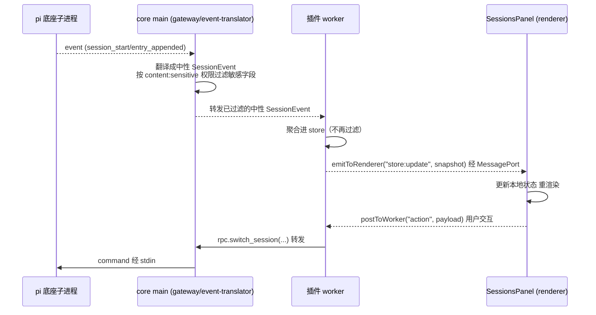
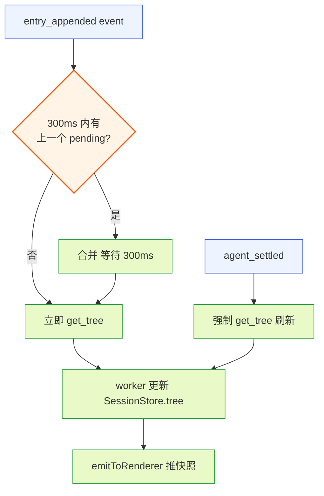
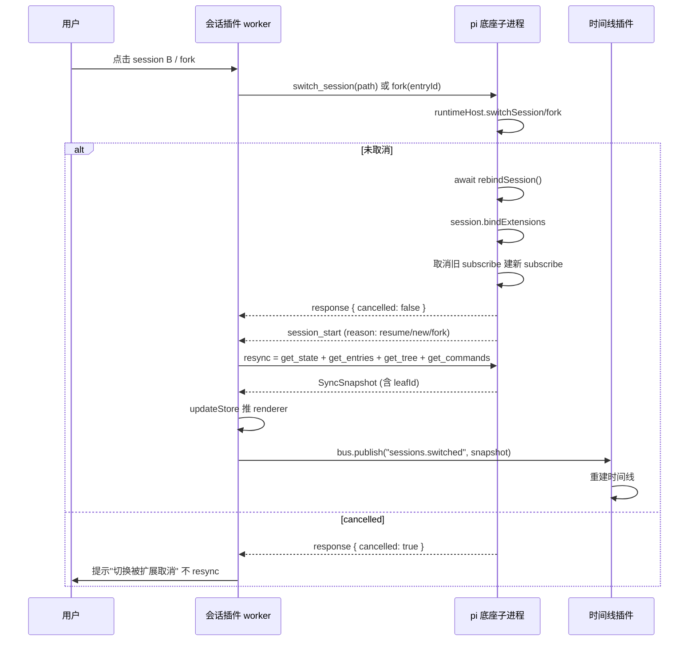
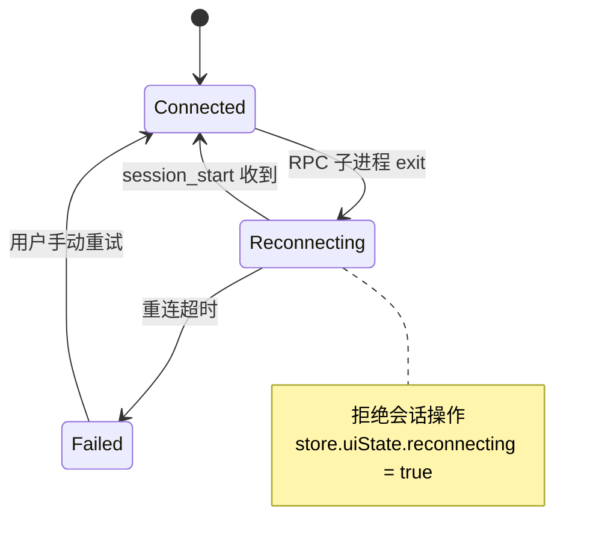

# 会话管理插件文档

本文是 pi-desktop 内置默认插件之一——**会话管理插件**（`session-manager`，展示名"会话管理"）的设计文档。它对应 DESIGN.md 第 4.6 节，并把该节展开到"照着能写代码"的程度：从槽位贡献、数据模型、命令实现，到切换后重新绑定、cancelled 状态处理。文中所有涉及 pi 底座的细节均对照底座源码（`packages/coding-agent/src/`）核实，源码位置在文中以 `底座:文件:行` 标注。

会话管理插件是用户管理对话历史和分支的入口。它把 pi 底座通过 RPC 暴露的 session 类命令包成桌面 UI，本身不存储 session 数据、不解析底座的 session 文件——session 的存储、分叉树维护、文件读写全是底座子进程的内部事务（DESIGN.md 1.4 边界），本插件只通过 RPC 触发、通过 event 观察。这个定位决定了插件的全部设计。

## 1 插件定位与核心职责

### 1.1 它解决什么问题

#### 1.1.1 用户的会话管理需求

pi 的 session 是一个对话上下文的容器：一次 `pi` 启动对应一个 session 文件（落盘在 `sessionDir`，默认 `~/.pi/agent/sessions/`），里面记录全部 entry（用户消息、assistant 消息、工具调用、compact、custom 类型条目），并以分叉树组织——用户可以从历史某条消息分叉出新分支，形成一棵会话树。在 TUI 模式下，这些操作散落在斜杠命令、快捷键、交互式选择器里。桌面端的诉求是把这些操作收进一个图形化的管理面板：列出最近会话、可视化当前会话的分叉树、一键新建/重命名/分叉/克隆/导出/压缩。会话管理插件就是这个图形化入口。

#### 1.1.2 与底座的职责边界

这个插件严格守住 DESIGN.md 1.10 定下的边界：**RPC 只管会话运行时控制，session 存储是底座内部事务**。插件不扫 `sessionDir`、不读 `.jsonl` session 文件、不维护分叉树结构。它对底座的全部触达都经过 RPC 的 31 个命令（DESIGN.md 1.5）中 session 相关的子集，以及对 event 流（`session_start`/`session_info_changed`/`entry_appended` 等，DESIGN.md 1.6）的订阅。底座的 `SessionManager` 类（`底座:core/session-manager.ts`）是这些能力的内部实现，插件不直接 import 它，只通过 RPC 协议间接消费。

这条边界不止是"不读文件"的口号，它有具体的代价和兜底：RPC 的 31 个命令里没有 `list_sessions`（底座内部有 `SessionManager.listAll()` 但没对外开口子，见 3.1.1），也没有把 leaf 指针"回退到历史某条 entry 继续对话"的命令——后者在底座内部叫 `navigateTree`，但它只在进程内 extension runtime 的 `commandContextActions` 上挂载（`底座:modes/rpc/rpc-mode.ts:328`），桌面插件是 out-of-process，够不着。这两个缺口决定了 v1 会话列表和会话树导航都走兜底（见 3.2、4.2.2、11.2），而不是假装能力完整。

### 1.2 覆盖的 RPC 命令与事件

#### 1.2.1 session 类命令清单

插件直接调用的 RPC 命令（来自 `底座:modes/rpc/rpc-mode.ts` 的 `handleCommand` 分发）：

| 命令 | 作用 | 返回结构 | 源码位置 |
|------|------|----------|----------|
| `new_session` | 开新 session | `{ cancelled: boolean }` | rpc-mode.ts:432 |
| `switch_session` | 切到指定 session 文件 | `{ cancelled }` | rpc-mode.ts:579 |
| `fork` | 从某 entry 分叉 | `{ text, cancelled }` | rpc-mode.ts:587 |
| `clone` | 克隆当前活跃分支 | `{ cancelled }` | rpc-mode.ts:595 |
| `set_session_name` | 设显示名 | 空 | rpc-mode.ts:635 |
| `get_fork_messages` | 拿可分叉消息列表 | `{ messages: [{entryId,text}] }` | rpc-mode.ts:607 |
| `get_entries` | 拿 entry 列表 | `{ entries, leafId }` | rpc-mode.ts:612 |
| `get_tree` | 拿分叉树 | `{ tree, leafId }` | rpc-mode.ts:625 |
| `get_state` | 拿状态快照 | `RpcSessionState` | 1.5.2 |
| `get_session_stats` | 拿统计 | `SessionStats` | 1.5.9 |
| `export_html` | 导出 HTML | `{ path }` | rpc-mode.ts:574 |
| `compact` | 触发上下文压缩 | `CompactionResult` | rpc-mode.ts:525 |
| `set_auto_compaction` | 开关自动压缩 | 空 | rpc-mode.ts:530 |

这些命令的响应里，凡是涉及"切换/创建/分叉"的都带 `cancelled` 字段——这是本插件要正确处理的关键状态（见第 8 章）。

注意这张表里**没有** `navigateTree` 和 `list_sessions`：`navigateTree` 是 extension runtime 的 `commandContextAction`（rpc-mode.ts:328），只供进程内 extension 调用，没有对应的 RPC 命令字；`list_sessions` 是底座内部能力 `SessionManager.listAll()`，RPC 未暴露。二者都是缺口，处置见 4.2.2、3.1、11.2。

#### 1.2.2 订阅的事件

插件通过 `PluginContext.events.on` 订阅以下事件来保持 UI 同步：

- `session_start`（`reason: "startup"|"reload"|"new"|"resume"|"fork"`）：底座 rebind session 后发出，是插件重新拉取状态、重建时间线和会话树的触发点。
- `session_info_changed`（`name`）：session 改名后发出，刷新侧栏标题和列表项。
- `entry_appended`（`entry`）：新 entry 追加，增量更新时间线（主要由 4.4 时间线插件消费，本插件借此更新消息计数）。
- `compaction_start`/`compaction_end`（`reason`）：压缩过程进度反馈。
- `queue_update`（`steering`/`followUp` 数组）：队列变化，worker 据此更新"排队 N 条"（见 5.1.2，字段以源码为准）。
- `agent_settled`：判断"一轮真的结束"，配合热加载重启决策（DESIGN.md 2.4）。

### 1.3 插件形态：双入口完整插件

#### 1.3.1 为什么需要 worker 逻辑

会话管理插件不是纯声明式插件——它有动态行为：订阅 event 流同步 UI、发 RPC 命令拿响应、维护"最近打开列表"偏好、在 fork 流程里先拉 `get_fork_messages` 再让用户选再发 `fork`。这些光靠 manifest 声明做不到，必须跑代码。因此它的 manifest 同时声明 `main`（worker 入口，跑会话管理逻辑）和 `renderer`（UI 入口，导出侧栏面板和对话框组件），是一个完整的双入口插件（DESIGN.md 3.6）。worker 侧处理命令编排和 event 订阅，renderer 侧负责所有图形交互。

#### 1.3.2 manifest 草案

```json
{
  "id": "session-manager",
  "version": "0.1.0",
  "displayName": "会话管理",
  "main": "./index.ts",
  "renderer": "./ui.tsx",
  "permissions": ["content:sensitive"],
  "contributes": {
    "sidePanel": [
      { "id": "sessions", "label": "sessions.panel.title", "icon": "messages-square", "component": "SessionsPanel", "order": 10, "defaultVisible": true }
    ],
    "commands": [
      { "id": "session.new", "title": "sessions.command.new", "keybinding": "cmd+n", "handler": "#onNewSession", "when": "agent.idle" },
      { "id": "session.rename", "title": "sessions.command.rename", "handler": "#onRenameSession", "when": "agent.idle" },
      { "id": "session.fork", "title": "sessions.command.fork", "handler": "#onFork", "when": "agent.idle && session.hasMessages" },
      { "id": "session.clone", "title": "sessions.command.clone", "handler": "#onClone", "when": "agent.idle && session.hasMessages" },
      { "id": "session.exportHtml", "title": "sessions.command.exportHtml", "handler": "#onExportHtml" },
      { "id": "session.compact", "title": "sessions.command.compact", "handler": "#onCompact", "when": "agent.idle" }
    ],
    "settings": [
      { "id": "sessions", "title": "sessions.settings.title", "component": "SessionSettings" }
    ]
  }
}
```

几个关键点：**本插件 manifest 不声明 `dependsOn`**。依赖方向是单向的——时间线插件（4.4）`dependsOn: ["session-manager"]`，因为 `sessions.switched` 事件由本插件发布，时间线是消费方，消费方依赖发布方先 activate（DESIGN.md 3.5.9 拓扑排序）。若本插件反过来 `dependsOn: ["timeline"]`，则构成 A→B 且 B→A 的循环依赖，加载器拓扑排序会判环并把两个插件都禁用（DESIGN.md 3.2.3 `dependsOn` 条款）。发布方不依赖消费方，这是事件总线架构的基本纪律，本插件只负责"在合适的时机发布 `sessions.switched`"，不关心谁订阅。bus 是 fire-and-forget——会话插件发布 `sessions.switched` 不需要时间线已经 activate 或 subscribe，即便当时无人订阅消息也只是丢弃、不影响会话插件自身；`dependsOn` 只用于让消费方（时间线）在初始 activate 时能从已就绪的会话插件拉到初始数据，与发布动作本身无关（subscribe 时机契约见 7.3.2）。

`permissions: ["content:sensitive"]` 是因为会话列表/树要显示消息首句摘要（`SessionInfo.firstMessage`、fork 选择器显示消息文本），属敏感字段（DESIGN.md 1.7.6、3.2.4）。注意过滤点在 gateway 层、不在本插件 worker 侧——worker 收到的 SessionEvent 已是按权限过滤后的中性事件（见 2.1.3）。`when` clause 控制命令在 agent 忙时禁用——分叉/克隆打断 streaming 会丢失当前 turn。

## 2 槽位贡献：侧栏槽与命令项槽

插件往 core 的两个槽位挂贡献项：侧栏槽（`sidePanel`）贡献"会话"Tab，命令项槽（`commands`）贡献六个会话命令。槽位是 core 圆心定义的稳定契约（DESIGN.md 3.3），插件只往里挂、不绕过。

### 2.1 侧栏槽：会话 Tab

#### 2.1.1 贡献项结构

侧栏槽贡献项 schema（DESIGN.md 3.3）：`{ id, label, icon, component, order?, defaultVisible? }`。本插件贡献一项：

- `id: "sessions"`——槽位内唯一标识，用于槽位级冲突仲裁（DESIGN.md 3.5 第 7 项：不同插件往同槽位贡献同 id 贡献项时按来源优先级取高）。
- `label: "sessions.panel.title"`——i18n key，core 按 `sidePanel.session-manager.sessions.label` 查语言槽（DESIGN.md 3.2.1），查不到 fallback 到字面值。
- `icon: "messages-square"`——lucide 图标名，侧栏 Tab 图标。
- `component: "SessionsPanel"`——renderer 模块导出的组件名，core 在 renderer 侧注册进 `componentRegistry["session-manager:SessionsPanel"]`，渲染该 Tab 时挂载 `<SessionsPanel />`。
- `order: 10`——侧栏 Tab 排序权重，会话 Tab 排在较靠前位置。
- `defaultVisible: true`——首次启动默认展开。

#### 2.1.2 SessionsPanel 内部区域

`SessionsPanel` 是侧栏 Tab 的根组件，内部分三个区域，自上而下：

1. **当前会话状态条**：显示当前 session 的名称、消息数、排队数、活动状态（idle/streaming/compacting）。数据来自 `get_state`（`RpcSessionState`）。
2. **会话列表**：列出最近打开的 session（v1 中间方案，见第 3 章）。
3. **会话树视图**：当前 session 的分叉树（`get_tree` 返回，见第 4 章）。

这三个区域共享同一个 renderer 侧的 store（由 worker 侧推数据，见 2.1.3），切换 Tab 时复用已缓存数据，无感刷新。

#### 2.1.3 worker↔renderer 数据通道

`SessionsPanel` 渲染所需的数据（当前状态、列表、树）由 worker 侧维护并经 `context.emitToRenderer` 推送。数据流（DESIGN.md 3.6 双入口）：



**图 1 — 会话插件 worker↔renderer 数据流：event 经 main 的 gateway/event-translator 过滤敏感字段后转发给 worker，worker 只聚合不再过滤；用户动作经端口回 worker 发 RPC。**

这里要厘清一个 DESIGN.md 1.7.6 的纪律：**敏感字段过滤发生在 gateway/event-translator 层，不在插件 worker 侧**。底座推出的 `AgentSessionEvent` 含对话文本/图片/工具参数等敏感字段，core main 的 event-translator 在翻译成中性 `SessionEvent` 时按订阅插件的 `permissions` 过滤——未声明 `content:sensitive` 的插件收到的 event 里敏感字段置空（只保留 role/toolName 等元数据）。本插件声明了 `content:sensitive`，所以收到的 `SessionEvent` 保留消息文本（用于列表首句摘要、fork picker 展示）。但 worker 收到的已是过滤后的中性事件，worker 只负责聚合进 store、不再做任何敏感字段过滤——重复过滤既多余，又违反"过滤不在插件侧（插件无法绕过）"的纪律。图 1 里把过滤点画在 main 层、worker 只聚合，正是这条纪律的体现。

worker 侧维护一个 `SessionStore`（见 5.3），每次底座状态变化时发一次全量快照给 renderer（`emitToRenderer("store:update", snapshot)`）。之所以用全量快照而非增量 patch，是因为会话树/列表数据量小、全量对比简单可靠，避免增量协议带来的状态不一致风险——这呼应 DESIGN.md 3.2.4"resync 广播给所有订阅插件"的快照语义。

#### 2.1.4 worker 与 renderer 的职责边界

双入口插件（DESIGN.md 3.6）要把"跑逻辑"和"画界面"分开，这条边界在本插件的具体落点：

- **worker 侧独占**：发 RPC 命令、订阅 event 流、订阅事件总线、读写 config、resync 编排、防抖写盘、错误分类与降级（12 章）。所有"和底座/磁盘/其他插件通信"的事都在 worker——renderer 够不着这些通道（renderer 只有 `RendererPluginContext`，DESIGN.md 3.2.5，无 `rpc`/`events`/`config`）。
- **renderer 侧独占**：渲染 `SessionsPanel`/`SessionTreeView`/`ForkPicker`/`SessionSettings` 组件、管理组件本地状态（输入框文本、树的展开态缓存）、响应用户交互并经 `postToWorker` 回传意图、无障碍焦点管理（1.9.4）。所有"画"和"收用户输入"的事都在 renderer。
- **唯一通道**：worker→renderer 经 `emitToRenderer("store:update", store)` 推全量快照；renderer→worker 经 `postToWorker(channel, payload)` 回传动作（如 `session:switch`/`tree:navigate`/`tree:collapse`/`settings:update`/`session:pin`/`session:unpin`/`session:removeFromList`/`timeline:scroll`/`stats:fetch`，全部 channel 见 5.5.2 目录）。worker→renderer 的请求/响应（可 await 模态框结果）走 `requestFromRenderer`（5.5.1），与 postToWorker 不同。两侧不共享可变状态、不直接调对方函数——store 是 worker 的、renderer 拿到的是序列化副本，改了副本不影响 worker。

这条边界守住的回报：换 UI 框架（React→别的）只动 renderer、不动 worker；换数据编排策略（全量快照→增量 patch）只动 worker 的推送、不动组件。两侧独立演化，是 DESIGN.md 3.6 双入口的本意。组件本地状态（如输入框文本、树展开的瞬时视觉态）不进 store——store 只放"需要跨组件共享或需持久化的"。纯视觉临时态（树展开的瞬时态）留在组件内；但用户显式操作过的树折叠状态需跨 session 保持，属需持久化偏好，经 `tree:collapse` channel 写回 worker 进 config（4.2.3），既不污染 store 的会话运行时数据、又保留跨 session 持久化。

### 2.2 命令项槽：六个会话命令

#### 2.2.1 贡献项结构

命令项槽贡献项 schema：`{ id, title, keybinding?, handler?, icon?, when? }`。本插件贡献六个命令（见 1.3.2 manifest）。每个 `handler` 用 `#` 前缀引用 worker 模块导出的处理函数，core 加载时按 manifest 解析到 worker 入口对应导出。`keybinding` 字段让 core 把这个快捷键注册进全局快捷键表（4.7 命令与快捷键插件维护），`when` 字段控制命令何时可用可见。

#### 2.2.2 when clause 的作用

六个命令里有四个带 `when` 条件：

- `session.new` 的 `when: "agent.idle"`——agent 忙时也可建新会话（会切走打断当前 turn），但保守起见要求 idle；若用户明确要在 streaming 中新建，由 2.4 的"带判断的重启决策"提示用户确认。
- `session.rename` 的 `when: "agent.idle"`——允许对任意（含未命名）会话命名；空名校验由 handler 在用户提交空串时拦截（6.2.2 的 `if (!name.trim())` 分支），而非用 when 禁掉未命名会话的命名入口。底座 `set_session_name` 报错的是**目标 name 为空**（rpc-mode.ts:638），不是 session 当前没名字——混淆这两件事会导致从未命名的 session 点不到重命名命令、找不到取名入口。
- `session.fork` 和 `session.clone` 的 `when: "agent.idle && session.hasMessages"`——分叉/克隆需要至少一条消息，且 streaming 中执行会丢当前 turn。

`when` 的条件变量（`agent.idle`/`agent.streaming`/`session.hasName`/`session.hasMessages`）由 core 维护的 contextKeys 表提供（DESIGN.md 3.3 when clause），派生自 `RpcSessionState`。core 运行时按 `get_state` 的返回更新这些 key，命令的可见性自动跟随。

#### 2.2.3 命令项冲突仲裁

若第三方插件也往命令项槽贡献了同 id 命令（如 `session.new`），按 DESIGN.md 3.5 第 7 项的规则仲裁：两个不同 id 的插件贡献了重名贡献项，按来源插件优先级（project > user > installed > builtin）取高优先级那条，低优先级不挂载，并在管理 UI 标"命令项 `session.new` 冲突，已用 X 插件的版本"。本插件作为内置插件优先级最低，用户或项目级同名命令会覆盖它——这是"内置可被覆盖"机制（DESIGN.md 3.4）的体现。

## 3 会话列表：v1 中间方案

会话列表是侧栏第二区域，列出"最近的 session"供用户切换。这一章要厘清一个关键边界：v1 的会话列表不是底座全量 session 列表，而是桌面端自己维护的"最近打开列表"——这是能力兜底，不是功能残缺。

### 3.1 为什么不直接调 list_sessions

#### 3.1.1 底座有内部能力但 RPC 没开口子

底座内部有完整的 session 列表能力：`SessionManager.listAll()`（`底座:core/session-manager.ts:1564`）是静态方法，扫 `sessionDir` 下所有 `.jsonl` 文件、解析 header、返回 `SessionInfo[]`（字段见 3.2）。这是正确的数据源——它返回的每项带 `path`/`id`/`cwd`/`name`/`created`/`modified`/`messageCount`/`firstMessage`/`parentSessionPath`，信息完整。

但 RPC 的 31 个命令里**没有 `list_sessions`**。这和 reload（DESIGN.md 2.2）是同一类缺口：底座有内部能力、RPC 没对外暴露。已记在 DESIGN.md 6.2 的缺口清单里，和"没有 navigateTree RPC 命令"（4.2.2、11.2）并列，都是"底座有内部能力、RPC 没开口子"的同一类演进项。

#### 3.1.2 为什么桌面端不自己扫 sessionDir

DESIGN.md 1.4 明确：session 存储是底座内部事务、桌面端不掺和。若桌面端自己去读 `~/.pi/agent/sessions/*.jsonl`，会带来三个问题：

1. **格式耦合**：session 文件是底座私有格式（JSONL，带 header 行），格式可能随底座版本演化。桌面端扫文件等于绑死了底座的存储实现，破坏薄壳边界。
2. **并发风险**：底座子进程正在写 session 文件时，桌面端同时读可能读到半写状态。
3. **信任边界**：`sessionDir` 可由 settings 的 `sessionDir` 字段自定义（DESIGN.md 2.1.3），桌面端要知道当前 sessionDir 得先读 settings，又绕回配置文件操作。

因此 v1 不走"自己扫文件"的路。

### 3.2 v1 中间方案：最近打开列表

#### 3.2.1 方案描述

v1 的做法是：桌面端维护一份"最近打开的 session 列表"——这是桌面端自己的偏好数据，存在插件 config 里（`~/.pi-desktop/plugins-data/session-manager/config.json`，DESIGN.md 3.2.4），不解析底座 session 文件。config 的完整结构：

```typescript
interface SessionManagerConfig {
  recentSessions: RecentSessionEntry[];  // 最近打开列表（按 lastOpenedAt 降序）
  pinned: string[];                      // 置顶的 sessionPath（显示在列表顶部，不受排序影响；唯一归属，不进 settings）
  treeCollapseState?: Record<string, Record<string, boolean>>; // 会话树折叠状态（key=sessionId→{entryId→boolean}，见 4.2.3）
  settings?: SessionUserSettings;        // 用户在设置页调的偏好（见 5.4）
}

interface SessionUserSettings {
  maxRecent: number;                              // 最近列表条数上限（默认 20）
  autoCompaction: boolean;                        // 新 session 的默认自动压缩开关
  treeExpand: "currentBranch" | "all" | "none";   // 树默认展开策略（默认 "currentBranch"）
  groupByProject: boolean;                        // 列表按 cwd 分组开关（默认 true）
}

interface RecentSessionEntry {
  sessionPath: string;       // session 文件绝对路径（switch_session 用这个）
  sessionId: string;         // session id（展示用）
  sessionName?: string;      // 显示名（从 get_state.sessionName 同步）
  cwd: string;               // 启动时的工作目录（区分不同项目的会话，3.3.4 分组用）
  firstMessage?: string;     // 首条消息摘要（首次打开时从 get_entries 取首条 user 消息提取，用于列表预览）
  messageCount?: number;     // 消息数（从 get_state 同步）
  lastOpenedAt: number;      // 最后打开时间戳（排序用）
  parentSessionPath?: string;// 父 session 路径（fork 来源，展示谱系）
}
```

这个列表的来源是**桌面端自己触发的 session 操作**：每次通过桌面端打开/切换/新建/fork/clone 一个 session 时，worker 把该 session 的信息追加（或更新）到列表。列表按 `lastOpenedAt` 降序排，截取前 N 条（默认 20，可在设置页配置，见 5.4）。

#### 3.2.2 列表项如何更新

列表项的字段不是一次性写死的，而是在每次 `get_state` 成功后同步刷新。worker 侧在 `resync()`（DESIGN.md 3.2.4 的共享原语）拿到 `RpcSessionState` 后，把 `sessionId`/`sessionName`/`messageCount`/`pendingMessageCount` 写回列表里匹配 `sessionPath` 的那项。`firstMessage` **不从 `get_state` 提取**——`RpcSessionState`（DESIGN.md 1.7.1）没有这个字段，它属于 `SessionInfo`（DESIGN.md 1.7.4，`listAll` 返回），而 `list_sessions` 正是未开口子的缺口。`firstMessage` 仅在首次打开该 session 时从 `get_entries` 返回的首条 `type:"user"` entry 文本提取一次并缓存，之后不再变（除非分叉产生新首条）。填充来源详见 5.5.5。


**图 2 — 最近打开列表的更新流程：操作触发记录，resync 同步字段，快照推送渲染。**

#### 3.2.3 能力边界：这不是残缺

要诚实说明这个中间方案的边界：v1 的会话列表**列不出 CLI 直接创建的、没用桌面端打开过的历史 session**。用户若在终端 `pi --resume` 开了若干 session，桌面端的列表里看不到它们——除非用户在桌面端通过 `switch_session` 手动打开过。

这不是功能残缺，是能力兜底：在底座补 `list_sessions` RPC 命令之前，桌面端先保证"用户能用桌面端管理自己用过的 session"这条主线畅通。完整全列表能力（含 CLI 创建的历史）等底座补命令后切换到直接调 `list_sessions`（DESIGN.md 6.2 演进项）。切换时只需把列表数据源从 config 偏好换成 RPC 响应，UI 层基本不变——`RecentSessionEntry` 和 `SessionInfo` 字段大部分重叠，但并非一一对应，迁移时需做字段映射（`SessionInfo.created` ↔ `RecentSessionEntry.lastOpenedAt`、`SessionInfo.path` ↔ `sessionPath`、`allMessagesText` 丢弃或转成 `firstMessage` 截断），见 11.2.1。

### 3.3 列表交互与切换

#### 3.3.1 列表项展示

每项显示：

- **名称**：`sessionName`，无名称时 fallback 到 `firstMessage` 前 40 字符，再无则显示 `(未命名会话)`。
- **元信息行**：消息数（`messageCount` 条消息）、最后打开时间（相对时间，"3 小时前"，用 `i18n.formatDate`，DESIGN.md 4.2.5）。
- **谱系标记**：若有 `parentSessionPath`，显示一个分叉图标，hover 提示"从 {父会话首句} 分叉"。
- **当前会话标记**：当前活跃 session 的列表项高亮（顶部状态条与之呼应）。

#### 3.3.2 点击切换

点击列表项触发 `switch_session`，参数是该项的 `sessionPath`。切换流程见第 7 章。切换成功后该 `lastOpenedAt` 更新为当前时间、上浮到列表顶部（但不超过 pinned 项）。

#### 3.3.3 右键菜单与删除

列表项右键提供：

- **在侧栏固定**：置顶显示。置顶信息写入 config 的 `pinned: string[]` 数组（存 `sessionPath`）。pinned 项在列表中始终排在最前、不受 `lastOpenedAt` 排序影响；同一 pinned 集合内部按 pin 操作的时间顺序（追加序）稳定排序。再次点击"取消固定"则从 `pinned` 移除、回落到按 `lastOpenedAt` 排序的位置。pinned 数组与 `recentSessions` 并存：渲染时先取 `pinned` 里仍存在于 `recentSessions` 的项置顶，再拼 `recentSessions` 排序的其余项——若一个 session 被"从列表移除"但仍在 `pinned`，则在 `pinned` 里也一并清掉，避免悬挂引用。
- **从列表移除**：仅从最近打开列表移除（`recentSessions` 删该项、`pinned` 同步删），**不删除磁盘上的 session 文件**（桌面端无权删底座文件，且 session 文件归底座管）。移除是纯偏好操作。
- **复制路径**：复制 `sessionPath` 到剪贴板。

注意"从列表移除"和"删除会话"是两件事——v1 不提供删除 session 文件的能力，因为底座 RPC 没有 delete_session 命令，桌面端也不该越权删底座文件。这是边界的具体体现。

#### 3.3.4 跨项目会话分组（v1 交互）

`RecentSessionEntry` 带 `cwd` 字段，可在列表渲染时按工作目录分组。v1 的分组规则：

- **当前项目优先**：`cwd` 等于桌面端当前打开项目目录的会话排在最前（pinned 之下、其余之上），以"当前项目"为组标题平铺展开。
- **其他项目折叠**：其余 `cwd` 各自成组，组标题取项目目录名（`path.basename(cwd)`），默认折叠、点击展开。组内仍按 `lastOpenedAt` 降序。
- **未知 cwd**：若某历史项的 `cwd` 与当前任何已打开项目都不匹配（如项目已被移动/删除），归入"其他"组。

分组是纯渲染层逻辑，不改动 config 结构——`recentSessions` 仍是扁平数组，分组在 renderer 侧按 `cwd` 聚合。这样演进到 `list_sessions` 后，底座返回的 `SessionInfo[]` 同样带 `cwd`，分组逻辑可原样复用。跨项目分组的完整能力（按项目独立列表、项目切换自动过滤）等 4.5 项目管理插件成熟后再联动，v1 只做"当前项目优先 + 其他折叠"这一档。

## 4 会话树视图：SessionTreeNode 嵌套结构

会话树视图是侧栏第三区域，可视化当前 session 的分叉结构。数据来自 `get_tree` RPC 命令。这一章把底座的 `SessionTreeNode` 结构和桌面端的渲染讲透。

### 4.1 SessionTreeNode 的真实结构

#### 4.1.1 源码定义

DESIGN.md 1.7.5 给出的 `SessionTreeNode` 是简化描述。底座源码（`底座:core/session-manager.ts:154`）的真实定义是：

```typescript
/** Tree node for getTree() - defensive copy of session structure */
export interface SessionTreeNode {
  entry: SessionEntry;          // 该节点对应的 entry（完整对象，非仅 id）
  children: SessionTreeNode[];  // 子节点数组（分叉点有多个、普通节点空或单子）
  label?: string;               // 该 entry 的标签（分叉点的摘要/用户命名）
  labelTimestamp?: string;      // 标签最后修改时间戳
}
```

与 DESIGN.md 1.7.5 的差异：实际字段是 `entry`（完整 `SessionEntry` 对象）而非 `entryId: string`；没有 `isLeaf` 字段——当前叶子位置由 `get_tree`/`get_entries` 返回的 `leafId` 单独给出，不在节点里。本文档以源码为准。**待回写 DESIGN.md 1.7.5 的 `SessionTreeNode` 定义**：`entryId: string` → `entry: SessionEntry`（完整对象）、移除 `isLeaf`（leafId 由 `get_tree`/`get_entries` 返回），与 5.3.2 的 `leafId`、5.5 的 `requestFromRenderer` 同属"契约补充、待回写 DESIGN.md"的纪律。

#### 4.1.2 get_tree 的返回

`get_tree` 命令返回 `{ tree: SessionTreeNode[], leafId: string | null }`（rpc-mode.ts:625）。`tree` 是根节点数组（通常一个根，即会话起点），`leafId` 是当前活跃叶子节点的 entry id——UI 据此高亮"当前所在分支末端"。

#### 4.1.3 树的构建逻辑

`SessionManager.getTree()`（`底座:core/session-manager.ts:1239`）的实现逻辑：

1. 拿全部 entries（`getEntries()`，按追加序）。
2. 为每个 entry 建一个 `SessionTreeNode`（`children: []`，挂上 `label`/`labelTimestamp`）。
3. 遍历 entries，按 `entry.parentId` 把节点挂到父节点的 `children` 里；`parentId` 为 null 或等于自身 id 的是根节点，孤儿节点（父不存在）也当根。
4. 递归按 `entry.timestamp` 升序排序 children（旧的在上、新的在下），用迭代避免深树栈溢出。

这意味着树是**按 entry 的 parentId 父子关系组织**的嵌套结构，分叉点（一个 entry 有多个 children）就是会话的分支点。

### 4.2 渲染会话树

#### 4.2.1 树形组件

renderer 侧用一个递归树组件渲染 `SessionTreeNode[]`。每个节点显示：

- **节点摘要**：`label` 优先；无 label 时取 `entry` 的内容摘要（user 消息取首句、assistant 消息取首句、工具调用取工具名）。`label` 是用户通过 `setLabel`（`底座:core/agent-session.ts:2337`）或 fork 时设置的分支标签。
- **节点类型图标**：按 `entry.type` 显示不同图标（user/assistant/tool/compact/custom）。
- **当前叶子标记**：`entry.id === leafId` 的节点加高亮边框 + "当前位置"标记。
- **分叉点折叠**：`children.length > 1` 的节点可折叠/展开，默认展开当前所在分支、折叠兄弟分支。

#### 4.2.2 导航行为（缺口与 v1 兜底）

点击树节点的预期语义是"把 leaf 指针移到该 entry，之后 agent 下一轮对话从该分叉点继续"。**但 RPC 的 31 个命令里没有对应的导航命令**。底座内部确实有这个能力——`session.navigateTree(targetId, options)`（`底座:core/agent-session.ts`），但它只挂在 rebind 时注入给 extension runtime 的 `commandContextActions.navigateTree` 上（rpc-mode.ts:328），是进程内 extension 调用的回调，不是 RPC 命令字。桌面插件跑在独立的 utilityProcess worker 里、经 stdin/stdout 和底座通信，够不到 `commandContextActions`，只能发 RPC 命令。

所以"树节点导航"是一个和 `list_sessions` 同类的缺口：底座有内部能力（`navigateTree`）、RPC 没对外开口子。已记入 11.2 演进项。诚实标注这点，而不是假装有一条不存在的导航 RPC——否则实现者照着文档去找 `navigateTree` 命令会卡住。

v1 的兜底分两档：

- **跨分支导航（回退到历史 entry 继续对话）**：v1 用现有 `fork` 命令实现等价语义——点击非当前分支的历史节点，等价于"从该 entryId 分叉"，走 6.3 的 fork 流程（先高亮选中节点，可弹确认"从此处分叉新分支"）。这和真正的 `navigateTree`（不创建新分支、只移动 leaf 指针）语义不同：fork 会新建一个分支、rebind，原分支不动；`navigateTree` 是原地回退。v1 接受这个差异，把"点击历史节点"收敛成"从这里分叉"，交互上明确标注为"分叉"，不冒充"回退"。完整的原地回退能力等底座补 `navigate` RPC 命令后切换（11.2.4）。
- **当前分支内回看**：仅滚动定位视图、不改 leaf 指针——点击当前分支上 leaf 之前的节点，只把时间线（4.4）滚动到那条 entry、不触发任何 `fork`/导航 RPC。这是纯视图操作，安全。实现上 renderer 侧在渲染树时预计算每个节点是否在当前 leaf 的祖先链上（`isOnCurrentBranch`，沿 leafId 向上回溯），点击时若 `isOnCurrentBranch` 且非 leaf，则只 `postToWorker("timeline:scroll", { entryId })`，不发 `tree:navigate`；worker 收到 `timeline:scroll` 后经事件总线发布 `sessions.timelineScroll` 主题，由时间线插件（4.4）subscribe 后自行滚动——时间线是另一个插件、不在本插件 renderer 进程内，无法直接调其滚动 API，故跨插件滚动经总线协调（与 `sessions.switched` 同构）。只有非当前分支节点点击才 `postToWorker("tree:navigate")` 走 fork 兜底。

要特别说明交叉引用错误：旧版文档称"导航走 RPC 的 `fork` 命令族（带 `position` 选项，见 6.3.2）"是错的——`fork` 命令只收 `entryId`，没有 `position` 选项；`position: "at"` 实际出现在 `clone` 命令上（rpc-mode.ts:600，见 6.4.1），语义是"从当前 leaf 位置分叉"，不是"导航到任意 entry"。本节修正了这个交叉引用。

为避免树视图和 4.4 时间线插件的导航语义打架，树视图的"点击节点"只触发上述兜底、不直接改时间线选中项——时间线由 `sessions.switched` 事件总线通知（7.3）后自行重建。

#### 4.2.3 树折叠状态的持久化

树节点的折叠/展开状态是用户视图偏好，应在切换 session 后保持。v1 把折叠状态存进 config 的 `treeCollapseState: Record<string, Record<string, boolean>>`（key 是 sessionId，value 是 `{ [entryId]: boolean }`，与 3.2.1 类型一致）。考虑：

- **存储粒度**：只持久化"用户显式操作过"的节点（点击折叠/展开过的），未操作过的走默认规则（当前分支展开、兄弟分支折叠）。避免把整棵树每个节点都存进 config——大 session 树可能上千节点。
- **按 session 隔离**：不同 session 的树结构不同，折叠状态以 `sessionId` 为命名空间隔离。config 里存 `{ [sessionId]: { [entryId]: boolean } }`，切回该 session 时恢复。
- **失效处理**：若 entry 已不存在（被 compact 删除、或 session 结构变了），恢复时静默忽略该项——折叠状态是纯视图偏好，丢了不影响数据正确性。

折叠状态经 `tree:collapse` channel（5.5.2）回传 worker：renderer 侧组件维护**本地瞬时展开态**（`React.useState`）用于即时视觉反馈，用户显式折叠/展开时 `postToWorker("tree:collapse", { sessionId, entryId, collapsed })`；worker 收到后更新 `store.treeCollapseState`（纳入 store 的 config 镜像，见 5.3.1/5.3.3）并防抖写盘（复用 recentSessions 的防抖策略）。renderer 渲染树时从 store 快照的 `treeCollapseState` 注入初始展开态、用户操作期间由本地态接管、显式操作写回。这同时满足 2.1.4 的"瞬时视觉态不进 store"（store 只存显式持久化的折叠偏好，不存每帧展开态）与"跨 session 持久化"——两者不矛盾：持久化的是**显式操作的离散记录**，不是连续视觉态。树结构（数据）来自 RPC，折叠状态（偏好）来自 config，两者正交。

### 4.3 树的增量更新

#### 4.3.1 何时重建树

会话树在以下时机重建（重新调 `get_tree`）：

- `session_start` 事件（reason 任意）——session 切换/新建/fork/resume 后树结构可能完全不同。
- `entry_appended` 事件——新 entry 追加，若它落在当前分支末端，树多一个叶子节点；若它是新分叉，树多一个分支。增量 patch 树结构复杂且易错，v1 简化为"收到 entry_appended 就重新 get_tree 全量替换"——树数据量通常不大，全量替换可靠。
- `agent_settled`——一轮结束，确保树反映最终状态。

#### 4.3.2 避免频繁全量拉取

为避免 streaming 中 `entry_appended` 频繁触发全量 `get_tree`，worker 侧做防抖：收到连续 `entry_appended` 时 300ms 内合并为一次 `get_tree` 请求（DESIGN.md 3.5 第 8 项热重载的防抖模式同构）。streaming 结束（`agent_settled`）后强制刷新一次。



**图 3 — 会话树增量更新：entry_appended 防抖合并，agent_settled 强制刷新。**

#### 4.3.3 树渲染性能与虚拟化

会话树在长 session（数千 entry、多次分叉）下可能很深，递归渲染全部节点会卡顿。v1 的性能策略分两档：

- **默认懒展开**：树组件首次只渲染根到当前 leaf 的路径（默认展开当前分支、折叠兄弟分支，4.2.1），其余折叠节点不递归渲染子树。这样即便树有上千节点，可见节点数也是当前分支长度 + 折叠节点摘要，通常几十个。
- **虚拟滚动备选**：若某分支展开后子节点过多（如一条长线性分支几百个 entry），用虚拟列表渲染该层 children——只渲染视口内的节点，滚动时动态挂载/卸载。React 侧复用 pi.ui 组件库的虚拟列表能力（4.4 时间线插件也用，DESIGN.md 4.11.4）。

树的全量数据仍在 store 里（`get_tree` 返回的完整 `SessionTreeNode[]`），虚拟化只影响渲染、不影响数据模型——这是"数据与渲染分离"：worker 维护完整树、renderer 决定渲染哪些节点。折叠/展开状态持久化（4.2.3）只记用户显式操作过的节点，虚拟滚动产生的临时挂载/卸载不写盘。

递归组件要注意 key 稳定：用 `node.entry.id` 作 key，避免 React 用 index 导致重排时状态错乱。`React.memo` 包裹 `TreeNode`（见 10.2），父节点更新时叶子节点不重渲染——树是大对象、memo 能显著减少重渲染范围。

## 5 当前会话状态

当前会话状态条是侧栏第一区域，显示"现在这个 session 是什么、在什么状态"。数据来自 `get_state` 返回的 `RpcSessionState`。

### 5.1 RpcSessionState 字段映射

#### 5.1.1 状态条显示的字段

`RpcSessionState`（DESIGN.md 1.7.1）的字段在状态条的映射：

| 字段 | 显示 |
|------|------|
| `sessionName` | 状态条主标题，无名称时显示 `(未命名)` |
| `sessionId` | 副标题，截断显示（如 `01J...`），hover 全显 |
| `messageCount` | "N 条消息" |
| `pendingMessageCount` | "排队 M 条"（M > 0 时显示） |
| `isStreaming` | 活动指示器：streaming 时转圈 |
| `isCompacting` | "压缩中" 标记 |
| `model.name` | 当前模型名。v1 **不在状态条显示**——模型名由 4.9 模型参数插件的侧栏统一显示，状态条避免重复；若布局后续调整要状态条也显示，作为演进项 |

#### 5.1.2 状态同步时机

状态条的数据刷新时机：

- **连接底座后**：`activate` 时第一次 `resync()` 拿初始状态。
- **`session_start` 事件后**：rebind 后重新 resync。
- **`session_info_changed` 事件**：仅更新 `sessionName`，不全量 resync。
- **`agent_settled` 事件后**：刷新 `messageCount`/`pendingMessageCount`/`isStreaming`（streaming 结束后需把 `isStreaming` 置 false，9.2 的 `agent_settled` 分支同时 patch 这三项）。
- **`queue_update` 事件**：实时更新排队数，不全量 resync。

`queue_update` 是高频事件（排队消息进出）。它的实际 payload 字段以底座源码为准（`底座:core/agent-session.ts:507` 的 `_emitQueueUpdate`）：事件携带 `steering: Message[]` 和 `followUp: Message[]` 两个数组，**没有** `pendingMessageCount`/`pendingCount` 这样的字段。worker 收到后自己算 `pendingCount = event.steering.length + event.followUp.length`，投影更新 `store.state.pendingMessageCount`，不触发完整 resync——避免高频全量拉取。全文统一用 `pendingCount` 指代 worker 计算出的这个值，event 字段名以源码 `steering`/`followUp` 为准。

### 5.2 SessionStats 面板

#### 5.2.1 统计数据展开

点击状态条的sessionId区域可展开一个统计面板，数据来自 `get_session_stats` 返回的 `SessionStats`（DESIGN.md 1.7.3）：

- **消息分布**：userMessages / assistantMessages / toolCalls / toolResults / totalMessages。
- **token 用量**：input / output / cacheRead / cacheWrite / total，配进度条显示相对 contextWindow 的占比。
- **费用**：cost（美元）。
- **上下文占用**：`contextUsage`（tokens / contextWindow / percent），百分比进度条。

#### 5.2.2 按需拉取

`SessionStats` 不在 resync 的默认快照里（resync 拉 state+entries+tree+commands，不含 stats）——因为 stats 计算开销略大且变化不频繁。stats 严格按需拉取：统计面板展开时才调 `get_session_stats`、关闭面板不拉，`agent_settled` 也不主动拉（避免每轮 settled 都拉一次与按需语义冲突）。展开后每 30 秒刷新一次（面板关闭即停）。骨架落地（9.x）：worker 侧提供 `fetchStats()` 原语（`rpc.send({type:"get_session_stats"})` 写 `store.stats`），仅由 renderer 经 `stats:fetch` channel（5.5.2，面板展开/30s 刷新）触发 worker 调 `fetchStats()`——renderer 不直接发 RPC，`agent_settled` 分支不调 `fetchStats`。

#### 5.2.3 统计面板的展示约束

统计面板的展示有几个约束要遵守：token 用量进度条的上限是 `model.contextWindow`（DESIGN.md 1.7.2），不是硬编码数字——换模型后上限自动跟随；费用按 `model.cost` 单价 × token 数估算，展示为美元两位小数，避免精度误导；`contextUsage.percent` 若超过阈值（如 80%）用警告色高亮，提示用户考虑 compact。这些是纯展示规则，落在 renderer 侧组件，worker 只透传 `SessionStats` 原始字段、不做格式化——格式化是 renderer 的职责（2.1.4）。统计面板无障碍上要为进度条配 `aria-valuenow`/`aria-valuemax`，屏幕阅读器能读出"上下文占用 62%"。

### 5.3 worker 侧 SessionStore

#### 5.3.1 store 结构（权威定义）

worker 侧维护一个聚合 store，作为 renderer 的唯一数据源。以下为权威定义，全文（含第 9 章骨架）以本节为准：

```typescript
interface SessionStore {
  state: RpcSessionState | null;          // 当前会话状态
  recentSessions: RecentSessionEntry[];   // 最近打开列表
  tree: SessionTreeNode[];                 // 当前会话树
  leafId: string | null;                   // 当前叶子
  stats: SessionStats | null;              // 统计（按需，5.2.2）
  pinned: string[];                        // 置顶列表（config 顶层 pinned 的镜像，3.2.1）
  treeCollapseState: Record<string, Record<string, boolean>>; // 树折叠状态镜像（4.2.3/3.2.1）
  settings?: SessionUserSettings;          // 用户偏好镜像（5.4/3.2.1）
  uiState: {
    reconnecting: boolean;     // 底座重连中（7.4.2）
    compacting: boolean;       // 压缩进行中（6.6.2）
    lastError: string | null;  // 最近一次操作的错误/取消提示
  };
}
```

`uiState` 合并了第 6/7/9 章所有真实使用的字段：`reconnecting`（7.4.2 重连状态机用）、`compacting`（6.6.2 compact handler 用）、`lastError`（所有 handler 的错误/取消提示）。**`forkCandidates` 与 `activeForkPicker` 不进 store**——fork 选择器由 worker 经 `requestFromRenderer("fork:pick", {candidates})` 触发、由 core 的请求/响应中转层挂载到 renderer 顶层、`candidates` 经 payload 传入、选完经同一通道回传（5.5.1/6.3.4/10.3），是一次性请求/响应交互、不订阅 store 快照，故其数据不经 store 流转。`pinned`/`treeCollapseState`/`settings` 是 config 的镜像字段，纳入 store 后 renderer 可直接从 store 快照读它们（设置页渲染、树初始展开态、pinned 列表），`buildConfig` 也从 store 取值写盘、消除 read-back 竞态（5.3.3/9.4）。`leafId` 从 `get_tree`/`get_entries` 返回值提取（见 5.3.2 的 SyncSnapshot 说明）。

每次 store 变化，worker 调 `context.emitToRenderer("store:update", store)` 推全量快照。renderer 侧 `SessionsPanel` 用 `pi.onMessage("store:update", cb)` 接收，存进组件 state 触发重渲染。

#### 5.3.2 store 更新编排

worker 侧用一个 reducer 风格的更新函数编排各数据源的写入：

```typescript
// worker 侧伪代码
function updateStore(patch: Partial<SessionStore>): void {
  store = { ...store, ...patch }; // 不可变重组（与 9.4 一致），便于 renderer 侧引用对比与后续增量 patch
  context.emitToRenderer("store:update", store);
}

// resync 后（简化版；完整实现见 9.3，含 firstMessage 提取、reason 透传、序号去重）
async function onResynced(snap: ResyncSnapshot, reason: string): Promise<void> {
  updateStore({
    state: snap.state,
    tree: snap.tree,
    leafId: snap.leafId,
    recentSessions: syncRecentList(store.recentSessions, snap.state, reason, {}),
  });
}

// queue_update event（payload 含 steering/followUp 数组）
function onQueueUpdate(steering: unknown[], followUp: unknown[]): void {
  const pendingCount = steering.length + followUp.length;
  if (store.state) {
    updateStore({ state: { ...store.state, pendingMessageCount: pendingCount } });
  }
}
```

**关于 `snap.leafId` 的来源（DESIGN.md 契约补充）**：DESIGN.md 3.2.4 定义的 `SyncSnapshot` 结构是 `{ state, entries, tree, commands }`，未含 `leafId`。但 `get_entries` 和 `get_tree` 的 RPC 响应各自返回 `leafId`（二者值一致），`resync()` 在内部并发发这两条命令时可一并提取 `leafId`。本文档按 resync 实际可返回的形态，把 `leafId` 作为 `SyncSnapshot` 的补充字段暴露（`ResyncSnapshot = SyncSnapshot & { leafId: string | null }`）——这是对 DESIGN.md 3.2.4 的契约补充，待回写 DESIGN.md 3.2.4 的 `SyncSnapshot` 结构补上 `leafId: string | null`。在 DESIGN.md 补充前，本插件若 `resync()` 返回的快照不含 `leafId`，则 fallback 为单独调一次 `get_tree` 取 `leafId`——但推荐 resync 直接补这个字段，避免多一次 RPC 往返。全文 5.3.2、7.2.2、9.3 的 `snap.leafId` 均指这个补充字段。

`syncRecentList(list, state, reason, extra)` 把当前 session 的最新 `sessionName`/`messageCount` 回写到最近列表对应项，并按 `reason` 写入 `parentSessionPath`（fork/new）、按 `extra` 补 `firstMessage`/`cwd`（字段来源见 5.5.5），并持久化到 config（防抖写，见 5.3.3）。签名为 4 参（`list, state, reason, extra`），全文 5.3.2、7.2.2、9.3 一致；`reason` 用于谱系写入，不再是未用参数。

#### 5.3.3 recentSessions 持久化的并发写盘策略

`recentSessions` 存在 config.json 里，多个事件都可能触发写盘（切换会话、resync 同步字段、pinned 变更）。若每次更新都立即 `context.config.set`，会带来两类问题：

1. **高频写盘**：streaming 中 `entry_appended` 防抖刷新树、`queue_update` 更新排队数都可能间接触发列表更新，立即写盘会打满磁盘 IO。
2. **丢失更新**：`context.config.set` 是异步的，若两次 set 间隔小于其完成时间，且 worker 内部用不可变重组（`store = { ...store, ...patch }`）后立即序列化整个 store 写盘，后一次 set 可能基于尚未持久化的内存态——通常 worker 单线程串行所以问题不大，但若 `config.set` 内部有读-改-写（读旧文件→合并→写），并发 set 可能丢字段。

v1 的写盘策略：

- **防抖合并**：列表变更后不立即写，进入 500ms 防抖队列；期间再次变更重置计时器，最后一次变更后 500ms 才真正 `config.set`。这把高频事件（streaming 中的排队数变化）收敛成低频写盘。
- **序列化整个 recentSessions 数组**：写盘时把 `store.recentSessions` 整体序列化覆盖写，不做"读旧文件→合并字段"——因为 `recentSessions` 的唯一权威来源是 worker 内存里的 store，config 只是它的持久化镜像，不存在"别的进程也在写 recentSessions"的情况。`pinned`/`treeCollapseState`/`settings` 同理归本插件 worker 管、且已纳入 store 镜像（5.3.1），`buildConfig`（9.4）从 store 取全部字段一次性序列化写盘，不再 `config.get` 回读磁盘——store 是 config 的完整内存镜像，read-back 竞态随之消除（5.3.3 第 3 条）。这样避免读-改-写的并发窗口。
- **deactivate 强制 flush**：插件卸载/重载时（deactivate）立即把待写队列 flush 一次，确保防抖中的变更不丢失。
- **跨字段原子性**：`recentSessions`/`pinned`/`treeCollapseState`/`settings` 虽由不同 channel/handler 触发变更，但写盘时由 `buildConfig()`（9.4）统一从 store 取全部字段、序列化整个 config 对象一次写入——避免分字段多次写盘导致 config.json 出现中间态（部分字段新、部分旧）。`context.config.set` 若只支持单 key 写，则整体覆盖写一个根 key（store 即完整 config 镜像）。

这是"写盘频率与数据一致性"的工程权衡：宁可防抖丢几百毫秒的中间态（反正是可重算的派生数据），也不让磁盘 IO 和并发窗口成为问题。

### 5.4 SessionSettings 设置页

`SessionSettings` 是 manifest `contributes.settings` 声明的设置页组件，提供本插件用户可配置的偏好项。v1 的可配置项：

- **最近列表条数 N**（`settings.maxRecent`，默认 20）：`recentSessions` 截取的前 N 条上限。改后立即生效——下次列表更新时按新 N 截断，历史超出的项保留在 config 但不显示（避免改小 N 就丢数据）。
- **默认是否自动压缩**（`settings.autoCompaction`，默认跟随底座）：映射到 `set_auto_compaction` 命令（6.6.3）。这是"新 session 的默认开关"，当前 session 的开关由 `get_state.autoCompactionEnabled` 实时反映、由命令面板的 compact 相关命令改。
- **树默认展开策略**（`settings.treeExpand`，枚举 `"currentBranch"|"all"|"none"`，默认 `"currentBranch"`）：控制会话树首次渲染时的展开行为——当前分支展开（默认）、全部展开、全部折叠。用户显式操作过的节点仍走 4.2.3 的持久化覆盖此默认。
- **列表分组开关**（`settings.groupByProject`，默认 true）：控制 3.3.4 的跨项目分组是否启用。关掉则 `recentSessions` 平铺按 `lastOpenedAt` 排序、不分 cwd。
- **pinned 管理**（只读列表 + 取消固定按钮）：pinned 是 `SessionManagerConfig` 顶层字段（3.2.1），**不属于 `SessionUserSettings`**——为避免"设置页写 `settings.pinned`、`buildConfig` 读顶层 `pinned`"的错配导致取消固定丢失，pinned 的变更不走 `settings:update` patch，而是单独经 `session:unpin` channel（5.5.2）发指令，由 worker 改顶层 `pinned` 后回推 store。设置页列出当前 pinned 的 sessionPath（从 store 镜像读），每项"取消固定"经 `postToWorker("session:unpin", {path})`。这是 3.3.3 右键"在侧栏固定/取消固定"的批量管理入口。

设置页改的值（前四项）写进 `config.settings`（`SessionUserSettings`），renderer 侧组件从 store 快照读当前设置（store 已纳入 settings 镜像，5.3.1）；用户改动经 `postToWorker("settings:update", patch)` 回 worker，worker 校验后更新 `store.settings` 并防抖写盘、推 store 快照。pinned 的读写走独立 channel、不混进 `settings:update` patch。设置项是纯偏好、不碰底座（`autoCompaction` 例外，由 worker 转发 `set_auto_compaction`），不走会话命令——这和 6.x 的会话命令（走 RPC 改底座状态）是两条路。

### 5.5 worker↔renderer 交互原语与契约补充

第 6 章的命令 handler 需要弹模态框（重命名输入框、fork 选择器、压缩自定义指令输入、导出保存对话框）并 await 用户的选择结果；renderer 侧的列表/树点击也要把动作送回 worker。DESIGN.md 3.2.4 的 `PluginContext` 只给了 `emitToRenderer`（worker→renderer 单向 fire-and-forget），DESIGN.md 3.2.5 的 `RendererPluginContext` 给了 `postToWorker`（renderer→worker 单向 fire-and-forget），并在注释里提到"worker 侧用 `context.onRendererMessage` 收，需插件自己约定"——但 `onRendererMessage` 没有列入 3.2.4 的 PluginContext 接口，更没有任何 worker→renderer 的请求/响应（可 await）原语。worker 无法 `await` 一个 renderer 模态框的结果。本节钉死这条缺口，作为对 DESIGN.md 3.2.4 的契约补充（与 5.3.2 的 `leafId` 同类补充，待回写 DESIGN.md）。

#### 5.5.0 core 侧落地前置 checklist

下面五处契约补充分散在 5.3.2、5.5.1、5.5.3、5.5.4 各小节，均标"待回写 DESIGN.md"。它们是 **pi-desktop core 自身要先补齐的硬前置**——不是向底座提的 RPC 缺口（那类见 11.2），而是桌面 core 的 PluginContext / SyncSnapshot / 事件总线 / rpc 适配层要落地的能力。**本插件实现前 core 必须先补齐这五处**，否则 6 个命令 handler 里有 4 个（rename/fork/compact/export）依赖 `requestFromRenderer`、重连状态机依赖 `rpc.process-exited`、resync 编排依赖 `leafId`、全部 handler 依赖 `rpc.send` 解包语义，照着本文档写代码会卡在这些 core 缺口上。汇总如下：

| # | 原语/契约 | 签名 | 由谁实现 | 影响本插件的何处 |
|---|-----------|------|----------|------------------|
| 1 | `onRendererMessage` | `PluginContext.onRendererMessage(handler: (channel, data) => void): () => void`（renderer→worker fire-and-forget 收消息，与 `emitToRenderer` 对称） | core PluginContext | 9.6 renderer→worker 分发器；全部 renderer→worker channel（`session:switch`/`tree:navigate`/`tree:collapse`/`settings:update`/`stats:fetch` 等）的接收端 |
| 2 | `requestFromRenderer` | `PluginContext.requestFromRenderer<T>(channel: string, payload: unknown): Promise<T>`（worker→renderer 请求/响应、可 await、带 60s 超时） | core PluginContext（复用 RequestCorrelator 与 1.9 同构） | 6.2.2 rename、6.3.4 fork、6.6.2 compact、6.5.2 export 四个 handler 的模态交互 |
| 3 | `rpc.process-exited` bus topic | core main 在 RPC 子进程 exit 时 `bus.publish("rpc.process-exited", { exitCode, signal, expected })` | core main（进程持有者） | 7.4.2 重连状态机；9.x `onProcessExited` 订阅 |
| 4 | `SyncSnapshot.leafId` | `ResyncSnapshot = SyncSnapshot & { leafId: string \| null }`（`get_entries`/`get_tree` 响应各带 `leafId`，resync 并发发时一并提取） | core rpc 适配层 `resync()` | 5.3.2 store 更新；9.3 `onResynced` 写 `leafId`；7.2.2 广播 payload；树当前叶子高亮 |
| 5 | `rpc.send` 解包语义 | 约定 B：`send<T>` 解包返回 `data`、`success:false` 时 reject；`sendRaw` 保留原始 `RpcResponse`（逃生舱） | core rpc 适配层 | 全部 handler 的 `await context.rpc.send<{...}>(...)`；6 章两处约定统一说明 |

这与 11.2 的演进项性质不同：11.2 是**向 pi 底座提的 RPC 缺口**（`list_sessions`/`navigate`），由底座子进程补；本表五处是**桌面 core 自己要补的**，core 不补则本插件无法落地。五处的详细定义见 5.3.2（#4）、5.5.1（#1、#2）、5.5.3（#3）、5.5.4（#5）。

#### 5.5.1 补充的两个原语

```typescript
interface PluginContext {
  // ...DESIGN.md 3.2.4 已有字段...

  /** renderer→worker 单向消息（收 postToWorker 发来的通道消息）。
   *  与 emitToRenderer 对称，是 renderer→worker 的 fire-and-forget 通道。
   *  返回取消订阅。DESIGN.md 3.2.5 已暗示此 API 存在，这里钉死。 */
  onRendererMessage(handler: (channel: string, data: unknown) => void): () => void;

  /** worker→renderer 的请求/响应原语：在 renderer 侧渲染一个交互（模态框/选择器/原生对话框），
   *  await 用户操作结果。经 MessagePort 中转、用 id 配对（复用 RequestCorrelator，3.2.4 末原语），
   *  带 60s 超时兜底（超时按 undefined/cancelled 处理）。
   *  renderer 侧由 core 的 extension-ui 适配层（DESIGN.md 1.9.4/5.1.4）或本插件 renderer 模块渲染。 */
  requestFromRenderer<T>(channel: string, payload: unknown): Promise<T>;
}
```

这两个原语守住了"组装和调用分开"的纪律：`requestFromRenderer` 是"怎么把请求送出去并等回结果"（执行），各 handler 只负责"用哪个 channel、传什么 payload、结果怎么用"（组装）。底座/MessagePort 的中转细节收在原语里，handler 不各写一遍配对逻辑。

`requestFromRenderer` 不是新发明的机制——它内部和 DESIGN.md 1.9 的 Extension UI 子协议同构（生成 id → 存 pending → 按 id resolve、带 timeout），只是发起方是 worker 而非底座 extension，且渲染走本插件 renderer 模块（fork picker）或 core 的通用模态层（input/confirm/saveDialog）。这条与 `emitToRenderer`（推送，不等回）正交，不替代它：store 快照仍走 `emitToRenderer("store:update", ...)`。

#### 5.5.2 channel 目录

本插件用到的通道（worker 与 renderer 自行约定，全文以此为准）：

| 方向 | channel | payload | 回传 | 用途 |
|------|---------|---------|------|------|
| renderer→worker | `session:switch` | `{ path }` | 无（fire-and-forget） | 列表项点击切换（10.1） |
| renderer→worker | `session:pin` | `{ path }` | 无 | 右键"在侧栏固定"（3.3.3） |
| renderer→worker | `session:unpin` | `{ path }` | 无 | 右键/设置页"取消固定"（3.3.3/5.4/10.4） |
| renderer→worker | `session:removeFromList` | `{ path }` | 无 | 右键"从列表移除"（3.3.3） |
| renderer→worker | `tree:navigate` | `{ entryId }` | 无 | **非当前分支**树节点点击，走 4.2.2 fork 兜底（10.2/9.6） |
| renderer→worker | `tree:collapse` | `{ sessionId, entryId, collapsed }` | 无 | 树折叠状态持久化（4.2.3） |
| renderer→worker | `timeline:scroll` | `{ entryId }` | 无 | **当前分支**节点点击，滚动时间线（4.2.2） |
| renderer→worker | `stats:fetch` | 无 | 无 | 统计面板展开拉取（5.2.2） |
| renderer→worker | `settings:update` | `Partial<SessionUserSettings>` | 无 | 设置页改值（5.4，不含 pinned） |
| worker→renderer | `fork:pick` | `{ candidates: {entryId,text}[] }` | `{entryId,text} \| null` | fork 选择器（6.3.4，经 `requestFromRenderer`） |
| worker→renderer | `session:renameInput` | `{ prefill, placeholder }` | `string \| null` | 重命名输入框（6.2.2） |
| worker→renderer | `compact:instructions` | `{ placeholder }` | `string \| null` | 压缩自定义指令（6.6.2） |
| worker→renderer | `export:saveDialog` | `{ defaultName, filters }` | `string \| null` | 导出保存对话框（6.5.2） |

"复制路径"（3.3.3 右键第四项）纯 renderer 侧完成——renderer 已持有 `sessionPath` 字符串，直接写剪贴板、不占 channel。renderer 侧：`fork:pick` 由 core 的 `requestFromRenderer` 机制挂载到 renderer 顶层、由本插件 `ForkPicker` 组件（10.3）渲染并回传；`session:renameInput`/`compact:instructions`/`export:saveDialog` 由 core 的通用模态层渲染（输入框/原生保存对话框，复用 1.9.4 焦点规范）。worker 侧在 `activate` 里注册一个 `onRendererMessage` 分发器（9.6）路由全部 renderer→worker channel。`stats`/`pinned`/`treeCollapseState`/`settings` 不另设 worker→renderer 推送 channel——它们是 store 镜像字段，随 `store:update` 快照一起推（5.3.1）。

#### 5.5.3 bus topic `rpc.process-exited` 定义

第 7.4.2/9.x 的重连状态机依赖 `ctx.bus.subscribe("rpc.process-exited", ...)`，但 DESIGN.md 没有定义这个 topic。这里钉死（契约补充，待回写 DESIGN.md 1.2.3/3.2.4）：**core main 在 RPC 子进程 exit 时经 `bus` 发布 `rpc.process-exited`**，payload 为 `{ exitCode: number | null, signal: NodeJS.Signals | null, expected: boolean }`（`expected: true` 表示桌面端主动关闭用于热加载重启，worker 此时仍进入重连态但提示文案可区分）。所有经 `bus.subscribe("rpc.process-exited")` 的插件都能收到。这是"子进程生命周期事件经事件总线广播"的统一落点——插件不需要自己监听进程 exit，core main 是进程持有者、由它发布。

本插件还发布 `sessions.timelineScroll` topic（payload `{ entryId: string }`）：renderer 点击当前分支节点时 `postToWorker("timeline:scroll", {entryId})`，worker 转发为 `bus.publish("sessions.timelineScroll", {entryId})`，由时间线插件（4.4）subscribe 后自行滚动到该 entry。这是跨插件滚动协调的落点——时间线不在本插件 renderer 进程内、无法直接调其滚动 API，故经总线中转（与 `sessions.switched` 同构）。

#### 5.5.4 `rpc.send` 返回值契约澄清

DESIGN.md 3.2.4 把 `send<T=unknown>(command): Promise<unknown>` 标注为"拿回原始 `RpcResponse`"（含 `success`/`command`/`data`/`error`）。但第 6 章所有 handler 写 `const result = await context.rpc.send<{cancelled}>(...)` 后直接读 `result.cancelled`——这要求 `send` 解包到 `data`。为消除歧义，本节钉死本文档的约定（待回写 DESIGN.md 3.2.4，二选一）：

- **约定 A（推荐，本文 handler 采用）**：为 session 类命令提供便捷方法（`rpc.newSession`/`switchSession`/`fork`/`clone`/`setSessionName`/`getForkMessages`/`compact`/`setAutoCompaction`/`exportHtml`/`getSessionStats`），返回**已解包的 `data`**，`success:false` 时 reject（错误进 catch）。`rpc.send` 保留原始 `RpcResponse` 不变，作为逃生舱。
- **约定 B**：`send<T>` 统一解包返回 `data`、`success:false` 时 reject。

本文 handler 的 `await context.rpc.send<{cancelled}>(...)` 按约定 B 解读（即 send 解包、失败 reject），与 `rpc.getState()`/`rpc.getTree()` 等已解包便捷方法语义一致。raw 响应需要时用 `rpc.sendRaw`（低频）。后文不再赘述。

#### 5.5.5 RecentSessionEntry 字段填充来源

3.2.1 声明了 `cwd`/`firstMessage`/`parentSessionPath` 但 9.3 的 `syncRecentList` 没填它们。这里钉死填充来源（已在 9.3 落地）：

- **firstMessage**：仅在首次记录该 session 时，从 `get_entries` 返回的首条 `type:"user"` entry 文本提取一次并缓存进 config，之后不再变（除非分叉产生新首条）。`RpcSessionState`（DESIGN.md 1.7.1）**没有** firstMessage 字段——它属于 `SessionInfo`（DESIGN.md 1.7.4，listAll 返回），而 `list_sessions` 正是未开口子的缺口，故取 `get_entries` 首条作为兜底数据源。
- **parentSessionPath**：在 `new_session`/`fork` 成功后，从操作时记录的父 session 路径写入（`reason:"fork"`/`"new"` 时由 handler 把 parent 传进 syncRecentList）。
- **cwd**：v1 best-effort——从桌面端当前活动项目目录取（由 activate 入口传入 `currentCwd`，见 9.1）；无法确定时留空、3.3.4 分组降级到"其他"组。完整 cwd 准确性等 `list_sessions`（11.2.1）后由底座 `SessionInfo.cwd` 提供。

## 6 会话命令实现

这一章把六个会话命令逐个展开到调用契约、错误处理、UI 反馈。所有命令的 handler 都在 worker 侧（manifest 的 `handler: "#onXxx"`），执行后通过 store 更新和事件总线通知其他插件。

**两处约定统一说明**（全文适用，后文不再赘述）：

1. **`rpc.send` 的返回值**：handler 里 `const result = await context.rpc.send<{cancelled}>(...)` 后直接读 `result.cancelled`，要求 `send` 解包到 `data`、`success:false` 时 reject。这按 5.5.4 的"约定 B"解读（与 `rpc.getState()`/`rpc.getTree()` 等已解包便捷方法语义一致）；需要原始 `RpcResponse` 时用 `rpc.sendRaw`。
2. **`i18n` 前缀**：handler 伪代码里的 `i18n.t(...)` 指 `context.i18n.t(...)`、`notifyUser(...)` 是封装了 `updateStore({uiState:{lastError}})` 的工具函数——为简洁省略 `context` 前缀，骨架（9.x）用完整 `context.` 写法。不存在全局 `i18n` 符号。

### 6.1 新建会话（new_session）

#### 6.1.1 调用契约

- 发送：`{ type: "new_session", parentSession?: string, id }`。`parentSession` 是父 session 路径，做谱系追踪（fork 出来的新 session 可以记录它从哪来）。
- 响应（成功）：`{ type: "response", command: "new_session", success: true, data: { cancelled: boolean } }`。
- 底座行为：`runtimeHost.newSession()`（rpc-mode.ts:432），若未取消则 `await rebindSession()` 绑定新 session、发 `session_start`（reason: "new"）。
- 错误场景：extension 取消 → `cancelled: true`，不 rebind。

#### 6.1.2 handler 实现

```typescript
async function onNewSession(context: PluginContext): Promise<void> {
  const parent = store.state?.sessionFile; // 当前 session 作为父（谱系）
  // 暂存父路径供 resync 后写 parentSessionPath，expectedSeq 配对防竞态（9.5）
  pendingParent = { parent: parent ?? "", expectedSeq: switchSeq + 1 };
  const result = await context.rpc.send<{ cancelled: boolean }>({
    type: "new_session",
    parentSession: parent,
  });
  if (result.cancelled) {
    pendingParent = undefined; // cancelled 不 rebind，清掉待消费的父路径
    handleCancelled(); // 统一收口（12.3），与 6.3.4/6.4.2/8.2.2 一致
    return; // 不 resync，保持原 session 状态
  }
  // 成功：底座会发 session_start(reason:"new")，由 event 处理器触发 resync
  // 这里不主动 resync，等 event 回来再同步，避免和底座 rebind 竞态
}
```

关键：handler 不在成功后立即 resync，而是等 `session_start` 事件回来再 resync（7.2 详述）。因为底座的 `new_session` 响应成功只代表"操作被接受"，rebind 是异步的——立即 resync 可能读到 rebind 尚未完成的中间态。

#### 6.1.3 快捷键 cmd+n

`session.new` 绑定 `cmd+n`（macOS）/`ctrl+n`（其他平台，由 core 快捷键层映射）。`when: "agent.idle"` 保证 streaming 中快捷键失效，避免误触打断当前 turn。若用户在 streaming 中确实要新建，需先 abort 或等 settled。

### 6.2 重命名会话（set_session_name）

#### 6.2.1 调用契约

- 发送：`{ type: "set_session_name", name: string, id }`。
- 响应（成功）：`{ type: "response", command: "set_session_name", success: true }`。
- 错误场景：name 为空 → `success: false, error: "Session name cannot be empty"`（rpc-mode.ts:638）。

#### 6.2.2 交互流程

handler 弹一个输入框，预填当前 `sessionName`（若有）。输入框经 worker→renderer 请求/响应原语（5.5.1 `requestFromRenderer`）渲染并 await 结果——`session:renameInput` 通道由 core 的通用模态层渲染（复用 1.9.4 焦点规范）：

```typescript
async function onRenameSession(context: PluginContext): Promise<void> {
  const current = store.state?.sessionName ?? "";
  const name = await context.requestFromRenderer<string | null>("session:renameInput", {
    prefill: current,
    placeholder: i18n.t("sessions.rename.placeholder"),
  });
  if (name === null) return; // 用户取消
  if (!name.trim()) {
    updateStore({ uiState: { ...store.uiState, lastError: i18n.t("sessions.error.emptyName") } });
    return;
  }
  await context.rpc.send({ type: "set_session_name", name });
  // 成功后底座发 session_info_changed(name)，由 event 处理器更新 store.state.sessionName
}
```

成功后不乐观更新 `store.state.sessionName`，等 `session_info_changed` 事件回来再确认——这是 DESIGN.md 4.9.2 "event 驱动的确认"原则，避免 UI 和底座状态不一致。

### 6.3 分叉（fork）

#### 6.3.1 两步流程

fork 是两步命令：先 `get_fork_messages` 拿可分叉的消息列表，用户选一个分叉点，再 `fork(entryId)`。不能省略第一步——用户需要看到"从哪条消息分叉"的选项。

#### 6.3.2 get_fork_messages 契约

- 发送：`{ type: "get_fork_messages", id }`。
- 响应：`{ success: true, data: { messages: [{ entryId: string, text: string }] } }`（rpc-mode.ts:607）。
- 底座行为：返回 session 全部 user 消息（`底座:core/agent-session.ts:2988` `getForkMessages`），每项带 `entryId`（分叉目标）和 `text`（消息首句，选择器展示用）。

注意：`fork` 命令本身只收 `entryId` 参数，**没有 `position` 选项**。`position: "at"` 选项属于 `clone` 命令（rpc-mode.ts:600，见 6.4.1），语义是"从当前 leaf 位置分叉"。旧版文档把 `position` 误归到 fork 是交叉引用错误，本节修正。

#### 6.3.3 fork 契约

- 发送：`{ type: "fork", entryId: string, id }`。
- 响应：`{ success: true, data: { text: string, cancelled: boolean } }`（rpc-mode.ts:587）。
- 底座行为：`runtimeHost.fork(entryId)`（`底座:core/agent-session-runtime.ts:260`），先 `emitBeforeFork` 让 extension 拦截，再 `session.navigateTree` 或创建新分支。`text` 是分叉点的消息文本（回显用）。未取消则 `await rebindSession()`、发 `session_start`（reason: "fork"）。

#### 6.3.4 handler 实现

```typescript
async function onFork(context: PluginContext): Promise<void> {
  // 第一步：拉可分叉消息
  const { messages } = await context.rpc.send<{ messages: { entryId: string; text: string }[] }>(
    { type: "get_fork_messages" }
  );
  if (messages.length === 0) {
    updateStore({ uiState: { ...store.uiState, lastError: i18n.t("sessions.fork.noCandidates") } });
    return;
  }
  // 第二步：让用户选分叉点（经 requestFromRenderer 渲染 ForkPicker 并 await 选择结果，5.5.1/6.3.5）
  // candidates 只经 payload 传入 ForkPicker、不进 store（10.3）；picker 由 core 挂载到 renderer 顶层
  const selected = await context.requestFromRenderer<{ entryId: string; text: string } | null>(
    "fork:pick",
    { candidates: messages },
  ); // 返回选中项或 null（取消）；picker 由 core 在 resolve 后自动卸载
  if (!selected) return; // 用户取消
  // 第三步：picker 关闭后才暂存父路径，缩短 pendingParent 存活窗口；expectedSeq 配对防 picker 期间竞态（9.5）
  pendingParent = { parent: store.state?.sessionFile ?? "", expectedSeq: switchSeq + 1 };
  const result = await context.rpc.send<{ text: string; cancelled: boolean }>({
    type: "fork",
    entryId: selected.entryId,
  });
  if (result.cancelled) {
    pendingParent = undefined; // cancelled 不 rebind，清掉待消费的父路径
    handleCancelled(); // 统一收口（12.3）
    return;
  }
  // 成功：等 session_start(reason:"fork") 事件触发 resync
}
```

#### 6.3.5 fork picker UI

`ForkPicker` 是 renderer 侧组件（10.4 骨架），由 worker 经 `requestFromRenderer("fork:pick", {candidates})` 触发渲染（5.5.1），渲染一个列表，每项显示消息文本（截断 80 字符）+ 时间戳。用户选中后 renderer 用 `requestFromRenderer` 的回传通道把 `{entryId, text}` 回 worker（取消回 `null`）。picker 遵循 DESIGN.md 1.9.4 的无障碍焦点规范（Tab 陷阱、Esc 取消、上下箭头遍历、Enter 确认）。

### 6.4 克隆（clone）

#### 6.4.1 调用契约

- 发送：`{ type: "clone", id }`。
- 响应：`{ success: true, data: { cancelled: boolean } }`（rpc-mode.ts:595）。
- 底座行为：取当前 leafId，`runtimeHost.fork(leafId, { position: "at" })`（rpc-mode.ts:600）——从当前叶子位置分叉，等价于"在当前位置复制一份分支继续"。若无当前 entry（leafId 为 null）→ `error: "Cannot clone session: no current entry selected"`（rpc-mode.ts:598）。
- 与 fork 的区别：fork 是"从历史某点分叉"（用户选 entryId），clone 是"从当前位置分叉"（自动用 leafId）。clone 不需要 get_fork_messages 这一步。`position: "at"` 选项在这里、不在 fork。

#### 6.4.2 handler 实现

```typescript
async function onClone(context: PluginContext): Promise<void> {
  const result = await context.rpc.send<{ cancelled: boolean }>({ type: "clone" });
  if (result.cancelled) {
    updateStore({ uiState: { ...store.uiState, lastError: i18n.t("sessions.error.cancelled") } });
    return;
  }
  // 成功：等 session_start 事件触发 resync
}
```

clone 的 `when: "agent.idle && session.hasMessages"` 保证有消息可克隆且 agent 空闲。

### 6.5 导出 HTML（export_html）

#### 6.5.1 调用契约

- 发送：`{ type: "export_html", outputPath?: string, id }`。
- 响应：`{ success: true, data: { path: string } }`（rpc-mode.ts:574）。
- 底座行为：`session.exportHtml(outputPath)` 生成 HTML 写盘，返回写入路径。`outputPath` 省略时底座用默认路径（通常 session 文件同目录的 `.html`）。

#### 6.5.2 handler 实现

```typescript
async function onExportHtml(context: PluginContext): Promise<void> {
  // 让用户选保存路径（经 requestFromRenderer 触发原生文件保存对话框，5.5.1）
  const targetPath = await context.requestFromRenderer<string | null>("export:saveDialog", {
    defaultName: `${store.state?.sessionName ?? "session"}.html`,
    filters: [{ name: "HTML", extensions: ["html"] }],
  });
  if (!targetPath) return; // 用户取消
  try {
    const { path } = await context.rpc.send<{ path: string }>({
      type: "export_html",
      outputPath: targetPath,
    });
    notifyUser(i18n.t("sessions.export.success", { path }));
  } catch (e) {
    updateStore({ uiState: { ...store.uiState, lastError: i18n.t("sessions.export.failed", { error: e.message }) } });
  }
}
```

`export:saveDialog` 通道（5.5.1）在 renderer 侧渲染桌面端原生文件保存对话框（Electron `dialog.showSaveDialog`，经 core main 暴露的文件系统能力中转），用户选完路径回传 worker。导出本身无 `cancelled` 字段——它不是 extension 可取消的操作，只有成功/失败两种；用户取消保存对话框表现为 `requestFromRenderer` resolve 为 `null`。

### 6.6 压缩上下文（compact）

#### 6.6.1 调用契约

- 发送：`{ type: "compact", customInstructions?: string, id }`。
- 响应：`{ success: true, data: CompactionResult }`（rpc-mode.ts:525）。压缩过程出错 → `success: false`。
- 底座行为：`session.compact(customInstructions)`（`底座:core/agent-session.ts:1776`），可被 extension `cancel`（`result?.cancel` → 抛 "Compaction cancelled"）。压缩过程中发 `compaction_start`/`compaction_end` 事件（带 `reason: "manual"`）。

#### 6.6.2 handler 实现

```typescript
async function onCompact(context: PluginContext): Promise<void> {
  // 可选：让用户填 customInstructions（经 requestFromRenderer 渲染输入框并 await，5.5.1）
  const customInstructions = await context.requestFromRenderer<string | null>("compact:instructions", {
    placeholder: i18n.t("sessions.compact.instructionsPlaceholder"),
  });
  updateStore({ uiState: { ...store.uiState, compacting: true } });
  // 看门狗：compact 命令发出后 60s 仍无 compaction_end，强制复位 compacting 并提示超时（6.6.2）
  compactWatchdog = setTimeout(() => {
    compactWatchdog = null;
    updateStore({ uiState: { ...store.uiState, compacting: false, lastError: i18n.t("sessions.compact.timeout") } });
  }, 60000);
  try {
    const result = await context.rpc.send({ type: "compact", customInstructions: customInstructions ?? undefined });
    // 成功路径靠 compaction_end 事件清零 compacting + 清看门狗（6.6.4），这里不动 compacting
  } catch (e) {
    // 任何异常退出路径都必须复位 compacting + 清看门狗，否则状态永久卡在"压缩中"或看门狗误触发
    if (compactWatchdog) { clearTimeout(compactWatchdog); compactWatchdog = null; }
    if (/cancelled/i.test(e.message)) {
      updateStore({ uiState: { ...store.uiState, compacting: false, lastError: i18n.t("sessions.compact.cancelled") } });
    } else {
      updateStore({ uiState: { ...store.uiState, compacting: false, lastError: i18n.t("sessions.compact.failed", { error: e.message }) } });
    }
  }
}
```

关键修复：成功路径靠 `compaction_end` 事件清零 `compacting`，但**所有异常退出路径都必须显式复位 `compacting: false`**。旧版 handler 的 catch 分支只更新 `lastError`、没复位 `compacting`，若 compact 命令异常返回（非 cancelled），`compacting` 会永久停在 `true`、UI 一直显示"压缩中"。现在 catch 的两个分支都补了 `compacting: false`。正常路径若 `compaction_end` 事件迟迟不来（底座卡住），由看门狗兜底——handler 在 `rpc.send` 之前 `compactWatchdog = setTimeout(..., 60000)`，60s 后强制复位 `compacting` 并提示"压缩超时"；`compaction_end` 事件正常到达时清看门狗（6.6.4），catch 路径也清看门狗，避免命令立即失败后看门狗还在 60s 后误触发。看门狗定时器在 9.1 声明、在 `onDeactivate` 里清除（9.7）。

#### 6.6.3 自动压缩开关

`set_auto_compaction`（rpc-mode.ts:530）是独立命令，控制自动压缩开关。设置页（`SessionSettings` 组件，5.4）提供开关，`when` 不限制（任何时候都可改）。开关状态从 `get_state` 的 `autoCompactionEnabled` 字段读。

#### 6.6.4 compact 的 event 反馈

压缩过程通过事件流反馈进度，worker 订阅 `compaction_start`/`compaction_end` 更新 store 的 `isCompacting`、`compacting` 和进度：

```typescript
// worker 侧 event 处理
context.events.on((event) => {
  switch (event.type) {
    case "compaction_start":
      updateStore({
        state: store.state ? { ...store.state, isCompacting: true } : store.state,
        uiState: { ...store.uiState, compacting: true },
      });
      break;
    case "compaction_end":
      updateStore({
        state: store.state ? { ...store.state, isCompacting: false } : store.state,
        uiState: { ...store.uiState, compacting: false },
      });
      // 压缩后 entries 会变（旧消息被摘要替代），触发 resync 拉新树和 entries
      void context.rpc.resync();
      break;
  }
});
```

`compaction_end` 后强制 resync——因为压缩改变了 session 的 entry 结构（旧消息被 compact 摘要 entry 替代），时间线和会话树都要重建。`compaction_end` 同时复位 `uiState.compacting`，与 6.6.2 的 catch 路径双保险——正常流程由事件复位、异常流程由 catch 复位。

## 7 切换后重新绑定：switch/fork→rebind→resync

这一章是本插件最核心的运行时逻辑——session 切换/分叉/克隆/新建成功后，底座会 rebind session，桌面端要跟着重新拉取状态同步 UI。处理不好就会出现"UI 显示的是旧 session、底座已切到新 session"的不一致。

### 7.1 rebind 的底座机制

#### 7.1.1 rebindSession 做了什么

底座的 `rebindSession`（`底座:modes/rpc/rpc-mode.ts:316`）在 session 切换后执行，做四件事：

1. `session = runtimeHost.session`——把当前 session 引用指向新 session。
2. `session.bindExtensions(...)`——给新 session 绑定 extension runtime，注入 commandContextActions（含 `newSession`/`fork`/`navigateTree`/`switchSession`/`reload` 的回调，rpc-mode.ts:321-343）。注意这些 `commandContextActions` 是给**进程内 extension** 用的，桌面插件够不到——这正是 4.2.2 "树节点导航是缺口"的根因。
3. 重新订阅 session 事件：`unsubscribe?.()` 取消旧订阅，`session.subscribe(event => output(event))` 建新订阅——之后新 session 的全部 `AgentSessionEvent` 经 stdout 推给桌面端。
4. 发 `session_start` 事件（`reason` 按操作类型：new/resume/fork/reload）。

#### 7.1.2 rebind 的触发点

`rebindSession` 在以下 RPC 命令成功且未取消时被调用（rpc-mode.ts 中各 case）：

- `new_session`（rpc-mode.ts:436）：`if (!result.cancelled) await rebindSession()`。
- `switch_session`（rpc-mode.ts:582）：同上。
- `fork`（rpc-mode.ts:589）：同上。
- `clone`（rpc-mode.ts:601）：同上（clone 内部调 fork）。

也就是说，凡是改变"当前 session 是哪个"的命令，成功后都 rebind。rebind 后桌面端收到的 event 流来自新 session。

### 7.2 桌面端的 resync 编排

#### 7.2.1 为什么不能立即 resync

命令的 RPC 响应成功只代表"操作被接受、cancelled 为 false"，但 rebind 是在响应之后异步执行的（`await rebindSession()` 在 `success(id, ...)` 之前，但事件订阅切换、`session_start` 发出有时序）。若桌面端在收到 RPC 响应的瞬间立即 `get_state`/`get_entries`，可能读到 rebind 尚未完成的中间态——旧 session 的状态或新旧混杂。

正确做法：**不靠 RPC 响应触发 resync，靠 `session_start` 事件触发 resync**。`session_start` 是 rebind 完成后底座主动发出的（rpc-mode.ts:354 的 subscribe 回调里），它代表"新 session 已绑定、事件流已切换"。收到它再 resync，时序可靠。

#### 7.2.2 resync 的共享原语

DESIGN.md 3.2.4 定义了 `context.rpc.resync(): Promise<SyncSnapshot>`——它并发发 `get_state` + `get_entries` + `get_tree` + `get_commands`，返回统一快照 `SyncSnapshot`。会话插件在 `session_start` 后调它：

```typescript
// worker 侧 event 处理
context.events.on((event) => {
  if (event.type === "session_start") {
    void onSessionStart(event.reason);
  }
});

async function onSessionStart(reason: string): Promise<void> {
  const snap = await context.rpc.resync();
  updateStore({
    state: snap.state,
    tree: snap.tree,
    leafId: snap.leafId, // 见 5.3.2 的 SyncSnapshot 补充字段说明
    recentSessions: syncRecentList(store.recentSessions, snap.state, reason, {}), // 4 参签名，5.5.5
  });
  // 仅在真正的"切换"发生时广播 sessions.switched；
  // 初始 activate（reason:"startup"）不广播——那是初始加载不是切换，
  // 此时时间线插件尚未 subscribe，广播了也收不到（见 7.3.2）。
  if (reason !== "startup") {
    context.bus.publish("sessions.switched", {
      sessionPath: snap.state.sessionFile,
      sessionId: snap.state.sessionId,
      entries: snap.entries,
      leafId: snap.leafId,
      reason,
    });
  }
}
```

`snap.leafId` 见 5.3.2 的契约补充说明。`reason !== "startup"` 的判断是关键的时序契约，见 7.3.2。

#### 7.2.3 resync 的完整时序



**图 4 — 切换/分叉后 rebind→session_start→resync→广播的完整时序。**

### 7.3 广播给其他插件

#### 7.3.1 sessions.switched 事件总线

resync 完成后，worker 通过 `context.bus.publish("sessions.switched", payload)` 通知其他插件。`payload` 携带新 session 的 `sessionPath`/`sessionId`/`entries`/`leafId`/`reason`。时间线插件（4.4）subscribe 这个 topic，收到后用自己的 `entries` 数据重建时间线视图（而不是自己再调一次 `get_entries`——避免重复请求）。

这里复用 resync 的 entries，呼应 DESIGN.md 3.2.4 "resync 广播给所有订阅的插件"。依赖方向是单向的：时间线插件 `dependsOn: ["session-manager"]`（时间线是消费方、依赖发布方先 activate，DESIGN.md 3.5.9 拓扑排序保证会话插件先 activate），并在自己的 activate 里 subscribe `sessions.switched`。会话插件不依赖时间线——发布方不依赖消费方，这是事件总线的基本纪律（见 1.3.2 的 dependsOn 说明）。

#### 7.3.2 事件总线的无历史特性与 subscribe 时机契约

DESIGN.md 3.2.4 强调：事件总线是 fire-and-forget、无缓冲、无历史回放。`sessions.switched` 在会话插件 resync 后才发布，若时间线插件晚于会话插件收到广播，会错过早期的切换事件。

但 `dependsOn` 只保证 **activate 顺序**（会话插件先 activate 完成），不保证"会话插件发布 `sessions.switched` 之前时间线已 subscribe"——因为会话插件在它自己的 activate 里就会做初始 resync。这里有一个时序陷阱：

- 会话插件 activate 流程：加载 config → subscribe event → `resync()` 拿初始状态。若此时把初始 resync 的结果也广播 `sessions.switched`（reason:"startup"），那么广播发生在会话插件 activate 内部、时间线插件 activate 之前——时间线还没 subscribe，收不到这次广播。

对策（双保险）：

1. **会话插件不在初始 activate 的 resync 后广播 `sessions.switched`**。`onSessionStart` 里加 `if (reason !== "startup")` 判断——初始加载（reason:"startup"/"reload"）不是"切换"，不广播；只有真正的 new/resume/fork 切换才广播（见 7.2.2 代码）。这样避免在时间线 subscribe 前发布无人接收的事件。
2. **时间线插件 activate 时主动 `get_entries` 拿初始数据**，不依赖事件总线回放初始状态。时间线 `dependsOn: ["session-manager"]` 保证它 activate 时会话插件已就绪、`get_entries` 能拿到当前 session 的 entry——这是它的初始数据来源。之后真正的切换才靠 `sessions.switched` 增量重建。

这两条合起来构成 subscribe 时机契约：**发布方不在消费方 subscribe 前发布、消费方不依赖事件回放拿初始状态**。`dependsOn` 管 activate 顺序、`reason !== "startup"` 管广播时机、主动 `get_entries` 管初始数据——三者各管一段，缺一不可。`dependsOn` 单独不能保证订阅时机，这是它和"可靠消息队列"的本质区别。

### 7.4 热加载重启后的 resync

#### 7.4.1 重启子进程场景

DESIGN.md 2.4 的热加载路径——改配置后重启 RPC 子进程——也需要 resync。新子进程用 `--session <sessionFile>` 参数 resume 同一个 session（DESIGN.md 1.3.2），起来后发 `session_start`（reason: "resume" 或 "startup"）。会话插件的 `session_start` 处理器自动触发 resync，无需特殊处理。注意 reason:"startup" 时按 7.3.2 契约不广播 `sessions.switched`——重启不是切换，时间线靠它自己的 activate 初始 `get_entries` 或保留的渲染态过渡。

#### 7.4.2 重启期间的状态保持

重启子进程期间，会话插件的 worker 还活着（worker 是桌面端 utilityProcess，不受底座子进程重启影响）。worker 检测到 RPC 子进程 exit（DESIGN.md 1.2.3）后，进入"重连中"状态——store 标记 `uiState.reconnecting = true`，renderer 显示"正在重连底座"。新子进程起来、`session_start` 收到后，清标记、resync。这期间用户的操作（切换会话等）应被拒绝并提示"底座重连中"。



**图 5 — 会话插件在底座重启期间的连接状态机。**

## 8 cancelled 状态处理

`cancelled` 是 session 类命令响应里的关键字段。底座的 extension 可以取消 new_session/switch_session/fork/clone 操作——桌面端不能假设这些操作一定成功，必须正确处理 cancelled。

### 8.1 cancelled 的来源

#### 8.1.1 extension 的取消能力

底座的 `runtimeHost.newSession()`/`switchSession()`/`fork()` 等方法在执行时会触发 extension 的 before 钩子（如 `emitBeforeFork`，`底座:core/agent-session-runtime.ts:260`），extension 可以返回 `{ cancel: true }` 中止操作。取消后底座返回 `{ cancelled: true }`，不执行 rebind。

#### 8.1.2 哪些命令带 cancelled

带 `cancelled` 字段的命令：

- `new_session` → `{ cancelled: boolean }`
- `switch_session` → `{ cancelled }`
- `fork` → `{ text, cancelled }`
- `clone` → `{ cancelled }`

`set_session_name`/`export_html`/`compact`/`get_*` 不带 cancelled——它们不是 session 切换操作，extension 不取消（compact 有自己的 cancel 机制，但走抛异常而非 cancelled 字段，见 6.6.2）。

### 8.2 cancelled 的处理原则

#### 8.2.1 不 resync、不更新 store 主体

cancelled 时**不调 resync、不更新 store 的 state/tree/leafId**——因为底座没 rebind，当前 session 没变。若误调 resync 会读到当前（未变）session 的状态，看似无害但会触发不必要的 UI 重渲染和 `sessions.switched` 广播，误导其他插件以为切换发生了。

正确做法：cancelled 时只更新 `uiState.lastError` 显示提示，保持 store 主体不变：

```typescript
function handleCancelled(): void {
  updateStore({
    uiState: { ...store.uiState, lastError: i18n.t("sessions.error.cancelled") },
  });
}
```

#### 8.2.2 区分 cancelled 和失败

cancelled 不是错误——它是"操作被有意中止"，不该显示为红色错误。UI 上 cancelled 提示用中性色（黄色 toast），失败（RPC `success: false` 或异常）用红色错误提示。两者语义不同：

- cancelled：extension 主动取消，session 未变，用户可重试或换操作。
- 失败：底座内部错误（如 `switch_session` 找不到 session 文件），session 可能处于未定义状态，需 resync 确认。

```typescript
async function switchTo(path: string, context: PluginContext): Promise<void> {
  try {
    const result = await context.rpc.send<{ cancelled: boolean }>({ type: "switch_session", sessionPath: path });
    if (result.cancelled) {
      handleCancelled(); // 中性提示，不 resync
      return;
    }
    // 成功：等 session_start 事件 resync
  } catch (e) {
    // RPC 失败（success:false 或超时）
    handleFailed(e); // 红色错误，触发 resync 确认状态
    void context.rpc.resync();
  }
}
```

#### 8.2.3 cancelled 时序的竞态边界

cancelled 处理有几个容易踩的竞态边界，v1 要明确处置：

1. **cancelled 响应与 session_start 事件的乱序**：理论上 cancelled 为 true 时底座不 rebind、不发 `session_start`。但若 extension 的 before 钩子在"已部分改了 session 状态后才 cancel"（extension 实现缺陷），可能出现"cancelled: true 但 session 已被部分改动"的脏态。worker 收到 cancelled 后不 resync 是默认策略，但若随后收到一个意外的 `session_start`（reason 对应这次操作），则以 `session_start` 为准触发 resync——事件代表底座最终真相，响应的 cancelled 只代表"操作未被完整接受"。即：**响应 cancelled 优先用于 UI 提示，但 session_start 事件优先用于状态同步**，两者冲突时以事件为准。
2. **快速重复点击（双击切换）**：用户快速连点两个不同 session，发出两条 `switch_session`。第一条可能被第二条的 rebind 覆盖。worker 侧对 session 类命令做"前置请求取消"——发新 switch 时若旧 switch 的 resync 还没回来，不取消旧 RPC（RPC 已发到底座没法撤回），但忽略旧 switch 的 resync 结果。实现用一个递增的 `switchSeq` 序号，**每次收到 `session_start` 时递增**（在 `onSessionStart` 入口 `const mySeq = ++switchSeq`），resync 完成后比对 `mySeq === switchSeq`，不匹配则丢弃过期 resync——丢弃的是"过期 resync 结果"，而非"区分哪个 session_start 属于哪次 switch"（session_start 与 switch 派发无法一一配对，序号按 session_start 计数）。这避免旧切换的 resync 覆盖新切换的结果。
3. **cancelled 后用户立即重试**：cancelled 提示 3 秒消失，用户可能立即重试同一操作。这是允许的——cancelled 不锁状态，重试发新命令即可。但要防抖避免用户狂点产生大量 RPC：同一 session 类命令 300ms 内只发一次。
4. **cancelled 与最近列表**：cancelled 时最近列表不更新（`lastOpenedAt` 不变、不上浮）——见 8.3.2。但若用户在 cancelled 后立刻手动重试成功，列表按成功那次的时间戳更新。列表只反映"真正成功的切换"，cancelled 是旁路。

这些边界都是"响应语义"和"事件真相"之间的缝隙，原则是：**响应驱动 UI 提示、事件驱动状态同步，二者冲突时以事件为准**。

### 8.3 cancelled 的用户反馈

#### 8.3.1 提示文案

cancelled 的提示文案统一用一个通用 i18n key，说明"被扩展取消"而非笼统的"操作失败"：

- 所有 session 类命令被取消：`"会话操作被扩展取消"`（`sessions.error.cancelled`）

v1 **不分叉/新建专用 key**（旧版文档的 `sessions.error.forkCancelled`/`newCancelled` 已废弃）。理由：cancelled 的语义对所有命令一致（extension 主动中止、session 未变），区分文案只会让 i18n 表膨胀且无额外信息量。若未来底座在 cancelled 响应里附带取消来源（11.2.2），再按来源细分文案。提示用 toast（pi.ui 组件，DESIGN.md 4.11.4），3 秒自动消失。

#### 8.3.2 最近列表的 cancelled 处理

用户从最近列表点了一个 session 但切换被 cancelled：列表项不移动（`lastOpenedAt` 不更新，因为它没真正被打开）、不高亮当前项（当前 session 未变）。只有切换成功（未 cancelled）才更新列表项的 `lastOpenedAt` 并高亮。

## 9 完整 worker 侧骨架

把前面各章的片段汇成一个可照写的 worker 侧骨架，展示 activate、event 订阅、命令 handler、store 编排的整体结构。本骨架的 `SessionStore` 定义以 5.3.1 权威定义为准。

### 9.1 activate 入口

```typescript
// index.ts (worker 入口)
import type { PluginContext } from "@pi-desktop/core";

// SessionStore 以 5.3.1 为权威定义
interface SessionStore {
  state: RpcSessionState | null;
  recentSessions: RecentSessionEntry[];
  tree: SessionTreeNode[];
  leafId: string | null;
  stats: SessionStats | null;
  pinned: string[];
  treeCollapseState: Record<string, Record<string, boolean>>;
  settings?: SessionUserSettings;
  uiState: {
    reconnecting: boolean;
    compacting: boolean;
    lastError: string | null;
  };
}

let store: SessionStore = {
  state: null,
  recentSessions: [],
  tree: [],
  leafId: null,
  stats: null,
  pinned: [],
  treeCollapseState: {},
  settings: undefined,
  uiState: { reconnecting: false, compacting: false, lastError: null },
};

let context: PluginContext;
const configKey = "config"; // 整个 SessionManagerConfig 镜像根 key（5.3.3 跨字段原子写）
let currentCwd: string | undefined; // 桌面端当前活动项目目录（5.5.5 cwd 来源）
let switchSeq = 0; // session_start 序号，防快速重复点击竞态 + 丢弃过期 resync（8.2.3）
let compactWatchdog: ReturnType<typeof setTimeout> | null = null; // 6.6.2 看门狗
let treeTimer: ReturnType<typeof setTimeout> | null = null; // treeRefresh 防抖定时器
let persistTimer: ReturnType<typeof setTimeout> | null = null; // persist 防抖定时器

export async function activate(ctx: PluginContext, opts?: { cwd?: string }): Promise<void> {
  context = ctx;
  currentCwd = opts?.cwd;
  // 加载完整 config 镜像（recentSessions + pinned + treeCollapseState + settings，5.3.1/5.3.3）
  const cfg = ctx.config.get<SessionManagerConfig>(configKey) ?? { recentSessions: [], pinned: [] };
  store.recentSessions = cfg.recentSessions ?? [];
  store.pinned = cfg.pinned ?? [];
  store.treeCollapseState = cfg.treeCollapseState ?? {};
  store.settings = cfg.settings;
  // 订阅 event 流（保留退订函数，deactivate 清理，9.6）
  const offEvents = ctx.events.on(onEvent);
  // 订阅事件总线（rpc.process-exited topic 定义见 5.5.3）
  const offBus = ctx.bus.subscribe("rpc.process-exited", onProcessExited);
  // renderer→worker 消息分发器（5.5.1/9.6）
  const offRenderer = ctx.onRendererMessage(onRendererMessage);
  // 注册清理回调（DESIGN.md 3.2.4 onDeactivate，9.6 详述）
  ctx.onDeactivate(() => {
    offEvents(); offBus(); offRenderer();
    if (treeTimer) clearTimeout(treeTimer);
    if (persistTimer) clearTimeout(persistTimer);
    if (compactWatchdog) clearTimeout(compactWatchdog);
  });
  // 首次 resync（reason:"startup"，按 7.3.2 不广播 sessions.switched）
  try {
    const snap = await ctx.rpc.resync();
    onResynced(snap, "startup");
  } catch (e) {
    store.uiState.reconnecting = true;
    pushStore();
  }
}

export async function deactivate(): Promise<void> {
  // 强制 flush：把完整 config 镜像一次写入（5.3.3 跨字段原子性）；onDeactivate 已退订/清定时器
  await persistConfigNow();
}
```

### 9.2 event 处理器

```typescript
function onEvent(event: SessionEvent): void {
  switch (event.type) {
    case "session_start":
      void onSessionStart(event.reason);
      break;
    case "session_info_changed":
      if (store.state) {
        updateStore({ state: { ...store.state, sessionName: event.name } });
      }
      break;
    case "entry_appended":
      // 防抖重建树
      scheduleTreeRefresh();
      break;
    case "queue_update":
      // payload 字段以源码为准：steering/followUp 数组，无 pendingCount 字段（5.1.2）
      if (store.state) {
        const pendingCount = (event.steering?.length ?? 0) + (event.followUp?.length ?? 0);
        updateStore({ state: { ...store.state, pendingMessageCount: pendingCount } });
      }
      break;
    case "compaction_start":
      if (store.state) updateStore({
        state: { ...store.state, isCompacting: true },
        uiState: { ...store.uiState, compacting: true },
      });
      break;
    case "compaction_end":
      if (store.state) updateStore({
        state: { ...store.state, isCompacting: false },
        uiState: { ...store.uiState, compacting: false },
      });
      if (compactWatchdog) { clearTimeout(compactWatchdog); compactWatchdog = null; }
      void context.rpc.resync(); // 压缩后 entries 变了，重建
      break;
    case "agent_settled":
      // 只 patch 计数 + isStreaming，不全量覆盖 state——避免与并发 session_info_changed 互相覆盖（5.1.2）
      void context.rpc.getState().then((s) => {
        if (store.state) {
          updateStore({ state: { ...store.state,
            messageCount: s.messageCount, pendingMessageCount: s.pendingMessageCount,
            isStreaming: s.isStreaming } });
        }
      });
      // 不在此拉 stats：stats 严格按需，仅由 stats:fetch channel（面板展开/30s 刷新）触发（5.2.2）
      break;
  }
}

// 拉取统计写 store.stats（5.2.2 按需拉取；仅由 stats:fetch channel 触发，agent_settled 不拉）
async function fetchStats(): Promise<void> {
  try {
    const stats = await context.rpc.send<SessionStats>({ type: "get_session_stats" });
    updateStore({ stats });
  } catch { /* 统计拉取失败不阻塞主流程，stats 保持上一帧 */ }
}

const treeRefresh = () => {
  if (treeTimer) clearTimeout(treeTimer);
  treeTimer = setTimeout(async () => {
    treeTimer = null;
    try {
      const { tree, leafId } = await context.rpc.getTree();
      updateStore({ tree, leafId });
    } catch { /* resync 失败走降级态，12.2 */ }
  }, 300);
};

function scheduleTreeRefresh(): void {
  treeRefresh();
}
```

### 9.3 session_start 处理与广播

```typescript
async function onSessionStart(reason: string): Promise<void> {
  // 重连态判定 + try/catch：resync 失败（如重连中）不抛未处理异常（5.1.2）
  if (store.uiState.reconnecting) {
    // 子进程恢复后才到这里；先清重连态
    store.uiState.reconnecting = false;
  }
  const mySeq = ++switchSeq; // 丢弃旧 switch 的 session_start 回调 + 过期 resync（8.2.3 第 2 条）
  let snap: ResyncSnapshot;
  try {
    snap = await context.rpc.resync();
  } catch (e) {
    // resync 失败 → 进入降级态（12.2），保留旧 store
    store.uiState.reconnecting = true;
    pushStore();
    return;
  }
  // 过期的 resync（连续 fork/switch 后发先至）：丢弃，避免旧快照覆盖新状态
  if (mySeq !== switchSeq) return;
  onResynced(snap, reason);
}

async function onResynced(snap: ResyncSnapshot, reason: string): Promise<void> {
  const state = snap.state;
  // firstMessage：仅首次记录该 session 时从 get_entries 首条 user 消息提取并缓存（5.5.5）
  let extra: { firstMessage?: string; parentSessionPath?: string; cwd?: string } = {};
  const existing = store.recentSessions.find((r) => r.sessionPath === state.sessionFile);
  if (existing) {
    extra = { firstMessage: existing.firstMessage, parentSessionPath: existing.parentSessionPath,
      cwd: existing.cwd };
  } else {
    // 新记录：提取首条 user 消息作 firstMessage
    const firstUser = snap.entries.find((e) => e.type === "user");
    extra.firstMessage = firstUser ? summarize(firstUser) : undefined;
    extra.cwd = currentCwd;
  }
  // parentSessionPath 配对消费（9.5 竞态防护）：仅 fork/new 消费 pendingParent，
  // 且按 expectedSeq 配对——picker 期间若插入别的 session_start 导致 switchSeq 已越过 expectedSeq，则丢弃，parentSessionPath 留空降级
  if ((reason === "fork" || reason === "new") && pendingParent) {
    if (!existing && switchSeq === pendingParent.expectedSeq) {
      extra.parentSessionPath = pendingParent.parent; // 配对成功
    }
    pendingParent = undefined; // 只消费一次，无论配对与否；fork/new 之外的 reason 不清，留给真正的 fork/new 消费
  }
  // 同步最近列表（reason 用于写 parentSessionPath 等，5.5.5）
  store.recentSessions = syncRecentList(store.recentSessions, state, reason, extra);
  void persistRecentDebounced(); // 防抖写盘（5.3.3）
  updateStore({
    state,
    tree: snap.tree,
    leafId: snap.leafId, // SyncSnapshot 补充字段（5.3.2）
  });
  // 仅在真正切换时广播；初始 startup 不广播（7.3.2 subscribe 时机契约）
  if (reason !== "startup") {
    context.bus.publish("sessions.switched", {
      sessionPath: state.sessionFile,
      sessionId: state.sessionId,
      entries: snap.entries,
      leafId: snap.leafId,
      reason,
    });
  }
}

let pendingParent: { parent: string; expectedSeq: number } | undefined; // new_session/fork 成功后记录的父 session 路径 + 配对序号（9.5 竞态防护）

function syncRecentList(
  list: RecentSessionEntry[],
  state: RpcSessionState,
  reason: string,
  extra: { firstMessage?: string; parentSessionPath?: string; cwd?: string },
): RecentSessionEntry[] {
  if (!state.sessionFile) return list;
  // 列表上限 N 从 config 读（3.2.1 可配置，14 节 finding）
  const maxRecent = context.config.get<SessionManagerConfig>(configKey)?.settings?.maxRecent ?? 20;
  const idx = list.findIndex((r) => r.sessionPath === state.sessionFile);
  const entry: RecentSessionEntry = {
    sessionPath: state.sessionFile,
    sessionId: state.sessionId,
    sessionName: state.sessionName,
    cwd: extra.cwd ?? list[idx]?.cwd ?? "",
    firstMessage: extra.firstMessage ?? list[idx]?.firstMessage,
    messageCount: state.messageCount,
    lastOpenedAt: Date.now(),
    // fork/new 时记录谱系（5.5.5）；resume 不改写已存的 parentSessionPath
    parentSessionPath: (reason === "fork" || reason === "new")
      ? extra.parentSessionPath
      : (list[idx]?.parentSessionPath ?? extra.parentSessionPath),
  };
  if (idx >= 0) {
    const next = [...list];
    next[idx] = { ...next[idx], ...entry };
    // 上浮到顶部
    next.unshift(next.splice(idx, 1)[0]);
    return next.slice(0, maxRecent);
  }
  return [entry, ...list].slice(0, maxRecent);
}
```

### 9.4 store 推送与工具函数

```typescript
function updateStore(patch: Partial<SessionStore>): void {
  store = { ...store, ...patch }; // 不可变重组（与 5.3.2 一致）
  pushStore();
}

function pushStore(): void {
  context.emitToRenderer("store:update", store);
}

// 把完整 config 镜像整体写入（store 是唯一权威源，不再 config.get 回读磁盘，5.3.3）
function buildConfig(): SessionManagerConfig {
  return {
    recentSessions: store.recentSessions,
    pinned: store.pinned,
    treeCollapseState: store.treeCollapseState,
    settings: store.settings,
  };
}

function persistConfigNow(): Promise<void> {
  if (persistTimer) { clearTimeout(persistTimer); persistTimer = null; }
  return context.config.set(configKey, buildConfig());
}

const persistRecentDebounced = () => {
  if (persistTimer) clearTimeout(persistTimer);
  persistTimer = setTimeout(async () => {
    persistTimer = null;
    await context.config.set(configKey, buildConfig());
  }, 500);
};

function onProcessExited(): void {
  store.uiState.reconnecting = true;
  pushStore();
}

function summarize(entry: SessionEntry): string {
  // 取 entry 文本前 40 字符作首句摘要（3.3.1）
  const text = entry.text ?? "";
  return text.slice(0, 40);
}
```

### 9.5 命令 handler 注册

manifest 里声明的 `#onNewSession`/`#onRenameSession`/`#onFork`/`#onClone`/`#onExportHtml`/`#onCompact` 都是本模块的命名导出，activate 时 core 加载模块后按 handler 名绑定到命令项槽。handler 实现见第 6 章各节，这里不重复。

`onNewSession`/`onFork` 在发命令前要把"父 session 路径"暂存到 `pendingParent`，供 resync 后 `syncRecentList` 写 `parentSessionPath`（5.5.5）。`pendingParent` 不是裸字符串，而是 `{ parent, expectedSeq }`——`expectedSeq = switchSeq + 1` 记录"下一次 `session_start` 应到的序号"，`onResynced` 按 `switchSeq === expectedSeq` 配对消费（见 9.3）。示例：

```typescript
export async function onNewSession(context: PluginContext): Promise<void> {
  pendingParent = { parent: store.state?.sessionFile ?? "", expectedSeq: switchSeq + 1 };
  // ...6.1.2 的 rpc.send({type:"new_session", parentSession: pendingParent.parent}) 流程
}
export async function onFork(context: PluginContext): Promise<void> {
  // ...6.3.4 流程：picker 关闭后才设 pendingParent（缩短存活窗口，见 9.5.1）
  pendingParent = { parent: store.state?.sessionFile ?? "", expectedSeq: switchSeq + 1 };
}
```

#### 9.5.1 pendingParent 竞态边界与处置

`pendingParent` 是跨 fork/new 两步异步流程传递的父 session 路径。旧版用模块级裸 `let pendingParent: string`，若用户在 fork picker 打开期间（`await requestFromRenderer("fork:pick")` 可能很久）发生另一个 `session_start`（底座自 rebind、热加载重启、或别处触发的切换），`onResynced` 会读到错误的 `pendingParent` 并清空，导致 fork 成功后的 `session_start` 拿不到父路径、`parentSessionPath` 丢失或错挂到别的 session。v1 的处置：

1. **缩短存活窗口**：`onFork` 把 `pendingParent` 的设置从"picker 打开前"挪到"picker 关闭后、发 fork RPC 前"——picker 期间不存 `pendingParent`，从源头消除最长竞态窗口。`onNewSession` 无 picker，窗口仅 RPC 往返。
2. **序号配对消费**：`pendingParent = { parent, expectedSeq: switchSeq + 1 }`，`onResynced` 仅在 `reason` 为 `fork`/`new` 且 `switchSeq === expectedSeq` 时写入 `parentSessionPath`；若 picker 期间插入了别的 `session_start` 导致 `switchSeq` 已越过 `expectedSeq`，则丢弃本次 `pendingParent`、`parentSessionPath` 留空降级（不误挂到别的 session）。
3. **只在 fork/new 消费时清空**：`onResynced` 仅在 `reason === "fork" || reason === "new"` 时清 `pendingParent`——resume/startup/reload 等无关 `session_start` 不清它，避免"切个会话把 fork 的父路径清没了"。
4. **cancelled 即清**：fork/new 的 RPC 响应 `cancelled: true` 时不 rebind、不会有对应 `session_start`，handler 立即 `pendingParent = undefined`，不留悬挂。

残留边界：同一 `expectedSeq` 上的两次 fork/new 连发（用户极快双击或 handler 被并发触发）仍可能让第二次覆盖第一次的 `pendingParent`，第二次的 `session_start` 配对到第一次的序号——v1 接受此降级（`parentSessionPath` 可能留空，不误挂）。彻底消除需底座在 `session_start(reason:"fork"/"new")` 的 payload 里携带 `parentSession`（11.2.5 演进项），届时 `pendingParent` 全局变量可移除、改由事件 payload 直接提供。

### 9.6 renderer→worker 消息分发器

renderer 侧的列表点击（`session:switch`）、列表右键（`session:pin`/`session:unpin`/`session:removeFromList`）、树节点点击（`tree:navigate`/`timeline:scroll`）、树折叠（`tree:collapse`）、统计拉取（`stats:fetch`）、设置页改值（`settings:update`）经 `postToWorker` 发到 worker，由 `onRendererMessage` 分发器路由（5.5.1/5.5.2）。全部 channel 都在 5.5.2 目录里登记，这里补上落地：

```typescript
function onRendererMessage(channel: string, data: unknown): void {
  switch (channel) {
    case "session:switch": {
      const { path } = data as { path: string };
      void switchTo(path); // 走 8.2.2 的 switch 流程
      break;
    }
    case "session:pin": {
      const { path } = data as { path: string };
      pinSession(path, true);
      break;
    }
    case "session:unpin": {
      const { path } = data as { path: string };
      pinSession(path, false);
      break;
    }
    case "session:removeFromList": {
      const { path } = data as { path: string };
      removeFromList(path);
      break;
    }
    case "tree:navigate": {
      // v1 兜底：点击非当前分支的历史节点 = 从该 entry 分叉（4.2.2）。
      // 当前分支内节点的滚动由 renderer 侧发 timeline:scroll、不发 tree:navigate。
      const { entryId } = data as { entryId: string };
      void onForkAtEntry(entryId);
      break;
    }
    case "tree:collapse": {
      const { sessionId, entryId, collapsed } = data as
        { sessionId: string; entryId: string; collapsed: boolean };
      // 更新 store 镜像并防抖写盘（4.2.3）
      const next = { ...store.treeCollapseState };
      next[sessionId] = { ...(next[sessionId] ?? {}), [entryId]: collapsed };
      store.treeCollapseState = next;
      void persistRecentDebounced();
      pushStore();
      break;
    }
    case "timeline:scroll": {
      // 当前分支节点点击：经总线通知时间线插件滚动（4.2.2/5.5.3），不发 RPC
      const { entryId } = data as { entryId: string };
      context.bus.publish("sessions.timelineScroll", { entryId });
      break;
    }
    case "stats:fetch": {
      void fetchStats(); // 面板展开触发（5.2.2）
      break;
    }
    case "settings:update": {
      const patch = data as Partial<SessionUserSettings>;
      applySettingsPatch(patch);
      break;
    }
  }
}

async function onForkAtEntry(entryId: string): Promise<void> {
  // 复用 6.3 的 fork 流程，跳过 picker（已选定 entryId）；pendingParent 配对同 9.5
  pendingParent = { parent: store.state?.sessionFile ?? "", expectedSeq: switchSeq + 1 };
  try {
    const result = await context.rpc.send<{ cancelled: boolean }>({ type: "fork", entryId });
    if (!result.cancelled) { /* 等 session_start(reason:"fork") resync */ }
    else { handleCancelled(); pendingParent = undefined; }
  } catch (e) { void handleFailed(e); pendingParent = undefined; }
}

// pinned 改顶层 pinned（3.2.1），不混进 settings:update；改后纳 store 镜像并防抖写盘
function pinSession(path: string, pin: boolean): void {
  const set = new Set(store.pinned);
  if (pin) set.add(path); else set.delete(path);
  store.pinned = [...set];
  void persistRecentDebounced();
  pushStore();
}

// 从列表移除：删 recentSessions 项 + 同步删 pinned（避免悬挂引用，3.3.3）
function removeFromList(path: string): void {
  store.recentSessions = store.recentSessions.filter((r) => r.sessionPath !== path);
  store.pinned = store.pinned.filter((p) => p !== path);
  void persistRecentDebounced();
  pushStore();
}

function applySettingsPatch(patch: Partial<SessionUserSettings>): void {
  // 只合 settings（不含 pinned，pinned 走 session:pin/unpin，5.4）
  store.settings = { ...store.settings, ...patch };
  void persistRecentDebounced();
  pushStore();
  // autoCompaction 需落到当前 session：调 set_auto_compaction（6.6.3）；其余纯本地，改完即生效（5.4）
  if (patch.autoCompaction !== undefined) {
    void context.rpc.send({ type: "set_auto_compaction", enabled: patch.autoCompaction });
  }
}
```

注意 `tree:navigate` 走的是 fork 兜底（4.2.2），不是一条独立的 navigate RPC——v1 没有 navigate 命令。renderer 侧 `SessionTreeView`（10.2）对**非当前分支**节点发 `tree:navigate`、对**当前分支**节点发 `timeline:scroll`，worker 这里把 `tree:navigate` 收敛成分叉、把 `timeline:scroll` 转成总线事件。完整的原地回退等 11.2.4 的 navigate RPC。

### 9.7 生命周期与资源清理

worker 侧持有的资源要随插件 deactivate 释放，避免泄漏。本插件持有的资源：

- **event 订阅**：`ctx.events.on(onEvent)` 返回的取消订阅函数。activate 时存进 `onDeactivate` 回调（DESIGN.md 3.2.4），deactivate 自动退订——9.1 的 `offEvents`。
- **总线订阅**：`ctx.bus.subscribe("rpc.process-exited", ...)` 返回的退订函数，同样挂 `onDeactivate`——9.1 的 `offBus`。
- **renderer 消息订阅**：`ctx.onRendererMessage(...)` 返回的退订函数——9.1 的 `offRenderer`。
- **防抖定时器**：`treeTimer`（treeRefresh）、`persistTimer`（persistRecentDebounced）。deactivate 时清掉 pending 定时器——若定时器在 deactivate 后才触发，store 已不可用，回调会报错。9.1 的 `onDeactivate` 里 `clearTimeout(treeTimer/persistTimer)` 兜底。
- **compact 看门狗**：6.6.2 的 60s 超时定时器 `compactWatchdog`，deactivate 时清除（若 compact 进行中插件被卸载，看门狗不应在卸载后还触发）。
- **config flush**：deactivate 时强制 flush `recentSessions` 防抖队列（5.3.3），确保偏好不丢。

资源清理走 `ctx.onDeactivate(fn)` 注册、core 在 deactivate 时统一调，不依赖插件自己手写 deactivate——这是 DESIGN.md 3.2.4 提供的"和 deactivate 二选一"的资源管理机制。本插件两者都用：`deactivate()` 负责 config flush（异步、需 await），`onDeactivate` 负责同步退订/清定时器。顺序上 core 先调所有 `onDeactivate` 回调（同步、快），再调 `deactivate()`（异步、可能 await 写盘），保证退订先于可能的 store 销毁。热重载后旧 worker 的残留订阅若不退订会重复触发、内存泄漏——9.1 的清理闭环正是堵这个洞。

## 10 renderer 侧组件骨架

renderer 侧导出 `SessionsPanel`（侧栏组件）、`SessionSettings`（设置页组件）、`ForkPicker`（分叉选择器）。它们经 `usePluginContext()` 拿 `RendererPluginContext`（DESIGN.md 3.2.5），订阅 worker 推来的 store 快照。

### 10.1 SessionsPanel

```tsx
// ui.tsx
import * as React from "react";
import { usePluginContext } from "@pi-desktop/react";

export function SessionsPanel() {
  const pi = usePluginContext();
  const [store, setStore] = React.useState<SessionStore | null>(null);

  React.useEffect(() => {
    const off = pi.onMessage("store:update", (data) => setStore(data as SessionStore));
    return off;
  }, [pi]);

  if (!store) return <pi.ui.Icon name="loader" spin />;
  if (store.uiState.reconnecting) {
    return <div className="reconnecting">{pi.i18n.t("sessions.reconnecting")}</div>;
  }

  return (
    <div className="sessions-panel">
      <CurrentSessionBar state={store.state} stats={store.stats}
        onExpandStats={() => pi.postToWorker("stats:fetch", undefined)} />
      <RecentSessionList
        sessions={store.recentSessions}
        pinned={store.pinned}
        currentPath={store.state?.sessionFile}
        groupByProject={store.settings?.groupByProject ?? true} // 5.4 列表分组开关，控制 3.3.4 分组渲染
        currentCwd={store.recentSessions.find((r) => r.sessionPath === store.state?.sessionFile)?.cwd} // 当前会话的 cwd 作为"当前项目"分组依据（3.3.4）
        onSelect={(path) => pi.postToWorker("session:switch", { path })}
        onPin={(path) => pi.postToWorker("session:pin", { path })}
        onUnpin={(path) => pi.postToWorker("session:unpin", { path })}
        onRemove={(path) => pi.postToWorker("session:removeFromList", { path })}
        onCopyPath={(path) => navigator.clipboard?.writeText(path)} // 纯 renderer 侧（3.3.3），不占 channel
      />
      <SessionTreeView tree={store.tree} leafId={store.leafId}
        treeCollapseState={store.treeCollapseState}
        treeExpand={store.settings?.treeExpand ?? "currentBranch"} // 5.4 树默认展开策略，控制初始展开态（见 10.2）
        sessionId={store.state?.sessionId}
        onCollapse={(entryId, collapsed) => pi.postToWorker("tree:collapse",
          { sessionId: store.state?.sessionId, entryId, collapsed })} />
      {/* ForkPicker 不在此渲染——由 core 的 requestFromRenderer 机制挂载到 renderer 顶层（10.3） */}
      {store.uiState.lastError && (
        <div className="toast toast--warn">{store.uiState.lastError}</div>
      )}
    </div>
  );
}
```

### 10.2 SessionTreeView

```tsx
// 计算从根到 leaf 的祖先链 entryId 集合（含 leaf 自身）——用于判定节点是否在当前分支
function computeBranchPath(tree: SessionTreeNode[], leafId: string | null): Set<string> {
  const result = new Set<string>();
  if (!leafId) return result;
  const walk = (nodes: SessionTreeNode[], chain: string[]): boolean => {
    for (const n of nodes) {
      const next = [...chain, n.entry.id];
      if (n.entry.id === leafId) { next.forEach((id) => result.add(id)); return true; }
      if (walk(n.children, next)) { next.forEach((id) => result.add(id)); return true; }
    }
    return false;
  };
  walk(tree, []);
  return result;
}

function SessionTreeView({
  tree, leafId, treeCollapseState, treeExpand, sessionId, onCollapse,
}: {
  tree: SessionTreeNode[];
  leafId: string | null;
  treeCollapseState: Record<string, Record<string, boolean>>;
  treeExpand: "currentBranch" | "all" | "none"; // 5.4 默认展开策略
  sessionId?: string;
  onCollapse: (entryId: string, collapsed: boolean) => void;
}) {
  const branchIds = React.useMemo(() => computeBranchPath(tree, leafId), [tree, leafId]);
  const collapseMap = (sessionId ? treeCollapseState[sessionId] : undefined) ?? {};
  return (
    <div className="session-tree" role="tree">
      {tree.map((node) => (
        <TreeNode key={node.entry.id} node={node} leafId={leafId} depth={0}
          branchIds={branchIds} collapseMap={collapseMap} treeExpand={treeExpand}
          onCollapse={onCollapse} />
      ))}
    </div>
  );
}

const TreeNode = React.memo(function TreeNode({
  node, leafId, depth, branchIds, collapseMap, treeExpand, onCollapse,
}: {
  node: SessionTreeNode;
  leafId: string | null;
  depth: number;
  branchIds: Set<string>;
  collapseMap: Record<string, boolean>;
  treeExpand: "currentBranch" | "all" | "none"; // 5.4 默认展开策略
  onCollapse: (entryId: string, collapsed: boolean) => void;
}) {
  const pi = usePluginContext();
  const isLeaf = node.entry.id === leafId;
  const onCurrentBranch = branchIds.has(node.entry.id);
  const isBranch = node.children.length > 1;
  // 初始展开态：用户显式操作过的走 collapseMap 覆盖（4.2.3）；否则读 settings.treeExpand（5.4）——
  // "all"→默认全展开、"none"→全折叠、"currentBranch"→当前分支展开、兄弟分支折叠
  const persisted = collapseMap[node.entry.id];
  const defaultExpanded =
    treeExpand === "all" ? true
    : treeExpand === "none" ? false
    : onCurrentBranch; // "currentBranch"
  const [expanded, setExpanded] = React.useState(
    persisted !== undefined ? persisted : defaultExpanded
  );
  const label = node.label ?? summarizeEntry(node.entry);

  const handleClick = () => {
    if (isLeaf) return; // 当前 leaf，无操作
    if (onCurrentBranch) {
      // 当前分支内回看：只滚动时间线，不发 navigate/fork RPC（4.2.2）
      pi.postToWorker("timeline:scroll", { entryId: node.entry.id });
    } else {
      // 非当前分支：走 fork 兜底（4.2.2）
      pi.postToWorker("tree:navigate", { entryId: node.entry.id });
    }
  };

  const toggleCollapse = (next: boolean) => {
    setExpanded(next); // 本地瞬时态即时反馈
    onCollapse(node.entry.id, next); // 显式操作写回 worker 持久化（4.2.3）
  };

  return (
    <div role="treeitem" aria-expanded={isBranch ? expanded : undefined} style={{ marginLeft: depth * 16 }}>
      <div className={`tree-node ${isLeaf ? "tree-node--leaf" : ""}`} tabIndex={0} onClick={handleClick}>
        {isBranch && (
          <pi.ui.Icon name={expanded ? "chevron-down" : "chevron-right"}
                      onClick={(e) => { e.stopPropagation(); toggleCollapse(!expanded); }} />
        )}
        <pi.ui.Icon name={entryTypeIcon(node.entry.type)} />
        <span className="tree-node__label">{label}</span>
        {isLeaf && <span className="tree-node__current">{pi.i18n.t("sessions.tree.current")}</span>}
      </div>
      {expanded && isBranch && node.children.map((child) => (
        <TreeNode key={child.entry.id} node={child} leafId={leafId} depth={depth + 1}
          branchIds={branchIds} collapseMap={collapseMap} treeExpand={treeExpand} onCollapse={onCollapse} />
      ))}
    </div>
  );
});
```

### 10.3 ForkPicker

`ForkPicker` 是 worker 经 `requestFromRenderer("fork:pick", {candidates})` 触发渲染的分叉点选择器（5.5.1/6.3.5）。它由 core 的请求/响应中转层挂载到 renderer 顶层（模态），选完用同一个通道回传结果。组件本身不直接 `postToWorker`——回传由 core 的 `requestFromRenderer` 机制接管（通过 props 注入的 `onResolve`/`onCancel` 回调）：

```tsx
interface ForkPickerProps {
  candidates: { entryId: string; text: string }[];
  onResolve: (selected: { entryId: string; text: string } | null) => void; // core 注入：回传结果（null=取消）
}

function ForkPicker({ candidates, onResolve }: ForkPickerProps) {
  const pi = usePluginContext();
  const [active, setActive] = React.useState(0);
  const listRef = React.useRef<HTMLDivElement>(null);

  // 无障碍：打开时焦点落回列表第一项，Tab 陷阱由 pi.ui 的 Dialog 提供（1.9.4）
  React.useEffect(() => {
    listRef.current?.querySelector<HTMLElement>("[tabindex='0']")?.focus();
  }, []);

  const choose = (i: number) => onResolve(candidates[i] ?? null);
  const onKeyDown = (e: React.KeyboardEvent) => {
    if (e.key === "Escape") { onResolve(null); }
    else if (e.key === "ArrowDown") { e.preventDefault(); setActive((a) => (a + 1) % candidates.length); }
    else if (e.key === "ArrowUp") { e.preventDefault(); setActive((a) => (a - 1 + candidates.length) % candidates.length); }
    else if (e.key === "Enter") { e.preventDefault(); choose(active); }
  };

  return (
    <pi.ui.Dialog role="dialog" aria-label={pi.i18n.t("sessions.fork.title")} onClose={() => onResolve(null)}>
      <div className="fork-picker" ref={listRef} onKeyDown={onKeyDown}>
        {candidates.map((c, i) => (
          <div key={c.entryId} role="option" aria-selected={i === active}
               className={`fork-item ${i === active ? "fork-item--active" : ""}`}
               tabIndex={i === active ? 0 : -1}
               onClick={() => choose(i)}>
            <span className="fork-item__text">{c.text.slice(0, 80)}</span>
          </div>
        ))}
        {candidates.length === 0 && <div className="fork-empty">{pi.i18n.t("sessions.fork.noCandidates")}</div>}
      </div>
    </pi.ui.Dialog>
  );
}
```

`ForkPicker` 不读 store——`candidates` 由 `requestFromRenderer` 的 payload 传入（worker 在调 `fork:pick` 前已从 `get_fork_messages` 响应拿到候选并随 payload 送）。这与 `SessionsPanel`（订阅 store 快照）不同：模态是一次性请求/响应，数据走 payload 而非 store，故 `forkCandidates`/`activeForkPicker` 不在 `SessionStore` 里（5.3.1）。

### 10.4 SessionSettings

`SessionSettings` 是 manifest `contributes.settings` 声明的设置页组件（5.4）。`settings` 与 `pinned` 都在 store 镜像里（5.3.1），组件经 `pi.onMessage("store:update")` 收快照、从 `store.settings`/`store.pinned` 读；改动经 `postToWorker("settings:update", patch)`（不含 pinned）回 worker，pinned 的取消固定经 `session:unpin` channel（9.6 `pinSession`/`applySettingsPatch`）：

```tsx
function SessionSettings() {
  const pi = usePluginContext();
  const [settings, setSettings] = React.useState<SessionUserSettings>({
    maxRecent: 20, autoCompaction: false, treeExpand: "currentBranch", groupByProject: true,
  });
  const [pinned, setPinned] = React.useState<string[]>([]);

  React.useEffect(() => {
    // settings/pinned 随 store 快照一起推（5.3.1），不另设 worker→renderer channel
    const off = pi.onMessage("store:update", (data) => {
      const s = data as SessionStore;
      if (s.settings) setSettings(s.settings);
      setPinned(s.pinned ?? []);
    });
    return off;
  }, [pi]);

  const update = (patch: Partial<SessionUserSettings>) => {
    setSettings((s) => ({ ...s, ...patch })); // 乐观更新
    pi.postToWorker("settings:update", patch); // worker 校验后回推 store 快照确认（event 驱动）
  };

  const unpin = (path: string) =>
    pi.postToWorker("session:unpin", { path }); // pinned 走独立 channel，不混进 settings:update（5.4）

  return (
    <div className="session-settings">
      <label>
        <span>{pi.i18n.t("sessions.settings.maxRecent")}</span>
        <pi.ui.Input type="number" value={settings.maxRecent}
          onChange={(e) => update({ maxRecent: Math.max(1, Number(e.target.value) || 20) })} />
      </label>
      <label>
        <pi.ui.Input type="checkbox" checked={settings.autoCompaction}
          onChange={(e) => update({ autoCompaction: e.target.checked })} />
        <span>{pi.i18n.t("sessions.settings.autoCompaction")}</span>
      </label>
      <label>
        <span>{pi.i18n.t("sessions.settings.treeExpand")}</span>
        <pi.ui.Select value={settings.treeExpand}
          onChange={(v) => update({ treeExpand: v as "currentBranch" | "all" | "none" })}>
          <option value="currentBranch">{pi.i18n.t("sessions.settings.treeExpand.current")}</option>
          <option value="all">{pi.i18n.t("sessions.settings.treeExpand.all")}</option>
          <option value="none">{pi.i18n.t("sessions.settings.treeExpand.none")}</option>
        </pi.ui.Select>
      </label>
      <label>
        <pi.ui.Input type="checkbox" checked={settings.groupByProject}
          onChange={(e) => update({ groupByProject: e.target.checked })} />
        <span>{pi.i18n.t("sessions.settings.groupByProject")}</span>
      </label>
      {/* pinned 只读列表 + 取消固定按钮（5.4），pinned 从 store 镜像读、不属 SessionUserSettings */}
      <div className="pinned-list">
        {pinned.map((p) => (
          <div key={p} className="pinned-item">
            <span>{p}</span>
            <pi.ui.Button onClick={() => unpin(p)}>
              {pi.i18n.t("sessions.settings.unpin")}
            </pi.ui.Button>
          </div>
        ))}
      </div>
    </div>
  );
}
```

v1 的 `SessionSettings` 覆盖四项 settings 偏好 + pinned 管理（5.4），不碰底座 RPC——`autoCompaction` 开关经 worker 调 `set_auto_compaction` 命令落到当前 session（6.6.3），其余纯本地。pinned 不属 `SessionUserSettings`、经独立 channel 写顶层 `pinned`，与会话命令（走 RPC）两条路分开。

### 10.5 无障碍与焦点

树视图遵循 DESIGN.md 1.9.4：

- `role="tree"`/`role="treeitem"` 语义化。
- 上下箭头遍历节点（需 keydown 处理器，此处略）。
- Enter 触发导航（走 4.2.2 的 fork 兜底）。
- 折叠/展开可键盘操作。
- 当前叶子节点 `tabIndex={0}`，其余 `-1`，保证 Tab 进入树时焦点落在当前位置。
- `ForkPicker` 的 Tab 陷阱、Esc 取消、上下箭头遍历、Enter 确认由 10.3 骨架内置（1.9.4）。

## 11 边界与演进

### 11.1 不做的事

#### 11.1.1 不解析底座 session 文件

插件不读 `.jsonl`、不扫 `sessionDir`、不维护分叉树结构——这些是底座 `SessionManager` 的内部职责。任何"自己解析文件"的诱惑都应拒绝，因为会破坏薄壳边界、耦合底座私有格式。v1 的最近打开列表是纯偏好数据，不碰底座文件。

#### 11.1.2 不删除 session 文件

v1 不提供删除 session 文件的能力——底座 RPC 无 `delete_session` 命令，桌面端不越权删底座文件。"从列表移除"只删桌面端偏好记录。这是边界的具体体现。

#### 11.1.3 不接管时间线渲染

会话插件只管"session 是哪个、树长什么样"，不管"entry 内容怎么渲染"——后者是 4.4 时间线插件的职责。切换 session 后会话插件广播 `sessions.switched`，时间线重建视图。两个插件经事件总线协作，不互相 import（DESIGN.md 3.5 第 5 项错误隔离）。

#### 11.1.4 不冒充有导航 RPC

树节点导航在 v1 走 fork 兜底（4.2.2），不假装存在一条 `navigateTree` RPC 命令。这是诚实标注边界的体现——缺口就是缺口，兜底就是兜底，不混淆。

### 11.2 演进项

#### 11.2.1 list_sessions RPC 命令

DESIGN.md 6.2 记的缺口：底座补 `list_sessions` RPC 命令后，会话列表数据源从 config 偏好换成 RPC 响应。`SessionInfo`（`底座:core/session-manager.ts:170`）字段与 `RecentSessionEntry` **大部分重叠**但并非一一对应——迁移时需做字段映射：`SessionInfo.path` → `sessionPath`、`SessionInfo.id` → `sessionId`、`SessionInfo.name` → `sessionName`、`SessionInfo.created`/`modified` → `lastOpenedAt`（取 modified 作排序键，丢弃 created 的精确语义）、`SessionInfo.allMessagesText` 丢弃或截断转 `firstMessage`、`SessionInfo.cwd` 直接复用。`RecentSessionEntry` 的 `parentSessionPath` 与 `SessionInfo.parentSessionPath` 命名一致可直接映射。迁移时 UI 层基本不变（列表项渲染靠 `RecentSessionEntry`，只需在数据源层加一个 `SessionInfo → RecentSessionEntry` 的映射函数）。届时可展示全部历史 session（含 CLI 创建的），并支持按 cwd/project 过滤、搜索。

#### 11.2.2 cancelled 来源信息

当前 RPC 的 `cancelled: true` 不携带是哪个 extension 取消的。演进项是底座在 cancelled 响应里附带取消来源（extension path/name），桌面端可显示"切换被 {extensionName} 取消"，帮助用户定位是哪个扩展在拦截。届时 8.3.1 的统一文案可按来源细分。

#### 11.2.3 跨项目会话视图

v1 的最近列表已支持按 `cwd` 分组（3.3.4），但分组是渲染层平铺。演进项是和 4.5 项目管理插件联动——项目切换时自动过滤当前项目的会话、按项目独立列表。这需要 `SessionInfo.cwd` 字段（v1 已记录）和项目管理插件的项目列表对齐，列表分组渲染升级为项目隔离视图。

#### 11.2.4 navigate RPC 命令（树节点原地回退）

v1 的树节点导航走 fork 兜底（4.2.2），语义是"从该 entry 分叉新分支"，不是底座 `navigateTree` 的"原地移动 leaf 指针、不新建分支"。演进项是底座把 `session.navigateTree(targetId, options)` 暴露成 RPC 命令（如 `navigate`），桌面端切过去后实现真正的原地回退——点击历史 entry 不新建分支、leaf 指针回退、agent 下一轮从该点继续。这条和 `list_sessions` 是同一类"底座有内部能力、RPC 没开口子"的演进项，一起向底座提。在此之前，v1 的 fork 兜底在交互上明确标注为"分叉"，不冒充"回退"。

#### 11.2.5 session_start payload 携带 parentSession

当前 fork/new 的 `parentSessionPath` 由桌面端 worker 用 `pendingParent`（序号配对）跨异步流程传递，残留竞态边界见 9.5.1。演进项是底座在 `session_start(reason:"fork"/"new")` 的事件 payload 里直接携带 `parentSession`（底座内部已知父路径），桌面端从事件读取、移除 `pendingParent` 全局变量与序号配对逻辑，彻底消除竞态。与 `list_sessions`/`navigate` 同属"向底座提的 RPC 缺口"，但这条改的是事件 payload 而非新增命令。

### 11.3 与其他插件的关系

#### 11.3.1 与时间线插件（4.4）

时间线插件 `dependsOn: ["session-manager"]`（单向依赖：消费方依赖发布方），subscribe `sessions.switched` topic 重建视图。会话插件 resync 后把 `entries`/`leafId` 随事件总线 payload 传出，时间线直接用、不重复请求。这是 DESIGN.md 3.2.4 "resync 广播"原语的具体应用。subscribe 时机契约见 7.3.2：会话插件不在初始 activate 广播（reason:"startup" 不发 `sessions.switched`），时间线 activate 时主动 `get_entries` 拿初始数据。会话插件不 `dependsOn` 时间线——发布方不依赖消费方，避免循环依赖（DESIGN.md 3.2.3/3.5.9）。

#### 11.3.2 与命令与快捷键插件（4.7）

会话插件贡献的六个命令项自动进入命令与快捷键插件维护的全局命令表（DESIGN.md 4.7.2）。快捷键 `cmd+n` 由 core 快捷键层注册，命令面板（Cmd+P）列出这六个命令。两个插件不直接通信，经命令项槽间接协作。

#### 11.3.3 与模型参数插件（4.9）

当前会话状态条的 `model` 显示可能与模型参数插件重复。布局上二选一：状态条显示模型名时模型参数插件侧栏不重复显示，或反之。由 UI 布局决定，不强制。`isStreaming`/`isCompacting` 状态两插件都可能用，各自从 `get_state` 或 event 订阅拿，不互相依赖。

#### 11.3.4 与终端插件（4.8）

终端插件执行的 bash（DESIGN.md 1.5.8 的 `bash` 命令）可能改变底座状态（如 `cd` 改 cwd、写文件触发 agent 工具），但这些变化不直接反映到会话插件——会话插件只观察 session 层面的 `entry_appended`/`session_start` 事件。用户在终端跑的 bash 若产生 entry（进上下文的 bash 会作为 entry 记录），会话树会通过 `entry_appended` 增量更新。两个插件经 event 流间接感知、不直接通信。

## 12 错误分类与降级处理

会话插件作为"观察底座 session 真相"的前端，要把各类异常分门别类处置。这一章定一份错误分类表，避免不同 handler 各写各的兜底、口径不一。

### 12.1 错误分类表

| 类别 | 来源 | 表现 | 处置 |
|------|------|------|------|
| cancelled | extension before 钩子返回 cancel | RPC 响应 `cancelled: true` | 中性 toast，不 resync、不动 store 主体（8.2） |
| RPC 失败 | 底座内部错误 | RPC 响应 `success: false` 或 send 抛错 | 红色错误 toast，触发 resync 确认状态（8.2.2） |
| 网络超时 | RPC 适配层 30s timeout（DESIGN.md 1.4.2） | send Promise reject | 红色错误，标记 `reconnecting`，等 `session_start` 自动恢复 |
| 子进程退出 | RPC 子进程 exit | `rpc.process-exited` 总线事件 | `reconnecting=true`，拒绝会话操作（7.4.2） |
| 事件流中断 | rebind 期间旧 subscribe 已退、新 subscribe 未建 | 收不到 `session_start` | 超时兜底：发命令后 5s 仍无 `session_start`，主动 resync 一次 |
| 数据不一致 | resync 读到 rebind 中间态 | state/entries 互相矛盾 | 以 `session_start` 为准，忽略 resync 的脏读，等下一次 event |
| 配置写盘失败 | `config.set` reject | Promise reject | 静默重试 3 次，仍失败则红色 toast"偏好保存失败"，不阻塞会话操作 |

### 12.2 resync 失败的降级

resync 本身可能失败——RPC 子进程刚重启、网络抖动、底座正在 rebind。降级策略：

1. **重试**：resync 失败立即重试 1 次（间隔 200ms），仍失败则进入降级态。
2. **降级态**：保留上一份有效的 store（不清空），`uiState.reconnecting = true`，renderer 仍显示旧数据 + "重连中"标记。用户能继续看到上次的会话状态，而不是空白。
3. **恢复**：一旦收到 `session_start` 事件（子进程恢复或 rebind 完成），重新 resync。若 30s 内无恢复，提示用户"底座无响应，是否手动重试"。
4. **不丢数据**：降级期间用户的会话操作（切换/分叉）被拒绝并提示"重连中"，但 `recentSessions` 偏好不丢——它存在 worker 内存里，deactivate 时 flush。

降级态保留旧 store 是关键：用户不会因为一次网络抖动丢失全部上下文视图。这呼应"UI 是底座真相的镜像"——镜像源断了，镜面保留最后一帧、不碎成空白。

### 12.3 RPC 失败与 cancelled 的统一处理函数

各 handler 不要各写 try/catch，统一走两个工具函数：

```typescript
function handleCancelled(): void {
  updateStore({ uiState: { ...store.uiState, lastError: i18n.t("sessions.error.cancelled") } });
}

async function handleFailed(e: unknown): Promise<void> {
  const msg = e instanceof Error ? e.message : String(e);
  updateStore({ uiState: { ...store.uiState, lastError: i18n.t("sessions.error.failed", { error: msg }) } });
  // RPC 失败时 session 可能处于未定义态，resync 确认
  try { await context.rpc.resync(); } catch { /* resync 也失败则进入 12.2 降级态 */ }
}
```

每个 session 类 handler 的结构收敛成：发命令 → cancelled 走 `handleCancelled` → 异常走 `handleFailed` → 成功等 `session_start`。这样错误处置口径在全文一致，不会出现某个 handler 忘了 resync、某个忘了复位的局部差异。

## 13 测试与验证策略

这一章给出验证会话插件正确性的测试矩阵，覆盖时序竞态、cancelled、降级这些容易出错的点。单元测试用 mock RPC 适配层，集成测试用真实底座子进程。

### 13.1 时序竞态测试矩阵

| 场景 | 输入 | 期望行为 |
|------|------|----------|
| 正常切换 | switch→cancelled:false→session_start | resync 一次，广播 sessions.switched，列表更新 |
| cancelled | switch→cancelled:true | 不 resync，列表不动，中性 toast |
| cancelled 后乱序 session_start | switch→cancelled:true→意外 session_start | 以 session_start 为准 resync（8.2.3 第 1 条） |
| 快速双击切换 | switch A→switch B 快速连发 | 只认 B 的 session_start，A 的 resync 被序号丢弃（8.2.3 第 2 条） |
| resync 读到 rebind 中间态 | RPC 响应后立即 resync | 不立即 resync，等 session_start（7.2.1） |
| 子进程退出 | rpc.process-exited | reconnecting=true，操作被拒（7.4.2） |
| 子进程恢复 | exit→新 session_start | reconnecting=false，resync |
| resync 失败 | resync reject | 保留旧 store，reconnecting=true（12.2） |
| 初始 activate | reason:"startup" | resync 但不广播 sessions.switched（7.3.2） |

### 13.2 cancelled 边界测试

- fork picker 选了之后 fork 被 cancelled：picker 已由 core 在 `requestFromRenderer` resolve 后自动卸载（不经 store），`lastError` 显示取消提示，store 主体未变。
- compact cancelled（抛 "Compaction cancelled"）：catch 分支识别 cancelled、`compacting` 复位为 false（6.6.2）。
- compact 抛非 cancelled 异常：catch 分支 `compacting` 同样复位为 false，红色错误。
- compact 成功但 `compaction_end` 事件迟迟不来：60s 看门狗超时强制复位 `compacting`（6.6.2）。

### 13.3 数据一致性测试

- `recentSessions` 防抖写盘：连续触发 10 次列表更新，500ms 内只写盘 1 次（5.3.3）。
- deactivate 强制 flush：防抖队列里的未写变更在 deactivate 时落盘，不丢。
- `pinned` 与 `recentSessions` 一致性：移除列表项时 `pinned` 同步删，无悬挂引用（3.3.3）。
- `treeCollapseState` 失效：entry 已不存在的折叠项恢复时静默忽略（4.2.3）。
- `leafId` 来源：resync 快照含 leafId 时直接用，不含时 fallback 单独 `get_tree`（5.3.2）。

### 13.4 事件总线契约测试

- 时间线插件 `dependsOn: ["session-manager"]`：加载器拓扑排序保证会话插件先 activate。
- 会话插件 activate（reason:"startup"）不广播 `sessions.switched`：时间线即使已 subscribe 也收不到初始广播。
- 时间线 activate 主动 `get_entries`：拿到当前 session entry 作为初始数据。
- 真正切换（reason:"resume"/"fork"/"new"）才广播：时间线收到后重建。
- 循环依赖检测：若误把 `dependsOn: ["timeline"]` 加进会话插件 manifest，加载器判环禁用两者（1.3.2 警示）。

## 14 i18n key 清单

把全文用到的 i18n key 汇总，避免文案散落各处、命名不一致。所有 key 在 `~/.pi-desktop/plugins-data/session-manager/locales/{locale}.json` 下定义，core 语言槽（DESIGN.md 3.2.1）查不到时 fallback 字面值。

| key | 用途 | 示例文案 |
|------|------|----------|
| `sessions.panel.title` | 侧栏 Tab 标题 | "会话" |
| `sessions.command.new` / `.rename` / `.fork` / `.clone` / `.exportHtml` / `.compact` | 命令面板标题 | "新建会话" 等 |
| `sessions.error.cancelled` | cancelled 统一提示 | "会话操作被扩展取消" |
| `sessions.error.failed` | RPC 失败提示（带 {error}） | "操作失败：{error}" |
| `sessions.error.emptyName` | 重命名空名 | "会话名不能为空" |
| `sessions.fork.noCandidates` | 无可分叉消息 | "没有可分叉的消息" |
| `sessions.reconnecting` | 重连中 | "正在重连底座" |
| `sessions.tree.current` | 树当前叶子标记 | "当前位置" |
| `sessions.compact.cancelled` / `.failed` / `.timeout` / `.instructionsTitle` / `.instructionsPlaceholder` | 压缩相关 | "压缩被取消" / "压缩超时" 等 |
| `sessions.export.success` / `.failed` | 导出结果 | "已导出到 {path}" 等 |
| `sessions.rename.title` / `.placeholder` | 重命名对话框 | "重命名会话" |
| `sessions.settings.title` | 设置页标题 | "会话设置" |

`sessions.error.cancelled` 是全文唯一的 cancelled 文案 key（8.3.1），不按操作分叉。所有 handler 复用 `handleCancelled`/`handleFailed`（12.3），不各自写文案，保证口径统一。

---

### 架构自检

- [x] 高内聚：会话管理插件职责单一——只管 session 切换/分叉/列表/树/状态，不碰时间线渲染、模型选择、终端。视图偏好（折叠/pinned/设置）与业务数据（树/状态）正交分离。worker 侧独占所有与底座/磁盘/其他插件通信的职责，renderer 侧独占渲染与用户输入，二者经单一通道协作（2.1.4）。
- [x] 低耦合：插件经 RPC 命令和 event 流与底座交互，经事件总线 `sessions.switched` 与时间线插件单向协作（时间线依赖会话插件、会话插件不依赖时间线，无循环依赖，1.3.2/7.3.1 已对齐），经命令项槽与快捷键插件间接协作，无直接 import 其他插件代码。
- [x] 开闭原则：list_sessions/navigate 缺口补齐时只需换数据源（config→RPC）或换导航实现（fork 兜底→navigate 命令），UI 层和 store 结构不变；新命令通过 commands 槽贡献扩展，不改已有命令；错误处置通过 `handleCancelled`/`handleFailed` 统一收口（12.3），新增 session 类命令复用同一套、不各写兜底。
- [x] 方案视角：v1 中间方案（最近打开列表、fork 导航兜底）是能力兜底而非功能残缺，迁移路径清晰（换数据源/换命令），不掩盖缺口、诚实标注边界（navigateTree 非 RPC、list_sessions 缺口、SyncSnapshot 待补 leafId、敏感字段过滤在 gateway 不在 worker）。缺口与兜底分开陈述，不混淆语义（fork 兜底标"分叉"、不冒充"回退"）。PluginContext 缺口（worker→renderer 请求/响应 `requestFromRenderer`、renderer→worker `onRendererMessage`、bus topic `rpc.process-exited`、`rpc.send` 解包语义）已在 5.5 钉死为契约补充、待回写 DESIGN.md，不在 handler 里各造一遍。
