# 命令与快捷键插件文档

本文是 pi-desktop 内置插件"命令与快捷键插件"（plugin id `commands`）的完整设计文档。它对应 `DESIGN.md` 4.7 节，并把 4.7 节里点到为止的机制展开到"照着能写代码"的程度：命令项槽契约、`get_commands` 数据源、VSCode 式命令面板、桌面端命令集、快捷键注册与冲突仲裁、主输入框作为 `prompt` 的唯一发送出口、streaming 排队（`streamingBehavior`）、`set_editor_text` 响应、以及与 review 插件经事件总线（`review.pending`）的协作。

阅读前提：已读过 `DESIGN.md` 的第 1 章（RPC 三类消息、命令集、Extension UI 子协议）、第 3 章（插件抽象、PluginContext、槽位契约、优先级、when clause）。本文不重复这些基线，只在用到处引用其节号。

## 1 定位与边界

### 1.1 这个插件解决什么

pi-desktop 是一个 VSCode 式薄壳：core 只提供机制（槽位 + 加载器 + RPC 适配），一切功能是往槽位上挂的插件。命令与快捷键插件是其中承担"用户如何驱动 agent、如何触达全部能力"的入口插件。它解决三件事：

1. **统一入口**：用户无论想做什么——发消息、切模型、新建会话、压缩上下文、跑某个底座 extension 注册的斜杠命令、调用某个 skill——都从同一个地方起手：命令面板（`Cmd+P`/`Ctrl+P`）。它不是又一个菜单树，而是 VSCode 那种模糊搜索 + 相关度排序的扁平入口。
2. **唯一发送出口**：发往底座 `pi --mode rpc` 子进程的 `prompt` 命令，桌面端只有一个发起者——本插件贡献的主输入框。别的插件要往消息里塞内容（如 review 插件的待发评论），只能把内容交给输入框、由输入框统一组装并调用 `rpc.prompt`，不能自己绕过去直接发。这条纪律守住"组装和执行分开"。
3. **快捷键表**：所有插件往命令项槽贡献项时可选地带 `keybinding` 字段，core 维护全局快捷键表；冲突按插件优先级仲裁、在快捷键中心标红提示。本插件还贡献快捷键中心 UI，让用户看到、重绑、解决冲突。

### 1.2 不做什么

边界和 `DESIGN.md` 3.7 一致——本插件只消费、不干预底座行为：

- **不接管底座命令注册**：底座 extension 自己通过底座的 `registerCommand`/`registerShortcut`（`core/extensions/types.ts:1227`、`1230`）注册命令和快捷键。本插件通过 RPC 的 `get_commands` 把这些命令**拉过来展示**，不在桌面端重新实现一套注册机制。底座命令的执行语义在底座侧、桌面端只负责触发（通过发 `prompt` 带 `/command`）。
- **不执行底座扩展行为**：底座 extension 的 `handler` 跑在底座进程里，桌面端不加载底座 extension 的代码、不调用底座 extension 的 handler。桌面端能做的只是发 prompt，底座 `session.prompt` 内部识别 `/` 前缀后调 `_tryExecuteExtensionCommand`（`core/agent-session.ts:1083`）自行分发。
- **不碰配置持久化**：快捷键自定义重绑的持久化归本插件的 config（`~/.pi-desktop/plugins-data/commands/config.json`），不写底座 `settings.json`。底座的 `keybindings` 重绑是底座 extension 自己的事、走底座 reload，和桌面快捷键表是两套（见 6.5）。
- **不替代斜杠命令补全的全部语义**：命令面板列 `get_commands` 返回的全部命令，但"斜杠命令怎么展开 skill/template"由底座 `session.prompt` 内部完成（`_expandSkillCommand`/`expandPromptTemplate`），桌面端只透传文本。

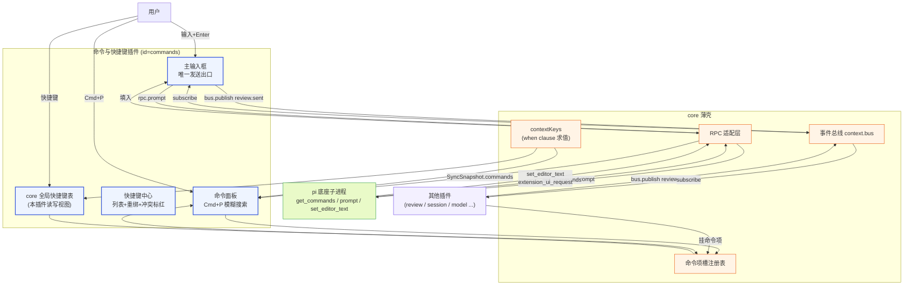

**图 1 — 命令与快捷键插件在系统中的位置：消费 get_commands，唯一发 prompt，收 set_editor_text，经 bus 与 review 协作。**

## 2 命令项槽（commands slot）契约

### 2.1 贡献项 schema

命令项槽是 core 暴露给所有插件的扩展点，直接借鉴 VSCode 的 `commands` contribution point。一个贡献项就是"一个可被命令面板列出、可被快捷键绑定的命令"。schema 定义在 `DESIGN.md` 3.3：

```typescript
interface CommandContribution {
  id: string;           // 命令唯一标识，全局唯一，用于快捷键绑定与去重
  title: string;        // 展示标题（命令面板里显示的文案，走 i18n）
  keybinding?: string;   // 快捷键描述，如 "cmd+n"、"cmd+shift+r"
  handler?: string;      // worker 模块导出的处理函数名，"#前缀" 表示从本插件 main 模块取
  icon?: string;        // 图标名（pi.ui.Icon 的 name）
  when?: string;         // 条件表达式，控制命令何时可用/可见
}
```

`id` 全局唯一这一点很关键——它同时是命令面板去重键、是快捷键表绑定目标、是 `when` clause 之外"哪个 handler 被调"的索引。两个插件贡献同 `id` 的命令，按 3.4 的插件级覆盖逻辑整体取高优先级（不是贡献项级合并）。

`handler` 留空时表示该命令的执行不在桌面侧——它指向一个底座命令（斜杠命令），桌面端通过发 `prompt("/" + name)` 触发底座处理。这是 4.7.1 所说"命令是 prompt 的一种"在数据结构上的体现：底座命令的 handler 在底座侧、桌面贡献项里没有 `handler`。桌面端命令（新建会话、切模型等）则一定带 `handler`，指向本插件 worker 模块的函数。

### 2.2 静态声明与动态注册

贡献项有两条来源：

1. **manifest 静态声明**：写在 `plugin.json` 的 `contributes.commands` 数组里，core 加载 manifest 时校验并挂进注册表。这是绝大多数命令的形态。例如 session-manager 插件声明 `{ "id": "session.new", "title": "新建会话", "keybinding": "cmd+n", "handler": "#onNewSession" }`（`DESIGN.md` 3.2.1 示例）。
2. **运行时动态注册**：插件 worker 侧 `activate` 时通过 `context.register({ slot: "commands", contribution: {...} })`（`DESIGN.md` 3.2.4）动态挂。用于"命令是否挂取决于运行时状态"的场景——例如某插件检测到底座装了 MCP，才挂"打开 MCP 面板"命令；没装就不挂。`DynamicContribution` 形状和静态贡献项同构，core 校验后挂进同一注册表，对命令面板透明。

两条来源最终汇入同一个命令项槽注册表，命令面板查询时不区分来源。

### 2.3 when clause 与可见性

`when` 字段是精简版 VSCode when clause（`DESIGN.md` 3.3）。表达式由条件变量和 `&&`/`||`/`==`/`!` 组成，从左到右短路求值，不支持嵌套括号。变量值由 core 维护的 contextKeys 表提供，派生自 `get_state` 的 `RpcSessionState` 字段及少数 UI 派生 key。

命令面板渲染时对每条命令求值 `when`：求值为真则列出且可点（Enter 执行）；为假则不列出（或灰显，取决于配置，第一版直接不列出）。快捷键触发时也求值 `when`：为假则该快捷键不触发对应命令（让位给下一个优先级的同 keybinding 命令，见 6.7）。

和命令项槽强相关的 contextKeys 派生规则见 4.3。

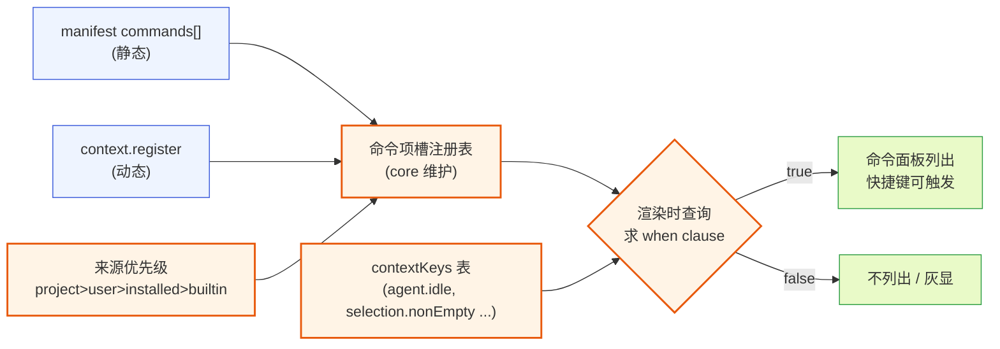

**图 2 — 命令项槽注册表的两条来源与 when 求值。**

## 3 数据源：get_commands 全解

### 3.1 RPC 命令契约

命令面板和斜杠补全的第一数据源是底座 RPC 的 `get_commands` 命令。它是 31 个 RPC 命令之一（`DESIGN.md` 1.5.9），契约如下：

- 发送：`{ type: "get_commands", id }`
- 响应（成功）：`{ type: "response", command: "get_commands", success: true, data: { commands: RpcSlashCommand[] } }`
- 错误场景：极少失败（除非子进程已死）。

返回的 `RpcSlashCommand` 结构来自 pi 底座 `modes/rpc/rpc-types.ts:79`：

```typescript
/** A command available for invocation via prompt */
export interface RpcSlashCommand {
    /** Command name (without leading slash) */
    name: string;
    /** Human-readable description */
    description?: string;
    /** What kind of command this is */
    source: "extension" | "prompt" | "skill";
    /** Source metadata for the owning resource */
    sourceInfo: SourceInfo;
}
```

`name` **不带前导斜杠**——桌面端拼成 `/name` 发 prompt 时要自己加 `/`。`source` 三态决定命令的来源归属和执行路径；`sourceInfo` 给出文件路径、来源串、作用域、origin 等元数据，用于命令面板里显示"来自哪个扩展/包"以及管理 UI 的扩展展开（见 `DESIGN.md` 4.3 扩展管理页"展开底座 extension 的 tool/command 可见性"）。

### 3.2 三类 source 的来源与执行路径

底座 `rpc-mode.ts:656` 的 `get_commands` 处理把三类命令拼进同一个数组：

```typescript
case "get_commands": {
    const commands: RpcSlashCommand[] = [];
    // 1. extension 注册的命令
    for (const command of session.extensionRunner.getRegisteredCommands()) {
        commands.push({
            name: command.invocationName,
            description: command.description,
            source: "extension",
            sourceInfo: command.sourceInfo,
        });
    }
    // 2. prompt 模板
    for (const template of session.promptTemplates) {
        commands.push({
            name: template.name, description: template.description,
            source: "prompt", sourceInfo: template.sourceInfo,
        });
    }
    // 3. skills
    for (const skill of session.resourceLoader.getSkills().skills) {
        commands.push({
            name: `skill:${skill.name}`, description: skill.description,
            source: "skill", sourceInfo: skill.sourceInfo,
        });
    }
    return success(id, "get_commands", { commands });
}
```

三类 source 的语义和执行路径区别：

- **`extension`**：由底座 extension 通过 `pi.registerCommand(name, { handler })` 注册（`core/extensions/types.ts:1227`）。底座 `session.prompt` 收到 `/name args` 时，先 `_tryExecuteExtensionCommand(text)`（`core/agent-session.ts:1083`）匹配并直接执行该 extension 的 handler——extension 的 handler 自己用 `pi.sendMessage` 管理 LLM 交互，**不走默认的 prompt→LLM 路径**。所以这类命令的执行完全在底座侧，桌面端只发文本、收 event。`invocationName` 是带前缀的调用名（如 `/mypkg:do-thing`），桌面端原样拼成 `/invocationName` 发 prompt。
- **`prompt`**：prompt 模板，由底座 `expandPromptTemplate` 在 `session.prompt` 内部展开（`core/agent-session.ts:1110`）。用户输入 `/templateName args`，底座把模板展开成完整 prompt 文本再走正常 prompt 流程。桌面端同样只发文本。
- **`skill`**：skill 命令，`name` 形如 `skill:my-skill`。底座 `_expandSkillCommand`（`core/agent-session.ts:1106`）把它展开成 skill 内容。桌面端发 `/skill:my-skill args`。

三类共同点：**桌面端对它们的执行都是发一条 prompt 文本**，因为 RPC 没有独立的"执行命令"消息——命令是 prompt 的一种（`DESIGN.md` 4.7.1）。这是 RPC 边界的体现：底座把命令执行封闭在 `session.prompt` 入口内，桌面端不感知命令展开细节。

### 3.3 内置斜杠命令

底座还内置一组斜杠命令，定义在 `core/slash-commands.ts` 的 `BUILTIN_SLASH_COMMANDS`：`settings`/`model`/`scoped-models`/`export`/`import`/`share`/`copy`/`name`/`session`/`changelog`/`hotkeys`/`fork`/`clone`/`tree`/`trust`/`login`/`logout`/`new`/`compact`/`resume`/`reload`/`quit`。这些在 TUI 模式下由 `interactive-mode` 处理，**但它们不在 `get_commands` 返回里**——`get_commands` 只返回 extension/prompt/skill 三类动态注册的命令。内置斜杠命令是底座的静态能力，桌面端要支持它们得自己维护一份映射（哪些走 RPC 命令、哪些走桌面 UI）。

处置策略（与 4.7.2 桌面端命令呼应）：内置斜杠命令里和桌面 UI 重合的（`new`/`compact`/`model`/`fork`/`clone`/`export`/`name`），桌面端用**自己的命令**覆盖（带 `handler`、调对应 RPC 命令或开对应 UI），不依赖底座斜杠命令；不重合的（`login`/`logout`/`trust`/`changelog`/`reload`/`quit`/`hotkeys`）保留透传——发 `prompt("/login ...")` 让底座处理，底座 TUI 行为在 RPC 模式下由 Extension UI 子协议翻译成 GUI（如 `/login` 走 OAuth 流、弹 select/confirm）。桌面端的 `hotkeys` 命令映射到本插件的快捷键中心（6.8），不透传。

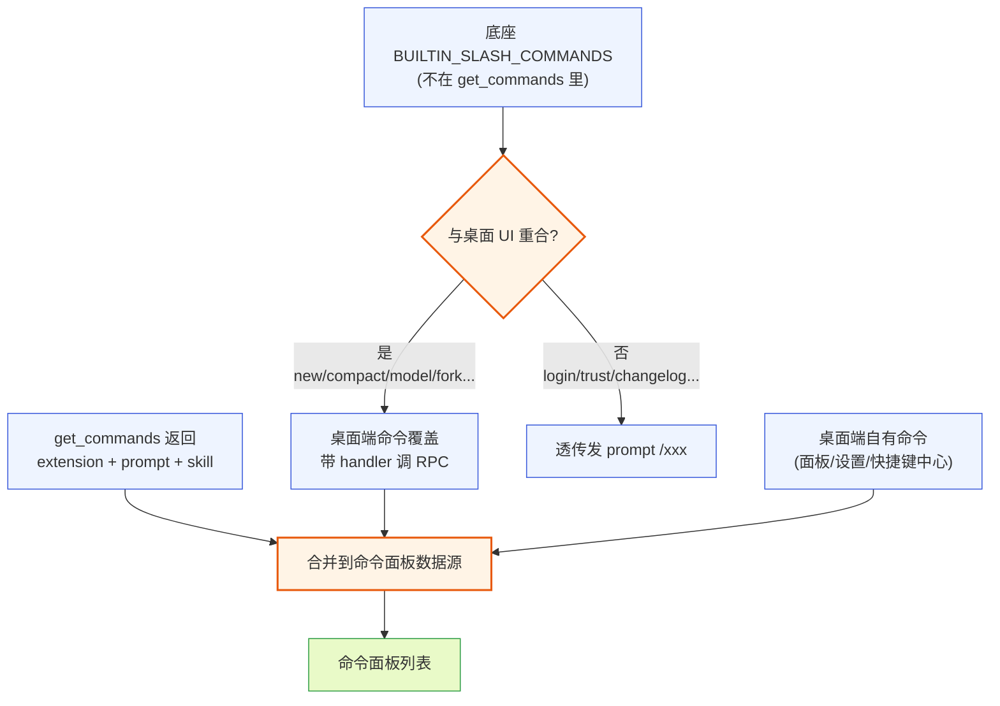

**图 3 — 命令面板数据源合并：get_commands + 桌面覆盖的内置命令 + 桌面自有命令。**

### 3.4 何时拉取与刷新

`get_commands` 的拉取时机归入 `rpc.resync()` 原语（`DESIGN.md` 3.2.4 末尾）。`resync()` 内部并发发 `get_state` + `get_entries` + `get_tree` + `get_commands`，返回 `SyncSnapshot`：

```typescript
interface SyncSnapshot {
  state: RpcSessionState;
  entries: SessionEntry[];
  tree: SessionTreeNode[];
  commands: RpcSlashCommand[];   // ← 命令面板数据源
}
```

`resync()` 在三处场景被调用，每处都意味着命令面板要刷新：

1. **连接底座后**：第一次同步 UI，把命令面板初始化为底座当前可用命令。
2. **热加载重启子进程后**（`DESIGN.md` 2.4）：新进程重新 discover 扩展，注册的命令变了，必须重新拉。
3. **会话切换/分叉后**（`DESIGN.md` 4.6.3）：不同 session 的 extension 状态可能不同（虽然 extension 注册是进程级的、通常不变，但 prompt 模板/skill 可能因 settings 变化而不同）。

`resync()` 返回的 `commands` 广播给所有订阅的插件，命令面板据此重渲染。**不要**在每次 `agent_settled` 后都拉 `get_commands`——命令集只在上述结构性变化时才变，频繁拉是浪费。命令面板自己维护一份本地缓存，只在收到 `resync` 广播时更新。

### 3.4b 命令面板的本地缓存与增量

命令面板维护两层数据：

1. **桌面命令层**：来自命令项槽注册表，core 在槽位变化时推、面板本地缓存。这层变化频率低（插件加载/卸载时才变）。
2. **底座命令层**：来自 `SyncSnapshot.commands`，core 在 `resync` 时推、面板本地缓存。这层变化频率更低（结构性变化时才变）。

`buildPaletteItems`（5.2）合并这两层。面板本地缓存的好处：

- 避免每次打开面板都重算 `buildPaletteItems`——只在数据变化时重算、缓存结果。
- fuzzy 排序在用户输入 query 时对缓存的全量 items 跑、不重新 build。
- MRU 排序（空 query）读本地 MRU 表 + 缓存 items、O(n log n) 一次排序。

增量更新：底座命令集变化时，core 推的是全量 `commands`（不是 diff），面板做全量替换 + 重算 buildPaletteItems。这避免增量合并的顺序问题——全量替换简单可靠。即便底座有上千条命令（大量 extension/skill），全量替换 + 虚拟滚动也够快（5.6）。

### 3.4c 大命令列表的性能

极端情况（装了几十个 extension、注册了上千条命令 + skill/prompt 模板），命令面板要保证响应：

- **虚拟滚动**：候选列表只渲染可见区间（5.6），上千条也不卡。
- **fuzzy 延迟**：用户输入 query 后 debounce 30ms 再跑 fuzzy（避免每个字符触发全量计算），上千条 fuzzy 约 1-2ms、无感。
- **MRU 预排序**：空 query 时按 MRU 排、O(n) 查 top-K 常用、不全排。
- **缓存 buildPaletteItems 结果**：只在数据变化时重算、输入 query 只跑 fuzzy 不重 build。

这些优化让命令面板在"千条命令 + 实时输入"下保持 60fps。这是 VSCode 命令面板同等量级的性能要求。

### 3.5 sourceInfo 的用途

`sourceInfo`（`core/extensions/source-info.ts`）结构：

```typescript
export interface SourceInfo {
    path: string;
    source: string;           // 包来源串，如 "npm:my-pkg" 或本地路径标识
    scope: "user" | "project" | "temporary";
    origin: "package" | "top-level";
    baseDir?: string;
}
```

命令面板利用它做两件事：

1. **展示来源归属**：每条命令在面板里小字标注"来自 `my-extension`（user）"，让用户知道这条命令是哪个扩展贡献的。点击可跳到管理 UI 该扩展项。
2. **管理 UI 展开可见性**（`DESIGN.md` 4.3）：管理页的每个底座 extension 项展开后，列出它注册的 tool 和 command——靠的就是按 `sourceInfo` 分组归属 `get_commands` 返回的命令。注意桌面端**只能展示、不能单独禁用某条命令**——单命令启停是底座 extension 内部的事、RPC 没开口子（和 `DESIGN.md` 6.1/6.2 同类边界）。

## 4 桌面端命令集

### 4.1 命令分类

命令面板列出的命令分两大来源（见 3.3 图 3）：来自底座 `get_commands` 的（三类 source）和桌面端自己的。本插件贡献的桌面端自己的命令（`DESIGN.md` 4.7.2）分四组：

| 组 | 命令 id | 标题 | 快捷键 | when | handler 行为 |
|---|---|---|---|---|---|
| 面板 | `commands.openPalette` | 命令面板 | `cmd+p` | `true` | 唤起命令面板（聚焦面板输入框） |
| 快速操作 | `session.new` | 新建会话 | `cmd+n` | `true` | 调 `rpc.send({type:"new_session"})` |
| 快速操作 | `model.cycle` | 切换模型 | `cmd+shift+m` | `true` | 调 `rpc.send({type:"cycle_model"})` |
| 快速操作 | `thinking.cycle` | 切思考级别 | `cmd+shift+t` | `model.reasoning` | 调 `rpc.send({type:"cycle_thinking_level"})` |
| 快速操作 | `context.compact` | 压缩上下文 | `cmd+shift+k` | `agent.idle` | 调 `rpc.send({type:"compact"})` |
| 设置 | `settings.open` | 打开设置 | `cmd+,` | `true` | 打开管理槽设置子页 |
| 设置 | `commands.openKeybindings` | 快捷键中心 | `cmd+k cmd+s` | `true` | 打开快捷键中心 UI |
| 输入框 | `composer.focus` | 聚焦输入框 | `cmd+l` | `true` | 聚焦主输入框 |
| 输入框 | `composer.clear` | 清空输入框 | `cmd+shift+backspace` | `true` | 清空主输入框文本。绑定为 `cmd+shift+backspace` 而非 `cmd+backspace`：macOS 文本编辑里 `cmd+backspace` 是"删至行首"，主输入框与命令面板输入框正是用户最常按该键的位置，`when: "true"` 会让全局监听器（6.2b capture 阶段）命中并 preventDefault、覆盖系统删至行首行为。改用 `cmd+shift+backspace` 避开与原生文本编辑冲突，快捷键中心对该项标注"清空整份草稿、不可撤销"。 |

注：`session.new`/`model.cycle` 等命令和 session-manager/model 插件贡献的同 id 命令在槽位注册表里会触发插件级覆盖——若别的插件贡献同 id，按优先级整体取高优先级版本。本插件作为内置插件优先级最低（builtin），用户/项目级同名命令会覆盖它。这符合 `DESIGN.md` 3.4"内置默认插件可被覆盖"。**但要注意 handler 执行的物理路径（见 4.2）**：第一版 MVP 桌面命令的 handler 全部住在本插件（commands）自己的 worker——`onNewSession`/`onCycleModel` 等是本插件 worker 模块的导出函数。`command.invoke`（11.4）直达 commands worker、由 commands worker 调用自己的 `#handler`，无需 core 中层拦截。**跨插件 handler 覆盖（别的插件贡献同 id 命令、其 handler 住在别的插件 worker）是第二版能力**：它需要一条"按 commandId 路由到来源插件 worker、调其命名导出"的跨 worker 调用原语，第一版 PluginWorker（`DESIGN.md` 5.1.6，只定义 `import`/`onMessage`/`onCrash`）尚无此机制。第一版验收（16.1b）只测 commands 自有命令，故第一版只走"commands worker 调自身 handler"这一条路径。

### 4.2 handler 的归属侧

`handler` 字段填 worker 模块导出的函数名（`#` 前缀）。core 在收到快捷键触发或命令面板 Enter 时，定位到贡献项来源插件的 worker 模块，按名字取出 handler 调用。**两条触发入口的 handler 调用路径不同**：

- **快捷键触发**：core 全局 keydown 监听器（6.2b，装在 renderer 主窗口）解析键 → 查快捷键表命中 → 经 `pi.postToWorker("command.invoke", { commandId, args })`（与面板触发同一通道）把请求发到 commands worker；commands worker 收到后按 handler 名定位**本插件自己** worker 模块导出的函数、注入本插件 PluginContext 调用。
- **命令面板触发**：面板是 renderer 组件（11.3）、拿不到 worker 模块，故同样经 `command.invoke` 通道把 `{ commandId, args }` 发给 commands worker，commands worker 收到后按 handler 名定位**本插件自己** worker 模块导出的函数、注入本插件 PluginContext 调用，异步结果经 `command.invoke.result` 回传 renderer。

两条入口都落到"commands worker 接到 `command.invoke` → 调自身 `#handler`"的同一点。**关键澄清（对盲审第 2 条 important）**：`command.invoke` 是 renderer→commands worker 的直连 MessagePort 消息（`DESIGN.md` 3.6：worker↔renderer 经 MessagePort 直连、不经 main 中转），物理上 core main 进程收不到这条 `postToWorker` 通道消息——故 4.2/11.4 早前写的"core 中层接到该通道消息"在进程拓扑上不成立，正确表述是"commands worker 接到并调度自身 handler"。MVP 桌面命令 handler 全部住在本插件自己的 worker（`onNewSession`/`onCycleModel` 等是本插件 worker 导出），故 commands worker 直接调自己的 `#handler` 即可、无需 core 中层拦截。**跨插件 handler 覆盖**（session-manager/model 插件贡献同 id 命令、handler 住在别的插件 worker）需一条"core 中层按 commandId 路由到来源插件 worker、调其命名导出"的跨 worker 调用原语，第一版 PluginWorker（`DESIGN.md` 5.1.6，只定义 `import`/`onMessage`/`onCrash`）尚无此机制，列为第二版（见 4.1 注、14.3）。第一版验收（16.1b）只测 commands 自有命令，故第一版只走"commands worker 调自身 handler"这一条路径。handler 签名：

```typescript
type CommandHandler = (ctx: PluginContext) => void | Promise<void>;
```

`ctx` 是 commands 插件的 PluginContext（来源插件即本插件）。命令面板/快捷键触发的命令 handler 内部做的事就两类：调 RPC（发命令给底座）、或开 UI（经 `emitToRenderer` 通知 renderer 侧打开某面板）。

### 4.3 when clause 用的 contextKeys

桌面端命令用到的 contextKeys 及其派生规则：

- `agent.idle`：`!get_state().isStreaming && !get_state().isCompacting && get_state().pendingMessageCount === 0`。core 每次 `get_state` 刷新或收到 `queue_update`/`compaction_*` event 时更新。
- `agent.streaming`：`get_state().isStreaming === true`。
- `model.reasoning`：当前模型 `Model.reasoning === true`（从 `get_state().model` 或 `model_select` event 取）。
- `model.provider`：当前模型 provider 字符串（如 `"anthropic"`），用于 `==` 比较。
- `session.hasName`：`get_state().sessionName` 非空。
- `project.trusted`：当前项目是否信任。第一版由 core 从项目信任记录文件派生（非插件写入）——core 读取 trust 状态后直接填入 contextKeys，插件不写它（6.6 的 `context.setContextKey` 在第一版不开放给插件，16.1c）。
- `selection.nonEmpty`、`selection.source`：core 监听当前焦点区域 DOM selection 维护，review 插件用（派生来源见 6.6）。
- `review.modeActive`：是否在 review 模式。**第一版不可用**——它原本设计由 review 插件进入模式时写 true、退出写 false，但写 contextKeys 需 `context.setContextKey`（6.6），该 API 第二版才开放（16.1c）。第一版 review 模式切换靠 bus 广播 `review.mode`（10.2）+ core 派生的 `selection.nonEmpty`/`selection.source` 表达，命令的 `when` 用 `selection.nonEmpty` 替代 `review.modeActive` 即可满足 review 场景。
- `platform.darwin`/`platform.win32`/`platform.linux`：core 启动时据 `process.platform` 一次性写入（6.3 跨平台 when 用，6.6 派生来源见下）。

contextKeys 表由 core 维护、是中性的，不绑某个插件。命令面板和快捷键表都读它。

## 5 VSCode 式命令面板（Cmd+P）

### 5.1 交互形态

命令面板是一个模态浮层（overlay），从主界面顶部居中弹出，符合 `DESIGN.md` 1.9.4 的无障碍焦点规范。结构：

- 顶部一个输入框（autofocus）。
- 下方一个虚拟滚动的候选列表。
- 支持模糊匹配（fuzzy matching）和高亮命中字符。
- 上/下箭头遍历、Enter 执行、Esc 关闭、Tab 不切换出模态。

唤起方式：`Cmd+P`（macOS）/`Ctrl+P`（其他）。这个快捷键由本插件在命令项槽贡献 `commands.openPalette` 命令、带 `keybinding: "cmd+p"`，core 全局快捷键表据此注册。命令面板本身是本插件的 renderer 组件（`CommandPalette`），随插件渲染在最上层。

### 5.2 数据合并与排序

命令面板渲染时，从命令项槽注册表取全部贡献项，并合并 `get_commands` 返回的底座命令。合并逻辑：

```typescript
function buildPaletteItems(
  slotCommands: CommandContribution[],   // 来自槽位注册表（桌面命令 + 别的插件贡献）
  rpcCommands: RpcSlashCommand[]        // 来自 get_commands（底座三类）
): PaletteItem[] {
  const items: PaletteItem[] = [];
  // 桌面命令：带 handler 的，直接用
  for (const c of slotCommands) {
    items.push({
      kind: "desktop",
      id: c.id, title: c.title, keybinding: c.keybinding,
      when: c.when, source: "desktop",
    });
  }
  // 底座命令：不带桌面 handler，执行靠发 prompt
  for (const c of rpcCommands) {
    items.push({
      kind: "rpc",
      id: `rpc:${c.source}:${c.name}`,   // 去重键，避免和桌面命令撞 id
      title: `/${c.name}`,                 // 展示带斜杠，暗示这是 prompt
      subtitle: c.description,
      source: c.source,                    // extension/prompt/skill
      sourceInfo: c.sourceInfo,
      when: "true",                        // 底座命令总是可用（底座已声明它存在）
    });
  }
  return items;
}
```

排序按**相关度**（`DESIGN.md` 4.2.5 排序条目）——非字母排序。相关度算法：用户输入 query 后，对每条 item 算 fuzzy 匹配得分（命中连续字符权重高、首字母命中权重高、位置靠前权重高），按得分降序。无 query 时按最近使用频率（MRU）排——命令面板本地维护一个使用计数（存本插件 config），常用命令排前。这避免每次都要翻找。

**关于 rpc 项的 `when: "true"`**：`buildPaletteItems` 给所有底座命令硬编码 `when: "true"`（底座命令总是可用），这是第一版已知简化——底座 `RpcSlashCommand`（3.1）不带 `when` 字段，桌面端无从获知某条底座命令的前置条件。后果：某些底座命令实际有前置条件（如 `/compact` 在 compaction 中、`/login` 在已登录时本不该再触发），面板不表达这些条件，可能列出点了却报错的命令。第一版接受此简化（底座 RPC 不提供条件元数据），演进项是底座补 `when` 元数据后、桌面侧为个别内置命令补 `when` 覆盖。

### 5.3 触发执行

用户在面板里选中一条 item、按 Enter，根据 `kind` 分两条执行路径：

- **`desktop`**：求值 `when`；为真则定位 handler、调用，传入来源插件的 PluginContext。handler 内部自行调 RPC 或开 UI。
- **`rpc`**：求值 `when`（底座命令通常恒真）；为真则拼 `/name`（如 `/skill:my-skill`，带用户在面板里输入的参数）、走主输入框的发送链路（见 7.4）。**不绕过输入框**——即便是从命令面板触发的底座斜杠命令，也由输入框统一发 `rpc.prompt`，遵守"唯一发送出口"。输入框此时若为空，直接发 `/name args`；若输入框已有内容，提示用户"命令将作为新消息发送，是否清空当前草稿"。

这条"命令面板触发也走输入框"的纪律是 4.7.4 的延伸——它让所有发往底座的 prompt 都汇聚到一个出口，便于 review 评论合并、streaming 排队判断、UI 状态一致性。

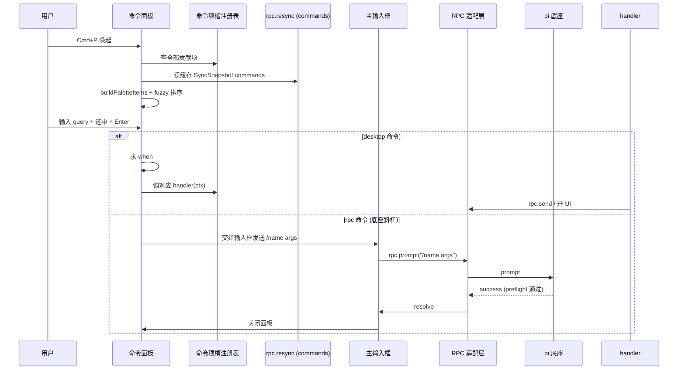

**图 4 — 命令面板触发执行的两条路径：desktop 走 handler、rpc 经输入箱发 prompt。**

### 5.3b 命令参数收集

5.1/5.2 描述命令面板只有一个输入框，且其内容同时充当 fuzzy query。这带来一个必须钉死的问题：同一段输入文本既是模糊匹配 query、又是命令参数——`login anthropic` 到底是匹配命令 `login` 的 query，还是命令 `login` 加参数 `anthropic`？第一版的交互把"选命令"和"输参数"在时间上分开，避免歧义：

1. **选命令阶段（query 仅用于匹配）**：用户在输入框敲入的文本**只**做 fuzzy 匹配候选命令的标题/`/name`，不参与参数拼装。此时高亮第一项即"用户想选的命令"。用户按 `→`（右箭头）或 `Cmd+Enter` 确认选中当前高亮项——选中后输入框进入"参数输入"态：输入框前缀固定显示选中的命令名（如 `/login `，只读、不可编辑），光标定位到命令名之后的参数区，用户接着敲的字符作为 args。**此阶段 `Tab` 的语义与 5.1/5.6/5.7 一致——在输入框↔候选列表间循环焦点，不用作确认选中**（避免与焦点循环语义撞车）；确认选中专用 `→`/`Cmd+Enter`。
2. **参数输入阶段**：用户在命令名之后输入的文本就是 args。`Backspace` 只能删参数区字符、不越界删命令名前缀。`Esc` 取消选中回到纯 query 态。再次 `→`/`Cmd+Enter` 不重新选中（已选中）。
3. **执行**：按 `Enter` 触发执行。rpc 命令把"命令名 + 空格 + args 文本"整体作为 prompt 文本（如 `/login anthropic`）交给输入框发送链路（7.7）。desktop 命令把 args 经 `command.invoke` 通道（11.4）透传给 commands worker handler，handler 自己解析。

**rpc 命令的 commandId 留痕**：选命令阶段（第 1 步）选中的 rpc 命令 id（`rpc:${source}:${name}`，5.2 的 `PaletteItem.id`）由命令面板传给输入框、保留为 `lastSelectedRpcCommandId`，供发送链路（7.4 步骤 6）成功后触发 `mru.touch`（5.5/11.4）更新 MRU——否则 rpc 命令执行路径全在 renderer 侧、无 config 落点，常用底座斜杠命令永远不进 MRU 排序。desktop 命令的 MRU 由 commands worker 在 `command.invoke` 收到后直接落 config（5.5 第一条），不需此留痕。

**空格切分规则**：第一版**不做参数拆分**——args 是命令名之后的一整段原始文本（透传），底座/worker handler 自己按需切分。这与 16.3"第一版只透传用户在面板输入框里写的 args 文本"一致：命令面板不解析参数 schema、不弹表单，参数的可编程性（schema + 表单收集）是演进项。这样 `/skill:my-skill 写个测试` 的 `写个测试` 整段作为 args 透传给底座 `_expandSkillCommand`，桌面端不关心它是不是多参数。

**无参数命令**：用户选中命令后直接 `Enter`（参数区为空），args 为空串。rpc 命令发 `/name`（不带尾空格也行）；desktop 命令 handler 收到空 args。

**已有草稿的处理**：选中命令进入参数态时不触碰主输入框（Composer）的草稿——命令面板是独立浮层、有自己的临时输入框，与主输入框草稿隔离。只有按 `Enter` 执行 rpc 命令时，才按 7.7 的策略把拼好的 `/name args` 填入主输入框并触发发送链路（处理已有草稿的确认）。

这条"选命令 → 输参数 → Enter"的三段式交互让单输入框同时承担 query 和 args 而不歧义：query 阶段文本不进 args，args 阶段文本不做 query。

### 5.4 模糊匹配算法

fuzzy 匹配是命令面板体验的核心，这里钉死实现。算法参考 VSCode/Sublime 的 fuzzy matching，对一个 query 和候选 item 的标题做子序列匹配，返回得分（越高越相关）。匹配规则与得分因子：

1. **子序列匹配**：query 的每个字符按顺序在标题里出现即为匹配（不要求连续）。不匹配则该项不得分、不显示。
2. **连续匹配奖励**：连续命中多个字符比分散命中得分高。每多一个连续命中字符，加 `consecutiveBonus`（如 5 分）。
3. **首字符/词边界奖励**：命中位置在词首（标题开头、或紧跟空格/冒号/斜杠后）加 `wordBoundaryBonus`（如 15 分）。这让"new" 匹配 "新建会话 /new" 时优先于 "new" 匹配 "rename"。
4. **位置奖励**：命中位置越靠前得分越高，`positionBonus = max(0, 10 - index)`。
5. **大小写敏感奖励**：精确大小写匹配（query 大写字母命中标题大写字母）加 `caseMatchBonus`（如 3 分），让 `Cmd` 优先于 `cmd` 在 `Cmd+P` 命中。
6. **完整匹配奖励**：query 等于标题（忽略大小写）的子串时，额外加 `exactSubstringBonus`。

```typescript
function fuzzyScore(query: string, target: string): number | null {
  if (!query) return 0; // 空 query 全部 0 分（排序退化为 MRU，见下文衔接点）
  const q = query.toLowerCase(), t = target.toLowerCase();
  let qi = 0, score = 0, consecutive = 0, lastMatchIdx = -2;
  for (let ti = 0; ti < t.length && qi < q.length; ti++) {
    if (t[ti] === q[qi]) {
      // 词边界
      const isBoundary = ti === 0 || /[\s/:_-]/.test(t[ti - 1]);
      if (isBoundary) score += 15;
      // 连续
      if (ti === lastMatchIdx + 1) { consecutive++; score += 5 * consecutive; }
      else consecutive = 0;
      // 位置
      score += Math.max(0, 10 - ti);
      // 大小写精确
      if (target[ti] === query[qi]) score += 3;
      lastMatchIdx = ti; qi++;
    }
  }
  if (qi !== q.length) return null; // 未全部匹配返回 null
  // 完整匹配奖励：query 等于标题（忽略大小写）的子串时额外加分
  if (t.includes(q)) score += 30;
  return score;
}
```

空 query 时所有 item 得分 0，排序退化为 MRU（最近使用频率）。**衔接点在命令面板组件内**（5.6 的 CommandPalette）：组件拿到 `buildPaletteItems` 的全量 items 后，对每个 item 调 `fuzzyScore(query, item.title)`——若 query 为空、全部返回 0，组件改用 MRU 排序键（5.5 的 `count*1000+lastUsed/86400000`，从本插件 config 的 `mru` 字段取）降序排、未在 MRU 表里的命令按注册顺序垫底。这条衔接不落在 core、也不落在 `fuzzyScore` 内部，而是组件的排序选择策略：有 query 走 fuzzy 分、无 query 走 MRU 分。这让"打开面板不输入"也能直接看到常用命令。

**实现复杂度对齐（与 3.4c 一致）**：空 query 的 MRU 排序取 **top-K（不全排）**——O(n) 扫一遍取常用前 K 条（如 K=50）排在前面、未命中 MRU 的按注册顺序垫底，不做全量 O(n log n) 排序（3.4c 的优化）。有 query 时走 fuzzy 得分降序，同样可截 top-K 渲染（虚拟滚动只渲染可见区间）。5.5 的 `count*1000+lastUsed/86400000` 排序键是 top-K 比较的依据，而非全量排序的依据——两者是同一套语义，无二义。

### 5.5 MRU 排序

无 query 时按最近使用频率排。MRU 记录存本插件 config（项目级覆盖用户级，config 是 worker 侧 PluginContext 的能力，见 7.3），结构 `{ commandId: { count: number; lastUsed: number } }`。每次命令被执行（面板 Enter 或快捷键触发）时更新：`count++`、`lastUsed = Date.now()`。排序键 `count * 1000 + (lastUsed / 86400000)`（使用次数为主、最近性为辅）。MRU 上限 100 条，超出按 lastUsed 淘汰最久未用。这避免 config 无限增长。

**MRU 更新的触发点必须覆盖 desktop 与 rpc 两类命令**（对盲审第 3 条 minor）：

- **desktop 命令**：经 `command.invoke` 通道（11.4）进 commands worker、由 commands worker 调 `#handler`。MRU 更新在 commands worker 收到 `command.invoke` 成功调起 handler 后、由 worker 直接 `context.config.set("mru.<commandId>", {...})` 写入 config——全程在 worker 侧，自然落点。
- **rpc 命令**（`kind: "rpc"`）：执行路径是 面板→输入框 composer→`rpc.prompt`（7.7），**全程在 renderer 侧、既不触发 `command.invoke`、也不进任何 worker handler**。而 config 是 worker 侧能力、renderer 无 config。若不在 rpc 命令上补一条 renderer→worker 的 MRU 更新通道，常用底座斜杠命令永远不会进入 MRU 排序——与"越用越顺手"的声明矛盾。故为 rpc 命令补一条 MRU 更新通道：composer 在发送链路（7.4 `handleSend`）成功 resolve 后，若本次发送的文本是一条 `/` 命令（首词以 `/` 起头、对应面板里选中的 rpc 命令 id），则 `pi.postToWorker("mru.touch", { commandId })` 发给 commands worker；commands worker 收到后 `context.config.set` 更新 MRU（11.4 通道表已列 `mru.touch`）。面板触发 rpc 命令时 composer 已知选中的 `commandId`（5.3b 选命令阶段记录），故可随发送一并 touch。非 `/` 命令的普通 prompt 不触发 MRU touch（它们不是命令、不该进 MRU）。

这样 desktop 与 rpc 两类命令都有 MRU 落点，5.5 的"每次命令被执行时更新 MRU"对两类都成立。

MRU 让面板"越用越顺手"——常用命令会稳定排前，用户形成肌肉记忆后甚至不输入就能 Enter。这是 4.2.5"非字母排序"的具体落地：字母排序对中文无意义（中文按拼音还是笔画？），按相关度/MRU 才符合用户预期。

### 5.6 键盘导航

命令面板的键盘交互（在 5.1 基础上展开）：

- **上/下箭头**：移动高亮项，候选列表虚拟滚动跟随。`Home`/`End` 跳首/尾。
- **Enter**：执行高亮项。`Cmd+Enter`（可选增强）以特殊模式执行（如"在新 session 执行该命令"——第一版不实现）。
- **Esc**：关闭面板，焦点还原。`Cmd+Esc` 强制还原（即便面板有未确认输入）。
- **Tab**：在输入框↔候选列表间循环焦点，不跳出面板。`Shift+Tab` 反向。**Tab 不作"确认选中进参数态"**——确认选中专用 `→`（右箭头）或 `Cmd+Enter`（5.3b），与焦点循环职责分开，避免同一键在 query 阶段语义二义。
- **输入时**：每次输入框内容变化触发重新 fuzzy + 排序，高亮项重置到第一项。**第一版只高亮第一项、不"信任首项"自动触发**——按 Enter 执行高亮项仍需用户显式确认（高亮即焦点在第一项上，Enter 触发它，但不做"差值超阈值就跳过确认"的预选逻辑）。"信任首项"预选（第一项得分明显高于第二项时自动触发、无需下箭头）是 VSCode 的体验增强，列为第二版（16.1c）。第一版的高亮第一项已能让用户不按方向键直接 Enter 常用命令，肌肉记忆路径不变。

虚拟滚动（`DESIGN.md` 4.4 时间线也用）保证命令列表上千条时不卡——只渲染可见区间 + 上下缓冲。core 的 `pi.ui` 组件库提供 `VirtualList`，命令面板直接用。

### 5.7 无障碍焦点

命令面板遵循 `DESIGN.md` 1.9.4：

- 打开时焦点移到输入框。
- Tab 在输入框↔候选列表间循环，不跳出面板到背景（5.6）；确认选中进参数态用 `→`/`Cmd+Enter`（5.3b），不与 Tab 撞车。
- Esc 关闭面板，焦点还原到唤起前的元素。
- 候选列表虚拟滚动支持上/下箭头遍历 + Enter 执行；`→`/`Cmd+Enter` 确认选中进参数输入态（5.3b）。
- 命中字符高亮要有足够的对比度（走主题 token `color.accent.match`）。

## 6 快捷键系统

### 6.1 keybinding 字段格式

命令项槽贡献项的 `keybinding` 字段是一个字符串描述，格式参考 VSCode 的 keybinding syntax 但简化：

- 修饰键：`cmd`（macOS）/`ctrl`（其他）、`alt`/`option`、`shift`。
- 主键：单个字符（`a`、`1`）或命名键（`enter`、`escape`、`backspace`、`tab`、`arrowup`、`f1`）。
- 组合用 `+` 连：`cmd+shift+r`。
- **chord（组合键序列）**：用空格分两段，如 `cmd+k cmd+s`（先按 `cmd+k`、再按 `cmd+s`）。第一版支持两段 chord，不支持三段以上。

core 解析 keybinding 字符串成内部 `KeyId`（pi tui 的 `KeyId` 类型，`@earendil-works/pi-tui`），存进全局快捷键表。底座的 `registerShortcut`（`core/extensions/types.ts:1230`）也用 `KeyId`——桌面端快捷键表的键表示和底座一致，便于在快捷键中心同时展示两类来源（见 6.5）。

### 6.2 全局快捷键表

core 维护一个全局快捷键表，是命令项槽注册表按 `keybinding` 字段反索引的视图：

```typescript
interface KeybindingEntry {
  keybinding: string;        // 规范化后的描述
  commandId: string;         // 指向命令项槽的 id
  pluginId: string;          // 来源插件
  priority: PluginPriority;  // project > user > installed > builtin
  when: string;              // 条件，触发时求值
  source: "desktop" | "pi";  // 桌面注册 vs 底座 registerShortcut 镜像。
                             // 注意：source: "pi" 是演进项，第一版不镜像底座快捷键（6.9），
                             // 故 v1 表里所有条目均为 "desktop"，"pi" 取值第一版不产生、演进时才出现。
  conflict?: { with: string[] }; // 冲突信息：与之同 keybinding 的其他 commandId 列表。
                                 // 重建时检测（9b.3），多于一条同 keybinding 时填入，快捷键中心据此标红。
}
```

`KeybindingsCenter`（11.3）渲染时按 keybinding 分组，分组类型 `KeybindingGroup`：

```typescript
interface KeybindingGroup {
  keybinding: string;             // 规范化后的描述（分组键）
  entries: KeybindingEntry[];     // 绑到该 keybinding 的全部命令
  conflict: boolean;              // entries.length > 1 即冲突
  conflictWith?: string[];       // 冲突方的 commandId 列表（conflict 为真时填）
}
```

表在以下时机重建：

1. 插件加载/卸载/热重载后（命令项槽变化）。
2. `get_commands` 刷新后（虽然底座命令一般不带桌面 keybinding，但底座 extension 可能通过 `registerShortcut` 注册了快捷键，桌面端镜像它——见 6.5）。
3. 用户在快捷键中心重绑后。

core 在主窗口注册一个全局 keydown 监听器（Electron renderer 的 `window.addEventListener("keydown", ...)`，配合 `globalShortcut` 模块处理某些需要全局拦截的键），按下时：

1. 解析事件成 `KeyId`。
2. 在快捷键表查匹配项（含 chord 状态机：第一段按下后进入"等待第二段"状态、有超时）。
3. 若多条匹配，按优先级取最高（6.7）。
4. 求值胜出项的 `when`；为真则触发对应命令（走 5.3 的执行路径）。
5. 若为假，看是否有次高优先级的同 keybinding 命令、其 `when` 为真——**回退到下一个**（让位机制，见 6.7）。

### 6.2b keydown 监听器的安装与拦截

全局 keydown 监听器装在 Electron renderer 的主窗口 `window` 上，用**捕获阶段**（`addEventListener("keydown", handler, true)`）确保先于任何组件自己的 keydown 处理。监听器返回值决定是否 `preventDefault`/`stopPropagation`：

- 命中一个 when 为真的快捷键 → `preventDefault` + `stopPropagation`，阻止后续组件处理（如 `cmd+p` 不该触发浏览器打印）。
- 命中 chord 第一段 → 进入 `WaitSecond` 状态、`preventDefault`（避免第一段被组件当普通输入）。
- 未命中任何快捷键 → 不拦截，让事件正常流到当前焦点组件（输入框的 `cmd+enter` 发送、textarea 的字符输入等）。

这条"命中才拦截"的纪律很重要——若全局监听器无脑 `preventDefault`，会吃掉输入框的字符输入、命令面板的箭头导航。只有命中已注册快捷键才拦截，其余放行。

### 6.2c Electron globalShortcut 的边界

Electron 的 `globalShortcut` 模块能注册"系统级"快捷键（即便应用不在前台也触发）。pi-desktop **默认不用 globalShortcut**——所有快捷键只在应用窗口聚焦时生效，这避免和系统/其他应用快捷键冲突、也避免"应用后台时偷偷触发命令"的困惑。

例外场景（演进项，第一版不实现）：用户可在快捷键中心显式把某命令标为"全局快捷键"（如"唤起命令面板"全局化、任何时候 `Cmd+Shift+P` 呼出应用）。这需用户显式授权、用 `globalShortcut.register`、并在管理 UI 提示"此快捷键已全局注册、其他应用相同快捷键会失效"。第一版全部窗口级、不做全局化。

### 6.3 keybinding 规范化与平台适配

core 解析 keybinding 字符串时要做规范化，确保同一逻辑快捷键在不同平台、不同写法下落到同一个 `KeyId`：

1. **修饰键归一**：`cmd`/`meta` 在 macOS 规范成 `cmd`、其他平台规范成 `ctrl`。`alt`/`option` 规范成 `alt`。`shift` 不变。这样 manifest 里写 `"cmd+p"` 在 macOS 是 Cmd+P、在 Linux/Windows 自动当 Ctrl+P——一份 manifest 跨平台。
2. **显式跨平台**：若插件想平台区分（如 macOS 用 `cmd`、其他用 `ctrl`），可分别声明两个贡献项、用 `when` 区分：`when: "platform.darwin"` 和 `when: "!platform.darwin"`。contextKeys 提供 `platform.darwin`/`platform.win32`/`platform.linux`。
3. **主键归一**：字符统一小写、命名键统一（`enter`/`return` → `enter`、`esc`/`escape` → `escape`、`del`/`delete` → `delete`、`arrowup`/`up` → `arrowup`）。
4. **顺序归一**：修饰键按 `ctrl/cmd → alt → shift` 固定顺序排列，`cmd+shift+p` 和 `shift+cmd+p` 落到同一规范化串。

规范化在快捷键表重建时一次性做，触发匹配时只比规范化串。这也让快捷键中心的"冲突检测"准确——不同写法不会因字面差异逃过冲突检测。

### 6.4 chord 状态机

两段 chord（如 `cmd+k cmd+s`）的实现是个小状态机。core 全局 keydown 监听器维护一个 chord 状态：

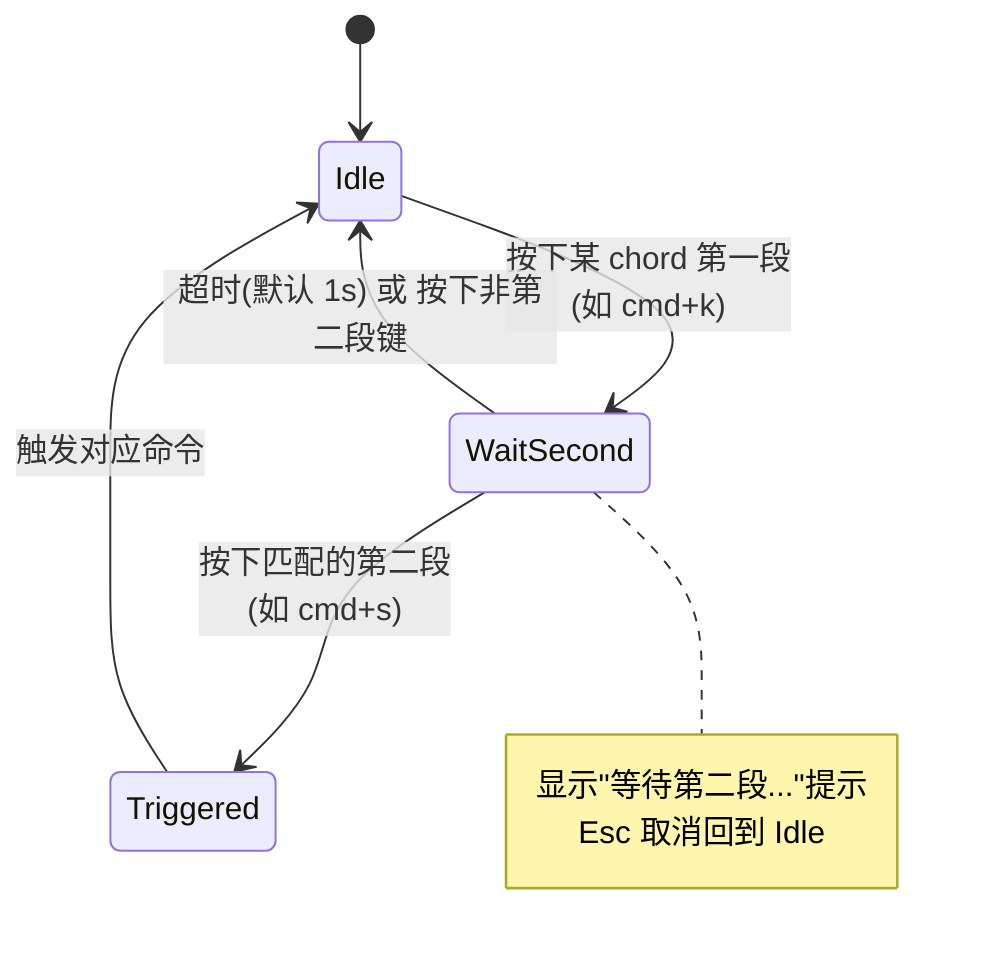

**图 5b — chord 两段快捷键的状态机。**

第一段按下后进入 `WaitSecond` 状态、显示"等待第二段..."视觉提示（输入框附近或状态栏）。1 秒内按下匹配的第二段则触发；超时或按下不匹配的键则取消、回到 `Idle`。`Esc` 在 `WaitSecond` 状态下取消 chord（不触发、不关闭面板）。chord 的两段分别独立查快捷键表：第一段查所有 keybinding 的第一段、第二段查同 chord 项的第二段。

chord 主要用于"快捷键中心"这类需要避开常用单键的命令——`cmd+s` 单独是保存（被文件编辑器用），所以快捷键中心用 `cmd+k cmd+s` 避开冲突。第一版只支持两段、不支持三段以上（VSCode 也极少用三段）。

### 6.5 when clause 求值器

`when` 表达式求值器是个精简解析器，这里钉死实现契约（呼应 `DESIGN.md` 3.3 when clause 语法）：

- **词法**：token 分三类——变量名（`agent.idle`、`model.provider` 这类 dot path）、字符串字面量（`"anthropic"`，双引号包裹）、运算符（`&&`、`||`、`==`、`!`）。**不支持括号**——`(`、`)` 不作为 token 类、也不参与解析（与 `DESIGN.md` 3.3 "不支持嵌套括号、第一层也不支持"一致）；若表达式出现括号字符，词法阶段作为非法 token 直接报错，避免实现者误以为要识别括号分组。
- **求值语义：纯从左到右、无运算符优先级、无结合嵌套**。`a && b || c` 求值为 `(a && b) || c`，即先把 `a && b` 算出来、再与 `c` 做 `||`。这和常规编程语言"`&&` 比 `||` 结合更紧"的优先级文法**不同**——这里刻意无优先级，靠"从左到右短路"一条规则贯通，让表达式语义可由肉眼按书写顺序读出、不被优先级规则隐式改写。这也是 2.3 与本节共同声明的语义。实现上必须用扁平 token 循环、不得用 `parseAnd`/`parseOr` 嵌套递归文法（递归文法会引入优先级、与声明语义相反）。
- **`!` 前缀的结合性（对盲审第 6 条 minor，必须显式写入词法/求值契约）**：`!` 只作**单个原子（含其后可选的 `==` 比较）的前缀**，不是"仅对紧跟的变量取反"的一元算子。故 `!a == "x"` 等价于 `!(a == "x")`，而非 `(!a) == "x"`——`!` 一并作用于"变量 + 可选比较"这个整体原子。实现上 `evalAtom` 递归自调：见 `!` 则消费之、对"剩余原子（含其后 `==` 字面量）"整体取反返回（下方代码即此语义）。这与常规优先级文法（`!` 结合比 `==` 紧）再次不同，实现者**不得**按递归下降把 `!` 当独立一元层、把 `==` 当独立二元层——那样会得 `(!a) == "x"`，与声明语义相反。
- **`==` 左操作数必须是变量、不允许字面量在左**（对盲审第 6 条 minor）：`"lit" == var` 这类写法不可用——`evalAtom` 见到字符串字面量开头的原子直接返回 `false` 并终止（下方代码 `if (t.startsWith('"')) return false`）。比较的合法形态只有 `var == "lit"`（变量在左、字面量在右），因为原子以变量起头、`==` 跟在变量后。这是语法约束、写入词法契约，避免实现者为字面量在左另开一条解析分支。
- **短路**：`&&` 左为假直接得假、跳过右操作数；`||` 左为真直接得真、跳过右操作数。求值是纯函数（无副作用），短路只影响结果与开销、不产生可观测差异。
- **变量类型**：contextKeys 表的值是布尔或字符串。布尔变量直接参与 `&&`/`||`/`!`；字符串变量参与 `==`。混用（如 `agent.idle == "true"`）按字符串比较、布尔转 `"true"`/`"false"`。
- **未定义变量**：contextKeys 里没有的变量求值为 `false`（不是抛错）——这让插件可以引用尚未被某插件写入的 key（如 `review.modeActive` 在 review 插件未激活时为 `false`，命令正确不可用）。

```typescript
function evalWhen(expr: string, ctx: Map<string, boolean | string>): boolean {
  // 纯从左到右短路求值，无运算符优先级。
  // a && b || c  →  (a && b) || c  （按书写顺序）
  // 不用 parseAnd/parseOr 嵌套文法——那会引入优先级、与声明语义相反。
  const tokens = tokenize(expr);
  let i = 0;

  // 解析一个原子：可选 ! 前缀 + 变量（变量后可能跟 == 字面量）
  function evalAtom(): boolean {
    if (tokens[i] === "!") { i++; return !evalAtom(); }
    const t = tokens[i++];
    if (t === undefined) return false;
    if (t.startsWith('"')) return false; // 字面量不能单独成原子
    if (tokens[i] === "==") {
      i++; const lit = (tokens[i++] ?? "").replace(/^"|"$/g, "");
      return String(ctx.get(t) ?? false) === lit;
    }
    const v = ctx.get(t);
    return v === true || v === "true";
  }

  if (tokens.length === 0) return true;
  let result = evalAtom();
  while (i < tokens.length) {
    const op = tokens[i++];
    if (op !== "&&" && op !== "||") break; // 非法 token 终止
    // 短路：&& 左假、|| 左真时，不求右操作数的值（仅推进游标）
    if ((op === "&&" && !result) || (op === "||" && result)) {
      evalAtom(); // 求值无副作用；此处用于跳过右操作数 token
      continue;
    }
    result = evalAtom();
  }
  return result;
}
```

这个求值器在命令面板渲染（每条命令求一次）和快捷键触发（胜出项求一次）时高频调用。优化：对每个 `when` 字符串预编译成 token 序列缓存（解析一次、多次求值），避免每次 tokenize。contextKeys 变化时不需要重编译、只重求值。

### 6.6 contextKeys 更新流

contextKeys 表由 core 维护、按以下来源更新：

- **`get_state` 派生**：`rpc.resync()` 或每次 `get_state` 后，core 派生 `agent.idle`/`agent.streaming`/`model.reasoning`/`model.provider`/`session.hasName`/`project.trusted` 等。派生规则见 4.3。`project.trusted` 在第一版由 core 从项目信任记录文件（4.8 信任插件的持久化产物）读取派生、而非由插件写 contextKeys。
- **event 派生**：`queue_update` 更新 `agent.idle`（pendingMessageCount 变 0 且非 streaming 则 idle）、`compaction_*` 更新 `agent.idle`（compaction 中不算 idle）、`model_select` 更新 `model.*`、`session_info_changed` 更新 `session.hasName`。
- **UI 派生**：core 监听当前焦点区域 DOM selection，更新 `selection.nonEmpty`/`selection.source`。这是 review 模式的关键（`DESIGN.md` 4.10.7）。
- **核心一次性派生**：core 启动时据 `process.platform` 一次性写入 `platform.darwin`/`platform.win32`/`platform.linux`（6.3 跨平台 when 用）。这三个 key 不来自 `get_state`、不随 event 变化，进程生命周期内恒定。
- **插件写入（第二版开放）**：设计上 review 插件进入/退出 review 模式时写 `review.modeActive`。这是"插件主动写 contextKeys"的唯一通道——通过 `context.register` 不行（那是注册贡献项），需 core 暴露一个 `context.setContextKey(key, value)` API（PluginContext 扩展）。该 API 受控：插件只能写自己命名空间下的 key（如 `review.*`），写别的命名空间抛错。这避免插件互相污染 contextKeys。**但第一版不开放该 API**（16.1c：第一版 contextKeys 只由 core 派生、不让插件写），故 `review.modeActive` 在第一版不可用，review 模式靠 bus `review.mode` + core 派生的 `selection.*` 替代（见 4.3）。

contextKeys 变化后，core 通知命令面板和快捷键表重求值（哪些命令变可见/可用）。这通过 `emitToRenderer("contextKeys.changed", { keys: string[] })` 推给 renderer、面板按变化的 key 局部重渲染（不是全量）。

### 6.7 冲突处理

`DESIGN.md` 4.7.3：同 keybinding 多个命令时，按插件优先级取最高优先级的，冲突在快捷键中心标红提示。具体仲裁：

1. **优先级仲裁**：用 `resolveByPriority` 原语（`DESIGN.md` 3.2.4 末尾），规则 `project > user > installed > builtin`。这是插件级覆盖（3.4）和贡献项级冲突仲裁（3.5 第 7 项）的共享规则。
2. **when 让位**：胜出命令的 `when` 求值为假时，**不是直接不触发**，而是回退到次高优先级的同 keybinding 命令、求其 `when`，依次向下直到有一条为真或全部为假。这让"同一个 keybinding 在不同上下文触发不同命令"成为可能——例如 `context.compact`（`cmd+shift+k`、`when: "agent.idle"`）与另一个插件贡献的同 `cmd+shift+k` 命令（`when: "!agent.idle"`，如"中止当前操作"）：idle 时 compact 的 when 为真、触发压缩；非 idle 时 compact 的 when 为假、让位给后者。两个命令同 keybinding、不同 `when`、按优先级 + when 让位裁决。**注意**：`when` 让位只适用于真正进全局快捷键表的 keybinding；输入框内由组件自处理的键（如 `cmd+enter`，见 7.4）不在全局表内、不参与让位——它由输入框组件按 agent 状态自行决定语义（idle=发送、streaming=中止，见 7.5）。
3. **同优先级同 keybinding**：第一版**不计算 specificity**（when 表达式复杂度加权），同优先级冲突仅按注册顺序取先注册的（3.5 第 7 项的退化规则）。specificity（按 when 中变量/运算符个数加权、越具体数值越大）列为演进项，第一版用注册顺序兜底——这保持求值器简单、避免引入第二套排序维度。快捷键中心对标红的同优先级冲突提示用户手动重绑。
4. **冲突标红**：快捷键中心对每条 keybinding 列出所有绑它的命令，多于一条就标红提示"冲突"，让用户手动解决（重绑其中一条或改 when）。

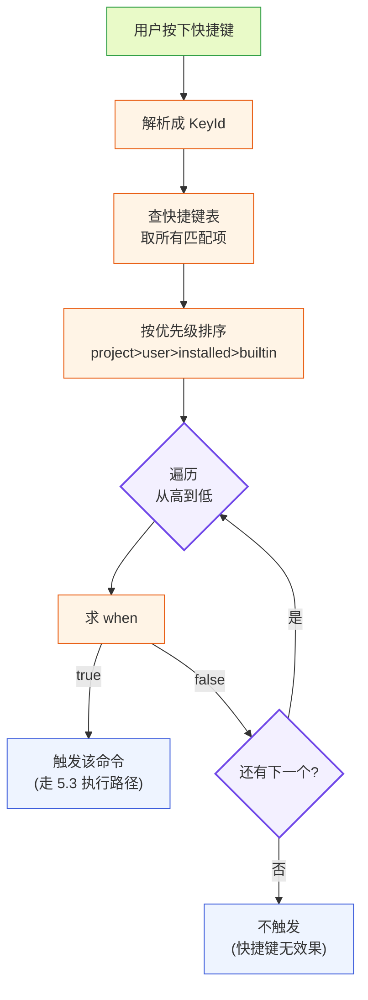

**图 5 — 快捷键触发仲裁：优先级排序 + when 让位。**

### 6.8 快捷键中心 UI

快捷键中心是本插件贡献的设置子页（管理槽 `settings` 子页，`DESIGN.md` 4.7.2），由 `commands.openKeybindings` 命令打开（默认 `cmd+k cmd+s`）。它列出全局快捷键表的全部条目，每条显示：

- 快捷键描述（可点击重绑——按下新组合即替换）。
- 命令标题、来源插件。
- `when` 表达式（小字）。
- 冲突标记（红色徽标 + 冲突方列表）。

重绑的持久化存本插件 config 的 `keybindings` 字段（路径与合并规则见 7.3 集中定义：用户级 `~/.pi-desktop/plugins-data/commands/config.json`、项目级 `<cwd>/.pi-desktop/plugins-data/commands/config.json`，项目级覆盖用户级），格式 `{ [commandId]: "new+keybinding" }`。core 加载快捷键表时，先读 manifest 声明的 keybinding，再用 config 里的重绑覆盖——用户级重绑覆盖 manifest 默认、项目级再覆盖用户级（9b.2 合并顺序）。

### 6.9 与底座 registerShortcut 的关系

底座 extension 可通过 `pi.registerShortcut(shortcut: KeyId, { handler })` 注册快捷键（`core/extensions/types.ts:1230`）。这些快捷键 handler 跑在底座进程里、在 TUI 模式下生效。在 RPC 模式下，底座快捷键**没有自动的桌面镜像**——底座不会通过 RPC 把它的快捷键表推给桌面端。

桌面端的处置：

- **`get_commands` 不含快捷键信息**——`RpcSlashCommand` 没有 keybinding 字段。所以桌面端无法自动获知底座 extension 注册了哪些快捷键。
- **可选镜像**：第一版不镜像底座快捷键。底座 extension 若想让某个命令在桌面有快捷键，应通过 manifest 在桌面插件侧再贡献一次（带 keybinding 的命令项）。这意味着同一个底座命令可能在桌面端有"带快捷键的桌面贡献项"+"不带快捷键的 get_commands 返回项"两条，命令面板按 id 去重时保留桌面贡献项（它带 handler、能走统一发送链路）。
- **`hotkeys` 命令**：底座内置 `/hotkeys` 命令在 TUI 里列底座快捷键。桌面端把 `hotkeys` 命令重映射到本插件的快捷键中心（6.8），不透传给底座——桌面用户看到的"全部快捷键"就是桌面全局快捷键表，不是底座的。

这条边界再次体现"桌面只消费、不干预底座行为"：底座快捷键是底座 TUI 的事，桌面端有自己的快捷键体系，不混。

## 7 主输入框（唯一发送出口）

### 7.1 唯一出口的纪律

`DESIGN.md` 4.7.4：主输入框是 `prompt` 的唯一发送出口。它随本插件渲染在主界面底部（不是独立槽位、不进命令项槽），贡献项里不需要单独声明——命令面板项和快捷键才走命令项槽，输入框是本插件自有的 UI 组件。

这条纪律守住"组装和执行分开"（工程原则见全局 `CLAUDE.md`「组装和调用应该分开」；本文档内的对应落地见 `DESIGN.md` 4.7.4）：别的插件要往消息里塞内容（如 review 待发评论、文件编辑器的"把这段代码发出去看看"），只能把内容交给输入框、由输入框统一组装并调 `rpc.prompt`，不能自己 `rpc.prompt` 绕过。这把"构造消息"和"发送消息"分开——构造在各方插件、执行集中在输入框。

具体落实：

- **PluginContext.rpc.prompt 不对别的插件隐藏**——它在 PluginContext 接口里、所有插件都能调。但本插件作为内置约定，**别的内置插件（review/file-editor 等）不直接调 `rpc.prompt`**，而是经事件总线把待发内容交给输入框。这是约定、不是沙箱强制。第三方插件技术上能绕过、但破坏了 UI 一致性（输入框草稿状态、streaming 排队判断、review 合并都会错乱），管理 UI 可对"声明了 `content:sensitive` 且直接调 prompt 的插件"标黄提示。
- **输入框承担发送链路的全部职责**：草稿管理、streaming 排队判断、review 合并、`set_editor_text` 响应、发送后清空与状态切换。下面逐节展开。

### 7.2 输入框组件结构

输入框是一个多行 textarea（pi.ui.TextArea），带：

- 文本输入区。
- "发送"按钮（pi.ui.Button，主色 `color.primary`）。
- 待发指示器：若事件总线上有 `review.pending`，显示"有 N 条 review 评论待随发"徽标 + 展开。
- streaming 状态指示：`agent.streaming` 时发送按钮变"中止"按钮（调 `rpc.abort`），见 7.5。
- 附件/图片：支持粘贴图片（`ImageContent`，走 `rpc.prompt` 的 `images` 参数）。

### 7.3 草稿与持久化

草稿（未发送的输入框文本）存本插件 config，会话切换时保存当前草稿、加载目标 session 的草稿。这样用户切走再切回不丢输入。草稿不进底座 session——底座 session 只存已发送的消息，草稿是纯桌面态。

**本插件 config 的路径与合并规则（集中定义，全文引用）**：config 是两份——用户级 `~/.pi-desktop/plugins-data/commands/config.json`、项目级 `<cwd>/.pi-desktop/plugins-data/commands/config.json`。合并方向为**项目级覆盖用户级**（同 settings，`DESIGN.md` 2.1.1）：读时先读用户级、再用项目级覆盖同名键；写时按"改哪层写哪层"——快捷键重绑默认写用户级（除非用户显式选"写项目级"），草稿按 session 写用户级。两份各自用文件锁（`proper-lockfile`，`DESIGN.md` 2.1.2）防并发写冲突，不和底座 settings 共用文件、不共享锁。草稿字段 `drafts: { [sessionId]: string }`、重绑字段 `keybindings: { [commandId]: string }`、MRU 字段 `mru: { [commandId]: { count, lastUsed } }` 均存在这两份 config 中、按上述规则合并。

### 7.4 发送链路

用户点"发送"或按 `cmd+enter`（输入框内默认发送快捷键，由输入框组件自己处理 keydown、不走全局快捷键表——避免和命令面板冲突）时，输入框组件执行。**发送链路只在 renderer 侧运行**：输入框是纯 renderer 组件，用 `RendererPluginContext`（`pi` 对象，`DESIGN.md` 3.2.5）的能力——`pi.rpc.prompt` 发送、`pi.postToWorker` 把发送结果回传 worker。renderer 侧的 `RendererPluginContext` **不直接持有 `context.bus`**（bus 是 worker 侧 PluginContext 的能力，`DESIGN.md` 3.2.5），所以 `review.sent` 的广播由 renderer 经 `pi.postToWorker` 回传 worker、worker 再 `context.bus.publish` 发到总线。这把"发送执行"（renderer）和"总线广播"（worker）两侧责任分清，避免 API 混用。

```typescript
// 运行侧：renderer（Composer 组件内）。使用 RendererPluginContext（pi）。
// state 由 core 经 props 注入（ComposerProps.state，11.3），core 订阅 RPC event 流
// 维护并推送给组件——组件不必自己 pi.events.on 拿全部 event 再过滤（11.3 半受控设计）。
async function handleSend(pi: RendererPluginContext, state: ComposerState) {
  // 1. 取输入框文本草稿
  let message = draftText;
  if (!message.trim() && pendingReviewComments.length === 0) return;

  // 2. 合并 review 待发评论（见 10.3）
  if (pendingReviewComments.length > 0) {
    message = composeWithReview(message, pendingReviewComments);
  }

  // 3. streaming 排队判断：用 core 注入的 state（非每次发送都 getState，避免 RPC 往返、
  //    与 11.3 半受控设计一致）。core 保证 state 的新鲜度：agent_start/agent_settled/
  //    queue_update 等 event 即时更新注入态。
  const streamingBehavior = state.isStreaming ? "followUp" : undefined;

  // 4. 发 prompt（唯一出口，经 RendererPluginContext.rpc）
  try {
    await pi.rpc.prompt(message, {
      images: pendingImages,
      streamingBehavior,
    });
    // 5. 发送成功：清空草稿 + 把"已发送 N 条 review"回传 worker，由 worker 广播 review.sent
    setDraft("");
    setPendingImages([]);
    pi.postToWorker("review.sent", { count: pendingReviewComments.length, messageText: message });
    // 6. MRU 更新（5.5，盲审第 3 条 minor）：若本次发送的是 rpc 命令（首词以 / 起头、
    //    且命令面板 5.3b 选命令阶段记录了对应的 rpc commandId），触发 mru.touch 通道
    //    让 worker 落 config。renderer 无 config、由 worker 写（11.2/11.4）。
    //    非 / 命令的普通 prompt 不触发 touch（它们不是命令、不进 MRU）。
    if (lastSelectedRpcCommandId && message.trimStart().startsWith("/")) {
      pi.postToWorker("mru.touch", { commandId: lastSelectedRpcCommandId });
    }
  } catch (e) {
    // 预检失败：保留草稿 + 提示错误。
    // race 兜底：若发送瞬间底座从 idle 突变成 streaming（注入态尚未来得及更新），
    // 底座会以 "Agent is already processing. Specify streamingBehavior" 拒绝。
    // 此时 catch 保留草稿、把注入态按 event 强制刷新一次、提示用户"agent 刚开始工作，
    // 请用排队发送（Shift+Enter）"。草稿不丢、用户改用排队入口重发。
    showError(e.message);
  }
}
```

worker 侧（11.2 activate）订阅 `review.sent` 这个 renderer→worker 通道，收到后 `context.bus.publish("review.sent", payload)` 发到总线，review 插件据此清空待发列表。这条"renderer 发 prompt → worker 广播 bus"的分工是关键：renderer 拿不到 bus，但发送动作的下游通知（review 清理、模式退出）必须经 bus，所以由 worker 做这道转发。

`composeWithReview` 把待发评论格式化成结构化文本附在消息后（见 10.3）。`rpc.prompt` 的 Promise 在**预检通过时 resolve**（`DESIGN.md` 3.2.4 补充），所以 await 成功只代表"底座接受了这条 prompt、开始处理了"，agent 的实际输出要靠订阅 `message_*` event 流拿。预检失败（如 streaming 时没带 streamingBehavior——这里已据注入态带了，但 race 下底座状态突变仍可能触发；或 message 为空、底座 extension 命令报错）时 reject、保留草稿让用户改。**发送链路的状态来源以 core 注入态为准**（不每次 `getState`），与 11.3 的半受控设计一致；race 边界由 catch 兜底保留草稿，不让用户输入丢失。

### 7.5 streaming 时的输入框行为

`DESIGN.md` 4.7.4：输入框也处理 streaming 时的排队——发消息前查 `get_state` 的 `isStreaming`，idle 直接发、streaming 带 `streamingBehavior` 发。

输入框在 `agent.streaming` 时的 UI 变化：

- 主"发送"按钮文案变"中止"，点击调 `rpc.abort()`（中止当前 turn）。
- **streaming 时仍可发送**，但发送触发与 idle 态不同——主发送按钮和 `cmd+enter` 在 streaming 时都被改成了"中止"，所以排队发送走**独立入口**：在主按钮旁保留一个次要的"排队发送"按钮（仅 streaming 时出现、文案"排队发送"），并支持 `Shift+Enter` 快捷键触发排队发送。这样"中止"和"排队发送"两个动作各自有独立、不重叠的触发点，不会互相挤占。排队发送时走 7.4 的链路、带 `streamingBehavior: "followUp"`（追加到队尾）或 `"steer"`（转向当前输出）。默认用 `followUp`（追加），让用户能继续补充；若用户明确想"打断当前方向、改个方向"用 `steer`。第一版默认 `followUp`，可在设置里改默认行为。
- 状态指示"agent 工作中 + 队列 N 条"（`pendingMessageCount` 从 `get_state` 或 `queue_update` event 取）。

streaming 时的键位映射（与 9.4、14c.1 统一）：`cmd+enter` = 中止当前 turn；`Shift+Enter` = 排队发送（带 `streamingBehavior`）；主按钮点击 = 中止；次按钮"排队发送"点击 = 排队发送。idle 态保持：`cmd+enter` = 直接发送、主按钮 = 发送、`Shift+Enter` = 换行。

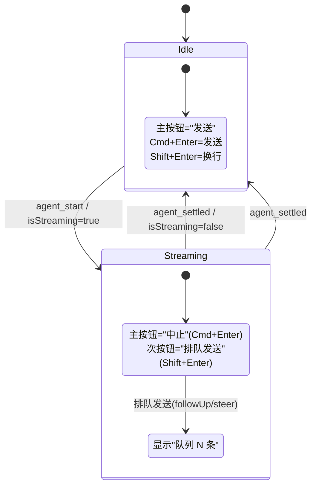

**图 6 — 输入框随 agent 状态的 UI 切换状态机。streaming 时中止与排队发送各有独立触发点。**

### 7.5b 图片与附件处理

输入框支持粘贴/拖入图片，作为 `ImageContent` 走 `rpc.prompt` 的 `images` 参数（`DESIGN.md` 1.5.1 prompt 契约）。`ImageContent` 结构（`DESIGN.md` 1.7.6）：`{ type: "image", data: base64, mimeType }`。输入框组件的图片处理：

1. **粘贴**：监听 `paste` 事件，检测 `clipboardData.items` 里的 `image/*` 类型，读成 base64 data URL，加入 `pendingImages` 数组。
2. **拖入**：监听 `drop` 事件，同上处理 File 对象。
3. **预览**：在输入框下方显示待发图片缩略图列表，每张带删除按钮。
4. **大小限制**：单张图片超阈值（如 5MB）提示"图片过大可能影响性能/费用"，不强制拦截（底座 provider 对图片大小有自己的限制、超了底座报错）。
5. **发送**：`rpc.prompt(text, { images: pendingImages })`。发送后清空 `pendingImages`。
6. **草稿持久化**：图片不随草稿持久化（base64 太大、不进 config 文件）——会话切换时图片丢失、提示用户。这是有意的折中：草稿文本持久化、图片不持久化，避免 config 膨胀。

附件（非图片文件）第一版不支持直接发——用户要发文件内容给 agent，应该让 agent 用 `read`/`edit` 工具读项目文件，而不是把文件塞进 prompt。这符合"agent 用工具操作文件"的设计，而非"用户把文件内容贴进消息"。

### 7.5c 队列模式与输入框

`get_state` 返回的 `steeringMode` 和 `followUpMode`（`"all" | "one-at-a-time"`，`DESIGN.md` 1.5.5）控制多条排队消息时全部处理还是只处理一条。输入框受这两个模式影响：

- `steeringMode: "all"` 时，streaming 中发的多条 steer 消息全部会被 agent 处理（依次）。
- `steeringMode: "one-at-a-time"` 时，只处理最近一条 steer、丢弃更早的 steer。这适合"用户反复改方向、只想要最后一次"的场景。
- `followUpMode` 同理作用于 followUp 队列。

输入框在 streaming 时发送多条消息，UI 上显示"队列 N 条"（`pendingMessageCount`）。用户可在设置里改这两个模式（调 `set_steering_mode`/`set_follow_up_mode` RPC 命令，4.9 模型参数插件的 UI）。输入框不直接改模式——它是消费者、读取模式显示提示（如 `one-at-a-time` 时提示"后续 steer 会覆盖之前的"）。

### 7.6 与 set_editor_text 的协作

`DESIGN.md` 1.9.1 / 4.7.4：底座的 `set_editor_text` Extension UI 请求由输入框组件响应——agent 要把内容填进输入框时，输入框接收并填入。

底座侧实现（`modes/rpc/rpc-mode.ts:237`）：

```typescript
setEditorText(text: string): void {
    // Fire and forget - host can implement editor control
    output({
        type: "extension_ui_request",
        id: crypto.randomUUID(),
        method: "set_editor_text",
        text,
    } as RpcExtensionUIRequest);
}

getEditorText(): string {
    // Synchronous method can't wait for RPC response
    return "";
}
```

几个要点：

- **fire-and-forget**：`set_editor_text` 不需要桌面端回 `extension_ui_response`（`DESIGN.md` 1.9.1）。底座生成一个 `crypto.randomUUID()` 当 id 发出，但不存进 `pendingExtensionRequests`、不等响应。所以桌面端收到后**不要**回 response——回也不会出错（底座找不到 pending 就忽略），但不回是规范。
- **单向**：`getEditorText` 在 RPC 模式下直接返回空字符串（同步方法没法等 RPC 响应）。底座 extension 若依赖 `getEditorText()` 读输入框内容，在 RPC 模式下永远拿到空串——这是 RPC 模式的固有边界（`DESIGN.md` 1.9.3）。底座 extension 要拿输入框内容得通过别的机制（如 input event 拦截、或自己的 extension 协议）。
- **桌面端响应**：core main 的 gateway/extension-ui 适配层（`DESIGN.md` 5.1.4）收到 `set_editor_text` request 后，**不经模态框翻译**（它不是 select/confirm/input/editor 那种对话框），而是直接转发给本插件的输入框组件——填入文本。具体走 `emitToRenderer` 或 MessagePort 把 `{ text }` 推给输入框组件，组件 `setDraft(text)`。若输入框当前有草稿，第一版策略是"覆盖"（agent 显式设值优先）——"追加"模式（插到光标处）列为第二版（16.1c 留接口 / 16.2 第二版实现，与 15b.2 的覆盖语义统一）。输入框未挂载时由 core gateway 缓存最后值、挂载时回放（可达性语义见 15b.2）。

这条路径是"底座主动往桌面 UI 塞内容"的少数通道之一（另一条是 `setWidget`，但 widget 只能字符串数组、且渲染位置不在输入框）。输入框作为 `set_editor_text` 的响应者，是它在"唯一发送出口"之外的第二职责。

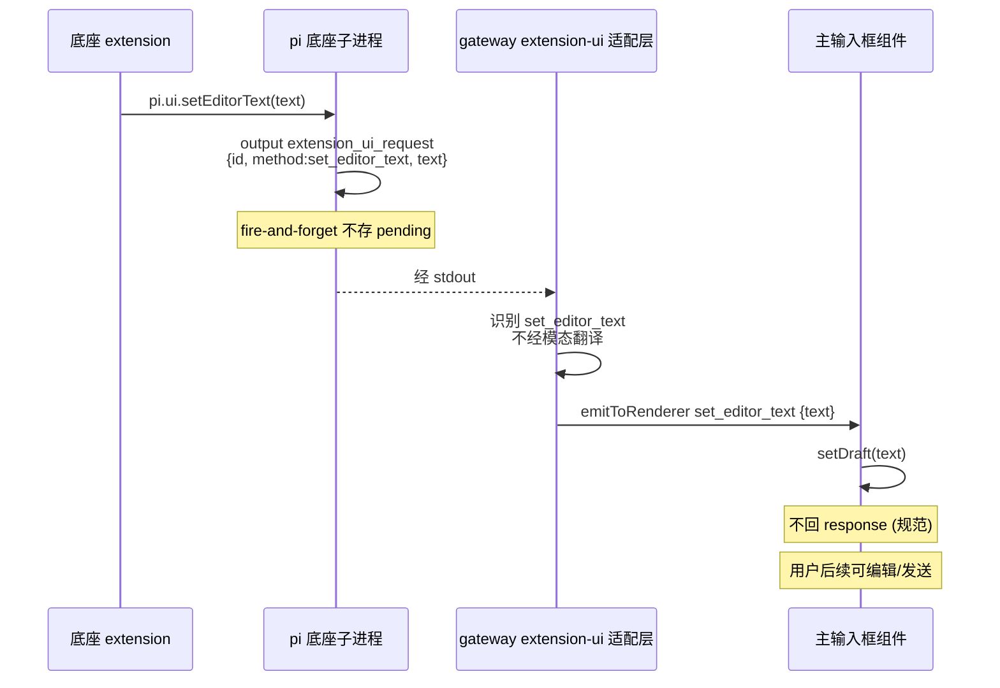

**图 7 — set_editor_text 从底座到输入框的填入路径，fire-and-forget 不回 response。**

### 7.7 输入框的命令面板触发

5.3 提到从命令面板触发底座斜杠命令也走输入框。具体：命令面板把 `/name args` 作为草稿填入输入框（调输入框组件暴露的 `setDraft("/name args")` 方法，这个方法和响应 `set_editor_text` 共用），然后触发发送链路（7.4）。但填入草稿前必须先按 5.3 的策略处理已有草稿：

- 若输入框已有草稿文本，**先弹确认**（与 5.3 一致）：提示"命令将作为新消息发送，是否清空当前草稿"。用户确认清空才 `setDraft("/name args")`；取消则不覆盖、保留原草稿、不发送。
- 若输入框为空，直接 `setDraft("/name args")`。

这样：

- 命令面板触发的 prompt 也走唯一的发送出口。
- 命令面板触发时若有 review 待发评论，也一并合并（按用户预期可能不合并——命令面板触发时若检测到 review 待发，提示用户"当前有 N 条 review 评论待随发，是否一并发出"）。
- streaming 排队判断统一在输入框发送链路里做，命令面板不重复实现。
- 覆盖草稿前有确认兜底，避免用户正在写的草稿被命令面板触发无声冲掉。

## 8 streaming 排队与 streamingBehavior

### 8.1 三种调用形态

`DESIGN.md` 1.5.1 把 prompt 在 streaming 时的处理讲透了，这里从输入框视角收一下。`rpc.prompt(message, { streamingBehavior })` 的 `streamingBehavior` 是 `"steer" | "followUp"`，控制 agent 正在流式输出时这条消息怎么排队。底座 `agent-session.ts:1076` 的 `prompt` 方法逻辑：

1. 先识别 `/` 前缀 → `_tryExecuteExtensionCommand`（extension 命令自己管 LLM 交互）。
2. 经 extension `input` 事件拦截/转换。
3. 展开 skill/prompt template。
4. **若 `isStreaming` 为真**：必须有 `streamingBehavior`，否则抛 `"Agent is already processing. Specify streamingBehavior ('steer' or 'followUp') to queue the message."`（`agent-session.ts:1122`）。`followUp` 调 `_queueFollowUp`（追加到队尾）、`steer` 调 `_queueSteer`（转向当前输出）。
5. **若 idle**：直接走正常 prompt→LLM 路径，不需要 `streamingBehavior`。

所以三种调用形态：

| 场景 | 调用 | streamingBehavior |
|---|---|---|
| agent idle | `rpc.prompt(msg)` | 省略 |
| agent streaming，追加到队尾 | `rpc.prompt(msg, { streamingBehavior: "followUp" })` | `"followUp"` |
| agent streaming，转向当前输出 | `rpc.prompt(msg, { streamingBehavior: "steer" })` | `"steer"` |

输入框默认 idle 直接发、streaming 带 `followUp`（7.5）。

值得追踪底座 RPC 侧对 `prompt` 的处理（`modes/rpc/rpc-mode.ts:393`），它解释了"预检通过才 resolve"的时序：

```typescript
case "prompt": {
    let preflightSucceeded = false;
    void session
        .prompt(command.message, {
            images: command.images,
            streamingBehavior: command.streamingBehavior,
            source: "rpc",
            preflightResult: (didSucceed) => {
                if (didSucceed) {
                    preflightSucceeded = true;
                    output(success(id, "prompt"));   // ← 预检通过才回 success
                }
            },
        })
        .catch((e) => {
            if (!preflightSucceeded) {
                output(error(id, "prompt", e.message));  // ← 失败回 error
            }
        });
    return undefined;  // 不立即回 response，等 preflight 回调
}
```

关键点：`return undefined` 表示这个 case 不立即返回 response——RPC 适配层的 id 配对机制（`DESIGN.md` 1.4.2）此时 pending request 仍挂着，等 `preflightResult` 回调触发 `output(success(id, "prompt"))` 才 resolve。所以 `rpc.prompt` 的 Promise resolve 时机 = 底座 `session.prompt` 内部走到 `preflightResult?.(true)` 那一行（`core/agent-session.ts:1086` extension 命令命中、或 `:1136` 入队成功、或走到正常 prompt 路径）。这条时序决定了输入框的 UI 反馈：发送按钮的 loading 态要从 `rpc.prompt` 调用起、到 resolve 止（而不是从调用到 agent_start event——agent_start 可能晚于 preflight resolve）。

### 8.2 extension 命令的执行路径

底座 `session.prompt` 收到 `/` 开头的文本时，第一件事是 `_tryExecuteExtensionCommand(text)`（`core/agent-session.ts:1083`）。这条路径和输入框的关系值得展开，因为它决定了"命令面板触发的 extension 命令"在桌面端的真实行为：

1. `_tryExecuteExtensionCommand` 匹配 `extensionRunner.getRegisteredCommands()` 里的命令名（即 `get_commands` 返回的 `name` 字段，源 `invocationName`）。
2. 命中则直接调该 extension 的 handler——**不走 LLM、不产生 `message_*` event**。extension 的 handler 自己用 `pi.sendMessage`（`SendMessageHandler`，`core/extensions/types.ts`）发起 LLM 交互，或纯粹做副作用（如 `/export` 导出文件、`/copy` 复制到剪贴板）。
3. 命中后 `preflightResult?.(true)` 立即触发，输入框的 `rpc.prompt` Promise resolve、草稿清空。
4. extension handler 若发 `pi.sendMessage`，会走底座内部的 steer/followUp/nextTurn 机制（`SendMessageHandler` 的 `deliverAs` 参数，`core/extensions/types.ts`），产生 `message_*` event——但这是 extension 主动发的、不是用户那条 `/command` 文本直接进的 LLM。

这条路径的输入框含义：命令面板触发 `/login anthropic` 后，输入框草稿清空、agent 看起来"在工作"（extension 可能弹 select/confirm 框走 OAuth）——但**用户那条 `/login` 文本没进 LLM 上下文**。输入框不该期望 `message_*` event 直接对应这条命令——它对应的是 extension 后续发的消息。这是"命令是 prompt 的一种"在 extension 命令上的特殊性：prompt 文本被底座拦截成命令分发了，没真的当消息发给 LLM。

### 8.3 input 事件拦截

底座 extension 还能订阅 `input` 事件（`_extensionRunner.emitInput`，`core/agent-session.ts:1097`），在 prompt 真正处理前拦截/转换文本。这层发生在 skill/template 展开之前。extension 可以：

- `handled`：完全拦截，prompt 不继续处理（extension 自己处理了）。
- `transform`：改写文本或图片（如自动加前缀、过滤敏感内容、注入上下文）。
- 默认：不干预，原文本继续。

这层对输入框透明——输入框发的还是原始文本，底座内部可能被 extension 改写。但输入框的"草稿清空"在 preflight 通过时就发生（即 extension 拦截成功也算通过），所以用户看不到"文本被改写"的过程，只看到发送成功。这是合理的——拦截是底座侧的、不该影响桌面 UI 流。

### 8.4 独立 steer/follow_up 命令

RPC 还有独立的 `steer` 和 `follow_up` 命令（`DESIGN.md` 1.5.1），底座 `rpc-mode.ts:417`/`424` 处理：

```typescript
case "steer": {
    await session.steer(command.message, command.images);
    return success(id, "steer");
}
case "follow_up": {
    await session.followUp(command.message, command.images);
    return success(id, "follow_up");
}
```

它们和 `prompt + streamingBehavior` 的区别（`DESIGN.md` 1.5.1）：

- `prompt + streamingBehavior`：idle 时直接处理（fallback）、streaming 时按 streamingBehavior 排队。
- 独立 `steer`/`follow_up`：直接走排队语义、**不带 idle fallback**——agent idle 时调它们也按排队语义处理（底座内部 `session.steer`/`session.followUp` 直接入队，不判断 isStreaming）。

输入框大多数场景用 `prompt`（带 isStreaming 判断），不直接用 `steer`/`follow_up`——因为用户发消息时 idle 要直接处理、streaming 才排队，`prompt + streamingBehavior` 正好覆盖。`steer`/`follow_up` 留给"明确只想排队、不想兜底"的场景，如某插件想强制追加一条 followUp 不管 agent 当前是否 streaming——这类场景不通过输入框、走 PluginContext.rpc 的 `steer`/`followUp` 便捷方法（但注意 7.1 的"唯一出口"约定：第三方插件直接调 `rpc.steer`/`rpc.followUp` 也算绕过输入框、破坏 review 合并）。

### 8.5 队列状态显示

`get_state` 返回的 `pendingMessageCount`（排队中的消息数）和 `steeringMode`/`followUpMode`（`"all" | "one-at-a-time"`，控制多条排队消息全部处理还是只处理一条）影响输入框的 UI：

- `pendingMessageCount > 0` 时输入框显示"队列 N 条待处理"。
- `queue_update` event（`DESIGN.md` 1.6.5）实时更新这个数。
- `steeringMode`/`followUpMode` 可在设置里改（对应 `set_steering_mode`/`set_follow_up_mode` RPC 命令），影响 streaming 时排队消息的处理方式。

## 9 输入框与底座事件流

### 9.1 输入框订阅哪些 event

输入框组件通过 `pi.events.on`（renderer 侧）或 `context.events.on`（worker 侧，若有 main）订阅以下 event（`DESIGN.md` 1.6）：

- `agent_start` / `agent_end` / `agent_settled`：切换输入框的 streaming/idle UI 状态（7.5 图 6）。
- `message_*`：不直接渲染（那是 4.4 时间线的事），但用 `message_end` 判断"用户刚发的消息是否已被 agent 回应"。
- `queue_update`：更新 `pendingMessageCount` 显示。
- `model_select`：更新当前模型指示（若输入框显示模型名）。
- `session_start`（reason: "reload"/"resume"）：重置草稿状态、清空 review 待发（会话变了，旧 review 评论失效）。

### 9.2 不订阅的 event

输入框**不**订阅 `tool_execution_*`（工具卡片是 4.4 时间线的事）、`entry_appended`（时间线增量）、`compaction_*`（4.9 模型参数插件显示进度）。这些和输入框职责无关，订阅了是浪费。

### 9.3 event-driven 状态确认

输入框的状态切换是 event-driven 的、不是乐观更新（呼应 `DESIGN.md` 4.9.2）：

- 发送 `prompt` 后，**不**立刻把 UI 切到 streaming——等 `agent_start` event 回来再切。`rpc.prompt` 的 resolve 只代表预检通过、底座接受了消息，agent 是否真的开始处理要靠 event 确认。
- 中止 `abort` 后，等 `agent_end` 或 `agent_settled` 再切回 idle。
- 这避免 UI 和底座状态不一致（如底座预检通过但 agent 启动失败、UI 却显示 streaming）。

### 9.4 中止流程的细节

streaming 时用户点"中止"按钮或按 `cmd+enter`（streaming 时 `cmd+enter` = 中止，见 7.5 键位映射），输入框调 `rpc.abort()`（对应 `abort` RPC 命令，`DESIGN.md` 1.5.1）。streaming 时的排队发送走 `Shift+Enter` 或次按钮"排队发送"，不与中止键冲突。中止流程：

1. 调 `rpc.abort()` → 底座 `session.abort()` 中止当前 turn。
2. 输入框**不**立即切 idle——等 `agent_end`/`agent_settled` event 回来确认。
3. 中止期间"中止"按钮变 disabled（防重复点击）、显示"正在中止..."。
4. `agent_end` 回来后切回 idle、按钮恢复"发送"。
5. 队列里的 followUp 消息（`pendingMessageCount > 0`）不受 abort 影响——abort 只中止当前 turn、队列消息继续。用户要清队列得手动在模型参数插件的队列模式 UI 操作（或在输入框提供"清空队列"按钮，第一版不实现）。

abort 失败的处理：`rpc.abort()` 几乎不失败（除非子进程已死）。若失败，输入框仍保持 streaming 态、显示错误，让用户重试或重启子进程。

### 9.5 输入框的 session 生命周期跟随

输入框的草稿和状态跟随 session 生命周期（`DESIGN.md` 4.6 会话管理插件触发）：

- **session_start** event（reason: "new"/"resume"/"fork"/"reload"/"startup"，`DESIGN.md` 1.6.4）：session 变了，输入框保存当前草稿到旧 session 的草稿槽、加载新 session 的草稿、清空 review 待发（review 评论绑旧 session 的 entryId、新 session 里无效）。
- **switch_session** RPC 成功（`DESIGN.md` 1.5.9）：同上，session 切换。
- 草稿按 `sessionId` 索引存（本插件 config 的 `drafts: { [sessionId]: string }`），session 切换时换槽。

这条让用户在多 session 间切换不丢各 session 的草稿——符合 VSCode 式"每个编辑器 tab 各自的草稿"体验。

## 9b 快捷键表重建流程

### 9b.1 重建时机与流程

全局快捷键表（6.2）在以下时机重建：

1. 插件加载/卸载/热重载后——命令项槽变化。
2. `get_commands` 刷新后——虽底座命令一般无 keybinding，但表重建是统一路径。
3. 用户重绑后——config 变化。

重建流程（core 中层）：

```typescript
function rebuildKeybindingTable(): KeybindingEntry[] {
  const entries: KeybindingEntry[] = [];
  // 1. 从命令项槽注册表取所有带 keybinding 的贡献项
  for (const cmd of slotRegistry.query("commands")) {
    if (!cmd.keybinding) continue;
    const norm = normalizeKeybinding(cmd.keybinding); // 6.3 规范化
    // 用户重绑覆盖
    const rebound = config.get(`keybindings.${cmd.id}`);
    const final = rebound ?? norm;
    entries.push({
      keybinding: final, commandId: cmd.id,
      pluginId: cmd.sourcePlugin, priority: cmd.priority,
      when: cmd.when ?? "true", source: "desktop",
    });
  }
  // 2. 按 keybinding 分组、检测冲突（多于一条标冲突）
  return entries;
}
```

重建是 O(n) 的（n = 命令数），上千条命令约 1ms，可同步做。重建后 core 通知 renderer 侧的快捷键中心和命令面板（更新 keybinding 显示）。

### 9b.2 重绑的合并顺序

用户重绑覆盖 manifest 默认（6.8）。合并顺序（config 路径与合并规则见 7.3 集中定义）：

1. manifest 声明的 keybinding（规范化）。
2. 用户级 config 重绑覆盖（`~/.pi-desktop/plugins-data/commands/config.json`）。
3. 项目级 config 重绑覆盖（`<cwd>/.pi-desktop/plugins-data/commands/config.json`）。

项目级最上——和 settings 合并方向一致（`DESIGN.md` 2.1.1）。这让"某项目把 `cmd+n` 重绑成别的"成为可能，不影响其他项目。本插件 config 的两份路径与合并规则统一在 7.3 定义，6.8/13.5 等处均引用之。

### 9b.3 冲突检测的时机

冲突检测在重建时做（9b.1 第 2 步）。两条 entry 同 `keybinding`、不同 `commandId` → 冲突。冲突信息（冲突方列表）存进 `KeybindingEntry.conflict` 字段，快捷键中心据此标红。冲突检测不阻止注册——两条都进表、触发时按优先级 + when 仲裁（6.7）。这让"先标红让用户知情、用户决定重绑"成为流程，而非"自动屏蔽某条"。

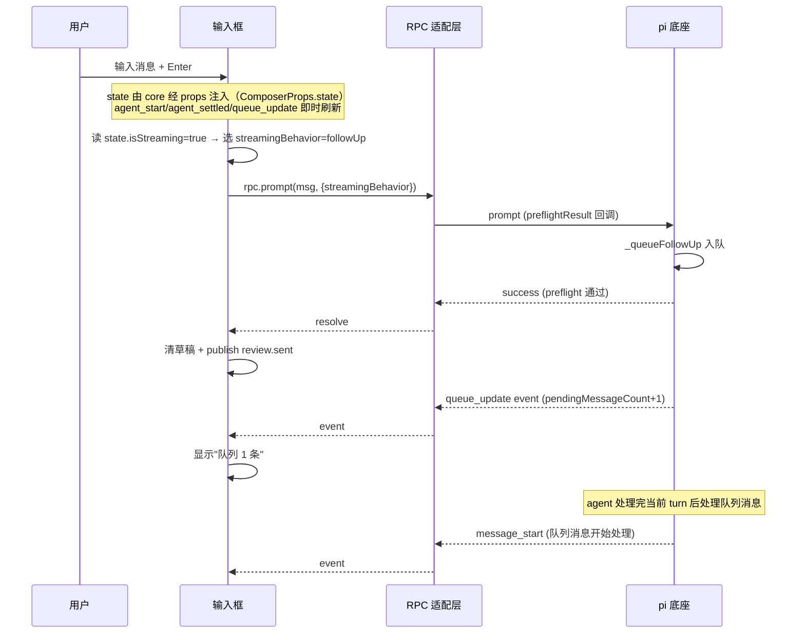

**图 8 — streaming 时发送 followUp 的完整时序：读 core 注入态 → 带 streamingBehavior 发 → event 更新队列。state 不经每次 get_state RPC，由 core 经 props 注入（与 7.4 handleSend、11.3 ComposerProps.state 一致）。**

## 10 与 review 插件的协作（经 bus 收 review.pending）

### 10.1 协作模型

`DESIGN.md` 4.10.4：review 插件不直接发 prompt，把攒好的评论列表交给主输入框，由输入框"发送"动作一并提交。协作走事件总线（`context.bus`，`DESIGN.md` 3.2.4）：

- **review 插件**：往 `context.bus` 发 `review.pending` topic，payload 是待发评论列表。
- **输入框**：订阅 `review.pending`，显示"有 N 条 review 评论待随发"。
- **用户点发送时**：输入框从订阅到的评论列表拉取、格式化附在消息后、一起发 `prompt`。
- **发送后**：输入框发 `review.sent` topic，review 插件订阅后清空待发列表、退出 review 模式（如在）。

事件总线是 fire-and-forget、无缓冲、无历史回放（`DESIGN.md` 3.2.4 bus 注释）。这条纪律对 review 协作的影响：

- 输入框必须在 review 插件之前或同时 activate、并立即 subscribe `review.pending`，否则会漏掉 review 插件先发的评论。处置：review 插件 `dependsOn: ["commands"]`（声明依赖本插件先 activate，`DESIGN.md` 3.2.1），保证本插件先就绪；review 插件 activate 后重新 publish 一次当前 pending 列表（"已就绪"信号模式，`DESIGN.md` 3.2.4 bus 注释②）。
- 评论列表的持久化归 review 插件自己的 config，不依赖 bus 回放——输入框重启后从 review 插件拉的"已就绪"信号恢复 pending 列表。

### 10.2 bus topic 契约

三个 topic 的 payload 契约：

```typescript
// review → 输入框：待发评论列表更新
bus.publish("review.pending", {
  comments: ReviewComment[];   // 当前全部待发评论（全量替换，非增量）
  count: number;
});

// 输入框 → review：发送完成，清空
bus.publish("review.sent", {
  count: number;               // 已随发的评论数
  messageText: string;         // 实际发出的消息文本（含合并后的评论），便于 review 校验
});

// review → 渲染插件：模式切换（DESIGN.md 4.10.7）
bus.publish("review.mode", { active: boolean });

// 输入框 → review：删除单条待发评论（10.7c）
bus.publish("review.remove", { id: string });
```

`ReviewComment` 结构（review 插件定义）：

```typescript
interface ReviewComment {
  id: string;                   // 评论本地 id（去重/删除用）
  anchor:
    | { kind: "entry"; entryId: string; charOffset: [number, number]; quotedText: string }
    | { kind: "file"; filePath: string; lineRange: [number, number]; quotedText: string };
  comment: string;             // 评论文本
  source: "timeline" | "viewer";  // 来自哪类内容区
}
```

### 10.3 合并格式化

`composeWithReview(message, comments)`（7.4 步骤 2）把评论格式化成结构化文本附在用户总消息后。格式（`DESIGN.md` 4.10.4 示例）：

```
<用户写的总消息>

---
Review 评论 (N 条):

[1] 关于消息 #abc 的 "xxx" 段:
评论：这里逻辑不对

[2] 关于文件 src/foo.ts:30-45:
评论：风格不一致
```

每条评论带定位锚点（entryId/quotedText 或 filePath/lineRange）+ 评论文本。agent 收到后能按锚点定位、逐条回应。锚点是稳定的（`DESIGN.md` 4.10.5）：entryId 是底座 session 的稳定 id、文件路径+行在编辑会话内稳定。

### 10.4 输入框的 review 待发指示器

输入框订阅 `review.pending` 后，UI 显示：

- 待发数量徽标（`count > 0` 时显示"Review N"，主色徽标）。
- 点击徽标展开评论列表（每条带锚点摘要 + 删除按钮——删除是经 bus 发 `review.pending` 全量更新，review 插件响应删除）。
- 发送时若 `count > 0`，发送按钮文案变"发送 + N 条评论"。

### 10.5 发送后的清理

发送成功后（7.4 步骤 5）：

- `setDraft("")` 清空草稿。
- `context.bus.publish("review.sent", { count, messageText })` 通知 review。
- review 插件收到 `review.sent` 后清空自己的待发列表（持久化的 config 也清）、若在 review 模式则退出（发 `review.mode { active: false }`）。

### 10.6 失败处理

发送预检失败时（7.4 catch）：

- 草稿保留。
- review 待发列表**不清**——bus 不发 `review.sent`，review 插件保留待发列表。
- 显示错误，让用户改消息重发。

### 10.7b 锚点格式化的稳定性

合并格式化（10.3）的锚点稳定性依赖底座 session 的稳定 id 和文件路径在编辑会话内的稳定性（`DESIGN.md` 4.10.5）。但要处理几个边界：

1. **entryId 跨 fork 的两层表述**：
   - **技术可达性（底座 session 树层面）**：用户从某 entry 分叉出新 session（`fork` RPC 命令），原 entry 的 id 在新 session 里仍可解析——底座 session 树共享前缀，`entryId` 在树层面跨 fork 仍有效。这是底座保证的技术事实，与 review 评论无关。
   - **产品归属策略（桌面 review 评论层面）**：review 评论存在桌面 config、按当前 `sessionId` 归属。fork 视为 session 切换（新 `sessionId`），原 session 的 review 评论在新 session 里**失效**——评论绑的是旧 session 的 entryId，技术上虽可解析、但产品上不再属于当前 session，故 session 切换（含 fork）时 review 待发评论应清空（见 9.1）。把"技术可达"与"产品归属"分开：前者是底座能力、后者是桌面策略，两者不矛盾。
2. **quotedText 作为辅助锚点**：纯 entryId 在 agent 回看时可能需要二次定位（entry 里的具体字符偏移）。所以格式化里同时附 `quotedText`（被评论的原文片段），agent 能靠文本匹配兜底——即便偏移因消息编辑而漂移，文本匹配仍能定位。这是"双重锚点"：entryId 主、quotedText 备。
3. **文件锚点的会话相关**：文件路径 + 行范围在编辑会话内稳定，但用户切换项目后路径失效。review 文档评论只在当前项目内有效，切项目时清空（同 session 切换清空）。

这些边界让 review 评论的发送时机很重要——应该在用户准备发消息的当下合并、不要长期挂在输入框（容易因 session/项目切换失效）。输入框的 review 徽标提示用户"待随发"，鼓励用户尽快合并发出、不要囤积。

### 10.7c 并发评论与去重

用户在 review 模式下快速连续圈选多处、可能并发产生多条评论。事件总线是同步发布的（`publish` 立即触发所有 subscribe 回调），但 review 插件内部攒评论是异步的（用户写评论要弹输入框、等待）。并发处置：

- 每条评论有本地 `id`（review 插件生成 UUID），去重靠 id。同一选区重复点"添加评论"不会产生重复 id——第二次是编辑已有评论。
- `review.pending` payload 是全量列表（非增量），每次 publish 都发当前全部待发评论。输入框收到后全量替换本地状态、不增量合并，避免顺序问题。
- 输入框只显示数量和列表、不做评论的增删逻辑——增删都由 review 插件经 `review.pending` 全量推送。输入框的"删除"按钮实际是发 bus 请求 review 删除（topic `review.remove`，payload `{ id: string }`，方向 输入框→review，单条删除而非全量重发），review 插件收到后从本地列表移除该 id、再重新 publish 全量 `review.pending`。这把评论的状态管理完全收在 review 插件、输入框只是展示者。

### 10.7d 完整时序

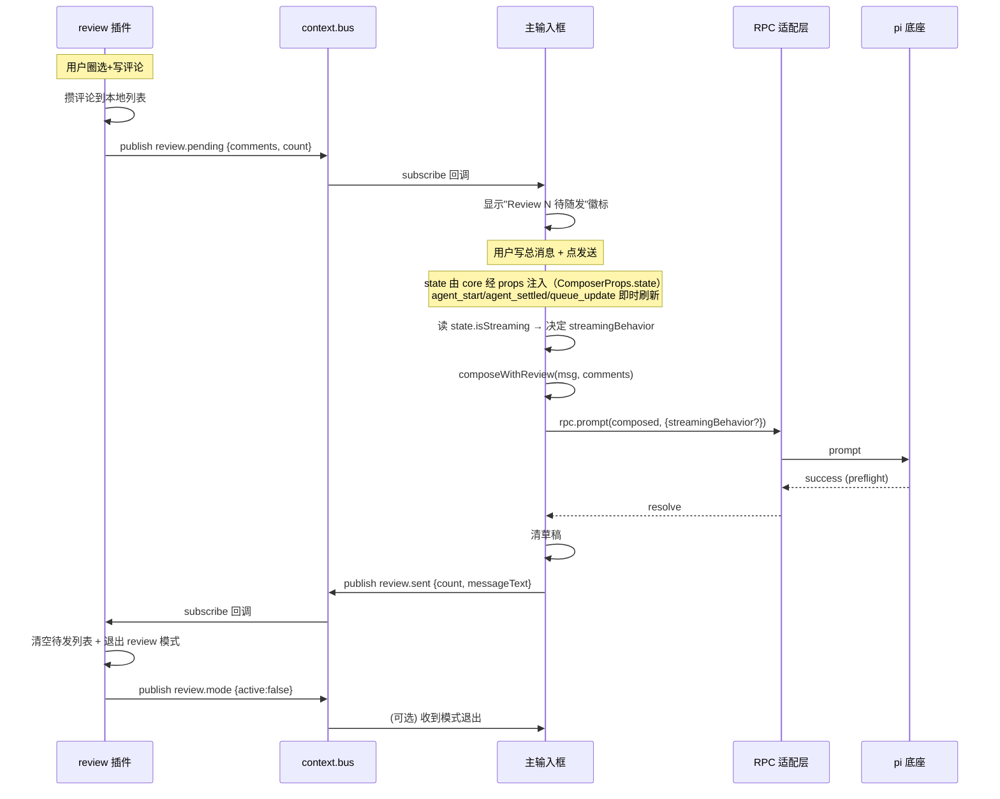

**图 9 — review 协作完整时序：pending 经 bus → 输入框合并发送 → sent 经 bus → review 清理。**

## 11 插件 manifest 与代码骨架

### 11.1 plugin.json

```json
{
  "id": "commands",
  "version": "0.1.0",
  "displayName": "命令与快捷键",
  "main": "./index.ts",
  "renderer": "./ui.ts",
  "contributes": {
    "commands": [
      { "id": "commands.openPalette", "title": "命令面板", "keybinding": "cmd+p", "handler": "#onOpenPalette" },
      { "id": "commands.openKeybindings", "title": "快捷键中心", "keybinding": "cmd+k cmd+s", "handler": "#onOpenKeybindings" },
      { "id": "composer.focus", "title": "聚焦输入框", "keybinding": "cmd+l", "handler": "#onFocusComposer" },
      { "id": "composer.clear", "title": "清空输入框", "keybinding": "cmd+shift+backspace", "handler": "#onClearComposer" },
      { "id": "session.new", "title": "新建会话", "keybinding": "cmd+n", "handler": "#onNewSession" },
      { "id": "model.cycle", "title": "切换模型", "keybinding": "cmd+shift+m", "handler": "#onCycleModel" },
      { "id": "thinking.cycle", "title": "切思考级别", "keybinding": "cmd+shift+t", "when": "model.reasoning", "handler": "#onCycleThinking" },
      { "id": "context.compact", "title": "压缩上下文", "keybinding": "cmd+shift+k", "when": "agent.idle", "handler": "#onCompact" },
      { "id": "settings.open", "title": "打开设置", "keybinding": "cmd+,", "handler": "#onOpenSettings" },
      { "id": "commands.hotkeys", "title": "快捷键中心", "handler": "#onOpenKeybindings" }
    ],
    "settings": [
      { "id": "keybindings", "title": "快捷键", "component": "KeybindingsCenter" }
    ]
  }
}
```

注意：主输入框（Composer）不在 `contributes` 里——它是本插件自有的 renderer 组件、随插件渲染在主界面底部，不是槽位贡献项。命令面板（CommandPalette）同理、是自有组件，但它的**唤起**通过 `commands.openPalette` 命令贡献项（带 keybinding）走槽位。

### 11.2 worker 侧（index.ts）骨架

```typescript
import type { PluginContext } from "@pi-desktop/core";

export function activate(ctx: PluginContext) {
  // bus → renderer：review 待发评论（review 插件发布，转发给输入框组件）
  const offPending = ctx.bus.subscribe("review.pending", (payload) => {
    const { comments, count } = payload as ReviewPendingPayload;
    ctx.emitToRenderer("review.pending", { comments, count });
  });
  // bus → renderer：其他插件（如文件编辑器）请求插入文本到草稿（见 14.2）。
  // 注意：bus topic 名是 composer.insert（外部插件契约），worker→renderer 内部转发通道
  // 改名为 composer._insert（下划线前缀表内部），以消除同名歧义（盲审第 4 条 minor）。
  const offInsert = ctx.bus.subscribe("composer.insert", (payload) => {
    const { text, focus } = payload as { text: string; focus?: boolean };
    ctx.emitToRenderer("composer._insert", { text, focus });
  });
  // renderer → bus：输入框发送成功后，renderer 经 postToWorker("review.sent") 回传，
  // worker 转发到总线，让 review 插件清空待发列表（renderer 拿不到 bus，见 7.4）
  const offSentFwd = ctx.onRendererMessage?.("review.sent", (payload) => {
    ctx.bus.publish("review.sent", payload as { count: number; messageText: string });
  });
  // renderer → worker：composer 发送链路（7.4）成功 resolve 后，若发送的是 rpc 命令（/ 前缀），
  // 触发 MRU 更新（5.5）。renderer 无 config、由 worker 落 config（盲审第 3 条 minor）。
  const offMruTouch = ctx.onRendererMessage?.("mru.touch", (payload) => {
    const { commandId } = payload as { commandId: string };
    const mru = ctx.config.get<{ count: number; lastUsed: number }>(`mru.${commandId}`) ?? { count: 0, lastUsed: 0 };
    mru.count += 1; mru.lastUsed = Date.now();
    ctx.config.set(`mru.${commandId}`, mru);
  });

  ctx.onDeactivate(() => { offPending(); offInsert(); offSentFwd?.(); offMruTouch?.(); });
}

export async function onOpenPalette(ctx: PluginContext) {
  ctx.emitToRenderer("palette.open", {});
}
export async function onOpenKeybindings(ctx: PluginContext) {
  ctx.emitToRenderer("settings.open", { page: "keybindings" });
}
export async function onFocusComposer(ctx: PluginContext) {
  ctx.emitToRenderer("composer.focus", {});
}
export async function onClearComposer(ctx: PluginContext) {
  ctx.emitToRenderer("composer.clear", {});
}
export async function onNewSession(ctx: PluginContext) {
  // new_session 返回 { cancelled: boolean }（DESIGN 1.5.1，extension 可取消）。
  // 必须处理取消：cancelled 时 UI 应回滚、不切到新 session 视图。
  const res = await ctx.rpc.send({ type: "new_session" }) as { cancelled?: boolean };
  if (res?.cancelled) {
    // 取消：不广播 session 切换、保持当前 session 视图与草稿不变
    ctx.emitToRenderer("session.new.cancelled", {});
    return;
  }
}
export async function onCycleModel(ctx: PluginContext) {
  await ctx.rpc.send({ type: "cycle_model" });
}
export async function onCycleThinking(ctx: PluginContext) {
  await ctx.rpc.send({ type: "cycle_thinking_level" });
}
export async function onCompact(ctx: PluginContext) {
  await ctx.rpc.send({ type: "compact" });
}
export async function onOpenSettings(ctx: PluginContext) {
  ctx.emitToRenderer("settings.open", {});
}
```

worker 侧职责收口：订阅 bus 把 `review.pending` 转发给 renderer（同名）、把 bus 上的 `composer.insert` 转发给 renderer 时改用内部通道 `composer._insert`（11.4，避同名歧义）；经 `onRendererMessage` 把 renderer 回传的 `review.sent` 转发到 bus、把 `mru.touch` 落 config 更新 MRU（5.5）；`command.invoke` 直达 commands worker 调自身 `#handler`（11.4，不经 main 中转）；其余 handler 把命令分发成 `emitToRenderer` 信号或直接调 RPC。发送链路（`rpc.prompt`）在 renderer 侧的输入框组件里调用——因为输入框是纯 renderer 组件、通过 `pi.rpc`（`RendererPluginContext.rpc`，`DESIGN.md` 3.2.5）直接发，不必经 worker 中转；但 renderer 不持有 bus、也无 config，发送成功后的 `review.sent` 总线广播与 `mru.touch` 落库均由 worker 经上述转发通道代发（见 7.4 进程归属说明）。

### 11.3 renderer 侧（ui.ts）组件清单与契约

renderer 侧导出三个组件：`Composer`、`CommandPalette`、`KeybindingsCenter`。它们的 props 契约钉死如下，core 渲染时按契约注入。注意这三个组件都通过 `RendererPluginContext`（`DESIGN.md` 3.2.5，经 React Context 或 props 注入的 `pi` 对象）拿能力，不直接 import core 内部模块——依赖只向内。

**`Composer`（主输入框）**：

```typescript
interface ComposerProps {
  pi: RendererPluginContext;
  // core 注入的共享状态（core 维护、经 props 喂数据，见 3.2.6 第三条路）
  state: {
    isStreaming: boolean;
    isCompacting: boolean;
    pendingMessageCount: number;
    model?: ModelInfo;          // 当前模型，显示模型名/是否 reasoning
    steeringMode: "all" | "one-at-a-time";
    followUpMode: "all" | "one-at-a-time";
  };
  // core 维护的 contextKeys 快照（求 when 用，虽然 composer 自己不太用 when）
  contextKeys: Record<string, boolean | string>;
}
```

`Composer` 内部职责：渲染 textarea + 发送/中止按钮 + 图片预览 + review 徽标；管理草稿（localStorage 兜底 + 项目级 config 持久化经 worker）；订阅 `pi.events.on` 的 `agent_*`/`queue_update`/`model_select`/`session_start` 切换 UI；订阅 `pi.onMessage("review.pending", ...)` 显示徽标；调 `pi.rpc.prompt` 发送。`state` 由 core 在渲染时注入（core 订阅 RPC event 流、翻译成中性 `ComposerState` 推给组件），组件不必自己 `pi.events.on` 拿全部 event 再过滤——core 喂已经聚合好的状态。**发送链路也以这个注入态为准**（7.4：`handleSend` 读 `state.isStreaming` 决定 `streamingBehavior`，不每次发送都 `getState`、避免 RPC 往返与半受控设计冲突；race 下底座状态突变由 `rpc.prompt` reject 兜底、保留草稿）。这呼应 `DESIGN.md` 3.2.6 路径三"core 调度、props 传入"：Composer 是个半受控组件，状态来自 core、用户交互（输入/发送）自己管。

**`CommandPalette`（命令面板浮层）**：

```typescript
interface CommandPaletteProps {
  pi: RendererPluginContext;
  visible: boolean;
  onClose: () => void;
  // core 注入的合并后候选列表（buildPaletteItems 结果）
  items: PaletteItem[];
  // core 维护的 contextKeys 快照（求 when 过滤可见命令）
  contextKeys: Record<string, boolean | string>;
}
```

`CommandPalette` 是个受控组件：`visible`/`items`/`contextKeys` 全由 core 注入，组件只管渲染和键盘交互、把"用户选了哪条"通过 `pi.rpc` 或回调上抛。fuzzy 排序在组件内做（对 `items` 按 query 过滤排序）——也可放 core 做并注入已排序列表，但放组件内更灵活（query 变化即重排、不需经 core 往返）。`onClose` 由 core 在 Esc 或选中后调，core 据此切换 `visible`。

**`KeybindingsCenter`（快捷键中心设置子页）**：

```typescript
interface KeybindingsCenterProps {
  pi: RendererPluginContext;
  // core 注入的全局快捷键表（按 keybinding 分组、含冲突标记）
  bindings: KeybindingGroup[];
  onRebind: (commandId: string, newKeybinding: string) => Promise<void>;
  onReset: (commandId: string) => Promise<void>;
}
```

`KeybindingsCenter` 渲染分组列表、每条可点击重绑（按下新组合捕获、调 `onRebind`）、可重置（调 `onReset` 恢复 manifest 默认）。重绑/重置实际写 worker 侧 config（经 `pi.postToWorker("keybindings.rebind", ...)`），worker 调 `context.config.set` 持久化、并触发快捷键表重建。冲突标红由 core 在 `bindings` 里标注（`KeybindingGroup` 含 `conflict: boolean` 和冲突方列表）。

### 11.4 worker 与 renderer 的消息通道

本插件 worker 和 renderer 之间约定的 MessagePort 通道（`DESIGN.md` 3.2.5 的 `postToWorker`/`onMessage`）：

| 通道 | 方向 | payload | 用途 |
|---|---|---|---|
| `palette.open` | worker → renderer | `{}` | 唤起命令面板 |
| `composer.focus` | worker → renderer | `{}` | 聚焦输入框 |
| `composer.clear` | worker → renderer | `{}` | 清空输入框 |
| `composer._insert` | worker → renderer | `{ text, focus? }` | 插入文本到草稿的**内部转发通道**（下划线前缀表内部）。worker 订阅 bus 上的 `composer.insert` topic（14.2，外部插件契约）、转发给 renderer 时改用此内部通道名，避免与 bus topic 同名混淆（盲审第 4 条 minor）。外部插件只发 bus topic `composer.insert`、凡 `postToWorker("composer.insert", ...)` 的调用一律视为 bug。 |
| `settings.open` | worker → renderer | `{ page? }` | 打开设置页 |
| `review.pending` | worker → renderer | `{ comments, count }` | review 待发评论（worker 转发 bus 消息） |
| `keybindings.rebind` | renderer → worker | `{ commandId, newKeybinding }` | 快捷键重绑 |
| `keybindings.reset` | renderer → worker | `{ commandId }` | 重置快捷键 |
| `command.invoke` | renderer → worker | `{ commandId, args? }` | 命令面板/快捷键触发 desktop 命令的桥接通道（见 5.3/4.2）。**直达 commands worker**（renderer↔commands worker 经 MessagePort 直连，`DESIGN.md` 3.6，不经 main 中转），由 commands worker 收到后调度自身 handler。 |
| `command.invoke.result` | worker → renderer | `{ commandId, ok: boolean, error?: string }` | 命令面板触发 desktop 命令的执行结果回传（与 `command.invoke` 对偶，commands worker await handler 后回传，面板据 ok/提示错误） |
| `mru.touch` | renderer → worker | `{ commandId }` | rpc 命令发送成功后由 composer 触发，worker 落 config 更新 MRU（5.5，盲审第 3 条 minor：rpc 命令执行路径在 renderer 侧、无 config 落点，补此通道） |

`command.invoke` 是命令面板（renderer 组件 `CommandPalette`，11.3）和快捷键触发（6.2b 全局 keydown 监听器，装在 renderer）触发 desktop 命令 handler（跑在 commands worker，11.2）的唯一桥接：renderer 选定一条 `kind: "desktop"` 的命令后，**不**直接调用 worker 函数（renderer 拿不到 worker 模块），而是经 `pi.postToWorker("command.invoke", { commandId, args })` 发给 **commands worker**。**进程拓扑澄清（对盲审第 2 条 important）**：`command.invoke` 是 renderer→commands worker 的直连 MessagePort 消息——`DESIGN.md` 3.6 明确 worker↔renderer 经 MessagePort 直连、之后不再经 main 中转，故 core main（命令项槽注册表的拥有者）物理上收不到这条 `postToWorker` 通道消息。第一版的真实路由是：commands worker 接到 `command.invoke` → 按 `commandId` 在槽位注册表查贡献项 → 取其 `handler` 名（`#onXxx`）→ 定位**本插件自己** worker 模块导出的同名函数 → 用 commands 插件的 `PluginContext` 调用、透传 `args`。handler 返回 `void | Promise<void>`：同步 handler 调用即完成、异步 handler await 后，commands worker 经反向 `command.invoke.result`（worker → renderer，payload `{ commandId, ok: boolean, error? }`）回传结果给 renderer，命令面板据此关闭或提示错误。**跨插件 handler 覆盖**（别的插件贡献同 id 命令、其 handler 住在别的插件 worker）需 core 中层按 `commandId` 路由到来源插件 worker 的跨 worker 调用原语，第一版 PluginWorker（`DESIGN.md` 5.1.6）尚无此机制、列为第二版（4.1 注、14.3）。第一版验收（16.1b）只测 commands 自有命令，故第一版只走"commands worker 接到 → 调自身 handler"这一条路径。rpc 类命令不走此通道——它们经输入框发送链路发 `prompt`（7.7），不调 worker handler；但 rpc 命令的 MRU 更新经 `mru.touch` 通道回传 worker（见上表）。

这些通道是本插件内部的约定、core 不解释。worker 侧 `context.emitToRenderer` 发、renderer 侧 `pi.onMessage` 收；renderer 侧 `pi.postToWorker` 发、worker 侧用 `context.onRendererMessage`（需插件自己约定，`DESIGN.md` 3.2.5）收。bus 消息（`review.pending`、外部插件的 `composer.insert`）经 worker 中转给 renderer，是因为 renderer 侧的 `RendererPluginContext` 不直接订阅 bus（`DESIGN.md` 3.2.5）——通过 worker 转发统一数据流路径、便于 worker 做加工（如过滤敏感字段）。**`context.onRendererMessage` 与 `context.registerEditorHost` 前置依赖说明**：这两个 API 目前不在 `DESIGN.md` 3.2.4 的 PluginContext 接口列表里（3.2.4 只有 plugin/rpc/http/events/bus/config/i18n/emitToRenderer/register/onDeactivate；`onRendererMessage` 仅在 3.2.5 一句注释里出现、未进 3.2.4 正式接口）。本文档以 15b.2 与本节为这两个扩展点的权威定义，但落地需同步更新 `DESIGN.md` 3.2.4——在 DESIGN 同步前，11.2 worker 骨架里对 `ctx.onRendererMessage?.(...)` 与 15b.2 的 `ctx.registerEditorHost(...)` 视为待 DESIGN 补齐后才能编译通过的前置依赖（见 16.1b 验收 #7/#8 标注）。

## 11b 热加载与本插件的响应

### 11b.1 装新扩展后命令刷新

用户在管理 UI 装新底座 extension（`DESIGN.md` 2.5），走"写 settings + 重启子进程"链路。新子进程起来后：

1. core 的 `rpc.resync()` 被调用（`DESIGN.md` 2.4.2/2.5.1），返回新的 `SyncSnapshot`。
2. `SyncSnapshot.commands` 含新 extension 注册的命令（`get_commands` 返回）。
3. core 广播 `commands.changed` 给所有订阅的插件，本插件 renderer 侧的命令面板据此重渲染、新命令出现在面板。
4. 若新 extension 通过底座 `registerShortcut` 注册了快捷键——当前不镜像（6.9），用户需在桌面 manifest 侧自行贡献带 keybinding 的命令才能在桌面有快捷键。

这条链路对用户是透明的：装扩展后命令面板自动出现新命令、无需手动刷新。

### 11b.2 卸载扩展后命令消失

卸载走同样链路（移路径 + 重启）。`resync` 后 `commands` 不含已卸载 extension 的命令。命令面板若本地缓存了已消失的命令的 MRU 记录，清理之（避免面板列出已失效命令）。MRU 清理在 `commands.changed` 时对比新旧命令集、移除差集。

### 11b.3 桌面插件热重载

本插件自己的热重载（`DESIGN.md` 2.4.3，走桌面加载器、不动底座子进程）：deactivate 旧的 → 加载新的 → activate。deactivate 时：

- 取消 bus subscribe（`review.pending`/`review.sent`）。
- 取消 event subscribe（输入框组件订阅的 `agent_*` 等）。
- 清 chord 状态机。
- 持久化草稿（防止丢失）。

activate 新版本后重建 subscribe、恢复 chord 状态、重载草稿。输入框组件 unmount/remount 时草稿从 config 恢复。这条热重载路径保证"改本插件代码不丢用户草稿和 review 待发"——前提是草稿/待发都持久化在 config 或经 bus 可恢复，不在组件内存里独占。

## 12 内置命令与底座命令的重叠处置

### 12.1 重叠清单

底座 `BUILTIN_SLASH_COMMANDS` 里和桌面端命令重叠的：

| 底座斜杠命令 | 桌面端命令 | 处置 |
|---|---|---|
| `/new` | `session.new` | 桌面覆盖（调 `new_session` RPC） |
| `/compact` | `context.compact` | 桌面覆盖（调 `compact` RPC） |
| `/model` | `model.cycle` + 模型插件下拉 | 桌面覆盖（调 `cycle_model`/`set_model`） |
| `/fork` | session 插件 fork UI | 桌面覆盖 |
| `/clone` | session 插件 clone UI | 桌面覆盖 |
| `/export` | session 插件 export UI | 桌面覆盖（调 `export_html` RPC） |
| `/name` | session 插件 rename UI | 桌面覆盖（调 `set_session_name` RPC） |

不重叠、保留透传的：`/login`/`/logout`/`/trust`/`/changelog`/`/resume`/`/scoped-models`/`/share`/`/copy`/`/session`/`/tree`/`/settings`(部分)。`/reload` 在桌面端不透传——它要求底座 reload，但 RPC 没 reload 命令（`DESIGN.md` 2.2），桌面端走"重启 RPC 子进程"路径（`DESIGN.md` 2.4）实现等效效果，由专门的"重载"操作触发、不作为斜杠命令。

### 12.2 透传命令的处理

用户在命令面板里选一条透传的底座斜杠命令（如 `/login`），输入框发 `rpc.prompt("/login anthropic")`。底座 `session.prompt` 识别 `/` 前缀、`_tryExecuteExtensionCommand` 匹配内置命令并执行。执行过程中底座可能通过 Extension UI 子协议发 `select`/`confirm`/`input` 请求（如 OAuth 选 provider、确认登录）——core main 的 gateway 翻译成 React 模态框（`DESIGN.md` 1.9.2），用户操作完回 response。这条路径完全复用 1.9 的 Extension UI 子协议，本插件不特殊处理。

### 12.3 覆盖命令的处理

桌面覆盖命令（如 `session.new`）走 handler、调对应 RPC 命令、不经底座斜杠命令路径。好处：UI 状态一致（如新建会话后输入框草稿如何处理由输入框自己控制，而非底座 `/new` 的 TUI 行为）、能合并 review 评论、能做 streaming 排队判断。

## 12b 命令面板的 hotkeys 命令映射

### 12b.1 hotkeys 的归属

底座内置 `/hotkeys` 命令在 TUI 里列底座快捷键（`core/slash-commands.ts` 的 `BUILTIN_SLASH_COMMANDS` 含 `{ name: "hotkeys", description: "Show all keyboard shortcuts" }`）。桌面端把它重映射到本插件的快捷键中心（6.8 KeybindingsCenter）：

- 命令面板里 `hotkeys` 命令的执行不走"透传发 `prompt("/hotkeys")`"路径，而是带桌面 handler（`#onOpenKeybindings`）、打开快捷键中心 UI。
- 这通过本插件在 manifest（11.1）贡献桌面自有命令 `{ id: "commands.hotkeys", title: "快捷键中心", handler: "#onOpenKeybindings" }` 实现。**注意：底座 `/hotkeys` 属于 `BUILTIN_SLASH_COMMANDS`，不在 `get_commands` 返回里（3.3），因此命令面板的数据源里根本没有 `/hotkeys` 这条项可供"去重覆盖"**。`commands.hotkeys` 是桌面端独立贡献的命令、与底座 `/hotkeys` 在命令注册表层面没有去重关系，只是在语义上替代它——桌面用户要"看全部快捷键"时，面板里出现的是 `commands.hotkeys`（带 handler 打开快捷键中心），而不是底座的 `/hotkeys`。所谓"重映射"是语义层面的替代，不是注册表层面的覆盖。
- 用户看到的"全部快捷键"是桌面全局快捷键表（含桌面命令的 keybinding），不含底座 `registerShortcut` 注册的快捷键（6.9 当前不镜像）。

### 12b.2 用户期望与边界

用户从别的工具（如 VSCode）过来，期望 `Cmd+K Cmd+S` 打开快捷键设置——桌面端满足这个期望。但用户可能也期望"看到底座 extension 注册的快捷键"——当前不满足，因为底座没通过 RPC 暴露快捷键表。这是已知缺口（6.9 演进项），第一版快捷键中心标注"仅显示桌面快捷键"提示用户。

## 13 错误处理与降级

### 13.1 get_commands 失败

`get_commands` 几乎不失败（除非子进程已死）。若失败（RPC timeout 或 `success: false`）：

- 命令面板只显示桌面端自己的命令（槽位注册表里的），底座命令列表为空。
- 输入框仍可用（发送走 `rpc.prompt`，不依赖 `get_commands`）。
- 显示"底座命令不可用"提示，触发 `rpc.resync()` 重试。

### 13.2 prompt 预检失败

`rpc.prompt` reject（预检失败）的常见原因：

- message 为空（草稿空 + 无 review 评论）：前置校验拦截，不发。
- streaming 时 `streamingBehavior` 缺失：输入框发送链路已查 `isStreaming` 并带了，不会触发；若底座状态在查 state 后突变（race condition），可能触发——catch 里显示错误、保留草稿。
- 底座 extension 命令报错（`_tryExecuteExtensionCommand` 内部抛）：透传底座返回的 error message。

所有失败都保留草稿、不清 review 待发、让用户改后重发。

### 13.3 set_editor_text 时输入框不可达

若 `set_editor_text` 到达时输入框组件未挂载（如用户在别的视图），core main 的 gateway 缓存最后一次 text、等输入框挂载时回放。这避免 agent 设的内容丢失。输入框挂载后立刻应用缓存的 text。

### 13.4 bus 消息丢失

事件总线无缓冲（`DESIGN.md` 3.2.4）。review 插件在输入框 subscribe 之前发的 `review.pending` 会丢。处置：

- review `dependsOn: ["commands"]`，保证本插件先 activate。
- review activate 后重新 publish 一次当前 pending（"已就绪"信号）。
- review 评论持久化在 review 自己的 config，输入框重启后从 review 的"已就绪"信号恢复。

### 13.5 快捷键重绑持久化失败

快捷键重绑写本插件 config（路径与合并规则见 7.3：用户级 `~/.pi-desktop/plugins-data/commands/config.json`、项目级 `<cwd>/.pi-desktop/plugins-data/commands/config.json`，项目级覆盖用户级）。若磁盘满或权限问题写入失败：

- 内存里的重绑立即生效（用户当下体验正常）。
- 持久化失败提示"重绑未保存，重启后失效"。
- 不回滚内存状态——用户的即时操作不该因持久化失败而撤销。

config 写入用文件锁（`proper-lockfile`，`DESIGN.md` 2.1.2 settings 用同一机制）避免并发写冲突。插件 config 不和底座 settings 共用文件、不共享锁——两套独立。两份 config 文件（用户级、项目级）各自独立加锁。

### 13.6 命令面板候选列表为空

若 `get_commands` 失败且命令项槽注册表也为空（极端情况：无插件加载成功）：

- 命令面板显示"无可用命令"占位。
- 输入框仍可用——它是本插件自有 UI、不依赖槽位。
- 这只会在 core 加载器全面失败时发生，是"壳都坏了"的降级，正常不会触发。

### 13.7 chord 状态卡死

chord 第二段等待期间，若用户切到别的窗口（失焦）或长时间不按，状态机应自动超时回 `Idle`。core 监听窗口 `blur` 事件清 chord 状态、避免"回来按个键被误判为第二段"。超时默认 1 秒，可配置。

## 14 与其他插件的边界

### 14.1 与时间线插件（4.4）

输入框不渲染时间线、不订阅 `entry_appended`。但 review 评论的对话锚点 `entryId` 来自时间线渲染时暴露的 `data-entry-id` DOM 属性（`DESIGN.md` 4.10.5）——这是 review 插件和时间线的协作，输入框只收 `ReviewComment[]`、不直接读 DOM。

### 14.2 与文件预览/编辑器插件（4.5/4.10）

文件编辑器插件可能有"把这段代码发出去"操作——它不直接发 prompt，而是把选中的代码文本经**事件总线**（`context.bus`，插件间通道）发给输入框。`composer.insert` 是一个 **bus topic**（插件间契约），不是 worker→renderer 的 MessagePort 通道。流程：文件编辑器插件（worker 侧）`context.bus.publish("composer.insert", { text, focus? })`；本插件 worker 在 activate 时订阅 `composer.insert`（11.2），收到后经 `context.emitToRenderer("composer._insert", payload)` 转发给 renderer 侧输入框组件；输入框 `pi.onMessage("composer._insert", ...)` 收到后把 `text` 插入草稿当前光标位置、可选聚焦。这条 topic 契约由本插件定义：

```typescript
// 插件间 bus topic（worker 侧 context.bus），方向：其他插件 → 本插件 worker → 转发 renderer
bus.publish("composer.insert", { text: string; focus?: boolean });
```

输入框收到后把 `text` 插入草稿当前光标位置、可选聚焦。这是"唯一发送出口"纪律对其他插件的延伸——文件编辑器要发代码，也经输入框。**通道命名澄清（对盲审第 4 条 minor）**：bus topic 名为 `composer.insert`（外部插件契约、面向插件间），worker→renderer 的内部转发通道改名为 `composer._insert`（下划线前缀表内部，11.4 通道表已列），两者不再同名。外部插件只发 bus topic `composer.insert`、不直接调 MessagePort；凡 `postToWorker("composer.insert", ...)` 的调用一律视为 bug（外部插件本不应直接发 worker→renderer 通道）。这条命名分离消解了"同名两套通道在外部插件文档视角混淆"的风险。

### 14.3 与模型参数插件（4.9）

`model.cycle` 命令和模型插件的"切换模型"UI 是同 id 命令的两个贡献项——按优先级取高优先级版本（槽位注册表的贡献项级覆盖，3.4 的 `resolveByPriority` 适用）。**但 handler 的物理执行路径分两版**（对盲审第 2 条 important）：

- **第一版（MVP）**：命令面板/快捷键触发 `model.cycle` 时，`command.invoke` 直达 commands worker（11.4），commands worker 调自己的 `#onCycleModel`（本插件 worker 导出）。即便模型插件在槽位注册表里贡献了同 id 项、优先级高于本插件、其贡献项在面板里胜出展示，但其 handler 住在模型插件自己的 worker——第一版 PluginWorker（`DESIGN.md` 5.1.6，只定义 `import`/`onMessage`/`onCrash`）没有"按名字调用另一插件 worker 导出函数"的跨 worker 调用原语，commands worker 无法调到模型插件的 `#onCycleModel`。第一版的处置：commands worker 收到 `command.invoke {commandId:"model.cycle"}` 后调自己的 `#onCycleModel`（两者都调 `cycle_model` RPC、行为一致），用户感知不到差异。第一版验收（16.1b）只测 commands 自有命令。
- **第二版**：补"core 中层按 commandId 路由到来源插件 worker、调其命名导出"的跨 worker 调用原语（PluginWorker 扩展 `invokeNamed` 或经 bus），此时模型插件的高优先级贡献项的 handler 才真正被调用、commands worker 退化为只发请求不执行。在此之前，"别的插件贡献同 id 命令、按优先级整体取其 worker handler"这一通用情形由 commands worker 兜底执行（行为一致、不破坏功能）。

这条澄清避免实现者照通用语义去实现一个物理上不成立的"core 中层拦截 command.invoke 并路由到来源插件 worker"——第一版没有这个机制。

### 14.4 与终端插件（4.8）

终端的 bash 执行走 `bash` RPC 命令（`DESIGN.md` 1.5.8），不经输入框、不发 prompt——bash 是 RPC 命令、不是 prompt。所以终端插件不受"唯一发送出口"约束。`!`/`!!` 前缀的 bash 命令（进/不进 LLM 上下文）也走 `bash` 命令的 `excludeFromContext` 参数，不经输入框。

### 14.5 与 i18n 插件（4.2）

本插件的所有文案走语言槽（`DESIGN.md` 4.2），不内嵌字符串常量。i18n key 约定（`DESIGN.md` 3.2.1 末尾）：

- 命令标题：`commands.{commandId}.title`，如 `commands.session.new.title` → "新建会话"。
- 输入框占位符：`composer.placeholder` → "写消息给 agent..."。
- 发送/中止按钮：`composer.send`/`composer.abort`。
- review 徽标：`composer.reviewPending` → "有 {{count}} 条 review 评论待随发"（用 i18next 复数，`DESIGN.md` 4.2.5）。
- 命令面板空态：`palette.empty` → "无可用命令"。
- chord 提示：`palette.waitingSecond` → "等待第二段..."。
- 快捷键中心：`keybindings.title`/`keybindings.conflict`/`keybindings.rebind`/`keybindings.reset` 等。

i18n 插件贡献 zh/en 两套语言包到语言槽，core 按 locale 查。本插件 manifest 的 `title` 字段填中文兜底值（无翻译时显示），第三方命令面板插件按同 key 约定贡献翻译。命令面板渲染每条命令时调 `pi.i18n.t(\`commands.${item.id}.title\`)`、查不到 fallback 到 item 的 title 字面值。

### 14.6 与主题插件（4.11）

本插件 UI 全部走 `pi.ui` 组件库（自带主题）+ 主题 token，不硬编码颜色：

- 输入框：`pi.ui.TextArea`/`pi.ui.Button`，主色 `color.primary`、背景 `color.bg`。
- 命令面板浮层：`color.bg.overlay`（半透明遮罩）、高亮项 `color.accent.selection`、命中字符 `color.accent.match`。
- 徽标：`color.accent.badge`。
- 冲突标红：`color.accent.danger`。

主题切换时（主题槽变化）core 重渲染、本插件 UI 自动跟随。自定义元素（如命令面板的命中高亮）读 `theme["color.accent.match"]`、不硬编码。

## 14b 测试与验证要点

### 14b.1 命令面板

- **fuzzy 准确性**：对一组典型命令标题（中英混合、含 `/`、含 `:`）和 query，断言得分排序符合预期。重点测词边界、连续匹配、位置奖励。
- **MRU**：连续执行若干命令后，空 query 时排序反映使用频率。
- **when 过滤**：构造 contextKeys 状态，断言 `when` 为假的命令不列出。
- **执行路径**：mock RPC，断言 desktop 命令调 handler、rpc 命令经输入框发 `prompt("/name")`。
- **无障碍**：Tab 不跳出、Esc 关闭还原焦点。

### 14b.2 快捷键

- **规范化**：`shift+cmd+p` 和 `cmd+shift+p` 落到同一 KeyId。
- **冲突仲裁**：同 keybinding 两个命令、不同优先级，高优先级胜出。
- **when 让位**：高优先级 `when` 为假时，低优先级 `when` 为真的触发。
- **chord**：`cmd+k cmd+s` 在 1 秒内按第二段触发、超时不触发。
- **重绑持久化**：重绑后重启 core，新 keybinding 仍生效。

### 14b.3 输入框与发送链路

- **idle 发送**：mock core 注入 `ComposerProps.state.isStreaming=false`，断言 `prompt` 不带 `streamingBehavior`、不触发 `get_state` RPC（7.4：streaming 判断读注入态）。
- **streaming 发送**：mock 注入 `state.isStreaming=true`，断言带 `streamingBehavior: "followUp"`、不触发 `get_state` RPC。
- **review 合并**：发 `review.pending` 后发送，断言 `prompt` 的 message 含格式化评论。
- **发送失败保留草稿**：mock `rpc.prompt` reject，断言草稿和 review 待发不清。
- **set_editor_text**：mock 底座发 `set_editor_text`，断言输入框填入文本、不回 response。
- **图片粘贴**：paste 图片事件，断言 `pendingImages` 含 base64、发送时传入 `images`。

### 14b.4 集成验证

- 端到端：起真实底座子进程，连 `get_commands` 拉命令、命令面板列底座命令、选一条 `/` 命令经输入框发 prompt、观察底座响应事件流。
- review 协作：装 review 插件，圈选留评论、输入框显示徽标、发送后 review 清空。
- 热加载：装新扩展、重启子进程、`resync` 后命令面板出现新命令。

## 14c 输入框的无障碍

### 14c.1 输入框可达性

输入框遵循 `DESIGN.md` 1.9.4 的键盘可达规范：

- **聚焦**：`composer.focus` 命令（`cmd+l`）聚焦输入框——这是高频操作，VSCode 也用 `cmd+l` 聚焦聊天输入。
- **发送快捷键**：输入框内 `cmd+enter` 发送（idle 态）、`enter` 换行（多行输入模式）。这是输入框组件自己处理 keydown、不走全局快捷键表——避免 `enter` 被全局表拦截成别的命令。单行模式（可配置）下 `enter` 直接发送。streaming 时 `cmd+enter` 改为"中止"、排队发送改用 `Shift+Enter`（见 7.5 键位映射）。
- **中止**：streaming 时 `cmd+enter` 变"中止"（主发送按钮也变中止按钮、点击或 `cmd+enter` 触发 abort）；排队发送用 `Shift+Enter` 或次按钮，不冲突。
- **图片删除**：图片缩略图 Tab 聚焦后 Delete 删除。
- **review 徽标**：徽标 Tab 聚焦后 Enter 展开评论列表、列表内箭头遍历、Delete 删除选中评论。

### 14c.2 命令面板的 aria

命令面板浮层加 `role="dialog"`、`aria-modal="true"`、`aria-label` 为"命令面板"。候选列表 `role="listbox"`、每项 `role="option"`、`aria-selected` 反映高亮。输入框 `role="combobox"`、`aria-expanded` 反映面板是否打开。这些 ARIA 属性让屏幕阅读器用户能操作命令面板——无障碍是规范不是可选（`DESIGN.md` 1.9.4）。

## 14d 唯一发送出口的强制力与例外

### 14d.1 约定 vs 沙箱

"唯一发送出口"是约定、不是沙箱强制（7.1）。`rpc.prompt`/`rpc.steer`/`rpc.followUp` 在 PluginContext 里对所有插件可见，技术上任何插件能调。强制力来自：

1. **内置插件自律**：review/file-editor 等内置插件不直接调 prompt、经 bus 交给输入框。这是文档明文约定、code review 把关。
2. **管理 UI 提示**：对声明了 `content:sensitive` 且直接调 `rpc.prompt`（绕过输入框）的第三方插件，管理 UI 标黄提示"此插件绕过输入框直接发消息，可能影响 review 合并和 streaming 状态"。用户据此知情授权。
3. **可观测性**：core 记录每条 `prompt` 的来源插件 id（RPC 适配层在 send 时记 caller），管理 UI 的"近期活动"可显示"插件 X 直接发了 N 条 prompt"。这让绕过行为可见。

### 14d.2 合理的例外

有些场景绕过输入框是合理的：

- **底座 extension 自己发消息**：extension 通过 `pi.sendMessage`（底座内部）发消息，不经桌面 RPC、不经输入框——这是底座侧的事、桌面不参与。
- **自动化插件**：某插件做自动化（如"定时跑某个 skill"），直接调 `rpc.prompt("/skill:run")` 比模拟输入框交互更合理。这类插件应在 manifest 声明、用户明确授权。
- **命令面板的 rpc 命令触发**：这不算绕过——它经输入框（7.7）。

所以"唯一发送出口"的真实含义是"用户交互产生的 prompt 集中经输入框"，而非"禁止任何插件调 prompt"。自动化、底座 extension 内部消息是合理例外。核心是：用户可见、可干预的发送都汇聚到输入框，保证 UI 一致性和 review 合并机会。

## 15 安全与权限

### 15.1 命令面板不展示敏感命令

命令面板列出底座 `get_commands` 返回的全部命令。若某底座 extension 注册的命令涉及敏感操作（如读取文件、执行系统命令），命令面板照常展示——执行权在底座侧、底座有自己的权限/确认机制（extension 的 handler 内部可弹 confirm）。桌面端不额外过滤命令列表。

### 15.2 快捷键重绑的权限

快捷键重绑（6.8）是本插件自己的 config 操作、不需权限声明。但重绑可能"覆盖"别的插件的快捷键——快捷键中心标红提示冲突，让用户知情。

### 15.3 输入框内容与 content:sensitive

输入框草稿、review 待发评论是用户输入、未进底座 session，不涉及 `content:sensitive` 权限（那是订阅底座 event 流时过滤敏感字段的，`DESIGN.md` 1.7.6）。输入框自己不订阅 `message_*` 的敏感字段（不渲染消息内容），所以不需要声明 `content:sensitive`。

### 15.4 bus 消息的隔离

事件总线是进程内的、不经网络。但 `review.pending` 的 payload 含评论文本（用户写的）和 quotedText（来自对话/文件内容）——quotedText 可能是敏感的。bus 是 core 内部通道、不外发，但若某订阅了 `review.pending` 的第三方插件同时声明了 `net:` 权限，可能外传。core 在管理 UI 对"声明 net: 且订阅含敏感 topic 的插件"标黄提示（呼应 `DESIGN.md` 3.2.4 数据隐私）。第一版 `review.pending` topic 不做内容过滤、靠权限提示把关。

### 15.5 快捷键侧信道风险

快捷键本身不携带数据、不是侧信道。但"快捷键触发哪个命令"泄露用户行为模式——如用户绑了某敏感命令的快捷键、触发频率能被恶意插件通过监听 contextKeys 变化间接推断。处置：

- contextKeys 变化通知（6.6 的 `contextKeys.changed`）只广播变化的 key 名、不广播值变化原因。
- 快捷键触发的命令调用记 caller 插件 id（14d.1），但不广播给其他插件。
- 这是低风险、第一版不做额外防护。若未来发现滥用，可在管理 UI 显示"插件 X 监听了哪些 contextKeys"。

## 15b 与底座 Extension UI 子协议的复用

### 15b.1 set_editor_text 在子协议里的位置

`set_editor_text` 是 Extension UI 子协议（`DESIGN.md` 1.9）的一个 method，和 select/confirm/input/editor/notify/setStatus/setWidget/setTitle 并列。它的特殊性在于：

- **fire-and-forget**：不像 select/confirm/input/editor 那样要桌面端回 `extension_ui_response`（`DESIGN.md` 1.9.1）。底座 `setEditorText`（`modes/rpc/rpc-mode.ts:237`）生成 id 发出但不存 pending、不等响应。
- **不经模态翻译**：core main 的 gateway/extension-ui 适配层（`DESIGN.md` 5.1.4）对 select/confirm 等翻译成 React 模态框渲染在最上层；`set_editor_text` 不走模态、直接转发给本插件输入框组件填入。
- **目标组件固定**：其他 Extension UI method 是无目标（弹在全局最上层），`set_editor_text` 有明确目标——主输入框。所以 gateway 需要知道"set_editor_text 转发给谁"——本插件注册时向 core 声明"我是 editor 宿主"，gateway 据此路由。

### 15b.2 editor 宿主注册

本插件 activate 时向 core 声明自己是 editor 宿主（主输入框是底座 `setEditorText`/`getEditorText` 的桌面端实现）。注册契约（core 扩展）：

```typescript
context.registerEditorHost({
  setText: (text: string) => void;      // 填入草稿（可达性语义见下）
  getText: () => string;                 // 返回当前草稿（虽然底座 getEditorText 在 RPC 模式返回空，但桌面端自己可用）
  focus: () => void;                      // 聚焦输入框
  isReady: () => boolean;                // 宿主是否就绪（输入框已挂载）。core gateway 据此决定缓存还是直发
});
```

core gateway 收到 `set_editor_text` request 时调 `editorHost.setText(text)`。**可达性语义**：若 `editorHost.isReady()` 为假（输入框组件未挂载，如用户在别的视图），gateway **不丢这条 text**——由 core 中层缓存最后一次 text（单一槽位、新值覆盖旧值、不队列），等输入框挂载、`isReady` 变真时回放一次缓存的 text 给 `setText`。多次 `set_editor_text` 在宿主未就绪期间按"最后值覆盖"语义（后到的覆盖先到的，只回放最终值，与 7.6"覆盖"策略一致）。宿主就绪后的 `setText` 直接填入、不缓存。`getText` 在 RPC 模式下底座不调（底座 `getEditorText` 同步返回空），但桌面端自己可用它（如"恢复草稿"功能）。这条注册让"哪个组件是 editor 宿主"不硬编码在 core、由插件声明——第三方插件可替换本插件成为 editor 宿主（覆盖本插件，优先级机制 3.4 适用）。

`setText` 填入草稿时的覆盖策略统一如下（7.6/13.3/16.1 一致）：**第一版只覆盖**——`setText` 无条件用新 text 覆盖输入框当前草稿（agent 显式设值优先于用户草稿）。"追加"模式（把 text 插到草稿光标处而非覆盖）是演进项，第一版不实现（16.1）。这与 `set_editor_text` 从命令面板触发的草稿确认流程（7.7，弹确认）不同：`set_editor_text` 是底座 agent 主动设值、走覆盖；命令面板 rpc 命令是用户主动触发、走确认兜底。两者覆盖语义一致（都是覆盖）、触发方与用户预期确认不同。

这是"唯一发送出口"之外的第二个"插件向 core 声明承担某职责"的机制——editor 宿主和发送出口都由本插件承担、但都通过声明而非硬编码。这让架构保持"core 只提供机制、功能是插件"。

**这是本文新增的 core 扩展点，需 DESIGN 同步更新**：`context.registerEditorHost({ setText/getText/focus/isReady })` 与 11.2 使用的 `context.onRendererMessage`（renderer→worker 反向通道）目前**不在 `DESIGN.md` 3.2.4 的 PluginContext 接口列表里**——3.2.4 把 PluginContext 声明为"worker 侧插件能调用的全部 API / 全部能力边界"，`registerEditorHost` 缺失；`onRendererMessage` 仅在 3.2.5 一句注释里出现、未进 3.2.4 正式接口。按 DESIGN 现状这套 editor 宿主注册契约无法落地。归属建议（洋葱视角）：二者都是"用例编排 / 中层机制"——`registerEditorHost` 是 core 中层维护的"editor 宿主槽位"（单槽、按插件优先级覆盖，3.4 的 `resolveByPriority` 适用），不是圆心槽位；`onRendererMessage` 是 worker 侧 renderer 反向消息的接收口。落地需在 DESIGN 3.2.4 的 `PluginContext` 接口补 `registerEditorHost` 与 `onRendererMessage` 两个方法，并在 3.4 补 editor 宿主槽位的优先级/覆盖语义（与本文 15b.2 一致）。在 DESIGN 同步前，本文档以此节为该扩展点的权威定义。

## 16 实现优先级与演进

### 16.1 第一版（MVP）

- 命令面板：唤起、fuzzy 搜索、执行 desktop/rpc 两类命令。
- 主输入框：草稿持久化、发送链路（含 streaming 排队）、review 合并。
- 快捷键表：注册、触发、优先级仲裁、when 让位。
- 快捷键中心：列表、重绑、冲突标红。
- `set_editor_text` 响应。

第一版的明确边界：

- 快捷键只窗口级、不全局化（6.2c）。
- chord 只两段、不支持三段以上（6.4）。两段 chord 的完整状态机（6.4 图 5b）**已实现**。
- 命令面板不做 `>`/`@` 前缀分类过滤、fuzzy 全搜（16.3）。
- 命令面板的命令参数收集走"选命令 → 输参数"两段式透传（5.3b），不做参数 schema/表单（16.3）。
- 命令面板触发 desktop 命令的 renderer→worker 桥接走 `command.invoke` 通道（11.4），已实现。
- 不镜像底座 `registerShortcut` 快捷键（6.9）。
- 快捷键同优先级冲突**不计算 specificity**，按注册顺序取先注册的（6.7 第 3 点）；specificity 列为演进项。
- 图片支持粘贴/拖入但不持久化草稿（7.5b）。
- `set_editor_text` 不支持"追加"模式、只覆盖（可配置在第二版）；未挂载时 core 缓存最后值回放（15b.2）。
- MRU 排序与最近使用记录**已实现**（5.5），上限 100 条；MRU 预选（"信任首项"自动触发）**不实现**（5.6，16.1c）。
- `context.setContextKey` API 不开放给插件（6.6），contextKeys 只由 core 派生；`review.modeActive` 第一版不存在，review 模式靠 bus + `selection.*` 派生（4.3）。

### 16.1b 第一版的接受标准

第一版完成的判据（照着可验收）：

1. 起 pi-desktop、连底座、按 `Cmd+P` 出现命令面板、列出 `get_commands` 返回的全部底座命令 + 桌面命令。
2. 在面板输入 "new"、fuzzy 命中"新建会话"排首位、Enter 后调 `new_session` RPC、新 session 创建。
3. 输入框写消息、`Cmd+Enter` 发送、agent 开始响应、输入框切 streaming 态、发送按钮变中止。
4. streaming 时再发一条、带 `streamingBehavior: followUp`、队列数显示 +1。
5. 按 `Cmd+,` 打开设置、按 `Cmd+K Cmd+S` 打开快捷键中心。
6. 在快捷键中心重绑 `session.new` 到 `Cmd+Shift+N`、重启 core、新快捷键生效、旧的 `Cmd+N` 标红冲突（若别的命令还占着）。
7. 装 review 插件、圈选留评论、输入框显示"Review N 待随发"、发送后 review 清空。**前置依赖：DESIGN 3.2.4 同步**——本条依赖输入框发送成功后 renderer 经 `postToWorker("review.sent", ...)` 回传、由 commands worker 转发到总线（11.2）。该回传链依赖 `context.onRendererMessage` API，目前不在 `DESIGN.md` 3.2.4 的 PluginContext 接口列表里（仅在 3.2.5 一句注释出现、未进正式接口）。在 DESIGN 3.2.4 补 `onRendererMessage` 之前，本条物理上无法交付（review 协作的 renderer→worker→bus 回传链悬空）。本文档以 11.2/11.4 为该 API 的权威签名，落地需同步更新 DESIGN 3.2.4。
8. 底座 extension 调 `setEditorText`、输入框被填入文本。**前置依赖：DESIGN 3.2.4 同步**——本条依赖本插件 activate 时 `context.registerEditorHost({ setText/getText/focus/isReady })` 向 core 声明 editor 宿主（15b.2），gateway 据此把 `set_editor_text` request 路由给输入框。`registerEditorHost` 目前不在 `DESIGN.md` 3.2.4 的 PluginContext 接口列表里。按 DESIGN 现状这套 editor 宿主注册契约无法落地，故本验收项物理上无法交付。本文档以 15b.2 为该扩展点的权威签名（单槽、`resolveByPriority` 覆盖语义适用），落地需同步更新 DESIGN 3.2.4（补 `registerEditorHost` 方法）与 3.4（补 editor 宿主槽位的优先级/覆盖语义）。

这 8 条覆盖了命令面板、输入框、快捷键、review 协作、set_editor_text 全部核心路径。其中 #7、#8 标注了"前置依赖：DESIGN 3.2.4 同步"——实现者照本文开工前须先确认 DESIGN 已补 `registerEditorHost` 与 `onRendererMessage` 两个方法，否则会卡在 API 缺失。这不是本文档能单独闭环的问题。

### 16.1c 第一版不做但留接口

留接口、第二版接的：

- `context.setContextKey(key, value)` API（6.6）——第一版 contextKeys 只由 core 派生、不让插件写。第二版开放 review 写 `review.modeActive`。第一版 review 模式切换靠 bus 广播、命令的 `when: "selection.nonEmpty"` 用 core 派生的 selection 状态（够用）。
- 命令参数 schema + 表单收集（16.3）。
- 全局快捷键（6.2c）。
- 命令面板的 MRU 预选（5.6）——第一版高亮第一项但不"信任首项"自动触发。
- 快捷键同优先级冲突的 specificity 计算（6.7 第 3 点）——第一版按注册顺序兜底。
- `set_editor_text` 的"追加"模式（7.6/15b.2）——第一版只覆盖。

### 16.2 第二版

第一版已落地、第二版继续增强或新增的项：

- chord 快捷键的三段以上序列（6.4：第一版只支持两段 chord，三段以上留第二版）。
- review 协作的边界场景（失败重试、并发评论去重的更复杂策略）。
- `context.setContextKey` API 正式开放（16.1c：第一版 contextKeys 只由 core 派生，第二版开放 review 写 `review.modeActive`）。
- 快捷键同优先级冲突的 specificity 计算（6.7 第 3 点，第一版按注册顺序兜底）。
- `set_editor_text` 的"追加"模式（7.6/15b.2，第一版只覆盖）。
- 命令面板的 MRU 预选/"信任首项"（5.6，第一版只高亮第一项）。

注意：两段 chord 的完整状态机（6.4）、命令面板的 MRU 排序与最近使用记录（5.5）**已在第一版落地**，不属于第二版。第一版边界（16.1）明确"chord 只两段、MRU 上限 100 条"是 v1 已实现的能力边界，而非待办项。

### 16.3 演进项

- **底座 reload RPC 命令**：`DESIGN.md` 6.1 缺口。若底座补了 reload 命令，"重载"操作可改为无重启热加载，不再重启子进程。本插件不变。
- **底座快捷键镜像**：若底座通过 RPC 暴露其快捷键表（`registerShortcut` 注册的全部），桌面端可在快捷键中心统一展示底座+桌面两类、并支持重绑底座快捷键。当前第一版不镜像。
- **命令面板的别名/前缀过滤**：VSCode 的 `>` 前缀只看命令、`@` 看符号等。第一版不做，按 fuzzy 全搜。
- **命令的可编程性**：允许插件声明命令的"参数 schema"、命令面板触发时弹表单收集参数。第一版只透传用户在面板输入框里写的 args 文本。

## 17 数据流总览

把全文的数据流收成一张图：

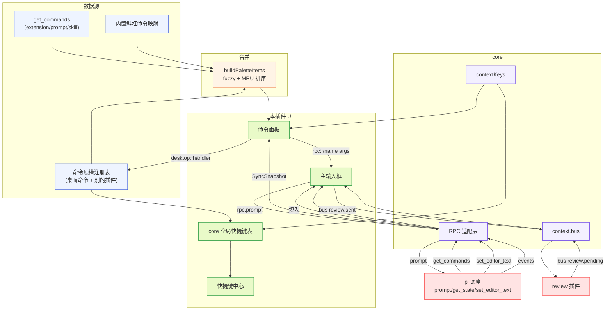

**图 10 — 命令与快捷键插件数据流总览：get_commands + 槽位 + 内置映射 → 面板；输入框唯一发 prompt、收 set_editor_text、经 bus 与 review 协作。** 这张图把全文散落的机制收束为一条可追溯的数据流，实现时按图核对每个箭头是否落地。

---

### 架构自检

- [x] 高内聚：命令面板、输入框、快捷键中心三块职责清晰分离，输入框专司发送出口、面板专司入口发现、快捷键专司触发映射。
- [x] 低耦合：与 review/时间线/文件编辑器等插件的协作全部经事件总线（`review.pending`/`review.sent`/`composer.insert`）和槽位注册表间接引用，不直接 import 它们的实现（呼应 `DESIGN.md` 3.5 第 5 项隔离）。
- [x] 开闭原则：新命令通过往命令项槽贡献项扩展，不改本插件代码；新快捷键同理；底座命令集变化经 `get_commands` 反映，面板自动适配。
- [x] 方案视角：守住"唯一发送出口"是根本——它把构造（review/编辑器组装内容）和执行（输入框发 prompt）分开，避免每个插件各发各的 prompt 导致 streaming 状态、review 合并、UI 一致性全盘失控。这是全局 `CLAUDE.md`「组装和调用应该分开」工程原则在命令/输入域的几何落地（对应 `DESIGN.md` 4.7.4）。

---

文档至此覆盖了命令与快捷键插件从数据源到协作的全部设计要点，实现者可据此直接落码。

---

## 附录 A：核心数据结构汇总

便于实现时速查，本文涉及的核心数据结构集中列：

- `CommandContribution`（命令项槽贡献项，2.1）：`{ id, title, keybinding?, handler?, icon?, when? }`。
- `RpcSlashCommand`（底座命令，3.1，`modes/rpc/rpc-types.ts:79`）：`{ name, description?, source: "extension"|"prompt"|"skill", sourceInfo }`。
- `SourceInfo`（3.5，`core/extensions/source-info.ts`）：`{ path, source, scope: "user"|"project"|"temporary", origin: "package"|"top-level", baseDir? }`。
- `PaletteItem`（命令面板合并项，5.2）：`{ kind: "desktop"|"rpc", id, title, subtitle?, keybinding?, when?, source, sourceInfo? }`。
- `KeybindingEntry`（全局快捷键表项，6.2）：`{ keybinding, commandId, pluginId, priority, when, source: "desktop"|"pi", conflict?: { with: string[] } }`。
- `KeybindingGroup`（快捷键中心分组，6.2/11.3）：`{ keybinding, entries: KeybindingEntry[], conflict: boolean, conflictWith?: string[] }`。
- `SyncSnapshot`（3.4，`DESIGN.md` 3.2.4）：`{ state, entries, tree, commands }`。
- `ReviewComment`（10.2）：`{ id, anchor: {kind, ...}, comment, source }`。
- `ComposerProps`/`CommandPaletteProps`/`KeybindingsCenterProps`（11.3）。
- bus topic 契约（10.2/14.2）：`review.pending`/`review.sent`/`review.mode`/`review.remove`/`composer.insert`。

## 附录 B：RPC 命令速查（本插件相关）

本插件直接或间接调用的 RPC 命令：

| 命令 | 用途 | 出现节 |
|---|---|---|
| `get_commands` | 命令面板数据源 | 3 |
| `prompt` | 输入框唯一发送出口 | 7.4 |
| `steer`/`follow_up` | streaming 排队（输入框一般用 prompt+streamingBehavior） | 8.4 |
| `abort` | 中止当前 turn | 9.4 |
| `get_state` | 查 isStreaming 决定 streamingBehavior、派生 contextKeys | 7.4/8.1/9 |
| `new_session` | `session.new` 命令 | 4.1 |
| `cycle_model`/`set_model`/`get_available_models` | 模型命令 | 4.1 |
| `cycle_thinking_level`/`set_thinking_level` | 思考级别命令 | 4.1 |
| `compact` | 压缩命令 | 4.1 |
| `set_steering_mode`/`set_follow_up_mode` | 队列模式 | 7.5c |
| Extension UI `set_editor_text` | 输入框响应填入 | 7.6/15b |

全部经 `PluginContext.rpc`（worker 侧）或 `RendererPluginContext.rpc`（renderer 侧）调用，逃生舱 `rpc.send`。这些命令的返回值类型在 `DESIGN.md` 1.7 定义、经 gateway 翻译成圆心中性类型（`DESIGN.md` 5.1.5）——本插件不直接依赖底座协议类型，依赖方向向内，底座协议变动只动中层翻译、不动本插件代码。这是洋葱架构在命令与快捷键域的具体落地。
