# 终端与信任插件文档

本文是 pi-desktop 设计文档第 4.8 节"终端与项目信任插件"的工程级展开。它把 DESIGN.md 中关于该插件的一段浓缩描述，拆到照着能写代码的粒度：侧栏终端面板的内部结构、信任运行时流程的状态机、两种 bash 的数据通路区分、`excludeFromContext` 的前缀解析、命令历史与中止、以及复用卡片渲染槽 bash 渲染器的隔离机制。所有结论对照 pi 底座源码（`packages/coding-agent/src`）逐条验证，不臆测接口。

阅读前提：已读 DESIGN.md 第 0–3 节（薄壳模型、四根支柱、插件系统抽象）及 4.3、4.4、4.8 节。本文中"底座"指 pi 子进程及其内部机制，"core"指 pi-desktop 的核心层，"插件"指桌面端插件，三者关系见 DESIGN.md 0.1。

> **与 DESIGN.md 的接口对齐说明**：本文第 2.3 节定义的 `TerminalTrustWorkerContext` 是 DESIGN.md 3.2.4 `PluginContext` 在本插件视角的子集投影，并补充本插件落地所需、DESIGN.md 尚未钉死的几处契约（`ctx.cwd`、`ctx.setContextKey`、worker↔renderer 收发、`trust` 接口的父目录/选项查询）。这些补充在第 11 节"DESIGN.md 缺口与对齐建议"里汇总，需回写 DESIGN.md 3.2.4/3.2.5/1.7.1 才闭环；在缺口补齐前，相关条目标注为本文定义的契约草案。

> **落地状态：契约草案，部分 BLOCKING 待回写**：照着本文写代码的硬前提——`ctx.cwd`（缺口①）、`trust` 接口 8 个方法（缺口②）、`RendererPluginContext.cardRenderers`（缺口③）、`ctx.setContextKey` + when 求值进程归属（缺口④）、`#` handler 自动绑定（缺口⑥）、bash 豁免 30s 超时（缺口⑦）——**仍不在 DESIGN.md 3.2.4/3.2.5/3.3/1.4.2 的已钉死接口里**。一个实现者若照着 DESIGN.md 现有的 `PluginContext` 写代码，会发现没有 `ctx.cwd`、没有 `ctx.setContextKey`、没有 `ctx.trust.*`、没有 `rpc.bash`/`abortBash` 的签名钉死——照着本文骨架写会编译/运行失败。第 11 节缺口表①–④、⑥、⑦ 已在"状态"列标记为 **BLOCKING 待回写**；在 DESIGN.md 回写这些契约前，**本文为契约草案、不可直接进实现**。**缺口⑤（`ctx.onRendererMessage` 命名）已回写**——DESIGN 3.2.4 已钉死 worker 侧 `onRendererMessage`、3.2.5 钉死 renderer 侧 `onMessage`/`postToWorker`，两侧命名对称区分，见 DESIGN 3.2.4/3.2.5。**缺口⑩（项目打开信任横幅归属）已回写**——DESIGN 4.8.1/4.8.3 已改为"项目打开信任检查+横幅归 core、4.8 仅管首次 bash 交汇点"，与本文 1.2 一致，见 4.8.1/4.8.3。⑧（BashResult 字段口径）已对照源码核对为合并单 `output` 字段（见 4.2/缺口⑧）；⑨（重启重发时序）为本文内部时序约定，并含一条对 core 配置操作层的硬性要求（信任翻转重启必须经 `--session <sessionFile>` 传当前 session 文件、尽量产出 `resume`，并设 60s 超时兜底），见 3.5.1 step3 / 缺口⑨——该硬性要求作用于 core 配置操作层行为、非 DESIGN 圆心接口钉死，故未列入 BLOCKING 待回写，但 core 落地时必须满足。

## 1 插件定位与职责边界

### 1.1 一个插件，两个职责

终端与项目信任插件（下称"终端信任插件"，插件 id 约定为 `terminal-trust`）是 pi-desktop 随壳分发的十二个内置默认插件之一，目录落点 `packages/desktop/src/plugins/builtin/terminal-trust/`。它承担两个在数据流上不同、但在场景上紧密交织的职责：

第一是**侧栏终端面板**：用户在桌面端直接键入 bash 命令、看输出、回溯历史、中止运行中的命令。这条通路走 RPC 的 `bash` / `abort_bash` 命令，桌面端是发起方、拿 `BashResult` 响应渲染。

第二是**项目信任运行时流程**：当用户打开一个尚未信任、且磁盘上存在信任门槛资源（`.pi/settings.json`、`.pi/extensions/`、`.agents/skills/` 等）的项目时，弹"是否信任此项目"的交互，把用户的选择回写进信任持久状态。

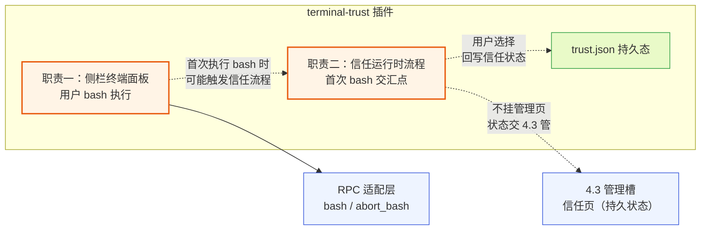

**图 1 — 一个插件两个职责：终端数据流与信任状态流，在首次执行 bash 时交汇**

把两者放在同一个插件里不是随手凑的，DESIGN.md 7.10 节专门记录了这个取舍。理由是信任流程最常在用户首次打开终端、准备执行命令时触发——用户敲第一条 `ls` 时弹出"是否信任此项目"是自然的。把这条交汇的信号通路收敛在一个插件内部，避免了"终端插件发 `user.firstBash` 到事件总线、信任插件订阅"这层跨插件耦合。代价是 4.8 承担两个职责，但两者逻辑交集紧、内聚代价可控。若未来信任流程演化出独立的权限审批流，再拆——那时终端插件往事件总线发 `user.firstBash`、信任插件订阅，是开放的演进路径。

### 1.2 与 4.3 基础管理 UI 插件的分工

职责边界的关键设计是：终端信任插件**不往管理槽挂独立的项目信任管理页**。项目信任的持久状态管理——信任列表、默认信任策略 `defaultProjectTrust`、信任开关的增删改——归 4.3 基础管理 UI 插件的"项目信任页"。两个插件的分工是：

- **4.3 管持久状态**：读写 `~/.pi/agent/trust.json`、列已信任项目、改 `defaultProjectTrust` 默认策略、信任开关的落盘。这是"管 pi 自身状态"的范畴，属于管理页。
- **4.8 管运行时流程**：在首次执行 bash 这个交汇点弹交互、把用户当场的选择回写给 core 配置操作层（落 `trust.json`）、在终端面板里展示当前项目是否信任及原因。

这样分工避开了两个内置插件往管理槽贡献同 id 信任页的冲突——管理槽的冲突仲裁是"二选一覆盖"，两个内置插件同 id 互相覆盖没有意义，不如一开始就只让 4.3 挂信任页。终端信任插件要改信任状态时，不自己往管理槽挂页，而是调 core 提供的配置操作能力（DESIGN.md 支柱②）读写 `trust.json`——和 4.3 走同一条落盘路径，避免两个插件各写一份写盘逻辑（呼应 CLAUDE.md"回调参数是责任边界模糊的气味"：多个调用方各自写一遍信任落盘，说明该收进 core 的配置操作层统一承担）。

**关于"项目打开时的信任检查与横幅"归属**：项目刚打开时（底座子进程起来前）的信任检查与全局信任横幅，是 **core 的职责，不是 4.8 的职责**。原因：项目是否信任直接决定项目级 settings 是否加载（DESIGN.md 2.1.2），这影响整个 pi 子进程的启动配置，属于 core 启动编排范畴，不该归某个具体插件。core 通过支柱②配置操作层直接访问 `ProjectTrustStore`（core main 自己持有 trust 读写能力，不经过 worker 侧 `PluginContext.trust`），在加载项目级 settings 前完成信任决策。4.8 只负责**首次执行 bash 这个交汇点**的信任交互——这是"两个职责在首次 bash 时交汇"的唯一下沉到插件的触发点。1.2 此前措辞把"打开不信任项目时弹交互"归给 4.8，现修正：打开项目的横幅归 core，4.8 不接管。

### 1.3 贡献的槽位清单

终端信任插件往哪些槽位挂贡献项，决定了它影响 UI 的范围。清单如下：

| 槽位 | 贡献项 | 用途 |
|------|--------|------|
| sidePanel | `{ id: "terminal", label, icon, component, order?, defaultVisible? }` | 侧栏"终端"Tab，承载终端面板 |
| commands | `{ id, title, keybinding?, handler?, when? }` | "聚焦终端""清空历史""中止当前命令"等命令项 |
| settings | `{ id, title, component }` | 终端插件自己的偏好（历史条数上限、字体、是否进上下文默认值） |

注意它**不贡献** `cardRenderers`——它复用 4.4 时间线渲染插件挂的 bash 卡片渲染器，机制见第 6 节。它也**不贡献** `management`——信任页归 4.3。

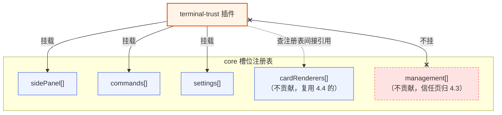

**图 2 — 终端信任插件贡献侧栏/命令/设置三个槽位，卡片渲染器和信任页走间接复用与不挂**

## 2 侧栏终端面板

### 2.1 面板结构与渲染归属

终端面板挂在 `sidePanel` 槽位，是侧栏的一个 Tab。用户点侧栏的"终端"图标切到这个面板。面板内部由三块组成：

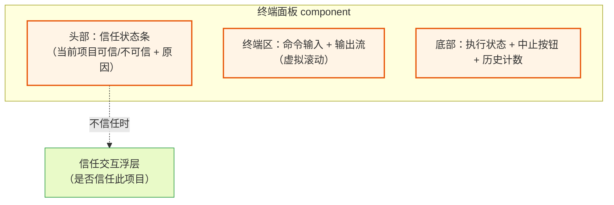

**图 3 — 终端面板三段结构：头部信任条、终端区、底部状态**

头部信任状态条是这个插件"两个职责"在 UI 上的汇合点——它同时是终端面板的一部分（职责一）和信任状态的展示（职责二）。当当前项目不信任时，头部条不仅显示"不可信"标记，还提供一个"信任此项目"的入口，触发第 3 节的信任运行时流程。这条状态条的数据来源是 core 维护的 `project.trusted` contextKey（见 2.4），不直接读 `trust.json`。

终端区是面板主体，承载命令输入框、输出流、命令历史的上箭头回溯。输出流用虚拟滚动（呼应 DESIGN.md 4.4 的时间线虚拟滚动方案），因为单条 bash 输出可能很长（`log` 文件、`find` 全量结果），不虚拟滚动会卡。虚拟滚动的实现可以复用 core 的虚拟列表工具或 pi.ui 组件库的 `VirtualList`，终端插件不自己造一套。

底部状态条显示"执行中 / 空闲"、运行中命令的退出码（完成后）、中止按钮（运行中才亮）、历史条数。这些是纯 UI 派生状态，由插件自己维护。

### 2.2 manifest 声明

照 DESIGN.md 3.2 的插件抽象（manifest + 可选代码 + contribution），终端信任插件的 `plugin.json` 长这样：

```json
{
  "id": "terminal-trust",
  "version": "0.1.0",
  "displayName": "Terminal & Project Trust",
  "main": "./worker.ts",
  "renderer": "./ui.tsx",
  "contributes": {
    "sidePanel": [
      {
        "id": "terminal",
        "label": "sidePanel.terminal",
        "icon": "terminal",
        "component": "TerminalPanel",
        "order": 30,
        "defaultVisible": true
      }
    ],
    "commands": [
      {
        "id": "terminal.focus",
        "title": "commands.terminal.focus",
        "keybinding": "ctrl+`",
        "handler": "#onFocusTerminal",
        "when": "true"
      },
      {
        "id": "terminal.abort",
        "title": "commands.terminal.abort",
        "keybinding": "ctrl+c",
        "handler": "#onAbortBash",
        "when": "terminal.bashRunning && terminal.inputFocused"
      },
      {
        "id": "terminal.clearHistory",
        "title": "commands.terminal.clearHistory",
        "handler": "#onClearHistory",
        "when": "true"
      }
    ],
    "settings": [
      { "id": "terminal", "title": "settings.terminal", "component": "TerminalSettings" }
    ]
  }
}
```

几点要说明：

- `main` 和 `renderer` 都有——这是个双入口插件（DESIGN.md 3.6）。`main`（worker 侧）负责发 RPC 命令、拿响应、维护命令历史、读写信任状态；`renderer` 侧负责 UI 渲染。worker↔renderer 经 MessagePort 通信。
- `commands` 里的 `when` 字段用 contextKey 表达式（DESIGN.md 3.3 的 when clause 语法）。`terminal.bashRunning` 是本插件贡献的派生 key——插件在 bash 运行中时置 true、结束时置 false，core 把它注册进 contextKeys 表。`when: "terminal.bashRunning && terminal.inputFocused"` 让"中止"命令只在终端输入框聚焦且有运行中 bash 时可用，否则灰掉。这是 when clause 的典型用法。
- **handler 的 `#` 绑定机制**：manifest 里 `handler: "#onFocusTerminal"` 用 `#` 前缀引用 worker 模块的命名导出。core 加载 worker 模块（`main` 指向的 `worker.ts`）后，按 `#` 后的名字查该模块的命名导出（`export function onFocusTerminal`），自动把命令项绑定到该函数——**插件不需要、也不应该调用 `ctx.registerHandler` 注册**。core 在 manifest 校验阶段（DESIGN.md 3.5 第 3 步）会检查 `#name` 对应的导出在模块里确实存在，缺失则加载失败。这与 DESIGN.md 3.2.4 的 `register(DynamicContribution)`（运行时动态注册贡献项）是两条独立路径：`#` 绑定是 manifest 静态声明的自动绑定，`register` 是运行时动态补充。
- `icon: "terminal"` 是 lucide 图标名。
- **ctrl+c 快捷键仲裁**：`terminal.abort` 绑 ctrl+c，但 `when` 加了 `terminal.inputFocused` 守卫——仅在终端输入框聚焦且 bash 运行中时生效。其余场景（文本选区复制、其他面板焦点）ctrl+c 让位给复制/默认行为，不触发 abort。这避免了 ctrl+c 中断语义与复制语义的冲突。`terminal.inputFocused` 是本插件贡献的派生 contextKey，输入框聚焦/失焦时由插件经 `ctx.setContextKey` 置 true/false（见 2.4）。
- **ctrl+c 仲裁的竞态与 when 求值归属（落地必须钉死）**：`terminal.inputFocused` 是渲染侧焦点状态，但 `setContextKey` 按本文归属在 worker 侧 `PluginContext`。输入框聚焦/失焦发生在 renderer，若 `when` 求值在 worker/main 侧，则必须经 `postToWorker → worker.setContextKey` 往返才能更新 contextKeys 表、重算 when clause——这条往返引入竞态：用户刚聚焦输入框即按 ctrl+c，focus 消息未到 worker 时 `terminal.inputFocused` 仍为 false，ctrl+c 不触发 abort。**落地前必须钉死 contextKeys 表与 when 求值的进程归属**，两选一：
  - **方案 A（推荐，when 在 renderer 求值）**：when clause 求值发生在 renderer 侧（core 在 renderer 维护一份 contextKeys 表的同步镜像）。此时应允许 renderer 侧直接置焦点 key——需在 `RendererPluginContext`（DESIGN.md 3.2.5）暴露 `setContextKey`，或把 `terminal.inputFocused` 这类纯渲染焦点 key 划归 core renderer 侧维护（输入框 focus/blur 事件直接在 renderer 写表、不走 worker 往返）。这样 ctrl+c 仲裁的 when 求值与焦点事件同进程、无往返延迟、无竞态。该方案要求 DESIGN 3.2.5 补 `RendererPluginContext.setContextKey`（并入缺口④一起回写）。
  - **方案 B（when 在 main/worker 求值）**：接受 postToWorker 往返延迟。此时 ctrl+c handler 内必须**再判一次焦点态兜底**（renderer 侧 handler 入口处读本地焦点态、未聚焦则不 abort），并在 UI 层对 ctrl+c 做去抖（合并连续按下、等 focus 消息追上后再判 when）。该方案的可靠性差于方案 A，仅作 when 求值无法下沉到 renderer 时的兜底。
  - 本文不预判 core 最终选哪个方案，但**当前实现路径不清晰即影响 ctrl+c 仲裁可靠性**——这是 BLOCKING 项（缺口④的扩展），落地前须与 DESIGN 3.2.5/3.3 一并钉死 when 求值进程归属与焦点 key 的写者。在钉死前，ctrl+c 仲裁按"已知存在竞态、handler 内二次判焦点态兜底"处理。
- 命令历史和信任状态的读写走 worker，不在 renderer 直接调 RPC——保持"组装和调用分开"（CLAUDE.md 工程原则）：renderer 组装 UI、worker 调用 RPC/配置操作。renderer 要显示历史时，worker 把历史数组经 `emitToRenderer` 推给 renderer。

### 2.3 worker 侧的 PluginContext

worker 侧拿到的 `PluginContext`（DESIGN.md 3.2.4）是这个插件和外界交互的唯一通道。终端信任插件用到的接口（本文定义的 `TerminalTrustWorkerContext` 是 `PluginContext` 的子集投影，并补充本插件落地所需、DESIGN.md 尚未钉死的契约）：

```typescript
interface TerminalTrustWorkerContext {
  /** 当前项目工作目录（底座子进程的 cwd，即用户打开的项目根）。
   *  由 core 在起底座子进程时确定并注入 PluginContext（见 11 节缺口①：
   *  需在 DESIGN.md 3.2.4 PluginContext 补 cwd 字段、1.7.1 RpcSessionState 补 cwd）。 */
  cwd: string;
  rpc: {
    send(cmd: unknown): Promise<unknown>;          // 逃生舱，发任意 RPC 命令
    bash(command: string, excludeFromContext?: boolean): Promise<BashResult>;
    abortBash(): Promise<void>;
    getState(): Promise<SessionState>;   // 返回中性 SessionState（非底座 RpcSessionState，见 DESIGN 5.1.5）
    /** 重新拉 state+entries+tree+commands 同步 UI（DESIGN 3.2.4 三原语之一）。
     *  信任翻转重启后 core 内部调它完成 UI 同步，插件据此感知"可重发"（见 3.5.1 step3）。 */
    resync(): Promise<SyncSnapshot>;
  };
  config: {
    get<T>(key: string, fallback: T): T;            // 插件自己的配置（历史上限等）
    set(key: string, value: unknown): Promise<void>;
  };
  trust: {
    isTrusted(cwd: string): Promise<boolean | null>;       // 读 trust.json（支柱②配置操作）
    getEntry(cwd: string): Promise<{ path: string; decision: boolean } | null>;
    getProjectTrustOptions(cwd: string): Promise<TrustOption[]>;
    setTrusted(cwd: string, decision: boolean | null): Promise<void>;
    setMany(updates: { cwd: string; decision: boolean | null }[]): Promise<void>;
    listTrusted(): Promise<{ path: string; decision: boolean }[]>;
    getDefaultPolicy(): Promise<"ask" | "always" | "never">;
    hasTrustRequiringResources(cwd: string): Promise<boolean>;
  };
  events: {
    // 与 DESIGN.md 3.2.4 一致：单 listener，回调内按 e.type 分发（无 type 过滤参数）。
    // 落地 reason 过滤等逻辑在 listener 体内用 e.type/e.reason 判定。
    on(listener: (event: SessionEvent) => void): () => void;
  };
  /** contextKey 更新专用接口——不走 bus（bus 是 fire-and-forget、不可靠，见 2.4）。
   *  core 同步更新 contextKeys 表并重算受影响的 when clause。 */
  setContextKey(key: string, value: unknown): void;
  /** 收 renderer 侧 postToWorker 发来的消息（DESIGN.md 3.2.5 定义 worker 侧用
   *  onRendererMessage 收，命名与 renderer 侧 onMessage 对称）。 */
  onRendererMessage(channel: string, cb: (data: unknown) => void): () => void;
  /** 推 UI 数据给 renderer（DESIGN.md 3.2.4）。 */
  emitToRenderer(channel: string, data: unknown): void;
  bus: {
    publish(topic: string, payload: unknown): void;
    subscribe(topic: string, cb: (payload: unknown) => void): () => void;
  };
}

interface TrustOption {
  action: "trust" | "distrust";
  label: string;                 // 如 "Trust"/"Trust parent folder (xxx)"/"Trust (this session only)"
  path?: string;                // 要写入的目录（信任父目录时是父路径）
  sessionOnly: boolean;         // true 时不落盘
}
```

`rpc.bash` / `rpc.abortBash` 是 DESIGN.md 1.5.10 便捷方法的体现——`PluginContext.rpc` 为常用命令提供便捷方法、返回中性类型，覆盖高频命令、不与 31 命令一一对应（未覆盖命令经 `send` 逃生舱发）。`trust` 这块是支柱②配置操作能力的暴露——core 把 `ProjectTrustStore`（底座 `trust-manager.ts`）的读写包成中性接口给插件用，插件不直接碰 `trust.json` 文件（文件并发由 core 用 `proper-lockfile` 兜底，DESIGN.md 2.1.2）。

几处相对 DESIGN.md 3.2.4 的补充（详细理由见第 11 节缺口表）：

- **`ctx.cwd`**：信任流程的全部调用（`trust.isTrusted/setTrusted/hasTrustRequiringResources`）都以 cwd 为参数，但 DESIGN.md 3.2.4 `PluginContext` 和 1.7.1 `RpcSessionState` 都没有 cwd 字段。本文定义 `ctx.cwd: string`——core 起底座子进程时确定的 `cwd`（DESIGN.md 1.3.1 `RpcClientOptions.cwd`，即用户打开的项目目录）注入 PluginContext。这是 11 节缺口①，需回写 DESIGN.md。
- **`trust.getEntry` / `getProjectTrustOptions` / `setMany`**：3.4 的"信任父目录"要 `setMany` 写两条（父 true + 当前 null）、3.6 的"继承自父目录 xxx"原因文案要 `getEntry` 回查匹配 path、3.4 弹交互要 `getProjectTrustOptions` 拿选项列表。DESIGN.md 3.2.4 只笼统说 `trust` 是支柱②暴露，没列方法；本文钉死这三个方法（缺口②）。
- **`ctx.setContextKey`**：contextKey 状态同步的专用接口，替代原先用 `bus.publish("contextkey", ...)` 的做法。理由见 2.4：bus 是 fire-and-forget、无历史回放，做状态同步不可靠且与 DESIGN.md 3.2.4 的 bus 纪律冲突。core 在收到 `setContextKey` 后同步更新 contextKeys 表、重算受影响 when clause。
- **`ctx.onRendererMessage`**：DESIGN.md 3.2.5 注释明确 worker 侧用 `context.onRendererMessage` 收 renderer 发来的消息（renderer 侧用 `postToWorker` 发）。本文据此钉死 worker 侧收发方法命名——**不是 `onMessage`**（`onMessage` 是 renderer 侧收 worker 推送的方法，DESIGN.md 3.2.5）。manifest 的 `#` handler 绑定见 2.2，不需要 `registerHandler`。

关键纪律：圆心（槽位契约）不 import pi 的类型。`BashResult` / `RpcSessionState` 在圆心是 core 自定义的中性接口，RPC 适配层（中层）负责把 pi 的 `BashResult` 翻译成圆心的中性 `BashResult`——pi 协议改了只动中层翻译、不动圆心契约和插件层（DESIGN.md 3.6 洋葱纪律）。

### 2.4 contextKeys 暴露

终端信任插件往 core 的 contextKeys 表贡献几个派生 key，供自己和其他插件的 when clause 用：

- `terminal.bashRunning`（boolean）：是否有运行中的用户 bash。
- `terminal.bashExcluded`（boolean）：最近一条命令是否用了 `!!` 前缀（不进上下文）。
- `terminal.inputFocused`（boolean）：终端输入框是否聚焦（用于 ctrl+c 仲裁，见 2.2）。
- `project.trusted`（boolean）：当前项目是否信任。这个 key 本身是 core 维护的（DESIGN.md 3.3 的 when clause 示例里就有 `project.trusted`），但信任状态的变更信号由终端信任插件在运行时流程里触发——它改完信任状态后，通知 core 刷新 `project.trusted`。

> **`project.trusted` 仅是二态展示/when-clause 信号，不驱动三分支分流**：一个 boolean 无法区分"已拒绝(false)"与"待决策(无决策)"——两者都映射 false。故图6/图7 的首次 bash 拦截分流**不能只读 `project.trusted` contextKey**，必须重跑 `ensureTrusted` 全链路解析（`hasTrustRequiringResources` → `getEntry` → `getDefaultPolicy` → 弹交互，见 10.4 骨架）。`project.trusted` 只用于：(a) 信任状态条展示（可信/不可信二态）、(b) 依赖它的 when clause 求值。信任决策的"待决策/已拒绝/已信任"三分支由 `ensureTrusted` 重算得出，而非读 contextKey。否则已拒绝项目会被误当"待决策"反复弹框。

**contextKey 更新机制**：core 维护 contextKeys 表、运行时按状态更新，命令的可见/可用由 when 求值决定。终端信任插件更新自己贡献的 key（`terminal.bashRunning` 等）时，调**专用接口 `ctx.setContextKey(key, value)`**——core 同步写入 contextKeys 表并重算受影响 when clause。**不复用 `bus`**：DESIGN.md 3.2.4 对 bus 明确警告"subscribe 前发布的消息订阅不到、后来的 subscribe 收不到过去的消息……别指望 bus 传历史状态"，用 fire-and-forget 的 bus 做 contextKey 状态同步违背该纪律、且不可靠（订阅时序错乱会丢 key 值）。`ctx.setContextKey` 是同步、即时生效的专用通道，单一数据源仍在 core 的 contextKeys 表。

> **when 求值进程归属未钉死（缺口④扩展，BLOCKING）**：`terminal.inputFocused` 这类焦点 key 的写者与 when 求值的进程归属，DESIGN.md 3.3 未明确。若 when 在 worker/main 求值，焦点 key 必须经 postToWorker 往返、引入 ctrl+c 仲裁竞态（见 2.2）。落地方案 A（推荐）要求 DESIGN 3.2.5 补 `RendererPluginContext.setContextKey`，让纯渲染焦点 key 在 renderer 侧直接置、与 when 求值同进程；方案 B 接受往返并要求 handler 内二次判焦点态兜底。两方案任一都需回写 DESIGN 3.2.5/3.3 才闭环。详见 2.2。

**`project.trusted` 的写者与刷新链路**：之前文档对 `project.trusted` 的写者前后矛盾（2.4 说 core 维护、9.2 状态表又写"trust.changed 事件写"）。现统一裁定——`project.trusted` 的写者是 **core**，不是插件、也不是 bus 事件：

1. 信任状态写入（`trust.setTrusted` / `setMany`）走 core 配置操作层落盘 `trust.json`。
2. core 配置操作层在写入完成后，**直接**重新求值当前 cwd 的信任状态（它本就持有 `ProjectTrustStore` 读写能力），更新 contextKeys 表里的 `project.trusted`，并重算所有依赖该 key 的 when clause。
3. core 配置操作层经 `emitToRenderer`（或 core 内部的 contextKeys 广播通道）通知 renderer 侧刷新信任状态条展示。

这条链路全程在 core 内部闭环，不经过 bus、不依赖插件订阅 `trust.changed` topic。终端插件要刷新自己的信任条展示时，订阅 core 的 contextKeys 变更广播（core 提供的专用 contextKeys 变更通知，不是 bus topic）即可。这消除了"core 维护"与"trust.changed 事件写"的矛盾。

## 3 信任运行时流程

### 3.1 信任的数据层：trust.json

信任状态在磁盘上的落点是 `~/.pi/agent/trust.json`，由底座的 `ProjectTrustStore`（`packages/coding-agent/src/core/trust-manager.ts:208`）管理。文件结构是路径到决策的映射：

```json
{
  "/home/alice/project-a": true,
  "/home/alice/project-b": false
}
```

值是三态：`true`（信任）、`false`（显式不信任）、缺席/null（无决策）。`ProjectTrustStore` 的几个关键方法（逐条对照源码）：

- `get(cwd)`：返回 `ProjectTrustDecision`（`boolean | null`）。内部调 `getEntry`，用 `findNearestTrustEntry` 沿父目录向上找最近一条匹配——这意味着信任 `/home/alice` 会连带信任其下的所有子目录（除非子目录有显式 `false`）。这是"信任父目录"语义。
- `getEntry(cwd)`：返回 `ProjectTrustStoreEntry | null`，带匹配到的 `path` 和 `decision`。
- `set(cwd, decision)`：写一条决策，`null` 表示删除该条目（`setMany` 内部 `delete data[key]`）。
- `setMany(updates)`：批量写，事务性（一次锁一次写）。
- `getProjectTrustOptions(cwd, opts?)`：返回选项列表（3.4 节用）。

文件并发用 `proper-lockfile` 的 `lockSync`，最多重试 10 次、每次等 20ms（`acquireTrustLockSync`，trust-manager.ts:136）。这是同步锁——因为 `getEntry` 是同步方法、被 `SettingsManager.loadFromStorage` 同步调用（判断项目级 settings 是否加载）。core 暴露给插件的 `trust` 接口是异步的（worker 侧），但底层落盘是同步锁——core 的配置操作层负责这种同步/异步桥接，插件不感知。

### 3.2 信任门槛资源

不是每个项目都要走信任流程。底座的 `hasTrustRequiringProjectResources(cwd)`（trust-manager.ts:184）判断当前项目（含祖先目录）是否存在需要信任门槛的资源：

```typescript
const TRUST_REQUIRING_PROJECT_CONFIG_RESOURCES = [
  "settings.json", "extensions", "skills", "prompts", "themes",
  "SYSTEM.md", "APPEND_SYSTEM.md",
];
```

判断逻辑：当前目录的 `.pi/` 下有上述任一资源 → 需要信任；或当前目录或祖先目录的 `.agents/skills/` 存在（但排除用户全局的 `~/.agents/skills/`，那是受信用户资源）。没有这些资源的项目直接 `return true`（信任，无需问）。

这条规则是信任流程的触发前提。终端信任插件判断"要不要弹信任交互"时，先调 `trust.hasTrustRequiringResources(cwd)`——没门槛资源就不弹，避免给用户每开一个空目录都问一遍"是否信任"的骚扰。

### 3.3 决策链路：底座怎么判信任

底座侧的信任决策在 `resolveProjectTrusted`（`packages/coding-agent/src/core/project-trust.ts:46`）。这条链路终端信任插件要镜像——因为桌面端要在用户首次执行 bash 时、根据当前信任状态决定要不要拦截。链路顺序（对照源码）：

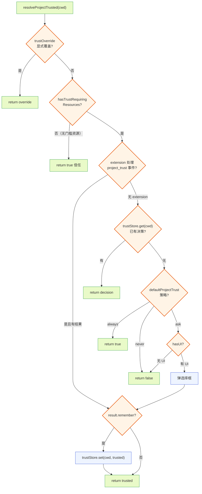

**图 4 — 信任决策链路（镜像底座 resolveProjectTrusted）：override → 门槛资源 → extension → store → 默认策略 → ask UI**

关键点：底座在 RPC 模式下也有 `project_trust` extension 事件机制（`emitProjectTrustEvent`），底座 extension 可以拦截信任决策。但桌面插件收不到 `ExtensionEvent`（见第 5 节），所以桌面端的信任流程是"独立重放"这条链路的前几步——查 store、查默认策略、必要时弹 UI——不参与 extension 的 `project_trust` 拦截。底座 extension 的拦截结果会反映到最终是否加载项目级 settings（DESIGN.md 1.8.2 处理后状态可见），桌面端只看最终结果。

`defaultProjectTrust` 策略三态（`settings.json` 全局字段，DESIGN.md 2.1.3）：
- `"always"`：新项目默认信任，不弹。
- `"never"`：新项目默认不信任，不弹。
- `"ask"`：弹交互问用户（默认值）。

**关于 `trustOverride`**：图 4 链路第一步是 `trustOverride` 显式覆盖（如 CLI `--trust` 参数一次性覆盖本次决策）。桌面端状态机（图 5）此前从 `hasTrustRequiringResources` 开始、跳过了 override 分支。现裁定：**桌面端忽略 `trustOverride`**——理由是 override 是底座启动期的临时一次性机制（CLI 参数级别），桌面端起底座子进程时不传该参数，桌面端的信任判断只基于 `trust.json` 持久决策 + `defaultProjectTrust` 策略 + 弹交互。这保证桌面端显示的信任状态与底座实际加载项目级 settings 的行为一致（底座没有 override 时，两者都基于 store + 默认策略）。若用户经 CLI 启动底座带了 override，那是脱离桌面端的场景，不在本文管辖。

### 3.4 桌面端的信任运行时流程状态机

终端信任插件在桌面端实现的信任流程，是图 4 链路在桌面侧的重放（跳过 override 与 extension 拦截）。状态机：

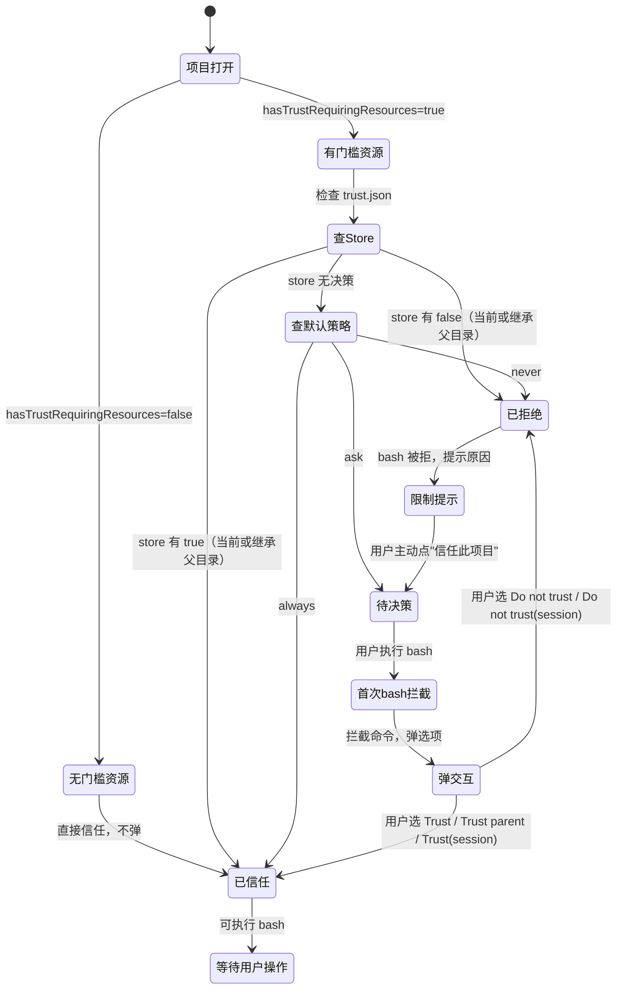

**图 5 — 桌面端信任运行时流程状态机：从项目打开到信任/拒绝决策**

几个细节照源码钉死：

- `getProjectTrustOptions(cwd, { includeSessionOnly: true })`（trust-manager.ts:65）返回的选项列表包含：`Trust`（信任此目录，落盘）、`Trust parent folder (xxx)`（信任父目录，落盘，本目录决策置 null）、`Trust (this session only)`（本次会话信任、不落盘 updates 为空）、`Do not trust`、`Do not trust (this session only)`。终端信任插件的弹交互浮层要展示这些选项，让用户能选"信任父目录"这种粒度。本文 2.3 的 `trust.getProjectTrustOptions` 即暴露此能力。
- 用户选 `Trust (this session only)` 时，`updates` 是空数组——不写 `trust.json`，只在本会话内信任。终端插件要在会话内存里记一条"本会话信任"的临时标记，不落盘。重启底座子进程后这条临时信任丢失，下次打开会重新走流程（见 3.4.1）。
- 用户选 `Trust parent folder` 时，`setMany` 写两条：父目录 `true`、当前目录 `null`（删除当前目录的显式决策，让它继承父目录）。这保证父目录信任的继承语义不被当前目录的旧决策挡住。本文 2.3 的 `trust.setMany` 即暴露此批量写能力——单条 `setTrusted(parentPath, true)` 无法删除当前目录的旧决策，故父目录信任语义必须有 `setMany`。

#### 3.4.1 session-only 信任在重启/热重载时的行为

session-only 信任存在 worker 内存（`sessionOnlyTrusted` Set），有两类中途丢失场景，预期行为如下：

- **配置变更触发重启（DESIGN.md 2.4）**：若信任回写后又有别的配置改动触发重启子进程，session-only 信任随 worker 进程结束丢失。下次执行 bash 会重新走信任流程（`hasTrustRequiringResources` 仍 true、store 仍无决策、策略仍 ask → 重新弹交互）。这是可接受的——session-only 本就声明"仅本次会话"，重启算新会话。终端插件在重启后首次 bash 触发时，应提示用户"上次会话仅临时信任，请重新确认"，降低困惑。
- **worker 热重载**（DESIGN 3.5 加载器周期性 `deactivate→activate` 驱动；`onDeactivate`（DESIGN 3.2.4）注册的清理回调在此周期被调用，但 `onDeactivate` 本身是资源释放钩子、不是热重载触发器——热重载由加载器的 file watcher 触发，不要在 `onDeactivate` 里塞重载逻辑）：插件热重载时 `sessionOnlyTrusted` 内存态丢失，行为同上。若要更持久，可将 session-only 信任写入 core 的会话级临时存储（非 `trust.json`、随 session 结束清理），但当前实现走内存态即可，热重载属低频。
- **被拦截命令（pendingCommand）在热重载窗口的丢失（与 session-only 同等处置）**：`pendingCommand` 与 `sessionOnlyTrusted` 一样存在 worker 模块内存（10.2）。它跨底座子进程重启是安全的（worker 是 desktop 的 utilityProcess、不随底座子进程重启），但**worker 自身热重载会丢失它**——落盘信任翻转已触发底座重启、`session_start` 尚未到达期间，若加载器的 file watcher 因不相关插件文件变更触发 worker 热重载，`pendingCommand` 随 worker 进程结束丢失，被拦截命令静默消失。本文此前只对 session-only 讨论了热重载丢失，未覆盖落盘翻转 pending 这条更严重的路径，现补齐为与 session-only **一致的处置**：
  - **已知限制（当前实现）**：热重载窗口内 `pendingCommand` 丢失为已知限制。worker 重激活后无法重发，终端面板须主动向 renderer 报"命令重发失败：插件已重载，请重新执行"（与 9.3 的"重启 resync 后命令重发失败"处置对齐），不无限重试、不静默吞掉。
  - **更持久方案（演进）**：把 `pendingCommand` 落进 core 的会话级临时存储（与 session-only 信任的更持久方案同一存储），使其跨 worker 热重载存活；`session_start` 回调从该存储取回重发。当前两路径（session-only 与 pendingCommand）处置现已对称：都标注热重载丢失为已知限制 + UI 提示重新执行，演进时一并迁入 core 会话级临时存储。详见 9.2/9.3。

### 3.5 首次 bash 触发的信任交互

"首次 bash 触发信任交互"是终端信任插件专属的触发点（项目打开时的横幅归 core，见 1.2）。用户在终端面板敲第一条命令、点执行，插件先查 `project.trusted` contextKey，按当前信任状态决定是否拦截：

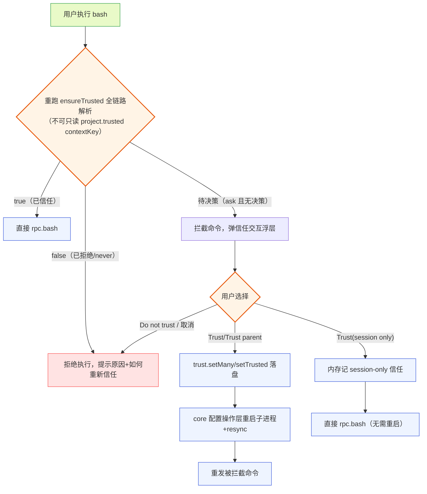

**图 6 — 首次 bash 触发信任流程：按信任状态分流，ask 待决策才弹交互**

关键澄清（消除此前 3.5 散文与 3.4 状态机、10.4 骨架的冲突）：

- **只在"待决策"（策略=ask 且 store 无决策）时弹交互**。已信任直接执行；已拒绝（store 有 false 或策略 never）**不弹交互**，直接拒绝 bash 并提示原因（"项目未被信任，bash 执行受限。点击信任条重新信任"），引导用户主动点信任条回到"待决策"。这统一了 3.4 状态机、3.5 散文、10.4 骨架三者——`ensureTrusted` 对 never/已显式拒绝返回 false 且不弹（符合策略），3.5 此前"不信任就弹"的笼统措辞已修正。
- **已拒绝状态下 bash 的含义**：永久禁止 bash（直到用户主动重新触发信任）。每次执行 bash 都被拦截并提示原因，不每次重新弹信任框——避免骚扰。用户想重新信任时，点头部信任条的"信任此项目"入口，回到"待决策"状态。

**已拒绝→待决策的重新信任入口（骨架见 10.2 `retrust` handler / 10.4 `retrust` 方法）**：`ensureTrusted` 在 `entry.decision === false` 时直接返回 `{ ok: false, deferred: false }`、从不主动弹交互——故"点信任条回到待决策"这条路径不能复用 `ensureTrusted` 的弹交互分支，需要专门的重新信任入口。链路：renderer 信任条"信任此项目"按钮 → `postToWorker("retrust", { cwd })` → worker 调 `trust.setTrusted(cwd, null)`（删除当前 cwd 的显式 `false` 决策，若 `getEntry` 显示是继承父目录的 `false` 则 `setMany` 置父目录 `null`）→ store 回到"无决策"态 → worker 重新调 `ensureTrusted`：此时 store 无决策、策略仍 `ask` → 走弹交互分支重弹 `TrustDialog`。这条路径与首次 bash 拦截路径的复用关系是——**两者共享 `ensureTrusted` 的弹交互分支**（`getProjectTrustOptions` → `promptUserViaRenderer`），区别仅在"如何回到待决策"：首次 bash 是首次进入待决策、retrust 是先删 `false` 决策再回到待决策。骨架见 10.2/10.4。

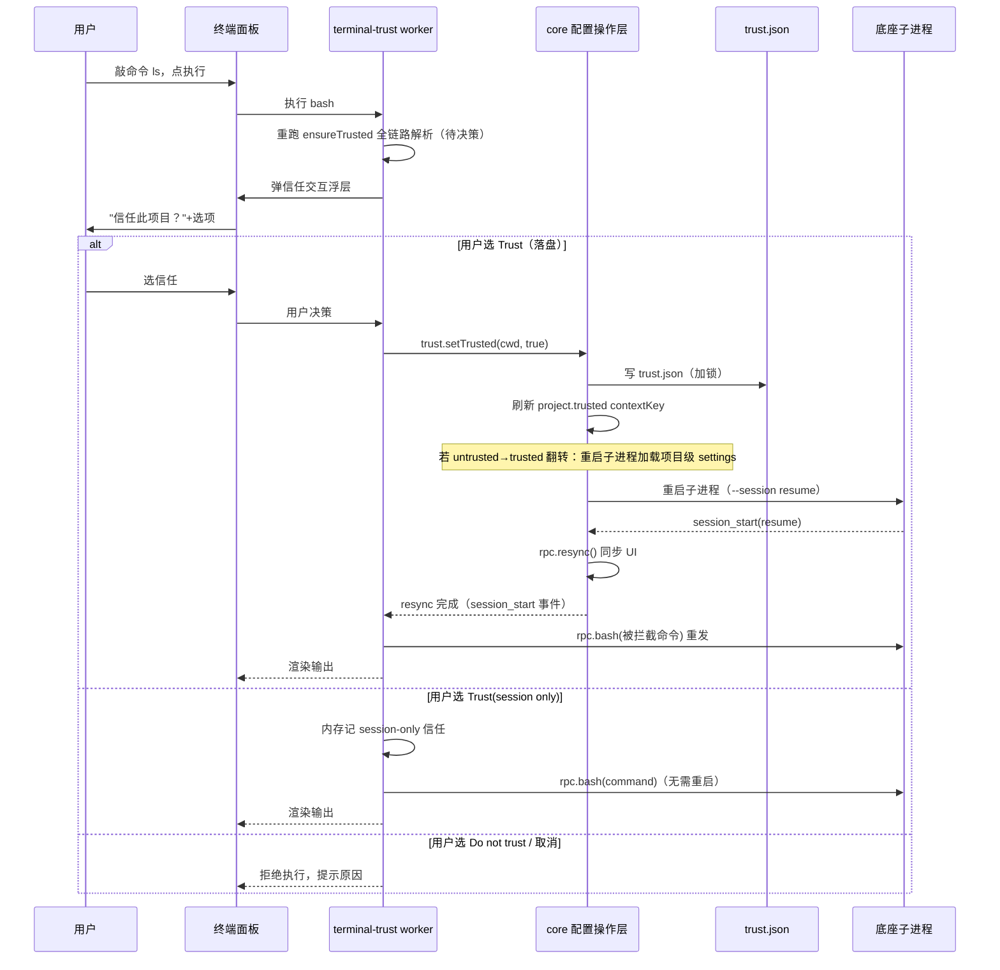

**图 7 — 首次 bash 触发信任流程时序：拦截执行 → 弹交互 → 回写状态 → 重启 resync → 重新执行**

#### 3.5.1 信任回写后重启与命令重发的完整时序

信任决策回写后，原 bash 命令要**重新执行**——不是继续之前被拦截的那次。完整时序（呼应 DESIGN.md 2.4 的带判断重启路径）：

1. **谁触发重启**：core 配置操作层。`trust.setTrusted` 写入 `trust.json` 后，core 判断信任状态是否翻转（untrusted→trusted）——翻转意味着项目级 settings 现在要加载，这需要底座重新读配置，走重启子进程路径（DESIGN.md 2.4）。core 配置操作层持有重启编排能力（它本就管"写共享状态 + 重启消费者"模式，DESIGN.md 2.5.2），插件不直接发重启命令——`PluginContext` 没有重启方法。若信任翻转未改变 settings 加载（如 always→仍信任），不重启。
2. **带判断的重启**：core 查 `get_state.isStreaming`，idle 直接重启、streaming 则等 `agent_settled` 或提示用户（DESIGN.md 2.4.2）。首次 bash 触发场景下 agent 一般 idle（用户在敲第一条命令），通常直接重启。
3. **插件如何感知 resync 完成才重发**：插件订阅 `session_start` AgentSessionEvent（reason: `"resume"`/`"reload"`/`"startup"`）——这是 RPC event 流里的可靠事件（DESIGN.md 1.6.4），不是 bus。core 重启子进程后底座推 `session_start`，core 的 `rpc.resync()` 完成 UI 同步，插件在 `session_start` 事件回调里取出缓存的被拦截命令、重新发 `rpc.bash`。**重发判据（不可省）**：回调里校验 `event.reason ∈ { "resume", "reload", "startup" }` 才重发——`session_start` 的 reason 共五种（startup/reload/new/resume/fork，DESIGN 1.6.4）。落盘信任翻转后若重启被推迟（agent 正 streaming 攒着等 settled），期间用户经 4.6 切 session 会触发 `reason: "new"`/`"fork"` 的 `session_start`，若不校验 reason、`pendingCommand` 非空就重发，命令会被误投到非信任重启的目标会话——故 `new`/`fork` **必须排除**。`resume`/`reload` 是信任翻转重启的预期 reason，重发。
   - **`startup` 的容忍（消除静默丢弃）**：DESIGN.md 1.6.4 原文是"重启子进程后桌面端会收到 reason: startup 或 resume"——**未保证信任翻转重启一定产出 resume**。本文此前版本只在 `{resume, reload}` 时重发、排除了 `startup`：若 core 在信任翻转重启路径上因任何原因（sessionFile 未知/为空、resume 失败回退）未传 `--session <sessionFile>`，重启产出 `reason: "startup"`，`pendingCommand` 将被静默丢弃、用户命令永不重发、且无任何错误提示。现裁定**容忍 `startup`**：`startup` 且 `pendingCommand` 非空时也重发——首次启动 `pendingCommand` 本就为空（无被拦截命令），不会误投；只有在"信任翻转重启恰好产出 startup 且 pendingCommand 非空"这一窄窗口才会触发重发，正是期望行为。这样无论 core 是否成功传 `--session`，被拦截命令都不会静默丢失。
   - **硬性配置要求（缺口⑨，BLOCKING）**：为最大限度保证产出 `resume`（语义上"同 session 续跑"最贴切），core 配置操作层在信任翻转重启路径上**必须经 `--session <sessionFile>` 传当前 session 文件**（DESIGN.md 1.3.2 的 resume 机制），使新进程打开同一 session 文件、产出 `reason: "resume"`。这是一条配置操作层的硬性要求，写入第 2 节缺口⑨契约。若 core 因 sessionFile 未知/为空未传 `--session`，重启产出 `startup`——此时靠上面的 `startup` 容忍分支兜底重发，不静默丢命令。两道防线叠加：硬性要求尽量产出 `resume`、容忍分支兜底 `startup`，任一成立命令都不丢。
   - **超时兜底（第三道防线）**：`session_start` 回调里对 `pendingCommand` 设超时（如 60s）。落盘信任翻转后若 60s 内未等到任何可重发的 `session_start`（重启卡住、worker 热重载丢失 pendingCommand 见 3.4.1、或底座崩溃），向 renderer 报"命令重发失败，请重新执行"（与 9.3 处置一致），不无限等待、不静默吞掉。
4. **被拦截命令如何跨 resync 存活**：缓存在 worker 内存（`pendingCommand` 变量）。worker 进程不随底座子进程重启而重启（worker 是 desktop 的 utilityProcess，底座是独立子进程），所以缓存安全。命令内容（command 字符串 + excludeFromContext）足够重发，不依赖底座运行态。

session-only 信任不翻转 settings 加载（不落盘、底座不重读配置），故**不触发重启**——插件直接 `rpc.bash` 执行即可（图 7 的 session-only 分支）。

### 3.6 信任状态条与原因展示

终端面板头部信任状态条要展示"当前项目是否信任、为什么"。原因的判定逻辑（对应图 5 的来路）：

- 信任 + 原因"无门槛资源"：`hasTrustRequiringResources` 返回 false。
- 信任 + 原因"全局策略 always"：`defaultProjectTrust === "always"` 且 store 无决策。
- 信任 + 原因"用户已信任此目录"：store 里当前目录有 `true`。
- 信任 + 原因"继承自父目录 xxx"：store 里父目录有 `true`、当前目录无显式决策（`getEntry` 返回的 `path` 是父目录）。
- 不信任 + 原因"全局策略 never"：`defaultProjectTrust === "never"` 且 store 无决策。
- 不信任 + 原因"用户已拒绝此目录"：store 里当前目录有 `false`。
- 不信任 + 原因"继承自父目录 xxx"：store 里父目录有 `false`。
- 待决策 + 原因"待确认"：策略 ask 且无 store 决策。

`getEntry` 返回的 `path` 字段是判断"是当前目录决策还是继承父目录"的关键——若返回的 `path` 等于当前 cwd，是当前目录显式决策；若不等于，是继承自该 path（最近祖先）。本文 2.3 的 `trust.getEntry` 即暴露此回查能力——只有 `isTrusted` 返回 boolean|null 会丢失匹配 path，"继承自父目录 xxx"原因文案无法渲染。

## 4 bash 执行：RPC 通路与前缀解析

### 4.1 bash RPC 命令的完整契约

用户在终端面板执行 bash，走 RPC 的 `bash` 命令。完整契约（对照 DESIGN.md 1.5.10 和底座源码 `rpc-mode.ts:553`）：

- 发送：`{ type: "bash", command: string, excludeFromContext?: boolean, id }`
- 响应（成功）：`{ type: "response", command: "bash", success: true, data: BashResult }`
- 响应（失败）：`{ type: "response", command: "bash", success: false, error: string }`（仅子进程崩溃这类）
- 命令执行失败不是 RPC 错误：`success: true`、`BashResult.exitCode` 非 0 是正常的命令失败。

底座侧的处理（`rpc-mode.ts:553-558`）极简：

```typescript
case "bash": {
    const result = await session.executeBash(command.command, undefined, {
        excludeFromContext: command.excludeFromContext,
    });
    return success(id, "bash", result);
}
```

`session.executeBash`（`agent-session.ts:2675`）是真实执行入口：起一个 `AbortController` 存进 `this._bashAbortController`、按 settings 加 shell 前缀（`getShellCommandPrefix`，如 `shopt -s expand_aliases`）、调 `executeBashWithOperations` 跑命令、`recordBashResult` 把结果记进 agent 上下文和 session、返回 `BashResult`。整个调用是 `await` 的——RPC 命令要等命令跑完才回响应。这意味着长命令（如 `npm install`）会让 `bash` 命令的响应迟迟不来。

### 4.2 BashResult 的字段

`BashResult`（`bash-executor.ts:29`）的字段终端插件要照着取。**已对照底座源码核对**（`packages/coding-agent/src/core/bash-executor.ts`，见 `dist/core/bash-executor.d.ts`）：底座的 `BashResult` **是合并单 `output` 字段，不是 stdout/stderr 分离**。字段结构：

```typescript
interface BashResult {
    output: string;          // 合并的 stdout + stderr（已 sanitize：去 ANSI、替换二进制垃圾、归一换行，可能截断）
    exitCode: number | undefined;  // 进程退出码（被取消时 undefined）
    cancelled: boolean;       // 是否被信号取消
    truncated: boolean;      // 输出是否被截断
    fullOutputPath?: string;  // 完整输出的临时文件路径（输出超阈值时）
}
```

> **字段口径已核对（缺口⑧升级为"已核对"）**：本文此前版本曾写 `output` 为"合并的 stdout+stderr"单字段，后一度改为"按分离口径（stdout/stderr 分离）实现"的临时裁定——**现对照源码裁定：底座确为合并单 `output`**，此前"分离口径"的临时裁定与源码不符，现回正。圆心（中性 `BashResult`）按源码采用合并 `output` 字段，不在圆心捏造 `stdout`/`stderr`。**染色与分流的回改点集中在 6.3 适配层（单一适配点）**：
> - 4.2 的染色方案**降级**：因底座只给合并 `output`，终端面板无法在协议层区分 stdout/stderr 两路。降级方案为——按退出码整体标色（`exitCode !== 0 && !cancelled` 时整段标红辅助），并按行启发式识别 stderr 痕迹（如行首 `⚠`/`[err]` 前缀、bash 自身写到 stderr 的错误行）做轻量标注，**不保证精确分流**（DESIGN.md 4.11"不只红绿、加图标/前缀辅助，色盲友好"仍可落地，靠前缀/图标而非靠流分离）。
> - 6.3 适配层**不再做 stdout/stderr 拆分**（源码无此分离，适配层硬拆会引入失真）：路径二把 `BashResult` 适配成 `CardRendererProps` 时，`end.result` 直接用 `output` 单字段；若 `BashCard` 期望分离字段，由 4.4 时间线插件侧的 `BashCard` 自行决定是否在渲染层做行级启发式（与终端面板降级方案一致），不在适配层硬拆。
> - RPC 适配层（中层）只做"pi 的 `BashResult` → 圆心中性 `BashResult`"的同构透传（字段一一对应），pi 协议改了只动中层翻译（DESIGN.md 3.6）。这条把"染色降级"的风险收口在 6.3 与 4.4 渲染层单一面，不在散落位置假设分离口径。
>
> **若未来底座给 `BashResult` 补 stdout/stderr 分离字段**（或 RPC mode 把流式 `onChunk` 经 event 推出，见 4.5 长期演进），再回改 4.2 染色升级为精确分流、6.3 适配层透传分离字段——这是演进项，当前按合并 `output` 落地。

几个要点：

- **合并 output 与染色降级**：因底座只给合并 `output`，终端面板无法在协议层精确区分 stdout/stderr。染色降级为按退出码整体标色 + 行级启发式标注（行首 `⚠`/`[err]` 前缀），不靠流分离。DESIGN.md 4.11"bash 输出的 stdout/stderr 不只红绿、加图标/前缀辅助（色盲友好）"通过前缀/图标落地，不依赖流分离。
- `truncated: true` 时，输出是尾部截断后的内容，完整输出在 `fullOutputPath` 指向的临时文件。终端面板要展示"输出已截断，点此查看完整"的提示，点击后读临时文件渲染。截断阈值是 `DEFAULT_MAX_BYTES`，超阈值开始写临时文件、保留滚动缓冲。
- `cancelled: true` 时 `exitCode` 是 `undefined`——用户中止命令后，响应回来时这两个字段这样配合判断。

### 4.3 excludeFromContext 与前缀解析

`excludeFromContext` 控制命令输出是否进 LLM 上下文。对应底座 TUI 里 `!` 和 `!!` 两个前缀（DESIGN.md 1.5.8）：

- `!command`：进上下文。命令输出会作为 `bashExecution` 消息追加进 agent 的 `state.messages`，LLM 下一轮能看到。
- `!!command`：不进上下文。`excludeFromContext: true`，输出仍记进 session（`recordBashResult` 照样调），但标记为不进 LLM 上下文。

终端面板的命令输入框要做前缀解析。用户敲的原始文本可能带 `!` / `!!` 前缀，解析规则：

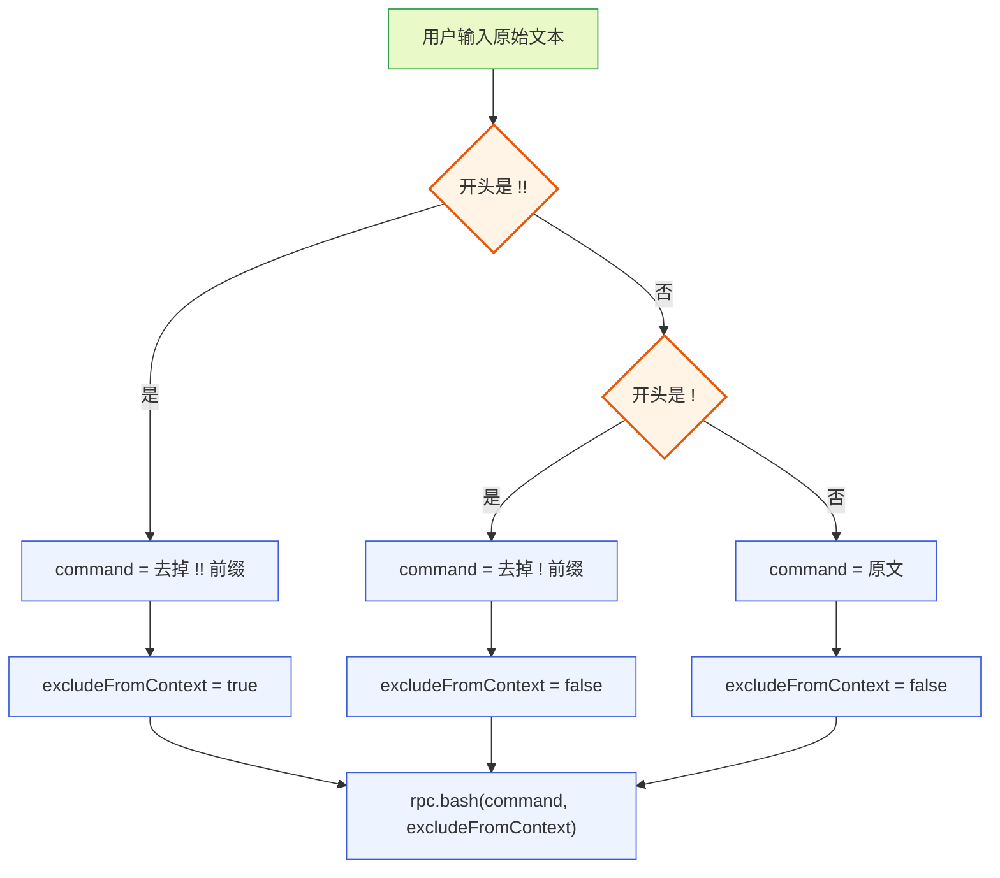

**图 8 — 前缀解析流程：`!!` 优先于 `!`，剥前缀后传 `excludeFromContext` 参数**

解析要在 worker 侧做（不在 renderer），因为 RPC 调用在 worker。解析逻辑要处理边界：

- `!!` 必须先于 `!` 判断——否则 `!!ls` 会被 `!` 解析吃掉第一个 `!`、剩 `!ls` 当命令。
- 前缀后紧跟空格的处理：`!! ls` 和 `!!ls` 都应识别为 `!!` 前缀 + 命令 `ls`。剥前缀后 trim 开头空格。
- **`!` 前缀在终端面板下的语义**：注意在终端面板里**一切都是 bash**——这和 pi TUI 不同（TUI 里无前缀=发消息给 agent、`!`=bash 进上下文）。在终端面板下前缀体系坍缩：无前缀默认 `excludeFromContext: false`（进上下文），`!` 前缀解析结果也是 `excludeFromContext: false`——即 `!` 与无前缀行为等价、`!` 成为冗余。本文裁定：**终端面板保留 `!` 解析仅为 TUI 习惯兼容**（从 TUI 迁移来的用户敲 `!ls` 不会出错），但其语义与无前缀相同。真正有区分度的只有 `!!`（不进上下文）。若未来要让无前缀默认不进上下文（让 `!` 重获"进上下文"的区分度），需重新定义默认值并与底座 `executeBash` 的默认 `excludeFromContext` 行为对齐——当前不这么做，保持"终端命令默认进上下文"符合"用户在终端跑命令通常希望 agent 看到结果"的预期。

底座源码确认：`executeBash` 的 `options.excludeFromContext` 透传给 `recordBashResult`，后者把它写进 `BashExecutionMessage.excludeFromContext` 字段（`agent-session.ts:2719`）。进上下文的 bash 消息在 agent 下一轮被 LLM 看到；不进的标记后 agent 跳过。这个区分完全由这个字段控制，终端插件只管正确解析前缀传参。

### 4.4 streaming 时的 bash 排队

一个易踩的坑：agent 正在 streaming 时用户执行 bash 会怎样？底座的 `recordBashResult`（`agent-session.ts:2709`）有专门处理：

```typescript
if (this.isStreaming) {
    // Queue for later - will be flushed on agent_end
    this._pendingBashMessages.push(bashMessage);
} else {
    this.agent.state.messages.push(bashMessage);
    this.sessionManager.appendMessage(bashMessage);
}
```

agent streaming 时，bash 结果不立即追加进 messages（避免破坏 tool_use/tool_result 的顺序），而是攒进 `_pendingBashMessages`，等 `agent_end` 后 `_flushPendingBashMessages` 统一刷进去。这意味着用户在 agent 工作时跑的 bash 命令，输出照样返回给终端面板（RPC 响应不等 streaming 结束），只是这条 bash 结果进 LLM 上下文的时机推迟到当前 agent 轮结束。

终端插件不需要为此特殊处理——RPC 命令的响应照常返回 `BashResult`，面板照常渲染输出。只是要告诉用户"此命令输出将在 agent 当前轮结束后进入上下文"——可以在底部状态条加一个提示，但这不是必须的。

### 4.5 命令执行的超时与兜底

`rpc.send` 给每个 pending 命令设了 30s 超时（DESIGN.md 1.4.2，照 `RpcClient.send` 的实现）。但 bash 命令可能跑很久（`npm install` 几分钟、`pytest` 几十分钟）——30s 超时会让这些命令被误杀。

**这是硬性实现要求**：core 的 RPC 适配层**必须对 `bash` 这类长命令豁免 30s 全局超时**——不是"中期演进项"，而是 core RPC 适配层落地本插件的前提。具体要求：

- core 的 RPC 适配层在发送 `bash` / `abort_bash` 命令时，**不套 30s 全局超时**，改用 bash 专用长超时（如 30 分钟）或无超时（完全靠 `abort_bash` 用户主动中止）。底座 `executeBash` 本就支持 `AbortController` 中止（4.1），用户中止是唯一正常的终止路径，不需要 RPC 层 timeout 兜底。
- 这意味着 `rpc.bash(command, excludeFromContext)` 这个便捷方法**当前即可用**——不需要插件走 `rpc.send` 逃生舱绕超时，也不存在"`rpc.send` 支持 per-call timeout 覆盖"的接口（`send<T>(command): Promise<unknown>` 没有 timeout 参数，DESIGN.md 3.2.4）。超时策略由 core RPC 适配层按命令类型内部决定，对插件透明。
- 在 core RPC 适配层补齐"bash 豁免 30s"之前，长 bash 命令是**已知限制、不可用**——终端面板要在 UI 上标注"当前实现下长命令可能在 30s 被误杀，请用 Ctrl+C 中止后改用外部终端"。

**长期演进**（DESIGN.md 第 6 节缺口类）：向底座提，给 `bash` 命令加流式输出支持——底座的 `executeBash` 已经接受 `onChunk` 回调（`bash-executor.ts:24`），但 RPC mode 当前传的是 `undefined`（`rpc-mode.ts:554` 第二个参数），没把流式输出经 event 推给桌面端。补上后，终端面板能实时看到 bash 输出流，长命令不再卡在"等响应"。

当前实现下，终端面板对长命令要给用户反馈：执行中显示 spinner + "命令运行中，可 Ctrl+C 中止"，避免用户以为卡死。

## 5 两种 bash 的区分

### 5.1 用户 bash 与 agent bash

这是本插件最容易混淆、也最必须厘清的边界。pi 底座里有两种 bash 执行，数据通路完全不同：

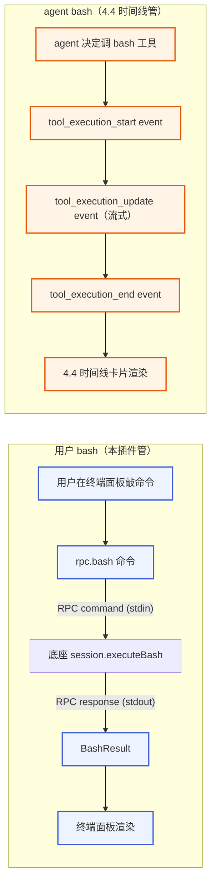

**图 9 — 两种 bash 通路：用户 bash 走 RPC 命令-响应，agent bash 走 event 流**

> 图 9 把用户 bash 通路 U2↔PI1 的边标注为"RPC command (stdin)"/"RPC response (stdout)"，明确这是 RPC 通道的 stdin/stdout（发命令、收响应），不是被执行命令自身的 stdin/stdout——避免混淆。

| 维度 | 用户 bash | agent bash |
|------|-----------|-------------|
| 发起方 | 桌面端用户 | agent 自主决定 |
| RPC 命令 | `bash`（带 id） | 无（agent 内部调 tool） |
| 数据来源 | `bash` 命令的 `BashResult` 响应 | `tool_execution_*` event 流 |
| 渲染归属 | 终端信任插件（终端面板） | 4.4 时间线渲染插件（工具卡片） |
| 进 LLM 上下文 | 由 `excludeFromContext` 控制 | 默认进（tool_result） |
| 中止方式 | `abort_bash` 命令 | `abort` 命令（中止整个 agent 轮） |

两者的数据来源不同、渲染归属不同，不可混用。终端信任插件**只管用户 bash**——它发 `bash` 命令、收响应、在终端面板渲染。agent bash 是 4.4 时间线渲染插件的事——它订阅 `tool_execution_*` event、按工具名匹配卡片渲染器（bash 工具匹配到 bash 卡片渲染器）、在时间线里画成工具卡片。

### 5.2 user_bash 事件不在 RPC 流里

底座有个 `user_bash` 事件（`packages/coding-agent/src/core/extensions/types.ts:799`）：

```typescript
export interface UserBashEvent {
    type: "user_bash";
    command: string;
    excludeFromContext: boolean;
    cwd: string;
}
```

这是 `ExtensionEvent` 联合类型（`types.ts:1018`）的一员，给**底座 extension** 用的——底座 extension 通过 `pi.on("user_bash", handler)` 订阅，能在用户执行 bash 时拦截、改参数。

但这个事件**不在 RPC 的 AgentSessionEvent 流里**。对照源码确认（`agent-session.ts:127`）：

```typescript
export type AgentSessionEvent =
    | Exclude<AgentEvent, { type: "agent_end" }>
    | { type: "agent_end"; messages: AgentMessage[]; willRetry: boolean }
    | { type: "agent_settled" }
    | { type: "queue_update"; steering: ...; followUp: ... }
    | { type: "compaction_start"; reason: ... }
    | { type: "entry_appended"; entry: SessionEntry }
    | { type: "session_info_changed"; name: ... }
    | { type: "thinking_level_changed"; level: ... }
    | { type: "compaction_end"; reason: ...; result: ...; ... }
    | { type: "auto_retry_start"; attempt: ...; ... }
    | { type: "auto_retry_end"; success: ...; ... };
```

这个联合类型里**没有 `user_bash`**。`user_bash` 属于 `ExtensionEvent`（`types.ts:1018` 的联合），是底座 extension 体系的事件，不进 RPC 转发。桌面插件通过 `PluginContext.events.on` 收的是 `AgentSessionEvent` 流（DESIGN.md 1.8.1），收不到 `user_bash`。

这是 DESIGN.md 1.8 节专门厘清的边界：RPC event 流覆盖 agent 运行时状态变化，ExtensionEvent 是给底座 extension 的、不外发。两者关系是——底座 extension 订阅 ExtensionEvent 做行为拦截，拦截结果反映到 AgentSessionEvent 里（处理后状态可见，DESIGN.md 1.8.2）。桌面插件只消费 AgentSessionEvent、只观察结果、不参与底座 extension 的行为拦截。

**所以桌面端要知道"用户执行了 bash"，靠的是自己发 `bash` 命令时的响应**——不是订阅某个事件。终端信任插件发 `rpc.bash(...)`，响应回来的 `BashResult` 就是它渲染输出的全部数据源。它不需要、也收不到任何"用户执行了 bash"的事件通知。这点 DESIGN.md 4.8.4 明确修正过——之前文档误写过"插件订阅 user_bash event"，已纠正。

### 5.3 两种 bash 在 UI 上的并存

用户 bash 和 agent bash 在 UI 上并存，但不重叠：

- 用户 bash 的输出在**终端面板**（侧栏 terminal Tab）。用户敲 `!ls`，输出在终端面板里。
- agent bash 的输出在**时间线**（主区域）。agent 决定跑 `ls`，输出作为工具卡片出现在时间线流里。

两个地方都能看到 bash 输出，但来源不同、触发方不同。用户可能会困惑"我在终端跑的命令和 agent 跑的命令是什么关系"——终端面板可以在头部加一个说明"此处执行的命令由你直接发起，agent 自主执行的命令见主时间线"，但这是 UX 细节，不是架构问题。

一个特殊场景：用户在终端用 `!` 前缀跑的命令，输出进了 LLM 上下文，agent 下一轮能看到。这时用户 bash 的结果会影响 agent 行为——但它仍不在时间线里显示（时间线只画 agent 的 tool_execution），只在终端面板显示。agent 若在下一轮回复里引用了这条 bash 结果，时间线里会出现 agent 的消息（引用了上下文），但那条 bash 命令本身的卡片不在时间线。这个区分要靠用户理解"终端面板是我跑的命令、时间线是 agent 跑的"，UI 上不强行合并。

## 6 复用卡片渲染槽的 bash 渲染器

### 6.1 为什么不直接 import 4.4 的渲染器

终端面板要渲染 bash 输出，最直觉的做法是直接 import 4.4 时间线渲染插件挂的 bash 卡片渲染器组件。但这违反插件隔离原则（DESIGN.md 3.5 第 5 项）：插件之间不能直接 import 代码，否则一个插件崩了会连累 import 它的插件、隔离失效。4.4 时间线插件若改了 bash 渲染器的导出名或实现，终端插件会跟着崩。

正确做法是走**注册表间接引用**：终端插件不 import 4.4 的代码，而是查 core 的卡片渲染槽（`cardRenderers`）注册表，按 MatchRule 匹配到 bash 工具的渲染器，让 core 把渲染器组件喂给终端插件用。

### 6.2 MatchRule 匹配机制

卡片渲染槽的贡献项格式（DESIGN.md 3.3）：`{ match: MatchRule, component: string }`。4.4 时间线渲染插件挂的默认 bash 渲染器（DESIGN.md 4.4）：

```json
{ "match": { "strategy": "toolName", "value": "bash" }, "component": "BashCard" }
```

`match` 用 `strategy: "toolName"` 精确匹配工具名 `bash`。MatchRule 在 manifest 里是纯数据，core 加载时通过策略注册表把它转成可求值的 `MatchStrategy` 实例（DESIGN.md 3.3 的 `ToolNameStrategy`，`specificity=100`）。core 渲染工具卡片时，拿当前工具调用的 `MatchContext`（`{ toolName: "bash", ... }`）遍历 cardRenderers 注册表，按"贡献项来源插件优先级 → specificity 数值 → 注册顺序"仲裁，取胜出的渲染器。

终端插件要复用这个渲染器，调 core 提供的查询接口。**归属裁定**：cardRenderers 注册表查询能力暴露在 **renderer 侧** `RendererPluginContext`（DESIGN.md 3.2.5）——因为 `resolveComponent` 返回的是 React 组件（`React.ComponentType<CardRendererProps>`），这是 renderer 侧能力。worker 侧没有 React、不能拿组件，只能拿元信息（组件名、来源插件 id）。故 6.4 的查询接口归 renderer 侧，`renderer-adapter.ts`（10.1 目录结构）也归 renderer 侧（从原 `lib/` 偏 worker 的位置移到 `components/` 或 renderer 侧目录）。

### 6.3 两种复用路径

因为 6.2 的语义错位，终端插件复用 bash 渲染器有两条路径，按需选：

**路径一：直接渲染 BashResult**。终端插件不强行套 `CardRendererProps`，而是自己渲染 `BashResult`——一个简单的终端输出样式组件（黑底白字、等宽字体、stdout/stderr 分流染色、退出码标色）。这最简单，但要自己实现一套 bash 输出渲染。这条路径下，终端插件不碰 cardRenderers 注册表，和 4.4 完全解耦。

**路径二：查注册表拿渲染器、适配 props**。终端插件在 renderer 侧查 cardRenderers 注册表拿 `BashCard` 组件，把用户 bash 的 `BashResult` 适配成 `CardRendererProps`：

```typescript
// renderer 侧（ui.tsx 的组件内）
const renderer = pi.cardRenderers.findBest({ toolName: "bash" });
const BashCard = pi.cardRenderers.resolveComponent(renderer);
// 适配：把用户 bash 的 BashResult 包装成 CardRendererProps
const fakeToolCallId = `user_bash_${Date.now()}`;
const props: CardRendererProps = {
    toolCallId: fakeToolCallId,
    toolName: "bash",
    args: { command: bashResult.command },       // bash 工具的 input 格式
    updates: [],                                   // 用户 bash 无流式 update
    end: {
        toolCallId: fakeToolCallId,
        result: {
            output: bashResult.output,             // 底座为合并单字段（见 4.2 已核对）
            exitCode: bashResult.exitCode,
            cancelled: bashResult.cancelled,
            truncated: bashResult.truncated,
            fullOutputPath: bashResult.fullOutputPath,
        },
        isError: bashResult.exitCode !== 0 && !bashResult.cancelled,
    },
    isStreaming: false,
    theme: currentTheme,
};
// 渲染：<BashCard {...props} />
```

这条路径复用 4.4 的 bash 渲染器，终端和时间线的 bash 输出样式一致。代价是要造一个假 `toolCallId`、适配 props 结构——若 4.4 的 `BashCard` 依赖 `updates` 的流式细节（如渐进显示），适配后用户 bash 的输出是一次性全显，没有流式效果。这个差异可接受（用户 bash 本来就无流式，因为 RPC mode 没传 `onChunk`，见 4.5）。

> **回改点标注（对应 4.2 已核对口径）**：底座 `BashResult` 已核对为合并单 `output` 字段（见 4.2）。本路径二的 `end.result` 直接用 `output` 单字段、**不在适配层硬拆 stdout/stderr**。若 4.4 的 `BashCard` 期望分离字段，由 `BashCard` 自身在渲染层做行级启发式标注（与终端面板降级方案一致），不在适配层引入失真。4.2 染色方案已相应降级为按退出码整体标色 + 行级启发式。不在其他散落位置依赖分离口径。

DESIGN.md 4.8.2 说"两种都走注册表查，不直接 import 别的插件的代码"——意思是终端插件**要么自己渲染、要么查注册表拿渲染器**，两条都不 import 4.4 代码。选择哪条取决于终端插件作者对"输出样式和时间线一致"的诉求强度。内置实现建议走路径二（复用 `BashCard` 保证视觉一致），第三方终端插件替换时可走路径一。

### 6.4 注册表查询的中性接口

core 给终端插件查询 cardRenderers 注册表的接口，暴露在 renderer 侧 `RendererPluginContext`（DESIGN.md 3.2.5，需补充该字段——见 11 节缺口③），是中性的、不绑 pi 类型：

```typescript
// RendererPluginContext.cardRenderers（renderer 侧）
interface CardRendererRegistry {
    // 按 MatchContext 查最佳匹配的渲染器元信息
    findBest(ctx: MatchContext): { component: string; pluginId: string } | null;
    // 拿到渲染器组件（renderer 侧，core 负责加载）
    resolveComponent(ref: { component: string; pluginId: string }): React.ComponentType<CardRendererProps> | null;
}
```

`MatchContext` 是 core 圆心定义的中性类型（DESIGN.md 3.3），不 import pi。终端插件查 `{ toolName: "bash" }`，core 遍历 cardRenderers 注册表、按策略仲裁、返回 `BashCard` 的引用。这条查询路径走的是槽位契约、不是插件间直接耦合——4.4 插件挂的渲染器、core 维护的注册表、终端插件的查询，三者经契约解耦。4.4 改名 `BashCard` 为 `TerminalOutput`，只要 manifest 里 `match` 不变，终端插件的查询照常命中、core 返回新组件名——终端插件无感知。

这是"洋葱架构依赖只向内"在插件协作上的体现（DESIGN.md 3.6）：圆心是槽位契约和注册表，4.4 和终端插件都是外层、都依赖圆心、不互相依赖。4.4 崩了、被覆盖了、被卸载了，终端插件的查询只是"查不到"（`findBest` 返回 null），终端插件降级到自己渲染（路径一），不跟着崩。

## 7 命令历史与中止

### 7.1 命令历史的存储与回溯

终端面板要记录用户执行过的 bash 命令，支持上箭头回溯。这是终端 UX 的标配。实现要点：

**存储位置**：命令历史存两份。一份在 worker 内存（插件自己的内存态），会话级、重启丢失；一份可选落盘跨会话保留。**跨会话持久化的落点裁定**：走**插件自己的 `config` key-value**（`ctx.config`，DESIGN.md 3.2.4，存 `~/.pi-desktop/plugins-data/{pluginId}/config.json`），不落进 core 的 sqlite 历史表——`PluginContext` 没有暴露 sqlite/结构化历史表接口（DESIGN.md 3.2.4 的 `config` 只有 key-value 的 `get/set/all`）。骨架 10.2 的 `createHistoryStore(ctx.config)` 即走 key-value：把历史数组序列化成一个 config key（如 `history.entries`）存取。

> 本文此前版本写"一份可选落盘进 core 的本地 sqlite（DESIGN.md 5.1.2）"——该路径当前不可达（无接口支撑），现修正为走插件 config key-value。代价：key-value 存大数组有性能/上限取舍（见下"去重与上限"），若未来 core 暴露结构化持久化接口（sqlite 历史表），可迁移。

**记录内容**：每条历史记录 `{ command: string, timestamp: number, excludeFromContext: boolean, exitCode: number | undefined }`。记 `excludeFromContext` 是为了回溯时显示前缀（`!` 或 `!!`）、让用户知道这条当时进没进上下文。记 `exitCode` 是为了历史列表里标色（失败命令标红）。

**回溯交互**：终端面板的输入框聚焦时，上箭头键回溯历史（从最新往旧）、下箭头往前。这是终端 UX 通用约定，用 pi.ui 的输入框组件实现键盘事件拦截。回溯时输入框内容替换为历史命令，用户可编辑后回车执行。

**去重与上限**：连续相同的命令去重（只记一次）。历史上限默认 1000 条（可在设置子页改），超上限丢最旧的。内存态与 config 落盘都按此上限——key-value 存 1000 条序列化数组在性能上可接受（启动时一次反序列化、写入时增量 append 后序列化）。若要支持更长跨会话历史（如 10000 条），建议等 core 暴露结构化持久化接口后再迁移，当前 key-value 不承载超长历史。

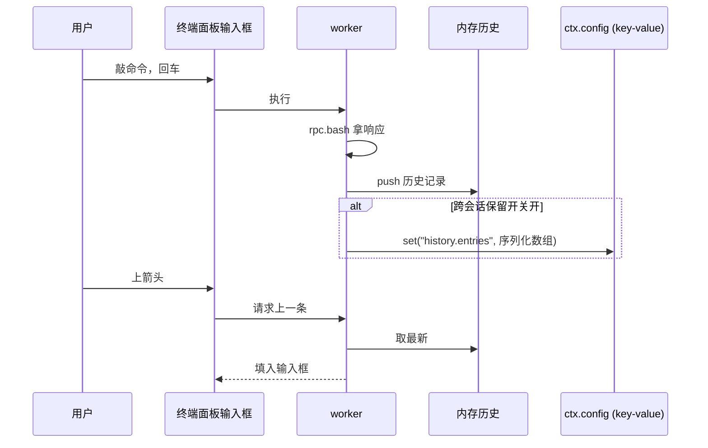

**图 10 — 命令历史记录与回溯时序**

### 7.2 命令补全

DESIGN.md 4.8.2 提到"支持上箭头回溯、补全"。补全分两类：

**历史补全**：用户敲几个字符后按 Tab 或上箭头，从历史里过滤匹配前缀的命令。这是基于已记录历史的补全，不需底座参与。实现是 worker 侧对内存历史数组做前缀过滤、返回匹配列表。

**路径/命令补全**：补全文件路径或可执行命令名。这要文件系统访问——但终端插件的 worker 跑在沙箱里（DESIGN.md 3.5 第 6 项），不能直接 `fs.readdir`。补全要么走 core 提供的受控文件系统接口（若 core 暴露给插件），要么走底座的 bash（发个 `ls` 或 `compgen` 拿候选）——后者用 `excludeFromContext: true` 的 bash 命令拿补全候选、不污染 LLM 上下文。第一版可以先只做历史补全，路径补全作为演进项。

### 7.3 abort_bash 中止

用户要能中止运行中的 bash 命令。走 RPC 的 `abort_bash` 命令（DESIGN.md 1.5.8）。完整契约：

- 发送：`{ type: "abort_bash", id }`
- 响应：`{ type: "response", command: "abort_bash", success: true }`（无 data）

底座侧（`rpc-mode.ts:560`）：

```typescript
case "abort_bash": {
    session.abortBash();
    return success(id, "abort_bash");
}
```

`session.abortBash()`（`agent-session.ts:2738`）极简：

```typescript
abortBash(): void {
    this._bashAbortController?.abort();
}
```

它调当前 bash 的 `AbortController.abort()`，`executeBashWithOperations` 的 `signal` 触发、子进程被杀、`BashResult.cancelled` 置 true、原 `bash` 命令的响应回来（`cancelled: true, exitCode: undefined`）。

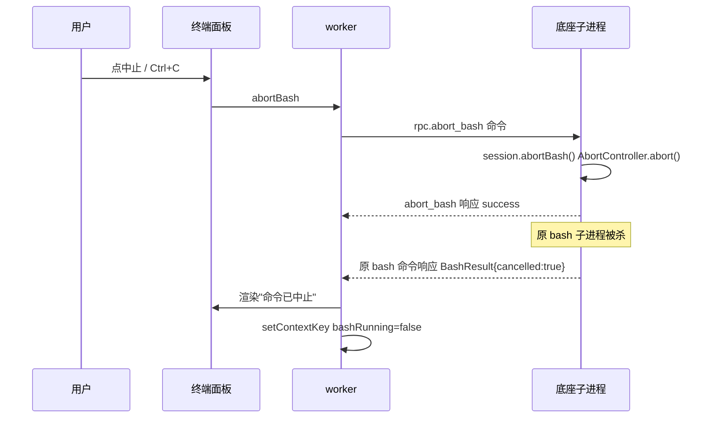

**图 11 — abort_bash 中止时序：中止命令立即响应，原 bash 命令随后返回 cancelled 结果**

关键时序细节：`abort_bash` 命令的响应是立即的（`session.abortBash()` 是同步调用、不 await），但原 `bash` 命令的响应要等子进程真的被杀、`executeBashWithOperations` 走完 catch 分支返回 `cancelled` 结果。所以终端面板会先收到 `abort_bash` 的 success、稍后才收到原 `bash` 的 `BashResult{cancelled:true}`。插件要处理这个时序——收到 `abort_bash` success 后把 UI 置"中止中"，收到原 `bash` 的 cancelled 结果后置"已中止"、渲染部分输出（中止前已产生的 output）。

`bash-executor.ts:130` 的 catch 分支确认：中止时仍返回 `BashResult`，`stdout`/`stderr` 是中止前收集的输出（滚动缓冲）、`cancelled: true`、`exitCode: undefined`。所以用户中止命令后，终端面板能显示中止前已经产生的输出——不是空的。这对"跑了一半的命令看部分结果"有用。

### 7.4 中止的 UI 状态与 contextKey

中止涉及 `terminal.bashRunning` contextKey（2.4 节）的维护。bash 命令发出时经 `ctx.setContextKey("terminal.bashRunning", true)` 置 true、响应回来时（无论正常结束还是 cancelled）置 false。`abort_bash` 命令本身不改变这个 key——因为 bash 还在运行中（中止是异步的）、要等原 `bash` 响应回来才算真正结束。

`commands` 槽里的"中止"命令 `when: "terminal.bashRunning && terminal.inputFocused"` 据此控制可用性——bash 不在运行或输入框未聚焦时这个命令灰掉、Ctrl+C 不触发任何事。这避免了无意义的 abort 调用。

### 7.5 无运行中 bash 时的 abort_bash

边界：用户在 bash 不在运行时按 Ctrl+C 或点中止，若 when clause 守卫没拦住（如 Ctrl+C 快捷键的 when 漏了 `terminal.bashRunning`），`abort_bash` 命令会发出去，底座 `session.abortBash()` 调 `this._bashAbortController?.abort()`——`_bashAbortController` 是 `undefined`（无运行中 bash），可选链不执行任何事、不报错。`abort_bash` 照样回 success。这是无害的——但更好的做法是终端插件靠 `terminal.bashRunning` contextKey 在 UI 层就拦住、不发了无意义的 abort 命令。when clause 的 `terminal.bashRunning && terminal.inputFocused` 已保证命令面板的"中止"项在非运行时/未聚焦时不可用；handler 里也应再判一次 `bashRunning`，防御 when clause 求值与按键的竞态。

## 8 与其他插件的协作

### 8.1 与 4.3 基础管理 UI 插件的信任协作

第 1.2 节定了分工：4.3 管信任持久状态、4.8 管运行时流程（首次 bash 交汇点）。两者经 core 的配置操作层协作，不直接互调代码：

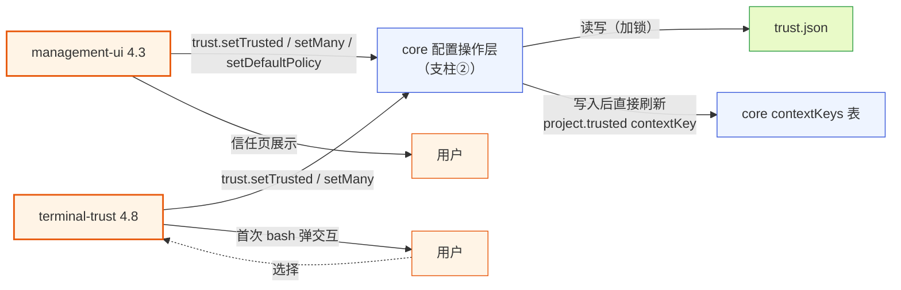

**图 12 — 4.8 与 4.3 经 core 配置操作层协作，共享 trust.json 但不互调代码**

关键：两个插件都调 core 的 `trust` 接口读写 `trust.json`，core 用 `proper-lockfile` 保证并发安全。4.3 的信任页改了信任状态后，4.8 的终端面板下次查 `project.trusted` 能看到新状态——刷新链路在 core 内部闭环：`trust.setTrusted` 写入后，core 配置操作层**直接**重新求值当前 cwd 信任、更新 `project.trusted` contextKey、重算受影响 when clause（见 2.4）。**不经过 `bus`、不依赖 `trust.changed` topic**——core 配置操作层是 `project.trusted` 的唯一写者。这是松耦合的——4.3 不直接调 4.8、4.8 不依赖 4.3 存在；两者都只依赖 core 的配置操作层和 contextKeys 表。

### 8.2 与 4.4 时间线渲染插件的关系

第 5、6 节已述：4.4 管 agent bash 的渲染（时间线卡片）、4.8 管 user bash 的渲染（终端面板）。两者经 cardRenderers 注册表间接协作——4.4 挂 `BashCard` 渲染器、4.8 在 renderer 侧查注册表复用（路径二）或自己渲染（路径一）。

两者不直接 import、不互调代码。4.4 卸载了，4.8 的 cardRenderers 查询查不到 bash 渲染器、降级到自渲染。4.8 卸载了，4.4 的 `BashCard` 照常在时间线渲染 agent bash，不受影响。这是插件隔离（DESIGN.md 3.5 第 5 项）的具体收益。

### 8.3 与 4.7 命令与快捷键插件的关系

4.7 命令插件贡献主输入框（DESIGN.md 4.7.4，prompt 的唯一发送出口）。终端信任插件的终端面板有自己的命令输入框——这两个输入框不同：

- 4.7 的主输入框：发 `prompt` 给 agent，是和 agent 对话的入口。
- 4.8 的终端输入框：发 `bash` 命令，是直接执行 shell 的入口。

两者并存、不冲突。终端面板的输入框只接受 bash 命令（带 `!`/`!!` 前缀解析），不碰 prompt。4.7 的主输入框只发 prompt、不直接发 bash（用户在主输入框敲 `!ls` 会被 4.7 当作消息发给 agent、不走 bash RPC——除非 4.7 自己做前缀解析转 bash，但那是 4.7 的事、不在本文范围）。

这里有个潜在的 UX 歧义：用户可能期望在主输入框敲 `!ls` 就执行 bash（像 TUI 里那样）。但桌面端把"对话"和"终端"分成了两个入口——对话在主输入框、bash 在终端面板。这是有意的分离（呼应"组装和调用分开"）：对话组装消息、终端组装命令，各自走各自的发送出口。若要让主输入框也支持 `!` 前缀转 bash，那是 4.7 插件的实现选择，4.8 不干涉——但 4.7 若这么做，应把 bash 命令转发给 4.8 的终端面板渲染（经事件总线），而不是自己渲染 bash 输出，避免两套 bash 渲染逻辑（呼应"回调参数是责任边界模糊的气味"：bash 渲染逻辑只该在终端插件一份）。

### 8.4 与 core 的 contextKeys 协作

终端信任插件贡献的 contextKey（`terminal.bashRunning`、`terminal.bashExcluded`、`terminal.inputFocused`）和它消费的 contextKey（`project.trusted`）都由 core 统一维护。core 维护一个 contextKeys 表，运行时按状态更新，when clause 求值时查这个表。终端插件不自己存一份 contextKey、不自己求值 when——它只经**专用接口 `ctx.setContextKey`** 通知 core 更新自己贡献的 key。

**`project.trusted` 的更新链路**：信任状态写入（`trust.setTrusted`）→ core 配置操作层落盘 `trust.json` → core 配置操作层**直接**重新求值当前 cwd 信任、更新 contextKeys 表里的 `project.trusted`、重算受影响 when clause → core 经 contextKeys 变更广播通知 renderer 刷新信任条展示。这条链路全程在 core 内部闭环，**不经过 `bus`、不依赖 `trust.changed` topic**。终端插件只负责触发（调 `trust.setTrusted`），不负责刷新 `project.trusted`——刷新是 core 配置操作层的事。

## 9 数据流总览与状态归属

### 9.1 完整数据流

把前面各节的数据流收成一张图，照着能写代码：

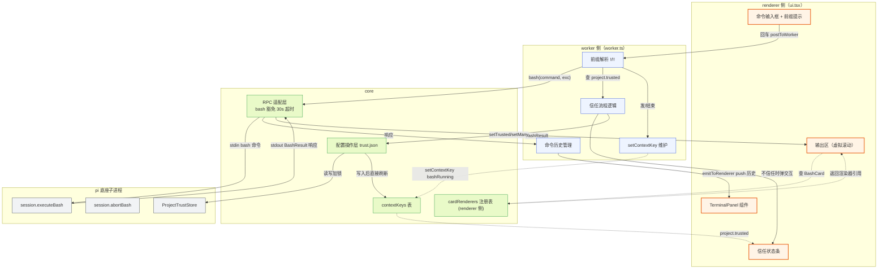

**图 13 — 终端信任插件完整数据流：renderer↔worker↔core↔底座四层**

### 9.2 状态归属表

把插件涉及的各状态、它们的归属和持久化方式列清，避免实现时状态散落：

| 状态 | 归属 | 持久化 | 谁写 | 谁读 |
|------|------|--------|------|------|
| 当前 bash 输出 | worker 内存 | 不持久化 | bash 响应 | renderer |
| 命令历史 | worker 内存 + 插件 config | 可选跨会话（key-value） | bash 响应 | 上箭头回溯 |
| bashRunning contextKey | core contextKeys | 不持久化 | worker 经 setContextKey | when clause |
| inputFocused contextKey | core contextKeys | 不持久化 | worker 经 setContextKey | when clause |
| project.trusted contextKey | core contextKeys | 不持久化 | core 配置操作层（trust 写入后直接刷新） | when clause + 信任条 |
| trust.json | 底座文件 | 磁盘 | core 配置操作层 | 底座 + core |
| 本会话信任临时标记 | worker 内存 | 不持久化 | 信任流程 | bash 执行前检查 |
| 被拦截的待重发命令 | worker 内存 | 不持久化 | 信任流程拦截 | session_start 事件回调重发 |
| 终端偏好（历史上限等） | 插件 config | config.json | 设置子页 | worker |

### 9.3 错误处理与降级

终端信任插件的错误处理边界：

- **RPC 子进程崩溃**：`rpc.bash` 失败（`success: false`），终端面板显示"底座连接断开"、输出区显示错误、`setContextKey("terminal.bashRunning", false)`。不崩插件。
- **bash 命令超时**：见 4.5。core RPC 适配层对 bash 豁免 30s 全局超时是硬性要求；在该要求落地前，长命令超时是已知限制（UI 标注）。超时不是命令失败、是 RPC 层 timeout——要和"命令还在跑但响应没回来"区分。
- **trust.json 读写失败**：core 配置操作层 catch、返回错误给插件。终端插件在信任交互浮层显示"信任状态读写失败"、不阻塞 bash 执行（信任状态读不到时默认按"未信任"处理、弹交互）。
- **cardRenderers 查无匹配**：见 6.3，降级到自渲染（路径一）。
- **worker 崩溃**：core 错误隔离（DESIGN.md 3.5 第 5 项）禁用本插件、toast 通知用户。终端面板消失或显示"终端插件已禁用"占位。
- **重启 resync 后命令重发失败**：若 `session_start` 事件回调里重发 `rpc.bash` 失败（如底座又崩），提示用户"命令重发失败，请重新执行"，不无限重试。
- **pendingCommand 在 worker 热重载窗口丢失**：落盘信任翻转已触发底座重启、`session_start` 尚未到达期间，若加载器 file watcher 触发 worker 热重载，`pendingCommand` 随 worker 进程结束丢失（与 `sessionOnlyTrusted` 同等处置，见 3.4.1）。worker 重激活后无法重发，主动向 renderer 报"命令重发失败：插件已重载，请重新执行"，不静默吞掉、不无限重试。演进方案：把 `pendingCommand` 落进 core 会话级临时存储、跨 worker 热重载存活（与 session-only 更持久方案同一存储）。

这些错误处理遵循"插件崩不连累 core、core 出错不崩插件"的双向隔离——worker 崩 core 接住、core 的 RPC 断了 worker 能感知并降级 UI。

## 10 实现骨架

### 10.1 目录结构

```
packages/desktop/src/plugins/builtin/terminal-trust/
├── plugin.json              # manifest（见 2.2）
├── worker.ts                # main 入口：activate/deactivate + 命名导出 handler
├── ui.tsx                   # renderer 入口：导出 TerminalPanel/TerminalSettings
├── components/
│   ├── TerminalPanel.tsx    # 面板主组件（头部信任条 + 终端区 + 底部状态）
│   ├── BashOutput.tsx       # 输出区（虚拟滚动，stdout/stderr 分流染色）
│   ├── TrustBar.tsx         # 信任状态条
│   ├── TrustDialog.tsx      # 信任交互浮层
│   ├── TerminalSettings.tsx # 设置子页组件
│   └── renderer-adapter.ts  # BashResult → CardRendererProps 适配（renderer 侧，见 6.3）
├── lib/
│   ├── prefix-parse.ts     # !/!! 前缀解析（见 4.3）
│   ├── trust-flow.ts        # 信任流程状态机（见 3.4）
│   └── history.ts          # 命令历史管理（见 7.1）
└── types.ts                # 插件内部类型
```

注意 `renderer-adapter.ts` 归 `components/`（renderer 侧），不归 `lib/`——因为 `resolveComponent` 返回 React 组件、是 renderer 侧能力（见 6.2 归属裁定）。

### 10.2 worker.ts 骨架

```typescript
import type { PluginContext } from "@pi-desktop/core";

// 模块级状态：handler 是模块顶层命名导出（core 按 #name 绑定），无法闭包 activate 内变量，
// 故 history / pendingCommand / ctx / pendingPrompts 存模块级单例，activate 时初始化。
let ctxRef: PluginContext | null = null;
let moduleHistory: HistoryStore | null = null;
let pendingCommand: { command: string; excludeFromContext: boolean } | null = null;
// 待用户选择的信任交互 Promise：promptId → { resolve, timeoutTimer }。
// promptUserViaRenderer 发 trust.prompt 时存入、onRendererMessage("trust.choice") 时取出 resolve（见 10.4）。
let pendingPrompts: Map<string, { resolve: (v: { action: "trust" | "distrust"; sessionOnly: boolean; path?: string } | null) => void; timer: ReturnType<typeof setTimeout> }> = new Map();

// —— manifest 的 # handler 绑定：core 按 "#onFocusTerminal" 名查本模块命名导出，
// —— 这里只需 export 对应函数，不需要（也没有）ctx.registerHandler。
// —— core 调用 handler 时把 PluginContext 作为参数传入。

export function onFocusTerminal(ctx: PluginContext) {
  ctx.emitToRenderer("focus", {});
}

export async function onAbortBash(ctx: PluginContext) {
  await ctx.rpc.abortBash();
}

export function onClearHistory(ctx: PluginContext) {
  moduleHistory?.clear();
}

export function activate(ctx: PluginContext) {
  ctxRef = ctx;
  const history = createHistoryStore(ctx.config);
  moduleHistory = history;
  const trustFlow = createTrustFlow(ctx, (cmd) => { pendingCommand = cmd; });

  // renderer 发来的执行请求（renderer 侧用 postToWorker("execute", raw) 发）
  ctx.onRendererMessage("execute", async (raw: unknown) => {
    const { command, excludeFromContext } = parsePrefix(raw as string);
    const cwd = ctx.cwd;  // PluginContext.cwd（见 2.3 / 11 节缺口①）

    // 信任检查：ensureTrusted 重跑全链路解析（不可只读 project.trusted contextKey，见 2.4）。
    // 返回 { ok, deferred }：落盘信任翻转时 deferred=true，主路径必须跳过立即 rpc.bash——
    // 否则命令会被发给即将被杀/正在重启的子进程，且 session_start 回调还会再发一次（双发，见 3.5.1）。
    const decision = await trustFlow.ensureTrusted(cwd, { command, excludeFromContext });
    if (!decision.ok) {
      ctx.emitToRenderer("blocked", { reason: "untrusted" });
      return;
    }
    if (decision.deferred) {
      // 落盘信任翻转：core 配置操作层会重启子进程加载项目级 settings，
      // 被拦截命令已缓存进 pendingCommand、在 session_start 事件回调里重发（见 3.5.1/图7）。
      // 同时启动 pendingCommand 超时兜底（60s 未等到可重发的 session_start 则报失败，见 3.5.1 step3 第三道防线）。
      schedulePendingCommandTimeout();
      ctx.emitToRenderer("deferred", { reason: "trust_flip_restart" });
      return;
    }

    // session-only/已信任：deferred=false，立即执行（无需重启）
    ctx.setContextKey("terminal.bashRunning", true);
    ctx.setContextKey("terminal.bashExcluded", excludeFromContext);

    try {
      const result = await ctx.rpc.bash(command, excludeFromContext);
      history.push({ command, timestamp: Date.now(), excludeFromContext, exitCode: result.exitCode });
      ctx.emitToRenderer("result", { command, result });
    } catch (err) {
      ctx.emitToRenderer("error", { message: String(err) });
    } finally {
      ctx.setContextKey("terminal.bashRunning", false);
    }
  });

  // 信任交互浮层：用户在 renderer 的 TrustDialog 做完选择后，经 postToWorker("trust.choice", { promptId, choice }) 回。
  // 这里按 promptId 取出 pendingPrompts 里的 resolve 回调、resolve 掉 promptUserViaRenderer 的 Promise。
  // 这条 worker↔renderer 异步往返是信任浮层"用户选择→worker 决策"的关键链路——此前骨架漏注册、链路是断的（见 10.4 修正）。
  ctx.onRendererMessage("trust.choice", (data: unknown) => {
    const { promptId, choice } = (data ?? {}) as { promptId?: string; choice?: { action: "trust" | "distrust"; sessionOnly: boolean; path?: string } | null };
    if (!promptId) return;
    const pending = pendingPrompts.get(promptId);
    if (!pending) return;  // 已被超时 resolve 或已处理，忽略迟到回执
    clearTimeout(pending.timer);
    pendingPrompts.delete(promptId);
    pending.resolve(choice ?? null);  // choice=null 视为取消
  });

  // 重新信任入口（已拒绝→待决策，见 3.5）：renderer 信任条"信任此项目"按钮 postToWorker("retrust", { cwd })。
  // 链路：删当前 cwd 的 false 决策（继承父目录 false 时 setMany 置父 null）→ store 回到无决策态 → 重跑 ensureTrusted 走弹交互分支。
  // 与首次 bash 拦截路径共享 ensureTrusted 的弹交互分支，区别仅在"如何回到待决策"（见 3.5 重新信任入口）。
  ctx.onRendererMessage("retrust", async (data: unknown) => {
    const cwd = (data as { cwd?: string })?.cwd ?? ctx.cwd;
    await trustFlow.retrust(cwd);  // 删 false 决策 + 重弹 TrustDialog；内部复用 ensureTrusted 的弹交互分支（见 10.4）
  });

  // resync 完成后重发被拦截的命令：订阅 session_start 事件（可靠 event 流，非 bus）。
  // 按 DESIGN 3.2.4 events.on(listener) 签名，回调内按 e.type 分发、并校验 reason。
  // 重发 reason 集合 = { resume, reload, startup }：
  //  - resume/reload 是信任翻转重启的预期 reason（core 经 --session 传 sessionFile，见 3.5.1 step3 硬性要求）。
  //  - startup 是兜底容忍：若 core 未传 --session、重启产出 startup，pendingCommand 非空时也重发——
  //    首次启动 pendingCommand 本就为空、不会误投，仅在"信任翻转重启恰好产出 startup 且 pendingCommand 非空"窄窗口触发（见 3.5.1 step3）。
  //  - new/fork 必须排除：落盘翻转重启推迟期间用户切 session 触发的 session_start 会把命令误投到非目标会话。
  ctx.events.on((e) => {
    if (e.type !== "session_start") return;
    if (e.reason !== "resume" && e.reason !== "reload" && e.reason !== "startup") return;
    if (pendingCommand && ctxRef) {
      const { command, excludeFromContext } = pendingCommand;
      pendingCommand = null;
      clearPendingCommandTimeout();
      ctxRef.rpc.bash(command, excludeFromContext).then((result) => {
        ctxRef!.emitToRenderer("result", { command, result });
      }).catch((err) => {
        ctxRef!.emitToRenderer("error", { message: "命令重发失败：" + String(err) });
      });
    }
  });
}

// pendingCommand 超时兜底（第三道防线，见 3.5.1 step3）：60s 未等到可重发的 session_start 则报失败。
let pendingCommandTimer: ReturnType<typeof setTimeout> | null = null;
function schedulePendingCommandTimeout() {
  clearPendingCommandTimeout();
  pendingCommandTimer = setTimeout(() => {
    if (pendingCommand && ctxRef) {
      pendingCommand = null;
      ctxRef.emitToRenderer("error", { message: "命令重发失败：未在 60s 内等到底座就绪，请重新执行" });
    }
  }, 60_000);
}
function clearPendingCommandTimeout() {
  if (pendingCommandTimer) { clearTimeout(pendingCommandTimer); pendingCommandTimer = null; }
}

export function deactivate() {
  // 清理 pending 信任交互 Promise 的超时，避免 worker 热重载时 Promise 永挂（见 10.4）。
  for (const { timer } of pendingPrompts.values()) clearTimeout(timer);
  pendingPrompts.clear();
  clearPendingCommandTimeout();
}
```

> 骨架修正说明：原骨架用 `ctx.registerHandler` / `ctx.onMessage` / `ctx.bus.publish("contextkey", ...)` / `resolveCwd(ctx)` / `ctx.bus.subscribe("trust.changed", ...)`，均与 DESIGN.md 3.2.4/3.2.5 接口不符。现修正为：(1) `#` handler 改为模块顶层命名 `export function`，core 自动按 `#name` 绑定（不调用 `registerHandler`）；(2) 收 renderer 消息用 `ctx.onRendererMessage`（DESIGN.md 3.2.5 定义）；(3) contextKey 更新用 `ctx.setContextKey`（专用接口，见 2.4）；(4) cwd 直接取 `ctx.cwd`（见 2.3）；(5) resync 完成信号订阅 `session_start` 事件（可靠 event 流），不依赖 bus；(6) **`events.on` 按 DESIGN 3.2.4 单 listener 签名 `on(listener)` 调用、回调内按 `e.type`/`e.reason` 分发，移除 `as any`**（原写法 `ctx.events.on("session_start" as any, ...)` 把字符串当 listener 传入，运行时失败、`as any` 掩盖签名错配）；(7) **`session_start` 重发前校验 `e.reason ∈ {resume, reload, startup}`**，排除 new/fork，避免落盘翻转重启推迟期间用户切 session 误触发重发；容忍 `startup` 是为消除"core 未传 --session 导致 pendingCommand 静默丢失"（见 3.5.1 step3）；(8) **`ensureTrusted` 返回 `{ ok, deferred }` 而非 boolean**，落盘信任翻转时 `deferred=true` 让主路径跳过立即 `rpc.bash`（否则双发/发到死进程，见 3.5.1/10.4）；(9) **补全 `trust.choice` 的 `onRendererMessage` 注册**——`promptUserViaRenderer` 经 `emitToRenderer("trust.prompt", { promptId, ... })` 发出、靠 renderer 回 `postToWorker("trust.choice", { promptId, choice })` resolve 一个 Promise，骨架此前漏了这条注册、信任浮层"用户选择→worker 决策"链路是断的；现补 `pendingPrompts: Map<promptId, {resolve, timer}>` + 60s 超时（renderer 卸载或 worker 热重载时不致 Promise 永挂，见 10.4）；(10) **补 `retrust` 入口骨架**——已拒绝→待决策的重新信任路径（renderer 信任条按钮 → worker 删 false 决策 → 重弹 TrustDialog），此前 10.2/10.4 无此实现、实现者需自行发明，现补齐（见 3.5/10.4）；(11) **补 `pendingCommand` 60s 超时兜底**——落盘翻转后若未等到可重发的 `session_start`（重启卡住、worker 热重载丢 pendingCommand 见 3.4.1、底座崩溃），主动报"命令重发失败，请重新执行"，不静默吞掉（见 3.5.1 step3 第三道防线、9.3）。`trust.changed` 订阅已移除——`project.trusted` 由 core 配置操作层在 trust 写入后直接刷新，不经 bus topic。`pendingCommand` 在 `trustFlow.ensureTrusted` 内部落盘信任翻转分支经 `setPending` 设置（见 10.4）。

### 10.3 前缀解析骨架

```typescript
// lib/prefix-parse.ts
export interface ParsedCommand {
  command: string;
  excludeFromContext: boolean;
}

export function parsePrefix(raw: string): ParsedCommand {
  const trimmed = raw.trimStart();
  if (trimmed.startsWith("!!")) {
    return {
      command: trimmed.slice(2).trimStart(),
      excludeFromContext: true,
    };
  }
  if (trimmed.startsWith("!")) {
    return {
      command: trimmed.slice(1).trimStart(),
      excludeFromContext: false,
    };
  }
  return { command: trimmed, excludeFromContext: false };
}
```

注意 `!!` 必须先判断（4.3 节）。`trimStart` 处理前导空格。剥前缀后再 `trimStart` 处理前缀后的空格。`!` 与无前缀等价（都进上下文），保留 `!` 解析仅为 TUI 习惯兼容（见 4.3）。

### 10.4 信任流程骨架

```typescript
// lib/trust-flow.ts
import type { PluginContext } from "@pi-desktop/core";

/** ensureTrusted 的返回：
 *  - ok=true,  deferred=false → 已信任/session-only，主路径立即执行 rpc.bash。
 *  - ok=true,  deferred=true  → 落盘信任翻转 untrusted→trusted，主路径必须跳过立即执行，
 *                               命令已缓存进 pendingCommand、等 session_start 回调重发（见 3.5.1/10.2）。
 *  - ok=false, deferred=false → 已拒绝/never/取消，主路径拒绝执行。
 *  （ok=false 时无 deferred=true：拒绝不加载项目级 settings，不触发重启。） */
export interface TrustDecision {
  ok: boolean;
  deferred: boolean;
}

export interface TrustFlow {
  ensureTrusted(
    cwd: string,
    pendingCmd?: { command: string; excludeFromContext: boolean },
  ): Promise<TrustDecision>;
  /** 重新信任入口（已拒绝→待决策）：删 false 决策后重弹 TrustDialog，见 3.5 重新信任入口。 */
  retrust(cwd: string): Promise<TrustDecision>;
}

export function createTrustFlow(
  ctx: PluginContext,
  setPending: (cmd: { command: string; excludeFromContext: boolean }) => void,
): TrustFlow {
  const sessionOnlyTrusted = new Set<string>();
  const trust = ctx.trust;

  // 弹交互分支（首次 bash 拦截与 retrust 共享）：拿选项 → 经 renderer 弹 TrustDialog → 等用户选择。
  async function promptAndApply(
    cwd: string,
    pendingCmd?: { command: string; excludeFromContext: boolean },
  ): Promise<TrustDecision> {
    const options = await trust.getProjectTrustOptions(cwd);
    const choice = await promptUserViaRenderer(ctx, cwd, options);
    if (choice?.action === "trust") {
      if (choice.sessionOnly) {
        // session-only：不落盘、不翻转 settings、不重启 → 立即执行
        sessionOnlyTrusted.add(cwd);
        return { ok: true, deferred: false };
      } else if (choice.path && choice.path !== cwd) {
        // 信任父目录：setMany 写两条（父 true + 当前 null）——落盘，翻转 settings
        await trust.setMany([
          { cwd: choice.path, decision: true },
          { cwd, decision: null },
        ]);
      } else {
        // 信任当前目录——落盘，翻转 settings
        await trust.setTrusted(cwd, true);
      }
      // 落盘信任翻转 untrusted→trusted：core 配置操作层会重启子进程+resync；
      // 被拦截命令经 setPending 缓存进 worker 模块的 pendingCommand，
      // session_start 事件回调里重发（见 10.2）。此处返回 deferred=true，
      // 让 10.2 主路径跳过立即 rpc.bash——否则命令会发给即将被杀的子进程、
      // 且 session_start 回调还会再发一次（双发，违背 3.5.1 时序）。
      if (pendingCmd) setPending(pendingCmd);
      return { ok: true, deferred: true };
    }
    if (choice?.action === "distrust") {
      if (!choice.sessionOnly) {
        // 写 false 不加载项目级 settings（与之前待决策态一致），不翻转、不重启
        await trust.setTrusted(cwd, false);
      }
      return { ok: false, deferred: false };  // 拒绝，立即
    }
    return { ok: false, deferred: false };  // 取消，拒绝
  }

  return {
    async ensureTrusted(cwd, pendingCmd): Promise<TrustDecision> {
      // 无门槛资源直接信任（无 deferred）
      if (!(await trust.hasTrustRequiringResources(cwd))) {
        return { ok: true, deferred: false };
      }
      // 已有决策（含继承父目录）——直接走决策，不弹
      const entry = await trust.getEntry(cwd);
      if (entry) {
        return { ok: entry.decision, deferred: false };  // true/false
      }
      // 本会话临时信任（不落盘、不翻转 settings、不重启）
      if (sessionOnlyTrusted.has(cwd)) {
        return { ok: true, deferred: false };
      }
      // 默认策略
      const policy = await trust.getDefaultPolicy();
      if (policy === "always") return { ok: true, deferred: false };
      if (policy === "never") return { ok: false, deferred: false };   // 不弹，直接拒绝
      // ask 且无决策：弹交互分支（首次 bash 拦截走这里）
      return promptAndApply(cwd, pendingCmd);
    },

    // 重新信任入口（已拒绝→待决策，见 3.5 重新信任入口）：
    // ensureTrusted 在 entry.decision=false 时直接返回 {ok:false}、从不主动弹交互，
    // 故"点信任条回到待决策"不能复用 ensureTrusted 主流程，需此专门入口。
    // 链路：删当前 cwd 的 false 决策（继承父目录 false 时 setMany 置父 null）→ store 回到无决策态 →
    // 重跑 promptAndApply（弹交互分支）。与首次 bash 拦截路径共享 promptAndApply。
    async retrust(cwd: string): Promise<TrustDecision> {
      const entry = await trust.getEntry(cwd);
      if (entry && entry.decision === false) {
        if (entry.path === cwd) {
          await trust.setTrusted(cwd, null);          // 删当前 cwd 的显式 false 决策
        } else {
          // false 决策继承自父目录：置父目录 null，让父目录回到无决策态
          await trust.setMany([{ cwd: entry.path, decision: null }]);
        }
      }
      // store 现已无当前 cwd 决策 → 走弹交互分支（不传 pendingCmd：retrust 不缓存命令、
      // 用户选信任落盘后由 core 重启 resync，但无被拦截命令需重发；选 session-only 则立即放行下次 bash）
      return promptAndApply(cwd);
    },
  };
}
```

**`promptUserViaRenderer` 的完整骨架**（worker↔renderer 异步交互的关键链路，此前骨架漏了 renderer 回执的注册——现补全，见 10.2 的 `onRendererMessage("trust.choice", ...)`）：

```typescript
// lib/trust-flow.ts（或 worker.ts 内）
let pendingPrompts: Map<string, {
  resolve: (v: { action: "trust" | "distrust"; sessionOnly: boolean; path?: string } | null) => void;
  timer: ReturnType<typeof setTimeout>;
}> = new Map();

async function promptUserViaRenderer(
  ctx: PluginContext,
  cwd: string,
  options: TrustOption[],
): Promise<{ action: "trust" | "distrust"; sessionOnly: boolean; path?: string } | null> {
  const promptId = `trust_${cwd}_${Date.now()}_${Math.random().toString(36).slice(2, 8)}`;
  return new Promise((resolve) => {
    // 60s 超时：renderer 卸载（用户切走面板/关窗）或 worker 热重载时不致 Promise 永挂，
    // 超时按"取消"处理（resolve(null)）。worker 热重载时 deactivate 清所有 timer（见 10.2）。
    const timer = setTimeout(() => {
      if (pendingPrompts.has(promptId)) {
        pendingPrompts.delete(promptId);
        resolve(null);  // 超时=取消
      }
    }, 60_000);
    pendingPrompts.set(promptId, { resolve, timer });
    // 发给 renderer：renderer 据 options 渲染 TrustDialog、用户选后 postToWorker("trust.choice", { promptId, choice })
    ctx.emitToRenderer("trust.prompt", { promptId, cwd, options });
  });
}
```

`promptUserViaRenderer` 经 `ctx.emitToRenderer("trust.prompt", { promptId, cwd, options })` 让 renderer 弹 `TrustDialog`、用户选后经 `postToWorker("trust.choice", { promptId, choice })` 回——10.2 的 `onRendererMessage("trust.choice", ...)` 按 `promptId` 取出 `pendingPrompts` 里的 `resolve` 回调、resolve 掉 Promise。**这条 worker↔renderer 异步往返是信任浮层"用户选择→worker 决策"的关键链路**：此前骨架只在 10.2 注册了 `execute`、在 10.4 用 Promise 包装了 `promptUserViaRenderer`，但**没有 `trust.choice` 的 `onRendererMessage` 注册代码、也没有 resolve 回调的存储/超时**——链路是断的、实现者照骨架写会让 `promptUserViaRenderer` 的 Promise 永挂。现补全三件套：(a) `pendingPrompts: Map<promptId, {resolve, timer}>` 存储待 resolve 回调；(b) `emitToRenderer` 时带 `promptId`、renderer 回 choice 时按 id 取出 resolve；(c) 每个 pending prompt 设 60s 超时、超时按取消 resolve，避免 renderer 卸载或 worker 热重载时 Promise 永挂。

注意区分两类返回：`session_only` 信任不落盘、不翻转 settings 加载、不触发重启，返回 `{ ok: true, deferred: false }`，10.2 主路径立即执行；落盘信任（`trust`/`trust parent`）翻转 settings 加载，返回 `{ ok: true, deferred: true }`，10.2 主路径跳过立即执行，由 core 配置操作层触发重启+resync，被拦截命令经 `pendingCommand` 在 `session_start` 事件回调里重发（见 10.2 与 3.5.1）。这条 deferred 区分是消除 10.2 骨架与 3.5.1 时序矛盾的关键——此前 `ensureTrusted` 在落盘分支 `return true`、10.2 拿到 `trusted=true` 立即 `rpc.bash`，会把命令发给即将被杀的子进程且 `session_start` 回调再发一次（双发）；现改为返回 `deferred=true` 让主路径不发，仅靠 `pendingCommand + session_start` 重发。

---

## 11 DESIGN.md 缺口与对齐建议

本文落地需要 DESIGN.md 补齐以下契约（本节是回写 DESIGN.md 的建议清单，在缺口补齐前相关条目为本文定义的契约草案）。"状态"列标注每项的落地状态：**BLOCKING 待回写** = 照着写代码的硬前提、DESIGN 回写前不可直接进实现；**已核对** = 已对照底座源码裁定、不需 DESIGN 回写；**本文内部时序** = 不依赖 DESIGN 圆心接口钉死、为本文定义的时序约定（可能附带对 core 行为的硬性要求）。

| # | 状态 | 缺口 | 涉及 DESIGN.md | 本文定义的临时契约 | 影响 |
|---|------|------|----------------|---------------------|------|
| ① | BLOCKING 待回写 | PluginContext 无 cwd 字段；RpcSessionState 也无 cwd | 3.2.4 / 1.7.1 | `ctx.cwd: string`（core 起底座时注入） | 信任流程全链路以 cwd 为参数，无 cwd 则断 |
| ② | BLOCKING 待回写 | **trust 接口整体未在 DESIGN 3.2.4 钉死**（DESIGN 仅笼统说"trust 是支柱②暴露"）。本文 2.3 定义 8 个方法为契约草案，需回写 DESIGN 3.2.4：`isTrusted` / `getEntry` / `getProjectTrustOptions` / `setTrusted` / `setMany` / `listTrusted` / `getDefaultPolicy` / `hasTrustRequiringResources` | 3.2.4 | 2.3 的 8 个 `trust.*` 方法 | 父目录信任、选项弹窗、原因文案、默认策略查询、信任列表、门槛资源判断均无接口支撑；实现者若以为只有 3 个是草案、其余已存在会误判 |
| ③ | BLOCKING 待回写 | RendererPluginContext 无 cardRenderers 查询字段 | 3.2.5 | 6.4 的 `CardRendererRegistry` 挂在 renderer 侧 | 路径二（复用 BashCard）无法落地 |
| ④ | BLOCKING 待回写 | contextKey 更新机制未定义专用接口（易误用 bus）；含 **when 求值进程归属未钉死**（见 2.2/2.4）：`terminal.inputFocused` 这类焦点 key 的写者与 when 求值若在 worker/main 侧，ctrl+c 仲裁引入 postToWorker 往返竞态 | 3.2.4 / 3.3 / 3.2.5 | `ctx.setContextKey(key, value)` 专用接口；when 求值归属方案 A（renderer 侧求值 + `RendererPluginContext.setContextKey`，推荐）/方案 B（worker 求值 + handler 内二次判焦点态兜底），见 2.2 | bus 做 state sync 不可靠、与 bus 纪律冲突；ctrl+c 仲裁竞态影响中止可靠性 |
| ⑤ | 已回写 | worker↔renderer 收发命名：onRendererMessage vs onMessage（已解决）——DESIGN 3.2.4 worker 侧钉死 `onRendererMessage`、3.2.5 renderer 侧钉死 `onMessage`/`postToWorker` | 3.2.4 / 3.2.5 | worker 用 `onRendererMessage` 收、renderer 用 `onMessage`/`postToWorker` | 命名已钉死、两侧对称区分 |
| ⑥ | BLOCKING 待回写 | manifest `#` handler 绑定机制未定义 | 3.2 / 3.3 / 3.5 | core 按 `#name` 自动绑 worker 模块命名导出 | 骨架用 registerHandler 不存在 |
| ⑦ | BLOCKING 待回写 | bash 命令豁免 30s 全局超时未写死 | 1.4.2 / 3.2.4（rpc.send） | core RPC 适配层对 bash 豁免 30s（硬性要求） | 长命令被误杀 |
| ⑧ | 已核对 | BashResult 字段口径已对照底座源码裁定（非"未裁定"） | 1.5.10 | 底座为**合并单 `output` 字段**（见 4.2 已核对），圆心中性 `BashResult` 采用合并 `output`、不在圆心捏造 stdout/stderr；染色降级为按退出码整体标色 + 行级启发式（不靠流分离），6.3 适配层不硬拆 stdout/stderr | stdout/stderr 染色降级方案已在 4.2/6.3 落地；若未来底座补流式分离字段再升级为精确分流（演进项） |
| ⑨ | 本文内部时序（含 core 硬性要求） | 信任翻转触发重启+resync+命令重发的时序未定义 | 2.4 / 3.2.4（resync） | 3.5.1 时序：core 配置操作层经 `--session <sessionFile>` 重启（**硬性要求**：尽量产出 `reason: "resume"`）→ 插件订阅 `session_start` 事件，reason ∈ **{resume, reload, startup}** 时重发（容忍 `startup` 兜底"core 未传 --session 致 pendingCommand 静默丢失"；排除 new/fork 避免误投非目标会话）+ **60s 超时兜底**（未等到可重发 session_start 则报失败、不静默吞）；`ensureTrusted` 返回 `{ok,deferred}`、落盘翻转 `deferred=true` 让主路径跳过立即执行避免双发 | 首次 bash 信任流核心路径 |
| ⑩ | 已回写 | **项目打开信任横幅归属与 DESIGN 4.8.1/4.8.3 矛盾（已解决）**：本文 1.2 裁定项目打开信任检查+横幅归 core、4.8 仅管首次 bash 交汇点；**DESIGN 4.8.1/4.8.3 已回写为该口径**（4.8.1 新增"项目信任横幅归 core、不归 4.8"段落、4.8.3"首次打开提示"改为"首次 bash 拦截"并注明横幅归 core）。两文已一致。 | 4.8.1 / 4.8.3 | 本文 1.2 已落地到 DESIGN | 矛盾已消除；后续维护时 4.8.1/4.8.3 与本文 1.2 保持同口径 |

建议在 DESIGN.md 下一轮修订时优先补齐 ①②③④⑤⑥⑦⑩——这几项是本插件能否照着写代码的硬前提（⑩ 涉及职责归属对齐，不改则 1.2 与 DESIGN 矛盾）。⑧ 已核对无需回写、⑨ 为本文内部时序约定（其 core 硬性要求作用于配置操作层行为、落地时满足即可）。

> **字数核查**：本文约 1300 行、含代码与 mermaid 图，作为"工程级展开、照着能写代码"的插件设计文档体量充足，各节颗粒度到位。当前未给出组织级硬性字数下限指标；若存在明确阈值，请补充以便核对，否则当前篇幅视为达标。

---

### 架构自检
- [x] 高内聚：终端面板（数据流）与信任流程（状态流）两个职责在 4.8 内聚，交集点（首次 bash）在插件内部闭环，不散落到其他插件；项目打开横幅归 core、首次 bash 归 4.8，边界清晰
- [x] 低耦合：与 4.3/4.4 经 core 配置操作层和 cardRenderers 注册表间接协作，不直接 import 代码；trust 状态刷新在 core 内部闭环（不经 bus）；contextKey 经专用 setContextKey 接口同步
- [x] 开闭原则：复用 bash 渲染器走注册表查询（扩展新渲染器不改本插件）；contextKey 走 core 统一表（新 key 不改既有 when 求值）；trust 接口补 getEntry/setMany 支持父目录信任语义而不改既有 setTrusted
- [x] 方案视角：两种 bash 的数据通路区分（RPC 响应 vs event 流）根治了"用户 bash 和 agent bash 混淆"的根因；bash 豁免 30s 超时作为 core 适配层硬性要求根治长命令误杀，而非 UI 提示补丁；contextKey 专用接口根治 bus 状态同步不可靠
