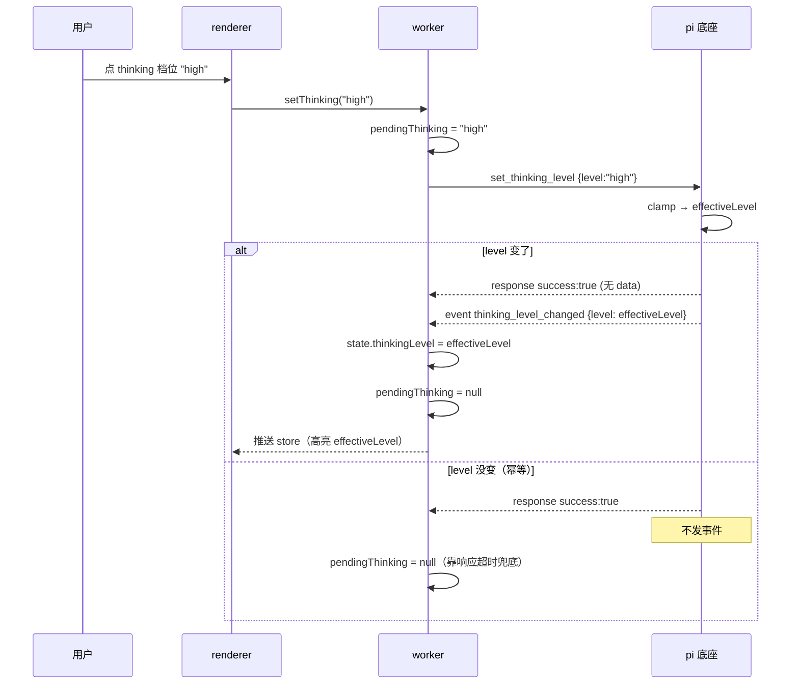
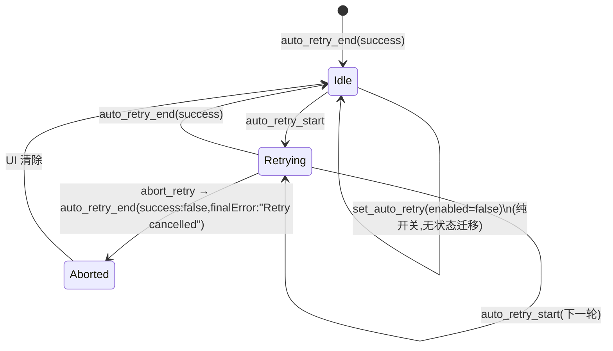
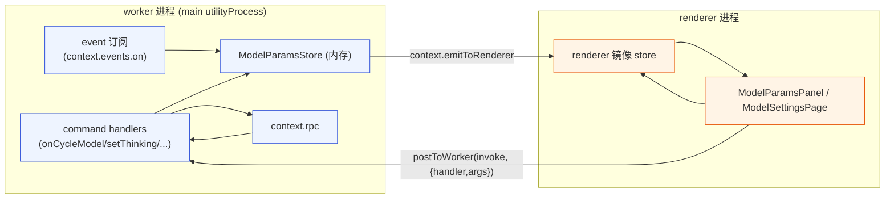
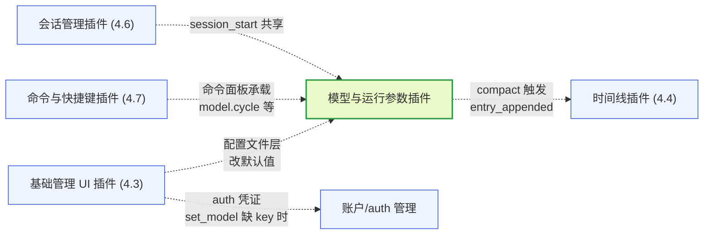
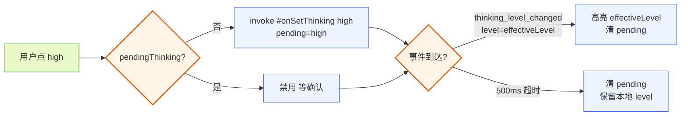
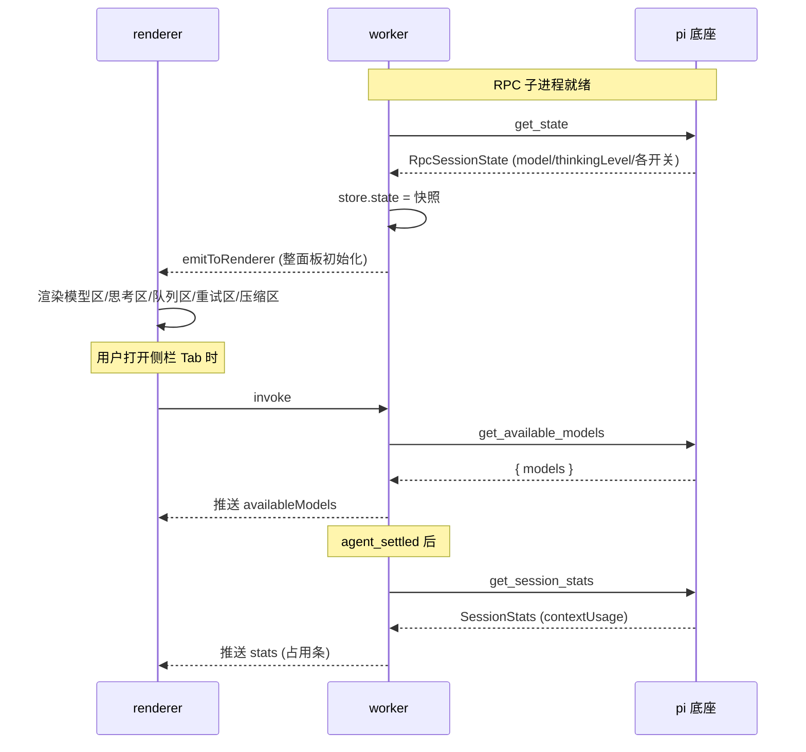
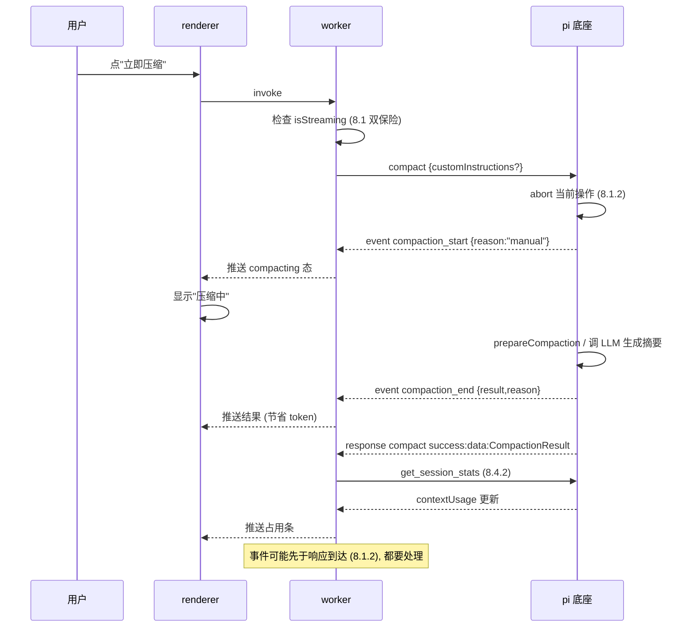
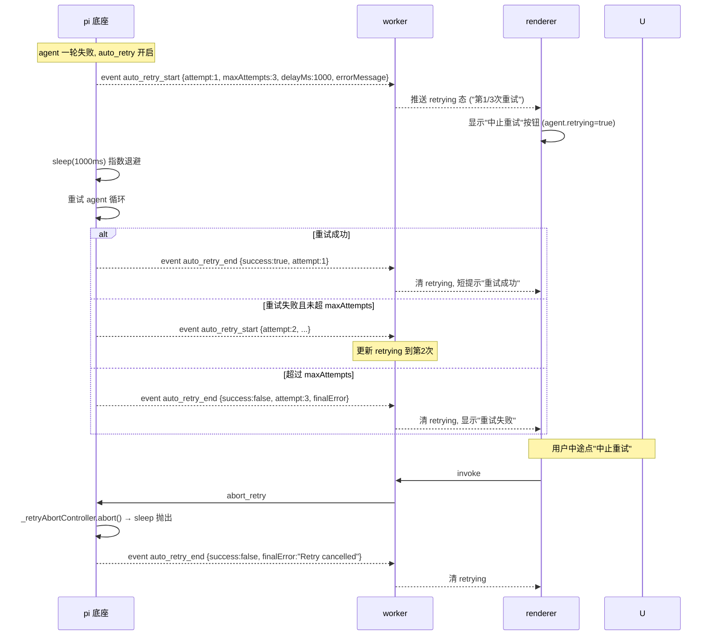

# 模型与运行参数插件文档

本文是 pi-desktop 内置默认插件之一——**模型与运行参数插件**（`model-params`，展示名"模型与运行参数"）的设计文档。它对应 DESIGN.md 第 4.9 节，并把该节展开到"照着能写代码"的程度：从槽位贡献、命令分组、状态同步机制，到每一组 RPC 命令的调用契约、event 订阅、错误处理。文中所有涉及 pi 底座的细节均对照底座源码（`packages/coding-agent/src/`）核实，源码位置在文中以 `底座:文件:行` 标注。

模型与运行参数插件是用户调节 agent 运行行为的入口。它把 pi 底座通过 RPC 暴露的 model/thinking/queue/retry/compaction 五组命令全包成桌面 UI，本身不保存模型列表、不执行压缩、不维护重试计数——这些都是底座子进程的内部事务（DESIGN.md 1.10 边界）。插件只通过 RPC 触发、通过 event 和响应观察状态，是一个纯消费者。这个定位决定了它的全部设计。

写作前的第一个关键核实：本插件涉及的 13 条 RPC 命令的响应结构、底座 `handleCommand` 分发逻辑、各 `AgentSession` 方法的内部副作用（裁剪、持久化、事件发出方式），均逐行对照 `底座:modes/rpc/rpc-mode.ts`、`底座:modes/rpc/rpc-types.ts`、`底座:core/agent-session.ts` 核实。文中每条命令契约都标注源码行号，读者可按图索骥验证。凡本文与 DESIGN.md 笔触不同处（如 4.9.2 的事件可用性），均为代码核实的结论，非臆断——这是"以瞎猜接口为耻，以认真查询为荣"在本设计文档层面的落地。

写作前的第二个关键核实：DESIGN.md 4.9.2 说"模型切换、thinking level 变化都会触发 RPC event（`model_select`、`thinking_level_select`），插件订阅这些 event 同步 UI"。但对照底座源码，`model_select` 和 `thinking_level_select` 实际是 **ExtensionEvent**（`底座:core/extensions/types.ts:780`、`:788`），由 `this._extensionRunner.emit(...)` 发出（`底座:core/agent-session.ts:1524`、`:1646`）；而 RPC mode 只把 `session.subscribe(...)` 拿到的 `AgentSessionEvent` 经 `output(event)` 转发出去（`底座:modes/rpc/rpc-mode.ts:354`）。ExtensionEvent 不在 RPC event 流里（DESIGN.md 1.8.1 边界），桌面插件无法订阅。真正进入 RPC event 流的是 `thinking_level_changed`（`底座:core/agent-session.ts:1645`，属于 `AgentSessionEvent` 联合类型 `:143`），而模型切换在 RPC event 流里**没有任何事件**。这一事实重塑了第 9 章的状态同步设计——模型切换的权威确认只能来自 `set_model`/`cycle_model` 的 RPC 响应本身，外部触发的模型变化要靠 `get_state` 重拉。本文据此如实记录，并在第 9.2、13.2 标记为已知缺口。

写作前的第三个关键核实（类型层）：DESIGN.md 3.2.4/5.1.5 规定 `PluginContext` 暴露给插件的是圆心中性类型——`rpc.getState()` 返回中性 `SessionState`、`rpc.getAvailableModels()` 返回中性 `ModelInfo[]`、`events.on` 回调收中性 `SessionEvent`，圆心不绑底座协议类型（`RpcSessionState`/`Model`/`AgentSessionEvent` 这些底座类型归 `gateway/protocol/`，由 gateway 的 `context-binding`/`event-translator` 翻译成中性类型后交给插件，DESIGN.md 5.1.5 line 2089-2128、17-structure 的 domain/gateway 分层）。因此本插件 worker 代码（第 13 章骨架）实际消费的是中性类型，而非底座原始类型。为便于读者对照底座源码，本文在数据结构说明处（第 3 章）仍以底座原始类型 `RpcSessionState`/`Model`/`AgentSessionEvent` 为参考蓝本列出字段——中性投影类型字段与底座类型一一对应（DESIGN 5.1.5："字段和底座类型对应"），gateway 翻译时字段名保持一致，故骨架按同名字段访问中性类型即可。唯一差异在逃生舱 `rpc.send`：DESIGN 3.2.4 line 723 定义 `send<T = unknown>(command: unknown): Promise<unknown>`——单类型参数、返回 `unknown`，故骨架对 `send` 的返回值用 `as RpcResponse<D>` 显式断言包络（`{success, data, error}`，其中 `data` 仍是底座原始类型），这是因 DESIGN 省略了 `cycle_model`/`compact`/`set_*`/`get_session_stats` 等命令的便捷方法签名（line 722/773 声称"一一对应不多不少"但大量签名被省略）而用的兜底，而非"这些命令无便捷方法"。其中 `set_model` **有**便捷方法 `rpc.setModel(provider, modelId): Promise<Model>`（DESIGN 3.2.4 line 717，直接返回中性 Model、无包络），本插件据 4.4.3"响应 data 即确认"对 `set_model` 改用该便捷方法，类型安全且与 `getState`/`getAvailableModels` 同路径；对其余 DESIGN 未给签名的命令才经 `send` + `as` 断言发，需自行断言 `data` 结构（两条路径不可混用：便捷方法返回中性类型无包络，`send` 返回原始 `RpcResponse` 包络）。注：DESIGN.md 1.8.1（line 339）原说插件"收的是 `AgentSessionEvent`"、与 3.2.4/5.1.5"收中性 `SessionEvent`"冲突的上游矛盾**已解决**——1.8.1 已同步修订为"收经 gateway 翻译后的中性 `SessionEvent`（源自底座 `AgentSessionEvent` 流）"，两文一致（见 17.2.8）。本文按 3.2.4/5.1.5 一侧落地不受影响。

## 1 插件定位与核心职责

### 1.1 它解决什么问题

#### 1.1.1 用户的运行参数调节需求

pi 的 agent 运行行为由一组参数控制：用哪个模型、思考到什么程度、多条排队消息怎么处理、失败要不要自动重试、上下文要不要压缩。在 TUI 模式下，这些散落在斜杠命令、快捷键、配置文件里——`/model` 选模型、`/thinking` 调思考级别、`settings.json` 改队列模式和重试策略、`/compact` 手动压缩。桌面端的诉求是把这些收进一个图形化的控制面板：下拉选模型、档位选思考级别、开关切队列模式/重试/自动压缩、按钮触发手动压缩。模型与运行参数插件就是这个控制面板。

#### 1.1.2 与底座的职责边界

插件严格守住 DESIGN.md 1.10 的边界：**RPC 只管会话运行时控制**。插件不持有模型注册表（`ModelRegistry`）、不解析 `thinkingLevelMap`、不实现压缩算法、不调度重试退避——这些都是底座 `AgentSession` 的内部事务。插件对底座的全部触达都经过 RPC 的 31 个命令（DESIGN.md 1.5）中 model/thinking/queue/retry/compaction 相关的子集，以及对 RPC event 流的订阅。底座 `AgentSession`（`底座:core/agent-session.ts`）是这些能力的内部实现，插件不直接 import 它，只通过 RPC 协议间接消费。

### 1.2 覆盖的 RPC 命令与事件全集

#### 1.2.1 命令清单

插件直接调用的 RPC 命令（来自 `底座:modes/rpc/rpc-mode.ts` 的 `handleCommand` 分发，定义在 `底座:modes/rpc/rpc-types.ts:32-50`）：

| 命令 | 分组 | 作用 | 返回 data | 源码位置 |
|------|------|------|-----------|----------|
| `get_available_models` | 模型 | 拉可用模型列表 | `{ models: Model[] }` | rpc-mode.ts:485 |
| `set_model` | 模型 | 按 provider+modelId 切模型 | `Model` | rpc-mode.ts:467 |
| `cycle_model` | 模型 | 循环到下一个模型 | `{ model, thinkingLevel, isScoped } \| null` | rpc-mode.ts:477 |
| `set_thinking_level` | 思考 | 设思考级别 | 无 | rpc-mode.ts:494 |
| `cycle_thinking_level` | 思考 | 循环思考级别 | `{ level } \| null` | rpc-mode.ts:499 |
| `set_steering_mode` | 队列 | 设 steering 队列模式 | 无 | rpc-mode.ts:511 |
| `set_follow_up_mode` | 队列 | 设 follow-up 队列模式 | 无 | rpc-mode.ts:516 |
| `set_auto_retry` | 重试 | 开关自动重试 | 无 | rpc-mode.ts:539 |
| `abort_retry` | 重试 | 中止进行中的重试 | 无 | rpc-mode.ts:544 |
| `compact` | 压缩 | 手动触发上下文压缩 | `CompactionResult` | rpc-mode.ts:525 |
| `set_auto_compaction` | 压缩 | 开关自动压缩 | 无 | rpc-mode.ts:530 |
| `get_state` | 状态 | 拿状态快照（含 model/thinkingLevel/各开关） | `RpcSessionState` | rpc-mode.ts:457 |
| `get_session_stats` | 状态 | 拿统计（含 contextUsage） | `SessionStats` | rpc-mode.ts:644 |

共 13 条。注意 `set_*` 类命令（thinking/queue/retry/compaction）的响应 `data` 为空——成功仅靠 `success: true` 表示。状态变化的确认方式因命令而异：有的靠后续 event（thinking level 走 `thinking_level_changed` 事件）、有的靠响应即确认（队列模式 6.2.2、重试开关 7.1.1、自动压缩开关 8.2.1——这三类底座根本不发变化事件）、有的靠重新 `get_state`（模型外部触发无事件，4.4.2）。三类的逐组结论见第 9.2.2 章，本文不笼统断言"都要等 event 或 get_state"。

#### 1.2.2 订阅的事件

插件通过 `PluginContext.events.on` 订阅以下 RPC event（均为 `AgentSessionEvent`，经 `底座:modes/rpc/rpc-mode.ts:354` 的 `output(event)` 转发）来保持 UI 同步：

- `thinking_level_changed`（`level`）：思考级别变化，权威来源（`底座:core/agent-session.ts:1645`）。
- `queue_update`（`steering`、`followUp`：`readonly string[]`）：消息队列变化（`底座:core/agent-session.ts:136`）。
- `compaction_start`（`reason: "manual"|"threshold"|"overflow"`）：压缩开始（`:140`）。
- `compaction_end`（`reason`、`result`、`aborted`、`willRetry`、`errorMessage?`）：压缩结束（`:145`）。
- `auto_retry_start`（`attempt`、`maxAttempts`、`delayMs`、`errorMessage`）：重试开始（`:152`）。
- `auto_retry_end`（`success`、`attempt`、`finalError?`）：重试结束（`:153`）。
- `agent_settled`：一轮真的结束，用于判断能否安全触发需打断的操作（如手动 compact、重启）。
- `session_start`（`reason`）：session 加载/重载后重拉 `get_state` 同步参数开关。

**关键缺口**：`model_select` 与 `thinking_level_select` 不在此列——它们是 ExtensionEvent，不在 RPC event 流（详见第 9 章）。模型切换在 RPC 流里没有任何主动推送事件。

### 1.3 插件形态：双入口完整插件

#### 1.3.1 为什么需要 worker 逻辑

本插件不是纯声明式插件——它有动态行为：订阅 event 流同步 UI、发 RPC 命令拿响应、在模型下拉打开时拉 `get_available_models`、在切换模型时发 `set_model` 等响应、维护各参数的本地缓存、处理并发操作的去重。这些光靠 manifest 声明做不到，必须跑代码。因此它的 manifest 同时声明 `main`（worker 入口，跑参数管理逻辑）和 `renderer`（UI 入口，导出侧栏面板和设置子页组件），是一个完整的双入口插件（DESIGN.md 3.6）。worker 侧处理命令编排和 event 订阅，renderer 侧负责所有图形交互。

#### 1.3.2 为什么不纯靠配置文件

队列模式、重试策略、自动压缩开关虽然在底座都持久化进 `settings.json`（`steeringMode`/`followUpMode`/`retry.enabled`/`compaction.enabled`，DESIGN.md 2.1.3），但本插件**不走支柱②的配置文件路径**改它们。原因有二：一是这些参数在会话运行时可以被即时切换（`set_steering_mode` 立刻作用于当前 agent），改配置文件要重启子进程才生效（DESIGN.md 2.2 热加载是显式重启），体验远差于 RPC 即时生效；二是 RPC 已经提供了对应的运行时命令，正是为即时切换设计的。所以本插件改参数全走 RPC 命令，配置文件层的事归管理 UI 插件（4.3）改默认值。两者读同一份 `get_state` 真相，互不冲突。

### 1.4 manifest 草案

```json
{
  "id": "model-params",
  "version": "0.1.0",
  "displayName": "模型与运行参数",
  "main": "./index.ts",
  "renderer": "./ui.tsx",
  "contributes": {
    "sidePanel": [
      { "id": "model-params", "label": "modelparams.panel.title", "icon": "sliders", "component": "ModelParamsPanel", "order": 20, "defaultVisible": false }
    ],
    "managementSlots": [
      { "id": "model-settings", "label": "modelparams.mgmt.title", "icon": "cpu", "component": "ModelSettingsPage", "order": 10 }
    ],
    "commands": [
      { "id": "model.cycle", "title": "modelparams.command.cycleModel", "keybinding": "cmd+shift+m", "handler": "#onCycleModel" },
      { "id": "thinking.cycle", "title": "modelparams.command.cycleThinking", "keybinding": "cmd+shift+t", "handler": "#onCycleThinking" },
      { "id": "model.compact", "title": "modelparams.command.compact", "handler": "#onCompact", "when": "agent.idle" },
      { "id": "retry.abort", "title": "modelparams.command.abortRetry", "handler": "#onAbortRetry", "when": "agent.retrying" }
    ]
  }
}
```

几个关键点：**manifest 不声明 `permissions`**——`rpc`（含 `rpc.send` 逃生舱）属沙箱默认能力，DESIGN.md 3.2.4 line 689 明确"沙箱默认只给 `rpc`/`events`/`bus`/`config`/`i18n`/`http.fetch(白名单域名)`"，DESIGN 3.2.4 的权限枚举只有 `fs:*`/`net:域名`/`child:command`/`content:sensitive`（line 689/691），没有 `rpc:send` 这一权限串。本插件经 `rpc.send(unknown)` 发 `compact`/`set_auto_retry` 等不在 `PluginContext.rpc` 便捷方法集里的命令，是默认能力、无需声明（DESIGN.md 1.5 末尾只把 `send` 描述为逃生舱、未提任何权限）。本插件**不**需要 `content:sensitive` 权限——它显示的是模型名、参数开关、上下文 token 数，不碰对话内容或工具参数（DESIGN.md 1.7.6）。`when` clause 控制命令可用性：`agent.idle` 在 agent streaming 时禁用 compact（会打断当前 turn），`agent.retrying` 只在重试进行中允许中止。

## 2 槽位贡献：侧栏槽与管理槽

插件往两个槽位挂贡献项：侧栏槽（`sidePanel`）挂轻量运行参数面板、管理槽（`managementSlots`）挂深度设置子页。槽位是 core 圆心定义的稳定契约（DESIGN.md 3.3），插件只往里挂、不绕过。

### 2.1 侧栏槽：运行参数面板

#### 2.1.1 贡献项结构

侧栏槽贡献项 schema：`{ id, label, icon, component, order?, defaultVisible? }`。本插件贡献一项：

- `id: "model-params"`——槽位内唯一标识，用于槽位级冲突仲裁（DESIGN.md 3.5 第 7 项）。
- `label: "modelparams.panel.title"`——i18n key，core 查语言槽（DESIGN.md 3.2.1）。
- `icon: "sliders"`——lucide 图标名。
- `component: "ModelParamsPanel"`——renderer 模块导出的组件名，注册进 `componentRegistry["model-params:ModelParamsPanel"]`。
- `order: 20`——排在会话（order:10）之后。
- `defaultVisible: false`——首次启动默认折叠（参数调节是低频操作，不像会话/时间线那样常驻）。

#### 2.1.2 ModelParamsPanel 内部布局

`ModelParamsPanel` 是侧栏 Tab 根组件，自上而下分五区，对应五组参数：

1. **模型区**：当前模型名（带 provider 前缀，如 `anthropic / claude-sonnet-4`）、reasoning 徽标、上下文窗口。点击展开下拉，下拉项来自 `get_available_models`。右侧一个循环按钮（等价 `cycle_model` 命令）。
2. **思考级别区**：档位分段控件（minimal/low/medium/high）。模型不支持 reasoning 时整区禁用并显示"当前模型不支持思考"。
3. **队列模式区**：两个分段控件——steering mode、follow-up mode，各 `all`/`one-at-a-time` 二选一。下方显示当前排队消息数（来自 `queue_update` 事件的数组长度）。
4. **重试区**：自动重试开关 + 当前重试状态（idle / 正在重试第 N 次，最多 M 次）。重试中显示"中止重试"按钮（`abort_retry`）。注意：自动重试开关的当前开/关态无 RPC 数据源（`get_state` 不含 `autoRetryEnabled`），初次进入时开关态未知，UI 据本地记忆显示（详见 3.1/17.2.5/13.4.2）。
5. **压缩区**：自动压缩开关 + "立即压缩"按钮（`compact`，streaming 时禁用）+ 上下文占用条（来自 `get_session_stats` 的 `contextUsage.percent`）。

五区共享同一个 renderer 侧 store（由 worker 侧推数据，见第 10 章），切换 Tab 时复用已缓存数据，无感刷新。五区的排列顺序按使用频率：模型选择最常调（放最上），思考级别次之，队列/重试/压缩更少动（靠下）。这个顺序不是随意的——它对应 TUI 模式下用户调参的典型频率分布（模型 > 思考 > 队列 > 重试/压缩），让最高频的操作触手可及、低频操作往下沉。这是 VSCode 式侧栏"高频在上、低频在下"惯例的本地化应用。

#### 2.1.3 轻量 vs 深度的取舍

侧栏面板是"轻量常用"——只放高频、一眼能看全的控件：当前模型、思考档位、三个开关、占用条。深度设置（成本单价、模型完整列表的多 provider 浏览、压缩 reserveTokens 调优）放下沉到管理槽子页。这个取舍呼应 DESIGN.md 3.3 的槽位分工：侧栏是常驻可见的快操作、管理槽是按需深入的配置。

### 2.2 管理槽：模型与参数设置子页

#### 2.2.1 贡献项结构

管理槽贡献项 schema：`{ id, label, icon, component, order? }`。本插件贡献一项：

- `id: "model-settings"`——管理槽内唯一标识。
- `label: "modelparams.mgmt.title"`——i18n key。
- `icon: "cpu"`。
- `component: "ModelSettingsPage"`。
- `order: 10`——管理面板里靠前展示。

#### 2.2.2 ModelSettingsPage 内容

管理子页是侧栏面板的展开版，多出几样深度信息：

- **完整模型列表表格**：`get_available_models` 返回的全部模型，每行显示 provider、id、name、reasoning、input 类型、contextWindow、maxTokens、单价（input/output/cacheRead/cacheWrite 每百万 token）。支持按 provider 筛选、按成本/窗口排序。当前模型行高亮。
- **思考级别映射说明**：当前模型的 `thinkingLevelMap`（如支持），展示 minimal/low/medium/high 各映射到 provider 的什么值。这是只读信息——`thinkingLevelMap` 由 provider 定义，用户不改。
- **压缩策略详情**：除了侧栏的开关，这里展示 `compaction` 设置的 reserveTokens/keepRecentTokens（只读，改它们走配置文件层的管理 UI，DESIGN.md 2.1.3）。
- **重试策略详情**：retry.enabled 开关 + maxRetries/baseDelayMs/provider 超时（只读，改走配置文件层）。

子页是只读展示为主、可写控件集中在侧栏已覆盖的五组参数。这样避免同一参数两个入口都可写造成竞态——DESIGN.md 3.5 第 8 项的"单一写入口"约束。配置文件层可写字段（reserveTokens/maxRetries 等）的编辑权留给管理 UI 插件（4.3），本插件不越界。

### 2.3 命令项槽与快捷键

#### 2.3.1 贡献的命令

命令项槽贡献四个命令（manifest 1.4 已列）：

- `model.cycle`（`cmd+shift+m`）：循环到下一个模型，无 `when` 限制（任何时候都能切，切模型不打断 streaming）。
- `thinking.cycle`（`cmd+shift+t`）：循环思考级别。
- `model.compact`：手动压缩，`when: "agent.idle"`——streaming 时禁用。
- `retry.abort`：中止重试，`when: "agent.retrying"`——只在重试中可用。

这四个命令让用户不打开侧栏也能快速调参，是 VSCode 式的命令面板/快捷键可达性。`agent.idle` 和 `agent.retrying` 是 core 维护的 contextKeys（DESIGN.md 3.3），由 RPC event 流驱动。`agent.idle` 在任一"进行中"态（streaming/compacting/retrying）时为 false，由 `agent_start`/`agent_end`/`agent_settled`/`compaction_start`/`compaction_end`/`auto_retry_start`/`auto_retry_end` 综合维护（详见 22.1.1）；`agent.retrying` 由 `auto_retry_start` 置 true、`auto_retry_end` 置 false。

#### 2.3.2 命令 vs 侧栏按钮的关系

四个命令和侧栏面板里的控件是同一组 RPC 调用的两个入口。worker 侧的 handler（`#onCycleModel` 等）是唯一实现，命令和侧栏按钮都调它——避免两处各写一遍调用逻辑（DESIGN.md"回调参数是责任边界模糊的气味"的正面应用：逻辑内聚在被调用方）。命令面板触发和按钮点击只是两个不同的 UI 入口，最终走同一段 handler 代码。

## 3 数据模型与状态快照

### 3.1 RpcSessionState 字段映射

`get_state` 返回的 `RpcSessionState`（`底座:modes/rpc/rpc-types.ts:94-107`）是本插件的数据基石。逐字段映射到 UI：

| 字段 | 类型 | UI 映射 |
|------|------|---------|
| `model` | `Model<any> \| undefined` | 模型区当前模型名 + provider + reasoning 徽标 |
| `thinkingLevel` | `ThinkingLevel` | 思考级别区当前档位高亮 |
| `isStreaming` | `boolean` | 压缩按钮禁用态之一；`agent.streaming` contextKey 的来源（非 `agent.idle` 的完整反值，见 22.1.2） |
| `isCompacting` | `boolean` | 压缩区进度态 |
| `steeringMode` | `"all" \| "one-at-a-time"` | 队列区 steering 分段控件高亮 |
| `followUpMode` | `"all" \| "one-at-a-time"` | 队列区 follow-up 分段控件高亮 |
| `autoCompactionEnabled` | `boolean` | 压缩区自动压缩开关 |
| `messageCount` | `number` | 信息展示（消息总数） |
| `pendingMessageCount` | `number` | 队列区"排队中 N 条"显示 |
| `sessionFile`/`sessionId`/`sessionName` | string | 本插件不直接用（会话管理插件用） |

**关键缺口**：`RpcSessionState`（`底座:modes/rpc/rpc-types.ts:94-107`、DESIGN.md 1.7.1）里**没有 `autoRetryEnabled` 字段**——只有 `autoCompactionEnabled`，没有重试开关对应的快照字段。这意味着侧栏重试区的"自动重试开关"（2.1.2 第 4 区）无法从 `get_state` 读到当前开/关态：连接后初次进入时开关态未知，只能靠本地记忆用户最后一次操作（见 13.4.2、16.1.1、17.2.5、21.1.4）。这与"本插件显示运行时值（来自 get_state）"的一般原则不符，是 RPC 数据源的已知缺口，记在 17.2.5。

桌面端连接底座后第一件事是 `get_state`（DESIGN.md 1.5.10），把整面板同步到当前状态。此后每个 `agent_settled` 后刷一次，热加载重启子进程后重拉。除重试开关外，其余参数均能由此拿到权威快照。

### 3.2 Model 类型

`Model<TApi>`（`底座:packages/ai/src/types.ts:704-729`）是模型选择器的数据源。本插件用到的字段：

```typescript
interface Model<TApi extends Api> {
  id: string;                    // "claude-sonnet-4-20250514"
  name: string;                 // 展示名 "Claude Sonnet 4"
  provider: ProviderId;         // "anthropic"
  reasoning: boolean;           // 是否支持扩展思考 → 决定思考区是否禁用
  input: ("text" | "image")[];   // 支持的输入类型
  contextWindow: number;         // 上下文窗口 → 侧栏显示
  maxTokens: number;             // 单次输出上限
  cost: ModelCost;               // 单价 { input, output, cacheRead, cacheWrite }（每百万 token）
  thinkingLevelMap?: ThinkingLevelMap;  // 思考级别到 provider 值的映射（只读展示）
}
```

`set_model` 命令的参数是 `provider` + `modelId` 两个字段（不是整个 Model 对象）——RPC 命令结构 `{ type: "set_model"; provider: string; modelId: string }`（`底座:modes/rpc/rpc-types.ts:32`）。底座在 `case "set_model"` 里用 `models.find((m) => m.provider === command.provider && m.id === command.modelId)` 定位（`底座:modes/rpc/rpc-mode.ts:469`），所以下拉项的 `value` 要编成 `${provider}/${id}`，选中后拆成两个字段发命令。

### 3.3 CompactionResult 与 SessionStats

#### 3.3.1 CompactionResult

`compact` 命令返回 `CompactionResult`（`底座:core/compaction/compaction.ts:87-94`）：

```typescript
interface CompactionResult<T = unknown> {
  summary: string;              // 压缩生成的摘要
  firstKeptEntryId: string;     // 压缩后保留的第一条 entry id
  tokensBefore: number;         // 压缩前 token 数
  estimatedTokensAfter?: number;// 压缩后估算 token 数
  details?: T;                 // 扩展特定的压缩细节（结构化压缩时用）
}
```

本插件用 `tokensBefore` 和 `estimatedTokensAfter` 算压缩率展示给用户（如"压缩前 120k → 压缩后 30k，节省 75%"）。`summary` 不展示——它是给 LLM 的上下文摘要，属对话内容范畴，且本插件无 `content:sensitive` 权限（gateway 层会把敏感字段过滤，DESIGN.md 1.7.6）。

#### 3.3.2 SessionStats 的 contextUsage

上下文占用条的数据源是 `get_session_stats` 返回的 `contextUsage`（DESIGN.md 1.7.3）：`{ tokens, contextWindow, percent }`。本插件在侧栏压缩区画一个百分比条——绿（<60%）、黄（60-85%）、红（>85%），超过阈值时提示"建议压缩"。注意 `get_session_stats` 不是高频调用（它要算 token），不应每条 event 都拉；策略是 `agent_settled` 后拉一次 + 用户打开侧栏时拉一次。

### 3.4 渲染器侧 store 结构

renderer 侧维护一个 `ModelParamsStore`（worker 推送，DESIGN.md 3.6 双入口），结构：

```typescript
interface ModelParamsStore {
  state: RpcSessionState | null;       // get_state 快照
  availableModels: Model[] | null;     // get_available_models 缓存（下拉打开时拉）
  stats: { contextUsage?: ContextUsage } | null;
  retrying: { attempt: number; maxAttempts: number; errorMessage: string } | null;
  compacting: { reason: string } | null;
  autoRetryEnabled: boolean | null;     // 本地记忆，非底座快照（autoRetryEnabled 无 RPC 数据源，见 17.2.5）
  // 操作态（非乐观占位，见第 9 章）
  pendingModelSwitch: { provider: string; modelId: string } | null;
  pendingThinking: ThinkingLevel | null;
  error: { command: string; message: string } | null;
}
```

`pendingModelSwitch`/`pendingThinking` 是"操作发出但未确认"的占位态——UI 据此显示加载指示器，避免用户重复点击。它们在权威确认（RPC 响应或 event）回来后清空。这是第 9 章的核心机制。

`autoRetryEnabled` 是个例外：它不在 `get_state` 的快照里（`RpcSessionState` 无此字段，3.1），也不经事件推送（7.1.1 无事件）。store 里它是一个独立的本地记忆字段——初值 `null`（未知），用户每次成功操作 `set_auto_retry` 后本地更新为该值。这是该参数"开关态无 RPC 数据源"的兜底策略，详见 17.2.5。

## 4 模型选择

### 4.1 数据流：get_available_models → 下拉

#### 4.1.1 拉取时机

`get_available_models` 不是启动时全量拉——可用模型列表可能很长（多 provider 多模型），且用户不打开模型下拉时不需要。拉取策略：用户首次展开模型下拉时拉一次，之后缓存到 `availableModels`。切换 session 不需要重拉（可用模型列表是 provider 级的，不随 session 变），但热加载重启子进程后要清缓存重拉（provider 配置可能变了）。

#### 4.1.2 列表渲染

下拉项按 provider 分组、每组按 name 排序。每项 value 编码为 `${provider}/${id}`，显示 name + 上下文窗口缩写。当前模型项（来自 `state.model`）打勾标记。无 auth 配置的模型（底座 `setModel` 会抛 "No API key"，`底座:core/agent-session.ts:1538-1540`）无法在下拉项预判禁用——auth 状态不在本插件可见范围（本插件无 `content:sensitive` 权限、不读 auth-storage，PluginContext 也不暴露凭证读接口，见 DESIGN.md 3.2.4/2.1.4）。因此下拉项一律可点，缺 auth 的模型在用户选中后才由 `set_model` 失败时的 `"No API key for ..."` 错误引导（18.1.2 提供跳转账户管理入口），不在前端预判禁用。这是"数据源不在可见范围就不假装能判断"的诚实兜底。

### 4.2 set_model 契约与流程

#### 4.2.1 完整调用契约

- 发送：`{ type: "set_model", provider: string, modelId: string, id }`（`底座:modes/rpc/rpc-types.ts:32`）。
- 响应（成功）：`{ type: "response", command: "set_model", success: true, data: Model }`（`rpc-types.ts:126-132`）——data 是切到的那个 Model。
- 响应（失败）：`{ ..., success: false, error: "Model not found: {provider}/{modelId}" }`（`底座:modes/rpc/rpc-mode.ts:471`）。
- 底座处理：`models.find(...)` 找不到返回 error；找到则 `await session.setModel(model)`（`:473`）。

`setModel` 内部（`底座:core/agent-session.ts:1537-1552`）：先查 `_modelRegistry.hasConfiguredAuth(model)`，没 auth 抛 `"No API key for {provider}/{id}"`——这个抛在 RPC 层会被外层 try 包裹转成 `success: false` error 响应。所以缺 auth 也是 `success: false, error: "No API key for ..."`，插件据此提示用户去 auth 管理配凭证。

#### 4.2.2 UI 流程

用户在下拉选一个模型：

1. renderer 发消息给 worker：`switchModel(provider, modelId)`。
2. worker 设 `pendingModelSwitch = { provider, modelId }`，推给 renderer 显示加载态（下拉项转 spinner）。
3. worker 发 `set_model` 命令。
4. 收到 `success: true` + `data: Model` → worker 更新 `state.model = data`，清 `pendingModelSwitch`，推 renderer。下拉项打勾移到新模型。
5. 收到 `success: false` + `error` → worker 设 `error = { command: "set_model", message: error }`，清 `pendingModelSwitch`，推 renderer 显示错误 toast。**不主动改写 `state.model`**——它从未被乐观更新为目标值（第 2 步只设 `pendingModelSwitch` 占位、不动 `state.model`），故失败时 `state.model` 自然停留在旧值，下拉项打勾仍在原模型。这是"回退到原选中"的结果而非额外动作，与 4.5 的"不回滚"表述一致（两处对齐见 4.5 末段）。

### 4.3 cycle_model 循环语义

#### 4.3.1 scoped vs available

`cycle_model` 的循环范围分两种（`底座:core/agent-session.ts:1560-1619`）：

- **scoped models**：启动时 `--models` flag 指定的子集（`_scopedModels`），循环只在这个子集里。`isScoped: true`。
- **available models**：否则循环全部可用模型。`isScoped: false`。

两者都按当前模型在列表中的位置 +1 取模循环（forward 方向）。若列表长度 ≤ 1 返回 `null`（没有可循环的）。UI 据返回值是 null 还是非 null 判断：null 时提示"没有其他模型"。

#### 4.3.2 返回结构与切换副作用

响应 data：`{ model: Model, thinkingLevel: ThinkingLevel, isScoped: boolean } | null`（`底座:modes/rpc/rpc-types.ts:133-139`）。关键副作用：`cycleModel` 内部调了 `setThinkingLevel`（`底座:core/agent-session.ts:1589/1614`）——切模型时思考级别会被按新模型能力重新裁剪。所以 `cycle_model` 后，思考级别区也要据返回的 `thinkingLevel` 更新高亮。这比单纯看 `model_select` 更可靠（且 `model_select` 本就不在 RPC 流里）。

#### 4.3.3 方向参数的缺失

注意 RPC 的 `cycle_model` 命令**不带 direction 参数**（`底座:modes/rpc/rpc-types.ts:33`），底座 `session.cycleModel(direction = "forward")` 默认 forward（`底座:core/agent-session.ts:1560`）。所以桌面端只能向前循环，不能后退。若要支持后退（如 shift+快捷键反向循环），是底座 RPC 协议的缺口——当前只能靠 `get_available_models` + `set_model` 自己实现后退逻辑。第 13 章记这个缺口。

### 4.4 模型切换的确认机制（关键）

#### 4.4.1 DESIGN.md 的预期与代码现实的落差

DESIGN.md 4.9.2 说"用户在 UI 上的操作发对应 RPC 命令，命令成功后 event 回来再确认状态更新——不是乐观更新、是 event 驱动的确认"。但核实底座源码：

- `model_select` 事件由 `this._extensionRunner.emit({ type: "model_select", ... })` 发出（`底座:core/agent-session.ts:1524`、`1529`），是 **ExtensionEvent**（`底座:core/extensions/types.ts:780-785`）。
- RPC mode 只转发 `session.subscribe(...)` 拿到的 `AgentSessionEvent`（`底座:modes/rpc/rpc-mode.ts:354` 的 `output(event)`）。
- `AgentSessionEvent` 联合类型（`底座:core/agent-session.ts:127-153`）里**没有 `model_select`**。

结论：桌面插件通过 `PluginContext.events.on` **收不到 `model_select` 事件**。DESIGN.md 4.9.2 关于"订阅 model_select event 同步 UI"的描述与代码现实不符。

#### 4.4.2 实际可用的确认来源

模型切换的权威确认有两个来源，按可信度排序：

1. **用户发起的切换**：`set_model` / `cycle_model` 的 RPC 响应本身。`set_model` 返回切到的 `Model`，`cycle_model` 返回 `{ model, thinkingLevel, isScoped }`。这就是权威真相——"命令成功"即"已切换成功"。这是 DESIGN.md 4.9.2 想要的"非乐观更新"的实际落地形式：不是等一个独立 event，而是用响应数据本身确认。
2. **外部触发的切换**（如 extension 在底座侧改了模型、或 session 恢复了模型）：RPC 流里无任何事件告知。只能靠 `get_state` 的 `model` 字段重拉发现。策略：在 `session_start`（reason: resume/reload——DESIGN.md 1.6.4 定义的枚举是 `startup`/`reload`/`new`/`resume`/`fork`，无 `restore`；模型随 session 恢复对应 `resume`，重启后对应 `startup`）和 `agent_settled` 后重拉 `get_state`，比对 `model` 是否变化。

#### 4.4.3 本插件的确认策略

综合上述，模型切换的确认策略：

- 用户下拉选模型 → 用 `set_model` 响应的 `data: Model` 更新 UI（这是确认，不是乐观更新）。
- 用户点循环 → 用 `cycle_model` 响应的 `data.model` + `data.thinkingLevel` 更新 UI。
- `pendingModelSwitch` 占位态只是防重复点击，不是"乐观假设切换成功"——切换失败时 `state.model` 自然停留在原值（从未被乐观更新，见 4.5）。
- 外部触发的模型变化：`session_start` / `agent_settled` 后重拉 `get_state`，若 `model` 与本地缓存不符则更新 UI。这是被动同步，不是事件推送。

这个策略诚实面对了 RPC event 流的边界：不假装有 `model_select` 事件可用，而是用响应确认 + 周期性 `get_state` 比对兜底。这也是本文与 DESIGN.md 4.9.2 的关键差异：DESIGN.md 把模型切换和思考级别都归为"event 驱动确认"，但代码核实表明只有思考级别成立。本文按代码现实重新分层，不照搬设计文档的笼统表述——"以瞎猜接口为耻，以认真查询为荣"。

### 4.5 错误场景与 UI 处理

模型切换的三类失败及 UI 处理：

- **"Model not found"**：下拉项 value 编码错或模型被移除。清 `availableModels` 缓存重拉，提示"模型列表已更新"。
- **"No API key for ..."**：模型存在但无 auth。提示"该模型未配置凭证，请前往账户管理配置"，提供跳转入口（账户管理走底座 auth，不在本插件职责）。
- **RPC 超时/子进程崩溃**：`rpc.send` 30s 超时 reject（DESIGN.md 1.4.2）或子进程 exit。清 `pendingModelSwitch`，按 core 的进程生命周期事件提示重连。

失败时**不主动回滚 `state.model`**——因为 `state.model` 从未被乐观更新为目标值（4.2.2 第 2 步只设 `pendingModelSwitch` 占位，不动 `state.model`），所以失败时它自然停留在旧值，无需额外动作把它"回退到原选中"。这里说的"不回滚"指不主动把 `state.model` 重置/改写：底座状态未知（可能切了一半），不在插件侧猜测真相，等下一次 `get_state` 拿到真相再校正 UI。这与 4.2.2 第 5 步的表述是同一件事的两个侧面——"回退到原选中"是结果（因为没动过），"不回滚"是不做多余动作，两处措辞对齐。

## 5 思考级别

### 5.1 ThinkingLevel 枚举与能力裁剪

#### 5.1.1 枚举与档位

`ThinkingLevel` 枚举：`"minimal" | "low" | "medium" | "high"`（`底座:packages/ai`，DESIGN.md 1.7.2）。四档从低到高。底座还可能在内部用 `"off"`（`底座:core/agent-session.ts:1697` 的 `_clampThinkingLevel` 在无 model 时返回 "off"），但 RPC 暴露的四档是 minimal/low/medium/high。UI 用分段控件（segmented control）四选一。

#### 5.1.2 模型能力裁剪

并非所有模型都支持四档。底座 `getAvailableThinkingLevels()`（`底座:core/agent-session.ts:1674-1677`）据当前 model 的 `thinkingLevelMap` 返回支持的子集。`supportsThinking()` 据 `model.reasoning` 判断（`:1682-1684`）。本插件的 UI 处理：

- `model.reasoning === false`：整区禁用，显示"当前模型不支持思考"。
- `model.reasoning === true`：只渲染 `getAvailableThinkingLevels()` 返回的档位。档位少于四档时只显示支持的几档。

但 `getAvailableThinkingLevels` 不是 RPC 命令——本插件拿不到。变通方式只有两条，需分别认清其能力边界：

- **可靠方式：据 `model.thinkingLevelMap` 前端过滤**。`get_available_models`/`get_state.model` 都带 `thinkingLevelMap`（3.2），其 `null` 值标记该级别不支持（`底座:packages/ai/src/types.ts:712-715` 注释："null marks a level as unsupported"），前端据此过滤（24.2）。这是列出"支持哪些档位"的唯一可靠途径。
- **极端兜底：`cycle_thinking_level` 返回 null**。这只能判断"该模型完全不支持思考"这一极端情况（`supportsThinking()` 为 false 时返回 undefined→null，5.3.2），无法列出支持的子集。注意 `set_thinking_level` 响应无 data（5.2.1），**不能**从中判断支持性——早期文档把它列为判断方式是死路，已删除。

### 5.2 set_thinking_level 契约

#### 5.2.1 调用契约

- 发送：`{ type: "set_thinking_level", level: ThinkingLevel, id }`（`底座:modes/rpc/rpc-types.ts:37`）。
- 响应（成功）：`{ type: "response", command: "set_thinking_level", success: true }`（`rpc-types.ts:149`）——**无 data**。
- 底座处理：`session.setThinkingLevel(command.level)`（`底座:modes/rpc/rpc-mode.ts:495`），同步方法。

#### 5.2.2 底座的裁剪与持久化

`setThinkingLevel`（`底座:core/agent-session.ts:1630-1652`）内部做了三件影响 UI 的事：

1. **裁剪**：`effectiveLevel = availableLevels.includes(level) ? level : clamp(level)`（`:1632`）。用户选的档位若模型不支持，会被 clamp 到最近的支持档位。所以 UI 最终高亮的可能不是用户点的那个。
2. **幂等**：`isChanging = effectiveLevel !== previousLevel`（`:1636`）。若没变，不持久化也不发事件。
3. **持久化**：变了则 `settingsManager.setDefaultThinkingLevel(effectiveLevel)`（`:1643`，进 settings.json）+ `sessionManager.appendThinkingLevelChange`（`:1641`，进 session 历史）+ 发 `thinking_level_changed` 事件（`:1645`）+ 发 `thinking_level_select` ExtensionEvent（`:1646`）。

因为响应无 data，UI 不能用响应确认最终级别——要靠 `thinking_level_changed` 事件（见 5.4）拿权威的 `effectiveLevel`。这正是 event 驱动确认的典型场景。

### 5.3 cycle_thinking_level 契约

#### 5.3.1 调用契约

- 发送：`{ type: "cycle_thinking_level", id }`（`底座:modes/rpc/rpc-types.ts:38`）。
- 响应：`{ ..., success: true, data: { level: ThinkingLevel } | null }`（`rpc-types.ts:150-156`）。
- 底座处理：`session.cycleThinkingLevel()`（`底座:modes/rpc/rpc-mode.ts:500`）。

#### 5.3.2 null 的含义

`cycleThinkingLevel`（`底座:core/agent-session.ts:1658-1668`）：若 `!supportsThinking()` 返回 `undefined`（RPC 序列化成 null）。UI 据此提示"当前模型不支持思考"。返回非 null 时，data.level 是循环到的新档位——但和 `set_thinking_level` 一样，内部会触发 `thinking_level_changed` 事件，UI 应以事件为准（cycle 响应可作乐观占位，事件确认）。

### 5.4 thinking_level_changed event 同步

#### 5.4.1 事件契约

`thinking_level_changed`（`底座:core/agent-session.ts:143`、`1645`）：

```typescript
{ type: "thinking_level_changed"; level: ThinkingLevel }
```

这是**在 RPC event 流里的**（AgentSessionEvent 成员，经 rpc-mode.ts:354 转发）。字段 `level` 是裁剪后的 `effectiveLevel`——权威值。

#### 5.4.2 同步流程



**图 1 — 思考级别切换的 event 驱动确认时序**

关键：UI 最终高亮的是事件里的 `level`（裁剪后的真相），不是用户点的那个。若用户点 "high" 但模型只支持到 "medium"，事件回 `level: "medium"`，UI 高亮 medium 并提示"已调整到模型支持的最高档位"。这正是 DESIGN.md 4.9.2"非乐观更新"的落地——但只对 thinking 级别成立（因为 `thinking_level_changed` 在 RPC 流里），对模型切换不成立（见 4.4）。

#### 5.4.3 幂等场景的处理

`setThinkingLevel` 在 level 没变时不发事件（`底座:core/agent-session.ts:1640` 的 `if (isChanging)` 守卫）。这意味着用户点了一个和当前一样的档位：响应 success 回来，但永远等不到 `thinking_level_changed` 事件。`pendingThinking` 占位态不能无限挂着。策略：收到 success 响应后设一个短超时（如 500ms），若期间没收到事件，清 `pendingThinking` 并以本地记录的 level 为准——因为没变就是没变，本地值就是真相。注意 500ms 超时也命中"事件延迟到达"的情况：若级别其实变了，但 `thinking_level_changed` 事件因网络/底座延迟超过 500ms 才到，超时会先清 pending 并保留旧 level，UI 短暂停留在旧档位，延迟事件到达后才自动校正。超时阈值可据此权衡——过长则延迟反馈差，过短则易误清 pending。

### 5.5 模型切换时的 thinking level 联动

`setModel`/`cycleModel` 内部都调了 `setThinkingLevel`（`底座:core/agent-session.ts:1549/1589/1614`）——切模型时按新模型能力重新裁剪思考级别。这意味着模型切换会触发 `thinking_level_changed` 事件。本插件在模型切换后，不只需更新模型区，还要等（或被动收）`thinking_level_changed` 事件更新思考级别区。

但有个时序问题：`set_model` 响应和 `thinking_level_changed` 事件谁先到？底座 `setModel` 里 `setThinkingLevel` 是同步调用（`:1549`），在 `_emitModelSelect` 之前（`:1551`）。而 `thinking_level_changed` 由 `_emit` 发（同步入队到事件流），`_emitModelSelect` 是 ExtensionEvent（不在 RPC 流）。所以 RPC 流里：`setModel` 触发的 `thinking_level_changed` 事件会在 `set_model` 响应之前或附近发出。worker 要能处理"先收到 thinking_level_changed 事件、后收到 set_model 响应"的乱序。

两种切换的思考级别权威来源不同，必须区分：

- **`set_model`（用户经下拉触发）**：响应 data 是 `Model`（3.2/4.2.1），**不含 `thinkingLevel` 字段**。所以切模型后思考级别只能靠 `thinking_level_changed` 事件更新——响应本身给不了思考权威值。worker 收到 `set_model` 响应只更新 `state.model`，思考级别区高亮等 `thinking_level_changed` 事件来了再动（若级别没变则不发事件，思考区保持原样）。
- **`cycle_model`（循环触发）**：响应 data 是 `{ model, thinkingLevel, isScoped }`（4.3.2），**含 `thinkingLevel`**。所以循环后可用响应 `data.thinkingLevel` 作中间态先更新思考区、事件再确认；也可纯等事件。两者一致（响应值是 `cycleModel` 内部 clamp 后的结果，事件回的也是它）。

简言之：`set_model` 后思考级别只能靠事件、响应无此字段；`cycle_model` 可用响应 data.thinkingLevel 作中间态、事件再确认。5.5 末段之前笼统说"以响应的 thinkingLevel 为最终权威"只对 `cycle_model` 成立，对 `set_model` 不成立——已据上述区分重写。

## 6 队列模式

### 6.1 steering vs followUp 语义

#### 6.1.1 两类排队

pi 的消息排队分两类（DESIGN.md 1.5.1、1.5.5）：

- **steering**：agent 正在 streaming 时，新消息"转向"插入。`steeringMode` 控制多条 steering 消息是全部处理（`"all"`）还是只处理一条（`"one-at-a-time"`）。
- **followUp**：agent 完成一轮后，排队的后续消息。`followUpMode` 同理控制全部处理还是只处理一条。

两类独立设置，各有自己的 mode。UI 用两个分段控件分别展示。

#### 6.1.2 mode 的语义

`"all"`：队列里所有消息依次处理。`"one-at-a-time"`：只处理队列第一条，其余丢弃（或保留待用户决定）。`"all"` 适合连续追问，`"one-at-a-time"` 适合"每次只看最新意图"。UI 在分段控件旁给一句话说明当前模式的含义。

### 6.2 set_steering_mode / set_follow_up_mode 契约

#### 6.2.1 调用契约

两个命令结构同构（`底座:modes/rpc/rpc-types.ts:41-42`）：

- 发送：`{ type: "set_steering_mode", mode: "all" | "one-at-a-time", id }`。
- 响应：`{ ..., success: true }`（无 data，`rpc-types.ts:159-160`）。
- 底座处理：`session.setSteeringMode(command.mode)`（`底座:modes/rpc/rpc-mode.ts:512`）。

`setSteeringMode`（`底座:core/agent-session.ts:1713-1716`）：设 `agent.steeringMode` + `settingsManager.setSteeringMode(mode)`（持久化进 settings.json）。**不发任何事件**——没有 `steering_mode_changed` 之类的事件。follow-up 同理（`:1722-1725`）。

#### 6.2.2 无事件的确认

由于底座不发队列模式变化事件，UI 确认只能靠响应：收到 `success: true` 即认为切换成功，本地更新 `state.steeringMode`。这是少数允许"响应即确认"的场景——因为队列模式是纯本地设置切换，不涉及底座异步处理，响应成功就等于已生效。无需 `pending` 占位态（切换是原子的），但为防双击仍加短时 disable。

### 6.3 queue_update event 与排队显示

#### 6.3.1 事件契约

`queue_update`（`底座:core/agent-session.ts:136-139`）：

```typescript
{ type: "queue_update"; steering: readonly string[]; followUp: readonly string[] }
```

两个数组分别是 steering 队列和 followUp 队列里的消息 id 列表。本插件用数组长度显示"排队中 N 条"——steering 队列长度 + followUp 队列长度。

#### 6.3.2 排队显示的交互

队列区显示：`steering: N | followUp: M`。N+M > 0 时高亮提示"有排队消息"。`"one-at-a-time"` 模式下，若队列长度 > 1，额外提示"当前模式只处理第一条，其余将保留/丢弃"。这个提示帮助用户理解为什么后面排的消息没被执行。

## 7 重试策略

### 7.1 set_auto_retry / abort_retry 契约

#### 7.1.1 set_auto_retry

- 发送：`{ type: "set_auto_retry", enabled: boolean, id }`（`底座:modes/rpc/rpc-types.ts:49`）。
- 响应：`{ ..., success: true }`（无 data，`rpc-types.ts:167`）。
- 底座处理：`session.setAutoRetryEnabled(command.enabled)`（`底座:modes/rpc/rpc-mode.ts:540`）→ `settingsManager.setRetryEnabled(enabled)`（`底座:core/agent-session.ts:2660`），持久化进 settings.json。无事件。

**开关态无 RPC 数据源**（关键缺口，详见 17.2.5）：`get_state` 的 `RpcSessionState` 不含 `autoRetryEnabled` 字段（3.1），`set_auto_retry` 响应也无 data、不发任何事件。因此重试区的"自动重试开关"无法从底座读到当前开/关态——侧栏初次进入时开关态未知，UI 只能本地记忆用户最后一次操作。这是本插件唯一一组"开关态不在 get_state"的参数，与压缩开关（`autoCompactionEnabled` 在 `RpcSessionState` 里）形成对照。

#### 7.1.2 abort_retry

- 发送：`{ type: "abort_retry", id }`（`底座:modes/rpc/rpc-types.ts:50`）。
- 响应：`{ ..., success: true }`（无 data，`rpc-types.ts:168`）。
- 底座处理：`session.abortRetry()`（`底座:modes/rpc/rpc-mode.ts:545`）→ `_retryAbortController?.abort()`（`底座:core/agent-session.ts:2643`）。

`abortRetry` 中止的是进行中的重试——如果在重试退避等待（`sleep(delayMs, signal)`，`:2620`）期间，abort 会让 sleep 抛出，触发 `auto_retry_end` 事件（`:2625-2630`，`finalError: "Retry cancelled"`）。如果没在重试（`_retryAbortController === undefined`），abort 是空操作。UI 的"中止重试"按钮据 `agent.retrying` contextKey 显示/隐藏。

**abort 在 agent 循环执行期间的行为（已知缺口）**：上述 sleep 抛出→`auto_retry_end` 仅覆盖"重试正处在退避等待"这一段。若重试已度过退避、正处在"重新发起的 agent 循环"执行中（不在 sleep），`_retryAbortController.abort()` 是否能中止进行中的 agent turn、何时发 `auto_retry_end`，底座源码未明确——abort 信号能否传到 turn 内部依赖 turn 是否检查该 signal，行为未定。本插件对此的兜底：`handleAbortRetry`（13.4.2）发 abort 后**不主动清 `store.retrying`**，仍等 `auto_retry_end` 事件回调清；同时设一个超时兜底（如 5s），若 abort 后迟迟等不到 `auto_retry_end`，强制清 `store.retrying` 并提示"中止请求已发出，重试状态可能滞后"。这是底座行为未定时的保守兜底，演进项记在 21.1.6（推动底座明确 abort 在 agent 循环期间的语义）。

### 7.2 auto_retry_start / auto_retry_end 事件

#### 7.2.1 事件契约

两个事件（`底座:core/agent-session.ts:152-153`）：

```typescript
{ type: "auto_retry_start"; attempt: number; maxAttempts: number; delayMs: number; errorMessage: string }
{ type: "auto_retry_end"; success: boolean; attempt: number; finalError?: string }
```

`auto_retry_start`：一次重试开始，带第几次（attempt）、最多几次（maxAttempts）、退避延迟（delayMs，指数退避 `baseDelayMs * 2**(attempt-1)`，`:2601`）、上次失败原因（errorMessage）。

`auto_retry_end`：重试结束，带是否最终成功（success）、尝试次数（attempt）、最终错误（finalError，失败时才有）。

#### 7.2.2 UI 状态映射

- 收到 `auto_retry_start`：重试区进入"正在重试"态，显示"第 {attempt}/{maxAttempts} 次重试，{delayMs}ms 后重试，原因：{errorMessage}"。`agent.retrying` contextKey 置 true，"中止重试"按钮可点。
- 收到 `auto_retry_end`（success: true）：重试区回 idle，显示"重试成功（第 {attempt} 次）"短提示后清除。`agent.retrying` 置 false。
- 收到 `auto_retry_end`（success: false）：重试区回 idle，显示"重试失败，已尝试 {attempt} 次：{finalError}"。`agent.retrying` 置 false。

### 7.3 重试状态机



**图 2 — 重试状态机：auto_retry_start/end 事件驱动**

注意 `set_auto_retry(false)` 不触发状态迁移——它关的是"失败后是否自动重试"的开关，不中止进行中的重试。要中止进行中的重试必须显式 `abort_retry`。UI 上这两个操作分开：开关控制未来行为、中止按钮处理当前进行中。

## 8 压缩

### 8.1 compact 手动触发

#### 8.1.1 调用契约

- 发送：`{ type: "compact", customInstructions?: string, id }`（`底座:modes/rpc/rpc-types.ts:45`）。
- 响应（成功）：`{ ..., success: true, data: CompactionResult }`（`rpc-types.ts:163`）。
- 底座处理：`await session.compact(command.customInstructions)`（`底座:modes/rpc/rpc-mode.ts:526`）。

#### 8.1.2 compact 的副作用

`session.compact`（`底座:core/agent-session.ts:1736`）内部做了几件影响 UI 的事：

1. **先 abort 当前操作**（`:1737-1738`）：`_disconnectFromAgent()` + `await this.abort()`。所以 compact 会打断正在 streaming 的 agent——这就是 UI 在 `when: "agent.idle"` 时才允许 compact 的原因。
2. **发 `compaction_start` 事件**（`:1740`，reason: "manual"）。
3. 执行压缩（可能调 extension 的 `session_before_compact` handler，`:1765-1784`，extension 可取消或提供自定义压缩内容）。
4. **发 `compaction_end` 事件**（`:1848`，带 result/aborted/willRetry）。
5. 返回 `CompactionResult` 给 RPC 响应。

所以一次 compact 在 RPC 流里产生：1 个 `compaction_start` + 1 个 `compaction_end` + 1 个 RPC 响应。UI 据事件显示进度和结果（`compaction_end.result`），响应仅作命令成功确认（与 13.3.2/8.3.2 对齐）。

#### 8.1.3 customInstructions 的用途

`customInstructions` 是给压缩 LLM 的额外指令（如"保留所有代码示例"、"重点保留最近的需求讨论"）。UI 在"立即压缩"按钮旁提供一个可选的输入框让用户填。空着不传。命令发送方向不经过 gateway 的 `content:sensitive` 过滤（过滤只作用于 event 流，DESIGN.md 1.7.6），所以 `customInstructions` 正常发送。

#### 8.1.4 不可压缩场景

`compact` 可能抛错（`底座:core/agent-session.ts:1757-1759`）：

- `"Already compacted"`：上一条 entry 已经是 compaction，不能再压。
- `"Nothing to compact (session too small)"`：session 内容太少。

这些抛错在 RPC 层成 `success: false, error: "..."`。UI 据错误信息提示"会话已压缩，无法再次压缩"或"会话内容过少，无需压缩"。

### 8.2 set_auto_compaction 契约

#### 8.2.1 调用契约

- 发送：`{ type: "set_auto_compaction", enabled: boolean, id }`（`底座:modes/rpc/rpc-types.ts:46`）。
- 响应：`{ ..., success: true }`（无 data，`rpc-types.ts:164`）。
- 底座处理：`session.setAutoCompactionEnabled(command.enabled)`（`底座:modes/rpc/rpc-mode.ts:531`）。

#### 8.2.2 自动压缩的触发

`setAutoCompactionEnabled`（`底座:core/agent-session.ts:2167`）只设开关。自动压缩的实际触发在 agent 循环里：当上下文 token 超过阈值（`compaction.reserveTokens`，DESIGN.md 2.1.3）时，底座自动发起压缩，发 `compaction_start`（reason: "threshold"）或 `"overflow"`。本插件无需关心触发逻辑——只要订阅 `compaction_*` 事件显示进度即可。开关只是控制"要不要自动触发"，手动 `compact` 不受开关影响（手动随时可触发，前提 idle）。

### 8.3 compaction_start / compaction_end 事件

#### 8.3.1 事件契约

```typescript
{ type: "compaction_start"; reason: "manual" | "threshold" | "overflow" }
{ type: "compaction_end"; reason: "manual" | "threshold" | "overflow";
  result: CompactionResult | undefined; aborted: boolean; willRetry: boolean; errorMessage?: string }
```

`reason` 区分手动触发（用户点按钮）、阈值触发（自动压缩开启且超 reserveTokens）、溢出触发（超 contextWindow 上限）。

#### 8.3.2 UI 进度态

- 收到 `compaction_start`：压缩区进入"正在压缩"态，显示"压缩中（{reason 中文}）"。`get_state.isCompacting` 也为 true。手动压缩按钮禁用。
- 收到 `compaction_end`：
  - `aborted: true`：显示"压缩已中止"。
  - `result` 非 null：显示"压缩完成，节省 {tokensBefore - estimatedTokensAfter} token"。
  - `errorMessage`：显示"压缩失败：{errorMessage}"。
  - `willRetry: true`：提示"压缩失败将重试"。
- 压缩区回 idle，重拉 `get_session_stats` 更新占用条。

### 8.4 上下文占用展示

#### 8.4.1 占用条数据源

侧栏压缩区的占用条数据来自 `get_session_stats` 的 `contextUsage: { tokens, contextWindow, percent }`（DESIGN.md 1.7.3）。`percent` 直接用于画条。`contextWindow` 来自当前模型的 `contextWindow` 字段。

#### 8.4.2 刷新时机

`get_session_stats` 要算 token，是相对重的调用。刷新策略：

- 用户打开侧栏 Tab 时拉一次。
- `agent_settled` 后拉一次（一轮结束，上下文可能增长）。
- `compaction_end` 后拉一次（压缩后占用大降）。
- 不在 `message_update` 流式期间拉（太频繁）。

占用的近似实时性靠 `contextUsage.percent` 的离散刷新，不追求 token 级实时——用户看占用条是为了"是不是该压缩了"的宏观判断，不需要逐 token 更新。占用条的颜色阈值（绿/黄/红）对应底座自动压缩的触发逻辑：黄区（60-85%）对应 `compaction.reserveTokens` 阈值附近（底座在超 reserveTokens 时自动压缩，8.2.2），红区（>85%）对应接近 contextWindow 上限（底座发 reason: "overflow" 的压缩）。所以占用条的颜色不只是视觉提示——它和底座的自动压缩触发点对齐，黄区就是"快该压了"、红区就是"该压了"。这让用户的直觉判断和底座的行为一致。

## 9 event 驱动的状态同步（核心）

本章是 DESIGN.md 4.9.2 的展开，也是本插件最易出错的部分。状态同步的核心问题：UI 何时更新、以什么为准、如何避免和底座状态不一致。

### 9.1 乐观更新 vs event 确认

#### 9.1.1 为什么不乐观更新

乐观更新（optimistic update）指用户操作后立刻更新 UI、不等后端确认。对模型参数这类"操作可能失败、可能被底座裁剪"的场景，乐观更新会导致 UI 和底座不一致：用户点 "high" thinking，UI 立刻高亮 high，但底座 clamp 到 medium，UI 显示 high 而实际 medium——用户误以为生效了。DESIGN.md 4.9.2 明确要求"不是乐观更新、是 event 驱动的确认"。

#### 9.1.2 pending 占位态

替代乐观更新的是 `pending` 占位态：用户操作后 UI 不立刻切到目标值，而是显示"切换中"（spinner 或 disable），等权威确认回来再更新。`pendingModelSwitch`/`pendingThinking` 就是这个占位。占位态期间：

- 防重复点击（同一操作不发两次）。
- 给用户"已收到操作"的反馈（不是没反应）。
- 不展示假状态（不假装已经切到目标值）。

占位态不是无限挂的——每个 pending 有超时兜底（响应超时或事件超时），超时后清除占位并提示"操作未确认，请重试"。

### 9.2 哪些事件真的在 RPC 流里（关键发现）

#### 9.2.1 核实结果

逐个核实本插件关心的"状态变化事件"是否在 RPC event 流（`AgentSessionEvent`，经 `底座:modes/rpc/rpc-mode.ts:354` 转发）里：

| 事件 | 是否在 RPC 流 | 发出方式 | 源码位置 |
|------|---------------|----------|----------|
| `thinking_level_changed` | 是 | `this._emit(...)` | agent-session.ts:1645 |
| `queue_update` | 是 | `this._emit(...)` | agent-session.ts:509 等 |
| `compaction_start` | 是 | `this._emit(...)` | agent-session.ts:1740 等 |
| `compaction_end` | 是 | `this._emit(...)` | agent-session.ts:1848 等 |
| `auto_retry_start` | 是 | `this._emit(...)` | agent-session.ts:2603 |
| `auto_retry_end` | 是 | `this._emit(...)` | agent-session.ts:611/1050/2625/2626 |
| `model_select` | 否（ExtensionEvent） | `this._extensionRunner.emit(...)` | agent-session.ts:1524 |
| `thinking_level_select` | 否（ExtensionEvent） | `this._extensionRunner.emit(...)` | agent-session.ts:1646 |

`_emit` 发的是 `AgentSessionEvent`（进 RPC 流），`_extensionRunner.emit` 发的是 `ExtensionEvent`（不进 RPC 流，DESIGN.md 1.8.1）。

#### 9.2.2 对同步策略的影响

这个核实结果直接决定每组参数的确认策略：

- **thinking 级别**：有 `thinking_level_changed` 事件 → 完整的 event 驱动确认（响应 + 事件双确认，以事件为准）。
- **队列模式**：无事件 → 响应即确认（切换是原子的，响应成功即生效）。
- **重试开关**：无事件 → 响应即确认（操作成功与否）。但注意：重试开关的**当前开/关态**无任何 RPC 数据源（`get_state` 不含 `autoRetryEnabled`、无事件推送），只能本地记忆用户最后一次操作（17.2.5）；重试**进行中**的状态靠 `auto_retry_start/end` 事件同步。
- **自动压缩开关**：无事件 → 响应即确认（操作成功与否）。压缩开关的当前态能从 `get_state.autoCompactionEnabled` 读到（与重试开关不同）；压缩**进行中**的状态靠 `compaction_start/end` 事件同步。
- **模型切换**：无事件（`model_select` 不在流里）→ 响应即确认（用 `set_model`/`cycle_model` 响应的 data）。外部触发的切换靠 `get_state` 比对。

DESIGN.md 4.9.2 把模型切换和 thinking 都归为"event 驱动确认"，但实际只有 thinking 成立。本文如实区分：thinking 是 event 驱动，模型是响应驱动 + 周期 `get_state` 兜底。

### 9.3 状态同步总览

```mermaid
flowchart TD
    subgraph 用户操作
        A1[选模型] -->|"set_model"| R1[响应 data:Model]
        A2[点思考档] -->|"set_thinking_level"| R2[响应无data]
        A3[切队列模式] -->|"set_steering_mode"| R3[响应无data]
        A4[开关重试] -->|"set_auto_retry"| R4[响应无data]
        A5[开关自动压缩] -->|"set_auto_compaction"| R5[响应无data]
        A6[手动压缩] -->|"compact"| R6[响应 data:CompactionResult]
    end
    subgraph 底座事件流(RPC)
        E1["thinking_level_changed {level}"]
        E2["queue_update {steering,followUp}"]
        E3["compaction_start/end {reason,result}"]
        E4["auto_retry_start/end {attempt,success}"]
    end
    subgraph 周期同步
        P1["session_start → get_state"]
        P2["agent_settled → get_state + get_session_stats"]
    end
    R1 -->|"确认模型"| UI[UI 更新]
    R2 -.->|"占位 等事件"| E1
    R3 -->|"响应即确认"| UI
    R4 -->|"响应即确认"| UI
    R5 -->|"响应即确认"| UI
    R6 -.->|"占位 等事件"| E3
    E1 --> UI
    E2 --> UI
    E3 --> UI
    E4 --> UI
    P1 --> UI
    P2 --> UI
    classDef user fill:#e9fac8,stroke:#2f9e44;
    classDef resp fill:#eef4ff,stroke:#3b5bdb;
    classDef evt fill:#fff4e6,stroke:#e8590c,stroke-width:2px;
    classDef per fill:#f3d9fa,stroke:#ae3ec9;
    class A1,A2,A3,A4,A5,A6 user;
    class R1,R2,R3,R4,R5,R6 resp;
    class E1,E2,E3,E4 evt;
    class P1,P2 per;
```

**图 3 — 状态同步总览：用户操作经响应/事件/周期三类确认路径汇入 UI**

三类确认路径：响应确认（模型、队列、开关）、事件确认（thinking、压缩进度、重试进度）、周期确认（session_start/agent_settled 后重拉 get_state）。每条路径对应不同的事件可用性，不是一刀切。

### 9.4 get_state resync 策略

#### 9.4.1 何时 resync

`get_state` 是"同步 UI 到底座真相"的兜底（DESIGN.md 1.5.10、3.2.4 `rpc.resync()`）。本插件在以下时机 resync：

- 底座连接后首次（拉全部参数初值）。
- `session_start` 事件（reason: reload/resume——session 重载可能带回了不同的模型/thinking/开关。reason 枚举见 DESIGN.md 1.6.4：`startup`/`reload`/`new`/`resume`/`fork`，无 `restore`）。
- `agent_settled` 事件（一轮结束，状态稳定，拉一次防漂移）。
- 热加载重启子进程后（DESIGN.md 2.4.2，新进程从磁盘重读配置，参数可能变）。
- RPC 重连后（子进程崩溃重起，状态丢失，全量重拉）。

#### 9.4.2 resync 的去重

`get_state` 返回完整快照，resync 时整面板覆盖本地缓存。但要避免无谓的 UI 抖动——若新快照和本地缓存逐字段相等，不触发 renderer 推送（worker 侧做 shallow 比较）。模型字段比较用 `provider + id`（不是对象引用）。

#### 9.4.3 resync 与 pending 的冲突

若 resync 时有 `pendingModelSwitch`（用户刚切模型、响应还没回），resync 拉到的 `state.model` 可能是旧的（切换还没生效）也可能是新的（切换已生效但响应丢了）。策略：resync 不清除 pending，pending 仍等响应超时或事件；但 resync 拿到的 model 若与 pending 目标一致，可提前清 pending（切换已被底座确认）。这是边界情况，主路径仍是响应确认。

## 10 worker↔renderer 数据通道

### 10.1 数据流架构



**图 4 — worker↔renderer 数据通道：worker 是单一真相源，renderer 是镜像**

### 10.2 worker 侧职责

worker 侧（`index.ts`，manifest 的 `main`）持有 `ModelParamsStore` 作为唯一真相源，职责：

1. 启动时 `get_state` 初始化 store。
2. 注册 `context.events.on` 订阅 `thinking_level_changed`/`queue_update`/`compaction_*`/`auto_retry_*`/`agent_settled`/`session_start`，回调里更新 store 并 `emitToRenderer`。
3. 注册 manifest 声明的 command handler（`#onCycleModel` 等），handler 内发 RPC 命令、处理响应、更新 store、`emitToRenderer`。
4. 调用 `context.rpc` 的便捷方法（`getState`/`getAvailableModels`/`setModel` 等，DESIGN.md 3.2.4）或 `rpc.send` 逃生舱发 DESIGN 未给签名的命令（`compact`/`set_auto_retry`/`abort_retry`/`set_steering_mode` 等，send 返回 unknown 需 `as RpcResponse<D>` 断言，见前言第 11 段）。

### 10.3 renderer 侧职责

renderer 侧（`ui.tsx`，manifest 的 `renderer`）维护镜像 store，职责：

1. 导出 `ModelParamsPanel` 和 `ModelSettingsPage` 组件，注册进 `componentRegistry`。
2. 组件订阅镜像 store，据 store 渲染。
3. 用户交互（点击档位、选下拉）经 `invoke("#handler", args)` 调 worker 的 handler，不直接发 RPC（DESIGN.md 3.6：renderer 不直接触达底座）。`invoke` 是基于 DESIGN 3.2.5 既有 `postToWorker` 通道的退化兜底——DESIGN 3.2.5 的 `RendererPluginContext` 只有 `postToWorker(channel, data)` / `onMessage(channel, cb)` 两个通用通道方法，没有"按 `#handler` 名路由到 worker 导出"的 RPC 入口（`callWorker`/`onWorkerMessage` 在 DESIGN 全文不存在），worker 侧的接收入口 `onRendererMessage` 也仅在 3.2.5 的一句注释里出现、未列入 3.2.4 的 PluginContext 接口。这是已确认的双端缺口（记为 17.2.9，与 17.2.7 同等对待），在 DESIGN 同步前 `invoke` 用 `postToWorker` 兜底、worker 侧需配合该缺口推进。
4. 显示 `pending*` 占位态和 `error` toast。

### 10.4 一条数据的完整生命周期

以"用户切模型"为例的完整数据流，从用户点击到 UI 落定共七步，每步跨一次进程边界或协议边界：

1. renderer：用户下拉选 `anthropic/claude-opus-4`。
2. renderer：`invoke("#onSwitchModel", { provider, modelId })`（经 `postToWorker` 兜底，见 10.3 / 17.2.9 缺口）。
3. worker：`#onSwitchModel` 设 `pendingModelSwitch`，`emitToRenderer`（renderer 显示 spinner）。
4. worker：`rpc.send({ type: "set_model", provider, modelId })`。
5. 底座：处理，回 `{ success: true, data: Model }`。
6. worker：`state.model = data`，清 `pendingModelSwitch`，`emitToRenderer`。
7. renderer：镜像 store 更新，下拉打勾移到新模型。

全程 worker 是真相源，renderer 是镜像，单向推送。这是 DESIGN.md 3.6 双入口的标准模式。这条链路里 renderer 永远不直接触达底座子进程——所有 RPC 调用都经 worker，保证底座子进程的 stdin/stdout 只有一个消费者（RPC 适配层），避免多进程同时写 stdin 造成协议错乱。renderer 也不持有 store 的写入权——它只读镜像、把用户操作转给 worker，由 worker 决定发不发命令。这个单向流是"组装和调用分开"在进程层面的体现：renderer 组装用户意图、worker 执行 RPC 调用。

## 11 与其他插件的协作

### 11.1 协作关系图



**图 5 — 与其他插件的协作：松耦合，经事件总线和共享状态**

### 11.2 各协作点

#### 11.2.1 与时间线插件

本插件触发的 `compact` 会在底座产生一个 `compaction` 类型的 entry（`底座:core/agent-session.ts:1820` 的 `appendCompaction`），时间线插件通过 `entry_appended` 事件收到并渲染一个压缩标记。本插件不直接通知时间线——两者各自订阅底座事件流，底座的事件是它们的共享状态。这是松耦合：本插件只管触发 compact，时间线只管渲染结果，互不 import。

#### 11.2.2 与会话管理插件

`session_start` 事件两者都订阅：会话管理插件据此重建时间线和会话树，本插件据此 resync 参数状态。两者不互相调用，各自从同一事件取自己关心的部分。切换 session 后模型/thinking 可能随 session 上下文变化（session 恢复场景，对应 `session_start` 的 reason: `resume`/`fork`），本插件的 `session_start` resync 处理这个。

#### 11.2.3 与命令与快捷键插件

本插件贡献的四个命令（`model.cycle` 等）由命令与快捷键插件（4.7）的命令面板承载——用户在命令面板搜"cycle model"能找到并触发。这是槽位契约的协作：本插件声明命令、命令面板负责展示和触发，handler 走本插件的 `#onCycleModel`。本插件不自己实现命令面板 UI（那是 4.7 的职责）。

#### 11.2.4 与基础管理 UI 插件

管理 UI 插件（4.3）管配置文件层的默认值（`defaultModel`/`defaultThinkingLevel`/`steeringMode`/`retry.enabled`/`compaction.enabled` 等，DESIGN.md 2.1.3）。本插件管运行时即时切换。两者改的是同一组参数的不同层面：管理 UI 改持久化默认值（要重启或下次启动生效），本插件改运行时当前值（即时生效）。`setSteeringMode` 等底座方法会同时更新 settings 和当前 agent（`底座:core/agent-session.ts:1714-1715`），所以本插件的运行时切换也会写回 settings——这是底座的行为，本插件不额外管。两者 UI 上不重叠：本插件的管理槽子页只读展示配置层字段，可写权留给管理 UI。

#### 11.2.5 与账户/auth 管理

`set_model` 失败提示"No API key"时，本插件提供跳转到账户管理（auth 配置）的入口，但账户管理本身不在本插件职责。账户管理是另一个插件（或 core 内置能力），经事件总线/导航 API 跳转。本插件只负责识别"缺凭证"错误并引导，不自己配凭证。

### 11.3 与时间线/会话管理插件的事件竞态

本插件、时间线插件（4.4）、会话管理插件（4.6）都订阅底座 event 流，三者各自维护本地缓存。它们之间不直接通信，但共享同一批事件——这隐含一类竞态：同一事件被三个插件各自消费，它们的缓存更新时序不一致。本插件对这类竞态的处理原则：

#### 11.3.1 不依赖其他插件的缓存时序

本插件从不假设"时间线插件已经渲染完压缩 entry 后我才收到 compaction_end"——事件流是广播（DESIGN.md 27.1.2），各插件的 listener 各自独立触发、顺序不保证。本插件收到 `compaction_end` 后直接重拉 `get_session_stats` 更新占用条（8.4.2），不等时间线插件渲染压缩标记。占用条数据和压缩 entry 渲染是两个独立关注点，本插件只取自己关心的 `contextUsage`，不关心时间线渲染到哪了。

#### 11.3.2 session 切换的 resync 竞态

会话管理插件触发 session 切换时，底座先发 `session_start`，本插件和会话管理插件各自收到。会话管理插件据此重建时间线树（可能要拉 `get_tree`/`get_entries`），本插件据此 resync 参数（拉 `get_state`）。两者的 `get_*` 调用并发发往底座、互不阻塞。竞态点：本插件 resync 完成前，用户若快速操作（如立刻切模型），`pendingModelSwitch` 会和 resync 的 `get_state` 响应交错。本插件的兜底是 9.4.3 的"resync 拿到的 model 若与 pending 目标一致则提前清 pending"——即使 resync 响应晚于用户操作，也能正确收敛，不死锁。

#### 11.3.3 compact 的跨插件副作用顺序

本插件触发 `compact` 后，底座依次发 `compaction_start` → 执行压缩 → `compaction_end` → append compaction entry → 返回 RPC 响应。时间线插件靠 `entry_appended` 事件渲染压缩标记，本插件靠 `compaction_*` 事件显示进度。两者各取所需，不互相等待。若时间线插件因某种原因没收到 `entry_appended`（如它还没 activate），本插件的压缩进度展示不受影响——压缩是否成功由 `compaction_end` 决定，不依赖时间线是否渲染了标记。这是松耦合的收益：每个插件的正确性只依赖自己订阅的事件子集，不依赖其他插件的状态。

## 12 无障碍与交互规范

### 12.1 焦点与键盘

本插件的 UI 遵循 DESIGN.md 1.9.4 的无障碍规范：

- **分段控件**（思考级别、队列模式）：左右箭头键切换选项，Space/Enter 确认。
- **下拉**（模型选择）：上下箭头遍历、Enter 选中、Esc 关闭。打开时焦点移到当前模型项。
- **开关**（重试/自动压缩）：Space 切换。
- **按钮**（循环模型、立即压缩、中止重试）：Tab 可达，Enter 触发。

所有控件用 pi.ui 组件库（DESIGN.md 4.11.4）的实现，自动获得焦点管理和 ARIA 标注。自定义元素（如占用条的颜色阈值标注）要自行补 ARIA role 和 label，不能只靠视觉传达信息——色盲用户无法分辨绿/黄/红，需配文字百分比辅助。

### 12.2 状态反馈

- `pending` 占位：控件 disable + 显示 spinner，配 `aria-busy="true"`。
- 错误：toast 通知 + 控件附近 inline 错误，配 `aria-invalid="true"`。
- 重试进度：`auto_retry_start` 时焦点不抢（用户可能在输入框打字），用状态条 + `aria-live="polite"` 朗读。
- 压缩进度：`compaction_start` 时同理。

`aria-live="polite"` 用于进度类信息（重试、压缩），让屏幕阅读器在不打断用户当前操作的情况下播报。错误用 `aria-live="assertive"` 抢占播报。

### 12.3 主题适配

所有控件颜色经主题插件（4.11）的 CSS 变量，不硬编码。占用条的绿/黄/红阈值色也走主题语义变量（success/warning/danger），随主题切换。深色主题下确保对比度。reasoning 徽标、provider 前缀等辅助文本用主题的 secondary 文字色，不抢主信息焦点。开关的 on/off 态用主题的 success/neutral 色，分段控件的选中态用主题的 primary 色填充——所有状态色都走语义变量，主题一换全面板跟随，本插件不自己定义任何颜色常量。这是"主题是插件、颜色归主题管"的边界：本插件只定义结构和交互，视觉细节全委托给主题。

## 13 worker 实现骨架

本章给出一套可直接照着写的 worker 侧（`index.ts`）代码骨架，把前述命令编排、event 订阅、pending 占位、resync 策略落到具体代码。骨架用 TypeScript，依赖 core 注入的 `PluginContext`（DESIGN.md 3.2.4）。代码不是可运行的成品，是结构示意——标注了每个关键步骤对应前文哪一节。

### 13.1 插件 activate 入口

#### 13.1.1 activate 函数签名

`activate` 是 worker 入口，由加载器在 utilityProcess 侧调用（DESIGN.md 3.4），接收 `PluginContext`：

```typescript
// 模块作用域持有 ctx/store 及资源句柄，供命名导出的 handler 访问。
// DESIGN 3.2.4 的 PluginContext 没有 registerHandlers 方法——manifest 的
// handler: "#onCycleModel" 由 core 按 # 前缀名路由到本模块对应命名导出（命令面板/快捷键
// 触发，DESIGN 3.2.2/3.3/3.6）。但 renderer 组件经 invoke("#onSwitchModel", args) 调用
// 纯 UI handler 的路径无 DESIGN 契约（3.2.5 无 callWorker、3.2.4 无 onRendererMessage），
// 是已确认缺口（17.2.9），当前用 postToWorker 退化兜底、worker 侧需配合推进。
let ctx: PluginContext;
let store: ModelParamsStore;
let unsubscribeEvents: (() => void) | null = null;        // 13.3.2/23.1.2
let thinkingTimer: ReturnType<typeof setTimeout> | null = null;   // 13.3.1/23.1.2
let abortRetryTimer: ReturnType<typeof setTimeout> | null = null;  // 13.4.2/23.1.2

export function activate(context: PluginContext): void {
  ctx = context;
  store = { state: null, availableModels: null, stats: null,
    retrying: null, compacting: null, autoRetryEnabled: null,    // 17.2.5 本地记忆，初值未知
    pendingModelSwitch: null, pendingThinking: null, error: null };

  // 1. 首次 get_state 初始化（9.4.1）
  void refreshState(ctx, store);

  // 2. 注册 event 订阅（1.2.2 / 第 9 章），保存取消订阅句柄（23.1.2）
  unsubscribeEvents = registerEventListeners(ctx, store);

  // 3. command handler 不在此注册——manifest 声明的 handler（#onCycleModel 等）
  //    由 core 按 # 前缀名解析到本模块的命名导出（见下方 export function）。
  //    renderer 侧 invoke("#onSwitchModel", args) 走 postToWorker 退化兜底（17.2.9 缺口），
  //    非 core 既存的按名路由契约——见 13.1.1 末段区分。
  //    插件无需、也无法调 ctx.registerHandlers（PluginContext 无此方法，DESIGN 3.2.4）。
}

// --- manifest 命令槽 handler（4 个，带 when/keybinding，进命令面板，2.3）---
export function onCycleModel(): Promise<void> { return handleCycleModel(ctx, store); }
export function onCycleThinking(): Promise<void> { return handleCycleThinking(ctx, store); }
export function onCompact(args?: { customInstructions?: string }): Promise<void> {
  return handleCompact(ctx, store, args);
}
export function onAbortRetry(): Promise<void> { return handleAbortRetry(ctx, store); }

// --- 纯 UI 触发 handler（7 个，仅经 invoke(postToWorker 兜底) 调用，不进命令面板/无 when）---
export function onSwitchModel(args: { provider: string; modelId: string }): Promise<void> {
  return handleSetModel(ctx, store, args);
}
export function onSetThinking(args: { level: ThinkingLevel }): Promise<void> {
  return handleSetThinking(ctx, store, args);
}
export function onSetSteeringMode(args: { mode: "all" | "one-at-a-time" }): Promise<void> {
  return handleSetSteeringMode(ctx, store, args);
}
export function onSetFollowUpMode(args: { mode: "all" | "one-at-a-time" }): Promise<void> {
  return handleSetFollowUpMode(ctx, store, args);
}
export function onSetAutoRetry(args: { enabled: boolean }): Promise<void> {
  return handleSetAutoRetry(ctx, store, args);
}
export function onSetAutoCompaction(args: { enabled: boolean }): Promise<void> {
  return handleSetAutoCompaction(ctx, store, args);
}
export function onFetchAvailableModels(): Promise<void> {
  return fetchAvailableModels(ctx, store);
}
```

handler 名与 manifest 的 `handler: "#onCycleModel"` 一一对应（DESIGN.md 3.3 命令项槽的 handler 引用语法）。renderer 侧通过 `invoke("#onSwitchModel", { provider, modelId })` 调用（第 10 章，`invoke` 是基于 `postToWorker` 的退化兜底）。

**manifest 命令槽 vs `#handler` 注册的关系**（盲审发现的疑点，这里钉死）：manifest 的 `commands` 槽只声明"要进命令面板/绑快捷键"的命令——这 4 个（`model.cycle`/`thinking.cycle`/`model.compact`/`retry.abort`）必须声明，因为它们要走 `when` clause 过滤、由命令与快捷键插件（4.7）的命令面板承载。而 `#onSwitchModel`/`#onSetThinking`/`#onSetSteeringMode`/`#onSetFollowUpMode`/`#onSetAutoRetry`/`#onSetAutoCompaction`/`#onFetchAvailableModels` 这 7 个 handler 是**纯 UI 触发**的——只由侧栏面板的控件经 `invoke` 调用，不进命令面板、不需要 `when` 过滤，故不进 `commands` 槽。

两套 handler 的路由归属不同，必须区分（盲审第 3 轮发现的 API 臆造问题）：

- **manifest `commands` 槽的 `#handler`**：有 DESIGN 背书。DESIGN.md 3.2.4/3.3/3.6 规定 `#` 前缀表示"从本插件 worker 模块导出"，core 的加载器在 manifest 校验阶段校验 `commands` 槽引用的 `handler` 导出名在 worker 模块确实存在；命令面板/快捷键触发时由 core 按 manifest 声明路由到 worker 模块对应导出。这条路径完整、可照写即跑。
- **renderer 组件经 `invoke("#handler", args)` 调用纯 UI handler**：**无 DESIGN 背书**。核对 DESIGN 3.2.5 `RendererPluginContext`（line 780-808），renderer 侧只有 `postToWorker(channel, data)` 和 `onMessage(channel, cb)` 两个通用通道方法，没有"按 `#handler` 名路由到 worker 导出"的 RPC 入口（`callWorker`/`onWorkerMessage` 在 DESIGN 全文 grep 均不存在）；worker 侧接收入口 `onRendererMessage` 也仅在 3.2.5 一句注释里出现、未列入 3.2.4 的 PluginContext 接口。即"renderer 组件 → worker 命名导出"的调用路径在两端都无 DESIGN 契约。DESIGN 3.3 的 `#handler` 路由**只定义于 manifest `commands` 槽**（命令面板/快捷键触发），并未扩展到 renderer 组件 → worker 任意调用。

故本文不宣称"纯 UI `#handler` 经 callWorker 路由与 3.3 对齐"——那是臆造不存在的 API。当前骨架把这 7 个纯 UI handler 的调用列为**已确认缺口（17.2.9）**：在 DESIGN 同步补充 `callWorker`/`onRendererMessage`（或等价的 renderer↔worker RPC 入口）前，骨架用 `postToWorker("model-params:invoke", { handler, args })` 退化兜底（见 14.1.1 的 `invoke` 实现），worker 侧需配合该缺口推进才能照写即跑。这与本文对 `onConnectionChange`（17.2.7）"不臆造不存在的 API"的处理一致——同等对待，不双标。

#### 13.1.2 store 推送辅助

每次 store 变更要推给 renderer。封装一个 `commit` 辅助避免每处都写 emit，并内置微任务节流（同 tick 多次 commit 合并成一次推送，26.2.2 的性能优化直接落到骨架里）：

```typescript
let dirty = false;                       // 26.2.2 dirty flag
function commit(ctx: PluginContext, store: ModelParamsStore): void {
  if (dirty) return;                     // 同 tick 已排队，跳过
  dirty = true;
  queueMicrotask(() => {                 // 微任务节流：同 tick 多次合并
    dirty = false;
    ctx.emitToRenderer("model-params:update", { ...store });
  });
}
```

renderer 侧订阅 `model-params:update` topic 更新镜像 store。这是单向推送，renderer 不回写 worker（DESIGN.md 3.6）。微任务节流对 `queue_update` 这种高频事件（流式期间队列变化）尤其重要——同 tick 内连收几个事件只推一次，避免 renderer 全量重渲染。

### 13.2 模型选择 handler

#### 13.2.1 handleSetModel

```typescript
async function handleSetModel(ctx, store, { provider, modelId }): Promise<void> {
  if (store.pendingModelSwitch) return;        // 防重复点击（4.2.2 / 9.1.2）
  store.pendingModelSwitch = { provider, modelId };
  store.error = null;
  commit(ctx, store);
  try {
    // DESIGN 3.2.4 line 717 便捷方法 setModel 直接返回中性 Model（无 success/data 包络），
    // 与 4.4.3"响应 data 即确认"契合、类型安全，优于 send 逃生舱手动解包。
    // 失败（"Model not found"/"No API key"）时便捷方法 reject，进 catch 分流。
    const model = await ctx.rpc.setModel(provider, modelId);
    // 合并进 state；state 为 null（首次 get_state 未回）时带合理默认，
    // 避免 thinkingLevel/steeringMode 等字段为 undefined 扩散到 SegmentedControl value（健壮性，13.2.1）
    store.state = store.state
      ? { ...store.state, model }
      : {
          model,
          thinkingLevel: "medium",            // 合理默认，resync 补全
          isStreaming: false,
          isCompacting: false,
          steeringMode: "all",
          followUpMode: "all",
          autoCompactionEnabled: false,
          messageCount: 0,
          pendingMessageCount: 0,
        } as RpcSessionState;
    // 4.4.3: 响应 data 即权威确认，不等 model_select 事件（它不在 RPC 流）
  } catch (e) {                                 // 失败：reject 含 "Model not found"/"No API key"/超时/子进程崩溃（4.5）
    store.error = { command: "set_model", message: String(e) };
  } finally {
    store.pendingModelSwitch = null;
    commit(ctx, store);
  }
}
```

注意三点：一是 `pendingModelSwitch` 在发命令前置、finally 清，保证任何路径都清占位（包括超时）；二是用 `ctx.rpc.setModel` 便捷方法直接拿 `Promise<Model>`——这是第 4.4 章定的"响应即确认"策略的落地，不订阅 `model_select`、不走 `send` 手动解包；三是失败不清 `state.model`（底座状态未知，等 resync 校正）。null state 时构造的默认值（`thinkingLevel: "medium"` 等）只是占位——`refreshState` 的 resync 会覆盖为权威值，避免 UI 在 resync 回来前因 `undefined` 短暂错乱。

#### 13.2.2 handleCycleModel

```typescript
async function handleCycleModel(ctx, store): Promise<void> {
  // DESIGN 3.2.4 的便捷方法只覆盖高频命令、不与 31 命令一一对应（cycle_model 未覆盖），
  // 故走 send 逃生舱；send 单类型参数返回 unknown，用 as 显式断言包络（见前言第 11 段）。
  const res = await ctx.rpc.send({ type: "cycle_model" }) as
    RpcResponse<{ model: Model; thinkingLevel: ThinkingLevel; isScoped: boolean } | null>;
  if (res.success && res.data) {
    store.state = store.state
      ? { ...store.state, model: res.data.model, thinkingLevel: res.data.thinkingLevel }
      : {
          model: res.data.model, thinkingLevel: res.data.thinkingLevel,
          isStreaming: false, isCompacting: false,
          steeringMode: "all", followUpMode: "all",
          autoCompactionEnabled: false, messageCount: 0, pendingMessageCount: 0,
        } as RpcSessionState;   // null state 带默认，避免 undefined 扩散（同 13.2.1）
    // 4.3.2: cycleModel 内部已 clamp thinking，用响应值覆盖；后续 thinking_level_changed 事件会再确认
  } else if (res.success && res.data === null) {
    store.error = { command: "cycle_model", message: "没有其他模型" };
  }
  commit(ctx, store);
}
```

cycle 不设 `pendingModelSwitch`——它是快捷键触发的循环，用户不会重复点击，且循环是原子的。若返回 null（只有一个模型或 scoped 列表长度 ≤1，`底座:core/agent-session.ts:1569/1598`）提示用户。

### 13.3 思考级别 handler

#### 13.3.1 handleSetThinking

```typescript
async function handleSetThinking(ctx, store, { level }): Promise<void> {
  if (store.pendingThinking) return;
  store.pendingThinking = level;
  commit(ctx, store);
  try {
    const res = await ctx.rpc.send({ type: "set_thinking_level", level }) as RpcResponse<void>;   // 5.2.1 契约（无 data）；send 返回 unknown，as 断言包络（见前言第 11 段）
    if (!res.success) {
      store.error = { command: "set_thinking_level", message: res.error ?? "" };
      store.pendingThinking = null;             // 失败立即清占位
      commit(ctx, store);
      return;
    }
    // 成功但无 data：等 thinking_level_changed 事件确认（5.4.2）
    // 5.4.3 幂等兜底：500ms 内没收到事件则清占位；句柄存模块作用域，供事件回调和 deactivate clear
    if (thinkingTimer) clearTimeout(thinkingTimer);
    thinkingTimer = setTimeout(() => {
      thinkingTimer = null;
      if (store.pendingThinking === level) {
        store.pendingThinking = null;
        commit(ctx, store);
      }
    }, 500);
  } catch (e) {
    store.error = { command: "set_thinking_level", message: String(e) };
    store.pendingThinking = null;
    commit(ctx, store);
  }
}
```

这段体现了第 5.4 章的核心：响应无 data，必须靠事件确认；但幂等场景不发事件，所以加 500ms 超时兜底清占位。这是"事件驱动确认"和"不能无限挂占位"的平衡。

#### 13.3.2 事件回调更新

`thinking_level_changed` 事件的回调在 `registerEventListeners` 里：

```typescript
function registerEventListeners(ctx, store): () => void {
  // events.on 返回取消订阅函数，存模块作用域供 deactivate 调（23.1.2）
  return ctx.events.on((event) => {
    switch (event.type) {
      case "thinking_level_changed":             // 5.4.1
        if (thinkingTimer) { clearTimeout(thinkingTimer); thinkingTimer = null; }  // 13.3.1 正常路径取消超时兜底
        store.state = store.state
          ? { ...store.state, thinkingLevel: event.level }
          : store.state;
        store.pendingThinking = null;            // 事件即确认，清占位
        commit(ctx, store);
        break;
      case "queue_update":                       // 6.3
        // steering/followUp 数组长度 → pendingMessageCount
        break;
      case "compaction_start":                   // 8.3
        store.compacting = { reason: event.reason };
        commit(ctx, store);
        break;
      case "compaction_end":
        store.compacting = null;
        if (event.result && event.result.estimatedTokensAfter !== undefined) {
          // 8.1 压缩率展示
        }
        void refreshStats(ctx, store);          // 8.4.2 压缩后重拉占用
        commit(ctx, store);
        break;
      case "auto_retry_start":                   // 7.2
        store.retrying = { attempt: event.attempt, maxAttempts: event.maxAttempts,
                           errorMessage: event.errorMessage };
        commit(ctx, store);
        break;
      case "auto_retry_end":
        if (abortRetryTimer) { clearTimeout(abortRetryTimer); abortRetryTimer = null; }  // 13.4.2 正常路径取消超时兜底
        store.retrying = null;
        commit(ctx, store);
        break;
      case "agent_settled":                      // 9.4.1
        void refreshState(ctx, store);
        void refreshStats(ctx, store);
        break;
      case "session_start":                      // 9.4.1
        void refreshState(ctx, store);
        break;
    }
  });
}
```

注意 `agent_settled` 后 resync 会顺带把外部触发的模型变化（无事件推送的）比对出来——这是第 4.4 章兜底策略的落地点。

### 13.4 队列/重试/压缩 handler

#### 13.4.1 队列模式（响应即确认）

```typescript
async function handleSetSteeringMode(ctx, store, { mode }): Promise<void> {
  const res = await ctx.rpc.send({ type: "set_steering_mode", mode }) as RpcResponse<void>;   // 6.2.1
  if (res.success) {
    store.state = store.state
      ? { ...store.state, steeringMode: mode }  // 6.2.2 响应即确认
      : store.state;
  } else {
    store.error = { command: "set_steering_mode", message: res.error ?? "" };
  }
  commit(ctx, store);
}
```

`set_follow_up_mode` 结构同构，改 `followUpMode`。这两个不设 pending——切换原子、响应即确认（6.2.2）。

#### 13.4.2 重试开关与中止

```typescript
async function handleSetAutoRetry(ctx, store, { enabled }): Promise<void> {
  const res = await ctx.rpc.send({ type: "set_auto_retry", enabled }) as RpcResponse<void>;   // 7.1.1
  if (res.success) {
    // 重试开关不触发事件，响应即确认
    // 但 get_state 不含 autoRetryEnabled（3.1/17.2.5），开关态无 RPC 数据源
    // 只能本地记忆用户最后一次操作：成功即把本地开关置为 enabled
    store.autoRetryEnabled = enabled;            // 本地记忆，非底座快照
    // 进行中的重试状态靠 auto_retry_* 事件（7.3 状态机）
  } else {
    store.error = { command: "set_auto_retry", message: res.error ?? "" };
  }
  commit(ctx, store);
}

async function handleAbortRetry(ctx, store): Promise<void> {
  const res = await ctx.rpc.send({ type: "abort_retry" }) as RpcResponse<void>;   // 7.1.2
  if (!res.success) {
    store.error = { command: "abort_retry", message: res.error ?? "" };
    commit(ctx, store);
    return;
  }
  // abort 成功：不主动清 store.retrying，等 auto_retry_end 事件回调清（7.3 状态机）
  // 7.1.2 超时兜底：底座在 agent 循环执行期间 abort 语义未定，可能迟迟不发 auto_retry_end
  // 5s 兜底强制清重试态并提示滞后（与 7.1.2 正文、20.2.4 测试一致）
  if (abortRetryTimer) clearTimeout(abortRetryTimer);
  abortRetryTimer = setTimeout(() => {
    abortRetryTimer = null;
    if (store.retrying) {
      store.retrying = null;
      store.error = { command: "abort_retry", message: "中止请求已发出，重试状态可能滞后" };
      commit(ctx, store);
    }
  }, 5000);
}
```

`handleAbortRetry` 的关键：不主动清 `store.retrying`，等 `auto_retry_end` 事件回调清（7.3 状态机）——事件回调里会同步 `clearTimeout(abortRetryTimer)` 取消正常路径的超时（13.3.2）。因为 abort 是异步的——abort 命令成功只表示"已发 abort 信号"，真正中止要等底座 `sleep` 抛出后发 `auto_retry_end`（`底座:core/agent-session.ts:2620-2630`）。提前清会让 UI 短暂显示"已停止"但实际还在退避。5s 超时兜底覆盖"abort 在 agent 循环执行期间语义未定、`auto_retry_end` 可能久不回"这一已知缺口（7.1.2/21.1.6）。

#### 13.4.3 手动压缩

```typescript
async function handleCompact(ctx, store, args?): Promise<void> {
  // 2.3 when: agent.idle 的双保险——idle 语义是 !isStreaming && !isCompacting && !isRetrying（22.1.1/22.1.2）
  // 用户可能从侧栏按钮触发（不走命令面板的 when 过滤），故 handler 内补完整 idle 检查，
  // 避免 agent 正在自动压缩/重试时叠压第二次 compact（8.1.2 compact 会先 abort 当前操作）
  if (store.state?.isStreaming || store.state?.isCompacting || store.retrying) {
    store.error = { command: "compact", message: "agent 正在工作/压缩/重试中，请稍后再试" };
    commit(ctx, store);
    return;
  }
  const res = await ctx.rpc.send({ type: "compact", customInstructions: args?.customInstructions }) as RpcResponse<CompactionResult>; // 8.1.1
  if (!res.success) {
    store.error = { command: "compact", message: res.error ?? "" };
    // 8.1.4 区分 "Already compacted" / "Nothing to compact"
    commit(ctx, store);
  }
  // 成功的进度和结果由 compaction_start/compaction_end 事件回调处理（8.3）
}
```

compact 的 `when: "agent.idle"` 在命令项槽层已挡（2.3.1），但 handler 内再做一次 `isStreaming` 检查——因为用户可能从侧栏按钮触发（不走命令面板的 when 过滤）。双保险避免 compact 打断 streaming（8.1.2 会先 abort）。

#### 13.4.4 自动压缩开关（响应即确认）

```typescript
async function handleSetAutoCompaction(ctx, store, { enabled }): Promise<void> {
  const res = await ctx.rpc.send({ type: "set_auto_compaction", enabled }) as RpcResponse<void>;   // 8.2.1
  if (res.success) {
    // 自动压缩开关不触发事件，响应即确认（与 7.1.1 重试开关、6.2.1 队列模式同构）
    // 与重试开关不同：autoCompactionEnabled 在 get_state 快照里（3.1），无需本地记忆
    store.state = store.state
      ? { ...store.state, autoCompactionEnabled: enabled }
      : store.state;
    // 不主动改 store.compacting 进度态——进度仍由 compaction_start/compaction_end 事件驱动（8.3）
    // 开关只控制"未来是否自动触发压缩"，不影响进行中的压缩
  } else {
    store.error = { command: "set_auto_compaction", message: res.error ?? "" };
  }
  commit(ctx, store);
}
```

`handleSetAutoCompaction` 的关键三点（对照 7.1.1 重试开关、8.2 自动压缩触发）：

1. **响应即确认**：`set_auto_compaction` 响应无 data、不发任何事件（底座 `setAutoCompactionEnabled` 只设开关 + 写 settings，8.2.1），故收到 `success: true` 即认为已生效，本地更新 `state.autoCompactionEnabled`。
2. **改 state.autoCompactionEnabled、不碰 compacting 进度态**：开关是"未来行为"的配置，进行中的压缩（`compacting` 字段）仍由 `compaction_start`/`compaction_end` 事件驱动（8.3）。关掉开关不会中止正在进行的压缩——这与重试开关不中止进行中重试（7.3）是同一语义。
3. **无需本地记忆**：与重试开关（17.2.5）不同，`autoCompactionEnabled` 在 `RpcSessionState` 里有快照字段（3.1），resync 时能从 `get_state` 读到权威值，故 store 里没有独立的"本地记忆"字段——直接写 `state.autoCompactionEnabled`，resync 会覆盖。这是该参数与重试开关的关键差别。

#### 13.4.5 follow-up 队列模式（响应即确认）

```typescript
async function handleSetFollowUpMode(ctx, store, { mode }): Promise<void> {
  const res = await ctx.rpc.send({ type: "set_follow_up_mode", mode }) as RpcResponse<void>;   // 6.2.1（结构同构 set_steering_mode）
  if (res.success) {
    store.state = store.state
      ? { ...store.state, followUpMode: mode }   // 6.2.2 响应即确认
      : store.state;
  } else {
    store.error = { command: "set_follow_up_mode", message: res.error ?? "" };
  }
  commit(ctx, store);
}
```

`handleSetFollowUpMode` 与 13.4.1 的 `handleSetSteeringMode` 结构同构，只改 `followUpMode` 字段。同样不设 pending——切换原子、响应即确认（6.2.2）。两个 handler 分开写而不共用一个参数化的实现，是为了错误信息能指明是哪个命令失败（`store.error.command` 字段），便于 18.1 的错误分流和 19.2 的翻译表匹配。

### 13.5 resync 辅助

```typescript
async function refreshState(ctx, store): Promise<void> {
  try {
    // DESIGN 3.2.4 便捷方法：getState() 直接返回中性 SessionState，无 success/data 包络
    // （包络形态只属于 rpc.send 逃生舱的原始 RpcResponse，不可与便捷方法混用）
    const state = await ctx.rpc.getState();
    if (!state) return;
    // 9.4.3 resync 与 pending 冲突：若 resync 拿到的 model 与 pending 目标一致，提前清 pending
    let pendingCleared = false;
    if (store.pendingModelSwitch
        && state.model
        && state.model.provider === store.pendingModelSwitch.provider
        && state.model.id === store.pendingModelSwitch.modelId) {
      store.pendingModelSwitch = null;         // 切换已被底座确认
      pendingCleared = true;
    }
    // 9.4.2 去重：仅 state 字段逐字段相等则不推；但本帧若清了 pendingModelSwitch
    // （非 state 字段变化），renderer 镜像 store 仍需收到推送以清下拉 spinner，故 OR 进 commit 判定
    const stateChanged = !shallowEqualState(store.state, state);
    if (pendingCleared || stateChanged) {
      store.state = state;                     // 17.2.5 兜底：autoRetryEnabled 不在快照里，resync 不覆盖本地记忆
      commit(ctx, store);
    }
  } catch (e) { /* 子进程可能已崩，交给进程生命周期层处理（18.2） */ }
}

async function refreshStats(ctx, store): Promise<void> {
  try {
    // get_session_stats DESIGN 3.2.4 未给便捷方法签名（line 722/773 省略），走 send 逃生舱；
    // send 返回 unknown，用 as 显式断言包络（见前言第 11 段），非"无便捷方法"而是签名省略的兜底
    const res = await ctx.rpc.send({ type: "get_session_stats" }) as RpcResponse<SessionStats>;
    if (res.success && res.data) {
      store.stats = { contextUsage: res.data.contextUsage };
      commit(ctx, store);
    }
  } catch (e) { /* 忽略，stats 非关键路径 */ }
}

async function fetchAvailableModels(ctx, store): Promise<void> {
  // DESIGN 3.2.4 便捷方法：getAvailableModels() 直接返回中性 ModelInfo[]，与 refreshState 风格一致
  const models = await ctx.rpc.getAvailableModels();
  if (models) {
    store.availableModels = models;
    commit(ctx, store);
  }
}
```

`shallowEqualState` 比较时 model 字段用 `provider + id`（9.4.2），避免对象引用不等导致无谓推送。

## 14 renderer 实现骨架

### 14.1 镜像 store 与组件订阅

#### 14.1.1 renderer 侧 store 初始化

renderer 侧（`ui.tsx`）维护镜像 store，由 `ctx.onMessage("model-params:update", ...)` 推送更新（`onMessage` 是 DESIGN 3.2.5 `RendererPluginContext` 既有的通用通道方法，收 worker 侧 `emitToRenderer` 推来的数据）：

```typescript
const useModelParamsStore = create<ModelParamsStore>((set) => ({
  state: null, availableModels: null, stats: null, retrying: null,
  compacting: null, autoRetryEnabled: null, pendingModelSwitch: null,
  pendingThinking: null, error: null,
}));

// 订阅 worker 推送（DESIGN 3.2.5 onMessage：收 emitToRenderer 推来的数据）
const unsubStore = ctx.onMessage("model-params:update", (payload) => {
  useModelParamsStore.setState(payload as ModelParamsStore);
});

// invoke：renderer→worker 调用纯 UI handler 的退化兜底。
// 缺口（17.2.9）：DESIGN 3.2.5 的 RendererPluginContext 只有 postToWorker/onMessage 两个
// 通用通道方法，没有"按 #handler 名路由到 worker 导出"的 RPC 入口（callWorker/onWorkerMessage
// 在 DESIGN 全文不存在）；worker 侧接收入口 onRendererMessage 也仅在 3.2.5 注释里出现、
// 未列入 3.2.4 PluginContext 接口。在 DESIGN 同步补充前，用 postToWorker 自约定 channel 协议兜底：
// 约定 channel "model-params:invoke"，payload { handler, args }，worker 侧需配合该缺口推进
// （onRendererMessage 或等价入口）后才能按名路由到命名导出。postToWorker 是 fire-and-forget
// （无返回值），故 invoke 不返回 handler 的 Promise——执行结果（error/pending 清空）经
// emitToRenderer("model-params:update") 推回，组件靠 store 镜像反映。
function invoke(handler: string, args?: unknown): void {
  ctx.postToWorker("model-params:invoke", { handler, args });
}
```

用 zustand（或等价状态库）是为了让组件按需订阅切片、避免全量重渲染（如只关心重试状态的组件不因模型变化重渲染）。`invoke` 是缺口兜底，命名上保留"调用 handler"的意图，但实现退化为 `postToWorker` 自约定协议——在 DESIGN 补充 renderer↔worker RPC 入口前，renderer 半骨架无法照写即跑，此点诚实标注、不与 17.2.7 双标。

#### 14.1.2 组件按切片订阅

```typescript
function RetrySection() {
  const retrying = useModelParamsStore((s) => s.retrying);
  const autoRetryEnabled = useModelParamsStore((s) => s.autoRetryEnabled);
  // 7.2.2 UI 状态映射
  if (retrying) {
    return (
      <Section>
        <Status>{`第 ${retrying.attempt}/${retrying.maxAttempts} 次重试`}</Status>
        <Button onClick={() => invoke("#onAbortRetry")}>中止重试</Button>
      </Section>
    );
  }
  // 17.2.5: autoRetryEnabled 无 RPC 数据源，null 表示初次进入/崩溃恢复后未知
  // 不确定态用灰态 + tooltip，用户操作后转为已知
  return (
    <Toggle
      checked={autoRetryEnabled ?? false}
      indeterminate={autoRetryEnabled === null}
      aria-label={autoRetryEnabled === null ? "重试开关状态未知" : undefined}
      onChange={(v) => invoke("#onSetAutoRetry", { enabled: v })} />
  );
}
```

组件订阅 `retrying` 和 `autoRetryEnabled` 两个切片——模型/思考级别的更新不触发它重渲染。`autoRetryEnabled === null`（初次进入或崩溃恢复后）时开关显示不确定态（`indeterminate`），用户首次操作后才转为确定开/关——这是 17.2.5 缺口的 UI 兜底。这是性能上的考量，也是关注点分离在 renderer 侧的体现。

### 14.2 模型下拉组件

#### 14.2.1 ModelPicker

```typescript
function ModelPicker() {
  const state = useModelParamsStore((s) => s.state);
  const available = useModelParamsStore((s) => s.availableModels);
  const pending = useModelParamsStore((s) => s.pendingModelSwitch);
  const [open, setOpen] = useState(false);

  useEffect(() => {
    if (open && !available) invoke("#onFetchAvailableModels"); // 4.1.1 按需拉
  }, [open, available]);

  const current = state?.model;
  return (
    <Dropdown open={open} onOpenChange={setOpen}
      disabled={!!pending} aria-busy={!!pending}>
      <Trigger>
        {pending ? <Spinner /> : (current ? `${current.provider} / ${current.name}` : "未选择")}
      </Trigger>
      {available && (
        <List>
          {available.map((m) => (
            <Option key={`${m.provider}/${m.id}`}
              value={`${m.provider}/${m.id}`}
              selected={current?.provider === m.provider && current?.id === m.id}
              onSelect={(v) => {
                const [provider, modelId] = v.split("/");
                invoke("#onSwitchModel", { provider, modelId }); // 4.2.2
                setOpen(false);
              }}>
              {m.name} <span>{formatContextWindow(m.contextWindow)}</span>
              {m.reasoning && <Badge>reasoning</Badge>}
            </Option>
          ))}
        </List>
      )}
    </Dropdown>
  );
}
```

下拉项 value 编码 `${provider}/${id}`（3.2），选中后拆分调 `#onSwitchModel`。`pending` 时 dropdown 禁用 + `aria-busy`（12.2）。按 provider 分组的渲染、按成本排序等放 `ModelSettingsPage`，这里只展示平铺列表。

### 14.3 思考级别分段控件



**图 6 — 思考级别分段控件的交互状态流**

```typescript
function ThinkingSection() {
  const state = useModelParamsStore((s) => s.state);
  const pending = useModelParamsStore((s) => s.pendingThinking);
  const model = state?.model;
  const levels = model?.thinkingLevelMap
    ? filterSupportedLevels(model.thinkingLevelMap)  // 5.1.2 前端据 null 过滤
    : ["minimal", "low", "medium", "high"];          // fallback 全四档
  if (!model?.reasoning) {
    return <Disabled>当前模型不支持思考</Disabled>;   // 5.1.2
  }
  return (
    <SegmentedControl
      value={state?.thinkingLevel}
      disabled={!!pending}
      aria-busy={!!pending}
      onChange={(level) => invoke("#onSetThinking", { level })}>
      {levels.map((l) => <Segment value={l}>{levelLabel(l)}</Segment>)}
    </SegmentedControl>
  );
}
```

`filterSupportedLevels` 据 `thinkingLevelMap` 里 `null` 值过滤（5.1.2）。`levelLabel` 把 `"minimal"` 等枚举映射成 i18n 展示文案。`pending` 时整个控件禁用——避免用户连点多个档位发多条 `set_thinking_level`。

## 15 端到端时序

本章把几个典型场景的完整时序画出来，覆盖前述各章的交互。这些时序图是"照着能写代码"的最后一层验证——每个箭头都对应一次 RPC 调用或事件，每段标注对应章节。

### 15.1 连接底座后的首次同步



**图 7 — 连接后首次同步：get_state 初始化 + 按需拉模型列表 + settled 后拉占用**

### 15.2 手动压缩的完整链路



**图 8 — 手动压缩链路：事件 + 响应双通道，压缩后重拉占用**

注意 `compaction_start`/`compaction_end` 事件和 `compact` 响应的顺序不固定——底座 `session.compact` 内部先发 `compaction_start`（`:1740`）、再发 `compaction_end`（`:1848`）、最后 return 由 RPC 层发响应（`:527`）。所以事件先到、响应后到是常态，worker 要能处理"先收到事件、后收到响应"。

### 15.3 自动重试的观察链路



**图 9 — 自动重试观察链路：worker 只观察事件、不发起点重试**

本插件在重试场景是纯观察者——重试的发起、退避、中止全部在底座（7.3 状态机）。worker 只把事件翻译成 UI 态。用户能干预的只有"中止进行中的重试"（`abort_retry`），不能干预"是否发起下一次重试"——那是底座据 `autoRetryEnabled` 和 `maxRetries` 自主决定的。

## 16 与配置文件层的关系

### 16.1 两层参数的对照

#### 16.1.1 运行时层 vs 配置文件层

本插件改的是"运行时当前值"，配置文件层改的是"持久化默认值"。两者指向同一组参数但语义不同：

| 参数 | 本插件（运行时层） | 配置文件层（settings.json） |
|------|-------------------|----------------------------|
| 模型 | `set_model` 即时切（响应 data 即确认） | `defaultModel`/`defaultProvider` 下次启动用 |
| 思考级别 | `set_thinking_level` 即时切（事件确认） | `defaultThinkingLevel` 下次启动用 |
| 队列模式 | `set_steering_mode` 即时切（响应即确认） | `steeringMode`/`followUpMode` 下次启动用 |
| 重试开关 | `set_auto_retry` 即时切（响应即确认） | `retry.enabled` 下次启动用 |
| 自动压缩 | `set_auto_compaction` 即时切（响应即确认） | `compaction.enabled` 下次启动用 |

注：除重试开关外，其余四组参数的运行时值都能从 `get_state` 拿到权威快照。重试开关的 `autoRetryEnabled` **不在** `RpcSessionState` 里（3.1），本插件显示的是本地记忆值（用户最后一次成功操作的结果，13.4.2），而非底座快照——这是该参数的已知缺口（17.2.5）。

#### 16.1.2 底座的写回行为

关键细节：底座的 `setSteeringMode`/`setAutoRetryEnabled`/`setAutoCompactionEnabled` 等方法**同时改运行时和 settings.json**（`底座:core/agent-session.ts:1715` 的 `settingsManager.setSteeringMode`、`:2660` 的 `setRetryEnabled`、`:2167` 的 `setAutoCompactionEnabled`）。所以本插件的运行时切换也会落盘——不是"只改内存"。这意味着本插件改的值会持久化，下次启动（或重启子进程）仍是新值。

#### 16.1.3 两层一致性的保证与缺口

因为底座写回，本插件改的运行时值和 settings.json 值通常一致。缺口在配置文件层单独改 settings 后（管理 UI 插件改 `retry.enabled` 但不重启）——此时运行时值（旧）和文件值（新）不一致，要重启子进程才让文件值生效（DESIGN.md 2.4）。本插件显示的是运行时值（来自 `get_state`，重试开关除外见 17.2.5），所以会显示"旧值"直到重启。这是热加载重启机制的固有代价，记在 17.2.4。

### 16.2 为什么本插件不直接读写 settings.json

#### 16.2.1 边界纪律

本插件不直接读写 `~/.pi/agent/settings.json` 或 `<cwd>/.pi/settings.json`。原因：

1. **职责边界**：读写配置文件是支柱②的事（DESIGN.md 2.1），本插件走支柱①（RPC）。两条通道分开（DESIGN.md 2.1 开头："两条路归不同的进程机制管"）。
2. **并发安全**：底座 `SettingsManager` 用 `proper-lockfile` 做文件锁（DESIGN.md 2.1.2），桌面端绕过它直接写文件会和底座写回竞态。
3. **一致性**：底座 `setModel`/`setSteeringMode` 等方法内部已封装"改运行时 + 写 settings + 发事件"的完整事务，本插件调 RPC 命令就走完整事务，不自己拼装半个事务。

#### 16.2.2 配置文件层的编辑权归属

配置文件层可写字段（`compaction.reserveTokens`/`retry.maxRetries`/`retry.baseDelayMs`/`retry.provider` 等，DESIGN.md 2.1.3）的编辑权归基础管理 UI 插件（4.3）。本插件的管理槽子页（`ModelSettingsPage`）只**只读展示**这些字段，不提供编辑控件。这避免同一字段两个插件都可写造成竞态——DESIGN.md 3.5 第 8 项的"单一写入口"约束。

## 17 边界与缺口

### 17.1 插件守住的边界

本插件严格守住的边界（呼应 DESIGN.md 1.10）：

- **不持有模型注册表**：`get_available_models` 拉一次缓存，不维护 provider auth 状态、不 discover 模型。模型发现是底座 `ModelRegistry` 的事。
- **不实现压缩算法**：`compact` 只发命令、收结果，压缩的摘要生成、entry 裁剪全是底座 `AgentSession.compact` 内部。
- **不调度重试退避**：`auto_retry_*` 事件只是观察，退避算法（指数退避 `baseDelayMs * 2**(attempt-1)`，`底座:core/agent-session.ts:2601`）在底座。
- **不碰对话内容**：无 `content:sensitive` 权限，不显示压缩摘要、不读消息内容。只管运行参数。
- **不改配置文件**：运行时即时切换走 RPC，配置文件层默认值的编辑权留给管理 UI 插件。

### 17.2 已知缺口

#### 17.2.1 model_select / thinking_level_select 不在 RPC event 流

如第 9 章详述，DESIGN.md 4.9.2 预期的 `model_select`/`thinking_level_select` 事件实际是 ExtensionEvent，桌面插件收不到。影响：

- 模型切换无法靠独立事件确认，只能用 RPC 响应（用户发起的切换）+ `get_state` 比对（外部触发的切换）。
- 外部触发的模型变化（extension 侧切换、session 恢复）不能实时同步，要等 `session_start`/`agent_settled` 后 resync 才发现。

**演进项**：要么底座把 `model_select` 也加入 `AgentSessionEvent` 联合类型并经 RPC 转发（让桌面插件能订阅），要么明确文档化"模型切换靠响应+resync"是设计意图而非缺口。本文当前按现状实现（响应+resync），并在 DESIGN.md 缺口章节记一笔。

**注**：DESIGN.md 1.5.10 `set_model` 契约末段（line 239）同样基于"`model_select` 在 RPC 流"的假设——它写"success 后还会收到 `model_select` event（source: set），别乐观更新 UI，等 event 回来再确认（4.9.2）"。这与本文 4.4 的代码核实结论冲突（`model_select` 实为 ExtensionEvent、不在 RPC event 流）。这是同一错误在 DESIGN.md 的第二处（4.9.2 是第一处），本文开头"第二个关键核实"已点名 4.9.2，此处补点名 1.5.10——两处待 DESIGN.md 同步修订，本文不照搬其"等 event"表述，按"响应 data 即确认"落地。

#### 17.2.8 DESIGN.md 1.8.1 与 3.2.4/5.1.5 的事件类型矛盾（上游，已解决）

该上游矛盾**已解决**：DESIGN.md 1.8.1（line 339）原措辞"桌面插件通过 `PluginContext.events.on` 收的是 `AgentSessionEvent`"与 3.2.4/5.1.5"收中性 `SessionEvent`"冲突，已同步修订为"桌面插件通过 `PluginContext.events.on` 收的是经 gateway 翻译后的中性 `SessionEvent`（源自底座 `AgentSessionEvent` 流，见 5.1.5）"；4.8 处同理措辞同步修订。两文现已一致：底座 RPC 流转发的是 `AgentSessionEvent`，gateway `event-translator` 翻译成中性 `SessionEvent` 后才下发给插件，圆心不绑底座协议类型。本文按 3.2.4/5.1.5 一侧落地的实现不受影响。

#### 17.2.2 cycle_model 不支持后退

RPC `cycle_model` 命令不带 direction 参数（`底座:modes/rpc/rpc-types.ts:33`），底座 `cycleModel(direction = "forward")` 默认 forward。桌面端无法直接反向循环。若需 shift+快捷键反向循环，要么底座 RPC 协议加 direction 字段，要么前端用 `get_available_models` + `set_model` 自行实现后退（找到当前模型在列表中的位置 -1）。当前版本只支持向前循环。

#### 17.2.3 getAvailableThinkingLevels 不对外暴露

底座 `getAvailableThinkingLevels()`（`底座:core/agent-session.ts:1674`）是内部方法，RPC 无对应命令。本插件要判断"当前模型支持哪些思考档位"，只能靠 `model.thinkingLevelMap` 前端自行算（null 值表示不支持）。若 `thinkingLevelMap` 缺失（某些 provider 不提供），fallback 到"全四档都显示，clamp 由底座处理、事件回真相"。这是次优体验——理想是底座加 `get_thinking_levels` 命令或 `get_state` 带上 `availableThinkingLevels` 字段。

#### 17.2.4 配置文件层与运行时层的一致性

`set_steering_mode`/`set_auto_retry`/`set_auto_compaction` 等命令会同时改运行时和 settings.json（底座行为），而管理 UI 插件改 settings.json 后要重启才生效。两条路径改同一组字段可能在 settings.json 上竞态（DESIGN.md 2.1.2 的文件锁 `proper-lockfile` 兜底并发写，但"运行时值 vs 文件值"的语义一致性靠底座保证）。本插件不直接读写文件，依赖底座 `settingsManager` 的一致性。若管理 UI 改了 settings 但还没重启，本插件显示的运行时值和文件值可能不一致——这是热加载重启机制的固有代价（DESIGN.md 2.4）。

#### 17.2.5 autoRetryEnabled 无 RPC 数据源

这是盲审发现的核心缺口。核实结果：

- `RpcSessionState`（`底座:modes/rpc/rpc-types.ts:94-107`、DESIGN.md 1.7.1）的完整字段是 `model`/`thinkingLevel`/`isStreaming`/`isCompacting`/`steeringMode`/`followUpMode`/`autoCompactionEnabled`/`messageCount`/`pendingMessageCount`/`sessionFile`/`sessionId`/`sessionName`——**没有 `autoRetryEnabled`**。对照压缩开关（`autoCompactionEnabled` 在快照里），重试开关没有对应的快照字段。
- `set_auto_retry` 响应 `{ success: true }` 无 data（7.1.1），且底座 `setAutoRetryEnabled` 不发任何事件（不进 RPC event 流）。

影响：侧栏重试区的"自动重试开关"（2.1.2 第 4 区）无法显示其当前开/关态——连接底座初次进入时开关态未知，无法像压缩开关那样从 `get_state` 读初值。这与 16.1.1"本插件显示运行时值（来自 get_state）"的一般原则矛盾。

当前兜底：store 里维护一个 `autoRetryEnabled: boolean | null` 字段（3.4），初值 `null`（未知），用户每次成功 `set_auto_retry` 后本地更新为该值（13.4.2）。即开关态只能"本地记忆用户最后一次操作"，初次进入及崩溃恢复后是未知的。UI 上 `null` 态显示为不确定（如开关灰态 + tooltip"当前重试开关状态未知，操作后将记录"）。

演进项（21.1.4）：推动底座在 `RpcSessionState` 加 `autoRetryEnabled: boolean` 字段（类似 21.1.3 对 `availableThinkingLevels` 的演进）。补上后本插件可直接从 `get_state` 读重试开关初值，与压缩开关对齐，消除本地记忆的临时方案。

#### 17.2.6 重试进行中状态无快照字段

`isRetrying` 同样不在 `RpcSessionState` 里——重试"进行中"态只能从 `auto_retry_start`/`auto_retry_end` 事件推断（22.1.2 已承认）。这和 17.2.5 是同一类缺口的不同侧面：开关态（17.2.5）靠本地记忆，进行中态（17.2.6）靠事件流。进行中态有事件兜底（7.2），开关态连事件都没有，是更严重的一面。

#### 17.2.7 连接状态观察 API 未对插件暴露

核实 DESIGN.md 3.2.4 的 PluginContext：`rpc`/`events`/`bus`/`config`/`i18n`/`http`/`emitToRenderer`/`register`/`onDeactivate`，**没有 `onConnectionChange` 或任何连接/进程生命周期钩子**。core 内部确实采集了连接状态（DESIGN.md 诊断页"RPC 连接状态（活跃/断线/重连中 + 最后心跳）"来自 1.2.3 进程事件采集），但这个采集结果只在诊断页展示、未对插件暴露为 API。

影响（18.2.1/18.2.2）：本插件无法主动感知子进程崩溃/重连，只能被动靠两路信号兜底——`rpc.send` reject（catch 里置灰态）和 `session_start` 事件（重连恢复）。断线到感知之间有最长 30s（send 超时）的窗口，期间用户操作会失败而非被即时拦截。演进项见 21.1.5。

#### 17.2.9 renderer↔worker RPC 入口双端缺失（callWorker / onRendererMessage）

这是盲审第 3 轮发现的 blocking 级缺口。核实 DESIGN.md：

- **renderer 端**：3.2.5 `RendererPluginContext`（line 780-808）只有 `postToWorker(channel, data)` 和 `onMessage(channel, cb)` 两个通用通道方法，全文 grep DESIGN 无 `callWorker` / `onWorkerMessage`。即"renderer 组件按 `#handler` 名路由到 worker 命名导出"的 RPC 入口不存在。
- **worker 端**：3.2.4 `PluginContext`（line 707-758）只有 `emitToRenderer(channel, data)`（worker→renderer 单向推），`onRendererMessage` 仅在 3.2.5 的一句注释（line 794）里出现、并未列入 PluginContext 接口。即 worker 侧没有 documented 的接收入口。
- **3.3 的 `#handler` 路由边界**：DESIGN 3.3 的 `#handler` 路由只定义于 manifest `commands` 槽（命令面板/快捷键触发），并未扩展到 renderer 组件 → worker 任意调用。

影响：本插件 7 个纯 UI handler（`#onSwitchModel`/`#onSetThinking`/`#onSetSteeringMode`/`#onSetFollowUpMode`/`#onSetAutoRetry`/`#onSetAutoCompaction`/`#onFetchAvailableModels`，13.1.1）只能由侧栏面板控件经 renderer→worker 调用触发，而非经命令面板。这条调用路径在两端都无 DESIGN 契约——骨架无法照写即跑。本插件对此的处理与 17.2.7（`onConnectionChange`）一致：**不臆造不存在的 API**，把它当缺口处理而非搪塞过去。当前骨架用 `postToWorker("model-params:invoke", { handler, args })` 退化兜底（14.1.1 的 `invoke`），约定 channel 协议自路由——但 worker 侧接收入口（`onRendererMessage` 或等价）仍需 DESIGN 补充才能落地。manifest `commands` 槽的 4 个命令（`#onCycleModel` 等）不受此缺口影响——它们有 DESIGN 背书、由 core 按 manifest 声明路由。

自相矛盾的纠正：早期骨架对 `onConnectionChange`（17.2.7）严谨地"不臆造不存在的 API"，却对 `callWorker`/`onWorkerMessage` 同样未定义却当作既存契约使用、甚至宣称"与 DESIGN.md 3.3 命令项槽契约对齐"——这是双标。现已统一为同等缺口处理：删除"已与 3.3 对齐"的断言、改为显式标注缺口 + `postToWorker` 兜底。

演进项（21.1.8）：推动 DESIGN 在 3.2.5 `RendererPluginContext` 补 `callWorker(handler, args): Promise<unknown>`（或等价的 renderer→worker RPC 入口）、在 3.2.4 `PluginContext` 补 `onRendererMessage(channel, cb)` 接收入口，并定义 `#handler` 从 renderer 组件到 worker 导出的调用语义。补上后本插件去掉 `invoke` 的 `postToWorker` 退化实现、改为直接 `ctx.callWorker("#onSwitchModel", args)` 拿 Promise，renderer 半即可照写即跑。

### 17.3 不在本插件职责的

明确列出不在本插件职责、避免越界：

- **账户/auth 配置**：`set_model` 缺 key 时引导跳转，不自己配。
- **provider 配置**：provider 的 baseUrl/headers 等，走配置文件层。
- **MCP 配置**：和模型无关，归管理 UI。
- **扩展管理**：装卸扩展走支柱②，不影响本插件。
- **session 存储与分叉树**：会话管理插件职责。本插件 `compact` 会产生 compaction entry，但不负责它的渲染（时间线插件渲染）。

这些边界守不住，插件就会变厚——现有方案的教训（DESIGN.md 0.2.1）。本插件严守"只管运行参数的运行时切换"，其余一概不碰。

### 17.4 与底座 extension 的关系

#### 17.4.1 不与底座 extension 竞争

底座 extension（DESIGN.md 0.1.1）能订阅 `model_select`/`thinking_level_select` 等 ExtensionEvent 做行为拦截——比如某 extension 可能监听模型切换、据 provider 调整系统提示词。本插件不与这些 extension 竞争——本插件订阅的是 RPC event 流（AgentSessionEvent），底座 extension 订阅的是 ExtensionEvent，两者各走各的通道（DESIGN.md 1.8.1）。本插件触发 `set_model` 后，底座 extension 通过它自己的 `model_select` 事件感知到并做它的事，本插件完全不知道 extension 存在。

#### 17.4.2 本插件只观察不干预

即使底座 extension 改了模型（经 `ctx.setModel` 之类，`底座:core/agent-session.ts:2345`），本插件也只是通过 resync 观察到结果（`get_state` 的 model 变了）。本插件不试图拦截 extension 的行为——它是桌面 UI 插件，只消费、不干预底座行为（DESIGN.md 3.7）。这是单向的数据流：底座（含 extension）→ RPC event/响应 → 本插件 → UI。反向只有用户操作经 RPC 命令发回底座，不直接干预 extension。

## 18 错误处理与降级策略

本章把散落在各章的错误处理收束成统一策略。模型参数插件的所有 RPC 调用都可能在三个层面失败：命令本身被底座拒绝（`success: false` + error）、RPC 通道异常（超时、子进程崩溃）、底座返回的数据不符合预期（字段缺失、类型错）。三类失败要分别处理，且都要保证 UI 不卡死在 pending 态、不显示和底座不一致的假状态。

### 18.1 命令被拒绝的处理

#### 18.1.1 错误信息的呈现

底座拒绝命令时返回 `{ success: false, error: string }`（`底座:modes/rpc/rpc-mode.ts:74` 的 `error` 辅助）。error 是英文原话（如 `"Model not found: anthropic/claude-opus-4"`、`"No API key for anthropic/claude-opus-4"`、`"Already compacted"`、`"Nothing to compact (session too small)"`）。本插件不原样展示英文——走 i18n 翻译表，按 error 串的模式匹配到本地化文案。匹配不到的 fallback 到原话（保证用户至少能看到信息）。翻译表放插件的 i18n 资源文件，第 19 章详述。

#### 18.1.2 按错误类型分流的用户引导

不同错误需要不同的后续动作，本插件在错误 toast 里提供动作按钮：

- `"Model not found"`：动作按钮"刷新模型列表"（清 `availableModels` 缓存重拉 `get_available_models`）。成因是下拉项 value 编码与底座当前可用列表不符——可能底座配置变了或模型被移除。
- `"No API key for ..."`：动作按钮"前往账户管理"（跳转 auth 配置入口，11.2.5）。成因是该 provider 未配凭证。
- `"Already compacted"` / `"Nothing to compact"`：无动作按钮，纯提示。成因是 session 状态不适合压缩，用户无可做。
- `"Agent is already processing"`（compact 时 streaming 未拦住）：动作按钮"等待结束后重试"。成因是 `when: agent.idle` 双保险之间有竞态窗口。

每个错误 toast 配 `aria-live="assertive"`（12.2），让屏幕阅读器立刻播报。

### 18.2 RPC 通道异常的处理

#### 18.2.1 超时

`rpc.send` 有 30s 超时（DESIGN.md 1.4.2）。超时对参数切换命令是极罕见的——这些命令都是底座同步处理或快速异步，不应到 30s。若超时发生，视为底座卡死，清所有 pending，标记"连接异常"态，等 core 的进程生命周期层处理重连。本插件不自己实现重连——重连是 RPC 适配层（支柱①）的职责。

**连接状态观察 API 的缺口**：本插件最初设想通过一个 core 暴露的连接状态钩子（如 `context.onConnectionChange(cb)`）主动感知断线/重连。但核实 DESIGN.md 3.2.4 的 PluginContext 接口——它只暴露 `rpc`/`events`/`bus`/`config`/`i18n`/`http`/`emitToRenderer`/`register`/`onDeactivate`，**没有任何连接/进程生命周期钩子**（不存在 `onConnectionChange`，`events` 流里也没有 `connection_state` 类事件）。core 内部确实采集了连接状态（DESIGN.md 诊断页"RPC 连接状态（活跃/断线/重连中）"来自 1.2.3 进程事件采集），但这个采集结果只在诊断页展示、未对插件暴露为 API。这是 DESIGN.md 的一个已确认缺口（不是"之类的"推测，是核实后的明确缺失），记在 17.2.7。本插件不臆造一个不存在的 API 来用——按"以瞎猜接口为耻"的原则，把它当缺口处理而非搪塞过去。

兜底（不依赖未暴露的钩子）：本插件改用两路被动信号感知连接态——
1. `rpc.send` 的 reject：超时或子进程已死时 send 立刻 reject，catch 里把 UI 置"连接异常"态。这是已有 try/catch 的复用，不需新 API。
2. `session_start` 事件（reason: startup/resume）：core 重起子进程后会发它（9.4.1 已订阅），收到即认为已重连、触发 resync 恢复。这是"恢复信号"的来源。

演进项（21.1.5）：推动 core 在 PluginContext 暴露连接状态 API（如 `context.onConnectionChange(cb)` 或在 `events` 流里加一个 `connection_state` 事件），让插件能主动而非被动地感知断线/重连。补上后本插件的"连接异常"态可在断线瞬间置位，而非等下一次 `rpc.send` 超时（30s）才暴露。

#### 18.2.2 子进程崩溃

子进程 `exit`/`error` 事件由 RPC 适配层接住（DESIGN.md 1.2.3）。本插件对此的处理：清所有 pending 占位（`pendingModelSwitch`/`pendingThinking`），把 UI 置为"未连接"灰态（所有控件 disable）。由于本插件无连接状态钩子（18.2.1 缺口），这个"灰态"的触发实际落在两路兜底信号上：要么是正在进行的 `rpc.send` reject（catch 里置灰态），要么是后续操作时的 send 立即失败。恢复则靠 core 重起子进程后发的 `session_start`（reason: startup/resume）事件触发首次 `get_state` resync 恢复——收到 `session_start` 即清灰态、重拉全量状态。这期间用户的操作积压不自动重发——参数切换不是关键路径，让用户重试比自动重发（可能发到旧进程的脏状态）安全。

#### 18.2.3 数据不符合预期

底座返回的 `Model`/`CompactionResult`/`RpcSessionState` 若字段缺失或类型不对（如 `contextWindow` 是字符串而非数字），本插件做防御性解析：用 optional chaining + 默认值兜底（`model?.contextWindow ?? 0`），不抛异常。字段缺失不是致命错误——少显示一个上下文窗口数字比整个面板崩掉好。异常的解析结果上报 core 的错误日志（经 `context.logger`），但不打断 UI。这呼应"以瞎猜接口为耻，以认真查询为荣"——接口契约已对齐源码（第 3 章），但运行时仍做防御，因为底座版本可能和文档对不上。

### 18.3 降级策略

#### 18.3.1 底座能力降级

若底座版本较旧，某些命令可能不存在（如旧版没有 `set_auto_compaction`）。本插件对每个命令的成功/失败都处理：命令不存在时底座会回 `success: false, error: "Unknown command"` 之类，本插件据 error 把对应 UI 区禁用并显示"当前底座版本不支持此功能"。不做能力探测式的预拉（不提前 `get_available_models` 试底座支不支持），而是按需调用时容错——这是"用到才探测"的策略，避免启动时一堆探测调用。

#### 18.3.2 部分功能不可用时的整体可用性

本插件的五组参数互相独立——模型选择挂了不影响重试开关可用，压缩挂了不影响队列模式切换。这要求代码层面五组 handler 互不依赖（各自的 try/catch 独立），一个的 error 不污染 store 的其他部分。`store.error` 是单值——若同时有多个错误，新的覆盖旧的。这够用：参数切换是低频操作，用户不太可能同时触发多个失败。

## 19 i18n 文案规范

### 19.1 文案 key 命名

#### 19.1.1 key 命名空间

本插件所有展示文案走 i18n 插件（4.2，DESIGN.md 4.2）的语言槽，key 前缀统一用 `modelparams.`。命名空间分层：

- `modelparams.panel.*`——侧栏面板相关（标题、各区标签）。
- `modelparams.mgmt.*`——管理子页相关。
- `modelparams.command.*`——命令标题（命令面板显示）。
- `modelparams.error.*`——错误文案（18.1.1 翻译表）。
- `modelparams.status.*`——状态文案（"压缩中"、"第 N 次重试"等）。
- `modelparams.hint.*`——提示文案（队列模式的一句话说明）。

key 用点号分层，core 的 i18n 系统按 `modelparams.panel.title` 查到插件的 `zh-CN.json`/`en-US.json`（DESIGN.md 3.2.1）。

#### 19.1.2 带参数的文案

状态文案常带参数，如"第 {attempt}/{maxAttempts} 次重试"。i18n 系统支持参数插值（DESIGN.md 4.2），key 定义如 `"modelparams.status.retrying": "第 {attempt}/{maxAttempts} 次重试，{delayMs}ms 后重试"`，调用时传 `{ attempt, maxAttempts, delayMs }`。中英文参数顺序可能不同（中文"第 N 次"、英文"Nth attempt"），插值参数化让两种语言各自表达，不在代码里拼字符串。

### 19.2 错误翻译表

#### 19.2.1 底座 error 串到本地化文案的映射

底座的 error 串是英文原话，本插件维护一张映射表把它转成本地化文案。映射用正则匹配（因为 error 带参数，如 `"No API key for anthropic/claude-opus-4"` 的 provider/modelId 部分是变量）：

| 底座 error 模式 | i18n key | 中文文案 |
|----------------|----------|----------|
| `^Model not found: (.+)/(.+)$` | `modelparams.error.modelNotFound` | "模型不存在：{provider}/{modelId}" |
| `^No API key for (.+)/(.+)$` | `modelparams.error.noApiKey` | "模型 {provider}/{modelId} 未配置凭证" |
| `^Already compacted$` | `modelparams.error.alreadyCompacted` | "会话已压缩，无法再次压缩" |
| `^Nothing to compact.*$` | `modelparams.error.nothingToCompact` | "会话内容过少，无需压缩" |
| `^Agent is already processing.*$` | `modelparams.error.agentBusy` | "agent 正在工作，请稍后" |
| 匹配不到 | （原话） | 底座返回的 error 原文 |

匹配逻辑放 worker 侧（不污染 renderer），匹配后的本地化 key + 参数随 `store.error` 推给 renderer，renderer 查 i18n 渲染。匹配不到的 fallback 保留原话——保证信息不丢。

#### 19.2.2 翻译表的维护

翻译表随插件发布，底座版本更新可能新增 error 串。本插件的翻译表只覆盖已知模式，新模式 fallback 到原话——不因为底座新增一个 error 就让插件失效。这是"消费而非翻译"的体现：本插件不试图覆盖底座全部 error 文案，只优化常见模式的展示，其余照原话显示。

## 20 测试策略

### 20.1 单元测试重点

#### 20.1.1 pending 占位态的生命周期

`pendingModelSwitch`/`pendingThinking` 的置位和清空是易错点，单元测试要覆盖每条路径：

- 正常成功路径：置 pending → 收到 success 响应 → 清 pending。
- 失败路径：置 pending → 收到 failed 响应 → 清 pending、设 error。
- 超时路径：置 pending → 30s 无响应 → 清 pending、设 connection error。
- 事件确认路径（thinking）：置 pending → 收到 success 响应（无 data）→ 500ms 内收到 `thinking_level_changed` → 清 pending、更新 level。
- 幂等路径（thinking）：置 pending → 收到 success 响应 → 500ms 内无事件 → 清 pending、保留本地 level。
- 重复点击防护：pending 已置时第二次调用直接 return，不发第二次命令。

这些路径用 mock 的 `PluginContext.rpc`（返回预设响应）和 mock 的 `events.on`（手动触发事件）验证。

#### 20.1.2 filterSupportedLevels 的边界用例

`filterSupportedLevels`（24.2）是 blocking 级 bug 的修复点，必须有针对性单测覆盖三种 `thinkingLevelMap`：

- 全四档都有值：`{minimal:.., low:.., medium:.., high:..}` → 返回全四档，不过滤。
- `minimal: null`（显式不支持）：返回 `["low","medium","high"]`，过滤掉 minimal。
- `minimal` key 缺失（undefined）：返回全四档——这是最易写错的边界，错误的 `!== null && !== undefined` 实现会把它滤成三档。断言必须锁定"undefined 保留"。

这三条用例直接钉死"只有显式 null 才过滤"的语义，防止实现回退到 `!== undefined` 的错误版本。

#### 20.1.3 commit 微任务节流的验证

`commit`（13.1.2）的微任务节流要测：同一 tick 内连续调 `commit` 三次，断言 `emitToRenderer` 只被调一次（最后一次的 store 快照）；跨 tick 的两次 `commit` 各自 emit 一次。用 fake timer（如 `vi.useFakeTimers`）推进微任务队列验证。这锁死 26.2.2 的性能承诺在骨架里落实，而非停留在正文描述。

#### 20.1.4 resync 的去重

`shallowEqualState` 的比较逻辑要测：两个 `RpcSessionState` 各字段相等时不推 renderer；model 字段比较用 `provider + id` 而非对象引用——构造两个不同对象但相同 provider/id 的 Model，验证判为相等不推。`thinkingLevel`/`steeringMode` 等原始值字段的相等比较也要覆盖。

### 20.2 集成测试场景

#### 20.2.1 端到端模型切换

起一个 mock 的底座子进程（或直接用底座的 `--mode rpc` 跑真实进程），测完整链路：renderer 调 `invoke("#onSwitchModel")`（经 `postToWorker` 兜底，17.2.9 缺口）→ worker 发 `set_model`（便捷方法 `rpc.setModel`）→ mock 底座回切到的 `Model` → worker 更新 store → renderer 收到推送 → 验证 UI 显示新模型名。覆盖失败场景：mock 底座让 `setModel` reject（`"Model not found"`）→ 验证 renderer 显示错误 toast 且模型名未变。

#### 20.2.2 事件驱动的思考级别同步

测 `thinking_level_changed` 事件和 `set_thinking_level` 响应的时序：先发命令、在响应回来前手动触发事件（模拟事件先到），验证 UI 先高亮事件 level、响应回来后不回退；再测响应先到、事件后到（正常顺序）。两个时序都要保证最终 UI 高亮的是事件的 `effectiveLevel`，不是用户点的那个。

#### 20.2.3 重试状态机

mock 底座连发 `auto_retry_start`(attempt:1) → `auto_retry_start`(attempt:2) → `auto_retry_end`(success:true, attempt:2)，验证 UI 从"第1次"变到"第2次"再变到"重试成功"。覆盖中止场景：发 `auto_retry_start` → 用户点中止 → mock 底座发 `auto_retry_end`(success:false, finalError:"Retry cancelled")，验证 UI 不在 abort 命令成功时就清态（要等事件）。

#### 20.2.4 abort 在 agent 循环期间的兜底

测 7.1.2 的超时兜底：mock 底座在 `abort_retry` 后**不发** `auto_retry_end`（模拟 agent 循环执行期间 abort 语义未定），验证 `handleAbortRetry` 的 5s 超时兜底触发——5s 后强制清 `store.retrying` 并提示"中止请求已发出，重试状态可能滞后"。再测正常路径：mock 底座在 abort 后及时发 `auto_retry_end`，验证超时定时器被取消、不留悬挂回调。

### 20.3 mock 策略与覆盖率目标

#### 20.3.1 mock 的分层

本插件的测试 mock 分两层，避免和真实底座子进程耦合：

- **PluginContext.rpc mock**：注入一个实现 `send`/`getState`/`getAvailableModels` 的假对象，`send` 据命令 type 返回预设响应（`{ success, data?, error? }`），`getState` 返回预设 `RpcSessionState`。这让单测能精确控制每条命令的响应（成功/失败/超时/无 data），不依赖真实子进程的时序。
- **events.on mock**：注入一个假 `events` 对象，`on` 注册的 listener 暴露给测试代码，测试手动调 `listener({ type: "thinking_level_changed", level: ... })` 模拟事件到达。这让"事件先于响应到达"等时序场景可精确控制——真实底座的事件时序不可控，无法稳定测。

两层 mock 合起来覆盖 worker 侧的全部外部依赖（RPC + event 流）。renderer 侧的镜像 store 用 zustand 的测试工具（`act` + `setState`）直接喂预设 store 快照，不依赖 worker 推送——renderer 测试纯 UI 渲染逻辑，worker 测试纯编排逻辑，两层独立。

#### 20.3.2 覆盖率目标

五组参数的 handler（13.2-13.4）是核心逻辑，要求行覆盖率 ≥ 90%、分支覆盖率 ≥ 80%。重点路径（pending 生命周期、resync 去重、commit 节流、filterSupportedLevels 边界）要求分支覆盖 100%——这些是盲审发现 bug 的区域，必须有穷尽用例。`refreshState`/`refreshStats`/`fetchAvailableModels` 这类纯拉取辅助函数覆盖率 ≥ 80% 即可（异常分支靠 catch 兜底，不强求 100%）。错误翻译表（19.2）的正则匹配用参数化测试（每条模式一个 case + 一个不匹配的 fallback case），保证新增 error 模式时回归。整体目标是"核心编排逻辑无盲区、辅助路径有兜底验证"，不为追数字而写无意义的桩用例。

## 21 版本演进与未来缺口

### 21.1 短期演进项

#### 21.1.1 底座补 model_select RPC 转发

第 9 章核实的最大缺口是 `model_select` 不在 RPC event 流。短期演进项：推动底座把 `model_select`（和 `thinking_level_select`）加入 `AgentSessionEvent` 联合类型，或在 RPC mode 的 `session.subscribe` 回调里额外转发 extension 事件。一旦底座补上，本插件的模型切换确认就能从"响应驱动 + 周期 resync"升级为"事件驱动"——外部触发的模型变化能实时同步，不用等 `agent_settled`。改动只在本插件的事件回调里加一个 `case "model_select"` 分支，向后兼容。

#### 21.1.2 底座补 cycle_model direction 参数

`cycle_model` 不支持后退（17.2.2）。演进项：底座 RPC 命令加 `direction?: "forward" | "backward"` 字段，`底座:core/agent-session.ts:1560` 的 `cycleModel` 已支持 direction 参数，只需 RPC 层透传。补上后本插件可加快捷键 `cmd+shift+alt+m` 反向循环（与正向 `cmd+shift+m` 区分），handler 传 `direction: "backward"`。

#### 21.1.3 get_state 带 availableThinkingLevels

`getAvailableThinkingLevels` 不对外（17.2.3）。演进项：`RpcSessionState` 加 `availableThinkingLevels: ThinkingLevel[]` 字段，底座 `get_state` 时带上。本插件就不用靠 `thinkingLevelMap` 前端自行算了，直接用字段渲染分段控件。改动只在本插件的 ThinkingSection 数据源。

#### 21.1.4 get_state 带 autoRetryEnabled

重试开关态无 RPC 数据源（17.2.5）。演进项：`RpcSessionState` 加 `autoRetryEnabled: boolean` 字段，底座 `get_state` 时带上（对照 `autoCompactionEnabled` 字段已存在）。补上后本插件的 `autoRetryEnabled` store 字段从"本地记忆"升级为"底座快照"，连接后即可显示真实开关态，无需等用户操作。改动只在本插件的 refreshState 把 `res.data.autoRetryEnabled` 写进 store、删除本地记忆的临时逻辑（13.4.2）。这是与 21.1.3 同形态的演进：给 `RpcSessionState` 补字段、让插件从 resync 拿权威值。

#### 21.1.5 core 暴露连接状态 API

连接状态观察 API 未对插件暴露（17.2.7）。演进项：推动 core 在 PluginContext 增加连接状态钩子，两种候选形态——
1. `context.onConnectionChange(cb: (state: "connected"|"disconnected"|"reconnecting") => void)`：显式钩子，core 在 RPC 适配层接住 `exit`/`error`（1.2.3）和重连成功时回调。
2. 在 `events` 流里加一个 `connection_state` 事件（纳入中性 SessionEvent 联合）：和现有 event 订阅模型一致，插件不需新 API surface。

补上后本插件能在断线瞬间置灰态、重连瞬间触发 resync，无需等 `rpc.send` 超时（18.2.1）或 `session_start`（18.2.2）。当前版本按兜底实现（18.2.1 的两路信号），向后兼容。

#### 21.1.6 底座明确 abort 在 agent 循环期间的语义

abort 在 agent 循环执行期间的行为未定（7.1.2 已记）。演进项：推动底座明确 `_retryAbortController.abort()` 在"重试已度过退避、正处在重新发起的 agent turn 执行中"这一段的行为——abort 信号是否传到 turn 内部、turn 是否检查 signal 提前结束、`auto_retry_end` 何时发出。明确后本插件可去掉 `handleAbortRetry` 的 5s 超时兜底（13.4.2），改为据确定语义等待 `auto_retry_end`。当前版本的超时兜底是底座语义未定时的保守策略，补上后可收紧。

#### 21.1.7 get_state 带 isRetrying 快照字段

`isRetrying` 不在 `RpcSessionState` 快照里（17.2.6），导致连接/resync 后 retrying 态有滞后窗口（22.1.2 补充）。演进项：`RpcSessionState` 加 `isRetrying: boolean` 字段（与 `isStreaming`/`isCompacting` 同形态——这俩已在快照里，唯独缺 `isRetrying`）。补上后本插件 resync 时即可从快照读到 retrying 初值，消除"连接后到下一个 retry 事件之间"的滞后窗口。改动只在本插件的 `refreshState` 把 `res.data.isRetrying` 翻译进 `store.retrying`，与 21.1.4（补 `autoRetryEnabled`）同形态演进。

#### 21.1.8 core 补 renderer↔worker RPC 入口（callWorker / onRendererMessage）

renderer↔worker RPC 入口双端缺失（17.2.9）。演进项：推动 DESIGN 在 3.2.5 `RendererPluginContext` 补 `callWorker(handler: string, args?: unknown): Promise<unknown>`（或等价的 renderer→worker RPC 入口，按 `#handler` 名路由到 worker 命名导出、返回 Promise）、在 3.2.4 `PluginContext` 补 `onRendererMessage(channel: string, cb: (data: unknown) => void): () => void` 接收入口，并定义 `#handler` 从 renderer 组件到 worker 导出的调用语义（区别于 3.3 仅限 manifest `commands` 槽的命令面板路由）。补上后本插件去掉 `invoke` 的 `postToWorker` 退化实现（14.1.1）、改为直接 `ctx.callWorker("#onSwitchModel", args)` 拿 Promise，renderer 半骨架即可照写即跑，7 个纯 UI handler 的调用路径从"自约定 channel 兜底"升级为"core 既存契约"。

### 21.2 中期架构演进

#### 21.2.1 参数预设

当前是逐个参数调。中期可加"参数预设"——保存一组 (model, thinkingLevel, steeringMode, followUpMode, autoRetry, autoCompaction) 为命名预设，一键切换全部。预设存插件的 `PluginContext.config`（DESIGN.md 3.2.4），不走底座 settings.json——预设是桌面 UI 的偏好，不是底座状态。切换预设时 worker 依次发对应命令（set_model → set_thinking_level → ...），每个等响应后再发下一个（避免并发竞态）。这扩展了插件能力但不改架构——新加一个 preset 槽位贡献项 + 一个 handler，已有同步机制复用。

#### 21.2.2 模型成本估算

`Model.cost`（3.2）带每百万 token 单价。中期可加"本次会话成本估算"——据 `get_session_stats` 的 tokens（input/output/cacheRead/cacheWrite）× 当前模型 cost 算出美元成本，在管理子页展示。这个功能复用已有数据（不用新 RPC 命令），纯前端计算。展示成本帮用户感知不同模型的花费差异，辅助选模型决策。

### 21.3 不演进的方向

#### 21.3.1 不自己实现压缩算法

`compact` 的摘要生成、entry 裁剪、结构化压缩（`details` 字段）全是底座 `AgentSession.compact` + `compaction/compaction.ts` 的内部逻辑（`底座:core/agent-session.ts:1736-1850`）。本插件不演进成"自己拼压缩指令绕过底座"——那是越界，会把压缩逻辑分散到桌面和底座两处。即使要自定义压缩策略，也该走底座 extension（`session_before_compact` handler，`底座:core/agent-session.ts:1765`），不是桌面插件。

#### 21.3.2 不自己调度重试

重试的指数退避（`baseDelayMs * 2**(attempt-1)`，`底座:core/agent-session.ts:2601`）、maxAttempts 判断、abort 信号传播全是底座内部。本插件不演进成"桌面端自己计时重试"——重试和底座的 agent 循环紧耦合（重试要重新发起 agent 循环），桌面端没有那个循环。本插件始终是观察者：发 `set_auto_retry` 开关、发 `abort_retry` 中止、收 `auto_retry_*` 事件展示。

#### 21.3.3 不持有模型注册表

`get_available_models` 拉一次缓存，但不维护——provider 配置变化（新增 API key、装了新 provider 扩展）要清缓存重拉，不是本插件自己感知。模型发现、auth 校验、`thinkingLevelMap` 生成全是底座 `ModelRegistry` 的事。本插件不演进成"自己管理模型列表"——那要把底座的 provider 注册逻辑复制一份，违反"不复制底座逻辑"（1.1.2）。

## 22 contextKeys 与命令可用性

本插件贡献的命令用 `when` clause 控制可用性（2.3.1）。`when` clause 里的变量（`agent.idle`、`agent.retrying`）是 core 维护的 contextKeys（DESIGN.md 3.3），由 RPC event 流驱动。本章把 contextKeys 的来源、更新、消费讲透——这是命令项槽能否正确启用/禁用的关键。

### 22.1 contextKeys 的来源

#### 22.1.1 core 维护的 contextKeys

contextKeys 是 core 圆心维护的全局布尔/枚举变量，所有插件声明的 `when` clause 都引用它们。core 订阅 RPC event 流，据事件更新 contextKeys 的值。本插件关心的几个：

- `agent.idle`：agent 是否空闲（非 streaming、非 compacting、非 retrying）。由 `agent_start`/`agent_end`/`agent_settled`/`compaction_start`/`compaction_end`/`auto_retry_start`/`auto_retry_end` 综合维护——任一"进行中"态为 true 时 `agent.idle` 为 false。
- `agent.retrying`：是否正在重试。由 `auto_retry_start` 置 true、`auto_retry_end` 置 false。
- `agent.streaming`：是否正在流式输出。由 `agent_start`/`turn_start` 置 true、`agent_settled` 置 false。

这些 contextKeys 不是本插件维护的——是 core 的全局状态，本插件只消费。这意味着本插件不用自己监听这些事件来更新命令可用性，core 已代劳。

#### 22.1.2 与 get_state 字段的关系

contextKeys 和 `get_state` 的字段有重叠但不完全等价：`agent.idle` ≈ `!isStreaming && !isCompacting && !isRetrying`，`agent.retrying` ≈ `isRetrying`（但 `isRetrying` 不在 `RpcSessionState` 里——它只能从 `auto_retry_*` 事件推断）。contextKeys 是事件驱动的实时值，`get_state` 是快照值。命令可用性用 contextKeys（实时），面板状态展示用 `get_state`（快照）——两者用途不同，不互相替代。

补充：`isRetrying` 缺快照字段只是重试相关缺口的一面（17.2.6）；更严重的是 `autoRetryEnabled`（重试开关本身）连快照字段和事件都没有（17.2.5），22.1.1 的 `agent.retrying` 只覆盖"进行中"态，不覆盖"开关开/关"态。本插件对重试开关态只能本地记忆（13.4.2）。

**连接时序缺口**（17.2.6 的延伸）：由于 `isRetrying` 不在 `get_state` 快照里、retrying 态只能从 `auto_retry_start`/`auto_retry_end` 事件推断，存在一个窗口——若插件在底座正处于一次重试退避中途时连接/重连，首次 `get_state` 拿不到 retrying 态，`store.retrying` 为 null，UI 不会显示"正在重试"，要等下一次 `auto_retry_start`（下一轮退避开始）或 `auto_retry_end`（本轮结束）事件才校正。这个"连接后到下一个 retry 事件之间"的滞后窗口最长可达一次退避延迟（`delayMs`，指数退避值）。本插件对此的兜底：resync 后若发现 `get_state.isStreaming === true` 但近期无 retry 事件，不强行猜测 retrying 态（避免假阳性），UI 维持 idle 显示，待事件校正。理想方案是底座在 `RpcSessionState` 补 `isRetrying` 字段（21.1.4 的同形态演进），补上后此窗口消失。当前版本接受这个滞后——它是"retrying 态无快照"缺口的直接后果，不是独立 bug。

### 22.2 when clause 的求值

#### 22.2.1 求值时机

core 在 contextKeys 变化时重新求值所有命令的 `when` clause，启用/禁用对应命令。`when: "agent.idle"` 在 `agent.idle` 从 true 变 false 时（agent 开始 streaming）立刻禁用 `model.compact` 命令——用户在命令面板里搜到它也点不动。这保证 compact 不会在 streaming 时被触发（8.1.2 compact 会 abort 当前操作）。

#### 22.2.2 when 与 handler 双保险

`when` clause 是 UI 层的第一道防线，但不是唯一防线。handler 内部再做一次状态检查（13.4.3 的 `handleCompact` 检查 `isStreaming`）。双保险是因为 `when` 求值和用户点击之间有竞态窗口：contextKeys 刚把命令设为可用，用户点击的瞬间 agent 开始 streaming，handler 时已经不该执行了。handler 内的检查兜底这种情况。两道防线都不挡才算真的安全。

### 22.3 自定义 contextKeys 的边界

本插件不引入自定义 contextKeys（如 `model.hasReasoning`）。原因：contextKeys 是 core 全局状态，每加一个都增加 core 的维护负担。本插件需要的"模型是否支持思考"判断放前端据 `model.thinkingLevelMap` 算（5.1.2），不进 contextKeys。只有多个插件共享的状态才值得提成 contextKeys——`agent.idle`/`agent.retrying` 是全局通用的，"当前模型是否支持思考"只本插件关心，不该全局化。这呼应"关注点分离"——状态放该放的那层。

## 23 生命周期与资源清理

### 23.1 插件 activate/deactivate

#### 23.1.1 activate 的副作用

`activate`（13.1.1）注册了 event 订阅和 command handler。这些是副作用——若插件被卸载/热重载（DESIGN.md 3.5），必须清理，否则旧订阅会泄漏、旧 handler 会被新版本覆盖时报错。core 的加载器在 deactivate 插件时调用插件导出的 `deactivate` 函数（DESIGN.md 3.4）。

#### 23.1.2 deactivate 的清理职责

```typescript
export function deactivate(): void {
  // 取消 event 订阅（13.3.2 保存的 events.on 返回值）
  unsubscribeEvents?.();
  unsubscribeEvents = null;
  // 清理 thinking 幂等兜底的 500ms 定时器（13.3.1）
  if (thinkingTimer) { clearTimeout(thinkingTimer); thinkingTimer = null; }
  // 清理 abort 超时兜底的 5s 定时器（13.4.2）
  if (abortRetryTimer) { clearTimeout(abortRetryTimer); abortRetryTimer = null; }
  // command handler 由 core 在卸载时自动注销（manifest 驱动，按 # 导出名），无需手动
  // 清理 pending 占位（避免悬挂）——store 随 worker 进程退出即丢，非持久（23.2.1）
}
```

`unsubscribeEvents` 是 `ctx.events.on` 返回的取消订阅函数（DESIGN.md 1.4.3）保存下来的引用——activate 时存（13.1.1）、deactivate 时调。`thinkingTimer`/`abortRetryTimer` 是 13.3.1/13.4.2 保存的 `setTimeout` 句柄，deactivate 时必须 clear，否则插件卸载后定时器还在跑、回调里访问已失效的 store 会崩。这些是资源清理的本分，漏了会内存泄漏——之前的骨架里 `setTimeout` 句柄和 `events.on` 返回值都未保存，deactivate 既没 timer handle 可 clear、`unsubscribeEvents` 也是未定义标识符，资源清理路径是断的；现已修正为 activate 作用域持有句柄、deactivate 逐一 clear。

### 23.2 进程崩溃后的状态恢复

#### 23.2.1 store 的非持久性

`ModelParamsStore` 是 worker 侧的内存状态，进程崩溃即丢失。这是设计意图——参数状态不该由插件持久化，真相在底座（`get_state`）。崩溃恢复靠 core 重起子进程后本插件的 `session_start` 事件触发 resync（9.4.1），从底座重拉全部参数。本插件不把 store 写磁盘、不存 `PluginContext.config`——参数是底座的状态、不是插件的偏好。

#### 23.2.2 pending 占位的崩溃清理

崩溃时若有 `pendingModelSwitch`（用户切模型、响应没回就崩了），恢复后 pending 已随进程丢失——不是 bug。用户重试即可，参数切换是低频操作，丢失一次 pending 无伤。本插件不尝试"崩溃后重发未完成的命令"——重发可能发到新进程的脏状态（新进程的模型可能已被 resync 拉回旧值），重发 set_model 反而制造不一致。让用户重试是最安全的。

## 24 thinkingLevelMap 结构详解

### 24.1 映射的作用

#### 24.1.1 从通用级别到 provider 值

pi 的 `ThinkingLevel`（minimal/low/medium/high）是通用抽象，但每个 provider 的思考参数各不相同：Anthropic 用 `"thinking": {"type":"enabled","budget_tokens":N}`，OpenAI 用 `reasoning_effort: "low"/"medium"/"high"`，DeepSeek 用 `thinking: {type:"enabled"}` + `reasoning_effort`。`thinkingLevelMap` 就是把通用级别映射到具体 provider 值的字典，定义在 Model 上（`底座:packages/ai/src/types.ts:715`）。

#### 24.1.2 null 标记不支持

`thinkingLevelMap` 的 key 是 `ThinkingLevel`，value 是 provider 值或 `null`。`null` 显式标记该级别不支持（`底座:packages/ai/src/types.ts:712-715` 注释："null marks a level as unsupported"）。例如某模型只支持 low/medium/high 三档，`thinkingLevelMap.minimal = null`。本插件据此过滤分段控件的选项（5.1.2）——只渲染 value 非 null 的档位。

### 24.2 前端过滤的实现

```typescript
function filterSupportedLevels(map: ThinkingLevelMap): ThinkingLevel[] {
  const all: ThinkingLevel[] = ["minimal", "low", "medium", "high"];
  // 只有显式 null 才算不支持；undefined（map 里没这个 key）按"走 provider 默认值"处理，视为支持。
  // 故过滤条件是 map[level] !== null——undefined 必须保留，不能被 !== undefined 一并滤掉。
  return all.filter((level) => map[level] !== null);
}
```

`undefined`（map 里没这个 key）按"用 provider 默认值"处理（注释："Missing keys use provider defaults"），视为支持。只有显式 `null` 才算不支持。这个区分重要——没定义不是不支持，是走默认。前端过滤逻辑要尊重这个语义：`null` 才过滤，`undefined` 保留。早期实现的 `map[level] !== null && map[level] !== undefined` 会把 undefined 的档位一并滤掉（条件为 false），导致 `thinkingLevelMap` 缺少某些 key 的模型少展示本应支持的档位——这是 blocking 级 bug，已纠正为 `map[level] !== null`。

**单测覆盖**（20.1.2）：构造三种 `thinkingLevelMap`——全四档都有值（不过滤）、`minimal: null`（过滤 minimal）、`minimal` 这个 key 缺失（undefined，保留 minimal）。断言第二种只返回 `["low","medium","high"]`、第三种返回全四档。这是该过滤逻辑最易写错的边界，必须有针对性用例。

### 24.3 与底座 clamp 的协作

前端据 `thinkingLevelMap` 过滤选项是展示层优化——避免给用户看一个选了也无效的档位。但最终裁决在底座 `setThinkingLevel` 的 clamp（`底座:core/agent-session.ts:1632`）：即使前端漏过滤让用户选了不支持的档位，底座会 clamp 到最近的支持档位，并通过 `thinking_level_changed` 事件回真相（5.4.2）。前端过滤和底座 clamp 是双层保障——前端优化体验，底座保证正确性。两者不冲突：前端过滤严了（少显示一个支持的档位）只是少个选项，底座 clamp 兜底正确；前端过滤松了（多显示一个不支持的）底座 clamp 兜底正确。所以前端的 `filterSupportedLevels` 即使有 bug 也不会导致状态错误，只会影响选项完整性。

## 25 并发与操作去重

### 25.1 并发场景

#### 25.1.1 用户快速连续操作

参数切换是低频操作，但用户仍可能快速连点——连点两次思考档位、连点两次模型循环。每次操作都发一条 RPC 命令会让底座处理多次（且第二次的输入基于第一次还没生效的状态），产生竞态。去重的核心是 pending 占位态：`pendingThinking` 已置时第二次 `set_thinking_level` 直接 return（13.3.1），`pendingModelSwitch` 同理（13.2.1）。这把"同一类操作的并发"压成串行——第一次完成（pending 清空）后才接受第二次。

#### 25.1.2 不同类操作的并发

不同类操作（如同时切模型和切思考级别）可以并发——它们改不同参数，底座各自处理不冲突。本插件不串行化不同类操作，pending 是按类隔离的（`pendingModelSwitch` 和 `pendingThinking` 各自独立）。这保证用户切模型时也能切队列模式，不会被一个 pending 卡住整面板。

### 25.2 操作幂等性

#### 25.2.1 重复操作的幂等

底座 `setThinkingLevel`/`setSteeringMode`/`setAutoRetryEnabled` 等方法本身幂等——设成和当前一样的值不发事件、不写盘（`底座:core/agent-session.ts:1636` 的 `isChanging` 守卫）。所以即使本插件的去重漏了（如 pending 没置上），重复发同值命令也不会让底座状态错乱——最多多一次空操作。这是底座的防御设计，本插件的去重是优化（减少命令 + 优化体验），不是正确性必需。

#### 25.2.2 非幂等操作的防护

`cycle_model`/`cycle_thinking_level` 非幂等——每次循环到下一个。这类操作的去重更重要：连点两次 cycle 会跳一个。但 cycle 不设 pending（13.2.2），靠 UI 短时 disable（点一下后 200ms 内 disable）防连点。这是 UI 层而非 worker 层的去重——cycle 是快捷键触发、响应快，pending 会过度延迟反馈。两层策略按操作特性选：慢操作（set_model）用 pending，快操作（cycle）用 UI disable。

## 26 性能考量

### 26.1 渲染性能

#### 26.1.1 renderer 的切片订阅

`ModelParamsPanel` 五个区各自订阅 store 的不同切片（14.1.2）。若不切片、整 store 订阅，任一字段变化都重渲染全面板——思考档位变化时模型下拉也重渲染（虽然数据没变）。切片订阅让每个区只在它关心的字段变化时重渲染。这是用 zustand 的 selector 实现的（14.1.1），开销极低。

#### 26.1.2 模型列表的虚拟化

`get_available_models` 可能返回几十上百个模型（多 provider）。模型下拉若一次性渲染全部 option，DOM 节点数大。用虚拟滚动（如 react-virtual）只渲染可见区域的 option——下拉打开时即使有 200 个模型也只渲染 10 个左右 DOM 节点。管理子页的完整模型表格同理。这是大数据量列表的标准处理，pi.ui 组件库（4.11.4）应提供虚拟化的 List/Table 组件，本插件直接用。

### 26.2 调用频率控制

#### 26.2.1 get_session_stats 的节流

`get_session_stats` 要算 token，是相对重的调用（8.4.2）。不能每条 `message_update` 都拉——流式输出时一条消息产生几十上百个 `message_update`。本插件的策略是离散拉取：`agent_settled` 后拉、`compaction_end` 后拉、用户打开侧栏时拉。不在 streaming 期间拉。这让 stats 的刷新频率和"一轮对话结束"对齐，而非和 token 流对齐——用户看占用条是为了宏观判断，不需要逐 token 实时。

#### 26.2.2 emitToRenderer 的去重

worker 侧每次 store 变化都 `commit`（13.1.2）推给 renderer。若短时间内多次变化（如连收几个事件），会推多次。去重策略：commit 用微任务节流——同一 tick 内多次 commit 合并成一次推送（最后一次的 store 快照）。这减少 renderer 侧的重渲染次数，对 `queue_update` 这种高频事件（流式期间队列变化）尤其重要。实现上 commit 不直接 emit，而是设一个 dirty flag + `queueMicrotask` 里 emit。

### 26.3 内存占用

#### 26.3.1 availableModels 的缓存策略

`availableModels` 缓存整个模型列表，可能几十 KB。缓存生命周期：首次下拉打开时拉、热加载重启后清重拉。不主动清理——模型列表不大，常驻内存可接受。若 provider 配置变化（用户在账户管理加了新 provider），本插件靠下次 `get_available_models` 调用（用户重开下拉）刷新，不主动感知。这是"按需刷新"策略，简单且够用。

#### 26.3.2 不缓存历史状态

本插件不缓存历史参数值（如"上一个模型是什么"）。参数是当前态，历史无意义——底座 `sessionManager.appendModelChange`（`底座:core/agent-session.ts:1545`）已把模型变更记进 session 历史，要回溯走会话管理插件的时间线，不是本插件的事。本插件的 store 只存当前快照，不存历史序列。

## 27 跨插件状态一致性

### 27.1 多插件共享底座状态

#### 27.1.1 共享的真相源

本插件、时间线插件（4.4）、会话管理插件（4.6）都从同一个底座子进程取数据。底座是唯一的真相源——session 状态、模型、思考级别、entry 列表都只有一个权威值，在底座 `AgentSession` 内存里。各插件各自通过 RPC 拉/订阅，底座不专门为某个插件维护副本。这意味着各插件看到的应是同一份状态——除非它们各自缓存了过时数据。

#### 27.1.2 缓存一致性的保证

保证一致靠两点：一是 RPC event 流是广播——`thinking_level_changed`/`compaction_*` 等事件发给所有订阅者，各插件同时收到、各自更新缓存。二是 `get_state` 是同步快照——任一插件 resync 时拉到的是底座当前真相，不会拉到"为另一插件准备的"特殊版本。所以即使某插件的缓存过时（如没订阅某事件），下次 resync 会校正。本插件据此放心：不主动通知其他插件"我改了模型"——它们自己会从 `thinking_level_changed` 事件或自己的 resync 感知到。

### 27.2 本插件操作对其他插件的副作用

#### 27.2.1 compact 产生 entry

本插件触发 `compact` 后，底座 `sessionManager.appendCompaction`（`底座:core/agent-session.ts:1820`）追加一个 compaction entry 到 session。时间线插件通过 `entry_appended` 事件收到这个新 entry 并渲染压缩标记。本插件不直接通知时间线——`entry_appended` 是底座广播的，时间线自己订阅。这是松耦合的典型：本插件只管"触发压缩"，压缩的副产物（entry）由底座产生、由订阅者各自消费。

#### 27.2.2 模型切换不影响时间线

切模型不产生 entry、不改 session 内容——`setModel` 只改 `agent.state.model`（`底座:core/agent-session.ts:1544`）和 `sessionManager.appendModelChange`（`:1545`，记进 session 历史但不是时间线 entry）。所以切模型对时间线渲染无影响，时间线插件不需要感知模型切换。`appendModelChange` 记的是 session 元数据（用于导出/统计），不是展示层 entry——时间线不渲染它。这隔离了"运行参数"和"对话内容"两个关注点。

#### 27.2.3 思考级别切换的 session 记录

`setThinkingLevel` 调 `sessionManager.appendThinkingLevelChange`（`底座:core/agent-session.ts:1641`）把思考级别变化记进 session 历史。这和 `appendModelChange` 一样是元数据，不产生时间线 entry。会话统计（`get_session_stats`）可能用到这些记录（如统计换过几次模型），但时间线渲染不关心。本插件切换思考级别时不用通知时间线——没有 entry 产生。

## 28 设计决策回顾

本章把全文的关键设计决策汇总成决策表，每条标明决策、理由、替代方案、取舍代价。这是"照着能写代码"之上的"照着能做取舍"——后来者改设计时能看清当初为什么这么定。

### 28.1 关键决策表

| 决策点 | 决策 | 理由 | 替代方案 | 代价 |
|--------|------|------|----------|------|
| 模型切换确认 | 响应驱动 + 周期 resync | `model_select` 不在 RPC event 流（9.2） | 假装有事件订阅 | 外部触发切换非实时（17.2.1） |
| 思考级别确认 | event 驱动（`thinking_level_changed`） | 事件在 RPC 流里、带裁剪后真相 | 响应驱动 | 响应无 data、需幂等超时兜底（5.4.3） |
| 队列模式确认 | 响应即确认 | 切换原子、无事件 | 加 pending | 过度延迟反馈 |
| 参数默认值改写 | 不走配置文件 | RPC 即时生效、配置文件要重启 | 走支柱② | 运行时值与文件值可能短暂不一致（17.2.4） |
| 模型列表拉取 | 按需（下拉打开时） | 列表长、低频用 | 启动全量拉 | 首次打开有延迟 |
| pending 防重复 | 按类隔离 | 不同类操作可并发 | 全局 pending | 串行化过度 |
| cycle 去重 | UI disable 而非 pending | cycle 快、pending 过度延迟 | 用 pending | 200ms 内 disable 可能误挡连击 |
| 翻译表 | 正则匹配 + fallback 原话 | 不穷举底座全部 error | 穷举 | 新 error 显示英文原话 |
| 自定义 contextKeys | 不引入 | "模型支持思考"只本插件用 | 提 `model.hasReasoning` | core 维护负担增加（22.3） |

### 28.2 设计原则的对应

#### 28.2.1 组装和调用分开

本插件是"组装"侧——把用户的调参意图组装成 RPC 命令；底座是"调用"侧——执行命令、改状态、发事件。两者经 RPC 协议分开（DESIGN.md"组装和调用应该分开"）。本插件不掺和底座怎么执行压缩、怎么调度重试——只发命令、收结果。

#### 28.2.2 洋葱架构

本插件是外层（UI 插件），依赖向内：经 RPC 接口依赖底座（抽象），不 import 底座实现（`AgentSession`/`ModelRegistry`）。底座怎么存 session、怎么算 token、怎么发 HTTP 请求，本插件一概不感知（DESIGN.md 洋葱架构第 1 条）。新增 provider 不改本插件——它是底座 `ModelRegistry` 的事，本插件照常 `get_available_models` 拉新列表。

#### 28.2.3 消费而非翻译

本插件不翻译底座的 TUI 渲染（DESIGN.md 3.1.2）。底座在 TUI 模式下怎么画模型选择器、怎么画思考档位，和本插件无关——本插件自己决定怎么在桌面上呈现模型下拉和分段控件，数据来自 RPC。这是 现有方案 adapter 翻译层被消解的具体体现：模型参数这个领域没有 adapter，桌面插件直接消费 RPC 数据自己画。

## 29 常见使用场景走查

本章用几个典型场景把全文串起来，每个场景标注涉及哪些章节，帮助读者建立"遇到 X 该做什么"的检索路径。

### 29.1 用户想换个更强的模型

#### 29.1.1 场景走查

用户觉得当前模型（如 Haiku）不够聪明，想换 Sonnet。操作：打开侧栏运行参数面板（2.1）→ 模型区点下拉 → 下拉打开时 worker 拉取 `get_available_models`（4.1.1）→ 用户选 `anthropic/claude-sonnet-4` → worker 发 `set_model`（4.2.1）→ 收到 success 响应的 data: Model（4.4.2）→ 更新 `state.model`、下拉打勾移到 Sonnet。若该 provider 没 API key，底座回 `success: false, error: "No API key"`，UI 显示错误并提供"前往账户管理"按钮（18.1.2）。涉及章节：2.1、4.1、4.2、4.4、4.5、18.1。

#### 29.1.2 模型切换的副作用

换模型后底座 `setModel` 内部调 `setThinkingLevel` 重新裁剪思考级别（5.5）——若 Sonnet 支持四档但 Haiku 只支持两档，切到 Sonnet 后思考级别区会多出选项。worker 会收到 `thinking_level_changed` 事件更新思考区高亮。用户无需额外操作——联动是自动的。涉及章节：5.5、9.3。

### 29.2 用户想给模型更深思考

#### 29.2.1 场景走查

用户遇到复杂问题，想让模型思考更深。操作：侧栏思考级别区（2.1.2）→ 点 "high" 档位 → worker 发 `set_thinking_level`（5.2.1）→ 设 `pendingThinking = "high"` → 响应 success（无 data）→ 等 `thinking_level_changed` 事件（5.4.2）→ 事件回 `level: "high"`（或 clamp 到 "medium" 若模型只支持到 medium）→ 清 pending、高亮 effectiveLevel。若用户点的档位和当前一样（幂等），响应 success 后 500ms 内无事件，超时清 pending（5.4.3）。涉及章节：2.1.2、5.2、5.4、9.1.2、13.3.1。

#### 29.2.2 模型不支持思考时的处理

若当前模型 `reasoning === false`（如某些非推理模型），思考级别区整体禁用、显示"当前模型不支持思考"（5.1.2）。用户需先换到支持思考的模型（29.1）才能调思考级别。这通过前端据 `model.reasoning` 判断，不发 `set_thinking_level` 命令——避免无效调用。

### 29.3 用户想手动压缩上下文

#### 29.3.1 场景走查

用户对话很长、上下文占用条变红（>85%），想手动压缩。操作：侧栏压缩区点"立即压缩"（2.1.2）→ worker 检查 `isStreaming`（13.4.3 双保险）→ 发 `compact` 命令（8.1.1）→ 底座先 abort 当前操作、发 `compaction_start`（8.3）→ UI 显示"压缩中" → 底座生成摘要、发 `compaction_end`（带 result）→ UI 显示"压缩完成，节省 X token" → worker 重拉 `get_session_stats` 更新占用条（8.4.2）。若 session 已压缩过或太小，底座回 error，UI 提示"会话已压缩"或"内容过少"（8.1.4、18.1）。涉及章节：2.1.2、8.1、8.3、8.4、13.4.3、18.1。

#### 29.3.2 streaming 时的处理

若 agent 正在 streaming，"立即压缩"按钮被 `when: "agent.idle"` 禁用（2.3.1）。用户可等 `agent_settled` 后再压缩，或用 `abort` 命令中止当前 turn 再压缩。本插件不提供"中止并压缩"的一键操作——abort 是 4.7 命令插件的能力，compact 是本插件的能力，两者分开（DESIGN.md"组装和调用应该分开"）。用户若想中止后压缩，分两步操作。

### 29.4 用户想关闭自动重试

#### 29.4.1 场景走查

用户发现 agent 失败后总自动重试浪费时间，想关掉。操作：侧栏重试区（2.1.2）→ 关闭"自动重试"开关 → worker 发 `set_auto_retry {enabled: false}`（7.1.1）→ 响应 success → UI 更新开关为关。注意这**不中止进行中的重试**——若正好在重试中，重试会继续到结束（7.3 状态机）。要中止进行中的重试点"中止重试"按钮（`abort_retry`）。涉及章节：2.1.2、7.1、7.3、13.4.2。

#### 29.4.2 关闭后失败的处理

关闭自动重试后，agent 失败不再自动重试，直接结束这一轮。用户看到失败结果后可手动重新发 prompt 重试。这是"自动重试开关"控制未来行为、"中止重试"处理当前进行中的语义区分——UI 上两者分开呈现，避免用户误以为关开关能停掉当前重试。

---

### 架构自检
- [x] 高内聚：插件只管模型/思考/队列/重试/压缩五组运行参数的 UI 和 RPC 编排，职责单一
- [x] 低耦合：通过 RPC 命令和 event 流与底座交互、通过槽位契约和事件总线与其他插件协作，不 import 其他插件实现
- [x] 开闭原则：新增运行参数（如未来 provider 专属参数）通过新命令 handler + 新 UI 区块扩展，不改动已有同步机制
- [x] 方案视角：诚实面对 model_select 事件不在 RPC 流的事实，用响应确认+resync 兜底而非假装事件可用，解决了状态同步的根本问题而非打补丁
