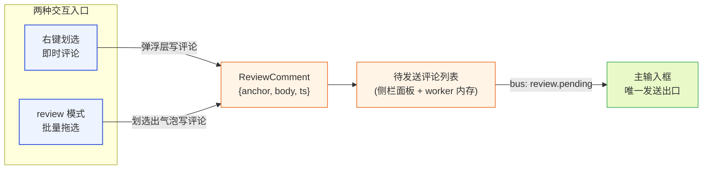
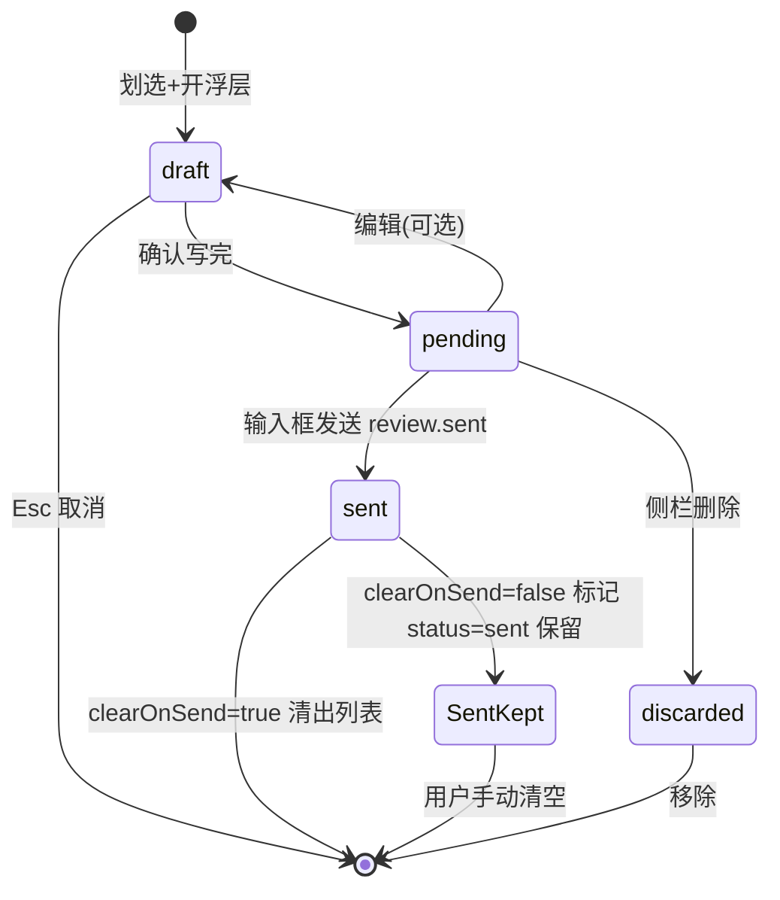
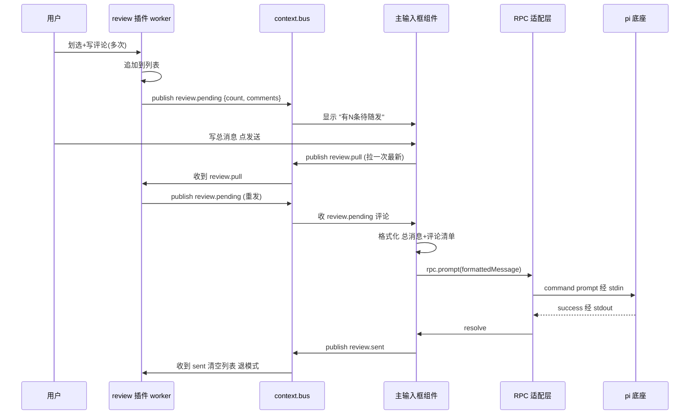
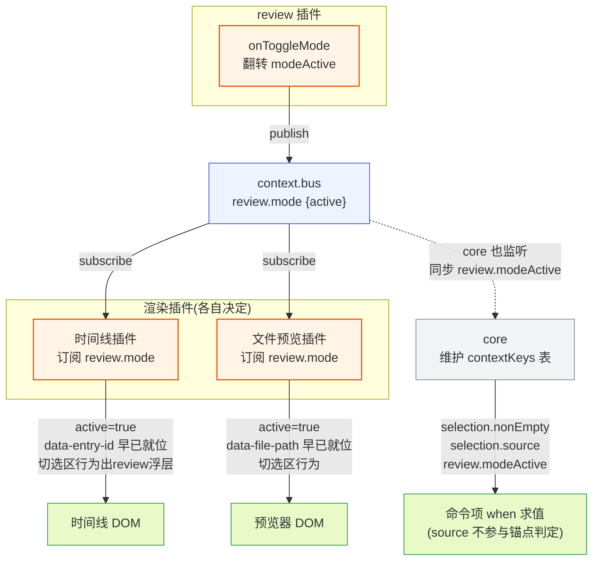

# review 插件文档

本文档是 pi-desktop 内置默认插件之一——**review 插件**（plugin id：`review`）的设计说明。它对应 `DESIGN.md` 第 4.10 节，并把该节展开到"照着能写代码"的粒度。阅读本文需要先了解 `DESIGN.md` 的支柱③（插件系统）、第 3.2.4 节（PluginContext）、第 3.2.6 节（事件如何到达渲染组件）、第 3.3 节（槽位契约与 `when` clause）、第 4.4 节（时间线）、第 4.5 节（文件预览）、第 4.7.4 节（主输入框是唯一发送出口）。底座源码佐证见 `packages/coding-agent/src/core/session-manager.ts`（`SessionEntry` 结构、entryId 生成与追加持久化）与 `packages/coding-agent/src/core/messages.ts`（`SessionEntryBase`）。

review 插件是十二个内置默认插件里唯一的"协作层"插件——它本身不渲染底座内容、不产生底座行为，而是把用户对底座内容（对话消息、文档）的定点意见攒成一批、连同主输入框的总消息一并发给 agent。它对应 `DESIGN.md` 第 4.10 节（协作层），并在本文展开到"照着能写代码"的粒度。它的设计核心是守住两条边界：**review 只组装、输入框才发送**（呼应"组装和调用应该分开"），以及**review 不碰渲染插件内部实现、只发信号让渲染插件自己响应**（呼应"插件隔离"）。本文不重复 `DESIGN.md` 已确立的全局原则，只在 review 这一具体落点上把交互入口、槽位贡献、发送合并、锚点稳定性、模式协调、代码契约、权限边界讲透。

## 1 插件定位与边界

### 1.1 它解决什么：攒批定点评论随消息发

#### 1.1.1 逐条发消息会让 agent 跑偏

和 agent 协作时，用户常想"针对输出的这几处分别提意见"——比如 assistant 写的代码第 10 行逻辑有问题、第 30 行风格不对、某段解释不准确。如果每条意见单独发一条消息，agent 会在处理第 1 条时就跑偏、后面几条在新的上下文里语义错位：agent 改完第 1 处后可能已经重写了大段代码，第 2 条评论针对的原文已经不在了，第 3 条更找不着北。这是"实时打断"协作模式的固有缺陷——agent 是流式推进的，它不会等用户把全部意见说完再动手。

review 插件补的是"攒批定点反馈"这个能力缺口。它让用户像 GitHub/GitLab PR 里 review 代码一样：逐段圈出来留 comment、最后整体 submit，而不是每条 comment 单独 push 一条 commit。攒下来的全部评论连同用户在输入框写的总消息一并发给 agent，agent 一次拿到全部反馈、按定位锚点逐条处理。这一条总消息里，每条评论都带稳定的定位锚点（是哪条消息的哪段、或哪个文件的哪几行），agent 能据此回看原文、分别回应。

#### 1.1.2 为什么不在底座做、而是桌面插件

review 攒批的语义只在桌面端成立：底座 session 只认一条条 `prompt` 消息，它不知道"这批评论属于同一个 review 批次"。把攒批逻辑放底座，要么底座要理解 review 概念（污染底座核心）、要么桌面端要等用户逐条发 prompt（回到逐条打断的老路）。把 review 做成桌面插件、把攒批逻辑收敛在插件内、最终序列化成一条普通 `prompt` 消息发给底座，底座完全不感知 review 机制——它只是收到了一条带结构化文本的消息。这呼应 `DESIGN.md` 3.1.2 的立场：桌面插件是桌面端的唯一一套插件体系，pi 底座是被管理对象，review 是桌面端对底座能力的"消费方式"而非底座原生概念。

### 1.2 边界：只组装不发送、只发信号不改渲染

#### 1.2.1 唯一发送出口是主输入框

review 插件**不直接发 `prompt`**。攒好的评论列表交给主输入框（`DESIGN.md` 4.7.4 定义的唯一发送出口），由输入框的"发送"动作一并提交。review 插件持有的 `PluginContext.rpc` 虽然有 `prompt()` 方法，但 review 插件不调它——它只通过 `context.bus` 发布 `review.pending` topic 把待发评论交给输入框。这是有意的纪律：守住"组装和调用应该分开"——review 插件负责组装评论（构造），输入框负责发送（执行），两侧分开演化。review 的待发内容格式改了（如换锚点序列化格式），输入框的发送链路不动；输入框加了 streamingBehavior 判断（1.5.1），review 的攒批逻辑不动。如果让 review 自己调 `rpc.prompt`，组装和执行就缠在一起，任何一侧的改动都会牵连另一侧。

#### 1.2.2 不 import 渲染插件实现

review 的锚点要从时间线（4.4）拿 entryId、从文件预览（4.5）拿文件路径，但 review 插件**不直接 import 这些插件的代码模块**（`DESIGN.md` 3.5 第 5 项的隔离）。协调走两条中性通道：事件总线（`context.bus`，发 `review.mode` 信号让渲染插件自己切可批注态）和 core 维护的 contextKeys（`selection.nonEmpty`/`selection.source`，中性的选区状态、不绑 review）。review 插件通过 `data-entry-id`/`data-file-path` 这些 DOM data 属性从渲染插件产出的 DOM 上读锚点，但 data 属性是约定、不是实现耦合——渲染插件只要按约定放 data 属性即可，它怎么渲染自己的内部组件、用什么状态管理，review 一概不知。这让第三方渲染插件可以选择订阅 `review.mode` 配合（在 review 模式下加 data 属性、切选区行为），也可以不订阅（在 review 模式下不支持批注，这是可接受的降级）。

### 1.3 在内置插件矩阵中的位置

#### 1.3.1 协作层的定位与权限

review 插件是 `DESIGN.md` 4.1 列出的十二个内置默认插件之一，属于"协作层"（其余十只是基础渲染层、管理操作层、本地化层）。它在 manifest 的 `permissions` 字段声明 `["content:sensitive"]`——因为评论内容本身来自用户、但要序列化进 prompt 消息发给底座，且 review 插件要能从时间线消息文本里提取选区原文作为锚点的一部分（见 4.3 / 11.4），还要拉 entry 原文缓存算字符偏移（见 10.1.2），这都需要看到对话内容。它**不声明 `fs:project`**（不读写项目文件，文件路径锚点只记录路径字符串、不读文件内容，文件内容由文件预览插件读、review 只拿选区行号）。它不声明 `net:`（不联网）。`content:sensitive` 在管理 UI 授权时要提示用户"此插件能读你的对话内容"——但它不外发（没有 `net:` 权限），所以风险可控（见第 11 节）。

#### 1.3.2 dependsOn 声明

review 插件不强依赖其他插件，但为了锚点来源稳定，它的 manifest 声明 `dependsOn: ["timeline"]`——保证时间线插件先 activate、先在 DOM 上铺好 `data-entry-id`。这不依赖文件预览插件（文件路径锚点可以从任何带 `data-file-path` 的 DOM 拿，没有文件预览插件时文件类评论入口自然不出现，是降级而非错误）。`dependsOn` 按 id 判定、按依赖图拓扑排序 activate（`DESIGN.md` 3.2.1 字段说明、3.5.9 拓扑排序），review 后于 timeline activate。若 timeline 完全没有生效版本，review 的 `dependsOn` 缺失 → review 加载失败、标错、不拖垮整壳（3.5 第 5 项错误隔离）。这是合理的失败：没有时间线就没有对话内容可评论，review 失去意义。

> **跨文档契约依赖声明（对 08-plugin-timeline）**：`dependsOn: ["timeline"]` 只保证激活顺序，**不保证 DOM 钩子存在**。review 的对话锚点（第一类、也是主用例）完全依赖时间线插件在 DOM 上渲染 `data-entry-id`——`extractAnchorFromSelection` 先查 `closest("[data-entry-id]")`（11.4.1）。但 `08-plugin-timeline.md` 当前全文未声明"渲染每条 entry 时把 entry.id 写到 DOM `data-entry-id` 属性"这一契约，也未声明在 review 模式下会暴露该属性或订阅 `review.mode` 切选区行为。若时间线实现不挂 `data-entry-id`，对话锚点 `closest("[data-entry-id]")` 返回 `null` → 退到 file 分支又找不到 `data-file-path` → `return null` → 对话评论（核心场景）静默不可用、对用户表现为"此区域不支持 review"。**落地前需在 `08-plugin-timeline.md` 补一条契约**：时间线渲染每条 entry 时把 `entry.id` 写到 DOM `data-entry-id` 属性（常驻、与 review 模式无关），并在 `activate` 时订阅 `review.mode` 切选区行为（收到 `active:true` 划选出 review 浮层、`active:false` 恢复默认，见 6.1.2/6.2.2）。`data-entry-id` 是 review 对 08 的**跨文档契约依赖（而非仅约定）**，须在 08 spec 显式声明。在 08 补契约前，对话类评论为死路径，第一版不能宣称支持对话类评论。

## 2 两种交互入口

### 2.1 直接划选右键评论

#### 2.1.1 即时圈选不破坏阅读流

第一种入口是**即时式**：用户在任何可选文字的地方（时间线里的 assistant/user 消息、文件预览器打开的文件内容）划选一段文字，右键菜单出现"添加 review 评论"项。点后弹一个轻量输入框（review 插件自己渲染的浮层，复用 `pi.ui.Input`/`pi.ui.Textarea` 组件），用户写评论、确认，这条评论进"待发送评论列表"。这种方式是即时的——用户随时圈一处、留一句，不破坏当前的阅读流。用户可以在正常浏览态下随手留评论，不需要先切换到某个"模式"。

右键菜单项**复用命令项槽（`commands`）的同一个贡献项**——不另立 contextMenu 槽位。`DESIGN.md` 3.3 只定义了 languages/themes/management/cardRenderers/sidePanel/viewers/commands/settings 八个槽位，没有 contextMenu 槽位；若 review 自造一个 `register({ slot: "contextMenu", ... })`，加载器在 3.5 第 3 步校验槽位名时会判其为未知槽位而拒绝。所以右键菜单项就是命令项 `review.addComment`（见 3.2.1），它同时服务三条渲染路径：命令面板、快捷键、右键菜单。core 渲染右键菜单时，从 commands 槽注册表里取所有在当前 contextKeys 下 `when` 求值为真的命令项、按优先级合并后列出——`review.addComment` 的 `when: "selection.nonEmpty"` 保证无选区时它不出现、有选区时出现。点击它经 handler 字段路由到 review worker 模块的 `#onAddComment`（和命令面板触发走同一条 handler，`DESIGN.md` 3.2.3 的 `#` 前缀导出引用）。这条设计的关键是：**一个命令项贡献项、多个入口共用**——命令面板、快捷键、右键菜单是同一个命令的三种触发面，不是一个命令配三种贡献项。这避免了"右键菜单项"成为 review 私有槽位、也避免了 handler 重复定义。

#### 2.1.2 评论浮层的焦点规范

评论输入浮层是一个模态（`DESIGN.md` 1.9.4 的无障碍焦点规范适用）：打开时焦点自动移到 textarea 第一个字符位；Tab 在浮层内循环（到按钮跳回 textarea、Shift+Tab 反向）；Esc 等同取消（不写入评论、关浮层、焦点还原到触发它的选区）；确认按钮 Enter 提交、焦点还原。浮层用 `pi.ui` 组件库的 Dialog/Input/Textarea 组合，自带 focus trap（推荐 react-focus-lock 等库，4.11.4 pi.ui 内置）和主题。这条规范保证键盘可达——用户圈选完不用切鼠标就能写完评论、Esc 退出。浮层组件由 renderer 侧的 `CommentInputOverlay` 实现（骨架见 11.3.2），它订阅 worker 推来的 `review:showCommentInput` 通道、用户确认后 `postToWorker("review:commitComment", { anchor, body })` 回传 body（往返链路见 11.2.1/11.4.1）。

#### 2.1.3 入口与模式的正交关系

两种入口和 review 模式是正交的，理解这点能避免实现时的混淆。"右键评论"入口不依赖 review 模式——它在正常态和 review 模式下都可用，因为它只依赖命令项槽里的 `review.addComment`（`when: selection.nonEmpty`）和常驻的 `data-entry-id` 钩子（6.2.1）。review 模式只影响"内容区的选区行为是否被切到出浮层"——它不开启或关闭右键评论入口本身。也就是说：用户可以在非 review 模式下随时右键划选留评论（即时式），也可以先进 review 模式再连续拖选留一批（批量式），两种方式产出的评论进同一个列表、走同一条发送链路（2.2.2）。review 模式是一个"交互态增强"开关，不是"能否评论"的前置条件——这是 6.2.1"data 属性常驻、模式只切选区行为"这条原则在入口层的体现。把模式当成评论的前置条件会错把"模式批量"设计成唯一入口，丢掉非模式下的即时评论能力。

### 2.2 进入 review 模式批量操作

#### 2.2.1 内容区进入可批注态

第二种入口是**批量式**：经命令面板或快捷键触发 `review.toggleMode` 命令（快捷键见 manifest 的 `keybinding`，写法 `cmd+shift+r`，core 按平台映射修饰键——macOS 用 Cmd、Windows/Linux 自动映射为 Ctrl+Shift+R，插件 manifest 只写一份 `cmd` 即可，见 11.1.1 跨平台说明）。进入后整个内容区变成"可批注态"——划选文字直接出评论气泡，连续圈多处、各留评论。再点"退出 review 模式"（同一个命令项切换态、或再按一次快捷键）回到正常态。这种方式适合系统性地通读一遍、留一批评论——用户知道自己在 review、整段内容都进入"可圈可选可批注"的视觉态（如被评论的消息加高亮、选区出现 review 浮层而非默认选区行为）。

review 模式是一个全局态，由 review 插件持有（`review.modeActive` contextKey），但它怎么影响内容区不是 review 插件决定的——是渲染插件（时间线、文件预览）自己响应的。这个协调机制见第 7 节。这里只说入口：命令项槽贡献项 `review.toggleMode`（`when: "true"`，随时可用）切换 review 模式开关，handler 调 `#onToggleMode`（worker 模块导出），它内部把 `modeActive` 翻转、往 `context.bus` 发 `review.mode` 事件。第一版不提供工具栏按钮入口——模式切换只经命令面板和快捷键触发。若后续要在工具栏加按钮，应由命令与快捷键插件（4.7）经 commands 槽的 icon 字段或一个独立的工具栏槽位贡献，review 不自建工具栏入口（见 10.4.1）。

#### 2.2.2 两种入口产出到同一个列表

两种入口产出的评论都进**同一个"待发送评论列表"**，列表在侧栏面板展示（见 3.1）。这避免了"右键评论"和"模式批量评论"两套数据源、两套发送逻辑——无论评论怎么来的，它的数据结构一样（锚点 + 评论文本 + 时间戳），它进同一个列表，用户在侧栏能看见全部待发评论、删除误圈的、最后随输入框一起发。这种"两路归一"和文件预览插件"工具卡片预览"与"用户主动打开预览"两路归一到同一个预览器槽是同一种设计哲学——入口多样、数据结构统一、下游单一。



**图 1 — 两种入口产出同一数据结构、归一到同一列表、经事件总线交给输入框发送**

### 2.3 评论生命周期状态机

#### 2.3.1 draft→pending→sent/discarded

一条评论从创建到发送（或删除）经历这几个状态：`draft`（浮层里正在写）→ `pending`（确认进列表，待发送）→ `sent`（随消息发出）。`draft` 态只在浮层内、不入列表；`pending` 是列表里的常态；`sent` 的去向由设置项 `clearOnSend` 决定（见下）。状态流转全部在 review 插件 worker 侧，renderer 侧只展示列表。这个状态机简单——没有"已读""已回复"这类 PR review 才有的状态，因为 review 评论发给 agent 后 agent 怎么回应是 agent 的事、不回灌到 review 评论状态里（agent 的回复在时间线里、不在 review 列表里）。

为支撑 `clearOnSend=false` 的语义（保留已发评论但不重复发送），`ReviewComment` 带 `status: "pending" | "sent"` 字段（见 7.1.1）。`sent` 不再是"从列表移除"的单一终态，而是分两个分支：

- `clearOnSend=true`（默认）：`sent` 即终态——已发评论从列表移除、`status` 字段无意义（条目已不存在）。
- `clearOnSend=false`：`sent` 转入"已发保留"态——评论留在列表里、`status` 置为 `"sent"`，但**不计入下次发送的 pending 集合**（输入框格式化时只取 `status === "pending"` 的评论）。这样既满足"保留已发评论供用户回看"，又避免重复序列化进消息发给 agent。



**图 2 — 评论生命周期状态机：draft→pending→sent，sent 按 clearOnSend 分"清出"与"已发保留"两支，全部在 worker 侧**

`sent` 的"已发保留"态和 12.2.1 的"评论线程化"演进不同——前者只是"留在列表里不重发"、不带 addressed/wontfix 语义；后者要 review 感知 agent 回复、标记评论已处理，是更重的耦合，第一版不做。

## 3 贡献的槽位

### 3.1 侧栏槽：review 评论面板

#### 3.1.1 面板结构与数据绑定

review 插件往**侧栏槽**（`sidePanel`）挂一个"Review 评论"面板，贡献项 `{ id: "review-comments", label: "review.panelTitle", icon: "message-square-plus", component: "ReviewPanel" }`。`label` 是 i18n key（`review.panelTitle`，i18n 插件按当前 locale 给中文"Review 评论"或英文"Review Comments"），`icon` 是 lucide 图标名，`component` 指向 renderer 模块导出的 `ReviewPanel` 组件。面板内容是待发送评论列表，每条渲染为一个卡片：定位锚点的摘要（"消息 entryId=<前 8 位> 的 'xxx…' 段" 或 "src/foo.ts:12-18"）、评论正文、删除按钮。面板顶部有一个"随输入框发送"按钮——点它把当前输入框聚焦、提示用户写总消息后发送（实际发送仍走输入框的发送动作，按钮只是引导）。**聚焦输入框是 renderer 侧动作**——按钮不绕 `postToWorker` 让 worker 去聚焦（worker 无 DOM 访问、无法操作 renderer 里的输入框），而是直接调 `RendererPluginContext` 提供的中立 composer focus 能力（`pi.composer.focus()`，由主输入框插件经一个中立的 `composer:focus` 通道注册、core 转发），或滚动并聚焦到输入框区域。这条聚焦链路全程在 renderer 进程内，不经 worker 往返（见 11.3.1 骨架）。

> **待补 DESIGN.md 缺口声明**：`DESIGN.md` 3.2.5 定义的 `RendererPluginContext` 字段为 `plugin/rpc/events/onMessage/postToWorker/i18n/theme/ui`，不含 `composer`，也未定义"中立通道如何被某插件注册到 `RendererPluginContext` 上、core 如何转发"这套机制。本设计依赖的 `pi.composer.focus()` 与 `composer:focus` 中立通道是 `DESIGN.md` 尚未支撑的能力。**落地前需在 `DESIGN.md` 3.2.5 补 `RendererPluginContext.composer` 能力声明及中立通道注册机制**（主输入框插件如何把 focus 能力挂到 core、core 如何注入到各 renderer 上下文）。若 `DESIGN.md` 不补该能力，则本设计退化为：worker 经 `review:focusComposer` topic 通知后由 renderer 仅滚动到输入框区域（不真正 focus DOM），或第一版不提供"随输入框发送"按钮的聚焦行为、仅保留提示文案。不能在 review 文档里凭空引入 `DESIGN.md` 未定义的 API。

`ReviewPanel` 组件是纯 renderer 侧组件，它通过 `pi.onMessage("review:list", cb)` 收 worker 侧 `context.emitToRenderer("review:list", list)` 推来的评论列表快照、用 React state 渲染。worker 侧是评论列表的真相源（single source of truth）——评论的增删只在 worker 侧发生，renderer 侧的删除按钮经 `pi.postToWorker("review:delete", { id })` 通知 worker 删、worker 删完再推新快照。这是 `DESIGN.md` 3.2.6 第二条数据流（worker 处理后推送）的典型应用：列表要聚合、要持久化到 config、要和事件总线协作，这些都在 worker 侧，renderer 只负责展示。

#### 3.1.2 空态与计数

列表空时面板显示空态文案（i18n key `review.emptyHint`，如"还没有评论，划选文字添加一条"），引导用户用两种入口之一。面板标题栏右侧显示当前评论条数（`review.count` 复数文案，i18n 插件 4.2.5 支持复数：`{count: 0}`→"0 条评论"、`{count: 3}`→"3 条评论"）。这个计数和主输入框的"有 N 条 review 评论待随发"提示是同一个数据（worker 侧列表长度），只是展示位置不同——输入框组件订阅 `review.pending` topic 收计数、侧栏面板直接读 worker 推的列表，两处展示都源自 worker 侧同一个列表，不会不一致。

### 3.2 命令项槽：模式切换与添加评论

#### 3.2.1 两个命令项的 when 条件

review 插件往**命令项槽**（`commands`）挂两个贡献项：

- `review.toggleMode`：`{ id: "review.toggleMode", title: "review.toggleMode", keybinding: "cmd+shift+r", handler: "#onToggleMode", when: "true" }`——进入/退出 review 模式，`when: "true"` 表示随时可用（`DESIGN.md` 3.3 的 `when` clause，无条件恒真）。带快捷键，manifest 里写 `cmd+shift+r`，core 的快捷键引擎按平台映射修饰键：macOS 用 Cmd、Windows/Linux 映射为 Ctrl+Shift+R（core 把 `cmd` 统一翻译为平台主修饰键，插件只写一份 `cmd` 即可，无需分平台声明）。用户在任何焦点位置按该快捷键都能切换。
- `review.addComment`：`{ id: "review.addComment", title: "review.addComment", handler: "#onAddComment", when: "selection.nonEmpty" }`——添加评论，`when: "selection.nonEmpty"` 表示只在有非空选区时可用（`DESIGN.md` 3.3 的 contextKeys，core 监听选区维护）。无选区时命令面板里这一项灰掉、右键菜单不出现。

`when` 的求值由 core 在渲染命令面板/右键菜单时对每个命令项跑一遍——core 维护 contextKeys 表，状态变化时（选区变了、agent 状态变了）重新求值并刷新命令项的可见/可用。review 插件不自己算 `when`，它只声明表达式，core 求值。这让"添加评论"命令的可见性自动跟随选区状态，review 插件不用监听选区再自己控制命令显隐——这是 `when` clause 的核心价值：把"命令何时可用"从命令实现里抽出来、变成声明式数据。

#### 3.2.2 handler 的 worker 侧实现

两个 handler 都是 worker 模块的命名导出（`#` 前缀表示从本插件 worker 模块导出，`DESIGN.md` 3.2.3）。`#onToggleMode` 内部：翻转 `modeActive` 状态 → 往 `context.bus` 发 `review.mode` 事件（payload `{ active: boolean }`，渲染插件订阅它切可批注态，见第 7 节）→ core 监听 bus 同步 `review.modeActive` contextKey → 通知 renderer 刷新按钮态。`#onAddComment` 内部：经 `emitToRenderer("review:extractAnchor")` 让 renderer 提取锚点（见 4.3 / 11.4）→ renderer 提完 `postToWorker("review:anchor", anchor)` 回传 → worker 调 `promptAndAddComment(anchor)`，后者经 `emitToRenderer("review:showCommentInput", { anchor })` 让 renderer 弹评论浮层（2.1.2）→ 用户写完确认 `postToWorker("review:commitComment", { anchor, body })` → worker 构造 `ReviewComment`（`status: "pending"`）追加到列表 → 推 `review.pending` 给输入框。两个 handler 都不直接发 `prompt`——`#onAddComment` 只往列表加评论，发送是输入框的事。`review.addComment` 这一个命令项贡献项同时服务命令面板、快捷键、右键菜单三条触发路径（见 2.1.1）。

### 3.3 卡片渲染槽：被评论消息高亮（可选）

#### 3.3.1 第一版可不做、靠侧栏面板

review 插件**可选**地往**卡片渲染槽**（`cardRenderers`）挂一个渲染器，贡献项 `{ match: { strategy: "customType", value: "reviewed_message" }, component: "ReviewedMessageMarker" }`。它的作用是在时间线里把"被评论过的消息"高亮、画一个锚点标记（如消息气泡左侧加一个色块、点它跳到侧栏对应评论）。但这是**可选**的——第一版可以只靠侧栏面板展示评论列表，不在时间线里做高亮。`DESIGN.md` 4.10.3 明确说"这不是必须，第一版可以只靠侧栏面板"。

**第一版 manifest 不挂这个贡献项**（见 11.1.1）。原因是 `cardRenderers` 的 MatchRule 按 entry 的 `customType` 匹配，而 `customType` 是底座 session entry 的类型字段（`CustomEntry`/`CustomMessageEntry`，`DESIGN.md` 1.7.5）——时间线插件无权给某条已存在的 `message` entry 贴上 `reviewed_message` 这个 customType（它不是底座原生类型、时间线插件不该改 entry 类型）。第一版若挂这个贡献项，加载器虽校验通过，但永远 match 不到任何 entry，是死配置。所以第一版 manifest 去掉它，避免误导。后续若要做时间线高亮，正确做法见 3.3.2。

#### 3.3.2 为什么可选：避免和时间线插件强耦合

这个渲染器可选的根本原因，是它要让时间线插件把"被评论的消息"渲染成一个自定义类型 entry（`customType: "reviewed_message"`）才能被卡片渲染槽的 MatchRule 匹配——但这要时间线插件配合（它要在渲染时检查每条消息有没有对应的 review 评论、若有就改渲染类型或注入标记 entry）。这破坏了"review 不碰渲染插件内部实现"的边界。所以第一版不做：评论的展示全在侧栏面板，时间线里不留痕迹。后续版本若要做时间线高亮，正确做法不是让 review 注入 entry，而是让时间线插件订阅 `review.pending` topic、自己根据"评论锚点里的 entryId 列表"决定给哪些消息加高亮 data 属性——仍是渲染插件自己响应、review 只发信号。这呼应第 7 节的协调哲学。

### 3.4 设置子页槽：review 行为偏好

#### 3.4.1 偏好项清单

review 插件往**设置子页槽**（`settings`）挂一个偏好页，贡献项 `{ id: "review", title: "review.settingsTitle", component: "ReviewSettings" }`。`ReviewSettings` 组件渲染一组偏好开关，落点在 `PluginContext.config`（`~/.pi/desktop/plugins-data/review/config.json`，用户级；项目级可覆盖）。第一版偏好项包括：

- `commentBubbleStyle`：评论气泡样式（`"inline" | "float" | "side"`，inline 内联、float 浮层、side 侧栏预览），控制 review 模式下评论气泡怎么画。默认 `"float"`。
- `clearOnSend`：发送后是否自动清空已发送评论列表。默认 `true`——发完清空，准备下一轮 review。
- `exitModeAfterSend`：发送后是否自动退出 review 模式。默认 `true`——发完通常一轮 review 结束。
- `anchorQuoteLength`：锚点里引用的选区原文最大长度（超长截断加省略号），避免消息过长。默认 80 字符。

#### 3.4.2 设置页走组件而非 schema

review 的设置页用 `component: "ReviewSettings"` 而非 schema（`DESIGN.md` 3.3 管理槽的 schema 声明式表单是为"简单配置页不用写组件代码"准备的，设置子页槽同理可走 schema）。原因是 review 的偏好里 `commentBubbleStyle` 是 select、其余是 boolean——虽简单，但 review 设置页还要展示"当前有 N 条待发评论"的实时计数（动态数据），纯 schema 表单不好表达动态内容。所以写一个轻量 React 组件，复用 `pi.ui` 的 Switch/Select 组件、读 config 渲染、写回 config。这个组件是纯 renderer 侧、经 `pi.onMessage` 收 worker 推的计数、经 `pi.postToWorker` 写回 config——和侧栏面板同构。

## 4 定位锚点

### 4.1 两类锚点对应两类内容区

#### 4.1.1 对话内容锚点：entryId + 字符偏移

评论的定位锚点必须稳定——否则 agent 回看时找不到被评论的段。锚点按内容区分两类。第一类是**对话内容**：锚点是 `entryId + 选区在该 entry 内的字符偏移`。`entryId` 是底座 session 里的稳定 id——`get_entries` 返回的 `SessionEntry.id`（`DESIGN.md` 1.5.9、1.7.5），它是底座 session 文件里每条 entry 的唯一标识，agent 能据此定位是哪条消息、哪段。review 插件从时间线渲染（4.4）拿 entryId——4.4 渲染 entry 时把 entryId 暴露给 DOM（`data-entry-id` 属性），review 插件划选时从选区最近的 `data-entry-id` 节点拿。字符偏移是选区起止在该 entry 原文内的 `[start, end)` 字符位置，由 review 插件自己算（从 DOM Selection 的 anchorOffset/focusOffset 映射到 entry 原文的字符索引，见 4.3 / 11.4）。注意字符偏移的基准是 **entry 原文（`SessionEntry.message.content`）**而非渲染后 DOM 的 `textContent`——markdown 渲染会改变文本（加符号、转义、代码块空白），直接用 DOM textContent 算偏移会和 agent 看到的原文对不上。review 插件自己 `rpc.getEntries()` 拉 entry 原文、按 entryId 索引成 Map（见 10.1.2），再把 DOM 选区映射到原文字符索引。

#### 4.1.2 文档内容锚点：文件路径 + 行范围

第二类是**文档内容**：锚点是 `文件路径 + 行范围`（或字符偏移）。文档预览（4.5）打开的文件路径已知（预览器组件持有 `filePath`，review 插件从预览视图容器的 `data-file-path` 拿），划选时拿选区行号。agent 拿到路径+行能直接用底座的 `read`/`edit` 工具定位（`read` 工具支持行范围参数，agent 据此读指定行、回看被评论的段）。文档锚点用行范围而非字符偏移，因为文件内容可能很长、行是更自然的定位粒度，且 agent 的文件工具按行操作更直接。若选区跨行不齐，锚点记录起止行号、选区原文截断一并发给 agent（让 agent 自己在行内定位）。

> **属性命名与生产者文档不一致——BLOCKING 待全仓统一**：`DESIGN.md` 4.10.7 原文用 `data-file-range`（"给 DOM 加 `data-entry-id`/`data-file-range` 属性"），本设计全文统一用 `data-file-path`（4.3.2/6.2.1/10.2.1/11.4.1 等），语义更清晰：路径是稳定定位粒度、行号从选区在 DOM 内另行计算。但**实际渲染该属性的生产者插件文档仍写 `data-file-range`**——`09-plugin-file-preview.md`（文件预览，约 634/726/1243 行）、`10-plugin-file-editor.md`（文件编辑器，约 862 行）全文用 `data-file-range`。消费者（review）查 `[data-file-path]`、生产者（09/10）写 `data-file-range`，`closest` 返回 `null` → `extractAnchorFromSelection` 走到末尾 `return null` → `review:anchorFailed` → 对用户表现为"此区域不支持 review"——文件类评论在第一版静默不可用、且失败非编译错误而是运行时 no-op。
>
> **处置：review 同时接受双名查询（选项 b），并显式列待同步生产者**。`extractAnchorFromSelection`（11.4.1）改为同时查 `[data-file-path]` 与 `[data-file-range]` 两个选择器（`closest("[data-file-path], [data-file-range]")`），命中任一即取其值当文件路径——这样 review 在两份文档统一前即对 09/10 产出的 DOM 都可用，不卡死第一版文件类评论。**这是过渡兼容、不是终态**：待同步清单如下，落地前须逐个回改统一为 `data-file-path`——
> - **`DESIGN.md` 4.10.7**：把 `data-file-range` 改为 `data-file-path`（路径稳定、行号从选区另行算的语义）；
> - **`09-plugin-file-preview.md`**（文件预览，生产者）：约 634/726/1243 行的 `data-file-range` 改为 `data-file-path`，并在文件预览视图容器声明暴露该属性为常驻稳定钩子；
> - **`10-plugin-file-editor.md`**（文件编辑器，生产者）：约 862 行的 `data-file-range` 改为 `data-file-path`，同上声明。
>
> 全仓统一后移除 11.4.1 的双名查询、回到单名 `[data-file-path]`。在统一前，文件锚点靠双名兜底可用、不宣称"已对齐生产者 spec"。

### 4.2 entryId 稳定性：底座源码佐证

#### 4.2.1 SessionEntryBase 与 id 生成

entryId 稳定性的根基是底座 session 的不可变性。底座源码 `packages/coding-agent/src/core/session-manager.ts` 定义了 `SessionEntryBase`：

```typescript
export interface SessionEntryBase {
    type: string;
    id: string;
    parentId: string | null;
    timestamp: string;
}
```

每个 entry 有 `id`（唯一标识）、`parentId`（分叉树父节点）、`timestamp`、`type`。`SessionEntry` 是 `SessionMessageEntry | ThinkingLevelChangeEntry | ModelChangeEntry | CompactionEntry | BranchSummaryEntry | CustomEntry | CustomMessageEntry | LabelEntry | SessionInfoEntry` 的联合（`session-manager.ts:140`）。id 由 `generateId(byId)` 生成——它产生一个 `byId` Map 里不冲突的 id（`session-manager.ts:217`），写入后即固化进 session 文件。

#### 4.2.2 entry 不可变、改是新增

底座 session 是追加序结构——entry 一旦写入 session 文件，它的 `id` 和内容就不可变。agent 改消息不是原地改某条 entry，而是追加新 entry（`DESIGN.md` 7.12："entry 不可变、改是新增 entry"）。源码里 `SessionManager` 维护 `byId: Map<string, SessionEntry>` 和 `leafId`，`appendEntry` 把新 entry 追加进 entries 数组、注册进 `byId`、推进 `leafId`——没有"修改某条已存在 entry"的 API。这意味着 review 评论锚定的 `entryId` 永远指向同一条 entry、那条 entry 的原文永远不变——即便 agent 后来重写了那段代码，原 entry 还在 session 里、内容原样。agent 据此能定位"用户当时评论的是哪条消息的哪段"。这条不可变性是 review 锚点稳定性的根本保证——review 不自己发明锚点格式、只用底座保证稳定的这两类标识（entryId 和文件路径+行）。

### 4.3 锚点提取：从 DOM data 属性

#### 4.3.1 锚点 kind 由 DOM 遍历决定

`selection.source` contextKey（值为 `"timeline"`/`"viewer"`，`DESIGN.md` 3.3、4.10.7）标识选区来自哪类内容区，由 core 维护——core 监听当前焦点区域的选区变化、根据焦点落在哪个渲染区域设 `selection.source`。但 review 插件**不读 `selection.source` 来决定锚点格式**——它是一个中性 key，仅供命令项的 `when` 求值（如某个命令可 `when: "selection.source == 'timeline'"`）和统计用，不参与锚点 kind 判定。原因：若同时存在两套判定机制（contextKey 与 DOM 遍历），一旦两者结论不一致（例如 `selection.source="timeline"` 但选区 DOM 实际落在 `data-file-path` 下，焦点区域与选区祖先分属不同渲染区），spec 未定义以谁为准、代码也无从仲裁。因此锚点 kind 完全由 DOM 遍历单一决定，`selection.source` 降级为不参与锚点逻辑的中性 key。这让 review 不耦合 core 的焦点跟踪实现——锚点判定只依赖选区所在的 DOM data 属性这一稳定事实。

> **偏离 DESIGN.md 4.10.7 的声明**：`DESIGN.md` 4.10.7 原文称"`selection.source` 标识选区来自哪类内容区，review 插件据此知道该用哪种锚点格式（entryId 还是文件路径+行）"——即把 `selection.source` 当作锚点格式判据。本设计将其降级为中性观察 key、不参与锚点 kind 判定（锚点 kind 完全由 DOM 遍历决定，见 4.3.1/4.3.2/6.3.1/6.3.2）。理由如上：两套判定机制一旦结论不一致 spec 未定义以谁为准。**此为有意偏离，需同步回改 DESIGN.md 4.10.7**，把 `selection.source` 从"锚点格式判据"改述为"中性观察 key，仅供命令项 `when` 求值和统计用，不参与锚点逻辑"，避免两份文档对同一机制给出相反规约。

#### 4.3.2 从 DOM Selection 提取锚点

选区锚点的提取由 review 插件自己做（`DESIGN.md` 4.10.7 末段：选区锚点提取由 review 持有、渲染插件只负责放 data 属性）。具体：用户划选后，`#onAddComment` handler（或 review 模式下的选区事件监听）经 `emitToRenderer` 让 renderer 侧拿到当前 `window.getSelection()`，遍历选区范围内的 DOM 节点，找最近的带 `data-entry-id`（对话内容）或文件类属性（文档内容）的祖先节点，据此判定 `anchor.kind`——这是 kind 的唯一判据。文档锚点的 data 属性当前生产者侧（09/10）用 `data-file-range`、本设计用 `data-file-path`，命名未统一（见 4.1.2 待同步声明）；过渡期 `extractAnchorFromSelection` 同时查 `[data-file-path]` 与 `[data-file-range]` 两个选择器、命中任一取其值当路径，保证文件类评论在全仓统一前即可用（11.4.1 代码以双名查询实现）。对话锚点：从选区所在 entry 的 DOM 容器拿到 `data-entry-id`，把选区在 DOM 里的字符位置映射到 entry **原文**的字符索引（entry 原文是 `get_entries` 返回的 `SessionEntry.message.content` 文本，review 插件自己 `rpc.getEntries()` 缓存了 entry 原文映射，见 10.1.2；映射算法见 11.4.1）。文档锚点：从命中的 `data-file-path`/`data-file-range` 拿路径、按选区 DOM 行节点索引算行号。提取后 `postToWorker` 回传给 worker 构造 `ReviewComment`。**仲裁规则**：若选区的 DOM 祖先同时命中两类 data 属性（理论上不该发生，因为时间线和文件预览是不同 DOM 子树），以 `commonAncestorContainer` 最近的那一类为准；选区跨多条 entry 时取 `anchorNode` 所在 entry 的 entryId（15.1 边界用例）。

### 4.4 锚点随评论持久化、不回查 DOM

#### 4.4.1 选区原文快照进评论

锚点（含选区原文 `quote`）随评论一起存进 review 插件的待发列表（`PluginContext.config` 持久化，见第 7 节 7.2），发送时序列化进消息。review 插件**不**在发送时回查 DOM 拿选区原文——因为 DOM 选区可能早已失效（用户划选后又滚动了、切了会话、时间线 entry 被虚拟滚动回收了）。选区原文在创建评论时就快照进 `ReviewComment.anchor.quote`，之后只读。这保证评论创建后、发送前的任何时刻，评论数据是自洽的、不依赖运行时 DOM 状态。

#### 4.4.2 底座不感知 review 锚点

锚点序列化进的是普通 `prompt` 消息文本，底座 session 不感知 review 锚点——它只是收到了一条带"Review 评论（N 条）："结构化文本的消息，底座照常处理、存进 session、给 agent。这意味着 review 锚点不污染底座 session 结构——session 文件里存的是普通 `message` entry（`SessionMessageEntry`），review 评论是那条 entry 文本的一部分。这呼应 1.1.2：review 是桌面消费方式、不是底座原生概念。如果未来想让底座理解 review（如 agent 能直接跳转到锚点对应 entry），也不是改底座、而是 agent 读了消息文本自己解析——底座依然不感知。

### 4.5 锚点序列化与消息格式

#### 4.5.1 序列化结构

用户在输入框写总消息、点发送时，输入框组件先从 review 插件拉（或经事件总线缓存的 `review.pending` payload 拿）待发评论列表，把它们格式化成结构化文本附在总消息后、一起发 `prompt`。格式化结构是"总消息 + 评论清单"——每条评论带定位锚点和评论文本。第一版的序列化格式（纯文本，底座照常处理、不感知 review 机制）：

```
{用户写的总消息}

---
Review 评论（{N} 条）：

[1] 消息 entryId={完整 entryId} (~{entryId 前 8 位}) "{选区原文截断}" 段：
    {评论正文}

[2] 文件 {文件路径} 行 {startLine}-{endLine} "{选区原文截断}"：
    {评论正文}

...
```

这个格式对人可读、对 agent 也可解析。锚点的 `[1]`/`[2]` 序号让 agent 能在回复里引用"针对评论 [1]…"，用户能对应上。选区原文截断到 `anchorQuoteLength`（设置项，默认 80 字符）避免消息过长。**entryId 序列化时附完整 id**（如 `entryId=01HZX...KQM`），前 8 位仅作人读短摘要放在 `(~...)` 里——这是 4.2 锚点稳定性保证的延续：agent 拿到完整 entryId 能经 `get_entries` 唯一定位回原文，不靠前缀去模糊匹配（前 8 位有碰撞可能，会削弱稳定性保证）。文件锚点用完整相对路径、不含前缀截断（路径本身就是稳定定位粒度）。

#### 4.5.2 格式化在输入框侧、不在 review 侧

格式化逻辑落在输入框组件侧、不在 review 插件侧——这是有意的。review 插件只交付结构化的 `ReviewComment[]`（带锚点数据），怎么序列化成消息文本是输入框的职责。这样序列化格式改了（如未来想用 XML 标签 `<review-comment anchor="...">` 更结构化、或想支持图片附件）只动输入框、不动 review。review 的 `ReviewComment` 数据结构是稳定的契约，序列化格式是会变的细节——把会变的推到外层、稳定的留在内层（呼应洋葱架构）。输入框组件作为"执行"层持有序列化逻辑合理：它本来就管"消息怎么发"，格式化是发送的一部分。

## 5 发送合并：输入框是唯一出口

### 5.1 不直接发 prompt

#### 5.1.1 review 只组装、输入框才发送

关键机制：review 插件**不直接发 `prompt`**——它把攒好的评论列表交给主输入框（`DESIGN.md` 4.7.4 定义的唯一发送出口），由输入框"发送"动作一并提交。review 插件持有的 `PluginContext.rpc` 虽然有 `prompt()` 方法，但 review 不调它。这条协作守住了"组装和调用应该分开"——review 插件负责组装评论（构造），输入框负责发送（执行），两者分开演化。review 的待发内容格式改了，输入框的发送链路不动；输入框加了 streamingBehavior 判断，review 的攒批逻辑不动。

#### 5.1.2 输入框发送链路的复用

输入框的发送链路上的所有逻辑——streamingBehavior 判断（发前查 `get_state` 的 `isStreaming`，idle 直接发、streaming 带 `followUp`，`DESIGN.md` 1.5.1）、success 响应回来才清空输入框、预检失败提示用户——review 评论都自动享受，不用 review 插件重新实现一遍。如果让 review 自己发 prompt，这些逻辑要复制一份到 review，两侧演化时会分叉。这是"回调参数是责任边界模糊的气味"的反向应用：发送这个职责该内聚在输入框，不该外包给每个想发消息的插件。

### 5.2 事件总线 review.pending

#### 5.2.1 review.pending topic 的发布

评论列表通过事件总线（`context.bus`，`DESIGN.md` 3.2.4）发布 `review.pending` topic，输入框组件订阅、显示"有 N 条 review 评论待随发"。review 插件在 worker 侧维护评论列表，列表变化时（增/删）`context.bus.publish("review.pending", { count, comments })`。这是松耦合的——review 插件不知道输入框组件存在、不引用它，输入框组件也不知道 review 插件存在、只订阅一个 topic。两侧都只依赖事件总线和 topic 约定，互不 import 实现。



**图 3 — 发送合并时序：review 经 bus 交付待发列表，输入框发送前先 publish review.pull 拉一次最新（防 bus 无缓冲漏收），格式化后发 prompt，发送后经 bus 通知 review 清空**

#### 5.2.2 三个 topic 的契约

review 和主输入框之间经事件总线约定三个 topic，这是两者的全部接口：

- `review.pending`（review 发布、输入框订阅）：payload `{ count: number, comments: ReviewComment[] }`。输入框据此显示"N 条待随发"。**注意 payload 里的 `comments` 只含 `status === "pending"` 的评论**（见 7.1.1 的 status 字段、2.3.1 的清空语义），`sent` 保留态的评论不在待发集合里、不计入序列化。
- `review.sent`（输入框发布、review 订阅）：payload `{ sentCount: number }`。review 据此把已发评论按 `clearOnSend` 处理（清空或转 `status: "sent"` 保留）、退模式。
- `review.pull`（输入框发布、review 订阅）：payload `null`。输入框发送前主动拉一次最新列表。这是**第一版必须实现**的 topic——不是可选。原因：`context.bus` 是 fire-and-forget 无缓冲无回放（`DESIGN.md` 3.2.4），review 在 activate 时 `broadcastPending` 一次，但若输入框组件此时还未 subscribe（加载顺序、输入框晚激活），这次 publish 就丢了，输入框缓存"最近一次 payload"对从未收到过的场景无能为力，发送时评论列表为空、评论被静默丢弃。`review.pull` 是唯一能消除这个初始竞态的机制——review 收到立即重发一次 `review.pending`，成本极低。输入框在 activate 时也应主动发一次 `review.pull` 拉取初始列表。

这三个 topic 是 review 和输入框之间的约定，但它们是**中立的事件总线 topic**——任何插件都能订阅 `review.pending`（如某个统计插件想数评论数）、review 不拒绝。这把"review 和输入框的协作"建立在公开约定上、不是私有 API。如果未来有第二个"发送出口"插件，它也能订阅 `review.pending` 拉评论——review 不独占给输入框。

### 5.3 输入框拉取并格式化

#### 5.3.1 发送动作的编排

用户在输入框写总消息、点发送时，输入框组件的发送流程：① 取输入框文本作为总消息；② `publish("review.pull", null)` 拉一次最新待发列表（防 bus 无缓冲漏收，见 5.2.2，第一版必做），从回发的 `review.pending` payload 拿 `status === "pending"` 的评论；③ 按 4.5.1 格式化成"总消息 + 评论清单"；④ 查 `get_state` 的 `isStreaming`，idle 直接发、streaming 带 `streamingBehavior: "followUp"`（1.5.1）；⑤ `rpc.prompt(formattedMessage)`；⑥ success 后发 `review.sent`、清空输入框；⑦ 预检失败（reject）提示用户、不清空、列表保留。这个编排全在输入框侧，review 不参与——review 只在 ② 经 `review.pull` 触发重发 `review.pending` 数据、在 ⑥ 收 `review.sent` 清理。

#### 5.3.2 发送失败的保留语义

发送失败时（`rpc.prompt` reject，预检失败如 agent streaming 且没带 streamingBehavior、或消息为空），输入框**不发** `review.sent`，评论列表保留。用户可以改总消息重发、或单独处理某条评论（删除、编辑）。这保证用户攒的评论不会因为一次发送失败而丢失——`review.sent` 只在真正成功发出去后才发，它是"成功"的确认信号而非"尝试"的信号。这和 `rpc.prompt` 的 Promise 语义对齐——它在预检通过时 resolve（`DESIGN.md` 3.2.4），reject 才是真失败。

### 5.4 发送后清空与退出模式

#### 5.4.1 review.sent 触发清理

发送后输入框组件往 `context.bus` 发 `review.sent` topic（payload `{ sentCount: number }`），review 插件订阅它。收到后 review 插件按设置项 `clearOnSend`（默认 true）清空待发列表、按 `exitModeAfterSend`（默认 true）退出 review 模式（若在）。清空后往 `review.pending` 发 `{ count: 0, comments: [] }`，输入框的"N 条待随发"提示消失。这个 `review.sent` 是单向通知——review 插件收到就清理，不回 ack。

#### 5.4.2 清空与持久化

清空操作同步写回 config（`ctx.config.set("pending", [])`），持久化一致——重启后列表确实是空的。如果 `clearOnSend` 设为 false（用户偏好保留），列表不清——已发评论的 `status` 置为 `"sent"` 保留在列表里、但不再计入下次发送的 pending 集合（输入框格式化时只取 `status === "pending"`，见 5.2.2/7.1.1）。这避免了 5.2.2 之前版本"评论留在 pending 列表、无标记区分已发/未发、下次发送被再次序列化发给 agent"的重复发送问题。`status` 字段是 `clearOnSend=false` 的语义前提，第一版即实现。`exitModeAfterSend` 控制模式退出——发完通常一轮 review 结束，退出模式让内容区恢复默认态。这两个偏好让用户按自己工作流调整 review 的收尾行为。已发保留的评论用户可在侧栏手动删除（转 `discarded`）。

## 6 review 模式协调：事件总线 + contextKeys

### 6.1 review.mode 广播

#### 6.1.1 review 发布、core 同步 contextKey

review 模式要让"整个内容区变成可批注态"，但内容区是时间线（4.4）和文件预览（4.5）渲染的——review 插件不直接改它们的渲染态（那要 import 它们的实现、破坏隔离，`DESIGN.md` 3.5 第 5 项）。协调走**事件总线广播模式切换**：review 插件 `#onToggleMode` handler 翻转 `modeActive` 后，`context.bus.publish("review.mode", { active: true/false })`。core 也监听 `review.mode` topic——收到后把 `review.modeActive` contextKey 同步成对应布尔值。这个 contextKey 暴露给所有命令项的 `when` 求值用（如某个命令可以 `when: "review.modeActive"` 只在 review 模式下出现）。review 插件自己持有的 `modeActive` 内存状态和 core 的 `review.modeActive` contextKey 是同一个值的两个副本——review 插件持有是为了自己的逻辑判断、core 持有是为了给 `when` 求值。core 监听 bus 同步是单向的：review 是 review 模式的唯一发起者，core 只跟随。

**contextKey 复位保证**：review 插件 deactivate/dispose 时，core 主动把 `review.modeActive` contextKey 复位为 `false`，即便 review 没来得及发 `review.mode {active:false}`（如崩溃、热重载被中断）。core 通过 `onDeactivate` 钩子感知 review 插件失活——发现 review 进入 deactivate 流程时，无论 review 是否已广播 `active:false`，core 都把 `review.modeActive` 置 `false` 并向 bus 补发一次 `review.mode {active:false}`，让依赖它的 `when` 求值恢复、渲染插件退出可批注态。崩溃场景下（worker 进程异常退出），core 的插件生命周期管理器检测到 review worker 失活、走与 deactivate 等价的清理路径，复位其名下所有 contextKey。这避免"review 挂了但 `review.modeActive` 残留 true、命令项 `when` 误判、渲染插件卡在可批注态"的僵尸状态。

> **待补 DESIGN.md 缺口声明（落地前置 checklist 项）**：`DESIGN.md` 3.5 第 4 项生命周期只说 `activate → deactivate`、3.3 contextKeys 只说"由 core 维护"，均未定义"插件失活/崩溃时 core 主动复位该插件名下 contextKey 并补发对应 bus 事件"的机制。上述 contextKey 复位保证是本设计要求 core 补充的能力，属 `DESIGN.md` 待补缺口——**且为落地前置条件**：在 worker 崩溃场景，review worker 已死、无法自己发 `review.mode {active:false}`，完全靠 core 兜底复位。若 core 未实现该兜底，review 崩溃后 `review.modeActive` 残留 `true`、命令项 `when` 误判、渲染插件卡在"僵尸可批注态"——这是 review 模式不卡在僵尸态的唯一保证。落地前需在 `DESIGN.md` 3.5 生命周期或 3.3 contextKeys 章节补"插件 deactivate/崩溃时 core 复位其名下 contextKey 并补发对应 bus 事件"的契约，与 `onRendererMessage`（11.2.1）、`composer.focus()`（3.1.1）并列为本设计的三个落地前置缺口（见 14 落地前置 checklist）。若第一版选择不实现崩溃兜底，须在文档显式声明该已知边界——review 崩溃后需用户手动重开桌面端复位模式态，类比 `13-plugin-terminal-trust.md` 的 BLOCKING 清单降级处置。

#### 6.1.2 渲染插件订阅并自己响应

时间线插件和文件预览插件在 `activate` 时 `context.bus.subscribe("review.mode", (payload) => { ... })`（或 renderer 侧经 `pi.onMessage` 收 worker 转发）。收到 `active: true` 后，时间线插件把选区行为从"默认文本选择"切到"划选出 review 浮层"（如监听 `mouseup` 检测选区、有选区就派发一个 review 浮层事件而非默认 selectionchange）。文件预览插件同理切选区行为。收到 `active: false` 移除这些增强、恢复默认。**注意：`data-entry-id`/`data-file-path` 不在此时才加**——它们是渲染插件常驻暴露的稳定钩子（6.2.1），与 review 模式无关、进 review 模式前后都存在。review 模式下渲染插件额外做的只是"切选区行为"，data 属性始终就位。这是渲染插件自己的实现细节——review 插件不规定"怎么切选区行为"，只规定"进 review 模式了这个事实"。这是松耦合的——渲染插件选择订阅，不订阅就不响应（review 模式对它们无副作用，见 6.5 降级）。

### 6.2 渲染插件响应：暴露 data 属性 + 切选区行为

#### 6.2.1 data 属性是稳定钩子、非 review 专属

时间线插件渲染每条 entry 时，把 entry 的 `id` 写到 DOM 节点的 `data-entry-id` 属性——这个 data 属性在 review 模式下和正常态下都存在，它不是 review 模式专属的，而是时间线插件稳定暴露的锚点钩子（这是对 08 的跨文档契约依赖，见 1.3.2/10.1.1）。review 模式下渲染插件额外做的只是"切选区行为"（划选出 review 浮层而非默认选区）。data 属性的稳定存在让 review 的"右键评论"入口在非 review 模式下也能工作——`data-entry-id` 一直在、选区一直在，review 插件随时能提锚点。review 模式只是让"批量拖选出气泡"这种更顺滑的交互可用，不是锚点提取的前置条件。文件类的 `data-file-path` 同理稳定暴露，过渡期 review 同时接受 `data-file-range`（生产者 09/10 现状），见 4.1.2 待同步声明。

#### 6.2.2 切选区行为的实现

"切选区行为"具体是：正常态下用户划选文字是浏览器默认的文本选择（可复制）；review 模式下，渲染插件在选区 mouseup 时检测是否有非空选区、若有就派发一个"review 浮层"事件（让 review 插件弹评论浮层）而非让默认选区保持。这要渲染插件监听自己内容区的 `mouseup`/`selectionchange`、在 review 模式下拦截默认行为。具体怎么拦截是渲染插件的事——review 不规定。若渲染插件不订阅 `review.mode`，它就不拦截、选区是默认行为、review 的"模式批量"入口在该区域不可用（但"右键评论"入口仍可用，因为它依赖的是 contextMenu + `data-entry-id`，不依赖选区行为切换）。

### 6.3 contextKeys：selection.nonEmpty / selection.source

#### 6.3.1 core 维护中性的选区状态

`when: "selection.nonEmpty"`（3.2 命令项）这个条件变量由 core 维护——core 监听当前焦点区域的选区变化（时间线或文件预览的 DOM selection），有非空选区时把 `selection.nonEmpty` 置 true。"添加评论"命令据此可用。`selection.source`（值为 `"timeline"`/`"viewer"`）标识选区来自哪类内容区，由 core 监听选区、按焦点区域设值——它是**中性 key，不参与锚点 kind 判定**（锚点 kind 完全由 DOM 遍历决定，见 4.3.1），仅供命令项 `when` 求值和统计用。这两个 contextKeys 由 core 维护、是中性的——不绑 review。

#### 6.3.2 contextKeys 的通用性

core 提供的 contextKeys（`selection.nonEmpty`/`selection.source`）是**中性的、不绑 review**——其他插件也能用选区状态。比如某个"引用"插件想"选一段文字插入到输入框"、它的命令项也可以 `when: "selection.nonEmpty"`；某个"翻译"插件想"选一段文字翻译"、它读 `selection.source` 决定拿哪类内容。review 插件只是这些中性 contextKeys 的消费者之一——但 review **不读 `selection.source` 决定锚点格式**（4.3.1 已说明锚点 kind 由 DOM 遍历单一决定），`selection.source` 对 review 仅是观察用、不进锚点逻辑。这避免了"选区状态被 review 独占"——core 维护的 contextKeys 是全局观察窗口，任何插件都能读。`review.modeActive` 则是 review 专属的 contextKey（由 review 模式触发），但它也是中性地存在 contextKeys 表里、任何插件的 `when` 都能引用。

### 6.4 职责分清：渲染插件暴露 data，review 提取锚点

#### 6.4.1 锚点提取内聚在 review

`DESIGN.md` 4.10.7 末段强调一个职责分工细节：选区锚点的提取（从选区 DOM 拿 `data-entry-id` 或文件路径+行）由 review 插件自己做——它监听选区事件、从选区所在的 DOM 节点读 data 属性。渲染插件只负责在 review 模式下把 data 属性放上去、把选区行为切到"出 review 浮层"，**不负责提取锚点**。这样 review 插件持有了"锚点提取"逻辑（一处），渲染插件只持有"暴露 data 属性 + 切选区行为"——职责分清，不重复。

#### 6.4.2 不外包锚点提取给渲染插件

如果让渲染插件提取锚点再传给 review，那每个渲染插件都要实现一遍锚点提取、且要和 review 约定传递接口——复杂度爆炸。把提取收进 review 一处、渲染插件只放 data 属性，是"回调参数是责任边界模糊的气味"的反向应用：锚点提取这个职责该内聚在 review，不该外包给每个渲染插件。data 属性是简单的字符串约定（`data-entry-id` 放 entryId、`data-file-path` 放路径），渲染插件放这些属性成本极低、不需要理解 review 的锚点逻辑。这是"内聚 vs 外包"在插件协作上的具体落地。

### 6.5 contextKeys 时序与降级

#### 6.5.1 模式切换的时序

review 模式切换的完整时序：用户按 `cmd+shift+r` → 命令项 `review.toggleMode` handler `#onToggleMode` 触发 → worker 翻转 `modeActive` → `bus.publish("review.mode", {active:true})` → core 监听同步 `review.modeActive=true` → 时间线/文件预览插件（若订阅）收到 `{active:true}` → 各自给自己的 DOM 加 data 属性、切选区行为 → review 的 renderer 侧（经 `emitToRenderer("review:mode")`）把模式按钮置激活态、侧栏面板高亮。退出时反之。这个时序里 review 只发信号、不等任何 ack——发完 `review.mode` 就把自己的 UI 切了，渲染插件异步响应。



**图 4 — review 模式协调：事件总线广播模式切换，渲染插件自己响应；contextKeys 中性暴露选区状态供 when 和锚点格式判定**

#### 6.5.2 不订阅的渲染插件可降级

如果某个第三方渲染插件不订阅 `review.mode`，它在 review 模式下就不支持"批量拖选"批注——它的内容区不加 data 属性（若 data 属性本就稳定存在则不影响右键评论）、划选还是默认行为、review 插件的"模式批量"入口在该区域不可用。这是**可接受的降级**，review 插件不强制所有渲染插件配合。review 插件的两种入口（右键评论、模式批量）中，右键评论依赖 contextMenu + 稳定 data 属性（6.2.1）、不依赖模式切换，所以在不订阅的渲染插件区域仍可用；模式批量依赖选区行为切换、在没订阅的区域不可用。这种降级是松耦合的代价——换来的是 review 不耦合具体渲染插件实现、第三方渲染插件可以自由演化不被 review 牵制。`review.mode` 事件是 fire-and-forget 的（`context.bus` 无缓冲、无历史回放，`DESIGN.md` 3.2.4），不订阅的插件收不到、行为不变，review 模式不会"卡住"等待所有渲染插件响应。

## 7 数据模型与存储

### 7.1 ReviewComment 类型

#### 7.1.1 TypeScript 类型定义

review 插件 worker 侧持有的评论列表，每条是一个 `ReviewComment`。这是 review 插件内部数据结构、也是经 `review.pending` 交付给输入框的 payload 形状（输入框侧据此序列化）。类型定义：

```typescript
// 锚点联合类型：两类内容区各一种
type ReviewAnchor =
  | {
      kind: "message";
      entryId: string;          // 底座 session entry id（稳定，见 4.2）
      charStart: number;        // 选区在 entry 文本内的起字符偏移
      charEnd: number;          // 选区止字符偏移（不含）
      quote: string;            // 选区原文（截断到 anchorQuoteLength）
    }
  | {
      kind: "file";
      filePath: string;        // 项目相对路径（如 src/foo.ts）
      startLine: number;       // 选区起始行（1-based）
      endLine: number;         // 选区结束行（含）
      quote: string;            // 选区原文（截断）
    };

interface ReviewComment {
  id: string;            // review 插件生成的 UUID，列表内唯一
  anchor: ReviewAnchor;  // 定位锚点
  body: string;          // 评论文本
  createdAt: number;     // 创建时间戳（ms）
  source: "contextMenu" | "reviewMode";  // 来自哪个入口（contextMenu 即右键/命令面板路径）
  status: "pending" | "sent";  // pending=待发送；sent=已发保留（clearOnSend=false 时留存，不再计入下次发送）
}
```

#### 7.1.2 字段设计的考量

`id` 是 review 插件自己生成的 UUID（`crypto.randomUUID()`），用于侧栏删除、`review:delete` 消息定位——它和底座无关、只在 review 列表内有意义。`anchor` 是联合类型，`kind` 区分两类锚点——这看起来像 `DESIGN.md` 反对的 `kind` 类型戳（3.2.3 讨论过 `kind` 字段的问题），但这里的区别是：`kind` 是数据本身的判别（联合类型的 tag，TypeScript 的 discriminated union），不是引擎按它 switch 分发行为的戳。序列化时输入框按 `anchor.kind` 分支选格式化模板，这是联合类型的正常用法、不是"类型戳驱动引擎分发"。`quote` 字段冗余存选区原文，是因为发送时直接附在消息里、不用回查 DOM（DOM 选区可能已失效，见 4.4）。`source` 字段记录入口来源（`contextMenu` 含右键菜单与命令面板两条触发面，它们复用同一个 `review.addComment` 命令项，见 2.1.1/3.2.1；`reviewMode` 即 review 模式批量产出），用于统计和将来"两种入口不同样式"的扩展。**第一版即填充**：`CommentInputOverlay`（11.3.2）据当前 `modeActive` 状态把 `source` 填入 `review:commitComment` payload（`modeActive` 为真标 `reviewMode`、否则标 `contextMenu`），worker 据 payload 填充 `ReviewComment.source`——两种入口走同一条 `review:commitComment` 往返链路（8.2.1 模式批量时序："每条都经 8.1 的追加流程进列表"），由 renderer 侧的 `modeActive` 区分，避免硬编码导致 source 字段形同虚设。`status` 字段支撑 `clearOnSend=false` 的"已发保留"语义（2.3.1）：新建评论 `status: "pending"`，发送后若 `clearOnSend=false` 则置 `"sent"` 留在列表、但输入框格式化时只取 `status === "pending"` 的评论（5.2.2），避免重复发送。

### 7.2 待发列表存储：内存 vs config

#### 7.2.1 config 持久化路径与合并

review 插件的待发评论列表持久化在 `PluginContext.config`——`ctx.config.get/set` 落点在 `~/.pi/desktop/plugins-data/review/config.json`（用户级）和 `<cwd>/.pi/desktop/plugins-data/review/config.json`（项目级），合并规则同 settings（项目覆盖用户，`DESIGN.md` 3.2.4）。`pending` key 存 `ReviewComment[]`。这让未发送的评论跨重启恢复——用户攒了一半评论、关了桌面端、再打开列表还在。项目级覆盖用户级意味着不同项目的待发评论隔离——切项目时项目级 config 切换、列表自然换成那个项目的。

#### 7.2.2 worker 侧内存为真相源、config 为持久化

worker 侧 `comments: ReviewComment[]` 是列表的真相源（single source of truth），config 是它的持久化镜像。每次增删先改 `comments` 数组、再 `ctx.config.set("pending", comments)` 写盘。读取只在 `activate` 时做一次（从 config 恢复到内存），之后全用内存数组。这是"内存为真相源、磁盘为持久化"的标准模式——避免每次读都走磁盘、保证内存和 UI 的一致性。持久化的粒度是整个列表（不是单条评论），简单可靠——没有"单条评论原子写入"的复杂度。如果列表很大（几十条评论），整体写盘也只是几 KB JSON、无性能问题。

### 7.3 生命周期：activate/deactivate/会话切换

#### 7.3.1 activate 恢复与订阅

`activate(context)` 时：① `ctx.config.get<ReviewComment[]>("pending")` 恢复未发送评论到内存；② `broadcastPending()` 发一次 `review.pending` + `emitToRenderer("review:list")` 让输入框和面板同步当前列表；③ 订阅 `session_start` event，收到会话切换（reason `"new"`/`"switch"`/`"fork"`）清空锚点失效的评论（见 7.4 会话切换/恢复清空策略）；④ 订阅 `review.sent` bus topic，收到按 `clearOnSend` 处理列表（5.4）；⑤ 订阅 `review.pull` 重发 pending（5.2.2，第一版必做）；⑥ 拉 entry 原文缓存并订阅 `entry_appended` 增量更新（10.1.2）。`activate` 不发 `review.mode`——模式默认关闭、不广播。

#### 7.3.2 deactivate 持久化与清理

`deactivate`（或 `onDeactivate` 回调）时：① `ctx.config.set("pending", comments)` 持久化当前列表——热重载（3.5 热重载）时不丢未发送评论；② 若 `modeActive` 则 `exitMode()` 发 `review.mode {active:false}` 让渲染插件退出可批注态（core 也会在 review 失活时主动复位 `review.modeActive`，见 6.1.1）。deactivate 是清理钩子，保证插件卸载/重载时不丢数据、不留僵尸模式态。

### 7.4 会话切换/恢复时的列表清空策略

#### 7.4.1 清空与保留的判定依据

评论的对话锚点依赖 `entryId`，而 `entryId` 只在当前 session 内有意义——切到另一个 session 后，旧 session 的 entryId 在新 session 里指向的是完全不同的内容（或根本不存在）。所以会话切换时必须清空锚点失效的评论，否则会把"指向旧会话 entry 的锚点"序列化进新会话的 prompt、让 agent 困惑。`session_start` event 的 `reason` 字段（`DESIGN.md` 1.6.4）是清空判定的唯一依据：

| reason | 含义 | 列表处理 | 模式处理 | 原因 |
|---|---|---|---|---|
| `"new"` | 开新 session | 清空 | 退出 | entryId 全部失效 |
| `"switch"` | 切到另一个 session | 清空 | 退出 | entryId 指向不同会话 |
| `"fork"` | 从某 entry 分叉新 session | 清空 | 退出 | 分叉后 leafId 变、新 session 上下文已变，为避免混淆一刀切清空（分叉点之前的 entryId 虽仍稳定，但 leafId 已指向新分支） |
| `"startup"` | 桌面端冷启动起新进程 | 保留 | 不变 | 同一 session，entryId 仍有效（从 config 恢复） |
| `"resume"` | 重启子进程后恢复同一 session | 保留 | 不变 | 同一 session 文件 resume，entryId 稳定 |
| `"reload"` | 底座 reload（extension 重载） | 保留 | 不变 | 同一 session，只是 extension 重载 |

#### 7.4.2 清空的实现

收到 `session_start` 且 `reason ∈ {"new","switch","fork"}` 时：① `comments = []` 清空内存列表；② `ctx.config.set("pending", [])` 持久化；③ `broadcastPending()` 推空列表给输入框和面板；④ 若 `modeActive` 则 `exitMode()`（切会话后旧的可批注态无意义）。`"startup"`/`"resume"`/`"reload"` 不清空——session 仍是同一个，entryId 稳定（4.2），评论锚点仍有效。这条规则统一收口了之前散落在 7.3.1 activate 订阅和 13.2.2 崩溃恢复里的清空逻辑，避免"6.3 会话切换"这类指向错误章节的引用（第 6.3 节实际是 contextKeys，不含会话切换）。后续 12.2.2 的"跨会话 review"演进若要打破这条限制，需底座支持"跨 session 读 entry"。

## 8 端到端时序

### 8.1 右键评论到发送

#### 8.1.1 完整流程时序

右键评论入口的端到端时序：用户在时间线划选一段 assistant 消息 → 右键 → 右键菜单出现"添加 review 评论"（即命令项 `review.addComment`，`when: selection.nonEmpty` 求值 true 时 core 列出，见 2.1.1）→ 用户点 → `#onAddComment` 触发 → worker 经 `emitToRenderer("review:extractAnchor")` 让 renderer 提取锚点（读 `data-entry-id` + 映射到 entry 原文字符偏移 + 选区原文快照）→ `postToWorker("review:anchor")` 回传锚点 → worker 调 `promptAndAddComment` 经 `emitToRenderer("review:showCommentInput")` 弹评论浮层（renderer，2.1.2）→ 用户写评论确认 `postToWorker("review:commitComment")` → worker 构造 `ReviewComment`（`status:"pending"`）追加到 `comments` → `ctx.config.set` 持久化 → `broadcastPending`（发 `review.pending` 给输入框 + `emitToRenderer("review:list")` 给面板）→ 输入框显示"1 条待随发"、面板出现该评论。用户在输入框写总消息点发送 → 输入框先 `publish("review.pull")` 拉最新 → 格式化 → `rpc.prompt` → success → `review.sent` → review 按 `clearOnSend` 处理列表。整条链路 review 不发 prompt、只组装。

### 8.2 review 模式批量到发送

#### 8.2.1 模式批量时序

模式批量入口：用户按 `cmd+shift+r`（Windows/Linux 为 Ctrl+Shift+R）→ `review.toggleMode` handler `#onToggleMode` → worker 翻转 `modeActive=true` → `bus.publish("review.mode", {active:true})` → core 同步 `review.modeActive`、时间线/文件预览插件收到切可批注态（data 属性早已就位、只切选区行为）→ 用户在内容区划选 → 渲染插件 mouseup 检测选区、派发 review 浮层事件 → review 弹浮层写评论 → （重复划选留多条）→ 每条都经 8.1 的追加流程进列表 → 用户在输入框写总消息点发送 → `review.pull` 拉最新 → 格式化全部评论 → `rpc.prompt` → success → `review.sent` → review 按 `clearOnSend` 处理列表 + 退模式（`exitMode` 发 `review.mode {active:false}`）。模式批量和右键评论的区别只在"选区行为被切了、出浮层更顺滑"，数据流和发送链路完全一致。

### 8.3 退出 review 模式

#### 8.3.1 主动退出与自动退出

退出 review 模式两种触发：① 用户再按 `cmd+shift+r`（Windows/Linux 为 Ctrl+Shift+R）或经命令面板触发 `review.toggleMode` 主动退出 → `#onToggleMode` 翻转 `modeActive=false` → 发 `review.mode {active:false}` → 渲染插件移除选区行为增强、恢复默认；② 发送后自动退出（`exitModeAfterSend` 默认 true）→ `review.sent` handler 内调 `exitMode()`。两种退出都发 `review.mode {active:false}`，渲染插件无感区分（第一版无工具栏按钮入口，见 2.2.1）。退出模式不清空待发列表——用户退出模式后列表还在、仍可随输入框发送（这是"模式"和"列表"两个独立状态：模式控制内容区交互态、列表控制待发评论）。用户可以退出模式后继续用右键评论入口往列表加评论、再发送。

## 9 权限与边界

### 9.1 不需要 fs 权限

#### 9.1.1 review 不读文件内容

review 插件**不声明 `fs:project`**——它不读文件内容。文件路径只记录字符串（从 `data-file-path` 拿）、行号从 DOM 算、选区原文从 DOM Selection 拿快照。文件内容本身由文件预览插件读（它声明 `fs:project:read`）、渲染到 DOM，review 只从已渲染的 DOM 取选区。这让 review 的权限最小化——它只需要看对话内容（`content:sensitive`，提取对话选区原文）、不需要碰文件系统。这是权限最小化原则的体现：review 要的是"评论"这个能力、不是"读文件"这个能力，读文件是文件预览插件的本分。沙箱层强制：core 只把 `content:sensitive` 对应的能力注入 review 的 `PluginContext`，`fs` 系列 API 根本不暴露给 review——恶意 review 插件即便被注入，也读不了文件。

### 9.2 content:sensitive 与评论内容

#### 9.2.1 为什么 review 要看对话内容

review 插件声明 `content:sensitive`（`DESIGN.md` 3.2 权限细分）是因为它要看到对话内容——三个场景：提取对话选区原文作为锚点 `quote`（4.3）、把评论和选区原文序列化进 prompt 消息发给底座（4.5）、拉取 entry 原文缓存以计算 DOM 选区到原文字符偏移的映射（10.1.2）。`content:sensitive` 让 review 在订阅的 SessionEvent 里能看到 `content[]` 字段（对话文本），也让 `rpc.getEntries()` 返回的 `SessionEntry.message.content` 不被过滤。没有这个权限，review 收到的 event 里敏感字段为空（gateway/event-translator 过滤，`DESIGN.md` 1.7.6/5.1.5）、`getEntries` 拿到的 entry 原文为空、锚点 `quote` 和字符偏移都没法算。

#### 9.2.2 不外发：无 net 权限

review 不声明 `net:`——它不联网，评论只经 `rpc.prompt` 发底座、不外传。所以即便 review 能读对话内容，它也无法把内容发到外部域名（沙箱层 `http.fetch` 受 `net:` 白名单约束，review 没 `net:` 就 fetch 不了任何域名）。这把"能读对话"和"能外发"做成两个独立授权——review 只有前者、没有后者，风险可控。管理 UI（`DESIGN.md` 3.9.4 安装授权 / 3.2.4 permissions 授权）在用户装 review 时只提示"此插件能读你的对话内容用于 review 评论"、不连带提示外发风险（因为没有 `net:`）。这是 `content:sensitive` + `net:` 双权限设计的价值：单独 `content:sensitive` 不构成外发风险。

### 9.3 锚点不泄露无关内容

#### 9.3.1 选区原文截断

锚点的 `quote` 字段截断到 `anchorQuoteLength`（默认 80 字符）——只快照用户主动选的那一段、不是整条消息。这限制了"评论里携带的对话内容"的量：即便 review 评论被某种方式泄露（如用户复制粘贴到别处），泄露的只是用户主动选中的短片段、不是整段对话。这是最小化原则在数据层的体现——review 只持有它需要的（选区原文短片段），不持有它不需要的（整条消息全文）。entryId 是稳定标识、不敏感（只是个 id 字符串），文件路径是项目内路径、敏感性等同于用户已知的项目结构。

#### 9.3.2 持久化列表的敏感性

持久化到 `config.json` 的 `pending` 列表含选区原文短片段和评论文本——这些存在 `~/.pi/desktop/plugins-data/review/config.json`，是用户本机文件、和 session 文件同级敏感性。review 插件不把这些数据发到任何外部（无 `net:`），只在 `rpc.prompt` 时序列化进消息发给底座子进程（本机进程）。敏感性和用户主动发的任何 prompt 消息一样——用户本来就会在输入框写类似内容发 agent。所以持久化列表不引入新的敏感面。

## 10 与其他插件协作

### 10.1 时间线（entryId 来源）

#### 10.1.1 data-entry-id 约定

时间线插件渲染每条 entry 时，把 entry 的 `id` 写到 DOM 节点的 `data-entry-id` 属性。review 插件划选时 `selection` 所在节点的最近祖先 `[data-entry-id]` 就是锚点 entry。若时间线插件用了虚拟滚动（4.4，长会话条目多），被滚出视口的 entry 节点被回收、data 属性消失——但此时用户也选不到那一段（不在视口），所以无矛盾。这个 data 属性约定是时间线插件常驻稳定暴露的、与 review 模式无关（6.2.1）——它在正常态和 review 模式下都存在，右键评论入口在非 review 模式下也依赖它。

> **`data-entry-id` 是对 08 的跨文档契约依赖（非仅约定）**：见 1.3.2 的声明。`dependsOn:["timeline"]` 只保证激活顺序、不保证该 DOM 钩子存在。`08-plugin-timeline.md` 当前未声明此契约，落地前须在 08 spec 显式补"渲染每条 entry 时写 `data-entry-id`（常驻、与 review 模式无关）+ 订阅 `review.mode` 切选区行为"。在该契约补齐前，对话锚点为死路径、第一版不能宣称支持对话类评论。

#### 10.1.2 entry 原文映射缓存

对话锚点要算"选区在 entry 内的字符偏移"，需要 entry 的**原文**（`SessionEntry.message.content`，非渲染后 DOM 的 `textContent`——markdown 渲染会改变文本、偏移对不上 agent 看到的原文，见 4.1.1/11.4.1）。review 插件不依赖时间线插件提供原文映射——它自己 `rpc.getEntries()` 拿全部 entry、按 entryId 索引原文文本（缓存到 worker 侧 Map，11.2.1 的 `entryTextCache`）。但 DOM 选区→原文字符偏移的映射在 renderer 侧做（它有 DOM、worker 没有），所以 worker 拉完原文后经 `emitToRenderer("review:entryTextCache")` 推一份镜像给 renderer，renderer 的 `useExtractAnchor` hook 持 `cacheRef` 在映射时查原文（11.4.1）。选区 DOM 节点 → `data-entry-id` → entry 原文（renderer 镜像缓存）→ DOM 选区字符位置映射到原文字符偏移。这个映射逻辑由 review 持有（6.4 的"锚点提取由 review 持有"）。entry 原文缓存随 `get_entries` 增量更新——订阅 `entry_appended` event 追加新 entry 原文、session 切换时重新全量拉（7.4）。`content:sensitive` 权限保证 review 能拿到 `SessionEntry.message.content` 文本（9.2.1）。

### 10.2 文件预览（路径+行来源）

#### 10.2.1 data-file-path 约定

文件预览插件渲染文件内容时，把文件路径写到容器 DOM 的 `data-file-path` 属性（项目相对路径）。review 插件划选文件内容时从最近祖先 `[data-file-path]`（过渡期同时查 `[data-file-range]`，见 4.1.2 待同步声明）拿路径、从选区算行号（按文件内容 DOM 的行结构算起止行）。这个 data 属性同样不是 review 模式专属、是文件预览插件稳定暴露的。若文件预览插件用了代码高亮（如每行一个 `<tr>` 或 `<div class="line">`），行号从这些行节点的索引算；若是纯文本预览，行号从选区 anchorNode 的文本内容按 `\n` 分割算。具体算法由 review 的锚点提取逻辑实现，文件预览插件不掺和。

#### 10.2.2 文件锚点不读文件内容

文件锚点用行范围而非字符偏移，因为文件内容可能很长、行是更自然的定位粒度，且 agent 的文件工具按行操作更直接。文件锚点稳定性弱于对话锚点——文件内容会变（agent 改了文件、或用户外部改了），行号会漂移。但路径+行是 agent 文件工具的原生定位粒度（`read`/`edit` 按行操作），agent 拿到路径+行能直接读那几行、看到当前内容，结合选区原文快照（`quote`）能判断"行号漂移了的话原文对不上、需要重新定位"。所以文件锚点不是绝对稳定，而是"给 agent 足够信息自行重定位"——路径稳定（文件路径在项目内不变）、行号可能漂移、原文快照供校验。这在实践中够用：用户 review 的是当前文件内容，agent 收到后立刻读那几行、若对不上就按原文搜索重定位。

### 10.3 主输入框（发送出口）

#### 10.3.1 经三个 topic 协作

review 和主输入框（4.7.4）经事件总线约定三个 topic 协作（5.2.2）：`review.pending`（review 发、输入框收显示计数）、`review.sent`（输入框发、review 收清空）、`review.pull`（输入框发、review 收重发 pending，第一版必做，防 bus 无缓冲漏收，见 5.2.2）。review 不引用输入框组件、不 import 它的实现，输入框也不引用 review。两侧都只依赖 topic 约定和 `ReviewComment` 数据结构。这让输入框可以被另一个"发送出口"插件替换（如批量发送插件），只要它订阅 `review.pending`、发 `review.sent`，review 无感切换。这是事件总线松耦合的红利。

#### 10.3.2 输入框是唯一发送出口的纪律

review 把发送职责完全交给输入框、自己不调 `rpc.prompt`——这守住了"组装和调用应该分开"（1.2.1）。输入框的发送链路（streamingBehavior 判断、success 清空、预检失败提示）review 自动享受、不用重写。如果 review 自己发 prompt，这些逻辑要复制一份到 review、两侧演化时会分叉。这个纪律也让 review 的权限边界更清晰——review 持有 `content:sensitive`（读对话内容组装评论）、不持有"发 prompt"的执行权（执行在输入框插件），组装和执行在权限层也分离。

### 10.4 命令面板（触发模式）

#### 10.4.1 命令项槽的两项

review 往命令项槽挂 `review.toggleMode` 和 `review.addComment` 两个命令项（3.2），命令面板（4.7）渲染它们、用户经命令面板或快捷键触发。`when` 条件让 `review.addComment` 只在有选区时可用、`review.toggleMode` 随时可用。命令面板和快捷键是 review 模式的触发入口（第一版不提供工具栏按钮，见 2.2.1——若后续要工具栏按钮，应由命令与快捷键插件经 commands 槽的 icon 字段或独立工具栏槽位贡献，review 不自建）。`review.addComment` 这一个命令项同时服务命令面板、快捷键、右键菜单三条触发路径（2.1.1）。review 和命令面板的协作纯经槽位契约——review 贡献命令项、命令面板渲染、用户触发、handler 在 review worker 侧执行。命令面板不感知 review 的实现、review 不感知命令面板的渲染。

### 10.5 协作矩阵汇总

#### 10.5.1 四个协作插件一览

| 协作插件 | 提供给 review 的 | review 给它的 | 通道 |
|---|---|---|---|
| 时间线（4.4） | `data-entry-id` DOM 属性、entryId 锚点来源 | `review.mode` 信号（切可批注态） | bus + DOM data 属性约定 |
| 文件预览（4.5） | `data-file-path` DOM 属性、文件路径锚点来源 | `review.mode` 信号 | bus + DOM data 属性约定 |
| 主输入框（4.7.4） | 唯一发送出口、格式化+发 prompt | `review.pending` 待发列表、`review.sent` 清空信号 | bus |
| 命令面板（4.7） | review.toggleMode/addComment 命令入口 | 两个命令项贡献项 | 命令项槽 |

这些协作**全部经槽位契约和事件总线**——review 插件不直接 import 它们的实现（`DESIGN.md` 3.5 第 5 项隔离），只通过 `context.bus` 收发信号、通过槽位注册表间接引用、通过 DOM data 属性约定读锚点。review 是纯消费者：从别的插件渲染的内容里取锚点、往输入框送待发评论、自己不产生底座行为。

## 11 manifest 样板与代码骨架

### 11.1 plugin.json

#### 11.1.1 完整 manifest

review 插件的完整 manifest（`DESIGN.md` 4.3 给过类似版本，这里补全字段说明和设置子页）：

```json
{
  "id": "review",
  "version": "0.1.0",
  "displayName": "Review 评论",
  "main": "./index.ts",
  "renderer": "./ui.ts",
  "permissions": ["content:sensitive"],
  "dependsOn": ["timeline"],
  "contributes": {
    "sidePanel": [
      { "id": "review-comments", "label": "review.panelTitle", "icon": "message-square-plus", "component": "ReviewPanel" }
    ],
    "commands": [
      { "id": "review.toggleMode", "title": "review.toggleMode", "keybinding": "cmd+shift+r", "handler": "#onToggleMode", "when": "true" },
      { "id": "review.addComment", "title": "review.addComment", "handler": "#onAddComment", "when": "selection.nonEmpty" }
    ],
    "languages": [
      {
        "id": "review",
        "locale": "zh",
        "resources": {
          "review.panelTitle": "Review 评论",
          "review.emptyHint": "还没有评论，划选文字添加一条",
          "review.count": "{{count}} 条评论",
          "review.toggleMode": "切换 Review 模式",
          "review.addComment": "添加 Review 评论",
          "review.settingsTitle": "Review",
          "review.anchorMessage": "消息 {{id}} 的「{{quote}}」段",
          "review.anchorFile": "{{path}}:{{start}}-{{end}}",
          "review.delete": "删除",
          "review.sendWithComposer": "随输入框发送",
          "review.commitComment": "添加评论",
          "review.focusComposerHint": "在输入框写总消息后发送",
          "review.anchorFailed": "此区域不支持 review，请重新选择",
          "review.selectionStale": "选区已失效，请重新选择"
        }
      },
      {
        "id": "review",
        "locale": "en",
        "resources": {
          "review.panelTitle": "Review Comments",
          "review.emptyHint": "No comments yet. Select text to add one.",
          "review.count_one": "{{count}} comment",
          "review.count_other": "{{count}} comments",
          "review.toggleMode": "Toggle Review Mode",
          "review.addComment": "Add Review Comment",
          "review.settingsTitle": "Review",
          "review.anchorMessage": "Message {{id}} \"{{quote}}\"",
          "review.anchorFile": "{{path}}:{{start}}-{{end}}",
          "review.delete": "Delete",
          "review.sendWithComposer": "Send with Composer",
          "review.commitComment": "Add Comment",
          "review.focusComposerHint": "Write a summary in the composer, then send",
          "review.anchorFailed": "This area does not support review. Re-select.",
          "review.selectionStale": "Selection is stale. Re-select."
        }
      }
    ],
    "settings": [
      { "id": "review", "title": "review.settingsTitle", "component": "ReviewSettings" }
    ]
  }
}
```

manifest 的几处取舍：**第一版不挂 `cardRenderers`**（3.3 已说明 `reviewed_message` 是死配置、第一版不做时间线高亮）；**`languages` 必须挂**——`DESIGN.md` 3.3 规定 core 不内嵌任何文案常量、i18n 是独立插件、文案必须由各插件经 languages 槽贡献。review 作为内置插件若不贡献自己的语言包，全文引用的 `review.*` key 在运行时查不到资源、面板/命令/设置页会显示 raw key 或空白。上面 zh/en 两套 resources 覆盖了 3.1/3.2/3.4/11.3 用到的全部 key，`review.count` 的复数形式走 i18next 的 `_one`/`_other` 后缀（`DESIGN.md` 4.2.5 支持复数）。**`keybinding` 写 `cmd+shift+r`**——core 的快捷键引擎按平台映射修饰键（macOS 用 Cmd、Windows/Linux 映射为 Ctrl+Shift+R），插件只写一份 `cmd`，无需分平台声明。

#### 11.1.2 字段取舍说明

`main` 和 `renderer` 都有——review 是完整双入口插件（worker 侧管列表/事件总线/锚点提取，renderer 侧管面板/浮层/设置页）。`permissions: ["content:sensitive"]` 让 review 能看到对话内容（提取选区原文、拉 entry 原文缓存、序列化进 prompt）——这是 review 的核心需求，没有它 review 拿不到 entry 原文、算不出字符偏移。不声明 `fs:project`——review 不读文件内容，文件路径只记录字符串、行号从 DOM 拿（9.1）。不声明 `net:`——review 不联网，评论只发底座不外传（9.2.2）。`dependsOn: ["timeline"]` 保证时间线先 activate 铺好 `data-entry-id`。第一版 manifest 不挂 `cardRenderers`（3.3 已说明 `reviewed_message` 是死配置）；挂了 `languages` 提供 zh/en 文案，避免运行时 i18n key 查不到资源。

### 11.2 worker 侧 activate

#### 11.2.1 activate 函数骨架

worker 模块导出 `activate`/`deactivate` 和两个 handler（`#onToggleMode`/`#onAddComment`）。骨架（伪代码，照着能写）：

> **待补 DESIGN.md 缺口声明**：本骨架重度依赖 `context.onRendererMessage(channel, cb)` 注册 renderer→worker 通道（4 处订阅：`review:anchor`/`review:commitComment`/`review:delete`/`review:anchorFailed`），这是整个锚点提取往返链路的接收端。但 `DESIGN.md` 3.2.4 的 `PluginContext` 接口块未正式列出 `onRendererMessage`——它仅在 3.2.5 一句注释（"worker 侧用 `context.onRendererMessage` 收"）里出现。同仓兄弟插件文档 10/11/12/13 均已把 `onRendererMessage` 标为"BLOCKING 待回写 DESIGN.md 3.2.4"（见 `13-plugin-terminal-trust.md`、`12-plugin-commands.md`、`11-plugin-session-manager.md`）。**落地前需在 `DESIGN.md` 3.2.4 `PluginContext` 接口块补 `onRendererMessage(channel: string, cb: (data: unknown) => void): () => void` 声明**，对齐兄弟文档的 BLOCKING 标注，与 3.1.1 的 `composer.focus()`、6.1.1 的 contextKey 复位并列为本设计的落地前置缺口。骨架里**故意去掉可选链**（`context.onRendererMessage?.(...)` → `context.onRendererMessage(...)`）：若该方法在 `DESIGN.md` 现状下不存在，可选链会静默短路、不注册任何 listener，renderer 的 `postToWorker` 调用变成发往虚空、锚点/评论/删除全部静默失效——不是编译错误而是运行时 no-op。去掉可选链让缺方法时直接抛 `TypeError`、尽早暴露，避免运行时静默失效。在 `DESIGN.md` 补齐 `onRendererMessage` 后、此约束自然满足。

```typescript
import type { PluginContext } from "pi-desktop/plugin";
import type { ReviewComment, ReviewAnchor } from "./types";

let ctx: PluginContext;
let comments: ReviewComment[] = [];
let modeActive = false;
// entry 原文缓存：entryId -> SessionEntry.message.content（用于 DOM 选区→原文字符偏移映射，见 10.1.2/11.4.1）
let entryTextCache = new Map<string, string>();

export function activate(context: PluginContext) {
  ctx = context;
  // 从 config 恢复未发送的评论（持久化跨重启）
  comments = ctx.config.get<ReviewComment[]>("pending") ?? [];
  // 拉取 entry 原文缓存（对话锚点字符偏移的基准，见 10.1.2）
  void refreshEntryCache();
  broadcastPending();

  // 订阅会话切换/恢复，按 reason 决定清空策略（见 7.4）
  context.events.on((event) => {
    if (event.type === "session_start") {
      if (["new", "switch", "fork"].includes(event.reason)) {
        if (comments.length > 0) {
          comments = [];
          ctx.config.set("pending", []);
          broadcastPending();
        }
        if (modeActive) exitMode();
      }
      // startup/resume/reload：同一 session，entryId 稳定，列表保留；重拉原文缓存
      void refreshEntryCache();
    }
    if (event.type === "entry_appended") {
      // 增量更新原文缓存，避免每次提锚点都全量 getEntries
      const e = event.entry;
      // 仅消息类 entry 有 message 字段；ThinkingLevelChangeEntry/CompactionEntry 等无 message，
      // 不写空串进缓存（空串会让 quote 提取命中后 return null）
      if (e.type === "message" && e.message?.content) entryTextCache.set(e.id, e.message.content);
    }
  });

  // 订阅输入框发来的 review.sent，按 clearOnSend 处理已发评论（见 5.4/2.3.1）
  context.bus.subscribe("review.sent", () => {
    const clearOnSend = ctx.config.get<boolean>("clearOnSend") ?? true;
    if (clearOnSend) {
      comments = [];
    } else {
      // 保留已发评论，但标记为 sent、不再计入下次发送的 pending 集合
      comments = comments.map(c => c.status === "pending" ? { ...c, status: "sent" } : c);
    }
    ctx.config.set("pending", comments);
    broadcastPending();
    if (modeActive && (ctx.config.get<boolean>("exitModeAfterSend") ?? true)) exitMode();
  });

  // 订阅 review.pull，重发 pending（第一版必做，防 bus 无缓冲漏收，见 5.2.2）
  context.bus.subscribe("review.pull", () => broadcastPending());

  // 接收 renderer 侧提取的锚点回传
  context.onRendererMessage("review:anchor", (anchor: ReviewAnchor) => {
    void promptAndAddComment(anchor);
  });

  // 接收 renderer 侧评论浮层确认回传的 body（见 2.1.2/11.3.2）；source 由 renderer 据 modeActive 填入（见 7.1.2）
  context.onRendererMessage("review:commitComment", ({ anchor, body, source }: { anchor: ReviewAnchor; body: string; source: "contextMenu" | "reviewMode" }) => {
    const comment: ReviewComment = {
      id: crypto.randomUUID(),
      anchor,
      body,
      createdAt: Date.now(),
      source,
      status: "pending",
    };
    comments.push(comment);
    ctx.config.set("pending", comments);
    broadcastPending();
  });

  // 接收 renderer 侧删除评论（侧栏删除按钮，见 3.1.1/11.3.1），删完推新快照
  context.onRendererMessage("review:delete", ({ id }: { id: string }) => {
    comments = comments.filter(c => c.id !== id);
    ctx.config.set("pending", comments);
    broadcastPending();
  });

  // 接收 renderer 侧锚点提取失败（选区不在可批注区域，见 11.4.1），提示用户
  context.onRendererMessage("review:anchorFailed", () => {
    ctx.emitToRenderer("review:notify", { key: "review.anchorFailed" });
  });

  context.onDeactivate(deactivate);
}

// 拉取全部 entry 原文、按 entryId 索引（首次全量、会话切换后重拉）
async function refreshEntryCache() {
  const { entries } = await ctx.rpc.getEntries();
  // 仅消息类 entry 进缓存，非消息 entry（Thinking/Compaction 等）无 message 字段、不写空串
  entryTextCache = new Map(
    entries.filter(e => e.type === "message" && e.message?.content).map(e => [e.id, e.message.content])
  );
  // 推一份镜像给 renderer：DOM 选区→原文字符偏移的映射在 renderer 侧做（它有 DOM），需原文
  ctx.emitToRenderer("review:entryTextCache", Array.from(entryTextCache.entries()));
}

// 收到锚点后：让 renderer 弹评论浮层收 body（worker 无 DOM，不能自己弹）
async function promptAndAddComment(anchor: ReviewAnchor) {
  ctx.emitToRenderer("review:showCommentInput", { anchor });
}

export function deactivate() {
  ctx.config.set("pending", comments);
  if (modeActive) exitMode();
}

export async function onToggleMode() {
  modeActive ? exitMode() : enterMode();
}
export async function onAddComment() {
  // 让 renderer 提取锚点（worker 无 DOM 访问）；下发 anchorQuoteLength 供 renderer 截断 quote（renderer 不直接读 pi.config，config 真相源在 worker）
  const anchorQuoteLength = ctx.config.get<number>("anchorQuoteLength") ?? 80;
  ctx.emitToRenderer("review:extractAnchor", { anchorQuoteLength });
}

function enterMode() {
  modeActive = true;
  ctx.bus.publish("review.mode", { active: true });
  ctx.emitToRenderer("review:mode", { active: true });
}
function exitMode() {
  modeActive = false;
  ctx.bus.publish("review.mode", { active: false });
  ctx.emitToRenderer("review:mode", { active: false });
}
function broadcastPending() {
  // review.pending 只含待发评论（status==="pending"），sent 保留态不计入下次发送（见 5.2.2/2.3.1）
  const pending = comments.filter(c => c.status === "pending");
  ctx.bus.publish("review.pending", { count: pending.length, comments: pending });
  // review:list 推全部（含已发保留）给侧栏展示
  ctx.emitToRenderer("review:list", comments);
}
```

#### 11.2.2 关键实现点

几个关键点：`comments` 是 worker 侧的真相源，持久化到 `ctx.config`（`pending` key，跨重启恢复未发送评论）；`entryTextCache` 是对话锚点字符偏移的基准——经 `rpc.getEntries()` 全量拉取、按 entryId 索引 `SessionEntry.message.content`，`entry_appended` event 增量追加、会话切换后重拉（10.1.2）。这是 4.3.2/11.4.1 把 DOM 选区映射到原文的前提——**不能用渲染后 DOM 的 `textContent` 当基准**，markdown 渲染会改变文本、偏移对不上 agent 看到的原文。

列表变化时 `broadcastPending` 发两路：`review.pending` 给输入框（只含 `status==="pending"` 的评论，避免已发保留态被重复序列化，见 5.2.2）、`emitToRenderer("review:list")` 给侧栏面板（含全部，展示用）。

`onAddComment` 的完整往返链路（2.1.2）：worker `emitToRenderer("review:extractAnchor")` → renderer 提锚点 `postToWorker("review:anchor")` → worker 调 `promptAndAddComment(anchor)` → `emitToRenderer("review:showCommentInput", { anchor })` → renderer 弹 `CommentInputOverlay`（11.3.2）→ 用户写 body 确认 `postToWorker("review:commitComment", { anchor, body, source })`（source 据 `modeActive` 填充，见 7.1.2）→ worker 构造 `ReviewComment`（`status:"pending"`、`source` 据 payload 填充）追加、`broadcastPending`。这条 worker→renderer 弹浮层→body 回传的往返在骨架里补全了，`promptAndAddComment` 不再是未定义函数。

`review.sent` 按 `clearOnSend` 处理：`true` 清空、`false` 把已发评论 `status` 置 `"sent"` 保留（2.3.1/5.4.2）；`review.pull` 重发 pending（5.2.2，第一版必做，防初始竞态）；`session_start` 按 `reason` 清空（new/switch/fork）或保留（startup/resume/reload），见 7.4；`deactivate` 持久化列表——热重载时不丢未发送评论。`review:delete` 订阅让侧栏删除按钮（11.3.1）的 `postToWorker("review:delete", { id })` 往返闭合——worker 删完推新快照、面板更新；`review:anchorFailed` 订阅让锚点提取失败（11.4.1 选区不在可批注区域返回 null）有提示路径——worker 收到经 `review:notify` 推 `review.anchorFailed` 文案给 renderer 提示用户"此区域不支持 review"。i18n 资源里 `review.delete`/`review.anchorFailed` 文案至此有消费方。

**侧栏"随输入框发送"按钮的聚焦不在 worker 侧**——worker 无 DOM，不能聚焦 renderer 里的输入框。聚焦由 `ReviewPanel`（renderer 侧）直接调 `pi.composer.focus()` 完成，不经 `postToWorker` 往返（见 11.3.1）。worker 侧没有 `review:focusComposer` 的订阅。

### 11.3 renderer 侧面板组件

#### 11.3.1 ReviewPanel 组件骨架

```tsx
import type { RendererPluginContext } from "pi-desktop/plugin";
import type { ReviewComment } from "./types";

export function ReviewPanel({ pi }: { pi: RendererPluginContext }) {
  const [comments, setComments] = useState<ReviewComment[]>([]);
  useEffect(() => pi.onMessage("review:list", (list: ReviewComment[]) => setComments(list)), [pi]);
  const remove = (id: string) => pi.postToWorker("review:delete", { id });
  return (
    <div className="review-panel">
      <header>
        <h2>{pi.i18n.t("review.panelTitle")}</h2>
        <span>{pi.i18n.t("review.count", { count: comments.length })}</span>
      </header>
      {comments.length === 0
        ? <Empty>{pi.i18n.t("review.emptyHint")}</Empty>
        : comments.map(c => <CommentCard key={c.id} comment={c} onRemove={remove} pi={pi} />)}
      <pi.ui.Button onClick={() => pi.composer?.focus()}>
        {pi.i18n.t("review.sendWithComposer")}
      </pi.ui.Button>
    </div>
  );
}

function CommentCard({ comment, onRemove, pi }: { comment: ReviewComment; onRemove: (id: string) => void; pi: RendererPluginContext }) {
  const summary = comment.anchor.kind === "message"
    ? pi.i18n.t("review.anchorMessage", { id: comment.anchor.entryId.slice(0, 8), quote: comment.anchor.quote })
    : pi.i18n.t("review.anchorFile", { path: comment.anchor.filePath, start: comment.anchor.startLine, end: comment.anchor.endLine, quote: comment.anchor.quote });
  return (
    <article className="review-card" tabIndex={0}>
      <div className="review-anchor">{summary}</div>
      <p className="review-body">{comment.body}</p>
      <pi.ui.Button variant="ghost" onClick={() => onRemove(comment.id)} aria-label={pi.i18n.t("review.delete")}>
        <pi.ui.Icon name="trash-2" />
      </pi.ui.Button>
    </article>
  );
}
```

`CommentCard` 渲染锚点摘要（按 `anchor.kind` 分支：message 显示 entryId 前 8 位 + quote、file 显示路径+行+quote）、评论正文、删除按钮。全部用 `pi.ui` 组件库保证主题一致。键盘可达：卡片 `tabIndex={0}` 支持上/下箭头遍历、Delete 删除、Enter 聚焦评论正文（1.9.4 无障碍规范）。**"随输入框发送"按钮的聚焦逻辑全在 renderer 侧**——按钮 `onClick` 直接调 `pi.composer.focus()`（主输入框插件经中立 `composer:focus` 通道注册、core 转发的 renderer 侧能力），不 `postToWorker` 让 worker 去聚焦（worker 无 DOM）。若 `pi.composer` 未提供（输入框插件未注册该能力），按钮降级为滚动到输入框区域并提示（`review.focusComposerHint`）。这条聚焦链路不经 worker 往返、不依赖 `review:focusComposer` topic。`pi.composer` 与 `composer:focus` 通道是 `DESIGN.md` 待补能力，落地前需在 `DESIGN.md` 3.2.5 补 `RendererPluginContext.composer` 声明及注册机制（详见 3.1.1 待补缺口声明）。

#### 11.3.2 CommentInputOverlay 评论浮层组件

评论浮层是 `#onAddComment` 往返链路的 renderer 侧终点（2.1.2/11.2.2）。它订阅 worker 推来的 `review:showCommentInput` 通道、用户确认后 `postToWorker("review:commitComment")` 回传 body：

```tsx
export function CommentInputOverlay({ pi }: { pi: RendererPluginContext }) {
  const [modeActive, setModeActive] = useState(false);
  const [state, setState] = useState<{ anchor: ReviewAnchor; body: string } | null>(null);
  // 跟踪 review 模式状态，用于据 modeActive 填 source（contextMenu/reviewMode，见 7.1.2）
  useEffect(() => pi.onMessage("review:mode", ({ active }: { active: boolean }) => setModeActive(active)), [pi]);
  useEffect(() => pi.onMessage("review:showCommentInput", ({ anchor }: { anchor: ReviewAnchor }) => {
    setState({ anchor, body: "" });
  }), [pi]);
  if (!state) return null;
  const close = () => setState(null);
  const commit = () => {
    if (!state.body.trim()) return;
    // source 据 modeActive 填充：模式批量产出标 reviewMode、右键/命令面板标 contextMenu（见 7.1.2）
    pi.postToWorker("review:commitComment", { anchor: state.anchor, body: state.body, source: modeActive ? "reviewMode" : "contextMenu" });
    setState(null);
  };
  return (
    <pi.ui.Dialog open onEscape={close} focusTrap>
      <pi.ui.Textarea
        autoFocus
        value={state.body}
        onChange={v => setState({ ...state, body: v })}
        placeholder={pi.i18n.t("review.addComment")}
      />
      <pi.ui.Button onClick={commit}>{pi.i18n.t("review.commitComment")}</pi.ui.Button>
    </pi.ui.Dialog>
  );
}
```

浮层遵循 2.1.2 的焦点规范（`autoFocus` 进 textarea、`focusTrap` 在浮层内循环 Tab、Esc 取消、Enter 提交）。`Dialog`/`Textarea` 走 `pi.ui` 组件库自带主题与无障碍。worker 收到 `review:commitComment` 后构造 `ReviewComment`（`source` 据 payload 填充，见 7.1.2）追加列表（11.2.1）。这条 worker→renderer 弹浮层→body 回传的往返把"弹浮层收 body"接到了 worker 的列表追加，不再断链。提交按钮文案用独立的 `review.commitComment`（"添加评论"），不复用 `review.sendWithComposer`——后者是侧栏"随输入框发送"按钮的文案，语义不同（见 3.1.1）。

### 11.4 锚点提取 hook

#### 11.4.1 useExtractAnchor hook

renderer 侧的锚点提取逻辑收成一个 hook，响应 worker 的 `review:extractAnchor` 请求：

```tsx
export function useExtractAnchor(pi: RendererPluginContext) {
  const cacheRef = useRef<Map<string, string>>(new Map());
  // 接收 worker 推来的 entry 原文镜像（11.2.1 refreshEntryCache 发出）
  useEffect(() => pi.onMessage("review:entryTextCache", (entries: [string, string][]) => {
    cacheRef.current = new Map(entries);
  }), [pi]);
  useEffect(() => pi.onMessage("review:extractAnchor", ({ anchorQuoteLength }: { anchorQuoteLength: number }) => {
    const sel = window.getSelection();
    if (!sel || sel.isCollapsed) return; // 无选区，忽略
    const anchor = extractAnchorFromSelection(sel, cacheRef.current, anchorQuoteLength);
    if (!anchor) {
      // 提取失败（选区不在可批注区域）
      pi.postToWorker("review:anchorFailed", null);
      return;
    }
    pi.postToWorker("review:anchor", anchor);
  }), [pi]);
}

function extractAnchorFromSelection(
  sel: Selection,
  entryTextCache: Map<string, string>,
  anchorQuoteLength: number,
): ReviewAnchor | null {
  const range = sel.getRangeAt(0);
  // 找最近的 data-entry-id 祖先
  const entryEl = (range.commonAncestorContainer as Element)?.closest?.("[data-entry-id]");
  if (entryEl) {
    const entryId = entryEl.getAttribute("data-entry-id")!;
    // 基准是 entry 原文（SessionEntry.message.content），不是 DOM textContent
    const text = entryTextCache.get(entryId);
    if (text == null) return null; // 原文未就位，提示重试
    const { start, end } = charOffsetsFromRange(text, range, entryEl);
    return {
      kind: "message",
      entryId,
      charStart: start,
      charEnd: end,
      quote: text.slice(start, end).slice(0, anchorQuoteLength),
    };
  }
  // 找最近的文件类祖先：过渡期同时查 data-file-path 与 data-file-range（见 4.1.2 待同步声明）。
  // 生产者 09/10 当前写 data-file-range、本设计用 data-file-path；全仓统一后回到单名 [data-file-path]。
  const fileEl = (range.commonAncestorContainer as Element)?.closest?.("[data-file-path], [data-file-range]");
  if (fileEl) {
    const filePath = fileEl.getAttribute("data-file-path") ?? fileEl.getAttribute("data-file-range")!;
    const { startLine, endLine, quote } = lineRangeFromFileEl(fileEl, range, anchorQuoteLength);
    return { kind: "file", filePath, startLine, endLine, quote };
  }
  return null; // 选区不在可批注区域
}
```

`extractAnchorFromSelection` 的关键改动：**字符偏移基准从 `entryEl.textContent`（渲染后 DOM 文本）改为查 `entryTextCache` 拿 `SessionEntry.message.content` 原文**。markdown 渲染会把原文 `**bold**` 变成 DOM 的 `bold`（丢了星号）、把代码块加缩进、转义符消失——直接用 DOM textContent 算出的偏移对不上 agent 经 `get_entries` 看到的原文。所以原文缓存由 worker 侧 `rpc.getEntries()` 拉取、按 entryId 索引、经 `emitToRenderer("review:entryTextCache")` 推一份镜像给 renderer（11.2.1），renderer 的 hook 持 `cacheRef` 在映射时查原文。`anchorQuoteLength` 同理由 worker 在 `review:extractAnchor` payload 里下发（11.2.1 `onAddComment`），renderer 不直接读 `pi.config`——config 真相源在 worker 侧、renderer 经 worker 推送拿值，与 `DESIGN.md` 3.2.6 数据流模式一致。

**`charOffsetsFromRange(text, range, rootEl)` 算法**——把 DOM Range 映射到原文字符偏移，处理跨节点选区和 markdown 渲染差异：

```typescript
function charOffsetsFromRange(text: string, range: Range, rootEl: Element): { start: number; end: number } {
  // 1. 用 TreeWalker 遍历 rootEl 下所有文本节点，累加 textContent 得到
  //    "DOM 渲染文本" 及每个文本节点的 [domStart, domEnd) 区间。
  // 2. range.startContainer/startOffset → 落在某个文本节点 → 折算成
  //    该节点在 DOM 渲染文本里的字符索引 domStartIdx；
  //    range.endContainer/endOffset 同理得 domEndIdx。
  //    跨节点选区：commonAncestorContainer 是多个文本节点的共同祖先，
  //    逐节点累加 offset 即可，endOffset 用 focus 节点本地偏移。
  // 3. 把 DOM 渲染文本和原文 text 做对齐：以原文为基准，逐字符扫描
  //    DOM 渲染文本，跳过渲染引入的差量（markdown 符号、转义、代码块
  //    缩进、空白合并）。实现上可用一个"差异游标"：
  //    - 维护 domPos（在 DOM 渲染文本里的位置）和 srcPos（在原文里的位置）；
  //    - 若 DOM 渲染文本[domPos] === 原文[srcPos]，两游标同进；
  //    - 否则 domPos 进（DOM 多出的字符，如已渲染掉的 markdown 符号位置），
  //      或 srcPos 进（原文有但 DOM 没渲染的字符，如反斜杠转义符）。
  //    这一步对长文本 O(n)，可缓存（按 entryId 缓存一张 DOM↔原文的 source map）。
  //    差异游标优先级判定规则形式化见 15.1.2 对照表（含复合差量用例）。
  // 4. 用 source map 把 domStartIdx/domEndIdx 折算回原文的 srcStart/srcEnd，
  //    返回 { start: srcStart, end: srcEnd }。
  // 边界：选区跨多条 entry（commonAncestor 跨了多个 [data-entry-id]）→
  //    取 range.startContainer 所在 entry 的 entryId，end 截到该 entry 原文末尾。
  return { start: 0, end: 0 }; // 实现按上述算法填充
}
```

**`lineRangeFromFileEl(fileEl, range, anchorQuoteLength)` 算法**——按文件内容 DOM 的行结构算行号：

```typescript
function lineRangeFromFileEl(fileEl: Element, range: Range, anchorQuoteLength: number) {
  // 代码高亮渲染常见两种结构：
  //  (a) 每行一个 <tr> 或 <div class="line">：行节点数组 lineNodes；
  //  (b) 纯文本预览：按 \n 分割 anchorNode 的文本内容算行号。
  // 1. 找 fileEl 下所有行节点（[data-line] 或 .line 或 <tr>），按 DOM 顺序索引。
  // 2. range.startContainer 落在第 startLine-1 个行节点 → startLine（1-based）；
  //    range.endContainer 落在第 endLine-1 个行节点 → endLine（含）。
  // 3. quote 取 range 克隆内容的 textContent、截断到 anchorQuoteLength。
  // 4. 若结构是纯文本（无行节点），按 anchorNode 文本里 \n 的数量算行号。
  return { startLine: 1, endLine: 1, quote: "" };
}
```

这两个函数是 review 插件的核心复杂度所在——处理跨节点选区、markdown 渲染后 DOM 与原文的偏移差异、代码高亮 DOM 行号计算、选区跨多条 entry。15.1 的单测要覆盖这些边界。第一版 source map 可用最朴素的逐字符对齐（O(n)）、按 entryId 缓存避免重复算；后续可换更高效的对齐算法。source map 缓存生命周期：按 entryId 为键，entry 不可变（4.2）故 source map 可永久缓存直到 session 切换（`session_start` 的 `new`/`switch`/`fork` 时随 `entryTextCache` 一并失效重建，见 7.4/10.1.2）。

## 12 已知边界与演进

### 12.1 当前边界

#### 12.1.1 review 不改底座 session

review 评论序列化进普通 prompt 消息文本，底座 session 里存的是普通 `message` entry（`SessionMessageEntry`），review 评论是那条 entry 文本的一部分。底座不感知 review 批次概念——它不知道"这 N 条评论属于同一个 review"，只是收到了一条带结构化文本的消息。这意味着 agent 回复后、用户想"对评论 [2] 追问"只能再发一条普通消息引用"评论 [2]"，底座没有"评论线程"的概念。这是当前的边界——review 是桌面端的攒批便利，不是底座的评论系统。这个边界是有意的：把 review 语义留在桌面、不污染底座核心，底座保持"只认一条条 prompt"的简单模型。

#### 12.1.2 文件锚点行号会漂移

文件锚点的行号在文件被修改后会漂移——agent 改了文件、或用户外部改了文件，原行号指向的内容变了。当前靠选区原文快照（`quote`）让 agent 自行重定位（10.2.2），但不保证精确。这是文件锚点弱于对话锚点的固有边界——对话 entryId 绝对稳定（4.2），文件行号条件稳定。后续可演进为"文件锚点带文件内容 hash、agent 比对 hash 判断是否漂移"，但第一版不做。

### 12.2 演进方向

#### 12.2.1 评论线程化

当前 review 评论是"一次性攒批发"——发完清空、下一轮重新攒。演进方向是"评论线程化"：每条评论带状态（`pending`/`addressed`/`wontfix`），agent 回复后能标记某条评论已处理、侧栏面板显示状态。这要把评论状态和 agent 回复关联——agent 回复里引用"评论 [1]"时、review 插件解析回复文本标记对应评论。但这引入"review 感知 agent 回复"的耦合、review 不再是纯消费者。第一版不做，保持 review 纯攒批。

#### 12.2.2 跨会话 review

当前切会话清空待发列表（见 7.4 会话切换/恢复清空策略）。演进方向是"跨会话 review"：评论列表持久化跨会话、评论锚点记 sessionFile、agent 能跨会话回看。但这要解决"切会话后旧会话 entryId 在新会话无意义"的问题——需要底座支持"跨 session 读 entry"（当前 RPC 没有这个命令，1.5.9 的 `get_entries` 只读当前 session）。这是远期演进、依赖底座能力扩展。

#### 12.2.3 拖动调整批注范围

第一版 review 模式下划选即定范围、不支持拖动调整已创建评论的锚点范围（2.2.1 已移除"拖动调整"的提法，避免提到一个未设计的交互）。演进方向是让已创建评论的锚点范围可编辑：给 `ReviewComment.anchor` 增加可编辑语义、设计拖动手柄→更新 charStart/charEnd（或 startLine/endLine）的事件流，拖动结束重新算 quote 快照、更新列表。这要渲染插件在 review 模式下额外暴露锚点手柄 UI，是较重的交互演进，第一版不做。

#### 12.2.4 富文本评论

当前评论是纯文本。演进方向是富文本评论（markdown 格式、代码块、图片附件）——让用户在评论里贴代码片段、画图。这要 review 的评论浮层升级为 markdown 编辑器、序列化格式支持 `ImageContent`（`prompt` 的 `images` 参数，1.5.1）。这是 UI 层演进、不改 review 的核心契约（`ReviewComment.body` 从 string 扩展为 `string | ContentBlock[]`）。

## 13 边界场景与异常处理

### 13.1 选区在虚拟滚动外失效

#### 13.1.1 虚拟滚动回收 DOM 的处理

时间线插件用虚拟滚动（4.4，长会话条目多，不能全渲染）。用户划选一段、滚动后选区所在 DOM 节点可能被回收——`window.getSelection()` 的 range 引用的节点消失、选区失效。review 插件的 `extractAnchorFromSelection` 要处理这种情况：若 `range.commonAncestorContainer` 的节点已被回收或不在文档里，返回 null、提示用户"选区已失效，请重新选择"。更稳妥的做法是评论创建时立刻快照锚点（4.4.1 选区原文进 `quote`），不依赖选区持续存在——浮层一开、用户一确认，锚点和原文就固化进 `ReviewComment`，之后 DOM 怎么变都不影响。这是"快照优先于回查"的防御性设计。

### 13.2 发送失败与重试

#### 13.2.1 预检失败保留列表

`rpc.prompt` 在预检失败时 reject（`DESIGN.md` 3.2.4、1.5.10）——如 agent streaming 且没带 streamingBehavior、或消息为空。review 和输入框的协作里，输入框发送失败时**不发** `review.sent`（5.3.2），评论列表保留。用户看到输入框的失败提示、可改总消息重发。review 侧无感——它只等 `review.sent`，没收到就列表不动。这是"成功确认才清理"的语义——`review.sent` 是成功信号、不是尝试信号。若用户放弃发送、手动清空输入框，评论列表仍在、用户可继续编辑或删除。这个语义保证用户攒的评论不会因发送失败而意外丢失。

#### 13.2.2 底座子进程崩溃

若底座子进程崩溃（RPC 适配层检测到 `exit`/`error`，`DESIGN.md` 1.2.3），review 的 `review.pending` 仍在内存、输入框仍显示"N 条待随发"。重启子进程后（2.4 热加载重启、resume 同一 session），entryId 仍稳定（session 文件持久化）、对话锚点仍有效，用户可继续发送。文件锚点同理（路径+行不变）。review 插件订阅 `session_start` event（reason `"startup"`/`"resume"`）——这是会话恢复而非切换、不清空列表（7.4 规定只在 `new`/`switch`/`fork` 清空）。所以子进程崩溃重启后 review 列表保留、用户无感继续。

### 13.3 并发：多条评论同时添加

#### 13.3.1 worker 侧串行化与浮层单例

用户在 review 模式下快速连续划选多处、各留评论——多个 `onAddComment`（或模式批量的事件）可能并发触发。worker 侧 `comments.push` 是同步操作、JS 单线程保证不冲突——每个 handler 调用串行执行、push 顺序即触发顺序。`broadcastPending` 每次 push 后发一次，输入框和面板收到多次更新、最终状态一致（最后一次 push 的列表）。若担心频繁广播，可加防抖（如 50ms 内的多次 push 合并一次 broadcast），但第一版不必——评论添加频率不高、事件总线能承受。持久化 `ctx.config.set("pending", comments)` 同步串行、无并发写冲突。

并发场景下还要注意 `status` 字段的一致性：`review.sent` 把 pending 评论置 sent 是一次批量 map 操作，它在 worker 侧串行执行、不会和并发的 push 交错（JS 事件循环保证 handler 不重入）。因此不会出现"一条评论刚 push 进 pending、sent 处理同时把它误标成 sent"的竞态——sent 处理只改 push 之前已存在的 pending 评论，push 在 sent 处理返回后才进队列。这条保证让 `clearOnSend=false` 的"已发保留"语义在并发添加下仍正确：新加的评论永远是 pending、未被发送过。输入框侧的 `review.pull` 拉取也只取 pending 集合，不会把已发保留态重复带回发送链路，从源头杜绝重复评论。

但评论浮层是另一回事：`promptAndAddComment` 经 `emitToRenderer("review:showCommentInput")` 开浮层，若多个 `review:anchor` 并发回包，会连续发多个 `review:showCommentInput`。第一版按"浮层单例 + 新请求抢占"处理：`CommentInputOverlay`（11.3.2）只持一份 `{ anchor, body }` state，浮层已开时再收到 `review:showCommentInput`，用新 anchor 覆盖、清空 body、保持打开——即新选区抢占当前浮层、上一条草稿被丢弃（不叠开第二个浮层）。这保证并发添加的 UX 清晰——一次只处理一条评论的输入。批量连续划选场景下若觉得模态浮层打断流，可把 `commentBubbleStyle` 设为 `"inline"`（行内即时气泡、非模态），避免每条都弹模态抢焦点；`"float"` 模态态适合右键式偶发评论。

## 14 落地前置 checklist

review 插件能正确落地、不在第一版静默失效，依赖以下三个 `DESIGN.md` / 兄弟插件文档尚未补齐的能力或契约。三者任一缺失，对应链路在运行时静默 no-op（非编译错误）——故均为落地前置、须先回写 spec 再实现：

| # | 缺口 | 缺失影响 | 待回写文档 | 详见 |
|---|---|---|---|---|
| 1 | `context.onRendererMessage(channel, cb)` 未在 `DESIGN.md` 3.2.4 `PluginContext` 接口块正式列出（仅 3.2.5 注释提及） | renderer→worker 4 条通道（`review:anchor`/`review:commitComment`/`review:delete`/`review:anchorFailed`）全部无法注册，锚点/评论/删除静默失效 | `DESIGN.md` 3.2.4 补 `onRendererMessage(channel, cb): () => void` | 11.2.1 |
| 2 | core 未实现"插件失活/崩溃时复位其名下 contextKey 并补发对应 bus 事件"机制 | review worker 崩溃后 `review.modeActive` 残留 `true`、命令项 `when` 误判、渲染插件卡在僵尸可批注态 | `DESIGN.md` 3.5 生命周期 / 3.3 contextKeys 补该契约 | 6.1.1 |
| 3 | `RendererPluginContext.composer`（中立 `composer:focus` 通道注册、core 转发）未在 `DESIGN.md` 3.2.5 定义 | 侧栏"随输入框发送"按钮无法真正 focus 输入框 DOM，只能降级为滚动提示 | `DESIGN.md` 3.2.5 补 `RendererPluginContext.composer` 及中立通道注册机制 | 3.1.1 |

另有两条跨文档契约依赖（非 `DESIGN.md` 缺口、属生产者插件 spec 未声明）：

| # | 契约 | 缺失影响 | 待回写文档 | 详见 |
|---|---|---|---|---|
| 4 | 时间线渲染每条 entry 写 `data-entry-id`（常驻、与 review 模式无关）+ 订阅 `review.mode` 切选区行为 | 对话锚点（主用例）`closest("[data-entry-id]")` 返回 null → 对话评论静默不可用 | `08-plugin-timeline.md` 补该契约 | 1.3.2 / 10.1.1 |
| 5 | 文件预览（09）/ 文件编辑器（10）文件锚点 data 属性命名统一为 `data-file-path` | 消费者查 `[data-file-path]`、生产者写 `data-file-range` → 文件类评论静默不可用（过渡期 review 双名兜底） | `09-plugin-file-preview.md` / `10-plugin-file-editor.md` / `DESIGN.md` 4.10.7 统一为 `data-file-path` | 4.1.2 |

骨架里的防御性约束对应上述缺口：11.2.1 的 `context.onRendererMessage(...)` 故意去掉可选链，让缺口 1 未补时直接抛 `TypeError` 暴露问题、而非静默 no-op；11.3.1 的 `pi.composer?.focus()` 保留可选链，让缺口 3 未补时降级为滚动提示而非崩溃。这三缺口 + 两契约任一未补，对应链路在第一版不可宣称"已支持"，须在文档与发布说明里显式标注已知边界。

## 15 测试与验证策略

### 15.1 锚点提取的正确性

#### 15.1.1 单元测试覆盖点

review 的核心是锚点稳定性，测试要覆盖：对话锚点的 entryId 从 `data-entry-id` 正确提取、字符偏移正确映射（含跨节点选区、含 markdown 渲染后的 DOM 和原文的偏移差异）；文件锚点的路径从 `data-file-path` 正确提取、行号正确（含代码高亮 DOM 结构、含跨行选区）。这些要靠模拟 DOM Selection + 时间线/文件预览渲染产物做单元测试。边界：选区跨多条 entry（取 anchorNode 所在 entry 的 entryId，跨 entry 的 review 建议用户分开评论）；选区在不可批注区域（如时间线的工具卡片、不在 `[data-entry-id]` 下）→ `extractAnchor` 返回 null → 提示"此区域不支持 review"。

#### 15.1.2 charOffsetsFromRange 的对齐用例

`charOffsetsFromRange`（11.4.1）把 DOM Range 折算到原文字符偏移，是最易踩坑的函数。单测要针对"原文与 DOM 渲染文本不一致"构造对齐用例，逐条断言 `start`/`end` 落在原文的字符索引上（而非 DOM 文本的索引）：

- **加粗/斜体**：原文 `这是 **重点** 文字`，DOM 渲染成 `这是 重点 文字`（星号消失、`重点` 在 `<strong>` 里）。选区落在 DOM 的"重点"二字 → 断言 `start` 指向原文 `重` 的位置（跳过前面的 `**`）、`end` 指向原文 `点` 之后（跳过后面的 `**`）。
- **行内代码**：原文 `用 \`rpc.getEntries\` 拿`，DOM 渲染成 `用 rpc.getEntries 拿`（反引号消失）。选区落在 `getEntries` → 断言偏移指向原文里含反引号的位置。
- **转义符**：原文 `星号 \* 不是标记`，DOM 渲染成 `星号 * 不是标记`（反斜杠消失）。选区落在 `*` → 偏移指向原文的反斜杠之后。
- **代码块缩进**：原文 fenced code block 内每行无额外缩进，但 DOM 渲染（高亮器）可能加缩进或把每行包进 `<tr>`。选区跨多行 → 偏移按原文行内容累加、忽略 DOM 的缩进/行节点结构差量。
- **跨节点选区**：选区 startContainer 在一个文本节点、endContainer 在另一个（中间隔着 `<strong>` 等内联元素）。断言逐节点累加 offset 后 `start`/`end` 仍落在原文正确位置。
- **跨 entry 选区**：选区 startContainer 在 entry A、endContainer 在 entry B。断言取 startContainer 所在 entry 的 entryId、`end` 截到该 entry 原文末尾（不越界到 B）。
- **复合差量 1——代码块内含转义符**：原文 fenced code block 内一行 `let s = "\*";`，DOM 高亮器渲染时可能把字符串字面量里的 `\*` 还原成 `*`（反斜杠被当作转义吃掉），同时整行被包进 `<span class="line">`、外加缩进。选区落在 `*` → 差异游标须先处理"行节点包裹差量"（`domPos` 跳过 `<span>` 边界不推进、缩进字符推进 `domPos` 不推进 `srcPos`）、再处理"转义符差量"（`domPos` 推进、`srcPos` 保留反斜杠）。断言 `start` 指向原文 `\*` 中的 `\` 之后、`end` 指向 `*` 之后。
- **复合差量 2——加粗内嵌行内代码**：原文 `**用 \`foo\` 函数**`，DOM 渲染成 `<strong>用 <code>foo</code> 函数</strong>`（星号与反引号均消失、还多了 `<strong>`/`<code>` 元素边界）。选区跨 `用 foo 函数`（跨 `<code>` 边界）→ 差异游标须同时跳过 `**`（原文有、DOM 无 → `srcPos` 推进）、`` ` ``（原文有、DOM 无 → `srcPos` 推进）、元素边界（DOM 有、原文无 → `domPos` 推进）。断言 `start`/`end` 切原文得到 `用 \`foo\` 函数`（含反引号、不含星号）。
- **复合差量 3——代码块内加粗**：原文 fenced code block 内含 markdown 加粗标记 `**note**`（代码块内本不该渲染加粗，但某些高亮器误渲染），DOM 里 `**` 消失、`note` 进 `<strong>`。选区落在 `note` → 游标须识别"代码块上下文 + 误渲染叠加"，断言偏移指向原文 `**note**` 中的 `note`。

**差异游标优先级判定对照表**（形式化 11.4.1 的 `charOffsetsFromRange` 算法第 3 步，处理复合差量时按下表裁决 `domPos`/`srcPos` 谁推进）：

| # | 情形 | `DOM[domPos]` | `原文[srcPos]` | domPos 推进？ | srcPos 推进？ | 说明 |
|---|---|---|---|---|---|---|
| 1 | 字符相等 | `c` | `c` | 是 | 是 | 正常同步推进（最常见） |
| 2 | DOM 渲染吃掉的 markdown 符号 | `\`` / `*` / `_` | （无对应，已跳过） | 否 | 是 | 原文有标记符号、DOM 渲染时去掉，`srcPos` 跳过它 |
| 3 | DOM 渲染吃掉的转义反斜杠 | （已还原） | `\` | 否 | 是 | 原文 `\*` 的 `\` 在 DOM 成 `*`，`srcPos` 进 1 跳过反斜杠 |
| 4 | DOM 多出的渲染结构 | `<`/元素边界/缩进 | （无对应） | 是 | 否 | DOM 有但原文无（元素标签、高亮器缩进、行节点包裹），`domPos` 跳过 |
| 5 | 原文有但 DOM 未渲染的字符 | （无对应） | 原文残留符号 | 否 | 是 | 原文有字符、DOM 完全没渲染（罕见，如误渲染），`srcPos` 跳过 |
| 6 | 歧区（两游标都无匹配） | — | — | — | — | 标记对齐失败、回退到逐字符重新对齐或重建 source map |

**优先级**：情形 1（相等）最优先；其余按"DOM 多出 → `domPos` 进、原文多出 → `srcPos` 进"二分裁决；情形 6 是兜底，触发 source map 重建（缓存失效，见下）。对照表让实现者不必自行发明对齐规则，复合差量 1/2/3 均可按表逐字符裁决。

每个用例构造一份"原文 + 渲染后 DOM 片段 + 模拟 Range"，断言 `charOffsetsFromRange` 返回的 `[start, end)` 切原文得到的子串与用户视觉选中的文本一致。source map（DOM↔原文对齐游标）按 entryId 缓存：entry 不可变（4.2）故 source map 一旦建好可永久缓存，仅在 session 切换（`session_start` 的 `new`/`switch`/`fork`，entryId 全部失效）时随 `entryTextCache` 一并失效重建——`startup`/`resume`/`reload` 同一 session 不失效。用例里要覆盖缓存命中（第二次提同 entry 锚点）、缓存重建（session 切换后）、对齐失败回退（情形 6）三条路径。`lineRangeFromFileEl` 同理构造代码高亮 DOM（每行 `<tr>`/`<div class="line">`）和纯文本两种结构、断言行号 1-based 且 `endLine` 含结束行。

### 15.2 发送合并的集成测试

#### 15.2.1 端到端流程验证

集成测试要覆盖完整流程：用户划选 → `onAddComment` 提锚点 → 弹浮层写评论 → 进列表 → `review.pending` 发出 → 输入框显示"N 条" → 用户写总消息点发送 → 输入框格式化 → `rpc.prompt` 发出 → `review.sent` → review 清空。要验证：格式化后的消息文本含全部评论的锚点和正文、序号正确；发送后列表清空、模式退出（按设置）；发送失败（prompt reject）时列表不清空、模式不退。这些要 mock `rpc.prompt` 和 `context.bus`，验证 review 和输入框两侧的行为契约。

### 15.3 review 模式协调的测试

#### 15.3.1 渲染插件响应验证

测试 review 模式协调：review 发 `review.mode {active:true}` → mock 的时间线/文件预览插件收到 → 验证它们给 DOM 加了 data 属性、切了选区行为；review 发 `{active:false}` → 验证 data 属性移除、选区行为恢复。要验证不订阅的渲染插件在 review 模式下行为不变（降级）。要验证 core 监听 `review.mode` 同步 `review.modeActive` contextKey、命令项 `when: "review.modeActive"` 求值正确。这些验证 review 模式的松耦合不破坏：review 只发信号、渲染插件自己响应、core 中性同步。

---

### 架构自检
- [x] 高内聚：review 插件职责单一（攒批定点评论 + 经输入框发送），锚点提取内聚在 review 一处（含原文缓存与 DOM↔原文映射算法）、发送内聚在输入框、模式切换各渲染插件自响应，边界清晰。
- [x] 低耦合：review 不 import 渲染插件实现，全经事件总线（`review.pending`/`review.mode`/`review.sent`/`review.pull`）和 contextKeys（`selection.nonEmpty`/`selection.source`/`review.modeActive`）和 DOM data 属性约定协作；与输入框经中立 topic 约定（`review.pull` 第一版必做、消除初始竞态）；锚点 kind 由 DOM 遍历单一决定、`selection.source` 降级为中性观察 key 不参与锚点逻辑。
- [x] 开闭原则：新增渲染内容区支持 review = 该插件订阅 `review.mode` 自己切选区行为（扩展，不改 review）；锚点格式新增 = 新增 `ReviewAnchor` 联合变体（扩展，不改已有）；序列化格式改 = 改输入框侧格式化（不改 review 的 `ReviewComment` 契约）；右键菜单复用 commands 槽、不新增槽位。
- [x] 方案视角：守住"组装和调用分开"（review 组装评论、输入框发送）和"插件隔离"（review 不碰渲染插件内部、只发信号）两条根本原则，非打补丁式设计。`clearOnSend=false` 经 `status` 字段语义化（已发保留不重发）、聚焦输入框经 renderer 侧中立能力（不经 worker 往返），均为根本性解决而非补丁。
