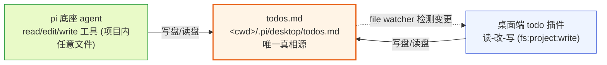
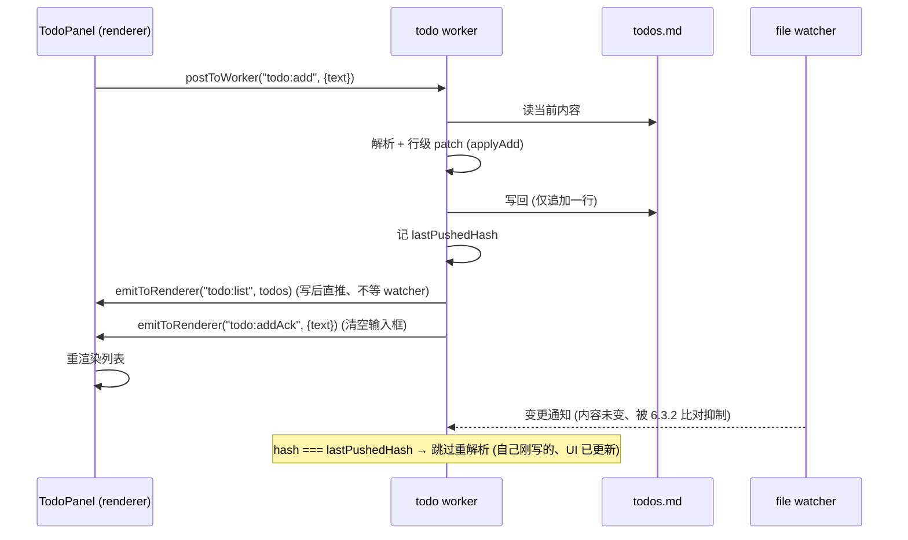
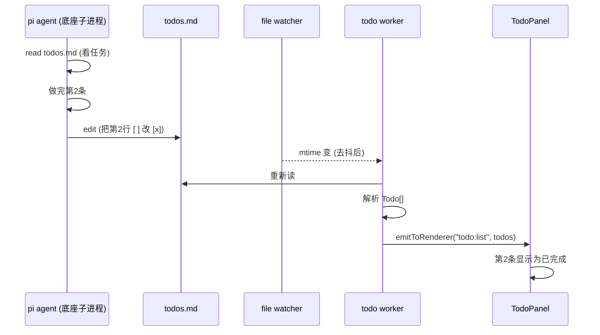

# todo 插件文档

本文档是 pi-desktop 内置默认插件之一——**todo 插件**（plugin id：`todo`）的设计说明。它不对应 `DESIGN.md` 第 4 节既有的十二个内置插件里的任何一个，而是一个新增的第十二个内置插件，沿用 `DESIGN.md` 第 4.10 节 review 插件确立的"文件传输同步"设计模式，把它用到"任务清单"这个用例上。阅读本文需要先了解 `DESIGN.md` 的支柱③（插件系统）、第 3.2.1 节（manifest 字段）、第 3.2.4 节（PluginContext）、第 3.2.6 节（事件如何到达渲染组件）、第 3.3 节（槽位契约与 `when` clause）、第 2.2 节（热加载是显式的不是 watch）、第 4.10 节（review 插件的文件传输同步思路）、第 4.12 节（文件编辑器与 agent 文件操作的协调）。底座源码佐证见 `packages/coding-agent/src/core/agent-session.ts`（`tool_execution_*` 事件、agent 的 read/edit/write 工具调用）。

todo 插件的设计核心是守住三条边界：**文件是唯一真相源**（数据存 `<cwd>/.pi/desktop/todos.md`，agent 和桌面都通过 read/edit 工具读写同一个文件，不另造数据库、不另造内存模型）、**零协议开销**（不发明任何 todo RPC 命令、不发明 todo 事件类型，agent 改文件是它本来就会做的事、桌面检测变更也是文件编辑器 4.12.4 本来就要做的事）、**不走底座 extension**（todo 是桌面端的本地功能，底座不感知 todo 概念，agent 只是在用自己既有的 read/edit 工具操作一个普通 markdown 文件）。本文不重复 `DESIGN.md` 已确立的全局原则，只在 todo 这一具体落点上把文件格式、槽位贡献、列表交互、变更检测、agent 协作、版本化、代码契约、权限边界讲透。

## 1 插件定位与边界

### 1.1 它解决什么：agent 协作时的任务清单共享

#### 1.1.1 用户和 agent 需要一份共同的任务清单

和 agent 协作时，用户的诉求往往是"把这次要做的几件事列出来、做完一件勾掉一件"——比如"先重构 api 层、再补测试、最后更新文档"。用户自己脑子里有这清单，但 agent 不知道全貌、只能看到用户当前发的那一条 prompt。这带来两类错位：一是用户忘了还剩几件、半途切到别的事，回头要靠记忆拼凑；二是 agent 不知道这一轮在整个任务清单里的位置，不知道做完了这件下一件是什么，更没法主动汇报"我把清单上的第 3 件做完了"。

todo 插件补的是"用户和 agent 共享一份任务清单"这个能力缺口。它让用户像平时用 todo 应用一样：列几条待办、做完一条勾掉、调整优先级拖个顺序。区别在于这份清单对 agent 也是可见的——agent 能 `read` 这个文件看到全部任务、能 `edit` 这个文件勾掉自己做完的那一条。清单对人和 agent 是同一份，不存在"用户看到一份、agent 看到另一份"的同步问题。

#### 1.1.2 为什么用文件、而不是数据库或 RPC 协议

最直白的实现是给 todo 开一组 RPC 命令（`todo.add`/`todo.complete`/`todo.reorder`）或者存进 `better-sqlite3`（`DESIGN.md` 5.1.2 桌面端本地状态用的就是它）。但这两条路都把一个本该轻的东西做重了，且都过不了"agent 怎么参与"这一关：

- **RPC 命令**意味着要给底座发明一套 todo 协议。底座的 31 个 RPC 命令全是会话运行时控制（`DESIGN.md` 1.5），没有也不该有"todo 增删改查"。给底座加 todo RPC，等于把"桌面端的任务清单"这个纯桌面概念污染进底座核心，违背 `DESIGN.md` 3.1.2"底座是被管理对象、不是另一套插件体系"的立场。更要命的是 agent 跑在底座子进程里、它没法直接发 RPC 命令回桌面端——RPC 通道是桌面端→底座单向发命令、底座→桌面端推事件（`DESIGN.md` 1.4），agent 要"勾掉一条 todo"走 RPC 得发明一条新的 event、或者让 agent 调一个底座 extension 转发，链路绕一大圈。
- **sqlite**意味着 todo 数据落在桌面端的本地数据库里。agent 没法读这个数据库——它只有 read/edit/write 文件工具，不会查桌面端的 sqlite。于是数据对 agent 不可见，"共享清单"退化成"用户自己看一份清单、agent 完全不参与"，又回到第一段的错位。

文件这条路同时解掉两个问题：数据是一个 markdown 文件 `<cwd>/.pi/desktop/todos.md`，agent 用它本来就有的 `read`/`edit` 工具就能读写，桌面端用普通文件 IO 就能读写。两边都不需要任何新能力——agent 不需要学"todo 命令"、桌面端不需要发明"todo RPC"。文件就是两个世界（agent 的工具世界、桌面的 UI 世界）共同 speak 的最小公约数：agent 本来就在用 `edit` 改各种 `.md` 文件，多改一个 `todos.md` 不增加它的任何复杂度；桌面端本来就在 4.12 文件编辑器里处理"用户改了文件、agent 改了文件"的变更检测，多 watch 一个 `todos.md` 也不增加它的任何机制。

#### 1.1.3 为什么不装底座 extension

有人会想：要不要做一个底座 extension，让 agent 在勾掉 todo 时"懂得"去改 `todos.md` 而不是瞎改别的文件？答案是不要。原因有三：

第一，agent 本来就懂 markdown 任务列表。`- [ ]` 和 `- [x]` 是 markdown 的标准语法、是 GitHub issue/PR、各种 todo 工具通用的表示，agent 见过无数次、知道把 `- [ ]` 改成 `- [x]` 就是"完成"。给它装 extension 教它"勾 todo"是重复造轮子。第二，底座 extension 要走 `Settings.extensions` 路径列表 + 重启子进程才生效（`DESIGN.md` 2.3），这让 todo 插件从"装上 pi-desktop 就能用"退化成"装 pi-desktop 还得配底座 extension、还得重启子进程"，违背 4.1"开箱即用"的设计目标。第三，extension 一旦参与，todo 就不再是纯桌面功能、而变成"桌面 + 底座"耦合的两段式东西——改 todo 格式要同时改桌面渲染和底座 extension，这正是 `DESIGN.md` 3.1.1 批评 现有方案"把一个扩展劈成行为和外观两半"的翻版。

todo 插件的立场是：todo 是桌面端的功能，底座不感知。agent 参与 todo 的方式就是"它本来就会用 edit 改 markdown 文件"这一既有能力，桌面端负责把这个文件渲染成 UI、并检测它的变更。这和 review 插件 4.10"底座完全不感知 review 机制、它只是收到了一条带结构化文本的消息"是同一种哲学——不为新功能污染底座核心，让底座用它既有的能力自然参与。

### 1.2 边界：文件是唯一真相源、零协议开销

#### 1.2.1 唯一真相源是磁盘文件

todo 的全部状态——有哪些条目、哪条完成了、什么顺序——都存在 `<cwd>/.pi/desktop/todos.md` 这一个文件里。桌面端的 UI 只是这个文件的一份渲染视图，agent 看到的也只是这个文件的文本。两边都不持有"另一份内存模型"：桌面端不在 worker 里维护一个 `Todo[]` 数组当真相源、只是缓存解析结果用于渲染；agent 不在 session 里维护一个 todo 状态、只是按需 `read` 这个文件。任何时候要拿 todo 的真实状态，读文件；要改 todo，写文件。文件是唯一的 source of truth。

这条边界一旦守住，一堆复杂度自动消失：没有"内存和文件不一致"的同步问题（内存永远是从文件解析来的快照、写之前先读再算）、没有"桌面改了 agent 没刷新"的问题（agent 每次 read 拿到的就是最新文件）、没有"两个会话同时改"的脏读（文件是磁盘上唯一的可观测真相，靠文件锁和读改写串行化兜底，见第 7 节）。这呼应 `DESIGN.md` 2.5.2"共享状态 + 重启消费者"模式的简化版：桌面和 agent 是两个消费者、磁盘文件是共享状态，两边都读改写它、不另立权威副本。

#### 1.2.2 零协议开销：不发明 todo RPC、不发明 todo 事件

todo 插件**不向 RPC 命令集加任何东西**。`DESIGN.md` 1.5 列的 31 个命令一个不动，`DESIGN.md` 1.6 列的事件流一个不增。agent 要"看 todo"就发 `bash` 命令 `cat` 或者用自己的 `read` 工具读文件（agent 的 read 工具走的是底座子进程内部、不在 RPC 事件流里，桌面端不掺和）；agent 要"改 todo"就用自己的 `edit`/`write` 工具改文件——改完之后，桌面端靠文件 watcher 检测到变更、重新解析、刷新 UI。整条链路里没有任何"todo 专用"的协议消息。

"零协议开销"不是一个性能口号，而是一个架构纪律：它保证了 todo 插件的增加对底座零侵入。底座源码不用改一行、RPC 协议不用加一个字段、底座 extension 不用装一个。todo 插件能存在、能和 agent 协作，完全靠"文件是两边共同 speak 的语言"这件事。这和 review 插件 4.10.4"review 不直接发 prompt、只把待发评论序列化进普通 prompt 消息文本"是同构的——review 不发明 review RPC、把 review 内容塞进既有的 prompt 通道；todo 不发明 todo RPC、把 todo 状态留在既有的文件通道。两者都守住了 `DESIGN.md` 1.10.1 的支柱①边界：RPC 只管会话运行时控制，todo 是文件层的事、不进 RPC。

#### 1.2.3 todo 是纯桌面功能、底座不感知

todo 插件不需要底座配合。`<cwd>/.pi/desktop/todos.md` 是桌面端目录下的一个普通文件，对底座子进程来说它和项目里任何一个 `.md` 文件没有区别——agent 的 `read`/`edit` 工具能读写项目下所有文件、`todos.md` 自然在其中。底座不知道这个文件"是 todo"、不知道"改它要触发桌面 UI 刷新"、不知道 todo 这个概念存在。桌面端对 `todos.md` 的特殊处理（watch + 解析 + 渲染）全在桌面侧，是 todo 插件自己的事。

这条边界让 todo 插件可以独立演进——改 todo 文件格式、换 UI 风格、加优先级标记，全是桌面端改一个插件的事，底座一行不动、不重启子进程。这比 4.12 文件编辑器的"直写磁盘"路径还轻：文件编辑器改文件还要走 `fs:project:write` 权限和 advisory lock 协调 agent；todo 插件则连文件写都委托给底座 agent 的 edit 工具（用户在 UI 改时由桌面端写盘，agent 改时由 agent 写盘，两边都写同一个文件、靠 watcher 同步），见第 5 节。

### 1.3 在内置插件矩阵中的位置

#### 1.3.1 协作层的定位与权限

todo 插件是 `DESIGN.md` 4.1 列出的内置默认插件之外的第十二个，属于"协作层"——和 review 插件同层。它不渲染底座内容（时间线、工具卡片是 4.4 的事）、不管理底座状态（扩展、模型是 4.3 的事），它让用户和 agent 围绕一份共享任务清单协作。它的 manifest 在 `permissions` 字段声明 `["fs:project:read", "fs:project:write"]`——读用于解析渲染 `todos.md`、写用于用户在 UI 上增删改 todo 时直接写 `<cwd>/.pi/desktop/todos.md` 这个项目目录下的文件（`fs:project:read`/`fs:project:write` 是 `DESIGN.md` 3.2.4 权限细分的读写权限）。它不声明 `content:sensitive`——todo 内容是用户自己写的任务文本、不来自底座对话内容，不涉及对话隐私；它也不读对话内容。它不声明 `net:`——todo 不联网、不外发。

`fs:project:write` 的范围是当前项目目录（`<cwd>`），todo 文件落在 `<cwd>/.pi/desktop/todos.md`——在项目目录里、可进 git（见第 8 节）。用户装/启用 todo 插件时授权写权限（`DESIGN.md` 3.9.4 装时授权或 3.9.6 运行时授权）。未授权则 todo 插件只能读不能写——用户在 UI 上的增删改会失败、提示"需要写权限"，但 agent 仍可改文件（agent 的文件操作走底座、不经桌面权限）、UI 仍能通过 watcher 显示 agent 的改动。这是个合理的降级：写权限管的是"桌面端能否替用户写文件"，不管 agent 能否写。

#### 1.3.2 dependsOn 不声明

todo 插件 `dependsOn` 留空——它不强依赖任何其他插件。它不靠时间线（4.4）的 entryId、不靠文件预览（4.5）的路径、不靠主输入框（4.7.4）发送——它自己读写文件、自己渲染侧栏面板、自己 watch 变更。它和命令面板（4.7）有弱交集（todo 贡献的命令项会出现在命令面板里），但这是通过 commands 槽注册表间接耦合、不是 `dependsOn` 关系（`DESIGN.md` 3.5 第 5 项隔离）。这让 todo 插件可以独立安装、独立启用、独立禁用，不拖累别的插件、也不被别的插件拖累。

> **跨文档契约依赖声明（对 10-plugin-file-editor）**：todo 插件检测 `todos.md` 变更靠桌面端 core 的通用文件 watcher（`DESIGN.md` 3.5 第 8 项热重载用的同一种 watcher 机制、只是作用在数据文件而非插件目录）。这和 4.12 文件编辑器的"外部修改检测"是同一种能力——4.12 订阅 `tool_execution_end` event 检测 agent 改了打开的文件、提示重载。todo 插件第一版靠 file watcher 检测磁盘变更（不依赖 `tool_execution_*` event），若后续要和 4.12 共享"agent 改文件的即时通知"机制，需在 `10-plugin-file-editor.md` 声明一个中性的"文件变更通知"事件总线 topic。第一版不依赖此契约、靠 watcher 兜底，watcher 有 mtime 轮询粒度的延迟（见 6.4）。

## 2 文件传输同步模型

### 2.1 todos.md：唯一真相源

#### 2.1.1 文件位置与归属

todo 数据文件固定在 `<cwd>/.pi/desktop/todos.md`。`<cwd>` 是用户当前打开的项目目录（即底座子进程的 `cwd`、`DESIGN.md` 1.3.1 的 `RpcClientOptions.cwd`）。`.pi/desktop/` 是桌面端在项目目录下的数据子目录（和 `<cwd>/.pi/desktop/plugins/` 项目级插件目录、`<cwd>/.pi/desktop/file-locks.json` 文件锁同根，见 `DESIGN.md` 3.4/4.12.4）。`todos.md` 放这里而不是放 `~/.pi/desktop/`（用户级），是因为 todo 是**项目级**的——一个项目的任务清单跟着这个项目走、换项目就换清单、进 git 就能团队共享（第 8 节）。放用户级会让所有项目共用一份 todo、且无法版本化。

文件不存在时 todo 插件按"空清单"处理、不报错——首次有用户或 agent 写入时才创建文件。这避免了"todo 插件一启用就往项目目录写一个空文件"的副作用（`<cwd>/.pi/` 目录可能因 `.gitignore` 规则被纳入或排除，凭空写文件可能污染 git 状态，见 8.3）。

#### 2.1.2 两端读写同一文件、不立权威副本

桌面端和 agent 是这个文件的两个读写者，两边都遵守"读-改-写"的串行模式，没有谁持有"权威内存副本"：

- **桌面端**：UI 渲染前读文件、解析成 `Todo[]` 缓存在 renderer 状态里（只是渲染用的快照、不是真相源）。用户在 UI 上操作（加/勾/删/拖）时，桌面端 worker 侧先读当前文件最新内容、在解析结果上应用这次操作、序列化回 markdown、写回文件。写回后 renderer 的缓存靠 watcher 的变更通知刷新（见 6.2）。
- **agent**：要 todo 状态就 `read` 这个文件、拿到 markdown 文本、自己理解（markdown 任务列表是 agent 训练数据里的常见结构）。要改 todo（比如勾掉做完的一条）就 `edit` 这个文件——用它的 edit 工具把 `- [ ]` 改成 `- [x]`、或者 `write` 整个文件。agent 的 read/edit 是底座子进程的内部文件操作，不经过 RPC、不经过桌面端。



**图 1 — 文件传输同步模型：两端各自读改写同一个磁盘文件，桌面靠 watcher 感知 agent 的改动**

这个模型的关键是：agent 改文件这一步，桌面端完全是被动的——它既不发起、也不知情、只在变更落到磁盘后靠 watcher 发现。agent 不需要"通知桌面端 todo 改了"，桌面端不需要"问 agent 有没有改 todo"，两边唯一的耦合点是磁盘上的那个文件。这正是"零协议开销"在数据流上的体现。

### 2.2 不发明 todo 专用协议

#### 2.2.1 和 review 的文件传输思路同源

todo 插件的设计模式直接借鉴 review 插件 4.10 的"文件传输同步"思路——只是 review 把待发评论序列化进 prompt 消息文本（一条文本消息当传输载体），todo 把状态留在一个文件里（文件当传输载体）。两者的共同点是：**不为新功能给底座加协议**，而是用底座既有的能力（review 用既有的 prompt 通道、todo 用 agent 既有的文件工具）完成桌面↔agent 的数据流动。`DESIGN.md` 4.10 之所以把 review 做成桌面插件、把攒批逻辑收敛在插件内、最终序列化成一条普通 prompt 消息发给底座，正是为了"底座完全不感知 review 机制"。todo 把这条原则推到更彻底——连"序列化进消息"这步都省了，状态压根就在文件里、两边各自读写。

#### 2.2.2 零协议开销的具体含义

"零协议开销"在 todo 插件里落成几条具体的"不做"：

- **不发明 RPC 命令**：不加 `todo.list`/`todo.add`/`todo.complete` 之类命令。`DESIGN.md` 1.5 的 31 命令集不动。桌面端要看 todo 状态就自己读文件（worker 侧 `fs:project:write` 权限含读）、不问底座；agent 要看就用自己的 read 工具。
- **不发明事件类型**：不加 `todo_changed` 之类 event。`DESIGN.md` 1.6 的事件流不动。桌面端检测 todo 变更靠 file watcher、不靠底座推 event；agent 改 todo 走的是它自己的 edit 工具调用（会产生 `tool_execution_*` event，但那是底座既有的通用工具事件、不是 todo 专用的，桌面端可选择订阅它做即时刷新、见 6.5）。
- **不发明底座 extension**：不写 extension 教 agent"懂 todo"。agent 用既有的 markdown 理解能力读写 `todos.md`。
- **不发明新槽位**：todo 插件只往既有槽位（sidePanel/commands/settings）挂贡献项（`DESIGN.md` 3.3），不自造 `todo` 槽。

这几条"不做"加起来，让 todo 插件的存在对底座、对 RPC 协议、对槽位契约零侵入——它纯靠"读写一个文件"和"挂几个既有槽位的贡献项"就成立。这是"薄壳 + 文件传输"的极致形态。

### 2.3 为什么文件比内存模型好

#### 2.3.1 持久化天然免费

文件天然是持久化的——用户关掉 pi-desktop、明天再开，`todos.md` 还在磁盘上、todo 插件读出来就是昨天的清单。如果用内存模型当真相源、就得自己管持久化（存 sqlite、存 config.json），存哪都绕回"怎么让 agent 也读到"的问题。文件把持久化和"agent 可见"两件事一次性解决——存盘即对 agent 可见、agent 可见即已存盘。

#### 2.3.2 版本化天然免费

`todos.md` 在项目目录里、可进 git（见第 8 节）。一条 todo 从"提出"到"完成"的全程都留 git 历史，团队任何人 `git log todos.md` 都能看到任务演进。内存模型做不到这一点——sqlite 是二进制、diff 不友好、且不随项目走（在 `~/.pi/desktop/data/` 下、不在项目仓库里）。文件让 todo 数据天然具备"项目级、可 diff、可版本化、团队共享"四个性质，这些都是 agent 协作时的高价值属性（团队多人分别和 agent 协作、共享同一份任务上下文）。

## 3 todos.md 格式与解析

### 3.1 Markdown 任务列表格式

#### 3.1.1 用标准 markdown 任务语法

`todos.md` 采用 markdown 的标准任务列表语法——每条 todo 是一个列表项、`- [ ]` 表示未完成、`- [x]` 表示完成。这是 GitHub issue/PR、Obsidian、各种 markdown 编辑器通用的语法，agent 在训练数据里见过无数次、天然理解。格式示例：

```markdown
# Todo

- [ ] 重构 api 层的 error handling
- [x] 给 SessionManager 补单测
- [ ] 更新 DESIGN.md 第 4.10 节
- [ ] 把 file-locks.json 迁到 .pi/desktop/
```

用标准语法而不是自创格式（如 JSON 或 YAML 嵌进 markdown），核心动机是 agent 友好——agent 的 `edit` 工具最适合改这种行级文本（把某行的 `[ ]` 改成 `[x]` 是一个最小的、明确的 edit），而 JSON/YAML 改起来要顾忌结构完整性、agent 容易改坏（漏个逗号、错个缩进）。markdown 任务列表对 agent 是"零学习成本"的格式。

#### 3.1.2 标题与元数据头

文件开头固定一个 `# Todo` 一级标题，作为 todo 区段的标识、也作为文件被打开时的可读标题。标题下面跟一个可选的元数据块（HTML 注释形式、对 agent 可见但渲染时不显示），记录 todo 插件关心的元信息：

```markdown
# Todo

<!--
pi-desktop-todo v1
-->

- [ ] 重构 api 层的 error handling
- [x] 给 SessionManager 补单测
```

元数据头用 HTML 注释 `<!-- ... -->` 而不是 YAML front matter，因为：front matter 要解析器支持、agent 改 front matter 容易碰格式约束；HTML 注释在 markdown 渲染时被隐藏、不影响可读性、agent 改起来也宽松（注释里放什么都不会破坏 markdown 结构）。`pi-desktop-todo v1` 是格式版本号、用于将来格式演进时向后兼容判断（见 13.2）。元数据块不承载时间戳——并发检测统一用文件 mtime（见 7.3）、桌面端写盘也不产出元数据头（见 12.4.1），避免出现"既不读也不写"的死字段。元数据块是可选的——agent 直接 `write` 整个文件时不带这个块、todo 插件解析时不报错、按"无元数据"处理。

### 3.2 优先级与顺序的表示

#### 3.2.1 顺序即优先级、不引入优先级字段

todo 的优先级靠**列表顺序**表示——上面的比下面的优先、拖动改顺序就是改优先级。不引入独立的 `priority: high/medium/low` 字段，因为：顺序是 markdown 列表天然支持的、agent 理解"把这条挪到最前面"就是提高优先级；引入优先级字段要扩展语法（如 `- [ ] (high) xxx`），增加 agent 改坏的几率、也让 UI 要同时处理"顺序"和"字段"两套优先级表示。顺序即优先级这一条，让"拖动重排"和"agent 调整优先级"统一成"改列表顺序"一个动作。

#### 3.2.2 可选的优先级标记

第一版不强制优先级字段，但解析器容忍一个可选的标记——行首紧跟 `[ ]`/`[x]` 后可以有一个 `(!)` 或 `(!!)` 表示"重要"或"紧急"，作为顺序之外的弱强调：

```markdown
- [ ] (!!) 上线前必须修的内存泄漏
- [ ] (!) 下个迭代要做的重构
- [ ] 普通任务
```

这个标记不影响列表顺序（顺序仍是主优先级），只影响 UI 渲染（紧急的标红、重要的加粗）。它可选——不带就是普通、agent 写不带标记的 todo 完全正常。解析器对未知标记宽容（见 3.3.2），agent 若自创别的标记也不会让解析失败、只是 UI 不识别那个标记的语义。这条让格式"严进宽出"：写入端可以只写标准语法、读取端兼容各种扩展。

### 3.3 解析器的稳健性

#### 3.3.1 解析规则

todo 插件的解析器（worker 侧，见 11.2）把 markdown 文本解析成 `Todo[]`。规则：

- 只识别一级标题 `# Todo` 之后的列表项（之前的标题行/其他内容跳过）。若文件没有 `# Todo` 标题，把整个文件的任务列表项都当 todo（兼容 agent 直接写的纯任务列表文件）。
- 列表项以 `- ` 或 `* ` 开头、紧跟 `[ ]` 或 `[x]`（大小写不敏感，`[X]` 也算完成）。不匹配这个形态的列表项（如 `- 普通列表项` 没有 checkbox）跳过、不当 todo。
- checkbox 后的可选标记 `(!)`/`(!!)` 解析进 `Todo.priority` 字段（`"urgent"`/`"important"`/`"normal"`）。
- checkbox 后的剩余文本是 `Todo.text`（trim 首尾空白）。
- 解析时为每条 todo 生成稳定 `id`（按行偏移 `t${charOffset}`），用于 renderer 在 toggle/delete/reorder 时定位条目；刷新采用全量重解析 + diff（见 6.2.1），不做按偏移的增量刷新——偏移字段仅内部用于生成 id、不作为 `Todo` 的公开字段。
- **id 的漂移风险与校验**：id 仅在"某一文件状态"内有效。renderer 持有的列表与 worker 即将读取的文件可能不一致——agent 在 renderer 渲染列表后、用户点击 toggle 前追加或改写了 todo，用户点的条目行偏移已漂移；worker 若用 renderer 传来的陈旧 id 在新解析结果里按偏移匹配，可能命中错误条目或空。7.3.3 的 mtime 乐观检查只防"读后文件被改→重试"、防不住"id 语义已漂移"。故 toggle/delete/reorder 的消息除 `id` 外**必须带 renderer 当时所见的 `text`**（见 12.3.1），worker 收到后校验"该 id 对应条目的 `text` 是否仍匹配 renderer 当时所见"——不匹配说明已漂移、拒绝本次操作并重推最新列表让用户基于新列表重试（骨架见 12.2.2 `handleToggle` 的 `"drift"` 分支）。这是一个弱校验（若 agent 恰好把漂移后的条目文本改成与原文本相同则仍可能误命中、概率极低）；演进项切持久 id 写入文件（见 13.2）。

#### 3.3.2 宽容未知结构

解析器对未知结构宽容——遇到看不懂的行不报错、跳过。这保证 agent 用它自己的方式改文件（比如加一段说明文字、改个标题）不会让 todo 插件崩溃。具体：非任务列表行（段落、代码块、二级标题）原样跳过、不影响任务列表解析；任务列表项带未知标记（如 `(??)`）按 `priority: "normal"` 处理、不报错；checkbox 损坏（如 `- [o]` 不是标准空格/x）跳过该项、不报错。这条"宽出"是文件传输模型能成立的关键——agent 不是 todo 插件的客户端、它不会按 todo 插件的 schema 写文件，解析器必须能容忍 agent 的"自由发挥"。

## 4 贡献的槽位

### 4.1 侧栏槽：todo 列表面板

#### 4.1.1 面板结构与数据绑定

todo 插件往**侧栏槽（sidePanel）**挂一个"Todo"Tab——贡献项 `{ id: "todo-list", label: "todo.panelTitle", icon: "list-checks", component: "TodoPanel" }`（`DESIGN.md` 3.3 侧栏槽 schema）。`TodoPanel` 是 renderer 侧组件（11.3.1），渲染当前 `Todo[]` 的列表：每条 todo 显示一个 checkbox（完成状态）、文本、可选优先级标记；列表项支持点击勾选、删除按钮、拖动手柄。面板顶部有一个输入框（新增 todo）和"清空已完成"按钮。

数据绑定走 `DESIGN.md` 3.2.6 的"core 内置默认 event→renderer 转发"之外的 worker 推送路径——todo 插件有 `main`（worker 侧），worker 解析完文件后 `context.emitToRenderer("todo:list", todos)` 推给 `TodoPanel`、组件 `pi.onMessage("todo:list", cb)` 收。这符合 3.2.6 路径二（worker 处理后推送）——todo 列表是 worker 解析文件的产物、要加工（解析 + 算偏移）、不能直接转发原始 event。用户在 UI 上的操作走反向：组件 `pi.postToWorker("todo:add", { text })` 等、worker 收到后读改写文件（见第 5 节）。

#### 4.1.2 空态与计数

文件不存在或没有 todo 时，面板显示空态（i18n key `todo.emptyHint`）。面板标题区显示计数（`todo.count`，复数形式走 i18next `_one`/`_other`，`DESIGN.md` 4.2.5）——"3 条待办，1 条已完成"。已完成项默认折叠在列表底部、可展开查看（设置项 `showCompleted` 控制，见 4.3）。

### 4.2 命令项槽：快捷操作

#### 4.2.1 三个命令项

todo 插件往**命令项槽（commands）**挂三个贡献项（`DESIGN.md` 3.3 commands schema）：

- `{ id: "todo.add", title: "todo.add", keybinding: "cmd+shift+t", handler: "#onAdd", when: "true" }`——快速新增一条 todo。快捷键 `cmd+shift+t`（core 按平台映射修饰键、macOS 用 Cmd、Windows/Linux 映射为 Ctrl+Shift+T，见 11.5 平台映射契约）。handler 调 `#onAdd`（worker 模块导出），它往 renderer 发 `todo:focusInput` 通道让 `TodoPanel` 的新增输入框获得焦点（用户直接打字、回车提交）。
- `{ id: "todo.toggleFirst", title: "todo.toggleFirst", keybinding: "cmd+shift+d", handler: "#onToggleFirst", when: "todo.hasItems" }`——勾掉列表第一条未完成 todo（"做完一件事"的快捷操作）。`when: "todo.hasItems"` 是 todo 插件自己维护的 contextKey（见 4.2.2），列表为空时命令不可用。
- `{ id: "todo.clearCompleted", title: "todo.clearCompleted", handler: "#onClearCompleted", when: "todo.hasCompleted" }`——清空所有已完成项。`when: "todo.hasCompleted"` 控制至少有一条已完成时才可用。

这三个命令项同时服务命令面板和快捷键——不另立入口（和 review 4.10.3 一个命令项多入口同构）。

#### 4.2.2 todo 专属 contextKeys

`todo.hasItems`/`todo.hasCompleted` 是 todo 插件维护的 contextKeys——`DESIGN.md` 3.3 的 `when` clause 支持。todo worker 在每次解析完文件、推送 list 给 renderer 后、同步把这两个 key 的值（`hasItems = todos.length > 0`、`hasCompleted = todos.some(t => t.done)`）经 `context.bus` 或 core 的 contextKey 更新接口（`DESIGN.md` 3.3 contextKeys 由 core 维护、插件经事件总线或注册接口声明 key）告诉 core。core 把它们塞进 contextKeys 表、命令项的 `when` 据此求值。这和 review 4.10.7 的 `review.modeActive` 是同一种机制——插件自己持有一个状态、经中性通道让 core 的 `when` 引擎看到。

> **待补 DESIGN.md 缺口声明**：`todo.hasItems`/`todo.hasCompleted` 这类"插件自己声明并更新 contextKey"的机制，`DESIGN.md` 3.3 只说"core 维护一个 contextKeys 表、运行时按状态更新这些 key"，未明确插件如何把自己的状态注册进 contextKeys 表。review 插件 4.10.7 的 `review.modeActive` 依赖同一机制、`15-plugin-review.md` 6.1.1 已标注"BLOCKING 待回写 DESIGN.md 3.3 contextKeys 注册接口"。todo 插件沿用同一缺口标注，落地前需在 `DESIGN.md` 3.3 补"插件经 `context.setContextKey(key, value)` 声明并更新 contextKey"接口，对齐兄弟文档的 BLOCKING 标注。

### 4.3 设置子页槽：todo 偏好

todo 插件往**设置子页槽（settings）**挂一个偏好页——贡献项 `{ id: "todo", title: "todo.settingsTitle", component: "TodoSettings" }`。`TodoSettings` 是 renderer 组件（11.3.3），用 `pi.ui` 组件库渲染以下偏好项（值绑到 `context.config`、`DESIGN.md` 3.2.4 插件配置）：

- `showCompleted`（boolean，默认 true）：是否在面板显示已完成项。
- `autoFocusInput`（boolean，默认 false）：打开 todo 面板时是否自动聚焦新增输入框。
- `confirmDelete`（boolean，默认 true）：删除 todo 时是否弹确认框。
- `sortCompletedToBottom`（boolean，默认 true）：已完成项是否自动排到底部（仅影响 UI 显示顺序、不改文件）。

这些是桌面端偏好、存在 `~/.pi/desktop/plugins-data/todo/config.json`（用户级，`DESIGN.md` 3.2.4）、不进 `todos.md` 文件——文件是任务数据、偏好是用户习惯、两者分开。设置页走组件而非 schema（`DESIGN.md` 3.3 settings 槽）——因为偏好项涉及联动（`showCompleted=false` 时 `sortCompletedToBottom` 无意义），schema 通用表单表达不了联动，用组件自由。和 review 4.10.3 设置子页同构。

## 5 列表交互：加/勾/删/拖动优先级

### 5.1 加：新增 todo

#### 5.1.1 读-改-写的串行模式

用户在面板输入框写一条 todo、回车提交。worker 侧 `#onAdd` 收到 `todo:add` 消息后，执行"读-改-写"三步：

1. 读 `<cwd>/.pi/desktop/todos.md` 当前内容（若不存在按空文件处理）。
2. 解析成 `Todo[]`、在末尾追加一条新 `Todo`（`{ done: false, text, priority: "normal" }`）。
3. 序列化回 markdown（追加一行 `- [ ] {text}`、若文件没有 `# Todo` 标题先补一个）、写回文件。

写回后 worker 直接 `emitToRenderer("todo:list", list)` 更新 UI——用户操作的反馈必须即时，不等 watcher 绕回。watcher 只负责感知 agent/外部对 `todos.md` 的改动（见 6.2）。这看似让"用户改"和"agent 改"走不同刷新路径，但两者数据来源相同（都是文件解析结果）、watcher 触发的重解析结果与 worker 直推的一致，不会产生分歧；而让用户操作等 watcher 绕回会引入不可接受的刷新延迟——6.3 的回环抑制会让"自己写盘触发的 watcher 事件"按内容 hash 匹配被跳过，若 worker 不直推则 UI 不会因用户操作而刷新（轮询兜底虽用内容 hash 比对、能发现内容变化，但 5 秒延迟不可接受、且 worker 已把 `lastPushedHash` 设成自写后的 hash、轮询 hash 比对也判"无变化"——直推是唯一即时路径）。worker 自写后直推、watcher 只管外部改动——这是唯一不会自相矛盾的分工。

#### 5.1.2 写失败的回滚与提示

写失败（权限不足、磁盘满、文件被占用）时 worker 给 renderer 推 `todo:error` 通道、UI 显示错误提示（i18n key `todo.writeError`）。输入框里用户刚写的内容不清空、保留供重试。已读的文件内容丢弃、不缓存"半成品状态"——下一次操作重新读文件，保证不会基于陈旧文件内容做修改。

### 5.2 勾：完成状态切换

#### 5.2.1 checkbox 点击

用户点某条 todo 的 checkbox、worker 收 `todo:toggle` 消息（带该 todo 的 `id` 与 renderer 当时所见的 `text`）。worker 读文件、解析、按 `id` 找到对应 todo（`id` 是解析时按行偏移生成的稳定标识、见 3.3.1）、**校验该条 `text` 仍与 renderer 所见一致**（防 id 漂移误命中、见 3.3.1 / 7.3.3）、翻转 `done` 状态、行级 patch（只把那一行的 `[ ]` 改 `[x]` 或反之、保留其余原文，见 5.2.2）、写回。若 `text` 不匹配说明 renderer 持的列表已与磁盘漂移、worker 拒绝本次操作并重推最新列表让用户重试。

#### 5.2.2 行级最小改动、保 agent 友好

序列化时只改被勾/取消那行的 checkbox 字符、不动其他行——这保证 agent 之后 `read` 文件时看到的仍是它熟悉的 markdown 任务列表、不会被桌面端的写盘搞出格式异变。这条"最小行级改动"也是为了 agent 的 `edit` 工具——agent 改 todo 时也是行级改（把某行 `[ ]` 改 `[x]`），桌面端写盘保持同样的粒度、让文件始终是"两边都能最小改"的友好状态。

### 5.3 删：删除 todo

#### 5.3.1 删除按钮与确认

用户点某条 todo 的删除按钮（`confirmDelete=true` 时弹 `pi.ui.Dialog` 确认）。worker 收 `todo:delete`（带 `id`）、读文件、解析、移除对应行、序列化（删那一行、不留空行）、写回。

### 5.4 拖动：优先级重排

#### 5.4.1 拖拽改列表顺序

用户在面板里拖动某条 todo 调整顺序。renderer 侧用 HTML5 drag-and-drop（或 `pi.ui` 提供的拖拽组件）算出新顺序、`postToWorker("todo:reorder", { id, newIndex, text })`（`text` 用于 id 漂移校验、见 3.3.1）。worker 读文件、解析、把对应 todo 从原位置移到新位置、序列化（重排列表项行）、写回。顺序即优先级（3.2.1）——拖到最上面就是最高优先级。

> **`newIndex` 语义契约**：`newIndex` 约定为"移除被拖项后的目标下标"——即 renderer 先把被拖项从当前列表中移除、再把被拖项插入到 `newIndex` 处。worker 的 `applyReorder` 按此语义实现（先 `splice` 移除被拖项、再 `splice` 把它插入 `newIndex`，见 12.4.1）。两端必须按此契约对齐、否则会产生 off-by-one（若 renderer 把 `newIndex` 理解为"原列表绝对位置"、而 worker 按"移除后下标"插入、条目落点会差 1）。renderer 的 `handleDrop` 计算 `newIndex` 时须先算出"被拖项移除后、落点对应的下标"再发出（见 12.3.1）。



**图 2 — 用户加 todo 的完整往返：worker 读改写后直推 UI（5.1.1），watcher 回环被 6.3.2 内容 hash 比对抑制、跳过重解析**

> 对照图 3：用户操作的刷新来自 worker 写后直推、不是 watcher 回环；agent 改文件（图 3）才是 watcher 真正触发刷新的场景。若 worker 不直推、改依赖被抑制的 watcher 回环，UI 不会刷新（连 5 秒轮询也因同一 hash 比对提前返回，见 6.3.2 / 6.4.2）。

#### 5.4.2 agent 怎么调整优先级

agent 要调优先级就 `edit` 文件把某行挪到列表最前面——和桌面端拖动是同一个动作（改列表顺序）。agent 不会"拖动"、它只会 edit 文本，但效果一样：改了文件、watcher 检测、UI 刷新。这是"零协议开销"在交互层的体现——桌面端拖动和 agent edit 走同一条"改文件→刷新"链路，不需要为 agent 发明"调整优先级"的专用命令。

## 6 变更检测与刷新

### 6.1 桌面侧 file watcher

#### 6.1.1 watch 的是数据文件

todo 插件在 `activate` 时对 `<cwd>/.pi/desktop/todos.md` 启动 file watcher（监听 mtime 变化）。这个 watcher 和 `DESIGN.md` 3.5 第 8 项的"插件目录热重载 watcher"是同一种机制（core 提供的文件监听能力、todo 插件复用），只是作用对象是数据文件而非插件目录。`DESIGN.md` 2.2.1 明确"底座（pi 子进程）不对自己的配置目录做 watcher"，但这里 watch 的是桌面端自己目录下的文件、由桌面端 core 的 watcher 机制负责、和底座无关——两者不冲突。

#### 6.1.2 watcher 的粒度与去抖

watcher 触发后不立即读文件——做去抖（debounce ~150ms），把连续多次写盘（如 agent 一次 edit 多行）合并成一次重新解析。去抖窗口内收到的多次变更通知只触发最后一次读改解析。这避免"agent 改文件写到一半、watcher 触发、读到半个文件"的中间态——去抖窗口给 agent 时间写完。

### 6.2 检测变更→解析→刷新 UI

#### 6.2.1 变更通知的处理链

watcher 触发（去抖后）→ worker 重新读文件 → 解析成 `Todo[]` → 和缓存的上一份 `Todo[]` diff（算出哪些条新增/删除/状态变化）→ `emitToRenderer("todo:list", todos)` 推给 `TodoPanel` → 组件重渲染。整条链路在 worker 侧、renderer 只负责展示。这是 `DESIGN.md` 3.2.6 路径二"worker 处理后推送"的标准形态。

#### 6.2.2 解析失败的兜底

若 agent 改坏了文件（解析器宽容但仍可能遇到彻底乱码）、worker 解析出部分 `Todo[]`（能识别的行）+ 给 renderer 推 `todo:parseWarning` 通道、UI 显示"文件格式有部分异常、已尽量解析"（i18n key `todo.parseWarning`）。不阻塞 UI、不让用户被一个坏文件卡住。用户可在 UI 上看到能识别的 todo、剩下的乱码部分在文件里、可手动修。

### 6.3 自身写回的回环抑制

#### 6.3.1 自己写盘触发的 watcher 通知

一个要处理的细节：worker 写盘（5.1 的"读改写"第三步）会触发 file watcher、又绕回 worker 重新读解析——这是"回环"。5.1.1 已规定 worker 自写后直接 `emitToRenderer` 推送最新列表，故 watcher 绕回的那次重解析是冗余的——抑制它可避免重复解析与潜在的 UI 闪烁（先显示新列表、watcher 绕回又推一次）。

#### 6.3.2 内容 hash 比对抑制

worker 写盘后、写成功已直接 `emitToRenderer` 推送最新列表；同时把"写后内容 hash"记入 `lastPushedHash`（见 12.2.2）。watcher 触发 `refresh` 时重读文件、重算 hash：若与 `lastPushedHash` 匹配 → 是自己刚写的、跳过本次重解析（renderer 已在写后直接更新过）；若不匹配 → 是 agent 或外部改的、重解析并推送。这条内容 hash 比对是"回环抑制"的做法，和 4.12 文件编辑器的"外部修改检测"区分"自己存盘"和"agent 改文件"是同一机制。

第一版回环抑制**直接用内容 hash 比对、不用 mtime**——mtime 在某些文件系统上精度不够（秒级 mtime、连续两次写盘可能同 mtime），用 mtime 会在秒级文件系统上误判。用 hash 的代价是每次 `refresh` 要读文件算 hash（todo 文件 KB 级、可忽略），换来的是不受 mtime 精度限制的可靠比对。这条同时让轮询兜底（6.4.2）、回环抑制、以及 7.3.3 的读改写乐观并发检测**共用同一可靠信号（内容 hash）**、不再有 mtime 精度盲区。早期版本曾把 `lastWriteMtime`（worker 自写盘的 mtime）留给 7.3.3 的乐观并发、与回环抑制分用两种信号——但 mtime 在秒级文件系统上对"agent 在 worker 读后同秒写盘"这一盲区失效（6.3.2 / 6.4.2 已论证），把已知不可靠的信号用在高风险的 lost-update 守卫上是方向反了；故 `lastWriteMtime` 不再保留、7.3.3 的乐观并发也改记读时内容 hash、写前重读比对（见 7.3.3）。

### 6.4 watcher 的延迟与轮询兜底

#### 6.4.1 原生 fs.watch 的局限

`fs.watch`（Node/Electron 的文件监听）在某些平台/文件系统上不可靠——macOS 上网络盘、Linux 上某些 inode 行为、Windows 上短时间多次写可能丢事件。todo 插件不能假设 watcher 100% 可靠。

#### 6.4.2 轮询兜底

第一版加一个低频轮询兜底——worker 每 ~5 秒读一次文件、算内容 hash、与上次推给 UI 的 `lastPushedHash` 比对、变了就触发解析。轮询频率低（5 秒）不影响性能、却能在 watcher 丢事件时最终把 UI 同步到最新。agent 改文件后 UI 最坏延迟 5 秒刷新，对 todo 这种非实时场景可接受。轮询和 watcher 共存——watcher 负责即时、轮询兜底遗漏。

> **轮询不用 mtime 而用内容 hash**：秒级 mtime 文件系统上，若 worker 自写（写后内容 hash 为 `H`）后、agent 在同一秒内又改盘（mtime 不变、但内容已变、hash 必不同）、watcher 又恰好丢事件，轮询若比 mtime 会恒判"无变化"永久跳过（见 6.3.2 的精度盲区）。改用内容 hash 比对则不受 mtime 精度限制——agent 改了内容、hash 必变、轮询必能发现。回环抑制（6.3.2）、轮询兜底（6.4.2）、读改写乐观并发（7.3.3）三者共用同一内容 hash 信号、不再有 mtime 精度盲区。

### 6.5 订阅 tool_execution 做即时刷新（可选增强）

#### 6.5.1 agent 改 todo 的即时感知

agent 改 `todos.md` 走的是它的 `edit`/`write` 工具——这会产生 `tool_execution_end` event（`DESIGN.md` 1.6.3），event 的 `toolName` 是 `edit`/`write`、`args`/`result` 含文件路径。todo worker 可选订阅 `context.events.on`、检测到 `tool_execution_end` 且文件路径是 `todos.md` 时、立即触发解析刷新（不等 watcher 的去抖或轮询的 5 秒）。这把"agent 改 todo → UI 刷新"的延迟从秒级降到毫秒级。

#### 6.5.2 第一版靠 watcher、不依赖 event

第一版不依赖这条 event 路径——靠 6.1 的 watcher + 6.4 的轮询兜底。原因：`tool_execution_end` 的文件路径在 event 的 `args`/`result` 里、要解析、且 agent 可能用 `bash` 命令（`echo >> todos.md`）改文件不走 `edit` 工具、不产生 `tool_execution_end`。watcher 是更底层的、覆盖所有改文件方式（agent 用 edit/write/bash、用户用外部编辑器、git checkout 等）的统一检测点。event 路径是增强、不是必需。这呼应 `DESIGN.md` 1.8.2"桌面端看到的 event 流是底座 extension 处理过之后的状态"——todo 不依赖 event 的语义、只把它当"可能要刷新"的提示。

## 7 agent 完成任务的 todo 更新

### 7.1 agent 用 edit 工具改 todos.md

#### 7.1.1 agent 的读写路径

agent 参与 todo 的方式完全靠它既有的文件工具：要看 todo 就 `read` 文件、要勾掉做完的一条就 `edit` 文件把对应行的 `[ ]` 改成 `[x]`。这两件事 agent 本来就会做——`read`/`edit` 是 agent 的标配工具、markdown 任务列表是它训练数据里的常见结构。todo 插件不给 agent 任何"todo 专用指令"、不装 extension 教 agent"懂 todo"。

#### 7.1.2 prompt 引导 agent 用 todo

用户怎么让 agent 知道有 todo 这份文件、并且做完事去勾掉？靠 prompt 引导——用户在主输入框（4.7.4）发消息时可以写"看一下 .pi/desktop/todos.md、做完一条就把它勾掉"。agent 收到这条 prompt、用 `read` 读文件、看到任务列表、做完一件就 `edit` 勾掉。这是纯 prompt 层的协作、todo 插件不参与引导（todo 插件不往 prompt 里塞内容、不调 `rpc.prompt`）。这条守住了 `DESIGN.md` 4.7.4"主输入框是唯一发送出口"——todo 不发明发送路径、用户引导 agent 走正常 prompt。

未来可在 todo 插件里贡献一个"把当前 todo 清单附在 prompt 后"的快捷命令（类似 review 4.10.4 把评论附在 prompt 后），但第一版不做——避免和主输入框的发送链路耦合（见 13.2 演进）。

### 7.2 桌面检测 agent 变更刷新 UI

#### 7.2.1 agent 改文件后 UI 自动刷新

agent `edit` 文件后、`todos.md` 落盘、todo 插件的 watcher（6.1）检测到 mtime 变、去抖后重新读解析、推 `todo:list` 给 renderer、UI 刷新——用户看到 agent 勾掉的那条变成已完成。整条链路对 agent 透明——agent 不知道"我改文件会触发桌面 UI 刷新"、它只是在改一个 markdown 文件。这呼应 1.2.3"todo 是纯桌面功能、底座不感知"。



**图 3 — agent 勾 todo 的完整链路：agent 用 edit 改文件，桌面 watcher 检测、解析、刷新 UI，全程无 todo 专用协议**

### 7.3 并发改写的冲突处理

#### 7.3.1 两端同时改的问题

桌面端和 agent 可能同时改 `todos.md`——用户在 UI 勾一条的同时、agent 也在 edit 文件勾另一条。两边都做"读-改-写"、若不协调会出现 lost update：用户读文件（看到 A B C）、agent 也读文件（看到 A B C）、用户写（A B' C）、agent 写（A B C'）→ agent 的写覆盖了用户的写、用户勾的那条丢了。

#### 7.3.2 读-改-写的串行化与 last-writer-wins

第一版采用"读-改-写用文件锁串行化 + last-writer-wins"的弱协调——和 `DESIGN.md` 4.12.4 文件编辑器的 advisory lock 同一种思路：

- **桌面端写盘前取锁**：worker 写盘前在 `<cwd>/.pi/desktop/file-locks.json`（4.12.4 用的同一个锁文件）给 `todos.md` 上 advisory lock、写完释放。这防止桌面端自己的多次写并发、不防 agent（agent 不查这个锁）。
- **agent 写不查锁**：agent 改 `todos.md` 是它自己的 edit 工具调用、不经桌面端锁。所以 agent 写和桌面端写仍可能冲突——第一版接受 last-writer-wins（后写的覆盖先写的）、靠 watcher 让两边都最终看到最新内容、丢失的那次改动让用户/agent 重做。todo 是低冲突代价场景（一条 todo 丢了大不了重勾）、不值得为它上强制锁。

演进项是 `DESIGN.md` 6.1 提到的"底座加 `query_file_lock`/`acquire_file_lock` RPC 命令"——让 agent 的 edit 工具改文件前查锁、被锁则走 Extension UI confirm 问用户。这是底座该补的能力、不只是 todo 的事、和 4.12.4 的完整方案对齐。第一版靠弱协调 + watcher 兜底。

#### 7.3.3 内容比对检测并发覆盖

worker 在"读-改-写"的读和写之间、若文件内容变了（说明有人在自己读之后写过）、说明基于陈旧内容做的改会覆盖别人。worker 检测到这种情况时、放弃本次写、重新读最新内容、重新应用用户操作、再写。这是 optimistic concurrency control——读时记内容 hash（`beforeHash = simpleHash(before)`）、写前重读文件再算 hash 比对、变了重试。重试 3 次仍冲突则报错给 UI（i18n key `todo.conflict`）、让用户手动处理。这条降低 lost update 概率、不消除（agent 写不查 hash、仍可能和桌面端写交错）。

**为什么用内容 hash 而非 mtime**：文档自身在 6.3.2 / 6.4.2 已论证 mtime 在秒级文件系统上不可靠（连续两次写盘可能同 mtime）、并据此把回环抑制和轮询都切成了内容 hash。同一个"agent 在 worker 读后同秒写盘 → mtime 不变"的盲区、在乐观并发检测里恰好造成 worker mtime 比对通过 → 覆盖 agent 写入、正是 lost update 要防的情形。把可靠信号（hash）用在高风险的 lost-update 守卫上、和回环抑制/轮询统一用同一信号、消除"明知 mtime 不可靠却仍用 mtime"的逻辑裂痕。`simpleHash` 基础设施已在回环抑制/轮询中就绪、此处复用、零额外成本。骨架见 12.2.2 各 `handle*` 的 `beforeHash` 比对。

## 8 可版本化与团队共享

### 8.1 进 git 团队共享

#### 8.1.1 todos.md 是项目文件

`<cwd>/.pi/desktop/todos.md` 在项目目录里、可进 git。团队成员 clone 项目、打开 pi-desktop、todo 插件读到的就是仓库里这份 todo——全队共享同一份任务清单。agent 也能看到这份清单（它 read 项目内任意文件、包括这个）——团队里任何人和 agent 协作时、agent 看到的 todo 是同一份。

#### 8.1.2 git 历史就是 todo 演进史

todo 从"提出"到"完成"的全程都在 git 历史里——`git log .pi/desktop/todos.md` 看到每条 todo 的增删改、谁加的、谁勾掉的、什么时候。这比内存/sqlite 模型（无历史、或历史在二进制里 diff 不友好）强太多。团队回顾"这个迭代做了哪些事"、`git log` 一条命令就出来。

### 8.2 .pi 目录的 gitignore 策略

#### 8.2.1 todos.md 要进 git、其他 .pi 文件不一定

`<cwd>/.pi/` 目录下有多种文件——`settings.json`（项目级 pi 配置，进 git）、`desktop/file-locks.json`（文件锁，临时态、不进 git）、`desktop/todos.md`（任务清单，进 git）、`desktop/plugins/`（项目级桌面插件，看团队是否共享插件决定）。`.gitignore` 要精确——只忽略临时态、保留要共享的。推荐 `.gitignore` 片段：

```
.pi/desktop/file-locks.json
.pi/desktop/plugins-data/
!.pi/desktop/todos.md
```

todo 插件在 `activate` 时若发现 `todos.md` 不存在、不主动创建空文件（1.1.1 已述）——避免凭空写文件污染 git 状态。只有用户在 UI 上真的加了一条 todo、或 agent 真的写入了、文件才出现。这条让 todo 的"开始用"对项目 git 历史零副作用——不用的项目不会有 `todos.md`。

#### 8.2.2 团队约定的文档化

todo 插件不强制 gitignore 策略——这是团队的事、不是插件的事。插件文档（本文）给出推荐策略、团队按需采纳。`todos.md` 进 git 是 todo 插件设计的前提假设（可版本化、团队共享的核心价值），若团队选择 ignore 它、todo 仍能用（只是失去共享和版本化、退化成单人本地 todo）——这是合理的降级、不报错。

## 9 端到端时序

### 9.1 用户加 todo 到 UI 刷新

#### 9.1.1 完整时序

用户在面板输入框写"重构 api 层"、回车。renderer `postToWorker("todo:add", {text})`、worker 读文件（空或已有）、追加 `- [ ] 重构 api 层`、写盘。watcher 检测 mtime 变、去抖、worker 重读解析、推 `todo:list`、`TodoPanel` 重渲染、新 todo 出现在列表末尾。整条链路无 RPC、无 event 流、纯文件 IO + watcher。

### 9.2 agent 完成 todo 到 UI 刷新

#### 9.2.1 完整时序

用户 prompt 引导 agent："看 .pi/desktop/todos.md、做完一条勾掉"。agent `read` 文件、看到任务列表、做完第 2 条、`edit` 把第 2 行 `[ ]` 改 `[x]`。watcher 检测、worker 重读解析、第 2 条 `done: true`、推 `todo:list`、UI 显示第 2 条已完成。agent 全程不知道"桌面 UI 刷新了"、它只在改一个 markdown 文件。

### 9.3 多人协作时序

#### 9.3.1 git pull 后的刷新

队友 A 勾掉了一条 todo、commit push。队友 B `git pull`、`todos.md` 在磁盘上更新。B 的 todo 插件 watcher 检测 mtime 变、重读解析、UI 刷新显示 A 勾掉的那条已完成。B 不需要重启 pi-desktop、不需要手动刷新——watcher 兜底。这是"文件是唯一真相源 + watcher"在团队协作场景的自然延伸。

## 10 权限与边界

### 10.1 fs:project:write 的范围

#### 10.1.1 只写项目目录下那一个文件

todo 插件声明 `fs:project:write`（`DESIGN.md` 3.2.4 权限细分）、写范围是当前项目目录 `<cwd>` 整个目录级粒度。todo 实际只写 `<cwd>/.pi/desktop/todos.md` 这一个文件——不写项目其他文件、不读项目其他文件（读 todos.md 用 `fs:project:read` 隐含在 write 权限或单独声明、见下）。但需如实告知用户权限粒度：`fs:project:write` 授予的是整个项目目录的写权限、不是单个文件——`DESIGN.md` 3.2.4 当前无文件级权限细分、这是已知限制。管理 UI 授权时提示"此插件需要项目目录写权限（实际仅用于 todos.md，但权限粒度为整个项目目录）"，避免用户误以为只暴露了 `todos.md` 一个文件、基于不完整信息做授权决策。

#### 10.1.2 读权限的归属

读 `todos.md` 需要 `fs:project:read`。`DESIGN.md` 3.2.4 把 `fs:project` 细分为 `:read`/`:write`。todo 插件 manifest 声明 `["fs:project:read", "fs:project:write"]` 两个——读用于解析渲染、写用于用户操作。这两个都是项目级、范围受限（只碰 `todos.md`）、不含 `fs:global`（不碰 `~/.pi`）、不含 `net:`（不联网）。授权提示明确、风险可控。

### 10.2 不需要 content:sensitive

#### 10.2.1 todo 内容不来自对话

todo 文本是用户自己写的任务、不是底座对话内容。todo 插件不订阅 `message_*` event、不读对话文本、不序列化进 prompt。所以不需要 `content:sensitive`（`DESIGN.md` 3.2.4 / 1.7.6 敏感字段权限）。这和 review 插件不同——review 要从对话选区提取原文、要 `content:sensitive`；todo 完全自给自足、不碰对话隐私。

### 10.3 文件可见性的隐私考量

#### 10.3.1 todos.md 是项目文件、对 agent 全可见

`todos.md` 在项目目录里、agent 的 `read`/`edit` 能读写项目内任意文件、包括它。这是设计前提（agent 靠读它参与 todo）。但这也意味着 todo 内容对 agent 完全可见——用户不要在 todo 里写敏感信息（密码、私钥）。todo 插件不做内容过滤（它只是个 markdown 渲染器、不审 todo 文本）。这条和 4.12 文件编辑器"agent 能 read/edit 项目文件"是同一个事实、不是 todo 独有的隐私问题。

## 11 与其他插件协作

### 11.1 主输入框（发送出口）

#### 11.1.1 todo 不直接发 prompt

todo 插件**不直接调 `rpc.prompt`**。用户引导 agent 用 todo 走正常 prompt（在主输入框写"看一下 todos.md"）——todo 插件不往 prompt 里塞内容、不绕过输入框。这守住了 `DESIGN.md` 4.7.4"主输入框是唯一发送出口"和"组装和调用应该分开"（`DESIGN.md` 1.13）——todo 插件负责管理 todo 数据（组装）、输入框负责发 prompt（执行）、两者分开。若未来加"把 todo 附在 prompt 后"快捷命令、也走输入框的发送链路、不自己发（和 review 4.10.4 同构，见 13.2 演进）。

### 11.2 文件编辑器（4.12）

#### 11.2.1 todos.md 可被文件编辑器打开

`todos.md` 是普通 markdown 文件、用户可在文件编辑器（4.12）里打开它直接编辑。这时文件编辑器和 todo 插件都 watch 同一个文件——文件编辑器显示编辑态、todo 面板显示渲染态。两边的 watcher 各自检测变更、各自刷新。不冲突——文件编辑器改文件、todo 面板 watcher 检测、刷新列表；todo 面板改文件、文件编辑器检测外部修改、提示重载。这是 4.12.4"外部修改检测"和 todo 的 watcher 自然协同、不需要专门协调。

#### 11.2.2 文件锁的共享

todo 写盘用的 advisory lock 和 4.12 文件编辑器用同一个 `<cwd>/.pi/desktop/file-locks.json`（4.12.4）——锁是按文件路径记的、`todos.md` 在锁文件里有自己的条目。todo 取锁、文件编辑器也取锁、两者通过锁文件协调（一方取锁时查到另一方持锁、提示）。agent 不查锁（7.3.2）。三方（todo/文件编辑器/agent）的锁协调在 4.12.4 的框架内、todo 不另造锁机制。

### 11.3 命令面板（4.7）

#### 11.3.1 todo 命令项出现在命令面板

todo 插件贡献的三个命令项（4.2）出现在命令面板里——用户搜"todo"或"添加"能找到。这是 commands 槽的天然行为、不需要 todo 和命令面板插件直接耦合（`DESIGN.md` 3.5 第 5 项隔离、走注册表间接引用）。

### 11.4 协作矩阵汇总

| 协作插件 | 关系 | 协作方式 |
|---|---|---|
| 主输入框（4.7） | todo 不直接发 prompt | 用户在输入框写引导 agent 用 todo 的 prompt；todo 不调 rpc.prompt |
| 文件编辑器（4.12） | 共享 todos.md 文件 + 共享锁文件 | 两边都 watch 文件、各自刷新；共享 file-locks.json advisory lock |
| 命令面板（4.7） | todo 命令项出现 | todo 贡献 commands 槽、命令面板查注册表展示 |
| 主题（4.11） | todo UI 跟主题 | TodoPanel 用 pi.ui 组件、自动跟主题 token |

### 11.5 快捷键的平台映射契约

#### 11.5.1 core 负责修饰键按平台映射

todo 插件的 manifest 在 `commands` 贡献项里声明 `keybinding: "cmd+shift+t"` / `"cmd+shift+d"`。这里的 `cmd` 是一个**平台无关占位符**——core 在注册命令项时按运行平台做修饰键映射：macOS 上 `cmd` 映射为 `Cmd`（Meta）、Windows/Linux 上 `cmd` 映射为 `Ctrl`。`shift` 在所有平台都是 `Shift`。即：

- macOS：`Cmd+Shift+T` / `Cmd+Shift+D`
- Windows / Linux：`Ctrl+Shift+T` / `Ctrl+Shift+D`

这条平台映射契约是 core 的 commands 槽职责（`DESIGN.md` 3.3 commands 槽位的 `keybinding` 字段说明）、不是 todo 插件自己的事——todo 只写占位符 `cmd`、core 负责落成各平台实际修饰键。todo 插件不自己监听键盘事件、不自己做映射，避免和 core 的命令分发重复（呼应"组装和调用应该分开"：todo 声明意图、core 执行映射与分发）。

> **跨文档契约依赖声明（对 DESIGN.md）**：`cmd` 占位符到平台修饰键的映射规则需在 `DESIGN.md` 3.3 commands 槽位的 `keybinding` 字段说明里明确（"cmd → macOS Cmd / 其他平台 Ctrl、shift/alt 不映射"）。若 `DESIGN.md` 未明确该映射、按平台落地会出现修饰键不一致（如 Windows 上 `cmd` 被字面解释为不存在）。此为落地前置、与第 15 节缺口表同类。

> **快捷键冲突仲裁契约（对 DESIGN.md 3.3）**：`cmd+shift+t`（映射后 macOS `Cmd+Shift+T` / Win/Linux `Ctrl+Shift+T`）在浏览器 / Electron 习惯里通常被占用为"重开已关闭标签页"、`cmd+shift+d`（`Ctrl+Shift+D`）也可能与既有快捷键撞车。todo 插件 11.5 只声明了修饰键平台映射契约、未定义冲突解决机制。需在 `DESIGN.md` 3.3 commands 槽位明确 keybinding 冲突的仲裁规则（后注册覆盖 / 报错 / 优先级 / 让位给浏览器标准绑定）——若 3.3 未定义、多个贡献项声明同一 keybinding 时行为未定。落地前二选一：①确认 3.3 已补冲突仲裁规则、并让 todo 命令在冲突时让位于浏览器标准绑定；②为 todo 命令选一组不易撞车的组合（如 `cmd+shift+k` / `cmd+shift+j`）。此为落地前置、与第 15 节缺口表同类。

## 12 manifest 样板与代码骨架

### 12.1 plugin.json

#### 12.1.1 完整 manifest

```json
{
  "id": "todo",
  "version": "0.1.0",
  "displayName": "Todo 任务清单",
  "main": "./index.ts",
  "renderer": "./ui.ts",
  "permissions": ["fs:project:read", "fs:project:write"],
  "contributes": {
    "sidePanel": [
      { "id": "todo-list", "label": "todo.panelTitle", "icon": "list-checks", "component": "TodoPanel", "defaultVisible": true }
    ],
    "commands": [
      { "id": "todo.add", "title": "todo.add", "keybinding": "cmd+shift+t", "handler": "#onAdd", "when": "true" },
      { "id": "todo.toggleFirst", "title": "todo.toggleFirst", "keybinding": "cmd+shift+d", "handler": "#onToggleFirst", "when": "todo.hasItems" },
      { "id": "todo.clearCompleted", "title": "todo.clearCompleted", "handler": "#onClearCompleted", "when": "todo.hasCompleted" }
    ],
    "languages": [
      {
        "id": "todo",
        "locale": "zh",
        "resources": {
          "todo.panelTitle": "Todo",
          "todo.emptyHint": "还没有任务，在上方添加一条",
          "todo.count": "{{count}} 条待办",
          "todo.countWithDone": "{{pending}} 待办 · {{done}} 完成",
          "todo.add": "添加任务",
          "todo.toggleFirst": "勾掉第一条任务",
          "todo.clearCompleted": "清空已完成",
          "todo.settingsTitle": "Todo",
          "todo.writeError": "写入失败，请检查文件权限",
          "todo.conflict": "文件被并发修改，请重试",
          "todo.parseWarning": "文件格式有部分异常，已尽量解析",
          "todo.confirmDelete": "删除这条任务？",
          "todo.showCompleted": "显示已完成",
          "todo.sortCompletedToBottom": "已完成排到底部",
          "todo.autoFocusInput": "打开面板自动聚焦输入框",
          "todo.confirmDeleteLabel": "删除前确认"
        }
      },
      {
        "id": "todo",
        "locale": "en",
        "resources": {
          "todo.panelTitle": "Todo",
          "todo.emptyHint": "No tasks yet. Add one above.",
          "todo.count_one": "{{count}} task",
          "todo.count_other": "{{count}} tasks",
          "todo.countWithDone": "{{pending}} pending · {{done}} done",
          "todo.add": "Add Task",
          "todo.toggleFirst": "Complete First Task",
          "todo.clearCompleted": "Clear Completed",
          "todo.settingsTitle": "Todo",
          "todo.writeError": "Write failed. Check file permissions.",
          "todo.conflict": "File changed concurrently. Retry.",
          "todo.parseWarning": "File has format issues; parsed best-effort.",
          "todo.confirmDelete": "Delete this task?",
          "todo.showCompleted": "Show completed",
          "todo.sortCompletedToBottom": "Sort completed to bottom",
          "todo.autoFocusInput": "Focus input on panel open",
          "todo.confirmDeleteLabel": "Confirm before delete"
        }
      }
    ],
    "settings": [
      { "id": "todo", "title": "todo.settingsTitle", "component": "TodoSettings" }
    ]
  }
}
```

manifest 取舍：**`languages` 必须挂**——`DESIGN.md` 3.3 规定 core 不内嵌文案、i18n 是独立插件、文案必须由各插件经 languages 槽贡献，todo 作为内置插件不贡献自己的语言包会让 `todo.*` key 查不到资源、面板显示 raw key。上面 zh/en 覆盖 4.1/4.2/4.3 用到的全部 key、`todo.count` 的复数走 i18next `_one`/`_other`（`DESIGN.md` 4.2.5）。**`main` 和 `renderer` 都有**——todo 是完整双入口插件（worker 管文件 IO/watcher/解析、renderer 管面板/设置页）。**`permissions` 含 `fs:project:read`/`fs:project:write`**——读写 `todos.md` 必需。**无 `dependsOn`**——todo 不依赖其他插件（1.3.2）。**无 `cardRenderers`/`viewers`**——todo 不渲染工具卡片、不预览文件、只管侧栏面板和命令。**`keybinding` 写 `cmd+shift+t`**——core 按平台映射修饰键（macOS Cmd、Windows/Linux Ctrl+Shift+T，见 11.5 平台映射契约）。

### 12.2 worker 侧 activate 与类型

#### 12.2.1 类型定义

```typescript
import type { PluginContext } from "pi-desktop/plugin";

// Todo 是导出的公开契约——renderer 侧只依赖这四个字段、不感知行级 patch 内部细节
export interface Todo {
  id: string;            // 解析时按行偏移生成的稳定标识（见 3.3.1）
  text: string;          // 任务文本
  done: boolean;         // 是否完成
  priority: "urgent" | "important" | "normal";  // 优先级标记（3.2.2）
}

// ParsedTodo 不导出——在 Todo 之上扩展行级 patch 用的内部字段（见 5.2.2）、仅 worker 解析与 apply* 使用
// 把它从公开 Todo 拆出来、避免 renderer / 外部组件看到并依赖 lineIndex/rawLine（导出类型与"非公开"声明矛盾）
interface ParsedTodo extends Todo {
  lineIndex: number;     // 该条 todo 在原始文件行数组中的下标
  rawLine: string;       // 该行的原始文本（toggle 时只改 checkbox 字符、保留其余原文）
}

// parse 的返回：todos + warnings + 原始行数组（供行级 patch 与原文往返，见 12.4.1）
interface ParseResult {
  todos: ParsedTodo[];   // 内部含 lineIndex/rawLine、emitToRenderer 时按结构类型赋给 Todo[]（公开契约）
  warnings: string[];    // 解析中遇到的非致命问题（坏 checkbox、未知标记等），非空时推 todo:parseWarning（见 6.2.2）
  lines: string[];       // 文件按 \n 切分后的原始行数组
}

const TODO_FILE = ".pi/desktop/todos.md";  // 相对 cwd
```

#### 12.2.2 activate 函数骨架

> **待补 DESIGN.md 缺口声明**：本骨架依赖三个 `DESIGN.md` 尚未正式列出的能力：① `context.fs`（受限文件 IO，读写 `todos.md`）——`DESIGN.md` 3.2.4 只在 permissions 说明里提到 `fs:{读写插件的 data 目录}` 默认就有、未给出 `context.fs` 的接口形态（如 `fs.readFile(path)`/`fs.writeFile(path, content)`）；② `context.watchFile(path, cb)` 或 core 的文件监听 API——`DESIGN.md` 3.5 第 8 项提了热重载用 watcher、未暴露插件可用的 watch 接口，且须返回可取消句柄（供 14.4.1 cwd 切换时清旧 watcher）；③ `context.onCwdChange(cb)`（cwd 变更通知）——`DESIGN.md` 3.2.4 未暴露，切项目时无法重载 `todos.md`。三者任一缺失、对应链路运行时静默 no-op（非编译错误），故均为落地前置、须先回写 `DESIGN.md` 再实现。renderer→worker 通道 `context.onRendererMessage(channel, cb)` 已在 `DESIGN.md` 3.2.4 第 755-756 行正式定义（与 `emitToRenderer` 对称、含中英注释）、**非缺口**，骨架直接调用。骨架里 `context.fs.*` 故意去掉可选链（让缺口未补时直接抛 `TypeError` 暴露、而非静默失效）；`watchFile`/`onCwdChange` 保留可选链（缺时降级到轮询/不处理 cwd 切换而非崩溃）。

```typescript
let ctx: PluginContext;
let todos: ParsedTodo[] = [];    // 上次解析结果（行级 patch 与直推用；emitToRenderer 时按结构类型赋给 Todo[]）
let lines: string[] = [];        // 上次解析的原始行数组（行级 patch 用，见 5.2.2）
let lastPushedHash = "";         // 上次推给 UI 的内容 hash（回环抑制 + 轮询兜底 + 乐观并发共用，见 6.3.2 / 6.4.2 / 7.3.3）
let debounceTimer: ReturnType<typeof setTimeout> | null = null;
let unwatch: (() => void) | null = null;
let pollTimer: ReturnType<typeof setInterval> | null = null;
let unsubMessages: (() => void)[] = [];
let unsubCwd: (() => void) | null = null;

export async function activate(context: PluginContext) {
  ctx = context;

  // 1. 初始读 + 解析（文件不存在按空清单处理）
  await refresh();

  // 2. 监听文件变更（core 提供的 watch 接口，待 DESIGN.md 3.5 暴露）
  unwatch = context.watchFile?.(TODO_FILE, () => {
    // 去抖
    if (debounceTimer) clearTimeout(debounceTimer);
    debounceTimer = setTimeout(() => { void refresh(); }, 150);
  }) ?? null;

  // 3. 接收 renderer 的操作消息（context.onRendererMessage 已在 DESIGN.md 3.2.4 第 755-756 行定义）
  //    消息除 id 外带 renderer 当时所见的 text——worker 校验 id 对应条目的 text 仍匹配，
  //    不匹配说明 renderer 持的列表与磁盘已漂移（agent 在中间插入/改了文本），拒绝并重推最新列表（见 3.3.1 / 5.2.1）
  unsubMessages.push(context.onRendererMessage("todo:add", (d) => {
    void handleAdd((d as { text: string }).text);
  }));
  unsubMessages.push(context.onRendererMessage("todo:toggle", (d) => {
    const m = d as { id: string; text: string };
    void handleToggle(m.id, m.text);
  }));
  unsubMessages.push(context.onRendererMessage("todo:delete", (d) => {
    const m = d as { id: string; text: string };
    void handleDelete(m.id, m.text);
  }));
  unsubMessages.push(context.onRendererMessage("todo:reorder", (d) => {
    const m = d as { id: string; newIndex: number; text: string };
    void handleReorder(m.id, m.newIndex, m.text);
  }));

  // 4. 轮询兜底（watcher 不可靠时，5 秒兜底）
  pollTimer = setInterval(() => { void refresh(); }, 5000);

  // 5. cwd 切换：清旧 watcher/状态、对新路径起 watcher 并重读（见 14.4.1）
  unsubCwd = context.onCwdChange?.(() => {
    unwatch?.();
    lastPushedHash = "";
    void (async () => {
      unwatch = ctx.watchFile?.(TODO_FILE, () => {
        if (debounceTimer) clearTimeout(debounceTimer);
        debounceTimer = setTimeout(() => { void refresh(); }, 150);
      }) ?? null;
      await refresh();
    })();
  }) ?? null;

  // 6. 更新 contextKeys（待 DESIGN.md 3.3 补 setContextKey）
  await updateContextKeys();
}

export function deactivate() {
  unwatch?.();
  pollTimer && clearInterval(pollTimer);
  if (debounceTimer) clearTimeout(debounceTimer);
  unsubMessages.forEach((off) => off());
  unsubMessages = [];
  unsubCwd?.();
  unwatch = null;
  pollTimer = null;
  unsubCwd = null;
}

async function refresh() {
  try {
    const content = await ctx.fs.readFile(TODO_FILE);  // 不存在返回 ""
    const hash = simpleHash(content);
    // 回环抑制 + 轮询去重统一用内容 hash（见 6.3.2 / 6.4.2）：
    //   worker 自写后 handle* 已把 lastPushedHash 设成写后内容 hash、并已直推 UI；
    //   watcher 回环或轮询触发 refresh 时、内容未变（hash 匹配）→ 跳过、避免重复解析与 UI 闪烁。
    //   用 hash 而非 mtime——秒级 mtime 文件系统上 agent 在 worker 自写同秒又改盘 mtime 不变、会误判。
    if (hash === lastPushedHash) return;
    const parsed = parse(content);
    todos = parsed.todos;
    lines = parsed.lines;
    lastPushedHash = hash;
    ctx.emitToRenderer("todo:list", todos);
    // 解析出部分 + 警告：warnings 非空时额外推 todo:parseWarning（见 6.2.2 / 14.2.1）
    if (parsed.warnings.length > 0) {
      ctx.emitToRenderer("todo:parseWarning", { warnings: parsed.warnings });
    }
    await updateContextKeys();
  } catch (e) {
    ctx.emitToRenderer("todo:error", { message: "read failed" });
  }
}

async function handleAdd(text: string) {
  try {
    const newTodo: ParsedTodo = {
      id: "", text, done: false, priority: "normal",
      lineIndex: 0, rawLine: "",
    };
    const ok = await withFileLock(async () => {
      const before = await ctx.fs.readFile(TODO_FILE);
      const beforeHash = simpleHash(before);
      const parsed = parse(before);
      const out = applyAdd(parsed.lines, text);   // 行级：保留所有原有行、确保 # Todo 标题、末尾追加一行（经 formatTodoLine 统一入口，见 12.4.1）
      // 乐观并发：读后文件内容变了说明有人插写、重试（用内容 hash 而非 mtime——秒级 mtime 不可靠，见 7.3.3）
      if (simpleHash(await ctx.fs.readFile(TODO_FILE)) !== beforeHash) return false;
      await ctx.fs.writeFile(TODO_FILE, out.join("\n") + "\n");
      lastPushedHash = simpleHash(out.join("\n") + "\n");
      // 解析刚写入的结果用于直推（拿到正确的 id/lineIndex）
      const reparsed = parse(out.join("\n") + "\n");
      todos = reparsed.todos; lines = reparsed.lines;
      Object.assign(newTodo, reparsed.todos[reparsed.todos.length - 1] ?? {});
      return true;
    });
    if (!ok) { ctx.emitToRenderer("todo:error", { message: ctx.i18n.t("todo.conflict") }); return; }
    // 写成功后直接推送最新列表给 UI（见 5.1.1），不等 watcher 回环
    // （6.3 回环抑制会让 watcher 检测到自写时跳过；若不直推 UI 不会刷新）
    ctx.emitToRenderer("todo:list", todos);
    ctx.emitToRenderer("todo:addAck", { text });   // 通知 renderer 该条已落盘、可清空输入框（见 12.3.1）
    await updateContextKeys();
  } catch (e) {
    // 写失败（权限不足/磁盘满/锁）闭环：推 todo:error、UI 提示、输入框内容保留供重试（见 5.1.2 / 1.3.1）
    ctx.emitToRenderer("todo:error", { message: ctx.i18n.t("todo.writeError") });
  }
}

async function handleToggle(id: string, expectedText: string) {
  // 注意：drift 分支必须推锁内刚解析的"文件最新内容"的 todos、而非模块全局 todos——
  // 后者仅在写成功路径被更新、drift 时仍是 renderer 已持有的旧列表，推旧列表会让用户基于旧列表重试再次漂移（死循环）。
  // 故在 return "drift" 前先把 parsed.todos / parsed.lines / 内容 hash 同步进模块状态，
  // drift 分支即可推 todos（已是最新）、且后续 onToggleFirst 等读模块状态也不会拿到陈旧列表。
  try {
    const ok = await withFileLock(async () => {
      const before = await ctx.fs.readFile(TODO_FILE);
      const beforeHash = simpleHash(before);
      const parsed = parse(before);
      const t = parsed.todos.find((x) => x.id === id);
      // id 漂移校验（见 3.3.1）：id 对应的 text 与 renderer 当时所见不一致 → 拒绝、重推最新列表让用户重试
      if (!t || t.text !== expectedText) {
        todos = parsed.todos; lines = parsed.lines; lastPushedHash = beforeHash;  // 同步为文件最新状态
        return "drift";
      }
      const out = applyToggle(parsed.lines, { ...t, done: !t.done });  // 行级：只改那一行 checkbox、保留其余原文（见 5.2.2）
      // 乐观并发：读后文件内容变了说明有人插写、重试（用内容 hash 而非 mtime——见 7.3.3）
      if (simpleHash(await ctx.fs.readFile(TODO_FILE)) !== beforeHash) return false;
      await ctx.fs.writeFile(TODO_FILE, out.join("\n") + "\n");
      lastPushedHash = simpleHash(out.join("\n") + "\n");
      const reparsed = parse(out.join("\n") + "\n");
      todos = reparsed.todos; lines = reparsed.lines;
      return true;
    });
    if (ok === "drift") { ctx.emitToRenderer("todo:list", todos); return; }  // todos 已是锁内刚解析的最新、重推让用户基于新列表重试
    if (!ok) { ctx.emitToRenderer("todo:error", { message: ctx.i18n.t("todo.conflict") }); return; }
    ctx.emitToRenderer("todo:list", todos);
    await updateContextKeys();
  } catch (e) {
    ctx.emitToRenderer("todo:error", { message: ctx.i18n.t("todo.writeError") });
  }
}

async function handleDelete(id: string, expectedText: string) {
  // 同 handleToggle：drift 分支在 return 前同步模块状态为文件最新、drift 分支推 todos（已是最新、非陈旧）
  try {
    const ok = await withFileLock(async () => {
      const before = await ctx.fs.readFile(TODO_FILE);
      const beforeHash = simpleHash(before);
      const parsed = parse(before);
      const t = parsed.todos.find((x) => x.id === id);
      if (!t || t.text !== expectedText) {
        todos = parsed.todos; lines = parsed.lines; lastPushedHash = beforeHash;
        return "drift";
      }
      const out = applyDelete(parsed.lines, t);  // 行级：只删那一行、保留其余原文
      // 乐观并发：读后文件内容变了说明有人插写、重试（用内容 hash 而非 mtime——见 7.3.3）
      if (simpleHash(await ctx.fs.readFile(TODO_FILE)) !== beforeHash) return false;
      await ctx.fs.writeFile(TODO_FILE, out.join("\n") + "\n");
      lastPushedHash = simpleHash(out.join("\n") + "\n");
      const reparsed = parse(out.join("\n") + "\n");
      todos = reparsed.todos; lines = reparsed.lines;
      return true;
    });
    if (ok === "drift") { ctx.emitToRenderer("todo:list", todos); return; }
    if (!ok) { ctx.emitToRenderer("todo:error", { message: ctx.i18n.t("todo.conflict") }); return; }
    ctx.emitToRenderer("todo:list", todos);
    await updateContextKeys();
  } catch (e) {
    ctx.emitToRenderer("todo:error", { message: ctx.i18n.t("todo.writeError") });
  }
}

async function handleReorder(id: string, newIndex: number, expectedText: string) {
  // 同 handleToggle：drift 分支在 return 前同步模块状态为文件最新、drift 分支推 todos（已是最新、非陈旧）
  try {
    const ok = await withFileLock(async () => {
      const before = await ctx.fs.readFile(TODO_FILE);
      const beforeHash = simpleHash(before);
      const parsed = parse(before);
      const t = parsed.todos.find((x) => x.id === id);
      if (!t || t.text !== expectedText) {
        todos = parsed.todos; lines = parsed.lines; lastPushedHash = beforeHash;
        return "drift";
      }
      // newIndex 语义：移除被拖项后的目标下标（见 5.4.1 / 12.4.1）——applyReorder 先 splice 移除、再 splice 插入 newIndex
      const out = applyReorder(parsed.lines, parsed.todos, t, newIndex);  // 仅重排 todo 行、非 todo 行原位保留
      // 乐观并发：读后文件内容变了说明有人插写、重试（用内容 hash 而非 mtime——见 7.3.3）
      if (simpleHash(await ctx.fs.readFile(TODO_FILE)) !== beforeHash) return false;
      await ctx.fs.writeFile(TODO_FILE, out.join("\n") + "\n");
      lastPushedHash = simpleHash(out.join("\n") + "\n");
      const reparsed = parse(out.join("\n") + "\n");
      todos = reparsed.todos; lines = reparsed.lines;
      return true;
    });
    if (ok === "drift") { ctx.emitToRenderer("todo:list", todos); return; }
    if (!ok) { ctx.emitToRenderer("todo:error", { message: ctx.i18n.t("todo.conflict") }); return; }
    ctx.emitToRenderer("todo:list", todos);
    await updateContextKeys();
  } catch (e) {
    ctx.emitToRenderer("todo:error", { message: ctx.i18n.t("todo.writeError") });
  }
}

// ---- 命令 handler 导出（manifest 12.1.1 声明的 #onAdd/#onToggleFirst/#onClearCompleted）----

// #onAdd：让 TodoPanel 的新增输入框获焦（用户直接打字、回车提交）
export function onAdd() {
  ctx.emitToRenderer("todo:focusInput", {});
}

// #onToggleFirst：勾掉列表第一条未完成 todo（读改写、复用 handleToggle 的校验与行级 patch）
export async function onToggleFirst() {
  const first = todos.find((t) => !t.done);
  if (!first) return;
  await handleToggle(first.id, first.text);
}

// #onClearCompleted：清空所有已完成项（行级删除、保留未完成项与非 todo 原文）
export async function onClearCompleted() {
  try {
    const ok = await withFileLock(async () => {
      const before = await ctx.fs.readFile(TODO_FILE);
      const beforeHash = simpleHash(before);
      const parsed = parse(before);
      const doneTodos = parsed.todos.filter((t) => t.done);
      let out = parsed.lines.slice();
      for (const t of doneTodos) out = applyDelete(out, { ...t });  // 逐行删、保留其余原文
      // 乐观并发：读后文件内容变了说明有人插写、重试（用内容 hash 而非 mtime——见 7.3.3）
      if (simpleHash(await ctx.fs.readFile(TODO_FILE)) !== beforeHash) return false;
      await ctx.fs.writeFile(TODO_FILE, out.join("\n") + "\n");
      lastPushedHash = simpleHash(out.join("\n") + "\n");
      const reparsed = parse(out.join("\n") + "\n");
      todos = reparsed.todos; lines = reparsed.lines;
      return true;
    });
    if (!ok) { ctx.emitToRenderer("todo:error", { message: ctx.i18n.t("todo.conflict") }); return; }
    ctx.emitToRenderer("todo:list", todos);
    await updateContextKeys();
  } catch (e) {
    ctx.emitToRenderer("todo:error", { message: ctx.i18n.t("todo.writeError") });
  }
}
```

`handleToggle`/`handleDelete`/`handleReorder` 都是"读文件→解析→校验 id 未漂移→行级 patch→写回"的读改写、写成功后直接 `emitToRenderer("todo:list", ...)` 推送最新列表（见 5.1.1）、不靠 watcher 回环刷新；外层 `try/catch` 把写失败（权限/磁盘满/锁）收敛成 `todo:error` 提示（见 5.1.2 / 1.3.1 的降级路径）。`withFileLock` 走 4.12.4 的 `file-locks.json` advisory lock（项目共享，主要用于与 4.12 文件编辑器等跨进程协调；桌面端 worker 单线程事件循环自身不会并发）。`simpleHash` 是轻量字符串 hash（小文件、用于回环抑制、轮询兜底与读改写乐观并发三处比对内容是否变化，见 6.3.2 / 6.4.2 / 7.3.3）。`parse` 是 3.3 的解析器（返回 `{todos, warnings, lines}`，见 12.4.1）；`applyAdd`/`applyToggle`/`applyDelete`/`applyReorder` 是 12.4.1 的行级 patch 函数。`onAdd`/`onToggleFirst`/`onClearCompleted` 是 manifest `commands` 槽声明、core 命令面板/快捷键触发时按 `handler` 名查的 worker 导出（见 4.2.1）。

### 12.3 renderer 侧 TodoPanel 组件

#### 12.3.1 TodoPanel 骨架

```typescript
import * as React from "react";
import { usePi } from "pi-desktop/renderer";

export function TodoPanel() {
  const pi = usePi();
  const [todos, setTodos] = React.useState<Todo[]>([]);
  const [input, setInput] = React.useState("");
  const inputRef = React.useRef<{ focus: () => void } | null>(null);
  // 提交后不清空输入框——等 worker 回 todo:addAck（写盘成功）再清、todo:error（写失败）则保留内容供重试（见 5.1.2）
  const pendingText = React.useRef<string>("");

  React.useEffect(() => {
    const off = pi.onMessage("todo:list", (data) => setTodos(data as Todo[]));
    const offErr = pi.onMessage("todo:error", (data) => alert((data as {message:string}).message));
    const offWarn = pi.onMessage("todo:parseWarning", () => {/* 显示警告条，见 6.2.2 */});
    // 4.2.1 的 #onAdd 命令经 worker 发来 todo:focusInput——让新增输入框获焦
    const offFocus = pi.onMessage("todo:focusInput", () => inputRef.current?.focus());
    // 写盘成功 ack——清空已提交的输入框内容
    const offAck = pi.onMessage("todo:addAck", (d) => {
      if (pendingText.current === (d as { text: string }).text) { setInput(""); pendingText.current = ""; }
      inputRef.current?.focus();
    });
    return () => { off(); offErr(); offWarn(); offFocus(); offAck(); };
  }, [pi]);

  const add = () => {
    const text = input.trim();
    if (!text) return;
    pendingText.current = text;
    // 消息带 renderer 当时所见的 text——worker 校验 id 漂移用（见 3.3.1 / 5.2.1）
    pi.postToWorker("todo:add", { text });
    // 不在此处清空输入框——等 todo:addAck 回来再清、todo:error 则保留内容供重试
  };

  return (
    <div className="todo-panel">
      <pi.ui.Input
        ref={inputRef}
        value={input}
        onChange={setInput}
        onKeyDown={(e) => { if (e.key === "Enter") add(); }}
        placeholder={pi.i18n.t("todo.emptyHint")}
      />
      <ul>
        {todos.map((t) => (
          <li key={t.id} draggable onDragEnd={(e) => handleDrop(e, t.id, t.text, pi)}>
            <pi.ui.Checkbox
              checked={t.done}
              onChange={() => pi.postToWorker("todo:toggle", { id: t.id, text: t.text })}
            />
            <span style={{ textDecoration: t.done ? "line-through" : "none" }}>{t.text}</span>
            <pi.ui.Icon name="trash" onClick={() => pi.postToWorker("todo:delete", { id: t.id, text: t.text })} />
          </li>
        ))}
      </ul>
    </div>
  );
}

function handleDrop(e: React.DragEvent, id: string, text: string, pi: Pi) {
  // 算 newIndex（语义：移除被拖项后的目标下标，见 5.4.1 / 12.4.1）后 postToWorker
  // 须先把被拖项从当前列表移除、再取落点下标作为 newIndex、与 worker applyReorder 对齐、否则 off-by-one
  // pi.postToWorker("todo:reorder", { id, newIndex, text });
}
```

组件用 `pi.ui` 组件库（Input/Checkbox/Icon），自带主题（`DESIGN.md` 4.11.4）、自动无障碍。拖拽用 HTML5 drag-and-drop、算出 newIndex 后 post 给 worker。这是 `DESIGN.md` 3.2.6 路径二"worker 处理后推送"的 renderer 侧——组件不订阅底座 event、只收 worker 的 `todo:list`/`todo:error`/`todo:parseWarning`/`todo:focusInput`/`todo:addAck`。toggle/delete/reorder 消息均带 `text`（renderer 当时所见），供 worker 做 id 漂移校验（见 3.3.1 / 5.2.1）。

### 12.4 解析与序列化

#### 12.4.1 parse 与行级 patch 骨架

```typescript
// 解析：markdown 文本 -> { todos, warnings, lines }（宽容未知结构，见 3.3.2）
function parse(md: string): ParseResult {
  const lines = md.split("\n");
  const todos: ParsedTodo[] = [];   // ParsedTodo 含 lineIndex/rawLine（内部、不导出，见 12.2.1）
  const warnings: string[] = [];
  let inTodoSection = !md.includes("# Todo");  // 无标题则全文当 todo 区
  let charOffset = 0;
  for (let i = 0; i < lines.length; i++) {
    const line = lines[i];
    const start = charOffset;
    charOffset += line.length + 1;  // +1 for \n
    if (/^#\s/.test(line)) { inTodoSection = /^#\s+Todo\b/i.test(line); continue; }
    if (!inTodoSection) continue;
    // 标记组用 [^)]* 捕获任意内容：已知 (!)/(!!) 映射、未知标记（如 (??)）按 normal 且从 text 中剥离（见 3.3.2 / 12.4.1）
    const m = line.match(/^[-*]\s+\[([ xX])\]\s*(?:\(([^)]*)\))?\s*(.*)$/);
    if (!m) {
      // 看起来像任务行但 checkbox 坏了（如 - [o]）——记一条 warning、跳过该项、不报错
      if (/^[-*]\s+\[/.test(line)) warnings.push(`line ${i + 1}: bad checkbox`);
      continue;
    }
    const markerRaw = m[2] ?? "";
    let priority: "urgent" | "important" | "normal" = "normal";
    if (markerRaw === "!!") priority = "urgent";
    else if (markerRaw === "!") priority = "important";
    else if (markerRaw !== "") warnings.push(`line ${i + 1}: unknown priority marker (${markerRaw})`);  // 未知标记降级 normal、并记 warning
    todos.push({
      id: `t${start}`,            // 按行偏移生成稳定 id（仅用于 renderer 定位，不做增量刷新）
      lineIndex: i,
      rawLine: line,              // toggle 时只改 checkbox 字符、保留行其余原文（见 5.2.2）
      done: m[1].toLowerCase() === "x",
      text: m[3].trim(),
      priority,
    });
  }
  return { todos, warnings, lines };
}

// 生成单行 todo 的标准形态（用于 add 的新行 / 重新格式化；未知标记降级为 normal 后不回写——见 3.3.2）
function formatTodoLine(t: Todo): string {
  const mark = t.priority === "urgent" ? " (!!)" : t.priority === "important" ? " (!)" : "";
  return `- [${t.done ? "x" : " "}]${mark} ${t.text}`;
}

// ---- 行级 patch：只改/删/加那一行、保留其余原文（兑现 5.2.2 行级最小改动、不抹掉元数据头与 agent 写入的说明段落）----

// toggle：只翻转该行 checkbox 字符、保留前缀符号/原始标记/文本原文（真正的行级最小改动）
function applyToggle(lines: string[], t: ParsedTodo): string[] {
  const out = lines.slice();
  out[t.lineIndex] = t.rawLine.replace(/^([-*]\s+\[)([ xX])(\])/, (_full, pre, _c, post) => pre + (t.done ? "x" : " ") + post);
  return out;
}

// delete：只删那一行、不留空行
function applyDelete(lines: string[], t: ParsedTodo): string[] {
  return lines.filter((_, i) => i !== t.lineIndex);
}

// add：保留所有原有行（含元数据头、说明段落、二级标题），确保 # Todo 标题存在，末尾追加新行
// 新行经 formatTodoLine 统一入口生成——add 固定写 normal、不带优先级标记（见 3.2.2），但仍走 formatTodoLine
// 避免它成为死代码、也让"新增行格式"只有这一个出口（后续若调整 add 行格式只改 formatTodoLine）
function applyAdd(lines: string[], text: string): string[] {
  const out = lines.slice();
  if (!out.some((l) => /^#\s+Todo\b/i.test(l))) out.unshift("# Todo", "");
  out.push(formatTodoLine({ id: "", text, done: false, priority: "normal" }));
  return out;
}

// reorder：非 todo 行原位保留、todo 行按新顺序重新填入（顺序即优先级，见 3.2.1）
// newIndex 语义：移除被拖项后的目标下标（见 5.4.1）——先 splice 移除被拖项、再 splice 插入 newIndex；
// renderer 的 handleDrop 须按同一语义算 newIndex、否则两端 off-by-one。
function applyReorder(lines: string[], allTodos: ParsedTodo[], moved: ParsedTodo, newIndex: number): string[] {
  const ordered = allTodos.slice();
  const [item] = ordered.splice(ordered.findIndex((t) => t.id === moved.id), 1);
  ordered.splice(newIndex, 0, item);
  const todoLineIndices = allTodos.map((t) => t.lineIndex).sort((a, b) => a - b);
  const out = lines.slice();
  ordered.forEach((t, i) => { out[todoLineIndices[i]] = t.rawLine; });
  return out;
}
```

`parse` 对未知行跳过（`continue`）、不抛错（3.3.2 宽容）；遇到坏 checkbox 或未知优先级标记时记入 `warnings`、由 `refresh` 在非空时推 `todo:parseWarning`（见 6.2.2 / 14.2.1），不再静默吞掉。优先级标记正则用 `([^)]*)` 捕获括号内任意内容、已知者 `(!)`/`(!!)` 映射到 `urgent`/`important`、未知者（如 `(??)`）降级为 `normal` 且**从 `text` 中剥离**（不再泄漏进文本，见 3.3.2）。`serialize` 全量重写已移除——所有写盘改走 `applyAdd`/`applyToggle`/`applyDelete`/`applyReorder` 行级 patch：保留文件里所有非 todo 内容（3.1.2 的元数据头 `<!-- pi-desktop-todo v1 -->`、agent 写入的说明段落、二级标题分组），只改/删/加目标行，兑现 5.2.2 行级最小改动与 3.3.2 agent 自由发挥不被写盘搞坏的承诺。id 用行偏移 `t${start}` 生成——同一条 todo 在文件里位置没变、id 稳定；位置变了（reorder）、id 跟着变、renderer 用 id 作 key 时会重挂该条（可接受、reorder 是用户显式操作）。

## 13 已知边界与演进

### 13.1 当前边界

#### 13.1.1 agent 改文件不查锁

agent 的 edit/write 工具不查桌面端的 advisory lock（7.3.2），agent 和桌面端同时改可能 lost update。第一版靠 watcher 让两边最终一致 + optimistic concurrency（内容 hash 检测、见 7.3.3）降低概率、接受 last-writer-wins。完整方案待 `DESIGN.md` 6.1 底座加 `query_file_lock`/`acquire_file_lock` RPC 命令。

#### 13.1.2 watcher 延迟与不可靠

watcher 在某些平台不可靠、靠 5 秒轮询兜底（6.4）。agent 改 todo 后 UI 最坏 5 秒刷新。可选订阅 `tool_execution_end` 做即时刷新（6.5）、第一版不做。

#### 13.1.3 不引导 agent 用 todo

第一版不提供"把 todo 附在 prompt 后"快捷命令（7.1.2）——用户手动在输入框写引导 prompt。这让 todo 和主输入框的发送链路零耦合、但用户要自己记得引导 agent。

### 13.2 演进方向

#### 13.2.1 持久 id（解决 charOffset 在并发编辑下的漂移）

第一版 todo 的 id 用行偏移 `t${charOffset}`、靠 toggle/delete/reorder 消息带的 `text` 做漂移校验（见 3.3.1 / 12.2.2）——这是一个弱校验（agent 恰好把漂移条目文本改成与原文本相同则仍可能误命中、概率极低）。演进项切持久 id 写入文件（如 `- [ ] <!-- id:t1 --> text`），让 id 不随内容位置变化漂移、彻底消除误命中。代价是文件格式变重（每条 todo 多一个 id 注释）、agent 友好性略降，故第一版用弱校验、演进项再切持久 id。回环抑制已在第一版用内容 hash 比对（6.3.2）、非演进项。

#### 13.2.2 todo 附 prompt 快捷命令

演进项加一个命令项 `todo.attachToPrompt`——把当前 todo 清单格式化成结构化文本、经主输入框（4.7.4）附在 prompt 后发给 agent（类似 review 4.10.4 把评论附 prompt 后）。守"输入框是唯一发送出口"——todo 只组装清单、输入框才发送。这让用户不用手写引导 prompt、一键把 todo 交给 agent。

#### 13.2.3 子任务与分组

演进项支持子任务（markdown 嵌套列表）和分组（二级标题分任务组）——`- [ ] 父任务` 下缩进 `- [ ] 子任务`。解析器识别缩进、UI 树状显示。agent 改嵌套也友好（markdown 嵌套是标准语法）。第一版只做平铺、简化。

#### 13.2.4 跨项目 todo 聚合

演进项在用户级（`~/.pi/desktop/`）维护一个聚合视图——把多个项目的 `todos.md` 汇总显示。但这破坏"todo 是项目级"的前提、要重新设计、第一版不做。

## 14 边界场景与异常处理

### 14.1 文件不存在

#### 14.1.1 空清单处理

`todos.md` 不存在时 `readFile` 返回空字符串、`parse("")` 返回 `[]`、UI 显示空态。不主动创建文件（1.1.1）。第一次写（用户加 todo 或 agent 写）时 `writeFile` 创建它。`<cwd>/.pi/desktop/` 目录可能不存在、`writeFile` 要先 `mkdir -p`（worker 侧 `fs.ensureDir`）。

### 14.2 文件被 agent 改坏

#### 14.2.1 部分解析 + 警告

agent 改文件改出非标准格式（如把 checkbox 写成 `[x]`但丢了 `- ` 前缀）、`parse` 跳过坏行、解析出能识别的部分、推 `todo:parseWarning` 给 UI（6.2.2）。不阻塞、用户可在文件编辑器（4.12）里手动修。

### 14.3 大文件性能

#### 14.3.1 todo 不会很大

`todos.md` 是任务清单、通常几十到几百条、KB 级。`parse` 逐行解析、`applyAdd`/`applyToggle`/`applyDelete`/`applyReorder` 行级 patch、性能不是问题。若极端情况下上千条、解析仍快（正则逐行）、写盘也快。第一版不做虚拟滚动（`TodoPanel` 全量渲染）——todo 列表不像时间线那么长、几百条 DOM 节点浏览器扛得住。演进项若需要、加虚拟滚动（`DESIGN.md` 4.4 时间线同款）。

### 14.4 cwd 切换

#### 14.4.1 切项目时重载 todo

用户切换项目（pi-desktop 打开另一个目录）、`<cwd>` 变、`todos.md` 路径变。todo 插件必须处理切换——否则会 watch 旧路径、显示旧项目清单、写盘写到旧目录，用户难以察觉。第一版纳入切换处理：todo worker 订阅 core 的 cwd 变更通知（`DESIGN.md` 3.2.4 的 `rpc.resync()` 或 core 暴露的 `context.onCwdChange(cb)` 通知）、收到通知后清旧 watcher（`watchFile` 返回的取消句柄）、清 `lastPushedHash`、对新路径起 watcher、重新 `refresh()` 读新项目的 `todos.md`。骨架见 12.2.2 activate 的第 5 步与 `deactivate`。这要求 `context.watchFile` 返回可取消句柄、`context.onCwdChange(cb)` 在 `DESIGN.md` 3.2.4 暴露（见第 15 节缺口）。

## 15 落地前置 checklist

todo 插件能正确落地、不在第一版静默失效，依赖以下 `DESIGN.md` 尚未补齐的能力。任一缺失、对应链路运行时静默 no-op（非编译错误）、故均为落地前置、须先回写 spec 再实现：

| # | 缺口 | 缺失影响 | 待回写文档 | 详见 |
|---|---|---|---|---|
| 1 | `context.fs`（受限文件 IO：`readFile`/`writeFile`/`ensureDir`）未在 `DESIGN.md` 3.2.4 定义接口形态 | todo 无法读写 `todos.md`、整个插件无数据 | `DESIGN.md` 3.2.4 补 `context.fs` 接口（受 `fs:project:read/write` 权限约束） | 12.2.2 |
| 2 | `context.watchFile(path, cb)` 或 core 暴露给插件的文件监听 API 未在 `DESIGN.md` 3.5 暴露 | todo 无法检测 agent 改文件、UI 不刷新（退化到 5 秒轮询） | `DESIGN.md` 3.5 补 `context.watchFile` 或共享 watcher 服务 | 6.1 |
| 3 | `context.setContextKey(key, value)`（插件声明并更新 contextKey）未在 `DESIGN.md` 3.3 定义 | `todo.hasItems`/`todo.hasCompleted` 无法更新、命令项 `when` 误判 | `DESIGN.md` 3.3 补 contextKey 注册/更新接口（与 review 4.10.7 同缺口） | 4.2.2 |
| 4 | advisory lock 共享机制（`file-locks.json`）由 4.12.4 定义、todo 复用 | 文件锁协调依赖 4.12 的锁文件契约、若 4.12 未实现则 todo 退化为无锁 last-writer-wins | `10-plugin-file-editor.md` 确认锁文件契约 | 7.3.2 |
| 5 | `context.onCwdChange(cb)` 或 core 的 cwd 切换通知未在 `DESIGN.md` 3.2.4 暴露 | todo 无法在切项目时重载 `todos.md`、仍 watch 旧路径显示旧清单并写盘到旧目录 | `DESIGN.md` 3.2.4 补 cwd 变更通知接口 | 14.4.1 |

> renderer→worker 通道 `context.onRendererMessage(channel, cb)` 已在 `DESIGN.md` 3.2.4 第 755-756 行正式定义（与 `emitToRenderer` 对称）、非缺口，不列入上表。骨架里的防御性约束对应上述缺口：12.2.2 的 `context.fs.*` 故意去掉可选链（缺方法直接抛 `TypeError` 暴露）、`watchFile` 保留可选链（缺时降级到轮询而非崩溃）。五缺口任一未补、对应链路在第一版不可宣称"已支持"。

## 16 测试与验证策略

### 16.1 解析与序列化的正确性

#### 16.1.1 单元测试覆盖点

`parse`/`applyAdd`/`applyToggle`/`applyDelete`/`applyReorder` 是 todo 的核心、测试要覆盖：标准任务行（`- [ ]`/`- [x]`/`* [X]`）；可选优先级标记（`(!)`/`(!!)`/无）；未知标记（如 `(??)`）按 `normal` 处理且**从 `text` 中剥离**、并产出 `warnings`（见 3.3.2 / 12.4.1）；非任务行跳过（段落、代码块、二级标题、普通列表项）；无 `# Todo` 标题的纯任务列表文件；带元数据 HTML 注释的文件；坏 checkbox（`- [o]`）跳过并记 warning、不报错。行级 patch 的原文往返：`applyToggle`/`applyDelete`/`applyAdd`/`applyReorder` 保留所有非 todo 行（元数据头、说明段落）——对"含元数据头 + 说明段落 + 多条 todo"的文件、toggle/delete/add 后非 todo 行原样保留、只目标行变化。`applyToggle` 只改 checkbox 字符、保留行的前缀符号与原始标记文本。行偏移 id 在 reorder 后正确反映新位置。

### 16.2 文件 IO 与并发的集成测试

#### 16.2.1 读改写的乐观并发

模拟两端同时改：worker 读文件（记内容 hash H1）→ 外部（agent）写文件（内容变、hash 变 H2）→ worker 写前重读、检测 hash !== H1 → 重试读最新（记 H2）→ 应用操作 → 写。断言 worker 最终写入基于最新内容、没丢 agent 的改。额外覆盖秒级 mtime 盲区：在 mtime 精度为秒的文件系统上模拟"worker 读后、agent 同秒写盘（mtime 不变）"、断言内容 hash 比对仍能检测到冲突并重试（mtime 比对则会误判通过、覆盖 agent 写入）。模拟锁冲突：两个 worker 同时取 `file-locks.json` 的 `todos.md` 锁、断言只有一个拿到、另一个等待或失败。

### 16.3 watcher 刷新的端到端测试

#### 16.3.1 agent 改文件触发刷新

起一个 todo worker、watch `todos.md`、外部 `fs.writeFile` 改文件（模拟 agent edit）、断言去抖后 worker 重新读解析、`emitToRenderer` 被调用、列表更新。测回环抑制：worker 自己 `writeFile`、断言 watcher 触发后内容 hash 比对匹配 `lastPushedHash`、不重解析。测轮询兜底：杀掉 watcher（模拟 `fs.watch` 不可靠）、外部改文件、断言 5 秒内轮询检测到 hash 变化、刷新。测 id 漂移校验：在 renderer 持有列表后、外部在文件头部插入新 todo（使行偏移漂移）、renderer 发 toggle{id, text}、断言 worker 检测到 `text` 不匹配、拒绝操作并重推最新列表。测写失败闭环：模拟 `writeFile` 抛权限错、断言 worker 推 `todo:error`、renderer 输入框内容保留。

### 16.4 agent 集成测试

#### 16.4.1 真实 agent 改 todo

起 pi 底座子进程（`--mode rpc`）、prompt agent "读 .pi/desktop/todos.md、把第一条勾掉"、断言 agent 的 edit 工具改了文件、todo 插件 watcher 检测、UI 显示第一条已完成。这是端到端验证"agent 用既有 edit 工具参与 todo、零协议开销"的核心场景。

---

### 架构自检

- [x] 高内聚：todo 插件职责单一——管理 `todos.md` 的读写、解析、UI 渲染、变更检测。文件格式、watcher、读改写、面板交互全部内聚在 todo 插件内、不散落到 core 或其他插件。
- [x] 低耦合：todo 与底座零协议耦合（不发明 RPC、不发明 event、不装 extension）；与其他插件经槽位注册表和共享文件间接协作（不 import 实现）；数据耦合点是磁盘文件这一个中性载体。
- [x] 开闭原则：todo 不改底座 31 命令、不改槽位 schema、不新增槽位；格式演进通过元数据头版本号 + 宽容解析器向后兼容（新格式靠扩展、不改既有语法语义）。
- [x] 方案视角：解决"用户和 agent 共享任务清单"的根本问题——用文件当唯一真相源、agent 用既有文件工具参与、桌面靠 watcher 同步、零协议开销。而非打补丁式地给底座加 todo RPC、给底座装 extension、用 sqlite 单边存储再补同步——这些都是把简单问题做重的补丁。
