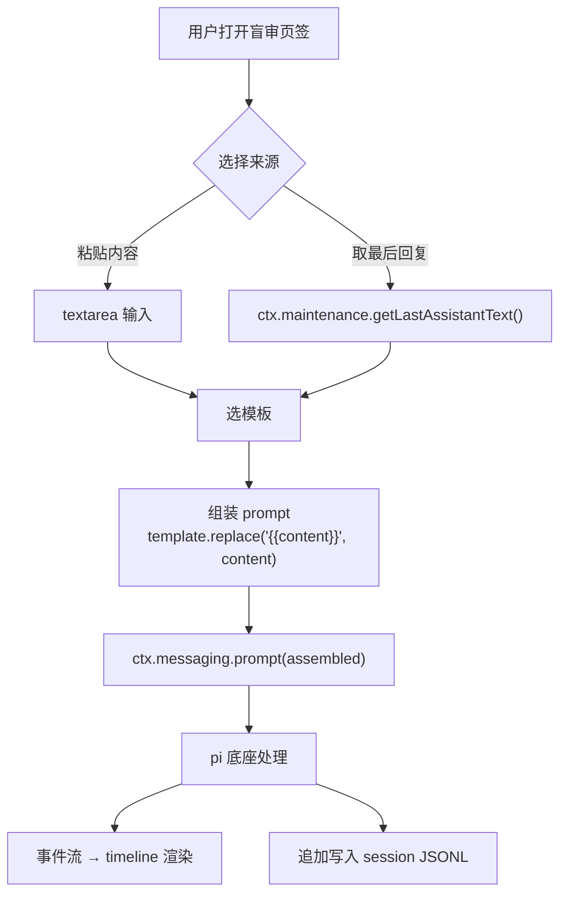

# blind-review

## 1 这个插件解决什么问题

用户在用 AI 写代码的过程中，经常需要让 AI 审查一段内容——可能是自己刚写的代码，也可能是 AI 刚给出的回复。但直接把代码丢给 AI 说"帮我看看"，AI 会带着上下文偏见做判断：它知道这是你写的、知道你在做什么项目、知道这段代码属于哪个文件。这种审查不是"盲审"，是"带背景的过目"，反馈质量打折扣。

盲审要解决的是去掉这些偏见。用户把内容粘贴进来，或者取当前对话最后一条 AI 回复，插件用一个预设的 prompt 模板把内容包进去，发到当前会话。AI 收到的是一段没有来源信息的内容和一条审查指令，它不知道这段代码是谁写的、来自哪个文件、在什么项目里。审查结果回到当前 session，保存在 JSONL 文件里，后续可管理。

prompt 模板需要可配置——不同场景关注点不同：代码正确性、安全漏洞、逻辑边界。模板支持增删改查，用户在设置页维护自己的审查清单。

## 2 参考与借鉴

Claude Code 有三个 review 命令：`/code-review`、`/review`、`/code-review ultra`。和我们的盲审最接近的是 `/review`——它做一次只读、单遍的审查，结果回到当前 session。

Claude Code 的设计有几个可借鉴的点：

- **聚焦正确性**。`/code-review` 默认只报会 break 生产的 bug，不报风格问题。它的原话是 "correctness: bugs that would break production, not formatting preferences"。我们的默认 prompt 模板沿用这个思路——只关注会导致错误的实际问题，不报主观建议。

- **高信号过滤**。`/code-review` 对每个发现打 0–100 的置信度分数，低于 80 直接过滤。它的原话是 "If you are not certain an issue is real, do not flag it. False positives erode trust and waste reviewer time." 我们的默认模板把这条纪律写进了 prompt——不确定的问题不报告。

- **模板定制**。Claude Code 用 `REVIEW.md` 文件注入审查指令，控制"查什么、什么严重度、怎么报告"。我们的对应物是 `blind-review.json` 里的 `prompts` 数组——每个模板是一段完整的审查指令，`{{content}}` 占位符标记内容插入位置。

- **结果回到 session**。`/review` 的结果出现在当前对话里，不是输出到外部文件。我们的盲审结果同样回到当前 session——`prompt()` 发的消息和 AI 的回复都追加写入当前 session 的 JSONL，用户后续可以找到这些盲审记录。

一个关键区别：Claude Code 的 review 不是"盲"的——它能看到当前 session 的对话历史和项目上下文。我们的盲审更彻底，组装 prompt 时不附带任何来源信息。这是"盲"的核心价值。

## 3 方案

### 3.1 插件结构

```
src/plugins/blind-review/
  plugin.json
  renderer/index.tsx
```

两个文件，都在 `plugins/` 层。`plugin.json` 是声明的身份证，`renderer/index.tsx` 是 UI 入口。没有 `main` 字段——盲审不需要主进程逻辑，全部能力走已有 IPC。

### 3.2 槽位贡献

插件贡献两个槽位：

```json
{
  "id": "blind-review",
  "version": "0.1.0",
  "displayName": "盲审",
  "renderer": "./renderer/index.tsx",
  "contributes": {
    "settings": [{
      "id": "blind-review",
      "title": "盲审",
      "component": "BlindReviewSettings",
      "configFile": "~/.pi-desktop/config/blind-review.json",
      "configMerge": "deep",
      "saveMode": "framework",
      "order": 50
    }],
    "sidePanel": [{
      "id": "blind-review",
      "label": "盲审",
      "icon": "eye-off",
      "component": "BlindReviewTab",
      "order": 15
    }]
  }
}
```

`settings` 槽让用户在设置页维护 prompt 模板，`configFile` 指向 `~/.pi-desktop/config/blind-review.json`，`saveMode: "framework"` 意味着框架管 save/dirty/拦截/刷新——插件只管渲染和调 `onChange` 报告改动。`sidePanel` 槽在右面板放一个"盲审"页签，图标用 lucide 的 `eye-off`。

没有 `permissions` 字段。盲审用的全是核心默认能力——`config`（配置读写）、`messaging`（`prompt()` 发消息）、`maintenance`（`getLastAssistantText()` 取最后回复）。这些不需要声明权限，所有插件都能用。

### 3.3 配置结构与 Prompt 模板 CRUD

配置文件 `blind-review.json` 的结构：

```json
{
  "prompts": [
    {
      "id": "correctness",
      "name": "正确性审查",
      "prompt": "请审查以下内容，只关注会导致错误的实际问题：编译失败、逻辑错误、类型错误、缺失的导入。不要报告风格问题或主观建议。如果不确定是问题，不要报告。\n\n```\n{{content}}\n```"
    },
    {
      "id": "security",
      "name": "安全审查",
      "prompt": "从安全角度审查以下内容：注入风险、越权、敏感信息泄露、认证缺陷。只报告高置信度问题。\n\n```\n{{content}}\n```"
    },
    {
      "id": "logic",
      "name": "逻辑审查",
      "prompt": "审查以下内容的逻辑正确性。关注：边界条件、空值处理、异常路径、并发问题。\n\n```\n{{content}}\n```"
    }
  ],
  "defaultPromptId": "correctness"
}
```

`prompts` 是模板数组，每个模板有三个字段：`id`（唯一标识）、`name`（设置页和下拉菜单显示名）、`prompt`（审查指令文本，含 `{{content}}` 占位符）。`defaultPromptId` 指向盲审面板默认选中的模板。

默认模板参考了 Claude Code `/code-review` 的纪律——聚焦正确性、高信号、不报主观建议。三个默认模板覆盖三个常见审查角度：正确性、安全、逻辑。用户可以在设置页增删改这些模板。

设置页的交互流程：

- 模板列表展示所有模板，每条显示模板名称。当前默认模板右侧显示"默认"标签（星标 + 文字），非默认模板显示"设为默认"文字按钮。
- 点击模板行展开内联编辑区——名称输入框和 prompt textarea 直接在行下方出现，再点收起。不需要弹窗或跳转到单独编辑区。
- 底部有"新增模板"按钮，点击后弹出单独的新增表单区块。
- "设为默认"是按钮，点击后直接将该模板设为默认，调 `onChange` 报告改动。当前默认模板不显示此按钮，只显示"默认"标签。
- 任何改动调 `onChange(updatedConfig)`，框架设 dirty、弹保存浮层。用户点"确定改动"后框架写回 `blind-review.json`。

CRUD 操作都是改本地 state 然后 `onChange`——插件不直接写文件，写文件是框架的事（`config-file:set` IPC，走 `configFile` 字段声明的路径）。`configMerge: "deep"` 的实际行为是：对象的顶层 key 深合并，数组整体替换（框架用的 `deepmerge` 包，`arrayMerge` 策略是 `(_target, source) => source`）。对于 `prompts` 数组，这意味着用户编辑后的完整数组会整体覆盖磁盘上的旧数组——增删改都正常工作，不会出现删除后模板"复活"的问题。

如果模板的 `prompt` 字段里不含 `{{content}}` 占位符，组装时 `replace()` 找不到匹配，内容不会被插入——prompt 照原样发出。这不是 bug，是用户的选择：有些模板可能不需要内容占位（比如纯指令型模板）。插件不强制校验 `{{content}}` 是否存在。

首次启动时 `blind-review.json` 不存在，框架的 `readJsonFile` 返回空对象 `{}`。插件检测到 `config.prompts` 为空时，使用内置的默认模板（正确性/安全/逻辑三个）填充 UI，并在首次保存时写入文件。

### 3.4 盲审面板交互

盲审面板（`BlindReviewTab`）有两个入口：



**图 1 — 盲审面板数据流**

**粘贴内容盲审**：用户在 textarea 里粘贴要审查的内容，选一个 prompt 模板，点"开始盲审"。插件用 `template.prompt.replace("{{content}}", textarea.value)` 组装完整 prompt，调 `ctx.messaging.prompt(assembled)` 发到当前会话。textarea 为空时"开始盲审"按钮禁用——空内容没有审查意义。

**对话盲审**：用户点"盲审最后回复"，插件调 `ctx.maintenance.getLastAssistantText()` 取最后一条 AI 回复的纯文本，同样组装 prompt 后 `prompt()` 发送。不需要用户选内容——内容来源是当前会话的最后一条 assistant 消息。如果当前会话没有 assistant 消息（刚打开的空会话），`getLastAssistantText()` 返回空字符串，插件检查到空值后显示"当前会话暂无 AI 回复"提示，不发送。

两种入口的区别只在"内容从哪来"——组装和发送逻辑是同一套。选模板是两种入口共有的步骤，默认选 `defaultPromptId` 指向的模板，用户可切换。

为什么用 `prompt()` 而不是 `steer()`？`prompt()` 起一个新的 agent turn，结果保存在 session 里——这正好对应用户的需求"结果就先作为一个 session，保存就好"。`steer()` 是中途插入转向消息，依赖当前正在生成的状态，语义上是"改方向"不是"发新指令"。Claude Code 的 `/review` 也是在当前 session 里发一条消息、等结果、结果回到对话——`prompt()` 是它的等价物。

`prompt()` 发到当前会话时，pi 底座会把消息追加到 session JSONL，模型在生成回复时能看到之前的对话历史。这意味着对话盲审的场景下，模型确实能看到自己之前说过的话——"盲"只在 prompt 组装层，不是技术隔离层。这是已知边界，见 §3.5。

如果用户没有打开任何会话就点"开始盲审"或"盲审最后回复"，`prompt()` 的行为取决于当前状态：有工作目录但无会话时，`prompt()` 会自动创建新会话（pi-desktop 的进程模型是"发消息即起进程"），盲审结果保存在这个新会话里；没有工作目录时，`prompt()` 抛 `"未选择工作目录"` 错误。插件应在发送前检查工作目录是否存在——从 `useUiStore` 的 `currentCwd` 读——如果为空，禁用发送按钮并提示"请先选择工作目录"。

### 3.5 盲审的"盲"

"盲"的实现很简单：组装 prompt 时不附带任何来源信息。

- 粘贴内容盲审：用户粘贴的是纯文本，不附带文件路径、项目名、作者信息。`{{content}}` 只替换为 textarea 里的文本。
- 对话盲审：`getLastAssistantText()` 只返回最后一条 assistant 消息的纯文本，不带模型名、会话名、session 元数据。

pi 底座收到的是一段 prompt + content，不知道内容从哪来。这不是技术上的隔离层——是组装逻辑层面的约定：不拼来源信息。如果用户在 textarea 里自己粘贴了带路径的内容，那是用户的选择，插件不强制脱敏。

"盲"有一个已知边界：`prompt()` 发到当前会话后，模型在生成回复时能看到 session 的对话历史。对话盲审的场景下，模型能看到自己之前说过的话——"盲"只保证 prompt 本身不含来源信息，不保证模型无法从历史上下文中推断出来源。如果要完全隔离，用户可以开一个新会话做盲审——新会话没有历史上下文，"盲"才是彻底的。这个边界在 §6 QA 里有进一步讨论。

### 3.6 结果保存

pi-desktop 的 session 就是 JSONL 文件，每条消息追加写一行。`prompt()` 发的消息和 AI 的回复都追加写入当前 session 的 JSONL 文件。盲审结果不需要额外的存储机制——它天然就在 session 里。

结果在 timeline 插件里渲染——timeline 消费 session store 的事件流，`prompt()` 触发的 `messageStart` / `messageUpdate` / `messageEnd` 事件和普通对话消息走同一条渲染链路。用户在 timeline 里看到盲审的 prompt 和 AI 的审查结果，和正常对话没有视觉上的区分——盲审的 prompt 文本本身就是辨识标志（模板里的审查指令会原样出现在时间线里），不需要额外标记。用户后续可以通过 sessions-list 插件重命名会话来标识哪些是盲审记录。

用户后续可以通过 sessions-list 插件找到这些盲审记录——session 列表按时间排列，盲审结果和正常对话混在一起。用户可以重命名、归档、删除这些 session，这些是已有功能，盲审插件不参与。

## 4 能力依赖与内核影响

盲审插件用的全部是核心默认能力，不需要声明 `permissions`：

- **`window.pi.configFile.get` / `window.pi.configFile.set`**：通用 JSON 配置文件读写。设置页的 prompt 模板 CRUD 经框架的 `configFile` 机制持久化（框架在 `settings-page.tsx` 里调 `window.pi.configFile.get` 读配置传给组件、调 `window.pi.configFile.set` 写回）。sidePanel 组件也用同一接口读配置——`window.pi.configFile.get("~/.pi-desktop/config/blind-review.json")` 拿到 `{prompts, defaultPromptId}`。
- **`ctx.messaging.prompt(text)`**：发消息到当前会话。盲审的 prompt 经此发送，结果回到 session。
- **`ctx.maintenance.getLastAssistantText()`**：取最后一条 assistant 回复的纯文本。对话盲审的内容来源。
- **框架 configFile 机制**：`saveMode: "framework"` 时，框架管读/写/dirty/reset/打开配置/刷新/拦截。设置页组件接收 `SettingsComponentProps`（`config` / `onChange` / `refreshSignal`），框架自动从 `configFile` 读配置传入、组件调 `onChange` 后框架设 dirty + 弹保存浮层。sidePanel 组件不接收 props（`ComponentType` 无 props），需自己调 `window.pi.configFile.get` 读配置。
- **`registerSettingsComponent` / `registerSidePanelComponent`**：组件注册。插件在 renderer 里调这两个函数，按 manifest 声明的 `component` 名注册组件，壳按名查渲染。`SidePanelStrip`（图标条）和 `RightPanelContent`（内容区）在 `right-panel.tsx` 里调 `window.pi.slots.sidePanel()` 拿贡献项列表，调 `getSidePanelComponent(name)` 查组件渲染。keep-alive：所有 sidePanel 组件同时挂载，`display:none` 切换可见性，切 tab 不卸载。
- **`useUiStore`**：读 `currentCwd`（检查工作目录是否存在）和 `activeSidePanelTab`（可见性门控）。sidePanel 组件在 `activeSidePanelTab === "blind-review"` 时才加载配置和发请求——keep-alive 下不可见的页签不消耗资源，和 git-review 的可见性门控模式一致。
- **timeline 插件**：盲审结果在 timeline 渲染。这是消费而非翻译——timeline 读 session store 的事件流，盲审触发的消息和普通对话走同一条链路。

零内核改动。不新增 IPC 通道、不新增权限、不修改任何已有文件。整个插件是两个新文件：`plugin.json` 和 `renderer/index.tsx`，都在 `plugins/` 层。删掉这个插件，内核照常启动，只是右面板少一个"盲审"页签、设置页少一个"盲审"配置页。盲审结果渲染复用已有的 timeline 插件（mainView 槽），不需要自己渲染结果。

## 5 改动清单

| 文件 | 操作 | 层 |
|------|------|-----|
| `src/plugins/blind-review/plugin.json` | 新增 | plugins |
| `src/plugins/blind-review/renderer/index.tsx` | 新增 | plugins |

仅两个文件，都在 `plugins/` 层。`plugin.json` 声明槽位贡献和配置文件路径，`renderer/index.tsx` 注册两个组件（`BlindReviewSettings` 和 `BlindReviewTab`）并实现交互逻辑。

## 6 QA

**Q：对话盲审时模型能看到之前的对话历史，"盲"是不是名不副实？**

"盲"指的是 prompt 组装层不附带来源信息——不拼文件路径、不拼项目名、不拼会话元数据。它不等于技术上的上下文隔离。对话盲审的场景下，`prompt()` 发到当前会话，模型在生成回复时确实能看到 session 历史里自己之前说过的话。这是已知边界，不是 bug。如果用户需要完全隔离的盲审，应该开一个新会话——新会话没有历史上下文，`prompt()` 发出的就是模型唯一能看到的东西。插件不自动开新会话，因为用户明确说"结果就先作为一个 session，保存就好"——留在当前会话是需求的一部分。

**Q：盲审结果在 timeline 里和普通对话混在一起，怎么区分？**

没有视觉区分。盲审的 prompt 文本本身就是辨识标志——模板里的审查指令（如"请审查以下内容，只关注会导致错误的实际问题"）会原样出现在时间线里，用户一眼就能认出这是盲审。如果用户想更系统地区分，可以在 sessions-list 插件里重命名会话（比如加 `[盲审]` 前缀）。插件不自动加标记，因为这会增加 timeline 渲染的复杂度，而 prompt 文本已经足够辨识。

**Q：`configMerge: "deep"` 对 prompts 数组是整体替换，那为什么不直接用 `"replace"`？**

用 `"deep"` 是因为 `blind-review.json` 除了 `prompts` 数组还有 `defaultPromptId` 字段。如果未来配置结构加了嵌套对象（比如按类别分组的 `categories`），deep merge 能保证顶层 key 级合并——改 `prompts` 不会丢 `defaultPromptId`，改 `defaultPromptId` 不会丢 `prompts`。`"replace"` 会整份覆盖，多字段场景下容易丢数据。对 `prompts` 数组而言，deep merge 的行为（整体替换数组）和 replace 效果一样，但对整个配置文件而言，deep merge 更安全。

**Q：用户删了所有模板，盲审面板会怎样？**

模板列表为空时，下拉菜单没有选项，"开始盲审"和"盲审最后回复"按钮禁用。插件不阻止用户删光所有模板——这是用户的配置自由。但盲审面板应有空态提示"请在设置页添加至少一个 prompt 模板"。

**Q：为什么不给 `fs:project` 权限，直接选文件做盲审？**

用户的需求是"直接调用 pi"和"输入直接盲审"——粘贴内容就够了。加 `fs:project` 权限意味着声明 `permissions: ["fs:project"]`、走 IPC 读文件、处理路径展开——这些对内核有侵入（新增 IPC handler 或扩展 `FsReadApi`），和"纯插件、零内核改动"的方案定位冲突。如果后续用户确实需要从文件系统选文件做盲审，可以再补 `fs:project` 的 `readFile` 能力——那是通用的 fs 缺口，不是盲审特有的。

**Q：盲审的 prompt 模板里 `{{content}}` 出现多次会怎样？**

JavaScript 的 `String.prototype.replace()` 只替换第一个匹配。如果用户在模板里写了多个 `{{content}}`，只有第一个会被替换，其余的会原样保留在发出的 prompt 里。插件不做全局替换（`replaceAll`），因为多占位符的场景不常见，且用户可能有意只替换第一个、其余留作字面量。如果用户需要全局替换，用 `replaceAll` 是一行代码的改动，留给实现时判断。

**Q：如果 pi 底座正在生成回复时用户点了盲审，会怎样？**

`prompt()` 发消息时，如果 pi 底座正在处理上一条消息，新消息会排队等待（pi 底座的 `steeringMode` 和 `followUpMode` 控制排队行为，默认 `"all"` 是所有消息都排队执行）。用户不会收到错误，盲审会在当前生成完成后执行。插件不做"pi 是否正在生成"的前置检查——`prompt()` 的排队语义已经处理了这个场景，插件层不需要重复判断。
