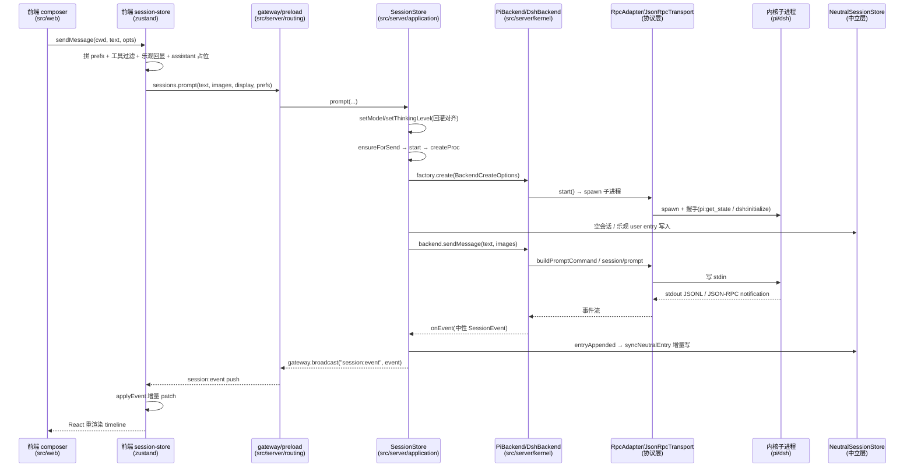
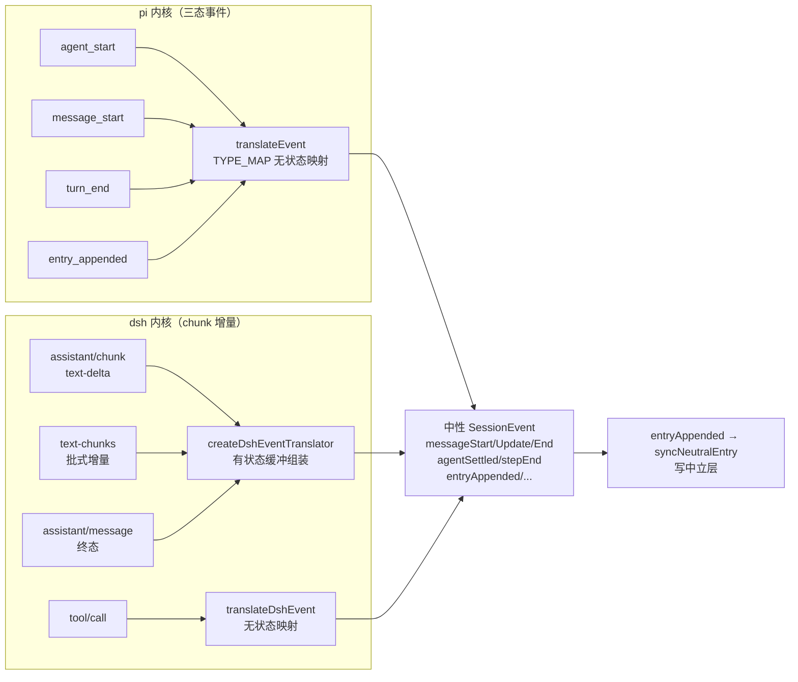
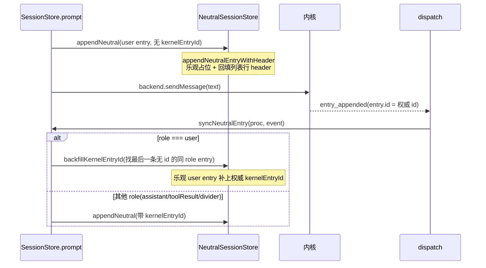
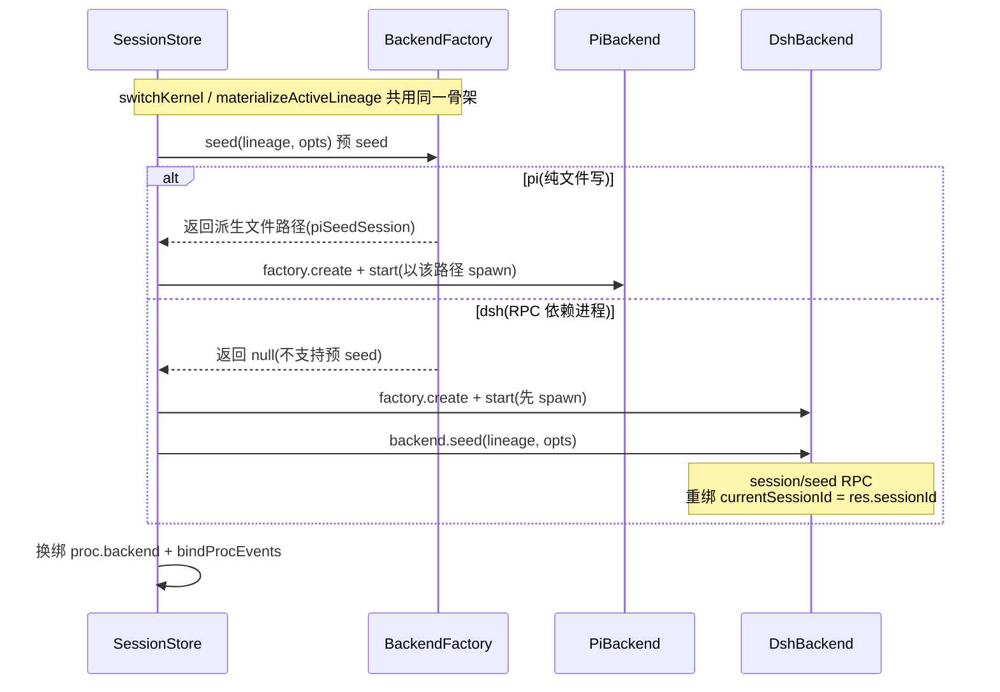

# 会话流：一条用户消息的完整生命周期

## 1 坐标系：这条消息要穿过几层

一条用户消息从输入框出发，最终变成内核生成、中性事件回推、timeline 渲染、中立层落盘，要穿过五个彼此独立的层。写这篇文档之前先把这个"层"的坐标系钉死——后面每一节都在这套坐标里引用。

- **圆心**：`packages/shared/src/domain/`，纯类型 + 纯函数，零依赖。这里定义了三样东西：中立契约 `BaseBackend`（`backend.ts`）、中性事件联合 `SessionEvent`（`events/session-state.ts`）、中立会话坐标系 `NeutralSession`（`session-neutral.ts`）。换掉 Electron、React、pi、dsh，这层一行不动。
- **壳后端**：`src/server/`，会话流编排的真相源。核心是 `application/sessions/session-store.ts` 的 `SessionStore`——它不 `new PiBackend()`，只持有 `BackendFactory` 接口（依赖倒置，§3.4）。
- **内核适配器**：`src/server/kernel/{core,pi,dsh}`，把各自内核的协议和事件形状投成中立契约。`AbstractBackend`（`kernel/core/abstract-backend.ts`）是骨架，`PiBackend` / `DshBackend` 是两个平行实现。
- **传输/协议层**：`src/server/kernel/pi/protocol/`（JSONL 31 命令）与 `src/server/kernel/dsh/protocol/`（JSON-RPC 2.0），是命令出、事件入的线协议。
- **前端**：`src/web/`，renderer。`src/web/stores/session-store.ts` 是投影镜像——只读 main 推下来的基线与增量，组件零拉取。

一条消息的完整链路，用一张全景时序图先画出来，后面逐节展开：



这张图里最容易被误读的一个点是方向：**命令是壳发向内核（stdin 下行），事件是内核吐向壳（stdout 上行）**。两条路在各自适配器里都收编成"中性契约"，壳只认中性域。下面每一层单独拆开看。

## 2 圆心契约：会话流的地基

圆心不跑任何代码路径，但它定了所有路径的形状。会话流的每一步，要么在调 `BaseBackend` 的一个方法，要么在投递 `SessionEvent` 的一个成员，要么在读写 `NeutralSession` 的一个字段。先把它读全，后面的编排才有落点。

### 2.1 BaseBackend：14 必实现 + 4 缺面默认

`packages/shared/src/domain/backend.ts` 的 `BaseBackend` 是壳向每个内核索要的最小意图集合。读它的关键不是方法列表本身，而是"哪些进契约、哪些不进"的边界。

- **六条核心意图**：消息（`sendMessage`）、中断（`abort`）、模型（`setModel`）、分支（`getTree`/`getEntries`/`bookmark`/`resume?`/`deleteBookmark`）、会话标识（`sessionId` 属性）、流式事件（`onEvent`）。这六条是换内核都不变的最小面。
- **之上的四条**：命名（`setSessionName`，第七意图）、续跑（`continue?`，第八意图）、`seed`（跨内核/跨 lineage 投影，返回内核侧会话标识）、能力探测（`capabilities`）。
- **四条缺面默认**（`AbstractBackend` 统一给默认实现）：`listTools?` 返回 null（壳走降级）、`answerQuestion?`/`continue?`/`setThinkingLevel` 抛错（不静默吞、不伪造成功）。其中 `answerQuestion?`/`continue?`/`resume?` 在接口里带 `?`（可选，dsh 覆盖、pi 不实现），`setThinkingLevel` 是必实现但 dsh 继承抛错默认——dsh 无运行时切档面，显式降级。
- **不进契约的**：pi 的 `steer`/`followUp`/`onExtensionUI`/`cycleModel`/`cycleThinkingLevel`/`getThinkingLevels`/`compact`/`exportHtml` 等，收在 `PiBackendExtensions`（`kernel/pi/backend/pi-backend-extensions.ts`），壳经 `capabilities.pi` 探测"有则用、无则降级"——绝不按 `kernel === "pi"` 硬分支。

`BaseBackend.seed` 的签名值得单独记：`seed(lineage: NeutralEntry[], opts: SeedOptions): Promise<string>`。它收的是**单条 lineage 的完整线性内容**，不是整棵树。这是"内核是单线执行器、分叉归壳"这条纪律的直接落点——内核只物化当前活跃那条 lineage，分叉结构在壳的中立层（`session-neutral.ts` 的 `lineageContent` 纯函数负责沿 fork 链拼出完整线性前缀）。

### 2.2 SessionEvent：中性事件联合

`packages/shared/src/domain/events/session-state.ts` 的 `SessionEvent` 是全部内核事件投进来的唯一目标形状。联合成员分三类：

- **流式三态**：`messageStart` / `messageUpdate` / `messageEnd`，各自携带 `message?: NeutralMessage`。这是 timeline 增量的主载体，renderer 按 `message.id` 精确 patch（不是末条替换）。
- **回合/步边界**：`agentStart` / `agentEnd` / `agentSettled`（回合），`stepStart` / `stepEnd`（单次模型调用）。跨内核语义对齐的落点：pi 的 `agent_start`/`agent_settled`/`turn_start`/`turn_end` 与 dsh 的 `turn/start`/`turn/end`/`step/start`/`step/end`，全部归一到这里。
- **工具/生命周期/杂项**：`toolCallStart`/`toolCallUpdate`/`toolCallEnd`、`entryAppended`（落盘回执）、`sessionStart`（会话确立）、`sessionInfoChanged`（改名）、`modelSelect`、`thinkingLevelChanged`/`thinkingLevelSelect`、`compactionStart`/`compactionEnd`、`queueUpdate`、`autoRetryStart`/`autoRetryEnd`。

联合末尾有一个宽松兜底成员 `{ type: string; [key: string]: unknown }`。这不是偷懒——它让 `case` 判别不自动窄化，消费方必须显式收窄（session-store 和 renderer 都各自写注释说明这一点），同时内核新增事件类型时不丢数据。

### 2.3 NeutralSession：中立会话坐标系

`packages/shared/src/domain/session-neutral.ts` 是"会话身份中立化"的另一半。它把消息、事件、树形投影都中立了之后，把会话身份和锚点也从内核私有里抽出来。

- **`NeutralSession`**：`{ neutralSessionId, header, lineages[] }`。`neutralSessionId` 是壳生成的 UUID，跨内核稳定，是列表/书签/分组的唯一主键——不再是 pi 文件路径或 dsh 子会话 id。
- **`NeutralLineage`**：`{ lineageId, fork, entries[] }`。`fork = { parentLineageId, boundaryEntryId } | null`，根 lineage 的 fork 为 null。`boundaryEntryId` 是中立 entry id（`{lineageId}:{seq}`），不是内核私有 boundary。
- **`NeutralEntry`**：`{ neutralEntryId, kernelEntryId?, message, display? }`。`neutralEntryId` 是稳定跨内核坐标；`kernelEntryId` 是内核私有 entry id（仅 adapter 用）；`display` 是展示元数据（图），**永不进 AI 投影**——发送时过滤，只在中立层维护。
- **纯函数族**：`appendNeutralEntry`（追加）、`appendNeutralEntryWithHeader`（追加 + 回填列表行 header）、`backfillKernelEntryId`（乐观写入后回填权威 id）、`upsertNeutralLineage`（fork 切分支）、`lineageContent`（沿 fork 链拼完整线性内容）、`sortLineagesTopologically`（父先于子）、`resolveForkBoundaries`（私有 boundary → 中立 id 归一）、`emptyNeutralSession`、`derivedHeaderFromEntry`/`derivedHeaderFromSession`（派生列表行字段）。这些是"kernel 版本"的增改纯函数，session-store 读 → 应用 → 写回，不 mutate 持久化对象。

### 2.4 KernelEvent：运维流

`packages/shared/src/domain/events/kernel-event.ts` 的 `KernelEvent` 是比 `SessionEvent` 更宽的联合，覆盖四条信息流：内核推送（`SessionMessageEvent`，`kind:"session"`）、提问请求（`QuestionRequestEvent`）、进程退出（`ProcessExitEvent`）、RPC 错误（`RpcErrorEvent`），外加桌面自产的 `KernelChangedEvent`（跨内核切换完成）和 `CapabilityDegradedEvent`（dsh 懒探测缺面）。renderer 的视图渲染走 `onEvent`（激活会话的中性事件），列表刷新/统计/重启协调走 `onKernelEvent`（全量带 `sessionKey` 归属）。

## 3 壳后端：SessionStore 编排核心

`src/server/application/sessions/session-store.ts`（1985 行）是会话流的编排核心。它不碰任何内核存储、不拼任何内核专属 spawn 参数，只做一件事：把"发消息/中断/切模型/分叉/读 lineage"这些意图，调度到正确的内核槽位上，再把内核吐回的中性事件路由到正确的地方。

### 3.1 进程模型：每会话一进程、多会话多进程、多内核多槽位

`SessionStore` 的核心数据结构是 `procs = new Map<string, Map<KernelId, SessionProc>>()`。外层 key 是会话（`sessionPath` / `new:${cwd}` / `bus:${uuid8}` / `test:${uuid}`），内层 key 是内核，值是 `SessionProc`。

- **多会话并存**：看会话读文件不启进程；发消息按需起该会话的进程；`start`/`ensureForSend` 只起目标会话的目标内核，**不杀其他会话的进程**。
- **多内核多槽位**：一个会话可以同时存在 pi 槽位和 dsh 槽位（`Map<KernelId, SessionProc>`），`activeKernel` 只决定"哪个槽位参与会话流"，不是"替换另一个槽位"。
- **进程是临时工**：进程动作全在发送路径上；启动/关闭不阻塞展示。`setContext` 只设激活，不抢跑起进程。

`SessionProc` 是一个字段密集的运行时条目，字段语义必须记准（注释里大量根因都指向这些字段）：

- `backend`（中性后端）、`kernel`（会话当前内核）、`neutralSessionId`（中立主键，壳生成跨内核稳定）、`cwd`、`key`（procs 当前 map key）、`boundSessionPath`（内核侧会话文件路径，满足 `key === boundSessionPath` 不变量）。
- `genStartMs`/`lastTps`/`roundOut`/`roundGenSec`：TPS 自算四件套——`agentStart` 清零，`messageEnd` 累加，`lastTps = roundOut/roundGenSec`（一轮多条 assistant 消息时是加权速率，不定格在最后一条的瞬时速率）。
- `turn`/`lastTurn`/`turns`/`steps`：轮次用量累计——`agentStart` 归档到 lastTurn 并清零，`messageEnd` 累加；`turns` 数 `agentSettled`，`steps` 数 `stepEnd`。
- `lastPromptAnchorReal`：最后一条带 usage 的 assistant 是否真测到 prompt（`input+cacheRead+cacheWrite>0`），false 时 `getStats` 用 context-probe 实测兜底。
- `touched`：是否已落会话内容，多会话并存保护（未 touched 的空壳进程可被 `setContext` 回收）。
- `pendingModelPrefs`：文件未落盘时的模型偏好降级账，首个 `messageStart` 补写清账。
- `configSnapshot`：spawn 时记录的 models.json/settings.json（或 cordis.yml/settings.yaml）mtime，复用前校验，变了进程过期重建。
- `role`：会话级角色卡，`switchKernel` 重注入 systemPromptTexts 用。
- `lastModelRef`：最近一次 setModel 的中立模型引用，跨切换模型中立化的持久载体（dsh 无快照面，不能读 `latestSnapshot`）。
- `model`：进程创建时绑定的 provider/modelId（dsh 模型只能在 initialize 握手定，`ensureForSend` 复用时比对，变了停旧起新）。
- `activeLineageId` / `materializedLineageId`：当前活跃 lineage 的中立 id 与内核当前物化的 lineage id——两者不等（fork 后）时，`prompt` 先 seed 再发。

### 3.2 依赖倒置：四件注入物

`SessionStore` 的构造器收七个参数，其中四个是接口/函数注入，`bootstrap/assemble.ts` 组装时绑定。这条是"壳后端不 import 具体内核"的物理保证：

- `factory: BackendFactory`——`create(BackendCreateOptions)` 返回 `BaseBackend`；`seed?` 预 seed（pi 纯文件写、dsh 返回 null）。内核专属 spawn 参数（cliPath/cordisConfig/apiKey）在 `assemble.ts` 的工厂闭包里捕获。
- `catalogFactory: SessionCatalogFactory`——`create(kernel)` 返回 `SessionCatalog`，目录/CRUD 委托，壳不读内核存储。
- `agentDir`——pi 会话根目录，shell 注入，application 不直读 `process.env.HOME`。
- `getSystemPromptPaths`——spawn 时拉取系统提示文件路径（插件贡献的 systemPrompts 槽项）。
- 可选三项：`neutralStore`（中立会话树持久化）、`modelCatalog`（模型合流）、`bookmarkDir`（收藏快照目录）。

### 3.3 dispatch：事件路由核心

`dispatch(key, event, kernel)` 是 main 进程事件路由的唯一收口点，闭包按 `proc.key` 路由（不捕获创建期 key，`rekeyProc` 迁移后事件仍按当前 key 进 dispatch）。它做四件事，顺序固定：

1. **`sessionStart` 捕获**：从事件取 `sessionFile`，更新 `proc.boundSessionPath`；仅当 `key === activeProcKey` 才同步更新 `activeSessionPath`（背景会话的 sessionStart 不得改写激活路径）。
2. **`entryAppended` 上行同步**：调 `syncNeutralEntry(proc, event)`，把 AI 生成内容增量写进中立层（§7）。
3. **busy/TPS/轮次记账**：`agentStart`/`autoRetryStart`/`compactionStart` 设 `busyStates.set(key, true)`；`agentSettled`/`compactionEnd`/`autoRetryEnd(success!==true)` 设 false；`messageStart` 记 `genStartMs` 并补写 `pendingModelPrefs`；`messageEnd` 算 tps + 累加 turn usage；`stepEnd` 累加 steps；`sessionInfoChanged` 增量 patch `latestSnapshot.state.sessionName`。
4. **三路路由**：运维流（`dispatchKernel`，激活全量、后台只转非流式生命周期事件白名单，排除 `messageUpdate`/`toolCallUpdate` 两个 token 级刷屏源）→ `keyedListeners`（带 key）→ 视图流（`listeners`，**只转激活会话**，`key !== activeProcKey` 就 return）。

第 4 步的"激活会话过滤"是根因修复：此前 `messageEnd` 全转发，renderer 无 key 可用，会用别的会话的消息覆盖当前视图末条、用背景会话的 `agentSettled` 提前熄掉 streaming。现在视图流只进激活会话，后台会话事件只能进运维流。

## 4 发送链路：composer → prompt → ensureForSend → start → sendMessage

这是本次任务的主链路。分两段讲：renderer 侧（composer → store）和 main 侧（prompt → 内核）。先画一张发送链路的流程控制图，把"哪一步会起进程、哪一步会写中立层、哪一步是能力探测"钉死：

```mermaid
flowchart TD
    A[composer 输入框] --> B[store.sendMessage<br/>拼 prefs + 工具过滤]
    B --> C{有 currentSessionPath?}
    C -- 无 --> D[startNewChat<br/>setContext(cwd, null)]
    C -- 有 --> E[乐观回显 user + assistant 占位]
    D --> E
    E --> F[window.kernel.sessions.prompt]
    F --> G[SessionStore.prompt]
    G --> H{prefs.provider+modelId?}
    H -- 是 --> I[setModel → ensureForSend 起进程]
    H -- 否 --> J[读中立头偏好兜底]
    I --> K{prefs.thinkingLevel 且 capabilities.pi?}
    J --> K
    K -- 是 --> L[setThinkingLevel 差量执行]
    K -- 否 --> M[拿 proc + materializeActiveLineage]
    L --> M
    M --> N{非 pi 且 neutralHasHistory?}
    N -- 是 --> O[backend.continue 恢复磁盘日志]
    N -- 否 --> P[appendNeutral 乐观写 user entry]
    O --> P
    P --> Q[backend.sendMessage]
    Q --> R[dispatch sessionStart + 自动命名]
    R --> S[内核生成 → 事件回推]
```

这张图里最关键的一条分支是 `H → I → K`：`setModel` 内部走 `ensureForSend` 起进程，所以**进程是在"模型对齐"这一步按需起的，不是在 composer 点击瞬间起的**——内核是模型的派生量，选模之前不起任何内核进程。

### 4.1 renderer 侧：`sendMessage` 的唯一受管写口

`src/web/stores/session-store.ts` 的 `sendMessage(cwd, text, opts)` 是"发一条用户消息"的唯一受管写口——composer/rewind/notes 都经它，不各自复制发送序列。完整序列：

- **模型/思考强度对齐（atomic-send）**：三级来源拼一个 `SessionModelPrefs`——`ui.sessionModelPending[pendingKey]`（用户刚选的，最高）> 会话头读回（`readHeaderPrefs`）> `getFallbackModel()`（新会话无 pending 时显式对齐默认/首项模型）。拼好后**一次传给 main 的 `prompt`**，不再 renderer 逐条 `setModel`/`setThinkingLevel`/`sync`。
- **工具过滤**：读生效的 `toolConfig.enabledToolIds`，若 tool-gate 未装（`fitPiExtensionAvailable` 为假），把 `[System] 本次会话已限制可用工具...` 注入正文（`buildToolLimitNote`），`stripToolLimitNote` 在渲染层剥除。
- **乐观回显 + assistant 占位**：`appendOptimisticUser`（带 `__sendText`/`__optimistic` 标记）→ `appendPendingAssistant`（`pending:true, content:""` 消除空窗）。
- **发送**：`window.kernel.sessions.prompt(sendText, undefined, imageOpt?, prefs)`。
- **失败诚实收尾**：prompt 抛错（回灌失败）时撤掉乐观回显和空占位，返回 `{ ok:false, reason:"modelPrefs", error }`——不留"已发出"假象，输入框未清可重发。
- **成功才消费意图**：`clearSessionModelPending` + `lastSendNonce` 递增（timeline 订阅它做"发送后滚底清未读"）。

`__sendText` 这个字段是关键：echo/send 双形态下乐观回显的正文与实发正文不同（工具前缀注入），全文匹配会失配——`__sendText` 存实发全文，与内核回放/落盘 entry 精确对齐，`applyEvent` 的 user 分支用它双轨匹配去重。

### 4.2 main 侧：`prompt` 的编排

`src/server/application/sessions/session-store.ts` 的 `prompt(text, images?, display?, prefs?)` 是发送路径的 main 侧编排。顺序固定，注释里反复强调"回灌编排先于拿 proc"：

- **偏好兜底**：无显式 prefs 时读中立层会话头的模型域（`parseSessionModelPrefs`），覆盖"重开历史 dsh 会话再发"拿不到模型的场景；查无实据（全新会话未选模型）保持 prefs 为空 → 下方"会话未启动，请先选择模型"显式报错，**不静默回落任何内核**。
- **模型对齐**：`prefs.provider && prefs.modelId` → `setModel(provider, modelId, prefs.kernel)`。`setModel` 内部 `ensureForSend` 起进程。
- **强度对齐**：`prefs.thinkingLevel && activeProc()?.backend.capabilities.pi` → `setThinkingLevel`。关键在能力探测——只对支持运行时切档的内核（pi）生效，dsh 的 reasoningEffort 在 initialize/settings.yaml 定、无运行时 RPC，发送路径跳过而非抛错；显式切档 IPC 仍走契约抛错显形。
- **拿 proc + 惰性物化**：`materializeActiveLineage(proc)`（fork 后活跃 lineage 未物化时先 seed 投影再发）。
- **重开历史 dsh 续聊**：`!capabilities.pi && neutralHasHistory(proc)` → `backend.continue?.()`。dsh 的 session/prompt 只新建空会话、不加载磁盘日志，重启后重开旧会话直接 prompt 撞 id collision，须先 continue 恢复；旧运行时缺 session/continue 则记缺面 + 降级为原路径（id collision 以其原错误显形）。
- **中立层先写 user entry**：`appendNeutral(proc, { neutralEntryId:"", message:{role:"user", content:text}, display })`——展示元数据（图）归中立层，不进后端投影。
- **发送**：`await proc.backend.sendMessage(text, images)`；`proc.touched = true`。
- **水合 + 自动命名**：`dispatch(activeProcKey, { type:"sessionStart", sessionFile: activeSessionPath })` 推给 renderer；`!latestSnapshot?.state.sessionName` 时 `backend.setSessionName(truncateSessionName(text))` + 写中立 header。

### 4.3 `ensureForSend`：发送前的进程保证

`ensureForSend(kernel, provider?, model?)` 是"唯一会起进程的入口"。它的判据链：

- **切换互斥**：`this.switching` 时抛"内核切换进行中"。
- **进程复用判据**：该内核进程已活、配置未过期（`isConfigStale` 逐项比对 mtime）、模型未失配 → 直接复用。**模型失配分内核**：pi 支持运行时切模（稍后 `backend.setModel` 差量执行，不重启）；dsh 模型在 initialize 握手定死——失配（含进程未记录模型的未知态）必须停旧起新，否则用户选的模型被旧进程握手模型截胡。
- **配置过期/模型失配需重启**：只停该内核旧进程，重起带新模型。
- **新会话**：经目标内核 catalog 问"要不要预生成会话标识"——`catalog.newSessionId(cwd)`（pi=新文件路径，文件名即新 ns）；返回 null（惰性内核如 dsh）则 `catalog.projectionPath(cwd, randomUUID())` 派生投影地址（新 ns 即投影地址，与中立主键同源，保证 start 的 ns 反查、renderer 水合、列表投影路径三者一致）。
- **生成即水合**：新会话路径生成后立即 `dispatch(activeProcKey, { type:"sessionStart", sessionFile: sessionPath })` 推给 renderer——此前水合只在 prompt 发送成功后做，pref flush（setModel/setThinkingLevel 走 ensureForSend）先于 prompt 起了进程却没水合，导致 sendText 仍判 currentSessionPath=null 二次 startNewChat 双 spawn。
- **start + 并发收尾校验**：`start(...)` 后若 `activeSessionPath` 被并发 setContext 换走，抛"发送期间会话上下文已切换"。

### 4.4 `start` → `createProc` → `bindProcEvents`

`start(cwd, sessionPath?, role?, skipResolve?, kernel?, provider?, model?)` 是起进程的编排：

- **内核读回**：`resolveSessionKernel(sessionPath, ns)`——中立 `header.kernel` > model 域 kernel > 会话头 `custom.kernel`，读不到即报错（内核=模型的派生量，查无实据不静默落 pi）。`skipResolve`（fork 中间副本）不读回，调用方必须显式传 kernel。
- **多槽位并存**：`kernels.set(resolvedKernel, proc)`，不替换其他内核的进程。
- **并发护栏**：`start` 的 await 窗口内若并发 setContext 把 activeProcKey 切走，`sync` 前检查 `activeProcKey !== key || activeKernel !== resolvedKernel` 则跳过视图同步（进程保留给多会话/多槽位并存）。

`createProc` 是唯一装配入口（start/restart 共用，restart 不再另抄一份丢了 onQuestion/onProcessExit）：

- **中立主键**：`neutralSessionId ?? randomUUID()`；**创建即写空中立会话**（`emptyNeutralSession`），"开始但未发言"的会话也进中立层，list 读中立层才不漏。
- **factory.create**：传 `BackendCreateOptions`（cwd/agentDir/kernel/neutralSessionId/provider/model/systemPromptPaths/systemPromptTexts/ephemeral），不拼内核专属 args。
- **构建 SessionProc**：字段初始化 + `bindProcEvents`。

`bindProcEvents` 绑定事件通道，createProc 与 switchKernel 重绑共用：

- `backend.onEvent((event) => this.dispatch(proc.key, event, proc.kernel))`——中性事件流总是绑。
- `dsh.onMissing`（`capabilities.dsh.onMissing`）→ `dispatchKernel({ kind:"capabilityDegraded", sessionKey, method })`。
- pi 专属通道经 `capabilities.pi` 类型守卫只绑 pi 后端：`onBusFrame`（$bus 帧转发总线路由器）、`onQuestion`（extension_ui 帧翻译成中性提问）、`onProcessExit`（进程退出广播）。

## 5 内核适配器：pi

pi 内核走 JSONL 线协议，31 命令闭联合。`PiBackend`（`src/server/kernel/pi/backend/pi-backend.ts`）把 RpcAdapter + 命令构造 + 会话文件编排收编成一个 `BaseBackend` 实现。

### 5.1 协议：JSONL 31 命令

`src/server/kernel/pi/protocol/rpc-types.ts` 是 pi 协议类型镜像（re-declare，不 import pi 包，保持自洽）。`RpcCommand` 是 31 个命令的闭联合：`prompt`/`steer`/`follow_up`/`abort`/`new_session`/`get_state`/`set_model`/`cycle_model`/`get_available_models`/`set_thinking_level`/`cycle_thinking_level`/`get_available_thinking_levels`/`set_steering_mode`/`set_follow_up_mode`/`compact`/`set_auto_compaction`/`set_auto_retry`/`abort_retry`/`bash`/`abort_bash`/`get_session_stats`/`export_html`/`switch_session`/`fork`/`clone`/`get_fork_messages`/`get_entries`/`get_tree`/`get_last_assistant_text`/`set_session_name`/`get_messages`/`get_commands`/`reload`。

`commands.ts` 提供 `build*Command` 类型化构造器（构造与执行分开）：`PiBackend.sendMessage` 调 `buildPromptCommand`，`abort` 调 `buildAbortCommand`（带 8 秒超时），`setModel` 调 `buildSetModelCommand`。`AgentSessionEvent` 是宽松联合 `{ type: string; [key: string]: unknown }`——stdout 推的事件流，按 type 区分。

### 5.2 传输：RpcAdapter + RequestCorrelator

`src/server/kernel/pi/backend/rpc-adapter.ts` 消费 `SubprocessHandle` 收发 JSONL。`handleLine` 对每行 JSON 分类：

- **`extension_ui_request`** 优先（内核在阻塞等待用户交互）：启动 60 秒超时计时器，转发 `extUiListeners`，超时自动回 `cancelled:true`。
- **`response`**（带 id）→ `RequestCorrelator` 配对 resolve/reject。**success:false 必须 reject 而非 resolve**——`RpcCommandError` 带内核原文（如 "Invalid entry ID for forking"）。
- **`extension_ui_response`** 回声忽略。
- **`$bus === true`** → `dispatchBusFrame`（Session Bus 上行帧，转路由器）。
- **其余** → `AgentSessionEvent` 转发 `eventListeners`。

`RequestCorrelator`（`correlator.ts`）是 id 配对工具：`register` 分配递增 id + 存 pending + 定时器，`resolve`/`reject` 按 id 配对，`rejectAll` 进程退出时一次性 reject。`RpcTimeoutError` 带结构化 `code:"timeout"`，下游按 err.code 判定不靠中文 substring。

### 5.3 事件翻译：translateEvent 一刀

`src/server/kernel/pi/protocol/event-translator.ts` 的 `translateEvent(piEvent)` 用静态 `TYPE_MAP` 把 snake_case → camelCase：`agent_start→agentStart`、`agent_settled→agentSettled`、`turn_start→stepStart`（pi 的 turn = 一次模型调用 ≈ dsh 的 step，故映射 stepStart 而非 turnStart，语义对齐）、`tool_execution_start→toolCallStart`、`entry_appended→entryAppended` 等 22 条。

- **消息载体事件**：`messageStart`/`messageUpdate`/`messageEnd` 对 message 字段做 `withNormalizedToolCalls(withErrorState(msg))`——失败消息归一 error 标记，工具调用 `arguments`→`args` 别名（与文件读路径同规则）。
- **`session_info_changed`**：内核字段 `name` → 契约 `sessionName`，空名规约 undefined。
- **未识别 type 原样透传**（`TYPE_MAP[piEvent.type] ?? piEvent.type`）。

### 5.4 基线：resync

`src/server/kernel/pi/backend/resync.ts` 的 `resync(rpc)` 并发拉 `get_state` + `get_entries` + `get_tree` + `get_commands` 四个 RPC，组装 `SyncSnapshot`（中性类型）。`context-binding.ts` 做 RPC 对象 → 中性类型映射（`toSessionState`/`toMessageEntry`/`toTreeNode`/`toCommandItem`/`toModelInfo`/`toSessionStats`）。`sessionEntryToNeutral`（圆心）把 pi 条目映射成 timeline 消息，`deduplicateAdjacent` 去重。

### 5.5 seed：piSeedSession 纯文件写

`PiBackend` 文件顶部导出的 `piSeedSession(agentDir, cwd, lineage, opts)` 是 pi 的 seed 投影**纯函数**——不 spawn、不 RPC，只写 JSONL 文件：

- 路径 = `piDerivedSessionPath(agentDir, cwd, lineageId)`（`pi-catalog.ts`），幂等：同 lineage → 同路径，seed 两次覆盖写同文件。
- 首行 `{ type:"session", id, timestamp, cwd, custom-my-harness-desktop:{kernel} }`。
- 每条 entry（过滤 role 为 user/assistant/toolResult）写成 `{ type:"message", id, timestamp, message, parentId }`，`parentId` 指向前一条 id——**parentId 退化成"前一条的 id"（一条直线）**，因为内核是单线执行器，分叉结构在壳。

`PiBackend` 的关键语义：

- `start()` 内嵌就绪探测：内核跑通后发 `get_state` 探测（150ms 实证探测，4s 上限），`start` 返回即就绪，不再另做 waitReady。
- `onEvent`：`adapter.onEvent((event) => cb(translateEvent(event)))`。
- `continue()`：pi 无语义化 continue，适配器翻译成 `followUp("继续未完成的工作...")`（§7.6 适配器翻译）。
- `setThinkingLevel`：override 契约方法，翻译成 `set_thinking_level` RPC。
- `bookmark`/`deleteBookmark`：只存中立坐标 `{ lineageId, entryId }`，不拷贝副本（副本机制已去）。
- `getTree`/`getEntries`：纯文件读（`piReadSessionTree`/`piReadSessionEntries`），记录 `sessionFile`。
- `capabilities = { pi: this as PiBackendExtensions }`——pi 扩展面经此探测。

## 6 内核适配器：dsh

dsh 内核走 JSON-RPC 2.0 行传输，会话是扁平 append-only 事件流，fork 是 session forest。`DshBackend`（`src/server/kernel/dsh/backend/dsh-backend.ts`）把这些投影到 `BaseBackend` 中性契约上。

### 6.1 协议：JSON-RPC 2.0 + DSH_METHODS 方法名单源

`src/server/kernel/dsh/protocol/json-rpc.ts` 是 JSON-RPC 2.0 行传输：`request`（带 id 配对）、`notify`（无 id fire-and-forget）、`onNotification`（服务端推的 `session.event`）。`handleLine` 分类：带 id 无 method → response 配对；带 method 无 id → notification 分发。`DshRpcError` 带 code/method，命令级失败抛出。

`src/server/kernel/dsh/protocol/dsh-methods.ts` 是方法名单源（契约单源）：`initialize`/`session/abort`/`session/continue`/`session/prompt`/`session/seed`/`session/getTree`/`session/getEntries`/`session/bookmark`/`session/resume`/`session/rename`/`session/setModel`/`session/title` 等 18 个方法名，收成 `DSH_METHODS` 常量——此前散在 client/dsh 各文件的魔法字符串里。

### 6.2 传输与握手：initialize

`DshBackend.start()` 起传输 + `initialize` 握手（带 cwd/provider/model/maxTokens）。握手带重试：settings-file 插件的 settings.yaml 是异步 init，initialize 可能赶上 "no adapter registered"（瞬时）——短延迟重试，上限 10s；非该瞬时错误立即外抛。

### 6.3 懒能力探测：dsh-capability-gate

`DshBackend` 做懒探测——按需调 `session/*` 方法，捕获 "unknown DeepSeek Harness SDK runtime method" 记为缺面、转成清晰错误 `dsh 内核版本过旧,缺少 ${method} 方法`。`requestSession` 统一封装：已知缺面直接抛；未知则调用，首次 unknown method 记缺面 + 广播 `capabilityDegraded`。`capabilities.dsh = { missing: ReadonlySet<string>, onMissing }`，壳据此显式降级，不裸炸、不静默吞。

### 6.4 事件翻译：translateDshEvent + createDshEventTranslator

这是 pi/dsh 差异最大的地方（§9.1 详述）。分两层：

- **无状态 `translateDshEvent`**（单事件 → 单中性事件或 null）：dsh 事件外壳是 `{ type, seq, time, data, surfaceOp? }`，payload 统一在 `data` 字段下。映射表：`turn/start→agentStart`、`turn/end→agentSettled(reason)`、`step/start→stepStart`、`step/end→stepEnd`、`user/message→messageEnd(user)`（仅 `source.kind==="user"`，过滤系统上下文注入）、`assistant/message→messageEnd(assistant+usage)`、`assistant/chunk finish-error→messageEnd(error)`、`tool/call→toolCallStart`、`tool/result→toolCallEnd`、`compaction/start+end→compactionStart/End`、`llm/retry→autoRetryStart`、`session/title→sessionInfoChanged`。丢弃 log-only 的 todo/write、request/header 等。
- **有状态 `createDshEventTranslator`**（单事件 → 0~N 中性事件）：在其上叠加 `assistant/chunk` 流式组装 + `assistant/message` 收尾清缓冲。

### 6.5 seed：buildDshSeedSession + session/seed RPC

`DshBackend` 文件顶部导出 `buildDshSeedSession(lineage, opts)`——把 forkless 的线性 `NeutralEntry[]` 重新包回 dsh 运行时 `session/seed` 要的"单 lineage 树"（`NeutralSessionWire` mirrors desktop 的 `NeutralSession`，`session` 参数是树不是线性数组）。`DshBackend.seed` 发 `session/seed` RPC（`sessionId = lineageId`，`session = 树`），**重绑 `currentSessionId = res.sessionId`**——不重绑则首切 pi→dsh 后所有消息发到构造时的桶名会话。

## 7 事件翻译成中性事件：三刀

三条翻译链，每刀各管一件事，最终都汇入同一套 `SessionEvent`。pi 和 dsh 的翻译形状差异，用一张对比图先看清"无状态映射"和"有状态组装"的分界：



左边 pi 是纯 type+字段映射（`translateEvent`），右边 dsh 要叠加一个按 `(turn, step)` 缓冲的有状态翻译器（`createDshEventTranslator`），两者最终都投进同一套 `SessionEvent`，壳只认这一套。

### 7.1 第一刀：pi 的 translateEvent（无状态映射）

§5.3 已述。pi 的事件是"三态"（messageStart/Update/End），翻译是纯 type + 字段映射，无跨事件状态。

### 7.2 第二刀：dsh 的 translateDshEvent（无状态映射）

§6.4 已述。dsh 的事件是"chunk 增量"，token 级流式需有状态组装。

### 7.3 第三刀：dsh 的 createDshEventTranslator（有状态流式组装）

`src/server/kernel/dsh/backend/dsh-event-translator.ts` 的 `createDshEventTranslator()` 返回一个带跨事件状态的翻译器，`DshBackend` 每会话进程持一个实例：

- **缓冲**：`streams: Map<key, DshStreamBuffer>`，key = `${turn}:${step}`（dsh 的 chunk 无 message id，只能按 step 关联）。`DshStreamBuffer` 含合成占位 id、累计 text、累计 thinking、`started` 标记、`anchorTs`。
- **增量载体**：两种都必须接——`assistant/chunk` 的 `text-delta`/`reasoning-delta`（单条）+ 顶层批式 `reasoning-chunks`/`text-chunks`（`data.texts` 增量数组，多数 token 走这条）。
- **pushDelta**：累加增量，首增量发 `messageStart`（带 `timestamp = anchorTs`），后续发 `messageUpdate`（**不带 timestamp**）。不带 timestamp 的原因：renderer 的 `withStreamTiming` 把流式期 timestamp 挪成 startedAt，messageUpdate 若再带最新 chunk 时间，startedAt 会被每次更新前移 → 思考计时反复归零。
- **block-end 校正**：该块权威全文校正缓冲（只补不缩，全文更短说明是旧块）。
- **assistant/message 收尾**：真实 id + 全量 content → `messageEnd`，清缓冲，把 `anchorTs` 写进 `message.timestamp`（持久化思考时长——重开会话后"完成-开始"的思考时长仍可算）。error 终态不补。
- **withNeutralEntry 补面**：消息终态（带权威 id）时多投一个 `entryAppended`，让 dsh 的 assistant 回复经同一条路（syncNeutralEntry）收敛进中立层——此前 dsh 无此面，assistant 回复从不进中立层，重开会话缺回复、列表 lastMessage 停在用户语。

## 8 中立层增量写：appendNeutralEntry / backfillKernelEntryId

中立层是壳自己的存储（`NeutralSessionStore`，`src/server/application/sessions/neutral-session-store.ts`，JSON 整读整写）。它是"壳不读内核存储"这条不变量的最终落地——壳读自己的中立存储，不读 pi 文件/dsh 日志。用户消息"乐观写 → 权威回填"的两段式，用一张时序图钉死：



这张图的核心是"两段式"：user 消息先乐观写（无权威 id），内核落盘回执后 `backfillKernelEntryId` 补权威 id；assistant 消息由流式事件先渲染（占位 id），等 `entry_appended` 回执换权威 id。两条路径的 id 来源不对称，但都收敛到同一个 `kernelEntryId` 字段。

### 8.1 乐观写 user entry（prompt 内）

`prompt` 里在 `backend.sendMessage` **之前**调 `appendNeutral(proc, { neutralEntryId:"", message:{role:"user", content:text}, display })`——用户消息乐观写入，不等内核回执。`appendNeutral` 读 → `appendNeutralEntryWithHeader` 纯函数 → 写回，同时回填列表行 header（lastMessage/lastEntryId/updatedAt）。

### 8.2 权威回填 kernelEntryId（syncNeutralEntry 内）

`dispatch` 在 `entryAppended` 事件上触发 `syncNeutralEntry(proc, event)`：

- 取 `event.entry.id` 为 `kernelEntryId`，`sessionEntryToNeutral(raw)` 得消息。
- **user role**：`backfillKernelEntryId(cur, activeLineageId, kernelEntryId, "user")`——按"lineage 内最后一个 kernelEntryId 缺失且同 role"的 entry 定位，回填权威 id。这正是乐观写那一条，用内核回执的权威 id 补上 `kernelEntryId`。
- **其他 role**（assistant/toolResult/divider）：`appendNeutral` 直接 append（`{ neutralEntryId:"", kernelEntryId, message: msg }`）。

`backfillKernelEntryId` 的纯函数逻辑在 `session-neutral.ts`：从后往前找第一个 `kernelEntryId === undefined && message.role === role` 的 entry，替换它。这是"乐观写 → 权威回填"两段式的核心——先占位，内核落盘后补权威 id（书签/fork/patch 的稳定锚点）。

### 8.3 为什么分两段：id 的来源不对称

`NeutralMessage.id` 的来源（`session-state.ts` 注释）：持久化条目 = JSONL 行级 entryId（`sessionEntryToNeutral` 提升）；流式事件 = 内核 AgentMessage 无 id，由 `entryAppended` 事件事后水合；renderer 本地乐观回显/占位用 `crypto.randomUUID()`。所以 user 消息先乐观（无权威 id），等内核 `entry_appended` 回执补权威 id；assistant 消息由流式事件先渲染（占位 id），等 `entry_appended` 回执换权威 id。

## 9 前端事件推送与水合

main 的事件推给 renderer 的通道在 `bootstrap/assemble.ts` 收口：

- `sessionStore.onEvent((event) => gateway.broadcast("session:event", event))`
- `sessionStore.onKernelEvent((event) => gateway.broadcast("session:kernelEvent", event))`
- `sessionStore.onQuestion((req) => gateway.broadcast("session:question", req))`
- `sessionStore.onSnapshot((snapshot) => gateway.broadcast("session:snapshot", snapshot))`

`gateway.broadcast`（`src/server/routing/gateway.ts`）对每个已鉴权连接发 push（本地窗口与远程浏览器同路）。renderer 经 preload 桥 `window.kernel.sessions.*` 收到。

### 9.1 基线 + 事件增量应用

`src/web/stores/session-store.ts` 的 `initSessionStore()`（幂等，应用启动调一次）订阅三路：

- **`onSnapshot`**：`applySnapshot(s, snapshot)`——空快照（新会话 warmup 的 start sync，内核尚未处理 prompt）不得冲掉乐观消息；非空快照 = 权威全量替换（清旧消息、递增 `syncNonce` 触发 Virtuoso 重挂）。快照只有 meta 条目（divider）且存在乐观消息时不冲掉。
- **`onEvent`**：`applyEvent(s.messages, event)` + `patchStateFromEvent`（state 增量 patch）。`applyEvent` 是纯函数，按 messageId 精确 patch（不是末条 role 替换）。
- **`onKernelEvent`**：`kernelChanged` 刷新能力面 + 快照基线 + 会话列表；`session` 事件命中 sessionStart/messageStart/messageEnd/agentSettled 时重拉会话列表。

`applyEvent`（`session-store.ts`）的几个关键分支：

- **`messageStart`/`messageUpdate`/`messageEnd`** 统一 `withStreamTiming`——流式期 timestamp 挪进 `startedAt`、清掉 timestamp（权威完成时间由 `entryAppended` 落盘回执水合补）。
- **`messageUpdate` 绝不清 pending**：此前 find-by-id / 末条替换两分支写死 `pending:false`，导致流式消息收第一条 update 就丢标记，渲染层被迫用全局 streaming 广播兜底，所有历史 assistant 消息在流式期被误挂光标。
- **`messageEnd` 只替换流式占位**：dsh 一轮内每个 step 各推一条完整 assistant/message，若按"同 role 覆盖末条"处理，step2 会盖掉 step1 的思考链+工具卡。
- **`toolCallEnd`**：dsh 工具结果经独立 tool/result 事件到达，按 toolCallId 回填到最近一条含该 toolCall 块的 assistant 消息内容块。
- **`entryAppended` 水合**：两段制匹配——① 严格（倒序最近一条同 role 且全文相等）② 位置兜底（取最早未水合的同 role 可锚消息），命中后 `hydrate` 转正（清 `__optimistic`、补权威 id/startedAt/timestamp）。

### 9.2 水合契约：两层不冲突

`sendMessage` 注释里钉死的水合契约（currentSessionPath 两层）：

- **渲染层乐观设置**：`sessions-list.select()` 点击瞬间同步写 `useUiStore.currentSessionPath`（高亮需要同步性）。
- **main 层权威确认**：`SessionStore.setContext`/`prompt` 发完 dispatch synthetic `sessionStart`（内核 session_start 是纯扩展事件，永到不了 RPC stdout → renderer 永远等不到内核推该事件）。

两层不冲突：乐观层管高亮即时性，权威层管最终一致性。删任何一层都会引入回归。

## 10 中断 / 续跑 / seed / 切模型在链路中的位置

这四件事不在"发消息"的主链上，但都挂在同一套编排里，位置必须记准。

### 10.1 中断：abort 的双保险

`SessionStore.abort()`（`session-store.ts`）:

- **顺序不能反**：先 `asPi(proc).abortBash()`（快速中断 bash），再 `proc.backend.abort()`。`agent.abort` 只中断 agent loop 内的工具（经 signal），会等 waitForIdle；`executeBash` 路径（`type:"bash"` 直接命令）持独立 abortController，`agent.abort` 不覆盖，需 `abort_bash` 单独中断。abort_bash 排在后面永远执行不到——所以先发。
- **超时兜底**：`abort` 带 8 秒超时（`ABORT_TIMEOUT_MS`），工具不响应时 `stop()` 杀进程强制停止——进程死了工具必停；会话是文件，重启即恢复，不丢数据。

`waitSettled`（switchKernel 用）：订阅 `agentSettled` / 带 stopped·error 的 `messageEnd` / `compactionEnd` / `autoRetryEnd(success!==true)`，超时兜底——事件驱动，不 sleep 不轮询。

### 10.2 续跑：continue 的第八意图

`SessionStore.continue()`：`backend.continue?` 缺面抛错（`当前内核不支持继续执行`）。

- **pi**：`PiBackend.continue()` 翻译成 `followUp("继续未完成的工作...")`——适配器翻译（§7.6 三分法里的适配器翻译）。
- **dsh**：`DshBackend.continue()` 走 `session/continue` RPC（懒探测缺面），服务端按 turn/end reason 语义分发（重挂 goal 或注入续跑提示）。

`continue` 的语义：异常停机（工具失败/LLM 失败/max-tokens/崩溃/取消）后原地续跑，**不 fork、不重发旧消息**。`agentSettled.reason`（dsh 侧 turn/end reason）是判断"是否异常停机"的依据。

### 10.3 seed：三处调用点

`seed` 在链路里有三处调用，各自生命周期不同。pi/dsh 的生命周期不对称（先 seed 后 spawn vs 先 spawn 后 seed）是跨内核切换和惰性物化的共同骨架，画成时序图：



这个分支就是 `BackendFactory.seed` 返回 null 的设计意图（`backend.ts` 注释）：pi 的 seed 是纯文件写必须"先 seed 得路径、再以该路径 spawn"；dsh 的 seed 是 RPC 依赖进程，必须"先 start 再 seed"。

`seed` 在链路里有三处调用，各自生命周期不同：

- **`switchKernel`**（跨内核切换，§10.4）：`factory.seed`（预 seed）→ pi 先 seed 得路径再 spawn；dsh 返回 null → create → start → `backend.seed`（RPC 依赖进程）。
- **`materializeActiveLineage`**（fork 后惰性物化）：`proc.materializedLineageId !== proc.activeLineageId` 时，把活跃 lineage 的完整线性内容 seed 投影进内核，换绑 `proc.backend` 到新会话。
- **`resume`**（书签发起）：读快照 → 起空新会话 → 重投影 neutralEntryId → seed 快照内容 → fork 新 lineage。

### 10.4 切模型：setModel 的差量执行

`SessionStore.setModel(provider, modelId, kernel)`：

- **内核必传**：不做 provider+modelId 反查内核（pi/dsh 同名模型会歧义）。
- **跨内核锁死**：有历史（任意内核槽位发过消息）且要换内核 → 抛"当前会话已固定内核"；空会话/预热自由切 activeKernel。
- **选模型 = 激活对应内核槽位**（并存，不替换其他内核）。
- **记中立模型引用**：`proc.lastModelRef = { ref: classifyModel(...) }`——跨切换模型中立化的持久载体。
- **差量执行**：`alreadyEffective` 判据（快照现值匹配 且 未跨内核切换）时跳过同值 set_model（纯噪声，内核会落 model_change 分隔线）；dsh 无运行时切模能力，判据改用 `proc.model`（起进程模型）。
- **双写**：中立层（全内核真相源，header.kernel + custom.model 原子落盘）+ pi 文件头行（仅 pi 投影面）。

`ensureForSend` 里的 dsh 模型失配处理（§4.3）是切模型的另一半：dsh 的模型在 initialize 握手定死，运行时切模失效——`setModel` 会记录缺面 + warn + no-op，真正换模型靠 `ensureForSend` 停旧起新。

## 11 pi 与 dsh 的差异点

pi 和 dsh 在会话模型、事件形状、fork 语义、seed 时序上处处相反。这些行为级差异**不能硬塞进基类共享**，全部保持 abstract 各自 override（`AbstractBackend` 注释）。下面是会话流链路上最关键的四个差异。

### 11.1 流式组装：三态事件 vs chunk 增量

- **pi**：内核吐"三态"——`message_start`/`message_update`/`message_end`，翻译是无状态 type 映射（`translateEvent`），不需要缓冲。
- **dsh**：内核吐 `assistant/chunk` 的 token 级增量（`text-delta`/`reasoning-delta`）+ 顶层批式 `text-chunks`/`reasoning-chunks`，需要 `createDshEventTranslator` 按 `(turn, step)` 缓冲组装成 `messageStart`/`messageUpdate`，`assistant/message` 终态收尾 `messageEnd`。

流式翻译器的 `anchorTs` 纪律是差异的深化：messageStart 锚定计时锚，messageUpdate 不再带 timestamp，否则 renderer 的 startedAt 每次更新前移、思考计时反复归零。

### 11.2 思考计时：startedAt 的来源

- **pi**：`sessionEntryToNeutral` 里 `startedAt = entryTimestampMs(m.timestamp)`（内核 message.timestamp = LLM 调用开始时间），`timestamp = entry.timestamp`（落盘/完成时间）——两字段差 = 一轮调用真实耗时。
- **dsh**：流式事件携带事件时间戳，`createDshEventTranslator` 把首个增量的 `anchorTs` 锚在 messageStart，收尾时写进 messageEnd 的 `message.timestamp` → 中立层 `sessionEntryToNeutral` 读成 startedAt、entry 级 timestamp 读成完成时间。这样思考时长持久化，重开会话后仍可算。

### 11.3 seed 时序：生命周期不对称

这是 `BackendFactory.seed` 返回 null 的设计意图（`backend.ts` 注释）：

- **pi 的 seed 是纯文件写**（不依赖进程）——必须**先 seed 得路径、再以该路径 spawn**。`factory.seed` 返回派生文件路径，`switchKernel`/`materializeActiveLineage` 拿路径 spawn。
- **dsh 的 seed 是 `session/seed` RPC**（依赖进程）——不能预 seed → `factory.seed` 返回 null，由 `create → start → backend.seed` 处理。

`switchKernel` 的分支就是这不对称的落地：`seeded != null`（pi）先 seed 再 create+start；`seeded == null`（dsh）先 create+start 再 seed，空 lineage 跳过 seed（没东西可灌）。

### 11.4 切模型 / fork / 快照的其他差异

- **切模型**：pi 支持运行时 `set_model`（差量执行不重启）；dsh 模型在 initialize 握手定死，换模型必须停旧起新（`ensureForSend`）。
- **fork**：pi 的 fork 是内核 `fork` RPC（带 position + cancelled 语义，`PiBackend.forkCommand`）；但 forkless 终态下 fork 是**壳在中立层的纯操作**（`SessionStore.fork` 只 `upsertNeutralLineage` 切新 lineage，内核不 fork 不物化，下次 send 时 `materializeActiveLineage` 惰性 seed）。dsh 的 fork 是 session forest（父会话 + 子会话），经 `session/fork` 投影。
- **快照**：pi 有 `get_state` 快照面（`resync` 四 RPC）；dsh 无 get_state 面，`sync()` 降级为 no-op 返回现有基线（`emptySnapshot`），状态走事件流。
- **存储**：pi 是 JSONL 文件 + parentId 树；dsh 是 append-only 日志 + session forest，目录/CRUD 经懒 spawn 的 dsh transport 走 JSON-RPC。

## 12 QA

**Q1：用户消息乐观写进中立层，内核生成回复后权威 id 是怎么补上的？**

`prompt` 里在 `backend.sendMessage` 之前 `appendNeutral` 写 user entry（无 kernelEntryId）。内核处理后 `entry_appended` 事件推回，`dispatch` → `syncNeutralEntry` 取 `event.entry.id` 作 kernelEntryId，user role 走 `backfillKernelEntryId`——从后往前找第一个 `kernelEntryId === undefined && role === "user"` 的 entry 回填。assistant 消息则走 `appendNeutral` 直接 append（带 kernelEntryId）。这样"乐观占位 → 权威回填"两段式闭环。

**Q2：为什么 dsh 的 assistant 回复以前会"发出去了但时间线看不到"，现在怎么修的？**

因为 dsh 的 `session/seed` 之外，`syncNeutralEntry` 只认 `entryAppended`（pi entry 形状 `type=message + message`），dsh 此前无此面——assistant 回复从不进中立层。修复在 `dsh-event-translator.ts` 的 `withNeutralEntry`：消息终态（带权威 id）时按同一语义多投一个 `entryAppended`，让 pi/dsh 经同一条路收敛进中立层。

**Q3：renderer 为什么不能等内核推 `session_start` 事件来水合 currentSessionPath？**

因为内核的 `session_start` 是纯扩展事件，只经 `_extensionRunner.emit` 走扩展通道，`AgentSessionEvent` 联合不含 sessionStart，RPC stdout 永远见不到它。所以 main 在 `setContext`/`prompt` 后主动 `dispatch` synthetic `sessionStart`，真相源单一在 main。这就是"水合契约两层"里权威层的由来。

**Q4：dsh 换模型为什么要停旧进程、起新进程，不能像 pi 一样运行时切？**

因为 dsh 的模型在 `initialize` 握手时定死（provider/model/maxTokens 都在握手参数里），`session/setModel` 是懒探测缺面（旧运行时没有此方法），即使有也是 no-op——模型停在握手值。所以 `ensureForSend` 判据里：dsh 模型失配（含进程未记录模型的未知态）必须停旧起新，否则用户选的模型被旧进程握手模型截胡。

**Q5：`fork` 之后内核没 fork、没物化，为什么下次发消息能正确落在新分支上？**

因为 fork 是壳在中立层的纯操作：`SessionStore.fork` 只 `upsertNeutralLineage` 切一条新 lineage（fork.boundaryEntryId 指向父 lineage 的中立 entry id），`proc.activeLineageId = newLineageId`，`proc.materializedLineageId` 保持旧值（两者不等）。下次 `prompt` 调 `materializeActiveLineage`：读中立层 `lineageContent` 拼出活跃 lineage 的完整线性内容（沿 fork 链向上取父前缀到 boundary），seed 投影进内核，换绑 backend。内核永远是单线执行器，只物化当前活跃那条。

**Q6：dsh 的 token 级流式是"未接"还是"接了但换了个形状"？**

是"接了但换了个形状"——dsh 的流式载体是 `assistant/chunk` 的 `text-delta`/`reasoning-delta` 单条增量 + 顶层批式 `reasoning-chunks`/`text-chunks` 批量增量，`createDshEventTranslator` 按 `(turn, step)` 缓冲组装成 `messageStart`/`messageUpdate`。真正的"未接"只有 `finish-error` 已接 `messageEnd`、token 级流式未做 pi 那样的逐 token messageUpdate（而是按 step 缓冲聚合）。注释里"漏接批式 = 思考过程攒到最后一次性吐出"是根因，两条载体都必须接。

**Q7：`getStats` 对 dsh 为什么"基座字段留空"，是缺面还是诚实？**

是诚实降级。`tps`/`turn`/`lastTurn`/`turns`/`steps` 是壳从事件流自算的，对 pi/dsh 同口径照常返回；`tokens`/`userMessages`/`assistantMessages`/`toolCalls`/`toolResults`/`totalMessages`/`cost`/`contextUsage` 是基座口径，只有 pi 提供（`get_session_stats` RPC），dsh 无此面 → `shellSessionStats` 返回留空（0/undefined），不伪造。

**Q8：`switchKernel` 为什么现在入口 gate 直接抛"暂未启用"，七步编排还保留着？**

因为 `switchKernelEnabled = false`（`session-store.ts`），入口 gate 抛错，但七步编排（abort → 落定 → 快照 → stop 旧 → 分内核 seed/start → 重绑 → 收尾）原样保留，未来放开切换 = 置 true。这是"暂缓"不是"删除"——跨内核切换的终态是经 `switchKernel` 把中立树重投影到目标内核后按坐标找回，该能力留演进。
