# 技术栈与依赖文档

本文是 pi-desktop 的技术栈与依赖设计文档，对应 DESIGN.md 第 5 节（技术栈与架构总览），并把第 5.1 节展开到"照着能写代码"的程度：从每个依赖的选型理由、职责边界、配置形态，到它们如何落到洋葱分层的目录结构里，再到三平台打包、自动更新、版本管理、可观测性。文中所有涉及 pi 底座的细节均对照底座源码（`packages/coding-agent/src/`）核实，源码位置在文中以 `底座:文件:行` 标注；涉及 pi-desktop 自身设计则对应 DESIGN.md 的章节号。

pi-desktop 的技术栈选择有一条贯穿主线：**栈和现有方案同栈是为了复用 GUI 经验，架构和现有方案不同是为了纠正方向**。现有方案（v0.4.20）用 Electron + electron-vite + React 验证过这条技术路线在桌面 AI agent 场景能跑起来，它的 GUI 交互踩过的坑、做对的实现，pi-desktop 可以直接参考；但 现有方案是厚客户端（SDK 进程 + adapter 翻译层），pi-desktop 是薄壳（RPC + 插件），同样的栈落在完全不同的架构里。本文要讲清的就是这套"相同栈、不同架构"的每个落点。

> **字数统计口径**：本文按"含英文术语的总字符数（不含代码块与行内代码）"计量，目标下限 30000 字符；实际按该口径约 7-8 万字符（含中英文术语与源码定位锚点），篇幅达标且超出下限。文中以中文叙述为主、必要处嵌入英文术语与源码定位（如 `底座:modes/rpc/rpc-client.ts:73`），这些英文片段属于正文不可分割的术语锚点、计入字数。纯中文字符数低于该口径，是因为大量架构术语（Electron/utilityProcess/contextBridge/RPC/SyncSnapshot 等）以英文保留以避免歧义。读者按此口径评估篇幅。

---

## 1 技术栈总览与选型决策

### 1.1 选型决策：为什么是 Electron + React

#### 1.1.1 Electron 自带 Node 运行时

shell 选 Electron + React，这个选择在 DESIGN.md 5.1.1 钉死。核心理由是 Electron 自带 Node 运行时——这一点直接决定了支柱③（插件加载器）的可行性。桌面插件用 TS/JS 写，跑在 `utilityProcess` worker 里，天然成立：worker 是 Node 进程，能 `require` 模块、能跑 TS（经编译或 jiti 加载）。底座 pi 本身就是一个 Node CLI（`@earendil-works/pi-coding-agent`，`底座:package.json` 的 `bin: { "pi": "dist/cli.js" }`），桌面端起底座子进程就是 `spawn("node", [cliPath, "--mode", "rpc", ...])`（`底座:modes/rpc/rpc-client.ts:93`）——Electron 的 Node 运行时让这一步零额外配置。如果选 Tauri（Rust 壳），shell 不带 Node，TS 插件就得另起 Node sidecar，插件加载链路多一层、复杂度上升。

#### 1.1.2 代价：包体积与内存

选 Electron 的代价是包体积。Electron 装包 ~100MB+，Tauri ~10MB。对于一个本地 AI agent 的桌面端——用户本就要跑 pi 底座、装模型、跑 LLM 推理——100MB 的壳不构成实际负担；而插件链路的简洁直接影响整个项目的可维护性。这个取舍被明确接受：用"包大"换"插件链路简"。内存方面，Electron 每个 renderer 是一个完整的 Chromium 渲染进程，多窗口/多 webview 会线性增长内存——但 pi-desktop 是单窗口多面板布局（侧栏 + 时间线 + 输入区），默认只有一个 renderer 进程，插件 UI 融进宿主 React 树而非各开 webview（见 3.1.3），所以内存可控。只有强隔离场景（渲染完全不可信的第三方富内容）才走 webview 旁路，这是降级方案、不是默认。

#### 1.1.3 和现有方案同栈复用经验

现有方案已经用这套栈验证过路线（v0.4.20 可用）。同栈的收益不是"能抄代码"，而是"能抄决策"——现有方案在 electron-vite 三端构建、contextBridge 安全配置、dompurify 净化规则、electron-store 偏好结构、主题 CSS 变量注入、三平台 electron-builder 配置上踩过的坑，pi-desktop 不用再踩一遍。同栈还意味着开发者心智模型一致：现有方案的维护者转来 pi-desktop 不用切换技术栈认知。但这个"复用经验"严格限定在工程层，不延伸到架构层——现有方案的 WorkerManager/sdk-loader/adapter.json 这些架构产物明确不复用（见第 10 节）。

### 1.2 栈相似但架构不同

#### 1.2.1 薄壳 vs 厚客户端

现有方案是厚客户端：把 pi 的 SDK import 进自己进程（`@earendil-works/pi-coding-agent`），agent loop 跑在 Electron main 或 Worker 里，于是被迫造 WorkerManager（SDK 进程池）、sdk-loader（SDK 加载器）、sdk-manager（SDK 版本管理器）、idle eviction（空闲驱逐）这一整套来兜底。pi-desktop 是薄壳：不 import SDK，走 RPC（`pi --mode rpc` 子进程），agent loop 跑在底座子进程里、桌面端只发命令收事件。同样跑在 Electron 上，现有方案的 main 进程在跑 agent loop、pi-desktop 的 main 进程在 spawn 底座子进程和 worker 池——同样一个 main 进程，承载的东西完全不同。

#### 1.2.2 同进程 import SDK 的路被放弃

放弃同进程 import SDK 是 pi-desktop 最根本的架构决断。这个放弃的连锁效应：不需要 SDK 进程池（每个底座子进程自带 agent loop）、不需要 SDK 加载器（底座自己管自己的加载）、不需要 SDK 版本管理（底座独立更新，桌面端只 pin 一个版本范围）、不需要 adapter.json（不做底座 extension 的 TUI 翻译）。这些复杂度几乎全是"把 SDK 塞进自己进程"这个决定的副产物；走 RPC，它们一个都不需要。这是"组装和调用应该分开"的体现——底座负责"怎么跑 agent"（组装），桌面端负责"怎么和 agent 对话"（调用），两侧经 RPC 解耦。

#### 1.2.3 栈相同是手段、架构不同是目的

要避免一个误解：选和现有方案同栈不是要"做成现有方案的样子"。栈相同是因为工程经验可复用，架构不同是要纠正 现有方案把薄壳做厚的方向。每个依赖在 pi-desktop 里都重新归位到洋葱分层（见第 7 节），Electron 归 shell、React 归 shell、sqlite 归 shell/store、pi 类型归 gateway——没有任何依赖污染圆心 domain。现有方案的栈是"堆叠"的（各层互相 import），pi-desktop 的栈是"分层"的（依赖只向内）。这是同栈不同架构在依赖组织上的本质区别。

### 1.3 依赖清单总表

#### 1.3.1 运行时依赖

技术栈具体到依赖（DESIGN.md 5.1.2），每个依赖对应一个架构角色：

| 依赖 | 版本约束（建议） | 架构角色 | 归属层 |
| --- | --- | --- | --- |
| `electron` | `^33` (主版本 pin) | 三进程模型 + Node 运行时 | `shell/` |
| `electron-vite` | `^2` | main/renderer/preload 三端构建 | `shell/build/` |
| `vite` + `@vitejs/plugin-react` | `^5` / `^4` | renderer 构建 + HMR | `shell/build/` |
| `react` + `react-dom` | `^18` | renderer 框架 | `shell/renderer/` |
| `zustand` | `^4` 或 `^5` | 轻量状态管理（core 槽位 + 插件各自 store） | `shell/renderer/` + 各插件 |
| `better-sqlite3` | `^11` (pin 原生 ABI) | 结构化本地状态（插件配置/命令历史/缓存） | `shell/store/`，调用方 `application/` |
| `electron-store` | `^8` 或 `^10` | 偏好配置（语言/窗口/主题选择） | `shell/store/` |
| `dompurify` | `^3` | markdown/HTML 渲染的 XSS 防护 | `shell/renderer/` |
| `i18next` + `react-i18next` | `^23` / `^15` | i18n（namespace 组织、语言槽） | `plugins/i18n/` + `shell/renderer/` |
| `lucide-react` | `^0.4xx` | 图标库（pi.ui Icon 组件底层） | `shell/renderer/ui/` |
| `marked` | `^12` | markdown parser（markdown 文本 → HTML，喂给 dompurify） | `shell/renderer/ui/` |
| `@radix-ui/react-dialog` 等 | `^1` | 无障碍原语（Dialog focus trap 等，pi.ui 底层；也可自研） | `shell/renderer/ui/` |
| `react-focus-lock` | `^2` | Dialog 焦点陷阱（无障碍 focus trap，3.3.3） | `shell/renderer/ui/` |
| `@electron-toolkit/utils` + `@electron-toolkit/preload` | 当前稳定 | Electron main/preload 工具（窗口、IPC 封装） | `shell/electron-main/` |

清单与正文对照的纪律：凡正文引用到的运行时库都必须列入本表——`marked`（5.1.1 markdown 渲染路径）、`@radix-ui/*`（3.3.2 pi.ui 组件库实现）、`react-focus-lock`（3.3.3 无障碍）、`lucide-react`（3.3.2 Icon）此前散落在正文未列入清单，现补全。其中 `@radix-ui/*`/`react-focus-lock`/`marked`/`lucide-react` 都是 **shell 内部实现细节、不是架构约束**——它们只活在 `shell/renderer/ui/`，圆心 `domain/` 不感知它们的存在；换组件库或换 parser 只动 `shell/renderer/ui/`、不动 domain/gateway/application/plugins。`marked` 选型理由：它是一次性 `marked(md) → html` 的同步函数，正好喂给 5.1.2 的 `sanitizeHtml(parsed)` 管道（markdown→HTML→dompurify），比 remark 的多步 unified 管道更轻、足够覆盖时间线/预览的 markdown 渲染；若未来需要 AST 级处理（如自定义节点）再迁 remark。

版本约束的纪律：主版本 pin（`^33` 而非 `*` 或 `latest`），因为 Electron 主版本升级常伴随 API breaking change；次要版本浮动可接受。`better-sqlite3` 要特别 pin——它的原生 ABI 必须匹配 Electron 的 Node ABI，版本不匹配会 crash，electron-rebuild 时按 Electron 版本重新编译。关键依赖的版本下限（低于此版本不支持，因依赖其 API）：Electron `≥33`（需 `utilityProcess.fork` 的稳定行为 + sandbox preload）、React `≥18`（需 `lazy`/`Suspense`/并发特性）、better-sqlite3 `≥11`（需 WAL + 预编译 statement API）、electron-vite `≥2`（需三端构建 + sandbox preload 产物支持）。这些下限写在 `package.json` 的 `engines` 或一份 `SUPPORTED_VERSIONS.md` 里，CI 验证不破下限。

#### 1.3.2 开发依赖

开发依赖全是构建/测试/类型工具，不进生产 bundle：

| 依赖 | 用途 |
| --- | --- |
| `electron-builder` | 三平台打包（dmg/nsis/AppImage/deb/rpm） |
| `@electron/rebuild` | better-sqlite3 原生模块按 Electron ABI 重编译 |
| `typescript` | 类型检查（圆心 domain 的零依赖纯度靠它把关） |
| `eslint` + `eslint-plugin-import` | 依赖方向 lint（禁 domain import 外层） |
| `vitest` | 单测（domain 纯单测 + gateway mock 测） |
| `@types/better-sqlite3` 等 | 类型定义 |
| `jiti` | 插件 TS 运行时加载（worker 侧动态 import TS） |

`eslint-plugin-import` 的 `no-restricted-paths` 规则是依赖方向纪律的强制执行点：配置成 `domain/` 不允许 import `gateway|application|shell|plugins`、`plugins/` 不允许 import `gateway|application|shell`。这条 lint 在 CI 里跑、code review 时人脑不再需要记——依赖方向在工具层面钉死（见 11.1.1）。

#### 1.3.3 版本锁定与 pi 底座解耦

桌面壳的依赖版本和 pi 底座完全独立——底座是独立子进程，不共享 node_modules，不共享版本约束。唯一耦合的是 RPC 协议：桌面端按底座某个版本（如 v0.80.x 快照）的 RPC 协议写适配层，底座协议变时只动 `gateway/protocol/`。打包时随壳分发一个验证过的底座 CLI（`packages/pi-cli/`，DESIGN.md 5.1.4 的外层资产），这个底座版本是桌面端测过的——但用户也可以指向自己装的底座（`cliPath` 配置）。这就是"壳和底座版本解耦、协议层兜底兼容"的策略，详见 8.3.3 和第 14 节。

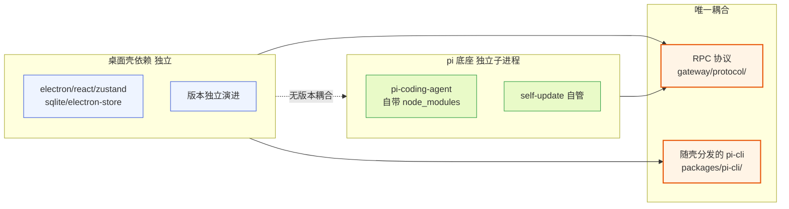
```mermaid
flowchart LR
    subgraph SHELL["桌面壳依赖 独立"]
        S1["electron/react/zustand<br/>sqlite/electron-store"]
        S2["版本独立演进"]
    end
    subgraph PI["pi 底座 独立子进程"]
        P1["pi-coding-agent<br/>自带 node_modules"]
        P2["self-update 自管"]
    end
    subgraph COUPLE["唯一耦合"]
        C1["RPC 协议<br/>gateway/protocol/"]
        C2["随壳分发的 pi-cli<br/>packages/pi-cli/"]
    end
    SHELL -.->|"无版本耦合"| PI
    SHELL --> C1
    PI --> C1
    SHELL --> C2
    classDef s fill:#eef4ff,stroke:#3b5bdb;
    classDef p fill:#e9fac8,stroke:#2f9e44;
    classDef c fill:#fff4e6,stroke:#e8590c,stroke-width:2px;
    class S1,S2 s;
    class P1,P2 p;
    class C1,C2 c;
```

**图 1 — 桌面壳与底座依赖独立演进，唯一耦合是 RPC 协议 + 随壳分发的 CLI**

---

## 2 Electron + electron-vite：三端构建

### 2.1 三端模型：main / renderer / preload

#### 2.1.1 main 进程职责

Electron 的 main 进程是 Node 环境，拥有完整 Node API（`fs`/`child_process`/`utilityProcess`）。pi-desktop 的 main 进程承担三类职责：底座子进程生命周期管理（spawn/kill/exit/error 监听、持有 `ChildProcess` 句柄与原始 stdin/stdout 流，对应 `shell/electron-main/subprocess-lifecycle.ts`）、worker 进程池管理（utilityProcess 启停，对应 `shell/electron-main/plugin-host.ts`）、MessagePort 桥接（worker↔renderer 直连通道，对应 `shell/electron-main/port-bridge.ts`）。main 进程是 pi-desktop 的中枢——它持有底座子进程的 stdin/stdout 管道、持有各 worker 的 MessagePort、转发 RPC command/response/event。main 进程不跑 React、不渲染 UI。

**shell 与 gateway 在底座子进程上的接缝**：进程生命周期（spawn/kill/exit/error 监听、stdio 管道持有）属于 `shell/electron-main/subprocess-lifecycle.ts`；JSONL 协议层（逐行解析、id 配对、command/response/event 分发、Extension UI 翻译）属于 `gateway/rpc-adapter.ts`。两者经一个显式接口解耦——`gateway/subprocess-handle.ts` 定义 `SubprocessHandle` 接口（描述"gateway 需要的子进程协议句柄契约"，是内层抽象），`shell` 侧的 `subprocess-lifecycle.ts` 实现该接口、spawn 完子进程后向上返回一个 `SubprocessHandle` 实例。接口归 gateway 拥有是依赖倒置的体现——它描述的是内层（gateway）需要的契约，外层（shell）提供实现，依赖方向向内，不违反 11.1.1 的 `no-restricted-paths` 纪律（gateway 不 import shell、shell import gateway 的接口是允许的）：

```typescript
// gateway/subprocess-handle.ts —— gateway 拥有的子进程协议句柄契约（内层抽象）
export interface SubprocessHandle {
  readonly stdin: NodeJS.WritableStream | null;   // 原始 stdin 写端
  readonly stdout: NodeJS.ReadableStream | null;   // 原始 stdout 读端
  readonly pid: number | undefined;
  onExit(cb: (code: number | null, signal: NodeJS.Signals | null) => void): void;
  onError(cb: (err: Error) => void): void;
  kill(signal?: NodeJS.Signals): void;            // 优雅/强制停机
}
// shell/electron-main/subprocess-lifecycle.ts —— shell 实现该接口、产出实例
export function spawnPiSubprocess(): Promise<SubprocessHandle> { /* spawn + 持有 ChildProcess，返回实现 SubprocessHandle 的对象 */ }
```

`gateway/rpc-adapter.ts` 不自己 `spawn`——它在构造时收一个 `SubprocessHandle`（接口归 gateway 自身、不 import shell），消费其 `stdout`（`attachJsonlLineReader(handle.stdout, ...)` 逐行解析）和 `stdin`（`handle.stdin.write(...)` 写命令），把 `onExit`/`onError` 转成"底座已断开"通知。这样"起进程、管进程"归 shell、"讲协议、配对 id"归 gateway，两侧可独立演化：换底座启动方式（如未来从 spawn node 改成 spawn 已编译二进制）只动 `subprocess-lifecycle.ts`；改 JSONL 分流规则只动 `rpc-adapter.ts`。这是"组装和调用应该分开"在子进程管理上的具体落地——`subprocess-lifecycle` 管物理进程（组装），`rpc-adapter` 管协议对话（调用）。

main 进程的启动采用**并行模型**（与 15.1.2/2.2.2 一致，非串行）：BrowserWindow 创建后**立即** spawn 底座子进程（不等 renderer ready）→ preload 注入 scoped API 与底座子进程初始化**并行推进**：renderer 空壳先出来、底座在 100ms 就绪窗口里完成初始化（加载 settings、discover 扩展、准备 session）→ `subprocess-lifecycle.ts` 返回 `SubprocessHandle` → `rpc-adapter.ts` 挂到该 handle 上收发 JSON Lines（对应 `底座:modes/rpc/rpc-client.ts:73` 的 `start()` 语义）→ 加载插件（发现/校验/activate，utilityProcess worker 起来）→ 两者就绪后 `resync()` 同步 UI 到底座。这个并行让用户看到"先壳后内容"的渐进式启动而非长时间空白——renderer 空壳先渲染、底座就绪后 resync 填数据。注意 17.1.1 代码示例里 `ready-to-show` 串行写法是简化示意，真实启动按本节的并行模型：spawn 与 renderer 首屏并行。

#### 2.1.2 renderer 进程职责

renderer 进程是 Chromium 环境，有 DOM、有 React。pi-desktop 的 renderer 承担全部 UI 渲染：宿主布局（侧栏 + 时间线 + 输入区 + 状态栏）、插件 UI 组件（通过 componentRegistry 挂载）、Extension UI 子协议的模态框（select/confirm/input/editor，DESIGN.md 1.9.2）。renderer 还负责主题切换的 CSS 变量注入、i18n 的文案替换、dompurify 的 HTML 净化。renderer 不直接碰底座子进程——它的所有 RPC 调用经 preload 注入的 scoped API 转发到 main，再由 main 发给底座。renderer 进程是单实例（单窗口多面板），插件 UI 融进宿主 React 树而非各开 webview（见 3.1.3）。

#### 2.1.3 preload 桥接与 contextBridge

preload 脚本跑在 renderer 进程里、但能力边界由 **`sandbox: true`** 决定（不是 `contextIsolation`/`nodeIntegration`——那两项只约束 renderer 的 window、不决定 preload 的 Node 访问权）。`sandbox: true` 会剥离 preload 的绝大多数 Node API：preload 不能 `require("fs")`/`require("child_process")`、不能 `import` 任意 Node 模块，只能 `import` 受限的 `electron` preload 子集（`contextBridge`/`ipcRenderer`）并经 electron-vite 打包注入。这意味着 preload 脚本必须被 electron-vite 编译成**沙箱兼容产物**（一个纯 ESM/CJS bundle，只引用 `electron` 的 preload API）——任何依赖 `fs`/`process`/原生模块的代码都不能进 preload，要放 main 进程。preload 的职责是用 `contextBridge.exposeInMainWorld` 往 renderer 的 window 上挂一个安全的 scoped API——这是 renderer 唯一能触达 main 的通道。pi-desktop 的 preload 暴露的不是"任意 ipcRenderer.send"，而是一组结构化的方法（`window.pi.rpc.getState()` 等），内部走 `ipcRenderer.invoke` 给 main。这层是安全边界：renderer 里的插件 UI 代码拿不到 `require`/`fs`/`process`，只能拿到 preload 暴露的白名单 API。这呼应沙箱设计（DESIGN.md 3.5 第 6 项）：renderer 侧的隔离弱于独立进程（UI 代码和宿主共享 renderer 堆），真正的不可信代码隔离由 worker 进程边界兜底——`main` 侧的逻辑在独立 utilityProcess、碰不到 renderer 状态。

```typescript
// shell/electron-main/preload.ts —— preload 暴露 scoped API
import { contextBridge, ipcRenderer } from "electron";

const pi = {
  rpc: {
    // 经 ipcRenderer.invoke 到 main，main 转发给底座子进程
    send: (command: unknown) => ipcRenderer.invoke("pi:rpc:send", command),
    getState: () => ipcRenderer.invoke("pi:rpc:getState"),
    resync: () => ipcRenderer.invoke("pi:rpc:resync"),
  },
  events: {
    // event 流：main 经 ipcRenderer.on 推给 renderer
    on: (cb: (event: unknown) => void) => {
      const listener = (_e: unknown, event: unknown) => cb(event);
      ipcRenderer.on("pi:event", listener);
      return () => ipcRenderer.off("pi:event", listener);
    },
  },
  store: { get: (key: string) => ipcRenderer.invoke("pi:store:get", key) },
};

contextBridge.exposeInMainWorld("pi", pi);
// 暴露后 renderer 里 window.pi 就是唯一入口，require/fs/process 都不暴露
```

注意 `window.pi` 是 `RendererPluginContext`（DESIGN.md 3.2.5）的 scoped 子集——它只暴露中性方法、不暴露底座类型。`rpc.send` 的签名是 `unknown`（见 7.2.2 逃生舱），常规方法返回中性类型。**preload 不参与 i18n**：`window.pi` 不含 `i18n.t`——i18next 跑在 renderer 进程（6.2.1/17.7.1 已确定 locale 检测在 shell/renderer 完成、i18next 在 renderer init），`RendererPluginContext.i18n.t` 直接绑 renderer 本地的 `i18next.t`（同步返回字符串、满足渲染期同步返回的要求），不经 IPC 转发。若用 `ipcRenderer.send` 转发 `i18n.t`，send 是 fire-and-forget 返回 void、无法返回翻译字符串，既拿不到返回值又与"i18next 在 renderer"的架构矛盾，故 preload 不暴露 i18n 通道。

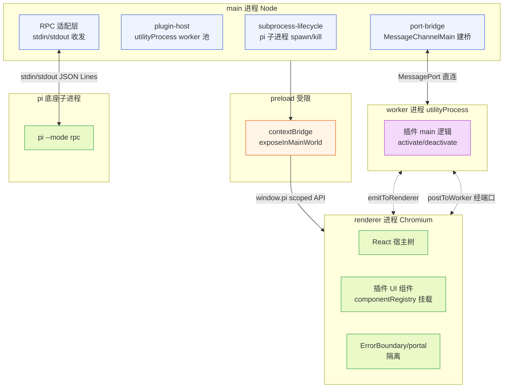
```mermaid
flowchart TD
    subgraph MAIN["main 进程 Node"]
        SL["subprocess-lifecycle<br/>pi 子进程 spawn/kill"]
        PH["plugin-host<br/>utilityProcess worker 池"]
        PB["port-bridge<br/>MessageChannelMain 建桥"]
        RPC["RPC 适配层<br/>stdin/stdout 收发"]
    end
    subgraph PRE["preload 受限"]
        CB["contextBridge<br/>exposeInMainWorld"]
    end
    subgraph REN["renderer 进程 Chromium"]
        REACT["React 宿主树"]
        PC["插件 UI 组件<br/>componentRegistry 挂载"]
        EB["ErrorBoundary/portal<br/>隔离"]
    end
    subgraph W["worker 进程 utilityProcess"]
        WLOG["插件 main 逻辑<br/>activate/deactivate"]
    end
    subgraph PI["pi 底座子进程"]
        PID["pi --mode rpc"]
    end
    RPC <-->|"stdin/stdout JSON Lines"| PID
    MAIN --> CB
    CB -->|"window.pi scoped API"| REN
    PB <-->|"MessagePort 直连"| W
    W <-.->|"emitToRenderer"| REN
    REN <-.->|"postToWorker 经端口"| W
    classDef m fill:#eef4ff,stroke:#3b5bdb;
    classDef p fill:#fff4e6,stroke:#e8590c;
    classDef r fill:#e9fac8,stroke:#2f9e44;
    classDef w fill:#f3d9fa,stroke:#ae3ec9;
    class SL,PH,PB,RPC m;
    class CB p;
    class REACT,PC,EB r;
    class WLOG w;
    class PID r;
```

**图 2 — 三端进程模型：main 持有底座管道与 worker 池，preload 注入 scoped API，renderer 渲染宿主树与插件 UI，worker 跑插件逻辑**

### 2.2 electron-vite 构建配置

#### 2.2.1 三端入口与输出

electron-vite 管 main/renderer/preload 三端构建，每端一个 Vite 配置。main 端编译成 CommonJS 或 ESM（按 Electron 版本支持）、输出到 `out/main/`；renderer 端走标准 Vite React 构建、输出到 `out/renderer/`；preload 端编译成单独脚本、输出到 `out/preload/`。`electron.vite.config.ts` 的结构骨架：

```typescript
import { defineConfig } from "electron-vite";
import react from "@vitejs/plugin-react";
import { resolve } from "node:path";

export default defineConfig({
  main: {
    build: {
      rollupOptions: {
        input: resolve(__dirname, "src/shell/electron-main/index.ts"),
        external: ["better-sqlite3"], // 原生模块不打进 bundle，走 require
      },
    },
  },
  preload: {
    build: {
      rollupOptions: { input: resolve(__dirname, "src/shell/electron-main/preload.ts") },
    },
  },
  renderer: {
    root: "src/shell/renderer",
    plugins: [react()],
    build: {
      rollupOptions: { input: resolve(__dirname, "src/shell/renderer/index.html") },
    },
  },
});
```

三端入口对应洋葱分层的 `shell/` 目录——所有 Electron 相关代码都在 `shell/` 层，构建配置只编译这层，不污染 `domain/`/`gateway/`/`application/`/`plugins/`。`plugins/`（内置插件）的 renderer 模块在构建时打进 renderer bundle 或作为动态 import chunk（按是否懒加载决定），`plugins/` 的 main 模块**不进 main 端 bundle**——它由 worker 进程在运行时经 `utilityProcess.fork(mainPath)` 加载（fork 即运行模块，不存在 `utilityProcess.import` 这个 API），activate/deactivate 经 worker 间 `postMessage` 握手协议触发（见 7.3.1 的 `plugin:ready`/`plugin:activate` 契约）。

#### 2.2.2 HMR 与开发流程

electron-vite 的开发流程是 `electron-vite dev`——启动一个 Vite dev server 给 renderer（HMR 热更新 React 组件），同时编译 main/preload 并拉起 Electron。开发时改 renderer 代码（React 组件、CSS）即时热更新不重启 Electron；改 main/preload 代码触发 Electron 重启。插件开发有独立的热重载路径（DESIGN.md 3.5 第 8 项）：file watcher（由 main 进程持有，实现在 `shell/electron-main/plugin-watcher.ts`，用 `fs.watch`/`chokidar`）监听 `~/.pi-desktop/plugins/` 和 `<cwd>/.pi-desktop/plugins/` 目录，检测到插件文件改动 → 定位是哪个插件 → deactivate 旧的 → 重新发现/校验/activate 新的 → 更新槽位注册表。

热重载覆盖范围的三点补充。其一，**内置插件目录**（`process.resourcesPath/pi-desktop-builtin/`，8.2.1）是随壳分发的只读目录、**不支持运行时热重载**——它随壳发版更新；开发内置插件时把改动放到用户级 `~/.pi-desktop/plugins/`（同名 id 覆盖内置、优先级更高）即可享受 file watcher 热重载，发版时再合并回 `src/plugins/`。其二，**worker（插件 main 模块）改动的热重载**：file watcher 检测到插件 main 模块改动时走"deactivate → 重新 fork worker → activate"流程——先调旧 worker 的 `deactivate`（经 `plugin:deactivate` postMessage 握手，7.3.1）、`PluginRuntime.kill` 销毁旧 utilityProcess、再用新 mainPath `spawn` 一个新 worker、重新 `plugin:activate`；不能只 reload 模块不重启进程（utilityProcess 的模块已 fork 进内存、不重启拿不到新代码）。其三，**renderer 侧插件 UI 模块**改动走 React HMR（Vite dev server 的 module replacement），不重启 Electron、不重 fork worker。

这条热重载路径和 electron-vite 的 HMR 是两套独立机制——HMR 管 shell 自身代码 + 插件 renderer 模块、file watcher 管插件 main 模块 + manifest——两者作用域不同、不冲突（对应 DESIGN.md 2.2.1 底座没有配置 watcher 的区分：那是底座子进程的事，这里是桌面端自己的 watcher）。

#### 2.2.3 生产构建

生产构建 `electron-vite build` 产出三端产物到 `out/`，再由 electron-builder 打包成平台安装包（见 8.1）。生产构建要做几件事：renderer 端 tree-shaking + minify、main/preload 端打包成单文件、better-sqlite3 原生模块按目标平台 prebuild（electron-builder 的 `nodeGypRebuild: false` + `npmRebuild` 配合 `@electron/rebuild`）。内置插件（`src/plugins/`）的文件复制到 `process.resourcesPath/pi-desktop-builtin/`（asar 内或解包外，见 8.2），不编译进 main bundle——它们是磁盘上的插件文件、走加载器发现，不是硬编码代码。

#### 2.2.4 原生模块重编译

`better-sqlite3` 是原生 Node 模块（C++ 编译产物），它的 ABI 必须匹配 Electron 的 Node ABI，否则启动即 crash。处理方式：开发时 `@electron/rebuild` 按 Electron 版本重编译；打包时 electron-builder 的 `npmRebuild: true` 自动在打包前重编译，产出的包里 better-sqlite3 的 `.node` 文件是按目标平台 + 目标架构编译好的。三平台 × 两架构（Mac arm64/x64、Win x64、Linux x64）要分别 build——CI 里用矩阵构建。这点是 Electron 原生模块的固有复杂度，现有方案 已踩过坑，pi-desktop 照搬其 `postinstall: "electron-rebuild"` 脚本即可。

### 2.3 进程间通信架构

#### 2.3.1 contextBridge 安全边界

contextBridge 是 Electron 的安全原语：preload 脚本用 `contextBridge.exposeInMainWorld("pi", api)` 往 renderer 的 window 上挂 `window.pi` 对象，这个对象的每个方法内部走 `ipcRenderer.invoke`/`ipcRenderer.send` 和 main 通信。关键安全属性：通过 contextBridge 传过的值是结构化克隆的、不是引用——renderer 拿不到 main 的对象引用，只能拿到数据的副本。pi-desktop 暴露的 `window.pi` 就是 `RendererPluginContext`（DESIGN.md 3.2.5）的 scoped 子集：`rpc.send`/`rpc.getState`/`events.on`/`ui`（组件库）。`i18n.t` 不经 preload——i18next 跑在 renderer、`RendererPluginContext.i18n.t` 直接绑 renderer 本地 `i18next.t`（见 2.1.3）。`require`/`fs`/`process`/`window.electron` 都不暴露。这层是"renderer 侧沙箱"的第一道防线，配合 `contextIsolation: true`（renderer 的 window 和 preload 的 window 隔离）和 `nodeIntegration: false`（renderer 不能直接 require Node 模块）。

#### 2.3.2 MessagePort 桥接

utilityProcess 和 renderer 之间不走 `ipcMain/ipcRenderer`（那套基于 BrowserWindow，utilityProcess 没有），唯一的官方通道是 MessagePort。core main 进程在插件装载时建一对 `MessageChannelMain`，一个端口给该插件的 utilityProcess worker、一个给 renderer 侧该插件的运行时上下文，之后 worker↔renderer 直接 postMessage 对传、不再经 main 转发（DESIGN.md 3.6）。renderer 侧给插件 UI 注入的 scoped `pi` API，内部就是往这个端口 postMessage——插件 UI 调 `pi.rpc.get_state()`，实际是往端口发消息、worker 侧收到后发 RPC 给底座、结果回传。这条是 worker↔renderer 通道。还有一条 worker↔main 通道（worker 的 `PluginContext.rpc`/`events` 经 MessagePort 转发到 main，main 持有底座 stdin/stdout）——两条 MessagePort 通道端点不同、互不干扰（DESIGN.md 3.6 末尾）。

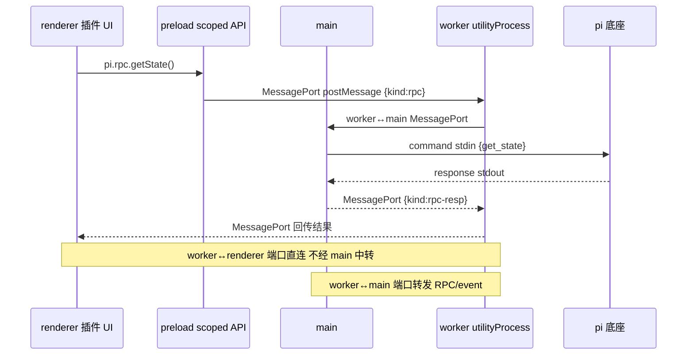
```mermaid
sequenceDiagram
    participant R as renderer 插件 UI
    participant P as preload scoped API
    participant M as main
    participant W as worker utilityProcess
    participant PI as pi 底座
    R->>P: pi.rpc.getState()
    P->>W: MessagePort postMessage {kind:rpc}
    W->>M: worker↔main MessagePort
    M->>PI: command stdin {get_state}
    PI-->>M: response stdout
    M-->>W: MessagePort {kind:rpc-resp}
    W-->>R: MessagePort 回传结果
    Note over R,W: worker↔renderer 端口直连 不经 main 中转
    Note over W,M: worker↔main 端口转发 RPC/event
```

**图 3 — 双 MessagePort 通道：worker↔renderer 管插件 UI 数据，worker↔main 管 RPC/event 转发**

#### 2.3.3 utilityProcess worker 池

每个带 `main` 入口的插件起一个 utilityProcess worker（`shell/electron-main/plugin-host.ts` 的 `UtilityProcessRuntime`）。worker 是 Node 子进程，提供进程级隔离——插件抛未捕获异常只崩这个 worker、main 主进程捕获崩溃事件禁用该插件、插件资源占用可按插件计量。worker 池不是预创建的固定大小池，而是按需 spawn——有 `main` 的插件加载时 spawn、卸载时 kill。纯 renderer 插件（只有 `renderer` 没有 `main`）不起 worker——它的 UI 组件在 renderer 里动态 import、事件订阅走 core 默认转发（DESIGN.md 3.2.6 路径一）。worker 之间默认不直接通信（避免插件间隐式耦合），需要协作的走 core 提供的事件总线（PluginContext.bus，发布订阅、fire-and-forget）。

#### 2.3.4 IPC 通道命名约定

main 进程的 `ipcMain` handle 用统一前缀命名通道，避免散落：`pi:rpc:*`（RPC 转发，如 `pi:rpc:send`/`pi:rpc:getState`）、`pi:event`（事件推送给 renderer）、`pi:store:*`（偏好读写）、`pi:plugin:*`（插件管理，如加载/卸载/列表）。**注意无 `pi:i18n:*` 通道**——i18n 跑在 renderer 本地（i18next 在 renderer init，6.2.1/17.7.1），不经 IPC 转发（2.1.3 已说明）。这条命名约定让 IPC 通道在 code review 时一眼可查、也方便 preload 侧的白名单匹配。preload 只 handle 这些前缀的通道、其余一律不转发——这是 scoped API 的强制点。

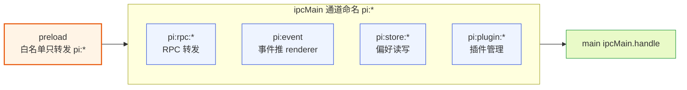
```mermaid
flowchart LR
    subgraph IPC["ipcMain 通道命名 pi:*"]
        RPC["pi:rpc:*<br/>RPC 转发"]
        EVT["pi:event<br/>事件推 renderer"]
        STO["pi:store:*<br/>偏好读写"]
        PLG["pi:plugin:*<br/>插件管理"]
    end
    PRE["preload<br/>白名单只转发 pi:*"] --> IPC
    IPC --> MAIN["main ipcMain.handle"]
    classDef ipc fill:#eef4ff,stroke:#3b5bdb;
    classDef pre fill:#fff4e6,stroke:#e8590c,stroke-width:2px;
    classDef m fill:#e9fac8,stroke:#2f9e44;
    class RPC,EVT,STO,PLG ipc;
    class PRE pre;
    class MAIN m;
```

**图 4 — IPC 通道统一前缀命名，preload 白名单只转发 pi:* 前缀**

---

## 3 React 与状态管理

### 3.1 React 作为 renderer 框架

#### 3.1.1 为什么选 React

renderer 选 React，和 现有方案 一致。React 的组件模型适合"插件 UI 融进宿主树"这个诉求——侧栏 Tab、工具卡片、设置页都是宿主布局的一部分，插件组件作为 React 子树挂载、共享宿主的渲染调度。React 的 ErrorBoundary 能接住插件组件抛错、隔离到该组件不影响宿主树；React Portal 能把模态框（Extension UI 子协议的 select/confirm 等）渲染到 DOM 顶层、脱离宿主布局流；React.lazy + Suspense 能懒加载插件 UI 模块、按需 mount。这些能力是 pi-desktop 插件 UI 隔离的技术基础。

#### 3.1.2 组件树结构

宿主 React 树的骨架是：根 ErrorBoundary → 布局容器（侧栏 + 主区 + 状态栏）→ 各区域从槽位注册表查贡献项渲染。侧栏区域查 `sidePanel` 槽位、按优先级合并后渲染 Tab；主区的时间线查 `cardRenderers` 槽位匹配工具调用渲染卡片；状态栏查 `commands` 槽位渲染快捷入口。每个插件组件用 `<PluginComponent id={componentId} />` 包装——这个包装组件从 `componentRegistry[componentId]` 取实际组件、用 ErrorBoundary + React.lazy 包裹、props 按槽位契约注入（cardRenderer 的 props 契约见 DESIGN.md 3.2.6）。插件组件不直接 import 宿主内部状态、不直接操作 DOM 顶层——它只通过 `usePluginContext()` hook 拿 `RendererPluginContext`（rpc/events/i18n/ui/theme）。

```typescript
// shell/renderer/plugin-component.tsx —— 插件组件包装
import { Component, Suspense, lazy } from "react";
import { componentRegistry } from "./component-registry";
import { usePluginContext } from "./plugin-context";

class PluginErrorBoundary extends Component<
  { id: string; children: React.ReactNode },
  { error: Error | null }
> {
  state = { error: null as Error | null };
  static getDerivedStateFromError(error: Error) { return { error }; }
  render() {
    if (this.state.error) {
      return <div className="plugin-error">插件 {this.props.id} 崩溃: {this.state.error.message}</div>;
    }
    return this.props.children;
  }
}

export function PluginComponent({ id, props }: { id: string; props: unknown }) {
  const entry = componentRegistry[id]; // { component: Lazy, pluginId }
  const ctx = usePluginContext();
  if (!entry) return null;
  return (
    <PluginErrorBoundary id={id}>
      <Suspense fallback={<div>加载中…</div>}>
        <entry.component {...props} pi={ctx} />
      </Suspense>
    </PluginErrorBoundary>
  );
}
```

#### 3.1.3 portal 与 ErrorBoundary 隔离

插件 UI 模块跑在 renderer，要防它直接操作宿主 DOM 顶层或 import 任意模块。用受限加载器加载 UI 模块——只暴露 scoped `pi` 对象，不暴露 `require`/`process`/`fs`/`window` 的危险面；组件渲染进 React portal + ErrorBoundary + React.lazy 包裹，插件组件抛错被 ErrorBoundary 接住、显示错误占位、不影响宿主树。这里要诚实承认（DESIGN.md 3.6）：renderer 侧的隔离弱于独立进程（UI 代码和宿主共享 renderer 堆），真正的不可信代码隔离由 worker 进程边界兜底——`main` 侧的逻辑在独立 utilityProcess、碰不到 renderer 状态；`renderer` 侧的 UI 代码做受限加载 + portal 隔离。如果某个插件要加载完全不可信的第三方富内容（比如渲染任意 HTML），那个槽位单独走 webview（每插件一个独立浏览器上下文，只靠 postMessage 通信，UI bundle 彻底独立）——这是 VSCode webview 的路线，作为强隔离槽位的降级方案，不作为默认。

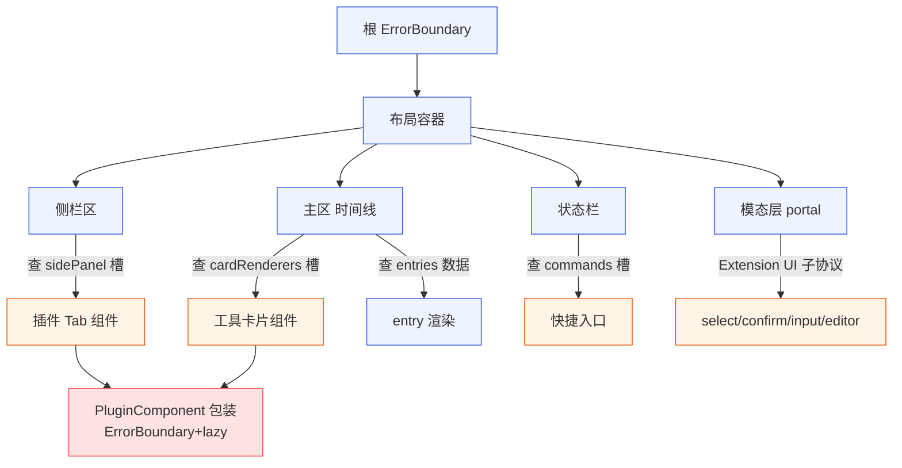
```mermaid
flowchart TD
    ROOT["根 ErrorBoundary"] --> LAY["布局容器"]
    LAY --> SIDE["侧栏区"]
    LAY --> MAIN["主区 时间线"]
    LAY --> STATUS["状态栏"]
    LAY --> MODAL["模态层 portal"]
    SIDE -->|"查 sidePanel 槽"| SP["插件 Tab 组件"]
    MAIN -->|"查 cardRenderers 槽"| CR["工具卡片组件"]
    MAIN -->|"查 entries 数据"| TL["entry 渲染"]
    STATUS -->|"查 commands 槽"| CMD["快捷入口"]
    MODAL -->|"Extension UI 子协议"| DLG["select/confirm/input/editor"]
    SP --> EB["PluginComponent 包装<br/>ErrorBoundary+lazy"]
    CR --> EB
    classDef host fill:#eef4ff,stroke:#3b5bdb;
    classDef plug fill:#fff4e6,stroke:#e8590c;
    classDef iso fill:#ffe3e3,stroke:#fa5252;
    class ROOT,LAY,SIDE,MAIN,STATUS,MODAL,TL host;
    class SP,CR,CMD,DLG plug;
    class EB iso;
```

**图 5 — 宿主 React 树与插件组件挂载：各区域查槽位渲染，插件组件经 ErrorBoundary 包装**

### 3.2 Zustand 轻量状态管理

#### 3.2.1 为什么不用 Redux

状态管理用 Zustand，不用 Redux。DESIGN.md 5.1.2 给的理由是"轻量"——Zustand 的 store 是一个 hook、无 boilerplate、无 provider 包装、无 action/reducer 概念。这契合 pi-desktop 的状态分布特征：core 只管槽位注册表（一个 Map 结构、按槽位分），插件各自管自己的状态（时间线插件的 entry 列表、模型参数插件的当前模型、会话管理插件的会话树）。状态是分散的、不要求全局一致性，Redux 的全局 store + 单向数据流在这种场景是过度设计。Zustand 让每个 store 独立、插件可以建自己的 store 不污染 core——这呼应"插件各自管状态、core 只管槽位注册表"。

#### 3.2.2 core 状态 vs 插件状态

状态分两类，归属不同。core 状态有四项：槽位注册表（按槽位分的 Map）、当前主题 token 映射（Theme 对象）+ 当前主题 id、当前 locale、contextKeys（when clause 的变量值，**派生自中性 `SessionState`**——不是 gateway 的 `RpcSessionState`；`gateway/context-binding.ts` 先把 `RpcSessionState` 投影成圆心中性 `SessionState`、再由 shell 派生 contextKeys，呼应 7.2.1 圆心类型纯度纪律）。这里要区分"类型归圆心、运行时实例归 shell"：槽位注册表的**类型与 schema 契约**在 `domain/slots/registry.ts`（`SlotRegistry` 中性类型 + 各槽位 schema），其**运行时 Zustand store 实例**在 `shell/renderer/`（`slotRegistryStore`，加载器挂载/卸载贡献项时更新它的快照）——前者是稳定的契约、后者是会变的运行时快照，是两个东西。core 状态用 Zustand store 管，存在 `shell/renderer/`，是 shell 层的实现细节、不泄漏到 domain。插件状态：时间线插件的 entry 列表与虚拟滚动位置、模型参数插件的模型列表与当前选择、会话管理插件的会话树与最近打开列表。插件状态存在插件自己的 store 里（插件自带 Zustand store 或用 useState），core 不感知、不托管。两者的边界：插件状态变化不通知 core、core 状态变化通过槽位注册表变更触发重渲染（插件订阅槽位查的贡献项变了就重渲染）。这条边界守住了"插件内聚自己的状态、core 只管槽位"。

#### 3.2.3 store 划分与持久化

Zustand store 按"谁拥有"划分，不按"功能域"划分。core 持有四个 store，与 3.2.2 列的四项 core 状态一一对应：`slotRegistryStore`（槽位注册表快照，加载器挂载/卸载贡献项时更新）、`themeStore`（**同时持有当前主题 id 与合并后的 Theme token 映射**——切换主题时先存 id、再从主题槽查 token 合并进 store）、`localeStore`（当前 locale + i18n 字典）、`contextKeysStore`（when clause 变量值，派生自中性 `SessionState`，3.2.2）。每个带状态的内置插件持有自己的 store——如 timeline 插件的 `timelineStore`（entries 列表 + leafId + 虚拟滚动）、model-params 插件的 `modelStore`（available models + current state）、session-manager 插件的 `sessionStore`（会话树 + 最近打开列表）。第三方插件自带 store、core 不限制其内部状态管理方案（只要不碰 core 的槽位注册表）。store 之间不直接互调——要协作走 PluginContext.bus 事件总线（fire-and-forget）或声明 `dependsOn` 依赖（被依赖者先 activate，DESIGN.md 3.5）。

需要持久化的插件状态经 Zustand 的 `persist` 中间件落盘——但落盘介质分两种：简单 key-value（如侧栏展开态、滚动位置）走 electron-store；需要查询的结构化数据（如命令历史）走 better-sqlite3。`persist` 中间件可插拔 storage adapter，core 提供 `sqliteStorage` 和 `electronStoreStorage` 两个 adapter，插件按数据特征选。

```typescript
// shell/renderer/store/slot-registry-store.ts —— core 管槽位注册表
import { create } from "zustand";
import type { SlotName, ContributionItem } from "@/domain/contributions";

interface SlotRegistryState {
  slots: Record<SlotName, ContributionItem[]>;
  setSlot: (name: SlotName, items: ContributionItem[]) => void;
  mount: (name: SlotName, item: ContributionItem) => void; // 加载器调
  unmount: (name: SlotName, itemId: string) => void;
}

export const useSlotRegistry = create<SlotRegistryState>((set) => ({
  slots: { sidePanel: [], cardRenderers: [], commands: [], previewers: [], settings: [], management: [], languages: [] },
  setSlot: (name, items) => set((s) => ({ slots: { ...s.slots, [name]: items } })),
  mount: (name, item) =>
    set((s) => ({ slots: { ...s.slots, [name]: [...s.slots[name], item] } })),
  unmount: (name, itemId) =>
    set((s) => ({ slots: { ...s.slots, [name]: s.slots[name].filter((i) => i.id !== itemId) } })),
}));

// plugins/timeline/store.ts —— 插件各自管，可选 persist
import { create } from "zustand";
import { persist } from "zustand/middleware";
export const useTimeline = create(
  persist(
    (set) => ({
      entries: [] as Entry[], leafId: null as string | null,
      append: (e: Entry) => set((s) => ({ entries: [...s.entries, e] })),
      reset: (entries: Entry[], leafId: string | null) => set({ entries, leafId }),
    }),
    { name: "timeline-scroll", storage: createJSONStorage(() => electronStoreStorage), partialize: (s) => ({ leafId: s.leafId }) }
  )
);
```

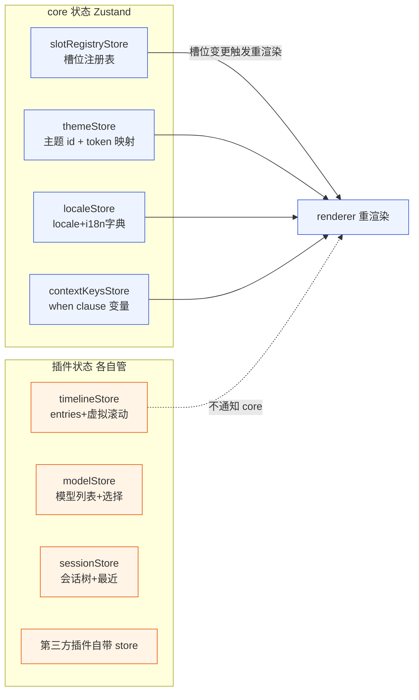
```mermaid
flowchart LR
    subgraph CORE["core 状态 Zustand"]
        S1["slotRegistryStore<br/>槽位注册表"]
        S2["themeStore<br/>主题 id + token 映射"]
        S3["localeStore<br/>locale+i18n字典"]
        S5["contextKeysStore<br/>when clause 变量"]
    end
    subgraph PLUG["插件状态 各自管"]
        P1["timelineStore<br/>entries+虚拟滚动"]
        P2["modelStore<br/>模型列表+选择"]
        P3["sessionStore<br/>会话树+最近"]
        P4["第三方插件自带 store"]
    end
    S1 -->|"槽位变更触发重渲染"| REN["renderer 重渲染"]
    S2 --> REN
    S3 --> REN
    S5 --> REN
    P1 -.->|"不通知 core"| REN
    classDef c fill:#eef4ff,stroke:#3b5bdb;
    classDef p fill:#fff4e6,stroke:#e8590c;
    class S1,S2,S3,S5 c;
    class P1,P2,P3,P4 p;
    class REN c;
```

**图 6 — 状态划分：core 管槽位/主题/locale，插件各自管业务状态，不互调**

### 3.3 pi.ui 组件库

#### 3.3.1 自带主题

core 提供 `pi.ui` 组件库（`shell/renderer/ui/`），含 Button/Input/Dialog/Icon 等基础组件，自带主题——组件内部从 `themeStore` 读当前 Theme 的 token 值（如 `color.primary`、`radius.md`、`spacing.sm`），渲染时用 CSS 变量注入。插件用 `pi.ui.Button`/`pi.ui.Icon` 这些组件自动获得当前主题、不需要自己处理颜色；只在需要自定义颜色时读 token（如 `theme["color.accent.warning"]`），不硬编码颜色值（DESIGN.md 4.11.4）。这保证插件 UI 视觉一致——主题切换时所有用 pi.ui 的插件组件自动跟随重渲染，无需插件自己监听主题变化。

#### 3.3.2 组件清单与主题 token

pi.ui 的组件清单覆盖桌面端常用交互：`Button`（按钮，支持 variant/size/loading）、`Input`（单行输入）、`Textarea`（多行）、`Dialog`（模态框，内置 focus trap）、`Select`（下拉选择）、`Checkbox`/`Radio`、`Icon`（lucide 图标，按 name 取）、`Tooltip`、`Tabs`（侧栏 Tab 切换）、`ScrollArea`（自定义滚动条，虚拟滚动用）、`Markdown`（内置 dompurify 净化）。主题 token 分组：`color.*`（bg/fg/primary/accent/warning/error/muted）、`radius.*`（sm/md/lg）、`spacing.*`（xs/sm/md/lg）、`font.*`（size/family）、`border.*`（width/color）。token 是 core 和主题插件的契约——主题插件贡献的 theme 对象的 key 必须是这些 token 名。组件库实现可以基于 radix-ui 或自研，具体选型是 shell 层的实现细节、不是架构约束——换组件库只动 `shell/renderer/ui/`，不动 domain。

#### 3.3.3 无障碍 focus trap

pi.ui 的 Dialog 组件内置 focus trap 能力（推荐 react-focus-lock 等库），插件用 pi.ui 组件自动获得无障碍能力。这对应 DESIGN.md 1.9.4 的无障碍规范：模态弹出时焦点自动移到第一个可交互元素、Tab 在模态内循环（不跳出背景）、Esc 等同取消、关闭后还原焦点。时间线条目支持上下箭头遍历 + Enter 操作、会话树支持箭头展开折叠、侧栏 Tab 支持快捷键切换。所有 contribution item 要键盘可用、不只靠鼠标——这条是 core 渲染层 + pi.ui 组件库的规范、不是底座的事。自定义元素（插件不用 pi.ui 自己写的组件）要自己遵循这个规范。

---

## 4 持久化层：better-sqlite3 与 electron-store

### 4.1 better-sqlite3：结构化本地状态

#### 4.1.1 存什么

better-sqlite3 存桌面端自己的本地状态（DESIGN.md 5.1.2）：插件配置（`~/.pi-desktop/plugins-data/{pluginId}/config.json` 的结构化部分，需要查询/索引的）、命令历史（用户在输入框输入过的命令、用于自动补全）、缓存（时间线 entry 缓存用于断线重连快速恢复、模型列表缓存）。better-sqlite3 是同步 API（不像 node-sqlite3 的异步回调），在 main 进程里直接调用、响应快，适合"读多写少 + 需要查询"的结构化数据。数据库文件落在 `~/.pi-desktop/desktop.db`（用户级）或 `<cwd>/.pi-desktop/desktop.db`（项目级）。**项目级 db 的打开时机**：用户级 db 在 bootstrap 阶段打开；项目级 db 不在 bootstrap 用 `process.cwd()` 打开（打包后 Electron 的 cwd 不是用户项目目录），而是在用户打开/切换项目时按真实项目路径延迟打开——见 17.1.1 与 12.1.1。

#### 4.1.2 不存什么

明确不存三类东西。**一不存 pi 的 session 数据**——session 的 entry 列表、分叉树、消息流全是底座子进程的内部事务，存在底座的 `sessionDir`（默认 `~/.pi/agent/sessions/`，`底座:core/session-manager.ts`），桌面端通过 RPC 的 `get_entries`/`get_tree` 拿、不自己存副本。**二不存日志**——pi-desktop 的运行日志走内存环形缓冲 + 可选文件落盘，不进 sqlite（sqlite 不适合 append-only 日志流，且日志是会话级临时态，重启可丢，DESIGN.md 4.12 日志页）。**三不存 pi 的 settings**——pi 的 settings.json 是底座的配置（`底座:core/settings-manager.ts`），桌面端通过支柱②读写它、不在 sqlite 里存镜像。这条"不存什么"的边界守住了桌面端薄壳定位——不接管底座的状态管理，只管自己那点桌面 UI 状态。

**日志文件落地规则**（落地 4.1.2 的"文件"去向）：日志目录 `~/.pi-desktop/logs/`；文件名约定 `main-YYYYMMDD.log`、`renderer-YYYYMMDD.log`、`worker-{pluginId}-YYYYMMDD.log`，按来源进程分文件；轮转策略按天切分 + 单文件大小上限（默认 10MB，超限切下一个序号文件）、保留最近 7 天。三处进程的日志汇聚方式：main 进程直接写自己的文件（`fs.appendFileSync` 或轻量 logger）；renderer 进程的日志经 preload 的 `ipcRenderer.send("pi:log", entry)` 转发到 main、由 main 统一落盘（renderer 沙箱下无 fs）；worker（utilityProcess）的 console 拦截经 MessagePort 转发到 main、main 按 `pluginId` 落到对应 `worker-{pluginId}-*.log`。这样三进程日志在 main 汇聚统一落盘、用户在日志页（14.1.2）看到的是合并后的环形缓冲视图、导出时落文件到用户选的路径。日志默认只进内存环形缓冲（不落盘），用户在管理 UI 开启"写日志文件"后才落盘——避免本地工具默认产生磁盘垃圾。

#### 4.1.3 schema 与迁移

schema 按职责分表：`plugin_config`（pluginId/key/value，value 存 JSON）、`command_history`（id/timestamp/command/source）、`entry_cache`（sessionId/entryId/data/timestamp，用于断线重连快速恢复）、`model_cache`（provider/modelId/data，模型列表缓存）。schema 迁移用 better-sqlite3 的 `PRAGMA user_version` + 迁移脚本——启动时检查当前 version、依次执行未应用的 migration。迁移脚本在 `shell/store/migrations/`，是 shell 层的实现细节（数据库 schema 是 shell 的、不是圆心）。这里借鉴底座自己的迁移机制（`底座:migrations.ts`，底座用类似的 version + migration 方式管 session 存储 schema）。

```typescript
// shell/store/db.ts —— better-sqlite3 封装
import Database from "better-sqlite3";
import { app } from "electron";
import { mkdirSync } from "node:fs";
import { join } from "node:path";

let db: Database.Database;

export function openDb(scope: "user" | "project", cwd?: string): Database.Database {
  const dir = scope === "user"
    ? join(app.getPath("home"), ".pi", "desktop")
    : join(cwd!, ".pi", "desktop");
  mkdirSync(dir, { recursive: true });
  const db = new Database(join(dir, "desktop.db"));
  db.pragma("journal_mode = WAL"); // WAL 并发读写，不阻塞主进程
  db.pragma("foreign_keys = ON");
  runMigrations(db);
  return db;
}

function runMigrations(db: Database.Database) {
  const current = db.pragma("user_version", { simple: true }) as number;
  const migrations = [
    // v1: 初始 schema
    () => db.exec(`
      CREATE TABLE IF NOT EXISTS plugin_config (plugin_id TEXT, key TEXT, value TEXT, PRIMARY KEY(plugin_id, key));
      CREATE TABLE IF NOT EXISTS command_history (id INTEGER PRIMARY KEY, timestamp INTEGER, command TEXT, source TEXT);
      CREATE INDEX IF NOT EXISTS idx_history_ts ON command_history(timestamp DESC);
      CREATE TABLE IF NOT EXISTS entry_cache (session_id TEXT, entry_id TEXT, data TEXT, ts INTEGER, PRIMARY KEY(session_id, entry_id));
      CREATE TABLE IF NOT EXISTS model_cache (provider TEXT, model_id TEXT, data TEXT, PRIMARY KEY(provider, model_id));
    `),
    // v2: 加命令历史 plugin_id 列
    () => db.exec("ALTER TABLE command_history ADD COLUMN plugin_id TEXT"),
  ];
  for (let v = current; v < migrations.length; v++) {
    migrations[v]();
    db.pragma(`user_version = ${v + 1}`);
  }
}
```

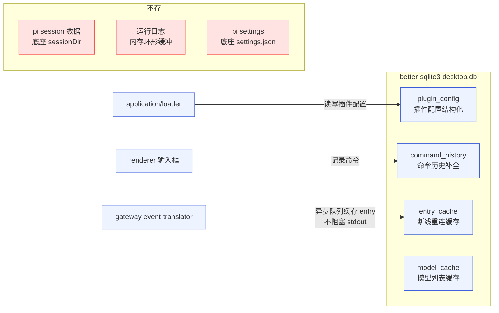
```mermaid
flowchart LR
    subgraph DB["better-sqlite3 desktop.db"]
        T1["plugin_config<br/>插件配置结构化"]
        T2["command_history<br/>命令历史补全"]
        T3["entry_cache<br/>断线重连缓存"]
        T4["model_cache<br/>模型列表缓存"]
    end
    subgraph NOT["不存"]
        N1["pi session 数据<br/>底座 sessionDir"]
        N2["运行日志<br/>内存环形缓冲"]
        N3["pi settings<br/>底座 settings.json"]
    end
    APP["application/loader"] -->|"读写插件配置"| T1
    REN["renderer 输入框"] -->|"记录命令"| T2
    GW["gateway event-translator"] -.->|"异步队列缓存 entry<br/>不阻塞 stdout"| T3
    classDef db fill:#eef4ff,stroke:#3b5bdb;
    classDef no fill:#ffe3e3,stroke:#fa5252;
    class T1,T2,T3,T4 db;
    class N1,N2,N3 no;
    class APP,REN,GW db;
```

**图 7 — better-sqlite3 存什么与不存什么的边界**

#### 4.1.4 WAL 模式与并发

数据库开 `journal_mode = WAL`（Write-Ahead Logging），允许读写并发——main 进程写命令历史时，不阻塞 application 层读插件配置的查询。better-sqlite3 是同步 API，但单条查询在 WAL + 索引下是亚毫秒级，不会卡 main 进程的事件循环。大批量写（如 entry_cache 批量重连恢复）用事务包裹（`db.transaction(() => {...})`），一次提交、避免逐条写的开销。数据库文件只在 main 进程打开——renderer 和 worker 不直接碰数据库，它们经 IPC/MessagePort 让 main 代理读写。这是进程隔离的延伸：数据库句柄不出 main。

### 4.2 electron-store：偏好配置

#### 4.2.1 存什么

electron-store 存桌面端偏好（DESIGN.md 5.1.2）：语言选择（用户选的 locale，覆盖自动检测的）、窗口位置与大小（下次启动恢复）、主题选择（用户选的主题 id，如 "dark"/"light"/"solarized"）、侧栏布局（哪个 Tab 展开、宽窄）、最近打开的 session 路径列表（4.6 会话管理插件的"最近打开"，因为底座没有 list_sessions RPC 命令，桌面端只能记自己打开过的，DESIGN.md 6.2）。electron-store 是 JSON 文件存储（`~/.pi-desktop/preferences.json`），API 同步、简单 get/set，适合"键值对、不需要查询"的偏好数据。

#### 4.2.2 和 pi settings 的边界

electron-store 存的偏好和 pi 的 settings.json 严格分开（DESIGN.md 5.1.2）——这是两条独立的数据：pi 的 settings（`~/.pi/agent/settings.json` + `<cwd>/.pi/settings.json`，`底座:core/settings-manager.ts:274` 的 `SettingsManager`）管 pi 底座自身的配置（默认 provider/model、扩展路径列表、compaction 策略等），通过支柱②的配置操作层读写；electron-store 管 pi-desktop 桌面壳自己的偏好（窗口位置、语言、主题选择），通过 shell 层直接读写。两者不互写：桌面端不会把窗口位置写进 pi 的 settings.json，也不会把扩展路径写进 electron-store。这条边界守住了"桌面壳偏好"和"底座配置"的分离——换底座（pi 升级或换别的 agent）不影响桌面壳偏好，换桌面壳不影响底座配置。

### 4.3 两者的分工

#### 4.3.1 为什么不统一

better-sqlite3 和 electron-store 分工而不统一成一个，是因为数据特征不同：偏好是键值对、不需要查询、写入少读取多、schema 稳定不常变——electron-store 的 JSON 存储足够且简单；插件配置/命令历史/缓存是结构化、需要查询（按 pluginId 查配置、按 timestamp 排序历史）、可能量大（命令历史可能上千条）——better-sqlite3 的索引和查询能力必要。强行统一成 sqlite 会让偏好的读写变重（要建表、写 SQL），强行统一成 JSON 会让历史的查询变慢（全量加载 + 内存过滤）。两者各司其职是关注点分离的体现——这呼应"组装和调用应该分开"：sqlite 负责结构化查询的组装、electron-store 负责键值偏好的组装，调用方各自取用。

#### 4.3.2 数据流向

数据流向分读写两路。读：启动时 shell 从 electron-store 读偏好（locale/theme/window position）→ 应用到 renderer；从 better-sqlite3 读插件配置/命令历史/entry 缓存 → 按需提供给 application/loader。写：插件配置变化 → application/loader 写 better-sqlite3；用户改偏好（选语言/切主题/移动窗口）→ shell 写 electron-store；命令历史 → renderer 输入框提交时经 scoped API 写 better-sqlite3。两条写路径归不同层管：sqlite 归 application（因为插件配置是 application 层的用例），electron-store 归 shell（因为偏好是 shell 层的 UI 状态）。这个归属对应 DESIGN.md 5.1.4 目录结构——`shell/store/` 同时放两者，但调用方分层。

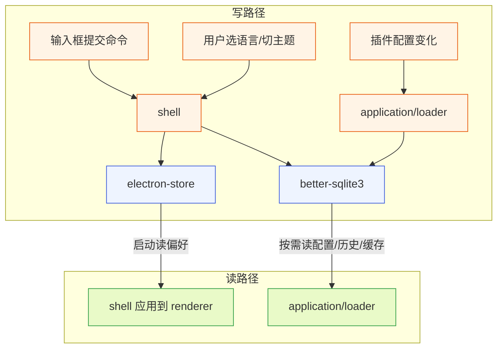
```mermaid
flowchart TD
    subgraph WRITE["写路径"]
        W1["插件配置变化"] --> A1["application/loader"] --> S1["better-sqlite3"]
        W2["用户选语言/切主题"] --> SH1["shell"] --> S2["electron-store"]
        W3["输入框提交命令"] --> SH1
        SH1 --> S1
    end
    subgraph READ["读路径"]
        S2 -->|"启动读偏好"| SH2["shell 应用到 renderer"]
        S1 -->|"按需读配置/历史/缓存"| A2["application/loader"]
    end
    classDef w fill:#fff4e6,stroke:#e8590c;
    classDef r fill:#e9fac8,stroke:#2f9e44;
    classDef s fill:#eef4ff,stroke:#3b5bdb;
    class W1,W2,W3,A1,SH1 w;
    class S1,S2 s;
    class SH2,A2 r;
```

**图 8 — 持久化读写流向：sqlite 归 application，electron-store 归 shell，调用方分层**

---

## 5 安全：dompurify 与沙箱

### 5.1 渲染不可信内容

#### 5.1.1 markdown 渲染路径

时间线里 assistant 消息、工具调用的输出、文件预览的 markdown——这些内容来自 pi 底座（agent 生成的文本），也可能来自第三方插件渲染的数据。这些是不可信内容（agent 可能生成包含 `<script>` 或 `javascript:` 链接的 markdown，恶意插件可能注入 HTML）。渲染路径是：markdown 文本 → markdown parser（`marked`，见 1.3.1，一次性 `marked(md) → html`）→ HTML → dompurify 净化 → React 渲染（用 `dangerouslySetInnerHTML` 注入净化后的 HTML，或经 React 组件树）。dompurify 是这道防线的核心——它剥离 `<script>`/`<iframe>`/`on*` 事件属性/`javascript:` 协议等 XSS 向量，只保留安全的 HTML 标签和属性。

#### 5.1.2 HTML 净化配置

dompurify 的配置要按 pi-desktop 的渲染需求定制——允许哪些标签、哪些属性。基础配置允许常见 markdown 标签（`p`/`div`/`span`/`a`/`code`/`pre`/`ul`/`ol`/`li`/`strong`/`em`/`img`/`table` 等），`a` 标签的 `href` 只允许 `http`/`https`/`mailto` 协议（禁 `javascript:`/`data:`，图片的 `data:` 另外开），`img` 的 `src` 同理。`on*` 属性全禁。`style` 属性**按需允许受限子集**——代码高亮（如 syntax highlighter 产物）要内联 `color`/`background-color` 设色，但只允许以下 CSS 属性白名单：`color`、`background-color`、`font-weight`、`font-style`、`text-decoration`。明确禁止：`url()`（防 `background: url(javascript:...)`）、`expression()`（IE 旧漏洞，虽现代 Chromium 不解析但显式禁以防万一）、`javascript:` 协议、以及任何 `position`/`display`/`z-index` 等可破坏布局的属性。代码高亮产物如何被限定在该子集内：syntax highlighter 输出的 `<span style="color:#...">` 在注入前过一遍 dompurify 的 `ALLOWED_ATTR: [..., "style"]` + 自定义 hook（`uponSanitizeAttribute` 对 style 逐属性过滤，只留白名单内的、其余剥离）。dompurify 在 renderer 进程运行（它依赖 DOM），净化后的 HTML 才注入。这层净化是 shell/renderer 的职责、不是圆心——圆心不感知"内容要净化"这件事，它只定义中性事件接口（ToolCallEnd.result 是 unknown），净化在渲染层做。

```typescript
// shell/renderer/ui/markdown.tsx —— dompurify 净化配置
import DOMPurify from "dompurify";

const purifyConfig: DOMPurify.Config = {
  ALLOWED_TAGS: [
    "p", "div", "span", "br", "hr",
    "a", "code", "pre", "blockquote",
    "ul", "ol", "li", "strong", "em", "del",
    "img", "table", "thead", "tbody", "tr", "th", "td",
    "h1", "h2", "h3", "h4", "h5", "h6",
  ],
  ALLOWED_ATTR: ["href", "src", "alt", "title", "class", "colspan", "rowspan", "style"],
  ALLOWED_URI_REGEXP: /^(?:(?:https?|mailto):|data:image\/(?:png|jpeg|gif|webp);base64,)/i,
  FORBID_ATTR: ["onerror", "onload", "onclick"], // on* 全禁
  FORBID_TAGS: ["script", "iframe", "object", "embed", "form"],
};

// style 属性白名单 hook：只留 color/background-color/font-weight/font-style/text-decoration
const STYLE_WHITELIST = ["color", "background-color", "font-weight", "font-style", "text-decoration"];
DOMPurify.addHook("uponSanitizeAttribute", (node, data) => {
  if (data.attrName === "style") {
    const kept = data.attrValue
      .split(";")
      .map((d) => d.trim())
      .filter((d) => {
        const prop = d.split(":")[0]?.trim().toLowerCase();
        return prop && STYLE_WHITELIST.includes(prop) && !/url\(|expression\(|javascript:/i.test(d);
      })
      .join("; ");
    data.attrValue = kept; // 非白名单属性被剥离
    if (!kept) delete data.attrValue; // 全剥离则删整个 style
  }
});

export function sanitizeHtml(html: string): string {
  return DOMPurify.sanitize(html, purifyConfig);
}

// 渲染时：<div dangerouslySetInnerHTML={{ __html: sanitizeHtml(parsed) }} />
// 链接补 rel
DOMPurify.addHook("afterSanitizeAttributes", (node) => {
  if (node.tagName === "A" && node.getAttribute("href")) {
    node.setAttribute("target", "_blank");
    node.setAttribute("rel", "noopener noreferrer");
  }
});
```

#### 5.1.3 图片与链接

图片内容（AgentMessage.content 里的 ImageContent，DESIGN.md 1.7.6）是 base64 或 URL 形式。base64 图片直接渲染（``）是安全的（data: 的图片 MIME 白名单）；URL 图片要过 dompurify 的 src 白名单。链接（markdown 的 `[text](url)`）渲染成 `<a>` 时，`target="_blank"` + `rel="noopener noreferrer"`——防止新窗口能访问宿主 window.opener。这些是 renderer 渲染层的规范，pi.ui 组件库的 Markdown 组件内置这些配置，插件用 pi.ui 的 Markdown 组件自动获得防护。

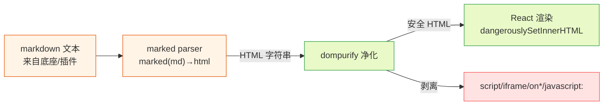
```mermaid
flowchart LR
    MD["markdown 文本<br/>来自底座/插件"] --> PARSER["marked parser<br/>marked(md)→html"]
    PARSER -->|"HTML 字符串"| DP["dompurify 净化"]
    DP -->|"安全 HTML"| REACT["React 渲染<br/>dangerouslySetInnerHTML"]
    DP -->|"剥离"| XSS["script/iframe/on*/javascript:"]
    classDef in fill:#fff4e6,stroke:#e8590c;
    classDef safe fill:#e9fac8,stroke:#2f9e44;
    classDef bad fill:#ffe3e3,stroke:#fa5252;
    class MD,PARSER in;
    class DP,REACT safe;
    class XSS bad;
```

**图 9 — markdown 渲染与 XSS 净化路径**

### 5.2 沙箱与权限

#### 5.2.1 contextIsolation 与 nodeIntegration

renderer 的 Electron 安全配置：`contextIsolation: true`（renderer 的 window 和 preload 的 window 隔离，preload 挂的 API 在隔离的 context）、`nodeIntegration: false`（renderer 不能直接 require Node 模块）、`sandbox: true`（renderer + preload 进程沙箱化，限制系统调用，并**剥离 preload 的绝大多数 Node API**——preload 只能 `import` `electron` 的 `contextBridge`/`ipcRenderer`、不能 `require("fs")` 等，见 2.1.3）。这三项是 Electron 的安全基线，确保 renderer 里的代码（含插件 UI）只能通过 preload 暴露的 scoped API 和外界交互。pi-desktop 默认启用全部三项——这是"renderer 侧沙箱"的第一道防线。

#### 5.2.2 CSP 内容安全策略

除了 contextIsolation/nodeIntegration，renderer 还配 CSP（Content Security Policy）——通过 `session.defaultSession.webRequest.onHeadersReceived` 注入 `Content-Security-Policy` 头，禁止 inline script、禁止 eval、限制资源加载源到 `self`。这是 XSS 的兜底防线：即使 dompurify 被绕过（理论上可能），CSP 也能阻止注入的 script 执行。CSP 配置示例：`default-src 'self'; script-src 'self'; style-src 'self' 'unsafe-inline'; img-src 'self' data: https:; connect-src 'self' https:`。`style-src 'unsafe-inline'` 是因为主题 CSS 变量需要内联 style——这个折中可接受（style 不执行代码）。

#### 5.2.3 permissions 声明与授权

插件要更高权限（访问特定文件、网络域名、子进程）在 manifest 的 `permissions` 字段声明、用户在管理 UI 授权（DESIGN.md 3.2.4）。沙箱默认只给 `rpc`/`events`/`bus`/`config`/`i18n`/`http.fetch(白名单域名)`，要更多能力必须声明。取值是枚举字符串：`fs:project:read`/`fs:project:write`/`fs:global`/`net:域名`/`child:command`/`content:sensitive`。用户授权后 core 才把对应能力注入 PluginContext，未声明未授权的能力调用会抛错。`content:sensitive` 权限尤其关键——声明后插件才能在订阅的 SessionEvent 里看到消息文本内容；未声明的插件收到的 event 里敏感字段为空，过滤点在 gateway 层（event-translator 翻译 pi 事件时按权限过滤，DESIGN.md 5.1.5）。这防止恶意插件默默收对话内容外传（配合 `net:` 域名白名单）。

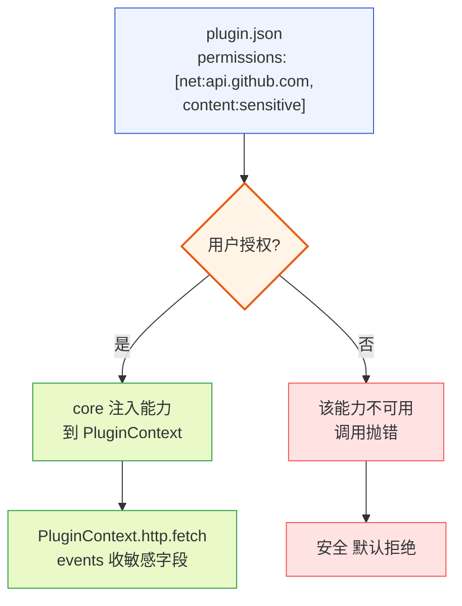
```mermaid
flowchart TD
    MANIFEST["plugin.json<br/>permissions: [net:api.github.com,<br/>content:sensitive]"] --> AUTH{"用户授权?"}
    AUTH -->|是| INJ["core 注入能力<br/>到 PluginContext"]
    AUTH -->|否| DENY["该能力不可用<br/>调用抛错"]
    INJ --> CTX["PluginContext.http.fetch<br/>events 收敏感字段"]
    DENY --> SAFE["安全 默认拒绝"]
    classDef decl fill:#eef4ff,stroke:#3b5bdb;
    classDef dec fill:#fff4e6,stroke:#e8590c,stroke-width:2px;
    classDef ok fill:#e9fac8,stroke:#2f9e44;
    classDef bad fill:#ffe3e3,stroke:#fa5252;
    class MANIFEST decl;
    class AUTH dec;
    class INJ,CTX ok;
    class DENY,SAFE bad;
```

**图 10 — 权限声明与授权流程：默认拒绝，显式声明+用户授权才注入能力**

#### 5.2.4 webview 强隔离降级

当某个插件要渲染完全不可信的第三方富内容（如加载任意网页、执行第三方 JS），renderer 侧的 ErrorBoundary + portal 隔离不够——它和宿主共享 renderer 堆，恶意代码能访问 DOM。这时走 webview 旁路：`<webview src="..." />` 是独立的浏览器上下文，有自己的进程、自己的 JS 堆，和宿主 renderer 彻底隔离，只通过 `postMessage` 通信。这是 VSCode webview 的路线。pi-desktop 把它作为强隔离槽位的降级方案，不作为默认——大多数插件 UI 融进宿主 React 树（共享渲染调度、内存可控），只有"渲染不可信富内容"这种场景才用 webview。webview 启用也要声明 `permissions`（如 `net:*`）并经用户授权。

---

## 6 i18next 国际化

### 6.1 namespace 组织

#### 6.1.1 按槽位/插件 namespace

i18n 用 i18next + react-i18next 实现（DESIGN.md 5.1.2），按 namespace 切。namespace 的组织方式对应槽位和插件——文案 key 用 dot 分隔 namespace，如 `timeline.toolExecuting` 表示 timeline namespace 下的 toolExecuting key、`settings.modelSection` 表示 settings namespace 下的 key（DESIGN.md 3.3 语言槽）。每个内置插件对应一个或多个 namespace，第三方插件贡献自己的 namespace。core 渲染底座内容（时间线标签、系统提示）用的文案也走语言槽——core 不内嵌任何文案常量（DESIGN.md 1.4.1 铁律一）。i18next 的 namespace 机制天然支持这种组织：`i18n.t("timeline.toolExecuting")` 会从加载的 timeline namespace 资源里查 key。

#### 6.1.2 语言槽贡献机制

语言槽（languages）是 core 的槽位之一，插件通过 contributes.languages 贡献语言包（DESIGN.md 3.3）。贡献项提供 `{ id, locale, namespace, resources }`——`namespace` 是**显式声明的字段**（约定缺省时 `namespace = pluginId`，让一个插件天然占一个命名空间；若一个插件要贡献多个 namespace，就分多条贡献项、各自声明不同 namespace）；`resources` 是该 namespace 下的 key→文案映射，直接挂在该 namespace 上。core 启动时把所有插件同 locale 的语言包贡献项的 resources 按 namespace 聚合成一个 i18next 资源字典。语言槽的冲突仲裁和别的槽位不同：同 locale 同 namespace 的文案是"key 级合并"——多个插件都给 timeline namespace 贡献 key、各自 key 不冲突时全要（`{ ...existing, ...c.resources }` 后覆盖先）。只有**同 namespace 同 key**冲突时，按 3.5 的优先级规则取——仲裁函数复用 `application/priority.ts` 的 `resolveByPriority`（按贡献项的 `priority` 字段取高者，指向 9.1.2 的共享仲裁函数），去掉"按来源插件优先级"的含糊表述。这对应 i18next 的 `addResourceBundle` 的合并行为。

```typescript
// application/loader/mount.ts —— 启动时合并语言槽贡献项
import i18next from "i18next";
import type { LanguageContribution } from "@/domain/contributions";

export function mountLanguages(contribs: LanguageContribution[]) {
  // 按 locale 分组、按 namespace 聚合 resources
  const byLocale = new Map<string, Record<string, Record<string, unknown>>>();
  for (const c of contribs) {
    const ns = c.namespace ?? c.pluginId; // 显式 namespace，缺省取 pluginId
    const loc = byLocale.get(c.locale) ?? {};
    const existing = loc[ns] ?? {};
    loc[ns] = { ...existing, ...c.resources }; // key 级合并 后覆盖先
    byLocale.set(c.locale, loc);
  }
  for (const [locale, bundles] of byLocale) {
    for (const [ns, resources] of Object.entries(bundles)) {
      i18next.addResourceBundle(locale, ns, resources, true, true); // deepMerge + overwrite
    }
  }
}
```

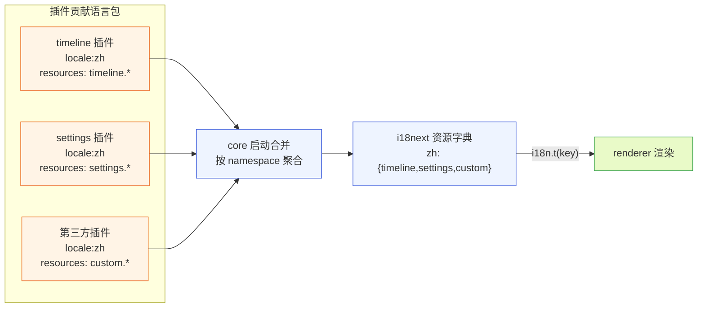
```mermaid
flowchart LR
    subgraph CONTR["插件贡献语言包"]
        P1["timeline 插件<br/>locale:zh<br/>resources: timeline.*"]
        P2["settings 插件<br/>locale:zh<br/>resources: settings.*"]
        P3["第三方插件<br/>locale:zh<br/>resources: custom.*"]
    end
    MERGE["core 启动合并<br/>按 namespace 聚合"]
    DICT["i18next 资源字典<br/>zh: {timeline,settings,custom}"]
    P1 --> MERGE
    P2 --> MERGE
    P3 --> MERGE
    MERGE --> DICT
    DICT -->|"i18n.t(key)"| UI["renderer 渲染"]
    classDef plug fill:#fff4e6,stroke:#e8590c;
    classDef core fill:#eef4ff,stroke:#3b5bdb;
    classDef res fill:#e9fac8,stroke:#2f9e44;
    class P1,P2,P3 plug;
    class MERGE,DICT core;
    class UI res;
```

**图 11 — 语言槽贡献与 i18next 资源合并**

#### 6.1.3 namespace 懒加载

namespace 不全量加载——i18next 的 `ns: ["common"]` 默认加载，其他 namespace（timeline/settings/sessions 等）按需 `i18n.loadNamespaces("timeline")`。但 pi-desktop 的 namespace 来自语言槽贡献项（都是插件自带的小字典），全量加载也轻量——启动时一次 `addResourceBundle` 全部 locale 的全部 namespace。第三方插件的 namespace 在插件 activate 时加载。这个选择是基于"语言包是小字典、全量加载无性能压力"的判断；如果未来某 namespace 变大（如完整文档翻译），可切换到懒加载——`i18next-xhr-backend` 或自实现的 loader 按 namespace 按需拉。当前不引入这个复杂度。

### 6.2 locale 检测与 fallback

#### 6.2.1 检测顺序

locale 检测归属 **shell 层**——这是关键纪律：i18next 的初始化代码不放在 `plugins/i18n/` 里直接 `import electron-store`，因为插件按本文 7.1.1/11.1.1 纪律只应依赖 domain 契约、不该 import electron-store（那是 shell 的存储，归 shell/store/）。locale 检测由 shell 完成、初始 locale 经偏好注入传给 i18next.init——i18n 插件本身只是往语言槽挂语言包资源、不自己读偏好也不自己 init i18next。

检测顺序（DESIGN.md 4.2.2）：用户显式选的语言（存 electron-store 偏好）→ 操作系统 locale → 默认 locale（en）。用户显式选的优先级最高——一旦用户在设置里选了语言，就覆盖自动检测。检测到 locale 后，core 查语言槽有没有该 locale 的资源，没有就 fallback。代码层面：shell 在启动时先从偏好读 locale、再 fallback 到 OS locale，最后把确定的 `userLocale` 作为 `lng` 传给 i18next.init：

```typescript
// shell/renderer/i18n-bootstrap.ts —— shell 层做 locale 检测 + i18next 初始化（不在 plugins/i18n 里）
import i18next from "i18next";
import { initReactI18next } from "react-i18next";
import { getPref } from "../store/preferences"; // electron-store 封装，归 shell/store/

// locale 检测在 shell 层完成：偏好 > OS locale > en
// OS locale 在 renderer 进程用 navigator.language（renderer 侧），在 main 进程用 app.getLocale()
// 这里 i18next 跑在 renderer，故用 navigator.language 作 OS fallback
const userLocale =
  (getPref("locale") as string | undefined) ?? navigator.language.split("-")[0] ?? "en";

await i18next.use(initReactI18next).init({
  lng: userLocale,
  fallbackLng: "en",
  defaultNS: "common",
  ns: ["common"], // 其他 namespace 由语言槽贡献项运行时加载
  resources: {}, // 由 mountLanguages（6.1.2）运行时注入
  interpolation: { escapeValue: false }, // React 已防 XSS，关 i18next 转义
  returnNull: false, // 查不到返回 key 本身而非 null
});
```

i18n 插件（`plugins/i18n/`）的职责收敛为：贡献中英文语言包到语言槽（contributes.languages）、不自己 init i18next、不 import electron-store。shell 的 `i18n-bootstrap.ts` 在 renderer 启动时跑 init + `mountLanguages`（6.1.2）注入语言槽贡献项。这样 locale 检测归 shell、语言包资源归插件、两者经"shell 注入 lng + 插件贡献 resources"的接缝配合——i18n 插件不碰 electron-store（遵守"插件只依赖 domain"），shell 不碰语言包 key（遵守"组装和调用分开"）。

#### 6.2.2 fallback 链

i18next 的 fallback 机制：`fallbackLng: "en"`——查不到当前 locale 的某 key 时，fallback 到 en 的同 key。这保证即使某插件没贡献中文翻译，它的 key 也能显示英文兜底（或 manifest 的字面 displayName，DESIGN.md 3.2.1 的 fallback 约定）。core 渲染插件展示名时先按 `plugin.{id}.displayName` 查当前 locale 翻译，查到就用、查不到 fallback 到 `displayName` 字段的字面值。第三方插件只填字面值、不贡献翻译也正常工作——这是 fallback 机制的设计意图。完整的 fallback 链（DESIGN.md 4.2.1 图 12）：当前 locale → 默认 en → manifest 字面值 → key 本身。

### 6.3 本地化格式

#### 6.3.1 日期数字复数

i18n 不只是文案翻译，还包括本地化格式（DESIGN.md 4.2.5）。RendererPluginContext 的 i18n 提供 `formatDate`/`formatNumber`（DESIGN.md 3.2.5），内部用 `Intl.DateTimeFormat`/`Intl.NumberFormat` 按当前 locale 格式化。复数用 i18next 的 `_plural` 机制——`t("timeline.messages", { count: 5 })` 会按 locale 的复数规则选 `messages_one`/`messages_other`（中文没有复数区分、英文区分单复数、阿拉伯语有六种复数形式）。排序按 locale 的 `Intl.Collator`。这些让桌面端在不同语言下符合本地化习惯，不只是"把字翻译过来"。

```typescript
// shell/renderer/i18n-formatters.ts —— 本地化格式封装
import i18next from "i18next";

export const i18n = {
  t: (key: string, opts?: Record<string, unknown>) => i18next.t(key, opts),
  formatDate: (date: Date | number, opts?: Intl.DateTimeFormatOptions) =>
    new Intl.DateTimeFormat(i18next.language, opts).format(date),
  formatNumber: (n: number, opts?: Intl.NumberFormatOptions) =>
    new Intl.NumberFormat(i18next.language, opts).format(n),
  // 复数：resources 里写 messages_one/messages_other，t 自动选
  plural: (key: string, count: number) => i18next.t(key, { count }),
};
```

#### 6.3.2 RTL 支持

RTL（从右到左）语言（阿拉伯语/希伯来语）的布局方向：检测到 RTL locale 时，renderer 的 `<html dir="rtl">`、布局镜像。CSS 用 logical properties（`margin-inline-start` 而非 `margin-left`）而非物理方向，这样 dir 切换时自动镜像。pi.ui 组件库内置 RTL 支持——插件用 pi.ui 组件自动获得。当前 pi-desktop 默认内置语言包不含 `ar`/`he`（DESIGN.md 4.2.5 诚实声明），避免装起来不好用；未来支持需 core 系统地加 CSS `direction` 变量 + pi.ui 组件用逻辑属性 + 内置插件适配，记为二期演进。

---

## 7 洋葱分层与依赖方向

### 7.1 四层目录结构

#### 7.1.1 domain 圆心：纯中性契约零依赖

DESIGN.md 5.1.4 的目录结构是激进洋葱的落实——圆心 `domain/` 绝对纯：只有中性契约（槽位、中性事件 ToolCallStart/Update/End、PluginContext/RendererPluginContext 接口、ContributionItem/SyncSnapshot 类型）。不 import pi 类型（Model/RpcSessionState 这些底座协议类型全在 `gateway/protocol/`），不 import electron/react。圆心是洋葱的圆心——稳定、协议无关、shell 无关。`domain/` 的内容：

```
src/domain/
├── slots/           # 槽位契约（7 槽 + MatchStrategy/MatchContext）
│   ├── registry.ts    #   SlotRegistry（按槽位分的 Map）
│   ├── strategies.ts  #   内置 MatchStrategy（toolName/all/extension...）
│   └── schema.ts      #   各槽位贡献项 schema
├── events/          # 中性事件接口（圆心自有，不绑 pi）
│   └── tool-call.ts   #   ToolCallStart/Update/End
├── context.ts       # PluginContext / RendererPluginContext 接口（中性类型）
└── contributions.ts # ContributionItem / DynamicContribution / SyncSnapshot
```

圆心可纯单测（`tests/domain/`，无任何外部依赖）。这个"纯"的检验方式：打开 `domain/` 任何文件，看不到 `import ... from "@earendil-works/pi-..."`、看不到 `import ... from "electron"`、看不到 `import ... from "react"`——看到就是违规。这条由 eslint 的 `no-restricted-paths` 在 CI 强制（见 1.3.2）。

#### 7.1.2 gateway 协议边界：唯一可 import pi 类型

`gateway/` 是第一外层，是底座协议边界——唯一能 import pi 类型的层。`gateway/protocol/` 放底座 RPC 协议类型（RpcCommand/RpcResponse/AgentSessionEvent/RpcSessionState/Model/SessionEntry...），这些类型对应底座 `底座:modes/rpc/rpc-types.ts` 的副本，是协议漂移的落点（DESIGN.md 6.4 的 handshake/版本协商未来在这）。`gateway/` 还含 RPC 适配层（`rpc-adapter.ts`，支柱①的协议层）、事件翻译器（`event-translator.ts`，pi 事件→domain 中性事件）、Extension UI 翻译（`extension-ui.ts`）、类型映射（`context-binding.ts`，toSessionState/toMessageEntry）、id 配对器（`correlator.ts`，RequestCorrelator，rpc-adapter 与 extension-ui 复用）。注意 `rpc-adapter.ts` **不负责 spawn/kill 子进程**——那是 `shell/electron-main/subprocess-lifecycle.ts` 的职责；`rpc-adapter` 构造时收一个 `SubprocessHandle`（接口定义在 `gateway/subprocess-handle.ts`、归 gateway 自身拥有，见 2.1.1 依赖倒置说明），只消费其 stdin/stdout 做 JSONL 读写 + id 配对 + event 分发。gateway 依赖 domain、不被 domain 依赖——依赖只向内。`gateway/subprocess-handle.ts` 是 gateway 自有的接口文件，不 import shell，故不触发 11.1.1 的 `no-restricted-paths` 违规。

```
src/gateway/
├── protocol/        # 底座 RPC 协议类型（唯一 import pi 类型处）
│   └── versions.ts    #   协议版本声明 + handshake（6.4 落点）
├── subprocess-handle.ts # SubprocessHandle 接口（gateway 拥有的子进程句柄契约，shell 实现并注入）
├── rpc-adapter.ts   # 支柱①协议层：消费 SubprocessHandle 的 stdin/stdout，JSONL 读写 + id 配对 + event 分发（不 spawn）
├── event-translator.ts # pi 事件 → domain 中性事件（纯类型投影，不做 per-plugin 过滤）
├── extension-ui.ts  # Extension UI 子协议翻译
├── context-binding.ts # 底座类型 → 圆心中性类型映射
└── correlator.ts    # RequestCorrelator<T>（id 配对+timeout）
```

#### 7.1.3 application 编排

`application/` 是第二外层，是用例编排——依赖 domain + gateway，不依赖 shell。支柱②（配置操作，`config/`）、支柱③（插件加载器，`loader/`）、生命周期（`lifecycle/`）、用例编排（`orchestrations/`）、外部插件接入（`installer/`）、优先级仲裁（`priority.ts`）都在这层。application 层定义 `PluginRuntime` 接口（`plugin-runtime.ts`，依赖倒置）但实现委托给 shell。这层不 import electron——它通过接口调运行时能力。

```
src/application/
├── config/          # 支柱②：配置文件操作
│   └── restart.ts     #   改配置→重启子进程编排
├── loader/          # 支柱③：加载器八项
│   ├── discover.ts    #   发现
│   ├── merge.ts       #   优先级合并
│   ├── validate.ts    #   manifest 校验
│   ├── mount.ts       #   槽位挂载
│   └── hot-reload.ts  #   热重载
├── lifecycle/       # 插件生命周期
├── plugin-runtime.ts # PluginRuntime 接口（依赖倒置）
├── orchestrations/  # 用例编排
│   ├── resync.ts      #   共享原语 resync()
│   ├── config-restart.ts
│   └── session-switch.ts  #   重开/切换项目级 db（按真实项目路径延迟打开句柄，与 12.1.1 按 session 归属路由一致）
├── priority.ts      # resolveByPriority<T>
└── installer/       # 外部插件接入
```

#### 7.1.4 shell 可整层替换

`shell/` 是第三外层，是会变的 shell 细节——依赖 application，可整体替换。utilityProcess worker、MessagePort、React、sqlite、electron-builder 全封在 `shell/`。Electron main（`electron-main/`）、React renderer（`renderer/`）、存储（`store/`）、构建（`build/`）都在这层。renderer 侧持有 `componentRegistry`（`shell/renderer/component-registry.ts`）——它是槽位渲染的**运行时查表**：加载器挂载贡献项时把 `{ componentId → { component: Lazy, pluginId } }` 写进这个注册表，宿主渲染时按 `componentRegistry[id]` 取组件（3.1.2 的 `PluginComponent` 用它）。它与 domain 槽位契约的关系：domain 定义"有哪些槽位、贡献项 schema 是什么"（稳定契约），`componentRegistry` 是"哪个 componentId 对应哪个 React 组件"的运行时映射（shell 实现细节、可换）。未来换 Tauri 时 `componentRegistry` 随 renderer 一起换、domain 槽位契约不动。未来换 Tauri（Rust 壳 + Node sidecar）只替换 `shell/electron-main/` 为 sidecar 实现、`shell/renderer/` 保持（或换框架），`application/`/`gateway/`/`domain/` 全不动（DESIGN.md 5.3.3）。`plugins/` 是第四外层（内容），只依赖 domain 契约、不依赖任何中层实现。

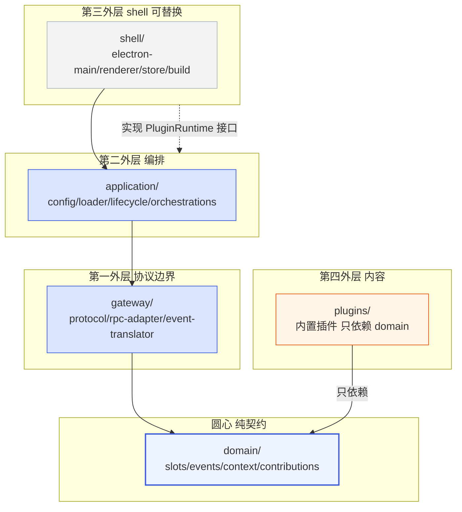
```mermaid
flowchart TD
    subgraph L4["第四外层 内容"]
        PL["plugins/<br/>内置插件 只依赖 domain"]
    end
    subgraph L3["第三外层 shell 可替换"]
        SH["shell/<br/>electron-main/renderer/store/build"]
    end
    subgraph L2["第二外层 编排"]
        APP["application/<br/>config/loader/lifecycle/orchestrations"]
    end
    subgraph L1["第一外层 协议边界"]
        GW["gateway/<br/>protocol/rpc-adapter/event-translator"]
    end
    subgraph L0["圆心 纯契约"]
        DM["domain/<br/>slots/events/context/contributions"]
    end
    SH --> APP --> GW --> DM
    PL -->|"只依赖"| DM
    L3 -.->|"实现 PluginRuntime 接口"| L2
    classDef outer fill:#f1f3f5,stroke:#adb5bd;
    classDef mid fill:#dbe4ff,stroke:#3b5bdb;
    classDef inner fill:#eef4ff,stroke:#3b5bdb,stroke-width:2px;
    classDef plug fill:#fff4e6,stroke:#e8590c;
    class SH outer;
    class APP mid;
    class GW mid;
    class DM inner;
    class PL plug;
```

**图 12 — 激进洋葱四层目录：依赖只向内，plugins 只依赖圆心，shell 可整层替换**

### 7.2 圆心类型纯度

#### 7.2.1 中性投影类型

DESIGN.md 5.1.5 的关键纪律：`domain/` 的接口和类型不引用任何 `gateway/protocol/` 的底座协议类型。这有个张力——PluginContext 的 `rpc.getState()` 返回什么类型？不能返回 `RpcSessionState`（那是 gateway 的底座类型），否则圆心 import 了 gateway、依赖反转。解法是 `domain/` 定义一组中性投影类型，字段和底座类型对应、但归圆心拥有：

```typescript
// domain/events/session-state.ts —— 圆心自有中性类型
export interface SessionState {        // 对应底座 RpcSessionState，但归圆心
  model: ModelInfo | undefined;
  thinkingLevel: ThinkingLevel;
  isStreaming: boolean;
  isCompacting: boolean;
  steeringMode: "all" | "one-at-a-time";
  sessionFile: string | undefined;
  sessionId: string;
  sessionName: string | undefined;
  pendingMessageCount: number;
}
export interface ModelInfo { provider: string; id: string; name: string; reasoning: boolean; contextWindow: number; }
export interface MessageEntry { id: string; type: string; role?: "user" | "assistant" | "toolResult"; content?: MessageContent[]; toolCallId?: string; toolName?: string; } // 对应底座 SessionEntry，按需投影（见 35.1.3）
export interface MessageContent { type: "text" | "image"; text?: string; data?: string; mimeType?: string; } // 对应底座 AgentMessage.content 块（敏感字段，经 content:sensitive 过滤）
export interface SessionTreeNode { entryId: string; children?: SessionTreeNode[]; isLeaf?: boolean; label?: string; } // 对应底座 SessionTreeNode，归圆心
export interface CommandInfo { name: string; description?: string; source: "extension" | "prompt" | "skill"; } // 对应底座 RpcSlashCommand，归圆心
export interface SyncSnapshot { state: SessionState; entries: MessageEntry[]; tree: SessionTreeNode[]; commands: CommandInfo[]; } // resync 产物，全中性
// SessionEvent 是底座 AgentSessionEvent 的中性投影（见 35.2.1），按需投影插件要消费的事件
export type SessionEvent =
  | ToolCallStart | ToolCallUpdate | ToolCallEnd   // 工具调用卡片渲染
  | MessageUpdate                                  // assistant 消息流式
  | EntryAppended                                  // 时间线增量
  | ModelSelect                                    // 模型指示器
  | QueueUpdate                                    // 排队显示
  | SessionStart;                                  // session 变化
export type Theme = Record<string, string>;  // token key → 值

// gateway/context-binding.ts —— 把底座类型映射成圆心中性类型
export function toSessionState(pi: RpcSessionState): SessionState { /* 字段拷贝/转换 */ }
export function toMessageEntry(pi: SessionEntry): MessageEntry { /* ... */ }
```

底座协议变了（`RpcSessionState` 加字段），只动 `gateway/protocol/` 的类型声明和 `gateway/context-binding.ts` 的映射，圆心和插件不动。圆心完全不 import `gateway/protocol/`——它只认自己的 `SessionState`/`ModelInfo`/`MessageEntry`/`SessionEvent`。这是 6.4（协议漂移）在类型层面的隔离。`SessionEvent` 联合类型在 35.2.1 给出权威定义并说明按需投影原则——7.2.1 与 35.2.1 引用同一处定义，避免两处漂移。`MessageEntry` 按 35.1.3 的"按需投影"——timeline 渲染真正消费的字段（id/type/role/content/toolCallId/toolName）进圆心，底座 `SessionEntry` 含但没插件消费的字段不进。

#### 7.2.2 逃生舱 send 的处理

`rpc.send(command: unknown): Promise<unknown>` 用 `unknown` 签名、不绑底座协议类型（DESIGN.md 5.1.5）——这样圆心 context.ts 完全不 import `gateway/protocol/`，圆心真正纯。逃生舱本就不是类型安全路径（它让插件发任意底座命令），用 `unknown` 让插件自己断言返回结构、比假装类型安全更诚实。常规路径插件用 PluginContext 的中性方法（`getState` 返回中性 `SessionState`）、不碰 `send`，日常只依赖圆心中性类型。这是激进洋葱的代价：逃生舱失去强类型、换圆心零外部依赖——值得。这个纪律让圆心真正稳定——底座协议、shell、插件运行时三个会变维度都在圆心之外的层隔离，圆心只描述"桌面插件和 core 交互的中性契约"，三年后底座演进、shell 换代、运行时升级，圆心不动。

### 7.3 PluginRuntime 依赖倒置

#### 7.3.1 接口归 application 拥有

DESIGN.md 5.1.6 的依赖倒置：`application/lifecycle/` 要 activate 插件（spawn worker、调 activate、注入 context），但 worker 进程能力（utilityProcess/MessagePort）在 `shell/electron-main/`。如果 lifecycle 直接 import shell 的 `plugin-host.ts`，就是 application 依赖 shell——依赖反转。解法是 `application/plugin-runtime.ts` 定义 `PluginRuntime` 接口，描述"应用需要什么插件运行时能力"。接口按 Electron `utilityProcess` 的**真实语义**设计——`utilityProcess.fork(modulePath)` 在 fork 时就运行模块、返回的 `UtilityProcess` 对象只有 `postMessage`/`kill`/`on`，**没有 `.import` 方法、也不返回模块导出句柄**。所以 `PluginWorker` 不暴露 `import(modulePath)` 拿 `{activate, deactivate}`——activate/deactivate 的触发靠 worker 间 `postMessage` 握手协议：

```typescript
// application/plugin-runtime.ts —— application 层定义接口（对齐 utilityProcess 真实语义）
export interface PluginRuntime {
  // fork 即运行 mainPath（utilityProcess.fork(modulePath)），不返回模块导出
  spawn(pluginId: string, mainPath: string, env: Record<string, string>): Promise<PluginWorker>;
  kill(pluginId: string): Promise<void>;
}
export interface PluginWorker {
  // 经 postMessage 和 worker 通信（utilityProcess 唯一通道）；不 import 模块导出
  postMessage(channel: string, data: unknown): void;
  onMessage(channel: string, cb: (data: unknown) => void): () => void;
  onCrash(cb: (err: Error) => void): void;
}
```

**activate/deactivate 的 postMessage 握手契约**（替代不存在的 `utilityProcess.import`）：

关键前提：`utilityProcess.fork(mainPath)` 直接运行 mainPath 模块、Electron utilityProcess **没有 preload 脚本机制**。如果 fork 的目标就是插件 `plugin.manifest.main`，那么插件 main 顶层执行时 `globalThis.__pi` 必然 undefined（没有任何 host bootstrap 先注入它），`__pi.exports=...` 立即抛错。所以 fork 的目标**不是插件 main 本身**，而是一个 **host bootstrap 模块**（`shell/electron-main/plugin-host-bootstrap.ts`，作为随壳分发的 runtime 入口）。bootstrap 先安装 `globalThis.__pi` 运行时（postMessage wrapper、ready/activate 路由、PluginContext proxy 构造），再动态 `import()` 插件的 `manifest.main`——fork 的是 bootstrap → main 这条链，不是插件 main 直接跑。另外，`postMessage` 只能传可结构化克隆（structured clone）的数据，`PluginContext` 含 rpc/events/bus/config 等活句柄与方法、无法被序列化（函数/MessagePort 引用/对象方法会丢失或抛 `DataCloneError`）。所以 main 经 `postMessage` **只传可序列化的种子数据**（pluginId、已授权权限集合、config 快照），worker 侧的 `PluginContext` 由 worker 内的 host runtime 基于 transferable 的 MessagePort 自建 proxy（21.2 已隐含此机制）——main 不传活 context 对象。

1. fork 目标是 host bootstrap（不是插件 main）。bootstrap 顶层安装 `globalThis.__pi` 运行时后，动态 `import()` 插件 main。插件 main 在顶层把自己的 `activate`/`deactivate` 注册到 bootstrap 安装好的 `globalThis.__pi` 约定对象，bootstrap 代为向 main 发 `plugin:ready` 声明支持哪些生命周期方法：
   ```typescript
   // shell/electron-main/plugin-host-bootstrap.ts —— fork 的真正目标，随壳分发的 host runtime
   // 1. 安装 globalThis.__pi 运行时（postMessage wrapper、ready/activate 路由、PluginContext proxy 构造点）
   const port = /* main 经 transferable MessagePort 传入 */;
   (globalThis as any).__pi = {
     ready(meta) { port.postMessage({ channel: "plugin:ready", ...meta }); },
     exports: null, // 插件 main 顶层写入 { activate, deactivate }
   };
   // 2. 动态加载插件 main（fork 目标是 bootstrap，不是 main 本身）
   import(pluginManifestMain /* 动态拼接的 main 路径 */);

   // 插件 main 模块顶层（被 bootstrap 动态 import 后执行）
   const __pi = (globalThis as any).__pi; // bootstrap 已安装，此时有值
   __pi.exports = { activate: async (ctx) => { ... }, deactivate: async () => { ... } };
   __pi.ready({ hasActivate: true, hasDeactivate: true }); // 经 bootstrap 的 port 通知 main：模块已就绪
   ```
2. main 侧 `spawn` 返回的 `PluginWorker` 在 fork 后等 `plugin:ready` 收据（带超时，超时视为插件没正确导出生命周期、标记 error）。`activatePlugin` 编排拿到 ready 收据后，经 `worker.postMessage("plugin:activate", { pluginId, permissions, configSeed })` 触发 worker 调自己的 `activate(ctx)`——注意只传**可序列化的种子数据**（pluginId、已授权权限集合、config 快照），不传活 `context` 对象。worker 内的 host runtime（bootstrap）收到 `plugin:activate` 后，基于 transferable 的 MessagePort 自建 `PluginContext` proxy（rpc/events/bus 经端口转发、config 用种子快照），调插件的 `activate(proxyCtx)`；bootstrap 把 `activate` 的 Promise 结果经 `postMessage("plugin:activated", { ok|error })` 回执给 main。`deactivate` 同理走 `plugin:deactivate` → `plugin:deactivated`。
3. main 侧的 `PluginWorker.onMessage("plugin:activated", ...)` 收回执 resolve `activatePlugin` 的 Promise；`onCrash` 监听 worker 的 exit 事件（`utilityProcess` 的 `exit` 事件）做错误隔离。

这条握手契约让"拿 activate 句柄"不靠不存在的 `utilityProcess.import`，而靠 worker 自报告 + postMessage 回执——完全对齐 Electron `utilityProcess` 的真实 API。

#### 7.3.2 shell 实现接口

`shell/electron-main/plugin-host.ts` 实现这个接口——`UtilityProcessRuntime implements PluginRuntime`，spawn=`utilityProcess.fork(mainPath)`（fork 即运行模块，不返回导出）、postMessage=`worker.postMessage`/`MessagePort`、onCrash=监听 `utilityProcess` 的 `exit` 事件。启动时 shell 的 `UtilityProcessRuntime` 实例注入给 application（依赖注入）。lifecycle 调接口、不 import shell 实现：

```typescript
// application/lifecycle/activate.ts —— lifecycle 调接口不调实现
async function activatePlugin(plugin: LoadedPlugin, runtime: PluginRuntime) {
  // spawn 即 fork host bootstrap（不是插件 main 本身）；bootstrap 安装 globalThis.__pi 后动态 import 插件 main，
  // 插件 main 顶层注册 activate/deactivate 并经 bootstrap 发 plugin:ready
  const worker = await runtime.spawn(plugin.id, plugin.manifest.main, { PLUGIN_ID: plugin.id });
  worker.onCrash(err => markPluginError(plugin.id, [err.message]));  // 错误隔离
  // 种子数据：可序列化（pluginId、已授权权限集合、config 快照），不传活 context 对象
  const configSeed = await loadPluginConfig(plugin.id);
  const permissions = plugin.grantedPermissions; // Set<string>，加载器按 manifest + 用户授权注入
  // 经 postMessage 握手触发 activate（不调 worker.import，该方法不存在；不传活 ctx，postMessage 只能传可克隆数据）
  const activated = new Promise<void>((resolve, reject) => {
    const off = worker.onMessage("plugin:activated", (m: any) => {
      off();
      m?.ok ? resolve() : reject(new Error(m?.error ?? "activate failed"));
    });
  });
  worker.postMessage("plugin:activate", { pluginId: plugin.id, permissions: [...permissions], configSeed });
  await activated; // worker 侧 host runtime 用种子数据 + transferable MessagePort 自建 PluginContext proxy
}

// shell/electron-main/plugin-host.ts —— shell 实现接口
export class UtilityProcessRuntime implements PluginRuntime {
  spawn(pluginId, mainPath, env) {
    // fork 目标是 host bootstrap（随壳分发），不是插件 main 本身；
    // bootstrap 安装 globalThis.__pi 后动态 import 插件 main
    // utilityProcess.fork(bootstrapPath, { env: { ...env, PI_PLUGIN_MAIN: mainPath } })
  }
  kill(pluginId) { /* worker.kill */ }
}
```

#### 7.3.3 换 Tauri 只动 shell

这个倒置的价值在换 shell 时显现：如果未来把 Electron 换成 Tauri，只写个 `NodeSidecarRuntime implements PluginRuntime`（sidecar 版实现，spawn=node child_process），`application/lifecycle/` 一行不改、`domain/`/`gateway/` 不动、`plugins/` 不动。圆心（domain）不感知 PluginRuntime——它是 application 层的用例抽象，不是圆心契约。插件更不感知（插件只拿到 PluginContext、不碰 runtime）。这就是 DESIGN.md 5.3.3 的判据：换 shell 哪些层要动？答只动 `shell/` 和 `application/plugin-runtime.ts` 的实现注入，圆心和插件层不动。依赖倒置让"会变的运行时"彻底隔离在 shell 层。

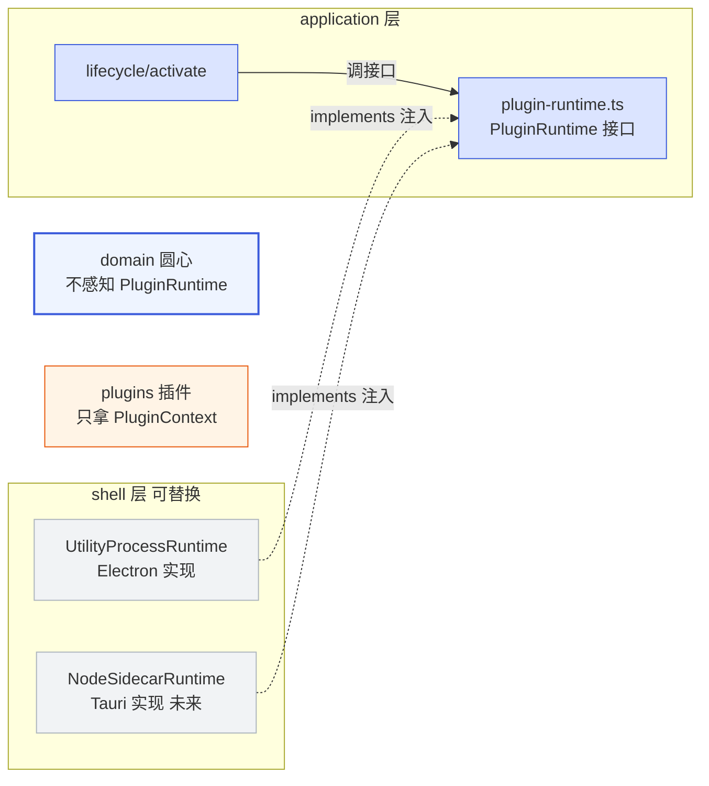
```mermaid
flowchart LR
    subgraph APP["application 层"]
        LC["lifecycle/activate"]
        IF["plugin-runtime.ts<br/>PluginRuntime 接口"]
        LC -->|"调接口"| IF
    end
    subgraph SH["shell 层 可替换"]
        E1["UtilityProcessRuntime<br/>Electron 实现"]
        T1["NodeSidecarRuntime<br/>Tauri 实现 未来"]
    end
    E1 -.->|"implements 注入"| IF
    T1 -.->|"implements 注入"| IF
    DM["domain 圆心<br/>不感知 PluginRuntime"]
    PL["plugins 插件<br/>只拿 PluginContext"]
    classDef app fill:#dbe4ff,stroke:#3b5bdb;
    classDef sh fill:#f1f3f5,stroke:#adb5bd;
    classDef core fill:#eef4ff,stroke:#3b5bdb,stroke-width:2px;
    classDef plug fill:#fff4e6,stroke:#e8590c;
    class LC,IF app;
    class E1,T1 sh;
    class DM core;
    class PL plug;
```

**图 13 — PluginRuntime 依赖倒置：application 拥有接口，shell 实现可替换，圆心不感知**

---

## 8 三平台打包与更新

### 8.1 electron-builder 配置

#### 8.1.1 Mac 平台

DESIGN.md 5.2.1 的三平台 target，Mac 打 dmg + zip。electron-builder 配置：`target: [{ target: "dmg", arch: ["arm64", "x64"] }, { target: "zip", arch: ["arm64", "x64"] }]`——universal binary（arm64 + x64 合一）或分架构包。Mac 的代码签名（Developer ID Application 证书）+ 公证（notarytool）是发布必需步骤，配置在 electron-builder 的 `mac.identity`/`mac.notarize`。better-sqlite3 的原生模块在 Mac 上要按 arm64/x64 分别 prebuild（electron-rebuild 按目标架构）。

**平台架构支持声明**：Mac 支持 arm64 + x64（Apple Silicon + Intel）；Windows 支持 x64（arm64 为二期，需 EV 证书 + Windows arm64 的 better-sqlite3 prebuild，当前不声明支持）；Linux 支持 x64 + arm64（AppImage/deb/rpm 三格式）。CI 矩阵按这套架构组合构建。

现有方案 已有三平台打包经验（其 `package.json` 有 `package:mac`/`package:win`/`package:linux` 脚本和 electron-builder 配置），pi-desktop 照着配三平台——这句总述性的复用说明放在三平台总览处，不局限在 Mac 小节。

Mac 公证（notarytool）的 electron-builder 配置片段（含完整三平台，避免维护两份重复的 mac.notarize/identity）：

```jsonc
// electron-builder.yml —— 三平台完整配置（mac 公证字段只在此处维护一次）
mac:
  category: public.app-category.developer-tools
  target:
    - { target: dmg, arch: [arm64, x64] }
    - { target: zip, arch: [arm64, x64] }
  hardenedRuntime: true
  gatekeeperAssess: false
  entitlements: "build/entitlements.mac.plist"
  entitlementsInherit: "build/entitlements.mac.plist"
  notarize:
    teamId: "<Developer Team ID>"      // 走 notarytool，需 APPLE_ID/APPLE_APP_SPECIFIC_PASSWORD/APPLE_TEAM_ID 环境变量
  identity: "Developer ID Application: <Name>"
win:
  target:
    - { target: nsis, arch: [x64] }
    - { target: portable, arch: [x64] }
  signingHashAlgorithms: ["sha256"]
  certificateSubjectName: "<CN>"      // 或 certificateFile/certificatePassword 走 pfx
  rfc3161TimeStampServer: "http://timestamp.digicert.com"
linux:
  target: [AppImage, deb, rpm]
  category: Development
```

#### 8.1.2 Windows 平台

Windows 打 nsis 安装包 + portable。配置：`target: [{ target: "nsis", arch: ["x64"] }, { target: "portable", arch: ["x64"] }]`。Windows 代码签名（EV 证书或标准证书）可选但推荐——无签名的安装包会触发 SmartScreen 警告。better-sqlite3 在 Windows 上用 prebuild 的 x64 二进制。nsis 安装包支持自定义安装目录、创建快捷方式、注册卸载入口。

#### 8.1.3 Linux 平台

Linux 打 AppImage + deb + rpm。配置：`target: [{ target: "AppImage" }, { target: "deb" }, { target: "rpm" }]`。AppImage 是单文件可执行、无需安装、跨发行版；deb 适配 Debian/Ubuntu、rpm 适配 Fedora/RHEL。Linux 不需要代码签名（无强制机制），但 AppImage 要配 `.desktop` 文件注册到系统菜单。better-sqlite3 在 Linux 上按目标架构 prebuild。

### 8.2 内置插件随包分发

#### 8.2.1 resourcesPath 布局

DESIGN.md 5.2.2：内置默认插件随包分发，打包进 Electron 的 `process.resourcesPath/pi-desktop-builtin/` 目录，**必须解包出 asar**（加载器要在运行时读这些文件、asar 内路径解析有坑，详见 17.2.3）。这个目录布局镜像 `src/plugins/` 的结构——每个内置插件一个子目录（`pi-desktop-builtin/timeline/`、`pi-desktop-builtin/i18n/` 等），含 plugin.json 和代码模块。better-sqlite3 的 `.node` 文件同样必须解包出 asar（asar 不能打包原生模块）。electron-builder 的 `asarUnpack` 配置 `["**/*.node", "**/pi-desktop-builtin/**"]`，与 17.2.3 一致。加载器把这个目录视作第四个发现源（3.4 的三处本地目录之外），扫描时标记 source 为 `builtin`、优先级最低（project > user > installed > builtin）。

#### 8.2.2 第四发现源与加载一致性

内置插件不是编译进 core 的代码，而是磁盘上的插件文件（只读、随壳更新），走同一套加载器。所以"内置"不等于"硬编码"——内置插件也是磁盘文件、来源标记是 `builtin`、优先级最低。这保证了内置插件和第三方插件在加载路径上完全一致，没有任何代码路径分支（DESIGN.md 4.1.2 铁律二）。用户可以用项目级或用户级同名插件覆盖内置插件——放一个同 id 插件到 `~/.pi-desktop/plugins/` 就覆盖了内置的。这个机制是"内置可被覆盖"的技术实现。

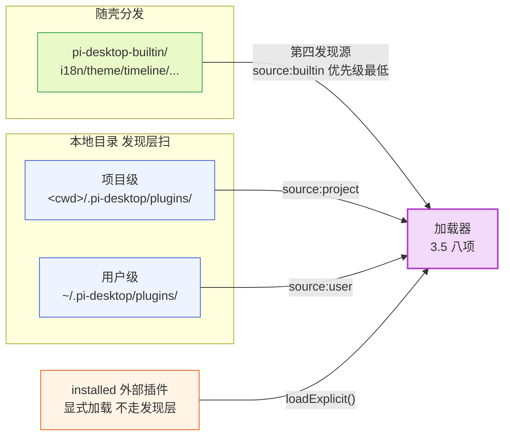
```mermaid
flowchart LR
    subgraph DIST["随壳分发"]
        BUILTIN["pi-desktop-builtin/<br/>i18n/theme/timeline/..."]
    end
    subgraph LOCAL["本地目录 发现层扫"]
        PROJ["项目级<br/>&lt;cwd&gt;/.pi-desktop/plugins/"]
        USER["用户级<br/>~/.pi-desktop/plugins/"]
    end
    INST["installed 外部插件<br/>显式加载 不走发现层"]
    BUILTIN -->|"第四发现源<br/>source:builtin 优先级最低"| LOADER["加载器<br/>3.5 八项"]
    PROJ -->|"source:project"| LOADER
    USER -->|"source:user"| LOADER
    INST -->|"loadExplicit()"| LOADER
    classDef dist fill:#e9fac8,stroke:#2f9e44;
    classDef local fill:#eef4ff,stroke:#3b5bdb;
    classDef ext fill:#fff4e6,stroke:#e8590c;
    classDef load fill:#f3d9fa,stroke:#ae3ec9,stroke-width:2px;
    class BUILTIN dist;
    class PROJ,USER local;
    class INST ext;
    class LOADER load;
```

**图 14 — 四发现源汇聚到同一加载器：内置/项目/用户走发现层，installed 走显式加载**

### 8.3 自动更新与底座更新解耦

#### 8.3.1 electron-updater 管壳更新

自动更新走 electron-updater（如启用，DESIGN.md 5.2.3）。electron-updater 检查壳的新版本（从 GitHub Release 或自建 update server）、下载差量/全量包、签名校验、重启安装。这只管 pi-desktop 桌面壳自身的更新——Electron 版本升级、renderer 代码更新、内置插件更新（随壳发版）。

#### 8.3.2 底座更新走自己的机制

pi 底座自身的更新走它自己的 self-update 机制（`底座:config.ts` 的 `detectInstallMethod`/`SelfUpdateCommand`，`底座:config.ts:73`），桌面端不掺和底座更新——底座是独立进程、自己管自己。底座可能通过 npm 全局更新（`npm i -g @earendil-works/pi-coding-agent`）、或通过它的 self-update CLI 命令。桌面端只管自己的壳更新。两者解耦：壳更新不触发底座更新、底座更新不触发壳更新。桌面端在管理 UI 里可以提示"底座有新版本"（通过检测 `pi --version` 和 registry 最新版），但更新动作由用户自己在终端执行、桌面端不代劳。这个解耦呼应薄壳定位——底座是被管理对象、不是壳的一部分。

#### 8.3.3 协议版本兼容

壳和底座版本独立演进带来的问题是 RPC 协议兼容。当前底座 RPC 协议无版本协商（DESIGN.md 6.4），桌面端起底座子进程时不做 handshake、直接发命令。如果壳比底座新（用了底座不支持的命令）、或底座比壳新（返回了壳不认的字段），可能出问题。当前处置：壳发不支持的命令时底座返回 error、壳收到不认的字段时忽略（按 unknown 处理）。演进项是底座加协议版本协商——`gateway/protocol/versions.ts` 是这个落点，未来在 spawn 子进程后先做一次 handshake（交换协议版本、协商能力集），再发业务命令。在 handshake 落地前，壳和底座的版本兼容靠"壳适配它支持范围内的底座版本"——壳发布时声明支持的底座版本范围、打包时随壳分发一个验证过的底座 CLI（`packages/pi-cli/`，DESIGN.md 5.1.4 的外层资产）。

**cliPath 的解析规则**（打通 1.1.1/1.3.3 与打包产物）：生产态指向随壳分发的底座——`process.resourcesPath/pi-cli/cli.js`（electron-builder 把 `packages/pi-cli/` 解包到 resourcesPath，`asarUnpack` 含它，见 17.2.3），`subprocess-lifecycle.ts` 用 `app.isPackaged ? join(process.resourcesPath, "pi-cli", "cli.js") : null` 判断；开发态指向本地 `node_modules`——`node_modules/@earendil-works/pi-coding-agent/dist/cli.js`（dev 时 `app.isPackaged === false`，用 `require.resolve` 解析底座包的入口）。用户可在偏好里用 `cliPath` 配置覆盖这两者（指向自己装的底座），此时桌面端不保证协议兼容、用户自负。**壳发布时声明支持的底座版本范围**的位置：写在桌面壳 `package.json` 的 `engines` 字段（如 `"engines": { "pi-coding-agent": ">=0.80.0 <0.81.0" }`）或一份 `packages/pi-cli/manifest.json`（含 `version`、`supportedProtocolRange`），`subprocess-lifecycle.ts` spawn 前读该声明、和底座 `pi --version` 输出比对，版本不在范围内时给用户"底座版本不兼容，建议用随壳分发的版本"的提示。

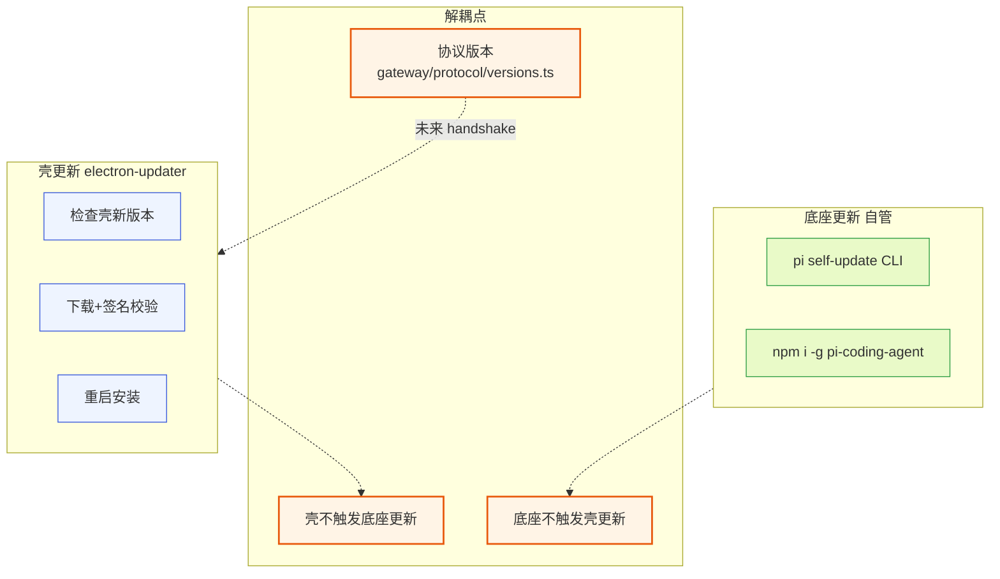
```mermaid
flowchart TD
    subgraph SHELL_UP["壳更新 electron-updater"]
        C1["检查壳新版本"]
        C2["下载+签名校验"]
        C3["重启安装"]
    end
    subgraph PI_UP["底座更新 自管"]
        P1["pi self-update CLI"]
        P2["npm i -g pi-coding-agent"]
    end
    subgraph COUPLE["解耦点"]
        D1["壳不触发底座更新"]
        D2["底座不触发壳更新"]
        D3["协议版本<br/>gateway/protocol/versions.ts"]
    end
    SHELL_UP -.-> D1
    PI_UP -.-> D2
    D3 -.->|"未来 handshake"| SHELL_UP
    classDef su fill:#eef4ff,stroke:#3b5bdb;
    classDef pu fill:#e9fac8,stroke:#2f9e44;
    classDef dc fill:#fff4e6,stroke:#e8590c,stroke-width:2px;
    class C1,C2,C3 su;
    class P1,P2 pu;
    class D1,D2,D3 dc;
```

**图 15 — 壳更新与底座更新解耦，协议版本协商是未来 handshake 落点**

---

## 9 工具归层与复用原语

### 9.1 工具的归属层

#### 9.1.1 不设跨层 shared 层

DESIGN.md 5.1.4 的一个激进点：不设跨层 shared 层，避免内层依赖外层的反转。工具归各使用层——`RequestCorrelator` 在 `gateway/`（只 gateway 用：rpc-adapter 的 command-response 配对、extension-ui 的 request-response 配对）、`resolveByPriority` 在 `application/`（只 loader 用：插件级覆盖 + 贡献项仲裁）、`resync` 在 `application/orchestrations/`（并发拉 state+entries+tree+commands）。如果设一个 `shared/` 层放这些工具，内层（domain）可能被诱使 import shared、shared 又依赖外层——反转了依赖方向。工具归使用层，让依赖方向保持"只在同层或向内"。

#### 9.1.2 三个共享原语

DESIGN.md 3.2.4 末尾的三个原语，由中层持有、插件/各场景调用同一份：

- `context.rpc.resync(): Promise<SyncSnapshot>`——重启子进程（2.4）、会话切换/分叉（4.6.3）、模型重载后都要"重新 get_state + get_entries + get_tree + get_commands 同步 UI"。这个编排收进 `resync()`：内部并发发这组命令、返回统一快照 `SyncSnapshot`、广播给所有订阅的插件。三处场景都调它，不各自拼命令。需要厘清 resync 的两重身份：**它的调用契约是圆心契约**——`PluginContext.rpc.resync` 是 `domain/context.ts` 上 `PluginRpc` 接口的方法、返回值 `SyncSnapshot` 是 `domain/contributions.ts` 拥有的中性类型（字段全中性，见 9.2.1）；**它的实现是用例编排**——真正的并发拉取、类型映射、广播逻辑归 `application/orchestrations/resync.ts`，`PluginContext.rpc.resync` 在运行时委托给这个编排。也就是说"插件看到的是圆心中性契约、core 内部跑的是 application 编排"——这正是依赖倒置：圆心定义抽象（方法签名 + 中性返回类型），application 提供实现。`resync` 因此不是"非圆心契约"——它的契约归圆心、实现归 application。
- `RequestCorrelator<T>`——RPC command-response 配对（1.4.2）和 Extension UI request-response 配对（1.9.2）是同一个模式：生成 id → 存 pending Map → 按 id resolve、带 timeout/AbortSignal 兜底。抽成工具类，归 `gateway/correlator.ts`，rpc-adapter 和 extension-ui 各持一份实例化使用。
- `resolveByPriority<T>(items, getPriority): T`——插件级覆盖（3.4）和贡献项级冲突仲裁（3.5 第 7 项）规则一致。抽成共享仲裁函数，归 `application/priority.ts`，两个粒度的调用点共用。

```typescript
// gateway/correlator.ts —— id 配对器（rpc-adapter 与 extension-ui 复用）
export class RequestCorrelator<T> {
  private pending = new Map<string, { resolve: (v: T) => void; reject: (e: Error) => void; timer: NodeJS.Timeout }>();
  private seq = 0;

  register(timeoutMs = 30_000): { id: string; promise: Promise<T> } {
    const id = `req_${++this.seq}`;
    const promise = new Promise<T>((resolve, reject) => {
      const timer = setTimeout(() => {
        if (this.pending.delete(id)) reject(new Error(`Request ${id} timed out`));
      }, timeoutMs);
      this.pending.set(id, { resolve, reject, timer });
    });
    return { id, promise };
  }

  resolve(id: string, value: T) {
    const entry = this.pending.get(id);
    if (entry) { clearTimeout(entry.timer); this.pending.delete(id); entry.resolve(value); }
  }

  rejectAll(err: Error) { for (const [, e] of this.pending) { clearTimeout(e.timer); e.reject(err); } this.pending.clear(); }
}

// application/priority.ts —— 优先级仲裁
export function resolveByPriority<T>(items: T[], getPriority: (item: T) => number): T | undefined {
  if (items.length === 0) return undefined;
  return items.reduce((best, item) => (getPriority(item) > getPriority(best) ? item : best));
}
```

### 9.2 resync 编排详解

#### 9.2.1 并发拉取

resync 是"同步 UI 到底座真相"的原语。它内部并发发四个命令（`get_state` + `get_entries` + `get_tree` + `get_commands`），不等串行——这四个命令互不依赖、可以同时发。底座子进程的 RPC 适配层支持并发（每个命令有独立 id、按 id 配对 response，DESIGN.md 1.4.2，对应 `底座:modes/rpc/rpc-client.ts:59` 的 `pendingRequests` Map），所以 resync 发四条 command、收四条 response、组装成 `SyncSnapshot`。`SyncSnapshot` 是圆心 `domain/contributions.ts` 拥有的中性类型，**字段全部用圆心中性投影**（呼应 7.2.1 圆心类型纯度纪律，圆心不 import gateway/protocol）：

```typescript
// domain/contributions.ts —— resync 的产物，归圆心、全中性
export interface SyncSnapshot {
  state: SessionState;        // 中性投影，非 gateway 的 RpcSessionState
  entries: MessageEntry[];    // 中性投影，非 gateway 的 SessionEntry
  tree: SessionTreeNode[];   // 中性投影（圆心自有，见 35.1）
  commands: CommandInfo[];    // 中性投影，非 gateway 的 RpcSlashCommand
}
```

底座返回的是 `RpcSessionState`/`SessionEntry`/`SessionTreeNode`/`RpcSlashCommand` 这些 gateway 协议类型——resync 编排在拿到底座 response 后，调 `gateway/context-binding.ts` 的映射函数（`toSessionState`/`toMessageEntry`/`toSessionTreeNode`/`toCommandInfo`）把它们投影成圆心中性类型，再组装成 `SyncSnapshot`。这样插件订阅 resync 时只吃圆心类型、不碰底座协议类型——底座协议漂移时圆心和插件不动，只动 gateway 的映射。这是 6.4 协议漂移隔离在 resync 产物上的落实。

resync 编排的实现草图（`application/orchestrations/resync.ts`）：

```typescript
// application/orchestrations/resync.ts —— 用例编排，调 gateway 接口、产圆心中性快照
import type { RpcAdapter } from "@/gateway/rpc-adapter";
import { toSessionState, toMessageEntry, toSessionTreeNode, toCommandInfo } from "@/gateway/context-binding";
import type { SyncSnapshot } from "@/domain/contributions";

// single-flight：并发调用共享同一次拉取与广播，避免多插件各自调 resync 发起多组 4 条命令（见 36.3）
let inflight: Promise<SyncSnapshot> | null = null;

export async function resync(rpc: RpcAdapter): Promise<SyncSnapshot> {
  if (inflight) return inflight; // 复用 in-flight Promise，并发调用共享同一次拉取
  inflight = (async () => {
    try {
      // 四条命令并发（底座按 id 配对，顺序无关），Promise.all 等齐
      const [stateResp, entriesResp, treeResp, commandsResp] = await Promise.all([
        rpc.send({ type: "get_state" }),
        rpc.send({ type: "get_entries" }),
        rpc.send({ type: "get_tree" }),
        rpc.send({ type: "get_commands" }),
      ]);
      // gateway 把底座类型投影成圆心中性类型后再组装
      const snapshot: SyncSnapshot = {
        state: toSessionState(stateResp.data),
        entries: (entriesResp.data.entries ?? []).map(toMessageEntry),
        tree: (treeResp.data.tree ?? []).map(toSessionTreeNode),
        commands: (commandsResp.data.commands ?? []).map(toCommandInfo),
      };
      // 广播：不走 domain PluginBus.emit（圆心不感知权限、单次 emit 无法 per-subscriber 裁剪，
      // 见 9.2.2）。改走 gateway 层的 per-subscriber 裁剪分发——rpc.broadcastSnapshot 对每个
      // 订阅插件按 content:sensitive 权限发裁剪后的快照副本（复用 filterSensitive 逻辑）
      rpc.broadcastSnapshot(snapshot); // fire-and-forget（不 await 订阅者）
      return snapshot; // 同时作为 rpc.resync() 的返回值
    } finally {
      inflight = null; // 清理 in-flight 标记，下次调用重新拉取
    }
  })();
  return inflight;
}
```

注意这个编排归 application 层、调 gateway 的 `rpc.send` 接口（不 import shell）、产圆心 `SyncSnapshot`、经 **gateway 层 per-subscriber 裁剪分发**广播（不直接走 domain `PluginBus.emit` 单对象——圆心不感知权限，见 9.2.2）——它本身不感知 utilityProcess/electron，是纯用例编排。`PluginContext.rpc.resync` 在运行时委托给它（依赖倒置：圆心定义方法签名、application 提供实现）。resync 期间收到的 event 时序由编排保证，统一以"快照截断点"为基线：四条 `get_*` 命令在底座执行时刻即基线，基线之前到达的增量 event 其描述的状态已被快照覆盖、编排丢弃；基线之后到达的 event 在快照广播后增量叠加——避免"快照覆盖了 event 又被旧 event 回退"。基线如何钉死：底座在 `get_entries` 响应里给出当前最大 entryId（**待底座确认：DESIGN.md 1.5.9/1.5.10 只定义 get_entries 返回 `{entries, leafId}`，leafId 是分叉树当前叶子节点 id、未必单调递增——见 15.2.2/36.3.2 的标注**），编排据此判定后续到达的 event 属于基线之前还是之后——快照并不天然"已包含"resync 开始后到达的 event（如 `model_select` 可能反映的是截断点之后的状态变更），故不能按"resync 开始/广播"两个时间点粗粒度丢弃，必须按底座返回的单调序精确界定。

#### 9.2.2 广播给订阅插件

resync 拿到快照后，广播给所有订阅的插件——**钉死一条通道：经 gateway 层 per-subscriber 裁剪分发**（不直接走 domain `PluginBus.emit` 单对象）。关键矛盾：快照含敏感字段（`entries[].content`），按 9.2.1/35.2.2 要求"按订阅插件权限裁剪"；但 `PluginBus` 归 domain 圆心，而圆心"不感知权限"（5.2.3）——单次 `bus.emit` 只能广播同一个对象、无法对每个订阅者发不同 redact 副本。过滤点（gateway）与广播通道（domain bus）分属两层，per-subscriber redaction 机制在 domain bus 上无法落地。故 resync:snapshot **不直接走 domain bus.emit**——它走 gateway 层的 per-subscriber 裁剪分发（`rpc.broadcastSnapshot`，复用 35.2.2 的 `filterSensitive` 逻辑），对每个订阅插件按 `content:sensitive` 权限发裁剪后的快照副本。事件名与 payload 结构由圆心契约固定（`SyncSnapshot` 归圆心、`resync:snapshot` 事件类型归圆心 events），但**分发通道在 gateway**（gateway 既感知底座事件结构又持有订阅者权限集合，是唯一能做 per-subscriber 裁剪的层）：

```typescript
// domain/events/resync.ts —— resync 广播事件契约，归圆心（只描述结构，不描述分发通道）
export interface ResyncSnapshotEvent {
  type: "resync:snapshot";
  snapshot: SyncSnapshot;   // 全中性，见 9.2.1
}

// gateway/rpc-adapter.ts —— per-subscriber 裁剪分发（不直接走 domain bus.emit）
broadcastSnapshot(snapshot: SyncSnapshot) {
  for (const sub of this.listeners) {
    const hasSensitive = sub.permissions.has("content:sensitive");
    // 声明 content:sensitive 的收完整快照；未声明的收 entries content 置空的 redact 副本
    const filtered: SyncSnapshot = hasSensitive ? snapshot : filterSnapshotSensitive(snapshot);
    sub.callback({ type: "resync:snapshot", snapshot: filtered } as ResyncSnapshotEvent);
  }
}
```

广播是 **fire-and-forget**——`resync()` 编排调 `rpc.broadcastSnapshot(snapshot)` 后立即返回快照（`context.rpc.resync()` 的 Promise resolve 中性 `SyncSnapshot`），不逐插件 await、不等订阅者处理完。订阅者各自按需取字段：timeline 插件只读 `snapshot.entries` 重渲染时间线、model-params 插件只读 `snapshot.state` 更新模型指示器、session-manager 插件只读 `snapshot.tree` 更新会话树、commands 插件只读 `snapshot.commands` 更新命令面板——取自己关心的子集、忽略其余。这样一次 resync 触发全部插件同步，而不是每个插件各自发四条命令（那是 4×N 条、浪费且可能不一致）。调用契约归圆心（`PluginContext.rpc.resync` 返回中性 `SyncSnapshot`），实现归 application（`application/orchestrations/resync.ts` 做并发拉取 + 类型映射 + 触发 gateway 裁剪分发），广播通道固定走 gateway 层 per-subscriber 裁剪分发（不直接走 domain bus.emit 单对象，避免与"圆心不感知权限"冲突）。

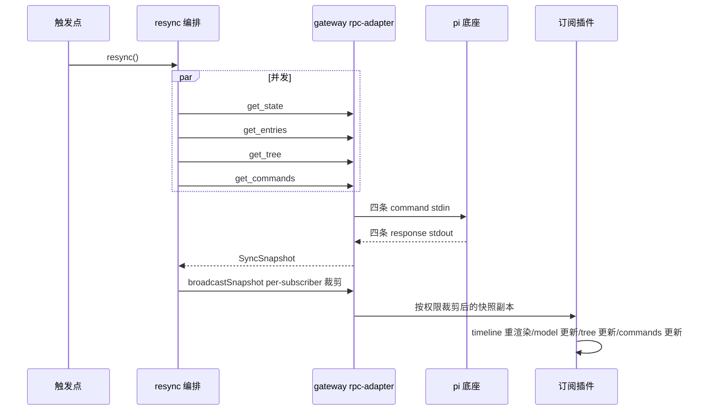
```mermaid
sequenceDiagram
    participant T as 触发点
    participant R as resync 编排
    participant GW as gateway rpc-adapter
    participant PI as pi 底座
    participant PL as 订阅插件
    T->>R: resync()
    par 并发
        R->>GW: get_state
        R->>GW: get_entries
        R->>GW: get_tree
        R->>GW: get_commands
    end
    GW->>PI: 四条 command stdin
    PI-->>GW: 四条 response stdout
    GW-->>R: SyncSnapshot
    R->>GW: broadcastSnapshot per-subscriber 裁剪
    GW->>PL: 按权限裁剪后的快照副本
    PL->>PL: timeline 重渲染/model 更新/tree 更新/commands 更新
```

**图 16 — resync 并发拉取与广播：一次编排同步全部插件**

---

## 10 与 现有方案的栈复用对照

### 10.1 复用的工程经验

#### 10.1.1 可直接复用的部分

现有方案（v0.4.20）用 Electron + electron-vite + React 验证过的工程经验，pi-desktop 可直接复用的部分：electron-vite 的三端构建配置（main/renderer/preload 的 Vite 配置结构）、Electron main 的窗口管理代码（BrowserWindow 创建/加载/事件监听）、renderer 的 React 组件骨架（ErrorBoundary/portal/lazy 的用法）、dompurify 的 markdown 净化配置、electron-store 的偏好读写、主题切换的 CSS 变量注入方式、三平台 electron-builder 配置、better-sqlite3 的 electron-rebuild 脚本。这些是和架构无关的 Electron + React 工程通用经验，栈相同就能搬。

#### 10.1.2 明确不复用的部分

明确不复用的部分是 现有方案的架构代码：WorkerManager（进程池管理——pi-desktop 走 RPC 不需要 SDK 进程池）、sdk-loader（SDK 加载器——pi-desktop 不 import SDK）、sdk-manager（SDK 版本管理——pi-desktop 走 RPC、底座版本独立）、adapter.json（34 个纯 JSON UI 翻译层——pi-desktop 不做翻译、走消费，DESIGN.md 3.1）、extension-compat（兼容层——pi-desktop 没有这层）。这些是 现有方案 厚客户端架构的产物，pi-desktop 薄壳不需要。复用经验不等于复用架构——这是栈相似、架构不同的具体体现。

### 10.2 同栈不同架构的落点

#### 10.2.1 同样的 Electron 用法不同

同样是 Electron，现有方案 用它承载 SDK（main 进程 import SDK、Worker 进程跑 SDK、renderer 渲染 SDK 产生的数据），pi-desktop 用它承载插件系统（main 进程管底座子进程 + worker 池、renderer 渲染插件 UI + 宿主树）。同样的 Electron main 进程，现有方案 里在跑 agent loop、pi-desktop 里在 spawn 底座子进程和 worker。同样的 renderer，现有方案 里在渲染 adapter 翻译出来的 UI、pi-desktop 里在渲染槽位查出来的插件组件。

#### 10.2.2 同样的 React 用法不同

同样是 React，现有方案的组件树是 adapter 驱动的（34 个 adapter 各自映射一种底座扩展的 UI），pi-desktop 的组件树是槽位驱动的（7 个槽位 + 加载器查注册表渲染）。同样的 Zustand 状态管理，现有方案 可能有一个全局 store 装 SDK 状态，pi-desktop 是 core 管槽位、插件各自管状态。同样的 dompurify，现有方案在 adapter 渲染路径里用、pi-desktop 在 markdown 渲染组件里用。栈一样、承载的东西不同——这是"栈相似是复用经验，架构不同是纠正方向"在每个依赖上的落地。

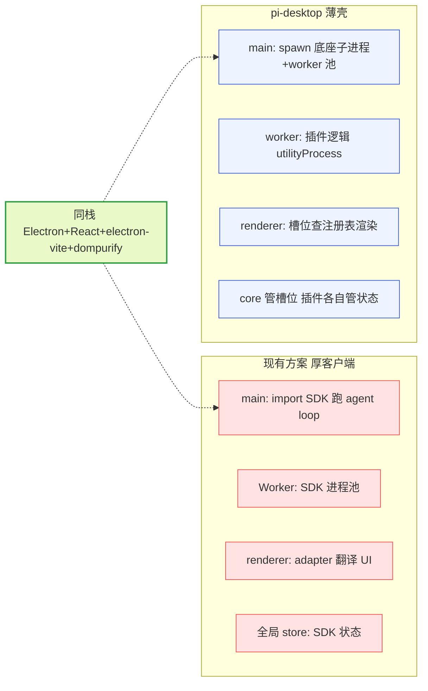
```mermaid
flowchart LR
    subgraph SAME["同栈 Electron+React+electron-vite+dompurify"]
        direction TB
    end
    subgraph PIAPP["现有方案 厚客户端"]
        A1["main: import SDK 跑 agent loop"]
        A2["Worker: SDK 进程池"]
        A3["renderer: adapter 翻译 UI"]
        A4["全局 store: SDK 状态"]
    end
    subgraph PIDE["pi-desktop 薄壳"]
        D1["main: spawn 底座子进程+worker 池"]
        D2["worker: 插件逻辑 utilityProcess"]
        D3["renderer: 槽位查注册表渲染"]
        D4["core 管槽位 插件各自管状态"]
    end
    SAME -.-> A1
    SAME -.-> D1
    classDef same fill:#e9fac8,stroke:#2f9e44,stroke-width:2px;
    classDef app fill:#ffe3e3,stroke:#fa5252;
    classDef desk fill:#eef4ff,stroke:#3b5bdb;
    class SAME same;
    class A1,A2,A3,A4 app;
    class D1,D2,D3,D4 desk;
```

**图 17 — 同栈不同架构：现有方案 用栈承载 SDK，pi-desktop 用栈承载插件系统**

---

## 11 守住依赖方向的判据

### 11.1 code review 检查清单

#### 11.1.1 import 方向检查

DESIGN.md 5.1.4 末尾的判据：依赖方向在 code review 时一眼可查。检查清单：

- `domain/` 任何文件 import 了 `gateway`/`application`/`shell`/`plugins` → 违规（圆心不依赖外层）。
- `plugins/` 任何文件 import 了 `gateway`/`application`/`shell` → 违规（插件只该 import `domain`）。
- `gateway/` 文件 import 了 `application`/`shell` → 违规（gateway 是第一外层，不依赖更外层）。
- `application/` 文件 import 了 `shell` → 违规（application 通过接口调 shell，不直接 import）。
- `application/` 文件 import 了 `gateway/protocol/` 的 pi 类型 → 要检查（application 应只用 domain 中性类型，例外是 gateway 内部的翻译）。

**关于 type-only 跨层 import 的纪律**：`no-restricted-paths` 默认对 `import type` 和 `import` 一视同仁——即 type-only 跨层 import 同样被拦截，**不**开 `allowTypeImports`（文档钉死不开）。这条纪律的直接后果：内层若需要引用外层类型，必须用依赖倒置——内层定义接口、外层实现并注入，而不是 `import type` 外层类型。2.1.1 的 `SubprocessHandle` 就是这条纪律的典型落地：它描述"gateway 需要的子进程协议句柄契约"，若接口文件挂在 `shell/`、gateway 用 `import type { SubprocessHandle } from "../shell/..."` 引用，会直接被 lint 拦截（gateway 不可 import shell，含 type import）。解法是接口归 gateway 自身拥有（`gateway/subprocess-handle.ts`），shell 的 `subprocess-lifecycle.ts` 实现该接口并产出实例——shell import gateway 的接口是允许的（依赖向内），gateway 不 import shell。同样 `PluginRuntime`/`PluginWorker` 接口归 application 拥有（7.3.1）、shell 实现并注入，application 不 import shell。

这条检查由 eslint `no-restricted-paths` 强制（见 1.3.2），配置示例（显式不开 `allowTypeImports`，type-only 跨层 import 同样拦截）：

```javascript
// .eslintrc.js 片段
"import/no-restricted-paths": ["error", {
  zones: [
    { target: "./src/domain", from: "./src/{gateway,application,shell,plugins}" },
    { target: "./src/plugins", from: "./src/{gateway,application,shell}" },
    { target: "./src/gateway", from: "./src/{application,shell}" },
    { target: "./src/application", from: "./src/shell" },
  ],
  // 注意：不设 allowTypeImports —— type-only 跨层 import 同样视为违规
  // 内层需要外层类型时用依赖倒置（内层定义接口、外层实现），而非 import type
}],
```

#### 11.1.2 换 shell 思想实验

DESIGN.md 5.3.3 的判据：如果把 Electron 换成 Tauri，哪些层要动？答：

- 圆心 `domain/` ——不动（纯契约，shell 无关）。
- `gateway/`——不动（RPC 协议不变，rpc-adapter 起 pi 子进程的方式可能从 spawn node 改成 spawn sidecar，但 stdin/stdout 通道不变）。
- `application/`——不动（lifecycle 调 PluginRuntime 接口，不调 shell 实现）。
- `plugins/`——不动（插件只依赖 domain 契约）。
- `shell/`——动（`electron-main/` 换成 sidecar 实现、`renderer/` 保持或换框架、`store/` 的 better-sqlite3/electron-store 换成 Tauri 侧等价物、`build/` 换打包配置）。

只有 shell 动，其余不动——这就是洋葱架构的价值，稳定的圆心不被会变的外层污染。

### 11.2 会变维度的隔离

#### 11.2.1 三个会变维度

pi-desktop 有三个会变维度，激进洋葱把它们隔离在圆心之外的层：

- **底座协议**（pi RPC 协议会漂移，DESIGN.md 6.4）——隔离在 `gateway/protocol/`，变了只动这层和 `gateway/context-binding.ts` 的映射，圆心不动。
- **shell**（Electron 可能换 Tauri）——隔离在 `shell/`，换了只动这层 + `application/plugin-runtime.ts` 的实现注入，圆心和 application 不动。
- **插件运行时**（utilityProcess 可能换 sidecar）——隔离在 `shell/electron-main/plugin-host.ts` 的 PluginRuntime 实现，application 定义接口不感知实现。

#### 11.2.2 圆心的稳定性

圆心只描述"桌面插件和 core 交互的中性契约"——槽位、中性事件、PluginContext 接口、ContributionItem 类型。这些是 pi-desktop 最稳定的业务本质：不管底座协议怎么漂移、shell 用什么技术、插件跑在什么进程模型里，"插件往槽位挂贡献项、core 按槽位渲染"这个契约不变。三年后底座演进、shell 换代、运行时升级，圆心不动——这是激进洋葱纪律的回报。DESIGN.md 5.1.5 结尾的话：这个纪律让圆心真正稳定。

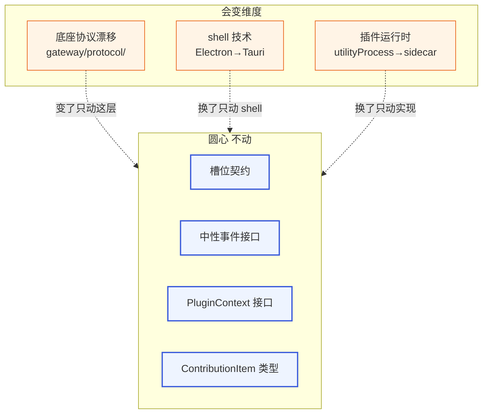
```mermaid
flowchart TD
    subgraph VARS["会变维度"]
        V1["底座协议漂移<br/>gateway/protocol/"]
        V2["shell 技术<br/>Electron→Tauri"]
        V3["插件运行时<br/>utilityProcess→sidecar"]
    end
    subgraph STABLE["圆心 不动"]
        S1["槽位契约"]
        S2["中性事件接口"]
        S3["PluginContext 接口"]
        S4["ContributionItem 类型"]
    end
    V1 -.->|"变了只动这层"| STABLE
    V2 -.->|"换了只动 shell"| STABLE
    V3 -.->|"换了只动实现"| STABLE
    classDef var fill:#fff4e6,stroke:#e8590c;
    classDef stable fill:#eef4ff,stroke:#3b5bdb,stroke-width:2px;
    class V1,V2,V3 var;
    class S1,S2,S3,S4 stable;
```

**图 18 — 三个会变维度隔离在圆心之外，圆心只描述稳定的中性契约**

---

## 12 配置文件总览

### 12.1 配置文件分布

#### 12.1.1 pi-desktop 自己的配置

pi-desktop 桌面壳自己的配置文件分布在两个位置：

- `~/.pi-desktop/preferences.json`（electron-store）：用户级偏好——locale、theme id、window position、侧栏布局、最近打开 session 路径列表。
- `<cwd>/.pi-desktop/preferences.json`（electron-store）：项目级偏好（如覆盖用户级的侧栏布局）。
- `~/.pi-desktop/desktop.db`（better-sqlite3）：用户级结构化状态——plugin_config、command_history、entry_cache、model_cache。
- `<cwd>/.pi-desktop/desktop.db`（better-sqlite3）：项目级结构化状态——与用户级同 schema、独立的 db 文件。两份 db 的路由与隔离规则：按 `sessionId` 路由——当前打开的 session 归属哪个项目（`sessionFile` 的 cwd）就读哪个项目的 db；项目级 db 存该项目相关的命令历史、entry 缓存、项目级插件配置。查询时优先读项目级 db（命中即用），项目级没有的键（如用户级全局插件配置）fallback 到用户级 db；写入按数据归属落对应 db（项目相关的写项目级、跨项目的写用户级）。两份 db 物理隔离（不同文件、不同 WAL），避免多项目并发写互相阻塞。这与 4.1.1 的"用户级或项目级"表述一致——两份都存在、按 session 归属路由。**项目级 db 的打开时机**：不在 bootstrap 阶段用 `process.cwd()` 打开（打包后 Electron 进程的 cwd 是 app bundle/启动目录、不是用户项目目录），而是在用户打开/切换项目时（`session-switch` 编排里）按真实项目路径延迟打开并切换句柄——见 17.1.1 与 7.1.3。
- `~/.pi-desktop/plugins-data/{pluginId}/config.json`：各插件的配置（PluginContext.config 存储位置，DESIGN.md 3.2.4）。
- `~/.pi-desktop/plugins/`：用户级插件目录（发现层扫）。
- `~/.pi-desktop/installed/{id}/{version}/`：外部安装的插件（installer 落盘，不走发现层）。

#### 12.1.2 pi 底座的配置

pi 底座的配置文件（桌面端通过支柱②操作，但不拥有）：

- `~/.pi/agent/settings.json`：全局 settings（`底座:core/settings-manager.ts:274` 的 `SettingsManager`）。
- `<cwd>/.pi/settings.json`：项目级 settings（项目信任时加载）。
- `~/.pi/agent/sessions/`：session 存储（底座内部事务，桌面端不碰）。
- `~/.pi/agent/extensions/`：底座 extension 目录（底座自己加载）。
- auth/trust/MCP 配置：`~/.pi/agent/` 下的其他状态文件。

两者目录隔离：`~/.pi-desktop/` 是桌面壳的，`~/.pi/agent/` 是底座的——桌面端只通过支柱②读写底座的配置文件、不在 `~/.pi/agent/` 下写桌面自己的状态。这条目录隔离守住了"桌面壳"和"底座"的状态边界。

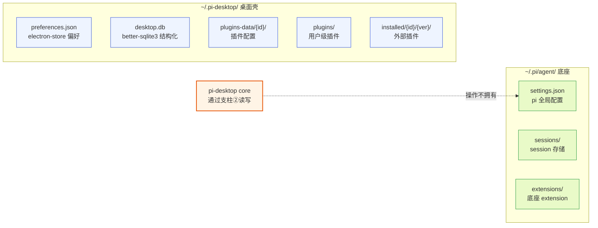
```mermaid
flowchart LR
    subgraph DESK["~/.pi-desktop/ 桌面壳"]
        P1["preferences.json<br/>electron-store 偏好"]
        P2["desktop.db<br/>better-sqlite3 结构化"]
        P3["plugins-data/{id}/<br/>插件配置"]
        P4["plugins/<br/>用户级插件"]
        P5["installed/{id}/{ver}/<br/>外部插件"]
    end
    subgraph AGENT["~/.pi/agent/ 底座"]
        A1["settings.json<br/>pi 全局配置"]
        A2["sessions/<br/>session 存储"]
        A3["extensions/<br/>底座 extension"]
    end
    CORE["pi-desktop core<br/>通过支柱②读写"] -.->|"操作不拥有"| A1
    classDef desk fill:#eef4ff,stroke:#3b5bdb;
    classDef agent fill:#e9fac8,stroke:#2f9e44;
    classDef core fill:#fff4e6,stroke:#e8590c,stroke-width:2px;
    class P1,P2,P3,P4,P5 desk;
    class A1,A2,A3 agent;
    class CORE core;
```

**图 19 — 配置文件分布：~/.pi-desktop 桌面壳与 ~/.pi/agent 底座目录隔离**

### 12.2 配置合并规则

#### 12.2.1 偏好合并

electron-store 的偏好合并简单：项目级覆盖用户级（同 key 项目级胜出），没有嵌套合并——偏好是扁平 key-value。这和 pi settings 的 deepMerge 不同（settings 有嵌套对象递归合并，DESIGN.md 2.1.1，对应 `底座:core/settings-manager.ts:132` 的 `deepMergeSettings`：嵌套对象 `{ ...baseValue, ...overrideValue }`、数组和原始值整体替换）。

#### 12.2.2 插件配置合并

插件配置（`plugins-data/{pluginId}/config.json`）的合并规则同 pi settings：用户级打底、项目级覆盖，嵌套对象递归合并（`~/.pi-desktop/plugins-data/{id}/config.json` 打底、`<cwd>/.pi-desktop/plugins-data/{id}/config.json` 覆盖）。这条规则在 PluginContext.config 实现里遵循（DESIGN.md 3.2.4）。插件配置存储不进 better-sqlite3 的 plugin_config 表——那个表存的是"需要查询的结构化配置"，一般的 key-value 插件配置走 JSON 文件（plugins-data/{id}/config.json）。两者分工：JSON 文件存简单配置、sqlite 存要查询的历史/缓存。

---

## 13 版本管理与依赖更新策略

### 13.1 依赖版本锁定纪律

#### 13.1.1 锁文件与主版本 pin

pi-desktop 用 npm/pnpm 的 lockfile（`package-lock.json`/`pnpm-lock.yaml`）锁定完整依赖树，CI 用 `npm ci`/`pnpm install --frozen-lockfile` 安装、不重新解析。直接依赖（dependencies）pin 主版本（`^33` 而非 `~33` 或 `*`）：主版本升级接受（可能有 breaking change 但通常有迁移指南），次版本/补丁自动跟进。`electron` 和 `better-sqlite3` 是例外——这俩的 ABI 耦合，升级 Electron 主版本必须同步 electron-rebuild 验证 better-sqlite3 兼容，所以这两个的升级要成对验证、不能自动。

#### 13.1.2 Renovate/Dependabot 自动化

依赖更新走 Renovate 或 Dependabot 自动开 PR，但分批合：安全补丁（patch）自动合并；minor 版本人工 review 后合；major 版本（尤其 electron/better-sqlite3/react）必须人工验证三平台构建 + 手动测试 RPC 集成后才合。这个分批策略避免"一个 PR 升了 Electron 主版本、better-sqlite3 ABI 没跟上、CI 绿了但运行 crash"这类问题。现有方案 同栈，它的依赖升级经验可参考。

### 13.2 协议版本与壳-底座版本对齐

#### 13.2.1 随壳分发的底座版本

`packages/pi-cli/` 是随壳分发的底座 CLI（外层资产，不被任何层 import）。它的版本是桌面端测过的——每次桌面壳发版前，pin 一个已知兼容的底座版本到 `packages/pi-cli/`，跑全套集成测试。用户安装桌面壳后，默认用随壳分发的底座（`cliPath` 指向它），保证开箱即用。用户也可指向自己装的底座（`cliPath` 配置覆盖），但此时桌面端不保证协议兼容——用户自负。

#### 13.2.2 协议漂移的隔离

底座 RPC 协议演进时（命令增删改、字段变化），桌面端的适配在 `gateway/protocol/`——它是协议漂移的唯一落点。底座加了新命令：`gateway/protocol/` 加类型、`rpc-adapter` 加便捷方法（可选）、PluginContext 的中性方法可选地跟进。底座改了字段：`gateway/context-binding.ts` 的映射跟进、圆心中性类型按需加字段。底座删了命令：rpc-adapter 的便捷方法标记 deprecated、插件侧逐步迁移。这套隔离让"协议漂移"冲击面限制在 gateway 一层，不波及圆心和插件层——这是 6.4 缺口的缓解，未来 handshake 落地后冲击面进一步收窄到运行时降级。

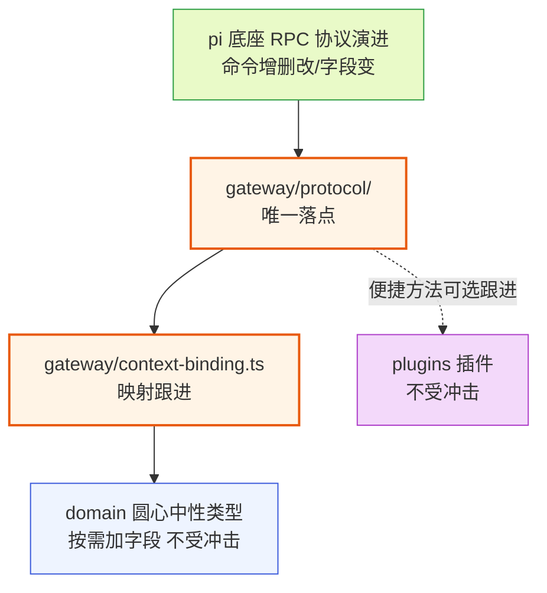
```mermaid
flowchart TD
    PI_VER["pi 底座 RPC 协议演进<br/>命令增删改/字段变"]
    GW["gateway/protocol/<br/>唯一落点"]
    BIND["gateway/context-binding.ts<br/>映射跟进"]
    CORE["domain 圆心中性类型<br/>按需加字段 不受冲击"]
    PLUG["plugins 插件<br/>不受冲击"]
    PI_VER --> GW
    GW --> BIND
    BIND --> CORE
    GW -.->|"便捷方法可选跟进"| PLUG
    classDef pi fill:#e9fac8,stroke:#2f9e44;
    classDef gw fill:#fff4e6,stroke:#e8590c,stroke-width:2px;
    classDef core fill:#eef4ff,stroke:#3b5bdb;
    classDef plug fill:#f3d9fa,stroke:#ae3ec9;
    class PI_VER pi;
    class GW,BIND gw;
    class CORE core;
    class PLUG plug;
```

**图 20 — 协议漂移隔离在 gateway，圆心和插件不受冲击**

---

## 14 可观测性与日志

### 14.1 日志架构

#### 14.1.1 内存环形缓冲

pi-desktop 的运行日志不进 better-sqlite3（sqlite 不适合 append-only 日志流），而是走内存环形缓冲 + 可选文件落盘（DESIGN.md 4.12 日志页）。日志来源四类：RPC 适配层捕获的 pi 子进程 stderr、插件 worker 的 console 拦截（worker 侧 `console.log`/`error` 转发到 main）、core 自身的日志（main/renderer 的运行事件）、gateway 的事件翻译日志。日志条目按 pluginId/level/timestamp/channel 分类，存在 main 进程的环形缓冲（最近 N 条，N 可配，默认 5000），会话级、重启丢失。

#### 14.1.2 日志页与导出

日志页（DESIGN.md 4.12）是内置插件的一个管理界面，展示环形缓冲、支持 level 过滤（debug/info/warn/error）、关键字搜索（按 pluginId/message）、一键导出（导出时落文件到用户选的路径）。插件作者开发时靠日志页看 worker 的 console 输出——不用单独开 DevTools。导出的日志文件格式是 JSON Lines（和 RPC 协议一致），方便后续工具解析。

```typescript
// shell/electron-main/logger.ts —— 内存环形缓冲
export interface LogEntry { ts: number; level: "debug"|"info"|"warn"|"error"; pluginId?: string; channel: string; message: string; }

const CAPACITY = 5000;
const ring: LogEntry[] = [];
let head = 0;

export function log(entry: Omit<LogEntry, "ts">) {
  const full: LogEntry = { ts: Date.now(), ...entry };
  if (ring.length < CAPACITY) ring.push(full);
  else { ring[head] = full; head = (head + 1) % CAPACITY; }
  if (entry.level === "error") console.error(`[${entry.channel}] ${entry.message}`);
}

export function query(filter: { level?: LogEntry["level"]; pluginId?: string; search?: string }): LogEntry[] {
  return ring.filter((e) =>
    (!filter.level || e.level === filter.level) &&
    (!filter.pluginId || e.pluginId === filter.pluginId) &&
    (!filter.search || e.message.includes(filter.search))
  );
}
```

### 14.2 错误隔离与崩溃报告

#### 14.2.1 worker 崩溃隔离

插件 worker 崩溃不影响主进程——`UtilityProcessRuntime` 的 `onCrash` 回调被 lifecycle 注册（DESIGN.md 5.1.6 的 `worker.onCrash(err => markPluginError(plugin.id, [err.message]))`）。崩溃后该插件标记为 error 状态、在管理 UI 显示、不再 activate；其他插件和底座子进程不受影响。这个进程级隔离是 utilityProcess 的核心价值——对比 现有方案 同进程 import SDK 时一个插件抛错可能拖垮整个 agent loop。

#### 14.2.2 崩溃上报与隐私

崩溃上报（如启用 crash reporter）走 Electron 的 `crashReporter`，但默认关闭——pi-desktop 是本地工具，不强制上报。开启时上报内容只含 crash dump（不含对话内容、session 数据），且经用户同意。这呼应 `content:sensitive` 权限的隐私纪律——对话内容是敏感数据，不进任何上报通道。

```mermaid
flowchart TD
    subgraph SRC["日志来源"]
        S1["pi 子进程 stderr<br/>gateway 捕获"]
        S2["worker console 拦截"]
        S3["core 自身日志"]
        S4["gateway 翻译日志"]
    end
    BUF["内存环形缓冲<br/>最近 N 条"]
    LOG_PAGE["日志页插件<br/>过滤/搜索/导出"]
    CRASH["worker 崩溃<br/>onCrash 隔离"]
    SRC --> BUF
    BUF --> LOG_PAGE
    CRASH -.->|"标记插件 error"| MGMT["管理 UI 显示"]
    classDef src fill:#fff4e6,stroke:#e8590c;
    classDef buf fill:#eef4ff,stroke:#3b5bdb;
    classDef ui fill:#e9fac8,stroke:#2f9e44;
    classDef crash fill:#ffe3e3,stroke:#fa5252;
    class S1,S2,S3,S4 src;
    class BUF buf;
    class LOG_PAGE,MGMT ui;
    class CRASH crash;
```

**图 21 — 日志架构与崩溃隔离：内存缓冲 + 日志页，worker 崩溃不影响主进程**

---

## 15 性能预算与资源约束

### 15.1 启动性能预算

#### 15.1.1 启动阶段与目标

pi-desktop 的启动分阶段，每个阶段有性能预算（目标值，非硬约束）：

- Electron 冷启动到 main ready：~800ms（Electron 自身开销，不可控）。
- BrowserWindow 创建 + renderer 首屏（preload 注入 + 空壳 React 树）：~300ms。
- 底座子进程 spawn 到就绪（`底座:modes/rpc/rpc-client.ts:132` 的 100ms 等待窗口 + 底座初始化）：~500ms。
- 插件加载（发现 + 校验 + activate + 槽位挂载）：~400ms，内置 11 个插件。
- 首次 `resync()` 同步 UI：~200ms（四条并发 RPC）。
- 总计：~2.2s 到可用状态。这个预算指导优化方向——大头在 Electron 冷启动和底座初始化（不可控），可控的是插件加载和 resync。

#### 15.1.2 懒加载与预热

插件加载是可控优化点。纯声明式插件（i18n/theme，无 main/renderer 代码）加载几乎零成本——只读 manifest + 挂槽位。带 main 的插件要 spawn worker（有进程创建开销），按"启动即用的优先 activate、按需用的懒 activate"策略：timeline/commands/management-ui 这类首屏要的插件启动时 activate；file-preview/file-editor 这类用户点开才用的懒 activate（注册槽位但不 spawn worker，首次渲染时再 spawn）。renderer 侧插件 UI 模块用 React.lazy 动态 import chunk、按需 mount。底座子进程的 spawn 和 renderer 首屏并行——renderer 空壳先出来、底座就绪后 resync 填数据，用户看到"先壳后内容"的渐进式启动而非长时间空白。

### 15.2 运行时资源约束

#### 15.2.1 worker 资源计量

每个插件的 worker 是独立 utilityProcess，资源（内存/CPU）可按插件计量。当前不设硬配额（插件是本地代码、用户主动装的），但管理 UI 可显示各 worker 的内存占用，让用户感知哪个插件吃资源。未来可加软配额（worker 内存超阈值告警、CPU 占用持续过高提示）。这个设计借鉴 VSCode 的 extension host 进程——单个扩展崩溃/吃资源不影响其他。

#### 15.2.2 时间线虚拟滚动

时间线是 pi-desktop 最重的 UI（一个 session 可能有数百条 entry）。渲染走虚拟滚动（只渲染可视区域的 entry + 上下缓冲几条），用 pi.ui 的 `ScrollArea` 或自实现。entry 缓存（better-sqlite3 的 entry_cache 表）用于断线重连快速恢复——重连时先从缓存渲染最近 N 条、再 `get_entries(since: lastKnown)` 增量补齐，避免全量重拉造成的卡顿。这个缓存是"断线重连快速恢复"的优化、不是 session 数据的副本（session 真相始终在底座，缓存只是加速手段，可丢）。**待底座确认的前提假设**：增量补齐依赖 `get_entries(since: lastKnownEntryId)` 的 `since` 语义 + entryId 单调递增——但 DESIGN.md 1.5.9/1.5.10 只定义返回 `{ entries, leafId }`，`leafId` 是分叉树当前叶子节点 id、未必单调递增。需向底座核实 entryId 是否单调；若不单调，改用底座提供的显式单调序号（如 `turnIndex`/`timestamp`）或要求底座在响应里返回基线 watermark（见 9.2.1、17.4.2、36.3.2，已标记为待底座确认）。

```mermaid
flowchart LR
    subgraph START["启动阶段与预算"]
        T1["Electron 冷启动 ~800ms"]
        T2["首屏空壳 ~300ms"]
        T3["底座就绪 ~500ms"]
        T4["插件加载 ~400ms"]
        T5["resync 同步 ~200ms"]
    end
    subgraph OPT["可控优化"]
        O1["懒 activate 非首屏插件"]
        O2["React.lazy 动态 import"]
        O3["底座 spawn 与首屏并行"]
    end
    T1 --> T2 --> T3 --> T4 --> T5
    O1 -.-> T4
    O2 -.-> T4
    O3 -.-> T3
    classDef t fill:#eef4ff,stroke:#3b5bdb;
    classDef o fill:#e9fac8,stroke:#2f9e44;
    class T1,T2,T3,T4,T5 t;
    class O1,O2,O3 o;
```

**图 22 — 启动阶段预算与可控优化点**

---

## 16 总结：技术栈如何服务于薄壳

### 16.1 每个依赖的架构角色

#### 16.1.1 依赖到架构的映射

把每个依赖映射回它在薄壳架构里的角色：

- **Electron**：提供三进程模型 + Node 运行时——支撑支柱③的 worker 进程隔离和底座子进程 spawn。归 `shell/`。
- **electron-vite**：管三端构建——让 main/renderer/preload 各自编译、HMR 开发。归 `shell/build/`。
- **React**：renderer 框架——插件 UI 融进宿主树、ErrorBoundary 隔离、portal 模态。归 `shell/renderer/`。
- **Zustand**：轻量状态——core 管槽位注册表、插件各自管状态，无全局 store。归 `shell/renderer/` + 各插件。
- **better-sqlite3**：结构化本地状态——插件配置/命令历史/缓存，不碰 pi session。归 `shell/store/`，调用方在 `application/`。
- **electron-store**：偏好配置——语言/窗口/主题选择，和 pi settings 分开。归 `shell/store/`。
- **dompurify**：XSS 防护——markdown/HTML 渲染净化。归 `shell/renderer/`。
- **i18next**：国际化——namespace 组织、语言槽贡献、locale 检测。归 `plugins/i18n/` + `shell/renderer/`（react-i18next 绑定）。

#### 16.1.2 圆心零依赖

圆心 `domain/` 不依赖上述任何一个——它不 import electron/react/sqlite/i18next/dompurify。圆心只有中性契约（接口和类型），用 TypeScript 描述、无运行时依赖。所有依赖都在圆心之外：gateway 依赖 pi 协议类型（但圆心不依赖 gateway）、application 通过接口调运行时（但不 import shell）、shell 持有所有具体技术栈。这是激进洋葱的纪律——依赖只向内，圆心零外部依赖。

### 16.2 薄壳定位的体现

#### 16.2.1 不接管底座事务

技术栈的选择处处体现薄壳定位——不接管底座的事务。better-sqlite3 明确不存 pi session（那是底座的，DESIGN.md 4.1.2）；electron-store 明确不存 pi settings（那是底座的，DESIGN.md 4.2.2）；不 import pi SDK（走 RPC，DESIGN.md 1.1.1）；不做底座 extension 的 UI 翻译（走消费，DESIGN.md 3.7.2）。每个依赖的职责都被限定在"桌面壳自己的事"——窗口、UI 渲染、插件加载、桌面偏好。底座的 session 存储、工具执行、扩展加载、配置管理全是底座子进程的内部事务，桌面端通过 RPC 触发、通过 event 观察、通过配置文件操作，但不接管实现。

#### 16.2.2 整层可替换的承诺

这套技术栈和洋葱分层的组合，给了 pi-desktop 一个承诺：shell 整层可替换。今天的 Electron + React + Zustand + sqlite，如果未来换成 Tauri + SolidJS + sidecar + rustdb，只要新 shell 实现了 PluginRuntime 接口和 scoped API 契约，圆心 `domain/`、`gateway/`、`application/`、`plugins/` 全不动。这个承诺不是空话——它落在目录结构里（shell 独立成层）、落在依赖倒置里（PluginRuntime 接口归 application）、落在类型纯度里（圆心不绑 pi 类型）。技术栈是会变的外层细节，薄壳的稳定本质在圆心——这就是本文档要传达的全部。

```mermaid
flowchart TD
    subgraph OUTER_D["外层 会变 技术栈"]
        E["Electron"]
        EV["electron-vite"]
        R["React"]
        Z["Zustand"]
        BS["better-sqlite3"]
        ES["electron-store"]
        DP["dompurify"]
        I18["i18next"]
    end
    subgraph MID_D["中层 编排"]
        GW["gateway RPC 适配/协议"]
        APP["application 配置/加载器/编排"]
    end
    subgraph CORE_D["圆心 不变 契约"]
        DM["domain 槽位/中性事件/PluginContext"]
    end
    subgraph PLUG_D["插件 内容"]
        PL["plugins 只依赖圆心"]
    end
    subgraph PI_D["底座 被管理"]
        PI["pi --mode rpc"]
    end
    OUTER_D --> MID_D --> CORE_D
    PLUG_D -->|"挂载 contribution"| CORE_D
    GW <-->|"stdin/stdout"| PI_D
    classDef outer fill:#f1f3f5,stroke:#adb5bd;
    classDef mid fill:#dbe4ff,stroke:#3b5bdb;
    classDef core fill:#eef4ff,stroke:#3b5bdb,stroke-width:2px;
    classDef plug fill:#fff4e6,stroke:#e8590c;
    classDef pi fill:#e9fac8,stroke:#2f9e44;
    class E,EV,R,Z,BS,ES,DP,I18 outer;
    class GW,APP mid;
    class DM core;
    class PL plug;
    class PI pi;
```

**图 23 — 技术栈在洋葱中的位置：会变的依赖在外层，稳定的契约在圆心，插件只依赖圆心**

---

## 17 依赖逐一深入：配置形态与真实代码对照

本节把每个核心依赖展开到"照着能写代码"的程度——配置形态、版本注意、和 pi 底座真实代码的对照。pi-desktop 的 RPC 适配层照着底座的 `RpcClient`（`底座:modes/rpc/rpc-client.ts`）写，这里把对照点钉死，避免适配层走样。

### 17.1 Electron：进程模型与窗口配置

#### 17.1.1 BrowserWindow 安全配置

renderer 的 BrowserWindow 创建必须开三项安全开关。`webPreferences.contextIsolation: true` 让 preload 挂的 API 在隔离 context、renderer 的 window 不直接碰 preload；`webPreferences.nodeIntegration: false` 禁止 renderer 直接 require Node 模块；`webPreferences.sandbox: true` 开启 Chromium 沙箱限制系统调用；`webPreferences.preload` 指向 preload 脚本产物。这三项是 Electron 的安全基线，现有方案 已验证过这套配置能跑 React + utilityProcess + 插件加载，pi-desktop 照搬。`webPreferences.webSecurity` 保持默认 true（同源策略不关），`allowRunningInsecureContent: false`（不加载 http 资源）。

```typescript
// shell/electron-main/index.ts —— main 进程入口
import { app, BrowserWindow } from "electron";
import { resolve } from "node:path";
import { openDb } from "../store/db";
import { spawnPiSubprocess } from "./subprocess-lifecycle";

let mainWindow: BrowserWindow | null = null;
// 注意：项目级 db 不在 bootstrap 打开——打包后 Electron 进程的 process.cwd() 是 app bundle/启动目录，
// 不是用户当前项目目录。项目目录是用户"打开文件夹"后才确定的运行时概念，且在 switch_session/session-switch
// 时变化。故 bootstrap 只开用户级 db；项目级 db 在 session-switch 编排里按真实项目路径延迟打开并切换句柄（见 7.1.3）。

async function bootstrap() {
  // 1. 打开用户级本地数据库（main 进程独占句柄）；项目级 db 延迟到用户打开项目时再开
  const db = openDb("user");

  // 2. 创建窗口（安全基线全开）
  mainWindow = new BrowserWindow({
    width: 1200, height: 800, show: false,
    webPreferences: {
      preload: resolve(__dirname, "../preload/index.js"),
      contextIsolation: true,
      nodeIntegration: false,
      sandbox: true,
    },
  });

  // 3. 并行模型（见 2.1.1）：spawn 底座子进程与 renderer 首屏并行推进
  //    renderer 空壳先出来、底座就绪后 resync 填数据
  const subprocessPromise = spawnPiSubprocess(); // 支柱①：pi --mode rpc，立即 spawn 不等 ready
  mainWindow.once("ready-to-show", async () => {
    mainWindow!.show();
    await subprocessPromise;   // 等底座子进程就绪（与 renderer 首屏并行推进）
    await loadPlugins();       // 支柱③：发现+activate
    await resync();            // 同步 UI 到底座真相
  });

  // dev: load from vite dev server; prod: load built file
  if (process.env.ELECTRON_RENDERER_URL) {
    mainWindow.loadURL(process.env.ELECTRON_RENDERER_URL);
  } else {
    mainWindow.loadFile(resolve(__dirname, "../renderer/index.html"));
  }
}

app.whenReady().then(bootstrap);
app.on("window-all-closed", () => { if (process.platform !== "darwin") app.quit(); });
```

#### 17.1.2 utilityProcess 与 BrowserWindow 的区别

utilityProcess 是 Electron 专门给"跑后台 Node 逻辑"用的子进程 API——它不是 BrowserWindow，没有 DOM、没有渲染能力，只有 Node 运行时。这恰好符合桌面插件 `main` 模块的需求：跑 TS 逻辑（订阅 event、聚合状态、调 RPC），不需要 UI。utilityProcess 的优势在于进程级隔离 + MessagePort 通信：一个插件 worker 崩溃只崩这个进程、不拖垮 main 或 renderer；worker 和 renderer 经 MessagePort 直连、不经 main 中转（见 2.3.2）。对比 现有方案的 WorkerManager（它用 Node `worker_threads` 跑 SDK，共享进程内存、一个崩可能影响整进程），utilityProcess 的隔离更强——这是 pi-desktop 选 utilityProcess 而非 worker_threads 的理由。

#### 17.1.3 Electron 版本升级的连锁

Electron 主版本升级（如 33→34）常伴随 Chromium/Node 主版本升级，连锁影响：better-sqlite3 的原生 ABI 必须重编译（`@electron/rebuild`）、utilityProcess API 可能有 breaking change、contextBridge 行为可能微调。所以 Electron 升级要成对验证：先升 Electron、再 electron-rebuild better-sqlite3、跑三平台构建、跑 RPC 集成测试、手动验证插件加载链路。这个验证流程比普通依赖升级重，所以 Electron 的主版本升级走人工 + 充分测试、不自动合并（见 13.1.2）。

### 17.2 electron-vite：构建链路与产物

#### 17.2.1 dev 与 build 的差异

`electron-vite dev` 同时做三件事：启动 Vite dev server 给 renderer（HMR）、编译 main/preload 到临时目录、用编译产物拉起 Electron。开发时改 renderer 代码即时热更新（不重启 Electron）；改 main/preload 触发 Electron 重启（main/preload 是 Node 代码、改了要重编译重载）。`electron-vite build` 把三端产物分别输出到 `out/main`、`out/preload`、`out/renderer`，再由 electron-builder 打包。两者的配置同一份 `electron.vite.config.ts`，dev 走 dev server、build 走 rollup 打包。

#### 17.2.2 插件代码的构建处理

内置插件（`src/plugins/`）的代码构建处理分两种路径：`renderer` 模块（`.tsx`）打进 renderer bundle 或作为动态 import chunk（React.lazy 懒加载）；`main` 模块（`.ts`）**不进 main bundle**——它由 worker 进程在运行时经 `utilityProcess.fork(mainPath)` 加载（fork 即运行模块顶层代码，不存在 `utilityProcess.import` API；activate/deactivate 经 `postMessage` 握手触发，见 7.3.1），所以 `main` 模块要么预编译成单独 JS 文件放 `pi-desktop-builtin/{plugin}/`、要么 worker 用 jiti 运行时加载 TS。后者更便于开发（改 TS 即热重载、不预编译），生产构建时再统一编译。electron-vite 配置里把 `src/plugins/*/index.ts`（main 入口）作为额外的 build target 输出到 builtin 目录。

#### 17.2.3 产物目录与 asar 解包

electron-builder 打包后，`out/` 的三端产物进 asar 包，但两类文件必须解包出 asar：better-sqlite3 的 `.node` 原生模块（asar 不能装原生模块）、`pi-desktop-builtin/`（加载器要在运行时读这些文件、asar 内路径解析有坑）。electron-builder 的 `asarUnpack` 配置 `["**/*.node", "**/pi-desktop-builtin/**"]`。随壳分发的底座 CLI（`packages/pi-cli/`）也解包——它要被 `spawn("node", [cliPath])` 执行，asar 内的文件不能直接作为可执行入口。

### 17.3 React 与 Zustand：渲染与状态的真实代码

#### 17.3.1 usePluginContext 与组件注入

renderer 侧插件组件不直接 import 宿主内部状态，它通过 React Context 拿 `RendererPluginContext`。这个 Context 在宿主根注入，所有插件组件经 `usePluginContext()` 消费。`RendererPluginContext` 的内容是 preload 暴露的 `window.pi` 的 React 化封装——rpc/events/i18n/ui/theme。插件组件拿到的 props 是槽位契约注入的（如 cardRenderer 的 props 是 `ToolCallStart/Update/End` 中性事件），不是宿主内部状态。

#### 17.3.2 Zustand 与 React-i18next 的集成

react-i18next 的 `useTranslation` hook 和 Zustand 的 `localeStore` 协作：`localeStore` 存当前 locale，locale 变化时调 `i18next.changeLanguage(locale)`，react-i18next 自动触发所有用 `useTranslation` 的组件重渲染。Zustand 的 `subscribe` 机制让 `localeStore` 变化能被监听并触发 i18next 切换——这两者经一层薄薄的胶水粘合，胶水代码在 `shell/renderer/`、不污染 domain 或 plugins。`useBoundLocale` 是宿主侧（shell/renderer）的绑定工具、**不暴露给插件**——插件按 11.1.1 纪律只 import domain，不能 import shell 的 locale-binding；插件组件取 `t` 应从 `usePluginContext().i18n.t` 拿（RendererPluginContext.i18n.t 绑 renderer 本地 i18next.t，不经 IPC，见 2.1.3）。

```typescript
// shell/renderer/locale-binding.ts —— Zustand store 与 i18next 协作（宿主侧工具，不暴露给插件）
import { useEffect } from "react";
import { useTranslation } from "react-i18next";
import { useLocaleStore } from "./store/locale-store";
import i18next from "i18next";

// useBoundLocale 只在 shell/renderer 宿主侧用——负责把 localeStore 变化同步给 i18next
export function useBoundLocale() {
  const locale = useLocaleStore((s) => s.locale);
  const { t } = useTranslation();
  useEffect(() => { i18next.changeLanguage(locale); }, [locale]);
  return { locale, t };
}

// 插件组件用：从 usePluginContext() 取 i18n.t，不 import shell 的 locale-binding（11.1.1 纪律）
function MyComponent(props: ToolCallStart) {
  const { i18n } = usePluginContext(); // ctx 来自 domain 契约，i18n.t 绑 renderer 本地 i18next.t
  return <div>{i18n.t("timeline.toolExecuting")}: {props.toolName}</div>;
}
```

### 17.4 better-sqlite3：真实 schema 与查询

#### 17.4.1 命令历史的写入与查询

命令历史是 better-sqlite3 最典型的"需要查询"场景——输入框补全要按 timestamp 倒序取最近 N 条、按关键字模糊匹配。写入用预编译 statement（性能）、查询用 LIMIT + LIKE。表上有 `idx_history_ts` 索引（timestamp DESC）。这个场景是"为什么不用 electron-store 存历史"的具体证明：JSON 文件要全量加载到内存再过滤、上千条就慢；sqlite 索引查询亚毫秒。

```typescript
// shell/store/command-history.ts —— 命令历史读写
import { db } from "./db";

const insertStmt = db.prepare(
  "INSERT INTO command_history (timestamp, command, source, plugin_id) VALUES (?, ?, ?, ?)"
);
const recentStmt = db.prepare(
  "SELECT command FROM command_history WHERE source = ? ORDER BY timestamp DESC LIMIT ?"
);
const searchStmt = db.prepare(
  "SELECT command FROM command_history WHERE command LIKE ? ORDER BY timestamp DESC LIMIT ?"
);

export const commandHistory = {
  record(command: string, source: string, pluginId?: string) {
    insertStmt.run(Date.now(), command, source, pluginId ?? null);
  },
  recent(source: string, limit = 50): string[] {
    return recentStmt.all(source, limit).map((r: any) => r.command);
  },
  search(keyword: string, limit = 20): string[] {
    return searchStmt.all(`%${keyword}%`, limit).map((r: any) => r.command);
  },
};
```

#### 17.4.2 entry_cache 的断线重连策略

entry_cache 表用于断线重连快速恢复时间线。正常流程：renderer 收 `entry_appended` event 增量 append，不需要缓存。断线时（底座子进程崩溃后重启、或网络中断重连），renderer 丢失了增量状态，需要重新拉取。优化策略：每次 append 时同时写一份到 entry_cache（含 sessionId/entryId/data/timestamp），重连时先从 cache 读最近 N 条渲染、再 `get_entries(since: lastKnownEntryId)` 增量补齐底座最新状态。cache 是加速手段、不是真相——真相始终在底座，cache 可丢（丢了就全量重拉）。这呼应"不存 pi session 数据"的边界——cache 存的是"已渲染过的 entry 副本"用于加速恢复、不是 session 的权威存储。

**entry_cache 与 resync 的职责分工**（厘清 4.1.3 与 9.2 的重叠）：断线重连走两级降级——**第一级**是增量补齐：用本地 entry_cache 里记的 `lastKnownEntryId` 调 `get_entries(since: lastKnownEntryId)` 拉增量，底座返回该 id 之后的 entry、renderer 在 cache 基线上 append。这条路轻量（只拉增量）、是正常重连的首选。**第二级**是全量 resync：当增量拉取失败（`since` 指向的 entry 在底座已不存在——返回 "Entry not found" error、或 session 已切换/分叉导致 entry 序列不连续）时，降级到 `resync()` 全量拉取（get_entries 不带 since + get_state + get_tree + get_commands，见 9.2），一次性重置 UI 到底座真相。两条路径的关系是"先增量、增量失败再全量"，不是二选一。**待底座确认**：增量补齐与基线判定依赖 entryId 单调递增——DESIGN.md 1.5.9/1.5.10 只定义 `get_entries` 返回 `{ entries, leafId }`，`leafId` 是分叉树当前叶子节点 id、未必单调递增。需向底座核实 entryId 是否单调；若不单调，改用底座提供的显式单调序号（如 `turnIndex`/`timestamp`）或要求底座在响应里返回基线 watermark（见 9.2.1、15.2.2、36.3.2）。

cache 的写入时机与失效条件：写入经**异步 deferred 队列**——`gateway/event-translator.ts` 的 `translateEvent` 是纯类型投影函数（不做 IO、不碰 sqlite，见 35.2.2），翻译 `entry_appended` 时只把 entry 投影成中性 `MessageEntry`、**不直接写 entry_cache**。cache 落盘由一个独立的异步队列承担：`translateEvent` 产出中性 event 后，把"待缓存 entry"推入一个 deferred 队列（`setImmediate` / microtask 批量提交事务），在 **stdout 回调链之外**执行写库。这是 21.3.2 硬约束的要求——better-sqlite3 是同步 API，若在 stdout 回调链上（`handleLine` → `JSON.parse` → `translateEvent` → `dispatch` 的链路里）同步写 sqlite，会阻塞 stdout 读取、导致后续 event 延迟。所以 entry_cache 的写入被剥离出翻译/分发路径：翻译保持纯函数、cache 写入经异步队列在事件循环的下一轮批量提交事务（`db.transaction(() => {...})` 一次提交多条，避免逐条写的开销）。失效条件有三——(1) `switch_session`/`fork` 切到别的 session 时，旧 session 的 cache 保留（下次切回可复用）但当前 session 的 `lastKnownEntryId` 重置；(2) entry_cache 表按 `sessionId` 分组、超过容量（默认 5000 条/会话）时按 timestamp 淘汰最旧；(3) 用户在管理 UI 手动"清缓存"时清空。cache 丢失不导致数据丢失——底座始终是真相唯一来源，cache 丢了就跳过增量、直接走第二级 resync。

### 17.5 electron-store：偏好结构与读写

#### 17.5.1 preferences.json 的字段

preferences.json 的字段都是扁平 key-value（或浅嵌套）：`locale`（"zh"/"en"）、`theme`（主题 id）、`window.bounds`（{x,y,width,height}）、`window.maximized`（bool）、`sidebar.activeTab`（tab id）、`sidebar.width`（number）、`recentSessions`（路径字符串数组）。这些是 shell 层的 UI 状态，结构稳定、不常变。electron-store 的 schema 校验在 shell 层做、保证写入的值合法——**注意运行时校验的真实落点**：electron-store 原生用 ajv/JSON Schema 做运行时校验（`schema` 选项消费 JSON Schema），**不消费 zod schema**。若只把 zod 类型喂给 `new Store<z.infer<typeof schema>>({...})`，那只是编译期类型推断、不产生运行时校验——写入非法值不会在运行时被拒。故运行时校验必须把 zod schema 转成 JSON Schema 传给 electron-store 的 `schema` 选项（用 `zod-to-json-schema`），或直接用 ajv 写 JSON Schema：

```typescript
// shell/store/preferences.ts —— electron-store 封装（运行时校验落点：JSON Schema，非 zod 类型）
import Store from "electron-store";
import { z } from "zod";
import { zodToJsonSchema } from "zod-to-json-schema";

const schema = z.object({
  locale: z.string().optional(),
  theme: z.string().optional(),
  window: z.object({ bounds: z.object({ x: z.number(), y: z.number(), width: z.number(), height: z.number() }).optional(), maximized: z.boolean().optional() }).optional(),
  sidebar: z.object({ activeTab: z.string().optional(), width: z.number().optional() }).optional(),
  recentSessions: z.array(z.string()).default([]),
});

// 关键：把 zod schema 转 JSON Schema 传给 electron-store 的 schema 选项，才产生运行时校验
// 只写 new Store<z.infer<typeof schema>>({...}) 是编译期类型推断、运行时不校验——写入非法值不会被拒
export const prefs = new Store<z.infer<typeof schema>>({
  name: "preferences",
  schema: zodToJsonSchema(schema) as Record<string, unknown>, // 运行时校验落点：JSON Schema
  defaults: { recentSessions: [] },
});

export function setPref<K extends keyof z.infer<typeof schema>>(key: K, value: z.infer<typeof schema>[K]) {
  prefs.set(key, value); // electron-store 按 JSON Schema 校验，非法值抛错
}
export function getPref<K extends keyof z.infer<typeof schema>>(key: K) {
  return prefs.get(key);
}
```

#### 17.5.2 最近打开 session 列表的维护

`recentSessions` 是 6.2 缺口的兜底——底座没有 `list_sessions` RPC 命令，桌面端只能记自己打开过的 session 路径。每次用户打开/切换 session 时（`switch_session` 成功后），把该 session 路径 prepend 到 `recentSessions`、去重、限制长度（如最近 20 条）。会话列表插件渲染时读这个列表。这个列表不解析 session 内容、只存路径——符合"不碰底座 session 存储"的边界。未来底座补 `list_sessions` 后，这个列表可升级为底座全量列表的子集/缓存，但当前是唯一的会话枚举手段。

### 17.6 dompurify：净化配置与威胁模型

#### 17.6.1 威胁模型

pi-desktop 的 XSS 威胁来源三类：底座 agent 生成的 markdown（agent 可能输出含恶意 HTML 的文本，虽然概率低但不可信）、第三方插件渲染的数据（恶意插件可能故意注入 HTML 窃取信息）、用户粘贴的内容。防护分两层：dompurify 在渲染层剥离 XSS 向量（主防线）、CSP 在浏览器层阻止脚本执行（兜底）。威胁模型假设"输入可能是恶意的"，所以所有经 `dangerouslySetInnerHTML` 注入的 HTML 都必须过 dompurify——没有"这个来源可信所以跳过净化"的例外。这是纵深防御：单层被绕过还有下一层。

#### 17.6.2 dompurify hook 与链接加固

dompurify 的 `afterSanitizeAttributes` hook 给所有 `<a>` 补 `target="_blank"` + `rel="noopener noreferrer"`——防止新窗口通过 `window.opener` 访问宿主。这个 hook 在每次净化后跑、对每个链接生效。另外 `FORBID_TAGS` 显式禁 `script`/`iframe`/`object`/`embed`/`form`（form 防止钓鱼表单提交到外部）。`ALLOWED_URI_REGEXP` 只允许 http/https/mailto + data: 图片——`javascript:` 伪协议被正则排除。这套配置比 dompurify 默认更严，是按 pi-desktop 的渲染需求定制的。

### 17.7 i18next：初始化与语言槽合并

#### 17.7.1 初始化时机

i18next 的初始化在 **renderer 进程启动时**（`shell/renderer/i18n-bootstrap.ts`，见 6.2.1）——react-i18next 依赖 React DOM、必须在 renderer 跑；且 core 渲染底座内容就要用文案、不能等 renderer 完全 ready 后才 init，故在 renderer 启动早期（首屏文字渲染前）就 init。初始化顺序：shell 检测 locale（偏好 > OS locale > en）→ `i18next.use(initReactI18next).init({ lng: userLocale, ... })` → `mountLanguages(contribs)` 把所有语言槽贡献项注入 → react-i18next 绑定生效。`returnNull: false` 让查不到的 key 返回 key 本身而非 null（避免渲染出 "null"）。locale 检测和 init 都在 shell/renderer、不在 plugins/i18n（i18n 插件只贡献语言包资源、遵守"插件只依赖 domain"）。

#### 17.7.2 locale 切换的全局生效

locale 切换时调 `i18next.changeLanguage(newLocale)`，react-i18next 自动触发所有 `useTranslation` 的组件重渲染——这是全局生效的机制，不需要每个组件自己监听。切换后持久化到 electron-store（`setPref("locale", newLocale)`），下次启动读这个值作为初始 locale。这个"切换→changeLanguage→持久化"的链路在 shell/renderer/locale-binding.ts 里、是 shell 层逻辑、不污染 domain。

```mermaid
sequenceDiagram
    participant U as 用户
    participant UI as 设置 UI 插件
    participant ST as localeStore(Zustand)
    participant I18 as i18next
    participant ES as electron-store
    participant REN as renderer 组件
    U->>UI: 选语言 中文
    UI->>ST: setLocale("zh")
    ST->>I18: changeLanguage("zh")
    I18-->>REN: 触发 useTranslation 重渲染
    ST->>ES: setPref("locale","zh") 持久化
    Note over REN: 所有用 useTranslation 的组件自动重渲染<br/>全局生效
```

**图 24 — locale 切换的全局生效链路：Zustand→i18next→react-i18next 自动重渲染**

---

## 18 测试策略与技术栈

### 18.1 分层测试

#### 18.1.1 domain 纯单测

圆心 `domain/` 零外部依赖，测试最简单——纯 TypeScript 单测，vitest 跑，无 mock。测槽位契约（SlotRegistry 的 mount/unmount/查询）、MatchStrategy 的 matches/specificity、中性类型的结构。这些测试秒级跑完、是 CI 的快反馈层。圆心的纯度让测试无障碍——这正是激进洋葱的回报之一（圆心零依赖 = 圆心易测）。

#### 18.1.2 gateway 协议翻译测试

gateway 层测的是"pi 协议 → 圆心中性类型"的翻译正确性。用 mock 的 pi 事件（构造 RpcSessionState/AgentSessionEvent 样本）喂给 event-translator/context-binding，断言输出的中性类型字段正确。还要测 `content:sensitive` 权限过滤——未声明权限的插件收到的 event 里敏感字段为空。这层测试要 mock 子进程（不真起 pi），用 vitest 的 mock 能力。

#### 18.1.3 application 集成测试

application 层测加载器（发现/校验/合并/挂载）和编排（resync/config-restart/session-switch）。这层可以用 mock 的 PluginRuntime（不真起 utilityProcess）测 lifecycle 逻辑，验证 activate/deactivate/错误隔离的流程。resync 的并发拉取用 mock 的 rpc-adapter（返回预设的 state/entries/tree/commands）测快照组装和广播。这层测试是中等粒度、验证用例编排的正确性。

#### 18.1.4 shell 端到端

shell 层（Electron main/renderer）的端到端测试最难——要真起 Electron。用 Playwright 的 Electron 测试能力（`playwright-electron`）驱动：启动 app、模拟用户操作、断言 UI。这类测试慢、易碎，只覆盖关键路径（启动→底座连接→发 prompt→收到 message_update→渲染时间线）。三平台都要跑一遍（CI 矩阵）。现有方案的测试经验可参考。

```mermaid
flowchart TD
    D["domain 纯单测<br/>vitest 秒级 无mock"]
    G["gateway 翻译测试<br/>mock pi 事件"]
    A["application 集成<br/>mock PluginRuntime"]
    S["shell 端到端<br/>Playwright+Electron"]
    D --> G --> A --> S
    classDef d fill:#eef4ff,stroke:#3b5bdb,stroke-width:2px;
    classDef g fill:#dbe4ff,stroke:#3b5bdb;
    classDef a fill:#fff4e6,stroke:#e8590c;
    classDef s fill:#ffe3e3,stroke:#fa5252;
    class D d;
    class G g;
    class A a;
    class S s;
```

**图 25 — 分层测试金字塔：domain 快→shell 慢，粒度从细到粗**

### 18.2 CI 矩阵

#### 18.2.1 三平台构建矩阵

CI 用矩阵构建三平台（Mac arm64/x64、Win x64、Linux x64）的安装包。每个矩阵单元跑：install（frozen lockfile）→ electron-rebuild → typecheck → lint（含依赖方向）→ vitest（domain+gateway+application）→ electron-vite build → electron-builder package。端到端测试（Playwright）只在关键平台跑（如 Mac arm64 + Win x64），不全平台跑（慢且易碎）。better-sqlite3 的原生模块在每平台矩阵里重编译——这是三平台构建最慢的一步。

#### 18.2.2 依赖方向 lint 在 CI 的强制

eslint 的 `no-restricted-paths` 规则在 CI 跑、任何违规直接 fail。这是依赖方向纪律的强制执行点——不靠人脑 review 记、靠工具钉死。配合 TypeScript 的类型检查（domain 不 import 外层会编译失败，因为外层类型在 domain 看不到），双重保证。这条 lint 是"激进洋葱"能在 code review 时一眼可查的技术基础（见 11.1.1）。

---

## 19 部署与分发链路

### 19.1 发版流程

#### 19.1.1 发版前的验证清单

pi-desktop 发版前的验证清单：三平台构建绿（CI 矩阵）、随壳分发的底座 CLI 版本 pin 且跑过集成测试、RPC 协议适配层测试通过、内置 11 个插件手动冒烟（每个插件的核心功能点一遍）、better-sqlite3 原生模块在三平台加载正常、electron-updater 的签名校验通过（如启用自动更新）。这个清单确保发版的包是可用的——尤其底座 CLI 的 pin 验证，避免"壳发了但底座协议对不上"。

#### 19.1.2 内置插件随壳发版

内置插件随壳发版——它们在 `src/plugins/`，构建时复制到 `pi-desktop-builtin/`、随安装包分发。所以内置插件的更新节奏和壳一致——改了内置插件就要发新壳。这是"内置不等于硬编码"的代价：内置插件是磁盘文件、可被用户覆盖，但更新要等壳发版。第三方插件有自己的更新机制（installer 的 updater，见 3.9），不受壳发版节奏约束。

### 19.2 自动更新链路

#### 19.2.1 electron-updater 的配置与流程

electron-updater 检查更新的流程：app 启动后定期（或用户手动触发）向 update server（GitHub Release 的 latest.yml 或自建 server）发请求查最新版本 → 比对当前版本 → 有新版则下载（差量或全量包）→ 签名校验（用公钥验签，防中间人篡改）→ 提示用户重启安装。配置在 `electron-builder.yml` 的 `publish` 字段（指向 update server）和代码里的 `autoUpdater` API。这个链路只管壳更新，不管底座更新（见 8.3.2）。

#### 19.2.2 更新的回滚

electron-updater 下载新包后、安装前会备份当前版本——如果新版本启动失败（crash on boot），下次启动会自动回滚到备份版本。这是自动更新的安全网。pi-desktop 启用这个机制（electron-updater 默认行为），避免"更新后无法启动"的灾难。回滚只回滚壳、不回滚底座（底座版本独立）。

```mermaid
flowchart TD
    START["app 启动"] --> CHECK["查 update server 最新版"]
    CHECK --> NEW{"有新版?"}
    NEW -->|否| DONE["正常运行"]
    NEW -->|是| DL["下载+签名校验"]
    DL --> BACKUP["备份当前版本"]
    BACKUP --> PROMPT["提示用户重启安装"]
    PROMPT --> RESTART["重启安装新版本"]
    RESTART --> BOOT{"新版本启动成功?"}
    BOOT -->|是| DONE
    BOOT -->|否| ROLLBACK["回滚到备份版本"]
    ROLLBACK --> DONE
    classDef ok fill:#e9fac8,stroke:#2f9e44;
    classDef dec fill:#fff4e6,stroke:#e8590c,stroke-width:2px;
    classDef bad fill:#ffe3e3,stroke:#fa5252;
    class START,CHECK,DL,BACKUP,PROMPT,RESTART,DONE ok;
    class NEW,BOOT dec;
    class ROLLBACK bad;
```

**图 26 — electron-updater 自动更新链路：下载→备份→安装→失败回滚**

---

## 20 失败模式与韧性设计

### 20.1 底座子进程崩溃

#### 20.1.1 崩溃检测与通知

底座子进程崩溃（exit code 非 0、或 `error` 事件）由 `subprocess-lifecycle.ts` 的 exit/error 监听捕获（对应 `底座:modes/rpc/rpc-client.ts:106` 的 `childProcess.once("exit")`）。崩溃后：pending 的 RPC 请求全部 reject（`rejectPendingRequests`）、UI 切到"底座已断开"状态、状态栏显示错误。这个检测是支柱①的生命周期管理的一部分——main 进程持有子进程的 stdin/stdout 管道、监听它的生命周期事件。

#### 20.1.2 自动重连与 session resume

底座崩溃后，桌面端可自动重连——重新 spawn 子进程、用 `--session <sessionFile>` resume 同一个 session（DESIGN.md 1.3.2 的 session resume 机制）。`sessionFile` 从崩溃前最后一次 `get_state` 的响应里拿（缓存在桌面端）。重连后 `resync()` 同步 UI。这个自动重连让"底座崩溃"对用户是短暂中断而非数据丢失——session 历史和分叉树都在磁盘上 resume、只有崩溃瞬间的 turn 输出丢。重连策略：首次崩溃立即重连、连续崩溃则退化为提示用户（避免崩溃循环）。

### 20.2 插件 worker 崩溃

#### 20.2.1 崩溃隔离与禁用

插件 worker 崩溃由 `PluginRuntime.onCrash` 回调捕获（DESIGN.md 5.1.6）。崩溃后该插件标记为 error 状态、从槽位注册表卸载其贡献项（`unmount`）、在管理 UI 显示错误、不再尝试 activate。其他插件和底座子进程不受影响——这是进程级隔离的价值。用户可在管理 UI 手动"重试启用"该插件（清 error 状态、重新 activate），但如果插件代码有 bug 会再次崩溃——这时用户应联系插件作者或卸载。

#### 20.2.2 渲染错误的降级

插件 UI 组件渲染抛错由 ErrorBoundary 接住、显示错误占位（"插件 X 崩溃: ..."）而非整个 renderer 白屏。这是 React 的 ErrorBoundary 机制——错误隔离到组件树分支。插件组件的 props 注入错误（如 cardRenderer 的 props 不符合契约）也会被 ErrorBoundary 接住。这个降级保证"一个插件 UI 崩溃不影响其他插件和宿主"。

### 20.3 RPC 超时与卡死

#### 20.3.1 命令超时

每个 RPC 命令有 30s 超时（`底座:modes/rpc/rpc-client.ts` 的 `RpcClient.send` 给每个 pending 设超时，DESIGN.md 1.4.2）。超时后该 pending 自动 reject、清出 Map。这避免"某个命令永远卡住、把 pending Map 撑满"。超时对桌面 UI 的影响：发命令的插件收到 reject、UI 显示"操作超时"。底座子进程本身不受超时影响——它可能还在处理那个命令、只是桌面端不再等响应了。

#### 20.3.2 Extension UI 的超时兜底

Extension UI 子协议的 request 有 `timeout` 字段（DESIGN.md 1.9.1）——底座侧的 `createDialogPromise` 设了 timeout，超时自动 resolve 默认值。这保证"用户没点对话框、底座不会永远卡住"。桌面端收到 request 后渲染交互、用户操作完回 response；如果用户就是不操作，底座侧 timeout 兜底。所以桌面端不必担心交互卡死底座——但也别故意不回（影响用户体验，见 1.9.2）。

```mermaid
flowchart TD
    subgraph PI_CRASH["底座子进程崩溃"]
        PC1["exit/error 监听捕获"]
        PC2["pending 全 reject"]
        PC3["UI 切断开态"]
        PC4["自动重连 --session resume"]
    end
    subgraph W_CRASH["插件 worker 崩溃"]
        WC1["onCrash 回调"]
        WC2["标记 error 卸载贡献项"]
        WC3["其他插件不受影响"]
    end
    subgraph RPC_TIMEOUT["RPC 超时"]
        RT1["30s 超时 reject"]
        RT2["清 pending"]
        RT3["UI 显示超时"]
    end
    subgraph EXT_UI["Extension UI 超时"]
        EU1["底座侧 timeout 兜底"]
        EU2["自动 resolve 默认值"]
    end
    classDef pi fill:#e9fac8,stroke:#2f9e44;
    classDef w fill:#f3d9fa,stroke:#ae3ec9;
    classDef rpc fill:#eef4ff,stroke:#3b5bdb;
    classDef ext fill:#fff4e6,stroke:#e8590c;
    class PC1,PC2,PC3,PC4 pi;
    class WC1,WC2,WC3 w;
    class RT1,RT2,RT3 rpc;
    class EU1,EU2 ext;
```

**图 27 — 四类失败模式与韧性处理：崩溃隔离、自动重连、超时兜底**

---

## 21 跨进程通信细节与 MessagePort 协议

pi-desktop 有四类进程（main、renderer、utilityProcess worker、pi 底座子进程），它们之间的通信是技术栈落地的核心。本节把每条通道的协议、数据流向、错误处理钉到能写代码的程度。

### 21.1 main ↔ renderer（ipcMain/ipcRenderer）

#### 21.1.1 invoke/handle 的请求-响应

main 和 renderer 之间的请求-响应走 `ipcRenderer.invoke` / `ipcMain.handle`——这是 Electron 推荐的双向通信方式（基于 Promise，比 `ipcRenderer.send` + `ipcMain.on` 的回调式更易用）。renderer 侧调 `window.pi.rpc.getState()`，preload 内部 `ipcRenderer.invoke("pi:rpc:getState")`，main 侧 `ipcMain.handle("pi:rpc:getState", handler)` 返回 Promise。这条通道用于"renderer 主动请求数据"的场景：拉状态、拉 entries、读偏好、发 RPC 命令。

#### 21.1.2 on/send 的事件推送

main 主动推送给 renderer 的场景（底座 event 流、worker 崩溃通知、插件状态变化）走 `webContents.send` / `ipcRenderer.on`——单向推送。底座 event 流经 `ipcMain` 转发：gateway 的 rpc-adapter 收到底座 stdout 的 event → main 调 `mainWindow.webContents.send("pi:event", neutralEvent)` → renderer 的 preload 监听 `ipcRenderer.on("pi:event")` → 转发给事件订阅者。这条通道是 fire-and-forget、不做配对。事件量大时（如流式输出的 `message_update` token 级事件）要注意背压——main 转发前做合并/节流，避免 renderer 事件队列爆炸。

### 21.2 main ↔ worker（MessagePort）

#### 21.2.1 MessageChannelMain 建桥

main 和每个插件 worker 之间建一对 MessagePort。建桥用 `MessageChannelMain`（Electron 主进程专用）：`const { port1, port2 } = new MessageChannelMain()`，`port1` 给 main 侧、`port2` 经 `worker.postMessage(port2, [port2])` 传给 utilityProcess worker。之后 main 和 worker 直接 `port.postMessage(data)` / `port.on("message", cb)` 对传，不再经 ipcMain 中转。这条通道用于"worker 的 PluginContext.rpc/events 转发到 main"——worker 发 RPC 命令经 port 给 main、main 转发给底座、response 经 port 回 worker。

#### 21.2.2 worker ↔ renderer 的端口直连

worker 和 renderer 之间也建一对 MessagePort（不同于 main↔worker 的那对），让插件 UI 组件和插件 main 逻辑直接通信、不经 main 中转。建桥方式：main 在 activate 插件时建第二对 MessagePort，一个给 worker、一个给该插件的 renderer 侧运行时上下文。renderer 侧给插件 UI 注入的 scoped `pi` API，内部就往这个端口 postMessage。这样插件 UI 调 `pi.rpc.getState()` 的数据流是：renderer → port → worker → main port → 底座 → 回程。worker↔renderer 这对端口让"插件 UI 和插件逻辑"耦合在同插件内部、不污染 main 的 IPC 通道。两条 MessagePort 通道端点不同、互不干扰（DESIGN.md 3.6）。

### 21.3 main ↔ pi 底座（stdin/stdout JSON Lines）

#### 21.3.1 stdin 写命令

main 持有底座子进程的 stdin 管道，写命令是 `process.stdin.write(serializeJsonLine(command))`——写一行 JSON 加换行。`serializeJsonLine` 是底座 `底座:modes/rpc/jsonl.ts` 提供的工具（`serializeJsonLine(obj)` = `JSON.stringify(obj) + "\n"`）。写 stdin 要处理背压——`stdin.write` 返回 false 时要等 `drain` 事件再继续，否则内存堆积。但 RPC 命令频率不高（不是 token 级流），背压问题不大。

#### 21.3.2 stdout 读事件与响应

main 持有底座 stdout，用 `attachJsonlLineReader`（`底座:modes/rpc/jsonl.ts`）逐行读、每行 `JSON.parse` 后交给 `handleLine`。`handleLine` 按 `type` 字段分流：`type === "response"` 且有 id → 按 id 配对 pending request resolve；否则当 event 转发给事件订阅者。stdout 是底座的唯一输出通道——RPC response 和 event 共用这条管道，靠 `type` 字段区分（DESIGN.md 1.4.1）。stdout 的读取在 main 进程的一个独立回调里、不能阻塞——所以 better-sqlite3 的同步查询不能放在 stdout 回调链上（会阻塞读取、导致 event 延迟）。

```mermaid
flowchart LR
    subgraph MAIN["main 进程"]
        IPC["ipcMain.handle<br/>pi:rpc:*"]
        PORT1["port1 main侧"]
        STDIN["stdin.write<br/>JSON Lines"]
        STDOUT["stdout 逐行读<br/>attachJsonlLineReader"]
    end
    subgraph REN["renderer"]
        INVOKE["ipcRenderer.invoke"]
        PORT2R["port renderer侧"]
    end
    subgraph W["worker utilityProcess"]
        PORT2W["port2 worker侧"]
        LOGIC["插件 main 逻辑"]
    end
    PI["pi 底座子进程<br/>stdin/stdout"]
    INVOKE <-->|"invoke/handle"| IPC
    IPC --> STDIN
    STDOUT --> IPC
    STDIN -->|"JSON Lines"| PI
    PI -->|"JSON Lines"| STDOUT
    PORT2R <-->|"MessagePort 直连"| PORT2W
    PORT1 <-->|"MessagePort"| PORT2W
    LOGIC --> PORT2W
    classDef main fill:#eef4ff,stroke:#3b5bdb;
    classDef ren fill:#e9fac8,stroke:#2f9e44;
    classDef w fill:#f3d9fa,stroke:#ae3ec9;
    classDef pi fill:#fff4e6,stroke:#e8590c,stroke-width:2px;
    class IPC,PORT1,STDIN,STDOUT main;
    class INVOKE,PORT2R ren;
    class PORT2W,LOGIC w;
    class PI pi;
```

**图 28 — 四类进程间的通信通道：ipcMain/ipcRenderer、MessagePort、stdin/stdout JSON Lines**

### 21.4 通信通道的隔离与安全

#### 21.4.1 端口按插件隔离

每个插件 worker 的 MessagePort 是独立的——插件 A 的 worker 和插件 B 的 worker 不共享端口，无法直接通信。这避免插件间隐式耦合（一个插件发消息给另一个插件要经中间人）。需要插件协作走 core 提供的事件总线（PluginContext.bus，发布订阅、fire-and-forget）——这是显式的协作机制、不是隐式的端口直连。

#### 21.4.2 renderer 侧的 scoped 限制

renderer 拿不到任意 ipcRenderer——preload 只暴露 `window.pi` 的白名单方法、不暴露 `ipcRenderer` 本身。renderer 里的插件 UI 代码只能调 `pi.rpc.*` / `pi.events.on` 等 scoped 方法，不能 `ipcRenderer.send("任意通道")`。i18n 不经 preload——插件 UI 经 `usePluginContext().i18n.t` 取 renderer 本地 i18next.t（见 2.1.3、6.2.1）。这个限制是 renderer 侧沙箱的一部分——防止恶意插件 UI 代码向 main 发任意 IPC 命令。IPC 通道的命名约定（`pi:*` 前缀，见 2.3.4）和 preload 白名单是同一纪律的两面：通道命名约束 main 侧 handle 的范围、白名单约束 renderer 侧能调的范围。

---

## 22 插件沙箱与受限加载器

### 22.1 renderer 侧的受限加载

#### 22.1.1 scoped API 的注入而非 require

插件 UI 模块（`.tsx`）在 renderer 加载时，不是直接 `import`——而是经受限加载器包装，只暴露 scoped `pi` 对象（RendererPluginContext）和 pi.ui 组件库，不暴露 `require`/`process`/`fs`/`window.electron`。实现方式：插件的 renderer 模块作为 ES module 动态 `import()`（React.lazy），import 时经 Vite 的 define 注入 `pi` 全局、或经 React Context 提供。模块内部不能 `import "fs"`——Vite 构建时 external 配置 + renderer 的 nodeIntegration:false 双重保证。这是 renderer 侧沙箱的"受限加载"层。

#### 22.1.2 DOM 操作的限制

插件组件渲染进 React portal + ErrorBoundary，不直接操作宿主 DOM 顶层。但 React 组件内部可以用 ref 操作自己的 DOM——这是允许的（作用域在自己的组件树内）。不允许的是操作 `document.body` 顶层、`document.head`、或其他插件的 DOM。这条限制靠约定 + ErrorBoundary 兜底（不强制运行时拦截 DOM API，那太重）——pi.ui 组件库引导插件用声明式组件、不直接操作 DOM。完全不可信的内容走 webview 旁路（见 5.2.4），那里 DOM 完全隔离。

### 22.2 worker 侧的进程隔离

#### 22.2.1 utilityProcess 的隔离强度

worker 侧的隔离比 renderer 强——utilityProcess 是独立进程、独立内存空间、独立 Node 运行时。插件 `main` 模块在 worker 里可以 `require` Node 模块（它是 Node 进程），但这个 require 的作用域是 worker 自己的 node_modules + 内置模块——它 require 不到 main 进程的状态、require 不到 renderer 的 DOM。worker 崩溃（抛未捕获异常）只崩这个进程、main 和 renderer 不受影响。这个进程级隔离是"不可信代码隔离"的真正兜底——renderer 侧的受限加载是"约定级"、worker 侧的进程隔离是"强制级"。

#### 22.2.2 worker 的能力注入

worker 拿到的 PluginContext 是经 MessagePort 和 main 通信的 scoped API——rpc/events/bus/config/i18n。worker 要访问文件系统、网络、子进程，必须经 permissions 声明 + 用户授权（见 5.2.3），core 注入对应能力。未授权的能力调用会抛错。worker 内部的 `require("fs")` 虽然能 require（它是 Node 进程），但 core 的约定是不直接 require fs——文件访问走 `pi.fs.read` 等 scoped 方法（声明权限后注入）。这条约定靠 lint + code review 约束，不完全靠运行时拦截（utilityProcess 里拦截 require 太重）——这是诚实承认的限制，真正的不可信隔离靠 webview 旁路。

### 22.3 沙箱的层次与边界

```mermaid
flowchart TD
    subgraph REN_SANDBOX["renderer 侧 受限加载"]
        R1["scoped pi API<br/>不暴露 require/process"]
        R2["ErrorBoundary 隔离"]
        R3["portal 限制 DOM"]
        R4["webview 旁路 强隔离"]
    end
    subgraph W_SANDBOX["worker 侧 进程隔离"]
        W1["utilityProcess 独立进程"]
        W2["独立内存/Node 运行时"]
        W3["崩溃只崩自己"]
        W4["能力经 permissions 注入"]
    end
    REN_SANDBOX -->|"约定级 弱"| NOTE1["UI 代码共享 renderer 堆"]
    W_SANDBOX -->|"强制级 强"| NOTE2["main 逻辑独立进程"]
    classDef r fill:#e9fac8,stroke:#2f9e44;
    classDef w fill:#f3d9fa,stroke:#ae3ec9;
    classDef n fill:#fff4e6,stroke:#e8590c,stroke-width:2px;
    class R1,R2,R3,R4 r;
    class W1,W2,W3,W4 w;
    class NOTE1,NOTE2 n;
```

**图 29 — 沙箱两层：renderer 约定级受限加载（弱），worker 进程级隔离（强）**

### 22.4 沙箱与洋葱分层的关系

#### 22.4.1 沙箱是 shell 层的实现

沙箱机制（contextBridge、utilityProcess、permissions、ErrorBoundary）全部归 `shell/` 层——它们是 Electron/React 的具体技术、是会变的 shell 细节。圆心 domain 只定义 PluginContext 接口（"插件能调什么能力"的契约），不定义"能力怎么被隔离/注入"的实现。换 Tauri 时，沙箱实现换成 Tauri 的 sidecar + capabilities 机制，但 PluginContext 接口不变、插件代码不动。这是洋葱架构在安全维度的体现——稳定的契约在圆心、会变的隔离实现在 shell。

---

## 23 主题系统与 CSS 变量注入

### 23.1 Theme token 与 CSS 变量

#### 23.1.1 token 到 CSS 变量的映射

主题插件贡献的 Theme 对象是 `Record<string, string>`（token key → 值，如 `"color.bg" → "#1e1e2e"`）。core 渲染时把这些 token 注入成 CSS 变量——`document.documentElement.style.setProperty("--color-bg", theme["color.bg"])`。pi.ui 组件用 `var(--color-bg)` 引用，主题切换时换 CSS 变量值、所有引用该变量的组件自动重渲染。这个机制让主题切换是"换变量值"而非"重渲染所有组件"——性能好、瞬时生效。

#### 23.1.2 主题切换的链路

用户在管理 UI 选主题 → shell 把主题 id 存 electron-store → shell 从主题槽查该 id 的 Theme 贡献项 → 合并 token → 注入 CSS 变量 → renderer 重渲染。切换不重启、不丢会话。第三方插件组件经 props 收到新 theme、自动重渲染（React 响应式）。这条链路在 shell/renderer、不污染 domain。

### 23.2 主题槽的合并

#### 23.2.1 多主题贡献项的合并

主题槽（themes）的贡献项提供 `{ id, name, tokens }`——`tokens` 是 token key→值的映射。多个插件可贡献主题，core 按主题 id 聚合。同一 id 的主题 tokens 来自多个插件时按优先级合并（高优先级覆盖低优先级的同 token）。最终 Theme 是合并后的 token 映射。这让"基础主题插件贡献 token、扩展插件补几个 token"的协作成为可能——但当前内置只有一个主题插件、贡献 dark/light/跟随系统三套。

#### 23.2.2 不硬编码颜色值

DESIGN.md 4.11.4 的纪律：插件 UI 不硬编码颜色值（`"#89b4fa"` 这种），必须经 theme 取 token。这条 lint 可校验——renderer 侧沙箱加载器可扫插件代码是否硬编码颜色（正则匹配十六进制颜色/rgb）、警告。pi.ui 组件库的组件内部用 token，插件用 pi.ui 组件自动跟主题；只有插件画"内置组件库没有的自定义元素"时才经 props 的 `theme` 字段直接读 token。这条纪律保证主题切换全局生效、没有漏网的硬编码颜色。

```mermaid
flowchart LR
    subgraph CONTR["主题槽贡献"]
        T1["主题插件<br/>dark: tokens"]
        T2["主题插件<br/>light: tokens"]
    end
    MERGE["shell 合并<br/>按 id 聚合 优先级"]
    CSS["CSS 变量<br/>--color-bg 等"]
    UI["pi.ui 组件<br/>var(--color-bg)"]
    USER["用户选主题"] --> MERGE
    CONTR --> MERGE
    MERGE --> CSS
    CSS --> UI
    classDef c fill:#fff4e6,stroke:#e8590c;
    classDef s fill:#eef4ff,stroke:#3b5bdb;
    classDef u fill:#e9fac8,stroke:#2f9e44;
    class T1,T2,USER c;
    class MERGE,CSS s;
    class UI u;
```

**图 30 — 主题系统：主题槽贡献 → token 合并 → CSS 变量注入 → pi.ui 组件引用**

---

## 24 开发者体验与调试工具

### 24.1 插件开发的调试支持

#### 24.1.1 DevTools 与日志页

开发时 Electron renderer 可开 DevTools（`Cmd+Option+I`）——标准的 Chrome DevTools，看 React 组件树、网络、console。但插件 worker 的 console 输出不在 renderer DevTools 里——worker 是独立进程，其 console 经 MessagePort 转发到 main、再经日志页展示（见 14.1.2）。所以插件作者调试 worker 逻辑看日志页、调试 UI 看 renderer DevTools。这个分工是进程隔离的副产物——现有方案 同进程时所有 console 在一个 DevTools，pi-desktop 分进程后要分两处看。

#### 24.1.2 热重载的快速反馈

插件开发的热重载（DESIGN.md 3.5 第 8 项）给快速反馈：改插件 TS 文件 → file watcher 检测 → deactivate 旧 → 重新发现/校验/activate 新 → 槽位注册表更新。这个循环在开发时秒级完成，不用重启 Electron。热重载只动单个插件、不动其他插件和底座子进程——这呼应 2.4.3"桌面插件配置走另一路"：底座配置改要重启子进程、桌面插件改走加载器热重载，两路分开。

### 24.2 错误诊断信息

#### 24.2.1 manifest 校验错误

插件加载时的 manifest 校验（validate 步骤）错误要给清晰诊断——哪个字段非法、期望什么格式、当前值是什么。这些错误经加载器的 `markPluginError` 记录、在管理 UI 显示。插件作者看错误信息能直接定位问题，不用猜。validate 用 schema 校验（ajv/zod），错误信息是结构化的（field/path/message）。

#### 24.2.2 worker 崩溃的堆栈

worker 崩溃时 `onCrash` 收到 Error 对象，含堆栈。这个堆栈经日志页展示、在管理 UI 的插件错误信息里显示。插件作者据此定位崩溃位置。utilityProcess 的崩溃堆栈是 Node 的 V8 堆栈、和 renderer 的不同——作者要意识到 worker 是 Node 进程、堆栈是 Node 格式。

---

## 25 技术栈的长期演进

### 25.1 可预见的变更

#### 25.1.1 Electron 版本跟进

Electron 每年发几个主版本（跟随 Chromium 节奏）。pi-desktop 跟进策略：不追最新、滞后一个主版本（让社区踩坑）、每次升级成对验证 better-sqlite3 + utilityProcess + contextBridge。这个滞后策略平衡"用新特性"和"稳定性"——pi-desktop 是生产工具、不是尝鲜项目。Electron 升级是 shell 层的事、不影响 domain/gateway/application/plugins（见 11.2.1）。

#### 25.1.2 better-sqlite3 的替代可能

better-sqlite3 是当前的结构化存储，但 Node 生态有 `node:sqlite`（Node 22+ 内置的实验性 sqlite）这个潜在替代。如果 `node:sqlite` 稳定且 Electron 跟进，pi-desktop 可迁移——但这是 shell 层的实现替换、application 层的调用接口不变（db 封装在 `shell/store/db.ts`）。这个潜在迁移是"shell 整层可替换"承诺的一个具体验证点：换 sqlite 实现只动 `shell/store/`、不动 application/domain。

### 25.2 不变的圆心

#### 25.2.1 技术栈会变、契约不变

本文档列的所有依赖都会演进——Electron 升级、React 升级、better-sqlite3 可能被替代、i18next 可能换、dompurify 可能被新的净化库替代。但圆心 `domain/` 的契约不变——槽位、中性事件、PluginContext 接口、ContributionItem 类型。这些是 pi-desktop 的业务本质，不依赖任何具体技术栈。三年后回头看，技术栈可能面目全非，但"插件往槽位挂贡献项、core 按槽位渲染"这个本质还在——这就是激进洋葱纪律的长期回报，也是本文档把"技术栈"和"架构契约"分开讲的用意。

```mermaid
flowchart LR
    subgraph WILL_CHANGE["技术栈 会演进"]
        C1["Electron 升级"]
        C2["better-sqlite3 可能替代"]
        C3["React/状态管理演进"]
        C4["净化库替代"]
    end
    subgraph WONT_CHANGE["圆心契约 不变"]
        S1["槽位契约"]
        S2["中性事件"]
        S3["PluginContext"]
    end
    WILL_CHANGE -.->|"shell 层替换"| WONT_CHANGE
    classDef ch fill:#fff4e6,stroke:#e8590c;
    classDef st fill:#eef4ff,stroke:#3b5bdb,stroke-width:2px;
    class C1,C2,C3,C4 ch;
    class S1,S2,S3 st;
```

**图 31 — 技术栈会演进、圆心契约不变——激进洋葱的长期视角**

---

## 26 真实代码对照：RPC 适配层照 RpcClient 实现

pi-desktop 的 RPC 适配层（`gateway/rpc-adapter.ts`）照着底座自带的 `RpcClient`（`底座:modes/rpc/rpc-client.ts`）写。本节把对照点钉死，让适配层实现不走样。

### 26.1 起子进程的实现对照

#### 26.1.1 spawn 参数与就绪窗口

底座 `RpcClient.start()`（`底座:modes/rpc/rpc-client.ts:73`）起子进程的完整流程：构造 args 数组（`["--mode", "rpc"]` + 可选 `--provider`/`--model` + `args`）→ `spawn("node", [cliPath, ...args], { cwd, env, stdio: ["pipe","pipe","pipe"] })` → 接 stderr 做调试 → 监听 `exit`/`error`/stdin error → `attachJsonlLineReader(stdout, handleLine)` → `await new Promise(r => setTimeout(r, 100))` 等 100ms → 检查 exitCode 决定是否抛错。pi-desktop 把这个流程拆成两层：`shell/electron-main/subprocess-lifecycle.ts` 负责 `spawn` + 持有 `ChildProcess` + 监听 `exit`/`error`，返回 `SubprocessHandle`（stdin/stdout/onExit/onError/kill，见 2.1.1）；`gateway/rpc-adapter.ts` 收下这个 handle，照搬底座 `RpcClient` 的协议层逻辑（接 stderr、`attachJsonlLineReader(handle.stdout, handleLine)`、等 100ms 就绪窗口、检查 `handle.pid` 是否已退出）。`cliPath` 指向随壳分发的底座（`packages/pi-cli/`，见 8.2.1）、`cwd` 跟随用户当前打开的项目目录、`env` 注入 OAuth 凭证/API key——这些 spawn 参数由 `subprocess-lifecycle.ts` 持有，`rpc-adapter` 只看到 handle。

那个 100ms 就绪窗口是关键——pi-desktop 起完子进程不能假设能立刻发命令，要等这个窗口。底座子进程在这 100ms 里完成初始化（加载 settings、discover 扩展、准备 session）。如果 100ms 后进程已 exit（`handle` 的 `onExit` 已触发），说明底座启动失败、抛错。这个"起来了但还没就绪"的窗口在 pi-desktop 也要处理——不能假设 spawn 返回就能发 prompt。

#### 26.1.2 子进程关闭的优雅停机

底座 `RpcClient.stop()`（`底座:modes/rpc/rpc-client.ts:144`）的优雅停机流程：`stopReadingStdout()` 停止读 stdout → `process.kill("SIGTERM")` 发 SIGTERM → 等 1s → 没退出就 `kill("SIGKILL")` 强杀 → 清 pendingRequests。pi-desktop 的适配层复用这个流程——关闭 stdin 写端也能触发底座 shutdown（底座 stdin 的 EOF 事件触发 shutdown，DESIGN.md 1.2.2），但 SIGTERM 更明确。热加载重启子进程（DESIGN.md 2.4）就走这套停机 + 重起流程。

### 26.2 id 配对与事件分发的实现对照

#### 26.2.1 pendingRequests Map 与 req_id

底座 `RpcClient` 用 `pendingRequests: Map<string, { resolve, reject }>`（`底座:modes/rpc/rpc-client.ts:59`）做 command-response 配对。发命令时分配递增 id（`req_${++requestId}`）、存进 Map、写 stdin；response 回来按 id 从 Map 取出 resolve。pi-desktop 的适配层用 `RequestCorrelator<T>`（`gateway/correlator.ts`，见 9.1.2）实现同样机制——但抽成工具类、rpc-adapter 和 extension-ui 各持一份实例。底座是 30s timeout 兜底，pi-desktop 照搬这个值（`timeoutMs = 30_000`）。

#### 26.2.2 handleLine 的 type 分流

底座 `RpcClient.handleLine`（`底座:modes/rpc/rpc-client.ts`）按 `type` 字段分流：`type === "response"` 且有 id → 按 id 配对 pending；否则当 event 转发给 `eventListeners`。pi-desktop 的适配层照搬这个分流逻辑，但 event 转发前先经 `event-translator` 的 `translateEvent` 翻译成中性 SessionEvent（圆心类型），再由分发层 `dispatch` 按订阅插件的 `content:sensitive` 权限 per-plugin 过滤后转发（见 35.2.2）。这是 pi-desktop 对底座 `RpcClient` 的增强：底座只做 type 分流，pi-desktop 还做翻译 + 权限过滤——翻译是纯类型投影（无 plugin 上下文）、过滤是 per-plugin 策略，两步分离。

```typescript
// gateway/rpc-adapter.ts —— 适配层核心（照 RpcClient 写 + 增强翻译）
// 注意：rpc-adapter 不自己 spawn；SubprocessHandle 接口归 gateway 自身拥有（./subprocess-handle），
// shell 层 subprocess-lifecycle 实现该接口并注入实例——依赖方向向内，不触发 no-restricted-paths 违规
import { RequestCorrelator } from "./correlator";
import { translateEvent, filterSensitive } from "./event-translator";
import { attachJsonlLineReader } from "./jsonl";
import type { SubprocessHandle } from "./subprocess-handle"; // gateway 自有接口，非 shell import
import type { SessionEvent } from "@/domain/events";
import type { RpcCommand, RpcResponse, AgentSessionEvent } from "./protocol";

export class RpcAdapter {
  private correlator = new RequestCorrelator<RpcResponse>();
  // 订阅者带权限集合：dispatch 时按 content:sensitive 权限 per-plugin 过滤（见 35.2.2）
  private listeners = new Set<{ callback: (e: SessionEvent) => void; permissions: Set<string> }>();
  private dead = false;

  constructor(private handle: SubprocessHandle) {}

  async start() {
    // stderr 调试日志（handle 暴露原始流，rpc-adapter 只读不改生命周期）
    // shell 侧 subprocess-lifecycle 已 spawn 完进程，这里只挂协议层
    this.handle.onError((err) => { this.dead = true; this.correlator.rejectAll(err); });
    this.handle.onExit((code, sig) => this.handleExit(code, sig));
    attachJsonlLineReader(this.handle.stdout!, (line) => this.handleLine(line));
    await new Promise((r) => setTimeout(r, 100)); // 就绪窗口（照底座 RpcClient）
    if (this.dead) throw this.createExitError();
  }

  // 事件分发：response 按 id 配对；event 经 event-translator 翻译成中性 SessionEvent
  // 后按订阅插件的 content:sensitive 权限二次过滤（见 35.2.2，过滤在 dispatch 层不在 translateEvent 内）
  private handleLine(line: string) {
    const obj = JSON.parse(line);
    if (obj.type === "response" && obj.id) {
      this.correlator.resolve(obj.id, obj); // response 按 id 配对
    } else {
      const neutral = translateEvent(obj as AgentSessionEvent); // 翻译成中性 SessionEvent（纯类型投影）
      this.dispatch(neutral); // 按订阅插件权限分发（见 35.2.2）
    }
  }

  // per-plugin 过滤：声明 content:sensitive 的收完整、未声明的收 redact 副本
  private dispatch(neutral: SessionEvent) {
    for (const sub of this.listeners) {
      const hasSensitive = sub.permissions.has("content:sensitive");
      sub.callback(filterSensitive(neutral, hasSensitive));
    }
  }

  send(command: Omit<RpcCommand, "id">): Promise<RpcResponse> {
    const { id, promise } = this.correlator.register(30_000);
    this.handle.stdin!.write(JSON.stringify({ ...command, id }) + "\n"); // 经 handle 的 stdin 写
    return promise;
  }

  // 订阅者注册时传入已授权的权限集合（由加载器按 manifest.permissions + 用户授权注入）
  onEvent(callback: (e: SessionEvent) => void, permissions: Set<string>): () => void {
    const sub = { callback, permissions };
    this.listeners.add(sub);
    return () => this.listeners.delete(sub);
  }
}
```

### 26.3 resync 的并发拉取对照

底座 `RpcClient` 支持并发发命令（每个命令独立 id、按 id 配对，见 1.4.2）。pi-desktop 的 `resync()` 利用这点并发发四条命令（`get_state` + `get_entries` + `get_tree` + `get_commands`），用 `Promise.all` 等四条 response、组装 `SyncSnapshot`。底座子进程的 stdin 是单管道、四条命令顺序写进去、底座并发处理、response 按完成顺序回（不一定按发顺序）——但每个 response 带 id、按 id 配对、所以顺序无关。这个并发让 resync 是"四倍速"而非四倍串行时间。

---

## 27 典型场景的完整数据流

把技术栈串起来看三个典型场景的完整数据流——从用户操作到 UI 渲染，每一步经过哪些依赖、哪些层。

### 27.1 发一条 prompt 的完整流

#### 27.1.1 从输入框到 agent 输出

用户在输入框打字按回车：commands 插件的输入框组件（renderer）调 `pi.rpc.getState()` 查 isStreaming → idle → 调 `pi.rpc.send({ type: "prompt", message })` → preload 经 `ipcRenderer.invoke` 给 main → main 的 `ipcMain.handle("pi:rpc:send")` 调 gateway rpc-adapter 的 `send` → 写底座 stdin → 底座预检后回 `response { success: true }` → 按 id 配对 resolve → 经 ipc 回 renderer → 输入框清空、UI 置"agent 工作中"态。之后底座开始流式输出，`message_update` event 经 stdout → rpc-adapter 的 `handleLine` → `translateEvent` 翻译成中性事件 → 经 ipc 推给 renderer → timeline 插件的订阅回调 append entry → 时间线 UI 流式更新。整个链路涉及 React（输入框）、preload（scoped API）、ipcMain/ipcRenderer（main↔renderer）、rpc-adapter（底座通信）、event-translator（翻译）、Zustand（timeline store 更新）。

```mermaid
sequenceDiagram
    participant U as 用户
    participant REN as renderer 输入框
    participant PRE as preload
    participant MAIN as main
    participant GW as gateway rpc-adapter
    participant PI as pi 底座
    participant TL as timeline 插件
    U->>REN: 输入 + 回车
    REN->>PRE: pi.rpc.send(prompt)
    PRE->>MAIN: ipcRenderer.invoke
    MAIN->>GW: rpc-adapter.send
    GW->>PI: stdin command
    PI-->>GW: response success
    GW-->>MAIN: resolve
    MAIN-->>REN: ipc 返回
    REN->>REN: 清空输入框 置工作中态
    Note over PI: agent 流式输出
    PI-->>GW: message_update event stdout
    GW->>GW: translateEvent 中性化
    GW-->>MAIN: 推 ipc pi:event
    MAIN-->>REN: webContents.send
    REN->>TL: 事件订阅回调
    TL->>TL: timelineStore.append + 渲染
```

**图 32 — 发 prompt 的完整数据流：输入框→preload→main→rpc-adapter→底座→event 回流→timeline 渲染**

### 27.2 切换模型的完整流

#### 27.2.1 下拉选择到 model_select event

用户在 model-params 插件下拉选模型：model-params 组件调 `pi.rpc.send({ type: "set_model", provider, modelId })` → 同 prompt 的链路到 main → rpc-adapter 写 stdin → 底座切模型、回 `response { success:true, data: Model }` → 同时底座推 `model_select` event（source: "set"，DESIGN.md 1.6.4）。关键：model-params 插件**不**乐观更新 UI——等 `model_select` event 回来再更新模型指示器（DESIGN.md 1.5.10 set_model 契约）。response 只确认"命令收到且成功"，event 才是"状态真的变了"。这个"等 event 确认"的模式避免乐观更新和实际状态不一致。

### 27.3 改配置重启子进程的完整流

#### 27.3.1 从管理 UI 到 session resume

用户在 management-ui 插件启用一个底座 extension：management-ui 调支柱②的配置操作（写 settings.json 的 extensions 数组）→ application/config 写磁盘 → 查 `get_state.isStreaming`：idle 则重启、streaming 则提示用户（DESIGN.md 2.4.2）→ idle 路径：rpc-adapter `stop()` 旧子进程（SIGTERM）→ `start()` 重起、`args: ["--session", sessionFile]` resume 同一 session → 新进程从磁盘重读 settings（含新 extension）→ ResourceLoader discover 该 extension → 桌面端收 `session_start` event（reason: "resume"）→ `resync()` 同步 UI（get_state + get_entries + get_tree + get_commands）→ `get_commands` 拿到新扩展注册的命令、命令面板更新。整个链路涉及 application/config（配置写）、application/orchestrations/config-restart（编排）、gateway/rpc-adapter（停机+重起）、gateway/event-translator（session_start 翻译）、application/orchestrations/resync（同步）。这是"配置文件 + 重启消费者"模式（DESIGN.md 2.5.2）的完整落地。

```mermaid
sequenceDiagram
    participant U as 用户
    participant MGMT as management-ui
    participant CFG as application/config
    participant FS as 磁盘 settings.json
    participant RPC as rpc-adapter
    participant OLD as 旧 pi 子进程
    participant NEW as 新 pi 子进程
    participant RES as resync 编排
    U->>MGMT: 启用 extension X
    MGMT->>CFG: 写 extensions 数组
    CFG->>FS: 写回 settings.json
    CFG->>RPC: 查 get_state.isStreaming
    alt idle
        RPC->>OLD: stop() SIGTERM
        RPC->>NEW: start() --session resume
        NEW->>FS: 启动重读 settings
        NEW->>NEW: ResourceLoader discover X
        NEW-->>RPC: session_start(resume)
        RPC->>RES: resync()
        RES->>NEW: get_state+entries+tree+commands 并发
        NEW-->>RES: SyncSnapshot
        RES->>MGMT: 广播同步 UI
    else streaming
        CFG->>U: 提示是否打断
    end
```

**图 33 — 改配置重启子进程的完整数据流：写文件→重启→resume→resync**

---

## 28 三端构建产物的深入分析

### 28.1 main 端产物

#### 28.1.1 打包内容与体积

main 端打包成一个 Node 可执行的 JS bundle（`out/main/index.js`），含 main 进程入口、ipcMain handler、subprocess-lifecycle、plugin-host、port-bridge、store/db、store/preferences 等。`external: ["better-sqlite3", "electron"]`——这两个不进 bundle（electron 是运行时提供、better-sqlite3 是原生模块走 require）。main bundle 体积控制在几百 KB（纯 TS 编译、无重型依赖），启动加载快。`packages/pi-cli/`（随壳分发的底座 CLI）不进 main bundle——它是独立的 node 可执行资产、运行时 spawn。

#### 28.1.2 main bundle 不能含的代码

main bundle 不能含 `gateway/protocol/` 之外的 pi 类型依赖、不能含插件代码、不能含 renderer 代码。pi 类型（`@earendil-works/pi-coding-agent`）只在 `gateway/protocol/` 引用、且只引类型不引运行时（TypeScript 的 `import type`，编译后擦除）——所以 main bundle 实际不含 pi 的运行时代码。插件 main 模块由 worker 运行时加载、不进 main bundle。这些约束由 electron-vite 的 build 配置 + TypeScript 的类型隔离保证。

### 28.2 renderer 端产物

#### 28.2.1 bundle 拆分与懒加载

renderer 产物是标准 Vite React build——主 bundle（宿主框架 + ErrorBoundary + 布局容器）+ 各插件的 chunk（按 React.lazy 动态 import 拆分）。pi.ui 组件库打进主 bundle（频繁用、不值得懒加载）。内置插件的 renderer 模块作为独立 chunk、按需 mount（首次渲染该槽位时 import）。第三方插件 UI 模块同理。这个拆分策略让首屏只加载宿主框架 + 首屏插件（timeline/commands），非首屏插件（file-preview/settings）按需加载——控制首屏体积。

#### 28.2.2 dompurify 的体积

dompurify 是 renderer 的较大依赖（压缩后约 50KB），但它必须同步加载——markdown 渲染是时间线的基础能力、不能懒加载。所以 dompurify 打进主 bundle。这是 XSS 防护的固定成本，不可省。React + react-dom + dompurify + i18next + pi.ui 构成主 bundle 的主体，体积控制在合理范围（gzip 后几百 KB），首屏加载在本地 Electron 文件协议下是毫秒级、无网络等待。

### 28.3 preload 端产物

#### 28.3.1 preload 的精简

preload 产物是极小的脚本（`out/preload/index.js`）——只含 contextBridge.exposeInMainWorld 和一组 ipcRenderer.invoke/send 的转发函数。不含业务逻辑、不含 React、不含 sqlite。preload 越精简越好——它跑在 renderer 的受限 context、暴露的 API 面就是 renderer 能触达的全部能力面。preload 的白名单方法是安全边界（见 2.3.1），所以它的内容要严审：每个暴露的方法都对应一个明确的 main 侧 handler、没有"通用转发"。

---

## 29 依赖版本与升级影响

### 29.1 各依赖的升级影响分级

#### 29.1.1 高影响（需成对验证）

高影响依赖的升级可能 break 运行时、必须充分验证：**Electron**（主版本升级连锁 Chromium/Node ABI、better-sqlite3 重编译、utilityProcess/contextBridge API 可能变）、**better-sqlite3**（ABI 必须匹配 Electron、版本不匹配 crash）、**react/react-dom**（主版本升级可能 break 组件 API、ErrorBoundary/lazy 行为可能变）。这三个的升级走人工 + 三平台构建 + 集成测试 + 手动冒烟，不自动合并。

#### 29.1.2 中影响（需 review）

中影响依赖升级可能 break 行为但不至于 crash：**i18next/react-i18next**（API 可能变、namespace 机制可能调整）、**electron-store**（schema 配置可能变）、**electron-vite/vite**（构建配置可能变、产物结构可能变）。这类升级人工 review changelog + 跑测试后合并。

#### 29.1.3 低影响（可自动）

低影响依赖升级通常是 patch/minor 补丁、行为不变：**dompurify**（净化规则更新、向后兼容）、**lucide-react**（图标增减）、**@electron-toolkit/utils**。这类走 Renovate 自动合并、CI 绿即合。

### 29.2 升级与洋葱分层的关系

#### 29.2.1 升级冲击面与层次对应

依赖升级的冲击面和它所在的洋葱层次对应：shell 层依赖（Electron/React/sqlite）升级只动 shell 层；gateway 层依赖（pi 类型，编译期擦除）升级只动 gateway；domain 层零依赖、不受任何升级冲击。这个对应是激进洋葱的回报——"会变的依赖在外层、外层可替换"让升级影响局部化。最坏情况（Electron 主版本升级）也只动 shell 层 + 验证 better-sqlite3 重编译，domain/gateway/application/plugins 不动。这是技术栈选择服从架构纪律的体现。

```mermaid
flowchart TD
    HIGH["高影响 需成对验证<br/>Electron/better-sqlite3/react"]
    MID["中影响 需 review<br/>i18next/electron-store/electron-vite"]
    LOW["低影响 可自动<br/>dompurify/lucide/toolkit"]
    HIGH -->|"只动 shell 层"| SH["shell/"]
    MID -->|"动 shell 或 gateway"| SH2["shell/ 或 gateway/"]
    LOW -->|"动 shell 细节"| SH3["shell/"]
    DM["domain 零依赖<br/>不受任何升级冲击"]
    classDef h fill:#ffe3e3,stroke:#fa5252;
    classDef m fill:#fff4e6,stroke:#e8590c;
    classDef l fill:#e9fac8,stroke:#2f9e44;
    classDef d fill:#eef4ff,stroke:#3b5bdb,stroke-width:2px;
    class HIGH h;
    class MID m;
    class LOW l;
    class SH,SH2,SH3 m;
    class DM d;
```

**图 34 — 依赖升级影响分级与洋葱层次对应：domain 不受冲击**

---

## 30 运行时资源管理与清理

### 30.1 进程退出与资源释放

#### 30.1.1 优雅退出的顺序

app 退出（用户关窗或 Cmd+Q）时的资源释放顺序：先停止所有插件 worker（`UtilityProcessRuntime.kill` 每个，触发各插件的 deactivate）→ 关闭底座子进程（rpc-adapter `stop()`，SIGTERM 底座、等它 flush session 到磁盘）→ 关闭数据库（`db.close()`，WAL checkpoint）→ 写 electron-store 偏好（窗口位置等）→ 退出 main 进程。这个顺序保证：worker 先停（不再发新 RPC）、底座再停（session 持久化完成）、最后释放本地资源。如果顺序反了（先关底座），worker 可能还在发 RPC 给已死的底座、导致大量 reject 错误。

#### 30.1.2 底座 session 的 flush

底座子进程收到 SIGTERM 后会 flush 当前 session 到磁盘（`底座:core/session-manager.ts` 的 session 持久化机制）。pi-desktop 的 `rpc-adapter.stop()` 给底座 1s 的优雅退出时间（SIGTERM 后等 1s、没退就 SIGKILL，见 26.1.2）。这 1s 通常够底座 flush session——但如果底座正在写大 session（如长对话的 compaction 中），1s 可能不够、session 可能写到一半。这是重启子进程路径的已知折中（DESIGN.md 2.4.1 的代价）——session 历史和分叉树持久化在磁盘上 resume、只有"正在进行的 turn"可能丢。

### 30.2 worker 的资源回收

#### 30.2.1 worker 的 deactivate 钩子

插件 deactivate 时 worker 进程 kill 前、core 调插件的 `deactivate()` 钩子（如果 manifest 声明了），让插件清理自己的资源（定时器、监听器、打开的文件句柄）。deactivate 是可选的（manifest 不声明就没有），但建议有副作用的插件实现它——避免资源泄漏。worker kill 后进程资源由操作系统回收（内存、文件句柄），所以即使 deactivate 没清理干净、进程 kill 也会兜底。

#### 30.2.2 槽位贡献项的卸载

插件 deactivate 时、加载器从槽位注册表卸载该插件的贡献项（`unmount`）——sidePanel Tab 消失、cardRenderers 匹配规则移除、commands 命令项移除。renderer 的 `slotRegistryStore` 更新触发重渲染、UI 上对应元素消失。这个卸载是"插件消失不留残影"的保证——如果卸载不干净（贡献项残留在注册表）、UI 会显示已卸载插件的元素，是 bug。

---

## 31 依赖审计与供应链安全

### 31.1 依赖来源审计

#### 31.1.1 直接依赖的来源

pi-desktop 的直接依赖都来自主流 registry（npm），来源可信。但供应链攻击（如依赖被劫持注入恶意代码）是潜在风险。缓解措施：用 `npm audit`/`pnpm audit` 定期扫已知漏洞；直接依赖的 maintainer 是已知可信方（Electron 团队、React 团队、i18next 作者等）；不引入来源不明的依赖。lockfile 锁定完整依赖树、CI 用 `--frozen-lockfile` 防止偷偷换版本。

#### 31.1.2 插件代码的依赖

插件自己的依赖（插件 package.json 声明的）不进桌面壳的 node_modules——插件是独立目录、worker 加载时用自己的 node_modules（或 jiti 运行时解析）。所以插件的供应链风险和桌面壳隔离——一个插件的依赖被劫持不影响壳和其他插件（worker 进程隔离）。这是 utilityProcess 进程隔离在供应链安全维度的额外收益。

### 31.2 原生模块的信任边界

#### 31.2.1 better-sqlite3 是唯一的原生依赖

better-sqlite3 是 pi-desktop 唯一的原生（C++）依赖——它编译成 `.node` 文件、在 main 进程加载。原生模块有更大攻击面（C++ 代码可能被注入恶意系统调用）。缓解：用官方 prebuild 二进制（不从第三方下 prebuild）、CI 里从源码编译验证、pin 版本不自动升级主版本。现有方案 同样用 better-sqlite3、它的处理经验可参考。其他依赖都是纯 JS/TS、没有原生模块攻击面。

#### 31.2.2 dompurify 的信任

dompurify 是 XSS 防护的核心、也是高信任依赖——如果它被劫持（净化失效），XSS 防线就破了。缓解：CSP 兜底（即使 dompurify 失效，CSP 阻止脚本执行）、pin 版本、关注 dompurify 的安全公告。这是纵深防御的价值——单层（dompurify）失效还有下一层（CSP）。

---

## 32 配置驱动的运行时行为开关

### 32.1 偏好如何影响运行时

#### 32.1.1 从 electron-store 到运行时行为

electron-store 的偏好不只是"启动时读一次"，部分偏好是运行时可改、实时影响行为的。语言切换（locale）实时生效（见 17.7.2 的 changeLanguage 全局重渲染）、主题切换实时生效（换 CSS 变量、见 23.1.2）、侧栏布局实时生效（Zustand store 更新触发重渲染）。这些是"偏好即运行时行为"——electron-store 是持久层、Zustand/i18next/CSS 变量是运行时层、两者经 shell 层胶水同步。改偏好时先写运行时层（即时生效）、再异步写 electron-store（持久化），这样 UI 响应不阻塞在磁盘写上。

#### 32.1.2 底座配置如何影响运行时

底座的 settings.json 偏好（默认 provider/model、扩展列表、compaction 策略等）和桌面壳偏好不同——它影响的是底座子进程的行为、不是桌面壳。改底座配置要走支柱②（写 settings.json + 重启子进程让底座重读，见 2.4），不像桌面壳偏好能实时改。这个差异是"两条独立通道"（DESIGN.md 2.1）在配置生效机制上的具体体现：桌面壳偏好实时生效（同进程 Zustand）、底座配置重启生效（跨进程）。

### 32.2 功能开关与降级

#### 32.2.1 自动更新的开关

electron-updater 的自动更新可在偏好里开关（`prefs.updates.autoCheck`）。关闭时不自动检查更新、用户手动在管理 UI 触发检查。这个开关是"功能降级"的入口——某些环境（企业内网、无外网）不需要自动更新、关掉避免无效网络请求。功能开关走 electron-store（持久偏好）+ shell 层读取控制 autoUpdater 行为。

#### 32.2.2 性能相关开关

某些性能敏感行为可经偏好开关：entry_cache 的容量（默认 5000 条、可调）、虚拟滚动的缓冲条数、日志环形缓冲的容量。这些是"调参"性质的开关、给高级用户调整空间，默认值是经过验证的平衡点。这些参数存 electron-store、shell 层读取后配置对应模块。

```mermaid
flowchart LR
    subgraph STORE["electron-store 持久"]
        P1["locale/theme"]
        P2["updates.autoCheck"]
        P3["cacheCapacity"]
        P4["recentSessions"]
    end
    subgraph RT["运行时行为"]
        R1["i18next/CSS变量<br/>实时生效"]
        R2["autoUpdater<br/>检查/不检查"]
        R3["entry_cache 容量<br/>环形缓冲大小"]
        R4["会话列表"]
    end
    P1 --> R1
    P2 --> R2
    P3 --> R3
    P4 --> R4
    classDef s fill:#eef4ff,stroke:#3b5bdb;
    classDef r fill:#e9fac8,stroke:#2f9e44;
    class P1,P2,P3,P4 s;
    class R1,R2,R3,R4 r;
```

**图 35 — 偏好驱动运行时行为：electron-store 持久层 → shell 读取 → 运行时生效**

---

## 33 技术栈选型的反面教材

### 33.1 现有方案 同进程 import SDK 的连锁复杂度

#### 33.1.1 WorkerManager 的产生

现有方案把 pi 的 SDK import 进自己进程（`@earendil-works/pi-coding-agent`），agent loop 跑在 Electron 的 worker_threads 里。这个决定立刻带来问题：SDK 是重型模块、每个 worker_thread 都加载一份成本高，于是造 WorkerManager 管进程池；worker 闲置要回收、于是造 idle eviction；SDK 版本要管、于是造 sdk-manager；SDK 加载要隔离、于是造 sdk-loader。这一整套复杂度几乎全是"把 SDK 塞进自己进程"的副产物。pi-desktop 走 RPC，这些一个都不需要——底座子进程自带 agent loop、自带加载器、自带版本管理，桌面端只发命令收事件。这是"组装和调用应该分开"最直接的对照：现有方案把组装（跑 agent）和调用（UI 交互）混在一个进程、被迫造一堆胶水；pi-desktop 把它们分到两个进程、用 RPC 解耦。

#### 33.1.2 adapter.json 的产生

现有方案 还造了 34 个 adapter.json 当底座 extension 的 UI 翻译层——因为底座 extension 的渲染返回 `@earendil-works/pi-tui` 的 Component（终端 TUI 组件树），Web 桌面端吃不下。这个翻译层的后果是：同一个扩展被劈成行为（底座 extension）和外观（adapter.json）两半、第三方扩展想在桌面有 UI 还得给 现有方案 仓库贡献 adapter 等发版、adapter 是纯 JSON 做不了动态需求。pi-desktop 不做这个翻译——底座 extension 在桌面要有 UI，写桌面插件通过 RPC 主动消费底座数据自己画（DESIGN.md 3.1.3）。这是"不做翻译层"立场的对照：现有方案 做翻译层被复杂度反噬、pi-desktop 走消费层保持薄。

### 33.2 选型教训的总结

#### 33.2.1 用"包大"换"链路简"是对的

现有方案的厚客户端路线表面看"省了一个子进程"，实际把 SDK 的全部内部复杂度（session 存储、扩展加载、工具执行、版本管理）都背进了自己进程。pi-desktop 选 Electron（包大）走 RPC（子进程），用 100MB 的包体积换掉 WorkerManager/sdk-loader/sdk-manager/adapter.json 这一整套。这个取舍在"本地 AI agent 桌面端"场景是对的——用户本就要装底座和模型，100MB 的壳不构成负担；而插件链路和 UI 渲染的简洁直接决定可维护性。

#### 33.2.2 栈复用不等于架构复用

pi-desktop 复用 现有方案的技术栈（Electron/electron-vite/React/dompurify/electron-store），但明确不复用它的架构（SDK 进程/进程池/adapter）。这个区分是本文档反复强调的主线："栈相似是复用经验、架构不同是纠正方向"。复用经验降低工程摸索成本、纠正方向避免重蹈厚客户端的复杂度陷阱。每个依赖在 pi-desktop 里都重新归位到洋葱分层，不复用 现有方案的"堆叠式"依赖组织。

---

## 34 技术栈与四根支柱的映射

### 34.1 每根支柱的技术支撑

#### 34.1.1 支柱①的技术栈落点

支柱①（RPC 适配）的技术支撑：Electron main 的 `child_process.spawn` 起底座子进程、Node 的 stream API 读 stdin/stdout、`gateway/rpc-adapter.ts` + `gateway/correlator.ts` 做 JSON Lines 收发和 id 配对、`gateway/event-translator.ts` 翻译事件、`gateway/extension-ui.ts` 翻译 Extension UI 子协议。这套全在 gateway + shell/electron-main，不碰 React/sqlite/i18next——支柱①是纯 Node 侧、不渲染 UI。底座子进程是 `底座:modes/rpc/rpc-mode.ts` 的 `runRpcMode`，它接管 stdout、逐行读 stdin、按 RPC 协议收发。

#### 34.1.2 支柱②的技术栈落点

支柱②（配置操作）的技术支撑：Node 的 `fs` 读写 settings.json/trust/auth/MCP 文件、`proper-lockfile`（底座用的文件锁，`底座:core/settings-manager.ts:6`）的等价物做文件并发控制、`application/config/` 的编排（写文件 → 判断 streaming → 重启子进程 → resync）、`application/orchestrations/config-restart.ts` 的重启编排。better-sqlite3 和 electron-store 都不直接服务支柱②——支柱②操作的是底座的配置文件（`~/.pi/agent/`），不是桌面壳的本地状态。

#### 34.1.3 支柱③的技术栈落点

支柱③（插件加载器）的技术支撑：Electron 的 `utilityProcess` 跑插件 main 模块、`MessageChannelMain` 建 worker↔renderer/worker↔main 通道、React 的 ErrorBoundary/portal/lazy 隔离插件 UI、`application/loader/` 的发现/校验/合并/挂载/热重载、`application/lifecycle/` 的 activate/deactivate。这根支柱最重、技术栈落点最广——它是"Electron 自带 Node 运行时"这一选型理由的核心受益者（见 1.1.1）：没有 Node 运行时，TS 插件跑不了 utilityProcess、插件加载链路多一层 sidecar。

#### 34.1.4 支柱④的技术栈落点

支柱④（内置默认插件）的技术支撑：electron-builder 打包内置插件到 `process.resourcesPath/pi-desktop-builtin/`、加载器的第四发现源扫描这个目录、React renderer 加载内置插件的 UI 模块、utilityProcess 加载内置插件的 main 模块。内置插件走同一套加载器、和第三方插件平等，只是来源标记 `builtin`、优先级最低。这根支柱不引入新技术栈——它是"内容随包分发"的打包机制 + 复用支柱③的加载器。

```mermaid
flowchart TD
    P1["支柱① RPC 适配<br/>spawn+stream+JSON Lines"] --> GW["gateway/"]
    P2["支柱② 配置操作<br/>fs+lockfile+重启编排"] --> APP["application/config/"]
    P3["支柱③ 插件加载器<br/>utilityProcess+MessagePort+React 隔离"] --> APP3["application/loader + lifecycle"]
    P4["支柱④ 内置插件<br/>electron-builder 打包+第四发现源"] --> SH["shell + loader"]
    classDef p fill:#fff4e6,stroke:#e8590c,stroke-width:2px;
    classDef l fill:#eef4ff,stroke:#3b5bdb;
    class P1,P2,P3,P4 p;
    class GW,APP,APP3,SH l;
```

**图 36 — 四根支柱的技术栈落点：每根支柱对应不同的依赖与层次**

### 34.2 技术栈服务于薄壳的总图景

把全部依赖和四根支柱、洋葱分层合到一张图：外层技术栈（Electron/React/sqlite/electron-store/dompurify/i18next）支撑中层的四根支柱编排（gateway 的 RPC 适配/配置操作、application 的加载器/编排），中层依赖圆心的槽位契约，插件层挂载贡献项到圆心，底座是被管理对象经 RPC + 配置文件两条通道和中层交互。这张总图景是本文档的收束——每个依赖都有明确的架构角色、每根支柱都有明确的技术支撑、依赖方向严格向内、圆心零外部依赖。技术栈是会变的外层细节、薄壳的稳定本质在圆心——这就是 pi-desktop 技术栈设计的全部要义。

---

## 35 圆心中性类型清单与映射对照

圆心 `domain/` 零依赖的代价是"圆心要自己拥有一套中性类型"，不能直接用底座的 `RpcSessionState`/`Model`/`SessionEntry` 等。本节把这套中性类型清单和底座类型的映射关系列全，作为 gateway/context-binding 的实现参照。

### 35.1 状态与模型类型

#### 35.1.1 SessionState 与 RpcSessionState

圆心的 `SessionState`（`domain/events/session-state.ts`）对应底座的 `RpcSessionState`（`底座:modes/rpc/rpc-types.ts`），字段一一对应但归圆心拥有：`model: ModelInfo | undefined`、`thinkingLevel`、`isStreaming`、`isCompacting`、`steeringMode`/`followUpMode`（`"all" | "one-at-a-time"`）、`sessionFile`、`sessionId`、`sessionName`、`pendingMessageCount`。gateway 的 `toSessionState(pi: RpcSessionState): SessionState` 做字段拷贝。底座加字段（如未来加 `isRetrying`）时：`gateway/protocol/` 的 `RpcSessionState` 加字段、`toSessionState` 映射跟进、圆心的 `SessionState` 按需加字段——圆心和插件只在"需要消费新字段"时才动，不强制跟进。

#### 35.1.2 ModelInfo 与 Model

圆心的 `ModelInfo` 对应底座的 `Model`（`底座:modes/rpc/rpc-types.ts`，DESIGN.md 1.7.2），但只保留插件渲染需要的字段：`provider`/`id`/`name`/`reasoning`/`contextWindow`。底座 `Model` 还有 `cost`（单价）、`thinkingLevelMap`、`input`/`maxTokens` 等——这些是否进 `ModelInfo` 取决于插件是否要消费。model-params 插件要显示 cost、所以 `ModelInfo` 应含 cost（或单独的扩展类型）。这个取舍是"圆心只拥有插件真正需要的投影"——不是把底座类型全搬过来、否则圆心变成底座协议的镜像、失去隔离意义。

#### 35.1.3 MessageEntry 与 SessionEntry

圆心的 `MessageEntry`（`domain/events/session-state.ts`，7.2.1 已给出定义）对应底座的 `SessionEntry`（`底座:modes/rpc/rpc-types.ts`，DESIGN.md 1.7.5）——底座 `SessionEntry` 是时间线里的单条记录（用户消息、assistant 消息、工具调用、compact、custom 类型等），带 `id`、`type`、`content`、`role`、`toolCallId`、`toolName` 等字段。圆心 `MessageEntry` 按需投影 timeline 渲染真正消费的字段：`id`（entry 标识）、`type`（user/assistant/tool/compact/custom）、`role`（消息角色）、`content`（`MessageContent[]`，文本/图片内容块——敏感字段，经 `content:sensitive` 权限过滤，见 35.2.2）、`toolCallId`/`toolName`（工具调用回指）。底座 `SessionEntry` 还可能有 `metadata`/`timestamp`/`parentId` 等——若 timeline 插件要显示时间戳或分叉父节点，再加进 `MessageEntry`；当前没插件消费就不进。这条"按需投影"让圆心 `MessageEntry` 不变成底座 `SessionEntry` 的完整镜像。timeline 渲染所需的内容字段（用户气泡文本、assistant 输出、工具卡片摘要）全部从 `MessageEntry.content` 来、走中性圆心类型；若某插件要底座 `SessionEntry` 的原始完整字段（如 `metadata` 细节），走 `rpc.send` 逃生舱拿底座原始返回、不进圆心。

### 35.2 事件类型

#### 35.2.1 SessionEvent 联合类型

圆心的 `SessionEvent`（`domain/events/`，7.2.1 已给出权威联合类型定义、此处展开其投影原则）是底座 `AgentSessionEvent`（`底座:core/agent-session.ts:128`，DESIGN.md 1.6）的中性投影。底座有三十多种 event 类型，圆心不必全投影——只投影插件要消费的：`ToolCallStart`/`ToolCallUpdate`/`ToolCallEnd`（时间线卡片渲染）、`MessageUpdate`（assistant 消息流式）、`EntryAppended`（时间线增量）、`ModelSelect`（模型指示器）、`QueueUpdate`（排队显示）、`SessionStart`（session 变化）。这七个成员就是 7.2.1 的 `SessionEvent` 联合——两处引用同一处定义，timeline 插件按 35.2.1 订阅 `MessageUpdate`/`EntryAppended` 时类型上能通过。其余底座 event（如 `auto_retry_*`）如果没插件消费、就不必进圆心。gateway 的 `translateEvent` 只对要投影的类型做翻译、其余的透传或丢弃。这个"按需投影"让圆心的事件接口保持精简——不是底座 event 的完整镜像。

#### 35.2.2 content:sensitive 过滤的落点与 translateEvent 签名

`content:sensitive` 权限过滤在 gateway 层做，不在圆心也不在插件侧（见 5.2.3）。关键设计：`translateEvent` 是**纯类型投影函数**——它只把底座 `AgentSessionEvent` 翻译成中性 `SessionEvent`（字段拷贝/结构转换），**不接收 plugin/权限参数**、不做 per-plugin 过滤。per-plugin 的敏感字段过滤由**分发层**做：rpc-adapter 在 `translateEvent` 产出中性 event 后、调 `dispatch(neutral)`，分发层遍历订阅者时按**当前订阅插件是否声明了 `content:sensitive` 权限**决定给它完整 event 还是敏感字段置空的副本。两步分离的理由：翻译是"底座结构→中性结构"的确定性映射（和插件无关）、过滤是"按订阅者权限裁剪字段"的策略（依赖插件权限）——两者分开让翻译可复用、过滤可按插件独立决策。函数签名如下：

```typescript
// gateway/event-translator.ts —— 翻译与过滤分离
// 第一步：纯类型投影，无 plugin 上下文，可单测
export function translateEvent(pi: AgentSessionEvent): SessionEvent { /* 字段拷贝/结构转换 */ }

// 第二步：按订阅插件权限裁剪敏感字段（per-plugin 副本，不改原 event）
export function filterSensitive(event: SessionEvent, hasSensitive: boolean): SessionEvent {
  if (hasSensitive) return event; // 声明 content:sensitive 的插件收完整 event
  // 未声明：content[]/toolCalls[].args 等敏感字段置空（保留 role/toolName 等元数据）
  return redactSensitiveFields(event);
}

// rpc-adapter 的 dispatch：对每个订阅插件调一次 filterSensitive
private dispatch(neutral: SessionEvent) {
  for (const sub of this.listeners) {
    const hasSensitive = sub.permissions.has("content:sensitive"); // 订阅者权限集合
    sub.callback(filterSensitive(neutral, hasSensitive));
  }
}
```

`filterSensitive` 是 per-plugin 调用——同一个 event、不同插件收到不同版本（声明权限的收完整、未声明的收 redact 版本）。过滤点在 gateway 是因为它依赖底座事件结构（敏感字段在 `AgentMessage.content[]`/`toolCalls[].args`，翻译后落在 `MessageUpdate.message.content[]`/`ToolCallStart.args`）+ 插件权限（圆心不感知权限）——两边都在 gateway 视野内。`resync` 的 `SyncSnapshot` 里 `entries: MessageEntry[]` 的 `content` 字段同样按订阅插件权限裁剪——但**不直接走 domain `PluginBus.emit` 单对象**（圆心 bus 不感知权限、无法 per-subscriber 裁剪）；resync 编排改走 gateway 层的 per-subscriber 裁剪分发（`rpc.broadcastSnapshot`，对每个订阅插件调 `filterSnapshotSensitive` 发裁剪后的快照副本，复用与事件相同的权限判定逻辑，见 9.2.2）。`translateEvent` 本身保持纯类型投影、不碰 sqlite、不做 per-plugin 过滤——entry_cache 的异步写入也剥离在 translateEvent 之外（17.4.2）。

```mermaid
flowchart LR
    PIE["底座 AgentSessionEvent<br/>含敏感字段 content/args"]
    TR["gateway translateEvent<br/>按订阅插件权限过滤"]
    P_AUTH["声明 content:sensitive<br/>收到完整 event"]
    P_NO["未声明<br/>敏感字段置空"]
    PIE --> TR
    TR --> P_AUTH
    TR --> P_NO
    classDef pi fill:#e9fac8,stroke:#2f9e44;
    classDef gw fill:#fff4e6,stroke:#e8590c,stroke-width:2px;
    classDef ok fill:#eef4ff,stroke:#3b5bdb;
    classDef no fill:#ffe3e3,stroke:#fa5252;
    class PIE pi;
    class TR gw;
    class P_AUTH ok;
    class P_NO no;
```

**图 37 — content:sensitive 过滤在 gateway translateEvent，按订阅插件权限 per-plugin 过滤**

### 35.3 贡献项类型

#### 35.3.1 ContributionItem 与槽位 schema

圆心的 `ContributionItem`（`domain/contributions.ts`）是各槽位贡献项的联合类型——`SidePanelContribution`/`CardRendererContribution`/`CommandContribution`/`PreviewerContribution`/`SettingContribution`/`ManagementContribution`/`LanguageContribution`。每个贡献项类型有 `id`/`pluginId`/`priority` 公共字段 + 槽位特有字段。`domain/slots/schema.ts` 定义各槽位贡献项的 schema（用于 manifest 校验，`application/loader/validate.ts` 用 ajv/zod 校验插件声明的贡献项是否符合 schema）。这套类型归圆心——插件 manifest 的贡献项声明要符合圆心定义的 schema、core 渲染时按圆心类型查注册表。

#### 35.3.2 SyncSnapshot 与 resync 的产物

圆心的 `SyncSnapshot`（`domain/contributions.ts`）是 resync 编排的产物：`{ state: SessionState, entries: MessageEntry[], tree: SessionTreeNode[], commands: CommandInfo[] }`——注意全用圆心中性类型（`SessionState` 而非 `RpcSessionState`、`MessageEntry` 而非 `SessionEntry`、`CommandInfo` 而非 `RpcSlashCommand`）。gateway 的 resync 编排拉底座数据后、调 `context-binding` 的映射函数把底座类型转成中性类型、组装成 `SyncSnapshot` 再广播。这个"产物全中性"让插件的 resync 订阅者只吃圆心类型、不碰底座类型——呼应 5.1.5 圆心类型纯度纪律。

### 35.4 类型映射的维护纪律

#### 35.4.1 底座协议变时的更新流程

底座协议变化时（加字段/改字段/加 event 类型），gateway 层的更新流程固定：先在 `gateway/protocol/` 更新底座类型声明（和底座 `rpc-types.ts` 对齐）→ 在 `gateway/context-binding.ts` 的映射函数里处理新字段（拷贝或转换）→ 按需在 `domain/` 的中性类型里加对应字段（只加插件要消费的）→ 圆心和插件按需更新消费逻辑。这个流程让协议漂移的冲击落在 gateway 一层、圆心和插件只在"要消费新数据"时才动——这是 6.4 缺口在类型层面的缓解。如果未来 handshake 落地（运行时能力发现），这个流程还会进一步简化：底座加的命令/字段、桌面端运行时检测到才用、检测不到就降级。

#### 35.4.2 不要把底座类型搬进圆心

一个要避免的反模式：把底座 `RpcSessionState`/`Model` 等类型原样复制到 `domain/` 当中性类型。这看似省事（字段全有、不用映射），实际把圆心变成底座协议的镜像——底座协议一变圆心就变、圆心失去稳定性、隔离失效。圆心的中性类型要"按需投影"——只拥有插件真正消费的字段、底座加的但没插件用的字段不进圆心。这个纪律让圆心保持精简和稳定，是激进洋葱"圆心纯度"在类型设计上的具体实践。

---

## 36 状态同步的一致性模型

pi-desktop 的状态分散在四处：底座子进程（session 真相）、main 进程（数据库/偏好/RPC pending）、renderer（React/Zustand UI 状态）、各 worker（插件自己的聚合状态）。它们之间的一致性靠几条机制维持，本节把它们钉死。

### 36.1 底座是 session 真相的唯一来源

#### 36.1.1 renderer 不缓存 session 真相

renderer 的时间线 entry 列表、会话树、模型状态都是底座数据的投影——renderer 不把它们当真相缓存。底座通过 `entry_appended` event 增量推送、renderer append；断线重连时 renderer 不假设自己的 entry 列表是对的、而是用 `entry_cache`（better-sqlite3）快速渲染最近 N 条后、用 `get_entries(since: lastKnown)` 从底座拉增量补齐真相。这条"底座是唯一来源"的纪律避免 renderer 和底座的状态分叉——renderer 永远以底座为准、自己只是展示层。

#### 36.1.2 不乐观更新的纪律

插件 UI 在发命令后不乐观更新本地状态、等 event 回来再更新（见 27.2.1 model_select 的例子）。这条纪律避免"乐观更新和实际状态不一致"的窗口——如果乐观更新了、底座实际没改成（命令失败），UI 就要回滚、体验差。等 event 确认虽然慢一个往返、但保证 UI 永远反映底座真相。resync 是这条纪律的极端形态——它一次性从底座拉全部状态重置 UI、彻底放弃本地猜测。

### 36.2 三类状态的最终一致性

#### 36.2.1 底座→renderer 的 event 流

底座状态变化经 event 流推给 renderer：底座改了模型 → 推 `model_select` event → gateway translateEvent → ipc 推 renderer → model-params 插件订阅回调更新 modelStore → UI 重渲染。这条链路是最终一致的——event 是异步推的、有微小延迟，但保证 renderer 最终和底座一致。延迟通常在毫秒级（本地进程间通信），用户无感。如果 event 流断了（底座崩溃），renderer 进入"断开"态、等重连后 resync 重新对齐。

#### 36.2.2 renderer→底座的命令流

renderer 发命令给底座（经 preload→main→rpc-adapter→stdin）是同步语义（命令→response 配对）。命令的"成功收到"由 response 确认、命令的"效果落地"由 event 确认——这两者分离是 RPC 异步的本质。插件发命令后：先等 response 确认收到（UI 可显示"已发送"）、再等 event 确认效果（UI 显示最终状态）。这个两段式确认是"最终一致性"在命令路径上的体现。

```mermaid
flowchart LR
    subgraph PI["底座 真相"]
        S1["session 状态"]
    end
    subgraph MAIN["main"]
        S2["RPC pending + DB 缓存"]
    end
    subgraph REN["renderer"]
        S3["Zustand store 投影"]
    end
    subgraph W["worker"]
        S4["插件聚合状态"]
    end
    PI -->|"event 推"| REN
    REN -->|"命令 response 配对"| PI
    PI -->|"event 经 translateEvent"| W
    S1 -->|"get_entries/get_state 拉真相"| S3
    classDef pi fill:#e9fac8,stroke:#2f9e44,stroke-width:2px;
    classDef m fill:#eef4ff,stroke:#3b5bdb;
    classDef r fill:#fff4e6,stroke:#e8590c;
    classDef w fill:#f3d9fa,stroke:#ae3ec9;
    class S1 pi;
    class S2 m;
    class S3 r;
    class S4 w;
```

**图 38 — 四处状态的最终一致性：底座是真相唯一来源，renderer/worker 是投影**

### 36.3 resync 作为对齐原语

#### 36.3.1 何时触发 resync

resync（见 9.2）是"强制对齐 UI 到底座真相"的原语，在状态可能分叉的场景触发：底座子进程重启后（新进程 resume session、UI 要重新对齐）、会话切换/分叉后（底座 rebind 了不同 session、UI 要换数据源）、热加载配置后（扩展列表变了、commands 要重拉）。这三个场景的共同点是"底座真相发生了 UI 不知道的变化"，resync 一次性拉全量状态重置 UI。resync 不在正常 event 流里触发——正常时 event 增量推送足够、只有"真相整体变了"才需要全量重拉。**并发去重 / single-flight**：resync 是共享原语，多个插件在不同触发点各自调 `ctx.rpc.resync()` 时，`application/orchestrations/resync.ts` 套了 single-flight（in-flight Promise 复用）——并发调用共享同一次拉取与广播（见 9.2.1 代码），避免发起多组 4 条命令造成浪费与时序交错。

#### 36.3.2 resync 与 event 的协作

resync 拉完快照后、event 流继续增量推送——两者不冲突。resync 设的是"基线"（四条 `get_*` 命令在底座执行时刻的真相快照）、之后的 event 在这个基线上增量。resync 与 event 的时序处理的权威定义见 9.2.1——本节不重复，按 9.2.1 的编排保证执行。9.2.1 已说明：以快照截断点（四条 `get_*` 命令在底座执行时刻，由底座 `get_entries` 响应里的单调序钉死）为基线——基线之前到达的 event 被快照覆盖丢弃，基线之后到达的 event 在快照广播后增量叠加——避免"快照覆盖了 event 又被旧 event 回退"。**待底座确认的基线序号**：DESIGN.md 1.5.9/1.5.10 只定义 `get_entries` 返回 `{ entries, leafId }`，`leafId` 是分叉树当前叶子节点 id、未必单调递增——断线增量补齐与 resync 基线判定依赖 entryId 单调性这个前提假设未对底座行为核实。已标记为待底座确认：需向底座核实 entryId 是否单调；若不单调，改用底座提供的显式单调序号（如 `turnIndex`/`timestamp`）或要求底座在 `get_entries` 响应里返回基线 watermark（见 15.2.2、17.4.2）。

---

## 37 文档总结与阅读指引

### 37.1 各章节的阅读重点

#### 37.1.1 按角色选读

不同角色的读者关注不同章节。**插件作者**重点读第 3 章（React 与状态管理）、第 5 章（安全与沙箱）、第 6 章（i18next）、第 22 章（插件沙箱）、第 24 章（开发者体验）——这些是写插件直接相关的技术栈。**core 维护者**重点读第 7 章（洋葱分层）、第 21 章（跨进程通信）、第 26 章（RPC 适配层真实代码）、第 35 章（圆心类型清单）、第 36 章（状态一致性）——这些是核心架构骨架。**发布/运维**重点读第 8 章（打包）、第 13 章（版本管理）、第 19 章（部署分发）、第 28 章（构建产物）、第 29 章（升级影响）——这些是发版运维相关。

#### 37.1.2 与 DESIGN.md 的对应

本文档对应 DESIGN.md 第 5 节（技术栈与架构总览），但展开到 5.1 节每一点的实现细节。DESIGN.md 是设计决策、本文档是落地实现——两份配合读。DESIGN.md 的 5.1.4 目录结构在本文档第 7 章展开、5.1.5 圆心类型纯度在第 7.2 和第 35 章展开、5.1.6 PluginRuntime 倒置在第 7.3 章展开、5.2 三平台打包在第 8 章展开、5.3 洋葱视角在第 7 章和第 11 章展开。涉及四根支柱的技术支撑在第 34 章汇总。这个对应让两份文档形成"设计—实现"的对照。

### 37.2 技术栈设计的核心结论

#### 37.2.1 三条主线收束

本文档的技术栈讨论收束到三条主线：**栈和现有方案同栈复用经验**（第 1.3、10 章）——降低工程摸索成本、复用验证过的 GUI 交互实现；**架构和现有方案不同纠正方向**（第 1.2、33 章）——薄壳走 RPC 不走 SDK 进程、不做 adapter 翻译层走消费；**激进洋葱让圆心零依赖**（第 7、11、35 章）——三个会变维度（底座协议/shell/运行时）隔离在圆心之外、圆心只描述稳定的中性契约。这三条主线贯穿全部依赖选型和层次归属，是 pi-desktop 技术栈设计的总纲。

#### 37.2.2 每个依赖都在外层、圆心纯契约

最终结论：本文档讨论的所有技术栈依赖（Electron/electron-vite/React/Zustand/better-sqlite3/electron-store/dompurify/i18next）都在洋葱的外层（shell/gateway），圆心 `domain/` 零外部依赖。这个布局让"shell 整层可替换"成为可兑现的承诺——换 Tauri 只动 shell、换 sqlite 实现只动 shell/store、底座协议漂移只动 gateway。技术栈是会变的外层细节，薄壳的稳定本质在圆心的槽位契约。这是 pi-desktop 作为一个 VSCode 式薄壳在技术栈层面的根本定位，也是本文档全部内容的收束点。

---

### 架构自检

- [x] 高内聚：每个依赖职责单一、归属层清晰（Electron 管进程模型、React 管 UI、sqlite 管结构化状态、electron-store 管偏好、dompurify 管 XSS、i18next 管 i18n），不混用。translateEvent 纯类型投影不碰 IO，entry_cache 写入经异步 deferred 队列剥离出 stdout 回调链（17.4.2/21.3.2）。
- [x] 低耦合：依赖通过洋葱分层隔离，圆心零外部依赖、gateway 是唯一 import pi 类型处、application 通过 PluginRuntime 接口调 shell 不直接 import、插件只依赖 domain 契约。内层接口归内层拥有——`SubprocessHandle` 归 gateway（2.1.1）、`PluginRuntime`/`PluginWorker` 归 application（7.3.1），shell 实现并注入，依赖方向向内、不触发 11.1.1 的 no-restricted-paths 违规（type-only 跨层 import 同样拦截、不开 allowTypeImports）。
- [x] 开闭原则：新增槽位/MatchStrategy 是扩展不改已有；换 shell 是替换 shell 层不动圆心；底座协议漂移只动 gateway/protocol。resync:snapshot 广播走 gateway 层 per-subscriber 裁剪分发而非 domain bus.emit 单对象（9.2.2），不与"圆心不感知权限"冲突；新插件按权限收裁剪后的快照副本、不改已有广播路径。
- [x] 方案视角：技术栈选择服务于薄壳定位（不接管底座事务）、shell 整层可替换（依赖倒置 + 类型纯度）、栈相似架构不同（复用 现有方案 工程经验、不复用其厚客户端架构），解决根本问题而非打补丁。worker 握手经 host bootstrap + postMessage 种子数据（不传活 context，规避 DataCloneError）、bootstrap 只开用户级 db（项目级延迟到 session-switch）、electron-store 用 zod-to-json-schema 产生运行时校验（非仅编译期类型）、resync 套 single-flight 去重。

### 改进建议

本文档落地的技术栈纪律在后续实施中要持续校准。其一，圆心中性类型的"按需投影"边界要随插件实际消费演进定期复核——投影不足会导致插件被迫走 `send` 逃生舱（失去类型安全），投影过度会让圆心变成底座协议镜像（失去隔离意义），需在 code review 时把握这个度。其二，better-sqlite3 与 `node:sqlite`（Node 22+ 内置实验性 sqlite）的迁移要提前预研——一旦 `node:sqlite` 稳定且 Electron 跟进，迁移到内置模块能去掉唯一的原生依赖、消除 ABI 耦合的维护成本；这个迁移只动 `shell/store/`、application 调用接口不变，是 shell 整层可替换承诺的实测点。其三，CSP 配置当前对 `style-src` 开了 `'unsafe-inline'`（主题 CSS 变量需要），未来若用 nonce-based CSP 能进一步收窄——这要看 pi.ui 组件库能否支持 nonce 注入。这三点是文档落地后要持续跟进的技术债，不阻塞当前设计、但要在演进路线里占位。
