# 构建与部署文档

本文档覆盖 pi-desktop 桌面壳从源码到用户机器的全链路：electron-vite 的三端构建、electron-builder 的三平台打包、内置插件随包分发、electron-updater 自动更新、底座 self-update 解耦、pi-cli 随壳分发与 cliPath 定位、dev 模式与插件开发体验。设计依据来自 DESIGN.md 的 5.2 节，并落到照着能写代码的精度。文中涉及底座（pi）的细节均对照底座源码（`packages/coding-agent/src/`）核实，源码位置在文中以 `底座:文件` 或 `底座:文件:行` 标注；涉及 pi-desktop 自身设计则对应 DESIGN.md 的章节号。

整篇文档有一条贯穿主线：**壳和底座是两个独立可演化的可执行物，构建与部署要把这条边界守住**——壳的构建（electron-vite + electron-builder）、壳的更新（electron-updater）、底座的分发（pi-cli extraResources）、底座的更新（self-update）是四条独立的链路，它们只在"cliPath 定位"和"协议向后兼容"两个点上交汇（后者当前靠 rpc-types.ts 加字段不 breaking 兜底，真正的版本协商 handshake 是演进项、见 5.5）。这条边界守不住，就会出现壳替底座管更新（重复实现底座领域知识）、壳把底座编译进自己（失去 RPC 解耦）这些 现有方案 翻过的岔路。

一个总览图先把全链路摆出来：

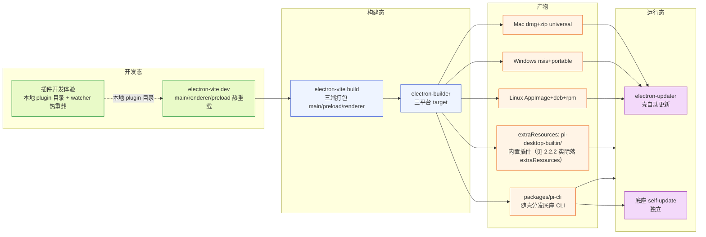
```mermaid
flowchart LR
    subgraph DEV["开发态"]
        DV["electron-vite dev<br/>main/renderer/preload 热重载"]
        PW["插件开发体验<br/>本地 plugin 目录 + watcher 热重载"]
    end
    subgraph BUILD["构建态"]
        EV["electron-vite build<br/>三端打包 main/preload/renderer"]
        EB["electron-builder<br/>三平台 target"]
    end
    subgraph PKG["产物"]
        MAC["Mac dmg+zip universal"]
        WIN["Windows nsis+portable"]
        LIN["Linux AppImage+deb+rpm"]
        ASAR["extraResources: pi-desktop-builtin/<br/>内置插件（见 2.2.2 实际落 extraResources）"]
        CLI["packages/pi-cli<br/>随壳分发底座 CLI"]
    end
    subgraph RUN["运行态"]
        EU["electron-updater<br/>壳自动更新"]
        SU["底座 self-update<br/>独立"]
    end
    DV --> EV
    EV --> EB
    EB --> MAC
    EB --> WIN
    EB --> LIN
    EB --> ASAR
    EB --> CLI
    ASAR --> RUN
    CLI --> RUN
    MAC --> EU
    WIN --> EU
    LIN --> EU
    CLI --> SU
    PW -.->|本地 plugin 目录| DV
    classDef dev fill:#e9fac8,stroke:#2f9e44;
    classDef build fill:#eef4ff,stroke:#3b5bdb;
    classDef pkg fill:#fff4e6,stroke:#e8590c;
    classDef run fill:#f3d9fa,stroke:#9c36b5;
    class DV,PW dev;
    class EV,EB build;
    class MAC,WIN,LIN,ASAR,CLI pkg;
    class EU,SU run;
```

**图 0 — 构建部署全链路总览：dev → build → pkg → run**

## 1 构建管线：electron-vite 三端打包

### 1.1 为什么用 electron-vite

#### 1.1.1 Electron 的三端物理约束

Electron 应用天然有三个进程入口：main（Node 环境，跑窗口/进程管理/底座子进程）、renderer（浏览器环境，跑 React UI）、preload（介于两者之间的桥，能访问 Node 子集但跑在 renderer 上下文）。这三端用的运行时不同、构建目标不同、模块解析规则也不同——main 走 CommonJS/ESM 混合、renderer 走浏览器打包、preload 要受限 Node API。把它们各自用单独的 bundler 配，配置会膨胀到难以维护。

electron-vite 把这三端统一在一个构建管线里，用 Vite 的多入口配置管 main/preload/renderer，共享 dev server 和 HMR，配置量降到一份。现有方案已经用 electron-vite（`electron-vite": "^6.0.0-beta.1"`）验证过这条路线（v0.4.20 可用），pi-desktop 直接沿用——栈相似是为复用经验，架构不同是纠正方向（见 DESIGN.md 5.1.3）。

#### 1.1.2 选 Vite 的代价与收益

Vite 的核心收益是 dev 模式的 unbundled ESM（启动快、HMR 准），和 build 模式的 Rollup 打包（产物小、tree-shaking 好）。代价是 main 端（Node 环境）的 ESM/CJS 互操作有时要手动处理（`__dirname` 在 ESM 下要 `fileURLToPath`，pi 底座的 config.ts 就是这么做的）。这个代价对 pi-desktop 可接受——main 端代码量不大，且 Electron 的 Node 版本足够新支持原生 ESM。

### 1.2 electron-vite 配置结构

#### 1.2.1 三端入口与输出

electron-vite 的配置文件 `electron.vite.config.ts` 三个 build 配置段：`main`、`preload`、`renderer`。每段对应一个 Vite `BuildConfig`：

```typescript
// electron.vite.config.ts —— 三端配置骨架
import { defineConfig } from "electron-vite";
import react from "@vitejs/plugin-react";
import { resolve } from "node:path";

export default defineConfig({
  main: {
    build: {
      rollupOptions: {
        input: resolve(__dirname, "src/shell/electron-main/index.ts"),
        output: { format: "cjs", entryFileNames: "[name].js" },
      },
      // main 端不外部化 electron 自身，但要外部化原生模块（better-sqlite3）
      external: ["electron", "better-sqlite3"],
    },
    resolve: { conditions: ["node"] },
  },
  preload: {
    build: {
      rollupOptions: {
        input: resolve(__dirname, "src/shell/electron-main/preload.ts"),
        output: { format: "cjs", entryFileNames: "[name].js" },
      },
    },
  },
  renderer: {
    root: resolve(__dirname, "src/shell/renderer"),
    build: {
      rollupOptions: {
        input: resolve(__dirname, "src/shell/renderer/index.html"),
      },
    },
    plugins: [react()],
    resolve: { conditions: ["browser", "import"] },
  },
});
```

关键点：main 和 preload 用 CJS 输出（Electron 的 require 机制对 CJS 最稳，preload 尤其敏感），renderer 用浏览器打包并挂 React 插件。`external` 把原生模块（better-sqlite3）外部化——它有原生 binding，不能被 bundle 进 JS，要靠 electron-builder 的 `nodeGypRebuild`/`app-builder` 在打包时按目标平台重编。

#### 1.2.2 圆心纯度的构建约束

DESIGN.md 5.1.5 的"圆心类型纯度纪律"在构建层有个直接约束：`src/domain/`（圆心）不允许 import `gateway`/`application`/`shell`。这个约束不该只靠人自觉，构建配置可以加一道机械检查。做法是在 CI 里跑一个依赖方向校验脚本（或用 `dependency-cruiser` 这类工具配规则），扫描 import 边，违反 `domain → 外层` 的边直接 fail build。这是把架构纪律落进构建管线，不靠 review 肉眼盯。

### 1.3 三端构建产物布局

#### 1.3.1 out 目录结构

electron-vite build 的产物落在 `out/` 目录，三端分开放：

```
out/
├── main/
│   └── index.js              # main 进程入口（含 gateway/application 逻辑，external 除外）
├── preload/
│   └── preload.js            # preload 脚本（renderer 侧注入 scoped pi API 的桥）
└── renderer/
    ├── index.html
    ├── assets/
    │   ├── index-*.js         # renderer bundle（React + 内置 UI 代码）
    │   └── index-*.css
    └── ...
```

这个布局和 现有方案 一致（现有方案的 electron-builder 配置里 `files: [out/**/*]` 就是这个）。electron-builder 打包时把整个 `out/` 塞进 asar。

#### 1.3.2 main bundle 的外部化策略

main bundle 里要正确处理外部化（external），决定哪些模块被打进 bundle、哪些留作运行时 require。三类模块：

- **Electron 自身**（`electron`）：必须 external。Electron 的模块由运行时提供，bundle 进去会报错。electron-vite 默认已处理。
- **原生模块**（`better-sqlite3`）：必须 external。原生模块有 `.node` binding，不能被 Rollup 打包，运行时靠 Node 的 require 加载。electron-builder 打包时把 `.node` 文件 unpack 到 `app.asar.unpacked/`。
- **重型纯 JS 依赖**（如 `yaml`、`dompurify`）：可选择 bundle 还是 external。bundle 进去启动快（一次 IO）、但包大；external 留作运行时 require、包小但启动慢。现有方案的教训是 `yaml@2` 运行时需要 `dist/doc/directives.js`，bundle 时容易漏掉这个非入口文件——所以 yaml 这类有多入口动态 require 的模块，倾向 external、让 electron-builder 把整个 node_modules 目录带进 asar。

```typescript
// electron.vite.config.ts —— main 的 external 策略
main: {
  build: {
    rollupOptions: {
      external: ["electron", "better-sqlite3"],
    },
  },
},
```

#### 1.3.3 renderer bundle 的代码分割

renderer bundle 用 Vite 的自动代码分割——内置插件的 renderer 代码、pi.ui 组件库、React 本身会被 Rollup 自动分成多个 chunk。好处是首屏只加载需要的 chunk、其余懒加载（`React.lazy` 包裹的插件组件按需加载）。对于工具卡片渲染器这类"只在匹配到时才加载"的组件，懒加载显著减少首屏 JS 体积。

pi-desktop 的 renderer 还要做一层插件组件的动态加载——内置插件的 `renderer` 入口不是打进 renderer bundle 的，而是独立编译的 JS 文件（见 1.3.4），运行时由 renderer 侧加载器动态 import。这意味着 `componentRegistry[componentId]` 的填充是异步的——core 渲染某个卡片渲染器组件时，可能该组件还没加载完，要先显示 loading 状态、组件加载完再替换。这个异步加载逻辑在 `shell/renderer/component-registry.ts` 实现。

#### 1.3.4 内置插件目录的构建处理

内置插件（`src/plugins/`）的源码是 TS/TSX，构建时要分别处理：纯声明式插件（i18n、theme，只有 `plugin.json` 没有代码模块）原样拷贝；带代码模块的插件（timeline、management-ui 等双入口插件）的 `main` 和 `renderer` 入口要被编译。但内置插件的代码**不进 main/renderer bundle**——它们是独立模块，运行时由加载器动态 import。

构建处理方式：electron-vite 配置里给 `src/plugins/` 加一个独立的 build 段（或 postbuild 脚本），把每个插件的 `main`/`renderer` 入口各编译成独立 JS 文件，连同 `plugin.json` 一起拷到 `out/pi-desktop-builtin/{pluginId}/`。最终内置插件目录是 `out/pi-desktop-builtin/`，打包时作为 `extraResources` 或直接进 asar（见 2.2）。

```typescript
// electron.vite.config.ts —— 内置插件独立编译段（简化的 postbuild 思路）
const builtinPlugins = ["i18n", "theme", "management-ui", "timeline", /* ... */];
// 每个 plugin 作为一个独立 chunk，不互相 bundle、不被 main bundle 吸收
// 用 Vite 的 lib mode 或 Rollup 的 preserveModules 把每个插件入口编译成独立文件
```

这个独立编译段的几个设计考量：每个插件的 `main` 入口编译成 CJS（worker 是 utilityProcess，Node 环境，CJS 最稳）、`renderer` 入口编译成 ESM（renderer 是浏览器环境、支持 ESM 动态 import）。编译时要把 `@pi-desktop/react`（core 提供的 renderer hook，如 `usePluginContext`）external——它不该被打进每个插件的 bundle，而是运行时从 renderer 的全局取。否则每个插件各带一份 React、一份 pi.ui 组件库，bundle 体积膨胀且 React 实例不唯一（多个 React 实例会导致 context 失效）。

#### 1.3.4b 内置插件编译的 vite lib 配置

把上面思路落到一份能跑的 `scripts/build-builtin-plugins.mjs`，关键是 Vite 的 lib mode + 把 `react`/`@pi-desktop/react` external。每个插件一次 `build` 调用，main 和 renderer 各一份配置：

```javascript
// scripts/build-builtin-plugins.mjs (vite lib 配置骨架)
import { build } from "vite";
import react from "@vitejs/plugin-react";
import { readdirSync, mkdirSync, copyFileSync, readFileSync, existsSync } from "node:fs";
import { join } from "node:path";

const PLUGINS_DIR = "src/plugins";
const OUT_DIR = "out/pi-desktop-builtin";
// react 家族必须整体 external：react 多实例会坏 context，@pi-desktop/react 是宿主提供的全局。
// 注意子路径：React 18 的 createRoot 走 react-dom/client，新版 JSX 走 react/jsx-runtime，
// 漏掉任一子路径会被打进插件 bundle，既膨胀体积又导致 react-dom 实例错配
// （react-dom 必须和 react 同一版本实例）。用正则兜底所有 react(-dom) 子路径。
const EXTERNAL = [
  "react", "react-dom", "@pi-desktop/react",
  /^react(-dom)?\//,   // 匹配 react/jsx-runtime、react-dom/client、react-dom/server 等
];

for (const id of readdirSync(PLUGINS_DIR)) {
  const src = join(PLUGINS_DIR, id);
  const manifestPath = join(src, "plugin.json");
  if (!existsSync(manifestPath)) continue;            // 不是插件目录，跳过
  const dest = join(OUT_DIR, id);
  mkdirSync(dest, { recursive: true });
  copyFileSync(manifestPath, join(dest, "plugin.json")); // manifest 原样拷贝
  const manifest = JSON.parse(readFileSync(manifestPath, "utf-8"));

  // main 入口：编译成 CJS，给 utilityProcess worker 用
  if (manifest.main) {
    await build({
      lib: { entry: join(src, manifest.main.replace(/^\.\//, "")), formats: ["cjs"], fileName: () => "main.js" },
      build: { outDir: dest, emptyOutDir: false, rollupOptions: { external: EXTERNAL } },
      resolve: { conditions: ["node"] },
    });
  }
  // renderer 入口：编译成 ESM，给浏览器环境动态 import 用
  if (manifest.renderer) {
    await build({
      plugins: [react()],
      lib: { entry: join(src, manifest.renderer.replace(/^\.\//, "")), formats: ["es"], fileName: () => "renderer.js" },
      build: { outDir: dest, emptyOutDir: false, rollupOptions: { external: EXTERNAL } },
      resolve: { conditions: ["browser", "import"] },
    });
  }
  // 纯声明式插件（i18n/theme）：manifest 拷了就完事，不编译
}
```

几个易错点：(1) `emptyOutDir: false`——每个插件的 build 不能清空 outDir，否则后编译的插件会把先编译的插件产物清掉；(2) `fileName` 必须用函数形式 `() => "main.js"`/`() => "renderer.js"` 显式固定文件名——Vite 的 lib mode 在 `formats: ["cjs"]` 时默认产出 `.cjs` 扩展名（即 `main.cjs`）、`formats: ["es"]` 产出 `.mjs`/`.js`，而加载器按 `plugin.json` 的字段去对应目录找 **`main.js`/`renderer.js`**（1.3.4 正文）。不固定扩展名就会产出 `main.cjs`，加载器找不到、插件加载失败。用 `fileName: () => "main.js"` 覆盖默认扩展名逻辑；同理 renderer 固定为 `renderer.js`。文件名不能带 hash（hash 是给浏览器缓存用的，插件加载器不需要、且固定名让 manifest 的引用路径稳定）；(3) react 家族子路径要整体 external——`react/jsx-runtime`（新版 JSX 运行时）、`react-dom/client`（React 18 createRoot）、`react-dom/server` 等都是 react 家族的子路径，漏掉任一会被打进插件 bundle，造成多实例和 react-dom 版本错配。上面 EXTERNAL 用正则 `/^react(-dom)?\//` 兜底所有子路径，不能只列顶层包名 `react`/`react-dom`。这套配置让每个内置插件的 main.js 几 KB 到几十 KB、renderer.js 视组件复杂度几十 KB，全部内置插件加起来不到 1MB——比把插件代码塞进 renderer bundle 还小（因为共享了 React/pi.ui）。

#### 1.3.4c @pi-desktop/react 与 react 的运行时解析机制（import map）

1.3.4b 把 `@pi-desktop/react` 和 `react`/`react-dom` 整个家族一起 external——插件 renderer bundle 里不包含它们，运行时从宿主取。这个"从宿主取"的具体机制必须定义清楚且**在打包产物里真正能跑**，否则实现者照抄 external 配置后会出现典型的"dev 能跑、打包后插件 UI 全白屏"翻车：

- dev 模式走 `src/plugins/` 源码经 Vite 处理，`resolve.alias` 在 Vite 的模块图里生效，裸标识符 `import React from "react"` 能被 Vite 解析到 `node_modules/react`，所以 dev 能跑。
- 打包后宿主 renderer 通过动态 `import()` 加载独立的、已编译的 ESM 文件 `out/pi-desktop-builtin/{id}/renderer.js`。此时 **Vite 的 `resolve.alias` 不再生效**——alias 只在 Vite 自己的模块图里管用，对运行时动态 import 的预编译文件是盲的；浏览器/Chromium 解析裸标识符只认 **import map**，不认 `window.React`/`window.pi` 这类全局变量。于是插件 renderer.js 里的 `import React from "react"` / `import { usePluginContext } from "@pi-desktop/react"` 会抛 `Failed to resolve module specifier "react"`，插件 UI 全白屏。这正是 29.1.1 警告的"dev 能跑、打包后跑不起来"的差异点。

**决策：选定 import map 方案（Chromium 原生支持），把裸标识符映射到宿主暴露的桥接模块 URL。** 这套机制分三层，编译时和运行时各司其职：

- **宿主挂全局**：宿主 renderer 主 bundle（shell 的 renderer 入口）把 React 打进自己的 bundle，并在应用启动早期把 React / ReactDOM / pi 宿主能力挂到全局：`globalThis.__PI_REACT__ = React`、`globalThis.__PI_REACT_DOM__ = ReactDOM`、`globalThis.__PI_HOST__ = window.pi`（后者由 preload 的 `contextBridge.exposeInMainWorld("pi", ...)` 注入，见 6.3.1，全局名必须和 preload 一致）。这保证 React 实例唯一——多个 React 实例会让 `useContext`/`Provider` 失效（context 按 React 实例隔离）。
- **桥接模块（blob URL）**：宿主在 renderer 启动时，为每个 external 裸标识符动态生成一个极小的 ESM 桥接模块，内容形如 `export * from ... // 实际从 globalThis 取`，再用 `URL.createObjectURL(new Blob([src], { type: "text/javascript" }))` 得到一个 `blob:` URL。桥接模块从全局取宿主实例再 `export`，例如 `react` 桥接模块导出 `globalThis.__PI_REACT__` 的 `default` 和具名导出，`react-dom/client` 桥接模块导出 `createRoot` 等，`@pi-desktop/react` 桥接模块从 `globalThis.__PI_HOST__` 取 `usePluginContext` 等 hook。桥接模块代码量极小（每个几十行），全部由宿主在运行时拼字符串生成、不进插件 bundle。
- **import map 注入**：宿主把"裸标识符 → blob URL"的映射组装成 import map，通过 `<script type="importmap">` 注入到 renderer 的 `index.html`（或运行时用 `document.head.appendChild` 动态注入——动态注入必须在第一个动态 `import()` 之前完成，import map 一旦有模块被求值就锁死、不能再改）。import map 示例：

```json
{
  "imports": {
    "react": "blob:https://pi-desktop/0a1b...",
    "react-dom": "blob:https://pi-desktop/2c3d...",
    "react/jsx-runtime": "blob:https://pi-desktop/4e5f...",
    "react-dom/client": "blob:https://pi-desktop/6789...",
    "@pi-desktop/react": "blob:https://pi-desktop/abcd..."
  }
}
```

宿主侧的桥接模块生成器（`src/shell/renderer/host-bridge.ts`）骨架：

```typescript
// src/shell/renderer/host-bridge.ts —— 运行时生成桥接模块 + 注入 import map
// 在 renderer 入口最早阶段调用，早于任何插件 renderer.js 的动态 import()
export function installHostBridge() {
  // 宿主实例已在更早处挂好：globalThis.__PI_REACT__ / __PI_REACT_DOM__ / __PI_HOST__
  const bridges: Record<string, string> = {
    "react": `const R = globalThis.__PI_REACT__; export default R;` +
             // React 的具名导出（useState/useEffect/...）从同一全局实例转发
             `export const { useState, useEffect, useContext, useRef, useMemo, useCallback, useReducer, useLayoutEffect, createContext, memo, forwardRef, Fragment, createElement } = R;`,
    "react-dom/client": `const D = globalThis.__PI_REACT_DOM__; export const createRoot = D.createRoot; export const hydrateRoot = D.hydrateRoot;`,
    "@pi-desktop/react": `const H = globalThis.__PI_HOST__; export const usePluginContext = H.usePluginContext;`,
    // react/jsx-runtime、react-dom/server、react/jsx-dev-runtime 等同理补齐
  };
  const imports: Record<string, string> = {};
  for (const [spec, code] of Object.entries(bridges)) {
    const url = URL.createObjectURL(new Blob([code], { type: "text/javascript" }));
    imports[spec] = url;
  }
  const map = document.createElement("script");
  map.type = "importmap";
  map.textContent = JSON.stringify({ imports });
  document.head.appendChild(map);  // 必须在首个动态 import() 前完成
}
```

```typescript
// electron.vite.config.ts —— renderer 段（编译期 alias 只服务 dev 与宿主自身 build，不靠它跑打包产物）
renderer: {
  resolve: {
    alias: {
      // 宿主 renderer 自己 build 时，把 @pi-desktop/react 解析到宿主垫片（从 window 取实例）
      "@pi-desktop/react": resolve(__dirname, "src/shell/renderer/host-exports.ts"),
    },
  },
  // 注意：不再用 define process.env.REACT_GLOBAL——define 只是文本替换该表达式，
  // 既不会把 `import React from "react"` 重定向到全局，也没有任何代码读它，是死配置。
  // react 的运行时单例靠上面的 host-bridge.ts + import map 提供，不靠 define。
}
```

这条机制和 6.3.1 的 preload 桥配合：preload 用 `contextBridge.exposeInMainWorld("pi", ...)` 注入宿主能力（rpc/events/bus 等），`host-exports.ts` 从 `window.pi` 取这些能力重新导出（全局名统一为 `pi`，和 6.3.1 的 preload 代码、DESIGN.md 3.2.5 的 RendererPluginContext 命名一致）。插件 renderer 代码 `import { usePluginContext } from "@pi-desktop/react"` 在 dev 走 alias、在打包产物走 import map → blob 桥接 → `globalThis.__PI_HOST__`，两条路最终都拿到同一个宿主实例。第三方插件（npm/.pidesktop 分发）的 renderer 代码也走同一条 external 约定——它们的 renderer.js 同样 external react/@pi-desktop/react，运行时在宿主 renderer 进程里动态 import 时由 import map 兜底。这是"内置即插件、共享宿主运行时"在构建层的具体落点。

> **为什么不用 globals 映射（Rollup output.globals）？** `output.globals` 只对非 ESM 格式（IIFE/UMD）生效，把 `import React` 重写成 `window.React`。但 1.3.4b 已定 renderer 编译为 ESM（`formats: ["es"]`，浏览器动态 import 需要 ESM），切 IIFE 就要同步把动态 `import()` 改成 script 注入 + 全局取值，改动面更大且失去 ESM 的懒加载收益。import map 是 Chromium 原生支持、和 ESM 动态 import 天然配合的最小改动方案。29.1.2 的冒烟清单已加一项"插件 renderer.js 动态 import 不抛 specifier 错"专门守这条。

#### 1.3.4d 内置插件的 source map 与调试

内置插件编译成独立 JS 文件后，dev 模式下出错时栈追踪指向编译后的 `main.js`/`renderer.js`，不是源码 TS——排查困难。解法是给 vite build 开 `sourcemap: true`，产出 `main.js.map`/`renderer.js.map`，连同源码一起放到插件目录。但 sourcemap 不该进生产包（体积、暴露源码）——`files` 排除规则 `!**/*.{ts,map}` 已经把它们挡在 asar 外。dev 模式下加载器从 `src/plugins/` 直接加载源码（经 jiti 或 tsx 运行时编译 TS），不走编译产物，根本不需要 sourcemap——这是 dev 用源码、生产用编译产物的双轨。sourcemap 只在"本地打包后验证"这个中间阶段有用（21.1.3 的本地安装验证），那时手动开启即可。

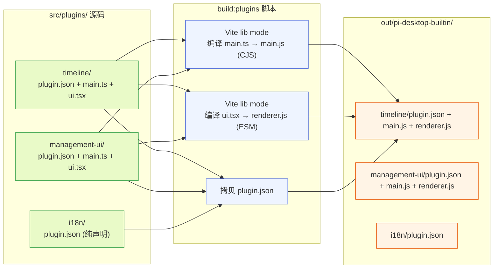
```mermaid
flowchart LR
    subgraph SRC["src/plugins/ 源码"]
        P1["timeline/<br/>plugin.json + main.ts + ui.tsx"]
        P2["management-ui/<br/>plugin.json + main.ts + ui.tsx"]
        P3["i18n/<br/>plugin.json (纯声明)"]
    end
    subgraph BUILD["build:plugins 脚本"]
        V1["Vite lib mode<br/>编译 main.ts → main.js (CJS)"]
        V2["Vite lib mode<br/>编译 ui.tsx → renderer.js (ESM)"]
        CP["拷贝 plugin.json"]
    end
    subgraph OUT["out/pi-desktop-builtin/"]
        O1["timeline/plugin.json + main.js + renderer.js"]
        O2["management-ui/plugin.json + main.js + renderer.js"]
        O3["i18n/plugin.json"]
    end
    P1 --> V1
    P1 --> V2
    P1 --> CP
    P2 --> V1
    P2 --> V2
    P2 --> CP
    P3 --> CP
    V1 --> O1
    V2 --> O1
    CP --> O1
    classDef src fill:#e9fac8,stroke:#2f9e44;
    classDef build fill:#eef4ff,stroke:#3b5bdb;
    classDef out fill:#fff4e6,stroke:#e8590c;
    class P1,P2,P3 src;
    class V1,V2,CP build;
    class O1,O2,O3 out;
```

**图 1 — 内置插件独立编译：每个插件的 main/renderer 各编译成独立文件，纯声明式插件只拷贝 manifest**

#### 1.3.5 preload 的特殊处理

preload 脚本是 main 和 renderer 之间的桥，构建上有特殊约束：它运行在 renderer 进程上下文但有受限 Node 访问权。electron-vite 把 preload 编译成 CJS（因为 preload 通过 `webPreferences.preload` 加载，要求 CJS 格式）。preload 的 bundle 要尽量小——它每次窗口创建都加载，体积大影响启动。所以 preload 只放"桥接代码"（contextBridge.exposeInMainWorld 的薄封装），不放业务逻辑——业务逻辑在 main 或 renderer，preload 只转发。

### 1.4 底座 RPC mode 的 stdout 独占与打包约束

> 本节是**运行时协议事实**（takeOverStdout/背压/裸写），不是构建步骤。把它前置在"构建管线"章，是因为这些协议约束直接决定打包时**不能给底座 CLI 套 wrapper 脚本**（任何在 `pi --mode rpc` 前往 stdout 打印 banner 的壳脚本都会毁掉 JSONL 协议，见 1.4.3）——打包者必须先知道这条约束，才能正确处理随壳底座（5.x）。

#### 1.4.1 takeOverStdout 与裸写协议

底座 RPC mode 的入口 `runRpcMode(runtimeHost)`（`底座:modes/rpc/rpc-mode.ts`）做的第一件事是 `takeOverStdout()`——接管 stdout。这不是可选项，而是协议正确性的硬约束：RPC mode 要独占 stdout 来吐 JSON Lines，任何别的输出（console.log、第三方 SDK 的调试打印、未捕获的 Promise rejection 打印）混进来都会污染 JSONL 协议、让桌面端的 `attachJsonlLineReader` 解析失败。接管后底座所有对外输出都走 `writeRawStdout(serializeJsonLine(obj))`——即裸写一行 JSON 加换行，不经任何格式化。

这个事实对打包有直接影响：pi-desktop 起底座子进程时用 `spawn("node", [cliPath, ...args], { stdio: ["pipe", "pipe", "pipe"] })`（`底座:modes/rpc/rpc-client.ts:93`），三路 stdio 全部 pipe——桌面端只读 stdout 当 JSONL、只写 stdin 发命令、只收 stderr 做调试。底座的 stdout 不能被任何别的东西共享（不能 tee 到日志文件、不能被父进程的 console 继承），否则协议必坏。所以 RPC 适配层捕获的 stderr 是桌面端观察底座的唯一调试通道，stdout 必须专留给 JSONL reader。

#### 1.4.2 序列化、分片与背压

底座的 `serializeJsonLine`（`底座:modes/rpc/jsonl.ts`）把对象序列化成单行 JSON 加换行。单行约束是为了让 reader 能按行切分——`attachJsonlLineReader` 逐行读、每行 `JSON.parse` 后交 `handleLine`。如果一条响应被拆成多次 `data` 事件（pipe 的分片），reader 内部按换行符缓冲拼包，直到凑齐一行才 parse。桌面端的 RPC 适配层照搬这个逻辑——不要假设一次 `data` 事件就是一条完整消息，更不能把半个 JSON 丢给 `JSON.parse`。

底座还有背压处理：`waitForRawStdoutBackpressure`/`flushRawStdout`（`底座:core/output-guard.ts`）。当桌面端读 stdout 不够快、pipe 缓冲区满时，底座的 `writeRawStdout` 会阻塞——这是 Node pipe 的固有背压机制。桌面端要持续读 stdout（`stopReadingStdout = attachJsonlLineReader(...)` 返回的取消函数在停止时调用），不能"先发命令、稍后再读"，否则底座写满缓冲区后整个协议卡死。RPC 适配层的 stdout reader 一旦停止读，必须同步 kill 子进程——`rpc-client.ts` 的 `stop()` 先 `stopReadingStdout?.()`、再 `kill("SIGTERM")`，顺序不能反（先 kill 后停读会丢未读的响应）。

#### 1.4.3 打包对底座 stdio 的约束

把上面的协议事实落到打包：随壳分发的底座 CLI 必须能以 `--mode rpc` 启动并接管 stdout。这要求底座 CLI 的依赖树里没有"启动时往 stdout 打印"的副作用代码——比如某个 SDK 在 require 时 `console.log` 一个 banner。底座本身已经在 `cli.ts` 里 `process.emitWarning = (() => {}) as typeof process.emitWarning;` 把 Node 的 warning 压掉（warning 走 stderr，虽不污染 JSONL，但底座有意把噪声全压住）。pi-desktop 打包底座时不能引入破坏这条约束的 wrapper 脚本——不能写个"先打印启动 banner 再 exec pi"的壳脚本套在 cliPath 外面，那会让 banner 进 stdout 毁掉协议。随壳分发底座时要验证 `pi --mode rpc` 启动后 stdout 第一行就是合法 JSONL（`session_start` 之类），不是任何 banner 文本。

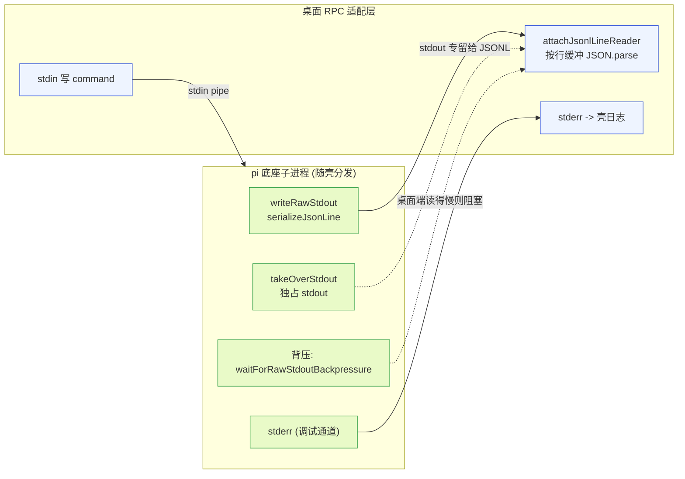
```mermaid
flowchart LR
    subgraph PI["pi 底座子进程 (随壳分发)"]
        TO["takeOverStdout<br/>独占 stdout"]
        W["writeRawStdout<br/>serializeJsonLine"]
        BP["背压: waitForRawStdoutBackpressure"]
        ERR["stderr (调试通道)"]
    end
    subgraph ADAPT["桌面 RPC 适配层"]
        R["attachJsonlLineReader<br/>按行缓冲 JSON.parse"]
        S["stdin 写 command"]
        LOG["stderr -> 壳日志"]
    end
    W --> R
    S -->|stdin pipe| PI
    TO -.->|stdout 专留给 JSONL| R
    ERR --> LOG
    BP -.->|桌面端读得慢则阻塞| R
    classDef pi fill:#e9fac8,stroke:#2f9e44;
    classDef adapt fill:#eef4ff,stroke:#3b5bdb;
    class TO,W,BP,ERR pi;
    class R,S,LOG adapt;
```

**图 2 — 底座 stdout 独占与桌面端读写约束：stdout 只走 JSONL，stderr 才是调试通道，背压要求持续读**

## 2 electron-builder 三平台打包

electron-builder 是 Electron 生态的打包标准工具——把 electron-vite 的构建产物 + Node 依赖 + 原生模块打包成各平台的安装包/可执行文件。pi-desktop 的三平台打包完全照 现有方案的 electron-builder 配置（`electron-builder.yml`）来配，现有方案 已验证过三平台都能出包。这一节逐平台讲透 target 选择、产物结构、签名公证、CI 矩阵。

### 2.1 appId、产物命名与目录约定

#### 2.1.1 顶层配置

```yaml
# electron-builder.yml
appId: com.earendilworks.pi-desktop  # 域名段 earendilworks（无连字符）；与下方 publish.owner: earendil-works（GitHub owner，带连字符）是两个命名空间、拼写不同，勿混
productName: pi Desktop
directories:
  buildResources: build
  output: dist
```

`buildResources` 指向图标、license 等构建素材目录；`output` 指向打包产物输出目录。`electronLanguages` 限定 Chromium 内置语言包——现有方案 只保留 en-US 和 zh-CN，从约 42MB 降到 1-2MB。pi-desktop 同样的策略：桌面端用户的 locale 主要就这两者，其余语言包是纯冗余，砍掉直接减安装包体积。

#### 2.1.2 files 与 asar 内容控制

`files` 控制哪些文件进 asar 包。核心是 `out/**/*`（三端构建产物）加 `package.json`，排除源码和 map 文件。现有方案 踩过一个坑：不能简单用 `!**/doc/**` 排除文档目录，因为 `yaml@2` 运行时需要 `dist/doc/directives.js`，排除了会在 Linux/Windows 上 MODULE_NOT_FOUND，表现为"项目还在、会话全部消失"（GitHub #21）。pi-desktop 要复用 现有方案 这个教训——排除规则要精确到具体目录、不用宽泛模式，避免误伤运行时需要的文件。

```yaml
files:
  - out/**/*
  - package.json
  - "!**/*.{ts,map}"
  - "!**/docs/**"           # 排除纯文档树（非运行时）
  # 注意：不能用 !**/doc/** 会误伤 yaml@2 的 dist/doc/directives.js
  - "!out/pi-desktop-builtin/**"  # 内置插件走 extraResources，不进 asar（见 2.2.2、7.2.1）
```

`files` 的匹配规则是 glob，`!` 开头表示排除。electron-builder 先按 `files` 收集、再按 `extraResources` 处理 asar 外的文件。一个易错点：`files` 排除的文件不会进 asar，但如果某个运行时动态 require 的文件被误排，只会在特定平台/特定功能触发 MODULE_NOT_FOUND——现有方案的 GitHub #21 就是这个坑（Linux/Windows 上 session.list 失败）。防范：排除规则用精确路径（`!**/docs/**` 而非 `!**/doc/**`），并在 CI 跑全功能 smoke test 覆盖。

**files 与 extraResources 不可重叠**：electron-builder 的 `files` 和 `extraResources` 是独立收集的——`files` 把匹配项打进 asar，`extraResources` 把内容拷到 `process.resourcesPath` 下。内置插件目录 `out/pi-desktop-builtin/` 是 `build:plugins` 的产物、落在 `out/` 下，会被 `out/**/*` 命中进 asar；同时 2.2.2 又把它作为 `extraResources` 拷一份。于是内置插件同时进 asar（死重，加载器不读 asar 那份）和 extraResources（实际用），白白增大 asar 体积（11 个插件的 main.js+renderer.js），还和 2.2.2 "内置插件放 extraResources" 的定夺自相矛盾。所以 files 段必须显式排除 `!out/pi-desktop-builtin/**`，让内置插件只走 extraResources、不进 asar，与 2.2.2 / 7.2.1 的决策一致。同理 `pi-cli` 不在 `out/` 下（在 `packages/pi-cli`，不被 `out/**/*` 命中），无需额外排除。更彻底的做法是把 `build:plugins` 的产物输出目录改到一个不被 files glob 命中的位置（如 `.plugin-dist/pi-desktop-builtin`），从根上消除重叠歧义——当前为减少对已有路径引用的改动，先用 `!out/pi-desktop-builtin/**` 排除项兜底。

#### 2.1.3 asar 与 asarUnpack

electron-builder 默认把应用代码打包进 asar（单个归档文件 `app.asar`）。asar 的好处是减少文件数、加快启动 IO、一定程度上防篡改。但原生模块（`.node` 文件）不能在 asar 内直接加载——Node 的 dlopen 要真实文件路径。所以要用 `asarUnpack` 把 `.node` 文件解包到 `app.asar.unpacked/` 目录：

```yaml
asarUnpack:
  - "**/*.node"
  - "node_modules/better-sqlite3/**"  # 或精确指定原生模块目录
```

electron-builder 运行时自动处理 asar 内 require 原生模块的路径重定向——require 一个 unpacked 的 `.node` 文件时，Electron 的 asar API 自动把路径映射到 `app.asar.unpacked/` 下的真实文件。开发者不用手动处理。但动态 require（用变量路径的 require）可能绕过这个重定向——这也是 yaml 这类有多入口动态 require 的模块要 external 而非 bundle 的原因。

### 2.2 内置插件随包分发（第四发现源）

#### 2.2.1 pi-desktop-builtin 目录与 builtin 标记

内置默认插件（i18n、theme、management-ui、timeline 等 11 个）随壳分发——它们打包进 Electron 的 `process.resourcesPath/pi-desktop-builtin/` 目录（asar 内置或 extraResources）。加载器把这个目录视作**第四个发现源**（3.4 的三处本地目录：项目级 `<cwd>/.pi/desktop/plugins/`、用户级 `~/.pi/desktop/plugins/` 之外），扫描时标记 source 为 `builtin`、优先级最低（`project > user > installed > builtin`）。

关键设计纪律：内置插件**不是编译进 core 的硬编码**，而是作为插件文件放在内置插件目录下，走同一套加载器、同一套槽位契约。所以"内置"不等于"硬编码"——内置插件也是磁盘上的插件文件（只读、随壳更新），只是来源标记是 `builtin`、优先级最低。这保证内置插件和第三方插件在加载路径上完全一致，没有任何代码路径分支。用户可以用项目级或用户级同名 id 插件覆盖内置插件，覆盖是整体的（DESIGN.md 3.4 的插件级覆盖）。

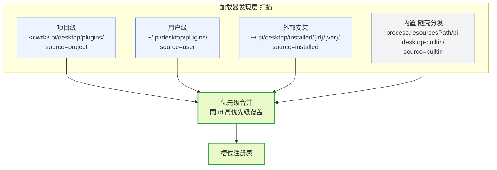
```mermaid
flowchart TD
    subgraph FIND["加载器发现层 扫描"]
        D1["项目级<br/>&lt;cwd&gt;/.pi/desktop/plugins/<br/>source=project"]
        D2["用户级<br/>~/.pi/desktop/plugins/<br/>source=user"]
        D3["外部安装<br/>~/.pi/desktop/installed/{id}/{ver}/<br/>source=installed"]
        D4["内置 随壳分发<br/>process.resourcesPath/pi-desktop-builtin/<br/>source=builtin"]
    end
    D1 --> MG["优先级合并<br/>同 id 高优先级覆盖"]
    D2 --> MG
    D3 --> MG
    D4 --> MG
    MG --> REG["槽位注册表"]
    classDef find fill:#eef4ff,stroke:#3b5bdb;
    classDef builtin fill:#f1f3f5,stroke:#adb5bd;
    classDef res fill:#e9fac8,stroke:#2f9e44,stroke-width:2px;
    class D1,D2,D3 find;
    class D4 builtin;
    class MG,REG res;
```

**图 3 — 四个发现源：内置插件是第四源，source=builtin 优先级最低**

#### 2.2.2 内置插件放 extraResources 的定夺与理由

内置插件放哪里有两个选项：进 asar（`files` 包含），或放 `extraResources`（asar 外、`process.resourcesPath` 下直接文件）。两者区别：asar 是单文件归档，读取要 Electron 的 asar API 解包；extraResources 是普通文件，直接 `fs` 读。加载器要动态 import 插件的 `main`/`renderer` 模块——动态 import 在 asar 内的路径上 Electron 支持但偶尔有 edge case（尤其 native 模块）。安全做法：内置插件放 `extraResources`（`process.resourcesPath/pi-desktop-builtin/`），避免 asar 的动态 import 坑。

```yaml
# electron-builder.yml
extraResources:
  - from: out/pi-desktop-builtin
    to: pi-desktop-builtin
    filter: ["**/*"]
```

加载器发现内置插件时，路径解析为 `path.join(process.resourcesPath, "pi-desktop-builtin")`（dev 模式见 5.3，指向 `src/plugins/` 或 `out/pi-desktop-builtin/`）。这个路径在 main 进程（Node 环境）可用，和本地三处目录走同一个 `discoverInDir` 函数，只是 `source` 参数传 `"builtin"`。

#### 2.2.3 内置插件目录的只读性与热重载边界

内置插件目录是随壳分发的只读资产——它在 app 安装目录内（Mac 的 `Contents/Resources/`、Win/Linux 的 `resources/`），普通用户没有写权限（Mac 上 app 签名后改了会失效）。所以加载器对这个目录不开 watcher（6.2.1b 的 watcher 只盯用户级和项目级目录）、不支持热重载。要改内置插件，只能改 `src/plugins/` 源码、重新 `build:plugins` + 重新打包发版。这个只读性是设计而非缺陷——内置插件随壳更新（25.1），版本和 core 严格绑定，让用户级覆盖（3.4）是唯一的定制路径，避免了"用户改了内置插件、壳更新后被冲掉"的困惑。

加载器发现 builtin 目录时还要处理"目录不存在"的兜底——dev 模式下如果没跑 `build:plugins`、`out/pi-desktop-builtin/` 不存在，加载器回退到 `src/plugins/` 源码直读（经 jiti 运行时编译 TS）；打包后如果 `extraResources` 配错导致目录缺失，加载器发现 builtin 目录为空时只记一条 warning、不 fail（内置插件缺失不该让壳起不来，只是功能少几个），其余三处本地来源照常加载。这是 3.5 第 5 项错误隔离在发现层的体现——单个来源缺失不拖垮整壳。

### 2.3 Mac 平台：dmg + universal

#### 2.3.1 dmg 与 zip target

Mac 平台打包两个 target：dmg（磁盘镜像安装包，用户拖拽安装）和 zip（electron-updater 用的增量更新基础包，必须打 zip 因为 electron-updater 只认 zip 作为 Mac 的更新包格式）。配置：

```yaml
mac:
  target:
    - dmg
    - zip
  icon: build/icon.png
  artifactName: ${productName}-${version}-${arch}.${ext}
  category: public.app-category.developer-tools
  hardenedRuntime: true
  gatekeeperAssess: false
  notarize: false  # 开发阶段关闭，正式发版要开
  entitlements: build/entitlements.mac.plist
  entitlementsInherit: build/entitlements.mac.plist
```

`hardenedRuntime: true` 是 Mac 公证（notarization）的前置要求——Apple 要求应用 hardened runtime 才能公证通过。公证（`notarize`）在开发阶段关闭，正式发版要开（需要 Apple Developer 账号和 `APPLE_ID`/`APPLE_APP_SPECIFIC_PASSWORD`/`APPLE_TEAM_ID` 环境变量）。**notarize 的单一真相源是 8.1.1 完整配置**——本节的 `notarize: false` 和 14.1.1 的 `notarize: { teamId }` 都指向 8.1.1 那一处实际生效的配置，三处描述一致、以 8.1.1 为准。`entitlements` 声明应用需要的权限——底座 bun-binary、better-sqlite3 的 native binding 可能需要 `com.apple.security.cs.allow-unsigned-executable-memory`/`disable-library-validation`（见 14.1.2 的 entitlements 列表），与 14.1.2 对齐。

#### 2.3.2 universal binary：arm64 + x64

Mac 现在有两套架构：Apple Silicon（arm64）和 Intel（x64）。两个选择：分架构包（每个架构一个 dmg）或 universal binary（一个包含两架构）。universal binary 体积翻倍但分发简单（一个下载链接覆盖所有 Mac）；分架构包体积小但要处理架构检测跳转。

pi-desktop 选 universal binary（DESIGN.md 5.2.1："universal binary（arm64 + x64）或分架构包"）。electron-builder 的 universal target 会分别打 arm64 和 x64，再用 `lipo` 合并成一个 universal 应用：

```yaml
mac:
  target:
    - target: dmg
      arch:
        - universal
    - target: zip
      arch:
        - universal
```

universal 的代价是打包时间约 2 倍（要打两架构），且 Electron 主进程和所有原生模块（better-sqlite3）都要 universal 版本。better-sqlite3 的 universal binding 要靠 `electron-builder install-app-deps` 在打包前按 Electron 版本和架构重编——`postinstall` 脚本里跑这个（pi-desktop 的 `postinstall` 是 `electron-builder install-app-deps`，见 8.2.1；现有方案的旧版本多带一个 `electron-vite build`，pi-desktop 把 build 拆进 `package:${platform}` 脚本、postinstall 只管重编 native）。

**universal 的原生模块必须产出双架构 binding**。这是 Electron universal + 原生模块的已知尖锐点：`postinstall` 只跑一次 `install-app-deps`，默认按**宿主机架构**重编，不会自动产出 arm64+x64 两套 binding。universal 打包时若两架构 binding 不齐，打出来的 universal 包在缺失架构的那台机器上加载 better-sqlite3 会失败（`NODE_MODULE_VERSION mismatch` 或 `dlopen` 找不到对应架构的 `.node`）。两种可靠做法：

- **CI 分架构构建再合并**（推荐，electron-builder 的 universal 标准流程）：在 macOS CI 上分别跑 `--arch arm64` 和 `--arch x64` 两次，每次各自 `electron-builder install-app-deps`（按目标架构重编 native）+ `electron-builder --mac --arch <arch>`，再用 electron-builder 的 universal 流程把两份产物 `lipo` 合并。这样 arm64 和 x64 的 `.node` 各自由对应架构重编、再合并成 universal `.node`。
- **用 `@electron/rebuild` 显式双架构重编**：`npx @electron/rebuild -f -w better-sqlite3 --arch arm64 --arch x64` 一次性产出两架构 binding，再走 electron-builder universal。

不要指望 `postinstall` 的单次 `install-app-deps` 自动给出 universal binding——它只编宿主机架构。universal 包发版前必须验证双架构 binding 都产出（13.1.1 的排查项）。

#### 2.3.3 Mac 的 dylib 与库验证

Mac 的 hardened runtime 开启后，应用加载的动态库（dylib）都要签名或列入库验证例外（`com.apple.security.cs.disable-library-validation`）。better-sqlite3 的 `.node` 文件本质是动态库，如果没签名会被库验证拒绝加载。两个解法：给 `.node` 文件签名（electron-builder 签名时会带上），或声明 `disable-library-validation` entitlement（上面 entitlements 里已加）。后者更简单、但安全性略降（允许加载任意签名的库）。对本地桌面工具，这个权衡可接受。

electron-builder 在 Mac 打包时会自动对 `app.asar.unpacked/` 里的 `.node` 文件做签名（`deep sign`）。如果遇到"better-sqlite3 加载失败"的 Mac 特有问题，先检查签名和 entitlement——`codesign -dv --verbose=4 path/to/app.app` 能看签名详情、`codesign --display --entitlements - path/to/app.app` 能看 entitlement。

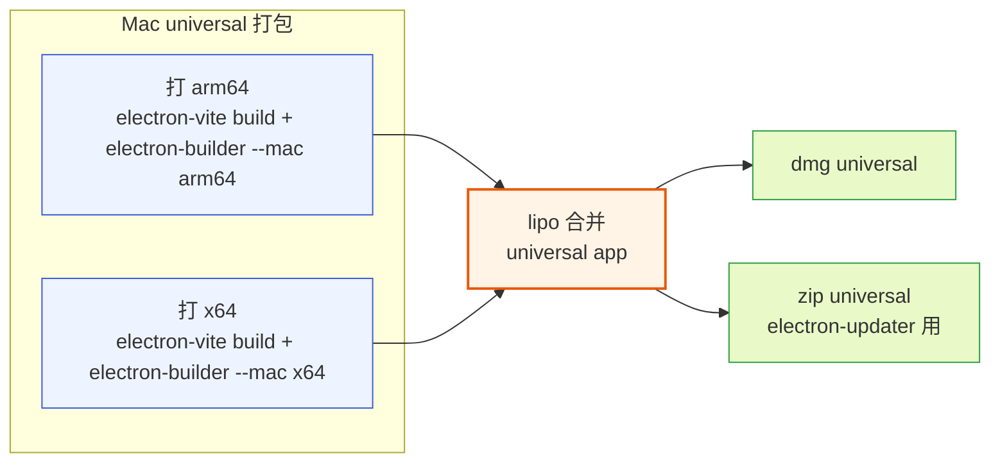
```mermaid
flowchart LR
    subgraph BUILD["Mac universal 打包"]
        A["打 arm64<br/>electron-vite build + electron-builder --mac arm64"]
        X["打 x64<br/>electron-vite build + electron-builder --mac x64"]
    end
    A --> L["lipo 合并<br/>universal app"]
    X --> L
    L --> DMG["dmg universal"]
    L --> ZIP["zip universal<br/>electron-updater 用"]
    classDef build fill:#eef4ff,stroke:#3b5bdb;
    classDef merge fill:#fff4e6,stroke:#e8590c,stroke-width:2px;
    classDef out fill:#e9fac8,stroke:#2f9e44;
    class A,X build;
    class L merge;
    class DMG,ZIP out;
```

**图 4 — Mac universal 打包：两架构分别打 + lipo 合并**

### 2.4 Windows 平台：nsis + portable

#### 2.4.1 nsis 安装包

Windows 用 NSIS（Nullsoft Scriptable Install System）打安装包——这是 Electron 生态最成熟的 Windows 安装器。nsis target 生成一个 `.exe` 安装程序，支持自定义安装目录、创建桌面快捷方式、开始菜单快捷方式：

```yaml
win:
  target:
    - target: nsis
      arch:
        - x64
  icon: build/icon.png
  artifactName: ${productName}-${version}-${arch}.${ext}

nsis:
  oneClick: false                          # 非一键安装，给用户选安装目录的步骤
  allowToChangeInstallationDirectory: true
  createDesktopShortcut: true
  createStartMenuShortcut: true
  artifactName: ${productName}-Setup-${version}-${arch}.${ext}
```

`oneClick: false` 让安装程序走多步向导（用户能选目录），而非一键安装到默认位置——这对开发者工具更合适，用户可能想控制安装位置。`artifactName` 用 `Setup` 后缀区分安装包和 portable 包。

#### 2.4.2 portable 便携版

portable target 生成一个免安装的 `.exe`——双击直接运行，不写注册表、不留安装记录，适合 U 盘携带或临时使用场景：

```yaml
win:
  target:
    - target: nsis
      arch: [x64]
    - target: portable
      arch: [x64]

portable:
  artifactName: ${productName}-Portable-${version}-${arch}.${ext}
```

portable 的局限：没有自动更新（electron-updater 依赖安装记录和固定路径，portable 每次运行位置可能不同），用户要手动下载新版。所以 portable 是给"不想装"的用户的备选，nsis 是主渠道。两个 target 一起打，用户按需下载。

#### 2.4.3 NSIS 自定义卸载与数据保留

NSIS 安装包默认卸载时会删整个安装目录。pi-desktop 的用户数据（`~/.pi/` 下的配置、session、插件数据）不在安装目录、不受卸载影响——这是 DESIGN.md 把配置放用户家目录（`~/.pi/`）而非应用目录的设计好处。卸载壳不会丢底座配置和 session。但安装目录内可能有用户改过的东西（一般没有，应用目录应该只读），所以卸载行为是安全的。

NSIS 还支持自定义脚本（`installer.nsh`）做安装/卸载时的额外动作——如注册文件关联（`.pidesktop` 插件包文件关联到 pi-desktop 打开）、写注册表项。pi-desktop 如果要做"双击 `.pidesktop` 文件自动安装插件"（DESIGN.md 3.9 的分发渠道），就要在 NSIS 脚本里注册文件关联。这是后续可加的功能，初版不强制。

### 2.5 Linux 平台：AppImage + deb + rpm

#### 2.5.1 AppImage 主分发格式

AppImage 是 Linux 上最通用的桌面应用分发格式——单文件、免安装、双击运行（加可执行权限后）。它不依赖发行版包管理器，一个文件覆盖所有 Linux 发行版，是 Electron Linux 分发的首选：

```yaml
linux:
  target:
    - AppImage
    - deb
    - rpm
  icon: build/icon.png
  category: Development
  artifactName: ${productName}-${version}-${arch}.${ext}
  maintainer: pi-desktop
```

AppImage 的代价是体积偏大（含全部依赖），但对本地 AI agent 桌面端（用户本就要跑 pi 底座、装模型）不构成负担。

#### 2.5.2 deb 和 rpm：发行版包管理器集成

deb（Debian/Ubuntu 系）和 rpm（Fedora/RHEL/SUSE 系）是发行版原生包格式——装上后在系统菜单出现、能被包管理器追踪升级卸载。打这两个是为让习惯用 `apt`/`dnf` 的用户能走熟悉的安装路径。electron-builder 会生成对应的包文件，里面含 `.desktop` 文件（桌面集成）和图标，装上后自动注册到系统应用菜单。

三个 target 一起打，覆盖 Linux 全部主流使用场景：AppImage 免安装通用、deb 给 Debian 系、rpm 给 RedHat 系。维护成本是三个格式各自的小差异（如 deb 的依赖声明、rpm 的 `%changelog`），但 electron-builder 帮处理大部分。

#### 2.5.3 deb/rpm 的依赖声明

deb 和 rpm 可以声明运行时依赖——装包时包管理器检查依赖是否满足。pi-desktop 在 Linux 上的关键依赖是底座 CLI 运行需要的东西：Node.js（如果底座是 node 脚本形态）。但如果随壳分发 pi-cli 且底座是 bun-binary 形态（无需 Node），则 Linux 包无外部依赖。electron-builder 配置 `linux.deb.depends` 和 `linux.rpm.requires`：

```yaml
linux:
  target:
    - AppImage
    - deb
    - rpm
  deb:
    depends:
      - libnotify4  # 通知库（可选）
  rpm:
    requires:
      - libnotify
```

pi-desktop 倾向随壳分发 bun-binary 底座（无外部 Node 依赖），让 deb/rpm 包**零硬依赖**、装上就能跑。注意区分"硬依赖"和"可选依赖"：`libnotify4` 是**可选**通知依赖——系统装了它，Electron 的 `Notification` API 才能弹桌面通知；缺了它只是无桌面通知（应用本身照常跑），不构成安装阻断。所以 deb/rpm 把它放 `depends`/`requires` 是"建议装上"、不是"必须"，和"零硬依赖"结论不冲突。装包时 `dpkg`/`rpm` 对 `depends` 默认强制、对 `recommends`/`suggests` 才软——若要让 libnotify4 严格可选，改用 `Recommends: libnotify4`（deb）而非 `Depends`。这降低用户门槛——不用预装 Node，也无强制原生依赖。

#### 2.5.4 Linux 桌面集成：.desktop 文件与图标

deb/rpm 包会自动生成 `.desktop` 文件，让应用出现在系统应用菜单。`.desktop` 文件声明应用名、图标、启动命令、分类。electron-builder 从 `productName`、`icon`、`category` 字段自动生成。pi-desktop 的 category 是 `Development`（开发者工具）。`.desktop` 文件还会注册 MimeType（文件关联），和 2.4.3 的 NSIS 文件关联呼应——Linux 上注册 `.pidesktop` 文件类型让文件管理器双击打开。

### 2.6 三平台 CI 矩阵

#### 2.6.1 为什么要在对应平台 CI 上打

electron-builder 打包最好在目标平台上跑——Mac 包在 macOS runner 上打、Windows 包在 Windows runner 上打、Linux 包在 Linux runner 上打。原因是原生模块（better-sqlite3）的 binding 要在目标平台编译、Mac 的公证必须在 macOS 上跑、Windows 的代码签名最好在 Windows 上。交叉打包（如 Linux 上打 Mac）有工具支持（electron-builder 支持 `--mac` 在 Linux 上跑）但 edge case 多、不推荐作为主流程。

#### 2.6.2 CI 矩阵配置

GitHub Actions 矩阵跑三平台，每个平台一个 job：

```yaml
# .github/workflows/release.yml
jobs:
  build:
    strategy:
      matrix:
        include:
          - os: macos-latest
            platform: mac
          - os: windows-latest
            platform: win
          - os: ubuntu-latest
            platform: linux
    runs-on: ${{ matrix.os }}
    steps:
      - uses: actions/checkout@v4
      - uses: actions/setup-node@v4
        with:
          node-version: 20
      - run: npm ci
        # npm ci 自动触发 postinstall（8.2.1：electron-builder install-app-deps 重编原生模块）
        # 不要再单独跑 npm run postinstall——重复且与 8.2.1 的脚本定义不符
      - run: npm run package:${{ matrix.platform }}
      - uses: actions/upload-artifact@v4
        with:
          name: dist-${{ matrix.platform }}
          path: dist/*
```

CI 步骤顺序固定为：checkout → setup-node → `npm ci`（自动触发 postinstall 重编 better-sqlite3 等 native binding）→ `npm run package:${platform}`（内部已含 `electron-vite build` + `build:plugins` + `electron-builder`，见 8.2.1）。不再单列 postinstall 步骤——既避免重复执行、也让注释和 8.2.1 的脚本定义一致。每个 job 产物上传为 artifact。正式发版时触发条件是打 tag，三平台都打完后把产物挂到 GitHub Release 上——electron-updater 配置的 `provider: github` 就是从 GitHub Release 拉更新。

#### 2.6.3 Mac 专用步骤：安装 Apple 证书

Mac CI job 要在打包前安装代码签名证书和公证凭证。GitHub Actions 用 secrets 存证书（base64 编码的 p12），job 里解码到 keychain：

```yaml
# Mac job 额外步骤
- name: Import signing certificate
  env:
    CSC_LINK: ${{ secrets.CSC_LINK }}
    CSC_KEY_PASSWORD: ${{ secrets.CSC_KEY_PASSWORD }}
  run: |
    echo $CSC_LINK | base64 -d > certificate.p12
    security create-keychain -p password build.keychain
    security import certificate.p12 -k build.keychain -P $CSC_KEY_PASSWORD -T /usr/bin/codesign
    security set-key-partition-list -S apple-tool:,apple:,codesign: -s -k password build.keychain
    security list-keychains -d user -s build.keychain login.keychain
```

打包时 electron-builder 自动读 `CSC_LINK`/`CSC_KEY_PASSWORD` 环境变量签名，读 `APPLE_ID`/`APPLE_APP_SPECIFIC_PASSWORD`/`APPLE_TEAM_ID` 公证。Linux/Windows runner 不能跑 Mac 签名公证——这是 2.6.1"在对应平台 CI 上打"的硬约束之一。

#### 2.6.4 Windows 专用步骤：代码签名

Windows CI job 类似地用 secrets 注入证书。Windows 证书通常是 pfx 文件：

```yaml
# Windows job 额外步骤
- name: Configure signing
  env:
    CSC_LINK: ${{ secrets.WIN_CSC_LINK }}
    CSC_KEY_PASSWORD: ${{ secrets.WIN_CSC_KEY_PASSWORD }}
  run: npm run package:win
```

electron-builder 在 Windows 上用 `signtool` 签名 nsis 安装包和 portable exe。EV 证书在硬件 token 上时（很多 EV 证书是 USB token），CI 自动签名麻烦——这时改用 OV 证书走 CI、EV 证书本地手签，或用支持 EV 的云端签名服务。pi-desktop 初版可先用 OV 证书，积累 SmartScreen 信誉后考虑 EV。

#### 2.6.5 Linux 专用步骤：AppImage 的 FUSE 与权限

AppImage 依赖 FUSE（用户空间文件系统）运行——它把整个应用挂载成虚拟文件系统。CI 打包 Linux 包不需要特殊步骤，但要注意打包环境的 `appimagetool` 依赖。electron-builder 会自动下载 `appimagetool`，无需手动配。打出来的 AppImage 在用户机器上要 `chmod +x` 加可执行权限才能双击运行——这点在安装说明里要提示用户。

## 3 自动更新：electron-updater 壳更新

> **平台能力矩阵**：壳的自动更新能力按平台不同——Mac/Windows 走 electron-updater（检查 GitHub Release、增量下载、自动安装）；Linux 退化为手动替换（AppImage 不走 electron-updater、deb/rpm 走包管理器，见 16.1.1）。本节描述的 electron-updater 流程主要适用于 Mac/Windows，Linux 的差异在各小节标注。

### 3.1 壳更新与底座更新的解耦

#### 3.1.1 两套独立更新机制

pi-desktop 有两个独立的可执行物要更新：壳本身（Electron 应用）和 pi 底座（CLI 子进程）。DESIGN.md 5.2.3 明确定义两者解耦：

- **壳更新**走 electron-updater（如果要做）。electron-updater 在 main 进程检查 GitHub Release 的 latest.yml（记录最新版本和下载地址），有新版就下载替换、重启壳。
- **底座更新**走 pi 自己的 self-update 机制（config.ts 的 `detectInstallMethod`/`SelfUpdateCommand`）。底座是独立进程、自己管自己，桌面端不掺和。

这个解耦的原因：底座有自己的安装方式检测（npm/pnpm/yarn/bun/bun-binary），更新命令依赖安装方式（见 4.2），这套逻辑是底座的领域知识、不该被桌面壳重复实现。桌面壳只管自己的二进制更新；底座更新提示不由底座主动推送——底座既没有 RPC 命令暴露 self-update 状态、也没有 event 主动报新版本（31 个 RPC 命令里无 `check_update`/`get_self_update_plan` 类命令，`getSelfUpdatePlan`/`getSelfUpdateCommand` 都是底座进程内部函数、未通过 RPC 暴露）。桌面端的更新探测是主动的：周期性 spawn 底座 CLI 跑 `pi update --check`（plan-only，不实际执行）拿更新计划，有新版就在管理 UI 透出"底座有更新"、用户触发时桌面端 spawn `pi update` 走底座自己的更新流程、不接管更新动作（见 4.5.1）。

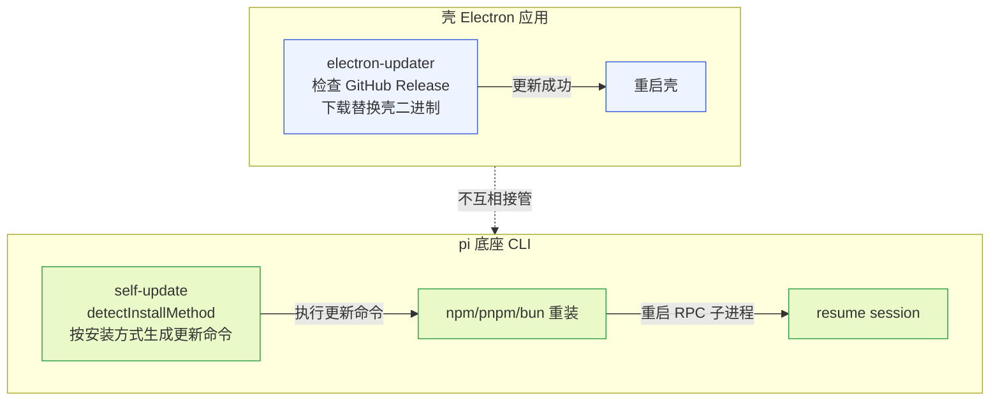
```mermaid
flowchart TD
    subgraph SHELL["壳 Electron 应用"]
        EU["electron-updater<br/>检查 GitHub Release<br/>下载替换壳二进制"]
        EU -->|更新成功| RESTART1["重启壳"]
    end
    subgraph PI["pi 底座 CLI"]
        SU["self-update<br/>detectInstallMethod<br/>按安装方式生成更新命令"]
        SU -->|执行更新命令| REINSTALL["npm/pnpm/bun 重装"]
        REINSTALL -->|重启 RPC 子进程| RESUME2["resume session"]
    end
    SHELL -.->|不互相接管| PI
    classDef shell fill:#eef4ff,stroke:#3b5bdb;
    classDef pi fill:#e9fac8,stroke:#2f9e44;
    class EU,RESTART1 shell;
    class SU,REINSTALL,RESUME2 pi;
```

**图 5 — 壳更新与底座更新解耦：两套独立机制，互不接管**

#### 3.1.2 解耦的边界：桌面端只透出底座更新提示

桌面端对底座更新的参与仅限于"透出提示"。桌面端主动 spawn 底座 CLI 跑 `pi update --check`（plan-only）探测更新计划（4.5.1），有新版就在管理 UI 显示"pi 底座有更新（<version>）"，用户点更新按钮时，桌面端 spawn `pi update` 走底座自己的更新流程（让底座内部跑 detectInstallMethod + getSelfUpdatePlan + getSelfUpdateCommand + prepareWindowsNpmSelfUpdate + 执行），而非自己下载替换底座文件、也不直接 spawn npm。更新完成后，桌面端重启 RPC 子进程（2.4 的重启路径），新底座从磁盘重载、resume session。这条链路全程不涉及壳的更新。

### 3.2 electron-updater 配置

#### 3.2.1 publish provider 与 latest.yml

electron-updater 的更新源配置在 electron-builder 的 `publish` 段：

```yaml
publish:
  provider: github
  owner: earendil-works
  repo: pi-desktop
  releaseType: release
```

`provider: github` 让 electron-updater 从 GitHub Release 拉更新信息。electron-builder 打包时自动生成 `latest.yml`（Mac）/`latest-mac.yml`/`latest.yml`（Windows）/`latest-linux.yml`，记录最新版本号和各平台包的下载地址、文件哈希。electron-updater 运行时读这个 yml 比对本地版本，有新版就下载对应平台的包、校验哈希、安装。

#### 3.2.2 代码签名是自动更新的前提

Windows 和 Mac 的自动更新都依赖代码签名。未签名的应用，electron-updater 在 Windows 上会被 SmartScreen 拦截、在 Mac 上会被 Gatekeeper 拦截，用户即使下载了也跑不起来。所以正式启用自动更新前必须配签名：

- **Mac**：需要 Apple Developer 账号，配 `CSC_LINK`（证书 p12 路径或 base64）、`CSC_KEY_PASSWORD`、`APPLE_ID`/`APPLE_APP_SPECIFIC_PASSWORD`/`APPLE_TEAM_ID`（公证用）。
- **Windows**：需要 Windows 代码签名证书（EV 或 OV），配 `CSC_LINK`/`CSC_KEY_PASSWORD`。EV 证书更受 SmartScreen 信任。
- **Linux**：AppImage 不需要签名（但可选用 GPG 签名验证完整性），deb/rpm 走包管理器更新不走 electron-updater。

开发阶段或未签名时，electron-updater 的检查可以跑，但下载安装后用户会遇到系统警告——所以未签名版本建议只做内测、不开放自动更新。

#### 3.2.3 更新渠道：stable 与 beta

electron-updater 支持 `releaseType` 区分更新渠道。配置 `releaseType: release` 只从正式 Release 拉更新；`releaseType: prerelease` 会从预发布（beta/RC）拉。pi-desktop 可以用这个做 beta 测试渠道——用户可以在设置里选"加入预览更新渠道"，桌面端调 `autoUpdater.allowPrerelease = true` 切到 beta 渠道。这让正式用户和内测用户各走各的更新流。

```typescript
// 用户设置里切换更新渠道
const allowPrerelease = store.get("updateChannel") === "beta";
autoUpdater.allowPrerelease = allowPrerelease;
autoUpdater.channel = allowPrerelease ? "beta" : "latest";
```

#### 3.2.4 latest.yml 的结构与增量更新

electron-builder 打包时为每个平台生成 `latest.yml`（Mac 是 `latest-mac.yml`、Linux 是 `latest-linux.yml`、Windows 是 `latest.yml`），结构：

```yaml
version: 1.2.3
files:
  - url: pi Desktop-1.2.3-universal.dmg
    sha512: <base64 哈希>
    size: 125000000
  - url: pi Desktop-1.2.3-universal.zip
    sha512: <base64 哈希>
    size: 120000000
    blockMapSize: 150000
    blockMapUrl: pi Desktop-1.2.3-universal.zip.blockmap
path: pi Desktop-1.2.3-universal.zip
sha512: <base64 哈希>
releaseDate: '2026-07-24T10:00:00.000Z'
```

electron-updater 运行时读这个 yml、比对本地版本号决定要不要更新。`blockmap` 文件记录包的分块哈希——electron-updater 下载新版时，先下载 blockmap、和旧版本比对、只下载变化的块（增量更新）。这对大包（Mac universal dmg 约 125MB）能显著减少下载量。增量更新只对 zip 格式有效（dmg 不支持块级 diff），所以 Mac 必须打 zip 给 electron-updater 用、dmg 给首次安装用。

### 3.3 壳更新的运行时流程

#### 3.3.1 检查、下载、退出安装

electron-updater 的标准流程是 `autoUpdater.checkForUpdates()` → 有新版则 `downloadUpdate()` → 下载完成后 `quitAndInstall()`（退出应用、替换文件、重启）。关键代码在 main 进程：

```typescript
// src/shell/electron-main/updater.ts
import { autoUpdater } from "electron-updater";

export function initUpdater() {
  autoUpdater.autoDownload = true;        // 自动下载（也可设 false 让用户确认）
  autoUpdater.autoInstallOnAppQuit = true; // 退出时自动安装

  autoUpdater.on("update-available", (info) => {
    // 通知 renderer 显示"有新版本"提示
  });
  autoUpdater.on("update-downloaded", (info) => {
    // 通知 renderer 显示"更新已下载，重启生效"
    // 用户点"立即重启"时调 autoUpdater.quitAndInstall()
  });
  autoUpdater.on("error", (err) => {
    // 更新失败，记录日志、不阻塞用户使用
  });

  // 启动后检查一次（不阻塞主流程）
  autoUpdater.checkForUpdates().catch(() => {/* 静默失败，更新是锦上添花 */});
}
```

#### 3.3.2 更新时机与 agent 工作冲突

一个必须处理的场景：更新下载好了要 `quitAndInstall()`，但此刻 agent 正在 streaming。直接退出会打断 agent、丢当前 turn。处理方式和 2.4 的热加载重启决策一致——带判断的更新安装：

- 下载完成时不立刻 `quitAndInstall`，而是标记"更新待安装"。
- 监听 `agent_settled`（1.6.1，agent 完全落定的标志），settled 后若更新待安装，提示用户"更新已就绪，重启生效"或自动重启。
- 若用户手动退出应用，`autoInstallOnAppQuit` 会在退出时安装——这是最不打扰的路径，用户自然关应用时顺带更新。

```mermaid
sequenceDiagram
    participant EU as electron-updater
    participant MAIN as core main
    participant PI as pi 底座子进程
    participant UI as renderer
    EU->>MAIN: update-downloaded 事件
    MAIN->>MAIN: 标记 pendingUpdate=true
    MAIN->>UI: 通知"更新已下载"
    alt agent streaming
        MAIN->>PI: 不打断 等 agent_settled
        PI-->>MAIN: agent_settled
        MAIN->>UI: 提示"重启生效"
    else agent idle
        MAIN->>UI: 提示"重启生效"
    end
    UI->>MAIN: 用户点"立即重启"
    MAIN->>EU: quitAndInstall()
    Note over EU: 退出 替换文件 重启
    classDef note fill:#fff4e6;
```

**图 6 — 壳更新时机：下载完成不立刻装，等 agent settled 再提示，避免打断 streaming**

### 3.4 更新包的下载、校验与安装

#### 3.4.1 版本比对与下载决策

electron-updater 启动时调 `checkForUpdates()`，它去 `publish.provider` 配的 GitHub Release 拉 `latest.yml`（或对应平台的 `latest-mac.yml`/`latest-linux.yml`）。拿到 yml 后用 `semver` 比对本地 `app.getVersion()` 和 yml 里的 `version`：本地版本 < yml 版本就判定有更新、触发 `update-available` 事件；相等或更高就静默结束。`autoDownload: true` 时 `update-available` 后自动开始下载，`false` 时要等业务代码调 `downloadUpdate()`。

版本比对有几个细节：(1) 比对走 semver，所以版本号必须符合语义化版本（`1.2.3`、不能是 `1.2.3-beta` 除非配了 prerelease 渠道）；(2) `allowPrerelease` 控制要不要把 prerelease 版本当候选，默认 false（3.2.3 的渠道切换）；(3) 本地版本号来自 `package.json` 的 `version`、由 electron-builder 打进 app——所以版本号唯一来源是 `package.json`，不要在运行时用别的方式覆盖。

#### 3.4.2 增量下载与 blockmap

electron-updater 的增量更新靠 blockmap（`.blockmap` 文件）。流程：先下载新版包的 blockmap（小文件，记录包按固定块大小切分后的每块 sha512），和本地已装版本的 blockmap 比对，找出变化的块，只下载变化的块、拼成完整包。对 Mac universal zip（~120MB），如果只改了少量代码、变化的块少，下载量可能从 120MB 降到几 MB——这是 electron-updater 对大包的关键优化。

但增量更新有几个限制：(1) 只对 zip 格式有效（dmg 不支持块级 diff），所以 Mac 必须打 zip 给 updater 用（2.3.1）；(2) 本地已装版本的 blockmap 必须还在（首次安装时 blockmap 和包一起下载、存在 app 目录），如果用户手动删过、增量退化为全量下载；(3) universal binary 的增量效率低（2.4 的演进项）——两架构合一文件、任一架构变都让对应块变化。增量下载失败时 electron-updater 自动 fallback 到全量下载，不会让更新卡住。

#### 3.4.3 校验与安装

下载完成后 electron-updater 校验包的 sha512（yml 里记的 `sha512` 字段）——校验失败触发 `error` 事件、不安装。校验通过后触发 `update-downloaded` 事件，此时包还没装、应用还在跑。安装靠 `quitAndInstall()`：退出应用、把下载的包解压替换 app 目录、重启。Mac/Windows 上替换前会校验签名（系统层的 Gatekeeper/SmartScreen），未签名包在这一步被拦——这是 3.2.2 说的"签名是自动更新前提"的具体落点。

`quitAndInstall(isSilent, isForceRunAfter)` 两个参数：`isSilent` 不弹"是否立即重启"对话框、直接退出安装；`isForceRunAfter` 装完后强制重启应用。pi-desktop 的策略是 `isSilent: false`（让用户确认，因为可能正在看 agent 输出）、`isForceRunAfter: true`（装完自动重启、resume session）。但 3.3.2 的"等 agent_settled"要在调 `quitAndInstall` 之前做——`quitAndInstall` 一调就立刻退出，不等 agent。

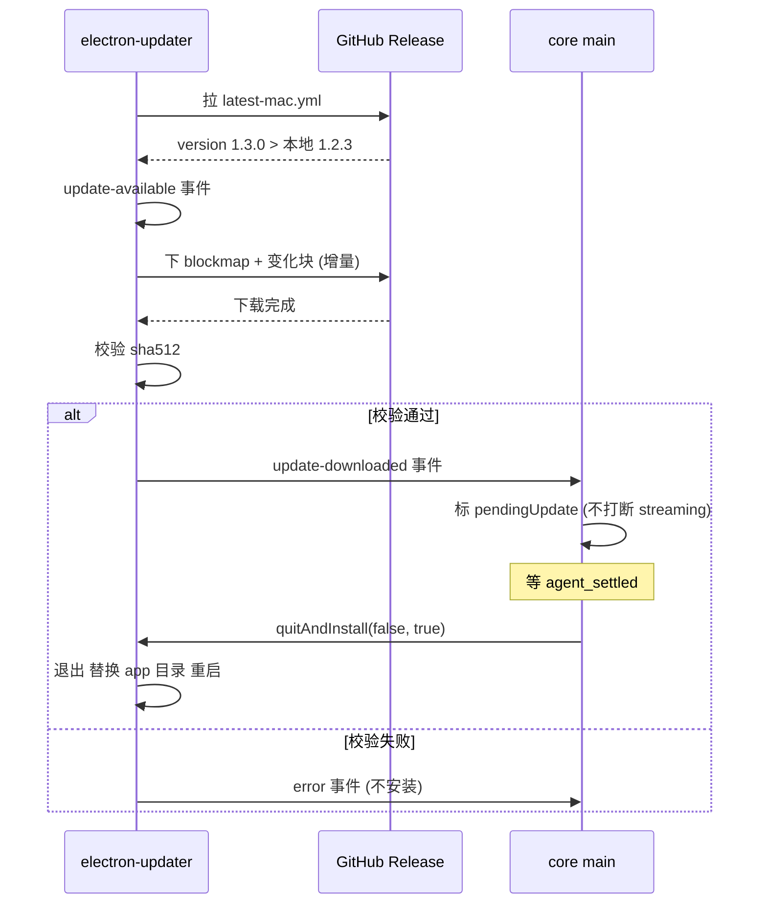
```mermaid
sequenceDiagram
    participant EU as electron-updater
    participant GH as GitHub Release
    participant MAIN as core main
    EU->>GH: 拉 latest-mac.yml
    GH-->>EU: version 1.3.0 > 本地 1.2.3
    EU->>EU: update-available 事件
    EU->>GH: 下 blockmap + 变化块 (增量)
    GH-->>EU: 下载完成
    EU->>EU: 校验 sha512
    alt 校验通过
        EU->>MAIN: update-downloaded 事件
        MAIN->>MAIN: 标 pendingUpdate (不打断 streaming)
        Note over MAIN: 等 agent_settled
        MAIN->>EU: quitAndInstall(false, true)
        EU->>EU: 退出 替换 app 目录 重启
    else 校验失败
        EU->>MAIN: error 事件 (不安装)
    end
```

**图 6b — 更新包下载校验安装时序：拉 yml → 增量下载 → 校验 sha512 → 等 settled → quitAndInstall**

### 3.5 更新失败的处理与降级

#### 3.5.1 三类更新失败

electron-updater 在更新全链路可能失败的三类点，每类的处理不同：

- **检查失败**（拉 `latest.yml` 失败：网络断、GitHub API 限流、Release 不存在）：触发 `error` 事件。桌面端静默吞掉、不打扰用户——更新是锦上添花、不能因为更新检查失败让壳用不了。`checkForUpdates().catch(() => {})` 是标准写法（3.3.1）。
- **下载失败**（增量块下载中断、全量下载超时）：electron-updater 内部有重试，重试仍失败触发 `error`。此时已下载的部分缓存着，下次启动会续传（支持断点续传）。
- **校验失败**（sha512 对不上、包损坏）：触发 `error`、不安装。这通常是下载不完整或 GitHub Release 被覆盖（改了 asset 没改 yml 的 hash）。重新发版修 yml 即可。

#### 3.5.2 安装失败与回滚

`quitAndInstall` 替换 app 目录时，如果替换失败（磁盘满、权限不足、文件被占用），应用已经退出但替换没完成——用户启动不了壳。electron-updater 在 Mac/Windows 上对这种情况有保护：替换前先备份旧版 app、替换成功才删备份。但极端情况（替换中途断电）仍可能留下半替换状态。pi-desktop 的兜底是用户重新下载安装包覆盖装（首次安装路径，2.4.3 的 NSIS 覆盖安装保留用户数据）。所以发版前 3.4 的冒烟验证（29.1）至关重要——发出去的包必须是能装的。

#### 3.5.3 不支持自动降级

electron-updater 不支持自动降级——如果新版有严重 bug，已更新到坏版的用户不会被自动降回旧版（`checkForUpdates` 比对版本号，本地比 latest.yml 高时不触发更新）。这是 12.2.2 说的"渐进式发布是预防、回滚是兜底"的具体技术原因。pi-desktop 的策略：用预发布渠道做小范围灰度（先发一个 pre-release Release，`releaseType: prerelease` 渠道的内测用户先收到、观察 24 小时无集中报错再发正式 Release 全量），降低坏版影响面；真发严重 bug 时，发一个修复版（比坏版号高）让用户更新到修复版——而不是指望降级。注意：electron-updater 的 generic/github provider **不原生支持** latest.yml 里的 `stagingPercentage` 字段（staged rollout 是 Hazel/nuts 等自建更新服务器的特性），所以在 GitHub Release 渠道下"先 10% 用户"靠 pre-release 渠道切分、不靠一个百分比字段。

## 4 底座 self-update：独立更新机制

### 4.1 detectInstallMethod：安装方式检测

#### 4.1.1 六种安装方式

pi 底座的 self-update 不是一刀切的"下载替换二进制"，而是按安装方式生成对应的更新命令。`config.ts` 的 `detectInstallMethod()` 返回六种安装方式之一：`"bun-binary" | "npm" | "pnpm" | "yarn" | "bun" | "unknown"`。检测逻辑：

- **bun-binary**：`isBunBinary`（`import.meta.url` 含 `"$bunfs"`/`"~BUN"`/`"%7EBUN"`，Bun 编译二进制的虚拟文件系统路径标记）。这是 Bun `bun build --compile` 产出的单文件二进制。
- **pnpm/yarn**：检查 `__dirname` 和 `process.execPath` 的路径是否含 `/pnpm/`/`/.pnpm/` 或 `/yarn/`/`/.yarn/`——全局安装的包路径里有包管理器名。
- **bun**：`isBunRuntime`（`process.versions.bun` 存在）或路径含 `/install/global/node_modules/`（bun 全局安装路径）。
- **npm**：路径含 `/npm/` 或 `/node_modules/`。
- **unknown**：以上都不匹配（可能是源码 checkout、Nix/Guix 安装等）。

#### 4.1.2 路径检测的实现

`detectInstallMethod` 的实现关键在路径归一化比较：把 `__dirname` 和 `process.execPath` 拼起来转小写、统一正斜杠，再 `includes` 子串匹配。这避免了大小写和路径分隔符差异（Windows 用 `\`）导致的漏判。代码：

```typescript
export function detectInstallMethod(): InstallMethod {
  if (isBunBinary) return "bun-binary";
  const resolvedPath = `${__dirname}\0${process.execPath || ""}`.toLowerCase().replace(/\\/g, "/");
  if (resolvedPath.includes("/pnpm/") || resolvedPath.includes("/.pnpm/")) return "pnpm";
  if (resolvedPath.includes("/yarn/") || resolvedPath.includes("/.yarn/")) return "yarn";
  if (isBunRuntime || resolvedPath.includes("/install/global/node_modules/")) return "bun";
  if (resolvedPath.includes("/npm/") || resolvedPath.includes("/node_modules/")) return "npm";
  return "unknown";
}
```

`unknown` 和 `bun-binary` 两种是 `getSelfUpdateCommand` 返回 `undefined` 的——前者无法确定怎么更新、后者是单文件二进制不能靠包管理器更新（要去 Release 页下载新版）。其余四种各自生成对应的 `install -g` 命令。

### 4.2 SelfUpdateCommand：按安装方式生成更新命令

#### 4.2.1 各方式的更新命令

`getSelfUpdateCommandForMethod` 按安装方式生成 `SelfUpdateCommand`（含 command/args/display，可选 steps 数组表示先卸载旧包名再装新）：

- **npm**：`npm install -g --ignore-scripts --min-release-age=0 <target>`。`--ignore-scripts` 防止包的 install 脚本跑（安全）；`--min-release-age=0` 绕过 npm 的发布冷却期检查。若推断出 npm prefix 还加 `--prefix`。
- **pnpm**：`pnpm install -g --ignore-scripts --config.minimumReleaseAge=0 <target>`。pnpm 的全局 bin 目录可能要 `--config.global-bin-dir` 显式指定（从 `PNPM_HOME` 或路径推断）。
- **yarn**：`yarn global add --ignore-scripts <target>`。
- **bun**：`bun install -g --ignore-scripts --minimum-release-age=0 <target>`。
- **bun-binary/unknown**：返回 `undefined`——无法自动更新。

当更新涉及包名变更（`target.packageName !== installedPackageName`），会生成两步命令：先 `uninstall -g 旧包名`、再 `install -g 新包名`，用 `steps` 数组表达。这处理底座换包名发版的场景。

**随壳 bun-binary 底座的 self-update 边界**：这条链路有个必须点明的边界——随壳分发的底座默认形态是 bun-binary（4.4.2、2.5.3、19.1.1），而 `getSelfUpdateCommandForMethod("bun-binary")` 返回 `undefined`（单文件二进制不能靠包管理器更新）。也就是说：**随壳分发的 bun-binary 底座无法 self-update**，`pi update --check` 对它会走 `getSelfUpdateUnavailableInstruction` 返回"请从 Release 页下载新版"的指引。随壳底座用户的底座更新依赖**壳整体更新**（25.1——壳更新时随壳底座跟着原子替换）。只有用户改用全局 PATH 底座（`npm`/`pnpm`/`bun` 装的、非 bun-binary 形态）后，才能走 4.5 的 self-update 链路。桌面端在管理 UI 透出底座更新提示时，要按 `detectInstallMethod` 的结果区分：bun-binary 形态不显示"一键更新底座"按钮、改提示"随壳更新（更新壳即可）"或"去 Release 页下载"；npm/pnpm/yarn 形态才启用 4.5.1 的 `pi update` 触发路径。这条边界避免实现者误以为随壳底座也能走 4.5 的 self-update。

#### 4.2.2 更新可行性的三重校验

`getSelfUpdateCommand` 不是生成了命令就能用，有三重校验全部通过才返回命令：

1. **安装方式可更新**：`getSelfUpdateCommandForMethod` 返回非 undefined（排除 bun-binary/unknown）。
2. **被全局包管理器管理**：`isManagedByGlobalPackageManager`——检查当前包目录是否真的在全局包管理器的 root 下（用 `npm root -g`/`pnpm root -g` 等拿到全局 root，比路径前缀）。这防止把"本地项目里装的依赖"误判为全局安装。
3. **安装路径可写**：`isSelfUpdatePathWritable`——`accessSync(packageDir, W_OK)` 检查包目录和父目录可写。路径不可写（如系统级安装需 sudo）时返回 undefined、改用 `getSelfUpdateUnavailableInstruction` 给出手动更新指引。

三重校验确保 self-update 只在"确实能安全自动更新"的场景下返回命令。任一不满足，改用 `getSelfUpdateUnavailableInstruction` 返回人类可读的提示（如"此安装由全局 npm 管理，但路径不可写，请自行运行：..."或"从 Release 页下载"）。

#### 4.2.3 Windows 的额外约束：只支持 npm/pnpm

桌面端透出"更新底座"按钮时，要注意底座 self-update 在 Windows 上的一个硬约束：Windows 上底座只对 npm 和 pnpm 两种安装方式支持 self-update。底座的 `package-manager-cli.ts` 在跑 `update` 命令时显式判断：

```typescript
// 底座:package-manager-cli.ts (update 分支，对照源码)
if (process.platform === "win32" && installMethod !== "npm" && installMethod !== "pnpm") {
  console.error(`${APP_NAME} self-update on Windows is only supported for npm and pnpm installs.`);
  console.error(`Detected install method: ${installMethod}. Update ${APP_NAME} manually.`);
  process.exitCode = 1;
  return true;
}
```

也就是说，Windows 上如果底座是 bun/yarn/bun-binary 装的，self-update 直接拒绝、要用户手动更新。桌面端在 Windows 上检测到这种安装方式时，"更新底座"按钮要么置灰、要么点了之后透出底座给的"请手动更新"指引（`getSelfUpdateUnavailableInstruction` 的输出），不能假设 Windows 上所有安装方式都能一键更新。这个平台差异是桌面端管理 UI 必须呈现的——别在 Mac 上能更新就在 Windows 上也承诺能更新。

### 4.2.4 getSelfUpdatePlan：更新计划与版本比对

底座的 `getSelfUpdatePlan(force)` 是 self-update 的决策层——它去查 npm registry 最新版本、和本地 `VERSION` 比对，决定要不要更新。返回 `{ packageName, installSpec, version, shouldRun, note? }`：

- `shouldRun: false` 表示已是最新版（底座打 `is already up to date`），桌面端这时不该显示"有更新"。
- `shouldRun: true` 表示有新版本，`installSpec` 是要装的目标 spec（如 `@earendil-works/pi-coding-agent@2.1.4`），桌面端把这个 spec 交给 `getSelfUpdateCommand` 生成具体命令。
- `note` 是可选的更新提示（如 breaking change 警告），底座用 `printSelfUpdateNote` 打印，桌面端要把它透出给用户而不是吞掉。
- `force` 跳过版本比对、强制走更新流程——桌面端的"重新检查更新"按钮可以传 force。

桌面端对接 self-update 的正确链路是：调底座的 update 逻辑（或等价地按 4.5.1 透出提示）→ 底座跑 `getSelfUpdatePlan` 决策 → 若 shouldRun 则 `getSelfUpdateCommand` 生成命令 → 执行 → 重启子进程。桌面端不该自己实现版本比对（那要自己查 npm registry、自己解析 semver），而是把决策委托给底座——底座知道自己的包名、知道怎么查最新版、知道哪些版本有 breaking note。

### 4.3 Windows 原生依赖隔离与 self-update

#### 4.3.1 为什么 Windows self-update 要隔离原生依赖

底座在 Windows 上有一个特殊的 self-update 前置步骤：`prepareWindowsNpmSelfUpdate()`。它做的事是 `cleanupWindowsSelfUpdateQuarantine(packageDir)` + `quarantineWindowsNativeDependencies(packageDir)`（`底座:utils/windows-self-update.ts`）。根因是 Windows 的文件系统对"正在被进程加载的动态库"有独占锁——一个 `.node` 文件被 pi 进程加载后，npm 想覆盖它会失败（`EPERM`/文件被占用）。npm 在 Windows 上更新一个含原生依赖的包时，要先把正在用的原生依赖挪走、装完再清理。

#### 4.3.2 quarantine 的实现：基于 process.report

底座的隔离实现很巧妙——用 Node 内置的 `process.report.getReport()` 拿到当前进程已加载的全部共享对象列表（`sharedObjects`），筛出落在底座 packageDir 范围内的，把它们复制到一个隔离目录（`.pi-native-quarantine/`，放在最近的 `node_modules` 下）：

```typescript
// 底座:utils/windows-self-update.ts (quarantineWindowsNativeDependencies 骨架)
const loadedFiles = getLoadedSharedObjectsInPackageDir(packageDir);
// getLoadedSharedObjectsInPackageDir 用 process.report.getReport().sharedObjects
//   筛出路径在 packageDir 内的 .node 文件
if (loadedFiles.length === 0) return;
const quarantineRunDir = join(quarantineRoot, `${Date.now()}-${process.pid}-${randomUUID()}`);
for (const loadedFile of loadedFiles) {
  // 把正在被加载的 .node 复制到隔离目录
  copyFileSync(loadedFile, join(quarantineRunDir, relative(packageDir, loadedFile)));
}
```

隔离目录用 `Date.now()-pid-uuid` 命名，避免多个 pi 进程并发更新时撞车。`cleanupWindowsSelfUpdateQuarantine` 在每次更新前清理旧的隔离目录（`rmSync` 容错——前一个 pi 进程可能还没完全退出、仍持有 addon）。

#### 4.3.3 桌面端对 quarantine 的参与

这套隔离是底座自己的事——桌面端不掺和。但桌面端要知道：Windows 上底座 self-update 比其他平台慢（要先隔离原生依赖再装），且如果 pi 子进程持有原生依赖时被强 kill（没走正常的 self-update 流程），隔离目录会残留——下次 self-update 时 `cleanupWindowsSelfUpdateQuarantine` 会清掉。所以桌面端在 Windows 上触发底座更新时，要走底座的 `update` 命令（让底座自己跑 prepareWindowsNpmSelfUpdate），不能直接在桌面端 `spawn("npm", ["install", "-g", ...])` 越过底座——那样会撞到 Windows 文件锁、装失败。

这条约束强化了 4.5.1 的边界：桌面端对底座更新只"透出提示 + 触发底座的 update 流程 + 重启子进程"，不自己执行 npm 命令。在 Windows 上尤其重要——越过底座的隔离逻辑必坏。

### 4.4 getPackageDir：底座资产路径定位

#### 4.4.1 三种运行形态的路径解析

底座的三种运行形态决定 `getPackageDir()`（config.ts）返回什么——这个函数是底座定位自己资产（主题、模板、package.json）的基准。pi-desktop 打包随壳分发底座时，要理解底座怎么定位自己：

- **bun-binary**（编译二进制）：`getPackageDir` 返回 `dirname(process.execPath)`——二进制文件所在目录。主题在 `theme/`、HTML 模板在 `export-html/`，都和二进制同级。
- **Node.js dist/**（编译产物）：从 `__dirname` 往上找到 `package.json` 所在目录。主题在 `dist/modes/interactive/theme/`、模板在 `dist/core/export-html/`。
- **tsx src/**（源码运行）：同上逻辑，但 srcOrDist 判断为 `src`，主题在 `src/modes/interactive/theme/`。

```typescript
export function getPackageDir(): string {
  const envDir = process.env.PI_PACKAGE_DIR;
  if (envDir) return normalizePath(envDir);  // 环境变量覆盖（Nix/Guix 用）
  if (isBunBinary) return dirname(process.execPath);
  // Node.js: 从 __dirname 往上找 package.json
  let dir = __dirname;
  while (dir !== dirname(dir)) {
    if (existsSync(join(dir, "package.json"))) return dir;
    dir = dirname(dir);
  }
  return __dirname;
}
```

`PI_PACKAGE_DIR` 环境变量是给 Nix/Guix 这类"store 路径 token 化"的包管理器用的——它们的安装路径不可靠（每次版本变路径变），用户用环境变量显式指定。pi-desktop 打包随壳底座时不需要这个（路径随壳固定），但如果用户用全局 PATH 底座且是 Nix 安装，可能要设 `PI_PACKAGE_DIR`。

#### 4.4.2 底座资产随壳分发的目录布局

随壳分发的底座，其资产目录布局取决于底座形态。如果随壳分发 bun-binary 形态底座，pi-desktop 的 extraResources 布局是：

```
process.resourcesPath/pi-cli/
├── pi              # bun-binary 可执行文件
├── theme/           # 主题资产
├── export-html/     # HTML 导出模板
├── assets/          # 交互式 TUI 资产（RPC 模式可能不需要但无害）
└── package.json     # 版本信息
```

cli-locator 返回的路径是 `process.resourcesPath/pi-cli/pi`（binary 形态），RpcClient 的 spawn 改成 `spawn(piBinary, ["--mode", "rpc", ...args])`。底座内部的 `getPackageDir()` 自动解析到 `dirname(process.execPath)`，即 `process.resourcesPath/pi-cli/`，主题和模板都在同级目录、底座能正常找到。这是随壳分发最省心的形态——底座所有资产在一个目录、不用额外配置。

如果随壳分发 Node 脚本形态底座（`dist/cli.js`），布局是：

```
process.resourcesPath/pi-cli/
├── dist/
│   ├── cli.js       # node 入口
│   ├── modes/
│   │   └── interactive/theme/  # 主题
│   └── core/
│       └── export-html/        # 模板
├── node_modules/    # 底座的 npm 依赖
└── package.json
```

cli-locator 返回 `process.resourcesPath/pi-cli/dist/cli.js`，spawn `node` 执行。底座要带自己的 `node_modules`（或 bundle 进 cli.js）——这是 Node 脚本形态比分发 binary 麻烦的地方。所以 pi-desktop 倾向随壳分发 bun-binary 底座。

### 4.5 底座更新与桌面端的关系

#### 4.5.1 桌面端不接管底座更新

config.ts 的这套 self-update 逻辑是底座自己的领域知识——它知道自己的安装方式、知道怎么生成更新命令、知道校验可行性。桌面端不该重复实现这些。桌面端对底座更新的参与是：

1. 桌面端通过底座 CLI 的 `pi update --check` 子命令（plan-only，不实际执行）查询更新计划。底座内部跑 `getSelfUpdatePlan`（4.2.4）做版本比对。**CLI 契约**：`pi update --check` 固定输出**一行 JSON** 到 stdout，结构即 `getSelfUpdatePlan` 的返回值——`{ "packageName": string, "installSpec": string, "version": string, "shouldRun": boolean, "note"?: string }`。桌面端按此 JSON 行机械解析（不解析人类可读文本、不依赖未定义的"约定格式"）：`shouldRun: false`（已是最新）桌面端不显示更新提示；`shouldRun: true` 桌面端透出"pi 底座有更新（<version>）"。`note` 字段（如 breaking change 警告）一并透出、不吞掉。**该 `--check` flag 是底座需提供的 CLI 契约**（4.2.4 的 `getSelfUpdatePlan` 当前是底座进程内部函数、未确认是否经 CLI 暴露），桌面端实现前置依赖底座补该 flag 并按上述 JSON 行输出。**底座未补该 flag 前的临时方案**：桌面端 spawn `pi update --check` 后不解析 JSON，改为检测 stdout 文本标记——命中 `is already up to date`（`shouldRun: false` 的底座打印，见 4.2.4）即判定"已是最新"、未命中即判定"有更新"（此时拿不到精确 version/note，UI 只显示"底座有更新，点更新查看详情"）。临时方案不解析结构化字段、能力受限，演进项为底座补 `pi update --check` 的 JSON 行输出（记入 16.2 演进项），届时桌面端切回 JSON 解析。RPC 的 31 个命令里没有 self-update 查询命令——所以更新探测走 CLI（spawn `pi update --check`）、不走 RPC 适配层，这是和"RPC 只管会话运行时控制"边界一致的（DESIGN.md 1.10）。
2. 桌面端在管理 UI 透出"pi 底座有更新"提示，显示目标版本和 note。
3. 用户触发更新时，桌面端**统一走底座的 `pi update` 命令**（spawn `pi update`，让底座内部自己跑 `detectInstallMethod` + `getSelfUpdatePlan` + `getSelfUpdateCommand` + `prepareWindowsNpmSelfUpdate` + 执行），**绝不直接 spawn npm/pnpm/bun**。这条约束在 Windows 上是硬性的：直接 `spawn("npm", ["install", "-g", ...])` 会撞到 Windows 文件锁、绕过底座的 `prepareWindowsNpmSelfUpdate` 隔离逻辑、装失败（4.3.3）。桌面端只需 spawn `pi update` 并等待其退出码，底座自己处理平台差异。桌面端不持有更新命令的任何领域知识（包名、install spec、路径校验全在底座）。这个动作需要 `child:command` 权限。
4. 更新完成后（`pi update` 退出码 0），桌面端重启 RPC 子进程（2.4 路径），新底座 resume session。

这条链路把 4.2.4 的 `getSelfUpdatePlan`、4.3.3 的 Windows 隔离约束、本节的桌面端边界三处对齐：桌面端只 spawn `pi update`（探测用 `--check`、执行用不带 flag），底座内部串起 detect→plan→command→quarantine→install 全流程。桌面端不 spawn npm，是"壳不替底座管更新"这条主线的具体落点。

#### 4.5.2 更新后重启子进程 resume session

底座更新完成后（包管理器装完新版），旧子进程跑的还是旧代码——要重启 RPC 子进程才能用上新版。这条路径和 2.4 的热加载重启完全一致：杀旧子进程、用 `--session <sessionFile>` 重起、新进程从磁盘重读全部配置和代码、resume 同一 session。session 历史和分叉树在磁盘上（session 文件在 `~/.pi/agent/sessions/`），新进程 resume 后都在，只有"正在进行的那个 turn"丢了。

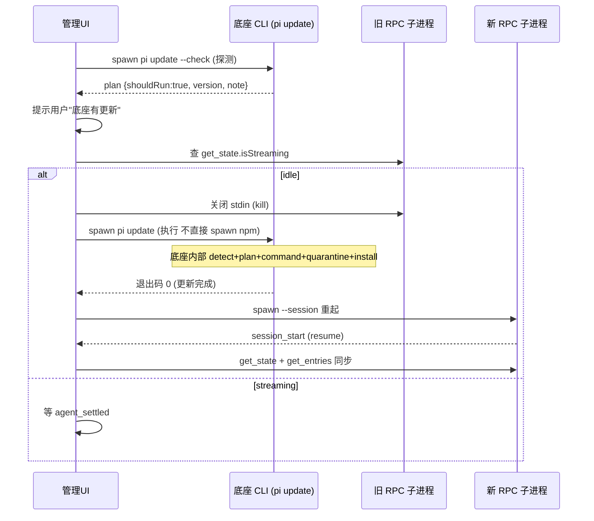
```mermaid
sequenceDiagram
    participant UI as 管理UI
    participant CLI as 底座 CLI (pi update)
    participant PI_OLD as 旧 RPC 子进程
    participant PI_NEW as 新 RPC 子进程
    UI->>CLI: spawn pi update --check (探测)
    CLI-->>UI: plan {shouldRun:true, version, note}
    UI->>UI: 提示用户"底座有更新"
    UI->>PI_OLD: 查 get_state.isStreaming
    alt idle
        UI->>PI_OLD: 关闭 stdin (kill)
        UI->>CLI: spawn pi update (执行 不直接 spawn npm)
        Note over CLI: 底座内部 detect+plan+command+quarantine+install
        CLI-->>UI: 退出码 0 (更新完成)
        UI->>PI_NEW: spawn --session 重起
        PI_NEW-->>UI: session_start (resume)
        UI->>PI_NEW: get_state + get_entries 同步
    else streaming
        UI->>UI: 等 agent_settled
    end
```

**图 7 — 底座更新链路：透出提示 → 执行 self-update → 重启子进程 resume session**

## 5 pi-cli 随壳分发与 cliPath 定位

### 5.1 cliPath 的作用

#### 5.1.1 RpcClient 用 cliPath 起底座子进程

底座的 RPC 模式入口是 `pi --mode rpc`——`pi` 是底座 CLI。RpcClient（`rpc-client.ts`）起子进程时用 `spawn("node", [cliPath, ...args])`，`cliPath` 是底座 CLI 的入口文件路径。DESIGN.md 1.3.3 指出：`cliPath` 默认 `dist/cli.js` 是相对底座安装目录解析的，pi-desktop 打包时要把它指向随壳分发或用户安装的底座路径——不是硬编码 `dist/cli.js`。

`RpcClientOptions.cliPath` 的定义：

```typescript
export interface RpcClientOptions {
  cliPath?: string;   // 底座 CLI 入口路径，默认 "dist/cli.js"
  cwd?: string;       // agent 工作目录（用户打开的项目）
  env?: Record<string, string>;  // 环境变量（OAuth、API key）
  provider?: string;
  model?: string;
  args?: string[];    // 额外 CLI 参数（含 session resume 的 --session）
}
```

pi-desktop 的 RPC 适配层（`gateway/rpc-adapter.ts`）实例化 RpcClient（或等价实现）时，要把 `cliPath` 指向一个真实存在的底座 CLI 路径。这个路径的定位是本节的核心。

#### 5.1.2 env 透传与凭证注入

`RpcClientOptions.env` 是起底座子进程时透传的环境变量。RpcClient 的 `spawn("node", [cliPath, ...args], { env: { ...process.env, ...this.options.env } })` 把桌面端的 `process.env` 打底、再叠上 `options.env`——这个合并顺序很关键：底座子进程能继承桌面端的 PATH、HOME 等基础环境（否则底座找不到 `node`、找不到配置目录），同时桌面端能把 OAuth 凭证、API key 这类敏感的东西通过 `env` 注入底座（如 `ANTHROPIC_API_KEY`、`PI_OAUTH_TOKEN`）。

凭证走 env 而非走 RPC 命令，是有意的：env 在进程启动时一次性注入、不经过 stdin/stdout 协议、不会被 event 流泄露。桌面端管理 auth 时（支柱②的 auth 操作），把拿到的凭证写进 `options.env`、重启子进程让新凭证生效——这和 2.4 的"改配置重启子进程"是同一条路径。打包对 env 透传没有特殊约束（env 是运行时的、不进 asar），但要注意：凭证不能打进日志——`PI_RPC_DEBUG` 打印 command/response/event 时不该打 env（env 在 spawn 参数里、不在 RPC 消息流里，本来就不会被打，但桌面端自己加的调试日志要避开 env 字段）。

### 5.2 cliPath 定位策略

#### 5.2.1 三种来源优先级

桌面端要能在多种部署形态下找到底座 CLI，按优先级尝试：

1. **环境变量 `PI_CLI_PATH`**：用户或部署脚本显式指定。最高优先级，用于开发态或自定义安装位置。
2. **随壳分发的 pi-cli**（`packages/pi-cli` 或 `process.resourcesPath/pi-cli/`）：pi-desktop 打包时把底座 CLI 包随壳分发（见 5.3），这是默认来源，保证"装了桌面端就有底座"、不依赖用户预装。
3. **全局 PATH 中的 `pi`**：用户自己用 npm/bun 全局装了底座。探测 `which pi`/`where pi`，找到了就用——但版本可能和桌面端不匹配，作为兜底。

```typescript
// gateway/cli-locator.ts —— cliPath 定位逻辑骨架
// cli-locator 是中层（gateway），按洋葱纪律不依赖 Electron 运行时 API（app.isPackaged、
// process.resourcesPath 都是 Electron 打包态才有的）。这里只吃一个 RuntimePaths 接口，
// 接口定义在圆心 domain/gateway、实现在 shell 层并注入进来（依赖倒置，见 11.2.2、11.3.2）。
import { existsSync } from "node:fs";
import { join } from "node:path";
import { spawnSync } from "node:child_process";
import type { RuntimePaths } from "domain/gateway/runtime-paths";

export function locateCliPath(rt: RuntimePaths): CliLocation {
  // 1. 环境变量显式指定（按文件名推断形态：.js/.cjs/.mjs 走 node，否则当 binary）
  if (process.env.PI_CLI_PATH && existsSync(process.env.PI_CLI_PATH)) {
    const p = process.env.PI_CLI_PATH;
    return { path: p, type: isNodeScript(p) ? "node-script" : "binary" };
  }
  // 2. 随壳分发的 pi-cli —— 随壳默认形态锁死为 bun-binary（见 4.4.2、2.5.3、19.1.1）
  //    binary 在 pi-cli/pi；若该路径不存在再退回 node 脚本形态 pi-cli/dist/cli.js
  //    isDev()/resourcesPath 都从注入的 RuntimePaths 取，cli-locator 不直接 import electron
  const binDir = rt.isDev()
    ? rt.devCliDir
    : join(rt.resourcesPath, "pi-cli");
  const bundledBinary = join(binDir, "pi");            // bun-binary 形态
  const bundledScript = join(binDir, "dist", "cli.js"); // node 脚本形态（备用）
  if (existsSync(bundledBinary)) return { path: bundledBinary, type: "binary" };
  if (existsSync(bundledScript))   return { path: bundledScript, type: "node-script" };
  // 3. 全局 PATH 中的 pi（兜底）—— 平台分支：Windows 用 where、其余用 which
  const whichCmd = process.platform === "win32" ? "where" : "which";
  const which = spawnSync(whichCmd, ["pi"], { encoding: "utf-8" });
  if (which.status === 0) {
    const piBin = which.stdout.trim().split(/\r?\n/)[0]; // where 可能返回多行，取第一个
    // 全局装的 pi 可能是 bun-binary（直接执行）或 node 脚本，按扩展名区分
    return { path: piBin, type: isNodeScript(piBin) ? "node-script" : "binary" };
  }
  throw new Error("pi CLI not found; set PI_CLI_PATH or install pi");
}
```

`RuntimePaths` 接口定义在圆心、实现在 shell（依赖倒置，见 11.2.2）：

```typescript
// domain/gateway/runtime-paths.ts —— 圆心定义接口，不 import electron
export interface RuntimePaths {
  isDev(): boolean;              // process.env.PI_DESKTOP_DEV === "1" || !app.isPackaged
  resourcesPath: string;         // app.isPackaged ? process.resourcesPath : ...
  devCliDir: string;             // dev 模式下 pi-cli 目录
  devBuiltinDir: string;         // dev 模式下内置插件目录
}
```

```typescript
// shell/electron-main/electron-runtime-paths.ts —— shell 层实现，注入给 cli-locator
import { app } from "electron";
import { join } from "node:path";
import type { RuntimePaths } from "domain/gateway/runtime-paths";

export const electronRuntimePaths: RuntimePaths = {
  isDev: () => process.env.PI_DESKTOP_DEV === "1" || !app.isPackaged,
  get resourcesPath() { return process.resourcesPath; },
  devCliDir: join(__dirname, "..", "..", "packages", "pi-cli"),
  devBuiltinDir: join(__dirname, "..", "..", "src", "plugins"),
};
// 启动编排里注入：const cliPath = locateCliPath(electronRuntimePaths);
```

上面用到的 `isNodeScript(p)` 是按扩展名推断 CLI 形态的辅助：`.js`/`.cjs`/`.mjs` 归为 `node-script`（要 `spawn("node", [p, ...])` 执行），其余当 `binary`（直接 `spawn(p, ...)`）。**`.mjs` 必须归入 node-script**——底座入口若是 ESM `.mjs`，误判为 binary 会直接 `spawn` 裸可执行文件、不带 `node`，启动失败；`.mjs` 走 `spawn("node", [p, ...])`（或视 Electron 的 Node 版本走原生 ESM 加载）。`RuntimePaths.isDev()` 的语义见 11.2.2。

`CliLocation` 的定义和 spawn 分支（5.2.3 已预告 `node-script` 用 `spawn("node",[path,...])`、`binary` 用 `spawn(path,[...])`）：

```typescript
interface CliLocation { path: string; type: "node-script" | "binary"; }
// RPC 适配层拿到 CliLocation 后据此选 spawn 形式（runtime 由 shell 注入，见上文）：
const loc = locateCliPath(runtime);
const spawnArgs = ["--mode", "rpc", ...sessionArgs];
const child = loc.type === "node-script"
  ? spawn("node", [loc.path, ...spawnArgs], { stdio: ["pipe","pipe","pipe"], cwd, env })
  : spawn(loc.path,         spawnArgs,       { stdio: ["pipe","pipe","pipe"], cwd, env });
```

随壳默认形态锁死为 **bun-binary**（4.4.2、2.5.3、19.1.1 已论证：资产同目录、零外部 Node 依赖、Linux 包零依赖），所以 8.1.1 的 extraResources 指向 `packages/pi-cli`（含 `pi` 可执行文件），locateCliPath 的随壳分支优先返回 `{ path: pi-cli/pi, type: "binary" }`。node 脚本形态（`dist/cli.js`）只在 bun-binary 缺失时退回、用于 dev 或自定义构建。全文"随壳底座"统一指 bun-binary 形态——这与 4.4.2、2.5.3、19.1.1 的论述一致，不再有"dist/cli.js 还是 pi 二选一"的歧义。

#### 5.2.2 随壳分发的 pi-cli 与版本锁定

随壳分发是默认且推荐的来源——它保证桌面端和底座版本匹配、不依赖用户预装。pi-desktop 仓库的 `packages/pi-cli/` 目录放底座 CLI 的产物（或作为 git submodule/构建时拉取的依赖）。electron-builder 打包时把它作为 `extraResources` 塞进 `process.resourcesPath/pi-cli/`：

```yaml
extraResources:
  - from: packages/pi-cli
    to: pi-cli
    filter: ["**/*"]
```

版本锁定：随壳分发的底座版本和桌面壳版本绑定发版——每个 pi-desktop 版本对应一个测试过的 pi 底座版本。底座更新（self-update）可以独立升版本（4.x），但随壳分发的那版是兜底基线。这避免了"桌面端期望底座协议 v2、但用户全局装的底座还是 v1"的协议不匹配问题（DESIGN.md 6.4 的协议漂移）。

#### 5.2.3 bun-binary vs node 脚本的执行差异

底座 CLI 有两种形态：Node 脚本（`dist/cli.js`，用 `node` 执行）和 Bun 编译二进制（`isBunBinary`，直接执行）。RpcClient 的 `spawn("node", [cliPath, ...])` 只适用于 Node 脚本形态。如果随壳分发的是 bun-binary，spawn 要改成 `spawn(cliPath, [...args])`（直接执行二进制）。cli-locator 因此返回 `CliLocation`（路径 + 形态标记，定义见 5.2.1），而非裸字符串——RPC 适配层按 `type` 选 spawn 形式（5.2.1 已给 spawn 分支代码）。

RpcClient 当前实现只处理 node-script（`spawn("node", [cliPath, ...args])`）。pi-desktop 的 RPC 适配层如果要支持 bun-binary，要扩展 spawn 调用。这是 pi-desktop 自己要做的适配，底座不感知（底座只管自己被怎么启动）。

### 5.3 起子进程的就绪窗口

#### 5.3.1 RpcClient.start() 的真实启动序列

`RpcClient.start()`（`底座:modes/rpc/rpc-client.ts`）是桌面 RPC 适配层的蓝本，照着它才能写对启动序列。它的真实步骤：

```typescript
// 底座:modes/rpc/rpc-client.ts (start 方法骨架，对照源码)
const cliPath = this.options.cliPath ?? "dist/cli.js";
const args = ["--mode", "rpc"];
if (this.options.provider) args.push("--provider", this.options.provider);
if (this.options.model)    args.push("--model", this.options.model);
if (this.options.args)     args.push(...this.options.args);

const childProcess = spawn("node", [cliPath, ...args], {
  cwd: this.options.cwd,
  env: { ...process.env, ...this.options.env },
  stdio: ["pipe", "pipe", "pipe"],
});
this.process = childProcess;

// stderr 收调试
childProcess.stderr?.on("data", (data) => {
  this.stderr += data.toString();
  process.stderr.write(data);
});
// 三个进程事件全接住
childProcess.once("exit", (code, signal) => { /* rejectPendingRequests */ });
childProcess.once("error", (error) => { /* rejectPendingRequests */ });
childProcess.stdin?.on("error", (error) => { /* rejectPendingRequests */ });

// stdout 接 JSONL reader
this.stopReadingStdout = attachJsonlLineReader(childProcess.stdout!, (line) => this.handleLine(line));

// 等 100ms 再查 exitCode（就绪窗口）
await new Promise((resolve) => setTimeout(resolve, 100));
if (this.process.exitCode !== null) {
  throw this.exitError ?? this.createProcessExitError(...);
}
```

几个必须照抄的要点：(1) provider/model 是通过额外 CLI 参数注入的，不是靠 env——`--provider`/`--model` 等价于命令行参数，桌面端让用户切模型可以走 `set_model` RPC 命令（1.5.3）也可以在起进程时直接指定初始 provider/model；(2) `env` 是 `{ ...process.env, ...options.env }`——桌面端要把 OAuth 凭证、API key 透传给底座子进程，且不能丢掉父进程的环境变量（PATH 等）；(3) 三个进程事件（exit/error/stdin error）任何一个都触发 `rejectPendingRequests`——把所有 pending 命令 reject 掉，避免命令永远卡在 pending Map 里；(4) RpcClient 的 100ms 固定延时是历史实现（见 5.3.2 说明），pi-desktop 的 RPC 适配层**不沿用 100ms、改为等 `session_start` 事件 + 超时兜底**作为就绪标志。

#### 5.3.2 就绪窗口：等 session_start 事件 + 超时兜底

RpcClient.start() 起完进程后 `await new Promise(r => setTimeout(r, 100))` 等 100ms 再检查 exitCode——这是底座参考实现的**历史写法**，给底座初始化时间。pi-desktop 的 RPC 适配层**决策为不沿用 100ms 固定延时**，而是等底座的第一个"就绪信号"：底座 RPC mode 启动后会推一个 `session_start`（reason: "startup"）event，桌面端等这个 event 作为就绪标志、再发 `get_state` 等命令。这样不依赖固定延时、底座初始化慢也不丢命令。

确定的就绪 Promise 语义：`startRpcSubprocess()` 返回一个 Promise，它在以下任一条件 settle——(a) 收到 `session_start` 事件 → resolve（就绪，可发业务命令）；(b) 超时（10s，可配）未收到 `session_start` → reject（提示"底座初始化超时"，9.1.2 的启动失败处理）；(c) 进程提前 `exit`/`error` → reject（带 stderr，9.1.2）。100ms 在 RpcClient 里仅作为"spawn 后查一次 exitCode 抓早期崩溃"的兜底（进程起不来时往往秒退，100ms 内 exitCode 已非 null），pi-desktop 适配层可保留这个早期 exit 检查、但**就绪判定以 session_start 为准**。这样底座初始化慢（如加载大量扩展）也不丢命令、不误报超时。

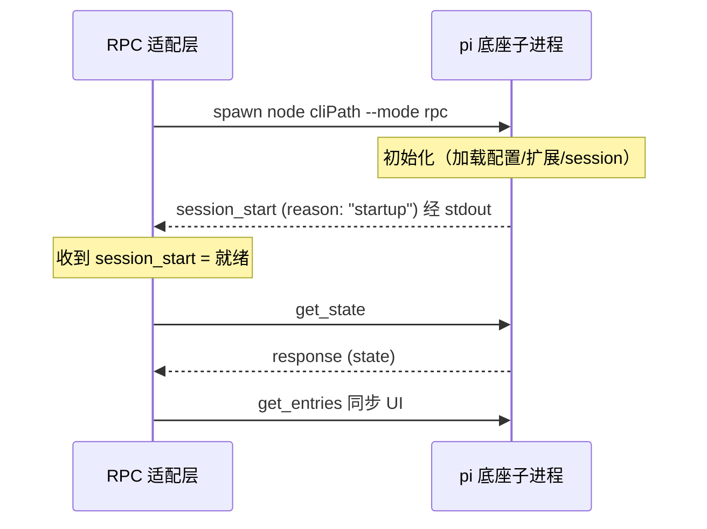
```mermaid
sequenceDiagram
    participant ADAPT as RPC 适配层
    participant PI as pi 底座子进程
    ADAPT->>PI: spawn node cliPath --mode rpc
    Note over PI: 初始化（加载配置/扩展/session）
    PI-->>ADAPT: session_start (reason: "startup") 经 stdout
    Note over ADAPT: 收到 session_start = 就绪
    ADAPT->>PI: get_state
    PI-->>ADAPT: response (state)
    ADAPT->>PI: get_entries 同步 UI
```

**图 8 — 子进程就绪窗口：等 session_start 事件作为就绪标志，替代固定延时**

#### 5.3.3 进程生命周期事件接住

RpcClient 接住了三个进程事件：`exit`（进程退出）、`error`（spawn 错误）、`stdin error`（写 stdin 失败）。任何一个都可能是"底座挂了"的信号。pi-desktop 的 RPC 适配层要接住这些事件、据此通知 UI（"底座连接断开"）、触发重连或提示用户重启。

`rejectPendingRequests` 在进程退出时把所有 pending 的 RPC 命令 reject 掉——避免命令永远卡在 pending Map 里。这是 `RequestCorrelator`（DESIGN.md 3.2.4 的共享原语）的职责，在 gateway/correlator.ts 实现、rpc-adapter 和 extension-ui 共用。

### 5.4 底座子进程的关闭通道与优雅退出

#### 5.4.1 stdin EOF 即 shutdown

底座 RPC mode 对 stdin 有一个干净的语义：stdin 的 `end` 事件（EOF，即写端关闭）直接触发 shutdown。`runRpcMode` 里用 `attachJsonlLineReader(process.stdin, callback)` 逐行读，stdin 的 EOF 一到，底座就走关闭流程——退出 RPC 循环、清理扩展、flush 输出、进程退出。这意味着桌面端关掉 stdin 的写端，底座子进程就会自己退，是个干净的关闭通道，不需要发什么 shutdown 命令（RPC 31 个命令里也没有 shutdown 命令）。

桌面端在两个场景用这条通道：(1) 用户退出壳时，关掉 stdin 让底座优雅退出；(2) 热加载重启子进程时（2.4），关掉旧子进程的 stdin。两条路都不需要 kill——但实际实现里 RpcClient.stop() 用的是 `kill("SIGTERM")` 而非关 stdin，原因是 kill 更确定（stdin 关闭后底座走 shutdown 也要时间，且如果底座卡在某个工具执行里、不读 stdin，EOF 不会立刻被处理）。所以桌面端的关闭策略是"先关 stdin 给优雅退出的机会、再 SIGTERM 兜底、再 SIGKILL 强制"——三层降级。

#### 5.4.2 退出时的 detached 子进程清理

底座在 RPC mode 下可能 spawn 了 detached 子进程（如 agent 调 bash 工具跑 `sleep 100 &` 这类后台命令）。底座的 `runRpcMode` 在退出前调 `killTrackedDetachedChildren()`（`底座:utils/shell.ts`）清理它追踪到的 detached 子进程——避免底座退了、后台进程变孤儿继续跑。桌面端不直接管这些 detached 进程（底座自己追踪、自己清理），但要知道：如果桌面端强制 kill 底座（SIGKILL），底座来不及跑 `killTrackedDetachedChildren`，detached 子进程会变孤儿。所以优雅退出（关 stdin + SIGTERM）不只是礼貌、还关系到子进程树清理——这是 5.4.1 三层降级要尽量走前两层的另一个理由。

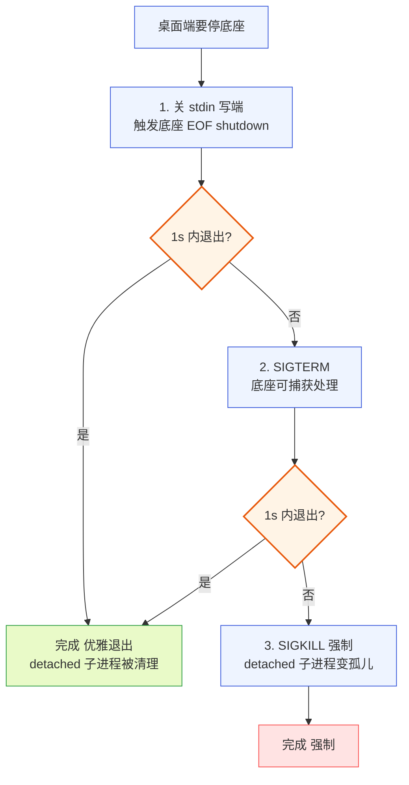
```mermaid
flowchart TD
    Q["桌面端要停底座"] --> L1["1. 关 stdin 写端<br/>触发底座 EOF shutdown"]
    L1 --> W1{"1s 内退出?"}
    W1 -->|是| DONE["完成 优雅退出<br/>detached 子进程被清理"]
    W1 -->|否| L2["2. SIGTERM<br/>底座可捕获处理"]
    L2 --> W2{"1s 内退出?"}
    W2 -->|是| DONE
    W2 -->|否| L3["3. SIGKILL 强制<br/>detached 子进程变孤儿"]
    L3 --> DONE2["完成 强制"]
    classDef step fill:#eef4ff,stroke:#3b5bdb;
    classDef dec fill:#fff4e6,stroke:#e8590c,stroke-width:2px;
    classDef ok fill:#e9fac8,stroke:#2f9e44;
    classDef warn fill:#ffe3e3,stroke:#fa5252;
    class Q,L1,L2,L3 step;
    class W1,W2 dec;
    class DONE ok;
    class DONE2 warn;
```

**图 8a — 底座子进程三层降级关闭：关 stdin → SIGTERM → SIGKILL，前两层能清理 detached 子进程**

#### 5.4.3 桌面端退出时序

用户关掉 pi-desktop 窗口时，main 进程的 `before-quit` 事件触发关闭流程：先停 RPC 子进程（5.4 的三层降级）、再 flush 桌面端自己的状态（better-sqlite3 写盘、electron-store 存偏好）、最后退出。底座子进程的 session 已经持久化在磁盘上（底座每追加 entry 就写 session 文件），所以桌面端退出不等底座"保存 session"——底座没有专门的 save 步骤，session 是流式写的。这让退出很快：关 stdin、等底座 EOF 退出（通常亚秒级）、flush 本地状态、退。

### 5.5 协议版本协商与底座版本解耦

#### 5.5.1 为什么打包要管协议版本

随壳分发的底座和壳版本绑定（5.2.2），但底座能独立 self-update 升到比随壳版更新的版本（4.x）。这导致一个场景：用户壳还是 v1.3.0（带底座 v2.1.3），但底座 self-update 升到了 v2.2.0，新底座的 RPC 协议可能加了字段或改了事件结构。如果桌面端写死按 v2.1.3 的协议解析、连上 v2.2.0 底座就可能解析错。反过来，壳更新到 v1.4.0（带底座 v2.2.0），但用户全局 PATH 底座还是 v2.0.0 旧版，桌面端用了 v2.2.0 才有的新命令、连旧底座就报"unknown command"。

这两个场景是 DESIGN.md 6.4 的协议漂移问题。**当前底座 RPC 协议没有版本协商机制**——31 个命令（DESIGN.md 1.5）里没有 `handshake`/`protocol_negotiate` 类命令，底座启动时也不暴露协议版本号。当前靠两条兜底：(1) 随壳底座版本和壳绑定发版（5.2.2），桌面端按随壳底座版本写适配层；(2) 底座协议字段加减保持向后兼容——`rpc-types.ts` 加字段是向后兼容的（旧桌面端忽略新字段、新桌面端对旧底座不发的字段用默认值），改字段语义才 breaking。这能兜住"小版本漂移"，但兜不住"双方版本无交集"的大漂移。真正的运行时版本协商 handshake 是演进项（DESIGN.md 6.4.3，向底座提的方案），当前未实现、5.5.2 描述的是目标态与降级路径。

#### 5.5.2 handshake 的落点与命令定义

`gateway/protocol/versions.ts` 是协议漂移的唯一落点。具体协商走一条 `handshake` 命令（DESIGN.md 6.4.3 的设计）——它不在当前 31 个 RPC 命令集里（DESIGN.md 1.5），是**向底座提的演进项**；桌面端先于底座实现 handshake 客户端逻辑、向后兼容旧底座。

**命令协议**（桌面端发、底座回）：

```jsonc
// 桌面端发（stdin），子进程就绪后、发任何业务命令前
{ "type": "handshake", "id": "req_hs", "clientVersion": "0.1.0", "protocolConstraint": "^1.0" }
// 底座回（stdout，支持 handshake 时）
{ "type": "response", "command": "handshake", "id": "req_hs", "success": true,
  "data": {
    "protocolVersion": "1.0",         // 底座实际协议版本
    "piVersion": "0.91.0",            // 底座应用版本
    "availableCommands": ["prompt","steer",...,"reload","list_sessions"],
    "features": { "streaming": true, "autoRetry": true, "extensionUi": true }
  }
}
// 底座回（不支持 handshake 时——旧版底座走 RPC default 分支）
{ "type": "response", "command": "handshake", "id": "req_hs", "success": false,
  "error": "Unknown command: handshake" }
```

**时机**：RPC 子进程就绪（收到 `session_start`，5.3.2 的就绪窗口）后、发任何业务命令前发一次 handshake，结果缓存到子进程关闭。热加载重启子进程后（2.4）要重新 handshake——新进程就绪后第一件事重新探测能力。

**降级路径**：底座返回 `success: false, error: "Unknown command: handshake"` 时，桌面端捕获这个 error、假定底座是"旧快照"（当前 31 命令、无 reload/list_sessions），继续用硬编码命令集。协商失败（协议版本无交集，`protocolConstraint` 不满足）时，桌面端报 RPC 错误码 `PROTOCOL_INCOMPATIBLE`（在 gateway 层定义），UI 提示"底座协议版本不兼容，请升级壳或底座"，不让用户进入会话（避免静默解析错）。底座协议版本来自 `rpc-types.ts` 的定义（命令集和事件结构），底座升级时协议版本号跟着升。

打包层面的约束：协议版本协商逻辑封在 `gateway/protocol/`、不污染圆心（圆心只吃中性类型，不感知协议版本）。底座协议字段加减（向后兼容，旧桌面端忽略新字段）只动 `gateway/protocol/` 的类型声明和 `gateway/context-binding.ts` 的映射，圆心和插件不动。这是 5.1.5 圆心类型纯度纪律在版本演进上的体现——协议会漂、圆心不漂。

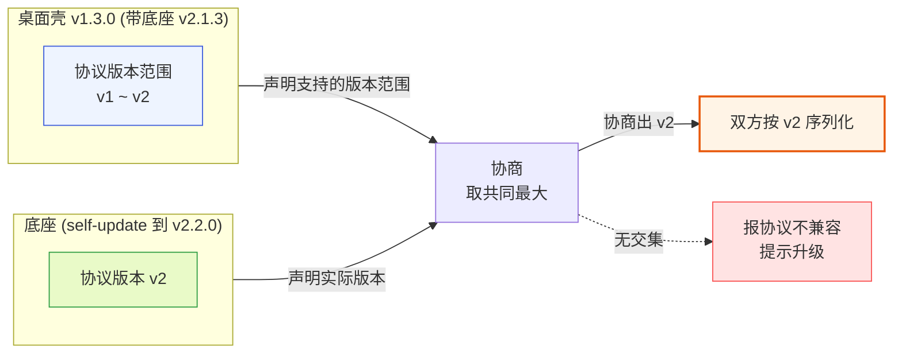
```mermaid
flowchart LR
    subgraph SHELL["桌面壳 v1.3.0 (带底座 v2.1.3)"]
        V1["协议版本范围<br/>v1 ~ v2"]
    end
    subgraph PI["底座 (self-update 到 v2.2.0)"]
        V2["协议版本 v2"]
    end
    SHELL -->|声明支持的版本范围| NEG["协商<br/>取共同最大"]
    PI -->|声明实际版本| NEG
    NEG -->|协商出 v2| RUN["双方按 v2 序列化"]
    NEG -.->|无交集| FAIL["报协议不兼容<br/>提示升级"]
    classDef shell fill:#eef4ff,stroke:#3b5bdb;
    classDef pi fill:#e9fac8,stroke:#2f9e44;
    classDef neg fill:#fff4e6,stroke:#e8590c,stroke-width:2px;
    classDef fail fill:#ffe3e3,stroke:#fa5252;
    class V1 shell;
    class V2 pi;
    class RUN neg;
    class FAIL fail;
```

**图 8b — 协议版本协商：壳和底座各自声明版本、取共同最大，无交集则报不兼容**

这条机制让壳和底座能独立演化——底座 self-update 升协议、旧壳降级到旧协议继续连；壳发新功能用新协议、连旧底座降级到旧协议（新功能不可用但不崩）。只有双方版本无交集（如壳只支持 v1、底座只支持 v2）才报"协议不兼容、请升级壳"。这是 5.2.3"壳更新与底座更新解耦"在协议层的最后一块拼图。

### 5.6 cwd 与项目上下文的跟随

`RpcClientOptions.cwd` 是底座子进程的工作目录——底座的 bash 工具、文件工具、session 存储都以 cwd 为项目上下文。pi-desktop 起底座时要让 `cwd` 跟随用户当前打开的项目目录，这是薄壳的本分（DESIGN.md 1.3.1）：底座自己处理工作目录相关的一切，桌面不掺和。用户在桌面端切换项目时，`cwd` 要跟着变——切项目等于重启底座子进程（新 cwd 的项目信任、session 列表、`.pi/settings.json` 都不同），走 2.4 的重启路径、新进程 resume 新 cwd 下最近的 session（`--resume` 参数）或开新 session。

打包对 cwd 没有约束（cwd 是运行时由用户选的项目目录），但有个 dev 模式的细节：dev 启动时若没指定项目目录、`cwd` 默认是 Electron 的 `process.cwd()`（通常是 pi-desktop 仓库根目录），这会让底座把仓库本身当项目、session 落在仓库的 `.pi/` 下、污染开发环境。所以 dev 模式下桌面端要弹个项目选择器让用户先选一个测试项目目录、再起底座，而不是默认用 `process.cwd()`。这是 dev 体验的一个易错点——prod 模式用户会显式开项目、不会撞这个。

## 6 dev 模式与插件开发体验

### 6.1 electron-vite dev：三端热重载

#### 6.1.1 dev 命令与三端启动

dev 模式由 `electron-vite dev` 启动（现有方案的 `package.json` 里 `"dev": "npm run sync:fonts && electron-vite dev"`）。electron-vite dev 做三件事：

1. 启动 Vite dev server 服务 renderer（带 HMR）。
2. 编译 main 和 preload（watch 模式，文件改了重编并重启 Electron）。
3. 启动 Electron，加载 renderer 的 dev server URL。

效果是：renderer 代码改了 HMR 热替换（不重载整个窗口）；main/preload 代码改了自动重启 Electron 进程。这让开发时的反馈循环快——改 UI 秒级生效、改主进程逻辑几秒重启。

#### 6.1.2 sync:fonts 与 postinstall 的前置

`dev` 脚本前的 `npm run sync:fonts` 是把图标字库（如 Material Symbols）从 node_modules 同步到 renderer 能 import 的位置——现有方案 有这一步，pi-desktop 沿用。这步只在 dev 前跑、不在 build 里跑（build 时字体走 Vite 的 asset 处理）。漏掉这步会导致 dev 模式图标显示成方块。

`postinstall` 的 `electron-builder install-app-deps` 是另一个前置——它在 `npm install` 后按当前 Electron 版本重编原生模块（better-sqlite3）。dev 和打包都要这步：dev 时 main 进程要 require better-sqlite3 的 native binding，没重编会报 `NODE_MODULE_VERSION mismatch`（Node ABI 和 Electron ABI 不一致）。所以 `npm install` 后必须跑一次 `install-app-deps`，CI 和本地都靠 `postinstall` 自动触发。如果遇到"本地 dev 起不来、报 better-sqlite3 加载失败"，第一排查就是 `postinstall` 有没有跑成功——手动 `npx electron-builder install-app-deps` 重跑。

#### 6.1.3 HMR 的 react-refresh 边界

renderer 的 HMR 靠 `@vitejs/plugin-react` 注入的 `react-refresh`。它的边界是 React 组件——只要组件是默认导出的函数组件、且没用 `React.memo` 包成不可热替换的形态，改这个组件就只热替换它、保留父组件和兄弟组件的状态。但有几类改动 HMR 接不住、要整窗口重载：

- **改 PluginContext 的注入逻辑**（preload 改了）→ preload 重编 + 整窗口重载（contextBridge 重新建立）。
- **改槽位契约**（domain/ 改了）→ domain 是纯类型、HMR 不影响运行时，但用了新类型的组件要重载。
- **改 manifest**（plugin.json 改了）→ 不走 HMR，走 6.2.1 的插件热重载（deactivate 旧版 + activate 新版）。

dev 时要注意：HMR 只热替换组件代码、不重跑插件 `activate`。如果改的是插件 `activate` 里注册的事件订阅（如 `ctx.events.on(...)`），HMR 不会重新订阅——旧的取消订阅没跑、新的订阅没建，事件流会乱。这时要手动触发插件热重载（改一下 plugin.json 触发 watcher）让 deactivate 重跑。这是 HMR 的固有边界，开发时要心里有数。

```json
{
  "scripts": {
    "sync:fonts": "node scripts/sync-fonts.mjs",
    "dev": "npm run sync:fonts && electron-vite dev",
    "build": "electron-vite build",
    "package:mac": "electron-vite build && electron-builder --mac",
    "package:win": "electron-vite build && electron-builder --win",
    "package:linux": "electron-vite build && electron-builder --linux",
    "postinstall": "electron-builder install-app-deps"
  }
}
```

`dev` 必须先跑 `npm run sync:fonts` 再起 electron-vite dev——这步把图标字库（如 Material Symbols）从 node_modules 同步到 renderer 能 import 的位置（见 6.1.2）。漏掉这步 dev 模式图标显示成方块。`build` 不需要这步（build 时字体走 Vite 的 asset 处理）。

#### 6.1.4 HMR 边界与 main 进程重启

renderer 的 HMR 是细粒度的——改一个组件只热替换那个组件、保留 React 状态（如果组件用 `react-refresh` 的边界）。但 main 进程的改动（如 RPC 适配层逻辑、插件加载器）不能 HMR——main 是 Node 进程，改了要重启整个 Electron。electron-vite dev 监听 main 文件变化、自动重启 Electron 进程，状态全丢（窗口重建、底座子进程重起、插件重加载）。这是 main 和 renderer 的本质差异：renderer 是长驻的可热替换 UI、main 是一次性启动的进程。

开发时要尽量把可变逻辑放 renderer 侧（UI 组件、状态管理），main 侧放稳定的进程管理/子进程通信。这减少 main 重启频率、提升开发体验。DESIGN.md 的架构天然支持这个——插件逻辑在 worker（main 侧子进程），但插件 UI 在 renderer，改 UI 不碰 main。

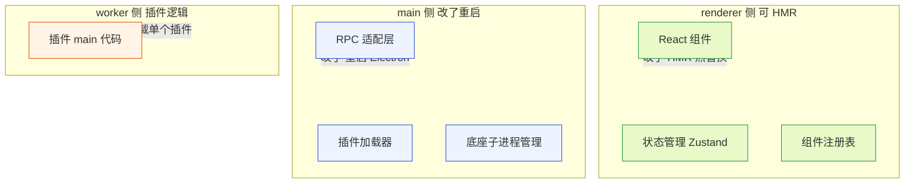
```mermaid
flowchart TD
    subgraph RENDERER["renderer 侧 可 HMR"]
        UI["React 组件"]
        STATE["状态管理 Zustand"]
        REG["组件注册表"]
    end
    subgraph MAIN["main 侧 改了重启"]
        ADAPT["RPC 适配层"]
        LOAD["插件加载器"]
        SUB["底座子进程管理"]
    end
    subgraph WORKER["worker 侧 插件逻辑"]
        PLUG["插件 main 代码"]
    end
    UI -.->|改了 HMR 热替换| RENDERER
    ADAPT -.->|改了 重启 Electron| MAIN
    PLUG -.->|改了 热重载单个插件| WORKER
    classDef ren fill:#e9fac8,stroke:#2f9e44;
    classDef main fill:#eef4ff,stroke:#3b5bdb;
    classDef work fill:#fff4e6,stroke:#e8590c;
    class UI,STATE,REG ren;
    class ADAPT,LOAD,SUB main;
    class PLUG work;
```

**图 8c — 三层重启粒度：renderer HMR（细粒度）/ main 重启（全量）/ worker 热重载（单插件）**

#### 6.1.5 dev 模式下的路径解析

dev 模式下，几个生产环境路径要改向，否则指向不存在的 `process.resourcesPath`：

- **内置插件目录**：生产是 `process.resourcesPath/pi-desktop-builtin/`，dev 指向源码 `src/plugins/` 或编译产物 `out/pi-desktop-builtin/`。用 `RuntimePaths.isDev()` 判断（见 11.2.2，`app.isPackaged` 在打包产物里为 true 会让 `PI_DESKTOP_DEV` 失效，故随壳资源路径统一改用注入的 `RuntimePaths`）：
  ```typescript
  const builtinDir = rt.isDev()
    ? rt.devBuiltinDir                                  // dev 指向源码
    : join(rt.resourcesPath, "pi-desktop-builtin");
  ```
- **pi-cli 路径**：不在此处硬编码，统一走 5.2.1 的 `locateCliPath()`——它按"优先 binary、缺失退回 `dist/cli.js`"解析。生产环境随壳默认产出 bun-binary，`locateCliPath` 返回 `process.resourcesPath/pi-cli/pi`（binary）；dev 默认不构建 bun-binary，`packages/pi-cli/pi` 缺失，`locateCliPath` 的随壳分支自动退回到 `packages/pi-cli/dist/cli.js`（node-script，由 `spawn("node", [path, ...])` 执行）。故 dev 的 `cliPath` 落到 `packages/pi-cli/dist/cli.js` 是 binary 缺失的退回结果、与 5.2.1 的优先级逻辑一致，而非 6.1.5 另立一套判断。若 dev 也产出 binary（手动跑底座的 `bun build --compile`），`locateCliPath` 同样会优先返回 `packages/pi-cli/pi`。
- **配置目录**：`~/.pi/` 在 dev 和生产一致（都读用户家目录），但 dev 可以用环境变量 `PI_PACKAGE_DIR` 或 `APP_NAME` 覆盖（config.ts 支持 `PI_PACKAGE_DIR` 环境变量）指向测试用的隔离配置目录，避免污染真实 pi 配置。

### 6.2 插件开发体验

#### 6.2.1 本地插件目录 + watcher 热重载

插件开发的核心体验是：在 `~/.pi/desktop/plugins/my-plugin/` 放插件文件，改了文件桌面端自动热重载这个插件、不重启整壳、不重启底座子进程。这是 DESIGN.md 3.5 第 8 项（热重载）的能力，靠桌面端自己的 file watcher（chokidar 或 fs.watch）监听插件目录。

热重载流程（3.5.9 伪代码）：

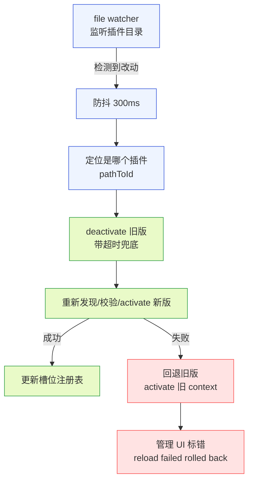
```mermaid
flowchart TD
    W["file watcher<br/>监听插件目录"] -->|检测到改动| D["防抖 300ms"]
    D --> ID["定位是哪个插件<br/>pathToId"]
    ID --> OLD["deactivate 旧版<br/>带超时兜底"]
    OLD --> LOAD["重新发现/校验/activate 新版"]
    LOAD -->|成功| UP["更新槽位注册表"]
    LOAD -->|失败| RB["回退旧版<br/>activate 旧 context"]
    RB --> ERR["管理 UI 标错<br/>reload failed rolled back"]
    classDef watch fill:#eef4ff,stroke:#3b5bdb;
    classDef ok fill:#e9fac8,stroke:#2f9e44;
    classDef err fill:#ffe3e3,stroke:#fa5252;
    class W,D,ID watch;
    class OLD,LOAD,UP ok;
    class RB,ERR err;
```

**图 9 — 插件热重载：watcher + 防抖 + 回退，失败时回退旧版不进悬空状态**

关键点是防抖（编辑器保存时连续触发只重载一次，300ms 防抖窗口）和回退（新版加载失败时重新 activate 旧版，不让插件进入"既不是旧版也不是新版"的悬空状态）。这两个机制让插件开发时"改了就生效、改错了不崩"。

#### 6.2.1b watcher 的 chokidar 配置

热重载的 watcher 用 chokidar（或 Node 原生 `fs.watch`，但 chokidar 跨平台更稳）。配置上几个关键点：

```typescript
// application/loader/hot-reload.ts (watcher 配置骨架)
import chokidar from "chokidar";

const watcher = chokidar.watch([userPluginsDir, projectPluginsDir], {
  ignoreInitial: true,        // 启动时不触发（启动走正常加载流程）
  awaitWriteFinish: { stabilityThreshold: 200, pollInterval: 50 }, // 等写完
  ignored: (p) => /node_modules|\.git/.test(p),  // 忽略依赖和 git
});
let debounceTimer: NodeJS.Timeout | undefined;
watcher.on("all", (_event, filePath) => {
  clearTimeout(debounceTimer);
  debounceTimer = setTimeout(() => {
    const pluginId = pathToPluginId(filePath);   // 从路径反查是哪个插件
    if (pluginId) void reloadPlugin(pluginId);    // 触发该插件热重载
  }, 300);
});
```

几个易错点：(1) `awaitWriteFinish`——编辑器保存时常先写临时文件再 rename，没这个选项会读到半个文件、manifest 解析失败触发回退；(2) `ignoreInitial: true`——不加这个，watcher 启动时把已有文件全触发一遍热重载，把刚加载完的插件又重载一次；(3) 重载单个插件而非全量——`pathToPluginId` 从改动路径反查归属插件，只重载那一个，不波及其他插件（这是 2.4.3 的"两路分开"在热重载粒度上的体现）。builtin 插件目录（随壳分发的 `pi-desktop-builtin/`）不进 watcher——它只读、不能改、要改得改源码重新打包，dev 模式直接走 `src/plugins/` 源码。

#### 6.2.1c 热重载与底座子进程的隔离

热重载是桌面加载器自己的事，完全不动底座子进程——这是它和 2.4 配置热加载（要重启底座子进程）的根本区别。改插件代码只影响桌面端的 worker 和 renderer，底座子进程继续跑、当前 session 不中断、agent 流式输出不停。这让插件开发的反馈循环干净：改 UI、HMR；改 worker 代码、热重载单插件；都不打断正在进行的 agent 工作。只有改底座配置（settings.json/扩展路径）才走 2.4 的重启子进程路径。两条路用 `isStreaming` 判断要不要提示用户——桌面插件热重载不需要这个判断（它不影响 agent），底座配置热加载需要（它要重启底座）。

#### 6.2.2 纯声明式插件的零成本开发

纯声明式插件（只有 `plugin.json`、没有代码模块）的开发成本最低——写个 manifest 声明用内置渲染器/内置动作，丢到 `~/.pi/desktop/plugins/` 就生效。不需要编译、不需要 worker、不需要写代码。这覆盖了"我想加个静态命令项（引用内置动作）""我想覆盖某个内置插件的行为""我想加一组 i18n 文案/一个主题"这类轻量开发场景。判断纯声明式的硬标准：manifest 里**既没有 `main`、也没有 `renderer`、贡献项里没有任何 `#` 开头的代码处理器/组件引用**——一旦出现 `main` 或 `#handler`/`#Component`，就是带代码模块形态、不再算纯声明式。

```json
// ~/.pi/desktop/plugins/my-commands/plugin.json —— 纯声明式（无 main/renderer/无 # 引用）
{
  "id": "my-commands",
  "version": "0.1.0",
  "displayName": "我的命令",
  "contributes": {
    "commands": [
      { "id": "my.openRepo", "title": "Open Repo", "keybinding": "cmd+shift+o", "action": { "type": "open-url", "url": "https://github.com/earendil-works/pi-desktop" } }
    ],
    "i18n": [
      { "locale": "zh-CN", "messages": { "my.greet": "你好" } }
    ]
  }
}
```

上面 `my-commands` 是真正的纯声明式：命令走内置 `open-url` 动作（core 内置渲染器消化，无需 `#handler`）、i18n 是纯数据，manifest 里没有 `main`/`renderer`/`#` 引用，加载器只挂载声明、不起 worker、不编译。一旦命令需要自定义逻辑（如 `#onGreet` 引用代码处理器），就必须加 `main` 字段写代码模块——那是带代码的轻量插件，不再是纯声明式，归到下面双入口那段描述的形态。

带 `main` 的插件要写代码模块、跑在 worker 里——开发时 main 代码改了走热重载。带 `renderer` 的插件 UI 代码改了走 renderer 侧的组件重载（core 在 renderer 侧也有组件注册表的更新机制）。plugin.json schema 统一用 `main`（worker 入口，相对路径）和 `renderer`（UI 入口，相对路径）两个字段名——构建脚本（1.3.4b）按 `manifest.main`/`manifest.renderer` 判断是否编译对应入口、加载器按这俩字段找 `main.js`/`renderer.js`。纯声明式插件（如上面 my-commands）既无 `main` 也无 `renderer`；只带 `main`（无 UI 的代码插件）或双入口（带 UI 的）才写代码字段：

```json
// ~/.pi/desktop/plugins/my-dashboard/plugin.json —— 双入口插件（main + renderer）
{
  "id": "my-dashboard",
  "version": "0.1.0",
  "displayName": "我的看板",
  "main": "./index.ts",
  "renderer": "./ui.tsx",
  "contributes": {
    "sidebarTabs": [
      { "id": "my.dashboard", "title": "看板", "component": "#Dashboard" }
    ]
  }
}
```

#### 6.2.3 dev 模式连真实底座 vs mock 底座

插件开发时底座子进程怎么起有两个选择：

- **连真实底座**：dev 模式起真实的 `pi --mode rpc` 子进程（cliPath 指向 dev 的 packages/pi-cli）。好处是真实数据、真实事件流；代价是底座要能跑起来（配好 auth、provider 等）。
- **mock 底座**：RPC 适配层提供一个 mock 实现，发预设的 response 和 event。好处是不依赖底座可运行、适合纯 UI 开发；代价是要维护 mock 数据。

推荐做法：插件 UI 开发用 mock（快速迭代 UI）、集成调试用真实底座（验证真实数据流）。RPC 适配层的接口设计（PluginRuntime 依赖倒置，DESIGN.md 5.1.6）让 mock 实现可注入——dev 模式可以切"用 mock 底座"还是"连真实底座"。

### 6.3 preload 桥与 scoped API 注入

#### 6.3.1 contextBridge 暴露受限 API

renderer 侧的插件 UI 代码拿到 `pi` 对象（RendererPluginContext，DESIGN.md 3.2.5）是通过 preload 脚本注入的。Electron 的 `contextBridge.exposeInMainWorld` 在 preload 里把受限 API 暴露给 renderer 的 `window`：

```typescript
// src/shell/electron-main/preload.ts
import { contextBridge, ipcRenderer } from "electron";

contextBridge.exposeInMainWorld("pi", {
  rpc: {
    send: (command: unknown) => ipcRenderer.invoke("pi:rpc:send", command),
    getState: () => ipcRenderer.invoke("pi:rpc:getState"),
    // ... 其余便捷方法
  },
  events: {
    on: (listener: (event: unknown) => void) => {
      const handler = (_: unknown, event: unknown) => listener(event);
      ipcRenderer.on("pi:event", handler);
      return () => ipcRenderer.off("pi:event", handler);
    },
  },
  onMessage: (channel: string, cb: (data: unknown) => void) => { /* ... */ },
  postToWorker: (channel: string, data: unknown) => { /* ... */ },
  i18n: { t: (key: string, vars?: unknown) => ipcRenderer.sendSync("pi:i18n:t", key, vars), /* ... */ },
  // theme、ui 通过 React Context 在 renderer 内部注入，不经 preload
});
```

`contextIsolation: true`（Electron 推荐的安全配置）让 preload 和 renderer 的 JS 堆隔离，`contextBridge` 是唯一的过桥通道。这防止 renderer 代码直接碰 Node API（`require`/`fs`/`process`）——renderer 侧的沙箱（DESIGN.md 3.6 的 renderer 侧沙箱）靠这个兜底。

#### 6.3.2 从 preload 到 worker 的消息转发

preload 暴露的 `pi.rpc.send` 内部走 `ipcRenderer.invoke("pi:rpc:send", command)`，main 进程的 ipcMain handler 收到后、转发给对应插件的 worker（经 worker↔main 的 MessagePort，DESIGN.md 3.6），worker 再发给底座。这条链路是：

```
renderer (pi.rpc.send) → preload (ipcRenderer.invoke) → main (ipcMain handler)
  → worker (MessagePort) → 底座 (RPC stdin/stdout) → 回传同链路
```

每个插件有自己的 worker↔main MessagePort（DESIGN.md 3.6），所以 preload 转发时要带 pluginId 区分发给哪个 worker——renderer 侧的 `pi` 对象是 per-plugin 注入的（通过 React Context，不同插件的组件拿到带自己 pluginId 的 `pi`）。

## 7 打包与分发的完整产物清单

### 7.1 三平台产物矩阵

#### 7.1.1 产物列表

每个平台的最终产物：

| 平台 | target | 产物文件 | 用途 |
|------|--------|---------|------|
| Mac | dmg | `pi Desktop-<version>-universal.dmg` | 主安装包（拖拽安装） |
| Mac | zip | `pi Desktop-<version>-universal.zip` | electron-updater 更新基础包 |
| Mac | latest-mac.yml | `latest-mac.yml` | 更新元信息 |
| Windows | nsis | `pi Desktop-Setup-<version>-x64.exe` | 主安装包（向导安装） |
| Windows | portable | `pi Desktop-Portable-<version>-x64.exe` | 免安装版 |
| Windows | latest.yml | `latest.yml` | 更新元信息 |
| Linux | AppImage | `pi Desktop-<version>-x64.AppImage` | 免安装通用格式 |
| Linux | deb | `pi-desktop_<version>_amd64.deb` | Debian 系包 |
| Linux | rpm | `pi-desktop-<version>.x86_64.rpm` | RedHat 系包 |
| Linux | latest-linux.yml | `latest-linux.yml` | 更新元信息 |

每个平台还自动生成 blockmap 文件（electron-updater 用于增量更新的块哈希映射）。Mac 的 universal 包一个文件覆盖两架构；Windows 暂只打 x64（可加 arm64 支持 Windows on ARM）；Linux 只打 x64。

#### 7.1.2 产物发布到 GitHub Release

正式发版流程：打 git tag → CI 三平台矩阵跑 → 产物上传到对应 GitHub Release。electron-updater 的 `provider: github` 配置让它从 Release 的 assets 拉对应平台的包和 yml。Release 的命名和 tag 规范用语义化版本（`v1.2.3`），electron-updater 比对本地 `app.getVersion()` 和 latest yml 里的版本号决定要不要更新。

### 7.2 asar 内容与 external 资源

#### 7.2.1 asar 内 vs 外的决策清单

打包时哪些进 asar、哪些放 extraResources，决策依据：

| 内容 | 放哪 | 原因 |
|------|------|------|
| main/preload/renderer bundle (`out/`) | asar 内 | 普通 JS，asar 读取无碍 |
| `package.json` | asar 内 | Electron 启动要读 |
| 原生模块 (better-sqlite3) | asar 内但 unpacked | electron-builder 自动 unpack `.node` 文件 |
| 内置插件 (`pi-desktop-builtin/`) | extraResources | 动态 import 避开 asar edge case |
| pi-cli (`packages/pi-cli`) | extraResources | 底座子进程要直接读文件路径 |
| 图标、entitlements | buildResources | 构建时用，不进包 |

原生模块的处理细节：electron-builder 会自动把 asar 内的 `.node` 文件 unpack 到 `app.asar.unpacked/` 目录（通过 `asarUnpack` 配置），运行时 Electron 能正确加载。better-sqlite3 的 binding 要在打包前用 `electron-builder install-app-deps` 按 Electron 版本重编——这就是 `postinstall` 脚本的作用。

#### 7.2.2 extraResources 的路径在运行时怎么取

extraResources 的内容在运行时落在 `process.resourcesPath` 下。main 进程取路径：

```typescript
import { app } from "electron";
import { join } from "node:path";
import { electronRuntimePaths as rt } from "shell/electron-main/electron-runtime-paths";

// rt 是 RuntimePaths 的 shell 实现（见 5.2.1、11.2.2），isDev()/resourcesPath 都从它取
// shell 层直接用 electronRuntimePaths；gateway 层（如 cli-locator）则经依赖注入吃接口
const builtinDir = rt.isDev()
  ? rt.devBuiltinDir
  : join(rt.resourcesPath, "pi-desktop-builtin");

const cliDir = rt.isDev()
  ? rt.devCliDir
  : join(rt.resourcesPath, "pi-cli");
```

`process.resourcesPath` 在 packaged 应用里指向 `<app>/Contents/Resources/`（Mac）或 `<app>/resources/`（Win/Linux）。dev 模式（`rt.isDev() === true`，含 `!app.isPackaged` 或显式设了 `PI_DESKTOP_DEV=1` 的打包产物）回退到源码相对路径。这个 `RuntimePaths.isDev()` 分支是所有"随壳分发资源"路径解析的标准模式——和 5.2.1 的 locateCliPath、6.1.5 的 builtinDir 一致（11.2.2 的统一指令）；shell 层用 `electronRuntimePaths`、gateway 层经注入吃接口，两侧共享同一份 isDev 语义。

## 8 构建配置的完整示例

### 8.1 electron-builder.yml 完整配置

#### 8.1.1 三平台合并配置

把前面分散的配置合并成一份完整的 `electron-builder.yml`：

```yaml
appId: com.earendilworks.pi-desktop
productName: pi Desktop
directories:
  buildResources: build
  output: dist

electronLanguages:
  - en-US
  - zh-CN

files:
  - out/**/*
  - package.json
  - "!**/*.{ts,map}"
  - "!**/docs/**"
  - "!out/pi-desktop-builtin/**"  # 内置插件只走 extraResources，不进 asar（2.2.2/7.2.1）

asarUnpack:
  - "**/*.node"  # 原生模块 unpack

extraResources:
  - from: out/pi-desktop-builtin
    to: pi-desktop-builtin
    filter: ["**/*"]
  - from: packages/pi-cli
    to: pi-cli
    filter: ["**/*"]

mac:
  target:
    - target: dmg
      arch: [universal]
    - target: zip
      arch: [universal]
  icon: build/icon.png
  artifactName: ${productName}-${version}-${arch}.${ext}
  category: public.app-category.developer-tools
  hardenedRuntime: true
  # notarize 是 mac 公证的单一真相源（2.3.1、14.1.1 的配置都指向这里）
  # 开发阶段设 false 跳过公证；正式发版设为 { teamId } 走公证
  # electron-builder 读 APPLE_ID/APPLE_APP_SPECIFIC_PASSWORD/APPLE_TEAM_ID 环境变量；
  # CSC_LINK/APPLE_* 凭证缺失时 electron-builder 自动跳过签名/公证（产物未签名、有系统警告）
  notarize: false  # 正式发版改为：notarize: { teamId: "ABCDE12345" }
  entitlements: build/entitlements.mac.plist
  entitlementsInherit: build/entitlements.mac.plist

win:
  target:
    - target: nsis
      arch: [x64]
    - target: portable
      arch: [x64]
  icon: build/icon.png

nsis:
  oneClick: false
  allowToChangeInstallationDirectory: true
  createDesktopShortcut: true
  createStartMenuShortcut: true
  artifactName: ${productName}-Setup-${version}-${arch}.${ext}

portable:
  artifactName: ${productName}-Portable-${version}-${arch}.${ext}

linux:
  target:
    - AppImage
    - deb
    - rpm
  icon: build/icon.png
  category: Development
  maintainer: pi-desktop

publish:
  provider: github
  owner: earendil-works
  repo: pi-desktop
  releaseType: release
```

#### 8.1.2 签名凭证环境变量

正式发版的代码签名靠环境变量注入（不写进配置文件、不进仓库）：

| 环境变量 | 平台 | 用途 |
|---------|------|------|
| `CSC_LINK` | Mac/Win | 证书文件路径或 base64 |
| `CSC_KEY_PASSWORD` | Mac/Win | 证书密码 |
| `APPLE_ID` | Mac | 公证用 Apple ID |
| `APPLE_APP_SPECIFIC_PASSWORD` | Mac | 公证用应用专用密码 |
| `APPLE_TEAM_ID` | Mac | 公证用 Team ID |
| `GH_TOKEN` | 全平台 | electron-updater 发布到 GitHub Release 的 token |

CI 里把这些设为 secrets，签名和发布全自动。未设置时 electron-builder 跳过签名（产物未签名、用户会有系统警告）。

### 8.2 构建脚本与 npm scripts

#### 8.2.1 完整 scripts 段

```json
{
  "scripts": {
    "sync:fonts": "node scripts/sync-fonts.mjs",
    "dev": "npm run sync:fonts && electron-vite dev",
    "build": "electron-vite build",
    "build:plugins": "node scripts/build-builtin-plugins.mjs",
    "preview": "electron-vite preview",
    "package": "npm run build && npm run build:plugins && electron-builder",
    "package:mac": "npm run build && npm run build:plugins && electron-builder --mac",
    "package:win": "npm run build && npm run build:plugins && electron-builder --win",
    "package:linux": "npm run build && npm run build:plugins && electron-builder --linux",
    "postinstall": "electron-builder install-app-deps"
  }
}
```

`dev` 必须先 `sync:fonts` 再起 electron-vite dev，否则 dev 模式图标显示成方块（见 6.1.2）。`sync:fonts` 把图标字库从 node_modules 同步到 renderer 能 import 的位置——这步只在 dev 前跑、不在 build 里跑。

`build:plugins` 是独立步骤，把内置插件的 `main`/`renderer` 入口编译成独立文件、连同 `plugin.json` 拷到 `out/pi-desktop-builtin/`。`package` 脚本先跑三端构建、再跑插件构建、最后 electron-builder 打包。`postinstall` 的 `electron-builder install-app-deps` 在 `npm install` 后自动重编原生模块。

#### 8.2.2 内置插件构建脚本思路

`scripts/build-builtin-plugins.mjs` 的职责：遍历 `src/plugins/`，对每个有代码模块的插件编译其 `main`/`renderer` 入口，输出到 `out/pi-desktop-builtin/{pluginId}/`。纯声明式插件（i18n/theme）只拷 `plugin.json`：

```javascript
// scripts/build-builtin-plugins.mjs（骨架）
import { readdirSync, mkdirSync, copyFileSync, existsSync, readFileSync } from "node:fs";
import { join } from "node:path";
import { build } from "vite";

const pluginsDir = "src/plugins";
const outDir = "out/pi-desktop-builtin";
const pluginIds = readdirSync(pluginsDir).filter(d =>
  existsSync(join(pluginsDir, d, "plugin.json"))
);

for (const id of pluginIds) {
  const src = join(pluginsDir, id);
  const dest = join(outDir, id);
  mkdirSync(dest, { recursive: true });
  copyFileSync(join(src, "plugin.json"), join(dest, "plugin.json"));
  const manifest = JSON.parse(readFileSync(join(src, "plugin.json"), "utf-8"));
  if (manifest.main) {
    await build({ /* vite lib mode, input: join(src, manifest.main), output dest/main.js */ });
  }
  if (manifest.renderer) {
    await build({ /* vite lib mode, input: join(src, manifest.renderer), output dest/renderer.js */ });
  }
}
```

每个插件的 `main`/`renderer` 编译成独立 JS 文件、不被 main bundle 吸收——这是加载器动态 import 的前提。内置插件目录最终是 `out/pi-desktop-builtin/{pluginId}/plugin.json + main.js + renderer.js`，electron-builder 打包时作为 extraResources 塞进 `process.resourcesPath/pi-desktop-builtin/`。

## 9 运行时启动流程

### 9.1 壳启动到 UI 就绪的全链路

#### 9.1.1 启动时序

壳从用户双击到 UI 渲染出内容的完整时序：

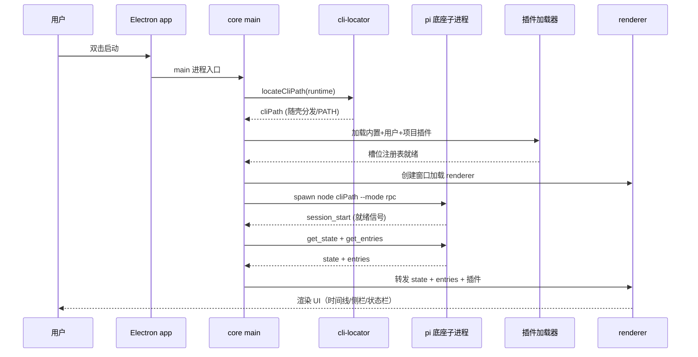
```mermaid
sequenceDiagram
    participant USER as 用户
    participant APP as Electron app
    participant MAIN as core main
    participant LOC as cli-locator
    participant PI as pi 底座子进程
    participant LOAD as 插件加载器
    participant REN as renderer
    USER->>APP: 双击启动
    APP->>MAIN: main 进程入口
    MAIN->>LOC: locateCliPath(runtime)
    LOC-->>MAIN: cliPath (随壳分发/PATH)
    MAIN->>LOAD: 加载内置+用户+项目插件
    LOAD-->>MAIN: 槽位注册表就绪
    MAIN->>REN: 创建窗口加载 renderer
    MAIN->>PI: spawn node cliPath --mode rpc
    PI-->>MAIN: session_start (就绪信号)
    MAIN->>PI: get_state + get_entries
    PI-->>MAIN: state + entries
    MAIN->>REN: 转发 state + entries + 插件
    REN-->>USER: 渲染 UI（时间线/侧栏/状态栏）
```

**图 10 — 壳启动时序：定位 CLI → 加载插件 → 起底座 → 同步状态 → 渲染 UI**

几个并发优化点：插件加载和底座子进程启动可以并发（两者无依赖）；renderer 窗口创建和底座启动也可并发。唯一的前置依赖是 cliPath 定位（要先找到 CLI 才能起底座）。并发启动能缩短"双击到可见"的时间。

并发启动的伪代码：

```typescript
// src/shell/electron-main/index.ts —— 启动编排
async function bootstrap() {
  const cliPath = locateCliPath(runtime);  // 同步定位（快，runtime 由 shell 注入，见 5.2.1）
  // cwd 必须先解析：用户当前打开的项目目录（agent 的工作目录）。
  // 来源：用户在窗口/项目选择器选定的路径；未选时回退到上次打开的项目或提示选择，
  // 不能裸用 process.cwd()（6.1 的 dev 易错点正好警告别用 process.cwd() 当项目目录）
  const cwd = await resolveProjectCwd();

  // 并发：插件加载 + 底座启动 + 窗口创建
  const [plugins, window, session] = await Promise.all([
    loadAllPlugins(cwd),                      // 加载器：发现/合并/校验/挂载
    createMainWindow(),                       // 创建 BrowserWindow + 加载 renderer
    startRpcSubprocess(cliPath, cwd),         // 起底座子进程、等 session_start
  ]);

  // 底座就绪后同步状态到 UI
  const snapshot = await rpc.resync();        // get_state + get_entries + get_tree + get_commands
  window.webContents.send("pi:bootstrap", { plugins: plugins.ids, snapshot });
}
```

`Promise.all` 让三个无依赖的启动阶段并发。底座启动返回的是等到 `session_start` 事件就绪的 Promise（5.3.2 的就绪窗口）。插件加载返回生效插件列表。窗口创建返回 BrowserWindow。三者都完成后，底座已就绪、插件已挂载、窗口已创建——这时 `resync()` 拉一次状态同步给 UI，用户看到完整的初始界面。`cwd` 在 `Promise.all` 前由 `resolveProjectCwd()` 解析好，是用户当前项目目录，底座子进程的 `spawn` 用它做工作目录（1.3.1 的 RpcClientOptions.cwd）。

#### 9.1.1b resync 的并发拉取

`resync()`（`application/orchestrations/resync.ts`）是启动后同步 UI 的共享原语——它并发发 `get_state` + `get_entries` + `get_tree` + `get_commands` 四个 RPC 命令、等全部 resolve 后拼成 `SyncSnapshot` 一次性发给 renderer。并发是为了快——四个命令互不依赖、串行发要 4 倍 RTT。`SyncSnapshot` 是圆心中性类型（DESIGN.md 5.1.5），gateway 层把底座返回的 `RpcSessionState`/`SessionEntry[]` 等翻译成中性类型再拼进 snapshot。

```typescript
// application/orchestrations/resync.ts (骨架)
export async function resync(rpc: RpcAdapter): Promise<SyncSnapshot> {
  const [state, entries, tree, commands] = await Promise.all([
    rpc.getState(),                      // get_state -> SessionState
    rpc.getEntries(),                    // get_entries -> { entries, leafId }
    rpc.send({ type: "get_tree" }),       // -> { tree, leafId }
    rpc.send({ type: "get_commands" }),  // -> { commands }
  ]);
  return { state, entries, tree, commands };  // 中性 SyncSnapshot
}
```

resync 在三个场景被调：启动后（9.1.1）、热加载重启子进程后（2.4.2）、底座断开重连后（9.2.2）。三个场景都用同一个原语，不各写一套同步逻辑——这是"回调参数是责任边界模糊的气味"的反面：同步逻辑内聚在 resync、调用方只调它。重连后 resync 还会带 `since: lastKnownEntryId` 走增量（9.2.3），但底层还是 resync 的变体。

#### 9.1.2 启动失败的处理

启动可能失败的几个点和处理：

- **cliPath 找不到**：locateCliPath 抛错。main 进程弹错误对话框"未找到 pi 底座 CLI，请设置 PI_CLI_PATH 或安装 pi"、退出。
- **底座子进程起不来**：spawn 后立即退出（exitCode 非 null）。RPC 适配层捕获、UI 显示"底座启动失败，stderr: ..."、提供"重试"按钮。
- **底座启动超时**：等 session_start 超时（如 10s）。提示用户"底座初始化超时"、提供"继续等待"或"重启底座"。
- **插件加载失败**：单个插件 manifest 校验失败或 activate 抛错。不拖垮整壳（3.5 第 5 项错误隔离），管理 UI 标红该插件、其余正常加载。

### 9.2 底座连接断开与重连

#### 9.2.1 断开检测

底座子进程意外退出（crash、被系统 kill、OOM）时，RPC 适配层通过进程的 `exit` 事件检测到。处理链路：

1. `exit` 事件触发 → `rejectPendingRequests`（把所有 pending 命令 reject）。
2. 通知 renderer UI 显示"底座连接断开"状态（时间线停止更新、状态栏标红）。
3. 触发自动重连尝试——重新 spawn 底座子进程、用 `--session <sessionFile>` resume。
4. 重连成功后 `get_state + get_entries` 同步 UI。

#### 9.2.2 重连与 session resume

重连时 resume session 的机制（DESIGN.md 1.3.2）：桌面端记住当前 session 的 `sessionFile`（从 `get_state` 拿），重连时 `args: ["--session", sessionFile]` 传给新进程。新进程打开那个 session 文件、历史和分叉树都在。只有"断开时正在进行的 turn"丢了——这是 RPC 架构的固有代价，底座子进程崩了、那个 turn 的运行态没了，但持久化的 session 不丢。

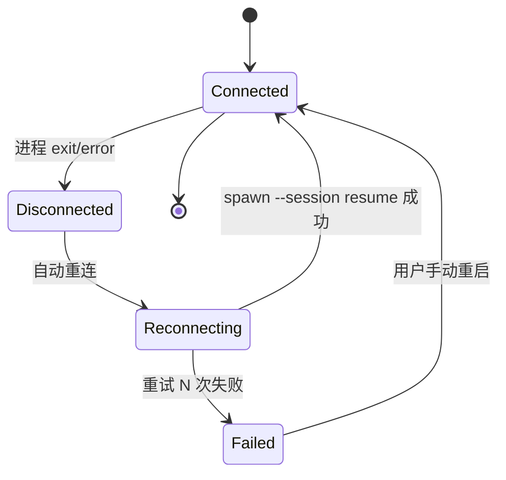
```mermaid
stateDiagram-v2
    [*] --> Connected
    Connected --> Disconnected: 进程 exit/error
    Disconnected --> Reconnecting: 自动重连
    Reconnecting --> Connected: spawn --session resume 成功
    Reconnecting --> Failed: 重试 N 次失败
    Failed --> Connected: 用户手动重启
    Connected --> [*]
```

**图 11 — 底座连接状态机：Connected → Disconnected → Reconnecting → Connected/Failed**

自动重连要有退避（exponential backoff：第一次立即重试、之后 1s/2s/4s... 上限 30s）和最大重试次数（如 5 次），超过就标 Failed、等用户手动干预。这避免底座持续崩溃时无限重试消耗资源。

#### 9.2.3 重连时的 UI 状态保持

底座断开期间，UI 要保持已渲染的内容（时间线已有消息、侧栏会话列表）不丢失——这些数据已经从底座拉来存在 renderer 侧状态里（Zustand store），底座断开不影响 renderer 内存。断开期间只停止"新数据流入"（event 流断了、新 entry 不再追加）。重连成功后 resync 拉增量补齐断开期间漏掉的 entry（用 `get_entries(since: lastKnownEntryId)` 拉断开后的新 entry）。

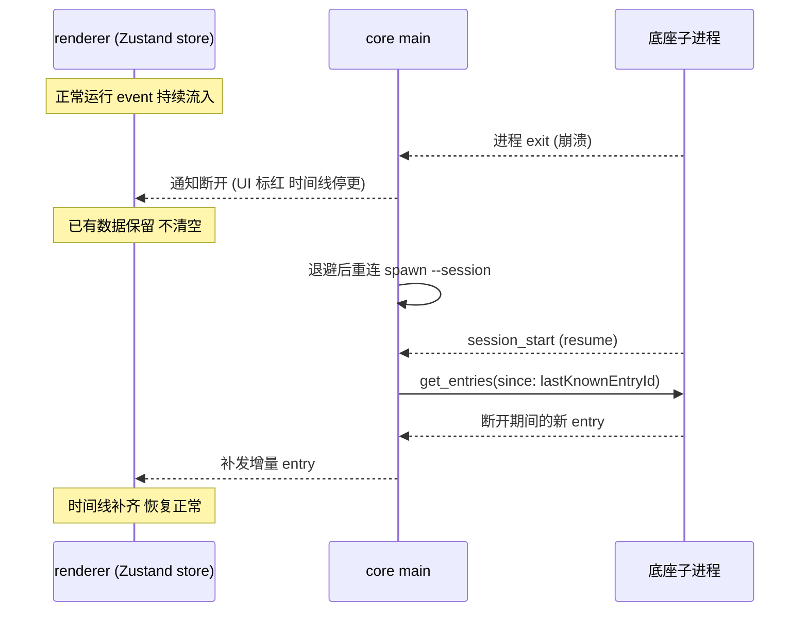
```mermaid
sequenceDiagram
    participant UI as renderer (Zustand store)
    participant MAIN as core main
    participant PI as 底座子进程
    Note over UI: 正常运行 event 持续流入
    PI-->>MAIN: 进程 exit (崩溃)
    MAIN-->>UI: 通知断开 (UI 标红 时间线停更)
    Note over UI: 已有数据保留 不清空
    MAIN->>MAIN: 退避后重连 spawn --session
    PI-->>MAIN: session_start (resume)
    MAIN->>PI: get_entries(since: lastKnownEntryId)
    PI-->>MAIN: 断开期间的新 entry
    MAIN-->>UI: 补发增量 entry
    Note over UI: 时间线补齐 恢复正常
```

**图 11b — 断开重连的 UI 状态保持：已有数据不丢、重连后增量补齐断开期间的新 entry**

## 10 外部插件的打包与分发

### 10.1 .pidesktop 包格式

#### 10.1.1 为什么有独立的包格式

DESIGN.md 3.9 定义了两种分发渠道：npm 包和 `.pidesktop` 包文件。npm 是在线主渠道（用户在管理 UI 搜包名安装），`.pidesktop` 是离线分发渠道（用户拿到一个包文件、双击或拖进窗口安装）。为什么要有 `.pidesktop` 而不只走 npm？

因为不是所有插件都能或都愿意上 npm：企业内部插件不想公开、带私有数据的插件不适合 npm、离线环境装不了 npm。`.pidesktop` 是一个自包含的归档文件（本质是 zip 或 tar），含 `plugin.json` + 代码模块 + 可选的签名，用户本地安装不依赖网络。它的设计类比 VSCode 的 `.vsix`——一个离线可分发的扩展包。

#### 10.1.2 .pidesktop 的结构

`.pidesktop` 文件是一个 zip 归档，结构：

```
my-plugin.pidesktop (zip)
├── plugin.json          # manifest（必须）
├── main.js              # worker 入口（可选，编译后）
├── renderer.js          # UI 入口（可选，编译后）
├── signature.sig        # 签名（可选，验证完整性）
└── README.md            # 说明（可选）
```

和本地插件目录的区别：`.pidesktop` 里的代码模块是**预编译**的（JS 而非 TS）——因为用户机器上不一定有 TS 编译环境，包要开箱即用。插件作者发布 `.pidesktop` 前要跑构建把 TS 编译成 JS。installer（DESIGN.md 3.9 的 `application/installer/`）解包后把内容放到 `~/.pi/desktop/installed/{id}/{version}/`，和 npm 装的插件落点一致。

#### 10.1.3 签名验证

`.pidesktop` 的 `signature.sig` 是可选的完整性签名——作者用私钥签 `plugin.json` + 代码模块的哈希，installer 用作者的公钥验签。这防止包被篡改（中间人攻击或下载损坏）。签名机制是可选的（不强制所有插件都签名），但管理 UI 要提示用户"未签名插件有风险"。签名公钥的分发可以走 npm 的 `package.json` 的 `pi.desktop.publicKey` 字段，或用户手动信任。

### 10.2 npm 分发渠道

#### 10.2.1 包名约定与发现

npm 渠道的插件包名约定：`pi-desktop-plugin-*`（前缀）或 `@scope/pi-desktop-plugin-*`（scoped）。这让用户在管理 UI 搜时能按前缀过滤、也方便 npm registry 按 keyword 聚合。包的 `package.json` 要声明 `pi.desktop` 字段指向插件目录、声明 `keywords: ["pi-desktop-plugin"]` 便于发现。

```json
{
  "name": "pi-desktop-plugin-foo",
  "version": "1.0.0",
  "keywords": ["pi-desktop-plugin"],
  "pi": {
    "desktop": "./"  // 插件目录（plugin.json 所在）
  }
}
```

installer 的 `PackageFetcher`（依赖倒置接口，shell 实现 npm 版）调 `npm pack` 或直接从 registry 下载 tarball、解包到 installed 目录。

#### 10.2.2 安装与版本管理

npm 渠道支持多版本并存——`~/.pi/desktop/installed/{id}/{version}/` 按 version 分目录。当前生效的版本由 installer 的 `updater.ts` 管理（记录每个插件 id 当前激活的 version）。用户可以在管理 UI 切换版本、回滚到旧版。卸载走 `uninstaller.ts`，删 installed 目录 + 清当前版本记录，但保留插件配置数据（`~/.pi/desktop/plugins-data/{id}/`）让用户重装能恢复偏好。

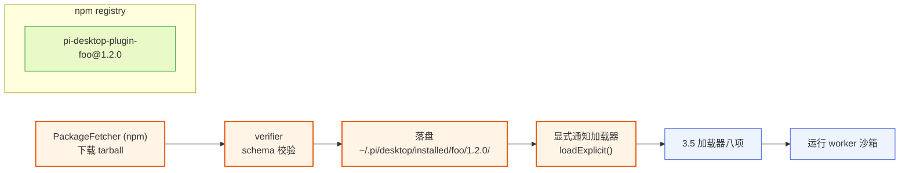
```mermaid
flowchart LR
    subgraph REG["npm registry"]
        PKG["pi-desktop-plugin-foo@1.2.0"]
    end
    FETCH["PackageFetcher (npm)<br/>下载 tarball"] --> VERIFY["verifier<br/>schema 校验"]
    VERIFY --> STORE["落盘<br/>~/.pi/desktop/installed/foo/1.2.0/"]
    STORE --> NOTIFY["显式通知加载器<br/>loadExplicit()"]
    NOTIFY --> LOAD["3.5 加载器八项"]
    LOAD --> RUN["运行 worker 沙箱"]
    classDef reg fill:#e9fac8,stroke:#2f9e44;
    classDef fetch fill:#fff4e6,stroke:#e8590c,stroke-width:2px;
    classDef reuse fill:#eef4ff,stroke:#3b5bdb;
    class PKG reg;
    class FETCH,VERIFY,STORE,NOTIFY fetch;
    class LOAD,RUN reuse;
```

**图 12 — npm 插件安装链路：下载 → 校验 → 落盘 → 显式通知加载器（不走发现层扫描）**

## 11 环境变量与配置参考

### 11.1 构建期环境变量

#### 11.1.1 签名与发布凭证

构建期（CI 或本地打包）用的环境变量，全部从 secrets 注入、不进仓库：

| 变量 | 平台 | 作用 | 示例 |
|------|------|------|------|
| `CSC_LINK` | Mac/Win | 代码签名证书路径或 base64 | `/path/to/cert.p12` 或 base64 串 |
| `CSC_KEY_PASSWORD` | Mac/Win | 证书密码 | `••••` |
| `APPLE_ID` | Mac | 公证 Apple ID | `dev@example.com` |
| `APPLE_APP_SPECIFIC_PASSWORD` | Mac | 公证用应用专用密码 | `••••` |
| `APPLE_TEAM_ID` | Mac | Apple Team ID | `ABCDE12345` |
| `GH_TOKEN` | 全平台 | 发布到 GitHub Release 的 token | `ghp_••••` |
| `WIN_CSC_LINK` | Win | Windows 专用证书（如和 Mac 分开） | 同 CSC_LINK |

#### 11.1.2 构建行为控制

| 变量 | 作用 | 默认 |
|------|------|------|
| `PI_DESKTOP_BUILD_PLATFORM` | 指定打包平台（覆盖 CLI 参数） | 无 |
| `ELECTRON_BUILDER_COMPRESSION` | 压缩级别（store/normal/maximum） | normal |
| `PI_DEBUG` | 开启构建调试日志 | false |

### 11.2 运行期环境变量

#### 11.2.1 路径与定位

运行期（用户机器上跑壳时）环境变量：

| 变量 | 作用 | 默认 |
|------|------|------|
| `PI_CLI_PATH` | 显式指定底座 CLI 路径（覆盖定位逻辑） | 无（走 5.2 定位） |
| `PI_PACKAGE_DIR` | 底座资产目录（透传给底座，Nix/Guix 用） | 底座自动解析 |
| `PI_DESKTOP_BUILTIN_DIR` | 内置插件目录（覆盖默认 resourcesPath） | resourcesPath/pi-desktop-builtin |
| `PI_DESKTOP_CONFIG_DIR` | 桌面端配置目录（覆盖 ~/.pi/desktop） | ~/.pi/desktop |
| `APP_NAME` | 底座 app 名（透传，影响 CONFIG_DIR_NAME） | pi |

#### 11.2.2 开发与调试

| 变量 | 作用 | 场景 |
|------|------|------|
| `PI_DESKTOP_DEV` | 强制 dev 模式路径解析（见下） | 本地开发 |
| `PI_RPC_DEBUG` | RPC 适配层输出详细日志 | 调试底座通信 |
| `PI_PLUGIN_DEBUG` | 插件加载器输出发现/加载日志 | 调试插件 |
| `PI_ALERT_TRACE` | 追踪 alert 堆栈 | 现有方案 借鉴 |
| `PI_AUDIO_TRACE` | 追踪音频调用 | 现有方案 借鉴 |

`PI_DESKTOP_DEV` 的作用机制（避免和 Electron 的 `app.isPackaged` 冲突）：`app.isPackaged` 是 Electron 只读属性、env 变量无法改变它——所以路径分支不能裸用 `app.isPackaged`。`PI_DESKTOP_DEV` 不去改 `app.isPackaged`，而是封装一个 `isDev()` 语义取代裸 `app.isPackaged` 用于路径解析：`isDev() = process.env.PI_DESKTOP_DEV === "1" || !app.isPackaged`。设 `PI_DESKTOP_DEV=1` 时，即使应用以 packaged 形态启动（如本地 `npm run package:mac` 后验证），路径解析仍走 dev 分支（指向 `src/plugins/`、`packages/pi-cli/`），便于在打包产物里调试路径问题。

**关键：gateway 层不直接 import electron（依赖倒置）**。`isDev()` 和 `process.resourcesPath` 都是 Electron 运行时 API（`app` 来自 electron 包、`resourcesPath` 是打包态全局）——gateway 是中层，按洋葱纪律（11.3.2）不该依赖 shell 细节。如果 cli-locator 直接 `import { app } from "electron"`，gateway 就被钉死在 Electron 运行时上，"换 shell 只动外层"这个 5.3.3/11.3.3 反复强调的判据在 cli-locator 这条就破了（dependency-cruiser 的 `gateway-must-not-import-shell` 只禁 `src/shell` 路径、不禁 `electron` 包，这条违规会逃过机械校验）。所以用依赖倒置：`domain/gateway/runtime-paths.ts` 定义 `RuntimePaths` 接口（`{ isDev(): boolean; resourcesPath: string; devCliDir: string; devBuiltinDir: string }`），shell 层 `electron-runtime-paths.ts` 实现并注入给 cli-locator。cli-locator 只吃接口、不 import electron——单测可 mock 接口、换 shell（如换成 Tauri）只动外层实现，gateway 不漂。5.2.1 的 locateCliPath 已按这个形态写。全文涉及「随壳分发资源路径」的 `app.isPackaged` 分支统一经 `RuntimePaths.isDev()` 判断——5.2.1 的 locateCliPath、6.1.5 的 builtinDir、7.2.2 的 builtinDir/cliDir 三处代码示例均用注入的 `RuntimePaths`，让 `PI_DESKTOP_DEV` 真正生效且 gateway 不耦合 electron；纯进程态判断（如是否默认开 DevTools）在 shell 层仍可直接用 `app.isPackaged`。

dev 模式下这些变量由 electron-vite dev 自动设置或用户手动设。`PI_RPC_DEBUG=1` 让 RPC 适配层把每个 command/response/event 打到 console，是排查"底座没响应"类问题的第一手段。

### 11.3 依赖方向的构建期机械校验

#### 11.3.1 圆心纯度不能只靠人自觉

DESIGN.md 5.1.5 的圆心类型纯度纪律——`src/domain/` 不允许 import `gateway`/`application`/`shell`/`plugins`，`src/plugins/` 不允许 import `gateway`/`application`/`shell`——如果只靠 code review 肉眼盯，迟早会被破坏。一次不小心的自动 import 就能把外层类型引进圆心。这条纪律要落进构建管线做机械校验，违反就 fail build。这是把架构纪律从"约定"变成"不可违反的约束"，呼应"组装和调用应该分开"——构建校验是组装阶段的事，不该留到运行时才发现。

#### 11.3.2 dependency-cruiser 配置

用 `dependency-cruiser`（或等价的 import 边扫描工具）配规则。它静态扫所有 import 边、按规则判定合法性。pi-desktop 的规则核心是洋葱分层禁止反向 import：

```javascript
// .dependency-cruiser.js (骨架)
module.exports = {
  forbidden: [
    {
      name: "domain-must-not-import-outer",
      comment: "圆心 domain/ 不能依赖任何外层",
      from: { path: "^src/domain/" },
      to:   { path: "^src/(gateway|application|shell|plugins)/" },
    },
    {
      name: "plugins-must-not-import-mid",
      comment: "插件只依赖圆心，不 import 中层实现",
      from: { path: "^src/plugins/" },
      to:   { path: "^src/(gateway|application|shell)/" },
    },
    {
      name: "gateway-must-not-import-shell",
      comment: "gateway 不依赖 shell 细节",
      from: { path: "^src/gateway/" },
      to:   { path: "^src/shell/" },
    },
    {
      name: "gateway-must-not-import-electron",
      comment: "gateway 是中层，不直接依赖 electron 运行时（app.isPackaged/resourcesPath 等）；"
             + "这类运行时能力经 domain/gateway 的 RuntimePaths 接口注入（见 5.2.1、11.2.2）",
      from: { path: "^src/gateway/" },
      to:   { path: "^electron$" },   // dependency-cruiser 把 bare specifier 当外部包
    },
    {
      name: "application-must-not-import-shell-impl",
      comment: "application 经接口调运行时，不 import shell 实现",
      from: { path: "^src/application/" },
      to:   { path: "^src/shell/electron-main/" },
    },
  ],
  // @pi-desktop/react 是宿主暴露给插件的受控契约边界（类似 @vscode/* 之于 vscode 扩展）：
  // 插件只能经这一个窗口碰宿主，其余 shell 路径禁。在 dependency-cruiser 的 options.alias
  // 里不要把它解析回 src/shell/renderer/host-exports.ts——否则 plugins-must-not-import-mid
  // 会误报（插件 import 了 shell）；让它作为 allowed external 放行，概念上是宿主契约、
  // 不是插件耦合 shell 实现。规则和架构意图一致：插件碰宿主只能走 @pi-desktop/react。
  options: {
    allowed: ["@pi-desktop/react"],  // 插件允许 import 这个受控宿主窗口
    // 不要给 @pi-desktop/react 配 alias 解析回 src/，否则上下两条规则互相打架
  },
};
```

两条要点：(1) `gateway-must-not-import-electron` 守的是"gateway 不耦合 Electron 运行时"——`gateway-must-not-import-shell` 只禁 `src/shell` 路径、不禁 `electron` 包，5.2.1 的 cli-locator 若直接 `import { app } from "electron"` 会逃过机械校验。这条新规则把 `from:gateway to:electron` 也禁掉，配合 RuntimePaths 依赖倒置（11.2.2）让 gateway 不漂。(2) `@pi-desktop/react` 是宿主对插件的受控契约边界——它不是插件"耦合 shell 实现"，而是类似 `@vscode/*` 之于 vscode 扩展的受控 API 窗口。dependency-cruiser 不要给它配 alias 解析回 `src/shell/renderer/host-exports.ts`（那样 `plugins-must-not-import-mid` 会误报插件 import 了 shell），让它作为 allowed external 放行；规则意图是"插件碰宿主只能走 `@pi-desktop/react` 这一个窗口、其余 shell 路径全禁"，和架构意图一致。

跑 `npx depcruise src --config .dependency-cruiser.js`，有违规输出非零退出码。CI 里加一步：

```yaml
- name: Dependency direction check
  run: npx depcruise src --config .dependency-cruiser.js --fail-on error
```

#### 11.3.3 这条校验和打包的关系

依赖方向校验是构建期（不打包也能跑）的纯静态检查，但它和打包有个间接关系：圆心被污染（domain import 了 gateway）会让"换 shell 只动外层"这个 5.3.3 的判据失效——一旦圆心依赖了 gateway 的底座协议类型，换协议版本就要动圆心、动插件。所以这条校验守的不只是代码整洁，是"未来可演化性"——圆心保持纯净，底座协议漂移、shell 换代、运行时升级才真的只动对应外层。把校验放 CI、每次 PR 都跑，能在污染发生的第一时间挡住，而不是等到某天换 shell 才发现圆心早就被各种 import 污染得动不了。这是 5.1.4 目录纪律在构建管线的兜底。

## 12 完整发版流程：从代码到用户

### 12.1 发版检查清单

#### 12.1.1 发版前检查

正式发版前要过的检查清单：

1. **版本号更新**：`package.json` 的 `version` 字段升到目标版本（遵循 11.1 语义化版本）。
2. **CHANGELOG 更新**：写本轮变更（新增/修复/breaking）。
3. **底座版本对齐**：随壳分发的 pi-cli 版本和壳版本匹配、Release notes 记录对应底座版本。
4. **依赖更新**：`npm audit` 检查安全漏洞、更新过时依赖。
5. **全平台 smoke test**：三平台 CI 通过、手动验证核心功能（起底座、发 prompt、看时间线、插件加载）。
6. **依赖方向校验**：跑依赖方向检查脚本确保 `domain/` 不 import 外层（1.2.2）。
7. **签名凭证就绪**：Mac/Win 证书和公证凭证在 CI secrets 里配好。

#### 12.1.2 发版触发

```bash
# 1. 更新版本号
npm version 1.2.3  # 自动改 package.json + 打 git tag v1.2.3

# 2. 推 tag 触发 CI
git push origin v1.2.3

# 3. CI 三平台矩阵跑、产物上传到 GitHub Release
# 4. 验证 Release 产物齐全（dmg/zip/exe/AppImage/deb/rpm + 各 latest.yml）
# 5. 发布 Release notes
```

`npm version` 自动改版本号 + commit + tag。推 tag 后 CI 的 `on: push: tags: ['v*']` 触发三平台打包 job。job 完成后产物自动挂到 GitHub Release（electron-builder 的 `publish: github` 配置让它自动上传）。最后人工写 Release notes、把 Release 从 draft 改正式发布。

### 12.2 发版后的更新推送

#### 12.2.1 用户侧更新流程

发布后，已安装用户会经历：

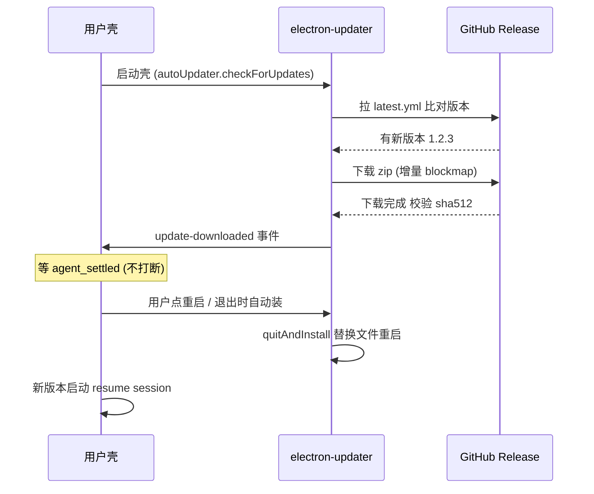
```mermaid
sequenceDiagram
    participant USER as 用户壳
    participant EU as electron-updater
    participant GH as GitHub Release
    USER->>EU: 启动壳 (autoUpdater.checkForUpdates)
    EU->>GH: 拉 latest.yml 比对版本
    GH-->>EU: 有新版本 1.2.3
    EU->>GH: 下载 zip (增量 blockmap)
    GH-->>EU: 下载完成 校验 sha512
    EU->>USER: update-downloaded 事件
    Note over USER: 等 agent_settled (不打断)
    USER->>EU: 用户点重启 / 退出时自动装
    EU->>EU: quitAndInstall 替换文件重启
    USER->>USER: 新版本启动 resume session
```

**图 13 — 用户侧更新流程：启动检查 → 下载 → 等 agent settled → 重启安装**

#### 12.2.2 渐进式发布与回滚

渐进式发布的目标是"先给小部分用户、观察稳定性、再全量"，降低"新版有 bug 影响所有用户"的风险。在 electron-updater + GitHub Release 渠道下，正确的做法是**用预发布渠道做灰度**，而不是依赖一个百分比字段：

- 先把新版作为 GitHub **pre-release** 发布（勾选 "Set as a pre-release"），只有加入 beta 渠道的内测用户会收到（3.2.3 的 `releaseType: prerelease` / `autoUpdater.allowPrerelease = true`）。正式渠道用户（`releaseType: release`）不会收到 pre-release。
- 观察 24 小时内测用户无集中报错后，把同一个 Release 改成正式发布（取消 pre-release 勾选、或发一个正式 Release 指向同一版本），正式渠道用户随即收到全量推送。

**不要用 `stagingPercentage` 字段**：electron-updater 的 generic/github provider 不原生支持 latest.yml 里的 `stagingPercentage`（staged rollout 按百分比是 Hazel/nuts 等自建更新服务器的特性，不在 electron-updater 的 GitHub provider 里）。在 GitHub Release 渠道下写这个字段不会生效——"先 10% 用户"不会发生。若未来需要按百分比的细粒度灰度，要自建更新代理服务器（在服务器侧按用户 id 哈希分流），那是更重的方案、初版不做。

回滚：如果发现新版有严重 bug，把 GitHub Release 的 `latest.yml` 回退到旧版本号——用户的 `checkForUpdates` 会"发现"当前版本比 latest.yml 新、不触发更新。但这不会把已更新到坏版的用户降级（electron-updater 不支持自动降级）。已中招的用户要手动卸载装旧版。所以渐进式发布（pre-release 灰度）是预防手段、回滚是兜底。

## 13 构建故障排查

### 13.1 常见打包错误

#### 13.1.1 原生模块编译失败

`electron-builder install-app-deps` 重编 better-sqlite3 时可能失败，常见原因：

- **Python 未安装**：node-gyp 需要 Python 3。CI 上 `actions/setup-python@v5` 装一个。
- **构建工具缺失**：Windows 上要装 Visual Studio Build Tools（C++ 桌面开发组件）；Mac 上要装 Xcode Command Line Tools；Linux 上要 `build-essential`。
- **Electron 版本不匹配**：better-sqlite3 的 binding 要针对 Electron 的 ABI 版本编。`electron-builder install-app-deps` 自动用正确版本，但要确保 `package.json` 的 `electron` 版本和实际装的一致。

排查命令：`npx electron-rebuild -f -w better-sqlite3` 强制重编，看详细错误。

**universal 包某一架构加载 better-sqlite3 失败**：Mac universal 包在 arm64 或 x64 机器上启动时报 `dlopen`/`NODE_MODULE_VERSION mismatch` 找不到对应架构的 `.node`。根因是 universal 打包时双架构 binding 没凑齐——`postinstall` 的单次 `install-app-deps` 只按宿主机架构重编，不会自动产出 arm64+x64 两套 binding（见 2.3.2）。排查：用 `lipo -info path/to/app.app/Contents/Resources/app.asar.unpacked/node_modules/better-sqlite3/build/Release/better_sqlite3.node` 看它是不是 universal（应输出 `arm64 x86_64` 两架构），只列一个架构就是缺失。解法：按 2.3.2 的 CI 分架构构建再合并流程，或用 `npx @electron/rebuild -f -w better-sqlite3 --arch arm64 --arch x64` 显式产出双架构 binding。

#### 13.1.2 asar 内动态 require 失败

症状：打包后运行时 `MODULE_NOT_FOUND`，但 dev 模式正常。根因是某个模块用动态 require（变量路径）加载子文件，bundle 时没把那个子文件打进去。现有方案的 yaml@2 `dist/doc/directives.js` 就是这个坑。

排查：错误信息里的模块路径如果含 `doc/`/`directives` 这类非入口文件名，就是动态 require 漏文件。解法：把该模块从 bundle external 出来、让 electron-builder 带整个 node_modules 目录进 asar（2.1.2 的精确排除规则保留运行时需要的文件）。

#### 13.1.3 Mac 签名公证失败

公证失败的常见原因：

- **entitlements 缺失**：底座子进程需要的权限没声明（如 `disable-library-validation`）。
- **hardened runtime 未开**：公证要求 hardened runtime。
- **Apple ID 凭证错误**：`APPLE_APP_SPECIFIC_PASSWORD` 要用 app-specific password（在 appleid.apple.com 生成），不是 Apple ID 主密码。
- **网络问题**：公证要上传应用到 Apple 服务器，CI 网络不通会超时。

排查：electron-builder 的 `--verbose` 输出详细签名/公证日志；`xcrun notarytool log <submission-id>` 看公证失败的具体原因。

### 13.2 运行期故障排查

#### 13.2.1 底座子进程起不来

症状：壳启动后 UI 显示"底座连接断开"。排查链路：

1. `PI_RPC_DEBUG=1` 启动壳，看 RPC 适配层日志——spawn 是否成功、stderr 输出什么。
2. 检查 cliPath 定位——`PI_CLI_PATH` 指向的文件是否存在、是否可执行。
3. 手动跑底座 CLI：`node <cliPath> --mode rpc`，看它能否正常启动、报什么错。
4. 检查底座配置——`~/.pi/agent/settings.json` 是否合法 JSON、auth 是否配好。

#### 13.2.2 插件加载失败

症状：管理 UI 里某插件标红。排查：

1. `PI_PLUGIN_DEBUG=1` 看加载器日志——是 manifest 校验失败、还是 activate 抛错。
2. manifest 校验失败：检查 `plugin.json` 字段是否符合 schema（id/version/displayName 必填、contributions 槽位名合法）。
3. activate 抛错：看错误信息，常见是代码模块 import 失败（路径错、依赖缺失）或运行时错误（调 RPC 时底座没响应）。
4. worker 崩溃：看 utilityProcess 的 crash 日志，可能是插件代码有未捕获异常。

#### 13.2.3 自动更新不触发

症状：用户没收到更新提示。排查：

1. 检查 `latest.yml` 是否在 GitHub Release 的 assets 里、版本号是否比本地高。
2. 未签名版本在 Mac/Win 上 electron-updater 可能静默失败（`error` 事件触发但被吞）——加 `autoUpdater.on("error", console.error)` 看错误。
3. 网络问题：`GH_TOKEN` 未配时 electron-updater 走匿名 GitHub API、有速率限制（60 次/小时），高频检查会被限流。
4. 代码签名问题：未签名包在 Mac 上即使下载了也装不上（Gatekeeper 拦截），electron-updater 可能不触发下载（检测到未签名环境跳过）。

## 14 签名、公证与平台合规

### 14.1 Mac 公证（Notarization）

#### 14.1.1 公证流程

Mac 应用要让用户无警告运行，要过 Apple 的公证（notarization）：签名后的应用上传给 Apple 服务器扫描恶意代码、通过后 Gatekeeper 放行。electron-builder 的 `notarize` 配置自动跑这个流程（用 `@electron/notarize`）。**notarize 字段的单一真相源是 8.1.1 完整配置**——这里和 2.3.1 都只是说明、以 8.1.1 实际生效为准：

```yaml
mac:
  hardenedRuntime: true
  notarize:
    teamId: ${APPLE_TEAM_ID}   # 正式发版形态；开发阶段 8.1.1 里设 false
```

公证需要 Apple Developer 账号，环境变量 `APPLE_ID`/`APPLE_APP_SPECIFIC_PASSWORD`/`APPLE_TEAM_ID`（或用 app-specific password）。流程是 electron-builder 在打包后自动 `xcrun notarytool submit` 上传、轮询结果、`stapler staple` 把公证票据钉到应用上。整个过程几分钟到十几分钟。

#### 14.1.2 entitlements 权限声明

`entitlements.mac.plist` 声明应用需要的 hardened runtime 例外权限。pi-desktop 需要的：

```xml
<!-- build/entitlements.mac.plist -->
<?xml version="1.0" encoding="UTF-8"?>
<!DOCTYPE plist PUBLIC "-//Apple//DTD PLIST 1.0//EN" "http://www.apple.com/DTDs/PropertyList-1.0.dtd">
<plist version="1.0">
<dict>
  <key>com.apple.security.cs.allow-jit</key>
  <true/>
  <key>com.apple.security.cs.allow-unsigned-executable-memory</key>
  <true/>
  <key>com.apple.security.cs.disable-library-validation</key>
  <true/>
  <key>com.apple.security.network.client</key>
  <true/>
  <key>com.apple.security.network.server</key>
  <true/>
  <key>com.apple.security.files.user-selected.read-write</key>
  <true/>
</dict>
</plist>
```

- `allow-jit`/`allow-unsigned-executable-memory`：V8 的 JIT 和某些原生模块需要。
- `disable-library-validation`：允许加载非 Apple 签名的动态库（better-sqlite3 的 binding）。
- `network.client`：连 LLM API、GitHub Release 更新检查。
- `files.user-selected.read-write`：用户通过文件对话框选的文件能读写（项目目录）。

### 14.2 Windows 代码签名与 SmartScreen

#### 14.2.1 EV 证书 vs OV 证书

Windows 代码签名两种证书：OV（Organization Validation）签名后仍会被 SmartScreen 拦截、需积累信誉；EV（Extended Validation）签名后立即被 SmartScreen 信任、不拦截。EV 证书更贵但用户体验好。pi-desktop 正式发版建议用 EV 证书。

electron-builder 的 Windows 签名靠 `CSC_LINK`/`CSC_KEY_PASSWORD` 环境变量，和 Mac 共用配置。签了名的 nsis 安装包不再触发"未知发布者"警告。

#### 14.2.2 portable 包的签名局限

portable 包（免安装 exe）的签名不如 nsis 安装包有效——SmartScreen 对便携可执行文件的扫描更严、即使签名也可能拦截。这是 portable 作为备选渠道的原因，主渠道还是 nsis。

## 15 版本管理与发布节奏

### 15.1 语义化版本与 changelog

#### 15.1.1 版本号策略

pi-desktop 用语义化版本（`MAJOR.MINOR.PATCH`）：

- **MAJOR**：架构性变更（如换槽位契约 schema、不向后兼容的 manifest 改动）。现有插件要改才能跑。
- **MINOR**：新功能（新槽位、新 PluginContext API、新内置插件）。向后兼容、旧插件能跑。
- **PATCH**：bug 修复、小优化。完全向后兼容。

版本号在 `package.json` 的 `version` 字段，electron-builder 打包时读它作为产物版本号、electron-updater 用它比对更新。

#### 15.1.2 changelog 与 Release notes

每个 Release 配 changelog。electron-builder 打包时可配置生成 changelog（从 git commit 自动生成或手写）。Release notes 要说明：新增了什么、改了什么、有没有 breaking change、底座 CLI 的对应版本（随壳分发的 pi-cli 版本）。

### 15.2 壳与底座的版本协同

#### 15.2.1 随壳底座的版本绑定

随壳分发的 pi-cli 版本和壳版本绑定发版——pi-desktop v1.2.3 对应一个测试过的 pi 底座版本。这个对应关系记在 Release notes 里。用户用随壳底座时版本是匹配的；用户用全局 PATH 底座时可能版本不匹配（见 5.2.2）。

#### 15.2.2 底座独立更新的协议兼容

底座可以独立 self-update，升到比随壳版本新的版本。这时要保证协议兼容——底座 RPC 协议的 `rpc-types.ts` 加字段是向后兼容的（旧桌面端忽略新字段），改字段语义才 breaking。DESIGN.md 6.4 的协议版本协商（`gateway/protocol/versions.ts` 的 handshake）是处理这个的落点：连接时双方声明协议版本、协商出共同支持的版本。这保证底座升了、桌面端旧版还能连（降级到旧协议），反之亦然。

## 16 已知约束与演进项

### 16.1 当前约束

#### 16.1.1 Windows/Linux 暂不支持自动更新签名链

Windows 和 Linux 的自动更新都依赖代码签名链完整。Windows 未签名时 electron-updater 下载的包会被 SmartScreen 拦截；Linux 的 AppImage/deb/rpm 不走 electron-updater（deb/rpm 走包管理器、AppImage 手动替换）。所以 Linux 的"自动更新"实际是手动下载新版 AppImage 替换旧版——electron-updater 在 Linux 上能力有限。这是已知约束，正式启用自动更新优先 Mac 和 Windows。

#### 16.1.2 底座更新需重启子进程

底座 self-update 后要重启 RPC 子进程才能用新版（4.5.2），这会中断当前 turn。这是 RPC 架构的固有代价（DESIGN.md 2.4）——底座 reload 没有对外 RPC 命令、只能靠重启进程变相 reload。演进项是底座补 reload RPC 命令后改为无重启热加载（DESIGN.md 6.1）。

### 16.2 演进项

#### 16.2.1 协议版本协商

`gateway/protocol/versions.ts` 的 handshake 机制是未来底座协议漂移（DESIGN.md 6.4）的落点。当前实现简单（底座协议相对稳定），未来底座 RPC 命令/事件结构大改时，要在连接时协商版本——桌面端声明支持的协议版本范围、底座选一个共同支持的、双方按协商版本序列化消息。这保证底座和桌面端能独立演化、不强制同步发版。

#### 16.2.2 增量更新优化

electron-updater 的 blockmap 机制支持增量更新（只下载变化的块），但 universal binary 的增量效率低（两架构合一文件、任一架构变都要下对应块）。演进项是考虑 Mac 分架构包 + 按用户架构只更新对应包，减少下载量。这是体积和增量效率的权衡，当前 universal 优先分发简单。

#### 16.2.3 底座补 `pi update --check` 的 JSON 行输出

4.5.1 的底座更新探测依赖 `pi update --check` 输出一行 JSON（`{ packageName, installSpec, version, shouldRun, note? }`）作为 CLI 契约。当前 `getSelfUpdatePlan`（4.2.4）是底座进程内部函数、未确认经 CLI 暴露，桌面端在底座补该 flag 前只能走临时文本标记解析（命中 `is already up to date` 判定"已是最新"，拿不到精确 version/note）。演进项为底座补 `pi update --check` flag 并按上述 JSON 行输出，届时桌面端切回结构化解析、能透出精确版本号和 breaking change note。这是"壳不替底座管更新"边界的延伸——更新决策逻辑留在底座、桌面端只解析其声明式输出。

## 17 依赖管理与版本锁定

### 17.1 壳依赖分层

#### 17.1.1 三类依赖的区分

pi-desktop 的 npm 依赖分三类，各自管理策略不同：

- **壳运行时依赖**（`dependencies`）：壳跑起来必须的包，打包进 asar。如 `electron`、`react`、`better-sqlite3`、`electron-store`、`i18next`、`dompurify`。这些是 `electron-vite build` 时 external 出来、由 electron-builder 带进 asar 的 `node_modules`。
- **构建期依赖**（`devDependencies`）：只在构建/开发时用的包，不进 asar。如 `electron-vite`、`electron-builder`、`@vitejs/plugin-react`、typescript、各类类型定义。这些跑完构建就不用了、不该打给用户。
- **随壳资产**（非 npm 依赖）：pi-cli 底座，放在 `packages/pi-cli/`，作为 extraResources 分发，不走 npm 依赖树。

区分的纪律：一个包该进 `dependencies` 还是 `devDependencies` 的判断标准是"用户运行壳时需不需要它"。需要的进 dependencies（要打给用户）、不需要的进 devDependencies（只在构建机上有）。误把构建期依赖放进 dependencies 会无谓增大安装包；误把运行时依赖放进 devDependencies 会导致打包后运行时 MODULE_NOT_FOUND。

#### 17.1.2 版本锁定与 lockfile

`package-lock.json`（或 `pnpm-lock.yaml`）锁定完整依赖树版本——保证 CI 和本地构建用完全一样的依赖版本。这是可复现构建的基础：没有 lockfile，`npm install` 每次可能装不同 patch 版本的间接依赖，导致"本地能跑 CI 不能跑"的玄学问题。pi-desktop 仓库必须提交 lockfile、CI 用 `npm ci`（严格按 lockfile 装、不更新）而非 `npm install`。

#### 17.1.3 底座 CLI 的版本锁定

随壳分发的 pi-cli 版本要和壳版本协同。做法是在 pi-desktop 的构建脚本里检查 pi-cli 的版本——`packages/pi-cli/package.json` 的 version 要和壳的 Release notes 声明的底座版本一致。CI 里加一步校验：

```yaml
- name: Verify bundled CLI version
  run: |
    CLI_VERSION=$(node -p "require('./packages/pi-cli/package.json').version")
    echo "Bundled CLI version: $CLI_VERSION"
    # 和 EXPECTED_CLI_VERSION 环境变量比对，不匹配则 fail
    if [ "$CLI_VERSION" != "$EXPECTED_CLI_VERSION" ]; then
      echo "ERROR: bundled CLI version mismatch"
      exit 1
    fi
```

这防止"底座升了版但忘记更新随壳分发版本"导致协议不匹配。

### 17.2 依赖更新策略

#### 17.2.1 定期更新与安全审计

依赖要定期更新以修复安全漏洞和获得 bug 修复。策略：

- **安全更新**：`npm audit` 发现漏洞时立即更新对应包。CI 里跑 `npm audit --production`（只查 dependencies）、有高危漏洞 fail 构建。
- **常规更新**：每月或每发版跑一轮 `npm outdated` 看过时依赖、按 patch/minor/major 分批更新。patch 和 minor 通常向后兼容、直接更新；major 可能 breaking、要测试后更新。
- **Electron 主版本更新**：Electron 大版本升级要单独评估——ABI 变化影响原生模块（better-sqlite3 要重编）、API 废弃影响 main 代码。每次 Electron 大版本更新要全功能回归测试。

#### 17.2.2 Dependabot 自动化

GitHub 的 Dependabot 可以自动提交 PR 更新依赖。pi-desktop 启用 Dependabot 配置：

```yaml
# .github/dependabot.yml
version: 2
updates:
  - package-ecosystem: npm
    directory: /
    schedule:
      interval: weekly
    open-pull-requests-limit: 10
    # Electron 主版本要手动评估，不自动升
    ignore:
      - dependency-name: electron
        update-types: ["version-update:semver-major"]
```

Dependabot 每周扫一次、提交 patch/minor 更新 PR。Electron major 版本手动评估（ignore major）。这让依赖保持新鲜、同时大版本升级有人工把关。

## 18 跨平台行为差异

### 18.1 路径分隔符与大小写

#### 18.1.1 路径处理的平台差异

三平台的路径分隔符不同（Mac/Linux 用 `/`、Windows 用 `\`），大小写敏感性不同（Mac/Linux 大小写敏感、Windows 不敏感）。pi-desktop 在 main 进程处理路径时要用 `node:path` 的 `join`/`resolve`（自动处理分隔符），不要手动拼字符串。

底座的 config.ts 也踩过这个坑——`detectInstallMethod` 里把路径转小写再比（`.toLowerCase().replace(/\\/g, "/")`）来统一 Mac/Win/Linux 的比较。pi-desktop 的 cli-locator 和配置操作层同样要处理：比较路径时统一归一化（resolve + 大小写处理）。

#### 18.1.2 文件系统行为差异

三平台文件系统的行为差异影响几个场景：

- **文件名大小写**：Mac 的 APFS 默认大小写不敏感（`Foo.txt` 和 `foo.txt` 是同一文件）、Linux 的 ext4 大小写敏感。插件 id 如果用大小写区分、可能在 Mac 不冲突但在 Linux 冲突。插件 id 要用全小写 + kebab-case 约定。
- **符号链接**：Mac/Linux 原生支持、Windows 需要管理员权限或开发者模式。加载器发现插件时跟随符号链接（DESIGN.md 3.5 第 1 项），Windows 上符号链接可能不可用——这是已知限制，Windows 用户用真实目录。
- **文件锁**：配置文件并发写用 `proper-lockfile`（底座 settings 用的）。跨平台行为基本一致，但 Windows 上 lock 文件可能残留（进程崩溃没清理），要有 stale lock 清理逻辑。

### 18.2 子进程 spawn 的平台差异

#### 18.2.1 spawn 与 shell 选项

Node 的 `child_process.spawn` 在三平台行为有差异。底座 RPC 模式用 `spawn("node", [cliPath, ...args])`——这个直接调 node 可执行文件、不走 shell，三平台行为一致。但 pi-desktop 如果要 spawn 其他命令（如底座 self-update 的 `npm install -g`），要考虑 shell：

- Windows 上 `npm` 不是可执行文件、是 `.cmd` 脚本，`spawn("npm", [...])` 会失败。要用 `spawn("npm", [...], { shell: true })` 或 `spawn(process.platform === "win32" ? "npm.cmd" : "npm", [...])`。
- Mac/Linux 上 `npm` 是可执行脚本、`shell: true` 也行但不是必须。

pi-desktop 执行底座 self-update 命令时（4.2），要按平台处理 shell 选项。底座自己的 config.ts 用 `spawnProcessSync`（封装了平台差异），pi-desktop 复用这个模式。

#### 18.2.2 进程信号与 kill

`child.kill("SIGTERM")` 在三平台行为不同：Mac/Linux 发 SIGTERM 信号、进程可捕获处理；Windows 上 `kill` 直接终止进程（Windows 没有 SIGTERM 概念、TerminateProcess 是强制终止）。RpcClient.stop() 用 SIGTERM + 1s 后 SIGKILL 兜底——这在 Windows 上 SIGKILL 也被映射成强制终止。pi-desktop 重启底座子进程时，Windows 上不能指望"优雅关闭"——直接 kill、靠 session 文件持久化保证数据不丢。

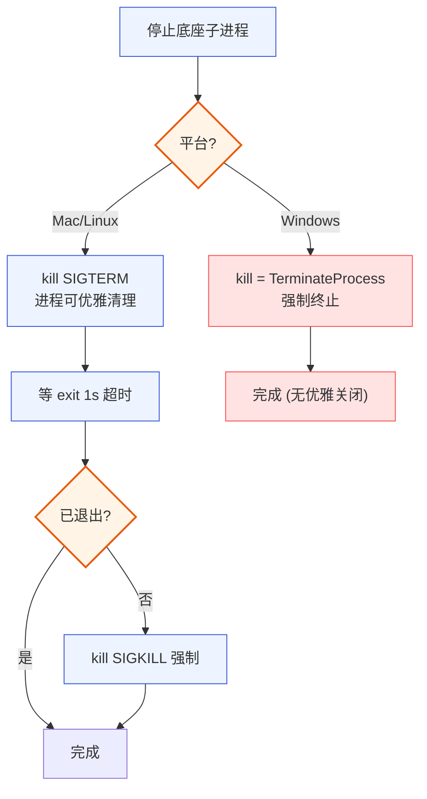
```mermaid
flowchart TD
    STOP["停止底座子进程"] --> PLAT{"平台?"}
    PLAT -->|"Mac/Linux"| SIGTERM["kill SIGTERM<br/>进程可优雅清理"]
    SIGTERM --> WAIT1["等 exit 1s 超时"]
    WAIT1 --> EXITED{"已退出?"}
    EXITED -->|是| DONE["完成"]
    EXITED -->|否| SIGKILL["kill SIGKILL 强制"]
    PLAT -->|"Windows"| TERM["kill = TerminateProcess<br/>强制终止"]
    TERM --> DONE2["完成 (无优雅关闭)"]
    SIGKILL --> DONE
    classDef act fill:#eef4ff,stroke:#3b5bdb;
    classDef dec fill:#fff4e6,stroke:#e8590c,stroke-width:2px;
    classDef win fill:#ffe3e3,stroke:#fa5252;
    class STOP,SIGTERM,WAIT1,SIGKILL act;
    class PLAT,EXITED dec;
    class TERM,DONE2 win;
```

**图 14 — 停止底座子进程的平台差异：Mac/Linux 优雅关闭 + 兜底强制；Windows 直接强制终止**

### 18.3 Electron 平台特性差异

#### 18.3.1 自动启动与系统集成

三平台的"开机自启动"机制不同。Electron 的 `app.setLoginItemSettings` 封装了三平台差异：

- **Mac**：用 LSSharedFileList 或 Service Management。
- **Windows**：写注册表 Run 键。
- **Linux**：写 `~/.config/autostart/` 下的 `.desktop` 文件。

pi-desktop 如果要支持"开机自启动"，用 `app.setLoginItemSettings({ openAtLogin: true })`，一行代码覆盖三平台。但 AppImage 在 Linux 上自启动有局限（路径变化），用户要先把 AppImage 放到固定路径。

#### 18.3.2 通知与系统托盘

系统通知和托盘行为也有差异：

- **Mac**：通知走 Notification Center，需要 `com.apple.security.cs.allow-jit` 或正常签名。托盘用 `Tray` API。
- **Windows**：通知走 Toast（Win10+），托盘用系统托盘区。
- **Linux**：通知走 libnotify（需 `libnotify4` 依赖，见 2.5.3）。托盘走 StatusNotifierItem。

pi-desktop 的"底座有事件"通知（如 agent 完成、需要用户输入）可以用 Electron 的 `Notification` API 三平台一致。系统托盘可选——对本地 AI agent 桌面端，用户一般开着窗口用、托盘不是必须。

## 19 构建产物体积分析与优化

### 19.1 体积构成分析

#### 19.1.1 Electron 应用的体积构成

一个 Electron 应用的安装包体积构成大致：

| 组成 | 体积（估算） | 说明 |
|------|------------|------|
| Electron 二进制（Chromium + Node） | ~80-90MB | 三平台不同，Mac universal 翻倍但打包后共享去重 |
| Chromium 语言包 | ~1-2MB（裁剪后）/ ~42MB（未裁剪） | electronLanguages 裁剪 |
| 应用代码（asar） | ~5-10MB | main/preload/renderer bundle + 内置插件 |
| 原生模块（unpacked） | ~5-15MB | better-sqlite3 binding |
| 随壳底座 CLI | ~20-50MB | bun-binary 含全部依赖；node 脚本 + node_modules 更大 |
| electron-updater 资产 | <1MB | blockmap + latest.yml |

大头是 Electron 二进制和底座 CLI。Electron 二进制不可压缩（已是编译产物），底座 CLI 的体积取决于形态——bun-binary（~20-30MB，编译时 tree-shake 了未用依赖）比 node 脚本 + node_modules（可能 50MB+，带全部依赖）小。

#### 19.1.2 体积优化手段

几个有效的体积优化：

- **electronLanguages 裁剪**（2.1.1）：只保留 en-US/zh-CN，减约 40MB。现有方案 已验证。
- **底座用 bun-binary 形态**（4.4.2、2.5.3、19.1.1）：比 node 脚本 + node_modules 小、且 tree-shake 未用依赖。
- **renderer bundle 代码分割**（1.3.3）：插件组件懒加载，减少首屏 JS、间接减小 asar。
- **排除非运行时文件**（2.1.2）：`!**/*.ts` `!**/*.map` `!**/docs/**` 排除源码、map、文档。
- **better-sqlite3 只带目标平台 binding**：electron-builder 自动按目标平台只打对应 `.node` 文件，不带全平台 binding。

### 19.2 启动性能优化

#### 19.2.1 启动时间构成

壳从双击到 UI 可见的启动时间构成：

| 阶段 | 时间（估算） | 可优化? |
|------|------------|--------|
| Electron 进程启动 | ~200-500ms | 不可（Electron 本身） |
| main 模块加载 | ~50-100ms | bundle 体积优化 |
| cliPath 定位 | ~10-50ms | 缓存定位结果 |
| 插件加载（发现/合并/校验/挂载） | ~100-300ms | 声明式插件零成本；代码插件异步 activate |
| 底座子进程启动 + 就绪 | ~500-2000ms | 并发启动（9.1.1）；等 session_start 而非固定延时 |
| renderer 加载 + 首屏渲染 | ~200-500ms | 代码分割 + 懒加载 |
| 底座状态同步（resync） | ~50-100ms | 并发发 get_state + get_entries |

总计约 1-3 秒。大头是 Electron 启动和底座就绪。底座就绪时间取决于底座初始化（加载配置、发现扩展、加载 session）——这部分桌面端控制不了，只能用并发启动和等就绪信号（而非固定延时）来不浪费时间。

#### 19.2.2 延迟加载非关键路径

不是所有插件都要在启动时 activate。优先级低的插件（如 review 插件、文件编辑器）可以延迟 activate——启动时只挂载 manifest 声明的贡献项（槽位注册表有记录），代码模块的 activate 延迟到该插件的 UI 第一次被渲染时（用户切到对应 Tab、或匹配到工具卡片渲染器时）。

```typescript
// 延迟激活：启动时只挂载声明，activate 延迟到首次需要
async function lazyActivate(plugin: LoadedPlugin) {
  if (plugin.manifest.main) {
    // 注册贡献项到槽位（不 activate）
    mountContributions(plugin);
    // 标记为 pending，首次需要时 activate
    pendingLazyActivation.set(plugin.id, plugin);
  }
}

// 当 renderer 请求某个插件的组件时、触发该插件 activate
async function ensureActivated(pluginId: string) {
  const plugin = pendingLazyActivation.get(pluginId);
  if (plugin) {
    await activatePlugin(plugin);  // 真正起 worker、调 activate
    pendingLazyActivation.delete(pluginId);
  }
}
```

这把启动时的 worker spawn 成本分摊到首次使用——用户更快看到 UI、用到了某功能才付该插件的成本。但要注意：延迟激活的插件在 activate 前不收 event、不响应 RPC——首次渲染时可能数据没准备好。处理是 ensureActivated 完成后再渲染组件、显示 loading 状态。

## 20 安全考量

### 20.1 contextIsolation 与 nodeIntegration

#### 20.1.1 renderer 的安全基线

Electron renderer 的安全基线是 `contextIsolation: true` + `nodeIntegration: false`。这保证 renderer 代码（含第三方插件 UI）不能直接访问 Node API（`require`/`fs`/`process`）——只能通过 preload 暴露的 `contextBridge` API 交互。pi-desktop 必须守这个基线：

```typescript
new BrowserWindow({
  webPreferences: {
    contextIsolation: true,    // renderer 和 preload JS 堆隔离
    nodeIntegration: false,     // renderer 不能直接 require Node 模块
    preload: path.join(__dirname, "preload.js"),
    sandbox: true,              // 额外沙箱（限制 preload 的 Node 访问）
  },
});
```

`sandbox: true` 进一步限制 preload 的 Node 访问权——preload 只能用 `electron` 的 `contextBridge`/`ipcRenderer` 等受限 API、不能用 `fs`/`child_process`。这是最严格的配置，pi-desktop 推荐开启。如果 preload 需要更多 Node 能力（如读文件），通过 ipcMain handler 在 main 进程做、preload 只转发。

#### 20.1.2 webSecurity 与远程内容

pi-desktop 的 renderer 只加载本地资源（electron-vite 构建产物或本地 dev server），不加载远程 URL。所以 `webSecurity: true`（默认）保持开启——这启用电同源策略、防止 renderer 加载未授权的远程内容。插件 UI 如果要显示远程内容（如从 LLM API 拉的 markdown 里含图片 URL），图片走 `` 是允许的（img 标签不受同源策略限制），但 JS fetch 远程内容要经 `pi.http.fetch`（受 permissions 域名白名单约束，DESIGN.md 3.2.4）。

### 20.2 插件沙箱的构建期保证

#### 20.2.1 worker 进程隔离

插件代码跑在 utilityProcess worker（DESIGN.md 3.6）——这是独立进程、有自己的 V8 堆、崩溃不影响 main。构建期要保证 worker 启动时不给插件注入 Node 全局 API。PluginRuntime 接口（DESIGN.md 5.1.6）的 `spawn` 方法只注入受控的 PluginContext（rpc/events/bus/config/http/i18n）——不给 `require`/`fs`/`process`。

```typescript
// shell/electron-main/plugin-host.ts —— worker 启动只注入 scoped API
export class UtilityProcessRuntime implements PluginRuntime {
  async spawn(pluginId: string, mainPath: string, env: Record<string,string>): Promise<PluginWorker> {
    const worker = utilityProcess.fork(mainPath, [], {
      env: { ...env, PLUGIN_ID: pluginId, PLUGIN_ROOT: ... },
      serviceName: `pi-desktop-plugin-${pluginId}`,
    });
    // worker 侧代码收到的 context 只有 PluginContext 接口定义的 API
    // require/fs/process 不在 context 里，插件代码自然碰不到
    return new PluginWorkerAdapter(worker);
  }
}
```

utilityProcess.fork 启动的进程有 Node 环境（能 require 模块），但 pi-desktop 的加载器在 activate 时只传 PluginContext 给插件的 `activate(context)` 函数——插件要访问 Node 原生 API，得自己 `require('fs')`。这里有个诚实的边界：utilityProcess 不是沙箱进程（它有完整 Node 权限），真正阻止插件乱来的是"插件代码不应该 require 非授权模块"的约定 + 管理员的审核。要更强隔离，未来可以引入 V8 isolates 或真沙箱进程（DESIGN.md 3.6 的 webview 强隔离是降级方案）。

#### 20.2.2 permissions 声明与用户授权

插件的权限声明（DESIGN.md 3.2.4 的 `permissions` 字段）是安全模型的声明层：插件声明它需要什么权限（`fs:project`/`net:域名`/`content:sensitive` 等），用户在管理 UI 授权后才生效。构建期不参与权限校验（权限是运行时的），但 manifest 校验（3.5 第 3 步）要检查 `permissions` 字段的值是已知枚举——防止插件声明乱写的权限字符串。

```mermaid
flowchart LR
    subgraph PLUGIN["插件 manifest"]
        PERM["permissions: ['net:api.github.com','fs:project']"]
    end
    subgraph LOAD["加载器校验"]
        VALID["枚举值校验<br/>net:/fs:/content: 前缀合法?"]
    end
    subgraph RUNTIME["运行时"]
        AUTH["管理UI 用户授权<br/>勾选允许"]
        INJECT["授权后注入对应能力<br/>http.fetch 受白名单约束"]
    end
    PERM --> VALID
    VALID -->|合法| AUTH
    VALID -->|非法| REJECT["标错 不加载"]
    AUTH -->|授权| INJECT
    AUTH -->|拒绝| DISABLE["插件不激活"]
    classDef decl fill:#eef4ff,stroke:#3b5bdb;
    classDef load fill:#fff4e6,stroke:#e8590c;
    classDef run fill:#e9fac8,stroke:#2f9e44;
    class PERM decl;
    class VALID,REJECT load;
    class AUTH,INJECT,DISABLE run;
```

**图 15 — 权限声明到运行时注入：manifest 声明 → 加载器校验枚举 → 用户授权 → 注入对应能力**

### 20.3 asar 防篡改与签名链

#### 20.3.1 asar 不是安全边界

asar 是归档格式、不是加密——任何人能解包 asar 看内容、改内容。所以 asar 不提供防篡改保护。真正的防篡改靠代码签名：Mac 的 hardened runtime + 公证、Windows 的代码签名。签名后的应用被篡改（改 asar 内容）后签名失效、系统拒绝运行。

对内置插件（在 asar 或 extraResources 里）同样适用——改了内置插件文件、应用签名失效。这保护内置插件不被恶意替换。第三方插件（在 `~/.pi/desktop/installed/` 里）不受应用签名保护，但走插件自己的签名验证（10.1.3 的 `.pidesktop` 签名）。

## 21 端到端示例：一次完整发版

### 21.1 从代码改动到用户更新

#### 21.1.1 场景设定

用一个具体场景串起全链路：开发者给 timeline 插件加了个"复制工具调用结果"的功能，要发版 v1.3.0 让用户更新。这个场景覆盖代码改动 → 构建 → 打包 → 签名 → 发版 → 用户更新的全流程。

#### 21.1.2 开发与验证

```bash
# 1. 开发：改 timeline 插件代码
# src/plugins/timeline/renderer.tsx 加"复制结果"按钮

# 2. dev 模式验证
npm run dev
# electron-vite dev 启动，改 renderer 代码 HMR 热替换
# 手动验证：发 prompt、看工具卡片、点复制按钮

# 3. 验证插件热重载
# 改 src/plugins/timeline/main.ts，watcher 检测、热重载 timeline 插件
# 管理UI 不标错 = 热重载成功
```

dev 模式下 renderer 代码改了 HMR、worker 代码改了热重载、main 代码改了重启 Electron。这个三层重启粒度（6.1.3 图 8c）让开发反馈快。

#### 21.1.3 构建与本地打包验证

```bash
# 4. 全量构建
npm run build           # electron-vite build 三端
npm run build:plugins   # 编译内置插件到 out/pi-desktop-builtin/

# 5. 本地打包验证（Mac）
npm run package:mac
# 产物在 dist/：dmg + zip + latest-mac.yml

# 6. 本地安装验证
open dist/pi\ Desktop-1.3.0-universal.dmg
# 拖到 Applications、启动、验证功能
```

本地打包验证确保"打包后能跑"——dev 能跑不代表打包能跑（asar、路径、external 等差异）。这是发版前的必经步骤。

#### 21.1.4 CI 发版

```bash
# 7. 更新版本号 + tag
npm version 1.3.0
# 自动：改 package.json version、git commit、git tag v1.3.0

# 8. 推 tag 触发 CI
git push origin main
git push origin v1.3.0

# 9. CI 三平台矩阵跑（.github/workflows/release.yml）
# - Mac job: 签名 + 公证 + 上传 dmg/zip/latest-mac.yml
# - Win job: 签名 + 上传 exe/latest.yml
# - Linux job: 上传 AppImage/deb/rpm/latest-linux.yml

# 10. CI 完成后，GitHub Release v1.3.0 有全部产物
```

```mermaid
flowchart TD
    DEV["开发改代码<br/>dev 验证"] --> BUILD["构建<br/>electron-vite build + build:plugins"]
    BUILD --> LOCAL["本地打包验证<br/>npm run package:mac"]
    LOCAL --> VER{"本地验证通过?"}
    VER -->|否| DEV
    VER -->|是| VER2["更新版本号<br/>npm version 1.3.0"]
    VER2 --> TAG["推 tag v1.3.0"]
    TAG --> CI["CI 三平台矩阵"]
    CI --> MAC["Mac: 签名+公证<br/>dmg+zip+latest-mac.yml"]
    CI --> WIN["Win: 签名<br/>nsis+portable+latest.yml"]
    CI --> LIN["Linux: AppImage+deb+rpm<br/>+latest-linux.yml"]
    MAC --> REL["GitHub Release v1.3.0"]
    WIN --> REL
    LIN --> REL
    REL --> USERS["用户 electron-updater 检测到新版"]
    classDef dev fill:#e9fac8,stroke:#2f9e44;
    classDef build fill:#eef4ff,stroke:#3b5bdb;
    classDef ci fill:#fff4e6,stroke:#e8590c;
    classDef rel fill:#f3d9fa,stroke:#9c36b5,stroke-width:2px;
    class DEV dev;
    class BUILD,LOCAL,VER2,TAG build;
    class CI,MAC,WIN,LIN ci;
    class REL,USERS rel;
```

**图 16 — 完整发版流程：开发 → 构建 → 本地验证 → CI 三平台 → Release → 用户更新**

#### 21.1.5 用户侧更新

```bash
# 11. 用户已安装 v1.2.3，启动壳
# electron-updater 启动时 checkForUpdates()
# 读 GitHub Release v1.3.0 的 latest-mac.yml
# 版本 1.3.0 > 本地 1.2.3 → 有更新

# 12. 下载增量（blockmap 只下变化块）
# 下载完触发 update-downloaded 事件

# 13. 桌面端等 agent_settled（不打断 streaming）
# agent 空闲后提示"更新已下载，重启生效"

# 14. 用户点"重启" → quitAndInstall
# 退出、替换文件、重启
# 新版本 v1.3.0 启动、底座子进程 resume session
# timeline 插件加载新版（含复制按钮）
```

从开发者推 tag 到用户更新生效，全链路自动化——开发者只管推 tag，CI 打包签名上传、用户端 electron-updater 检测下载安装。这是 electron-builder + electron-updater 生态的标准发版闭环。

### 21.2 底座独立更新的示例

#### 21.2.1 场景：底座出 bug fix

底座 v2.1.4 修了个 session 加载的 bug，pi-desktop 壳不用发新版（壳没变），底座独立 self-update。这时随壳分发的底座还是旧版（v2.1.3），用户全局装的底座或 self-update 后的底座是 v2.1.4。

```bash
# 用户在桌面端管理 UI 看到"pi 底座有更新（v2.1.4）"
# （桌面端通过 spawn pi update --check 拿到 plan：shouldRun=true, version=2.1.4）
# 点"更新底座"

# 桌面端触发底座 self-update（走底座 CLI，不直接 spawn npm）：
# 1. 桌面端 spawn "pi update"（需 child:command 权限）
# 2. 底座 CLI 内部 detectInstallMethod() → "npm"（用户全局 npm 装的底座）
# 3. 底座 CLI 内部 getSelfUpdatePlan() → shouldRun, installSpec
# 4. 底座 CLI 内部 getSelfUpdateCommand() + prepareWindowsNpmSelfUpdate() (Windows)
# 5. 底座 CLI 自己执行 npm install -g ... 装完新版、退出码 0
#    （桌面端全程不 spawn npm，避免 Windows 文件锁——见 4.3.3）

# 桌面端重启 RPC 子进程：
# 6. 查 get_state.isStreaming → idle
# 7. kill 旧子进程
# 8. spawn --session <sessionFile> 重起（用新版底座 v2.1.4）
# 9. 新子进程 resume session、bug fix 生效
```

这条链路里壳没更新（还是 v1.3.0）、只底座更新（v2.1.3 → v2.1.4）。壳和底座解耦的好处在这里——底座修 bug 不用等壳发版、用户不用重装壳。反之壳发新功能也不用底座跟版（随壳底座兜底 v2.1.3 够用）。

## 22 日志与可观测性

### 22.1 构建期日志

#### 22.1.1 electron-builder 的 verbose 模式

electron-builder 的 `--verbose` 标志输出详细打包日志——发现文件、打 asar、签名、公证、上传各步骤的细节。CI 里加 `--verbose` 让故障排查有据可查：

```bash
electron-builder --mac --verbose
```

关键看几个点：files 收集了哪些（排除规则对不对）、asar 打包了哪些（asarUnpack 的 .node 是否解包）、签名是否成功（codesign 输出）、公证是否通过（notarytool 输出）。任一步失败 verbose 日志会显示原因。

#### 22.1.2 构建产物清单

electron-builder 打包后输出一个产物清单（哪些文件、各自大小）。CI 里把这个清单作为 artifact 存——方便对比每次发版的产物体积变化、发现体积异常增长（如误把大文件打进 asar）。

### 22.2 运行期日志

#### 22.2.1 壳日志

壳运行期日志用 `electron-log`（或自建日志层）写到 `~/Library/Logs/pi-desktop/`（Mac）、`%APPDATA%/pi-desktop/logs/`（Win）、`~/.config/pi-desktop/logs/`（Linux）。日志含 main 进程事件（底座 spawn/exit、插件 activate/deactivate、RPC 命令）、renderer 错误（ErrorBoundary 捕获的插件组件错误）。

`PI_RPC_DEBUG=1` 开启 RPC 适配层详细日志——每个 command/response/event 打到日志。这是排查"底座没响应""事件没到 UI"的第一手段。`PI_PLUGIN_DEBUG=1` 开启加载器日志——发现/合并/校验/activate 各步打日志。

#### 22.2.2 底座子进程日志

底座子进程的 stderr 被 RPC 适配层捕获（RpcClient 收 `stderr.on("data")`）。底座的报错（如配置解析失败、扩展加载错误）会到 stderr。桌面端把这些 stderr 写到壳日志的"底座"分区——用户报 bug 时能一起提供。

```typescript
// RPC 适配层捕获底座 stderr
childProcess.stderr?.on("data", (data) => {
  this.stderr += data.toString();
  log.debug("[pi-subprocess]", data.toString());  // 写到壳日志
});
```

底座自己的日志（如果底座配了日志文件）在 `~/.pi/agent/logs/` 下——那是底座自己的日志系统、桌面端不接管、但可以在管理 UI 里提供"打开底座日志目录"的快捷入口。

### 22.3 底座 stderr 调试通道与 RPC 可观测性

#### 22.3.1 stderr 是底座给桌面的唯一诊断通道

底座 RPC mode 独占 stdout 走 JSONL（1.4.1），它的 `process.stderr` 是唯一不受协议约束的输出通道——底座的非协议输出（配置解析报错、扩展加载失败、未捕获异常的堆栈）都走 stderr。RpcClient 的 `start()` 里 `childProcess.stderr?.on("data", (data) => { this.stderr += data.toString(); process.stderr.write(data); })` 把底座 stderr 双写：一份攒进 `this.stderr`（供进程退出时拼进错误信息）、一份透传到桌面端自己的 stderr（供 `PI_RPC_DEBUG` 模式实时看）。

这个设计意味着：桌面端报"底座启动失败"时，错误信息里带底座的 stderr（`new Error(\`Agent process error: ${error.message}. Stderr: ${this.stderr}\`)`，`底座:rpc-client.ts`）。排查底座起不来的第一手段就是看这个 stderr——它有底座初始化时报的具体错（如 `settings.json` JSON 解析失败、扩展模块 import 失败、auth 凭证缺失）。`PI_RPC_DEBUG=1` 把这条 stderr 透传到桌面 console，是 13.2.1 排查链路第一步的落点。

#### 22.3.2 RPC inspector：把协议流可视化

`PI_RPC_DEBUG=1` 把每个 command/response/event 打日志，但翻文本日志排查协议问题效率低。pi-desktop 可以提供一个 RPC inspector 面板（23.2.2 提过的 dev 工具），它订阅 RPC 适配层的所有 command/response/event、在管理 UI 里实时渲染成表格：每条 command 带 id/类型/参数摘要、每条 response 带配对的 id/耗时/成功与否、每条 event 带类型/时间戳。这让"发了个命令没回响应""事件流断了"这类问题一眼可见——是哪条命令卡在 pending、最后一个 event 是什么。

RPC inspector 的实现挂在 RPC 适配层的一个 debug 钩子上——`rpc.onCommand(cmd => inspector.trace(cmd))`/`rpc.onResponse(res => ...)`/`rpc.onEvent(evt => ...)`。这个钩子只在 dev 模式或开了 `PI_RPC_DEBUG` 时挂载（生产关掉、避免性能开销）。它复用 `RequestCorrelator` 的 id 配对数据——pending 命令多久没回响应、一眼可见 timeout 边界。这是把可观测性内建进 RPC 适配层、而不是让开发者靠 `console.log` 各自打印——呼应"回调参数是责任边界模糊的气味"的反面：诊断能力内聚在适配层、所有调用方共享。

## 23 dev 模式进阶

### 23.1 插件开发脚手架

#### 23.1.1 脚手架命令

为降低插件开发门槛，pi-desktop 提供脚手架命令快速创建插件骨架：

```bash
npx create-pi-desktop-plugin my-plugin
# 生成：
# my-plugin/
# ├── plugin.json
# ├── main.ts        # worker 入口骨架（activate/deactivate）
# ├── renderer.tsx   # renderer 入口骨架（导出组件）
# └── tsconfig.json
```

脚手架生成的骨架带 `activate`/`deactivate` 生命周期函数、一个示例组件、正确的 `plugin.json` 模板。开发者改代码、放到 `~/.pi/desktop/plugins/my-plugin/`、桌面端热重载。

#### 23.1.2 插件开发模板的选择

脚手架支持几种模板：

- **纯声明式**（`--template declarative`）：只有 `plugin.json`，贡献项引用内置渲染器。最简单、适合"加个命令项""覆盖内置插件"。
- **纯 renderer**（`--template renderer`）：只有 `renderer.tsx`，UI 组件。适合"自定义工具卡片渲染器"（如 DESIGN.md 3.8 的 ImageCard 示例）。
- **双入口**（`--template full`）：`main.ts` + `renderer.tsx`，完整插件。适合"侧栏 Tab dashboard""需要 worker 加工数据"。

模板选择由插件需要什么决定——不加工数据用纯 renderer、要逻辑用双入口、纯配置用声明式。这和 DESIGN.md 3.2 的"可选代码、内容驱动"一致。

### 23.2 调试工具

#### 23.2.1 DevTools 与 worker 调试

renderer 的 DevTools 用 Electron 自带的——dev 模式默认开 DevTools、生产模式用快捷键（Cmd+Option+I）打开。DevTools 看 renderer 的 console（插件 UI 的日志）、React 组件树、network。

worker（utilityProcess）的调试要单独开——utilityProcess 支持 `--inspect` 参数开启调试端口，用 Chrome DevTools 或 VS Code 连接。脚手架的 dev 脚本可以自动给 worker 加 inspect 参数。

#### 23.2.2 RPC 协议调试

`PI_RPC_DEBUG=1` 把 RPC 适配层的每个 command/response/event 打日志。但更结构化的调试是一个"RPC inspector"面板——在管理 UI 里显示实时的 RPC 消息流（command 带什么参数、response 带什么 data、event 序列）。这是把 `PI_RPC_DEBUG` 的输出可视化、让开发者不用翻日志。这个面板可以做成一个内置 dev 工具插件（只在 dev 模式或开了调试选项时挂载）。

```mermaid
flowchart LR
    subgraph DEBUG["dev 调试工具"]
        DT["renderer DevTools<br/>console/组件树/network"]
        WI["worker inspect<br/>VS Code 连接"]
        RI["RPC inspector 面板<br/>实时消息流可视化"]
    end
    subgraph TARGETS["调试目标"]
        REN["renderer 插件 UI"]
        WOR["worker 插件逻辑"]
        RPC["RPC 适配层<->底座"]
    end
    DT --> REN
    WI --> WOR
    RI --> RPC
    classDef dbg fill:#eef4ff,stroke:#3b5bdb;
    classDef tgt fill:#fff4e6,stroke:#e8590c;
    class DT,WI,RI dbg;
    class REN,WOR,RPC tgt;
```

**图 17 — dev 调试工具链：renderer DevTools / worker inspect / RPC inspector 各覆盖一层调试目标**

### 23.3 测试策略

#### 23.3.1 圆心契约单测

`src/domain/`（圆心）是纯类型和契约、零外部依赖——最适合单测。槽位契约（MatchStrategy 的 matches 逻辑、when clause 求值）、优先级合并（resolveByPriority）、RequestCorrelator 的 id 配对——都该有单测。这些测试不需要 Electron、不需要底座、纯 Node 跑、快。

```typescript
// tests/domain/slots/strategies.test.ts
import { describe, it, expect } from "vitest";
import { ToolNameStrategy } from "@/domain/slots/strategies";

describe("ToolNameStrategy", () => {
  const strategy = new ToolNameStrategy("bash");
  it("matches when toolName equals value", () => {
    expect(strategy.matches({ toolName: "bash" })).toBe(true);
  });
  it("does not match when toolName differs", () => {
    expect(strategy.matches({ toolName: "edit" })).toBe(false);
  });
  it("has high specificity", () => {
    expect(strategy.specificity).toBeGreaterThan(0);
  });
});
```

#### 23.3.2 gateway 集成测试（mock 子进程）

`src/gateway/`（RPC 适配层）的测试用 mock 子进程——不真起底座、用一个 mock 进程发预设 response/event。验证 RPC 适配层正确解析 JSONL、正确配对 id、正确翻译 event 成中性类型。这些测试需要 Node 但不需要 Electron。

#### 23.3.3 端到端 smoke test

CI 里跑端到端 smoke test：真起一个测试用底座（或 mock）、启动壳、发 prompt、验证 UI 渲染。这个测试慢、但覆盖 main→gateway→底座→renderer 全链路。三平台各跑一次，确保跨平台行为一致。

```mermaid
flowchart TD
    DOMAIN["domain 圆心单测<br/>纯 Node 快 无依赖"] --> GATEWAY["gateway 集成测试<br/>mock 子进程"]
    GATEWAY --> E2E["端到端 smoke test<br/>真底座 三平台"]
    E2E --> MANUAL["手动验收<br/>发版前清单"]
    classDef fast fill:#e9fac8,stroke:#2f9e44;
    classDef mid fill:#eef4ff,stroke:#3b5bdb;
    classDef slow fill:#fff4e6,stroke:#e8590c;
    classDef man fill:#f3d9fa,stroke:#9c36b5;
    class DOMAIN fast;
    class GATEWAY mid;
    class E2E slow;
    class MANUAL man;
```

**图 18 — 测试金字塔：圆心单测（快多）→ gateway 集成（中）→ 端到端 smoke（慢少）→ 手动验收**

## 24 分发渠道与安装方式对照

### 24.1 用户获取 pi-desktop 的渠道

#### 24.1.1 三平台下载渠道

用户获取 pi-desktop 安装包的官方渠道是 GitHub Release 的 assets 页面。每个 Release 挂三平台产物（见 7.1.1 产物矩阵）。用户按平台下载对应文件：

| 平台 | 下载文件 | 安装方式 |
|------|---------|---------|
| Mac | `pi Desktop-1.3.0-universal.dmg` | 双击 dmg、拖到 Applications |
| Windows | `pi Desktop-Setup-1.3.0-x64.exe` | 双击 nsis 安装程序、按向导装 |
| Windows | `pi Desktop-Portable-1.3.0-x64.exe` | 双击直接运行、免安装 |
| Linux | `pi Desktop-1.3.0-x64.AppImage` | `chmod +x` 后双击运行 |
| Linux | `pi-desktop_1.3.0_amd64.deb` | `sudo dpkg -i` 或双击 |
| Linux | `pi-desktop-1.3.0.x86_64.rpm` | `sudo rpm -i` 或双击 |

#### 24.1.2 首次安装与自动更新

首次安装：用户从 Release 下载安装包、手动装。安装后壳在 `~/Library/Logs/pi-desktop/`（或对应平台路径）写入版本号。

自动更新：已安装用户启动壳后，electron-updater 自动检查 Release、有新版下载增量更新。用户不用再手动下载——除非用户装的是 portable 版（2.4.2，portable 不支持自动更新）。

这个"首次手动、后续自动"的模式是桌面应用的标准分发策略。pi-desktop 沿用——不另建分发网站、GitHub Release 是唯一官方下载源。未来如果要加官网下载页或第三方商店（Mac App Store/Windows Store），那是额外的分发渠道、不影响 GitHub Release 这个主渠道。

### 24.2 底座 CLI 的获取方式

#### 24.2.1 随壳分发为主

用户装 pi-desktop 时，底座 CLI 随壳分发（5.2 的 pi-cli extraResources）。用户不需要单独装底座——装了桌面端就有底座、开箱即用。这是降低用户门槛的关键设计：用户不用理解"先装 pi 再装 pi-desktop"，一个安装包全搞定。

#### 24.2.2 全局 PATH 底座为兜底

如果用户已经全局装了底座（`npm install -g` 或 `bun install -g`），cli-locator 的第三个来源（5.2.1）会找到它。这时桌面端用的是用户全局底座、而非随壳底座。好处是底座可以独立 self-update（4.x）升到比随壳版新的版本。代价是版本可能不匹配——用户全局底座太旧时协议可能不兼容，当前靠 rpc-types.ts 加字段向后兼容兜底，真正的运行时协议协商（handshake）是演进项（DESIGN.md 6.4、本文 5.5/16.2.1）。

用户可以在设置里选"用随壳底座"还是"用全局底座"——默认随壳（版本匹配保证）、高级用户可切全局（跟底座最新版）。这个设置写到 electron-store 的偏好里。

```mermaid
flowchart TD
    USER["用户装 pi-desktop"] --> SET{"设置里底座来源?"}
    SET -->|"随壳（默认）"| BUNDLED["用 process.resourcesPath/pi-cli<br/>版本和壳绑定"]
    SET -->|"全局 PATH"| GLOBAL["用 which pi 找到的<br/>用户自己装的底座<br/>可独立 self-update"]
    SET -->|"PI_CLI_PATH 环境变量"| ENV["用环境变量指定的路径<br/>高级用户自定义"]
    BUNDLED --> RUN["起底座子进程"]
    GLOBAL --> RUN
    ENV --> RUN
    classDef user fill:#e9fac8,stroke:#2f9e44;
    classDef dec fill:#fff4e6,stroke:#e8590c,stroke-width:2px;
    classDef act fill:#eef4ff,stroke:#3b5bdb;
    class USER user;
    class SET dec;
    class BUNDLED,GLOBAL,ENV,RUN act;
```

**图 19 — 底座 CLI 来源选择：随壳默认、全局 PATH 兜底、环境变量自定义**

## 25 内置插件的随包更新

### 25.1 壳更新时内置插件一起更新

#### 25.1.1 extraResources 的原子替换

内置插件在 `process.resourcesPath/pi-desktop-builtin/`（extraResources）。壳更新时 electron-updater 下载新版壳、`quitAndInstall` 替换整个应用目录——`pi-desktop-builtin/` 随之原子替换为新版内置插件。这是"内置插件随壳更新"的机制：不单独更新内置插件、跟着壳版本一起走。

原子性保证：替换是整个应用目录级别的——要么全换成新版（main + renderer + 内置插件全部新版）、要么还是旧版。不会出现"main 新版但内置插件旧版"的不一致状态。这比单独管理内置插件版本简单、也避免版本错配。

#### 25.1.2 用户级/项目级插件不受壳更新影响

用户级（`~/.pi/desktop/plugins/`）和项目级（`<cwd>/.pi/desktop/plugins/`）插件不在应用目录里、不受壳更新影响。用户装的第三方插件（`~/.pi/desktop/installed/`）也不受影响。壳更新只动应用目录内的内容（main bundle + 内置插件 + 随壳底座）。

这个隔离很重要——用户精心配置的插件环境不会因为壳更新被冲掉。用户级插件可以覆盖内置插件（DESIGN.md 3.4），更新壳后如果新版内置插件和用户级覆盖的插件冲突，按优先级用户级仍胜出——用户的自定义不会被壳更新破坏。

### 25.2 内置插件版本与槽位契约兼容

#### 25.2.1 槽位契约的向后兼容

内置插件随壳更新到新版时，新版内置插件用的槽位契约可能和旧版 core 不同。但内置插件和 core 一起发版（都在壳里），所以内置插件的 manifest 和 core 的槽位 schema 总是匹配的——它们是同一个版本号、一起测试过。

真正要担心的是第三方插件——壳更新后 core 的槽位 schema 可能加了字段（向后兼容、旧插件不带新字段 core 给默认值，DESIGN.md 3.3）或加了新槽位（旧插件不贡献新槽位、core 用内置默认）。这些向后兼容设计保证壳更新不打破第三方插件。只有 core 做了 breaking change（改字段语义、删槽位）才会打破——这种情况要升 MAJOR 版本、Release notes 明确标注。

## 26 从 现有方案 迁移

### 26.1 构建配置的复用与差异

#### 26.1.1 可直接复用的配置

现有方案的 electron-builder.yml 是验证过的三平台配置，pi-desktop 可以直接复用大部分：

- `electronLanguages`（en-US/zh-CN 裁剪）——直接抄。
- `files` 的排除规则（`!**/*.ts`、`!**/*.map`、`!**/docs/**`、yaml doc 的精确排除）——直接抄，现有方案 踩过的坑不用再踩。
- 三平台 target 选择（Mac dmg+zip universal、Win nsis+portable、Linux AppImage+deb+rpm）——直接抄。
- `publish: github`——直接抄。
- npm scripts 结构（dev/build/package:platform/postinstall）——直接抄。

#### 26.1.2 必须改的差异

pi-desktop 和 现有方案 架构不同，几处配置必须改：

- **appId**：从 `com.pi.desktop` 改成 `com.earendilworks.pi-desktop`，避免和旧 现有方案 冲突（两个应用不能同 appId）。
- **extraResources**：现有方案 没有随壳分发底座（它把 SDK 娶进进程），pi-desktop 要加 `pi-desktop-builtin`（内置插件）和 `pi-cli`（随壳底座）两个 extraResources。
- **asarUnpack**：pi-desktop 用 better-sqlite3（现有方案 可能用别的存储），`asarUnpack` 的原生模块路径要按 pi-desktop 实际依赖配。
- **entitlements**：pi-desktop 要起子进程（pi 底座），可能需要 现有方案 不需要的 entitlement（如 `disable-library-validation` 给底座的原生模块）。

### 26.2 不复用的部分

#### 26.2.1 adapter 相关的构建

现有方案的构建含 34 个 `.adapter.json` 文件（`src/extension-compat/builtin/`），那是 adapter 层的产物。pi-desktop 不做 adapter（DESIGN.md 3.1.2），这 34 个文件和相关构建逻辑完全不要。这减少了构建复杂度、也减小了包体积（adapter JSON 虽小但相关的加载代码不少）。

#### 26.2.2 SDK 进程的构建

现有方案把 SDK import 进自己进程，构建时要处理 SDK 的 Worker 进程池、sdk-loader、sdk-manager 这些模块的打包。pi-desktop 走 RPC、底座是独立子进程，这些模块全部不要——main bundle 更小、构建更简单。底座 CLI 作为 extraResources 分发、不进 main bundle。

```mermaid
flowchart LR
    subgraph PIAPP["现有方案 构建 厚客户端"]
        SDK["SDK import 进进程<br/>WorkerManager/sdk-loader/sdk-manager"]
        ADP["34 个 adapter.json<br/>UI 翻译层"]
        APP_BUNDLE["main bundle 大"]
    end
    subgraph PIDESKTOP["pi-desktop 构建 薄壳"]
        RPC["RPC 适配层<br/>起子进程+JSON Lines"]
        PLUGINS["内置插件 11 个<br/>走同一加载器"]
        CLI_BUNDLED["pi-cli 随壳 extraResources"]
        MAIN_BUNDLE["main bundle 小"]
    end
    PIAPP -.->|"架构不同 不复用"| PIDESKTOP
    classDef piapp fill:#ffe3e3,stroke:#fa5252;
    classDef pidesk fill:#e9fac8,stroke:#2f9e44;
    class SDK,ADP,APP_BUNDLE piapp;
    class RPC,PLUGINS,CLI_BUNDLED,MAIN_BUNDLE pidesk;
```

**图 20 — 现有方案 vs pi-desktop 构建差异：厚客户端（SDK+adapter）vs 薄壳（RPC+插件）**

### 26.3 用户数据迁移

#### 26.3.1 配置目录复用

pi-desktop 和 现有方案 共用底座的配置目录 `~/.pi/`——因为底座是同一个（`@earendil-works/pi-coding-agent`），配置目录由底座的 `CONFIG_DIR_NAME`（`.pi`）决定。用户从 现有方案 切到 pi-desktop，底座的 settings.json、session 文件、auth 凭证、项目信任记录全部沿用——不用迁移。

#### 26.3.2 桌面端专属数据独立

pi-desktop 自己的桌面端数据（插件配置、偏好、本地状态）在 `~/.pi/desktop/` 下，和 现有方案的桌面数据目录分开（现有方案 可能在别的位置）。这部分是新装的、不迁移。用户从 现有方案 切到 pi-desktop 时，桌面端的偏好（语言、窗口位置、主题）要重新设——这是合理的，因为两个应用的 UI 完全不同。

## 27 构建产物校验

### 27.1 打包后完整性校验

#### 27.1.1 校验 asar 内容

打包后要校验 asar 内容是否完整、排除规则有没有误伤。electron-builder 打包完成后可以用 `asar list` 命令列出 asar 内全部文件，检查：关键运行时文件（main.js/preload.js/renderer/index.html）在不在、原生模块 `.node` 是否 unpacked 到 `app.asar.unpacked/`、源码和 map 文件是否被正确排除、yaml 的 `dist/doc/directives.js` 这类运行时动态 require 的文件是否保留。

```bash
# 校验 asar 内容
npx asar list dist/mac/pi\ Desktop.app/Contents/Resources/app.asar | grep -E "(cli.js|preload|index.html|directives)"
# 应该都有输出；缺了就是 files 排除规则误伤
```

这个校验纳入 CI——打包后跑一次 asar list、检查关键文件存在。这是防范 现有方案 GitHub #21 那类"排除规则误伤运行时文件"问题的机械手段。

#### 27.1.2 校验 extraResources

extraResources 的内容也要校验——`pi-desktop-builtin/` 里 12 个内置插件的 `plugin.json` 都在、`pi-cli/` 里底座可执行文件和资产目录都在。CI 里检查：

```bash
# 校验内置插件
for plugin in i18n theme management-ui timeline file-preview file-editor session-manager commands terminal-trust model-params review; do
  test -f "dist/mac/pi Desktop.app/Contents/Resources/pi-desktop-builtin/$plugin/plugin.json" || echo "MISSING: $plugin"
done
# 校验底座 CLI
test -f "dist/mac/pi Desktop.app/Contents/Resources/pi-cli/pi" || echo "MISSING: pi-cli binary"
```

这确保每个平台产物都含完整的内置插件和底座 CLI。少了任一文件，用户装上后会"某功能缺失"或"底座起不来"——CI 校验提前拦截。

### 27.2 体积回归校验

#### 27.2.1 体积基线与告警

每次发版对比产物体积和上次发版的基线——体积异常增长（如增超 10%）触发告警。体积增长可能的原因：误把大文件打进 asar、依赖升级引入大包、底座 CLI 变大。体积回归校验让这些回归在发版前发现、而非发版后用户抱怨安装包太大。

CI 里记录每次产物的体积到一个 JSON 文件、和上次比对。体积超阈值时 CI 发警告（不 fail，因为有时体积增长是合理的、如新增功能）。开发者看到警告后人工判断是否合理。

## 28 总结：构建部署的设计原则

### 28.1 三条贯穿全文的原则

#### 28.1.1 壳与底座解耦

全文最核心的原则：壳（Electron 应用）和底座（pi CLI 子进程）在构建、分发、更新三个维度完全解耦。构建上，壳打自己的 asar、底座作为 extraResources 独立分发；更新上，壳走 electron-updater、底座走 self-update，两套独立机制互不接管。这个解耦让两者能独立演化——底座修 bug 不用壳发版、壳加功能不用底座跟版。代价是随壳底座和全局底座可能版本不一致，靠协议版本协商（16.2.1）兜底。

#### 28.1.2 内置即插件

内置插件不硬编码进 core，而是作为插件文件随壳分发（`pi-desktop-builtin/`）、走同一套加载器（第四发现源、source=builtin、优先级最低）。这保证内置和第三方插件在加载路径上完全一致、用户可覆盖内置、架构无特殊分支。构建上内置插件独立编译（每个插件 main/renderer 各编译成独立文件）、不进 main bundle——这让内置插件能动态 import、能热重载、能被覆盖。

#### 28.1.3 构建管线分层

构建分三层：electron-vite 三端编译（main/preload/renderer）→ 内置插件独立编译（build:plugins）→ electron-builder 三平台打包。三层各有职责、顺序固定。依赖方向校验（domain 不 import 外层）在 CI 里机械执行，把架构纪律落进构建管线。这个分层让"构建"和"打包"分开——构建管源码到 JS、打包管 JS 到安装包，两侧可独立调整。

### 28.2 演进方向

#### 28.2.1 协议协商与增量优化

当前实现的两个已知演进项：底座协议版本协商（16.2.1，连接时双方声明协议版本、协商共同支持的版本）和 Mac 增量更新优化（16.2.2，universal binary 的增量效率低、考虑分架构包按用户架构只更新对应包）。这两个是随用户量增长后值得做的优化——当前优先级低、底座协议相对稳定、universal 分发简单。

#### 28.2.2 分发渠道扩展

当前 GitHub Release 是唯一官方下载源。未来可加：官网下载页（指向 GitHub Release assets）、Mac App Store（需走沙箱限制、可能和子进程 spawn 冲突、不一定可行）、Windows Store（msix 格式）、Linux 各发行版仓库（社区维护包）。这些是额外渠道、不影响 GitHub Release 这个主渠道和自动更新链路。

## 29 打包产物的运行时验证

### 29.1 为什么 dev 能跑不等于打包能跑

#### 29.1.1 dev 与打包环境的关键差异

dev 模式能跑、打包后跑不起来，是 Electron 项目最常见的发版前翻车点。pi-desktop 要在发版前过一遍打包产物的运行时验证，因为 dev 和打包有几个本质差异会让问题只在打包后暴露：

- **asar 路径差异**：dev 时代码在 `src/` 或 `out/` 的真实文件路径，打包后进 asar，`__dirname`/`process.resourcesPath` 的值完全不同。任何用相对路径拼 `__dirname` 读资源的代码，dev 能读到、打包后读不到（asar 内路径要经 Electron 的 asar API 解析）。21.1.3 的"本地打包验证"就是为抓这个。
- **external 模块缺失**：dev 时 `node_modules` 完整、任何 require 都能找到；打包后只带 `dependencies`（不含 devDependencies），且 native 模块要 unpack。漏 external 一个运行时才 require 的模块，dev 能跑、打包后 `MODULE_NOT_FOUND`（2.1.2 的 yaml 坑）。
- **底座 CLI 路径**：dev 指向 `packages/pi-cli/dist/cli.js`（binary 缺失退回，见 5.2.1），打包指向 `process.resourcesPath/pi-cli/...`。cli-locator 的 `isDev()` 分支写错，打包后找不到底座。
- **内置插件路径**：dev 指向 `src/plugins/`，打包指向 `process.resourcesPath/pi-desktop-builtin/`。同样的 `isDev()` 分支问题。
- **插件 renderer 裸标识符解析**：dev 模式插件 renderer 经 Vite 处理，`resolve.alias` 在 Vite 模块图里生效，`import React from "react"` / `import { usePluginContext } from "@pi-desktop/react"` 能解析到 node_modules/宿主垫片；打包后宿主动态 `import()` 加载预编译的 ESM 文件，alias 失效、浏览器只认 import map。import map 没注入或注入晚于首个动态 import()，插件 renderer.js 抛 `Failed to resolve module specifier`、UI 全白屏。这条差异由 1.3.4c 的 import map 机制 + 29.1.2 第 8 步冒烟守住。
- **HMR/热重载不在**：dev 有 watcher 帮你"改了就生效"，打包后没有，插件加载失败就是失败、不会自动恢复。这暴露只在特定顺序加载才触发的 manifest 问题。

#### 29.1.2 打包后的冒烟测试清单

每次本地打包后（21.1.3）、CI 打包后（12.1.2 发版前），跑一份最小冒烟清单，确保核心链路在打包环境能跑：

1. **壳能起**：双击安装包/运行 AppImage，壳窗口出现、不白屏。白屏查 renderer bundle 是否进 asar、`index.html` 路径对不对。
2. **底座能起**：UI 显示"已连接"而非"底座连接断开"。断了查 cliPath（isPackaged 分支）、查底座 CLI 是否在 extraResources。
3. **能发 prompt**：发一条用户消息，assistant 开始流式输出。这是 RPC 全链路（command→response→event）的验证。
4. **时间线渲染**：看到用户气泡和 assistant 气泡、工具卡片能渲染。这是内置 timeline 插件 + 卡片渲染槽的验证。
5. **内置插件全加载**：管理 UI 里内置插件不标红。这是 `pi-desktop-builtin/` 进了 extraResources 且每个插件 main/renderer.js 都在。
6. **状态切换**：切模型（model-params 插件）、切 session（session-manager 插件），UI 响应。这是多个内置插件协同的验证。
7. **协议向后兼容**：连上底座后 RPC 全链路（command→response→event）不报协议错误。当前底座没有 handshake 命令（5.5），这一步验证的是"向后兼容字段兜底"在打包环境能跑——桌面端按随壳底座版本写适配层、底座加字段旧端忽略、不出现解析崩溃。handshake 协商是演进项（16.2.1），其打包环境验证待底座补命令后再加。
8. **插件 renderer.js 动态 import 不抛 specifier 错**：打开 DevTools 控制台，确认没有 `Failed to resolve module specifier "react"` / `"@pi-desktop/react"` 这类报错、内置插件的 UI（时间线、管理面板等）能渲染出来。这一步专门守 1.3.4c 的 import map 机制——dev 模式 alias 生效能跑、打包后只有 import map 注入到位才不会抛裸标识符解析错（29.1.1 警告的"dev 能跑、打包后插件 UI 全白屏"典型翻车点）。报错查：宿主是否在首个动态 import() 前注入了 import map、blob 桥接模块是否从 globalThis 取到 React/宿主实例。

这八步覆盖了 main→gateway→底座→renderer→插件 全链路，每步对应一个可能只在打包后暴露的差异点。任一步失败就回去查对应差异——这是"打包后验证"的排查路径。

### 29.2 CI 里的自动化冒烟

#### 29.2.1 三平台 smoke job

手动冒烟只在本地 Mac 上跑（21.1.3），CI 上要靠自动化 smoke 覆盖三平台。思路：在打包 job 之后加一个 smoke job，它装上刚打的包、用自动化驱动验证核心链路。Mac/Linux 上用 `xvfb-run` 跑无头 Electron、Windows 上跑在虚拟桌面。驱动用 Electron 的 `--enable-logging` + 一个测试用 mock 底座（6.2.3），验证壳能起、插件能加载、RPC 能收发——不验证真实 LLM 输出（那要真底座+真 API key，CI 不稳定）。

smoke job 不追求覆盖所有功能（那是单元测试的事），只验证"打包产物在干净环境能起来、核心链路通"——这是发版前的最后一道防线，抓的是"打包差异导致的功能坏"。三平台各跑一次，确保跨平台行为一致（18.x 的平台差异不只在构建期、也在运行期）。

```mermaid
flowchart LR
    BUILD["打包 job<br/>electron-builder"] --> ART["产物 dmg/exe/AppImage"]
    ART --> SMOKE["smoke job<br/>装包 + mock 底座"]
    SMOKE --> CASES{"8 步冒烟通过?"}
    CASES -->|全过| REL["放行 Release"]
    CASES -->|任一失败| BLK["阻断发版<br/>查打包差异"]
    classDef build fill:#eef4ff,stroke:#3b5bdb;
    classDef smoke fill:#fff4e6,stroke:#e8590c,stroke-width:2px;
    classDef ok fill:#e9fac8,stroke:#2f9e44;
    classDef fail fill:#ffe3e3,stroke:#fa5252;
    class BUILD,ART build;
    class SMOKE smoke;
    class REL ok;
    class BLK fail;
```

**图 21 — CI smoke 防线：打包后装包跑 8 步冒烟，全过才放行 Release**

---

### 架构自检
- [x] 高内聚：构建（electron-vite）、打包（electron-builder）、更新（electron-updater + 底座 self-update）、CLI 定位（cli-locator）各管各的职责，边界清晰。
- [x] 低耦合：壳更新与底座更新解耦（两套独立机制）；cliPath 定位与 RPC 适配层分离（locator 提供路径、adapter 用路径）；内置插件走同一加载器不分支。
- [x] 开闭原则：新增平台 target 是加配置项、不改已有配置；新增匹配策略（cliPath 来源）是加分支、不改已有逻辑；槽位契约演化走向后兼容（DESIGN.md 3.3）。
- [x] 方案视角：解决"怎么从源码到用户机器并持续更新"的根本问题，而非打补丁；壳底座更新解耦是架构级决策，避免把底座领域知识塞进壳。
