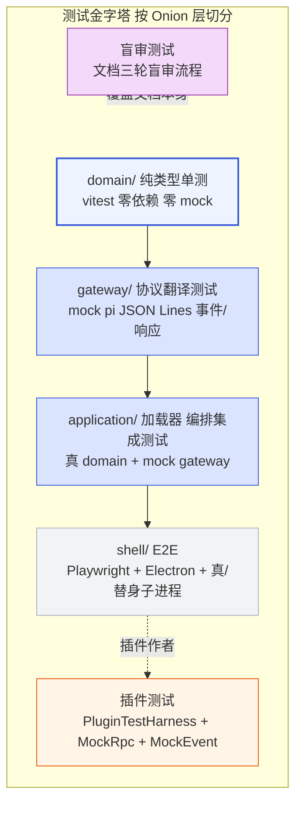
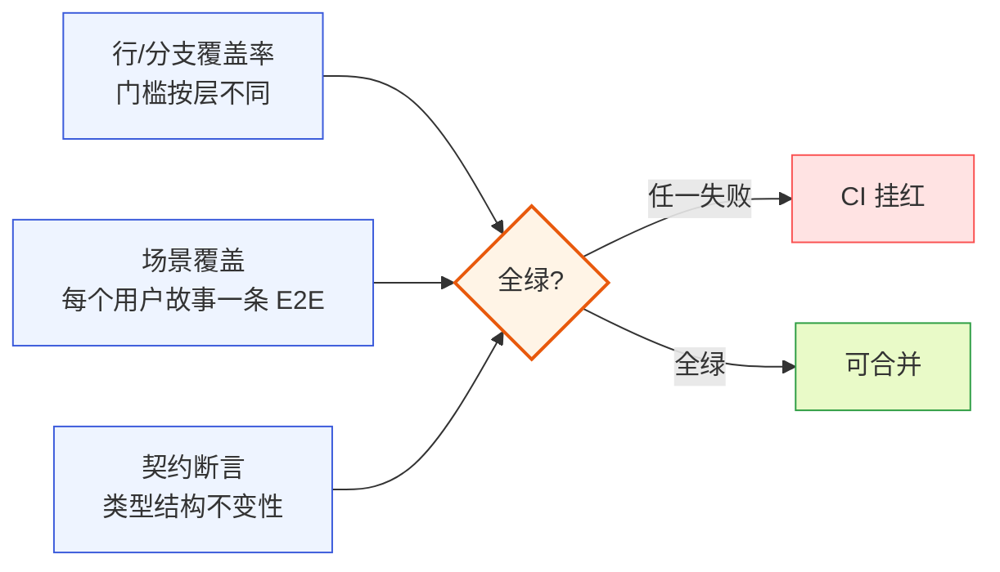
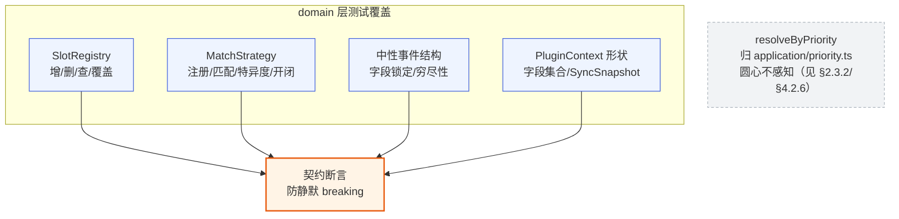
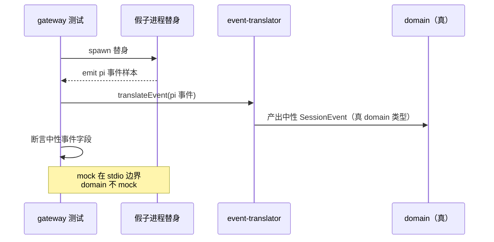
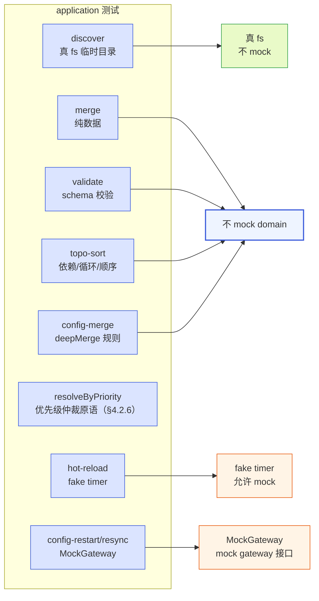
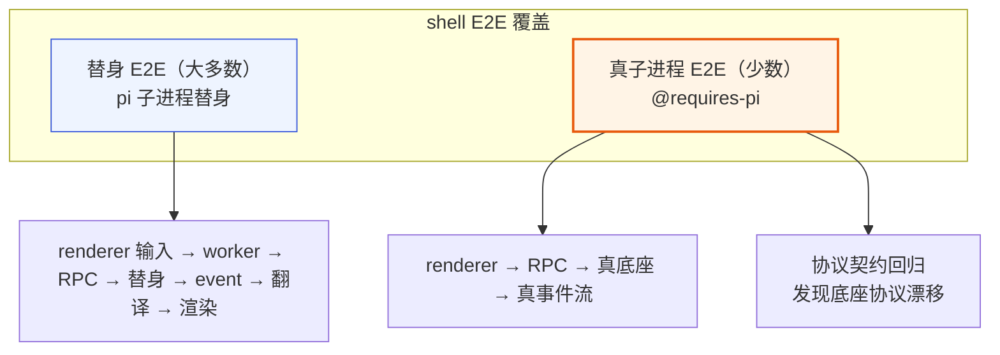
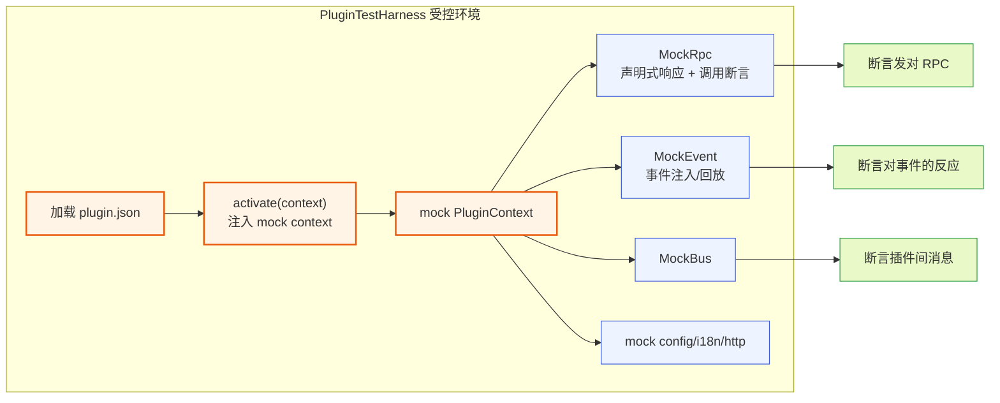
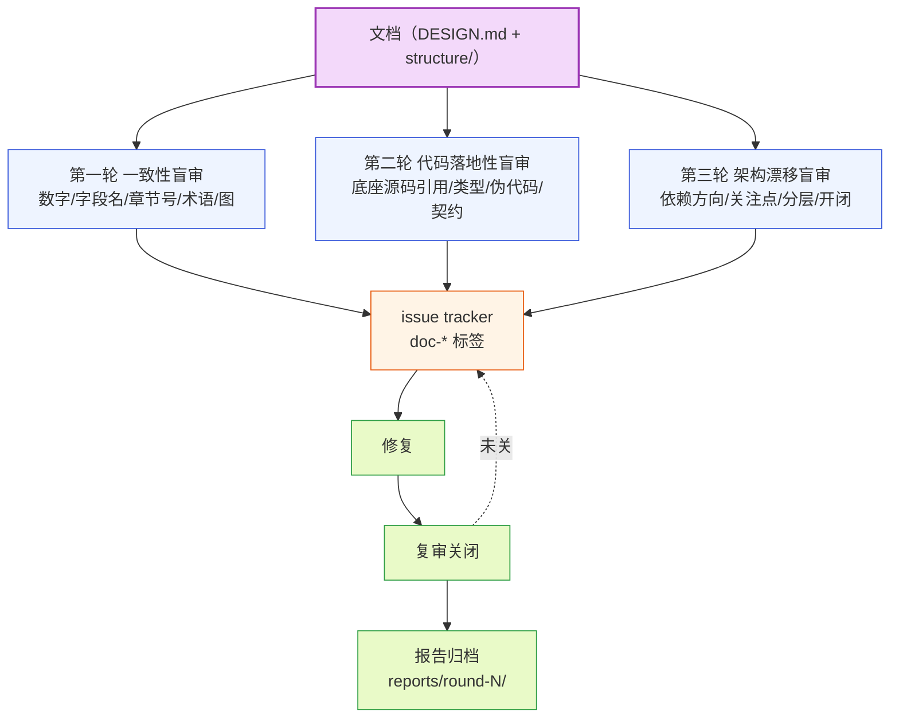
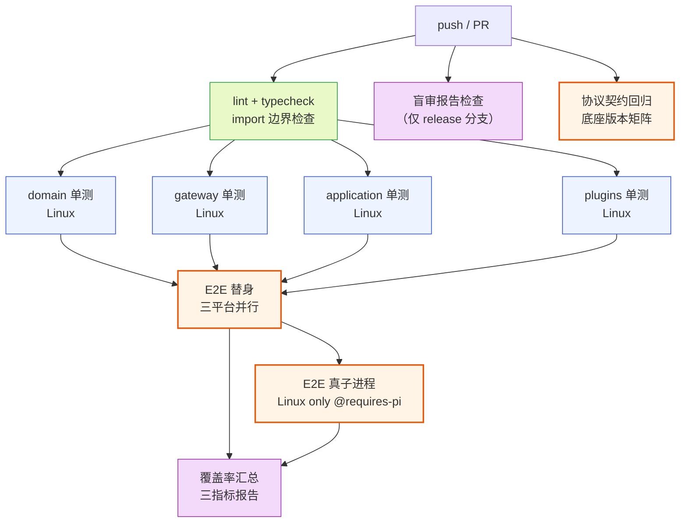
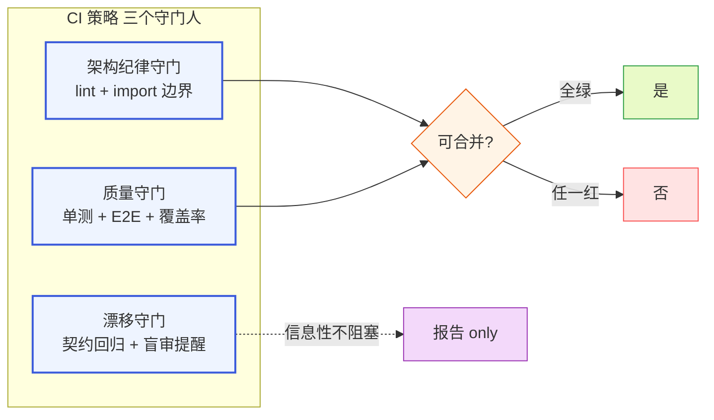

# 测试策略文档

本文档覆盖 pi-desktop 桌面壳的全部测试策略：从圆心（domain）的零依赖纯类型单测，到 gateway 层的协议翻译测试，到 application 层的加载器与编排集成测试，到 shell 层的 E2E（Playwright + Electron），再到插件作者用的 PluginTestHarness（含 MockRpc 与 MockEvent），最后是文档本身的三轮盲审流程与 CI 策略。设计依据来自 DESIGN.md 的 5.1.4 目录（`tests/` 分层）和 5.3 洋葱分层，并对照底座（pi）源码与 RPC 协议（DESIGN.md §1）核实。文中涉及底座协议细节以 `gateway/protocol/` 类型为准，涉及 pi-desktop 自身设计则对应 DESIGN.md 的章节号。

整篇文档有一条贯穿主线：**测试金字塔按洋葱的依赖层次切分，每层只测自己的职责、不跨层打桩**——圆心测契约纯度（零依赖、无 mock）、gateway 测协议翻译保真（mock 子进程的 JSON Lines、不 mock domain）、application 测用例编排正确性（真 gateway 接 mock 适配层、不 mock 圆心）、shell 测端到端用户流（真 Electron + 真 pi 子进程或受控替身）、插件作者用 PluginTestHarness 在受控环境下测插件行为。这条分层一旦守住，换 shell 技术栈（Electron→Tauri）时 shell 层测试重写、其余层不动；换底座协议版本时 gateway 测试跟着改、其余层不动。这呼应 5.3.3 的"换 shell 只动外层"判据——测试也按这个判据切分。



**图 0 — 测试金字塔按洋葱分层：内层不依赖外层、每层只测自己职责**

## 1 测试分层总览

### 1.1 分层依据：洋葱依赖方向决定测试边界

#### 1.1.1 为什么按洋葱切而不按功能切

测试分层的第一性原则是**依赖方向**，不是功能模块。DESIGN.md §5.3 把 pi-desktop 切成四层：圆心 `domain/`（槽位契约、中性事件、PluginContext 接口）、第一外层 `gateway/`（底座协议边界）、第二外层 `application/`（用例编排：加载器、配置操作、生命周期）、第三外层 `shell/`（Electron/React/sqlite 细节）。依赖严格向内：`shell → application → gateway → domain`，`plugins` 只依赖 `domain`。

测试按这个方向切分的好处是**每层测试只 stub 自己的外层依赖、不 stub 内层**。domain 是圆心、零外部依赖，所以 domain 测试零 mock；gateway 依赖 domain（真用）+ 底座子进程（mock），所以 gateway 测试 mock 的是子进程的 stdio、不是 domain；application 依赖 domain + gateway，所以 application 测试 mock 的是 gateway 的对外接口（rpc-adapter/config 操作）、不是圆心契约；shell 依赖 application，shell 测试用真 application 跑端到端、只在最外缘（Electron 进程、pi 子进程）做受控替身。

如果按功能切（"时间线测试""会话管理测试"），每个功能横跨四层，测试要么重复打桩同样的东西、要么跨层泄漏——一个测试同时 stub 了底座协议和 React 渲染，失败时分不清是哪层错。按洋葱切，失败定位精确到层。

#### 1.1.2 圆心纯度纪律在测试上的投影

DESIGN.md §5.1.5 的圆心类型纯度纪律——`domain/` 不 import `gateway/protocol/` 的底座类型，圆心定义中性投影类型、gateway 提供映射层——在测试上有直接投影：domain 测试**永远不见 `RpcSessionState`/`AgentSessionEvent` 这些底座类型**。如果某个 domain 测试文件 import 了 `gateway/protocol/`，那就是依赖方向反转、测试本身违规。这条纪律用一条 lint 规则强制（见 §7.4 的 import boundary 检查）。

圆心纯度的另一面是 gateway 的映射层（`context-binding.ts` 的 `toSessionState`/`toMessageEntry`、`event-translator.ts` 的 pi 事件→中性事件）必须有**针对性测试**——它们是把底座类型翻译成中性类型的唯一通道，翻译错一处，圆心收到脏数据、整壳跑偏。这是 gateway 测试的核心覆盖点（§3.3）。

### 1.2 测试目录结构

#### 1.2.1 tests/ 分层布局

测试目录镜像源码的洋葱分层，落在 `tests/` 下：

```
pi-desktop/
├── src/
│   ├── domain/          # 圆心
│   ├── gateway/         # 第一外层
│   ├── application/     # 第二外层
│   ├── shell/           # 第三外层
│   └── plugins/         # 内置插件（内容层）
│
└── tests/
    ├── domain/                      # 圆心契约单测（零外部依赖）
    │   ├── slots/
    │   │   ├── registry.test.ts        # SlotRegistry 增删查
    │   │   ├── strategies.test.ts      # MatchStrategy 特异度+匹配
    │   │   └── schema.test.ts          # 各槽位 schema 校验
    │   ├── events/
    │   │   └── tool-call.test.ts       # 中性事件结构不变性
    │   ├── context.test.ts             # PluginContext 接口形状
    │   └── contributions.test.ts        # ContributionItem/SyncSnapshot 类型
    │
    ├── gateway/                     # 协议翻译测试（mock pi JSON Lines）
    │   ├── rpc-adapter.test.ts         # 起子进程/收发/stdio 生命周期
    │   ├── correlator.test.ts          # RequestCorrelator id 配对+timeout
    │   ├── event-translator.test.ts    # pi 事件 → 中性 SessionEvent
    │   ├── context-binding.test.ts     # 底座类型 → 中性投影类型
    │   ├── extension-ui.test.ts        # Extension UI 子协议双向翻译
    │   └── fixtures/                   # 录制的 pi 事件/响应样本
    │       ├── events/
    │       └── responses/
    │
    ├── application/                 # 加载器/编排集成测试
    │   ├── loader/
    │   │   ├── discover.test.ts         # 发现：三目录+符号链接+权限错误
    │   │   ├── merge.test.ts           # 优先级合并 + 覆盖记录
    │   │   ├── validate.test.ts        # manifest schema 校验
    │   │   ├── mount.test.ts           # 槽位挂载 + 冲突仲裁
    │   │   ├── topo-sort.test.ts       # 依赖检查 + 循环检测
    │   │   ├── priority.test.ts        # resolveByPriority 仲裁+稳定性（§4.2.6）
    │   │   └── hot-reload.test.ts      # watcher + 防抖 + 回退
    │   ├── orchestrations/
    │   │   ├── resync.test.ts          # 并发拉 state+entries+tree+commands
    │   │   ├── config-restart.test.ts  # 改配置→重启子进程→resync
    │   │   └── session-switch.test.ts  # switch/fork→rebind→resync
    │   └── config/
    │       └── settings-merge.test.ts  # deepMergeSettings 合并规则
    │
    ├── shell/                       # E2E（Playwright + Electron）
    │   ├── e2e/
    │   │   ├── launch.spec.ts          # 启动→连接底座→get_state 同步
    │   │   ├── prompt-flow.spec.ts     # 发消息→事件流→时间线渲染
    │   │   ├── config-restart.spec.ts  # 改配置→重启子进程→resume
    │   │   ├── plugin-crash.spec.ts   # 插件崩→隔离→toast→诊断页
    │   │   └── extension-ui.spec.ts    # select/confirm/input/editor 模态
    │   └── harness/
    │       ├── electron-launcher.ts    # 起 Electron + _transport
    │       └── pi-fake.ts               # 受控 pi 子进程替身（可选）
    │
    ├── plugins/                     # 插件作者测试工具
    │   ├── plugin-test-harness.ts      # PluginTestHarness 入口
    │   ├── mock-rpc.ts                 # MockRpc：声明式响应+断言
    │   ├── mock-event.ts               # MockEvent：回放事件流
    │   ├── mock-bus.ts                 # MockBus：插件间总线
    │   └── examples/                   # 内置插件的测试样例
    │       ├── timeline.test.ts
    │       └── model-params.test.ts
    │
    └── blind-review/               # 文档盲审流程（§6）
        ├── checklists/
        │   ├── consistency.md
        │   ├── code-grounded.md
        │   └── architecture-drift.md
        └── reports/
            └── round-{1,2,3}/
```

这个布局和 DESIGN.md §5.1.4 的 `tests/` 注释一致（domain 可纯单测、gateway 用 mock 子进程、application 是加载器/编排集成测试），并补全了 shell E2E、插件测试工具、盲审流程三块。每层测试只 import 自己层的源码 + 更内层的源码，不 import 更外层——`tests/domain/` 只 import `src/domain/`，`tests/gateway/` import `src/gateway/` + `src/domain/`，`tests/application/` import `src/application/` + `src/gateway/` + `src/domain/`，`tests/shell/` 才允许 import `src/shell/`。这条规则用 ESLint 的 `no-restricted-imports` + 自定义边界检查强制（§7.4）。

#### 1.2.2 测试运行器选择：vitest

全部单元/集成测试用 **vitest**，不用 jest。理由是 vitest 原生支持 ESM/TS（pi-desktop 全 TS+ESM）、和 electron-vite 共享 vite 配置（`vitest.config.ts` 继承 `electron.vite.config` 的 alias/resolve）、零配置跑 `.test.ts`、原生支持 `describe/it/expect` 和 jest 兼容的 API（迁移成本低）。E2E 用 Playwright 的 Electron 支持（`@playwright/test` 的 `_electron` API），和 vitest 分开跑（§4.1）。

vitest 配置按层分项目（workspace），让每层独立跑、独立配环境：

```typescript
// vitest.config.ts
import { defineWorkspace } from "vitest/config";

export default defineWorkspace([
  {
    extends: "electron.vite.config.ts",
    test: {
      name: "domain",
      include: ["tests/domain/**/*.test.ts"],
      environment: "node",          // domain 零依赖，node 足够
      // 不允许 mock 外部模块——domain 不该有外部依赖
    },
  },
  {
    extends: "electron.vite.config.ts",
    test: {
      name: "gateway",
      include: ["tests/gateway/**/*.test.ts"],
      environment: "node",
      setupFiles: ["tests/gateway/setup.ts"],  // 注入 pi 子进程 mock 工厂
    },
  },
  {
    extends: "electron.vite.config.ts",
    test: {
      name: "application",
      include: ["tests/application/**/*.test.ts"],
      environment: "node",
      setupFiles: ["tests/application/setup.ts"],  // 注入 mock gateway 适配层
    },
  },
  {
    extends: "electron.vite.config.ts",
    test: {
      name: "plugins",
      include: ["tests/plugins/**/*.test.ts", "src/plugins/**/*.test.ts"],
      environment: "node",
      setupFiles: ["tests/plugins/setup.ts"],  // 注入 PluginTestHarness
    },
  },
]);
```

分项目的好处是 CI 能按层并行跑（§7.2），并且某层失败不阻塞其他层的结果汇总。E2E 不进 vitest workspace——它要起真 Electron 进程、用 Playwright 独立跑。

### 1.3 测试覆盖目标

#### 1.3.1 分层覆盖率门槛

覆盖率不是单一数字，按层设不同门槛，因为各层"该测什么"不同：

| 层 | 覆盖率门槛 | 侧重 |
|---|---|---|
| domain/ | 行/分支 ≥ 95% | 契约不变性、边界条件、纯逻辑 |
| gateway/ | 行 ≥ 85%，分支 ≥ 80% | 协议翻译保真、错误路径、生命周期 |
| application/ | 行 ≥ 80%，分支 ≥ 75% | 编排正确性、并发、回退 |
| shell/ | 不设行覆盖门槛，用 E2E 场景覆盖 | 用户流端到端 |
| plugins/（内置插件） | 行 ≥ 70% | 插件业务逻辑，UI 用快照+E2E |

domain 门槛最高（95%），因为它是圆心、零依赖、纯逻辑，没有"难测的 IO"当借口——任何一行没覆盖就是契约没钉死。shell 不设行覆盖门槛，因为 Electron 的 main/renderer 进程代码难单测、且行为正确性最终由 E2E 验证；行覆盖在这里会引导写无意义的 mock 测试，反而偏离目标。

#### 1.3.2 覆盖率不是唯一指标

覆盖率只回答"有没有跑到这行"，不回答"这个行为对不对"。所以覆盖率之外还有两个指标：

- **场景覆盖**：每个用户故事（发消息、改配置、切会话、插件崩溃恢复…）至少一条 E2E 覆盖。场景清单见 §4.4。
- **契约断言**：domain 层每个对外类型（PluginContext、SessionEvent、ContributionItem）有一个"结构不变性"测试，断言字段集合/类型，防止静默 breaking change。见 §2.5。

这三类指标在 CI 里分别报告（§7.3），覆盖率达标但场景或契约断言失败照样挂红。



**图 1 — 三类测试指标：覆盖率、场景覆盖、契约断言，任一失败即挂红**

## 2 domain 层：纯类型单测

### 2.1 圆心测试的约束

#### 2.1.1 零依赖、零 mock、零 IO

domain 层（`src/domain/`）是洋葱的圆心，DESIGN.md §5.1.4 说它"零外部依赖（不 import pi/electron/react）"。这个约束直接决定 domain 测试的形态：**不能 mock 任何东西，因为没有外部依赖可 mock**。domain 测试里不该出现 `vi.mock(...)`、`vi.fn()`、`vi.useFakeTimers()`——这些都是"你在测有副作用的东西"的气味，而圆心不该有副作用。

如果某个 domain 测试想 mock，说明被测代码越界了——它要么偷偷 import 了外层（违规），要么包含了不该在圆心的逻辑（该往外推到 gateway/application）。这时不是写 mock，是重构：把有副作用的逻辑往外推，圆心只剩纯数据/纯逻辑。

#### 2.1.2 测的是契约不变性，不是实现细节

domain 层的东西是**契约**——槽位注册表、匹配策略、中性事件结构、PluginContext 接口形状。契约的测试重点是"不变性"：输入 X 永远产出 Y、字段集合不变、类型不变。不是测某个实现算法的内部步骤（那是实现细节、可重构），是测它对外承诺的行为是否兑现。

举例：`MatchStrategy`（DESIGN.md §3.3）的测试不该断言"它内部按特异度排序的具体步骤"，该断言"给定两个策略 A（specificity=100）和 B（specificity=0），registry 永远选 A"。这样特异度的内部实现可以换（从数组排序改成堆），契约不变、测试不挂。

### 2.2 槽位注册表测试

#### 2.2.1 SlotRegistry 的增删查

`domain/slots/registry.ts`（DESIGN.md §5.1.4）是 core 维护的、按槽位分的 Map——key 是贡献项 id、value 是贡献项数据 + 来源插件 + 优先级。测试覆盖三类操作：

```typescript
// tests/domain/slots/registry.test.ts
import { describe, it, expect } from "vitest";
import { SlotRegistry } from "@/domain/slots/registry";

describe("SlotRegistry", () => {
  it("挂载贡献项后可按 id 查到", () => {
    const reg = new SlotRegistry<"commands">();
    reg.set("session.new", { id: "session.new", title: "New", sourcePlugin: "p1", priority: "builtin" });
    expect(reg.get("session.new")?.title).toBe("New");
  });

  it("同槽位同 id 高优先级覆盖低优先级", () => {
    const reg = new SlotRegistry<"commands">();
    reg.set("cmd", { id: "cmd", title: "low", sourcePlugin: "p1", priority: "builtin" });
    const overwritten = reg.set("cmd", { id: "cmd", title: "high", sourcePlugin: "p2", priority: "project" });
    expect(overwritten).toBe(true);            // 返回 true 表示发生了覆盖
    expect(reg.get("cmd")?.title).toBe("high");
  });

  it("低优先级不覆盖高优先级", () => {
    const reg = new SlotRegistry<"commands">();
    reg.set("cmd", { id: "cmd", title: "high", sourcePlugin: "p1", priority: "project" });
    const overwritten = reg.set("cmd", { id: "cmd", title: "low", sourcePlugin: "p2", priority: "builtin" });
    expect(overwritten).toBe(false);            // 未覆盖
    expect(reg.get("cmd")?.title).toBe("high"); // 仍是高优先级
  });

  it("删除后查不到", () => {
    const reg = new SlotRegistry<"commands">();
    reg.set("cmd", { id: "cmd", title: "t", sourcePlugin: "p1", priority: "builtin" });
    reg.delete("cmd");
    expect(reg.get("cmd")).toBeUndefined();
  });
});
```

注意这些测试**没有任何 mock**——纯数据进、纯数据出。`SlotRegistry` 是个纯数据结构，测试就是构造输入、断言输出。这里 `set` 返回是否发生覆盖，是契约的一部分（加载器据此决定要不要标记冲突、在管理 UI 标灰，见 DESIGN.md §3.5 第 7 项）。

#### 2.2.2 优先级枚举的不变性

`priority` 字段是个有限枚举（`project | user | installed | builtin`，DESIGN.md §3.4）。测试要锁死这个枚举的**顺序**——任何代码改动把 `installed` 提到 `user` 之前，测试就该挂。这条用一条断言锁：

```typescript
it("优先级顺序：project > user > installed > builtin", () => {
  const order = ["project", "user", "installed", "builtin"] as const;
  for (let i = 0; i < order.length - 1; i++) {
    expect(comparePriority(order[i], order[i + 1])).toBeGreaterThan(0);
  }
});
```

这是契约断言（§1.3.2）——它不关心 `comparePriority` 内部怎么实现（查表、比较索引、switch），只断言顺序不变。这个顺序是 §3.4 整个覆盖机制的根，一旦变就全线乱。

### 2.3 匹配策略测试

#### 2.3.1 MatchStrategy 注册与查找

DESIGN.md §3.3 说 core 用 strategy 名查策略注册表拿 `MatchStrategy` 实例，不按 `strategy` 字段 if-else 分发。测试要验证这个开闭原则：**新增一个策略不该改 core**。

```typescript
// tests/domain/slots/strategies.test.ts
import { describe, it, expect } from "vitest";
import { strategyRegistry, registerStrategy } from "@/domain/slots/strategies";

describe("MatchStrategy 注册表", () => {
  it("内置策略集齐全", () => {
    for (const name of ["toolName", "toolNames", "customType", "extension", "mime", "all"]) {
      expect(strategyRegistry.get(name)).toBeDefined();
    }
  });

  it("matches() 按策略语义匹配", () => {
    const all = strategyRegistry.get("all")!;
    expect(all.matches({ toolName: "anything" }, {})).toBe(true);  // all 永远匹配
    const tn = strategyRegistry.get("toolName")!;
    expect(tn.matches({ toolName: "read" }, { toolName: "read" })).toBe(true);
    expect(tn.matches({ toolName: "read" }, { toolName: "write" })).toBe(false);
  });

  it("specificity 是稳定常量", () => {
    expect(strategyRegistry.get("toolName")!.specificity).toBe(100);
    expect(strategyRegistry.get("all")!.specificity).toBe(0);
  });

  it("新策略可注册不改 core（开闭原则）", () => {
    const customStrategy = {
      name: "custom-test",
      specificity: 50,
      matches: (item: { x: string }, ctx: { x: string }) => item.x === ctx.x,
    };
    registerStrategy(customStrategy);
    expect(strategyRegistry.get("custom-test")).toBe(customStrategy);
  });
});
```

最后一条测试是开闭原则的验证：第三方能注册新策略、core 不改。这是契约——如果未来有人把 `registerStrategy` 改成只接受白名单（破坏开闭），这条测试挂、拦住。

> **接口签名对齐（双参模型）**：本文按双参签名测试 `matches(ctx: MatchContext, ruleValue: unknown): boolean`——策略实例无状态、registry 持共享实例，每条 contribution 的 rule value（`MatchRule.value`）随调用传入。这比"每条 contribution 构造一个绑了 value 的策略实例"更省、契合 DESIGN.md §3.3「registry 持共享策略实例」的提法；也化解了 DESIGN.md §3.3 自身的张力——「持共享实例」与「每条 contribution 的 match 各带 value」之间缺一座桥，双参 matches 正是这座桥（value 不进实例、随调用传）。
>
> **待对齐项（DESIGN.md 侧）**：DESIGN.md §3.3 当前声明为单参 `matches(ctx: MatchContext): boolean`，与本文双参模型不一致——按单参接口，上方 `all.matches({ toolName: "anything" }, {})` 会触发 TS2554（Expected 1 arguments, but got 2）、测试无法编译。应将 DESIGN.md §3.3 接口改为双参 `matches(ctx: MatchContext, ruleValue: unknown): boolean` 并在图 7 注释说明 ruleValue 来自 MatchRule.value，两侧对齐后本节测试方可编译。

#### 2.3.2 特异度仲裁不属于圆心

`resolveByPriority`（DESIGN.md §3.2.4 末尾原语、行 770/774）虽是纯函数，但 DESIGN.md §5.1.4（目录树 `application/priority.ts`、行 2038）与 §3.2.4 明确它"由中层提供、圆心不感知"——它是 application 加载器的复用工具、不是圆心契约。因此 **domain 层不测 `resolveByPriority`**：若 `tests/domain/` 去 import `@/application/priority`，就违反本文 §1.2.1/§8.4.2 自己定的"tests/domain 只 import src/domain"边界。它的测试收在 §4.2.6（application 层，与 merge/topo-sort 同列）。

这也呼应 §1.1.2 的圆心纯度纪律：仲裁规则是"用例编排"层的复用、不该上浮成圆心契约。圆心只持有 `SlotRegistry`（按优先级覆盖的存储语义，§2.2.1）、不持有"如何从候选项里选一个"的仲裁函数。

### 2.4 中性事件结构测试

#### 2.4.1 ToolCallStart/Update/End 的字段锁定

`domain/events/tool-call.ts`（DESIGN.md §5.1.4）定义中性事件——gateway 的 `event-translator.ts` 把 pi 的 `tool_execution_start/update/end`（DESIGN.md §1.6.3）翻译成这组中性事件。中性事件是圆心契约，字段一变，所有订阅它的插件都得改。测试要锁字段集合：

```typescript
// tests/domain/events/tool-call.test.ts
import { describe, it, expect } from "vitest";

describe("中性工具调用事件结构", () => {
  it("ToolCallStart 含 toolCallId/toolName/args", () => {
    const e = { type: "ToolCallStart", toolCallId: "tc_1", toolName: "read", args: { path: "/a" } };
    expect(e).toMatchObject({ toolCallId: "tc_1", toolName: "read", args: { path: "/a" } });
  });

  it("ToolCallUpdate 含 toolCallId/partialResult", () => {
    const e = { type: "ToolCallUpdate", toolCallId: "tc_1", partialResult: "..." };
    expect(e.toolCallId).toBe("tc_1");
    expect(typeof e.partialResult).toBe("string");
  });

  it("ToolCallEnd 含 toolCallId/result/isError", () => {
    const e = { type: "ToolCallEnd", toolCallId: "tc_1", result: "ok", isError: false };
    expect(e).toHaveProperty("isError");
  });
});
```

这类测试看起来像"测类型"，作用是**防静默 breaking**：如果有人把 `ToolCallStart` 的 `toolCallId` 改名成 `id`，TS 编译可能不报（如果类型用得松），但这条测试挂、CI 拦住。对圆心契约，这类断言要全覆盖。

#### 2.4.2 SessionEvent 联合的穷尽性

圆心定义的 `SessionEvent` 是个联合类型（对应底座的 AgentSessionEvent 全集，DESIGN.md §1.6）。测试用 switch 穷尽性检查：

```typescript
it("SessionEvent switch 穷尽（编译期保证）", () => {
  function handle(e: SessionEvent): string {
    switch (e.type) {
      case "AgentStart": return "start";
      case "AgentEnd": return "end";
      case "AgentSettled": return "settled";
      case "TurnStart":
      case "TurnEnd": return "turn";
      case "MessageStart":
      case "MessageUpdate":
      case "MessageEnd": return "msg";
      case "EntryAppended": return "entry";
      case "ToolCallStart":
      case "ToolCallUpdate":
      case "ToolCallEnd": return "tool";
      // ... 全部 case
      default: {
        const _exhaustive: never = e;
        return _exhaustive;
      }
    }
  }
  // 能编译即联合穷尽
  expect(handle({ type: "AgentStart" } as SessionEvent)).toBe("start");
});
```

`default: const _exhaustive: never = e` 是 TS 的穷尽性检查惯用法——如果 `SessionEvent` 联合加了新成员但 switch 没加分支，编译期就挂。这把"事件类型新增"变成编译错误而不是运行时漏处理。

### 2.5 PluginContext 接口形状测试

#### 2.5.1 接口字段的存在性

PluginContext（DESIGN.md §3.2.4）是 worker 侧插件的全部能力边界。它的字段集是契约——core 实现 PluginContext 时必须提供全部字段，插件依赖这些字段。测试用"构造一个 mock 实现、断言它满足接口"来锁形状：

```typescript
// tests/domain/context.test.ts
import { describe, it, expect } from "vitest";
import type { PluginContext } from "@/domain/context";

describe("PluginContext 接口形状", () => {
  it("完整实现满足接口", () => {
    const ctx: PluginContext = {
      plugin: { id: "p", version: "1", rootDir: "/p" },
      rpc: {
        prompt: async () => {},                 // §3.2.4 便捷方法
        send: async () => ({}),                 // 通用发命令
        resync: async () => ({ state: {}, entries: [], tree: [], leafId: null, commands: [] }),  // 返回 SyncSnapshot（§2.5.2）
        // 其余 rpc 便捷方法（getEntries/getTree/getCommands/getState/setModel/compact/listSessions 等）
        // 此处也须显式列出以锁字段集——靠注释省略会让被省略的字段对契约断言形同虚设
      },
      http: { fetch: async () => new Response() },
      events: { on: () => () => {} },
      bus: { publish: () => {}, subscribe: () => () => {} },
      config: { get: () => undefined, set: async () => {}, all: () => ({}) },
      i18n: { t: () => "", locale: "en" },
      emitToRenderer: () => {},
      onRendererMessage: () => () => {},        // DESIGN.md §3.2.4：监听 renderer 回传消息，返回取消订阅
      register: () => {},
      onDeactivate: () => {},
    };
    expect(ctx.rpc.send).toBeDefined();
    expect(ctx.events.on).toBeDefined();
    expect(ctx.onRendererMessage).toBeDefined();
  });
});
```

这条测试看起来冗余（TS 编译已经保证接口满足），但它锁的是**字段集合**——如果接口删了 `register`（动态注册贡献项，DESIGN.md §3.2.4）或漏了 `onRendererMessage`（renderer 回传消息通道，DESIGN.md §3.2.4），构造这个对象时少一项、TS 报错（TS2741）、测试挂。这是把"接口演进"显式化。注意 mock 必须列出 PluginContext 的**全部**字段——靠注释省略（如 `/* ...全部方法 */`）会让被省略的字段对"锁字段集"形同虚设：少一项时 TS 报错、但被省略的那项本来就没人断言它存在。故 rpc 的全部便捷方法应显式列出（或对每个字段补存在性断言）。本节正是该模式的反例自检——上一版 mock 遗漏了 `onRendererMessage`，既无法编译、又恰恰无法锁住它的存在性（它正是本节声称要防的静默 breaking）。

#### 2.5.2 rpc.resync 返回 SyncSnapshot 的结构

`rpc.resync()`（DESIGN.md §3.2.4 末尾原语、行 770）返回 `SyncSnapshot`。DESIGN.md §3.2.4 明确定义其结构为 **五个必填字段、含 `leafId`、无 `errors`**：

```typescript
interface SyncSnapshot {
  state: SessionState;       // 来自 get_state，经 toSessionState() 中性化
  entries: MessageEntry[];   // 来自 get_entries，经 toMessageEntry() 中性化
  tree: TreeNode[];         // 来自 get_tree（TreeNode 为圆心中性类型）
  leafId: string | null;    // 当前活跃叶子节点（get_entries/get_tree 共带，取一致值）
  commands: CommandInfo[];   // 来自 get_commands，经 toCommandInfo() 中性化
}
```

`leafId` 是必填字段——会话树高亮、timeline 位置标记都靠它（见 11-plugin-session-manager.md §5.3.2 的 `snap.leafId`）。`errors` **不在圆心 `SyncSnapshot` 类型里**：圆心契约只描述同步快照的中性数据结构、不感知"某条子命令失败"这种编排错误。若 resync 编排需要承载某条子命令失败的错误信息，由 application 编排层（`orchestrations/resync.ts`）的返回包装承载（如 `ResyncResult = { snapshot: SyncSnapshot; errors?: Partial<Record<"state"|"entries"|"tree"|"commands", Error>> }`），不污染圆心契约——这呼应 §1.1.2 圆心纯度纪律。测试锁圆心五字段结构：

```typescript
it("SyncSnapshot 含五必填字段（含 leafId）", () => {
  const snap: SyncSnapshot = { state: {}, entries: [], tree: [], leafId: null, commands: [] };
  // 五个必填字段始终存在——少了 commands 命令面板就空、少了 tree 会话树渲染不出、少了 leafId 位置高亮丢
  expect(["commands", "entries", "state", "tree", "leafId"].every((k) => k in snap)).toBe(true);
  // leafId 可为 null（无活跃叶子节点时）
  expect(snap.leafId).toBeNull();

  // leafId 带值时是 string
  const withLeaf: SyncSnapshot = { state: {}, entries: [{ id: "e1" }], tree: [], leafId: "e1", commands: [] };
  expect(withLeaf.leafId).toBe("e1");
});
```

五字段缺一不可——少了 `commands` 命令面板就空、少了 `tree` 会话树渲染不出、少了 `leafId` 会话树当前叶子高亮丢。这条断言锁死五必填字段的存在性，防止有人重构时把 `leafId` 漏掉、或把圆心类型加上 `errors` 这种编排错误字段（错误承载应放 application 层返回包装，见 §4.3.3）。



**图 2 — domain 层测试覆盖的四块，全部归宿到契约断言（resolveByPriority 不属圆心、见 §2.3.2）**

## 3 gateway 层：协议翻译测试

### 3.1 gateway 测试的边界

#### 3.1.1 mock 什么、不 mock 什么

gateway 层（`src/gateway/`）是"底座协议边界"——唯一能 import pi 类型（`gateway/protocol/`）的层。它的职责是把 pi 的协议（RPC command/response/event、Extension UI 子协议）翻译成圆心的中性类型/事件。所以 gateway 测试 mock 的是**底座子进程的 stdio**（pi 那端），不 mock 圆心（domain 那端用真的）。

具体说：`rpc-adapter.test.ts` mock 的是 `child_process.spawn`（替身成可控的假子进程，能往 stdout 写 JSON Lines、收 stdin 的命令）；`event-translator.test.ts` 不 mock 任何东西——喂进 pi 事件样本（fixtures）、断言出来的中性事件。后者是纯翻译函数、零副作用，和 domain 测试一样零 mock。

#### 3.1.2 用录制的 pi 事件/响应样本

gateway 测试的关键资产是**fixtures**——从真底座录制的 pi 事件流和响应样本（`tests/gateway/fixtures/events/`、`responses/`）。这些 fixtures 是"协议真相"：底座某版本对某命令返回什么结构、某事件带什么字段，录下来钉死。翻译函数照着 fixtures 喂、断言输出，就保证翻译和真实协议一致。

fixtures 的来源有两个：一是手动跑底座 CLI `--mode rpc`、抓 stdout 落盘；二是 CI 里跑一个"协议契约"job（§7.5），每次底座版本更新时重新录制、diff 变化、人工 review。后者保证 fixtures 不和底座漂移。

### 3.2 RPC 适配器测试

#### 3.2.1 子进程替身

`rpc-adapter.ts`（DESIGN.md §5.1.4、§1.2）的职责是起 `pi --mode rpc` 子进程、收发 JSON Lines、处理生命周期。测试不能真起 pi 子进程（那是 E2E 的事），用替身：

```typescript
// tests/gateway/rpc-adapter.test.ts
import { describe, it, expect, vi } from "vitest";
import * as child_process from "node:child_process";

// 替身：可控的假子进程
function fakeChild() {
  const handlers: ((line: string) => void)[] = [];
  let stdinSink: (line: string) => void = () => {};
  return {
    child: {
      stdout: { on: (_e: string, cb: (line: string) => void) => handlers.push(cb) },
      stderr: { on: () => {} },
      on: () => {},
      stdin: { write: (s: string) => stdinSink(s), end: () => {} },
      kill: () => {},
      pid: 12345,
    },
    emit: (line: string) => handlers.forEach((h) => h(line)),  // 模拟底座吐一行
    onStdin: (cb: (line: string) => void) => { stdinSink = cb; },  // 捕获发给底座的命令
  };
}

describe("RpcAdapter", () => {
  it("发命令配对响应（id 配对）", async () => {
    const fc = fakeChild();
    vi.spyOn(child_process, "spawn").mockReturnValue(fc.child as any);
    const adapter = new RpcAdapter({ cliPath: "/fake/pi" });
    await adapter.start();

    fc.onStdin((line) => {
      const cmd = JSON.parse(line);
      if (cmd.type === "get_state") {
        fc.emit(JSON.stringify({ type: "response", command: "get_state", id: cmd.id, success: true, data: { model: undefined, thinkingLevel: "low", isStreaming: false, /* ... */ } }));
      }
    });

    const state = await adapter.send({ type: "get_state" });
    expect(state.isStreaming).toBe(false);
  });

  it("超时自动 reject", async () => {
    const fc = fakeChild();
    vi.spyOn(child_process, "spawn").mockReturnValue(fc.child as any);
    const adapter = new RpcAdapter({ cliPath: "/fake/pi", timeoutMs: 50 });
    await adapter.start();
    // 底座不回，等超时
    await expect(adapter.send({ type: "get_state" })).rejects.toThrow(/timeout/);
  });
});
```

这里 `vi.spyOn(child_process, "spawn")` 是 gateway 层测试里**唯一**允许的 mock——mock 的是最外缘的子进程 spawn，不是圆心。替身的 `emit`/`onStdin` 让测试能模拟底座行为：吐响应、吐事件、卡死、EOF。

#### 3.2.2 生命周期事件

RPC 适配器要处理三类生命周期事件（DESIGN.md §1.2.3、§1.10.1）：子进程 `exit`、`error`、stdin 写报错。这些都是"底座挂了"的信号、要能通知 UI。测试覆盖：

```typescript
it("子进程 exit 触发 onDisconnect", async () => {
  const fc = fakeChild();
  let exitCb: (() => void) | undefined;
  fc.child.on = (e: string, cb: () => void) => { if (e === "exit") exitCb = cb; };
  vi.spyOn(child_process, "spawn").mockReturnValue(fc.child as any);

  const adapter = new RpcAdapter({ cliPath: "/fake/pi" });
  const onDisconnect = vi.fn();
  adapter.onDisconnect(onDisconnect);
  await adapter.start();

  exitCb!();  // 子进程退了
  expect(onDisconnect).toHaveBeenCalled();
});

it("stdin EOF 触发 shutdown（底座自退通道）", async () => {
  // DESIGN.md §1.2.2：关闭 stdin 写端 → 底座自退
  const fc = fakeChild();
  vi.spyOn(child_process, "spawn").mockReturnValue(fc.child as any);
  const adapter = new RpcAdapter({ cliPath: "/fake/pi" });
  await adapter.start();
  adapter.kill();  // 关 stdin
  expect(fc.child.stdin.end).toHaveBeenCalled();  // 实际验证 stdin 被关
});
```

第二条测试验证 DESIGN.md §1.2.2 的"stdin EOF 触发 shutdown"——这是桌面端关掉底座子进程的干净通道（§2.4 重启子进程时用）。测试锁死这个行为：调 `kill` 必须关 stdin 写端、底座收到 EOF 自退。如果有人把 `kill` 改成 `SIGKILL`（暴力杀、丢 session），测试挂、拦住。

### 3.3 事件翻译测试

#### 3.3.1 pi 事件 → 中性事件的保真

`event-translator.ts`（DESIGN.md §5.1.4、§5.1.5）把 pi 的 `AgentSessionEvent`（DESIGN.md §1.6）翻译成圆心的中性 `SessionEvent`。这是圆心不绑 pi 类型的关键翻译点。测试喂 pi 事件样本、断言中性事件：

```typescript
// tests/gateway/event-translator.test.ts
import { describe, it, expect } from "vitest";
import { translateEvent } from "@/gateway/event-translator";
import toolCallStartFixture from "../fixtures/events/tool_execution_start.json";
import messageUpdateFixture from "../fixtures/events/message_update.json";

describe("event-translator", () => {
  it("tool_execution_start → ToolCallStart", () => {
    const neutral = translateEvent(toolCallStartFixture);
    expect(neutral.type).toBe("ToolCallStart");
    expect(neutral).toMatchObject({
      toolCallId: toolCallStartFixture.toolCallId,
      toolName: toolCallStartFixture.toolName,
      args: toolCallStartFixture.args,
    });
  });

  it("message_update 透传 message 结构", () => {
    const piEvent = messageUpdateFixture;
    const neutral = translateEvent(piEvent);
    expect(neutral.type).toBe("MessageUpdate");
    expect(neutral.message.role).toBe(piEvent.message.role);
  });

  it("未知事件类型降级为 UnknownEvent（不崩）", () => {
    const neutral = translateEvent({ type: "some_future_event", foo: "bar" });
    expect(neutral.type).toBe("Unknown");
    expect((neutral as any).raw).toEqual({ type: "some_future_event", foo: "bar" });
  });
});
```

最后一条是 DESIGN.md §6.4 的"协议无版本协商"缺口的测试兜底——底座未来加新事件类型时，翻译器不该崩、降级成 `Unknown` 事件（保留原始 raw 字段供调试）。测试锁死这个降级行为、保证底座演进时桌面端不挂。

#### 3.3.2 敏感字段按权限过滤

DESIGN.md §1.7.6 末尾明确："过滤点在 gateway 层、不在圆心（圆心不感知权限），也不在插件侧"。即 gateway 翻译 pi 事件成中性 SessionEvent 时，按订阅插件的权限过滤敏感字段——未声明 `content:sensitive` 权限的插件，收到的 event 里 `content[]`/`toolCalls[].args` 置空（只保留 `role`/`toolName` 等元数据）。**过滤点落在 gateway 是 DESIGN.md 的硬纪律**：让圆心持有一个以权限集为入参的函数，等于让圆心感知权限、违反 §1.1.2 圆心纯度——这正是本文 §7.4 架构漂移盲审该拦的。

因此 `filterSensitive` 定义在 `src/gateway/`（gateway 翻译层是唯一感知权限 + 持有过滤点的层），**不进 `src/domain/`**。gateway 在翻译完 pi 事件后、把事件分发给各订阅插件前调用它。这条纪律也是本文 §7.4 第三轮架构漂移盲审的检查项——若发现"圆心 import 权限概念"或"filterSensitive 落在 domain"，标 `doc-arch-drift`、修正回 gateway。测试在 gateway 层直接测：

```typescript
// tests/gateway/event-translator.test.ts（接 §3.3.1）
import { filterSensitive } from "@/gateway/event-translator";

it("未声明 content:sensitive 的插件收不到对话内容", () => {
  const piEvent = {
    type: "message_update",
    message: { role: "assistant", content: [{ type: "text", text: "secret code" }], toolCalls: [{ id: "tc", name: "read", args: { path: "/secret" } }] },
  };
  // 插件权限不含 content:sensitive
  const filtered = filterSensitive(translateEvent(piEvent), { permissions: new Set([]) });
  expect((filtered as any).message.content).toEqual([]);
  expect((filtered as any).message.toolCalls[0].args).toEqual({});
});

it("声明了 content:sensitive 的插件收到完整内容", () => {
  const piEvent = { /* 同上 */ };
  const filtered = filterSensitive(translateEvent(piEvent), { permissions: new Set(["content:sensitive"]) });
  expect((filtered as any).message.content[0].text).toBe("secret code");
});
```

这条测试守的是安全边界——恶意插件默默收对话内容外传是 DESIGN.md §1.7.6 关注的威胁。测试锁死"权限不足 → 敏感字段置空"、防止有人重构时把过滤逻辑漏掉或错误上浮到圆心。配合 `net:` 域名白名单（DESIGN.md §3.5 第 6 项），这条过滤是防数据外泄的双保险。

> **关于 harness 复用过滤逻辑**：插件 harness 的 `MockEvent`（§6.2.3）不复用 gateway 的 `filterSensitive`——harness 是轻量测试工具、不该依赖 gateway 层。MockEvent 自带一份同语义的小份过滤（或抽到 `tests/plugins/` 共享工具），接受"两处各写一遍"的代价、换取 harness 不依赖 gateway。这和 §9.1 的取舍一致：harness 测插件视角的过滤效果（§6.3.1）、gateway 测翻译层的过滤点（本节），两侧各测一段、不共享实现、不污染圆心。

### 3.4 RequestCorrelator 测试

#### 3.4.1 id 配对与 timeout 兜底

`correlator.ts`（DESIGN.md §5.1.4、§3.2.4 末尾原语 `RequestCorrelator<T>`）是 RPC command-response 配对和 Extension UI request-response 配对的共用模式。统一 API 如下（公开方法在类定义里完整列出，伪代码可编译）：

```typescript
// src/gateway/correlator.ts（公开方法集合）
interface CorrelatorOptions<T> {
  idGenerator?: () => string;   // 可选，默认递增 id；nextId() 用它生成 id
  timeoutMs: number;
}
interface PendingOptions<T> {
  signal?: AbortSignal;
  defaultValue?: T;             // signal abort 或 timeout 时 resolve 此默认值
}
class RequestCorrelator<T> {
  constructor(opts: CorrelatorOptions<T>);
  /** 生成一个新 id（内部用 idGenerator）。RPC 用递增 id、Extension UI 用 UUID（§3.4.2）。 */
  nextId(): string;
  /** 登记一个待配对的 id、返回其 promise。id 由调用方负责（RPC 调 nextId() 生成；Extension UI 用底座 request 自带的 id）。 */
  pending(id: string, options?: PendingOptions<T>): Promise<T>;
  /** 收到响应时按 id 配对并 resolve 对应 promise。 */
  resolve(id: string, value: T): void;
  /** 当前未配对的 pending 数（配对/超时/abort 后清零）。 */
  get size(): number;
}
```

API 选型说明：`pending(id)` 接显式 id 而非无参内部生成，是因为 Extension UI 场景的 id 来自底座 request（`extension_ui_request` 自带 id、§1.9），correlator 必须用该 id 配对、不能自己生成；RPC 场景则由调用方先 `nextId()` 拿 id 再 `pending(id)`。这样 `idGenerator` 唯一被 `nextId()` 消费、不再出现"构造器收 idGenerator 却无人调用"的悬空。`nextId()` 在上面的类定义里已显式声明，§3.4.2 的 `rpc.nextId()`/`ext.nextId()` 调用有据可循。

测试覆盖共用逻辑：

```typescript
// tests/gateway/correlator.test.ts
describe("RequestCorrelator", () => {
  it("配对：相同 id 的 resolve", async () => {
    const corr = new RequestCorrelator<string>({ timeoutMs: 1000 });   // 用默认递增 id
    const id = corr.nextId();
    const p = corr.pending(id);
    corr.resolve(id, "ok");
    expect(await p).toBe("ok");
  });

  it("超时：未配对的 reject", async () => {
    const corr = new RequestCorrelator<string>({ timeoutMs: 50 });
    await expect(corr.pending("req_2")).rejects.toThrow(/timeout/);
  });

  it("AbortSignal 触发 resolve 默认值", async () => {
    const ctrl = new AbortController();
    const corr = new RequestCorrelator<string>({ timeoutMs: 5000 });
    const p = corr.pending("req_3", { signal: ctrl.signal, defaultValue: "cancelled" });
    ctrl.abort();
    expect(await p).toBe("cancelled");
  });

  it("id 配对后清 pending（不泄漏）", async () => {
    const corr = new RequestCorrelator<string>({ timeoutMs: 1000 });
    const id = corr.nextId();
    corr.pending(id);
    corr.resolve(id, "ok");
    expect(corr.size).toBe(0);  // 配对后 Map 清空
  });
});
```

DESIGN.md §1.4.2 说 RPC 的 timeout 是 30s、超时清 pending；DESIGN.md §1.9.2 说 Extension UI 有 timeout 和 AbortSignal 兜底。这些行为都收进 `RequestCorrelator` 统一测，不两处各写一遍——呼应 §3.2.4 的"core 提供的可复用原语"。

#### 3.4.2 两种 id 生成器

```typescript
it("RPC 用递增 id、Extension UI 用 UUID", () => {
  const rpc = new RequestCorrelator({ idGenerator: incrementingId(), timeoutMs: 30000 });
  const ext = new RequestCorrelator({ idGenerator: uuidId(), timeoutMs: 30000 });
  expect(rpc.nextId()).toMatch(/^req_\d+$/);
  expect(ext.nextId()).toMatch(/^[0-9a-f-]{36}$/);
});
```

锁死 id 生成器的格式——底座按 id 配对（DESIGN.md §1.4.2、§1.9.2），id 格式不对就配不上。这条断言保证 id 生成器不会被人改成奇怪格式。这里 `nextId()` 是 §3.4.1 类定义里声明的公开方法，`idGenerator` 经它消费、不再悬空。

### 3.5 Extension UI 子协议测试

#### 3.5.1 双向翻译保真

`extension-ui.ts`（DESIGN.md §5.1.4、§1.9）把底座的 `extension_ui_request` 翻译成原生 GUI 交互、把用户的 `extension_ui_response` 回传。测试覆盖全部 9 个 method（select/confirm/input/editor/notify/setStatus/setWidget/setTitle/set_editor_text）：

```typescript
// tests/gateway/extension-ui.test.ts
describe("Extension UI 翻译", () => {
  it("select request → 渲染选择框 → 回 value", async () => {
    const ui = new ExtensionUiBridge();
    const promise = ui.handleRequest({ id: "u1", method: "select", title: "Pick", options: ["a", "b"] });
    // 模拟用户选了 "b"
    ui.simulateUserSelect("u1", "b");
    const resp = await promise;
    expect(resp).toEqual({ id: "u1", value: "b" });
  });

  it("confirm request → 回 confirmed: false（用户点否）", async () => {
    const ui = new ExtensionUiBridge();
    const promise = ui.handleRequest({ id: "u2", method: "confirm", title: "Sure?", message: "Continue?" });
    ui.simulateUserConfirm("u2", false);
    expect(await promise).toEqual({ id: "u2", confirmed: false });
  });

  it("notify 是 fire-and-forget（不回 response）", () => {
    const ui = new ExtensionUiBridge();
    ui.handleRequest({ id: "u3", method: "notify", message: "hi", notifyType: "info" });
    expect(ui.pendingCount).toBe(0);  // 没进 pending Map
  });

  it("Esc 等同 cancelled（无障碍规范）", async () => {
    const ui = new ExtensionUiBridge();
    const promise = ui.handleRequest({ id: "u4", method: "input", title: "Name" });
    ui.simulateKey("Escape");  // DESIGN.md §1.9.4：Esc = cancelled
    expect(await promise).toEqual({ id: "u4", cancelled: true });
  });
});
```

最后一条测的是 DESIGN.md §1.9.4 的无障碍焦点规范——Esc 等同 cancelled。这是行为契约、不是 UI 细节：用户按 Esc，core 必须回 `{ cancelled: true }`，底座按 id 配对 resolve 默认值。测试锁死这条。

#### 3.5.2 id 配对与底座 timeout 兜底

DESIGN.md §1.9.2 说底座侧有 timeout 自动 resolve 默认值，桌面端不必担心交互卡死。但桌面端这边也有自己的责任——response 的 id 必须和 request 一致。测试：

```typescript
it("response id 必须配对 request id", async () => {
  const ui = new ExtensionUiBridge();
  const promise = ui.handleRequest({ id: "u5", method: "input", title: "X" });
  ui.simulateUserInput("wrong-id", "value");  // 错的 id
  // u5 还在 pending
  expect(ui.isPending("u5")).toBe(true);
  ui.simulateUserInput("u5", "right");  // 对的 id
  expect(await promise).toEqual({ id: "u5", value: "right" });
});
```

锁死 id 配对的纪律——错的 id 不该误配对到别的 pending。这条防的是"两个并发的 select 弹框、回串了"这种 bug。



**图 3 — gateway 测试的 mock 边界：只在子进程 stdio 处替身，domain 用真的**

## 4 application 层：加载器与编排集成测试

### 4.1 application 测试的边界

#### 4.1.1 真 domain + mock gateway

application 层（`src/application/`）是用例编排——加载器八项（DESIGN.md §3.5）、配置操作（§2）、生命周期（§3.5 第 4 项）、orchestrations（resync/config-restart/session-switch）。它依赖 domain + gateway。测试时**domain 用真的**（圆心纯逻辑、零副作用、不用 mock），**gateway 用 mock**——因为 gateway 要起子进程、读写文件，那些是 IO、在 application 测试里该隔离。

具体说：application 测试注入一个 `MockGateway`，它实现 gateway 的对外接口（`send`/`onEvent`/`translateEvent` 等），但内部不真起子进程、不真写文件——返回声明式预设的响应。这样 application 的编排逻辑（"改配置 → 调 gateway 重启 → 调 resync"）能被验证正确，而不依赖真子进程。

#### 4.1.2 不 mock 圆心

关键纪律：application 测试**不 mock domain**。如果 application 测试 mock 了 `SlotRegistry` 或 `MatchStrategy`，那测的是"application 用了某个假的圆心"、不是真圆心——一旦圆心契约变了，测试不挂、但生产挂。所以圆心用真的，gateway 用 mock。这条纪律和 §1.1.2 一致：每层只 mock 自己的外层依赖。

### 4.2 加载器测试

#### 4.2.1 发现（discover）

`application/loader/discover.ts`（DESIGN.md §3.5 第 1 项）扫三处目录（project/user/builtin）、读 `plugin.json`、处理目录不存在/符号链接/权限错误。测试用临时目录构造真实文件系统（不用 mock fs——fs 操作是 discover 的本质，mock 掉就测不到真实行为）：

```typescript
// tests/application/loader/discover.test.ts
import { describe, it, expect, beforeEach, afterEach } from "vitest";
import { mkdtempSync, mkdirSync, writeFileSync, symlinkSync, chmodSync } from "node:fs";
import { tmpdir } from "node:os";
import { join } from "node:path";
import { discover } from "@/application/loader/discover";

describe("loader/discover", () => {
  let root: string;
  beforeEach(() => { root = mkdtempSync(join(tmpdir(), "pi-test-")); });
  afterEach(() => { /* rm -rf root */ });

  it("扫到三处目录的插件", () => {
    const projectDir = join(root, "project"); mkdirSync(projectDir);
    const userDir = join(root, "user"); mkdirSync(userDir);
    const builtinDir = join(root, "builtin"); mkdirSync(builtinDir);
    writeFileSync(join(projectDir, "p1", "plugin.json"), JSON.stringify({ id: "p1", version: "1" }));
    writeFileSync(join(userDir, "p2", "plugin.json"), JSON.stringify({ id: "p2", version: "1" }));
    writeFileSync(join(builtinDir, "p3", "plugin.json"), JSON.stringify({ id: "p3", version: "1" }));

    const candidates = discover({ project: projectDir, user: userDir, builtin: builtinDir });
    expect(candidates.map((c) => c.manifest.id).sort()).toEqual(["p1", "p2", "p3"]);
    expect(candidates.find((c) => c.manifest.id === "p1")!.source).toBe("project");
  });

  it("目录不存在：跳过不报错", () => {
    const candidates = discover({ project: "/nonexistent", user: "/nonexistent", builtin: "/nonexistent" });
    expect(candidates).toEqual([]);
  });

  it("符号链接：跟随（和底座 extension 一致）", () => {
    const real = join(root, "real"); mkdirSync(real);
    writeFileSync(join(real, "plugin.json"), JSON.stringify({ id: "linked", version: "1" }));
    const link = join(root, "link");
    symlinkSync(real, link);
    const candidates = discover({ project: link, user: "", builtin: "" });
    expect(candidates.map((c) => c.manifest.id)).toContain("linked");
  });

  it("权限错误：跳过并记录", () => {
    const dir = join(root, "p"); mkdirSync(dir);
    writeFileSync(join(dir, "plugin.json"), "{}");
    chmodSync(dir, 0o000);  // 无读权限
    const candidates = discover({ project: dir, user: "", builtin: "" });
    expect(candidates).toEqual([]);
    chmodSync(dir, 0o755);  // 恢复以便清理
  });
});
```

这里用真 fs（mkdtemp 临时目录），因为 discover 的本质就是文件系统操作——mock fs 等于没测。`权限错误` 那条在 POSIX 上有效、Windows 上行为不同，CI 要按平台 skip 或用条件测试（§7.2）。

#### 4.2.2 优先级合并与覆盖记录

`merge.ts`（DESIGN.md §3.5 第 2 项、§3.4）按 `project > user > installed > builtin` 合并同 id 插件。测试用纯数据进、纯数据出：

```typescript
// tests/application/loader/merge.test.ts
describe("loader/merge", () => {
  it("同 id 按优先级取胜者", () => {
    const candidates = [
      { manifest: { id: "p", version: "1" }, source: "builtin", path: "/b" },
      { manifest: { id: "p", version: "2" }, source: "project", path: "/p" },
      { manifest: { id: "p", version: "1" }, source: "user", path: "/u" },
    ];
    const { merged, overrides } = mergeByPriority(candidates);
    expect(merged[0].manifest.version).toBe("2");      // project 胜
    expect(merged[0].source).toBe("project");
    expect(overrides).toEqual([{ id: "p", winner: "project", losers: ["user", "builtin"] }]);
  });

  it("不同 id 都保留", () => {
    const candidates = [
      { manifest: { id: "a", version: "1" }, source: "user", path: "/a" },
      { manifest: { id: "b", version: "1" }, source: "builtin", path: "/b" },
    ];
    const { merged } = mergeByPriority(candidates);
    expect(merged.map((m) => m.manifest.id).sort()).toEqual(["a", "b"]);
  });
});
```

`overrides` 记录是契约——管理 UI（DESIGN.md §4.3）要显示"p 被项目级覆盖了 builtin 版本"，靠这个记录。测试锁死结构。

#### 4.2.3 manifest 校验失败不拖垮整壳

`validate.ts`（DESIGN.md §3.5 第 3 项）做 schema 校验，失败标红、跳过、继续。测试覆盖各种脏 manifest：

```typescript
describe("loader/validate", () => {
  it("缺必填 id：失败", () => {
    const errors = validateManifest({ version: "1" });
    expect(errors.some((e) => e.field === "id")).toBe(true);
  });

  it("contributions 指向未知槽位：失败", () => {
    const errors = validateManifest({ id: "p", version: "1", contributes: { unknownSlot: [{}] } });
    expect(errors.some((e) => e.includes("unknownSlot"))).toBe(true);
  });

  it("main 路径文件不存在：失败", () => {
    const errors = validateManifest({ id: "p", version: "1", main: "./nonexistent.js" }, rootDir: "/x");
    expect(errors.some((e) => e.includes("main"))).toBe(true);
  });

  it("合法 manifest：通过", () => {
    const errors = validateManifest({ id: "p", version: "1", contributes: { commands: [{ id: "c", title: "C" }] } });
    expect(errors).toEqual([]);
  });
});
```

这些测试保证"脏 manifest 不让整壳崩"——加载器发现脏数据时标记错误、跳过、继续加载其他。这是 DESIGN.md §3.5 第 5 项"错误隔离"的加载前防线。

#### 4.2.4 依赖检查与拓扑排序

`topo-sort.ts`（DESIGN.md §3.5 依赖检查项）做依赖缺失检测、循环检测、拓扑排序。测试覆盖三类：

```typescript
describe("loader/topo-sort", () => {
  it("依赖缺失：标错跳过", () => {
    const plugins = [{ id: "a", dependsOn: ["missing"] }];
    const { order, errors } = topoSortByDeps(plugins);
    expect(order).toEqual([]);  // a 被跳过
    expect(errors["a"]).toContain("missing");
  });

  it("循环依赖：环上全禁用", () => {
    const plugins = [
      { id: "a", dependsOn: ["b"] },
      { id: "b", dependsOn: ["a"] },
    ];
    const { order, errors } = topoSortByDeps(plugins);
    expect(order).toEqual([]);
    expect(Object.keys(errors).sort()).toEqual(["a", "b"]);
  });

  it("被依赖的先 activate", () => {
    const plugins = [
      { id: "a", dependsOn: ["b"] },
      { id: "b", dependsOn: [] },
    ];
    const { order } = topoSortByDeps(plugins);
    expect(order.map((p) => p.id)).toEqual(["b", "a"]);  // b 在前
  });

  it("同层按 source 优先级 + id 字典序（可重现）", () => {
    const plugins = [
      { id: "z", dependsOn: [], source: "user" },
      { id: "a", dependsOn: [], source: "user" },
      { id: "m", dependsOn: [], source: "project" },
    ];
    const { order } = topoSortByDeps(plugins);
    expect(order.map((p) => p.id)).toEqual(["m", "a", "z"]);  // project 先、同 user 按字典序
  });
});
```

最后一条锁死可重现性——同优先级时按 id 字典序、不随机。DESIGN.md §3.5 明确要求"保证可重现"，否则热重载时激活顺序抖动、动态注册的贡献项可见性会变。

#### 4.2.5 热重载：防抖与回退

`hot-reload.ts`（DESIGN.md §3.5 第 8 项）watcher + 防抖 + 回退。测试用 fake timer 控制时间：

```typescript
describe("loader/hot-reload", () => {
  it("连续改动只重载一次（防抖）", async () => {
    vi.useFakeTimers();
    const watcher = createHotReloader({ debounceMs: 100 });
    const reloadSpy = vi.fn();
    watcher.onReload(reloadSpy);
    watcher.notifyChange("/plugins/p/plugin.json");
    watcher.notifyChange("/plugins/p/plugin.json");
    watcher.notifyChange("/plugins/p/main.js");
    await vi.advanceTimersByTimeAsync(100);
    expect(reloadSpy).toHaveBeenCalledTimes(1);
    vi.useRealTimers();
  });

  it("新版加载失败：回退旧版（不悬空）", async () => {
    const oldPlugin = { id: "p", version: "1" };
    const newManifest = { id: "p", version: "2", main: "./broken.js" };
    const watcher = createHotReloader({ current: oldPlugin });
    // 新版 validate 失败
    const result = await watcher.reload("p", newManifest);
    expect(result.ok).toBe(false);
    expect(watcher.current("p")).toEqual(oldPlugin);  // 仍是旧版
  });
});
```

"回退旧版不悬空"是 DESIGN.md §3.5 第 8 项的关键要求——新版加载失败时不能让插件进入"既不是旧版也不是新版"的状态。测试锁死回退行为。注意这里 `vi.useFakeTimers()` 是 application 层测试**允许**的 mock——timer 是 hot-reload 的本质外部依赖（防抖靠 timer）、和 §2.1 说的"圆心不该有副作用"不冲突，因为这是 application 不是 domain。

#### 4.2.6 优先级仲裁原语 resolveByPriority

`resolveByPriority`（DESIGN.md §3.2.4 末尾原语、行 770/774）归 `application/priority.ts`（DESIGN.md §5.1.4 目录树，行 2038："本层用：插件级覆盖+贡献项仲裁，只有 loader 用"）。它是纯函数、由中层（加载器）持有、圆心不感知——故它的测试落在 `tests/application/`、与 merge/topo-sort 同列（圆心层不测它、见 §2.3.2 的归属说明）。测试就是塞一堆候选项、断言取出的那个：

```typescript
// tests/application/loader/priority.test.ts
import { describe, it, expect } from "vitest";
import { resolveByPriority } from "@/application/priority";

describe("resolveByPriority", () => {
  it("取最高优先级项", () => {
    const items = [
      { value: "a", priority: "builtin" },
      { value: "b", priority: "project" },
      { value: "c", priority: "user" },
    ];
    expect(resolveByPriority(items, (i) => i.priority).value).toBe("b");
  });

  it("同优先级取第一个（稳定）", () => {
    const items = [
      { value: "first", priority: "user" },
      { value: "second", priority: "user" },
    ];
    expect(resolveByPriority(items, (i) => i.priority).value).toBe("first");
  });
});
```

"同优先级取第一个"是稳定性保证——同优先级时不该随机选，否则同一次加载每次结果不同、热重载会抖动。这是契约、不是实现细节。该测试归 application 而非 domain，呼应 §1.1.2 圆心纯度纪律：仲裁规则是用例编排层的复用、不上浮成圆心契约；圆心只持有 `SlotRegistry` 的覆盖存储语义（§2.2.1）。

### 4.3 配置操作与编排测试

#### 4.3.1 deepMergeSettings 合并规则

`application/config/`（DESIGN.md §2.1）的 `deepMergeSettings`：以全局打底、项目级覆盖、嵌套对象递归合并、数组和原始值整体替换。测试锁死这些规则：

```typescript
describe("config/settings-merge", () => {
  it("嵌套对象递归合并", () => {
    const base = { compaction: { enabled: true, reserveTokens: 1000 } };
    const override = { compaction: { reserveTokens: 2000 } };
    expect(deepMerge(base, override)).toEqual({ compaction: { enabled: true, reserveTokens: 2000 } });
  });

  it("数组整体替换（不拼接）", () => {
    const base = { extensions: ["/a", "/b"] };
    const override = { extensions: ["/c"] };
    expect(deepMerge(base, override)).toEqual({ extensions: ["/c"] });
  });

  it("原始值整体替换", () => {
    expect(deepMerge({ theme: "dark" }, { theme: "light" })).toEqual({ theme: "light" });
  });

  it("项目级未覆盖的字段保留全局", () => {
    const base = { defaultModel: "claude", theme: "dark" };
    const override = { theme: "light" };
    expect(deepMerge(base, override)).toEqual({ defaultModel: "claude", theme: "light" });
  });
});
```

DESIGN.md §2.1.1 特别强调"项目级 settings 不会和全局的数组合并拼接——项目级只要写了 extensions，就完全替换全局的 extensions 数组"。这条测试把"整体替换"和"递归合并"的边界钉死——这俩规则容易搞混、搞混了配置就错。

#### 4.3.2 配置重启编排

`orchestrations/config-restart.ts`（DESIGN.md §2.4、§2.5）是"改配置 → 写磁盘 → 判断 streaming → 重启子进程 → resync"的编排。测试注入 MockGateway，验证编排逻辑：

```typescript
describe("orchestrations/config-restart", () => {
  it("agent idle：直接重启 + resync", async () => {
    const mockGw = createMockGateway({
      getState: async () => ({ isStreaming: false }),  // idle
    });
    const orch = new ConfigRestartOrchestration(mockGw, mockFs);
    await orch.apply({ extensions: ["/new-ext"] });
    expect(mockGw.killedOldSubprocess).toBe(true);
    expect(mockGw.spawnedNewWithArgs).toEqual(["--session", "/old/session"]);
    expect(mockGw.resyncCalled).toBe(true);
  });

  it("agent streaming：不直接重启，等 settled", async () => {
    const mockGw = createMockGateway({
      getState: async () => ({ isStreaming: true }),
    });
    const orch = new ConfigRestartOrchestration(mockGw, mockFs);
    const promise = orch.apply({ extensions: ["/new-ext"] });
    // 还没重启
    expect(mockGw.killedOldSubprocess).toBe(false);
    // 模拟 agent_settled
    mockGw.emitSettled();
    await promise;
    expect(mockGw.killedOldSubprocess).toBe(true);
  });

  it("streaming 中用户拒绝打断：攒改动", async () => {
    const mockGw = createMockGateway({ getState: async () => ({ isStreaming: true }) });
    const orch = new ConfigRestartOrchestration(mockGw, mockFs, { promptUser: async () => false });
    await orch.apply({ extensions: ["/new-ext"] });
    expect(mockGw.killedOldSubprocess).toBe(false);
    expect(orch.pendingChanges.extensions).toEqual(["/new-ext"]);
  });
});
```

这三条测试覆盖 DESIGN.md §2.4.2 的"带判断的重启决策"的三条路径——idle 直接重启、streaming 等 settled、streaming 用户拒绝打断攒着。编排逻辑是 application 层的核心、错了会让用户在 agent 工作时被打断或丢失改动。

#### 4.3.3 resync 并发拉取

`orchestrations/resync.ts`（DESIGN.md §3.2.4 末尾原语）并发发 `get_state` + `get_entries` + `get_tree` + `get_commands`，拼装成圆心 `SyncSnapshot`（五必填字段，见 §2.5.2）。resync 编排可能某条子命令失败，此时圆心 `SyncSnapshot` 不该被污染（圆心只描述中性数据、不感知编排错误），故 application 层用 `ResyncResult` 包装返回——`{ snapshot: SyncSnapshot; errors?: Partial<Record<"state"|"entries"|"tree"|"commands", Error>> }`，把错误承载留在编排层、`errors` 不进圆心类型。测试验证并发、返回结构和错误承载：

```typescript
describe("orchestrations/resync", () => {
  it("四命令并发发、结果合并成 SyncSnapshot（五字段含 leafId）", async () => {
    const mockGw = createMockGateway({
      getState: async () => ({ isStreaming: false }),
      getEntries: async () => ({ entries: [{ id: "e1" }], leafId: "e1" }),
      getTree: async () => ({ tree: [], leafId: "e1" }),
      getCommands: async () => ({ commands: [{ id: "cmd1" }] }),
    });
    const result = await resync(mockGw);
    // 圆心 SyncSnapshot 五字段全齐（含 leafId，与 §2.5.2 结构对齐）
    expect(result.snapshot).toEqual({
      state: { isStreaming: false },
      entries: [{ id: "e1" }],
      tree: [],
      leafId: "e1",
      commands: [{ id: "cmd1" }],
    });
    // 正常路径无 errors（errors 在编排层包装、不在圆心 snapshot 里）
    expect(result.errors).toBeUndefined();
    // 验证并发：四命令同时发出（不是串行）
    expect(mockGw.maxConcurrentSends).toBe(4);
  });

  it("某命令失败：snapshot 仍含其他结果 + errors 在编排层包装", async () => {
    const mockGw = createMockGateway({
      getState: async () => { throw new Error("down"); },
      getEntries: async () => ({ entries: [], leafId: null }),
      getTree: async () => ({ tree: [], leafId: null }),
      getCommands: async () => ({ commands: [] }),
    });
    const result = await resync(mockGw);
    // snapshot 是圆心类型、五字段全齐、无 errors 字段
    expect(result.snapshot).toMatchObject({
      entries: [],
      tree: [],
      leafId: null,
      commands: [],
    });
    expect(result.snapshot).not.toHaveProperty("errors");
    // errors 在 application 层的 ResyncResult 包装里、类型化访问、无需 as any
    expect(result.errors?.state).toBeInstanceOf(Error);
    expect(result.errors?.state?.message).toBe("down");
  });
});
```

并发是关键——DESIGN.md §3.2.4 说"内部并发发这组命令"，不是串行四个 await。测试用 `maxConcurrentSends` 验证真的并发了（mockGateway 记录同时在飞的命令数峰值）。这是性能契约：resync 在并发的四条命令下该 ~RTT、不是 4×RTT。`errors` 留在编排层包装、与 §2.5.2 的圆心五字段结构一致——圆心 `SyncSnapshot` 不感知编排错误。



**图 4 — application 层测试的 mock 边界：fs 用真的、timer 用 fake、gateway 用 mock、domain 不 mock**

## 5 shell 层：E2E 测试

### 5.1 E2E 的定位与边界

#### 5.1.1 为什么 shell 层用 E2E 而非单测

shell 层（`src/shell/`）是 Electron main/renderer、React、sqlite 这些"会变的细节"（DESIGN.md §5.3）。它的代码难单测——main 进程要起 Electron、renderer 跑在浏览器上下文、sqlite 要真实数据库文件。强行单测会陷入大量 mock、测的是"mock 的 Electron"而非真行为，价值低。

所以 shell 层用 **E2E**：起一个真 Electron 应用（含真 main + 真 renderer + 真加载器 + 真 gateway 适配层），驱动它跑完整用户流，断言端到端行为。pi 子进程可以用受控替身（§5.3）或真子进程（§5.4）。E2E 覆盖的是"用户真实操作路径"，不是"某个函数返回对不对"。

#### 5.1.2 E2E 不覆盖什么

E2E 不覆盖纯逻辑——domain 契约、gateway 翻译、application 编排的正确性已经在各自的层测试覆盖。E2E 只覆盖"层与层接起来的整体行为"：main 起 renderer、renderer 加载插件、插件订阅 event、event 从 gateway 翻译到 domain 再到 renderer 渲染、用户交互回传到底座。这条链路任何一环接错，E2E 挂、但单测可能全绿。这就是 E2E 的价值——验证集成。

### 5.2 Playwright + Electron 测试框架

#### 5.2.1 Electron launcher

Playwright 提供官方的 Electron 支持（`@playwright/test` 的 `_electron` API），能起 Electron 应用、和 main 进程通信、驱动 renderer。pi-desktop 的 E2E 用这套：

```typescript
// tests/shell/harness/electron-launcher.ts
import { _electron as electron, ElectronApplication, Page } from "@playwright/test";
import path from "node:path";

export async function launchApp(opts?: { piFake?: boolean }): Promise<{ app: ElectronApplication; window: Page }> {
  const app = await electron.launch({
    args: [path.join(__dirname, "../../../dist-electron/main/index.js")],
    env: {
      ...process.env,
      PI_DESKTOP_E2E: "1",
      PI_FAKE: opts?.piFake ? "1" : "0",  // 用替身还是真子进程
    },
  });
  const window = await app.firstWindow();
  await window.waitForLoadState("domcontentloaded");
  return { app, window };
}
```

`PI_DESKTOP_E2E=1` 让应用进 E2E 模式（关闭自动更新、用测试数据目录、缩短超时）。`PI_FAKE` 控制用替身子进程还是真子进程——大多数 E2E 用替身（快、确定），少数关键流用真子进程（§5.4）。

#### 5.2.2 一个 E2E 样例：发消息 → 时间线渲染

```typescript
// tests/shell/e2e/prompt-flow.spec.ts
import { test, expect } from "@playwright/test";
import { launchApp } from "../harness/electron-launcher";

test.describe("发消息 → 时间线渲染", () => {
  test("用户输入并发送，时间线出现 assistant 气泡", async () => {
    const { app, window } = await launchApp({ piFake: true });
    // 等 UI 同步完（get_state 回来）
    await window.waitForSelector("[data-testid='model-indicator']");

    // 输入框打字 + 发送
    await window.fill("[data-testid='main-input']", "hello");
    await window.click("[data-testid='send-button']");

    // 替身 pi 推一个 message_start + message_update + message_end
    await app.evaluate(({ ipcMain }) => {
      ipcMain.emit("test:pi-event", null, { type: "message_start", message: { role: "assistant", content: [] } });
      ipcMain.emit("test:pi-event", null, { type: "message_update", message: { role: "assistant", content: [{ type: "text", text: "hi there" }] } });
      ipcMain.emit("test:pi-event", null, { type: "message_end", message: { role: "assistant", content: [{ type: "text", text: "hi there" }] } });
    });

    // 时间线出现 assistant 气泡
    await window.waitForSelector("[data-testid='timeline-entry-assistant']");
    expect(await window.textContent("[data-testid='timeline-entry-assistant']")).toContain("hi there");
    await app.close();
  });
});
```

这个测试覆盖整条链路：renderer 收到用户输入 → 经 MessagePort 到 worker → 经 RPC 适配层发给 pi（替身）→ 替身推 event → gateway 翻译 → domain 中性事件 → renderer 时间线插件渲染。任何一环断、测试挂。`data-testid` 是 E2E 钩子约定——pi.ui 组件库（DESIGN.md §4.11.4）内置 testid 支持、插件用 pi.ui 自动获得。

### 5.3 pi 子进程替身

#### 5.3.1 为什么用替身

大多数 E2E 用替身（`pi-fake.ts`），不起真 pi 子进程。理由：真 pi 要 node + CLI + 网络（可能要 API key）、慢、不确定（LLM 响应每次不同）。替身是个 Node 脚本，模拟 pi 的 `--mode rpc` 行为——收 stdin 的 JSON 命令、回预设的 JSON 响应、按测试需要推 event 流。

替身不是"假 RPC"——它说真的 JSON Lines 协议（DESIGN.md §1.4）、走真的 stdin/stdout。gateway 的 rpc-adapter 分不出它是替身还是真 pi。这保证 gateway 的协议处理被真测到、只是底座的 agent 逻辑被替身。

#### 5.3.2 替身的可控事件注入

替身的关键能力是**可控注入事件**——测试脚本能命令替身"现在推一个 message_update 事件"。这让 E2E 能测时间线渲染、工具卡片、状态栏更新这些 event 驱动的行为，而不依赖真 agent 的不确定输出。注入走 `test:pi-event` 这个 ipcMain 钩子（§5.2.2、§5.3.2 用到），它的挂载方式见 §5.3.3。

替身的另一面是**录制回放**——`tests/gateway/fixtures/` 里的真 pi 事件样本（§3.1.2）可以喂给替身，让 E2E 重现某个真实场景（比如某次 compaction 的完整事件序列）。这把 gateway 测试的 fixtures 和 E2E 共用、降低维护成本。

#### 5.3.3 test:pi-event 注入钩子的挂载

§5.2.2 和 §5.3.2 通过 `app.evaluate(({ ipcMain }) => ipcMain.emit("test:pi-event", null, payload))` 注入 pi 事件。这个钩子由 main 进程在 E2E 模式下注册、把收到的 payload 喂进 rpc-adapter 的事件分发通道——和 pi-fake 从 stdout 吐 JSON Lines 走**同一条**翻译链路（rpc-adapter 收行 → event-translator 翻译 → domain 中性事件 → renderer），保证注入路径覆盖 gateway 翻译、不是绕过它。注册逻辑只在 `PI_DESKTOP_E2E=1` 时挂载，生产构建里这一段被 tree-shake 掉：

```typescript
// src/shell/main/test-hooks.ts（仅 E2E 构建打包）
import type { RpcAdapter } from "@/gateway/rpc-adapter";
import { ipcMain } from "electron";

/** E2E 模式下注册 test:pi-event，把测试注入的 pi 事件喂进 rpc-adapter 的 stdout 行处理通道。 */
export function registerTestHooks(adapter: RpcAdapter): void {
  if (process.env.PI_DESKTOP_E2E !== "1") return;   // 生产构建里直接 no-op、无副作用
  // adapter.injectLine 复用 rpc-adapter 处理 stdout 一行 JSON 的同一段逻辑
  // （解析 → event-translator → 分发给中性事件订阅者），所以注入路径与替身/真子进程一致。
  ipcMain.on("test:pi-event", (_e, payload: unknown) => {
    adapter.injectLine(JSON.stringify(payload));
  });
}
```

`registerTestHooks` 在 main 进程起完 `RpcAdapter` 后调用（§5.2.1 的 launcher 启动应用、main 初始化时 `registerTestHooks(adapter)`）。它和 pi-fake 的协作关系：

- **pi-fake** 负责"响应类"行为——收 stdin 的 RPC 命令、回预设 JSON 响应（`get_state` 返回什么等），走真实 stdout 通道。
- **test:pi-event** 负责"主动推送类"行为——agent 主动吐的 `message_*`/`tool_execution_*`/`compaction_*` 事件流，测试脚本按剧本逐条注入、不必脚本化 pi-fake 的事件吐出时序。
- 两者都经 `adapter.injectLine`（pi-fake 是替身往真 stdout 写、rpc-adapter 照常读行；test:pi-event 是直接调 injectLine）进同一条翻译管道，gateway 的协议处理被真测到。

有了这段注册逻辑，§5.2.2 那条 E2E 样例的 `ipcMain.emit("test:pi-event", ...)` 端到端可落地：测试脚本注入 `message_start/update/end` → main 进程的 `test:pi-event` 监听 → `adapter.injectLine` → event-translator → domain 中性事件 → renderer 时间线渲染。生产构建里 `PI_DESKTOP_E2E` 未设、`registerTestHooks` 直接 return、这段代码无副作用。

### 5.4 真子进程 E2E

#### 5.4.1 关键流用真子进程

少数关键 E2E 用真 pi 子进程，验证桌面端和真底座的协议兼容。这些是"契约 E2E"——底座某版本对 `get_state` 真实返回什么、`prompt` 的 success 响应真在预检后发（DESIGN.md §1.5.1），这些只有真子进程能验证。覆盖的流：

- 启动 → 连接真底座 → `get_state` 返回合法 `RpcSessionState`
- `prompt` 一条简单消息 → 收到 success → 收到 `message_*` 事件流
- `set_model` → 收到 `model_select` event
- `compact` → 收到 `compaction_start`/`compaction_end`
- EOF 关 stdin → 底座自退（DESIGN.md §1.2.2）

这些 E2E 需要真底座 CLI 和（部分）网络。CI 里单独一个 job 跑、标记为 `@requires-pi`，本地默认 skip、开发者按需跑（§7.5）。

#### 5.4.2 协议契约回归

真子进程 E2E 的另一价值是**协议契约回归**——底座发版后，桌面端跑这些 E2E、发现协议是否 breaking。如果底座某版本把 `get_state` 的 `model` 字段改了结构，E2E 挂、CI 拦住、提示"底座协议漂移、需更新 gateway/protocol/ 和 fixtures"。这是 DESIGN.md §6.4"协议无版本协商"缺口的测试兜底——没有 handshake 协商、靠 E2E 回归发现漂移。

### 5.5 场景清单

#### 5.5.1 必须覆盖的用户故事

E2E 的场景清单对应 DESIGN.md §4 的内置插件用户故事，每个至少一条 E2E：

| 场景 | 覆盖的 DESIGN.md 章节 | 用替身/真子进程 |
|---|---|---|
| 启动 → 连接底座 → 状态栏同步 | §1.5.2、§4.9 | 替身 |
| 发消息 → 时间线渲染 user+assistant 气泡 | §1.5.1、§4.4 | 替身 |
| streaming 中发消息带 streamingBehavior | §1.5.1 | 替身 |
| 工具卡片渲染（tool_execution_* 事件） | §1.6.3、§4.4 | 替身 |
| 改配置 → 重启子进程 → session resume | §2.4、§2.5 | 替身 |
| 会话切换 → rebind → resync | §4.6.3 | 替身 |
| 模型切换 → model_select event 确认 | §4.9.2 | 替身 |
| compact → compaction 事件 → UI 进度 | §1.5.6 | 替身 |
| 插件崩 → 隔离 → toast → 诊断页 | §3.5 第 5 项、§4.3 | 替身 |
| Extension UI：select/confirm/input/editor 模态 | §1.9 | 替身 |
| 命令面板 + 斜杠命令自动补全 | §4.7 | 替身 |
| 主题切换 → 重新渲染 | §4.11 | 替身 |
| i18n 中/英切换 → 文案更新 | §4.2 | 替身 |
| 真底座 get_state 结构契约 | §1.7.1 | 真子进程 |
| 真底座 prompt → message_* 事件流 | §1.5.1 | 真子进程 |
| 真底座 EOF 自退 | §1.2.2 | 真子进程 |

清单是活的——新增内置插件或用户故事时补条目。CI 报告每个场景的通过/失败、不只是总数（§7.3）。



**图 5 — shell E2E 双轨：替身覆盖集成链路、真子进程覆盖协议契约**

## 6 插件测试：PluginTestHarness

### 6.1 插件作者的测试需求

#### 6.1.1 为什么插件要单独的测试工具

第三方插件作者写完插件、要测它行为对不对。但插件的运行环境复杂——跑在 utilityProcess worker 里（DESIGN.md §3.6）、收 PluginContext（§3.2.4）、通过 MessagePort 和 main/renderer 通信、订阅底座 event、发 RPC 命令。作者没法在自己项目里起一个完整 Electron + pi 子进程来测，那太重了。

PluginTestHarness 提供一个**轻量、受控**的测试环境：作者写测试时，harness 构造一个假的 PluginContext（含 MockRpc、MockEvent、MockBus、mock config/i18n），加载作者的插件代码、调它的 activate、模拟底座行为、断言插件反应。不需要 Electron、不需要真 pi、不需要 React renderer——测的是插件逻辑、不是 UI 集成。

#### 6.1.2 和 shell E2E 的分工

PluginTestHarness 测**插件逻辑**（activate/deactivate、订阅 event 后的反应、发 RPC 命令的正确性、动态注册贡献项）；shell E2E 测**插件和壳的集成**（插件 UI 在 renderer 渲染、和别的插件共存、event 真从底座到 renderer）。前者是作者的责任、快、在作者仓库里跑；后者是 pi-desktop 的责任、慢、在 pi-desktop 仓库里跑。内置插件的 E2E 在 §5 覆盖，内置插件的 harness 测试在 `tests/plugins/examples/` 覆盖。

### 6.2 PluginTestHarness 的设计

#### 6.2.1 入口与典型用法

```typescript
// tests/plugins/plugin-test-harness.ts（作者用）
import { PluginTestHarness } from "pi-desktop/test-harness";

export function createHarness(manifestPath: string) {
  return new PluginTestHarness({
    manifestPath,
    permissions: new Set(),        // 默认无权限，按需加
    configSeed: {},               // 注入插件初始配置
    locale: "en",
  });
}
```

作者的测试：

```typescript
// 在插件仓库的测试里
import { createHarness } from "pi-desktop/test-harness";
import { describe, it, expect } from "vitest";

describe("my-plugin", () => {
  it("收到 message_end 后注册一个工具卡片贡献项", async () => {
    const h = createHarness("./plugin.json");
    await h.activate();

    // 模拟底座推 message_end
    h.events.emit({ type: "message_end", message: { role: "assistant", content: [{ type: "text", text: "done" }] } });

    // 断言插件动态注册了卡片
    expect(h.registeredContributions()).toContainEqual({
      slot: "card-renderers",
      contribution: { id: "my-card", /* ... */ },
    });
    await h.deactivate();
  });

  it("activate 时拉 get_entries 拿历史", async () => {
    const h = createHarness("./plugin.json");
    h.rpc.when("get_entries").respond({ entries: [{ id: "e1" }], leafId: "e1" });
    await h.activate();
    expect(h.rpc.calls("get_entries")).toHaveLength(1);
  });
});
```

Harness 提供 `h.events.emit`（注入事件）、`h.rpc.when(...).respond(...)`（声明式 RPC 响应）、`h.rpc.calls(...)`（断言插件发了什么 RPC）、`h.registeredContributions()`（查插件动态注册了什么）、`h.activate()`/`h.deactivate()`（驱动生命周期）。作者用这套就能测插件全部业务逻辑。

#### 6.2.2 MockRpc：声明式响应 + 调用断言

MockRpc 实现 PluginContext 的 `rpc` 接口，但内部不真发命令——返回作者预设的响应、记录调用：

```typescript
// tests/plugins/mock-rpc.ts
export class MockRpc {
  private responses = new Map<string, unknown[]>();   // command -> 队列响应
  private callsLog: unknown[] = [];                    // 全部调用记录

  when(command: string): { respond: (data: unknown) => void } {
    return {
      respond: (data: unknown) => {
        const q = this.responses.get(command) ?? [];
        q.push(data);
        this.responses.set(command, q);
      },
    };
  }

  async send(command: unknown): Promise<unknown> {
    const cmd = (command as any).type;
    this.callsLog.push(command);
    const q = this.responses.get(cmd);
    if (q && q.length > 0) return q.shift();
    return { success: true };  // 默认成功响应
  }

  // 便捷方法（getState/prompt/...）内部都调 send

  calls(command?: string): unknown[] {
    return command
      ? this.callsLog.filter((c) => (c as any).type === command)
      : this.callsLog;
  }
}
```

MockRpc 的设计要点：**声明式响应**（作者先说"get_entries 返回 X"、再 activate、验证插件拿到 X 后做了什么）+ **调用断言**（验证插件确实发了 get_entries）。这覆盖了插件对底座 RPC 的全部交互——发对命令、处理对响应。

#### 6.2.3 MockEvent：回放事件流

MockEvent 实现 PluginContext 的 `events.on`，但事件由测试驱动注入。关键纪律：**MockEvent 必须在 `emit` 时按插件权限过滤敏感字段**，复刻 gateway 层的分发行为（§3.3.2）——否则 §6.3.1 的权限断言会拿到未过滤的原始事件而失败。

**但 harness 不复用 gateway 的 `filterSensitive` 实现**——DESIGN.md §1.7.6 把过滤点钉死在 gateway 层、圆心不感知权限，所以 `filterSensitive` 不会进 `src/domain/`、harness 也不该 import `src/gateway/`（harness 是轻量测试工具、不依赖 gateway 层）。MockEvent 自带一份**同语义的小份过滤**（放在 `tests/plugins/` 共享工具里），接受"gateway 与 harness 两处各写一遍"的代价、换取 harness 不污染圆心、不依赖 gateway。这两份实现都遵循同一份契约（§3.3.2 的"未声明 `content:sensitive` → `content[]`/`toolCalls[].args` 置空"），但代码上独立、不共享。这呼应 §9.1 的取舍——gateway 测翻译层的过滤点、harness 测插件视角的过滤效果，两侧各测一段、不共享实现。

同理，**`PluginPermissions`（描述权限集形状的纯类型）不从 `@/domain/permissions` import**——DESIGN.md §5.1.4 的 `domain/` 目录树未登记 `permissions.ts`、且 §3.3.2 反复强调"圆心不感知权限"，把权限类型放进 domain 即便只是纯类型（描述权限集形状、不含过滤函数），也会被第三轮架构漂移盲审按 `doc-arch-drift` 标红（圆心出现了权限概念）。故 `PluginPermissions` 类型定义在 harness 自有的 `tests/plugins/types.ts`、完全不碰 domain——与 §1.1.2 圆心纯度纪律一致：圆心不感知权限、类型也不该进圆心。

```typescript
// tests/plugins/mock-event.ts
import type { SessionEvent } from "@/domain/events";
import type { PluginPermissions } from "./types";      // harness 自有的权限集类型，不 import @/domain/permissions
import { filterForPlugin } from "./sensitive-filter";  // tests/plugins/ 下的同语义小份过滤，不 import gateway

export class MockEvent {
  private listeners: ((event: SessionEvent) => void)[] = [];
  constructor(private permissions: Set<string> = new Set()) {}

  on(listener: (event: SessionEvent) => void): () => void {
    this.listeners.push(listener);
    return () => {
      this.listeners = this.listeners.filter((l) => l !== listener);
    };
  }

  /** 注入事件并按权限过滤后转发给所有 listener——语义和 gateway 分发路径一致（§3.3.2）。 */
  emit(event: SessionEvent): void {
    const filtered = filterForPlugin(event, { permissions: this.permissions });
    this.listeners.forEach((l) => l(filtered));
  }
}
```

`h.events.emit(...)` 往插件推事件、模拟底座行为；事件先经 `filterForPlugin`（用 harness 构造时传的 permissions）再转发，插件收到的就是它权限范围内能看到的形态——语义和 gateway 把翻译后的事件分发给该插件时一致。可以回放真 pi 事件样本（§3.1.2 的 fixtures）——`h.events.replay(fixtureEvents)`，让插件测对真实事件序列的反应。这把 gateway 的 fixtures 和插件测试共用。

`PluginTestHarness` 在构造 `MockEvent` 时，从 harness 的 `permissions` 配置（§6.2.1 的 `createHarness({ permissions })`）传入，权限集一处声明；harness 侧与 gateway 侧各持一份同语义过滤实现、不共享代码、不污染圆心，形成 §6.3.1 所述的"双重验证但非共享实现"。

#### 6.2.4 MockBus 与 mock config/i18n

`bus`（插件间事件总线）、`config`（插件配置）、`i18n`（文案）同样 mock：

- MockBus：和 MockEvent 类似的 pub/sub，测试可 publish 模拟别的插件发消息、subscribe 记录本插件的发布。
- mock config：内存对象，`get`/`set`/`all` 操作这个对象，断言插件改了配置。
- mock i18n：`t(key)` 返回 key 本身（或预设文案），`locale` 固定。

这些 mock 加起来，harness 提供了 PluginContext 的全部字段、但都是受控的内存实现——插件代码不改一行、在 harness 里跑、和生产环境用同样的 PluginContext 接口。

### 6.3 权限与沙箱的测试

#### 6.3.1 权限声明驱动的 mock 行为

DESIGN.md §3.9 的外部插件有权限声明（`content:sensitive`、`net:` 域名白名单等）。harness 要测权限边界——插件声明了哪些权限、未声明的操作被拒。MockEvent 的敏感字段过滤（§3.3.2 的过滤语义，过滤点在 gateway、圆心不感知权限）按 harness 构造时设的权限集生效——`createHarness({ permissions })` 把权限传给 `MockEvent` 的构造器、`emit` 时经 harness 自带的同语义过滤（§6.2.3）后转发：

```typescript
it("未声明 content:sensitive 的插件收到过滤后事件", async () => {
  // permissions 缺省为空集 → MockEvent.emit 会过滤掉敏感字段
  const h = createHarness("./plugin.json");  // manifest 未声明 content:sensitive
  await h.activate();
  let received: unknown;
  h.events.on((e) => { received = e; });
  h.events.emit({ type: "message_update", message: { role: "assistant", content: [{ type: "text", text: "secret" }] } });
  expect((received as any).message.content).toEqual([]);  // MockEvent 已过滤
});

it("声明了 content:sensitive 收到完整事件", async () => {
  const h = createHarness("./plugin.json", { permissions: new Set(["content:sensitive"]) });
  // ... 同上，但 content 保留（MockEvent 不过滤）
});
```

这测的是 §3.3.2 的过滤语义在插件视角下的效果——插件作者能验证"我的插件收到的数据是否符合权限"。这是对过滤逻辑的双重验证（gateway 测翻译层的过滤点一次、harness 测插件视角的过滤效果一次），两侧各持一份同语义实现、不共享代码（见 §6.2.3 取舍），但契约一致、不会语义漂移。

#### 6.3.2 http.fetch 受域名白名单约束

DESIGN.md §3.2.4 的 `context.http.fetch` 受 `permissions` 声明的域名白名单约束。harness 测这个约束：

```typescript
it("未授权域名：fetch 被拒", async () => {
  const h = createHarness("./plugin.json", { permissions: new Set(["net:api.example.com"]) });
  await h.activate();
  await expect(h.http.fetch("https://evil.com/data")).rejects.toThrow(/not allowed/);
});

it("授权域名：fetch 放行", async () => {
  const h = createHarness("./plugin.json", { permissions: new Set(["net:api.example.com"]) });
  await h.activate();
  await expect(h.http.fetch("https://api.example.com/x")).resolves.toBeDefined();
});
```

锁死安全边界——插件不能绕过白名单 fetch 任意域名。这条是防数据外泄的关键，和 §3.3.2 的敏感字段过滤一起构成插件沙箱的安全测试网。

### 6.4 内置插件的 harness 测试样例

#### 6.4.1 时间线插件

`src/plugins/timeline/`（DESIGN.md §4.4）的 harness 测试覆盖：订阅 `entry_appended` 后增量 append、订阅 `tool_execution_*` 后渲染工具卡片、`get_entries` 拿历史：

```typescript
// tests/plugins/examples/timeline.test.ts
describe("timeline 插件", () => {
  it("entry_appended → append 一条", async () => {
    const h = createHarness("src/plugins/timeline/plugin.json");
    h.rpc.when("get_entries").respond({ entries: [], leafId: null });
    await h.activate();
    const before = h.emitToRendererCalls();
    h.events.emit({ type: "entry_appended", entry: { id: "e1", type: "user", content: "hi" } });
    expect(h.emitToRendererCalls().length).toBe(before.length + 1);  // 推了新数据给 renderer
  });

  it("tool_execution_start → 注册卡片渲染", async () => {
    const h = createHarness("src/plugins/timeline/plugin.json");
    await h.activate();
    h.events.emit({ type: "tool_execution_start", toolCallId: "tc1", toolName: "read", args: {} });
    // 时间线插件把工具调用渲染成卡片
    expect(h.emitToRendererCalls().some((c) => c.channel === "tool-card")).toBe(true);
  });
});
```

#### 6.4.2 模型参数插件

`src/plugins/model-params/`（DESIGN.md §4.9）测 `set_model` 发对命令、`model_select` event 回来才更新 UI（不乐观更新，DESIGN.md §1.5.10）：

```typescript
describe("model-params 插件", () => {
  it("用户选模型 → 发 set_model → 等 model_select event 才更新 UI", async () => {
    const h = createHarness("src/plugins/model-params/plugin.json");
    h.rpc.when("get_available_models").respond({ models: [{ provider: "anthropic", id: "claude-sonnet-4", name: "Sonnet" }] });
    await h.activate();

    h.simulateUserSelectModel("anthropic", "claude-sonnet-4");
    expect(h.rpc.calls("set_model")).toHaveLength(1);
    // 还没更新 UI（等 event）
    expect(h.uiState().selectedModel).toBeUndefined();
    // event 回来
    h.events.emit({ type: "model_select", model: { id: "claude-sonnet-4" }, previousModel: null, source: "set" });
    expect(h.uiState().selectedModel).toBe("claude-sonnet-4");
  });
});
```

最后一条测的是 DESIGN.md §1.5.10 强调的"别乐观更新 UI、等 event 回来再确认"——这是防 UI 和底座状态不一致的关键纪律。测试锁死它。



**图 6 — PluginTestHarness：受控的 PluginContext + mock 组件，测插件逻辑不依赖 Electron/pi**

## 7 盲审测试：文档本身的三轮盲审流程

### 7.1 为什么文档要"测"

#### 7.1.1 文档是契约、会漂移

pi-desktop 的 DESIGN.md 是架构契约——圆心类型、槽位契约、RPC 协议、加载器八项、缺口处置。文档里的话会被代码实现照着写、被其他文档引用、被插件作者依赖。但文档是人写的、会漂移：DESIGN.md 改了一处、对应的代码没改、或代码改了文档没追、或两份文档对同一件事说法不一致。这种漂移在 review 时很难靠人眼全部catch、要靠结构化流程。

DESIGN.md 自己就反复提到"盲审发现的"（§3.2.4 末尾原语、§6.4 协议漂移、§5.1.4 末尾内聚问题）——说明这个项目把盲审当正式流程。本节把盲审流程钉死成测试策略的一部分：文档不是写完就完、要过三轮盲审、每轮有 checklist、有报告、有问题跟踪。

#### 7.1.2 三轮盲审的定位

三轮盲审不是"再审三遍"、是三个不同视角的审查：

- **第一轮：一致性盲审**——文档内部自洽吗？DESIGN.md 和各 structure 文档（如本文）对同一事物的描述一致吗？字段名、章节号、数量（"31 个命令""7 个槽位""八项"）前后对得上吗？
- **第二轮：代码落地性盲审**——文档说的能照着写出代码吗？引用的底座源码位置（`rpc-mode.ts:209` 之类）真实存在吗？类型签名正确吗？伪代码能编译吗？
- **第三轮：架构漂移盲审**——文档的设计和 5.3 洋葱分层一致吗？有没有"圆心 import 外层"的描述、有没有"插件直接调中层"的描述、有没有违反依赖方向的提法？

三轮由不同人审（或同一人换视角审），每轮产出一份报告、问题进 issue tracker、修复后复审。

### 7.2 第一轮：一致性盲审

#### 7.2.1 checklist

`tests/blind-review/checklists/consistency.md`：

- 数字一致性：命令数（31）、槽位数（8，见 DESIGN.md §3.3 图 7：languages/themes/management/cardRenderers/sidePanel/viewers/commands/settings 共 8 个含主题槽）、加载器项数（八项）、内置插件数（11 个，与 DESIGN.md 图 11 矩阵、§5.1.4 目录树、00-README 及各 structure 文档一致）、reload 数（三个）等，全文每处提及数字一致。**待对齐项（DESIGN.md 侧）**：DESIGN.md §4.1.3 正文写"下面九个内置插件的最小集合"（4.2–4.10 共 9 个、未含 theme/file-editor），与图 11 矩阵/§5.1.4/各 structure 文档的 11 个口径冲突——本文以 11 个为准（与图 11 矩阵、00-README、§5.1.4 目录树一致），DESIGN.md §4.1.3 正文应统一为"11 个"后此项关闭（属 DESIGN.md 侧修正、非本文；release 前须闭环，否则第一轮一致性盲审会反复挂起）。
- 字段名一致性：`RpcSessionState`、`Model`、`SessionEntry`、`AgentMessage`、`SyncSnapshot` 的字段名，在 DESIGN.md、各 structure 文档、代码类型定义里一致。
- 章节号引用：文档间互相引用章节号（如"见 DESIGN.md §3.5"），被引章节存在且内容匹配。
- 术语一致：core/圆心/domain、底座/pi、支柱①②③④、槽位、贡献项——全文用同一套术语、不混用别名。
- 流程图与文字一致：每张 mermaid 图和周围文字描述的场景一致（图里画的步骤、文字里都讲到）。

#### 7.2.2 执行方式

第一轮由一位审查者通读全部文档（DESIGN.md + structure/ 下全部）、按 checklist 逐项核对、产出问题列表。问题示例：

> 问题 #1：DESIGN.md §1.5 说"31 个命令"，但 §1.5.1-1.5.9 实际列出的是 30 个，漏数了 `get_messages` 还是 `get_commands`？

> 问题 #2：本文 §3.3.1 引用 `tests/gateway/fixtures/events/tool_execution_start.json`，但 §3.1.2 说 fixtures 在 `tests/gateway/fixtures/`，路径一致但需确认文件实际存在。

每个问题进 issue tracker、标记 `doc-consistency`、修复后复审关闭。

### 7.3 第二轮：代码落地性盲审

#### 7.3.1 checklist

`tests/blind-review/checklists/code-grounded.md`：

- 底座源码引用：文档引用的底座文件/行号（`rpc-mode.ts:209`、`agent-session.ts:1122`、`session-manager.ts:1564` 等）真实存在、内容匹配。
- 类型签名：文档里的 TypeScript 接口/类型（PluginContext、RendererPluginContext、SessionTreeNode 等）能编译、字段类型正确。
- 伪代码：加载器伪代码（§3.5.9）能照着写出可运行实现、逻辑和文字描述一致。
- RPC 命令契约：§1.5.10 的命令契约（发送/响应/错误场景）和底座 `rpc-types.ts` 的类型定义一致。
- 事件类型：§1.6 的事件列表和底座 `AgentSessionEvent` 联合类型成员一一对应、不漏不重。

#### 7.3.2 执行方式

第二轮由一位懂底座源码的审查者、对照底座仓库（`packages/coding-agent/src/`）和 pi-desktop 源码、逐条核对引用。这一轮的产出是"引用核实报告"——每个引用标"核实通过/已漂移/找不到"。漂移的进 issue、标 `doc-code-drift`、修文档或修代码。

这一轮最容易发现的是底座演进后文档没追——比如底座某版本把 `rpc-mode.ts` 重构了、行号变了、文档引用失效。这是 §6.4"协议无版本协商"在文档层面的投影：没有自动机制保证文档和代码同步、靠盲审定期校准。

### 7.4 第三轮：架构漂移盲审

#### 7.4.1 checklist

`tests/blind-review/checklists/architecture-drift.md`：

- 依赖方向：文档描述里没有"圆心 import 外层"、"插件直接调中层实现"的提法。所有跨层协作都走依赖倒置（接口在内层、实现在外层）。
- 圆心不感知权限：DESIGN.md §1.7.6 钉死"过滤点在 gateway、不在圆心（圆心不感知权限）"。检查文档有没有把 `filterSensitive`/权限过滤这类以权限集为入参的函数说成"圆心纯函数"、放进 `src/domain/`——若有、标 `doc-arch-drift`、修正回 gateway（见 §3.3.2/§6.2.3）。
- 圆心不持有编排原语：`resolveByPriority`/`RequestCorrelator`/`resync` 是"用例编排层复用"、圆心不感知（DESIGN.md §3.2.4 末尾）。检查文档有没有把它们放进 `tests/domain/` 或 `src/domain/`——若有、修正回 application/gateway（见 §2.3.2/§4.2.6）。
- 关注点分离：§0 的"组装和调用应该分开"在文档各处贯彻——没有"一个函数既组装 prompt 又发 LLM"这类描述。
- 洋葱分层：§5.3 的分层图和各章节描述一致——没有把某模块放错层（比如把 RPC 适配说成圆心、把槽位契约说成中层）。
- 内聚耦合：DESIGN.md §5.1.4 末尾提到的内聚问题（terminal-trust 的 bash 执行 vs 信任流程）有处置、不是悬而未决。
- 开闭原则：新增功能是否通过扩展（注册新策略、新插件）实现、而非改 core 的 switch。

#### 7.4.2 执行方式

第三轮由一位架构视角的审查者、对照 §5.3 洋葱图和 §0 工程原则、审文档描述有没有违反原则。产出问题示例：

> 问题 #15：DESIGN.md §4.8 的终端插件描述里，"插件直接调 rpc-adapter"的提法违反依赖方向——插件只该通过 PluginContext.rpc（圆心接口）调、不该感知 rpc-adapter（gateway 实现）。建议改述。

这类问题标 `doc-arch-drift`、修复后复审。这一轮的价值是防文档描述把读者引向违反架构的实现——文档是契约、描述错了代码跟着错。

### 7.5 盲审报告与追踪

#### 7.5.1 报告归档

每轮盲审产出一份报告，归档到 `tests/blind-review/reports/round-{N}/`：

- `findings.md`：全部问题列表（编号、位置、描述、严重度）。
- `resolved.md`：已修复的问题及修复方式。
- `deferred.md`：决定不改的问题及理由（如"这是已知缺口、记在 §6"）。

三轮全部完成后、有一份总报告 `summary.md`、汇总三轮的问题数、修复率、遗留项。这份总报告是文档"测过"的证据、随版本发布。

#### 7.5.2 闭环：问题进 issue tracker

盲审发现的问题不只归档、要进 issue tracker（GitHub Issues 或等价物）、分配 owner、设 deadline、修复后关闭。未关闭的问题在下次盲审时复查。这把"文档漂移"从"写完就坏"变成"有人跟、定期校准"的闭环。

盲审的频率：每个大版本发布前一轮三轮、或文档重大改动后触发一轮。不是每次小改都审（成本太高）、但定期审、防漂移积累。



**图 7 — 三轮盲审流程：三个视角审查 → 问题进 tracker → 修复 → 复审 → 报告归档**

## 8 CI 策略

### 8.1 CI 的目标与约束

#### 8.1.1 守住"依赖方向"和"契约不变"

CI 的第一目标不是"跑全绿"、是**守住架构纪律**。具体两条：依赖方向（§1.1）和契约不变（§1.3.2）。CI 里要有显式检查这两条的 job——import 边界检查（§8.4）和契约断言（§2.5、§3.3）。这两条比单测更重要——单测挂了是 bug、依赖方向破了是架构塌方。

第二目标是**快速反馈**。开发者 push 后几分钟内知道结果、不能等半小时。所以 CI 按层并行跑（§8.2）、重 E2E 单独 job 不阻塞单测反馈。

#### 8.1.2 三平台 + 底座协议矩阵

pi-desktop 三平台（macOS/Windows/Linux，DESIGN.md §5.2）+ 底座协议（随底座版本漂移）构成 CI 矩阵。不是每个 job 都跑全矩阵——单测只跑 Linux（快）、E2E 跑三平台、真子进程 E2E 只跑一个底座版本。矩阵的取舍是成本和覆盖的平衡。

### 8.2 Job 拓扑

#### 8.2.1 并行 + 串行混合



**图 8 — CI job 拓扑：lint 先行、单测并行、E2E 串行在后、盲审和契约回归独立**

拓扑逻辑：lint + typecheck + import 检查最先（秒级、挂了不用等后面）；四层单测并行（分钟级）；单测全绿后才跑 E2E（E2E 慢、单测挂了跑 E2E 是浪费）；E2E 替身三平台并行、真子进程只 Linux；覆盖率汇总等全部测试完；盲审报告检查和协议契约回归独立 job、不阻塞主反馈链。

#### 8.2.2 失败不阻塞 vs 阻塞

哪些 job 失败阻塞合并、哪些只是报告：

- **阻塞合并**：lint、typecheck、import 边界、全部单测、E2E 替身。
- **不阻塞（仅报告）**：E2E 真子进程（可能因底座服务/网络问题抖动）、协议契约回归（底座协议漂移是信息、不是桌面端 bug）、盲审报告检查（文档问题不该阻塞代码合并）。

这个区分防止 CI 因外部因素（底座服务挂、协议正常演进）误报阻塞开发。

### 8.3 覆盖率与场景报告

#### 8.3.1 三指标报告

CI 汇总三类指标（§1.3）并报告：

- **行/分支覆盖率**：按层门槛（§1.3.1）判绿红。c8 或 vitest 的 coverage provider 出。
- **场景覆盖**：E2E 场景清单（§5.5.1）每个场景的通过/失败。Playwright 的 JSON reporter 出。
- **契约断言**：domain 契约断言（§2.5）的通过数。vitest 出。

报告以 PR comment 形式贴、或在 CI artifact 里。三指标任一低于门槛挂红（§1.3.2）。

#### 8.3.2 覆盖率不降门槛

除了绝对门槛，还有"不降"门槛——本次 PR 的覆盖率不能低于目标分支的覆盖率（允许相等或更高）。这防止覆盖率随时间侵蚀——每次 PR 都得至少维持、慢慢涨。这是业内已验证有效的反熵增机制。

### 8.4 import 边界检查

#### 8.4.1 ESLint no-restricted-imports

用 ESLint 的 `no-restricted-imports` 规则强制依赖方向：

```javascript
// .eslintrc.js
// 顶层不设 no-restricted-imports：各层允许/禁止的 import 集不同，统一限制会让
// shell（须 import electron/react/application）、gateway（须 import child_process）、
// application（须 import gateway）全部被 lint 拒绝、项目无法编译。改为每层一条 override。
module.exports = {
  overrides: [
    {
      // domain 圆心：零外部依赖，不许 import 任何外层
      files: ["src/domain/**"],
      rules: {
        "no-restricted-imports": ["error", {
          patterns: [
            { group: ["@/gateway/*", "@/application/*", "@/shell/*", "@/plugins/*",
                       "electron", "react", "@earendil-works/*"],
              message: "domain 圆心零外部依赖（违反洋葱依赖方向）",
              allowTypeImports: false },
          ],
        }],
      },
    },
    {
      // gateway 第一外层：可 import electron/child_process（管子进程）、不许 import 更外层
      files: ["src/gateway/**"],
      rules: {
        "no-restricted-imports": ["error", {
          patterns: [
            { group: ["@/application/*", "@/shell/*", "@/plugins/*", "react"],
              message: "gateway 不许 import 更外层（application/shell/plugins）",
              allowTypeImports: false },
          ],
        }],
      },
    },
    {
      // application 第二外层：纯编排，不许碰 shell 细节（Electron/React）
      files: ["src/application/**"],
      rules: {
        "no-restricted-imports": ["error", {
          patterns: [
            { group: ["@/shell/*", "electron", "react"],
              message: "application 不许 import shell 细节（Electron/React）",
              allowTypeImports: false },
          ],
        }],
      },
    },
    {
      // 插件：只许依赖 domain，不许直接 import 中层实现
      files: ["src/plugins/**"],
      rules: {
        "no-restricted-imports": ["error", {
          patterns: [
            { group: ["@/gateway/*", "@/application/*", "@/shell/*"],
              message: "插件只许依赖 domain、不直接 import 中层实现",
              allowTypeImports: false },
          ],
        }],
      },
    },
    // src/shell/** 不加 no-restricted-imports：shell 是最外层细节层，
    // electron/react/application 都是该层的合法依赖。
  ],
};
```

这套"每层一条 override"的配置让"圆心 import 外层"、"插件 import 中层"、"application 偷碰 Electron"在 lint 阶段就挂、不用等到 review；同时各外层能合法 import 自己该用的细节（gateway 用 child_process、shell 用 electron/react），照此配置项目可正常编译。是架构纪律的自动化守门人、对应 §1.1.2 的圆心纯度纪律。

#### 8.4.2 测试目录的边界

测试目录也守边界（§1.2.1）——`tests/domain/` 只 import `src/domain/`、`tests/gateway/` 只 import `src/gateway/` + `src/domain/`、`tests/application/` 加 `src/application/`、`tests/plugins/` 只 import `src/plugins/` + `src/domain/` + `pi-desktop/test-harness`。每层一条 ESLint override 强制，缺一不可——尤其是 `tests/plugins/`：plugins 内容层按 §1.2.1 只应依赖 `src/plugins/` + `src/domain/`，若不给它单独配 override，`tests/plugins/`（及 `src/plugins/**` 下纳入 plugins workspace 的 `.test.ts`）就能自由 import `@/gateway/*`/`@/application/*`/`@/shell/*`，纪律无强制、等于不守。这防止测试跨层 import、把"测某层"变成"测全栈"。

```javascript
// .eslintrc.js（接 §8.4.1，测试目录的 override）
module.exports = {
  overrides: [
    /* ...§8.4.1 的 src/* override... */
    {
      // tests/domain：只许 import src/domain（含 type import）
      files: ["tests/domain/**"],
      rules: {
        "no-restricted-imports": ["error", {
          patterns: [
            { group: ["@/gateway/*", "@/application/*", "@/shell/*", "@/plugins/*",
                       "electron", "react", "@earendil-works/*"],
              message: "tests/domain 只许 import src/domain（圆心零外部依赖）",
              allowTypeImports: false },
          ],
        }],
      },
    },
    {
      // tests/gateway：可 import src/gateway + src/domain，不许更外层
      files: ["tests/gateway/**"],
      rules: {
        "no-restricted-imports": ["error", {
          patterns: [
            { group: ["@/application/*", "@/shell/*", "@/plugins/*", "react"],
              message: "tests/gateway 不许 import 更外层",
              allowTypeImports: false },
          ],
        }],
      },
    },
    {
      // tests/application：可 import src/application + src/gateway + src/domain，不许 shell
      files: ["tests/application/**"],
      rules: {
        "no-restricted-imports": ["error", {
          patterns: [
            { group: ["@/shell/*", "electron", "react"],
              message: "tests/application 不许 import shell 细节",
              allowTypeImports: false },
          ],
        }],
      },
    },
    {
      // tests/plugins：只许 import src/plugins + src/domain + harness，不许中层
      files: ["tests/plugins/**", "src/plugins/**/*.test.ts"],
      rules: {
        "no-restricted-imports": ["error", {
          patterns: [
            { group: ["@/gateway/*", "@/application/*", "@/shell/*",
                       "electron", "react"],
              message: "tests/plugins 只许依赖 src/plugins + src/domain（不直接 import 中层）",
              allowTypeImports: false },
          ],
        }],
      },
    },
    // tests/shell/** 不加 no-restricted-imports：shell 测试可 import 全栈驱动 E2E。
  ],
};
```

### 8.5 协议契约回归 job

#### 8.5.1 底座版本矩阵

`CONTRACT` job 在多个底座版本上跑真子进程 E2E（§5.4）+ fixtures diff（§3.1.2）。底座版本矩阵：

- 桌面端当前 pin 的底座版本（必须绿）。
- 底座 latest（信息性、不阻塞——发现漂移即报告）。
- 底座 next/dev（信息性）。

这个 job 的产出是"协议漂移报告"——如果底座 latest 对 `get_state` 返回结构变了、报告"自版本 X 起、RpcSessionState 增加了字段 Y、需更新 gateway/protocol/ 和 fixtures"。这是 §6.4 缺口的主动监控、不是等用户报 bug。

#### 8.5.2 fixtures 自动重录制

CI 里有一个"重录制 fixtures"的步骤——用底座 latest 重跑一批标准场景、抓 pi 事件/响应、和现存 fixtures diff。diff 为空（协议没变）→ 通过；有 diff → 报告、人工 review 是协议演进还是 breaking、决定怎么处理。这是把"协议契约"从静态 fixtures 变成动态监控。

### 8.6 盲审检查的 CI 集成

#### 8.6.1 报告存在性检查

`BLIND` job 不重跑盲审（盲审是人工流程）、只检查 `tests/blind-review/reports/round-{N}/summary.md` 存在且日期在合理范围（如距上次大版本不超过 N 个月）。如果报告过期、CI 提醒"距上次盲审已超 X 月、建议触发新一轮"。这是把盲审从"想起来才做"变成"CI 提醒做"。

#### 8.6.2 checklist 完整性检查

CI 还检查 `tests/blind-review/checklists/` 下三份 checklist 文件存在、且每条 checklist item 有对应的"已检查"标记（checklist 文件里每条带 `[ ]`/`[x]`、CI 数 `[x]` 比例）。这是轻量检查、不评内容质量、只保证流程走完。



**图 9 — CI 三个守门人：架构纪律（阻塞）、质量（阻塞）、漂移监控（信息性）**

## 9 各层测试的关系与取舍

### 9.1 测试不重复、各管一段

#### 9.1.1 同一行为在多层的不同视角

同一个行为（比如"plugin 收到 message_end 后注册卡片"）在多层有测试，但视角不同、不重复：

- **domain 层**（§2.4）：测 `ToolCallEnd` 事件结构不变（字段锁定）。
- **gateway 层**（§3.3）：测 pi 的 `tool_execution_end` 翻译成中性 `ToolCallEnd` 保真。
- **application 层**（§4.2）：测加载器把时间线插件的贡献项挂进卡片渲染槽位注册表。
- **shell E2E**（§5.2）：测从 pi 事件到 renderer 时间线渲染整条链路通。
- **插件 harness**（§6.4）：测时间线插件收到 `message_end` 后调 `emitToRenderer` 推数据。

五层各测一段、不重叠。domain 测结构、gateway 测翻译、application 测挂载、E2E 测集成、harness 测插件逻辑。一层挂了能精确定位是哪层的问题、不会"五个测试同时挂、不知道根因"。

#### 9.1.2 取舍：快与慢、确定与真实

测试金字塔的经典取舍在这里体现：domain 最快最确定（零 mock、毫秒级）、gateway 次之（mock 子进程、秒级）、application 中（mock gateway、秒级）、harness 中（mock context、秒级）、E2E 替身慢（起 Electron、分钟级）、E2E 真子进程最慢最不确定（真 pi、分钟级、可能抖动）。

取舍原则：**能在内层测的不在外层测**。契约纯度在 domain 测、不在 E2E 测（E2E 挂了分不清是契约错还是集成错）；**但集成行为只在 E2E 测**、不在内层测（内层测集成是 mock 集成、没价值）。每层只做它最擅长的事、不越界。

### 9.2 演进与维护

#### 9.2.1 换 shell 时的测试迁移

DESIGN.md §5.3.3 的判据"换 shell 只动外层"在测试上投影：如果未来 Electron 换 Tauri，只有 `tests/shell/` 重写（Electron launcher 换 Tauri launcher、Playwright Electron 换 Tauri 的测试 API），`tests/domain/`、`tests/gateway/`、`tests/application/`、`tests/plugins/` 全不动。这是测试分层按洋葱切的红利——内层测试不绑 shell 技术。

#### 9.2.2 底座协议演进时的测试迁移

底座协议演进（§6.4）时，`tests/gateway/` 的 fixtures 和契约断言跟着改、`tests/shell/e2e/` 真子进程 E2E 跟着改。但 `tests/domain/` 不改（圆心不绑协议类型）、`tests/application/` 改 mock 的响应结构（因为它 mock gateway 的返回）、`tests/plugins/` 改 mock rpc 的响应。这个迁移路径是可控的、由 CI 的协议契约回归 job（§8.5）主动发现和报告。

### 9.3 测试策略本身的盲审

#### 9.3.1 本文也过盲审

本文档（19-testing-strategy.md）本身是文档、也会漂移、也要过 §7 的三轮盲审。具体：

- **一致性**：本文说的分层（domain/gateway/application/shell/plugins）和 DESIGN.md §5.1.4 的 `tests/` 目录一致、覆盖率门槛和 §1.3.1 的表格一致。
- **代码落地性**：本文的 vitest 配置、PluginTestHarness 接口、ESLint 规则要能照着写——伪代码能编译、引用的源码位置存在。
- **架构漂移**：本文的"不 mock 圆心"（§4.1.2）、"mock 在子进程 stdio 边界"（§3.1.1）和 DESIGN.md §5.3 洋葱分层一致——没有让圆心依赖外层、没有让测试跨层 mock 内层。

本文过盲审的产出归档到 `tests/blind-review/reports/round-{N}/19-testing-strategy.md`、和 DESIGN.md 及其他 structure 文档一起审。

#### 9.3.2 测试策略随架构演进

测试策略不是一成不变。架构演进（底座补 reload 命令、补 list_sessions、协议加版本协商——DESIGN.md §6 的演进项）时、对应测试要跟着：

- 底座补 reload RPC 命令 → §4.3.2 的 config-restart 编排测试改成走 RPC reload、不重启子进程；E2E 改成验证 reload 后状态。
- 底座补 list_sessions → §4.3 加 sessions 列表编排测试、§5.5 加会话列表 E2E 场景。
- 协议加版本协商 → §3.4 加协商握手测试、§8.5 契约回归 job 改成基于协商结果。

这些演进在 DESIGN.md §6 标了、本文在对应章节预留了改动点（每节都标了对应的 DESIGN.md 章节、演进时按章节追）。测试策略和架构同步演进、不落后于架构。

---

### 架构自检
- [x] 高内聚：各层测试职责单一——domain 测契约、gateway 测翻译、application 测编排、shell 测集成、harness 测插件逻辑，每层只管一段、不越界
- [x] 低耦合：测试分层按洋葱依赖方向切，内层测试不 import 外层、不 mock 内层；mock 只在各层的外缘（gateway mock 子进程、application mock gateway、shell 用替身/真子进程）
- [x] 开闭原则：新增 MatchStrategy 通过注册测试验证不改 core；新增 E2E 场景加到清单不重构现有；协议演进时各层测试按章节追、不重写
- [x] 方案视角：测试策略本身呼应 DESIGN.md §5.3 洋葱分层和 §5.1.4 目录，守的是架构纪律（依赖方向、契约不变）而非单纯覆盖率数字；盲审流程把文档也纳入"测"的范围、形成代码+文档双闭环