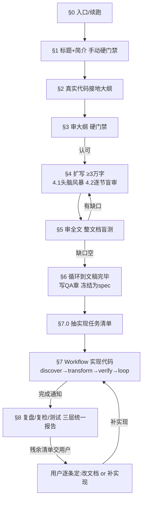

# arch-to-code — 架构文档到代码实现全周期

这个 skill 是你的核心依靠：从一份结合真实代码库的 ≥3万字架构文档，一路走到代码实现和验证。它分两半——前半（§0–§6）产出文档 spec，后半（§7–§8）按 spec 实现代码并复盘。两半之间靠 §7.0 的实现任务清单衔接，这是人读的文档和机器执行的 Workflow 之间的接口。

AI 写文档的通病（元数据框、碎标题、代码盘点、水文收尾、行文僵硬）在这里双倍危险：因为文档会驱动代码，文档里的 kind-switch、过度抽象、漂移都会原样长进实现。所以反 AI 味原则贯穿全程，并额外加代码实现期的新原则（不过度工程、冻结基线防漂移、机械门是真相、验证用新眼睛）。

## 核心立场

设计文档是给人读的论证，文档里的设计会驱动代码。下面是硬约束，凌驾于任何继承来的文档规范之上。

`_shared/markdown.md` 是通用技术文档格式规范，本 skill 范围内**显式暂停**几条 AI 味源头：§9 文档头元数据块（文档直接从用户给的 `# 标题` 开始）、§8.1 bullet 优先于段落（论证要散文）。但 §1.2"尽量多分小标题"**强化**：3万字骨架必须够细，每个一级节拆二级、复杂到三级，扁平一级大纲不收。§10.1.1"每个 ## 必配 mermaid"暂停——但流程、状态机、数据流、时序、模块关系这类要**主动多画**，只别画一句话能说清的线性废图。**3万字必超 20 节，故覆盖 §9"无 TOC"**：必须有目录和交叉引用索引，§4 维护、§5 校验。其余规则继续遵守：不要数据堆砌、不要 filler 表格、不要展望/运维/署名收尾。

具体到本文档，必须做到：

### 1.1 无元数据（§1 门禁双倍）
文档直接从用户的 `# 标题` 开始，第一段是用户给的简介。日期、分支、状态真要就放文末变更记录或随文一句，别堆开头仪式感框。

### 1.2 代码不盘点但代码引用更中心
本文档就是关于真实代码库的，所以代码引用比一般文档更核心——但仍不"代码现状盘点"式逐函数堆砌。每条引用服务当前论点，给出真实符号（文件/函数/类），不证明"我读过代码"。

### 1.3 先想统一抽象，再分类
架构文档要找到统一抽象。把本质上同一件事拆成多个并列概念、各起名各列表，是致命错。先问"几类是不是同一抽象的不同形态"，是就用一个抽象贯穿，各类是参数化。

### 1.4 不要声明式类型标签（双倍：文档驱动代码）
文档里一个 `kind` 字段让引擎 switch，会原样长进实现。行为由实际产出或已有配置字段涌现，别靠类型戳。区别在谁在 switch：kind 是引擎分支的外挂戳，语义字段（`closed=true`）是消费者读的状态数据。

### 1.5 散文优先，分点克制（3万字适配）
能用句子讲清的事别拆 bullet。3万字下部分节合理用表格、契约清单，但论证仍散文优先，别让 3万字变成 bullet 墙。一段里出现"第一/第二/第三"就该是列表；列表项是一句以上说明的，项间空一行。

### 1.6 行文要活
句子长短交替，有判断、转折、省略、态度。不要"这一节我们将讨论"导语，直接给结论。每句话要么推进论点要么给落地线索，否则删。

### 1.7 结尾写给人看
不要"现状与展望""关键参考""发布检查"filler 收尾。固定结尾只有 QA 章（1.12）和实现任务清单附录（§7.0），其余一概不要。

### 1.8 禁用 AI 套话
「在当今……的背景下」「随着……的发展」「值得一提的是」「综上所述」「赋能/助力/打造」一律不进文档；英文 *in today's … landscape*、*it's worth noting that*、*delve into*、*robust*、*seamless*、*leverage* 也禁。这些词出现的地方往往没真东西——删掉逼出具体内容。

### 1.9 指代必须落到锚点（3万字下强化）
3万字下"前面那条""上一版"必丢锚点。每个指代让零上下文读者能定位到节号/文件/符号。判据：把指代换成"???"，那句话还读得通就说明锚点没给。§5 强制校验交叉引用全解析。

### 1.10 写充分，不写水（这条正当化 3万字）
宁可详尽别蜻蜓点水。通用抽象、现有机制具体不够在哪、新机制来龙去脉、关键取舍、失败路径、边界，都要展开讲透。这条和 3万字下限互为表里：3万字靠实质撑，不是注水。删掉某段后读者缺一块理解就留，不缺就删——和长短无关。

### 1.11 能并行就并行
§2 探代码、§4 写小节、§7 实现单元、§8 验证，彼此独立就 fan-out subagent 加速。但 §1/§3/§6 用户门禁串行——共创的串行性是反 AI 味的根，不能并行掉。盲测的零上下文要求每问独立新 subagent 不复用。

### 1.12 最后一节固定 QA
文档最后一节是 QA：可能出问题的、模糊的、特殊的场景列成问答，每条给明确处置。问题三来源：起草时记的"读者可能会问"、§5 盲测的"假设已知/卡在哪"、边界和失败路径。这些 QA 条目成为 §8 的测试种子。没真问题少几条别凑数。

### 1.13 方案要选最完整、最长期、最洋葱的（双倍：架构质量传播进实现）
文档给出的方案不是"能跑就行"快补，是最完整、最不拖泥带水、最长期、最洋葱的。硬判据（并列，按 1.5 用列表）：

- 最高内聚、最低耦合——单元只干一件事，通过接口而非具体实现通信。能复用就复用、能持有就持有，别造接口包已有东西。同一逻辑多处各写一遍的收进专门单元。
- 洋葱架构——依赖只向内，圆心是稳定业务本质，DB/框架/SDK 推外层，业务规则不 import 基础设施。跨层靠依赖倒置：内层拥有抽象接口、外层提供实现（这跟"别造接口包已有东西"不矛盾，区分是内层本质抽象接口要、为包已有加的 wrapper 不要）。
- 开闭原则——新逻辑通过扩展实现，不修改稳定代码；同抽象不同形态参数化而非并列几套。继承能用就用，但继承是最紧耦合：变化方向一致才继承、独立的优先组合。
- 内容驱动、别 switch——行为由产出/已有字段涌现，别靠类型字段让引擎 if-else（呼应 1.4）。减 if-else 是表象，根因是把动态行为硬塞进静态声明。
- 不要混在一起——组装和调用分开（构造在内、执行在外），别让单元既构造又执行、既拼装又发送。

这些也是评审口径：回读方案按这几条自检——哪层该内层却 import 外层？哪个并列分支其实是同抽象参数？哪个 if-else 能换内容驱动？哪个单元既构造又执行？

### 1.14 代码实现期新原则
文档审核完毕进实现后，额外几条：

- 不过度工程——Workflow 只实现 spec 说的，不镀金。Workflow 总"缺一点"，别用过度构建补。
- 冻结基线防漂移——Workflow 每轮重注入冻结文档+任务清单，不得偏离。目标漂移是长程实现头号失败模式。
- 机械门是真相——tsc/test 全绿是硬信号，agent 自报"我实现了"不算收敛。
- 验证用新零上下文眼睛——§8 不用 Workflow 自己的 verify agent（会 rubber-stamp），用全新 subagent。

## 工作流

八步加两个补的衔接（§0 入口、§7.0 任务清单）：对齐标题 → 真实代码接地大纲 → 审大纲 → 扩写 3万字（头脑风暴+逐节盲审）→ 审全文 → 循环到文稿完毕 → 抽实现任务清单+Workflow 实现代码 → 复盘复检测试。前半产出 spec，后半实现+验证，§7.0 是接口。

**图 1 — 全周期：前半产 spec，后半实现+验证，§7.0 是接口**

### §0 入口/续跑（步骤1之前）
先检查 `docs/` 是否已有同主题文档和 `docs/{doc}.impl-tasks.*`。有半成品就从最近完成的门禁续跑——续跑时识别已有标题+简介，不重复要。没动过则进 §1。

### §1 标题+简介：手动硬门禁（你的步骤1）
**硬规则：AI 绝不生成标题。** 用户必须用自己的话给出标题 + 1-3 句简介——这是整个 skill 的锚，AI 写的标题抓不住重点。未给则不产出任何东西，先用 methodology 的多问少答帮用户**自己**想出措辞（"受益者/决策者是谁？成功标准是什么？"），但最终标题+简介文字必须是用户的。给齐后冻结为文档首行，后续每步都要追溯回它。这条是 1.1 的最强表达——文档从用户标题开始，不是 AI 前言。

### §2 结合真实代码扩标题成多级大纲（你的步骤2）
读真实代码库：`git ls-files` 看形状、grep 标题里的领域词、Read 关键模块、画实际架构（入口/数据流/模块边界）。**并行 Agent subagent** 探索独立子系统，但大纲综合是和用户串行。**接地标准**：每节一句话主旨点名一个真实符号（文件/函数/类）。"设计一个通用抽象"不点名抽象什么 → 不接地打回。**关键区分**：每节标"现有代码（读者上下文）"vs"新增/改动（§7 实现目标）"——这对 §7 承重。多级：每 L1 拆 L2，复杂到 L3，扁平不收。

### §3 审大纲：扩写前硬门禁（你的步骤3）
多级大纲交用户，改到认可才进 §4。"直接写"不算过。宁可大纲层改三遍，别写完几节发现骨架错了推倒重来。收敛：用户说认可，或连续两轮无结构改动。

### §4 扩写至 ≥3万字（你的步骤4）
**规模管理（和 write-design-doc 关键差异）：写到文件 `docs/{doc}.md` 增量累积，不把 3万字留在上下文**——留在上下文会降质且可能截断，文件是单一真相源，§5/§6 从盘读回。每节走轻量循环：

1. **4.1 头脑风暴**：列 2-3 个角度/讲法+一句取舍，推荐一个。
2. 写（散文，局部编辑进文件，别每次重吐整篇）。
3. **4.2 逐节盲审**：零上下文 subagent 只拿本节草稿+一个问题（"这节哪段能回答 Q？"），不给对话历史/其他节。提示模板见 `references/blind-review-prompts.md`。
4. 按反馈修，复杂节重盲审。

**并行**：大纲认可后，独立小节并行起 subagent 各写一节（各喂冻结标题+大纲+本节真实符号+反 AI 原则）；有依赖的串行。**负载控制**：只盲审复杂/机制节，不盲审每节（借 write-blog top 问题裁剪），告诉用户哪些节测了。**≥3万是下限不是目标**：靠实质撑到 3万，不注水；3万字以上 + 无薄节才过。

### §5 审全文（你的步骤5）
从盘读回全文，整文档盲测（零上下文 subagent 拿全文+问题）。整文档才查得出来的：交叉引用解析（1.9，"前面那条"必须落节号/符号）、统一抽象跨节一致（1.3）、无重复、TOC+交叉引用索引校验、架构自检（1.13）。收敛：横扫缺口空 + 每问文中可定位，和 write-design-doc §2.3 同判据，靠"事实"不靠"答得对不对"。

### §6 循环到文稿审核完毕（你的步骤6）
修 §5 缺口→重审，收敛于用户信号。最多 3 轮，之后残余缺口进 QA 或交用户。**写 QA 章**（1.12）作固定结尾——QA 条目成 §8 测试种子。文稿审核完毕即冻结为 spec，进 §7。

### §7 动态 Workflow：按 spec 实现代码，直到弄完（你的步骤7）
分 §7.0（主对话）和 §7.1（Workflow 脚本）。

**§7.0 抽实现任务清单（补的结构洞#1）**：文档是散文，Workflow 要结构化单元。主对话（串行、判断重，不进 Workflow）把冻结文档拆成 `docs/{doc}.impl-tasks.md`，每单元含：`unit / title / spec_excerpt（实现的文档锚 §）/ files（真实路径）/ symbols / desired_behavior / acceptance（尽量映射某 QA 条目）/ dependsOn / overlap`。这是冻结基线，Workflow 不得偏离。判据：每单元能独立实现、有验收、依赖和重叠标清。

**§7.1 Workflow 脚本**（`references/workflow-script.js` 模板，主对话填占位符后用 Workflow 工具启动，后台跑、返回 task id、完成通知）：

- **discover**：一个 agent 读 spec+任务清单+当前代码，把每单元映射到真实符号。
- **transform**：按 `dependsOn` 拓扑排序成分波，波内按文件 overlap 分组——重叠串行、不重叠 `parallel`。**不用 worktree 隔离做多波写入**：worktree 语义是"unchanged 自动清理"、不保证合回主分支，跨波 agent 会看不到上一波结果，`dependsOn` 在机械上失效。改为所有写入落主工作区同一文件树，靠 overlap 分组把共享文件的单元串行防并发写冲突。
- **verify**：(a) **机械门是硬真相**——`tsc --noEmit` 和 test 用 `agent()` 跑 Bash 回报 pass/fail（脚本本身无 Bash 权限）；agent 自报不算。(b) spec-vs-impl gap：reviewer agent 把每单元分类 implemented/partial/missing，带证据（file:line）。
- **loop**：`done = 无残余 gap AND 机械门全绿`，受 `MAX_ROUNDS` 和 `budget.remaining` 上限；**收敛判据用循环回写后的最新门值，不是首次 verify 的陈旧值**。预算耗尽仍有缺口→返回 `done=false`+残余清单，不静默卡死。每轮重注入冻结基线防漂移。
- **完成通知后**：主对话拿脚本返回的 `{done, remaining, tscOk, testOk, rounds}` 进 §8。

启动：主对话从实际项目填占位符（`{doc}`、门命令、MAX_ROUNDS、budget），调 Workflow 工具，存 task id，告诉用户"实现后台跑，完成我汇报"。

### §8 复盘/复检/测试（你的步骤8）
长 Workflow 总留缺口（"总是缺一点"）。三层，最后合成**一份统一验证报告**、单一残余清单：

1. **spec-vs-impl 盲审（技能内核）**：全新零上下文 subagent（不用 Workflow 自己的 verify agent，会 rubber-stamp）拿 spec+实际 diff/文件，分类每单元，用 code-review 的并行+0-100 置信度+<80 过滤。提示模板见 `references/blind-review-prompts.md`。这是这技能独特价值——sibling skill 没文档当 spec。
2. **复盘（元审查）**：Workflow 跳了什么、是否偏离冻结基线（实现 spec 没说的）、有没有引入 kind-switch/过度工程/违反 1.13。
3. **实际测试（委托 sibling）**：跑应用观察 → 委托 `verify` skill；diff 找 bug → 委托 `code-review` skill。技能自己不重造。

**"缺一点"有具体形状**（补的结构洞#3）：partial 单元 / 门红 / QA 边界未处理代码 / 基线漂移。§8 汇成统一报告，交用户逐条定：改文档（req-amend 式）还是补实现（回 §7 定向一轮）。绝不静默让文档和实现漂移——impl 合理偏离（spec 本就错）时由用户裁决。

## 反模式

反模式用独立编号 A1–A6，不和工作流 §0–§8、原则 1.x 撞号。

### A1 被催着用 AI 生成标题（对应工作流 §1）
标题必须用户手给。AI 写的标题抓不住重点，是整个 skill 失败的起点。被"直接写""快点"架着也别替用户写标题——多问少答帮用户自己想。

### A2 大纲不接地（对应工作流 §2）
大纲节不点名真实符号、靠"设计一个通用抽象"这种空话。本文档关于真实代码库，每节必须落到真实文件/函数/类。

### A3 把 3万字留在上下文（对应工作流 §4）
不写到文件增量累积，试图在对话里堆 3万字——会降质、截断、且 §5/§6 无法从盘读回。文件是单一真相源。

### A4 Workflow 不冻结基线（对应工作流 §7）
不每轮重注入冻结文档+任务清单，让实现漂移到 spec 之外。目标漂移是长程实现头号失败模式。

### A5 机械门当软指标 / 收敛判据用陈旧门值（对应工作流 §7）
两层错：信 agent 自报"已实现"不跑 tsc/test；或循环重跑门后没把最新值回写，收敛判据用了首次 verify 的陈旧值——会假阴性甚至假阳性（门红了报全绿）。机械门是真相，且收敛必须用最新门值。

### A6 用 Workflow 自己的 verify agent 当最终验证（对应工作流 §8）
复用有上下文的 agent 会 rubber-stamp。最终验证必须用全新零上下文 subagent。