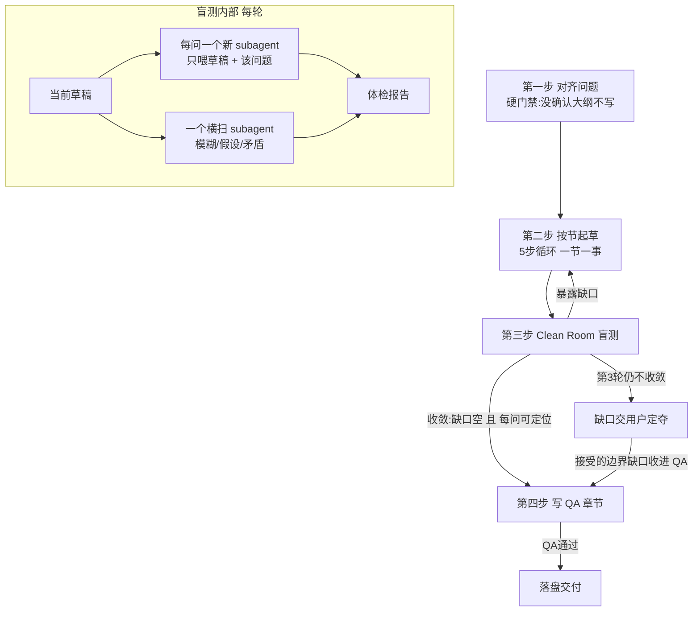

# write-design-doc — 技术设计文档共创

这个 skill 存在的理由只有一条：AI 写出来的设计文档都一个味儿。顶部塞个版本元数据块，通篇被切成分点和碎标题，单列一节把读过的源码逐函数转述一遍，动不动"这一节我们将讨论……"，最后两三节变成"现状与展望""关键参考""发布检查清单"这种没人想看的东西，行文僵硬，套话连篇。本 skill 的全部设计，就是让产出的设计文档**读起来像一个人写的**。

做到这件事靠的不是更细的格式规则，而是四段式共创工作流：动笔前先对齐"到底解决什么问题"，按节起草并套用一组设计纪律，用一个**完全没参与过这个项目的全新读者**来盲测文档到底能不能看懂，最后把模糊与边界场景列成 QA 章节收尾。工作流借鉴了 superpower 头脑风暴的"没确认设计前不动笔"门禁，以及 Anthropic doc-coauthoring 的逐节共创和读者盲测两套做法——但下面只讲可执行的规则，不靠你认识这两个名字。这个 skill 产出的是设计论证文档（问题 → 机制 → 取舍），不是可发表的文章；要把方案写成博客发出去，用 write-blog。

## 1. 核心立场

设计文档是给人读的论证，不是给系统填的字段。下面 1.1–1.13 是对一切产出的硬约束，凌驾于任何继承来的文档规范之上。

`_shared/markdown.md` 是通用技术文档的格式规范，里面有几条恰恰是 AI 味的源头，在本 skill 范围内**显式暂停**。同时暂停 §9 的文档头元数据块、§8.1 的"bullet 优先于段落"——它示范的"好 bullet"是短词流式（`A → B → C` 一串），正是 AI 味的提纲式分点；本 skill 改用 §1.5 的**块状化散文**（论证式完整句 bullet）替代，不是不点 bullet，是不要碎片 bullet。但 §1.2"尽量多分小标题"这条**不暂停，反而强化**——设计文档骨架要够细：每个一级节下必须拆出二级子节，复杂机制可到三级（`1.1.1`）。宁可拆细让读者按图索骥，也别一级扁平把一堆东西塞一节里——扁平大纲是 AI 味的重灾区。唯一别碎过头的是一句话的事：一个子节如果撑不起一段正文，就别单独立标题，并回父节。§10.1.1 那条"每个 `##` 必配一张 mermaid"也要暂停——但理由不是不画图，而是不**强制每节**配：设计文档里流程、状态机、数据流、时序、模块关系这类，画出来通常比文字清楚，要**主动多画**；唯一别画的是一句话能说清的线性废图。其余规则继续遵守：不要数据堆砌、不要 filler 表格、不要展望/运维/署名收尾。这份基线若运行环境取不到，就按本篇已列的硬约束走，格式细节自由。

### 1.1 无元数据

文档直接从 `# 标题` 开始，第一段就进正题。日期、分支、状态如果真有必要，放在文末"变更记录"或随文一句话带过，不要堆成开头的仪式感框。

### 1.2 代码不盘点

不要单列一节（"现有机制盘点""代码现状"）把读过的源码逐条罗列：`xxx.py 里有个函数 foo，它做了 bar`。这种盘点对读者没有信息增量——读者要看的是你的设计，不是你读过哪些代码。代码引用应当随文 inline，在讲某个设计决策需要落地线索时一句话带出，比如"复用已有的 streaming 通道（`executor._inject_urls` 注入 events_out_url）"。判断标准：这句引用是为支撑当前论点服务的，还是只在证明"我读过代码"？后者删掉。

### 1.3 先想统一抽象，再分类

这是最容易犯、也最致命的错：把本质上同一件事的东西拆成多个并列概念，然后给每个单独起名、列表、画表。写之前先问：这些"几类"是不是同一个东西的不同形态？如果是，用一个统一抽象贯穿全文，各类是它的参数化，不是并列枚举。反面信号：写完发现"这一类和那一类其实差不多，只是数量不同"——说明它们不该是两类，是同一类的参数。

### 1.4 不要声明式类型标签

不要靠"在配置里声明一个 `kind` 字段，引擎按 kind switch 行为"来设计。这是把动态行为硬塞进静态声明，和"内容驱动"背道而驰。行为应当由实际产出（内容）或已有配置字段涌现：一个产出多种形态的接口，产出几条就是转换、对部分输入给占位就是过滤，都不用声明 kind。区别在**谁在 switch**：kind 是引擎拿它做分支的外挂戳，语义字段（如 `closed=true`、`dropped=true`）是消费者读它判断状态的数据本身。非要在事件层区分类型，用语义字段，不用类型戳。

### 1.5 块状化散文：列表外壳的论证

正文默认是**块状化散文**——每个自然段是一个 bullet（一个信息块），bullet 里装一段完整论证。不是一大坨散文糊在那儿让读者自己切结构，也不是 AI 味的短词提纲 bullet，而是"列表外壳的论证散文"：bullet 给边界，论证给内容。标题给地图，bullet 给踩点，两层结构同时存在。目的是可扫读——几万字的长文不块状化，读者会在中间丢位置。

- 每个 bullet 是完整论点，不是碎片。不要"提高效率 / 降低成本 / 优化流程"这种没信息量的提纲；每个 bullet 要能独立成立、承担一段论证。把几个 bullet 连起来读如果只是把一句话切成了几片，那就合成一个 bullet——块状化是给信息块加边界，不是把一块论证肢解。

- 段内有并列就下钻子 bullet。一个 bullet 里出现并列对象、且读者要逐项理解时，拆成子 bullet——尤其被"如下 / 包括 / 分成 / 有几类 / 这些信息是 / 这几个问题"引出的，必须下钻。只是短语并列作为句子一部分的，可以保留在行内。判断标准：一段里用"第一 / 第二 / 第三""一方面 / 另一方面""其一 / 其二"硬连的并列项，本就该是子 bullet——别用散文包着列表假装流畅。

- 连贯论证写成一个 bullet，不要切碎。一段有因果、转折、推进的论证整体装进一个 bullet，别为了"多分点"切成几个碎片 bullet 破坏连贯。这跟上一条不矛盾：并列项要拆，但同一条论证链不要拆。

列表格式：每个 bullet 是一个完整想法，不是把一句话切成几片。`_shared/markdown.md` §2.2 默认列表项之间不空行——本 skill 改成：每项只有短词时不空行；每项是一句以上的完整说明时，项与项之间空一行隔开，别让几个并列项粘成一坨。有顺序的步骤用有序列表，并列的用无序列表。

### 1.6 行文要活

句子长短交替，别每句都一个句式。可以有判断、有转折、有省略、甚至一点态度。不要"这一节我们将讨论……"这种导语，直接给结论；不要把同一个观点换三种说法重复；每句话要么推进论点，要么给出落地线索，否则删。

### 1.7 结尾写给人看

不要"现状与展望""未来规划""关键参考""发布后检查"这类 filler 收尾。内容讲完就停，最后一段应该是正文的一部分，不是签收。注意这跟 1.12 的 QA 环节不冲突——QA 是实质内容（边界、模糊场景的取舍），不是 filler；唯一固定的收尾章节就是 QA，其余展望/参考/检查清单一概不要。

### 1.8 禁用 AI 套话

「在当今……的背景下」「随着……的发展」「值得一提的是」「综上所述」「不仅……而且」「深入探讨」「赋能/助力/打造」一律不进文档；英文里的 *in today's … landscape*、*it's worth noting that*、*delve into*、*in conclusion*、*robust*、*seamless*、*leverage* 也禁。这些词出现的地方，往往就是没有真东西可说的地方——删掉它们，逼自己写出具体内容。

### 1.9 指代必须落到具体锚点

文档里每个指代都要让零上下文读者能定位——"上一版"是哪一版？什么文件、什么版本号、什么时候改的？"现有机制"是代码里哪个函数、哪个模块？"前面提到的那条"是第几节哪条？写的人脑里自带上下文，知道"上一版"指上周那稿，读者不知道。这种悬空指代比套话更隐蔽：套话是空词，悬空指代是有信息但锚点丢了，读者读到就卡住。判断标准：把指代换成"???"，如果那句话变成"??? 能不能起作用的关键"还读得通，说明锚点没给——补上具体名称、版本、节号或链接，或者重写成不依赖那个指代。

### 1.10 写充分，不写水

设计文档宁可详尽，别蜻蜓点水给结论。通用抽象、现有机制具体不够在哪、新机制的来龙去脉、关键取舍、失败路径、边界情况——都要展开讲透，让读者不用回头追问就能跑通。这条和"分点克制""挑 slop"不冲突：slop 删的是**不承担信息**的凑数段落，不是"长"；这里要的是**每段都承担信息**的详尽，不是堆篇幅。判断标准：删掉某段后读者会缺一块理解吗？缺就留，不缺就删——和长短无关。

### 1.11 能并行就并行加速

只要工作彼此独立，就用 subagent fan-out 加速，别串行磨。起草阶段，多个不互相依赖的小节可以并行起 subagent 各写一节；盲测本就是多 subagent 并行跑问题。但有**两处不能为了快而破坏**：第一步对齐必须和用户串行、一次一个问题聊清楚——共创的串行性是反 AI 味的根，不能并行掉；盲测的零上下文要求每问一个独立新 subagent、不复用——独立性是盲测的命，不能为了省调用而合并。加速只用在可独立的工作上，别动这两处。

### 1.12 最后一节固定是 QA

文档最后一节必须是 QA——把可能出问题的、模糊的、特殊的场景列成问答。这一节是实质内容，不是 filler：每条问都得是一个真实会让读者/实现者卡住或踩坑的场景，答要给明确处置（走 chat 级还是话题级、回退到哪个默认、算 bug 还是已知边界）。

怎么攒这些问题：别凭空想，三个来源凑——起草时遇到的"这块读者可能会问"先记下来；2.3 盲测里 clean-room 读者报的"假设了读者已知什么""卡在哪"直接转化成 QA 条目；边界和失败路径（如 1.3 那类"同一抽象的不同形态"的极端输入）单列一条。每条问答要能独立看懂，别依赖前文某个具体例子的上下文（呼应 1.9——QA 里的指代也得落到锚点）。

QA 不是收尾客套，别写"还有什么疑问欢迎讨论"这种空话。没真问题就少几条，别凑数；但通常一个认真写的设计文档，攒得出 5 到 8 条真问题。

### 1.13 方案要选最完整、最长期、最洋葱的那一个

设计文档给出的方案，不是"能跑就行"的快补，而是最完整、最不拖泥带水、最长期、最洋葱的那一个。下面是一组硬判据，每条都要在方案里站得住——它们是并列项，按 1.5 该用列表，就别糊成散文假装流畅：

- 最高内聚、最低耦合——每个单元只干一件事，单元之间只通过接口而非具体实现通信。能复用就复用、能持有就持有，别造新接口去包一个已有的东西（以创造接口为耻，以复用现有为荣）。同一逻辑在多个入口各写一遍的，收进专门单元统一承担。

- 洋葱架构——依赖只向内：圆心是稳定的业务本质，DB、框架、第三方 SDK 这些会变的细节推到外层，业务规则不 import 基础设施。跨层协作靠依赖倒置：**内层拥有抽象接口、外层提供实现**——这跟上一条"别造接口包已有东西"不矛盾，区分在于这个接口是内层业务本质的抽象（要），不是为包一个已有实现而加的 wrapper（不要）。

- 开闭原则——新逻辑通过扩展实现，不修改已有稳定代码；同一抽象的不同形态参数化掉，而不是并列写几套各管各的（呼应 1.3）。继承能复用就用，但注意继承是最紧的耦合：变化方向一致的用继承，变化方向独立的优先组合而非继承。

- 内容驱动、别 switch——行为由实际产出或已有配置字段涌现，别靠声明一个类型字段让引擎 if-else 分支（呼应 1.4）。减少 if-else 是表象，根因是把动态行为硬塞进静态声明——同一件事的不同形态该是参数化，不是 switch case。

- 不要混在一起——组装和调用分开（构造在内、执行在外），别让一个单元既构造又执行、既拼装又发送；职责该收进专门单元统一承担的，别让每个调用方各写一遍回调。

这些判据也是评审口径：盲测和 QA 之外，回读方案时按这几条自检——哪层该是内层却 import 了外层？哪个并列分支其实是同一抽象的参数？哪个 if-else 能换成内容驱动？哪个单元既构造又执行？这是自检不是写完打勾的 checkbox（呼应 §3 反模式）。

## 2. 工作流

四步：对齐问题 → 按节起草 → Clean Room 盲测 → 写 QA 章节。盲测暴露缺口就回第二步改、再测，反复到盲测干净为止——是回环不是走一遍（3 轮还干净不了就把剩余缺口交用户定夺，见 2.3）。盲测收敛后才写 QA，QA 通过即落盘交付。下面这张图就是"主动多画 mermaid、只不画废图"的示范——回环、判据、两个出口、盲测内部双 subagent 并行，散在文字里读着累，画出来一眼。

**图 1 — 四步回环，盲测不净就回 2.2 改，QA 通过才落盘**

### 2.1 第一步：对齐问题（动笔前的硬门禁）

这是最重要、也最容易被跳过的一步。**用户没确认"解决什么问题"和大纲之前，禁止起草正文**——哪怕源材料看起来很完整、哪怕用户说"直接写"，也要先过这一步，因为"直接写"往往是 AI 味的入口。"不能跳"不等于"永远问下去"：门内做完就该放行进第二步，那叫完成 2.1，不叫跳过。

先看一眼源材料是哪一种：是已经想清楚的设计思路（接近原样组织成文），还是粗糙的素材（需要把问题本身先挖出来）。一眼能分辨就按分辨的走，拿不准就直接问用户，不要替用户下判断。

然后一次只问一个问题——一条消息只推进一个未知点，别一次抛五个；优先给选择题，一次摆两三个选项让人挑不算抛多个。设计文档的核心是"解决什么问题"，在动笔写机制之前，必须把这三件事问透：

这个场景的通用抽象是什么？不是只解决眼前这一例，而是这一类问题。为什么现有机制不够？具体不够在哪，不是笼统地说"不够灵活"。新设计和现有机制是什么关系——扩展（在旧机制上加能力）、替代（整个换掉）还是并存（新旧各管一摊）？这三点没想透，写出来的机制就是空中楼阁，逻辑过不了。

什么时候算问透、可以停了？标志是用户开始主动提边界——"那如果 X 失败呢""并发时会怎样"——而不是一直由你追问基础概念。用户一旦主动问出取舍和边界，上下文就够进 2.2 了。这个标志靠执行者自评，为了防自我欺骗加个上限：连续 8 个问题都是你在问、用户还没主动碰过边界，就别再挖，把已问到的整理成大纲交用户拍板。

问透后，**先单独交付一份纯大纲再展开正文**：把整篇的节标题（平实主题词）连同每节一句话主旨列出来，当成独立产物交用户聊——结构对不对、每节该讲什么、有没有缺的或多余的节，都在这层敲定。大纲全部认可后，才进 2.2 逐节展开正文。这步是硬门禁的一部分：宁可在大纲层来回改三遍，也别写完几节发现骨架错了推倒重来。

大纲**必须给到多级**：每个一级节下都要拆出二级子节（`1.1` `1.2` …），复杂机制可到三级（`1.1.1`）。一份只有一级 `0/1/2/3…` 平铺的大纲不收——扁平骨架是 AI 味重灾区，等于把一堆东西塞一节里没拆开。子节主题词要平实、能独立看懂，别只写"设计""落点"这种空壳。先列到二级给用户看，复杂节用户想细化再下钻第三级，不要一上来就铺满三层把大纲变成正文。给 2 到 3 个切入角度时，每个附一句取舍说明，推荐其中一个让用户选；角度定了再拉这版多级大纲。

### 2.2 第二步：按节起草

每节按这个轻量循环走，一次走完一节再下一节：

1. 问清楚这节要交付的那个观点（一节只讲一件事）。
2. 头脑风暴几个可选的讲法或取舍，列给用户。
3. 用户拍板保留哪些、删哪些、合并哪些，理由记下来当风格信号。
4. 落笔写出来（块状化散文，见 §1.5：每个自然段一个论证式 bullet，段内并列下钻子 bullet，不要提纲式短词 bullet），用局部编辑写进文档，不要每次重吐整篇。
5. 写完简短问一句方向对不对，按反馈改。

循环 1–5 反复，直到这节可以收口。收口以用户信号为准：用户说"这节够了"，或连续两次反馈都没碰这节的结论和结构，就别再磨。此时主动问一句"这节能不能删掉点什么"——默认倾向删，不是加。判断有没有实质改动：加论点、改结构、删一节、换关键例子算实质；只调措辞、改标点、挪语序不算。

起草时套用上面的"核心立场"。设计纪律分两层盯：写作层——文中并列的"几类"是不是同一个抽象的不同形态？有没有引入 `kind` 之类的声明式类型标签、能不能改成内容/语义字段驱动？架构层（呼应 1.13）——方案是不是最完整、最长期、最洋葱的那个？依赖向内了吗、能复用/继承/持有的是否硬造了新接口、有没有该参数化却写成并列分支、有没有 if-else 能换成内容驱动、有没有把构造和执行混在一处？这两层是设计文档最容易翻车的地方，写完一节就自检一遍。**加速**：大纲敲定后，彼此不依赖的小节可以并行起 subagent 各写一节（呼应 1.11），但每节写完仍要回到主循环走第 5 步问方向、套设计纪律自检——并行只省时间，不省共创和质量门。

写满八成左右（八成的节写完，不是字数），回读全文，专门挑"slop"——AI 圈黑话，指那种读着通顺、但不承担信息的凑数段落：有没有哪段是凑数的、哪句不承担信息、哪两节在说同一件事。挑出来删。注意这跟 1.10 要的"写充分"不矛盾：删的是不承担信息的，承担信息的详尽段落一个字都不动。

### 2.3 第三步：Clean Room 盲测（读者体检）

这一环最容易被当成走过场省掉，也正是它最值钱的地方。开发者写完总觉得"挺清楚的了"，因为脑子里自带全局上下文。要打破这个错觉，用一个**完全没参与过这个项目的全新读者**来盲测。

做法：先预测 5 到 8 个"一个新读者想用这篇设计文档时会真实问的问题"——比如"为什么不用现成的 X？""这个 token 哪来的？""失败时怎么回滚？"。然后对每个问题，**起一个全新的 subagent**（用 Agent 工具），**只喂给它当前这版草稿 + 这一个问题**，不给任何对话历史、不给源材料、不给背景。让它只回答一件事：这个问题在文中的哪一段能找到回答，还是根本找不到依据。

再起一个 clean-room subagent 做三项横扫：文中哪些地方对读者模糊不清、假设了读者已具备什么知识、有没有内部矛盾。问题 subagent 从"读者会问的场景"切入，横扫 subagent 从"段落本身"切入，两边撞见同一个缺口是正常的，去重即可——别指望两边井水不犯河水。

把盲测暴露的缺口汇总成体检报告，回第二步逐条修，修完重测。重测要重新起全新 subagent（复用就不是零上下文了），问题集每轮重新预测，上一轮能在文中定位到依据的不再问，找不到依据的保留到下一轮继续测。收敛判据是两条可观察的事实同时成立：横扫 subagent 本轮报告的缺口为空，且每个问题 subagent 都能在文中定位到回答的段落。靠"事实"判，不靠"答得对不对"——设计文档的开放问题没有标准答案，能判的只有"文中给没给依据"。设个成本上限：反复到收敛为止，但最多 3 轮；第 3 轮缺口仍不空，就把剩余缺口列给用户决定补还是接受，不要无限磨。

盲测绝不是走过场，它比任何词表都更能揪出"写的人以为自己讲清楚了、其实没有"的地方。不能图省事用当前会话的记忆假装测过。

### 2.4 第四步：写 QA 章节

盲测收敛后、落盘前，写最后一节 QA（呼应 1.12）。这节放在盲测之后是有意的——但要分清盲测缺口的去路（见 §3.4）：能靠补正文解决的（模糊、缺依据、矛盾）已经在 2.3 收敛时补掉了，进 QA 的只剩**属边界、取舍、已知限制**那类——它们不该改正文，而是收成显式问答让读者知情。加上起草时记下的"读者可能会问"和失败路径，攒成 5 到 8 条真问题。

每条 QA 自检：问是不是一个真实会卡住/踩坑的场景？答给了明确处置还是绕弯？能不能独立看懂、不依赖前文某个具体例子（呼应 1.9）？答不上的，回到 2.2 把正文补透，别用"这是一个已知限制"糊弄。QA 通过即落盘交付。

## 3. 反模式

### 3.1 被催着跳过对齐

被"直接写"或"快点"架着跳过 2.1。门禁松动的时刻几乎都是用户催、或源材料看着完整时——顶住，门禁不为快让路。

### 3.2 盲测偷懒成自己考自己

最危险的不是省略盲测，而是复用当前会话的记忆、或上一轮的 subagent 来答盲测问题——这制造了"已验证"的假象，比不测还坏。

### 3.3 把核心立场当清单照填

那几条是写作时要内化的判断，不是写完逐条打勾的 checkbox——照着勾一遍出来的还是 AI 味文档。1.13 末尾的"按这几条自检"是回读时的自检，不是写完打勾。

### 3.4 把盲测缺口一股脑塞进 QA

盲测暴露的缺口要分两类去路：能靠补正文解决的（模糊、缺依据、内部矛盾），回 2.2 补掉，**这才计入收敛**；属边界、取舍、已知限制的（引用不隔离、某根消息归类瑕疵这类），收进 QA 当显式问答。别把所有缺口都甩进 QA 假装处理完了——能补的补掉，只剩真正"读者会问的边界"进 QA。
